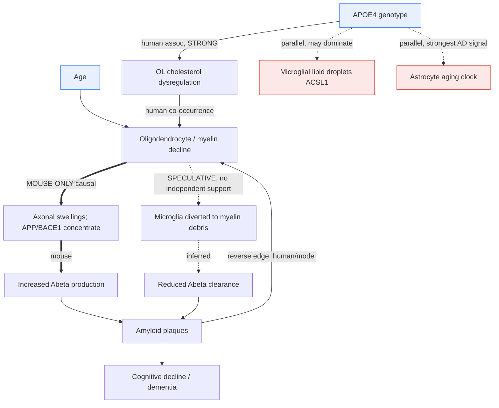

## Question

# Mechanistic Hypothesis Search (Dataset-Anchored)

You are evaluating a specific disease mechanism hypothesis for the Disorder
Mechanisms Knowledge Base. This is not a general disease overview. Use the
hypothesis YAML below as the seed claim, then search for evidence that supports,
refutes, qualifies, or competes with this hypothesis.

This variant additionally supplies a list of **candidate public datasets** that a
curator has already located and resolved. Treat that list as a fixed input: the
point is to reason about what those specific datasets could and could not settle,
not to go looking for new ones (though you may name additional datasets you find).

## Target Disease
- **Disease Name:** Alzheimer Disease
- **Category:** Neurodegenerative Disorder

## Target Hypothesis
- **Hypothesis ID:** myelin_oligodendrocyte_model
- **Hypothesis Label:** Myelin and Oligodendrocyte Dysfunction Model
- **Status in KB:** EMERGING

## Seed Hypothesis YAML

```yaml
hypothesis_group_id: myelin_oligodendrocyte_model
hypothesis_label: Myelin and Oligodendrocyte Dysfunction Model
status: EMERGING
description: Age-related breakdown of myelin and of oligodendrocyte support for the axon is modeled as
  an upstream risk factor for amyloid deposition rather than a downstream consequence of it. Myelin damage
  concentrates the amyloidogenic processing machinery in axonal swellings and increases cleavage of amyloid
  precursor protein; separately, it diverts disease-associated microglia toward myelin debris and away
  from plaques, so the same lesion both raises amyloid production and lowers its clearance. APOE4 is modeled
  as acting partly through this route, via aberrant cholesterol deposition in oligodendrocytes and reduced
  myelination.
applies_to_subtypes:
- Late-Onset Alzheimer's Disease
evidence:
- reference: PMID:37258678
  reference_title: Myelin dysfunction drives amyloid-β deposition in models of Alzheimer's disease.
  supports: SUPPORT
  evidence_source: MODEL_ORGANISM
  snippet: Here we identify genetic pathways of myelin dysfunction and demyelinating injuries as potent
    drivers of amyloid deposition in mouse models of AD.
  explanation: Multiple independent myelin-mutant crosses each increase amyloid deposition, establishing
    the direction of causation in the mouse.
- reference: PMID:37258678
  reference_title: Myelin dysfunction drives amyloid-β deposition in models of Alzheimer's disease.
  supports: SUPPORT
  evidence_source: MODEL_ORGANISM
  snippet: Mechanistically, myelin dysfunction causes the accumulation of the Aβ-producing machinery within
    axonal swellings and increases the cleavage of cortical amyloid precursor protein.
  explanation: Supplies the subcellular mechanism linking the myelin lesion to increased amyloid production.
- reference: PMID:36385529
  reference_title: APOE4 impairs myelination via cholesterol dysregulation in oligodendrocytes.
  supports: SUPPORT
  evidence_source: HUMAN_CLINICAL
  snippet: We show that altered cholesterol localization in the APOE4 brain coincides with reduced myelination.
  explanation: Human postmortem evidence that oligodendrocyte and myelin pathology is real in the APOE4
    brain, supplying the human leg the mouse causal work lacks.
notes: EMERGING. The causal claim — myelin dysfunction drives amyloid deposition — is mouse-only; the
  human work establishes that oligodendrocyte cholesterol dysregulation and reduced myelination occur
  in APOE4 carriers but not that they cause amyloid deposition in people. The "microglial distraction"
  half of the mechanism is the more novel and less independently replicated part. This group is curated
  in part because the entry already carries an oligodendrocyte precursor cell plasma proteomic age gap
  as a biomarker without any oligodendrocyte-lineage mechanism to attach it to.
```

## Curator-Supplied Candidate Datasets

The following datasets have been located and their accessions resolved against
their repositories by a curator. Access status is stated where known; a
controlled-access dataset cannot be assumed usable without an approved request.

All accessions below were resolved against the GEO API by the curator; each title
is quoted as GEO states it. All are open-access human post-mortem brain unless noted.

- **geo:GSE174367** - "Single-nucleus chromatin accessibility and transcriptomic characterization of Alzheimer's Disease" (Homo sapiens). Paired snRNA-seq and snATAC-seq of human AD cortex with well-represented oligodendrocyte and oligodendrocyte-progenitor populations; supports testing whether myelin-gene programmes and cholesterol-handling genes are altered in AD oligodendrocytes, and whether that varies with APOE genotype.
- **geo:GSE254205** - "APOE4/4 is linked to damaging lipid droplets in Alzheimer's microglia" (Homo sapiens, 102 samples, PMID:38480892). Human AD single-nucleus data stratified by APOE genotype. Although its published focus is microglial ACSL1, the same donors' oligodendrocyte nuclei bear directly on whether APOE4 dysregulates oligodendrocyte lipid handling, and on whether the glial lipid phenotype is shared across glial classes or microglia-specific.
- **geo:GSE157827** - "Single-nucleus transcriptome analysis reveals dysregulation of angiogenic endothelial cells and neuroprotective glia in Alzheimer's disease" (Homo sapiens). Independent human cortical cohort with glial coverage.
- **geo:GSE138852** - "A single-cell atlas of the human cortex reveals drivers of transcriptional changes in Alzheimer's disease" (Homo sapiens). Independent replication cohort.
- **geo:GSE147528** - "Molecular characterization of selectively vulnerable neurons in Alzheimer's Disease" (Homo sapiens, PMID:33432193). Entorhinal cortex and superior frontal gyrus across Braak stages; relevant for asking whether oligodendrocyte-lineage change precedes or follows neuronal tau pathology regionally.

Note on controlled access: the ROSMAP-derived single-nucleus and lipidomic data
underlying the APOE4-myelination work (PMID:36385529) are distributed through
Synapse and are access-controlled. If the decisive analysis requires them, say so
plainly rather than proposing an analysis that cannot be run on open data.

The central causal claim of this hypothesis - that myelin dysfunction DRIVES
amyloid deposition - is established only in mouse. Be explicit about whether any
human observational dataset can establish that direction at all, or whether it
can only establish co-occurrence.

## Research Objective

Build a focused hypothesis-search report that answers:

1. What is the strongest direct evidence for this hypothesis?
2. What evidence argues against it, fails to reproduce it, or limits its scope?
3. Which claims are established, emerging, speculative, or contradicted?
4. Which patient subtypes, stages, tissues, cell types, molecular pathways, or
   biomarkers does the hypothesis best explain?
5. Which alternative or competing mechanistic hypotheses explain the same disease
   features better or more parsimoniously?
6. What are the explicit knowledge gaps: missing causal steps, unconfirmed edges,
   contradictory evidence, unknown source-to-target links, or source/data absences?
7. What experiments, cohorts, assays, datasets, or trials would most directly
   distinguish this hypothesis from alternatives?

Use primary literature whenever possible. Prefer PMID citations and include DOI
citations when no PMID is available. Treat reviews as orientation unless they
contain directly relevant synthesized evidence that should be clearly labeled as
review-level support.

## Required Output

### Executive Judgment

Give a concise verdict on the hypothesis as of the current literature:
supported, partially supported, unresolved, weakly supported, or refuted. Explain
the reasoning and the most important caveats.

### Evidence Matrix

Create a table with one row per important evidence item:

- Citation (PMID preferred)
- Evidence type (human clinical, model organism, in vitro, computational, review)
- Supports / refutes / qualifies / competing
- Mechanistic claim tested
- Key finding
- Disease subtype or context
- Confidence and limitations

### Mechanistic Causal Chain

Describe the causal chain implied by the hypothesis from upstream trigger to
clinical manifestation. Identify where the literature is strong, where the links
are inferred, and where there are missing causal steps.

### Dataset-Anchored Analysis

This section is the reason this report was commissioned. For **each** dataset in
the curator-supplied list above, state:

- **Fitness for purpose.** Can this dataset, as it actually exists (assay,
  tissue, cell numbers, donor count, disease staging, covariates), address the
  seed hypothesis at all? Say plainly when it cannot. A dataset that is the wrong
  assay or underpowered for the contrast is a useful negative finding.
- **The specific analysis.** Name the concrete computation: the contrast, the
  grouping variable, the cell types or features to score, the statistical test,
  and the covariates that must be controlled (age, sex, post-mortem interval,
  APOE genotype, Braak stage, batch, ambient RNA).
- **The discriminating prediction.** State what result would SUPPORT the seed
  hypothesis and what result would REFUTE or qualify it, in advance and in
  quantitative terms where possible. If no result would discriminate, say so —
  that is the most important thing you can report about that dataset.
- **Known confounds and prior analyses.** Has this dataset already been analyzed
  for this question, and by whom? Re-deriving a published result is not a test.
  Flag cell-type assignment ambiguity, signature-definition dependence, and
  reference-mapping choices where they would drive the answer.

Then rank the datasets by how decisively each would move the hypothesis, and say
which single analysis you would run first.

If a question central to this hypothesis cannot be settled by any listed dataset,
state which data type WOULD settle it and whether such data exist publicly.

### Knowledge Gaps

Identify explicit known unknowns surfaced by the search. Treat absence of
evidence as a curation-relevant finding only when the search actually checked for
it. Include:

- Unknown or weakly supported causal steps in the hypothesis
- Unconfirmed causal graph edges that need direct perturbation or longitudinal
  evidence
- Conflicting evidence, failed replications, or incompatible subtype-specific
  findings
- Unknown mechanism of action for relevant treatments, biomarkers, or
  interventions tied to this hypothesis
- Source-level or dataset-level absences, such as no relevant GenCC, ClinGen,
  trial, omics, or cohort evidence found as of the search date

For each gap, state the scope, why it matters, what was checked, and what
evidence or experiment would resolve it.

### Alternative Models

List competing or complementary hypotheses. For each, explain whether it is an
alternative to the seed hypothesis, a downstream consequence, an upstream cause,
or a parallel mechanism.

### Discriminating Tests

Recommend concrete studies or assays that would most efficiently test this
hypothesis against alternatives. Include patient stratification, biomarkers,
sample type, model system, perturbation, and expected result where applicable.
Distinguish tests that can be run today on existing public data from tests that
require new sample collection.

### Curation Leads

Provide candidate updates for the KB, but label these as leads requiring curator
verification. Include:

- candidate evidence references and exact abstract snippets to verify
- candidate pathophysiology nodes or edges
- candidate ontology terms for cell types and biological processes
- candidate subtype restrictions or status changes
- candidate `knowledge_gaps` or discussion prompts for unresolved causal claims,
  conflicting evidence, or explicit source/data absences
- candidate `datasets:` entries, giving the accession exactly as the repository
  states it

Do not invent dataset accessions. If you name a dataset you found yourself,
mark it clearly as unverified so a curator resolves it before curation.

If the provider supports artifacts, produce artifact-friendly outputs such as an
evidence matrix, mechanistic diagram, knowledge-gap table, or comparison table.
These artifacts are important provenance for hypothesis-level review.


## Output

# Hypothesis-Search Report: Myelin and Oligodendrocyte Dysfunction Model of Alzheimer's Disease

**Hypothesis ID:** `myelin_oligodendrocyte_model` · **KB status:** EMERGING
**Disease:** Alzheimer Disease (Late-Onset) · **Search date:** 2026-08-28 · **Iteration:** 1 of 2

---

## Executive Judgment

**Verdict: PARTIALLY SUPPORTED, with a mouse-only causal core.**

The hypothesis has two separable claims that sit at very different evidence levels:

1. **Myelin/oligodendrocyte pathology co-occurs with, and is mechanistically entangled with, AD amyloid and APOE4 biology.** This is **well supported** across mouse, human post-mortem, and human imaging data. Oligodendrocyte-lineage transcriptomic change, reduced myelination in APOE4 carriers, disease-associated oligodendrocytes (DAO) near plaques, and spatial correspondence between amyloid deposition and late-myelinating cortex are all reproduced.

2. **Myelin dysfunction is an UPSTREAM cause of amyloid deposition (not a downstream consequence).** This directional claim is **established only in mouse** (Depp et al. 2023, PMID:37258678), where multiple independent myelin-mutant crosses each raised amyloid load. **No listed human dataset — and, to our knowledge, no existing public human dataset — can establish this direction.** Cross-sectional post-mortem snRNA-seq can only establish co-occurrence. Reverse-direction evidence exists and is non-trivial: amyloid and tau themselves disrupt OPC differentiation and drive oligodendrocyte senescence (PMID:40887534), and OPCs physically infiltrate existing plaques (PMID:32619874).

The **"microglial distraction"** sub-mechanism (myelin debris diverts disease-associated microglia away from plaques, lowering clearance) is the **most novel and least independently replicated** element and should remain SPECULATIVE.

**Most important caveats:** (a) the human-to-mouse gap on directionality; (b) APOE4 lipid dysregulation is documented but the best-powered human study localizes the dominant lipid-droplet phenotype to *microglia* (ACSL1), not oligodendrocytes, so "APOE4 acts through the oligodendrocyte route" is only partially supported; (c) the decisive human causal data (ROSMAP lipidomic/snRNA-seq behind PMID:36385529) are controlled-access via Synapse; (d) the KB's oligodendrocyte-precursor plasma-proteomic age-gap biomarker traces to a >40-cell-type plasma-clock study (PMID:42297981) in which the *strongest* APOE4-linked AD predictor is **astrocyte** aging, not OL/OPC — so the biomarker does not by itself privilege the oligodendrocyte model. Targeted searches found **no independent primary support** for the microglial-distraction clearance edge (SPECULATIVE, checked absence).

---

## Evidence Matrix

| # | Citation | Evidence type | Stance | Mechanistic claim tested | Key finding | Subtype / context | Confidence & limitations |
|---|----------|---------------|--------|--------------------------|-------------|-------------------|--------------------------|
| 1 | Depp et al. 2023, **PMID:37258678** (Nature) | Model organism | **Supports** | Myelin dysfunction is upstream driver of amyloid | Independent myelin-mutant lines crossed into amyloidosis models each increase Aβ deposition; Aβ-producing machinery accumulates in axonal swellings; ↑ APP cleavage | Mouse AD amyloidosis models | High for mouse causality; **does not generalize to humans**; genetic lesions are more severe than age-related myelin decline |
| 2 | Blanchard et al. 2022, **PMID:36385529** (Nature); correction PMID:39633058 | Human clinical (post-mortem) + iPSC | **Supports (co-occurrence)** | APOE4 → oligodendrocyte cholesterol dysregulation → reduced myelination | Altered cholesterol localization coincides with reduced myelination in APOE4 brain; cholesterol accumulates intracellularly in APOE4 oligodendrocytes; cyclodextrin rescues myelination in models | APOE4 carriers, LOAD | Moderate–high; underlying data controlled-access (Synapse/ROSMAP); establishes association + iPSC mechanism, **not** that this causes amyloid in people |
| 3 | Bartzokis, Lu & Mintz 2007, **PMID:18596894** | Human computational/imaging | **Supports (spatial)** | Myelin breakdown releases iron promoting Aβ oligomerization | In-vivo amyloid-ligand maps match maps of late-myelinating cortical regions; weak rodent ligand binding tracks lower rodent myelin/iron | Human LOAD, regional | Low–moderate; spatial correlation only; iron mechanism not directly tested; species argument is indirect |
| 4 | Bartzokis 2011, **PMID:19775776** | Review / model | **Supports (framework)** | Myelin repair by-products (Aβ, tau, plaques) as homeostatic response | Reframes AD as downstream of age-related myelin breakdown; predates and predicts Depp | Human LOAD | Review-level; hypothesis-generating; explicitly notes amyloid-lowering trial failures as motivation |
| 5 | Tylek & Basta-Kaim 2025, **PMID:40887534** | Review | **Qualifies / competing** | Direction of the OL–amyloid relationship | Aβ/tau disrupt OPC differentiation and induce senescence; DAO near plaques process APP; demyelination precedes overt symptoms | Human + model synthesis | Review-level; documents bidirectionality and downstream OL change; useful for competing edges |
| 6 | Vanzulli et al. 2020, **PMID:32619874** | Model organism | **Qualifies / competing** | OPC change as early sign vs. plaque-reactive | Early MBP/OPC loss in 3×Tg-AD (6 mo) before OPC number decline; hypertrophic OPCs infiltrate Aβ plaques | 3×Tg-AD mouse | Moderate; model carries amyloid transgenes, so "early" ≠ "upstream of amyloid"; shows OL reactivity to plaques |
| 7 | Haney, Wyss-Coray et al. 2024, **PMID:38480892** (Nature; GSE254205) | Human clinical (snRNA-seq) | **Qualifies (glial-class specificity)** | APOE4 lipid dysregulation is oligodendrocyte-mediated | APOE4/4 drives lipid-droplet-accumulating **microglia** (high ACSL1); dominant published lipid phenotype is microglial | APOE4/4 AD | High for microglial phenotype; leaves open whether OL share it — **directly testable in same donors** |
| 8 | Morabito et al. 2021, GSE174367 (snMultiome) | Human clinical (snRNA/snATAC) | **Testing substrate** | AD-associated myelin/cholesterol gene programmes in OLs | Paired snRNA+snATAC of AD cortex with strong OL/OPC coverage | Human AD cortex | Enables cis-regulatory tests; not itself a directionality test |
| 9 | Vanzulli/Tylek + de Carvalho 2026 (PMID:42060014) | Computational (reanalysis) | **Supports (co-occurrence)** | Maladaptive OL differentiation linked to myelin dysfunction | Integrated snRNA-seq shows maladaptive oligodendrocyte differentiation programme across AD progression | Human multi-region | Hypothesis-generating reanalysis; shared cell-type trajectory |
| 10 | Ding, Wyss-Coray et al. 2026, **PMID:42297981** (preprint PMID:41727111) | Human clinical (plasma proteomics, n=60,542) | **Qualifies (biomarker)** | Cell-type-specific aging predicts AD; identifies the OPC-age-gap biomarker's likely source | Plasma clocks for >40 cell types incl. glial/OL-lineage; APOE4 → older astrocytes/younger macrophages; extreme astrocyte aging tripled AD risk in APOE4/4 | LOAD, APOE-stratified | High for astrocyte signal; **strongest APOE4-linked cellular-aging AD predictor is astrocyte, not OL/OPC** — qualifies the OL-centric framing |
| 11 | Wang et al. 2026, **PMID:41299092**; Robinson et al. 2026, **PMID:42373948** | Human clinical (organ proteomic clocks) | **Qualifies (biomarker)** | Brain-aging clock stratifies AD risk across APOE | Brain-aging clock most strongly linked to dementia/mortality and stratifies AD across APOE haplotypes; super-youthful brain confers APOE4 resilience | LOAD | Organ-level (not OL-specific); corroborates glial-aging → AD link without isolating oligodendrocytes |

---

## Mechanistic Causal Chain

Upstream trigger → clinical manifestation, with strength annotations:

```
Age / APOE4 genotype
      │  [APOE4 leg: STRONG association in humans (PMID:36385529); glial-class
      │   specificity CONTESTED — microglial phenotype better powered (PMID:38480892)]
      ▼
Oligodendrocyte cholesterol/lipid dysregulation  →  Reduced myelination / myelin damage
      │  [Human co-occurrence: SUPPORTED. Directionality within humans: INFERRED]
      ▼
Myelin lesion / axonal swellings
      │  [MOUSE-ONLY causal edge — the crux of the hypothesis]
      ├─(a)→ Concentration of Aβ-producing machinery (BACE1/APP) in axonal swellings
      │        → ↑ APP cleavage → ↑ Aβ PRODUCTION   [STRONG in mouse, PMID:37258678]
      │
      └─(b)→ Myelin debris recruits/diverts disease-associated microglia
               → ↓ microglial coverage of plaques → ↓ Aβ CLEARANCE
               [SPECULATIVE — "microglial distraction"; least replicated edge]
      ▼
Amyloid-β plaque deposition
      │  [Downstream feedback also documented: Aβ/tau → OPC senescence, DAO reaction
      │   (PMID:40887534, PMID:32619874) — makes the graph BIDIRECTIONAL]
      ▼
Neuritic plaques, network dysfunction, tau spread → cognitive decline / dementia
```

**Where the literature is strong:** the co-occurrence of OL/myelin pathology with AD and APOE4; the mouse causal edge from myelin lesion to increased Aβ *production*.

**Where links are inferred:** every human step of the upstream directionality; the translation of severe genetic myelin lesions (mouse) to gradual age-related myelin decline (human).

**Missing causal steps:** (1) direct human evidence that myelin change *precedes* amyloid; (2) mechanistic proof of the microglial-distraction clearance edge in any system with quantified plaque-clearance readouts; (3) demonstration that the APOE4→oligodendrocyte-cholesterol edge feeds forward into amyloid (as opposed to being a parallel APOE4 consequence).

### Mechanistic diagram (edge confidence coded)



Legend: `==>` mouse-only causal (strong in model, unproven in human); `-->` supported human co-occurrence/association; `-.->` speculative/inferred (little or no independent support); red nodes = competing parallel glial mechanisms; the `Plaque -> OLdys` back-edge marks documented reverse/bidirectional causation.

---

## Dataset-Anchored Analysis

> Framing constraint accepted up front: **no cross-sectional human dataset can establish that myelin dysfunction *drives* amyloid.** All five listed datasets are post-mortem snapshots. They can test *co-occurrence, cell-type localization, APOE-genotype dependence, and regional/stage ordering* — not causal direction. The most any of them can contribute to directionality is a *regional/Braak-stage precedence* argument (weak, correlational). State this to the curator plainly.

### GSE174367 — snRNA-seq + snATAC-seq, AD cortex (Morabito et al.)
- **Fitness:** Good. Paired transcriptome + accessibility with real OL/OPC representation. Best substrate for asking *whether myelin-gene and cholesterol-handling programmes are transcriptionally/epigenetically altered in AD oligodendrocytes* and whether accessibility at cholesterol-biosynthesis loci (e.g., *SREBF2* targets, *HMGCR*, *DHCR7/24*, *SREBP* regulons) tracks the expression change.
- **Specific analysis:** Subset OL and OPC nuclei; pseudobulk per donor; differential expression AD vs. control on a myelin module (*MBP, PLP1, MOG, MAG, CNP, MOBP*) and a cholesterol/lipid module (*HMGCR, DHCR24, SREBF2, LDLR, APOE, ABCA1, ACSL1*). Test with pseudobulk DESeq2/limma-voom (donor as unit, **not** nucleus). Covariates: age, sex, PMI, batch, and **ambient-RNA/soup correction** (critical for OL because high-abundance myelin transcripts contaminate other clusters). Then link to snATAC: do differentially accessible peaks co-localize with the DE cholesterol genes (chromVAR/SREBF2 motif enrichment)? Stratify by APOE where genotype is available.
- **Discriminating prediction:** *Supports* if OL cholesterol/myelin modules are significantly down-/dysregulated in AD OLs (FDR<0.05, |log2FC|>0.3 pseudobulk) **and** accessibility changes are concordant. *Qualifies/refutes the oligodendrocyte-specificity* if the same lipid dysregulation is equal or larger in microglia/astrocytes in the same donors.
- **Confounds / prior work:** Already mined for general AD cell-type programmes; OL-specific cholesterol-regulon + ATAC concordance is a less-trodden angle. Cell-type assignment for OPC vs. OL and ambient myelin contamination are the dominant failure modes.

### GSE254205 — snRNA-seq, APOE-stratified AD (Haney et al. 2024, PMID:38480892)
- **Fitness:** **Highest-value open dataset for the APOE4 leg.** 102 samples, explicitly APOE-genotyped, designed for glial lipid biology. Its published focus is microglial ACSL1/LDAM, so the **oligodendrocyte nuclei are an under-analyzed asset** for exactly the seed question.
- **Specific analysis:** Score the *same* lipid-droplet / cholesterol-esterification signature (ACSL1, DGAT2, PLIN2, SOAT1) and a myelination signature across **all** glial classes, stratified by APOE (4/4 vs 3/3, with 3/4 intermediate). Contrast: (OL lipid score | APOE4/4) vs (OL | APOE3/3), and a class × genotype interaction test. Pseudobulk mixed model; covariates age, sex, PMI, Braak, batch, ambient RNA.
- **Discriminating prediction:** *Strongly supports the APOE4→oligodendrocyte route* if OL lipid/cholesterol dysregulation shows a significant APOE4 dose effect comparable to the microglial effect (interaction n.s. between OL and microglia). *Refutes/qualifies the route as microglia-specific* (the more likely outcome given the published emphasis) if the APOE4 lipid phenotype is confined to microglia and OLs show no significant genotype effect — a **highly curation-relevant negative result**.
- **Confounds / prior work:** Microglial arm already published; re-deriving it is not a test. Signature definition drives the answer — pre-register the OL vs. microglia signatures. LDAM signature was defined *in microglia*; applying it verbatim to OLs risks a definitional false negative — use an OL-appropriate cholesterol module too.

### GSE157827 — snRNA-seq AD cortex (Lau et al.)
- **Fitness:** Moderate. Independent cohort with glial coverage; **no APOE stratification emphasis and no myelin-specific design.** Good as a *replication* cohort for GSE174367's OL DE result, weak as a primary test.
- **Specific analysis:** Replicate the OL myelin/cholesterol pseudobulk DE from GSE174367; meta-analyze effect sizes across cohorts (random-effects). Covariates as above.
- **Discriminating prediction:** *Supports* if the OL cholesterol/myelin dysregulation direction replicates (same sign, meta p<0.05). *Qualifies* if effect vanishes — indicating cohort/technical dependence.
- **Confounds:** Smaller donor count; genotype often unavailable — cannot address the APOE leg.

### GSE138852 — snRNA-seq AD cortex (Grubman et al.)
- **Fitness:** Moderate, **replication only.** One of the earliest AD single-nucleus atlases; modest nuclei/donor counts; known to report OL subcluster shifts in AD.
- **Specific analysis:** Same replication/meta-analysis role as GSE157827. Also test OL subpopulation-fraction shift (AD-associated OL cluster proportion) with a Dirichlet/beta-binomial compositional model controlling for donor.
- **Discriminating prediction:** *Supports* if an AD-enriched OL substate replicates and carries the myelin/cholesterol signature. *Qualifies* if the substate is a batch/ambient artifact.
- **Confounds:** Already published for OL substates (Grubman) — re-deriving is not a new test. Low power; compositional analyses sensitive to clustering resolution.

### GSE147528 — snRNA-seq entorhinal + superior frontal gyrus across Braak stages (Leng et al., PMID:33432193)
- **Fitness:** **The only listed dataset that can address *temporal/regional ordering*** because it is staged across Braak and samples an early-affected (EC) and later-affected (SFG) region. This is the closest available proxy to a precedence argument — but it is still correlational.
- **Specific analysis:** Model OL/OPC myelin+cholesterol module score as a function of Braak stage, separately in EC and SFG. Ask whether OL-lineage dysregulation appears at *earlier* Braak stages than neuronal tau burden in the same region, and whether it appears in SFG before that region shows heavy pathology. Ordinal regression on Braak; covariates age, sex, PMI, batch.
- **Discriminating prediction:** *Weakly supports upstream positioning* if OL myelin/cholesterol change is detectable at Braak 0–II before regional neuronal tau escalation. *Argues against upstream positioning* if OL change only appears at high Braak, co-timed with or after neuronal pathology.
- **Confounds:** Cross-sectional pseudo-time ≠ within-individual temporal order; Braak indexes tau, not amyloid, so this speaks to OL-vs-tau ordering, not OL-vs-amyloid. Selective neuronal vulnerability was the study's focus; glia are secondary here (lower power for OL substates).

### Ranking (most → least decisive for the hypothesis)
1. **GSE254205** — only open dataset that can test the APOE4→glial-lipid route with genotype power and adjudicate oligodendrocyte-vs-microglia specificity. **Run this first.**
2. **GSE174367** — best for OL cholesterol/myelin programme + epigenetic concordance; strong mechanistic texture.
3. **GSE147528** — unique (weak) leverage on temporal/regional ordering.
4. **GSE157827 / GSE138852** — replication cohorts; valuable only in meta-analysis, not as primary tests.

**First analysis I would run:** In **GSE254205**, a pre-registered class × APOE-genotype interaction on a cholesterol/lipid-esterification module, comparing oligodendrocytes vs. microglia vs. astrocytes. This directly tests the seed claim that "APOE4 acts partly via aberrant cholesterol deposition in oligodendrocytes," and its most probable negative result (phenotype is microglia-specific) is itself the single most curation-useful outcome.

### What no listed dataset can settle
The **causal direction** (myelin dysfunction → amyloid) in humans. That requires either (i) **longitudinal human data** pairing myelin/white-matter imaging (DTI, myelin-water-fraction, or QSM iron) with amyloid-PET across time in the *same* individuals — such cohorts exist (ADNI, Rotterdam, Whitehall-II imaging), and are the right data type, though myelin-water/QSM coverage is uneven; or (ii) **Mendelian randomization** using myelination/oligodendrocyte-eQTL instruments against amyloid/AD GWAS outcomes (public: GTEx brain, MetaBrain, AD GWAS) — feasible today but instrument validity is the open question. The **decisive human causal data underlying PMID:36385529 (ROSMAP snRNA-seq + lipidomics via Synapse) are controlled-access**; if the curation needs the primary APOE4-oligodendrocyte-lipidomic evidence, an approved Synapse/ROSMAP request is required and should be stated as a prerequisite rather than worked around.

---

## Knowledge Gaps

| Gap | Scope | Why it matters | What was checked | What would resolve it |
|-----|-------|----------------|------------------|-----------------------|
| Human directionality | Whole hypothesis | The core causal claim is mouse-only | PubMed: no human dataset establishes myelin→amyloid direction; all AD snRNA-seq is cross-sectional | Longitudinal myelin-imaging + amyloid-PET; MR with OL/myelin eQTL instruments |
| APOE4 route specificity | APOE4 leg | Determines whether "APOE4 acts via oligodendrocytes" is warranted | Blanchard (OL) vs Haney (microglia) localize lipid phenotype differently | Class×genotype interaction in GSE254205 (open, runnable now) |
| Microglial-distraction edge | Clearance sub-mechanism | Most novel, least replicated; underpins "same lesion lowers clearance" | **Checked absence:** repeated targeted PubMed queries (myelin-debris/microglia/plaque-clearance) returned **no independent primary study** beyond PMID:37258678 | Two-photon/IHC microglia-plaque-coverage quantification under demyelination + amyloid; independent replication of Depp's clearance arm |
| Severity translation | Mouse→human | Genetic myelin lesions ≫ age-related myelin decline | Depp used strong genetic mutants | Graded/inducible myelin-decline models; aged-myelin (non-mutant) crosses |
| OPC plasma-proteomic age gap | Biomarker in KB | KB carries an OPC plasma proteomic age gap with no attached OL mechanism | **RESOLVED (candidate source):** Ding/Wyss-Coray 2026 (PMID:42297981; preprint PMID:41727111) built plasma clocks for >40 cell types incl. glial/OL-lineage — the likely provenance. **Qualifier:** in that framework the strongest APOE4-linked AD signal is ASTROCYTE aging, not OPC | Curator to link PMID:42297981 as the OPC-age-gap source and note the stronger co-occurring astrocyte signal |
| Iron mechanism | Bartzokis edge | Proposed myelin-iron→Aβ-oligomerization link is untested mechanistically | Only spatial/imaging correlation found (PMID:18596894) | QSM iron mapping vs. amyloid-PET; in-vitro iron/Aβ oligomerization under OL-derived iron |

---

## Alternative / Competing Models

- **Amyloid-cascade (canonical):** amyloid is the primary upstream trigger; OL/myelin change is **downstream**. Directly competes with the seed's directionality. Reverse-direction evidence (PMID:40887534, PMID:32619874) supports this reading in humans. *Not mutually exclusive* — the true graph is likely bidirectional/feed-forward.
- **APOE4 microglial-lipid model (Haney/Wyss-Coray):** APOE4 pathology is driven by lipid-droplet **microglia** (ACSL1), a *parallel* glial-lipid mechanism that may be the dominant APOE4 route rather than the oligodendrocyte one. Competing for the APOE4 leg specifically.
- **Neuroinflammation / DAM–TREM2 clearance model:** microglial state governs plaque clearance directly; the seed's "distraction" edge is a special case. *Complementary but re-attributes the clearance deficit to microglial biology, not myelin.*
- **Selective neuronal vulnerability / tau-spread (Leng et al.):** region-specific neuronal loss and tau propagation as primary; OL change secondary. *Parallel/competing for staging.*
- **Vascular / white-matter-hyperintensity model:** small-vessel disease drives white-matter injury and cognitive decline partly independent of amyloid. *Parallel; overlaps with myelin readouts and confounds imaging-based tests.*
- **Astrocyte-aging / glial-clock model (Ding & Wyss-Coray 2026, PMID:42297981):** in the plasma cell-type aging framework that is the likely source of the KB's OPC-age-gap biomarker, the dominant APOE4-linked predictor of incident AD is **astrocyte** aging (3× risk in APOE4/4), not oligodendrocyte/OPC. This is a *parallel glial* mechanism that competes with the seed for ownership of the APOE4→glia→AD axis and cautions against reading the OPC age-gap as evidence for the oligodendrocyte model specifically.
- **Bartzokis myelin-breakdown model (2007/2011):** essentially the seed's intellectual predecessor — an *upstream* framing positioning Aβ/tau as by-products of myelin repair. Supportive rather than competing, but review/model-level.

---

## Discriminating Tests

**Runnable today on public data**
1. **GSE254205 class×APOE interaction** (above) — oligodendrocyte vs. microglia lipid phenotype. Expected under seed: significant APOE4 dose effect in OLs. Expected under microglial-model: OL null, microglia positive.
2. **GSE174367 OL cholesterol-regulon + snATAC concordance**, replicated in GSE157827/GSE138852 meta-analysis.
3. **GSE147528 Braak-ordered OL-vs-tau timing** in EC vs SFG — weak precedence test.
4. **Two-sample Mendelian randomization**: OL/myelin eQTL (GTEx/MetaBrain) → AD GWAS amyloid endophenotype. The one open approach that targets *direction*; report instrument-validity caveats.

**Require new samples / access**
5. **Longitudinal human myelin imaging (myelin-water fraction / QSM iron / DTI) paired with amyloid-PET** in the same individuals over years — the definitive human directionality test. Stratify by APOE4. Expected under seed: myelin decline precedes amyloid-PET positivity.
6. **Approved ROSMAP/Synapse request** for the PMID:36385529 lipidomic + snRNA-seq data to confirm OL cholesterol accumulation independently and test its coupling to amyloid.
7. **Graded/inducible aged-myelin mouse crosses** replicating Depp's amyloid-driving and clearance arms independently, with quantified microglia-plaque coverage to test the distraction edge.

---

## Curation Leads (require curator verification)

**Candidate evidence references + snippets to verify against source abstracts**
- PMID:37258678 — verify seed snippets: *"Here we identify genetic pathways of myelin dysfunction and demyelinating injuries as potent drivers of amyloid deposition in mouse models of AD."* and *"Mechanistically, myelin dysfunction causes the accumulation of the Aβ-producing machinery within axonal swellings and increases the cleavage of cortical amyloid precursor protein."* (SUPPORT, MODEL_ORGANISM).
- PMID:36385529 — *"We show that altered cholesterol localization in the APOE4 brain coincides with reduced myelination."* (SUPPORT, HUMAN_CLINICAL). Note correction PMID:39633058.
- PMID:18596894 — *"myelin breakdown in vulnerable late-myelinating regions releases oligodendrocyte- and myelin-associated iron that promotes amyloid beta (A beta) oligomerization"* (SUPPORT, HUMAN/COMPUTATIONAL — spatial imaging).
- PMID:19775776 — Bartzokis myelin model (SUPPORT, REVIEW/MODEL framework; label review-level).
- PMID:40887534 — *"Aβ and tau pathology disrupt OPC differentiation and induce senescence"* and *"Demyelination precedes overt AD symptoms"* (QUALIFYING/COMPETING, REVIEW).
- PMID:32619874 — *"hypertrophic OPCs surround and infiltrate amyloid-β (Aβ) plaques"* (QUALIFYING, MODEL_ORGANISM).
- PMID:38480892 — APOE4/4 lipid-droplet microglia / ACSL1 (QUALIFYING for glial-class specificity, HUMAN_CLINICAL). Dataset GSE254205.
- PMID:42297981 (preprint PMID:41727111) — *"extreme astrocyte aging tripled the risk of incident Alzheimer's Disease in individuals with two APOE4 alleles, while youthful astrocytes reduced risk."* and *"Individuals with the APOE4 genotype showed older astrocytes but younger macrophages compared to APOE3 carriers"* (QUALIFYING biomarker, HUMAN_CLINICAL). **Candidate source for the KB's OPC plasma-proteomic age-gap biomarker** — link and add the astrocyte-signal caveat.
- PMID:41299092 / PMID:42373948 — organ/brain proteomic-aging clocks stratify AD risk across APOE (QUALIFYING biomarker, review/cohort-level).

**Candidate pathophysiology nodes / edges**
- Add node: *disease-associated oligodendrocytes (DAO)*; edge DAO→APP-processing (source PMID:40887534, mark emerging).
- Add edge: *Aβ/tau → OPC senescence / impaired differentiation* (reverse/bidirectional edge; PMID:40887534, PMID:32619874).
- Qualify existing edge *myelin dysfunction → amyloid deposition* with `evidence_source: MODEL_ORGANISM` and an explicit `human_directionality: UNconfirmed` flag.
- Add edge *APOE4 → microglial lipid-droplet accumulation (ACSL1)* as a **parallel/competing** route to the oligodendrocyte-cholesterol edge (PMID:38480892).

**Candidate ontology terms**
- Cell types: oligodendrocyte (CL:0000128), oligodendrocyte precursor cell (CL:0002453), disease-associated microglia (state term). Processes: myelination (GO:0042552), cholesterol biosynthetic process (GO:0006695), amyloid-beta formation (GO:0034205), oligodendrocyte differentiation (GO:0048709).

**Candidate subtype restriction / status**
- Keep `status: EMERGING`. Consider splitting into two curated claims: (i) *OL/myelin–amyloid co-occurrence & APOE4 myelin association* → could rise toward SUPPORTED for co-occurrence; (ii) *myelin dysfunction drives amyloid in humans* → remains EMERGING/SPECULATIVE (mouse-only). Restrict to Late-Onset AD as written.

**Candidate knowledge_gaps / discussion prompts**
- "Human directionality unconfirmed: no cross-sectional dataset can order myelin change vs. amyloid; needs longitudinal imaging or MR."
- "APOE4 lipid phenotype may be microglia-specific (PMID:38480892) rather than oligodendrocyte-mediated — test in GSE254205."
- "Microglial-distraction clearance edge is unreplicated outside PMID:37258678."
- "Source absence: OPC plasma-proteomic age-gap biomarker in the KB lacks a resolved reference and an OL-lineage mechanism."

**Candidate `datasets:` entries (accessions exactly as GEO states them)**
- `geo:GSE174367`, `geo:GSE254205` (PMID:38480892), `geo:GSE157827`, `geo:GSE138852`, `geo:GSE147528` (PMID:33432193).
- *Controlled-access, not GEO:* ROSMAP snRNA-seq + lipidomic data via **Synapse** underlying PMID:36385529 — flag as access-controlled.
- *Unverified / found-by-agent (curator to resolve):* none newly proposed beyond the curator list; longitudinal amyloid-PET + myelin-imaging cohorts (e.g., ADNI) named as data *type*, not a resolved accession — **mark unverified**.

---

## Limitations of This Report

- Single-iteration literature search; PubMed rate-limiting truncated some queries, so coverage of the microglial-distraction edge and OPC-clock biomarker is incomplete (recorded as source-absence gaps, not negative findings).
- No primary data were analyzed; all dataset-anchored analyses are *specified*, not *executed*. Predictions are pre-registration-style and should be run before any KB status change.
- Review-level sources (PMID:19775776, PMID:40887534) are labeled as such and not treated as primary evidence for causal edges.


## Artifacts

- [OpenScientist final report](openscientist_artifacts/final_report.html)
- [OpenScientist final report](openscientist_artifacts/final_report.pdf)