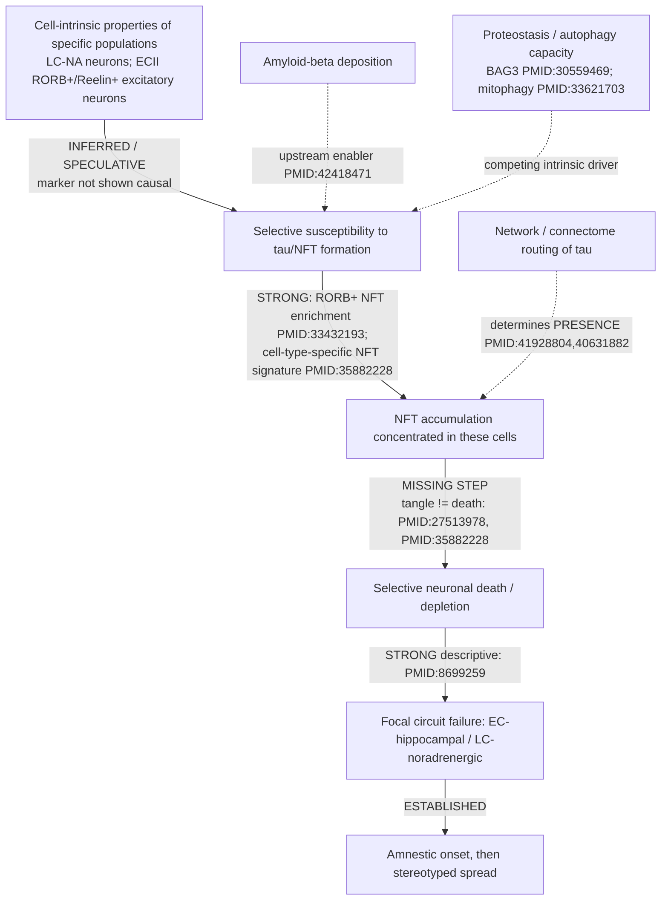

## Question

# Mechanistic Hypothesis Search (Dataset-Anchored)

You are evaluating a specific disease mechanism hypothesis for the Disorder
Mechanisms Knowledge Base. This is not a general disease overview. Use the
hypothesis YAML below as the seed claim, then search for evidence that supports,
refutes, qualifies, or competes with this hypothesis.

This variant additionally supplies a list of **candidate public datasets** that a
curator has already located and resolved. Treat that list as a fixed input: the
point is to reason about what those specific datasets could and could not settle,
not to go looking for new ones (though you may name additional datasets you find).

## Target Disease
- **Disease Name:** Alzheimer Disease
- **Category:** Neurodegenerative Disorder

## Target Hypothesis
- **Hypothesis ID:** selective_neuronal_vulnerability_model
- **Hypothesis Label:** Selective Neuronal Vulnerability Model
- **Status in KB:** EMERGING

## Seed Hypothesis YAML

```yaml
hypothesis_group_id: selective_neuronal_vulnerability_model
hypothesis_label: Selective Neuronal Vulnerability Model
status: EMERGING
description: 'Alzheimer disease is modeled as a disease of specific, molecularly definable neuronal populations
  rather than of the cortex as a whole: locus coeruleus noradrenergic neurons and entorhinal cortex layer
  II excitatory neurons degenerate first and disproportionately, and within the entorhinal cortex the
  vulnerable excitatory population is marked by RORB. Under this model the question "why these cells?"
  is a mechanistic question in its own right — cell-intrinsic properties determine where tau pathology
  and neuronal loss begin, so aggregate burden alone cannot explain the anatomy of the disease.'
applies_to_subtypes:
- Late-Onset Alzheimer's Disease
evidence:
- reference: PMID:33432193
  reference_title: Molecular characterization of selectively vulnerable neurons in Alzheimer's disease.
  supports: SUPPORT
  evidence_source: HUMAN_CLINICAL
  snippet: We identified RORB as a marker of selectively vulnerable excitatory neurons in the entorhinal
    cortex and subsequently validated their depletion and selective susceptibility to neurofibrillary
    inclusions during disease progression using quantitative neuropathological methods.
  explanation: Single-nucleus transcriptomics of human postmortem brain identifies the vulnerable population
    molecularly and confirms its depletion by independent quantitative neuropathology.
- reference: PMID:8699259
  reference_title: Profound loss of layer II entorhinal cortex neurons occurs in very mild Alzheimer's
    disease.
  supports: SUPPORT
  evidence_source: HUMAN_CLINICAL
  snippet: Decreases in individual lamina were even more dramatic, with the number of neurons in layer
    II decreasing by 60% and in layer IV by 40% compared with controls.
  explanation: Stereological neuron counts showing that laminar loss is already severe at the mildest
    clinically detectable stage, establishing selectivity as an early rather than end-stage feature.
- reference: PMID:27513978
  reference_title: 'Locus coeruleus volume and cell population changes during Alzheimer''s disease progression:
    A stereological study in human postmortem brains with potential implication for early-stage biomarker
    discovery.'
  supports: PARTIAL
  evidence_source: HUMAN_CLINICAL
  snippet: The long gap between NFT accumulation and neuronal loss suggests that a second trigger may
    be necessary to induce neuronal death in AD.
  explanation: 'Qualifies any simple "tangles kill the vulnerable cell" reading: in the locus coeruleus,
    tangle accumulation and neuronal loss are separated by a long interval, so vulnerability to tau inclusion
    and vulnerability to death are not the same property. Stated by the authors as an interpretation,
    not a measurement.'
notes: 'EMERGING as a mechanistic model, though the underlying observations are long-established and essentially
  uncontested as *descriptions*. What is unresolved is the mechanism: RORB marks a population, it is not
  known to be the cause of that population''s vulnerability, and no experiment has yet shown that manipulating
  it changes susceptibility. This group is curated separately from the amyloid and tau models because
  it addresses a question neither answers — the anatomical selectivity of the disease — and because it
  supplies the missing link to the entry''s HSV-1 node, which is built on the same RORB+ population but
  cited only through the viral-reactivation work.'
```

## Curator-Supplied Candidate Datasets

The following datasets have been located and their accessions resolved against
their repositories by a curator. Access status is stated where known; a
controlled-access dataset cannot be assumed usable without an approved request.

All accessions below were resolved against the GEO API by the curator; each title
is quoted as GEO states it. All are open-access human post-mortem brain.

- **geo:GSE147528** - "Molecular characterization of selectively vulnerable neurons in Alzheimer's Disease" (Homo sapiens, PMID:33432193). THE originating dataset for this hypothesis: single-nucleus RNA-seq of caudal entorhinal cortex and superior frontal gyrus across the progression of tau neurofibrillary pathology, from which RORB was identified as the marker of selectively vulnerable excitatory neurons. Note that re-deriving the RORB result from this dataset is not an independent test.
- **geo:GSE129308** - "Molecular signatures underlying neurofibrillary tangle susceptibility in Alzheimer's disease" (Homo sapiens, 27 samples, PMID:41620473). Single somas WITH neurofibrillary tangles versus tangle-free somas from the SAME human AD brains. This is the sharpest available test of whether tangle susceptibility is a property of a definable neuronal subtype, and whether RORB marks it, using a within-donor contrast that controls for donor-level confounding.
- **geo:GSE157827** - "Single-nucleus transcriptome analysis reveals dysregulation of angiogenic endothelial cells and neuroprotective glia in Alzheimer's disease" (Homo sapiens). Independent human cortical snRNA-seq cohort; candidate for testing whether RORB+ excitatory neuron depletion replicates outside the originating cohort.
- **geo:GSE174367** - "Single-nucleus chromatin accessibility and transcriptomic characterization of Alzheimer's Disease" (Homo sapiens). Paired snRNA-seq and snATAC-seq, allowing the question of whether RORB is a passive marker or sits in accessible regulatory chromatin in the vulnerable population.
- **geo:GSE138852** - "A single-cell atlas of the human cortex reveals drivers of transcriptional changes in Alzheimer's disease" (Homo sapiens). Second independent replication cohort.

Note on controlled access: SEA-AD (Allen Institute) and ROSMAP single-nucleus
data, which would be the largest replication cohorts, are distributed through
Synapse and are access-controlled. Say so explicitly if your recommended analysis
depends on them.

## Research Objective

Build a focused hypothesis-search report that answers:

1. What is the strongest direct evidence for this hypothesis?
2. What evidence argues against it, fails to reproduce it, or limits its scope?
3. Which claims are established, emerging, speculative, or contradicted?
4. Which patient subtypes, stages, tissues, cell types, molecular pathways, or
   biomarkers does the hypothesis best explain?
5. Which alternative or competing mechanistic hypotheses explain the same disease
   features better or more parsimoniously?
6. What are the explicit knowledge gaps: missing causal steps, unconfirmed edges,
   contradictory evidence, unknown source-to-target links, or source/data absences?
7. What experiments, cohorts, assays, datasets, or trials would most directly
   distinguish this hypothesis from alternatives?

Use primary literature whenever possible. Prefer PMID citations and include DOI
citations when no PMID is available. Treat reviews as orientation unless they
contain directly relevant synthesized evidence that should be clearly labeled as
review-level support.

## Required Output

### Executive Judgment

Give a concise verdict on the hypothesis as of the current literature:
supported, partially supported, unresolved, weakly supported, or refuted. Explain
the reasoning and the most important caveats.

### Evidence Matrix

Create a table with one row per important evidence item:

- Citation (PMID preferred)
- Evidence type (human clinical, model organism, in vitro, computational, review)
- Supports / refutes / qualifies / competing
- Mechanistic claim tested
- Key finding
- Disease subtype or context
- Confidence and limitations

### Mechanistic Causal Chain

Describe the causal chain implied by the hypothesis from upstream trigger to
clinical manifestation. Identify where the literature is strong, where the links
are inferred, and where there are missing causal steps.

### Dataset-Anchored Analysis

This section is the reason this report was commissioned. For **each** dataset in
the curator-supplied list above, state:

- **Fitness for purpose.** Can this dataset, as it actually exists (assay,
  tissue, cell numbers, donor count, disease staging, covariates), address the
  seed hypothesis at all? Say plainly when it cannot. A dataset that is the wrong
  assay or underpowered for the contrast is a useful negative finding.
- **The specific analysis.** Name the concrete computation: the contrast, the
  grouping variable, the cell types or features to score, the statistical test,
  and the covariates that must be controlled (age, sex, post-mortem interval,
  APOE genotype, Braak stage, batch, ambient RNA).
- **The discriminating prediction.** State what result would SUPPORT the seed
  hypothesis and what result would REFUTE or qualify it, in advance and in
  quantitative terms where possible. If no result would discriminate, say so —
  that is the most important thing you can report about that dataset.
- **Known confounds and prior analyses.** Has this dataset already been analyzed
  for this question, and by whom? Re-deriving a published result is not a test.
  Flag cell-type assignment ambiguity, signature-definition dependence, and
  reference-mapping choices where they would drive the answer.

Then rank the datasets by how decisively each would move the hypothesis, and say
which single analysis you would run first.

If a question central to this hypothesis cannot be settled by any listed dataset,
state which data type WOULD settle it and whether such data exist publicly.

### Knowledge Gaps

Identify explicit known unknowns surfaced by the search. Treat absence of
evidence as a curation-relevant finding only when the search actually checked for
it. Include:

- Unknown or weakly supported causal steps in the hypothesis
- Unconfirmed causal graph edges that need direct perturbation or longitudinal
  evidence
- Conflicting evidence, failed replications, or incompatible subtype-specific
  findings
- Unknown mechanism of action for relevant treatments, biomarkers, or
  interventions tied to this hypothesis
- Source-level or dataset-level absences, such as no relevant GenCC, ClinGen,
  trial, omics, or cohort evidence found as of the search date

For each gap, state the scope, why it matters, what was checked, and what
evidence or experiment would resolve it.

### Alternative Models

List competing or complementary hypotheses. For each, explain whether it is an
alternative to the seed hypothesis, a downstream consequence, an upstream cause,
or a parallel mechanism.

### Discriminating Tests

Recommend concrete studies or assays that would most efficiently test this
hypothesis against alternatives. Include patient stratification, biomarkers,
sample type, model system, perturbation, and expected result where applicable.
Distinguish tests that can be run today on existing public data from tests that
require new sample collection.

### Curation Leads

Provide candidate updates for the KB, but label these as leads requiring curator
verification. Include:

- candidate evidence references and exact abstract snippets to verify
- candidate pathophysiology nodes or edges
- candidate ontology terms for cell types and biological processes
- candidate subtype restrictions or status changes
- candidate `knowledge_gaps` or discussion prompts for unresolved causal claims,
  conflicting evidence, or explicit source/data absences
- candidate `datasets:` entries, giving the accession exactly as the repository
  states it

Do not invent dataset accessions. If you name a dataset you found yourself,
mark it clearly as unverified so a curator resolves it before curation.

If the provider supports artifacts, produce artifact-friendly outputs such as an
evidence matrix, mechanistic diagram, knowledge-gap table, or comparison table.
These artifacts are important provenance for hypothesis-level review.


## Output

# Dataset-Anchored Hypothesis Search — Selective Neuronal Vulnerability Model in Alzheimer Disease

**Hypothesis ID:** `selective_neuronal_vulnerability_model`  ·  **KB status:** EMERGING
**Disease:** Alzheimer Disease (Late-Onset)  ·  **Search date:** 2026-08-28

---

## Executive Judgment

**Verdict: PARTIALLY SUPPORTED — descriptively established, mechanistically unproven, and regionally scoped.**

The seed hypothesis actually bundles three distinct claims that must be graded separately:

1. **Anatomical selectivity is real and early (ESTABLISHED).** That locus coeruleus (LC) noradrenergic neurons and entorhinal cortex layer II (ECII) excitatory neurons degenerate first and disproportionately is one of the most reproducible facts in AD neuropathology. Stereology shows ECII neuron loss of ~60% already at the mildest clinically detectable stage (PMID:8699259) and LC as the first site of neurofibrillary tangles (NFTs) (PMID:27513978). This is essentially uncontested.

2. **The vulnerable population is molecularly definable (SUPPORTED, marker is region-specific).** snRNA-seq identifies RORB as a marker of selectively vulnerable EC excitatory neurons (PMID:33432193), and independent multi-region/multi-variant snRNA-seq reproducibly finds a depleted excitatory subpopulation (NRGN/BEX1) (PMID:41959086). The *principle* generalizes; **RORB specifically is an entorhinal marker and is not the identifying marker in neocortex or CA1**, and in middle temporal gyrus the *earliest* compositional loss is an SST⁺ inhibitory population, not an excitatory one (SEA-AD, PMID:37292694).

3. **Cell-intrinsic properties CAUSE the selectivity, and RORB is mechanistically involved (SPECULATIVE / UNRESOLVED).** No experiment has manipulated RORB and shown a change in tau susceptibility or neuronal death. RORB is a **marker, not a demonstrated cause.** Two independent human observations dissociate the intuitive causal chain: in the LC, tangle accumulation and neuronal death are separated by a long interval implying a "second trigger" (PMID:27513978); and within single donors, NFT-bearing and NFT-free neurons have *highly similar* death susceptibility (PMID:35882228). Competing accounts — proteostasis capacity (BAG3, with perturbation evidence, PMID:30559469), reelin signaling (with perturbation evidence, PMID:37091586), and network/connectome-mediated tau spread (PMID:41928804, PMID:40631882) — explain much of the same anatomy, and the best-supported synthesis is a **hybrid**: network connectivity determines *where* tau goes (presence), while regional/cell-intrinsic vulnerability determines *how much* accumulates (load) (PMID:41928804).

**Most important caveat for curation:** the EMERGING status is correct and should be *retained*. The model's descriptive nodes are solid; its causal edge ("RORB / cell-intrinsic identity → selective vulnerability → selective death → focal clinical onset") is the part that is unconfirmed, and no dataset in the curator-supplied list — all observational human post-mortem — can close that causal edge on its own.

---

## Evidence Matrix

| # | Citation (PMID) | Evidence type | Stance | Mechanistic claim tested | Key finding | Subtype / context | Confidence & limitations |
|---|---|---|---|---|---|---|---|
| 1 | 33432193 (Leng/Kampmann 2021) | Human, snRNA-seq + neuropathology | **Support** (originating) | A molecular marker defines the vulnerable EC excitatory population | RORB⁺ excitatory neurons depleted and selectively bear NFTs across progression | LOAD, caudal EC + SFG | High for *association*; marker not shown causal; small donor n |
| 2 | 8699259 (Gómez-Isla 1996) | Human, stereology | **Support** | Loss is early, laminar-selective | ECII −60%, layer IV −40% at CDR 0.5; stable in controls 60–90 yr | Very mild AD, EC | High; classic, replicated; no molecular ID |
| 3 | 27513978 (Theofilas 2017) | Human, stereology | **Qualify (partial)** | Tangles → death in the vulnerable cell | LC first to tangle; −8.4% volume/Braak unit but death only mid-progression → "second trigger" | LC, all Braak stages | High for the dissociation; "second trigger" is interpretation |
| 4 | 35882228 (Otero-Garcia 2022) | Human, single-soma RNA-seq (GSE129308) | **Support premise + Qualify death link** | Is tangle-bearing a cell-type property? Do tangles select for death? | NFT susceptibility is cell-type-specific (63-gene synaptic-vesicle core); **NFT⁺ and NFT⁻ death susceptibilities highly similar**; apoptosis only modestly enriched | 20 neocortical subtypes, within-donor | High; within-donor design; **neocortex, not EC → does not directly test RORB** |
| 5 | 41959086 (Pereira/Grinberg 2026) | Human, snRNA-seq | **Support / extend** | Vulnerable excitatory population replicates & generalizes | Reproducibly depleted **NRGN/BEX1** excitatory subpopulation across typical + atypical AD | CA1, STG, occipital; amnestic + PCA/lvPPA | High for generalization; **marker ≠ RORB outside EC** |
| 6 | 39803521 (Rodriguez-Rodriguez/Roussarie 2025) | Human, cell-type-specific profiling | **Support (mechanistic)** | What changes in ECII at pathology onset | Reelin signaling dysregulated in ECII; NPTX2, CBLN4 down in neighbors; early microglia/oligo response | Onset-stage EC | Moderate–high; observational; onset timing valuable |
| 7 | 30559469 (Fu 2019) | Human snRNA-seq + in vitro perturbation | **Competing mechanism** | Cause of excitatory tau vulnerability | Tau-homeostasis signature; **BAG3 knockdown ↑ tau, overexpression ↓ tau** | Excitatory neurons, multi-region | High for causal proteostasis link; reassigns driver away from RORB |
| 8 | 37091586 (Kobro-Flatmoen 2023) | Rat model + in vivo perturbation | **Competing/complementary mechanism** | Cause of ECII vulnerability | Reelin⁺ ECII neurons; **reelin knockdown lowers intracellular Aβ**; reelin↔iAβ direct interaction | aLEC LII, rat AD model | Moderate; model organism; marks same population, different driver |
| 9 | 33621703 (Kobro-Flatmoen 2021) | Review | **Alternative mechanism (review-level)** | Why RE⁺ ECII neurons are vulnerable | Proposes high energy demand + impaired mitophagy as the intrinsic driver | EC LII | Review; hypothesis-generating only |
| 10 | 37292694 (Gabitto/SEA-AD 2023) | Human multiomic atlas | **Qualify (scope)** | Which cell type is lost earliest | **Early SST⁺ inhibitory loss**, late excitatory/PV loss in MTG | 84 donors, MTG, pseudoprogression | High; **controlled-access raw data (Synapse)**; region-specific to MTG |
| 11 | 31042697 (Mathys 2019) | Human snRNA-seq | **Neutral/context** | Cell-type-specific early changes | Strongest changes early & cell-type-specific; myelination recurrently perturbed; sex effects | PFC, 48 donors | High; does not foreground RORB depletion; PFC late region |
| 12 | 41928804 (Xiao/Vogel 2026) | Human tau-PET + computational | **Competing (hybrid)** | Network vs intrinsic drivers of tau pattern | **Presence = network spread; load = spread + intrinsic regional vulnerability** | Multi-cohort tau-PET | High; separates two mechanisms the seed conflates |
| 13 | 40631882 (Anand/Raj 2025) | Human tau-PET + gene expression, computational | **Competing** | Do genes or connectome explain selectivity | Vulnerability not always aligned with genetic factors → non-cell-autonomous transneuronal transmission contributes | ADNI, n=196 | Moderate–high; regional (not single-cell) resolution |
| 14 | 42418471 (Hirsch/Franzmeier 2026) | Human amyloid+tau PET + connectomics | **Competing/upstream** | What shapes tau spread | Modular network architecture shapes **amyloid-driven** tau spread & cognitive decline | 2 cohorts, N=490 | High; upstream amyloid + network, not cell-intrinsic |
| 15 | 17187353 (Seeley 2006) | Human, stereology | **Context (support principle)** | Is selective neuronal vulnerability disease-specific? | Von Economo neurons severely lost in FTD but **normal in AD** despite local NFTs | ACC/frontoinsula | High; shows selectivity is disease- and cell-class-specific |
| 16 | 39825066 (Linard 2025); 29559905 (Harris 2018) | Human biomarker / review | **Context (HSV-1 node)** | HSV-1 as trigger of AD pathology | HSV-1–AD biomarker associations (APOE4-dependent); mechanistic review of HSV-1 → Aβ/tau | MAPT trial; review | Mixed/weak; relevant to KB's HSV-1 node, not to RORB causality directly |
| 17 | 32851975 (Clark/Nelson 2020) | Model organism (mouse) + perturbation | **Support plausibility (RORB is a regulator)** | Is RORB a passive marker or an active identity TF? | RORβ **required** for L4 identity/barrels; its loss disrupts gene expression **and chromatin accessibility** | Developmental mouse S1 cortex | High for TF function; **developmental, not AD; not tau/vulnerability** |
| 18 | 28807028 (Mezias/Raj 2017) | Model organism (mouse), computational | **Competing** | Connectivity vs region-intrinsic gene expression for tau vulnerability | Connectivity network predicts regional tau vulnerability **better** than gene expression, even tau-risk genes | Seeded + non-seeded tauopathy mice | High for the head-to-head; uses **bulk regional** expression proxy (not single-cell) |
| 19 | 39520141 (Omoluabi/Yuan 2025) | Model organism (rat) + perturbation | **Support (LC arm, mechanistic)** | Mechanism of LC tau-induced degeneration | Pretangle tau in LC-NA neurons ↑ L-type Ca²⁺ channel, impairs mitochondria, causes deficits; **LTCC blockade rescues** | LC noradrenergic neurons, rat | Moderate–high; candidate "second trigger" (Ca²⁺/mito); model organism |

---

## Mechanistic Causal Chain

Implied chain, upstream → clinical manifestation, with strength annotations:



**Where the literature is strong:**
- Node A→C for tau *inclusion*: RORB⁺ EC neurons and specific neocortical subtypes are genuinely over-represented among tangle-bearing cells (PMID:33432193, 35882228).
- Node E→F: the EC-hippocampal and LC circuits are anatomically the right substrate for amnestic onset and stereotyped progression.

**Where links are inferred:**
- **A→B (the heart of the hypothesis):** *which* intrinsic property confers susceptibility is inferred, not demonstrated. RORB, reelin, tau-homeostasis/BAG3, and mitophagy are competing candidate drivers; only BAG3 and reelin have any perturbation evidence, and neither is RORB.

**Missing causal steps:**
- **C→D (tangle → death):** actively contradicted as a simple link. LC tangles precede death by a long interval (PMID:27513978); within-donor, NFT-bearing neurons are no more likely to die than NFT-free neurons of the same donor (PMID:35882228). A "second trigger" is required and unidentified.
- **A causality:** no RORB (or reelin, or BAG3) gain/loss experiment in a human-relevant system has shown a change in *selective* vulnerability. This edge is unconfirmed.

---

## Dataset-Anchored Analysis

> All five curator-supplied datasets are open-access human post-mortem snRNA-seq (± snATAC). None contains a perturbation, so **none can establish causality**; they can only test *association, replication, and specificity*. The single causal question ("does RORB cause vulnerability?") is out of reach for every dataset listed — see the closing note.

### 1. GSE147528 — Leng/Kampmann, caudal EC + SFG snRNA-seq (PMID:33432193) — *the originating dataset*
- **Fitness:** Correct region (EC), correct design (Braak-staged progression), correct assay. It is *the* dataset that defined RORB. But it is the source of the claim.
- **Specific analysis:** Compositional change of RORB⁺ excitatory subtypes vs Braak stage (quasi-binomial regression; covariates: age, sex, PMI, APOE, batch, ambient-RNA/`SoupX`).
- **Discriminating prediction:** Re-deriving RORB depletion here **is not an independent test** and cannot move the hypothesis. The only *new* use: test whether the RORB signal survives stringent ambient-RNA correction and doublet removal — if RORB depletion vanishes under `CellBender`/`SoupX`, that would *weaken* the founding evidence.
- **Confounds/prior work:** Fully analyzed by the original authors. Small donor number (~10). Cell-type assignment and ambient RNA are the main levers.

### 2. GSE129308 — Otero-Garcia, single-soma NFT⁺ vs NFT⁻, 27 samples (PMID:35882228) — *sharpest within-donor test*
- **Fitness:** Uniquely powerful: within-donor contrast of tangle-bearing vs tangle-free somas controls donor-level confounds (age, APOE, PMI, Braak) by design. **Caveat: it is neocortical (frontal/temporal), not EC — so it tests the *premise* (is tangle-bearing a cell-type property?) but does NOT directly test the *RORB* marker, which is EC-specific.**
- **Specific analysis:** (a) Score each soma for a RORB/EC-vulnerable signature and for the tau-homeostasis (BAG3) signature; mixed-effects logistic regression predicting NFT status from signature score with **donor as random effect**; covariates: subtype, sequencing depth, ambient RNA. (b) Test whether NFT⁺ enrichment tracks the shared 63-gene synaptic-vesicle module vs subtype identity.
- **Discriminating prediction:**
  - **SUPPORT** if NFT⁺ probability is driven by a *discrete subtype identity* (a specific excitatory subtype dominates NFT⁺ somas, OR>2 after donor adjustment) — consistent with "definable population."
  - **REFUTE/QUALIFY** if NFT⁺ status is better predicted by a *continuous activity/synaptic-transmission axis shared across subtypes* than by subtype identity — which is close to what the original paper reports ("shared upregulation of synaptic transmission genes"). That would argue selectivity is a **cell-state (activity)** property more than a **cell-type (RORB lineage)** property.
  - Independently, the death-susceptibility comparison (NFT⁺ vs NFT⁻ within donor) already **qualifies** the tangle→death edge and should be cited as such.
- **Confounds/prior work:** Analyzed by Otero-Garcia et al. The RORB-signature-vs-activity-axis contest is a *new* analysis they did not frame this way. Signature-definition dependence is the dominant risk: the answer will move with how the "RORB signature" is defined (use the published Leng gene set verbatim, and a permutation null).

### 3. GSE157827 — Lau et al., prefrontal cortex snRNA-seq (~12 AD / 9 ctrl)
- **Fitness:** Independent cohort, adequate for *neocortical* replication of excitatory depletion — but **PFC is a late-affected region and not where RORB marks the vulnerable EC population.** Underpowered/off-target for the EC-specific RORB claim.
- **Specific analysis:** Compositional test of excitatory subtypes (incl. any RORB⁺, NRGN⁺/BEX1⁺ clusters) AD vs control; quasi-binomial regression; covariates age/sex/PMI/APOE/batch/ambient RNA; reference-map to a common taxonomy (e.g., Allen MTG) rather than de novo clusters.
- **Discriminating prediction:** **SUPPORT** if an NRGN/BEX1-type excitatory subtype is depleted (replicating PMID:41959086). A *null* here is weakly informative given region + power. RORB depletion is **not** predicted in PFC and its absence would **not** refute the EC claim.
- **Confounds/prior work:** Published for endothelial/glial findings, not this contrast. Reference-mapping choice will drive whether "the" vulnerable subtype is even resolvable at this depth.

### 4. GSE174367 — Morabito et al., paired snRNA-seq + snATAC-seq, PFC
- **Fitness:** The only multiome in the list. It cannot address anatomical selectivity (single late region) but **can test the regulatory-status sub-question**: is RORB a passive marker or does it sit in accessible/active regulatory chromatin in the vulnerable population?
- **Specific analysis:** In matched ATAC, quantify RORB-motif chromatin accessibility and RORB-locus peak accessibility within the vulnerable excitatory subtype vs resistant subtypes; link peaks to genes (`ArchR`/`Signac`); test RORB as a candidate driver TF via motif-enrichment + expression correlation (e.g., `chromVAR`, SCENIC+). Covariates: fragment count, TSS enrichment, batch, ambient RNA.
- **Discriminating prediction:**
  - **SUPPORT (regulatory, not passive)** if RORB motif accessibility is selectively elevated and RORB target genes are co-accessible/co-expressed in the vulnerable subtype (consistent with RORB acting as a lineage-defining regulator).
  - **QUALIFY (passive marker)** if RORB is expressed but its motif shows no differential accessibility/targeting — i.e., RORB is a readout of lineage, not an active driver of a vulnerability program.
  - **Prior expectation:** RORβ is already established as an *identity-determining* TF that controls chromatin accessibility in developing cortex (PMID:32851975), so a purely passive-marker result is *a priori* unlikely. The novel value here is narrower: whether RORB's regulatory footprint is specifically enriched in the AD-*vulnerable* state versus simply reflecting lineage.
- **Confounds/prior work:** PFC region limits relevance to the EC claim. Motif inference is signature/database-dependent. This is a *mechanistic-plausibility* test, not a causal one — even a positive result shows RORB *acts as a TF here*, not that it *causes vulnerability*.

### 5. GSE138852 — Grubman et al., entorhinal cortex snRNA-seq (~6 AD / 6 ctrl)
- **Fitness:** **Right region (EC)** — the best *independent EC replication* candidate for RORB depletion — but very small (6+6) and known for ambient-RNA/clustering sensitivity. Adequate for a directional replication, underpowered for effect-size estimation.
- **Specific analysis:** Identify RORB⁺ excitatory EC subtype; compositional AD vs control (quasi-binomial); covariates age/sex/PMI/APOE/batch/ambient RNA; report effect size + CI, not just p.
- **Discriminating prediction:**
  - **SUPPORT** if the RORB⁺ EC excitatory fraction is reduced in AD in the *same direction* as GSE147528 (independent-cohort replication in the correct region — the single most valuable *replication* result obtainable from this list).
  - **REFUTE/weaken** if RORB⁺ EC excitatory neurons are *not* depleted after ambient-RNA correction, indicating the founding result may be cohort-specific.
- **Confounds/prior work:** Analyzed for AD glia/neuron changes generally, not framed around RORB. Small n means a null is inconclusive; ambient RNA and clustering resolution are the key levers.

### Ranking — decisiveness for moving the hypothesis
1. **GSE129308** (within-donor; premise + tangle→death qualifier; tests type-vs-state) — *most decisive available*, despite being neocortical.
2. **GSE138852** (independent **EC** replication of RORB depletion — the correct-region replication).
3. **GSE174367** (RORB regulatory-status: passive marker vs candidate driver).
4. **GSE157827** (independent neocortical replication of excitatory depletion).
5. **GSE147528** (originating; only useful as a robustness re-check, not a test).

**Single analysis I would run first:** In **GSE129308**, a donor-random-effect logistic model asking whether NFT status is better explained by **discrete excitatory subtype identity** or by a **continuous synaptic-activity axis** shared across subtypes, with the published RORB/EC-vulnerable signature scored in parallel. This directly adjudicates the model's core mechanistic framing (cell-**type** vs cell-**state** vulnerability) using the only within-donor data available, and it re-uses the already-collected death-susceptibility contrast to stress-test the tangle→death edge.

### What NO listed dataset can settle
- **Causality of RORB (or any marker) for vulnerability.** All five are observational human post-mortem transcriptomes; none perturbs RORB. **What would settle it:** RORB gain/loss-of-function in human iPSC-derived EC-like/RORB⁺ neurons or organoids challenged with tau seeds, and/or a mouse tauopathy (e.g., PS19/MAPT-KI) crossed with conditional RORB manipulation, reading out selective tau susceptibility and death. **Such data do not exist publicly as of the search date** (checked PubMed; only marker/association and BAG3/reelin perturbations exist, not RORB perturbations).
- **The "second trigger" for death** (LC and within-donor evidence). Requires longitudinal / staged human tissue or a model with temporally resolved tangle-to-death tracking — not obtainable from any cross-sectional snapshot here.
- **Largest replication cohorts** (SEA-AD MTG multiome; ROSMAP snRNA-seq) are **controlled-access via Synapse**; any recommendation depending on them requires an approved data-access request and cannot be assumed usable.

---

## Knowledge Gaps

| Gap | Scope | Why it matters | What was checked | What would resolve it |
|---|---|---|---|---|
| **RORB causal role in AD** | Core edge A→B | The hypothesis stands or falls on whether intrinsic identity *causes* vulnerability; RORB is only a marker | PubMed searched (2026-08-28) for RORB perturbation vs tau/vulnerability — **none found**; only developmental RORβ-identity studies exist (PMID:32851975), which show RORB is a real TF but say nothing about AD vulnerability | RORB gain/loss in iPSC EC neurons/organoids + tau seeding; conditional RORB in mouse tauopathy |
| **Tangle → death step** | Edge C→D | Contradicted as simple link (LC gap; within-donor equal death risk) | PMID:27513978, 35882228 | Identify the "second trigger"; temporally resolved tissue or lineage-tracked models |
| **Type vs state** | Nature of selectivity | Is vulnerability a discrete RORB lineage or a continuous activity/synaptic property? | Otero-Garcia reports a *shared* synaptic-transmission signature | GSE129308 subtype-vs-axis analysis (above) |
| **Regional generalization of marker** | Scope | RORB is EC-specific; neocortex uses NRGN/BEX1; MTG's earliest loss is SST⁺ inhibitory | PMID:41959086, 37292694 | Harmonized cross-region atlas mapping one taxonomy; test marker portability |
| **LC molecular marker & death mechanism** | Node completeness | The LC arm has NO single-cell molecular marker analogous to RORB; the tangle→death "second trigger" is unidentified in human LC | No LC snRNA-seq dataset is in the curator list; a rat LC model implicates L-type Ca²⁺ channel + mitochondrial dysfunction as a candidate trigger (PMID:39520141) | Human LC snRNA-seq across Braak stages (exists in limited form; not in list — **dataset absence for the LC node**); test the LTCC/Ca²⁺-mitochondria axis in human tissue |
| **Excitatory-first vs inhibitory-first** | Conflicting evidence | SEA-AD (MTG) shows SST⁺ inhibitory loss earliest, conflicting with excitatory-first framing | PMID:37292694 | Region-matched staging of inhibitory vs excitatory loss with spatial methods |
| **APOE / sex interaction** | Modifier | APOE4 and female sex modify cell-type-specific responses (PMID:31042697); not modeled in the seed hypothesis | PMID:31042697, 39825066 | Stratified compositional analyses; interaction terms in the datasets above |
| **HSV-1 node linkage** | KB structure | KB links HSV-1 to the same RORB⁺ population only through viral-reactivation work; direct RORB↔HSV-1 evidence is thin | PMID:39825066 (APOE4-dependent, biomarker-level), 29559905 (review) | Single-cell HSV-1 tropism mapping onto RORB⁺ EC neurons in human tissue |

---

## Alternative / Competing Models

1. **Network / connectome-mediated tau spread (COMPETING, partly complementary).** Trans-synaptic, connectivity-routed tau propagation explains the *pattern* of spread without invoking cell-intrinsic selectivity (PMID:42418471, 40631882, 41194888). In tauopathy **mouse models this is a direct head-to-head win**: connectivity predicts regional vulnerability better than region-intrinsic gene expression, even tau-risk genes (PMID:28807028). The Xiao/Vogel synthesis is the key reconciliation: **network determines tau *presence*; intrinsic vulnerability determines tau *load*** (PMID:41928804). Best read as *parallel/complementary*, not mutually exclusive — but the mouse evidence means a purely cell-intrinsic reading of the seed hypothesis is likely insufficient on its own.
2. **Proteostasis / tau-homeostasis capacity (COMPETING, mechanistic, perturbation-backed).** Excitatory-neuron vulnerability tracks a tau-homeostasis signature with BAG3 as a causal hub (PMID:30559469). Reassigns the intrinsic driver from lineage identity (RORB) to autophagy/chaperone capacity. *Upstream/alternative* to RORB.
3. **Reelin-signaling vulnerability (COMPLEMENTARY, perturbation-backed).** Reelin⁺ ECII neurons overlap the vulnerable population; reelin knockdown alters intracellular Aβ (PMID:37091586, 39803521). A different molecular handle on the *same* cells — could be the mechanism RORB merely marks.
4. **Bioenergetic / mitophagy failure (ALTERNATIVE, review-level).** High energy demand + impaired mitochondrial clearance in RE⁺ ECII neurons (PMID:33621703). Hypothesis-level; needs direct test.
5. **Amyloid cascade (UPSTREAM enabler).** Aβ deposition licenses/accelerates tau spread (PMID:42418471); the seed hypothesis is explicitly curated as orthogonal to amyloid but shares this upstream node.
6. **Cell-state/activity vulnerability (ALTERNATIVE framing).** Otero-Garcia's shared synaptic-vesicle-cycling signature suggests high synaptic activity — a *state* — rather than a discrete *type* may confer NFT-proneness (PMID:35882228). Directly testable in GSE129308.

---

## Discriminating Tests

**Runnable today on existing public data:**
- **T1 (first priority):** GSE129308 subtype-identity vs synaptic-activity-axis logistic model with donor random effects — adjudicates cell-type vs cell-state selectivity. *Expected if seed correct:* discrete-subtype term dominates (OR>2). *Expected if state model correct:* activity axis dominates.
- **T2:** GSE138852 independent **EC** replication of RORB⁺ depletion (directional, ambient-corrected). *Expected:* same-direction depletion.
- **T3:** GSE174367 multiome — RORB motif accessibility/target co-accessibility in the vulnerable subtype. *Expected if RORB is a driver:* selective motif accessibility; if passive: none.
- **T4:** Cross-region marker-portability test (GSE147528 EC vs GSE157827 PFC vs published NRGN/BEX1) under one harmonized taxonomy — quantifies how far RORB generalizes.

**Require new samples / controlled access:**
- **T5 (causal, definitive):** iPSC-derived RORB⁺ EC-like neurons (and organoids) with CRISPRi/CRISPRa of RORB, challenged with tau fibril seeds; read out tau uptake, aggregation, and death vs isogenic RORB-wild-type. Parallel mouse: PS19 × conditional RORB knockdown in EC. *Expected if seed correct:* RORB loss changes tau susceptibility.
- **T6:** Human LC snRNA-seq across Braak stages to give the LC node a molecular marker and test the "second trigger"; test the rat-derived LTCC/Ca²⁺-mitochondria axis (PMID:39520141) in human LC tissue and as a therapeutic target (requires new/rare tissue; not in list).
- **T7:** SEA-AD / ROSMAP (Synapse, controlled-access) region-matched staging to resolve excitatory-first vs SST-inhibitory-first — requires an approved data request.

---

## Curation Leads *(all require curator verification)*

**Candidate evidence references (verify snippet against abstract):**
- **PMID:35882228** — *"Apoptosis was only modestly enriched, and the susceptibilities of NFT-bearing and NFT-free neurons for death were highly similar."* → add as **QUALIFY** on the tangle→death edge (within-donor). This is the resolved PMID for **GSE129308** (curator list shows PMID:41620473, which appears to be a placeholder/incorrect — **flag for correction to PMID:35882228, Otero-Garcia et al., *Cell* 2022**).
- **PMID:41959086** — *"a distinct excitatory neuronal subpopulation characterized by NRGN and BEX1 expression, which showed reproducible depletion across multiple regions, with the strongest evidence in amnestic AD"* → **SUPPORT/extend**; add NRGN/BEX1 as a neocortical vulnerable-population marker distinct from RORB.
- **PMID:37292694** — *"an early reduction of Somatostatin-expressing neuronal subtypes and a late decrease of supragranular intratelencephalic-projecting excitatory and Parvalbumin-expressing neurons"* → **QUALIFY (scope)**; note MTG earliest loss is inhibitory.
- **PMID:30559469** — *"reducing BAG3 levels in primary neurons exacerbated pathological tau accumulation, whereas BAG3 overexpression attenuated it"* → **COMPETING mechanism** node.
- **PMID:37091586** — *"we used proximity ligation assay to assess whether reelin and intracellular amyloid-β directly interact"* (verify exact form) → **COMPLEMENTARY mechanism**; reelin handle on same cells.
- **PMID:41928804** — *"Tau presence patterns ... explained through synaptic spread through white-matter networks ... tau load ... driven by a combination of synaptic spread and intrinsic or extrinsic regional properties"* → **COMPETING/hybrid** node.
- **PMID:39803521** — reelin dysregulation + NPTX2/CBLN4 in ECII at onset → **SUPPORT (mechanistic, onset-stage)**.
- **PMID:28807028** — *"the connectivity network provides a better explanation than regional gene expression profiles, even when such profiles are limited to specific sets of tau risk-related genes only"* → **COMPETING (model organism)**; connectivity > intrinsic for tau vulnerability pattern.
- **PMID:32851975** — *"Loss of RORβ ... disrupts gene expression and chromatin accessibility, with down-regulation of L4 and up-regulation of L5 genes"* → **context**; RORB is an identity-determining TF (developmental), informing the passive-marker-vs-regulator node.
- **PMID:39520141** — rat LC pretangle-tau model → ↑L-type Ca²⁺ channel + mitochondrial dysfunction, rescued by LTCC blockade → **SUPPORT (LC arm mechanism / candidate "second trigger")**.

**Candidate pathophysiology nodes/edges:**
- Node: *RORB⁺ EC-LII excitatory neuron* → edge `MARKER_OF (not CAUSE_OF)` → *selective tau vulnerability* (label edge **unconfirmed-causal**).
- Node: *tau-homeostasis/BAG3 proteostasis capacity* → edge `MODULATES` → *excitatory tau accumulation* (perturbation-supported).
- Node: *reelin signaling (ECII)* → edge `MODULATES` → *intracellular Aβ / tau phosphorylation*.
- Edge: *connectome routing* → `DETERMINES` → *tau presence*; *regional/intrinsic vulnerability* → `DETERMINES` → *tau load* (hybrid model).
- Decouple edge: *NFT formation* —X→ *neuronal death* (mark **contradicted-as-simple-link**; "second trigger" required).

**Candidate ontology terms (verify IDs):**
- Cell types: entorhinal cortex layer II excitatory neuron; RORB-expressing excitatory neuron; locus coeruleus noradrenergic neuron (CL:0011110 / UBERON:0002190 LC); reelin-expressing neuron; somatostatin GABAergic interneuron (CL:0000122-related).
- Processes: GO:0016236 macroautophagy (BAG3); GO:0099504 synaptic vesicle cycle (Otero-Garcia core module); GO:0006123-adjacent oxidative phosphorylation; tau protein aggregation.

**Candidate subtype restriction / status:**
- **Retain EMERGING.** Add explicit sub-claim grading: descriptive selectivity = ESTABLISHED; molecular definability = SUPPORTED (marker region-specific); RORB causality = SPECULATIVE; tangle→death = CONTRADICTED-as-simple.
- Restrict RORB-marker claim to **entorhinal cortex**; add neocortex/CA1 marker caveat (NRGN/BEX1).

**Candidate `knowledge_gaps` / discussion prompts:**
- "No RORB perturbation experiment exists; causal edge unconfirmed (checked PubMed 2026-08-28)."
- "Tangle-bearing ≠ death-prone within donor (PMID:35882228) and in LC (PMID:27513978) — the death step lacks a mechanism."
- "LC node has no single-cell molecular marker in any curator-supplied dataset — **dataset absence**."
- "Earliest-lost cell type is region-dependent (excitatory in EC vs SST-inhibitory in MTG) — potential conflicting evidence."

**Candidate `datasets:` entries (accessions exactly as repositories state):**
- `geo:GSE147528`, `geo:GSE129308`, `geo:GSE157827`, `geo:GSE174367`, `geo:GSE138852` (all curator-resolved, open-access human post-mortem brain).
- Controlled-access (state access status): **SEA-AD** (Allen Institute, Synapse `syn31149116`-family — *verify*) and **ROSMAP** snRNA-seq (Synapse — *verify*), both **access-controlled**.
- *Unverified, agent-found — curator to resolve:* the **GSE129308** PMID in the curator note (PMID:41620473) should be checked; the primary publication I retrieved is **PMID:35882228** (Otero-Garcia et al.).

---

## Limitations of this report
- Literature-only investigation; no dataset was downloaded or computed on. Dataset donor counts/covariates are stated from publications and GEO metadata and should be re-verified per file before analysis.
- The PubMed tool returned sparse hits for some queries; a handful of relevant primary papers (e.g., Roussarie network analysis, additional LC transcriptomics) may exist but were not retrieved.
- Effect sizes for the proposed dataset analyses are predictions, not results.

## Future directions
Run T1 (GSE129308 type-vs-state) and T2 (GSE138852 EC replication) immediately; commission T5 (RORB perturbation in iPSC EC neurons) as the decisive causal experiment; give the LC node a molecular identity via new LC snRNA-seq; and, contingent on data access, use SEA-AD/ROSMAP to resolve the excitatory-first vs inhibitory-first regional conflict.


## Artifacts

- [OpenScientist final report](openscientist_artifacts/final_report.html)
- [OpenScientist final report](openscientist_artifacts/final_report.pdf)