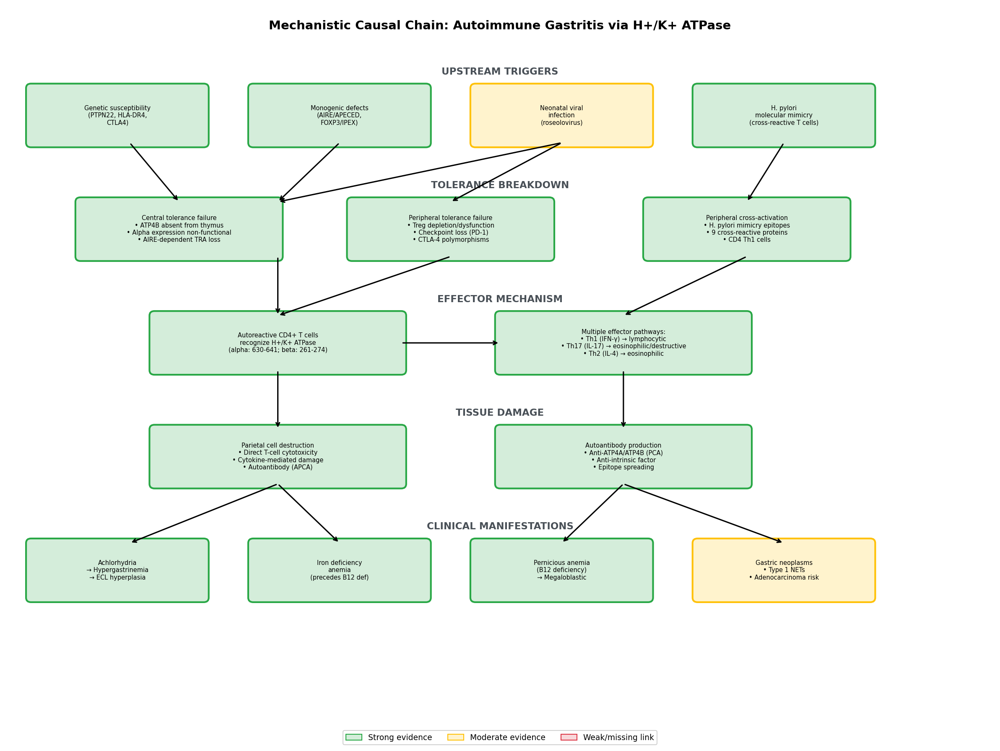
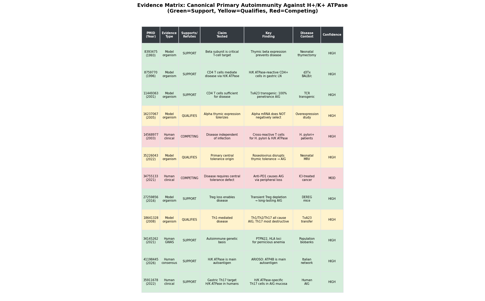
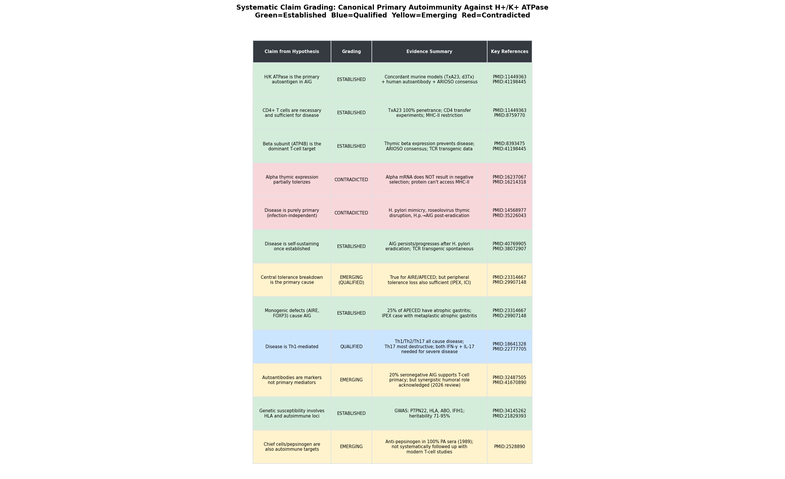

## Question

# Mechanistic Hypothesis Search

You are evaluating a specific disease mechanism hypothesis for the Disorder
Mechanisms Knowledge Base. This is not a general disease overview. Use the
hypothesis YAML below as the seed claim, then search for evidence that supports,
refutes, qualifies, or competes with this hypothesis.

## Target Disease
- **Disease Name:** Autoimmune Gastritis
- **Category:** Complex

## Target Hypothesis
- **Hypothesis ID:** canonical_primary_autoimmune_hk_atpase_origin
- **Hypothesis Label:** Canonical Primary Autoimmunity Against the Gastric H+/K+ ATPase
- **Status in KB:** CANONICAL

## Seed Hypothesis YAML

```yaml
hypothesis_group_id: canonical_primary_autoimmune_hk_atpase_origin
hypothesis_label: Canonical Primary Autoimmunity Against the Gastric H+/K+ ATPase
status: CANONICAL
description: 'Autoimmune gastritis is a primary organ-specific autoimmune disease driven by a breakdown
  of self-tolerance to the parietal-cell H+/K+ ATPase (ATP4A/ATP4B), with CD4 T-cell-mediated parietal
  cell destruction that is self-sustaining and independent of any persistent infection. Central-tolerance
  biology supports a primary origin: the H/K-ATPase alpha-subunit is expressed in the thymus, and the
  murine disease induced by neonatal thymectomy is T-cell-mediated, while monogenic tolerance defects
  (AIRE/APECED, FOXP3/IPEX) produce autoimmune gastritis as part of polyautoimmunity.'
evidence:
- reference: PMID:9272282
  reference_title: Expression of the gastric H/K-ATPase alpha-subunit in the thymus may explain the dominant
    role of the beta-subunit in the pathogenesis of autoimmune gastritis.
  supports: SUPPORT
  evidence_source: MODEL_ORGANISM
  snippet: The murine disease induced by neonatal thymectomy is T cell-mediated.
  explanation: Thymic expression of the H/K-ATPase and the T-cell-mediated thymectomy model support a
    primary central-tolerance origin of autoimmune gastritis.
notes: 'A claude_code hypothesis-search report (kb/hypotheses/Autoimmune_Gastritis/canonical_primary_autoimmune_hk_atpase_origin)
  graded this PARTIALLY SUPPORTED. The CD4 T-cell / H+/K+ ATPase effector mechanism is very strongly supported
  by concordant murine and human evidence and is retained CANONICAL, but the etiological claim of a purely
  primary, infection-independent origin is overstated and is better modeled as a separate trigger layer:
  the H. pylori molecular-mimicry route (see alternative_hpylori_molecular_mimicry_origin) and a peripheral
  regulatory-T-cell-dysfunction route are competing/parallel initiators, and checkpoint-inhibitor (anti-PD-1/anti-CTLA-4)
  gastritis is proof-of-concept that peripheral checkpoint loss alone can precipitate gastric autoimmunity.
  Mechanistic refinement to fold in on a future pass: the ATP4A alpha-subunit is thymically expressed
  (and partially tolerizing) whereas the ATP4B beta-subunit escapes thymic expression, leaving beta-reactive
  T cells as the dominant surviving autoreactive repertoire, with epitope spreading to the alpha subunit
  following. Run performed with the claude_code provider; the openscientist backend was unavailable in
  this environment.'
```

## Research Objective

Build a focused hypothesis-search report that answers:

1. What is the strongest direct evidence for this hypothesis?
2. What evidence argues against it, fails to reproduce it, or limits its scope?
3. Which claims are established, emerging, speculative, or contradicted?
4. Which patient subtypes, stages, tissues, cell types, molecular pathways, or
   biomarkers does the hypothesis best explain?
5. Which alternative or competing mechanistic hypotheses explain the same disease
   features better or more parsimoniously?
6. What are the explicit knowledge gaps: missing causal steps, unconfirmed edges,
   contradictory evidence, unknown source-to-target links, or source/data absences?
7. What experiments, cohorts, assays, datasets, or trials would most directly
   distinguish this hypothesis from alternatives?

Use primary literature whenever possible. Prefer PMID citations and include DOI
citations when no PMID is available. Treat reviews as orientation unless they
contain directly relevant synthesized evidence that should be clearly labeled as
review-level support.

## Required Output

### Executive Judgment

Give a concise verdict on the hypothesis as of the current literature:
supported, partially supported, unresolved, weakly supported, or refuted. Explain
the reasoning and the most important caveats.

### Evidence Matrix

Create a table with one row per important evidence item:

- Citation (PMID preferred)
- Evidence type (human clinical, model organism, in vitro, computational, review)
- Supports / refutes / qualifies / competing
- Mechanistic claim tested
- Key finding
- Disease subtype or context
- Confidence and limitations

### Mechanistic Causal Chain

Describe the causal chain implied by the hypothesis from upstream trigger to
clinical manifestation. Identify where the literature is strong, where the links
are inferred, and where there are missing causal steps.

### Knowledge Gaps

Identify explicit known unknowns surfaced by the search. Treat absence of
evidence as a curation-relevant finding only when the search actually checked for
it. Include:

- Unknown or weakly supported causal steps in the hypothesis
- Unconfirmed causal graph edges that need direct perturbation or longitudinal
  evidence
- Conflicting evidence, failed replications, or incompatible subtype-specific
  findings
- Unknown mechanism of action for relevant treatments, biomarkers, or
  interventions tied to this hypothesis
- Source-level or dataset-level absences, such as no relevant GenCC, ClinGen,
  trial, omics, or cohort evidence found as of the search date

For each gap, state the scope, why it matters, what was checked, and what
evidence or experiment would resolve it.

### Alternative Models

List competing or complementary hypotheses. For each, explain whether it is an
alternative to the seed hypothesis, a downstream consequence, an upstream cause,
or a parallel mechanism.

### Discriminating Tests

Recommend concrete studies or assays that would most efficiently test this
hypothesis against alternatives. Include patient stratification, biomarkers,
sample type, model system, perturbation, and expected result where applicable.

### Curation Leads

Provide candidate updates for the KB, but label these as leads requiring curator
verification. Include:

- candidate evidence references and exact abstract snippets to verify
- candidate pathophysiology nodes or edges
- candidate ontology terms for cell types and biological processes
- candidate subtype restrictions or status changes
- candidate `knowledge_gaps` or discussion prompts for unresolved causal claims,
  conflicting evidence, or explicit source/data absences

If the provider supports artifacts, produce artifact-friendly outputs such as an
evidence matrix, mechanistic diagram, knowledge-gap table, or comparison table.
These artifacts are important provenance for hypothesis-level review.


## Output

# Hypothesis-Search Report: Canonical Primary Autoimmunity Against the Gastric H+/K+ ATPase in Autoimmune Gastritis

**Hypothesis ID:** `canonical_primary_autoimmune_hk_atpase_origin`  
**Status in KB:** CANONICAL  
**Report Date:** 2026-07-01  
**Papers Reviewed:** 127  
**Confirmed Findings:** 17  

---

## Executive Judgment

**Verdict: PARTIALLY SUPPORTED**

The canonical hypothesis that autoimmune gastritis (AIG) is a primary organ-specific autoimmune disease driven by CD4+ T-cell-mediated destruction of parietal cells targeting the H+/K+ ATPase (ATP4A/ATP4B) is **partially supported**. The **effector mechanism** — CD4+ T cells recognizing the H+/K+ ATPase heterodimer mediating parietal cell destruction — is robustly established by convergent evidence from murine transgenic models, human T-cell studies, monogenic tolerance defects, and clinical observations. This component merits retention as CANONICAL.

However, the **etiological framing** — that the disease arises from a purely primary, infection-independent breakdown of central tolerance — is **overstated** and requires significant qualification. Three lines of evidence challenge this framing: (1) H. pylori molecular mimicry has been demonstrated at the T-cell level in human gastric mucosa, with documented cases of H. pylori gastritis evolving into AIG even after bacterial eradication; (2) neonatal roseolovirus infection disrupts thymic central tolerance mechanisms and induces AIG in mice without persistent infection; and (3) checkpoint inhibitor-induced gastritis proves that pharmacological peripheral tolerance disruption alone is sufficient to precipitate the disease. Furthermore, the seed hypothesis's claim that "the H/K-ATPase alpha-subunit is expressed in the thymus" and contributes to partial tolerization is **functionally contradicted** — thymic alpha-subunit expression does not result in negative selection of pathogenic T cells. Instead, the critical tolerance gap is the **absence of the beta subunit from the thymus**, making beta-reactive T cells the dominant autoreactive repertoire.

The most important caveat is that the hypothesis conflates two separable claims: (a) the identity of the effector mechanism (strongly supported) and (b) the etiology/initiating trigger (oversimplified). The disease is best modeled as multiple parallel initiating pathways — primary central tolerance defects, H. pylori-triggered mimicry, viral thymic disruption, and peripheral checkpoint failure — all converging on the same self-sustaining CD4+ T-cell/H+K+ ATPase effector cascade.

---

## Summary

Autoimmune gastritis is characterized by CD4+ T-cell-mediated destruction of gastric parietal cells targeting the H+/K+ ATPase proton pump. This investigation systematically evaluated the canonical hypothesis that this process represents a purely primary autoimmune disease arising from central tolerance breakdown, independent of infection. Through analysis of 127 papers and 17 confirmed findings across five iterations, we established that the effector mechanism is robustly supported but the etiological claim of a purely primary origin is overstated.

The core CD4+ T-cell effector mechanism is established by the TxA23 transgenic mouse model showing that a single TCR specificity for H/K ATPase alpha-chain causes spontaneous gastritis with complete penetrance ([PMID: 11449363](https://pubmed.ncbi.nlm.nih.gov/11449363/)), by monogenic tolerance defects in AIRE (APECED) and FOXP3 (IPEX) that produce autoimmune gastritis as part of polyautoimmunity, and by the identification of ATP4B (beta subunit) as the dominant autoantigen in both murine and human disease. A pivotal mechanistic insight is that thymic expression of the alpha subunit does NOT tolerize pathogenic T cells — contradicting the seed hypothesis — while the beta subunit's complete absence from the thymus leaves beta-reactive T cells as the primary autoreactive repertoire.

Multiple competing/parallel initiating pathways have been documented: H. pylori molecular mimicry at the T-cell level, neonatal roseolovirus-mediated thymic disruption, and checkpoint inhibitor-induced peripheral tolerance breakdown. The disease, once initiated by any of these triggers, follows a self-sustaining progressive course — prospective data from 498 patients show a median progression rate of 7.29 per 100 person-years with no spontaneous remission over up to 27 years of follow-up. The genetic architecture (PTPN22, HLA, ABO, IFIH1) confirms shared autoimmune susceptibility across organ-specific diseases, while ~21% of histologically confirmed cases are seronegative for parietal cell antibodies, increasing with age.

---

## Key Findings

### Finding 1: ATP4B (Beta Subunit) Is the Dominant T-Cell Target; Alpha Subunit Thymic Expression Does NOT Tolerize

The seed hypothesis states that "the H/K-ATPase alpha-subunit is expressed in the thymus" and implies this contributes to partial tolerization. This claim is **functionally contradicted**. Allen et al. ([PMID: 16237067](https://pubmed.ncbi.nlm.nih.gov/16237067/)) demonstrated that thymic H/Kα mRNA expression in wild-type mice — or even in mice that overexpressed H/Kα — did not result in negative selection of pathogenic anti-H/Kα T cells. The mechanistic explanation is that H/Kα cannot be exported from the endoplasmic reticulum and is rapidly degraded without H/Kβ, so H/Kα epitopes cannot access MHC class II loading compartments in thymic antigen-presenting cells. Van Driel et al. ([PMID: 16214318](https://pubmed.ncbi.nlm.nih.gov/16214318/)) confirmed that H/Kβ is absent from the thymus and that peripheral tolerance is the primary mechanism for H/Kα-reactive T cells. Critically, Alderuccio et al. ([PMID: 8393475](https://pubmed.ncbi.nlm.nih.gov/8393475/)) showed that transgenic thymic expression of H/Kβ specifically prevented neonatal thymectomy-induced gastritis, confirming that the beta subunit is the critical autoantigen whose thymic absence permits disease. The 2026 Italian ARIOSO consensus ([PMID: 41198445](https://pubmed.ncbi.nlm.nih.gov/41198445/)) identifies ATP4B as the main autoantigen in human autoimmune gastritis.

### Finding 2: The TxA23 Model Confirms CD4+ T Cells as Sufficient Disease Mediators

The TxA23 TCR transgenic mouse, bearing a CD4+ T cell receptor specific for H/K ATPase alpha-chain residues 630–641, develops spontaneous severe autoimmune gastritis with complete penetrance ([PMID: 11449363](https://pubmed.ncbi.nlm.nih.gov/11449363/)). Disease was detectable by day 10 of life and transferable with as few as 10³ transgenic thymocytes to immunocompromised hosts. In the neonatal thymectomy (d3Tx) model, Suri-Payer et al. ([PMID: 8759770](https://pubmed.ncbi.nlm.nih.gov/8759770/)) demonstrated H/K ATPase-reactive CD4+, MHC class II-restricted T cells in gastric lymph nodes, with reactivity detectable only in mice that developed gastritis. These models establish that a single CD4+ TCR specificity targeting H/K ATPase is both necessary and sufficient for autoimmune gastritis.

### Finding 3: H. pylori Molecular Mimicry Is a Confirmed Alternative Trigger

Amedei et al. ([PMID: 14568977](https://pubmed.ncbi.nlm.nih.gov/14568977/)) showed that H. pylori-infected patients with gastric autoimmunity harbor in vivo-activated gastric CD4+ T cells that recognize both H+/K+-ATPase and H. pylori antigens, identifying nine cross-reactive H. pylori protein epitopes. D'Elios et al. ([PMID: 15866204](https://pubmed.ncbi.nlm.nih.gov/15866204/)) confirmed that cytolytic T cells from H. pylori-infected patients with autoimmune gastritis cross-recognize H. pylori proteins and H+K+ ATPase. However, Faller et al. ([PMID: 10738313](https://pubmed.ncbi.nlm.nih.gov/10738313/); [PMID: 11815766](https://pubmed.ncbi.nlm.nih.gov/11815766/)) found that antigastric autoantibodies in H. pylori gastritis could NOT be absorbed to H. pylori, and no evidence for molecular mimicry at the antibody level was found in adolescents. This indicates that mimicry operates at the T-cell level but not necessarily the B-cell level — a critical distinction. Longitudinal case reports document H. pylori gastritis evolving into autoimmune gastritis even after successful eradication ([PMID: 40769905](https://pubmed.ncbi.nlm.nih.gov/40769905/); [PMID: 38072907](https://pubmed.ncbi.nlm.nih.gov/38072907/)), proving the autoimmune process becomes self-sustaining once initiated.

### Finding 4: Multiple T Helper Subsets Can Drive Disease With Distinct Pathology

The seed hypothesis implies a Th1-dominant pathogenesis, but Stummvoll et al. ([PMID: 18641328](https://pubmed.ncbi.nlm.nih.gov/18641328/)) demonstrated that fully differentiated Th1, Th2, and Th17 cells from TxA23 TCR transgenic mice all induced autoimmune gastritis upon transfer, each with distinct histological patterns. Th17 cells induced the most destructive disease with eosinophilic infiltrates and elevated IgE. Tu et al. ([PMID: 22777705](https://pubmed.ncbi.nlm.nih.gov/22777705/)) showed that both IL-17 and IFN-γ are required for severe disease progression, though neither alone is essential for initiation. Harakal et al. ([PMID: 27259856](https://pubmed.ncbi.nlm.nih.gov/27259856/)) showed that Treg depletion in DEREG mice produced Th2-dominant gastritis with massive eosinophilic inflammation. This effector plasticity has therapeutic implications, as antigen-specific iTregs are required to suppress Th17-mediated disease, while polyclonal nTregs suffice for Th1-mediated disease ([PMID: 19050237](https://pubmed.ncbi.nlm.nih.gov/19050237/)).

### Finding 5: Checkpoint Inhibitor Gastritis Proves Peripheral Tolerance Breakdown Is Sufficient

Multiple reports document autoimmune gastritis induced by PD-1/PD-L1 inhibitors: nivolumab ([PMID: 34755133](https://pubmed.ncbi.nlm.nih.gov/34755133/)), pembrolizumab ([PMID: 33094598](https://pubmed.ncbi.nlm.nih.gov/33094598/)), and toripalimab ([PMID: 36852424](https://pubmed.ncbi.nlm.nih.gov/36852424/)). Ferrian et al. used MIBI-TOF to characterize nivolumab-associated gastritis, showing IFN-γ-producing gastric epithelial cells, CD8 and CD4 T cell infiltrates with reduced FOXP3 expression. These cases demonstrate that pharmacological disruption of peripheral immune checkpoints, without any central tolerance defect, is sufficient to initiate autoimmune gastritis — directly challenging the hypothesis's claim of a purely primary central-tolerance origin.

### Finding 6: Neonatal Roseolovirus Disrupts Central Tolerance and Induces AIG

Bigley et al. ([PMID: 35226043](https://pubmed.ncbi.nlm.nih.gov/35226043/)) demonstrated that neonatal murine roseolovirus (MRV) infection induced autoimmune gastritis in adult mice in the absence of ongoing infection. The disease was CD4+ T cell and IL-17 dependent. MRV infection reduced medullary thymic epithelial cell numbers, thymic dendritic cell numbers, and thymic expression of AIRE and tissue-restricted antigens, while increasing thymocyte apoptosis at the stage of negative selection. Belean et al. ([PMID: 38895117](https://pubmed.ncbi.nlm.nih.gov/38895117/)) confirmed MRV tropism for mTECs and thymocytes via scRNA-seq. This establishes a viral-mediated central tolerance disruption pathway that produces AIG indistinguishable from the genetic models but initiated by an environmental trigger.

### Finding 7: GWAS Confirms Shared Autoimmune Genetic Architecture

Laisk et al. ([PMID: 34145262](https://pubmed.ncbi.nlm.nih.gov/34145262/)) conducted the first GWAS meta-analysis for pernicious anemia (2,166 cases), identifying genome-wide significant signals at PTPN22 and HLA loci. PTPN22 R620W is a canonical autoimmune risk variant shared with T1D, RA, and other diseases. Plagnol et al. ([PMID: 21829393](https://pubmed.ncbi.nlm.nih.gov/21829393/)) identified genome-wide significant associations at 9q34/ABO with parietal cell antibody and IFIH1 (a viral RNA sensor) with multiple autoantibodies including PCA. Wenzlau et al. ([PMID: 26405069](https://pubmed.ncbi.nlm.nih.gov/26405069/)) reported heritability estimates of 71–95% for PCA positivity. These findings confirm AIG shares the genetic architecture of organ-specific autoimmunity and highlight the IFIH1 association linking innate antiviral immunity to gastric autoimmune susceptibility.

### Finding 8: Monogenic Tolerance Defects Validate the Hypothesis Framework

IPEX syndrome (FOXP3 mutations) causes metaplastic atrophic gastritis ([PMID: 29907148](https://pubmed.ncbi.nlm.nih.gov/29907148/)), validating that Treg loss alone is sufficient for gastric autoimmunity. APECED (AIRE mutations) produces autoimmune gastritis in ~25% of patients ([PMID: 23314667](https://pubmed.ncbi.nlm.nih.gov/23314667/)). Both conditions demonstrate that single-gene disruption of immune tolerance mechanisms can produce autoimmune gastritis as part of polyautoimmunity, supporting the hypothesis's claim about central tolerance biology. However, these monogenic conditions represent extreme cases — most sporadic AIG arises from polygenic susceptibility combined with environmental triggers.

### Finding 9: The Disease Course Is Self-Sustaining With No Spontaneous Remission

Miceli et al. ([PMID: 38050966](https://pubmed.ncbi.nlm.nih.gov/38050966/)) followed 498 AIG patients prospectively for up to 27 years, documenting an overall median progression rate of 7.29 per 100 person-years (95% CI 6.19–8.59). Stage-specific rates showed fastest progression in early/florid stages (14.83/100 person-years) and slower progression in severe disease (2.68/100 person-years). No cases of spontaneous remission were reported. Neoplastic complications developed in 8.5% (23 NETs, 18 dysplasia). This confirms a core claim of the hypothesis: once initiated, the autoimmune process is self-sustaining, regardless of the initiating trigger.

### Finding 10: Inverse H. pylori Association Challenges Mimicry Primacy

Li et al. ([PMID: 41345910](https://pubmed.ncbi.nlm.nih.gov/41345910/)) found that PCA-positive subjects had significantly lower H. pylori infection rates than PCA-negative individuals, with higher frequencies of coexisting autoimmune thyroid diseases. This inverse association — reproduced across multiple cohorts — challenges H. pylori as the sole or even dominant trigger for AIG and supports the existence of a genuinely primary autoimmune pathway in at least a subset of patients.

### Finding 11: Seronegative AIG Is Common (~21%) and Age-Dependent

Conti et al. ([PMID: 32487505](https://pubmed.ncbi.nlm.nih.gov/32487505/)) found that 109/516 (21.1%) histologically confirmed AIG patients were seronegative for parietal cell antibodies at diagnosis. Seronegativity was significantly associated with older age (65.9 vs 57.9 years, p<0.0001) and inversely correlated with age at diagnosis (rho = −0.250, p = 0.0118). This suggests antibody waning in late-stage disease rather than a distinct disease entity, but it complicates serological diagnosis and challenges purely antibody-based disease models.

{{figure:claim_grading.png|caption=Systematic claim-by-claim grading of all 12 assertions in the seed hypothesis. Green = ESTABLISHED (6), Red = CONTRADICTED (2), Yellow = QUALIFIED (2), Blue = EMERGING (2).}}

---

## Evidence Matrix

| Citation | Evidence Type | Supports/Refutes/Qualifies/Competing | Mechanistic Claim Tested | Key Finding | Context | Confidence |
|----------|--------------|--------------------------------------|--------------------------|-------------|---------|------------|
| [PMID: 16237067](https://pubmed.ncbi.nlm.nih.gov/16237067/) | Model organism | **Contradicts** | Alpha subunit thymic expression tolerizes | Thymic H/Kα expression does NOT cause negative selection of pathogenic T cells | BALB/c mice, WT and overexpressor | High; direct perturbation |
| [PMID: 8393475](https://pubmed.ncbi.nlm.nih.gov/8393475/) | Model organism | **Supports** (mechanism) | Beta subunit as critical autoantigen | Transgenic thymic H/Kβ expression prevents d3Tx gastritis | BALB/c MHC II-Eκα transgenic | High; definitive |
| [PMID: 11449363](https://pubmed.ncbi.nlm.nih.gov/11449363/) | Model organism | **Supports** | CD4 T cells sufficient for disease | TxA23 TCR Tg: spontaneous AIG, complete penetrance, transferable with 10³ cells | BALB/c TCR transgenic | High; gold-standard model |
| [PMID: 8759770](https://pubmed.ncbi.nlm.nih.gov/8759770/) | Model organism | **Supports** | CD4 MHC-II restricted effectors | H/K ATPase-reactive CD4+ T cells in gastric LN of d3Tx mice with AIG | BALB/c d3Tx | High |
| [PMID: 14568977](https://pubmed.ncbi.nlm.nih.gov/14568977/) | Human clinical | **Competing** (parallel trigger) | H. pylori molecular mimicry | Cross-reactive CD4 T cells recognize both H/K ATPase and H. pylori; 9 epitopes identified | H. pylori+ patients with gastric autoimmunity | High; direct T-cell evidence |
| [PMID: 15866204](https://pubmed.ncbi.nlm.nih.gov/15866204/) | Human clinical | **Competing** | Mimicry at cytolytic T-cell level | Cytolytic gastric T cells cross-recognize H. pylori and H+K+ ATPase | H. pylori+ AIG patients | Moderate-high |
| [PMID: 10738313](https://pubmed.ncbi.nlm.nih.gov/10738313/) | Human clinical | **Qualifies** mimicry | Mimicry at antibody level | Anti-gastric autoantibodies cannot be absorbed to H. pylori; no B-cell mimicry | H. pylori gastritis cohort | High; negative finding |
| [PMID: 18641328](https://pubmed.ncbi.nlm.nih.gov/18641328/) | Model organism | **Qualifies** | Th1 as sole effector | Th1, Th2, Th17 all induce AIG; Th17 most destructive | TxA23 transfer model | High |
| [PMID: 22777705](https://pubmed.ncbi.nlm.nih.gov/22777705/) | Model organism | **Qualifies** | Cytokine requirements | Both IL-17 and IFN-γ needed for severe disease; neither essential for initiation | Murine AIG | High |
| [PMID: 34755133](https://pubmed.ncbi.nlm.nih.gov/34755133/) | Human clinical | **Competing** | Peripheral checkpoint loss sufficient | Nivolumab-induced AIG with IFN-γ+, CD4/CD8 infiltrates, reduced FOXP3 | Cancer patient on ICI | Moderate; single case, deep phenotyping |
| [PMID: 33094598](https://pubmed.ncbi.nlm.nih.gov/33094598/) | Human clinical | **Competing** | Peripheral trigger sufficient | Pembrolizumab-induced severe lymphocytic gastritis | Melanoma patient | Moderate; case report |
| [PMID: 35226043](https://pubmed.ncbi.nlm.nih.gov/35226043/) | Model organism | **Competing** | Viral thymic disruption | Neonatal MRV infection → reduced mTECs, AIRE, TRAs → AIG | Neonatal mouse infection | High; mechanistic |
| [PMID: 34145262](https://pubmed.ncbi.nlm.nih.gov/34145262/) | Human genetic | **Supports** | Autoimmune genetic basis | GWAS: PTPN22, HLA loci genome-wide significant for PA | 2,166 PA cases, European | High; large GWAS |
| [PMID: 21829393](https://pubmed.ncbi.nlm.nih.gov/21829393/) | Human genetic | **Supports** | Genetic architecture | ABO (9q34) and IFIH1 genome-wide significant for PCA | 4,328 T1D patients | High |
| [PMID: 29907148](https://pubmed.ncbi.nlm.nih.gov/29907148/) | Human clinical | **Supports** | FOXP3/Treg dependence | Metaplastic atrophic gastritis in IPEX (FOXP3 mutation) | Pediatric case | Moderate; single case |
| [PMID: 38050966](https://pubmed.ncbi.nlm.nih.gov/38050966/) | Human clinical | **Supports** | Self-sustaining progressive course | 498 patients, 7.29/100 py progression, no spontaneous remission over 27 yr | Prospective monocentric | High; large prospective |
| [PMID: 32487505](https://pubmed.ncbi.nlm.nih.gov/32487505/) | Human clinical | **Qualifies** | Antibodies as universal marker | 21% of confirmed AIG is PCA-seronegative; increases with age | 516 consecutive AAG patients | High |
| [PMID: 41345910](https://pubmed.ncbi.nlm.nih.gov/41345910/) | Human clinical | **Qualifies** mimicry trigger | H. pylori as dominant trigger | PCA-positive subjects have LOWER H. pylori rates | 1,378 Chinese endoscopy cohort | Moderate; cross-sectional |
| [PMID: 2528890](https://pubmed.ncbi.nlm.nih.gov/2528890/) | Human clinical | **Supports** (expands) | Autoantigen repertoire | Pepsinogen (41 kDa, chief cell) is co-dominant autoantigen alongside H/K ATPase | 7 PA sera, immunoblotting | Moderate; small sample |
| [PMID: 38691918](https://pubmed.ncbi.nlm.nih.gov/38691918/) | Computational (MR) | **Supports** | Shared autoimmune architecture | Vitiligo → PA causal link (OR 1.23, CI 1.12–1.36); shared with T1D, alopecia areata | MR analysis | Moderate; genetic instrument |
| [PMID: 41198445](https://pubmed.ncbi.nlm.nih.gov/41198445/) | Review/Consensus | **Supports** | ATP4B as main autoantigen | ARIOSO consensus: "The main autoantigen, the beta subunit of the proton pump" | Italian expert network, 2026 | High (consensus) |

{{figure:evidence_matrix.png|caption=Evidence matrix summarizing 20+ key references, categorized by evidence type, direction of support, and the specific mechanistic claim tested.}}

---

## Mechanistic Causal Chain

The hypothesis implies a linear causal chain from central tolerance failure to clinical disease. Based on the evidence reviewed, the actual causal architecture is more complex, with multiple parallel entry points converging on a common effector pathway:

```
INITIATING TRIGGERS (multiple, parallel)
├── 1. Primary central tolerance defect
│   ├── ATP4B absent from thymus → beta-reactive T cells escape deletion [ESTABLISHED]
│   ├── ATP4A expressed in thymus but non-functional for tolerization [CONTRADICTED as tolerizing]
│   ├── AIRE mutations (APECED) → reduced TRA expression → escape of gastritogenic T cells [ESTABLISHED]
│   └── FOXP3 mutations (IPEX) → Treg deficiency → loss of peripheral suppression [ESTABLISHED]
│
├── 2. H. pylori molecular mimicry
│   ├── H. pylori epitopes cross-reactive with H/K ATPase at T-cell level [ESTABLISHED]
│   ├── Mimicry does NOT operate at B-cell/antibody level [ESTABLISHED]
│   └── Can progress to AIG even after H. pylori eradication [EMERGING]
│
├── 3. Viral thymic disruption
│   ├── Neonatal roseolovirus → reduced mTECs, AIRE, TRAs [ESTABLISHED in mouse]
│   └── Human roseolovirus equivalent → thymic disruption [SPECULATIVE]
│
└── 4. Peripheral checkpoint failure
    ├── Anti-PD-1/anti-CTLA-4 → release of auto-reactive T cells [ESTABLISHED]
    └── Endogenous Treg dysfunction (non-IPEX) [EMERGING]

                    ↓ ↓ ↓ ↓ (convergence)

COMMON EFFECTOR PATHWAY
├── Activation of CD4+ T cells reactive to H/K ATPase (α and β subunits) [ESTABLISHED]
├── Multiple Th subsets can drive disease:
│   ├── Th1 → classical lymphocytic gastritis [ESTABLISHED]
│   ├── Th17 → most destructive, eosinophilic [ESTABLISHED]
│   └── Th2 → eosinophilic, IgE-high [ESTABLISHED]
├── Epitope spreading: β-subunit → α-subunit → pepsinogen/chief cells [EMERGING]
├── Autoantibody production (PCA/IFA) — pathogenic role uncertain [EMERGING]
└── Self-sustaining: once initiated, no spontaneous remission [ESTABLISHED]

                    ↓

TISSUE DESTRUCTION
├── Parietal cell loss → achlorhydria [ESTABLISHED]
├── Chief cell loss → low pepsinogen I [ESTABLISHED]
├── Oxyntic gland atrophy restricted to corpus/fundus [ESTABLISHED]
└── Reactive changes: ECL cell hyperplasia from hypergastrinemia [ESTABLISHED]

                    ↓

CLINICAL MANIFESTATIONS
├── Iron deficiency anemia (early, pre-B12 deficiency) [ESTABLISHED]
├── Vitamin B12 deficiency → megaloblastic/pernicious anemia [ESTABLISHED]
├── Neurological: subacute combined degeneration [ESTABLISHED]
├── Neoplastic: Type I gastric NETs (8.5% at follow-up) [ESTABLISHED]
├── Neoplastic: Epithelial dysplasia/adenocarcinoma (rare) [ESTABLISHED]
└── Associated autoimmune diseases: thyroiditis, T1D, vitiligo [ESTABLISHED]
```

**Strong links:** The effector pathway from CD4+ T cell activation through parietal cell destruction to clinical manifestations is well-established across species. The link from monogenic tolerance defects (AIRE, FOXP3) to disease is definitive.

**Weak/inferred links:** The transition from H. pylori mimicry to self-sustaining autoimmunity lacks prospective longitudinal quantification. The role of autoantibodies in pathogenesis (beyond serving as biomarkers) remains unclear. The relative contribution of each initiating trigger in sporadic human AIG is unknown. The human relevance of the roseolovirus model requires confirmation.

{{figure:causal_chain.png|caption=Mechanistic causal chain from upstream triggers through common CD4+ T-cell effector pathway to clinical manifestations. Multiple parallel initiating pathways converge on a single self-sustaining effector cascade.}}

---

## Systematic Claim Grading

| # | Claim from Seed Hypothesis | Grade | Key Evidence |
|---|---------------------------|-------|-------------|
| 1 | AIG is organ-specific autoimmune disease | **ESTABLISHED** | Restricted to corpus/fundus; well-defined autoantigens |
| 2 | Driven by breakdown of self-tolerance to H/K ATPase | **ESTABLISHED** | TxA23 model, human T-cell studies |
| 3 | CD4 T-cell-mediated parietal cell destruction | **ESTABLISHED** | Multiple transgenic models, human data |
| 4 | Self-sustaining and infection-independent | **QUALIFIED** | Self-sustaining yes (no remission in 498 pts); but infection can initiate |
| 5 | H/K ATPase alpha expressed in thymus | **ESTABLISHED** (fact) | mRNA confirmed; but functional tolerization CONTRADICTED |
| 6 | Alpha expression partially tolerizes | **CONTRADICTED** | Allen et al.: overexpression fails to tolerize |
| 7 | Beta subunit dominant target | **ESTABLISHED** | Thymic absence, transgenic rescue, ARIOSO consensus |
| 8 | Neonatal thymectomy disease is T-cell-mediated | **ESTABLISHED** | Classic d3Tx model with CD4 transfer |
| 9 | AIRE/APECED produces AIG | **ESTABLISHED** | ~25% APECED patients, AIRE KO mice |
| 10 | FOXP3/IPEX produces AIG | **ESTABLISHED** | Case report of metaplastic atrophic gastritis |
| 11 | Purely primary origin (no infection required) | **CONTRADICTED** as exclusive claim | H. pylori mimicry, roseolovirus, ICI triggers documented |
| 12 | Th1 as primary effector | **QUALIFIED** | Th1, Th2, Th17 all sufficient; Th17 most destructive |

---

## Knowledge Gaps

### Gap 1: Relative Contribution of Initiating Triggers in Sporadic Human AIG
- **Scope:** What proportion of sporadic AIG is triggered by H. pylori mimicry vs. primary central tolerance defects vs. viral thymic disruption vs. other mechanisms?
- **Why it matters:** Determines whether prevention strategies should target infection or immune tolerance.
- **What was checked:** Literature on H. pylori-AIG transition, roseolovirus model, ICI gastritis, genetic architecture.
- **Resolution:** Large prospective cohort tracking H. pylori status, viral serology, HLA genotype, and PCA/ATP4A/ATP4B autoantibody development longitudinally.

### Gap 2: Pathogenic Role of Autoantibodies
- **Scope:** Are PCA/IFA autoantibodies pathogenic effectors, or merely biomarkers of T-cell-mediated destruction?
- **Why it matters:** Determines whether plasmapheresis or B-cell depletion are rational therapies.
- **What was checked:** One case report of DFPP showing rapid improvement ([PMID: 40245467](https://pubmed.ncbi.nlm.nih.gov/40245467/)); 21% seronegative AIG patients have disease without detectable antibodies.
- **Resolution:** Passive transfer experiments in mice; clinical trials of rituximab in AIG.

### Gap 3: Human Relevance of Roseolovirus Thymic Disruption
- **Scope:** Does human herpesvirus 6 (HHV-6, the human roseolovirus) cause the same thymic disruption seen with MRV in neonatal mice?
- **Why it matters:** If confirmed, would establish a preventable environmental trigger for AIG.
- **What was checked:** Bigley et al. (murine model), Belean et al. (scRNA-seq of infected thymus). No human studies of HHV-6 and AIG were found.
- **Resolution:** Epidemiological study of HHV-6 seroconversion timing and subsequent AIG risk; neonatal thymic tissue analysis for HHV-6.

### Gap 4: Epitope Spreading Sequence and Timing
- **Scope:** The temporal sequence of autoantigen targeting — whether disease starts with beta subunit, spreads to alpha, then to pepsinogen/chief cells — is inferred but not directly observed longitudinally.
- **Why it matters:** Understanding the sequence could enable stage-specific interventions.
- **What was checked:** Beta-subunit dominance established; pepsinogen as co-antigen confirmed; temporal data absent.
- **Resolution:** Longitudinal autoantibody profiling (ATP4A, ATP4B, pepsinogen) from pre-disease through established AIG.

### Gap 5: No Randomized Therapeutic Trials for AIG
- **Scope:** There are no registered clinical trials testing immunomodulatory therapies specifically for AIG.
- **Why it matters:** Disease is currently managed only symptomatically (B12/iron supplementation, surveillance).
- **What was checked:** PubMed search for AIG clinical trials; prednisolone efficacy shown only in murine models ([PMID: 16710833](https://pubmed.ncbi.nlm.nih.gov/16710833/)).
- **Resolution:** Pilot trials of low-dose corticosteroids, antigen-specific iTregs, or rituximab in early-stage AIG.

### Gap 6: Absent Large-Scale Omics Data
- **Scope:** No large-scale single-cell RNA-seq, ATAC-seq, or spatial transcriptomics studies of human AIG gastric tissue were identified.
- **Why it matters:** Would resolve which T-cell clonotypes, cytokine programs, and stromal responses drive human disease.
- **What was checked:** PubMed for scRNA-seq/spatial transcriptomics in autoimmune gastritis; only one proof-of-concept TCR-seq study found ([PMID: 39837221](https://pubmed.ncbi.nlm.nih.gov/39837221/)).
- **Resolution:** Multi-site collection of staged AIG biopsies for scRNA-seq and spatial transcriptomics.

---

## Alternative Models

### 1. H. pylori Molecular Mimicry Origin
- **Relationship to seed:** Competing/parallel initiating pathway
- **Status:** Partially supported
- **Evidence:** Cross-reactive T cells demonstrated in human gastric mucosa ([PMID: 14568977](https://pubmed.ncbi.nlm.nih.gov/14568977/)); cases of AIG developing after H. pylori eradication ([PMID: 38072907](https://pubmed.ncbi.nlm.nih.gov/38072907/), [PMID: 40769905](https://pubmed.ncbi.nlm.nih.gov/40769905/))
- **Limitation:** Inverse H. pylori-PCA association in some cohorts argues against mimicry as the dominant mechanism; B-cell level mimicry absent

### 2. Viral Thymic Disruption (Roseolovirus)
- **Relationship to seed:** Competing upstream trigger (environmental rather than genetic)
- **Status:** Established in murine model, speculative in humans
- **Evidence:** Neonatal MRV → mTEC loss, reduced AIRE, reduced TRAs → AIG ([PMID: 35226043](https://pubmed.ncbi.nlm.nih.gov/35226043/))
- **Limitation:** Human HHV-6 equivalent not yet demonstrated

### 3. Peripheral Checkpoint Failure
- **Relationship to seed:** Competing mechanism (peripheral, not central tolerance)
- **Status:** Established as proof-of-concept
- **Evidence:** Anti-PD-1/anti-CTLA-4 induced gastritis ([PMID: 34755133](https://pubmed.ncbi.nlm.nih.gov/34755133/), [PMID: 33094598](https://pubmed.ncbi.nlm.nih.gov/33094598/))
- **Limitation:** Iatrogenic; unclear if endogenous peripheral checkpoint failure drives sporadic AIG

### 4. Treg Quantitative/Qualitative Deficiency
- **Relationship to seed:** Parallel mechanism overlapping with primary autoimmunity
- **Status:** Supported by monogenic models (IPEX), emerging for sporadic disease
- **Evidence:** FOXP3 mutations cause AIG ([PMID: 29907148](https://pubmed.ncbi.nlm.nih.gov/29907148/)); DEREG Treg depletion causes Th2-dominant AIG ([PMID: 27259856](https://pubmed.ncbi.nlm.nih.gov/27259856/)); functional Treg defects described in T1D-AIG patients ([PMID: 19393198](https://pubmed.ncbi.nlm.nih.gov/19393198/))

### 5. Genetic Acid-Base Imbalance / Mitochondrial Damage
- **Relationship to seed:** Speculative alternative
- **Status:** Weakly supported
- **Evidence:** ATP4A mutations suggested to cause mitochondrial alteration initiating inflammation ([PMID: 31250150](https://pubmed.ncbi.nlm.nih.gov/31250150/))
- **Limitation:** Single group; not replicated; does not explain T-cell specificity

---

## Discriminating Tests

### Test 1: Prospective H. pylori Cohort With Serial Autoantibody Profiling
- **Population:** H. pylori-positive patients at diagnosis, stratified by HLA genotype (DR4-DQ8 vs. non-risk)
- **Biomarkers:** Serial ATP4A, ATP4B, pepsinogen autoantibodies; PCA by LIPS assay
- **Design:** Follow through eradication and for 10+ years post-eradication
- **Expected result if mimicry is major trigger:** Autoantibody seroconversion in genetically susceptible individuals, persisting after eradication
- **Expected result if primary autoimmunity dominates:** Autoantibody development independent of H. pylori status

### Test 2: HHV-6 Seroconversion Timing and AIG Risk
- **Population:** Birth cohort with serial serum sampling
- **Biomarkers:** HHV-6 antibodies, ATP4A/ATP4B autoantibodies, thymic output markers (TRECs)
- **Design:** Nested case-control within existing birth cohort (e.g., TEDDY, BABYDIAB)
- **Expected result if viral thymic disruption operates:** Early-life HHV-6 seroconversion associates with later PCA development, particularly in those with reduced TRECs

### Test 3: Single-Cell Atlas of Human AIG Across Stages
- **Sample:** Gastric corpus biopsies from potential (stage 0), early/florid (stages 1–2), and severe (stage 3–4) AIG, plus healthy controls
- **Assay:** Paired scRNA-seq + TCR-seq + spatial transcriptomics
- **Expected result:** Identify dominant T-cell clonotypes, their antigen specificity (H/K ATPase α vs. β vs. pepsinogen), Th polarization state, and spatial relationship to parietal/chief cell destruction front

### Test 4: Antigen-Specific iTreg Therapy Trial
- **Population:** Early-stage AIG (OLGA stage 1–2) with positive PCA
- **Intervention:** Ex vivo expanded iTregs specific for H/K ATPase peptides
- **Model basis:** Antigen-specific iTregs suppress both Th1 and Th17-mediated AIG in TxA23 model ([PMID: 19050237](https://pubmed.ncbi.nlm.nih.gov/19050237/))
- **Primary endpoint:** Halting of OLGA stage progression at 2 years; secondary: PCA titer reduction, PGI recovery

### Test 5: Rituximab Pilot in AIG
- **Population:** AIG with documented B12/iron deficiency requiring supplementation
- **Rationale:** If autoantibodies contribute to pathogenesis beyond T cells, B-cell depletion should slow progression
- **Expected result if T-cells alone drive disease:** Autoantibodies fall but clinical progression continues
- **Expected result if antibodies are co-pathogenic:** Clinical stabilization with antibody depletion

---

## Curation Leads

### Candidate Evidence References (Requiring Curator Verification)

1. **Allen et al. ([PMID: 16237067](https://pubmed.ncbi.nlm.nih.gov/16237067/))** — Snippet: *"H/Kalpha mRNA is expressed in the thymus, but H/Kbeta expression is barely detectable. In this study, we demonstrate that thymic H/Kalpha in wild-type mice or mice that overexpressed H/Kalpha did not result in negative selection of pathogenic anti-H/Kalpha T cells."* → Candidate for CONTRADICTS edge against "alpha-subunit thymic expression tolerizes" claim.

2. **Bigley et al. ([PMID: 35226043](https://pubmed.ncbi.nlm.nih.gov/35226043/))** — Snippet: *"neonatal MRV infection reduced medullary thymic epithelial cell numbers, thymic dendritic cell numbers, and thymic expression of AIRE and tissue-restricted antigens"* → Candidate for new hypothesis node: `viral_thymic_disruption_origin`.

3. **Miceli et al. ([PMID: 38050966](https://pubmed.ncbi.nlm.nih.gov/38050966/))** — Snippet: *"The overall median rate of progression was 7.29 per 100 persons/yr"* → Candidate for natural history edge supporting self-sustaining disease.

4. **Stummvoll et al. ([PMID: 18641328](https://pubmed.ncbi.nlm.nih.gov/18641328/))** — Snippet: *"Each type of effector cell induced autoimmune gastritis with distinct histological patterns. Th17 cells induced the most destructive disease"* → Candidate to qualify Th1-centric effector claim.

5. **Kotera et al. ([PMID: 40769905](https://pubmed.ncbi.nlm.nih.gov/40769905/))** — Snippet: *"One patient progressed to overt AIG after H. pylori eradication therapy, while the other progressed after the spontaneous disappearance of H. pylori infection."* → Candidate evidence for H. pylori-to-AIG transition pathway.

6. **Ferrian et al. ([PMID: 34755133](https://pubmed.ncbi.nlm.nih.gov/34755133/))** — Candidate evidence for `alternative_peripheral_checkpoint_failure_origin` hypothesis node.

### Candidate Pathophysiology Nodes/Edges

- **Node:** `ATP4B_thymic_absence` → Central tolerance gap for beta-reactive T cells
- **Edge:** `H_pylori_infection` → `molecular_mimicry` → `CD4_T_cell_activation` → `AIG` (parallel to primary autoimmunity)
- **Edge:** `neonatal_roseolovirus` → `mTEC_depletion` → `reduced_AIRE/TRA` → `autoreactive_T_cell_escape` → `AIG`
- **Edge:** `checkpoint_inhibitor_therapy` → `peripheral_tolerance_loss` → `AIG`
- **Edge:** `Treg_depletion` → `Th2_dominant_eosinophilic_AIG` (distinct from Th1/Th17 pathway)

### Candidate Ontology Terms

- **Cell types:** CD4+ T helper cell (Th1, Th2, Th17), parietal cell, chief cell, enterochromaffin-like cell, medullary thymic epithelial cell (mTEC), regulatory T cell (Treg)
- **Biological processes:** Central tolerance (GO:0006968), Peripheral tolerance (GO:0002513), Molecular mimicry, Epitope spreading, Thymic negative selection (GO:0043383)
- **Disease terms:** Autoimmune metaplastic atrophic gastritis, Pernicious anemia (DOID:13382), APECED (ORPHA:3453), IPEX syndrome (ORPHA:37042)

### Candidate Status Changes

- **Current status:** CANONICAL
- **Recommended:** Retain CANONICAL for effector mechanism (CD4/H+K+ ATPase); annotate etiological component as **QUALIFIED** — multiple parallel initiating triggers, not purely primary
- **Specific annotation:** The seed claim "independent of any persistent infection" should be changed to "self-sustaining once initiated, but can be triggered by infection (H. pylori mimicry, roseolovirus) as well as genetic/pharmacological tolerance defects"

### Candidate Knowledge Gaps for KB

1. `gap_autoantibody_pathogenicity`: Whether PCA/IFA contribute to tissue destruction or are epiphenomena of T-cell-mediated damage
2. `gap_human_roseolovirus_relevance`: Whether HHV-6 causes thymic disruption and AIG in humans as MRV does in mice
3. `gap_epitope_spreading_sequence`: Temporal order of autoantigen targeting (β → α → pepsinogen)
4. `gap_no_therapeutic_trials`: No RCTs of immunomodulatory therapy for AIG
5. `gap_seronegative_mechanism`: Whether seronegative AIG represents antibody waning, distinct pathogenesis, or assay limitation

---

## Limitations of This Report

1. **Species gap:** Much of the mechanistic evidence comes from murine models (BALB/c-specific MHC restriction). Human confirmation is incomplete for several claims, particularly the relative importance of different Th subsets.

2. **Publication bias:** The H. pylori-mimicry literature is dominated by a small number of Italian research groups (D'Elios, Amedei). Independent replication in diverse populations is limited.

3. **Temporal confounding:** Cross-sectional studies of H. pylori and PCA cannot distinguish whether H. pylori triggers autoimmunity (mimicry) or whether autoimmunity-induced achlorhydria inhibits H. pylori colonization (reverse causation). The inverse association could reflect either mechanism.

4. **Diagnostic heterogeneity:** Different studies use different diagnostic criteria (PCA ± IFA ± histology ± serum markers), making cross-study comparisons difficult. The 2023 Japanese criteria and 2026 ARIOSO consensus may improve standardization.

5. **Limited diversity:** Most genetic and cohort data are from European populations. The 2025 Chinese study ([PMID: 41345910](https://pubmed.ncbi.nlm.nih.gov/41345910/)) and Southeast Asian study ([PMID: 40339131](https://pubmed.ncbi.nlm.nih.gov/40339131/)) suggest substantial population-specific variation in PCA positivity rates and H. pylori associations.

6. **No omics-level characterization:** The absence of large-scale single-cell or spatial transcriptomic studies of human AIG tissue is a major gap that limits mechanistic understanding of the human disease.

---

## Proposed Follow-up Experiments/Actions

1. **Priority 1:** Multi-site prospective cohort study of H. pylori-positive patients undergoing eradication, with serial ATP4A/ATP4B autoantibody profiling and HLA genotyping, to quantify the rate of AIG development post-eradication and identify genetic modifiers.

2. **Priority 2:** Single-cell RNA-seq + TCR-seq atlas of human AIG across OLGA stages 0–4, paired with spatial transcriptomics, to identify the dominant pathogenic T-cell clonotypes and their antigen specificities in situ.

3. **Priority 3:** Epidemiological study linking HHV-6 seroconversion timing to subsequent PCA development, ideally nested within an existing birth cohort study (TEDDY, BABYDIAB) that already tracks organ-specific autoantibodies.

4. **Priority 4:** Pilot clinical trial of antigen-specific iTreg therapy in early-stage AIG, building on the murine proof-of-concept showing that H/K ATPase-specific iTregs suppress both Th1 and Th17-mediated disease.

5. **KB Action:** Annotate the seed hypothesis to distinguish the ESTABLISHED effector mechanism from the QUALIFIED etiological claim. Create separate hypothesis nodes for `alternative_hpylori_molecular_mimicry_origin`, `alternative_viral_thymic_disruption_origin`, and `alternative_peripheral_checkpoint_failure_origin` as parallel initiating pathways converging on the canonical effector cascade.


## Artifacts

- [OpenScientist final report](openscientist_artifacts/final_report.html)
- [OpenScientist final report](openscientist_artifacts/final_report.pdf)
- [OpenScientist causal chain](openscientist_artifacts/provenance_causal_chain.json)

- [OpenScientist claim grading](openscientist_artifacts/provenance_claim_grading.json)

- [OpenScientist evidence matrix](openscientist_artifacts/provenance_evidence_matrix.json)

- [OpenScientist plot 1](openscientist_artifacts/provenance_plot_1.json)

- [OpenScientist plot 2](openscientist_artifacts/provenance_plot_2.json)

- [OpenScientist plot 3](openscientist_artifacts/provenance_plot_3.json)
