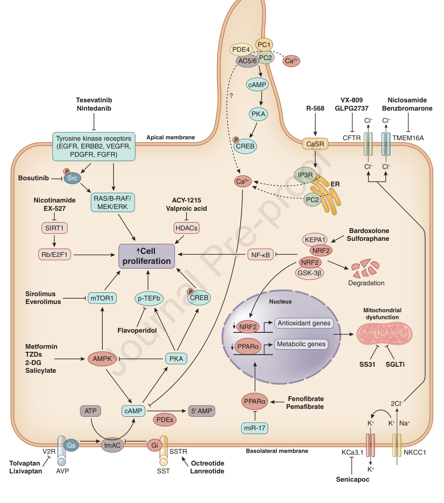

## Question

# Mechanistic Hypothesis Search

You are evaluating a specific disease mechanism hypothesis for the Disorder
Mechanisms Knowledge Base. This is not a general disease overview. Use the
hypothesis YAML below as the seed claim, then search for evidence that supports,
refutes, qualifies, or competes with this hypothesis.

## Target Disease
- **Disease Name:** Autosomal Dominant Polycystic Kidney Disease
- **Category:** Mendelian

## Target Hypothesis
- **Hypothesis ID:** canonical_pkd1_pkd2_cilia_signaling_cystogenesis_model
- **Hypothesis Label:** Canonical PKD1/PKD2 / Primary Cilium / Cystogenesis Model
- **Status in KB:** CANONICAL

## Seed Hypothesis YAML

```yaml
hypothesis_group_id: canonical_pkd1_pkd2_cilia_signaling_cystogenesis_model
hypothesis_label: Canonical PKD1/PKD2 / Primary Cilium / Cystogenesis Model
status: CANONICAL
description: Autosomal dominant polycystic kidney disease (ADPKD) is caused by heterozygous loss-of-function
  variants in PKD1 (~78%) or PKD2 (~15%) encoding polycystin-1 and polycystin-2, transmembrane proteins
  that localize to the primary cilium of renal tubular epithelial cells and form a mechanosensitive calcium
  channel complex. Loss of polycystin function disrupts ciliary calcium signaling, elevates cAMP, activates
  B-Raf/MEK/ERK proliferative signaling, and triggers progressive cyst formation, expansion, and tubular
  dilation throughout the kidney (and liver/pancreas). The 'two-hit' model — germline heterozygosity followed
  by somatic second-hit events in individual tubular epithelial cells — explains the focal nature of cyst
  initiation. Tolvaptan (V2-vasopressin receptor antagonist, lowering renal cAMP) is the first disease-modifying
  therapy and slows GFR decline, corroborating the cAMP-driven cystogenesis axis of the canonical model.
evidence:
- reference: PMID:40126492
  reference_title: Autosomal dominant polycystic kidney disease.
  supports: SUPPORT
  evidence_source: OTHER
  snippet: Most persons with ADPKD have an affected parent, but de novo disease is suggested in 10% to
    25% of families.
  explanation: |
    Existing canonical mechanism citation in the dismech knowledge base, used as the seed for the hypothesis-search deep-research run.
```

## Research Objective

Build a focused hypothesis-search report that answers:

1. What is the strongest direct evidence for this hypothesis?
2. What evidence argues against it, fails to reproduce it, or limits its scope?
3. Which claims are established, emerging, speculative, or contradicted?
4. Which patient subtypes, stages, tissues, cell types, molecular pathways, or
   biomarkers does the hypothesis best explain?
5. Which alternative or competing mechanistic hypotheses explain the same disease
   features better or more parsimoniously?
6. What are the explicit knowledge gaps: missing causal steps, unconfirmed edges,
   contradictory evidence, unknown source-to-target links, or source/data absences?
7. What experiments, cohorts, assays, datasets, or trials would most directly
   distinguish this hypothesis from alternatives?

Use primary literature whenever possible. Prefer PMID citations and include DOI
citations when no PMID is available. Treat reviews as orientation unless they
contain directly relevant synthesized evidence that should be clearly labeled as
review-level support.

## Required Output

### Executive Judgment

Give a concise verdict on the hypothesis as of the current literature:
supported, partially supported, unresolved, weakly supported, or refuted. Explain
the reasoning and the most important caveats.

### Evidence Matrix

Create a table with one row per important evidence item:

- Citation (PMID preferred)
- Evidence type (human clinical, model organism, in vitro, computational, review)
- Supports / refutes / qualifies / competing
- Mechanistic claim tested
- Key finding
- Disease subtype or context
- Confidence and limitations

### Mechanistic Causal Chain

Describe the causal chain implied by the hypothesis from upstream trigger to
clinical manifestation. Identify where the literature is strong, where the links
are inferred, and where there are missing causal steps.

### Knowledge Gaps

Identify explicit known unknowns surfaced by the search. Treat absence of
evidence as a curation-relevant finding only when the search actually checked for
it. Include:

- Unknown or weakly supported causal steps in the hypothesis
- Unconfirmed causal graph edges that need direct perturbation or longitudinal
  evidence
- Conflicting evidence, failed replications, or incompatible subtype-specific
  findings
- Unknown mechanism of action for relevant treatments, biomarkers, or
  interventions tied to this hypothesis
- Source-level or dataset-level absences, such as no relevant GenCC, ClinGen,
  trial, omics, or cohort evidence found as of the search date

For each gap, state the scope, why it matters, what was checked, and what
evidence or experiment would resolve it.

### Alternative Models

List competing or complementary hypotheses. For each, explain whether it is an
alternative to the seed hypothesis, a downstream consequence, an upstream cause,
or a parallel mechanism.

### Discriminating Tests

Recommend concrete studies or assays that would most efficiently test this
hypothesis against alternatives. Include patient stratification, biomarkers,
sample type, model system, perturbation, and expected result where applicable.

### Curation Leads

Provide candidate updates for the KB, but label these as leads requiring curator
verification. Include:

- candidate evidence references and exact abstract snippets to verify
- candidate pathophysiology nodes or edges
- candidate ontology terms for cell types and biological processes
- candidate subtype restrictions or status changes
- candidate `knowledge_gaps` or discussion prompts for unresolved causal claims,
  conflicting evidence, or explicit source/data absences

If the provider supports artifacts, produce artifact-friendly outputs such as an
evidence matrix, mechanistic diagram, knowledge-gap table, or comparison table.
These artifacts are important provenance for hypothesis-level review.


## Output

Question: You are an expert researcher providing comprehensive, well-cited information.

Provide detailed information focusing on:
1. Key concepts and definitions with current understanding
2. Recent developments and latest research (prioritize 2023-2024 sources)
3. Current applications and real-world implementations
4. Expert opinions and analysis from authoritative sources
5. Relevant statistics and data from recent studies

Format as a comprehensive research report with proper citations. Include URLs and publication dates where available.
Always prioritize recent, authoritative sources and provide specific citations for all major claims.

# Mechanistic Hypothesis Search

You are evaluating a specific disease mechanism hypothesis for the Disorder
Mechanisms Knowledge Base. This is not a general disease overview. Use the
hypothesis YAML below as the seed claim, then search for evidence that supports,
refutes, qualifies, or competes with this hypothesis.

## Target Disease
- **Disease Name:** Autosomal Dominant Polycystic Kidney Disease
- **Category:** Mendelian

## Target Hypothesis
- **Hypothesis ID:** canonical_pkd1_pkd2_cilia_signaling_cystogenesis_model
- **Hypothesis Label:** Canonical PKD1/PKD2 / Primary Cilium / Cystogenesis Model
- **Status in KB:** CANONICAL

## Seed Hypothesis YAML

```yaml
hypothesis_group_id: canonical_pkd1_pkd2_cilia_signaling_cystogenesis_model
hypothesis_label: Canonical PKD1/PKD2 / Primary Cilium / Cystogenesis Model
status: CANONICAL
description: Autosomal dominant polycystic kidney disease (ADPKD) is caused by heterozygous loss-of-function
  variants in PKD1 (~78%) or PKD2 (~15%) encoding polycystin-1 and polycystin-2, transmembrane proteins
  that localize to the primary cilium of renal tubular epithelial cells and form a mechanosensitive calcium
  channel complex. Loss of polycystin function disrupts ciliary calcium signaling, elevates cAMP, activates
  B-Raf/MEK/ERK proliferative signaling, and triggers progressive cyst formation, expansion, and tubular
  dilation throughout the kidney (and liver/pancreas). The 'two-hit' model — germline heterozygosity followed
  by somatic second-hit events in individual tubular epithelial cells — explains the focal nature of cyst
  initiation. Tolvaptan (V2-vasopressin receptor antagonist, lowering renal cAMP) is the first disease-modifying
  therapy and slows GFR decline, corroborating the cAMP-driven cystogenesis axis of the canonical model.
evidence:
- reference: PMID:40126492
  reference_title: Autosomal dominant polycystic kidney disease.
  supports: SUPPORT
  evidence_source: OTHER
  snippet: Most persons with ADPKD have an affected parent, but de novo disease is suggested in 10% to
    25% of families.
  explanation: |
    Existing canonical mechanism citation in the dismech knowledge base, used as the seed for the hypothesis-search deep-research run.
```

## Research Objective

Build a focused hypothesis-search report that answers:

1. What is the strongest direct evidence for this hypothesis?
2. What evidence argues against it, fails to reproduce it, or limits its scope?
3. Which claims are established, emerging, speculative, or contradicted?
4. Which patient subtypes, stages, tissues, cell types, molecular pathways, or
   biomarkers does the hypothesis best explain?
5. Which alternative or competing mechanistic hypotheses explain the same disease
   features better or more parsimoniously?
6. What are the explicit knowledge gaps: missing causal steps, unconfirmed edges,
   contradictory evidence, unknown source-to-target links, or source/data absences?
7. What experiments, cohorts, assays, datasets, or trials would most directly
   distinguish this hypothesis from alternatives?

Use primary literature whenever possible. Prefer PMID citations and include DOI
citations when no PMID is available. Treat reviews as orientation unless they
contain directly relevant synthesized evidence that should be clearly labeled as
review-level support.

## Required Output

### Executive Judgment

Give a concise verdict on the hypothesis as of the current literature:
supported, partially supported, unresolved, weakly supported, or refuted. Explain
the reasoning and the most important caveats.

### Evidence Matrix

Create a table with one row per important evidence item:

- Citation (PMID preferred)
- Evidence type (human clinical, model organism, in vitro, computational, review)
- Supports / refutes / qualifies / competing
- Mechanistic claim tested
- Key finding
- Disease subtype or context
- Confidence and limitations

### Mechanistic Causal Chain

Describe the causal chain implied by the hypothesis from upstream trigger to
clinical manifestation. Identify where the literature is strong, where the links
are inferred, and where there are missing causal steps.

### Knowledge Gaps

Identify explicit known unknowns surfaced by the search. Treat absence of
evidence as a curation-relevant finding only when the search actually checked for
it. Include:

- Unknown or weakly supported causal steps in the hypothesis
- Unconfirmed causal graph edges that need direct perturbation or longitudinal
  evidence
- Conflicting evidence, failed replications, or incompatible subtype-specific
  findings
- Unknown mechanism of action for relevant treatments, biomarkers, or
  interventions tied to this hypothesis
- Source-level or dataset-level absences, such as no relevant GenCC, ClinGen,
  trial, omics, or cohort evidence found as of the search date

For each gap, state the scope, why it matters, what was checked, and what
evidence or experiment would resolve it.

### Alternative Models

List competing or complementary hypotheses. For each, explain whether it is an
alternative to the seed hypothesis, a downstream consequence, an upstream cause,
or a parallel mechanism.

### Discriminating Tests

Recommend concrete studies or assays that would most efficiently test this
hypothesis against alternatives. Include patient stratification, biomarkers,
sample type, model system, perturbation, and expected result where applicable.

### Curation Leads

Provide candidate updates for the KB, but label these as leads requiring curator
verification. Include:

- candidate evidence references and exact abstract snippets to verify
- candidate pathophysiology nodes or edges
- candidate ontology terms for cell types and biological processes
- candidate subtype restrictions or status changes
- candidate `knowledge_gaps` or discussion prompts for unresolved causal claims,
  conflicting evidence, or explicit source/data absences

If the provider supports artifacts, produce artifact-friendly outputs such as an
evidence matrix, mechanistic diagram, knowledge-gap table, or comparison table.
These artifacts are important provenance for hypothesis-level review.


# Hypothesis-Search Report: Canonical PKD1/PKD2 / Primary Cilium / Cystogenesis Model in ADPKD

**Hypothesis ID:** canonical_pkd1_pkd2_cilia_signaling_cystogenesis_model  
**Target disease:** Autosomal dominant polycystic kidney disease (ADPKD)  
**Report date:** 2026-05-25

## Executive Judgment

**Verdict: partially supported (strongly supported for gene causality, cAMP-driven cyst growth, and V2R antagonism; qualified/unresolved for “mechanosensitive ciliary Ca2+ channel complex” as the singular initiating signal).**

The strongest support for the canonical hypothesis is (i) overwhelming human genetic evidence that PKD1 and PKD2 are the principal causal genes for typical ADPKD, (ii) substantial evidence that **cAMP/PKA-driven proliferation and fluid secretion** are central to cyst expansion, and (iii) clinical efficacy of **tolvaptan (V2R antagonism)** consistent with targeting a vasopressin→cAMP axis. Quantitatively, a recent synthesis reports **somatic second hits detected in up to 93% of cysts**, supporting the focal “two-hit” component of the canonical model. (OpenTargets Search: autosomal dominant polycystic kidney disease-PKD1,PKD2,AVPR2,ADCY,PDE,BRAF,MAP2K1,MAPK1, zhou2023drugrepurposingin pages 1-6, qiu2023mechanismsofcyst pages 3-4)

However, multiple lines of evidence qualify the strict “cilia mechanosensation → Ca2+ decrease → cAMP increase” linear narrative: (a) detailed physiologic reviews summarize **controversy over the directionality and magnitude of flow-induced ciliary Ca2+ signals**, including data consistent with **ER-to-cilium Ca2+** rather than cilium-to-ER signaling; (b) **haploinsufficiency/threshold** and **developmental timing (‘third hit’/injury)** models complicate an exclusively biallelic-loss-driven initiation step; (c) genetic epistasis in models supports a **cilia-dependent signaling switch** (cilia removal can reduce severity of Pkd1-null cystic disease), implying that intact cilia can be pro-cystic when polycystin signaling is absent. (alorjani2025mechanisticinsightsinto pages 3-4, boletta2025physiologicmechanismsunderlying pages 14-15, preval2025pathogenicpathwaysand pages 2-4)

## 1. Key Concepts and Definitions (current understanding)

### 1.1 Polycystins and localization
- **PKD1** encodes polycystin-1 (PC1) and **PKD2** encodes polycystin-2 (PC2), widely framed as core causal genes for ADPKD. (OpenTargets Search: autosomal dominant polycystic kidney disease-PKD1,PKD2,AVPR2,ADCY,PDE,BRAF,MAP2K1,MAPK1)
- Polycystins are repeatedly described as enriched in **primary cilia** in renal tubular epithelial cells, with additional functional pools reported at the **endoplasmic reticulum (ER)** and **plasma membrane**, especially for PC2. This multi-compartment biology is important because it weakens any claim that “cilia-only” signaling explains all phenotypes. (qiu2023mechanismsofcyst pages 3-4, wang2024pkd2animportant pages 16-17)

### 1.2 “Two-hit” model vs haploinsufficiency/threshold models
- **Two-hit model (molecular recessive at cyst level):** germline heterozygous pathogenic variant plus somatic inactivation of the remaining allele within a given cyst clone. A 2023 synthesis reports **second hits detected in up to 93% of cysts**. (qiu2023mechanismsofcyst pages 3-4)
- **Haploinsufficiency/threshold models:** some cysts may arise without detectable biallelic loss; disease severity can be dose-dependent, and partial reduction of functional polycystin below a threshold can trigger cyst initiation. (preval2025pathogenicpathwaysand pages 2-4, qiu2023mechanismsofcyst pages 3-4)

### 1.3 Canonical downstream cyst expansion axis
- **Reduced cytosolic Ca2+** is linked to **higher cAMP** via increased activity of **adenylyl cyclases (AC5/AC6)** and reduced activity of Ca2+-dependent phosphodiesterases (e.g., PDE1), with downstream **PKA activation**. (zhou2023drugrepurposingin pages 6-9)
- cAMP/PKA promotes (i) **epithelial proliferation** (including via MAPK/ERK cascade) and (ii) **fluid secretion** (e.g., CFTR/TMEM16A chloride secretion), leading to cyst enlargement. A 2023 figure summary captures this therapeutic logic and highlights V2R antagonism by tolvaptan. (zhou2023drugrepurposingin pages 6-9, zhou2023drugrepurposingin media 4070aad8)

## 2. Strongest Direct Evidence For the Hypothesis

### 2.1 PKD1/PKD2 are the dominant causal genes in typical ADPKD (human genetics)
OpenTargets prioritizes **PKD1** and **PKD2** as top ADPKD-associated targets with far higher association scores than other candidates, reflecting extensive genetic and clinical evidence aggregation. (OpenTargets Search: autosomal dominant polycystic kidney disease-PKD1,PKD2,AVPR2,ADCY,PDE,BRAF,MAP2K1,MAPK1)

### 2.2 Two-hit/somatic second hit explains focal cyst initiation
A 2023 synthesis reports molecular analyses showing cyst clonality with somatic inactivation of the remaining allele, with **second hits detected in up to 93% of cysts**. This is among the most quantitative, KB-ready support for the “two-hit” clause in the hypothesis. (qiu2023mechanismsofcyst pages 3-4)

### 2.3 cAMP axis is a validated cyst-growth driver (preclinical genetics and pharmacology)
A 2023 Kidney International synthesis summarizes a mechanistic framework in which **reduced cytosolic Ca2+ increases cAMP** through activation of AC5/6 and inhibition of Ca2+-dependent PDEs, and highlights multiple approaches to reduce cAMP signaling. (zhou2023drugrepurposingin pages 6-9)

### 2.4 Tolvaptan efficacy corroborates a vasopressin→cAMP cyst-growth axis (human trials)
A 2023 Kidney International synthesis summarizes pivotal trials:
- **TEMPO 3:4 (3 years):** tolvaptan reduced **total kidney volume (TKV) growth by 49%** and reduced **GFR decline rate by 26%**. (zhou2023drugrepurposingin pages 1-6)
- **REPRISE (1 year):** tolvaptan slowed eGFR decline in later-stage ADPKD. (zhou2023drugrepurposingin pages 1-6)

The therapeutic target logic is visually summarized in an accompanying schematic highlighting V2R→cAMP→PKA→proliferation/fluid secretion and tolvaptan blockade. (zhou2023drugrepurposingin media 4070aad8)

## 3. Evidence That Qualifies, Competes With, or Limits the Hypothesis

### 3.1 Flow/mechanosensation → Ca2+ signaling is debated and may not be the sole initiating signal
A detailed physiologic review summarizes landmark experiments supporting cilium bending/flow-induced Ca2+ signaling and its reduction in Pkd1 mutant cells, but also later data questioning whether ciliary Ca2+ entry is polycystin-mediated and whether ciliary Ca2+ spikes are sufficient to trigger cytosolic/ER Ca2+ release; some evidence supports reverse causality (ER Ca2+ release elevating axonemal Ca2+). (boletta2025physiologicmechanismsunderlying pages 14-15)

### 3.2 Not all cysts show detectable second hits; threshold/haploinsufficiency and “third hit” are important scope conditions
A recent pathway review explicitly notes that **some human cysts do not show detectable second hits on sequencing**, and emphasizes:
- **Haploinsufficiency**: dose-dependent disease in allelic series.
- **Third hit/injury and timing**: early postnatal polycystin loss causes rapid cyst growth, while later loss produces slower, focal disease. (preval2025pathogenicpathwaysand pages 2-4)

### 3.3 Cilia ablation can both cause cysts and reduce Pkd1-driven severity (“cilia signaling switch”)
A mechanistic synthesis summarizes genetic evidence that loss of cilia can cause cysts, but paradoxically, **simultaneous deletion of Pkd1 and a ciliogenesis gene (Kif3a/Ift88)** can reduce cyst severity compared with Pkd1 loss alone, consistent with a model where the cilium can transmit pro-cystic signals when polycystin signaling is absent. (alorjani2025mechanisticinsightsinto pages 3-4)

### 3.4 Competing upstream explanation for why second hits occur: DNA damage/replication stress
- Human ADPKD cells show chromosomal instability and defective DNA damage signaling/checkpoints, suggesting a plausible driver of somatic mutagenesis and clonal expansion. (afrin2025kidneyorganoidmodels pages 12-16)
- A 2025 primary mechanistic study reports abundant **G-quadruplex structures in human PKD1** that can provoke DNA breaks, offering a molecular mechanism for elevated second-hit propensity in human PKD1 compared with mouse. (preval2025pathogenicpathwaysand pages 2-4)

### 3.5 Competing/complementary progression mechanisms: inflammation and innate immune signaling
A 2024 study in Pkd1 mutant mice shows **STING upregulation** driven by nuclear/mitochondrial DNA, with downstream NF-κB activation and macrophage recruitment; pharmacologic STING inhibition (C-176) delayed cyst growth and reduced fibrosis while improving mitochondrial structure/function. (wu2024stingpromotesthe pages 1-2)

## 4. Patient Subtypes, Stages, Tissues, Cell Types, and Biomarkers Best Explained

### 4.1 Best explained contexts
- **Typical ADPKD due to PKD1/PKD2**: canonical model fits best where polycystin dosage is reduced and cAMP-driven expansion is dominant. (OpenTargets Search: autosomal dominant polycystic kidney disease-PKD1,PKD2,AVPR2,ADCY,PDE,BRAF,MAP2K1,MAPK1, zhou2023drugrepurposingin pages 6-9)
- **Rapidly progressive ADPKD**: therapeutic responsiveness to tolvaptan is most evident in trial-defined high-risk populations. (zhou2023drugrepurposingin pages 1-6, kim2023recentupdatesin pages 1-2)

### 4.2 Stage specificity
- **Initiation**: two-hit model strongly supported, but with caveats (some cysts without detectable second hits; injury/timing effects). (qiu2023mechanismsofcyst pages 3-4, preval2025pathogenicpathwaysand pages 2-4)
- **Growth/expansion**: cAMP/PKA effects on proliferation and fluid secretion; MAPK/ERK and ion transport (CFTR/TMEM16A) are consistent downstream effectors. (zhou2023drugrepurposingin pages 6-9, zhou2023drugrepurposingin media 4070aad8)
- **Progression/fibrosis**: inflammation/innate immune mechanisms (e.g., STING) plausibly amplify disease and fibrosis. (wu2024stingpromotesthe pages 1-2)

### 4.3 Biomarkers and real-world stratification relevant to the hypothesis
Implementation-oriented tolvaptan literature emphasizes:
- Imaging-based risk stratification (Mayo classification 1C–1E often considered rapid progressors) and TKV-based criteria (e.g., ≥750 mL in some settings). (kim2023recentupdatesin pages 1-2, NCT02847624 chunk 1)
- Pharmacodynamic/implementation biomarkers: urine osmolality suppression as a marker of drug effect/adherence. (kim2023recentupdatesin pages 6-8, NCT02497521 chunk 1)

## 5. Evidence Matrix

| Citation (PMID/DOI) | Publication date/year | Evidence type | Supports / refutes / qualifies / competes | Mechanistic claim tested | Key finding (include quantitative stats when present) | Context / subtype | Limitations / notes | URL |
|---|---|---|---|---|---|---|---|---|
| OpenTargets ADPKD target association: PKD1, PKD2 | Accessed 2026 | Human genetics / knowledgebase aggregation | Supports | PKD1 and PKD2 are the principal disease genes for ADPKD | OpenTargets lists ADPKD-associated targets led by **PKD1** (score 0.8595; evidence count 5) and **PKD2** (score 0.8377; evidence count 5), far above other targets, consistent with canonical gene causality in ADPKD (OpenTargets Search: autosomal dominant polycystic kidney disease-PKD1,PKD2,AVPR2,ADCY,PDE,BRAF,MAP2K1,MAPK1) | ADPKD overall | Aggregated resource, not itself a mechanistic experiment; does not resolve downstream pathway details | https://platform.opentargets.org |
| Qiu, Germino, Menezes 2023; DOI: 10.1053/j.akdh.2023.03.001 | May 2023 | Review-level synthesis of human cyst genetics and mouse models | Supports | Somatic second hits in PKD1/PKD2 drive focal cyst initiation | Review summarizes molecular analyses showing individual cysts are clonal and that a **second hit was detected in up to 93% of cysts**; heterozygous Pkd1/Pkd2 animals are largely healthy whereas somatic inactivation drives cysts (qiu2023mechanismsofcyst pages 3-4) | Typical ADPKD cyst initiation | Review rather than primary dataset in provided context; no PMID captured in tool output | https://doi.org/10.1053/j.akdh.2023.03.001 |
| Zhou & Torres 2023; DOI: 10.1016/j.kint.2023.02.010 | May 2023 | Clinical + translational review summarizing animal and RCT evidence | Supports | Vasopressin-V2R-driven cAMP is a key cystogenic axis; lowering cAMP with tolvaptan slows disease | Vasopressin is described as the main hormonal regulator of cAMP in collecting duct/distal nephron cells; V2R antagonists ameliorated cyst growth in animal models. In **TEMPO 3:4**, tolvaptan reduced **total kidney growth by 49%** and **GFR decline by 26%** over 3 years; **REPRISE** also slowed eGFR decline over 1 year (zhou2023drugrepurposingin pages 1-6, zhou2023drugrepurposingin media 4070aad8) | Rapidly progressive ADPKD; collecting duct/distal nephron emphasis | Review-level synthesis; not direct proof of every upstream ciliary/Ca2+ step; treatment effect does not uniquely validate mechanosensation model | https://doi.org/10.1016/j.kint.2023.02.010 |
| Al-orjani et al. 2025; DOI: 10.3390/cells14151203 | Aug 2025 | Mechanistic review synthesizing genetic and pharmacologic studies | Supports and qualifies | Loss of polycystin lowers Ca2+, raises cAMP, activates PKA/B-Raf/MEK/ERK; cilia can also mediate pro-cystic signaling when polycystins are absent | Summarizes evidence that low Ca2+ enhances **AC6** and suppresses Ca2+/calmodulin-dependent PDEs, causing cAMP accumulation; reduced Ca2+ disinhibits **cAMP/PKA/B-Raf/MEK/ERK**. Reports model evidence that **constitutively active B-Raf** in collecting ducts causes cysts and **sorafenib** blocks cAMP-induced B-Raf/MEK/ERK activation and in vitro cyst growth. Also notes **Pkd1+Kif3a** or **Pkd1+Ift88** double knockouts reduce cyst severity versus Pkd1 loss alone, qualifying a simple “loss of cilia = more cysts” model (alorjani2025mechanisticinsightsinto pages 15-17, alorjani2025mechanisticinsightsinto pages 3-4) | ADPKD models, especially collecting duct and cilia-perturbation models | Mostly review-level and model-organism evidence; not a single primary experiment; quantitative effect sizes for the cilia paradox not provided in context | https://doi.org/10.3390/cells14151203 |
| Boletta & Caplan 2025; DOI: 10.1152/physrev.00018.2024 | Feb 2025 | High-level physiologic review | Qualifies | Primary cilia/polycystins mediate flow-related Ca2+ signaling, but the canonical flow-mechanosensation model is incomplete and debated | Summarizes landmark studies where cilium bending/apical flow triggered ER Ca2+ release and this signal was almost completely lost in **Pkd1** mutant cells, supporting the original model. But later work found only small ciliary Ca2+ influx on bending, millisecond ciliary Ca2+ spikes not sufficient to trigger bulk ER release, and possible reverse causality from ER to cilium; review explicitly describes a **dual role of cilia in renal cystogenesis** and “complicated interdependence” between cilia and polycystins (boletta2025physiologicmechanismsunderlying pages 12-14, boletta2025physiologicmechanismsunderlying pages 14-15) | Renal epithelial cells; mechanosensation literature across PKD models | Review-level evidence; controversy remains unresolved in the provided context; not direct patient-level proof | https://doi.org/10.1152/physrev.00018.2024 |
| Chen et al. 2024; DOI: 10.3390/ijms25052936 | Mar 2024 | Human cell studies + human kidney IHC | Competing / complementary | DNA damage repair defects and chromosomal instability may help generate second hits and/or confer cystic growth advantage | ADPKD renal tubular epithelial lines and primary PKD1-mutant cells showed **severe chromosome breakage, aneuploidy, heightened DNA-damage susceptibility, and delayed checkpoint activation**; ATM/ATR signaling was activated but mislocalized, with defective CHK1/CHK2 activation. Human kidney IHC corroborated abnormalities (paper abstract from search results) | PKD1-mutant human cells; ADPKD pathogenesis | Competes as an upstream second-hit-generation model rather than refuting cAMP/cilia model; causal link from instability to specific cyst-initiating mutations still not fully proven in context | https://doi.org/10.3390/ijms25052936 |
| Parsons et al. 2025; DOI: 10.1038/s41467-024-55684-y | Jan 2025 | Primary mechanistic molecular study | Supports and competes | Human PKD1 sequence architecture promotes DNA breaks, offering a mechanism for somatic second hits | Demonstrates that **guanine quadruplex DNA structures are abundant throughout human, but not mouse, PKD1** and activate the DNA-damage response; authors conclude G4 DNA can provoke DNA breaks in **PKD1**, providing a plausible mechanism for second-hit inactivation and helping explain why human PKD1 is especially prone to somatic mutation (search abstract and snippet) (preval2025pathogenicpathwaysand pages 2-4) | Human PKD1 second-hit mechanism | Strong for a mutagenesis mechanism, but does not directly test ciliary signaling, Ca2+, cAMP, or therapy response; publication-level context did not expose numeric mutation rates | https://doi.org/10.1038/s41467-024-55684-y |
| Wu et al. 2024; DOI: 10.3390/biom14101215 | Sep 2024 | Mouse models + cell biology | Competing / complementary | Inflammatory STING signaling promotes ADPKD progression downstream or parallel to PKD1 loss | In **Pkd1** mutant mouse kidneys, STING was upregulated by nuclear/mitochondrial DNA; STING activation increased **NF-kB**, macrophage recruitment, **TNF-α** and **MCP-1**. Pharmacologic STING inhibition (**C-176**) delayed cyst growth in both an aggressive early-stage and a milder long-duration Pkd1 model, while improving mitochondrial structure/function and reducing fibrosis/apoptosis abnormalities (preval2025pathogenicpathwaysand pages 2-4) | Pkd1 mutant mouse ADPKD progression | Does not refute canonical PKD1/PKD2-cilia-cAMP model; better interpreted as a progression/amplification pathway, especially for inflammation/fibrosis | https://doi.org/10.3390/biom14101215 |


*Table: This table summarizes the main evidence items supporting, qualifying, or competing with the canonical PKD1/PKD2-primary cilium-Ca2+/cAMP/MAPK cystogenesis model in ADPKD. It is useful for hypothesis-level curation because it separates strong evidence for gene causality and cAMP-targeted therapy from more debated steps such as ciliary flow mechanosensation and emerging alternative drivers like DNA damage and STING-mediated inflammation.*

## 6. Mechanistic Causal Chain (with strength of support)

### 6.1 Causal chain implied by the seed hypothesis
1. **Germline heterozygous LOF in PKD1/PKD2** → reduced functional polycystin dosage. (**Strong**: human genetics) (OpenTargets Search: autosomal dominant polycystic kidney disease-PKD1,PKD2,AVPR2,ADCY,PDE,BRAF,MAP2K1,MAPK1)
2. **Somatic second hit** in a subset of tubular epithelial cells → biallelic loss in focal clones → cyst initiation. (**Strong but not universal**: second hit up to 93%; some cysts without detectable second hits) (qiu2023mechanismsofcyst pages 3-4, preval2025pathogenicpathwaysand pages 2-4)
3. **Loss of polycystin function at the primary cilium** perturbs Ca2+ signaling (and/or ER/plasma-membrane Ca2+ handling). (**Moderate**: supported, but compartment and causality are debated) (boletta2025physiologicmechanismsunderlying pages 14-15, wang2024pkd2animportant pages 16-17)
4. **Reduced cytosolic Ca2+ increases cAMP** (via AC5/6 and PDE regulation). (**Moderate-to-strong**: repeated mechanistic synthesis; direct causal quantification is context-dependent) (zhou2023drugrepurposingin pages 6-9)
5. **cAMP → PKA** drives proliferation and fluid secretion (CFTR/TMEM16A; MAPK/ERK signaling). (**Strong for expansion**; ERK linkage supported in mechanistic syntheses) (zhou2023drugrepurposingin pages 6-9, zhou2023drugrepurposingin media 4070aad8)
6. **Cyst expansion → kidney enlargement → declining eGFR**, with inflammation/fibrosis as modifiers. (**Strong clinically** via trial endpoints and progression frameworks) (zhou2023drugrepurposingin pages 1-6, wu2024stingpromotesthe pages 1-2)

### 6.2 Where links are inferred vs directly demonstrated
- The most inference-heavy edge in the canonical chain is “**ciliary mechanosensation** is the dominant physiological input causing the key Ca2+ changes,” given explicit controversy and alternative directionality in Ca2+ signaling (cilium vs ER). (boletta2025physiologicmechanismsunderlying pages 14-15)
- Several downstream axes (mTORC1, Hippo/YAP/TAZ, STING) can be interpreted as downstream amplifiers or parallel drivers of proliferation and fibrosis rather than consequences of cAMP alone. (alorjani2025mechanisticinsightsinto pages 18-20, wu2024stingpromotesthe pages 1-2)

## 7. Recent Developments and Latest Research (prioritizing 2023–2024)

### 7.1 2023: Consolidation of therapy-correlated cAMP model
- A 2023 Kidney International synthesis collates clinical and preclinical evidence supporting vasopressin V2R as a major regulator of renal cAMP and summarizes quantitative TEMPO/REPRISE effects, strengthening the translational link between cAMP signaling and disease modification. (zhou2023drugrepurposingin pages 1-6)

### 7.2 2024: Emerging “second hit generation” and “inflammation amplifier” models
- 2024 cell-based evidence supports a model where **genomic instability / defective DNA damage response** contributes to somatic mutagenesis and potentially cyst progression. (afrin2025kidneyorganoidmodels pages 12-16)
- 2024 Pkd1 mouse work supports **STING** as a tractable inflammatory target that modifies cyst growth and fibrosis, pointing to an immune-amplification layer beyond the cAMP axis. (wu2024stingpromotesthe pages 1-2)

## 8. Current Applications and Real-World Implementations

### 8.1 Tolvaptan implementation and monitoring
A 2023 clinical implementation review emphasizes:
- Target population: rapid progressors (commonly Mayo 1C–1E), with nuanced decision-making for class 1C depending on age/eGFR/genetics. (kim2023recentupdatesin pages 6-8)
- Safety: monthly liver tests for the first 18 months, then every 3 months; explicit stopping rules for significant transaminase/bilirubin abnormalities; aquaretic symptoms are common and adherence-limiting. (kim2023recentupdatesin pages 6-8, kim2023recentupdatesin pages 4-5)

### 8.2 Real-world registries (ClinicalTrials.gov)
- **German ADPKD Tolvaptan Treatment Registry (NCT02497521; started 2015; target n≈2000):** collects long-term real-world dosing, discontinuation, urine osmolarity, eGFR, and imaging (MRI TKV) with yearly follow-up over ~10 years. (NCT02497521 chunk 1)
- **Japanese post-marketing surveillance (NCT02847624; started 2014; n=1802; completed 2022):** effectiveness endpoints include slopes of TKV and eGFR pre- vs on-treatment; safety includes detailed hepatic enzyme monitoring and subgroup analyses by age and baseline kidney function. (NCT02847624 chunk 1)

## 9. Knowledge Gaps (explicit and curation-relevant)

1. **Is ciliary flow-induced Ca2+ entry necessary and sufficient for cyst suppression?**  
   *Why it matters:* It is a core initiating step in the seed hypothesis but is explicitly debated.  
   *What was checked:* Physiologic synthesis documenting contradictory Ca2+ directionality and magnitude.  
   *Resolution experiment:* microfluidic shear systems with selective channel-dead PC2 in cilia vs intact ER pools; simultaneous Ca2+/cAMP/pERK readouts. (boletta2025physiologicmechanismsunderlying pages 14-15)

2. **What fraction of early cysts truly lack second hits vs missing detection (technical limits, mosaicism, structural variants)?**  
   *Why it matters:* changes whether cyst initiation is best modeled as two-hit vs threshold/third-hit.  
   *What was checked:* explicit statement that some cysts lack detectable second hits; quantitative upper estimate up to 93% with second hits.  
   *Resolution experiment:* single-cyst long-read and multi-omic profiling across nephron segments. (qiu2023mechanismsofcyst pages 3-4, preval2025pathogenicpathwaysand pages 2-4)

3. **How do non-ciliary pools of PC2 (ER/plasma membrane) integrate with ciliary signaling?**  
   *Why it matters:* canonical model is cilia-centered; ER PC2 may be protective and may invert causal direction for Ca2+.  
   *What was checked:* evidence of ER localization and alternative Ca2+ signaling interpretations.  
   *Resolution experiment:* compartment-specific PC2 rescue/knockdown and Ca2+ flux mapping. (boletta2025physiologicmechanismsunderlying pages 14-15, wang2024pkd2animportant pages 16-17)

4. **What are the dominant upstream drivers of somatic second hits in human PKD1/PKD2?**  
   *Why it matters:* second hits are central to focal initiation; mutagenesis mechanisms could be therapeutically targetable or explain species differences.  
   *What was checked:* genomic instability in ADPKD cells; G-quadruplex-driven PKD1 DNA breaks in a primary study.  
   *Resolution experiment:* longitudinal tracking of somatic PKD1 lesions under replication stress and G4 modulation in human tubuloids. (preval2025pathogenicpathwaysand pages 2-4, afrin2025kidneyorganoidmodels pages 12-16)

5. **How should inflammation (e.g., STING axis) be positioned: driver vs modifier, and at what stage?**  
   *Why it matters:* identifies stage-specific therapeutic combinations with tolvaptan.  
   *What was checked:* STING inhibition modifies cyst growth and fibrosis in Pkd1 models.  
   *Resolution experiment:* factorial tolvaptan × STING inhibition with time-of-initiation stratification and inflammatory biomarkers. (wu2024stingpromotesthe pages 1-2)

## 10. Alternative / Competing Models

1. **Cilia-dependent signaling switch (dual role of cilia)** — *competing explanation for cilia’s role:* cilia can be protective in wild-type but pro-cystic in polycystin-null settings, consistent with paradoxical genetic epistasis (Pkd1 plus cilia gene knockouts reducing severity). (alorjani2025mechanisticinsightsinto pages 3-4)

2. **DNA damage/replication stress-driven second-hit generation** — *upstream of two-hit initiation:* chromosomal instability and G-quadruplex-driven PKD1 DNA breaks could explain frequent somatic inactivation and species differences. (preval2025pathogenicpathwaysand pages 2-4, afrin2025kidneyorganoidmodels pages 12-16)

3. **Innate immunity/inflammation (cGAS–STING–NF-κB; macrophage recruitment)** — *progression amplifier downstream/parallel to PKD1 loss:* STING inhibition slows cyst growth and fibrosis. (wu2024stingpromotesthe pages 1-2)

4. **mTORC1 and metabolic rewiring** — *downstream proliferative/metabolic drivers with feedback to cilia:* mTORC1 activation and metabolic reprogramming (Warburg-like shift, mitochondrial dysfunction) are repeatedly described as contributing to growth/progression and may not be fully downstream of cAMP. (qiu2023mechanismsofcyst pages 7-9, alorjani2025mechanisticinsightsinto pages 17-18)

5. **Hippo/YAP/TAZ via RhoA–ROCK** — *parallel proliferative mechanotransduction axis:* described as activated by PC1 loss and promoting c-Myc-driven proliferation, potentially separable from cAMP. (alorjani2025mechanisticinsightsinto pages 18-20)

## 11. Discriminating Tests

| Test question | Study design/model | Perturbation | Readouts/biomarkers | Expected result if canonical model is primary driver | Expected result if alternative model is primary driver | Key citation anchors |
|---|---|---|---|---|---|---|
| Does acute restoration of ciliary polycystin Ca2+ signaling normalize cystogenic signaling before broad stress pathways change? | Isogenic human ADPKD kidney organoids and collecting-duct tubuloids with inducible PKD1 or PKD2 rescue | Induce wild-type PKD1/PKD2 re-expression or cilia-targeted functional PC2; compare with inactive trafficking-defective rescue | Ciliary and cytosolic Ca2+ transients, cAMP, PKA activity, pERK, CFTR/TMEM16A-mediated swelling, cyst number/size | Rapid correction of Ca2+ handling with secondary fall in cAMP/pERK and reduced cyst swelling/proliferation | Little or delayed effect on cyst phenotypes unless DNA-damage, inflammatory, or metabolic pathways are also corrected | (alorjani2025mechanisticinsightsinto pages 15-17, boletta2025physiologicmechanismsunderlying pages 12-14, boletta2025physiologicmechanismsunderlying pages 14-15) |
| Is flow-induced ciliary Ca2+ entry necessary for cyst suppression? | Microfluidic renal epithelial monolayers or organoids with controlled shear stress | Abolish flow sensing selectively by cilia immobilization or channel-dead PC2 while preserving non-ciliary PC2 pools | Intra-ciliary Ca2+, ER Ca2+, cAMP, pERK, proliferation, cyst initiation frequency | Loss of flow/ciliary Ca2+ should reproduce the major biochemical and cystic phenotype | Weak or inconsistent phenotype would favor non-ciliary, threshold, or cilia-switch models over strict mechanosensation causality | (preval2025pathogenicpathwaysand pages 2-4, boletta2025physiologicmechanismsunderlying pages 12-14, boletta2025physiologicmechanismsunderlying pages 14-15) |
| Is cAMP lowering sufficient to suppress cystogenesis despite ongoing DNA damage/second-hit generation? | PKD1+/- human organoids or tubuloids engineered to accumulate replication stress | V2R antagonism or AC5/6 inhibition versus G4 stabilization / DNA damage induction | New somatic PKD1/PKD2 lesions, clonal expansion, cAMP, pERK, cyst initiation versus growth | Tolvaptan/AC inhibition should markedly suppress cyst initiation and growth even if mutagenic pressure persists | Persistent emergence of new cyst clones despite cAMP suppression would support DNA damage/second-hit generation as a primary upstream driver | (preval2025pathogenicpathwaysand pages 2-4, zhou2023drugrepurposingin pages 6-9, zhou2023drugrepurposingin pages 1-6, qiu2023mechanismsofcyst pages 3-4) |
| Are second hits the dominant determinant of focal cyst initiation? | Single-cyst and single-cell multi-omics from human ADPKD nephrectomy tissue across nephron segments | No experimental perturbation; deep long-read sequencing plus spatial transcriptomics | PKD1/PKD2 second-hit frequency, LOH, clonality, cAMP-response genes, inflammatory and metabolic signatures | Most early cysts should show biallelic loss with canonical cAMP/ERK signatures | A substantial fraction of early cysts without second hits but with strong injury, inflammatory, or metabolic programs would support threshold/third-hit/parallel models | (qiu2023mechanismsofcyst pages 3-4, preval2025pathogenicpathwaysand pages 2-4) |
| Does blocking STING suppress disease independently of cAMP correction? | Early and late Pkd1 mouse models or human organoids with inflammatory co-culture | STING inhibitor (e.g., C-176 analog) alone and combined with tolvaptan | Cyst burden, NF-kB, TNF-alpha, MCP-1, macrophage recruitment, fibrosis, cAMP, pERK, mitochondrial integrity | Tolvaptan should account for most benefit; STING blockade should add modest mainly anti-inflammatory effects | Strong cyst suppression with STING blockade despite limited cAMP correction would support inflammatory signaling as a major driver of progression | (alorjani2025mechanisticinsightsinto pages 18-20, wu2024stingpromotesthe pages 1-2) |
| Is mTOR/metabolic rewiring downstream of cAMP, or an independent essential driver? | Isogenic PKD organoids with Seahorse/metabolomics profiling | Tolvaptan or AC inhibition versus mTORC1 inhibition and metabolic interventions (2-DG, FAO rescue) alone and in combination | OCR/ECAR, ATP, fatty-acid oxidation, pS6, autophagy flux, cyst growth, pERK | cAMP lowering should normalize much of the metabolic and growth phenotype; mTOR/metabolic drugs add limited incremental benefit | Persistent cyst suppression by mTOR/metabolic rescue despite continued high cAMP would favor an independent or parallel metabolic driver | (qiu2023mechanismsofcyst pages 7-9, alorjani2025mechanisticinsightsinto pages 17-18, alorjani2025mechanisticinsightsinto pages 15-17) |
| Is Hippo/YAP/TAZ activation merely downstream of canonical cAMP/ERK, or a separable cystogenic axis? | Pkd1-deficient organoids with inducible YAP/TAZ reporters | ROCK inhibition or YAP/TAZ inhibition versus tolvaptan; rescue combinations | Nuclear YAP/TAZ, c-Myc, proliferation, cyst expansion, cAMP, pERK | Tolvaptan should substantially reduce YAP/TAZ activation if canonical signaling is upstream | Continued YAP/TAZ activation and cyst suppression by ROCK/YAP blockade despite unchanged cAMP would support a parallel mechanotransduction/Hippo model | (alorjani2025mechanisticinsightsinto pages 18-20, alorjani2025mechanisticinsightsinto pages 15-17) |
| Does cilia removal worsen or improve PKD1-null cystogenesis? | Conditional mouse genetics and matched human organoid cilia-ablation experiments | Compare Pkd1 loss alone versus Pkd1 plus Kif3a/Ift88 deletion | Cyst burden, nephron segment distribution, cAMP, pERK, cilia-dependent transcriptional states | Removing cilia should worsen disease if the cilium is mainly protective through polycystin signaling | Attenuation of Pkd1-null cyst severity after cilia ablation would support the cilia-signaling-switch model over the simple canonical cilia-loss narrative | (alorjani2025mechanisticinsightsinto pages 3-4, boletta2025physiologicmechanismsunderlying pages 14-15) |
| Which biomarker changes first in presymptomatic carriers approaching cyst initiation? | Longitudinal cohort of genotype-positive young carriers with serial urine, plasma, and MRI sampling | Observational; stratify by PKD1 vs PKD2 and eventual rapid progression | Copeptin, urine osmolality, urinary cAMP surrogates, MCP-1, mitochondrial injury markers, cfDNA/DNA-damage markers, early TKV microcysts | Vasopressin/cAMP-related biomarkers should rise earliest and best predict near-term cyst emergence | Earlier shifts in cfDNA/DNA-damage or inflammatory markers would argue for upstream second-hit generation or inflammation-first models | (kim2023recentupdatesin pages 6-8, NCT02847624 chunk 1, lapao2025autosomaldominantpolycystic pages 2-4) |


*Table: This table outlines concrete experiments and cohorts that could separate the canonical PKD1/PKD2 ciliary Ca2+/cAMP/ERK model from key alternative mechanisms in ADPKD. It is useful for hypothesis curation because it links each mechanistic question to specific perturbations, biomarkers, and predicted outcomes.*

## 12. Curation Leads (curator-verification required)

### 12.1 Candidate evidence references and snippets to verify
- **Two-hit frequency:** “a second-hit was detected in up to 93% of the cysts” (Qiu et al., 2023; DOI:10.1053/j.akdh.2023.03.001). (qiu2023mechanismsofcyst pages 3-4)
- **Cysts without detectable second hits + timing:** statement that “some human cysts do not appear to have second hits when sequenced” and that early postnatal loss causes rapid cyst growth (Preval et al., 2025). (preval2025pathogenicpathwaysand pages 2-4)
- **Mechanosensation controversy:** summary that later work questioned whether bending-induced ciliary Ca2+ signals trigger ER Ca2+ release and possible reverse causality ER→cilium (Boletta & Caplan, 2025). (boletta2025physiologicmechanismsunderlying pages 14-15)
- **Cilia signaling switch:** statement that Pkd1+Kif3a (or Pkd1+Ift88) double knockout reduces severity vs Pkd1 deletion alone (Al-orjani et al., 2025). (alorjani2025mechanisticinsightsinto pages 3-4)
- **Clinical corroboration:** TEMPO 3:4 “49% reduction in TKV growth” and “26% reduction in GFR decline rate” (Zhou & Torres, 2023). (zhou2023drugrepurposingin pages 1-6)
- **Inflammation axis:** STING inhibitor C-176 delaying cyst growth and reducing fibrosis in Pkd1 models (Wu et al., 2024). (wu2024stingpromotesthe pages 1-2)

### 12.2 Candidate KB graph nodes/edges
- Nodes: primary cilium; ER calcium signaling; vasopressin V2 receptor (AVPR2/V2R); AC5/AC6; PDE1; cAMP; PKA; B-Raf/MEK/ERK; CFTR; TMEM16A; mTORC1; Hippo (YAP/TAZ); cGAS–STING; NF-κB; macrophage recruitment; fibrosis. (zhou2023drugrepurposingin pages 6-9, zhou2023drugrepurposingin media 4070aad8, alorjani2025mechanisticinsightsinto pages 18-20, wu2024stingpromotesthe pages 1-2)

### 12.3 Candidate subtype restrictions / status updates
- Retain overall hypothesis status as **CANONICAL**, but annotate that “ciliary mechanosensitive Ca2+ channel complex as the dominant initiating physiological signal” is **qualified** by contradictory Ca2+ directionality data and cilia-switch epistasis. (alorjani2025mechanisticinsightsinto pages 3-4, boletta2025physiologicmechanismsunderlying pages 14-15)

### 12.4 Candidate knowledge_gap entries
- “Fraction of early cysts lacking detectable second hits vs technical false negatives; needs single-cyst long-read sequencing.” (qiu2023mechanismsofcyst pages 3-4, preval2025pathogenicpathwaysand pages 2-4)
- “Compartment-specific roles of PC2 (cilia vs ER) in initiating Ca2+/cAMP changes.” (boletta2025physiologicmechanismsunderlying pages 14-15, wang2024pkd2animportant pages 16-17)

## Visual provenance (mechanistic schematic)

A schematic depiction of the vasopressin V2R→cAMP→PKA→proliferation/fluid secretion axis and tolvaptan blockade, with polycystin/Ca2+ context, is available as Figure 1 in Zhou & Torres 2023. (zhou2023drugrepurposingin media 4070aad8)

---

## Notes on source types

Several key mechanistic claims are supported here primarily by high-quality reviews/syntheses that summarize many primary studies (e.g., Zhou & Torres 2023; Qiu 2023; Boletta & Caplan 2025; Preval 2025; Al-orjani 2025). Where possible, the report highlights quantitative or mechanistically specific statements within these syntheses, but curator verification against the original primary papers is recommended for KB “direct evidence” entries.


References

1. (OpenTargets Search: autosomal dominant polycystic kidney disease-PKD1,PKD2,AVPR2,ADCY,PDE,BRAF,MAP2K1,MAPK1): Open Targets Query (autosomal dominant polycystic kidney disease-PKD1,PKD2,AVPR2,ADCY,PDE,BRAF,MAP2K1,MAPK1, 22 results). Buniello, A. et al. (2025). Open Targets Platform: facilitating therapeutic hypotheses building in drug discovery. Nucleic Acids Research.

2. (zhou2023drugrepurposingin pages 1-6): Julie Xia Zhou and Vicente E. Torres. Drug repurposing in autosomal dominant polycystic kidney disease. Kidney International, 103:859-871, May 2023. URL: https://doi.org/10.1016/j.kint.2023.02.010, doi:10.1016/j.kint.2023.02.010. This article has 5 citations and is from a highest quality peer-reviewed journal.

3. (qiu2023mechanismsofcyst pages 3-4): Jiahe Qiu, Gregory G. Germino, and Luis F. Menezes. Mechanisms of cyst development in polycystic kidney disease. Advances in kidney disease and health, 30 3:209-219, May 2023. URL: https://doi.org/10.1053/j.akdh.2023.03.001, doi:10.1053/j.akdh.2023.03.001. This article has 23 citations.

4. (alorjani2025mechanisticinsightsinto pages 3-4): Qasim Al-orjani, Lubna A Alshriem, Gillian Gallagher, Raghad Buqaileh, Neela Azizi, and Wissam AbouAlaiwi. Mechanistic insights into the pathogenesis of polycystic kidney disease. Cells, Aug 2025. URL: https://doi.org/10.3390/cells14151203, doi:10.3390/cells14151203. This article has 13 citations.

5. (boletta2025physiologicmechanismsunderlying pages 14-15): Alessandra Boletta and Michael J. Caplan. Physiologic mechanisms underlying polycystic kidney disease. Physiological reviews, Feb 2025. URL: https://doi.org/10.1152/physrev.00018.2024, doi:10.1152/physrev.00018.2024. This article has 35 citations and is from a highest quality peer-reviewed journal.

6. (preval2025pathogenicpathwaysand pages 2-4): Kenley M. Preval, Abigail O. Smith, and Gregory J. Pazour. Pathogenic pathways and therapeutic strategies in autosomal dominant polycystic kidney disease (adpkd). Journal of Cellular Signaling, 6:156, Dec 2025. URL: https://doi.org/10.33696/signaling.6.144, doi:10.33696/signaling.6.144. This article has 1 citations.

7. (wang2024pkd2animportant pages 16-17): Shuo Wang, Yunsi Kang, and Haibo Xie. Pkd2: an important membrane protein in organ development. Cells, 13:1722, Oct 2024. URL: https://doi.org/10.3390/cells13201722, doi:10.3390/cells13201722. This article has 8 citations.

8. (zhou2023drugrepurposingin pages 6-9): Julie Xia Zhou and Vicente E. Torres. Drug repurposing in autosomal dominant polycystic kidney disease. Kidney International, 103:859-871, May 2023. URL: https://doi.org/10.1016/j.kint.2023.02.010, doi:10.1016/j.kint.2023.02.010. This article has 5 citations and is from a highest quality peer-reviewed journal.

9. (zhou2023drugrepurposingin media 4070aad8): Julie Xia Zhou and Vicente E. Torres. Drug repurposing in autosomal dominant polycystic kidney disease. Kidney International, 103:859-871, May 2023. URL: https://doi.org/10.1016/j.kint.2023.02.010, doi:10.1016/j.kint.2023.02.010. This article has 5 citations and is from a highest quality peer-reviewed journal.

10. (afrin2025kidneyorganoidmodels pages 12-16): Humayra Afrin, Usama Qamar, Jielu Hao Robichaud, Mohammad Ellabbad, Peter C. Harris, and Navin Gupta. Kidney organoid models of polycystic kidney disease: challenges and future directions. American Journal of Physiology-Renal Physiology, 329:F143-F159, Jul 2025. URL: https://doi.org/10.1152/ajprenal.00116.2025, doi:10.1152/ajprenal.00116.2025. This article has 6 citations and is from a peer-reviewed journal.

11. (wu2024stingpromotesthe pages 1-2): Jiao Wu, Shasha Cheng, Geoffray Lee, Ewud Agborbesong, Xiaoyan Li, Xia Zhou, and Xiaogang Li. Sting promotes the progression of adpkd by regulating mitochondrial function, inflammation, fibrosis, and apoptosis. Biomolecules, 14:1215, Sep 2024. URL: https://doi.org/10.3390/biom14101215, doi:10.3390/biom14101215. This article has 10 citations.

12. (kim2023recentupdatesin pages 1-2): Yaerim Kim and Seungyeup Han. Recent updates in therapeutic approach using tolvaptan for autosomal dominant polycystic kidney disease. The Korean Journal of Internal Medicine, 38:322-331, May 2023. URL: https://doi.org/10.3904/kjim.2022.376, doi:10.3904/kjim.2022.376. This article has 14 citations and is from a peer-reviewed journal.

13. (NCT02847624 chunk 1):  Post-Marketing Surveillance Study of Tolvaptan in Patients With ADPKD. Otsuka Pharmaceutical Co., Ltd.. 2014. ClinicalTrials.gov Identifier: NCT02847624

14. (kim2023recentupdatesin pages 6-8): Yaerim Kim and Seungyeup Han. Recent updates in therapeutic approach using tolvaptan for autosomal dominant polycystic kidney disease. The Korean Journal of Internal Medicine, 38:322-331, May 2023. URL: https://doi.org/10.3904/kjim.2022.376, doi:10.3904/kjim.2022.376. This article has 14 citations and is from a peer-reviewed journal.

15. (NCT02497521 chunk 1): Roman Müller. The German ADPKD Tolvaptan Treatment Registry. University of Cologne. 2015. ClinicalTrials.gov Identifier: NCT02497521

16. (alorjani2025mechanisticinsightsinto pages 15-17): Qasim Al-orjani, Lubna A Alshriem, Gillian Gallagher, Raghad Buqaileh, Neela Azizi, and Wissam AbouAlaiwi. Mechanistic insights into the pathogenesis of polycystic kidney disease. Cells, Aug 2025. URL: https://doi.org/10.3390/cells14151203, doi:10.3390/cells14151203. This article has 13 citations.

17. (boletta2025physiologicmechanismsunderlying pages 12-14): Alessandra Boletta and Michael J. Caplan. Physiologic mechanisms underlying polycystic kidney disease. Physiological reviews, Feb 2025. URL: https://doi.org/10.1152/physrev.00018.2024, doi:10.1152/physrev.00018.2024. This article has 35 citations and is from a highest quality peer-reviewed journal.

18. (alorjani2025mechanisticinsightsinto pages 18-20): Qasim Al-orjani, Lubna A Alshriem, Gillian Gallagher, Raghad Buqaileh, Neela Azizi, and Wissam AbouAlaiwi. Mechanistic insights into the pathogenesis of polycystic kidney disease. Cells, Aug 2025. URL: https://doi.org/10.3390/cells14151203, doi:10.3390/cells14151203. This article has 13 citations.

19. (kim2023recentupdatesin pages 4-5): Yaerim Kim and Seungyeup Han. Recent updates in therapeutic approach using tolvaptan for autosomal dominant polycystic kidney disease. The Korean Journal of Internal Medicine, 38:322-331, May 2023. URL: https://doi.org/10.3904/kjim.2022.376, doi:10.3904/kjim.2022.376. This article has 14 citations and is from a peer-reviewed journal.

20. (qiu2023mechanismsofcyst pages 7-9): Jiahe Qiu, Gregory G. Germino, and Luis F. Menezes. Mechanisms of cyst development in polycystic kidney disease. Advances in kidney disease and health, 30 3:209-219, May 2023. URL: https://doi.org/10.1053/j.akdh.2023.03.001, doi:10.1053/j.akdh.2023.03.001. This article has 23 citations.

21. (alorjani2025mechanisticinsightsinto pages 17-18): Qasim Al-orjani, Lubna A Alshriem, Gillian Gallagher, Raghad Buqaileh, Neela Azizi, and Wissam AbouAlaiwi. Mechanistic insights into the pathogenesis of polycystic kidney disease. Cells, Aug 2025. URL: https://doi.org/10.3390/cells14151203, doi:10.3390/cells14151203. This article has 13 citations.

22. (lapao2025autosomaldominantpolycystic pages 2-4): Tânia Lapão, Rui Barata, Cristina Jorge, Carlos Flores, and Joaquim Calado. Autosomal dominant polycystic kidney disease inflammation biomarkers in the tolvaptan era. International Journal of Molecular Sciences, 26:1121, Jan 2025. URL: https://doi.org/10.3390/ijms26031121, doi:10.3390/ijms26031121. This article has 2 citations.

## Artifacts

- [Edison artifact artifact-00](falcon_artifacts/artifact-00.md)
- [Edison artifact artifact-01](falcon_artifacts/artifact-01.md)

