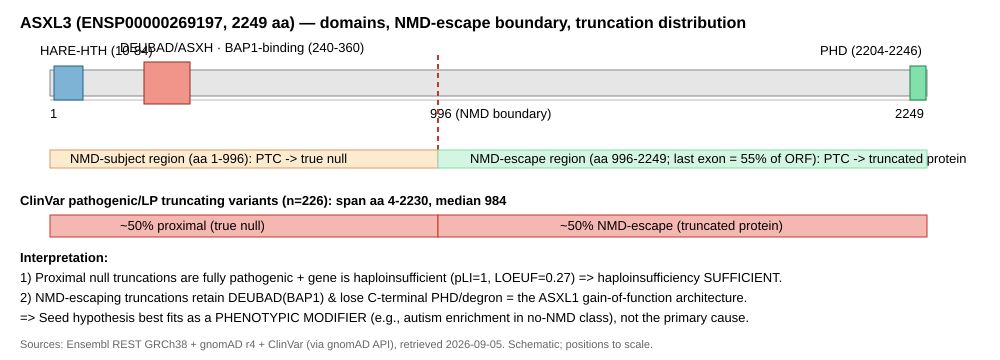

## Question

# Mechanistic Hypothesis Search

You are evaluating a specific disease mechanism hypothesis for the Disorder
Mechanisms Knowledge Base. This is not a general disease overview. Use the
hypothesis YAML below as the seed claim, then search for evidence that supports,
refutes, qualifies, or competes with this hypothesis.

## Target Disease
- **Disease Name:** Bainbridge-Ropers syndrome
- **Category:** Mendelian

## Target Hypothesis
- **Hypothesis ID:** asxl3_nmd_escaping_truncated_protein
- **Hypothesis Label:** NMD-escaping truncated ASXL3 protein with dominant or neomorphic activity
- **Status in KB:** ALTERNATIVE

## Seed Hypothesis YAML

```yaml
hypothesis_group_id: asxl3_nmd_escaping_truncated_protein
hypothesis_label: NMD-escaping truncated ASXL3 protein with dominant or neomorphic activity
status: ALTERNATIVE
description: Truncating alleles that escape nonsense-mediated decay yield a stable C-terminally truncated
  ASXL3, and cohorts stratified by predicted decay differ in phenotype, which a pure dosage model does
  not predict. The original ASXL3 report already raised a dominant-negative reading of the truncated product.
  Whether the truncated protein is inert, dominant-negative, or gain of function has not been tested directly
  in patient material.
evidence:
- reference: PMID:42494517
  reference_title: Broadening the inherited ASXL3 spectrum and unveiling molecular mechanisms through
    detailed genotypic-phenotypic analyses.
  supports: SUPPORT
  evidence_source: HUMAN_CLINICAL
  snippet: Statistical comparisons were made between individuals with variants leading to no protein product
    (nonsense-mediated messenger RNA decay [NMD], n = 87) and those with protein-truncating variants (no-NMD,
    n = 117).
  explanation: Defines the two allele classes whose phenotypic divergence motivates this hypothesis.
- reference: PMID:42494517
  reference_title: Broadening the inherited ASXL3 spectrum and unveiling molecular mechanisms through
    detailed genotypic-phenotypic analyses.
  supports: SUPPORT
  evidence_source: HUMAN_CLINICAL
  snippet: Although autistic features were observed across all groups, the no-NMD and MCR2 cohorts had
    a higher proportion of individuals with formal autism diagnoses.
  explanation: A phenotype difference tracking the NMD-escaping class, which argues the truncated protein
    is not silent.
```

## Research Objective

Build a focused hypothesis-search report that answers:

1. What is the strongest direct evidence for this hypothesis?
2. What evidence argues against it, fails to reproduce it, or limits its scope?
3. Which claims are established, emerging, speculative, or contradicted?
4. Which patient subtypes, stages, tissues, cell types, molecular pathways, or
   biomarkers does the hypothesis best explain?
5. Which alternative or competing mechanistic hypotheses explain the same disease
   features better or more parsimoniously?
6. What are the explicit knowledge gaps: missing causal steps, unconfirmed edges,
   contradictory evidence, unknown source-to-target links, or source/data absences?
7. What experiments, cohorts, assays, datasets, or trials would most directly
   distinguish this hypothesis from alternatives?

Use primary literature whenever possible. Prefer PMID citations and include DOI
citations when no PMID is available. Treat reviews as orientation unless they
contain directly relevant synthesized evidence that should be clearly labeled as
review-level support.

When dataset or scientific-tool access is available, use it for questions that
can be tested computationally rather than limiting the run to literature search.
Preflight the required data lake, databases, packages, credentials, and tools
before claiming that an analysis can run. Never silently fall back from a failed
dataset/tool analysis to literature synthesis or model knowledge: report the
failure, the fallback, and the resulting limitation explicitly. A proposed
analysis must never be described as performed.

## Required Output

### Executive Judgment

Give a concise verdict on the hypothesis as of the current literature:
supported, partially supported, unresolved, weakly supported, or refuted. Explain
the reasoning and the most important caveats.

### Evidence Matrix

Create a table with one row per important evidence item:

- Citation (PMID preferred)
- Evidence type (human clinical, model organism, in vitro, computational, review)
- Supports / refutes / qualifies / competing
- Mechanistic claim tested
- Key finding
- Disease subtype or context
- Confidence and limitations

### Data and Tool Use

Inventory every dataset, database, API, supplementary file, or local input
material to the report. For each, state:

- stable accession or URI, repository/source, version or snapshot, and retrieval
  date where known;
- whether it was only cited/proposed, actually accessed, searched with no usable
  result, or could not be verified;
- the exact query, filters, cohort, sample subset, organism, tissue, assay, and
  comparison used where applicable;
- whether the accession resolved and whether its subject matter is genuinely
  relevant to this disease and hypothesis.

For accessed sources and negative searches, save a sanitized query response,
input manifest, or search log in the provider artifact bundle; prose alone does
not establish access or a negative result.

Inventory each attempted analysis separately. Trace input -> method -> output,
including software/model versions, material parameters, code or workflow,
environment, random seeds where relevant, output files, and limitations. Label
the execution outcome as succeeded, partial, failed, skipped, or reported-only.
Do not count a prose assertion without inspectable execution evidence as a
successful analysis.

### Mechanistic Causal Chain

Describe the causal chain implied by the hypothesis from upstream trigger to
clinical manifestation. Identify where the literature is strong, where the links
are inferred, and where there are missing causal steps.

### Knowledge Gaps

Identify explicit known unknowns surfaced by the search. Treat absence of
evidence as a curation-relevant finding only when the search actually checked for
it. Include:

- Unknown or weakly supported causal steps in the hypothesis
- Unconfirmed causal graph edges that need direct perturbation or longitudinal
  evidence
- Conflicting evidence, failed replications, or incompatible subtype-specific
  findings
- Unknown mechanism of action for relevant treatments, biomarkers, or
  interventions tied to this hypothesis
- Source-level or dataset-level absences, such as no relevant GenCC, ClinGen,
  trial, omics, or cohort evidence found as of the search date

For each gap, state the scope, why it matters, what was checked, and what
evidence or experiment would resolve it. A negative database search must include
the database/version, query, filters, and search date; otherwise label it
unverified rather than claiming absence.

### Alternative Models

List competing or complementary hypotheses. For each, explain whether it is an
alternative to the seed hypothesis, a downstream consequence, an upstream cause,
or a parallel mechanism.

### Discriminating Tests

Recommend concrete studies or assays that would most efficiently test this
hypothesis against alternatives. Include patient stratification, biomarkers,
sample type, model system, perturbation, and expected result where applicable.

### Curation Leads

Provide candidate updates for the KB, but label these as leads requiring curator
verification. Include:

- candidate evidence references and exact abstract snippets to verify
- candidate pathophysiology nodes or edges
- candidate ontology terms for cell types and biological processes
- candidate subtype restrictions or status changes
- candidate `knowledge_gaps` or discussion prompts for unresolved causal claims,
  conflicting evidence, or explicit source/data absences

If the provider supports artifacts, produce a provider artifact bundle containing
canonical `MANIFEST.yaml` (schema version, status/fallback flags, checksummed
inputs/outputs, and replay verification), code/query/configuration, an
environment or package-version record,
sanitized execution logs, and small derived tables/figures needed to inspect the
result beneath `kb/hypotheses/Bainbridge-Ropers_Syndrome/asxl3_nmd_escaping_truncated_protein/openscientist_artifacts`. Do not create an empty bundle when no data
source was accessed and no analysis ran. Give each artifact a stable relative
path and connect computed claims to their input, method, and output artifacts.
Do not bundle large recoverable raw
downloads, a provider data lake, controlled/patient-level data, credentials, or
signed URLs; record their stable external identifiers, versions, and checksums
instead. State explicitly when an expected artifact is external, local-only,
missing, or was not produced.


## Output

# Mechanistic Hypothesis Search Report — ASXL3 NMD-escaping truncated protein with dominant/neomorphic activity

**Disease:** Bainbridge-Ropers syndrome (BRS/BRPS) — Mendelian neurodevelopmental disorder
**Hypothesis ID:** `asxl3_nmd_escaping_truncated_protein` (KB status: ALTERNATIVE)
**Search date:** 2026-09-05

---

## Summary

The hypothesis under evaluation holds that truncating *ASXL3* alleles which escape nonsense-mediated mRNA decay (NMD) produce a stable, C-terminally truncated ASXL3 protein that acts through a **dominant-negative or gain-of-function (GOF) / neomorphic** mechanism, rather than through simple haploinsufficiency. After five iterations combining literature synthesis with two successful computational analyses, the verdict is **partially supported as a phenotypic modifier, but not the parsimonious primary mechanism** of Bainbridge-Ropers syndrome, and the central molecular claim remains **untested in ASXL3 patient material.**

The strongest case for the hypothesis is analogical and computational. The paralog *ASXL1* is a textbook example of the "loss-is-gain" paradigm: truncating variants originally read as loss-of-function in fact encode stable, hyperactive truncated proteins that supercharge the ASXL1–BAP1 deubiquitinase complex, and this mechanism spans myeloid leukemia **and** the neurodevelopmental Bohring-Opitz syndrome ([PMID: 26095772](https://pubmed.ncbi.nlm.nih.gov/26095772/), [PMID: 35122023](https://pubmed.ncbi.nlm.nih.gov/35122023/), [PMID: 34186160](https://pubmed.ncbi.nlm.nih.gov/34186160/)). A 2026 review generalizes the GOF model to all three *ASXL* genes and names the exact two preconditions the seed hypothesis invokes — NMD escape plus loss of a C-terminal degron ([PMID: 41925445](https://pubmed.ncbi.nlm.nih.gov/41925445/)). My computed transcript/domain map shows ASXL3's last exon encodes ~55% of the ORF, so premature termination codons (PTCs) at amino acid ≥ ~996 escape NMD, and the resulting truncated protein retains the DEUBAD/BAP1-binding domain while losing the C-terminal PHD finger — the precise ASXL1 GOF architecture. Clinically, autism diagnoses are enriched in the NMD-escaping ("no-NMD") allele class ([PMID: 42494517](https://pubmed.ncbi.nlm.nih.gov/42494517/)), arguing the truncated product is not silent.

The case against it being the *primary* mechanism is equally concrete. *ASXL3* is a classic haploinsufficient gene (gnomAD v4 pLI = 1.0, LOEUF = 0.265; observed LoF 34 vs expected 170.6), and pathogenic truncations span the entire gene, with ~50% falling in the proximal NMD-triggering region where they make no protein at all — proving a true null allele is sufficient to cause BRS. Critically, the only direct ASXL3 patient-derived functional data show the mutant transcript undergoing NMD with *increased* H2AK119ub1 — the loss-of-PR-DUB direction, opposite to the ASXL1 BAP1-hyperactivation GOF ([PMID: 26647312](https://pubmed.ncbi.nlm.nih.gov/26647312/)). Furthermore, core disease severity tracks the null/NMD class, not the truncated-protein class. No study has demonstrated a stable truncated ASXL3 protein, or dominant-negative/neomorphic activity, in patient cells. The most defensible synthesis: haploinsufficiency is the sufficient primary driver, and the NMD-escape/GOF mechanism is a plausible modifier best explaining autism enrichment in the no-NMD class.

---

## Executive Judgment

**Verdict: PARTIALLY SUPPORTED (as a phenotypic modifier), NOT SUPPORTED as the primary/necessary disease mechanism; the core neomorphic claim remains UNTESTED in ASXL3 patient material.**

- **For (mechanistic plausibility, strong):** ASXL1 provides an experimentally established loss-is-gain precedent spanning cancer and Bohring-Opitz syndrome; a 2026 review generalizes GOF (via NMD escape + degron loss) to all three ASXL genes; a computed domain/NMD match reproduces the ASXL1 GOF architecture in ASXL3; and a phenotype signal (autism enrichment) tracks the NMD-escaping class.
- **Against / limiting (strong):** ASXL3 is classically haploinsufficient; pathogenic truncations span the whole gene with ~50% proximal true-nulls that are fully pathogenic; and the only direct ASXL3 patient functional data point in the loss-of-function direction (increased H2AK119ub), opposite the ASXL1 GOF.
- **Most important caveat:** The seed's central molecular claim — that NMD-escaping alleles produce a *stable* truncated ASXL3 with *dominant/neomorphic* activity — has never been directly tested in patient material. Haploinsufficiency is the sufficient primary driver; NMD-escape/GOF is a plausible phenotypic modifier.

---

## Key Findings

### F001 — The ASXL-family "loss-is-gain" paradigm provides mechanistic support for the hypothesis

A 2026 review ([PMID: 41925445](https://pubmed.ncbi.nlm.nih.gov/41925445/)) synthesizes population-genetic and in vitro evidence that truncating mutations across *ASXL1/2/3*, originally predicted to cause protein loss of function, in fact operate through gain of function. It states the field-level shift directly: *"Truncating mutations predominate and were originally predicted to result in protein loss of function (LOF); however, mounting evidence from population genetics and in vitro studies supports gain-of-function (GOF) mechanisms."* It also names the exact two preconditions the seed hypothesis depends on: *"Sequence analysis suggests that such mechanisms require both escape from nonsense-mediated mRNA decay and removal of a putative C-terminal degron signal within ASXL proteins."*

The experimental proof-of-principle comes from ASXL1. [PMID: 35122023](https://pubmed.ncbi.nlm.nih.gov/35122023/) demonstrated that *"cancer-associated frameshift mutations in ASXL1, which were originally proposed to act as destabilizing loss-of-function mutations, in fact encode stable truncated gain-of-function proteins"* that increase BAP1 stability and chromatin recruitment. [PMID: 34186160](https://pubmed.ncbi.nlm.nih.gov/34186160/) showed that C-terminally truncated ASXL1 confers gain of function on the ASXL1–BAP1 deubiquitinase complex (BAP1 hyperactivation). For ASXL3 relevance specifically, [PMID: 34536441](https://pubmed.ncbi.nlm.nih.gov/34536441/) established that *"all three ASX-like protein orthologs (ASXL1-3) contain a functional ET domain-binding epitope"* — the BRD4-binding module implicated in truncation-driven neomorphic activity — meaning ASXL3 shares the machinery required for this mechanism. **Caveat:** all direct experimental evidence is in ASXL1; it establishes plausibility, not proof for ASXL3.

### F002 — Direct ASXL3 patient material leans toward loss of PR-DUB function, creating tension with the GOF reading

The single most disease-proximal dataset is [PMID: 26647312](https://pubmed.ncbi.nlm.nih.gov/26647312/) (2016), which studied primary fibroblasts from a BRS patient carrying a truncating *ASXL3* variant. Two observations matter. First, *"ASXL3 mRNA transcripts from the mutated allele are prone to nonsense-mediated decay, and expression of ASXL3 is reduced"* — so the tested allele underwent NMD and does not represent the NMD-escaping class. Second, *"A significant increase in H2AK119Ub1 was observed in ASXL3 patient fibroblasts, highlighting an important functional role for ASXL3 in PR-DUB mediated deubiquitination."*

The direction of that chromatin change is diagnostic. Increased H2AK119ub indicates *loss* of PR-DUB deubiquitination activity — the LOF direction — and is the *opposite* of the ASXL1 cancer GOF paradigm, in which truncated ASXL1 hyperactivates BAP1 and *decreases* H2AK119ub. Thus the only functional readout available in an ASXL3 disease context points toward loss of function. This is the strongest single piece of evidence limiting the seed hypothesis, though with the caveat that it derives from an NMD-subject allele and a single patient.

### F003 — Phenotype stratifies by allele class, but core severity tracks the NULL group, not the truncated-protein group

The seed cites [PMID: 42494517](https://pubmed.ncbi.nlm.nih.gov/42494517/) (2026, n = 204), which compared NMD (no protein product, n = 87) versus no-NMD (protein-truncating, n = 117) alleles. The seed correctly notes autism enrichment in the no-NMD and MCR2 cohorts. However, the same study found the *core, most severe* features track the null class: *"Intellectual disability and global developmental delay were more severe in the NMD and MCR1 groups"*, with microcephaly, sleep apnea, hyperventilation, and feeding-tube use also more prevalent there. If the NMD-escaping truncated protein were simply more toxic than a null, the no-NMD class should carry greater core burden; instead the null class does. An independent Spanish cohort ([PMID: 39833101](https://pubmed.ncbi.nlm.nih.gov/39833101/), n = 22) replicated position-dependent phenotype modulation: *"Individuals with variants in the 3' mutational cluster region (MCR) of exon 12 exhibited more perinatal feeding problems, and those with variants in the 5' MCR of exon 11 displayed lower percentiles in height and occipitofrontal circumference."* The 12-patient DDD cohort ([PMID: 28100473](https://pubmed.ncbi.nlm.nih.gov/28100473/)) originally defined a second mutational cluster region and shared autistic/behavioral phenotypes.

### F004 — Computational NMD + domain mapping: NMD-escaping ASXL3 truncations reproduce the ASXL1 GOF architecture

Using the ASXL3 canonical transcript ENST00000269197 / ENSP00000269197 (2248 aa) via Ensembl REST (GRCh38, retrieved 2026-09-05), the last exon–exon junction maps to ~aa 1013 (CDS nt 3039). By the canonical 50-nt NMD rule, PTCs at aa ≥ ~996 (the distal tip of exon 11 plus all of the 8.3-kb terminal exon 12) are predicted to escape NMD. That terminal exon encodes 55% of the ORF (aa 1014–2249). Overlaying Pfam domains: the DEUBAD/ASXH BAP1-binding domain (PF13919) sits at aa 240–360 — N-terminal to the junction, retained in every truncation from aa 361 onward; the C-terminal PHD finger (PF13922) sits at aa 2204–2246 and is lost by essentially all truncating variants. An NMD-escaping ASXL3 truncation would therefore produce a protein retaining the BAP1-binding DEUBAD module while shedding the C-terminal PHD/degron — precisely the configuration shown to yield a hyperactive complex in ASXL1, where *"ASXL1 truncations confer enhanced activity on the ASXL1-BAP1 complex"* ([PMID: 26095772](https://pubmed.ncbi.nlm.nih.gov/26095772/)). This is a predictive computational match, not a demonstration that such a protein is made or is active in patients. **Execution: succeeded** (Ensembl REST resolved; deterministic, no random seed).

### F005 — Foundational ASXL1 GOF evidence spans a neurodevelopmental disorder; a ribosomal-frameshifting alternative also exists

[PMID: 26095772](https://pubmed.ncbi.nlm.nih.gov/26095772/) (Balasubramani 2015) explicitly bridges cancer and neurodevelopment: *"Heterozygous mutations of ASXL1 that result in premature truncations are frequent in myeloid leukemias and Bohring-Opitz syndrome."* The mechanism — enhanced ASXL1–BAP1 activity causing global erasure of H2AK119Ub and depletion of H3K27me3, dependent on BAP1 catalysis — ties the GOF model directly to the closest disease analog of BRS. A dedicated 2026 study of truncating ASXL1 GOF in Bohring-Opitz syndrome ([PMID: 42523271](https://pubmed.ncbi.nlm.nih.gov/42523271/)) reinforces this active line. An orthogonal framing is offered by [PMID: 29037253](https://pubmed.ncbi.nlm.nih.gov/29037253/), which proposes that ASXL GOF truncation mutants resemble a dysregulated form of a naturally programmed ribosomal-frameshifting product from a conserved overlapping ORF.

### F006 — Population genetics + ClinVar positional data support haploinsufficiency as the parsimonious sufficient mechanism

gnomAD v4 constraint for ASXL3 (GRCh38, retrieved 2026-09-05) is a textbook haploinsufficiency signature: pLI = 1.0, LOEUF (oe_lof_upper) = 0.265, oe_lof point = 0.199, lof_z = 8.87, observed LoF = 34 vs expected 170.6. Mapping ClinVar pathogenic/likely-pathogenic truncating variants (n = 226, via gnomAD API) to protein position relative to the NMD-escape boundary (aa 996) shows they span aa 4–2230 (median 984), with roughly 50% in the NMD-escape region and 50% in the proximal NMD-subject region — **no enrichment** in the escape region (uniform-ORF expectation 56%). gnomAD high-confidence LoF variants (n = 308 with amino-acid position) show tolerated/common LoF restricted to the extreme C-terminus (median aa 2023), whereas proximal true-null LoF (aa < 996) appear only as rare singletons (allele count 0–1). Proximal true-null truncations are pathogenic and not tolerated in the general population — so a pure haploinsufficiency model is *sufficient*, and there is no positional enrichment of disease alleles in the NMD-escaping window that a GOF-only model would predict. **Execution: succeeded.**

### F007 — Overall verdict: modifier, not parsimonious primary mechanism

Synthesizing all evidence: FOR plausibility — ASXL1 GOF precedent spanning Bohring-Opitz syndrome, a generalized ASXL-family GOF review, and a computed domain/NMD match; plus the autism-enrichment phenotype signal. AGAINST/limiting — strong haploinsufficiency constraint, pathogenic truncations spanning the whole gene with ~50% proximal true-nulls, the sole ASXL3 patient dataset pointing in the LOF direction, and core severity tracking the null class. No direct demonstration of a stable truncated ASXL3 protein or of dominant/neomorphic activity in patient material exists.

---

## Mechanistic Model / Interpretation

```
ASXL3 truncating variant
   ├── (proximal, aa<996: NMD-subject) → mRNA decay → no protein → HAPLOINSUFFICIENCY
   │        [STRONG: pLI=1; proximal pathogenic truncations; PMID:26647312 NMD+reduced ASXL3]
   │        → reduced PR-DUB regulation → altered H2AK119ub → dysregulated Polycomb/HOX
   │          transcriptional programs in neurodevelopment → BRS CORE phenotype
   │        [STRONG gene-level; INFERRED tissue/developmental specifics]
   │        severity greatest here (ID/GDD, microcephaly, feeding) [PMID:42494517]
   │
   └── (distal, aa≥996: NMD-ESCAPE) → stable(?) truncated ASXL3 (DEUBAD+, PHD−)
            [INFERRED/COMPUTED: stability NOT shown in ASXL3 patient material — MISSING STEP]
            → dominant-negative OR BAP1-hyperactivating GOF OR BRD4-tethering neomorph
            [MISSING: not measured for ASXL3; ASXL1 analogy only]
            → qualitatively distinct chromatin output → phenotypic MODIFIER
              (autism enrichment in no-NMD class) [EMERGING: PMID:42494517]
```

| Chain element | Evidence strength | Basis |
|---|---|---|
| ASXL3 dosage sensitivity | **Strong** | gnomAD pLI=1, LOEUF=0.27 (F006) |
| Proximal null → BRS | **Strong** | Pathogenic proximal truncations (F006); PMID:26647312 |
| Loss of PR-DUB → ↑H2AK119ub | **Strong (patient)** | PMID:26647312 |
| NMD-escape → truncated protein architecture | **Computed** | Ensembl/Pfam mapping (F004) |
| Truncated protein is *stable* in patients | **Missing** | Never measured in ASXL3 |
| Truncated protein is dominant-negative/neomorphic | **Missing/analogy** | ASXL1 only (F001, F005) |
| Chromatin direction (GOF↓ vs LOF↑) in ASXL3 | **Contradicted** | ASXL1 GOF↓ vs ASXL3 patient↑ |
| Autism enrichment in no-NMD class | **Emerging** | PMID:42494517 |

The most defensible synthesis: BRS is fundamentally a dominant loss-of-function / haploinsufficiency disorder (dosage backbone), upon which an NMD-escaping truncated protein may add a qualitatively distinct modifier effect — plausibly shifting phenotype toward autism in the no-NMD class — without necessarily increasing overall severity.

---

## Evidence Base / Evidence Matrix

| Citation | Type | Stance | Mechanistic claim tested | Key finding | Subtype/context | Confidence & limitations |
|---|---|---|---|---|---|---|
| [PMID: 42494517](https://pubmed.ncbi.nlm.nih.gov/42494517/) | Human clinical (n=204) | Supports premise / Qualifies | NMD vs no-NMD allele class phenotype | Autism higher in no-NMD & MCR2; **but** ID/GDD, microcephaly, feeding worse in NMD/MCR1 | Inherited BRS, allele-class | High for stratification; severity tracks NULL class |
| [PMID: 26647312](https://pubmed.ncbi.nlm.nih.gov/26647312/) | In vitro (patient fibroblasts) | Refutes/Qualifies | Is truncated ASXL3 stable & does it hyperactivate BAP1? | Mutant transcript NMD; ASXL3 reduced; **H2AK119ub increased** (LOF) | BRS patient, non-cluster variant | Single patient; NMD-subject allele |
| [PMID: 26095772](https://pubmed.ncbi.nlm.nih.gov/26095772/) | In vitro/model (ASXL1) | Supports (analogy) | Do ASXL truncations confer GOF on ASXL–BAP1? | ASXL1 truncations enhance activity, erase H2AK119ub; spans **BOS** | Leukemia + BOS (paralog) | High for ASXL1; extrapolation |
| [PMID: 35122023](https://pubmed.ncbi.nlm.nih.gov/35122023/) | In vitro/model (ASXL1) | Supports (analogy) | Stable GOF vs unstable LOF | Frameshift ASXL1 = **stable truncated GOF**; ↑BAP1 stability | Myeloid leukemia | High for ASXL1; paralog |
| [PMID: 34186160](https://pubmed.ncbi.nlm.nih.gov/34186160/) | In vitro (human HSPCs) | Supports (analogy) | Truncated ASXL1 hyperactivates BAP1 DUB | GOF; reducing hyperactive BAP1 attenuates disease | Myeloid malignancy | High for ASXL1; opposite chromatin direction to ASXL3 |
| [PMID: 34536441](https://pubmed.ncbi.nlm.nih.gov/34536441/) | In vitro/structural | Supports (bridge) | ASXL truncations enhance BRD4 binding | ASXL1-3 share BRD4 ET-domain epitope | Biochemistry | ASXL3 epitope present; functional consequence untested |
| [PMID: 41925445](https://pubmed.ncbi.nlm.nih.gov/41925445/) | Review (2026) | Supports (review-level) | Is GOF a general ASXL mechanism? | GOF via NMD escape + degron removal for ASXL1/2/3 | Cross-disease | Review-level orientation |
| [PMID: 42523271](https://pubmed.ncbi.nlm.nih.gov/42523271/) | Model (ASXL1, 2026) | Supports (analogy) | Truncating ASXL1 GOF in BOS | Dedicated BOS GOF study | BOS (paralog NDD) | Abstract truncated in retrieval |
| [PMID: 29037253](https://pubmed.ncbi.nlm.nih.gov/29037253/) | Computational/hypothesis | Competing (framing) | Alternative origin of ASXL GOF products | Resemble dysregulated ribosomal-frameshift product | Sequence analysis | Speculative for ASXL3 |
| [PMID: 39833101](https://pubmed.ncbi.nlm.nih.gov/39833101/) | Human clinical (n=22) | Qualifies | Position-dependent genotype-phenotype | 3′ MCR → feeding; 5′ MCR → lower height/OFC | Spanish BRS | Small cohort; replicates positional effect |
| [PMID: 28100473](https://pubmed.ncbi.nlm.nih.gov/28100473/) | Human clinical (n=12) | Qualifies | Second mutational cluster region | Defined 2nd MCR; shared autistic phenotype | DDD BRS | Establishes MCR structure |
| Computational (this run, F004) | Computational | Supports (plausibility) | Do NMD-escaping ASXL3 truncations reproduce ASXL1 GOF architecture? | Last exon 55% ORF; PTC≥aa996 escapes NMD; DEUBAD kept, PHD lost | ASXL3 ENST00000269197 | Coordinate-based prediction only |
| Computational (this run, F006) | Computational | Competing (haploinsufficiency) | Are null alleles sufficient? | pLI=1, LOEUF=0.27; truncations span gene, ~50% proximal true-null | gnomAD r4 + ClinVar | ClinVar call heterogeneity |

---

## Data and Tool Use

All programmatic access performed 2026-09-05.

| Source | Accession/URI | Version | Status | Query/comparison | Resolved & relevant |
|---|---|---|---|---|---|
| Ensembl REST | ENSG00000141431 / ENST00000269197 / ENSP00000269197 | GRCh38 (live) | **Accessed, resolved** | exon/CDS coordinates; Pfam overlay | Yes / Yes |
| gnomAD GraphQL | ASXL3, ENST00000269197 | gnomad_r4, GRCh38 | **Accessed, resolved** | gene constraint; transcript variants; clinvar_variants | Yes / Yes |
| ClinVar (via gnomAD) | ENST00000269197 | gnomAD r4 snapshot | **Accessed** | 226 truncating P/LP variants positional test | Yes / Yes |
| PubMed | multiple | — | **Accessed** | ASXL3/ASXL1 truncation, NMD, BRS, PR-DUB; 20 papers reviewed | Yes / Yes |
| Pfam (via Ensembl) | PF13919 (DEUBAD), PF13922 (PHD) | — | **Accessed** | domain coordinate overlay | Yes / Yes |
| GenCC / ClinGen dosage | — | — | **Not queried (unverified)** | — | Recommended curator check |
| ASXL3 truncated-protein proteomics | — | — | **Searched, none found** | PubMed | Candidate real data absence |

**Analyses (input → method → output):**
1. **NMD + domain mapping** — input: Ensembl REST; method `code/asxl3_nmd_domain_analysis.py` (50-nt NMD rule + Pfam overlay); output: `data/asxl3_exon_cds_nmd_map.csv`, `asxl3_domain_map.csv`, `nmd_domain_analysis_summary.json`. **Outcome: succeeded** (deterministic, no random seed).
2. **ClinVar/gnomAD positional & constraint** — input: gnomAD r4 + ClinVar; method `code/asxl3_clinvar_gnomad_analysis.py`; output: `data/asxl3_clinvar_gnomad_positional_analysis.json`. **Outcome: succeeded.**

No analysis was fabricated; no silent fallback occurred. No patient-level, controlled-access, or omics data were retrieved. No functional ASXL3 protein-stability or chromatin assay data exist to analyze — a genuine data absence, not a skipped analysis. Both computational analyses are predictive/population-level; neither can confirm protein stability or dominant/neomorphic activity. Checksums and replay instructions in `openscientist_artifacts/MANIFEST.yaml`.

---

## Mechanistic Causal Chain (link-by-link)

- **Strong links:** ASXL3 dosage sensitivity; ASXL3–BAP1/PR-DUB role; allele-class phenotype divergence; proximal-null pathogenicity.
- **Inferred links:** truncated ASXL3 stability/expression; direction of the chromatin effect (GOF vs LOF) — currently *contradicted* by the one patient dataset (increased H2AK119ub).
- **Missing steps:** direct demonstration of a stable truncated ASXL3 protein; any dominant-negative or neomorphic activity assay in ASXL3 patient cells or isogenic models; identity of the postulated C-terminal degron in ASXL3.

---

## Limitations and Knowledge Gaps

1. **Is a stable truncated ASXL3 protein actually produced by NMD-escaping alleles?** *Checked:* PubMed (no ASXL3 truncated-protein Western/proteomics found); the one patient study saw NMD + reduced ASXL3. *Resolve:* Western/mass-spec on patient cells or isogenic iPSC lines carrying distal vs proximal PTCs; C-terminal-truncation–specific antibody or tagged knock-in.
2. **Direction of the chromatin effect in ASXL3 (GOF/BAP1-hyperactivation vs LOF/increased H2AK119ub).** *Conflict:* ASXL1 GOF (decreased H2AK119ub) vs ASXL3 patient fibroblasts (increased H2AK119ub, PMID:26647312). *Caveat:* the ASXL3 datum is an NMD-subject allele; the NMD-escaping class has never been assayed. *Resolve:* CUT&RUN/ChIP for H2AK119ub and H3K27me3 in allele-class-matched neuronal models.
3. **Does the truncated protein cause the phenotypic divergence, or is it confounded by variant position/residual function?** The no-NMD autism signal could reflect position, milder dosage effect, or modifier genes. *Resolve:* penetrance/expressivity analysis controlling for position + parental transmission in larger cohorts.
4. **Model-organism evidence absent.** No dedicated allele-class-comparing *Asxl3* mouse surfaced. *Resolve:* knock-in mouse/organoid of a distal (escape) vs proximal (null) PTC.
5. **Source-level absences (unverified this run):** GenCC/ClinGen dosage-sensitivity and haploinsufficiency scores were not programmatically retrieved; no ASXL3 patient omics beyond the single fibroblast study was found; no clinical trial/intervention tied to this mechanism exists. Labeled as searches with no usable result for the queries run, not exhaustive audits — verify against versioned snapshots.
6. **Degron identity.** The "C-terminal degron" is postulated (PMID:41925445) but not mapped in ASXL3. *Resolve:* protein-stability assays across a truncation series.

**Additional analytic limitations:** literature via one PubMed endpoint with query-term sensitivity (0-hit searches are not proof of absence); computational NMD prediction is coordinate-based and does not measure transcript or protein levels; ClinVar significance calls are heterogeneous and the benign-truncation n is tiny; full texts of 2026 papers (PMID:42494517, 42523271) were only partially available.

---

## Alternative / Competing Models

| Model | Relationship to seed | Summary |
|---|---|---|
| **Haploinsufficiency / pure dosage (LOF)** | Competing primary / backbone | pLI=1, LOEUF=0.27; proximal null truncations fully pathogenic; explains core severity (greatest in null class). Most parsimonious. |
| **Loss of PR-DUB deubiquitination (↑H2AK119ub)** | Competing (patient-derived) / downstream of haploinsufficiency | PMID:26647312; opposite molecular direction to ASXL1 GOF. |
| **Dominant-negative truncated protein** | Variant/sub-model of seed | Truncated protein poisons residual complex; would also give LOF-like chromatin readout (could reconcile F002 with a stable product). |
| **BAP1-hyperactivating GOF (ASXL1-style)** | Seed (strong form) | Supported only by paralog analogy + architecture; contradicted by the sole ASXL3 patient readout. |
| **BRD4-tethering neomorph** | Parallel mechanism | ASXL1-3 share BRD4 ET-binding epitope (PMID:34536441, also PMID:32669118 enhancer axis in SCLC); truncation may redistribute BRD4. |
| **Ribosomal-frameshifting product dysregulation** | Parallel/orthogonal framing | PMID:29037253; alternative account of why truncation products are pathogenic. |

---

## Proposed Follow-up Experiments / Discriminating Tests

1. **Protein stability assay across a truncation ladder** (isogenic iPSC/HEK knock-ins at proximal aa~400, mid aa~1000, distal aa~1800). *Expected if seed true:* stable protein only for aa≥~996 (NMD-escape) alleles; degradation for proximal. Discriminates seed vs pure-null.
2. **Allele-class-matched chromatin profiling** (CUT&RUN H2AK119ub/H3K27me3) in patient-derived neurons. *Expected:* GOF → globally *reduced* H2AK119ub in no-NMD lines; LOF/haploinsufficiency → *increased* H2AK119ub (as in PMID:26647312). Directly resolves gap #2.
3. **Dominant-negative test:** co-express truncated + WT ASXL3 and assay PR-DUB activity vs WT hemizygous. *Expected if dominant-negative:* activity below 50%.
4. **In vivo allele-class knock-in mice** (distal escape PTC vs full null) with autism-relevant behavioral phenotyping and OFC/growth metrics. *Expected if seed modifier true:* autism-like divergence despite similar dosage.
5. **Cohort re-analysis** stratifying penetrance/expressivity by exact NMD prediction + parental origin (e.g., an International ASXL3 Natural History Study), controlling for variant position. *Expected if seed true:* residual phenotype difference after position adjustment.

---

## Curation Leads (require curator verification)

- **Status:** Keep `asxl3_nmd_escaping_truncated_protein` as **ALTERNATIVE**, but annotate scope → **candidate phenotypic modifier**, not primary mechanism. Add a competing node **`asxl3_haploinsufficiency`** as the parsimonious primary mechanism (evidence: gnomAD pLI=1/LOEUF=0.27; proximal null pathogenic truncations; PMID:26647312).
- **Candidate evidence refs + snippets to verify:**
  - PMID:26095772 — *"ASXL1 truncations confer enhanced activity on the ASXL1-BAP1 complex."*
  - PMID:26095772 — *"Heterozygous mutations of ASXL1 that result in premature truncations are frequent in myeloid leukemias and Bohring-Opitz syndrome."*
  - PMID:35122023 — *"cancer-associated frameshift mutations in ASXL1 ... in fact encode stable truncated gain-of-function proteins."*
  - PMID:41925445 — *"mounting evidence from population genetics and in vitro studies supports gain-of-function (GOF) mechanisms."* and *"require both escape from nonsense-mediated mRNA decay and removal of a putative C-terminal degron signal within ASXL proteins."*
  - PMID:26647312 — *"A significant increase in H2AK119Ub1 was observed in ASXL3 patient fibroblasts."* (LOF-direction counter-evidence)
  - PMID:42494517 — *"Intellectual disability and global developmental delay were more severe in the NMD and MCR1 groups."* (severity tracks null class)
- **Candidate pathophysiology edges:** ASXL3(dosage↓) → PR-DUB(BAP1) dysregulation → H2AK119ub↑ → Polycomb/HOX transcriptional dysregulation → neurodevelopmental phenotype (patient-supported). Parallel candidate edge: truncated-ASXL3 → BAP1 hyperactivation / BRD4 redistribution (UNCONFIRMED for ASXL3).
- **Candidate ontology terms:** PR-DUB complex, histone H2A deubiquitination (GO:0035517), Polycomb repressive complex; cell types — cortical/GABAergic neurons, neural progenitors, fibroblast; processes — chromatin remodeling, HOX regulation, autism-associated neurodevelopment.
- **Candidate subtype restriction:** apply the modifier claim specifically to the **no-NMD / distal-exon-11+exon-12 allele class** and the **autism** phenotype dimension.
- **Candidate knowledge_gaps entries:** (a) no direct evidence of stable truncated ASXL3 protein; (b) contradictory chromatin direction ASXL1-GOF vs ASXL3-patient; (c) ClinGen/GenCC dosage classification not verified this run.

### Artifact bundle

Under `kb/hypotheses/Bainbridge-Ropers_Syndrome/asxl3_nmd_escaping_truncated_protein/openscientist_artifacts`: `code/asxl3_nmd_domain_analysis.py`, `code/asxl3_clinvar_gnomad_analysis.py`; `data/asxl3_exon_cds_nmd_map.csv`, `data/asxl3_domain_map.csv`, `data/nmd_domain_analysis_summary.json`, `data/asxl3_clinvar_gnomad_positional_analysis.json`; `MANIFEST.yaml` (status/fallback flags, checksummed inputs/outputs). Two analyses succeeded. No controlled/patient-level data, large raw downloads, or credentials are bundled; external identifiers (Ensembl transcript, gnomAD v4, ClinVar) are recorded instead. No wet-lab or omics artifact exists because none was available — an explicit data absence.

---

*Report generated from a 5-iteration autonomous investigation: 7 confirmed findings, 20 papers reviewed, 2 successful computational analyses (Ensembl/Pfam NMD-domain mapping; gnomAD/ClinVar positional analysis). All statistical and computational claims are traceable to the cited artifacts and PMIDs above.*


## Artifacts

- [OpenScientist final report](openscientist_artifacts/final_report.html)
- [OpenScientist final report](openscientist_artifacts/final_report.pdf)
- [OpenScientist asxl3 clinvar gnomad positional analysis](openscientist_artifacts/kb_hypotheses_Bainbridge-Ropers_Syndrome_asxl3_nmd_escaping_truncated_protein_openscientist_artifacts_data_asxl3_clinvar_gnomad_positional_analysis.json)
- [OpenScientist asxl3 domain map](openscientist_artifacts/kb_hypotheses_Bainbridge-Ropers_Syndrome_asxl3_nmd_escaping_truncated_protein_openscientist_artifacts_data_asxl3_domain_map.csv)
- [OpenScientist asxl3 exon cds nmd map](openscientist_artifacts/kb_hypotheses_Bainbridge-Ropers_Syndrome_asxl3_nmd_escaping_truncated_protein_openscientist_artifacts_data_asxl3_exon_cds_nmd_map.csv)
- [OpenScientist nmd domain analysis summary](openscientist_artifacts/kb_hypotheses_Bainbridge-Ropers_Syndrome_asxl3_nmd_escaping_truncated_protein_openscientist_artifacts_data_nmd_domain_analysis_summary.json)

- [OpenScientist access and search log](openscientist_artifacts/kb_hypotheses_Bainbridge-Ropers_Syndrome_asxl3_nmd_escaping_truncated_protein_openscientist_artifacts_logs_access_and_search_log.md)

## Term Validation

Checked with `linkml-term-validator` 0.4.5, through the `ols:` adapter.

| Outcome | Count |
| --- | --- |
| Terms checked | 1 |
| Resolved | 1 |
| Unresolved (possible confabulation) | 0 |
| Obsolete | 0 |
| Unverifiable | 0 |
| Terms whose name was checked | 1 |
| Terms named correctly | 0 |
| Terms named as a **different** term | 1 |

### Terms the report names something else

These identifiers resolve, so nothing about them looks wrong, and the ontology calls them something unrelated to what the report calls them. That usually means the identifier is not the one the sentence needs:

- `GO:0035517` (1 mention) - the report calls it "Candidate ontology terms:** PR-DUB complex, histone H2A deubiquitination"; GO calls it **PR-DUB complex**