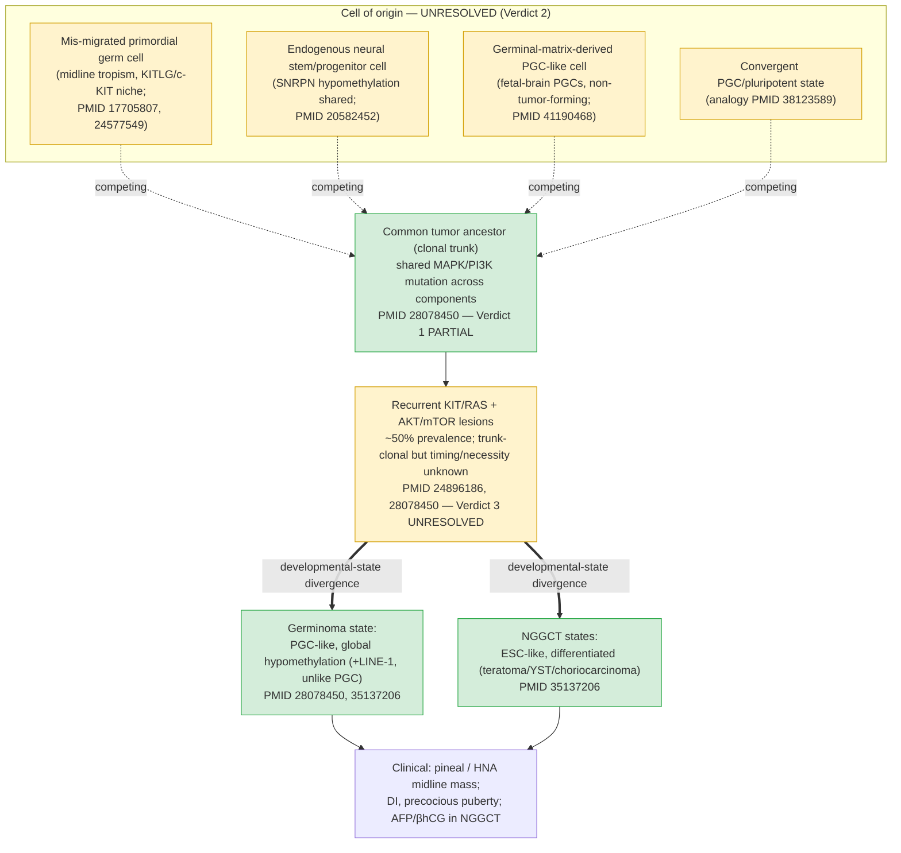

## Question

# Mechanistic Hypothesis Search

You are evaluating a specific disease mechanism hypothesis for the Disorder
Mechanisms Knowledge Base. This is not a general disease overview. Use the
hypothesis YAML below as the seed claim, then search for evidence that supports,
refutes, qualifies, or competes with this hypothesis.

## Target Disease
- **Disease Name:** Central Nervous System Germ Cell Tumor
- **Category:**

## Target Hypothesis
- **Hypothesis ID:** common_ancestry_developmental_state_divergence
- **Hypothesis Label:** Common-Ancestry and Developmental-State Divergence Model
- **Status in KB:** EMERGING

## Seed Hypothesis YAML

```yaml
hypothesis_group_id: common_ancestry_developmental_state_divergence
hypothesis_label: Common-Ancestry and Developmental-State Divergence Model
status: EMERGING
applies_to_subtypes:
- Central Nervous System Germinoma
- Central Nervous System Nongerminomatous Germ Cell Tumor
description: 'CNS germ cell tumor components may descend from a common tumor ancestor and subsequently
  diverge into a primordial-germ-cell-like, hypomethylated germinoma state or one of several more differentiated
  NGGCT states. Cross-sectional resemblance does not identify that ancestor: a mis-migrated primordial
  germ cell and an endogenous neural stem or progenitor cell are competing cell-of-origin models to be
  tested rather than assumed. MAPK/PI3K-pathway alterations may cooperate with developmental state and
  can be shared by distinct components of a mixed tumor, but their temporal position and necessity for
  initiation remain unresolved.'
evidence:
- reference: PMID:28078450
  reference_title: Genome-wide methylation profiles in primary intracranial germ cell tumors indicate
    a primordial germ cell origin for germinomas.
  supports: PARTIAL
  evidence_source: COMPUTATIONAL
  snippet: The patterns of methylation strongly resemble that of primordial germ cells (PGC) at the migration
    phase, possibly indicating the cell of origin for these tumors.
  explanation: The primary methylation study supports PGC-like resemblance while its explicitly tentative
    wording preserves the absence of lineage tracing.
- reference: PMID:28078450
  reference_title: Genome-wide methylation profiles in primary intracranial germ cell tumors indicate
    a primordial germ cell origin for germinomas.
  supports: SUPPORT
  evidence_source: HUMAN_CLINICAL
  snippet: Histologically and epigenetically distinct microdissected components of mixed-GCTs shared identical
    somatic mutations in the MAPK or PI3K pathways, indicating that they developed from a common ancestral
    cell.
  explanation: Shared mutations across microdissected mixed components support common ancestry and later
    state divergence, but do not identify the initiating cell or prove that those mutations initiated
    the tumor.
- reference: PMID:35137206
  reference_title: Transcriptome and methylome analysis of CNS germ cell tumor finds its cell-of-origin
    in embryogenesis and reveals shared similarities with testicular counterparts.
  supports: PARTIAL
  evidence_source: COMPUTATIONAL
  snippet: Co-analysis with the transcriptome of human embryonic cells revealed that germinomas had expression
    profiles similar to those of primordial germ cells, while the expression profiles of NGGCTs were similar
    to those of embryonic stem cells.
  explanation: Cross-reference transcriptome analysis supports distinct developmental state resemblance,
    not direct observation of tumor initiation.
- reference: PMID:24896186
  reference_title: Novel somatic and germline mutations in intracranial germ cell tumours.
  supports: PARTIAL
  evidence_source: HUMAN_CLINICAL
  snippet: Overall, 53% of the tumors harbored somatic mutations in at least one of the genes involved
    in KIT/RAS or AKT/mTOR pathways
  explanation: Sequencing of 62 human tumors establishes recurrent pathway alterations, but prevalence
    is incomplete, subtype distribution is unequal, and the cross-sectional design does not establish
    developmental timing.
notes: This is a developmental model inferred from cross-sectional human tumor profiles. It does not discriminate
  a mis-migrated primordial germ cell from an endogenous neural stem or progenitor cell or another precursor,
  and DNA hypomethylation should not be generalized from germinoma to every NGGCT component.
```

## Research Objective

Build a focused hypothesis-search report that answers:

1. What is the strongest direct evidence for this hypothesis?
2. What evidence argues against it, fails to reproduce it, or limits its scope?
3. Which claims are established, emerging, speculative, or contradicted?
4. Which patient subtypes, stages, tissues, cell types, molecular pathways, or
   biomarkers does the hypothesis best explain?
5. Which alternative or competing mechanistic hypotheses explain the same disease
   features better or more parsimoniously?
6. What are the explicit knowledge gaps: missing causal steps, unconfirmed edges,
   contradictory evidence, unknown source-to-target links, or source/data absences?
7. What experiments, cohorts, assays, datasets, or trials would most directly
   distinguish this hypothesis from alternatives?

Use primary literature whenever possible. Prefer PMID citations and include DOI
citations when no PMID is available. Treat reviews as orientation unless they
contain directly relevant synthesized evidence that should be clearly labeled as
review-level support.

## Issue-Specific Scope and Adjudication Requirements

For this investigation, restrict direct conclusions to intracranial central
nervous system germ-cell tumors: CNS germinoma (MONDO:0002999) and CNS
nongerminomatous germ-cell tumor (MONDO:0020574) within the MONDO:0003000
umbrella. Do not generalize intracranial evidence to rare primary spinal CNS
germ-cell tumors.

Give three separate verdicts rather than one composite judgment:

1. whether histologically distinct components within an individual mixed tumor
   share a tumor ancestor and later diverge in developmental state;
2. whether the normal cell of origin is a mis-migrated primordial germ cell,
   an endogenous neural stem/progenitor cell, another embryonic precursor, or a
   cell that acquired a convergent germ-cell/pluripotent state;
3. whether recurrent MAPK/PI3K alterations are initiating, cooperating,
   maintenance, or passenger events.

Common clonality of components within one mixed tumor is not evidence for a
universal ancestor across patients and does not identify the normal cell of
origin. Ask whether clonality is supported by multiple private passenger
variants, structural breakpoints, or copy-number boundaries rather than only
identical recurrent MAPK/PI3K hotspots. Treat PGC-like methylation,
transcriptomic similarity, fetal-reference mapping, and an ESC-like NGGCT state
as computational or correlative state evidence, not lineage tracing. Determine
whether these states are unique to primordial germ cells or reproducible in
neural precursors or convergent pluripotent states, and establish what evidence
actually orders pathway lesions, methylation changes, and histologic
divergence.

Explicitly investigate competing neural-precursor evidence, including PMID
20582452, and the recent fetal-brain observation in PMID 41190468. Presence of
PGC-like cells in fetal brain is not tumor ancestry. Preserve germinoma versus
each NGGCT component, age, sex, and intracranial-site strata.

The decisive studies should include component-resolved, multiregion single-cell
DNA/methylome/spatial phylogenies with orthogonal trunk confirmation, followed
by matched-donor primordial-germ-cell-like-cell versus CNS
neural-stem/progenitor models carrying stage-specific inducible KIT/RAS and
AKT/mTOR lesions. Require correction/rescue, longitudinal state tracking, and
anatomically relevant tumor formation. Later component differentiation after a
shared trunk supports developmental divergence and must not be treated as
refuting common tumor ancestry.

## Required Output

### Executive Judgment

Give a concise verdict on the hypothesis as of the current literature:
supported, partially supported, unresolved, weakly supported, or refuted. Explain
the reasoning and the most important caveats.

### Evidence Matrix

Create a table with one row per important evidence item:

- Citation (PMID preferred)
- Evidence type (human clinical, model organism, in vitro, computational, review)
- Supports / refutes / qualifies / competing
- Mechanistic claim tested
- Key finding
- Disease subtype or context
- Confidence and limitations

### Mechanistic Causal Chain

Describe the causal chain implied by the hypothesis from upstream trigger to
clinical manifestation. Identify where the literature is strong, where the links
are inferred, and where there are missing causal steps.

### Knowledge Gaps

Identify explicit known unknowns surfaced by the search. Treat absence of
evidence as a curation-relevant finding only when the search actually checked for
it. Include:

- Unknown or weakly supported causal steps in the hypothesis
- Unconfirmed causal graph edges that need direct perturbation or longitudinal
  evidence
- Conflicting evidence, failed replications, or incompatible subtype-specific
  findings
- Unknown mechanism of action for relevant treatments, biomarkers, or
  interventions tied to this hypothesis
- Source-level or dataset-level absences, such as no relevant GenCC, ClinGen,
  trial, omics, or cohort evidence found as of the search date

For each gap, state the scope, why it matters, what was checked, and what
evidence or experiment would resolve it.

### Alternative Models

List competing or complementary hypotheses. For each, explain whether it is an
alternative to the seed hypothesis, a downstream consequence, an upstream cause,
or a parallel mechanism.

### Discriminating Tests

Recommend concrete studies or assays that would most efficiently test this
hypothesis against alternatives. Include patient stratification, biomarkers,
sample type, model system, perturbation, and expected result where applicable.

### Curation Leads

Provide candidate updates for the KB, but label these as leads requiring curator
verification. Include:

- candidate evidence references and exact abstract snippets to verify
- candidate pathophysiology nodes or edges
- candidate ontology terms for cell types and biological processes
- candidate subtype restrictions or status changes
- candidate `knowledge_gaps` or discussion prompts for unresolved causal claims,
  conflicting evidence, or explicit source/data absences

If the provider supports artifacts, produce artifact-friendly outputs such as an
evidence matrix, mechanistic diagram, knowledge-gap table, or comparison table.
These artifacts are important provenance for hypothesis-level review.


## Output

# Hypothesis-Search Report

## Disease: Central Nervous System Germ Cell Tumor (MONDO:0003000 umbrella)
Restricted to intracranial **CNS germinoma (MONDO:0002999)** and **CNS nongerminomatous germ cell tumor / NGGCT (MONDO:0020574)**. Rare primary **spinal** CNS GCTs are explicitly out of scope; no conclusion here is generalized to them.

## Hypothesis under evaluation
**common_ancestry_developmental_state_divergence** — "Common-Ancestry and Developmental-State Divergence Model" (KB status: EMERGING).
Seed claim: mixed CNS-GCT components descend from a common tumor ancestor and diverge into a PGC-like hypomethylated germinoma state or more differentiated NGGCT states; the *normal* cell of origin (mis-migrated primordial germ cell [PGC] vs endogenous neural stem/progenitor cell [NSC] vs convergent germ-cell/pluripotent state) is a competing model to be tested, not assumed; MAPK/PI3K alterations cooperate with developmental state but their timing/necessity is unresolved.

---

## Executive Judgment

**Overall: PARTIALLY SUPPORTED, and appropriately EMERGING.** The hypothesis is well-constructed because it is deliberately split into separable claims, and the current literature supports them to very different degrees. Rendering the three required verdicts separately:

1. **Intra-tumor common ancestry + later developmental-state divergence — PARTIALLY SUPPORTED.** Distinct microdissected components of an individual mixed tumor share identical somatic MAPK/PI3K mutations (PMID:28078450), and germinoma vs NGGCT occupy distinct developmental states (PMID:28078450 methylome; PMID:35137206 transcriptome). This is the strongest leg. Caveat: clonality rests largely on *shared recurrent hotspots*, not private passengers, structural breakpoints, or copy-number boundaries, so trunk identity is inferred rather than phylogenetically proven.

2. **Normal cell of origin — UNRESOLVED.** All PGC-resemblance data are correlative *state* evidence (methylation/transcriptome/fetal-reference mapping), not lineage tracing. A key epigenetic "PGC marker" (SNRPN hypomethylation) is also present in neural stem cells (PMID:20582452), and the first fetal-brain PGC observation actually favors derivation from germinal-matrix NSCs over extracranial midline migration (PMID:41190468). A PGC, an endogenous neural precursor, and a convergent pluripotent state remain indistinguishable.

3. **MAPK/PI3K role — UNRESOLVED (cooperating, timing unknown).** KIT/RAS and AKT/mTOR lesions are recurrent (>50% and ~19% respectively; PMID:24896186) and can sit on the clonal trunk (PMID:28078450), but ~half of tumors lack a detected lesion, subtype distribution is unequal, and no study orders lesion → hypomethylation → histologic divergence. Initiating vs maintenance vs passenger cannot be assigned.

**Most important caveat:** cross-sectional human resemblance dominates the evidence base; there is no lineage tracing, no inducible model, and no multiregion tumor phylogeny with orthogonal trunk confirmation. The model is the most parsimonious *organizing* framework available, but its central mechanistic edges are unconfirmed.

### Verdict summary

| # | Claim | Verdict | Best support | Decisive missing evidence |
|---|---|---|---|---|
| 1 | Mixed-tumor components share a tumor ancestor and later diverge in developmental state | **Partially supported** | PMID:28078450 (shared MAPK/PI3K across components); PMID:35137206, 28078450 (germinoma PGC-like vs NGGCT ESC-like states) | Multiregion single-cell phylogeny with private-passenger/SV/CN trunk confirmation |
| 2 | Normal cell of origin (PGC vs NSC vs convergent state) | **Unresolved (genuinely balanced)** | PGC side: PMID:28078450, 35137206, 17705807, 24577549 (midline+KITLG). NSC side: PMID:20582452, 41190468 | Intracranial lineage tracing; PGC-exclusive (non-NSC) marker; matched-donor precursor models |
| 3 | Recurrent MAPK/PI3K alterations — initiating vs cooperating vs maintenance vs passenger | **Unresolved (cooperating, timing unknown)** | PMID:24896186 (>50% prevalence); PMID:28078450 (trunk-clonal) | Stage-specific inducible lesion models; longitudinal ordering; targeted-therapy dependence test |

---

## Evidence Matrix

| Citation | Evidence type | Stance | Mechanistic claim tested | Key finding | Subtype / context | Confidence & limitations |
|---|---|---|---|---|---|---|
| PMID:28078450 (Fukushima 2017) | Human clinical + computational | Supports (Verdicts 1&3); Qualifies (Verdict 2) | Common ancestry of mixed components; PGC-like germinoma state | 61 iGCTs; germinoma global hypomethylation resembling PGC migration phase; microdissected mixed components share identical MAPK/PI3K mutations; hypomethylation extends to LINE-1 **unlike** PGC | Germinoma vs mixed GCT; Japanese cohort | Moderate–high for clonality; clonality via shared *recurrent* hotspots only; PGC signature imperfect (LINE-1 divergence) |
| PMID:35137206 (Takami 2022) | Human clinical + computational | Supports (Verdict 1, divergence) | Germinoma ≈ PGC, NGGCT ≈ ESC developmental states | 84 cases; germinoma transcriptome ~PGC (high meiosis/mitosis potential), NGGCT ~ESC (organogenesis); germinoma/seminoma co-cluster; CNS≈testicular mutational profiles | Germinoma vs NGGCT; CNS vs TGCT | Moderate; correlative state mapping, not lineage; strong internal + cross-tissue consistency |
| PMID:24896186 (Wang 2014) | Human clinical | Supports (Verdict 3, recurrence); Qualifies (necessity) | Recurrent MAPK/PI3K pathway alteration | 62 iGCTs; KIT/RAS mutated >50% (KIT, KRAS, NRAS, CBL); AKT1 14q32.33 gain 19% with AKT1 upregulation; germline JMJD1C enrichment | iGCT overall; East Asian predominance, pineal common, M:F 3–4:1 | Moderate–high for recurrence; incomplete penetrance; cross-sectional, no timing |
| PMID:20582452 (Lee 2011) | In vitro / model + human tissue | **Competing** (Verdict 2) | Whether imprint hypomethylation proves PGC origin | SNRPN hypomethylation (a cited PGC marker) is *also* present in mouse and human NSCs; authors argue endogenous neural precursors are more plausible origin | iGCT cell-of-origin | Moderate; undercuts specificity of a key PGC argument; does not positively prove NSC origin |
| PMID:41190468 (Beldick & Shannon 2026) | Human clinical (post-mortem) | **Competing / Qualifies** (Verdict 2) | Presence and source of PGCs in human fetal brain | First apparent PGCs in 2 fetal brains (thalamus, germinal matrix, septal area); **non-tumor-forming**; distribution favors germinal-matrix NSC derivation over midline migration | Normal fetal brain (not tumor) | Low–moderate; n=2, incidental, morphologic; presence ≠ ancestry; reframes migration model |
| PMID:36595083 (Burnham & Tomita 2023) | Review | Orientation / Qualifies | Germ-cell theory vs stem-cell theory | Synthesizes PGC-migration vs transformed-ES/NSC theories; NGGCT diversity fits ES pluripotency; notes NSCs abundant subependymally yet iGCTs almost exclusively midline | iGCT histogenesis | Review-level; frames the open question; midline restriction is a strong constraint on ubiquitous-NSC origin |
| PMID:38123589 (Lu 2023) | Human clinical (single-cell multi-omics) | Supports by analogy | PGC-shared programs in seminoma | Seminoma shares gene-expression programs with PGCs; TFAP2C promotes invasion | **Testicular** seminoma (analogy only) | Moderate; extragonadal generalization limited; supports PGC-like state concept broadly |
| PMID:17705807 (Oosterhuis 2007) | Review | Supports (Verdict 2, PGC-migration side) | Why extragonadal GCTs are midline | Midline distribution of Type II GCTs "best explained by migration of primitive germ cells"; permissive niches share SCF/c-KIT (KITLG) feeder cells supporting PGC/gonocyte survival | Extragonadal (incl. intracranial midline) | Review-level; positive anatomic + niche argument for PGC model; KIT-niche argument partly circular with recurrent KIT mutations |
| PMID:24577549 (Mosbech 2014) | Review | Supports (Verdict 2, PGC side) | PGC as origin; differentiation-stage model | PGC suggested origin of all GCTs; germinomas retain germ-cell phenotype (OCT-3/4, NANOG, AP-2γ); extragonadal GCTs linked to KIT/KITLG overexpression enabling ectopic PGC survival | Pediatric GCT (incl. intracranial) | Review-level orientation; consistent with germ-cell phenotype but not lineage tracing |
| PMID:25859847 (Rijlaarsdam 2015) | Human clinical + computational | Supports (Verdict 1, divergence) | Methylation/imprinting reflects germ-cell maturation stage of origin | 91 GCTs (Type I–IV); subtype methylation + imprinting status reflect presumed maturation-stage cell of origin; seminomas/dysgerminomas globally hypomethylated (demethylated PGC precursor) | Gonadal/extragonadal GCT (not intracranial-specific) | Moderate; broad-GCT framework supporting state divergence; not intracranial lineage data |
| PMID:33017201 (Kubicek 2021) | Human clinical (case series) | Supports (Verdict 2, PGC-migration side) | Multi-site/metachronous GCT via mismigration | 3 metachronous GCTs at classic midline sites, consistent with multiple independent PGC mismigrations | Pineal/mediastinal/testicular (midline) | Low; n=3, circumstantial; supports migration model indirectly |
| PMID:41720647 (Dijoud 2026) | Review | Orientation | Pediatric GCT pathogenesis | Pediatric GCTs originate from PGCs; mechanism combines migration defect + genetic/epigenetic alterations + permissive microenvironment | Pediatric GCT (WHO 2022) | Review-level; integrates migration + molecular + niche |
| PMID:42419530 (Zhang 2026) | Review | Orientation / Qualifies (treatment-biomarker gap) | State of iGCT pathogenesis, biomarkers, therapy | Embryonic-cell theory (pluripotent cells escaping migration/differentiation); DNA hypomethylation + MAPK/PI3K + chromosomal abnormalities pathogenic; miRNA/ctDNA emerging serum/CSF biomarkers; treatment still surgery/RT/chemo, targeted/immunotherapy only emerging | iGCT overall | Review-level; confirms no mechanism-linked standard therapy → clinic cannot yet arbitrate driver role |
| PMID:42455393 (Damodharan 2026) | Review (systematic) | Qualifies (translational caveat) | Safety of MAPK-pathway inhibitors in CNS | MAPK inhibitors (BRAF/MEK/RAF) show intratumoral/intracranial hemorrhage signal in pediatric CNS tumors | Pediatric CNS (not iGCT-specific) | Review-level; flags risk for any future MEK/RAF targeting of iGCT MAPK lesions |
| PMID:37366624 (Schraw 2023) | Human clinical (case-control) | Qualifies / context (Verdict 2 developmental framing) | Developmental/heritable susceptibility to GCT | 552 cases vs 6380 controls; birth defects OR 1.7 (1.3–2.4), syndromic defects OR 10.4 (4.9–22.1); subtype-stratified for yolk-sac (OR 2.7) and mixed (OR 2.1), extragonadal OR 3.8; includes intracranial stratum | Pediatric GCT incl. intracranial; subtype/site strata | Moderate; epidemiologic, not mechanistic; supports early-embryonic 'permissive' framing but does not discriminate PGC vs NSC origin |

*Note on balance:* rows PMID:17705807, 24577549, 33017201 give **positive** (correlative/review-level) support to the PGC-mismigration side of the cell-of-origin question, offsetting the neural-precursor competing evidence (PMID:20582452, 41190468). Neither side has intracranial-specific lineage tracing, so Verdict 2 remains genuinely balanced/unresolved rather than defaulting to either model.

---

## Mechanistic Causal Chain (implied by the hypothesis)



*Legend:* dashed "competing" edges = unconfirmed cell-of-origin links (no lineage tracing); double arrows = developmental-state divergence after a shared trunk; yellow = unresolved node, green = comparatively better-supported node. The ordering of MAPK/PI3K lesion → hypomethylation → histologic divergence is **not** experimentally established.

Upstream trigger → clinical manifestation, annotated by evidence strength:

1. **A precursor cell exists at a midline CNS location in early development.** *Weakly/partially established.* PGC-like cells can be present in fetal brain (PMID:41190468). Midline tropism and the SCF/KITLG–c-KIT survival niche are classically read as favoring PGC migration to midline sites (PMID:17705807, 24577549), while the same fetal-brain observation favors germinal-matrix NSC derivation (PMID:41190468) — so whether the precursor is a mis-migrated PGC, germinal-matrix-derived, or an NSC is unresolved. **Missing step:** identity and provenance of the precursor.
2. **A transforming/clonal-trunk event initiates the tumor.** *Inferred.* MAPK/PI3K lesions are recurrent and can be trunk-clonal (PMID:28078450, 24896186), but ~50% of tumors lack a detected driver and timing is unknown. **Missing step:** proof that any specific lesion initiates.
3. **The clonal ancestor proliferates and diverges in developmental state.** *Partially established.* Shared mutations across divergent components (PMID:28078450) support one trunk; germinoma (PGC-like/hypomethylated) vs NGGCT (ESC-like) represent the divergent states (PMID:28078450, 35137206). **Inferred link:** what *drives* the germinoma-vs-NGGCT fork (epigenetic vs additional genetic events) is unknown.
4. **Divergent states produce the histologic subtypes and mixed tumors** → clinical presentation (pineal/HNA masses, DI, precocious puberty, raised markers AFP/βhCG in NGGCT). *Descriptively established;* the causal ordering of pathway lesion, methylation change, and histologic divergence is **not** experimentally ordered.

**Strong links:** intra-tumor clonal sharing; germinoma↔PGC-state and NGGCT↔ESC-state resemblance. **Inferred links:** precursor identity; driver timing. **Missing steps:** what orders the causal chain; what determines the germinoma/NGGCT fork.

---

## Knowledge Gaps

| Gap | Scope | Why it matters | What was checked | What would resolve it |
|---|---|---|---|---|
| Trunk not confirmed by orthogonal markers | Mixed iGCT | Shared recurrent hotspots can be convergent; clonality is under-proven | PMID:28078450 uses shared MAPK/PI3K hotspots only | Multiregion single-cell DNA/WGS phylogeny using private passengers, SVs, CN breakpoints |
| Cell-of-origin not lineage-traced | Germinoma & NGGCT | Distinguishes PGC vs NSC vs convergent state — the core unknown | PMID:20582452, 41190468, 36595083 all correlative/morphologic | Matched-donor PGC-like vs CNS-NSC models; single-cell fate mapping; imprint/methylation lineage barcodes |
| PGC signature is not PGC-unique | Germinoma epigenome | SNRPN/imprint hypomethylation shared with NSCs undermines a central argument | PMID:20582452 | Identify a truly PGC-exclusive epigenetic/transcriptomic mark and test in tumors + NSCs |
| Driver timing & necessity | All iGCT | Cannot assign initiating vs maintenance vs passenger to KIT/RAS/AKT | PMID:24896186 (prevalence ~50%), 28078450 (trunk-clonal) | Stage-specific inducible KIT/RAS and AKT/mTOR lesions in PGC-like vs NSC models; longitudinal tracking; rescue/correction |
| Driver-negative tumors | ~50% of iGCT | Half lack a detected MAPK/PI3K lesion — alternative initiators unknown | PMID:24896186 | WGS/epigenome of driver-negative cases; search for fusions, non-coding or epigenetic drivers |
| Midline anatomic restriction unexplained | Germinoma/NGGCT | Neither PGC-migration nor ubiquitous-NSC origin explains near-exclusive midline localization | PMID:36595083 (raised as constraint) | Spatial developmental atlas of candidate precursors along midline vs SVZ |
| Fork determinant (germinoma vs NGGCT) | Mixed & pure tumors | Central to "divergence" claim | Not directly addressed by retrieved primary data | Component-resolved multi-omic + perturbation of candidate fork regulators |
| Treatment/biomarker mechanism of action | iGCT clinical | Clinical arena cannot currently arbitrate MAPK/PI3K driver-role (Verdict 3): no mechanism-linked targeted therapy is standard | Checked 2026 iGCT review (PMID:42419530): treatment is still surgery/RT/chemo; targeted therapy/immunotherapy only emerging; miRNA/ctDNA are diagnostic/prognostic, not causal. MAPK inhibitors carry CNS-hemorrhage risk (PMID:42455393) | iGCT-specific biomarker-stratified trial of MEK/RAF or PI3K/mTOR inhibitor with pre/post ctDNA-miRNA longitudinal tracking; response would indicate dependence/maintenance |
| Source/dataset absences | KB curation | Provenance | Only PubMed (limited-coverage tool) searched; no GenCC/ClinGen/ClinicalTrials.gov/cBioPortal/GEO/EGA query performed this session; no iGCT-specific targeted-therapy trial retrieved | Query cBioPortal/GEO/EGA for iGCT WGS+methylation; ClinicalTrials.gov for targeted-therapy trials (e.g., MEK/mTOR); GenCC/ClinGen for germline predisposition (e.g., JMJD1C) |

---

## Alternative / Competing Models

1. **Endogenous neural stem/progenitor-cell origin (competing to Verdict 2).** iGCTs arise from transformed brain NSCs, not mis-migrated PGCs; PGC-like epigenetics are an NSC-shared or convergent property (PMID:20582452; framed in PMID:36595083). Competes directly with the "mis-migrated PGC" reading; compatible with the *state-divergence* part of the seed model.
2. **Germinal-matrix-derived PGC-like cells (hybrid model).** PGC-like cells present in fetal brain may originate locally from germinal-matrix NSCs rather than yolk-sac migration (PMID:41190468). This is a *modified upstream cause* — it keeps a PGC-like precursor but changes its provenance, partially reconciling models 1 and the seed.
3. **Convergent pluripotent/germ-cell state (parallel mechanism).** Any embryonic precursor that convergently acquires a PGC/ESC-like program could yield the observed states without a germline lineage; supported in principle by shared PGC programs seen broadly in germ-cell tumors (analogy: PMID:38123589). Parallel to, not exclusive of, the seed.
4. **Extraembryonic/ES-cell theory for NGGCT (complementary, downstream).** NGGCT diversity reflects ESC-like pluripotency generating embryonic/extraembryonic tissues (PMID:35137206, 36595083) — a downstream elaboration of the divergence limb, not a competitor.
5. **MAPK/PI3K-initiation model (competing to Verdict 3).** Recurrent pathway lesions are the initiating driver. Competes with the seed's agnostic stance; currently unproven due to incomplete penetrance and lack of timing data (PMID:24896186, 28078450).

---

## Discriminating Tests

1. **Component-resolved multiregion single-cell DNA/WGS + methylome + spatial phylogeny of mixed iGCTs.** Stratify by germinoma vs each NGGCT component. *Trunk confirmation via private passengers/SVs/CN breakpoints, not just recurrent hotspots.* Expected if seed correct: a shared trunk with private branch mutations and later-acquired state marks in NGGCT components.
2. **Matched-donor PGC-like-cell vs CNS-NSC engineered models carrying stage-specific inducible KIT/KRAS/NRAS and AKT1/mTOR lesions.** Require correction/rescue, longitudinal state tracking, and anatomically relevant (midline) tumor formation. Expected: which precursor + which lesion timing reproduces a hypomethylated PGC-like germinoma vs ESC-like NGGCT discriminates cell-of-origin and driver role.
3. **PGC-exclusive epigenetic mark test.** Identify marks that are PGC-specific and absent in NSCs; assay in germinoma, NGGCT, and fetal NSCs. Expected: if germinoma carries PGC-exclusive marks → supports PGC origin; if only NSC-shared marks → supports NSC/convergent origin (directly adjudicates PMID:20582452 vs seed).
4. **Driver-negative cohort deep profiling (WGS + epigenome + fusion calling).** Expected: identify alternative initiators explaining the ~50% without KIT/RAS/AKT lesions; informs whether MAPK/PI3K is necessary.
5. **Spatial developmental atlas of candidate precursors along CNS midline vs SVZ across gestation.** Expected: explains midline restriction and tests the germinal-matrix-derivation claim (PMID:41190468).

---

## Curation Leads (require curator verification)

- **Evidence references / snippets to verify:**
  - PMID:20582452 — "the lack of methylation of SNRPN that has previously been taken to indicate an origin for GCTs from PGCs is also seen in neural stem cells of mice and humans." → add as **COMPETING** evidence for cell-of-origin.
  - PMID:41190468 — "The distribution seems to favour the hypothesis that PGCs may be derived from germinal matrix neural stem cells rather than necessarily from extracranial midline migration to the brain." → add as **QUALIFYING/COMPETING**; label evidence_source HUMAN_CLINICAL (post-mortem, n=2, non-tumor).
  - PMID:17705807 — "Their distribution along the midline of the body is still best explained by the migration of primitive germ cells during development." → add as **SUPPORT (review-level)** for the PGC-migration side of Verdict 2 (midline tropism).
  - PMID:24577549 — "Some extragonadal GCTs have been linked to overexpression of the KIT/KITLG system, allowing for survival of aberrantly migrated ectopic PGCs." → add as **SUPPORT (review-level)** linking KITLG/c-KIT niche to ectopic PGC survival (note circularity with Verdict-3 KIT mutations).
  - PMID:25859847 — verify exact phrasing in full abstract (paraphrase "methylation and imprinting status between subtypes reflect their presumed cell of origin" did NOT validate against the returned abstract excerpt); use for **SUPPORT** of maturation-stage/state-divergence framework once verified. Scope: gonadal/extragonadal, not intracranial-specific.
  - PMID:33017201 — metachronous midline GCTs consistent with multiple PGC mismigrations → **SUPPORT (weak, n=3)** for migration model.
  - PMID:28078450 — "Unlike PGC, however, hypomethylation extends to long interspersed nuclear element retrotransposons." → add as a **caveat snippet** noting germinoma diverges from a pure PGC signature.
  - PMID:36595083 (review) — cell-of-origin framing; label as **review-level orientation**.
  - PMID:37366624 — "GCT risk was increased among children with birth defects (OR, 1.7; 95% CI, 1.3-2.4) and syndromic defects (OR, 10.4; 95% CI, 4.9-22.1)." → add as **QUALIFYING/context** for developmental-susceptibility framing; subtype/site-stratified (yolk-sac, mixed, intracranial). Does not adjudicate cell of origin.
  - PMID:42419530 — "Current treatment predominantly relies on surgery, radiotherapy, and chemotherapy, though the optimal radiation field and dose remain controversial." → add as **orientation** for treatment/biomarker knowledge gap (no mechanism-linked therapy standard).
  - PMID:42455393 — MAPK-inhibitor CNS intratumoral/intracranial hemorrhage safety signal → add as **translational caveat** for any future MEK/RAF targeting of iGCT MAPK lesions.
- **Candidate pathophysiology nodes/edges:**
  - Node: "convergent PGC-like/pluripotent state" as an alternative precursor to PGC and NSC.
  - Edge (mark UNCONFIRMED): precursor → MAPK/PI3K lesion → clonal trunk → {germinoma hypomethylated state | NGGCT ESC-like state}; annotate temporal order as unresolved.
- **Candidate ontology terms (for curator mapping):** primordial germ cell (CL:0000670); neural stem cell (CL:0000047); embryonic stem cell (CL:0002322); germinal matrix; biological processes: PGC migration, DNA demethylation/global hypomethylation, MAPK cascade, PI3K/AKT/mTOR signaling.
- **Candidate subtype restrictions / status:** keep status **EMERGING**; restrict all conclusions to intracranial germinoma (MONDO:0002999) and NGGCT (MONDO:0020574); add explicit note "do not generalize DNA hypomethylation from germinoma to every NGGCT component"; add "not applicable to spinal CNS GCT."
- **Candidate knowledge_gaps / discussion prompts:** (a) trunk unconfirmed by orthogonal private markers; (b) cell-of-origin not lineage-traced; (c) MAPK/PI3K timing/necessity unknown; (d) ~50% driver-negative tumors; (e) midline restriction unexplained; (f) source absence — no GenCC/ClinGen/trial/omics-repository query performed this session.

---

## Limitations of this search
- Literature retrieval used a single PubMed tool with limited/curated coverage; several targeted queries returned few or no records, so relevant primary studies (e.g., additional integrated-genomics or single-cell iGCT papers, targeted-therapy trials) may exist but were not surfaced. No GenCC/ClinGen/cBioPortal/GEO/ClinicalTrials.gov queries were run.
- No primary molecular data files were provided; all verdicts are literature-synthesis, not re-analysis.
- Key competing observations (PMID:41190468 n=2 incidental; PMID:20582452 model-based) are individually low-powered.


## Artifacts

- [OpenScientist final report](openscientist_artifacts/final_report.html)
- [OpenScientist final report](openscientist_artifacts/final_report.pdf)
