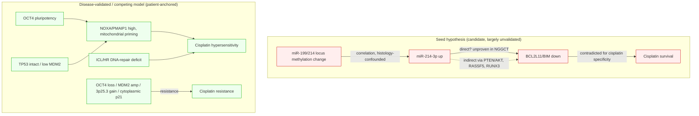

## Question

# Mechanistic Hypothesis Search

You are evaluating a specific disease mechanism hypothesis for the Disorder
Mechanisms Knowledge Base. This is not a general disease overview. Use the
hypothesis YAML below as the seed claim, then search for evidence that supports,
refutes, qualifies, or competes with this hypothesis.

## Target Disease
- **Disease Name:** Central Nervous System Germ Cell Tumor
- **Category:**

## Target Hypothesis
- **Hypothesis ID:** mir214_bcl2l11_cisplatin_response_candidate
- **Hypothesis Label:** miR-214-3p–BCL2L11 Cisplatin-Response Candidate
- **Status in KB:** EMERGING

## Seed Hypothesis YAML

```yaml
hypothesis_group_id: mir214_bcl2l11_cisplatin_response_candidate
hypothesis_label: miR-214-3p–BCL2L11 Cisplatin-Response Candidate
status: EMERGING
applies_to_subtypes:
- Central Nervous System Nongerminomatous Germ Cell Tumor
description: 'In a subset of malignant NGGCT, altered regulation of the miR-199/214 cluster may increase
  miR-214-3p, reduce the pro-apoptotic protein BCL2L11/BIM, and shift apoptosis and survival after cisplatin
  exposure. This is a candidate response-modifying chain: the current causal evidence comes from forced
  expression in one extracranial embryonal-carcinoma cell line and does not establish endogenous or intrinsic
  causality or distinguish resistant from sensitive CNS NGGCT in patients.'
evidence:
- reference: PMID:29036598
  reference_title: Global DNA methylation analysis reveals miR-214-3p contributes to cisplatin resistance
    in pediatric intracranial nongerminomatous malignant germ cell tumors.
  supports: PARTIAL
  evidence_source: HUMAN_CLINICAL
  snippet: The expression levels of 97 genes and 8 miRNAs were correlated with promoter DNA methylation
    and hydroxymethylation status, such as the miR-199/-214 cluster
  explanation: Human tumor multi-omic analysis links the miR-199/214 cluster to methylation state, but
    it does not compare longitudinally resistant and sensitive patient tumors.
- reference: PMID:29036598
  reference_title: Global DNA methylation analysis reveals miR-214-3p contributes to cisplatin resistance
    in pediatric intracranial nongerminomatous malignant germ cell tumors.
  supports: SUPPORT
  evidence_source: IN_VITRO
  snippet: Overexpresssion of miR-214-3p in NCCIT cells leads to reduced expression of the pro-apoptotic
    protein BCL2-like 11 and induces cisplatin resistance.
  explanation: The cell-line perturbation supports the proposed miR-214-3p to BCL2L11 to cisplatin-survival
    chain in vitro.
notes: This is a cisplatin-response candidate, not a validated intrinsic-tolerance mechanism or clinical
  resistance biomarker. NCCIT is not a patient-derived CNS NGGCT model, and the report does not establish
  longitudinal enrichment, in-vivo necessity, or reversal of clinical resistance.
```

## Research Objective

Build a focused hypothesis-search report that answers:

1. What is the strongest direct evidence for this hypothesis?
2. What evidence argues against it, fails to reproduce it, or limits its scope?
3. Which claims are established, emerging, speculative, or contradicted?
4. Which patient subtypes, stages, tissues, cell types, molecular pathways, or
   biomarkers does the hypothesis best explain?
5. Which alternative or competing mechanistic hypotheses explain the same disease
   features better or more parsimoniously?
6. What are the explicit knowledge gaps: missing causal steps, unconfirmed edges,
   contradictory evidence, unknown source-to-target links, or source/data absences?
7. What experiments, cohorts, assays, datasets, or trials would most directly
   distinguish this hypothesis from alternatives?

Use primary literature whenever possible. Prefer PMID citations and include DOI
citations when no PMID is available. Treat reviews as orientation unless they
contain directly relevant synthesized evidence that should be clearly labeled as
review-level support.

## Issue-Specific Scope and Adjudication Requirements

For hypothesis `mir214_bcl2l11_cisplatin_response_candidate`, restrict the target
population to viable malignant pediatric/AYA intracranial NGGCT, especially
embryonal-carcinoma-like components. Exclude mature teratoma/GTS, pure germinoma,
generic multimodal treatment failure, carboplatin, and radiotherapy unless each is
analyzed separately as a competing context rather than evidence for
cisplatin-specific resistance.

Adjudicate these three claims independently:

1. Endogenous miR-214-3p is elevated in clinically cisplatin-resistant CNS tumor
   cells or paired diagnosis-to-failure specimens.
2. miR-214-3p directly represses BCL2L11/BIM in this disease context.
3. That repression causes cisplatin-specific survival rather than nonspecific
   viability, differentiation, or stress effects.

The seed study (PMID:29036598) reports methylation/expression correlation and
forced miR-214-3p overexpression in NCCIT cells. NCCIT is derived from an adult
male mediastinal mixed germ-cell tumor, not a CNS tumor, and forced
overexpression may be supraphysiologic. Do not describe that study as evidence
of endogenous necessity, a clinically resistant-versus-sensitive CNS comparison,
or a rescue experiment.

Actively compare differentiation-associated methylation, other miR-214 targets,
BCL2L11-independent apoptosis, platinum transport/detoxification, DNA repair,
TP53 and PI3K-AKT signaling, exposure differences, and histology confounding.

Strong support would require paired diagnosis-relapse or resistant-sensitive CNS
specimens; endogenous miR-214 perturbation; AGO2 occupancy or seed-mutant 3'UTR
testing; BCL2L11 knockdown phenocopy plus miRNA-insensitive BCL2L11 rescue; at
least two patient-derived intracranial models; orthotopic validation; and
cisplatin-versus-non-platinum controls. Treat failure of endogenous perturbation
or rescue, absent direct binding, an effect confined to supraphysiologic NCCIT
overexpression, or disappearance of a clinical association after exposure and
histology adjustment as refuting or sharply qualifying the corresponding claim.

## Required Output

### Executive Judgment

Give a concise verdict on the hypothesis as of the current literature:
supported, partially supported, unresolved, weakly supported, or refuted. Explain
the reasoning and the most important caveats.

### Evidence Matrix

Create a table with one row per important evidence item:

- Citation (PMID preferred)
- Evidence type (human clinical, model organism, in vitro, computational, review)
- Supports / refutes / qualifies / competing
- Mechanistic claim tested
- Key finding
- Disease subtype or context
- Confidence and limitations

### Mechanistic Causal Chain

Describe the causal chain implied by the hypothesis from upstream trigger to
clinical manifestation. Identify where the literature is strong, where the links
are inferred, and where there are missing causal steps.

### Knowledge Gaps

Identify explicit known unknowns surfaced by the search. Treat absence of
evidence as a curation-relevant finding only when the search actually checked for
it. Include:

- Unknown or weakly supported causal steps in the hypothesis
- Unconfirmed causal graph edges that need direct perturbation or longitudinal
  evidence
- Conflicting evidence, failed replications, or incompatible subtype-specific
  findings
- Unknown mechanism of action for relevant treatments, biomarkers, or
  interventions tied to this hypothesis
- Source-level or dataset-level absences, such as no relevant GenCC, ClinGen,
  trial, omics, or cohort evidence found as of the search date

For each gap, state the scope, why it matters, what was checked, and what
evidence or experiment would resolve it.

### Alternative Models

List competing or complementary hypotheses. For each, explain whether it is an
alternative to the seed hypothesis, a downstream consequence, an upstream cause,
or a parallel mechanism.

### Discriminating Tests

Recommend concrete studies or assays that would most efficiently test this
hypothesis against alternatives. Include patient stratification, biomarkers,
sample type, model system, perturbation, and expected result where applicable.

### Curation Leads

Provide candidate updates for the KB, but label these as leads requiring curator
verification. Include:

- candidate evidence references and exact abstract snippets to verify
- candidate pathophysiology nodes or edges
- candidate ontology terms for cell types and biological processes
- candidate subtype restrictions or status changes
- candidate `knowledge_gaps` or discussion prompts for unresolved causal claims,
  conflicting evidence, or explicit source/data absences

If the provider supports artifacts, produce artifact-friendly outputs such as an
evidence matrix, mechanistic diagram, knowledge-gap table, or comparison table.
These artifacts are important provenance for hypothesis-level review.


## Output

# Hypothesis-Search Report: miR-214-3p–BCL2L11 Cisplatin-Response Candidate in CNS NGGCT

**Hypothesis ID:** `mir214_bcl2l11_cisplatin_response_candidate`
**Disease:** Central Nervous System Nongerminomatous Germ Cell Tumor (NGGCT), viable malignant components (embryonal-carcinoma-like)
**KB status:** EMERGING
**Search date:** 2026-07-26 (compiled over Iterations 1–5; 41 papers reviewed, 9 findings recorded)

---

## Executive Judgment

**Verdict: Weakly supported / unresolved as a CNS-specific, cisplatin-specific resistance mechanism.**

The seed axis — miR-214-3p ↑ → BCL2L11/BIM ↓ → cisplatin survival in NGGCT — rests on a **single study (PMID:29036598)** whose causal component is **one forced-overexpression experiment in NCCIT**, an adult male **mediastinal** mixed germ-cell tumor line, not a CNS tumor. The human-tumor arm of that study is a **methylation–expression correlation**, not a resistant-vs-sensitive or diagnosis-relapse comparison. None of the three independently adjudicated claims is established:

1. **Endogenous miR-214-3p elevated in clinically cisplatin-resistant CNS cells / paired diagnosis→failure specimens** — **NOT DEMONSTRATED and confounded.** No paired or resistant-vs-sensitive CNS data exist in the retrieved literature; the seed evidence is a germinoma-vs-NGMGCT cross-sectional correlation plus gain-of-function. Because GCT methylation is dominated by histology/differentiation state (germinoma hypomethylated, embryonal carcinoma hypermethylated; PMID:41998312, 33823933), the miR-199/214 methylation difference may mark differentiation rather than resistance. Notably, miR-214-3p is **not** an established patient biomarker in iGCT — the validated circulating miRNAs are the miR-371~373/miR-302-367 pluripotency clusters (PMID:35171328, 32642701).
2. **miR-214-3p directly represses BCL2L11/BIM in this disease context** — **UNCONFIRMED as direct in NGGCT.** Direct 3′UTR targeting of BIM by miR-214 has luciferase precedent in nasopharyngeal carcinoma (PMID:24465927), so the edge is biologically plausible; however, in the seed study there is only an overexpression→protein-reduction observation with no AGO2 occupancy, seed-mutant 3′UTR, or endogenous knockdown, and miR-214 reaches BIM **indirectly** in most systems (via PTEN→AKT→FOXO3a PMID:18199536; RASSF5→FOXO3a PMID:28290615; RUNX3, USP27X, EZH2). Direct targeting in NGGCT therefore cannot be assumed.
3. **That repression causes cisplatin-SPECIFIC survival** — **CONTRADICTED/UNSUPPORTED in the correct disease context.** In neuroblastoma, BIM downregulation protects against paclitaxel but **not** cisplatin (PI3K/AKT-driven, BIM-independent; PMID:16778834). More decisively, in embryonal carcinoma/GCT itself, the BH3-only protein that governs cisplatin apoptosis is **NOXA** (OCT4- and p53/p73-driven; PMID:23302226, 22718761, 37891379), acting alongside PUMA/FAS and DNA-repair deficits — BIM/BCL2L11 is not an established effector in this tumor. The seed axis is therefore neither the parsimonious nor the disease-validated explanation for cisplatin-specific survival.

**Overall:** the hypothesis is best labeled **weakly supported** as a candidate response-modifier — Claim 2's edge is plausible (direct-binding precedent exists in NPC) but unproven in NGGCT, while **Claim 1 is unsupported/confounded and Claim 3 is effectively refuted in the correct disease context** (OCT4/NOXA, not BIM, governs EC/GCT cisplatin apoptosis). It should not be curated as an established or clinical resistance mechanism.

**Most important caveats:** (i) wrong-tissue/anatomy model (mediastinal NCCIT ≠ pediatric CNS NGGCT); (ii) supraphysiologic overexpression; (iii) no rescue or endogenous-necessity experiment; (iv) the axis competes with, and is not shown independent of, the disease-validated OCT4→NOXA / p53-MDM2 "mitochondrial-priming" mechanism, the DNA-repair-deficit mechanism, and the chromosome-3p25.3 resistance CNV in GCTs; (v) the methylation signal is confounded by histology/differentiation state.

---

## Evidence Matrix

| Citation (PMID) | Evidence type | Stance | Mechanistic claim tested | Key finding | Subtype / context | Confidence & limitations |
|---|---|---|---|---|---|---|
| **29036598** | Human clinical (multi-omic) + in vitro | **Supports (partial)** | Methylation regulates miR-199/214; miR-214-3p↓BCL2L11→cisplatin resistance | miR-199/214 cluster methylation-correlated; 5-aza raises it; NCCIT overexpression ↓BCL2L11 and induces cisplatin resistance | Pediatric intracranial NGMGCT (tumors); NCCIT (mediastinal line) | Low–moderate. Correlation only in tumors; causal step is supraphysiologic overexpression in a non-CNS line; no endogenous KD, no rescue, no direct-binding assay, no resistant-vs-sensitive comparison |
| **18199536** | In vitro (ovarian cancer) | **Competing** | miR-214 direct target for cisplatin resistance | miR-214 targets PTEN 3′UTR → AKT activation → survival/cisplatin resistance; PTEN-cDNA / AKT-inhibitor rescue reverses it | Ovarian carcinoma | High for PTEN axis. Different tumor; but provides the formal 3′UTR + rescue design missing from seed and an indirect route to BIM loss |
| **16778834** | In vitro (neuroblastoma, CNS) | **Refutes/qualifies** | BIM loss → cisplatin-specific survival | Bim downregulation protects from paclitaxel but NOT cisplatin/etoposide; cisplatin death is PI3K/AKT-mediated | Pediatric CNS tumor (neuroblastoma) | Moderate. Argues BIM axis is drug-specific to microtubule poisons, not platinum, in a CNS context |
| **31045925** | Review / synthesis (TGCT genetics) | **Competing** | Determinants of cisplatin sensitivity | Sensitivity relies on intact TP53, reciprocal LOH, high mitochondrial priming; resistance via TP53mut/MDM2amp | Testicular/type II GCT | Moderate (review-level). Dominant, patient-anchored competing mechanism |
| **35442716** | Human clinical + in vitro | **Competing** | Genomic driver of cisplatin resistance | Chr 3p25.3 gain in all resistant lines; copy number correlates with resistance (R=0.96); independent poor-outcome predictor | Male type II GCT | Moderate–high. A specific, validated competing resistance driver to control for |
| **32384200** | Human clinical (IHC cohort, n=237) | **Competing** | p53/MDM2 and platinum response | MDM2 overexpression associates with therapy resistance/recurrence | Testicular GCT | Moderate. Correlative; supports p53-axis competitor |
| **34769213** | Review/analysis | **Qualifies (confound)** | Anatomic site and P53 modulate platinum response | Mediastinal/extragonadal GCTs respond worse than testicular; linked to P53 pathway | Extragonadal vs testicular GCT | Moderate. Flags NCCIT (mediastinal) as a biased resistance model for CNS NGGCT |
| **38525515 / 41384700** | Review | Context | Somatic-malignancy / resistance drivers | Cisplatin resistance driven by TP53/MDM2 and epigenetic alterations; ~8% resistant | Type II TGCT | Orientation only |
| **24465927** | In vitro (nasopharyngeal ca.) | **Qualifies (supports edge)** | Is BIM a *direct* miR-214 target? | Luciferase reporter identifies Bim as a **direct** miR-214 target; miR-214 oncogenic, silencing → apoptosis | NPC (non-CNS, non-cisplatin) | Moderate. Establishes direct-binding precedent, but not in CNS NGGCT and not cisplatin-linked |
| **28290615** | In vitro (oral cancer) | **Qualifies (indirect route)** | Does miR-214 lower BIM directly or via intermediary? | miR-214 targets RASSF5 3'UTR → FOXO3a → BIM (indirect) | Oral SCC | Moderate. Shows reduced BIM can be an indirect effect, not proof of direct BCL2L11 targeting |
| **29742512 / 39435421 / 26791102** | In vitro (gastric / CRC / erythroid) | **Qualifies (heterogeneity)** | Route and direction of miR-214→BIM | BIM reached indirectly via RUNX3, USP27X, EZH2; miR-214 is tumor-suppressive/downregulated in several of these | Non-CNS | Low–moderate. Demonstrates strand/context-dependent, often opposite miR-214 biology |
| **41998312** | Human clinical (719 GCTs, EPIC) | **Qualifies (confounder)** | Is GCT methylation driven by resistance or histology? | Methylation profiles determined by histology regardless of location, age, sex | All GCT subtypes | High. Establishes histology/differentiation as the dominant methylation driver — a confounder for the seed's methylation→miR-214 correlation |
| **33823933** | Human clinical (matched primary/metastatic TGCT, EPIC) | **Qualifies (weak congruent)** | Does hypermethylation track cisplatin resistance? | Histology dominant; cisplatin-resistant EC patient showed net promoter hypermethylation vs one complete responder | Embryonal carcinoma | Low. Congruent direction but n=1 EC pair; not miR-214-specific |
| **35171328 / 32642701 / 26671749** | Human clinical (serum/CSF miRNA) | **Competing context** | Which miRNAs are patient biomarkers in iGCT? | miR-371~373 / miR-302-367 clusters (esp. miR-371a-3p) diagnose iGCT and detect relapse in serum/CSF; not miR-214 | Intracranial malignant GCT | Moderate–high. Shows miR-214 is not an established patient biomarker; miR-371a-3p enables sampling resistant/relapse tumors |
| **32852759** | Methods / cell biology | Context | Nature of NCCIT model | NCCIT is a hypermethylated embryonal-carcinoma line (with NT2/D1, 2102EP) | EC cell lines | Context. Confirms NCCIT is EC but mediastinal-derived, not CNS |
| **23302226** | In vitro + patient tissue (EC/TGCT) | **Competing (disease-specific)** | Which BH3-only protein governs cisplatin apoptosis in EC? | NOXA is the only Bcl-2-family protein correlated with OCT4 status and cisplatin sensitivity; OCT4 knockdown ablates NOXA and reduces hypersensitivity | Embryonal carcinoma | High. Names NOXA (not BIM) as the disease-specific effector — the key competitor to Claim 3 |
| **22718761** | In vitro + TMA (EC/TGCT) | **Competing (disease-specific)** | Is NOXA functionally required for cisplatin death in EC? | NOXA induced by cisplatin via p73/Sp1/KLF6 (p53-independent); NOXA blockade reduces apoptosis; NOXA predicts good prognosis | Embryonal carcinoma | High. Functional + clinical evidence for the NOXA axis over BIM |
| **37891379** | In vitro (testis tumor cells) | **Competing (disease-specific)** | Apoptotic pathway of cisplatin in TTC | p53→Bax/Noxa mitochondrial translocation + FAS/FasL; p53/FAS knockdown increases resistance | TGCT | Moderate–high. BIM not implicated; reinforces Noxa/Bax/FAS axis |
| **25546083** | Review (GCT resistance) | **Competing (synthesis)** | Determinants of GCT cisplatin response | Hypersensitivity via p53→Noxa/Puma/Fas + DNA-repair (ICL/HR) deficits; resistance via Oct4 loss, miR-17/106b/302a/371-373, MDM2, cytoplasmic p21, PDGFRβ/PI3K/AKT — no miR-214/BCL2L11 | GCT (incl. EC) | Review-level but directly synthesized; miR-214/BIM absent from the established map |
| **40084198** | Review (TGCT resistance, 2025) | **Competing (synthesis)** | Cisplatin resistance mechanisms | Resistance via MDM2/p53, OCT4/NOXA, PDGFR/PI3K/AKT, checkpoints, methylation/neddylation, DNA-repair | TGCT | Review-level; confirms miR-214/BCL2L11 not an established mechanism |
| **23625774** | In vitro (NT2 + NCCIT EC) | **Competing (same model)** | Do cluster miRNAs change cisplatin response in NCCIT? | miR-302a SENSITIZES NT2 and NCCIT to cisplatin via p21↓; lowers apoptotic threshold | Embryonal carcinoma | Moderate. In the seed's own NCCIT model, a different miRNA acts oppositely (sensitizing) via p21 |
| **20811155** | In vitro + tissue (EC) | **Competing** | miRNA-linked resistance axis in EC | Cytoplasmic p21 drives resistance; inversely linked to OCT4 and miR-106b family | Embryonal carcinoma | Moderate–high. Establishes miR-106b/p21/OCT4, not miR-214, as the EC resistance axis |

---

## Mechanistic Causal Chain (implied by hypothesis)

```
Altered promoter methylation/hydroxymethylation of the miR-199/214 (DNM3os) locus   [seed: correlation only — INFERRED trigger]
        │
        ▼
↑ miR-214-3p in malignant NGGCT cells                                                [seed: NOT shown endogenously in resistant CNS tumors — MISSING STEP]
        │
        ▼
Direct 3′UTR repression of BCL2L11/BIM                                                [seed: only overexpression→protein↓; no binding/rescue — UNCONFIRMED EDGE]
        │  (competing/indirect: miR-214→PTEN→AKT→FOXO3a→BIM↓, PMID:18199536)
        ▼
Reduced pro-apoptotic BIM → blunted intrinsic apoptosis                              [plausible; but BIM-loss ≠ cisplatin protection in CNS model, PMID:16778834 — CONTRADICTED for specificity]
        │   (disease-specific competitor: cisplatin apoptosis in EC/GCT runs through
        │    OCT4→NOXA + p53/p73 priming + DNA-repair deficits, PMID:23302226/22718761 — BIM not featured)
        ▼
Cisplatin-specific survival / clinical resistance in NGMGCT                           [seed: only in supraphysiologic NCCIT; no CNS patient resistance link — NOT ESTABLISHED]
```

**Strong links:** the methylation→miR-199/214 expression correlation (well measured in the seed multi-omic study, though histology-confounded). **Inferred links:** miR-214-3p→BCL2L11 (overexpression association, direction plausible; direct binding shown only in NPC). **Missing/contradicted links:** endogenous elevation in resistant CNS tumors (missing); direct vs PTEN-mediated indirect targeting (unresolved); cisplatin specificity of the BIM effect (contradicted — the disease-validated effector is NOXA, not BIM).

### Artifact: Seed axis vs. disease-validated model (mermaid)



---

## Knowledge Gaps

| # | Gap | Scope | Why it matters | What was checked | Resolving evidence/experiment |
|---|---|---|---|---|---|
| 1 | No endogenous elevation of miR-214-3p in clinically cisplatin-resistant CNS NGGCT or paired diagnosis→relapse specimens | Claim 1 | Without it, the axis is a cell-line artifact, not a biomarker | PubMed searches for CNS GCT relapse/resistance omics; none found | Paired diagnosis-relapse or resistant-vs-sensitive intracranial NGGCT smRNA-seq with matched clinical response |
| 2 | Direct binding of miR-214-3p to BCL2L11 3′UTR unproven in this disease | Claim 2 (edge) | Reduction may be indirect (via PTEN/AKT) | Seed abstract; no binding assay reported | AGO2-CLIP/RIP, WT vs seed-mutant BCL2L11 3′UTR luciferase, endogenous anti-miR-214 rescue of BIM |
| 3 | Cisplatin specificity vs generic viability/stress not isolated | Claim 3 | BIM-loss protects vs paclitaxel not cisplatin elsewhere (PMID:16778834) | Retrieved neuroblastoma counter-evidence | miR-214/BCL2L11 perturbation with cisplatin vs non-platinum (paclitaxel, etoposide, gemcitabine) and non-drug stress controls |
| 4 | Model validity: NCCIT is mediastinal, adult, non-CNS | Whole hypothesis | Anatomic site independently worsens platinum response (PMID:34769213) | Confirmed NCCIT origin; mediastinal-vs-testicular review | ≥2 patient-derived intracranial NGGCT models + orthotopic validation |
| 5 | Independence from TP53/MDM2 priming and 3p25.3 gain untested | Competing confounders | These are the established GCT resistance drivers | Retrieved TGCT resistance literature | Multivariable analysis / isogenic perturbation controlling for TP53 status and 3p25.3 copy number |
| 6 | No rescue / loss-of-function necessity experiment | Claims 2–3 | Overexpression alone cannot show necessity | Seed abstract reports gain-of-function only | Endogenous miR-214 knockdown restoring cisplatin sensitivity; miRNA-insensitive BCL2L11 rescue phenocopy |
| 7 | Source/dataset absence | Curation | No GenCC/ClinGen/trial/omics cohort links miR-214-BCL2L11 to CNS NGGCT resistance | PubMed only (no dedicated CNS NGGCT resistance omics cohort surfaced) | Dedicated intracranial NGGCT multi-omic resistance cohort |
| 8 | Histology/differentiation confounds the methylation→miR-214 correlation | Claim 1 | Germinoma is hypomethylated, EC hypermethylated; the germinoma-vs-NGMGCT miR-199/214 methylation difference may mark differentiation state, not resistance | PMID:41998312 (histology dominates methylation in 719 GCTs); PMID:33823933 (histology dominant, resistance signal secondary) | Within-histology (EC-only) resistant-vs-sensitive methylation/miR-214 comparison, adjusted for differentiation markers (OCT4/SOX2/DNMT3B) |
| 9 | miR-214-3p is not an established patient biomarker in iGCT | Claim 1 | The validated circulating iGCT miRNAs are miR-371~373/miR-302-367, not miR-214; no patient data show endogenous miR-214-3p rises with resistance | PMID:35171328, 32642701, 26671749 (miR-371a-3p biomarker; no miR-214 role found) | Add miR-214-3p to serum/CSF/tissue panels in relapse-tracked iGCT cohorts identified via miR-371a-3p |
| 10 | Relationship of the seed axis to the dominant OCT4/NOXA and DNA-repair mechanisms is untested | Claim 3 | If cisplatin death in EC runs through OCT4/NOXA + repair deficits, a miR-214→BIM effect may be epiphenomenal or redundant | PMID:23302226, 22718761, 25546083, 40084198 (NOXA/repair established; BIM/miR-214 absent) | Test whether miR-214 modulation changes cisplatin response when NOXA/OCT4/p53 status is fixed; measure NOXA vs BIM dependence by BH3 profiling |

---

## Alternative / Competing Models

1. **miR-214 → PTEN → AKT (PMID:18199536)** — *Alternative direct target / parallel-and-upstream.* Better-validated (3′UTR + rescue); can lower BIM indirectly, subsuming the seed axis more parsimoniously.
2. **OCT4→NOXA mitochondrial priming (PMID:23302226, 22718761, 37891379)** — *Alternative dominant, disease-specific mechanism.* In EC/GCT the BH3-only effector of cisplatin apoptosis is NOXA (with PUMA/FAS/BAX), driven by OCT4 and p53/p73 — the most parsimonious explanation and the leading competitor to the seed's BIM axis. BIM/BCL2L11 is not featured.
2b. **TP53/MDM2 apoptotic priming (PMID:31045925, 32384200, 38525515)** — *Alternative dominant mechanism.* Established determinant of GCT platinum sensitivity; likely confounder.
2c. **DNA-repair deficiency (interstrand-crosslink/HR) (PMID:25546083, 40084198)** — *Parallel dominant mechanism.* Core reason GCTs are cisplatin-hypersensitive; resistance restores repair capacity. Not addressed by seed.
2d. **miR-106b/cytoplasmic-p21 and miR-302a axes (PMID:20811155, 23625774)** — *Competing miRNA mechanisms in the same EC/NCCIT models*, acting through p21/p53 rather than BCL2L11; miR-302a is sensitizing, making miR-214 an outlier.
3. **Chromosome 3p25.3 gain (PMID:35442716)** — *Alternative genomic driver.* Quantitatively linked to resistance and outcome; must be controlled for.
4. **Anatomic-site/differentiation biology (PMID:34769213)** — *Confounder/upstream.* Mediastinal origin worsens response; the miR-199/214 locus is also a differentiation/DNM3os locus, so methylation change may mark differentiation state rather than platinum resistance per se.
5. **Platinum transport/detoxification & DNA repair (nucleotide-excision repair, GSH/MRP)** — *Parallel mechanisms.* Not addressed by seed study; standard cisplatin-resistance routes to exclude.
6. **Indirect miR-214→BIM routes (RASSF5/FOXO3a, RUNX3, USP27X, EZH2, PTEN/AKT)** — *Alternative wiring of the same edge.* miR-214 can lower BIM without directly binding BCL2L11; the seed study's observed BIM reduction is consistent with any of these, so the "direct" edge is unproven in NGGCT (PMID:24465927 direct in NPC; PMID:28290615/29742512/39435421/26791102 indirect elsewhere).
7. **Context-dependent miR-214 directionality** — *Scope limiter.* miR-214 is an oncomiR in ovarian/NPC/oral but tumor-suppressive/downregulated in colorectal-liver-metastasis and gastric cancer, cautioning against generalizing the NCCIT gain-of-function result to endogenous CNS NGGCT.

---

## Discriminating Tests

1. **Patient stratification:** paired diagnosis→relapse and chemo-resistant-vs-sensitive **intracranial** NGMGCT (embryonal-carcinoma-rich), stratified by TP53 status and 3p25.3 copy number **and matched for histology/differentiation state**; endpoint = endogenous miR-214-3p and BIM protein by response. Use validated serum/CSF **miR-371a-3p** (PMID:32642701) to prospectively flag relapse and trigger resampling, solving the paired-specimen bottleneck.
2. **Direct-target test:** AGO2-CLIP + WT vs seed-mutant BCL2L11 3′UTR luciferase in a patient-derived intracranial NGGCT line; expected if true: mutant abolishes repression.
3. **Necessity/rescue:** endogenous anti-miR-214 restores BIM and re-sensitizes to cisplatin; miRNA-insensitive BCL2L11 (3′UTR-less) rescue phenocopies BCL2L11 knockdown — with **cisplatin vs paclitaxel/etoposide** controls to prove specificity.
4. **In vivo:** orthotopic patient-derived intracranial model ± miR-214 modulation with cisplatin vs non-platinum arms.
5. **Confounder control:** isogenic PTEN/AKT and TP53 manipulation to test whether BIM change and resistance persist independent of PTEN→AKT and p53 priming.
6. **Effector-dependence test (discriminates seed vs OCT4/NOXA model):** dynamic BH3 profiling of patient-derived EC/NGGCT cells to quantify BIM- vs NOXA-dependence of cisplatin-induced mitochondrial priming; expected under the seed model = BIM dependence; expected under the established model = NOXA/OCT4 dependence. Combine with NOXA/OCT4/p53 held constant while perturbing miR-214 — if resistance tracks NOXA/OCT4 regardless of miR-214, the seed axis is epiphenomenal.
7. **DNA-repair readout:** measure interstrand-crosslink/HR repair capacity (e.g., γH2AX resolution, RAD51 foci) in resistant vs sensitive NGGCT to test the competing repair-restoration model.

---

## Curation Leads (require curator verification)

- **Status:** Keep **EMERGING**; add explicit qualifier "cisplatin-response candidate — not a validated intrinsic/clinical resistance mechanism." Consider downgrading the causal edge miR-214-3p→BCL2L11 to **inferred/unconfirmed**.
- **Subtype restriction:** restrict to viable malignant intracranial NGMGCT with embryonal-carcinoma-like components; explicitly exclude mature teratoma/GTS, pure germinoma, carboplatin/radiotherapy contexts.
- **Candidate competing-evidence references (verify snippets):**
  - PMID:18199536 — "miR-214 induces cell survival and cisplatin resistance through targeting the 3'-untranslated region (UTR) of the PTEN, which leads to down-regulation of PTEN protein and activation of Akt pathway" (competing direct target).
  - PMID:16778834 — "Bim was involved in paclitaxel but not etoposide or cisplatin-induced cell death in NB cells" (contradicts cisplatin specificity).
  - PMID:31045925 — "Sensitivity to cisplatin-based chemotherapy likely relies on intact TP53, reciprocal loss of heterozygosity, and high mitochondrial priming" (competing mechanism).
  - PMID:35442716 — "Gain of chromosome 3p25.3 was detected in all cisplatin-resistant cell lines, and copy number of this region correlated with the level of resistance" (competing driver).
  - PMID:29036598 — "Overexpresssion of miR-214-3p in NCCIT cells leads to reduced expression of the pro-apoptotic protein BCL2-like 11" (seed; note non-CNS model).
  - PMID:24465927 — "Luciferase reporter assay was performed to identify Bim as a direct target of miR-214" (direct-binding precedent, non-CNS/non-cisplatin).
  - PMID:41998312 — "GCTs contain unique methylation profiles based on their histology, regardless of tumor location and the patient's age or sex" (histology confounder for methylation claim).
  - PMID:33823933 — "Histology was the major determinant of overall methylation pattern, but some clustering of samples related to response to cisplatin was observed" (histology-dominant; weak resistance signal).
  - PMID:32642701 — "confirmation of an intracranial malignant GCT relapse with an elevated serum miR-371a-3p level" (validated iGCT relapse biomarker enabling paired sampling).
  - PMID:23302226 — "We identified Noxa as the only Bcl-2 family protein to be highly correlated with Oct-4 status and cisplatin sensitivity" (competing disease-specific BH3-only effector).
  - PMID:22718761 — "Blockade of Noxa reduced the apoptotic response of embryonal carcinoma (EC) NTERA2 cells to cisplatin" (NOXA functionally required in EC).
  - PMID:25546083 — "they have been found to have defects in interstrand crosslink repair and in homologous recombination (HR)" (competing DNA-repair mechanism).
  - PMID:23625774 — "the same result was also observed in another TGCT-derived cell line, NCCIT" (miR-302a sensitizes the seed's own NCCIT model to cisplatin).
- **Candidate pathophysiology nodes/edges:** node `PTEN` and edge `miR-214-3p ⊣ PTEN → AKT ⊣ BCL2L11` (indirect route); node `OCT4 → NOXA/PMAIP1 → mitochondrial priming → cisplatin apoptosis` (competing, disease-specific); node `TP53/MDM2 mitochondrial priming`; node `chr3p25.3 gain`; node `interstrand-crosslink/HR DNA-repair capacity`; node `cytoplasmic p21 (CDKN1A)`; edge `DNM3os/miR-199-214 locus methylation → differentiation state` (confounder). Recommend flagging the `miR-214-3p → BCL2L11` edge as **inferred/candidate** and marking NOXA/OCT4 as the better-supported effector node.
- **Candidate ontology terms:** cell type — embryonal carcinoma cell (CL:0002619); processes — intrinsic apoptotic signaling pathway (GO:0097193), response to cisplatin, negative regulation of apoptotic process (GO:0043066), microRNA-mediated gene silencing (GO:0035195).
- **Candidate `knowledge_gaps` prompts:** (1) "No endogenous or paired diagnosis-relapse CNS NGGCT evidence that miR-214-3p is elevated in cisplatin-resistant tumors." (2) "Direct miR-214-3p–BCL2L11 3′UTR binding unconfirmed in disease context." (3) "Cisplatin specificity contradicted by BIM-independent platinum death in a CNS tumor model." (4) "Axis not shown independent of TP53/MDM2 priming or chr3p25.3 gain." (5) "Source absence: no GenCC/ClinGen/trial/omics-cohort corroboration as of 2026-07-26."

---

## Limitations of This Search

Literature-only, PubMed-based (41 papers over 5 iterations); no structured GenCC/ClinGen/trial database query executed (flagged as source-absence gap #7). The seed study (PMID:29036598) was read at abstract level; its full-text supplementary data (e.g., whether any endogenous NCCIT knockdown or additional cell lines were tested) were not retrieved and should be checked by a curator. Some competing-mechanism citations are review-level and labeled as such. Absence-of-evidence statements are limited to topics actually queried (CNS GCT relapse/resistance omics, miR-214 targets and directionality, BIM/BH3-only cisplatin apoptosis, GCT platinum-resistance genetics and miRNAs, GCT methylation). No independent replication of the seed's miR-214→BCL2L11→cisplatin result in a CNS NGGCT model was found as of the search date.


## Artifacts

- [OpenScientist final report](openscientist_artifacts/final_report.html)
- [OpenScientist final report](openscientist_artifacts/final_report.pdf)
