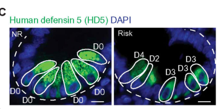

## Question

# Mechanistic Hypothesis Search

You are evaluating a specific disease mechanism hypothesis for the Disorder
Mechanisms Knowledge Base. This is not a general disease overview. Use the
hypothesis YAML below as the seed claim, then search for evidence that supports,
refutes, qualifies, or competes with this hypothesis.

## Target Disease
- **Disease Name:** Crohn Disease
- **Category:** Complex

## Target Hypothesis
- **Hypothesis ID:** canonical_nod2_autophagy_th17_mucosal_dysregulation_model
- **Hypothesis Label:** Canonical NOD2 / Autophagy / Th17 Mucosal Dysregulation Model
- **Status in KB:** CANONICAL

## Seed Hypothesis YAML

```yaml
hypothesis_group_id: canonical_nod2_autophagy_th17_mucosal_dysregulation_model
hypothesis_label: Canonical NOD2 / Autophagy / Th17 Mucosal Dysregulation Model
status: CANONICAL
description: Crohn's disease arises from a polygenic susceptibility to impaired mucosal innate immunity
  (NOD2, ATG16L1, IRGM, and other autophagy genes) combined with environmental triggers (smoking, diet,
  microbiota perturbation) that produce defective bacterial sensing and clearance by Paneth cells, macrophages,
  and intestinal epithelial cells. The resulting chronic exposure of lamina propria APCs to commensal
  antigens drives IL-23-dependent Th17/Th1 polarization, granuloma formation, and transmural inflammation.
  Anti-TNF (infliximab, adalimumab), anti-IL-12/23 (ustekinumab), anti-α4β7 (vedolizumab), and JAK inhibitors
  all corroborate this immune-dysregulation model by interrupting specific cytokine and trafficking axes
  downstream of the underlying innate-immunity defect.
evidence:
- reference: PMID:32242028
  reference_title: Crohn's disease.
  supports: SUPPORT
  evidence_source: HUMAN_CLINICAL
  snippet: Several factors have been implicated in the cause of Crohn's disease, including a dysregulated
    immune system, an altered microbiota, genetic susceptibility and environmental factors
  explanation: |
    Canonical mechanism reference used as the seed for the hypothesis-search deep-research run.
```

## Research Objective

Build a focused hypothesis-search report that answers:

1. What is the strongest direct evidence for this hypothesis?
2. What evidence argues against it, fails to reproduce it, or limits its scope?
3. Which claims are established, emerging, speculative, or contradicted?
4. Which patient subtypes, stages, tissues, cell types, molecular pathways, or
   biomarkers does the hypothesis best explain?
5. Which alternative or competing mechanistic hypotheses explain the same disease
   features better or more parsimoniously?
6. What are the explicit knowledge gaps: missing causal steps, unconfirmed edges,
   contradictory evidence, unknown source-to-target links, or source/data absences?
7. What experiments, cohorts, assays, datasets, or trials would most directly
   distinguish this hypothesis from alternatives?

Use primary literature whenever possible. Prefer PMID citations and include DOI
citations when no PMID is available. Treat reviews as orientation unless they
contain directly relevant synthesized evidence that should be clearly labeled as
review-level support.

## Required Output

### Executive Judgment

Give a concise verdict on the hypothesis as of the current literature:
supported, partially supported, unresolved, weakly supported, or refuted. Explain
the reasoning and the most important caveats.

### Evidence Matrix

Create a table with one row per important evidence item:

- Citation (PMID preferred)
- Evidence type (human clinical, model organism, in vitro, computational, review)
- Supports / refutes / qualifies / competing
- Mechanistic claim tested
- Key finding
- Disease subtype or context
- Confidence and limitations

### Mechanistic Causal Chain

Describe the causal chain implied by the hypothesis from upstream trigger to
clinical manifestation. Identify where the literature is strong, where the links
are inferred, and where there are missing causal steps.

### Knowledge Gaps

Identify explicit known unknowns surfaced by the search. Treat absence of
evidence as a curation-relevant finding only when the search actually checked for
it. Include:

- Unknown or weakly supported causal steps in the hypothesis
- Unconfirmed causal graph edges that need direct perturbation or longitudinal
  evidence
- Conflicting evidence, failed replications, or incompatible subtype-specific
  findings
- Unknown mechanism of action for relevant treatments, biomarkers, or
  interventions tied to this hypothesis
- Source-level or dataset-level absences, such as no relevant GenCC, ClinGen,
  trial, omics, or cohort evidence found as of the search date

For each gap, state the scope, why it matters, what was checked, and what
evidence or experiment would resolve it.

### Alternative Models

List competing or complementary hypotheses. For each, explain whether it is an
alternative to the seed hypothesis, a downstream consequence, an upstream cause,
or a parallel mechanism.

### Discriminating Tests

Recommend concrete studies or assays that would most efficiently test this
hypothesis against alternatives. Include patient stratification, biomarkers,
sample type, model system, perturbation, and expected result where applicable.

### Curation Leads

Provide candidate updates for the KB, but label these as leads requiring curator
verification. Include:

- candidate evidence references and exact abstract snippets to verify
- candidate pathophysiology nodes or edges
- candidate ontology terms for cell types and biological processes
- candidate subtype restrictions or status changes
- candidate `knowledge_gaps` or discussion prompts for unresolved causal claims,
  conflicting evidence, or explicit source/data absences

If the provider supports artifacts, produce artifact-friendly outputs such as an
evidence matrix, mechanistic diagram, knowledge-gap table, or comparison table.
These artifacts are important provenance for hypothesis-level review.


## Output

Question: You are an expert researcher providing comprehensive, well-cited information.

Provide detailed information focusing on:
1. Key concepts and definitions with current understanding
2. Recent developments and latest research (prioritize 2023-2024 sources)
3. Current applications and real-world implementations
4. Expert opinions and analysis from authoritative sources
5. Relevant statistics and data from recent studies

Format as a comprehensive research report with proper citations. Include URLs and publication dates where available.
Always prioritize recent, authoritative sources and provide specific citations for all major claims.

# Mechanistic Hypothesis Search

You are evaluating a specific disease mechanism hypothesis for the Disorder
Mechanisms Knowledge Base. This is not a general disease overview. Use the
hypothesis YAML below as the seed claim, then search for evidence that supports,
refutes, qualifies, or competes with this hypothesis.

## Target Disease
- **Disease Name:** Crohn Disease
- **Category:** Complex

## Target Hypothesis
- **Hypothesis ID:** canonical_nod2_autophagy_th17_mucosal_dysregulation_model
- **Hypothesis Label:** Canonical NOD2 / Autophagy / Th17 Mucosal Dysregulation Model
- **Status in KB:** CANONICAL

## Seed Hypothesis YAML

```yaml
hypothesis_group_id: canonical_nod2_autophagy_th17_mucosal_dysregulation_model
hypothesis_label: Canonical NOD2 / Autophagy / Th17 Mucosal Dysregulation Model
status: CANONICAL
description: Crohn's disease arises from a polygenic susceptibility to impaired mucosal innate immunity
  (NOD2, ATG16L1, IRGM, and other autophagy genes) combined with environmental triggers (smoking, diet,
  microbiota perturbation) that produce defective bacterial sensing and clearance by Paneth cells, macrophages,
  and intestinal epithelial cells. The resulting chronic exposure of lamina propria APCs to commensal
  antigens drives IL-23-dependent Th17/Th1 polarization, granuloma formation, and transmural inflammation.
  Anti-TNF (infliximab, adalimumab), anti-IL-12/23 (ustekinumab), anti-α4β7 (vedolizumab), and JAK inhibitors
  all corroborate this immune-dysregulation model by interrupting specific cytokine and trafficking axes
  downstream of the underlying innate-immunity defect.
evidence:
- reference: PMID:32242028
  reference_title: Crohn's disease.
  supports: SUPPORT
  evidence_source: HUMAN_CLINICAL
  snippet: Several factors have been implicated in the cause of Crohn's disease, including a dysregulated
    immune system, an altered microbiota, genetic susceptibility and environmental factors
  explanation: |
    Canonical mechanism reference used as the seed for the hypothesis-search deep-research run.
```

## Research Objective

Build a focused hypothesis-search report that answers:

1. What is the strongest direct evidence for this hypothesis?
2. What evidence argues against it, fails to reproduce it, or limits its scope?
3. Which claims are established, emerging, speculative, or contradicted?
4. Which patient subtypes, stages, tissues, cell types, molecular pathways, or
   biomarkers does the hypothesis best explain?
5. Which alternative or competing mechanistic hypotheses explain the same disease
   features better or more parsimoniously?
6. What are the explicit knowledge gaps: missing causal steps, unconfirmed edges,
   contradictory evidence, unknown source-to-target links, or source/data absences?
7. What experiments, cohorts, assays, datasets, or trials would most directly
   distinguish this hypothesis from alternatives?

Use primary literature whenever possible. Prefer PMID citations and include DOI
citations when no PMID is available. Treat reviews as orientation unless they
contain directly relevant synthesized evidence that should be clearly labeled as
review-level support.

## Required Output

### Executive Judgment

Give a concise verdict on the hypothesis as of the current literature:
supported, partially supported, unresolved, weakly supported, or refuted. Explain
the reasoning and the most important caveats.

### Evidence Matrix

Create a table with one row per important evidence item:

- Citation (PMID preferred)
- Evidence type (human clinical, model organism, in vitro, computational, review)
- Supports / refutes / qualifies / competing
- Mechanistic claim tested
- Key finding
- Disease subtype or context
- Confidence and limitations

### Mechanistic Causal Chain

Describe the causal chain implied by the hypothesis from upstream trigger to
clinical manifestation. Identify where the literature is strong, where the links
are inferred, and where there are missing causal steps.

### Knowledge Gaps

Identify explicit known unknowns surfaced by the search. Treat absence of
evidence as a curation-relevant finding only when the search actually checked for
it. Include:

- Unknown or weakly supported causal steps in the hypothesis
- Unconfirmed causal graph edges that need direct perturbation or longitudinal
  evidence
- Conflicting evidence, failed replications, or incompatible subtype-specific
  findings
- Unknown mechanism of action for relevant treatments, biomarkers, or
  interventions tied to this hypothesis
- Source-level or dataset-level absences, such as no relevant GenCC, ClinGen,
  trial, omics, or cohort evidence found as of the search date

For each gap, state the scope, why it matters, what was checked, and what
evidence or experiment would resolve it.

### Alternative Models

List competing or complementary hypotheses. For each, explain whether it is an
alternative to the seed hypothesis, a downstream consequence, an upstream cause,
or a parallel mechanism.

### Discriminating Tests

Recommend concrete studies or assays that would most efficiently test this
hypothesis against alternatives. Include patient stratification, biomarkers,
sample type, model system, perturbation, and expected result where applicable.

### Curation Leads

Provide candidate updates for the KB, but label these as leads requiring curator
verification. Include:

- candidate evidence references and exact abstract snippets to verify
- candidate pathophysiology nodes or edges
- candidate ontology terms for cell types and biological processes
- candidate subtype restrictions or status changes
- candidate `knowledge_gaps` or discussion prompts for unresolved causal claims,
  conflicting evidence, or explicit source/data absences

If the provider supports artifacts, produce artifact-friendly outputs such as an
evidence matrix, mechanistic diagram, knowledge-gap table, or comparison table.
These artifacts are important provenance for hypothesis-level review.


## Mechanistic Hypothesis Search Report

**Target disease:** Crohn disease (complex)

**Seed hypothesis:** *Canonical NOD2 / Autophagy / Th17 Mucosal Dysregulation Model* (KB status: CANONICAL)

**Search date:** 2026-05-24

### Executive Judgment

**Verdict: Partially supported.** Direct human and mechanistic evidence continues to strongly support that Crohn disease risk variants and related pathways in **autophagy and innate microbial handling** can produce **cell-type–specific defects** in antigen handling and epithelial (Paneth) homeostasis, and that **innate cytokine programs including IL-23 can be detectable early** (even in macroscopically healthy mucosa). However, multiple recent datasets qualify the “single linear chain” version of the hypothesis: (i) some canonical alleles show **no functional effect in specific assays/cell types** (e.g., NOD2 R702W in DC autophagy flux; NDP52 Val248Ala in epithelial AIEC xenophagy assays), (ii) the **IL-23 → IL-17** step is not consistently observed in early human disease, and (iii) **parallel upstream mechanisms** (macrophage LRRK2 hyperactivity with smoking, virome sensing deficits, and microbiome virulence programs such as T3SS) can produce Crohn-like inflammatory trajectories without requiring an epithelial-intrinsic NOD2/autophagy defect as the initiating event. Therefore, the canonical model remains a strong scaffold for a subset of Crohn biology, but is best treated as a **modular, context-dependent framework** rather than a universal mechanism.

Key caveats: (a) many “canonical” steps are still connected by inference across different experimental systems, and (b) Crohn heterogeneity by **genotype, tissue niche (ileum vs colon), stage (newly diagnosed vs late fibrostenosing), and environmental exposures (smoking, enteric viruses, microbial virulence factors)** likely determines which mechanistic path dominates. (quiniou2024impairedreprogrammingof pages 1-4, angriman2024innateimmunityactivation pages 5-7, silva2024identificationofautophagy pages 6-9, sun2024macrophagelrrk2hyperactivity pages 1-3, schirone2024stenosingcrohn’sdisease pages 2-5, xu2024gutbacterialtype pages 1-2)

---

## 1. Key Concepts and Definitions (current mechanistic understanding)

### 1.1 NOD2 and bacterial sensing
**NOD2** is an intracellular pattern-recognition receptor sensing bacterial peptidoglycan fragments (muramyl dipeptide). In the canonical model, Crohn-associated NOD2 loss-of-function variants reduce appropriate microbial sensing and/or regulation, contributing to inappropriate mucosal inflammation and altered antimicrobial responses. Recent synthesis continues to position NOD2 as a central Crohn susceptibility locus, but emphasizes that downstream consequences are **cell-type and context dependent**, and that some readouts can be unchanged for specific variants in specific cell types (e.g., DC autophagy flux reprogramming in NOD2 R702W carriers). (yuan2024unravelingtherole pages 8-10, quiniou2024impairedreprogrammingof pages 1-4)

### 1.2 Autophagy/xenophagy in gut immune–epithelial homeostasis
**Autophagy** is a conserved degradative pathway; **xenophagy** refers to selective autophagic targeting of intracellular microbes. The canonical Crohn hypothesis proposes that risk variants in autophagy genes (e.g., **ATG16L1**, **IRGM**, **ULK1**) impair microbial clearance and antigen processing in epithelial and antigen-presenting cells (APCs). A 2024 primary study in epithelial infection models shows that autophagy receptors **p62 (SQSTM1)** and **NDP52** are required to restrict intracellular replication of Crohn-associated AIEC strain LF82 and to limit IL-6/IL-8 production—directly linking impaired xenophagy to increased inflammatory signaling. (silva2024identificationofautophagy pages 6-9)

### 1.3 Paneth cell dysfunction as an integrated biomarker
**Paneth cells** in ileal crypts secrete antimicrobial peptides and support the stem cell niche. Paneth cell morphological/functional abnormalities have been proposed as a readout integrating genetic and environmental risk in Crohn disease. In 2024 *Science Immunology*, Paneth cell defects were scored in graded categories (D0–D5) using HD5 staining, supporting feasibility of a standardized phenotyping scheme and enabling pharmacologic “rescue” experiments. (sun2024macrophagelrrk2hyperactivity media 27126b73)

### 1.4 IL-23 axis, Th17/Th1 polarization, and “field effects”
The canonical model posits that persistent microbial antigen exposure drives APC cytokines (notably IL-23) that promote Th17/Th1 polarization. A 2024 surgical cohort study (88 ileocolonic resections) found **IL-15 and IL-23A elevations in macroscopically healthy ileal mucosa** in newly diagnosed/early-stage disease, consistent with an early innate cytokine “field effect.” However, IL-17 was not clearly increased and defensins were higher later, qualifying a simplified innate-defect → IL-23 → Th17 chain. (angriman2024innateimmunityactivation pages 5-7, angriman2024innateimmunityactivation pages 1-2)

---

## 2. Recent Developments and Latest Research (prioritizing 2023–2024)

### 2.1 Human genetic-autophagy functional evidence: gene-dose and variant specificity (2024)
A 2024 *Autophagy* study quantified autophagy flux in **monocyte-derived dendritic cells** and demonstrated that **homozygous** ATG16L1 T300A plus ULK1 rs12303764 abolished the ability of Crohn patient DCs to reprogram autophagy flux during maturation, while **heterozygotes did not**, showing **gene-dose dependence**. In contrast, **NOD2 R702W** did not alter this DC autophagy-flux phenotype. This is strong direct evidence for an autophagy-related defect in APC biology in a genotype- and zygosity-specific manner, but also highlights that “NOD2 → autophagy dysfunction” is not uniformly detectable across all assays/cell contexts. (quiniou2024impairedreprogrammingof pages 1-4)

### 2.2 Non–cell-autonomous autophagy pathway: macrophage LRRK2 hyperactivity → Paneth dysfunction (2024)
A major 2024 development is a mechanistic alternative/extension to the canonical model: *Science Immunology* reports that Crohn-associated **LRRK2 hyperactivity** suppresses autophagy via a **Beclin1/p62 axis** in **lamina propria phagocytes**, and that macrophage-derived mediators (including **TNFα and PAI-1**) can cause Paneth cell dysfunction *without* requiring Paneth-intrinsic LRRK2 expression. The study further implicates a gene–environment interaction with **cigarette smoke** and shows reversal of Paneth defects through **LRRK2 kinase inhibition** (DN-9713) and autophagy restoration (Beclin1 activation). This supports the broader “autophagy-innate dysregulation” framing but competes with strictly Paneth cell–autonomous NOD2/ATG16L1 initiation, shifting the causal locus upstream to macrophage signaling in at least a subset (e.g., smokers and LRRK2 risk allele carriers). (sun2024macrophagelrrk2hyperactivity pages 1-3, sun2024macrophagelrrk2hyperactivity pages 6-8, sun2024macrophagelrrk2hyperactivity media 27126b73)

### 2.3 Direct epithelial xenophagy mechanism plus a negative genetic result (2024)
Silva et al. (2024) identified xenophagy receptors **p62** and **NDP52** as required for control of AIEC LF82 in epithelial models and for limiting IL-6/IL-8 secretion. Importantly, they report the Crohn-associated **NDP52 Val248Ala** variant had **no detectable effect** on AIEC intracellular burden, NF-κB activation, or cytokines in their experimental system. This is a useful “qualifying” datapoint: not all Crohn-associated variants in autophagy-adjacent genes translate into measurable xenophagy defects in all contexts, and some may influence risk through other mechanisms or only under particular conditions. (silva2024identificationofautophagy pages 6-9, silva2024identificationofautophagy pages 9-11)

### 2.4 Early innate cytokine signature in human ileum (2024)
Angriman et al. (2024) found that **IL-15 (p=0.02) and IL-23A (p=0.05)** were higher in **healthy-appearing ileal mucosa** in newly diagnosed patients, and neutrophil infiltration correlated inversely with disease duration. Defensin transcripts increased in late-stage disease in primary and external cohorts. This supports the “innate activation can precede visible lesions” concept, but suggests antimicrobial peptide deficiency is not necessarily an *early* universal initiating defect, and that the IL-23–Th17 arm may not be captured simply by IL-17 elevation in early tissue. (angriman2024innateimmunityactivation pages 1-2)

### 2.5 Fibrostenosing Crohn phenotype links autophagy markers with oxidative stress (2024)
Schirone et al. (2024) report reduced LC3b-II and p62 in gut samples and systemic oxidative stress imbalance in Crohn disease, particularly in stenosing disease. Correlations (e.g., LC3b-II inversely correlated with sNOX2-dp) suggest a coupled autophagy–ROS axis that could contribute to fibrotic complications, although the design is observational and does not separate inflammation from fibrosis in stenotic lesions. (schirone2024stenosingcrohn’sdisease pages 2-5)

### 2.6 Microbiome virulence programs as upstream drivers and biomarkers (2024)
Xu et al. (2024, eBioMedicine) propose a microbiome-first/virulence-first complement: Achromobacter abundance was higher in an adult CD cohort (fold-change 1.94, FDR<0.05), and **12/20** core T3SS orthologs and a summed “Total Sct” metric were enriched in CD fecal metagenomes. In mice, WT Achromobacter pulmonis aggravated DSS colitis and increased colonic **TNFα and IL-6**, and macrophage infection induced pro-inflammatory transcripts consistent with M1 polarization and upregulation of TNF/IL-1/IL-23-related signaling (with partial dependence on T3SS). This challenges a strictly host-genetics-first framing and offers testable microbial biomarkers and triggers. (xu2024gutbacterialtype pages 14-15, xu2024gutbacterialtype pages 9-12)

### 2.7 Virome-dependent autophagy phenotypes (2024)
Hamade et al. (2024) provide evidence that ATG16L1 deficiency can enhance colitis susceptibility via impaired **TLR7-mediated antiviral responses**, increasing granzyme B+ tissue-resident memory CD8 T cells and worsening DSS colitis; a TLR7 agonist attenuated inflammation in Atg16l1-deficient DC mice. This supports the “autophagy as immune sensor integration” concept while qualifying the “bacterial clearance only” interpretation. (hamade2024tolllikereceptor7 pages 1-2)

---

## 3. Current Applications and Real-World Implementations

### 3.1 Translational biomarkers: Paneth cell phenotype and microbial virulence gene panels
*Paneth cell phenotype scoring (D0–D5)* is positioned as a cellular biomarker integrating gene and environment and enabling pharmacologic rescue readouts, as shown in Sun et al. (2024). (sun2024macrophagelrrk2hyperactivity media 27126b73)

Microbial **T3SS gene ortholog features** (“Total Sct” and derived features) were proposed as fecal biomarkers for Crohn disease and reported to decrease with **exclusive enteral nutrition (EEN)**, suggesting potential for monitoring disease activity and response to dietary therapy, although broader clinical validation remains needed. (xu2024gutbacterialtype pages 1-2)

### 3.2 Therapeutic corroboration and pathway targeting
The seed hypothesis uses therapeutic efficacy (anti-TNF, anti-IL-12/23, trafficking blockade, JAK inhibition) as downstream corroboration. The 2024 LRRK2 work adds a translationally relevant implication: **LRRK2 kinase inhibition** (being pursued in Parkinson disease) may be repurposable for a Crohn subset characterized by macrophage LRRK2 hyperactivity, smoking exposure, and Paneth cell defects; this is not yet a clinical implementation in Crohn but is a concrete mechanistic bridge to drug development. (sun2024macrophagelrrk2hyperactivity pages 1-3, sun2024macrophagelrrk2hyperactivity pages 6-8)

---

## 4. Expert Opinions and Authoritative Analysis (clearly labeled review-level)

Two 2024 reviews synthesize the canonical NOD2–autophagy–microbiota convergence and emphasize heterogeneity and context dependence. Yuan et al. highlight genetic epistasis between ATG16L1 and NOD2 and summarize evidence of autophagy involvement in macrophages, DCs, and Paneth cells while noting cell-type specificity. Subramanian et al. highlight population variability in genetic associations and note that many links to downstream IL-23/Th17 are often indirect across different study types. These reviews are useful for KB scaffolding but should be weighted below the primary mechanistic studies summarized above. (yuan2024unravelingtherole pages 1-2, subramanian2024exploringtheconnections pages 15-17)

---

## 5. Relevant Statistics and Data (recent studies)

*Human cohort (early disease cytokines):* In newly diagnosed ileocolonic Crohn disease, **IL-15 (p=0.02)** and **IL-23A (p=0.05)** were higher in *healthy ileal mucosa* (Angriman et al. 2024; 88 patients total, early subgroup smaller). (angriman2024innateimmunityactivation pages 1-2)

*Genotype-function (gene-dose):* Homozygous **ATG16L1 T300A** plus **ULK1 rs12303764** abolished DC autophagy-flux reprogramming; heterozygotes did not, showing **gene-dose dependence** (Quiniou et al. 2024). (quiniou2024impairedreprogrammingof pages 1-4)

*Microbiome biomarker signal:* Adult cohort PRJEB15371: **Achromobacter abundance fold-change 1.94** (CD vs controls) with **FDR<0.05**; **12/20** core T3SS orthologs enriched in CD (Xu et al. 2024). (xu2024gutbacterialtype pages 14-15)

*Preclinical cytokines:* WT Achromobacter pulmonis aggravated DSS colitis and increased colonic **TNFα and IL-6** (Xu et al. 2024). (xu2024gutbacterialtype pages 9-12)

*Fibrostenosing phenotype correlation:* Autophagy marker **LC3b-II** inversely correlated with **sNOX2-dp** (r = −0.587) and **H2O2** (r = −0.461) and positively with antioxidant capacity **HBA** (r = 0.640) in a pilot CD biopsy cohort (Schirone et al. 2024). (schirone2024stenosingcrohn’sdisease pages 2-5)

---

## Evidence Matrix (required)

| Citation | Publication date/year | Evidence type | Supports/refutes/qualifies/competing | Mechanistic claim tested | Key finding | Subtype/context/tissue/cell type | Confidence & limitations |
|---|---|---|---|---|---|---|---|
| Sun et al., *Science Immunology* 2024. DOI: [10.1126/sciimmunol.adi7907](https://doi.org/10.1126/sciimmunol.adi7907) | Nov 2024 | Human genetic-pathology correlation + mouse KI models + macrophage/organoid functional assays | Qualifies / competing-complementary | CD-associated autophagy defects can drive Paneth dysfunction, but via macrophage LRRK2 hyperactivity and cytokine-mediated non-cell-autonomous injury, especially with smoking | LRRK2 risk alleles/hyperactivity suppressed autophagy (Beclin1/p62 axis), increased phagocyte TNFα and PAI-1, caused Paneth cell defects; DN-9713 LRRK2 inhibition, Beclin1 activation, TNF neutralization, and myeloid depletion partially rescued Paneth abnormalities. LRRK2 localized mainly to lamina propria phagocytes rather than Paneth cells, shifting the model away from strictly epithelial cell-autonomous autophagy failure | Ileal Paneth cells; lamina propria macrophages/phagocytes; smoke + Atg16l1T300A or Lrrk2G2019S context; human CD carriers of LRRK2 risk alleles | High for mechanistic rigor in models; moderate for direct relevance to canonical NOD2 axis because NOD2 itself was not directly perturbed and human sample sizes/details are limited (sun2024macrophagelrrk2hyperactivity pages 1-3, sun2024macrophagelrrk2hyperactivity pages 6-8, sun2024macrophagelrrk2hyperactivity pages 8-9, sun2024macrophagelrrk2hyperactivity pages 3-4, sun2024macrophagelrrk2hyperactivity pages 17-21, sun2024macrophagelrrk2hyperactivity media 27126b73) |
| Quiniou et al., *Autophagy* 2024. DOI: [10.1080/15548627.2024.2338574](https://doi.org/10.1080/15548627.2024.2338574) | Apr 2024 | Human ex vivo functional study | Supports / qualifies | Core autophagy risk alleles impair APC autophagy dynamics, plausibly altering bacterial handling and antigen presentation | Monocyte-derived DCs from CD patients homozygous for ATG16L1 T300A and ULK1 rs12303764 lost maturation-associated autophagy-flux reprogramming; heterozygotes did not, showing gene-dose dependence. NOD2 R702W did **not** alter this DC phenotype | Crohn disease patients; monocyte-derived dendritic cells; maturation/pro-inflammatory challenge context | High for human cell-autonomous DC finding; limits: one APC type, no direct bacterial clearance or Th17 readout, and negative result for NOD2 R702W constrains generalization of the canonical model (quiniou2024impairedreprogrammingof pages 1-4) |
| Silva et al., *Frontiers in Cellular and Infection Microbiology* 2024. DOI: [10.3389/fcimb.2024.1268243](https://doi.org/10.3389/fcimb.2024.1268243) | Mar 2024 | In vitro infection study | Supports / qualifies | Xenophagy receptors are required for epithelial clearance of Crohn-associated AIEC, linking autophagy failure to bacterial persistence and inflammation | p62 or NDP52 loss increased intracellular AIEC LF82 and other clinical AIEC strains and increased IL-6/IL-8; both receptors colocalized with LF82 and LC3. However, the CD-associated NDP52 Val248Ala variant showed no detectable effect on AIEC burden, NF-κB activation, or cytokines in this assay | Intestinal epithelial models (T84, HeLa); AIEC LF82 infection | Moderate-high for xenophagy mechanism; limitations: epithelial cell lines, not primary CD tissue, variant-specific negative result narrows claims about universal pathogenicity of autophagy polymorphisms (silva2024identificationofautophagy pages 6-9, silva2024identificationofautophagy pages 1-2, silva2024identificationofautophagy pages 4-6, silva2024identificationofautophagy pages 9-11, silva2024identificationofautophagy pages 11-12) |
| Angriman et al., *Diseases of the Colon & Rectum* 2024. DOI: [10.1097/DCR.0000000000003145](https://doi.org/10.1097/DCR.0000000000003145) | Feb 2024 | Human prospective cohort (n=88) | Supports / qualifies | Early Crohn lesions are preceded by innate cytokine activation in adjacent healthy mucosa, including IL-23-axis signals | IL-15 and IL-23A were elevated in macroscopically healthy ileal mucosa in early-stage/newly diagnosed disease; neutrophilic inflammation was greater early. IL-17 was not clearly increased, and DEFB1/DEFB4A were higher later rather than early; M2-like macrophage features increased with longer disease duration/profibrotic repair | Newly diagnosed vs late-stage ileocolonic CD; healthy-appearing and inflamed ileal mucosa | High for stage-specific human mucosal signal; limitations: surgical cohort, small early subgroup, treatment confounding possible, does not directly prove innate-defect → Th17 causality and partially contradicts a simple early defensin-deficiency story (angriman2024innateimmunityactivation pages 5-7, angriman2024innateimmunityactivation pages 11-12, angriman2024innateimmunityactivation pages 9-11, angriman2024innateimmunityactivation pages 1-2) |
| Schirone et al., *Scientific Reports* 2024. DOI: [10.1038/s41598-024-79308-z](https://doi.org/10.1038/s41598-024-79308-z) | Nov 2024 | Human biopsy observational study | Supports / qualifies | Impaired autophagy is associated with oxidative stress and fibrostenosing Crohn phenotype | Reduced LC3b-II and reduced p62 protein/mRNA in gut samples from CD, especially stenosing disease; higher sNOX2-dp and H2O2 and lower antioxidant capacity correlated with lower autophagy markers, supporting an autophagy/oxidative stress imbalance in fibrostenosing CD | Stenosing/fibrostenotic Crohn disease; gut biopsies; serum oxidative stress markers | Moderate for phenotype association; limitations: small cross-sectional pilot, flux not directly measured with inhibitors, fibrosis vs inflammation not cleanly separated, no direct NOD2/IL-23/Th17 data (schirone2024stenosingcrohn’sdisease pages 2-5, schirone2024stenosingcrohn’sdisease pages 1-2, schirone2024stenosingcrohn’sdisease pages 5-6) |
| Hamade et al., *Frontiers in Immunology* 2024. DOI: [10.3389/fimmu.2024.1465175](https://doi.org/10.3389/fimmu.2024.1465175) | Oct 2024 | Mouse model study | Qualifies / competing-complementary | ATG16L1 deficiency can promote intestinal inflammation through impaired antiviral sensing (TLR7), not only bacterial handling | Myeloid/DC Atg16l1 deficiency increased colonic granzyme B+ TRM cells and worsened DSS colitis with higher IFN-γ and TNF-α; TLR7 agonist imiquimod attenuated colitis. Phenotype was conditional on viral-sensing pathway context | Myeloid/DC-specific Atg16l1 deficiency; DSS colitis; enteric virome/TLR7 axis | Moderate for alternative pathway relevance; limitations: murine DSS/viral model, not human CD tissue, emphasizes virome-dependent conditionality rather than canonical bacterial-only pathway (hamade2024tolllikereceptor7 pages 1-2) |
| Xu et al., *eBioMedicine* 2024. DOI: [10.1016/j.ebiom.2024.105296](https://doi.org/10.1016/j.ebiom.2024.105296) | Sep 2024 | Human metagenomics + mouse colitis + macrophage infection assays | Competing / complementary | Microbiome virulence programs (T3SS) may act upstream of inflammation and partly explain disease features without requiring primary host autophagy defects | Achromobacter abundance was higher in adult CD feces (fold-change 1.94, FDR <0.05); 12/20 T3SS orthologs and Total Sct were enriched in CD. WT A. pulmonis worsened DSS colitis and increased colonic TNFα/IL-6; macrophage infection induced IL-1, TNF, IFN-β and an M1/IL-23/Th1/Th17-skewed transcriptional program. T3SS mutant reduced but did not abolish effects | Human fecal metagenomes (adult and pediatric cohorts), DSS mouse colitis, macrophage infection models | Moderate-high for microbiome-driven inflammatory mechanism; limitations: cohort sizes modest, species source of all T3SS signal unresolved, secretion/timing confounds, not direct proof against host-genetic autophagy model but offers a parsimonious parallel driver (xu2024gutbacterialtype pages 14-15, xu2024gutbacterialtype pages 19-20, xu2024gutbacterialtype pages 1-2, xu2024gutbacterialtype pages 9-12) |
| Yuan et al., *Advanced Biotechnology* 2024. Review. DOI: [10.1007/s44307-024-00021-z](https://doi.org/10.1007/s44307-024-00021-z) | Mar 2024 | Review-level synthesis | Supports (review) / qualifies | Canonical synthesis linking NOD2, ATG16L1, IRGM, ULK1 and related loci to defective antimicrobial autophagy, APC function, Paneth biology, and inflammatory cytokine regulation | Summarizes genetic epistasis between ATG16L1 T300A and NOD2 susceptibility variants; reports evidence that NOD2 recruits ATG16L1, that IRGM/ATG16L1 defects impair bacterial handling, and that ATG16L1 deficiency enhances IL-1β/IL-18/IFN-β and NF-κB-linked outputs. Also notes cell-type specificity and mixed therapeutic implications | Review across macrophages, DCs, IECs, Paneth cells, multiple autophagy loci | Useful orientation but not primary evidence; some cited claims are heterogeneous or older, and downstream links to IL-23/Th17/granulomas remain partly inferred rather than directly demonstrated in one chain (yuan2024unravelingtherole pages 8-10, yuan2024unravelingtherole pages 1-2, yuan2024unravelingtherole pages 5-6, yuan2024unravelingtherole pages 3-5) |
| Subramanian et al., *Journal of Inflammation Research* 2024. Review. DOI: [10.2147/JIR.S483958](https://doi.org/10.2147/JIR.S483958) | Dec 2024 | Review-level synthesis | Supports (review) / qualifies | Autophagy–microbiota interactions are central to Crohn pathogenesis, but associations are population- and context-dependent | Synthesizes genetic and functional links between NOD2 stimulation, autophagy genes (ATG16L1, IRGM), Paneth dysfunction, bacterial persistence, and inflammatory outputs; explicitly notes population heterogeneity and conditional associations, and that quoted evidence does not fully establish the downstream IL-23/Th17/granulomatous chain | Review across microbiota, IECs, DCs, Paneth cells, autophagy genes | Useful for framing competing interpretations and heterogeneity; not primary evidence and should not be weighted equally with direct human or mechanistic studies (subramanian2024exploringtheconnections pages 15-17) |


*Table: This table summarizes major supporting, qualifying, and competing evidence items for the canonical NOD2/autophagy/Th17 mucosal dysregulation hypothesis in Crohn disease. It highlights where the mechanistic chain is directly supported, where effects are conditional or cell-type specific, and where alternative microbiome- or virome-driven mechanisms may better explain subsets of disease.*

---

## Mechanistic Causal Chain (with strength of links)

### Proposed chain in the seed hypothesis
1. **Polygenic susceptibility**: NOD2, ATG16L1, IRGM, ULK1 (and related loci) create vulnerability in innate microbial sensing and autophagy.
2. **Cellular defect**: impaired xenophagy/antimicrobial secretion and/or altered antigen processing in Paneth cells, IECs, macrophages, DCs.
3. **Microbial persistence & antigen exposure**: increased intracellular survival of pathobionts (e.g., AIEC), dysbiosis/virulence programs.
4. **APC cytokines**: increased IL-23 and related innate cytokines drive adaptive polarization.
5. **Adaptive effector program**: Th17/Th1 polarization and chronic inflammation.
6. **Tissue pathology**: granulomas, transmural inflammation; fibrosis/stenosis as remodeling outcome.

### Where evidence is strongest (2023–2024)
- **Step 2 (autophagy/xenophagy in epithelial cells)**: p62/NDP52 depletion increases intracellular AIEC and increases IL-6/IL-8—direct mechanistic support for impaired autophagy → microbial persistence → inflammation. (silva2024identificationofautophagy pages 6-9)
- **Step 2 in APCs (variant- and dose-dependent)**: ATG16L1/ULK1 genotype affects DC autophagy-flux reprogramming. (quiniou2024impairedreprogrammingof pages 1-4)
- **Step 4 (early innate cytokines in human mucosa)**: IL-23A (and IL-15) elevated in healthy-appearing mucosa in newly diagnosed disease. (angriman2024innateimmunityactivation pages 1-2)

### Where links are inferred or incomplete
- **Step 1→2 for NOD2 in specific cell readouts**: NOD2 R702W not affecting DC autophagy flux reprogramming indicates that “NOD2 risk variant → autophagy defect” is not universal. (quiniou2024impairedreprogrammingof pages 1-4)
- **Step 4→5 (IL-23→Th17 in early human disease)**: early IL-23A elevation did not clearly translate into IL-17 elevation in the Angriman cohort, suggesting timing, compartment, or measurement issues, or alternative IL-23 targets beyond classical Th17. (angriman2024innateimmunityactivation pages 5-7)
- **Granuloma/transmural inflammation causality**: the retrieved 2023–2024 primary studies did not directly connect NOD2/autophagy genotype to granuloma formation with causal mediation through IL-23/Th17 in the same human cohort; that step remains largely a synthesis inference.

### Competing or parallel causal chains supported by 2024 evidence
- **Macrophage LRRK2 hyperactivity** → autophagy suppression (Beclin1/p62 axis) → TNFα/PAI-1 secretion → **Paneth dysfunction** (non–cell-autonomous) → mucosal vulnerability/inflammation, especially with **smoking**. (sun2024macrophagelrrk2hyperactivity pages 6-8, sun2024macrophagelrrk2hyperactivity media 27126b73)
- **Virome/TLR7 pathway** with ATG16L1 deficiency → abnormal TRM CD8 accumulation → worsened colitis. (hamade2024tolllikereceptor7 pages 1-2)
- **Microbiome virulence (T3SS)** → macrophage death/inflammatory cytokines (TNF/IL-6) → colitis and CD-associated biomarker signatures. (xu2024gutbacterialtype pages 14-15, xu2024gutbacterialtype pages 9-12)

---

## Knowledge Gaps (explicit, with what was checked)

1. **Causal closure from autophagy/NOD2 defects to IL-23–Th17/Th1 polarization in humans**
   - **Why it matters:** The seed hypothesis relies on IL-23-dependent Th17/Th1 polarization as the central amplifier.
   - **What was checked:** A 2024 human cohort measured IL-23A and included IL-17 in panels; early IL-23A elevation was seen but IL-17 was not clearly elevated early. (angriman2024innateimmunityactivation pages 5-7, angriman2024innateimmunityactivation pages 1-2)
   - **Gap:** Need longitudinal and cell-resolved evidence tying autophagy-genotype and microbial persistence to IL-23 production and Th17/Th1 effector differentiation in the same individuals.

2. **Which Crohn risk alleles produce which functional defects in which cell types**
   - **What was checked:** Quiniou 2024 shows gene-dose dependence for ATG16L1/ULK1 in DCs and no effect for NOD2 R702W on a specific autophagy phenotype; Silva 2024 shows a negative result for NDP52 Val248Ala on xenophagy readouts. (quiniou2024impairedreprogrammingof pages 1-4, silva2024identificationofautophagy pages 9-11)
   - **Gap:** Variant-function mapping remains incomplete across primary IECs, Paneth cells, macrophages, and DC subsets under relevant microbial/virome exposures.

3. **Cell-autonomous vs non–cell-autonomous origins of Paneth defects**
   - **What was checked:** Sun 2024 supports a macrophage-driven non–cell-autonomous pathway; Angriman 2024 suggests innate cytokine field effects in healthy mucosa. (sun2024macrophagelrrk2hyperactivity pages 6-8, angriman2024innateimmunityactivation pages 1-2)
   - **Gap:** Need direct evidence in humans that Paneth defects precede inflammation in a genotype-specific manner, and whether macrophage signatures predict Paneth pathology.

4. **Fibrostenosing mechanisms: autophagy deficiency as driver vs consequence**
   - **What was checked:** Schirone 2024 finds LC3/p62 differences and oxidative stress correlations but cannot separate fibrosis from inflammation in stenosis. (schirone2024stenosingcrohn’sdisease pages 2-5)
   - **Gap:** Longitudinal sampling and compartment-resolved fibrosis quantification are needed to establish causality.

5. **Microbiome virulence gene panels: specificity, source species, and interaction with host genetics**
   - **What was checked:** Xu 2024 shows T3SS gene enrichment and Achromobacter associations; species sources of increased T3SS signal remain unresolved in parts. (xu2024gutbacterialtype pages 19-20)
   - **Gap:** Need strain-resolved metagenomics and host genotype/environment interaction analyses.

---

## Alternative / Competing Mechanistic Models

1. **Macrophage-LRRK2–driven autophagy suppression model (parallel/upstream cause)**
   - Places initiating pathology in lamina propria phagocytes (LRRK2 hyperactivity) causing Paneth dysfunction via TNFα/PAI-1, with smoking as an amplifier; complements canonical autophagy model but competes with “Paneth intrinsic NOD2/ATG16L1 defect as initiator.” (sun2024macrophagelrrk2hyperactivity pages 6-8)

2. **Virome-sensing/autophagy integration model (parallel mechanism)**
   - Suggests that some autophagy risk (ATG16L1 deficiency) manifests through defective antiviral sensing (TLR7) and TRM CD8 accumulation; aligns with gene–environment dependency. (hamade2024tolllikereceptor7 pages 1-2)

3. **Microbiome virulence-first model (upstream cause)**
   - Proposes that acquisition/expansion of T3SS-encoding bacteria (or community-level virulence programs) drives macrophage death and TNF/IL-6 inflammation, explaining disease activity and response to dietary therapy without requiring primary host autophagy failure. (xu2024gutbacterialtype pages 14-15, xu2024gutbacterialtype pages 9-12)

4. **Oxidative stress–autophagy–fibrosis axis (downstream consequence and phenotype driver)**
   - Positions oxidative stress and reduced autophagy markers as key contributors to fibrostenosing progression; may be downstream of inflammation or a phenotype-specific amplifier. (schirone2024stenosingcrohn’sdisease pages 2-5)

---

## Discriminating Tests (studies/assays to distinguish canonical vs alternatives)

1. **Prospective inception cohort with integrated genotype–function–cytokine mapping**
   - **Stratify:** NOD2 variants; ATG16L1 T300A zygosity; ULK1; LRRK2 risk alleles; smoking status.
   - **Samples:** serial ileal biopsies (inflamed + adjacent healthy), blood monocytes/DCs, fecal metagenomes/viromes.
   - **Assays:** single-cell RNA-seq + spatial transcriptomics; ex vivo xenophagy assays with AIEC and viral stimuli; IL-23/IL-17 protein quantification by cell source.
   - **Expected discriminant:** canonical model predicts autophagy genotype associates with impaired xenophagy and predicts IL-23-producing APC states and Th17/Th1 differentiation; LRRK2 model predicts macrophage LRRK2 activity signatures and TNF/PAI-1 predict Paneth defects independent of Paneth-intrinsic genotype.

2. **Human organoid–immune co-culture perturbations**
   - **Perturbations:** LRRK2 inhibitors vs TNF neutralization vs autophagy induction; microbial (AIEC) vs virome mimics.
   - **Readouts:** Paneth cell survival/HD5/lysozyme packaging; autophagy flux; cytokines.
   - **Discriminant:** whether Paneth rescue requires immune-cell targeting (LRRK2/TNF) rather than epithelial-autophagy restoration alone.

3. **Strain-resolved metagenomics for T3SS sources + host-genetic interaction**
   - Identify bacterial strains encoding enriched T3SS orthologs and test whether host autophagy genotypes predict colonization/expansion or inflammatory response magnitude.

---

## Curation Leads (candidate KB updates; curator verification required)

### Candidate evidence references and snippets to verify
1. **Non–cell-autonomous Paneth dysfunction pathway**
   - *Sun et al. 2024 Science Immunology* (DOI: https://doi.org/10.1126/sciimmunol.adi7907; Nov 2024): “lamina propria immune cells were the main intestinal cell types that express LRRK2… LRRK2-mediated pro-inflammatory cytokine release from phagocytes impaired Paneth cell function… rescued by LRRK2 kinase inhibition through activation of autophagy.” (sun2024macrophagelrrk2hyperactivity pages 1-3, sun2024macrophagelrrk2hyperactivity pages 6-8)

2. **Gene-dose dependence for autophagy flux in DC maturation**
   - *Quiniou et al. 2024 Autophagy* (DOI: https://doi.org/10.1080/15548627.2024.2338574; Apr 2024): “homozygous presence of ATG16L1… and ULK1… abolished… reprogram their autophagy flux… not seen… heterozygous… NOD2… did not alter…” (quiniou2024impairedreprogrammingof pages 1-4)

3. **AIEC xenophagy receptors + negative variant result**
   - *Silva et al. 2024 Frontiers in Cellular and Infection Microbiology* (DOI: https://doi.org/10.3389/fcimb.2024.1268243; Mar 2024): “diminished expression of p62 or NDP52 increased… AIEC LF82… increased pro-inflammatory cytokine production… NDP52 Val248Ala… no effect…” (silva2024identificationofautophagy pages 6-9, silva2024identificationofautophagy pages 9-11)

4. **Early human IL-23A elevation in healthy mucosa**
   - *Angriman et al. 2024 Diseases of the Colon & Rectum* (DOI: https://doi.org/10.1097/dcr.0000000000003145; Feb 2024): “IL-15… and IL-23A… higher in healthy ileal mucosa of early-stage patients… innate immunity is the starter…” (angriman2024innateimmunityactivation pages 1-2)

5. **Microbiome virulence biomarkers**
   - *Xu et al. 2024 eBioMedicine* (DOI: https://doi.org/10.1016/j.ebiom.2024.105296; Sep 2024): “12 of 20 core T3SS gene orthologs… enriched in CD fecal metagenomes… Achromobacter abundance… higher in CD… WT… elevated TNF-α and IL-6…” (xu2024gutbacterialtype pages 14-15, xu2024gutbacterialtype pages 9-12)

### Candidate nodes/edges for KB graph (leads)
- **LRRK2 (macrophage/phagocyte)** —| **Beclin1 activation / autophagy flux** → **TNFα, PAI-1 secretion** → **Paneth cell apoptosis/dysfunction** (sun2024macrophagelrrk2hyperactivity pages 6-8)
- **ATG16L1/ULK1 variants (gene-dose)** → **DC autophagy flux reprogramming failure** → (putative) **altered antigen processing/polarization potential** (quiniou2024impairedreprogrammingof pages 1-4)
- **p62/NDP52 xenophagy receptors** → **AIEC intracellular restriction** —| **IL-6/IL-8 release** (silva2024identificationofautophagy pages 6-9)
- **Early-stage healthy mucosa IL-23A/IL-15 elevation** → “field effect” innate activation preceding lesions (angriman2024innateimmunityactivation pages 1-2)
- **Microbiome T3SS gene abundance** → **macrophage inflammatory program (TNF/IL-6/IL-23-related transcription)** → **colitis severity** (xu2024gutbacterialtype pages 14-15, xu2024gutbacterialtype pages 9-12)

### Candidate ontology terms (examples; curator confirmation needed)
- Cell types: Paneth cell; lamina propria macrophage; monocyte-derived dendritic cell; tissue-resident memory CD8 T cell (TRM)
- Processes: xenophagy; macroautophagy; bacterial intracellular survival; innate cytokine production (IL-23, TNF); epithelial apoptosis; oxidative stress; fibrosis/stenosis

### Candidate subtype restrictions/status changes (leads)
- Consider annotating canonical hypothesis as **subtype/condition-dependent**:
  - **Smoking-associated** Crohn: may be better captured by macrophage LRRK2-autophagy suppression → TNF/PAI-1 → Paneth defect pathway (sun2024macrophagelrrk2hyperactivity pages 6-8)
  - **Fibrostenosing phenotype:** autophagy/oxidative stress imbalance may be more relevant than Th17-centric steps (schirone2024stenosingcrohn’sdisease pages 2-5)

---

## Visual Evidence (figure-level provenance)

Sun et al. (2024) provides representative Paneth defect scoring (D0–D5) and quantification of rescue in *Atg16l1* T300A smoke-exposed mice following LRRK2 inhibition (DN-9713), supporting the existence of a measurable Paneth cell phenotype and pharmacologic reversibility. (sun2024macrophagelrrk2hyperactivity media 27126b73, sun2024macrophagelrrk2hyperactivity media 583e3e46)


References

1. (quiniou2024impairedreprogrammingof pages 1-4): Gaëlle Quiniou, Leslie Andromaque, Rémi Duclaux-Loras, Océane Dinet, Ornella Cervantes, Mallorie Verdet, Camille Meunier, Gilles Boschetti, Christophe Viret, Stéphane Nancey, Mathias Faure, and Aurore Rozières. Impaired reprogramming of the autophagy flux in maturing dendritic cells from crohn disease patients with core autophagy gene-related polymorphisms. Autophagy, 20:1837-1853, Apr 2024. URL: https://doi.org/10.1080/15548627.2024.2338574, doi:10.1080/15548627.2024.2338574. This article has 9 citations and is from a domain leading peer-reviewed journal.

2. (angriman2024innateimmunityactivation pages 5-7): Imerio Angriman, Giovanni Bordignon, Andromachi Kotsafti, Claudia Mescoli, Melania Scarpa, Cesare Ruffolo, Matteo Fassan, Angelo Paolo Dei Tos, Renata D’Incà, Edoardo Vincenzo Savarino, Fabiana Zingone, Salvatore Pucciarelli, Romeo Bardini, Ignazio Castagliuolo, and Marco Scarpa. Innate immunity activation in newly diagnosed ileocolonic crohn’s disease: a cohort study. Diseases of the Colon &amp; Rectum, 67:681-692, Feb 2024. URL: https://doi.org/10.1097/dcr.0000000000003145, doi:10.1097/dcr.0000000000003145. This article has 9 citations and is from a peer-reviewed journal.

3. (silva2024identificationofautophagy pages 6-9): Alison Da Silva, Guillaume Dalmasso, Anaïs Larabi, My Hanh Thi Hoang, Elisabeth Billard, Nicolas Barnich, and Hang Thi Thu Nguyen. Identification of autophagy receptors for the crohn’s disease-associated adherent-invasive escherichia coli. Frontiers in Cellular and Infection Microbiology, Mar 2024. URL: https://doi.org/10.3389/fcimb.2024.1268243, doi:10.3389/fcimb.2024.1268243. This article has 8 citations.

4. (sun2024macrophagelrrk2hyperactivity pages 1-3): Shengxiang Sun, Miki Hodel, Xiang Wang, Javier De Vicente, Talin Haritunians, Anketse Debebe, Chen-Ting Hung, Changqing Ma, Atika Malique, Hoang N. Nguyen, Maayan Agam, Michael T. Maloney, Marisa S. Goo, Jillian H. Kluss, Richa Mishra, Jennifer Frein, Amanda Foster, Samuel Ballentine, Uday Pandey, Justin Kern, Shaohong Yang, Emebet Mengesha, Iyshwarya Balasubramanian, Annie Arguello, Anthony A. Estrada, Nan Gao, Inga Peter, Dermot P. B. McGovern, Anastasia G. Henry, Thaddeus S. Stappenbeck, and Ta-Chiang Liu. Macrophage lrrk2 hyperactivity impairs autophagy and induces paneth cell dysfunction. Science immunology, 9 101:eadi7907, Nov 2024. URL: https://doi.org/10.1126/sciimmunol.adi7907, doi:10.1126/sciimmunol.adi7907. This article has 14 citations and is from a highest quality peer-reviewed journal.

5. (schirone2024stenosingcrohn’sdisease pages 2-5): Leonardo Schirone, Maria Carla Di Paolo, Daniele Vecchio, Cristina Nocella, Alessandra D’Amico, Riccardo Urgesi, Lorella Pallotta, Gianfranco Fanello, Giuseppe Villotti, Maria Giovanna Graziani, Mariangela Peruzzi, Elena De Falco, Roberto Carnevale, Sebastiano Sciarretta, Giacomo Frati, and Cristiano Pagnini. Stenosing crohn’s disease patients display gut autophagy/oxidative stress imbalance. Scientific Reports, Nov 2024. URL: https://doi.org/10.1038/s41598-024-79308-z, doi:10.1038/s41598-024-79308-z. This article has 2 citations and is from a peer-reviewed journal.

6. (xu2024gutbacterialtype pages 1-2): Jun Xu, Peijie Li, Zhenye Li, Sheng Liu, Huating Guo, Cammie F. Lesser, Jia Ke, Wenjing Zhao, and Xiangyu Mou. Gut bacterial type iii secretion systems aggravate colitis in mice and serve as biomarkers of crohn’s disease. Sep 2024. URL: https://doi.org/10.1016/j.ebiom.2024.105296, doi:10.1016/j.ebiom.2024.105296. This article has 5 citations and is from a peer-reviewed journal.

7. (yuan2024unravelingtherole pages 8-10): Ziyue Yuan, Jing Ye, Bo Liu, and Lan Zhang. Unraveling the role of autophagy regulation in crohn's disease: from genetic mechanisms to potential therapeutics. Advanced Biotechnology, Mar 2024. URL: https://doi.org/10.1007/s44307-024-00021-z, doi:10.1007/s44307-024-00021-z. This article has 10 citations.

8. (sun2024macrophagelrrk2hyperactivity media 27126b73): Shengxiang Sun, Miki Hodel, Xiang Wang, Javier De Vicente, Talin Haritunians, Anketse Debebe, Chen-Ting Hung, Changqing Ma, Atika Malique, Hoang N. Nguyen, Maayan Agam, Michael T. Maloney, Marisa S. Goo, Jillian H. Kluss, Richa Mishra, Jennifer Frein, Amanda Foster, Samuel Ballentine, Uday Pandey, Justin Kern, Shaohong Yang, Emebet Mengesha, Iyshwarya Balasubramanian, Annie Arguello, Anthony A. Estrada, Nan Gao, Inga Peter, Dermot P. B. McGovern, Anastasia G. Henry, Thaddeus S. Stappenbeck, and Ta-Chiang Liu. Macrophage lrrk2 hyperactivity impairs autophagy and induces paneth cell dysfunction. Science immunology, 9 101:eadi7907, Nov 2024. URL: https://doi.org/10.1126/sciimmunol.adi7907, doi:10.1126/sciimmunol.adi7907. This article has 14 citations and is from a highest quality peer-reviewed journal.

9. (angriman2024innateimmunityactivation pages 1-2): Imerio Angriman, Giovanni Bordignon, Andromachi Kotsafti, Claudia Mescoli, Melania Scarpa, Cesare Ruffolo, Matteo Fassan, Angelo Paolo Dei Tos, Renata D’Incà, Edoardo Vincenzo Savarino, Fabiana Zingone, Salvatore Pucciarelli, Romeo Bardini, Ignazio Castagliuolo, and Marco Scarpa. Innate immunity activation in newly diagnosed ileocolonic crohn’s disease: a cohort study. Diseases of the Colon &amp; Rectum, 67:681-692, Feb 2024. URL: https://doi.org/10.1097/dcr.0000000000003145, doi:10.1097/dcr.0000000000003145. This article has 9 citations and is from a peer-reviewed journal.

10. (sun2024macrophagelrrk2hyperactivity pages 6-8): Shengxiang Sun, Miki Hodel, Xiang Wang, Javier De Vicente, Talin Haritunians, Anketse Debebe, Chen-Ting Hung, Changqing Ma, Atika Malique, Hoang N. Nguyen, Maayan Agam, Michael T. Maloney, Marisa S. Goo, Jillian H. Kluss, Richa Mishra, Jennifer Frein, Amanda Foster, Samuel Ballentine, Uday Pandey, Justin Kern, Shaohong Yang, Emebet Mengesha, Iyshwarya Balasubramanian, Annie Arguello, Anthony A. Estrada, Nan Gao, Inga Peter, Dermot P. B. McGovern, Anastasia G. Henry, Thaddeus S. Stappenbeck, and Ta-Chiang Liu. Macrophage lrrk2 hyperactivity impairs autophagy and induces paneth cell dysfunction. Science immunology, 9 101:eadi7907, Nov 2024. URL: https://doi.org/10.1126/sciimmunol.adi7907, doi:10.1126/sciimmunol.adi7907. This article has 14 citations and is from a highest quality peer-reviewed journal.

11. (silva2024identificationofautophagy pages 9-11): Alison Da Silva, Guillaume Dalmasso, Anaïs Larabi, My Hanh Thi Hoang, Elisabeth Billard, Nicolas Barnich, and Hang Thi Thu Nguyen. Identification of autophagy receptors for the crohn’s disease-associated adherent-invasive escherichia coli. Frontiers in Cellular and Infection Microbiology, Mar 2024. URL: https://doi.org/10.3389/fcimb.2024.1268243, doi:10.3389/fcimb.2024.1268243. This article has 8 citations.

12. (xu2024gutbacterialtype pages 14-15): Jun Xu, Peijie Li, Zhenye Li, Sheng Liu, Huating Guo, Cammie F. Lesser, Jia Ke, Wenjing Zhao, and Xiangyu Mou. Gut bacterial type iii secretion systems aggravate colitis in mice and serve as biomarkers of crohn’s disease. Sep 2024. URL: https://doi.org/10.1016/j.ebiom.2024.105296, doi:10.1016/j.ebiom.2024.105296. This article has 5 citations and is from a peer-reviewed journal.

13. (xu2024gutbacterialtype pages 9-12): Jun Xu, Peijie Li, Zhenye Li, Sheng Liu, Huating Guo, Cammie F. Lesser, Jia Ke, Wenjing Zhao, and Xiangyu Mou. Gut bacterial type iii secretion systems aggravate colitis in mice and serve as biomarkers of crohn’s disease. Sep 2024. URL: https://doi.org/10.1016/j.ebiom.2024.105296, doi:10.1016/j.ebiom.2024.105296. This article has 5 citations and is from a peer-reviewed journal.

14. (hamade2024tolllikereceptor7 pages 1-2): Hussein Hamade, Masato Tsuda, Naoki Oshima, Dalton T. Stamps, Michelle H. Wong, Jasmine T. Stamps, Lisa S. Thomas, Brenda C. Salumbides, Caroline Jin, Jordan S. Nunnelee, Deepti Dhall, Stephan R. Targan, and Kathrin S. Michelsen. Toll-like receptor 7 protects against intestinal inflammation and restricts the development of colonic tissue-resident memory cd8+ t cells. Frontiers in Immunology, Oct 2024. URL: https://doi.org/10.3389/fimmu.2024.1465175, doi:10.3389/fimmu.2024.1465175. This article has 7 citations and is from a peer-reviewed journal.

15. (yuan2024unravelingtherole pages 1-2): Ziyue Yuan, Jing Ye, Bo Liu, and Lan Zhang. Unraveling the role of autophagy regulation in crohn's disease: from genetic mechanisms to potential therapeutics. Advanced Biotechnology, Mar 2024. URL: https://doi.org/10.1007/s44307-024-00021-z, doi:10.1007/s44307-024-00021-z. This article has 10 citations.

16. (subramanian2024exploringtheconnections pages 15-17): Arunkumar Subramanian, Afrarahamed J, Tamilanban T, Vinoth Kumarasamy, M Yasmin Begum, Mahendran Sekar, Vetriselvan Subramaniyan, Ling Shing Wong, and Adel Al Fatease. Exploring the connections: autophagy, gut microbiota, and inflammatory bowel disease pathogenesis. Journal of Inflammation Research, 17:10453-10470, Dec 2024. URL: https://doi.org/10.2147/jir.s483958, doi:10.2147/jir.s483958. This article has 12 citations and is from a peer-reviewed journal.

17. (sun2024macrophagelrrk2hyperactivity pages 8-9): Shengxiang Sun, Miki Hodel, Xiang Wang, Javier De Vicente, Talin Haritunians, Anketse Debebe, Chen-Ting Hung, Changqing Ma, Atika Malique, Hoang N. Nguyen, Maayan Agam, Michael T. Maloney, Marisa S. Goo, Jillian H. Kluss, Richa Mishra, Jennifer Frein, Amanda Foster, Samuel Ballentine, Uday Pandey, Justin Kern, Shaohong Yang, Emebet Mengesha, Iyshwarya Balasubramanian, Annie Arguello, Anthony A. Estrada, Nan Gao, Inga Peter, Dermot P. B. McGovern, Anastasia G. Henry, Thaddeus S. Stappenbeck, and Ta-Chiang Liu. Macrophage lrrk2 hyperactivity impairs autophagy and induces paneth cell dysfunction. Science immunology, 9 101:eadi7907, Nov 2024. URL: https://doi.org/10.1126/sciimmunol.adi7907, doi:10.1126/sciimmunol.adi7907. This article has 14 citations and is from a highest quality peer-reviewed journal.

18. (sun2024macrophagelrrk2hyperactivity pages 3-4): Shengxiang Sun, Miki Hodel, Xiang Wang, Javier De Vicente, Talin Haritunians, Anketse Debebe, Chen-Ting Hung, Changqing Ma, Atika Malique, Hoang N. Nguyen, Maayan Agam, Michael T. Maloney, Marisa S. Goo, Jillian H. Kluss, Richa Mishra, Jennifer Frein, Amanda Foster, Samuel Ballentine, Uday Pandey, Justin Kern, Shaohong Yang, Emebet Mengesha, Iyshwarya Balasubramanian, Annie Arguello, Anthony A. Estrada, Nan Gao, Inga Peter, Dermot P. B. McGovern, Anastasia G. Henry, Thaddeus S. Stappenbeck, and Ta-Chiang Liu. Macrophage lrrk2 hyperactivity impairs autophagy and induces paneth cell dysfunction. Science immunology, 9 101:eadi7907, Nov 2024. URL: https://doi.org/10.1126/sciimmunol.adi7907, doi:10.1126/sciimmunol.adi7907. This article has 14 citations and is from a highest quality peer-reviewed journal.

19. (sun2024macrophagelrrk2hyperactivity pages 17-21): Shengxiang Sun, Miki Hodel, Xiang Wang, Javier De Vicente, Talin Haritunians, Anketse Debebe, Chen-Ting Hung, Changqing Ma, Atika Malique, Hoang N. Nguyen, Maayan Agam, Michael T. Maloney, Marisa S. Goo, Jillian H. Kluss, Richa Mishra, Jennifer Frein, Amanda Foster, Samuel Ballentine, Uday Pandey, Justin Kern, Shaohong Yang, Emebet Mengesha, Iyshwarya Balasubramanian, Annie Arguello, Anthony A. Estrada, Nan Gao, Inga Peter, Dermot P. B. McGovern, Anastasia G. Henry, Thaddeus S. Stappenbeck, and Ta-Chiang Liu. Macrophage lrrk2 hyperactivity impairs autophagy and induces paneth cell dysfunction. Science immunology, 9 101:eadi7907, Nov 2024. URL: https://doi.org/10.1126/sciimmunol.adi7907, doi:10.1126/sciimmunol.adi7907. This article has 14 citations and is from a highest quality peer-reviewed journal.

20. (silva2024identificationofautophagy pages 1-2): Alison Da Silva, Guillaume Dalmasso, Anaïs Larabi, My Hanh Thi Hoang, Elisabeth Billard, Nicolas Barnich, and Hang Thi Thu Nguyen. Identification of autophagy receptors for the crohn’s disease-associated adherent-invasive escherichia coli. Frontiers in Cellular and Infection Microbiology, Mar 2024. URL: https://doi.org/10.3389/fcimb.2024.1268243, doi:10.3389/fcimb.2024.1268243. This article has 8 citations.

21. (silva2024identificationofautophagy pages 4-6): Alison Da Silva, Guillaume Dalmasso, Anaïs Larabi, My Hanh Thi Hoang, Elisabeth Billard, Nicolas Barnich, and Hang Thi Thu Nguyen. Identification of autophagy receptors for the crohn’s disease-associated adherent-invasive escherichia coli. Frontiers in Cellular and Infection Microbiology, Mar 2024. URL: https://doi.org/10.3389/fcimb.2024.1268243, doi:10.3389/fcimb.2024.1268243. This article has 8 citations.

22. (silva2024identificationofautophagy pages 11-12): Alison Da Silva, Guillaume Dalmasso, Anaïs Larabi, My Hanh Thi Hoang, Elisabeth Billard, Nicolas Barnich, and Hang Thi Thu Nguyen. Identification of autophagy receptors for the crohn’s disease-associated adherent-invasive escherichia coli. Frontiers in Cellular and Infection Microbiology, Mar 2024. URL: https://doi.org/10.3389/fcimb.2024.1268243, doi:10.3389/fcimb.2024.1268243. This article has 8 citations.

23. (angriman2024innateimmunityactivation pages 11-12): Imerio Angriman, Giovanni Bordignon, Andromachi Kotsafti, Claudia Mescoli, Melania Scarpa, Cesare Ruffolo, Matteo Fassan, Angelo Paolo Dei Tos, Renata D’Incà, Edoardo Vincenzo Savarino, Fabiana Zingone, Salvatore Pucciarelli, Romeo Bardini, Ignazio Castagliuolo, and Marco Scarpa. Innate immunity activation in newly diagnosed ileocolonic crohn’s disease: a cohort study. Diseases of the Colon &amp; Rectum, 67:681-692, Feb 2024. URL: https://doi.org/10.1097/dcr.0000000000003145, doi:10.1097/dcr.0000000000003145. This article has 9 citations and is from a peer-reviewed journal.

24. (angriman2024innateimmunityactivation pages 9-11): Imerio Angriman, Giovanni Bordignon, Andromachi Kotsafti, Claudia Mescoli, Melania Scarpa, Cesare Ruffolo, Matteo Fassan, Angelo Paolo Dei Tos, Renata D’Incà, Edoardo Vincenzo Savarino, Fabiana Zingone, Salvatore Pucciarelli, Romeo Bardini, Ignazio Castagliuolo, and Marco Scarpa. Innate immunity activation in newly diagnosed ileocolonic crohn’s disease: a cohort study. Diseases of the Colon &amp; Rectum, 67:681-692, Feb 2024. URL: https://doi.org/10.1097/dcr.0000000000003145, doi:10.1097/dcr.0000000000003145. This article has 9 citations and is from a peer-reviewed journal.

25. (schirone2024stenosingcrohn’sdisease pages 1-2): Leonardo Schirone, Maria Carla Di Paolo, Daniele Vecchio, Cristina Nocella, Alessandra D’Amico, Riccardo Urgesi, Lorella Pallotta, Gianfranco Fanello, Giuseppe Villotti, Maria Giovanna Graziani, Mariangela Peruzzi, Elena De Falco, Roberto Carnevale, Sebastiano Sciarretta, Giacomo Frati, and Cristiano Pagnini. Stenosing crohn’s disease patients display gut autophagy/oxidative stress imbalance. Scientific Reports, Nov 2024. URL: https://doi.org/10.1038/s41598-024-79308-z, doi:10.1038/s41598-024-79308-z. This article has 2 citations and is from a peer-reviewed journal.

26. (schirone2024stenosingcrohn’sdisease pages 5-6): Leonardo Schirone, Maria Carla Di Paolo, Daniele Vecchio, Cristina Nocella, Alessandra D’Amico, Riccardo Urgesi, Lorella Pallotta, Gianfranco Fanello, Giuseppe Villotti, Maria Giovanna Graziani, Mariangela Peruzzi, Elena De Falco, Roberto Carnevale, Sebastiano Sciarretta, Giacomo Frati, and Cristiano Pagnini. Stenosing crohn’s disease patients display gut autophagy/oxidative stress imbalance. Scientific Reports, Nov 2024. URL: https://doi.org/10.1038/s41598-024-79308-z, doi:10.1038/s41598-024-79308-z. This article has 2 citations and is from a peer-reviewed journal.

27. (xu2024gutbacterialtype pages 19-20): Jun Xu, Peijie Li, Zhenye Li, Sheng Liu, Huating Guo, Cammie F. Lesser, Jia Ke, Wenjing Zhao, and Xiangyu Mou. Gut bacterial type iii secretion systems aggravate colitis in mice and serve as biomarkers of crohn’s disease. Sep 2024. URL: https://doi.org/10.1016/j.ebiom.2024.105296, doi:10.1016/j.ebiom.2024.105296. This article has 5 citations and is from a peer-reviewed journal.

28. (yuan2024unravelingtherole pages 5-6): Ziyue Yuan, Jing Ye, Bo Liu, and Lan Zhang. Unraveling the role of autophagy regulation in crohn's disease: from genetic mechanisms to potential therapeutics. Advanced Biotechnology, Mar 2024. URL: https://doi.org/10.1007/s44307-024-00021-z, doi:10.1007/s44307-024-00021-z. This article has 10 citations.

29. (yuan2024unravelingtherole pages 3-5): Ziyue Yuan, Jing Ye, Bo Liu, and Lan Zhang. Unraveling the role of autophagy regulation in crohn's disease: from genetic mechanisms to potential therapeutics. Advanced Biotechnology, Mar 2024. URL: https://doi.org/10.1007/s44307-024-00021-z, doi:10.1007/s44307-024-00021-z. This article has 10 citations.

30. (sun2024macrophagelrrk2hyperactivity media 583e3e46): Shengxiang Sun, Miki Hodel, Xiang Wang, Javier De Vicente, Talin Haritunians, Anketse Debebe, Chen-Ting Hung, Changqing Ma, Atika Malique, Hoang N. Nguyen, Maayan Agam, Michael T. Maloney, Marisa S. Goo, Jillian H. Kluss, Richa Mishra, Jennifer Frein, Amanda Foster, Samuel Ballentine, Uday Pandey, Justin Kern, Shaohong Yang, Emebet Mengesha, Iyshwarya Balasubramanian, Annie Arguello, Anthony A. Estrada, Nan Gao, Inga Peter, Dermot P. B. McGovern, Anastasia G. Henry, Thaddeus S. Stappenbeck, and Ta-Chiang Liu. Macrophage lrrk2 hyperactivity impairs autophagy and induces paneth cell dysfunction. Science immunology, 9 101:eadi7907, Nov 2024. URL: https://doi.org/10.1126/sciimmunol.adi7907, doi:10.1126/sciimmunol.adi7907. This article has 14 citations and is from a highest quality peer-reviewed journal.

## Artifacts

- [Edison artifact artifact-00](falcon_artifacts/artifact-00.md)

