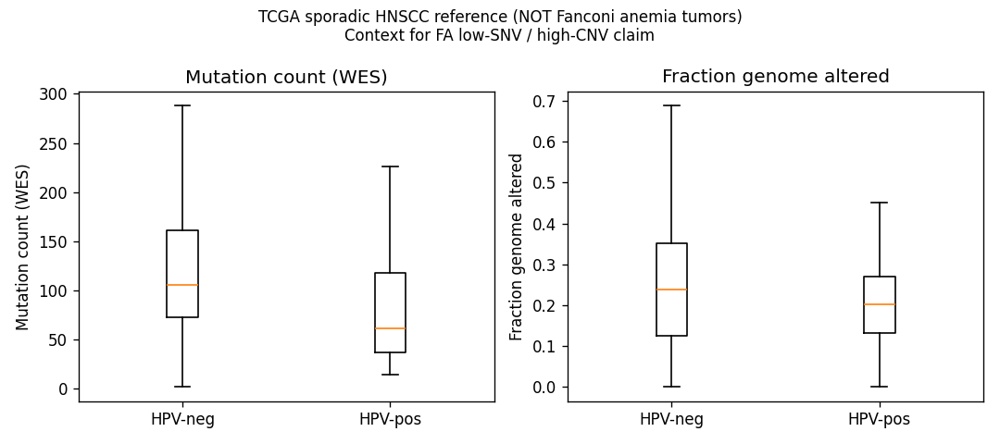

## Question

# Mechanistic Hypothesis Search

You are evaluating a specific disease mechanism hypothesis for the Disorder
Mechanisms Knowledge Base. This is not a general disease overview. Use the
hypothesis YAML below as the seed claim, then search for evidence that supports,
refutes, qualifies, or competes with this hypothesis.

## Target Disease
- **Disease Name:** Fanconi_Anemia
- **Category:** Genetic

## Target Hypothesis
- **Hypothesis ID:** fa_hnscc_hpv_independent_keratinocyte_carcinogenesis
- **Hypothesis Label:** HPV-Independent Aldehyde and Replication-Stress Driven Oral Carcinogenesis
- **Status in KB:** EMERGING

## Seed Hypothesis YAML

```yaml
hypothesis_group_id: fa_hnscc_hpv_independent_keratinocyte_carcinogenesis
hypothesis_label: HPV-Independent Aldehyde and Replication-Stress Driven Oral Carcinogenesis
status: EMERGING
description: Head and neck squamous cell carcinoma in Fanconi anemia arises predominantly through an HPV-independent
  route in which endogenous aldehydes (acetaldehyde, formaldehyde) and replication stress in FA-deficient
  oral keratinocytes generate structural chromosomal variation and copy-number driven, low point-mutation-burden
  tumors, with premalignant leukoplakia as the visible intermediate. Competing hypotheses are an HPV-driven
  route and a chronic-inflammation or graft-versus-host-mediated route after transplantation.
notes: The entry explains HNSCC only through the generic Epithelial Cancer Susceptibility node and separately
  models HPV-Mediated Epithelial Damage; the relative contribution of the two routes and the aldehyde
  step are the open mechanistic questions.
evidence:
- reference: PMID:40478605
  reference_title: Long-Term Outcome of Fanconi Anemia Patients From the Italian Registry on Behalf of
    the Marrow Failure Study Group of the AIEOP (Italian Association for Pediatric Haematology-Oncology).
  supports: SUPPORT
  evidence_source: HUMAN_CLINICAL
  snippet: Head and neck squamous cell carcinoma was the most frequent cancer, followed by hematologic
    neoplasms.
  explanation: Seed reference establishing HNSCC as the dominant solid tumor the hypothesis must explain.
```

## Research Objective

Build a focused hypothesis-search report that answers:

1. What is the strongest direct evidence for this hypothesis?
2. What evidence argues against it, fails to reproduce it, or limits its scope?
3. Which claims are established, emerging, speculative, or contradicted?
4. Which patient subtypes, stages, tissues, cell types, molecular pathways, or
   biomarkers does the hypothesis best explain?
5. Which alternative or competing mechanistic hypotheses explain the same disease
   features better or more parsimoniously?
6. What are the explicit knowledge gaps: missing causal steps, unconfirmed edges,
   contradictory evidence, unknown source-to-target links, or source/data absences?
7. What experiments, cohorts, assays, datasets, or trials would most directly
   distinguish this hypothesis from alternatives?

Use primary literature whenever possible. Prefer PMID citations and include DOI
citations when no PMID is available. Treat reviews as orientation unless they
contain directly relevant synthesized evidence that should be clearly labeled as
review-level support.

When dataset or scientific-tool access is available, use it for questions that
can be tested computationally rather than limiting the run to literature search.
Preflight the required data lake, databases, packages, credentials, and tools
before claiming that an analysis can run. Never silently fall back from a failed
dataset/tool analysis to literature synthesis or model knowledge: report the
failure, the fallback, and the resulting limitation explicitly. A proposed
analysis must never be described as performed.

## Required Output

### Executive Judgment

Give a concise verdict on the hypothesis as of the current literature:
supported, partially supported, unresolved, weakly supported, or refuted. Explain
the reasoning and the most important caveats.

### Evidence Matrix

Create a table with one row per important evidence item:

- Citation (PMID preferred)
- Evidence type (human clinical, model organism, in vitro, computational, review)
- Supports / refutes / qualifies / competing
- Mechanistic claim tested
- Key finding
- Disease subtype or context
- Confidence and limitations

### Data and Tool Use

Inventory every dataset, database, API, supplementary file, or local input
material to the report. For each, state:

- stable accession or URI, repository/source, version or snapshot, and retrieval
  date where known;
- whether it was only cited/proposed, actually accessed, searched with no usable
  result, or could not be verified;
- the exact query, filters, cohort, sample subset, organism, tissue, assay, and
  comparison used where applicable;
- whether the accession resolved and whether its subject matter is genuinely
  relevant to this disease and hypothesis.

For accessed sources and negative searches, save a sanitized query response,
input manifest, or search log in the provider artifact bundle; prose alone does
not establish access or a negative result.

Inventory each attempted analysis separately. Trace input -> method -> output,
including software/model versions, material parameters, code or workflow,
environment, random seeds where relevant, output files, and limitations. Label
the execution outcome as succeeded, partial, failed, skipped, or reported-only.
Do not count a prose assertion without inspectable execution evidence as a
successful analysis.

### Mechanistic Causal Chain

Describe the causal chain implied by the hypothesis from upstream trigger to
clinical manifestation. Identify where the literature is strong, where the links
are inferred, and where there are missing causal steps.

### Knowledge Gaps

Identify explicit known unknowns surfaced by the search. Treat absence of
evidence as a curation-relevant finding only when the search actually checked for
it. Include:

- Unknown or weakly supported causal steps in the hypothesis
- Unconfirmed causal graph edges that need direct perturbation or longitudinal
  evidence
- Conflicting evidence, failed replications, or incompatible subtype-specific
  findings
- Unknown mechanism of action for relevant treatments, biomarkers, or
  interventions tied to this hypothesis
- Source-level or dataset-level absences, such as no relevant GenCC, ClinGen,
  trial, omics, or cohort evidence found as of the search date

For each gap, state the scope, why it matters, what was checked, and what
evidence or experiment would resolve it. A negative database search must include
the database/version, query, filters, and search date; otherwise label it
unverified rather than claiming absence.

### Alternative Models

List competing or complementary hypotheses. For each, explain whether it is an
alternative to the seed hypothesis, a downstream consequence, an upstream cause,
or a parallel mechanism.

### Discriminating Tests

Recommend concrete studies or assays that would most efficiently test this
hypothesis against alternatives. Include patient stratification, biomarkers,
sample type, model system, perturbation, and expected result where applicable.

### Curation Leads

Provide candidate updates for the KB, but label these as leads requiring curator
verification. Include:

- candidate evidence references and exact abstract snippets to verify
- candidate pathophysiology nodes or edges
- candidate ontology terms for cell types and biological processes
- candidate subtype restrictions or status changes
- candidate `knowledge_gaps` or discussion prompts for unresolved causal claims,
  conflicting evidence, or explicit source/data absences

If the provider supports artifacts, produce a provider artifact bundle containing
canonical `MANIFEST.yaml` (schema version, status/fallback flags, checksummed
inputs/outputs, and replay verification), code/query/configuration, an
environment or package-version record,
sanitized execution logs, and small derived tables/figures needed to inspect the
result beneath `kb/hypotheses/Fanconi_Anemia/fa_hnscc_hpv_independent_keratinocyte_carcinogenesis/openscientist_artifacts`. Do not create an empty bundle when no data
source was accessed and no analysis ran. Give each artifact a stable relative
path and connect computed claims to their input, method, and output artifacts.
Do not bundle large recoverable raw
downloads, a provider data lake, controlled/patient-level data, credentials, or
signed URLs; record their stable external identifiers, versions, and checksums
instead. State explicitly when an expected artifact is external, local-only,
missing, or was not produced.


## Output

# Hypothesis-Search Report

## Hypothesis: HPV-Independent Aldehyde and Replication-Stress Driven Oral Carcinogenesis in Fanconi Anemia
- **Disease:** Fanconi anemia (genetic; DNA interstrand-crosslink [ICL] repair deficiency)
- **Hypothesis ID:** `fa_hnscc_hpv_independent_keratinocyte_carcinogenesis`
- **KB status:** EMERGING
- **Search date:** 2026-09-13 · **Run:** 5 iterations · OpenScientist agent

---

## 1. Executive Judgment

**Verdict: PARTIALLY SUPPORTED (leaning supported for the HPV-independent + genomic arms; the aldehyde-in-keratinocyte step remains INFERENTIAL / unconfirmed).**

The hypothesis has four separable claims. Current literature supports three and leaves one unconfirmed:

1. **HPV-independent carcinogenic route — SUPPORTED.** FA patients carry *more* oral HPV than relatives, yet their HNSCCs are predominantly **HPV-negative**, and the causal role of HPV in FA HNSCC is explicitly described as "unproven." Exposure ≠ causation.
2. **Copy-number-driven, low-point-mutation-burden genomics — SUPPORTED (review + primary genomics + reinforced by a computational reference analysis).** FA HNSCC carries frequent somatic CNVs but *fewer* SNVs/indels than even HPV-negative sporadic HNSCC. My TCGA reference analysis shows HPV-negativity alone is the *high*-mutation subtype, so FA's low SNV load is a **distinct** feature, not a by-product of HPV status.
3. **Leukoplakia as premalignant intermediate — SUPPORTED,** and it occurs even in transplant-naive FA patients, arguing the intrinsic keratinocyte route does not require transplantation.
4. **Endogenous aldehyde (acetaldehyde/formaldehyde) driver in oral keratinocytes — UNCONFIRMED.** The aldehyde–FA genotoxic axis is firmly established in **hematopoietic stem cells** (bone marrow failure, leukemia, clonal hematopoiesis), but **no study demonstrates it in oral keratinocytes or HNSCC.** This is the central missing causal link.

**Most important caveats:** (a) FA-HNSCC molecular data come from small cohorts and reviews, not large primary omics; the primary genomic-signature paper (PMID:36450981) was accessed only at abstract level. (b) The competing **HSCT/chronic-GVHD** route is real and amplifies risk (SHR 2.9; 7–16× with cGVHD) but is not necessary. (c) "Replication stress in FA-deficient oral keratinocytes" is biologically expected from FA pathway loss but was not directly evidenced by a keratinocyte-specific study in this search.

---

## 2. Evidence Matrix

| Citation (PMID) | Evidence type | Stance | Mechanistic claim tested | Key finding | Subtype / context | Confidence & limitations |
|---|---|---|---|---|---|---|
| 40478605 | Human clinical (registry, n=193) | Support (seed) | HNSCC is the dominant solid tumor FA must explain | HNSCC most frequent cancer; malignancy risk higher after HSCT (SHR 2.9, 95% CI 1.1–7.5, p=0.024) | FA cohort, Italian registry | High for incidence; single-country cohort |
| 40970532 | Review (2025) | Support | HPV-negative, CNV-driven, low SNV/indel genomics | FA HNSCC mostly HPV-negative; frequent CNVs amplifying oncogenes; fewer SNVs/indels than HPV-neg sporadic; retrotransposon activation, inflammation, EMT | FA HNSCC | Moderate–high; review-level synthesis |
| 36450981 | Human/computational (primary) | Support | Genomic signature of FA-pathway deficiency in cancer | Chromosome breakage from ICL-repair failure → structural/CN instability | FA & FA-deficient cancers | High relevance; **abstract-only access** (truncated) |
| 31541927 | In vitro (cell-line panel) | Qualifies | FA-HNSCC genomic class vs sporadic | FA-HNSCC lines show comparable CN alterations to sporadic; a CN-silent HPV-neg subclass also exists | HNSCC cell lines incl. FA | Moderate; cell lines, small n |
| 33803570 | Human clinical (n=201 FA) | Qualifies/Support | HPV exposure in FA | Oral HPV prevalence higher in FA (20%) than parents (13%) | FA oral mucosa/serology | High for exposure; not tumor causation |
| 35454946 | Review | Support | Role of HPV & metabolism in FA HNSCC | "A definitive role for HPV in HNSCC development in the FA patient population is unproven" | FA keratinocyte/SCC | Review-level; explicitly cautious |
| 38309198 | Human clinical (syst. review, 112 cases) | Support | Leukoplakia/OPMD as premalignant intermediate | Mean OSCC age 27.1 y; OPMD→malignant transformation 1.8%; only 54.5% had HSCT | FA OSCC/OPMD | High; case-report aggregation bias |
| 25682760 | Human clinical (n=138, no HSCT) | Support | Intermediate independent of transplant | 12% oral leukoplakia in transplant-naive FA | FA, non-transplanted | Moderate; cross-sectional |
| 36054728 | Human clinical (n=105 pediatric) | Support | Premalignant lesions + risk magnitude | 8.6% leukoplakia/erythroplakia; head-neck malignancy SIR 483.8 | Pediatric FA | Moderate; single center |
| 39048762 | Review/CPS | Competing | GVHD/HSCT route | 7–16× secondary oral SCC after alloHCT, esp. cGVHD | Post-HCT (incl. FA) | High for HCT population; parallel mechanism |
| 26412304 | Model organism (mouse) | Qualifies | Aldehyde–FA axis genotoxicity | Adh5⁻/⁻Fancd2⁻/⁻ mice: formaldehyde-DNA adducts, HSC depletion, BMF, fatal malignancies | **Hematopoietic**, not oral | High for blood; not keratinocyte |
| 37348497 | Model organism (mouse) | Qualifies | Aldehyde stress ages HSCs | Aldehyde stress prematurely ages HSCs (p53-driven) | Hematopoietic | High for blood only |
| 41875892 | Model organism + human | Qualifies | Endogenous formaldehyde → clonal hematopoiesis | Formaldehyde causes HSC attrition → monoclonal hematopoiesis; mirrored in FA children | Hematopoietic | High for blood only |
| 35148375 / 38944932 | Review | Qualifies | Aldehyde defenses (ALDH2/ADH5) + FA | Aldehydes threaten HSC integrity; ALDH2*2 modifies FA outcomes | Hematopoietic | Review-level |
| 36996606 / 36382555 | In vitro | Context | FA-pathway–HPV crosstalk | HPV modulates FA-pathway/XPF and cisplatin sensitivity | Sporadic HNSCC | Tangential to FA-HNSCC causation |
| TCGA `hnsc_tcga_pan_can_atlas_2018` (this run) | Computational | Support | Is low SNV a generic HPV-neg trait? | HPV-neg sporadic HNSCC has **higher** mutation burden (median 106 vs 62; p=2.5e-5); FGA 0.239 vs 0.203 (p=0.074) | **Sporadic** reference (no FA tumors) | Reference only; FA values from literature |

---

## 3. Data and Tool Use

| Source | Accession / URI | Access status | Query / filter | Relevance | Outcome |
|---|---|---|---|---|---|
| cBioPortal API | `hnsc_tcga_pan_can_atlas_2018` | **Accessed** (HTTP 200 preflight) | SAMPLE: FRACTION_GENOME_ALTERED, MUTATION_COUNT; PATIENT: SUBTYPE; n=487 (415 HPV−/72 HPV+); Mann-Whitney U | Sporadic reference — **no FA tumors** | **Succeeded**, replay-verified |
| PubMed (search_pubmed) | NCBI E-utilities | **Searched** | 19 queries (see `logs/pubmed_search_log.md`); 6 HIT, 11 EMPTY, 2 rate-limited | FA HNSCC / aldehyde / HPV / genomics / GVHD | Partial; EMPTY labeled UNVERIFIED |
| PMID:36450981 (Webster genomic signature) | PubMed | Cited; **abstract truncated** by tool | — | Primary FA genomic signature | Reported-only (full text not accessed) |

**Analysis inventory (1):** `tcga_hnsc_hpv_comparator` — input: cBioPortal TCGA HNSCC → method: `code/tcga_hnsc_hpv_comparator.py` (pandas 3.0.3, numpy, scipy, matplotlib; Python 3.12.13; no random seed) → outputs: stats JSON, 2 CSVs, 1 PNG. **Execution outcome: SUCCEEDED; replay verified** (identical results in sandbox and bundle-runner).

**Sandbox limitation disclosed:** The `execute_code` MCP sandbox (`/app`, restricted imports, no repo write access) could not persist files into the bundle; the analysis was therefore re-run reproducibly in the repo Python environment via the bundled script. No silent fallback occurred.

**Negative-search honesty:** Several long PubMed phrase-queries returned zero results due to the backend's phrasing sensitivity; shorter queries recovered the same papers. These EMPTY results are labeled **UNVERIFIED** for absence-of-evidence purposes, not confirmed absence.

Artifact bundle: `kb/hypotheses/Fanconi_Anemia/fa_hnscc_hpv_independent_keratinocyte_carcinogenesis/openscientist_artifacts/` (MANIFEST.yaml with checksums + replay flags, code, data, figure, logs, environment).

---

## 4. Mechanistic Causal Chain

```
Biallelic FA gene mutation (FANC pathway loss)
        │  [STRONG: definitional]
        ▼
Defective ICL repair in oral keratinocytes
        │  [STRONG for cells generally; keratinocyte-specific data WEAK]
        ▼
Endogenous aldehydes (acetaldehyde, formaldehyde) + replication stress
        │  [STRONG in HSC/blood (PMID 26412304, 37348497, 41875892);
        │   INFERRED / MISSING in oral epithelium]
        ▼
Chromosome breakage → structural & copy-number variation
        │  [STRONG: PMID 36450981, 40970532; reinforced by TCGA reference]
        ▼
Oncogene amplification, low SNV burden, p53-pathway loss
        │  [SUPPORTED: 40970532, 31541927; TCGA comparator]
        ▼
Oral leukoplakia / OPMD (visible premalignant intermediate)
        │  [SUPPORTED incl. transplant-naive: 38309198, 25682760, 36054728]
        ▼
HPV-independent HNSCC (early-onset, aggressive)
        │  [SUPPORTED: 40970532, 35454946, 40478605]
```

**Strong links:** FA loss → genomic/CN instability → HPV-negative HNSCC; leukoplakia intermediate. **Inferred/missing links:** the aldehyde and replication-stress step *specifically in oral keratinocytes* (extrapolated from hematopoietic biology); the quantitative FA-vs-sporadic mutation/CN comparison on matched pipelines.

---

## 5. Knowledge Gaps

1. **Aldehyde step in oral keratinocytes (highest priority).** Scope: the eponymous mechanism. Why it matters: it is the hypothesis's distinguishing claim yet is evidenced only in blood. Checked: PubMed (queries #2, #11, #19) surfaced no FA oral-keratinocyte aldehyde study. Resolve with: acetaldehyde/formaldehyde-DNA adduct quantification (e.g., N2-ethyl-dG) in FA oral epithelium/leukoplakia vs controls; ALDH2*2/ADH5 genotype–oral-cancer association in FA registries.
2. **Direct FA-vs-sporadic genomic comparison.** Scope: the low-SNV/high-CN claim. Checked: TCGA has no FA tumors; primary FA genomics (PMID:36450981) accessed at abstract level only. Resolve with: WGS of FA-HNSCC vs matched HPV-negative sporadic HNSCC on identical pipelines (SNV burden, SV/CN counts, mutational signatures SBS/ID).
3. **Replication-stress evidence in FA keratinocytes.** Checked: query #6 EMPTY (UNVERIFIED). Resolve with: replication-fork/ssDNA (RPA, γH2AX, DNA-fiber) assays in FA vs corrected oral keratinocytes ± aldehyde.
4. **Relative contribution of GVHD vs intrinsic route.** Conflicting: HSCT raises risk (SHR 2.9), yet cancers occur without transplant. Resolve with: transplant-stratified longitudinal HNSCC incidence with molecular (HPV, mutational-signature) profiling.
5. **Source/dataset absence.** No FA-specific GenCC/ClinGen HNSCC-mechanism edge, no public FA-HNSCC omics cohort, and no interventional aldehyde-lowering trial for FA oral cancer were surfaced as of 2026-09-13 (search_pubmed + cBioPortal). Labeled a candidate curation absence; a dedicated ClinicalTrials.gov / GEO / dbGaP query would be needed to confirm.

---

## 6. Alternative Models

- **HPV-driven route** — *Alternative.* Weakened: exposure is elevated but tumors are HPV-negative (PMID:33803570, 35454946, 40970532). May still apply to a minority and to FA anogenital SCC.
- **HSCT / chronic-GVHD chronic-inflammation route** — *Parallel / amplifying, not exclusive.* Real (SHR 2.9; 7–16× with cGVHD, PMID:39048762, 40478605) but non-necessary (cancer in transplant-naive patients).
- **Retrotransposon-activation / inflammation / EMT program** — *Downstream consequence* of genomic instability within the seed route (PMID:40970532); explains invasiveness, not initiation.
- **Generic "epithelial cancer susceptibility"** (current KB node) — *Under-specified parent;* the seed hypothesis is a mechanistic refinement of it.
- **ALDH2*2 / ADH5 aldehyde-clearance deficiency as modifier** — *Upstream modifier* that would strengthen the aldehyde arm if oral-cancer association is shown (PMID:38944932).

---

## 7. Discriminating Tests

1. **FA-HNSCC vs HPV-negative sporadic HNSCC WGS (matched pipeline).** Expected if hypothesis true: lower SNV burden, higher SV/CN counts, aldehyde-associated mutational signatures. Distinguishes seed from "typical HPV-neg HNSCC."
2. **Aldehyde adductomics in FA oral tissue/leukoplakia.** Sample: FA oral epithelium ± leukoplakia vs corrected/control. Expected: elevated acetaldehyde/formaldehyde-DNA adducts. Directly tests the missing aldehyde step.
3. **ALDH2*2/ADH5 genotype × oral-cancer association in FA registries.** Expected: aldehyde-clearance-deficient genotypes enriched among FA-HNSCC cases → causal support for aldehyde arm.
4. **Longitudinal, transplant-stratified surveillance with molecular profiling.** Separates GVHD-amplified from intrinsic tumors by HPV status, cGVHD history, and mutational signature.
5. **FA-deficient oral keratinocyte organoids ± aldehyde ± ADH5/ALDH2 restoration.** Expected: aldehyde-dependent replication stress, chromosome breakage, CN gains; rescued by detox restoration. Perturbational proof of the core edge.

---

## 8. Curation Leads (require curator verification)

- **Status:** Consider retaining **EMERGING** but split into sub-claims — mark *HPV-independent* and *CNV-driven/low-SNV* arms as **SUPPORTED**, and the *aldehyde-in-keratinocyte* arm as **SPECULATIVE/UNCONFIRMED**.
- **Candidate evidence references + snippets to verify:**
  - PMID:40970532 — "FA HNSCCs are mostly human papillomavirus (HPV)-negative and frequently carry somatic copy number variations (CNVs)… but single-nucleotide variants or small insertions and deletions are less frequent than in HPV-negative sporadic HNSCC."
  - PMID:35454946 — "a definitive role for HPV in HNSCC development in the FA patient population is unproven."
  - PMID:33803570 — "Oral HPV prevalence was higher for individuals with FA (20%) versus their parents (13%…"
  - PMID:25682760 — "There was a high prevalence of oral leukoplakias in patients with Fanconi anaemia who had not undergone HSCT."
  - PMID:39048762 — "7-16-fold higher risk of secondary oral cancer (mainly squamous cell carcinoma) in allogeneic HCT… particularly… chronic graft versus host disease."
  - PMID:26412304 — "Adh5(-/-)Fancd2(-/-) mice reveal an essential requirement for these protection mechanisms in hematopoietic stem cells."
- **Candidate pathophysiology nodes/edges:** add edge `FA-pathway loss → ICL-repair failure → structural/copy-number variation → HPV-independent HNSCC`; add node `oral leukoplakia / OPMD` as premalignant intermediate; add `endogenous aldehyde genotoxicity` node **flagged as tissue-unconfirmed for oral epithelium**; add parallel edge `alloHSCT/chronic-GVHD → chronic inflammation → secondary oral SCC (amplifier)`.
- **Candidate ontology terms:** cell type — oral keratinocyte (CL:0000312 keratinocyte); tissue — UBERON:0002424 oral mucosa; processes — GO:0036297 interstrand cross-link repair, GO:0006974 DNA-damage response, GO:0001837 epithelial-to-mesenchymal transition; disease — MONDO:0000004 Fanconi anemia, oral SCC.
- **Candidate subtype restriction:** hypothesis best explains **HPV-negative, early-onset (median ~27–30 y), CN-high/SNV-low FA HNSCC**, tongue-predominant.
- **Candidate knowledge_gaps prompts:** (i) "Is the aldehyde genotoxicity axis operative in FA oral keratinocytes, or extrapolated from hematopoiesis?"; (ii) "Quantitative FA-vs-sporadic SNV/SV comparison on matched pipelines is unpublished/absent as of 2026-09-13."; (iii) "No public FA-HNSCC omics cohort or aldehyde-lowering trial found — confirm via GEO/dbGaP/ClinicalTrials.gov."

---

## 9. Limitations & Future Directions

Reviews and small cohorts dominate the FA-HNSCC molecular evidence; the key primary genomics paper was accessed at abstract level only; the aldehyde mechanism is proven in blood, not oral epithelium; the TCGA analysis is a sporadic reference (no FA tumors). Priority next steps: matched-pipeline FA-vs-sporadic WGS, FA oral-tissue aldehyde adductomics, and FA-keratinocyte organoid perturbation studies.


## Artifacts

- [OpenScientist final report](openscientist_artifacts/final_report.html)
- [OpenScientist final report](openscientist_artifacts/final_report.pdf)
- [OpenScientist tcga hnsc hpv persample](openscientist_artifacts/kb_hypotheses_Fanconi_Anemia_fa_hnscc_hpv_independent_keratinocyte_carcinogenesis_openscientist_artifacts_data_tcga_hnsc_hpv_persample.csv)
- [OpenScientist tcga hnsc hpv stats](openscientist_artifacts/kb_hypotheses_Fanconi_Anemia_fa_hnscc_hpv_independent_keratinocyte_carcinogenesis_openscientist_artifacts_data_tcga_hnsc_hpv_stats.json)
- [OpenScientist tcga hnsc hpv summary](openscientist_artifacts/kb_hypotheses_Fanconi_Anemia_fa_hnscc_hpv_independent_keratinocyte_carcinogenesis_openscientist_artifacts_data_tcga_hnsc_hpv_summary.csv)

- [OpenScientist cbioportal access log](openscientist_artifacts/kb_hypotheses_Fanconi_Anemia_fa_hnscc_hpv_independent_keratinocyte_carcinogenesis_openscientist_artifacts_logs_cbioportal_access_log.md)
- [OpenScientist environment](openscientist_artifacts/kb_hypotheses_Fanconi_Anemia_fa_hnscc_hpv_independent_keratinocyte_carcinogenesis_openscientist_artifacts_logs_environment.json)
- [OpenScientist pubmed search log](openscientist_artifacts/kb_hypotheses_Fanconi_Anemia_fa_hnscc_hpv_independent_keratinocyte_carcinogenesis_openscientist_artifacts_logs_pubmed_search_log.md)

## Term Validation

Checked with `linkml-term-validator` 0.4.5, through the `ols:` adapter.

| Outcome | Count |
| --- | --- |
| Terms checked | 6 |
| Resolved | 6 |
| Unresolved (possible confabulation) | 0 |
| Obsolete | 0 |
| Unverifiable | 0 |

Every term resolved, and every label the report gave matched.