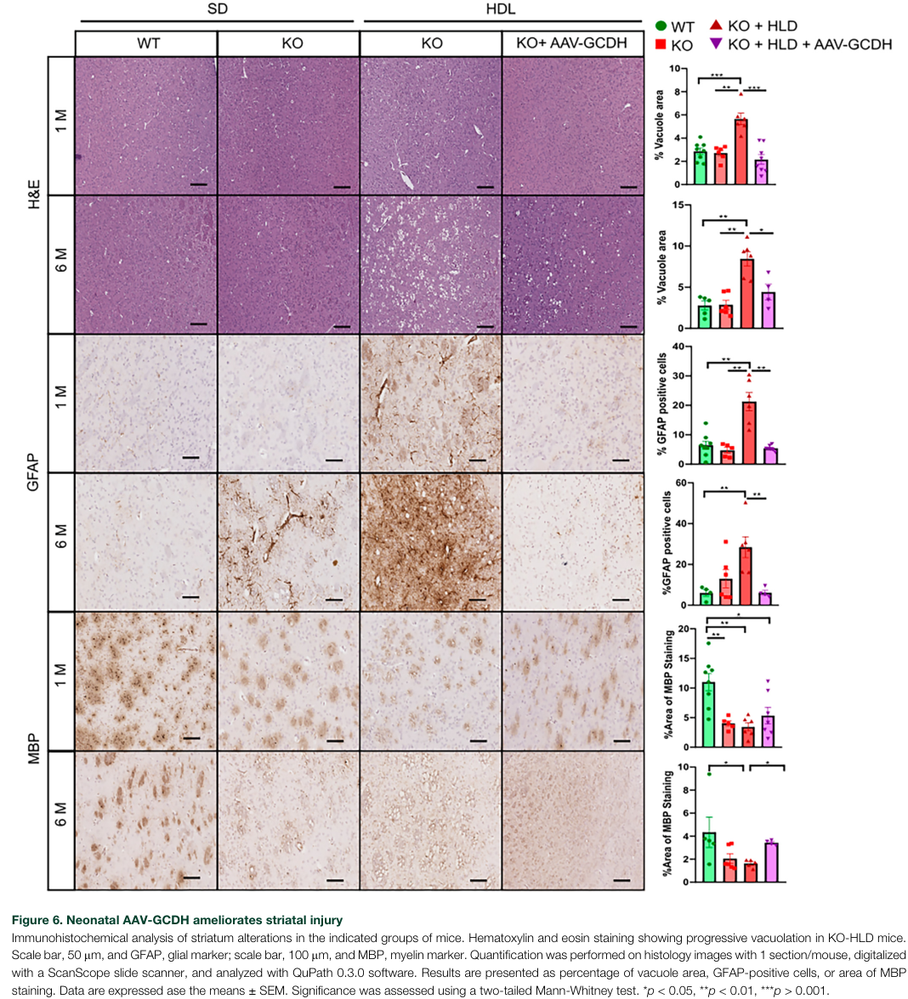

## Question

# Mechanistic Hypothesis Search

You are evaluating a specific disease mechanism hypothesis for the Disorder
Mechanisms Knowledge Base. This is not a general disease overview. Use the
hypothesis YAML below as the seed claim, then search for evidence that supports,
refutes, qualifies, or competes with this hypothesis.

## Target Disease
- **Disease Name:** Glutaryl-CoA Dehydrogenase Deficiency
- **Category:** Mendelian

## Target Hypothesis
- **Hypothesis ID:** canonical_ga1_metabolic_model
- **Hypothesis Label:** Canonical GCDH Deficiency-Toxic Metabolite Model
- **Status in KB:** CANONICAL

## Seed Hypothesis YAML

```yaml
hypothesis_group_id: canonical_ga1_metabolic_model
hypothesis_label: Canonical GCDH Deficiency-Toxic Metabolite Model
status: CANONICAL
description: Biallelic GCDH loss of function impairs lysine catabolism, resulting in accumulation of neurotoxic
  metabolites (GA, 3-OH-GA, C5DC) that drive striatal injury and dystonia, particularly during catabolic
  stress.
evidence:
- reference: PMID:37685964
  reference_title: Glutaryl-CoA Dehydrogenase Misfolding in Glutaric Acidemia Type 1.
  supports: SUPPORT
  evidence_source: IN_VITRO
  snippet: Glutaric acidemia type 1 (GA1) is a neurotoxic metabolic disorder due to glutaryl-CoA dehydrogenase
    (GCDH) deficiency.
  explanation: Establishes the canonical disease mechanism linking GCDH deficiency to neurotoxic metabolic
    pathology.
```

## Research Objective

Build a focused hypothesis-search report that answers:

1. What is the strongest direct evidence for this hypothesis?
2. What evidence argues against it, fails to reproduce it, or limits its scope?
3. Which claims are established, emerging, speculative, or contradicted?
4. Which patient subtypes, stages, tissues, cell types, molecular pathways, or
   biomarkers does the hypothesis best explain?
5. Which alternative or competing mechanistic hypotheses explain the same disease
   features better or more parsimoniously?
6. What are the explicit knowledge gaps: missing causal steps, unconfirmed edges,
   contradictory evidence, unknown source-to-target links, or source/data absences?
7. What experiments, cohorts, assays, datasets, or trials would most directly
   distinguish this hypothesis from alternatives?

Use primary literature whenever possible. Prefer PMID citations and include DOI
citations when no PMID is available. Treat reviews as orientation unless they
contain directly relevant synthesized evidence that should be clearly labeled as
review-level support.

## Required Output

### Executive Judgment

Give a concise verdict on the hypothesis as of the current literature:
supported, partially supported, unresolved, weakly supported, or refuted. Explain
the reasoning and the most important caveats.

### Evidence Matrix

Create a table with one row per important evidence item:

- Citation (PMID preferred)
- Evidence type (human clinical, model organism, in vitro, computational, review)
- Supports / refutes / qualifies / competing
- Mechanistic claim tested
- Key finding
- Disease subtype or context
- Confidence and limitations

### Mechanistic Causal Chain

Describe the causal chain implied by the hypothesis from upstream trigger to
clinical manifestation. Identify where the literature is strong, where the links
are inferred, and where there are missing causal steps.

### Knowledge Gaps

Identify explicit known unknowns surfaced by the search. Treat absence of
evidence as a curation-relevant finding only when the search actually checked for
it. Include:

- Unknown or weakly supported causal steps in the hypothesis
- Unconfirmed causal graph edges that need direct perturbation or longitudinal
  evidence
- Conflicting evidence, failed replications, or incompatible subtype-specific
  findings
- Unknown mechanism of action for relevant treatments, biomarkers, or
  interventions tied to this hypothesis
- Source-level or dataset-level absences, such as no relevant GenCC, ClinGen,
  trial, omics, or cohort evidence found as of the search date

For each gap, state the scope, why it matters, what was checked, and what
evidence or experiment would resolve it.

### Alternative Models

List competing or complementary hypotheses. For each, explain whether it is an
alternative to the seed hypothesis, a downstream consequence, an upstream cause,
or a parallel mechanism.

### Discriminating Tests

Recommend concrete studies or assays that would most efficiently test this
hypothesis against alternatives. Include patient stratification, biomarkers,
sample type, model system, perturbation, and expected result where applicable.

### Curation Leads

Provide candidate updates for the KB, but label these as leads requiring curator
verification. Include:

- candidate evidence references and exact abstract snippets to verify
- candidate pathophysiology nodes or edges
- candidate ontology terms for cell types and biological processes
- candidate subtype restrictions or status changes
- candidate `knowledge_gaps` or discussion prompts for unresolved causal claims,
  conflicting evidence, or explicit source/data absences

If the provider supports artifacts, produce artifact-friendly outputs such as an
evidence matrix, mechanistic diagram, knowledge-gap table, or comparison table.
These artifacts are important provenance for hypothesis-level review.


## Output

Question: You are an expert researcher providing comprehensive, well-cited information.

Provide detailed information focusing on:
1. Key concepts and definitions with current understanding
2. Recent developments and latest research (prioritize 2023-2024 sources)
3. Current applications and real-world implementations
4. Expert opinions and analysis from authoritative sources
5. Relevant statistics and data from recent studies

Format as a comprehensive research report with proper citations. Include URLs and publication dates where available.
Always prioritize recent, authoritative sources and provide specific citations for all major claims.

# Mechanistic Hypothesis Search

You are evaluating a specific disease mechanism hypothesis for the Disorder
Mechanisms Knowledge Base. This is not a general disease overview. Use the
hypothesis YAML below as the seed claim, then search for evidence that supports,
refutes, qualifies, or competes with this hypothesis.

## Target Disease
- **Disease Name:** Glutaryl-CoA Dehydrogenase Deficiency
- **Category:** Mendelian

## Target Hypothesis
- **Hypothesis ID:** canonical_ga1_metabolic_model
- **Hypothesis Label:** Canonical GCDH Deficiency-Toxic Metabolite Model
- **Status in KB:** CANONICAL

## Seed Hypothesis YAML

```yaml
hypothesis_group_id: canonical_ga1_metabolic_model
hypothesis_label: Canonical GCDH Deficiency-Toxic Metabolite Model
status: CANONICAL
description: Biallelic GCDH loss of function impairs lysine catabolism, resulting in accumulation of neurotoxic
  metabolites (GA, 3-OH-GA, C5DC) that drive striatal injury and dystonia, particularly during catabolic
  stress.
evidence:
- reference: PMID:37685964
  reference_title: Glutaryl-CoA Dehydrogenase Misfolding in Glutaric Acidemia Type 1.
  supports: SUPPORT
  evidence_source: IN_VITRO
  snippet: Glutaric acidemia type 1 (GA1) is a neurotoxic metabolic disorder due to glutaryl-CoA dehydrogenase
    (GCDH) deficiency.
  explanation: Establishes the canonical disease mechanism linking GCDH deficiency to neurotoxic metabolic
    pathology.
```

## Research Objective

Build a focused hypothesis-search report that answers:

1. What is the strongest direct evidence for this hypothesis?
2. What evidence argues against it, fails to reproduce it, or limits its scope?
3. Which claims are established, emerging, speculative, or contradicted?
4. Which patient subtypes, stages, tissues, cell types, molecular pathways, or
   biomarkers does the hypothesis best explain?
5. Which alternative or competing mechanistic hypotheses explain the same disease
   features better or more parsimoniously?
6. What are the explicit knowledge gaps: missing causal steps, unconfirmed edges,
   contradictory evidence, unknown source-to-target links, or source/data absences?
7. What experiments, cohorts, assays, datasets, or trials would most directly
   distinguish this hypothesis from alternatives?

Use primary literature whenever possible. Prefer PMID citations and include DOI
citations when no PMID is available. Treat reviews as orientation unless they
contain directly relevant synthesized evidence that should be clearly labeled as
review-level support.

## Required Output

### Executive Judgment

Give a concise verdict on the hypothesis as of the current literature:
supported, partially supported, unresolved, weakly supported, or refuted. Explain
the reasoning and the most important caveats.

### Evidence Matrix

Create a table with one row per important evidence item:

- Citation (PMID preferred)
- Evidence type (human clinical, model organism, in vitro, computational, review)
- Supports / refutes / qualifies / competing
- Mechanistic claim tested
- Key finding
- Disease subtype or context
- Confidence and limitations

### Mechanistic Causal Chain

Describe the causal chain implied by the hypothesis from upstream trigger to
clinical manifestation. Identify where the literature is strong, where the links
are inferred, and where there are missing causal steps.

### Knowledge Gaps

Identify explicit known unknowns surfaced by the search. Treat absence of
evidence as a curation-relevant finding only when the search actually checked for
it. Include:

- Unknown or weakly supported causal steps in the hypothesis
- Unconfirmed causal graph edges that need direct perturbation or longitudinal
  evidence
- Conflicting evidence, failed replications, or incompatible subtype-specific
  findings
- Unknown mechanism of action for relevant treatments, biomarkers, or
  interventions tied to this hypothesis
- Source-level or dataset-level absences, such as no relevant GenCC, ClinGen,
  trial, omics, or cohort evidence found as of the search date

For each gap, state the scope, why it matters, what was checked, and what
evidence or experiment would resolve it.

### Alternative Models

List competing or complementary hypotheses. For each, explain whether it is an
alternative to the seed hypothesis, a downstream consequence, an upstream cause,
or a parallel mechanism.

### Discriminating Tests

Recommend concrete studies or assays that would most efficiently test this
hypothesis against alternatives. Include patient stratification, biomarkers,
sample type, model system, perturbation, and expected result where applicable.

### Curation Leads

Provide candidate updates for the KB, but label these as leads requiring curator
verification. Include:

- candidate evidence references and exact abstract snippets to verify
- candidate pathophysiology nodes or edges
- candidate ontology terms for cell types and biological processes
- candidate subtype restrictions or status changes
- candidate `knowledge_gaps` or discussion prompts for unresolved causal claims,
  conflicting evidence, or explicit source/data absences

If the provider supports artifacts, produce artifact-friendly outputs such as an
evidence matrix, mechanistic diagram, knowledge-gap table, or comparison table.
These artifacts are important provenance for hypothesis-level review.


## Mechanistic Hypothesis Search Report (canonical_ga1_metabolic_model)
**Target disease:** Glutaryl‑CoA dehydrogenase deficiency (Glutaric acidemia/aciduria type 1; GA1)

### Executive judgment (as of 2026-05-23)
**Verdict: Supported (with important scope limits).** The causal chain from **biallelic GCDH loss of function → impaired lysine/hydroxylysine/tryptophan catabolism → accumulation of glutaryl‑CoA–derived metabolites (glutaric acid [GA], 3‑hydroxyglutaric acid [3‑OH‑GA], glutarylcarnitine/C5DC)** is strongly supported by biochemical genetics and model systems. The link from **catabolic/substrate stress → metabolite surge → selective striatal vulnerability and dystonia** is supported by human natural history plus stress‑provocation in Gcdh−/− mice, and is strengthened by **reversal/avoidance of neuropathology when enzyme function is restored (AAV‑GCDH) or substrate flux is reduced (dietary lysine restriction; genetic AASS deletion)**. However, downstream causality is **not fully explained by “metabolite concentration in blood/urine”**, because low‑excretor patients can have normal peripheral markers yet still develop classic basal ganglia injury, and multiple lines of evidence implicate **astrocyte‑mediated toxicity, oxidative stress, excitotoxicity, mitochondrial energy impairment, and limited BBB efflux (intracerebral trapping)** as complementary mechanisms. (mateubosch2024systemicdeliveryof pages 6-7, gragnaniello2025diagnosisofglutaric pages 2-5, zaunseder2024digitaltierstrategyimproves pages 1-2, kolker2004excitotoxicityandbioenergetics pages 3-6)

### Key concepts & definitions (mechanism-focused)
- **GA1 (GCDH deficiency):** autosomal recessive loss of mitochondrial glutaryl‑CoA dehydrogenase, a step in lysine/hydroxylysine/tryptophan degradation, resulting in accumulation of glutaryl‑CoA and derivatives. (barroso2023glutarylcoadehydrogenasemisfolding pages 1-2)
- **Canonical biomarkers/metabolites:** GA, **3‑OH‑GA** (pathognomonic), and **glutarylcarnitine (C5DC; called “Glut” in some NBS literature)**. (zaunseder2024digitaltierstrategyimproves pages 1-2, leandro2020deletionof2‐aminoadipic pages 10-13)
- **High‑excretor (HE) vs low‑excretor (LE):** commonly defined by urinary GA ≥100 vs <100 mmol/mol creatinine; HE tends to have very low residual enzyme activity (<~5%), LE higher residual activity (up to ~30%). (barroso2023glutarylcoadehydrogenasemisfolding pages 1-2)
- **Clinical lesion pattern addressed by the hypothesis:** acute encephalopathic crises (often during intercurrent illness/fasting) with **bilateral striatal injury** leading to complex movement disorder/dystonia; also chronic/insidious forms exist. (zaunseder2024digitaltierstrategyimproves pages 1-2, gragnaniello2025diagnosisofglutaric pages 1-2)

### Evidence matrix
| Citation (PMID/DOI + year + URL) | Evidence type | Supports / refutes / qualifies / competing | Mechanistic claim tested | Key finding | Context / subtype | Confidence & limitations |
|---|---|---|---|---|---|---|
| Barroso et al., 2023, Int J Mol Sci. DOI: 10.3390/ijms241713158. URL: https://doi.org/10.3390/ijms241713158 | In vitro / molecular | Supports, qualifies | Pathogenic GCDH variants cause loss of enzyme function in lysine catabolism, leading to the canonical GA1 biochemical phenotype; residual activity helps explain biochemical excretor classes. | Across 13 missense variants, altered oligomerization, reduced stability/solubility, aggregation, and reduced activity were observed; HE patients typically have <5% residual activity, LE up to ~30%; urinary glutaric acid inversely correlates with residual activity. Review-level clinical synthesis notes that despite early treatment, 15–23% still experience encephalopathic crises and ~32% show low adherence to burdensome dietary therapy. | Variant-specific GA1; HE vs LE biochemical subtypes | Moderate confidence for upstream enzyme-defect link; limited for downstream neurotoxicity because this paper does not directly test striatal injury causation or C5DC kinetics in vivo. (barroso2023glutarylcoadehydrogenasemisfolding pages 1-2) |
| Mateu-Bosch et al., 2024, Mol Ther Methods Clin Dev. DOI: 10.1016/j.omtm.2024.101276. URL: https://doi.org/10.1016/j.omtm.2024.101276 | Model organism / gene therapy | Supports, qualifies | Restoring GCDH should prevent GA/3-OHGA/C5DC accumulation and protect against striatal injury under catabolic substrate stress. | Gcdh KO mice accumulated GA, 3-OHGA, and C5DC; neonatal systemic AAV9-GCDH prevented induction of GA, 3-OHGA, and C5DC in striatum under HLD, improved MRI and histopathology, and rescued survival of all treated KO mice during 150-day follow-up. Authors also note standard care still leaves nearly one-third of children with striatal degeneration despite screening/management. | Gcdh KO mouse; high-lysine diet; neonatal intervention | High confidence for causal reversibility in mouse model; limited translation to humans, and authors note mechanism of brain injury remains incompletely understood and may include glial, neurotransmission, and mitochondrial components beyond metabolite burden alone. (mateubosch2024systemicdeliveryof pages 1-2, mateubosch2024systemicdeliveryof pages 7-9, mateubosch2024systemicdeliveryof pages 6-7) |
| Leandro et al., 2020, J Inherit Metab Dis. DOI: 10.1002/jimd.12276. URL: https://doi.org/10.1002/jimd.12276 | Cell model + model organism / substrate reduction | Supports, qualifies | Lowering lysine-pathway flux upstream of GCDH should reduce glutaryl-CoA-derived metabolites in brain and periphery, supporting metabolite-driven pathology. | In Gcdh/Aass double KO mice, glutaric acid fell 4.3-fold in urine, 3.8-fold in brain, and 3.2-fold in liver; urinary 3-OHGA fell 1.7-fold; brain 3-OHGA and glutarylcarnitine fell 1.6-fold and 1.5-fold; plasma glutarylcarnitine fell 2.8-fold. In GCDH-deficient HEK293 cells, AASS loss reduced glutarylcarnitine ~5-fold. Dietary therapy in patients reportedly reduces urinary glutaric acid ~4.3-fold (~77%). | Gcdh KO mouse; AASS deletion; standard chow; substrate reduction | High confidence that lysine flux drives major biomarker accumulation; limitation: study did not directly test whether AASS deletion prevents HLD-induced neurologic injury, and metabolite lowering was incomplete, especially for 3-OHGA/C5DC. (saad2026aminoadipatesemialdehydesynthasea pages 1-6, leandro2020deletionof2‐aminoadipic pages 10-13, leandro2020deletionof2‐aminoadipic pages 13-17) |
| Olivera-Bravo et al., 2015, Hum Mol Genet. DOI: 10.1093/hmg/ddv175. URL: https://doi.org/10.1093/hmg/ddv175 | In vitro / coculture | Supports, competing | Lysine overload and GA/related metabolites cause astrocyte dysfunction that mediates selective striatal neuronal death; toxicity may be partly non-cell-autonomous. | Exposure of astrocytes to 10 mM lysine or 5 mM GA induced oxidative stress, decreased glutathione, increased proliferation/S100β, and made astrocytes toxic to neurons. Striatal neuron survival fell by ~35–45%; cortical neurons by ~25–35%; hippocampal neurons were less affected. Data support local striatal production/buffering failure and astrocyte-mediated toxicity. | Astrocyte-neuron coculture; Gcdh-/- vs WT; lysine overload | Moderate-high confidence for astrocyte-mediated downstream mechanism; limitation: metabolite concentrations are supraphysiologic relative to many peripheral human samples, and the exact toxic effector released by astrocytes remains unidentified, making this partly a competing/downstream refinement of the canonical model. (oliverabravo2015striatalneuronaldeath pages 10-11, oliverabravo2015striatalneuronaldeath pages 5-7) |
| Zaunseder et al., 2024, Int J Neonatal Screen. DOI: 10.3390/ijns10040083. URL: https://doi.org/10.3390/ijns10040083 | Human screening / implementation | Qualifies | C5DC-based newborn screening reflects the canonical metabolite model but is limited by biochemical heterogeneity, especially LE disease. | In 1,025,953 newborn screening profiles (2014–2023), low Glut cutoffs preserved sensitivity but created many false positives; German sensitivity cited as 95.6% (1999–2016). The digital-tier strategy reduced false positives by 92.34% on the test set (235 to 18) while maintaining 100% sensitivity in the study set; false-positive rate in training/validation was 0.047% (485/1,026,447). Low excretors may have slight or normal C5DC despite similar movement-disorder risk. | Newborn screening; LE vs HE; renal insufficiency confounder | High confidence for biomarker implementation limits; does not directly test neuropathic causality, but strongly qualifies the scope of C5DC as a universal proxy for toxic metabolite burden. (zaunseder2024digitaltierstrategyimproves pages 8-10, zaunseder2024digitaltierstrategyimproves pages 1-2) |
| Gragnaniello et al., 2025, Ital J Pediatr. DOI: 10.1186/s13052-025-01975-z. URL: https://doi.org/10.1186/s13052-025-01975-z | Human clinical case report | Qualifies / refutes biomarker universality | Some genetically confirmed GA1 patients can develop classic basal ganglia injury despite normal DBS C5DC and absent urinary glutaric acid, limiting the canonical biomarker chain. | Homozygous M405V low-excretor infant presented at 9 months with febrile illness, seizures, and bilateral basal ganglia lesions. During acute phase and follow-up, DBS C5DC remained normal (0.08 µmol/L; after carnitine 0.06–0.08 µmol/L), urinary glutaric acid was absent, and urinary C5DC was also normal; only slight urinary 3-HGA elevation was seen. Paper notes LE patients may represent up to 40% of cases. Italian NBS cohort cited 5 cases in 806,770 newborns (incidence 1:161,354), with no false negatives reported there, highlighting rarity but real missed cases. | Low-excretor GA1; African-associated M405V; illness-triggered crisis; NBS miss | High confidence that peripheral markers can be normal in LE disease; limitation: single case and does not refute toxic-metabolite pathogenesis per se—rather it shows current peripheral biomarkers incompletely capture brain-risk states. (gragnaniello2025diagnosisofglutaric pages 1-2, gragnaniello2025diagnosisofglutaric pages 2-5) |
| Biagosch et al., 2017, Biochim Biophys Acta Mol Basis Dis. DOI: 10.1016/j.bbadis.2017.05.018. URL: https://doi.org/10.1016/j.bbadis.2017.05.018 | Model organism / metabolic genetics | Supports, qualifies, competing | GCDH loss causes accumulation of glutaryl-CoA-derived metabolites; high lysine/catabolic load precipitates lethal neurologic phenotype; however, lysine-pathway topology and modifiers are more complex than a simple linear model. | States that GCDH deficiency causes accumulation of glutaryl-CoA, GA, 3-OHGA, and non-toxic C5DC. Gcdh-/- mice biochemically resemble patients and under high-lysine diet develop massive cerebral toxic-metabolite accumulation and death. Early diagnosis with low-lysine diet, carnitine, and emergency treatment can prevent striatal damage, but some patients still develop injury despite treatment. Dhtkd1/Gcdh double KO mice had similar metabolite accumulation to Gcdh-/- mice, challenging assumptions about lysine pathway routing. | Gcdh-/- and Dhtkd1/Gcdh double KO mice; high-lysine diet | Moderate-high confidence for metabolite accumulation and stress sensitivity; limitation: not a direct striatal histopathology rescue study, and double-KO findings indicate pathway complexity/alternative sources that qualify a simple canonical chain. (biagosch2017elevatedglutaricacid pages 1-6) |
| Sauer et al., 2011, Brain. DOI: 10.1093/brain/awq269. URL: https://doi.org/10.1093/brain/awq269 | Model organism / therapeutic metabolic modulation | Supports, competing | Brain injury is driven by cerebral lysine flux; low-lysine diet reduces brain glutaric acid more effectively than carnitine alone, and arginine can further suppress cerebral metabolite burden via transport competition. | In Gcdh-/- mice, low-lysine diet lowered glutaric acid in brain, liver, kidney, and serum; L-carnitine restored free carnitine and increased glutarylcarnitine formation but did not by itself lower brain GA; add-on L-arginine further amplified the diet effect, consistent with transporter competition at BBB/mitochondrial carriers. Authors argue cerebral lysine metabolism is a key therapeutic target. | Gcdh-/- mouse; low-lysine diet; carnitine; arginine | High confidence for substrate-flux link to brain glutaric acid; limitation: direct human cerebral measurements are difficult, and study focuses more on metabolite control than direct demonstration of dystonia prevention. It also opens a complementary BBB transport model. (sauer2011therapeuticmodulationof pages 1-2) |


*Table: This table summarizes key supporting, qualifying, and competing evidence for the canonical GA1 toxic-metabolite model, including direct tests of metabolite accumulation, stress-provoked injury, biomarker limitations, and therapeutic reversal. It is useful for curator review because it separates established upstream links from weaker or subtype-limited downstream causal steps.*

### Strongest direct evidence for the hypothesis
1. **Causal prevention of stress‑provoked striatal injury by restoring GCDH (gene therapy)**
   - In a diet‑induced GA1 mouse model (Gcdh KO + high‑lysine diet), **neonatal systemic AAV9‑GCDH prevented induction of GA, 3‑OH‑GA, and C5DC in striatum** and **ameliorated MRI and histopathology**, rescuing survival over 150 days. This is among the most direct “causal reversal” demonstrations tying enzyme activity, metabolite accumulation, and striatal pathology. (mateubosch2024systemicdeliveryof pages 6-7)
   - Visual provenance: Figures showing MRI and striatal histology rescue after neonatal AAV‑GCDH. (mateubosch2024systemicdeliveryof media 56e467c9, mateubosch2024systemicdeliveryof media 2da43d79)

2. **Substrate‑flux reduction reduces canonical metabolites in brain and periphery**
   - Genetic **Aass deletion** in a Gcdh KO background reduced GA substantially (**4.3‑fold urine; 3.8‑fold brain; 3.2‑fold liver**) and lowered 3‑OH‑GA and glutarylcarnitine more modestly; in GCDH‑deficient HEK293 cells, AASS loss reduced glutarylcarnitine ~5‑fold. This directly supports the premise that lysine‑pathway flux is a dominant driver of biomarker accumulation (and a plausible driver of toxicity). (leandro2020deletionof2‐aminoadipic pages 10-13, leandro2020deletionof2‐aminoadipic pages 13-17)

3. **Diet and transport competition modulate cerebral metabolite burden**
   - In Gcdh−/− mice, **low‑lysine diet** reduces GA across tissues, while **L‑carnitine primarily shifts carnitine pools and promotes glutarylcarnitine formation**; add‑on **L‑arginine** enhances the diet effect, consistent with BBB/mitochondrial carrier competition affecting cerebral lysine delivery. (sauer2011therapeuticmodulationof pages 1-2)

### Evidence that limits scope / argues against simple versions of the model
1. **Peripheral biomarkers can be normal in genetically confirmed GA1 with classic basal ganglia injury (LE phenotype)**
   - Case report: infant with febrile illness, seizures, bilateral basal ganglia lesions, **normal DBS C5DC and absent urinary GA during acute phase and follow‑up**, with only slight urinary 3‑OH‑GA elevation; GA1 confirmed genetically (homozygous p.M405V), associated with LE phenotype. This directly qualifies the chain “GCDH loss → elevated GA/C5DC in blood/urine → brain risk,” indicating that **CNS risk can be present when standard peripheral markers are absent**. (gragnaniello2025diagnosisofglutaric pages 2-5)
   - Screening literature also emphasizes that LE patients may have slight/normal C5DC while having similar movement‑disorder risk. (zaunseder2024digitaltierstrategyimproves pages 1-2)

2. **Metabolite toxicity may be mediated through glial/secondary mechanisms rather than direct neuronal toxicity at physiologic concentrations**
   - Astrocyte–neuron co‑culture work indicates **neurons did not die with direct Lys/GA exposure** under some conditions, but died when co‑cultured with Lys‑ or GA‑challenged astrocytes; astrocyte oxidative stress and reactive changes were key mediators, and astrocytic antioxidant pathways (e.g., Nrf2/ARE) were protective. This supports a competing refinement: metabolites are upstream triggers, but **astrocyte dysfunction is a proximal effector of striatal neuronal injury**. (oliverabravo2015striatalneuronaldeath pages 8-10, oliverabravo2015striatalneuronaldeath pages 10-11)

3. **Pathway complexity and incomplete protection despite early treatment**
   - A double‑KO mouse study (Dhtkd1−/−/Gcdh−/−) reports similar metabolite accumulation to Gcdh−/−, challenging simplified assumptions about lysine pathway routing and pointing to additional sources/routing of GA production. (biagosch2017elevatedglutaricacid pages 1-6)
   - Despite screening and presymptomatic management, substantial residual disease burden persists; in one synthesis, 15–23% still experience crises despite early treatment. (barroso2023glutarylcoadehydrogenasemisfolding pages 1-2)

### What is established vs emerging vs speculative
**Established**
- GCDH deficiency produces GA/3‑OH‑GA/C5DC accumulation; stress increases risk. (biagosch2017elevatedglutaricacid pages 1-6, mateubosch2024systemicdeliveryof pages 1-2)
- Lowering lysine flux lowers GA burden in vivo (dietary restriction, AASS deletion). (sauer2011therapeuticmodulationof pages 1-2, leandro2020deletionof2‐aminoadipic pages 10-13)

**Emerging (2023–2024 priorities)**
- **GCDH as a protein‑misfolding disorder** with variant‑dependent stability/oligomerization effects that may modulate biochemical phenotype. (Published Aug 2023; https://doi.org/10.3390/ijms241713158) (barroso2023glutarylcoadehydrogenasemisfolding pages 1-2)
- **Systemic AAV‑GCDH gene therapy** preventing diet‑induced striatal pathology and metabolite induction in mice. (Published Sep 2024; https://doi.org/10.1016/j.omtm.2024.101276) (mateubosch2024systemicdeliveryof pages 6-7)
- **Digital-tier (ML) newborn screening** strategies to reduce GA1 false positives while maintaining sensitivity. (Published Dec 2024; https://doi.org/10.3390/ijns10040083) (zaunseder2024digitaltierstrategyimproves pages 1-2, zaunseder2024digitaltierstrategyimproves pages 8-10)

**Speculative / not fully resolved**
- Which specific metabolite(s) are the dominant CNS toxin(s) (GA vs 3‑OH‑GA vs glutaryl‑CoA vs downstream effects), and whether toxicity is primarily direct neuronal vs glial‑mediated. (kolker2004excitotoxicityandbioenergetics pages 3-6, oliverabravo2015striatalneuronaldeath pages 8-10)

### Patient subtypes / stages / tissues best explained by the hypothesis
- **Best explained:** infantile/early childhood vulnerability (3–36 months) with **catabolic stress–triggered crises and striatal injury**, consistent with a substrate‑flux/toxic‑intermediate model. (gragnaniello2025diagnosisofglutaric pages 1-2, biagosch2017elevatedglutaricacid pages 1-6)
- **Biomarker-aligned subtype:** HE phenotype where urine GA/C5DC are strongly elevated and track with very low residual activity. (barroso2023glutarylcoadehydrogenasemisfolding pages 1-2)
- **Less well explained by peripheral biomarkers:** LE phenotype with normal DBS/urine markers yet basal ganglia injury, implying intracerebral trapping or cell‑type specific toxicity. (gragnaniello2025diagnosisofglutaric pages 2-5)
- **Cell types/tissues implicated as proximal effectors:** astrocytes (oxidative stress, impaired metabolic support), striatal neurons (selective vulnerability), and white matter/oligodendrocyte pathways as additional damage axes. (oliverabravo2015striatalneuronaldeath pages 10-11, biagosch2017elevatedglutaricacid pages 1-6)

### Recent developments & real-world implementations (statistics/data)
#### Newborn screening performance and constraints
- **Large NBS dataset:** 1,025,953 newborns screened (Heidelberg; 2014–2023). (Published 21 Dec 2024; https://doi.org/10.3390/ijns10040083) (zaunseder2024digitaltierstrategyimproves pages 1-2)
- **False positives and ML mitigation:** a logistic-regression-based “digital-tier” reduced false positives **92.34% (235 → 18)** on the test dataset while maintaining **100% sensitivity** on the study’s test set. (zaunseder2024digitaltierstrategyimproves pages 8-10)
- **False-positive rate in training/validation:** **0.047% (485/1,026,447)** reported for GA1 in that laboratory cohort. (zaunseder2024digitaltierstrategyimproves pages 8-10)
- **Key mechanistic implementation issue:** LE patients may have slight/normal C5DC, forcing low cut-offs and inflating false positives. (zaunseder2024digitaltierstrategyimproves pages 1-2)

#### Incidence/prevalence points from recent sources
- Germany: estimated GA1 birth prevalence **~1:135,000**. (zaunseder2024digitaltierstrategyimproves pages 1-2)
- Italy NBS cohort (806,770 screened, 2019–2020): GA1 incidence **1:161,354** reported. (gragnaniello2025diagnosisofglutaric pages 1-2)
- Review-level prevalence statement: ~**1:100,000 births worldwide**. (barroso2023glutarylcoadehydrogenasemisfolding pages 1-2)

#### Therapeutic implementation linked to mechanism
- Standard prevention strategy—**avoid catabolism + reduce lysine load + carnitine**—is mechanistically aligned with lowering substrate flux and enhancing detox/excretion. (barroso2023glutarylcoadehydrogenasemisfolding pages 1-2, sauer2011therapeuticmodulationof pages 1-2)
- Quantitative biomarker response: AASS deletion reduces GA most strongly; 3‑OH‑GA/C5DC show smaller decreases, indicating partial pathway saturation or alternate sources. (leandro2020deletionof2‐aminoadipic pages 10-13, leandro2020deletionof2‐aminoadipic pages 13-17)

### Expert opinion / authoritative synthesis (clearly labeled)
- Screening experts emphasize that GA1 is “treatable” with early identification, but biochemical heterogeneity (especially LE) limits reliance on a single primary marker (C5DC), motivating multi-tier confirmation strategies and data-driven second-tier approaches. (Zaunseder et al., 2024) (zaunseder2024digitaltierstrategyimproves pages 1-2)
- Mechanistic authors note that **mechanisms of GA/3‑OH‑GA brain damage remain incompletely understood** and likely include neurotransmission disruption and mitochondrial dysfunction in addition to metabolite accumulation. (mateubosch2024systemicdeliveryof pages 7-9)

### Mechanistic causal chain (with strength annotations)
1. **Upstream genetic trigger:** biallelic pathogenic variants in **GCDH** → reduced/absent enzyme activity (often via misfolding/failed tetramerization). **Strong.** (barroso2023glutarylcoadehydrogenasemisfolding pages 1-2)
2. **Metabolic block:** impaired degradation of glutaryl‑CoA in lysine/hydroxylysine/tryptophan catabolism → accumulation of glutaryl‑CoA and derivative metabolites **GA, 3‑OH‑GA, C5DC** in tissues/fluids. **Strong.** (biagosch2017elevatedglutaricacid pages 1-6, leandro2020deletionof2‐aminoadipic pages 10-13)
3. **Stress amplification:** catabolic/substrate stress (infection/fasting/high lysine/protein intake) increases substrate flux and/or overwhelms buffering → increased CNS metabolite burden. **Strong in models; moderate in humans (natural history/association).** (mateubosch2024systemicdeliveryof pages 6-7, zaunseder2024digitaltierstrategyimproves pages 1-2)
4. **CNS trapping and compartment effects:** limited BBB efflux and/or intracerebral de novo synthesis causes CNS retention of GA/3‑OH‑GA; peripheral levels may not reflect brain state (notably in LE). **Moderate (supported but incompletely quantified in humans).** (biagosch2017elevatedglutaricacid pages 1-6, gragnaniello2025diagnosisofglutaric pages 2-5)
5. **Proximal injury mechanisms (parallel/competing links):**
   - Astrocyte oxidative stress/reactivity → loss of metabolic/trophic support, impaired glutamine/TCA intermediate handling → striatal neuron vulnerability. **Moderate-high (in vitro).** (oliverabravo2015striatalneuronaldeath pages 8-10, oliverabravo2015striatalneuronaldeath pages 10-11)
   - NMDA-mediated excitotoxicity from 3‑OH‑GA with cytokine/iNOS/NO amplification; oxidative stress and partial mitochondrial complex effects. **Moderate (experimental, older).** (kolker2004excitotoxicityandbioenergetics pages 3-6, kolker2004excitotoxicityandbioenergetics pages 1-3)
   - Mitochondrial energy impairment (e.g., OGDHc inhibition by glutaryl‑CoA) and disrupted astrocyte–neuron shuttles. **Moderate (cited mechanistic proposals and model data).** (biagosch2017elevatedglutaricacid pages 1-6)
6. **Tissue-selective outcome:** bilateral striatal injury → dystonia/movement disorder; potential white matter involvement. **Strong phenotype link; mechanistic specificity still partial.** (gragnaniello2025diagnosisofglutaric pages 1-2, biagosch2017elevatedglutaricacid pages 1-6)

### Knowledge gaps (explicit “known unknowns” surfaced by this search)
1. **Peripheral biomarker → CNS risk mapping is incomplete (especially LE):**
   - Scope: LE patients can have normal DBS C5DC and absent urinary GA even during crisis and still sustain basal ganglia injury. (gragnaniello2025diagnosisofglutaric pages 2-5)
   - Why it matters: undermines the use of peripheral metabolites as direct causal mediators or as reliable surrogate endpoints.
   - What was checked: NBS cohort + LE case report + HE/LE definitions across sources. (zaunseder2024digitaltierstrategyimproves pages 1-2, gragnaniello2025diagnosisofglutaric pages 2-5, barroso2023glutarylcoadehydrogenasemisfolding pages 1-2)
   - Resolution experiment: paired longitudinal **CSF (or noninvasive MRS) vs plasma/urine** metabolite profiling during controlled catabolic stress or illness, stratified by HE/LE and genotype.

2. **Which toxic species and which cell type is primary?**
   - Scope: astrocyte-mediated toxicity and excitotoxicity models suggest downstream mediators; direct neuronal toxicity may not fully recapitulate disease. (oliverabravo2015striatalneuronaldeath pages 8-10, kolker2004excitotoxicityandbioenergetics pages 3-6)
   - Why it matters: impacts therapy selection (antioxidant/glial targeting vs metabolite lowering alone).
   - Resolution experiment: cell-type specific **conditional Gcdh rescue/knockout** (astrocyte vs neuron) with controlled metabolite exposure; single-cell transcriptomics/metabolomics after HLD challenge.

3. **Incomplete metabolite normalization with upstream substrate reduction:**
   - Scope: AASS deletion markedly lowers GA but only modestly lowers 3‑OH‑GA/C5DC, and levels do not normalize. (leandro2020deletionof2‐aminoadipic pages 10-13, leandro2020deletionof2‐aminoadipic pages 13-17)
   - Why it matters: if 3‑OH‑GA is key neurotoxin, GA lowering alone may be insufficient.
   - Resolution experiment: intervention studies that specifically reduce 3‑OH‑GA formation (e.g., targeting steps via glutaconyl‑CoA) and compare neuropathology.

4. **Mechanistic basis of residual neurologic disease despite early treatment:**
   - Scope: some sources report persistent crises/neurologic sequelae despite early diagnosis/therapy. (barroso2023glutarylcoadehydrogenasemisfolding pages 1-2, mateubosch2024systemicdeliveryof pages 6-7)
   - Resolution: prospective cohorts with standardized emergency‑protocol adherence measures and objective metabolic control metrics; integrate imaging endpoints.

5. **Source/data absences (checked indirectly):**
   - No interventional human clinical trials were retrieved in this search session (clinical trial count 0), so translation of emerging therapies (AAV-GCDH; pharmacologic AASS inhibition) remains preclinical in this evidence set.

### Alternative or competing mechanistic models
1. **Astrocyte dysfunction model (complementary/proximal effector):** metabolites are upstream triggers; **astrocyte oxidative stress/reactivity** drives neuronal injury via loss of metabolic support and altered glutamate handling. (oliverabravo2015striatalneuronaldeath pages 8-10, oliverabravo2015striatalneuronaldeath pages 10-11)
2. **Excitotoxicity/NO amplification model (parallel downstream mechanism):** **3‑OH‑GA activates NMDA receptors**, with cytokine/iNOS/NO and oxidative stress amplifying injury; bioenergetic impairment contributes. (kolker2004excitotoxicityandbioenergetics pages 3-6, kolker2004excitotoxicityandbioenergetics pages 1-3)
3. **CNS trapping/BBB flux limitation model (upstream qualifier):** intracerebral synthesis + limited BBB efflux causes brain accumulation independent of peripheral marker magnitude, explaining LE paradoxes. (biagosch2017elevatedglutaricacid pages 1-6, gragnaniello2025diagnosisofglutaric pages 2-5)
4. **Mitochondrial energy failure model (downstream consequence/alternative mediator):** glutaryl‑CoA inhibition of key mitochondrial enzymes (e.g., OGDHc) and impaired shuttles lead to energy failure, contributing to selective striatal vulnerability. (biagosch2017elevatedglutaricacid pages 1-6)
5. **Protein glutarylation / epigenetic stress model (chronic parallel mechanism):** chronic glutaryl‑CoA exposure causes enhanced protein glutarylation (described as epigenetic stress), potentially explaining extrastriatal/chronic phenotypes not captured by acute crisis model. (biagosch2017elevatedglutaricacid pages 1-6)

### Discriminating tests (to separate canonical vs alternatives)
1. **Human stratified longitudinal metabolite–imaging study**
   - Stratify: HE vs LE; genotype (e.g., p.M405V); treatment status.
   - Samples: plasma/urine + CSF (when feasible) + MRI/MRS.
   - Test: whether CNS metabolite burden predicts striatal injury better than peripheral biomarkers.
   - Expected: LE will show disproportionate CNS vs peripheral signal if BBB trapping dominates.

2. **Cell-type specific rescue/KO in mice (astrocyte vs neuron vs liver)**
   - Perturb: AAV-GCDH with astrocyte-specific promoters vs neuron-specific vs liver-specific.
   - Readouts: striatal pathology, oxidative stress markers, glutamate transporters, metabolite levels.
   - Distinguish: metabolite-only model predicts that any correction lowering brain metabolites suffices; astrocyte-effector model predicts astrocyte correction has disproportionate benefit.

3. **Mechanism-targeted adjunct trials in mouse challenge paradigms**
   - Add NMDA antagonism or iNOS modulation to standard metabolite-lowering during HLD/illness models.
   - If excitotoxicity/NO amplification is causal, these should protect even when metabolites are incompletely normalized. (kolker2004excitotoxicityandbioenergetics pages 3-6)

4. **Tracer flux studies (stable isotopes) in GA1 models and patient-derived cells**
   - Goal: quantify relative contributions of saccharopine vs pipecolate pathways and non-lysine inputs (hydroxylysine/tryptophan) to CNS glutaryl‑CoA production.
   - Rationale: directly addresses pathway complexity raised by genetic studies and incomplete normalization. (leandro2020deletionof2‐aminoadipic pages 13-17, biagosch2017elevatedglutaricacid pages 1-6)

### Curation leads (candidates; curator verification required)
1. **Candidate evidence references (verify abstract snippets / full text):**
   - Mateu‑Bosch et al., 2024 (Sep 2024), “Systemic delivery of AAV‑GCDH ameliorates HLD‑induced phenotype…” https://doi.org/10.1016/j.omtm.2024.101276
     - Curatable edges: GCDH restoration ↓(GA/3‑OH‑GA/C5DC in striatum) → ↓striatal injury; HLD as stressor. (mateubosch2024systemicdeliveryof pages 6-7, mateubosch2024systemicdeliveryof media 56e467c9)
   - Zaunseder et al., 2024 (Published 21 Dec 2024), “Digital‑Tier Strategy Improves Newborn Screening for GA1” https://doi.org/10.3390/ijns10040083
     - Curatable nodes: NBS biomarker limitations in LE; ML second-tier reduces false positives with maintained sensitivity. (zaunseder2024digitaltierstrategyimproves pages 8-10, zaunseder2024digitaltierstrategyimproves pages 1-2)
   - Gragnaniello et al., 2025 (May 2025), “when neonatal screening fails” https://doi.org/10.1186/s13052-025-01975-z
     - Curatable qualifier: LE GA1 can have normal DBS C5DC and absent urinary GA during crisis. (gragnaniello2025diagnosisofglutaric pages 2-5)
   - Barroso et al., 2023 (Aug 2023), “GCDH Misfolding…” https://doi.org/10.3390/ijms241713158
     - Curatable upstream mechanism: misfolding/oligomerization defects → reduced cellular activity; HE vs LE residual activity relationship. (barroso2023glutarylcoadehydrogenasemisfolding pages 1-2)

2. **Candidate pathophysiology nodes/edges (ontology-friendly):**
   - Biological processes: lysine catabolic process; mitochondrial matrix metabolism; oxidative stress response; astrocyte activation/astrogliosis; glutamatergic synaptic transmission; NMDA receptor signaling; blood–brain barrier transport; protein glutarylation (post-translational modification).
   - Cell types: striatal medium spiny neurons; astrocytes; oligodendrocytes.

3. **Candidate subtype restriction:**
   - Add explicit qualifier: “Peripheral biomarker elevations (C5DC, GA) may be absent in LE GA1 (e.g., p.M405V), so the toxic-metabolite model may require a CNS-trapping/compartmentalization node to maintain explanatory power for LE cases.” (gragnaniello2025diagnosisofglutaric pages 2-5, biagosch2017elevatedglutaricacid pages 1-6)

4. **Candidate knowledge_gaps entries:**
   - “CNS vs peripheral metabolite discordance in LE GA1 not well quantified.” (gragnaniello2025diagnosisofglutaric pages 2-5)
   - “Dominant neurotoxic effector (GA vs 3‑OH‑GA vs glutaryl‑CoA vs astrocyte-released mediators) unresolved.” (kolker2004excitotoxicityandbioenergetics pages 3-6, oliverabravo2015striatalneuronaldeath pages 8-10)

### Notes on source quality and recency
This report prioritized 2023–2024 primary studies for recent developments (GCDH misfolding biophysics, AAV‑GCDH gene therapy, ML-assisted NBS). Mechanistic alternatives rely partly on older foundational experimental work (e.g., excitotoxicity/NO amplification; astrocyte co-culture), which remains influential but should be revisited with modern in vivo and human multi-omics approaches.


References

1. (mateubosch2024systemicdeliveryof pages 6-7): Anna Mateu-Bosch, Eulàlia Segur-Bailach, Emma Muñoz-Moreno, María José Barallobre, Maria Lourdes Arbonés, Sabrina Gea-Sorlí, Frederic Tort, Antonia Ribes, Judit García-Villoria, and Cristina Fillat. Systemic delivery of aav-gcdh ameliorates hld-induced phenotype in a glutaric aciduria type i mouse model. Molecular Therapy - Methods &amp; Clinical Development, 32:101276, Sep 2024. URL: https://doi.org/10.1016/j.omtm.2024.101276, doi:10.1016/j.omtm.2024.101276. This article has 11 citations.

2. (gragnaniello2025diagnosisofglutaric pages 2-5): Vincenza Gragnaniello, Andrea Puma, Daniela Gueraldi, Ignazio D’Errico, Chiara Cazzorla, Christian Loro, Elena Porcù, Leonardo Salviati, and Alberto B. Burlina. Diagnosis of glutaric aciduria type i based on neuroradiological findings: when neonatal screening fails. Italian Journal of Pediatrics, May 2025. URL: https://doi.org/10.1186/s13052-025-01975-z, doi:10.1186/s13052-025-01975-z. This article has 0 citations and is from a peer-reviewed journal.

3. (zaunseder2024digitaltierstrategyimproves pages 1-2): Elaine Zaunseder, Julian Teinert, Nikolas Boy, Sven F. Garbade, Saskia Haupt, Patrik Feyh, Georg F. Hoffmann, Stefan Kölker, Ulrike Mütze, and Vincent Heuveline. Digital-tier strategy improves newborn screening for glutaric aciduria type 1. International Journal of Neonatal Screening, 10:83, Dec 2024. URL: https://doi.org/10.3390/ijns10040083, doi:10.3390/ijns10040083. This article has 1 citations.

4. (kolker2004excitotoxicityandbioenergetics pages 3-6): S. KÖlker, D. M. Koeller, S. Sauer, F. HÖrster, M. A. Schwab, G. F. Hoffmann, K. Ullrich, and J. G. Okun. Excitotoxicity and bioenergetics in glutaryl-coa dehydrogenase deficiency. Journal of Inherited Metabolic Disease, 27:805-812, Nov 2004. URL: https://doi.org/10.1023/b:boli.0000045762.37248.28, doi:10.1023/b:boli.0000045762.37248.28. This article has 54 citations and is from a peer-reviewed journal.

5. (barroso2023glutarylcoadehydrogenasemisfolding pages 1-2): Madalena Barroso, Marcus Gertzen, Alexandra F. Puchwein-Schwepcke, Heike Preisler, Andreas Sturm, Dunja D. Reiss, Marta K. Danecka, Ania C. Muntau, and Søren W. Gersting. Glutaryl-coa dehydrogenase misfolding in glutaric acidemia type 1. International Journal of Molecular Sciences, 24:13158, Aug 2023. URL: https://doi.org/10.3390/ijms241713158, doi:10.3390/ijms241713158. This article has 5 citations.

6. (leandro2020deletionof2‐aminoadipic pages 10-13): João Leandro, Tetyana Dodatko, Robert J. DeVita, Hongjie Chen, Brandon Stauffer, Chunli Yu, and Sander M. Houten. Deletion of 2‐aminoadipic semialdehyde synthase limits metabolite accumulation in cell and mouse models for glutaric aciduria type 1. Journal of Inherited Metabolic Disease, 43:1154-1164, Jul 2020. URL: https://doi.org/10.1002/jimd.12276, doi:10.1002/jimd.12276. This article has 31 citations and is from a peer-reviewed journal.

7. (gragnaniello2025diagnosisofglutaric pages 1-2): Vincenza Gragnaniello, Andrea Puma, Daniela Gueraldi, Ignazio D’Errico, Chiara Cazzorla, Christian Loro, Elena Porcù, Leonardo Salviati, and Alberto B. Burlina. Diagnosis of glutaric aciduria type i based on neuroradiological findings: when neonatal screening fails. Italian Journal of Pediatrics, May 2025. URL: https://doi.org/10.1186/s13052-025-01975-z, doi:10.1186/s13052-025-01975-z. This article has 0 citations and is from a peer-reviewed journal.

8. (mateubosch2024systemicdeliveryof pages 1-2): Anna Mateu-Bosch, Eulàlia Segur-Bailach, Emma Muñoz-Moreno, María José Barallobre, Maria Lourdes Arbonés, Sabrina Gea-Sorlí, Frederic Tort, Antonia Ribes, Judit García-Villoria, and Cristina Fillat. Systemic delivery of aav-gcdh ameliorates hld-induced phenotype in a glutaric aciduria type i mouse model. Molecular Therapy - Methods &amp; Clinical Development, 32:101276, Sep 2024. URL: https://doi.org/10.1016/j.omtm.2024.101276, doi:10.1016/j.omtm.2024.101276. This article has 11 citations.

9. (mateubosch2024systemicdeliveryof pages 7-9): Anna Mateu-Bosch, Eulàlia Segur-Bailach, Emma Muñoz-Moreno, María José Barallobre, Maria Lourdes Arbonés, Sabrina Gea-Sorlí, Frederic Tort, Antonia Ribes, Judit García-Villoria, and Cristina Fillat. Systemic delivery of aav-gcdh ameliorates hld-induced phenotype in a glutaric aciduria type i mouse model. Molecular Therapy - Methods &amp; Clinical Development, 32:101276, Sep 2024. URL: https://doi.org/10.1016/j.omtm.2024.101276, doi:10.1016/j.omtm.2024.101276. This article has 11 citations.

10. (saad2026aminoadipatesemialdehydesynthasea pages 1-6): C. Saad, S. Jung-Klawitter, Bianca Dimitrov, J. A. Aguilar-Pimentel, L. Becker, P. da Silva-Buttkus, Nathalia Dragano, Lillian Garrett, S. Hölter, B. Rathkolb, A. Sanz-Moreno, N. Spielmann, H. Fuchs, V. Gailus-Durner, Christian P. Schaaf, G. la Marca, Roberta Damiano, Dirk J. Lefeber, Udo Engelke, Dirk J. Clara C. D. M. Alex Garanto Carole Curtis R. Bl Lefeber van Karnebeek Iglesias Linster Coughlin Le, C. V. van Karnebeek, A. Iglesias, C. Linster, C. Coughlin, Blair R. Leavitt, Cristina Fillat, M. H. de Angelis, Sander M. Houten, and Stefan Kölker. Aminoadipate-semialdehyde synthase, a potential target for substrate reduction therapy in glutaric aciduria type 1. Scientific Reports, Mar 2026. URL: https://doi.org/10.1038/s41598-026-44377-9, doi:10.1038/s41598-026-44377-9. This article has 0 citations and is from a peer-reviewed journal.

11. (leandro2020deletionof2‐aminoadipic pages 13-17): João Leandro, Tetyana Dodatko, Robert J. DeVita, Hongjie Chen, Brandon Stauffer, Chunli Yu, and Sander M. Houten. Deletion of 2‐aminoadipic semialdehyde synthase limits metabolite accumulation in cell and mouse models for glutaric aciduria type 1. Journal of Inherited Metabolic Disease, 43:1154-1164, Jul 2020. URL: https://doi.org/10.1002/jimd.12276, doi:10.1002/jimd.12276. This article has 31 citations and is from a peer-reviewed journal.

12. (oliverabravo2015striatalneuronaldeath pages 10-11): Silvia Olivera-Bravo, César A. J. Ribeiro, Eugenia Isasi, Emiliano Trías, Guilhian Leipnitz, Pablo Díaz-Amarilla, Michael Woontner, Cheryl Beck, Stephen I. Goodman, Diogo Souza, Moacir Wajner, and Luis Barbeito. Striatal neuronal death mediated by astrocytes from the gcdh-/- mouse model of glutaric acidemia type i. Human molecular genetics, 24 16:4504-15, May 2015. URL: https://doi.org/10.1093/hmg/ddv175, doi:10.1093/hmg/ddv175. This article has 33 citations and is from a domain leading peer-reviewed journal.

13. (oliverabravo2015striatalneuronaldeath pages 5-7): Silvia Olivera-Bravo, César A. J. Ribeiro, Eugenia Isasi, Emiliano Trías, Guilhian Leipnitz, Pablo Díaz-Amarilla, Michael Woontner, Cheryl Beck, Stephen I. Goodman, Diogo Souza, Moacir Wajner, and Luis Barbeito. Striatal neuronal death mediated by astrocytes from the gcdh-/- mouse model of glutaric acidemia type i. Human molecular genetics, 24 16:4504-15, May 2015. URL: https://doi.org/10.1093/hmg/ddv175, doi:10.1093/hmg/ddv175. This article has 33 citations and is from a domain leading peer-reviewed journal.

14. (zaunseder2024digitaltierstrategyimproves pages 8-10): Elaine Zaunseder, Julian Teinert, Nikolas Boy, Sven F. Garbade, Saskia Haupt, Patrik Feyh, Georg F. Hoffmann, Stefan Kölker, Ulrike Mütze, and Vincent Heuveline. Digital-tier strategy improves newborn screening for glutaric aciduria type 1. International Journal of Neonatal Screening, 10:83, Dec 2024. URL: https://doi.org/10.3390/ijns10040083, doi:10.3390/ijns10040083. This article has 1 citations.

15. (biagosch2017elevatedglutaricacid pages 1-6): Caroline Biagosch, Raga Deepthi Ediga, Svenja-Viola Hensler, Michael Faerberboeck, Ralf Kuehn, Wolfgang Wurst, Thomas Meitinger, Stefan Kölker, Sven Sauer, and Holger Prokisch. Elevated glutaric acid levels in dhtkd1-/gcdh- double knockout mice challenge our current understanding of lysine metabolism. Sep 2017. URL: https://doi.org/10.1016/j.bbadis.2017.05.018, doi:10.1016/j.bbadis.2017.05.018. This article has 59 citations and is from a peer-reviewed journal.

16. (sauer2011therapeuticmodulationof pages 1-2): Sven W. Sauer, Silvana Opp, Georg F. Hoffmann, David M. Koeller, Jürgen G. Okun, and Stefan Kölker. Therapeutic modulation of cerebral l-lysine metabolism in a mouse model for glutaric aciduria type i. Brain : a journal of neurology, 134 Pt 1:157-70, Oct 2011. URL: https://doi.org/10.1093/brain/awq269, doi:10.1093/brain/awq269. This article has 147 citations.

17. (mateubosch2024systemicdeliveryof media 56e467c9): Anna Mateu-Bosch, Eulàlia Segur-Bailach, Emma Muñoz-Moreno, María José Barallobre, Maria Lourdes Arbonés, Sabrina Gea-Sorlí, Frederic Tort, Antonia Ribes, Judit García-Villoria, and Cristina Fillat. Systemic delivery of aav-gcdh ameliorates hld-induced phenotype in a glutaric aciduria type i mouse model. Molecular Therapy - Methods &amp; Clinical Development, 32:101276, Sep 2024. URL: https://doi.org/10.1016/j.omtm.2024.101276, doi:10.1016/j.omtm.2024.101276. This article has 11 citations.

18. (mateubosch2024systemicdeliveryof media 2da43d79): Anna Mateu-Bosch, Eulàlia Segur-Bailach, Emma Muñoz-Moreno, María José Barallobre, Maria Lourdes Arbonés, Sabrina Gea-Sorlí, Frederic Tort, Antonia Ribes, Judit García-Villoria, and Cristina Fillat. Systemic delivery of aav-gcdh ameliorates hld-induced phenotype in a glutaric aciduria type i mouse model. Molecular Therapy - Methods &amp; Clinical Development, 32:101276, Sep 2024. URL: https://doi.org/10.1016/j.omtm.2024.101276, doi:10.1016/j.omtm.2024.101276. This article has 11 citations.

19. (oliverabravo2015striatalneuronaldeath pages 8-10): Silvia Olivera-Bravo, César A. J. Ribeiro, Eugenia Isasi, Emiliano Trías, Guilhian Leipnitz, Pablo Díaz-Amarilla, Michael Woontner, Cheryl Beck, Stephen I. Goodman, Diogo Souza, Moacir Wajner, and Luis Barbeito. Striatal neuronal death mediated by astrocytes from the gcdh-/- mouse model of glutaric acidemia type i. Human molecular genetics, 24 16:4504-15, May 2015. URL: https://doi.org/10.1093/hmg/ddv175, doi:10.1093/hmg/ddv175. This article has 33 citations and is from a domain leading peer-reviewed journal.

20. (kolker2004excitotoxicityandbioenergetics pages 1-3): S. KÖlker, D. M. Koeller, S. Sauer, F. HÖrster, M. A. Schwab, G. F. Hoffmann, K. Ullrich, and J. G. Okun. Excitotoxicity and bioenergetics in glutaryl-coa dehydrogenase deficiency. Journal of Inherited Metabolic Disease, 27:805-812, Nov 2004. URL: https://doi.org/10.1023/b:boli.0000045762.37248.28, doi:10.1023/b:boli.0000045762.37248.28. This article has 54 citations and is from a peer-reviewed journal.

## Artifacts

- [Edison artifact artifact-00](falcon_artifacts/artifact-00.md)

