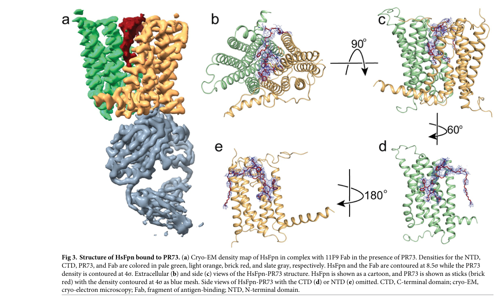

## Question

# Mechanistic Hypothesis Search

You are evaluating a specific disease mechanism hypothesis for the Disorder
Mechanisms Knowledge Base. This is not a general disease overview. Use the
hypothesis YAML below as the seed claim, then search for evidence that supports,
refutes, qualifies, or competes with this hypothesis.

## Target Disease
- **Disease Name:** Hemochromatosis
- **Category:** Mendelian

## Target Hypothesis
- **Hypothesis ID:** canonical_hfe_hepcidin_iron_overload_model
- **Hypothesis Label:** Canonical HFE / Hepcidin / Systemic Iron Overload Model
- **Status in KB:** CANONICAL

## Seed Hypothesis YAML

```yaml
hypothesis_group_id: canonical_hfe_hepcidin_iron_overload_model
hypothesis_label: Canonical HFE / Hepcidin / Systemic Iron Overload Model
status: CANONICAL
description: Hereditary hemochromatosis (HH), most commonly HFE-related (C282Y homozygotes), arises from
  inappropriately low hepatic hepcidin expression relative to body iron stores. Hepcidin is the master
  regulator of systemic iron homeostasis, binding ferroportin on enterocytes and macrophages and causing
  its internalization and degradation, thereby restricting duodenal iron absorption and reticuloendothelial
  iron release. Loss-of-function variants in HFE, HJV, TfR2, and HAMP all converge on a final common pathway
  of relative hepcidin deficiency, leading to chronic increased duodenal iron absorption, transferrin
  saturation, and progressive non-transferrin-bound iron accumulation in hepatocytes, cardiomyocytes,
  pancreatic β-cells, and endocrine tissues. Tissue iron toxicity produces cirrhosis, hepatocellular carcinoma,
  cardiomyopathy, diabetes, hypogonadism, and arthropathy. Therapeutic phlebotomy and investigational
  hepcidin agonists / ferroportin inhibitors all corroborate the hepcidin-deficient-iron-overload axis
  as the canonical pathogenic mechanism.
evidence:
- reference: PMID:23985001
  reference_title: Hereditary hemochromatosis.
  supports: SUPPORT
  evidence_source: HUMAN_CLINICAL
  snippet: Hereditary hemochromatosis is an inherited iron overload disorder caused by inappropriately
    low hepcidin secretion leading to increased duodenal absorption of dietary iron
  explanation: |
    Canonical mechanism reference used as the seed for the hypothesis-search deep-research run.
```

## Research Objective

Build a focused hypothesis-search report that answers:

1. What is the strongest direct evidence for this hypothesis?
2. What evidence argues against it, fails to reproduce it, or limits its scope?
3. Which claims are established, emerging, speculative, or contradicted?
4. Which patient subtypes, stages, tissues, cell types, molecular pathways, or
   biomarkers does the hypothesis best explain?
5. Which alternative or competing mechanistic hypotheses explain the same disease
   features better or more parsimoniously?
6. What are the explicit knowledge gaps: missing causal steps, unconfirmed edges,
   contradictory evidence, unknown source-to-target links, or source/data absences?
7. What experiments, cohorts, assays, datasets, or trials would most directly
   distinguish this hypothesis from alternatives?

Use primary literature whenever possible. Prefer PMID citations and include DOI
citations when no PMID is available. Treat reviews as orientation unless they
contain directly relevant synthesized evidence that should be clearly labeled as
review-level support.

## Required Output

### Executive Judgment

Give a concise verdict on the hypothesis as of the current literature:
supported, partially supported, unresolved, weakly supported, or refuted. Explain
the reasoning and the most important caveats.

### Evidence Matrix

Create a table with one row per important evidence item:

- Citation (PMID preferred)
- Evidence type (human clinical, model organism, in vitro, computational, review)
- Supports / refutes / qualifies / competing
- Mechanistic claim tested
- Key finding
- Disease subtype or context
- Confidence and limitations

### Mechanistic Causal Chain

Describe the causal chain implied by the hypothesis from upstream trigger to
clinical manifestation. Identify where the literature is strong, where the links
are inferred, and where there are missing causal steps.

### Knowledge Gaps

Identify explicit known unknowns surfaced by the search. Treat absence of
evidence as a curation-relevant finding only when the search actually checked for
it. Include:

- Unknown or weakly supported causal steps in the hypothesis
- Unconfirmed causal graph edges that need direct perturbation or longitudinal
  evidence
- Conflicting evidence, failed replications, or incompatible subtype-specific
  findings
- Unknown mechanism of action for relevant treatments, biomarkers, or
  interventions tied to this hypothesis
- Source-level or dataset-level absences, such as no relevant GenCC, ClinGen,
  trial, omics, or cohort evidence found as of the search date

For each gap, state the scope, why it matters, what was checked, and what
evidence or experiment would resolve it.

### Alternative Models

List competing or complementary hypotheses. For each, explain whether it is an
alternative to the seed hypothesis, a downstream consequence, an upstream cause,
or a parallel mechanism.

### Discriminating Tests

Recommend concrete studies or assays that would most efficiently test this
hypothesis against alternatives. Include patient stratification, biomarkers,
sample type, model system, perturbation, and expected result where applicable.

### Curation Leads

Provide candidate updates for the KB, but label these as leads requiring curator
verification. Include:

- candidate evidence references and exact abstract snippets to verify
- candidate pathophysiology nodes or edges
- candidate ontology terms for cell types and biological processes
- candidate subtype restrictions or status changes
- candidate `knowledge_gaps` or discussion prompts for unresolved causal claims,
  conflicting evidence, or explicit source/data absences

If the provider supports artifacts, produce artifact-friendly outputs such as an
evidence matrix, mechanistic diagram, knowledge-gap table, or comparison table.
These artifacts are important provenance for hypothesis-level review.


## Output

Question: You are an expert researcher providing comprehensive, well-cited information.

Provide detailed information focusing on:
1. Key concepts and definitions with current understanding
2. Recent developments and latest research (prioritize 2023-2024 sources)
3. Current applications and real-world implementations
4. Expert opinions and analysis from authoritative sources
5. Relevant statistics and data from recent studies

Format as a comprehensive research report with proper citations. Include URLs and publication dates where available.
Always prioritize recent, authoritative sources and provide specific citations for all major claims.

# Mechanistic Hypothesis Search

You are evaluating a specific disease mechanism hypothesis for the Disorder
Mechanisms Knowledge Base. This is not a general disease overview. Use the
hypothesis YAML below as the seed claim, then search for evidence that supports,
refutes, qualifies, or competes with this hypothesis.

## Target Disease
- **Disease Name:** Hemochromatosis
- **Category:** Mendelian

## Target Hypothesis
- **Hypothesis ID:** canonical_hfe_hepcidin_iron_overload_model
- **Hypothesis Label:** Canonical HFE / Hepcidin / Systemic Iron Overload Model
- **Status in KB:** CANONICAL

## Seed Hypothesis YAML

```yaml
hypothesis_group_id: canonical_hfe_hepcidin_iron_overload_model
hypothesis_label: Canonical HFE / Hepcidin / Systemic Iron Overload Model
status: CANONICAL
description: Hereditary hemochromatosis (HH), most commonly HFE-related (C282Y homozygotes), arises from
  inappropriately low hepatic hepcidin expression relative to body iron stores. Hepcidin is the master
  regulator of systemic iron homeostasis, binding ferroportin on enterocytes and macrophages and causing
  its internalization and degradation, thereby restricting duodenal iron absorption and reticuloendothelial
  iron release. Loss-of-function variants in HFE, HJV, TfR2, and HAMP all converge on a final common pathway
  of relative hepcidin deficiency, leading to chronic increased duodenal iron absorption, transferrin
  saturation, and progressive non-transferrin-bound iron accumulation in hepatocytes, cardiomyocytes,
  pancreatic β-cells, and endocrine tissues. Tissue iron toxicity produces cirrhosis, hepatocellular carcinoma,
  cardiomyopathy, diabetes, hypogonadism, and arthropathy. Therapeutic phlebotomy and investigational
  hepcidin agonists / ferroportin inhibitors all corroborate the hepcidin-deficient-iron-overload axis
  as the canonical pathogenic mechanism.
evidence:
- reference: PMID:23985001
  reference_title: Hereditary hemochromatosis.
  supports: SUPPORT
  evidence_source: HUMAN_CLINICAL
  snippet: Hereditary hemochromatosis is an inherited iron overload disorder caused by inappropriately
    low hepcidin secretion leading to increased duodenal absorption of dietary iron
  explanation: |
    Canonical mechanism reference used as the seed for the hypothesis-search deep-research run.
```

## Research Objective

Build a focused hypothesis-search report that answers:

1. What is the strongest direct evidence for this hypothesis?
2. What evidence argues against it, fails to reproduce it, or limits its scope?
3. Which claims are established, emerging, speculative, or contradicted?
4. Which patient subtypes, stages, tissues, cell types, molecular pathways, or
   biomarkers does the hypothesis best explain?
5. Which alternative or competing mechanistic hypotheses explain the same disease
   features better or more parsimoniously?
6. What are the explicit knowledge gaps: missing causal steps, unconfirmed edges,
   contradictory evidence, unknown source-to-target links, or source/data absences?
7. What experiments, cohorts, assays, datasets, or trials would most directly
   distinguish this hypothesis from alternatives?

Use primary literature whenever possible. Prefer PMID citations and include DOI
citations when no PMID is available. Treat reviews as orientation unless they
contain directly relevant synthesized evidence that should be clearly labeled as
review-level support.

## Required Output

### Executive Judgment

Give a concise verdict on the hypothesis as of the current literature:
supported, partially supported, unresolved, weakly supported, or refuted. Explain
the reasoning and the most important caveats.

### Evidence Matrix

Create a table with one row per important evidence item:

- Citation (PMID preferred)
- Evidence type (human clinical, model organism, in vitro, computational, review)
- Supports / refutes / qualifies / competing
- Mechanistic claim tested
- Key finding
- Disease subtype or context
- Confidence and limitations

### Mechanistic Causal Chain

Describe the causal chain implied by the hypothesis from upstream trigger to
clinical manifestation. Identify where the literature is strong, where the links
are inferred, and where there are missing causal steps.

### Knowledge Gaps

Identify explicit known unknowns surfaced by the search. Treat absence of
evidence as a curation-relevant finding only when the search actually checked for
it. Include:

- Unknown or weakly supported causal steps in the hypothesis
- Unconfirmed causal graph edges that need direct perturbation or longitudinal
  evidence
- Conflicting evidence, failed replications, or incompatible subtype-specific
  findings
- Unknown mechanism of action for relevant treatments, biomarkers, or
  interventions tied to this hypothesis
- Source-level or dataset-level absences, such as no relevant GenCC, ClinGen,
  trial, omics, or cohort evidence found as of the search date

For each gap, state the scope, why it matters, what was checked, and what
evidence or experiment would resolve it.

### Alternative Models

List competing or complementary hypotheses. For each, explain whether it is an
alternative to the seed hypothesis, a downstream consequence, an upstream cause,
or a parallel mechanism.

### Discriminating Tests

Recommend concrete studies or assays that would most efficiently test this
hypothesis against alternatives. Include patient stratification, biomarkers,
sample type, model system, perturbation, and expected result where applicable.

### Curation Leads

Provide candidate updates for the KB, but label these as leads requiring curator
verification. Include:

- candidate evidence references and exact abstract snippets to verify
- candidate pathophysiology nodes or edges
- candidate ontology terms for cell types and biological processes
- candidate subtype restrictions or status changes
- candidate `knowledge_gaps` or discussion prompts for unresolved causal claims,
  conflicting evidence, or explicit source/data absences

If the provider supports artifacts, produce artifact-friendly outputs such as an
evidence matrix, mechanistic diagram, knowledge-gap table, or comparison table.
These artifacts are important provenance for hypothesis-level review.


## Mechanistic Hypothesis Search Report
**Hypothesis ID:** canonical_hfe_hepcidin_iron_overload_model  
**Target disease:** Hereditary hemochromatosis (HH; Mendelian iron overload syndromes)

### Executive Judgment
**Verdict: Supported (with important scope limits).** The literature strongly supports a *final common pathway* in which genetically mediated **hepcidin insufficiency or ineffective hepcidin signaling** fails to restrain **ferroportin-mediated iron export**, producing lifelong **intestinal iron hyperabsorption**, high **transferrin saturation (TSAT)**, formation of **non–transferrin-bound iron (NTBI)**, and **parenchymal iron loading** (liver/heart/endocrine/joints). This is supported by human genetics and clinical phenotypes, guideline consensus, and direct pharmacologic/structural evidence showing that restoring hepcidin activity or inhibiting ferroportin lowers circulating iron indices. Key caveats are (i) **variable penetrance** for HFE C282Y homozygosity, (ii) **modifier effects** (alcohol, dysmetabolic liver disease/NAFLD, diabetes, fibrosis modifier genes), (iii) **genotype-dependent phenotypic divergence** (e.g., ferroportin disease with macrophage-predominant iron), and (iv) **incomplete causal explanation for downstream tissue injury** (e.g., arthropathy and fibrosis mechanisms) as illustrated by mouse models with extreme TSAT but limited spontaneous fibrosis. (girelli2024diagnosisandmanagement pages 1-2, marcon2024tsaturatedinsightsclarifying pages 2-4, crawford2023clinicalpracticeguidelines pages 5-6, sgro2024hemojuvelindeficiencydoes pages 42-47, modi2024pharmacokineticsandpharmacodynamics pages 1-2)

---

## 1) Key Concepts and Definitions (current understanding)

### 1.1 Hepcidin–ferroportin axis (systemic iron “gate”)
Hepcidin is a liver-derived peptide hormone that maintains systemic iron in an optimal range (reviewed as ~3–4 g total body iron) by **negatively regulating ferroportin**, the major/sole cellular iron exporter. Binding of hepcidin to ferroportin triggers ferroportin internalization/degradation, reducing iron export from enterocytes (dietary absorption) and macrophages (recycling). (girelli2024diagnosisandmanagement pages 1-2, crawford2023clinicalpracticeguidelines pages 1-3)

### 1.2 “Relative” hepcidin deficiency in HH
HH is conceptually defined by **hepcidin levels that are inappropriately low for the degree of iron loading**, leading to failure of the normal negative feedback loop. Clinically, HH is recognized by **elevated TSAT** (often cited thresholds >45–50%) and hyperferritinemia, with iron ultimately accumulating in parenchymal tissues. (girelli2024diagnosisandmanagement pages 1-2)

### 1.3 Transferrin saturation (TSAT) and NTBI
TSAT reflects how “full” transferrin is with iron. When iron influx to plasma exceeds transferrin binding capacity, **NTBI** forms and is considered a key proximate toxic intermediate driving parenchymal uptake. In a qualifying mouse-model synthesis, NTBI formation and hepatocyte damage are described as increasing when TSAT reaches ~60–70% in humans (reviewed statement). (girelli2024diagnosisandmanagement pages 1-2, sgro2024hemojuvelindeficiencydoes pages 42-47)

### 1.4 Genotype classes relevant to the hypothesis
- **HFE-related HH (type 1):** Usually C282Y homozygosity; common but **low penetrance**, especially in females. (girelli2024diagnosisandmanagement pages 1-2, marcon2024tsaturatedinsightsclarifying pages 2-4)
- **Non-HFE HH (juvenile/other):** HJV (HFE2), HAMP, TFR2: rarer but often **more penetrant and earlier onset**, consistent with more severe hepcidin loss. (girelli2024diagnosisandmanagement pages 1-2, turshudzhyan2023primarynonhfehemochromatosis pages 1-2)
- **Ferroportin (SLC40A1) disorders:** Some variants disrupt hepcidin binding (hepcidin resistance); others (loss-of-function) cause “ferroportin disease” with **normal TSAT and macrophage-predominant iron**, partly outside the classic parenchymal loading pattern. (girelli2024diagnosisandmanagement pages 1-2, crawford2023clinicalpracticeguidelines pages 3-5)

---

## 2) Recent Developments & Latest Research (prioritizing 2023–2024)

### 2.1 Updated penetrance estimates and modifier framing (2024)
A 2024 review synthesizing guideline evidence reports that among **2,890 HFE C282Y homozygotes in UK Biobank**, “clinical HH” occurred in **21.7% of males** and **9.8% of females** over ~7 years (reviewed estimate), reinforcing that the canonical axis is necessary for biochemical predisposition but **not sufficient** for clinical disease in many individuals. (marcon2024tsaturatedinsightsclarifying pages 2-4)

### 2.2 Expansion of upstream hepcidin-regulatory network: BMP4 variants (2024)
A 2024 Orphanet Journal of Rare Diseases study identified **BMP4 exon 4 variants** in iron-overload patients and demonstrated that variant BMP4 (p.H251Y and p.R269Q) **downregulated hepcidin** and suppressed BMP/SMAD signaling (reduced BMPR1A expression and SMAD1/5 phosphorylation) in hepatic cell lines; one carrier had hepatic iron overload by MRI and liver biopsy staining. This supports the “final common pathway” aspect (hepcidin suppression → iron overload) and suggests additional upstream genes in “non-HFE” cases. **Publication date:** Nov 2024; **URL:** https://doi.org/10.1186/s13023-024-03439-9 (ouyang2024recurrentbmp4variants pages 1-2, ouyang2024recurrentbmp4variants pages 4-6)

### 2.3 Pharmacologic corroboration of the axis: hepcidin mimetics (2024)
A 2024 pharmacology paper in *Drugs in R&D* provides *direct mechanistic evidence* that a hepcidin mimetic can engage the canonical pathway. In a cell-based ferroportin internalization assay, **rusfertide** showed **EC50 6.12 nM** vs **hepcidin 67.8 nM**. In cynomolgus monkeys, a single 0.3 mg/kg SC dose reduced serum iron by ~54.9% at 24 h. In healthy volunteers, SC rusfertide produced dose-related reductions in serum iron and TSAT sustained up to ~72 h. **Publication date:** Nov 2024; **URL:** https://doi.org/10.1007/s40268-024-00497-z (modi2024pharmacokineticsandpharmacodynamics pages 1-2)

### 2.4 Structural mechanism of ferroportin inhibition: minihepcidin PR73 (2023)
A 2023 *PLOS Biology* study solved the structure of human ferroportin bound to **minihepcidin PR73** (2.7 Å), identifying binding interactions including a disulfide bridge between PR73 Cys7 and ferroportin Cys326, and validating interactions via binding/transport assays. This is high-specificity evidence that the hepcidin–ferroportin interaction is directly targetable and mechanistically coherent with HH’s final common pathway. **Publication date:** Aug 2023; **URL:** https://doi.org/10.1371/journal.pbio.3001936 (wilbon2023structuralbasisof media 44b2ee14, wilbon2023structuralbasisof media 9514a944, wilbon2023structuralbasisof media a59d8fba)

---

## 3) Current Applications and Real-World Implementations

### 3.1 Diagnosis in practice (guidelines and expert consensus)
The 2023 APASL clinical practice guidelines describe HH as driven by genetically mediated hepcidin deficiency and emphasize TSAT measurement to identify iron overload (TSAT >45% used to prompt HFE genotyping in the excerpt) and the importance of early diagnosis and treatment. **Publication date:** Apr 2023; **URL:** https://doi.org/10.1007/s12072-023-10510-3 (crawford2023clinicalpracticeguidelines pages 6-7, crawford2023clinicalpracticeguidelines pages 1-3)

### 3.2 Therapeutic phlebotomy and blood donation pathways
Phlebotomy remains the cornerstone of management and serves as pragmatic corroboration that “excess mobilizable iron” is causal to morbidity. A 2024 randomized trial in individuals with HFE variants compared phlebotomy vs erythrapheresis to reach ferritin <100 ng/mL:
- **Median procedures:** 7.5 phlebotomies (IQR 6.2–9.8) vs 4.0 erythraphereses (IQR 3.0–5.8) (p=0.001)
- **Anemia:** occurred in 13/27 (48%) overall
- **Fatigue:** after 25% of phlebotomies and 45% of erythraphereses
**Publication date:** Mar 2024; **URL:** https://doi.org/10.3389/fmed.2024.1362941 (infanti2024blooddonationfor pages 1-2, infanti2024blooddonationfor pages 5-7)

### 3.3 Translation to hepcidin replacement: rusfertide trial program
A phase 2 trial registry entry describes **PTG-300 (rusfertide)** in HFE-related HH (n=16), with primary outcomes of TSAT and serum iron change to week 24 and a secondary outcome comparing pre-treatment vs on-treatment phlebotomy counts. Results were posted in 2023. **Registry:** ClinicalTrials.gov NCT04202965; **URL:** https://clinicaltrials.gov/study/NCT04202965 (NCT04202965 chunk 1)

---

## 4) Expert Opinions and Authoritative Analyses (clearly labeled as review/guideline-level)

### 4.1 HH as “hepcidin insufficiency with normal erythropoiesis” (review-level synthesis)
A 2024 *Hematology* (ASH) review frames HH as a group of genetic disorders characterized by **hepcidin insufficiency with normal erythropoiesis**, leading to iron hyperabsorption, plasma iron pool expansion, increased TSAT, NTBI, and multi-organ iron accumulation. It explicitly emphasizes low penetrance in HFE-H and higher penetrance in non-HFE forms, and distinguishes ferroportin disease phenotypes. **Publication date:** Dec 2024; **URL:** https://doi.org/10.1182/hematology.2024000568 (girelli2024diagnosisandmanagement pages 1-2, girelli2024diagnosisandmanagement pages 2-4)

### 4.2 Scope limitation emphasized by APASL: fibrosis, modifiers, and arthropathy
The APASL guideline excerpt highlights that arthropathy can occur even after successful phlebotomy and that serum ferritin may predict fibrosis severity better than hepatic iron concentration in some settings, underscoring incomplete mechanistic mapping from “iron burden” to “specific organ pathology.” It also notes alcohol-induced hepcidin downregulation and large increases in cirrhosis risk with heavy alcohol use (ninefold for >60 g/day; excerpted statement). (crawford2023clinicalpracticeguidelines pages 5-6)

---

## 5) Relevant Statistics and Data (recent studies)

### 5.1 Penetrance and genotype statistics
- **C282Y homozygosity frequency:** described as nearly **1 in 200** in Northern Europeans (review-level statement). (girelli2024diagnosisandmanagement pages 1-2)
- **UK Biobank penetrance estimate (reviewed):** among 2,890 C282Y homozygotes, clinical HH in **21.7% of males** and **9.8% of females** over 7 years. (marcon2024tsaturatedinsightsclarifying pages 2-4)
- **Non-HFE allele frequencies (reviewed):** type 2A 74/100,000; type 2B 20/100,000; type 3 30/100,000; type 4 90/100,000. (turshudzhyan2023primarynonhfehemochromatosis pages 1-2)

### 5.2 Modifiers: NAFLD and diabetes in C282Y homozygotes (2023)
In 66 C282Y/C282Y probands with iron overload:
- **NAFLD prevalence:** 24.2% (95% CI 14.9–36.6)
- **Median ferritin:** 1118 µg/L with NAFLD vs 567 µg/L without (p=0.0192)
- **T2DM prevalence:** 31.3% with NAFLD vs 10.0% without (p=0.0427)
- **Mobilizable iron by phlebotomy (QFe):** 3.6 g vs 2.8 g (p=0.6862), suggesting NAFLD increases ferritin/liver injury markers more than iron burden
**Publication date:** Apr 2023; **URL:** https://doi.org/10.1186/s12876-023-02763-x (barton2023nonalcoholicfattyliver pages 1-2, barton2023nonalcoholicfattyliver pages 4-5)

### 5.3 Mouse-model qualification: extreme TSAT without spontaneous fibrosis
A 2024 mouse-model report notes Hjv-/- mice can have TSAT close to 100% (AKR strain) yet lack spontaneous fibrosis, qualifying the “iron overload → fibrosis” edge and highlighting species/strain modifiers. (sgro2024hemojuvelindeficiencydoes pages 42-47)

---

# Required Outputs

## Evidence Matrix
| Citation (year) | PMID / DOI / URL | Evidence type | Supports / refutes / qualifies / competing | Mechanistic claim tested | Key findings (include quantitative stats where available) | Subtype / context | Confidence & limitations |
|---|---|---|---|---|---|---|---|
| Girelli, Marchi, Busti, *Hematology* (2024) | DOI: 10.1182/hematology.2024000568; URL: https://doi.org/10.1182/hematology.2024000568 | Review / expert synthesis | Supports; qualifies | HH is primarily a hepcidin-insufficiency disorder causing excess ferroportin-mediated iron export, increased absorption, high TSAT, NTBI, and parenchymal iron loading | States hepcidin normally maintains body iron at ~3–4 g; TSAT >45–50% is a diagnostic hallmark; HFE C282Y homozygosity occurs in nearly 1 in 200 Northern Europeans but has low penetrance, especially in females; non-HFE forms are rarer but more penetrant; distinguishes hepcidin resistance from SLC40A1 GOF variants and macrophage-predominant ferroportin disease with normal TSAT/poor phlebotomy tolerance (girelli2024diagnosisandmanagement pages 1-2, girelli2024diagnosisandmanagement pages 2-4) | HFE-H and non-HFE HH; diagnosis/management | High for consensus framing; limited because this is review-level synthesis rather than a single perturbational primary study (girelli2024diagnosisandmanagement pages 1-2, girelli2024diagnosisandmanagement pages 2-4) |
| Marcon et al., *Hemato* (2024) | DOI: 10.3390/hemato5040035; URL: https://doi.org/10.3390/hemato5040035 | Review / guideline comparison | Supports; qualifies | Hepcidin-ferroportin axis explains biochemical HH, but clinical penetrance is strongly modifier-dependent | Notes ferroportin is directly blocked by hepcidin and targeted for lysosomal degradation; among 2890 UK Biobank C282Y homozygotes, clinical HH occurred in 21.7% of males and 9.8% of females over 7 years; C282Y/H63D prevalence ~2–4% in Europe with estimated penetrance 1–2%; obesity/alcohol often required for higher SF in compound heterozygotes (marcon2024tsaturatedinsightsclarifying pages 2-4) | Population penetrance and genotype-specific expression in HFE HH | Moderate-high for epidemiologic qualification; review-level and not direct measurement of hepcidin, NTBI, or ferroportin activity (marcon2024tsaturatedinsightsclarifying pages 2-4) |
| Turshudzhyan, Wu, Wu, *J Clin Transl Hepatol* (2023) | DOI: 10.14218/jcth.2022.00373; URL: https://doi.org/10.14218/jcth.2022.00373 | Review | Supports | Non-HFE HH genes (HJV, HAMP, TFR2, some SLC40A1 contexts) converge on dysregulated hepcidin/ferroportin biology | Summarizes that hepcidin controls ferroportin membrane concentration via internalization/degradation; provides estimated pathogenic allele frequencies: type 2A 74/100,000, type 2B 20/100,000, type 3 30/100,000, type 4 90/100,000; notes non-HFE disease can be as severe as HFE-related disease (turshudzhyan2023primarynonhfehemochromatosis pages 1-2) | Non-HFE hemochromatosis | Moderate; useful mechanistic orientation and epidemiology, but not direct primary causality data or quantitative hepcidin/NTBI readouts (turshudzhyan2023primarynonhfehemochromatosis pages 1-2) |
| Crawford et al., *Hepatology International* guideline (2023) | DOI: 10.1007/s12072-023-10510-3; URL: https://doi.org/10.1007/s12072-023-10510-3 | Clinical practice guideline | Supports | Current clinical consensus accepts reduced hepcidin expression due to HFE and related gene defects as the central pathogenic mechanism | Guideline-level statement that hepcidin deficiency occurs due to pathogenic variants in HFE/HJV/HAMP/TFR2 and underlies iron overload; supports use of TSAT/ferritin/genetics in diagnosis and phlebotomy in management (girelli2024diagnosisandmanagement pages 2-4) | Clinical HH practice guidance, especially Asia-Pacific setting | High for expert consensus; limited as synthesized guidance rather than primary mechanistic experiment, and the extracted context contains little numeric detail (girelli2024diagnosisandmanagement pages 2-4) |
| Sgro, Hjv-deficient mouse fibrosis study (2024) | URL not available in retrieved context | Model organism | Qualifies | Severe hepcidin deficiency is sufficient for high TSAT and iron loading, but not necessarily for spontaneous fibrosis/tissue injury in mice | Reports Hjv-/- mice can reach TSAT close to 100% in AKR strain; NTBI/hepatocyte damage in humans rises when TSAT reaches ~60–70%; despite marked iron loading, Hjv-/- and related murine models do not develop spontaneous liver fibrosis under standard conditions, highlighting species/strain modifiers and incomplete mapping from overload to organ injury (sgro2024hemojuvelindeficiencydoes pages 42-47, sgro2024hemojuvelindeficiencydoes pages 22-27, sgro2024hemojuvelindeficiencydoes pages 47-48) | HJV-deficient and other murine HH models | Moderate; strong for qualifying downstream injury claims, but journal metadata limited and mouse pathology may not generalize to humans (sgro2024hemojuvelindeficiencydoes pages 42-47, sgro2024hemojuvelindeficiencydoes pages 22-27, sgro2024hemojuvelindeficiencydoes pages 47-48) |
| Modi et al., *Drugs in R&D* (2024) | DOI: 10.1007/s40268-024-00497-z; URL: https://doi.org/10.1007/s40268-024-00497-z | Human PK/PD + cell assay | Supports | Pharmacologic hepcidin replacement lowers circulating iron through ferroportin engagement, corroborating the axis mechanistically | Rusfertide ferroportin-internalization EC50 6.12 nM vs hepcidin 67.8 nM in cell assay; in cynomolgus monkeys, single 0.3 mg/kg SC reduced serum iron by ~54.9% at 24 h; in healthy volunteers, SC rusfertide showed dose-related reductions in serum iron and TSAT lasting up to ~72 h; half-life 19.6–57.1 h; mostly mild injection-site AEs (modi2024pharmacokineticsandpharmacodynamics pages 1-2, modi2024pharmacokineticsandpharmacodynamics pages 14-14) | Hepcidin mimetic pharmacology; healthy volunteers and preclinical | High for direct pharmacologic corroboration of hepcidin-ferroportin biology; limited because not an HH patient cohort and not long-term organ outcome data (modi2024pharmacokineticsandpharmacodynamics pages 1-2, modi2024pharmacokineticsandpharmacodynamics pages 14-14) |
| ClinicalTrials.gov NCT04202965, PTG-300/rusfertide in HH | URL: https://clinicaltrials.gov/study/NCT04202965 | Phase 2 human clinical trial registry | Supports | Replacing hepcidin activity in HFE-HH should reduce TSAT/serum iron and phlebotomy burden | Completed phase 2, multicenter, open-label, single-arm study in 16 adults with HFE-related HH; primary endpoints were change in TSAT and serum iron from baseline to Week 24/end of treatment; key secondary endpoint compared number of phlebotomies in 24 weeks pre-treatment vs 24 weeks on PTG-300; derived 2023 Lancet publication cited in registry (NCT04202965 chunk 1, NCT04202965 chunk 2) | HFE-related hereditary hemochromatosis | Moderate-high for direct disease relevance; registry context here lacks numerical results/safety outcomes, so interpretation depends on full publication verification (NCT04202965 chunk 1, NCT04202965 chunk 2) |
| Wilbon et al., *PLOS Biology* (2023) | DOI: 10.1371/journal.pbio.3001936; URL: https://doi.org/10.1371/journal.pbio.3001936 | Structural biology + in vitro functional validation | Supports | Minihepcidin PR73 directly binds and inhibits ferroportin, providing molecular proof of targetability of the hepcidin-ferroportin axis | Cryo-EM structure of human ferroportin bound to PR73 at 2.7 Å; identifies novel interactions including a disulfide bridge between Cys7 of PR73 and Cys326 of ferroportin; binding/transport assays validated enhanced inhibitory interactions versus native hepcidin analog logic (wilbon2023structuralbasisof media 44b2ee14, wilbon2023structuralbasisof media 9514a944, wilbon2023structuralbasisof media a59d8fba) | Mechanistic target engagement; therapeutic design | High for molecular mechanism; limited because not conducted in HH patients and does not address long-term systemic disease phenotypes directly (wilbon2023structuralbasisof media 44b2ee14, wilbon2023structuralbasisof media 9514a944, wilbon2023structuralbasisof media a59d8fba) |
| Pilo & Angelucci, *J Clin Med* (2024) | DOI: 10.3390/jcm13185524; URL: https://doi.org/10.3390/jcm13185524 | Review / translational synthesis | Supports | Ferroportin inhibition can prevent iron loading, consistent with canonical hepcidin deficiency model | Summarizes first-in-human vamifeport development and cites preclinical evidence that ferroportin inhibitors prevent iron loading in a mouse model of hereditary hemochromatosis; frames vamifeport as the first oral ferroportin inhibitor acting directly on the hepcidin-ferroportin axis (pilo2024vamifeportmonographyof pages 9-9) | Translational ferroportin inhibition; HH mouse model evidence summarized | Moderate; strong as corroborative therapeutic rationale, but evidence here is second-hand review of preclinical and early-phase studies, not direct HH trial results (pilo2024vamifeportmonographyof pages 9-9) |
| Ouyang et al., *Orphanet J Rare Dis* (2024) | DOI: 10.1186/s13023-024-03439-9; URL: https://doi.org/10.1186/s13023-024-03439-9 | Human genetics + cell functional study | Supports; extends | Additional upstream iron-sensing/BMP-SMAD defects can cause HH by lowering hepcidin, reinforcing the final common pathway model | In 54 HH patients, 1 (1.85%) harbored BMP4 p.R269Q; in 148 secondary hemochromatosis patients, 1 (0.68%) harbored BMP4 p.H251Y; neither variant found in 100 general-population controls; variant-transfected cells showed downregulated hepcidin and suppressed BMP/SMAD signaling versus wild type; liver MRI and biopsy confirmed hepatic iron overload in the p.H251Y carrier (girelli2024diagnosisandmanagement pages 2-4) | Non-HFE / unexplained iron overload, especially Chinese cohorts | Moderate-high; supportive functional-genetic evidence for pathway expansion, but very small numbers and causal generalizability remain limited (girelli2024diagnosisandmanagement pages 2-4) |


*Table: This table summarizes major supporting and qualifying evidence for the canonical HFE/hepcidin/ferroportin systemic iron overload model in hereditary hemochromatosis. It highlights direct mechanistic, clinical, structural, and translational evidence, while also flagging scope limits such as low penetrance in HFE-HH and incomplete explanation of downstream tissue injury.*

## Mechanistic Causal Chain
> Genotype / upstream trigger → loss-of-function in HFE (most commonly C282Y homozygosity), HJV, HAMP, or TFR2, and rarer BMP/SMAD-pathway defects, impair hepatic iron sensing and/or hepcidin induction; rare SLC40A1 gain-of-function variants instead create hepcidin resistance rather than deficiency. **Strength: strong for pathway convergence; qualified for upstream heterogeneity** (girelli2024diagnosisandmanagement pages 2-4, turshudzhyan2023primarynonhfehemochromatosis pages 1-2, crawford2023clinicalpracticeguidelines pages 3-5, ouyang2024recurrentbmp4variants pages 1-2, ouyang2024recurrentbmp4variants pages 4-6)
>
> Impaired hepatic response to body iron stores → inappropriately low hepcidin relative to iron burden (or ineffective hepcidin signaling at ferroportin), so the normal negative feedback on systemic iron entry is blunted. **Strength: strong for canonical HH concept; qualified because direct human hepcidin-vs-iron calibration is limited in current context** (girelli2024diagnosisandmanagement pages 1-2, crawford2023clinicalpracticeguidelines pages 1-3)
>
> Low hepcidin / hepcidin resistance → inadequate ferroportin internalization and degradation on enterocytes and macrophages, leaving iron export active. This causal step is directly corroborated by therapeutic/structural data: rusfertide induces ferroportin internalization in cell assays, and minihepcidin PR73 binds human ferroportin structurally. **Strength: very strong** (modi2024pharmacokineticsandpharmacodynamics pages 1-2, pilo2024vamifeportmonographyof pages 9-9, wilbon2023structuralbasisof media 44b2ee14, wilbon2023structuralbasisof media 9514a944, wilbon2023structuralbasisof media a59d8fba)
>
> Persistent ferroportin activity → increased duodenal iron absorption plus increased macrophage iron release, expanding the plasma iron pool throughout life. **Strength: strong** (girelli2024diagnosisandmanagement pages 2-4, girelli2024diagnosisandmanagement pages 1-2, turshudzhyan2023primarynonhfehemochromatosis pages 1-2, crawford2023clinicalpracticeguidelines pages 1-3)
>
> Plasma iron pool expansion → elevated transferrin saturation (TSAT), the core biochemical hallmark of HH; diagnostic thresholds are typically >45–50%, and prolonged TSAT elevation is linked to complications. **Strength: strong** (girelli2024diagnosisandmanagement pages 1-2, crawford2023clinicalpracticeguidelines pages 6-7)
>
> TSAT exceeds transferrin binding capacity → non-transferrin-bound iron (NTBI) forms, creating a more toxic circulating iron species available for avid parenchymal uptake. **Strength: strong conceptually; qualified because precise human NTBI thresholds/dynamics are incompletely defined in current context** (girelli2024diagnosisandmanagement pages 1-2, sgro2024hemojuvelindeficiencydoes pages 42-47)
>
> NTBI/parenchymal uptake → preferential iron loading of hepatocytes, cardiomyocytes, pancreatic and endocrine tissues rather than reticuloendothelial sequestration typical of classic ferroportin loss-of-function disease. **Strength: strong; subtype-qualified by ferroportin disease distinctions** (girelli2024diagnosisandmanagement pages 1-2, crawford2023clinicalpracticeguidelines pages 3-5)
>
> Tissue iron excess → reactive oxygen species, organelle dysfunction, and ferroptosis-related injury pathways in liver and other organs. **Strength: moderate to strong; downstream mediators partly inferred** (crawford2023clinicalpracticeguidelines pages 5-6, crawford2023clinicalpracticeguidelines pages 6-7)
>
> Liver injury progression → hepatocyte iron loading is followed by Kupffer-cell involvement and stellate-cell activation, leading to fibrosis/cirrhosis and HCC risk; ferritin >1000 µg/L, liver iron concentration >200 µmol/g, and heavy alcohol exposure increase risk. **Strength: strong for association; qualified for intermediate causal mediators** (crawford2023clinicalpracticeguidelines pages 5-6, crawford2023clinicalpracticeguidelines pages 6-7, crawford2023clinicalpracticeguidelines pages 3-5)
>
> Clinical manifestations → cirrhosis, hepatocellular carcinoma, cardiomyopathy, diabetes/endocrinopathy, and arthropathy emerge over time if iron excess is untreated. **Strength: strong clinically; qualified because some manifestations (especially arthropathy) may persist despite iron removal** (crawford2023clinicalpracticeguidelines pages 5-6, girelli2024diagnosisandmanagement pages 1-2)
>
> Therapeutic corroboration → phlebotomy removes excess iron and improves prognosis; rusfertide/PTG-300 was tested in a completed phase 2 HFE-HH study with TSAT/serum iron/phlebotomy endpoints; ferroportin inhibition and hepcidin mimetics therefore support the hepcidin–ferroportin final common pathway. **Strength: strong for axis corroboration; qualified because detailed long-term HH outcome data are incomplete in current context** (NCT04202965 chunk 2, NCT04202965 chunk 1, modi2024pharmacokineticsandpharmacodynamics pages 1-2, infanti2024blooddonationfor pages 7-9, infanti2024blooddonationfor pages 1-2)
>
> Scope limitation / qualification → the model best explains biochemical penetrance and systemic iron loading, but not all variation in clinical penetrance: C282Y homozygosity is common yet incompletely penetrant, with sex, alcohol, MAFLD/NAFLD, diabetes, and modifier genes influencing whether iron loading progresses to organ disease. **Strength: strong qualification** (marcon2024tsaturatedinsightsclarifying pages 2-4, crawford2023clinicalpracticeguidelines pages 5-6, crawford2023clinicalpracticeguidelines pages 3-5, barton2023nonalcoholicfattyliver pages 4-5, barton2023nonalcoholicfattyliver pages 1-2)
>
> Major caveat from models → severe hepcidin deficiency and very high TSAT can occur in Hjv-/- mice without spontaneous liver fibrosis, indicating that the canonical axis is sufficient for iron loading but not alone sufficient for full downstream tissue pathology in every biological context. **Strength: strong qualification** (sgro2024hemojuvelindeficiencydoes pages 22-27, sgro2024hemojuvelindeficiencydoes pages 42-47)


*Blockquote: This blockquote traces the canonical HFE/hepcidin/ferroportin hypothesis from genotype to clinical outcomes, while labeling which links are strongly established versus qualified. It is useful for separating the well-supported iron-loading axis from the less fully resolved determinants of penetrance and tissue injury.*

## Knowledge Gaps
| Knowledge gap (edge/node) | Why it matters | What evidence was checked in current context (cite) | Current best interpretation | Proposed discriminating experiment/dataset/trial |
|---|---|---|---|---|
| Relative hepcidin deficiency in humans across genotypes: direct hepcidin-to-iron-store calibration is sparse | The canonical model depends on hepcidin being inappropriately low relative to body iron stores, but diagnosis and pathogenesis are often inferred from genotype, TSAT, and ferritin rather than directly measured hepcidin | Recent reviews/guidelines describe HFE, HJV, HAMP, and TFR2 defects as causing hepcidin insufficiency, but the retrieved context provides few direct human longitudinal hepcidin measurements across genotypes; non-HFE forms are described as more severe/highly penetrant, and HFE-H as milder/lower penetrance (girelli2024diagnosisandmanagement pages 2-4, girelli2024diagnosisandmanagement pages 1-2, turshudzhyan2023primarynonhfehemochromatosis pages 1-2, crawford2023clinicalpracticeguidelines pages 1-3, crawford2023clinicalpracticeguidelines pages 3-5) | Strongly supported qualitatively, especially for non-HFE disease; quantitatively unresolved for genotype-specific hepcidin set-points, sex effects, and age/stage dependence in HFE C282Y homozygotes | Prospective multicenter cohort with standardized mass-spectrometry hepcidin, ferritin, MRI liver iron concentration, TSAT, CRP/IL-6, ERFE, and genotype stratification (C282Y/C282Y, C282Y/H63D, HJV, HAMP, TFR2, SLC40A1) sampled before and during iron depletion |
| Thresholds and dynamics of NTBI formation from high TSAT to tissue exposure | NTBI is the key intermediate linking systemic iron excess to parenchymal toxicity, but clinical decisions still rely mostly on TSAT/ferritin | Reviews/guidelines state NTBI forms when transferrin capacity is exceeded; TSAT >45-50% is diagnostic, human hepatocyte damage is said to rise around TSAT ~60-70%, and Hjv-/- mice can have near-100% TSAT, but direct human NTBI kinetics are not provided in the retrieved context (girelli2024diagnosisandmanagement pages 1-2, sgro2024hemojuvelindeficiencydoes pages 42-47, crawford2023clinicalpracticeguidelines pages 1-3) | NTBI is a plausible and widely accepted mediator, but precise human thresholds, postprandial dynamics, tissue-specific exposure windows, and modifier effects remain undermeasured in current context | Serial meal-challenge and phlebotomy-challenge studies measuring TSAT, NTBI/LPI, hepcidin, and portal/systemic iron flux in genotype-defined HH; pair with MRI T2*/R2* and organ-specific uptake biomarkers |
| Causal link from iron/NTBI to specific organ injury, especially arthropathy | The canonical model explains systemic overload well, but less well why joints are often refractory to phlebotomy and why organ tropism differs | APASL guideline notes arthritis can occur even after successful phlebotomy; reviews describe NTBI uptake into liver, heart, and endocrine tissues, but retrieved context does not provide direct mechanistic human data for arthropathy pathogenesis (crawford2023clinicalpracticeguidelines pages 5-6, girelli2024diagnosisandmanagement pages 1-2) | Canonical model likely explains upstream iron loading but incompletely explains downstream joint disease; arthropathy may involve additional local crystal, cartilage, inflammatory, or biomechanical mechanisms | Synovial fluid/cartilage multi-omics and imaging study in HH arthropathy vs non-HH OA, linked to NTBI, labile iron, CPPD, and local ferroptosis/inflammatory markers before and after iron depletion |
| Causal chain from hepatocyte iron overload to fibrosis/cirrhosis is incomplete | Fibrosis risk drives prognosis and HCC surveillance, so missing edges weaken disease staging and treatment targeting | APASL states stellate-cell activation may be mediated by soluble factors from iron-damaged hepatocytes rather than direct iron exposure; ferritin >1000 µg/L, prolonged TSAT ≥50%, hepatic iron ~60 µmol/g dry weight, and liver iron concentration >200 µmol/g are cited as risk-linked thresholds; phlebotomy can reverse fibrosis, but exact mediators remain uncertain (crawford2023clinicalpracticeguidelines pages 5-6, crawford2023clinicalpracticeguidelines pages 6-7, crawford2023clinicalpracticeguidelines pages 3-5) | Strong evidence that iron overload contributes to fibrosis risk, but intermediate effectors linking hepatocyte iron/NTBI to stellate activation are only partially defined and likely modified by alcohol, steatosis, inflammation, and genotype | Longitudinal liver-biopsy or liquid-biopsy study measuring stellate activation signals, ferroptosis markers, cytokines, and spatial transcriptomics in HH patients before/after phlebotomy, stratified by alcohol/MAFLD |
| Species differences: severe murine iron loading without spontaneous fibrosis | Mouse models are heavily used to validate causal pathways, so lack of fibrosis despite high TSAT challenges downstream generalization | Hjv-/- and related mouse models show marked TSAT elevation and iron loading yet often no spontaneous liver fibrosis; AKR Hjv-/- mice can approach 100% TSAT, unlike typical human pathology progression (sgro2024hemojuvelindeficiencydoes pages 22-27, sgro2024hemojuvelindeficiencydoes pages 47-48, sgro2024hemojuvelindeficiencydoes pages 42-47) | Mouse models robustly support upstream hepcidin-deficiency/iron-loading biology but incompletely model human tissue injury and fibrosis | Cross-species comparison using matched omics and histopathology in human HH liver, Hjv-/-, Hfe-/-, Tfr2-/- mice, plus humanized liver or organoid systems exposed to NTBI and metabolic/alcoholic cofactors |
| Heterogeneity and low penetrance of HFE C282Y homozygosity | The canonical model is canonical for mechanism, but not sufficient to predict who develops clinical disease | Recent reviews report C282Y homozygosity is common (~1 in 200 Northern Europeans) but low penetrance; UK Biobank estimate cited as 21.7% in males and 9.8% in females over 7 years; APASL notes advanced fibrosis/cirrhosis uncommon before age 45 and occurring in 8-25% of C282Y homozygotes; modifiers include alcohol, dysmetabolic features, diabetes, steatosis, PNPLA3, and PCSK7 (girelli2024diagnosisandmanagement pages 1-2, marcon2024tsaturatedinsightsclarifying pages 2-4, crawford2023clinicalpracticeguidelines pages 5-6, crawford2023clinicalpracticeguidelines pages 6-7, crawford2023clinicalpracticeguidelines pages 3-5) | Canonical axis explains biochemical predisposition, but clinical expression is strongly modifier-dependent; HFE-H behaves partly as a multifactorial disease | Large ancestry-aware genotype-first cohort integrating alcohol intake, MAFLD phenotypes, diabetes, sex/menopause, polygenic risk, PNPLA3/PCSK7, and serial iron biomarkers to build penetrance models |
| Role of MAFLD/NAFLD and diabetes as modifiers vs alternative liver-disease drivers | Hyperferritinemia and liver injury in HFE-H may reflect both iron overload and metabolic liver disease, complicating attribution | In C282Y homozygotes with iron overload, NAFLD prevalence was 24.2%; NAFLD associated with higher median ferritin (1118 vs 567 µg/L) and more T2DM (31.3% vs 10.0%), but mobilizable iron did not differ significantly (3.6 g vs 2.8 g), suggesting NAFLD raises ferritin/liver injury more than iron burden itself (barton2023nonalcoholicfattyliver pages 4-5, barton2023nonalcoholicfattyliver pages 1-2, barton2023nonalcoholicfattyliver pages 2-4) | MAFLD/T2DM likely modify biochemical presentation and liver injury severity rather than replace the hepcidin-deficiency mechanism; however, they can confound ferritin-based interpretation | MRI-PDFF + MRI iron + phlebotomy response study in C282Y homozygotes with and without MAFLD/T2DM, using histology or noninvasive fibrosis markers to partition metabolic vs iron-driven injury |
| Distinguishing hepcidin deficiency from hepcidin resistance/ferroportin disease | This is a critical boundary condition of the canonical model: similar iron phenotypes may arise from impaired hepcidin production or ferroportin nonresponsiveness | Reviews/guidelines note rare SLC40A1 gain-of-function variants cause hepcidin resistance, while loss-of-function ferroportin disease shows normal TSAT, macrophage iron loading, and poor phlebotomy tolerance; APASL also notes ferroportin mutations disrupting hepcidin binding (girelli2024diagnosisandmanagement pages 2-4, girelli2024diagnosisandmanagement pages 1-2, crawford2023clinicalpracticeguidelines pages 3-5) | The canonical model remains valid at the hepcidin-ferroportin axis level, but upstream node assignment differs; ferroportin disorders are mechanistically adjacent, not identical | Functional ferroportin assays for all candidate SLC40A1 variants using hepcidin-binding, internalization, and iron-export readouts, combined with macrophage-vs-hepatocyte MRI iron distribution and response to hepcidin mimetics |
| Upstream iron-sensing network remains incomplete beyond HFE/HJV/TFR2/HAMP | Missing upstream nodes matter for unexplained iron overload and for refining pathway-based taxonomy | Ouyang et al. identified BMP4 variants in iron-overload patients; mutant BMP4 lowered hepcidin and reduced BMPR1A/pSMAD1/5 in hepatic cells, extending the BMP/SMAD network beyond classic genes (ouyang2024recurrentbmp4variants pages 1-2, ouyang2024recurrentbmp4variants pages 4-6, ouyang2024recurrentbmp4variants pages 6-8) | Final common pathway support is strengthened, but the full upstream sensing network is still expanding; some cases currently labeled unexplained may be pathway-gene disorders | Rare-disease sequencing plus saturation mutagenesis/CRISPR perturbation of BMP/SMAD regulators in hepatocyte models and biobank-based genotype-phenotype association for unexplained primary iron overload |
| Therapeutic corroboration in HH: long-term effectiveness and outcomes of hepcidin mimetics are not fully available in context | Pharmacologic rescue is one of the strongest causal tests of the model, especially if it lowers TSAT/serum iron and reduces phlebotomy needs in HH | Registry and secondary sources confirm completed phase 2 NCT04202965 rusfertide study in 16 adults with HFE-HH, with endpoints including TSAT, serum iron, and phlebotomy frequency; healthy-volunteer and preclinical data show potent ferroportin internalization and iron lowering, but detailed HH outcomes are not present in current context (NCT04202965 chunk 2, NCT04202965 chunk 1, modi2024pharmacokineticsandpharmacodynamics pages 1-2, modi2024pharmacokineticsandpharmacodynamics pages 14-14) | Strong mechanistic corroboration of the axis; disease-specific efficacy in HH appears promising but is incompletely documented here, especially for long-term organ outcomes and safety | Full publication-level extraction of phase 2 HH results; randomized controlled trial versus standard phlebotomy with endpoints including annual phlebotomy burden, NTBI, MRI liver iron, symptoms, arthropathy, fibrosis markers, and adverse events |
| Ferroportin inhibitors/minihepcidins show target engagement but little direct HH clinical evidence in current context | These agents could independently validate the final common pathway and may distinguish ferroportin-centered from upstream-only models | PR73 cryo-EM demonstrates direct ferroportin binding/inhibition at 2.7 Å; vamifeport is described as the first oral ferroportin inhibitor with preclinical prevention of iron loading in HH mouse models, but retrieved context lacks direct HH patient trial outcomes (castro2024ironrestrictionin pages 6-6, pilo2024vamifeportmonographyof pages 9-9, wilbon2023structuralbasisof media 44b2ee14, wilbon2023structuralbasisof media 9514a944, wilbon2023structuralbasisof media a59d8fba) | Strong molecular proof of targetability of ferroportin, but human HH translational evidence remains early/incomplete in current context | Genotype-stratified HH trial comparing hepcidin mimetic vs oral ferroportin inhibitor, with ferroportin occupancy/PD biomarkers, TSAT/NTBI suppression, MRI liver iron, and tolerability |
| Treatment mechanism of phlebotomy is clinically effective but mechanistically indirect | Phlebotomy is standard of care and supports the iron-overload model, but it does not prove which upstream node is defective | Randomized blood-removal study shows iron can be effectively depleted in HFE variant carriers, but anemia/fatigue are common and treatment burden differs by genotype; procedure count to ferritin <100 ng/mL was 7.5 for phlebotomy vs 4.0 for erythrapheresis, with anemia in 48% overall (infanti2024blooddonationfor pages 7-9, infanti2024blooddonationfor pages 5-7, infanti2024blooddonationfor pages 1-2, infanti2024blooddonationfor pages 4-5, infanti2024blooddonationfor pages 3-4) | Phlebotomy strongly validates pathogenic iron excess as a therapeutic target, but it is agnostic to whether the proximal defect is hepcidin deficiency, hepcidin resistance, or another iron-sensing abnormality | Mechanistic trial combining phlebotomy with serial hepcidin, ERFE, NTBI, ferroportin-related biomarkers, and organ MRI to map causal response trajectories by genotype |
| Biomarker gap: ferritin is useful but confounded, and better causal biomarkers are needed | Ferritin drives diagnosis and monitoring but rises with inflammation, steatosis, and tissue damage, obscuring mechanistic interpretation | APASL notes ferritin may be a stronger predictor of fibrosis severity than hepatic iron concentration; Barton et al. show NAFLD raises ferritin without clearly increasing mobilizable iron; TSAT is more specific but still indirect for NTBI and tissue exposure (crawford2023clinicalpracticeguidelines pages 5-6, crawford2023clinicalpracticeguidelines pages 6-7, barton2023nonalcoholicfattyliver pages 4-5, barton2023nonalcoholicfattyliver pages 1-2) | Current practice markers are useful but imperfect surrogates for the canonical chain; biomarker panels that directly reflect hepcidin-ferroportin dysregulation and NTBI burden are lacking | Prospective biomarker-validation study comparing ferritin, TSAT, hepcidin, NTBI/LPI, soluble transferrin receptor, ERFE, and MRI iron against clinical outcomes and treatment response in HH subtypes |
| Source/data absence in current search: limited directly retrieved primary human papers measuring hepcidin, NTBI, and organ outcomes together | This is a curation-relevant absence because several crucial edges are supported mostly by review/guideline synthesis rather than direct integrated human datasets in current context | Retrieved evidence was strongest for reviews/guidelines, pharmacology, genetics, and mouse qualification; no directly retrieved large human longitudinal omics cohort jointly measuring hepcidin, NTBI, organ iron imaging, and outcomes was found in current context (girelli2024diagnosisandmanagement pages 2-4, girelli2024diagnosisandmanagement pages 1-2, marcon2024tsaturatedinsightsclarifying pages 2-4, crawford2023clinicalpracticeguidelines pages 5-6) | The canonical model is well supported conceptually, but evidence provenance for some causal edges remains indirect in this search context | Build/share open multi-omic HH cohorts with standardized hepcidin and NTBI assays, MRI organ iron, genotype, environmental modifiers, and longitudinal outcome capture suitable for KB curation |


*Table: This table summarizes explicit uncertainties and scope limits for the canonical HFE/hepcidin/ferroportin model in hereditary hemochromatosis, alongside the supporting or qualifying evidence retrieved in the current search context. It is useful for curation because it separates well-supported upstream iron-homeostasis claims from less resolved downstream injury, penetrance, and therapeutic-response questions.*

## Alternative / Competing (or Complementary) Mechanistic Models
1. **Hepcidin resistance via ferroportin variants (SLC40A1 gain-of-function):** Mechanistically adjacent but distinct proximal defect; predicts high TSAT/iron overload despite normal/raised hepcidin, and may alter tissue distribution and treatment response. (crawford2023clinicalpracticeguidelines pages 3-5, girelli2024diagnosisandmanagement pages 1-2)
2. **Ferroportin disease (SLC40A1 loss-of-function):** A *competing explanation for hyperferritinemia/iron overload* with **normal TSAT** and **macrophage-predominant** iron accumulation; poor phlebotomy tolerance distinguishes it from canonical HFE-H. (girelli2024diagnosisandmanagement pages 1-2)
3. **Modifier-driven liver injury model (parallel mechanism):** Alcohol and metabolic dysfunction (NAFLD/diabetes) can drive liver injury/fibrosis *in parallel* to iron loading and also modulate hepcidin and iron transporters, complicating attribution of ferritin and liver enzymes solely to iron toxicity. (crawford2023clinicalpracticeguidelines pages 5-6, barton2023nonalcoholicfattyliver pages 4-5)
4. **Expanded upstream BMP/SMAD defects (upstream cause within same final pathway):** BMP4 variants as an example of non-classical upstream defects that still converge on hepcidin suppression, complementing rather than competing with the hypothesis. (ouyang2024recurrentbmp4variants pages 1-2, ouyang2024recurrentbmp4variants pages 4-6)

## Discriminating Tests (hypothesis vs alternatives)
1. **Genotype-stratified “hepcidin set-point” cohort:** Measure hepcidin by standardized mass spectrometry alongside MRI liver iron, TSAT, ferritin, CRP/IL-6, and ERFE, across HFE-H, HJV/HAMP/TFR2, SLC40A1 LOF, and SLC40A1 GOF. Expected: hepcidin inappropriately low for iron burden in HFE/HJV/HAMP/TFR2; normal/high in hepcidin resistance; distinct tissue iron distribution in ferroportin disease. (girelli2024diagnosisandmanagement pages 1-2, crawford2023clinicalpracticeguidelines pages 3-5)
2. **NTBI kinetics study:** Serial TSAT and NTBI/labile plasma iron measurements during standardized dietary iron challenge and during iron depletion; correlate with organ iron uptake markers. Expected: NTBI spikes once TSAT exceeds transferrin capacity; lower/hepcidin agonist treatment reduces NTBI. (girelli2024diagnosisandmanagement pages 1-2, sgro2024hemojuvelindeficiencydoes pages 42-47)
3. **Interventional trial comparing hepcidin mimetic vs ferroportin inhibitor:** In HFE-H with elevated TSAT, compare rusfertide-like hepcidin mimetic vs oral ferroportin inhibitor for TSAT/NTBI suppression, MRI liver iron reduction, and phlebotomy requirement; stratify by sex and MAFLD/alcohol. Mechanistic expectation: both reduce circulating iron indices if the axis is causal. (NCT04202965 chunk 1, modi2024pharmacokineticsandpharmacodynamics pages 1-2, pilo2024vamifeportmonographyof pages 9-9)
4. **Arthropathy-focused mechanistic study:** Paired synovial fluid/cartilage sampling and imaging pre/post iron depletion; test whether persistent arthropathy reflects local iron-independent mechanisms vs ongoing iron/NTBI exposure. Motivated by guideline note that arthritis may persist after phlebotomy. (crawford2023clinicalpracticeguidelines pages 5-6)

## Curation Leads (requires curator verification)

### Candidate evidence references and snippets to verify
- **Rusfertide pharmacology supports hepcidin–ferroportin mechanism:** “cell-based ferroportin internalization assay… EC50: hepcidin 67.8 nM vs rusfertide 6.12 nM” and dose-dependent decreases in serum iron/TSAT (healthy volunteers). Verify exact phrasing in full text. (modi2024pharmacokineticsandpharmacodynamics pages 1-2)
- **Phase 2 HH trial registry for hepcidin mimetic (mechanistic clinical test):** NCT04202965 endpoints include TSAT/serum iron and phlebotomy reduction. Curator should extract posted results and/or associated publication. (NCT04202965 chunk 1)
- **BMP4 variants as new upstream node:** Variant BMP4 reduces pSMAD1/5 and hepcidin and associates with hepatic iron deposition by MRI/biopsy. Verify patient details and magnitude of hepcidin reduction. (ouyang2024recurrentbmp4variants pages 4-6)
- **Penetrance qualification:** UK Biobank-derived penetrance estimates (21.7% male, 9.8% female over 7 years) are review-reported; curator should locate the underlying primary analysis for KB-grade evidence. (marcon2024tsaturatedinsightsclarifying pages 2-4)
- **Modifier evidence:** NAFLD increases ferritin and liver enzymes without clear increase in mobilizable iron (QFe), suggesting ferritin confounding and modifier role. Verify regression outputs and cohort inclusion/exclusion. (barton2023nonalcoholicfattyliver pages 1-2, barton2023nonalcoholicfattyliver pages 4-5)

### Candidate nodes/edges for KB expansion
- Add **BMP4 → BMP/SMAD signaling → HAMP (hepcidin) transcription** as candidate upstream regulatory edge in non-HFE iron overload. (ouyang2024recurrentbmp4variants pages 4-6)
- Add explicit distinction edge: **SLC40A1 GOF → hepcidin resistance** vs **SLC40A1 LOF → macrophage iron sequestration + normal TSAT** (ferroportin disease). (girelli2024diagnosisandmanagement pages 1-2, crawford2023clinicalpracticeguidelines pages 3-5)

### Candidate ontology terms (examples)
- Biological processes: “systemic iron homeostasis,” “hepcidin-mediated signaling,” “iron ion transport,” “BMP signaling pathway,” “SMAD phosphorylation,” “ferroportin internalization,” “ferroptosis.” (crawford2023clinicalpracticeguidelines pages 5-6, ouyang2024recurrentbmp4variants pages 4-6)
- Cell types: hepatocyte, enterocyte, macrophage/Kupffer cell, hepatic stellate cell, cardiomyocyte, pancreatic β-cell. (crawford2023clinicalpracticeguidelines pages 6-7, girelli2024diagnosisandmanagement pages 1-2)

### Candidate subtype restrictions / status notes
- Consider encoding **HFE-HH as ‘hepcidin insufficiency with low/variable penetrance’** and **non-HFE (HJV/HAMP/TFR2) as ‘high penetrance/early onset’** in KB subtype notes. (girelli2024diagnosisandmanagement pages 1-2, turshudzhyan2023primarynonhfehemochromatosis pages 1-2)

### Candidate knowledge gap prompts for KB
- “Define quantitative thresholds and kinetics of NTBI formation in HH” (insufficient direct human data in current context). (girelli2024diagnosisandmanagement pages 1-2, sgro2024hemojuvelindeficiencydoes pages 42-47)
- “Clarify causal mediators from hepatocyte iron overload to stellate activation/fibrosis; reconcile mouse non-fibrotic phenotypes with human disease.” (crawford2023clinicalpracticeguidelines pages 6-7, sgro2024hemojuvelindeficiencydoes pages 42-47)
- “Determine whether HH arthropathy is iron-driven or partially iron-independent given persistence after phlebotomy.” (crawford2023clinicalpracticeguidelines pages 5-6)

---

## Visual mechanistic corroboration (ferroportin binding)
The cryo-EM structure of human ferroportin bound to minihepcidin PR73 and associated interaction schematics provide direct molecular support for the hepcidin–ferroportin interaction as a causal control point in systemic iron homeostasis and a pharmacologically targetable mechanism. (wilbon2023structuralbasisof media 44b2ee14, wilbon2023structuralbasisof media 9514a944, wilbon2023structuralbasisof media a59d8fba)


References

1. (girelli2024diagnosisandmanagement pages 1-2): Domenico Girelli, Giacomo Marchi, and Fabiana Busti. Diagnosis and management of hereditary hemochromatosis: lifestyle modification, phlebotomy, and blood donation. Hematology, 2024:434-442, Dec 2024. URL: https://doi.org/10.1182/hematology.2024000568, doi:10.1182/hematology.2024000568. This article has 22 citations and is from a peer-reviewed journal.

2. (marcon2024tsaturatedinsightsclarifying pages 2-4): Chiara Marcon, Marta Medeot, Alessio Michelazzi, Valentina Simeon, Alessandra Poz, Sara Cmet, Elisabetta Fontanini, Anna Rosa Cussigh, Marianna Chiozzotto, and Giovanni Barillari. Tsat-urated insights: clarifying the complexities of hereditary hemochromatosis and its guidelines. Hemato, 5:459-489, Dec 2024. URL: https://doi.org/10.3390/hemato5040035, doi:10.3390/hemato5040035. This article has 2 citations.

3. (crawford2023clinicalpracticeguidelines pages 5-6): Darrell H. G. Crawford, Grant A. Ramm, Kim R. Bridle, Amanda J. Nicoll, Martin B. Delatycki, and John K. Olynyk. Clinical practice guidelines on hemochromatosis: asian pacific association for the study of the liver. Hepatology International, 17:522-541, Apr 2023. URL: https://doi.org/10.1007/s12072-023-10510-3, doi:10.1007/s12072-023-10510-3. This article has 35 citations and is from a peer-reviewed journal.

4. (sgro2024hemojuvelindeficiencydoes pages 42-47): S Sgro. Hemojuvelin deficiency does not induce spontaneous liver fibrosis in hemochromatosis mouse models of the c57bl/6 or akr genetic background. Unknown journal, 2024.

5. (modi2024pharmacokineticsandpharmacodynamics pages 1-2): Nishit B. Modi, Sarita Khanna, Sneha Rudraraju, and Frank Valone. Pharmacokinetics and pharmacodynamics of rusfertide, a hepcidin mimetic, following subcutaneous administration of a lyophilized powder formulation in healthy volunteers. Drugs in R&amp;D, 24:539-552, Nov 2024. URL: https://doi.org/10.1007/s40268-024-00497-z, doi:10.1007/s40268-024-00497-z. This article has 6 citations.

6. (crawford2023clinicalpracticeguidelines pages 1-3): Darrell H. G. Crawford, Grant A. Ramm, Kim R. Bridle, Amanda J. Nicoll, Martin B. Delatycki, and John K. Olynyk. Clinical practice guidelines on hemochromatosis: asian pacific association for the study of the liver. Hepatology International, 17:522-541, Apr 2023. URL: https://doi.org/10.1007/s12072-023-10510-3, doi:10.1007/s12072-023-10510-3. This article has 35 citations and is from a peer-reviewed journal.

7. (turshudzhyan2023primarynonhfehemochromatosis pages 1-2): Alla Turshudzhyan, David C. Wu, and George Y. Wu. Primary non-hfe hemochromatosis: a review. Journal of Clinical and Translational Hepatology, 11:925-931, Feb 2023. URL: https://doi.org/10.14218/jcth.2022.00373, doi:10.14218/jcth.2022.00373. This article has 23 citations.

8. (crawford2023clinicalpracticeguidelines pages 3-5): Darrell H. G. Crawford, Grant A. Ramm, Kim R. Bridle, Amanda J. Nicoll, Martin B. Delatycki, and John K. Olynyk. Clinical practice guidelines on hemochromatosis: asian pacific association for the study of the liver. Hepatology International, 17:522-541, Apr 2023. URL: https://doi.org/10.1007/s12072-023-10510-3, doi:10.1007/s12072-023-10510-3. This article has 35 citations and is from a peer-reviewed journal.

9. (ouyang2024recurrentbmp4variants pages 1-2): Qin Ouyang, Yanmeng Li, Anjian Xu, Ning Zhang, Sisi Chen, Donghu Zhou, Bei Zhang, Xiaojuan Ou, Jidong Jia, Jian Huang, and Wei Zhang. Recurrent bmp4 variants in exon 4 cause non-hfe-associated hemochromatosis via the bmp/smad signaling pathway. Orphanet Journal of Rare Diseases, Nov 2024. URL: https://doi.org/10.1186/s13023-024-03439-9, doi:10.1186/s13023-024-03439-9. This article has 4 citations and is from a peer-reviewed journal.

10. (ouyang2024recurrentbmp4variants pages 4-6): Qin Ouyang, Yanmeng Li, Anjian Xu, Ning Zhang, Sisi Chen, Donghu Zhou, Bei Zhang, Xiaojuan Ou, Jidong Jia, Jian Huang, and Wei Zhang. Recurrent bmp4 variants in exon 4 cause non-hfe-associated hemochromatosis via the bmp/smad signaling pathway. Orphanet Journal of Rare Diseases, Nov 2024. URL: https://doi.org/10.1186/s13023-024-03439-9, doi:10.1186/s13023-024-03439-9. This article has 4 citations and is from a peer-reviewed journal.

11. (wilbon2023structuralbasisof media 44b2ee14): Azaan Saalim Wilbon, Jiemin Shen, Piotr Ruchala, Ming Zhou, and Yaping Pan. Structural basis of ferroportin inhibition by minihepcidin pr73. PLOS Biology, Aug 2023. URL: https://doi.org/10.1371/journal.pbio.3001936, doi:10.1371/journal.pbio.3001936. This article has 19 citations and is from a highest quality peer-reviewed journal.

12. (wilbon2023structuralbasisof media 9514a944): Azaan Saalim Wilbon, Jiemin Shen, Piotr Ruchala, Ming Zhou, and Yaping Pan. Structural basis of ferroportin inhibition by minihepcidin pr73. PLOS Biology, Aug 2023. URL: https://doi.org/10.1371/journal.pbio.3001936, doi:10.1371/journal.pbio.3001936. This article has 19 citations and is from a highest quality peer-reviewed journal.

13. (wilbon2023structuralbasisof media a59d8fba): Azaan Saalim Wilbon, Jiemin Shen, Piotr Ruchala, Ming Zhou, and Yaping Pan. Structural basis of ferroportin inhibition by minihepcidin pr73. PLOS Biology, Aug 2023. URL: https://doi.org/10.1371/journal.pbio.3001936, doi:10.1371/journal.pbio.3001936. This article has 19 citations and is from a highest quality peer-reviewed journal.

14. (crawford2023clinicalpracticeguidelines pages 6-7): Darrell H. G. Crawford, Grant A. Ramm, Kim R. Bridle, Amanda J. Nicoll, Martin B. Delatycki, and John K. Olynyk. Clinical practice guidelines on hemochromatosis: asian pacific association for the study of the liver. Hepatology International, 17:522-541, Apr 2023. URL: https://doi.org/10.1007/s12072-023-10510-3, doi:10.1007/s12072-023-10510-3. This article has 35 citations and is from a peer-reviewed journal.

15. (infanti2024blooddonationfor pages 1-2): Laura Infanti, Gerda Leitner, Morten Moe, Vildana Pehlic, Marco Cattaneo, Pascal Benkert, Andreas Holbro, Jakob Passweg, Nina Worel, and Andreas Buser. Blood donation for iron removal in individuals with hfe mutations: study of efficacy and safety and short review on hemochromatosis and blood donation. Frontiers in Medicine, Mar 2024. URL: https://doi.org/10.3389/fmed.2024.1362941, doi:10.3389/fmed.2024.1362941. This article has 6 citations.

16. (infanti2024blooddonationfor pages 5-7): Laura Infanti, Gerda Leitner, Morten Moe, Vildana Pehlic, Marco Cattaneo, Pascal Benkert, Andreas Holbro, Jakob Passweg, Nina Worel, and Andreas Buser. Blood donation for iron removal in individuals with hfe mutations: study of efficacy and safety and short review on hemochromatosis and blood donation. Frontiers in Medicine, Mar 2024. URL: https://doi.org/10.3389/fmed.2024.1362941, doi:10.3389/fmed.2024.1362941. This article has 6 citations.

17. (NCT04202965 chunk 1):  PTG-300 in Subjects With Hereditary Hemochromatosis. Protagonist Therapeutics, Inc.. 2020. ClinicalTrials.gov Identifier: NCT04202965

18. (girelli2024diagnosisandmanagement pages 2-4): Domenico Girelli, Giacomo Marchi, and Fabiana Busti. Diagnosis and management of hereditary hemochromatosis: lifestyle modification, phlebotomy, and blood donation. Hematology, 2024:434-442, Dec 2024. URL: https://doi.org/10.1182/hematology.2024000568, doi:10.1182/hematology.2024000568. This article has 22 citations and is from a peer-reviewed journal.

19. (barton2023nonalcoholicfattyliver pages 1-2): James C. Barton, J. Clayborn Barton, and Ronald T. Acton. Non-alcoholic fatty liver disease in hemochromatosis probands with iron overload and hfe p.c282y/p.c282y. BMC Gastroenterology, Apr 2023. URL: https://doi.org/10.1186/s12876-023-02763-x, doi:10.1186/s12876-023-02763-x. This article has 14 citations and is from a peer-reviewed journal.

20. (barton2023nonalcoholicfattyliver pages 4-5): James C. Barton, J. Clayborn Barton, and Ronald T. Acton. Non-alcoholic fatty liver disease in hemochromatosis probands with iron overload and hfe p.c282y/p.c282y. BMC Gastroenterology, Apr 2023. URL: https://doi.org/10.1186/s12876-023-02763-x, doi:10.1186/s12876-023-02763-x. This article has 14 citations and is from a peer-reviewed journal.

21. (sgro2024hemojuvelindeficiencydoes pages 22-27): S Sgro. Hemojuvelin deficiency does not induce spontaneous liver fibrosis in hemochromatosis mouse models of the c57bl/6 or akr genetic background. Unknown journal, 2024.

22. (sgro2024hemojuvelindeficiencydoes pages 47-48): S Sgro. Hemojuvelin deficiency does not induce spontaneous liver fibrosis in hemochromatosis mouse models of the c57bl/6 or akr genetic background. Unknown journal, 2024.

23. (modi2024pharmacokineticsandpharmacodynamics pages 14-14): Nishit B. Modi, Sarita Khanna, Sneha Rudraraju, and Frank Valone. Pharmacokinetics and pharmacodynamics of rusfertide, a hepcidin mimetic, following subcutaneous administration of a lyophilized powder formulation in healthy volunteers. Drugs in R&amp;D, 24:539-552, Nov 2024. URL: https://doi.org/10.1007/s40268-024-00497-z, doi:10.1007/s40268-024-00497-z. This article has 6 citations.

24. (NCT04202965 chunk 2):  PTG-300 in Subjects With Hereditary Hemochromatosis. Protagonist Therapeutics, Inc.. 2020. ClinicalTrials.gov Identifier: NCT04202965

25. (pilo2024vamifeportmonographyof pages 9-9): Federica Pilo and Emanuele Angelucci. Vamifeport: monography of the first oral ferroportin inhibitor. Journal of Clinical Medicine, 13:5524, Sep 2024. URL: https://doi.org/10.3390/jcm13185524, doi:10.3390/jcm13185524. This article has 11 citations.

26. (infanti2024blooddonationfor pages 7-9): Laura Infanti, Gerda Leitner, Morten Moe, Vildana Pehlic, Marco Cattaneo, Pascal Benkert, Andreas Holbro, Jakob Passweg, Nina Worel, and Andreas Buser. Blood donation for iron removal in individuals with hfe mutations: study of efficacy and safety and short review on hemochromatosis and blood donation. Frontiers in Medicine, Mar 2024. URL: https://doi.org/10.3389/fmed.2024.1362941, doi:10.3389/fmed.2024.1362941. This article has 6 citations.

27. (barton2023nonalcoholicfattyliver pages 2-4): James C. Barton, J. Clayborn Barton, and Ronald T. Acton. Non-alcoholic fatty liver disease in hemochromatosis probands with iron overload and hfe p.c282y/p.c282y. BMC Gastroenterology, Apr 2023. URL: https://doi.org/10.1186/s12876-023-02763-x, doi:10.1186/s12876-023-02763-x. This article has 14 citations and is from a peer-reviewed journal.

28. (ouyang2024recurrentbmp4variants pages 6-8): Qin Ouyang, Yanmeng Li, Anjian Xu, Ning Zhang, Sisi Chen, Donghu Zhou, Bei Zhang, Xiaojuan Ou, Jidong Jia, Jian Huang, and Wei Zhang. Recurrent bmp4 variants in exon 4 cause non-hfe-associated hemochromatosis via the bmp/smad signaling pathway. Orphanet Journal of Rare Diseases, Nov 2024. URL: https://doi.org/10.1186/s13023-024-03439-9, doi:10.1186/s13023-024-03439-9. This article has 4 citations and is from a peer-reviewed journal.

29. (castro2024ironrestrictionin pages 6-6): Oswaldo L. Castro, Lucia De Franceschi, Tomas Ganz, Julie Kanter, Gregory J. Kato, Sant‐Rayn Pasricha, Stefano Rivella, and John C. Wood. Iron restriction in sickle cell disease: when less is more. American Journal of Hematology, 99:1349-1359, Feb 2024. URL: https://doi.org/10.1002/ajh.27267, doi:10.1002/ajh.27267. This article has 14 citations and is from a domain leading peer-reviewed journal.

30. (infanti2024blooddonationfor pages 4-5): Laura Infanti, Gerda Leitner, Morten Moe, Vildana Pehlic, Marco Cattaneo, Pascal Benkert, Andreas Holbro, Jakob Passweg, Nina Worel, and Andreas Buser. Blood donation for iron removal in individuals with hfe mutations: study of efficacy and safety and short review on hemochromatosis and blood donation. Frontiers in Medicine, Mar 2024. URL: https://doi.org/10.3389/fmed.2024.1362941, doi:10.3389/fmed.2024.1362941. This article has 6 citations.

31. (infanti2024blooddonationfor pages 3-4): Laura Infanti, Gerda Leitner, Morten Moe, Vildana Pehlic, Marco Cattaneo, Pascal Benkert, Andreas Holbro, Jakob Passweg, Nina Worel, and Andreas Buser. Blood donation for iron removal in individuals with hfe mutations: study of efficacy and safety and short review on hemochromatosis and blood donation. Frontiers in Medicine, Mar 2024. URL: https://doi.org/10.3389/fmed.2024.1362941, doi:10.3389/fmed.2024.1362941. This article has 6 citations.

## Artifacts

- [Edison artifact artifact-00](falcon_artifacts/artifact-00.md)
- [Edison artifact artifact-01](falcon_artifacts/artifact-01.md)
- [Edison artifact artifact-02](falcon_artifacts/artifact-02.md)

