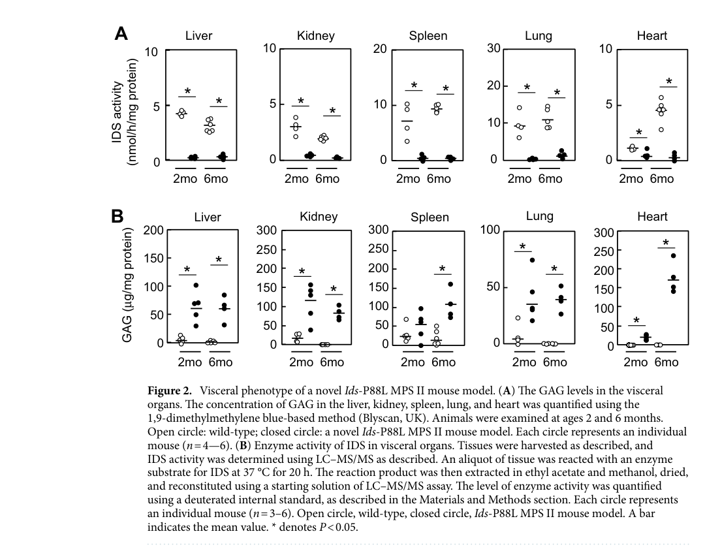

## Question

# Mechanistic Hypothesis Search

You are evaluating a specific disease mechanism hypothesis for the Disorder
Mechanisms Knowledge Base. This is not a general disease overview. Use the
hypothesis YAML below as the seed claim, then search for evidence that supports,
refutes, qualifies, or competes with this hypothesis.

## Target Disease
- **Disease Name:** Hunter syndrome
- **Category:** Mendelian

## Target Hypothesis
- **Hypothesis ID:** canonical_ids_deficiency_gag_lysosomal_storage_model
- **Hypothesis Label:** Canonical IDS Deficiency / Glycosaminoglycan Lysosomal Storage Model
- **Status in KB:** CANONICAL

## Seed Hypothesis YAML

```yaml
hypothesis_group_id: canonical_ids_deficiency_gag_lysosomal_storage_model
hypothesis_label: Canonical IDS Deficiency / Glycosaminoglycan Lysosomal Storage Model
status: CANONICAL
description: Mucopolysaccharidosis type II (Hunter syndrome) is an X-linked lysosomal storage disorder
  caused by loss-of-function variants in IDS encoding iduronate-2-sulfatase (I2S). Loss of I2S activity
  prevents lysosomal degradation of heparan sulfate and dermatan sulfate, producing pathological glycosaminoglycan
  accumulation in lysosomes of fibroblasts, hepatocytes, cardiomyocytes, chondrocytes, neurons, and other
  cell types. Substrate accumulation drives progressive coarsening of features, skeletal dysplasia (dysostosis
  multiplex), hepatosplenomegaly, cardiac valvular and myocardial disease, airway obstruction, and (in
  neuronopathic forms) progressive CNS regression. Enzyme replacement therapy (idursulfase) and intrathecal
  / CSF-delivered ERT, HSCT, and gene therapy (AAV-IDS) all corroborate the IDS-deficiency / GAG-accumulation
  axis as the canonical pathogenic mechanism.
evidence:
- reference: PMID:25345092
  reference_title: Hunter syndrome.
  supports: SUPPORT
  evidence_source: OTHER
  snippet: The disease is a X-linked condition affecting males and rarely females, clinically divided
    into severe (2/3) and attenuated types.
  explanation: |
    Existing canonical mechanism citation in the dismech knowledge base, used as the seed for the hypothesis-search deep-research run.
```

## Research Objective

Build a focused hypothesis-search report that answers:

1. What is the strongest direct evidence for this hypothesis?
2. What evidence argues against it, fails to reproduce it, or limits its scope?
3. Which claims are established, emerging, speculative, or contradicted?
4. Which patient subtypes, stages, tissues, cell types, molecular pathways, or
   biomarkers does the hypothesis best explain?
5. Which alternative or competing mechanistic hypotheses explain the same disease
   features better or more parsimoniously?
6. What are the explicit knowledge gaps: missing causal steps, unconfirmed edges,
   contradictory evidence, unknown source-to-target links, or source/data absences?
7. What experiments, cohorts, assays, datasets, or trials would most directly
   distinguish this hypothesis from alternatives?

Use primary literature whenever possible. Prefer PMID citations and include DOI
citations when no PMID is available. Treat reviews as orientation unless they
contain directly relevant synthesized evidence that should be clearly labeled as
review-level support.

## Required Output

### Executive Judgment

Give a concise verdict on the hypothesis as of the current literature:
supported, partially supported, unresolved, weakly supported, or refuted. Explain
the reasoning and the most important caveats.

### Evidence Matrix

Create a table with one row per important evidence item:

- Citation (PMID preferred)
- Evidence type (human clinical, model organism, in vitro, computational, review)
- Supports / refutes / qualifies / competing
- Mechanistic claim tested
- Key finding
- Disease subtype or context
- Confidence and limitations

### Mechanistic Causal Chain

Describe the causal chain implied by the hypothesis from upstream trigger to
clinical manifestation. Identify where the literature is strong, where the links
are inferred, and where there are missing causal steps.

### Knowledge Gaps

Identify explicit known unknowns surfaced by the search. Treat absence of
evidence as a curation-relevant finding only when the search actually checked for
it. Include:

- Unknown or weakly supported causal steps in the hypothesis
- Unconfirmed causal graph edges that need direct perturbation or longitudinal
  evidence
- Conflicting evidence, failed replications, or incompatible subtype-specific
  findings
- Unknown mechanism of action for relevant treatments, biomarkers, or
  interventions tied to this hypothesis
- Source-level or dataset-level absences, such as no relevant GenCC, ClinGen,
  trial, omics, or cohort evidence found as of the search date

For each gap, state the scope, why it matters, what was checked, and what
evidence or experiment would resolve it.

### Alternative Models

List competing or complementary hypotheses. For each, explain whether it is an
alternative to the seed hypothesis, a downstream consequence, an upstream cause,
or a parallel mechanism.

### Discriminating Tests

Recommend concrete studies or assays that would most efficiently test this
hypothesis against alternatives. Include patient stratification, biomarkers,
sample type, model system, perturbation, and expected result where applicable.

### Curation Leads

Provide candidate updates for the KB, but label these as leads requiring curator
verification. Include:

- candidate evidence references and exact abstract snippets to verify
- candidate pathophysiology nodes or edges
- candidate ontology terms for cell types and biological processes
- candidate subtype restrictions or status changes
- candidate `knowledge_gaps` or discussion prompts for unresolved causal claims,
  conflicting evidence, or explicit source/data absences

If the provider supports artifacts, produce artifact-friendly outputs such as an
evidence matrix, mechanistic diagram, knowledge-gap table, or comparison table.
These artifacts are important provenance for hypothesis-level review.


## Output

Question: You are an expert researcher providing comprehensive, well-cited information.

Provide detailed information focusing on:
1. Key concepts and definitions with current understanding
2. Recent developments and latest research (prioritize 2023-2024 sources)
3. Current applications and real-world implementations
4. Expert opinions and analysis from authoritative sources
5. Relevant statistics and data from recent studies

Format as a comprehensive research report with proper citations. Include URLs and publication dates where available.
Always prioritize recent, authoritative sources and provide specific citations for all major claims.

# Mechanistic Hypothesis Search

You are evaluating a specific disease mechanism hypothesis for the Disorder
Mechanisms Knowledge Base. This is not a general disease overview. Use the
hypothesis YAML below as the seed claim, then search for evidence that supports,
refutes, qualifies, or competes with this hypothesis.

## Target Disease
- **Disease Name:** Hunter syndrome
- **Category:** Mendelian

## Target Hypothesis
- **Hypothesis ID:** canonical_ids_deficiency_gag_lysosomal_storage_model
- **Hypothesis Label:** Canonical IDS Deficiency / Glycosaminoglycan Lysosomal Storage Model
- **Status in KB:** CANONICAL

## Seed Hypothesis YAML

```yaml
hypothesis_group_id: canonical_ids_deficiency_gag_lysosomal_storage_model
hypothesis_label: Canonical IDS Deficiency / Glycosaminoglycan Lysosomal Storage Model
status: CANONICAL
description: Mucopolysaccharidosis type II (Hunter syndrome) is an X-linked lysosomal storage disorder
  caused by loss-of-function variants in IDS encoding iduronate-2-sulfatase (I2S). Loss of I2S activity
  prevents lysosomal degradation of heparan sulfate and dermatan sulfate, producing pathological glycosaminoglycan
  accumulation in lysosomes of fibroblasts, hepatocytes, cardiomyocytes, chondrocytes, neurons, and other
  cell types. Substrate accumulation drives progressive coarsening of features, skeletal dysplasia (dysostosis
  multiplex), hepatosplenomegaly, cardiac valvular and myocardial disease, airway obstruction, and (in
  neuronopathic forms) progressive CNS regression. Enzyme replacement therapy (idursulfase) and intrathecal
  / CSF-delivered ERT, HSCT, and gene therapy (AAV-IDS) all corroborate the IDS-deficiency / GAG-accumulation
  axis as the canonical pathogenic mechanism.
evidence:
- reference: PMID:25345092
  reference_title: Hunter syndrome.
  supports: SUPPORT
  evidence_source: OTHER
  snippet: The disease is a X-linked condition affecting males and rarely females, clinically divided
    into severe (2/3) and attenuated types.
  explanation: |
    Existing canonical mechanism citation in the dismech knowledge base, used as the seed for the hypothesis-search deep-research run.
```

## Research Objective

Build a focused hypothesis-search report that answers:

1. What is the strongest direct evidence for this hypothesis?
2. What evidence argues against it, fails to reproduce it, or limits its scope?
3. Which claims are established, emerging, speculative, or contradicted?
4. Which patient subtypes, stages, tissues, cell types, molecular pathways, or
   biomarkers does the hypothesis best explain?
5. Which alternative or competing mechanistic hypotheses explain the same disease
   features better or more parsimoniously?
6. What are the explicit knowledge gaps: missing causal steps, unconfirmed edges,
   contradictory evidence, unknown source-to-target links, or source/data absences?
7. What experiments, cohorts, assays, datasets, or trials would most directly
   distinguish this hypothesis from alternatives?

Use primary literature whenever possible. Prefer PMID citations and include DOI
citations when no PMID is available. Treat reviews as orientation unless they
contain directly relevant synthesized evidence that should be clearly labeled as
review-level support.

## Required Output

### Executive Judgment

Give a concise verdict on the hypothesis as of the current literature:
supported, partially supported, unresolved, weakly supported, or refuted. Explain
the reasoning and the most important caveats.

### Evidence Matrix

Create a table with one row per important evidence item:

- Citation (PMID preferred)
- Evidence type (human clinical, model organism, in vitro, computational, review)
- Supports / refutes / qualifies / competing
- Mechanistic claim tested
- Key finding
- Disease subtype or context
- Confidence and limitations

### Mechanistic Causal Chain

Describe the causal chain implied by the hypothesis from upstream trigger to
clinical manifestation. Identify where the literature is strong, where the links
are inferred, and where there are missing causal steps.

### Knowledge Gaps

Identify explicit known unknowns surfaced by the search. Treat absence of
evidence as a curation-relevant finding only when the search actually checked for
it. Include:

- Unknown or weakly supported causal steps in the hypothesis
- Unconfirmed causal graph edges that need direct perturbation or longitudinal
  evidence
- Conflicting evidence, failed replications, or incompatible subtype-specific
  findings
- Unknown mechanism of action for relevant treatments, biomarkers, or
  interventions tied to this hypothesis
- Source-level or dataset-level absences, such as no relevant GenCC, ClinGen,
  trial, omics, or cohort evidence found as of the search date

For each gap, state the scope, why it matters, what was checked, and what
evidence or experiment would resolve it.

### Alternative Models

List competing or complementary hypotheses. For each, explain whether it is an
alternative to the seed hypothesis, a downstream consequence, an upstream cause,
or a parallel mechanism.

### Discriminating Tests

Recommend concrete studies or assays that would most efficiently test this
hypothesis against alternatives. Include patient stratification, biomarkers,
sample type, model system, perturbation, and expected result where applicable.

### Curation Leads

Provide candidate updates for the KB, but label these as leads requiring curator
verification. Include:

- candidate evidence references and exact abstract snippets to verify
- candidate pathophysiology nodes or edges
- candidate ontology terms for cell types and biological processes
- candidate subtype restrictions or status changes
- candidate `knowledge_gaps` or discussion prompts for unresolved causal claims,
  conflicting evidence, or explicit source/data absences

If the provider supports artifacts, produce artifact-friendly outputs such as an
evidence matrix, mechanistic diagram, knowledge-gap table, or comparison table.
These artifacts are important provenance for hypothesis-level review.


# Mechanistic Hypothesis Search Report (Hunter syndrome / MPS II)

**Target hypothesis:** *Canonical IDS Deficiency / Glycosaminoglycan (HS/DS) Lysosomal Storage Model* (hypothesis_group_id: `canonical_ids_deficiency_gag_lysosomal_storage_model`).

**Scope note:** This is a focused mechanism-evidence report, not a general disease overview. Evidence below emphasizes causal tests and mechanistic qualifiers, with priority to 2023–2024 sources where available.

---

## Executive Judgment

**Verdict (2026-05-24): supported (with important scope limits for neuronopathic disease).**

The core causal axis—**loss-of-function IDS → reduced iduronate-2-sulfatase (I2S) activity → impaired lysosomal catabolism of heparan sulfate (HS) and dermatan sulfate (DS) → intracellular GAG accumulation → multisystem dysfunction**—is strongly supported across: (i) human cell models, (ii) mouse models with pathogenic IDS variants showing reduced IDS activity and elevated GAGs, and (iii) therapeutic perturbations where restoring IDS reduces substrate biomarkers and improves somatic disease. (kobolak2019modellingtheneuropathology pages 1-2, mashima2023anovelmucopolysaccharidosis pages 1-2, mashima2023anovelmucopolysaccharidosis pages 4-5, zapolnik2021genetherapyfor pages 2-3)

The major caveat is CNS disease: **standard intravenous ERT does not cross the BBB sufficiently**, and therefore does not reliably reduce CSF HS or improve neurocognition; CNS benefit requires intrathecal/CSF delivery or BBB-penetrant designs, and even then clinical cognitive outcomes are heterogeneous and measurement-limited. (minami2022pathogenicrolesof pages 9-10, yee2023aposthoc pages 4-5, yee2023aposthoc pages 1-2)

A second caveat is mechanistic complexity beyond “storage alone,” especially in neuronopathic MPS II: **genotype–phenotype correlations are imperfect**, IDS activity may not predict neurological prognosis, and multiple downstream/parallel processes (proteostasis/ERAD, neuroinflammation, secondary lipid storage, oxidative stress/autophagy signaling) are plausibly contributory and may explain residual progression. (zanetti2024targetingneurologicalaspects pages 2-4, osaki2018shutdownoferassociated pages 8-10, zapolnik2021genetherapyfor pages 1-2)

---

## Key Concepts and Definitions (current understanding)

1. **Primary biochemical lesion (canonical):** IDS encodes iduronate-2-sulfatase, required for lysosomal degradation of HS and DS; deficiency leads to accumulation of these GAGs. (mashima2022physiologyandpathophysiology pages 14-16)

2. **Biomarker concepts:**
   - **Urinary GAGs**: peripheral substrate burden and treatment response marker (used routinely in ERT context). (zapolnik2021genetherapyfor pages 2-3)
   - **CSF HS**: CNS-relevant biomarker; CSF HS is elevated in neuronopathic disease and correlates with brain HS in MPS II mice; CSF HS reduction is used as a pharmacodynamic marker for BBB-penetrant therapies. (minami2022pathogenicrolesof pages 9-10)
   - **HS-derived non-reducing-end biomarker UA-HNAc(1S)**: reported as an MPS II–specific biomarker; elevated in Ids-P88L mice with predominant liver accumulation. (mashima2023anovelmucopolysaccharidosis pages 4-5, mashima2023anovelmucopolysaccharidosis pages 5-6)

3. **Neuronopathic vs non-neuronopathic MPS II:** historically dichotomized, but recent work supports a continuum; natural history shows multiple cognitive-trajectory subgroups even among boys on IV idursulfase. (muenzer2023neurodevelopmentalstatusand pages 1-2, muenzer2023neurodevelopmentalstatusand pages 6-8)

---

## Evidence Matrix (artifact)

| Evidence item (short name) | Citation (authors year journal) + PMID/DOI/URL | Publication date | Evidence type | Supports/refutes/qualifies/competes | Mechanistic claim tested | Key findings (include quantitative stats where available) | Disease context/subtype | Confidence & limitations |
|---|---|---|---|---|---|---|---|---|
| IDS deficiency causes multisystem GAG storage | Żuber et al. 2023 *Biomedicines*; DOI: 10.3390/biomedicines11061668; https://doi.org/10.3390/biomedicines11061668 | 2023-06 | Review-level human clinical orientation | Supports | IDS deficiency causes lysosomal accumulation of GAGs and multisystem disease | States MPS II is caused by IDS deficiency leading to GAG accumulation and progressive lysosomal storage in liver, spleen, heart, bones, joints, and respiratory tract, disturbing cellular function and causing multisystem manifestations (mashima2022physiologyandpathophysiology pages 14-16) | General MPS II | Moderate confidence; review-level synthesis rather than primary experiment in excerpt (mashima2022physiologyandpathophysiology pages 14-16) |
| HS as primary CNS storage biomarker | Minami et al. 2022 *Int J Mol Sci*; DOI: 10.3390/ijms231911724; https://doi.org/10.3390/ijms231911724 | 2022-10 | Review-level human + model synthesis | Supports / qualifies | HS is the primary storage material driving CNS pathology; CSF HS reflects brain storage | Reports HS is primary storage material in MPS II; CSF HS is higher in severe vs attenuated MPS II; in MPS II mice CSF HS closely correlates with brain HS; BBB-penetrant pabinafusp alfa reduced CSF HS and was associated with neurocognitive benefits, whereas conventional idursulfase did not lower CSF HS or improve neurocognition (minami2022pathogenicrolesof pages 9-10) | Severe vs attenuated; CNS disease | Moderate confidence; excerpt summarizes prior work and notes heterogeneity limits single-timepoint severity prediction (minami2022pathogenicrolesof pages 9-10) |
| iPSC neuronal model of lysosomal pathology | Kobolák et al. 2019 *Experimental Cell Research*; DOI: 10.1016/j.yexcr.2019.04.021; https://doi.org/10.1016/j.yexcr.2019.04.021 | 2019-07 | In vitro | Supports | IDS deficiency directly causes GAG accumulation and lysosomal/neuronal-cell pathology | Patient-derived iPSCs confirmed by IDS enzyme and GAG assays; neuronal differentiation showed decreased NPC self-renewal, ER/Golgi alterations, storage vacuoles, increased apoptosis, especially in GFAP+ astrocytes with increased LAMP2; mouse IDS knockout similarly showed altered NSC self-renewal and robust lysosomal organelle accumulation (kobolak2019modellingtheneuropathology pages 1-2) | Neuronopathic/CNS-focused MPS II | High confidence for cellular phenotype; limited direct clinical linkage and therapeutic data in excerpt (kobolak2019modellingtheneuropathology pages 1-2) |
| Ids-P88L mouse reproduces storage phenotype | Mashima et al. 2023 *Scientific Reports*; DOI: 10.1038/s41598-023-34541-w; https://doi.org/10.1038/s41598-023-34541-w | 2023-05 | Model organism | Supports | IDS loss in vivo reduces enzyme activity and elevates GAGs/systemic biomarkers | Ids-P88L mice had significantly impaired IDS activity in blood and organs (liver, kidney, spleen, lung, heart), short lifespan, elevated GAGs, and significant accumulation of the HS-derived biomarker UA-HNAc(1S) in liver suggesting predominant hepatic formation (mashima2023anovelmucopolysaccharidosis pages 1-2, mashima2023anovelmucopolysaccharidosis pages 4-5, mashima2023anovelmucopolysaccharidosis media 299a5f27) | Mouse model analogous to common severe human P86L mutation | High confidence for model phenotype; many values excerpted qualitatively rather than full numerical detail (mashima2023anovelmucopolysaccharidosis pages 1-2, mashima2023anovelmucopolysaccharidosis media 299a5f27) |
| Genome editing gives partial biochemical rescue | Mashima et al. 2023 *Scientific Reports*; DOI: 10.1038/s41598-023-34541-w; https://doi.org/10.1038/s41598-023-34541-w | 2023-05 | Model organism | Supports / qualifies | Restoring IDS should reduce biochemical defect; current editing approach gives only marginal rescue | Cas9/gRNA/ssODN treatment increased blood IDS activity from 0.04 ± 0.03 to 0.23 ± 0.07 μmol/h/L (n=4/group), estimated as 4.2% of normal; effect described as marginal despite statistically significant increase (mashima2023anovelmucopolysaccharidosis pages 4-5, mashima2023anovelmucopolysaccharidosis pages 5-6, mashima2023anovelmucopolysaccharidosis media 299a5f27) | MPS II mouse; early genome editing proof-of-concept | Moderate confidence; biochemical rescue small and no strong phenotypic correction shown in excerpt (mashima2023anovelmucopolysaccharidosis pages 4-5, mashima2023anovelmucopolysaccharidosis pages 5-6) |
| Oxidative stress and lysosomal enlargement downstream | Jacques et al. 2023 *Metabolic Brain Disease*; DOI: 10.1007/s11011-022-01062-w; https://doi.org/10.1007/s11011-022-01062-w | 2023-08 | In vitro | Qualifies | IDS deficiency/GAG storage is accompanied by downstream oxidative stress, DNA damage, and lysosomal changes | IDS-deficient HEK293 KO cells showed increased DCF-reactive species, increased SOD and CAT activity, increased lysosomal volume, and increased DNA damage; mitochondrial superoxide showed no significant change and overall mitochondrial dysfunction was not clearly demonstrated; genistein lowered ROS, CoQ10 (10 μM) lowered DNA damage, but neither changed lysosomal volume (jacques2023evaluationofoxidative pages 6-9, jacques2023evaluationofoxidative pages 4-6, jacques2023evaluationofoxidative pages 9-10, jacques2023evaluationofoxidative pages 1-3) | Cellular MPS II model | High confidence for downstream stress phenotype in vitro; causality from GAG storage inferred, not directly dissected; mixed mitochondrial findings (jacques2023evaluationofoxidative pages 9-10, jacques2023evaluationofoxidative pages 1-3) |
| ERAD/proteostasis as upstream modifier | Osaki et al. 2018 *Cell Death & Disease*; DOI: 10.1038/s41419-018-0871-8; https://doi.org/10.1038/s41419-018-0871-8 | 2018-07 | In vitro | Qualifies | Some IDS mutant loss-of-function is caused by ER retention and ERAD before lysosomal deficiency manifests | Mutant IDS proteins accumulated in ER, failed maturation to ~55 kDa lysosomal form, were ubiquitinated by HRD1 and degraded by proteasome; MG132 increased precursor mutants; HRD1 knockdown caused A85T mutant to move from ER to lysosome with partial recovery of activity; severe R468Q was not rescued (osaki2018shutdownoferassociated pages 8-10, osaki2018shutdownoferassociated pages 2-3, osaki2018shutdownoferassociated pages 1-2, osaki2018shutdownoferassociated pages 6-7) | Attenuated A85T vs severe R468Q mutant IDS | High confidence for variant-specific proteostasis mechanism; cell-based and not a refutation of storage model, rather an upstream modifier (osaki2018shutdownoferassociated pages 8-10, osaki2018shutdownoferassociated pages 6-7) |
| Lysosomal quality control of nonsense mutants | Marazza et al. 2020 *DNA and Cell Biology*; DOI: 10.1089/dna.2019.5221; https://doi.org/10.1089/dna.2019.5221 | 2020-02 | In vitro | Qualifies | Loss of IDS function can arise via ER quality control or distal lysosomal quality control depending on mutation | All forms had catalytic Cys84 formylation; W337X was ER-retained and cleared by ERAD, while R443X/Y452X/L482X passed ER quality control, reached LAMP1+ lysosomes, but were rapidly degraded in lysosomal lumen and had no detectable activity; Bafilomycin A1 preserved truncated species transiently (marazza2020endoplasmicreticulumand pages 1-3, marazza2020endoplasmicreticulumand pages 7-8) | IDS nonsense/truncation mutants linked to mild-severe disease | High confidence for variant-specific trafficking/clearance; in vitro only, no direct patient outcome data in excerpt (marazza2020endoplasmicreticulumand pages 1-3, marazza2020endoplasmicreticulumand pages 7-8) |
| IV ERT improves somatic but not CNS disease | Zapolnik & Pyrkosz 2021 *Int J Mol Sci*; DOI: 10.3390/ijms22115490; https://doi.org/10.3390/ijms22115490 | 2021-05 | Review-level human + preclinical synthesis | Supports / qualifies | Replacing IDS reduces peripheral substrate burden, but BBB limits CNS rescue | Intravenous idursulfase lowers urinary GAGs, organomegaly, and improves some physical/cardiac/bone outcomes; standard enzyme cannot cross BBB sufficiently, explaining poor CNS efficacy; preclinical enzyme delivery reduced brain/systemic GAGs, improved memory/learning, and reduced vacuolization/LAMP2 (zapolnik2021genetherapyfor pages 2-3) | Somatic MPS II; severe CNS disease remains problematic | Moderate confidence; excerpt synthesizes multiple studies rather than giving single primary trial details (zapolnik2021genetherapyfor pages 2-3) |
| Intrathecal idursulfase cognitive signal | Yee et al. 2023 *Orphanet J Rare Dis*; DOI: 10.1186/s13023-023-02957-2; https://doi.org/10.1186/s13023-023-02957-2 | 2023-11 | Human clinical | Supports / qualifies | Direct CNS IDS delivery may slow cognitive decline in neuronopathic MPS II | In phase 2/3 RCT + extension, 72.4% of early idursulfase-IT recipients had above-average/average cognitive growth at 1 year vs 53.3% without idursulfase-IT; deteriorating cognition 6.9% vs 20.0%. In children <6 years, 76% vs 50% had above-average/average growth and 4% vs 17% deteriorated; 1-year distribution significant in <6 group (p=0.048). By 2 years groups were more similar once both received treatment (yee2023aposthoc pages 1-2, yee2023aposthoc pages 6-8, yee2023aposthoc pages 8-9) | Neuronopathic MPS II, especially younger children | Moderate confidence; primary endpoint reportedly not met overall, PRAS was post hoc, and excerpt lacks CSF biomarker results (yee2023aposthoc pages 2-4, yee2023aposthoc pages 8-9) |
| Clinician-rated benefit during idursulfase-IT | Yee et al. 2024 *Orphanet J Rare Dis*; DOI: 10.1186/s13023-024-03147-4; https://doi.org/10.1186/s13023-024-03147-4 | 2024-04 | Human clinical | Supports / qualifies | Intrathecal IDS may stabilize expected neurocognitive decline | In qualitative investigator assessment of 56 extension patients, 49/56 (88%) were rated improved/improving, stabilized, or slowing progression vs expected untreated decline; among ages 3 to <6 years, 33/39 (85%) rated similarly. All improved/improving ratings occurred in those treated from the start; 5/7 of poorer-outcome patients had non-missense variants (yee2024clinicalinvestigatorperspectives pages 1-3) | Neuronopathic MPS II | Moderate confidence; qualitative and nonblinded interpretive ratings, not direct biomarker evidence (yee2024clinicalinvestigatorperspectives pages 1-3) |
| Natural-history heterogeneity despite IV ERT | Muenzer et al. 2023 *Orphanet J Rare Dis*; DOI: 10.1186/s13023-023-02805-3; https://doi.org/10.1186/s13023-023-02805-3 | 2023-11 | Human clinical | Qualifies | Canonical IDS/GAG model explains disease broadly but not all variability in cognitive trajectory under IV ERT | In 55 boys on IV idursulfase, mean baseline DAS-II GCA 78.4 and VABS-II ABC 83.7; over 24 months changes were modest on average (DAS-II GCA −3.8 [SD 12.7], VABS-II ABC −2.0 [SD 8.07]) but four subgroups were inferred: rapid decline, early impairment then stabilization, mild impairment then stabilization, and stable/no impairment. Younger children and those with baseline GCA ≤70 trended to greater decline; null variants were enriched among discontinuers/severe cases (muenzer2023neurodevelopmentalstatusand pages 6-8, muenzer2023neurodevelopmentalstatusand pages 1-2, muenzer2023neurodevelopmentalstatusand pages 5-6) | Mixed MPS II cohort, all on IV ERT; neuronopathic vs non-neuronopathic heterogeneity | High confidence for heterogeneity; limited by attrition, exclusion of most severe low-GCA patients, and selection bias from transfer into intrathecal trial (muenzer2023neurodevelopmentalstatusand pages 16-17, muenzer2023neurodevelopmentalstatusand pages 3-5) |
| BBB-crossing JR-141/pabinafusp alfa program | ClinicalTrials.gov NCT03128593, JCR Pharmaceuticals; https://clinicaltrials.gov/study/NCT03128593 | 2017-03-30 start; completed 2017-10-04 | Registry | Supports | BBB-penetrant IDS delivery is designed to test whether CNS substrate reduction is achievable | Phase 1/2 open-label sequential IV JR-141 study, 14 participants; doses 0.01–2.0 mg/kg/week. Outcomes included safety, PK, urinary/serum HS/DS, CSF HS/DS, JR-141 in CSF, urinary total GAG, organ volumes, and cardiac function; required prior idursulfase and lumbar puncture capability (NCT03128593 chunk 1) | MPS II patients on prior ERT; CNS biomarker-capable cohort | Moderate confidence; registry design/endpoint information only, no efficacy results in excerpt (NCT03128593 chunk 1) |
| DNL310 head-to-head BBB-penetrant ERT trial | ClinicalTrials.gov NCT05371613, Denali Therapeutics; https://clinicaltrials.gov/study/NCT05371613 | 2022 registry record | Registry | Supports | Trial framework directly compares BBB-penetrant IDS fusion versus standard idursulfase in nMPS II and nnMPS II | Registry identifies study comparing tividenofusp alfa (DNL310) vs idursulfase in pediatric and young adult participants with neuronopathic and non-neuronopathic MPS II; excerpt confirms disease subgroups and comparator but does not include endpoints in available chunk (NCT05371613 chunk 3) | nMPS II and nnMPS II | Low-moderate confidence from partial registry excerpt only; limited outcome/endpoint detail available (NCT05371613 chunk 3) |
| RGX-121 CNS gene therapy program | ClinicalTrials.gov NCT03566043, REGENXBIO; https://clinicaltrials.gov/study/NCT03566043 | 2018 registry record | Registry | Supports | CNS-directed AAV9 IDS gene therapy tests whether restoring IDS in CNS lowers CSF GAGs and improves neurodevelopment | Phase I/II/III open-label multicenter study; up to 48 pediatric neuronopathic subjects; one-time AAV9 IDS dose. Primary outcomes include treatment-related AEs plus CSF GAG levels (D2S6) and neurodevelopmental measures at 52 and 104 weeks. Explicit rationale notes standard idursulfase does not cross BBB (NCT03566043 chunk 1, NCT03566043 chunk 2) | Pediatric neuronopathic MPS II | Moderate confidence for mechanistic intent; registry only, no reported outcomes in excerpt (NCT03566043 chunk 1, NCT03566043 chunk 2) |
| RGX-121 older-children study | ClinicalTrials.gov NCT04571970, REGENXBIO; https://clinicaltrials.gov/study/NCT04571970 | 2021 registry record | Registry | Supports | CNS gene replacement is being tested in older severe/neuronopathic patients using biomarkers and developmental outcomes | Phase I/II open-label single-arm study in ~6 male children ≥5 to <18 years with severe/neuronopathic MPS II; single intracisternal/ICV AAV9-IDS dose 6.5 × 10^10 GC/g brain mass; outcomes include safety, glycosaminoglycan levels, IDS activity, and neurodevelopment through Week 104 (NCT04571970 chunk 1) | Severe/neuronopathic MPS II, older children | Moderate confidence; registry-only evidence and very small planned enrollment (NCT04571970 chunk 1) |


*Table: This table summarizes the key supporting and qualifying evidence for the canonical IDS deficiency / GAG lysosomal storage model in Hunter syndrome, spanning human studies, cell and animal models, and clinical trial registries. It is useful for quickly separating well-supported core causal links from important scope limits such as BBB restriction, genotype-specific proteostasis effects, and downstream secondary mechanisms.*

---

## Strongest Direct Evidence for the Hypothesis

### 1) Model organism: IDS variant causes low IDS activity and high GAGs in vivo (2023)

Mashima et al. generated **Ids-P88L** mice (analogous to human **IDS-P86L**, a common severe mutation) and showed **markedly impaired IDS activity** in blood and organs and **elevated total GAGs** across multiple visceral tissues. (mashima2023anovelmucopolysaccharidosis pages 1-2, mashima2023anovelmucopolysaccharidosis pages 4-5)

They further quantified an HS-derived biomarker (UA-HNAc(1S)) in visceral organs, and demonstrated **elevation of UA-HNAc(1S)** species with age/tissue analyses, supporting a substrate-derived mechanistic readout beyond total GAG. (mashima2023anovelmucopolysaccharidosis pages 5-6)

**Visual provenance (figures):** key plots for IDS activity, organ GAGs, UA-HNAc(1S), and genome-editing effects were retrieved from the paper’s figures. (mashima2023anovelmucopolysaccharidosis media 299a5f27, mashima2023anovelmucopolysaccharidosis media cf4e0a95, mashima2023anovelmucopolysaccharidosis media a13e7370)

### 2) Human disease models: patient-derived iPSC neural lineages show storage-associated pathology

Kobolák et al. report MPS II patient-derived iPSCs confirmed by **IDS enzyme and GAG assays**, and neuronal differentiation shows **storage vacuoles**, increased lysosomal marker **LAMP2**, ER/Golgi alterations, and increased apoptosis (notably in GFAP+ astrocytes), supporting a direct cellular pathology chain downstream of IDS deficiency in neural contexts. (kobolak2019modellingtheneuropathology pages 1-2)

### 3) Therapeutic perturbation logic: restoring enzyme reduces substrate biomarkers and improves disease features

Multiple sources summarize that systemic recombinant IDS (idursulfase) reduces urinary GAGs and somatic features, supporting the necessity of the IDS→GAG axis for peripheral manifestations, while CNS outcomes require CNS access. (zapolnik2021genetherapyfor pages 2-3, minami2022pathogenicrolesof pages 9-10)

---

## Evidence that Qualifies, Limits, or Competes with the Canonical Model

### A) BBB limitation is a decisive scope boundary for CNS causality

Standard IV idursulfase **fails to reduce CSF HS** and provides **no neurocognitive benefit** in MPS II, consistent with insufficient BBB crossing. This is a key limitation of “restore IDS in blood” as a mechanistic test for CNS disease. (minami2022pathogenicrolesof pages 9-10)

### B) Variant-specific proteostasis mechanisms modify “IDS deficiency” upstream of storage

Osaki et al. demonstrate that disease-linked IDS mutants can be retained in the ER and cleared by **ER-associated degradation (ERAD)**, and that inhibiting ERAD components can partially rescue an attenuated mutant (A85T) but not a severe mutant (R468Q). This qualifies the hypothesis by adding an upstream mechanistic layer: for some genotypes, deficient lysosomal IDS arises from proteostasis/trafficking failure as much as from catalytic incompetence. (osaki2018shutdownoferassociated pages 8-10, osaki2018shutdownoferassociated pages 6-7)

Marazza et al. show nonsense/truncation mutants may pass ER quality control yet be rapidly degraded by **lysosomal quality control**, emphasizing distal checkpoints for lysosomal enzyme “fitness.” (marazza2020endoplasmicreticulumand pages 1-3, marazza2020endoplasmicreticulumand pages 7-8)

### C) CNS progression likely involves secondary/parallel processes beyond HS/DS bulk storage

A 2024 authoritative synthesis explicitly states the **IDS/GAG model alone may be insufficient to explain neuronopathic drift**, pointing to poor genotype–phenotype correlation and additional secondary alterations. (zanetti2024targetingneurologicalaspects pages 2-4)

Proposed competing/complementary mechanisms include:
- **Neuroinflammation and microglial activation** (including microgliosis/astrocytosis in animal models). (mashima2022physiologyandpathophysiology pages 14-16)
- **TLR4-mediated inflammatory activation** by partially degraded GAGs (LPS-mimic hypothesis), with cytokine signaling. (zapolnik2021genetherapyfor pages 1-2)
- **Secondary lipid storage** (gangliosides) in CNS, suggested to follow HS accumulation and contribute to neurodegeneration. (zapolnik2021genetherapyfor pages 1-2, zanetti2024targetingneurologicalaspects pages 2-4)
- **Oxidative stress / DNA damage and lysosomal enlargement** in IDS-deficient cellular models, with partial modulation by genistein or CoQ10; mitochondrial dysfunction evidence is mixed, supporting these as downstream amplifiers rather than replacements of the storage model. (jacques2023evaluationofoxidative pages 9-10, jacques2023evaluationofoxidative pages 1-3)

### D) Clinical heterogeneity limits one-to-one biomarker → phenotype mapping

Natural history in boys on IV idursulfase shows **multiple cognitive trajectory subgroups** and strong inter-individual variability, consistent with modifier factors beyond peripheral GAG reduction. (muenzer2023neurodevelopmentalstatusand pages 1-2, muenzer2023neurodevelopmentalstatusand pages 6-8)

---

## Recent Developments (prioritizing 2023–2024)

### 1) 2023: New Ids-P88L mouse model and genome editing proof-of-concept

Mashima et al. (2023) provide an updated in vivo platform for mechanistic and therapeutic testing; their nuclease-mediated correction experiment produced a **small biochemical rescue** of blood IDS activity (0.04 ± 0.03 to 0.23 ± 0.07 μmol/h/L; estimated 4.2% activity), supporting feasibility but emphasizing the current gap between partial biochemical correction and durable phenotype rescue. (mashima2023anovelmucopolysaccharidosis pages 4-5, mashima2023anovelmucopolysaccharidosis pages 5-6)

### 2) 2023–2024: Intrathecal idursulfase-IT clinical signals and assessment challenges

A post hoc analysis of the phase 2/3 trial and extension (NCT02055118 / NCT02412787) suggests that at 1 year, **deteriorating cognitive functioning occurred less often** with early idursulfase-IT (6.9%) versus no idursulfase-IT (20.0%), with a stronger signal in children <6 years (4% vs 17%; distribution difference p=0.048). However, at 2 years distributions were more similar once both groups received idursulfase-IT. (yee2023aposthoc pages 1-2, yee2023aposthoc pages 6-8)

A 2024 qualitative investigator interview study reported that **49/56 (88%)** extension participants were judged improved/improving, stabilized, or slowing progression versus expected decline; worse ratings were enriched in non-missense variants. (yee2024clinicalinvestigatorperspectives pages 1-3)

### 3) 2024: CSF HS biomarker positioning and threshold proposal

A 2024 position statement concludes CSF HS is predominantly brain-derived and can differentiate phenotypes, with a **preliminary threshold ~4,000 ng/mL** (method-dependent, requiring harmonization) proposed to separate neuronopathic from attenuated MPS II and to monitor BBB-penetrant treatments. (giugliani2024heparansulfatein pages 2-4)

### 4) 2024: Explicit critique of storage-only sufficiency for CNS disease

Zanetti & Tomanin (2024) explicitly state the IDS/GAG model does not seem sufficient to explain neuronopathic drift, highlighting poor genotype–phenotype correlation and noting secondary lipid storage, autophagy/mitophagy disturbance, and oxidative stress/mitochondrial impairment signatures in MPS II mouse brain as candidate contributors. (zanetti2024targetingneurologicalaspects pages 2-4)

---

## Current Applications and Real-World Implementations

1. **Standard of care (peripheral):** Weekly IV idursulfase has longstanding real-world use for somatic disease; it reduces peripheral substrate burden but is mechanistically limited for CNS by BBB impermeability. (zapolnik2021genetherapyfor pages 2-3, minami2022pathogenicrolesof pages 9-10)

2. **CNS-targeted enzyme delivery:** Intrathecal idursulfase-IT has been tested in controlled trial and extension settings with mixed outcomes and considerable measurement challenges; it directly operationalizes the mechanistic claim that CNS substrate reduction requires CNS delivery. (yee2023aposthoc pages 2-4, yee2023aposthoc pages 1-2)

3. **BBB-penetrant ERT and biomarker-led monitoring:** BBB-penetrant IDS fusions (e.g., transferrin receptor targeting) use CSF HS reduction as a pharmacodynamic biomarker with emerging clinical evidence of neurocognitive stabilization/benefit in many participants. (minami2022pathogenicrolesof pages 9-10, giugliani2024heparansulfatein pages 2-4)

4. **Pipeline implementations (gene therapy, BBB shuttles):** Multiple late-stage trials exist using CNS biomarkers (CSF GAGs) and neurodevelopment endpoints, demonstrating real-world mechanistic testing at scale; see trial registry evidence below. (NCT03566043 chunk 1, NCT03566043 chunk 2)

---

## Relevant Statistics and Data (recent studies)

### A) Cognitive heterogeneity on IV ERT (natural history)

In a 24-month observational cohort of 55 boys (all on IV idursulfase), baseline mean (SD) DAS-II GCA was **78.4 (19.11)** and mean VABS-II ABC **83.7 (14.22)**; mean changes over 24 months were modest (DAS-II GCA **−3.8 [12.7]**, VABS-II ABC **−2.0 [8.07]**) but with substantial individual variability and suggested four trajectory subgroups. (muenzer2023neurodevelopmentalstatusand pages 1-2)

### B) Intrathecal idursulfase-IT cognitive category differences (post hoc, 2023)

At 1 year in the RCT, **72.4%** initiating idursulfase-IT had above-average/average cognitive growth versus **53.3%** without; deteriorating cognitive functioning **6.9% vs 20.0%**. In <6 years baseline subgroup, above-average/average **76% vs 50%**, deteriorating **4% vs 17%** (p=0.048 for distribution). (yee2023aposthoc pages 1-2)

### C) Genome editing in mouse model yields partial biochemical restoration

In Ids-P88L mice, blood IDS activity increased from **0.04 ± 0.03** to **0.23 ± 0.07 μmol/h/L** by day 7 after Cas9/gRNA/ssODN treatment (n=4/group), estimated as **4.2%** activity. (mashima2023anovelmucopolysaccharidosis pages 4-5)

### D) CSF HS threshold proposal (biomarker)

A method-dependent CSF HS threshold near **4,000 ng/mL** is proposed as a preliminary discriminator between neuronopathic and non-neuronopathic phenotypes and as a monitoring target for BBB-penetrant treatments. (giugliani2024heparansulfatein pages 2-4)

---

## Mechanistic Causal Chain (artifact)

> **Strongly supported:** Pathogenic IDS loss-of-function lowers/abolishes iduronate-2-sulfatase activity, blocking lysosomal degradation of heparan sulfate (HS) and dermatan sulfate (DS); this causes intracellular GAG accumulation in patient-derived cells, mouse models, and human disease, with elevated urinary GAGs as a peripheral biomarker and elevated CSF HS as a CNS biomarker (minami2022pathogenicrolesof pages 9-10, kobolak2019modellingtheneuropathology pages 1-2, mashima2023anovelmucopolysaccharidosis pages 1-2, mashima2023anovelmucopolysaccharidosis pages 4-5, zapolnik2021genetherapyfor pages 2-3).
>
> **Strongly supported:** GAG storage is linked to lysosomal pathology and multisystem somatic disease. IDS-deficient neural/iPSC models show storage vacuoles, increased LAMP2, ER/Golgi abnormalities, and apoptosis; Ids-P88L mice show markedly reduced IDS activity and increased GAGs across liver, kidney, spleen, lung, and heart; systemic ERT lowers urinary GAGs and improves hepatosplenomegaly/endurance and some somatic features, supporting a causal storage axis for peripheral disease (kobolak2019modellingtheneuropathology pages 1-2, mashima2023anovelmucopolysaccharidosis pages 1-2, mashima2023anovelmucopolysaccharidosis pages 4-5, zapolnik2021genetherapyfor pages 2-3).
>
> **Strongly supported:** CNS and somatic disease diverge because standard intravenous idursulfase does not adequately cross the blood-brain barrier. Accordingly, IV ERT improves peripheral biomarkers/phenotypes but fails to reduce CSF HS or provide clear neurocognitive benefit, whereas CNS-directed or BBB-penetrant approaches reduce CSF HS and show signals of neurocognitive stabilization/benefit (intrathecal idursulfase-IT; pabinafusp alfa/JR-141) (minami2022pathogenicrolesof pages 9-10, yee2023aposthoc pages 4-5, yee2023aposthoc pages 1-2, yee2024clinicalinvestigatorperspectives pages 1-3, giugliani2024heparansulfatein pages 2-4).
>
> **Strongly supported biomarker chain:** Urinary GAGs track peripheral substrate burden and response to systemic ERT; CSF HS tracks brain HS/CNS disease better than peripheral markers and may help distinguish neuronopathic from attenuated disease, with a preliminary method-dependent threshold near **4,000 ng/mL** proposed in recent expert guidance; in the 2023 Ids-P88L mouse, the HS-derived non-reducing-end biomarker **UA-HNAc(1S)** is elevated, especially in liver, supporting substrate-specific biochemical readouts beyond total GAGs (minami2022pathogenicrolesof pages 9-10, mashima2023anovelmucopolysaccharidosis pages 4-5, mashima2023anovelmucopolysaccharidosis pages 5-6, zapolnik2021genetherapyfor pages 2-3, giugliani2024heparansulfatein pages 2-4).
>
> **Qualified / upstream modifier:** The canonical storage model explains the proximal biochemical lesion, but variant-specific proteostasis can determine how IDS deficiency arises. Some IDS mutants are retained in the ER and cleared by ER-associated degradation (ERAD), while others pass ER quality control but fail lysosomal quality control; partial rescue of selected attenuated mutants by HRD1/ERdj3 inhibition shows that proteostasis sits upstream of lysosomal substrate storage for some genotypes rather than competing with it (osaki2018shutdownoferassociated pages 8-10, marazza2020endoplasmicreticulumand pages 1-3, marazza2020endoplasmicreticulumand pages 7-8, osaki2018shutdownoferassociated pages 2-3, osaki2018shutdownoferassociated pages 6-7).
>
> **Inferred / moderate support downstream:** Secondary neuroinflammation likely amplifies CNS injury after HS accumulation. Reported mechanisms include microgliosis/astrocytosis, possible TLR4 activation by partially degraded GAGs, and cytokine signaling; these are repeatedly cited but are less directly established as necessary causal mediators than the primary IDS→GAG storage link (zapolnik2021genetherapyfor pages 1-2, mashima2022physiologyandpathophysiology pages 14-16).
>
> **Inferred / moderate support downstream:** Secondary lipid storage and broader lysosomal stress may contribute to neuronopathic progression. Reviews and recent synthesis describe HS-linked accumulation of gangliosides (GM2/GM3, GD3), BMP, and glucosylceramides, with suggestions that the simple IDS/GAG model alone may be insufficient to explain neuronopathic drift, especially because IDS activity and genotype correlate imperfectly with neurological outcome (zapolnik2021genetherapyfor pages 1-2, zanetti2024targetingneurologicalaspects pages 2-4).
>
> **Inferred / mixed evidence downstream:** Oxidative stress/DNA damage are present in IDS-deficient cell models, with increased ROS, antioxidant enzyme activity, lysosomal volume, and DNA damage, and partial modulation by genistein or CoQ10; however, mitochondrial dysfunction per se is not consistently demonstrated, so oxidative stress is better viewed as a downstream consequence or parallel amplifier than as a replacement for the storage model (jacques2023evaluationofoxidative pages 6-9, jacques2023evaluationofoxidative pages 4-6, jacques2023evaluationofoxidative pages 9-10, jacques2023evaluationofoxidative pages 1-3).
>
> **Current synthesis:** The best-supported causal chain is **IDS loss-of-function → impaired HS/DS lysosomal catabolism → lysosomal substrate accumulation → cellular/organ dysfunction → somatic disease, with CNS severity determined additionally by BBB access and likely modified by secondary inflammatory, lipid, and stress pathways**. The most weakly resolved steps are the exact source-to-target links from HS/DS storage to neuronopathic decline and the relative importance of downstream secondary mechanisms across genotypes and ages (minami2022pathogenicrolesof pages 9-10, kobolak2019modellingtheneuropathology pages 1-2, yee2023aposthoc pages 4-5, muenzer2023neurodevelopmentalstatusand pages 1-2, zanetti2024targetingneurologicalaspects pages 2-4).


*Blockquote: This blockquote summarizes the current evidence-based causal chain for the canonical IDS deficiency and HS/DS lysosomal storage model in Hunter syndrome. It distinguishes strongly supported links from weaker downstream inferences and highlights the most useful peripheral and CNS biomarkers.*

---

## Alternative or Complementary Mechanistic Models

These are not necessarily alternatives to the upstream IDS deficiency, but mechanisms that may better explain specific phenotypes (especially neuronopathic progression) or act in parallel.

1. **Proteostasis/trafficking failure model (upstream modifier of “IDS deficiency”):** IDS mutations cause ER retention and ERAD-mediated proteasomal degradation (or distal lysosomal quality control) so that insufficient enzyme reaches lysosomes; partial rescue by ERAD inhibition is mutation-specific. This model complements the canonical storage axis by explaining why some variants yield little lysosomal enzyme despite potential catalytic competence. (osaki2018shutdownoferassociated pages 8-10, marazza2020endoplasmicreticulumand pages 1-3, osaki2018shutdownoferassociated pages 6-7)

2. **Neuroinflammation amplification model:** HS/partially degraded GAGs trigger microglial activation, astrocytosis, and cytokine cascades (potentially via TLR4 activation), contributing to neuronal injury and symptom progression beyond what bulk storage predicts. (zapolnik2021genetherapyfor pages 1-2, mashima2022physiologyandpathophysiology pages 14-16)

3. **Secondary lipid storage / lysosomal network failure:** HS accumulation perturbs lysosomal function leading to secondary lipid/ganglioside accumulation and broader lysosomal stress responses, which may correlate better with neuronopathic decline than total GAG alone. (zapolnik2021genetherapyfor pages 1-2, zanetti2024targetingneurologicalaspects pages 2-4)

4. **Oxidative stress / DNA damage as downstream toxicity:** IDS deficiency in cell models associates with elevated ROS, antioxidant response, increased lysosomal volume, and DNA damage; may represent downstream injury pathways targetable for adjunctive therapy. (jacques2023evaluationofoxidative pages 9-10, jacques2023evaluationofoxidative pages 1-3)

5. **Developmental signaling perturbation (e.g., FGF pathway):** Proposed as contributing to skeletal manifestations; could represent either downstream consequence of altered HS (as signaling cofactor) or parallel effects of disrupted HS homeostasis. (zapolnik2021genetherapyfor pages 1-2)

---

## Knowledge Gaps (explicit, evidence-checked)

1. **CNS causal steps from HS storage to neurocognitive decline remain incompletely resolved.**
   - *Why it matters:* Storage reduction in CSF is increasingly used as a surrogate endpoint; causal validity depends on linking HS reduction to neuronal outcome.
   - *What was checked:* Recent synthesis explicitly stating insufficiency of the IDS/GAG model for neuronopathic drift and listing candidate secondary processes. (zanetti2024targetingneurologicalaspects pages 2-4)
   - *Needed evidence:* Longitudinal studies correlating within-patient CSF HS trajectories with validated cognitive outcomes, ideally across therapeutic modalities (intrathecal vs BBB-penetrant vs gene therapy) and genotypes. (zanetti2024targetingneurologicalaspects pages 2-4, giugliani2024heparansulfatein pages 2-4)

2. **Heterogeneity and poor genotype–phenotype correlation limit prediction from IDS activity alone.**
   - *What was checked:* Statements that IDS activity is often undetectable yet not predictive; poor genotype–phenotype correlation. (zanetti2024targetingneurologicalaspects pages 2-4)
   - *Needed evidence:* Integrated models combining genotype class, proteostasis behavior (ERAD vs lysosomal QC), CSF HS, and neurodegeneration markers to stratify risk.

3. **Relative contribution of proteostasis pathways (ERAD/lysosomal QC) to patient phenotypes is not yet mapped.**
   - *What was checked:* Primary cell evidence for A85T rescue but R468Q non-rescue; nonsense mutants failing different QC checkpoints. (osaki2018shutdownoferassociated pages 8-10, marazza2020endoplasmicreticulumand pages 1-3)
   - *Needed evidence:* Systematic variant-to-proteostasis phenotype mapping in patient cells, linked to clinical severity, to identify which subtypes might respond to chaperone/ERAD-modulation.

4. **Secondary mechanisms (TLR4 signaling, ganglioside storage, oxidative stress) are plausible but variably supported as necessary causes.**
   - *What was checked:* Explicit TLR4/LPS-mimic proposition and ganglioside accumulation; oxidative stress phenotypes in IDS-KO cells; review synthesis emphasizing multiple secondary alterations. (zapolnik2021genetherapyfor pages 1-2, jacques2023evaluationofoxidative pages 1-3, zanetti2024targetingneurologicalaspects pages 2-4)
   - *Needed evidence:* Perturbation studies (e.g., genetic/pharmacologic TLR4 blockade; anti-inflammatory or lipid-targeting interventions) in MPS II models with simultaneous measurement of HS/DS storage and neurobehavior.

5. **Biomarker harmonization and validation gaps for CSF HS thresholds.**
   - *What was checked:* Method-dependent ~4,000 ng/mL threshold proposal and explicit call for harmonization. (giugliani2024heparansulfatein pages 2-4)
   - *Needed evidence:* Inter-lab method standardization, reference materials, and prospective validation in diverse cohorts.

---

## Discriminating Tests (to separate canonical vs alternatives)

1. **Therapy-matched longitudinal biomarker/outcome study (human):**
   - *Stratify:* neuronopathic vs non-neuronopathic; IDS variant class (null vs missense; proteostasis-rescuable candidates).
   - *Samples:* CSF (HS and non-reducing ends), plasma/urine GAGs.
   - *Endpoints:* standardized cognitive development trajectories (improved instruments beyond DAS-II limits), adaptive behavior, MRI metrics.
   - *Expected discriminator:* If HS storage is the dominant driver, within-patient CSF HS reduction should predict slowed neurocognitive decline across modalities; if secondary mechanisms dominate, HS reduction may decouple from outcomes.

2. **Mechanistic perturbation in Ids-P88L mice:**
   - *Interventions:* BBB-penetrant IDS vs intrathecal IDS vs gene therapy; add-on anti-inflammatory (e.g., TLR4 pathway inhibition) or lipid-targeting interventions.
   - *Readouts:* HS/DS, UA-HNAc(1S), lysosomal markers (LAMP2), microgliosis/astrocytosis, lipidomics (gangliosides), oxidative stress and autophagy markers.
   - *Expected discriminator:* Improved neurobehavior or neuropathology despite similar HS reduction would support non-storage toxicity; conversely, tight coupling supports canonical causality.

3. **Variant-specific proteostasis mapping (patient iPSC panel):**
   - *Perturbations:* ERAD inhibition, chaperone strategies, lysosomal protease inhibition, plus enzyme supplementation.
   - *Readouts:* IDS maturation/trafficking, lysosomal HS/DS levels, transcriptomic stress signatures.
   - *Expected discriminator:* Identifies which genotypes are “proteostasis-limited” versus “catalysis-limited,” refining the upstream part of the canonical chain.

---

## Curation Leads (for KB update; curator verification required)

1. **Add a qualifier node/edge: ERAD-mediated loss of IDS mutants**
   - *Candidate evidence:* Osaki et al. show mutant IDS is ubiquitinated by HRD1 and degraded via ERAD; HRD1 knockdown rescues A85T but not R468Q. (osaki2018shutdownoferassociated pages 6-7, osaki2018shutdownoferassociated pages 8-10)
   - *Snippet to verify:* “HRD1 knockdown … causes translocation of mutant A85T IDS from the ER to the lysosome and partial recovery of its enzyme activities.” (osaki2018shutdownoferassociated pages 6-7)
   - *Candidate ontology terms:* ER-associated degradation; proteasome-mediated protein catabolic process; endoplasmic reticulum quality control.

2. **Add qualifier: lysosomal quality control as determinant of IDS functional deficiency**
   - *Candidate evidence:* Truncations reach lysosomes but are rapidly cleared and nonfunctional; W337X retained in ER. (marazza2020endoplasmicreticulumand pages 7-8, marazza2020endoplasmicreticulumand pages 1-3)
   - *Candidate edge:* IDS truncation → lysosomal QC clearance → loss of lysosomal IDS activity.

3. **Biomarker edge: CSF HS as CNS disease severity/monitoring biomarker**
   - *Candidate evidence:* CSF HS reflects brain HS; proposed threshold ~4,000 ng/mL; recommended monitoring schedule. (giugliani2024heparansulfatein pages 2-4)
   - *Snippet to verify:* “preliminary observations suggesting a potential threshold around 4,000 ng/mL…” (giugliani2024heparansulfatein pages 2-4)

4. **Add biomarker node: UA-HNAc(1S) non-reducing-end biomarker**
   - *Candidate evidence:* Elevated in Ids-P88L mouse liver; described as MPS II–specific biomarker in humans with uncharacterized chemical nature. (mashima2023anovelmucopolysaccharidosis pages 4-5, mashima2023anovelmucopolysaccharidosis pages 6-7)

5. **Add knowledge gap prompt: storage insufficiency for neuronopathic drift**
   - *Candidate evidence:* explicit statement that IDS/GAG model is insufficient for neuronopathic origin and drift; poor genotype–phenotype correlation and IDS activity nonpredictive. (zanetti2024targetingneurologicalaspects pages 2-4)

6. **Trial curation leads (registry): mechanistic endpoints in CNS gene therapy**
   - *RGX-121 NCT03566043:* CSF GAG (D2S6) at 52 and 104 weeks + neurodevelopmental endpoints; pediatric neuronopathic focus. (NCT03566043 chunk 1)
   - *Ontology terms:* adeno-associated virus gene therapy; intracisternal/intracerebroventricular delivery; cerebrospinal fluid biomarker.

---

## URLs and Publication Dates (selected high-relevance sources)

- Mashima et al. “A novel mucopolysaccharidosis type II mouse model with an iduronate-2-sulfatase-P88L mutation.” *Scientific Reports* (published 2023-05). https://doi.org/10.1038/s41598-023-34541-w (mashima2023anovelmucopolysaccharidosis pages 4-5)
- Yee et al. “A post hoc analysis of Projected Retained Ability Scores (PRAS)…” *Orphanet Journal of Rare Diseases* (published 2023-11). https://doi.org/10.1186/s13023-023-02957-2 (yee2023aposthoc pages 1-2)
- Yee et al. “Clinical investigator perspectives…” *Orphanet Journal of Rare Diseases* (published 2024-04). https://doi.org/10.1186/s13023-024-03147-4 (yee2024clinicalinvestigatorperspectives pages 1-3)
- Muenzer et al. “Neurodevelopmental status and adaptive behavior…” *Orphanet Journal of Rare Diseases* (published 2023-11). https://doi.org/10.1186/s13023-023-02805-3 (muenzer2023neurodevelopmentalstatusand pages 1-2)
- Giugliani et al. “Heparan sulfate in CSF as a biomarker…” *Orphanet Journal of Rare Diseases* (published 2024-11). https://doi.org/10.1186/s13023-024-03463-9 (giugliani2024heparansulfatein pages 2-4)
- Zanetti & Tomanin. “Targeting Neurological Aspects of MPS II…” *BioDrugs* (published 2024-08). https://doi.org/10.1007/s40259-024-00675-0 (zanetti2024targetingneurologicalaspects pages 2-4)
- Osaki et al. “Shutdown of ER-associated degradation pathway rescues…” *Cell Death & Disease* (published 2018-07). https://doi.org/10.1038/s41419-018-0871-8 (osaki2018shutdownoferassociated pages 6-7)
- ClinicalTrials.gov: RGX-121 CAMPSIITE™ (NCT03566043). https://clinicaltrials.gov/study/NCT03566043 (NCT03566043 chunk 1)

---

## Final synthesis

As of the current literature captured here, the **canonical IDS deficiency → HS/DS lysosomal storage model remains the most parsimonious and experimentally supported upstream cause** of Hunter syndrome, and it is reinforced by substrate biomarker behavior and by efficacy/limitations of enzyme restoration strategies. (mashima2023anovelmucopolysaccharidosis pages 4-5, minami2022pathogenicrolesof pages 9-10, zapolnik2021genetherapyfor pages 2-3)

However, **neuronopathic disease likely requires an extended model** that incorporates BBB pharmacology (as a necessary condition for CNS substrate correction), upstream proteostasis failures (ERAD/lysosomal QC affecting residual IDS), and downstream secondary mechanisms (neuroinflammation, lipid storage, oxidative stress/autophagy dysregulation) that may drive progression even when substrate burden is partially corrected. (zanetti2024targetingneurologicalaspects pages 2-4, osaki2018shutdownoferassociated pages 8-10, zapolnik2021genetherapyfor pages 1-2)

References

1. (kobolak2019modellingtheneuropathology pages 1-2): Julianna Kobolák, Kinga Molnár, Eszter Varga, István Bock, Bálint Jezsó, Annamária Téglási, Shuling Zhou, Maria Lo Giudice, Marianne Hoogeveen-Westerveld, WWM Pim Pijnappel, Phetcharat Phanthong, Norbert Varga, Narisorn Kitiyanant, Kristine Freude, Hideyuki Nakanishi, Lajos László, Poul Hyttel, and András Dinnyés. Modelling the neuropathology of lysosomal storage disorders through disease-specific human induced pluripotent stem cells. Experimental cell research, 380 2:216-233, Jul 2019. URL: https://doi.org/10.1016/j.yexcr.2019.04.021, doi:10.1016/j.yexcr.2019.04.021. This article has 48 citations and is from a peer-reviewed journal.

2. (mashima2023anovelmucopolysaccharidosis pages 1-2): Ryuichi Mashima, Mari Ohira, Torayuki Okuyama, Masafumi Onodera, and Shuji Takada. A novel mucopolysaccharidosis type ii mouse model with an iduronate-2-sulfatase-p88l mutation. Scientific Reports, May 2023. URL: https://doi.org/10.1038/s41598-023-34541-w, doi:10.1038/s41598-023-34541-w. This article has 4 citations and is from a peer-reviewed journal.

3. (mashima2023anovelmucopolysaccharidosis pages 4-5): Ryuichi Mashima, Mari Ohira, Torayuki Okuyama, Masafumi Onodera, and Shuji Takada. A novel mucopolysaccharidosis type ii mouse model with an iduronate-2-sulfatase-p88l mutation. Scientific Reports, May 2023. URL: https://doi.org/10.1038/s41598-023-34541-w, doi:10.1038/s41598-023-34541-w. This article has 4 citations and is from a peer-reviewed journal.

4. (zapolnik2021genetherapyfor pages 2-3): Paweł Zapolnik and Antoni Pyrkosz. Gene therapy for mucopolysaccharidosis type ii—a review of the current possibilities. International Journal of Molecular Sciences, 22:5490, May 2021. URL: https://doi.org/10.3390/ijms22115490, doi:10.3390/ijms22115490. This article has 41 citations.

5. (minami2022pathogenicrolesof pages 9-10): Kohtaro Minami, Hideto Morimoto, Hiroki Morioka, Atsushi Imakiire, Masafumi Kinoshita, Ryuji Yamamoto, Tohru Hirato, and Hiroyuki Sonoda. Pathogenic roles of heparan sulfate and its use as a biomarker in mucopolysaccharidoses. International Journal of Molecular Sciences, 23:11724, Oct 2022. URL: https://doi.org/10.3390/ijms231911724, doi:10.3390/ijms231911724. This article has 22 citations.

6. (yee2023aposthoc pages 4-5): Karen S. Yee, Costel Chirila, Eric Davenport, Deirdre Mladsi, Christine Barnett, and William G. Kronenberger. A post hoc analysis of projected retained ability scores (pras) for the longitudinal assessment of cognitive functioning in patients with neuronopathic mucopolysaccharidosis ii receiving intrathecal idursulfase-it. Orphanet Journal of Rare Diseases, Nov 2023. URL: https://doi.org/10.1186/s13023-023-02957-2, doi:10.1186/s13023-023-02957-2. This article has 1 citations and is from a peer-reviewed journal.

7. (yee2023aposthoc pages 1-2): Karen S. Yee, Costel Chirila, Eric Davenport, Deirdre Mladsi, Christine Barnett, and William G. Kronenberger. A post hoc analysis of projected retained ability scores (pras) for the longitudinal assessment of cognitive functioning in patients with neuronopathic mucopolysaccharidosis ii receiving intrathecal idursulfase-it. Orphanet Journal of Rare Diseases, Nov 2023. URL: https://doi.org/10.1186/s13023-023-02957-2, doi:10.1186/s13023-023-02957-2. This article has 1 citations and is from a peer-reviewed journal.

8. (zanetti2024targetingneurologicalaspects pages 2-4): Alessandra Zanetti and Rosella Tomanin. Targeting neurological aspects of mucopolysaccharidosis type ii: enzyme replacement therapy and beyond. Biodrugs, 38:639-655, Aug 2024. URL: https://doi.org/10.1007/s40259-024-00675-0, doi:10.1007/s40259-024-00675-0. This article has 19 citations and is from a peer-reviewed journal.

9. (osaki2018shutdownoferassociated pages 8-10): Yosuke Osaki, Atsushi Saito, Soshi Kanemoto, Masayuki Kaneko, Koji Matsuhisa, Rie Asada, Takao Masaki, Kenji Orii, Toshiyuki Fukao, Shunji Tomatsu, and Kazunori Imaizumi. Shutdown of er-associated degradation pathway rescues functions of mutant iduronate 2-sulfatase linked to mucopolysaccharidosis type ii. Cell Death & Disease, Jul 2018. URL: https://doi.org/10.1038/s41419-018-0871-8, doi:10.1038/s41419-018-0871-8. This article has 24 citations and is from a peer-reviewed journal.

10. (zapolnik2021genetherapyfor pages 1-2): Paweł Zapolnik and Antoni Pyrkosz. Gene therapy for mucopolysaccharidosis type ii—a review of the current possibilities. International Journal of Molecular Sciences, 22:5490, May 2021. URL: https://doi.org/10.3390/ijms22115490, doi:10.3390/ijms22115490. This article has 41 citations.

11. (mashima2022physiologyandpathophysiology pages 14-16): Ryuichi Mashima, Torayuki Okuyama, and Mari Ohira. Physiology and pathophysiology of heparan sulfate in animal models: its biosynthesis and degradation. International Journal of Molecular Sciences, 23:1963, Feb 2022. URL: https://doi.org/10.3390/ijms23041963, doi:10.3390/ijms23041963. This article has 14 citations.

12. (mashima2023anovelmucopolysaccharidosis pages 5-6): Ryuichi Mashima, Mari Ohira, Torayuki Okuyama, Masafumi Onodera, and Shuji Takada. A novel mucopolysaccharidosis type ii mouse model with an iduronate-2-sulfatase-p88l mutation. Scientific Reports, May 2023. URL: https://doi.org/10.1038/s41598-023-34541-w, doi:10.1038/s41598-023-34541-w. This article has 4 citations and is from a peer-reviewed journal.

13. (muenzer2023neurodevelopmentalstatusand pages 1-2): Joseph Muenzer, Barbara K. Burton, Hernan M. Amartino, Paul R. Harmatz, Luis González Gutiérrez-Solana, Matilde Ruiz-Garcia, Yuna Wu, David Merberg, David Alexanderian, and Simon A. Jones. Neurodevelopmental status and adaptive behavior of pediatric patients with mucopolysaccharidosis ii: a longitudinal observational study. Orphanet Journal of Rare Diseases, Nov 2023. URL: https://doi.org/10.1186/s13023-023-02805-3, doi:10.1186/s13023-023-02805-3. This article has 14 citations and is from a peer-reviewed journal.

14. (muenzer2023neurodevelopmentalstatusand pages 6-8): Joseph Muenzer, Barbara K. Burton, Hernan M. Amartino, Paul R. Harmatz, Luis González Gutiérrez-Solana, Matilde Ruiz-Garcia, Yuna Wu, David Merberg, David Alexanderian, and Simon A. Jones. Neurodevelopmental status and adaptive behavior of pediatric patients with mucopolysaccharidosis ii: a longitudinal observational study. Orphanet Journal of Rare Diseases, Nov 2023. URL: https://doi.org/10.1186/s13023-023-02805-3, doi:10.1186/s13023-023-02805-3. This article has 14 citations and is from a peer-reviewed journal.

15. (mashima2023anovelmucopolysaccharidosis media 299a5f27): Ryuichi Mashima, Mari Ohira, Torayuki Okuyama, Masafumi Onodera, and Shuji Takada. A novel mucopolysaccharidosis type ii mouse model with an iduronate-2-sulfatase-p88l mutation. Scientific Reports, May 2023. URL: https://doi.org/10.1038/s41598-023-34541-w, doi:10.1038/s41598-023-34541-w. This article has 4 citations and is from a peer-reviewed journal.

16. (jacques2023evaluationofoxidative pages 6-9): Carlos Eduardo Diaz Jacques, Franciele Fátima Lopes, Edina Poletto, Luisa Natalia Pimentel Vera, Priscila Vianna, Luiza Steffens Reinhardt, Guilherme Baldo, and Carmen Regla Vargas. Evaluation of oxidative stress and mitochondrial function in a type ii mucopolysaccharidosis cellular model: in vitro effects of genistein and coenzyme q10. Metabolic Brain Disease, 38:519-529, Aug 2023. URL: https://doi.org/10.1007/s11011-022-01062-w, doi:10.1007/s11011-022-01062-w. This article has 10 citations and is from a peer-reviewed journal.

17. (jacques2023evaluationofoxidative pages 4-6): Carlos Eduardo Diaz Jacques, Franciele Fátima Lopes, Edina Poletto, Luisa Natalia Pimentel Vera, Priscila Vianna, Luiza Steffens Reinhardt, Guilherme Baldo, and Carmen Regla Vargas. Evaluation of oxidative stress and mitochondrial function in a type ii mucopolysaccharidosis cellular model: in vitro effects of genistein and coenzyme q10. Metabolic Brain Disease, 38:519-529, Aug 2023. URL: https://doi.org/10.1007/s11011-022-01062-w, doi:10.1007/s11011-022-01062-w. This article has 10 citations and is from a peer-reviewed journal.

18. (jacques2023evaluationofoxidative pages 9-10): Carlos Eduardo Diaz Jacques, Franciele Fátima Lopes, Edina Poletto, Luisa Natalia Pimentel Vera, Priscila Vianna, Luiza Steffens Reinhardt, Guilherme Baldo, and Carmen Regla Vargas. Evaluation of oxidative stress and mitochondrial function in a type ii mucopolysaccharidosis cellular model: in vitro effects of genistein and coenzyme q10. Metabolic Brain Disease, 38:519-529, Aug 2023. URL: https://doi.org/10.1007/s11011-022-01062-w, doi:10.1007/s11011-022-01062-w. This article has 10 citations and is from a peer-reviewed journal.

19. (jacques2023evaluationofoxidative pages 1-3): Carlos Eduardo Diaz Jacques, Franciele Fátima Lopes, Edina Poletto, Luisa Natalia Pimentel Vera, Priscila Vianna, Luiza Steffens Reinhardt, Guilherme Baldo, and Carmen Regla Vargas. Evaluation of oxidative stress and mitochondrial function in a type ii mucopolysaccharidosis cellular model: in vitro effects of genistein and coenzyme q10. Metabolic Brain Disease, 38:519-529, Aug 2023. URL: https://doi.org/10.1007/s11011-022-01062-w, doi:10.1007/s11011-022-01062-w. This article has 10 citations and is from a peer-reviewed journal.

20. (osaki2018shutdownoferassociated pages 2-3): Yosuke Osaki, Atsushi Saito, Soshi Kanemoto, Masayuki Kaneko, Koji Matsuhisa, Rie Asada, Takao Masaki, Kenji Orii, Toshiyuki Fukao, Shunji Tomatsu, and Kazunori Imaizumi. Shutdown of er-associated degradation pathway rescues functions of mutant iduronate 2-sulfatase linked to mucopolysaccharidosis type ii. Cell Death & Disease, Jul 2018. URL: https://doi.org/10.1038/s41419-018-0871-8, doi:10.1038/s41419-018-0871-8. This article has 24 citations and is from a peer-reviewed journal.

21. (osaki2018shutdownoferassociated pages 1-2): Yosuke Osaki, Atsushi Saito, Soshi Kanemoto, Masayuki Kaneko, Koji Matsuhisa, Rie Asada, Takao Masaki, Kenji Orii, Toshiyuki Fukao, Shunji Tomatsu, and Kazunori Imaizumi. Shutdown of er-associated degradation pathway rescues functions of mutant iduronate 2-sulfatase linked to mucopolysaccharidosis type ii. Cell Death & Disease, Jul 2018. URL: https://doi.org/10.1038/s41419-018-0871-8, doi:10.1038/s41419-018-0871-8. This article has 24 citations and is from a peer-reviewed journal.

22. (osaki2018shutdownoferassociated pages 6-7): Yosuke Osaki, Atsushi Saito, Soshi Kanemoto, Masayuki Kaneko, Koji Matsuhisa, Rie Asada, Takao Masaki, Kenji Orii, Toshiyuki Fukao, Shunji Tomatsu, and Kazunori Imaizumi. Shutdown of er-associated degradation pathway rescues functions of mutant iduronate 2-sulfatase linked to mucopolysaccharidosis type ii. Cell Death & Disease, Jul 2018. URL: https://doi.org/10.1038/s41419-018-0871-8, doi:10.1038/s41419-018-0871-8. This article has 24 citations and is from a peer-reviewed journal.

23. (marazza2020endoplasmicreticulumand pages 1-3): Alessandro Marazza, Carmela Galli, Elisa Fasana, Jacopo Sgrignani, Patricie Burda, Enrico M.A. Fassi, Matthias Baumgartner, Andrea Cavalli, and Maurizio Molinari. Endoplasmic reticulum and lysosomal quality control of four nonsense mutants of iduronate 2-sulfatase linked to hunter's syndrome. DNA and Cell Biology, 39:226-234, Feb 2020. URL: https://doi.org/10.1089/dna.2019.5221, doi:10.1089/dna.2019.5221. This article has 5 citations and is from a peer-reviewed journal.

24. (marazza2020endoplasmicreticulumand pages 7-8): Alessandro Marazza, Carmela Galli, Elisa Fasana, Jacopo Sgrignani, Patricie Burda, Enrico M.A. Fassi, Matthias Baumgartner, Andrea Cavalli, and Maurizio Molinari. Endoplasmic reticulum and lysosomal quality control of four nonsense mutants of iduronate 2-sulfatase linked to hunter's syndrome. DNA and Cell Biology, 39:226-234, Feb 2020. URL: https://doi.org/10.1089/dna.2019.5221, doi:10.1089/dna.2019.5221. This article has 5 citations and is from a peer-reviewed journal.

25. (yee2023aposthoc pages 6-8): Karen S. Yee, Costel Chirila, Eric Davenport, Deirdre Mladsi, Christine Barnett, and William G. Kronenberger. A post hoc analysis of projected retained ability scores (pras) for the longitudinal assessment of cognitive functioning in patients with neuronopathic mucopolysaccharidosis ii receiving intrathecal idursulfase-it. Orphanet Journal of Rare Diseases, Nov 2023. URL: https://doi.org/10.1186/s13023-023-02957-2, doi:10.1186/s13023-023-02957-2. This article has 1 citations and is from a peer-reviewed journal.

26. (yee2023aposthoc pages 8-9): Karen S. Yee, Costel Chirila, Eric Davenport, Deirdre Mladsi, Christine Barnett, and William G. Kronenberger. A post hoc analysis of projected retained ability scores (pras) for the longitudinal assessment of cognitive functioning in patients with neuronopathic mucopolysaccharidosis ii receiving intrathecal idursulfase-it. Orphanet Journal of Rare Diseases, Nov 2023. URL: https://doi.org/10.1186/s13023-023-02957-2, doi:10.1186/s13023-023-02957-2. This article has 1 citations and is from a peer-reviewed journal.

27. (yee2023aposthoc pages 2-4): Karen S. Yee, Costel Chirila, Eric Davenport, Deirdre Mladsi, Christine Barnett, and William G. Kronenberger. A post hoc analysis of projected retained ability scores (pras) for the longitudinal assessment of cognitive functioning in patients with neuronopathic mucopolysaccharidosis ii receiving intrathecal idursulfase-it. Orphanet Journal of Rare Diseases, Nov 2023. URL: https://doi.org/10.1186/s13023-023-02957-2, doi:10.1186/s13023-023-02957-2. This article has 1 citations and is from a peer-reviewed journal.

28. (yee2024clinicalinvestigatorperspectives pages 1-3): Karen S. Yee, David Alexanderian, Susan Martin, Bimpe Olayinka-Amao, and David A. H. Whiteman. Clinical investigator perspectives on patient outcomes in children with neuronopathic mucopolysaccharidosis ii during intrathecal idursulfase-it treatment. Orphanet Journal of Rare Diseases, Apr 2024. URL: https://doi.org/10.1186/s13023-024-03147-4, doi:10.1186/s13023-024-03147-4. This article has 2 citations and is from a peer-reviewed journal.

29. (muenzer2023neurodevelopmentalstatusand pages 5-6): Joseph Muenzer, Barbara K. Burton, Hernan M. Amartino, Paul R. Harmatz, Luis González Gutiérrez-Solana, Matilde Ruiz-Garcia, Yuna Wu, David Merberg, David Alexanderian, and Simon A. Jones. Neurodevelopmental status and adaptive behavior of pediatric patients with mucopolysaccharidosis ii: a longitudinal observational study. Orphanet Journal of Rare Diseases, Nov 2023. URL: https://doi.org/10.1186/s13023-023-02805-3, doi:10.1186/s13023-023-02805-3. This article has 14 citations and is from a peer-reviewed journal.

30. (muenzer2023neurodevelopmentalstatusand pages 16-17): Joseph Muenzer, Barbara K. Burton, Hernan M. Amartino, Paul R. Harmatz, Luis González Gutiérrez-Solana, Matilde Ruiz-Garcia, Yuna Wu, David Merberg, David Alexanderian, and Simon A. Jones. Neurodevelopmental status and adaptive behavior of pediatric patients with mucopolysaccharidosis ii: a longitudinal observational study. Orphanet Journal of Rare Diseases, Nov 2023. URL: https://doi.org/10.1186/s13023-023-02805-3, doi:10.1186/s13023-023-02805-3. This article has 14 citations and is from a peer-reviewed journal.

31. (muenzer2023neurodevelopmentalstatusand pages 3-5): Joseph Muenzer, Barbara K. Burton, Hernan M. Amartino, Paul R. Harmatz, Luis González Gutiérrez-Solana, Matilde Ruiz-Garcia, Yuna Wu, David Merberg, David Alexanderian, and Simon A. Jones. Neurodevelopmental status and adaptive behavior of pediatric patients with mucopolysaccharidosis ii: a longitudinal observational study. Orphanet Journal of Rare Diseases, Nov 2023. URL: https://doi.org/10.1186/s13023-023-02805-3, doi:10.1186/s13023-023-02805-3. This article has 14 citations and is from a peer-reviewed journal.

32. (NCT03128593 chunk 1):  A Study of JR-141 in Patients With Mucopolysaccharidosis Type II. JCR Pharmaceuticals Co., Ltd.. 2017. ClinicalTrials.gov Identifier: NCT03128593

33. (NCT05371613 chunk 3):  A Study to Determine the Efficacy and Safety of Tividenofusp Alfa (DNL310) vs Idursulfase in Pediatric and Young Adult Participants With Neuronopathic (nMPS II) or Non-Neuronopathic Mucopolysaccharidosis Type II (nnMPS II). Denali Therapeutics Inc.. 2022. ClinicalTrials.gov Identifier: NCT05371613

34. (NCT03566043 chunk 1):  CAMPSIITE™ RGX-121 Gene Therapy in Subjects With MPS II (Hunter Syndrome). REGENXBIO Inc.. 2018. ClinicalTrials.gov Identifier: NCT03566043

35. (NCT03566043 chunk 2):  CAMPSIITE™ RGX-121 Gene Therapy in Subjects With MPS II (Hunter Syndrome). REGENXBIO Inc.. 2018. ClinicalTrials.gov Identifier: NCT03566043

36. (NCT04571970 chunk 1):  RGX-121 Gene Therapy in Children 5 Years of Age and Over With MPS II (Hunter Syndrome). REGENXBIO Inc.. 2021. ClinicalTrials.gov Identifier: NCT04571970

37. (mashima2023anovelmucopolysaccharidosis media cf4e0a95): Ryuichi Mashima, Mari Ohira, Torayuki Okuyama, Masafumi Onodera, and Shuji Takada. A novel mucopolysaccharidosis type ii mouse model with an iduronate-2-sulfatase-p88l mutation. Scientific Reports, May 2023. URL: https://doi.org/10.1038/s41598-023-34541-w, doi:10.1038/s41598-023-34541-w. This article has 4 citations and is from a peer-reviewed journal.

38. (mashima2023anovelmucopolysaccharidosis media a13e7370): Ryuichi Mashima, Mari Ohira, Torayuki Okuyama, Masafumi Onodera, and Shuji Takada. A novel mucopolysaccharidosis type ii mouse model with an iduronate-2-sulfatase-p88l mutation. Scientific Reports, May 2023. URL: https://doi.org/10.1038/s41598-023-34541-w, doi:10.1038/s41598-023-34541-w. This article has 4 citations and is from a peer-reviewed journal.

39. (giugliani2024heparansulfatein pages 2-4): Roberto Giugliani, Ana Cecília Menezes de Siqueira, Emerson Santana Santos, Emília Katiane E. A. Leão, Gerson da Silva Carvalho, Mara Lúcia Schmitz Ferreira Santos, Salmo Raskin, and Ana Maria Martins. Heparan sulfate in cerebrospinal fluid as a biomarker to assess disease severity and for treatment monitoring in patients with mucopolysaccharidosis type ii: a position statement. Orphanet Journal of Rare Diseases, Nov 2024. URL: https://doi.org/10.1186/s13023-024-03463-9, doi:10.1186/s13023-024-03463-9. This article has 6 citations and is from a peer-reviewed journal.

40. (mashima2023anovelmucopolysaccharidosis pages 6-7): Ryuichi Mashima, Mari Ohira, Torayuki Okuyama, Masafumi Onodera, and Shuji Takada. A novel mucopolysaccharidosis type ii mouse model with an iduronate-2-sulfatase-p88l mutation. Scientific Reports, May 2023. URL: https://doi.org/10.1038/s41598-023-34541-w, doi:10.1038/s41598-023-34541-w. This article has 4 citations and is from a peer-reviewed journal.

## Artifacts

- [Edison artifact artifact-00](falcon_artifacts/artifact-00.md)
- [Edison artifact artifact-01](falcon_artifacts/artifact-01.md)

