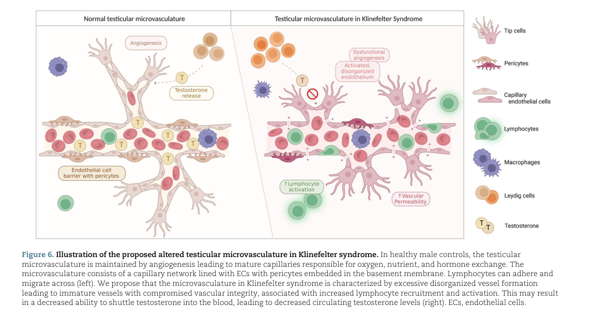

## Question

# Mechanistic Hypothesis Search

You are evaluating a specific disease mechanism hypothesis for the Disorder
Mechanisms Knowledge Base. This is not a general disease overview. Use the
hypothesis YAML below as the seed claim, then search for evidence that supports,
refutes, qualifies, or competes with this hypothesis.

## Target Disease
- **Disease Name:** Klinefelter Syndrome
- **Category:** Genetic

## Target Hypothesis
- **Hypothesis ID:** canonical_xxy_gene_dosage_androgen_deficiency_model
- **Hypothesis Label:** Canonical XXY Gene Dosage / Androgen Deficiency Model
- **Status in KB:** CANONICAL

## Seed Hypothesis YAML

```yaml
hypothesis_group_id: canonical_xxy_gene_dosage_androgen_deficiency_model
hypothesis_label: Canonical XXY Gene Dosage / Androgen Deficiency Model
status: CANONICAL
description: Klinefelter syndrome (47,XXY) results from supernumerary X chromosome(s) acquired through
  meiotic non-disjunction, producing progressive seminiferous tubule hyalinization and germ-cell loss
  during puberty. The resulting primary hypogonadism produces small firm testes, azoospermia, low testosterone,
  elevated FSH/LH, and incomplete pubertal virilization. X-linked gene dosage effects from incomplete
  X-inactivation (escape genes including KDM6A, USP9X, DDX3X) contribute to the cognitive, language, social,
  and metabolic phenotype that extends beyond androgen deficiency. Testosterone replacement reverses the
  hypogonadal syndrome but does not correct cognitive/behavioral features or infertility. Mouse XXY models
  and X-escape-gene knockouts have validated both the androgen-deficiency and X-gene-dosage axes of the
  canonical model.
evidence:
- reference: PMID:17062147
  reference_title: Klinefelter syndrome and other sex chromosomal aneuploidies.
  supports: SUPPORT
  evidence_source: OTHER
  snippet: The term Klinefelter syndrome (KS) describes a group of chromosomal
  explanation: |
    Existing canonical mechanism citation in the dismech knowledge base, used as the seed for the hypothesis-search deep-research run.
```

## Research Objective

Build a focused hypothesis-search report that answers:

1. What is the strongest direct evidence for this hypothesis?
2. What evidence argues against it, fails to reproduce it, or limits its scope?
3. Which claims are established, emerging, speculative, or contradicted?
4. Which patient subtypes, stages, tissues, cell types, molecular pathways, or
   biomarkers does the hypothesis best explain?
5. Which alternative or competing mechanistic hypotheses explain the same disease
   features better or more parsimoniously?
6. What are the explicit knowledge gaps: missing causal steps, unconfirmed edges,
   contradictory evidence, unknown source-to-target links, or source/data absences?
7. What experiments, cohorts, assays, datasets, or trials would most directly
   distinguish this hypothesis from alternatives?

Use primary literature whenever possible. Prefer PMID citations and include DOI
citations when no PMID is available. Treat reviews as orientation unless they
contain directly relevant synthesized evidence that should be clearly labeled as
review-level support.

## Required Output

### Executive Judgment

Give a concise verdict on the hypothesis as of the current literature:
supported, partially supported, unresolved, weakly supported, or refuted. Explain
the reasoning and the most important caveats.

### Evidence Matrix

Create a table with one row per important evidence item:

- Citation (PMID preferred)
- Evidence type (human clinical, model organism, in vitro, computational, review)
- Supports / refutes / qualifies / competing
- Mechanistic claim tested
- Key finding
- Disease subtype or context
- Confidence and limitations

### Mechanistic Causal Chain

Describe the causal chain implied by the hypothesis from upstream trigger to
clinical manifestation. Identify where the literature is strong, where the links
are inferred, and where there are missing causal steps.

### Knowledge Gaps

Identify explicit known unknowns surfaced by the search. Treat absence of
evidence as a curation-relevant finding only when the search actually checked for
it. Include:

- Unknown or weakly supported causal steps in the hypothesis
- Unconfirmed causal graph edges that need direct perturbation or longitudinal
  evidence
- Conflicting evidence, failed replications, or incompatible subtype-specific
  findings
- Unknown mechanism of action for relevant treatments, biomarkers, or
  interventions tied to this hypothesis
- Source-level or dataset-level absences, such as no relevant GenCC, ClinGen,
  trial, omics, or cohort evidence found as of the search date

For each gap, state the scope, why it matters, what was checked, and what
evidence or experiment would resolve it.

### Alternative Models

List competing or complementary hypotheses. For each, explain whether it is an
alternative to the seed hypothesis, a downstream consequence, an upstream cause,
or a parallel mechanism.

### Discriminating Tests

Recommend concrete studies or assays that would most efficiently test this
hypothesis against alternatives. Include patient stratification, biomarkers,
sample type, model system, perturbation, and expected result where applicable.

### Curation Leads

Provide candidate updates for the KB, but label these as leads requiring curator
verification. Include:

- candidate evidence references and exact abstract snippets to verify
- candidate pathophysiology nodes or edges
- candidate ontology terms for cell types and biological processes
- candidate subtype restrictions or status changes
- candidate `knowledge_gaps` or discussion prompts for unresolved causal claims,
  conflicting evidence, or explicit source/data absences

If the provider supports artifacts, produce artifact-friendly outputs such as an
evidence matrix, mechanistic diagram, knowledge-gap table, or comparison table.
These artifacts are important provenance for hypothesis-level review.


## Output

Question: You are an expert researcher providing comprehensive, well-cited information.

Provide detailed information focusing on:
1. Key concepts and definitions with current understanding
2. Recent developments and latest research (prioritize 2023-2024 sources)
3. Current applications and real-world implementations
4. Expert opinions and analysis from authoritative sources
5. Relevant statistics and data from recent studies

Format as a comprehensive research report with proper citations. Include URLs and publication dates where available.
Always prioritize recent, authoritative sources and provide specific citations for all major claims.

# Mechanistic Hypothesis Search

You are evaluating a specific disease mechanism hypothesis for the Disorder
Mechanisms Knowledge Base. This is not a general disease overview. Use the
hypothesis YAML below as the seed claim, then search for evidence that supports,
refutes, qualifies, or competes with this hypothesis.

## Target Disease
- **Disease Name:** Klinefelter Syndrome
- **Category:** Genetic

## Target Hypothesis
- **Hypothesis ID:** canonical_xxy_gene_dosage_androgen_deficiency_model
- **Hypothesis Label:** Canonical XXY Gene Dosage / Androgen Deficiency Model
- **Status in KB:** CANONICAL

## Seed Hypothesis YAML

```yaml
hypothesis_group_id: canonical_xxy_gene_dosage_androgen_deficiency_model
hypothesis_label: Canonical XXY Gene Dosage / Androgen Deficiency Model
status: CANONICAL
description: Klinefelter syndrome (47,XXY) results from supernumerary X chromosome(s) acquired through
  meiotic non-disjunction, producing progressive seminiferous tubule hyalinization and germ-cell loss
  during puberty. The resulting primary hypogonadism produces small firm testes, azoospermia, low testosterone,
  elevated FSH/LH, and incomplete pubertal virilization. X-linked gene dosage effects from incomplete
  X-inactivation (escape genes including KDM6A, USP9X, DDX3X) contribute to the cognitive, language, social,
  and metabolic phenotype that extends beyond androgen deficiency. Testosterone replacement reverses the
  hypogonadal syndrome but does not correct cognitive/behavioral features or infertility. Mouse XXY models
  and X-escape-gene knockouts have validated both the androgen-deficiency and X-gene-dosage axes of the
  canonical model.
evidence:
- reference: PMID:17062147
  reference_title: Klinefelter syndrome and other sex chromosomal aneuploidies.
  supports: SUPPORT
  evidence_source: OTHER
  snippet: The term Klinefelter syndrome (KS) describes a group of chromosomal
  explanation: |
    Existing canonical mechanism citation in the dismech knowledge base, used as the seed for the hypothesis-search deep-research run.
```

## Research Objective

Build a focused hypothesis-search report that answers:

1. What is the strongest direct evidence for this hypothesis?
2. What evidence argues against it, fails to reproduce it, or limits its scope?
3. Which claims are established, emerging, speculative, or contradicted?
4. Which patient subtypes, stages, tissues, cell types, molecular pathways, or
   biomarkers does the hypothesis best explain?
5. Which alternative or competing mechanistic hypotheses explain the same disease
   features better or more parsimoniously?
6. What are the explicit knowledge gaps: missing causal steps, unconfirmed edges,
   contradictory evidence, unknown source-to-target links, or source/data absences?
7. What experiments, cohorts, assays, datasets, or trials would most directly
   distinguish this hypothesis from alternatives?

Use primary literature whenever possible. Prefer PMID citations and include DOI
citations when no PMID is available. Treat reviews as orientation unless they
contain directly relevant synthesized evidence that should be clearly labeled as
review-level support.

## Required Output

### Executive Judgment

Give a concise verdict on the hypothesis as of the current literature:
supported, partially supported, unresolved, weakly supported, or refuted. Explain
the reasoning and the most important caveats.

### Evidence Matrix

Create a table with one row per important evidence item:

- Citation (PMID preferred)
- Evidence type (human clinical, model organism, in vitro, computational, review)
- Supports / refutes / qualifies / competing
- Mechanistic claim tested
- Key finding
- Disease subtype or context
- Confidence and limitations

### Mechanistic Causal Chain

Describe the causal chain implied by the hypothesis from upstream trigger to
clinical manifestation. Identify where the literature is strong, where the links
are inferred, and where there are missing causal steps.

### Knowledge Gaps

Identify explicit known unknowns surfaced by the search. Treat absence of
evidence as a curation-relevant finding only when the search actually checked for
it. Include:

- Unknown or weakly supported causal steps in the hypothesis
- Unconfirmed causal graph edges that need direct perturbation or longitudinal
  evidence
- Conflicting evidence, failed replications, or incompatible subtype-specific
  findings
- Unknown mechanism of action for relevant treatments, biomarkers, or
  interventions tied to this hypothesis
- Source-level or dataset-level absences, such as no relevant GenCC, ClinGen,
  trial, omics, or cohort evidence found as of the search date

For each gap, state the scope, why it matters, what was checked, and what
evidence or experiment would resolve it.

### Alternative Models

List competing or complementary hypotheses. For each, explain whether it is an
alternative to the seed hypothesis, a downstream consequence, an upstream cause,
or a parallel mechanism.

### Discriminating Tests

Recommend concrete studies or assays that would most efficiently test this
hypothesis against alternatives. Include patient stratification, biomarkers,
sample type, model system, perturbation, and expected result where applicable.

### Curation Leads

Provide candidate updates for the KB, but label these as leads requiring curator
verification. Include:

- candidate evidence references and exact abstract snippets to verify
- candidate pathophysiology nodes or edges
- candidate ontology terms for cell types and biological processes
- candidate subtype restrictions or status changes
- candidate `knowledge_gaps` or discussion prompts for unresolved causal claims,
  conflicting evidence, or explicit source/data absences

If the provider supports artifacts, produce artifact-friendly outputs such as an
evidence matrix, mechanistic diagram, knowledge-gap table, or comparison table.
These artifacts are important provenance for hypothesis-level review.


## Mechanistic Hypothesis Search Report
**Target disease:** Klinefelter syndrome (47,XXY)  
**Hypothesis ID:** canonical_xxy_gene_dosage_androgen_deficiency_model  
**Hypothesis label:** Canonical XXY Gene Dosage / Androgen Deficiency Model

### Executive Judgment (as of 2023–2024 literature)
**Verdict: partially supported (canonical core supported; scope-limited and increasingly multi-axis).** The core endocrine/testicular axis—progressive seminiferous tubule degeneration with pubertal/late-pubertal transition to hypergonadotropic hypogonadism and infertility—is well supported by human developmental observations, including pediatric imaging/hormone trajectories and semi-longitudinal pubertal endocrine studies (janus2023testicularmicrolithiasisin pages 1-2, pozzaUnknownyearpartinatural pages 29-32). The gene-dosage axis is also supported at the molecular level by quantitative transcriptomic evidence showing that inactive X (Xi) copy number drives widespread X-linked expression changes and nominates escape/dosage-sensitive genes (e.g., **DDX3X, USP9X, KDM6A**) as candidate drivers of phenotypes beyond androgen deficiency (roman2022thehumaninactive pages 1-2, roman2022thehumaninactive pages 9-10). However, multiple 2023–2024 developments qualify the “androgen-deficiency explains most manifestations” framing: (i) early-life structural testis changes can occur before endocrine failure, complicating a puberty-only trigger model (janus2023testicularmicrolithiasisin pages 1-2); (ii) tissue-specific downstream (trans) gene-network effects limit extrapolation from accessible tissues to brain/testis outcomes (liu2023aneuploidyeffectson pages 1-2, liu2023aneuploidyeffectson pages 7-8); and (iii) emerging testis-niche mechanisms—microvascular immaturity/inflammation and Leydig metabolic/INSL3–AR imbalance—provide plausible competing proximal causes for low circulating testosterone and fertility heterogeneity (johannsen2023thetesticularmicrovasculature pages 6-9, liu2023leydigcellmetabolic pages 19-19). Thus, the canonical model remains valid as a high-level framework but should be curated as **multi-component** with explicit knowledge gaps and competing proximal mechanisms.

### Key Concepts and Definitions (current understanding)
1. **Primary (hypergonadotropic) hypogonadism in XXY:** a state where testicular androgen/peptide output is inadequate for physiologic needs, leading to **elevated LH and FSH** due to loss of negative feedback. Pubertal progression often shows a transition from relatively preserved testosterone early to late-pubertal **LH rise and decreased T/LH ratio** consistent with compensated-to-overt Leydig dysfunction (pozzaUnknownyearpartinatural pages 29-32).
2. **Sertoli cell dysfunction biomarkers:** **inhibin B** and **AMH** reflect Sertoli function (age-dependent); decreasing inhibin B during puberty aligns with seminiferous/germ-cell failure (pozzaUnknownyearpartinatural pages 29-32, janus2023testicularmicrolithiasisin pages 1-2).
3. **X-chromosome inactivation (XCI) escape and Xi dosage:** a subset of X-linked genes is expressed from the inactive X (Xi), increasing effective dosage in XXY. Beyond classic “escape,” the Xi can also **modulate expression from the active X (Xa) in trans**, expanding the gene-dosage mechanism space (roman2022thehumaninactive pages 1-2, roman2022thehumaninactive pages 6-7).
4. **Cis vs trans aneuploidy effects:** **cis** effects are expression changes of genes on the altered chromosome(s); **trans** effects are downstream genome-wide regulatory changes. In sex chromosome dosage disorders, cis effects generalize across tissues more consistently than trans effects, which are cell-type dependent (liu2023aneuploidyeffectson pages 1-2, liu2023aneuploidyeffectson pages 7-8).

### Strongest Direct Evidence Supporting the Hypothesis
#### A. Testicular degeneration and pubertal endocrine trajectory
- **Early structural abnormalities with later endocrine deterioration.** In a prospective pediatric cohort (n=20), bilateral testicular microlithiasis and reduced echogenicity were observed even in infancy (youngest 3 months), while Sertoli and Leydig hormone function was **intact prepubertally** and **deteriorated after the start of puberty** (Oct 2023; https://doi.org/10.1007/s00431-022-04663-w) (janus2023testicularmicrolithiasisin pages 1-2). This supports the canonical concept of progressive degeneration with pubertal acceleration, while also indicating early morphologic changes precede overt endocrine failure.
- **Semi-longitudinal pubertal endocrine signature consistent with primary hypogonadism.** A semi-longitudinal XXY cohort summarized here reports falling inhibin B from mid-puberty and late-puberty supraphysiologic LH with decreased T/LH ratio, alongside ultrasound texture changes (entropy/homogeneity) predicting worse endocrine function (pozzaUnknownyearpartinatural pages 29-32).

#### B. X-gene dosage effects beyond androgen deficiency
- **Xi copy number drives widespread X-linked expression changes and nominates candidate drivers.** In Feb 2023 (*Cell Genomics*; https://doi.org/10.1016/j.xgen.2023.100259), San Roman et al. analyzed individuals with varying X-chromosome copy number (including XXY) and reported **significant Xi-driven expression changes for 38% (162/423) of expressed X chromosome genes** and evidence that Xi can **modulate Xa transcript levels in trans**. They prioritized likely phenotype-driving genes and listed **DDX3X, USP9X, KDM6A, KDM5C** (among others) as top candidates relevant to sex chromosome aneuploidy syndromes (roman2022thehumaninactive pages 1-2, roman2022thehumaninactive pages 9-10).

#### C. Treatment axis: TRT improves androgen-deficiency manifestations but not fertility and has uncertain cognitive effects
- **Guideline and clinical synthesis:** The European Academy of Andrology guideline (Oct 2021; https://doi.org/10.1111/andr.12909) advises against routine testosterone supplementation in infancy and prepuberty (except micropenis), and highlights limited RCT evidence: low-dose oxandrolone improved some psychosocial measures but had **no effect on cognition or attention**, with risks including advanced bone age and early gonadarche/pubarche (zitzmann2021europeanacademyof pages 19-22, zitzmann2021europeanacademyof pages 16-19).
- **No spermatogenesis induction by TRT:** A TRT review excerpt explicitly states that in prepubescent males TRT can induce pubertal changes but **“does not prompt testicular volume increase or spermatogenesis”** (varnum2024testosteronereplacementtherapy pages 1-2), consistent with the canonical claim that TRT does not correct infertility.
- **Adolescent/pediatric somatic effects:** In Apr 2023 (*Endocrine Connections*; https://doi.org/10.1530/ec-23-0031), a retrospective cohort (n=62) showed pre-TRT low testosterone and inhibin B with high LH/FSH; TRT normalized testosterone with signals toward improved body fat distribution (android/gynoid ratio) but the study was not designed to establish causal TRT effects (krabbe2023reproductivehormonesbone pages 1-2).

### Evidence That Qualifies, Limits, or Competes With the Hypothesis
#### 1) “Puberty-only” trigger is too narrow
Infancy-onset morphologic abnormalities (microlithiasis, reduced echogenicity) with preserved prepubertal hormones indicate that degeneration can begin earlier than puberty, even if endocrine failure manifests later (janus2023testicularmicrolithiasisin pages 1-2). This qualifies the seed claim that degeneration primarily emerges during puberty.

#### 2) Xi mechanisms extend beyond simple escape-gene biallelic expression
The Cell Genomics 2023 work indicates Xi can modulate Xa expression in trans and that many genes show Xi-driven expression changes not fully explained by classical escape annotations (roman2022thehumaninactive pages 1-2, roman2022thehumaninactive pages 6-7). Therefore, the “escape gene dosage” phrasing may understate broader Xi network effects.

#### 3) Microvascular/inflammatory niche dysfunction as a competing proximal cause of low serum testosterone
A 2023 single-cell reanalysis of testis tissue (*Human Reproduction*, Oct 2023; https://doi.org/10.1093/humrep/dead224) identifies capillary endothelial cells in KS testes with an activated inflammatory signature and markers of immature/leaky vessels (e.g., ANGPT2, ESM1) with downregulation of maturation/barrier genes (e.g., CLDN5, CDH5) and increased immune cross-talk (lymphocyte/macrophage signaling). The authors propose that microvascular dysfunction could impair testosterone release into circulation and contribute to atrophy/infertility, but causality and temporal ordering remain unresolved (johannsen2023thetesticularmicrovasculature pages 6-9, johannsen2023thetesticularmicrovasculature pages 4-6).

Visual support: Johannsen et al. Figure 6 summarizes this proposed mechanism (johannsen2023thetesticularmicrovasculature media b8cb95f1).

#### 4) Leydig metabolic/INSL3–AR imbalance as a competing explanation for fertility heterogeneity
A real-world cross-sectional mTESE cohort (Nov 2023; *Frontiers in Endocrinology*; https://doi.org/10.3389/fendo.2023.1266730) found 27/75 men had sperm recovered by mTESE and reported age-dependent patterns in LH/testosterone/INSL3, proposing that Leydig metabolic disorder causing imbalance in INSL3 and androgen receptor expression may regulate focal spermatogenesis (liu2023leydigcellmetabolic pages 19-19). This competes with an exclusively “androgen deficiency drives infertility” mechanism by emphasizing local Leydig signaling and focal niche balance.

#### 5) Tissue specificity of downstream consequences (limits “single mechanism explains all”)
In May 2023 (*PNAS*; https://doi.org/10.1073/pnas.2218478120), Liu et al. show cis effects of sex chromosome dosage generalize across LCLs, fibroblasts, and induced neurons, but trans/autosomal effects do not, implying that neurocognitive phenotypes (brain) and infertility/hypogonadism (testis) may share upstream dosage perturbations but diverge through tissue-specific network rewiring (liu2023aneuploidyeffectson pages 1-2, liu2023aneuploidyeffectson pages 7-8).

### Evidence Matrix
| Citation | Evidence type | Supports / refutes / qualifies / competing | Mechanistic claim tested | Key finding | Context (age/stage/tissue/model) | Confidence & limitations |
|---|---|---|---|---|---|---|
| Januś 2023, *Eur J Pediatr*, DOI:10.1007/s00431-022-04663-w | Human clinical, prospective pediatric imaging + hormones | Supports, qualifies | Testicular degeneration begins early, but endocrine failure emerges later | Bilateral testicular microlithiasis was present in all 20 pediatric XXY patients, including infancy; reduced echogenicity was universal, while Sertoli/Leydig hormonal function was intact prepubertally and deteriorated after puberty, supporting early structural degeneration preceding overt endocrine failure (janus2023testicularmicrolithiasisin pages 1-2) | Non-mosaic 47,XXY boys, 3 months–17 years; testis ultrasound; FSH/LH/T/inhibin B/AMH | Moderate confidence; prospective but small single-center cohort and ultrasound/pathology correlation limited |
| Pozza et al. semi-longitudinal study, *J Clin Endocrinol Metab* 2023 (DOI:10.1210/clinem/dgad205; cited via extracted summary) | Human longitudinal/semi-longitudinal clinical endocrine + ultrasound | Supports | Pubertal progression drives seminiferous degeneration and compensated-to-overt primary hypogonadism | Testicular volume rises from Tanner 2–4 then declines by Tanner 5/adulthood; inhibin B falls from pubertal stage 3 onward; LH rises disproportionately and T/LH ratio falls, with ultrasound entropy/microlithiasis predicting worse endocrine function (pozzaUnknownyearpartinatural pages 29-32) | 47,XXY boys through puberty; Tanner staging; testicular ultrasound | Moderate confidence; longitudinally informative but histology was not directly correlated and steroid assays were not LC-MS/MS |
| Sá 2023, *Genes*, DOI:10.3390/genes14030647 | Review-level synthesized human evidence | Supports | Canonical tubulohyalinization/interstitial fibrosis causes small firm testes, elevated gonadotropins, low androgen action | Review summarizes progressive seminiferous tubule hyalinization and interstitial fibrosis with small hard testes; Sertoli dysfunction lowers inhibin B causing elevated FSH/LH, while hypogonadism drives metabolic and skeletal sequelae (sa2023theklinefeltersyndrome pages 2-3) | Broad KS clinical/pathology literature | Moderate confidence for synthesis; not primary data and timing details depend on cited studies |
| Zitzmann et al. 2021, *Andrology* EAA guideline, DOI:10.1111/andr.12909 | Guideline + review of trials | Qualifies | TRT/androgen therapy helps selected hypogonadal features but is not established as routine early-life treatment and does not clearly improve cognition | Guideline advises against routine testosterone supplementation in infancy/prepuberty except micropenis; low-dose oxandrolone improved some visual-motor/anxiety/social measures but had no effect on cognition or attention and carried risks such as advanced bone age/early gonadarche (zitzmann2021europeanacademyof pages 19-22, zitzmann2021europeanacademyof pages 16-19) | Infancy, childhood, adolescence; KS management | High confidence for practice guidance; evidence base limited by small RCTs and heterogeneous outcomes |
| Krabbe 2023, *Endocrine Connections*, DOI:10.1530/ec-23-0031 | Human observational pediatric cohort | Supports, qualifies | Pubertal androgen deficiency contributes to adverse body composition/bone phenotype; TRT may improve some somatic features but evidence is incomplete | Before TRT, boys had low total testosterone/inhibin B and high LH/FSH; body fat percentage and android/gynoid fat ratio were elevated; during TRT there was a tendency to improved body composition with reduced android/gynoid ratio, but definitive efficacy remains unproven (krabbe2023reproductivehormonesbone pages 11-13, krabbe2023reproductivehormonesbone pages 1-2) | 62 KS boys/adolescents; hormones + DXA body composition/bone | Moderate confidence; retrospective observational design, no randomized TRT comparison |
| Butler 2023, *Arch Dis Child*, DOI:10.1136/archdischild-2020-320831 | Review-level clinical synthesis | Supports, qualifies | Biochemical hypogonadism usually appears in late puberty; TRT relieves hypogonadal manifestations but not infertility, and cognitive benefit remains uncertain | Review states puberty starts at normal age and biochemical hypogonadism usually appears late; testosterone may reduce gynaecomastia and improve body composition, but fertility problems persist and cognitive/behavioral benefits from early therapy require replication/prospective trials (butler2023klinefeltersyndromegoing pages 1-3, butler2023klinefeltersyndromegoing pages 3-5) | Childhood to adolescence KS care | Moderate confidence; concise clinical synthesis rather than primary interventional data |
| San Roman et al. 2023, *Cell Genomics*, DOI:10.1016/j.xgen.2023.100259 | Human transcriptomic/computational across sex chromosome aneuploidies | Supports | Extra Xi in XXY alters phenotype through escape-gene dosage and Xi-mediated trans modulation of Xa, beyond androgen deficiency | Xi copy number caused significant expression changes for 38% of expressed X-linked genes; Xi modulates Xa in trans, and prioritized candidate drivers included DDX3X, USP9X, KDM6A, KDM5C, ZFX and others relevant to SCA phenotypes such as XXY (roman2022thehumaninactive pages 1-2, roman2022thehumaninactive pages 9-10, roman2022thehumaninactive pages 6-7) | Human LCLs/fibroblasts across 1–4 X chromosomes, including XXY | High confidence for transcriptomic effect; mechanistic link to specific KS clinical features remains inferential rather than perturbational |
| Liu et al. 2023, *PNAS*, DOI:10.1073/pnas.2218478120 | Human multi-cell-type transcriptomics | Supports, qualifies | Sex chromosome dosage has robust cis effects across tissues, but trans effects are tissue-specific | Across LCLs, fibroblasts and iPSC-derived neurons, cis dosage effects on sex-chromosome genes/generalized ODS genes were preserved, whereas trans/autosomal effects were much less reproducible, implying some XXY consequences are core dosage effects while others are tissue-specific (liu2023aneuploidyeffectson pages 1-2, liu2023aneuploidyeffectson pages 5-7, liu2023aneuploidyeffectson pages 7-8, liu2023aneuploidyeffectson pages 2-3) | XXY and other SCDs; blood-derived cells, fibroblasts, induced neurons | High confidence for cross-tissue pattern; disease-organ relevance limited by accessible tissues and iPSC/XCI concerns |
| Peeters et al. 2023, *Epigenomes*, DOI:10.3390/epigenomes7040029 | Review-level mechanistic synthesis | Supports, qualifies | Escape from X-inactivation provides a plausible molecular basis for androgen-independent neurodevelopmental/metabolic phenotypes | Review highlights sex chromosome aneuploidies as dosage disorders of escape genes and discusses DDX3X, USP9X, KDM6A, KDM5C as clinically important escapees with tissue-specific escape, supporting a gene-dosage axis beyond hypogonadism (peeters2023outofthe pages 5-7) | Mechanistic review across tissues/cell types | Moderate confidence; strong conceptual support but not KS-specific perturbation evidence |
| Johannsen et al. 2023, *Hum Reprod*, DOI:10.1093/humrep/dead224 | Human testis single-cell reanalysis | Competing, complementary | Microvascular immaturity/inflammation may be an additional proximal cause of low circulating testosterone and infertility | KS testicular capillary endothelial cells showed activated inflammatory signatures, immature/leaky vessel markers, loss of maturation/barrier genes, and enhanced lymphocyte/macrophage signaling; proposed outcome is impaired testosterone export and contribution to atrophy/infertility (johannsen2023thetesticularmicrovasculature pages 6-9, johannsen2023thetesticularmicrovasculature pages 1-2, johannsen2023thetesticularmicrovasculature pages 4-6, johannsen2023thetesticularmicrovasculature pages 2-3, johannsen2023thetesticularmicrovasculature pages 9-10, johannsen2023thetesticularmicrovasculature media b8cb95f1) | Adult KS testis scRNA-seq; endothelial/microvascular niche | Moderate confidence; compelling cell-state data but causal direction and developmental timing unresolved |
| Liu et al. 2023, *Front Endocrinol*, DOI:10.3389/fendo.2023.1266730 | Human cross-sectional real-world mTESE cohort | Competing, complementary | Leydig-cell metabolic disorder/INSL3-AR imbalance contributes to focal spermatogenesis beyond simple androgen deficiency | In 75 KS men undergoing mTESE, LH/testosterone/INSL3 varied with age; focal spermatogenesis correlated with balanced/high INSL3 and androgen receptor expression, leading authors to propose Leydig metabolic dysfunction as a therapeutic target for fertility (liu2023leydigcellmetabolic pages 19-19) | KS adults across ages; mTESE specimens; fertility context | Moderate confidence; cross-sectional, fertility-selected cohort, mechanism remains associative |
| Sakamuri et al. 2024, *Biol Sex Differ*, DOI:10.1186/s13293-024-00624-0 | Mouse experimental FCG + castration | Supports, qualifies | Testosterone deficiency and XX dosage are separable axes; androgen deficiency drives vascular stiffness, while XX complement modulates Kdm6a/collagen remodeling | Castration increased arterial stiffening independent of sex chromosome complement, but XX mice under testosterone deficiency had greater collagen deposition and higher Kdm6a expression; Ddx3x/Usp9x did not significantly change in this vascular context (sakamuri2024testosteronedeficiencypromotes pages 1-5, sakamuri2024testosteronedeficiencypromotes pages 8-10, sakamuri2024testosteronedeficiencypromotes pages 13-16) | Four-core-genotype male mice; vasculature | Moderate confidence for axis separation; not a KS testis model and phenotypes are cardiovascular rather than gonadal/neurocognitive |
| Arnold 2022, *Nat Rev Endocrinol*, DOI:10.1038/s41574-022-00697-0 | Review of mouse mechanistic studies | Supports | X-gene dosage, especially Kdm6a, can exert hormone-independent phenotypic effects; validates dual-axis model | Review summarizes FCG/XY*/SCT studies where X dosage affected adiposity and disease risk independently of hormones; Kdm6a dose altered bladder cancer and Alzheimer-like phenotypes, and XX/XXY vs XO/XY comparisons implicated protective or pathogenic X-dose effects beyond gonadal hormones (arnold2022xchromosomeagents pages 7-9, arnold2022xchromosomeagents pages 16-20, arnold2022xchromosomeagents pages 6-7) | Mouse sex chromosome models including XXY-relevant genotypes | Moderate confidence; high mechanistic value but indirect for human KS and not testis-specific |
| Spaziani et al. 2021, *J Endocrinol Invest*, DOI:10.1007/s40618-020-01281-x (summarized via later reviews) | Human pediatric endocrine cohort | Qualifies | HPG-axis abnormalities may begin before puberty despite preserved early testicular function | Review excerpts summarize evidence from mini-puberty/prepuberty showing early HPG-axis impairment with generally normal Sertoli/Leydig function before later pubertal decline, indicating scope limits to the “puberty-only” simplification of the canonical model (white2023klinefeltersyndromewhat pages 9-9, janus2023testicularmicrolithiasisin pages 1-2, zitzmann2021europeanacademyof pages 16-19) | Infancy to prepuberty in non-mosaic XXY | Moderate confidence; not directly excerpted from primary full text here and some findings across studies are mixed |
| Contrast-enhanced US vascular studies in KS (summarized by Pozza review/chapter) | Human imaging + endocrine correlation | Competing, complementary | Low serum testosterone may partly reflect impaired vascular release rather than solely impaired synthesis | CEUS studies showed slower perfusion and reduced venous outflow in KS testes; faster flow correlated with higher serum testosterone, and high intratesticular/serum testosterone ratios suggest preserved production but impaired export (pozzaUnknownyearpartinatural pages 103-106, pozzaUnknownyearpartinatural pages 83-88) | Adolescent/adult KS testes; vascular imaging | Moderate confidence; provocative in vivo correlation, but small samples and mechanistic specificity incomplete |
| White et al. 2023, *Prenat Diagn*, DOI:10.1002/pd.6250 | Review-level counseling synthesis | Qualifies | Prenatal/early-diagnosed KS may have a broader and less severe developmental trajectory than classic infertility-clinic ascertainment implies | Review emphasizes ascertainment bias, notes infant inhibin B/AMH can be normal, and cites XCI/AR-related modifiers, warning that canonical features are not uniform across all prenatally identified XXY individuals (white2023klinefeltersyndromewhat pages 9-9) | Prenatal/early-life KS counseling | Moderate confidence; useful for scope/heterogeneity, but not direct mechanism testing |


*Table: This table organizes the key supporting, qualifying, and competing evidence for the canonical XXY gene-dosage/androgen-deficiency model in Klinefelter syndrome. It highlights which links are strongly supported, where newer data add alternative mechanisms such as microvascular dysfunction, and where evidence remains indirect or review-level.*

### Mechanistic Causal Chain (annotated strength of links)
**Upstream trigger:** meiotic nondisjunction → **47,XXY** karyotype.

1) **Extra X → Xi presence and altered X dosage regulation**  
- **Strong molecular evidence:** Xi copy number affects expression of many X-linked genes and can modulate Xa expression in trans; candidate drivers include DDX3X/USP9X/KDM6A (roman2022thehumaninactive pages 1-2, roman2022thehumaninactive pages 9-10, roman2022thehumaninactive pages 6-7).
- **Inferred clinical link:** mapping these expression changes to specific KS phenotypes remains mostly associative.

2) **Extra X → early testis structural changes (prepubertal) → pubertal acceleration of degeneration**  
- **Moderate evidence:** early ultrasound abnormalities in infancy with later pubertal endocrine deterioration (janus2023testicularmicrolithiasisin pages 1-2); semi-longitudinal pubertal endocrine decline consistent with progressive degeneration (pozzaUnknownyearpartinatural pages 29-32).
- **Missing causal step:** the initiating cell type (germ vs Sertoli vs Leydig vs endothelial vs immune) and the first molecular perturbation remain unconfirmed in developmental tissue.

3) **Seminiferous tubule dysfunction → Sertoli failure biomarkers → germ-cell loss/azoospermia**  
- **Moderate evidence:** pubertal decline in inhibin B and morphological deterioration align with seminiferous dysfunction and infertility (pozzaUnknownyearpartinatural pages 29-32, sa2023theklinefeltersyndrome pages 2-3).
- **Competing proximal link:** focal spermatogenesis variability suggests local niche mechanisms (INSL3–AR balance) can sustain limited spermatogenesis (liu2023leydigcellmetabolic pages 19-19).

4) **Leydig dysfunction and/or impaired testosterone export → low serum testosterone → elevated LH/FSH**  
- **Moderate evidence (canonical):** hypergonadotropic profile and low testosterone are core clinical findings and present in pediatric/adolescent cohorts (pozzaUnknownyearpartinatural pages 29-32, krabbe2023reproductivehormonesbone pages 1-2).
- **Emerging competing mechanism:** microvascular immaturity/inflammation may impair hormone exchange/export, contributing to low circulating testosterone without fully ablated steroidogenesis (johannsen2023thetesticularmicrovasculature pages 6-9, johannsen2023thetesticularmicrovasculature pages 4-6, johannsen2023thetesticularmicrovasculature media b8cb95f1).

5) **Clinical manifestations**  
- **Androgen-dependent:** incomplete virilization and body composition changes can respond to TRT (butler2023klinefeltersyndromegoing pages 3-5, krabbe2023reproductivehormonesbone pages 1-2).
- **Androgen-independent:** neurodevelopmental/social/cognitive features plausibly linked to Xi dosage-sensitive genes and Xi→Xa trans modulation, and may persist despite TRT (roman2022thehumaninactive pages 1-2, zitzmann2021europeanacademyof pages 19-22).

### Knowledge Gaps (explicit)
| Gap / missing causal step | Why it matters (which phenotype link) | What was checked in this search (sources examined) | Current evidence status | Proposed discriminating experiment or dataset |
|---|---|---|---|---|
| Earliest timing and initiators of testis degeneration in XXY: fetal germ-cell defect vs infant structural degeneration vs puberty-triggered collapse | Determines whether the canonical model is primarily prenatal, infancy-onset, or puberty-accelerated, affecting counseling, biomarker timing, and fertility-preservation windows for small testes, azoospermia, and later hypogonadism | Pediatric ultrasound/hormone cohort showing microlithiasis from infancy and endocrine decline after puberty; semilongitudinal puberty study showing inhibin B fall and LH/T-LH changes in later puberty; review/counseling sources citing fetal and pubertal studies (janus2023testicularmicrolithiasisin pages 1-2, pozzaUnknownyearpartinatural pages 29-32, white2023klinefeltersyndromewhat pages 9-9, liu2023leydigcellmetabolic pages 19-19) | Conflicting | Prenatal-to-adolescent longitudinal program using fetal tissue reference atlases, neonatal hormone sampling, serial inhibin B/AMH/LH/FSH/T, ultrasound/MRI, and single-cell/spatial transcriptomics of rare clinically indicated XXY gonadal tissue across developmental stages |
| Direct causal role of specific X-escape genes (KDM6A, USP9X, DDX3X) in human KS neurocognitive, social, and metabolic phenotypes | Core claim of the gene-dosage arm; needed to move from association to mechanism for language/social deficits and cardiometabolic risk beyond androgen deficiency | Cell Genomics study prioritizing DDX3X/USP9X/KDM6A as Xi-driven candidates; PNAS study showing robust cis dosage and tissue-variable trans effects; escape-gene reviews summarizing plausibility (roman2022thehumaninactive pages 1-2, roman2022thehumaninactive pages 9-10, liu2023aneuploidyeffectson pages 1-2, peeters2023outofthe pages 5-7, fang2021xfactorsinhuman pages 3-4) | Weak | Patient-stratified iPSC perturbation studies in XXY-derived neurons, oligodendrocytes, adipocytes, and testicular somatic cells using CRISPRi/CRISPRa or allele-specific silencing of KDM6A/USP9X/DDX3X, linked to cellular phenotypes and deep clinical phenotyping in matched donors |
| Cell-type specificity of trans effects from extra Xi/X dosage, especially brain vs testis vs blood | Limits how far peripheral blood/fibroblast findings can explain brain/cognitive or gonadal phenotypes and whether a single canonical dosage program exists | Cross-tissue aneuploidy transcriptomics showing cis effects generalize but trans effects are tissue-specific; Xi-modulation study in LCLs/fibroblasts; testis single-cell vascular paper showing testis-specific inflammatory niche changes (liu2023aneuploidyeffectson pages 1-2, liu2023aneuploidyeffectson pages 5-7, liu2023aneuploidyeffectson pages 7-8, liu2023aneuploidyeffectson pages 2-3, roman2022thehumaninactive pages 1-2, johannsen2023thetesticularmicrovasculature pages 6-9) | Weak | Matched multi-tissue study from the same XXY individuals combining blood RNA-seq, skin fibroblasts, iPSC-derived excitatory/inhibitory neurons, and testicular single-cell/spatial omics to quantify shared vs tissue-specific cis/trans networks and XCI-escape states |
| Mechanistic link from microvascular inflammation to reduced circulating testosterone despite Leydig steroidogenic capacity | Competes with a purely Leydig-cell-failure explanation for hypogonadism and could explain high intratesticular vs low serum testosterone and infertility | scRNA-seq reanalysis showing activated/immature leaky capillaries and inflammatory cross-talk; vascular imaging summaries linking slower perfusion to lower serum testosterone; Leydig-metabolic paper proposing additional somatic mechanisms (johannsen2023thetesticularmicrovasculature pages 6-9, johannsen2023thetesticularmicrovasculature pages 1-2, johannsen2023thetesticularmicrovasculature pages 4-6, johannsen2023thetesticularmicrovasculature pages 2-3, pozzaUnknownyearpartinatural pages 103-106, pozzaUnknownyearpartinatural pages 83-88, liu2023leydigcellmetabolic pages 19-19) | Weak | Integrated CEUS/perfusion imaging plus paired serum and intratesticular steroid profiling, endothelial permeability markers, and ex vivo microfluidic testosterone transport assays in fresh KS vs control testis tissue; validate with spatial transcriptomics and vascular histology |
| Relative contribution of androgen deficiency vs androgen-independent X-dosage effects to cognitive/behavioral phenotype | Central scope question for the canonical model and for treatment expectations; informs whether TRT can plausibly alter language/social outcomes | Guidelines/reviews report no clear cognitive/attention benefit from oxandrolone and uncertain developmental benefit from early testosterone; transcriptomic studies support androgen-independent Xi dosage mechanisms (zitzmann2021europeanacademyof pages 19-22, butler2023klinefeltersyndromegoing pages 1-3, butler2023klinefeltersyndromegoing pages 3-5, roman2022thehumaninactive pages 1-2, peeters2023outofthe pages 5-7) | Weak | Randomized placebo-controlled early-hormone trials with embedded omics and neurodevelopmental endpoints, stratified by baseline testosterone, mosaicism, and escape-gene expression; mediation analysis to separate hormone restoration from dosage-signature effects |
| Heterogeneity by mosaicism, karyotypic complexity, and ascertainment route (prenatal vs childhood developmental vs adult infertility diagnosis) | The canonical model may overfit classic infertility-clinic XXY and underperform in prenatally diagnosed or mosaic individuals with milder endocrine and neurodevelopmental manifestations | Counseling/review evidence on ascertainment bias and underdiagnosis; clinical studies mostly non-mosaic or fertility-selected; guideline-level synthesis acknowledges limited longitudinal cohorts (white2023klinefeltersyndromewhat pages 9-9, zitzmann2021europeanacademyof pages 19-22, butler2023klinefeltersyndromegoing pages 1-3, krabbe2023reproductivehormonesbone pages 1-2) | Weak | Population-based registry cohorts linking prenatal screening, postnatal diagnosis route, mosaic fraction across tissues, longitudinal endocrine/fertility/neurocognitive outcomes, and multi-omic signatures to test whether mechanism weights differ by subtype |
| Effect of early testosterone treatment on neurodevelopment | Key therapeutic implication: whether early hormone replacement modifies language, motor, social, or executive outcomes, or whether these are mostly X-dosage driven | EAA guideline summarized infant testosterone and oxandrolone studies with some body-composition/psychosocial signals but no cognition/attention benefit; pediatric review notes retrospective cognitive findings lacking blinding/randomization (zitzmann2021europeanacademyof pages 19-22, butler2023klinefeltersyndromegoing pages 1-3, butler2023klinefeltersyndromegoing pages 3-5, zitzmann2021europeanacademyof pages 16-19) | Conflicting | Adequately powered multicenter RCT of infant or early-pubertal TRT with standardized neuropsychological batteries, speech/language endpoints, MRI, and long-term follow-up into adolescence |
| Effect of early testosterone treatment on testis function, spermatogenesis, and future fertility | Directly tests the claim that TRT reverses hypogonadal syndrome but not infertility; also addresses possible harm if early therapy suppresses residual testicular function | Guideline/review material indicates TRT does not induce spermatogenesis; pediatric guidance does not support routine early treatment; fertility remains unresolved and experimental; related HGA data suggest possible suppression of testicular secretory function after early androgen exposure (varnum2024testosteronereplacementtherapy pages 1-2, butler2023klinefeltersyndromegoing pages 1-3, butler2023klinefeltersyndromegoing pages 3-5, zitzmann2021europeanacademyof pages 19-22) | Weak | Prospective fertility-preservation cohort comparing early TRT vs deferred TRT with serial inhibin B/AMH/testis volume, semen when feasible, mTESE outcomes, and testicular single-cell transcriptomics/histology in surgical specimens |
| Validated biomarkers that predict mTESE success and focal spermatogenesis | High clinical value for fertility counseling and for distinguishing canonical diffuse failure from focal-rescue models | Guideline excerpt notes age and Leydig markers may predict retrieval better than Sertoli markers; Leydig-metabolic study proposes INSL3/AR balance; review notes variable sperm retrieval outcomes (zitzmann2021europeanacademyof pages 52-54, liu2023leydigcellmetabolic pages 19-19, sa2023theklinefeltersyndrome pages 2-3) | Weak | Prospective international mTESE biomarker study using standardized pathology, serum hormones (T, LH, FSH, inhibin B, AMH, INSL3), imaging/perfusion metrics, and molecular signatures from testicular fluid/tissue, with external validation |
| Missing developmental single-cell and spatial multi-omics of XXY testis and brain | Without developmental cell-resolved maps, the field cannot localize first-hit cell types or determine whether Sertoli, Leydig, endothelial, immune, or germ cells are primary drivers | 2023 testis scRNA-seq microvascular reanalysis exists but lacks prepubertal samples; transcriptomic studies are mainly blood/fibroblast/iPSC-derived neurons; reviews call for single-cell and spatial approaches (johannsen2023thetesticularmicrovasculature pages 6-9, johannsen2023thetesticularmicrovasculature pages 1-2, liu2023aneuploidyeffectson pages 1-2, liu2023aneuploidyeffectson pages 9-10, fang2021xfactorsinhuman pages 3-4) | Absent | Cross-development atlas of XXY using single-cell RNA/ATAC, methylome, proteomics, and spatial transcriptomics in fetal, infant, pubertal, and adult testis plus parallel brain organoid or postmortem models; deposit in open reference portal |
| Source-to-target link from Xi dosage to specific endocrine/metabolic pathways in relevant tissues | The canonical model names escape genes but often skips the downstream pathway edges leading to obesity, bone fragility, and social/cognitive traits | Xi-modulation and aneuploidy studies define candidate dosage-sensitive genes and tissue-specific trans effects, but not complete causal pathways to KS phenotypes; mouse reviews implicate Kdm6a dose in diverse systems (roman2022thehumaninactive pages 1-2, roman2022thehumaninactive pages 21-22, liu2023aneuploidyeffectson pages 1-2, liu2023aneuploidyeffectson pages 2-3, arnold2022xchromosomeagents pages 7-9, arnold2022xchromosomeagents pages 16-20) | Weak | Causal network mapping with perturb-seq in XXY-relevant cell types, integrating gene dosage, chromatin, proteome, metabolome, and hormone-response assays to connect KDM6A/USP9X/DDX3X dosage to endocrine and metabolic pathway outputs |
| Whether peripheral accessible tissues are sufficient proxies for disease-relevant organs in KS mechanism studies | Impacts confidence in current omics evidence, much of which comes from LCLs/fibroblasts rather than brain or testis | PNAS study explicitly shows cis effects generalize but trans effects often do not; Xi studies used LCLs/fibroblasts; testis-specific vascular data suggest unique local mechanisms (liu2023aneuploidyeffectson pages 1-2, liu2023aneuploidyeffectson pages 7-8, liu2023aneuploidyeffectson pages 2-3, roman2022thehumaninactive pages 1-2, johannsen2023thetesticularmicrovasculature pages 6-9) | Strong for limitation, weak for solution | Same-donor paired biospecimen resource with blood, fibroblasts, iPSC derivatives, semen/testicular samples, and harmonized phenotyping to quantify proxy validity for each mechanistic layer |
| Interaction between androgen receptor sensitivity/modifiers and X-dosage programs | May explain inter-individual variability in virilization, metabolic burden, and response to TRT within the same XXY karyotype | Counseling/guideline sources cite AR functionality/XCI patterns as phenotype modifiers, but direct integrated datasets with escape-gene dosage and TRT response are not established here (white2023klinefeltersyndromewhat pages 9-9, zitzmann2021europeanacademyof pages 16-19) | Weak | Genotype-phenotype-treatment response cohort integrating AR CAG repeat status, sex steroid levels, Xi/escape transcript signatures, and standardized response to TRT across adolescence and adulthood |


*Table: This table summarizes the main unresolved causal links limiting the canonical XXY gene-dosage/androgen-deficiency model in Klinefelter syndrome. It highlights what was checked in the current search, the present strength of evidence, and the most informative experiments or datasets to resolve each gap.*

### Alternative / Competing Models
| Model name | Upstream driver | Core mechanism | Phenotypes explained best | Key evidence in this search | Predictions that differ from canonical model | Status |
|---|---|---|---|---|---|---|
| Canonical XXY gene dosage + progressive pubertal seminiferous degeneration leading to primary hypogonadism | Supernumerary X chromosome from meiotic nondisjunction | Early structural testicular abnormalities progress to seminiferous tubule hyalinization/germ-cell loss, especially through puberty, causing small firm testes, low testosterone, high LH/FSH, low inhibin B, and azoospermia; extra-X dosage contributes additional non-gonadal features | Classic endocrine phenotype, small testes, hypergonadotropic hypogonadism, infertility, some metabolic consequences | Pediatric ultrasound/hormone data show early testicular abnormalities with endocrine deterioration after puberty; semilongitudinal puberty data show falling inhibin B and worsening LH/T-LH ratio; guideline/review sources synthesize progressive tubulohyalinization and primary testicular failure (janus2023testicularmicrolithiasisin pages 1-2, pozzaUnknownyearpartinatural pages 29-32, sa2023theklinefeltersyndrome pages 2-3, zitzmann2021europeanacademyof pages 19-22) | Predicts testicular failure is the main proximal cause of hypogonadal features and that TRT should improve androgen-deficiency manifestations but not restore spermatogenesis | Established |
| Xi trans-modulation of Xa network dysregulation beyond simple escape | Additional inactive X chromosome (Xi) in XXY | Xi alters expression of active-X genes in trans, not only by escape from X-inactivation; prioritized dosage-sensitive candidates include DDX3X, USP9X, KDM6A and related X genes | Neurodevelopmental, cognitive, language, social, and possibly metabolic phenotypes not fully explained by testosterone deficiency | Cell Genomics study found significant Xi-driven expression effects for 38% of expressed X-linked genes and identified candidate drivers including DDX3X, USP9X, KDM6A; escape-gene reviews support biologic plausibility (roman2022thehumaninactive pages 1-2, roman2022thehumaninactive pages 9-10, roman2022thehumaninactive pages 6-7, peeters2023outofthe pages 5-7) | Predicts some XXY phenotypes will persist despite normal testosterone replacement and will map to tissue-specific Xi/Xa expression programs rather than serum androgen levels | Emerging |
| Testicular microvascular immaturity/inflammation impairing testosterone export | XXY-associated endothelial and immune niche dysregulation in testis | Immature, leaky capillaries with inflammatory cross-talk impair vascular integrity and hormone exchange, reducing efficient testosterone release into circulation and contributing to infertility/atrophy | Discrepancy between intratesticular steroidogenic capacity and low circulating testosterone; infertility and testicular atrophy linked to local niche dysfunction | Testis single-cell reanalysis showed activated inflammatory endothelial cells, downregulation of maturation/barrier genes, and heightened lymphocyte/macrophage signaling; vascular studies linked slower perfusion to lower serum testosterone (johannsen2023thetesticularmicrovasculature pages 6-9, johannsen2023thetesticularmicrovasculature pages 1-2, johannsen2023thetesticularmicrovasculature pages 4-6, johannsen2023thetesticularmicrovasculature pages 2-3, johannsen2023thetesticularmicrovasculature pages 9-10, pozzaUnknownyearpartinatural pages 103-106, pozzaUnknownyearpartinatural pages 83-88, johannsen2023thetesticularmicrovasculature media b8cb95f1) | Predicts some hypogonadism reflects impaired testosterone export rather than reduced synthesis alone, and vascular/permeability biomarkers or perfusion imaging may outperform serum gonadotropins in specific contexts | Emerging |
| Leydig cell metabolic / INSL3-AR imbalance driving focal spermatogenesis variability | Age-dependent Leydig-cell metabolic dysfunction in XXY testes | Abnormal Leydig metabolism alters INSL3 and androgen-receptor balance within focal niches, influencing whether residual spermatogenesis persists and whether sperm can be retrieved | Heterogeneous fertility outcomes, focal spermatogenesis, variation in mTESE success despite global KS diagnosis | Cross-sectional mTESE cohort found age-varying LH/testosterone/INSL3 and associated focal spermatogenesis with INSL3 and AR expression balance; authors proposed Leydig metabolic disorder as a targetable mechanism (liu2023leydigcellmetabolic pages 19-19) | Predicts fertility potential depends on local Leydig/INSL3-AR microenvironment, not just overall testosterone deficiency; biomarker panels including INSL3 may predict sperm retrieval better than canonical endocrine markers alone | Emerging |
| Tissue-specific trans effects and regulatory network changes (cis conserved, trans variable) | Extra sex chromosome dosage acting on gene-regulatory networks across tissues | Cis dosage effects on sex-chromosome genes are relatively stable across tissues, whereas trans/autosomal network consequences differ markedly by cell type, so phenotype emerges from tissue-specific downstream programs | Why blood/fibroblast signatures only partly explain brain or testis phenotypes; organ-specific manifestations of XXY | PNAS multi-cell-type study showed conserved cis effects but much less conserved trans effects across LCLs, fibroblasts, and induced neurons; Xi-modulation study likewise indicated cell-type specificity (liu2023aneuploidyeffectson pages 1-2, liu2023aneuploidyeffectson pages 5-7, liu2023aneuploidyeffectson pages 7-8, liu2023aneuploidyeffectson pages 2-3, roman2022thehumaninactive pages 6-7) | Predicts peripheral tissues can model core dosage-sensitive genes but not organ-specific downstream pathology; brain and testis mechanisms may diverge even with shared upstream XXY dosage | Emerging |
| Androgen receptor sensitivity / XCI skewing modifier model | Individual variation in AR responsiveness and X-inactivation patterns | Phenotypic severity depends partly on androgen receptor sensitivity and which X-linked alleles are preferentially active or silenced, modifying expression of extra-X effects | Inter-individual heterogeneity in virilization, behavioral phenotype, treatment response, and severity among individuals with the same XXY karyotype | Counseling/review and guideline-level sources cite AR functionality and XCI patterns as phenotype modifiers; variable/tissue-specific escape from XCI is well documented in broader XCI literature (white2023klinefeltersyndromewhat pages 9-9, navarro‐cobos2020genesthatescape pages 1-2, peeters2023outofthe pages 5-7, zitzmann2021europeanacademyof pages 16-19) | Predicts substantial phenotype variability among same-karyotype patients and differential TRT responsiveness based on AR genotype/XCI state rather than chromosome count alone | Speculative-to-emerging |


*Table: This table compares the canonical Klinefelter syndrome mechanism with key competing or complementary models identified in the search. It is useful for distinguishing which phenotypes are best explained by androgen deficiency alone versus X-dosage, vascular, regulatory-network, or modifier mechanisms.*

### Current Applications and Real-World Implementations (mechanism-relevant)
1. **Testosterone replacement therapy (TRT):**
   - Clinical practice emphasizes treating **documented clinical/biochemical hypogonadism**, with guideline recommendations against routine prepubertal TRT except for micropenis (EAA guideline, Oct 2021; https://doi.org/10.1111/andr.12909) (zitzmann2021europeanacademyof pages 19-22).
   - TRT can normalize serum testosterone in adolescents and may improve aspects of body composition/fat distribution; evidence remains mostly observational in pediatrics (Apr 2023; https://doi.org/10.1530/ec-23-0031) (krabbe2023reproductivehormonesbone pages 1-2).
   - TRT does **not** induce spermatogenesis in prepubertal males (varnum2024testosteronereplacementtherapy pages 1-2).

2. **Fertility interventions (mTESE and assisted reproduction):**
   - Review-level outcomes report sperm retrieval rates on the order of **40–60%** in KS with downstream clinical pregnancy/newborn rates summarized in the review (Mar 2023; https://doi.org/10.3390/genes14030647) (sa2023theklinefeltersyndrome pages 2-3).
   - A real-world cohort: **27/75** sperm retrieval by mTESE (Frontiers Endocrinol, Nov 2023; https://doi.org/10.3389/fendo.2023.1266730) (liu2023leydigcellmetabolic pages 19-19).

3. **Biomarkers used/under evaluation:**
   - Endocrine biomarkers: LH, FSH, total testosterone, inhibin B, AMH are measured across pediatric-to-adult clinical pathways and show stage-dependent trajectories (janus2023testicularmicrolithiasisin pages 1-2, krabbe2023reproductivehormonesbone pages 1-2).
   - Emerging mechanistic biomarkers: INSL3 and androgen receptor expression balance (testis) proposed as fertility-relevant markers (liu2023leydigcellmetabolic pages 19-19); Xi-driven dosage-sensitive gene sets and candidate drivers (DDX3X/USP9X/KDM6A) as molecular biomarkers for androgen-independent axes (roman2022thehumaninactive pages 1-2).

### Expert Opinions and Authoritative Analyses (interpreted as review/guideline level)
- **EAA guideline (2021)**: emphasizes individualized, evidence-constrained androgen therapy and highlights limited RCT data with mixed neurodevelopmental outcomes and potential risks (zitzmann2021europeanacademyof pages 19-22, zitzmann2021europeanacademyof pages 16-19).
- **Pediatric perspective (2023)**: puberty usually starts normally; biochemical hypogonadism emerges late; TRT decisions should be guided by clinical hypogonadism rather than diagnosis alone, and early testosterone studies need prospective validation (butler2023klinefeltersyndromegoing pages 1-3, butler2023klinefeltersyndromegoing pages 3-5).

### Discriminating Tests (highest-yield studies to separate models)
1. **Developmental single-cell/spatial testis atlas (XXY vs XY)** across fetal→infancy→puberty→adult to identify first-hit cell types and whether endothelial/immune activation precedes Sertoli/germ collapse (supported by scRNAseq limitation of no prepubertal group) (johannsen2023thetesticularmicrovasculature pages 1-2).
2. **Paired intratesticular vs serum steroid profiling + perfusion imaging + endothelial permeability markers** to directly test “impaired export” vs “impaired synthesis” mechanisms (johannsen2023thetesticularmicrovasculature pages 6-9, pozzaUnknownyearpartinatural pages 103-106).
3. **iPSC-derived neuronal and testis somatic-cell perturbations** targeting KDM6A/USP9X/DDX3X (CRISPRi/a; allele-specific silencing) to link Xi-driven candidate genes to cellular neurodevelopmental and gonadal phenotypes (roman2022thehumaninactive pages 1-2).
4. **Mechanism-stratified TRT trials** (infant/early puberty vs late puberty) with embedded omics signatures (Xi dosage signature; cis ODS genes), neurocognitive endpoints, and fertility outcomes to test whether TRT modifies androgen-independent trajectories (zitzmann2021europeanacademyof pages 19-22, liu2023aneuploidyeffectson pages 1-2).

### Curation Leads (candidate KB updates; curator verification required)
**Lead 1: Update “X escape genes” mechanism language to include Xi→Xa trans modulation.**  
- Candidate reference: San Roman et al., Feb 2023, *Cell Genomics* (https://doi.org/10.1016/j.xgen.2023.100259).  
- Candidate snippet to verify: “significant Xi-driven expression changes for 38% (162/423) of expressed X chromosome genes” and “modulation of Xa transcript levels by Xi contributes…” with prioritized candidates including “DDX3X USP9X KDM6A …” (roman2022thehumaninactive pages 1-2).  
- Candidate KB edge: **Xi copy number → trans modulation of Xa gene expression → neurodevelopment/metabolic phenotypes**.

**Lead 2: Add “testicular microvascular dysfunction / inflammatory cross-talk” as a competing proximal mechanism for low circulating testosterone.**  
- Candidate reference: Johannsen et al., Oct 2023, *Human Reproduction* (https://doi.org/10.1093/humrep/dead224).  
- Candidate snippet to verify: KS capillary EC activation with immature/leaky vessel signature and increased inflammatory cross-talk; proposed contribution to impaired testosterone release (johannsen2023thetesticularmicrovasculature pages 6-9, johannsen2023thetesticularmicrovasculature pages 4-6).  
- Candidate ontology terms: endothelial cell activation; angiogenesis; vascular permeability; leukocyte adhesion; inflammation.

**Lead 3: Add “Leydig metabolic disorder / INSL3–AR imbalance” as a fertility-heterogeneity mechanism.**  
- Candidate reference: Liu et al., Nov 2023, *Frontiers in Endocrinology* (https://doi.org/10.3389/fendo.2023.1266730).  
- Candidate snippet to verify: “Abnormal metabolism of Leydig cells led to imbalanced expression of INSL3 and androgen receptors, which might be a potential target for spermatogenesis in KS.” (liu2023leydigcellmetabolic pages 19-19).  
- Candidate KB nodes: Leydig cell metabolism; INSL3 signaling; androgen receptor signaling; focal spermatogenesis.

**Lead 4: Explicitly curate tissue-specificity limitation for trans effects.**  
- Candidate reference: Liu et al., May 2023, *PNAS* (https://doi.org/10.1073/pnas.2218478120).  
- Candidate snippet to verify: cis effects generalize across cell types but trans effects do not, implying peripheral tissues may miss brain/testis trans programs (liu2023aneuploidyeffectson pages 1-2, liu2023aneuploidyeffectson pages 7-8).  
- Candidate KB `knowledge_gaps`: “Phenotype mapping requires tissue-specific trans network validation.”

### Recent Developments (2023–2024 highlights)
- **Xi-driven, quantitative mechanistic expansion:** Xi influences Xa gene expression in trans and nominates candidate drivers (Feb 2023, *Cell Genomics*) (roman2022thehumaninactive pages 1-2).
- **Cross-tissue generalization framework for aneuploidy transcriptomics:** cis effects conserved; trans effects tissue-specific (May 2023, *PNAS*) (liu2023aneuploidyeffectson pages 1-2).
- **Testis niche hypothesis:** scRNAseq evidence for immature microvasculature and inflammatory cross-talk in KS testes (Oct 2023, *Human Reproduction*), with a mechanistic figure summarizing the model (johannsen2023thetesticularmicrovasculature pages 4-6, johannsen2023thetesticularmicrovasculature media b8cb95f1).
- **Hormone vs chromosome separability in experimental systems:** FCG mouse evidence that testosterone deprivation drives vascular stiffening independent of sex chromosome complement, while XX complement modulates Kdm6a and remodeling under low-testosterone conditions (Jun 2024; https://doi.org/10.1186/s13293-024-00624-0) (sakamuri2024testosteronedeficiencypromotes pages 1-5, sakamuri2024testosteronedeficiencypromotes pages 8-10).

### Conclusion
The canonical XXY gene dosage / androgen deficiency hypothesis remains a robust organizing model for KS, especially for the gonadal-endocrine phenotype and androgen-responsive features, but 2023–2024 work supports expanding the KB representation to a **multi-axis** mechanism that includes (1) Xi-driven cis/trans X-linked dosage programs and (2) testis-niche mechanisms (microvascular inflammation and Leydig metabolic signaling) that can compete with or mediate endocrine failure and fertility heterogeneity (roman2022thehumaninactive pages 1-2, johannsen2023thetesticularmicrovasculature pages 6-9, liu2023leydigcellmetabolic pages 19-19).


References

1. (janus2023testicularmicrolithiasisin pages 1-2): Dominika Januś, Małgorzata Wójcik, and Jerzy B. Starzyk. Testicular microlithiasis in paediatric patients with klinefelter syndrome from infancy till adolescence: early start of degenerative process in the testes—preliminary results. European Journal of Pediatrics, 182:225-235, Oct 2023. URL: https://doi.org/10.1007/s00431-022-04663-w, doi:10.1007/s00431-022-04663-w. This article has 5 citations and is from a peer-reviewed journal.

2. (pozzaUnknownyearpartinatural pages 29-32): C Pozza, F Sesti, M Tenuta, and M Spaziani. Part i natural history and clinical characteristics in klinefelter syndrome and high-grade sexual chromosome aneuploidies with male phenotype. Unknown journal, Unknown year.

3. (roman2022thehumaninactive pages 1-2): Adrianna K. San Roman, Alexander K. Godfrey, Helen Skaletsky, Daniel W. Bellott, Abigail F. Groff, Hannah L. Harris, Laura V. Blanton, Jennifer F. Hughes, Laura Brown, Sidaly Phou, Ashley Buscetta, Paul Kruszka, Nicole Banks, Amalia Dutra, Evgenia Pak, Patricia C. Lasutschinkow, Colleen Keen, Shanlee M. Davis, Nicole R. Tartaglia, Carole Samango-Sprouse, Maximilian Muenke, and David C. Page. The human inactive x chromosome modulates expression of the active x chromosome. Feb 2023. URL: https://doi.org/10.1016/j.xgen.2023.100259, doi:10.1016/j.xgen.2023.100259. This article has 88 citations and is from a peer-reviewed journal.

4. (roman2022thehumaninactive pages 9-10): Adrianna K. San Roman, Alexander K. Godfrey, Helen Skaletsky, Daniel W. Bellott, Abigail F. Groff, Hannah L. Harris, Laura V. Blanton, Jennifer F. Hughes, Laura Brown, Sidaly Phou, Ashley Buscetta, Paul Kruszka, Nicole Banks, Amalia Dutra, Evgenia Pak, Patricia C. Lasutschinkow, Colleen Keen, Shanlee M. Davis, Nicole R. Tartaglia, Carole Samango-Sprouse, Maximilian Muenke, and David C. Page. The human inactive x chromosome modulates expression of the active x chromosome. Feb 2023. URL: https://doi.org/10.1016/j.xgen.2023.100259, doi:10.1016/j.xgen.2023.100259. This article has 88 citations and is from a peer-reviewed journal.

5. (liu2023aneuploidyeffectson pages 1-2): Siyuan Liu, Nirmala Akula, Paul K. Reardon, Jill Russ, Erin Torres, Liv S. Clasen, Jonathan Blumenthal, Francois Lalonde, Francis J. McMahon, Francis Szele, Christine M. Disteche, M. Zameel Cader, and Armin Raznahan. Aneuploidy effects on human gene expression across three cell types. Proceedings of the National Academy of Sciences of the United States of America, May 2023. URL: https://doi.org/10.1073/pnas.2218478120, doi:10.1073/pnas.2218478120. This article has 27 citations and is from a highest quality peer-reviewed journal.

6. (liu2023aneuploidyeffectson pages 7-8): Siyuan Liu, Nirmala Akula, Paul K. Reardon, Jill Russ, Erin Torres, Liv S. Clasen, Jonathan Blumenthal, Francois Lalonde, Francis J. McMahon, Francis Szele, Christine M. Disteche, M. Zameel Cader, and Armin Raznahan. Aneuploidy effects on human gene expression across three cell types. Proceedings of the National Academy of Sciences of the United States of America, May 2023. URL: https://doi.org/10.1073/pnas.2218478120, doi:10.1073/pnas.2218478120. This article has 27 citations and is from a highest quality peer-reviewed journal.

7. (johannsen2023thetesticularmicrovasculature pages 6-9): Emma B Johannsen, Anne Skakkebæk, Joanna M Kalucka, Jens Fedder, Claus H Gravholt, and Jesper Just. The testicular microvasculature in klinefelter syndrome is immature with compromised integrity and characterized by excessive inflammatory cross-talk. Human Reproduction (Oxford, England), 38:2339-2349, Oct 2023. URL: https://doi.org/10.1093/humrep/dead224, doi:10.1093/humrep/dead224. This article has 9 citations.

8. (liu2023leydigcellmetabolic pages 19-19): Huang Liu, Zhenhui Zhang, Yong Gao, Hai Lin, Zhiyong Zhu, Houbin Zheng, Wenjing Ye, Zefang Luo, Zhaohui Qing, Xiaolan Xiao, Lei Hu, Yu Zhou, and Xinzong Zhang. Leydig cell metabolic disorder act as a new mechanism affecting for focal spermatogenesis in klinefelter syndrome patients: a real world cross-sectional study base on the age. Frontiers in Endocrinology, Nov 2023. URL: https://doi.org/10.3389/fendo.2023.1266730, doi:10.3389/fendo.2023.1266730. This article has 11 citations.

9. (roman2022thehumaninactive pages 6-7): Adrianna K. San Roman, Alexander K. Godfrey, Helen Skaletsky, Daniel W. Bellott, Abigail F. Groff, Hannah L. Harris, Laura V. Blanton, Jennifer F. Hughes, Laura Brown, Sidaly Phou, Ashley Buscetta, Paul Kruszka, Nicole Banks, Amalia Dutra, Evgenia Pak, Patricia C. Lasutschinkow, Colleen Keen, Shanlee M. Davis, Nicole R. Tartaglia, Carole Samango-Sprouse, Maximilian Muenke, and David C. Page. The human inactive x chromosome modulates expression of the active x chromosome. Feb 2023. URL: https://doi.org/10.1016/j.xgen.2023.100259, doi:10.1016/j.xgen.2023.100259. This article has 88 citations and is from a peer-reviewed journal.

10. (zitzmann2021europeanacademyof pages 19-22): Michael Zitzmann, Lise Aksglaede, Giovanni Corona, Andrea M. Isidori, Anders Juul, Guy T'Sjoen, Sabine Kliesch, Kathleen D'Hauwers, Jorma Toppari, Jolanta Słowikowska‐Hilczer, Frank Tüttelmann, and Alberto Ferlin. European academy of andrology guidelines on klinefelter syndrome endorsing organization: european society of endocrinology. Andrology, 9:145-167, Oct 2021. URL: https://doi.org/10.1111/andr.12909, doi:10.1111/andr.12909. This article has 219 citations and is from a peer-reviewed journal.

11. (zitzmann2021europeanacademyof pages 16-19): Michael Zitzmann, Lise Aksglaede, Giovanni Corona, Andrea M. Isidori, Anders Juul, Guy T'Sjoen, Sabine Kliesch, Kathleen D'Hauwers, Jorma Toppari, Jolanta Słowikowska‐Hilczer, Frank Tüttelmann, and Alberto Ferlin. European academy of andrology guidelines on klinefelter syndrome endorsing organization: european society of endocrinology. Andrology, 9:145-167, Oct 2021. URL: https://doi.org/10.1111/andr.12909, doi:10.1111/andr.12909. This article has 219 citations and is from a peer-reviewed journal.

12. (varnum2024testosteronereplacementtherapy pages 1-2): AA Varnum, L van Leeuwen, and DA Velasquez. Testosterone replacement therapy in adolescents and young men. j. Unknown journal, 2024.

13. (krabbe2023reproductivehormonesbone pages 1-2): Hans Valdemar López Krabbe, Jørgen Holm Petersen, Louise Laub Asserhøj, Trine Holm Johannsen, Peter Christiansen, Rikke Beck Jensen, Line Hartvig Cleemann, Casper P Hagen, Lærke Priskorn, Niels Jørgensen, Katharina M Main, Anders Juul, and Lise Aksglaede. Reproductive hormones, bone mineral content, body composition, and testosterone therapy in boys and adolescents with klinefelter syndrome. Endocrine Connections, Apr 2023. URL: https://doi.org/10.1530/ec-23-0031, doi:10.1530/ec-23-0031. This article has 18 citations and is from a peer-reviewed journal.

14. (johannsen2023thetesticularmicrovasculature pages 4-6): Emma B Johannsen, Anne Skakkebæk, Joanna M Kalucka, Jens Fedder, Claus H Gravholt, and Jesper Just. The testicular microvasculature in klinefelter syndrome is immature with compromised integrity and characterized by excessive inflammatory cross-talk. Human Reproduction (Oxford, England), 38:2339-2349, Oct 2023. URL: https://doi.org/10.1093/humrep/dead224, doi:10.1093/humrep/dead224. This article has 9 citations.

15. (johannsen2023thetesticularmicrovasculature media b8cb95f1): Emma B Johannsen, Anne Skakkebæk, Joanna M Kalucka, Jens Fedder, Claus H Gravholt, and Jesper Just. The testicular microvasculature in klinefelter syndrome is immature with compromised integrity and characterized by excessive inflammatory cross-talk. Human Reproduction (Oxford, England), 38:2339-2349, Oct 2023. URL: https://doi.org/10.1093/humrep/dead224, doi:10.1093/humrep/dead224. This article has 9 citations.

16. (sa2023theklinefeltersyndrome pages 2-3): Rosália Sá, Luís Ferraz, Alberto Barros, and Mário Sousa. The klinefelter syndrome and testicular sperm retrieval outcomes. Genes, 14:647, Mar 2023. URL: https://doi.org/10.3390/genes14030647, doi:10.3390/genes14030647. This article has 50 citations.

17. (krabbe2023reproductivehormonesbone pages 11-13): Hans Valdemar López Krabbe, Jørgen Holm Petersen, Louise Laub Asserhøj, Trine Holm Johannsen, Peter Christiansen, Rikke Beck Jensen, Line Hartvig Cleemann, Casper P Hagen, Lærke Priskorn, Niels Jørgensen, Katharina M Main, Anders Juul, and Lise Aksglaede. Reproductive hormones, bone mineral content, body composition, and testosterone therapy in boys and adolescents with klinefelter syndrome. Endocrine Connections, Apr 2023. URL: https://doi.org/10.1530/ec-23-0031, doi:10.1530/ec-23-0031. This article has 18 citations and is from a peer-reviewed journal.

18. (butler2023klinefeltersyndromegoing pages 1-3): Gary Butler, Umasuthan Srirangalingam, Jennie Faithfull, Philippa Sangster, Senthil Senniappan, and Rod Mitchell. Klinefelter syndrome: going beyond the diagnosis. Archives of Disease in Childhood, 108:166-171, Aug 2023. URL: https://doi.org/10.1136/archdischild-2020-320831, doi:10.1136/archdischild-2020-320831. This article has 68 citations and is from a domain leading peer-reviewed journal.

19. (butler2023klinefeltersyndromegoing pages 3-5): Gary Butler, Umasuthan Srirangalingam, Jennie Faithfull, Philippa Sangster, Senthil Senniappan, and Rod Mitchell. Klinefelter syndrome: going beyond the diagnosis. Archives of Disease in Childhood, 108:166-171, Aug 2023. URL: https://doi.org/10.1136/archdischild-2020-320831, doi:10.1136/archdischild-2020-320831. This article has 68 citations and is from a domain leading peer-reviewed journal.

20. (liu2023aneuploidyeffectson pages 5-7): Siyuan Liu, Nirmala Akula, Paul K. Reardon, Jill Russ, Erin Torres, Liv S. Clasen, Jonathan Blumenthal, Francois Lalonde, Francis J. McMahon, Francis Szele, Christine M. Disteche, M. Zameel Cader, and Armin Raznahan. Aneuploidy effects on human gene expression across three cell types. Proceedings of the National Academy of Sciences of the United States of America, May 2023. URL: https://doi.org/10.1073/pnas.2218478120, doi:10.1073/pnas.2218478120. This article has 27 citations and is from a highest quality peer-reviewed journal.

21. (liu2023aneuploidyeffectson pages 2-3): Siyuan Liu, Nirmala Akula, Paul K. Reardon, Jill Russ, Erin Torres, Liv S. Clasen, Jonathan Blumenthal, Francois Lalonde, Francis J. McMahon, Francis Szele, Christine M. Disteche, M. Zameel Cader, and Armin Raznahan. Aneuploidy effects on human gene expression across three cell types. Proceedings of the National Academy of Sciences of the United States of America, May 2023. URL: https://doi.org/10.1073/pnas.2218478120, doi:10.1073/pnas.2218478120. This article has 27 citations and is from a highest quality peer-reviewed journal.

22. (peeters2023outofthe pages 5-7): Samantha B. Peeters, Bronwyn J. Posynick, and Carolyn J. Brown. Out of the silence: insights into how genes escape x-chromosome inactivation. Epigenomes, 7:29, Nov 2023. URL: https://doi.org/10.3390/epigenomes7040029, doi:10.3390/epigenomes7040029. This article has 30 citations.

23. (johannsen2023thetesticularmicrovasculature pages 1-2): Emma B Johannsen, Anne Skakkebæk, Joanna M Kalucka, Jens Fedder, Claus H Gravholt, and Jesper Just. The testicular microvasculature in klinefelter syndrome is immature with compromised integrity and characterized by excessive inflammatory cross-talk. Human Reproduction (Oxford, England), 38:2339-2349, Oct 2023. URL: https://doi.org/10.1093/humrep/dead224, doi:10.1093/humrep/dead224. This article has 9 citations.

24. (johannsen2023thetesticularmicrovasculature pages 2-3): Emma B Johannsen, Anne Skakkebæk, Joanna M Kalucka, Jens Fedder, Claus H Gravholt, and Jesper Just. The testicular microvasculature in klinefelter syndrome is immature with compromised integrity and characterized by excessive inflammatory cross-talk. Human Reproduction (Oxford, England), 38:2339-2349, Oct 2023. URL: https://doi.org/10.1093/humrep/dead224, doi:10.1093/humrep/dead224. This article has 9 citations.

25. (johannsen2023thetesticularmicrovasculature pages 9-10): Emma B Johannsen, Anne Skakkebæk, Joanna M Kalucka, Jens Fedder, Claus H Gravholt, and Jesper Just. The testicular microvasculature in klinefelter syndrome is immature with compromised integrity and characterized by excessive inflammatory cross-talk. Human Reproduction (Oxford, England), 38:2339-2349, Oct 2023. URL: https://doi.org/10.1093/humrep/dead224, doi:10.1093/humrep/dead224. This article has 9 citations.

26. (sakamuri2024testosteronedeficiencypromotes pages 1-5): Anil Sakamuri, Bruna Visniauskas, Isabella Kilanowski-Doroh, Alexandra B. McNally, Ariane Imulinde, Anne Kamau, Divya Sengottaian, John McLachlan, Montserrat Anguera, Franck Mauvais-Jarvis, Sarah H. Lindsey, and Benard O. Ogola. Testosterone deficiency promotes arterial stiffening independent of sex chromosome complement. Biology of Sex Differences, Jun 2024. URL: https://doi.org/10.1186/s13293-024-00624-0, doi:10.1186/s13293-024-00624-0. This article has 16 citations and is from a peer-reviewed journal.

27. (sakamuri2024testosteronedeficiencypromotes pages 8-10): Anil Sakamuri, Bruna Visniauskas, Isabella Kilanowski-Doroh, Alexandra B. McNally, Ariane Imulinde, Anne Kamau, Divya Sengottaian, John McLachlan, Montserrat Anguera, Franck Mauvais-Jarvis, Sarah H. Lindsey, and Benard O. Ogola. Testosterone deficiency promotes arterial stiffening independent of sex chromosome complement. Biology of Sex Differences, Jun 2024. URL: https://doi.org/10.1186/s13293-024-00624-0, doi:10.1186/s13293-024-00624-0. This article has 16 citations and is from a peer-reviewed journal.

28. (sakamuri2024testosteronedeficiencypromotes pages 13-16): Anil Sakamuri, Bruna Visniauskas, Isabella Kilanowski-Doroh, Alexandra B. McNally, Ariane Imulinde, Anne Kamau, Divya Sengottaian, John McLachlan, Montserrat Anguera, Franck Mauvais-Jarvis, Sarah H. Lindsey, and Benard O. Ogola. Testosterone deficiency promotes arterial stiffening independent of sex chromosome complement. Biology of Sex Differences, Jun 2024. URL: https://doi.org/10.1186/s13293-024-00624-0, doi:10.1186/s13293-024-00624-0. This article has 16 citations and is from a peer-reviewed journal.

29. (arnold2022xchromosomeagents pages 7-9): Arthur P. Arnold. X chromosome agents of sexual differentiation. Nature Reviews Endocrinology, 18:574-583, Jun 2022. URL: https://doi.org/10.1038/s41574-022-00697-0, doi:10.1038/s41574-022-00697-0. This article has 60 citations and is from a domain leading peer-reviewed journal.

30. (arnold2022xchromosomeagents pages 16-20): Arthur P. Arnold. X chromosome agents of sexual differentiation. Nature Reviews Endocrinology, 18:574-583, Jun 2022. URL: https://doi.org/10.1038/s41574-022-00697-0, doi:10.1038/s41574-022-00697-0. This article has 60 citations and is from a domain leading peer-reviewed journal.

31. (arnold2022xchromosomeagents pages 6-7): Arthur P. Arnold. X chromosome agents of sexual differentiation. Nature Reviews Endocrinology, 18:574-583, Jun 2022. URL: https://doi.org/10.1038/s41574-022-00697-0, doi:10.1038/s41574-022-00697-0. This article has 60 citations and is from a domain leading peer-reviewed journal.

32. (white2023klinefeltersyndromewhat pages 9-9): Mary White, Margaret R. Zacharin, Susan Fawcett, and George McGillivray. Klinefelter syndrome: what should we tell prospective parents? Oct 2023. URL: https://doi.org/10.1002/pd.6250, doi:10.1002/pd.6250. This article has 8 citations and is from a peer-reviewed journal.

33. (pozzaUnknownyearpartinatural pages 103-106): C Pozza, F Sesti, M Tenuta, and M Spaziani. Part i natural history and clinical characteristics in klinefelter syndrome and high-grade sexual chromosome aneuploidies with male phenotype. Unknown journal, Unknown year.

34. (pozzaUnknownyearpartinatural pages 83-88): C Pozza, F Sesti, M Tenuta, and M Spaziani. Part i natural history and clinical characteristics in klinefelter syndrome and high-grade sexual chromosome aneuploidies with male phenotype. Unknown journal, Unknown year.

35. (fang2021xfactorsinhuman pages 3-4): He Fang, Xinxian Deng, and Christine M Disteche. X-factors in human disease: impact of gene content and dosage regulation. Human molecular genetics, 30:R285-R295, Aug 2021. URL: https://doi.org/10.1093/hmg/ddab221, doi:10.1093/hmg/ddab221. This article has 28 citations and is from a domain leading peer-reviewed journal.

36. (zitzmann2021europeanacademyof pages 52-54): Michael Zitzmann, Lise Aksglaede, Giovanni Corona, Andrea M. Isidori, Anders Juul, Guy T'Sjoen, Sabine Kliesch, Kathleen D'Hauwers, Jorma Toppari, Jolanta Słowikowska‐Hilczer, Frank Tüttelmann, and Alberto Ferlin. European academy of andrology guidelines on klinefelter syndrome endorsing organization: european society of endocrinology. Andrology, 9:145-167, Oct 2021. URL: https://doi.org/10.1111/andr.12909, doi:10.1111/andr.12909. This article has 219 citations and is from a peer-reviewed journal.

37. (liu2023aneuploidyeffectson pages 9-10): Siyuan Liu, Nirmala Akula, Paul K. Reardon, Jill Russ, Erin Torres, Liv S. Clasen, Jonathan Blumenthal, Francois Lalonde, Francis J. McMahon, Francis Szele, Christine M. Disteche, M. Zameel Cader, and Armin Raznahan. Aneuploidy effects on human gene expression across three cell types. Proceedings of the National Academy of Sciences of the United States of America, May 2023. URL: https://doi.org/10.1073/pnas.2218478120, doi:10.1073/pnas.2218478120. This article has 27 citations and is from a highest quality peer-reviewed journal.

38. (roman2022thehumaninactive pages 21-22): Adrianna K. San Roman, Alexander K. Godfrey, Helen Skaletsky, Daniel W. Bellott, Abigail F. Groff, Hannah L. Harris, Laura V. Blanton, Jennifer F. Hughes, Laura Brown, Sidaly Phou, Ashley Buscetta, Paul Kruszka, Nicole Banks, Amalia Dutra, Evgenia Pak, Patricia C. Lasutschinkow, Colleen Keen, Shanlee M. Davis, Nicole R. Tartaglia, Carole Samango-Sprouse, Maximilian Muenke, and David C. Page. The human inactive x chromosome modulates expression of the active x chromosome. Feb 2023. URL: https://doi.org/10.1016/j.xgen.2023.100259, doi:10.1016/j.xgen.2023.100259. This article has 88 citations and is from a peer-reviewed journal.

39. (navarro‐cobos2020genesthatescape pages 1-2): Maria Jose Navarro‐Cobos, Bradley P. Balaton, and Carolyn J. Brown. Genes that escape from x‐chromosome inactivation: potential contributors to klinefelter syndrome. American Journal of Medical Genetics. Part C, Seminars in Medical Genetics, 184:226-238, May 2020. URL: https://doi.org/10.1002/ajmg.c.31800, doi:10.1002/ajmg.c.31800. This article has 105 citations.

## Artifacts

- [Edison artifact artifact-00](falcon_artifacts/artifact-00.md)
- [Edison artifact artifact-01](falcon_artifacts/artifact-01.md)
- [Edison artifact artifact-02](falcon_artifacts/artifact-02.md)

