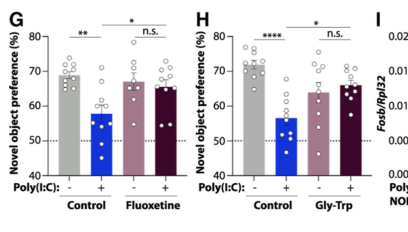

## Question

# Mechanistic Hypothesis Search

You are evaluating a specific disease mechanism hypothesis for the Disorder
Mechanisms Knowledge Base. This is not a general disease overview. Use the
hypothesis YAML below as the seed claim, then search for evidence that supports,
refutes, qualifies, or competes with this hypothesis.

## Target Disease
- **Disease Name:** Long COVID
- **Category:** Complex

## Target Hypothesis
- **Hypothesis ID:** serotonin_vagal_model
- **Hypothesis Label:** Serotonin-Vagus-Hippocampal Signaling Model
- **Status in KB:** EMERGING

## Seed Hypothesis YAML

```yaml
hypothesis_group_id: serotonin_vagal_model
hypothesis_label: Serotonin-Vagus-Hippocampal Signaling Model
status: EMERGING
description: |
  Interferon-linked serotonin depletion impairs vagal signaling and hippocampal responses, contributing to cognitive and autonomic symptoms.
applies_to_subtypes:
- Pain-dominant long COVID phenotype
- Oligosymptomatic long COVID phenotype
evidence:
- reference: PMID:37848036
  reference_title: Serotonin reduction in post-acute sequelae of viral infection.
  supports: SUPPORT
  evidence_source: HUMAN_CLINICAL
  snippet: Peripheral serotonin reduction, in turn, impedes the activity of the vagus nerve and thereby
    impairs hippocampal responses and memory.
  explanation: Supports an emerging gut-immune-neuro axis in Long COVID.
```

## Research Objective

Build a focused hypothesis-search report that answers:

1. What is the strongest direct evidence for this hypothesis?
2. What evidence argues against it, fails to reproduce it, or limits its scope?
3. Which claims are established, emerging, speculative, or contradicted?
4. Which patient subtypes, stages, tissues, cell types, molecular pathways, or
   biomarkers does the hypothesis best explain?
5. Which alternative or competing mechanistic hypotheses explain the same disease
   features better or more parsimoniously?
6. What are the explicit knowledge gaps: missing causal steps, unconfirmed edges,
   contradictory evidence, unknown source-to-target links, or source/data absences?
7. What experiments, cohorts, assays, datasets, or trials would most directly
   distinguish this hypothesis from alternatives?

Use primary literature whenever possible. Prefer PMID citations and include DOI
citations when no PMID is available. Treat reviews as orientation unless they
contain directly relevant synthesized evidence that should be clearly labeled as
review-level support.

## Required Output

### Executive Judgment

Give a concise verdict on the hypothesis as of the current literature:
supported, partially supported, unresolved, weakly supported, or refuted. Explain
the reasoning and the most important caveats.

### Evidence Matrix

Create a table with one row per important evidence item:

- Citation (PMID preferred)
- Evidence type (human clinical, model organism, in vitro, computational, review)
- Supports / refutes / qualifies / competing
- Mechanistic claim tested
- Key finding
- Disease subtype or context
- Confidence and limitations

### Mechanistic Causal Chain

Describe the causal chain implied by the hypothesis from upstream trigger to
clinical manifestation. Identify where the literature is strong, where the links
are inferred, and where there are missing causal steps.

### Knowledge Gaps

Identify explicit known unknowns surfaced by the search. Treat absence of
evidence as a curation-relevant finding only when the search actually checked for
it. Include:

- Unknown or weakly supported causal steps in the hypothesis
- Unconfirmed causal graph edges that need direct perturbation or longitudinal
  evidence
- Conflicting evidence, failed replications, or incompatible subtype-specific
  findings
- Unknown mechanism of action for relevant treatments, biomarkers, or
  interventions tied to this hypothesis
- Source-level or dataset-level absences, such as no relevant GenCC, ClinGen,
  trial, omics, or cohort evidence found as of the search date

For each gap, state the scope, why it matters, what was checked, and what
evidence or experiment would resolve it.

### Alternative Models

List competing or complementary hypotheses. For each, explain whether it is an
alternative to the seed hypothesis, a downstream consequence, an upstream cause,
or a parallel mechanism.

### Discriminating Tests

Recommend concrete studies or assays that would most efficiently test this
hypothesis against alternatives. Include patient stratification, biomarkers,
sample type, model system, perturbation, and expected result where applicable.

### Curation Leads

Provide candidate updates for the KB, but label these as leads requiring curator
verification. Include:

- candidate evidence references and exact abstract snippets to verify
- candidate pathophysiology nodes or edges
- candidate ontology terms for cell types and biological processes
- candidate subtype restrictions or status changes
- candidate `knowledge_gaps` or discussion prompts for unresolved causal claims,
  conflicting evidence, or explicit source/data absences

If the provider supports artifacts, produce artifact-friendly outputs such as an
evidence matrix, mechanistic diagram, knowledge-gap table, or comparison table.
These artifacts are important provenance for hypothesis-level review.


## Output

Question: You are an expert researcher providing comprehensive, well-cited information.

Provide detailed information focusing on:
1. Key concepts and definitions with current understanding
2. Recent developments and latest research (prioritize 2023-2024 sources)
3. Current applications and real-world implementations
4. Expert opinions and analysis from authoritative sources
5. Relevant statistics and data from recent studies

Format as a comprehensive research report with proper citations. Include URLs and publication dates where available.
Always prioritize recent, authoritative sources and provide specific citations for all major claims.

# Mechanistic Hypothesis Search

You are evaluating a specific disease mechanism hypothesis for the Disorder
Mechanisms Knowledge Base. This is not a general disease overview. Use the
hypothesis YAML below as the seed claim, then search for evidence that supports,
refutes, qualifies, or competes with this hypothesis.

## Target Disease
- **Disease Name:** Long COVID
- **Category:** Complex

## Target Hypothesis
- **Hypothesis ID:** serotonin_vagal_model
- **Hypothesis Label:** Serotonin-Vagus-Hippocampal Signaling Model
- **Status in KB:** EMERGING

## Seed Hypothesis YAML

```yaml
hypothesis_group_id: serotonin_vagal_model
hypothesis_label: Serotonin-Vagus-Hippocampal Signaling Model
status: EMERGING
description: |
  Interferon-linked serotonin depletion impairs vagal signaling and hippocampal responses, contributing to cognitive and autonomic symptoms.
applies_to_subtypes:
- Pain-dominant long COVID phenotype
- Oligosymptomatic long COVID phenotype
evidence:
- reference: PMID:37848036
  reference_title: Serotonin reduction in post-acute sequelae of viral infection.
  supports: SUPPORT
  evidence_source: HUMAN_CLINICAL
  snippet: Peripheral serotonin reduction, in turn, impedes the activity of the vagus nerve and thereby
    impairs hippocampal responses and memory.
  explanation: Supports an emerging gut-immune-neuro axis in Long COVID.
```

## Research Objective

Build a focused hypothesis-search report that answers:

1. What is the strongest direct evidence for this hypothesis?
2. What evidence argues against it, fails to reproduce it, or limits its scope?
3. Which claims are established, emerging, speculative, or contradicted?
4. Which patient subtypes, stages, tissues, cell types, molecular pathways, or
   biomarkers does the hypothesis best explain?
5. Which alternative or competing mechanistic hypotheses explain the same disease
   features better or more parsimoniously?
6. What are the explicit knowledge gaps: missing causal steps, unconfirmed edges,
   contradictory evidence, unknown source-to-target links, or source/data absences?
7. What experiments, cohorts, assays, datasets, or trials would most directly
   distinguish this hypothesis from alternatives?

Use primary literature whenever possible. Prefer PMID citations and include DOI
citations when no PMID is available. Treat reviews as orientation unless they
contain directly relevant synthesized evidence that should be clearly labeled as
review-level support.

## Required Output

### Executive Judgment

Give a concise verdict on the hypothesis as of the current literature:
supported, partially supported, unresolved, weakly supported, or refuted. Explain
the reasoning and the most important caveats.

### Evidence Matrix

Create a table with one row per important evidence item:

- Citation (PMID preferred)
- Evidence type (human clinical, model organism, in vitro, computational, review)
- Supports / refutes / qualifies / competing
- Mechanistic claim tested
- Key finding
- Disease subtype or context
- Confidence and limitations

### Mechanistic Causal Chain

Describe the causal chain implied by the hypothesis from upstream trigger to
clinical manifestation. Identify where the literature is strong, where the links
are inferred, and where there are missing causal steps.

### Knowledge Gaps

Identify explicit known unknowns surfaced by the search. Treat absence of
evidence as a curation-relevant finding only when the search actually checked for
it. Include:

- Unknown or weakly supported causal steps in the hypothesis
- Unconfirmed causal graph edges that need direct perturbation or longitudinal
  evidence
- Conflicting evidence, failed replications, or incompatible subtype-specific
  findings
- Unknown mechanism of action for relevant treatments, biomarkers, or
  interventions tied to this hypothesis
- Source-level or dataset-level absences, such as no relevant GenCC, ClinGen,
  trial, omics, or cohort evidence found as of the search date

For each gap, state the scope, why it matters, what was checked, and what
evidence or experiment would resolve it.

### Alternative Models

List competing or complementary hypotheses. For each, explain whether it is an
alternative to the seed hypothesis, a downstream consequence, an upstream cause,
or a parallel mechanism.

### Discriminating Tests

Recommend concrete studies or assays that would most efficiently test this
hypothesis against alternatives. Include patient stratification, biomarkers,
sample type, model system, perturbation, and expected result where applicable.

### Curation Leads

Provide candidate updates for the KB, but label these as leads requiring curator
verification. Include:

- candidate evidence references and exact abstract snippets to verify
- candidate pathophysiology nodes or edges
- candidate ontology terms for cell types and biological processes
- candidate subtype restrictions or status changes
- candidate `knowledge_gaps` or discussion prompts for unresolved causal claims,
  conflicting evidence, or explicit source/data absences

If the provider supports artifacts, produce artifact-friendly outputs such as an
evidence matrix, mechanistic diagram, knowledge-gap table, or comparison table.
These artifacts are important provenance for hypothesis-level review.


## Focused Hypothesis-Search Report: Serotonin–Vagus–Hippocampal Signaling Model in Long COVID (serotonin_vagal_model)

**Seed hypothesis**: Interferon-linked serotonin depletion impairs vagal signaling and hippocampal responses, contributing to cognitive and autonomic symptoms.

### Executive Judgment (as of 2026-05-23)
**Verdict: partially supported / unresolved.**

The **causal mechanistic chain is strongly supported in preclinical systems** (viral mimetic and infection models) linking type I interferon–dependent inflammation to peripheral serotonin depletion and then to vagal/hippocampal novelty-memory readouts, with multiple “rescue” perturbations (5-HTP, SSRI fluoxetine, 5-HT3 agonism, and direct vagal activation) restoring hippocampal activity and behavior (wong2023serotoninreductionin pages 9-11, wong2023serotoninreductionin pages 8-9, wong2023serotoninreductionin media 39653b75). However, the **human clinical serotonin finding is heterogeneous across cohorts** (including at least one cohort with no observed serotonin reduction) and has been **directly challenged on methodological grounds** (platelet contamination/centrifugation expectations and lack of platelet-normalized reporting), meaning that the central human biomarker claim (low plasma serotonin in PASC) is not yet fully stable (wong2023serotoninreductionin pages 3-5, wong2023serotoninreductionin pages 11-13, anderson2024longcovid19and pages 1-2, anderson2024longcovid19and pages 2-3).

Clinical translation is plausible but not established: SSRIs and vagus nerve stimulation show signals consistent with the model, but effects are mixed and often observational or small-pilot, and mechanistic specificity to the serotonin–vagus axis is unproven (farahani2023effectoffluvoxamine pages 5-7, butzindozier2024ssriuseduring pages 1-4, NCT05608629 chunk 1, NCT05679505 chunk 1).

### Key Concepts and Definitions (current mechanistic understanding)
1. **Peripheral serotonin pool**: Most circulating serotonin is stored in **platelets** (not freely dissolved), with intestinal enterochromaffin cells supplying serotonin that platelets uptake and store. The hypothesis depends on changes in this platelet-linked peripheral pool rather than central brain serotonin (wong2023serotoninreductionin pages 9-11, liu2024fromintestinalmetabolites pages 2-2).
2. **Type I interferon (IFN-I) signaling axis**: The model posits a **viral RNA → TLR3 → IFNAR → STAT1** pathway that drives epithelial transporter suppression, platelet changes, and serotonin turnover increases, thereby lowering peripheral serotonin (wong2023serotoninreductionin pages 9-11, wong2023serotoninreductionin pages 5-6).
3. **Vagal afferent signaling and 5-HT3 receptors**: The proposed “bridge” from gut/blood chemistry to brain is **serotonin acting on vagal sensory neurons** (with prominent 5-HT3 receptor involvement), modulating brainstem processing and downstream hippocampal novelty/memory responses (wong2023serotoninreductionin pages 9-11, wong2023serotoninreductionin media 39653b75).
4. **Hippocampal response readouts**: In the seed work, hippocampal engagement is operationalized via novelty-induced activity markers in dentate gyrus and behavior (novel object recognition) as a proxy for memory/“brain fog” (wong2023serotoninreductionin media 39653b75).

### Evidence Matrix (primary and translational)
| Citation (year) | Evidence type | Supports / refutes / qualifies / competing | Mechanistic claim tested | Key finding | Context / subtype | Confidence & limitations |
|---|---|---|---|---|---|---|
| Wong et al., *Cell* (2023), PMID:37848036 | Human clinical + translational multi-cohort | Supports, qualifies | PASC is associated with peripheral serotonin depletion linked to interferon/inflammation; reduced serotonin may relate to cognitive symptoms via vagal signaling | In Penn metabolomics (58 Long COVID vs 60 acute COVID; plus 1,540-patient symptom clustering), serotonin was reported as the metabolite most associated with PASC; tryptophan was reduced; UCSF LIINC showed serotonin negatively correlated with symptom burden; one independent cohort (UNCOVR) did **not** reproduce serotonin reduction, indicating heterogeneity (wong2023serotoninreductionin pages 3-5, wong2023serotoninreductionin pages 1-3, wong2023serotoninreductionin pages 11-13) | Broad PASC; neurocognitive symptom burden; heterogeneous endotypes | **Moderate**: high-impact primary study with multiple cohorts, but replication is incomplete, cohort ascertainment differed, and direct human vagus/hippocampus measurements were not shown (wong2023serotoninreductionin pages 11-13, wong2023serotoninreductionin pages 3-5) |
| Wong et al., *Cell* mechanistic mouse/poly(I:C)/viral models (2023) | Model organism + organoid + in vitro neuron assays | Supports | Type I IFN/TLR3/STAT1-driven inflammation lowers peripheral serotonin via reduced tryptophan uptake, thrombocytopenia/platelet storage loss, and MAO turnover; low serotonin impairs vagal signaling and hippocampal memory responses | Poly(I:C), VSV, LCMV, and SARS-CoV-2 models showed reduced platelet counts, increased platelet activation, increased ileal **Maoa** and urinary 5-HIAA, transporter downregulation (**Ace2/Slc6a19**), impaired NTS and dentate gyrus cFos, and novel object recognition deficits; rescue with fluoxetine, 5-HTP, Gly-Trp, capsaicin, vagal chemogenetic activation, and 5-HT3 agonist m-CPBG (wong2023serotoninreductionin pages 9-11, wong2023serotoninreductionin pages 8-9, wong2023serotoninreductionin pages 38-44, wong2023serotoninreductionin pages 44-45, wong2023serotoninreductionin media 39653b75) | Infection-like inflammatory states; cognition/brain fog-like phenotype | **Moderate-high preclinical**: strong causal perturbation data, but mostly mouse/poly(I:C) models rather than established human Long COVID; exact human causal bridge remains inferred (wong2023serotoninreductionin pages 11-13, wong2023serotoninreductionin pages 9-11) |
| Liu et al., *Clin Transl Med* (2024) | Commentary / review-level synthesis | Supports, qualifies | Viral persistence → sustained IFN responses → serotonin depletion → vagal dysfunction → neurocognitive symptoms | Summarizes Wong et al.; highlights reduced brainstem activity in inflammatory mouse models, rescue by capsaicin and vagal neuron activation, and notes observational SSRI signals (Dutch n=95; N3C n=17,933 in cited summary) while calling for prospective trials (liu2024fromintestinalmetabolites pages 3-4, liu2024fromintestinalmetabolites pages 3-3) | Long COVID brain fog / neurocognitive phenotype | **Low-moderate**: useful synthesis and translational framing, but not independent primary evidence; clinical SSRI observations are non-randomized (liu2024fromintestinalmetabolites pages 3-4) |
| Bai et al., *MedComm* (2024) | Commentary / review-level synthesis | Supports | Type I IFN–IFNAR–STAT1 signaling and transporter downregulation mediate serotonin depletion that dampens vagal signaling | Reviews evidence that persistent viral RNA and IFN signaling reduce serotonin by decreasing **Ace2/Slc6a19**, impairing storage, and increasing degradation; emphasizes 5-HT3-expressing vagal neurons and rescue logic from Wong et al. (bai2024serotoninsignalinga pages 2-2, bai2024serotoninsignalinga pages 2-3, bai2024serotoninsignalinga pages 3-3) | PASC neurocognitive symptoms | **Low-moderate**: coherent mechanistic summary, but derivative rather than independent replication; no new human causal data (bai2024serotoninsignalinga pages 2-2) |
| Anderson et al., *J Inflamm Res* (2024) | Methodological critique / commentary | Refutes, qualifies | Validity of reported plasma serotonin depletion and downstream interpretation | Argues Wong et al.’s centrifugation protocol would yield platelet-poor plasma with expected serotonin far below reported values; claims reported control values were 30–60× too high, platelet-normalized data were lacking, and SSRI interpretation is inconsistent because SSRIs lower platelet serotonin uptake (anderson2024longcovid19and pages 1-2, anderson2024longcovid19and pages 2-3) | Measurement validity across all PASC subtypes | **Moderate**: serious assay-method critique from serotonin experts; does not directly disprove the biology, but substantially weakens confidence in the human plasma 5-HT measurements until independently replicated with rigorous platelet-aware assays (anderson2024longcovid19and pages 1-2) |
| Farahani et al., *BMC Infect Dis* (2023) | Human randomized controlled trial | Qualifies | If serotonergic/anti-inflammatory modulation is relevant, acute fluvoxamine might reduce later post-COVID symptoms | Double-blind RCT in mild-moderate outpatients: 42 fluvoxamine vs 43 placebo at 12 weeks; fatigue was lower with fluvoxamine (9/42 vs 19/43; p=0.026; RR 0.48, 95% CI 0.25–0.95), but no significant benefit for most other neuropsychiatric PCS symptoms (farahani2023effectoffluvoxamine pages 5-7, farahani2023effectoffluvoxamine pages 1-2, farahani2023effectoffluvoxamine pages 2-5) | Prevention of post-COVID fatigue after acute infection | **Moderate**: randomized and blinded, but small, single-center, per-protocol, vaccinated population, short 10-day dosing, and mechanism may involve sigma-1 receptor/anti-inflammatory effects rather than serotonin-vagus signaling specifically (farahani2023effectoffluvoxamine pages 5-7, farahani2023effectoffluvoxamine pages 7-8) |
| Butzin-Dozier et al., N3C preprint (2024) | Large human observational EHR study | Qualifies, indirect support | SSRI exposure during acute COVID may reduce subsequent Long COVID risk | In 506,903 patients with major depressive disorder, 124,928 SSRI users had lower adjusted 12-month Long COVID risk by ICD-10 U09.9 (overall aRR 0.90, 95% CI 0.86–0.94); strongest signals for fluoxetine, sertraline, and escitalopram; prior COVID-OUT fluvoxamine arm cited as null/underpowered (butzindozier2024ssriuseduring pages 1-4, butzindozier2024ssriuseduring pages 10-13, butzindozier2024ssriuseduring pages 28-29, butzindozier2024ssriuseduring pages 4-7, butzindozier2024ssriuseduring pages 7-10) | Risk of Long COVID broadly, not specific neurocognitive subtype | **Moderate-low**: very large dataset and advanced adjustment, but preprint, residual confounding likely, Long COVID defined by U09.9 coding, and mechanism is not identifiable from EHR data (butzindozier2024ssriuseduring pages 13-16, butzindozier2024ssriuseduring pages 16-19) |
| Yao et al., *Gut Microbes* (2024) | Human cohort + microbiome/metabolome + in vitro | Competing, complementary, qualifies | Disrupted host/microbial tryptophan metabolism contributes to inflammatory dysregulation and Long COVID | Hospitalized COVID cohorts showed tryptophan and IPA inversely associated with inflammatory mediators; Long COVID cohort (n=20) showed similar patterns; metagenomics (COVID n=380 vs controls n=270) found reduced microbial tryptophan-production capacity; microbial indoles dampened STING/TLR3/TLR4-triggered inflammatory responses and type I IFNs in vitro (yao2024dysruptedmicrobialtryptophan pages 1-2, yao2024dysruptedmicrobialtryptophan pages 9-11, yao2024dysruptedmicrobialtryptophan pages 11-13, yao2024dysruptedmicrobialtryptophan pages 2-5) | Gut-immune Long COVID, potentially GI/inflammatory endotypes | **Moderate**: strong evidence for tryptophan–microbiome–inflammation axis, but it does not directly show serotonin depletion causing vagal/hippocampal dysfunction; may be upstream or parallel to the seed model (yao2024dysruptedmicrobialtryptophan pages 1-2, yao2024dysruptedmicrobialtryptophan pages 11-13) |
| NCT05608629, Mount Sinai tVNS pilot (2022 registry; results posted 2024) | Interventional pilot trial | Indirect support, qualifies | Enhancing vagal signaling may improve Long COVID symptoms even without proving serotonin deficit | Open-label auricular tVNS pilot in Long COVID meeting ME/CFS criteria; 17 enrolled, 14 evaluable; 8/14 met prespecified treatment-success criteria after 6 weeks (NCT05608629 chunk 1) | ME/CFS-like Long COVID with fatigue/PEM | **Low-moderate**: clinically suggestive, but uncontrolled/open-label, small, selected phenotype, and does not test serotonin biology directly (NCT05608629 chunk 1) |
| NCT05679505, Bahçeşehir taVNS trial (2022 registry) | Randomized crossover interventional trial | Indirect support, qualifies | Vagal modulation may alter autonomic dysfunction/fatigue in post-COVID syndrome | Randomized crossover auricular taVNS trial in 40 adults with ≥12-week post-COVID symptoms; primary endpoint HRV, secondary fatigue severity; protocol explicitly targets parasympathetic/sympathetic balance, but no published efficacy results were available in retrieved context (NCT05679505 chunk 1) | Autonomic / fatigue-predominant post-COVID | **Low**: rationale is relevant to the vagal arm of the model, but absence of reported results means it currently provides implementation evidence, not outcome evidence (NCT05679505 chunk 1) |


*Table: This evidence matrix summarizes the main supportive, qualifying, and critical evidence for the serotonin–vagus–hippocampal model in Long COVID, spanning primary human and animal studies, critiques, related intervention studies, and vagus-nerve trials. It is useful for quickly distinguishing direct mechanistic support from indirect or competing evidence.*

### Strongest Direct Evidence *for* the Hypothesis
#### 1) Integrated human + mechanistic preclinical evidence (Wong et al., Cell 2023)
**Citation and link**: Wong et al. “Serotonin reduction in post-acute sequelae of viral infection.” *Cell* (Oct 2023). DOI: 10.1016/j.cell.2023.09.013. URL: https://doi.org/10.1016/j.cell.2023.09.013 (wong2023serotoninreductionin pages 1-3).

**Human signal (direct but qualified)**
- Reported **association of PASC with reduced serotonin**, based on targeted plasma metabolomics (58 Long COVID patients vs 60 acute COVID) and broader PASC cohort characterization (1,540 symptom-clustered PASC patients), plus cross-cohort comparisons (wong2023serotoninreductionin pages 1-3).
- Reported **heterogeneity**: one cohort (UNCOVR) showed **no serotonin reduction**; serotonin during acute infection was **not predictive** of PASC development; LIINC cohort showed serotonin **negatively correlated with number of symptoms** at ~3–4 months (wong2023serotoninreductionin pages 3-5).

**Mechanistic chain (direct causal evidence in preclinical systems)**
- Viral/inflammatory triggers: poly(I:C), VSV, SARS-CoV-2, and chronic viral infection models.
- Upstream immune dependence: serotonin depletion described as **TLR3-, IFNAR-, STAT1-dependent** (wong2023serotoninreductionin pages 9-11).
- Three depletion mechanisms described:
  1) **Reduced intestinal absorption of tryptophan** via suppression of uptake genes including Ace2/Slc6a19 in organoid and mouse systems (wong2023serotoninreductionin pages 38-44, wong2023serotoninreductionin pages 5-6).
  2) **Platelet hyperactivation and thrombocytopenia** affecting serotonin storage/carrying capacity (wong2023serotoninreductionin pages 8-9, wong2023serotoninreductionin pages 9-11).
  3) **Enhanced MAO-mediated turnover**, including increased Maoa transcription and increased 5-HIAA (serotonin catabolite) with rescue via MAO inhibition (wong2023serotoninreductionin pages 8-9, liu2024fromintestinalmetabolites pages 2-2).
- Downstream neurophysiology and behavior:
  - Reduced brainstem novelty response (NTS) and reduced hippocampal activity markers in dentate gyrus with cognitive impairment.
  - **Multiple rescues**: 5-HTP, fluoxetine, Gly-Trp diet, capsaicin, 5-HT3 agonist (m-CPBG), and chemogenetic activation of Phox2b+ vagal neurons restored hippocampal activation and novelty-memory behavior (wong2023serotoninreductionin pages 8-9, wong2023serotoninreductionin media 39653b75).

**Figure-level mechanistic support**: Wong et al. Figure 7 provides visual evidence for vagal mediation and rescue by serotonergic and vagal-targeted interventions (wong2023serotoninreductionin media 39653b75, wong2023serotoninreductionin media d45b0571, wong2023serotoninreductionin media f54dc65e, wong2023serotoninreductionin media 9e1641ff).

#### 2) Independent 2024 human data strengthening the “interferon–tryptophan” upstream context
Yao et al. (Gut Microbes, Nov 2024) provides **human cohort** evidence that tryptophan and microbiota-derived tryptophan metabolites correlate with inflammatory mediators in acute COVID and in a small long COVID cohort; and provides mechanistic in vitro evidence that microbial indoles can dampen innate antiviral signaling and type I interferon outputs (yao2024dysruptedmicrobialtryptophan pages 1-2, yao2024dysruptedmicrobialtryptophan pages 9-11, yao2024dysruptedmicrobialtryptophan pages 2-5).

**Citation and link**: Yao et al. “Dysrupted microbial tryptophan metabolism associates with SARS-CoV-2 acute inflammatory responses and long COVID.” *Gut Microbes* (Nov 2024). DOI: 10.1080/19490976.2024.2429754. URL: https://doi.org/10.1080/19490976.2024.2429754 (yao2024dysruptedmicrobialtryptophan pages 1-2).

Key statistics:
- Hospitalized COVID cohort: **n=172** with inflammatory mediator correlations to tryptophan metabolites (yao2024dysruptedmicrobialtryptophan pages 1-2).
- Long COVID cohort: **n=20** showing similar association patterns (yao2024dysruptedmicrobialtryptophan pages 1-2).
- Microbiome meta-cohort: **COVID n=380 vs controls n=270** for microbial gene capacity differences (yao2024dysruptedmicrobialtryptophan pages 1-2).

This does not prove serotonin mediation but **supports a biologically plausible upstream gut–immune–tryptophan axis** that could feed into serotonin changes.

### Evidence *Against*, Non-Reproduction, or Scope Limitations
#### 1) Methodological critique of serotonin measurements (major caveat)
Anderson et al. (Apr 2024) argues that the centrifugation procedure described for plasma in Wong et al. would yield platelet-poor plasma and therefore should have serotonin concentrations far lower than those reported; they conclude the plasma serotonin values (and derived comparisons) should be disregarded (anderson2024longcovid19and pages 1-2, anderson2024longcovid19and pages 2-3).

**Citation and link**: Anderson et al. “Long COVID-19 and Peripheral Serotonin: A Commentary and Reconsideration.” *J Inflamm Res* (Apr 2024). DOI: 10.2147/JIR.S456000. URL: https://doi.org/10.2147/jir.s456000 (anderson2024longcovid19and pages 1-2).

Implications:
- Undermines confidence in the **human plasma-serotonin magnitude** without independent replication using platelet-normalized methods.
- Raises the possibility that apparent differences could reflect **platelet-count differences or sample-prep artifacts** rather than true depletion.
- Notes SSRIs are expected to reduce platelet serotonin uptake; thus “SSRI benefit” does not straightforwardly validate a “low serotonin” model unless platelet and plasma pools are carefully distinguished (anderson2024longcovid19and pages 2-3).

#### 2) Within-seed paper heterogeneity and negative cohort
Wong et al. explicitly report that **no serotonin reduction was observed in the UNCOVR cohort**, and that the degree of serotonin reduction varied across cohorts; they also state serotonin during acute infection was not predictive of PASC (wong2023serotoninreductionin pages 3-5, wong2023serotoninreductionin pages 11-13).

This limits the model’s scope as a universal mechanism and supports an **endotype-specific** interpretation.

### Established vs Emerging vs Speculative Components
- **Established (preclinical causal)**: IFN-linked inflammatory signaling can reduce peripheral serotonin and produce vagal/hippocampal-dependent memory phenotypes in mice with rescue by serotonergic/vagal perturbations (wong2023serotoninreductionin pages 8-9, wong2023serotoninreductionin media 39653b75).
- **Emerging (human associative)**: PASC association with reduced serotonin and tryptophan in some cohorts, and symptom correlations in LIINC (wong2023serotoninreductionin pages 3-5).
- **Speculative/Unresolved (human causal chain)**: IFN → serotonin depletion → vagal dysfunction → hippocampal dysfunction as a demonstrated longitudinal causal chain in humans; direct demonstration of vagal afferent impairment due to low serotonin in PASC is absent in the retrieved primary clinical evidence (wong2023serotoninreductionin pages 11-13, anderson2024longcovid19and pages 2-3).
- **Contradicted/Contested**: Validity of reported human plasma serotonin values and interpretation without platelet normalization (anderson2024longcovid19and pages 1-2, anderson2024longcovid19and pages 2-3).

### Best-Explained Contexts, Subtypes, and Biomarkers
**Symptoms potentially best explained by this model**: neurocognitive complaints consistent with hippocampal novelty/memory disruption (often labeled brain fog), and potentially autonomic symptoms insofar as vagal tone is implicated (wong2023serotoninreductionin pages 1-3, wong2023serotoninreductionin pages 9-11).

**Subtypes in seed YAML**: pain-dominant and oligosymptomatic phenotypes.
- Direct subtype-specific evidence in the retrieved sources is limited; Wong et al. define eight symptom-based subtypes but note serotonin reduction was not specific to any single subset, and cohort heterogeneity is large (wong2023serotoninreductionin pages 1-3, wong2023serotoninreductionin pages 11-13).

**Candidate biomarkers aligned to the model (needs validation)**:
- Peripheral serotonin (plasma/serum/platelet pools—must be specified) (anderson2024longcovid19and pages 1-2, wong2023serotoninreductionin pages 3-5).
- Tryptophan and transporter expression proxies (e.g., ACE2/SLC6A19 pathway changes in GI) (wong2023serotoninreductionin pages 5-6).
- Type I IFN signatures (IFNAR/STAT1-driven gene expression) (wong2023serotoninreductionin pages 9-11).
- Autonomic readouts (HRV) as a vagal proxy—widely used in tVNS trials (NCT05679505 chunk 1, NCT05918965 chunk 1).

### Current Applications and Real-World Implementations
#### 1) SSRIs as prevention/treatment signals (mixed, mechanism uncertain)
- **Randomized trial (post-COVID fatigue prevention)**: Fluvoxamine 100 mg daily for 10 days during acute COVID reduced fatigue at 12 weeks (9/42 vs 19/43; RR 0.48, 95% CI 0.25–0.95; p=0.026), but did not significantly improve most other post-COVID neuropsychiatric symptoms (Mar 2023) (farahani2023effectoffluvoxamine pages 5-7, farahani2023effectoffluvoxamine pages 1-2).
  - URL: https://doi.org/10.1186/s12879-023-08172-5 (farahani2023effectoffluvoxamine pages 1-2).
- **Large observational EHR evidence (N3C preprint)**: In 506,903 patients with major depressive disorder, SSRI use during acute infection associated with lower 12-month Long COVID diagnosis risk (ICD-10 U09.9), adjusted RR ~0.90 (95% CI 0.86–0.94); drug-specific effects varied (fluoxetine, sertraline, escitalopram showing protective associations; others null/uncertain) (Feb 2024) (butzindozier2024ssriuseduring pages 1-4, butzindozier2024ssriuseduring pages 28-29).
  - URL: https://doi.org/10.1101/2024.02.05.24302352 (butzindozier2024ssriuseduring pages 1-4).

**Interpretation**: These data do not uniquely support the serotonin–vagus mechanism (SSRIs have sigma-1 receptor and anti-inflammatory actions; and they alter platelet serotonin handling). They are best treated as **clinical plausibility signals** motivating biomarker-embedded RCTs (anderson2024longcovid19and pages 2-3, butzindozier2024ssriuseduring pages 13-16).

#### 2) Vagus nerve stimulation (tVNS/taVNS) trials in Long COVID
These trials implement the “vagus” limb of the hypothesis directly, often using **fatigue, brain fog, pain, and HRV** as endpoints.

- **Open-label pilot with posted registry results**: NCT05608629 (Mount Sinai). 17 enrolled (14 evaluable); **8/14 met predefined ‘treatment success’** after 6 weeks of auricular tVNS in Long COVID patients meeting chronic fatigue syndrome criteria; results posted 2024-01-08 (NCT05608629 chunk 1). URL: https://clinicaltrials.gov/study/NCT05608629
- **Completed randomized crossover (results not in retrieved text)**: NCT05679505 (Bahçeşehir University) randomized crossover taVNS (n=40) with HRV primary endpoint and fatigue severity secondary; no results captured in retrieved content (NCT05679505 chunk 1). URL: https://clinicaltrials.gov/study/NCT05679505
- **Recruiting randomized double-masked parallel trial**: NCT06585254 (Mount Sinai) n≈50; endpoints include Chalder fatigue, SF-36, VAS fatigue/pain/PEM/brain fog, HRV (NCT06585254 chunk 1). URL: https://clinicaltrials.gov/study/NCT06585254
- **Female-focused pilot**: NCT05918965 (Vienna) n=45 females; 12 weeks stimulation; HRV, salivary cortisol, fatigue, dyspnea, QoL endpoints (NCT05918965 chunk 1). URL: https://clinicaltrials.gov/study/NCT05918965
- **Pain-focused pilot**: NCT05205577 (AP-HP Paris) n≈30; 8-week auricular tVNS for painful long COVID; rationale includes cholinergic anti-inflammatory reflex (NCT05205577 chunk 1). URL: https://clinicaltrials.gov/study/NCT05205577

**Relevance to hypothesis**: These trials directly test whether **enhancing vagal signaling** improves clinical symptoms; they generally **do not measure serotonin**, so they cannot confirm the full serotonin→vagus causal edge (NCT05679505 chunk 1, NCT05608629 chunk 1).

### Mechanistic Causal Chain (with strength of links)
**Proposed chain**:
1) **Persistent viral RNA/antigen or viral inflammation** → 2) **Type I IFN signaling (TLR3/IFNAR/STAT1)** → 3) **Peripheral serotonin depletion** via: (a) reduced intestinal tryptophan uptake, (b) platelet storage capacity reduction, (c) increased MAO turnover → 4) **Reduced vagal afferent activity** (NTS activation reduced) → 5) **Reduced hippocampal novelty responses** → 6) **Cognitive symptoms (memory/brain fog) and possibly autonomic symptoms** (wong2023serotoninreductionin pages 9-11, wong2023serotoninreductionin pages 8-9, wong2023serotoninreductionin media 39653b75).

**Strength grading**:
- Steps 2→3 and 3→5 are **strong in mice/organoids** with perturbation/rescue (wong2023serotoninreductionin pages 8-9, wong2023serotoninreductionin media 39653b75).
- Step 3 in humans (serotonin depletion) is **emerging/contested** due to heterogeneity and measurement critique (wong2023serotoninreductionin pages 3-5, anderson2024longcovid19and pages 1-2).
- Steps 4→6 in humans are **largely inferred**; direct vagal recordings or hippocampal functional measures tied to serotonin status in PASC are missing in retrieved primary evidence (anderson2024longcovid19and pages 2-3).

### Knowledge Gaps (explicit)
| Hypothesis edge/step | What is known (with brief evidence) | What is missing/uncertain | Why it matters | Proposed discriminating experiment or dataset |
|---|---|---|---|---|
| Peripheral serotonin is truly reduced in PASC | Wong et al. reported serotonin as the metabolite most associated with PASC across several cohorts, with reduced tryptophan and links to platelet biology; however one cohort (UNCOVR) did not reproduce serotonin reduction (wong2023serotoninreductionin pages 3-5, wong2023serotoninreductionin pages 1-3) | Whether published human plasma 5-HT values are analytically valid; whether differences reflect true serotonin depletion vs sample-prep artifact or platelet loss | This is the foundation of the whole model; if the human serotonin signal is not robust, the downstream vagus/hippocampus chain weakens substantially | Independent multi-center replication using standardized serotonin assays in whole blood, platelet-rich plasma, platelet-poor plasma, and serum, with contemporaneous platelet counts and per-platelet normalization; pre-register centrifugation/processing SOPs and include blinded assay cross-validation (anderson2024longcovid19and pages 1-2, anderson2024longcovid19and pages 2-3) |
| Platelet normalization and storage defects explain “low serotonin” | The seed paper proposes thrombocytopenia and platelet hyperactivation reduce systemic serotonin storage/carrying capacity; animal work supports platelet involvement (wong2023serotoninreductionin pages 8-9, wong2023serotoninreductionin pages 9-11, liu2024fromintestinalmetabolites pages 2-2) | No definitive human PASC study has shown whether low circulating 5-HT remains after normalization to platelet number, platelet volume, or platelet serotonin content | Distinguishes true serotonergic depletion from hematologic confounding and clarifies whether platelet dysfunction is upstream, parallel, or merely a measurement issue | Human longitudinal cohort measuring platelet count, mean platelet volume, platelet activation markers, platelet serotonin content, plasma serotonin, and symptom trajectories before and after exertion or inflammatory flares |
| Type I IFN causally drives serotonin depletion in humans | In mice/organoids, TLR3/IFNAR/STAT1 signaling and viral inflammation reduce serotonin via tryptophan uptake, platelet changes, and MAO-mediated turnover; human PASC data are consistent but mainly associative (wong2023serotoninreductionin pages 9-11, bai2024serotoninsignalinga pages 2-2, wong2023serotoninreductionin pages 5-6, wong2023serotoninreductionin pages 1-3) | No direct human perturbation or longitudinal mediation study shows IFN elevation precedes and causes serotonin decline in PASC | Establishes whether IFN is the actionable upstream driver rather than a correlate of viral persistence or generalized inflammation | Serial human sampling from acute infection through 12 months with plasma IFN-α/β, IFN-stimulated gene signatures, serotonin, tryptophan, platelet metrics, and mediation analysis; ideally nested in cohorts receiving antiviral or IFN-modulating treatment |
| Reduced intestinal tryptophan uptake is a main source of serotonin loss | Mouse/organoid work shows reduced Ace2/Slc6a19 and impaired tryptophan absorption after viral/TLR3 signaling; PASC patients also show lower tryptophan (wong2023serotoninreductionin pages 38-44, liu2024fromintestinalmetabolites pages 2-3, wong2023serotoninreductionin pages 5-6) | In humans with PASC, there is no direct demonstration that impaired intestinal transporter activity meaningfully lowers systemic serotonin over time | Needed to know whether gut epithelial dysfunction is a key intervention point vs secondary metabolic noise | Endoscopy/biopsy subcohort with duodenal ACE2/SLC6A19 expression, tracer-based oral tryptophan absorption testing, stool virome/microbiome, plasma tryptophan-serotonin panels, and matched symptom phenotyping |
| MAO-mediated turnover contributes materially in human PASC | In animal models, ileal Maoa and urinary 5-HIAA increase during viral inflammation and MAO inhibition rescues platelet serotonin (wong2023serotoninreductionin pages 8-9, wong2023serotoninreductionin pages 38-44, liu2024fromintestinalmetabolites pages 2-2) | No clear human PASC evidence quantifies MAO activity, tissue source, or whether elevated 5-HIAA is present and symptom-linked | Determines whether turnover, rather than synthesis/storage, is the dominant druggable mechanism | Human urine/plasma 5-HIAA plus platelet/intestinal MAO-A measures, PET MAO imaging where feasible, and ex vivo platelet serotonin uptake/turnover assays across PASC subtypes |
| Low peripheral serotonin directly impairs human vagal signaling | Mouse work shows reduced NTS activation, serotonin-responsive vagal neurons, and rescue with capsaicin, 5-HT3 agonism, or chemogenetic vagal activation (wong2023serotoninreductionin pages 9-11, wong2023serotoninreductionin media 39653b75, wong2023serotoninreductionin media d45b0571) | No direct human evidence links lower serotonin to reduced vagal afferent signaling in PASC; current human vagal data are mostly indirect via HRV or stimulation trials | This is the key bridge from peripheral biochemistry to neurocognitive/autonomic symptoms | Combine autonomic testing (HRV, baroreflex sensitivity, tilt, respiratory sinus arrhythmia), plasma/platelet serotonin, and pharmacologic challenge (e.g., acute 5-HTP or peripheral 5-HT3 agonist where safe) with symptom and physiologic readouts |
| Vagal impairment causes altered hippocampal responses in PASC | In mice, reduced peripheral serotonin blunts NTS and dentate gyrus cFos and impairs novel object recognition; rescue restores hippocampal activation and behavior (wong2023serotoninreductionin pages 38-44, wong2023serotoninreductionin pages 44-45, wong2023serotoninreductionin media 39653b75) | No human PASC study has directly shown that individuals with low serotonin/low vagal tone have abnormal hippocampal activation specifically attributable to this pathway | Necessary to validate the “vagus-to-hippocampus” limb rather than assuming animal circuitry translates directly | fMRI task studies focused on hippocampal novelty/memory encoding in PASC, stratified by serotonin and autonomic status, with concurrent inflammatory markers and follow-up after vagal or serotonergic intervention |
| Hippocampal dysfunction explains brain fog/memory symptoms better than alternatives | The model is strongest for memory-related cognitive symptoms; animal novelty-recognition deficits align with hippocampal involvement (wong2023serotoninreductionin pages 9-11) | Human cognitive phenotyping in Long COVID is heterogeneous; it is unclear whether hippocampal-type deficits, executive dysfunction, fatigue-related slowing, or mood symptoms dominate in serotonin-low patients | Helps define the symptom domain and prevent overextension of the model to all neurocognitive complaints | Deep neuropsychological batteries separating episodic memory, executive function, attention, processing speed, and depression/anxiety, linked to serotonin/vagal/IFN biomarkers |
| The model applies to specific Long COVID subtypes rather than all PASC | Wong et al. used an n=1,540 PASC cohort with symptom clustering and noted serotonin reduction was not confined to a single subset, but heterogeneity across cohorts was substantial (wong2023serotoninreductionin pages 1-3, wong2023serotoninreductionin pages 11-13, wong2023serotoninreductionin pages 3-5) | No validated subtype restriction identifies which patients are best explained by the serotonin-vagus model (e.g., brain fog, dysautonomia, pain, GI) | Mechanistic enrichment is essential for trial design and KB curation; a true subtype model may be obscured in pooled cohorts | Clustered, multi-omic PASC cohorts with predefined endotypes (neurocognitive, dysautonomic, GI, pain, ME/CFS-like) and interaction analyses for serotonin-pathway biomarkers |
| Microbiome/tryptophan changes are upstream of serotonin rather than parallel mechanisms | Human 2024 data link microbial tryptophan metabolism and indole deficits to inflammatory mediators in acute COVID and long COVID; microbial indoles modulate STING/TLR3/TLR4 responses in vitro (yao2024dysruptedmicrobialtryptophan pages 1-2, yao2024dysruptedmicrobialtryptophan pages 9-11, yao2024dysruptedmicrobialtryptophan pages 2-5) | It is unresolved whether microbiome-mediated tryptophan dysregulation primarily acts through serotonin depletion, independent immune signaling, or both | Important because microbiome-targeted therapies may help even if serotonin is not the critical mediator | Integrated stool metagenomics, microbial tryptophan pathway capacity, host tryptophan/serotonin panels, cytokines, and causal modeling; intervention arms with synbiotics vs serotonergic agents to test mediation |
| SSRI benefits, if real, test the hypothesis rather than confound it | Small RCT and large observational data suggest some protection against post-COVID fatigue/Long COVID with SSRIs, but mechanisms are uncertain; SSRIs can also alter platelet serotonin uptake (farahani2023effectoffluvoxamine pages 5-7, butzindozier2024ssriuseduring pages 1-4, butzindozier2024ssriuseduring pages 10-13) | Whether SSRI effects operate through peripheral serotonin, sigma-1 receptor signaling, mood effects, anti-inflammatory effects, or platelet modulation is unresolved | Treatment response cannot be used as strong mechanistic support without understanding what SSRIs are actually changing | Biomarker-embedded randomized trials of SSRI vs non-SSRI comparator with serial platelet serotonin, plasma serotonin, IFN signatures, autonomic metrics, cognition, and depression severity |
| SSRI exposure may itself distort platelet-based serotonin measurements | Commentary notes SSRIs are expected to lower platelet serotonin via transporter inhibition and therefore could confound circulating serotonin interpretation (anderson2024longcovid19and pages 1-2, anderson2024longcovid19and pages 2-3) | Many studies do not clearly stratify or exclude SSRI/SRI users when interpreting serotonin assays | Without this, both biomarker studies and intervention studies may misclassify the biology | Reanalyze existing cohorts by SSRI/SRI exposure; in new studies, prespecify exclusion or stratification and measure platelet serotonin content directly |
| Viral persistence biomarkers are upstream drivers of the pathway | Gut/tissue viral persistence is documented in some PASC studies and Wong et al. position persistent viral material as a trigger for sustained IFN and serotonin changes (wong2023serotoninreductionin pages 11-13, wong2023serotoninreductionin pages 38-44, wong2023serotoninreductionin pages 3-5) | No study yet demonstrates a full human chain from viral persistence biomarker → IFN activation → serotonin depletion → vagal/hippocampal dysfunction → symptoms | This missing source-to-target chain is central to deciding whether antivirals, immune modulation, or neuromodulation should be prioritized | Tissue-informed cohort with stool/tissue viral RNA or antigen, circulating spike/RNA, IFN signatures, serotonin measures, autonomic tests, hippocampal imaging, and longitudinal symptom outcomes before/after antiviral therapy |
| Competing models may explain the same symptoms more parsimoniously | Microclot/coagulation, endothelial/fibrin inflammation, autoimmunity, and dysautonomia models also explain fatigue, pain, and brain fog; some have direct human evidence independent of serotonin (NCT05679505 chunk 1, NCT06510985 chunk 1) | No head-to-head study shows serotonin-pathway biomarkers outperform fibrin/endothelial/autoimmune markers for predicting cognition or autonomic symptoms | Required to know whether this hypothesis is primary, secondary, or one of several parallel mechanisms | Multi-arm mechanistic cohort measuring serotonin/tryptophan/IFN/vagal metrics alongside fibrinogen, D-dimer, endothelial markers, autoantibodies, and viral persistence markers, with model-comparison analyses for symptom prediction |


*Table: This table summarizes the main unresolved edges in the serotonin–vagus–hippocampal hypothesis for Long COVID and proposes studies that could directly distinguish it from assay artifacts and competing mechanisms.*

### Alternative / Competing Mechanistic Models
The following models can explain overlapping cognitive, fatigue, pain, and autonomic features and are emphasized by authoritative reviews:
1. **Coagulopathy/endothelial dysfunction/thromboinflammation**: Persistent platelet activation, vWF/complement signatures, microvascular dysfunction can contribute to tissue hypoperfusion and neurologic symptoms; causality to symptoms remains under active investigation (review-level in retrieved context) (antar2024translatinginsightsinto pages 9-11, peluso2024mechanismsoflong pages 18-19).
2. **Viral persistence and/or viral reactivation (e.g., EBV)**: Correlative associations exist; causal direction and mechanism remain uncertain (antar2024translatinginsightsinto pages 9-11).
3. **Neuroinflammation without direct CNS infection**: Reviews emphasize cytokine-driven neuroinflammatory states and downstream neural/glial effects as plausible causes of brain fog; not mutually exclusive with serotonin–vagus model (altmann2023theimmunologyof pages 11-12).
4. **Autoimmunity / GPCR autoantibodies and dysautonomia (POTS)**: Proposed links to autonomic symptoms; heterogeneity is large and mapping to phenotypes is incomplete (altmann2023theimmunologyof pages 11-12, peluso2024mechanismsoflong pages 19-21).

**Relation to seed hypothesis**:
- Many are plausibly **upstream drivers** (viral persistence) or **parallel mechanisms** (coagulopathy/endothelial injury) that could coexist with serotonin/vagus dysfunction.
- Wong et al. explicitly present the serotonin pathway as a candidate **unifying link** across viral persistence, chronic inflammation, hypercoagulability/platelet dysfunction, and autonomic dysfunction (wong2023serotoninreductionin pages 1-3).

### Discriminating Tests (highest-yield studies to distinguish this hypothesis)
1) **Platelet-aware serotonin validation cohort**: Multi-center replication measuring whole-blood, platelet serotonin content, and platelet-poor plasma serotonin with standardized processing, plus platelet counts/activation markers and IFN signatures; correlate with cognitive and autonomic phenotypes (addresses critique) (anderson2024longcovid19and pages 1-2, anderson2024longcovid19and pages 2-3).
2) **Biomarker-embedded tVNS RCT**: Randomized sham-controlled taVNS with pre/post measures of serotonin pools (platelet and plasma), IFN signatures, HRV, and hippocampal fMRI novelty encoding; expected if model is correct: baseline serotonin-low/IFN-high subgroup shows greatest physiologic and cognitive improvement and measurable autonomic normalization (NCT06585254 chunk 1, NCT05918965 chunk 1).
3) **Intervention mediation trial with serotonergic perturbation**: Controlled trial of a peripheral serotonergic intervention (e.g., carefully selected 5-HTP/tryptophan formulation or 5-HT3 modulation) with safety monitoring; test whether changes in peripheral serotonin mediate changes in HRV and hippocampal-dependent cognitive tasks.
4) **Causal separation from competing endotheliopathy models**: Joint measurement of serotonin/IFN/vagal metrics and vascular biomarkers; compare predictive power for neurocognitive and dysautonomic endpoints using model selection.

### Curation Leads (for KB updates; curator verification required)
**Candidate evidence references/snippets to verify**
- Wong et al. report PASC association with serotonin reduction and the mechanistic pathway linking IFN to serotonin depletion and vagal/hippocampal responses (wong2023serotoninreductionin pages 1-3, wong2023serotoninreductionin pages 3-5, wong2023serotoninreductionin pages 9-11).
- Critique that reported plasma serotonin values may be analytically implausible given platelet depletion during centrifugation (anderson2024longcovid19and pages 1-2, anderson2024longcovid19and pages 2-3).
- Non-reproduction within Wong et al.: UNCOVR cohort had no observed serotonin reduction; heterogeneity across cohorts (wong2023serotoninreductionin pages 3-5, wong2023serotoninreductionin pages 11-13).

**Candidate nodes/edges**
- Node: *Type I interferon signaling* → Edge: downregulation of intestinal amino-acid transport (Ace2/Slc6a19) → Node: reduced tryptophan absorption → Node: reduced peripheral serotonin (preclinical strong; human inferred) (wong2023serotoninreductionin pages 38-44, wong2023serotoninreductionin pages 5-6).
- Node: platelet hyperactivation/thrombocytopenia → decreased platelet serotonin storage capacity → lower measured peripheral serotonin (wong2023serotoninreductionin pages 8-9, wong2023serotoninreductionin pages 9-11).
- Node: serotonin turnover (MAO-A) → increased 5-HIAA → reduced serotonin (preclinical) (wong2023serotoninreductionin pages 8-9, liu2024fromintestinalmetabolites pages 2-2).
- Edge: peripheral serotonin → vagal afferent activation via 5-HT3 → hippocampal novelty/memory responses (preclinical) (wong2023serotoninreductionin media 39653b75, wong2023serotoninreductionin pages 9-11).

**Candidate subtype restriction**
- Consider narrowing from “all Long COVID” to a **neurocognitive/dysautonomic/ME-CFS-like phenotype**, given heterogeneity in serotonin findings and the vagal/cognitive endpoints in preclinical work and tVNS trials (wong2023serotoninreductionin pages 11-13, NCT06585254 chunk 1, NCT05608629 chunk 1).

**Status update lead**
- Keep status as **EMERGING**: robust preclinical chain but human biochemical anchor is contested; recommend KB annotation emphasizing measurement controversy and cohort heterogeneity (anderson2024longcovid19and pages 1-2, wong2023serotoninreductionin pages 3-5).

---

### URLs and publication dates (where available)
- Wong et al., *Cell*, Oct 2023. https://doi.org/10.1016/j.cell.2023.09.013 (wong2023serotoninreductionin pages 1-3)
- Anderson et al., *J Inflamm Res*, Apr 2024. https://doi.org/10.2147/jir.s456000 (anderson2024longcovid19and pages 1-2)
- Yao et al., *Gut Microbes*, Nov 2024. https://doi.org/10.1080/19490976.2024.2429754 (yao2024dysruptedmicrobialtryptophan pages 1-2)
- Farahani et al., *BMC Infectious Diseases*, Mar 2023. https://doi.org/10.1186/s12879-023-08172-5 (farahani2023effectoffluvoxamine pages 1-2)
- Butzin-Dozier et al., medRxiv preprint, Feb 2024. https://doi.org/10.1101/2024.02.05.24302352 (butzindozier2024ssriuseduring pages 1-4)
- NCT05608629 results posted 2024-01-08. https://clinicaltrials.gov/study/NCT05608629 (NCT05608629 chunk 1)
- NCT05679505 (completed). https://clinicaltrials.gov/study/NCT05679505 (NCT05679505 chunk 1)
- NCT06585254 (recruiting). https://clinicaltrials.gov/study/NCT06585254 (NCT06585254 chunk 1)
- NCT05918965 (pilot). https://clinicaltrials.gov/study/NCT05918965 (NCT05918965 chunk 1)
- NCT05205577 (pain pilot). https://clinicaltrials.gov/study/NCT05205577 (NCT05205577 chunk 1)

## Notes on evidence grading
The most important caveat for interpretation is that **the human serotonin measurement may be sensitive to platelet handling and sample preparation**, and the most direct critique asserts the reported plasma values are implausible given expected platelet depletion (anderson2024longcovid19and pages 1-2). Therefore, the mechanistic model is best curated as **strongly preclinical with contested human biomarker anchoring**, pending independent replication with platelet-aware assays and direct autonomic/hippocampal phenotyping in PASC.


References

1. (wong2023serotoninreductionin pages 9-11): Andrea C. Wong, Ashwarya S. Devason, Iboro C. Umana, Timothy O. Cox, Lenka Dohnalová, Lev Litichevskiy, Jonathan Perla, Patrick Lundgren, Zienab Etwebi, Luke T. Izzo, Jihee Kim, Monika Tetlak, Hélène C. Descamps, Simone L. Park, Stephen Wisser, Aaron D. McKnight, Ryan D. Pardy, Junwon Kim, Niklas Blank, Shaan Patel, Katharina Thum, Sydney Mason, Jean-Christophe Beltra, Michaël F. Michieletto, Shin Foong Ngiow, Brittany M. Miller, Megan J. Liou, Bhoomi Madhu, Oxana Dmitrieva-Posocco, Alex S. Huber, Peter Hewins, Christopher Petucci, Candice P. Chu, Gwen Baraniecki-Zwil, Leila B. Giron, Amy E. Baxter, Allison R. Greenplate, Charlotte Kearns, Kathleen Montone, Leslie A. Litzky, Michael Feldman, Jorge Henao-Mejia, Boris Striepen, Holly Ramage, Kellie A. Jurado, Kathryn E. Wellen, Una O’Doherty, Mohamed Abdel-Mohsen, Alan L. Landay, Ali Keshavarzian, Timothy J. Henrich, Steven G. Deeks, Michael J. Peluso, Nuala J. Meyer, E. John Wherry, Benjamin A. Abramoff, Sara Cherry, Christoph A. Thaiss, and Maayan Levy. Serotonin reduction in post-acute sequelae of viral infection. Cell, 186:4851-4867.e20, Oct 2023. URL: https://doi.org/10.1016/j.cell.2023.09.013, doi:10.1016/j.cell.2023.09.013. This article has 391 citations and is from a highest quality peer-reviewed journal.

2. (wong2023serotoninreductionin pages 8-9): Andrea C. Wong, Ashwarya S. Devason, Iboro C. Umana, Timothy O. Cox, Lenka Dohnalová, Lev Litichevskiy, Jonathan Perla, Patrick Lundgren, Zienab Etwebi, Luke T. Izzo, Jihee Kim, Monika Tetlak, Hélène C. Descamps, Simone L. Park, Stephen Wisser, Aaron D. McKnight, Ryan D. Pardy, Junwon Kim, Niklas Blank, Shaan Patel, Katharina Thum, Sydney Mason, Jean-Christophe Beltra, Michaël F. Michieletto, Shin Foong Ngiow, Brittany M. Miller, Megan J. Liou, Bhoomi Madhu, Oxana Dmitrieva-Posocco, Alex S. Huber, Peter Hewins, Christopher Petucci, Candice P. Chu, Gwen Baraniecki-Zwil, Leila B. Giron, Amy E. Baxter, Allison R. Greenplate, Charlotte Kearns, Kathleen Montone, Leslie A. Litzky, Michael Feldman, Jorge Henao-Mejia, Boris Striepen, Holly Ramage, Kellie A. Jurado, Kathryn E. Wellen, Una O’Doherty, Mohamed Abdel-Mohsen, Alan L. Landay, Ali Keshavarzian, Timothy J. Henrich, Steven G. Deeks, Michael J. Peluso, Nuala J. Meyer, E. John Wherry, Benjamin A. Abramoff, Sara Cherry, Christoph A. Thaiss, and Maayan Levy. Serotonin reduction in post-acute sequelae of viral infection. Cell, 186:4851-4867.e20, Oct 2023. URL: https://doi.org/10.1016/j.cell.2023.09.013, doi:10.1016/j.cell.2023.09.013. This article has 391 citations and is from a highest quality peer-reviewed journal.

3. (wong2023serotoninreductionin media 39653b75): Andrea C. Wong, Ashwarya S. Devason, Iboro C. Umana, Timothy O. Cox, Lenka Dohnalová, Lev Litichevskiy, Jonathan Perla, Patrick Lundgren, Zienab Etwebi, Luke T. Izzo, Jihee Kim, Monika Tetlak, Hélène C. Descamps, Simone L. Park, Stephen Wisser, Aaron D. McKnight, Ryan D. Pardy, Junwon Kim, Niklas Blank, Shaan Patel, Katharina Thum, Sydney Mason, Jean-Christophe Beltra, Michaël F. Michieletto, Shin Foong Ngiow, Brittany M. Miller, Megan J. Liou, Bhoomi Madhu, Oxana Dmitrieva-Posocco, Alex S. Huber, Peter Hewins, Christopher Petucci, Candice P. Chu, Gwen Baraniecki-Zwil, Leila B. Giron, Amy E. Baxter, Allison R. Greenplate, Charlotte Kearns, Kathleen Montone, Leslie A. Litzky, Michael Feldman, Jorge Henao-Mejia, Boris Striepen, Holly Ramage, Kellie A. Jurado, Kathryn E. Wellen, Una O’Doherty, Mohamed Abdel-Mohsen, Alan L. Landay, Ali Keshavarzian, Timothy J. Henrich, Steven G. Deeks, Michael J. Peluso, Nuala J. Meyer, E. John Wherry, Benjamin A. Abramoff, Sara Cherry, Christoph A. Thaiss, and Maayan Levy. Serotonin reduction in post-acute sequelae of viral infection. Cell, 186:4851-4867.e20, Oct 2023. URL: https://doi.org/10.1016/j.cell.2023.09.013, doi:10.1016/j.cell.2023.09.013. This article has 391 citations and is from a highest quality peer-reviewed journal.

4. (wong2023serotoninreductionin pages 3-5): Andrea C. Wong, Ashwarya S. Devason, Iboro C. Umana, Timothy O. Cox, Lenka Dohnalová, Lev Litichevskiy, Jonathan Perla, Patrick Lundgren, Zienab Etwebi, Luke T. Izzo, Jihee Kim, Monika Tetlak, Hélène C. Descamps, Simone L. Park, Stephen Wisser, Aaron D. McKnight, Ryan D. Pardy, Junwon Kim, Niklas Blank, Shaan Patel, Katharina Thum, Sydney Mason, Jean-Christophe Beltra, Michaël F. Michieletto, Shin Foong Ngiow, Brittany M. Miller, Megan J. Liou, Bhoomi Madhu, Oxana Dmitrieva-Posocco, Alex S. Huber, Peter Hewins, Christopher Petucci, Candice P. Chu, Gwen Baraniecki-Zwil, Leila B. Giron, Amy E. Baxter, Allison R. Greenplate, Charlotte Kearns, Kathleen Montone, Leslie A. Litzky, Michael Feldman, Jorge Henao-Mejia, Boris Striepen, Holly Ramage, Kellie A. Jurado, Kathryn E. Wellen, Una O’Doherty, Mohamed Abdel-Mohsen, Alan L. Landay, Ali Keshavarzian, Timothy J. Henrich, Steven G. Deeks, Michael J. Peluso, Nuala J. Meyer, E. John Wherry, Benjamin A. Abramoff, Sara Cherry, Christoph A. Thaiss, and Maayan Levy. Serotonin reduction in post-acute sequelae of viral infection. Cell, 186:4851-4867.e20, Oct 2023. URL: https://doi.org/10.1016/j.cell.2023.09.013, doi:10.1016/j.cell.2023.09.013. This article has 391 citations and is from a highest quality peer-reviewed journal.

5. (wong2023serotoninreductionin pages 11-13): Andrea C. Wong, Ashwarya S. Devason, Iboro C. Umana, Timothy O. Cox, Lenka Dohnalová, Lev Litichevskiy, Jonathan Perla, Patrick Lundgren, Zienab Etwebi, Luke T. Izzo, Jihee Kim, Monika Tetlak, Hélène C. Descamps, Simone L. Park, Stephen Wisser, Aaron D. McKnight, Ryan D. Pardy, Junwon Kim, Niklas Blank, Shaan Patel, Katharina Thum, Sydney Mason, Jean-Christophe Beltra, Michaël F. Michieletto, Shin Foong Ngiow, Brittany M. Miller, Megan J. Liou, Bhoomi Madhu, Oxana Dmitrieva-Posocco, Alex S. Huber, Peter Hewins, Christopher Petucci, Candice P. Chu, Gwen Baraniecki-Zwil, Leila B. Giron, Amy E. Baxter, Allison R. Greenplate, Charlotte Kearns, Kathleen Montone, Leslie A. Litzky, Michael Feldman, Jorge Henao-Mejia, Boris Striepen, Holly Ramage, Kellie A. Jurado, Kathryn E. Wellen, Una O’Doherty, Mohamed Abdel-Mohsen, Alan L. Landay, Ali Keshavarzian, Timothy J. Henrich, Steven G. Deeks, Michael J. Peluso, Nuala J. Meyer, E. John Wherry, Benjamin A. Abramoff, Sara Cherry, Christoph A. Thaiss, and Maayan Levy. Serotonin reduction in post-acute sequelae of viral infection. Cell, 186:4851-4867.e20, Oct 2023. URL: https://doi.org/10.1016/j.cell.2023.09.013, doi:10.1016/j.cell.2023.09.013. This article has 391 citations and is from a highest quality peer-reviewed journal.

6. (anderson2024longcovid19and pages 1-2): George M. Anderson, Edwin H. Cook, Randy D. Blakely, James S. Sutcliffe, and Jeremy Veenstra-VanderWeele. Long covid-19 and peripheral serotonin: a commentary and reconsideration. Journal of Inflammation Research, 17:2169-2172, Apr 2024. URL: https://doi.org/10.2147/jir.s456000, doi:10.2147/jir.s456000. This article has 7 citations and is from a peer-reviewed journal.

7. (anderson2024longcovid19and pages 2-3): George M. Anderson, Edwin H. Cook, Randy D. Blakely, James S. Sutcliffe, and Jeremy Veenstra-VanderWeele. Long covid-19 and peripheral serotonin: a commentary and reconsideration. Journal of Inflammation Research, 17:2169-2172, Apr 2024. URL: https://doi.org/10.2147/jir.s456000, doi:10.2147/jir.s456000. This article has 7 citations and is from a peer-reviewed journal.

8. (farahani2023effectoffluvoxamine pages 5-7): Ramin Hamidi Farahani, Ali Ajam, and Alireza Ranjbar Naeini. Effect of fluvoxamine on preventing neuropsychiatric symptoms of post covid syndrome in mild to moderate patients, a randomized placebo-controlled double-blind clinical trial. BMC Infectious Diseases, Mar 2023. URL: https://doi.org/10.1186/s12879-023-08172-5, doi:10.1186/s12879-023-08172-5. This article has 29 citations and is from a peer-reviewed journal.

9. (butzindozier2024ssriuseduring pages 1-4): Zachary Butzin-Dozier, Yunwen Ji, Sarang Deshpande, Eric Hurwitz, Jeremy Coyle, Junming Shi, Andrew Mertens, M. V. D. Laan, J. Colford, Rena C Patel, Alan E. Hubbard, and -. O. B. O. T. N. C. C. Collaborative. Ssri use during acute covid-19 infection associated with lower risk of long covid among patients with depression. MedRxiv, Feb 2024. URL: https://doi.org/10.1101/2024.02.05.24302352, doi:10.1101/2024.02.05.24302352. This article has 2 citations.

10. (NCT05608629 chunk 1): Benjamin Natelson. Vagus Nerve Stimulation as Treatment for Long Covid. Icahn School of Medicine at Mount Sinai. 2022. ClinicalTrials.gov Identifier: NCT05608629

11. (NCT05679505 chunk 1): Alper Percin. Vagus Nerve Stimulation for Post-COVID Syndrome. Bahçeşehir University. 2022. ClinicalTrials.gov Identifier: NCT05679505

12. (liu2024fromintestinalmetabolites pages 2-2): Shan Liu, Ashwarya S. Devason, and Maayan Levy. From intestinal metabolites to the brain: investigating the mysteries of long covid. Clinical and Translational Medicine, Mar 2024. URL: https://doi.org/10.1002/ctm2.1608, doi:10.1002/ctm2.1608. This article has 1 citations and is from a peer-reviewed journal.

13. (wong2023serotoninreductionin pages 5-6): Andrea C. Wong, Ashwarya S. Devason, Iboro C. Umana, Timothy O. Cox, Lenka Dohnalová, Lev Litichevskiy, Jonathan Perla, Patrick Lundgren, Zienab Etwebi, Luke T. Izzo, Jihee Kim, Monika Tetlak, Hélène C. Descamps, Simone L. Park, Stephen Wisser, Aaron D. McKnight, Ryan D. Pardy, Junwon Kim, Niklas Blank, Shaan Patel, Katharina Thum, Sydney Mason, Jean-Christophe Beltra, Michaël F. Michieletto, Shin Foong Ngiow, Brittany M. Miller, Megan J. Liou, Bhoomi Madhu, Oxana Dmitrieva-Posocco, Alex S. Huber, Peter Hewins, Christopher Petucci, Candice P. Chu, Gwen Baraniecki-Zwil, Leila B. Giron, Amy E. Baxter, Allison R. Greenplate, Charlotte Kearns, Kathleen Montone, Leslie A. Litzky, Michael Feldman, Jorge Henao-Mejia, Boris Striepen, Holly Ramage, Kellie A. Jurado, Kathryn E. Wellen, Una O’Doherty, Mohamed Abdel-Mohsen, Alan L. Landay, Ali Keshavarzian, Timothy J. Henrich, Steven G. Deeks, Michael J. Peluso, Nuala J. Meyer, E. John Wherry, Benjamin A. Abramoff, Sara Cherry, Christoph A. Thaiss, and Maayan Levy. Serotonin reduction in post-acute sequelae of viral infection. Cell, 186:4851-4867.e20, Oct 2023. URL: https://doi.org/10.1016/j.cell.2023.09.013, doi:10.1016/j.cell.2023.09.013. This article has 391 citations and is from a highest quality peer-reviewed journal.

14. (wong2023serotoninreductionin pages 1-3): Andrea C. Wong, Ashwarya S. Devason, Iboro C. Umana, Timothy O. Cox, Lenka Dohnalová, Lev Litichevskiy, Jonathan Perla, Patrick Lundgren, Zienab Etwebi, Luke T. Izzo, Jihee Kim, Monika Tetlak, Hélène C. Descamps, Simone L. Park, Stephen Wisser, Aaron D. McKnight, Ryan D. Pardy, Junwon Kim, Niklas Blank, Shaan Patel, Katharina Thum, Sydney Mason, Jean-Christophe Beltra, Michaël F. Michieletto, Shin Foong Ngiow, Brittany M. Miller, Megan J. Liou, Bhoomi Madhu, Oxana Dmitrieva-Posocco, Alex S. Huber, Peter Hewins, Christopher Petucci, Candice P. Chu, Gwen Baraniecki-Zwil, Leila B. Giron, Amy E. Baxter, Allison R. Greenplate, Charlotte Kearns, Kathleen Montone, Leslie A. Litzky, Michael Feldman, Jorge Henao-Mejia, Boris Striepen, Holly Ramage, Kellie A. Jurado, Kathryn E. Wellen, Una O’Doherty, Mohamed Abdel-Mohsen, Alan L. Landay, Ali Keshavarzian, Timothy J. Henrich, Steven G. Deeks, Michael J. Peluso, Nuala J. Meyer, E. John Wherry, Benjamin A. Abramoff, Sara Cherry, Christoph A. Thaiss, and Maayan Levy. Serotonin reduction in post-acute sequelae of viral infection. Cell, 186:4851-4867.e20, Oct 2023. URL: https://doi.org/10.1016/j.cell.2023.09.013, doi:10.1016/j.cell.2023.09.013. This article has 391 citations and is from a highest quality peer-reviewed journal.

15. (wong2023serotoninreductionin pages 38-44): Andrea C. Wong, Ashwarya S. Devason, Iboro C. Umana, Timothy O. Cox, Lenka Dohnalová, Lev Litichevskiy, Jonathan Perla, Patrick Lundgren, Zienab Etwebi, Luke T. Izzo, Jihee Kim, Monika Tetlak, Hélène C. Descamps, Simone L. Park, Stephen Wisser, Aaron D. McKnight, Ryan D. Pardy, Junwon Kim, Niklas Blank, Shaan Patel, Katharina Thum, Sydney Mason, Jean-Christophe Beltra, Michaël F. Michieletto, Shin Foong Ngiow, Brittany M. Miller, Megan J. Liou, Bhoomi Madhu, Oxana Dmitrieva-Posocco, Alex S. Huber, Peter Hewins, Christopher Petucci, Candice P. Chu, Gwen Baraniecki-Zwil, Leila B. Giron, Amy E. Baxter, Allison R. Greenplate, Charlotte Kearns, Kathleen Montone, Leslie A. Litzky, Michael Feldman, Jorge Henao-Mejia, Boris Striepen, Holly Ramage, Kellie A. Jurado, Kathryn E. Wellen, Una O’Doherty, Mohamed Abdel-Mohsen, Alan L. Landay, Ali Keshavarzian, Timothy J. Henrich, Steven G. Deeks, Michael J. Peluso, Nuala J. Meyer, E. John Wherry, Benjamin A. Abramoff, Sara Cherry, Christoph A. Thaiss, and Maayan Levy. Serotonin reduction in post-acute sequelae of viral infection. Cell, 186:4851-4867.e20, Oct 2023. URL: https://doi.org/10.1016/j.cell.2023.09.013, doi:10.1016/j.cell.2023.09.013. This article has 391 citations and is from a highest quality peer-reviewed journal.

16. (wong2023serotoninreductionin pages 44-45): Andrea C. Wong, Ashwarya S. Devason, Iboro C. Umana, Timothy O. Cox, Lenka Dohnalová, Lev Litichevskiy, Jonathan Perla, Patrick Lundgren, Zienab Etwebi, Luke T. Izzo, Jihee Kim, Monika Tetlak, Hélène C. Descamps, Simone L. Park, Stephen Wisser, Aaron D. McKnight, Ryan D. Pardy, Junwon Kim, Niklas Blank, Shaan Patel, Katharina Thum, Sydney Mason, Jean-Christophe Beltra, Michaël F. Michieletto, Shin Foong Ngiow, Brittany M. Miller, Megan J. Liou, Bhoomi Madhu, Oxana Dmitrieva-Posocco, Alex S. Huber, Peter Hewins, Christopher Petucci, Candice P. Chu, Gwen Baraniecki-Zwil, Leila B. Giron, Amy E. Baxter, Allison R. Greenplate, Charlotte Kearns, Kathleen Montone, Leslie A. Litzky, Michael Feldman, Jorge Henao-Mejia, Boris Striepen, Holly Ramage, Kellie A. Jurado, Kathryn E. Wellen, Una O’Doherty, Mohamed Abdel-Mohsen, Alan L. Landay, Ali Keshavarzian, Timothy J. Henrich, Steven G. Deeks, Michael J. Peluso, Nuala J. Meyer, E. John Wherry, Benjamin A. Abramoff, Sara Cherry, Christoph A. Thaiss, and Maayan Levy. Serotonin reduction in post-acute sequelae of viral infection. Cell, 186:4851-4867.e20, Oct 2023. URL: https://doi.org/10.1016/j.cell.2023.09.013, doi:10.1016/j.cell.2023.09.013. This article has 391 citations and is from a highest quality peer-reviewed journal.

17. (liu2024fromintestinalmetabolites pages 3-4): Shan Liu, Ashwarya S. Devason, and Maayan Levy. From intestinal metabolites to the brain: investigating the mysteries of long covid. Clinical and Translational Medicine, Mar 2024. URL: https://doi.org/10.1002/ctm2.1608, doi:10.1002/ctm2.1608. This article has 1 citations and is from a peer-reviewed journal.

18. (liu2024fromintestinalmetabolites pages 3-3): Shan Liu, Ashwarya S. Devason, and Maayan Levy. From intestinal metabolites to the brain: investigating the mysteries of long covid. Clinical and Translational Medicine, Mar 2024. URL: https://doi.org/10.1002/ctm2.1608, doi:10.1002/ctm2.1608. This article has 1 citations and is from a peer-reviewed journal.

19. (bai2024serotoninsignalinga pages 2-2): Lan Bai, Fangfang Zhou, and Long Zhang. Serotonin signaling: a new player and therapeutic target beyond long‐haul coronavirus disease. MedComm, Mar 2024. URL: https://doi.org/10.1002/mco2.523, doi:10.1002/mco2.523. This article has 1 citations.

20. (bai2024serotoninsignalinga pages 2-3): Lan Bai, Fangfang Zhou, and Long Zhang. Serotonin signaling: a new player and therapeutic target beyond long‐haul coronavirus disease. MedComm, Mar 2024. URL: https://doi.org/10.1002/mco2.523, doi:10.1002/mco2.523. This article has 1 citations.

21. (bai2024serotoninsignalinga pages 3-3): Lan Bai, Fangfang Zhou, and Long Zhang. Serotonin signaling: a new player and therapeutic target beyond long‐haul coronavirus disease. MedComm, Mar 2024. URL: https://doi.org/10.1002/mco2.523, doi:10.1002/mco2.523. This article has 1 citations.

22. (farahani2023effectoffluvoxamine pages 1-2): Ramin Hamidi Farahani, Ali Ajam, and Alireza Ranjbar Naeini. Effect of fluvoxamine on preventing neuropsychiatric symptoms of post covid syndrome in mild to moderate patients, a randomized placebo-controlled double-blind clinical trial. BMC Infectious Diseases, Mar 2023. URL: https://doi.org/10.1186/s12879-023-08172-5, doi:10.1186/s12879-023-08172-5. This article has 29 citations and is from a peer-reviewed journal.

23. (farahani2023effectoffluvoxamine pages 2-5): Ramin Hamidi Farahani, Ali Ajam, and Alireza Ranjbar Naeini. Effect of fluvoxamine on preventing neuropsychiatric symptoms of post covid syndrome in mild to moderate patients, a randomized placebo-controlled double-blind clinical trial. BMC Infectious Diseases, Mar 2023. URL: https://doi.org/10.1186/s12879-023-08172-5, doi:10.1186/s12879-023-08172-5. This article has 29 citations and is from a peer-reviewed journal.

24. (farahani2023effectoffluvoxamine pages 7-8): Ramin Hamidi Farahani, Ali Ajam, and Alireza Ranjbar Naeini. Effect of fluvoxamine on preventing neuropsychiatric symptoms of post covid syndrome in mild to moderate patients, a randomized placebo-controlled double-blind clinical trial. BMC Infectious Diseases, Mar 2023. URL: https://doi.org/10.1186/s12879-023-08172-5, doi:10.1186/s12879-023-08172-5. This article has 29 citations and is from a peer-reviewed journal.

25. (butzindozier2024ssriuseduring pages 10-13): Zachary Butzin-Dozier, Yunwen Ji, Sarang Deshpande, Eric Hurwitz, Jeremy Coyle, Junming Shi, Andrew Mertens, M. V. D. Laan, J. Colford, Rena C Patel, Alan E. Hubbard, and -. O. B. O. T. N. C. C. Collaborative. Ssri use during acute covid-19 infection associated with lower risk of long covid among patients with depression. MedRxiv, Feb 2024. URL: https://doi.org/10.1101/2024.02.05.24302352, doi:10.1101/2024.02.05.24302352. This article has 2 citations.

26. (butzindozier2024ssriuseduring pages 28-29): Zachary Butzin-Dozier, Yunwen Ji, Sarang Deshpande, Eric Hurwitz, Jeremy Coyle, Junming Shi, Andrew Mertens, M. V. D. Laan, J. Colford, Rena C Patel, Alan E. Hubbard, and -. O. B. O. T. N. C. C. Collaborative. Ssri use during acute covid-19 infection associated with lower risk of long covid among patients with depression. MedRxiv, Feb 2024. URL: https://doi.org/10.1101/2024.02.05.24302352, doi:10.1101/2024.02.05.24302352. This article has 2 citations.

27. (butzindozier2024ssriuseduring pages 4-7): Zachary Butzin-Dozier, Yunwen Ji, Sarang Deshpande, Eric Hurwitz, Jeremy Coyle, Junming Shi, Andrew Mertens, M. V. D. Laan, J. Colford, Rena C Patel, Alan E. Hubbard, and -. O. B. O. T. N. C. C. Collaborative. Ssri use during acute covid-19 infection associated with lower risk of long covid among patients with depression. MedRxiv, Feb 2024. URL: https://doi.org/10.1101/2024.02.05.24302352, doi:10.1101/2024.02.05.24302352. This article has 2 citations.

28. (butzindozier2024ssriuseduring pages 7-10): Zachary Butzin-Dozier, Yunwen Ji, Sarang Deshpande, Eric Hurwitz, Jeremy Coyle, Junming Shi, Andrew Mertens, M. V. D. Laan, J. Colford, Rena C Patel, Alan E. Hubbard, and -. O. B. O. T. N. C. C. Collaborative. Ssri use during acute covid-19 infection associated with lower risk of long covid among patients with depression. MedRxiv, Feb 2024. URL: https://doi.org/10.1101/2024.02.05.24302352, doi:10.1101/2024.02.05.24302352. This article has 2 citations.

29. (butzindozier2024ssriuseduring pages 13-16): Zachary Butzin-Dozier, Yunwen Ji, Sarang Deshpande, Eric Hurwitz, Jeremy Coyle, Junming Shi, Andrew Mertens, M. V. D. Laan, J. Colford, Rena C Patel, Alan E. Hubbard, and -. O. B. O. T. N. C. C. Collaborative. Ssri use during acute covid-19 infection associated with lower risk of long covid among patients with depression. MedRxiv, Feb 2024. URL: https://doi.org/10.1101/2024.02.05.24302352, doi:10.1101/2024.02.05.24302352. This article has 2 citations.

30. (butzindozier2024ssriuseduring pages 16-19): Zachary Butzin-Dozier, Yunwen Ji, Sarang Deshpande, Eric Hurwitz, Jeremy Coyle, Junming Shi, Andrew Mertens, M. V. D. Laan, J. Colford, Rena C Patel, Alan E. Hubbard, and -. O. B. O. T. N. C. C. Collaborative. Ssri use during acute covid-19 infection associated with lower risk of long covid among patients with depression. MedRxiv, Feb 2024. URL: https://doi.org/10.1101/2024.02.05.24302352, doi:10.1101/2024.02.05.24302352. This article has 2 citations.

31. (yao2024dysruptedmicrobialtryptophan pages 1-2): Lu Yao, Hannah Devotta, Junhui Li, Nonhlanhla Lunjani, Corinna Sadlier, Aonghus Lavelle, Werner C. Albrich, Jens Walter, Paul W. O’Toole, and Liam O’Mahony. Dysrupted microbial tryptophan metabolism associates with sars-cov-2 acute inflammatory responses and long covid. Gut Microbes, Nov 2024. URL: https://doi.org/10.1080/19490976.2024.2429754, doi:10.1080/19490976.2024.2429754. This article has 16 citations and is from a peer-reviewed journal.

32. (yao2024dysruptedmicrobialtryptophan pages 9-11): Lu Yao, Hannah Devotta, Junhui Li, Nonhlanhla Lunjani, Corinna Sadlier, Aonghus Lavelle, Werner C. Albrich, Jens Walter, Paul W. O’Toole, and Liam O’Mahony. Dysrupted microbial tryptophan metabolism associates with sars-cov-2 acute inflammatory responses and long covid. Gut Microbes, Nov 2024. URL: https://doi.org/10.1080/19490976.2024.2429754, doi:10.1080/19490976.2024.2429754. This article has 16 citations and is from a peer-reviewed journal.

33. (yao2024dysruptedmicrobialtryptophan pages 11-13): Lu Yao, Hannah Devotta, Junhui Li, Nonhlanhla Lunjani, Corinna Sadlier, Aonghus Lavelle, Werner C. Albrich, Jens Walter, Paul W. O’Toole, and Liam O’Mahony. Dysrupted microbial tryptophan metabolism associates with sars-cov-2 acute inflammatory responses and long covid. Gut Microbes, Nov 2024. URL: https://doi.org/10.1080/19490976.2024.2429754, doi:10.1080/19490976.2024.2429754. This article has 16 citations and is from a peer-reviewed journal.

34. (yao2024dysruptedmicrobialtryptophan pages 2-5): Lu Yao, Hannah Devotta, Junhui Li, Nonhlanhla Lunjani, Corinna Sadlier, Aonghus Lavelle, Werner C. Albrich, Jens Walter, Paul W. O’Toole, and Liam O’Mahony. Dysrupted microbial tryptophan metabolism associates with sars-cov-2 acute inflammatory responses and long covid. Gut Microbes, Nov 2024. URL: https://doi.org/10.1080/19490976.2024.2429754, doi:10.1080/19490976.2024.2429754. This article has 16 citations and is from a peer-reviewed journal.

35. (wong2023serotoninreductionin media d45b0571): Andrea C. Wong, Ashwarya S. Devason, Iboro C. Umana, Timothy O. Cox, Lenka Dohnalová, Lev Litichevskiy, Jonathan Perla, Patrick Lundgren, Zienab Etwebi, Luke T. Izzo, Jihee Kim, Monika Tetlak, Hélène C. Descamps, Simone L. Park, Stephen Wisser, Aaron D. McKnight, Ryan D. Pardy, Junwon Kim, Niklas Blank, Shaan Patel, Katharina Thum, Sydney Mason, Jean-Christophe Beltra, Michaël F. Michieletto, Shin Foong Ngiow, Brittany M. Miller, Megan J. Liou, Bhoomi Madhu, Oxana Dmitrieva-Posocco, Alex S. Huber, Peter Hewins, Christopher Petucci, Candice P. Chu, Gwen Baraniecki-Zwil, Leila B. Giron, Amy E. Baxter, Allison R. Greenplate, Charlotte Kearns, Kathleen Montone, Leslie A. Litzky, Michael Feldman, Jorge Henao-Mejia, Boris Striepen, Holly Ramage, Kellie A. Jurado, Kathryn E. Wellen, Una O’Doherty, Mohamed Abdel-Mohsen, Alan L. Landay, Ali Keshavarzian, Timothy J. Henrich, Steven G. Deeks, Michael J. Peluso, Nuala J. Meyer, E. John Wherry, Benjamin A. Abramoff, Sara Cherry, Christoph A. Thaiss, and Maayan Levy. Serotonin reduction in post-acute sequelae of viral infection. Cell, 186:4851-4867.e20, Oct 2023. URL: https://doi.org/10.1016/j.cell.2023.09.013, doi:10.1016/j.cell.2023.09.013. This article has 391 citations and is from a highest quality peer-reviewed journal.

36. (wong2023serotoninreductionin media f54dc65e): Andrea C. Wong, Ashwarya S. Devason, Iboro C. Umana, Timothy O. Cox, Lenka Dohnalová, Lev Litichevskiy, Jonathan Perla, Patrick Lundgren, Zienab Etwebi, Luke T. Izzo, Jihee Kim, Monika Tetlak, Hélène C. Descamps, Simone L. Park, Stephen Wisser, Aaron D. McKnight, Ryan D. Pardy, Junwon Kim, Niklas Blank, Shaan Patel, Katharina Thum, Sydney Mason, Jean-Christophe Beltra, Michaël F. Michieletto, Shin Foong Ngiow, Brittany M. Miller, Megan J. Liou, Bhoomi Madhu, Oxana Dmitrieva-Posocco, Alex S. Huber, Peter Hewins, Christopher Petucci, Candice P. Chu, Gwen Baraniecki-Zwil, Leila B. Giron, Amy E. Baxter, Allison R. Greenplate, Charlotte Kearns, Kathleen Montone, Leslie A. Litzky, Michael Feldman, Jorge Henao-Mejia, Boris Striepen, Holly Ramage, Kellie A. Jurado, Kathryn E. Wellen, Una O’Doherty, Mohamed Abdel-Mohsen, Alan L. Landay, Ali Keshavarzian, Timothy J. Henrich, Steven G. Deeks, Michael J. Peluso, Nuala J. Meyer, E. John Wherry, Benjamin A. Abramoff, Sara Cherry, Christoph A. Thaiss, and Maayan Levy. Serotonin reduction in post-acute sequelae of viral infection. Cell, 186:4851-4867.e20, Oct 2023. URL: https://doi.org/10.1016/j.cell.2023.09.013, doi:10.1016/j.cell.2023.09.013. This article has 391 citations and is from a highest quality peer-reviewed journal.

37. (wong2023serotoninreductionin media 9e1641ff): Andrea C. Wong, Ashwarya S. Devason, Iboro C. Umana, Timothy O. Cox, Lenka Dohnalová, Lev Litichevskiy, Jonathan Perla, Patrick Lundgren, Zienab Etwebi, Luke T. Izzo, Jihee Kim, Monika Tetlak, Hélène C. Descamps, Simone L. Park, Stephen Wisser, Aaron D. McKnight, Ryan D. Pardy, Junwon Kim, Niklas Blank, Shaan Patel, Katharina Thum, Sydney Mason, Jean-Christophe Beltra, Michaël F. Michieletto, Shin Foong Ngiow, Brittany M. Miller, Megan J. Liou, Bhoomi Madhu, Oxana Dmitrieva-Posocco, Alex S. Huber, Peter Hewins, Christopher Petucci, Candice P. Chu, Gwen Baraniecki-Zwil, Leila B. Giron, Amy E. Baxter, Allison R. Greenplate, Charlotte Kearns, Kathleen Montone, Leslie A. Litzky, Michael Feldman, Jorge Henao-Mejia, Boris Striepen, Holly Ramage, Kellie A. Jurado, Kathryn E. Wellen, Una O’Doherty, Mohamed Abdel-Mohsen, Alan L. Landay, Ali Keshavarzian, Timothy J. Henrich, Steven G. Deeks, Michael J. Peluso, Nuala J. Meyer, E. John Wherry, Benjamin A. Abramoff, Sara Cherry, Christoph A. Thaiss, and Maayan Levy. Serotonin reduction in post-acute sequelae of viral infection. Cell, 186:4851-4867.e20, Oct 2023. URL: https://doi.org/10.1016/j.cell.2023.09.013, doi:10.1016/j.cell.2023.09.013. This article has 391 citations and is from a highest quality peer-reviewed journal.

38. (NCT05918965 chunk 1): Richard Crevenna. Vagus Stimulation in Female Long COVID Patients.. Medical University of Vienna. 2023. ClinicalTrials.gov Identifier: NCT05918965

39. (NCT06585254 chunk 1): Benjamin Natelson. tVNS in Long COVID-19. Icahn School of Medicine at Mount Sinai. 2024. ClinicalTrials.gov Identifier: NCT06585254

40. (NCT05205577 chunk 1):  Trial of Auricular Vagus Nerve Stimulation in Painful Covid Long. Assistance Publique - Hôpitaux de Paris. 2023. ClinicalTrials.gov Identifier: NCT05205577

41. (liu2024fromintestinalmetabolites pages 2-3): Shan Liu, Ashwarya S. Devason, and Maayan Levy. From intestinal metabolites to the brain: investigating the mysteries of long covid. Clinical and Translational Medicine, Mar 2024. URL: https://doi.org/10.1002/ctm2.1608, doi:10.1002/ctm2.1608. This article has 1 citations and is from a peer-reviewed journal.

42. (NCT06510985 chunk 1):  Transcutaneous Vagus Nerve Stimulation (tVNS) for Improved Recovery After Exertion.. University Hospital Tuebingen. 2024. ClinicalTrials.gov Identifier: NCT06510985

43. (antar2024translatinginsightsinto pages 9-11): Annukka A. R. Antar and Andrea L. Cox. Translating insights into therapies for long covid. Science translational medicine, 16 773:eado2106, Nov 2024. URL: https://doi.org/10.1126/scitranslmed.ado2106, doi:10.1126/scitranslmed.ado2106. This article has 25 citations and is from a highest quality peer-reviewed journal.

44. (peluso2024mechanismsoflong pages 18-19): Michael J. Peluso and Steven G. Deeks. Mechanisms of long covid and the path toward therapeutics. Oct 2024. URL: https://doi.org/10.1016/j.cell.2024.07.054, doi:10.1016/j.cell.2024.07.054. This article has 333 citations and is from a highest quality peer-reviewed journal.

45. (altmann2023theimmunologyof pages 11-12): Daniel M. Altmann, Emily M. Whettlock, Siyi Liu, Deepa J. Arachchillage, and Rosemary J. Boyton. The immunology of long covid. Nature Reviews Immunology, 23:618-634, Jul 2023. URL: https://doi.org/10.1038/s41577-023-00904-7, doi:10.1038/s41577-023-00904-7. This article has 521 citations and is from a highest quality peer-reviewed journal.

46. (peluso2024mechanismsoflong pages 19-21): Michael J. Peluso and Steven G. Deeks. Mechanisms of long covid and the path toward therapeutics. Oct 2024. URL: https://doi.org/10.1016/j.cell.2024.07.054, doi:10.1016/j.cell.2024.07.054. This article has 333 citations and is from a highest quality peer-reviewed journal.

## Artifacts

- [Edison artifact artifact-00](falcon_artifacts/artifact-00.md)
- [Edison artifact artifact-01](falcon_artifacts/artifact-01.md)

