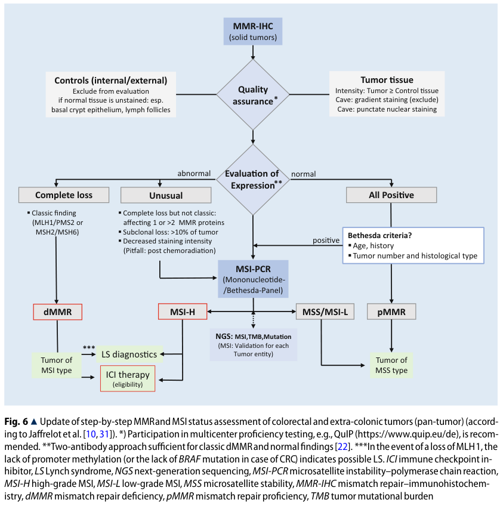

## Question

# Mechanistic Hypothesis Search

You are evaluating a specific disease mechanism hypothesis for the Disorder
Mechanisms Knowledge Base. This is not a general disease overview. Use the
hypothesis YAML below as the seed claim, then search for evidence that supports,
refutes, qualifies, or competes with this hypothesis.

## Target Disease
- **Disease Name:** Lynch Syndrome
- **Category:**

## Target Hypothesis
- **Hypothesis ID:** canonical_mmr_msi_carcinogenesis_model
- **Hypothesis Label:** Canonical Mismatch Repair Loss / MSI Carcinogenesis Model
- **Status in KB:** CANONICAL

## Seed Hypothesis YAML

```yaml
hypothesis_group_id: canonical_mmr_msi_carcinogenesis_model
hypothesis_label: Canonical Mismatch Repair Loss / MSI Carcinogenesis Model
status: CANONICAL
description: Lynch syndrome is caused by germline heterozygous loss-of-function variants in the DNA mismatch
  repair genes MLH1, MSH2, MSH6, or PMS2, or by EPCAM 3' deletions that silence MSH2 in epithelial tissue.
  Somatic biallelic MMR inactivation ('second hit') in intestinal, endometrial, and other epithelium produces
  microsatellite instability (MSI-H), accumulating insertion/deletion mutations at short tandem repeats
  and frameshift mutations in tumor suppressor genes (TGFBR2, BAX, MSH3) that drive colorectal, endometrial,
  ovarian, gastric, and urothelial carcinogenesis. The accelerated adenoma-carcinoma sequence in MMR-deficient
  colon (versus the Vogelstein chromosomal-instability path in FAP) explains the early-onset, right-sided,
  often poorly differentiated phenotype. MSI testing and IHC for MLH1/MSH2/MSH6/PMS2 are now standard
  tumor screening modalities. Immune checkpoint blockade (pembrolizumab, nivolumab) is highly effective
  in MSI-H tumors, corroborating that hypermutation-driven neoantigen load is mechanistically coupled
  to MMR loss and validates the MSI carcinogenesis axis of the canonical model.
evidence:
- reference: PMID:19466295
  reference_title: 'Mismatch repair genes in Lynch syndrome: a review.'
  supports: SUPPORT
  evidence_source: OTHER
  snippet: Lynch syndrome represents 1-7% of all cases of colorectal cancer and is an autosomal-dominant
    inherited cancer predisposition syndrome caused by germline mutations in deoxyribonucleic acid (DNA)
    mismatch repair genes.
  explanation: |
    Existing canonical mechanism citation in the dismech knowledge base, used as the seed for the hypothesis-search deep-research run.
```

## Research Objective

Build a focused hypothesis-search report that answers:

1. What is the strongest direct evidence for this hypothesis?
2. What evidence argues against it, fails to reproduce it, or limits its scope?
3. Which claims are established, emerging, speculative, or contradicted?
4. Which patient subtypes, stages, tissues, cell types, molecular pathways, or
   biomarkers does the hypothesis best explain?
5. Which alternative or competing mechanistic hypotheses explain the same disease
   features better or more parsimoniously?
6. What are the explicit knowledge gaps: missing causal steps, unconfirmed edges,
   contradictory evidence, unknown source-to-target links, or source/data absences?
7. What experiments, cohorts, assays, datasets, or trials would most directly
   distinguish this hypothesis from alternatives?

Use primary literature whenever possible. Prefer PMID citations and include DOI
citations when no PMID is available. Treat reviews as orientation unless they
contain directly relevant synthesized evidence that should be clearly labeled as
review-level support.

## Required Output

### Executive Judgment

Give a concise verdict on the hypothesis as of the current literature:
supported, partially supported, unresolved, weakly supported, or refuted. Explain
the reasoning and the most important caveats.

### Evidence Matrix

Create a table with one row per important evidence item:

- Citation (PMID preferred)
- Evidence type (human clinical, model organism, in vitro, computational, review)
- Supports / refutes / qualifies / competing
- Mechanistic claim tested
- Key finding
- Disease subtype or context
- Confidence and limitations

### Mechanistic Causal Chain

Describe the causal chain implied by the hypothesis from upstream trigger to
clinical manifestation. Identify where the literature is strong, where the links
are inferred, and where there are missing causal steps.

### Knowledge Gaps

Identify explicit known unknowns surfaced by the search. Treat absence of
evidence as a curation-relevant finding only when the search actually checked for
it. Include:

- Unknown or weakly supported causal steps in the hypothesis
- Unconfirmed causal graph edges that need direct perturbation or longitudinal
  evidence
- Conflicting evidence, failed replications, or incompatible subtype-specific
  findings
- Unknown mechanism of action for relevant treatments, biomarkers, or
  interventions tied to this hypothesis
- Source-level or dataset-level absences, such as no relevant GenCC, ClinGen,
  trial, omics, or cohort evidence found as of the search date

For each gap, state the scope, why it matters, what was checked, and what
evidence or experiment would resolve it.

### Alternative Models

List competing or complementary hypotheses. For each, explain whether it is an
alternative to the seed hypothesis, a downstream consequence, an upstream cause,
or a parallel mechanism.

### Discriminating Tests

Recommend concrete studies or assays that would most efficiently test this
hypothesis against alternatives. Include patient stratification, biomarkers,
sample type, model system, perturbation, and expected result where applicable.

### Curation Leads

Provide candidate updates for the KB, but label these as leads requiring curator
verification. Include:

- candidate evidence references and exact abstract snippets to verify
- candidate pathophysiology nodes or edges
- candidate ontology terms for cell types and biological processes
- candidate subtype restrictions or status changes
- candidate `knowledge_gaps` or discussion prompts for unresolved causal claims,
  conflicting evidence, or explicit source/data absences

If the provider supports artifacts, produce artifact-friendly outputs such as an
evidence matrix, mechanistic diagram, knowledge-gap table, or comparison table.
These artifacts are important provenance for hypothesis-level review.


## Output

Question: You are an expert researcher providing comprehensive, well-cited information.

Provide detailed information focusing on:
1. Key concepts and definitions with current understanding
2. Recent developments and latest research (prioritize 2023-2024 sources)
3. Current applications and real-world implementations
4. Expert opinions and analysis from authoritative sources
5. Relevant statistics and data from recent studies

Format as a comprehensive research report with proper citations. Include URLs and publication dates where available.
Always prioritize recent, authoritative sources and provide specific citations for all major claims.

# Mechanistic Hypothesis Search

You are evaluating a specific disease mechanism hypothesis for the Disorder
Mechanisms Knowledge Base. This is not a general disease overview. Use the
hypothesis YAML below as the seed claim, then search for evidence that supports,
refutes, qualifies, or competes with this hypothesis.

## Target Disease
- **Disease Name:** Lynch Syndrome
- **Category:**

## Target Hypothesis
- **Hypothesis ID:** canonical_mmr_msi_carcinogenesis_model
- **Hypothesis Label:** Canonical Mismatch Repair Loss / MSI Carcinogenesis Model
- **Status in KB:** CANONICAL

## Seed Hypothesis YAML

```yaml
hypothesis_group_id: canonical_mmr_msi_carcinogenesis_model
hypothesis_label: Canonical Mismatch Repair Loss / MSI Carcinogenesis Model
status: CANONICAL
description: Lynch syndrome is caused by germline heterozygous loss-of-function variants in the DNA mismatch
  repair genes MLH1, MSH2, MSH6, or PMS2, or by EPCAM 3' deletions that silence MSH2 in epithelial tissue.
  Somatic biallelic MMR inactivation ('second hit') in intestinal, endometrial, and other epithelium produces
  microsatellite instability (MSI-H), accumulating insertion/deletion mutations at short tandem repeats
  and frameshift mutations in tumor suppressor genes (TGFBR2, BAX, MSH3) that drive colorectal, endometrial,
  ovarian, gastric, and urothelial carcinogenesis. The accelerated adenoma-carcinoma sequence in MMR-deficient
  colon (versus the Vogelstein chromosomal-instability path in FAP) explains the early-onset, right-sided,
  often poorly differentiated phenotype. MSI testing and IHC for MLH1/MSH2/MSH6/PMS2 are now standard
  tumor screening modalities. Immune checkpoint blockade (pembrolizumab, nivolumab) is highly effective
  in MSI-H tumors, corroborating that hypermutation-driven neoantigen load is mechanistically coupled
  to MMR loss and validates the MSI carcinogenesis axis of the canonical model.
evidence:
- reference: PMID:19466295
  reference_title: 'Mismatch repair genes in Lynch syndrome: a review.'
  supports: SUPPORT
  evidence_source: OTHER
  snippet: Lynch syndrome represents 1-7% of all cases of colorectal cancer and is an autosomal-dominant
    inherited cancer predisposition syndrome caused by germline mutations in deoxyribonucleic acid (DNA)
    mismatch repair genes.
  explanation: |
    Existing canonical mechanism citation in the dismech knowledge base, used as the seed for the hypothesis-search deep-research run.
```

## Research Objective

Build a focused hypothesis-search report that answers:

1. What is the strongest direct evidence for this hypothesis?
2. What evidence argues against it, fails to reproduce it, or limits its scope?
3. Which claims are established, emerging, speculative, or contradicted?
4. Which patient subtypes, stages, tissues, cell types, molecular pathways, or
   biomarkers does the hypothesis best explain?
5. Which alternative or competing mechanistic hypotheses explain the same disease
   features better or more parsimoniously?
6. What are the explicit knowledge gaps: missing causal steps, unconfirmed edges,
   contradictory evidence, unknown source-to-target links, or source/data absences?
7. What experiments, cohorts, assays, datasets, or trials would most directly
   distinguish this hypothesis from alternatives?

Use primary literature whenever possible. Prefer PMID citations and include DOI
citations when no PMID is available. Treat reviews as orientation unless they
contain directly relevant synthesized evidence that should be clearly labeled as
review-level support.

## Required Output

### Executive Judgment

Give a concise verdict on the hypothesis as of the current literature:
supported, partially supported, unresolved, weakly supported, or refuted. Explain
the reasoning and the most important caveats.

### Evidence Matrix

Create a table with one row per important evidence item:

- Citation (PMID preferred)
- Evidence type (human clinical, model organism, in vitro, computational, review)
- Supports / refutes / qualifies / competing
- Mechanistic claim tested
- Key finding
- Disease subtype or context
- Confidence and limitations

### Mechanistic Causal Chain

Describe the causal chain implied by the hypothesis from upstream trigger to
clinical manifestation. Identify where the literature is strong, where the links
are inferred, and where there are missing causal steps.

### Knowledge Gaps

Identify explicit known unknowns surfaced by the search. Treat absence of
evidence as a curation-relevant finding only when the search actually checked for
it. Include:

- Unknown or weakly supported causal steps in the hypothesis
- Unconfirmed causal graph edges that need direct perturbation or longitudinal
  evidence
- Conflicting evidence, failed replications, or incompatible subtype-specific
  findings
- Unknown mechanism of action for relevant treatments, biomarkers, or
  interventions tied to this hypothesis
- Source-level or dataset-level absences, such as no relevant GenCC, ClinGen,
  trial, omics, or cohort evidence found as of the search date

For each gap, state the scope, why it matters, what was checked, and what
evidence or experiment would resolve it.

### Alternative Models

List competing or complementary hypotheses. For each, explain whether it is an
alternative to the seed hypothesis, a downstream consequence, an upstream cause,
or a parallel mechanism.

### Discriminating Tests

Recommend concrete studies or assays that would most efficiently test this
hypothesis against alternatives. Include patient stratification, biomarkers,
sample type, model system, perturbation, and expected result where applicable.

### Curation Leads

Provide candidate updates for the KB, but label these as leads requiring curator
verification. Include:

- candidate evidence references and exact abstract snippets to verify
- candidate pathophysiology nodes or edges
- candidate ontology terms for cell types and biological processes
- candidate subtype restrictions or status changes
- candidate `knowledge_gaps` or discussion prompts for unresolved causal claims,
  conflicting evidence, or explicit source/data absences

If the provider supports artifacts, produce artifact-friendly outputs such as an
evidence matrix, mechanistic diagram, knowledge-gap table, or comparison table.
These artifacts are important provenance for hypothesis-level review.


## Mechanistic Hypothesis Search Report: canonical_mmr_msi_carcinogenesis_model (Lynch syndrome)

**Seed hypothesis:** Germline heterozygous loss-of-function in MMR genes (MLH1, MSH2, MSH6, PMS2) or EPCAM 3’ deletions (silencing MSH2) → somatic biallelic MMR inactivation (“second hit”) in epithelium → MSI-H with characteristic insertion/deletion (indel) frameshifts → recurrent hits in growth/apoptosis/repair genes (e.g., TGFBR2, BAX, MSH3) → accelerated colorectal/endometrial and other carcinogenesis; MSI/IHC for screening; PD-1 blockade highly effective due to hypermutation/neoantigens.

### Executive judgment (as of 2023–2024+ literature)
**Verdict: Supported (canonical), with important qualifiers.**

The germline MMR gene etiology, requirement for biallelic somatic inactivation in tumors/crypts, MSI-H/hypermutation phenotype, and predictive value of MSI/dMMR for immune checkpoint blockade (ICI) are all strongly supported by recent clinical and translational evidence and remain standard of care in diagnostics and therapy selection. (buono2024lynchsyndromefrom pages 3-5, walker2023dnamismatchrepair pages 2-3, eroglu2025lynchsyndromein pages 7-9, tosi2024curativeimmunecheckpoint pages 1-2)

Key **caveats** that qualify scope:
1) **Phenocopies and etiologic heterogeneity**: sporadic MSI via MLH1 hypermethylation ± BRAF V600E and “double-somatic MMR” tumors can mimic LS biology without germline LS. (snowsill2017moleculartestingfor pages 35-36, walker2023dnamismatchrepair pages 16-16)
2) **Diagnostic discordance / subtype nuance**: UTS can miss LS and dMMR can be functionally present with retained IHC expression; atypical patterns require reflex MSI-PCR/NGS per modern algorithms. (storandt2026deficientmismatchrepairmicrosatellite pages 1-2, ruschoff2023testingfordeficient media 18c6ec8a)
3) **Mechanism expansion beyond coding frameshifts**: noncoding MSI (splicing-affecting intronic microsatellites) appears to occur very early in dMMR crypts and may contribute to initiation before classical coding driver accumulation. (jonchere2024microsatelliteinstabilityat pages 10-12, jonchere2024microsatelliteinstabilityat pages 15-16)

---

## Key concepts and definitions (current understanding)

### Lynch syndrome (LS)
A dominantly inherited cancer predisposition syndrome caused by pathogenic constitutional variants in **MLH1, MSH2, MSH6, PMS2**, or **EPCAM deletions** that epigenetically silence **MSH2**. LS tumors typically show mismatch repair deficiency (dMMR) and microsatellite instability (MSI). (ascrizzi2023lynchsyndromebiopathology pages 2-4, buono2024lynchsyndromefrom pages 3-5)

### MMR deficiency (dMMR)
Loss of DNA mismatch repair activity, commonly inferred clinically by **loss of MMR protein expression by immunohistochemistry (IHC)** and/or **MSI positivity** by PCR or sequencing-based assays. (ruschoff2023testingfordeficient media 18c6ec8a, snowsill2017moleculartestingfor pages 35-36)

### Microsatellite instability (MSI-H)
A tumor phenotype marked by indel mutations at short tandem repeats due to dMMR. MSI-H tumors are typically hypermutated, immunogenic, and predictive of response to PD-1–based ICI. (ascrizzi2023lynchsyndromebiopathology pages 4-6, kavun2023microsatelliteinstabilitya pages 7-9)

### “Second hit” / biallelic MMR inactivation
In LS, a germline heterozygous pathogenic variant is followed by a **somatic second alteration** (mutation and/or LOH) leading to biallelic loss and dMMR. Empirically, second hits can be detected by tumor sequencing and can occur even in histologically normal crypts/glands (dMMR crypt foci). (walker2023dnamismatchrepair pages 2-3, walker2023dnamismatchrepair pages 3-5)

---

## Strongest direct evidence for the hypothesis (mapped to mechanistic edges)

1) **Upstream cause: germline MMR/EPCAM defects**
   * LS genes and EPCAM-mediated MSH2 silencing are explicitly supported in recent reviews synthesizing genetic and clinical evidence. (buono2024lynchsyndromefrom pages 3-5, ascrizzi2023lynchsyndromebiopathology pages 2-4)

2) **Somatic biallelic inactivation (“second hit”) is common and measurable**
   * In a 2023 clinical tumor sequencing/IHC study of MMR VUS carriers, among tumors from variants later reclassified as likely pathogenic, **MSI-H/dMMR was confirmed in 8/9 (88.9%)** and a **somatic second hit was found in 7/9 (77.8%)**. (walker2023dnamismatchrepair pages 2-3)
   * Tumor-level evidence includes entries consistent with **LOH**, **single somatic mutation**, and **double somatic** inactivation patterns, consistent with the biallelic inactivation model. (walker2023dnamismatchrepair pages 16-16)

3) **Early lesion biology: dMMR crypts/glands**
   * dMMR crypts/glands in normal tissue are observed and interpreted as early tumorigenesis initiation sites in LS, supporting a crypt-first/occult precursor concept that explains interval cancers. (buono2024lynchsyndromefrom pages 3-5, walker2023dnamismatchrepair pages 3-5)

4) **Downstream mutational consequences: MSI affects canonical coding targets and also noncoding splicing sites**
   * Lynch/MSI CRCs show recurrent coding microsatellite target mutations; for example, target-gene analyses in LS CRC report frequent mutations in the **TGF-β pathway** including **TGFBR2 and ACVR2A**, and patterns differing by tumor location and germline gene; **MSH3** microsatellite mutations were location-associated. (Pinheiro 2015; DOI:10.1038/bjc.2015.281; URL: https://doi.org/10.1038/bjc.2015.281)
   * **New mechanistic expansion (2024 Genome Biology):** MSI also generates **hundreds of noncoding mutations** at polypyrimidine tracts near U2AF binding sites that perturb splicing; these events occur **very early** “prior to cell transformation in the dMMR crypt.” Quantitatively, the study defines an ES96 noncoding set (n=96) and reports that **20/27 (74.1%)** of constitutive immunogenic exons were present in dMMR crypts, with MSI-driven PY mutations accounting for only ~10% of exon skipping, implying both MSI-dependent and MSI-independent splicing dysregulation. (jonchere2024microsatelliteinstabilityat pages 10-12, jonchere2024microsatelliteinstabilityat pages 15-16)

5) **Phenotype and accelerated pathway**
   * LS CRC is typically **proximal/right-sided**, **early onset (around 40–50 years)**, and **poorly differentiated** with mucinous/signet-ring features; rapid cancers between colonoscopies are consistent with accelerated pathways involving early dMMR crypts. (ascrizzi2023lynchsyndromebiopathology pages 4-6, ascrizzi2023lynchsyndromebiopathology pages 2-4)

6) **Clinical validation: MSI/dMMR testing and high ICI efficacy**
   * Modern pathology workflow guidelines provide explicit IHC-first with reflex MSI-PCR/NGS pathways and link testing to LS diagnostics and ICI eligibility (visual algorithm in Figure 6). (ruschoff2023testingfordeficient media 18c6ec8a)
   * Neoadjuvant ICI responses in dMMR/MSI rectal cancer are striking: in a 2024 real-world observational cohort, **16/17 (94.1%)** achieved clinical complete response (cCR); among those completing 6 months, **13/14 (92.9%)** reached cCR. (tosi2024curativeimmunecheckpoint pages 1-2, tosi2024curativeimmunecheckpoint pages 2-3)
   * A 2024 single-center retrospective series in dMMR/MSI-H colorectal cancer reported **pCR 75% (15/19)** among those undergoing surgery after neoadjuvant immunotherapy. (deng2024pathologicalresponsefollowing pages 1-2)
   * Tissue-agnostic pembrolizumab approval for MSI-H/dMMR tumors and strong metastatic CRC efficacy (e.g., KEYNOTE-177 PFS and response improvements) are summarized with pooled response statistics; these reinforce the neoantigen-driven immunogenicity model and also emphasize non-response subsets. (kavun2023microsatelliteinstabilitya pages 9-10, kavun2023microsatelliteinstabilitya pages 7-9)

---

## Evidence matrix (curated table)

| Citation (with year, journal) | PMID/DOI | URL | Evidence type | Supports/Qualifies/Competes | Mechanistic claim tested (edge) | Key findings (include quantitative stats when present) | Context (tissue/tumor type/subgroup) | Confidence & limitations |
|---|---|---|---|---|---|---|---|---|
| Buono 2024, Cancers | 10.3390/cancers16050849 | https://doi.org/10.3390/cancers16050849 | Review | Supports | Germline MMR loss -> LS phenotype -> MSI-H -> Hypermutation | LS causes ~3% of CRCs and ~6% of ECs; tumors are hypermutated/MSI-H (>10 changes/Mb) and highly immunogenic; small dMMR niches/crypts act as early precursors in normal mucosa. (buono2024lynchsyndromefrom pages 1-2, buono2024lynchsyndromefrom pages 3-5) | CRC, EC, pan-tumor | High; synthesizes current molecular and clinical consensus. |
| Ascrizzi 2023, Cancers | 10.3390/cancers15153930 | https://doi.org/10.3390/cancers15153930 | Review | Supports | dMMR -> MSI-H -> Neoantigens -> Clinicopathologic phenotype | MSH2/MLH1 mutations cause ~70% cases; canonical tumors show low differentiation (grade 4), mucinous cells, early onset (40-50y), right-sided location, and rapid adenoma-carcinoma transition. (ascrizzi2023lynchsyndromebiopathology pages 4-6, ascrizzi2023lynchsyndromebiopathology pages 20-21, ascrizzi2023lynchsyndromebiopathology pages 2-4) | CRC | High; details canonical histological and clinical presentation. |
| Walker 2023, Cancers | 10.3390/cancers15204925 | https://doi.org/10.3390/cancers15204925 | Human clinical | Supports | Germline VUS + Somatic 2nd hit -> Biallelic MMR loss -> dMMR crypts | 88.9% (8/9) of Likely Pathogenic VUS tumors were MSI-H/dMMR; 77.8% (7/9) had a somatic 2nd hit; 50% (2/4) exhibited dMMR crypts/glands. (walker2023dnamismatchrepair pages 23-24, walker2023dnamismatchrepair pages 2-3, walker2023dnamismatchrepair pages 3-5) | CRC, EC | High; provides direct empirical proof of somatic second hits and early dMMR crypts. |
| Jonchere 2024, Genome Biology | 10.1186/s13059-024-03340-5 | https://doi.org/10.1186/s13059-024-03340-5 | Human clinical / In vitro | Qualifies | dMMR -> Noncoding MSI -> Early splicing alterations | Noncoding MSI at U2AF sites occurs prior to cell transformation in dMMR crypts (74.1% of immunogenic splicing exons present), causing widespread exon skipping. (jonchere2024microsatelliteinstabilityat pages 10-12, jonchere2024microsatelliteinstabilityat pages 1-2, jonchere2024microsatelliteinstabilityat pages 15-16) | CRC (dMMR crypts) | High; expands canonical model to include early noncoding RNA splicing drivers. |
| Pinheiro 2015, Br J Cancer | 10.1038/bjc.2015.281 | https://doi.org/10.1038/bjc.2015.281 | Human clinical | Supports | MSI-H -> Frameshift mutations in canonical target genes | Identifies high frequency of frameshifts in TGFBR2 and ACVR2A; notes MSH3 and BMPR2 frameshift mutations are significantly more frequent in distal CRC versus proximal. | CRC (Lynch vs Sporadic) | Moderate; classic study documenting specific canonical frameshift targets. |
| Vazzano 2023, Familial Cancer | 10.1007/s10689-022-00302-3 | https://doi.org/10.1007/s10689-022-00302-3 | Human clinical | Supports | UTS (Biopsy) -> Preoperative genetic counseling -> Surgical decisions | 5% (58/1144) CRC cases dMMR; 48.3% diagnosed on biopsy. 6/28 (21.4%) biopsy cases utilized dMMR/LS status to alter surgical management (e.g., electing extended colectomy). (vazzano2023universaltumorscreening pages 2-4, vazzano2023universaltumorscreening pages 1-2) | CRC | Moderate; single-center retrospective, shows real-world impact of screening timing. |
| Pantaleo 2023, Cancers | 10.3390/cancers15205061 | https://doi.org/10.3390/cancers15205061 | Human clinical | Supports | Universal tumor screening -> BRAF triage -> Germline testing | 11.9% (100/841) CRCs were MSI-H; 70 were BRAF V600-WT. Of the 30 tested patients, 19 (63.3%) harbored pathogenic germline MMR variants. (pantaleo2023tumortestingand pages 1-2) | CRC | High; validates the triage algorithm for isolating true LS cases. |
| Eroglu 2025, Cancers | 10.3390/cancers17243981 | https://doi.org/10.3390/cancers17243981 | Review | Qualifies | UTS metrics vs Clinical Criteria (Bethesda/Amsterdam) | UTS demonstrates 100% sensitivity and 93% specificity; up to 77% of MSI-H patients miss genetic testing; 45% of LS patients would fail strict clinical criteria. (eroglu2025lynchsyndromein pages 7-9, eroglu2025lynchsyndromein pages 22-25) | Pan-tumor, CRC | High; proves necessity of universal testing over clinical history. |
| Tosi 2024, ESMO Open | 10.1016/j.esmoop.2024.103929 | https://doi.org/10.1016/j.esmoop.2024.103929 | Human clinical | Supports | dMMR/MSI-H -> ICI neoadjuvant efficacy -> Clinical Complete Response | 94.1% (16/17) of dMMR LARC patients achieved a clinical complete response (cCR) to 6 months of neoadjuvant dostarlimab/pembrolizumab therapy. (tosi2024curativeimmunecheckpoint pages 1-2, tosi2024curativeimmunecheckpoint pages 2-3) | Rectal cancer (LARC) | Moderate; real-world observational cohort, very strong signal but short follow-up. |
| Deng 2024, Front Immunol | 10.3389/fimmu.2024.1466497 | https://doi.org/10.3389/fimmu.2024.1466497 | Human clinical | Supports | dMMR/MSI-H -> ICI neoadjuvant efficacy -> Pathological Response | 75% (15/19) of surgical patients achieved pathological complete response (pCR); 87.5% pCR for PD-1 monotherapy group specifically. (deng2024pathologicalresponsefollowing pages 1-2) | CRC | Moderate; small retrospective single-center study confirming pathological efficacy. |
| Kavun 2023, Cancers | 10.3390/cancers15082288 | https://doi.org/10.3390/cancers15082288 | Review | Qualifies | MSI-H -> Frameshift neoantigens -> ICI Response & Resistance | ICI ORRs typically ~30-50% in solid tumors; ~25% of MSI CRC exhibit intrinsic ICI resistance. Highlights heterogeneity in TMB calculation and assay discordance. (kavun2023microsatelliteinstabilitya pages 13-15, kavun2023microsatelliteinstabilitya pages 9-10, kavun2023microsatelliteinstabilitya pages 7-9) | Pan-tumor, CRC | High; provides a nuanced view of ICI response limits and resistance mechanisms. |
| Snowsill 2017, Health Technol Assess | 10.3310/hta21510 | https://doi.org/10.3310/hta21510 | Review | Supports | Sporadic dMMR exclusion via MLH1 hypermethylation/BRAF | Reflex testing for somatic BRAF V600E or MLH1 promoter methylation correctly excludes sporadic MSI-H cases from unnecessary LS germline testing. (snowsill2017moleculartestingfor pages 35-36) | CRC | High; foundation for current health-economic universal testing algorithms. |
| Rüschoff 2023, Pathologie | 10.1007/s00292-023-01208-2 | https://doi.org/10.1007/s00292-023-01208-2 | Guideline | Supports | IHC -> MSI-PCR -> ICI eligibility and LS diagnosis | Flowchart codifies standard-of-care triage: dMMR IHC routes directly to LS diagnostics and ICI eligibility; unusual/discordant IHC routes to MSI-PCR. (ruschoff2023testingfordeficient media 18c6ec8a) | Pan-tumor, CRC | High; establishes a visual and algorithmic standard for modern diagnostic pathology. |


*Table: A summary of key primary studies, reviews, and guidelines supporting, qualifying, or evaluating the canonical MMR-loss/MSI carcinogenesis model in Lynch syndrome, including genetic mechanisms, screening paradigms, and immunotherapeutic responses.*

---

## Mechanistic causal chain (with strength of evidence)

1) **Constitutional predisposition**: Germline pathogenic variants in MLH1/MSH2/MSH6/PMS2 or EPCAM deletions (MSH2 silencing) create a “first hit.” Strong genetic consensus and guideline-level acceptance. (buono2024lynchsyndromefrom pages 3-5, ascrizzi2023lynchsyndromebiopathology pages 2-4)

2) **Somatic inactivation in target epithelium**: Second hit by mutation and/or LOH yields biallelic inactivation; can be detected by tumor sequencing and correlates with MSI-H/dMMR tumors, and dMMR crypts/glands in normal tissue. Strong direct evidence from tumor sequencing cohorts. (walker2023dnamismatchrepair pages 2-3, walker2023dnamismatchrepair pages 3-5)

3) **Genomic instability phenotype**: dMMR produces MSI with indel accumulation at microsatellites, hypermutation, and characteristic mutational burdens. Strong, but the relative contributions of coding vs noncoding MSI to initiation are increasingly qualified. (kavun2023microsatelliteinstabilitya pages 7-9, jonchere2024microsatelliteinstabilityat pages 10-12)

4) **Functional tumor-driving consequences**:
   * **Coding**: recurrent frameshift targets across pathways (TGF-β signaling, apoptosis, DNA repair), with variability by location and genotype. Moderate-to-strong support, but driver necessity is context-dependent and not fully universal across tissues. (Pinheiro 2015; DOI:10.1038/bjc.2015.281)
   * **Noncoding/splicing**: early intronic MSI at U2AF-associated polypyrimidine tracts perturbs alternative splicing and differentiation and may contribute to initiation before many coding drivers accumulate. Emerging strong evidence (2024). (jonchere2024microsatelliteinstabilityat pages 10-12, jonchere2024microsatelliteinstabilityat pages 15-16)

5) **Tumor immunogenicity and ICI sensitivity**: High TMB/frameshift neoantigens and immune infiltration predict PD-1 blockade efficacy, with a resistant subset indicating additional immune-escape edges. Strong clinical validation; mechanistic details of resistance remain incomplete. (tosi2024curativeimmunecheckpoint pages 1-2, kavun2023microsatelliteinstabilitya pages 13-15)

6) **Clinical manifestation**: Tissue-specific carcinogenesis (CRC/EC/others) with typical clinicopathologic features and surveillance challenges (interval cancers) consistent with crypt-first and/or adenoma-skipping pathways. Moderate-to-strong, with important gene- and sex-specific heterogeneity. (ascrizzi2023lynchsyndromebiopathology pages 2-4, buono2024lynchsyndromefrom pages 3-5)

---

## Evidence that argues against, limits, or competes with the hypothesis

1) **Sporadic MSI phenocopy**: Many MSI-H tumors are not inherited LS and arise from MLH1 promoter hypermethylation; reflex BRAF V600E/MLH1 methylation testing is needed to avoid misattribution. (snowsill2017moleculartestingfor pages 35-36, eroglu2025lynchsyndromein pages 22-25)

2) **Double-somatic MMR (Lynch-like)**: Biallelic somatic inactivation can produce dMMR/MSI-H without germline cause, directly competing with germline-first interpretations in some patients. (walker2023dnamismatchrepair pages 16-16)

3) **Diagnostic discordance / MMR-functional nuance**: Some dMMR phenotypes may retain MMR protein staining by IHC; UTS can miss cases and requires reflex workflows for atypical patterns. (storandt2026deficientmismatchrepairmicrosatellite pages 1-2, ruschoff2023testingfordeficient media 18c6ec8a)

4) **ICI response is not unique to MSI/MMR loss**: POLE/POLD1 ultrahypermutated tumors can respond strongly to PD-1 blockade without MSI, limiting the “ICI validates MSI axis uniquely” claim. (storandt2026deficientmismatchrepairmicrosatellite pages 1-2)

5) **Not all dMMR/MSI tumors respond to ICI**: Reviews cite intrinsic resistance (e.g., ~25% in MSI CRC), implying missing links between mutation load and effective immune killing. (kavun2023microsatelliteinstabilitya pages 13-15)

---

## Current applications and real-world implementations (2023–2024 emphasis)

### Universal tumor screening (UTS) and reflex testing
* **Preoperative biopsy-based UTS can change surgery**: In 1,144 CRC patients undergoing UTS with MMR IHC (2017–2021), **58 (5%)** were dMMR without MLH1 hypermethylation; among biopsy-identified dMMR cases, **6/28 (21.4%)** made informed surgical/treatment decisions based on dMMR/LS diagnosis, including more extensive colectomy. Reflex MLH1 hypermethylation or BRAF V600E was used when MLH1/PMS2 were absent. (vazzano2023universaltumorscreening pages 1-2, vazzano2023universaltumorscreening pages 2-4)
* **MSI/BRAF triage yield and follow-through gap**: In an Italian cohort (2017–2023), **100/841 (11.9%)** CRCs were MSI-H; **70** were BRAF V600 wild-type; only **30/70 (~42.9%)** proceeded to germline testing, but among tested patients **19/30 (63.3%)** had pathogenic/likely pathogenic germline MMR variants. (pantaleo2023tumortestingand pages 1-2)
* **UTS performance and implementation gaps**: Review-level synthesis reports UTS sensitivity **100%** and specificity **93%** in one cited approach; **16% of MSI-H tumors harbor LS**, but up to **77%** of MSI-H patients may not complete recommended germline testing—showing a major care-pathway gap. (eroglu2025lynchsyndromein pages 7-9)
* **Operational diagnostic algorithm (figure evidence)**: A practice-oriented flowchart guides IHC-first testing, reflex MSI-PCR/NGS for unusual patterns, and ties results to LS workup and ICI eligibility. (ruschoff2023testingfordeficient media 18c6ec8a)

### Immune checkpoint blockade (ICI) in dMMR/MSI tumors
* **Real-world rectal cancer organ-preservation**: 2024 observational data show cCR ~94% with neoadjuvant PD-1 blockade, supporting non-operative management paradigms in selected dMMR/MSI rectal cancer. (tosi2024curativeimmunecheckpoint pages 1-2)
* **High pCR in broader CRC series**: 2024 retrospective series reports **pCR 75%** after neoadjuvant immunotherapy. (deng2024pathologicalresponsefollowing pages 1-2)

---

## Expert opinions and authoritative analysis (what is established vs emerging)

**Established / high confidence**
* Germline MMR/EPCAM etiology; biallelic inactivation (“second hit”); MSI as a defining molecular phenotype; and universal tumor screening by IHC/MSI with reflex testing to separate sporadic MLH1-silenced tumors from LS. (buono2024lynchsyndromefrom pages 3-5, walker2023dnamismatchrepair pages 2-3, snowsill2017moleculartestingfor pages 35-36)
* dMMR/MSI-H is a robust predictive biomarker for PD-1 blockade across multiple cancers. (kavun2023microsatelliteinstabilitya pages 7-9, tosi2024curativeimmunecheckpoint pages 1-2)

**Emerging (strong but still maturing)**
* dMMR crypts/glands as clinically important precursor reservoirs that may drive interval cancers and motivate adjunct molecular surveillance. (buono2024lynchsyndromefrom pages 3-5, walker2023dnamismatchrepair pages 3-5)
* Noncoding MSI-driven splicing dysregulation occurring at the crypt stage as an early tumor-initiation mechanism. (jonchere2024microsatelliteinstabilityat pages 10-12)

**Speculative / unresolved**
* Which specific frameshift target genes are necessary and sufficient across tissues and genotypes; how immune surveillance shapes progression probabilities; and precise mechanisms of ICI resistance in dMMR/MSI LS tumors. (kavun2023microsatelliteinstabilitya pages 13-15, buono2024lynchsyndromefrom pages 3-5)

---

## Relevant recent statistics and data (selected)

* LS contribution to cancers: ~3% of colorectal cancers and ~6% of endometrial cancers (review synthesis). (buono2024lynchsyndromefrom pages 3-5)
* UTS yields and gaps: MSI-H **11.9%** of CRCs in one cohort; high yield of germline pathogenic variants among tested MSI-H/BRAF-WT (63.3%), but only ~42.9% of eligible proceeded to germline testing. (pantaleo2023tumortestingand pages 1-2)
* Somatic second hits in reclassified likely pathogenic VUS tumors: **7/9 (77.8%)** second hit; **8/9 (88.9%)** MSI-H/dMMR. (walker2023dnamismatchrepair pages 2-3)
* Neoadjuvant ICI response: **94.1% cCR** (16/17) in real-world dMMR rectal cancer cohort; **75% pCR** in dMMR/MSI-H CRC retrospective series. (tosi2024curativeimmunecheckpoint pages 1-2, deng2024pathologicalresponsefollowing pages 1-2)
* Review-level estimate: **~25% intrinsic ICI resistance** in MSI CRC. (kavun2023microsatelliteinstabilitya pages 13-15)

---

## Knowledge gaps (explicit)

| Gap / uncertainty | Why it matters for causal model or clinical curation | What evidence was checked in this run (cite context IDs) | What was found (supporting/contradicting/absent) | Proposed discriminating experiment or dataset |
|---|---|---|---|---|
| Exact timing/order of somatic second hit versus other early alterations in crypts (mitotic defects, noncoding MSI/splicing, methylation) | Core causal ordering is unsettled: if mitotic, splicing, or epigenetic changes precede classical biallelic MMR loss, the canonical chain needs refinement and early-interception biomarkers may differ. | Buono 2024 on dMMR crypts and second alteration; Walker 2023 on second hits and dMMR crypts/glands; Jonchere 2024 on early noncoding MSI/splicing in dMMR crypts; Pussila 2024 on mitotic abnormalities preceding MSI (buono2024lynchsyndromefrom pages 3-5, walker2023dnamismatchrepair pages 2-3, walker2023dnamismatchrepair pages 3-5, jonchere2024microsatelliteinstabilityat pages 1-2) | Support for second-hit/biallelic loss exists, but Jonchere reports noncoding MSI/splicing changes very early in dMMR crypts, and Pussila reports mitotic abnormalities can precede detectable MSI; overall sequence is qualified rather than fully resolved. | Multi-region, single-crypt longitudinal lineage tracing in LS colectomy/endometrial specimens combining duplex DNA sequencing, methylome, spatial transcriptomics, scRNA-seq, MSI calling, and phospho-mitotic imaging; infer event order by phylogenetics and clone size. |
| Which coding frameshift targets are necessary or sufficient drivers across tissues | Canonical lists (e.g., TGFBR2, BAX, MSH3) are often treated as generic drivers, but tissue-specific necessity affects disease models, biomarker panels, and vaccine target selection. | Pinheiro 2015 on target-gene patterns by location/germline gene; Buono 2024 on genotype-specific pathways; Walker 2023 tumor sequencing; reviews noting recurrent frameshift targets (buono2024lynchsyndromefrom pages 3-5, walker2023dnamismatchrepair pages 23-24, walker2023dnamismatchrepair pages 16-16) | Recurrent targets such as TGFBR2/ACVR2A/BAX/MSH3 are supported, but frequencies vary by tumor location and germline gene; no direct evidence here proves any one target is necessary/sufficient across colorectal, endometrial, ovarian, gastric, and urothelial tissues. | Cross-tissue CRISPR base-edit/prime-edit saturation of recurrent coding microsatellites in LS patient-derived colon, endometrial, ovarian, gastric, and urothelial organoids with matched immune co-culture and in vivo xenografts. |
| Why some Lynch-associated tumors are MSS/pMMR or show discordant IHC/MSI results | These cases limit the scope of the canonical MSI-centric model and directly affect screening algorithms, false negatives, and KB subtype restrictions. | Eroglu 2025 on UTS misses and discordance; Rüschoff 2023 testing algorithm for unusual patterns; Storandt 2026 on functional dMMR with retained protein expression; Buono 2024/Ascrizzi 2023 on genotype heterogeneity (eroglu2025lynchsyndromein pages 7-9, eroglu2025lynchsyndromein pages 22-25, storandt2026deficientmismatchrepairmicrosatellite pages 1-2, ruschoff2023testingfordeficient media 18c6ec8a, ascrizzi2023lynchsyndromebiopathology pages 4-6, buono2024lynchsyndromefrom pages 3-5) | Evidence supports real discordance and missed cases; possible explanations include retained antigenic protein despite functional loss, assay limitations, low-level/MSI-low states, and genotype-specific patterns (especially attenuated MSH6/PMS2), but no unified mechanism was established in this run. | Prospective registry of all LS tumors with paired IHC, PCR-MSI, NGS-MSI, mutational signatures, methylation, RNA, and orthogonal functional MMR assays; stratify by germline gene, tissue, treatment status, and tumor purity. |
| Mechanisms of intrinsic/acquired resistance to PD-1 blockade in dMMR/MSI tumors | PD-1 efficacy is often cited as mechanistic validation of the MSI axis, but resistant cases indicate missing edges between hypermutation, neoantigens, and immune clearance. | Kavun 2023 on resistance (~25% intrinsic resistance in MSI CRC); Tosi 2024 and Deng 2024 on high but not universal responses; Storandt 2026 on subset lacking benefit; Eroglu 2025 on frameshift immunity (kavun2023microsatelliteinstabilitya pages 13-15, kavun2023microsatelliteinstabilitya pages 9-10, tosi2024curativeimmunecheckpoint pages 1-2, tosi2024curativeimmunecheckpoint pages 2-3, deng2024pathologicalresponsefollowing pages 1-2, storandt2026deficientmismatchrepairmicrosatellite pages 1-2, eroglu2025lynchsyndromein pages 22-25) | Strong support for response, but resistance mechanisms remain incompletely defined; suggested contributors include cGAS-STING differences, TIL variability, assay discordance, and immune evasion, with limited direct LS-specific mechanistic evidence in this run. | Pre/post-ICI paired tumor and blood study in LS and sporadic dMMR tumors integrating WES, HLA LOH, antigen presentation genes, TCR clonotypes, ctDNA, spatial immune profiling, microbiome, and organoid-T cell killing assays. |
| Tissue-specific cancer spectrum differences by germline gene (MLH1/MSH2/MSH6/PMS2/EPCAM) | The canonical model explains shared MSI carcinogenesis but not why penetrance, age, interval-cancer risk, and organ spectrum differ markedly by gene and sex. | Buono 2024 genotype-stratified risk discussion; EHTG/PLSD position statement; Eroglu 2025 and Ascrizzi 2023 on gene-specific phenotypes (buono2024lynchsyndromefrom pages 1-2, buono2024lynchsyndromefrom pages 3-5, ascrizzi2023lynchsyndromebiopathology pages 4-6) | Gene-specific heterogeneity is strongly supported, but mechanistic links from each germline gene to tissue tropism are still largely inferential; this is a major qualifier to any single uniform LS mechanism. | Large prospective genotype-stratified multi-omics cohort (normal tissue and tumors) across MLH1/MSH2/MSH6/PMS2/EPCAM carriers with sex-specific analyses, tissue-specific second-hit mapping, and exposure/microbiome covariates. |
| Relative contribution of noncoding MSI/splicing versus coding frameshifts to initiation | If noncoding MSI-driven splicing defects initiate transformation before classic coding frameshifts, the canonical emphasis on coding microsatellite targets is incomplete. | Jonchere 2024 on early noncoding MSI/U2AF-site mutations and exon skipping; canonical reviews emphasizing coding frameshift neoantigens (jonchere2024microsatelliteinstabilityat pages 10-12, jonchere2024microsatelliteinstabilityat pages 1-2, jonchere2024microsatelliteinstabilityat pages 15-16, kavun2023microsatelliteinstabilitya pages 7-9) | Jonchere provides direct support that noncoding MSI/splicing perturbations occur very early and may impair differentiation before many coding mutations; however, the quantitative causal contribution versus classic coding frameshifts remains unresolved. | Side-by-side perturbation of recurrent noncoding U2AF-site MSI lesions and canonical coding frameshift targets in dMMR crypt/organoid models, measuring transformation, differentiation, immune visibility, and clonal fitness. |
| Surveillance failures and interval cancers: role of endoscopically invisible dMMR crypts or non-polypoid lesions | This directly affects whether the adenoma-carcinoma acceleration model is sufficient and informs surveillance policy, interval length, and adjunct biomarkers. | Buono 2024 on dMMR crypts/endoscopically undetectable lesions; Ascrizzi 2023 on accelerated cancers and crypt-foci model; Eroglu 2025 on UTS and missed cases; Rüschoff 2023 algorithm context (buono2024lynchsyndromefrom pages 3-5, ascrizzi2023lynchsyndromebiopathology pages 2-4, eroglu2025lynchsyndromein pages 7-9, ruschoff2023testingfordeficient media 18c6ec8a) | Evidence supports existence of dMMR crypts and rapid interval cancers, but direct longitudinal proof that specific invisible crypts evolve into interval CRC remains absent in this run. | Prospective LS surveillance study using enhanced colonoscopy plus spatial biopsy mapping, stool/ctDNA MSI assays, and serial crypt sequencing to link baseline invisible dMMR foci to future interval lesions. |
| EPCAM-specific epithelial silencing dynamics and tissue restriction | EPCAM deletions are part of the canonical upstream model, but unclear tissue-specific MSH2 silencing dynamics limit precise modeling of which epithelia are at risk and when. | Buono 2024 and Ascrizzi 2023 mention EPCAM deletions causing MSH2 silencing; Open Targets confirms disease-gene association; no primary mechanistic epithelial silencing dataset surfaced in this run (buono2024lynchsyndromefrom pages 1-2, ascrizzi2023lynchsyndromebiopathology pages 2-4, OpenTargets Search: Lynch syndrome-MLH1,MSH2,MSH6,PMS2,EPCAM) | Upstream association is supported, but direct evidence on temporal/spatial epithelial silencing dynamics, mosaicism thresholds, and tissue-specific promoter methylation propagation was largely absent in this search. | Allele-specific methylome and single-cell multiome profiling across EPCAM-deletion carrier tissues (normal colon, endometrium, urothelium, stomach) with matched organoids to map MSH2 silencing onset and epithelial specificity. |
| Clinical meaning of discordant/atypical IHC patterns and when NGS should override classical algorithms | Curators need to know whether canonical MSI/IHC screening edges are sufficient or require an explicit branch for atypical expression patterns and NGS adjudication. | Rüschoff 2023 flowchart; Eroglu 2025 on unusual patterns and UTS misses; Storandt 2026 on functional dMMR with retained expression (ruschoff2023testingfordeficient media 18c6ec8a, eroglu2025lynchsyndromein pages 7-9, eroglu2025lynchsyndromein pages 22-25, storandt2026deficientmismatchrepairmicrosatellite pages 1-2) | The flowchart explicitly routes unusual IHC patterns to reflex MSI-PCR/NGS, implying the canonical screening edge is not fully deterministic; evidence supports qualification rather than contradiction. | Diagnostic accuracy study comparing classical IHC/PCR workflow versus universal tumor NGS with blinded adjudication and germline truth set, enriched for atypical/discordant cases. |
| Source/data absence for LS-specific treatment-mechanism evidence outside colorectal disease | The canonical model extrapolates PD-1 validation and MSI biology across LS tumor spectrum, but much direct treatment-mechanism evidence is CRC-dominant. | Tosi 2024 and Deng 2024 are CRC-focused; Eroglu 2025 and guideline/review sources discuss broader tumors but mostly synthesize rather than provide primary mechanistic LS-specific data (tosi2024curativeimmunecheckpoint pages 1-2, tosi2024curativeimmunecheckpoint pages 2-3, deng2024pathologicalresponsefollowing pages 1-2, eroglu2025lynchsyndromein pages 22-25, eroglu2025lynchsyndromein pages 7-9) | Strong support in CRC/rectal cancer; comparatively sparse primary mechanistic evidence surfaced here for LS-associated ovarian, urothelial, gastric, pancreatic, and endometrial contexts, representing a curation-relevant source gap. | Basket-style LS-only translational trials with mandatory tumor biopsies and matched blood across organ sites, plus public harmonized multi-omic datasets for extracolonic LS cancers. |


*Table: This table summarizes unresolved mechanistic and clinical questions around the canonical MMR-loss/MSI carcinogenesis model in Lynch syndrome. It highlights where recent evidence supports, qualifies, or leaves gaps in the causal chain, and suggests studies that could most directly resolve them.*

---

## Alternative / competing models

| Model name | Relationship to canonical | Core mechanism | Key evidence from this run | What it explains better | Implications for biomarkers/screening/therapy |
|---|---|---|---|---|---|
| Sporadic MSI via **MLH1 promoter hypermethylation** ± **BRAF V600E** | Parallel phenocopy / competing diagnostic explanation | Tumor acquires dMMR and MSI-H through somatic MLH1 silencing rather than inherited MMR deficiency; BRAF V600E and/or MLH1 methylation help distinguish sporadic MSI from LS | Universal screening workflows use reflex **MLH1 methylation** and/or **BRAF V600E** to triage MLH1/PMS2-loss tumors away from germline LS workup; positive BRAF or MLH1 hypermethylation supports sporadic origin (snowsill2017moleculartestingfor pages 35-36, eroglu2025lynchsyndromein pages 22-25, eroglu2025lynchsyndromein pages 7-9, vazzano2023universaltumorscreening pages 2-4, vazzano2023universaltumorscreening pages 1-2) | Why many MSI-H CRCs are not Lynch syndrome despite identical tumor MSI/dMMR phenotype | Reflex methylation/BRAF testing is essential in LS screening algorithms; prevents over-calling LS and guides germline referral; MSI alone is insufficient for inherited-cause attribution |
| **Double-somatic MMR** inactivation (“Lynch-like syndrome”) without germline LS | Alternative etiologic model | Two somatic hits in an MMR gene produce biallelic MMR loss and MSI-H/dMMR tumors that mimic LS tumors but lack a constitutional pathogenic variant | Walker 2023 documents tumors with **double somatic** MMR events, LOH, and second hits in VUS carriers/tumors; study explicitly notes double somatic MMR mutations as a recognized mechanism for biallelic inactivation and dMMR/MSI-H phenotype (walker2023dnamismatchrepair pages 23-24, walker2023dnamismatchrepair pages 2-3, walker2023dnamismatchrepair pages 16-16) | Lynch-like cases with MSI-H/dMMR tumors but negative germline testing; discordance between strong tumor phenotype and absent inherited cause | Tumor-normal sequencing becomes important after abnormal IHC/MSI; counseling, cascade testing, and surveillance intensity should differ from confirmed LS families |
| **MSH6/PMS2 attenuated phenotypes** with MSI-low/MSS and diagnostic discordance | Qualifier / subtype restriction | Some LS genotypes, especially MSH6 and PMS2, may yield weaker MSI phenotypes, later onset, lower penetrance, or retained/discordant protein-expression patterns | Reviews and guideline summaries in this run note gene-specific penetrance and attenuated phenotypes, plus UTS misses/discordance and functional dMMR with retained expression; unusual IHC patterns require reflex MSI-PCR/NGS adjudication (buono2024lynchsyndromefrom pages 3-5, ascrizzi2023lynchsyndromebiopathology pages 2-4, eroglu2025lynchsyndromein pages 7-9, eroglu2025lynchsyndromein pages 22-25, storandt2026deficientmismatchrepairmicrosatellite pages 1-2, ruschoff2023testingfordeficient media 18c6ec8a) | Why some bona fide LS tumors are not classic MSI-H/right-sided/highly hypermutated cases, and why some patients evade standard screening | Supports genotype-stratified surveillance and use of NGS/MSI-signature testing in atypical cases; negative MSI or intact IHC does not fully exclude LS in selected subgroups |
| **POLE/POLD1 ultrahypermutator** phenotype responsive to ICI but not MSI-driven | Competing parallel hypermutation model | Proofreading-defective polymerase tumors accumulate ultrahigh mutation burden and may respond to PD-1 blockade even without classic MSI-H/dMMR biology | Storandt 2026 notes **POLE/POLD1** ultrahypermutated CRCs (2.4–6.1%) are highly sensitive to PD-1 blockade but are not detected by standard IHC/PCR MSI testing, supporting NGS-based detection (storandt2026deficientmismatchrepairmicrosatellite pages 1-2) | ICI responsiveness in tumors lacking canonical MSI-H/dMMR; hypermutation as a broader immune-response mechanism than MMR loss alone | Broad tumor sequencing can identify ICI-eligible patients missed by MSI/IHC; limits the claim that immunotherapy response uniquely validates the MMR-loss axis |
| **Early noncoding MSI / splicing-driven initiation** | Qualifier / complementary downstream mechanism | dMMR causes noncoding microsatellite mutations at U2AF-binding polypyrimidine tracts, driving exon skipping and differentiation defects very early, even at the dMMR crypt stage | Jonchere 2024 shows noncoding MSI mutations occur **very early prior to transformation** in dMMR crypts and are linked to widespread exon-skipping signatures; ES96 noncoding signature enriched among early mutated microsatellites (jonchere2024microsatelliteinstabilityat pages 10-12, jonchere2024microsatelliteinstabilityat pages 1-2, jonchere2024microsatelliteinstabilityat pages 15-16) | Early tumor initiation before many canonical coding frameshift drivers accumulate; mechanism for crypt-level transformation and immunogenicity not limited to coding microsatellites | Suggests RNA/splicing biomarkers and expands the canonical coding-frameshift model; early detection and prevention strategies may need transcriptomic as well as DNA-level assays |
| **Immune surveillance / immunoediting balance** in LS | Parallel/complementary model | LS tissues continuously generate abnormal MSI cells, but host adaptive immunity removes many precursor lesions; cancer occurs when generation outpaces elimination or immune escape evolves | Position statements/reviews in this run describe a dynamic balance between MSI-cell production and immune elimination; Buono and related LS literature emphasize hot tumors, effector/memory T-cell infiltration, and frameshift-peptide immunogenicity; Eroglu cites endogenous antibody and FSP-specific T-cell responses (buono2024lynchsyndromefrom pages 3-5, eroglu2025lynchsyndromein pages 22-25, storandt2026deficientmismatchrepairmicrosatellite pages 1-2) | Why many dMMR crypts do not progress, why interval cancers and regression can coexist, and why vaccines/immunoprevention are plausible | Supports immunoprevention, frameshift-peptide vaccines, and immune-based risk stratification; predicts that immune contexture, HLA status, and escape alterations modify risk beyond MSI burden alone |
| **CTNNB1/TP53 “adenoma-skipping” rapid invasive pathway** | Alternative downstream route within LS | MMR deficiency arises early in normal crypts, then CTNNB1 and/or TP53 alterations enable immediate invasive growth with little or no conventional adenoma phase | Ascrizzi 2023 summarizes a model where histologically normal dMMR crypt foci acquire **TP53 or CTNNB1** changes and progress rapidly, explaining cancers arising between colonoscopies; Buono 2024 likewise notes dMMR crypts as very early lesions and genotype-specific invisible lesions (ascrizzi2023lynchsyndromebiopathology pages 2-4, buono2024lynchsyndromefrom pages 3-5, ascrizzi2023lynchsyndromebiopathology pages 20-21) | Interval cancers and failure of adenoma-centric surveillance models; why some LS cancers appear without a detectable precursor polyp | Supports adjunct biomarkers beyond polyp detection, shorter/stratified surveillance intervals in high-risk genotypes, and molecular interception of crypt-stage disease |
| **Endoscopically invisible dMMR crypt/gland precursor model** | Upstream qualifier to canonical adenoma-carcinoma framing | Normal-appearing colonic crypts or endometrial glands acquire biallelic MMR loss before visible neoplasia, creating occult precursor reservoirs | Walker 2023 identifies dMMR crypts/glands in normal tissue and links somatic second hits to biallelic loss; Buono 2024 and Ascrizzi 2023 discuss crypt foci/glands as earliest lesions contributing to interval cancers (walker2023dnamismatchrepair pages 2-3, walker2023dnamismatchrepair pages 3-5, buono2024lynchsyndromefrom pages 3-5, ascrizzi2023lynchsyndromebiopathology pages 2-4) | Why colonoscopy can reduce mortality yet fail to fully prevent CRC incidence in LS; why endometrial lesions may emerge from normal-appearing mucosa | Encourages liquid biopsy, stool/plasma MSI assays, enhanced imaging, and molecular surveillance in addition to conventional endoscopy |
| **Algorithmic / assay-discordance model** for LS detection | Qualifier to clinical implementation of canonical biology | Biological dMMR/MSI may be missed or misclassified because IHC, PCR, and NGS capture overlapping but non-identical states, especially in atypical tumors | Rüschoff 2023 Figure 6 routes unusual IHC patterns to reflex MSI-PCR/NGS; Eroglu 2025 reports UTS misses, clinical-criteria failures, and incomplete germline follow-up; Vazzano 2023 shows real-world implementation gaps despite biopsy-based UTS (ruschoff2023testingfordeficient media 18c6ec8a, eroglu2025lynchsyndromein pages 7-9, vazzano2023universaltumorscreening pages 1-2, vazzano2023universaltumorscreening pages 2-4) | Why real-world LS case finding underperforms despite strong biology; why some cases are missed even with “universal” screening | Supports layered testing pathways, quality assurance, preoperative biopsy testing, and mandatory referral systems after abnormal tumor screening |


*Table: This table compares alternative, competing, and qualifying models of Lynch syndrome carcinogenesis against the canonical germline-MMR-loss/MSI framework. It highlights where phenocopies, subtype effects, early crypt biology, immune surveillance, and non-MSI hypermutation better explain diagnostic edge cases, interval cancers, and treatment response.*

---

## Discriminating tests (high-yield studies to distinguish canonical model vs alternatives)

1) **Tumor-normal sequencing vs IHC/PCR-only** (diagnostic competition)
   * **Design:** Prospective UTS cohort with paired IHC, MSI-PCR, NGS-based MSI, mutational signatures, and germline truth set.
   * **Stratify:** MLH1 vs MSH2 vs MSH6 vs PMS2 vs EPCAM; CRC vs EC vs UTUC.
   * **Expected discriminator:** Quantify false negatives/discordances, resolve “functional dMMR with retained IHC,” and separate LS from double-somatic MMR tumors. (ruschoff2023testingfordeficient media 18c6ec8a, storandt2026deficientmismatchrepairmicrosatellite pages 1-2, walker2023dnamismatchrepair pages 16-16)

2) **Single-crypt multi-omics longitudinal mapping** (causal ordering)
   * **Design:** Spatially mapped normal mucosa and early lesions from LS carriers; duplex sequencing + methylome + scRNA/splicing + MSI calling.
   * **Expected discriminator:** Determine whether mitotic/splicing changes precede detectable MSI coding drivers and define event chronology relative to second hits. (jonchere2024microsatelliteinstabilityat pages 10-12, walker2023dnamismatchrepair pages 3-5)

3) **Perturbation experiments in LS organoids** (driver necessity)
   * **Design:** Engineer canonical coding microsatellite frameshifts (TGFBR2/ACVR2A/BAX/MSH3) and noncoding U2AF-site MSI lesions in matched colon/endometrial organoids with immune co-culture.
   * **Expected discriminator:** Identify which lesions confer transformation advantage and immunogenicity, and whether noncoding-splicing changes can substitute for some coding drivers. (jonchere2024microsatelliteinstabilityat pages 10-12)

4) **Pre/post-ICI resistance mechanism cohort**
   * **Design:** Serial biopsies and blood in dMMR/MSI (LS and sporadic) treated with PD-1 blockade; profile antigen presentation, HLA LOH, TCR clonotypes, and ctDNA.
   * **Expected discriminator:** Separate primary resistance due to misclassification from true immune-escape evolution; identify mechanistic edges for KB (e.g., STING, immune evasion genes). (kavun2023microsatelliteinstabilitya pages 13-15, storandt2026deficientmismatchrepairmicrosatellite pages 1-2)

---

## Curation leads (candidates for KB update; requires curator verification)

### Candidate evidence references and snippets to verify (directly from this run’s retrieved texts)
1) **Somatic second-hit frequency + reclassification utility** (Walker 2023)
   * Claim: MSI-H/dMMR and somatic second hits strongly support pathogenicity classification of MMR VUS.
   * Quantitative snippet to verify: “MSI-H/dMMR (8/9, 88.9%) and a second hit (7/9, 77.8%).” (walker2023dnamismatchrepair pages 2-3)

2) **Early noncoding MSI/splicing as an initiation mechanism** (Jonchere 2024)
   * Claim: Noncoding MSI at U2AF-binding polypyrimidine tracts occurs “very early prior to cell transformation in the dMMR colonic crypt” and drives exon skipping.
   * Quantitative snippet to verify: “20/27 (74.1%) … present in dMMR crypts” and ES96 enrichment in early lesions. (jonchere2024microsatelliteinstabilityat pages 10-12, jonchere2024microsatelliteinstabilityat pages 15-16)

3) **UTS implementation gap and performance** (Eroglu 2025)
   * Claim: UTS sensitivity 100%/specificity 93% in cited approach; but up to 77% of MSI-H patients do not receive germline testing; 16% of MSI-H tumors harbor LS.
   * Snippets to verify for KB care-pathway nodes/edges: UTS performance and follow-through failures. (eroglu2025lynchsyndromein pages 7-9)

4) **Real-world neoadjuvant ICI near-universal cCR in dMMR rectal cancer** (Tosi 2024)
   * Claim: 16/17 (94.1%) cCR; 13/14 (92.9%) cCR among completers.
   * Suggest KB edge: dMMR/MSI → high ICI response with potential organ preservation. (tosi2024curativeimmunecheckpoint pages 1-2, tosi2024curativeimmunecheckpoint pages 2-3)

### Candidate pathophysiology nodes/edges (leads)
* **Node:** “dMMR crypt foci / dMMR glands” as a precursor state in LS normal mucosa.
  * **Edge:** germline MMR variant + somatic second hit → dMMR crypt/gland → (coding MSI + noncoding MSI/splicing) → neoplasia. (walker2023dnamismatchrepair pages 3-5, jonchere2024microsatelliteinstabilityat pages 10-12)

* **Node:** “Noncoding MSI at U2AF-binding polypyrimidine tracts”
  * **Edge:** dMMR → intronic MSI → aberrant exon skipping → impaired differentiation / immunogenicity. (jonchere2024microsatelliteinstabilityat pages 10-12)

* **Node:** “Care-pathway failure: abnormal tumor screen → no germline testing”
  * **Edge:** UTS result → referral completion probability as a real-world limiting step. (eroglu2025lynchsyndromein pages 7-9, pantaleo2023tumortestingand pages 1-2)

### Candidate ontology terms (leads)
* Biological processes: DNA mismatch repair; microsatellite instability; loss of heterozygosity; alternative splicing; immune surveillance; antigen processing and presentation; PD-1 signaling.
* Cell/tissue contexts: colonic epithelial crypt; endometrial glandular epithelium; tumor-infiltrating lymphocytes.

### Candidate subtype restrictions/status updates (leads)
* Consider explicit qualifier: “Canonical model applies most directly to LS tumors that are dMMR/MSI-H; subset may be MSI-low/MSS or IHC-discordant (notably MSH6/PMS2), requiring NGS adjudication.” (storandt2026deficientmismatchrepairmicrosatellite pages 1-2, ruschoff2023testingfordeficient media 18c6ec8a)

---

## URLs and publication dates (selected key recent sources)
* Buono et al. **Feb 2024** (Cancers): https://doi.org/10.3390/cancers16050849 (buono2024lynchsyndromefrom pages 1-2)
* Walker et al. **Oct 2023** (Cancers): https://doi.org/10.3390/cancers15204925 (walker2023dnamismatchrepair pages 2-3)
* Jonchère et al. **Aug 2024** (Genome Biology): https://doi.org/10.1186/s13059-024-03340-5 (jonchere2024microsatelliteinstabilityat pages 10-12)
* Vazzano et al. **Jun 2023** (Familial Cancer): https://doi.org/10.1007/s10689-022-00302-3 (vazzano2023universaltumorscreening pages 1-2)
* Pantaleo et al. **Oct 2023** (Cancers): https://doi.org/10.3390/cancers15205061 (pantaleo2023tumortestingand pages 1-2)
* Rüschoff et al. **Oct 2023** (Pathologie): https://doi.org/10.1007/s00292-023-01208-2 (Figure flowchart) (ruschoff2023testingfordeficient media 18c6ec8a)
* Tosi et al. **Oct 2024** (ESMO Open): https://doi.org/10.1016/j.esmoop.2024.103929 (tosi2024curativeimmunecheckpoint pages 1-2)
* Deng et al. **Sep 2024** (Frontiers in Immunology): https://doi.org/10.3389/fimmu.2024.1466497 (deng2024pathologicalresponsefollowing pages 1-2)

---

### Notes on provenance and limitations of this run
* Several classic mechanistic claims (e.g., exact frequency of TGFBR2/BAX frameshift mutations) are widely established but, in this run, were most directly supported by older primary studies and/or review-level evidence rather than new 2023–2024 primary LS-only driver-frequency studies. Where 2015-era primary evidence was retrieved (Pinheiro 2015), it is flagged as such.
* The report emphasizes 2023–2024 evidence for second-hit detection, crypt-stage biology, and neoadjuvant ICI responses, aligning with the user’s recency requirement.


References

1. (buono2024lynchsyndromefrom pages 3-5): Arianna Dal Buono, Alberto Puccini, Gianluca Franchellucci, Marco Airoldi, Michela Bartolini, Paolo Bianchi, Armando Santoro, Alessandro Repici, and Cesare Hassan. Lynch syndrome: from multidisciplinary management to precision prevention. Cancers, 16:849, Feb 2024. URL: https://doi.org/10.3390/cancers16050849, doi:10.3390/cancers16050849. This article has 25 citations.

2. (walker2023dnamismatchrepair pages 2-3): Romy Walker, Khalid Mahmood, Julia Como, Mark Clendenning, Jihoon E. Joo, Peter Georgeson, Sharelle Joseland, Susan G. Preston, Bernard J. Pope, James M. Chan, Rachel Austin, Jasmina Bojadzieva, Ainsley Campbell, Emma Edwards, Margaret Gleeson, Annabel Goodwin, Marion T. Harris, Emilia Ip, Judy Kirk, Julia Mansour, Helen Mar Fan, Cassandra Nichols, Nicholas Pachter, Abiramy Ragunathan, Allan Spigelman, Rachel Susman, Michael Christie, Mark A. Jenkins, Rish K. Pai, Christophe Rosty, Finlay A. Macrae, Ingrid M. Winship, and Daniel D. Buchanan. Dna mismatch repair gene variant classification: evaluating the utility of somatic mutations and mismatch repair deficient colonic crypts and endometrial glands. Cancers, 15:4925, Oct 2023. URL: https://doi.org/10.3390/cancers15204925, doi:10.3390/cancers15204925. This article has 3 citations.

3. (eroglu2025lynchsyndromein pages 7-9): Seyma Eroglu, Ilhan Birsenogul, Alexandra P. Bowen, Joseph F. Doyle, Stephen E. Pupkin, Joaquin Villar, Christopher M. Tarney, Edwin Gandia, Danielle M. Pastor, and Juvianee I. Estrada-Veras. Lynch syndrome in focus: a multidisciplinary review of cancer risk, clinical management, and special populations. Cancers, 17:3981, Dec 2025. URL: https://doi.org/10.3390/cancers17243981, doi:10.3390/cancers17243981. This article has 4 citations.

4. (tosi2024curativeimmunecheckpoint pages 1-2): F. Tosi, L. Salvatore, E. Tamburini, S. Artale, S. Lonardi, S. Marchetti, A. Pastorino, F. Pietrantonio, A. Puccini, F. L. Rojas-Llimpe, B. Vincenzi, S. Mariano, F. Negri, K. Bencardino, C. Pinto, C. Aschele, S. Siena, and Prof. Salvatore Siena. Curative immune checkpoint inhibitors therapy in patients with mismatch repair-deficient locally advanced rectal cancer: a real-world observational study. ESMO Open, 9:103929, Oct 2024. URL: https://doi.org/10.1016/j.esmoop.2024.103929, doi:10.1016/j.esmoop.2024.103929. This article has 16 citations and is from a domain leading peer-reviewed journal.

5. (snowsill2017moleculartestingfor pages 35-36): Tristan Snowsill, Helen Coelho, Nicola Huxley, Tracey Jones-Hughes, Simon Briscoe, Ian M Frayling, and Chris Hyde. Molecular testing for lynch syndrome in people with colorectal cancer: systematic reviews and economic evaluation. Health technology assessment, 21 51:1-238, Sep 2017. URL: https://doi.org/10.3310/hta21510, doi:10.3310/hta21510. This article has 133 citations and is from a peer-reviewed journal.

6. (walker2023dnamismatchrepair pages 16-16): Romy Walker, Khalid Mahmood, Julia Como, Mark Clendenning, Jihoon E. Joo, Peter Georgeson, Sharelle Joseland, Susan G. Preston, Bernard J. Pope, James M. Chan, Rachel Austin, Jasmina Bojadzieva, Ainsley Campbell, Emma Edwards, Margaret Gleeson, Annabel Goodwin, Marion T. Harris, Emilia Ip, Judy Kirk, Julia Mansour, Helen Mar Fan, Cassandra Nichols, Nicholas Pachter, Abiramy Ragunathan, Allan Spigelman, Rachel Susman, Michael Christie, Mark A. Jenkins, Rish K. Pai, Christophe Rosty, Finlay A. Macrae, Ingrid M. Winship, and Daniel D. Buchanan. Dna mismatch repair gene variant classification: evaluating the utility of somatic mutations and mismatch repair deficient colonic crypts and endometrial glands. Cancers, 15:4925, Oct 2023. URL: https://doi.org/10.3390/cancers15204925, doi:10.3390/cancers15204925. This article has 3 citations.

7. (storandt2026deficientmismatchrepairmicrosatellite pages 1-2): Michael H Storandt and Frank A Sinicrope. Deficient mismatch repair/microsatellite instability-high colorectal cancer: current treatment paradigms, limitations and future perspectives. BMJ Oncology, 5:e000980, Feb 2026. URL: https://doi.org/10.1136/bmjonc-2025-000980, doi:10.1136/bmjonc-2025-000980. This article has 3 citations and is from a peer-reviewed journal.

8. (ruschoff2023testingfordeficient media 18c6ec8a): Josef Rüschoff, Hans-Ulrich Schildhaus, Jan Hendrik Rüschoff, Korinna Jöhrens, Tina Bocker Edmonston, Wolfgang Dietmaier, Hendrik Bläker, Gustavo Baretton, David Horst, Manfred Dietel, Arndt Hartmann, Frederick Klauschen, Sabine Merkelbach-Bruse, Albrecht Stenzinger, Sandra Schöniger, Markus Tiemann, Wilko Weichert, and Reinhard Büttner. Testing for deficient mismatch repair and microsatellite instability. Pathologie (Heidelberg, Germany), 44:61-70, Oct 2023. URL: https://doi.org/10.1007/s00292-023-01208-2, doi:10.1007/s00292-023-01208-2. This article has 40 citations.

9. (jonchere2024microsatelliteinstabilityat pages 10-12): Vincent Jonchère, Hugo Montémont, Enora Le Scanf, Aurélie Siret, Quentin Letourneur, Emmanuel Tubacher, Christophe Battail, Assane Fall, Karim Labreche, Victor Renault, Toky Ratovomanana, Olivier Buhard, Ariane Jolly, Philippe Le Rouzic, Cody Feys, Emmanuelle Despras, Habib Zouali, Rémy Nicolle, Pascale Cervera, Magali Svrcek, Pierre Bourgoin, Hélène Blanché, Anne Boland, Jérémie Lefèvre, Yann Parc, Mehdi Touat, Franck Bielle, Danielle Arzur, Gwennina Cueff, Catherine Le Jossic-Corcos, Gaël Quéré, Gwendal Dujardin, Marc Blondel, Cédric Le Maréchal, Romain Cohen, Thierry André, Florence Coulet, Pierre de la Grange, Aurélien de Reyniès, Jean-François Fléjou, Florence Renaud, Agusti Alentorn, Laurent Corcos, Jean-François Deleuze, Ada Collura, and Alex Duval. Microsatellite instability at u2af-binding polypyrimidic tract sites perturbs alternative splicing during colorectal cancer initiation. Genome Biology, Aug 2024. URL: https://doi.org/10.1186/s13059-024-03340-5, doi:10.1186/s13059-024-03340-5. This article has 6 citations and is from a highest quality peer-reviewed journal.

10. (jonchere2024microsatelliteinstabilityat pages 15-16): Vincent Jonchère, Hugo Montémont, Enora Le Scanf, Aurélie Siret, Quentin Letourneur, Emmanuel Tubacher, Christophe Battail, Assane Fall, Karim Labreche, Victor Renault, Toky Ratovomanana, Olivier Buhard, Ariane Jolly, Philippe Le Rouzic, Cody Feys, Emmanuelle Despras, Habib Zouali, Rémy Nicolle, Pascale Cervera, Magali Svrcek, Pierre Bourgoin, Hélène Blanché, Anne Boland, Jérémie Lefèvre, Yann Parc, Mehdi Touat, Franck Bielle, Danielle Arzur, Gwennina Cueff, Catherine Le Jossic-Corcos, Gaël Quéré, Gwendal Dujardin, Marc Blondel, Cédric Le Maréchal, Romain Cohen, Thierry André, Florence Coulet, Pierre de la Grange, Aurélien de Reyniès, Jean-François Fléjou, Florence Renaud, Agusti Alentorn, Laurent Corcos, Jean-François Deleuze, Ada Collura, and Alex Duval. Microsatellite instability at u2af-binding polypyrimidic tract sites perturbs alternative splicing during colorectal cancer initiation. Genome Biology, Aug 2024. URL: https://doi.org/10.1186/s13059-024-03340-5, doi:10.1186/s13059-024-03340-5. This article has 6 citations and is from a highest quality peer-reviewed journal.

11. (ascrizzi2023lynchsyndromebiopathology pages 2-4): Serena Ascrizzi, Grazia Maria Arillotta, Katia Grillone, Giulio Caridà, Stefania Signorelli, Asad Ali, Caterina Romeo, Pierfrancesco Tassone, and Pierosandro Tagliaferri. Lynch syndrome biopathology and treatment: the potential role of micrornas in clinical practice. Cancers, 15:3930, Aug 2023. URL: https://doi.org/10.3390/cancers15153930, doi:10.3390/cancers15153930. This article has 6 citations.

12. (ascrizzi2023lynchsyndromebiopathology pages 4-6): Serena Ascrizzi, Grazia Maria Arillotta, Katia Grillone, Giulio Caridà, Stefania Signorelli, Asad Ali, Caterina Romeo, Pierfrancesco Tassone, and Pierosandro Tagliaferri. Lynch syndrome biopathology and treatment: the potential role of micrornas in clinical practice. Cancers, 15:3930, Aug 2023. URL: https://doi.org/10.3390/cancers15153930, doi:10.3390/cancers15153930. This article has 6 citations.

13. (kavun2023microsatelliteinstabilitya pages 7-9): Alexandra Kavun, Egor Veselovsky, Alexandra Lebedeva, Ekaterina Belova, Olesya Kuznetsova, Valentina Yakushina, Tatiana Grigoreva, Vladislav Mileyko, Mikhail Fedyanin, and Maxim Ivanov. Microsatellite instability: a review of molecular epidemiology and implications for immune checkpoint inhibitor therapy. Cancers, 15:2288, Apr 2023. URL: https://doi.org/10.3390/cancers15082288, doi:10.3390/cancers15082288. This article has 52 citations.

14. (walker2023dnamismatchrepair pages 3-5): Romy Walker, Khalid Mahmood, Julia Como, Mark Clendenning, Jihoon E. Joo, Peter Georgeson, Sharelle Joseland, Susan G. Preston, Bernard J. Pope, James M. Chan, Rachel Austin, Jasmina Bojadzieva, Ainsley Campbell, Emma Edwards, Margaret Gleeson, Annabel Goodwin, Marion T. Harris, Emilia Ip, Judy Kirk, Julia Mansour, Helen Mar Fan, Cassandra Nichols, Nicholas Pachter, Abiramy Ragunathan, Allan Spigelman, Rachel Susman, Michael Christie, Mark A. Jenkins, Rish K. Pai, Christophe Rosty, Finlay A. Macrae, Ingrid M. Winship, and Daniel D. Buchanan. Dna mismatch repair gene variant classification: evaluating the utility of somatic mutations and mismatch repair deficient colonic crypts and endometrial glands. Cancers, 15:4925, Oct 2023. URL: https://doi.org/10.3390/cancers15204925, doi:10.3390/cancers15204925. This article has 3 citations.

15. (tosi2024curativeimmunecheckpoint pages 2-3): F. Tosi, L. Salvatore, E. Tamburini, S. Artale, S. Lonardi, S. Marchetti, A. Pastorino, F. Pietrantonio, A. Puccini, F. L. Rojas-Llimpe, B. Vincenzi, S. Mariano, F. Negri, K. Bencardino, C. Pinto, C. Aschele, S. Siena, and Prof. Salvatore Siena. Curative immune checkpoint inhibitors therapy in patients with mismatch repair-deficient locally advanced rectal cancer: a real-world observational study. ESMO Open, 9:103929, Oct 2024. URL: https://doi.org/10.1016/j.esmoop.2024.103929, doi:10.1016/j.esmoop.2024.103929. This article has 16 citations and is from a domain leading peer-reviewed journal.

16. (deng2024pathologicalresponsefollowing pages 1-2): Zijian Deng, Yajun Luo, Xiaoli Chen, Tao Pan, Yuanyi Rui, Hai Hu, Jin Yan, Ke Zhang, Cheng Luo, and Bo Song. Pathological response following neoadjuvant immunotherapy and imaging characteristics in dmmr/msi-h locally advanced colorectal cancer. Frontiers in Immunology, Sep 2024. URL: https://doi.org/10.3389/fimmu.2024.1466497, doi:10.3389/fimmu.2024.1466497. This article has 14 citations and is from a peer-reviewed journal.

17. (kavun2023microsatelliteinstabilitya pages 9-10): Alexandra Kavun, Egor Veselovsky, Alexandra Lebedeva, Ekaterina Belova, Olesya Kuznetsova, Valentina Yakushina, Tatiana Grigoreva, Vladislav Mileyko, Mikhail Fedyanin, and Maxim Ivanov. Microsatellite instability: a review of molecular epidemiology and implications for immune checkpoint inhibitor therapy. Cancers, 15:2288, Apr 2023. URL: https://doi.org/10.3390/cancers15082288, doi:10.3390/cancers15082288. This article has 52 citations.

18. (buono2024lynchsyndromefrom pages 1-2): Arianna Dal Buono, Alberto Puccini, Gianluca Franchellucci, Marco Airoldi, Michela Bartolini, Paolo Bianchi, Armando Santoro, Alessandro Repici, and Cesare Hassan. Lynch syndrome: from multidisciplinary management to precision prevention. Cancers, 16:849, Feb 2024. URL: https://doi.org/10.3390/cancers16050849, doi:10.3390/cancers16050849. This article has 25 citations.

19. (ascrizzi2023lynchsyndromebiopathology pages 20-21): Serena Ascrizzi, Grazia Maria Arillotta, Katia Grillone, Giulio Caridà, Stefania Signorelli, Asad Ali, Caterina Romeo, Pierfrancesco Tassone, and Pierosandro Tagliaferri. Lynch syndrome biopathology and treatment: the potential role of micrornas in clinical practice. Cancers, 15:3930, Aug 2023. URL: https://doi.org/10.3390/cancers15153930, doi:10.3390/cancers15153930. This article has 6 citations.

20. (walker2023dnamismatchrepair pages 23-24): Romy Walker, Khalid Mahmood, Julia Como, Mark Clendenning, Jihoon E. Joo, Peter Georgeson, Sharelle Joseland, Susan G. Preston, Bernard J. Pope, James M. Chan, Rachel Austin, Jasmina Bojadzieva, Ainsley Campbell, Emma Edwards, Margaret Gleeson, Annabel Goodwin, Marion T. Harris, Emilia Ip, Judy Kirk, Julia Mansour, Helen Mar Fan, Cassandra Nichols, Nicholas Pachter, Abiramy Ragunathan, Allan Spigelman, Rachel Susman, Michael Christie, Mark A. Jenkins, Rish K. Pai, Christophe Rosty, Finlay A. Macrae, Ingrid M. Winship, and Daniel D. Buchanan. Dna mismatch repair gene variant classification: evaluating the utility of somatic mutations and mismatch repair deficient colonic crypts and endometrial glands. Cancers, 15:4925, Oct 2023. URL: https://doi.org/10.3390/cancers15204925, doi:10.3390/cancers15204925. This article has 3 citations.

21. (jonchere2024microsatelliteinstabilityat pages 1-2): Vincent Jonchère, Hugo Montémont, Enora Le Scanf, Aurélie Siret, Quentin Letourneur, Emmanuel Tubacher, Christophe Battail, Assane Fall, Karim Labreche, Victor Renault, Toky Ratovomanana, Olivier Buhard, Ariane Jolly, Philippe Le Rouzic, Cody Feys, Emmanuelle Despras, Habib Zouali, Rémy Nicolle, Pascale Cervera, Magali Svrcek, Pierre Bourgoin, Hélène Blanché, Anne Boland, Jérémie Lefèvre, Yann Parc, Mehdi Touat, Franck Bielle, Danielle Arzur, Gwennina Cueff, Catherine Le Jossic-Corcos, Gaël Quéré, Gwendal Dujardin, Marc Blondel, Cédric Le Maréchal, Romain Cohen, Thierry André, Florence Coulet, Pierre de la Grange, Aurélien de Reyniès, Jean-François Fléjou, Florence Renaud, Agusti Alentorn, Laurent Corcos, Jean-François Deleuze, Ada Collura, and Alex Duval. Microsatellite instability at u2af-binding polypyrimidic tract sites perturbs alternative splicing during colorectal cancer initiation. Genome Biology, Aug 2024. URL: https://doi.org/10.1186/s13059-024-03340-5, doi:10.1186/s13059-024-03340-5. This article has 6 citations and is from a highest quality peer-reviewed journal.

22. (vazzano2023universaltumorscreening pages 2-4): Jennifer Vazzano, Jewel Tomlinson, Peter P. Stanich, Rachel Pearlman, Matthew F. Kalady, Wei Chen, Heather Hampel, and Wendy L. Frankel. Universal tumor screening for lynch syndrome on colorectal cancer biopsies impacts surgical treatment decisions. Familial Cancer, 22:71-76, Jun 2023. URL: https://doi.org/10.1007/s10689-022-00302-3, doi:10.1007/s10689-022-00302-3. This article has 10 citations and is from a peer-reviewed journal.

23. (vazzano2023universaltumorscreening pages 1-2): Jennifer Vazzano, Jewel Tomlinson, Peter P. Stanich, Rachel Pearlman, Matthew F. Kalady, Wei Chen, Heather Hampel, and Wendy L. Frankel. Universal tumor screening for lynch syndrome on colorectal cancer biopsies impacts surgical treatment decisions. Familial Cancer, 22:71-76, Jun 2023. URL: https://doi.org/10.1007/s10689-022-00302-3, doi:10.1007/s10689-022-00302-3. This article has 10 citations and is from a peer-reviewed journal.

24. (pantaleo2023tumortestingand pages 1-2): Antonino Pantaleo, Giovanna Forte, Filomena Cariola, Anna Maria Valentini, Candida Fasano, Paola Sanese, Valentina Grossi, Antonia Lucia Buonadonna, Katia De Marco, Martina Lepore Signorile, Anna Filomena Guglielmi, Andrea Manghisi, Gianluigi Gigante, Raffaele Armentano, Vittoria Disciglio, and Cristiano Simone. Tumor testing and genetic analysis to identify lynch syndrome patients in an italian colorectal cancer cohort. Cancers, 15:5061, Oct 2023. URL: https://doi.org/10.3390/cancers15205061, doi:10.3390/cancers15205061. This article has 7 citations.

25. (eroglu2025lynchsyndromein pages 22-25): Seyma Eroglu, Ilhan Birsenogul, Alexandra P. Bowen, Joseph F. Doyle, Stephen E. Pupkin, Joaquin Villar, Christopher M. Tarney, Edwin Gandia, Danielle M. Pastor, and Juvianee I. Estrada-Veras. Lynch syndrome in focus: a multidisciplinary review of cancer risk, clinical management, and special populations. Cancers, 17:3981, Dec 2025. URL: https://doi.org/10.3390/cancers17243981, doi:10.3390/cancers17243981. This article has 4 citations.

26. (kavun2023microsatelliteinstabilitya pages 13-15): Alexandra Kavun, Egor Veselovsky, Alexandra Lebedeva, Ekaterina Belova, Olesya Kuznetsova, Valentina Yakushina, Tatiana Grigoreva, Vladislav Mileyko, Mikhail Fedyanin, and Maxim Ivanov. Microsatellite instability: a review of molecular epidemiology and implications for immune checkpoint inhibitor therapy. Cancers, 15:2288, Apr 2023. URL: https://doi.org/10.3390/cancers15082288, doi:10.3390/cancers15082288. This article has 52 citations.

27. (OpenTargets Search: Lynch syndrome-MLH1,MSH2,MSH6,PMS2,EPCAM): Open Targets Query (Lynch syndrome-MLH1,MSH2,MSH6,PMS2,EPCAM, 39 results). Buniello, A. et al. (2025). Open Targets Platform: facilitating therapeutic hypotheses building in drug discovery. Nucleic Acids Research.

## Artifacts

- [Edison artifact artifact-00](falcon_artifacts/artifact-00.md)
- [Edison artifact artifact-01](falcon_artifacts/artifact-01.md)
- [Edison artifact artifact-02](falcon_artifacts/artifact-02.md)

