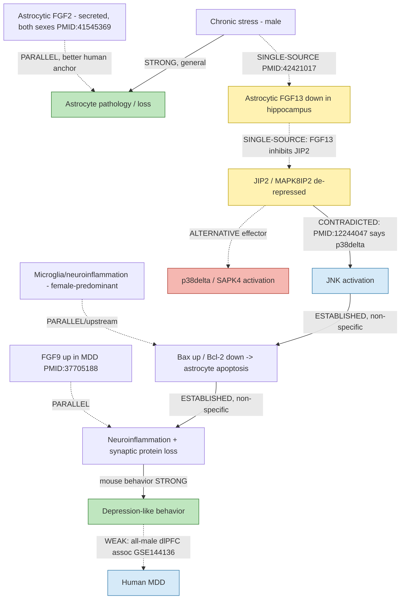

## Question

# Mechanistic Hypothesis Search

You are evaluating a specific disease mechanism hypothesis for the Disorder
Mechanisms Knowledge Base. This is not a general disease overview. Use the
hypothesis YAML below as the seed claim, then search for evidence that supports,
refutes, qualifies, or competes with this hypothesis.

## Target Disease
- **Disease Name:** Major Depressive Disorder
- **Category:** Complex

## Target Hypothesis
- **Hypothesis ID:** astrocytic_fgf13_jip2_jnk_cell_death_model
- **Hypothesis Label:** Astrocytic FGF13-JIP2-JNK Cell-Death Model
- **Status in KB:** EMERGING

## Seed Hypothesis YAML

```yaml
hypothesis_group_id: astrocytic_fgf13_jip2_jnk_cell_death_model
hypothesis_label: Astrocytic FGF13-JIP2-JNK Cell-Death Model
status: EMERGING
description: 'In stress-exposed male mouse hippocampus, reduced astrocytic FGF13 is proposed to permit
  MAPK8IP2/JIP2-associated JNK activation, shift BAX/BCL2 signaling toward apoptosis, increase inflammation,
  and reduce synaptic proteins, thereby worsening depression-like behavior. This is a model-supported
  hypothesis rather than an established human MDD mechanism: the human component is a secondary astrocyte
  transcriptomic association in an all-male suicide dorsolateral-prefrontal-cortex cohort, and older FHF-IB2
  biochemistry instead favored p38delta recruitment over JNK.'
evidence:
- reference: PMID:42421017
  reference_title: FGF13 alleviates astrocytic apoptosis via JIP2 inhibition in the hippocampus and mitigates
    depression-like behavior.
  supports: SUPPORT
  evidence_source: MODEL_ORGANISM
  snippet: Astrocyte-specific knockout of FGF13 induces astrocytic apoptosis, exacerbates inflammatory
    levels, and aggravates depression-like behaviors in mice. In contrast, astrocyte-specific overexpression
    of FGF13 significantly attenuates both astrocyte apoptosis and inflammation, and effectively ameliorates
    depression-like behaviors.
  explanation: Bidirectional astrocyte-specific manipulation in stress-exposed mice supports a causal
    Fgf13-dependent phenotype in the model, but does not by itself establish an endogenous adult human
    MDD mechanism.
- reference: PMID:42421017
  reference_title: FGF13 alleviates astrocytic apoptosis via JIP2 inhibition in the hippocampus and mitigates
    depression-like behavior.
  supports: SUPPORT
  evidence_source: IN_VITRO
  snippet: FGF13 regulates apoptosis in primary astrocytes through the JIP2–JNK signaling pathway.
  explanation: Primary-astrocyte immunoblot experiments (reported at n=4 per group in the supplement)
    support the proposed signaling chain, although the small neonatal culture system does not establish
    its operation in adult human astrocytes.
- reference: PMID:42421017
  reference_title: FGF13 alleviates astrocytic apoptosis via JIP2 inhibition in the hippocampus and mitigates
    depression-like behavior.
  supports: PARTIAL
  evidence_source: HUMAN_CLINICAL
  snippet: GSE144136 contains nuclei from the postmortem dorsolateral prefrontal cortex (dlPFC) of 17
    healthy controls (HC) and 17 patients with major depressive disorder (MDD) who died by suicide. All
    subjects were male.
  explanation: The secondary human transcriptomic analysis provides limited disease association, but its
    sex, cause-of-death, and cortical-region restrictions do not validate the hippocampal apoptosis mechanism
    or pathway activity.
- reference: PMID:12244047
  reference_title: Fibroblast growth factor homologous factors and the islet brain-2 scaffold protein
    regulate activation of a stress-activated protein kinase.
  supports: PARTIAL
  evidence_source: IN_VITRO
  snippet: FHF binding to IB2 facilitates recruitment of the MAPK p38delta (SAPK4), while failing to stimulate
    binding of JNK, the preferred kinase of the related scaffold IB1 (JIP-1).
  explanation: Earlier biochemical work confirms an FHF-IB2/JIP2 interaction but raises a direct pathway-specificity
    question because it favored p38delta, not JNK; this prevents treating the newer JIP2-JNK direction
    as settled.
notes: Curated as an emerging, model-specific hypothesis only. No new pathophysiology edge or FGF13/JIP2-directed
  treatment is asserted because adult human target engagement, causal mediation, and safety or efficacy
  evidence are absent.
```

## Research Objective

Build a focused hypothesis-search report that answers:

1. What is the strongest direct evidence for this hypothesis?
2. What evidence argues against it, fails to reproduce it, or limits its scope?
3. Which claims are established, emerging, speculative, or contradicted?
4. Which patient subtypes, stages, tissues, cell types, molecular pathways, or
   biomarkers does the hypothesis best explain?
5. Which alternative or competing mechanistic hypotheses explain the same disease
   features better or more parsimoniously?
6. What are the explicit knowledge gaps: missing causal steps, unconfirmed edges,
   contradictory evidence, unknown source-to-target links, or source/data absences?
7. What experiments, cohorts, assays, datasets, or trials would most directly
   distinguish this hypothesis from alternatives?

Use primary literature whenever possible. Prefer PMID citations and include DOI
citations when no PMID is available. Treat reviews as orientation unless they
contain directly relevant synthesized evidence that should be clearly labeled as
review-level support.

## Required Output

### Executive Judgment

Give a concise verdict on the hypothesis as of the current literature:
supported, partially supported, unresolved, weakly supported, or refuted. Explain
the reasoning and the most important caveats.

### Evidence Matrix

Create a table with one row per important evidence item:

- Citation (PMID preferred)
- Evidence type (human clinical, model organism, in vitro, computational, review)
- Supports / refutes / qualifies / competing
- Mechanistic claim tested
- Key finding
- Disease subtype or context
- Confidence and limitations

### Mechanistic Causal Chain

Describe the causal chain implied by the hypothesis from upstream trigger to
clinical manifestation. Identify where the literature is strong, where the links
are inferred, and where there are missing causal steps.

### Knowledge Gaps

Identify explicit known unknowns surfaced by the search. Treat absence of
evidence as a curation-relevant finding only when the search actually checked for
it. Include:

- Unknown or weakly supported causal steps in the hypothesis
- Unconfirmed causal graph edges that need direct perturbation or longitudinal
  evidence
- Conflicting evidence, failed replications, or incompatible subtype-specific
  findings
- Unknown mechanism of action for relevant treatments, biomarkers, or
  interventions tied to this hypothesis
- Source-level or dataset-level absences, such as no relevant GenCC, ClinGen,
  trial, omics, or cohort evidence found as of the search date

For each gap, state the scope, why it matters, what was checked, and what
evidence or experiment would resolve it.

### Alternative Models

List competing or complementary hypotheses. For each, explain whether it is an
alternative to the seed hypothesis, a downstream consequence, an upstream cause,
or a parallel mechanism.

### Discriminating Tests

Recommend concrete studies or assays that would most efficiently test this
hypothesis against alternatives. Include patient stratification, biomarkers,
sample type, model system, perturbation, and expected result where applicable.

### Curation Leads

Provide candidate updates for the KB, but label these as leads requiring curator
verification. Include:

- candidate evidence references and exact abstract snippets to verify
- candidate pathophysiology nodes or edges
- candidate ontology terms for cell types and biological processes
- candidate subtype restrictions or status changes
- candidate `knowledge_gaps` or discussion prompts for unresolved causal claims,
  conflicting evidence, or explicit source/data absences

If the provider supports artifacts, produce artifact-friendly outputs such as an
evidence matrix, mechanistic diagram, knowledge-gap table, or comparison table.
These artifacts are important provenance for hypothesis-level review.


## Output

# Hypothesis-Search Report: Astrocytic FGF13–JIP2–JNK Cell-Death Model of Major Depressive Disorder

**Hypothesis ID:** `astrocytic_fgf13_jip2_jnk_cell_death_model`
**KB status:** EMERGING
**Disease:** Major Depressive Disorder (Complex)
**Search date:** 2026-07-26

---

## Executive Judgment

**Verdict: PARTIALLY SUPPORTED — emerging, model-specific, single-source, and internally contradicted on one load-bearing edge.**

The hypothesis rests almost entirely on a **single 2026 primary study** (PMID:42421017) that provides internally consistent, *bidirectional*, astrocyte-specific causal evidence in **male mouse hippocampus**: FGF13 knockout worsens and overexpression rescues astrocyte apoptosis, inflammation, and depression-like behavior, with an FGF13→JIP2→JNK→Bax/Bcl-2 signaling mechanism. This is strong causal evidence **within the model**.

However, four caveats prevent a stronger verdict:

1. **The distal endpoints are established but non-specific.** Astrocyte loss, JNK activation, Bax/Bcl-2 apoptosis, neuroinflammation, and synaptic-protein loss are all independently well-documented general features of depression models (PMID:40566816, 41218740, 33109036, 32150824, 41611011) — but in FGF13/JIP2-independent contexts. The endpoints therefore do not discriminate this hypothesis from many convergent mechanisms. The genuinely novel, load-bearing claims are narrowly the **FGF13→JIP2 binding** and the **JIP2→JNK direction**.

2. **The JIP2→JNK edge is directly contradicted by prior biochemistry.** Schoorlemmer & Goldfarb 2002 (PMID:12244047) showed the FHF–IB2/JIP2 complex recruits **p38delta (SAPK4), not JNK**; JNK is the preferred kinase of the *related* scaffold IB1/JIP-1. The seed's central kinase-specificity claim reverses this and is unreconciled.

3. **Human evidence is thin and sex/region-restricted.** The only human component is a secondary transcriptomic association in an all-male suicide dlPFC cohort (GSE144136), a cortical region distinct from the mouse hippocampus where the mechanism was tested. Sex/region matter mechanistically: astrocytes are a **male-predominant** MDD DEG contributor in human dlPFC (PMID:37217515), so the finding is coherent for a *male* subtype but is not expected to generalize to female MDD (microglia-dominated).

4. **No target engagement, causal mediation in humans, or therapeutic evidence exists.** There is no independent human genetic (GWAS/GenCC/ClinGen), longitudinal, or trial evidence linking FGF13 to MDD as of the search date.

**Bottom line:** Keep at EMERGING. The mouse causal data are real and worth curating, but the human relevance is unproven, the pathway-specificity is contested, and a more parsimonious, better-human-anchored FGF-family alternative (astrocytic **FGF2**) exists.

---

## Evidence Matrix

| # | Citation (PMID) | Evidence type | Stance | Mechanistic claim tested | Key finding | Subtype / context | Confidence & limitations |
|---|-----------------|---------------|--------|--------------------------|-------------|-------------------|--------------------------|
| 1 | 42421017 (2026) | Model organism (mouse) | **Supports** | Astrocytic FGF13 loss → astrocyte apoptosis, inflammation, worse depression behavior | Bidirectional: astrocyte-specific KO aggravates; overexpression rescues all three | Male mouse hippocampus, stress models | Moderate. Single lab; effect sizes not in abstract; male-only |
| 2 | 42421017 (2026) | In vitro (primary astrocytes) | **Supports** | FGF13→JIP2→JNK→Bax/Bcl-2 signaling chain | FGF13 binds JIP2, inhibits it, blocks JIP2–JNK, suppresses Bax/Bcl-2 apoptosis | Neonatal mouse primary astrocytes | Low–moderate. Small n (n=4/grp per seed); neonatal culture ≠ adult human astrocyte |
| 3 | 42421017 (2026) | Human clinical (snRNA-seq) | **Qualifies (weak support)** | FGF13/astrocyte association in human MDD | Secondary reanalysis of GSE144136 astrocyte transcriptomes | 17 MDD suicide vs 17 HC, all male, dlPFC | Low. Association only; wrong region (cortex not hippocampus); all-male; suicide cause-of-death |
| 4 | 12244047 (2002) | In vitro (biochemistry) | **Refutes / contradicts (pathway specificity)** | Does FHF–IB2/JIP2 signal via JNK? | FHF–IB2 recruits **p38delta**, NOT JNK; JNK is the IB1/JIP-1 kinase | Adult rat/mouse brain complexes | High for the biochemistry; the seed's JNK direction is unreconciled with this |
| 5 | 39332965 (2024, review) | Review (orientation) | **Qualifies** | Is FGF13 an astrocytic protein? | Canonical FGF13/FHF2 is a non-secreted, **predominantly neuronal** Nav-channel/IB2/microtubule protein | CNS/PNS neurons, heart | Review-level. A primary astrocytic apoptotic role is atypical and single-sourced |
| 6 | 40566816 (2026) | Model organism | **Competing/complementary (endpoint)** | Is JNK activation a general depression feature? | Stress activates JNK; inhibition (electroacupuncture) reduces JNK/c-Jun/AP-1 and is antidepressant | Post-stroke depression mice | Moderate. Supports JNK node FGF13-independently |
| 7 | 41218740 (2026) | Model organism | **Competing/complementary (endpoint)** | JNK/GluR1 in depression synaptic plasticity | Xiaoyaosan modulates hippocampal JNK/GluR1 to improve behavior | CUMS rats | Moderate. JNK node, FGF13-independent |
| 8 | 33109036 (2021); 32150824 (2020) | Model organism | **Competing/complementary (endpoint)** | Bax/Bcl-2 glial apoptosis in depression | Chronic stress induces hippocampal Bax/Bcl-2 apoptosis with GFAP/glial changes | CUMS rats | Moderate. Apoptosis node, FGF13-independent |
| 9 | 41545369 (2026) | Model organism + human biomarker | **Competing (parallel FGF)** | Astrocytic FGF2 in stress susceptibility/mood | Astrocyte-specific Fgf2 up prevents / down increases stress susceptibility; circulating FGF2 tracks depression severity in **men and women** | Mouse + human serum, both sexes | Moderate–high. Stronger human anchoring than FGF13 |
| 10 | 37705188 (2023) | Model organism + in vitro | **Competing (parallel FGF)** | FGF9 in MDD | FGF9 selectively upregulated in MDD; suppresses synaptic/neuronal function | Rat cortex, cultures | Moderate. Opposite-direction FGF |
| 11 | 38468384 (2024) | Model organism | **Competing (inflammation)** | NUDT6/FGF2-antisense depressogenic pathway | NUDT6 induces depression via S100A9/NF-κB inflammation, ↓neurogenesis | Rat hippocampus | Moderate |
| 12 | 37217515 (2023) | Human clinical (snRNA-seq) | **Qualifies (subtype scope)** | Cell-type/sex architecture of human MDD | Astrocytes are major DEG contributors in **males**; microglia/PV interneurons in **females** | 71 donors, dlPFC, both sexes | High for sex-specificity; constrains hypothesis to male subtype |
| 13 | 42189975 (2026) | Model organism (Four Core Genotypes) | **Qualifies (sex)** | Sex chromosome vs gonad in stress susceptibility | XX susceptible/immune, XY resilient/neuronal; little cross-sex gene overlap | Mouse PFC/NAc | Moderate. Reinforces sex-divergence |
| 14 | 41611011 (2026, review) | Review (orientation) | **Supports premise** | Astrocyte pathology in MDD | GFAP reduction / astrocyte atrophy consistent across rodent + human postmortem | PFC, hippocampus | Review-level; supports broad premise, not FGF13 specificity |

---

## Mechanistic Causal Chain

Upstream trigger → clinical manifestation, with link-by-link strength:

```
Chronic stress (male)
   │  [STRONG: many models produce this]
   ▼
↓ Astrocytic FGF13 expression in hippocampus
   │  [SINGLE-SOURCE: only PMID:42421017; canonical FGF13 is neuronal (PMID:39332965)]
   ▼
FGF13 no longer binds/inhibits JIP2 (MAPK8IP2)
   │  [PLAUSIBLE but SINGLE-SOURCE: FHF–IB2 interaction is real (PMID:12244047, 15863036),
   │   but "FGF13 inhibits JIP2 activity" is new]
   ▼
JIP2-scaffolded JNK activation
   │  [CONTRADICTED EDGE: prior biochemistry says IB2/JIP2 → p38delta, not JNK (PMID:12244047)]
   ▼
Bax↑/Bcl-2↓ → astrocyte apoptosis
   │  [ENDPOINT ESTABLISHED generally (PMID:33109036, 32150824), but FGF13-independent]
   ▼
↑ Neuroinflammation + ↓ synaptic proteins
   │  [ENDPOINT ESTABLISHED generally (PMID:41611011); non-specific]
   ▼
Worsened depression-like behavior (mouse) → [inferred] human MDD
   │  [WEAK HUMAN LINK: all-male dlPFC transcriptomic association only (GSE144136)]
```

**Strong links:** stress→astrocyte pathology→behavior (general); the FHF–IB2/JIP2 physical interaction.
**Inferred/weak links:** stress→astrocytic FGF13 loss (single source); FGF13→JIP2 *inhibition*.
**Missing/contradicted:** JIP2→**JNK** (contradicted by p38delta biochemistry); mouse hippocampus→human dlPFC translation (region + species + sex mismatch); human causal mediation.

---

## Knowledge Gaps

| Gap | Scope | Why it matters | What was checked | What would resolve it |
|-----|-------|----------------|------------------|-----------------------|
| **JIP2→JNK vs JIP2→p38delta** | Core kinase-specificity edge | The entire mechanistic name hinges on JNK; prior biochemistry says p38delta | PubMed FHF/IB2/kinase; found PMID:12244047 contradicting | Direct co-IP + phospho-kinase panel (p-JNK, p-c-Jun vs p-p38delta) in adult astrocytes ± FGF13; JIP2-domain mapping |
| **Is astrocytic FGF13 loss endogenous in human MDD?** | Source→target link | Canonical FGF13 is neuronal; astrocytic expression/loss unproven in humans | PubMed FGF13 biology (PMID:39332965) + human snRNA-seq | Cell-type-resolved FGF13 quantification in human MDD hippocampus (both sexes) |
| **Region mismatch (hippocampus vs dlPFC)** | Anatomic scope | Mouse mechanism = hippocampus; human data = dlPFC | Reviewed GSE144136 provenance | Human hippocampal snRNA-seq/spatial for FGF13/JIP2/JNK-apoptosis signature |
| **Sex generalizability** | Subtype scope | Astrocytes are male-predominant DEG source; females = microglia | PubMed sex-specific MDD (PMID:37217515, 42189975) | Female mouse + female human replication; expect null/attenuated |
| **Human genetic support (search-verified absence)** | Source-level absence | No independent FGF13→MDD or MAPK8IP2/JIP2→MDD genetic anchor exists | PubMed MAPK8IP2/JIP2 psychiatric (0 hits) + MDD GWAS/functional-genomics 2026 (FADS1-2-3 PMID:42309192; Ca-channels PMID:42436150; immune/histone PMID:42320287; DENND1A/oxytocin PMID:42271086 — none mention FGF13/JIP2); FGF13 human variants → epilepsy/DEE (PMID:33245860, 26063919) | Direct PGC-MDD GWAS/exome/GenCC/ClinGen lookup for FGF13 & MAPK8IP2 |
| **Therapeutic/target engagement** | Intervention | Seed asserts therapeutic potential but no drug/engagement data | Reviewed seed notes + literature | FGF13 or JIP2-directed perturbation with behavioral + biomarker readout |
| **Reproducibility** | Source-level | Single lab, single paper (2026) | PubMed — only PMID:42421017 for FGF13-astrocyte-depression | Independent replication |

---

## Alternative / Competing Models

1. **Astrocytic FGF2 (secreted) hypothesis — PARALLEL, better human-anchored (PMID:41545369).** Astrocyte-specific Fgf2 bidirectionally controls stress susceptibility and BBB integrity; circulating FGF2 tracks depression severity in **both sexes**. A more parsimonious astrocytic-FGF account of human MDD than intracellular FGF13; not mutually exclusive.
2. **FGF9-up-in-MDD (PMID:37705188) — PARALLEL/opposite-direction FGF.** FGF9 elevated in MDD, suppresses synaptic/neuronal function.
3. **p38delta (not JNK) as the true FHF–IB2 effector (PMID:12244047) — ALTERNATIVE at the kinase node.** Same scaffold, different kinase; a direct competitor to the seed's central edge.
4. **Neuroinflammation-first models (microglia/NLRP3/TNF; PMID:42092624, 41014338, 38468384) — UPSTREAM or PARALLEL.** Inflammation may drive glial apoptosis rather than result from it; female-predominant (microglia).
5. **Glutamate/astrocyte homeostasis & connexin-43/GLT-1 loss, neurotrophic (BDNF) deficits (PMID:41611011 review) — PARALLEL** astrocytic mechanisms not requiring apoptosis.
6. **Neuronal (not astrocytic) FGF13 excitability role (PMID:35195262, 39773461, 26063919) — ALTERNATIVE cell-type.** FGF13's best-established CNS role is neuronal Nav modulation/excitability.

---

## Discriminating Tests

1. **Kinase-specificity assay (highest priority).** In adult mouse *and* human astrocytes, FGF13 knockdown/overexpression + phospho-panel (p-JNK/p-c-Jun vs p-p38delta/MK2) and JIP2 co-IP. *Expected if seed true:* FGF13 loss ↑p-JNK selectively. *Expected if 2002 biochemistry holds:* p38delta engaged instead.
2. **Sex-stratified replication.** Repeat astrocyte-specific Fgf13 KO/OE in **female** mice; quantify astrocytic FGF13 in female human hippocampus. *Expected:* attenuated/null in females (microglia-dominated) — would formalize a male-subtype restriction.
3. **Region-matched human data.** snRNA-seq/spatial of human **hippocampus** (both sexes, MDD vs control, non-suicide included) for co-localized FGF13↓ / JIP2 / JNK-apoptosis / Bax-Bcl2 signature. Distinguishes hippocampal mechanism from cortical association.
4. **Head-to-head FGF13 vs FGF2 astrocyte perturbation** in the same stress model with shared behavioral + BBB + apoptosis readouts, to rank parsimony.
5. **Human genetic/biomarker anchor.** PGC-MDD GWAS/exome lookup for FGF13/MAPK8IP2; CSF/serum correlates. *Expected if seed causal:* enrichment or biomarker signal.
6. **Causal mediation.** Astrocyte-specific Fgf13 rescue **combined with** a JNK inhibitor vs p38delta inhibitor; behavioral rescue should track the true effector kinase.

---

## Curation Leads (require curator verification)

**Candidate evidence references + snippets to verify:**
- PMID:12244047 — "FHF binding to IB2 facilitates recruitment of the MAPK p38delta (SAPK4), while failing to stimulate binding of JNK, the preferred kinase of the related scaffold IB1 (JIP-1)." → supports a **conflicting-evidence** knowledge_gap on the JIP2→JNK edge.
- PMID:37217515 — "microglia and parvalbumin interneurons contributed the most DEGs in females, while deep layer excitatory neurons, astrocytes, and oligodendrocyte precursors were the major contributors in males." → supports a **male-subtype restriction**.
- PMID:41545369 — "viral-mediated astrocyte-specific Fgf2 upregulation prevents stress-induced social avoidance while downregulation increases stress susceptibility" and "Circulating FGF2 level is linked with depression severity and symptomatology in men and women." → candidate **competing hypothesis node** (astrocytic FGF2).
- PMID:39332965 — canonical FGF13/FHF2 as non-secreted neuronal Nav/IB2/microtubule protein → candidate **caveat node** on astrocytic-role assumption.

**Candidate pathophysiology nodes/edges:**
- Node: `astrocytic FGF13 (FHF2)` — cell type restriction: hippocampal astrocyte (model), male.
- Edge (KEEP, EMERGING): `FGF13 ⊣ JIP2/MAPK8IP2` (inhibits) — single-source.
- Edge (FLAG, CONFLICTING): `JIP2 → JNK activation` — contradicted by `JIP2/IB2 → p38delta` (PMID:12244047).
- Edge (SUPPORTED, non-specific): `JNK → Bax/Bcl-2 → astrocyte apoptosis → depression-like behavior`.
- Competing edge: `astrocytic FGF2 → BBB integrity / stress resilience` (PMID:41545369).

**Candidate ontology terms:**
- Cell types: astrocyte (CL:0000127); hippocampal astrocyte; microglial cell (CL:0000129, female-predominant contrast).
- Biological processes: astrocyte apoptotic process (GO:0097473-adjacent), JNK cascade (GO:0007254), p38MAPK cascade (GO:0038066), intrinsic apoptotic signaling (Bax/Bcl-2), neuroinflammatory response (GO:0150076).
- Gene/protein: FGF13/FHF2; MAPK8IP2/JIP2; MAPK8/9/10 (JNK); MAPK13 (p38delta); BAX; BCL2.

**Candidate subtype restriction / status:**
- Restrict to **male**, **hippocampal-astrocyte**, **model-organism** context; keep status **EMERGING**. Do not assert human target engagement or treatment.

**Candidate knowledge_gaps / discussion prompts:**
- "JIP2→JNK vs JIP2→p38delta kinase-specificity conflict (PMID:12244047 vs 42421017) — unresolved."
- "No independent human genetic or region-matched (hippocampal) evidence for FGF13 in MDD as of 2026-07-26."
- "Single-lab, single-paper source for the FGF13-astrocyte-depression axis — reproducibility unconfirmed."
- "Sex generalizability unknown; astrocyte-driven signal is male-predominant in human dlPFC."
- "Search-verified source-level absence: FGF13 and MAPK8IP2/JIP2 are absent from prioritized human MDD GWAS/functional-genomics loci as of 2026-07-26; the hypothesis is biochemical/model-derived, not genetically anchored."

---

## Artifact: Mechanistic Diagram (color-coded by evidence strength)



Legend: green = established/strong; yellow = single-source; red = contradicted/alternative-effector; blue = weak/inferred link.

## Artifact: Claim-level Status Summary (for curator triage)

| Claim (edge/node) | Status | Basis |
|-------------------|--------|-------|
| Astrocyte loss is a feature of MDD | **Established** | PMID:41611011 (review), broad model literature |
| Stress → JNK activation → apoptosis/behavior (general) | **Established (non-specific)** | PMID:40566816, 41218740, 33109036, 32150824 |
| FGF13 physically interacts with IB2/JIP2 | **Established** | PMID:12244047, 15863036, 39332965 |
| Astrocytic FGF13↓ drives astrocyte apoptosis + depression (mouse) | **Emerging** | PMID:42421017 (single source, male) |
| FGF13 *inhibits* JIP2 activity | **Emerging/speculative** | PMID:42421017 only |
| JIP2 → **JNK** (vs p38delta) | **Contradicted / unresolved** | PMID:12244047 favors p38delta |
| FGF13 is a primarily *astrocytic* apoptosis regulator | **Speculative** | Canonical FGF13 is neuronal (PMID:39332965) |
| Human (adult, hippocampal) FGF13-MDD mechanism | **Unresolved/weak** | all-male cortical association only (GSE144136) |
| FGF13/MAPK8IP2 as human MDD genetic risk | **Absent (search-verified)** | Not in MDD GWAS (PMID:42309192, 42436150, 42320287, 42271086) |

## Limitations of this search

- Literature-only investigation; no primary data reanalysis of GSE144136 was performed (dataset not provided).
- PubMed retrieval was keyword-sensitive; some negative searches (e.g., specific multi-term FGF/psychiatric queries) returned nothing and may reflect query brittleness rather than true absence — flagged as "checked but inconclusive."
- Effect sizes/p-values for PMID:42421017 were not extractable from the abstract.

---

*Findings recorded to the knowledge graph: 5. Hypotheses tracked: H001 (partially supported / testing).*


## Artifacts

- [OpenScientist final report](openscientist_artifacts/final_report.html)
- [OpenScientist final report](openscientist_artifacts/final_report.pdf)
