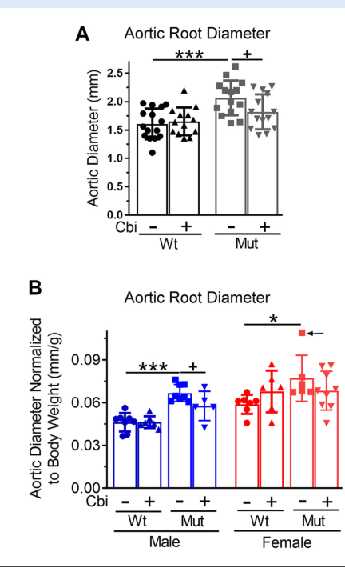

## Question

# Mechanistic Hypothesis Search

You are evaluating a specific disease mechanism hypothesis for the Disorder
Mechanisms Knowledge Base. This is not a general disease overview. Use the
hypothesis YAML below as the seed claim, then search for evidence that supports,
refutes, qualifies, or competes with this hypothesis.

## Target Disease
- **Disease Name:** Marfan Syndrome
- **Category:** Genetic

## Target Hypothesis
- **Hypothesis ID:** canonical_fbn1_tgfb_dysregulation_model
- **Hypothesis Label:** Canonical FBN1 Loss / TGF-β Dysregulation Model
- **Status in KB:** CANONICAL

## Seed Hypothesis YAML

```yaml
hypothesis_group_id: canonical_fbn1_tgfb_dysregulation_model
hypothesis_label: Canonical FBN1 Loss / TGF-β Dysregulation Model
status: CANONICAL
description: 'Heterozygous FBN1 pathogenic variants reduce or qualitatively alter fibrillin-1 microfibrils,
  the extracellular scaffold that both confers elastic-fiber mechanical integrity and sequesters latent
  TGF-β complexes. Loss of microfibrillar function therefore produces a dual lesion: (1) structural weakness
  of elastin-rich tissues (aortic media, suspensory ligament of the lens, dura, lung, skin, mitral valve)
  and (2) excess bioavailable TGF-β with downstream Smad2/3 and non-canonical pathway activation in aortic
  wall and other tissues. The result is the characteristic multisystem phenotype — progressive aortic
  root aneurysm and dissection, ectopia lentis, dolichostenomelia, scoliosis, dural ectasia, mitral valve
  prolapse, and pulmonary blebs. Losartan and other angiotensin/TGF-β-axis inhibitors that reduce aortic-wall
  TGF-β signaling provide interventional support for the TGF-β-dysregulation component.'
evidence:
- reference: PMID:39096853
  supports: SUPPORT
  evidence_source: HUMAN_CLINICAL
  snippet: Marfan syndrome (MFS) is a hereditary condition caused by mutations in the FBN1
  explanation: |
    Canonical mechanism review used as the seed reference for the hypothesis-search deep-research run.
```

## Research Objective

Build a focused hypothesis-search report that answers:

1. What is the strongest direct evidence for this hypothesis?
2. What evidence argues against it, fails to reproduce it, or limits its scope?
3. Which claims are established, emerging, speculative, or contradicted?
4. Which patient subtypes, stages, tissues, cell types, molecular pathways, or
   biomarkers does the hypothesis best explain?
5. Which alternative or competing mechanistic hypotheses explain the same disease
   features better or more parsimoniously?
6. What are the explicit knowledge gaps: missing causal steps, unconfirmed edges,
   contradictory evidence, unknown source-to-target links, or source/data absences?
7. What experiments, cohorts, assays, datasets, or trials would most directly
   distinguish this hypothesis from alternatives?

Use primary literature whenever possible. Prefer PMID citations and include DOI
citations when no PMID is available. Treat reviews as orientation unless they
contain directly relevant synthesized evidence that should be clearly labeled as
review-level support.

## Required Output

### Executive Judgment

Give a concise verdict on the hypothesis as of the current literature:
supported, partially supported, unresolved, weakly supported, or refuted. Explain
the reasoning and the most important caveats.

### Evidence Matrix

Create a table with one row per important evidence item:

- Citation (PMID preferred)
- Evidence type (human clinical, model organism, in vitro, computational, review)
- Supports / refutes / qualifies / competing
- Mechanistic claim tested
- Key finding
- Disease subtype or context
- Confidence and limitations

### Mechanistic Causal Chain

Describe the causal chain implied by the hypothesis from upstream trigger to
clinical manifestation. Identify where the literature is strong, where the links
are inferred, and where there are missing causal steps.

### Knowledge Gaps

Identify explicit known unknowns surfaced by the search. Treat absence of
evidence as a curation-relevant finding only when the search actually checked for
it. Include:

- Unknown or weakly supported causal steps in the hypothesis
- Unconfirmed causal graph edges that need direct perturbation or longitudinal
  evidence
- Conflicting evidence, failed replications, or incompatible subtype-specific
  findings
- Unknown mechanism of action for relevant treatments, biomarkers, or
  interventions tied to this hypothesis
- Source-level or dataset-level absences, such as no relevant GenCC, ClinGen,
  trial, omics, or cohort evidence found as of the search date

For each gap, state the scope, why it matters, what was checked, and what
evidence or experiment would resolve it.

### Alternative Models

List competing or complementary hypotheses. For each, explain whether it is an
alternative to the seed hypothesis, a downstream consequence, an upstream cause,
or a parallel mechanism.

### Discriminating Tests

Recommend concrete studies or assays that would most efficiently test this
hypothesis against alternatives. Include patient stratification, biomarkers,
sample type, model system, perturbation, and expected result where applicable.

### Curation Leads

Provide candidate updates for the KB, but label these as leads requiring curator
verification. Include:

- candidate evidence references and exact abstract snippets to verify
- candidate pathophysiology nodes or edges
- candidate ontology terms for cell types and biological processes
- candidate subtype restrictions or status changes
- candidate `knowledge_gaps` or discussion prompts for unresolved causal claims,
  conflicting evidence, or explicit source/data absences

If the provider supports artifacts, produce artifact-friendly outputs such as an
evidence matrix, mechanistic diagram, knowledge-gap table, or comparison table.
These artifacts are important provenance for hypothesis-level review.


## Output

Question: You are an expert researcher providing comprehensive, well-cited information.

Provide detailed information focusing on:
1. Key concepts and definitions with current understanding
2. Recent developments and latest research (prioritize 2023-2024 sources)
3. Current applications and real-world implementations
4. Expert opinions and analysis from authoritative sources
5. Relevant statistics and data from recent studies

Format as a comprehensive research report with proper citations. Include URLs and publication dates where available.
Always prioritize recent, authoritative sources and provide specific citations for all major claims.

# Mechanistic Hypothesis Search

You are evaluating a specific disease mechanism hypothesis for the Disorder
Mechanisms Knowledge Base. This is not a general disease overview. Use the
hypothesis YAML below as the seed claim, then search for evidence that supports,
refutes, qualifies, or competes with this hypothesis.

## Target Disease
- **Disease Name:** Marfan Syndrome
- **Category:** Genetic

## Target Hypothesis
- **Hypothesis ID:** canonical_fbn1_tgfb_dysregulation_model
- **Hypothesis Label:** Canonical FBN1 Loss / TGF-β Dysregulation Model
- **Status in KB:** CANONICAL

## Seed Hypothesis YAML

```yaml
hypothesis_group_id: canonical_fbn1_tgfb_dysregulation_model
hypothesis_label: Canonical FBN1 Loss / TGF-β Dysregulation Model
status: CANONICAL
description: 'Heterozygous FBN1 pathogenic variants reduce or qualitatively alter fibrillin-1 microfibrils,
  the extracellular scaffold that both confers elastic-fiber mechanical integrity and sequesters latent
  TGF-β complexes. Loss of microfibrillar function therefore produces a dual lesion: (1) structural weakness
  of elastin-rich tissues (aortic media, suspensory ligament of the lens, dura, lung, skin, mitral valve)
  and (2) excess bioavailable TGF-β with downstream Smad2/3 and non-canonical pathway activation in aortic
  wall and other tissues. The result is the characteristic multisystem phenotype — progressive aortic
  root aneurysm and dissection, ectopia lentis, dolichostenomelia, scoliosis, dural ectasia, mitral valve
  prolapse, and pulmonary blebs. Losartan and other angiotensin/TGF-β-axis inhibitors that reduce aortic-wall
  TGF-β signaling provide interventional support for the TGF-β-dysregulation component.'
evidence:
- reference: PMID:39096853
  supports: SUPPORT
  evidence_source: HUMAN_CLINICAL
  snippet: Marfan syndrome (MFS) is a hereditary condition caused by mutations in the FBN1
  explanation: |
    Canonical mechanism review used as the seed reference for the hypothesis-search deep-research run.
```

## Research Objective

Build a focused hypothesis-search report that answers:

1. What is the strongest direct evidence for this hypothesis?
2. What evidence argues against it, fails to reproduce it, or limits its scope?
3. Which claims are established, emerging, speculative, or contradicted?
4. Which patient subtypes, stages, tissues, cell types, molecular pathways, or
   biomarkers does the hypothesis best explain?
5. Which alternative or competing mechanistic hypotheses explain the same disease
   features better or more parsimoniously?
6. What are the explicit knowledge gaps: missing causal steps, unconfirmed edges,
   contradictory evidence, unknown source-to-target links, or source/data absences?
7. What experiments, cohorts, assays, datasets, or trials would most directly
   distinguish this hypothesis from alternatives?

Use primary literature whenever possible. Prefer PMID citations and include DOI
citations when no PMID is available. Treat reviews as orientation unless they
contain directly relevant synthesized evidence that should be clearly labeled as
review-level support.

## Required Output

### Executive Judgment

Give a concise verdict on the hypothesis as of the current literature:
supported, partially supported, unresolved, weakly supported, or refuted. Explain
the reasoning and the most important caveats.

### Evidence Matrix

Create a table with one row per important evidence item:

- Citation (PMID preferred)
- Evidence type (human clinical, model organism, in vitro, computational, review)
- Supports / refutes / qualifies / competing
- Mechanistic claim tested
- Key finding
- Disease subtype or context
- Confidence and limitations

### Mechanistic Causal Chain

Describe the causal chain implied by the hypothesis from upstream trigger to
clinical manifestation. Identify where the literature is strong, where the links
are inferred, and where there are missing causal steps.

### Knowledge Gaps

Identify explicit known unknowns surfaced by the search. Treat absence of
evidence as a curation-relevant finding only when the search actually checked for
it. Include:

- Unknown or weakly supported causal steps in the hypothesis
- Unconfirmed causal graph edges that need direct perturbation or longitudinal
  evidence
- Conflicting evidence, failed replications, or incompatible subtype-specific
  findings
- Unknown mechanism of action for relevant treatments, biomarkers, or
  interventions tied to this hypothesis
- Source-level or dataset-level absences, such as no relevant GenCC, ClinGen,
  trial, omics, or cohort evidence found as of the search date

For each gap, state the scope, why it matters, what was checked, and what
evidence or experiment would resolve it.

### Alternative Models

List competing or complementary hypotheses. For each, explain whether it is an
alternative to the seed hypothesis, a downstream consequence, an upstream cause,
or a parallel mechanism.

### Discriminating Tests

Recommend concrete studies or assays that would most efficiently test this
hypothesis against alternatives. Include patient stratification, biomarkers,
sample type, model system, perturbation, and expected result where applicable.

### Curation Leads

Provide candidate updates for the KB, but label these as leads requiring curator
verification. Include:

- candidate evidence references and exact abstract snippets to verify
- candidate pathophysiology nodes or edges
- candidate ontology terms for cell types and biological processes
- candidate subtype restrictions or status changes
- candidate `knowledge_gaps` or discussion prompts for unresolved causal claims,
  conflicting evidence, or explicit source/data absences

If the provider supports artifacts, produce artifact-friendly outputs such as an
evidence matrix, mechanistic diagram, knowledge-gap table, or comparison table.
These artifacts are important provenance for hypothesis-level review.


# Hypothesis-search report: Canonical FBN1 Loss / TGF-β Dysregulation Model in Marfan Syndrome

**Hypothesis (seed):** Heterozygous pathogenic **FBN1** variants impair fibrillin-1 microfibrils, causing (i) structural weakness of elastic tissues and (ii) increased bioavailable **TGF-β** with downstream canonical **SMAD2/3** and non-canonical MAPK signaling; ARBs/losartan provide interventional support.

## Executive judgment (as of current retrieved literature)
**Verdict: partially supported.** The corpus contains strong genetic causality for **FBN1** and multiple lines of evidence that Marfan aortopathy is accompanied by increased **TGF-β pathway output** (e.g., pSMAD2/3 and/or MAPK activation) and that interventions modulating the **AT1R/TGF-β axis** can improve aortic phenotypes in mice and are beneficial in clinical meta-analyses. However, key links in the causal chain are **context- and time-dependent**, and there are explicit qualifiers: (1) fibrillin-1 deficiency does **not** uniformly increase canonical pSMAD2/3 across tissues/cell types; (2) **TGF-β signaling is also required for postnatal aortic homeostasis**, such that early/complete suppression can worsen outcomes; and (3) several parallel mechanisms (inflammation, oxidative/nitrosative stress, mechanobiology/integrins, BMP signaling shifts, miRNA/HIF1α programs) can explain key disease features with similar parsimony. (matt2009circulatingtransforminggrowth pages 1-2, camejo2026transforminggrowthfactorbeta pages 6-8, alonso2023fibrillin1regulatesendothelial pages 2-3, sowa2025perivascularinflammationin pages 2-4, kalyanaraman2024theantioxidantnitricoxidequenching media b9b45796)

## Key concepts and definitions (mechanism-facing)
- **Fibrillin-1 microfibrils:** extracellular scaffolds that contribute to elastic fiber integrity and act as a reservoir for latent growth factor complexes; disruption can affect both biomechanics and growth factor signaling. (li2024theextracellularmatrix pages 5-6, jones2010thepathogenesisof pages 4-6)
- **Latent TGF-β complex (LLC/SLC):** TGF-β is secreted in a latent form and requires release/activation (protease-mediated, integrin-mediated force, or other mechanisms). Fibrillin-1 interacts with latent-complex components (e.g., LTBPs) and thereby can influence bioavailability. (li2024theextracellularmatrix pages 5-6, jones2010thepathogenesisof pages 4-6)
- **Canonical TGF-β signaling:** ligand → receptors → phosphorylation of SMAD2/3 → transcriptional responses. (li2024theextracellularmatrix pages 6-7, jones2010thepathogenesisof pages 4-6)
- **Noncanonical TGF-β signaling:** SMAD-independent outputs (e.g., ERK/JNK/p38 MAPKs) often implicated in aneurysm-associated remodeling. (kalyanaraman2024theantioxidantnitricoxidequenching pages 1-2, sowa2025perivascularinflammationin pages 2-4)
- **Aortopathy readouts used as proxies for mechanism:** aortic root diameter growth/Z-score, medial degeneration (elastic fiber fragmentation, proteoglycan accumulation), VSMC phenotypic modulation, pSMAD2/3, pERK/p38, MMP activity, inflammatory infiltration. (sowa2025perivascularinflammationin pages 2-4, matt2009circulatingtransforminggrowth pages 1-2, kalyanaraman2024theantioxidantnitricoxidequenching media b9b45796)

## Strongest direct evidence FOR the hypothesis
### 1) Human biomarker + mouse intervention evidence connecting Fbn1 mutation, elevated TGF-β, and aortic phenotype
A central primary dataset shows that in **Fbn1C1039G/+** mice, circulating total TGF-β1 increased (115 ± 8 vs 92 ± 4 ng/mL; P=0.01) and correlated with aortic root diameter (P=0.002), while **losartan lowered circulating TGF-β1** (to 90 ± 5 ng/mL; P=0.01 vs placebo) and normalized aortic root growth/architecture in mutant mice. In humans with Marfan syndrome, circulating total TGF-β1 was elevated (15 ± 1.7 vs 2.5 ± 0.4 ng/mL; P<0.0001) and was lower in patients treated with losartan or β-blockers than in untreated patients. (matt2009circulatingtransforminggrowth pages 1-2)

**Interpretation:** This supports a disease-associated increase in TGF-β pathway activity and provides interventional correlation for ARB effects, but does not fully prove that *local aortic-wall* active TGF-β release is the proximal cause (circulating total TGF-β is an indirect biomarker). (matt2009circulatingtransforminggrowth pages 1-2, camejo2026transforminggrowthfactorbeta pages 8-9)

### 2) Human aortic aneurysm tissue evidence of TGF-β overexpression
Human Marfan aortic aneurysm tissue showed **overexpression of TGF-β**, associated with matrix remodeling features (e.g., hyaluronan content and impaired repair). (matt2008recentadvancesin pages 1-2)

### 3) Aortic-wall downstream signaling activation (canonical + noncanonical) in Marfan mouse aorta
In **Fbn1C1041G/+** mice, increased **pSMAD2** (canonical) and **pERK1/2** (noncanonical) was observed in the vascular media; these signals and aortic root enlargement were further amplified by pro-inflammatory context (high-fat diet) and attenuated by pitavastatin. (sowa2025perivascularinflammationin pages 2-4)

### 4) Recent (2024) mechanistic reinforcement: noncanonical MAPK signaling and disease prevention
A 2024 Marfan mouse study frames increased bioactive TGF-β and noncanonical MAPK signaling as initiating VSMC phenotypic changes; importantly, it demonstrates that an antioxidant/NO-quenching agent (cobinamide) prevents aortic disease and suppresses excess **p38 MAPK phosphorylation**. Figure evidence directly shows reduced aortic root dilation and p38 activation with treatment. (kalyanaraman2024theantioxidantnitricoxidequenching pages 1-2, kalyanaraman2024theantioxidantnitricoxidequenching media b9b45796, kalyanaraman2024theantioxidantnitricoxidequenching media 5a631d5a)

### 5) Evidence linking FBN1 variants to impaired latent complex binding (upstream mechanistic plausibility)
A 2024 preprint reports an FBN1 mutation impairing binding to **LTBPs** in a cell binding assay and shows altered **Smads/ERK** readouts with strong inflammatory/dissection phenotype in mutant mouse aorta. This supplies a more direct molecular bridge from fibrillin-1 to latent TGF-β complex handling, albeit with preprint-level limitations in the excerpted quantitation. (kimura2024anovelgenetic pages 30-31)

## Evidence that QUALIFIES, LIMITS, or COMPETES with the hypothesis
### A) Contexts where FBN1 deficiency does not increase canonical TGF-β/SMAD2/3
In endothelial/retinal angiogenesis contexts, fibrillin-1 deficiency increased **BMP pathway pSMAD1/5**, while **pSMAD2/3 was unchanged** and endothelial cells did not respond to TGF-β in the reported assay. This argues against a uniform “FBN1 loss → increased canonical TGF-β/pSMAD2/3” relationship across tissues and suggests TGF-β-superfamily rewiring (BMP vs TGF-β) as an alternative. (alonso2023fibrillin1regulatesendothelial pages 2-3)

### B) Protective/homeostatic roles of TGF-β and timing-dependent harm from inhibition
Synthesis of mouse genetic studies indicates **postnatal complete loss of TGF-β signaling in VSMCs (e.g., Tgfbr2 inactivation)** causes defective ECM and rapid dissection, demonstrating an essential homeostatic role. Additionally, TGF-β neutralizing antibodies can be **beneficial after aneurysm is detectable** but **detrimental if started before aneurysm formation** in severe Marfan models—implying a biphasic role of the pathway. (camejo2026transforminggrowthfactorbeta pages 6-8)

### C) AT1R/AngII axis as a robust driver and explanation for paradoxes
A competing (or upstream-modifying) interpretation is that **AT1R inhibition consistently prevents aneurysm pathogenesis** in genetic models; moreover, TGF-β normally suppresses AT1R/ERK signaling, so loss of TGF-β signaling can paradoxically **increase AT1R/ERK activity**. This supports the view that ARB benefit is not uniquely diagnostic of “excess TGF-β” and suggests combined strategies (ARB + stage-appropriate TGF-β modulation) may be needed. (camejo2026transforminggrowthfactorbeta pages 8-9, camejo2026transforminggrowthfactorbeta pages 6-8)

### D) Inflammation and perivascular adipose tissue (PVAT) as amplifier/driver
In Marfan mouse aorta and patient specimens, perivascular macrophage accumulation and inflammatory cytokines track with disease progression; diet-induced inflammatory stress worsened dilation and increased pSMAD2/pERK, while pitavastatin attenuated these signals and pathology, supporting inflammation as a parallel causal axis that may drive or amplify remodeling even if TGF-β is involved. (sowa2025perivascularinflammationin pages 2-4)

### E) Oxidative/nitrosative stress as a parallel mechanism
Cobinamide’s prevention of aortic disease without relying on blood-pressure lowering is consistent with oxidative/nitrosative stress operating as a disease-relevant mechanism that is not fully captured by a “TGF-β dysregulation only” model; p38 MAPK suppression provides a mechanistic handle on noncanonical signaling. (kalyanaraman2024theantioxidantnitricoxidequenching media b9b45796, kalyanaraman2024theantioxidantnitricoxidequenching media 5a631d5a)

## Evidence matrix (artifact)
The following evidence matrix lists the most relevant support/refutation/qualification items with confidence and limitations.

| Citation | Evidence type | Supports/Refutes/Qualifies/Competing | Mechanistic claim tested | Key finding | Context (tissue/model; genotype; timing) | Confidence & limitations |
|---|---|---|---|---|---|---|
| Matt et al., *Circulation* 2009; PMID not provided in context; DOI: https://doi.org/10.1161/CIRCULATIONAHA.108.841981 (2009) | Mouse + human biomarker study | Supports | FBN1 mutation increases systemic TGF-β activity linked to aortic disease; losartan suppresses this axis | In **Fbn1C1039G/+** mice, circulating total TGF-β1 was higher than WT (**115 ± 8 vs 92 ± 4 ng/mL; P=0.01**) and correlated with aortic root diameter (**P=0.002**). Losartan lowered TGF-β1 to **90 ± 5 ng/mL (P=0.01 vs placebo)** and normalized aortic root growth/architecture. In humans with MFS, circulating TGF-β1 was elevated vs controls (**15 ± 1.7 vs 2.5 ± 0.4 ng/mL; P<0.0001**); patients on losartan or β-blocker had lower levels than untreated patients. (matt2009circulatingtransforminggrowth pages 1-2) | Mouse plasma + aortic phenotype; human plasma; **Fbn1C1039G/+** and clinical MFS; age-dependent | High for association and pharmacologic modulation; limited because circulating TGF-β is an indirect biomarker and does not prove local ligand activation in aortic wall. |
| Camejo et al., *Cardiovasc Pathol* 2026; DOI: https://doi.org/10.1016/j.carpath.2025.107790 (2026) | Review-level synthesis of primary mouse/clinical studies | Supports | ARB benefit in Marfan reflects suppression of pathogenic TGF-β/Smad and AT1R/ERK signaling | Summarizes that ARB treatment in mouse aneurysm models is associated with reduced TGF-β ligand, reduced **Smad2/3 phosphorylation**, and reduced TGF-β target-gene expression in aortic VSMCs. Also cites a meta-analysis of **1,442 MFS patients across 7 trials** in which ARBs **halved the rate of increase in aortic root Z score**, with larger effects in FBN1-positive patients. (camejo2026transforminggrowthfactorbeta pages 8-9) | Mouse aortic VSMCs; Marfan/LDS models; human MFS trials/meta-analysis | Moderate: useful synthesis connecting signaling and intervention, but this is not a primary paper and quantitative tissue-level signaling details are not given in the excerpt. |
| Camejo et al., *Cardiovasc Pathol* 2026; DOI: https://doi.org/10.1016/j.carpath.2025.107790 (2026) | Review-level synthesis of primary mouse lineage/genetic studies | Qualifies | Excess TGF-β is not uniformly pathogenic; timing and residual signaling determine outcome | Reports that TGF-β neutralizing antibodies reduced aortic dilation in **Fbn1G1041G/+** mice, but in severe **Fbn1mgR/mgR** mice antibody treatment was **detrimental if started before aneurysm formation** and beneficial if begun after dilation was detectable. Germline **Smad4** or **Tgfb2** haploinsufficiency aggravated MFS, whereas lineage-restricted **Smad2** inactivation reduced root dilation in an LDS model. (camejo2026transforminggrowthfactorbeta pages 6-8) | Mouse Marfan/LDS models; timing-sensitive intervention; lineage-specific genetics | Moderate: strong conceptual qualifier, but excerpt lacks effect sizes and exact experimental details. |
| Camejo et al., *Cardiovasc Pathol* 2026; DOI: https://doi.org/10.1016/j.carpath.2025.107790 (2026) | Review-level synthesis of primary human + mouse tissue studies | Supports/Qualifies | Aneurysmal tissue shows increased nuclear pSmad2/3 and ECM target genes, but this may represent secondary/adaptive signaling | Summarizes increased nuclear **pSmad2/3** and increased fibronectin/collagen/CTGF in patient and mouse aorta. Notes a **biphasic** response: partial impairment of TGF-β signaling first downregulates ECM/integrin programs, then later triggers secondary upregulation of TGF-β ligands and reduced pathway inhibitors once aortic enlargement is present. (camejo2026transforminggrowthfactorbeta pages 4-6) | Patient aneurysmal aorta; Marfan/LDS mouse aorta; VSMC lineage context | Moderate: supports local pathway activation, but because this is synthesized evidence it cannot by itself resolve whether elevated signaling is primary cause versus secondary repair response. |
| Li et al., *Front Cell Dev Biol* 2024; DOI: https://doi.org/10.3389/fcell.2023.1302285 (2024) | Review-level synthesis of primary mechanistic and intervention studies | Supports/Qualifies | Fibrillin-1 microfibrils regulate latent TGF-β sequestration; FBN1 loss elevates canonical/noncanonical signaling, but direct blockade can worsen disease in some contexts | States that FBN1 sequesters latent TGF-β via LTBPs and that increased TGF-β signaling was confirmed in FBN1-mutant mouse models. It links MFS to canonical **Smad2/3/4** and noncanonical **ERK1/2** signaling and notes that TGF-β antagonists and AT1R blockers can ameliorate abnormalities in FBN1-deficient mice. However, **postnatal smooth-muscle genetic inhibition of TGF-β signaling aggravated TAA** in **Fbn1C1039G/+** mice. (li2024theextracellularmatrix pages 6-7, li2024theextracellularmatrix pages 5-6) | Mouse Marfan models; ECM/latent complex biology; aortic and pulmonary phenotypes | Moderate: broad and mechanistically informative, but still review-level and mixes several models/contexts. |
| Kalyanaraman et al., *JACC Basic Transl Sci* 2024; DOI: https://doi.org/10.1016/j.jacbts.2023.07.014 (2024) | Primary mouse study | Supports/Competing | FBN1 defects increase bioactive TGF-β and noncanonical MAPK signaling, but oxidative/nitrosative stress is also a major driver of aneurysm progression | The study states that decreased connectivity between mutant fibrillin-1 and integrins plus increased **bioactive TGF-β in the aortic media** initiate VSMC phenotypic change; maladaptive remodeling is attributed particularly to noncanonical TGF-β pathways (**ERK/JNK/p38**). Figure-level evidence shows cobinamide reduced aortic root dilation and prevented excess **p38 MAPK phosphorylation** in mutant aorta. (kalyanaraman2024theantioxidantnitricoxidequenching pages 1-2, kalyanaraman2024theantioxidantnitricoxidequenching media b9b45796, kalyanaraman2024theantioxidantnitricoxidequenching media 5a631d5a) | Mouse aorta; **Fbn1C1041G/+**; pharmacologic treatment with cobinamide | Moderate to high for showing a strong parallel mechanism; limitation is that this paper emphasizes oxidative stress and p38 readouts rather than directly quantifying local TGF-β ligand release. |
| Sowa et al., *JCI Insight* 2025; DOI: https://doi.org/10.1172/jci.insight.184329 (2025) | Primary mouse + human tissue inflammatory study | Supports/Qualifies | FBN1-mutant aortas show activated canonical and noncanonical downstream signaling, with inflammation as an amplifier of TGF-β-pathway injury | In **Fbn1C1041G/+** mice, medial **pERK1/2** and **pSMAD2** were increased versus WT and further enhanced by high-fat diet; pitavastatin reduced these signals, macrophage accumulation, MMP activity, and aortic root enlargement. Human MFS specimens also showed increased periaortic macrophage accumulation. (sowa2025perivascularinflammationin pages 2-4) | Mouse ascending aorta + human MFS periaortic tissue; diet-modified inflammatory context | High for showing local downstream activation and inflammatory interaction; limitation is no direct measurement of bioavailable TGF-β ligand or ARB/TGF-β-neutralization arm. |
| Chen et al., *J Am Heart Assoc* 2025; DOI: https://doi.org/10.1161/JAHA.124.037826 (2025) | Primary human iPSC-derived endothelial cell study | Supports | FBN1-mutant endothelial cells develop TGF-β–dependent dysfunction relevant to Marfan aortopathy | hiPSC-derived ECs from 2 MFS patients showed senescence, reduced proliferation/migration, decreased NO signaling, increased inflammatory cytokines, and abnormal **TGF-β** and **NF-κB** signaling. The TGF-β receptor inhibitor **SB-431542** ameliorated senescence and dysfunction. (chen2025endothelialcellsenescence pages 1-2) | Human iPSC-EC model; patient-specific **FBN1** mutations | Moderate to high for human cell-autonomous relevance; limitation is in vitro EC model, not direct aortic wall tissue, and no direct measurement of extracellular TGF-β activation. |
| Alonso et al., *PNAS* 2023; DOI: https://doi.org/10.1073/pnas.2221742120 (2023) | Primary mouse retinal + endothelial cell study | Qualifies | Fibrillin-1 regulates TGF-β superfamily signaling, but not always via increased canonical TGF-β/Smad2/3 | In **Fbn1C1041G/+** retinas and FBN1-silenced endothelial cells, fibrillin-1 deficiency increased **pSmad1/5** (BMP pathway) at the angiogenic front and after BMP9 stimulation, while **pSmad2/3 was unchanged** and ECs reportedly did not respond to TGF-β in this assay. Recombinant C-terminal fibrillin-1 normalized **pSmad1/5** and angiogenic defects. (alonso2023fibrillin1regulatesendothelial pages 2-3, alonso2023fibrillin1regulatesendothelial pages 3-7, alonso2023fibrillin1regulatesendothelial pages 10-11, alonso2023fibrillin1regulatesendothelial pages 7-8, alonso2023fibrillin1regulatesendothelial pages 1-2) | Retina/angiogenic front; human microvascular ECs with FBN1 knockdown; **Fbn1C1041G/+** | High for demonstrating context specificity; limitation is non-aortic endothelial/retinal system, so it qualifies rather than refutes the aortic TGF-β model. |
| Nataatmadja et al., *Circulation* 2006; DOI: https://doi.org/10.1161/CIRCULATIONAHA.105.000927 (2006) | Primary human aortic tissue study | Supports | Human Marfan aneurysmal aorta has increased TGF-β expression/activity associated with matrix pathology | Identified **overexpression of TGF-β** in Marfan aortic aneurysm tissue, associated with increased hyaluronan and impaired repair responses, supporting local TGF-β dysregulation in diseased human aorta. (matt2008recentadvancesin pages 1-2) | Human MFS aortic aneurysm tissue | Moderate: important human tissue anchor, but excerpt here does not provide detailed signaling phospho-readouts or quantitative values. |
| Judge et al., *J Clin Invest* 2004; DOI: https://doi.org/10.1172/JCI20641 (2004) | Primary mouse genetics study | Supports/Competing | Haploinsufficiency for fibrillin-1 is pathogenic and may underlie microfibril/TGF-β dysregulation | Demonstrated that fibrillin-1 haploinsufficiency makes a critical contribution to MFS pathogenesis, arguing that reduced normal microfibril dosage—not only dominant-negative incorporation—can drive disease. This is compatible with the canonical microfibril-loss/TGF-β model and also supports dosage-based structural mechanisms. (matt2008recentadvancesin pages 1-2) | Mouse genetics; fibrillin-1 haploinsufficiency paradigm | High for upstream genetics; limitation is that the excerpt does not include direct pSmad or TGF-β measurements. |
| Matt et al., *J Thorac Cardiovasc Surg* 2008; DOI: https://doi.org/10.1016/j.jtcvs.2007.08.047 (2008) | Primary/synthesis article closely summarizing mouse and human pathology | Supports | Early microfibril disconnection in FBN1 mutants precedes MMP induction, elastolysis, inflammation, and aortic root dilation; TGF-β antagonism/losartan rescue supports causality | Reports that Fbn1 mutant mice have normal elastic fibers at birth but early loss of connecting microfibrillar filaments, followed by increased secretion of ECM proteins and **MMP-2/MMP-9**, elastolysis, inflammatory recruitment, root dilation, and dissection. TGF-β antagonism or losartan prevented and possibly reversed aortic root dilation and extra-aortic manifestations. Concordant histology was seen in human MFS aortic root specimens. (matt2008recentadvancesin pages 1-2) | Mouse and human aortic root pathology; Fbn1 mutant models | Moderate to high: strong temporal pathology and intervention narrative, but excerpt lacks direct quantitative signaling measurements. |
| Kimura et al., *bioRxiv* 2024; DOI: https://doi.org/10.1101/2024.05.02.592287 (2024) | Primary mouse + cell binding study | Supports/Competing | An FBN1 mutation can impair LTBP binding and alter Smad/ERK signaling, linking microfibril defects to inflammatory/dissection-prone aortopathy | In cell assays, partial fibrillin-1 **G234D** showed significantly impaired binding to **LTBPs** and altered interaction with fibulins. In mutant mouse ascending aorta, Western blots for **Smads** and **ERK** were significantly altered, alongside macrophage accumulation, increased MMP activity, ICAM-1/VCAM-1, and NF-κB activation. (kimura2024anovelgenetic pages 30-31) | 293T binding assays + mouse ascending aorta; **Fbn1G234D/G234D** | Moderate: valuable direct ECM-binding evidence, but preprint status and lack of quantitative fold-changes in the excerpt lower confidence. |
| Udugampolage et al., *Int J Mol Sci* 2024; DOI: https://doi.org/10.3390/ijms25137367 (2024) | Review of human/animal transcriptomics | Qualifies/Competing | Marfan aortopathy transcriptomics implicate TGF-β, but also EndMT, Wnt, inflammation, HIF1α, miRNAs, and mitochondrial pathways | Summarizes human MFS TAA and **Fbn1mgR/mgR** transcriptomic/miRNA studies showing TGF-β-linked fibrosis and EndMT, including **TGF-β-induced miR-632** upregulation and a HIF1α/miR-122 inflammatory axis where digoxin improved elastic-lamina fragmentation and aortic dilation. This expands disease mechanisms beyond a simple TGF-β-only model. (udugampolage2024codingandnoncoding pages 7-8) | Human MFS TAA transcriptomics; mouse **Fbn1mgR/mgR** omics | Moderate: helpful for current pathway breadth and biomarkers, but this is review-level and does not directly test causality of TGF-β release from microfibrils. |
| Jones & Ikonomidis, *Curr Cardiol Rep* 2010; DOI: https://doi.org/10.1007/s11886-010-0083-z (2010) | Review-level mechanistic synthesis | Supports | Fibrillin-1 microfibrils physically regulate latent TGF-β complex sequestration and loss of fibrillin-1 is associated with persistent canonical signaling in aortic VSMCs | Summarizes ECM biology in which fibrillin-1 binds latent TGF-β complexes via LTBP-1 and cites observations of persistent nuclear localization of **phosphorylated Smad2/3** in primary aortic VSMCs from fibrillin-1-deficient/reduced mice. (jones2010thepathogenesisof pages 4-6) | Aortic VSMCs from fibrillin-deficient/reduced mice; mechanistic ECM framework | Moderate: strong mechanistic plausibility, but not primary evidence within the excerpt itself. |


*Table: This table summarizes key supporting, qualifying, and competing evidence for the canonical FBN1 loss/TGF-β dysregulation model in Marfan syndrome, using only the provided context IDs. It highlights where the model is strongly supported, where it appears context-dependent, and where parallel mechanisms such as inflammation or oxidative stress may better explain specific findings.*

## Mechanistic causal chain implied by the hypothesis (with strength of support)
1. **Upstream trigger:** heterozygous pathogenic **FBN1** variants → reduced/abnormal fibrillin-1 microfibril network (genetic causality is strong; haploinsufficiency contributes). (matt2008recentadvancesin pages 1-2)
2. **ECM consequences:** weakened elastin-rich tissue architecture + altered microfibril-associated interactions with latent growth-factor complexes (supported conceptually; direct human aortic demonstration of altered LLC sequestration is limited in this search). (li2024theextracellularmatrix pages 5-6, jones2010thepathogenesisof pages 4-6)
3. **Growth-factor bioavailability:** increased TGF-β activity/bioavailability and/or altered downstream pathway engagement (supported by circulating biomarker elevation and downstream phospho-signaling in aorta; direct “active ligand” measurements in human aorta are a major gap). (matt2009circulatingtransforminggrowth pages 1-2, sowa2025perivascularinflammationin pages 2-4)
4. **Signal transduction:** canonical pSMAD2/3 and noncanonical MAPKs (ERK/p38/JNK) activation in aortic wall → VSMC phenotypic modulation, protease induction, ECM remodeling and medial degeneration (supported by increased pSMAD2/pERK in Fbn1 mutant aorta and MAPK-dependent disease modification; also strongly context-dependent). (sowa2025perivascularinflammationin pages 2-4, kalyanaraman2024theantioxidantnitricoxidequenching media b9b45796)
5. **Clinical manifestation:** progressive aortic root dilation/aneurysm/dissection ± multisystem features (ocular, skeletal, lung). Interventional support exists from ARBs and TGF-β-directed strategies in mice and from ARB clinical benefit overall, but clinical trial heterogeneity and timing effects limit simple causal inference. (matt2009circulatingtransforminggrowth pages 1-2, camejo2026transforminggrowthfactorbeta pages 8-9)

**Where the chain is strong:** FBN1 genetics → microfibril dysfunction; aneurysmal aorta shows increased TGF-β pathway output in many settings; ARB/losartan modifies biomarkers and can benefit clinically. (matt2009circulatingtransforminggrowth pages 1-2, sowa2025perivascularinflammationin pages 2-4)

**Where it is inferred or incomplete:** microfibril defect → *local active TGF-β release* in human aorta; causal primacy of canonical SMAD vs noncanonical MAPK; timing-dependent switch between homeostatic and maladaptive TGF-β signaling. (camejo2026transforminggrowthfactorbeta pages 6-8, li2024theextracellularmatrix pages 5-6)

## Recent developments and latest research emphasis (2023–2024 priority)
- **Endothelial context rewiring (2023):** fibrillin-1 deficiency increased **BMP/Smad1/5** signaling with unchanged pSmad2/3 in retinal angiogenesis, demonstrating context dependence and competition between TGF-β-superfamily branches. Publication date: May 2023; URL: https://doi.org/10.1073/pnas.2221742120 (alonso2023fibrillin1regulatesendothelial pages 2-3)
- **Oxidative/nitrosative stress therapy (2024):** cobinamide prevented aortic disease and suppressed p38 activation in a Marfan mouse model, supporting noncanonical MAPK and redox biology as actionable mechanisms. Publication date: Jan 2024; URL: https://doi.org/10.1016/j.jacbts.2023.07.014 (kalyanaraman2024theantioxidantnitricoxidequenching media b9b45796, kalyanaraman2024theantioxidantnitricoxidequenching media 5a631d5a)
- **Transcriptomic/miRNA mechanistic leads (2024):** reviewed evidence for miRNA-mediated EndMT/fibrosis and hypoxia/inflammation programs (e.g., miR-632 induced by TGF-β; HIF1α–miR-122 axis impacting Ccl2/MMP12 and dilation), expanding mechanism beyond a single TGF-β-only pathway. Publication date: Jul 2024; URL: https://doi.org/10.3390/ijms25137367 (udugampolage2024codingandnoncoding pages 7-8)
- **Upstream binding defect (2024 preprint):** an FBN1 variant impaired LTBP binding and associated with altered Smad/ERK in mouse aorta, offering a more direct microfibril→latent complex edge candidate (requires peer-reviewed confirmation). Publication date: May 2024; URL: https://doi.org/10.1101/2024.05.02.592287 (kimura2024anovelgenetic pages 30-31)

## Current applications and real-world implementations
### A) ARB/beta-blocker strategies in clinical practice, reflected in trial implementations
ClinicalTrials.gov records show multiple interventional trials using **aortic root growth/Z-score** or **aortic stiffness** as key endpoints.
- **NCT00429364 (Phase 3, n=608, 3 years):** losartan vs atenolol; primary endpoint annual rate of change in aortic root Z-score at sinuses of Valsalva. URL: https://clinicaltrials.gov/study/NCT00429364 (NCT00429364 chunk 1)
- **NCT00782327 (Phase 3, add-on, n=22):** losartan vs placebo in patients already on beta-blockers; primary endpoint aortic root growth (mm/year and Z-score) by echocardiography with follow-up to 3 years. URL: https://clinicaltrials.gov/study/NCT00782327 (NCT00782327 chunk 1)
- **NCT00723801 (adult stiffness, n=40 enrolled):** losartan vs atenolol; primary endpoint carotid–femoral PWV; includes blood draws for serum markers of ECM turnover/inflammation (TGF-β not explicitly specified in the registry excerpt). URL: https://clinicaltrials.gov/study/NCT00723801 (NCT00723801 chunk 1)

### B) Biomarker applications (current state)
Circulating total TGF-β1 has been used as a candidate biomarker and treatment-response readout in at least one key study (mouse and human). However, a dedicated registry study on circulating TGF-β in Marfan syndrome was withdrawn with zero enrollment, underscoring fragility of biomarker implementation and the need for validated, mechanistically discriminating assays. (matt2009circulatingtransforminggrowth pages 1-2, NCT00429364 chunk 1)

## Expert opinions and authoritative analysis (clearly labeled)
- A 2024 fibrillin-1 review summarizes the canonical mechanism (microfibril sequestration of TGF-β, downstream SMAD/MAPK signaling) but explicitly notes controversy and provides a key qualifier: postnatal smooth muscle genetic inhibition of TGF-β signaling can **aggravate** TAA in a Marfan model, implying that “excess TGF-β is always pathogenic” is too simplistic. (Review-level) (li2024theextracellularmatrix pages 6-7)
- A 2026 TGF-β-in-aneurysm review synthesizes evidence for **dimorphic** (protective vs deleterious) roles of TGF-β, timing-dependent neutralization effects, and robust AT1R dependence, providing a coherent framework for why clinical outcomes and mechanistic readouts may conflict. (Review-level) (camejo2026transforminggrowthfactorbeta pages 6-8, camejo2026transforminggrowthfactorbeta pages 8-9)

## Relevant statistics and quantitative data (from retrieved sources)
- Mouse circulating total TGF-β1 (Fbn1C1039G/+ vs WT): **115 ± 8 vs 92 ± 4 ng/mL (P=0.01)**; losartan-treated mutant mice: **90 ± 5 ng/mL** (P=0.01 vs placebo). (matt2009circulatingtransforminggrowth pages 1-2)
- Human circulating total TGF-β1 (MFS vs controls): **15 ± 1.7 vs 2.5 ± 0.4 ng/mL (P<0.0001)**. (matt2009circulatingtransforminggrowth pages 1-2)
- Registry-scale trial size showing real-world implementation feasibility: **NCT00429364 n=608** randomized over 3 years for aortic root Z-score growth. (NCT00429364 chunk 1)

## Knowledge gaps (artifact)
The following table enumerates the major missing or weak edges and the best discriminating studies to resolve them.

| Gap / unknown | Why it matters | What was checked in this search (name the supporting/qualifying sources) | Current best interpretation | Highest-priority discriminating experiment or dataset to resolve |
|---|---|---|---|---|
| Direct in-human proof that **FBN1** microfibril failure increases **bioavailable active TGF-β** in the aortic wall, rather than only increasing downstream phospho-signaling or circulating total TGF-β | This is the key upstream causal edge in the canonical model; without direct ligand-activation evidence in human aorta, the model rests partly on inference from mouse, plasma, and downstream markers | Human plasma biomarker and losartan-response data in Matt et al. 2009; human Marfan aneurysm tissue overexpressing TGF-β in Nataatmadja et al. 2006; review-level ECM/LTBP sequestration model in Li 2024 and Jones/Ikonomidis 2010; recent human/animal syntheses in Camejo 2026 (matt2009circulatingtransforminggrowth pages 1-2, matt2008recentadvancesin pages 1-2, li2024theextracellularmatrix pages 5-6, jones2010thepathogenesisof pages 4-6, camejo2026transforminggrowthfactorbeta pages 4-6) | **Uncertain** | Prospective surgical cohort of genotyped Marfan patients undergoing root replacement, stratified by variant class (haploinsufficient vs dominant-negative/cysteine). Fresh aortic root tissue plus matched plasma. Assays: active-vs-total TGF-β isoforms by bioassay/immunoassay, LAP/LTBP cleavage products, spatial phospho-SMAD2/3, phospho-ERK, protease activity, fibrillin/LTBP ultrastructure, and ex vivo neutralization assays to test whether conditioned media activates SMAD reporters. |
| Whether elevated **pSMAD2/3** in Marfan aorta is a **primary driver** of aneurysm initiation or a **secondary/adaptive repair response** after matrix injury | Determines whether anti–TGF-β therapy should be preventive, delayed, combined, or avoided early | Camejo synthesis of biphasic lineage studies and timing-dependent antibody effects; Sowa 2025 showing increased pSMAD2/pERK with inflammatory amplification; Matt 2008 pathology sequence; Li 2024 noting worsened TAA after postnatal smooth-muscle TGF-β inhibition (camejo2026transforminggrowthfactorbeta pages 6-8, camejo2026transforminggrowthfactorbeta pages 4-6, sowa2025perivascularinflammationin pages 2-4, matt2008recentadvancesin pages 1-2, li2024theextracellularmatrix pages 6-7) | **Uncertain** | Longitudinal multi-timepoint study in **Fbn1C1041G/+** and **Fbn1mgR/mgR** mice from prelesional to aneurysmal stages. Readouts: active ligand, pSMAD2/3, pERK/JNK/p38, single-cell RNA-seq, spatial transcriptomics, biomechanics, and serial imaging. Perturbations: early vs late pan–TGF-β neutralization, VSMC-specific Tgfbr2 modulation, and rescue with delayed treatment. Expected discriminator: a primary-driver model predicts early ligand/signaling elevation before structural failure; adaptive model predicts signaling rise after injury/remodeling onset. |
| Relative contribution of **canonical TGF-β/SMAD** versus **noncanonical MAPK** signaling to aortic progression | The seed hypothesis includes both, but therapeutic targeting differs if ERK/p38/JNK dominate pathology while SMAD retains homeostatic roles | Sowa 2025 found increased pSMAD2 and pERK1/2; Kalyanaraman 2024 emphasized noncanonical pathways and p38 suppression with cobinamide; Camejo 2026 and Li 2024 describe mixed outcomes with Smad/TGF-β perturbation (sowa2025perivascularinflammationin pages 2-4, kalyanaraman2024theantioxidantnitricoxidequenching pages 1-2, kalyanaraman2024theantioxidantnitricoxidequenching media b9b45796, kalyanaraman2024theantioxidantnitricoxidequenching media 5a631d5a, camejo2026transforminggrowthfactorbeta pages 6-8, li2024theextracellularmatrix pages 6-7) | **Uncertain** | Factorial perturbation in Marfan mouse models and patient-derived VSMCs/ECs: selective ALK5/SMAD blockade vs MEK/ERK inhibition vs p38 inhibition vs combinations, with controlled blood pressure matching. Readouts: aortic growth, rupture, elastic fiber integrity, VSMC state transitions, EndMT, inflammatory infiltration, and transcriptomic target engagement. |
| How much of ARB/losartan benefit is mediated through **TGF-β suppression** versus **AT1R/mechanobiology/hemodynamic** pathways independent of TGF-β | Interventional support is central to the canonical model, but ARB efficacy does not uniquely validate TGF-β causality if benefit is mainly AT1R/mechanics-driven | Matt 2009 showed reduced circulating TGF-β1 with losartan; Camejo 2026 noted ARBs reduce TGF-β readouts but also highlighted AT1R suppression and warning that isolated TGF-β inhibition may be harmful; clinical trial registry showed multiple ARB trials but mechanistic biomarker trial activity was limited/withdrawn (NCT01361087) (matt2009circulatingtransforminggrowth pages 1-2, camejo2026transforminggrowthfactorbeta pages 8-9) | **Uncertain** | Randomized mechanistic clinical trial in genotyped Marfan patients comparing ARB vs beta-blocker vs combination, with serial plasma and imaging plus optional skin fibroblast/iPSC modeling. Readouts: active/total TGF-β, phospho-signaling signatures, arterial stiffness, root growth, and omics response. In parallel, mouse study comparing ARB to direct TGF-β neutralization under matched blood pressure. |
| Variant-class specificity: whether **haploinsufficient** and **dominant-negative/qualitative** FBN1 alleles engage the same TGF-β mechanism to the same extent | Needed for subtype restrictions in the KB and for precision therapy; some alleles may primarily impair structure/mechanics rather than cytokine sequestration | Judge 2004 supports haploinsufficiency as a major upstream mechanism; Matt 2008 and Camejo 2026 discuss multiple Marfan models but do not resolve allele-class–specific signaling architecture; clinical/meta-analytic benefit appears larger in FBN1-positive groups but not clearly by molecular subclass in the provided context (matt2008recentadvancesin pages 1-2, camejo2026transforminggrowthfactorbeta pages 8-9) | **Uncertain** | Large multicenter Marfan genotype-phenotype cohort with standardized variant curation, plasma biomarkers, serial imaging, and access to surgical tissue. Compare haploinsufficient vs dominant-negative/cysteine vs neonatal-region variants for active TGF-β, pSMAD2/3, pERK, stiffness, and treatment response to ARB. |
| Cell-type specificity: which cells are the dominant source and responder for pathogenic signaling in Marfan aortopathy (**VSMCs, endothelial cells, adventitial fibroblasts, perivascular immune/PVAT cells**) | The canonical model is often framed around aortic media/VSMCs, but recent data implicate EC senescence and perivascular inflammation; therapy may need cell-type targeting | Chen 2025 supports EC-autonomous TGF-β-dependent dysfunction; Sowa 2025 implicates PVAT/macrophages and amplified pSMAD2/pERK; Camejo 2026 discusses lineage-dependent VSMC signaling states (chen2025endothelialcellsenescence pages 1-2, sowa2025perivascularinflammationin pages 2-4, camejo2026transforminggrowthfactorbeta pages 4-6) | **Uncertain** | Human spatial multi-omics on Marfan aortic root resections plus matched controls: spatial transcriptomics, phospho-proteomics, multiplex IF, cell-cell communication inference, and ex vivo perturbation with TGF-β inhibitors, AT1R blockade, and anti-inflammatory agents. Parallel lineage-specific mouse knockouts in ECs, SHF-VSMCs, CNC-VSMCs, and fibroblasts. |
| Whether recent endothelial findings generalize to the **aorta**, since some fibrillin-1–deficient endothelial experiments altered **BMP/Smad1/5** rather than **TGF-β/Smad2/3** | This challenges the simplicity of the canonical model and suggests tissue/context-specific TGF-β-superfamily rewiring | Alonso PNAS 2023 showed increased pSmad1/5 with unchanged pSmad2/3 in retinal/endothelial settings; Chen 2025 showed abnormal TGF-β signaling in Marfan hiPSC-ECs reversed by SB-431542 (alonso2023fibrillin1regulatesendothelial pages 2-3, alonso2023fibrillin1regulatesendothelial pages 3-7, alonso2023fibrillin1regulatesendothelial pages 10-11, alonso2023fibrillin1regulatesendothelial pages 7-8, chen2025endothelialcellsenescence pages 1-2) | **Uncertain / qualifies canonical model** | Side-by-side comparison of human Marfan aortic ECs, retinal ECs, and VSMCs derived from the same iPSC lines. Perturb FBN1, BMP9, and TGF-β; measure pSMAD1/5, pSMAD2/3, ERK, barrier function, NO, EndMT, and matrix deposition. This would test whether endothelial signaling is tissue-specific or broadly shifted away from canonical TGF-β. |
| Extent to which **inflammation, oxidative stress, and mechanosignaling** are downstream consequences versus parallel/competing primary drivers | If these are parallel primaries, TGF-β-centered curation is incomplete and may overstate causality | Sowa 2025 links PVAT inflammation to enhanced pSMAD2/pERK and dilation; Kalyanaraman 2024 shows cobinamide prevents disease with p38 suppression; Kimura 2024 shows impaired LTBP binding plus inflammatory/dissection phenotype; Udugampolage 2024 highlights EndMT/Wnt/HIF1α/miRNA axes (sowa2025perivascularinflammationin pages 2-4, kalyanaraman2024theantioxidantnitricoxidequenching pages 1-2, kimura2024anovelgenetic pages 30-31, udugampolage2024codingandnoncoding pages 7-8) | **Supported as important parallel mechanisms** | Multi-arm intervention study in Marfan mice combining anti-inflammatory, antioxidant, mechanosignaling, ARB, and TGF-β-pathway therapies with orthogonal target-engagement biomarkers. Best discriminator: identify which perturbation normalizes aneurysm growth when TGF-β readouts remain abnormal, or vice versa. |
| Direct biochemical link from specific **microfibril structural defects** to latent complex release in diseased aorta remains incompletely demonstrated | The hypothesis assumes defective sequestration is mechanistically central, but disease-relevant release may also depend on proteases, integrins, fibronectin, and mechanical strain | Li 2024 and Jones/Ikonomidis 2010 describe LTBP/fibrillin sequestration and release mechanisms; Kimura 2024 directly showed impaired LTBP binding by mutant fibrillin fragment; Kalyanaraman 2024 invoked altered integrin connectivity and bioactive TGF-β (li2024theextracellularmatrix pages 5-6, jones2010thepathogenesisof pages 4-6, kimura2024anovelgenetic pages 30-31, kalyanaraman2024theantioxidantnitricoxidequenching pages 1-2) | **Supported in principle, but disease-tissue causality remains uncertain** | Cryo-electron tomography / super-resolution imaging and biochemical pull-downs from Marfan surgical aorta and engineered matrices carrying defined FBN1 variants. Add controlled stretch and protease/integrin perturbations; quantify latent complex retention/release and downstream reporter activation. |
| Lack of robust **validated human biomarkers** that distinguish pathogenic TGF-β activation from secondary remodeling | Needed for patient stratification, monitoring, and mechanism-linked trials | Matt 2009 showed elevated circulating total TGF-β1 and reduction with treatment, but this is indirect; trial registry showed a dedicated circulating TGF-β study was withdrawn; Udugampolage 2024 reviewed candidate transcriptomic/miRNA biomarkers without large validation (matt2009circulatingtransforminggrowth pages 1-2, udugampolage2024codingandnoncoding pages 7-8) | **Uncertain** | Prospective biomarker study nested in Marfan surveillance clinics: serial plasma/serum, imaging, and where available surgical tissue. Evaluate active vs total TGF-β isoforms, LAP/LTBP fragments, ECM neoepitopes, phospho-protein EV cargo, and miRNAs against root growth and dissection outcomes. |
| Human evidence for treatment effects on **local aortic wall phospho-signaling** before and after therapy is sparse in the provided search context | Without tissue target-engagement data, clinical efficacy cannot be confidently mapped onto the canonical pathway | Clinical trial registry retrieval identified multiple losartan/ARB trials, but mechanistic tissue-level endpoints were not evident; evidence mainly relied on plasma TGF-β1 or imaging outcomes and later review-level meta-analysis (matt2009circulatingtransforminggrowth pages 1-2, camejo2026transforminggrowthfactorbeta pages 8-9) | **Uncertain / source-level absence in this search** | Pre/post-treatment tissue program using patients started on ARB before prophylactic surgery. Collect resected aortic root at surgery and compare with untreated/matched controls for pSMAD2/3, pERK, target genes, ECM architecture, and single-cell states. |
| Source/data absence: no directly retrieved **2023–2024 primary human aortic tissue omics** paper in this search that conclusively proves FBN1→active TGF-β→SMAD2/3 as the dominant axis | This is a curation-relevant absence because recent evidence was requested and could alter confidence/status | Recent items retrieved were PNAS 2023 endothelial work, JACC BTS 2024 mouse oxidative-stress study, IJMS 2024 transcriptomic review, and 2024 preprint/model data; none supplied definitive 2023–2024 primary human aortic tissue proof of the full causal chain (alonso2023fibrillin1regulatesendothelial pages 2-3, kalyanaraman2024theantioxidantnitricoxidequenching pages 1-2, udugampolage2024codingandnoncoding pages 7-8, kimura2024anovelgenetic pages 30-31) | **Source-level absence in current search** | Targeted update search focused specifically on 2023–2024 human Marfan aortic root single-cell/spatial proteogenomic studies, surgical tissue phospho-signaling datasets, and perturbation-linked ex vivo assays. |


*Table: This table summarizes the main unresolved causal steps and evidence limitations for the canonical FBN1 loss/TGF-β dysregulation model in Marfan syndrome. It also proposes concrete experiments and datasets that would most efficiently resolve each gap.*

## Alternative models (competing or complementary)
1. **AT1R/AngII-driven model (upstream/parallel):** AT1R inhibition is consistently protective; TGF-β may be adaptive early and maladaptive later, while AT1R/ERK can be amplified when TGF-β signaling is impaired. (camejo2026transforminggrowthfactorbeta pages 8-9)
2. **Mechanobiology/integrin uncoupling model (parallel and interacting):** early VSMC–elastic lamella connection loss and fibronectin–integrin signaling (AKT/mTOR, NF-κB) promote VSMC phenotypic modulation and matrix degeneration; TGF-β perturbations may influence this coupling. (camejo2026transforminggrowthfactorbeta pages 6-8, camejo2026transforminggrowthfactorbeta pages 15-20)
3. **Inflammation/PVAT model (parallel amplifier):** macrophage accumulation in periaortic tissues promotes remodeling; inflammatory stress increases pSMAD2/pERK and MMP activity; statin mitigates these. (sowa2025perivascularinflammationin pages 2-4)
4. **Oxidative/nitrosative stress model (parallel driver):** redox imbalance triggers MAPK activation and aortic remodeling; cobinamide prevents disease with associated reduction in p38 activation. (kalyanaraman2024theantioxidantnitricoxidequenching media b9b45796, kalyanaraman2024theantioxidantnitricoxidequenching media 5a631d5a)
5. **BMP-superfamily rewiring model (alternative downstream):** fibrillin-1 deficiency shifts signaling toward BMP/Smad1/5 in endothelial settings without increasing pSmad2/3, implying that “growth factor dysregulation” may be broader than TGF-β. (alonso2023fibrillin1regulatesendothelial pages 2-3)
6. **miRNA/HIF1α programs (parallel/downstream):** miRNA dysregulation influences EndMT/fibrosis and inflammatory/proteolytic remodeling (e.g., miR-632 induced by TGF-β; HIF1α–miR-122 axis influencing Ccl2/MMP12 and dilation). (udugampolage2024codingandnoncoding pages 7-8)
7. **Endothelial senescence/NO dysfunction (parallel cell-type-specific driver):** MFS iPSC-derived ECs show senescence, NO dysfunction and inflammatory cytokines with TGF-β/NF-κB involvement, and EC-specific AT1R contribution in mice. (chen2025endothelialcellsenescence pages 1-2)

## Discriminating tests (highest-yield experiments)
1. **Active vs total TGF-β in human aortic wall (causal edge test):** genotype-stratified Marfan surgical cohort; quantify active TGF-β isoforms, LAP/LTBP cleavage products, and spatial pSMAD2/3/pERK, alongside microfibril ultrastructure; test ex vivo neutralization of conditioned media with SMAD reporter assays. (li2024theextracellularmatrix pages 5-6, matt2009circulatingtransforminggrowth pages 1-2)
2. **Timing-dependent perturbation in mouse models:** early vs late TGF-β neutralization and lineage-specific receptor modulation, with matched hemodynamics and single-cell/spatial multi-omics to determine whether TGF-β elevation precedes or follows microfibril injury. (camejo2026transforminggrowthfactorbeta pages 6-8)
3. **Factorial pathway targeting (canonical vs noncanonical):** compare selective SMAD pathway inhibition vs MEK/ERK vs p38 inhibition vs combinations in Fbn1 models, with target engagement (phospho-proteomics) and structural outcomes. (sowa2025perivascularinflammationin pages 2-4, kalyanaraman2024theantioxidantnitricoxidequenching media b9b45796)
4. **Cell-type stratification:** parallel studies in ECs and VSMCs derived from the same patient iPSC lines; perturb FBN1 and apply TGF-β vs BMP ligands; measure pSMAD2/3 vs pSMAD1/5, EndMT, NO signaling, stiffness/contractility. (alonso2023fibrillin1regulatesendothelial pages 2-3, chen2025endothelialcellsenescence pages 1-2)

## Curation leads (for KB updates; curator verification required)
1. **Qualifier edge:** “FBN1 deficiency does not universally increase pSMAD2/3; endothelial contexts may show BMP/Smad1/5 increase with unchanged pSmad2/3.” Evidence snippet to verify in full text/figures: unchanged pSmad2/3 and increased pSmad1/5 in Fbn1C1041G/+ retinas and FBN1-silenced ECs. Candidate node/edge: *FBN1 loss → BMP9/Smad1/5 hyper-responsiveness (endothelium)*. Ontology leads: endothelial tip cells; BMP signaling; SMAD1/5 phosphorylation. (alonso2023fibrillin1regulatesendothelial pages 2-3)
2. **Stage restriction lead:** “TGF-β neutralization can be harmful pre-aneurysm but beneficial post-dilation; complete postnatal VSMC TGF-β loss causes dissection.” Candidate KB status change: keep CANONICAL but add **timing/stage qualifier** and “homeostatic TGF-β required” note. (camejo2026transforminggrowthfactorbeta pages 6-8)
3. **Parallel mechanism lead:** “Perivascular inflammation/PVAT macrophages correlate with aortic dilation and increased pSMAD2/pERK; pitavastatin attenuates these.” Candidate edges: *PVAT inflammation → ERK/SMAD activation in media → dilation*; candidate biomarker: perivascular fat attenuation index (FAI) for Marfan aortopathy monitoring. (sowa2025perivascularinflammationin pages 2-4)
4. **Parallel mechanism lead (2024):** “Cobinamide prevents dilation and suppresses p38 activation in Marfan mouse aorta.” Candidate nodes: oxidative/nitrosative stress, p38 MAPK activation; candidate therapy class: antioxidant/NO-quenching. Include figure verification: Figure 6 (aortic root diameter) and Figure 3 (p38 phosphorylation) in the cobinamide study. (kalyanaraman2024theantioxidantnitricoxidequenching media b9b45796, kalyanaraman2024theantioxidantnitricoxidequenching media 5a631d5a)
5. **Upstream biochemical edge lead:** “Specific FBN1 mutation impairs LTBP binding” (preprint). Candidate edge: *FBN1 variant → reduced LTBP binding → altered Smad/ERK signaling*. Requires peer-reviewed confirmation and quantitative effect extraction from full data. (kimura2024anovelgenetic pages 30-31)

## Summary
The canonical **FBN1–TGF-β dysregulation** model remains a useful organizing framework for Marfan syndrome aortopathy, supported by multiple mechanistic and interventional observations. Nonetheless, the most current evidence in this search indicates it should be curated with **explicit qualifiers**: tissue/cell-type specificity (BMP vs TGF-β signaling in endothelium), **stage dependence** (protective vs maladaptive TGF-β outputs), and substantial contributions from **AT1R/mechanobiology, inflammation, and oxidative stress**. (camejo2026transforminggrowthfactorbeta pages 6-8, alonso2023fibrillin1regulatesendothelial pages 2-3, sowa2025perivascularinflammationin pages 2-4, kalyanaraman2024theantioxidantnitricoxidequenching media b9b45796)

References

1. (matt2009circulatingtransforminggrowth pages 1-2): Peter Matt, Florian Schoenhoff, Jennifer Habashi, Tammy Holm, Christel Van Erp, David Loch, Olga D. Carlson, Benjamin F. Griswold, Qin Fu, Julie De Backer, Bart Loeys, David L. Huso, Nazli B. McDonnell, Jennifer E. Van Eyk, and Harry C. Dietz. Circulating transforming growth factor-&bgr; in marfan syndrome. Circulation, 120:526-532, Aug 2009. URL: https://doi.org/10.1161/circulationaha.108.841981, doi:10.1161/circulationaha.108.841981. This article has 364 citations and is from a highest quality peer-reviewed journal.

2. (camejo2026transforminggrowthfactorbeta pages 6-8): Wendy A. Espinoza Camejo, Emily E. Bramel, and Elena Gallo MacFarlane. Transforming growth factor-beta (tgf-β) in the pathogenesis of hereditary thoracic aneurysm disorders. Cardiovascular Pathology, 81:107790, Mar 2026. URL: https://doi.org/10.1016/j.carpath.2025.107790, doi:10.1016/j.carpath.2025.107790. This article has 0 citations and is from a peer-reviewed journal.

3. (alonso2023fibrillin1regulatesendothelial pages 2-3): Florian Alonso, Yuechao Dong, Ling Li, Tiya Jahjah, Jean-William Dupuy, Isabelle Fremaux, Dieter P. Reinhardt, and Elisabeth Génot. Fibrillin-1 regulates endothelial sprouting during angiogenesis. Proceedings of the National Academy of Sciences of the United States of America, May 2023. URL: https://doi.org/10.1073/pnas.2221742120, doi:10.1073/pnas.2221742120. This article has 29 citations and is from a highest quality peer-reviewed journal.

4. (sowa2025perivascularinflammationin pages 2-4): Hiroyuki Sowa, Hiroki Yagi, Kazutaka Ueda, Masaki Hashimoto, Kohei Karasaki, Qing Liu, Atsumasa Kurozumi, Yusuke Adachi, Tomonobu Yanase, Shun Okamura, Bowen Zhai, Norifumi Takeda, Masahiko Ando, Haruo Yamauchi, Nobuhiko Ito, Minoru Ono, Hiroshi Akazawa, and Issei Komuro. Perivascular inflammation in the progression of aortic aneurysms in marfan syndrome. JCI Insight, Aug 2025. URL: https://doi.org/10.1172/jci.insight.184329, doi:10.1172/jci.insight.184329. This article has 7 citations and is from a domain leading peer-reviewed journal.

5. (kalyanaraman2024theantioxidantnitricoxidequenching media b9b45796): Hema Kalyanaraman, Darren E. Casteel, Justin A. Cabriales, John Tat, Shunhui Zhuang, Adriano Chan, Kenneth L. Dretchen, Gerry R. Boss, and Renate B. Pilz. The antioxidant/nitric oxide-quenching agent cobinamide prevents aortic disease in a mouse model of marfan syndrome. Jan 2024. URL: https://doi.org/10.1016/j.jacbts.2023.07.014, doi:10.1016/j.jacbts.2023.07.014. This article has 8 citations.

6. (li2024theextracellularmatrix pages 5-6): Li Li, Junxin Huang, and Youhua Liu. The extracellular matrix glycoprotein fibrillin-1 in health and disease. Frontiers in Cell and Developmental Biology, Jan 2024. URL: https://doi.org/10.3389/fcell.2023.1302285, doi:10.3389/fcell.2023.1302285. This article has 66 citations.

7. (jones2010thepathogenesisof pages 4-6): Jeffrey A. Jones and John S. Ikonomidis. The pathogenesis of aortopathy in marfan syndrome and related diseases. Current Cardiology Reports, 12:99-107, Feb 2010. URL: https://doi.org/10.1007/s11886-010-0083-z, doi:10.1007/s11886-010-0083-z. This article has 53 citations and is from a peer-reviewed journal.

8. (li2024theextracellularmatrix pages 6-7): Li Li, Junxin Huang, and Youhua Liu. The extracellular matrix glycoprotein fibrillin-1 in health and disease. Frontiers in Cell and Developmental Biology, Jan 2024. URL: https://doi.org/10.3389/fcell.2023.1302285, doi:10.3389/fcell.2023.1302285. This article has 66 citations.

9. (kalyanaraman2024theantioxidantnitricoxidequenching pages 1-2): Hema Kalyanaraman, Darren E. Casteel, Justin A. Cabriales, John Tat, Shunhui Zhuang, Adriano Chan, Kenneth L. Dretchen, Gerry R. Boss, and Renate B. Pilz. The antioxidant/nitric oxide-quenching agent cobinamide prevents aortic disease in a mouse model of marfan syndrome. Jan 2024. URL: https://doi.org/10.1016/j.jacbts.2023.07.014, doi:10.1016/j.jacbts.2023.07.014. This article has 8 citations.

10. (camejo2026transforminggrowthfactorbeta pages 8-9): Wendy A. Espinoza Camejo, Emily E. Bramel, and Elena Gallo MacFarlane. Transforming growth factor-beta (tgf-β) in the pathogenesis of hereditary thoracic aneurysm disorders. Cardiovascular Pathology, 81:107790, Mar 2026. URL: https://doi.org/10.1016/j.carpath.2025.107790, doi:10.1016/j.carpath.2025.107790. This article has 0 citations and is from a peer-reviewed journal.

11. (matt2008recentadvancesin pages 1-2): Peter Matt, Jennifer Habashi, Thierry Carrel, Duke E. Cameron, Jennifer E. Van Eyk, and Harry C. Dietz. Recent advances in understanding marfan syndrome: should we now treat surgical patients with losartan? The Journal of thoracic and cardiovascular surgery, 135 2:389-94, Feb 2008. URL: https://doi.org/10.1016/j.jtcvs.2007.08.047, doi:10.1016/j.jtcvs.2007.08.047. This article has 132 citations.

12. (kalyanaraman2024theantioxidantnitricoxidequenching media 5a631d5a): Hema Kalyanaraman, Darren E. Casteel, Justin A. Cabriales, John Tat, Shunhui Zhuang, Adriano Chan, Kenneth L. Dretchen, Gerry R. Boss, and Renate B. Pilz. The antioxidant/nitric oxide-quenching agent cobinamide prevents aortic disease in a mouse model of marfan syndrome. Jan 2024. URL: https://doi.org/10.1016/j.jacbts.2023.07.014, doi:10.1016/j.jacbts.2023.07.014. This article has 8 citations.

13. (kimura2024anovelgenetic pages 30-31): Kenichi Kimura, Eri Motoyama, Sachiko Kanki, Keiichi Asano, Md Al Amin Sheikh, Maria Thea Rane Dela Cruz Clarin, Erna Raja, Mariko Takeda, Ryutaro Ishii, Kazuya Murata, Violette Deleeuw, Patrick Sips, Laura Muiño Mosquera, Julie De Backer, Seiya Mizuno, Lynn Y Sakai, Tomoyuki Nakamura, and Hiromi Yanagisawa. A novel genetic mouse model of fatal aortic dissection reveals massive inflammatory cell infiltration in the thoracic aorta. BioRxiv, May 2024. URL: https://doi.org/10.1101/2024.05.02.592287, doi:10.1101/2024.05.02.592287. This article has 1 citations.

14. (camejo2026transforminggrowthfactorbeta pages 4-6): Wendy A. Espinoza Camejo, Emily E. Bramel, and Elena Gallo MacFarlane. Transforming growth factor-beta (tgf-β) in the pathogenesis of hereditary thoracic aneurysm disorders. Cardiovascular Pathology, 81:107790, Mar 2026. URL: https://doi.org/10.1016/j.carpath.2025.107790, doi:10.1016/j.carpath.2025.107790. This article has 0 citations and is from a peer-reviewed journal.

15. (chen2025endothelialcellsenescence pages 1-2): Yuhao Chen, Yuankang Zhu, Xiaoli Ren, Lu Ding, Yubin Xu, Miqi Zhou, Runze Dong, Peifeng Jin, Xiufang Chen, Xiaofang Fan, Ming Li, Yongsheng Gong, and Yongyu Wang. Endothelial cell senescence in marfan syndrome: pathogenesis and therapeutic potential of tgf‐β pathway inhibition. Journal of the American Heart Association, May 2025. URL: https://doi.org/10.1161/jaha.124.037826, doi:10.1161/jaha.124.037826. This article has 9 citations.

16. (alonso2023fibrillin1regulatesendothelial pages 3-7): Florian Alonso, Yuechao Dong, Ling Li, Tiya Jahjah, Jean-William Dupuy, Isabelle Fremaux, Dieter P. Reinhardt, and Elisabeth Génot. Fibrillin-1 regulates endothelial sprouting during angiogenesis. Proceedings of the National Academy of Sciences of the United States of America, May 2023. URL: https://doi.org/10.1073/pnas.2221742120, doi:10.1073/pnas.2221742120. This article has 29 citations and is from a highest quality peer-reviewed journal.

17. (alonso2023fibrillin1regulatesendothelial pages 10-11): Florian Alonso, Yuechao Dong, Ling Li, Tiya Jahjah, Jean-William Dupuy, Isabelle Fremaux, Dieter P. Reinhardt, and Elisabeth Génot. Fibrillin-1 regulates endothelial sprouting during angiogenesis. Proceedings of the National Academy of Sciences of the United States of America, May 2023. URL: https://doi.org/10.1073/pnas.2221742120, doi:10.1073/pnas.2221742120. This article has 29 citations and is from a highest quality peer-reviewed journal.

18. (alonso2023fibrillin1regulatesendothelial pages 7-8): Florian Alonso, Yuechao Dong, Ling Li, Tiya Jahjah, Jean-William Dupuy, Isabelle Fremaux, Dieter P. Reinhardt, and Elisabeth Génot. Fibrillin-1 regulates endothelial sprouting during angiogenesis. Proceedings of the National Academy of Sciences of the United States of America, May 2023. URL: https://doi.org/10.1073/pnas.2221742120, doi:10.1073/pnas.2221742120. This article has 29 citations and is from a highest quality peer-reviewed journal.

19. (alonso2023fibrillin1regulatesendothelial pages 1-2): Florian Alonso, Yuechao Dong, Ling Li, Tiya Jahjah, Jean-William Dupuy, Isabelle Fremaux, Dieter P. Reinhardt, and Elisabeth Génot. Fibrillin-1 regulates endothelial sprouting during angiogenesis. Proceedings of the National Academy of Sciences of the United States of America, May 2023. URL: https://doi.org/10.1073/pnas.2221742120, doi:10.1073/pnas.2221742120. This article has 29 citations and is from a highest quality peer-reviewed journal.

20. (udugampolage2024codingandnoncoding pages 7-8): Nathasha Samali Udugampolage, Svetlana Frolova, Jacopo Taurino, Alessandro Pini, Fabio Martelli, and Christine Voellenkle. Coding and non-coding transcriptomic landscape of aortic complications in marfan syndrome. International Journal of Molecular Sciences, 25:7367, Jul 2024. URL: https://doi.org/10.3390/ijms25137367, doi:10.3390/ijms25137367. This article has 11 citations.

21. (NCT00429364 chunk 1):  Comparison of Two Medications Aimed at Slowing Aortic Root Enlargement in Individuals With Marfan Syndrome. Carelon Research. 2007. ClinicalTrials.gov Identifier: NCT00429364

22. (NCT00782327 chunk 1):  Randomized, Double-blind Study for the Evaluation of the Effect of Losartan Versus Placebo on Aortic Root Dilatation in Patients With Marfan Syndrome Under Treatment With Beta-blockers. University Hospital, Ghent. 2009. ClinicalTrials.gov Identifier: NCT00782327

23. (NCT00723801 chunk 1): Mark Alan Creager, MD. Effects of Losartan Versus Atenolol on Aortic and Cardiac Muscle Stiffness in Adults With Marfan Syndrome. Brigham and Women's Hospital. 2007. ClinicalTrials.gov Identifier: NCT00723801

24. (camejo2026transforminggrowthfactorbeta pages 15-20): Wendy A. Espinoza Camejo, Emily E. Bramel, and Elena Gallo MacFarlane. Transforming growth factor-beta (tgf-β) in the pathogenesis of hereditary thoracic aneurysm disorders. Cardiovascular Pathology, 81:107790, Mar 2026. URL: https://doi.org/10.1016/j.carpath.2025.107790, doi:10.1016/j.carpath.2025.107790. This article has 0 citations and is from a peer-reviewed journal.

## Artifacts

- [Edison artifact artifact-00](falcon_artifacts/artifact-00.md)
- [Edison artifact artifact-01](falcon_artifacts/artifact-01.md)

