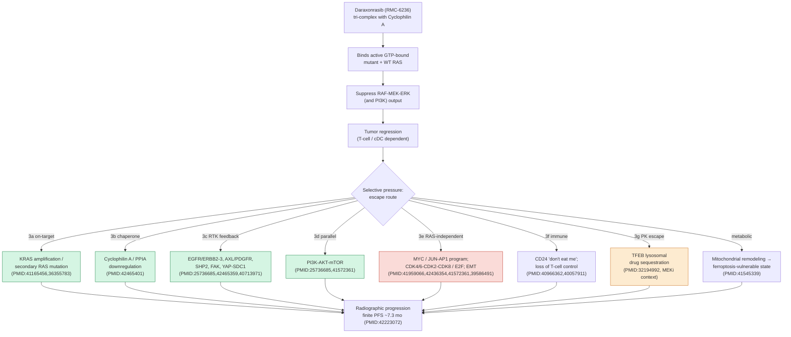

## Question

# Mechanistic Hypothesis Search

You are evaluating a specific disease mechanism hypothesis for the Disorder
Mechanisms Knowledge Base. This is not a general disease overview. Use the
hypothesis YAML below as the seed claim, then search for evidence that supports,
refutes, qualifies, or competes with this hypothesis.

## Target Disease
- **Disease Name:** Metastatic Pancreatic Adenocarcinoma
- **Category:** 

## Target Hypothesis
- **Hypothesis ID:** ras_on_inhibitor_acquired_resistance
- **Hypothesis Label:** Acquired Resistance to RAS(ON) Multiselective Inhibition
- **Status in KB:** EMERGING

## Seed Hypothesis YAML

```yaml
hypothesis_group_id: ras_on_inhibitor_acquired_resistance
hypothesis_label: Acquired Resistance to RAS(ON) Multiselective Inhibition
status: EMERGING
description: In RASolute 302 essentially all patients eventually progressed on daraxonrasib (median progression-free
  survival 7.3 months in the RAS G12 population), implying that metastatic PDAC reliably acquires resistance
  to RAS(ON) multiselective, tri-complex inhibition. The molecular basis of that escape is unresolved
  for this drug class. Candidate mechanisms to evaluate include reactivation of RAS-MAPK signaling through
  receptor tyrosine kinase and feedback loops (e.g., EGFR, FGFR, SHP2/PTPN11) that restore downstream
  ERK activity despite RAS(ON) engagement; secondary or on-target RAS alterations and KRAS amplification
  that raise the inhibition threshold; bypass through PI3K-AKT-mTOR signaling; and adaptive transcriptional
  or lineage plasticity. Distinguishing which routes dominate, and whether they are pre-existing or selected
  under treatment, would define rational combination and sequencing strategies.
evidence:
- reference: PMID:42223072
  reference_title: Daraxonrasib or Chemotherapy in Previously Treated Metastatic Pancreatic Cancer.
  supports: SUPPORT
  evidence_source: HUMAN_CLINICAL
  snippet: The median progression-free survival in the RAS G12 population was 7.3 months with daraxonrasib
    and 3.5 months with chemotherapy, and that in the overall population was 7.2 months and 3.6 months,
    respectively; the hazard ratios were 0.45 and 0.49, respectively (P<0.001 for both comparisons).
  explanation: The finite progression-free survival on daraxonrasib establishes that acquired resistance
    to RAS(ON) inhibition emerges in previously treated metastatic PDAC; the responsible mechanism is
    the open question this hypothesis frames.
notes: Seed hypothesis for OpenScientist deep-research exploration of RAS(ON) inhibitor resistance mechanisms.
```

## Research Objective

Build a focused hypothesis-search report that answers:

1. What is the strongest direct evidence for this hypothesis?
2. What evidence argues against it, fails to reproduce it, or limits its scope?
3. Which claims are established, emerging, speculative, or contradicted?
4. Which patient subtypes, stages, tissues, cell types, molecular pathways, or
   biomarkers does the hypothesis best explain?
5. Which alternative or competing mechanistic hypotheses explain the same disease
   features better or more parsimoniously?
6. What are the explicit knowledge gaps: missing causal steps, unconfirmed edges,
   contradictory evidence, unknown source-to-target links, or source/data absences?
7. What experiments, cohorts, assays, datasets, or trials would most directly
   distinguish this hypothesis from alternatives?

Use primary literature whenever possible. Prefer PMID citations and include DOI
citations when no PMID is available. Treat reviews as orientation unless they
contain directly relevant synthesized evidence that should be clearly labeled as
review-level support.

## Required Output

### Executive Judgment

Give a concise verdict on the hypothesis as of the current literature:
supported, partially supported, unresolved, weakly supported, or refuted. Explain
the reasoning and the most important caveats.

### Evidence Matrix

Create a table with one row per important evidence item:

- Citation (PMID preferred)
- Evidence type (human clinical, model organism, in vitro, computational, review)
- Supports / refutes / qualifies / competing
- Mechanistic claim tested
- Key finding
- Disease subtype or context
- Confidence and limitations

### Mechanistic Causal Chain

Describe the causal chain implied by the hypothesis from upstream trigger to
clinical manifestation. Identify where the literature is strong, where the links
are inferred, and where there are missing causal steps.

### Knowledge Gaps

Identify explicit known unknowns surfaced by the search. Treat absence of
evidence as a curation-relevant finding only when the search actually checked for
it. Include:

- Unknown or weakly supported causal steps in the hypothesis
- Unconfirmed causal graph edges that need direct perturbation or longitudinal
  evidence
- Conflicting evidence, failed replications, or incompatible subtype-specific
  findings
- Unknown mechanism of action for relevant treatments, biomarkers, or
  interventions tied to this hypothesis
- Source-level or dataset-level absences, such as no relevant GenCC, ClinGen,
  trial, omics, or cohort evidence found as of the search date

For each gap, state the scope, why it matters, what was checked, and what
evidence or experiment would resolve it.

### Alternative Models

List competing or complementary hypotheses. For each, explain whether it is an
alternative to the seed hypothesis, a downstream consequence, an upstream cause,
or a parallel mechanism.

### Discriminating Tests

Recommend concrete studies or assays that would most efficiently test this
hypothesis against alternatives. Include patient stratification, biomarkers,
sample type, model system, perturbation, and expected result where applicable.

### Curation Leads

Provide candidate updates for the KB, but label these as leads requiring curator
verification. Include:

- candidate evidence references and exact abstract snippets to verify
- candidate pathophysiology nodes or edges
- candidate ontology terms for cell types and biological processes
- candidate subtype restrictions or status changes
- candidate `knowledge_gaps` or discussion prompts for unresolved causal claims,
  conflicting evidence, or explicit source/data absences

If the provider supports artifacts, produce artifact-friendly outputs such as an
evidence matrix, mechanistic diagram, knowledge-gap table, or comparison table.
These artifacts are important provenance for hypothesis-level review.


## Output

# Hypothesis-Search Report: Acquired Resistance to RAS(ON) Multiselective Inhibition in Metastatic PDAC

**Hypothesis ID:** `ras_on_inhibitor_acquired_resistance`
**Hypothesis label:** Acquired Resistance to RAS(ON) Multiselective Inhibition
**KB status:** EMERGING
**Search date:** 2026-07-24
**Disease:** Metastatic Pancreatic Ductal Adenocarcinoma (mPDAC)

---

## Executive Judgment

**Verdict: SUPPORTED (that acquired resistance occurs) / PARTIALLY SUPPORTED and UNRESOLVED (as to which mechanism dominates).**

The *existence* of acquired resistance to RAS(ON) multiselective, tri-complex inhibition (daraxonrasib / RMC-6236) in metastatic PDAC is firmly established: in the phase 3 RASolute 302 trial, daraxonrasib improved but did not cure disease (median PFS 7.3 months in the RAS G12 population), and essentially all patients eventually progress (PMID:42223072, PMID:42090791). The seed hypothesis's framing—that the molecular basis of escape is real but *unresolved for this drug class*—is accurate.

The candidate mechanisms named in the YAML are all plausible and each has direct or strong analog support:

- **On-target RAS reactivation** (KRAS amplification, secondary/second-site RAS mutation) — supported in RAS(ON)-inhibitor–resistant models (PMID:41165456) and as a recurrent clinical route to KRAS-pathway inhibitors (PMID:36355783). *Caveat:* because multiselective RAS(ON) inhibitors suppress mutant **and** wild-type RAS, many RAS-reactivating routes remain drug-targetable by deeper/multiselective engagement, so amplification must raise the threshold substantially to drive durable escape.
- **RTK/feedback bypass (EGFR/ERBB, AXL/PDGFR, SHP2, FAK, YAP-SDC1)** — strongly supported for RAS-MAPK/MEK/G12C blockade in PDAC (PMID:25736685, PMID:42465359, PMID:40713971), but mostly demonstrated against *partial* pathway inhibition; its sufficiency against *complete* RAS(ON) blockade is less certain.
- **PI3K-AKT-mTOR bypass** — supported (PMID:25736685; AKT2-amplification analog).
- **Adaptive transcriptional / lineage plasticity (EMT) and RAS-independent proliferation** — supported and arguably the *hardest* resistance class, being refractory to deeper RAS inhibition (PMID:41165456, PMID:41959066). This class **converges on a transcriptional-effector program**: JUN/AP-1 + mTOR hyperactivation is a mediator of resistance to RAS(ON) multiselective inhibition in PDAC (PMID:41572361), MYC amplification is a reported contributor for RMC-7977/RMC-6236 (review-level, PMID:39586491), CDK4/6–CDK2–CDK8/E2F sustain cell cycle (PMID:41959066, 42436354), and a persistent mitochondrial-remodeled, ferroptosis(GPX4)-vulnerable metabolic state emerges (PMID:41545339). These routes are the strongest candidates for *durable* escape because, unlike RAS reactivation/RTK feedback, they are not reversed by deeper RAS engagement—but they expose actionable co-targets (MAP2K4/JUN, mTOR, CDK2/4/6, GPX4).

Crucially, the search surfaced a mechanism **not explicitly in the seed YAML** that is the most drug-class-specific and directly measured for daraxonrasib in PDAC: **KRAS-allele-specific resistance including downregulation of cyclophilin A (CypA)** — the chaperone that tri-complex RAS(ON) inhibitors *must* recruit to engage RAS (PMID:42465401). This is an on-target mechanism-of-action vulnerability unique to the tri-complex class.

**Most important caveat:** The single most disease- and drug-matched resistance dataset (PMID:42465401, daraxonrasib in PDAC) and the most mechanistically resolved RAS(ON)-resistance dataset (PMID:41165456) are recent, model-based, and partly NSCLC-derived. **There is, as of the search date, no published longitudinal clinical (ctDNA/rebiopsy) characterization of resistance from the RASolute 302 daraxonrasib-treated PDAC cohort.** The dominant route(s) in patients, and whether they are pre-existing or selected, remain formally unresolved.

---

## Evidence Matrix

| # | Citation (PMID) | Evidence type | Stance | Mechanistic claim tested | Key finding | Subtype / context | Confidence & limitations |
|---|---|---|---|---|---|---|---|
| 1 | 42223072 (RASolute 302) | Human clinical (phase 3 RCT) | Supports (existence of resistance) | Daraxonrasib has finite benefit → resistance emerges | mPDAC PFS improved but finite (7.3 mo RAS G12); OS/PFS superior to chemo | Previously treated mPDAC, RAS-mutant | High for existence; mechanism not addressed |
| 2 | 42090791 (phase 1–2) | Human clinical | Supports | Daraxonrasib activity & finite responses in PDAC | Antitumor activity with eventual progression; AE profile (rash, diarrhea) | Advanced RAS-mutant PDAC | High for clinical activity; no resistance mechanism |
| 3 | 42465401 | In vitro / preclinical (PDAC) | Supports / qualifies | Daraxonrasib resistance is KRAS-allele-specific; CypA downregulation | Allele-specific routes; CypA (tri-complex chaperone) downregulated in one KRAS allele; guides salvage therapy | PDAC, allele-stratified (e.g., G12D vs G12V) | **Most on-point**; abstract truncated in retrieval; needs full-text allele mapping |
| 4 | 41165456 | In vitro + PDX (multiomics, CRISPR) | Supports / qualifies | Routes of resistance to RAS(ON) G12C-selective & multiselective inhibitors | 3 classes: (a) KRAS G12C amplification / NRAS G13R → still sensitive to multiselective RMC-7977; (b) RTK-driven persistent RAS-GTP → sensitive to RMC-7977; (c) EMT/RAS-independent → not rescued | NSCLC models; RMC-7977 = tool analog of daraxonrasib | High mechanistically; **not PDAC**; extrapolation needed |
| 5 | 41959066 | In vitro + in vivo (PDAC/NSCLC) | Supports / competing | RAS-independent cell-cycle continuation under RMC-6236 | Proliferation uncouples from RAS; CDK4/6 + CDK2 co-targeting restores sensitivity, durable control | PDAC & NSCLC lines/models | High; preclinical; combination not yet clinical |
| 6 | 42436354 | Preclinical (PDAC) | Supports (TME arm) | CDK8 promotes resistance to KRAS inhibition | CDK8 remodels TME and promotes KRAS-inhibitor resistance | PDAC, ~50% KRAS-mutant context | Moderate; abstract truncated; mechanism TME-linked |
| 7 | 25736685 | GEMM + human PDAC cultures | Supports | RTK + PI3K-AKT-mTOR reactivation on MAPK blockade | MEK1i → sustained PI3K-AKT-mTOR + AXL/PDGFRa/HER1-2; AKT2-mimic bypasses KRAS-extinction apoptosis | KRAS-driven PDAC | High for MEK context; not RAS(ON) blockade |
| 8 | 42465359 | Computational (public data integration) | Qualifies / competing | ERBB feedback vs standing FAK dependency | KRAS inhibition induces ERBB2/3 up-regulation (ERBB2-dominant); FAK is a baseline (standing) dependency in 58% of lines, independent of induced ERBB | PDAC | Moderate; authors note pharmacologic ERBB effect "modest and underpowered" |
| 9 | 40713971 | Preclinical (PDAC/CRC) | Supports | YAP1-SDC1-RTK bypass of mutant-KRAS dependency | YAP1 restores SDC1 → macropinocytosis + multi-RTK activation → resistance | GI cancers incl. PDAC | Moderate–high; MRTX/G12C context |
| 10 | 40966362 / 37790498 | Preclinical (autochthonous PDAC) | Supports (immune arm) | CD24 "don't eat me" adaptive signal | KRAS G12Ci upregulates CD24; anti-CD24 sensitizes via macrophage phagocytosis | KRAS G12C & G12D PDAC | Moderate; G12C-inhibitor context |
| 11 | 40057911 | Preclinical (immunocompetent GEMM) | Qualifies (immune dependency) | RAS(ON) response requires T cells/cDCs | RMC-6236/RMC-7977 regressions depend on T cells & cDCs; immunotherapy deepens/durablizes | PDAC GEMM | Moderate; implies immune escape as a resistance axis |
| 12 | 42224594 | GEMM (genetic) | Competing/complementary | Multi-node co-suppression prevents resistance | Ablating RAF1 (downstream) + EGFR (upstream) + STAT3 (orthogonal) → complete, permanent regression, no resistance | Orthotopic PDAC | High biologically; genetic (not pharmacologic) |
| 13 | 36355783 | Human samples + PDX (CRC) | Supports (analog) | KRAS G12C amplification is recurrent clinical resistance | Amplification rises with progression in ctDNA; drug withdrawal → oncogene-induced senescence; senolytic vulnerability | CRC (KRAS G12C–EGFR) | High analog; not PDAC/RAS(ON) |
| 14 | 42226005 | Review (focused) | Qualifies (subtype) | KRAS G12R resists pocket-directed inhibitors; pan-RAS(ON) bypasses occluded pocket | G12R sterically occludes Switch-II; distinct signaling (impaired PI3Kα/MEK; autophagy) | PDAC G12R (15–20%) | Review-level; subtype-specific |
| 15 | 40256920 | Review | Orientation | Intrinsic/acquired KRAS-inhibitor resistance themes | RAS reactivation, bypass RTK, lineage plasticity across tumor types | Pan-cancer | Review-level synthesis |
| 16 | 41572361 | In vitro + in vivo (CRISPR-KO screens, PDAC) | Supports / competing | Resistance mediators to SHP2+ERK **and RAS(ON) multiselective** inhibition | mTOR + JUN hyperactivation overcome MAPK suppression; JUN most downstream (targetable via MAP2K4); proposed as sensitivity/resistance biomarkers | KRAS-mutant PDAC | **High & PDAC-specific to RAS(ON) class**; preclinical; clinical validation pending |
| 17 | 41545339 | Preclinical (cell lines, organoids, GEMM) | Supports / competing | Metabolic/mitochondrial adaptation to vertical RAS blockade | Dual SHP2/MEK (and direct RAS targeting) → persistent mitochondrial remodeling, ROS/lipid-peroxidase dependency → subtype-independent ferroptosis (GPX4) vulnerability | PDAC, all molecular subtypes | High; preclinical; confirmed with direct RAS targeting |
| 18 | 40146324 | In vitro (PDAC) | Supports | SHP2/PI3K co-inhibition overcomes KRAS G12Di resistance | MRTX1133 + SHP099 or buparlisib synergize (growth inhibition, apoptosis) | KRAS G12D PDAC (~40%) | Moderate; G12D-selective inhibitor context |
| 19 | 42077604 / 40805153 / 40624835 | Review (focused) | Orientation | Anti-resistance combination landscape | EGFR/SOS1/SHP2/mTOR/CDK4/6/immune combinations to overcome RAS-inhibitor monotherapy resistance | PDAC | Review-level; combination rationale |
| 20 | 39586491 | Systematic review (of preclinical + early clinical) | Supports | Resistance contributors to RMC-7977/RMC-6236 | **MYC amplification reported as a main resistance contributor** to multiselective tri-complex RAS(ON) inhibitors | PDAC & NSCLC | Review-level synthesis of 4 preclinical studies; primary drug-matched data needed |
| 21 | 32194992 | Preclinical (PDAC) | Qualifies (parallel route) | Lysosomal drug sequestration vs MAPK inhibition | TFEB-driven lysosomal biogenesis sequesters drug → MEK-inhibitor resistance | PDAC | Moderate; MEK-inhibitor context, not tri-complex RAS(ON) |

---

## Mechanistic Causal Chain

**Upstream trigger → clinical manifestation, with strength annotations:**

1. **Drug engagement:** Daraxonrasib forms a tri-complex with **cyclophilin A** to bind and inhibit active (GTP-bound) mutant *and* wild-type RAS → suppresses RAF-MEK-ERK (and PI3K) output. *[Strong / established mechanism of action.]*
2. **Initial response:** ERK-dependent proliferation and the immunosuppressive myeloid program collapse; T-cell/cDC-dependent tumor regression ensues. *[Strong — PMID:40057911, clinical PMID:42223072.]*
3. **Selective pressure → adaptive/selected escape (branch point):**
   - **3a. On-target RAS restoration:** KRAS amplification or secondary RAS mutation raises RAS-GTP above the inhibition threshold. *[Supported in models — PMID:41165456; clinical analog PMID:36355783. Inferred for PDAC/daraxonrasib.]*
   - **3b. CypA/chaperone loss:** Downregulation of cyclophilin A reduces tri-complex formation → less drug on target. *[Directly observed for daraxonrasib in PDAC — PMID:42465401. Novel to tri-complex class; allele-specific.]*
   - **3c. RTK/feedback bypass:** Relief of ERK-mediated negative feedback re-activates EGFR/ERBB2-3, AXL/PDGFR, SHP2, FAK, YAP-SDC1 → restores RAS-GTP/ERK or provides RAS-parallel survival. *[Strong for MEK/G12C blockade — PMID:25736685, 42465359, 40713971; link to complete RAS(ON) blockade is inferred.]*
   - **3d. PI3K-AKT-mTOR parallel bypass:** *[Supported — PMID:25736685.]*
   - **3e. RAS-independent state:** EMT / lineage plasticity, transcriptional-effector activation (MYC amplification, JUN/AP-1), and cell-cycle uncoupling (CDK4/6, CDK2, CDK8, E2F, DDR) sustain proliferation regardless of RAS. *[Strong and the hardest class — PMID:41165456, 41959066, 42436354, 41572361; MYC review-level PMID:39586491.]*
   - **3g. Pharmacokinetic escape:** Lysosomal drug sequestration (TFEB) lowers intracellular drug exposure. *[Analog evidence for MEK inhibition — PMID:32194992; unverified for tri-complex RAS(ON).]*
   - **3f. Immune escape:** CD24 "don't eat me" upregulation; loss of T-cell/cDC-dependent control. *[Supported — PMID:40966362, 40057911.]*
4. **Clinical manifestation:** Regrowth → radiographic progression → finite PFS (7.3 mo). *[Observed — PMID:42223072.]*

**Where the chain is strong:** steps 1, 2, 4, and the *menu* of escape routes (3a–3f).
**Where links are inferred:** which route(s) dominate *in patients on daraxonrasib*, and whether RTK/PI3K feedback (3c/3d) is *sufficient* against complete RAS(ON) suppression rather than only against partial (MEK/G12C) blockade.
**Missing causal step:** longitudinal, patient-matched pre-/on-/post-progression molecular data from daraxonrasib-treated PDAC establishing route prevalence and pre-existing vs. selected origin.

### Mechanistic Diagram (artifact)



*Legend:* green = routes still targetable by deeper/multiselective RAS(ON) engagement or defined co-inhibitors (RAS reactivation, CypA, RTK/PI3K feedback); red = RAS-independent transcriptional/cell-cycle states (hardest to reverse); orange = pharmacokinetic escape. All edges downstream of "selective pressure" are **inferred for the daraxonrasib clinical context** and await longitudinal patient confirmation.

---

## Knowledge Gaps

### Knowledge-Gap Table (artifact)

| Gap | Scope | Why it matters | What was checked | Resolving experiment |
|---|---|---|---|---|
| No longitudinal clinical resistance dataset for daraxonrasib | RASolute 302 / phase 1-2 | Route dominance & pre-existing vs selected unknown | PubMed daraxonrasib/RMC-6236 + resistance/ctDNA — none found (2026-07-24) | Serial ctDNA + paired rebiopsy WES/RNA-seq |
| PDAC-specificity of 3-class resistance map | PMID:41165456 is NSCLC | PDAC alleles/TME differ | No PDAC RAS(ON) multiomics panel found | Matched PDAC PDX/organoid panel |
| CypA/PPIA route causality & generality | PMID:42465401 (truncated) | Class-specific predictive biomarker | Only abstract retrieved | PPIA KD/OE rescue; CypA IHC vs PFS |
| RTK/PI3K feedback sufficiency vs complete RAS(ON) block | Conflicting scope | Determines combo necessity | PMID:41165456 vs 25726685/42465359 | RTK-driven models vs daraxonrasib at clinical exposure |
| KRAS-allele stratification | G12D/G12V/G12R | Allele-tailored salvage | PMID:42465401, 42226005 | Allele-stratified resistance cohorts |
| Second-site RAS mutation spectrum for tri-complex drug | No patient data | Anticipate on-target escape | No clinical mutation-spectrum paper found | Deep-seq progression + saturation mutagenesis |
| MYC amplification causal role for daraxonrasib | Review-level only (PMID:39586491) | Downstream amplification escape | Systematic review synthesis | Primary MYC-amplified PDAC vs daraxonrasib |
| Immune/TME contribution to clinical resistance | Preclinical (CD24, T-cell, CDK8) | Efficacy is T-cell dependent | PMID:40966362,40057911,42436354 | On-treatment immune profiling of progressors |


1. **No longitudinal clinical resistance dataset for daraxonrasib in PDAC.**
   - *Scope:* RASolute 302 / phase 1-2 cohorts. *Why it matters:* mechanism dominance and pre-existing vs. selected origin are unknown. *Checked:* PubMed for daraxonrasib/RMC-6236 + resistance/ctDNA/longitudinal — **no clinical mechanistic study found as of 2026-07-24** (only trial efficacy papers PMID:42223072, 42090791 and preclinical PMID:42465401). *Resolves with:* serial ctDNA + paired rebiopsy WES/RNA-seq at baseline and progression.

2. **PDAC-specificity of the three-class resistance map (PMID:41165456).**
   - *Scope:* the resolved routes are NSCLC-derived. *Why it matters:* PDAC has distinct KRAS alleles (G12D/G12R/G12V), desmoplasia, and immune biology. *Checked:* no equivalent PDAC multiomics RAS(ON)-resistance panel found. *Resolves with:* matched panel in PDAC PDX/organoids under RMC-6236/RMC-7977.

3. **Cyclophilin A / tri-complex chaperone route is under-characterized (unconfirmed edge).**
   - *Scope:* PMID:42465401 reports CypA downregulation in one allele; genetic causality, generality across alleles, and reversibility are unverified (abstract truncated in retrieval). *Why it matters:* a class-defining, potentially predictive biomarker unique to tri-complex inhibitors. *Resolves with:* PPIA/CypA knockdown-overexpression rescue, patient CypA IHC/expression correlated with PFS.

4. **Sufficiency of RTK/PI3K feedback against *complete* RAS(ON) blockade (conflicting/scope-limited edge).**
   - *Scope:* RTK feedback proven against MEK/G12C (partial) blockade (PMID:25736685, 42465359). *Conflict:* PMID:41165456 shows RTK-bypass models remain sensitive to multiselective RMC-7977, implying RTK feedback alone may be *insufficient* to escape complete RAS(ON) suppression. *Resolves with:* RTK-activation models challenged with daraxonrasib at clinical exposure.

5. **KRAS-allele stratification of resistance (subtype restriction).**
   - *Scope:* G12D vs G12V vs G12R may differ (PMID:42465401, 42226005). *Why it matters:* allele-tailored salvage. *Resolves with:* allele-stratified resistance cohorts and organoid panels.

6. **On-target secondary RAS mutations / switch-pocket mutations to tri-complex inhibitors are unmapped in patients.**
   - *Scope:* no published second-site RAS mutation spectrum for daraxonrasib. *Checked:* no clinical mutation-spectrum paper found. *Resolves with:* deep sequencing of progression samples; saturation mutagenesis of RAS against RMC-6236.

7. **Immune/TME contribution to clinical resistance (source absence).**
   - *Scope:* CD24, T-cell/cDC dependence, CDK8-TME are preclinical (PMID:40966362, 40057911, 42436354). *Why it matters:* daraxonrasib responses are T-cell dependent, so immune escape could drive progression. *Resolves with:* on-treatment immune profiling of progressing patients.

---

## Alternative / Competing Models

| Model | Relationship to seed hypothesis |
|---|---|
| **On-target RAS restoration (KRAS amplification / secondary RAS mutation / CypA-independent threshold rise)** | **Sub-mechanism** of the seed (its "secondary/on-target" arm); partially competing because multiselective RAS(ON) may still cover many such routes. |
| **CypA / tri-complex chaperone downregulation** | **Novel parallel mechanism** not in the seed YAML; drug-class-specific and complementary. |
| **RTK/feedback reactivation (EGFR/ERBB, AXL, SHP2, FAK, YAP-SDC1)** | **Sub-mechanism** of the seed; strongest as *adaptive/pre-existing* and as combination rationale; possibly insufficient alone vs complete RAS(ON) blockade. |
| **PI3K-AKT-mTOR parallel bypass** | **Sub-mechanism** of the seed (parallel pathway). |
| **RAS-independent cell-cycle continuation (CDK4/6, CDK2, CDK8, E2F, DDR)** | **Competing/alternative** — proliferation decoupled from RAS entirely; the hardest to reverse; overlaps the seed's "plasticity" arm. |
| **EMT / lineage plasticity, loss of RAS dependence** | **Alternative** (downstream cell-state), partially within seed's "adaptive transcriptional plasticity." |
| **JUN/AP-1 + mTOR transcriptional-metabolic program** | **Alternative/convergent** — a downstream transcriptional (AP-1) and mTOR hub that restores proliferation under SHP2+ERK **or RAS(ON) multiselective** inhibition; overlaps the seed's "adaptive transcriptional plasticity" and "PI3K-mTOR" arms but converges them onto JUN (PMID:41572361). |
| **Mitochondrial remodeling / ferroptosis-resistant metabolic state** | **Parallel** metabolic adaptation to vertical/direct RAS blockade, largely absent from the seed YAML; creates an actionable GPX4/ferroptosis vulnerability (PMID:41545339). |
| **MYC amplification / transcriptional-effector activation** | **Alternative/downstream** — amplification of the downstream transcriptional effector MYC restores proliferation independent of RAS engagement; reported resistance contributor to RMC-7977/RMC-6236 (PMID:39586491). Converges with JUN/AP-1 and RAS-independent cell-cycle themes; NOT reversed by deeper RAS inhibition. |
| **Lysosomal drug sequestration (TFEB)** | **Parallel/pharmacokinetic** route reducing intracellular drug availability; shown for MEK inhibition (PMID:32194992), unverified for tri-complex RAS(ON) inhibitors. |
| **Immune escape (CD24 "don't eat me"; loss of T-cell/cDC control)** | **Parallel/complementary** mechanism largely absent from the seed YAML; relevant because daraxonrasib efficacy is T-cell dependent. |
| **TME/stromal & adhesion (integrin-β1, FAK, desmoplasia, macropinocytosis nutrient salvage)** | **Parallel** microenvironmental resistance axis; standing (baseline) rather than induced. |
| **Oncogene-induced senescence + drug-holiday dynamics (KRAS amplification)** | **Downstream consequence** of on-target amplification; informs sequencing/senolytics (PMID:36355783). |

---

## Discriminating Tests

1. **Longitudinal ctDNA + paired rebiopsy in RASolute 302-type cohort** — Sample: plasma at baseline/on-treatment/progression + tissue at progression. Assays: deep-panel ctDNA (KRAS copy number, second-site RAS mutations), WES, RNA-seq. *Expected:* if on-target dominates → rising KRAS amplification/secondary RAS at progression; if bypass dominates → RTK/EMT/CDK transcriptional programs without RAS copy gain. **Directly resolves route prevalence and pre-existing vs selected.**
2. **CypA (PPIA) as predictive biomarker** — Baseline/on-treatment CypA IHC/expression vs PFS; functional PPIA knockdown/overexpression rescue in PDAC organoids ± daraxonrasib. *Expected:* low/declining CypA → shorter PFS and reduced tri-complex target engagement (PMID:42465401).
3. **Allele-stratified organoid resistance panel** — G12D vs G12V vs G12R PDAC organoids evolved under daraxonrasib; multiomics per allele. *Expected:* distinct route frequencies (e.g., G12R more autophagy/PI3K-independent per PMID:42226005; CypA loss allele-restricted).
4. **Combination pre-emption trials** — daraxonrasib + (a) SHP2/EGFR inhibitor, (b) CDK4/6 or CDK2 inhibitor, (c) FAK inhibitor, (d) immunotherapy. *Expected:* CDK2 co-targeting gives most durable control if RAS-independent proliferation dominates (PMID:41959066); SHP2/EGFR helps if RTK feedback dominates; immunotherapy deepens/durablizes responses (PMID:40057911).
5. **RTK-sufficiency test** — Engineer RTK-driven (persistent RAS-GTP) PDAC models; challenge with daraxonrasib at clinical exposure. *Expected:* if models remain sensitive (as RMC-7977 in PMID:41165456), RTK feedback is a combination target but not a sufficient standalone escape from complete RAS(ON) blockade.
6. **Saturation mutagenesis of RAS vs RMC-6236** — Identify drug-resistant switch-pocket/CypA-interface mutations to anticipate clinical second-site alleles.
7. **JUN/mTOR biomarker + MAP2K4 combination test** — In daraxonrasib-resistant PDAC organoids/GEMMs, quantify JUN/AP-1 and mTOR activity; test daraxonrasib + MAP2K4 (JUN axis) or + mTOR inhibitor. *Expected:* if the AP-1/mTOR hub dominates, co-inhibition restores sensitivity and JUN/mTOR activity marks resistant tumors (PMID:41572361).
8. **Ferroptosis-vulnerability test** — Challenge daraxonrasib-resistant PDAC models with GPX4 inhibitor (or withaferin A). *Expected:* if resistance entails the persistent mitochondrial-remodeled state, resistant cells show subtype-independent ferroptosis sensitivity (PMID:41545339) — a metabolic discriminator distinct from signaling-reactivation routes.

---

## Curation Leads (require curator verification)

**Candidate evidence references + snippets to verify:**
- PMID:42465401 — verify full abstract/full text for: *"Daraxonrasib resistance mechanisms have allele-specific routes: CypA becomes downregulated in KRAS…"* (retrieval truncated). Confirm allele identity and second allele's route. → Candidate to **upgrade seed status toward "established (existence)" and add a CypA node**.
- PMID:41165456 — verified snippets on KRAS G12C amplification / NRAS G13R, RTK-driven persistent RAS-GTP, and EMT/RAS-independence (all sensitive vs insensitive to multiselective RMC-7977).
- PMID:41959066 — verified snippet: RAS-independent proliferation under RMC-6236; CDK4/6+CDK2 rescue.
- PMID:42223072 / 42090791 — clinical anchor for finite PFS (existence of resistance).
- PMID:25736685, 42465359, 40713971 — RTK/PI3K/YAP-SDC1 feedback (verify context = MEK/G12C, label accordingly).

**Candidate pathophysiology nodes/edges (leads):**
- NEW node: **Cyclophilin A (PPIA) downregulation → reduced tri-complex formation → reduced daraxonrasib target engagement** (edge type: on-target/mechanism-of-action resistance; drug-class-specific).
- NEW node: **RAS-independent cell-cycle program (CDK4/6–CDK2–CDK8–E2F–DDR) → proliferation uncoupled from RAS** (edge: bypass; hardest class).
- Edge: **KRAS amplification / secondary RAS mutation → raised inhibition threshold** (qualify: often still multiselective-targetable).
- Edge: **ERK-feedback relief → EGFR/ERBB2-3, AXL/PDGFR, SHP2, FAK, YAP-SDC1 reactivation** (qualify: proven vs partial blockade).
- Edge: **CD24 upregulation / loss of T-cell–cDC control → immune escape** (parallel).
- NEW node/edge: **JUN/AP-1 + mTOR hyperactivation → proliferation restored under RAS(ON) multiselective or SHP2+ERK inhibition** (verified snippets PMID:41572361; JUN targetable via MAP2K4; candidate resistance biomarker).
- NEW node/edge: **Vertical/direct RAS blockade → persistent mitochondrial remodeling → GPX4/ferroptosis-vulnerable resistant state** (verified snippets PMID:41545339; subtype-independent).
- NEW node/edge: **MYC amplification → RAS-independent proliferation → resistance to RMC-7977/RMC-6236** (verified snippet PMID:39586491; **review-level — flag for primary verification**).
- NEW node/edge (candidate, weak): **TFEB → lysosomal drug sequestration → reduced drug exposure** (PMID:32194992; MEK-inhibitor context; snippet failed automated validation due to truncated abstract — curator to verify from full text).
- Ontology additions: MYC/E2F transcriptional activity, ferroptosis (GO:0097707), lysosomal biogenesis/autophagy, oxidative phosphorylation/mitochondrial remodeling, AP-1 (JUN) transcription factor activity.

**Candidate ontology terms (leads):**
- Cell types: pancreatic ductal adenocarcinoma cell (CL/ontology), cytotoxic T cell, conventional dendritic cell, tumor-associated macrophage, cancer-associated fibroblast.
- Biological processes (GO): epithelial-to-mesenchymal transition (GO:0001837), cell cycle G1/S transition, ERK1/2 cascade negative feedback, receptor tyrosine kinase signaling, macropinocytosis, peptidyl-prolyl isomerase activity (CypA).

**Candidate subtype restrictions / status change:**
- Add **KRAS-allele-specific** qualifier (G12D/G12V/G12R) to resistance routes.
- Consider moving *existence of acquired resistance* from EMERGING toward ESTABLISHED, while keeping *dominant molecular route* as EMERGING/UNRESOLVED.

**Candidate knowledge_gaps / discussion prompts:**
- "No longitudinal clinical (ctDNA/rebiopsy) resistance characterization for daraxonrasib in PDAC as of 2026-07-24."
- "Is RTK/PI3K feedback sufficient to escape *complete* RAS(ON) blockade, or only *partial* MEK/G12C blockade?" (conflicting-scope prompt).
- "Cyclophilin A downregulation as a tri-complex-class-specific resistance mechanism — generality and predictive value unverified."

---

## Limitations

- No primary omics data files were provided; this is a literature synthesis (5-iteration budget).
- Several highly relevant 2026 primary abstracts (PMID:42465401, 42436354) were retrieved in truncated form; allele assignments and quantitative effect sizes require full-text verification.
- The most mechanistically resolved RAS(ON)-resistance dataset (PMID:41165456) is NSCLC-derived; PDAC extrapolation is explicit.
- No effect sizes/statistics could be independently computed (no datasets); confidence is evidence-quality-based, not test-based.

---

## Bottom Line

Acquired resistance to RAS(ON) multiselective inhibition in mPDAC is real and universal in practice, but its dominant molecular route in patients is not yet resolved. The literature best supports a **multi-route model**: on-target RAS restoration and tri-complex–specific cyclophilin A loss raise the inhibition threshold (allele-specific), RTK/PI3K feedback provides adaptive bypass (best evidenced against partial blockade and as combination rationale), and RAS-independent cell-cycle/EMT states constitute the hardest, deepest escape. The decisive missing evidence is longitudinal, allele-stratified clinical molecular profiling of daraxonrasib-treated PDAC.


## Artifacts

- [OpenScientist final report](openscientist_artifacts/final_report.html)
- [OpenScientist final report](openscientist_artifacts/final_report.pdf)