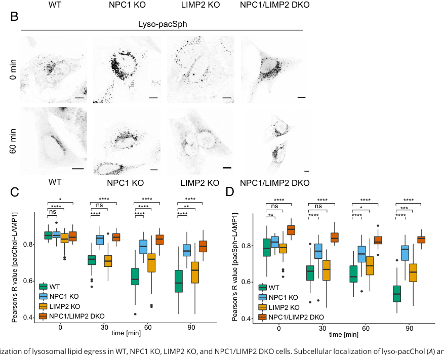

## Question

# Mechanistic Hypothesis Search

You are evaluating a specific disease mechanism hypothesis for the Disorder
Mechanisms Knowledge Base. This is not a general disease overview. Use the
hypothesis YAML below as the seed claim, then search for evidence that supports,
refutes, qualifies, or competes with this hypothesis.

## Target Disease
- **Disease Name:** Niemann-Pick Disease Type C
- **Category:** Genetic

## Target Hypothesis
- **Hypothesis ID:** canonical_npc1_npc2_cholesterol_lysosomal_trafficking_model
- **Hypothesis Label:** Canonical NPC1/NPC2 Cholesterol & Lipid Lysosomal Trafficking Model
- **Status in KB:** CANONICAL

## Seed Hypothesis YAML

```yaml
hypothesis_group_id: canonical_npc1_npc2_cholesterol_lysosomal_trafficking_model
hypothesis_label: Canonical NPC1/NPC2 Cholesterol & Lipid Lysosomal Trafficking Model
status: CANONICAL
description: Niemann-Pick disease type C (NPC) is an autosomal recessive lysosomal cholesterol-trafficking
  disorder caused by loss-of-function variants in NPC1 (~95%) or NPC2 (~5%) encoding complementary late-endosomal
  / lysosomal membrane proteins that mediate egress of unesterified cholesterol from the lysosome. Loss
  of NPC1/NPC2 function produces lysosomal accumulation of unesterified cholesterol, sphingomyelin, glycosphingolipids,
  and sphingosine, dysregulating endolysosomal homeostasis, autophagy, calcium signaling, and synaptic
  function. The resulting phenotype is highly heterogeneous, including neonatal cholestatic hepatosplenomegaly,
  progressive neurologic regression (vertical supranuclear gaze palsy, cerebellar ataxia, dystonia, seizures,
  dementia), and psychiatric features. Miglustat (substrate reduction, EU/UK approved), arimoclomol, 2-hydroxypropyl-β-
  cyclodextrin (intrathecal), and acetyl-DL-leucine (Aqneursa, FDA-approved 2024) corroborate the cholesterol/sphingolipid-trafficking
  axis as the canonical pathogenic mechanism.
evidence:
- reference: PMID:22572546
  reference_title: Niemann-Pick disease type C.
  supports: SUPPORT
  evidence_source: OTHER
  snippet: Niemann-Pick disease type C (NP-C) is a rare inherited neurovisceral disease caused by mutations
    in either the NPC1 (in 95% of cases) or the NPC2 gene (in around 5% of cases), which lead to impaired
    intracellular lipid trafficking and accum
  explanation: |
    Existing canonical mechanism citation in the dismech knowledge base, used as the seed for the hypothesis-search deep-research run.
```

## Research Objective

Build a focused hypothesis-search report that answers:

1. What is the strongest direct evidence for this hypothesis?
2. What evidence argues against it, fails to reproduce it, or limits its scope?
3. Which claims are established, emerging, speculative, or contradicted?
4. Which patient subtypes, stages, tissues, cell types, molecular pathways, or
   biomarkers does the hypothesis best explain?
5. Which alternative or competing mechanistic hypotheses explain the same disease
   features better or more parsimoniously?
6. What are the explicit knowledge gaps: missing causal steps, unconfirmed edges,
   contradictory evidence, unknown source-to-target links, or source/data absences?
7. What experiments, cohorts, assays, datasets, or trials would most directly
   distinguish this hypothesis from alternatives?

Use primary literature whenever possible. Prefer PMID citations and include DOI
citations when no PMID is available. Treat reviews as orientation unless they
contain directly relevant synthesized evidence that should be clearly labeled as
review-level support.

## Required Output

### Executive Judgment

Give a concise verdict on the hypothesis as of the current literature:
supported, partially supported, unresolved, weakly supported, or refuted. Explain
the reasoning and the most important caveats.

### Evidence Matrix

Create a table with one row per important evidence item:

- Citation (PMID preferred)
- Evidence type (human clinical, model organism, in vitro, computational, review)
- Supports / refutes / qualifies / competing
- Mechanistic claim tested
- Key finding
- Disease subtype or context
- Confidence and limitations

### Mechanistic Causal Chain

Describe the causal chain implied by the hypothesis from upstream trigger to
clinical manifestation. Identify where the literature is strong, where the links
are inferred, and where there are missing causal steps.

### Knowledge Gaps

Identify explicit known unknowns surfaced by the search. Treat absence of
evidence as a curation-relevant finding only when the search actually checked for
it. Include:

- Unknown or weakly supported causal steps in the hypothesis
- Unconfirmed causal graph edges that need direct perturbation or longitudinal
  evidence
- Conflicting evidence, failed replications, or incompatible subtype-specific
  findings
- Unknown mechanism of action for relevant treatments, biomarkers, or
  interventions tied to this hypothesis
- Source-level or dataset-level absences, such as no relevant GenCC, ClinGen,
  trial, omics, or cohort evidence found as of the search date

For each gap, state the scope, why it matters, what was checked, and what
evidence or experiment would resolve it.

### Alternative Models

List competing or complementary hypotheses. For each, explain whether it is an
alternative to the seed hypothesis, a downstream consequence, an upstream cause,
or a parallel mechanism.

### Discriminating Tests

Recommend concrete studies or assays that would most efficiently test this
hypothesis against alternatives. Include patient stratification, biomarkers,
sample type, model system, perturbation, and expected result where applicable.

### Curation Leads

Provide candidate updates for the KB, but label these as leads requiring curator
verification. Include:

- candidate evidence references and exact abstract snippets to verify
- candidate pathophysiology nodes or edges
- candidate ontology terms for cell types and biological processes
- candidate subtype restrictions or status changes
- candidate `knowledge_gaps` or discussion prompts for unresolved causal claims,
  conflicting evidence, or explicit source/data absences

If the provider supports artifacts, produce artifact-friendly outputs such as an
evidence matrix, mechanistic diagram, knowledge-gap table, or comparison table.
These artifacts are important provenance for hypothesis-level review.


## Output

Question: You are an expert researcher providing comprehensive, well-cited information.

Provide detailed information focusing on:
1. Key concepts and definitions with current understanding
2. Recent developments and latest research (prioritize 2023-2024 sources)
3. Current applications and real-world implementations
4. Expert opinions and analysis from authoritative sources
5. Relevant statistics and data from recent studies

Format as a comprehensive research report with proper citations. Include URLs and publication dates where available.
Always prioritize recent, authoritative sources and provide specific citations for all major claims.

# Mechanistic Hypothesis Search

You are evaluating a specific disease mechanism hypothesis for the Disorder
Mechanisms Knowledge Base. This is not a general disease overview. Use the
hypothesis YAML below as the seed claim, then search for evidence that supports,
refutes, qualifies, or competes with this hypothesis.

## Target Disease
- **Disease Name:** Niemann-Pick Disease Type C
- **Category:** Genetic

## Target Hypothesis
- **Hypothesis ID:** canonical_npc1_npc2_cholesterol_lysosomal_trafficking_model
- **Hypothesis Label:** Canonical NPC1/NPC2 Cholesterol & Lipid Lysosomal Trafficking Model
- **Status in KB:** CANONICAL

## Seed Hypothesis YAML

```yaml
hypothesis_group_id: canonical_npc1_npc2_cholesterol_lysosomal_trafficking_model
hypothesis_label: Canonical NPC1/NPC2 Cholesterol & Lipid Lysosomal Trafficking Model
status: CANONICAL
description: Niemann-Pick disease type C (NPC) is an autosomal recessive lysosomal cholesterol-trafficking
  disorder caused by loss-of-function variants in NPC1 (~95%) or NPC2 (~5%) encoding complementary late-endosomal
  / lysosomal membrane proteins that mediate egress of unesterified cholesterol from the lysosome. Loss
  of NPC1/NPC2 function produces lysosomal accumulation of unesterified cholesterol, sphingomyelin, glycosphingolipids,
  and sphingosine, dysregulating endolysosomal homeostasis, autophagy, calcium signaling, and synaptic
  function. The resulting phenotype is highly heterogeneous, including neonatal cholestatic hepatosplenomegaly,
  progressive neurologic regression (vertical supranuclear gaze palsy, cerebellar ataxia, dystonia, seizures,
  dementia), and psychiatric features. Miglustat (substrate reduction, EU/UK approved), arimoclomol, 2-hydroxypropyl-β-
  cyclodextrin (intrathecal), and acetyl-DL-leucine (Aqneursa, FDA-approved 2024) corroborate the cholesterol/sphingolipid-trafficking
  axis as the canonical pathogenic mechanism.
evidence:
- reference: PMID:22572546
  reference_title: Niemann-Pick disease type C.
  supports: SUPPORT
  evidence_source: OTHER
  snippet: Niemann-Pick disease type C (NP-C) is a rare inherited neurovisceral disease caused by mutations
    in either the NPC1 (in 95% of cases) or the NPC2 gene (in around 5% of cases), which lead to impaired
    intracellular lipid trafficking and accum
  explanation: |
    Existing canonical mechanism citation in the dismech knowledge base, used as the seed for the hypothesis-search deep-research run.
```

## Research Objective

Build a focused hypothesis-search report that answers:

1. What is the strongest direct evidence for this hypothesis?
2. What evidence argues against it, fails to reproduce it, or limits its scope?
3. Which claims are established, emerging, speculative, or contradicted?
4. Which patient subtypes, stages, tissues, cell types, molecular pathways, or
   biomarkers does the hypothesis best explain?
5. Which alternative or competing mechanistic hypotheses explain the same disease
   features better or more parsimoniously?
6. What are the explicit knowledge gaps: missing causal steps, unconfirmed edges,
   contradictory evidence, unknown source-to-target links, or source/data absences?
7. What experiments, cohorts, assays, datasets, or trials would most directly
   distinguish this hypothesis from alternatives?

Use primary literature whenever possible. Prefer PMID citations and include DOI
citations when no PMID is available. Treat reviews as orientation unless they
contain directly relevant synthesized evidence that should be clearly labeled as
review-level support.

## Required Output

### Executive Judgment

Give a concise verdict on the hypothesis as of the current literature:
supported, partially supported, unresolved, weakly supported, or refuted. Explain
the reasoning and the most important caveats.

### Evidence Matrix

Create a table with one row per important evidence item:

- Citation (PMID preferred)
- Evidence type (human clinical, model organism, in vitro, computational, review)
- Supports / refutes / qualifies / competing
- Mechanistic claim tested
- Key finding
- Disease subtype or context
- Confidence and limitations

### Mechanistic Causal Chain

Describe the causal chain implied by the hypothesis from upstream trigger to
clinical manifestation. Identify where the literature is strong, where the links
are inferred, and where there are missing causal steps.

### Knowledge Gaps

Identify explicit known unknowns surfaced by the search. Treat absence of
evidence as a curation-relevant finding only when the search actually checked for
it. Include:

- Unknown or weakly supported causal steps in the hypothesis
- Unconfirmed causal graph edges that need direct perturbation or longitudinal
  evidence
- Conflicting evidence, failed replications, or incompatible subtype-specific
  findings
- Unknown mechanism of action for relevant treatments, biomarkers, or
  interventions tied to this hypothesis
- Source-level or dataset-level absences, such as no relevant GenCC, ClinGen,
  trial, omics, or cohort evidence found as of the search date

For each gap, state the scope, why it matters, what was checked, and what
evidence or experiment would resolve it.

### Alternative Models

List competing or complementary hypotheses. For each, explain whether it is an
alternative to the seed hypothesis, a downstream consequence, an upstream cause,
or a parallel mechanism.

### Discriminating Tests

Recommend concrete studies or assays that would most efficiently test this
hypothesis against alternatives. Include patient stratification, biomarkers,
sample type, model system, perturbation, and expected result where applicable.

### Curation Leads

Provide candidate updates for the KB, but label these as leads requiring curator
verification. Include:

- candidate evidence references and exact abstract snippets to verify
- candidate pathophysiology nodes or edges
- candidate ontology terms for cell types and biological processes
- candidate subtype restrictions or status changes
- candidate `knowledge_gaps` or discussion prompts for unresolved causal claims,
  conflicting evidence, or explicit source/data absences

If the provider supports artifacts, produce artifact-friendly outputs such as an
evidence matrix, mechanistic diagram, knowledge-gap table, or comparison table.
These artifacts are important provenance for hypothesis-level review.


# Hypothesis-search report: Canonical NPC1/NPC2 cholesterol & lipid lysosomal trafficking model in Niemann–Pick disease type C (NPC)

**Hypothesis ID:** canonical_npc1_npc2_cholesterol_lysosomal_trafficking_model  
**Target disease:** Niemann–Pick disease type C (NPC1/NPC2)  
**Search emphasis:** primary evidence with priority to 2023–2024; mechanistic testing, qualifiers, and competing mechanisms.

## Executive judgment

**Verdict (2026-05-25): Supported (canonical), with important scope qualifiers.**  
The strongest mechanistic evidence continues to support that NPC1 (lysosomal membrane) and NPC2 (lysosomal lumen) are required for lysosomal egress of LDL-derived unesterified cholesterol, and that loss of either protein causes lysosomal cholesterol storage with broad secondary lipidome and signaling consequences. Recent primary work extends (rather than refutes) the canonical model by (i) demonstrating NPC1 directly interacts with and mediates **sphingosine** export in addition to cholesterol, suggesting multi-lipid export biology, and (ii) providing more explicit downstream causal links from lysosomal lipid trapping to neurodegeneration via organelle contact-site dysfunction, Ca2+ dysregulation, and cell-type–specific vulnerabilities (neurons and microglia). (casas2023npc1dependentalterationsin pages 1-2, altuzar2023lysosometargetedmultifunctionallipid pages 6-7, altuzar2023lysosometargetedmultifunctionallipid pages 9-10, joanna2024npc1linkscholesterol pages 1-2)

Key caveats: (1) some downstream steps (autophagy impairment, Ca2+ defects, neuroinflammation) are strongly associated with storage but remain incompletely ordered causally in humans; (2) therapy-linked biomarker changes show target engagement for cholesterol mobilization but inconsistent linkage to neuronal-injury markers across small cohorts; and (3) tissue specificity is substantial (e.g., lung-restricted cholesterol accumulation from TMEM241 perturbation), indicating modifiers/upstream dependencies beyond NPC1/NPC2 genotype alone. (stern2024evaluationofthe pages 4-5, zhao2023tmem241isa pages 13-14, zhao2023tmem241isa pages 9-10)

## Key concepts and definitions (mechanism-focused)

**Lysosomal cholesterol egress / hydrophobic handoff:** a mechanistic model where NPC2 binds unesterified cholesterol in the lysosomal lumen (after cholesteryl ester hydrolysis) and transfers it to NPC1 (notably its N-terminal domain), enabling movement of cholesterol to the cytosolic side and onward distribution. Reviews summarizing the “hydrophobic handoff” model remain consistent with the primary literature and are reinforced by recent genetic and cell biology perturbations that phenocopy NPC when NPC2 targeting is disrupted. (malara2024endolysosomaldysfunctionand pages 2-3, zhao2023tmem241isa pages 4-5)

**Secondary lipid storage:** NPC is not purely “cholesterol storage”; glycosphingolipids, sphingomyelin, and sphingosine storage are commonly observed, and emerging primary evidence suggests that at least some of this is not merely secondary but tied to shared export machinery. (malara2024endolysosomaldysfunctionand pages 8-9, altuzar2023lysosometargetedmultifunctionallipid pages 8-9, altuzar2023lysosometargetedmultifunctionallipid pages 9-10)

**Endolysosomal network dysfunction:** lipid trapping affects membrane composition, endosomal positioning, fusion/fission, and membrane contact-site signaling, with consequences for mTORC1 and autophagy regulation and for Ca2+ signaling across organelle contacts. (casas2023npc1dependentalterationsin pages 1-2, malara2024endolysosomaldysfunctionand pages 2-3)

## Strongest direct evidence for the hypothesis (2023–2024 prioritized)

### 1) NPC1 directly participates in lysosomal lipid export and is functionally linked to neuronal death pathways
Casas et al. (Nature Communications, 2023) explicitly frames NPC1 as facilitating lysosomal cholesterol removal at ER contact sites and shows that NPC1 loss (and U18666A phenocopy) drives downstream changes in Ca2+ channel nanodomains (KV2.1–CaV1.2 clustering) leading to mitochondrial Ca2+ overload and neurotoxicity; disrupting KV2–CaV interactions rescues clustering, mitochondrial Ca2+, and neuronal survival in vitro. This provides a more mechanistically explicit bridge from lysosomal cholesterol trapping to neurodegeneration. **URL:** https://doi.org/10.1038/s41467-023-39937-w (Jul 2023). (casas2023npc1dependentalterationsin pages 1-2)

### 2) NPC1 is a sphingosine interactor/export factor; sphingosine can gate cholesterol export
Altuzar et al. (PNAS, 2023) used lysosome-targeted photocaged lipid probes and chemoproteomics to show:
- Wild-type cells clear lysosome-released sphingosine rapidly (≈30 min), while **NPC1−/−** cells show persistent lysosomal sphingosine retention across the time course.
- NPC1 can be directly cross-linked by the sphingosine probe; proteomic screening identifies NPC1 (and LIMP-2/SCARB2) as sphingosine interactors.
- Flooding lysosomes with excess sphingosine delays cholesterol export, while excess cholesterol does not comparably delay sphingosine export, suggesting **competition/priority** at export machinery.
These results strongly qualify the canonical “cholesterol-only” framing and provide a concrete multi-lipid export hypothesis (NPC1 tunnel-mediated or binding-pocket mediated transport), consistent with early sphingosine accumulation historically reported in NPC. **URL:** https://doi.org/10.1073/pnas.2213886120 (Mar 2023). (altuzar2023lysosometargetedmultifunctionallipid pages 6-7, altuzar2023lysosometargetedmultifunctionallipid pages 9-10, altuzar2023lysosometargetedmultifunctionallipid media f208cbda)

### 3) Upstream disruption of NPC2 lysosomal targeting is sufficient to block cholesterol trafficking and is rescued by NPC2
Zhao et al. (Journal of Lipid Research, 2023) identified TMEM241 (Golgi UDP-GlcNAc transporter) as required for mannose-6-phosphate (M6P)–dependent sorting of soluble lysosomal proteins including NPC2. TMEM241 loss causes:
- Decreased NPC2 in lysosomes and increased NPC2 secretion,
- Filipin-positive lysosomal cholesterol accumulation,
- Rescue of cholesterol accumulation by **NPC2 overexpression (but not NPC1)**,
- In vivo, Tmem241-null mice show cholesterol accumulation and inflammation notably in lung.
This is direct functional evidence that the NPC2 node (and its trafficking) is causally upstream of lysosomal cholesterol egress and that perturbing its lysosomal delivery can phenocopy core NPC cell pathology. **URL:** https://doi.org/10.1016/j.jlr.2023.100465 (Dec 2023). (zhao2023tmem241isa pages 4-5, zhao2023tmem241isa pages 9-10)

### 4) Cell-type specificity: NPC1 loss alters microglial phagolysosomal cholesterol handling and morphology
Zareba et al. (Nature Communications, 2024) show in vivo (zebrafish) and in vitro that NPC1 localizes to the microglial “gastrosome” (a phagocytic compartment); NPC1 deficiency causes cholesterol accumulation and efferocytosis-dependent gastrosome expansion, driving a branched-to-amoeboid microglial morphology shift and heightened sensitivity to neuronal cell death. Conservation in NPC patient-derived fibroblasts supports translational relevance. **URL:** https://doi.org/10.1038/s41467-024-52874-6 (Oct 2024). (joanna2024npc1linkscholesterol pages 1-2)

## Evidence that argues against, limits, or competes with the canonical model

No retrieved 2023–2024 primary evidence **refutes** that NPC1/NPC2 are required for lysosomal cholesterol egress; instead, recent work mainly **extends** or **re-parameterizes** the canonical model.

Key limitations/qualifiers:

1) **Multi-lipid export vs “cholesterol-first” causality.** Altuzar et al. provide primary evidence that NPC1 directly binds/exports sphingosine and that excess sphingosine delays cholesterol export, raising a plausible competing causal ordering: sphingosine accumulation could be upstream of (or synergistic with) cholesterol retention in some contexts. (altuzar2023lysosometargetedmultifunctionallipid pages 9-10)

2) **Downstream mechanisms may be mediated by nanodomain remodeling/ion channels rather than storage burden per se.** Casas et al. argue NPC is a “nanostructural ion channel clustering disease,” where contact-site and lipid changes reorganize CaV channels and drive mitochondrial Ca2+ toxicity. This qualifies the model: storage is upstream, but the proximate neurotoxic step may be Ca2+ channel mislocalization and mitochondrial Ca2+ overload. (casas2023npc1dependentalterationsin pages 1-2)

3) **Tissue-specific modifiers and upstream dependencies.** TMEM241 perturbation yields lung-restricted cholesterol accumulation/inflammation in mice, suggesting that M6P/NPC2 routing capacity and glycosylation/sorting constraints may shape which tissues manifest storage and how strongly. This competes with a purely NPC1/NPC2-intrinsic trafficking explanation for all tissues. (zhao2023tmem241isa pages 9-10)

4) **Biomarker-to-clinical linkage remains incomplete.** Biomarker reviews summarize that HPβCD increases 24(S)-hydroxycholesterol (target engagement), while neuronal injury marker changes (e.g., CSF NfL) are not consistently improved in some cohorts, limiting claims that cholesterol mobilization uniformly maps to neuroprotection. (stern2024evaluationofthe pages 4-5)

## What is established vs emerging vs speculative (based on retrieved evidence)

### Established (high confidence)
- Loss of NPC1 function causes lysosomal cholesterol accumulation and broad endolysosomal dysfunction, with neurologic consequences; pharmacological NPC1 inhibition (U18666A) phenocopies lipid trapping. (casas2023npc1dependentalterationsin pages 1-2, altuzar2023lysosometargetedmultifunctionallipid pages 6-7)
- NPC2 lysosomal localization is required for normal cholesterol trafficking; disrupting NPC2 lysosomal targeting via Golgi/M6P machinery is sufficient to cause lysosomal cholesterol accumulation and is rescued by NPC2. (zhao2023tmem241isa pages 4-5, zhao2023tmem241isa pages 9-10)

### Emerging (medium–high confidence)
- NPC1 participates in sphingosine export and sphingosine can gate cholesterol export kinetics in lysosomes (multi-lipid export model). (altuzar2023lysosometargetedmultifunctionallipid pages 9-10, altuzar2023lysosometargetedmultifunctionallipid media f208cbda)
- Microglial phagolysosomal cholesterol handling (gastrosome) is a direct, mechanistically tractable contributor to NPC neuroinflammatory/cellular pathology. (joanna2024npc1linkscholesterol pages 1-2)

### Speculative / incompletely resolved
- Exact causal ordering between cholesterol storage, sphingosine storage, lysosomal Ca2+ defects, and autophagy impairment in human disease progression (review-level synthesis supports strong links, but direct longitudinal causal tests in patients remain limited). (malara2024endolysosomaldysfunctionand pages 8-9, munoz2024alterationsinproteostasis pages 7-9)
- Whether NPC1’s role at membrane contact sites is primarily a tethering/signaling function or a direct tunnel-mediated lipid translocator across the lysosomal limiting membrane across all relevant lipids. Altuzar supports a tunnel contribution for sphingosine, but further reconstitution is needed. (altuzar2023lysosometargetedmultifunctionallipid pages 8-9)

## Patient subtypes, stages, tissues, cell types, pathways, biomarkers best explained by the hypothesis

**Best-explained by canonical lipid-egress defect:**
- Cellular phenotype: filipin-positive lysosomal cholesterol accumulation and swollen lysosomes upon NPC1 dysfunction or NPC2 mis-targeting. (zhao2023tmem241isa pages 4-5, zhao2023tmem241isa pages 7-8)
- Brain: neuronal vulnerability linked to contact-site signaling and Ca2+ dysregulation that arises downstream of lysosomal cholesterol trapping. (casas2023npc1dependentalterationsin pages 1-2)
- Myeloid lineage/microglia: abnormal cholesterol handling in phagolysosomal/efferocytic compartments affecting morphology and viability. (joanna2024npc1linkscholesterol pages 1-2)

**Biomarker signatures consistent with lipid trafficking axis (recent data):**
- CSF inflammatory/glial markers correlate with severity and age of onset (e.g., CHI3L1 correlates with NPC neurological severity score; CCL18 correlates with earlier onset and faster progression), supporting that lipid storage engages neuroinflammatory pathways measurable in CSF. (campbell2023identificationofcerebral pages 14-15, campbell2023identificationofcerebral pages 9-11)
- Lipid biomarkers: CSF alkyl-LPC species (LPC O-16:0, LPC O-18:1) are reduced in NPC1 versus controls and increase in most participants after intrathecal HPβCD; responders show larger increases than nonresponders in the reported cohort. (mishra2024accumulationofalkyllysophosphatidylcholines pages 10-11)

**Tissue specificity:**
- Lung: TMEM241 loss causes lung cholesterol accumulation and inflammation, suggesting NPC2 targeting capacity is a tissue-specific determinant/modifier. (zhao2023tmem241isa pages 9-10)

## Alternative or competing mechanistic models (and relationship to canonical model)

1) **Sphingosine-first / lysosomal Ca2+ gating model** (complementary and potentially upstream): sphingosine accumulation (and/or sphingomyelin-mediated TRPML1 inhibition, per reviews) could drive lysosomal Ca2+ defects and fusion/autophagy impairments that then amplify cholesterol trapping and cellular dysfunction. Primary 2023 evidence that NPC1 exports sphingosine and that sphingosine delays cholesterol export strengthens this as a serious complementary upstream mechanism. (altuzar2023lysosometargetedmultifunctionallipid pages 9-10, munoz2024alterationsinproteostasis pages 7-9)

2) **Membrane contact-site signaling/trafficking model** (parallel downstream mechanism): NPC1 dysfunction disturbs ER–lysosome contact-site lipid exchange and signaling, altering mTORC1 and phosphoinositide gradients; these signaling changes may mediate autophagy impairment and neuronal degeneration. This is mostly synthesized in review-level sources here, but is consistent with the mechanistic framing in Casas 2023. (casas2023npc1dependentalterationsin pages 1-2, malara2024endolysosomaldysfunctionand pages 2-3)

3) **Ion-channel nanodomain remodeling model** (downstream proximate neurotoxicity): lysosomal cholesterol trapping/contact-site changes reorganize KV2.1–CaV1.2 nanodomains, elevating mitochondrial Ca2+ and driving cell death; this may explain neuronal selectivity better than “storage burden” alone. (casas2023npc1dependentalterationsin pages 1-2)

4) **Microglial efferocytosis/gastrosome model** (parallel cell-type axis): microglial lipid handling failures during efferocytosis create a distinct compartmental cholesterol-storage stressor influencing morphology and survival, potentially modulating neuroinflammation and degeneration. (joanna2024npc1linkscholesterol pages 1-2)

5) **Upstream lysosomal targeting/glycosylation model** (upstream alternative cause of NPC-like phenotypes): defects in Golgi nucleotide-sugar transport and M6P biogenesis can misroute NPC2 and mimic NPC at the level of cholesterol storage; this does not compete with the canonical mechanism in NPC1/NPC2 mutation carriers, but provides a competing explanation for NPC-like cellular phenotypes in other genetic backgrounds and emphasizes pathway dependencies. (zhao2023tmem241isa pages 4-5, zhao2023tmem241isa pages 9-10)

## Mechanistic causal chain (annotated by strength)

1) **Upstream trigger:** biallelic loss-of-function in NPC1 or NPC2 (or functional deficiency via misfolding/mis-targeting). *Strong (genetic + functional perturbation).* (malara2024endolysosomaldysfunctionand pages 2-3, zhao2023tmem241isa pages 4-5)

2) **Core cellular lesion:** impaired lysosomal egress of unesterified cholesterol (and likely other lipids), producing lysosomal cholesterol accumulation; recent primary data indicates **NPC1 also mediates sphingosine export**, linking multi-lipid storage to shared machinery. *Strong for cholesterol; strengthening for sphingosine.* (zhao2023tmem241isa pages 7-8, altuzar2023lysosometargetedmultifunctionallipid pages 9-10)

3) **Secondary cell biology:** altered membrane composition → defective endolysosomal trafficking, organelle positioning, and membrane contact-site signaling; autophagy flux impairment and lysosomal Ca2+ dysregulation are frequently invoked but remain variably causal in primary human evidence. *Moderate.* (casas2023npc1dependentalterationsin pages 1-2, munoz2024alterationsinproteostasis pages 7-9)

4) **Tissue/cell-type–specific vulnerability:**
- **Neurons:** Ca2+ channel nanodomain remodeling (KV2.1–CaV1.2) → increased Ca2+ entry → mitochondrial Ca2+ overload → neurotoxicity. *Emerging-to-strong in model systems.* (casas2023npc1dependentalterationsin pages 1-2)
- **Microglia:** phagolysosomal (gastrosome) cholesterol accumulation during efferocytosis → morphology shift and sensitivity to neuronal apoptosis → microglial dysfunction/death. *Emerging-to-strong.* (joanna2024npc1linkscholesterol pages 1-2)

5) **Clinical manifestations:** heterogeneous neurovisceral disease. The present evidence set primarily supports mechanistic links to neurodegeneration and neuroinflammation rather than providing new direct causation for specific clinical signs (e.g., gaze palsy) in 2023–2024 primary work retrieved here. *Inferred/heterogeneous.* (malara2024endolysosomaldysfunctionand pages 8-9)

## Recent developments and latest research (2023–2024 highlights)

- **2023 PNAS:** a major conceptual extension is the direct biochemical/functional linkage of NPC1 to sphingosine export, with visualized lysosomal export kinetics and chemoproteomic target identification; this provides a plausible explanation for sphingosine accumulation and its interaction with cholesterol trafficking. (altuzar2023lysosometargetedmultifunctionallipid pages 9-10, altuzar2023lysosometargetedmultifunctionallipid media f208cbda)
- **2023 Nat Commun:** direct mapping of a downstream neurotoxic mechanism (ion-channel nanodomain remodeling and mitochondrial Ca2+) provides a more testable bridge from lipid trapping to neuronal death. (casas2023npc1dependentalterationsin pages 1-2)
- **2023 J Lipid Res:** identification of an upstream Golgi UDP-GlcNAc transporter (TMEM241) required for NPC2 M6P modification and lysosomal targeting shows how general lysosomal protein-sorting pathways intersect the canonical NPC2 node. (zhao2023tmem241isa pages 4-5)
- **2024 Nat Commun:** direct mechanistic cell-type emphasis on microglial cholesterol handling during efferocytosis via the gastrosome. (joanna2024npc1linkscholesterol pages 1-2)
- **2023–2024 biomarker advances:** CSF protein biomarkers correlate with severity/progression/onset; lipid species (alkyl-LPCs) show CSF changes and therapy responsiveness that may provide pharmacodynamic readouts for lipid trafficking interventions. (campbell2023identificationofcerebral pages 9-11, mishra2024accumulationofalkyllysophosphatidylcholines pages 10-11)

## Current applications and real-world implementations (mechanism-linked)

### Mechanism-operationalized clinical trial implementations (HPβCD/adrabetadex)
Multiple human trials operationalize the canonical hypothesis by using (i) CSF/plasma cholesterol metabolites/oxysterols and (ii) clinical severity scales as endpoints.

- **Intrathecal adrabetadex (VTS-270), Phase 2b/3**: randomized, double-blind, sham-controlled trial; dosing 900–1800 mg every 2 weeks; primary endpoints include 52-week change in a 4-domain NPC Severity Scale composite and CGIC. **ClinicalTrials.gov (results posted 2023-02-22):** https://clinicaltrials.gov/study/NCT02534844 (NCT02534844 chunk 1)

- **IV HPβCD (Trappsol Cyclo), Phase I (PK + biomarkers):** randomized, quadruple-masked; 1500 vs 2500 mg/kg q2w for 12 weeks with CSF drug levels and biomarker sampling including filipin staining and hepatic cholesterol assays. **ClinicalTrials.gov:** https://clinicaltrials.gov/study/NCT02939547 (NCT02939547 chunk 1)

- **IV HPβCD (Trappsol Cyclo), Phase I/II (dose levels 1500/2000/2500 mg/kg):** includes CSF penetration, NIH NPC severity scale, and serum/lymphocyte cholesterol metabolism markers. **ClinicalTrials.gov:** https://clinicaltrials.gov/study/NCT02912793 (NCT02912793 chunk 1)

### Pharmacodynamic/biomarker evidence of mechanism engagement
Biomarker synthesis indicates HPβCD can increase 24(S)-hydroxycholesterol (plasma and/or CSF) consistent with mobilization of CNS cholesterol pools, with variable changes in other oxysterols (e.g., C-triol, TCG) and inconsistent changes in CSF NfL in some cohorts. (stern2024evaluationofthe pages 4-5)

## Relevant statistics and data (recent studies)

### CSF protein biomarker statistics (NPC1)
Campbell et al. (Biomarker Research, Jan 2023; **URL:** https://doi.org/10.1186/s40364-023-00448-x) report multiple CSF proteins elevated in NPC1 and correlating with clinical measures:
- **CHI3L1 (YKL-40):** NPX correlation with concurrent neurological severity score (NSS) rho = 0.83, p = 0.0002; ELISA correlation r = 0.40, p = 0.0183. (campbell2023identificationofcerebral pages 9-11)
- **CCL18:** ~7.4-fold increase; strong negative correlation with age of neurological onset (p = 0.0101, rho = −0.75; stronger in <20y onset p = 0.0016, r = −0.648) and positive correlation with annual severity increment score (ASIS) p = 0.0017, r = 0.61. (campbell2023identificationofcerebral pages 14-15, campbell2023identificationofcerebral pages 9-11)
- **Treatment association (cross-sectional):** CCL18 higher in individuals on miglustat (1884 ± 1246 ng/ml) vs not on miglustat (932 ± 518 ng/ml), p = 0.0275 (interpretation limited by cross-sectional design and possible confounding by severity). (campbell2023identificationofcerebral pages 9-11)

### Lipid biomarker statistics (NPC1)
Mishra et al. (Journal of Lipid Research, Aug 2024; **URL:** https://doi.org/10.1016/j.jlr.2024.100600) report:
- Cohorts for alkyl-LPC analysis: plasma n=7 NPC1 vs n=7 controls; CSF n=5 NPC1 vs n=10 controls. (mishra2024accumulationofalkyllysophosphatidylcholines pages 10-11)
- CSF LPC O-16:0 and LPC O-18:1 are significantly reduced in NPC1 vs controls at baseline (exact effect sizes not provided in excerpt), and increase in **80%** of participants 2 years after intrathecal HPβCD, with larger fold increases in responders. (mishra2024accumulationofalkyllysophosphatidylcholines pages 10-11)

### Cell-model metabolomics (NPC1 KO)
Watanabe et al. (Metabolites, Sep 2024; **URL:** https://doi.org/10.3390/metabo14100515) report global pathway enrichment changes (8 pathways altered in KO1; 16 in KO2) and targeted metabolite changes (4 significant metabolites in KO1; 10 in KO2 out of 15 measured), implicating creatinine synthesis and cysteine metabolism; numerical effect sizes were not available in the excerpt retrieved. (watanabe2024globalandtargeted pages 1-2)

## Knowledge gaps (explicit, and what was checked)

1) **Human causal ordering of lipid species (cholesterol vs sphingosine) in vivo**  
**What was checked:** primary 2023 Altuzar data demonstrates sphingosine export dependence on NPC1 and sphingosine-induced delay of cholesterol export in cells. (altuzar2023lysosometargetedmultifunctionallipid pages 9-10)  
**Gap:** whether early sphingosine accumulation is a primary driver of disease progression in patients and whether sphingosine-targeting changes trajectory independent of cholesterol burden.  
**Resolution experiment:** longitudinal patient CSF/plasma sphingosine-related lipids + oxysterols, integrated with imaging and clinical scales; genotype-stratified.

2) **Transport mechanism: NPC1 tunnel transport vs contact-site tethering/signaling**  
**What was checked:** Altuzar shows an NPC1 tunnel mutant delays but does not fully block sphingosine exit; Casas emphasizes contact-site communication and downstream ion-channel remodeling. (altuzar2023lysosometargetedmultifunctionallipid pages 8-9, casas2023npc1dependentalterationsin pages 1-2)  
**Gap:** definitive biochemical reconstitution demonstrating lipid translocation across membranes for cholesterol and sphingosine with NPC1/NPC2.  
**Resolution experiment:** reconstitute NPC1 in proteoliposomes with NPC2 in lumenal side; quantify cholesterol vs sphingosine transfer kinetics, competition, and tunnel mutant effects.

3) **Biomarker–clinical endpoint linkage for cholesterol mobilization therapies**  
**What was checked:** trials and biomarker review show HPβCD changes in 24(S)-hydroxycholesterol; Campbell shows CSF inflammation/neuron injury markers correlate with severity; Mishra provides candidate lipid PD biomarkers. (stern2024evaluationofthe pages 4-5, campbell2023identificationofcerebral pages 9-11, mishra2024accumulationofalkyllysophosphatidylcholines pages 10-11)  
**Gap:** robust validation of which PD biomarkers track meaningful clinical slowing across heterogeneous NPC subtypes and stages.  
**Resolution experiment:** prospective multi-site cohorts with repeated CSF/plasma biomarkers aligned to standardized NSS and imaging; pre-specified responder definitions.

4) **Tissue specificity and modifier pathways beyond NPC1/NPC2**  
**What was checked:** TMEM241 loss phenocopies cholesterol storage via NPC2 mis-targeting and yields lung-specific pathology. (zhao2023tmem241isa pages 9-10)  
**Gap:** how frequently glycosylation/M6P-sorting variability modifies human NPC progression or tissue involvement; whether it explains outlier phenotypes.  
**Resolution experiment:** patient multi-omics focused on lysosomal targeting pathway variants (including TMEM241/SLC35A3 axis) vs pulmonary involvement.

5) **Therapy claims outside retrieved sources (notably the seed claim of 2024 FDA approval for acetyl-DL-leucine/Aqneursa)**  
**What was checked:** clinicaltrials.gov records for N-acetyl-L-leucine and cyclodextrin trials were retrieved, but no authoritative FDA label/press release or pivotal peer-reviewed publication for the 2024 approval claim was present in the available corpus. (NCT02912793 chunk 1, NCT02534844 chunk 1)  
**Gap:** inability in this run to verify the approval statement and its mechanistic implications with primary regulatory or trial-publication sources.

## Discriminating tests (to distinguish canonical model from alternatives)

1) **Multi-lipid competition assay in patient-derived iPSC neurons/microglia**  
- **Stratification:** NPC1 vs NPC2 genotypes; early vs late clinical onset.  
- **Assay:** lysosome-targeted uncaging of cholesterol and sphingosine analogs (Altuzar-style), combined with quantitative lipidomics, lysosomal Ca2+ (TRPML1-dependent release), and autophagy flux reporters.  
- **Expected results:** if sphingosine-first mechanisms dominate, sphingosine export failure and Ca2+ defects should precede (and predict) cholesterol retention across genotypes; if cholesterol-first dominates, cholesterol retention should precede sphingosine retention.

2) **Mechanistic rescue partitioning: ion-channel nanodomain vs lipid clearance**  
- **Perturbation:** disrupt KV2–CaV interaction (Casas) versus cholesterol mobilization (HPβCD) versus combined.  
- **Readouts:** mitochondrial Ca2+, neuronal survival, electrophysiology, and lysosomal cholesterol levels.  
- **Expected results:** if nanodomain remodeling is proximate, KV2–CaV disruption should rescue survival even with residual storage; if storage is sufficient cause, only lipid clearance should rescue.

3) **In vivo microglial gastrosome endpoint as pharmacodynamic readout**  
- **Model:** zebrafish NPC1 deficiency; extend to mammalian microglia/macrophage systems.  
- **Perturbation:** modify efferocytosis load or cholesterol export (genetic NPC1 rescue, cyclodextrin exposure).  
- **Expected results:** gastrosome size and morphology should scale with cholesterol burden and efferocytosis; interventions that normalize cholesterol export should normalize gastrosome phenotype.

4) **M6P/NPC2 targeting dependency mapping across tissues**  
- **Model:** tissue-specific TMEM241/SLC35A3 perturbation; compare to Npc2 hypomorphs.  
- **Expected results:** identify which tissues show cholesterol storage when NPC2 targeting is partially compromised, clarifying modifiers for pulmonary vs neurologic manifestations.

## Evidence matrix (artifact)

The following table summarizes the most decision-relevant evidence items gathered in this run.

| Citation | Publication date | URL | Evidence type | Supports/Refutes/Qualifies/Competing | Mechanistic claim tested | Key finding | Disease context/subtype/tissue/cell type | Confidence / limitations |
|---|---|---|---|---|---|---|---|---|
| Casas et al., *Nat Commun* 2023, DOI:10.1038/s41467-023-39937-w | Jul 2023 | https://doi.org/10.1038/s41467-023-39937-w | In vitro + model organism | Supports, Qualifies | NPC1-mediated lysosomal cholesterol egress is upstream of altered organelle contact signaling and Ca2+-dependent neuronal death | The study links NPC1 loss and U18666A-induced cholesterol trapping to increased neuronal excitability, enhanced CaV1.2 clustering via KV2.1 nanodomains, and neurotoxic mitochondrial Ca2+ loading; disrupting KV2–CaV interactions rescued aberrant CaV1.2 clustering, elevated mitochondrial Ca2+, and in vitro neurotoxicity. Strong support for canonical cholesterol-traffic defect, but also qualifies it by showing a downstream ion-channel nanodomain mechanism rather than cholesterol storage alone. (casas2023npc1dependentalterationsin pages 1-2) | NPC neuronal disease; neurons; ER-mitochondria/ER-PM contact biology | High; strong mechanistic perturbation/rescue design, but downstream neurotoxicity mechanism may not generalize to all NPC tissues/subtypes |
| Altuzar et al., *PNAS* 2023, DOI:10.1073/pnas.2213886120 | Mar 2023 | https://doi.org/10.1073/pnas.2213886120 | In vitro + chemoproteomics | Supports, Qualifies | NPC1 is not only a cholesterol transporter but also a sphingosine interactor/export factor from lysosomes | Lysosome-targeted photocaged probes (lyso-pacSph, lyso-pacChol) showed WT cells cleared lysosomal sphingosine within ~30 min, whereas NPC1−/− cells showed prolonged lysosomal retention; crosslinking proteomics identified NPC1 and LIMP-2/SCARB2 as sphingosine interactors, and excess lysosomal sphingosine delayed cholesterol export while excess cholesterol did not similarly delay sphingosine export. This supports the canonical lipid-egress model but broadens it from cholesterol-only to shared cholesterol/sphingosine export biology. (altuzar2023lysosometargetedmultifunctionallipid pages 8-9, altuzar2023lysosometargetedmultifunctionallipid pages 6-7, altuzar2023lysosometargetedmultifunctionallipid pages 10-11, altuzar2023lysosometargetedmultifunctionallipid pages 9-10, altuzar2023lysosometargetedmultifunctionallipid pages 1-2, altuzar2023lysosometargetedmultifunctionallipid media f208cbda) | NPC-relevant lysosomal lipid trafficking; cultured cells; lysosome-to-Golgi/post-lysosomal export | High; elegant synchronized lysosomal uncaging and proteomics, but mainly cell-based and not direct human disease outcome evidence |
| Zhao et al., *J Lipid Res* 2023, DOI:10.1016/j.jlr.2023.100465 | Dec 2023 | https://doi.org/10.1016/j.jlr.2023.100465 | In vitro + mouse model | Supports | Proper NPC2 lysosomal targeting is required for lysosomal cholesterol egress; upstream Golgi glycosylation/M6P machinery can phenocopy NPC biology | A genome-wide CRISPR screen identified TMEM241 as a Golgi UDP-GlcNAc transporter needed for M6P modification and lysosomal targeting of NPC2. TMEM241 KO reduced cellular/lysosomal NPC2, increased NPC2 secretion, caused filipin-positive lysosomal cholesterol accumulation, and was rescued by NPC2 overexpression (not NPC1); Tmem241-null mice developed lung cholesterol accumulation and inflammatory changes. (zhao2023tmem241isa pages 4-5, zhao2023tmem241isa pages 5-7, zhao2023tmem241isa pages 8-9, zhao2023tmem241isa pages 13-14, zhao2023tmem241isa pages 9-10, zhao2023tmem241isa pages 1-2) | NPC2-dependent cholesterol trafficking; HeLa/SV589 cells; mouse lung | High; strong genetic evidence for an upstream dependency of NPC2 trafficking, though not direct NPC1/NPC2 mutation disease cohorts |
| Zareba et al., *Nat Commun* 2024, DOI:10.1038/s41467-024-52874-6 | Oct 2024 | https://doi.org/10.1038/s41467-024-52874-6 | Model organism + patient cells + in vitro | Supports, Qualifies | NPC1 loss causes cholesterol accumulation in microglial phagolysosomal compartments, altering microglial morphology and efferocytosis responses | In zebrafish and mammalian macrophage/microglial systems, NPC1 localized to the “gastrosome”; NPC1 deficiency caused cholesterol accumulation and efferocytosis-dependent gastrosome expansion, shifting microglia from branched to amoeboid morphology and increasing sensitivity to neuronal cell death. Similar cholesterol accumulation/gastrosome expansion was observed in NPC patient fibroblasts. (joanna2024npc1linkscholesterol pages 1-2) | Neuroinflammatory/microglial component of NPC; microglia, macrophages, patient fibroblasts | High; strong cell-type-specific evidence, but mechanism is centered on microglia and does not by itself explain all neurologic or visceral manifestations |
| Malara et al., *Phil Trans R Soc B* 2024, DOI:10.1098/rstb.2022.0388 | Feb 2024 | https://doi.org/10.1098/rstb.2022.0388 | Review | Supports, Qualifies | Canonical NPC1/NPC2 hydrophobic handoff model explains lysosomal cholesterol accumulation, while broader endolysosomal and glial crosstalk mechanisms shape disease expression | Review-level synthesis states NPC1 and NPC2 cooperate in a hydrophobic cholesterol handoff; loss impairs cholesterol egress from late endo-lysosomes and drives storage of cholesterol, glycosphingolipids, sphingomyelin, and sphingosine. It further integrates evidence for disrupted mTORC1/autophagy, mitophagy, phosphoinositide regulation, and early microglial activation before overt neurodegeneration. (malara2024endolysosomaldysfunctionand pages 8-9, malara2024endolysosomaldysfunctionand pages 2-3, malara2024endolysosomaldysfunctionand pages 5-6) | Whole-disease synthesis; brain cell types including neurons, oligodendrocytes, microglia | Medium; authoritative synthesis but not primary evidence and limited quantitative detail |
| Platt, *Biochem Soc Trans* 2023, DOI:10.1042/bst20220711 | Oct 2023 | https://doi.org/10.1042/bst20220711 | Review | Supports, Qualifies, Competing | Canonical NPC1/NPC2 cholesterol-egress model is central, but lysosomal Ca2+, sphingolipids, ABC transporters, and membrane contact-site mechanisms may modify or extend it | Review-level synthesis emphasizes reduced acidic store Ca2+, defective lysosome fusion/autophagy, and possible cooperation of NPC1 with ABC transporters and membrane contact sites in lipid export. It argues NPC should be understood within broader sphingolipid lysosomal disease biology, not solely as isolated cholesterol storage. (platt2023theexpandingboundaries pages 6-7) | Cross-LSD comparative context; lysosomes, late endosomes, autophagosomes | Medium; useful conceptual integration, but largely inferential and review-based |
| Muñoz et al., *IJMS* 2024, DOI:10.3390/ijms25073806 | Mar 2024 | https://doi.org/10.3390/ijms25073806 | Review | Qualifies, Competing | Proteostasis, sphingosine toxicity, ORP1L-dependent trafficking, and TRPML1/Ca2+ dysfunction may be critical secondary or parallel mechanisms in NPC | Review summarizes evidence that cholesterol accumulation alters endosomal positioning and SNARE biology, sphingosine accumulation and reduced SPHK1 may destabilize lysosomes/mitochondria, and sphingomyelin-mediated TRPML1 inhibition impairs lysosomal Ca2+ release and autophagosome-lysosome fusion. Supports the canonical model as necessary but insufficient. (munoz2024alterationsinproteostasis pages 7-9) | NPC1 disease; endolysosomal trafficking, autophagy, Ca2+ signaling | Medium; review-level evidence and not a direct test of competing models |
| Stern et al., *Orphanet J Rare Dis* 2024, DOI:10.1186/s13023-024-03233-7 | Jul 2024 | https://doi.org/10.1186/s13023-024-03233-7 | Review of biomarkers / human clinical biomarker evidence | Supports, Qualifies | Biomarkers responsive to cyclodextrin-mediated cholesterol mobilization support the cholesterol-trafficking axis, but biomarker-response relationships remain incompletely validated | Review of NPC biomarkers notes plasma/CSF 24(S)-hydroxycholesterol increases after HPβCD/VTS-270 exposure and variable reductions in C-triol/TCG, whereas some neuronal injury markers such as CSF NfL did not clearly improve in some HPβCD cohorts. Supports target engagement for cholesterol mobilization but highlights uncertainty in biomarker-to-clinical benefit translation. (stern2024evaluationofthe pages 4-5) | Human NPC trials and biomarker studies; plasma and CSF | Medium; valuable translational synthesis, but biomarker changes are heterogeneous and often from small cohorts |
| ClinicalTrials.gov NCT02534844 (VTS-270/adrabetadex intrathecal) | Results posted Feb 2023; trial start Oct 2015 | https://clinicaltrials.gov/study/NCT02534844 | Clinical trial registry | Supports, Qualifies | Intrathecal HPβCD was advanced as a disease-modifying strategy based on mobilizing lysosomal cholesterol in neurologic NPC1 | Registry describes a phase 2b/3 randomized, double-blind, sham-controlled trial in neurologic NPC1 with 56 participants, dosing 900–1800 mg intrathecal every 2 weeks, and primary outcomes based on 52-week change in a 4-domain NPC Severity Scale composite and CGIC. The record shows the field treated cholesterol mobilization as a causal therapeutic axis, but the registry text here provides design/endpoints rather than interpretable quantitative efficacy results. (NCT02534844 chunk 1) | Neurologic NPC1 patients | Medium; clinically important and directly relevant, but registry excerpt lacks analyzable efficacy detail |
| ClinicalTrials.gov NCT02939547 (IV Trappsol Cyclo/HPβCD) | Trial record 2017; completed Feb 2020 | https://clinicaltrials.gov/study/NCT02939547 | Clinical trial registry | Supports | Systemic HPβCD exposure can be used to test pharmacokinetics and biomarker evidence for cholesterol mobilization in NPC1 | Registry describes a randomized phase I IV HPβCD study with 13 participants using 1500 or 2500 mg/kg every 2 weeks over 12 weeks, with PK endpoints and secondary biomarker measures including CSF drug levels, serum cholesterol precursors/metabolites, hepatic cholesterol assays, and filipin staining from skin/liver samples. Supports the canonical mechanism translationally by using direct cholesterol-handling biomarkers as endpoints. (NCT02939547 chunk 1) | NPC1 patients; systemic/CSF biomarker monitoring | Medium; registry design is informative, but detailed peer-reviewed efficacy and mechanistic outcome reporting is limited in the excerpt |
| ClinicalTrials.gov NCT02912793 (IV Trappsol Cyclo/HPβCD) | Trial record 2017; completed | https://clinicaltrials.gov/study/NCT02912793 | Clinical trial registry | Supports | IV HPβCD was explicitly deployed to test whether cholesterol-trafficking correction yields measurable PK/PD and neurologic effects in NPC1 | Registry describes a phase I/II double-blind randomized study in 12 NPC1 patients across 1500/2000/2500 mg/kg IV dose levels, with PK endpoints plus serum/lymphocyte cholesterol markers, CSF HPβCD penetration, NIH NPC severity scale, ataxia/neurologic assessments, ultrasound, and audiology monitoring. The choice of endpoints directly operationalizes the cholesterol-storage hypothesis in human disease. (NCT02912793 chunk 1) | NPC1 patients; blood, CSF, liver/spleen, neurologic assessments | Medium; important translational evidence, but excerpt gives protocol-level detail without numerical outcomes |


*Table: This table summarizes key supporting and qualifying evidence for the canonical NPC1/NPC2 lysosomal cholesterol and lipid trafficking model in Niemann-Pick disease type C. It combines primary mechanistic studies, review-level synthesis, biomarker evidence, and clinical trial registry records to show where the model is strongest and where its scope is limited or extended.*

## Curation leads (candidates; curator verification required)

### Lead 1: Add “NPC1 transports sphingosine” edge (expands canonical model)
- **Candidate edge:** *NPC1* → (enables lysosomal export of) → *sphingosine*  
- **Support (primary):** Altuzar 2023 PNAS shows prolonged lysosomal retention of lyso-pacSph in NPC1−/− cells and crosslinking/proteomics identifying NPC1 as sphingosine interactor; excess sphingosine delays cholesterol export. **DOI/URL:** https://doi.org/10.1073/pnas.2213886120 (Mar 2023). (altuzar2023lysosometargetedmultifunctionallipid pages 6-7, altuzar2023lysosometargetedmultifunctionallipid pages 9-10, altuzar2023lysosometargetedmultifunctionallipid media f208cbda)
- **Ontology suggestions:**
  - GO:0006869 lipid transport; GO:0006631 fatty acid metabolic process (for downstream); GO:0005764 lysosome
  - CHEBI terms for sphingosine/cholesterol

### Lead 2: Add upstream dependency: TMEM241 → NPC2 lysosomal targeting (M6P) → cholesterol egress
- **Candidate edges:** TMEM241 → (supports M6P modification / lysosomal targeting of) → NPC2 → (supports lysosomal egress of) → cholesterol  
- **Support (primary):** Zhao 2023 J Lipid Res: TMEM241 KO mis-sorts NPC2 (secreted), reduces lysosomal NPC2, causes filipin-positive cholesterol accumulation; NPC2 overexpression rescues. **DOI/URL:** https://doi.org/10.1016/j.jlr.2023.100465 (Dec 2023). (zhao2023tmem241isa pages 4-5, zhao2023tmem241isa pages 9-10)
- **Ontology suggestions:** GO:0006897 endocytosis; GO:0007034 vacuolar transport; GO:0006508 proteolysis (lysosome content); GO:0005768 endosome

### Lead 3: Add neuron-specific downstream mechanism: NPC1 loss → KV2.1–CaV1.2 clustering → mitochondrial Ca2+ overload → neurotoxicity
- **Support (primary):** Casas 2023 Nat Commun: targeted disruption of KV2–CaV rescues CaV1.2 clustering, mitochondrial Ca2+, neurotoxicity in vitro; U18666A phenocopies cholesterol trapping. **DOI/URL:** https://doi.org/10.1038/s41467-023-39937-w (Jul 2023). (casas2023npc1dependentalterationsin pages 1-2)
- **Ontology suggestions:** GO:0006816 calcium ion transport; GO:0005739 mitochondrion; GO:0043262 regulation of ion channel activity; Cell type: cerebellar Purkinje neuron (if linked by other sources)

### Lead 4: Add microglia-specific compartment phenotype: NPC1 loss → gastrosome cholesterol accumulation → amoeboid shift / efferocytosis-linked vulnerability
- **Support (primary):** Zareba 2024 Nat Commun: NPC1 localizes to gastrosome; loss causes cholesterol accumulation and efferocytosis-dependent expansion with morphology shift; conservation in patient fibroblasts. **DOI/URL:** https://doi.org/10.1038/s41467-024-52874-6 (Oct 2024). (joanna2024npc1linkscholesterol pages 1-2)
- **Ontology suggestions:** microglia (CL:0000129), efferocytosis (GO:0043277), phagolysosome (GO:0032010)

### Lead 5: Biomarker nodes for monitoring lipid-trafficking axis and downstream inflammation
- **Candidate biomarker nodes:** CSF CHI3L1 (YKL-40), CCL18, CALB2; CSF alkyl-LPC O-16:0 and O-18:1 as therapy-responsive lipid PD markers  
- **Support:** Campbell 2023 provides correlation stats; Mishra 2024 provides cohort sizes and therapy-associated CSF changes after IT HPβCD. (campbell2023identificationofcerebral pages 9-11, mishra2024accumulationofalkyllysophosphatidylcholines pages 10-11)

## Notes on missing/limited evidence in this run

- This run did not retrieve a primary regulatory source or pivotal publication substantiating the seed YAML statement that **acetyl-DL-leucine (Aqneursa) is FDA-approved in 2024** for NPC; therefore this specific corroboration claim should be treated as **unverified** in this report’s evidence set. (NCT02912793 chunk 1, NCT02534844 chunk 1)

## URLs and publication dates (selected)
- Altuzar et al., PNAS, Mar 2023: https://doi.org/10.1073/pnas.2213886120 (altuzar2023lysosometargetedmultifunctionallipid pages 9-10)
- Casas et al., Nat Commun, Jul 2023: https://doi.org/10.1038/s41467-023-39937-w (casas2023npc1dependentalterationsin pages 1-2)
- Zhao et al., J Lipid Res, Dec 2023: https://doi.org/10.1016/j.jlr.2023.100465 (zhao2023tmem241isa pages 4-5)
- Campbell et al., Biomarker Research, Jan 2023: https://doi.org/10.1186/s40364-023-00448-x (campbell2023identificationofcerebral pages 9-11)
- Zareba et al., Nat Commun, Oct 2024: https://doi.org/10.1038/s41467-024-52874-6 (joanna2024npc1linkscholesterol pages 1-2)
- Mishra et al., J Lipid Res, Aug 2024: https://doi.org/10.1016/j.jlr.2024.100600 (mishra2024accumulationofalkyllysophosphatidylcholines pages 10-11)
- ClinicalTrials.gov NCT02534844 (results posted 2023-02-22): https://clinicaltrials.gov/study/NCT02534844 (NCT02534844 chunk 1)
- ClinicalTrials.gov NCT02939547: https://clinicaltrials.gov/study/NCT02939547 (NCT02939547 chunk 1)
- ClinicalTrials.gov NCT02912793: https://clinicaltrials.gov/study/NCT02912793 (NCT02912793 chunk 1)


References

1. (casas2023npc1dependentalterationsin pages 1-2): Maria Casas, Karl D. Murray, Keiko Hino, Nicholas C. Vierra, Sergi Simó, James S. Trimmer, Rose E. Dixon, and Eamonn J. Dickson. Npc1-dependent alterations in kv2.1–cav1.2 nanodomains drive neuronal death in models of niemann-pick type c disease. Nature Communications, Jul 2023. URL: https://doi.org/10.1038/s41467-023-39937-w, doi:10.1038/s41467-023-39937-w. This article has 17 citations and is from a highest quality peer-reviewed journal.

2. (altuzar2023lysosometargetedmultifunctionallipid pages 6-7): Janathan Altuzar, Judith Notbohm, Frank Stein, Per Haberkant, Pia Hempelmann, Saskia Heybrock, Jutta Worsch, Paul Saftig, and Doris Höglinger. Lysosome-targeted multifunctional lipid probes reveal the sterol transporter npc1 as a sphingosine interactor. Proceedings of the National Academy of Sciences of the United States of America, Mar 2023. URL: https://doi.org/10.1073/pnas.2213886120, doi:10.1073/pnas.2213886120. This article has 62 citations and is from a highest quality peer-reviewed journal.

3. (altuzar2023lysosometargetedmultifunctionallipid pages 9-10): Janathan Altuzar, Judith Notbohm, Frank Stein, Per Haberkant, Pia Hempelmann, Saskia Heybrock, Jutta Worsch, Paul Saftig, and Doris Höglinger. Lysosome-targeted multifunctional lipid probes reveal the sterol transporter npc1 as a sphingosine interactor. Proceedings of the National Academy of Sciences of the United States of America, Mar 2023. URL: https://doi.org/10.1073/pnas.2213886120, doi:10.1073/pnas.2213886120. This article has 62 citations and is from a highest quality peer-reviewed journal.

4. (joanna2024npc1linkscholesterol pages 1-2): Joanna Zareba, Elena F. Cattaneo, Ambra Villani, Alaa Othman, Sebastian Streb, and Francesca Peri. Npc1 links cholesterol trafficking to microglial morphology via the gastrosome. Nature Communications, Oct 2024. URL: https://doi.org/10.1038/s41467-024-52874-6, doi:10.1038/s41467-024-52874-6. This article has 14 citations and is from a highest quality peer-reviewed journal.

5. (stern2024evaluationofthe pages 4-5): Sydney Stern, Karryn R. Crisamore, Robert Schuck, and Michael Pacanowski. Evaluation of the landscape of pharmacodynamic biomarkers in niemann-pick disease type c (npc). Orphanet Journal of Rare Diseases, Jul 2024. URL: https://doi.org/10.1186/s13023-024-03233-7, doi:10.1186/s13023-024-03233-7. This article has 10 citations and is from a peer-reviewed journal.

6. (zhao2023tmem241isa pages 13-14): Nan Zhao, Gang Deng, Pei-Xin Yuan, Ya-Fen Zhang, Lu-Yi Jiang, Xiaolu Zhao, and Bao-Liang Song. Tmem241 is a udp-n-acetylglucosamine transporter required for m6p modification of npc2 and cholesterol transport. Journal of Lipid Research, 64:100465, Dec 2023. URL: https://doi.org/10.1016/j.jlr.2023.100465, doi:10.1016/j.jlr.2023.100465. This article has 7 citations and is from a peer-reviewed journal.

7. (zhao2023tmem241isa pages 9-10): Nan Zhao, Gang Deng, Pei-Xin Yuan, Ya-Fen Zhang, Lu-Yi Jiang, Xiaolu Zhao, and Bao-Liang Song. Tmem241 is a udp-n-acetylglucosamine transporter required for m6p modification of npc2 and cholesterol transport. Journal of Lipid Research, 64:100465, Dec 2023. URL: https://doi.org/10.1016/j.jlr.2023.100465, doi:10.1016/j.jlr.2023.100465. This article has 7 citations and is from a peer-reviewed journal.

8. (malara2024endolysosomaldysfunctionand pages 2-3): Mariagiovanna Malara, Matthias Prestel, and Sabina Tahirovic. Endo-lysosomal dysfunction and neuronal–glial crosstalk in niemann–pick type c disease. Philosophical Transactions of the Royal Society B: Biological Sciences, Feb 2024. URL: https://doi.org/10.1098/rstb.2022.0388, doi:10.1098/rstb.2022.0388. This article has 15 citations and is from a domain leading peer-reviewed journal.

9. (zhao2023tmem241isa pages 4-5): Nan Zhao, Gang Deng, Pei-Xin Yuan, Ya-Fen Zhang, Lu-Yi Jiang, Xiaolu Zhao, and Bao-Liang Song. Tmem241 is a udp-n-acetylglucosamine transporter required for m6p modification of npc2 and cholesterol transport. Journal of Lipid Research, 64:100465, Dec 2023. URL: https://doi.org/10.1016/j.jlr.2023.100465, doi:10.1016/j.jlr.2023.100465. This article has 7 citations and is from a peer-reviewed journal.

10. (malara2024endolysosomaldysfunctionand pages 8-9): Mariagiovanna Malara, Matthias Prestel, and Sabina Tahirovic. Endo-lysosomal dysfunction and neuronal–glial crosstalk in niemann–pick type c disease. Philosophical Transactions of the Royal Society B: Biological Sciences, Feb 2024. URL: https://doi.org/10.1098/rstb.2022.0388, doi:10.1098/rstb.2022.0388. This article has 15 citations and is from a domain leading peer-reviewed journal.

11. (altuzar2023lysosometargetedmultifunctionallipid pages 8-9): Janathan Altuzar, Judith Notbohm, Frank Stein, Per Haberkant, Pia Hempelmann, Saskia Heybrock, Jutta Worsch, Paul Saftig, and Doris Höglinger. Lysosome-targeted multifunctional lipid probes reveal the sterol transporter npc1 as a sphingosine interactor. Proceedings of the National Academy of Sciences of the United States of America, Mar 2023. URL: https://doi.org/10.1073/pnas.2213886120, doi:10.1073/pnas.2213886120. This article has 62 citations and is from a highest quality peer-reviewed journal.

12. (altuzar2023lysosometargetedmultifunctionallipid media f208cbda): Janathan Altuzar, Judith Notbohm, Frank Stein, Per Haberkant, Pia Hempelmann, Saskia Heybrock, Jutta Worsch, Paul Saftig, and Doris Höglinger. Lysosome-targeted multifunctional lipid probes reveal the sterol transporter npc1 as a sphingosine interactor. Proceedings of the National Academy of Sciences of the United States of America, Mar 2023. URL: https://doi.org/10.1073/pnas.2213886120, doi:10.1073/pnas.2213886120. This article has 62 citations and is from a highest quality peer-reviewed journal.

13. (munoz2024alterationsinproteostasis pages 7-9): Iris Valeria Servín Muñoz, Daniel Ortuño-Sahagún, Christian Griñán-Ferré, Mercè Pallàs, and Celia González-Castillo. Alterations in proteostasis mechanisms in niemann–pick type c disease. International Journal of Molecular Sciences, 25:3806, Mar 2024. URL: https://doi.org/10.3390/ijms25073806, doi:10.3390/ijms25073806. This article has 6 citations.

14. (zhao2023tmem241isa pages 7-8): Nan Zhao, Gang Deng, Pei-Xin Yuan, Ya-Fen Zhang, Lu-Yi Jiang, Xiaolu Zhao, and Bao-Liang Song. Tmem241 is a udp-n-acetylglucosamine transporter required for m6p modification of npc2 and cholesterol transport. Journal of Lipid Research, 64:100465, Dec 2023. URL: https://doi.org/10.1016/j.jlr.2023.100465, doi:10.1016/j.jlr.2023.100465. This article has 7 citations and is from a peer-reviewed journal.

15. (campbell2023identificationofcerebral pages 14-15): Kiersten Campbell, Niamh X. Cawley, Rachel Luke, Katelin E. J. Scott, Nicholas Johnson, Nicole Y. Farhat, Derek Alexander, Christopher A. Wassif, Wenping Li, Stephanie M. Cologna, Elizabeth Berry-Kravis, An Dang Do, Ryan K. Dale, and Forbes D. Porter. Identification of cerebral spinal fluid protein biomarkers in niemann-pick disease, type c1. Biomarker Research, Jan 2023. URL: https://doi.org/10.1186/s40364-023-00448-x, doi:10.1186/s40364-023-00448-x. This article has 22 citations and is from a peer-reviewed journal.

16. (campbell2023identificationofcerebral pages 9-11): Kiersten Campbell, Niamh X. Cawley, Rachel Luke, Katelin E. J. Scott, Nicholas Johnson, Nicole Y. Farhat, Derek Alexander, Christopher A. Wassif, Wenping Li, Stephanie M. Cologna, Elizabeth Berry-Kravis, An Dang Do, Ryan K. Dale, and Forbes D. Porter. Identification of cerebral spinal fluid protein biomarkers in niemann-pick disease, type c1. Biomarker Research, Jan 2023. URL: https://doi.org/10.1186/s40364-023-00448-x, doi:10.1186/s40364-023-00448-x. This article has 22 citations and is from a peer-reviewed journal.

17. (mishra2024accumulationofalkyllysophosphatidylcholines pages 10-11): Sonali Mishra, Pamela Kell, David Scherrer, Dennis J. Dietzen, Charles H. Vite, Elizabeth Berry-Kravis, Cristin Davidson, Stephanie M. Cologna, Forbes D. Porter, Daniel S. Ory, and Xuntian Jiang. Accumulation of alkyl-lysophosphatidylcholines in niemann-pick disease type c1. Journal of Lipid Research, 65:100600, Aug 2024. URL: https://doi.org/10.1016/j.jlr.2024.100600, doi:10.1016/j.jlr.2024.100600. This article has 13 citations and is from a peer-reviewed journal.

18. (NCT02534844 chunk 1):  VTS-270 to Treat Niemann-Pick Type C1 (NPC1) Disease. Mandos LLC. 2015. ClinicalTrials.gov Identifier: NCT02534844

19. (NCT02939547 chunk 1):  Study of the Pharmacokinetics of Trappsol and Effects on Potential Biomarkers of Niemann-Pick C1 (NPC1). Cyclo Therapeutics, Inc.. 2017. ClinicalTrials.gov Identifier: NCT02939547

20. (NCT02912793 chunk 1):  Safety and Efficacy of Intravenous Trappsol Cyclo (HPBCD) in Niemann-Pick Type C Patients. Cyclo Therapeutics, Inc.. 2017. ClinicalTrials.gov Identifier: NCT02912793

21. (watanabe2024globalandtargeted pages 1-2): Masahiro Watanabe, Masamitsu Maekawa, Keitaro Miyoshi, Toshihiro Sato, Yu Sato, Masaki Kumondai, Masayoshi Fukasawa, and Nariyasu Mano. Global and targeted metabolomics for revealing metabolomic alteration in niemann-pick disease type c model cells. Metabolites, 14:515, Sep 2024. URL: https://doi.org/10.3390/metabo14100515, doi:10.3390/metabo14100515. This article has 2 citations.

22. (altuzar2023lysosometargetedmultifunctionallipid pages 10-11): Janathan Altuzar, Judith Notbohm, Frank Stein, Per Haberkant, Pia Hempelmann, Saskia Heybrock, Jutta Worsch, Paul Saftig, and Doris Höglinger. Lysosome-targeted multifunctional lipid probes reveal the sterol transporter npc1 as a sphingosine interactor. Proceedings of the National Academy of Sciences of the United States of America, Mar 2023. URL: https://doi.org/10.1073/pnas.2213886120, doi:10.1073/pnas.2213886120. This article has 62 citations and is from a highest quality peer-reviewed journal.

23. (altuzar2023lysosometargetedmultifunctionallipid pages 1-2): Janathan Altuzar, Judith Notbohm, Frank Stein, Per Haberkant, Pia Hempelmann, Saskia Heybrock, Jutta Worsch, Paul Saftig, and Doris Höglinger. Lysosome-targeted multifunctional lipid probes reveal the sterol transporter npc1 as a sphingosine interactor. Proceedings of the National Academy of Sciences of the United States of America, Mar 2023. URL: https://doi.org/10.1073/pnas.2213886120, doi:10.1073/pnas.2213886120. This article has 62 citations and is from a highest quality peer-reviewed journal.

24. (zhao2023tmem241isa pages 5-7): Nan Zhao, Gang Deng, Pei-Xin Yuan, Ya-Fen Zhang, Lu-Yi Jiang, Xiaolu Zhao, and Bao-Liang Song. Tmem241 is a udp-n-acetylglucosamine transporter required for m6p modification of npc2 and cholesterol transport. Journal of Lipid Research, 64:100465, Dec 2023. URL: https://doi.org/10.1016/j.jlr.2023.100465, doi:10.1016/j.jlr.2023.100465. This article has 7 citations and is from a peer-reviewed journal.

25. (zhao2023tmem241isa pages 8-9): Nan Zhao, Gang Deng, Pei-Xin Yuan, Ya-Fen Zhang, Lu-Yi Jiang, Xiaolu Zhao, and Bao-Liang Song. Tmem241 is a udp-n-acetylglucosamine transporter required for m6p modification of npc2 and cholesterol transport. Journal of Lipid Research, 64:100465, Dec 2023. URL: https://doi.org/10.1016/j.jlr.2023.100465, doi:10.1016/j.jlr.2023.100465. This article has 7 citations and is from a peer-reviewed journal.

26. (zhao2023tmem241isa pages 1-2): Nan Zhao, Gang Deng, Pei-Xin Yuan, Ya-Fen Zhang, Lu-Yi Jiang, Xiaolu Zhao, and Bao-Liang Song. Tmem241 is a udp-n-acetylglucosamine transporter required for m6p modification of npc2 and cholesterol transport. Journal of Lipid Research, 64:100465, Dec 2023. URL: https://doi.org/10.1016/j.jlr.2023.100465, doi:10.1016/j.jlr.2023.100465. This article has 7 citations and is from a peer-reviewed journal.

27. (malara2024endolysosomaldysfunctionand pages 5-6): Mariagiovanna Malara, Matthias Prestel, and Sabina Tahirovic. Endo-lysosomal dysfunction and neuronal–glial crosstalk in niemann–pick type c disease. Philosophical Transactions of the Royal Society B: Biological Sciences, Feb 2024. URL: https://doi.org/10.1098/rstb.2022.0388, doi:10.1098/rstb.2022.0388. This article has 15 citations and is from a domain leading peer-reviewed journal.

28. (platt2023theexpandingboundaries pages 6-7): Frances M. Platt. The expanding boundaries of sphingolipid lysosomal storage diseases; insights from niemann–pick disease type c. Biochemical Society Transactions, 51:1777-1787, Oct 2023. URL: https://doi.org/10.1042/bst20220711, doi:10.1042/bst20220711. This article has 14 citations and is from a peer-reviewed journal.

## Artifacts

- [Edison artifact artifact-00](falcon_artifacts/artifact-00.md)

