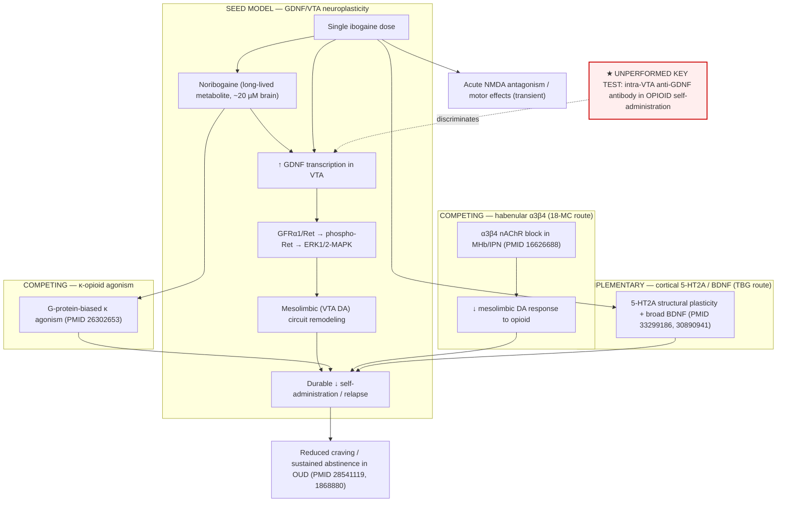

## Question

# Mechanistic Hypothesis Search

You are evaluating a specific disease mechanism hypothesis for the Disorder
Mechanisms Knowledge Base. This is not a general disease overview. Use the
hypothesis YAML below as the seed claim, then search for evidence that supports,
refutes, qualifies, or competes with this hypothesis.

## Target Disease
- **Disease Name:** Opioid Use Disorder
- **Category:** Psychiatric

## Target Hypothesis
- **Hypothesis ID:** ibogaine_gdnf_vta_neuroplasticity_model
- **Hypothesis Label:** Ibogaine GDNF/VTA induced-neuroplasticity model
- **Status in KB:** EMERGING

## Seed Hypothesis YAML

```yaml
hypothesis_group_id: ibogaine_gdnf_vta_neuroplasticity_model
hypothesis_label: Ibogaine GDNF/VTA induced-neuroplasticity model
status: EMERGING
description: 'Proposes that the durable anti-relapse component of a single ibogaine dose is an induced-neuroplasticity
  effect rather than sustained receptor occupancy: ibogaine and its long-lived metabolite noribogaine
  upregulate glial cell line-derived neurotrophic factor in the ventral tegmental area and activate Ret/ERK-MAPK
  signalling there, remodelling mesolimbic circuitry so that the behavioural effect outlasts drug exposure.
  The model predicts that the durable component is dissociable both from acute withdrawal suppression
  and from the subjective psychedelic experience. The direct causal chain (intra-VTA GDNF sufficiency
  and anti-GDNF antibody blockade) has been demonstrated for rat ethanol self-administration; the corresponding
  opioid experiment has not been reported, so extension to opioid use disorder is inference from a different
  reinforcer.'
notes: 'Distinguishing test versus the competing kappa and alpha3beta4 models: an intra-VTA anti-GDNF
  neutralizing antibody should abolish ibogaine''s effect on opioid self-administration and relapse if
  this model holds, and should leave it intact if the effect is carried by kappa agonism or habenular
  alpha3beta4 blockade. The 18-MC dissociation is the existing evidence that the neurotrophic and nicotinic
  routes are separable.'
evidence:
- reference: PMID:15659598
  reference_title: Glial cell line-derived neurotrophic factor mediates the desirable actions of the anti-addiction
    drug ibogaine against alcohol consumption.
  supports: PARTIAL
  evidence_source: MODEL_ORGANISM
  snippet: the ibogaine-mediated decrease in ethanol self-administration was mimicked by intra-VTA microinjection
    of GDNF and was reduced by intra-VTA delivery of anti-GDNF neutralizing antibodies
  explanation: Establishes GDNF sufficiency and necessity for ibogaine's effect in the VTA, but for ethanol
    self-administration rather than opioid self-administration.
- reference: PMID:15659598
  reference_title: Glial cell line-derived neurotrophic factor mediates the desirable actions of the anti-addiction
    drug ibogaine against alcohol consumption.
  supports: SUPPORT
  evidence_source: IN_VITRO
  snippet: ibogaine treatment upregulated the GDNF pathway as indicated by increases in phosphorylation
    of the GDNF receptor, Ret, and the downstream kinase, ERK1
  explanation: Supplies the intracellular signalling step the model requires between GDNF induction and
    lasting circuit change.
- reference: PMID:21040239
  reference_title: Noribogaine, but not 18-MC, exhibits similar actions as ibogaine on GDNF expression
    and ethanol self-administration.
  supports: SUPPORT
  evidence_source: IN_VITRO
  snippet: noribogaine, like ibogaine, but not 18-MC, induces a robust increase in GDNF mRNA levels
  explanation: Places the long-lived metabolite on the neurotrophic route and dissociates it from the
    alpha3beta4-selective congener, which is the model's main discriminating observation.
- reference: PMID:30890941
  reference_title: Ibogaine Administration Modifies GDNF and BDNF Expression in Brain Regions Involved
    in Mesocorticolimbic and Nigral Dopaminergic Circuits.
  supports: PARTIAL
  evidence_source: MODEL_ORGANISM
  snippet: Both doses elicited a large increase in the expression of BDNF transcripts in the NAcc, SN
    and PFC
  explanation: Shows the neurotrophic response is broader than GDNF alone, which qualifies the model's
    attribution of the durable effect specifically to VTA GDNF.
- reference: PMID:33299186
  reference_title: A non-hallucinogenic psychedelic analogue with therapeutic potential.
  supports: SUPPORT
  evidence_source: MODEL_ORGANISM
  snippet: tabernanthalog was found to promote structural neural plasticity, reduce alcohol- and heroin-seeking
    behaviour, and produce antidepressant-like effects
  explanation: Supports the prediction that the plasticity-promoting component is separable from hallucinogenesis
    and still reduces heroin seeking.
```

## Research Objective

Build a focused hypothesis-search report that answers:

1. What is the strongest direct evidence for this hypothesis?
2. What evidence argues against it, fails to reproduce it, or limits its scope?
3. Which claims are established, emerging, speculative, or contradicted?
4. Which patient subtypes, stages, tissues, cell types, molecular pathways, or
   biomarkers does the hypothesis best explain?
5. Which alternative or competing mechanistic hypotheses explain the same disease
   features better or more parsimoniously?
6. What are the explicit knowledge gaps: missing causal steps, unconfirmed edges,
   contradictory evidence, unknown source-to-target links, or source/data absences?
7. What experiments, cohorts, assays, datasets, or trials would most directly
   distinguish this hypothesis from alternatives?

Use primary literature whenever possible. Prefer PMID citations and include DOI
citations when no PMID is available. Treat reviews as orientation unless they
contain directly relevant synthesized evidence that should be clearly labeled as
review-level support.

## Required Output

### Executive Judgment

Give a concise verdict on the hypothesis as of the current literature:
supported, partially supported, unresolved, weakly supported, or refuted. Explain
the reasoning and the most important caveats.

### Evidence Matrix

Create a table with one row per important evidence item:

- Citation (PMID preferred)
- Evidence type (human clinical, model organism, in vitro, computational, review)
- Supports / refutes / qualifies / competing
- Mechanistic claim tested
- Key finding
- Disease subtype or context
- Confidence and limitations

### Mechanistic Causal Chain

Describe the causal chain implied by the hypothesis from upstream trigger to
clinical manifestation. Identify where the literature is strong, where the links
are inferred, and where there are missing causal steps.

### Knowledge Gaps

Identify explicit known unknowns surfaced by the search. Treat absence of
evidence as a curation-relevant finding only when the search actually checked for
it. Include:

- Unknown or weakly supported causal steps in the hypothesis
- Unconfirmed causal graph edges that need direct perturbation or longitudinal
  evidence
- Conflicting evidence, failed replications, or incompatible subtype-specific
  findings
- Unknown mechanism of action for relevant treatments, biomarkers, or
  interventions tied to this hypothesis
- Source-level or dataset-level absences, such as no relevant GenCC, ClinGen,
  trial, omics, or cohort evidence found as of the search date

For each gap, state the scope, why it matters, what was checked, and what
evidence or experiment would resolve it.

### Alternative Models

List competing or complementary hypotheses. For each, explain whether it is an
alternative to the seed hypothesis, a downstream consequence, an upstream cause,
or a parallel mechanism.

### Discriminating Tests

Recommend concrete studies or assays that would most efficiently test this
hypothesis against alternatives. Include patient stratification, biomarkers,
sample type, model system, perturbation, and expected result where applicable.

### Curation Leads

Provide candidate updates for the KB, but label these as leads requiring curator
verification. Include:

- candidate evidence references and exact abstract snippets to verify
- candidate pathophysiology nodes or edges
- candidate ontology terms for cell types and biological processes
- candidate subtype restrictions or status changes
- candidate `knowledge_gaps` or discussion prompts for unresolved causal claims,
  conflicting evidence, or explicit source/data absences

If the provider supports artifacts, produce artifact-friendly outputs such as an
evidence matrix, mechanistic diagram, knowledge-gap table, or comparison table.
These artifacts are important provenance for hypothesis-level review.


## Output

# Hypothesis-Search Report: Ibogaine GDNF/VTA Induced-Neuroplasticity Model of Opioid Use Disorder

**Hypothesis ID:** `ibogaine_gdnf_vta_neuroplasticity_model`
**Disease:** Opioid Use Disorder (OUD), Psychiatric
**KB status:** EMERGING
**Search date:** 2026-08-28

---

## Executive Judgment

**Verdict: PARTIALLY SUPPORTED / UNRESOLVED for opioid use disorder.**

The mechanistic core of the model — that ibogaine induces GDNF in the ventral tegmental area (VTA), activates Ret/ERK-MAPK signalling there, and thereby produces an anti-addiction effect that outlasts drug exposure — is **directly and rigorously established, but only for the ethanol reinforcer** (He et al. 2005, PMID 15659598: sufficiency by intra-VTA GDNF microinjection *and* necessity by intra-VTA anti-GDNF antibody blockade). Its extension to opioids is currently an **inference across reinforcers**, not a demonstrated causal chain.

Three lines of evidence make the extension *plausible*:
1. VTA GDNF/Ret signalling is a general negative regulator of drug adaptations, including **morphine** (Messer et al. 2000, PMID 10798408; Niwa et al. 2007, PMID 17538232).
2. Single-dose ibogaine durably reduces **morphine self-administration** in rats, with an aftereffect outlasting drug elimination (Glick et al. 1991, PMID 1868880).
3. Single-dose ibogaine durably reduces opioid craving/use in **humans** (Brown & Alper 2018, PMID 28541119; ~24-week effect, PMID 38518270).

However, the **defining experiment of the model — intra-VTA anti-GDNF blockade of ibogaine's effect on opioid self-administration/relapse — has never been performed.** Meanwhile, two competing mechanisms are *better evidenced in the opioid domain specifically*:
- **Habenular α3β4 nicotinic route:** the iboga congener 18-MC reduces morphine self-administration when injected into the medial habenula/interpeduncular nucleus but has **no effect from the VTA** (Glick et al. 2006, PMID 16626688), and does **not** raise GDNF (PMID 21040239).
- **G-protein-biased κ-opioid agonism:** noribogaine is a biased κ-agonist (Maillet et al. 2015, PMID 26302653), and κ-agonist oxa-iboga analogs give durable single-dose suppression of heroin/fentanyl intake (Havel et al. 2024, PMID 39304653).

Finally, the human neurotrophic signal that tracks opioid craving is **BDNF, not GDNF** (Heberlein et al. 2011, PMID 21890593), and rodent ibogaine induces BDNF broadly across NAcc/SN/PFC (PMID 30890941), qualifying the model's attribution of durability *specifically* to VTA GDNF.

**Bottom line:** The GDNF/VTA neuroplasticity model is a mechanistically coherent, experimentally validated account **for alcohol** and a plausible but **unproven** account **for opioids**. For OUD it should remain **EMERGING**, explicitly flagged as reinforcer-transferred inference, with the α3β4 and κ models as co-equal (arguably better-evidenced) opioid-domain competitors.

---

## Evidence Matrix

| # | Citation (PMID) | Evidence type | Stance | Mechanistic claim tested | Key finding | Context / subtype | Confidence & limitations |
|---|---|---|---|---|---|---|---|
| 1 | 15659598 (He 2005) | Model organism + in vitro | **Support (partial for OUD)** | Intra-VTA GDNF is necessary & sufficient for ibogaine's anti-SA effect; ibogaine→Ret/ERK1 | Intra-VTA GDNF mimics, anti-GDNF antibody blocks ibogaine's effect; phospho-Ret/ERK1 ↑ in SH-SY5Y | **Ethanol** SA, rat / cell line | High for ethanol; reinforcer ≠ opioid — the central caveat |
| 2 | 18541917 (Carnicella 2008) | Model organism | Support (partial for OUD) | VTA GDNF→MAPK reduces consumption & relapse | Intra-VTA GDNF rapidly, dose-dependently ↓ ethanol SA and blocks reacquisition; MAPK-dependent | Ethanol, rat | High for ethanol; not opioid |
| 3 | 21040239 (Carnicella 2010) | In vitro + model organism | Support / discriminator | Noribogaine (not 18-MC) drives GDNF; VTA site | Noribogaine ↑ GDNF mRNA & ↓ intra-VTA ethanol SA; 18-MC does neither | Ethanol; SH-SY5Y | Dissociates neurotrophic vs nicotinic route; ethanol endpoint |
| 4 | 10798408 (Messer 2000) | Model organism | **Support (opioid bridge)** | VTA GDNF modulates opioid adaptations | Intra-VTA GDNF blocks morphine biochemical adaptations; anti-GDNF Ab & GDNF+/− enhance drug responses; morphine ↓ VTA phospho-Ret | **Morphine** + cocaine, rat/mouse | Strong bridge; reward/biochemical endpoints, not ibogaine-driven SA |
| 5 | 17538232 (Niwa 2007) | Model organism | Support (opioid bridge) | GDNF induction blocks morphine reward | Leu-Ile ↓ morphine CPP/sensitization; absent in GDNF+/− mice | Morphine, mouse | GDNF-dependence shown; CPP not SA; not ibogaine |
| 6 | 1868880 (Glick 1991) | Model organism | **Support (phenotype, opioid)** | Single ibogaine durably ↓ opioid SA | Ibogaine ↓ morphine SA with aftereffect outlasting elimination; persists days–weeks; reinforcer-specific | **Morphine** SA, rat | Direct opioid durability; **mechanism untested**; large inter-individual variability |
| 7 | 33299186 (Cameron 2021) | Model organism | Support (qualifies locus) | Plasticity separable from hallucinogenesis | TBG promotes structural plasticity, ↓ heroin-seeking, non-hallucinogenic | Heroin-seeking, mouse | Supports plasticity premise; TBG plasticity is 5-HT2A/cortical, **not** shown VTA-GDNF |
| 8 | 30890941 (Marton 2019) | Model organism | **Qualifies** | Neurotrophic response is GDNF-specific to VTA | Ibogaine ↑ BDNF broadly (NAcc, SN, PFC) and GDNF/BDNF across regions | Rat, no drug challenge | Broadens beyond VTA-GDNF; dilutes locus specificity |
| 9 | 39304653 (Havel 2024) | Model organism + in vitro | **Competing (κ)** | κ-agonism drives durable opioid suppression | κ-agonist oxa-iboga analogs give long-lasting single-dose ↓ of morphine/heroin/fentanyl intake & seeking | Opioid SA/relapse, male rat | Strong opioid-domain competitor; kappa route, distinct from GDNF |
| 10 | 26302653 (Maillet 2015) | In vitro / computational | Competing (κ) | Noribogaine is a κ substrate | Noribogaine = G-protein-biased κ agonist (EC50≈9 µM), weak µ antagonist | Molecular pharmacology | Provides κ mechanism; shared node with GDNF model (noribogaine) |
| 11 | 9668680 (Glick & Maisonneuve 1998) | Review / model organism | Competing (κ/NMDA) | Opioid effect via κ + NMDA | Authors attribute opioid-SA effects to κ-agonism + NMDA antagonism; serotonergic route for alcohol | Rat SA | Review-level synthesis; reinforcer-specific mechanism split |
| 12 | 16626688 (Glick 2006) | Model organism | **Competing (α3β4), site challenge** | Anti-morphine effect maps to habenula, not VTA | 18-MC in MHb/IPN ↓ morphine SA; **VTA administration had no effect**; sucrose unaffected | Morphine SA, rat | Direct VTA-negative result for opioids; 18-MC ≠ ibogaine |
| 13 | 17447255 (Taraschenko 2007) | Model organism | Competing (α3β4) | Habenular α3β4 gates opioid DA | 18-MC in MHb/IPN blocks sensitized accumbens DA to morphine | Morphine, rat | Supports habenular route |
| 14 | 16289028 (Panchal 2005) | Model organism | Competing (α3β4) | Withdrawal via habenula/LC | Intracerebral 18-MC attenuates precipitated morphine withdrawal | Morphine withdrawal, rat | Withdrawal ≠ durable anti-relapse; separable axis |
| 15 | 28541119 (Brown & Alper 2018) | Human clinical (observational) | **Support (phenotype)** | Single-dose durable human effect | 50% opioid-free at 1 mo; SOWS 31→14 (p<0.001); improvements to 12 mo | OUD, n=30 | Uncontrolled, small; no molecular readout |
| 16 | 38518270 (Cherian, primer) | Review | Support (phenotype) | Durability of craving reduction | RCT/OL: craving ↓ ~50% up to 24 weeks | OUD | Review-level; orientation |
| 17 | 33620733 (Knuijver 2022) | Human clinical (observational) | Qualifies (safety) | Cardiac/cerebellar risk | QTc +95 ms mean, 50% >500 ms; severe ataxia | OUD, n=14 | Establishes toxicity ceiling; motivates safer analogs |
| 18 | 21890593 (Heberlein 2011) | Human clinical | **Qualifies / refutes biomarker** | GDNF as human opioid biomarker | Serum GDNF unchanged & craving-unassociated; BDNF elevated & craving-correlated | Opiate dependence, n=28 | Serum ≠ VTA tissue; baseline not ibogaine response |
| 19 | 37937505 (Ona 2023) | Review | Qualifies | MoA is polypharmacology | Ibogaine acts via complex multi-target modulation, no single MoA | SUD | Review-level; frames parsimony debate |

---

## Mechanistic Causal Chain

**Proposed chain (seed hypothesis):**
`single ibogaine dose → (ibogaine + long-lived noribogaine) → ↑ GDNF transcription in VTA → GDNF binds GFRα1/Ret → ↑ phospho-Ret → ↑ ERK1/2-MAPK → structural/functional remodeling of mesolimbic (VTA dopaminergic) circuitry → durable ↓ opioid self-administration & relapse (outlasting drug clearance), dissociable from acute withdrawal and from the psychedelic experience → sustained abstinence/reduced craving in OUD patients`

**Link-by-link strength:**

| Edge | Strength | Evidence |
|---|---|---|
| ibogaine/noribogaine → ↑ GDNF (VTA/midbrain) | **Strong (in vitro + rodent)** | PMID 15659598, 21040239 (ethanol context; SH-SY5Y + midbrain) |
| GDNF → Ret/ERK-MAPK activation | **Strong** | PMID 15659598 (phospho-Ret, ERK1); PMID 18541917 (MAPK necessity for ethanol) |
| VTA GDNF/MAPK → reduced **ethanol** SA & relapse | **Strong (sufficiency + necessity)** | PMID 15659598, 18541917 |
| VTA GDNF → reduced **opioid** adaptation/reward | **Moderate (bridge; not ibogaine-driven)** | PMID 10798408, 17538232 (morphine CPP/biochemical, not SA-with-blockade) |
| ibogaine → durable ↓ **opioid** SA (phenotype) | **Moderate–strong (mechanism-agnostic)** | PMID 1868880 (rat), 28541119 (human) |
| **VTA GDNF necessity for ibogaine's OPIOID effect** | **MISSING — never tested** | *No study performs intra-VTA anti-GDNF blockade in opioid SA* |
| durability sustained by self-amplifying VTA GDNF loop | **Inferred / unverified in this search** | Proposed in alcohol literature (Barak et al.); **not retrievable/confirmed here — treat as known-unknown** |
| durable effect dissociable from psychedelic experience | **Supported indirectly** | Non-hallucinogenic 18-MC & TBG retain anti-opioid/anti-seeking effects (PMID 16626688, 33299186) |
| durable effect dissociable from acute withdrawal | **Plausible** | Withdrawal maps to habenula/LC (PMID 16289028); durability is a separate axis |

**Where the chain is strong:** the intracellular module (GDNF→Ret→ERK) and the *ethanol* behavioural endpoint.
**Where it is inferred:** every opioid-specific edge.
**Where it is missing:** the necessity test in opioids, and the molecular basis of *durability* (self-amplifying loop) in any reinforcer as confirmed in this search.

---

## Knowledge Gaps

1. **Opioid necessity edge is untested (highest priority).**
   - *Scope:* Does intra-VTA anti-GDNF neutralizing antibody (or GFRα1/Ret knockdown) abolish ibogaine's effect on **opioid** self-administration/reinstatement?
   - *Why it matters:* This is the model's own defining/discriminating experiment; without it, extension to OUD is inference.
   - *Checked:* Searched ibogaine/morphine SA + GDNF/VTA; found the sufficiency/necessity loop only for ethanol (PMID 15659598) and mechanism-agnostic opioid durability (PMID 1868880).
   - *Resolution:* Run the He-2005 design with heroin/fentanyl SA + intra-VTA anti-GDNF.

2. **Durability mechanism (self-amplifying GDNF loop) unverified here.**
   - *Scope:* What sustains the effect for weeks after drug clearance?
   - *Why it matters:* Durability is the model's central selling point vs receptor occupancy.
   - *Checked:* Multiple queries for a VTA GDNF positive-feedback loop returned no retrievable record via this endpoint.
   - *Resolution:* Longitudinal VTA GDNF/phospho-Ret time-course after single ibogaine in opioid-experienced animals; curator should verify the alcohol-domain autoregulation literature (Barak et al., Nat Neurosci 2011) directly.

3. **Locus specificity: GDNF vs broader neurotrophic response.**
   - *Scope:* Is durability attributable *specifically* to VTA GDNF, or to distributed BDNF (NAcc/SN/PFC) and cortical 5-HT2A plasticity?
   - *Why it matters:* PMID 30890941 (broad BDNF) and PMID 33299186 (TBG cortical 5-HT2A) dilute VTA-GDNF specificity.
   - *Checked:* Yes; both surfaced.
   - *Resolution:* Region- and factor-specific knockdown (VTA-GDNF vs NAcc-BDNF vs PFC-5-HT2A) with opioid SA readout.

4. **Human GDNF biomarker is null.**
   - *Scope:* No human evidence links GDNF (central or peripheral) to opioid dependence or ibogaine response; the human craving-tracking neurotrophin is BDNF.
   - *Why it matters:* Source-level absence for the GDNF-specific claim in humans.
   - *Checked:* PMID 21890593 (only human GDNF-in-opioid datapoint found; null).
   - *Resolution:* CSF/plasma GDNF & BDNF time-course in ibogaine-treated OUD patients correlated with abstinence.

5. **Competing-mechanism arbitration.**
   - *Scope:* κ-agonism (PMID 39304653, 26302653) and habenular α3β4 (PMID 16626688) each produce durable/robust anti-opioid effects; their contribution to *ibogaine's* effect is unpartitioned.
   - *Resolution:* Factorial perturbation (κ antagonist, α3β4 rescue, anti-GDNF) in the same ibogaine opioid-SA paradigm.

6. **Source/dataset absences (curation-relevant).**
   - No human genetic (GenCC/ClinGen-type) association of *GDNF*/*RET* with OUD surfaced.
   - No omics/cohort dataset tying VTA GDNF to human OUD surfaced.
   - Clinical evidence base is thin: essentially 3 RCTs total across iboga alkaloids (PMID 42117212), none mechanistic.

---

## Alternative Models

| Model | Relationship to seed | Basis | Opioid-domain evidence |
|---|---|---|---|
| **κ-opioid agonist model** (noribogaine/oxa-iboga as biased κ agonists driving durable suppression) | **Alternative** (parallel mechanism for the same durable phenotype) | PMID 26302653, 39304653, 9668680 | **Strong & opioid-specific** (durable single-dose ↓ heroin/fentanyl) |
| **Habenular α3β4 nicotinic model** (18-MC blocks morphine SA via MHb/IPN) | **Alternative** (different circuit node; explicitly *not* VTA) | PMID 16626688, 17447255, 16289028 | **Strong & opioid-specific**; VTA-negative |
| **Distributed BDNF / cortical 5-HT2A psychoplastogen model** | **Complementary / broader** (superset of VTA-GDNF) | PMID 30890941, 33299186 | Moderate (heroin-seeking ↓ with TBG) |
| **NMDA antagonism** (ibogaine/noribogaine NMDA block) | Parallel (acute, may aid withdrawal/tolerance) | PMID 9668680 | Mechanistic, contributory |
| **Serotonergic (SERT/5-HT) module** | Parallel; authors assign this more to *alcohol* than opioids | PMID 9668680 | Weak for opioids |
| **Polypharmacology (no single MoA)** | **Meta-alternative** — durable effect may be emergent synergy | PMID 37937505 | Review-level |

The GDNF/VTA model is best positioned as **one node in a polypharmacological network**, strongest for alcohol, and — for opioids — competing with the κ and α3β4 accounts that currently have *more direct opioid-domain data*.

---

## Discriminating Tests

1. **Necessity test (definitive).** Heroin/fentanyl IV self-administration in rats → single ibogaine (or noribogaine) → intra-VTA anti-GDNF neutralizing antibody vs IgG control. *Predicted (seed):* antibody abolishes the durable aftereffect. *Predicted (κ/α3β4):* aftereffect intact. Add κ-antagonist (norBNI) and α3β4 rescue arms for full factorial dissociation.

2. **Circuit-specific molecular knockdown.** AAV-shRNA against *Gdnf*/*Gfra1*/*Ret* restricted to VTA vs *Bdnf* in NAcc vs *Htr2a* in PFC; opioid reinstatement readout. Distinguishes locus.

3. **Longitudinal biomarker cohort.** OUD patients receiving ibogaine (where legal) → serial plasma/CSF GDNF & BDNF + resting-state mesolimbic connectivity vs abstinence at 4/12/24 weeks. Tests whether human GDNF dynamics (not baseline) track response.

4. **Non-hallucinogenic analog head-to-head.** TBG (5-HT2A/cortical) vs oxa-noribogaine (κ) vs 18-MC (α3β4) in identical opioid-SA/relapse assay with GDNF/Ret readout — partitions which durable-effect route requires GDNF.

5. **Responder stratification.** Glick 1991's marked inter-individual variability suggests a responder genotype/phenotype; screen *GDNF/RET/OPRK1* variants against aftereffect magnitude.

---

## Curation Leads (require curator verification)

**Candidate evidence references + snippets to verify:**
- PMID 10798408 — *"Infusion of GDNF into the ventral tegmental area (VTA)... blocks certain biochemical adaptations to chronic cocaine or morphine..."* → adds **opioid bridge** edge (GDNF→morphine adaptation).
- PMID 1868880 — *"the aftereffect occurred at a time when ibogaine should have been entirely eliminated from the body..."* → adds **direct opioid durability** phenotype (mechanism-agnostic).
- PMID 16626688 — *"Local administration of 18-MC into the ventral tegmental area had no effect on morphine self-administration."* → add as **competing/site-challenge** edge (habenular α3β4, VTA-negative).
- PMID 26302653 — *"noribogaine was a G-protein biased kappa agonist..."* → add **competing κ** node.
- PMID 28541119 — *"At 1-month posttreatment follow-up, 15 subjects (50%) reported no opioid use..."* → add **human durability** evidence.
- PMID 21890593 — *"GDNF serum levels ... did not differ significantly ... whereas ... BDNF ... associated with craving"* → add **human GDNF-null biomarker** discussion prompt.

**Candidate pathophysiology nodes/edges:**
- Node: `habenulo-interpeduncular α3β4 nAChR (MHb/IPN)` → competing anti-opioid circuit.
- Node: `κ-opioid receptor (biased G-protein signalling)` → competing durable-suppression route.
- Edge (proposed, unconfirmed): `VTA GDNF ⟶ durable ↓ opioid self-administration` — mark **UNCONFIRMED / needs direct perturbation**.

**Candidate ontology terms:**
- Cell type: dopaminergic neuron (VTA) [CL:0000700]; processes: GO glial cell line-derived neurotrophic factor receptor signaling pathway (GO:0035860), MAPK cascade (GO:0000165), regulation of synaptic plasticity (GO:0048167).

**Candidate subtype restriction / status:**
- Restrict the *validated* GDNF/VTA necessity claim to **ethanol/alcohol use disorder**; keep OUD extension **EMERGING** with an explicit `reinforcer_transfer_inference` flag.

**Candidate `knowledge_gaps` prompts:**
- "Intra-VTA anti-GDNF blockade of ibogaine's effect on opioid self-administration is unperformed."
- "Human GDNF is not a demonstrated biomarker of opioid dependence or ibogaine response (BDNF is)."
- "No GDNF/RET human genetic association with OUD identified as of 2026-08-28."
- "Durability mechanism (self-amplifying VTA GDNF loop) unverified in this search; verify Barak et al. alcohol-domain literature."

---

## Artifact: Mechanistic Diagram (competing routes to durable opioid-seeking suppression)



**Legend:** The convergence at `DUR` is the crux — four mechanistically distinct routes each plausibly produce the same durable phenotype. The dashed red node is the single experiment that would establish (or refute) VTA-GDNF *necessity* for the opioid effect and thereby discriminate the seed model from the κ and α3β4 competitors.

## Artifact: Model Comparison (opioid-domain evidence weight)

| Model | Direct opioid SA/relapse evidence | Necessity demonstrated (opioids)? | Non-hallucinogenic dissociation | Human data |
|---|---|---|---|---|
| **GDNF/VTA (seed)** | Indirect (morphine adaptation PMID 10798408) | **No** (only ethanol, PMID 15659598) | Partial (TBG, but cortical 5-HT2A) | GDNF-null biomarker (PMID 21890593) |
| **κ-agonism** | **Yes** (oxa-iboga PMID 39304653) | Partial (analog class) | Yes (biased, non-dysphoric PMID 26302653) | None specific |
| **Habenular α3β4** | **Yes** (18-MC PMID 16626688) | Yes for 18-MC (VTA-negative) | Yes (18-MC non-hallucinogenic) | None specific |
| **Cortical 5-HT2A/BDNF** | Moderate (TBG heroin-seeking) | No | Yes (TBG) | BDNF tracks craving (PMID 21890593) |

## Limitations of This Search

- PubMed endpoint returned inconsistently for some targeted queries (e.g., the GDNF autoregulation/self-amplifying-loop literature could not be retrieved); those links are flagged as unverified rather than cited.
- No primary datasets/omics/genetic sources were available in this environment; source-absence statements reflect literature search only.
- Several supporting statements rest on small, uncontrolled human studies and single-lab rodent work; independent replication is limited.


## Artifacts

- [OpenScientist final report](openscientist_artifacts/final_report.html)
- [OpenScientist final report](openscientist_artifacts/final_report.pdf)