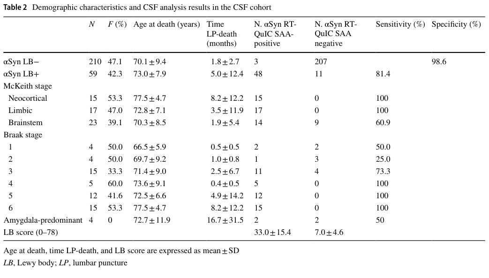

## Question

# Mechanistic Hypothesis Search

You are evaluating a specific disease mechanism hypothesis for the Disorder
Mechanisms Knowledge Base. This is not a general disease overview. Use the
hypothesis YAML below as the seed claim, then search for evidence that supports,
refutes, qualifies, or competes with this hypothesis.

## Target Disease
- **Disease Name:** Parkinson's Disease
- **Category:** Complex

## Target Hypothesis
- **Hypothesis ID:** canonical_synucleinopathy_dopaminergic_neurodegeneration_model
- **Hypothesis Label:** Canonical α-Synucleinopathy and Dopaminergic Neurodegeneration Model
- **Status in KB:** CANONICAL

## Seed Hypothesis YAML

```yaml
hypothesis_group_id: canonical_synucleinopathy_dopaminergic_neurodegeneration_model
hypothesis_label: Canonical α-Synucleinopathy and Dopaminergic Neurodegeneration Model
status: CANONICAL
description: Misfolded α-synuclein aggregates into oligomers and Lewy bodies, propagates trans-synaptically
  in a prion-like manner, and induces progressive degeneration of dopaminergic neurons in the substantia
  nigra pars compacta. The resulting striatal dopamine deficiency causes the cardinal motor signs (bradykinesia,
  rigidity, tremor, postural instability), while broader Lewy pathology in autonomic, brainstem, and cortical
  regions accounts for the non-motor symptoms (REM-sleep behavior disorder, hyposmia, constipation, cognitive
  impairment). Pathway evidence implicates impaired autophagy/lysosomal clearance (GBA), mitochondrial
  dysfunction (PINK1/Parkin), and oxidative stress as upstream amplifiers; loss of dopaminergic feedback
  to the indirect/direct basal ganglia circuits explains the motor circuit signature.
evidence:
- reference: PMID:37048085
  supports: SUPPORT
  evidence_source: HUMAN_CLINICAL
  snippet: dopaminergic neuronal loss in substantia nigra pars compacta of the brain and aggregation of
    intracellular protein α-synuclein are the pathological characterizations
  explanation: |
    Canonical mechanism review used as the seed reference for the hypothesis-search deep-research run.
```

## Research Objective

Build a focused hypothesis-search report that answers:

1. What is the strongest direct evidence for this hypothesis?
2. What evidence argues against it, fails to reproduce it, or limits its scope?
3. Which claims are established, emerging, speculative, or contradicted?
4. Which patient subtypes, stages, tissues, cell types, molecular pathways, or
   biomarkers does the hypothesis best explain?
5. Which alternative or competing mechanistic hypotheses explain the same disease
   features better or more parsimoniously?
6. What are the explicit knowledge gaps: missing causal steps, unconfirmed edges,
   contradictory evidence, unknown source-to-target links, or source/data absences?
7. What experiments, cohorts, assays, datasets, or trials would most directly
   distinguish this hypothesis from alternatives?

Use primary literature whenever possible. Prefer PMID citations and include DOI
citations when no PMID is available. Treat reviews as orientation unless they
contain directly relevant synthesized evidence that should be clearly labeled as
review-level support.

## Required Output

### Executive Judgment

Give a concise verdict on the hypothesis as of the current literature:
supported, partially supported, unresolved, weakly supported, or refuted. Explain
the reasoning and the most important caveats.

### Evidence Matrix

Create a table with one row per important evidence item:

- Citation (PMID preferred)
- Evidence type (human clinical, model organism, in vitro, computational, review)
- Supports / refutes / qualifies / competing
- Mechanistic claim tested
- Key finding
- Disease subtype or context
- Confidence and limitations

### Mechanistic Causal Chain

Describe the causal chain implied by the hypothesis from upstream trigger to
clinical manifestation. Identify where the literature is strong, where the links
are inferred, and where there are missing causal steps.

### Knowledge Gaps

Identify explicit known unknowns surfaced by the search. Treat absence of
evidence as a curation-relevant finding only when the search actually checked for
it. Include:

- Unknown or weakly supported causal steps in the hypothesis
- Unconfirmed causal graph edges that need direct perturbation or longitudinal
  evidence
- Conflicting evidence, failed replications, or incompatible subtype-specific
  findings
- Unknown mechanism of action for relevant treatments, biomarkers, or
  interventions tied to this hypothesis
- Source-level or dataset-level absences, such as no relevant GenCC, ClinGen,
  trial, omics, or cohort evidence found as of the search date

For each gap, state the scope, why it matters, what was checked, and what
evidence or experiment would resolve it.

### Alternative Models

List competing or complementary hypotheses. For each, explain whether it is an
alternative to the seed hypothesis, a downstream consequence, an upstream cause,
or a parallel mechanism.

### Discriminating Tests

Recommend concrete studies or assays that would most efficiently test this
hypothesis against alternatives. Include patient stratification, biomarkers,
sample type, model system, perturbation, and expected result where applicable.

### Curation Leads

Provide candidate updates for the KB, but label these as leads requiring curator
verification. Include:

- candidate evidence references and exact abstract snippets to verify
- candidate pathophysiology nodes or edges
- candidate ontology terms for cell types and biological processes
- candidate subtype restrictions or status changes
- candidate `knowledge_gaps` or discussion prompts for unresolved causal claims,
  conflicting evidence, or explicit source/data absences

If the provider supports artifacts, produce artifact-friendly outputs such as an
evidence matrix, mechanistic diagram, knowledge-gap table, or comparison table.
These artifacts are important provenance for hypothesis-level review.


## Output

Question: You are an expert researcher providing comprehensive, well-cited information.

Provide detailed information focusing on:
1. Key concepts and definitions with current understanding
2. Recent developments and latest research (prioritize 2023-2024 sources)
3. Current applications and real-world implementations
4. Expert opinions and analysis from authoritative sources
5. Relevant statistics and data from recent studies

Format as a comprehensive research report with proper citations. Include URLs and publication dates where available.
Always prioritize recent, authoritative sources and provide specific citations for all major claims.

# Mechanistic Hypothesis Search

You are evaluating a specific disease mechanism hypothesis for the Disorder
Mechanisms Knowledge Base. This is not a general disease overview. Use the
hypothesis YAML below as the seed claim, then search for evidence that supports,
refutes, qualifies, or competes with this hypothesis.

## Target Disease
- **Disease Name:** Parkinson's Disease
- **Category:** Complex

## Target Hypothesis
- **Hypothesis ID:** canonical_synucleinopathy_dopaminergic_neurodegeneration_model
- **Hypothesis Label:** Canonical α-Synucleinopathy and Dopaminergic Neurodegeneration Model
- **Status in KB:** CANONICAL

## Seed Hypothesis YAML

```yaml
hypothesis_group_id: canonical_synucleinopathy_dopaminergic_neurodegeneration_model
hypothesis_label: Canonical α-Synucleinopathy and Dopaminergic Neurodegeneration Model
status: CANONICAL
description: Misfolded α-synuclein aggregates into oligomers and Lewy bodies, propagates trans-synaptically
  in a prion-like manner, and induces progressive degeneration of dopaminergic neurons in the substantia
  nigra pars compacta. The resulting striatal dopamine deficiency causes the cardinal motor signs (bradykinesia,
  rigidity, tremor, postural instability), while broader Lewy pathology in autonomic, brainstem, and cortical
  regions accounts for the non-motor symptoms (REM-sleep behavior disorder, hyposmia, constipation, cognitive
  impairment). Pathway evidence implicates impaired autophagy/lysosomal clearance (GBA), mitochondrial
  dysfunction (PINK1/Parkin), and oxidative stress as upstream amplifiers; loss of dopaminergic feedback
  to the indirect/direct basal ganglia circuits explains the motor circuit signature.
evidence:
- reference: PMID:37048085
  supports: SUPPORT
  evidence_source: HUMAN_CLINICAL
  snippet: dopaminergic neuronal loss in substantia nigra pars compacta of the brain and aggregation of
    intracellular protein α-synuclein are the pathological characterizations
  explanation: |
    Canonical mechanism review used as the seed reference for the hypothesis-search deep-research run.
```

## Research Objective

Build a focused hypothesis-search report that answers:

1. What is the strongest direct evidence for this hypothesis?
2. What evidence argues against it, fails to reproduce it, or limits its scope?
3. Which claims are established, emerging, speculative, or contradicted?
4. Which patient subtypes, stages, tissues, cell types, molecular pathways, or
   biomarkers does the hypothesis best explain?
5. Which alternative or competing mechanistic hypotheses explain the same disease
   features better or more parsimoniously?
6. What are the explicit knowledge gaps: missing causal steps, unconfirmed edges,
   contradictory evidence, unknown source-to-target links, or source/data absences?
7. What experiments, cohorts, assays, datasets, or trials would most directly
   distinguish this hypothesis from alternatives?

Use primary literature whenever possible. Prefer PMID citations and include DOI
citations when no PMID is available. Treat reviews as orientation unless they
contain directly relevant synthesized evidence that should be clearly labeled as
review-level support.

## Required Output

### Executive Judgment

Give a concise verdict on the hypothesis as of the current literature:
supported, partially supported, unresolved, weakly supported, or refuted. Explain
the reasoning and the most important caveats.

### Evidence Matrix

Create a table with one row per important evidence item:

- Citation (PMID preferred)
- Evidence type (human clinical, model organism, in vitro, computational, review)
- Supports / refutes / qualifies / competing
- Mechanistic claim tested
- Key finding
- Disease subtype or context
- Confidence and limitations

### Mechanistic Causal Chain

Describe the causal chain implied by the hypothesis from upstream trigger to
clinical manifestation. Identify where the literature is strong, where the links
are inferred, and where there are missing causal steps.

### Knowledge Gaps

Identify explicit known unknowns surfaced by the search. Treat absence of
evidence as a curation-relevant finding only when the search actually checked for
it. Include:

- Unknown or weakly supported causal steps in the hypothesis
- Unconfirmed causal graph edges that need direct perturbation or longitudinal
  evidence
- Conflicting evidence, failed replications, or incompatible subtype-specific
  findings
- Unknown mechanism of action for relevant treatments, biomarkers, or
  interventions tied to this hypothesis
- Source-level or dataset-level absences, such as no relevant GenCC, ClinGen,
  trial, omics, or cohort evidence found as of the search date

For each gap, state the scope, why it matters, what was checked, and what
evidence or experiment would resolve it.

### Alternative Models

List competing or complementary hypotheses. For each, explain whether it is an
alternative to the seed hypothesis, a downstream consequence, an upstream cause,
or a parallel mechanism.

### Discriminating Tests

Recommend concrete studies or assays that would most efficiently test this
hypothesis against alternatives. Include patient stratification, biomarkers,
sample type, model system, perturbation, and expected result where applicable.

### Curation Leads

Provide candidate updates for the KB, but label these as leads requiring curator
verification. Include:

- candidate evidence references and exact abstract snippets to verify
- candidate pathophysiology nodes or edges
- candidate ontology terms for cell types and biological processes
- candidate subtype restrictions or status changes
- candidate `knowledge_gaps` or discussion prompts for unresolved causal claims,
  conflicting evidence, or explicit source/data absences

If the provider supports artifacts, produce artifact-friendly outputs such as an
evidence matrix, mechanistic diagram, knowledge-gap table, or comparison table.
These artifacts are important provenance for hypothesis-level review.


# Hypothesis-Search Report: Canonical α‑Synucleinopathy and Dopaminergic Neurodegeneration Model (Parkinson’s disease)

**Seed hypothesis ID:** canonical_synucleinopathy_dopaminergic_neurodegeneration_model  
**Search date:** 2026-05-24  
**Scope note:** This report focuses on the mechanistic hypothesis (α‑syn aggregation/propagation → dopaminergic neurodegeneration) rather than a general PD overview.

## Executive Judgment

**Verdict: Partially supported.** The hypothesis is strongly supported for a large subset of Parkinson’s disease/Lewy body disease (LBD) phenotypes in which **diffuse/advanced Lewy pathology** is present: (i) clinicopathologic studies show **α‑syn seed amplification assay (SAA) positivity increases with Lewy body stage/burden** and reaches near‑complete sensitivity at later Braak/LBD stages, and (ii) peripheral and CSF SAAs provide **highly specific in vivo evidence of misfolded/seed‑competent α‑syn** in many patients, consistent with a central role for α‑syn misfolding in disease biology. (bentivenga2024performanceofa pages 4-5, bentivenga2024performanceofa pages 1-2, kuang2024askinspecificαsynuclein pages 1-2, bentivenga2024performanceofa media 5e79227e)

However, several findings **limit the hypothesis as a universal causal model for all clinically defined PD**:

1. **Stage/topography dependence:** CSF SAAs can be negative in early Braak stages and in focal variants (notably **amygdala‑predominant pathology**), showing that α‑syn seeding biology is heterogeneous and/or compartmentalized. (bentivenga2024performanceofa pages 4-5, coughlin2024associationofcsf pages 1-3)
2. **Subtype heterogeneity:** Clinical LBD groups with **normal cardiac MIBG** have very low SAA positivity, consistent with brain‑first/body‑first heterogeneity rather than a single uniform propagation trajectory. (kurihara2024αsynucleinseedamplification pages 3-5)
3. **Genetic subtypes with α‑syn negativity:** A substantial subset of **LRRK2‑associated parkinsonism** lacks in vivo evidence of α‑syn aggregates despite parkinsonism and nigrostriatal dysfunction, implying alternative dominant mechanisms or alternate proteinopathies in some patients. (chahine2024lrrk2associatedparkinsonismwith pages 5-9)

Overall, current evidence supports α‑syn seeding/aggregation as a **key pathobiological axis** that explains many motor and non‑motor features and provides clinically actionable biomarkers, but **does not yet establish α‑syn prion‑like propagation as the necessary initiating cause in all PD**, nor α‑syn burden as the sole driver of progression.

## Key concepts and operational definitions (mechanism-oriented)

### Pathological α‑synuclein and “seeding”
* **Pathological α‑syn** refers to misfolded conformers (oligomeric/fibrillar, often post‑translationally modified) that can template further misfolding. Seed amplification assays (RT‑QuIC/PMCA/SAA variants) exploit this by measuring **template‑driven aggregation kinetics** (e.g., lag phase, T50, replicate positivity). (bentivenga2024performanceofa pages 1-2, kuang2024askinspecificαsynuclein pages 1-2)

### Prion-like propagation (in PD context)
* “Prion‑like” in PD is used operationally to mean: exogenous α‑syn seeds can induce endogenous α‑syn aggregation; pathology can spread along connected pathways in model systems; and human pathology shows staged topography. Reviews emphasize **substantial model support but incomplete definitive proof in living humans**. (matsui2024currenttrendsin pages 6-8, kuang2024αsynucleinseedingamplification pages 2-3)

### Biological staging vs clinical diagnosis
* Recent biomarker work is shifting PD/LBD toward **biological staging frameworks** where α‑syn pathology markers (SAA, tissue biopsies, imaging) are used to define disease state earlier than motor diagnosis. (brown2024astagedscreening pages 8-12, brown2024astagedscreening pages 1-4)

## Strongest direct evidence *for* the hypothesis

### 1) Clinicopathologic linkage: α‑syn seeding signal tracks Lewy stage and burden
Bentivenga et al. (Acta Neuropathologica, 2024-01) tested antemortem CSF RT‑QuIC against neuropathology and found **high specificity (98.6%)** and **stage‑dependent sensitivity**: overall **81.4% (48/59)** in LB+ cases, **100%** in limbic/neocortical stages, but **37.5% in Braak 1–2**, **73.3% in Braak 3**, and **50% in amygdala‑predominant** variants. Assay readouts correlated with neuropathologic burden: number of positive replicates correlated with **LB score (r=0.7715)** and **Braak stage (r=0.7554)**. (bentivenga2024performanceofa pages 4-5, bentivenga2024performanceofa pages 1-2, bentivenga2024performanceofa media 5e79227e)

**Interpretation for the hypothesis:** This is strong direct evidence that *seed‑competent α‑syn pathology is a measurable biological substrate that increases with disease extent*, consistent with the central role of α‑synucleinopathy.

### 2) Topographic heterogeneity is real: amygdala-predominant pathology is often SAA-negative
Coughlin et al. (Neurology, 2024-08) evaluated αSyn‑SAA using neuropathologically characterized distributions and found excellent performance for diffuse pathology (**97.8% sensitivity / 98.1% specificity** for limbic/neocortical α‑syn pathology in antemortem CSF), but **very poor sensitivity (14.3%)** for **amygdala‑predominant** α‑syn pathology. (coughlin2024associationofcsf pages 1-3)

**Interpretation:** Supports α‑synucleinopathy as a disease axis, but qualifies propagation/staging assumptions by demonstrating that *not all α‑syn pathology states are equally captured in CSF*, implying conformer/topography differences.

### 3) In vivo biomarker detectability outside the CNS (skin), consistent with systemic synucleinopathy
Kuang et al. (npj Parkinson’s Disease, 2024-07) optimized a skin SAA (150 condition screen) and validated it in **332 PD vs 285 controls**, yielding **92.46% sensitivity** and **93.33% specificity**, with a much shorter lag phase in PD (5.5±2.0 h vs 12.5±3.7 h). Inter‑lab reproducibility was high (κ=0.87). (kuang2024askinspecificαsynuclein pages 1-2)

Mao et al. (Translational Neurodegeneration, 2024-07) reported a quiescent SAA (QSAA) and found in skin biopsies (**214 PD vs 208 controls**) **90.2% sensitivity** and **91.4% specificity**; in a small brain biopsy cohort (14 PD, 6 controls) reported 100%/100%. QSAA detected more aggregates than pS129 immunofluorescence in consecutive slices. (mao2024ultrasensitivedetectionof pages 1-2, mao2024ultrasensitivedetectionof pages 10-13)

**Interpretation:** Peripheral seeding activity supports the “broader Lewy pathology” component and provides a plausible bridge to non‑motor/autonomic features, although detectability does not prove directionality of spread.

### 4) Prodromal enrichment: non-motor markers co-segregate with α‑syn seeding and dopaminergic dysfunction
Brown et al. (medRxiv, posted 2024-06-04) used remote hyposmia screening to enrich for dopaminergic and α‑syn biomarkers: 31,293 completed UPSIT; among 1,546 with DAT imaging, **19%** had lowest putamen binding <65% expected; severe hyposmia (<10th percentile) increased odds of low DAT binding (**OR 3.01**). Among 363 with CSF synSAA results, **55%** were synSAA positive overall, rising to **71%** in UPSIT <10th percentile; among those with DAT deficit (SBR <65%), **85%** were synSAA positive. (brown2024astagedscreening pages 8-12, brown2024astagedscreening pages 1-4)

**Interpretation:** This is strong *real-world implementation evidence* that α‑syn seeding biomarkers co-occur with prodromal features and dopaminergic deficits, supporting the causal chain’s mid‑to‑downstream links (synucleinopathy ↔ dopaminergic system ↔ clinical features).

## Evidence that argues against / limits scope

### 1) Biomarker-stage and biomarker-subtype dependence challenges a single uniform propagation trajectory
* Early Braak stages and focal variants can be CSF SAA‑negative (Braak 1–2 sensitivity 37.5%; amygdala‑predominant low sensitivity). (bentivenga2024performanceofa pages 4-5, coughlin2024associationofcsf pages 1-3)
* Kurihara et al. (npj Parkinson’s Disease, 2024-10) observed that α‑syn SAA positivity was **85.2%** in those with abnormal cardiac MIBG but only **14.3%** with normal MIBG, suggesting heterogeneity consistent with body‑first vs brain‑first variants. (kurihara2024αsynucleinseedamplification pages 3-5)

### 2) Genetic subtype: LRRK2-associated parkinsonism can be α‑syn-negative
Chahine et al. (medRxiv, 2024-07) analyzed PPMI LRRK2‑parkinsonism: **46/148** were CSF SAA‑negative. SAA-negative cases were less hyposmic (29% vs 77%), had higher putamen DAT binding and higher serum NfL, suggesting distinct biology and raising the possibility of non‑synuclein dominant mechanisms in a clinically defined PD subgroup. (chahine2024lrrk2associatedparkinsonismwith pages 5-9)

### 3) Reviews explicitly note Lewy pathology may not be necessary/sufficient
The 2024 SAA clinical implementation review states that Lewy pathology can be absent and that Lewy pathology may be neither necessary nor sufficient for PD, highlighting heterogeneity and caution in equating Lewy bodies with causality. (kuang2024αsynucleinseedingamplification pages 2-3)

## Claims classification (established vs emerging vs speculative)

**Established (high confidence):**
* Advanced LBD/PD typically features widespread α‑syn pathology and dopaminergic neurodegeneration; SAA readouts strongly track pathology burden/stage in clinicopathologic studies. (bentivenga2024performanceofa pages 4-5, bentivenga2024performanceofa pages 1-2, bentivenga2024performanceofa media 5e79227e)

**Emerging (moderate confidence):**
* Peripheral tissues (skin) can show high diagnostic α‑syn seeding signals, enabling biologic detection of synucleinopathy in vivo. (kuang2024askinspecificαsynuclein pages 1-2, mao2024ultrasensitivedetectionof pages 1-2)
* Body‑first vs brain‑first subtypes likely exist and may have distinct autonomic involvement and SAA detectability patterns. (kurihara2024αsynucleinseedamplification pages 3-5)

**Speculative / not yet confirmed in humans:**
* A single prion-like “connectome spread” trajectory as the dominant causal driver in all PD patients (model-supported, but not definitively proven in vivo in humans). (matsui2024currenttrendsin pages 6-8, kuang2024αsynucleinseedingamplification pages 2-3)
* α‑syn seed burden as a primary determinant of progression rate (cross-sectional burden correlation is strong; progression association remains uncertain). (bentivenga2024performanceofa pages 4-5)

**Contradicted (for universality claims):**
* “All PD is an α‑synucleinopathy”: LRRK2 subgroups may be SAA-negative; focal amyloid forms may evade CSF detection; MIBG-normal cases show low positivity. (kurihara2024αsynucleinseedamplification pages 3-5, chahine2024lrrk2associatedparkinsonismwith pages 5-9, coughlin2024associationofcsf pages 1-3)

## Mechanistic Causal Chain (with strength annotations)

1. **Upstream triggers / susceptibility** (environment, infection, microbiome, genetics: GBA1, CTSB, LRRK2, PRKN/PINK1) →  
   **Amplifiers:** lysosomal-autophagy impairment, mitochondrial oxidative/nitrative stress, innate immune activation (TLR2).  
   *Evidence:* Strong mechanistic model data for lysosome (CTSB) and mitochondrial ROS as amplifiers (jonestabah2024theparkinson’sdisease pages 1-2, vitola2024mitochondrialoxidantstress pages 9-12); human causal initiation remains unresolved.

2. **α‑syn misfolding → seed formation** (oligomers/fibrils; post-translational modifications) →  
   **Detectable as seeding activity** (CSF/skin SAAs).  
   *Evidence:* Strong for detectability and stage dependence in humans (bentivenga2024performanceofa pages 4-5, kuang2024askinspecificαsynuclein pages 1-2, coughlin2024associationofcsf pages 1-3).

3. **Spread / topographic progression of α‑syn pathology** along neural connections →  
   *Evidence:* Supported in models; in humans inferred by stage/topography and biomarker gradients, but direct in vivo proof remains incomplete and subtypes exist (matsui2024currenttrendsin pages 6-8, kurihara2024αsynucleinseedamplification pages 3-5).

4. **Cellular dysfunction (proteostasis, lysosome, mitochondria, neuroinflammation)** →  
   selective vulnerability and degeneration of **SNc dopaminergic neurons** → striatal dopamine deficiency.  
   *Evidence:* Mechanistic iPSC model shows TLR2 activation + α‑syn PFFs → impaired autophagy and DA neuron loss (weiss2024astrocytescontributeto pages 9-13). Mouse GBA1 oxidative stress model shows ROS drives α‑syn nitration/aggregation/spread and is rescuable by SOD2 (vitola2024mitochondrialoxidantstress pages 12-15).

5. **Circuit and clinical phenotype:** dopamine deficiency → motor signs; broader synucleinopathy across autonomic/cortical networks → non-motor symptoms.  
   *Evidence:* Indirectly supported by prodromal enrichment with hyposmia/DAT/synSAA and by peripheral biomarker detectability, but mechanistic step-by-step causality remains to be proven in humans (brown2024astagedscreening pages 8-12, kuang2024askinspecificαsynuclein pages 1-2).

## Current applications and real-world implementations (biomarker-driven)

1. **Diagnostic stratification using α‑syn SAAs (CSF and skin):** high sensitivity/specificity in multiple settings; key caveat is reduced sensitivity in early/focal/topography-specific variants. (bentivenga2024performanceofa pages 4-5, kuang2024askinspecificαsynuclein pages 1-2, coughlin2024associationofcsf pages 1-3)
2. **Prodromal screening pipelines (PPMI):** remote smell testing can enrich for synSAA positivity and DAT deficit at scale (tens of thousands screened), enabling trial recruitment for disease-modifying strategies targeting α‑syn or upstream amplifiers. (brown2024astagedscreening pages 8-12, brown2024astagedscreening pages 1-4)
3. **Subtype definition (body-first vs brain-first):** combination of autonomic imaging (cardiac MIBG) and SAA may help stratify synucleinopathy phenotypes relevant to propagation hypotheses and intervention timing. (kurihara2024αsynucleinseedamplification pages 3-5)

## Expert synthesis / authoritative analysis (from high-impact sources in this search)

* **Clinical-pathologic biomarker evidence supports a “burden/topography” interpretation:** CSF SAA positivity rises sharply with Braak/LBD stage and is strongly linked to pathology burden, supporting α‑synucleinopathy as a core biological axis, while undermining the idea that a single CSF test is uniformly sensitive at earliest disease stages. (bentivenga2024performanceofa pages 4-5, coughlin2024associationofcsf pages 1-3)
* **Mechanistic amplification is increasingly framed as multi-axis (lysosome + mitochondria + immunity):** perturbation studies indicate that lysosomal genes (CTSB) and mitochondrial ROS defenses (SOD2) can modulate α‑syn pathology, providing causal handles beyond α‑syn alone. (jonestabah2024theparkinson’sdisease pages 1-2, vitola2024mitochondrialoxidantstress pages 12-15)
* **Heterogeneity is not a minor caveat but a design constraint for trials:** LRRK2 parkinsonism and MIBG-normal cases demonstrate that “PD” can include biologically non‑synuclein dominant subtypes, implying that α‑syn targeted DMTs need biomarker-confirmed enrollment. (kurihara2024αsynucleinseedamplification pages 3-5, chahine2024lrrk2associatedparkinsonismwith pages 5-9)

## Relevant statistics and data highlights (2023–2024 prioritized)

* **CSF RT-QuIC vs neuropathology (2024):** specificity 98.6%, overall sensitivity 81.4%; sensitivity 37.5% (Braak 1–2), 73.3% (Braak 3), 100% (advanced limbic/neocortical). (bentivenga2024performanceofa pages 4-5, bentivenga2024performanceofa pages 1-2)
* **Skin SAA (2024):** 332 PD vs 285 controls: sensitivity 92.46%, specificity 93.33%; lag phase 5.5±2.0 h (PD) vs 12.5±3.7 h (controls). (kuang2024askinspecificαsynuclein pages 1-2)
* **PPMI staged screening (2024 preprint):** 31,293 UPSIT completers; 1,546 DAT scans; 19% had DAT binding <65% expected; synSAA positive 55% overall (198/363), 71% in severe hyposmia (182/257), 85% in DAT deficit subgroup (77/91). (brown2024astagedscreening pages 8-12)
* **MIBG stratification (2024):** α‑syn SAA positivity 85.2% (MIBG abnormal) vs 14.3% (MIBG normal). (kurihara2024αsynucleinseedamplification pages 3-5)
* **LRRK2 heterogeneity (2024 preprint):** 46/148 LRRK2-PD SAA-negative with distinct clinical/biomarker profile. (chahine2024lrrk2associatedparkinsonismwith pages 5-9)

## Alternative / competing mechanistic hypotheses

Key competing or complementary models are summarized in the injected artifact below, including: (i) brain-first vs body-first heterogeneity, (ii) non-synuclein LRRK2/PRKN parkinsonism, (iii) neuroinflammation-first amplification (TLR2/astrocytes), (iv) gut dysbiosis/immune trigger models, (v) lysosome-first vs mitochondria-first upstream amplifiers, and (vi) strain/topography models explaining amygdala-predominant SAA-negativity. (kurihara2024αsynucleinseedamplification pages 3-5, chahine2024lrrk2associatedparkinsonismwith pages 5-9, coughlin2024associationofcsf pages 1-3)

## Knowledge gaps and proposed discriminating tests

The main unresolved causal edges and the most efficient discriminating studies are captured in the injected knowledge-gap table below. Priority gaps are: definitive in vivo human proof of trans-synaptic spread; mechanisms of early-stage and amygdala-predominant SAA negativity; definition and validation of α‑syn-negative PD subtypes; and clarification of whether α‑syn burden predicts progression within subtypes. (bentivenga2024performanceofa pages 4-5, coughlin2024associationofcsf pages 1-3)

## Curation leads (candidate KB updates; curator verification required)

1. **Add subtype restriction:** “Canonical α‑synucleinopathy model” may best apply to **SAA-positive / diffuse Lewy pathology** phenotypes; add qualifiers for **amygdala-predominant** and **early Braak (1–2) low-seed CSF** contexts. Evidence snippets to verify: stage-dependent sensitivity 37.5% in Braak 1–2 and 14.3% in amygdala-predominant cohorts. (bentivenga2024performanceofa pages 4-5, coughlin2024associationofcsf pages 1-3)
2. **Add competing edge:** “LRRK2 parkinsonism can occur without detectable α‑syn aggregates,” suggesting a non-synuclein dominant branch; candidate node: “LRRK2-associated, SAA-negative parkinsonism.” Verify abstract snippet: “46 negative and 102 positive for CSF alpha-synuclein seed amplification assay…” (chahine2024lrrk2associatedparkinsonismwith pages 5-9)
3. **Add upstream amplifier edges:**
   * CTSB/cathepsin B → (↑ lysosomal function, ↑ GCase activity, ↑ α‑syn fibril clearance) → (↓ pS129 inclusions). (jonestabah2024theparkinson’sdisease pages 1-2)
   * TLR2 activation → autophagy inhibition in astrocytes/DA neurons → (↑ seeded α‑syn pathology) → DA neuron loss. (weiss2024astrocytescontributeto pages 9-13)
   * Mitochondrial oxidant stress (in GBA1 L444P context) → (↑ nitrated α‑syn, ↑ aggregate burden, ↑ spreading); rescued by SOD2. (vitola2024mitochondrialoxidantstress pages 12-15)
4. **Ontology candidates (examples):**
   * Cell types: dopaminergic neuron (TH+), astrocyte (GFAP/S100β+), microglia (Iba1+)
   * Processes: autophagy-lysosomal pathway, chaperone-mediated autophagy, mitophagy/mitochondrial quality control, oxidative/nitrative stress, innate immune signaling (TLR2)

## Evidence Matrix (artifact)

| Citation (DOI URL; date) | Evidence type | Supports / refutes / qualifies / competing | Mechanistic claim tested | Key quantitative finding | Subtype / context | Confidence & limitations |
|---|---|---|---|---|---|---|
| Bentivenga et al., *Acta Neuropathologica* — https://doi.org/10.1007/s00401-023-02663-0; Jan 2024 | Human clinical + neuropathology biomarker | Supports, qualifies | CSF/brain α-syn seeding tracks Lewy pathology burden/stage rather than all PD-equivalent syndromes uniformly | Antemortem CSF cohort: 269 total (210 LB−, 59 LB+); overall specificity 98.6%, sensitivity 81.4% (48/59). Sensitivity 100% for limbic/neocortical LBD, 73.3% in Braak 3, 37.5% in Braak 1–2, 50% in amygdala-predominant; positive replicate count correlated with LB score (r=0.7715) and Braak stage (r=0.7554); virtually all with LB score >10 were positive (44/45) (bentivenga2024performanceofa pages 4-5, bentivenga2024performanceofa pages 1-2, bentivenga2024performanceofa media 5e79227e) | Lewy body disease staging; early/focal vs advanced/diffuse pathology | High confidence for biomarker-stage relationship; not a direct causal test of neuron death, and includes LBD broadly rather than only clinically defined PD |
| Coughlin et al., *Neurology* — https://doi.org/10.1212/WNL.0000000000209656; Aug 2024 | Human clinical / clinicopathologic biomarker | Qualifies | α-syn seeding assays detect diffuse neocortical/limbic pathology well but miss focal/amygdala-predominant disease, limiting a simple uniform synucleinopathy model | Neuropathologically characterized cohort: antemortem CSF from 119 subjects; αSyn pathology present in 66, absent in 53. Sensitivity/specificity 97.8%/98.1% for limbic-neocortical αSyn pathology, but only 14.3% sensitivity for amygdala-predominant pathology (coughlin2024associationofcsf pages 1-3) | DLB/LBD spectrum; strain or regional conformer differences implied | High confidence for assay heterogeneity; context is DLB/LBD rather than pure PD, and negative tests may reflect strain/topography not absence of pathogenic α-syn |
| Kuang et al., *npj Parkinson’s Disease* — https://doi.org/10.1038/s41531-024-00738-7; Jul 2024 | Human clinical biomarker (skin biopsy) | Supports | Peripheral skin α-syn seeds are detectable in PD and mirror synucleinopathy burden outside brain | Skin biopsy cohort: 332 PD, 285 controls; sensitivity 92.46%, specificity 93.33%; ROC cut-off 8.375 gave 91.2%/90.2%; lag phase 5.5±2.0 h in PD vs 12.5±3.7 h controls (P<0.001); inter-lab κ=0.87; concordance with p-αSyn IF κ=0.898 (kuang2024askinspecificαsynuclein pages 1-2) | Clinically diagnosed PD vs non-synucleinopathy controls | High confidence for diagnostic discrimination; peripheral biomarker does not itself prove CNS trans-synaptic spread or causality |
| Mao et al., *Translational Neurodegeneration* — https://doi.org/10.1186/s40035-024-00426-9; Jul 2024 | Human tissue biomarker + model assay | Supports | In situ quiescent amplification can localize α-syn seeds in brain/skin and reveals pathology beyond pS129 IF, consistent with widespread seeded aggregates | Brain cohort: 14 PD, 6 controls; QSAA 100% sensitivity and 100% specificity in this small set. Skin cohort: 214 PD, 208 controls; sensitivity 90.2%, specificity 91.4% (193/214 PD positive; 190/208 controls negative). QSAA faster than conventional SAA (signal by ~14 h, complete 24 h vs ~72–96 h) and detected more aggregates than pS129 IF in consecutive slices (mao2024ultrasensitivedetectionof pages 1-2, mao2024ultrasensitivedetectionof pages 10-13, mao2024ultrasensitivedetectionof pages 7-10, mao2024ultrasensitivedetectionof pages 2-4) | Brain biopsy/autopsy tissue and posterior cervical skin | Moderate-high confidence for assay performance; brain sample very small and clinically diagnosed; detects seeds/localization but not direct proof of causal propagation |
| Kurihara et al., *npj Parkinson’s Disease* — https://doi.org/10.1038/s41531-024-00806-y; Oct 2024 | Human clinical biomarker / imaging correlation | Qualifies | α-syn SAA sensitivity depends on autonomic/body-first phenotype; normal MIBG can accompany SAA negativity despite Lewy body disease diagnosis | 41 LBD participants: 27 MIBG-abnormal, 14 MIBG-normal. α-syn SAA positive in 85.2% with abnormal MIBG vs 14.3% with normal MIBG (p<0.001); logistic regression found MIBG abnormality dominant correlate of SAA positivity (kurihara2024αsynucleinseedamplification pages 3-5) | Early drug-naïve PD/DLB; body-first vs brain-first schema | Moderate confidence; clinically diagnosed Japanese cohort without full neuropathologic confirmation; supports subtype heterogeneity more than global refutation |
| Brown et al., *medRxiv* — https://doi.org/10.1101/2024.06.03.24308229; Jun 2024 | Human screening cohort / prodromal biomarker | Supports, qualifies | Hyposmia enriches for DAT deficit and α-syn seeding, linking prodromal non-motor symptoms to synucleinopathy and dopaminergic dysfunction | 49,843 invited, 31,293 completed UPSIT; 8,301 (27%) <15th percentile, 4,639 (15%) <10th percentile. 1,546 completed DAT; 19% had lowest putamen SBR <65% expected. Severe hyposmia (<10th percentile) vs 10th–15th percentile: OR 3.01 (95% CI 1.85–4.91) for SBR <65%. Among 363 with CSF synSAA, 198 (55%) positive; among UPSIT <10th percentile, 182/257 (71%) positive; among SBR <65%, 77/91 (85%) synSAA positive (brown2024astagedscreening pages 8-12, brown2024astagedscreening pages 1-4, brown2024astagedscreening pages 21-24, brown2024astagedscreening pages 19-21) | Prodromal / at-risk population, PPMI staged screening | Moderate confidence; preprint and enrichment design, not causal. Strongly supports prodromal linkage but also shows many hyposmic individuals lack low DAT or synSAA positivity |
| Chahine et al., *medRxiv* — https://doi.org/10.1101/2024.07.22.24310806; Jul 2024 | Human genetic subtype cohort | Qualifies / competing | Dopaminergic parkinsonism can occur in a substantial LRRK2 subgroup without detectable α-syn aggregates, implying non-canonical or α-syn-low mechanisms in some PD subtypes | LRRK2-parkinsonism cohort n=148 (102 SAA+, 46 SAA−). SAA− group older (69.1 vs 61.5 y), more often female (61% vs 42%), much less hyposmic (29% vs 77%), higher putamen DAT binding (0.36 vs 0.26), higher serum NfL (17.10 vs 10.50); background note that ~60–80% of LRRK2 parkinsonism has α-syn pathology, leaving >1/3 without detectable α-syn (chahine2024lrrk2associatedparkinsonismwith pages 5-9) | LRRK2-associated PD/parkinsonism | Moderate confidence; preprint and in vivo SAA as surrogate for pathology. Important qualifier: could reflect assay limits, alternate strains, or distinct proteinopathies |
| Jones-Tabah et al., *Molecular Neurodegeneration* — https://doi.org/10.1186/s13024-024-00779-9; Nov 2024 | Human genetics + iPSC dopaminergic neurons + organoids | Supports | Lysosomal CTSB/cathepsin B is an upstream protective modifier that promotes fibrillar α-syn clearance and intersects with GBA1/GCase biology | PD-associated CTSB variants lower CTSB expression; catB inhibition impaired autophagy, reduced GCase activity, increased lysosomal content, and potentiated pS129+ inclusion formation in dopaminergic neurons and midbrain organoids; CTSB reduction impaired PFF degradation, while CTSB activation enhanced fibril clearance (jonestabah2024theparkinson’sdisease pages 1-2) | Dopaminergic neurons, midbrain organoids, lysosomal risk pathway | Moderate-high confidence mechanistically; mainly cellular/model systems with limited in vivo human causal confirmation |
| Weiss et al., *Translational Neurodegeneration* — https://doi.org/10.1186/s40035-024-00448-3; Dec 2024 | Human iPSC midbrain co-culture model | Supports | Innate immune/TLR2 activation inhibits autophagy-lysosomal clearance, amplifies seeded α-syn pathology, drives reactive astrocytes and selective DA neuron degeneration | Human iPSC-derived midbrain cultures from 3 controls + 3 PD patients; Pam3CSK4 (1 μg/ml) + α-syn PFFs (1 μg/ml) for 7–14 d increased neuronal/astrocytic P62, lysosome enlargement, reduced autophagy flux, altered LAMP2A, increased A1 astrocyte markers (SerpinG1, C3, PSMB8, GBP2), shortened TH+ neurites by day 7 and reduced DA neuron number by day 14; significance up to ****P<0.0001 across assays (weiss2024astrocytescontributeto pages 15-19, weiss2024astrocytescontributeto pages 9-13, weiss2024astrocytescontributeto pages 7-9, weiss2024astrocytescontributeto pages 13-15, weiss2024astrocytescontributeto pages 1-2, weiss2024astrocytescontributeto pages 19-20) | Midbrain neurons + astrocytes; inflammatory amplification of seeded pathology | Moderate-high confidence for mechanism in human cells; no in vivo patient perturbation data and effect sizes are mostly fold-change/cell-based |
| Munoz-Pinto et al., *Molecular Neurodegeneration* — https://doi.org/10.1186/s13024-024-00766-0; Oct 2024 | Mouse FMT model using human PD microbiota | Supports, competing | Gut dysbiome can act upstream of α-syn spread, immune activation, mitochondrial dysfunction, BBB leakage, and nigrostriatal degeneration in a body-first route | FMT from 5 PD donors vs 4 controls into WT mice caused motor deficits, ~30% SN dopaminergic neuron loss, ~52% striatal dopamine reduction, decreased TH+ fibers, gut inflammation, reduced ZO-1, altered CD4+/CD8+ ratio, elevated IFNγ/IL-6/IL-17, substantia nigra IgG microvascular leakage, p-αSyn in DMV/mesencephalon, mitochondrial fragmentation and reduced ATP synthesis; p-aSyn correlated with mitochondrial fragmentation (munozpinto2024gutfirstparkinson’sdisease pages 16-18, munozpinto2024gutfirstparkinson’sdisease pages 1-3, munozpinto2024gutfirstparkinson’sdisease pages 10-14) | Body-first / gut-first PD model | Moderate confidence; strong mechanistic model but not direct human longitudinal proof that microbiome changes initiate PD in patients |
| Vitola et al., *npj Parkinson’s Disease* / preprint-derived evidence — https://doi.org/10.1101/2024.06.13.598820; Jun 2024 | Mouse GBA1 mechanistic model | Supports | GBA1-linked mitochondrial oxidative stress is an upstream amplifier of α-syn aggregation, nitration, and interneuronal spread; antioxidant rescue implicates causality | In heterozygous GBA1 L444P mice, whole-brain GCase activity ↓ ~30%, dMO α-syn content ↑ ~30%; hASYN/hASYN PLA dots in DMnX ↑ ~5-fold; nitrated α-syn ↑ ~5-fold; hASYN-positive axons increased ~50% in pons and ~100% in midbrain. SOD2 co-expression prevented enhanced aggregation, nitrated hASYN burden, NDUFB8 nitration, and excessive spreading (vitola2024mitochondrialoxidantstress pages 17-19, vitola2024mitochondrialoxidantstress pages 26-28, vitola2024mitochondrialoxidantstress pages 15-17, vitola2024mitochondrialoxidantstress pages 12-15, vitola2024mitochondrialoxidantstress pages 19-23, vitola2024mitochondrialoxidantstress pages 9-12) | GBA1-associated vulnerability; vagal/DMnX propagation model | Moderate confidence; strong causal perturbation in mice, but preprint-derived and not direct evidence from human PD brain progression |


*Table: This table summarizes the main supporting, qualifying, and competing evidence for the canonical α-synucleinopathy-to-dopaminergic-neurodegeneration hypothesis in Parkinson’s disease. It integrates human biomarker/pathology studies with mechanistic models to show where evidence is strongest, where it is subtype-dependent, and where important caveats remain.*

## Knowledge gaps & discriminating tests (artifact)

| Hypothesized causal edge/claim | Current evidence strength | Key supporting/qualifying citations | What was checked in this search | Gap/uncertainty | Discriminating experiment or cohort test |
|---|---|---|---|---|---|
| Misfolded α-syn propagates trans-synaptically in living humans and directly drives stepwise PD spread | Emerging | Human graft/pathology and model-spread support exist, but reviews note definitive patient proof remains unresolved (matsui2024currenttrendsin pages 6-8, macdonald2024investigatingparkinsondiseaselinked pages 13-17, kuang2024αsynucleinseedingamplification pages 2-3) | Recent 2024 review-level synthesis plus biomarker/pathology papers emphasizing spread, staging, and assay detectability | No direct in vivo human source-to-target transmission demonstration; human evidence is inferential from staging, graft pathology, and seeded models | Longitudinal multimodal cohort of prodromal/early PD with serial CSF+skin α-syn SAA, autonomic imaging, DAT-SPECT, and future α-syn PET; stratify body-first vs brain-first; expected result if canonical spread is correct: regional α-syn signal/seeding should appear in connected networks before downstream DAT loss and symptoms in predicted order |
| Early/focal Lewy pathology should be detectable in CSF if α-syn seeding is the initiating lesion | Emerging | CSF RT-QuIC is stage-dependent: Braak 1-2 sensitivity 37.5%, Braak 3 73.3%, >3 100%; amygdala-predominant 50% or lower in related cohorts (bentivenga2024performanceofa pages 4-5, bentivenga2024performanceofa pages 1-2, coughlin2024associationofcsf pages 1-3) | Clinicopathologic RT-QuIC studies stratified by Braak stage, LB score, and amygdala-predominant pathology | Unclear whether early negatives reflect low seed abundance, compartmentalization, strain mismatch, CSF inhibitors, or true absence of seeded pathology in some cases | Autopsy-linked ultra-early cohort with matched CSF, plasma EV, olfactory mucosa, skin, gut, and regional brain tissue SAAs plus spike-in inhibition controls and seed-concentration titration; expected result: if technical sensitivity is limiting, non-CSF tissues or optimized assays should recover early-stage positives |
| Parkinsonism with nigrostriatal degeneration is uniformly an α-synucleinopathy | Qualified / contradicted for subsets | LRRK2 subgroup includes many SAA-negative cases with distinct phenotype; reviews note Lewy pathology may be absent in LRRK2/Parkin; PRKN cases can be SAA-negative (kuang2024αsynucleinseedingamplification pages 2-3, bayne2024mitochondrialproteinimport pages 69-73, paulekas2024navigatingtheneurobiology pages 12-13, chahine2024lrrk2associatedparkinsonismwith pages 5-9) | Genetic subtype evidence for LRRK2/PRKN and review-level statements on absent Lewy pathology | Some clinically defined PD/parkinsonism may be non-synuclein PD mimics or alternative proteinopathies; unclear whether SAA-negative cases are assay-false-negatives, low-burden α-syn, or biologically distinct disease | Prospective genotype-first cohort (LRRK2, PRKN/PINK1, GBA, sporadic PD) with CSF/skin SAA, tau/TDP-43/NfL biomarkers, DAT imaging, and autopsy adjudication; expected result: true non-synuclein subtype would remain SAA-negative across tissues and show enrichment for alternate pathologies |
| Higher α-syn seed burden predicts faster clinical progression | Speculative / weakly supported | Seed positivity tracks pathology burden cross-sectionally, but PPMI preprint found baseline seeding/seed concentration not significantly associated with progression (bentivenga2024performanceofa pages 4-5, bentivenga2024performanceofa pages 1-2, paulekas2024navigatingtheneurobiology pages 12-13, chahine2024lrrk2associatedparkinsonismwith pages 5-9) | Cross-sectional stage/burden studies and longitudinal PPMI-style progression summary from gathered evidence | Disease progression may depend more on co-pathologies, inflammation, mitochondrial vulnerability, or subtype than baseline α-syn burden alone | Longitudinal early-PD cohort with repeated quantitative SAA kinetics (T50/lag phase/replicate count), α-syn PET, DAT decline, cognition, autonomic measures, and genotype stratification; expected result if canonical burden model is right: quantitative seed burden should predict slope of DAT loss and clinical worsening within subtype |
| Peripheral α-syn initiation in gut/autonomic sites causes CNS PD in humans (body-first model) | Emerging | Human MIBG/SAA patterns fit body-first vs brain-first heterogeneity; prodromal hyposmia/DAT/synSAA screening supports early peripheral/non-motor biology; gut-microbiome FMT causes caudo-rostral α-syn spread and TH loss in mice (kurihara2024αsynucleinseedamplification pages 3-5, brown2024astagedscreening pages 8-12, brown2024astagedscreening pages 1-4, munozpinto2024gutfirstparkinson’sdisease pages 16-18, munozpinto2024gutfirstparkinson’sdisease pages 10-14) | Body-first/brain-first human biomarker studies and 2024 gut dysbiome transfer model | Human causal gut-to-brain initiation remains unproven; temporal ordering and proportion of true body-first cases remain uncertain | Enroll iRBD, PAF, hyposmia-only, constipation-first, and brain-first-like prodromal groups; sample colon/skin/olfactory mucosa/CSF plus MIBG and DAT; expected result: body-first cases should show peripheral SAA/autonomic denervation before central DAT loss, whereas brain-first cases should show the opposite order |
| All α-syn seeds are functionally equivalent across topographies and assays | Contradicted | Amygdala-predominant cases are often CSF SAA-negative despite pathology; assay studies suggest topographic/strain differences; MIBG-normal cases also show low SAA sensitivity (kurihara2024αsynucleinseedamplification pages 3-5, coughlin2024associationofcsf pages 1-3) | Direct comparison of diffuse vs amygdala-predominant pathology and body-first vs brain-first biomarker yield | Seed conformation/topography likely changes assay capture and perhaps pathogenicity; unclear which seed species map to motor PD vs dementia-predominant disease | Cross-seed structural study using matched brain regions, CSF, skin, and olfactory mucosa from autopsy-confirmed subtypes with cryo-EM/proteomics/parallel RT-QuIC substrates; expected result: distinct conformers should show reproducible region- and subtype-specific assay signatures |
| Environmental triggers (infection, toxins, microbiome) are upstream causal initiators of α-syn misfolding in PD | Speculative | Reviews argue plausibility; gut dysbiome transfer model supports one route, but human causal proof is lacking (munozpinto2024gutfirstparkinson’sdisease pages 16-18, munozpinto2024gutfirstparkinson’sdisease pages 1-3, kuang2024αsynucleinseedingamplification pages 2-3) | Recent mechanistic microbiome paper plus reviews discussing infection/environment models | Trigger identity, timing, dose, and susceptible host background are unresolved; association data do not establish initiation of α-syn pathology | Nested case-control within large exposure cohorts using prediagnostic biospecimens: measure exposure markers, microbiome, inflammatory signatures, and future CSF/plasma/skin α-syn SAA conversion; expected result: causal triggers should precede first detectable α-syn seeding and enrich in genetically susceptible subgroups |
| Neuroinflammation (e.g., TLR2/astrocyte activation) is a patient-level causal amplifier of α-syn toxicity and DA neuron loss | Emerging | Human iPSC midbrain model shows TLR2 agonism impairs autophagy, increases α-syn pathology, shifts astrocytes to A1-like state, and causes selective DA neuron loss (weiss2024astrocytescontributeto pages 15-19, weiss2024astrocytescontributeto pages 9-13, weiss2024astrocytescontributeto pages 7-9, weiss2024astrocytescontributeto pages 13-15, weiss2024astrocytescontributeto pages 1-2) | 2024 human cell-model perturbation evidence for TLR2-astrocyte-neuron mechanism | Need in vivo human validation linking TLR2/glial signatures to α-syn burden, subtype, and progression; cell-model findings may not generalize across patients | Early-PD and prodromal cohort with CSF cytokines, soluble TLR2, single-cell immune profiling of blood/CSF, TSPO or next-gen glial PET, and α-syn SAA/PET; expected result: if causal amplifier, inflammatory activation should colocalize with high seed burden and predict accelerated nigrostriatal decline |
| GBA/CTSB-linked lysosomal dysfunction lies upstream of α-syn aggregation rather than being downstream consequence | Emerging | CTSB activation enhances fibril clearance and GCase activity; GBA1 mutation models increase α-syn aggregation/spread; SOD2 rescue shows mitochondrial ROS can sit upstream in GBA context (jonestabah2024theparkinson’sdisease pages 1-2, vitola2024mitochondrialoxidantstress pages 17-19, vitola2024mitochondrialoxidantstress pages 12-15, vitola2024mitochondrialoxidantstress pages 9-12) | 2024 CTSB/GBA mechanistic studies connecting lysosome, GCase, ROS, and α-syn pathology | Directionality remains incompletely resolved: lysosome failure may initiate α-syn accumulation, but α-syn can also secondarily impair lysosomes; mitochondrial ROS may be parallel or upstream | Isogenic human iPSC dopaminergic neurons/organoids with factorial perturbation of GBA1, CTSB, α-syn PFF seeding, and mitochondrial antioxidants/chaperones; expected result: true upstream lysosomal defect should increase seeding/aggregation before exogenous α-syn exposure and be rescuable by lysosomal correction |
| Mitochondrial oxidative stress is only downstream of α-syn accumulation, not a causal amplifier | Contradicted in models, unresolved in humans | GBA1 L444P model shows ROS/nitrated α-syn and spreading are rescued by SOD2; review-level synthesis links PTMs and mitochondrial dysfunction to aggregation (matsui2024currenttrendsin pages 6-8, vitola2024mitochondrialoxidantstress pages 17-19, vitola2024mitochondrialoxidantstress pages 12-15, vitola2024mitochondrialoxidantstress pages 9-12) | Mechanistic perturbation studies with antioxidant rescue | Human causal ordering between ROS, α-syn aggregation, and neuron death is still not directly established | Serial patient-derived neuron assays and in vivo biomarker study measuring oxidative damage markers, mitophagy markers, and α-syn SAA over time, plus targeted antioxidant or mitophagy-enhancing intervention in biomarker-enriched subtype; expected result: if ROS is upstream amplifier, reducing ROS should lower seed amplification kinetics and downstream degeneration |
| Peripheral biomarkers (skin/CSF SAA) are interchangeable proxies for causal CNS α-syn burden | Qualified | Skin SAA performs well diagnostically, but CSF sensitivity varies by stage/topography, and MIBG-normal/brain-first-like cases are often SAA-negative (kuang2024askinspecificαsynuclein pages 1-2, kurihara2024αsynucleinseedamplification pages 3-5, mao2024ultrasensitivedetectionof pages 1-2, mao2024ultrasensitivedetectionof pages 10-13) | Comparison of skin and CSF SAA performance, stage dependence, and subtype heterogeneity | Biomarker compartment may capture different disease biology; negative CSF does not exclude peripheral or focal pathology | Same-patient, multi-compartment sampling (CSF, skin, OM, colon, plasma EV) with longitudinal follow-up and autopsy; expected result: discordant tissue positivity patterns should segregate with subtype/stage and clarify which matrix best tracks causal CNS pathology |


*Table: This table summarizes the main unresolved causal edges, scope limits, and subtype-dependent caveats for the canonical α-synucleinopathy model in Parkinson’s disease. It also proposes concrete discriminating studies that would most directly separate the canonical model from alternatives.*

## Alternative / competing models (artifact)

| Model label | Relationship to seed hypothesis | Core mechanistic claims | Key supportive / qualifying evidence from gathered sources | What it explains better than canonical model | Weaknesses / open questions |
|---|---|---|---|---|---|
| Brain-first vs body-first / SOC heterogeneity model | Alternative subtype model; partly upstream of canonical spread model | PD/LBD may begin either centrally (olfactory/amygdala/brain-first) or peripherally (enteric/autonomic/body-first), with different propagation routes, autonomic involvement, symmetry, and biomarker profiles | Cardiac MIBG-normal LBD had only 14.3% α-syn SAA positivity vs 85.2% in MIBG-abnormal cases, supporting biologically distinct subtypes; body-first/brain-first framing is repeatedly invoked in recent PD reviews and biomarker papers (kurihara2024αsynucleinseedamplification pages 3-5, kuang2024αsynucleinseedingamplification pages 2-3, cocco2024cardiovascularautonomicimpairment pages 4-7) | Why some patients have early autonomic/RBD/constipation signatures while others present more centrally; why CSF/skin/MIBG biomarkers vary by subtype; asymmetric vs symmetric patterns | Still largely inferential in humans; no definitive in vivo proof of initiation site or stable subtype assignment over time; boundaries between subtypes may blur longitudinally |
| Non-synuclein LRRK2/PRKN parkinsonism model | Alternative for a subset; competing explanation for dopaminergic degeneration without detectable α-syn | Nigrostriatal degeneration and parkinsonism can arise via LRRK2-, PRKN/PINK1-, or other pathway-specific mechanisms, sometimes with absent Lewy pathology and possible alternate proteinopathies (tau/TDP-43/other) | In LRRK2-parkinsonism, 46/148 were CSF SAA-negative; SAA-negative cases were older, more often female, far less hyposmic (29% vs 77%), had higher putamen DAT binding (0.36 vs 0.26), and higher serum NfL; reviews note Lewy pathology may be absent in LRRK2/Parkin and is not always necessary/sufficient for PD (chahine2024lrrk2associatedparkinsonismwith pages 5-9, kuang2024αsynucleinseedingamplification pages 2-3, bayne2024mitochondrialproteinimport pages 69-73, paulekas2024navigatingtheneurobiology pages 12-13) | Genetic subtype heterogeneity, milder/atypical non-motor phenotypes, and cases with dopaminergic dysfunction but no robust α-syn biomarker signal | Many data are preprint/review-level or based on in vivo surrogates rather than autopsy; unclear whether SAA-negative cases are true non-synuclein disease, low-burden/assay-missed α-syn, or mixed pathologies |
| Neuroinflammation-first / innate immune amplification model (TLR2/astrocytes) | Parallel and upstream amplifier | Innate immune activation—especially TLR2 signaling in neurons/astrocytes—impairs autophagy/lysosomal clearance, promotes α-syn accumulation, converts astrocytes to neurotoxic A1-like states, and accelerates dopaminergic injury | In human iPSC midbrain cultures, Pam3CSK4 + α-syn PFFs increased P62, enlarged lysosomes, reduced autophagy flux, increased A1 markers (SerpinG1, C3, PSMB8, GBP2), shortened TH+ neurites by day 7, and reduced DA neuron number by day 14; significance up to ****P<0.0001 (weiss2024astrocytescontributeto pages 15-19, weiss2024astrocytescontributeto pages 9-13, weiss2024astrocytescontributeto pages 7-9, weiss2024astrocytescontributeto pages 13-15, weiss2024astrocytescontributeto pages 1-2, weiss2024astrocytescontributeto pages 19-20) | Why inflammatory states may accelerate progression despite similar α-syn burden; selective DA vulnerability through glia-neuron interactions; treatment failures focused only on α-syn | Human in vivo causality is unproven; may be an amplifier rather than initiator; uncertain how broadly TLR2 findings generalize across PD subtypes |
| Gut dysbiosis / immune-trigger / gut-first model | Upstream alternative trigger to canonical α-syn cascade | Dysbiotic microbiota alter intestinal immunity and barrier integrity, triggering systemic inflammation, BBB leakiness, α-syn aggregation/spread, mitochondrial injury, and nigrostriatal degeneration | PD-donor FMT into WT mice caused motor deficits, ~30% SN TH+ neuron loss, ~52% striatal dopamine reduction, gut inflammation, reduced ZO-1, altered CD4+/CD8+ balance, elevated IFNγ/IL-6/IL-17, SN IgG microvascular leakage, and caudo-rostral p-αSyn with mitochondrial fragmentation/reduced ATP synthesis (munozpinto2024gutfirstparkinson’sdisease pages 16-18, munozpinto2024gutfirstparkinson’sdisease pages 1-3, munozpinto2024gutfirstparkinson’sdisease pages 10-14) | Prodromal constipation/autonomic features, peripheral immune changes, environmental susceptibility, and body-first trajectories | Strongest evidence is in transplantation models, not human longitudinal causality; donor heterogeneity and confounding by medication/diet remain concerns |
| Lysosome-first model (GBA/CTSB/endolysosomal failure) | Upstream amplifier / upstream cause | Primary lysosomal-autophagic failure reduces α-syn clearance, increases seed persistence, and may drive Lewy pathology before overt neuron loss; GBA/CTSB pathways are central | CTSB reduction impaired autophagy, lowered GCase activity, increased lysosomal content, and impaired fibrillar α-syn clearance; CTSB activation enhanced fibril clearance and reduced pS129+ inclusions in dopaminergic neurons/organoids; GBA-linked assays/reviews consistently connect lysosomal defects to α-syn accumulation (jonestabah2024theparkinson’sdisease pages 1-2, kumar2024novelperspectiveof pages 3-5, cocco2024cardiovascularautonomicimpairment pages 4-7) | Why GBA-associated PD is highly synucleinopathy-enriched; selective vulnerability from impaired proteostasis; biomarker links to lysosomal enzymes | Directionality remains unresolved because α-syn can also secondarily damage lysosomes; most direct causal data are cellular/model-based, not longitudinal human brain data |
| Mitochondria-first / oxidative-stress-first model | Upstream amplifier / competing proximal driver | Intrinsic mitochondrial stress, ROS/RNS, mitophagy failure, and dopamine-linked redox burden may precede or amplify α-syn aggregation and spreading, especially in vulnerable SNc neurons | In GBA1 L444P mice, brain GCase activity fell ~30%, α-syn content rose ~30%, aggregated α-syn and nitrated α-syn rose ~5-fold, and hASYN-positive axons increased ~50% in pons and ~100% in midbrain; SOD2 rescue prevented enhanced aggregation, nitration, and spread (vitola2024mitochondrialoxidantstress pages 17-19, vitola2024mitochondrialoxidantstress pages 26-28, vitola2024mitochondrialoxidantstress pages 15-17, vitola2024mitochondrialoxidantstress pages 12-15, vitola2024mitochondrialoxidantstress pages 19-23, vitola2024mitochondrialoxidantstress pages 9-12) | Selective SNc vulnerability, toxin susceptibility, and genetic PD forms with strong mitophagy/oxidative signatures | Human causal ordering is still uncertain; oxidative stress may be upstream in some subtypes and downstream in others; much evidence remains model-based |
| Strain / topography / compartment model (amygdala-predominant vs diffuse) | Alternative qualifier to a uniform α-syn model | Distinct α-syn conformers/topographies differ in assay detectability, tissue distribution, and perhaps pathogenic effects; diffuse neocortical/limbic disease is not equivalent to focal amygdala-predominant disease | CSF αSyn-SAA sensitivity was 97.8% with 98.1% specificity for limbic/neocortical α-syn pathology but only 14.3% for amygdala-predominant pathology; Bentivenga also found sensitivity dropped to 37.5% in Braak 1–2 and 50% in amygdala-predominant cases (coughlin2024associationofcsf pages 1-3, bentivenga2024performanceofa pages 4-5, bentivenga2024performanceofa pages 1-2) | Why some clinically relevant Lewy pathology is SAA-negative; why biomarker performance varies by stage, region, and dementia-dominant phenotypes | Conformer identity and causal significance are not fully resolved; low sensitivity may reflect technical limits, compartmentalization, or genuinely different biology |
| Prodromal network / peripheral-biomarker enrichment model | Parallel staging framework | Hyposmia, autonomic dysfunction, skin/CSF α-syn seeds, and DAT changes define a preclinical biological continuum before classic motor PD, without requiring a single initiating mechanism | In PPMI staged screening, 31,293 completed UPSIT; severe hyposmia gave OR 3.01 for low DAT binding; among 363 with CSF synSAA, 55% were positive overall and 71% of UPSIT <10th percentile were positive; 85% of those with DAT SBR <65% were synSAA-positive (brown2024astagedscreening pages 8-12, brown2024astagedscreening pages 1-4, brown2024astagedscreening pages 21-24) | Early non-motor/prodromal enrichment and trial recruitment better than a late motor-only canonical model | Enrichment model, not a mechanistic explanation by itself; many hyposmic individuals still lack DAT deficit or synSAA positivity, indicating incomplete specificity |
| Dopaminergic vulnerability / cell-intrinsic metabolism model | Parallel downstream vulnerability model | SNc neurons may degenerate because of intrinsic bioenergetic, calcium-handling, dopamine-oxidation, and axonal-arborization burdens, with α-syn as one stressor rather than the sole driver | Recent reviews and subtype comparisons emphasize that SNc neurons have elevated basal energy demand/ROS burden; PRKN/PINK1-linked models show strong mitochondrial/lysosomal dysfunction even where α-syn pathology is limited or absent (bayne2024mitochondrialproteinimport pages 69-73, kumar2024novelperspectiveof pages 3-5) | Why SNc DA neurons are disproportionately vulnerable compared with other neurons; why similar α-syn burden can yield different neuronal outcomes | Mostly explanatory at systems/cell-biology level and not sufficient alone to explain Lewy distribution or prodromal peripheral features |


*Table: This table compares major alternative, upstream, and parallel mechanistic models for Parkinson’s disease against the canonical α-synucleinopathy-to-dopaminergic-neurodegeneration hypothesis. It highlights what each model explains, the strongest supporting evidence from the gathered sources, and the main unresolved questions.*


References

1. (bentivenga2024performanceofa pages 4-5): Giuseppe Mario Bentivenga, Angela Mammana, Simone Baiardi, Marcello Rossi, Alice Ticca, Franco Magliocchetti, Andrea Mastrangelo, Anna Poleggi, Anna Ladogana, Sabina Capellari, and Piero Parchi. Performance of a seed amplification assay for misfolded alpha-synuclein in cerebrospinal fluid and brain tissue in relation to lewy body disease stage and pathology burden. Acta Neuropathologica, Jan 2024. URL: https://doi.org/10.1007/s00401-023-02663-0, doi:10.1007/s00401-023-02663-0. This article has 105 citations and is from a highest quality peer-reviewed journal.

2. (bentivenga2024performanceofa pages 1-2): Giuseppe Mario Bentivenga, Angela Mammana, Simone Baiardi, Marcello Rossi, Alice Ticca, Franco Magliocchetti, Andrea Mastrangelo, Anna Poleggi, Anna Ladogana, Sabina Capellari, and Piero Parchi. Performance of a seed amplification assay for misfolded alpha-synuclein in cerebrospinal fluid and brain tissue in relation to lewy body disease stage and pathology burden. Acta Neuropathologica, Jan 2024. URL: https://doi.org/10.1007/s00401-023-02663-0, doi:10.1007/s00401-023-02663-0. This article has 105 citations and is from a highest quality peer-reviewed journal.

3. (kuang2024askinspecificαsynuclein pages 1-2): Yaoyun Kuang, Hengxu Mao, Tingting Gan, Wenyuan Guo, Wei Dai, Weimeng Huang, Zhuo-hua Wu, Hongyan Li, Xiaoyun Huang, Xinling Yang, and Pingyi Xu. A skin-specific α-synuclein seeding amplification assay for diagnosing parkinson’s disease. npj Parkinson's Disease, Jul 2024. URL: https://doi.org/10.1038/s41531-024-00738-7, doi:10.1038/s41531-024-00738-7. This article has 40 citations and is from a domain leading peer-reviewed journal.

4. (bentivenga2024performanceofa media 5e79227e): Giuseppe Mario Bentivenga, Angela Mammana, Simone Baiardi, Marcello Rossi, Alice Ticca, Franco Magliocchetti, Andrea Mastrangelo, Anna Poleggi, Anna Ladogana, Sabina Capellari, and Piero Parchi. Performance of a seed amplification assay for misfolded alpha-synuclein in cerebrospinal fluid and brain tissue in relation to lewy body disease stage and pathology burden. Acta Neuropathologica, Jan 2024. URL: https://doi.org/10.1007/s00401-023-02663-0, doi:10.1007/s00401-023-02663-0. This article has 105 citations and is from a highest quality peer-reviewed journal.

5. (coughlin2024associationofcsf pages 1-3): David G. Coughlin, Karen R. MacLeod, John S. Middleton, Andrea C. Bozoki, James E. Galvin, David J. Irwin, Carol F. Lippa, Irene Litvan, Oscar L. Lopez, Sarah Berman, Debby W. Tsuang, Cyrus P. Zabetian, Lawrence S. Honig, Karen S. Marder, Jori E. Fleisher, Marwan Sabbagh, Dylan Wint, Angela S. Taylor, Lynn Bekris, James B. Leverenz, and Douglas Galasko. Association of csf α-synuclein seeding amplification assay results with clinical features of possible and probable dementia with lewy bodies. Neurology, Aug 2024. URL: https://doi.org/10.1212/wnl.0000000000209656, doi:10.1212/wnl.0000000000209656. This article has 49 citations and is from a highest quality peer-reviewed journal.

6. (kurihara2024αsynucleinseedamplification pages 3-5): Masanori Kurihara, Katsuya Satoh, Ryosuke Shimasaki, Keiko Hatano, Kensuke Ohse, Kenichiro Taira, Ryoko Ihara, Mana Higashihara, Yasushi Nishina, Masashi Kameyama, and Atsushi Iwata. Α-synuclein seed amplification assay sensitivity may be associated with cardiac mibg abnormality among patients with lewy body disease. NPJ Parkinson's Disease, Oct 2024. URL: https://doi.org/10.1038/s41531-024-00806-y, doi:10.1038/s41531-024-00806-y. This article has 11 citations and is from a domain leading peer-reviewed journal.

7. (chahine2024lrrk2associatedparkinsonismwith pages 5-9): Lana M Chahine, David-Erick Lafontant, Seung Ho Choi, Hirotaka Iwaki, Cornelis Blauwendraat, Andrew B Singleton, Michael C Brumm, Roy N. Alcalay, Kalpana Merchant, Kelly Nicole Holohan Nudelman, Alain Dagher, Andrew Vo, Qin Tao, Charles S Venuto, Karl Kieburtz, Kathleen L Poston, Susan Bressman, Paulina Gonzalez-Latapi, Brian Avants, Christopher Coffey, Danna Jennings, Eduard Tolosa, Andrew Siderowf, Ken Marek, and Tanya Simuni. Lrrk2-associated parkinsonism with and without in vivo evidence of alpha-synuclein aggregates. medRxiv, Jul 2024. URL: https://doi.org/10.1101/2024.07.22.24310806, doi:10.1101/2024.07.22.24310806. This article has 3 citations.

8. (matsui2024currenttrendsin pages 6-8): Hideaki Matsui and Ryosuke Takahashi. Current trends in basic research on parkinson’s disease: from mitochondria, lysosome to α-synuclein. Journal of Neural Transmission, 131:663-674, Apr 2024. URL: https://doi.org/10.1007/s00702-024-02774-2, doi:10.1007/s00702-024-02774-2. This article has 22 citations and is from a peer-reviewed journal.

9. (kuang2024αsynucleinseedingamplification pages 2-3): Yaoyun Kuang, Hengxu Mao, Xiaoyun Huang, Minshan Chen, Wei Dai, Tingting Gan, Jiaqi Wang, Hui Sun, Hao Lin, Qin Liu, Xinling Yang, and Ping-Yi Xu. Α-synuclein seeding amplification assays for diagnosing synucleinopathies: an innovative tool in clinical implementation. Translational Neurodegeneration, Nov 2024. URL: https://doi.org/10.1186/s40035-024-00449-2, doi:10.1186/s40035-024-00449-2. This article has 34 citations and is from a domain leading peer-reviewed journal.

10. (brown2024astagedscreening pages 8-12): MD Ethan G. Brown, MD Lana M. Chahine, MD Andrew Siderowf, MS CarolineGochanour, MS Ryan Kurth, MS Micah J. Marshall, MS Chelsea Caspell-Garcia, MS Michael C. Brumm, PhD Christopher S. Coffey, Jr. PhD Craig E. Stanley, Mph Monica Korell, BS Bridget McMahon, BA Maggie Kuhl, BA Kimberly Fabrizio, BA Laura Heathers, T. Foroud, PhD Luis Concha-Marambio, PhD Claudio Soto, MA SohiniChowdhury, MD Tanya Simuni, MD Kenneth Marek, PhD Caroline M. Tanner, and the Parkinson. A staged screening protocol identifies people with biomarkers related to neuronal alpha-synuclein disease. MedRxiv, Jun 2024. URL: https://doi.org/10.1101/2024.06.03.24308229, doi:10.1101/2024.06.03.24308229. This article has 2 citations.

11. (brown2024astagedscreening pages 1-4): MD Ethan G. Brown, MD Lana M. Chahine, MD Andrew Siderowf, MS CarolineGochanour, MS Ryan Kurth, MS Micah J. Marshall, MS Chelsea Caspell-Garcia, MS Michael C. Brumm, PhD Christopher S. Coffey, Jr. PhD Craig E. Stanley, Mph Monica Korell, BS Bridget McMahon, BA Maggie Kuhl, BA Kimberly Fabrizio, BA Laura Heathers, T. Foroud, PhD Luis Concha-Marambio, PhD Claudio Soto, MA SohiniChowdhury, MD Tanya Simuni, MD Kenneth Marek, PhD Caroline M. Tanner, and the Parkinson. A staged screening protocol identifies people with biomarkers related to neuronal alpha-synuclein disease. MedRxiv, Jun 2024. URL: https://doi.org/10.1101/2024.06.03.24308229, doi:10.1101/2024.06.03.24308229. This article has 2 citations.

12. (mao2024ultrasensitivedetectionof pages 1-2): Hengxu Mao, Yaoyun Kuang, Du Feng, Xiang Chen, Lin Lu, Wencheng Xia, Tingting Gan, Weimeng Huang, Wenyuan Guo, Hancun Yi, Yirong Yang, Zhuohua Wu, Wei Dai, Hui Sun, Jieyuan Wu, Rui Zhang, Shenqing Zhang, Xiuli Lin, Yuxuan Yong, Xinling Yang, Hongyan Li, Wenjun Wu, Xiaoyun Huang, Zhaoxiang Bian, Hoi Leong Xavier Wong, Xin-Lu Wang, Michael Poppell, Yi Ren, Cong Liu, Wen-Quan Zou, Shengdi Chen, and Ping-Yi Xu. Ultrasensitive detection of aggregated α-synuclein using quiescent seed amplification assay for the diagnosis of parkinson’s disease. Translational Neurodegeneration, Jul 2024. URL: https://doi.org/10.1186/s40035-024-00426-9, doi:10.1186/s40035-024-00426-9. This article has 14 citations and is from a domain leading peer-reviewed journal.

13. (mao2024ultrasensitivedetectionof pages 10-13): Hengxu Mao, Yaoyun Kuang, Du Feng, Xiang Chen, Lin Lu, Wencheng Xia, Tingting Gan, Weimeng Huang, Wenyuan Guo, Hancun Yi, Yirong Yang, Zhuohua Wu, Wei Dai, Hui Sun, Jieyuan Wu, Rui Zhang, Shenqing Zhang, Xiuli Lin, Yuxuan Yong, Xinling Yang, Hongyan Li, Wenjun Wu, Xiaoyun Huang, Zhaoxiang Bian, Hoi Leong Xavier Wong, Xin-Lu Wang, Michael Poppell, Yi Ren, Cong Liu, Wen-Quan Zou, Shengdi Chen, and Ping-Yi Xu. Ultrasensitive detection of aggregated α-synuclein using quiescent seed amplification assay for the diagnosis of parkinson’s disease. Translational Neurodegeneration, Jul 2024. URL: https://doi.org/10.1186/s40035-024-00426-9, doi:10.1186/s40035-024-00426-9. This article has 14 citations and is from a domain leading peer-reviewed journal.

14. (jonestabah2024theparkinson’sdisease pages 1-2): Jace Jones-Tabah, Kathy He, Nathan Karpilovsky, Konstantin Senkevich, Ghislaine Deyab, Isabella Pietrantonio, Thomas Goiran, Yuting Cousineau, Daria Nikanorova, Taylor Goldsmith, Esther del Cid Pellitero, Carol X.-Q. Chen, Wen Luo, Zhipeng You, Narges Abdian, Jamil Ahmad, Jennifer A. Ruskey, Farnaz Asayesh, Dan Spiegelman, Stanley Fahn, Cheryl Waters, Oury Monchi, Yves Dauvilliers, Nicolas Dupré, Irina Miliukhina, Alla Timofeeva, Anton Emelyanov, Sofya Pchelina, Lior Greenbaum, Sharon Hassin-Baer, Roy N. Alcalay, Austen Milnerwood, Thomas M. Durcan, Ziv Gan-Or, and Edward A. Fon. The parkinson’s disease risk gene cathepsin b promotes fibrillar alpha-synuclein clearance, lysosomal function and glucocerebrosidase activity in dopaminergic neurons. Molecular Neurodegeneration, Nov 2024. URL: https://doi.org/10.1186/s13024-024-00779-9, doi:10.1186/s13024-024-00779-9. This article has 49 citations and is from a highest quality peer-reviewed journal.

15. (vitola2024mitochondrialoxidantstress pages 9-12): Pietro La Vitola, Eva M Szegö, Rita Pinto-Costa, Angela Rollar, Eugenia Harbachova, Anthony HV Schapira, Ayse Ulusoy, and Donato A Di Monte. Mitochondrial oxidant stress promotes α-synuclein aggregation and spreading in mice with mutated glucocerebrosidase. NPJ Parkinson's Disease, Jun 2024. URL: https://doi.org/10.1101/2024.06.13.598820, doi:10.1101/2024.06.13.598820. This article has 15 citations and is from a domain leading peer-reviewed journal.

16. (weiss2024astrocytescontributeto pages 9-13): Fiona Weiss, Laura Hughes, Yuhong Fu, Cedric Bardy, Glenda M. Halliday, and Nicolas Dzamko. Astrocytes contribute to toll-like receptor 2-mediated neurodegeneration and alpha-synuclein pathology in a human midbrain parkinson’s model. Translational Neurodegeneration, Dec 2024. URL: https://doi.org/10.1186/s40035-024-00448-3, doi:10.1186/s40035-024-00448-3. This article has 16 citations and is from a domain leading peer-reviewed journal.

17. (vitola2024mitochondrialoxidantstress pages 12-15): Pietro La Vitola, Eva M Szegö, Rita Pinto-Costa, Angela Rollar, Eugenia Harbachova, Anthony HV Schapira, Ayse Ulusoy, and Donato A Di Monte. Mitochondrial oxidant stress promotes α-synuclein aggregation and spreading in mice with mutated glucocerebrosidase. NPJ Parkinson's Disease, Jun 2024. URL: https://doi.org/10.1101/2024.06.13.598820, doi:10.1101/2024.06.13.598820. This article has 15 citations and is from a domain leading peer-reviewed journal.

18. (mao2024ultrasensitivedetectionof pages 7-10): Hengxu Mao, Yaoyun Kuang, Du Feng, Xiang Chen, Lin Lu, Wencheng Xia, Tingting Gan, Weimeng Huang, Wenyuan Guo, Hancun Yi, Yirong Yang, Zhuohua Wu, Wei Dai, Hui Sun, Jieyuan Wu, Rui Zhang, Shenqing Zhang, Xiuli Lin, Yuxuan Yong, Xinling Yang, Hongyan Li, Wenjun Wu, Xiaoyun Huang, Zhaoxiang Bian, Hoi Leong Xavier Wong, Xin-Lu Wang, Michael Poppell, Yi Ren, Cong Liu, Wen-Quan Zou, Shengdi Chen, and Ping-Yi Xu. Ultrasensitive detection of aggregated α-synuclein using quiescent seed amplification assay for the diagnosis of parkinson’s disease. Translational Neurodegeneration, Jul 2024. URL: https://doi.org/10.1186/s40035-024-00426-9, doi:10.1186/s40035-024-00426-9. This article has 14 citations and is from a domain leading peer-reviewed journal.

19. (mao2024ultrasensitivedetectionof pages 2-4): Hengxu Mao, Yaoyun Kuang, Du Feng, Xiang Chen, Lin Lu, Wencheng Xia, Tingting Gan, Weimeng Huang, Wenyuan Guo, Hancun Yi, Yirong Yang, Zhuohua Wu, Wei Dai, Hui Sun, Jieyuan Wu, Rui Zhang, Shenqing Zhang, Xiuli Lin, Yuxuan Yong, Xinling Yang, Hongyan Li, Wenjun Wu, Xiaoyun Huang, Zhaoxiang Bian, Hoi Leong Xavier Wong, Xin-Lu Wang, Michael Poppell, Yi Ren, Cong Liu, Wen-Quan Zou, Shengdi Chen, and Ping-Yi Xu. Ultrasensitive detection of aggregated α-synuclein using quiescent seed amplification assay for the diagnosis of parkinson’s disease. Translational Neurodegeneration, Jul 2024. URL: https://doi.org/10.1186/s40035-024-00426-9, doi:10.1186/s40035-024-00426-9. This article has 14 citations and is from a domain leading peer-reviewed journal.

20. (brown2024astagedscreening pages 21-24): MD Ethan G. Brown, MD Lana M. Chahine, MD Andrew Siderowf, MS CarolineGochanour, MS Ryan Kurth, MS Micah J. Marshall, MS Chelsea Caspell-Garcia, MS Michael C. Brumm, PhD Christopher S. Coffey, Jr. PhD Craig E. Stanley, Mph Monica Korell, BS Bridget McMahon, BA Maggie Kuhl, BA Kimberly Fabrizio, BA Laura Heathers, T. Foroud, PhD Luis Concha-Marambio, PhD Claudio Soto, MA SohiniChowdhury, MD Tanya Simuni, MD Kenneth Marek, PhD Caroline M. Tanner, and the Parkinson. A staged screening protocol identifies people with biomarkers related to neuronal alpha-synuclein disease. MedRxiv, Jun 2024. URL: https://doi.org/10.1101/2024.06.03.24308229, doi:10.1101/2024.06.03.24308229. This article has 2 citations.

21. (brown2024astagedscreening pages 19-21): MD Ethan G. Brown, MD Lana M. Chahine, MD Andrew Siderowf, MS CarolineGochanour, MS Ryan Kurth, MS Micah J. Marshall, MS Chelsea Caspell-Garcia, MS Michael C. Brumm, PhD Christopher S. Coffey, Jr. PhD Craig E. Stanley, Mph Monica Korell, BS Bridget McMahon, BA Maggie Kuhl, BA Kimberly Fabrizio, BA Laura Heathers, T. Foroud, PhD Luis Concha-Marambio, PhD Claudio Soto, MA SohiniChowdhury, MD Tanya Simuni, MD Kenneth Marek, PhD Caroline M. Tanner, and the Parkinson. A staged screening protocol identifies people with biomarkers related to neuronal alpha-synuclein disease. MedRxiv, Jun 2024. URL: https://doi.org/10.1101/2024.06.03.24308229, doi:10.1101/2024.06.03.24308229. This article has 2 citations.

22. (weiss2024astrocytescontributeto pages 15-19): Fiona Weiss, Laura Hughes, Yuhong Fu, Cedric Bardy, Glenda M. Halliday, and Nicolas Dzamko. Astrocytes contribute to toll-like receptor 2-mediated neurodegeneration and alpha-synuclein pathology in a human midbrain parkinson’s model. Translational Neurodegeneration, Dec 2024. URL: https://doi.org/10.1186/s40035-024-00448-3, doi:10.1186/s40035-024-00448-3. This article has 16 citations and is from a domain leading peer-reviewed journal.

23. (weiss2024astrocytescontributeto pages 7-9): Fiona Weiss, Laura Hughes, Yuhong Fu, Cedric Bardy, Glenda M. Halliday, and Nicolas Dzamko. Astrocytes contribute to toll-like receptor 2-mediated neurodegeneration and alpha-synuclein pathology in a human midbrain parkinson’s model. Translational Neurodegeneration, Dec 2024. URL: https://doi.org/10.1186/s40035-024-00448-3, doi:10.1186/s40035-024-00448-3. This article has 16 citations and is from a domain leading peer-reviewed journal.

24. (weiss2024astrocytescontributeto pages 13-15): Fiona Weiss, Laura Hughes, Yuhong Fu, Cedric Bardy, Glenda M. Halliday, and Nicolas Dzamko. Astrocytes contribute to toll-like receptor 2-mediated neurodegeneration and alpha-synuclein pathology in a human midbrain parkinson’s model. Translational Neurodegeneration, Dec 2024. URL: https://doi.org/10.1186/s40035-024-00448-3, doi:10.1186/s40035-024-00448-3. This article has 16 citations and is from a domain leading peer-reviewed journal.

25. (weiss2024astrocytescontributeto pages 1-2): Fiona Weiss, Laura Hughes, Yuhong Fu, Cedric Bardy, Glenda M. Halliday, and Nicolas Dzamko. Astrocytes contribute to toll-like receptor 2-mediated neurodegeneration and alpha-synuclein pathology in a human midbrain parkinson’s model. Translational Neurodegeneration, Dec 2024. URL: https://doi.org/10.1186/s40035-024-00448-3, doi:10.1186/s40035-024-00448-3. This article has 16 citations and is from a domain leading peer-reviewed journal.

26. (weiss2024astrocytescontributeto pages 19-20): Fiona Weiss, Laura Hughes, Yuhong Fu, Cedric Bardy, Glenda M. Halliday, and Nicolas Dzamko. Astrocytes contribute to toll-like receptor 2-mediated neurodegeneration and alpha-synuclein pathology in a human midbrain parkinson’s model. Translational Neurodegeneration, Dec 2024. URL: https://doi.org/10.1186/s40035-024-00448-3, doi:10.1186/s40035-024-00448-3. This article has 16 citations and is from a domain leading peer-reviewed journal.

27. (munozpinto2024gutfirstparkinson’sdisease pages 16-18): Mário F. Munoz-Pinto, Emanuel Candeias, Inês Melo-Marques, A. Raquel Esteves, Ana Maranha, João D. Magalhães, Diogo Reis Carneiro, Mariana Sant’Anna, A. Raquel Pereira-Santos, António E Abreu, Daniela Nunes-Costa, Susana Alarico, Igor Tiago, Ana Morgadinho, João Lemos, Pedro N. Figueiredo, Cristina Januário, Nuno Empadinhas, and Sandra Morais Cardoso. Gut-first parkinson’s disease is encoded by gut dysbiome. Molecular Neurodegeneration, Oct 2024. URL: https://doi.org/10.1186/s13024-024-00766-0, doi:10.1186/s13024-024-00766-0. This article has 74 citations and is from a highest quality peer-reviewed journal.

28. (munozpinto2024gutfirstparkinson’sdisease pages 1-3): Mário F. Munoz-Pinto, Emanuel Candeias, Inês Melo-Marques, A. Raquel Esteves, Ana Maranha, João D. Magalhães, Diogo Reis Carneiro, Mariana Sant’Anna, A. Raquel Pereira-Santos, António E Abreu, Daniela Nunes-Costa, Susana Alarico, Igor Tiago, Ana Morgadinho, João Lemos, Pedro N. Figueiredo, Cristina Januário, Nuno Empadinhas, and Sandra Morais Cardoso. Gut-first parkinson’s disease is encoded by gut dysbiome. Molecular Neurodegeneration, Oct 2024. URL: https://doi.org/10.1186/s13024-024-00766-0, doi:10.1186/s13024-024-00766-0. This article has 74 citations and is from a highest quality peer-reviewed journal.

29. (munozpinto2024gutfirstparkinson’sdisease pages 10-14): Mário F. Munoz-Pinto, Emanuel Candeias, Inês Melo-Marques, A. Raquel Esteves, Ana Maranha, João D. Magalhães, Diogo Reis Carneiro, Mariana Sant’Anna, A. Raquel Pereira-Santos, António E Abreu, Daniela Nunes-Costa, Susana Alarico, Igor Tiago, Ana Morgadinho, João Lemos, Pedro N. Figueiredo, Cristina Januário, Nuno Empadinhas, and Sandra Morais Cardoso. Gut-first parkinson’s disease is encoded by gut dysbiome. Molecular Neurodegeneration, Oct 2024. URL: https://doi.org/10.1186/s13024-024-00766-0, doi:10.1186/s13024-024-00766-0. This article has 74 citations and is from a highest quality peer-reviewed journal.

30. (vitola2024mitochondrialoxidantstress pages 17-19): Pietro La Vitola, Eva M Szegö, Rita Pinto-Costa, Angela Rollar, Eugenia Harbachova, Anthony HV Schapira, Ayse Ulusoy, and Donato A Di Monte. Mitochondrial oxidant stress promotes α-synuclein aggregation and spreading in mice with mutated glucocerebrosidase. NPJ Parkinson's Disease, Jun 2024. URL: https://doi.org/10.1101/2024.06.13.598820, doi:10.1101/2024.06.13.598820. This article has 15 citations and is from a domain leading peer-reviewed journal.

31. (vitola2024mitochondrialoxidantstress pages 26-28): Pietro La Vitola, Eva M Szegö, Rita Pinto-Costa, Angela Rollar, Eugenia Harbachova, Anthony HV Schapira, Ayse Ulusoy, and Donato A Di Monte. Mitochondrial oxidant stress promotes α-synuclein aggregation and spreading in mice with mutated glucocerebrosidase. NPJ Parkinson's Disease, Jun 2024. URL: https://doi.org/10.1101/2024.06.13.598820, doi:10.1101/2024.06.13.598820. This article has 15 citations and is from a domain leading peer-reviewed journal.

32. (vitola2024mitochondrialoxidantstress pages 15-17): Pietro La Vitola, Eva M Szegö, Rita Pinto-Costa, Angela Rollar, Eugenia Harbachova, Anthony HV Schapira, Ayse Ulusoy, and Donato A Di Monte. Mitochondrial oxidant stress promotes α-synuclein aggregation and spreading in mice with mutated glucocerebrosidase. NPJ Parkinson's Disease, Jun 2024. URL: https://doi.org/10.1101/2024.06.13.598820, doi:10.1101/2024.06.13.598820. This article has 15 citations and is from a domain leading peer-reviewed journal.

33. (vitola2024mitochondrialoxidantstress pages 19-23): Pietro La Vitola, Eva M Szegö, Rita Pinto-Costa, Angela Rollar, Eugenia Harbachova, Anthony HV Schapira, Ayse Ulusoy, and Donato A Di Monte. Mitochondrial oxidant stress promotes α-synuclein aggregation and spreading in mice with mutated glucocerebrosidase. NPJ Parkinson's Disease, Jun 2024. URL: https://doi.org/10.1101/2024.06.13.598820, doi:10.1101/2024.06.13.598820. This article has 15 citations and is from a domain leading peer-reviewed journal.

34. (macdonald2024investigatingparkinsondiseaselinked pages 13-17): Allison MacDonald. Investigating parkinson disease-linked alpha-synuclein as an anti-viral protein. Text, Aug 2024. URL: https://doi.org/10.20381/ruor-30478, doi:10.20381/ruor-30478. This article has 0 citations and is from a peer-reviewed journal.

35. (bayne2024mitochondrialproteinimport pages 69-73): AN Bayne. Mitochondrial protein import and the role of pink1 in mitochondrial quality control. Unknown journal, 2024.

36. (paulekas2024navigatingtheneurobiology pages 12-13): Erlandas Paulėkas, Tadas Vanagas, Saulius Lagunavičius, Evelina Pajėdienė, Kęstutis Petrikonis, and Daiva Rastenytė. Navigating the neurobiology of parkinson’s: the impact and potential of α-synuclein. Biomedicines, 12:2121, Sep 2024. URL: https://doi.org/10.3390/biomedicines12092121, doi:10.3390/biomedicines12092121. This article has 10 citations.

37. (cocco2024cardiovascularautonomicimpairment pages 4-7): A Cocco. Cardiovascular autonomic impairment in gba parkinsonian patients. Unknown journal, 2024.

38. (kumar2024novelperspectiveof pages 3-5): Anmol Kumar, Ajay Kumar Gupta, and Prashant Kumar Singh. Novel perspective of therapeutic modules to overcome motor and nonmotor symptoms in parkinson's disease. AIMS Neuroscience, 11:312-340, Sep 2024. URL: https://doi.org/10.3934/neuroscience.2024020, doi:10.3934/neuroscience.2024020. This article has 5 citations.

## Artifacts

- [Edison artifact artifact-00](falcon_artifacts/artifact-00.md)
- [Edison artifact artifact-01](falcon_artifacts/artifact-01.md)
- [Edison artifact artifact-02](falcon_artifacts/artifact-02.md)

