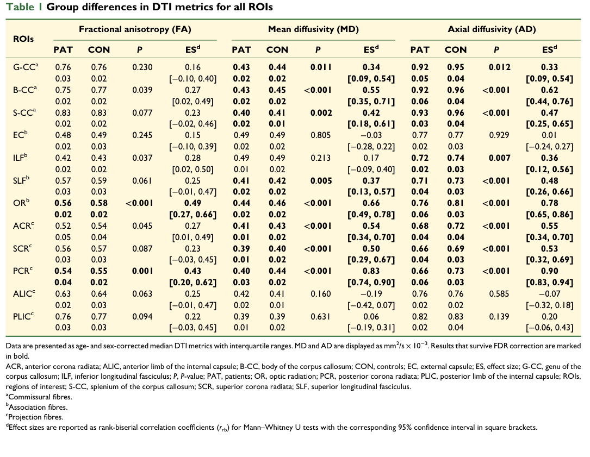

## Question

# Mechanistic Hypothesis Search

You are evaluating a specific disease mechanism hypothesis for the Disorder
Mechanisms Knowledge Base. This is not a general disease overview. Use the
hypothesis YAML below as the seed claim, then search for evidence that supports,
refutes, qualifies, or competes with this hypothesis.

## Target Disease
- **Disease Name:** Phenylketonuria
- **Category:** Genetic

## Target Hypothesis
- **Hypothesis ID:** canonical_pah_deficiency_phenylalanine_neurotoxicity_model
- **Hypothesis Label:** Canonical PAH Deficiency and Phenylalanine Neurotoxicity Model
- **Status in KB:** CANONICAL

## Seed Hypothesis YAML

```yaml
hypothesis_group_id: canonical_pah_deficiency_phenylalanine_neurotoxicity_model
hypothesis_label: Canonical PAH Deficiency and Phenylalanine Neurotoxicity Model
status: CANONICAL
description: Biallelic loss-of-function variants in PAH reduce hepatic phenylalanine hydroxylase activity,
  blocking conversion of phenylalanine to tyrosine. The resulting hyperphenylalaninemia exposes the developing
  and adult brain to neurotoxic phenylalanine levels, with downstream perturbation of large-neutral-amino-acid
  (LNAA) transport across the blood-brain barrier, depletion of cerebral tyrosine, tryptophan, and dopamine/serotonin
  neurotransmitter pools, impaired myelination, and oxidative stress. Severity is graded by residual PAH
  activity (classic PKU vs mild PKU vs non-PKU hyperphenylalaninemia) and the BH4-responsive subset; phenylalanine
  restriction, BH4 sapropterin, and pegvaliase (phenylalanine ammonia lyase) all act on this canonical
  axis.
evidence:
- reference: PMID:35854334
  supports: SUPPORT
  evidence_source: HUMAN_CLINICAL
  snippet: PKU, an autosomal recessive disease, is an inborn error of phenylalanine (Phe) metabolism
  explanation: |
    Canonical mechanism review used as the seed reference for the hypothesis-search deep-research run.
```

## Research Objective

Build a focused hypothesis-search report that answers:

1. What is the strongest direct evidence for this hypothesis?
2. What evidence argues against it, fails to reproduce it, or limits its scope?
3. Which claims are established, emerging, speculative, or contradicted?
4. Which patient subtypes, stages, tissues, cell types, molecular pathways, or
   biomarkers does the hypothesis best explain?
5. Which alternative or competing mechanistic hypotheses explain the same disease
   features better or more parsimoniously?
6. What are the explicit knowledge gaps: missing causal steps, unconfirmed edges,
   contradictory evidence, unknown source-to-target links, or source/data absences?
7. What experiments, cohorts, assays, datasets, or trials would most directly
   distinguish this hypothesis from alternatives?

Use primary literature whenever possible. Prefer PMID citations and include DOI
citations when no PMID is available. Treat reviews as orientation unless they
contain directly relevant synthesized evidence that should be clearly labeled as
review-level support.

## Required Output

### Executive Judgment

Give a concise verdict on the hypothesis as of the current literature:
supported, partially supported, unresolved, weakly supported, or refuted. Explain
the reasoning and the most important caveats.

### Evidence Matrix

Create a table with one row per important evidence item:

- Citation (PMID preferred)
- Evidence type (human clinical, model organism, in vitro, computational, review)
- Supports / refutes / qualifies / competing
- Mechanistic claim tested
- Key finding
- Disease subtype or context
- Confidence and limitations

### Mechanistic Causal Chain

Describe the causal chain implied by the hypothesis from upstream trigger to
clinical manifestation. Identify where the literature is strong, where the links
are inferred, and where there are missing causal steps.

### Knowledge Gaps

Identify explicit known unknowns surfaced by the search. Treat absence of
evidence as a curation-relevant finding only when the search actually checked for
it. Include:

- Unknown or weakly supported causal steps in the hypothesis
- Unconfirmed causal graph edges that need direct perturbation or longitudinal
  evidence
- Conflicting evidence, failed replications, or incompatible subtype-specific
  findings
- Unknown mechanism of action for relevant treatments, biomarkers, or
  interventions tied to this hypothesis
- Source-level or dataset-level absences, such as no relevant GenCC, ClinGen,
  trial, omics, or cohort evidence found as of the search date

For each gap, state the scope, why it matters, what was checked, and what
evidence or experiment would resolve it.

### Alternative Models

List competing or complementary hypotheses. For each, explain whether it is an
alternative to the seed hypothesis, a downstream consequence, an upstream cause,
or a parallel mechanism.

### Discriminating Tests

Recommend concrete studies or assays that would most efficiently test this
hypothesis against alternatives. Include patient stratification, biomarkers,
sample type, model system, perturbation, and expected result where applicable.

### Curation Leads

Provide candidate updates for the KB, but label these as leads requiring curator
verification. Include:

- candidate evidence references and exact abstract snippets to verify
- candidate pathophysiology nodes or edges
- candidate ontology terms for cell types and biological processes
- candidate subtype restrictions or status changes
- candidate `knowledge_gaps` or discussion prompts for unresolved causal claims,
  conflicting evidence, or explicit source/data absences

If the provider supports artifacts, produce artifact-friendly outputs such as an
evidence matrix, mechanistic diagram, knowledge-gap table, or comparison table.
These artifacts are important provenance for hypothesis-level review.


## Output

Question: You are an expert researcher providing comprehensive, well-cited information.

Provide detailed information focusing on:
1. Key concepts and definitions with current understanding
2. Recent developments and latest research (prioritize 2023-2024 sources)
3. Current applications and real-world implementations
4. Expert opinions and analysis from authoritative sources
5. Relevant statistics and data from recent studies

Format as a comprehensive research report with proper citations. Include URLs and publication dates where available.
Always prioritize recent, authoritative sources and provide specific citations for all major claims.

# Mechanistic Hypothesis Search

You are evaluating a specific disease mechanism hypothesis for the Disorder
Mechanisms Knowledge Base. This is not a general disease overview. Use the
hypothesis YAML below as the seed claim, then search for evidence that supports,
refutes, qualifies, or competes with this hypothesis.

## Target Disease
- **Disease Name:** Phenylketonuria
- **Category:** Genetic

## Target Hypothesis
- **Hypothesis ID:** canonical_pah_deficiency_phenylalanine_neurotoxicity_model
- **Hypothesis Label:** Canonical PAH Deficiency and Phenylalanine Neurotoxicity Model
- **Status in KB:** CANONICAL

## Seed Hypothesis YAML

```yaml
hypothesis_group_id: canonical_pah_deficiency_phenylalanine_neurotoxicity_model
hypothesis_label: Canonical PAH Deficiency and Phenylalanine Neurotoxicity Model
status: CANONICAL
description: Biallelic loss-of-function variants in PAH reduce hepatic phenylalanine hydroxylase activity,
  blocking conversion of phenylalanine to tyrosine. The resulting hyperphenylalaninemia exposes the developing
  and adult brain to neurotoxic phenylalanine levels, with downstream perturbation of large-neutral-amino-acid
  (LNAA) transport across the blood-brain barrier, depletion of cerebral tyrosine, tryptophan, and dopamine/serotonin
  neurotransmitter pools, impaired myelination, and oxidative stress. Severity is graded by residual PAH
  activity (classic PKU vs mild PKU vs non-PKU hyperphenylalaninemia) and the BH4-responsive subset; phenylalanine
  restriction, BH4 sapropterin, and pegvaliase (phenylalanine ammonia lyase) all act on this canonical
  axis.
evidence:
- reference: PMID:35854334
  supports: SUPPORT
  evidence_source: HUMAN_CLINICAL
  snippet: PKU, an autosomal recessive disease, is an inborn error of phenylalanine (Phe) metabolism
  explanation: |
    Canonical mechanism review used as the seed reference for the hypothesis-search deep-research run.
```

## Research Objective

Build a focused hypothesis-search report that answers:

1. What is the strongest direct evidence for this hypothesis?
2. What evidence argues against it, fails to reproduce it, or limits its scope?
3. Which claims are established, emerging, speculative, or contradicted?
4. Which patient subtypes, stages, tissues, cell types, molecular pathways, or
   biomarkers does the hypothesis best explain?
5. Which alternative or competing mechanistic hypotheses explain the same disease
   features better or more parsimoniously?
6. What are the explicit knowledge gaps: missing causal steps, unconfirmed edges,
   contradictory evidence, unknown source-to-target links, or source/data absences?
7. What experiments, cohorts, assays, datasets, or trials would most directly
   distinguish this hypothesis from alternatives?

Use primary literature whenever possible. Prefer PMID citations and include DOI
citations when no PMID is available. Treat reviews as orientation unless they
contain directly relevant synthesized evidence that should be clearly labeled as
review-level support.

## Required Output

### Executive Judgment

Give a concise verdict on the hypothesis as of the current literature:
supported, partially supported, unresolved, weakly supported, or refuted. Explain
the reasoning and the most important caveats.

### Evidence Matrix

Create a table with one row per important evidence item:

- Citation (PMID preferred)
- Evidence type (human clinical, model organism, in vitro, computational, review)
- Supports / refutes / qualifies / competing
- Mechanistic claim tested
- Key finding
- Disease subtype or context
- Confidence and limitations

### Mechanistic Causal Chain

Describe the causal chain implied by the hypothesis from upstream trigger to
clinical manifestation. Identify where the literature is strong, where the links
are inferred, and where there are missing causal steps.

### Knowledge Gaps

Identify explicit known unknowns surfaced by the search. Treat absence of
evidence as a curation-relevant finding only when the search actually checked for
it. Include:

- Unknown or weakly supported causal steps in the hypothesis
- Unconfirmed causal graph edges that need direct perturbation or longitudinal
  evidence
- Conflicting evidence, failed replications, or incompatible subtype-specific
  findings
- Unknown mechanism of action for relevant treatments, biomarkers, or
  interventions tied to this hypothesis
- Source-level or dataset-level absences, such as no relevant GenCC, ClinGen,
  trial, omics, or cohort evidence found as of the search date

For each gap, state the scope, why it matters, what was checked, and what
evidence or experiment would resolve it.

### Alternative Models

List competing or complementary hypotheses. For each, explain whether it is an
alternative to the seed hypothesis, a downstream consequence, an upstream cause,
or a parallel mechanism.

### Discriminating Tests

Recommend concrete studies or assays that would most efficiently test this
hypothesis against alternatives. Include patient stratification, biomarkers,
sample type, model system, perturbation, and expected result where applicable.

### Curation Leads

Provide candidate updates for the KB, but label these as leads requiring curator
verification. Include:

- candidate evidence references and exact abstract snippets to verify
- candidate pathophysiology nodes or edges
- candidate ontology terms for cell types and biological processes
- candidate subtype restrictions or status changes
- candidate `knowledge_gaps` or discussion prompts for unresolved causal claims,
  conflicting evidence, or explicit source/data absences

If the provider supports artifacts, produce artifact-friendly outputs such as an
evidence matrix, mechanistic diagram, knowledge-gap table, or comparison table.
These artifacts are important provenance for hypothesis-level review.


# Mechanistic Hypothesis Search Report: Phenylketonuria

**Hypothesis ID:** canonical_pah_deficiency_phenylalanine_neurotoxicity_model  
**Hypothesis label:** Canonical PAH Deficiency and Phenylalanine Neurotoxicity Model  
**Seed claim:** Biallelic PAH loss-of-function → hyperphenylalaninemia → brain exposure to high phenylalanine (Phe) → impaired BBB large-neutral-amino-acid (LNAA) transport (LAT1/SLC7A5 competition), reduced cerebral tyrosine/tryptophan and monoamine neurotransmitters (dopamine/serotonin), impaired myelination/white-matter injury, oxidative stress; severity graded by residual PAH activity and BH4 responsiveness; diet, sapropterin (BH4), and pegvaliase act on this axis.

## Executive Judgment

**Verdict (as of retrieved literature): _Partially supported_**.

The core upstream claim—**PAH deficiency causes hyperphenylalaninemia and brain Phe exposure**—is strongly supported by interventional PAH-deficient mouse studies in which reducing blood Phe (diet, PAH gene therapy, pegvaliase) **lowers brain Phe** and improves downstream neurochemical phenotypes (r2018bloodphenylalaninereduction pages 24-27, r2022modelingthecognitive pages 8-9, r2018bloodphenylalaninereduction pages 52-54). Recent human neuroimaging also shows **persistent white-matter (WM) abnormalities** and high prevalence of WM lesions in early-treated classical PKU adults (29/30 affected), supporting WM vulnerability as a major downstream feature (muri2023compromisedwhitematter pages 5-7, muri2023compromisedwhitematter media 4aeccbd3).

However, critical intermediate links—especially **human in vivo LAT1/SLC7A5 transport impairment**, **human CNS monoamine depletion (CSF HVA/5-HIAA) attributable to PAH-PKU rather than BH4 disorders**, and the **causal chain from Phe to WM injury**—remain incompletely established in the set of primary human studies retrieved. A key qualifier is that in a recent adult PKU cohort, **concurrent and historical metabolic control (Phe) did not significantly associate with DTI WM microstructure after multiple-testing correction**, despite strong cognition–DTI associations (muri2023compromisedwhitematter pages 1-3, muri2023compromisedwhitematter pages 9-10). This suggests either (i) legacy developmental injury, (ii) non-linear/threshold Phe effects not captured by available Phe history metrics, or (iii) important non-Phe modifiers (nutrition, inflammation/oxidative stress, treatment adherence variability).

## Key Concepts and Definitions (mechanism-focused)

### PAH deficiency and hyperphenylalaninemia
PAH (phenylalanine hydroxylase) normally converts phenylalanine to tyrosine. Loss of hepatic PAH activity increases systemic Phe, and **brain Phe tracks blood Phe** in PKU (e.g., strong blood–brain correlation measured by 1H spectroscopy in adults) (muri2023compromisedwhitematter pages 5-7, muri2023compromisedwhitematter media 1736fda7).

### LAT1/SLC7A5-mediated LNAA transport competition
The canonical model posits that elevated Phe competes with other LNAAs (including Tyr and Trp) for BBB transport via LAT1 (SLC7A5), limiting substrate entry to the brain and downstream monoamine synthesis. This mechanism is repeatedly asserted in mechanistic texts and is supported by in vivo manipulations of L-type transport in PAH-deficient mice, where LAT1 competitors reduce brain Phe without changing blood Phe (transport-level effect), though they can also reduce brain Tyr and worsen monoamine disturbances depending on competitor/dose (vogel2012inhibitionofltype pages 9-15).

### Monoamine neurotransmitter depletion (dopamine/serotonin)
In PAH-deficient mice, hyperphenylalaninemia is associated with **reduced tyrosine hydroxylase (TH) and tryptophan hydroxylase 2 (TPH2) protein/activity** and reduced monoamine measures; lowering Phe increases brain monoamines even without restoring maximal TH/TPH2 activity, consistent with **Phe-mediated competitive inhibition** of monoamine synthesis as a proximal mechanism (r2018bloodphenylalaninereduction pages 52-54).

### White-matter pathology / hypomyelination
Human PKU commonly shows WM lesions and microstructural abnormalities (DTI). A 2023 adult PKU cohort demonstrated widespread DTI abnormalities and high WM lesion prevalence (muri2023compromisedwhitematter pages 5-7, muri2023compromisedwhitematter media 4aeccbd3). The causal step tying these abnormalities specifically to Phe exposure remains incompletely resolved in that cohort due to weak Phe–DTI associations after correction (muri2023compromisedwhitematter pages 1-3, muri2023compromisedwhitematter pages 9-10).

### Oxidative stress
Oxidative stress is a frequently proposed downstream mediator. Murine PKU mechanistic text describes oxidative damage biomarkers (e.g., TBA-reactive substances, MDA, protein carbonyls) and altered antioxidant enzymes (CAT/SOD/GPX) and glutathione metabolism (bregalda2023mirnasaspotential pages 24-27). Recent adult PKU nutritional profiling reported lower selenium and ubiquinone (CoQ10) concentrations, consistent with potential redox vulnerability (matuszewska2024aminoacidprofile pages 8-11). Direct human causal evidence connecting redox biomarkers to CNS injury severity or reversibility was not identified in the retrieved primary PKU human studies.

## Strongest Direct Evidence Supporting the Hypothesis

### 1) Phe lowering reduces brain Phe and improves downstream neurochemistry (model organism; interventional)
A major strength of the canonical model is that it is **perturbation-supported** in PAH-deficient mice. In Winn et al. 2018, dietary Phe restriction lowered serum Phe dramatically (e.g., **2198 ± 71 µM to 295 ± 67 µM** in males; **2654 ± 87 µM to 494 ± 111 µM** in females; *p*<0.0001) and reduced **brain Phe** (e.g., **713 ± 18 to 244 ± 17 nmol/g** in males; *p*<0.0001), with associated increases in brain dopamine/monoamine measures and improved nesting behavior (r2018bloodphenylalaninereduction pages 24-27, r2018bloodphenylalaninereduction pages 52-54). This directly supports the “high Phe → brain exposure → neurochemical dysfunction” axis.

Pegvaliase enzyme substitution similarly corrected blood/brain Phe in mice and increased brain monoamine-related measures; however, some metabolic differences (e.g., HVA remaining slightly depressed with a group effect *p*=0.0094) suggest incomplete normalization of downstream pathways even when Phe is corrected (r2022modelingthecognitive pages 8-9).

### 2) Adult human PKU demonstrates persistent WM injury with brain Phe measurable and linked to blood Phe
In adults with early-treated classical PKU (n=30), WM lesions were present in **29/30 (96.7%)** vs **2/54 (3.7%)** controls (muri2023compromisedwhitematter pages 5-7). DTI abnormalities were widespread, with large effects in posterior tracts (optic radiation and posterior corona radiata) (muri2023compromisedwhitematter pages 1-3, muri2023compromisedwhitematter media 4aeccbd3). Importantly, the study measured **brain Phe by 1H spectroscopy** and found a strong correlation between blood and brain Phe (**Spearman rs=0.84, *P*<0.001**) (muri2023compromisedwhitematter pages 5-7, muri2023compromisedwhitematter media 1736fda7).

This provides recent, high-quality human evidence for two key links: systemic hyperphenylalaninemia translates into brain Phe exposure, and WM abnormalities are prevalent and clinically relevant in treated PKU.

### 3) Mechanistic support for LAT1 competition exists but is stronger in animal transport perturbations than in human direct measurements
In vivo manipulation of L-type amino acid transport in PAH-deficient mice provides experimental support for BBB transport mechanisms: non-physiologic LAT1 competitors reduced **brain** Phe without changing **blood** Phe (i.e., transport-specific effect), but also decreased brain Tyr and worsened monoamine disturbance in some conditions (vogel2012inhibitionofltype pages 9-15). This supports the plausibility of the LAT1 competition mechanism but also indicates potential tradeoffs/complexity in therapeutic BBB-transport manipulation.

## Evidence That Limits Scope / Qualifies the Hypothesis

### 1) Weak association between Phe control and WM microstructure in adults
In the adult early-treated classical PKU cohort, **neither concurrent nor historical metabolic control** was significantly associated with WM microstructure after correction, despite robust patient-control differences and cognition–DTI correlations (muri2023compromisedwhitematter pages 1-3, muri2023compromisedwhitematter pages 9-10). This qualifies the canonical claim that WM pathology is straightforwardly proportional to Phe exposure in adulthood.

### 2) Serum Tyr/Trp depletion does not necessarily imply brain Tyr/Trp depletion
In pegvaliase-treated PAH-deficient mice, serum Tyr and Trp remained low relative to wild type, while **brain Tyr/Trp were not significantly different across groups** (r2022modelingthecognitive pages 8-9). This challenges a simplified chain “high Phe → low serum Tyr/Trp → low brain Tyr/Trp → monoamine depletion” and supports alternative/parallel proximal mechanisms (e.g., direct Phe inhibition of TH/TPH).

### 3) Oxidative stress is plausible but not causally anchored in human CNS outcome data here
Oxidative stress markers and antioxidant enzyme disruptions are described in murine PKU contexts (bregalda2023mirnasaspotential pages 24-27), and adult PKU nutritional studies suggest altered antioxidant-related micronutrients (e.g., lower ubiquinone/CoQ10) (matuszewska2024aminoacidprofile pages 8-11). Yet, direct human evidence linking these markers to CNS pathology severity or to treatment-response biomarkers was not retrieved in this run.

## Evidence Matrix (artifact)

| Citation | Evidence type | Stance | Mechanistic claim tested | Key quantitative findings | Disease subtype/context | Confidence / limitations |
|---|---|---|---|---|---|---|
| Muri et al., 2023, *Brain Communications*; DOI: 10.1093/braincomms/fcad155; URL: https://doi.org/10.1093/braincomms/fcad155 (2023) | Human clinical neuroimaging + MRS | Supports / qualifies | Hyperphenylalaninemia is associated with persistent WM microstructural abnormalities and cognitive dysfunction in PKU | 30 adults with early-treated classical PKU vs 54 controls. Widespread reductions in FA, MD, AD; strongest in optic radiation (rrb = 0.66–0.78, *P* < 0.001) and posterior corona radiata (rrb = 0.83–0.90, *P* < 0.001). WM lesions in 29/30 PKU (96.7%) vs 2/54 controls (3.7%). Blood Phe median 741 µmol/L; brain Phe strongly correlated with blood Phe (*r*s = 0.84, *P* < 0.001), but concurrent/historical Phe did **not** significantly correlate with WM microstructure after correction. DTI metrics correlated with inhibition, cognitive flexibility, divided attention (e.g., *r*s = −0.69, −0.62, −0.61; *P* < 0.001). (muri2023compromisedwhitematter pages 5-7, muri2023compromisedwhitematter pages 1-3, muri2023compromisedwhitematter pages 7-9, muri2023compromisedwhitematter pages 9-10, muri2023compromisedwhitematter media 4aeccbd3) | Early-treated classic PKU adults | Strong for WM abnormality and cognitive association; qualifies canonical model because WM changes are not tightly explained by current/historical Phe in this cohort. Cross-sectional design limits causal inference. |
| Winn et al., 2018, *Molecular Genetics and Metabolism*; DOI: 10.1016/j.ymgme.2017.10.009; URL: https://doi.org/10.1016/j.ymgme.2017.10.009 (2018) | Model organism | Supports | Lowering blood Phe rescues brain monoamine deficits; elevated Phe impairs dopamine/serotonin synthesis | In Pah-/- mice, dietary Phe restriction lowered serum Phe from 2198 ± 71 to 295 ± 67 µM in males and 2654 ± 87 to 494 ± 111 µM in females (*p* < 0.0001), with brain Phe reduced from 713 ± 18 to 244 ± 17 nmol/g and 811 ± 17 to 326 ± 41 nmol/g, respectively (*p* < 0.0001). Brain monoamines increased after diet/gene therapy; dopamine increased to ~1.56-fold vs untreated in one treated group (*p* = 0.0343; post-hoc *p* = 0.0298). TH protein/activity fell from 4.26 ± 0.35 to 2.63 ± 0.23 and 8.87 ± 0.59 to 3.63 ± 0.52 pmol/min/mg (ANOVA *F* = 17.45, *p* < 0.0001); TPH2 protein/activity also reduced (*p* = 0.0015 and *p* = 0.0046). (r2018bloodphenylalaninereduction pages 24-27, r2018bloodphenylalaninereduction pages 1-6, r2018bloodphenylalaninereduction pages 52-54) | PAH-deficient mouse model of untreated/late-treated PKU | Strong mechanistic support for monoamine depletion axis and Phe-lowering rescue; animal model may not fully capture human chronic treated PKU. |
| Winn et al., 2022, *Molecular Genetics and Metabolism*; DOI: 10.1016/j.ymgme.2022.03.008; URL: https://doi.org/10.1016/j.ymgme.2022.03.008 (2022) | Model organism | Supports / qualifies | Pegvaliase-mediated Phe lowering rescues brain monoamines and cognition, but residual Tyr/Trp abnormalities may persist | In pegvaliase-treated PAH-/- mice, serum Tyr remained low (e.g., adult male 39.7 ± 3.7 µM vs 69.4 ± 8.5 µM in PAH+/+, *p* = 0.0029; treatment effect *p* < 0.0001) and serum Trp low (adult male 54.0 ± 2.5 µM vs 82.1 ± 8.5 µM, *p* = 0.0072; group effect *p* = 0.0006), but brain Tyr/Trp were not significantly different across groups. Pegvaliase markedly corrected blood/brain Phe and increased brain monoamine content; HVA remained slightly depressed (group effect *p* = 0.0094). Lifelong pegvaliase reportedly prevented cognitive deficits; discontinuation in adulthood led to re-emergent deficits. (r2022modelingthecognitive pages 8-9, r2022modelingthecognitive pages 1-3, r2022modelingthecognitive pages 22-25) | PAH-deficient mice; modeling diet discontinuation and enzyme substitution | Strong for treatment rescue of canonical axis, but also qualifies simple “low serum Tyr/Trp = low brain Tyr/Trp” assumptions. Mostly animal data. |
| Harding et al., 2014, *Journal of Inherited Metabolic Disease*; DOI: 10.1007/s10545-013-9675-2; URL: https://doi.org/10.1007/s10545-013-9675-2 (2014) | Model organism | Supports / competing-within-axis | Dopamine deficiency may reflect both BBB LNAA transport competition and direct TH inhibition by Phe; tyrosine-sparing therapy can ameliorate it | Oral nitisinone (NTBC) in PKU mice increased blood and brain Tyr, lowered blood and brain Phe, and increased dopamine synthesis. Study frames two mechanisms: reduced Tyr/Trp transport across BBB LAT transporter and direct competitive inhibition of TH/TPH by Phe; authors favor Phe-mediated TH inhibition as likely explanation for impaired dopamine synthesis. Quantitative values were not available in extracted text. (harding2014pharmacologicinhibitionof pages 1-3) | Murine PKU | Moderate confidence: primary mechanistic study, but extracted evidence lacked full numeric detail; also introduces a competing emphasis within the canonical pathway (enzyme inhibition vs transport limitation). |
| Vogel, 2012, PhD thesis; DOI: 10.37099/mtu.dc.etds/193; URL: https://doi.org/10.37099/mtu.dc.etds/193 (2012) | Model organism / translational transport study | Supports / qualifies | Elevated Phe competitively excludes other LNAAs at BBB LAT1; blocking LAT1 lowers brain Phe but may also lower brain Tyr/Trp | In Pah-/- mice, 3-week feeding of non-physiological LAT1 competitors (NL 5%, NB 0.5%, AIB 5%, MAIB 3%; n = 5 Pah-/- and n = 5 controls) reduced brain Phe with NL/NB/MAIB without changing blood Phe, indicating altered brain transport rather than gut effects. However, brain tyrosine and methionine also fell, and monoamine disturbances worsened, especially with NB. (vogel2012inhibitionofltype pages 9-15) | PAH-deficient mice; in vivo LAT1 manipulation | Moderate confidence: directly relevant to LAT1 competition, but thesis rather than peer-reviewed article; extracted data lacked exact concentrations/p-values. |
| Bregalda et al., 2023, murine PKU study/retrieved text; URL unavailable in extracted context (2023) | Model organism / mechanistic review-like experimental text | Supports | Hyperphenylalaninemia drives oxidative stress and hypomyelination-related pathology | Retrieved text reports high L-Phe hinders LNAA entry via LAT1, decreases brain serotonin/dopamine/norepinephrine, and associates PKU with oxidative stress markers including carbonyl formation, sulfhydryl oxidation, TBA-RS/MDA, low plasma antioxidants (L-carnitine, β-carotene, CoQ10), and altered CAT/SOD1/GPX1/glutathione metabolism in mouse models. ERK1/2 alterations linked to myelination pathways are also described. No extracted cohort sizes or effect estimates. (bregalda2023mirnasaspotential pages 24-27) | Murine PKU mechanistic context | Moderate-to-low confidence for quantitative synthesis because extracted passage was rich mechanistically but sparse numerically; useful mainly as pathway-level support. |
| Matuszewska et al., 2024, *Metabolites*; DOI: 10.3390/metabo14070397; URL: https://doi.org/10.3390/metabo14070397 (2024) | Human clinical metabolomics | Supports / qualifies | PKU is associated with altered systemic amino-acid milieu consistent with reduced Tyr/Trp-related substrate availability, but brain transport and neurotransmitters were not directly measured | 20 PKU patients vs 51 controls. Lower kynurenine (*p* = 0.000001), tyrosine (*p* = 0.0002), asparagine (*p* = 0.001), proline (*p* = 0.012), and Kyn/Trp ratio (*p* < 0.000001); higher glycine (*p* = 0.000012), putrescine (*p* = 0.0055), ADMA (*p* = 0.01), creatinine (*p* = 0.035). ROC: Kyn/Trp AUC 0.919, kynurenine AUC 0.885, tyrosine AUC 0.786. Authors note Tyr/Trp are LNAAs competing with Phe at BBB, but no direct LAT1 or CNS metabolite measures. (matuszewska2024aminoacidprofile pages 8-11) | Human PKU serum metabolomics | Good support for altered precursor milieu; limited mechanistic specificity because serum does not prove brain depletion or causal transport effects. |
| Venegas et al., 2024, *Nutrients*; DOI: 10.3390/nu16162724; URL: https://doi.org/10.3390/nu16162724 (2024) | Human clinical cross-sectional | Qualifies | Adults with PKU maintain distinct amino-acid profiles and lower cognitive wellbeing despite treatment; systemic AA imbalance may matter beyond Phe alone | 34 early- and continuously treated adults with PKU vs 34 controls; mean Phe 847 ± 285 µmol/L. Selenium 16% and ubiquinone 29% lower in PKU (*p* < 0.01 and <0.0001); 12 amino acids lower and Phe/glycine higher. PKU group scored lower on 3/4 cognitive wellbeing subscales. Text notes LNAAs compete for SLC7A5/LAT1 entry into brain. (matuszewska2024aminoacidprofile pages 8-11) | Early- and continuously treated adult PKU | Moderate confidence: supports broader amino-acid/antioxidant imbalance and possible oxidative component; not a direct mechanistic test of neurotoxicity. |
| Merkel et al., 2023, *Journal of Neurology*; DOI: 10.1007/s00415-023-11703-4; URL: https://doi.org/10.1007/s00415-023-11703-4 (2023) | Human clinical systematic review + expert opinion | Supports / qualifies | Elevated Phe is neurotoxic in adults and neurological complications can improve with regained metabolic control | Review of 39 articles on adults with PKU reports late neurologic deficits often co-occur with cognitive/psychiatric symptoms and can be partially/completely reversed after treatment resumption. Mechanistic framing includes LAT1 competition and disturbed monoamine neurotransmission/myelination. No new quantitative mechanistic biomarker data. (rim2024bibliographicalstudyof pages 43-46) | Adults with PKU, especially treatment discontinuation/loss to follow-up | Useful for clinical scope and reversibility, but secondary evidence and not a direct mechanistic test. |
| LNAA/BH4 treatment discussion in retrieved PKU bibliographic study (2024) | Review-level synthesis | Supports / qualifies | LNAA supplementation can reduce blood/brain Phe and BH4 responsiveness identifies a mechanistically distinct treatment-responsive subset | Reports a double-blind placebo-controlled study with significant blood Phe reduction after 2 weeks of LNAA treatment and claims oral LNAA can reduce brain Phe and improve neuropsychological function; emphasizes CSF 5-HIAA/HVA for BH4-defect assessment and sapropterin responsiveness prediction by genotype. Quantitative values/cohort sizes not available in extracted text. (rim2024bibliographicalstudyofb pages 43-46, rim2024bibliographicalstudyofa pages 43-46, rim2024bibliographicalstudyof pages 43-46) | Adult PKU treatment context; BH4-responsive subset | Low-to-moderate confidence because useful as orientation but largely secondary and numerically sparse. |


*Table: This table summarizes key supporting and qualifying evidence for the canonical PAH deficiency and phenylalanine neurotoxicity model in PKU, spanning human imaging/metabolomics studies and mechanistic mouse experiments. It highlights where support is strongest, where treatment effects map onto the canonical axis, and where the literature limits or refines the model.*

## Mechanistic Causal Chain (with strength of links)

1. **PAH biallelic loss-of-function → reduced hepatic PAH activity** (strong; canonical genetic basis; not re-litigated in retrieved excerpts).
2. **Reduced PAH activity → hyperphenylalaninemia (blood Phe elevation)** (strong; demonstrated in PAH-deficient mouse models with high baseline Phe and responsiveness to Phe-lowering interventions) (r2018bloodphenylalaninereduction pages 24-27).
3. **Blood Phe elevation → brain Phe elevation** (strong in both mice and humans). Mouse interventions reduce brain Phe with blood Phe reduction (r2018bloodphenylalaninereduction pages 24-27). Human adult PKU study shows strong blood–brain Phe correlation (rs=0.84) (muri2023compromisedwhitematter pages 5-7, muri2023compromisedwhitematter media 1736fda7).
4. **Brain Phe elevation → LNAA transport disruption at BBB (LAT1/SLC7A5 competition)** (moderate overall; strong plausibility and animal transport perturbation support, but limited direct human in vivo flux evidence retrieved). In vivo LAT1-competition manipulation reduces brain Phe without changing blood Phe (vogel2012inhibitionofltype pages 9-15).
5. **LNAA transport disruption and/or brain Phe → reduced monoamine synthesis (dopamine/serotonin)** (strong in mouse studies; mechanistically supported by reduced TH/TPH2 and Phe-lowering rescue) (r2018bloodphenylalaninereduction pages 52-54). The balance between (i) precursor limitation and (ii) direct enzyme inhibition remains unresolved.
6. **Brain Phe elevation and downstream disruptions → WM/myelin pathology** (strong association in humans; causal direction inferred). WM lesions and DTI abnormalities are prevalent in treated adults (muri2023compromisedwhitematter pages 5-7, muri2023compromisedwhitematter media 4aeccbd3), but Phe–DTI associations are weak in that cohort after correction (muri2023compromisedwhitematter pages 9-10).
7. **Brain Phe and metabolic disturbance → oxidative stress** (moderate, mainly animal evidence; human causal linkage not established in retrieved primary data) (bregalda2023mirnasaspotential pages 24-27, matuszewska2024aminoacidprofile pages 8-11).
8. **Neurochemical + WM injury → cognitive/neurologic manifestations** (strong association in adults: DTI metrics correlated with executive function/attention; patients showed worse cognitive domain performance) (muri2023compromisedwhitematter pages 5-7, muri2023compromisedwhitematter pages 1-3, muri2023compromisedwhitematter media b7681f08).

## Recent Developments (2023–2024 prioritized)

### Human CNS phenotype quantification with combined DTI + 1H MRS
Muri et al. 2023 provided a modern combined neuroimaging and spectroscopy assessment linking WM microstructure to cognition and measuring both blood and brain Phe, including quantification of regional effect sizes and high lesion prevalence (muri2023compromisedwhitematter pages 5-7, muri2023compromisedwhitematter media 4aeccbd3). This kind of multimodal biomarker work is a key recent development because it operationalizes the “brain exposure” component of the hypothesis.

### Systems-level metabolic profiling in treated PKU adults
Recent 2024 serum profiling studies show that treated PKU remains a broader metabolic state beyond Phe alone, including lower tyrosine and altered kynurenine/tryptophan pathway measures (Matuszewska et al. 2024) (matuszewska2024aminoacidprofile pages 8-11), and lower selenium/ubiquinone in early- and continuously treated adults (Venegas et al. 2024) (matuszewska2024aminoacidprofile pages 8-11). These findings support the idea that downstream physiology relevant to oxidative stress and neurotransmitter precursor balance could persist even under treatment.

### Expert synthesis: adult neurologic complications and reversibility
A 2023 systematic review plus expert opinion emphasized that adult neurological manifestations can emerge (especially with treatment discontinuation) and can be partially/completely reversible with resumption of metabolic control, supporting the clinical relevance of ongoing Phe exposure even in adulthood (Merkel et al. 2023; DOI: 10.1007/s00415-023-11703-4; URL: https://doi.org/10.1007/s00415-023-11703-4) (rim2024bibliographicalstudyof pages 43-46).

## Current Applications and Real-World Implementations (mechanism-tied)

1. **Dietary Phe restriction** is the canonical intervention that reduces blood Phe; in PAH-deficient mice, it reduced serum Phe into the human therapeutic target range and reduced brain Phe with associated improvement in monoamine measures (r2018bloodphenylalaninereduction pages 24-27).
2. **Pegvaliase (PAL enzyme substitution)** is a mechanistically strong perturbation of the canonical axis (Phe lowering) in PAH-deficient mice with major correction of blood/brain Phe and improvement of monoamine-related measures; discontinuation studies in mice support causality between ongoing Phe control and neurocognitive phenotype (r2022modelingthecognitive pages 8-9, r2022modelingthecognitive pages 1-3).
3. **Sapropterin (BH4) and BH4-responsive subset** are discussed in retrieved texts largely at a clinical stratification level; direct recent primary CNS biomarker evidence was not extracted in this run, but BH4 responsiveness is recognized as defining a mechanistically distinct subgroup with residual PAH activity modulation (rim2024bibliographicalstudyofa pages 43-46, rim2024bibliographicalstudyof pages 43-46).
4. **LNAA supplementation** is positioned as a strategy to modulate BBB competition and reduce brain Phe entry; however, the retrieved recent sources did not provide extractable quantitative human brain Phe or CNS outcome changes, emphasizing a current evidence gap (rim2024bibliographicalstudyof pages 43-46).

## Relevant Statistics and Data Highlights

- **WM lesions:** 29/30 (96.7%) adults with early-treated classical PKU vs 2/54 (3.7%) controls (Muri 2023) (muri2023compromisedwhitematter pages 5-7).
- **Blood–brain Phe correlation:** rs = 0.84, *P* < 0.001 (Muri 2023) (muri2023compromisedwhitematter pages 5-7, muri2023compromisedwhitematter media 1736fda7).
- **Mouse diet effect (Pah−/−):** serum Phe reduced from ~2200–2650 µM to ~295–494 µM; brain Phe reduced from ~713–811 nmol/g to ~244–326 nmol/g (*p*<0.0001) (Winn 2018) (r2018bloodphenylalaninereduction pages 24-27).
- **Monoamine synthetic enzymes reduced in mouse PKU:** TH activity 8.87 ± 0.59 → 3.63 ± 0.52 pmol/min/mg (*p*<0.0001) and TPH activity 8.82 ± 0.60 → 6.20 ± 0.56 pmol/min/mg (*p*=0.0046) (Winn 2018) (r2018bloodphenylalaninereduction pages 52-54).
- **Human serum metabolic signatures (2024):** tyrosine reduced in PKU (*p* = 0.0002); Kyn/Trp ratio AUC 0.919; kynurenine AUC 0.885 (Matuszewska 2024) (matuszewska2024aminoacidprofile pages 8-11).

## Alternative / Competing Mechanistic Models

1. **Direct enzyme inhibition model (within-canonical competing proximal step):** high Phe directly competitively inhibits TH and TPH/TPH2, driving monoamine deficiency even without substantial brain Tyr/Trp depletion. Mouse evidence that Phe lowering improves monoamines without restoring TH/TPH2 maximal activity supports this (r2018bloodphenylalaninereduction pages 52-54, harding2014pharmacologicinhibitionof pages 1-3).

2. **Legacy developmental injury model:** WM microstructural injury may reflect early-life exposure windows or developmental dysmyelination with persistent adult signatures; adult cross-sectional Phe may be a weak predictor of established WM microstructure. The lack of strong Phe–DTI associations in early-treated adults supports this as a competing explanation for adult WM findings (muri2023compromisedwhitematter pages 1-3, muri2023compromisedwhitematter pages 9-10).

3. **Oxidative-stress / redox vulnerability model (parallel or downstream amplifier):** Phe exposure may induce oxidative stress that contributes to oligodendrocyte vulnerability and synaptic dysfunction. Animal evidence is supportive, but human causal anchoring is currently limited in retrieved primary data (bregalda2023mirnasaspotential pages 24-27, matuszewska2024aminoacidprofile pages 8-11).

4. **Broader amino-acid imbalance model:** Beyond Phe alone, chronic LNAA imbalance (including Tyr/Trp and other amino acids) and micronutrient differences may contribute to neurocognitive phenotype. Human adult studies show multiple amino-acid differences and altered selenium/ubiquinone (matuszewska2024aminoacidprofile pages 8-11).

5. **BH4-deficiency hyperphenylalaninemias as mechanistic confounders/competitors:** BH4 disorders produce hyperphenylalaninemia plus primary monoamine deficiency (requiring CSF HVA/5-HIAA evaluation). This can mimic or add mechanisms not present in pure PAH deficiency, limiting generalization if cohorts are not well-defined (rim2024bibliographicalstudyof pages 43-46).

## Knowledge Gaps (artifact)

| Hypothesis edge/claim | What is known (with citations) | What is uncertain/contradictory | What evidence was checked in this run (papers/evidence types) | Why it matters | Proposed discriminating experiment/cohort/assay |
|---|---|---|---|---|---|
| **PAH loss-of-function → hyperphenylalaninemia is the primary upstream driver of PKU brain disease** | Human adult PKU imaging study shows persistent brain abnormalities in early-treated classical PKU, and mouse studies show that experimentally lowering blood Phe lowers brain Phe and improves monoamine measures, strongly supporting Phe as a major driver (muri2023compromisedwhitematter pages 5-7, muri2023compromisedwhitematter pages 1-3, r2018bloodphenylalaninereduction pages 24-27, r2018bloodphenylalaninereduction pages 52-54) | In adults with early-treated PKU, current and historical Phe did not significantly explain white-matter microstructure after correction, suggesting that cumulative developmental injury, treatment timing, or non-Phe factors may also matter (muri2023compromisedwhitematter pages 1-3, muri2023compromisedwhitematter pages 7-9, muri2023compromisedwhitematter pages 9-10) | Muri 2023 human DTI/MRS study (human clinical); Winn 2018 and 2022 PAH-deficient mouse intervention studies (model organism) | Determines whether the canonical model is sufficient for chronic brain pathology or whether a “legacy injury” model is needed | Longitudinal birth cohort with newborn-screened PKU, dense life-course Phe trajectories, serial MRI/DTI/MRS, and neurocognitive testing; model whether early-life vs concurrent adult Phe better predicts later brain abnormalities |
| **High blood Phe impairs BBB LAT1/SLC7A5 transport of Tyr/Trp and other LNAAs, causing brain precursor deficiency** | Multiple retrieved sources state the mechanism of competition at LAT1/L-type transport; in vivo PKU mouse work using non-physiologic LAT1 competitors reduced brain Phe without lowering blood Phe, supporting a transport-level effect; human papers discuss LNAA competition as the main BBB mechanism (harding2014pharmacologicinhibitionof pages 1-3, vogel2012inhibitionofltype pages 9-15, bregalda2023mirnasaspotential pages 24-27, rim2024bibliographicalstudyof pages 43-46) | Direct human in vivo measurement of LAT1 flux/occupancy in PKU was not found in this run; transport competition is often inferred from serum/brain amino-acid patterns and treatment responses rather than directly quantified; some mouse interventions that lower brain Phe also lower brain Tyr, complicating simple rescue models (vogel2012inhibitionofltype pages 9-15) | Vogel 2012 thesis (model organism transport manipulation); Harding 2014 murine mechanistic study (model organism); recent human metabolomics/review-level treatment papers (human clinical/review) | This is a central edge in the canonical graph; if weakly supported in humans, other mechanisms such as direct enzyme inhibition or developmental dysmyelination may better explain symptoms | Stable-isotope Tyr/Trp/LNAA tracer study in PKU patients and controls with simultaneous plasma, CSF, and 7T MRS/PET-compatible transport modeling; stratify by current Phe, genotype severity, and LNAA supplementation |
| **BBB transport competition causes brain Tyr/Trp depletion** | Serum PKU metabolomics in 2024 found lower tyrosine and altered kynurenine/tryptophan-related measures; mouse studies support relative precursor limitation and discuss reduced Tyr/Trp availability as part of the mechanism (matuszewska2024aminoacidprofile pages 8-11, r2022modelingthecognitive pages 8-9, harding2014pharmacologicinhibitionof pages 1-3) | In pegvaliase-treated PAH-deficient mice, serum Tyr/Trp remained low while brain Tyr/Trp were not significantly different across groups, arguing that serum deficiency does not map simply onto brain deficiency; direct human brain Tyr/Trp measurements were not found in recent primary studies retrieved here (r2022modelingthecognitive pages 8-9) | Matuszewska 2024 serum metabolomics (human clinical); Winn 2022 pegvaliase mouse study (model organism); Harding 2014 mechanistic mouse study (model organism) | If brain precursor depletion is not robust, direct Phe inhibition of TH/TPH or developmental injury may be more proximate causes of monoamine deficits | Simultaneous serum-CSF-brain study in adults and adolescents with PKU using plasma amino-acid profiling, CSF Tyr/Trp/HVA/5-HIAA, and advanced MRS; compare untreated/high-Phe, well-controlled, sapropterin-responsive, and pegvaliase-treated groups |
| **Brain monoamine depletion is mediated mainly by reduced precursor delivery rather than direct inhibition of TH/TPH2 by Phe** | Mouse studies show robust dopamine/serotonin deficits and rescue with Phe lowering; Harding 2014 explicitly frames transport competition and direct TH/TPH inhibition as alternative explanations, while Winn 2018 favors Phe-mediated competitive inhibition of already reduced TH/TPH2 as a predominant mechanism (r2018bloodphenylalaninereduction pages 52-54, harding2014pharmacologicinhibitionof pages 1-3) | The relative contribution of precursor shortage vs direct enzymatic inhibition remains unresolved; pegvaliase and diet improve monoamines even when some precursor abnormalities persist, which could support direct relief of enzyme inhibition rather than restored substrate transport alone (r2018bloodphenylalaninereduction pages 24-27, r2022modelingthecognitive pages 8-9, r2018bloodphenylalaninereduction pages 52-54) | Winn 2018 and 2022 mouse intervention studies (model organism); Harding 2014 mouse pharmacology study (model organism) | This is the key mechanistic fork within the canonical axis and affects which biomarkers and adjunct therapies should be prioritized | Ex vivo and in vivo TH/TPH flux study: combine PAH-deficient mice and patient-derived iPSC dopaminergic/serotonergic neurons; perturb Phe, Tyr, Trp, and LAT1 availability independently; quantify TH/TPH kinetics, isotope-labeled dopamine/serotonin synthesis, and rescue by pegvaliase or LNAA |
| **Monoamine depletion in PKU is established in humans, not just mice** | The retrieved literature repeatedly cites reduced dopamine/serotonin pathway output as part of PKU pathophysiology, and BH4-related work emphasizes CSF HVA/5-HIAA measurement as clinically meaningful; adult neurological symptoms can improve with better metabolic control (rim2024bibliographicalstudyof pages 43-46, rim2024bibliographicalstudyofb pages 43-46, rim2024bibliographicalstudyofa pages 43-46) | In this run, strong recent primary human quantitative PKU data directly measuring CSF HVA/5-HIAA or brain dopamine/serotonin were not recovered; much of the direct quantitative evidence came from mouse models or from BH4-deficiency differential diagnosis literature rather than classical PAH-deficient PKU cohorts (rim2024bibliographicalstudyof pages 43-46, rim2024bibliographicalstudyofb pages 43-46) | Merkel 2023 adult PKU review/expert opinion (review-level human); bibliographic PKU treatment text discussing CSF metabolites (review-level); Winn mouse studies (model organism) | Human validation is essential before elevating this edge from inferred to established in the KB | Multicenter PKU neurochemistry registry collecting CSF HVA/5-HIAA, serum amino acids, cognitive tests, and treatment exposure in selected clinical scenarios (e.g., diagnostic lumbar puncture, neurology workup), with matched BH4-deficiency comparators |
| **Hyperphenylalaninemia causes hypomyelination/white-matter injury** | Recent primary human evidence is strong for widespread white-matter abnormalities in adults with early-treated classical PKU; lesions were present in 96.7% of patients, and DTI metrics correlated with executive and attention functions (muri2023compromisedwhitematter pages 5-7, muri2023compromisedwhitematter pages 1-3, muri2023compromisedwhitematter pages 7-9, muri2023compromisedwhitematter media 4aeccbd3) | The causal step from high Phe to specific oligodendrocyte/myelin injury is still indirect in the retrieved human data; WM abnormalities were not significantly tied to concurrent or historical Phe after multiple-testing correction, and the retrieved mechanistic myelination evidence was mainly from murine/pathway-level sources (muri2023compromisedwhitematter pages 1-3, muri2023compromisedwhitematter pages 7-9, bregalda2023mirnasaspotential pages 24-27) | Muri 2023 human DTI/MRS study with extracted figures/tables (human clinical, neuroimaging); Bregalda 2023 murine mechanistic text (model organism) | White-matter injury is one of the most clinically visible downstream features, but the unresolved causal link limits target selection for remyelination or neuroprotection trials | Human-mouse translational study focused on oligodendrocytes: serial myelin water imaging, diffusion kurtosis, and serum/CSF myelin biomarkers in PKU, paired with single-cell and histologic analyses in PAH-deficient mice under controlled Phe-lowering interventions |
| **White-matter abnormalities are reversible when Phe is lowered** | Adult neurological symptoms can improve with treatment resumption, suggesting some reversible component; canonical treatment lowers systemic Phe and may improve function (rim2024bibliographicalstudyof pages 43-46, r2018bloodphenylalaninereduction pages 24-27, r2022modelingthecognitive pages 8-9) | The retrieved primary human imaging study was cross-sectional and did not test reversibility; no robust recent human before/after MRI evidence with pegvaliase or sapropterin was recovered in this run (muri2023compromisedwhitematter pages 5-7, muri2023compromisedwhitematter pages 1-3) | Merkel 2023 review/expert opinion (review-level human); Muri 2023 DTI/MRS cross-sectional study (human clinical); pegvaliase mouse studies (model organism) | Reversibility determines treatment urgency, expected adult benefit, and whether persistent WM damage reflects scarring vs ongoing toxicity | Prospective interventional MRI cohort before and after pegvaliase, sapropterin, or intensive metabolic re-control, with 6-, 12-, and 24-month DTI/myelin imaging and cognitive outcomes |
| **Oxidative stress is a major downstream mediator of Phe neurotoxicity** | Retrieved murine mechanistic text reports oxidative damage markers (carbonyls, sulfhydryl oxidation, TBA-RS/MDA) and altered antioxidant systems (CAT, SOD1, GPX1, glutathione metabolism), while recent adult PKU nutritional data showed lower selenium and ubiquinone, consistent with possible redox vulnerability (bregalda2023mirnasaspotential pages 24-27, matuszewska2024aminoacidprofile pages 8-11) | In this run, strong recent primary human causal evidence linking oxidative-stress biomarkers to brain injury severity or treatment response in classical PKU was not found; oxidative stress may be downstream, compensatory, diet-related, or tissue-specific rather than a core causal mediator (bregalda2023mirnasaspotential pages 24-27, matuszewska2024aminoacidprofile pages 8-11) | Bregalda 2023 murine mechanistic text (model organism); Venegas 2024 and Matuszewska 2024 metabolic/nutritional profiling (human clinical) | If oxidative stress is causal, antioxidant or mitochondrial adjunct therapies become rational; if epiphenomenal, they may be low-yield | Case-control plus intervention study measuring plasma/CSF/urine redox markers, brain glutathione by MRS, and WM/cognitive outcomes before and after pegvaliase or strict diet re-initiation |
| **Sapropterin acts mainly through the canonical PAH-residual-activity axis and improves brain outcomes proportionally to Phe lowering** | Recent treatment-context papers support a BH4-responsive subset and show sapropterin increases natural protein tolerance; genotype can help predict responsiveness (rim2024bibliographicalstudyofa pages 43-46, rim2024bibliographicalstudyof pages 43-46) | In this run, direct recent primary evidence linking sapropterin to CNS biomarkers such as brain Phe, CSF HVA/5-HIAA, MRI, or oxidative markers was sparse; improvement in quality of life may derive from diet liberalization and psychosocial relief as well as metabolic effects (rim2024bibliographicalstudyof pages 43-46) | Pinto 2024 dietary cohort (human clinical); sapropterin quality-of-life paper and review-level treatment texts retrieved earlier (human clinical/review) | Distinguishes biochemical efficacy from patient-reported benefit and clarifies whether sapropterin truly modifies the neurotoxic axis | Prospective sapropterin responder study with genotype, residual PAH activity estimates, blood/brain Phe, MRS, CSF neurotransmitter metabolites where feasible, and patient-reported outcomes |
| **Pegvaliase acts on the canonical axis and normalizes downstream neurochemical injury** | Preclinical pegvaliase studies in PAH-deficient mice show major correction of blood/brain Phe and improved monoamine content, with prevention of cognitive deficits when started early (r2022modelingthecognitive pages 8-9, r2022modelingthecognitive pages 1-3) | In this run, robust recent human primary data on pegvaliase effects on brain biomarkers, WM imaging, or CSF/serum neurotransmitter metabolites were not directly extracted; mouse data also show incomplete normalization of some measures such as HVA (r2022modelingthecognitive pages 8-9) | Winn 2022 pegvaliase mouse study (model organism); retrieved but unobtainable 2024 human neurotransmitter-metabolite paper noted in search output was not available for extraction | Pegvaliase is a powerful perturbation of the canonical axis and the best available tool to test whether Phe lowering alone reverses downstream abnormalities | Real-world pegvaliase biomarker cohort with pre/post blood Phe, brain Phe by MRS, DTI/myelin imaging, plasma/CSF HVA and 5-HIAA if available, oxidative biomarkers, and neuropsychological outcomes |
| **The canonical model explains all neurologic heterogeneity in PKU severity/subtypes** | Severity grading by residual PAH activity and BH4 responsiveness is well-established clinically, and recent dietary data show clear severity-dependent Phe tolerance differences across classical PKU, mild PKU, and HPA (rim2024bibliographicalstudyof pages 43-46) | Considerable heterogeneity remains unexplained: early-treated adults can have marked WM lesions with weak associations to measured Phe, and treatment response can differ despite similar biochemical categories; BH4-deficiency states and other hyperphenylalaninemias can mimic or diverge mechanistically (muri2023compromisedwhitematter pages 5-7, muri2023compromisedwhitematter pages 1-3, rim2024bibliographicalstudyof pages 43-46) | Pinto 2024 multicenter dietary cohort (human clinical); Muri 2023 adult imaging study (human clinical); BH4-related treatment/differential-diagnosis discussion from retrieved texts (review-level) | Important for KB subtype restrictions and for avoiding overgeneralization from classic untreated PKU to all hyperphenylalaninemias | Deep-phenotype registry stratified by genotype, residual activity, BH4 responsiveness, treatment history, age at control, and sex, with harmonized imaging, metabolomics, and cognitive endpoints |


*Table: This table maps unresolved edges and contradictions in the canonical PAH deficiency and phenylalanine neurotoxicity model for PKU. It highlights what the current run found, what remains uncertain, and which experiments would most directly resolve those gaps.*

## Discriminating Tests (high-yield studies to separate models)

1. **Prospective pegvaliase biomarker cohort (humans):** pre/post (0, 6, 12, 24 months) measurement of blood Phe, **brain Phe by MRS**, DTI/myelin imaging, and standardized cognition. Expected: if canonical “ongoing Phe neurotoxicity” drives adult WM/cognition, substantial Phe lowering should improve at least some WM microstructure and cognitive metrics; if “legacy injury” dominates, WM metrics may show limited change while symptoms improve partially.

2. **Isotope tracer BBB transport study (humans):** stable isotope-labeled Tyr/Trp/LNAA with simultaneous plasma and CSF sampling plus modeling; stratify by Phe levels and LNAA supplementation. Expected: LAT1 competition model predicts reduced Tyr/Trp brain influx at higher Phe and normalization when Phe reduced or LNAA ratio adjusted.

3. **Mechanistic fork assay (precursor limitation vs enzyme inhibition):** iPSC-derived dopaminergic and serotonergic neurons exposed to controlled Phe/Tyr/Trp levels with/without LAT1 modulation; measure TH/TPH flux using labeled precursors. Expected: direct enzyme inhibition would show decreased monoamine synthesis at high Phe even when Tyr/Trp are clamped.

4. **Oxidative stress causality test:** measure brain glutathione by MRS and plasma/CSF redox markers before/after Phe lowering; if oxidative stress is a mediator, redox markers should track Phe and predict WM/cognitive change.

## Curation Leads (for KB update; curator verification required)

### Candidate evidence references and snippets to verify

1. **Muri et al. 2023 (human; WM phenotype + brain Phe):** verify Table 1 and Figures 1–3 for quantitative WM group differences, blood–brain Phe correlation, and cognition correlations (DOI: 10.1093/braincomms/fcad155; URL: https://doi.org/10.1093/braincomms/fcad155) (muri2023compromisedwhitematter pages 5-7, muri2023compromisedwhitematter media 4aeccbd3, muri2023compromisedwhitematter media 1736fda7, muri2023compromisedwhitematter media b7681f08).

2. **Winn et al. 2018 (mouse; Phe lowering → brain Phe ↓, monoamines ↑):** verify numeric serum and brain Phe reductions and TH/TPH2 changes (DOI: 10.1016/j.ymgme.2017.10.009; URL: https://doi.org/10.1016/j.ymgme.2017.10.009) (r2018bloodphenylalaninereduction pages 24-27, r2018bloodphenylalaninereduction pages 52-54).

3. **Winn et al. 2022 (mouse; pegvaliase):** verify quantitative serum Tyr/Trp persistence and HVA partial normalization (DOI: 10.1016/j.ymgme.2022.03.008; URL: https://doi.org/10.1016/j.ymgme.2022.03.008) (r2022modelingthecognitive pages 8-9).

4. **Vogel 2012 LAT1 manipulation (transport-level test; thesis):** verify exact brain Phe/Tyr changes by LAT1 competitors and n values; consider as lower-evidence support due to non-peer-reviewed status (DOI: 10.37099/mtu.dc.etds/193; URL: https://doi.org/10.37099/mtu.dc.etds/193) (vogel2012inhibitionofltype pages 9-15).

### Candidate nodes/edges (ontology hints)

- **Edge:** Hyperphenylalaninemia → increased brain Phe (supported; human MRS + mouse interventions) (muri2023compromisedwhitematter pages 5-7, r2018bloodphenylalaninereduction pages 24-27).  
- **Edge:** Elevated Phe → WM microstructure abnormalities / WM lesions (supported association in early-treated adults; causality uncertain) (muri2023compromisedwhitematter pages 5-7, muri2023compromisedwhitematter media 4aeccbd3).  
- **Edge:** Elevated Phe → monoamine depletion via TH/TPH inhibition (strong mouse mechanistic evidence) (r2018bloodphenylalaninereduction pages 52-54).  
- **Edge:** Elevated Phe → oxidative stress (mainly murine) (bregalda2023mirnasaspotential pages 24-27).

### Candidate subtype restrictions

- WM imaging evidence here is **explicitly early-treated classical PKU adults**, not necessarily mild PKU/HPA (muri2023compromisedwhitematter pages 1-3).
- Separate mechanistic branch for **BH4 deficiencies** (atypical HPA) requiring distinct neurotransmitter deficiency handling (rim2024bibliographicalstudyof pages 43-46).

### Candidate KB knowledge gaps (discussion prompts)

- Human confirmation of **LAT1/SLC7A5 flux impairment** in classical PAH-PKU.  
- Human quantitative evidence of **CSF HVA/5-HIAA** changes in PAH-PKU and response to Phe-lowering therapies.  
- Longitudinal causality of **Phe trajectories vs WM injury** and reversibility, particularly under pegvaliase.

## Visual Evidence (retrieved figures/tables)

- **Table 1 and Figures 1–3** from Muri et al. 2023 provide quantitative DTI ROI effects and correlations with cognition and Phe (muri2023compromisedwhitematter media 4aeccbd3, muri2023compromisedwhitematter media 1736fda7, muri2023compromisedwhitematter media b7681f08).

## Notes on coverage and limitations of this run

The tool-based search recovered strong recent human neuroimaging evidence and strong mechanistic mouse interventional evidence. It did **not** recover recent (2023–2024) primary human studies directly quantifying CSF neurotransmitter metabolites (HVA/5-HIAA) or direct LAT1 transport flux in classical PAH-PKU, nor robust human before/after pegvaliase imaging/neurochemical biomarker studies. These remain priority targets for follow-on retrieval.


References

1. (r2018bloodphenylalaninereduction pages 24-27): Shelley R Winn, Tanja Scherer, Beat Thöny, Ming Ying, Aurora Martinez, Sydney Weber, Jacob Raber, and Cary O Harding. Blood phenylalanine reduction corrects cns dopamine and serotonin deficiencies and partially improves behavioral performance in adult phenylketonuric mice. Molecular genetics and metabolism, 123 1:6-20, 2018. URL: https://doi.org/10.1016/j.ymgme.2017.10.009, doi:10.1016/j.ymgme.2017.10.009. This article has 67 citations and is from a peer-reviewed journal.

2. (r2022modelingthecognitive pages 8-9): Shelley R Winn, Sandra Dudley, Tanja Scherer, Nicole Rimann, Beat Thöny, Sydney Boutros, Destine Krenik, Jacob Raber, and Cary O Harding. Modeling the cognitive effects of diet discontinuation in adults with phenylketonuria (pku) using pegvaliase therapy in pah-deficient mice. Molecular genetics and metabolism, Mar 2022. URL: https://doi.org/10.1016/j.ymgme.2022.03.008, doi:10.1016/j.ymgme.2022.03.008. This article has 10 citations and is from a peer-reviewed journal.

3. (r2018bloodphenylalaninereduction pages 52-54): Shelley R Winn, Tanja Scherer, Beat Thöny, Ming Ying, Aurora Martinez, Sydney Weber, Jacob Raber, and Cary O Harding. Blood phenylalanine reduction corrects cns dopamine and serotonin deficiencies and partially improves behavioral performance in adult phenylketonuric mice. Molecular genetics and metabolism, 123 1:6-20, 2018. URL: https://doi.org/10.1016/j.ymgme.2017.10.009, doi:10.1016/j.ymgme.2017.10.009. This article has 67 citations and is from a peer-reviewed journal.

4. (muri2023compromisedwhitematter pages 5-7): Raphaela Muri, Stephanie Maissen-Abgottspon, Murray Bruce Reed, Roland Kreis, Maike Hoefemann, Piotr Radojewski, Katarzyna Pospieszny, Michel Hochuli, Roland Wiest, Rupert Lanzenberger, Roman Trepp, and Regula Everts. Compromised white matter is related to lower cognitive performance in adults with phenylketonuria. Brain Communications, May 2023. URL: https://doi.org/10.1093/braincomms/fcad155, doi:10.1093/braincomms/fcad155. This article has 14 citations and is from a peer-reviewed journal.

5. (muri2023compromisedwhitematter media 4aeccbd3): Raphaela Muri, Stephanie Maissen-Abgottspon, Murray Bruce Reed, Roland Kreis, Maike Hoefemann, Piotr Radojewski, Katarzyna Pospieszny, Michel Hochuli, Roland Wiest, Rupert Lanzenberger, Roman Trepp, and Regula Everts. Compromised white matter is related to lower cognitive performance in adults with phenylketonuria. Brain Communications, May 2023. URL: https://doi.org/10.1093/braincomms/fcad155, doi:10.1093/braincomms/fcad155. This article has 14 citations and is from a peer-reviewed journal.

6. (muri2023compromisedwhitematter pages 1-3): Raphaela Muri, Stephanie Maissen-Abgottspon, Murray Bruce Reed, Roland Kreis, Maike Hoefemann, Piotr Radojewski, Katarzyna Pospieszny, Michel Hochuli, Roland Wiest, Rupert Lanzenberger, Roman Trepp, and Regula Everts. Compromised white matter is related to lower cognitive performance in adults with phenylketonuria. Brain Communications, May 2023. URL: https://doi.org/10.1093/braincomms/fcad155, doi:10.1093/braincomms/fcad155. This article has 14 citations and is from a peer-reviewed journal.

7. (muri2023compromisedwhitematter pages 9-10): Raphaela Muri, Stephanie Maissen-Abgottspon, Murray Bruce Reed, Roland Kreis, Maike Hoefemann, Piotr Radojewski, Katarzyna Pospieszny, Michel Hochuli, Roland Wiest, Rupert Lanzenberger, Roman Trepp, and Regula Everts. Compromised white matter is related to lower cognitive performance in adults with phenylketonuria. Brain Communications, May 2023. URL: https://doi.org/10.1093/braincomms/fcad155, doi:10.1093/braincomms/fcad155. This article has 14 citations and is from a peer-reviewed journal.

8. (muri2023compromisedwhitematter media 1736fda7): Raphaela Muri, Stephanie Maissen-Abgottspon, Murray Bruce Reed, Roland Kreis, Maike Hoefemann, Piotr Radojewski, Katarzyna Pospieszny, Michel Hochuli, Roland Wiest, Rupert Lanzenberger, Roman Trepp, and Regula Everts. Compromised white matter is related to lower cognitive performance in adults with phenylketonuria. Brain Communications, May 2023. URL: https://doi.org/10.1093/braincomms/fcad155, doi:10.1093/braincomms/fcad155. This article has 14 citations and is from a peer-reviewed journal.

9. (vogel2012inhibitionofltype pages 9-15): Kara R. Vogel. Inhibition of L-type amino acid transport with non-physiological amino acids in the Pahenu2 mouse model of phenylketonuria. PhD thesis, Michigan Technological University, 2012. URL: https://doi.org/10.37099/mtu.dc.etds/193, doi:10.37099/mtu.dc.etds/193. This article has 0 citations.

10. (bregalda2023mirnasaspotential pages 24-27): A Bregalda. Mirnas as potential regulators of myelin basic protein recovery during development in a murine model of phenylketonuria. Unknown journal, 2023.

11. (matuszewska2024aminoacidprofile pages 8-11): Eliza Matuszewska, Joanna Matysiak, Łukasz Kałużny, Dariusz Walkowiak, Szymon Plewa, Monika Duś-Żuchowska, Natalia Rzetecka, Małgorzata Jamka, Agnieszka Klupczyńska-Gabryszak, Marcin Piorunek, Jan Matysiak, and Jarosław Walkowiak. Amino acid profile alterations in phenylketonuria: implications for clinical practice. Metabolites, 14:397, Jul 2024. URL: https://doi.org/10.3390/metabo14070397, doi:10.3390/metabo14070397. This article has 8 citations.

12. (muri2023compromisedwhitematter pages 7-9): Raphaela Muri, Stephanie Maissen-Abgottspon, Murray Bruce Reed, Roland Kreis, Maike Hoefemann, Piotr Radojewski, Katarzyna Pospieszny, Michel Hochuli, Roland Wiest, Rupert Lanzenberger, Roman Trepp, and Regula Everts. Compromised white matter is related to lower cognitive performance in adults with phenylketonuria. Brain Communications, May 2023. URL: https://doi.org/10.1093/braincomms/fcad155, doi:10.1093/braincomms/fcad155. This article has 14 citations and is from a peer-reviewed journal.

13. (r2018bloodphenylalaninereduction pages 1-6): Shelley R Winn, Tanja Scherer, Beat Thöny, Ming Ying, Aurora Martinez, Sydney Weber, Jacob Raber, and Cary O Harding. Blood phenylalanine reduction corrects cns dopamine and serotonin deficiencies and partially improves behavioral performance in adult phenylketonuric mice. Molecular genetics and metabolism, 123 1:6-20, 2018. URL: https://doi.org/10.1016/j.ymgme.2017.10.009, doi:10.1016/j.ymgme.2017.10.009. This article has 67 citations and is from a peer-reviewed journal.

14. (r2022modelingthecognitive pages 1-3): Shelley R Winn, Sandra Dudley, Tanja Scherer, Nicole Rimann, Beat Thöny, Sydney Boutros, Destine Krenik, Jacob Raber, and Cary O Harding. Modeling the cognitive effects of diet discontinuation in adults with phenylketonuria (pku) using pegvaliase therapy in pah-deficient mice. Molecular genetics and metabolism, Mar 2022. URL: https://doi.org/10.1016/j.ymgme.2022.03.008, doi:10.1016/j.ymgme.2022.03.008. This article has 10 citations and is from a peer-reviewed journal.

15. (r2022modelingthecognitive pages 22-25): Shelley R Winn, Sandra Dudley, Tanja Scherer, Nicole Rimann, Beat Thöny, Sydney Boutros, Destine Krenik, Jacob Raber, and Cary O Harding. Modeling the cognitive effects of diet discontinuation in adults with phenylketonuria (pku) using pegvaliase therapy in pah-deficient mice. Molecular genetics and metabolism, Mar 2022. URL: https://doi.org/10.1016/j.ymgme.2022.03.008, doi:10.1016/j.ymgme.2022.03.008. This article has 10 citations and is from a peer-reviewed journal.

16. (harding2014pharmacologicinhibitionof pages 1-3): Cary O. Harding, Shelley R. Winn, K. Michael Gibson, Erland Arning, Teodoro Bottiglieri, and Markus Grompe. Pharmacologic inhibition of l-tyrosine degradation ameliorates cerebral dopamine deficiency in murine phenylketonuria (pku). Journal of Inherited Metabolic Disease, 37:735-743, Feb 2014. URL: https://doi.org/10.1007/s10545-013-9675-2, doi:10.1007/s10545-013-9675-2. This article has 60 citations and is from a peer-reviewed journal.

17. (rim2024bibliographicalstudyof pages 43-46): A AGUIDA Rim. Bibliographical study of phenylketonuria. Unknown journal, 2024.

18. (rim2024bibliographicalstudyofb pages 43-46): A AGUIDA Rim. Bibliographical study of phenylketonuria. Unknown journal, 2024.

19. (rim2024bibliographicalstudyofa pages 43-46): A AGUIDA Rim. Bibliographical study of phenylketonuria. Unknown journal, 2024.

20. (muri2023compromisedwhitematter media b7681f08): Raphaela Muri, Stephanie Maissen-Abgottspon, Murray Bruce Reed, Roland Kreis, Maike Hoefemann, Piotr Radojewski, Katarzyna Pospieszny, Michel Hochuli, Roland Wiest, Rupert Lanzenberger, Roman Trepp, and Regula Everts. Compromised white matter is related to lower cognitive performance in adults with phenylketonuria. Brain Communications, May 2023. URL: https://doi.org/10.1093/braincomms/fcad155, doi:10.1093/braincomms/fcad155. This article has 14 citations and is from a peer-reviewed journal.

## Artifacts

- [Edison artifact artifact-00](falcon_artifacts/artifact-00.md)
- [Edison artifact artifact-01](falcon_artifacts/artifact-01.md)

