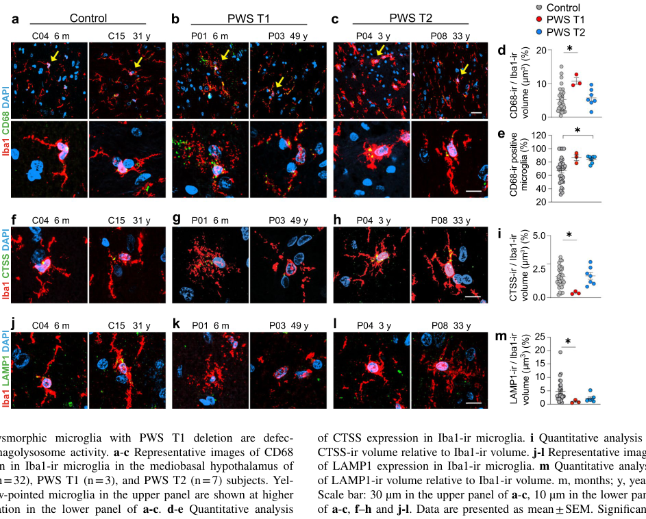

## Question

# Mechanistic Hypothesis Search

You are evaluating a specific disease mechanism hypothesis for the Disorder
Mechanisms Knowledge Base. This is not a general disease overview. Use the
hypothesis YAML below as the seed claim, then search for evidence that supports,
refutes, qualifies, or competes with this hypothesis.

## Target Disease
- **Disease Name:** Prader-Willi Syndrome
- **Category:** Mendelian

## Target Hypothesis
- **Hypothesis ID:** canonical_pws_imprinted_15q_loss_hypothalamic_model
- **Hypothesis Label:** Canonical 15q11.2-q13 Paternal Imprinted Locus Loss / Hypothalamic Dysfunction Model
- **Status in KB:** CANONICAL

## Seed Hypothesis YAML

```yaml
hypothesis_group_id: canonical_pws_imprinted_15q_loss_hypothalamic_model
hypothesis_label: Canonical 15q11.2-q13 Paternal Imprinted Locus Loss / Hypothalamic Dysfunction Model
status: CANONICAL
description: 'Prader-Willi syndrome is caused by loss of paternally-expressed imprinted genes in the 15q11.2-q13
  region — most commonly by paternal deletion (~70%), maternal uniparental disomy (~25%), or imprinting
  center defect (~3%). Loss of paternal expression of SNRPN, MAGEL2, MKRN3, NDN, and the SNORD116 snoRNA
  cluster disrupts hypothalamic neurodevelopment and function, producing the characteristic biphasic phenotype:
  neonatal hypotonia and failure to thrive followed in early childhood by hyperphagia, morbid obesity,
  hypogonadotropic hypogonadism, short stature, intellectual disability, and behavioral/psychiatric features.
  SNORD116 paternal deletion alone is sufficient to produce the core PWS phenotype, identifying it as
  the critical region. Growth hormone therapy improves body composition and stature; oxytocin and MC4R-targeted
  setmelanotide therapies are in trials; MAGEL2-knockout mice recapitulate hypothalamic dysfunction and
  validate the imprinted-locus / hypothalamic-axis model.'
evidence:
- reference: PMID:40708003
  reference_title: Prader-Willi syndrome.
  supports: SUPPORT
  evidence_source: OTHER
  snippet: Prader-Willi syndrome (PWS) is a rare, genetic neurobehavioral and metabolic disorder marked
    by hyperphagia, behavioral challenges, and significant comorbidities, requiring a multidisciplinary
    approach for effective management.
  explanation: |
    Existing canonical mechanism citation in the dismech knowledge base, used as the seed for the hypothesis-search deep-research run.
```

## Research Objective

Build a focused hypothesis-search report that answers:

1. What is the strongest direct evidence for this hypothesis?
2. What evidence argues against it, fails to reproduce it, or limits its scope?
3. Which claims are established, emerging, speculative, or contradicted?
4. Which patient subtypes, stages, tissues, cell types, molecular pathways, or
   biomarkers does the hypothesis best explain?
5. Which alternative or competing mechanistic hypotheses explain the same disease
   features better or more parsimoniously?
6. What are the explicit knowledge gaps: missing causal steps, unconfirmed edges,
   contradictory evidence, unknown source-to-target links, or source/data absences?
7. What experiments, cohorts, assays, datasets, or trials would most directly
   distinguish this hypothesis from alternatives?

Use primary literature whenever possible. Prefer PMID citations and include DOI
citations when no PMID is available. Treat reviews as orientation unless they
contain directly relevant synthesized evidence that should be clearly labeled as
review-level support.

## Required Output

### Executive Judgment

Give a concise verdict on the hypothesis as of the current literature:
supported, partially supported, unresolved, weakly supported, or refuted. Explain
the reasoning and the most important caveats.

### Evidence Matrix

Create a table with one row per important evidence item:

- Citation (PMID preferred)
- Evidence type (human clinical, model organism, in vitro, computational, review)
- Supports / refutes / qualifies / competing
- Mechanistic claim tested
- Key finding
- Disease subtype or context
- Confidence and limitations

### Mechanistic Causal Chain

Describe the causal chain implied by the hypothesis from upstream trigger to
clinical manifestation. Identify where the literature is strong, where the links
are inferred, and where there are missing causal steps.

### Knowledge Gaps

Identify explicit known unknowns surfaced by the search. Treat absence of
evidence as a curation-relevant finding only when the search actually checked for
it. Include:

- Unknown or weakly supported causal steps in the hypothesis
- Unconfirmed causal graph edges that need direct perturbation or longitudinal
  evidence
- Conflicting evidence, failed replications, or incompatible subtype-specific
  findings
- Unknown mechanism of action for relevant treatments, biomarkers, or
  interventions tied to this hypothesis
- Source-level or dataset-level absences, such as no relevant GenCC, ClinGen,
  trial, omics, or cohort evidence found as of the search date

For each gap, state the scope, why it matters, what was checked, and what
evidence or experiment would resolve it.

### Alternative Models

List competing or complementary hypotheses. For each, explain whether it is an
alternative to the seed hypothesis, a downstream consequence, an upstream cause,
or a parallel mechanism.

### Discriminating Tests

Recommend concrete studies or assays that would most efficiently test this
hypothesis against alternatives. Include patient stratification, biomarkers,
sample type, model system, perturbation, and expected result where applicable.

### Curation Leads

Provide candidate updates for the KB, but label these as leads requiring curator
verification. Include:

- candidate evidence references and exact abstract snippets to verify
- candidate pathophysiology nodes or edges
- candidate ontology terms for cell types and biological processes
- candidate subtype restrictions or status changes
- candidate `knowledge_gaps` or discussion prompts for unresolved causal claims,
  conflicting evidence, or explicit source/data absences

If the provider supports artifacts, produce artifact-friendly outputs such as an
evidence matrix, mechanistic diagram, knowledge-gap table, or comparison table.
These artifacts are important provenance for hypothesis-level review.


## Output

Question: You are an expert researcher providing comprehensive, well-cited information.

Provide detailed information focusing on:
1. Key concepts and definitions with current understanding
2. Recent developments and latest research (prioritize 2023-2024 sources)
3. Current applications and real-world implementations
4. Expert opinions and analysis from authoritative sources
5. Relevant statistics and data from recent studies

Format as a comprehensive research report with proper citations. Include URLs and publication dates where available.
Always prioritize recent, authoritative sources and provide specific citations for all major claims.

# Mechanistic Hypothesis Search

You are evaluating a specific disease mechanism hypothesis for the Disorder
Mechanisms Knowledge Base. This is not a general disease overview. Use the
hypothesis YAML below as the seed claim, then search for evidence that supports,
refutes, qualifies, or competes with this hypothesis.

## Target Disease
- **Disease Name:** Prader-Willi Syndrome
- **Category:** Mendelian

## Target Hypothesis
- **Hypothesis ID:** canonical_pws_imprinted_15q_loss_hypothalamic_model
- **Hypothesis Label:** Canonical 15q11.2-q13 Paternal Imprinted Locus Loss / Hypothalamic Dysfunction Model
- **Status in KB:** CANONICAL

## Seed Hypothesis YAML

```yaml
hypothesis_group_id: canonical_pws_imprinted_15q_loss_hypothalamic_model
hypothesis_label: Canonical 15q11.2-q13 Paternal Imprinted Locus Loss / Hypothalamic Dysfunction Model
status: CANONICAL
description: 'Prader-Willi syndrome is caused by loss of paternally-expressed imprinted genes in the 15q11.2-q13
  region — most commonly by paternal deletion (~70%), maternal uniparental disomy (~25%), or imprinting
  center defect (~3%). Loss of paternal expression of SNRPN, MAGEL2, MKRN3, NDN, and the SNORD116 snoRNA
  cluster disrupts hypothalamic neurodevelopment and function, producing the characteristic biphasic phenotype:
  neonatal hypotonia and failure to thrive followed in early childhood by hyperphagia, morbid obesity,
  hypogonadotropic hypogonadism, short stature, intellectual disability, and behavioral/psychiatric features.
  SNORD116 paternal deletion alone is sufficient to produce the core PWS phenotype, identifying it as
  the critical region. Growth hormone therapy improves body composition and stature; oxytocin and MC4R-targeted
  setmelanotide therapies are in trials; MAGEL2-knockout mice recapitulate hypothalamic dysfunction and
  validate the imprinted-locus / hypothalamic-axis model.'
evidence:
- reference: PMID:40708003
  reference_title: Prader-Willi syndrome.
  supports: SUPPORT
  evidence_source: OTHER
  snippet: Prader-Willi syndrome (PWS) is a rare, genetic neurobehavioral and metabolic disorder marked
    by hyperphagia, behavioral challenges, and significant comorbidities, requiring a multidisciplinary
    approach for effective management.
  explanation: |
    Existing canonical mechanism citation in the dismech knowledge base, used as the seed for the hypothesis-search deep-research run.
```

## Research Objective

Build a focused hypothesis-search report that answers:

1. What is the strongest direct evidence for this hypothesis?
2. What evidence argues against it, fails to reproduce it, or limits its scope?
3. Which claims are established, emerging, speculative, or contradicted?
4. Which patient subtypes, stages, tissues, cell types, molecular pathways, or
   biomarkers does the hypothesis best explain?
5. Which alternative or competing mechanistic hypotheses explain the same disease
   features better or more parsimoniously?
6. What are the explicit knowledge gaps: missing causal steps, unconfirmed edges,
   contradictory evidence, unknown source-to-target links, or source/data absences?
7. What experiments, cohorts, assays, datasets, or trials would most directly
   distinguish this hypothesis from alternatives?

Use primary literature whenever possible. Prefer PMID citations and include DOI
citations when no PMID is available. Treat reviews as orientation unless they
contain directly relevant synthesized evidence that should be clearly labeled as
review-level support.

## Required Output

### Executive Judgment

Give a concise verdict on the hypothesis as of the current literature:
supported, partially supported, unresolved, weakly supported, or refuted. Explain
the reasoning and the most important caveats.

### Evidence Matrix

Create a table with one row per important evidence item:

- Citation (PMID preferred)
- Evidence type (human clinical, model organism, in vitro, computational, review)
- Supports / refutes / qualifies / competing
- Mechanistic claim tested
- Key finding
- Disease subtype or context
- Confidence and limitations

### Mechanistic Causal Chain

Describe the causal chain implied by the hypothesis from upstream trigger to
clinical manifestation. Identify where the literature is strong, where the links
are inferred, and where there are missing causal steps.

### Knowledge Gaps

Identify explicit known unknowns surfaced by the search. Treat absence of
evidence as a curation-relevant finding only when the search actually checked for
it. Include:

- Unknown or weakly supported causal steps in the hypothesis
- Unconfirmed causal graph edges that need direct perturbation or longitudinal
  evidence
- Conflicting evidence, failed replications, or incompatible subtype-specific
  findings
- Unknown mechanism of action for relevant treatments, biomarkers, or
  interventions tied to this hypothesis
- Source-level or dataset-level absences, such as no relevant GenCC, ClinGen,
  trial, omics, or cohort evidence found as of the search date

For each gap, state the scope, why it matters, what was checked, and what
evidence or experiment would resolve it.

### Alternative Models

List competing or complementary hypotheses. For each, explain whether it is an
alternative to the seed hypothesis, a downstream consequence, an upstream cause,
or a parallel mechanism.

### Discriminating Tests

Recommend concrete studies or assays that would most efficiently test this
hypothesis against alternatives. Include patient stratification, biomarkers,
sample type, model system, perturbation, and expected result where applicable.

### Curation Leads

Provide candidate updates for the KB, but label these as leads requiring curator
verification. Include:

- candidate evidence references and exact abstract snippets to verify
- candidate pathophysiology nodes or edges
- candidate ontology terms for cell types and biological processes
- candidate subtype restrictions or status changes
- candidate `knowledge_gaps` or discussion prompts for unresolved causal claims,
  conflicting evidence, or explicit source/data absences

If the provider supports artifacts, produce artifact-friendly outputs such as an
evidence matrix, mechanistic diagram, knowledge-gap table, or comparison table.
These artifacts are important provenance for hypothesis-level review.


# Hypothesis-Search Report: Canonical 15q11.2–q13 Paternal Imprinted Locus Loss → Hypothalamic Dysfunction Model in Prader–Willi Syndrome (PWS)

**Hypothesis ID:** canonical_pws_imprinted_15q_loss_hypothalamic_model  
**Search focus date:** 2026-05-25  
**Scope:** Mechanism testing/qualification of the imprinted-locus loss → hypothalamic-axis dysfunction model (not a general disease overview).

## Executive judgment
**Verdict: Partially supported.**  
The core claim that PWS arises from loss of paternal expression of the 15q11.2–q13 imprinted locus and that hypothalamic circuit/endocrine dysfunction explains major phenotypes is strongly supported by convergent human genetics and mechanistic observations in human cellular systems, animal models, and human hypothalamic pathology (including subtype-dependent hypothalamic differences). However, two important caveats limit a “single critical gene (SNORD116) → hypothalamic dysfunction → full classic phenotype” framing: (i) **classic PWS phenotypes have been reported with atypical deletions sparing SNORD116 expression**, suggesting non-SNORD116 mechanisms (e.g., SNURF-SNRPN/host transcript regulation) can be sufficient in at least some cases (crenshaw2023anatypical15q11.2 pages 4-6, crenshaw2023anatypical15q11.2 pages 1-2); and (ii) **SNORD116-only mouse and tissue-specific deletion models show inconsistent hyperphagia/obesity penetrance**, implying additional locus elements, developmental timing, environment/diet, or modifier genes contribute (salminen2023geneticandevolutionary pages 82-87).  
Recent postmortem data also show that **deletion subtype (Type I vs Type II) introduces additional hypothalamic glial/white-matter/synaptic pathology** (linked in part to CYFIP1 haploinsufficiency), which is not captured by a minimal SNORD116-centric model and may explain severity differences (correadasilva2024microglialphagolysosomedysfunction pages 1-2, correadasilva2024microglialphagolysosomedysfunction pages 6-9, correadasilva2024microglialphagolysosomedysfunction pages 9-10, correadasilva2024microglialphagolysosomedysfunction media 23ee6ae2, correadasilva2024microglialphagolysosomedysfunction media 59d1e794).

## 1) Strongest direct evidence for the hypothesis
### 1.1 Human postmortem hypothalamus: subtype-dependent microglia–white matter–synapse disruption (mechanistic qualifier and severity modifier)
A 2024 *Acta Neuropathologica* study analyzed postmortem hypothalamic tissue comparing **PWS Type I vs Type II deletions** and controls using transcriptomics and cell-type protein profiling. **Type I** (larger deletion) showed **microglial phagolysosome dysfunction** (elevated CD68/Iba1 volume ratio with reduced lysosomal markers CTSS and LAMP1), increased AQP4/glymphatic signatures, compromised fornix myelin integrity, and reduced synaptophysin (synaptic integrity), consistent with impaired neural communication (correadasilva2024microglialphagolysosomedysfunction pages 1-2, correadasilva2024microglialphagolysosomedysfunction pages 6-9, correadasilva2024microglialphagolysosomedysfunction pages 9-10). The authors linked key aspects to **CYFIP1 haploinsufficiency** using global and myeloid-specific Cyfip1 haploinsufficient rodent models (correadasilva2024microglialphagolysosomedysfunction pages 1-2, correadasilva2024microglialphagolysosomedysfunction pages 6-9). The paper’s key figure panels and summary schematic provide visual mechanistic support (correadasilva2024microglialphagolysosomedysfunction media 23ee6ae2, correadasilva2024microglialphagolysosomedysfunction media 59d1e794).

**Interpretation for the KB hypothesis:** This is strong direct evidence that the “hypothalamic dysfunction” node is real in human tissue and that **genotype substructure within deletion PWS adds mechanistic layers** (glial phagolysosome dysfunction, white-matter and synaptic changes) that likely modulate severity beyond core imprinted-gene loss (correadasilva2024microglialphagolysosomedysfunction pages 1-2, correadasilva2024microglialphagolysosomedysfunction pages 6-9, correadasilva2024microglialphagolysosomedysfunction pages 9-10).

### 1.2 Human stem-cell neuronal models: SNORD116 loss perturbs neuronal regulatory/translation networks
A 2024 *Nucleic Acids Research* study modeled PWS using hESC lines with different deletion sizes, including a focused deletion removing the **SNORD116 cluster** while preserving upstream promoters and SNURF–SNRPN expression, and differentiated these into neurons. Across models, the authors identified **a shared set of consistently dysregulated genes** enriched for predicted SNORD116 targeting, and reported downstream protein-level impact (FGF13) (gilmore2024identifyingkeyunderlying pages 10-11). Gene ontology signals included translation/ribosome-related functions, supporting a plausible mechanistic route from SNORD116 loss to neuronal dysfunction (gilmore2024identifyingkeyunderlying pages 10-11).

**Interpretation:** This strengthens the claim that SNORD116 loss can directly rewire neuronal programs (a plausible upstream driver of hypothalamic circuit dysfunction), while also highlighting **species differences** and modest human–mouse concordance (gilmore2024identifyingkeyunderlying pages 10-11).

### 1.3 Human iPSC-derived neurons: SNORD116 microdeletion alters dopaminergic gene regulation; oxytocin modulates a dopamine transporter signal
A 2024 *Molecular Psychiatry* study used iPSC-derived dopaminergic neurons carrying an SNORD116 microdeletion and reported extensive differential DNA methylation and expression changes in dopamine-related genes (e.g., COMT, SLC6A3), with oxytocin reducing SLC6A3 expression during differentiation (salles2024differentialdnamethylation pages 1-5).  

**Interpretation:** This supports an extension of the canonical hypothesis: PWS hyperphagia/behavior may reflect **distributed circuitry**, including reward/dopamine systems, not only hypothalamic homeostatic circuits, while still being downstream of imprinted-locus disruption (salles2024differentialdnamethylation pages 1-5).

### 1.4 Convergent circuit-level pathway evidence: arcuate nucleus (POMC/NPY/AgRP), oxytocin, ghrelin, leptin resistance
A focused hypothalamic circuit synthesis describes: (i) transcriptomic overlap suggesting **AgRP/NPY-like upregulation** and **POMC/CART-like downregulation** in PWS hypothalamic signatures; (ii) **MAGEL2-related progressive leptin resistance in POMC neurons** in mouse models; and (iii) oxytocin system abnormalities and consistently elevated ghrelin in PWS cohorts (hoybye2025theroleof pages 4-6, hoybye2025theroleof pages 2-4).  

**Interpretation:** These pathway-level links provide mechanistic plausibility connecting imprinted-locus loss to the endocrine and feeding phenotype through known hypothalamic nodes (POMC/AgRP/NPY; PVN oxytocin), albeit mostly as synthesis of multiple primary sources (hoybye2025theroleof pages 4-6, hoybye2025theroleof pages 2-4).

## 2) Evidence against / limits / contradictions
### 2.1 Classic PWS phenotype reported without apparent SNORD116 loss
A 2023 case report described an adult woman with classic PWS phenotype carrying a **78 kb microdeletion affecting SNURF-SNRPN exons 2–3** with **reportedly preserved SNORD116 expression**, concluding that “classic PWS is not solely dependent on absent SNORD116 expression” (crenshaw2023anatypical15q11.2 pages 4-6, crenshaw2023anatypical15q11.2 pages 1-2).  

**Implication:** This qualifies the claim that SNORD116 loss is universally necessary or sufficient and supports alternative mechanisms involving **SNURF-SNRPN/host transcript regulation** (crenshaw2023anatypical15q11.2 pages 4-6, crenshaw2023anatypical15q11.2 pages 1-2).

### 2.2 Mixed penetrance of hyperphagia/obesity in SNORD116-centered mouse models and tissue-specific deletions
Evidence synthesis indicates that Snord116 loss can produce early growth restriction and later hyperphagia in some models and in selective NPY-neuron deletions, but other Snord116 models remain lean or do not develop robust hyperphagia/obesity; overall, available mouse models do not consistently reproduce the full human hyperphagia/obesity phenotype (salminen2023geneticandevolutionary pages 82-87).  

**Implication:** Supports a multi-gene, developmental timing, and/or environmental modifier view (salminen2023geneticandevolutionary pages 82-87).

### 2.3 Translational stress test: MC4R agonism (setmelanotide) does not clearly improve PWS hyperphagia/weight
The phase 2 setmelanotide trial registry (NCT02311673; results posted 2023-07-27) documents weight and hyperphagia outcomes but does not include numerical results in the extracted chunk (NCT02311673 chunk 1). Recent syntheses report that setmelanotide **did not significantly reduce hyperphagia or body weight in PWS** (sohn2023updatesonobesity pages 4-6, butler2025barrierslimitationsand pages 4-5).  

**Implication:** A simple “hypothalamic melanocortin deficiency” model is insufficient; hyperphagia likely involves parallel hypothalamic and non-hypothalamic components and/or upstream defects not bypassed by MC4R agonism (hoybye2025theroleof pages 9-10, sohn2023updatesonobesity pages 4-6, butler2025barrierslimitationsand pages 4-5, NCT02311673 chunk 1).

## 3) Claim status stratification (established vs emerging vs speculative)
### Established / high confidence
- **Hypothalamic involvement is a central explanatory node** for PWS feeding/endocrine phenotypes, supported by convergent endocrine patterns and human tissue evidence of hypothalamic pathology (correadasilva2024microglialphagolysosomedysfunction pages 1-2, correadasilva2024microglialphagolysosomedysfunction pages 6-9, correadasilva2024microglialphagolysosomedysfunction pages 9-10).  
- **Deletion subtype matters**: Type I deletions show additional hypothalamic glial/white matter/synaptic pathology and likely severity modifiers beyond core imprint loss (correadasilva2024microglialphagolysosomedysfunction pages 1-2, correadasilva2024microglialphagolysosomedysfunction pages 6-9, correadasilva2024microglialphagolysosomedysfunction pages 9-10, correadasilva2024microglialphagolysosomedysfunction media 59d1e794).

### Emerging / moderate confidence
- **SNORD116 loss perturbs neuronal gene networks** in human stem-cell-derived neurons, including translation-related signatures and a consistent dysregulated gene set enriched for predicted SNORD116 targeting (gilmore2024identifyingkeyunderlying pages 10-11).  
- **Oxytocin-axis dysregulation is measurable in peripheral biomarker space** (e.g., CD38 down in serum proteomics) and links to imprinted-region gene interaction networks (pascut2024characterizationofcirculating pages 1-2, pascut2024characterizationofcirculating pages 7-11).

### Speculative / lower confidence (requires stronger direct causal tests)
- **SNORD116 alone is sufficient for the full “core PWS phenotype”** across contexts; evidence is mixed due to counterexample cases and inconsistent animal penetrance (crenshaw2023anatypical15q11.2 pages 4-6, salminen2023geneticandevolutionary pages 82-87).  
- **Reward/dopaminergic circuitry as a primary driver** rather than a parallel consequence: supported by iPSC dopaminergic neuron changes, but the directionality (primary vs downstream) remains uncertain (salles2024differentialdnamethylation pages 1-5).

## 4) Best-explained subtypes, stages, tissues, pathways, biomarkers
### Subtypes
- **Deletion PWS, especially Type I vs Type II:** The hypothalamic dysfunction model is strongly supported and refined by postmortem subtype comparisons (correadasilva2024microglialphagolysosomedysfunction pages 1-2, correadasilva2024microglialphagolysosomedysfunction pages 6-9, correadasilva2024microglialphagolysosomedysfunction pages 9-10, correadasilva2024microglialphagolysosomedysfunction media 59d1e794).  
- **Deletion vs mUPD:** Behavioral and treatment-response heterogeneity is suggested (e.g., oxytocin response signals more evident in deletion than mUPD in a meta-analytic synthesis) (sarkar2024clinicalefficacylandscaping pages 27-30).

### Stages
- The model explains the **biphasic nutritional trajectory** conceptually, but direct human longitudinal mechanistic evidence linking early developmental hypothalamic changes to later hyperphagia remains limited; mouse data suggest developmental timing effects and critical windows in related gene models (review-level) (hoybye2025theroleof pages 4-6, lipka2025advancingtherapeuticstrategies pages 18-21).

### Tissues/cell types
- **Human hypothalamus (mediobasal hypothalamus/fornix):** microglia phagolysosome function, astroglial AQP4/glymphatic markers, myelin integrity, synaptic markers (correadasilva2024microglialphagolysosomedysfunction pages 6-9, correadasilva2024microglialphagolysosomedysfunction pages 9-10, correadasilva2024microglialphagolysosomedysfunction media 23ee6ae2, correadasilva2024microglialphagolysosomedysfunction media 59d1e794).  
- **Hypothalamic homeostatic neurons (arcuate nucleus POMC/NPY/AgRP) and PVN oxytocin neurons:** pathway-level evidence via synthesis and model-organism studies (hoybye2025theroleof pages 4-6, hoybye2025theroleof pages 2-4).  
- **Dopaminergic neurons (reward circuitry):** SNORD116 microdeletion iPSC-derived dopaminergic neuron methylation/expression alterations (salles2024differentialdnamethylation pages 1-5).

### Pathways/biomarkers with recent data
- **Oxytocin release / CD38 and NAD metabolism biomarkers:** serum proteomics found CD38 down (p<0.01) and KYNU/NMNAT1 down in PWS vs obese controls, interpreted as impaired oxytocin release and altered NAD pathways (pascut2024characterizationofcirculating pages 1-2).  
- **Microglial phagolysosome and lysosomal markers:** CD68/Iba1 ratios, CTSS/LAMP1 reductions in Type I deletions (correadasilva2024microglialphagolysosomedysfunction pages 6-9, correadasilva2024microglialphagolysosomedysfunction media 23ee6ae2).

## 5) Alternative or competing mechanistic models
1. **SNURF-SNRPN/host transcript processing (vs SNORD116-only critical region) model:** Classic PWS reported with SNURF-SNRPN deletion and preserved SNORD116 expression suggests transcriptional/splicing/host-transcript dysregulation can be sufficient in some cases, competing with strict SNORD116 minimal-region assertions (crenshaw2023anatypical15q11.2 pages 4-6, crenshaw2023anatypical15q11.2 pages 1-2).  
2. **Deletion-subtype glial/white-matter modifier model:** Type I deletions introduce additional haploinsufficient genes (e.g., CYFIP1) that cause microglial phagolysosome dysfunction, myelin disruption, and synaptic alterations, amplifying phenotypic severity parallel to the core imprint-loss mechanism (correadasilva2024microglialphagolysosomedysfunction pages 1-2, correadasilva2024microglialphagolysosomedysfunction pages 6-9, correadasilva2024microglialphagolysosomedysfunction pages 9-10, correadasilva2024microglialphagolysosomedysfunction media 59d1e794).  
3. **Distributed circuit (reward/mesolimbic dopamine) model:** SNORD116 microdeletion alters dopaminergic neuron epigenetic/transcriptional programs; hyperphagia/compulsivity may be driven by reward-circuit dysfunction alongside hypothalamic homeostatic circuits (salles2024differentialdnamethylation pages 1-5).  
4. **Peripheral-metabolic contribution model:** Circulating proteome shifts (CD38/NAD) and other metabolic signatures may represent important amplifiers or partially independent contributors; current evidence is largely correlational vs causal for periphery-first models (pascut2024characterizationofcirculating pages 1-2, pascut2024characterizationofcirculating pages 7-11).

## 6) Mechanistic causal chain (with strength of links)
**Upstream trigger (strong):** loss of paternal expression of the 15q11.2–q13 imprinted region via deletion/mUPD/imprinting defects (review-level but well-established; not re-proven here).  
**Primary molecular loss (moderate-to-strong):** reduced expression of paternally expressed elements including SNORD116, MAGEL2, SNURF-SNRPN and others (supported broadly; SNORD116-focused perturbation in human neuronal models) (gilmore2024identifyingkeyunderlying pages 10-11, sanchez2023hormonalimbalancesin pages 1-4).  
**Cellular consequences (moderate):** neuronal regulatory/translation-network perturbations (human stem-cell neurons) (gilmore2024identifyingkeyunderlying pages 10-11); dopaminergic methylome/transcriptome alterations (salles2024differentialdnamethylation pages 1-5).  
**Circuit-level dysfunction (moderate):** arcuate nucleus satiety/hunger imbalance (POMC/CART down; AgRP/NPY up), leptin resistance (MAGEL2-POMC connection in models), oxytocin system abnormalities, elevated ghrelin (synthesis-level support) (hoybye2025theroleof pages 4-6, hoybye2025theroleof pages 2-4).  
**Hypothalamic tissue pathology (strong for subtype qualification):** microglial phagolysosome dysfunction, impaired myelin/synaptic integrity, altered glymphatic markers—especially in deletion Type I—supporting disrupted neural communication within hypothalamic-related tracts (correadasilva2024microglialphagolysosomedysfunction pages 6-9, correadasilva2024microglialphagolysosomedysfunction pages 9-10, correadasilva2024microglialphagolysosomedysfunction media 23ee6ae2, correadasilva2024microglialphagolysosomedysfunction media 59d1e794).  
**Clinical manifestation (inferred, variable strength):** neonatal hypotonia/feeding difficulties → later hyperphagia/obesity/endocrinopathies/behavioral phenotypes. Cellular and tissue evidence supports plausibility, but **direct longitudinal causality from early hypothalamic developmental disruptions to later hyperphagia** is still incompletely proven in humans.

## 7) Knowledge gaps
Key gaps and proposed discriminating tests are summarized in the table below.

| Gap (missing/weak edge) | Why it matters | What was checked in this search (specific evidence items) | Proposed discriminating experiment/cohort/assay | Expected result if canonical hypothesis is correct | Expected result if alternative model is correct |
|---|---|---|---|---|---|
| Direct molecular targets of SNORD116 in hypothalamic neurons remain unconfirmed | The canonical model treats SNORD116 as a critical driver, but without validated targets the causal link from snoRNA loss to hypothalamic dysfunction remains incomplete | Human neuronal models with focused SNORD116 deletion identified 42 shared dysregulated genes and predicted target enrichment, including FGF13, but did not directly validate hypothalamic neuron-specific binding/targeting; dopaminergic iPSC neurons with SNORD116 microdeletion showed methylome/transcriptome changes, not direct target capture (gilmore2024identifyingkeyunderlying pages 10-11, salles2024differentialdnamethylation pages 1-5) | Allele-specific SNORD116 perturbation in human iPSC-derived arcuate-like hypothalamic neurons plus CLIP/RAP-MS, long-read RNA-seq, Ribo-seq, and rescue with maternal-allele reactivation | A reproducible set of direct SNORD116-bound RNAs and downstream translation/splicing changes should emerge in POMC/NPY-like neurons and normalize with rescue | No coherent direct target network in hypothalamic neurons; effects are indirect, lineage-specific, or mainly outside hypothalamus |
| Sufficiency vs necessity of SNORD116 for core PWS phenotype is unresolved | The KB seed claim states SNORD116 paternal deletion alone is sufficient; this is central to prioritizing the “critical region” | Supportive microdeletion cases and mouse hyperphagia are summarized in reviews, but a classic PWS case with SNURF-SNRPN deletion and reportedly preserved SNORD116 challenges strict sufficiency; animal findings are mixed (madeo2024endocrinefeaturesof pages 10-11, madeo2024endocrinefeaturesof pages 2-3, crenshaw2023anatypical15q11.2 pages 4-6, crenshaw2023anatypical15q11.2 pages 1-2, salminen2023geneticandevolutionary pages 82-87) | Multi-center human genotype-first cohort comparing isolated SNORD116 deletions, isolated SNURF-SNRPN disruptions, larger deletions, mUPD, and imprinting defects with harmonized deep phenotyping across infancy-childhood-adulthood | Isolated paternal SNORD116 loss should consistently produce the core biphasic phenotype, and restoring SNORD116 should substantially rescue key features in cellular/animal models | Isolated SNORD116 loss gives only partial phenotype, while other locus elements or combined loss are required for classic PWS |
| Relative contribution of SNURF-SNRPN/splicing defects versus snoRNA loss is unclear | A proximal transcription/splicing defect could explain PWS more parsimoniously than SNORD116 alone in some cases | Crenshaw 2023 reported classic PWS with SNURF-SNRPN exons 2–3 deletion and preserved SNORD116 expression; Gilmore 2024 used a focused SNORD116 deletion preserving SNURF-SNRPN expression but still saw neuronal dysregulation (crenshaw2023anatypical15q11.2 pages 1-2, gilmore2024identifyingkeyunderlying pages 10-11) | Isogenic human neuron panel: SNURF-SNRPN-only knockout, SNORD116-only knockout, combined knockout, and imprinting-center epimutation; assay host-transcript processing, snoRNA maturation, spliceosome function, and neuroendocrine differentiation | SNORD116-only loss should reproduce most hypothalamic molecular abnormalities, with SNURF-SNRPN loss adding limited or distinct effects | SNURF-SNRPN/host-transcript processing defects should equal or exceed SNORD116-only effects and better match classic PWS |
| Why deletion subtype severity differs, and whether microglia are causal or secondary, remains unresolved | Type I vs II differences limit a single “hypothalamic neuron only” model and may identify non-core modifiers relevant to prognosis and therapy | Postmortem hypothalamus showed PWS type I-specific microglial phagolysosome dysfunction, impaired myelin/synaptic markers, and partial phenocopy with Cyfip1 haploinsufficiency, indicating modifier mechanisms beyond the core locus (correadasilva2024microglialphagolysosomedysfunction pages 1-2, correadasilva2024microglialphagolysosomedysfunction pages 6-9, correadasilva2024microglialphagolysosomedysfunction pages 9-10, correadasilva2024microglialphagolysosomedysfunction media 23ee6ae2) | Prospective subtype-stratified study integrating MRI/myelin imaging, CSF/plasma inflammatory markers, PET microglial imaging if feasible, and iPSC-derived microglia-neuron co-cultures from T1 and T2 patients | T1 should show stronger microglial dysfunction as a severity modifier superimposed on a shared core hypothalamic/imprinting mechanism | Microglial pathology should emerge as the dominant cause of major phenotypic features, potentially explaining more variance than core imprinted-gene loss |
| Genotype-dependent oxytocin response (deletion vs mUPD) is not established mechanistically | Oxytocin-based trials are a major translational test of the hypothalamic model; subtype-specific response would constrain mechanism and trial design | Reviews/meta-analytic summaries report better oxytocin-related behavioral/hyperphagia signals in paternal deletion than mUPD, while oxytocin biomarkers are themselves inconsistent across studies (sarkar2024clinicalefficacylandscaping pages 27-30, hoybye2025theroleof pages 4-6, pascut2024characterizationofcirculating pages 1-2) | Randomized, biomarker-rich oxytocin/carbetocin trial stratified by deletion, mUPD, and imprinting defect with baseline/serial CSF or plasma oxytocin-axis markers, digital behavior metrics, and functional MRI of satiety/social circuits | Deletion and mUPD may both benefit, but baseline oxytocin-axis deficits and treatment response should track hypothalamic circuit dysfunction and be partially predictable from subtype biomarkers | Response differences will not map to hypothalamic oxytocin biology; effects may instead reflect broader psychiatric/reward-circuit variation or placebo/measurement artifacts |
| Mechanistic explanation for MC4R agonist failure in PWS is missing | Failure of setmelanotide challenges a simple downstream “melanocortin deficiency” interpretation of hypothalamic dysfunction | Arcuate nucleus review and trial summaries report no significant weight/hyperphagia benefit with setmelanotide in PWS despite rationale from leptin-melanocortin circuitry and MAGEL2/POMC biology (hoybye2025theroleof pages 9-10, sohn2023updatesonobesity pages 4-6, butler2025barrierslimitationsand pages 4-5, NCT02311673 chunk 1) | Mechanism trial combining setmelanotide with pre/post measures of α-MSH, POMC processing products, ghrelin/acyl-ghrelin, indirect calorimetry, food motivation tasks, and hypothalamic/reward-circuit imaging; stratify by genotype and stage | If canonical model is correct but upstream defects dominate, MC4R agonism may show biomarker engagement yet limited clinical efficacy because parallel oxytocin/ghrelin/reward deficits remain uncorrected | No meaningful central target engagement, implying hyperphagia is primarily driven by non-MC4R pathways or peripheral/behavioral mechanisms |
| Peripheral versus central contributions remain under-resolved | Circulating NAD/oxytocin-related proteins and metabolomic changes could represent downstream biomarkers or independent drivers of disease biology | PWS serum proteomics found lower CD38, KYNU, NMNAT1 and network ties to PWS-region genes; metabolomics suggests distinctive lipid metabolism; evidence directly separating brain-first from periphery-first causation is lacking (pascut2024characterizationofcirculating pages 1-2, pascut2024characterizationofcirculating pages 7-11) | Longitudinal infancy-to-childhood cohort with matched CSF/plasma metabolomics/proteomics, adipose biopsy or adipocyte models, and hypothalamic organoid assays; mediation analysis against hyperphagia onset | Central hypothalamic abnormalities should precede and statistically mediate peripheral biomarker shifts, with peripheral signatures largely downstream or amplifying | Peripheral metabolic/adipose/NAD abnormalities should precede or independently predict later hyperphagia and obesity better than central markers |
| Developmental timing and critical windows for rescue are not defined for the core locus | The canonical model implies neurodevelopmental hypothalamic dysfunction; if true, rescue may be stage-dependent and early intervention crucial | Reviews summarize early postnatal oxytocin rescue in Magel2 models and emphasize developmental neuronal effects of SNORD116 loss, but there is no decisive human developmental rescue map for locus-specific restoration (hoybye2025theroleof pages 4-6, lipka2025advancingtherapeuticstrategies pages 18-21, gilmore2024identifyingkeyunderlying pages 10-11) | Time-controlled maternal-allele reactivation or CRISPRa of SNORD116/MAGEL2 in organoids and mouse models at embryonic, neonatal, juvenile, and adult stages, measuring feeding, endocrine, and circuit endpoints | Early rescue should outperform adult rescue for neonatal hypotonia/feeding and possibly later hyperphagia, consistent with a developmental hypothalamic model | Adult rescue should work nearly as well as early rescue if disease is mainly maintained by ongoing peripheral/endocrine or reversible circuit dysfunction |
| Hypothalamic specificity versus broader reward-circuit pathology is unresolved | Hyperphagia, compulsivity, and addiction-like behavior may be better explained by distributed mesolimbic/dopaminergic dysfunction than by hypothalamus alone | Salles 2024 showed dopaminergic neuron methylation/expression changes; reviews cite reward/olfactory and arcuate abnormalities, suggesting parallel mechanisms rather than one locus-to-one nucleus mapping (salles2024differentialdnamethylation pages 1-5, madeo2024endocrinefeaturesof pages 10-11, hoybye2025theroleof pages 4-6) | Matched hypothalamic-organoid and midbrain-dopaminergic neuron studies from the same patients, plus multimodal neuroimaging and behavior in deletion vs mUPD cohorts | Hypothalamic phenotypes should be primary and stronger, with reward-circuit abnormalities secondary or downstream of homeostatic dysfunction | Reward-circuit abnormalities should be equally or more primary, explaining food-seeking/behavior better than hypothalamic markers |
| Human tissue evidence is sparse for direct source-to-target edges from imprinted-gene loss to specific hypothalamic cell types | Curation confidence depends on whether the model can name the causal cell populations and edge directions, not just broad “hypothalamic dysfunction” | Available evidence includes postmortem subtype pathology, serum biomarkers, and stem-cell neuronal models, but few human single-cell hypothalamic datasets directly link imprinted-locus state to POMC, NPY/AgRP, oxytocin, glia, and ependymal/glymphatic cell changes in one framework (correadasilva2024microglialphagolysosomedysfunction pages 1-2, correadasilva2024microglialphagolysosomedysfunction pages 6-9, pascut2024characterizationofcirculating pages 1-2, gilmore2024identifyingkeyunderlying pages 10-11) | Single-nucleus multi-omic atlas of postmortem PWS hypothalamus across molecular classes and stages, with allele-specific expression, chromatin accessibility, and spatial transcriptomics | Shared core deficits should localize to arcuate/PVN neuroendocrine cell types with additional subtype-specific glial modifiers | Changes may localize primarily to glia, white matter, or distributed non-hypothalamic circuits, weakening the current canonical cell-type chain |


*Table: This table lists the main unresolved causal steps and the most efficient studies to distinguish the canonical imprinted-locus/hypothalamic model from alternative explanations. It is useful for curation because it ties each knowledge gap to specific evidence checked in this search and to clear expected outcomes under competing models.*

## Evidence matrix
The following table summarizes the key evidence items supporting, qualifying, or competing with the hypothesis.

| Citation | Publication date | URL | Evidence type | Supports/Refutes/Qualifies/Competing | Mechanistic claim tested | Key finding | Subtype/context | Confidence | Limitations |
|---|---|---|---|---|---|---|---|---|---|
| Correa-da-Silva et al., *Acta Neuropathol* 2024, DOI:10.1007/s00401-024-02714-0 | Mar 2024 | https://doi.org/10.1007/s00401-024-02714-0 | human postmortem | Qualifies | Larger paternal 15q deletion worsens PWS by amplifying hypothalamic dysfunction beyond core imprint loss | PWS type I hypothalamus showed microglial phagolysosome dysfunction, reduced synaptophysin, impaired fornix myelin, altered AQP4/glymphatic markers; CYFIP1 haploinsufficiency models partly phenocopied microglial defects | Human postmortem hypothalamus; deletion subtype comparison type I vs type II; mediobasal hypothalamus/fornix, microglia/astroglia/synapses | High | Strong pathology study, but small postmortem cohort and addresses subtype severity more than core cause (correadasilva2024microglialphagolysosomedysfunction pages 1-2, correadasilva2024microglialphagolysosomedysfunction pages 6-9, correadasilva2024microglialphagolysosomedysfunction pages 9-10) |
| Gilmore et al., *Nucleic Acids Res* 2024, DOI:10.1093/nar/gkae1129 | Nov 2024 | https://doi.org/10.1093/nar/gkae1129 | human iPSC/hESC | Supports | SNORD116 loss perturbs neuronal gene-regulatory networks relevant to PWS neurodevelopment | Isogenic hESC-derived neuronal models with large or focused SNORD116 deletions identified 42 consistently dysregulated genes enriched for predicted SNORD116 targeting; FGF13 protein levels were altered | Human stem-cell-derived neurons; large deletion vs focused SNORD116 cluster deletion; neuronal differentiation | High | Neuronal model, not hypothalamus-specific in vivo; targets remain predicted rather than fully validated (gilmore2024identifyingkeyunderlying pages 10-11) |
| Salles et al., *Mol Psychiatry* 2024, DOI:10.1038/s41380-024-02542-4 | Apr 2024 | https://doi.org/10.1038/s41380-024-02542-4 | human iPSC/hESC | Supports | SNORD116 microdeletion drives epigenetic/transcriptional changes in neuronal circuits linked to addictive food behavior | iPSC-derived dopaminergic neurons with SNORD116 microdeletion showed widespread differential methylation; COMT hypermethylation/under-expression and SLC6A3 hypomethylation/over-expression; oxytocin reduced SLC6A3 expression during differentiation | Human iPSC-derived dopaminergic neurons; SNORD116 microdeletion; reward/dopamine context rather than hypothalamus | Med | Strong cellular study but not hypothalamic tissue and does not prove full biphasic phenotype causality (salles2024differentialdnamethylation pages 1-5) |
| Pascut et al., *J Clin Med* 2024, DOI:10.3390/jcm13195697 | Sep 2024 | https://doi.org/10.3390/jcm13195697 | human postmortem | Supports | PWS includes measurable oxytocin/NAD-linked neuroendocrine dysregulation consistent with hypothalamic dysfunction | Serum proteomics in 53 PWS vs 34 obese controls found lower CD38, KYNU, NMNAT1 and network links to PWS-region genes; interpreted as impaired oxytocin release/NAD metabolism; cites hypothalamic Snord116 deletion hyperphagia model | Human serum biomarkers; PWS vs non-syndromic obesity; circulating neuromodulatory proteins | Med | Peripheral biomarkers are indirect for hypothalamic mechanism; mechanistic links partly inferential (pascut2024characterizationofcirculating pages 1-2, pascut2024characterizationofcirculating pages 7-11) |
| Sanchez et al., *Int J Mol Sci* 2023, DOI:10.3390/ijms241713109 | Aug 2023 | https://doi.org/10.3390/ijms241713109 | review | Supports | Multiple paternal 15q genes, especially MAGEL2 and SNORD116, converge on hypothalamic neuroendocrine dysfunction | Synthesizes evidence that SNORD116 mutant mice show prohormone-processing defects and MAGEL2 regulates hormone secretion/neuroendocrine function; frames PWS/SYS as hypothalamic neuroendocrine disorders | Cross-subtype review; PWS and Schaaf-Yang syndrome; hypothalamic neuroendocrine axis | Med | Review-level support, not a primary causal test; some claims depend on older studies (sanchez2023hormonalimbalancesin pages 1-4) |
| Madeo et al., *Front Endocrinol* 2024, DOI:10.3389/fendo.2024.1382583 | Apr 2024 | https://doi.org/10.3389/fendo.2024.1382583 | review | Supports | SNORD116 is a critical driver of core PWS endocrine/hyperphagic phenotype but not the whole story | Summarizes human SNORD116 microdeletion cases with hyperphagia, severe obesity, hypogonadism and mouse Snord116-KO hyperphagia/NPY dysfunction; notes overlapping contributions from MAGEL2/MKRN3/NDN and unclear one-gene-to-one-feature mapping | Genotype-phenotype review across deletion, mUPD, imprinting defects; endocrine focus | Med | Review-level synthesis; no new primary experiments and acknowledges unresolved genotype-phenotype specificity (madeo2024endocrinefeaturesof pages 2-3, madeo2024endocrinefeaturesof pages 10-11) |
| Crenshaw et al., *Case Rep Genet* 2023, DOI:10.1155/2023/4225092 | Sep 2023 | https://doi.org/10.1155/2023/4225092 | human genetic case | Qualifies | Classic PWS may require more than simple SNORD116 loss alone | Adult with classic PWS had a 78 kb SNURF-SNRPN microdeletion with reportedly preserved SNORD116 expression, arguing classic PWS is not solely dependent on absent SNORD116 | Human atypical microdeletion case; non-SNORD116 deletion; adult phenotype | Med | Single case report; preserved downstream expression inference may not exclude subtle transcript-processing defects (crenshaw2023anatypical15q11.2 pages 4-6, crenshaw2023anatypical15q11.2 pages 1-2) |
| Höybye & Petersson, *Curr Issues Mol Biol* 2025, DOI:10.3390/cimb47030192 | Mar 2025 | https://doi.org/10.3390/cimb47030192 | review | Supports | PWS hyperphagia/obesity is centered on arcuate nucleus circuit dysfunction downstream of imprinted-locus loss | Summarizes evidence for AgRP/NPY upregulation, POMC/CART downregulation, ghrelin elevation, oxytocin abnormalities, MAGEL2-related leptin resistance in POMC neurons, and subtype differences such as higher asprosin in deletion vs UPD | Arcuate nucleus-centered review; deletion vs mUPD; hypothalamic neuronal circuits | Med | Review-level synthesis; integrates primary data but not itself a direct causal test (hoybye2025theroleof pages 4-6, hoybye2025theroleof pages 9-10, hoybye2025theroleof pages 2-4) |
| ClinicalTrials.gov NCT02311673 (setmelanotide Phase 2) | Results posted Jul 2023 | https://clinicaltrials.gov/study/NCT02311673 | clinical trial registry | Qualifies | If hypothalamic MC4R pathway insufficiency is central, MC4R agonism should improve hyperphagia/weight in PWS | Completed randomized placebo-controlled trial evaluated weight and hyperphagia endpoints for setmelanotide in obese PWS; later summaries report no significant benefit versus placebo | PWS participants with obesity; ages 16–25; MC4R agonist intervention | Med | Registry excerpt lacks full numerical results and mechanistic biomarkers; negative signal may reflect pathway heterogeneity or dosing/study design (NCT02311673 chunk 1) |
| Sohn et al., *Ewha Med J* 2023, DOI:10.12771/emj.2023.e33 | Dec 2023 | https://doi.org/10.12771/emj.2023.e33 | review | Supports | Canonical imprinted-locus loss causes hypothalamic/endocrine dysregulation; current standard therapy improves growth/body composition more than hyperphagia | Summarizes that GH therapy improves height, lean mass and fat mass but has limited effect on appetite; notes hypothalamic/endocrine dysregulation remains the favored obesity mechanism and setmelanotide showed no significant PWS benefit in phase II | Management review; pediatric and adult care; therapy translation | Med | Review-level overview with limited mechanistic granularity and trial detail (sohn2023updatesonobesity pages 4-6) |
| Sarkar et al., medRxiv 2024, DOI:10.1101/2024.08.02.24311335 | Aug 2024 | https://doi.org/10.1101/2024.08.02.24311335 | review | Qualifies | Oxytocin-pathway responsiveness may depend on molecular subtype rather than a uniform hypothalamic defect across all PWS | Meta-analytic landscape found intranasal oxytocin signals for behavior/hyperphagia mainly in paternal deletion cases, with weaker/no signal in maternal disomy, suggesting genotype-dependent treatment response | Deletion vs mUPD; behavioral and hyperphagia outcomes | Low | Preprint/meta-analysis, not peer-reviewed primary trial; heterogeneous studies and truncated outcome detail (sarkar2024clinicalefficacylandscaping pages 27-30) |


*Table: This table summarizes key supporting, qualifying, and translational evidence for the canonical Prader-Willi syndrome mechanism linking paternal 15q11.2-q13 imprinted-locus loss to hypothalamic dysfunction. It highlights where evidence is strongest, where subtype-specific or conflicting findings limit the model, and how intervention results map onto the proposed pathway.*

## 8) Discriminating tests (highest-yield recommendations)
1. **Genotype-first, longitudinal natural history with harmonized deep phenotyping** across isolated SNORD116 deletions, isolated SNURF-SNRPN disruptions, larger deletions (Type I/II), mUPD, and imprinting defects; endpoints: infant feeding/hypotonia trajectories, hyperphagia onset timing, endocrine axes, neuropsychiatric scales, and neuroimaging of hypothalamus/reward circuits. This directly tests SNORD116 sufficiency/necessity and defines subtype-restricted mechanism claims (crenshaw2023anatypical15q11.2 pages 4-6, crenshaw2023anatypical15q11.2 pages 1-2, salminen2023geneticandevolutionary pages 82-87, correadasilva2024microglialphagolysosomedysfunction pages 1-2).  
2. **Single-nucleus multi-omics + spatial transcriptomics in postmortem hypothalamus** with allele-specific expression and subtype stratification. This would anchor causal cell types (POMC, NPY/AgRP, oxytocin neurons, microglia, astrocytes, oligodendrocytes/OPCs) to imprinted-locus expression state and resolve whether microglia changes are causal modifiers or secondary to neuronal dysfunction (correadasilva2024microglialphagolysosomedysfunction pages 6-9, correadasilva2024microglialphagolysosomedysfunction pages 9-10).  
3. **Isogenic perturbation series in human iPSC-derived hypothalamic neurons and microglia-neuron co-cultures**: SNORD116-only KO, SNURF-SNRPN-only KO, combined KO, and imprinting-center epimutation; assay splicing, translation (Ribo-seq), secretory granule/prohormone processing, and neuropeptide release (gilmore2024identifyingkeyunderlying pages 10-11, crenshaw2023anatypical15q11.2 pages 4-6).  
4. **Mechanism-informed oxytocin/carbetocin RCT stratified by deletion vs mUPD** with biomarker readouts (CD38/NAD markers, CSF/plasma oxytocin-axis measures) and objective behavior/food-motivation measures to confirm subtype-specific responsiveness and identify mechanistic responders (pascut2024characterizationofcirculating pages 1-2, sarkar2024clinicalefficacylandscaping pages 27-30).

## 9) Current applications and real-world implementations (mechanism-linked)
- **Growth hormone (GH) therapy:** widely used in clinical practice to improve height and body composition (lean mass↑, fat mass↓), but generally does not normalize hyperphagia, consistent with GH addressing a downstream endocrine deficiency rather than the core satiety/hyperphagia mechanism (sohn2023updatesonobesity pages 4-6).  
- **Oxytocin or oxytocin-analog approaches (including carbetocin):** active area with mixed clinical results; emerging evidence suggests potential genotype-dependence (better signals in paternal deletion vs mUPD in one synthesis), which if validated would constrain mechanistic interpretation and trial design (sarkar2024clinicalefficacylandscaping pages 27-30).  
- **MC4R agonism (setmelanotide):** despite mechanistic rationale, PWS trials have not shown clear benefit on weight/hyperphagia in summaries; this is an important negative/qualifying translational result for a simplistic melanocortin-deficit view of hypothalamic dysfunction in PWS (sohn2023updatesonobesity pages 4-6, butler2025barrierslimitationsand pages 4-5, NCT02311673 chunk 1).

## 10) Curation leads (require curator verification)
**Lead A: Add subtype modifier edge for PWS Type I deletions**  
- **Candidate evidence:** Correa-da-Silva et al., *Acta Neuropathologica* (Mar 2024) DOI:10.1007/s00401-024-02714-0, URL https://doi.org/10.1007/s00401-024-02714-0.  
- **Snippet to verify in full text/figures:** Type I vs II hypothalamus shows microglial phagolysosome dysfunction (CD68/Iba1 increased; CTSS/LAMP1 reduced), myelin and synaptophysin loss; CYFIP1 haploinsufficiency partially phenocopies. (correadasilva2024microglialphagolysosomedysfunction pages 6-9, correadasilva2024microglialphagolysosomedysfunction pages 9-10, correadasilva2024microglialphagolysosomedysfunction media 23ee6ae2, correadasilva2024microglialphagolysosomedysfunction media 59d1e794)  
- **Candidate nodes/edges:**
  - *CYFIP1 haploinsufficiency* → *microglial phagolysosome dysfunction* → *impaired myelin integrity / synaptic pruning* → *worse neural communication* (modifier of PWS severity) (correadasilva2024microglialphagolysosomedysfunction pages 6-9, correadasilva2024microglialphagolysosomedysfunction pages 9-10).  
- **Candidate ontology terms:** microglial phagolysosome; lysosome function; glymphatic system; oligodendrocyte/myelin integrity; synapse organization.

**Lead B: Qualify “SNORD116 sufficiency” statement**  
- **Candidate evidence:** Crenshaw et al., *Case Reports in Genetics* (Sep 2023) DOI:10.1155/2023/4225092, URL https://doi.org/10.1155/2023/4225092.  
- **Snippet to verify:** classic PWS phenotype with SNURF-SNRPN exons 2–3 microdeletion and preserved SNORD116 expression; conclusion that classic PWS is not solely dependent on absent SNORD116 expression. (crenshaw2023anatypical15q11.2 pages 4-6, crenshaw2023anatypical15q11.2 pages 1-2)  
- **Candidate KB update:** Change SNORD116-only sufficiency from “established” to “qualified/heterogeneous,” possibly subtype-restricted; add parallel mechanism via SNURF-SNRPN/host transcript processing.

**Lead C: Add neuronal network perturbation downstream of SNORD116 loss**  
- **Candidate evidence:** Gilmore et al., *Nucleic Acids Research* (Nov 2024) DOI:10.1093/nar/gkae1129, URL https://doi.org/10.1093/nar/gkae1129.  
- **Snippet to verify:** 42 consistently dysregulated genes across deletion models enriched for predicted SNORD116 targeting; translation/ribosome related molecular functions; FGF13 protein effect. (gilmore2024identifyingkeyunderlying pages 10-11)  
- **Candidate edge:** SNORD116 loss → translation/gene-regulatory network dysregulation in neurons.

**Lead D: Candidate biomarkers linked to hypothalamic/oxytocin-axis dysregulation**  
- **Candidate evidence:** Pascut et al., *Journal of Clinical Medicine* (Sep 2024) DOI:10.3390/jcm13195697, URL https://doi.org/10.3390/jcm13195697.  
- **Snippet to verify:** CD38 downregulation (p<0.01) interpreted as oxytocin release dysregulation; KYNU/NMNAT1 down implicating NAD metabolism; protein–gene interaction network connecting PWS-region genes and circulating proteins. (pascut2024characterizationofcirculating pages 1-2, pascut2024characterizationofcirculating pages 7-11)  
- **Candidate KB nodes:** circulating protein biomarkers; CD38; NAD metabolism.

## Visual provenance (key mechanistic figures)
- Postmortem hypothalamus evidence of **microglial phagolysosome dysfunction** (CD68/Iba1; CTSS/LAMP1) and subtype-specific pathology (correadasilva2024microglialphagolysosomedysfunction media 23ee6ae2).  
- Summary schematic contrasting **PWS Type I vs Type II** neuropathology and modifier genes (correadasilva2024microglialphagolysosomedysfunction media 59d1e794).


References

1. (crenshaw2023anatypical15q11.2 pages 4-6): Molly M. Crenshaw, Sharon L. Graw, Dobromir Slavov, Theresa A. Boyle, Daniel G. Piqué, Matthew Taylor, and Peter Baker. An atypical 15q11.2 microdeletion not involving snord116 resulting in prader–willi syndrome. Case Reports in Genetics, 2023:1-7, Sep 2023. URL: https://doi.org/10.1155/2023/4225092, doi:10.1155/2023/4225092. This article has 7 citations.

2. (crenshaw2023anatypical15q11.2 pages 1-2): Molly M. Crenshaw, Sharon L. Graw, Dobromir Slavov, Theresa A. Boyle, Daniel G. Piqué, Matthew Taylor, and Peter Baker. An atypical 15q11.2 microdeletion not involving snord116 resulting in prader–willi syndrome. Case Reports in Genetics, 2023:1-7, Sep 2023. URL: https://doi.org/10.1155/2023/4225092, doi:10.1155/2023/4225092. This article has 7 citations.

3. (salminen2023geneticandevolutionary pages 82-87): I Salminen. Genetic and evolutionary studies on imprinted genes and human behavior with special reference to prader-willi syndrome. Unknown journal, 2023.

4. (correadasilva2024microglialphagolysosomedysfunction pages 1-2): Felipe Correa-da-Silva, Jenny Carter, Xin-Yuan Wang, Rui Sun, Ekta Pathak, José Manuel Monroy Kuhn, Sonja C. Schriever, Clarissa M. Maya-Monteiro, Han Jiao, Martin J. Kalsbeek, Pedro M. M. Moraes-Vieira, Johan J. P. Gille, Margje Sinnema, Constance T. R. M. Stumpel, Leopold M. G. Curfs, Dirk Jan Stenvers, Paul T. Pfluger, Dominik Lutter, Alberto M. Pereira, Andries Kalsbeek, Eric Fliers, Dick F. Swaab, Lawrence Wilkinson, Yuanqing Gao, and Chun-Xia Yi. Microglial phagolysosome dysfunction and altered neural communication amplify phenotypic severity in prader-willi syndrome with larger deletion. Acta Neuropathologica, Mar 2024. URL: https://doi.org/10.1007/s00401-024-02714-0, doi:10.1007/s00401-024-02714-0. This article has 9 citations and is from a highest quality peer-reviewed journal.

5. (correadasilva2024microglialphagolysosomedysfunction pages 6-9): Felipe Correa-da-Silva, Jenny Carter, Xin-Yuan Wang, Rui Sun, Ekta Pathak, José Manuel Monroy Kuhn, Sonja C. Schriever, Clarissa M. Maya-Monteiro, Han Jiao, Martin J. Kalsbeek, Pedro M. M. Moraes-Vieira, Johan J. P. Gille, Margje Sinnema, Constance T. R. M. Stumpel, Leopold M. G. Curfs, Dirk Jan Stenvers, Paul T. Pfluger, Dominik Lutter, Alberto M. Pereira, Andries Kalsbeek, Eric Fliers, Dick F. Swaab, Lawrence Wilkinson, Yuanqing Gao, and Chun-Xia Yi. Microglial phagolysosome dysfunction and altered neural communication amplify phenotypic severity in prader-willi syndrome with larger deletion. Acta Neuropathologica, Mar 2024. URL: https://doi.org/10.1007/s00401-024-02714-0, doi:10.1007/s00401-024-02714-0. This article has 9 citations and is from a highest quality peer-reviewed journal.

6. (correadasilva2024microglialphagolysosomedysfunction pages 9-10): Felipe Correa-da-Silva, Jenny Carter, Xin-Yuan Wang, Rui Sun, Ekta Pathak, José Manuel Monroy Kuhn, Sonja C. Schriever, Clarissa M. Maya-Monteiro, Han Jiao, Martin J. Kalsbeek, Pedro M. M. Moraes-Vieira, Johan J. P. Gille, Margje Sinnema, Constance T. R. M. Stumpel, Leopold M. G. Curfs, Dirk Jan Stenvers, Paul T. Pfluger, Dominik Lutter, Alberto M. Pereira, Andries Kalsbeek, Eric Fliers, Dick F. Swaab, Lawrence Wilkinson, Yuanqing Gao, and Chun-Xia Yi. Microglial phagolysosome dysfunction and altered neural communication amplify phenotypic severity in prader-willi syndrome with larger deletion. Acta Neuropathologica, Mar 2024. URL: https://doi.org/10.1007/s00401-024-02714-0, doi:10.1007/s00401-024-02714-0. This article has 9 citations and is from a highest quality peer-reviewed journal.

7. (correadasilva2024microglialphagolysosomedysfunction media 23ee6ae2): Felipe Correa-da-Silva, Jenny Carter, Xin-Yuan Wang, Rui Sun, Ekta Pathak, José Manuel Monroy Kuhn, Sonja C. Schriever, Clarissa M. Maya-Monteiro, Han Jiao, Martin J. Kalsbeek, Pedro M. M. Moraes-Vieira, Johan J. P. Gille, Margje Sinnema, Constance T. R. M. Stumpel, Leopold M. G. Curfs, Dirk Jan Stenvers, Paul T. Pfluger, Dominik Lutter, Alberto M. Pereira, Andries Kalsbeek, Eric Fliers, Dick F. Swaab, Lawrence Wilkinson, Yuanqing Gao, and Chun-Xia Yi. Microglial phagolysosome dysfunction and altered neural communication amplify phenotypic severity in prader-willi syndrome with larger deletion. Acta Neuropathologica, Mar 2024. URL: https://doi.org/10.1007/s00401-024-02714-0, doi:10.1007/s00401-024-02714-0. This article has 9 citations and is from a highest quality peer-reviewed journal.

8. (correadasilva2024microglialphagolysosomedysfunction media 59d1e794): Felipe Correa-da-Silva, Jenny Carter, Xin-Yuan Wang, Rui Sun, Ekta Pathak, José Manuel Monroy Kuhn, Sonja C. Schriever, Clarissa M. Maya-Monteiro, Han Jiao, Martin J. Kalsbeek, Pedro M. M. Moraes-Vieira, Johan J. P. Gille, Margje Sinnema, Constance T. R. M. Stumpel, Leopold M. G. Curfs, Dirk Jan Stenvers, Paul T. Pfluger, Dominik Lutter, Alberto M. Pereira, Andries Kalsbeek, Eric Fliers, Dick F. Swaab, Lawrence Wilkinson, Yuanqing Gao, and Chun-Xia Yi. Microglial phagolysosome dysfunction and altered neural communication amplify phenotypic severity in prader-willi syndrome with larger deletion. Acta Neuropathologica, Mar 2024. URL: https://doi.org/10.1007/s00401-024-02714-0, doi:10.1007/s00401-024-02714-0. This article has 9 citations and is from a highest quality peer-reviewed journal.

9. (gilmore2024identifyingkeyunderlying pages 10-11): Rachel B Gilmore, Yaling Liu, Christopher E Stoddard, Michael S Chung, Gordon G Carmichael, and Justin Cotney. Identifying key underlying regulatory networks and predicting targets of orphan c/d box snord116 snornas in prader–willi syndrome. Nucleic Acids Research, 52:13757-13774, Nov 2024. URL: https://doi.org/10.1093/nar/gkae1129, doi:10.1093/nar/gkae1129. This article has 14 citations and is from a highest quality peer-reviewed journal.

10. (salles2024differentialdnamethylation pages 1-5): Juliette Salles, Sanaa Eddiry, Saber Amri, Mélissa Galindo, Emmanuelle Lacassagne, Simon George, Xavier Mialhe, Émeline Lhuillier, Nicolas Franchitto, Freddy Jeanneteau, Isabelle Gennero, Jean-Pierre Salles, and Maithé Tauber. Differential dna methylation in ipsc-derived dopaminergic neurons: a step forward on the role of snord116 microdeletion in the pathophysiology of addictive behavior in prader-willi syndrome. Molecular Psychiatry, 29:2742-2752, Apr 2024. URL: https://doi.org/10.1038/s41380-024-02542-4, doi:10.1038/s41380-024-02542-4. This article has 3 citations and is from a highest quality peer-reviewed journal.

11. (hoybye2025theroleof pages 4-6): Charlotte Höybye and Maria Petersson. The role of the arcuate nucleus in regulating hunger and satiety in prader-willi syndrome. Current Issues in Molecular Biology, 47:192, Mar 2025. URL: https://doi.org/10.3390/cimb47030192, doi:10.3390/cimb47030192. This article has 4 citations.

12. (hoybye2025theroleof pages 2-4): Charlotte Höybye and Maria Petersson. The role of the arcuate nucleus in regulating hunger and satiety in prader-willi syndrome. Current Issues in Molecular Biology, 47:192, Mar 2025. URL: https://doi.org/10.3390/cimb47030192, doi:10.3390/cimb47030192. This article has 4 citations.

13. (NCT02311673 chunk 1):  Phase 2 Trial to Evaluate Safety and Efficacy of Setmelanotide (RM-493) in Obese Participants With Prader-Willi Syndrome. Rhythm Pharmaceuticals, Inc.. 2015. ClinicalTrials.gov Identifier: NCT02311673

14. (sohn2023updatesonobesity pages 4-6): Young Bae Sohn, Ji Eun Moon, Yeo Jin Jung, and Young Ae Yu. Updates on obesity in prader-willi syndrome: from genetics to management. The Ewha Medical Journal, Dec 2023. URL: https://doi.org/10.12771/emj.2023.e33, doi:10.12771/emj.2023.e33. This article has 1 citations.

15. (butler2025barrierslimitationsand pages 4-5): Merlin G. Butler, Spencer Silvey, and Harold J. P. van Bosse. Barriers, limitations, and experiences with clinical trials—treatment in rare diseases with prader–willi syndrome as an example. Genes, 16:1436, Dec 2025. URL: https://doi.org/10.3390/genes16121436, doi:10.3390/genes16121436. This article has 2 citations.

16. (hoybye2025theroleof pages 9-10): Charlotte Höybye and Maria Petersson. The role of the arcuate nucleus in regulating hunger and satiety in prader-willi syndrome. Current Issues in Molecular Biology, 47:192, Mar 2025. URL: https://doi.org/10.3390/cimb47030192, doi:10.3390/cimb47030192. This article has 4 citations.

17. (pascut2024characterizationofcirculating pages 1-2): Devis Pascut, Pablo José Giraudi, Cristina Banfi, Stefania Ghilardi, Claudio Tiribelli, Adele Bondesan, Diana Caroli, Graziano Grugni, and Alessandro Sartorio. Characterization of circulating protein profiles in individuals with prader–willi syndrome and individuals with non-syndromic obesity. Journal of Clinical Medicine, 13:5697, Sep 2024. URL: https://doi.org/10.3390/jcm13195697, doi:10.3390/jcm13195697. This article has 5 citations.

18. (pascut2024characterizationofcirculating pages 7-11): Devis Pascut, Pablo José Giraudi, Cristina Banfi, Stefania Ghilardi, Claudio Tiribelli, Adele Bondesan, Diana Caroli, Graziano Grugni, and Alessandro Sartorio. Characterization of circulating protein profiles in individuals with prader–willi syndrome and individuals with non-syndromic obesity. Journal of Clinical Medicine, 13:5697, Sep 2024. URL: https://doi.org/10.3390/jcm13195697, doi:10.3390/jcm13195697. This article has 5 citations.

19. (sarkar2024clinicalefficacylandscaping pages 27-30): Manish Sarkar, Henning von Horsten, Dimitrije Milunov, Nathalie Barreto Lefebvre, and Soham Saha. Clinical efficacy landscaping in genetic obesity: a meta-analysis in prader willi syndrome (pws). MedRxiv, Aug 2024. URL: https://doi.org/10.1101/2024.08.02.24311335, doi:10.1101/2024.08.02.24311335. This article has 4 citations.

20. (lipka2025advancingtherapeuticstrategies pages 18-21): J Lipka. Advancing therapeutic strategies for prader-willi syndrome. Unknown journal, 2025.

21. (sanchez2023hormonalimbalancesin pages 1-4): Maria Camila Hoyos Sanchez, Tara Bayat, Rebecca R. Florke Gee, and Klementina Fon Tacer. Hormonal imbalances in prader–willi and schaaf–yang syndromes imply the evolution of specific regulation of hypothalamic neuroendocrine function in mammals. International Journal of Molecular Sciences, 24:13109, Aug 2023. URL: https://doi.org/10.3390/ijms241713109, doi:10.3390/ijms241713109. This article has 17 citations.

22. (madeo2024endocrinefeaturesof pages 10-11): Simona F. Madeo, Luca Zagaroli, Sara Vandelli, Valeria Calcaterra, Antonino Crinò, Luisa De Sanctis, Maria Felicia Faienza, Danilo Fintini, Laura Guazzarotti, Maria Rosaria Licenziati, Enza Mozzillo, Roberta Pajno, Emanuela Scarano, Maria E. Street, Malgorzata Wasniewska, Sarah Bocchini, Carmen Bucolo, Raffaele Buganza, Mariangela Chiarito, Domenico Corica, Francesca Di Candia, Roberta Francavilla, Nadia Fratangeli, Nicola Improda, Letteria A. Morabito, Chiara Mozzato, Virginia Rossi, Concetta Schiavariello, Giovanni Farello, Lorenzo Iughetti, Vincenzo Salpietro, Alessandro Salvatoni, Mara Giordano, Graziano Grugni, and Maurizio Delvecchio. Endocrine features of prader-willi syndrome: a narrative review focusing on genotype-phenotype correlation. Frontiers in Endocrinology, Apr 2024. URL: https://doi.org/10.3389/fendo.2024.1382583, doi:10.3389/fendo.2024.1382583. This article has 20 citations.

23. (madeo2024endocrinefeaturesof pages 2-3): Simona F. Madeo, Luca Zagaroli, Sara Vandelli, Valeria Calcaterra, Antonino Crinò, Luisa De Sanctis, Maria Felicia Faienza, Danilo Fintini, Laura Guazzarotti, Maria Rosaria Licenziati, Enza Mozzillo, Roberta Pajno, Emanuela Scarano, Maria E. Street, Malgorzata Wasniewska, Sarah Bocchini, Carmen Bucolo, Raffaele Buganza, Mariangela Chiarito, Domenico Corica, Francesca Di Candia, Roberta Francavilla, Nadia Fratangeli, Nicola Improda, Letteria A. Morabito, Chiara Mozzato, Virginia Rossi, Concetta Schiavariello, Giovanni Farello, Lorenzo Iughetti, Vincenzo Salpietro, Alessandro Salvatoni, Mara Giordano, Graziano Grugni, and Maurizio Delvecchio. Endocrine features of prader-willi syndrome: a narrative review focusing on genotype-phenotype correlation. Frontiers in Endocrinology, Apr 2024. URL: https://doi.org/10.3389/fendo.2024.1382583, doi:10.3389/fendo.2024.1382583. This article has 20 citations.

## Artifacts

- [Edison artifact artifact-00](falcon_artifacts/artifact-00.md)
- [Edison artifact artifact-01](falcon_artifacts/artifact-01.md)

