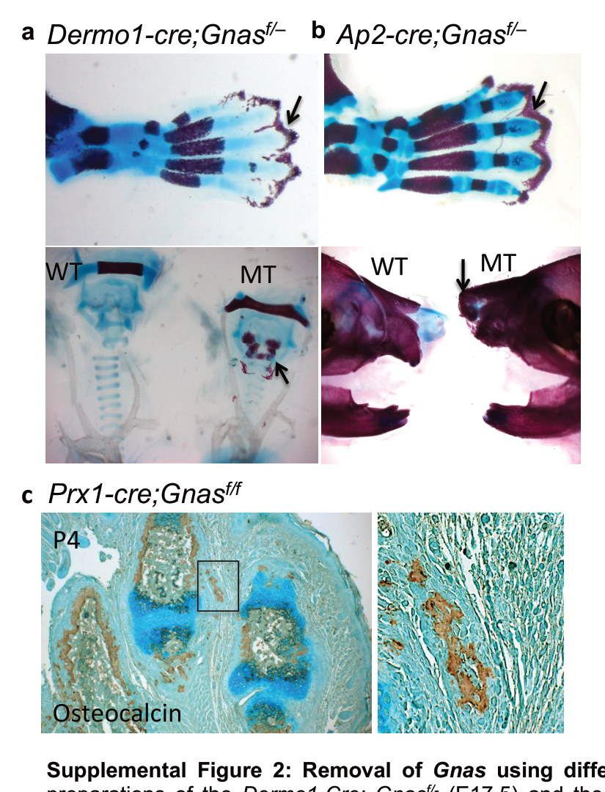

## Question

# Mechanistic Hypothesis Search

You are evaluating a specific disease mechanism hypothesis for the Disorder
Mechanisms Knowledge Base. This is not a general disease overview. Use the
hypothesis YAML below as the seed claim, then search for evidence that supports,
refutes, qualifies, or competes with this hypothesis.

## Target Disease
- **Disease Name:** Pseudohypoparathyroidism
- **Category:** Genetic

## Target Hypothesis
- **Hypothesis ID:** aho_mesenchymal_model
- **Hypothesis Label:** AHO Mesenchymal Differentiation Model
- **Status in KB:** CANONICAL

## Seed Hypothesis YAML

```yaml
hypothesis_group_id: aho_mesenchymal_model
hypothesis_label: AHO Mesenchymal Differentiation Model
status: CANONICAL
description: Altered GNAS-dependent signaling in bone and mesenchymal lineages drives brachydactyly, ectopic
  ossification, and related AHO structural phenotypes.
applies_to_subtypes:
- PHP1A
- Pseudopseudohypoparathyroidism
evidence:
- reference: PMID:29959430
  reference_title: 'Diagnosis and management of pseudohypoparathyroidism and related disorders: first
    international Consensus Statement.'
  supports: SUPPORT
  evidence_source: HUMAN_CLINICAL
  snippet: resistance to PTH, ectopic ossifications, brachydactyly and early-onset obesity.
  explanation: Supports the core AHO morphologic feature set grouped in this model.
```

## Research Objective

Build a focused hypothesis-search report that answers:

1. What is the strongest direct evidence for this hypothesis?
2. What evidence argues against it, fails to reproduce it, or limits its scope?
3. Which claims are established, emerging, speculative, or contradicted?
4. Which patient subtypes, stages, tissues, cell types, molecular pathways, or
   biomarkers does the hypothesis best explain?
5. Which alternative or competing mechanistic hypotheses explain the same disease
   features better or more parsimoniously?
6. What are the explicit knowledge gaps: missing causal steps, unconfirmed edges,
   contradictory evidence, unknown source-to-target links, or source/data absences?
7. What experiments, cohorts, assays, datasets, or trials would most directly
   distinguish this hypothesis from alternatives?

Use primary literature whenever possible. Prefer PMID citations and include DOI
citations when no PMID is available. Treat reviews as orientation unless they
contain directly relevant synthesized evidence that should be clearly labeled as
review-level support.

## Required Output

### Executive Judgment

Give a concise verdict on the hypothesis as of the current literature:
supported, partially supported, unresolved, weakly supported, or refuted. Explain
the reasoning and the most important caveats.

### Evidence Matrix

Create a table with one row per important evidence item:

- Citation (PMID preferred)
- Evidence type (human clinical, model organism, in vitro, computational, review)
- Supports / refutes / qualifies / competing
- Mechanistic claim tested
- Key finding
- Disease subtype or context
- Confidence and limitations

### Mechanistic Causal Chain

Describe the causal chain implied by the hypothesis from upstream trigger to
clinical manifestation. Identify where the literature is strong, where the links
are inferred, and where there are missing causal steps.

### Knowledge Gaps

Identify explicit known unknowns surfaced by the search. Treat absence of
evidence as a curation-relevant finding only when the search actually checked for
it. Include:

- Unknown or weakly supported causal steps in the hypothesis
- Unconfirmed causal graph edges that need direct perturbation or longitudinal
  evidence
- Conflicting evidence, failed replications, or incompatible subtype-specific
  findings
- Unknown mechanism of action for relevant treatments, biomarkers, or
  interventions tied to this hypothesis
- Source-level or dataset-level absences, such as no relevant GenCC, ClinGen,
  trial, omics, or cohort evidence found as of the search date

For each gap, state the scope, why it matters, what was checked, and what
evidence or experiment would resolve it.

### Alternative Models

List competing or complementary hypotheses. For each, explain whether it is an
alternative to the seed hypothesis, a downstream consequence, an upstream cause,
or a parallel mechanism.

### Discriminating Tests

Recommend concrete studies or assays that would most efficiently test this
hypothesis against alternatives. Include patient stratification, biomarkers,
sample type, model system, perturbation, and expected result where applicable.

### Curation Leads

Provide candidate updates for the KB, but label these as leads requiring curator
verification. Include:

- candidate evidence references and exact abstract snippets to verify
- candidate pathophysiology nodes or edges
- candidate ontology terms for cell types and biological processes
- candidate subtype restrictions or status changes
- candidate `knowledge_gaps` or discussion prompts for unresolved causal claims,
  conflicting evidence, or explicit source/data absences

If the provider supports artifacts, produce artifact-friendly outputs such as an
evidence matrix, mechanistic diagram, knowledge-gap table, or comparison table.
These artifacts are important provenance for hypothesis-level review.


## Output

Question: You are an expert researcher providing comprehensive, well-cited information.

Provide detailed information focusing on:
1. Key concepts and definitions with current understanding
2. Recent developments and latest research (prioritize 2023-2024 sources)
3. Current applications and real-world implementations
4. Expert opinions and analysis from authoritative sources
5. Relevant statistics and data from recent studies

Format as a comprehensive research report with proper citations. Include URLs and publication dates where available.
Always prioritize recent, authoritative sources and provide specific citations for all major claims.

# Mechanistic Hypothesis Search

You are evaluating a specific disease mechanism hypothesis for the Disorder
Mechanisms Knowledge Base. This is not a general disease overview. Use the
hypothesis YAML below as the seed claim, then search for evidence that supports,
refutes, qualifies, or competes with this hypothesis.

## Target Disease
- **Disease Name:** Pseudohypoparathyroidism
- **Category:** Genetic

## Target Hypothesis
- **Hypothesis ID:** aho_mesenchymal_model
- **Hypothesis Label:** AHO Mesenchymal Differentiation Model
- **Status in KB:** CANONICAL

## Seed Hypothesis YAML

```yaml
hypothesis_group_id: aho_mesenchymal_model
hypothesis_label: AHO Mesenchymal Differentiation Model
status: CANONICAL
description: Altered GNAS-dependent signaling in bone and mesenchymal lineages drives brachydactyly, ectopic
  ossification, and related AHO structural phenotypes.
applies_to_subtypes:
- PHP1A
- Pseudopseudohypoparathyroidism
evidence:
- reference: PMID:29959430
  reference_title: 'Diagnosis and management of pseudohypoparathyroidism and related disorders: first
    international Consensus Statement.'
  supports: SUPPORT
  evidence_source: HUMAN_CLINICAL
  snippet: resistance to PTH, ectopic ossifications, brachydactyly and early-onset obesity.
  explanation: Supports the core AHO morphologic feature set grouped in this model.
```

## Research Objective

Build a focused hypothesis-search report that answers:

1. What is the strongest direct evidence for this hypothesis?
2. What evidence argues against it, fails to reproduce it, or limits its scope?
3. Which claims are established, emerging, speculative, or contradicted?
4. Which patient subtypes, stages, tissues, cell types, molecular pathways, or
   biomarkers does the hypothesis best explain?
5. Which alternative or competing mechanistic hypotheses explain the same disease
   features better or more parsimoniously?
6. What are the explicit knowledge gaps: missing causal steps, unconfirmed edges,
   contradictory evidence, unknown source-to-target links, or source/data absences?
7. What experiments, cohorts, assays, datasets, or trials would most directly
   distinguish this hypothesis from alternatives?

Use primary literature whenever possible. Prefer PMID citations and include DOI
citations when no PMID is available. Treat reviews as orientation unless they
contain directly relevant synthesized evidence that should be clearly labeled as
review-level support.

## Required Output

### Executive Judgment

Give a concise verdict on the hypothesis as of the current literature:
supported, partially supported, unresolved, weakly supported, or refuted. Explain
the reasoning and the most important caveats.

### Evidence Matrix

Create a table with one row per important evidence item:

- Citation (PMID preferred)
- Evidence type (human clinical, model organism, in vitro, computational, review)
- Supports / refutes / qualifies / competing
- Mechanistic claim tested
- Key finding
- Disease subtype or context
- Confidence and limitations

### Mechanistic Causal Chain

Describe the causal chain implied by the hypothesis from upstream trigger to
clinical manifestation. Identify where the literature is strong, where the links
are inferred, and where there are missing causal steps.

### Knowledge Gaps

Identify explicit known unknowns surfaced by the search. Treat absence of
evidence as a curation-relevant finding only when the search actually checked for
it. Include:

- Unknown or weakly supported causal steps in the hypothesis
- Unconfirmed causal graph edges that need direct perturbation or longitudinal
  evidence
- Conflicting evidence, failed replications, or incompatible subtype-specific
  findings
- Unknown mechanism of action for relevant treatments, biomarkers, or
  interventions tied to this hypothesis
- Source-level or dataset-level absences, such as no relevant GenCC, ClinGen,
  trial, omics, or cohort evidence found as of the search date

For each gap, state the scope, why it matters, what was checked, and what
evidence or experiment would resolve it.

### Alternative Models

List competing or complementary hypotheses. For each, explain whether it is an
alternative to the seed hypothesis, a downstream consequence, an upstream cause,
or a parallel mechanism.

### Discriminating Tests

Recommend concrete studies or assays that would most efficiently test this
hypothesis against alternatives. Include patient stratification, biomarkers,
sample type, model system, perturbation, and expected result where applicable.

### Curation Leads

Provide candidate updates for the KB, but label these as leads requiring curator
verification. Include:

- candidate evidence references and exact abstract snippets to verify
- candidate pathophysiology nodes or edges
- candidate ontology terms for cell types and biological processes
- candidate subtype restrictions or status changes
- candidate `knowledge_gaps` or discussion prompts for unresolved causal claims,
  conflicting evidence, or explicit source/data absences

If the provider supports artifacts, produce artifact-friendly outputs such as an
evidence matrix, mechanistic diagram, knowledge-gap table, or comparison table.
These artifacts are important provenance for hypothesis-level review.


## Mechanistic Hypothesis Search Report
**Target disease:** Pseudohypoparathyroidism (genetic; focus on PHP1A and pseudopseudohypoparathyroidism [PPHP])  
**Hypothesis ID/label:** `aho_mesenchymal_model` — *AHO Mesenchymal Differentiation Model*  
**Seed claim:** Altered GNAS-dependent signaling in bone and mesenchymal lineages drives brachydactyly, ectopic ossification, and related AHO structural phenotypes.

### Executive Judgment
**Verdict: partially supported (strong for ectopic/subcutaneous ossification; more inferential for brachydactyly).**

Direct genetic and functional evidence strongly supports a **mesenchymal-lineage, cell-intrinsic role** of reduced GNAS/Gsα→cAMP/PKA signaling in **permitting/accelerating osteogenic differentiation in soft tissues**, producing heterotopic/subcutaneous ossification. The strongest causal chain includes **Hedgehog (Hh) pathway derepression** after Gnas loss in mesenchymal progenitors, with **genetic and pharmacologic rescue** using Gli pathway inhibition in mouse systems. Human clinical data show that **subcutaneous ossifications are common (~70%) and occur with similar prevalence in PHP1A and PPHP**, and are **independent of hormonal resistance/BMI**, supporting a structural mechanism not driven solely by endocrine abnormalities. (salemi2018ossificationsinalbright pages 8-9, salemi2018ossificationsinalbright pages 1-2, regard2013activationofhedgehog pages 7-8, xu2022gnaslosscauses pages 6-8)

Caveats limiting “canonical” status as a complete model:
- **Brachydactyly** is a defining AHO feature but is less directly tied to a single validated mesenchymal mechanism in the retrieved primary evidence; it is plausibly related to altered chondrocyte/osteoblast differentiation timing (premature epiphyseal fusion; advanced bone age) rather than exclusively ectopic ossification mechanisms. (salemi2018ossificationsinalbright pages 3-5)
- Phenotypic heterogeneity across the GNAS spectrum (AHO superficial subcutaneous ossifications vs POH deep invasive heterotopic ossification) suggests **additional modifiers** (imprinting/parent-of-origin, XLαs, trauma/microenvironment, and possible second hits/mosaicism). (bastepe2018gnasmutationsand pages 6-9, bastepe2018gnasmutationsand pages 9-13, mcmullan2022aberrantboneregulation pages 5-7)

### Evidence Matrix
| Citation (PMID / DOI) | Publication date | URL | Evidence type | Supports / refutes / qualifies / competing | Mechanistic claim tested | Key finding (1-2 sentences) | Disease subtype / context | Confidence & key limitations |
|---|---|---|---|---|---|---|---|---|
| Regard JB et al. *Nature Medicine* 2013. PMID not confirmed here; DOI: 10.1038/nm.3314 | 2013-09 | https://doi.org/10.1038/nm.3314 | Model organism + in vitro | Supports | Loss of GNAS/Gsα in mesenchymal progenitors activates Hedgehog signaling and drives heterotopic ossification; Hh/Gli inhibition should rescue | Conditional Gnas loss in limb/mesenchymal progenitors increased Hh target genes (*Ptch1, Gli1, Hhip*), increased GLI activity, and caused extraskeletal mineralization/HO. Genetic or pharmacologic Hh/Gli inhibition (e.g., Gli reduction, ATO, GANT-58; forskolin for cAMP activation) reduced Hh readouts and osteogenic/HO phenotypes. (regard2013activationofhedgehog pages 7-8, yang2023gnaslocusbone pages 11-12, regard2013activationofhedgehog pages 5-7, regard2013activationofhedgehog media c947240a) | POH-like / GNAS loss models; mechanistically relevant to AHO ectopic ossification | **High** for mesenchymal-Hh causal link in mouse systems. Limitations: strongest direct evidence is in severe conditional mouse models, not human PHP1A/PPHP lesions; may model POH/invasive HO more strongly than superficial AHO SCOs. |
| Pignolo RJ et al. *JBMR* 2011. PMID not confirmed here; DOI: 10.1002/jbmr.481 | 2011-11 | https://doi.org/10.1002/jbmr.481 | Model organism + ex vivo progenitor assays | Supports | Heterozygous Gnas loss in adipose-derived mesenchymal progenitors biases lineage commitment toward osteoblast fate and promotes HO | Adipose/soft-tissue stromal cells from Gnas+/- mice showed accelerated osteoblast differentiation, increased mineralization, and altered induction of multiple *Gnas* transcripts during differentiation. In vivo, mice developed subcutaneous heterotopic bone arising adjacent to adipose tissue, supporting a mesenchymal lineage-switch model. (pignolo2011heterozygousinactivationof pages 1-2, pignolo2011heterozygousinactivationof pages 5-6, pignolo2011heterozygousinactivationof pages 6-8) | AHO/POH-relevant soft-tissue ossification; adipose-derived progenitors | **High-moderate** for lineage-shift evidence in mouse progenitors. Limitations: heterozygous mouse model and ex vivo differentiation may not capture full human lesion heterogeneity or imprinting effects. |
| Huso DL et al. *PLoS ONE* 2011. PMID not confirmed here; DOI: 10.1371/journal.pone.0021755 | 2011-06 | https://doi.org/10.1371/journal.pone.0021755 | Model organism | Supports | Heterozygous Gnas exon 1 disruption is sufficient for progressive superficial subcutaneous ossifications in an AHO mouse model | Gnas exon 1 mutant mice developed lesions over time, uniformly detectable by ~1 year, localized to dermis/perifollicular areas and subcutis, especially at pressure/injury-prone sites. Lesions contained mature bone, mineral deposition, marrow elements, and expressed osteonectin/osteopontin, closely matching AHO-like superficial SCOs. (huso2011heterotopicossificationsin pages 1-2, huso2011heterotopicossificationsin pages 2-3) | AHO mouse model relevant to PHP1A/PPHP SCOs | **High-moderate** for phenotype replication. Limitations: descriptive/mechanistic depth is limited; late-onset mouse lesions do not directly resolve which progenitor populations initiate SCOs. |
| Salemi P et al. *JCEM* 2018. PMID not confirmed here; DOI: 10.1210/jc.2017-00860 | 2018-09 | https://doi.org/10.1210/jc.2017-00860 | Human clinical cohort | Supports / qualifies | AHO ossification phenotypes reflect Gsα haploinsufficiency in superficial tissues and are largely independent of hormone resistance | In 67 mutation-confirmed AHO patients, SCOs were found in 47/67 (70.1%), with similar prevalence in PHP1A (71.4%) and PPHP (66.7%). SCO burden correlated with mutation severity and male sex, worsened with age, and did **not** correlate with hormonal status or BMI, supporting a tissue-intrinsic structural mechanism rather than endocrine resistance per se. (salemi2018ossificationsinalbright pages 8-9, salemi2018ossificationsinalbright pages 1-2, salemi2018ossificationsinalbright pages 5-6, salemi2018ossificationsinalbright pages 3-5, salemi2018ossificationsinalbright pages 2-3) | PHP1A and PPHP; excludes POH-overlap deep lesions | **High** for clinical scope/modifiers. Limitations: observational; does not directly identify causal cell types or pathways in human lesions. |
| Xu R et al. *Journal of Dental Research* 2022. PMID not confirmed here; DOI: 10.1177/00220345221075215 | 2022-02 | https://doi.org/10.1177/00220345221075215 | Model organism | Supports / qualifies | Loss of Gnas in cranial mesenchymal/chondrocyte lineages causes chondrocyte-to-osteoblast fate conversion via Hedgehog/Gli signaling; Hh inhibition rescues | In cranial sutures/fontanels, Gnas loss activated Ptch1-LacZ/Gli-dependent Hh signaling and drove cartilage HO with chondrocyte-to-osteoblast fate conversion. Reducing *Gli2* dosage or treating with GANT61/ATO decreased mineralization and Osx+ osteogenic conversion, extending the mesenchymal differentiation model to craniofacial structural phenotypes. (xu2022gnaslosscauses pages 6-8) | Cranial suture/cartilage HO; craniofacial abnormalities relevant to AHO/PHP1A | **High-moderate** for cranial Hh-dependent fate conversion. Limitations: focused on cranial sutures and cartilage HO, so generalizability to brachydactyly/subcutaneous SCOs is inferred rather than directly shown. |
| Bastepe M. *Bone* 2018. PMID not confirmed here; DOI: 10.1016/j.bone.2017.09.002 | 2018-04 | https://doi.org/10.1016/j.bone.2017.09.002 | Review (human + model synthesis) | Supports / qualifies | GNAS/Gsα deficiency alters mesenchymal lineage determination and promotes HO, with parental-origin effects and unresolved modifiers | Synthesizes human genetics and model data showing that reduced Gsα/cAMP signaling promotes osteogenic differentiation and suppresses adipogenesis in mesenchymal cells, with paternal bias for POH and evidence that Hh activation is a key downstream mechanism. Also emphasizes that identical GNAS mutations can produce variable phenotypes and that XLαs deficiency, mosaicism, or second hits may modify severity. (bastepe2018gnasmutationsand pages 9-13, bastepe2018gnasmutationsand pages 6-9) | AHO, PHP1A, PPHP, POH | **Moderate** because review-level synthesis is coherent and authoritative, but mechanistic causality relies on cited primary studies rather than new direct experiments. |
| McMullan P, Germain-Lee EL. *Current Osteoporosis Reports* 2022. PMID not confirmed here; DOI: 10.1007/s11914-022-00719-w | 2022-02 | https://doi.org/10.1007/s11914-022-00719-w | Review | Supports / qualifies | Gnas inactivation alters osteoblast/osteoclast/osteocyte coupling and tissue microenvironment, promoting AHO skeletal phenotypes and superficial HO | Reviews mouse and human data supporting roles for Gsα in osteoblast differentiation, osteoclastogenesis, osteocyte signaling, and tissue-resident mesenchymal progenitors. It highlights Hh-mediated HO, parent-of-origin effects on bone remodeling, and the clinical observation that SCO prevalence is similar in PHP1A and PPHP, reinforcing that structural AHO features are partly independent of endocrine resistance. (mcmullan2022aberrantboneregulation pages 10-10, mcmullan2022aberrantboneregulation pages 2-4, mcmullan2022aberrantboneregulation pages 1-2, mcmullan2022aberrantboneregulation pages 5-7) | AHO / PHP1A / PPHP bone and SCO phenotypes | **Moderate** as a mechanistic review. Limitations: indirect for causality; integrates heterogeneous models and may blend deep HO/POH mechanisms with superficial AHO SCO biology. |
| Elli FM et al. *Frontiers in Endocrinology* 2024. PMID not confirmed here; DOI: 10.3389/fendo.2024.1296886 | 2024-05 | https://doi.org/10.3389/fendo.2024.1296886 | In vitro human cell model | Supports / qualifies | GNAS silencing in human osteoprogenitors deregulates osteogenic differentiation and may model ectopic ossification susceptibility | In a human MSC/osteoprogenitor model, GNAS silencing caused deregulation of osteogenic differentiation, including premature immature osteoblast-to-osteocyte transition and altered matrix deposition, partially recapitulating in vivo GNAS-related ectopic ossification biology. This strengthens human-cell support for the mesenchymal differentiation hypothesis but does not yet establish full lesion causality or in vivo subtype specificity. (elli2024targetedsilencingof pages 1-2) | Human osteoprogenitor model; relevant to PHP1A/PPHP/POH ectopic bone | **Moderate** for human-cell relevance. Limitations: cell-line system, partial phenocopy, and no direct lesion initiation or in vivo validation in patient tissue. |
| Yang W et al. *Frontiers in Endocrinology* 2023. PMID not confirmed here; DOI: 10.3389/fendo.2023.1255864 | 2023-10 | https://doi.org/10.3389/fendo.2023.1255864 | Review | Supports / qualifies | Across mouse models, Gnas controls mesenchymal lineage choice, HO, cranial ossification, and parent-of-origin bone remodeling | Reviews GNAS bone-related mouse models showing that heterozygous or conditional Gnas loss in adipose-derived mesenchymal progenitors, limb mesenchyme, or cranial lineages accelerates osteogenesis, causes HO, and interacts with Hh/Wnt signaling. Also summarizes parental-origin differences in remodeling and links these models to AHO/PHP/POH spectrum disorders. (yang2023gnaslocusbone pages 18-18, yang2023gnaslocusbone pages 11-12, yang2023gnaslocusbone pages 9-10) | AHO/PHP/POH spectrum; mouse-model overview | **Moderate** because it is review-level support. Limitations: no new primary mechanistic experiments; conclusions depend on underlying model quality and cross-study comparability. |


*Table: This table summarizes the main evidence for and qualifiers on the AHO mesenchymal differentiation model, focusing on GNAS/Gsα effects in mesenchymal and bone-lineage cells, ectopic ossification, brachydactyly-related structural phenotypes, and pathway-level mechanisms relevant to PHP1A and PPHP.*

### Strongest Direct Evidence for the Hypothesis
#### 1) Mesenchymal progenitor loss of Gnas drives ectopic bone via Hedgehog activation (causal + rescue)
- In conditional mouse models, **Gnas/Gsα loss in mesenchymal/limb progenitors** produces **ectopic mineralization/heterotopic ossification**, with clear evidence of **upregulated Hedgehog target genes (Ptch1, Gli1, Hhip)** and increased GLI activity, consistent with Gsα–cAMP/PKA normally restraining Hedgehog signaling. (regard2013activationofhedgehog pages 5-7, regard2013activationofhedgehog pages 7-8)
- **Rescue evidence:** Gli pathway inhibition (e.g., arsenic trioxide; GLI inhibitors such as GANT compounds) **suppressed Hedgehog targets and reduced osteogenic outcomes** in limb culture/cell systems; related cranial models show genetic (*Gli2* reduction) and pharmacologic (GANT61/ATO) suppression reduces cartilage heterotopic ossification. (regard2013activationofhedgehog pages 7-8, xu2022gnaslosscauses pages 6-8)

Visual support: key supplemental panels from the Nature Medicine study show HO phenotype, ectopic Ptch1-LacZ signaling, and inhibitor-based suppression of Hh target expression/mineralization. (regard2013activationofhedgehog media c947240a, regard2013activationofhedgehog media 93d2cbda, regard2013activationofhedgehog media 4ab10f64, regard2013activationofhedgehog media 80915908)

#### 2) Adipose-derived mesenchymal progenitors show lineage bias toward osteogenesis with heterozygous Gnas loss
A primary JBMR study demonstrates that **heterozygous Gnas inactivation** in adipose/soft-tissue stromal progenitors is associated with **accelerated osteoblast differentiation ex vivo**, increased mineralization, and **in vivo subcutaneous heterotopic ossification** developing with age, supporting a mesenchymal differentiation (adipogenic↔osteogenic) shift as a proximal driver of ectopic bone. (pignolo2011heterozygousinactivationof pages 6-8, pignolo2011heterozygousinactivationof pages 1-2)

#### 3) AHO mouse models recapitulate superficial subcutaneous ossification features
In the classic AHO mouse model with exon 1 disruption, **subcutaneous ossifications emerge over time**, become **uniformly detectable by ~1 year**, and are localized to **dermis/perifollicular regions and subcutis**, consistent with a soft-tissue mesenchymal origin and injury/pressure association. Lesions show mature bone with marrow elements and osteogenic markers. (huso2011heterotopicossificationsin pages 1-2)

#### 4) Human clinical evidence: subcutaneous ossifications are common and not explained by endocrine resistance
In a mutation-confirmed AHO cohort (n=67), **47/67 (70.1%)** had subcutaneous ossifications; prevalence was similar between **PHP1A 71.4% (35/49)** and **PPHP 66.7% (12/18)**, and did **not correlate with hormonal status or BMI**, supporting a mechanism driven by Gsα haploinsufficiency in relevant tissues rather than systemic hormone resistance alone. (salemi2018ossificationsinalbright pages 1-2, salemi2018ossificationsinalbright pages 8-9)

### Evidence That Qualifies, Limits, or Competes With the Hypothesis
1) **Imprinting/parent-of-origin separates endocrine resistance from AHO features.** Maternal vs paternal inheritance determines hormone resistance, yet superficial ossifications occur with both, suggesting mesenchymal mechanisms are real but not the whole phenotype architecture. (bastepe2018gnasmutationsand pages 6-9, mcmullan2022aberrantboneregulation pages 1-2)

2) **POH (deep invasive HO) differs from AHO superficial SCOs**, suggesting additional mechanisms beyond “altered mesenchymal differentiation” in general. Reviews highlight parental bias (often paternal), possible involvement of **XLαs deficiency**, and/or **second-hit mosaicism (loss of heterozygosity)** to create focal severe lesions. (bastepe2018gnasmutationsand pages 9-13, bastepe2018gnasmutationsand pages 6-9)

3) **Microenvironment/trauma dependence:** AHO subcutaneous ossifications often appear at repetitive friction/trauma sites and frequently recur after excision, consistent with tissue-context triggers interacting with a sensitized mesenchymal background. (mcmullan2022aberrantboneregulation pages 5-7)

4) **Non-osteoblast lineages and coupling:** Bone remodeling differences by parental origin and osteocyte/osteoclast coupling effects imply that some skeletal outcomes (bone mass/architecture) may be influenced by cell types beyond mesenchymal progenitors alone. (mcmullan2022aberrantboneregulation pages 5-7)

### Established vs Emerging vs Speculative Claims
**Established (high confidence):**
- GNAS/Gsα deficiency is sufficient to produce AHO phenotypes including superficial subcutaneous ossifications in humans and mice, and these ossifications are **not dependent on endocrine resistance**. (salemi2018ossificationsinalbright pages 1-2, huso2011heterotopicossificationsin pages 1-2)
- Gnas loss in mesenchymal progenitors activates **Hedgehog/Gli signaling** and drives heterotopic ossification in mouse models; Gli inhibition reduces these outcomes (causal/rescue). (regard2013activationofhedgehog pages 7-8, xu2022gnaslosscauses pages 6-8)

**Emerging (moderate confidence):**
- AHO/POH spectrum severity is shaped by **imprinting/parent-of-origin**, potentially involving **XLαs** and/or altered total cAMP signaling in specific progenitor compartments. (bastepe2018gnasmutationsand pages 9-13)
- Human-cell models show GNAS silencing deregulates osteogenic differentiation and matrix, partially recapitulating disease-relevant behavior. (elli2024targetedsilencingof pages 1-2)

**Speculative/contested:**
- **XLαs deficiency as a required determinant** of invasive POH-like phenotypes is not fully consistent across mouse data; POH can occur with maternal mutations, implying XLαs loss is not strictly required. (bastepe2018gnasmutationsand pages 9-13)
- **Second-hit/segmental mosaicism** remains plausible for focal severe lesions but is not proven in the retrieved evidence set; requires lesion-level genotyping. (bastepe2018gnasmutationsand pages 9-13)

### Scope: Subtypes, Tissues, Cell Types, Pathways, Biomarkers
**Best explained by the hypothesis:**
- **PHP1A and PPHP superficial subcutaneous ossifications:** Similar prevalence in both subtypes supports local mesenchymal mechanisms. (salemi2018ossificationsinalbright pages 1-2)
- **Soft tissue mesenchymal/adipose stromal progenitors:** Ex vivo and in vivo mouse evidence indicates altered adipogenic↔osteogenic fate decisions. (pignolo2011heterozygousinactivationof pages 6-8)

**Key cell types implicated:**
- Limb/cranial **mesenchymal progenitors** (e.g., Prrx1/Prx1 lineages in mice) (xu2022gnaslosscauses pages 6-8, regard2013activationofhedgehog pages 5-7)
- **Adipose-derived stromal cells / soft-tissue progenitors** initiating HO near adipose tissue (pignolo2011heterozygousinactivationof pages 6-8)
- Osteoblast lineage and osteocyte/osteoclast coupling as modifiers of skeletal remodeling (mcmullan2022aberrantboneregulation pages 5-7)

**Key pathways supported by direct perturbation evidence:**
- **Gsα→cAMP/PKA→Hedgehog/Gli repression** (loss → Hh activation → HO; Gli inhibition rescues) (regard2013activationofhedgehog pages 7-8, xu2022gnaslosscauses pages 6-8)
- **Wnt/β-catenin pathway shifts** are reported in limb models of Gnas loss (regard2013activationofhedgehog pages 5-7)

**Potential biomarkers/readouts in models:**
- Hh targets (*Ptch1, Gli1, Hhip*) and GLI activity; mineralization (von Kossa/Alizarin red); osteogenic markers (Osx, OPN) in cranial fate conversion contexts. (xu2022gnaslosscauses pages 6-8, regard2013activationofhedgehog pages 7-8)

### Recent Developments (2023–2024)
#### 2024: Human osteoprogenitor GNAS silencing model (mechanistic translational advance)
A 2024 study reports that GNAS silencing in a human MSC/osteoprogenitor line deregulates osteogenic differentiation and matrix deposition (premature immature osteoblast-to-osteocyte transition), providing a human-cell platform to test mechanistic drivers of ectopic ossification. URL: https://doi.org/10.3389/fendo.2024.1296886 (published May 2024). (elli2024targetedsilencingof pages 1-2)

#### 2024: Genotype–phenotype quantitation for a hotspot LOF variant
A 2024 genotype–phenotype review/case series of the GNAS c.565_568delGACT hotspot (n=76 literature-derived plus 2 new cases) reports high prevalence of AHO structural features: **brachydactyly 74%** and **subcutaneous/heterotopic ossifications 61%**, with high endocrine resistance rates (e.g., TSH resistance 100% [20/20], PTH resistance ~90%). URL: https://doi.org/10.3390/ijms252010913 (published Oct 2024). (cipriano2024genotype–phenotypecorrelationof pages 5-7)

#### 2023: Aberrant cranial bone development as a structural complication (PHP1A)
A 2023 cohort of 54 mutation-confirmed PHP1A patients with imaging found **Chiari malformation type 1 prevalence 10.8%** and **21.7%** when including low-lying cerebellar tonsils, independent of GH status. Mouse data indicated smaller cranial vault, hyperostosis/increased osteogenesis, and premature cranial base synchondrosis closure, extending the “aberrant bone/mesenchymal differentiation” theme to craniofacial development. URL: https://doi.org/10.1371/journal.pone.0280463 (published Jan 2023). (krishnan2023prevalenceofchiari pages 1-2)

#### 2023: Real-world therapy outcomes relevant to growth/bone development
A 2023 multicenter cohort (n=190; 26 rhGH-treated) shows rhGH improves height outcomes in maternal inactivating GNAS mutations, with **+0.7 SDS at 1 year**, **+1.5 SDS at 3 years**, and **+1.9 SDS adult height advantage** vs untreated controls; BMI SDS unchanged. While not a direct test of the AHO mesenchymal ossification mechanism, it is a major real-world implementation for a GNAS-related skeletal outcome (stature). URL: https://doi.org/10.1093/ejendo/lvad085 (published Jul 2023). (ertl2023recombinantgrowthhormone pages 1-3)

### Current Applications / Real-World Implementations
- **Clinical risk stratification for subcutaneous ossifications** in AHO uses genotype severity (frameshift/nonsense > missense), sex (male higher), and age/progression trends, noting similar prevalence in PHP1A and PPHP and no correlation with endocrine resistance/BMI. (salemi2018ossificationsinalbright pages 5-6, salemi2018ossificationsinalbright pages 1-2)
- **Management implications from mechanistic work (translational):** Gli/Hedgehog inhibition rescues HO in mouse systems, motivating exploration of pathway-targeted therapies for GNAS-related HO; this is currently stronger as a translational hypothesis than an established PHP1A/PPHP treatment. (regard2013activationofhedgehog pages 7-8, xu2022gnaslosscauses pages 6-8)
- **rhGH therapy** is implemented for short stature in maternal GNAS inactivation with demonstrated adult-height benefit. (ertl2023recombinantgrowthhormone pages 1-3)

### Mechanistic Causal Chain (Seed Hypothesis)
**Upstream trigger:** Germline heterozygous inactivating variants (or epigenetic dysregulation) reducing functional **GNAS/Gsα signaling** in relevant tissues; imprinting determines endocrine phenotype (PHP1A vs PPHP) but skin/soft tissue appears less imprinted, enabling similar SCO prevalence. (bastepe2018gnasmutationsand pages 6-9, salemi2018ossificationsinalbright pages 1-2)

**Cellular/lineage node (strong):** Reduced **Gsα→cAMP/PKA** signaling in **soft-tissue mesenchymal progenitors** shifts fate away from adipogenesis and toward osteogenic differentiation; lesions initiate near adipose in mouse models. (pignolo2011heterozygousinactivationof pages 6-8)

**Pathway node (strong):** Loss of Gsα derepresses **Hedgehog/Gli signaling**, promoting ectopic osteogenesis/heterotopic ossification; **Gli inhibition** reduces pathway activation and HO phenotypes in mice. (regard2013activationofhedgehog pages 7-8, xu2022gnaslosscauses pages 6-8)

**Tissue context modifiers (moderate):** Trauma/pressure and microenvironmental remodeling promote lesion emergence/expansion; sex and mutation severity modulate extent. (salemi2018ossificationsinalbright pages 5-6, mcmullan2022aberrantboneregulation pages 5-7)

**Clinical manifestation (strong for SCO/HO; moderate for brachydactyly):** Subcutaneous ossifications are frequent in both PHP1A and PPHP and progress with age. Brachydactyly is associated with premature epiphyseal fusion and advanced hand bone age, but the specific mechanistic edge from GNAS loss to this pattern requires more direct causal evidence in retrieved sources. (salemi2018ossificationsinalbright pages 8-9, salemi2018ossificationsinalbright pages 3-5)

### Knowledge Gaps (explicit “known unknowns” surfaced by this search)
1) **Human lesion cell-of-origin remains insufficiently resolved.**  
   - *What was checked:* Mouse and human clinical evidence plus human-cell modeling; models show adipose/mesenchymal progenitors implicated but do not identify definitive initiating populations in human SCO lesions. (pignolo2011heterozygousinactivationof pages 6-8, salemi2018ossificationsinalbright pages 1-2, elli2024targetedsilencingof pages 1-2)
   - *Why it matters:* KB edges should distinguish “mesenchymal progenitor fate switch” vs “microenvironment-driven recruitment.”
   - *What would resolve:* Single-cell profiling and lineage inference of human SCO biopsies stratified by PHP1A vs PPHP, lesion age, and anatomical site; paired germline and lesion DNA for mosaic/second-hit testing.

2) **Extent to which Hedgehog activation is universal across AHO SCOs vs POH deep HO is unclear.**  
   - *What was checked:* Strong Hh causality in conditional models and cranial models; human clinical cohorts lack pathway readouts. (regard2013activationofhedgehog pages 7-8, xu2022gnaslosscauses pages 6-8, salemi2018ossificationsinalbright pages 1-2)
   - *Resolve:* Immunohistochemistry/transcriptomic Hh signatures in patient SCOs vs POH lesions; correlation with genotype (e.g., truncating vs missense) and parental origin.

3) **Role of XLαs and imprinting in HO invasiveness remains contested.**  
   - *What was checked:* Review-level synthesis notes conflicting cAMP data in XLαs knockout and POH occurring with maternal mutations. (bastepe2018gnasmutationsand pages 9-13)
   - *Resolve:* Direct measurement of transcript-specific expression (Gsα vs XLαs) in relevant human progenitor compartments; allele-specific expression and functional rescue experiments.

4) **Brachydactyly mechanistic edge is under-specified relative to HO.**  
   - *What was checked:* Clinical association with premature epiphyseal fusion/advanced bone age, but limited direct mechanistic perturbation evidence specific to brachydactyly in the retrieved set. (salemi2018ossificationsinalbright pages 3-5)
   - *Resolve:* Developmental studies in growth plate chondrocytes/osteoblast progenitors with staged Gnas perturbations and quantitative digit/metacarpal outcomes; human longitudinal imaging correlated with molecular markers.

5) **Dataset-level absences (as of this tool-based search):** no clinical trials directly testing Hh/Gli inhibitors for GNAS-related HO were identified via the current workflow; no lesion-level human omics datasets were retrieved here.

### Alternative / Competing Models
1) **Endocrine-driven skeletal phenotype model (competing/upstream contributor):** hormone resistance (PTH/TSH/GHRH) and systemic mineral dysregulation affecting skeletal development. This model explains biochemical disease but is less parsimonious for SCOs because SCO prevalence is similar in PPHP (no hormone resistance) and PHP1A. (salemi2018ossificationsinalbright pages 1-2, bastepe2018gnasmutationsand pages 6-9)

2) **Microenvironment/trauma-triggered ectopic ossification model (parallel/cooperative):** GNAS haploinsufficiency creates a sensitized mesenchymal background; tissue injury/pressure and ECM remodeling trigger lesion initiation and expansion. (mcmullan2022aberrantboneregulation pages 5-7)

3) **Second-hit / mosaic LOH model for severe, focal, or invasive lesions (alternative for POH-like severity):** segmental or lesion-localized biallelic loss could account for depth/progression differences versus superficial SCOs with heterozygosity. (bastepe2018gnasmutationsand pages 9-13)

4) **Transcript-specific (XLαs vs Gsα) dosage model (modifier model):** paternal mutations may reduce both Gsα and paternally expressed XLαs, potentially intensifying cAMP deficiency and promoting deeper HO; evidence is mixed. (bastepe2018gnasmutationsand pages 9-13)

### Discriminating Tests (to distinguish seed hypothesis vs alternatives)
1) **Human SCO biopsy multi-omics with allele-specific expression**  
   - *Cohorts:* PHP1A vs PPHP; truncating vs missense; male vs female; early vs late lesions; trauma-associated vs spontaneous.
   - *Assays:* scRNA-seq + scATAC-seq; spatial transcriptomics; immunostaining for GLI1/PTCH1 and osteogenic markers; lesion DNA sequencing for LOH/second hits.
   - *Expected:* If seed hypothesis holds, mesenchymal progenitor/osteoprogenitor populations should show Hh activation signatures and osteogenic differentiation trajectories; endocrine status should not predict molecular signatures.

2) **Prospective longitudinal imaging + biomarker study**  
   - *Assays:* standardized ultrasound/CT/MRI of at-risk sites plus serum markers (bone turnover), and local tissue biomarkers if feasible.
   - *Expected:* lesion emergence correlates with local trauma/pressure and with genotype severity more than hormonal control.

3) **Perturbation experiments in patient-derived iPSC-MSCs**  
   - *Design:* create isogenic GNAS LOF and rescue lines; apply Hh/Gli modulation; measure osteogenic/adipogenic differentiation and matrix properties.
   - *Expected:* GNAS LOF increases osteogenesis and Hh target expression; Gli inhibition normalizes.

4) **Transcript-specific rescue in animal models**  
   - *Design:* Gsα vs XLαs compartment-specific restoration or deletion in mesenchymal progenitors.
   - *Expected:* If XLαs is a key modifier for invasive HO, restoration should reduce severity for paternal models.

### Curation Leads (require curator verification)
**Candidate evidence references & snippets to verify (primary where possible):**
- *Gnas loss → Hedgehog activation → HO; rescue with Gli inhibition:* Regard et al. show elevated *Ptch1/Gli1* with Gnas loss and suppression with ATO/GANT-58 in limb culture; skeletal preps show ectopic mineralization. Verify exact figure labels and text in full article and supplement. (regard2013activationofhedgehog pages 7-8, regard2013activationofhedgehog media c947240a)
- *Human SCO prevalence independent of hormone resistance:* Salemi et al. report SCO prevalence 70.1% overall, similar PHP1A vs PPHP, with no correlation with hormonal status/BMI. Verify table/definitions for SCO grading and hormonal resistance variables. (salemi2018ossificationsinalbright pages 1-2, salemi2018ossificationsinalbright pages 5-6)
- *Mesenchymal progenitor lineage switching:* Pignolo et al. report Gnas+/- adipose stromal cells with accelerated osteogenesis and in vivo subcutaneous HO. Verify specific methods (cell isolation, differentiation conditions) and HO quantitation. (pignolo2011heterozygousinactivationof pages 6-8)
- *2024 human osteoprogenitor model:* Elli et al. report GNAS silencing causes premature immature osteoblast→osteocyte transition and matrix differences. Verify quantitative readouts and any pathway signatures. URL: https://doi.org/10.3389/fendo.2024.1296886. (elli2024targetedsilencingof pages 1-2)

**Candidate pathophysiology nodes/edges (draft):**
- Node: “Gsα/cAMP/PKA signaling in mesenchymal progenitors” → Edge: “negatively regulates Hedgehog/Gli activity” (supported strongly in conditional models). (regard2013activationofhedgehog pages 7-8, xu2022gnaslosscauses pages 6-8)
- Node: “Mesenchymal/adipose stromal progenitor fate” → Edge: “bias toward osteogenic differentiation when GNAS is reduced” (mouse + ex vivo; human in vitro emerging). (pignolo2011heterozygousinactivationof pages 6-8, elli2024targetedsilencingof pages 1-2)
- Node: “Subcutaneous tissue microenvironment/trauma” → Edge: “promotes lesion initiation/expansion on sensitized GNAS background.” (mcmullan2022aberrantboneregulation pages 5-7)

**Candidate ontology terms (examples; curator mapping needed):**
- Cell types: mesenchymal stromal cell; osteoprogenitor cell; osteoblast; osteocyte; adipose-derived stromal cell; chondrocyte.
- Processes: osteoblast differentiation; adipogenesis; heterotopic ossification; intramembranous ossification; Hedgehog signaling pathway; cAMP-mediated signaling.

**Candidate subtype restrictions/status leads:**
- Consider restricting the most strongly supported causal chain (GNAS loss → Hh activation → HO) to **ectopic ossification phenotypes** (SCO/HO, POH) rather than all AHO structural phenotypes including brachydactyly, unless additional brachydactyly-specific mechanistic evidence is curated. (salemi2018ossificationsinalbright pages 3-5, regard2013activationofhedgehog pages 7-8)

**Suggested KB discussion prompts:**
- Do we represent POH deep invasive HO as a separate mechanism module (e.g., “second hit/XLαs/imprinting-modified HO progression”) parallel to AHO superficial SCOs? (bastepe2018gnasmutationsand pages 9-13, bastepe2018gnasmutationsand pages 6-9)

### URLs and Publication Dates (selected)
- Regard et al. *Nature Medicine* (Sep 2013): https://doi.org/10.1038/nm.3314 (regard2013activationofhedgehog pages 7-8)
- Pignolo et al. *JBMR* (Nov 2011): https://doi.org/10.1002/jbmr.481 (pignolo2011heterozygousinactivationof pages 6-8)
- Huso et al. *PLoS ONE* (Jun 2011): https://doi.org/10.1371/journal.pone.0021755 (huso2011heterotopicossificationsin pages 1-2)
- Salemi et al. *JCEM* (Sep 2018): https://doi.org/10.1210/jc.2017-00860 (salemi2018ossificationsinalbright pages 1-2)
- Xu et al. *J Dent Res* (Feb 2022): https://doi.org/10.1177/00220345221075215 (xu2022gnaslosscauses pages 6-8)
- Elli et al. *Frontiers in Endocrinology* (May 2024): https://doi.org/10.3389/fendo.2024.1296886 (elli2024targetedsilencingof pages 1-2)
- Krishnan et al. *PLOS ONE* (Jan 2023): https://doi.org/10.1371/journal.pone.0280463 (krishnan2023prevalenceofchiari pages 1-2)
- Cipriano et al. *IJMS* (Oct 2024): https://doi.org/10.3390/ijms252010913 (cipriano2024genotype–phenotypecorrelationof pages 5-7)
- Ertl et al. *European Journal of Endocrinology* (Jul 2023): https://doi.org/10.1093/ejendo/lvad085 (ertl2023recombinantgrowthhormone pages 1-3)


References

1. (salemi2018ossificationsinalbright pages 8-9): Parissa Salemi, Julie M Skalamera Olson, Lauren E Dickson, and Emily L Germain-Lee. Ossifications in albright hereditary osteodystrophy: role of genotype, inheritance, sex, age, hormonal status, and bmi. The Journal of Clinical Endocrinology & Metabolism, 103:158–168, Sep 2018. URL: https://doi.org/10.1210/jc.2017-00860, doi:10.1210/jc.2017-00860. This article has 39 citations.

2. (salemi2018ossificationsinalbright pages 1-2): Parissa Salemi, Julie M Skalamera Olson, Lauren E Dickson, and Emily L Germain-Lee. Ossifications in albright hereditary osteodystrophy: role of genotype, inheritance, sex, age, hormonal status, and bmi. The Journal of Clinical Endocrinology & Metabolism, 103:158–168, Sep 2018. URL: https://doi.org/10.1210/jc.2017-00860, doi:10.1210/jc.2017-00860. This article has 39 citations.

3. (regard2013activationofhedgehog pages 7-8): Jean B Regard, Deepti Malhotra, Jelena Gvozdenovic-Jeremic, Michelle Josey, Min Chen, Lee S Weinstein, Jianming Lu, Eileen M Shore, Frederick S Kaplan, and Yingzi Yang. Activation of hedgehog signaling by loss of gnas causes heterotopic ossification. Nature medicine, 19:1505-1512, Sep 2013. URL: https://doi.org/10.1038/nm.3314, doi:10.1038/nm.3314. This article has 251 citations and is from a highest quality peer-reviewed journal.

4. (xu2022gnaslosscauses pages 6-8): R. Xu, Y. Liu, Y. Zhou, W. Lin, Q. Yuan, X. Zhou, and Y. Yang. Gnas loss causes chondrocyte fate conversion in cranial suture formation. Journal of Dental Research, 101:931-941, Feb 2022. URL: https://doi.org/10.1177/00220345221075215, doi:10.1177/00220345221075215. This article has 16 citations and is from a highest quality peer-reviewed journal.

5. (salemi2018ossificationsinalbright pages 3-5): Parissa Salemi, Julie M Skalamera Olson, Lauren E Dickson, and Emily L Germain-Lee. Ossifications in albright hereditary osteodystrophy: role of genotype, inheritance, sex, age, hormonal status, and bmi. The Journal of Clinical Endocrinology & Metabolism, 103:158–168, Sep 2018. URL: https://doi.org/10.1210/jc.2017-00860, doi:10.1210/jc.2017-00860. This article has 39 citations.

6. (bastepe2018gnasmutationsand pages 6-9): Murat Bastepe. Gnas mutations and heterotopic ossification. Bone, 109:80-85, Apr 2018. URL: https://doi.org/10.1016/j.bone.2017.09.002, doi:10.1016/j.bone.2017.09.002. This article has 50 citations and is from a domain leading peer-reviewed journal.

7. (bastepe2018gnasmutationsand pages 9-13): Murat Bastepe. Gnas mutations and heterotopic ossification. Bone, 109:80-85, Apr 2018. URL: https://doi.org/10.1016/j.bone.2017.09.002, doi:10.1016/j.bone.2017.09.002. This article has 50 citations and is from a domain leading peer-reviewed journal.

8. (mcmullan2022aberrantboneregulation pages 5-7): Patrick McMullan and Emily L. Germain-Lee. Aberrant bone regulation in albright hereditary osteodystrophy dueto gnas inactivation: mechanisms and translational implications. Current Osteoporosis Reports, 20:78-89, Feb 2022. URL: https://doi.org/10.1007/s11914-022-00719-w, doi:10.1007/s11914-022-00719-w. This article has 11 citations and is from a peer-reviewed journal.

9. (yang2023gnaslocusbone pages 11-12): Wan Yang, Yiyi Zuo, Nuo Zhang, Kangning Wang, Runze Zhang, Ziyi Chen, and Qing He. Gnas locus: bone related diseases and mouse models. Frontiers in Endocrinology, Oct 2023. URL: https://doi.org/10.3389/fendo.2023.1255864, doi:10.3389/fendo.2023.1255864. This article has 19 citations.

10. (regard2013activationofhedgehog pages 5-7): Jean B Regard, Deepti Malhotra, Jelena Gvozdenovic-Jeremic, Michelle Josey, Min Chen, Lee S Weinstein, Jianming Lu, Eileen M Shore, Frederick S Kaplan, and Yingzi Yang. Activation of hedgehog signaling by loss of gnas causes heterotopic ossification. Nature medicine, 19:1505-1512, Sep 2013. URL: https://doi.org/10.1038/nm.3314, doi:10.1038/nm.3314. This article has 251 citations and is from a highest quality peer-reviewed journal.

11. (regard2013activationofhedgehog media c947240a): Jean B Regard, Deepti Malhotra, Jelena Gvozdenovic-Jeremic, Michelle Josey, Min Chen, Lee S Weinstein, Jianming Lu, Eileen M Shore, Frederick S Kaplan, and Yingzi Yang. Activation of hedgehog signaling by loss of gnas causes heterotopic ossification. Nature medicine, 19:1505-1512, Sep 2013. URL: https://doi.org/10.1038/nm.3314, doi:10.1038/nm.3314. This article has 251 citations and is from a highest quality peer-reviewed journal.

12. (pignolo2011heterozygousinactivationof pages 1-2): Robert J Pignolo, Meiqi Xu, Elizabeth Russell, Alec Richardson, Josef Kaplan, Paul C Billings, Frederick S Kaplan, and Eileen M Shore. Heterozygous inactivation of gnas in adipose‐derived mesenchymal progenitor cells enhances osteoblast differentiation and promotes heterotopic ossification. Journal of Bone and Mineral Research, 26:2647-2655, Nov 2011. URL: https://doi.org/10.1002/jbmr.481, doi:10.1002/jbmr.481. This article has 94 citations and is from a highest quality peer-reviewed journal.

13. (pignolo2011heterozygousinactivationof pages 5-6): Robert J Pignolo, Meiqi Xu, Elizabeth Russell, Alec Richardson, Josef Kaplan, Paul C Billings, Frederick S Kaplan, and Eileen M Shore. Heterozygous inactivation of gnas in adipose‐derived mesenchymal progenitor cells enhances osteoblast differentiation and promotes heterotopic ossification. Journal of Bone and Mineral Research, 26:2647-2655, Nov 2011. URL: https://doi.org/10.1002/jbmr.481, doi:10.1002/jbmr.481. This article has 94 citations and is from a highest quality peer-reviewed journal.

14. (pignolo2011heterozygousinactivationof pages 6-8): Robert J Pignolo, Meiqi Xu, Elizabeth Russell, Alec Richardson, Josef Kaplan, Paul C Billings, Frederick S Kaplan, and Eileen M Shore. Heterozygous inactivation of gnas in adipose‐derived mesenchymal progenitor cells enhances osteoblast differentiation and promotes heterotopic ossification. Journal of Bone and Mineral Research, 26:2647-2655, Nov 2011. URL: https://doi.org/10.1002/jbmr.481, doi:10.1002/jbmr.481. This article has 94 citations and is from a highest quality peer-reviewed journal.

15. (huso2011heterotopicossificationsin pages 1-2): David L. Huso, Sarah Edie, Michael A. Levine, William Schwindinger, Yingli Wang, Harald Jüppner, and Emily L. Germain-Lee. Heterotopic ossifications in a mouse model of albright hereditary osteodystrophy. PLoS ONE, 6:e21755, Jun 2011. URL: https://doi.org/10.1371/journal.pone.0021755, doi:10.1371/journal.pone.0021755. This article has 47 citations and is from a peer-reviewed journal.

16. (huso2011heterotopicossificationsin pages 2-3): David L. Huso, Sarah Edie, Michael A. Levine, William Schwindinger, Yingli Wang, Harald Jüppner, and Emily L. Germain-Lee. Heterotopic ossifications in a mouse model of albright hereditary osteodystrophy. PLoS ONE, 6:e21755, Jun 2011. URL: https://doi.org/10.1371/journal.pone.0021755, doi:10.1371/journal.pone.0021755. This article has 47 citations and is from a peer-reviewed journal.

17. (salemi2018ossificationsinalbright pages 5-6): Parissa Salemi, Julie M Skalamera Olson, Lauren E Dickson, and Emily L Germain-Lee. Ossifications in albright hereditary osteodystrophy: role of genotype, inheritance, sex, age, hormonal status, and bmi. The Journal of Clinical Endocrinology & Metabolism, 103:158–168, Sep 2018. URL: https://doi.org/10.1210/jc.2017-00860, doi:10.1210/jc.2017-00860. This article has 39 citations.

18. (salemi2018ossificationsinalbright pages 2-3): Parissa Salemi, Julie M Skalamera Olson, Lauren E Dickson, and Emily L Germain-Lee. Ossifications in albright hereditary osteodystrophy: role of genotype, inheritance, sex, age, hormonal status, and bmi. The Journal of Clinical Endocrinology & Metabolism, 103:158–168, Sep 2018. URL: https://doi.org/10.1210/jc.2017-00860, doi:10.1210/jc.2017-00860. This article has 39 citations.

19. (mcmullan2022aberrantboneregulation pages 10-10): Patrick McMullan and Emily L. Germain-Lee. Aberrant bone regulation in albright hereditary osteodystrophy dueto gnas inactivation: mechanisms and translational implications. Current Osteoporosis Reports, 20:78-89, Feb 2022. URL: https://doi.org/10.1007/s11914-022-00719-w, doi:10.1007/s11914-022-00719-w. This article has 11 citations and is from a peer-reviewed journal.

20. (mcmullan2022aberrantboneregulation pages 2-4): Patrick McMullan and Emily L. Germain-Lee. Aberrant bone regulation in albright hereditary osteodystrophy dueto gnas inactivation: mechanisms and translational implications. Current Osteoporosis Reports, 20:78-89, Feb 2022. URL: https://doi.org/10.1007/s11914-022-00719-w, doi:10.1007/s11914-022-00719-w. This article has 11 citations and is from a peer-reviewed journal.

21. (mcmullan2022aberrantboneregulation pages 1-2): Patrick McMullan and Emily L. Germain-Lee. Aberrant bone regulation in albright hereditary osteodystrophy dueto gnas inactivation: mechanisms and translational implications. Current Osteoporosis Reports, 20:78-89, Feb 2022. URL: https://doi.org/10.1007/s11914-022-00719-w, doi:10.1007/s11914-022-00719-w. This article has 11 citations and is from a peer-reviewed journal.

22. (elli2024targetedsilencingof pages 1-2): Francesca Marta Elli, Deborah Mattinzoli, Masami Ikehata, Francesca Bagnaresi, Maria A. Maffini, Giulia Del Sindaco, Angela Pagnano, Camilla Lucca, Piergiorgio Messa, Maura Arosio, Giuseppe Castellano, Carlo M. Alfieri, and Giovanna Mantovani. Targeted silencing of gnas in a human model of osteoprogenitor cells results in the deregulation of the osteogenic differentiation program. Frontiers in Endocrinology, May 2024. URL: https://doi.org/10.3389/fendo.2024.1296886, doi:10.3389/fendo.2024.1296886. This article has 1 citations.

23. (yang2023gnaslocusbone pages 18-18): Wan Yang, Yiyi Zuo, Nuo Zhang, Kangning Wang, Runze Zhang, Ziyi Chen, and Qing He. Gnas locus: bone related diseases and mouse models. Frontiers in Endocrinology, Oct 2023. URL: https://doi.org/10.3389/fendo.2023.1255864, doi:10.3389/fendo.2023.1255864. This article has 19 citations.

24. (yang2023gnaslocusbone pages 9-10): Wan Yang, Yiyi Zuo, Nuo Zhang, Kangning Wang, Runze Zhang, Ziyi Chen, and Qing He. Gnas locus: bone related diseases and mouse models. Frontiers in Endocrinology, Oct 2023. URL: https://doi.org/10.3389/fendo.2023.1255864, doi:10.3389/fendo.2023.1255864. This article has 19 citations.

25. (regard2013activationofhedgehog media 93d2cbda): Jean B Regard, Deepti Malhotra, Jelena Gvozdenovic-Jeremic, Michelle Josey, Min Chen, Lee S Weinstein, Jianming Lu, Eileen M Shore, Frederick S Kaplan, and Yingzi Yang. Activation of hedgehog signaling by loss of gnas causes heterotopic ossification. Nature medicine, 19:1505-1512, Sep 2013. URL: https://doi.org/10.1038/nm.3314, doi:10.1038/nm.3314. This article has 251 citations and is from a highest quality peer-reviewed journal.

26. (regard2013activationofhedgehog media 4ab10f64): Jean B Regard, Deepti Malhotra, Jelena Gvozdenovic-Jeremic, Michelle Josey, Min Chen, Lee S Weinstein, Jianming Lu, Eileen M Shore, Frederick S Kaplan, and Yingzi Yang. Activation of hedgehog signaling by loss of gnas causes heterotopic ossification. Nature medicine, 19:1505-1512, Sep 2013. URL: https://doi.org/10.1038/nm.3314, doi:10.1038/nm.3314. This article has 251 citations and is from a highest quality peer-reviewed journal.

27. (regard2013activationofhedgehog media 80915908): Jean B Regard, Deepti Malhotra, Jelena Gvozdenovic-Jeremic, Michelle Josey, Min Chen, Lee S Weinstein, Jianming Lu, Eileen M Shore, Frederick S Kaplan, and Yingzi Yang. Activation of hedgehog signaling by loss of gnas causes heterotopic ossification. Nature medicine, 19:1505-1512, Sep 2013. URL: https://doi.org/10.1038/nm.3314, doi:10.1038/nm.3314. This article has 251 citations and is from a highest quality peer-reviewed journal.

28. (cipriano2024genotype–phenotypecorrelationof pages 5-7): Lorenzo Cipriano, Rosario Ferrigno, Immacolata Andolfo, Roberta Russo, Daniela Cioffi, Maria Cristina Savanelli, Valeria Pellino, Antonella Klain, Achille Iolascon, and Carmelo Piscopo. Genotype–phenotype correlation of gnas gene: review and disease management of a hotspot mutation. International Journal of Molecular Sciences, 25:10913, Oct 2024. URL: https://doi.org/10.3390/ijms252010913, doi:10.3390/ijms252010913. This article has 1 citations.

29. (krishnan2023prevalenceofchiari pages 1-2): Neetu Krishnan, Patrick McMullan, Qingfen Yang, Alexzandrea N. Buscarello, and Emily L. Germain-Lee. Prevalence of chiari malformation type 1 is increased in pseudohypoparathyroidism type 1a and associated with aberrant bone development. PLOS ONE, 18:e0280463, Jan 2023. URL: https://doi.org/10.1371/journal.pone.0280463, doi:10.1371/journal.pone.0280463. This article has 5 citations and is from a peer-reviewed journal.

30. (ertl2023recombinantgrowthhormone pages 1-3): Diana-Alexandra Ertl, Guiomar Perez de Nanclares, Harald Jüppner, Patrick Hanna, Angela Pagnano, Arrate Pereda, Anya Rothenbuhler, Giulia Del Sindaco, Pilar Ruiz-Cuevas, Christelle Audrain, Arancha Escribano, Jugurtha Berkenou, Andreas Gleiss, Giovanna Mantovani, and Agnès Linglart. Recombinant growth hormone improves growth and adult height in patients with maternal inactivating gnas mutations. European journal of endocrinology, 189:123-131, Jul 2023. URL: https://doi.org/10.1093/ejendo/lvad085, doi:10.1093/ejendo/lvad085. This article has 9 citations and is from a highest quality peer-reviewed journal.

## Artifacts

- [Edison artifact artifact-00](falcon_artifacts/artifact-00.md)

