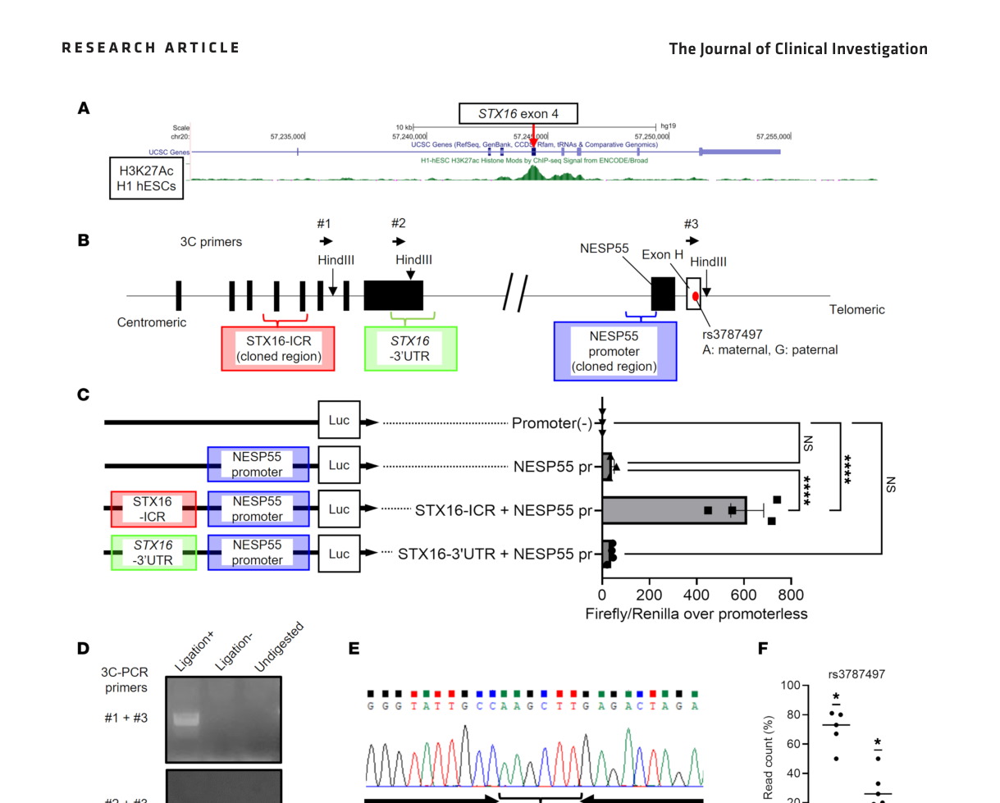

## Question

# Mechanistic Hypothesis Search

You are evaluating a specific disease mechanism hypothesis for the Disorder
Mechanisms Knowledge Base. This is not a general disease overview. Use the
hypothesis YAML below as the seed claim, then search for evidence that supports,
refutes, qualifies, or competes with this hypothesis.

## Target Disease
- **Disease Name:** Pseudohypoparathyroidism
- **Category:** Genetic

## Target Hypothesis
- **Hypothesis ID:** canonical_imprinting_model
- **Hypothesis Label:** Canonical GNAS Imprinting Model
- **Status in KB:** CANONICAL

## Seed Hypothesis YAML

```yaml
hypothesis_group_id: canonical_imprinting_model
hypothesis_label: Canonical GNAS Imprinting Model
status: CANONICAL
description: 'Parent-of-origin-specific GNAS expression explains subtype stratification: maternal alterations
  more often produce hormone resistance, while paternal coding variants favor AHO-predominant phenotypes.'
applies_to_subtypes:
- PHP1A
- PHP1B
- Pseudopseudohypoparathyroidism
evidence:
- reference: PMID:40972900
  reference_title: 'Imprinting and skeletal disorders: lessons from pseudohypoparathyroidism and related
    disorders.'
  supports: SUPPORT
  evidence_source: HUMAN_CLINICAL
  snippet: Thus, genomic imprinting plays a key role in the phenotypes associated with GNAS alterations.
  explanation: Supports imprinting as the organizing principle for subtype-specific phenotype patterns.
```

## Research Objective

Build a focused hypothesis-search report that answers:

1. What is the strongest direct evidence for this hypothesis?
2. What evidence argues against it, fails to reproduce it, or limits its scope?
3. Which claims are established, emerging, speculative, or contradicted?
4. Which patient subtypes, stages, tissues, cell types, molecular pathways, or
   biomarkers does the hypothesis best explain?
5. Which alternative or competing mechanistic hypotheses explain the same disease
   features better or more parsimoniously?
6. What are the explicit knowledge gaps: missing causal steps, unconfirmed edges,
   contradictory evidence, unknown source-to-target links, or source/data absences?
7. What experiments, cohorts, assays, datasets, or trials would most directly
   distinguish this hypothesis from alternatives?

Use primary literature whenever possible. Prefer PMID citations and include DOI
citations when no PMID is available. Treat reviews as orientation unless they
contain directly relevant synthesized evidence that should be clearly labeled as
review-level support.

## Required Output

### Executive Judgment

Give a concise verdict on the hypothesis as of the current literature:
supported, partially supported, unresolved, weakly supported, or refuted. Explain
the reasoning and the most important caveats.

### Evidence Matrix

Create a table with one row per important evidence item:

- Citation (PMID preferred)
- Evidence type (human clinical, model organism, in vitro, computational, review)
- Supports / refutes / qualifies / competing
- Mechanistic claim tested
- Key finding
- Disease subtype or context
- Confidence and limitations

### Mechanistic Causal Chain

Describe the causal chain implied by the hypothesis from upstream trigger to
clinical manifestation. Identify where the literature is strong, where the links
are inferred, and where there are missing causal steps.

### Knowledge Gaps

Identify explicit known unknowns surfaced by the search. Treat absence of
evidence as a curation-relevant finding only when the search actually checked for
it. Include:

- Unknown or weakly supported causal steps in the hypothesis
- Unconfirmed causal graph edges that need direct perturbation or longitudinal
  evidence
- Conflicting evidence, failed replications, or incompatible subtype-specific
  findings
- Unknown mechanism of action for relevant treatments, biomarkers, or
  interventions tied to this hypothesis
- Source-level or dataset-level absences, such as no relevant GenCC, ClinGen,
  trial, omics, or cohort evidence found as of the search date

For each gap, state the scope, why it matters, what was checked, and what
evidence or experiment would resolve it.

### Alternative Models

List competing or complementary hypotheses. For each, explain whether it is an
alternative to the seed hypothesis, a downstream consequence, an upstream cause,
or a parallel mechanism.

### Discriminating Tests

Recommend concrete studies or assays that would most efficiently test this
hypothesis against alternatives. Include patient stratification, biomarkers,
sample type, model system, perturbation, and expected result where applicable.

### Curation Leads

Provide candidate updates for the KB, but label these as leads requiring curator
verification. Include:

- candidate evidence references and exact abstract snippets to verify
- candidate pathophysiology nodes or edges
- candidate ontology terms for cell types and biological processes
- candidate subtype restrictions or status changes
- candidate `knowledge_gaps` or discussion prompts for unresolved causal claims,
  conflicting evidence, or explicit source/data absences

If the provider supports artifacts, produce artifact-friendly outputs such as an
evidence matrix, mechanistic diagram, knowledge-gap table, or comparison table.
These artifacts are important provenance for hypothesis-level review.


## Output

Question: You are an expert researcher providing comprehensive, well-cited information.

Provide detailed information focusing on:
1. Key concepts and definitions with current understanding
2. Recent developments and latest research (prioritize 2023-2024 sources)
3. Current applications and real-world implementations
4. Expert opinions and analysis from authoritative sources
5. Relevant statistics and data from recent studies

Format as a comprehensive research report with proper citations. Include URLs and publication dates where available.
Always prioritize recent, authoritative sources and provide specific citations for all major claims.

# Mechanistic Hypothesis Search

You are evaluating a specific disease mechanism hypothesis for the Disorder
Mechanisms Knowledge Base. This is not a general disease overview. Use the
hypothesis YAML below as the seed claim, then search for evidence that supports,
refutes, qualifies, or competes with this hypothesis.

## Target Disease
- **Disease Name:** Pseudohypoparathyroidism
- **Category:** Genetic

## Target Hypothesis
- **Hypothesis ID:** canonical_imprinting_model
- **Hypothesis Label:** Canonical GNAS Imprinting Model
- **Status in KB:** CANONICAL

## Seed Hypothesis YAML

```yaml
hypothesis_group_id: canonical_imprinting_model
hypothesis_label: Canonical GNAS Imprinting Model
status: CANONICAL
description: 'Parent-of-origin-specific GNAS expression explains subtype stratification: maternal alterations
  more often produce hormone resistance, while paternal coding variants favor AHO-predominant phenotypes.'
applies_to_subtypes:
- PHP1A
- PHP1B
- Pseudopseudohypoparathyroidism
evidence:
- reference: PMID:40972900
  reference_title: 'Imprinting and skeletal disorders: lessons from pseudohypoparathyroidism and related
    disorders.'
  supports: SUPPORT
  evidence_source: HUMAN_CLINICAL
  snippet: Thus, genomic imprinting plays a key role in the phenotypes associated with GNAS alterations.
  explanation: Supports imprinting as the organizing principle for subtype-specific phenotype patterns.
```

## Research Objective

Build a focused hypothesis-search report that answers:

1. What is the strongest direct evidence for this hypothesis?
2. What evidence argues against it, fails to reproduce it, or limits its scope?
3. Which claims are established, emerging, speculative, or contradicted?
4. Which patient subtypes, stages, tissues, cell types, molecular pathways, or
   biomarkers does the hypothesis best explain?
5. Which alternative or competing mechanistic hypotheses explain the same disease
   features better or more parsimoniously?
6. What are the explicit knowledge gaps: missing causal steps, unconfirmed edges,
   contradictory evidence, unknown source-to-target links, or source/data absences?
7. What experiments, cohorts, assays, datasets, or trials would most directly
   distinguish this hypothesis from alternatives?

Use primary literature whenever possible. Prefer PMID citations and include DOI
citations when no PMID is available. Treat reviews as orientation unless they
contain directly relevant synthesized evidence that should be clearly labeled as
review-level support.

## Required Output

### Executive Judgment

Give a concise verdict on the hypothesis as of the current literature:
supported, partially supported, unresolved, weakly supported, or refuted. Explain
the reasoning and the most important caveats.

### Evidence Matrix

Create a table with one row per important evidence item:

- Citation (PMID preferred)
- Evidence type (human clinical, model organism, in vitro, computational, review)
- Supports / refutes / qualifies / competing
- Mechanistic claim tested
- Key finding
- Disease subtype or context
- Confidence and limitations

### Mechanistic Causal Chain

Describe the causal chain implied by the hypothesis from upstream trigger to
clinical manifestation. Identify where the literature is strong, where the links
are inferred, and where there are missing causal steps.

### Knowledge Gaps

Identify explicit known unknowns surfaced by the search. Treat absence of
evidence as a curation-relevant finding only when the search actually checked for
it. Include:

- Unknown or weakly supported causal steps in the hypothesis
- Unconfirmed causal graph edges that need direct perturbation or longitudinal
  evidence
- Conflicting evidence, failed replications, or incompatible subtype-specific
  findings
- Unknown mechanism of action for relevant treatments, biomarkers, or
  interventions tied to this hypothesis
- Source-level or dataset-level absences, such as no relevant GenCC, ClinGen,
  trial, omics, or cohort evidence found as of the search date

For each gap, state the scope, why it matters, what was checked, and what
evidence or experiment would resolve it.

### Alternative Models

List competing or complementary hypotheses. For each, explain whether it is an
alternative to the seed hypothesis, a downstream consequence, an upstream cause,
or a parallel mechanism.

### Discriminating Tests

Recommend concrete studies or assays that would most efficiently test this
hypothesis against alternatives. Include patient stratification, biomarkers,
sample type, model system, perturbation, and expected result where applicable.

### Curation Leads

Provide candidate updates for the KB, but label these as leads requiring curator
verification. Include:

- candidate evidence references and exact abstract snippets to verify
- candidate pathophysiology nodes or edges
- candidate ontology terms for cell types and biological processes
- candidate subtype restrictions or status changes
- candidate `knowledge_gaps` or discussion prompts for unresolved causal claims,
  conflicting evidence, or explicit source/data absences

If the provider supports artifacts, produce artifact-friendly outputs such as an
evidence matrix, mechanistic diagram, knowledge-gap table, or comparison table.
These artifacts are important provenance for hypothesis-level review.


# Hypothesis-Search Report: Canonical GNAS Imprinting Model in Pseudohypoparathyroidism

**Target hypothesis (canonical_imprinting_model):** Parent-of-origin–specific GNAS expression explains subtype stratification: **maternal** alterations more often produce **hormone resistance** (PHP1A/PHP1B), while **paternal** coding variants favor **AHO-predominant** phenotypes (pseudopseudohypoparathyroidism, PPHP).

## Executive judgment

**Verdict:** **Supported, with important scope limitations.**

**Reasoning:**
* The model is strongly supported by (i) **direct within-family genotype–phenotype contrast** where the *same* GNAS coding loss-of-function variant associates with **PHP1A** in a maternally affected child and **PPHP** in the mother (implying paternal transmission in the mother), consistent with parent-of-origin effects (sano2024anovelgnasgsα pages 1-2, sano2024anovelgnasgsα pages 2-5), and (ii) **mechanistic causal evidence** that known AD-PHP1B-associated regions (STX16-ICR and NESP-ICR) are **functionally required** for establishing/maintaining **maternal A/B DMR methylation**, a shared epigenetic lesion in PHP1B (iwasaki2023thelongrangeinteraction pages 1-2, iwasaki2023thelongrangeinteraction pages 10-11, iwasaki2023thelongrangeinteraction media 21d6c599, iwasaki2023thelongrangeinteraction media fcaebb60).
* The strongest limitations are that (a) the **somatic, tissue-specific mechanism** that silences the **paternal Gsα allele** in hormone-responsive tissues (a key step needed to mechanistically “explain” hormone resistance) remains **explicitly unresolved** (iwasaki2023thelongrangeinteraction pages 10-11), and (b) genotype–phenotype prediction is **imperfect** due to **incomplete penetrance**, **mosaicism**, **broader methylation defects**, and contributions from **other GNAS transcripts** (e.g., XLαs) that can shape growth/metabolic traits (li2024recurrentsmallvariants pages 10-11, iwasaki2023thelongrangeinteraction pages 10-11, yang2023gnaslocusbone pages 8-9).

## 1) Strongest direct evidence for the hypothesis

### A. Human familial “same variant, different parental origin → different subtype” evidence
A 2024 family report identified a **heterozygous canonical splice donor** variant in **GNAS (c.212+2T>C)** in a girl with **PHP1A** and her mother with **PPHP**; RT-PCR (± cycloheximide) demonstrated aberrant splicing producing a frameshift with **nonsense-mediated decay**, supporting **Gsα loss-of-function** as the molecular consequence (sano2024anovelgnasgsα pages 1-2, sano2024anovelgnasgsα pages 2-5). This constitutes direct evidence that parent-of-origin influences whether a coding variant manifests primarily as **hormone resistance (PHP1A)** vs **AHO without hormone resistance (PPHP)**.

### B. Mechanistic evidence for PHP1B imprinting control consistent with maternal imprinting defects causing hormone resistance
A 2023 *Journal of Clinical Investigation* study built a **human embryonic stem cell (hESC) CRISPR** model of AD-PHP1B and showed:
* the **NESP-ICR** is required for methylation and transcriptional silencing at **A/B on the maternal allele**, and
* the **STX16-ICR** acts as a **long-range enhancer** of **NESP55** transcription (maternal predominance), and is **embryonic stage–specific** via pluripotency factor binding.
This provides functional causality for how **maternal-region deletions** can lead to **A/B hypomethylation**, the shared lesion in PHP1B, thereby linking parent-of-origin epigenetic disruption to hormone resistance (iwasaki2023thelongrangeinteraction pages 1-2, iwasaki2023thelongrangeinteraction pages 10-11). The mechanistic model is summarized visually in the paper’s figures (iwasaki2023thelongrangeinteraction media 21d6c599, iwasaki2023thelongrangeinteraction media fcaebb60).

### C. Human genetics expanding the causal variant spectrum for “maternal imprinting disruption → PHP1B”
A 2024 *JCI Insight* study identified **recurrent small variants** in the **NESP55/NESPAS region** in multigenerational families with PHP1B and broad GNAS methylation defects, proposing a mechanism involving **derepression of antisense (AS) transcription** with consequent effects on the **NESP-ICR** and decreased NESP transcription (li2024recurrentsmallvariants pages 1-2, li2024recurrentsmallvariants pages 10-11). This supports the hypothesis by extending “maternal alteration → hormone resistance” beyond classic STX16 deletions.

## 2) Evidence arguing against, failing to reproduce, or limiting the hypothesis

No retrieved evidence directly refutes parent-of-origin stratification as a major organizing principle. However, several findings **limit the scope**:

1. **Key causal step remains unknown:** The hESC study explicitly notes that paternal Gsα silencing occurs only in **limited differentiated tissues**, while hESCs show **biallelic Gsα expression**, implying an **unknown somatic tissue-specific mechanism** is required to produce the clinical hormone resistance phenotype (iwasaki2023thelongrangeinteraction pages 10-11). This limits mechanistic completeness.

2. **Incomplete penetrance and complex segregation:** In familial PHP1B with NESP-region variants, not all carriers of the presumed causal haplotype/defect show biochemical or methylation abnormalities, indicating **incomplete penetrance**, complicating causal attribution and inheritance prediction (li2024recurrentsmallvariants pages 10-11).

3. **Phenotypic complexity from large deletions and multi-gene CNVs:** A 2023 family with an ~849.8 kb deletion spanning **GNAS and nearby genes** had individuals diagnosed as PHP1A and PPHP; the authors note that large CNVs are rare and can present with broader/atypical phenotypes, limiting simple genotype–phenotype rules (fei2023whole‐genomesequencingrevealed pages 7-8, fei2023whole‐genomesequencingrevealed pages 1-2).

4. **Broader methylation landscapes and mosaicism:** For sporadic PHP1B, incomplete methylation alterations are suggested to reflect **mosaicism** acquired early postzygotically; this indicates multiple developmental routes to similar biochemical presentations (iwasaki2023thelongrangeinteraction pages 10-11).

5. **Competing/qualifying transcript-level mechanisms:** Review synthesis and mouse models suggest **combined/antagonistic effects** of **paternally expressed XLαs** and **Gsα** can shape growth/metabolic phenotypes, implying that “Gsα-only” parent-of-origin logic may be insufficient for the full phenotype spectrum (yang2023gnaslocusbone pages 8-9).

## 3) Status of claims (established vs emerging vs speculative)

**Established (high confidence):**
* GNAS is a complex imprinted locus; **maternal GNAS coding variants** affecting exons 1–13 are associated with **PHP1A** (AHO + multihormone resistance) and **paternal coding variants** with **PPHP** (AHO without hormone resistance), consistent with tissue-specific imprinting (root2023onehalfcenturyof pages 6-7, fei2023whole‐genomesequencingrevealed pages 1-2).
* PHP1B is primarily an imprinting disorder; **loss of methylation at the maternal A/B DMR** is a shared lesion tied to PTH resistance (root2023onehalfcenturyof pages 6-7, iwasaki2023thelongrangeinteraction pages 1-2).

**Emerging (moderate–high confidence, still expanding):**
* Specific **ICR-to-DMR causal circuitry** in humans: STX16-ICR/NESP-ICR long-range interaction controlling NESP55 and maternal A/B methylation (iwasaki2023thelongrangeinteraction pages 1-2, iwasaki2023thelongrangeinteraction pages 10-11, iwasaki2023thelongrangeinteraction media 21d6c599, iwasaki2023thelongrangeinteraction media fcaebb60).
* **New classes of small variants** in NESP55/NESPAS associated with broad methylation defects and PHP1B, with reduced penetrance (li2024recurrentsmallvariants pages 1-2, li2024recurrentsmallvariants pages 10-11).

**Speculative/Incomplete (explicit gaps):**
* The **molecular identity** of the somatic machinery establishing **paternal Gsα silencing** in renal proximal tubule and other endocrine targets (iwasaki2023thelongrangeinteraction pages 10-11).
* The extent to which **XLαs/NESP55/antisense** contributions explain non-endocrine or metabolic phenotypes more parsimoniously than a maternal-Gsα-centric model (yang2023gnaslocusbone pages 8-9, iwasaki2023thelongrangeinteraction pages 10-11).

## 4) Best-explained subtypes, tissues, pathways, biomarkers

### Subtypes best explained
* **PHP1A:** maternal coding loss-of-function affecting GNAS exons 1–13 → reduced Gsα function in tissues with maternal expression → multihormone resistance (PTH, TSH, etc.) plus AHO (root2023onehalfcenturyof pages 6-7, sano2024anovelgnasgsα pages 2-5).
* **PPHP:** paternal coding loss-of-function → AHO features (haploinsufficiency in non-imprinted tissues) **without hormone resistance** (root2023onehalfcenturyof pages 6-7, yang2023gnaslocusbone pages 8-9).
* **PHP1B:** maternal imprinting/methylation defect at **A/B DMR** (often via STX16/NESP region disruption) → reduced Gsα in renal proximal tubule where paternal allele is normally silent → PTH resistance (iwasaki2023thelongrangeinteraction pages 1-2, root2023onehalfcenturyof pages 6-7, li2024recurrentsmallvariants pages 10-11).

### Tissues/cell types and pathways
* **Renal proximal tubule** is a key site for PTH resistance; the canonical framework invokes **paternal Gsα silencing** there to explain why maternal defects yield PTH resistance (root2023onehalfcenturyof pages 6-7, iwasaki2023thelongrangeinteraction pages 10-11).
* Mechanistically, PTH receptor signaling requires **Gs–adenylyl cyclase–cAMP–PKA**; PHP1A historically shows failure of urinary nephrogenous cAMP increase after PTH and ~50% reduced Gαs levels in accessible cells (review synthesis) (root2023onehalfcenturyof pages 6-7).

### Biomarkers most directly tied to the hypothesis
* **A/B DMR methylation (loss-of-methylation)** as a molecular biomarker of PHP1B (root2023onehalfcenturyof pages 6-7, iwasaki2023thelongrangeinteraction pages 1-2).
* **Allele-aware genetics** (maternal vs paternal inheritance) for interpretation of GNAS coding variants affecting PHP1A vs PPHP (sano2024anovelgnasgsα pages 2-5, fei2023whole‐genomesequencingrevealed pages 1-2).

## 5) Alternative or competing mechanistic models

1. **Multi-transcript/antagonism model (complementary/qualifying):** Phenotypes may reflect combined effects of **Gsα** and **paternally expressed XLαs**, with possible antagonistic roles influencing growth and metabolism; this can explain features not fully accounted for by “Gsα hormone resistance” alone (yang2023gnaslocusbone pages 8-9, iwasaki2023thelongrangeinteraction pages 10-11).

2. **Postzygotic mosaic imprinting disturbance model (alternative route to similar phenotype):** Sporadic PHP1B methylation patterns may arise from **early postzygotic acquisition** of imprinting errors, leading to mosaic methylation abnormalities rather than a single inherited cis-variant mechanism (iwasaki2023thelongrangeinteraction pages 10-11).

3. **Uniparental disomy model (competing upstream cause for sporadic cases):** Review-level synthesis notes paternal uniparental disomy of 20q (patUPD20q) associated with broad imprinting defects in sporadic PHP1B (yang2023gnaslocusbone pages 8-9).

## 6) Knowledge gaps (explicit known unknowns)

Key gaps and resolution strategies are summarized in the injected artifact below.

| Gap | Why it matters | What evidence checked | Recommended discriminating experiment/study | Expected outcomes under canonical model vs alternative |
|---|---|---|---|---|
| Unknown somatic mechanism for paternal Gsα silencing in hormone-responsive tissues | This is the central missing causal step connecting maternal allele defects to tissue-selective hormone resistance; without it, the model explains subtype stratification only at a high level | hESC studies showed biallelic Gsα expression and explicitly concluded that an unknown somatic tissue-specific mechanism must mediate paternal silencing in limited differentiated tissues; review synthesis localizes maternal-predominant expression to proximal tubule, pituitary, thyroid, gonads, hypothalamus, and brown adipose tissue (iwasaki2023thelongrangeinteraction pages 10-11, root2023onehalfcenturyof pages 6-7) | Allele-resolved single-cell multi-omics in patient-derived iPSC differentiation to renal proximal tubule, thyrocytes, pituitary lineage, and gonadal cells, combined with CRISPR perturbation of candidate silencers/insulators and long-read phased RNA-seq/ATAC-seq/methylome profiling | Canonical model: differentiated endocrine target cells will newly acquire paternal Gsα repression with corresponding chromatin features, and disrupting the responsible cis/trans regulator will restore paternal Gsα and blunt hormone-resistance readouts. Alternative: paternal silencing will not emerge consistently, or hormone resistance will track other transcripts/signaling nodes rather than allele-specific Gsα repression |
| Stage/tissue specificity differences between hESC models and patient tissues | Current strongest mechanistic evidence for PHP1B comes from embryonic stem-cell models; if imprint control differs after lineage commitment, mechanistic conclusions may not fully translate to disease tissues | CRISPR hESC data support STX16-ICR as a long-range enhancer for NESP55 and NESP-ICR as required for A/B methylation, but authors note stage-specific effects, cross-species differences, and that hESCs do not model differentiated tissue silencing; LCL/patient studies suggest related but not identical transcript/methylation consequences (iwasaki2023thelongrangeinteraction pages 1-2, iwasaki2023thelongrangeinteraction pages 10-11, li2024recurrentsmallvariants pages 10-11) | Parallel perturbation study using matched hESCs, iPSCs, renal proximal tubule organoids, and patient lymphoblastoid cells with maternal STX16-ICR/NESP-ICR/NESP55-region edits; compare allele-specific methylation, 3C/Hi-C contacts, and hormone signaling outputs across stages | Canonical model: core maternal control of A/B methylation should reproduce across early developmental models, with later tissue-specific addition of paternal Gsα silencing. Alternative: key enhancer-promoter interactions or methylation dependencies will differ substantially by stage/cell type, implying the current model is incomplete or context-restricted |
| Incomplete penetrance of NESP55/NESPAS variants | Reduced penetrance weakens deterministic parent-of-origin prediction and affects genetic counseling, risk estimation, and claims of sufficiency for broad methylation-defect PHP1B | Human family studies identified recurrent small variants associated with broad methylation defects and PHP1B, but at least one maternal defect showed incomplete penetrance and not all carriers manifested biochemical disease or methylation abnormalities (li2024recurrentsmallvariants pages 1-2, li2024recurrentsmallvariants pages 10-11) | Large pedigree-based haplotype study with phased long-read genome sequencing plus quantitative methylation profiling across multiple tissues/time points in carriers and nonpenetrant relatives | Canonical model: pathogenic maternal variants should show measurable but possibly thresholded epigenetic effects, with nonpenetrance reflecting mosaicism/modifier loci/environment. Alternative: variants are not sufficient causes, and disease segregates better with other linked loci, multilocus imprinting disturbance, or stochastic postzygotic events |
| Variability of methylation at other DMRs (AS/XL/NESP) and mosaicism in sporadic PHP1B | The seed hypothesis is strongest for A/B methylation and PTH resistance, but broader DMR patterns may explain heterogeneity, sporadic disease, and atypical features | A/B loss of methylation is the shared PHP1B defect, while broader defects vary; hESC NESP-ICR deletion did not fully recapitulate AS/XL changes seen in many AD-PHP1B patients; authors propose early postzygotic mosaicism for incomplete sporadic methylation defects; reviews note patUPD20q in sporadic broad-defect PHP1B (iwasaki2023thelongrangeinteraction pages 1-2, iwasaki2023thelongrangeinteraction pages 10-11, yang2023gnaslocusbone pages 8-9) | Deep methylome profiling with phased nanopore sequencing in blood, urine-derived renal epithelial cells, buccal cells, and, where feasible, skin fibroblasts from sporadic PHP1B; include patUPD20q testing and single-cell methylome analysis to quantify mosaicism | Canonical model: all cases should converge on maternal A/B hypomethylation, while AS/XL/NESP variability reflects secondary, stage-specific, or mosaic modifications. Alternative: broader DMR abnormalities or UPD patterns are primary drivers in substantial subsets, making A/B-centric imprinting an incomplete organizer of disease heterogeneity |
| Contribution of other GNAS transcripts (XLαs, NESP55, antisense) to growth/metabolic phenotypes beyond hormone resistance | Parent-of-origin effects on obesity, fetal growth, and nonclassical phenotypes may not be explained by Gsα alone; this affects how broadly the canonical model can be generalized | Review and mouse-model synthesis indicate antagonistic or parallel effects of Gsα and XLαs in growth/metabolic phenotypes; STX16-ICR may regulate additional transcripts including XL; human CNV cases show broader phenotypes than classic PHP1A/PPHP, suggesting multi-transcript dosage effects (yang2023gnaslocusbone pages 8-9, iwasaki2023thelongrangeinteraction pages 10-11, fei2023whole‐genomesequencingrevealed pages 7-8) | Isoform-specific perturbation in human iPSC-derived adipocytes, hypothalamic neurons, and growth-related lineages using allele-specific CRISPRi/CRISPRa for Gsα, XLαs, NESP55, and antisense transcripts, paired with metabolic and signaling phenotyping | Canonical model: hormone resistance and major subtype split will track maternal Gsα deficiency, while other transcripts contribute only modifiers. Alternative: growth, obesity, or skeletal phenotypes will map strongly to XLαs/NESP55/antisense perturbation, indicating a multi-transcript model explains phenotype breadth more parsimoniously |


*Table: This table summarizes the main unresolved causal steps and scope limits in the canonical GNAS imprinting model, alongside experiments that would most directly distinguish it from competing or complementary explanations. It is useful for prioritizing curation gaps and future studies.*

## 7) Discriminating tests (high-yield studies to separate canonical vs alternatives)

Most efficient discriminators (also summarized in artifact-01):

* **Allele-resolved single-cell multi-omics in differentiated target tissues** (renal proximal tubule organoids, thyrocytes, pituitary lineage) derived from patient iPSCs, to directly observe **when/how paternal Gsα silencing arises** and which chromatin features enforce it (iwasaki2023thelongrangeinteraction pages 10-11).
* **Stage- and cell-type–matched perturbations** (hESC → iPSC → organoid) of STX16-ICR/NESP-ICR/NESP55-region edits, measuring 3D chromatin contacts (Hi-C/3C), allele-specific methylation, and hormone signaling outputs to test developmental constraints of imprint establishment (iwasaki2023thelongrangeinteraction pages 10-11, li2024recurrentsmallvariants pages 10-11).
* **Large pedigrees with phased long-read sequencing plus quantitative methylation across tissues** to quantify penetrance/mosaicism and identify modifier loci for NESP-region variants (li2024recurrentsmallvariants pages 10-11).

## Current applications and real-world implementations (mechanism-linked)

* **Diagnostic molecular stratification**: PHP1B workups commonly use methylation testing (e.g., MS-MLPA) to detect **A/B DMR loss of methylation**, which is the shared lesion tying clinical PTH resistance to the imprinting mechanism (root2023onehalfcenturyof pages 6-7, fei2023whole‐genomesequencingrevealed pages 7-8).
* **Variant interpretation and counseling**: Parent-of-origin–aware interpretation is necessary when a GNAS coding loss-of-function variant is identified, because maternal vs paternal transmission predicts risk of hormone resistance vs AHO-only phenotypes (sano2024anovelgnasgsα pages 2-5, root2023onehalfcenturyof pages 6-7).

## Relevant statistics / quantitative data from recent studies

* **Replication cohort size and phenotype definition in PHP1B genetics:** The 2024 JCI Insight study analyzed **64 PHP1B individuals** (55 sporadic; 9 familial probands), all with biochemical evidence of PTH resistance and **wild-type copies of GNAS exons 1–13**, and lacking classic STX16/NESP55 deletions on exome testing (li2024recurrentsmallvariants pages 10-11). This cohort supports the claim that additional (non-classic) genetic lesions contribute to PHP1B and motivates expanding beyond canonical deletion testing.

## Evidence matrix

| Citation (PMID/DOI) | Publication date | Evidence type | Supports / refutes / qualifies / competing | Mechanistic claim tested | Key finding | Subtype / context | Confidence & limitations | URL |
|---|---|---|---|---|---|---|---|---|
| Iwasaki Y, et al. *J Clin Invest* 2023;133(8):e167953. DOI: 10.1172/JCI167953 (iwasaki2023thelongrangeinteraction pages 1-2, iwasaki2023thelongrangeinteraction pages 10-11, iwasaki2023thelongrangeinteraction media 21d6c599) | 2023-04 | Model organism/cellular mechanistic study (human ESC CRISPR), with disease-mechanism relevance | Supports | Maternal imprinting control at GNAS explains PHP1B via A/B DMR hypomethylation; STX16-ICR and NESP-ICR are causal regulators of maternal A/B methylation | CRISPR deletion studies in hESCs showed NESP-ICR is required for maternal A/B methylation/silencing and STX16-ICR acts as a long-range embryonic enhancer of NESP55 transcription; disruption of either maternal control region impairs A/B methylation, providing direct mechanism for AD-PHP1B | PHP1B; maternal STX16/NESP imprinting defects; embryonic imprint establishment | High mechanistic confidence for imprint-control architecture; limitations: hESC model rather than renal proximal tubule/endocrine target tissues, and authors note paternal Gsα silencing mechanism in differentiated tissues remains unknown | https://doi.org/10.1172/JCI167953 |
| Li D, et al. *JCI Insight* 2024;9(24):e185874. DOI: 10.1172/jci.insight.185874 (li2024recurrentsmallvariants pages 1-2, li2024recurrentsmallvariants pages 10-11) | 2024-12 | Human clinical genetics + molecular analysis | Supports, qualifies | Small maternal variants in NESP55/NESPAS can produce broad GNAS methylation defects and PHP1B; canonical imprinting model extends beyond classic STX16 deletions | Genome sequencing identified recurrent small GNAS-region variants in families with AD-PHP1B and broad DMR defects; data suggested derepressed AS transcription and reduced NESP55 transcription as a mechanism; at least one defect showed incomplete penetrance | PHP1B with broad methylation defects; familial and replication cohorts | High relevance and good human evidence; limitations: incomplete penetrance complicates inheritance/causality, some mechanistic inferences remain indirect, and many sporadic PHP1B cases still lack a resolved genetic cause | https://doi.org/10.1172/jci.insight.185874 |
| Sano S, et al. *Clin Pediatr Endocrinol* 2024;33:66-70. DOI: 10.1297/cpe.2023-0065 (sano2024anovelgnasgsα pages 1-2, sano2024anovelgnasgsα pages 2-5) | 2024-01 | Human clinical family study + in vitro RNA assay | Supports | The same GNAS coding loss-of-function variant yields PHP1A when maternally inherited and PPHP when paternally inherited | A girl with PHP1A and her mother with PPHP shared the same splice-donor variant c.212+2T>C; RT-PCR in lymphoblastoid cells showed aberrant splicing with frameshift and nonsense-mediated decay, supporting Gsα loss-of-function and parent-of-origin phenotype divergence | PHP1A vs PPHP within one family | Moderate-high directness for parent-of-origin effect; limitations: single family, assays in lymphoblastoid cells rather than hormone-responsive tissues, no direct tissue-specific allelic expression measurement | https://doi.org/10.1297/cpe.2023-0065 |
| Fei Y, et al. *Mol Genet Genomic Med* 2023;11(5):e2144. DOI: 10.1002/mgg3.2144 (fei2023whole‐genomesequencingrevealed pages 1-2, fei2023whole‐genomesequencingrevealed pages 7-8) | 2023-01 | Human clinical family genetics | Supports, qualifies | Parent-of-origin effects at GNAS broadly stratify PHP1A versus PPHP, but large deletions can add phenotypic complexity | In a family with an approximately 849.8 kb deletion spanning GNAS and neighboring genes, the proband and daughter had PHP1A while the mother had PPHP; authors attributed the contrast to imprinting, while noting large 20q13.32 deletions can produce broader or atypical phenotypes | Familial deletion spanning GNAS; PHP1A vs PPHP; CNV context | Moderate confidence for support of canonical model; limitations: deletion spans multiple genes, phenotype may reflect combined dosage/epigenetic effects, and case-series size is small | https://doi.org/10.1002/mgg3.2144 |
| Root AW, Levine MA. *J Pediatr Endocrinol Metab* 2023;36:105-118. DOI: 10.1515/jpem-2022-0624 (root2023onehalfcenturyof pages 6-7) | 2023-01 | Review | Supports | Tissue-specific paternal silencing of Gsα explains why maternal coding mutations cause hormone resistance and paternal coding mutations cause PPHP; PHP1B is primarily an imprinting disorder | Review synthesizes that Gαs is biallelic in most tissues but preferentially maternal in proximal renal tubule, pituitary, thyroid, gonads, hypothalamus, and brown adipose tissue; maternal exons 1–13 mutations cause PHP1A, paternal mutations cause PPHP, and all PHP1B cases show maternal exon A/B loss of methylation | Canonical PHP1A, PPHP, PHP1B framework | Moderate confidence as review-level synthesis rather than new primary data; useful for consensus framing but not direct experimental proof | https://doi.org/10.1515/jpem-2022-0624 |
| Yang W, et al. *Front Endocrinol* 2023;14:1255864. DOI: 10.3389/fendo.2023.1255864 (yang2023gnaslocusbone pages 8-9) | 2023-10 | Review with mouse-model synthesis | Supports, qualifies, competing | Canonical maternal-versus-paternal imprinting model explains major subtype split, but additional transcript-specific effects (e.g., XLas vs Gsα antagonism) and patUPD20q broaden or complicate phenotypes | Review states maternal GNAS exons 1–13 mutations cause PHP1A and paternal loss-of-function causes PPHP; PHP1B involves maternal-side imprinting defects and sporadic broad defects may involve patUPD20q; mouse data suggest combined/antagonistic effects of paternally expressed XLas and Gsα can shape growth/metabolic phenotypes beyond a simple single-transcript model | PHP1A, PHP1B, PPHP; mouse models; patUPD20q | Moderate confidence because much is synthesized from prior studies; strong for qualification/complexity, but mouse findings may not fully translate to humans | https://doi.org/10.3389/fendo.2023.1255864 |


*Table: This table summarizes the most relevant recent and foundational evidence for the canonical GNAS imprinting model in pseudohypoparathyroidism, including direct support, mechanistic qualifiers, and limitations. It is useful for quickly assessing which parts of the hypothesis are well established versus where transcript-specific complexity or incomplete penetrance narrows the model’s scope.*

## Mechanistic causal chain (canonical model)

1. **Upstream trigger (genetic/epigenetic):**
   * **PHP1A:** heterozygous inactivating coding variant in **maternal** GNAS exons 1–13 (root2023onehalfcenturyof pages 6-7, sano2024anovelgnasgsα pages 2-5).
   * **PPHP:** heterozygous inactivating coding variant in **paternal** GNAS allele (root2023onehalfcenturyof pages 6-7).
   * **PHP1B:** maternal imprinting disruption—classically **A/B DMR loss of methylation**, often due to maternal deletions/variants affecting **STX16-ICR / NESP-ICR / NESP55 region** (iwasaki2023thelongrangeinteraction pages 1-2, li2024recurrentsmallvariants pages 10-11).

2. **Molecular intermediate (imprinting control):**
   * Maternal long-range enhancer/promoter interactions (STX16-ICR → NESP55 within NESP-ICR) are required for establishing/maintaining maternal A/B methylation in early embryogenesis (iwasaki2023thelongrangeinteraction pages 10-11, iwasaki2023thelongrangeinteraction media 21d6c599, iwasaki2023thelongrangeinteraction media fcaebb60).

3. **Cell/tissue-specific expression consequence (inferred/partially established):**
   * In key endocrine target tissues, **paternal Gsα is silent**, so maternal allele disruption yields functional Gsα deficiency and hormone resistance. This step is conceptually central but mechanistically **incomplete**, since the silencing mechanism is unknown and not modeled in hESCs (root2023onehalfcenturyof pages 6-7, iwasaki2023thelongrangeinteraction pages 10-11).

4. **Pathway effect:**
   * Impaired **Gs–adenylyl cyclase–cAMP** signaling downstream of GPCRs such as PTH1R results in absent/attenuated physiologic hormone responses (review synthesis) (root2023onehalfcenturyof pages 6-7).

5. **Clinical manifestations:**
   * Hormone resistance (PTH ± TSH and others) is enriched with **maternal** defects (PHP1A/PHP1B), while **AHO-only** features predominate with **paternal** coding defects (PPHP) (root2023onehalfcenturyof pages 6-7, sano2024anovelgnasgsα pages 2-5, yang2023gnaslocusbone pages 8-9).

## Curation leads (for KB; require curator verification)

**Lead 1: Add mechanistic “ICR→A/B methylation” edges supporting PHP1B.**
* Candidate reference: Iwasaki et al., *J Clin Invest* (Apr 2023), DOI:10.1172/JCI167953, URL: https://doi.org/10.1172/JCI167953.
* Snippets to verify in full text: STX16-ICR functions as a long-range enhancer for NESP55; NESP-ICR required for A/B methylation/silencing; interaction shows maternal predominance (iwasaki2023thelongrangeinteraction pages 10-11).
* Candidate nodes/edges:
  * STX16-ICR (enhancer activity; embryonic stage specific) → NESP55 transcription → establishment/regain of A/B DMR methylation → renal proximal tubule Gsα expression → PTH resistance.
* Candidate ontology terms:
  * biological process: genomic imprinting; DNA methylation; enhancer activity; long-range chromatin interaction.
  * cell types: embryonic stem cell; renal proximal tubule cell.

**Lead 2: Expand “causal variant classes” for AD-PHP1B beyond classic STX16 deletions.**
* Candidate reference: Li et al., *JCI Insight* (Dec 2024), DOI:10.1172/jci.insight.185874, URL: https://doi.org/10.1172/jci.insight.185874.
* Snippets to verify: recurrent small variants in NESP55/NESPAS; broad methylation defects; incomplete penetrance; proposed mechanism via AS derepression and NESP decrease (li2024recurrentsmallvariants pages 10-11).
* Candidate KB updates:
  * add variant mechanism: NESP55/NESPAS microdeletions/variants → AS upregulation → NESP-ICR methylation changes → PHP1B.
  * add knowledge_gap: incomplete penetrance requires modifier/mosaicism modeling.

**Lead 3: Add “explicit unknown” about paternal Gsα silencing machinery as a curated knowledge gap.**
* Candidate reference snippet: hESCs show biallelic Gsα; “as-yet-unknown somatic tissue-specific mechanism is likely required for Gsα silencing” (iwasaki2023thelongrangeinteraction pages 10-11).

---

## Key URLs and publication dates (from retrieved papers)
* Iwasaki et al. *J Clin Invest* **2023-04**. https://doi.org/10.1172/JCI167953 (iwasaki2023thelongrangeinteraction pages 1-2)
* Fei et al. *Mol Genet Genomic Med* **2023-01**. https://doi.org/10.1002/mgg3.2144 (fei2023whole‐genomesequencingrevealed pages 1-2)
* Root & Levine *J Pediatr Endocrinol Metab* **2023-01**. https://doi.org/10.1515/jpem-2022-0624 (root2023onehalfcenturyof pages 6-7)
* Yang et al. *Front Endocrinol* **2023-10**. https://doi.org/10.3389/fendo.2023.1255864 (yang2023gnaslocusbone pages 8-9)
* Sano et al. *Clin Pediatr Endocrinol* **2024-01**. https://doi.org/10.1297/cpe.2023-0065 (sano2024anovelgnasgsα pages 1-2)
* Li et al. *JCI Insight* **2024-12**. https://doi.org/10.1172/jci.insight.185874 (li2024recurrentsmallvariants pages 1-2)


References

1. (sano2024anovelgnasgsα pages 1-2): Shinichiro Sano, Shotaro Iwamoto, Rie Matsushita, Yohei Masunaga, Yasuko Fujisawa, and Tsutomu Ogata. A novel gnas-gsα splice donor site variant in a girl with pseudohypoparathyroidism type 1a and her mother with pseudopseudohypoparathyroidism. Clinical Pediatric Endocrinology, 33:66-70, Jan 2024. URL: https://doi.org/10.1297/cpe.2023-0065, doi:10.1297/cpe.2023-0065. This article has 0 citations and is from a peer-reviewed journal.

2. (sano2024anovelgnasgsα pages 2-5): Shinichiro Sano, Shotaro Iwamoto, Rie Matsushita, Yohei Masunaga, Yasuko Fujisawa, and Tsutomu Ogata. A novel gnas-gsα splice donor site variant in a girl with pseudohypoparathyroidism type 1a and her mother with pseudopseudohypoparathyroidism. Clinical Pediatric Endocrinology, 33:66-70, Jan 2024. URL: https://doi.org/10.1297/cpe.2023-0065, doi:10.1297/cpe.2023-0065. This article has 0 citations and is from a peer-reviewed journal.

3. (iwasaki2023thelongrangeinteraction pages 1-2): Yorihiro Iwasaki, Cagri Aksu, Monica Reyes, Birol Ay, Qing He, and Murat Bastepe. The long-range interaction between two gnas imprinting control regions delineates pseudohypoparathyroidism type 1b pathogenesis. Journal of Clinical Investigation, Apr 2023. URL: https://doi.org/10.1172/jci167953, doi:10.1172/jci167953. This article has 24 citations and is from a highest quality peer-reviewed journal.

4. (iwasaki2023thelongrangeinteraction pages 10-11): Yorihiro Iwasaki, Cagri Aksu, Monica Reyes, Birol Ay, Qing He, and Murat Bastepe. The long-range interaction between two gnas imprinting control regions delineates pseudohypoparathyroidism type 1b pathogenesis. Journal of Clinical Investigation, Apr 2023. URL: https://doi.org/10.1172/jci167953, doi:10.1172/jci167953. This article has 24 citations and is from a highest quality peer-reviewed journal.

5. (iwasaki2023thelongrangeinteraction media 21d6c599): Yorihiro Iwasaki, Cagri Aksu, Monica Reyes, Birol Ay, Qing He, and Murat Bastepe. The long-range interaction between two gnas imprinting control regions delineates pseudohypoparathyroidism type 1b pathogenesis. Journal of Clinical Investigation, Apr 2023. URL: https://doi.org/10.1172/jci167953, doi:10.1172/jci167953. This article has 24 citations and is from a highest quality peer-reviewed journal.

6. (iwasaki2023thelongrangeinteraction media fcaebb60): Yorihiro Iwasaki, Cagri Aksu, Monica Reyes, Birol Ay, Qing He, and Murat Bastepe. The long-range interaction between two gnas imprinting control regions delineates pseudohypoparathyroidism type 1b pathogenesis. Journal of Clinical Investigation, Apr 2023. URL: https://doi.org/10.1172/jci167953, doi:10.1172/jci167953. This article has 24 citations and is from a highest quality peer-reviewed journal.

7. (li2024recurrentsmallvariants pages 10-11): Dong Li, Suzanne Jan de Beur, Cuiping Hou, Maura R.Z. Ruzhnikov, Hilary Seeley, Garry R. Cutting, Molly B. Sheridan, and Michael A. Levine. Recurrent small variants in nesp55/nespas associated with broad gnas methylation defects and pseudohypoparathyroidism type 1b. JCI Insight, Dec 2024. URL: https://doi.org/10.1172/jci.insight.185874, doi:10.1172/jci.insight.185874. This article has 4 citations and is from a domain leading peer-reviewed journal.

8. (yang2023gnaslocusbone pages 8-9): Wan Yang, Yiyi Zuo, Nuo Zhang, Kangning Wang, Runze Zhang, Ziyi Chen, and Qing He. Gnas locus: bone related diseases and mouse models. Frontiers in Endocrinology, Oct 2023. URL: https://doi.org/10.3389/fendo.2023.1255864, doi:10.3389/fendo.2023.1255864. This article has 19 citations.

9. (li2024recurrentsmallvariants pages 1-2): Dong Li, Suzanne Jan de Beur, Cuiping Hou, Maura R.Z. Ruzhnikov, Hilary Seeley, Garry R. Cutting, Molly B. Sheridan, and Michael A. Levine. Recurrent small variants in nesp55/nespas associated with broad gnas methylation defects and pseudohypoparathyroidism type 1b. JCI Insight, Dec 2024. URL: https://doi.org/10.1172/jci.insight.185874, doi:10.1172/jci.insight.185874. This article has 4 citations and is from a domain leading peer-reviewed journal.

10. (fei2023whole‐genomesequencingrevealed pages 7-8): Yangfan Fei, Lv Liu, Lixia Wu, Ou Wang, Xiaoping Xing, Aiping Li, and Lingyi Huang. Whole‐genome sequencing revealed a novel long‐range deletion mutation spanning gnas in familial pseudohypoparathyroidism. Molecular Genetics & Genomic Medicine, Jan 2023. URL: https://doi.org/10.1002/mgg3.2144, doi:10.1002/mgg3.2144. This article has 2 citations and is from a peer-reviewed journal.

11. (fei2023whole‐genomesequencingrevealed pages 1-2): Yangfan Fei, Lv Liu, Lixia Wu, Ou Wang, Xiaoping Xing, Aiping Li, and Lingyi Huang. Whole‐genome sequencing revealed a novel long‐range deletion mutation spanning gnas in familial pseudohypoparathyroidism. Molecular Genetics & Genomic Medicine, Jan 2023. URL: https://doi.org/10.1002/mgg3.2144, doi:10.1002/mgg3.2144. This article has 2 citations and is from a peer-reviewed journal.

12. (root2023onehalfcenturyof pages 6-7): Allen W. Root and Michael A. Levine. One half-century of advances in the evaluation and management of disorders of bone and mineral metabolism in children and adolescents. Journal of Pediatric Endocrinology and Metabolism, 36:105-118, Jan 2023. URL: https://doi.org/10.1515/jpem-2022-0624, doi:10.1515/jpem-2022-0624. This article has 9 citations and is from a peer-reviewed journal.

## Artifacts

- [Edison artifact artifact-00](falcon_artifacts/artifact-00.md)
- [Edison artifact artifact-01](falcon_artifacts/artifact-01.md)

