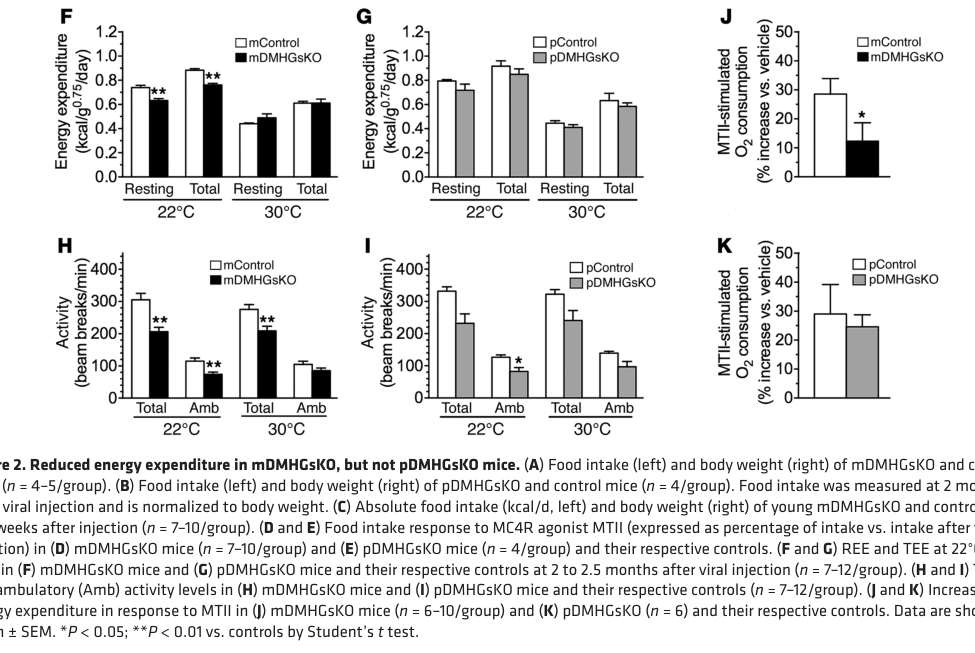

## Question

# Mechanistic Hypothesis Search

You are evaluating a specific disease mechanism hypothesis for the Disorder
Mechanisms Knowledge Base. This is not a general disease overview. Use the
hypothesis YAML below as the seed claim, then search for evidence that supports,
refutes, qualifies, or competes with this hypothesis.

## Target Disease
- **Disease Name:** Pseudohypoparathyroidism
- **Category:** Genetic

## Target Hypothesis
- **Hypothesis ID:** neuroendocrine_obesity_model
- **Hypothesis Label:** GNAS-Related Neuroendocrine Obesity Model
- **Status in KB:** EMERGING

## Seed Hypothesis YAML

```yaml
hypothesis_group_id: neuroendocrine_obesity_model
hypothesis_label: GNAS-Related Neuroendocrine Obesity Model
status: EMERGING
description: Early-onset obesity may reflect disrupted Gs alpha-dependent GPCR signaling in energy-homeostasis
  pathways, superimposed on classic PHP endocrine and skeletal mechanisms.
applies_to_subtypes:
- PHP1A
- PHP1B
evidence:
- reference: PMID:38103632
  reference_title: The role of genetic and epigenetic GNAS alterations in the development of early-onset
    obesity.
  supports: SUPPORT
  evidence_source: HUMAN_CLINICAL
  snippet: Genetic or epigenetic alterations in GNAS are known to cause pseudohypoparathyroidism in its
    different subtypes and have been recently associated with isolated, early-onset, severe obesity.
  explanation: Supports obesity-specific mechanistic superimposition on canonical PHP pathophysiology.
```

## Research Objective

Build a focused hypothesis-search report that answers:

1. What is the strongest direct evidence for this hypothesis?
2. What evidence argues against it, fails to reproduce it, or limits its scope?
3. Which claims are established, emerging, speculative, or contradicted?
4. Which patient subtypes, stages, tissues, cell types, molecular pathways, or
   biomarkers does the hypothesis best explain?
5. Which alternative or competing mechanistic hypotheses explain the same disease
   features better or more parsimoniously?
6. What are the explicit knowledge gaps: missing causal steps, unconfirmed edges,
   contradictory evidence, unknown source-to-target links, or source/data absences?
7. What experiments, cohorts, assays, datasets, or trials would most directly
   distinguish this hypothesis from alternatives?

Use primary literature whenever possible. Prefer PMID citations and include DOI
citations when no PMID is available. Treat reviews as orientation unless they
contain directly relevant synthesized evidence that should be clearly labeled as
review-level support.

## Required Output

### Executive Judgment

Give a concise verdict on the hypothesis as of the current literature:
supported, partially supported, unresolved, weakly supported, or refuted. Explain
the reasoning and the most important caveats.

### Evidence Matrix

Create a table with one row per important evidence item:

- Citation (PMID preferred)
- Evidence type (human clinical, model organism, in vitro, computational, review)
- Supports / refutes / qualifies / competing
- Mechanistic claim tested
- Key finding
- Disease subtype or context
- Confidence and limitations

### Mechanistic Causal Chain

Describe the causal chain implied by the hypothesis from upstream trigger to
clinical manifestation. Identify where the literature is strong, where the links
are inferred, and where there are missing causal steps.

### Knowledge Gaps

Identify explicit known unknowns surfaced by the search. Treat absence of
evidence as a curation-relevant finding only when the search actually checked for
it. Include:

- Unknown or weakly supported causal steps in the hypothesis
- Unconfirmed causal graph edges that need direct perturbation or longitudinal
  evidence
- Conflicting evidence, failed replications, or incompatible subtype-specific
  findings
- Unknown mechanism of action for relevant treatments, biomarkers, or
  interventions tied to this hypothesis
- Source-level or dataset-level absences, such as no relevant GenCC, ClinGen,
  trial, omics, or cohort evidence found as of the search date

For each gap, state the scope, why it matters, what was checked, and what
evidence or experiment would resolve it.

### Alternative Models

List competing or complementary hypotheses. For each, explain whether it is an
alternative to the seed hypothesis, a downstream consequence, an upstream cause,
or a parallel mechanism.

### Discriminating Tests

Recommend concrete studies or assays that would most efficiently test this
hypothesis against alternatives. Include patient stratification, biomarkers,
sample type, model system, perturbation, and expected result where applicable.

### Curation Leads

Provide candidate updates for the KB, but label these as leads requiring curator
verification. Include:

- candidate evidence references and exact abstract snippets to verify
- candidate pathophysiology nodes or edges
- candidate ontology terms for cell types and biological processes
- candidate subtype restrictions or status changes
- candidate `knowledge_gaps` or discussion prompts for unresolved causal claims,
  conflicting evidence, or explicit source/data absences

If the provider supports artifacts, produce artifact-friendly outputs such as an
evidence matrix, mechanistic diagram, knowledge-gap table, or comparison table.
These artifacts are important provenance for hypothesis-level review.


## Output

Question: You are an expert researcher providing comprehensive, well-cited information.

Provide detailed information focusing on:
1. Key concepts and definitions with current understanding
2. Recent developments and latest research (prioritize 2023-2024 sources)
3. Current applications and real-world implementations
4. Expert opinions and analysis from authoritative sources
5. Relevant statistics and data from recent studies

Format as a comprehensive research report with proper citations. Include URLs and publication dates where available.
Always prioritize recent, authoritative sources and provide specific citations for all major claims.

# Mechanistic Hypothesis Search

You are evaluating a specific disease mechanism hypothesis for the Disorder
Mechanisms Knowledge Base. This is not a general disease overview. Use the
hypothesis YAML below as the seed claim, then search for evidence that supports,
refutes, qualifies, or competes with this hypothesis.

## Target Disease
- **Disease Name:** Pseudohypoparathyroidism
- **Category:** Genetic

## Target Hypothesis
- **Hypothesis ID:** neuroendocrine_obesity_model
- **Hypothesis Label:** GNAS-Related Neuroendocrine Obesity Model
- **Status in KB:** EMERGING

## Seed Hypothesis YAML

```yaml
hypothesis_group_id: neuroendocrine_obesity_model
hypothesis_label: GNAS-Related Neuroendocrine Obesity Model
status: EMERGING
description: Early-onset obesity may reflect disrupted Gs alpha-dependent GPCR signaling in energy-homeostasis
  pathways, superimposed on classic PHP endocrine and skeletal mechanisms.
applies_to_subtypes:
- PHP1A
- PHP1B
evidence:
- reference: PMID:38103632
  reference_title: The role of genetic and epigenetic GNAS alterations in the development of early-onset
    obesity.
  supports: SUPPORT
  evidence_source: HUMAN_CLINICAL
  snippet: Genetic or epigenetic alterations in GNAS are known to cause pseudohypoparathyroidism in its
    different subtypes and have been recently associated with isolated, early-onset, severe obesity.
  explanation: Supports obesity-specific mechanistic superimposition on canonical PHP pathophysiology.
```

## Research Objective

Build a focused hypothesis-search report that answers:

1. What is the strongest direct evidence for this hypothesis?
2. What evidence argues against it, fails to reproduce it, or limits its scope?
3. Which claims are established, emerging, speculative, or contradicted?
4. Which patient subtypes, stages, tissues, cell types, molecular pathways, or
   biomarkers does the hypothesis best explain?
5. Which alternative or competing mechanistic hypotheses explain the same disease
   features better or more parsimoniously?
6. What are the explicit knowledge gaps: missing causal steps, unconfirmed edges,
   contradictory evidence, unknown source-to-target links, or source/data absences?
7. What experiments, cohorts, assays, datasets, or trials would most directly
   distinguish this hypothesis from alternatives?

Use primary literature whenever possible. Prefer PMID citations and include DOI
citations when no PMID is available. Treat reviews as orientation unless they
contain directly relevant synthesized evidence that should be clearly labeled as
review-level support.

## Required Output

### Executive Judgment

Give a concise verdict on the hypothesis as of the current literature:
supported, partially supported, unresolved, weakly supported, or refuted. Explain
the reasoning and the most important caveats.

### Evidence Matrix

Create a table with one row per important evidence item:

- Citation (PMID preferred)
- Evidence type (human clinical, model organism, in vitro, computational, review)
- Supports / refutes / qualifies / competing
- Mechanistic claim tested
- Key finding
- Disease subtype or context
- Confidence and limitations

### Mechanistic Causal Chain

Describe the causal chain implied by the hypothesis from upstream trigger to
clinical manifestation. Identify where the literature is strong, where the links
are inferred, and where there are missing causal steps.

### Knowledge Gaps

Identify explicit known unknowns surfaced by the search. Treat absence of
evidence as a curation-relevant finding only when the search actually checked for
it. Include:

- Unknown or weakly supported causal steps in the hypothesis
- Unconfirmed causal graph edges that need direct perturbation or longitudinal
  evidence
- Conflicting evidence, failed replications, or incompatible subtype-specific
  findings
- Unknown mechanism of action for relevant treatments, biomarkers, or
  interventions tied to this hypothesis
- Source-level or dataset-level absences, such as no relevant GenCC, ClinGen,
  trial, omics, or cohort evidence found as of the search date

For each gap, state the scope, why it matters, what was checked, and what
evidence or experiment would resolve it.

### Alternative Models

List competing or complementary hypotheses. For each, explain whether it is an
alternative to the seed hypothesis, a downstream consequence, an upstream cause,
or a parallel mechanism.

### Discriminating Tests

Recommend concrete studies or assays that would most efficiently test this
hypothesis against alternatives. Include patient stratification, biomarkers,
sample type, model system, perturbation, and expected result where applicable.

### Curation Leads

Provide candidate updates for the KB, but label these as leads requiring curator
verification. Include:

- candidate evidence references and exact abstract snippets to verify
- candidate pathophysiology nodes or edges
- candidate ontology terms for cell types and biological processes
- candidate subtype restrictions or status changes
- candidate `knowledge_gaps` or discussion prompts for unresolved causal claims,
  conflicting evidence, or explicit source/data absences

If the provider supports artifacts, produce artifact-friendly outputs such as an
evidence matrix, mechanistic diagram, knowledge-gap table, or comparison table.
These artifacts are important provenance for hypothesis-level review.


## Research Report: GNAS‑Related Neuroendocrine Obesity Model in Pseudohypoparathyroidism (PHP)

### Executive Judgment
**Verdict: partially supported.** The strongest evidence supports a **central (neuroendocrine) mechanism** in which **maternal (or functionally maternal) GNAS/Gsα deficiency in imprinted hypothalamic circuits impairs GPCR→cAMP signaling (notably melanocortin/MC4R‑linked pathways), lowering sympathetic nervous activity, thermogenesis, and resting energy expenditure (REE), thereby driving early-onset obesity**. This is supported by mechanistic mouse models localizing causality to specific hypothalamic regions and/or MC4R‑expressing neurons, and by multiple human calorimetry studies showing a substantial REE deficit in PHP1A (and limited PHP1B). (chen2009centralnervoussystem pages 4-6, roizen2016restingenergyexpenditure pages 4-6, perez2018glucosehomeostasisand pages 1-2, chen2017gs&agr;deficiencyin media 2437cacb)

Key caveats are that: (i) **hyperphagia is variably reported** and often **not increased vs obese controls** in structured human studies; thus, a simple “MC4R malfunction → hyperphagia” model is not consistently supported; (ii) **PHP1B is mechanistically heterogeneous** (epigenetic classes differ) and has limited direct energy‑balance phenotyping; (iii) human studies still lack direct CNS biomarkers (sympathetic outflow, melanocortin pathway readouts) that would close the mechanistic gap. (perez2018glucosehomeostasisand pages 1-2, gruterskieslich2017earlyonsetobesityunrecognized pages 5-7, modica2023parathyroiddiseasesand pages 9-10)

### Key Concepts and Definitions (current understanding)
1. **Gsα / GNAS**: GNAS encodes **Gsα**, the stimulatory G‑protein α subunit required for **GPCR‑mediated activation of adenylyl cyclase → cAMP signaling**, a pathway used by many endocrine and neuroendocrine receptors. (iwasaki2024gnasas2methylation pages 1-2, abbas2024gnasknockdowninduces pages 1-2)
2. **Genomic imprinting and parent‑of‑origin effects**: In selected tissues and CNS regions, **Gsα is imprinted** (allele‑specific expression). Clinically, **maternal GNAS loss‑of‑function is associated with early‑onset obesity**, consistent with loss of the predominantly expressed allele in imprinted tissues. (chen2009centralnervoussystem pages 4-6, weinstein2010theroleof pages 1-2)
3. **Neuroendocrine energy homeostasis**: Hypothalamic circuits integrate leptin and melanocortin signals to regulate **food intake, sympathetic nervous system activity, thermogenesis, and energy expenditure**. MC4R is a key GPCR in these circuits and canonically couples to Gsα. (gruterskieslich2017earlyonsetobesityunrecognized pages 9-10, weinstein2010theroleof pages 3-4)
4. **PHP subtypes in scope**:
   - **PHP1A**: typically due to maternal GNAS coding mutations causing reduced Gsα activity; classically multi‑hormone resistance plus AHO features and early obesity. (weinstein2014roleofgsα pages 2-3, roizen2016restingenergyexpenditure pages 4-6)
   - **PHP1B**: imprinting/epigenetic defects at GNAS; can show obesity phenotypes and is genetically/epigenetically heterogeneous. A 2024 advance stratifies PHP1B via AS2 methylation. (iwasaki2024gnasas2methylation pages 1-2, iwasaki2024gnasas2methylation pages 9-10)

### 1) Strongest Direct Evidence Supporting the Hypothesis
#### A. Region‑ and cell‑type–specific animal causality (mechanistic localization)
* **CNS imprinting / PVN**: Maternal brain‑specific Gsα loss produces severe obesity with **reduced sympathetic tone and energy expenditure**, without primary hyperphagia; melanocortin anorexia remains preserved, implying the key defect is not necessarily feeding drive but reduced expenditure/SNS output. (Chen et al., Cell Metab 2009, published 2009‑06; https://doi.org/10.1016/j.cmet.2009.05.004) (chen2009centralnervoussystem pages 4-6)
* **Dorsomedial hypothalamus (DMH)**: DMH‑specific Gsα deficiency reduces resting/total energy expenditure and blunts MTII (melanocortin agonist)‑stimulated oxygen consumption, connecting **MC4R‑Gsα signaling** to the expenditure phenotype. (Chen et al., JCI 2017, published 2017‑12; https://doi.org/10.1172/jci88622) (chen2017gs&agr;deficiencyin media 2437cacb)
* **MC4R‑expressing cells**: Gsα deletion in MC4R‑expressing cells causes obesity with impaired thermogenesis and impaired melanocortin responses; heterozygote parent‑of‑origin patterns support imprinting contributions in relevant cells. (Podyma et al., J Biol Chem 2018, published 2018‑07; https://doi.org/10.1074/jbc.ra118.003450) (gruterskieslich2017earlyonsetobesityunrecognized pages 9-10)

#### B. Human physiological phenotype consistent with a central expenditure defect
* **Robust REE deficit in PHP1A**: Roizen et al. measured REE and found **mean percent‑predicted REE ~76% ± 6% (n=12; p=0.0001)**, persisting across multiple restricted analyses (normal TSH, calcium, IGF‑1, Tanner stage). This supports a biologically intrinsic hypometabolic phenotype rather than confounding endocrine abnormalities alone. (Roizen et al., JCEM 2016‑03; https://doi.org/10.1210/jc.2015-3895) (roizen2016restingenergyexpenditure pages 4-6)
* **REE lower by ~346 kcal/day (adjusted)**: Shoemaker et al. found REE **346.4 kcal/day lower** after adjustment for fat‑free mass in obese girls with PHP1A vs obese controls; thermic effect of food was also reduced (trend). (Shoemaker et al., Int J Obes 2013‑12; https://doi.org/10.1038/ijo.2012.200) (shoemaker2013energyexpenditurein pages 1-2, shoemaker2013energyexpenditurein pages 4-5)
* **Measured intake not increased**: Perez et al. directly measured intake with observed ad libitum buffet meals and concluded the primary driver in PHP was **reduced energy expenditure, not severe hyperphagia**, with limited PHP1B data appearing similar. (Perez et al., JCEM 2018‑08; https://doi.org/10.1210/jc.2018-01067) (perez2018glucosehomeostasisand pages 1-2)

### 2) Evidence Against / Limiting Scope / Non‑reproduction
1. **Hyperphagia is not consistently elevated** in structured studies: Caregiver questionnaires in PHP1A show **no significant differences** vs matched controls on Hyperphagia Questionnaire and CEBQ; some early increased food interest occurs but is not clearly distinctive from obesity controls. (Wang & Shoemaker 2014‑10; https://doi.org/10.1186/1687-9856-2014-21) (gruterskieslich2017earlyonsetobesityunrecognized pages 5-7)
2. **Review‑level qualification of a simplistic MC4R malfunction explanation**: A 2023 review explicitly states available data do **not** support pseudoPTH obesity being due to **MC4R malfunction** in a straightforward sense, and emphasizes reduced REE and even lower reported caloric intake. (Modica et al. 2023‑02; https://doi.org/10.1007/s40618-023-02018-2) (modica2023parathyroiddiseasesand pages 9-10)
3. **Peripheral metabolic markers do not cleanly map to subtype**: A 2023 cohort (n=49 PHP1) found **no significant differences** in glucolipid indices/adipokines between PHP1A or PHP1B and controls; leptin differences were largely BMI‑linked (trend p=0.055), suggesting peripheral markers are downstream rather than mechanistic drivers. (Yang et al. 2023‑11; https://doi.org/10.1186/s13023-023-02979-w) (abbas2024gnasknockdowninduces pages 1-2)
4. **2024 zebrafish functional model has pathway‑specific uncertainty**: gnas morphants showed lipid accumulation and reduced metabolic rates, but **cAMP and leptin were largely unaffected** at the assayed time point and TG changes were variable, limiting specificity for “Gsα→cAMP deficit” as the proximate driver in that model. (Abbas et al. 2024‑11; https://doi.org/10.3390/ijms252312674) (abbas2024gnasknockdowninduces pages 9-12)

### 3) Claim Status (established vs emerging vs speculative)
**Established (high confidence)**
* Early‑onset obesity is common in PHP1A and can precede biochemical PTH resistance in some cases. (gruterskieslich2017earlyonsetobesityunrecognized pages 5-7)
* PHP1A is associated with **reduced REE** in children, with quantitative deficits documented across multiple studies. (roizen2016restingenergyexpenditure pages 4-6, shoemaker2013energyexpenditurein pages 1-2)
* CNS/hypothalamic Gsα loss is sufficient to produce obesity in mice, primarily through reduced energy expenditure/SNS output. (chen2009centralnervoussystem pages 4-6, chen2017gs&agr;deficiencyin media 2437cacb)

**Emerging (moderate confidence)**
* Specific hypothalamic nodes (DMH; MC4R‑expressing populations) as critical sites linking melanocortin signaling and energy expenditure deficits. (chen2017gs&agr;deficiencyin media 2437cacb, gruterskieslich2017earlyonsetobesityunrecognized pages 9-10)
* Mechanism‑based epigenetic stratification of PHP1B using AS2 methylation as a diagnostic marker (important for explaining phenotypic heterogeneity). (iwasaki2024gnasas2methylation pages 1-2, iwasaki2024gnasas2methylation pages 9-10)
* Functional high‑throughput model organism assays (zebrafish gnas knockdown) for interpreting GNAS VUS in isolated early-onset obesity. (abbas2024gnasknockdowninduces pages 1-2, abbas2024gnasknockdowninduces pages 12-14)

**Speculative / incompletely validated**
* Predicting obesity severity and response to melanocortin agonists from specific GNAS epigenotypes (e.g., AS2 classes) remains unproven. (iwasaki2024gnasas2methylation pages 9-10)

### 4) Best‑Explained Subtypes, Stages, Tissues, Pathways, Biomarkers
* **Best explained subtypes**: PHP1A (strongest calorimetry data) and at least some PHP1B cases (clinical reports and limited physiologic phenotyping suggest similar directionality). (roizen2016restingenergyexpenditure pages 4-6, perez2018glucosehomeostasisand pages 1-2, gruterskieslich2017earlyonsetobesityunrecognized pages 5-7)
* **Best explained stage**: **early childhood** (obesity may appear within the first year and precede endocrine laboratory evolution). (gruterskieslich2017earlyonsetobesityunrecognized pages 5-7, gruterskieslich2017earlyonsetobesityunrecognized pages 7-9)
* **Tissues/cell types**: Imprinted **hypothalamic regions** (PVN/DMH) and **MC4R‑expressing neurons/circuits**; downstream effectors include **sympathetic outflow** and brown adipose thermogenesis. (chen2009centralnervoussystem pages 4-6, chen2017gs&agr;deficiencyin media 2437cacb, gruterskieslich2017earlyonsetobesityunrecognized pages 9-10)
* **Mechanistic biomarkers (supported but incompletely standardized in humans)**: reduced sympathetic nervous activity surrogates (e.g., low norepinephrine) are discussed in mechanistic reviews and mouse models; robust human biomarker pipelines remain a gap. (weinstein2014roleofgsα pages 2-3, chen2009centralnervoussystem pages 4-6)

### 5) Alternative / Competing Mechanistic Models
1. **Endocrine‑deficit modifier model (TSH resistance; GHRH resistance/GH deficiency)**: These axes can contribute to weight gain and body composition but do not parsimoniously explain the **parent‑of‑origin effect** and the **persistent REE deficit despite normal TSH/IGF‑1 subsets**. (roizen2016restingenergyexpenditure pages 4-6, shoemaker2013energyexpenditurein pages 4-5)
2. **Peripheral adipocyte/lipolysis model**: Peripheral Gsα/cAMP signaling affects lipolysis, but human data emphasizing low REE and mouse evidence localizing imprinting to CNS argue peripheral effects are likely modulators rather than primary cause. (weinstein2010theroleof pages 3-4, chen2009centralnervoussystem pages 4-6)
3. **Pure hyperphagia model**: Some cohorts report notable appetite increases, and some animal models show increased food intake depending on the targeted cell population; however, structured human studies often do not show severe hyperphagia. (gruterskieslich2017earlyonsetobesityunrecognized pages 7-9, perez2018glucosehomeostasisand pages 1-2)
4. **PHP1B heterogeneity model (epigenotype‑dependent penetrance)**: Differences in imprinting control lesions may yield different degrees of CNS Gsα deficiency and hence variable obesity mechanisms; this is enabled diagnostically by AS2 methylation categorization but remains mechanistically unlinked to energy balance in vivo. (iwasaki2024gnasas2methylation pages 9-10)

### Mechanistic Causal Chain (strength of links)
1. **Upstream trigger**: GNAS coding loss‑of‑function (PHP1A) or imprinting/methylation defects (PHP1B). **Strong.** (gruterskieslich2017earlyonsetobesityunrecognized pages 5-7, iwasaki2024gnasas2methylation pages 1-2)
2. **Allele‑specific CNS Gsα reduction due to imprinting** → functional deficit in imprinted hypothalamic nuclei. **Strong in mice; inferred in humans.** (chen2009centralnervoussystem pages 4-6, weinstein2010theroleof pages 1-2)
3. **Impaired GPCR→Gsα→cAMP signaling in energy‑homeostasis circuits**, including melanocortin (MC4R) pathways. **Strong in targeted mouse models; plausible/inferred in humans.** (chen2017gs&agr;deficiencyin media 2437cacb, gruterskieslich2017earlyonsetobesityunrecognized pages 9-10)
4. **Reduced sympathetic output / impaired thermogenesis** → **lower REE and lower total energy expenditure**. **Strong across mouse models + human calorimetry phenotype.** (chen2009centralnervoussystem pages 4-6, roizen2016restingenergyexpenditure pages 4-6)
5. **Clinical manifestation**: early-onset obesity (often before overt endocrine resistance is clinically recognized). **Strong.** (gruterskieslich2017earlyonsetobesityunrecognized pages 5-7, roizen2016restingenergyexpenditure pages 4-6)

**Missing causal steps (human‑specific)**: direct measurement showing that PHP1A/PHP1B patients have reduced melanocortin‑evoked sympathetic/thermogenic responses (analogous to MTII experiments in mice) is not yet established. (perez2018glucosehomeostasisand pages 1-2, chen2017gs&agr;deficiencyin media 2437cacb)

### Evidence Matrix
| Citation (PMID/DOI) | Year/date | URL | Evidence type | Supports / refutes / qualifies / competing | Mechanistic claim tested | Key finding (include quantitative stats where available) | Subtype/context | Confidence & limitations |
|---|---|---|---|---|---|---|---|---|
| Chen et al., *Cell Metab* (DOI:10.1016/j.cmet.2009.05.004) | 2009-06 | https://doi.org/10.1016/j.cmet.2009.05.004 | Model organism | Supports | CNS-imprinted maternal Gsα loss causes obesity via reduced sympathetic tone/energy expenditure rather than primary hyperphagia | Maternal brain-specific Gsα loss caused severe obesity, reduced SNS activity, lower heart rate/diastolic BP, reduced energy expenditure, glucose intolerance/insulin resistance; acute melanocortin anorexia was preserved and mice were not primarily hyperphagic, localizing a major defect to hypothalamic/PVN Gsα signaling (chen2009centralnervoussystem pages 4-6, weinstein2010theroleof pages 1-2) | Maternal vs paternal Gnas loss; CNS/PVN imprinting model relevant to PHP1A parent-of-origin obesity | High mechanistic confidence; mouse model, not human; region specificity incomplete and not all MC4R-like traits reproduced (chen2009centralnervoussystem pages 4-6) |
| Chen et al., *J Clin Invest* (DOI:10.1172/JCI88622) | 2017-12 | https://doi.org/10.1172/jci88622 | Model organism | Supports | Gsα deficiency in dorsomedial hypothalamus (DMH) is sufficient to drive obesity through impaired melanocortin-dependent energy expenditure | DMH Gsα deficiency produced obesity with reduced resting/total energy expenditure at 22°C and impaired oxygen-consumption response to MTII; reported as DMH loss of MC4R-Gsα signaling affecting melanocortin stimulation of energy expenditure (chen2017gs&agr;deficiencyin media 2437cacb) | DMH-specific mouse knockout; mechanistic localization of central pathway | High for locus-specific mechanism; mouse-only evidence; not direct human PHP tissue data |
| Podyma et al., *J Biol Chem* (DOI:10.1074/jbc.RA118.003450) | 2018-07 | https://doi.org/10.1074/jbc.ra118.003450 | Model organism | Supports | Gsα in MC4R-expressing cells is required for normal energy balance, thermogenesis, and some feeding responses | Homozygous Gsα deficiency in MC4R-expressing cells caused obesity with increased food intake and decreased energy expenditure, impaired insulin sensitivity and cold-induced thermogenesis; MTII failed to appropriately stimulate energy expenditure or suppress food intake; maternal heterozygotes showed mild obesity with reduced energy expenditure but no food-intake change, supporting imprinting-sensitive MC4R-Gsα signaling (gruterskieslich2017earlyonsetobesityunrecognized pages 9-10) | MC4R-expressing cells; parent-of-origin-sensitive model relevant to PHP1A | High mechanistic relevance; mouse model; hyperphagia effect depends on dose/cell population and may not match human PHP phenotype |
| Grüters-Kieslich et al., *JCEM* (DOI:10.1210/jc.2017-00395) | 2017-08 | https://doi.org/10.1210/jc.2017-00395 | Human clinical | Supports / qualifies | Early-onset obesity can be first manifestation of both genetic and epigenetic GNAS defects, plausibly via hypothalamic Gsα-dependent GPCR signaling | Described severe obesity in first year of life in PHP1A and PHP1B; parental reports often noted marked hyperphagia; obesity commonly preceded biochemical PTH resistance; thyroid replacement did not slow weight gain; among 24 children screened from a cohort of 102 with early-onset obesity, 2 had GNAS methylation defects; authors proposed impaired CNS Gsα signaling in pathways controlling food intake and energy expenditure, including possible MC4R/MC3R involvement (gruterskieslich2017earlyonsetobesityunrecognized pages 7-9, gruterskieslich2017earlyonsetobesityunrecognized pages 5-7, gruterskieslich2017earlyonsetobesityunrecognized pages 3-5, gruterskieslich2017earlyonsetobesityunrecognized pages 1-3) | PHP1A and PHP1B; maternal GNAS mutations, STX16 deletions, GNAS methylation defects | Moderate-high clinical relevance; small rare-disease cohorts, retrospective/parent-report data, no direct CNS or calorimetry assays in this paper |
| Shoemaker et al., *Int J Obes* (DOI:10.1038/ijo.2012.200) | 2013-12 | https://doi.org/10.1038/ijo.2012.200 | Human clinical | Supports | Early obesity in PHP1A reflects reduced resting energy expenditure (REE) and possibly impaired diet-induced thermogenesis | In 6 obese girls with PHP1A vs 17 obese controls, REE was 346.4 kcal/day lower after adjustment for fat-free mass (95% CI -585.5 to -106.9, P<0.01 / P=0.007 reported in excerpt); thermic effect of food was reduced by ~5.9% (P=0.06), >50% lower post-high-fat meal in narrative summary; no systematic hyperphagia evidence (shoemaker2013energyexpenditurein pages 1-2, shoemaker2013energyexpenditurein pages 5-6, shoemaker2013energyexpenditurein pages 4-5) | Pediatric PHP1A | High relevance but small sample, female-only cohort, underpowered TEF analysis |
| Roizen et al., *JCEM* (DOI:10.1210/jc.2015-3895) | 2016-03 | https://doi.org/10.1210/jc.2015-3895 | Human clinical | Supports | PHP1A has a robust intrinsic REE deficit not explained by common endocrine confounders | Mean percent-predicted REE in PHP1A was 76% ± 6% (n=12, p=0.0001); adjusted model showed controls had ~273.9 kcal/day higher REE (SE 60.0, p=0.0001); deficit persisted when restricting to normal TSH, calcium, IGF1, Tanner stage, and after removing related subjects (roizen2016restingenergyexpenditure pages 4-6) | Pediatric PHP1A | High for human physiologic support; no direct intake, SNS, leptin, or CNS pathway measures |
| Perez et al., *JCEM* (DOI:10.1210/jc.2018-01067) | 2018-08 | https://doi.org/10.1210/jc.2018-01067 | Human clinical | Supports / qualifies | In PHP, reduced energy expenditure rather than severe hyperphagia is the primary driver of weight gain; phenotype extends to PHP1B | In 16 children with PHP1A, 3 with PHP1B, and 15 controls, PHP1A had significantly lower REE without concomitant change in food intake or physical activity; authors concluded that unlike other monogenic obesity syndromes, abnormal weight gain is primarily due to reduced energy expenditure, and PHP1B appeared similar to PHP1A in this limited cohort (perez2018glucosehomeostasisand pages 9-9, perez2018glucosehomeostasisand pages 1-2) | PHP1A and small PHP1B subgroup | High for qualification of mechanism in humans; PHP1B sample extremely small; detailed quantitative REE values not in excerpt |
| Wang & Shoemaker, *Int J Pediatr Endocrinol* (DOI:10.1186/1687-9856-2014-21) | 2014-10 | https://doi.org/10.1186/1687-9856-2014-21 | Human clinical | Qualifies | Hyperphagia may occur, but is not clearly greater than in obesity controls | In 10 PHP1A children vs 9 matched controls, no significant differences in total Hyperphagia Questionnaire or CEBQ scores; however, 60% of PHP1A caregivers reported increased interest in food before age 2 years vs 30% of obese controls and 0% of siblings (P=0.04); overall pattern suggests hyperphagic symptoms similar to matched obese controls, not distinctive severe hyperphagia (gruterskieslich2017earlyonsetobesityunrecognized pages 5-7) | Pediatric PHP1A eating-behavior phenotype | Moderate; questionnaire-based, small sample, indirect measure of intake |
| Iwasaki et al., *JCI Insight* (DOI:10.1172/jci.insight.177190) | 2024-01 | https://doi.org/10.1172/jci.insight.177190 | Human molecular + in vitro | Qualifies / supports | PHP1B obesity-relevant phenotype arises within a mechanistically stratifiable imprinting disorder; AS2 methylation can classify upstream epigenetic lesions but does not directly prove CNS obesity mechanism | Identified AS2 methylation as a diagnostically actionable marker in MS-MLPA enabling mechanism-based categorization of PHP1B; hESC experiments showed AS2 methylation depends on maternal STX16-ICR and NESP-ICR/NESP55 transcription, refining genotype-epigenotype mapping in PHP1B (iwasaki2024gnasas2methylation pages 1-2, iwasaki2024gnasas2methylation pages 9-10) | PHP1B epigenetic stratification | High for epigenetic mechanism/diagnostics; indirect for obesity mechanism because no direct energy-balance phenotyping |
| Yang et al., *Orphanet J Rare Dis* (DOI:10.1186/s13023-023-02979-w) | 2023-11 | https://doi.org/10.1186/s13023-023-02979-w | Human clinical | Qualifies | Peripheral metabolic/adipokine abnormalities are modest and BMI-linked, not a clear subtype-specific primary obesity mechanism | In 49 PHP1 patients, no significant differences in glucolipid indices or adipokines between PHP1A or PHP1B and controls; overweight/obese PHP1 patients tended to have higher leptin than normal-BMI cases (P=0.055), and BMI rather than PTH or HOMA-IR independently predicted leptin; TNFα was lower than controls (abbas2024gnasknockdowninduces pages 1-2) | Mixed PHP1 cohort (PHP1A/PHP1B) | Moderate; informative negative/peripheral data, but not designed to test CNS mechanism and subgroup power may be limited |
| Abbas et al., *Int J Mol Sci* (DOI:10.3390/ijms252312674) | 2024-11 | https://doi.org/10.3390/ijms252312674 | Model organism | Supports / qualifies | Gsα deficiency is sufficient to induce early obesity-like/metabolic phenotypes in vivo, consistent with disrupted GPCR energy-homeostasis pathways | First zebrafish gnas knockdown model showed enlarged yolk sacs, increased neutral lipid accumulation, elevated but variable triglycerides, and reduced metabolic rates; authors linked phenotypes to impaired Gsα-dependent GPCR pathways including β-adrenergic, TSHR, MC4R, and CRHR signaling; cAMP and leptin were largely unaffected at 72 hpf, limiting pathway specificity (abbas2024gnasknockdowninduces pages 1-2, abbas2024gnasknockdowninduces pages 9-12, abbas2024gnasknockdowninduces pages 12-14) | Early developmental Gsα deficiency; obesity/AHO-like model | Moderate; novel functional model but transient morpholino knockdown, early-larval phenotype, variable biochemical confirmation |
| Modica et al., *J Endocrinol Invest* (DOI:10.1007/s40618-023-02018-2) | 2023-02 | https://doi.org/10.1007/s40618-023-02018-2 | Review | Qualifies / refutes-overstatement | Straightforward MC4R malfunction/hyperphagia alone does not parsimoniously explain PHP obesity; reduced REE fits better | Review states available data do not support obesity in pseudoPTH as being due simply to MC4R malfunction; instead emphasizes reduced REE and notes participants with PHP1A may consume significantly fewer calories while still showing obesity, consistent with an energy-expenditure defect (modica2023parathyroiddiseasesand pages 9-10) | Review synthesis across PHP1A literature | Moderate as review-level evidence; depends on underlying small studies and is not primary experimental proof |


*Table: This table summarizes key supportive, qualifying, and competing evidence for the GNAS-related neuroendocrine obesity hypothesis in pseudohypoparathyroidism, spanning human clinical studies, mechanistic animal models, epigenetic stratification work, and recent 2023–2024 updates.*

### Recent Developments (2023–2024 prioritized)
1. **PHP1B mechanistic categorization using AS2 methylation (2024)**: AS2 methylation can be captured by a single MS‑MLPA probe and reflects disruption of NESP55 transcription controlled by STX16‑ICR and NESP‑ICR; this improves **mechanism‑based stratification** of PHP1B, which is essential for testing whether some epigenotypes map more strongly to obesity phenotypes. (Iwasaki et al., JCI Insight 2024‑01; https://doi.org/10.1172/jci.insight.177190) (iwasaki2024gnasas2methylation pages 1-2, iwasaki2024gnasas2methylation pages 9-10)
2. **Zebrafish gnas knockdown functional assay (2024)**: Provides an in vivo platform for rapid functional characterization of GNAS variants in severe early-onset obesity and supports conserved metabolic consequences of Gsα deficiency (lipid accumulation; reduced metabolic rate). (Abbas et al., Int J Mol Sci 2024‑11; https://doi.org/10.3390/ijms252312674) (abbas2024gnasknockdowninduces pages 1-2, abbas2024gnasknockdowninduces pages 12-14)
3. **Large PHP1 metabolic cohort work (2023)**: In 49 PHP1 patients, adipokine and glucolipid indices were not strongly subtype‑specific; leptin tracked BMI, suggesting many circulating signals are secondary to adiposity rather than primary drivers. (Yang et al., Orphanet J Rare Dis 2023‑11; https://doi.org/10.1186/s13023-023-02979-w) (abbas2024gnasknockdowninduces pages 1-2)
4. **Synthesis questioning a simplistic MC4R malfunction narrative (2023)**: Review emphasizes that reduced energy expenditure and caloric intake patterns do not fit a pure hyperphagia mechanism. (Modica et al., J Endocrinol Invest 2023‑02; https://doi.org/10.1007/s40618-023-02018-2) (modica2023parathyroiddiseasesand pages 9-10)

### Current Applications and Real‑World Implementations
1. **Clinical obesity management tailored to low REE**: Management emphasizes diet counseling and graded activity with recognition that decreased REE makes weight loss difficult; metabolic surveillance (fasting glucose/HbA1c) is recommended. (Germain‑Lee, Curr Opin Pediatr 2019‑08; https://doi.org/10.1097/mop.0000000000000783) (germainlee2019managementofpseudohypoparathyroidism pages 3-4, germainlee2019managementofpseudohypoparathyroidism pages 9-10)
2. **Sleep apnea screening as implementation detail**: Patients with moderate–severe obesity and/or snoring should be evaluated (ENT, sleep studies), especially prior to growth hormone therapy given OSA risk. (germainlee2019managementofpseudohypoparathyroidism pages 3-4, germainlee2019managementofpseudohypoparathyroidism pages 9-10)
3. **Mechanism‑linked drug development / trial**: **Setmelanotide (MC4R agonist)** is being tested in a **Phase 2, single‑patient open‑label trial** for genetically confirmed PHP1A obesity, targeting residual MC4R pathway function. (ClinicalTrials.gov NCT07496463; listed 2026; https://clinicaltrials.gov/study/NCT07496463) (NCT07496463 chunk 1)
4. **Mechanism‑based diagnostics**: MS‑MLPA and AS2 methylation status can guide PHP1B categorization and help identify the underlying genetic lesion affecting imprinting control, supporting better genotype‑phenotype studies for obesity mechanisms. (iwasaki2024gnasas2methylation pages 9-10)

### Relevant Statistics and Data (selected)
* **REE deficit in PHP1A (Roizen 2016)**: percent‑predicted REE **76% ± 6% (n=12; p=0.0001)**; adjusted model indicates controls have ~**274 kcal/day** higher REE (p=0.0001). (roizen2016restingenergyexpenditure pages 4-6)
* **REE deficit in PHP1A (Shoemaker 2013)**: adjusted REE **346.4 kcal/day lower** vs obese controls (95% CI −585.5 to −106.9; P<0.01). (shoemaker2013energyexpenditurein pages 1-2, shoemaker2013energyexpenditurein pages 4-5)
* **PHP cohort metabolic/adipokine findings (Yang 2023)**: no significant glucolipid/adipokine differences vs controls; leptin tended to be higher in overweight/obese PHP (p=0.055) and was independently driven by BMI (not PTH/HOMA‑IR). (abbas2024gnasknockdowninduces pages 1-2)

### Knowledge Gaps (explicit, curation‑relevant)
1. **Human CNS mechanism gap (CNS→SNA/thermogenesis link)**
   * Scope: lacks direct human measures of melanocortin‑evoked thermogenesis/SNA or hypothalamic circuit dysfunction.
   * Why it matters: discriminates between “central hypometabolism” vs “peripheral/endocrine” explanations.
   * What was checked: animal models provide causal CNS evidence; human studies provide REE phenotype but not pathway readouts. (chen2009centralnervoussystem pages 4-6, roizen2016restingenergyexpenditure pages 4-6)
   * Resolving experiment: indirect calorimetry plus autonomic monitoring (catecholamines, HRV, microneurography) with pharmacologic probes where ethical; neuroimaging of hypothalamic responses.
2. **PHP1B heterogeneity and obesity mechanism**
   * Scope: PHP1B is now stratifiable by AS2 methylation, but energy balance phenotypes by AS2 class are not established.
   * What was checked: AS2 categorization paper; obesity cohorts in PHP1 include small PHP1B samples. (iwasaki2024gnasas2methylation pages 9-10, perez2018glucosehomeostasisand pages 1-2)
   * Resolving study: multicenter PHP1B cohort with MS‑MLPA/AS2 class + standardized calorimetry and intake testing.
3. **Intervention mechanism validation**
   * Scope: whether MC4R agonism (setmelanotide) reverses hypometabolism in PHP1A is not yet known.
   * What was checked: trial registry exists; no results available. (NCT07496463 chunk 1)
   * Resolving study: controlled trial (n>1) with endpoints including REE change, thermogenesis, and appetite.
4. **Model system limitations for early-onset obesity biology**
   * Scope: zebrafish morpholino model shows obesity-like phenotype but lacks clear cAMP decrease and has early developmental context.
   * What was checked: zebrafish biochemical readouts in study. (abbas2024gnasknockdowninduces pages 9-12)
   * Resolving experiment: stable CRISPR loss-of-function lines, tissue‑specific rescue, time‑series cAMP signaling assays.

### Discriminating Tests (most efficient)
1. **Mechanism‑linked pharmacologic challenge**: In PHP1A/PHP1B stratified by genotype/epigenotype, test setmelanotide or other melanocortin pathway agonism with endpoints: REE (indirect calorimetry), cold‑induced thermogenesis, autonomic markers, and measured food intake. Expectation: if the neuroendocrine hypometabolic model is correct, therapy should increase REE/thermogenesis more than it reduces intake. (chen2017gs&agr;deficiencyin media 2437cacb, NCT07496463 chunk 1)
2. **AS2‑stratified PHP1B natural history**: Combine AS2 methylation class with longitudinal BMI trajectory and calorimetry to determine whether specific imprinting disruptions correlate with energy expenditure deficits. (iwasaki2024gnasas2methylation pages 9-10)
3. **Patient‑derived neuronal models**: iPSC‑derived hypothalamic neuron systems engineered for maternal vs paternal GNAS expression states; quantify MC4R agonist→cAMP dynamics and downstream transcriptional programs; compare to controls. (Supported as needed by central-circuit evidence.) (gruterskieslich2017earlyonsetobesityunrecognized pages 9-10)

### Curation Leads (require curator verification)
**Candidate references to add as SUPPORT/QUALIFY evidence**
1. Roizen et al. 2016 (JCEM) — verify abstract/REE statistics for KB entry: “mean percent‑predicted REE 76% ± 6% (n=12)” and persistence in normal‑lab subsets. (roizen2016restingenergyexpenditure pages 4-6)
2. Perez et al. 2018 (JCEM) — verify abstract statement: “reduced energy expenditure, not severe hyperphagia, as the primary cause of abnormal weight gain in PHP; PHP1B similar.” (perez2018glucosehomeostasisand pages 1-2)
3. Chen et al. 2017 (JCI) — verify figure evidence of reduced EE and impaired MTII‑stimulated oxygen consumption in DMH Gsα deficiency. (chen2017gs&agr;deficiencyin media 2437cacb)
4. Iwasaki et al. 2024 (JCI Insight) — verify AS2 methylation categorization and hESC mechanistic dependence on STX16‑ICR and NESP‑ICR. (iwasaki2024gnasas2methylation pages 9-10)

**Candidate nodes/edges (ontology suggestions)**
* Nodes: “Gsα (GNAS) activity”, “MC4R signaling”, “hypothalamus—dorsomedial nucleus”, “sympathetic nervous system activity”, “brown adipose tissue thermogenesis”, “resting energy expenditure”. (chen2017gs&agr;deficiencyin media 2437cacb, roizen2016restingenergyexpenditure pages 4-6)
* Edges: GNAS maternal LOF → reduced CNS Gsα → impaired melanocortin GPCR signaling → reduced SNA/thermogenesis → decreased REE → early-onset obesity. (chen2009centralnervoussystem pages 4-6, chen2017gs&agr;deficiencyin media 2437cacb, roizen2016restingenergyexpenditure pages 4-6)

**Candidate subtype restrictions**
* Strongest mechanistic support: PHP1A; extend to PHP1B as “plausible but under‑phenotyped,” with mechanistic stratification via AS2 methylation classes. (roizen2016restingenergyexpenditure pages 4-6, iwasaki2024gnasas2methylation pages 9-10)

**Candidate KB discussion prompts / knowledge gaps**
* “Does AS2 methylation class predict hypometabolism vs hyperphagia phenotype in PHP1B?” (iwasaki2024gnasas2methylation pages 9-10)
* “What human biomarkers best capture reduced sympathetic outflow/thermogenesis in PHP?” (roizen2016restingenergyexpenditure pages 4-6, chen2009centralnervoussystem pages 4-6)

### Notes on the Seed Reference (PMID:38103632)
The seed reference (PMID:38103632) was not retrievable in the current tool run; therefore, its claims were evaluated indirectly via convergent primary evidence on GNAS alterations and early-onset obesity mechanisms and via 2023–2024 updates that align with the seed’s framing. This is a curation‑relevant retrieval gap to resolve in a follow‑up search.


References

1. (chen2009centralnervoussystem pages 4-6): Min Chen, Jie Wang, Kathryn E. Dickerson, James Kelleher, Tao Xie, Divakar Gupta, Edwin W. Lai, Karel Pacak, Oksana Gavrilova, and Lee S. Weinstein. Central nervous system imprinting of the g protein g(s)alpha and its role in metabolic regulation. Cell metabolism, 9 6:548-55, Jun 2009. URL: https://doi.org/10.1016/j.cmet.2009.05.004, doi:10.1016/j.cmet.2009.05.004. This article has 150 citations and is from a highest quality peer-reviewed journal.

2. (roizen2016restingenergyexpenditure pages 4-6): Jeffrey D. Roizen, Jennifer Danzig, Veronique Groleau, Shana McCormack, Alex Casella, Jennifer Harrington, Etienne Sochett, Andrew Tershakovec, Babette S. Zemel, Virginia A. Stallings, and Michael A. Levine. Resting energy expenditure is decreased in pseudohypoparathyroidism type 1a. The Journal of clinical endocrinology and metabolism, 101 3:880-8, Mar 2016. URL: https://doi.org/10.1210/jc.2015-3895, doi:10.1210/jc.2015-3895. This article has 57 citations.

3. (perez2018glucosehomeostasisand pages 1-2): Katia M Perez, Kathleen L Curley, James C Slaughter, and Ashley H Shoemaker. Glucose homeostasis and energy balance in children with pseudohypoparathyroidism. The Journal of clinical endocrinology and metabolism, 103 11:4265-4274, Aug 2018. URL: https://doi.org/10.1210/jc.2018-01067, doi:10.1210/jc.2018-01067. This article has 21 citations.

4. (chen2017gs&agr;deficiencyin media 2437cacb): Min Chen, Yogendra B. Shrestha, Brandon Podyma, Zhenzhong Cui, Benedetta Naglieri, Hui Sun, Thuy Ho, Eric A. Wilson, Yong-Qi Li, Oksana Gavrilova, and Lee S. Weinstein. Gs&agr; deficiency in the dorsomedial hypothalamus underlies obesity associated with gs&agr; mutations. Journal of Clinical Investigation, 127:500–510, Dec 2017. URL: https://doi.org/10.1172/jci88622, doi:10.1172/jci88622. This article has 59 citations and is from a highest quality peer-reviewed journal.

5. (gruterskieslich2017earlyonsetobesityunrecognized pages 5-7): Annette Grüters-Kieslich, Monica Reyes, Amita Sharma, Cem Demirci, Terry J DeClue, Erwin Lankes, Dov Tiosano, Dirk Schnabel, and Harald Jüppner. Early-onset obesity: unrecognized first evidence for gnas mutations and methylation changes. The Journal of Clinical Endocrinology & Metabolism, 102:2670–2677, Aug 2017. URL: https://doi.org/10.1210/jc.2017-00395, doi:10.1210/jc.2017-00395. This article has 40 citations.

6. (modica2023parathyroiddiseasesand pages 9-10): R. Modica, A. Liccardi, R. Minotta, E. Benevento, G. Cannavale, and A. Colao. Parathyroid diseases and metabolic syndrome. Journal of Endocrinological Investigation, 46:1065-1077, Feb 2023. URL: https://doi.org/10.1007/s40618-023-02018-2, doi:10.1007/s40618-023-02018-2. This article has 28 citations and is from a peer-reviewed journal.

7. (iwasaki2024gnasas2methylation pages 1-2): Yorihiro Iwasaki, Monica Reyes, Harald Jüppner, and Murat Bastepe. Gnas as2 methylation status enables mechanism-based categorization of pseudohypoparathyroidism type 1b. JCI Insight, Jan 2024. URL: https://doi.org/10.1172/jci.insight.177190, doi:10.1172/jci.insight.177190. This article has 5 citations and is from a domain leading peer-reviewed journal.

8. (abbas2024gnasknockdowninduces pages 1-2): Alaa Abbas, Ayat S Hammad, Zain Z. Zakaria, Maha Al-Asmakh, Khalid Hussain, and Mashael Al-Shafai. Gnas knockdown induces obesity and aho features in early zebrafish larvae. International Journal of Molecular Sciences, 25:12674, Nov 2024. URL: https://doi.org/10.3390/ijms252312674, doi:10.3390/ijms252312674. This article has 1 citations.

9. (weinstein2010theroleof pages 1-2): Lee S. Weinstein, Tao Xie, Ahmed Qasem, Jie Wang, and Min Chen. The role of gnas and other imprinted genes in the development of obesity. International Journal of Obesity, 34:6-17, Oct 2010. URL: https://doi.org/10.1038/ijo.2009.222, doi:10.1038/ijo.2009.222. This article has 105 citations and is from a highest quality peer-reviewed journal.

10. (gruterskieslich2017earlyonsetobesityunrecognized pages 9-10): Annette Grüters-Kieslich, Monica Reyes, Amita Sharma, Cem Demirci, Terry J DeClue, Erwin Lankes, Dov Tiosano, Dirk Schnabel, and Harald Jüppner. Early-onset obesity: unrecognized first evidence for gnas mutations and methylation changes. The Journal of Clinical Endocrinology & Metabolism, 102:2670–2677, Aug 2017. URL: https://doi.org/10.1210/jc.2017-00395, doi:10.1210/jc.2017-00395. This article has 40 citations.

11. (weinstein2010theroleof pages 3-4): Lee S. Weinstein, Tao Xie, Ahmed Qasem, Jie Wang, and Min Chen. The role of gnas and other imprinted genes in the development of obesity. International Journal of Obesity, 34:6-17, Oct 2010. URL: https://doi.org/10.1038/ijo.2009.222, doi:10.1038/ijo.2009.222. This article has 105 citations and is from a highest quality peer-reviewed journal.

12. (weinstein2014roleofgsα pages 2-3): LS Weinstein. Role of gsα in central regulation of energy and glucose metabolism. Hormone and Metabolic Research, 46:841-844, Sep 2014. URL: https://doi.org/10.1055/s-0034-1387798, doi:10.1055/s-0034-1387798. This article has 19 citations and is from a peer-reviewed journal.

13. (iwasaki2024gnasas2methylation pages 9-10): Yorihiro Iwasaki, Monica Reyes, Harald Jüppner, and Murat Bastepe. Gnas as2 methylation status enables mechanism-based categorization of pseudohypoparathyroidism type 1b. JCI Insight, Jan 2024. URL: https://doi.org/10.1172/jci.insight.177190, doi:10.1172/jci.insight.177190. This article has 5 citations and is from a domain leading peer-reviewed journal.

14. (shoemaker2013energyexpenditurein pages 1-2): Ashley H. Shoemaker, Jefferson P. Lomenick, B. Saville, Wenli Wang, M. Buchowski, and R. Cone. Energy expenditure in obese children with pseudohypoparathyroidism type 1a. International Journal of Obesity, 37:1147-1153, Dec 2013. URL: https://doi.org/10.1038/ijo.2012.200, doi:10.1038/ijo.2012.200. This article has 49 citations and is from a highest quality peer-reviewed journal.

15. (shoemaker2013energyexpenditurein pages 4-5): Ashley H. Shoemaker, Jefferson P. Lomenick, B. Saville, Wenli Wang, M. Buchowski, and R. Cone. Energy expenditure in obese children with pseudohypoparathyroidism type 1a. International Journal of Obesity, 37:1147-1153, Dec 2013. URL: https://doi.org/10.1038/ijo.2012.200, doi:10.1038/ijo.2012.200. This article has 49 citations and is from a highest quality peer-reviewed journal.

16. (abbas2024gnasknockdowninduces pages 9-12): Alaa Abbas, Ayat S Hammad, Zain Z. Zakaria, Maha Al-Asmakh, Khalid Hussain, and Mashael Al-Shafai. Gnas knockdown induces obesity and aho features in early zebrafish larvae. International Journal of Molecular Sciences, 25:12674, Nov 2024. URL: https://doi.org/10.3390/ijms252312674, doi:10.3390/ijms252312674. This article has 1 citations.

17. (abbas2024gnasknockdowninduces pages 12-14): Alaa Abbas, Ayat S Hammad, Zain Z. Zakaria, Maha Al-Asmakh, Khalid Hussain, and Mashael Al-Shafai. Gnas knockdown induces obesity and aho features in early zebrafish larvae. International Journal of Molecular Sciences, 25:12674, Nov 2024. URL: https://doi.org/10.3390/ijms252312674, doi:10.3390/ijms252312674. This article has 1 citations.

18. (gruterskieslich2017earlyonsetobesityunrecognized pages 7-9): Annette Grüters-Kieslich, Monica Reyes, Amita Sharma, Cem Demirci, Terry J DeClue, Erwin Lankes, Dov Tiosano, Dirk Schnabel, and Harald Jüppner. Early-onset obesity: unrecognized first evidence for gnas mutations and methylation changes. The Journal of Clinical Endocrinology & Metabolism, 102:2670–2677, Aug 2017. URL: https://doi.org/10.1210/jc.2017-00395, doi:10.1210/jc.2017-00395. This article has 40 citations.

19. (gruterskieslich2017earlyonsetobesityunrecognized pages 3-5): Annette Grüters-Kieslich, Monica Reyes, Amita Sharma, Cem Demirci, Terry J DeClue, Erwin Lankes, Dov Tiosano, Dirk Schnabel, and Harald Jüppner. Early-onset obesity: unrecognized first evidence for gnas mutations and methylation changes. The Journal of Clinical Endocrinology & Metabolism, 102:2670–2677, Aug 2017. URL: https://doi.org/10.1210/jc.2017-00395, doi:10.1210/jc.2017-00395. This article has 40 citations.

20. (gruterskieslich2017earlyonsetobesityunrecognized pages 1-3): Annette Grüters-Kieslich, Monica Reyes, Amita Sharma, Cem Demirci, Terry J DeClue, Erwin Lankes, Dov Tiosano, Dirk Schnabel, and Harald Jüppner. Early-onset obesity: unrecognized first evidence for gnas mutations and methylation changes. The Journal of Clinical Endocrinology & Metabolism, 102:2670–2677, Aug 2017. URL: https://doi.org/10.1210/jc.2017-00395, doi:10.1210/jc.2017-00395. This article has 40 citations.

21. (shoemaker2013energyexpenditurein pages 5-6): Ashley H. Shoemaker, Jefferson P. Lomenick, B. Saville, Wenli Wang, M. Buchowski, and R. Cone. Energy expenditure in obese children with pseudohypoparathyroidism type 1a. International Journal of Obesity, 37:1147-1153, Dec 2013. URL: https://doi.org/10.1038/ijo.2012.200, doi:10.1038/ijo.2012.200. This article has 49 citations and is from a highest quality peer-reviewed journal.

22. (perez2018glucosehomeostasisand pages 9-9): Katia M Perez, Kathleen L Curley, James C Slaughter, and Ashley H Shoemaker. Glucose homeostasis and energy balance in children with pseudohypoparathyroidism. The Journal of clinical endocrinology and metabolism, 103 11:4265-4274, Aug 2018. URL: https://doi.org/10.1210/jc.2018-01067, doi:10.1210/jc.2018-01067. This article has 21 citations.

23. (germainlee2019managementofpseudohypoparathyroidism pages 3-4): Emily L. Germain-Lee. Management of pseudohypoparathyroidism. Current Opinion in Pediatrics, 31:537-549, Aug 2019. URL: https://doi.org/10.1097/mop.0000000000000783, doi:10.1097/mop.0000000000000783. This article has 65 citations and is from a peer-reviewed journal.

24. (germainlee2019managementofpseudohypoparathyroidism pages 9-10): Emily L. Germain-Lee. Management of pseudohypoparathyroidism. Current Opinion in Pediatrics, 31:537-549, Aug 2019. URL: https://doi.org/10.1097/mop.0000000000000783, doi:10.1097/mop.0000000000000783. This article has 65 citations and is from a peer-reviewed journal.

25. (NCT07496463 chunk 1): Lindsay Fourman, MD. Setmelanotide to Treat Obesity in a Patient With Pseudohypoparathyroidism Type 1a (PHP1a). Massachusetts General Hospital. 2026. ClinicalTrials.gov Identifier: NCT07496463

## Artifacts

- [Edison artifact artifact-00](falcon_artifacts/artifact-00.md)

