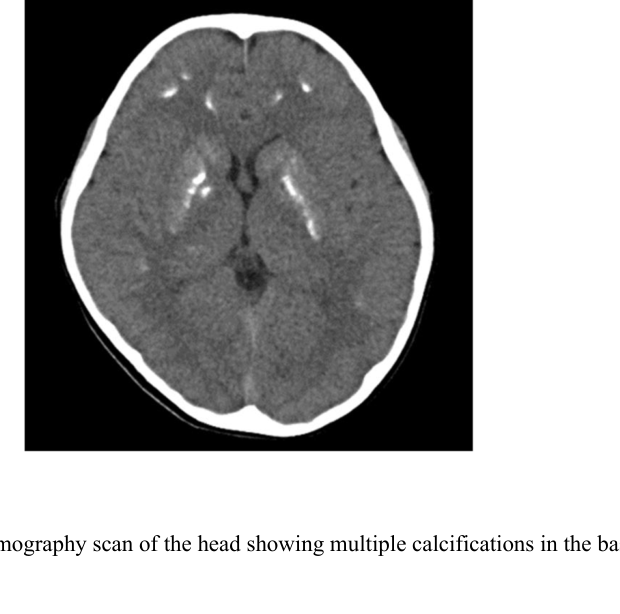

## Question

# Mechanistic Hypothesis Search

You are evaluating a specific disease mechanism hypothesis for the Disorder
Mechanisms Knowledge Base. This is not a general disease overview. Use the
hypothesis YAML below as the seed claim, then search for evidence that supports,
refutes, qualifies, or competes with this hypothesis.

## Target Disease
- **Disease Name:** Pseudohypoparathyroidism
- **Category:** Genetic

## Target Hypothesis
- **Hypothesis ID:** neurohypocalcemia_model
- **Hypothesis Label:** Neurohypocalcemia Symptom Model
- **Status in KB:** CANONICAL

## Seed Hypothesis YAML

```yaml
hypothesis_group_id: neurohypocalcemia_model
hypothesis_label: Neurohypocalcemia Symptom Model
status: CANONICAL
description: Neurologic symptoms, including tetany and seizures, arise primarily from downstream hypocalcemia
  and associated mineral imbalance.
applies_to_subtypes:
- PHP1A
- PHP1B
evidence:
- reference: PMID:38423572
  reference_title: Epileptic seizures and abnormal tooth development as primary presentation of pseudohypoparathyroidism
    type 1B.
  supports: SUPPORT
  evidence_source: HUMAN_CLINICAL
  snippet: This case demonstrates the importance of screening for hypocalcaemia in patients with de novo
    epileptic seizures.
  explanation: Supports neurologic manifestations as a downstream consequence of hypocalcemia in PHP.
```

## Research Objective

Build a focused hypothesis-search report that answers:

1. What is the strongest direct evidence for this hypothesis?
2. What evidence argues against it, fails to reproduce it, or limits its scope?
3. Which claims are established, emerging, speculative, or contradicted?
4. Which patient subtypes, stages, tissues, cell types, molecular pathways, or
   biomarkers does the hypothesis best explain?
5. Which alternative or competing mechanistic hypotheses explain the same disease
   features better or more parsimoniously?
6. What are the explicit knowledge gaps: missing causal steps, unconfirmed edges,
   contradictory evidence, unknown source-to-target links, or source/data absences?
7. What experiments, cohorts, assays, datasets, or trials would most directly
   distinguish this hypothesis from alternatives?

Use primary literature whenever possible. Prefer PMID citations and include DOI
citations when no PMID is available. Treat reviews as orientation unless they
contain directly relevant synthesized evidence that should be clearly labeled as
review-level support.

## Required Output

### Executive Judgment

Give a concise verdict on the hypothesis as of the current literature:
supported, partially supported, unresolved, weakly supported, or refuted. Explain
the reasoning and the most important caveats.

### Evidence Matrix

Create a table with one row per important evidence item:

- Citation (PMID preferred)
- Evidence type (human clinical, model organism, in vitro, computational, review)
- Supports / refutes / qualifies / competing
- Mechanistic claim tested
- Key finding
- Disease subtype or context
- Confidence and limitations

### Mechanistic Causal Chain

Describe the causal chain implied by the hypothesis from upstream trigger to
clinical manifestation. Identify where the literature is strong, where the links
are inferred, and where there are missing causal steps.

### Knowledge Gaps

Identify explicit known unknowns surfaced by the search. Treat absence of
evidence as a curation-relevant finding only when the search actually checked for
it. Include:

- Unknown or weakly supported causal steps in the hypothesis
- Unconfirmed causal graph edges that need direct perturbation or longitudinal
  evidence
- Conflicting evidence, failed replications, or incompatible subtype-specific
  findings
- Unknown mechanism of action for relevant treatments, biomarkers, or
  interventions tied to this hypothesis
- Source-level or dataset-level absences, such as no relevant GenCC, ClinGen,
  trial, omics, or cohort evidence found as of the search date

For each gap, state the scope, why it matters, what was checked, and what
evidence or experiment would resolve it.

### Alternative Models

List competing or complementary hypotheses. For each, explain whether it is an
alternative to the seed hypothesis, a downstream consequence, an upstream cause,
or a parallel mechanism.

### Discriminating Tests

Recommend concrete studies or assays that would most efficiently test this
hypothesis against alternatives. Include patient stratification, biomarkers,
sample type, model system, perturbation, and expected result where applicable.

### Curation Leads

Provide candidate updates for the KB, but label these as leads requiring curator
verification. Include:

- candidate evidence references and exact abstract snippets to verify
- candidate pathophysiology nodes or edges
- candidate ontology terms for cell types and biological processes
- candidate subtype restrictions or status changes
- candidate `knowledge_gaps` or discussion prompts for unresolved causal claims,
  conflicting evidence, or explicit source/data absences

If the provider supports artifacts, produce artifact-friendly outputs such as an
evidence matrix, mechanistic diagram, knowledge-gap table, or comparison table.
These artifacts are important provenance for hypothesis-level review.


## Output

Question: You are an expert researcher providing comprehensive, well-cited information.

Provide detailed information focusing on:
1. Key concepts and definitions with current understanding
2. Recent developments and latest research (prioritize 2023-2024 sources)
3. Current applications and real-world implementations
4. Expert opinions and analysis from authoritative sources
5. Relevant statistics and data from recent studies

Format as a comprehensive research report with proper citations. Include URLs and publication dates where available.
Always prioritize recent, authoritative sources and provide specific citations for all major claims.

# Mechanistic Hypothesis Search

You are evaluating a specific disease mechanism hypothesis for the Disorder
Mechanisms Knowledge Base. This is not a general disease overview. Use the
hypothesis YAML below as the seed claim, then search for evidence that supports,
refutes, qualifies, or competes with this hypothesis.

## Target Disease
- **Disease Name:** Pseudohypoparathyroidism
- **Category:** Genetic

## Target Hypothesis
- **Hypothesis ID:** neurohypocalcemia_model
- **Hypothesis Label:** Neurohypocalcemia Symptom Model
- **Status in KB:** CANONICAL

## Seed Hypothesis YAML

```yaml
hypothesis_group_id: neurohypocalcemia_model
hypothesis_label: Neurohypocalcemia Symptom Model
status: CANONICAL
description: Neurologic symptoms, including tetany and seizures, arise primarily from downstream hypocalcemia
  and associated mineral imbalance.
applies_to_subtypes:
- PHP1A
- PHP1B
evidence:
- reference: PMID:38423572
  reference_title: Epileptic seizures and abnormal tooth development as primary presentation of pseudohypoparathyroidism
    type 1B.
  supports: SUPPORT
  evidence_source: HUMAN_CLINICAL
  snippet: This case demonstrates the importance of screening for hypocalcaemia in patients with de novo
    epileptic seizures.
  explanation: Supports neurologic manifestations as a downstream consequence of hypocalcemia in PHP.
```

## Research Objective

Build a focused hypothesis-search report that answers:

1. What is the strongest direct evidence for this hypothesis?
2. What evidence argues against it, fails to reproduce it, or limits its scope?
3. Which claims are established, emerging, speculative, or contradicted?
4. Which patient subtypes, stages, tissues, cell types, molecular pathways, or
   biomarkers does the hypothesis best explain?
5. Which alternative or competing mechanistic hypotheses explain the same disease
   features better or more parsimoniously?
6. What are the explicit knowledge gaps: missing causal steps, unconfirmed edges,
   contradictory evidence, unknown source-to-target links, or source/data absences?
7. What experiments, cohorts, assays, datasets, or trials would most directly
   distinguish this hypothesis from alternatives?

Use primary literature whenever possible. Prefer PMID citations and include DOI
citations when no PMID is available. Treat reviews as orientation unless they
contain directly relevant synthesized evidence that should be clearly labeled as
review-level support.

## Required Output

### Executive Judgment

Give a concise verdict on the hypothesis as of the current literature:
supported, partially supported, unresolved, weakly supported, or refuted. Explain
the reasoning and the most important caveats.

### Evidence Matrix

Create a table with one row per important evidence item:

- Citation (PMID preferred)
- Evidence type (human clinical, model organism, in vitro, computational, review)
- Supports / refutes / qualifies / competing
- Mechanistic claim tested
- Key finding
- Disease subtype or context
- Confidence and limitations

### Mechanistic Causal Chain

Describe the causal chain implied by the hypothesis from upstream trigger to
clinical manifestation. Identify where the literature is strong, where the links
are inferred, and where there are missing causal steps.

### Knowledge Gaps

Identify explicit known unknowns surfaced by the search. Treat absence of
evidence as a curation-relevant finding only when the search actually checked for
it. Include:

- Unknown or weakly supported causal steps in the hypothesis
- Unconfirmed causal graph edges that need direct perturbation or longitudinal
  evidence
- Conflicting evidence, failed replications, or incompatible subtype-specific
  findings
- Unknown mechanism of action for relevant treatments, biomarkers, or
  interventions tied to this hypothesis
- Source-level or dataset-level absences, such as no relevant GenCC, ClinGen,
  trial, omics, or cohort evidence found as of the search date

For each gap, state the scope, why it matters, what was checked, and what
evidence or experiment would resolve it.

### Alternative Models

List competing or complementary hypotheses. For each, explain whether it is an
alternative to the seed hypothesis, a downstream consequence, an upstream cause,
or a parallel mechanism.

### Discriminating Tests

Recommend concrete studies or assays that would most efficiently test this
hypothesis against alternatives. Include patient stratification, biomarkers,
sample type, model system, perturbation, and expected result where applicable.

### Curation Leads

Provide candidate updates for the KB, but label these as leads requiring curator
verification. Include:

- candidate evidence references and exact abstract snippets to verify
- candidate pathophysiology nodes or edges
- candidate ontology terms for cell types and biological processes
- candidate subtype restrictions or status changes
- candidate `knowledge_gaps` or discussion prompts for unresolved causal claims,
  conflicting evidence, or explicit source/data absences

If the provider supports artifacts, produce artifact-friendly outputs such as an
evidence matrix, mechanistic diagram, knowledge-gap table, or comparison table.
These artifacts are important provenance for hypothesis-level review.


## Mechanistic Hypothesis Search Report: Neurohypocalcemia Symptom Model in Pseudohypoparathyroidism (PHP1A/PHP1B)

### Scope and hypothesis
The **neurohypocalcemia symptom model** posits that neurologic symptoms in pseudohypoparathyroidism (PHP)—classically **tetany**, **seizures**, and some **movement disorders**—arise **primarily as downstream consequences of hypocalcemia and related mineral imbalance** (often hyperphosphatemia) caused by PTH resistance. The key mechanistic prediction is that **symptom onset/severity tracks with biochemical derangements** (especially low ionized/serum Ca) and **improves with correction** (calcium plus active vitamin D such as calcitriol/alfacalcidol). (naganuma2024pseudohypoparathyroidismtype1b pages 6-10, naganuma2024pseudohypoparathyroidismtype1b pages 1-6)

### Executive judgment (as of 2026-05-23)
**Verdict: Partially supported.**

**Reasoning:** Across multiple human clinical reports and a small adult PHP1B case series, seizures/tetany and paroxysmal movement phenotypes occur in the setting of marked hypocalcemia/hyperphosphatemia with elevated PTH (consistent with PTH resistance) and often **improve after calcium + active vitamin D therapy**, supporting hypocalcemia as a proximal driver for acute neuromuscular hyperexcitability and some paroxysmal neurologic events. (zhang2020paroxysmaldyskinesiaand pages 1-2, naganuma2024pseudohypoparathyroidismtype1b pages 6-10, naganuma2024pseudohypoparathyroidismtype1b pages 1-6, zhao2025pseudohypoparathyroidismtype1b pages 1-2, wen2025atypicalpresentationof pages 2-4)

**Caveats limiting a “primary/only” hypocalcemia explanation:**
1) **Intracranial calcifications** (basal ganglia and cortical regions) are common in symptomatic PHP1B series and case reports and plausibly contribute to persistent or phenotype-specific manifestations; symptoms can improve even when calcifications are present, but the extent to which calcifications drive residual symptoms is not well quantified. (zhao2025pseudohypoparathyroidismtype1b pages 5-6, naganuma2024pseudohypoparathyroidismtype1b pages 1-6, naganuma2024pseudohypoparathyroidismtype1b media 5d35618a)
2) **Cognitive/behavioral phenotypes**, particularly emphasized in **PHP1A**, may involve **CNS-intrinsic GNAS/cAMP signaling or calcium-signaling biology** beyond contemporaneous serum calcium status, based primarily on review-level synthesis rather than direct causal studies. (paparella2026endocrinedisordersof pages 19-20, paparella2026endocrinedisordersof pages 10-11)

---

### Evidence matrix (key items)
| Citation (year, journal, PMID if known) | URL / DOI | Evidence type | Supports / refutes / qualifies / competing | Mechanistic claim tested | Key finding | Subtype / context | Quant data / statistics | Confidence & limitations |
|---|---|---|---|---|---|---|---|---|
| Naganuma et al. 2024, *Clinical Pediatric Endocrinology* (PMID not available in context) (naganuma2024pseudohypoparathyroidismtype1b pages 6-10, naganuma2024pseudohypoparathyroidismtype1b pages 1-6, naganuma2024pseudohypoparathyroidismtype1b media 5d35618a) | https://doi.org/10.1297/cpe.2023-0080 | Human clinical case report + literature review | **Supports, qualifies** | Neurologic symptoms in PHP1B are primarily driven by hypocalcemia from PTH resistance; intracranial calcification may modify phenotype but is not sufficient to explain symptoms | 7-year-old with exercise-triggered involuntary movements, later convulsions, marked hypocalcemia/hyperphosphatemia/elevated PTH, and basal ganglia + frontal cortical calcifications. Dyskinesia resolved after calcium + active vitamin D; review found PHP-associated involuntary movements generally improve with hypocalcemia treatment. Calcifications can persist despite symptom resolution, arguing hypocalcemia is proximal trigger. | PHP1B due to epimutation; pediatric; movement disorder/seizure context | Ca 5.5 mg/dL, P 7.6 mg/dL, intact PTH 343.1 pg/mL; 15 literature cases of involuntary movements; symptoms improved or became less severe with hypocalcemia treatment in reported cases; 8/11 with intracranial calcification had exercise-triggered symptoms; disease prevalence cited as ~1.2/100,000 in Japan and ~1.1/100,000 in Denmark | Moderate confidence for symptomatic hypocalcemia link because of biochemical-temporal-treatment coherence and literature synthesis; limited by case-report design, small literature base, lack of controlled comparisons, and possible contribution of calcifications/CBZ withdrawal |
| Zhang et al. 2020, *Molecular Genetics & Genomic Medicine* (PMID not available in context) (zhang2020paroxysmaldyskinesiaand pages 1-2) | https://doi.org/10.1002/mgg3.1423 | Human clinical case report | **Supports, qualifies** | PKD/epilepsy/tetany in PHP can arise downstream of mineral imbalance caused by GNAS methylation defects | Teen with 8-year tetany history plus PKD and epilepsy had hypocalcemia, hyperphosphatemia, elevated PTH, extensive intracranial calcifications, and GNAS methylation abnormalities. After PHP-directed treatment, no recurrence of abnormal movements or seizures and calcium normalized. | PHP with GNAS methylation abnormality (PHP1B-like context); adolescent | Ca 1.91 mmol/L, phosphorus 2.68 mmol/L, PTH 109 pg/mL; cited background note: 10/15 (66.7%) PKD patients in prior literature had transient epileptic discharges | Moderate confidence for support; single case with compelling response-to-correction signal, but antiseizure co-treatment and structural calcifications prevent exclusive attribution to serum calcium |
| Zhao et al. 2025, *Frontiers in Genetics* (PMID not available in context) (zhao2025pseudohypoparathyroidismtype1b pages 5-6, zhao2025pseudohypoparathyroidismtype1b pages 1-2) | https://doi.org/10.3389/fgene.2025.1638472 | Human retrospective case series | **Supports, qualifies** | In adult PHP1B, neuromuscular/neurologic manifestations track with hypocalcemia and improve when calcium/calcitriol correct biochemical abnormalities | Five patients initially misdiagnosed as Gitelman syndrome had chronic hypocalcemia, high PTH, muscle cramps/weakness, and universal intracranial calcifications. Oral calcium carbonate + calcitriol led to significant symptom improvement and normalization of calcium; authors prioritized calcium/calcitriol over potassium treatment. | PHP1B; adults; diagnostic-delay cohort with hypokalemia overlap | n=5; median age 48 years; female 60%; median diagnostic delay 11 years (or 10 years in excerpted summary); mean Ca 1.55-1.57 mmol/L; mean PTH 369.2-422.1 pg/mL; hyperphosphatemia 60%; hypomagnesemia 30%; vitamin D deficiency 40%; intracranial calcification 100%; post-treatment Ca mean 2.20 mmol/L, K mean 3.84 mmol/L | Moderate confidence; stronger than single case because multi-patient series shows consistent treatment response, but still small uncontrolled cohort and symptoms were mostly cramps/weakness rather than rigorously phenotyped seizures |
| Wen et al. 2025, *BMC Endocrine Disorders* (PMID not available in context) (wen2025atypicalpresentationof pages 2-4) | https://doi.org/10.1186/s12902-025-01933-0 | Human clinical case report | **Supports, qualifies** | Seizures and altered consciousness in PHP-like disease are largely attributable to PTH-resistance-associated hypocalcemia/mineral imbalance | Adult with recurrent convulsions, basal ganglia/thalamic abnormalities and calcifications, hypocalcemia, hyperphosphatemia, elevated PTH improved after calcium supplement + calcitriol + antiseizure therapy; symptoms resolved before discharge and mostly remitted on follow-up. | PHP-like case without detected GNAS mutation; possible atypical PHP | Calcium rose to 2.01 mmol/L; PTH fell to 16.91 pmol/L after treatment | Low-moderate confidence; improvement is compatible with neurohypocalcemia model, but genotype uncertain, methylation testing absent, and concurrent antiseizure therapy confounds causality |
| Zavatta & Clarke 2021, *Journal of Endocrinological Investigation* (PMID not available in context) | https://doi.org/10.1007/s40618-020-01355-w | Review | **Qualifies / competing-complementary** | Basal ganglia calcification in hypo/PHP may reflect both systemic mineral imbalance and local CNS metabolic mechanisms; neurologic symptoms may not be explained by serum calcium alone | Review highlights basal ganglia calcification as common in hypoparathyroidism/PHP and discusses local + systemic mechanisms linking Ca/P homeostasis to CNS calcification. Frames seizures/neurocognitive dysfunction as important but incompletely explained outcomes. | Hypoparathyroidism and pseudohypoparathyroidism broadly | No single effect size extracted in context; emphasizes commonality of basal ganglia calcification and mechanistic uncertainty | Moderate confidence as synthesis only; useful for scope-limiting the seed model, but not direct causal proof for symptom generation in PHP1A/PHP1B |
| Mantovani et al. 2016, *Nature Reviews Endocrinology* (PMID not available in context) | https://doi.org/10.1038/nrendo.2016.52 | Review | **Qualifies** | Neuro features in Gsα-cAMP disorders may include manifestations not reducible to acute hypocalcemia alone, especially in GNAS-related disease | Review situates PHP within GNAS/Gsα-cAMP disorders and notes neurologic manifestations such as seizures and basal ganglia calcification; supports PTH-resistance framework but also raises open issues around broader GNAS-linked phenotypes. | PHP/GNAS-related disorders broadly; includes PHP1A/PHP1B orientation | No direct cohort statistics in context | Low-moderate confidence for this specific hypothesis because evidence is review-level and mechanistic links are synthesized rather than directly tested |
| Ritter et al. 2015, *The Lancet* (PMID not available in context) | https://doi.org/10.1016/S0140-6736(15)60451-2 | Human clinical image / short report | **Supports, qualifies** | Seizures with extensive brain calcification can reveal epigenetic PHP; mineral disturbance is implicated upstream, but structural CNS sequelae may contribute | Short report describes seizures with extensive basal ganglia and frontal lobe calcifications and GNAS methylation changes consistent with pseudohypoparathyroidism, linking epigenetic PHP to neuro manifestations. | Epigenetic PHP (likely PHP1B context) with brain calcification | No quantitative treatment-response data available in context | Low-moderate confidence; highly relevant phenotype match but brief report with limited mechanistic detail and no detailed longitudinal biochemical-response data in context |
| Paparella et al. 2026, *Cells* (PMID not available in context) (paparella2026endocrinedisordersof pages 19-20, paparella2026endocrinedisordersof pages 10-11) | https://doi.org/10.3390/cells15020140 | Review | **Supports, qualifies, competing-complementary** | Hypocalcemia/hyperphosphatemia explain seizures, tetany, and some neuropsychological manifestations, but GNAS-related CNS effects may independently shape cognition/behavior | Review states PTH deficiency/resistance causes hypocalcemia and hyperphosphatemia leading to paresthesias, cramps, tetany, seizures, and intracranial calcifications; correction of biochemical abnormalities may partially reverse neuropsychological manifestations. Also notes possible CNS-intrinsic effects of altered calcium signaling/GNAS biology. | Pediatric endocrine calcium-signaling disorders; includes PHP1A/PHP1B | Notes cognitive impairment in ~80% of PHP1A in excerpt; no seizure prevalence provided in context | Moderate confidence for broad framing; not primary PHP-specific experimental evidence, but valuable for identifying limits of neurohypocalcemia-only explanations |
| Seed case: Van der Biest et al. 2024, *BMJ Case Reports* (PMID: 38423572) | https://doi.org/10.1136/bcr-2023-258403 | Human clinical case report | **Supports** | De novo epileptic seizures in PHP1B can be a presenting consequence of hypocalcemia | Case report emphasizes screening for hypocalcaemia in de novo epileptic seizures and presents PHP1B with seizures and abnormal tooth development as primary presentation. | PHP1B; seizure-first presentation | Precise quantitative data not available in current tool context | Moderate confidence; directly on-point and recent, but single-case evidence |
| Wen et al. 2025 or other atypical/non-GNAS PHP-like cases with calcifications | https://doi.org/10.1186/s12902-025-01933-0 | Human clinical case report | **Competing / qualifying** | Some seizure/calcification phenotypes labeled PHP may involve non-GNAS or additional genetic mechanisms, complicating a pure hypocalcemia model | Novel GHSR variant identified in PHP-like phenotype; authors note uncertain mechanistic relevance, implying that in some patients neurologic phenotype may not be solely attributable to classical GNAS-mediated PTH resistance. | Atypical PHP-like syndrome | Single patient; no prevalence estimate | Low confidence as competing mechanism; interesting but unconfirmed and not yet parsimonious relative to hypocalcemia-driven explanation |


*Table: This table summarizes the main supporting and qualifying evidence for the neurohypocalcemia symptom model in pseudohypoparathyroidism, emphasizing direct clinical treatment-response data, structural CNS qualifiers, and review-level alternative mechanisms.*

---

## 1) Strongest direct evidence for the hypothesis

### A. Treatment-response coherence in PHP1B movement disorder/seizure presentations (2024)
A pediatric PHP1B case with exercise-triggered involuntary movements and later convulsions showed **severe hypocalcemia (Ca 5.5 mg/dL), hyperphosphatemia, and high PTH**, with **resolution of dyskinesia after initiation of calcium plus active vitamin D**; the associated review of 15 published PHP-related involuntary-movement cases reports that involuntary movements generally **“disappeared or became less severe with treatment for hypocalcemia.”** (naganuma2024pseudohypoparathyroidismtype1b pages 6-10, naganuma2024pseudohypoparathyroidismtype1b pages 1-6)

Visual evidence from this report documents **basal ganglia and frontal cortical calcifications** on CT in the same biochemical context, clarifying that calcifications can coexist with hypocalcemia-linked symptoms. (naganuma2024pseudohypoparathyroidismtype1b media 5d35618a)

### B. Clinical correction of calcium accompanied by disappearance of epilepsy/PKD phenotype (2020)
A case report of pseudohypoparathyroidism with **paroxysmal kinesigenic dyskinesia (PKD)**, **seizures**, and long-standing tetany documented hypocalcemia (1.91 mmol/L), hyperphosphatemia, elevated PTH, intracranial calcifications, and GNAS methylation abnormalities; after PHP-directed therapy, there was **no recurrence of abnormal movements or epileptic seizures and calcium returned to normal**, consistent with hypocalcemia as a proximal driver. (zhang2020paroxysmaldyskinesiaand pages 1-2)

### C. Adult PHP1B series with symptomatic improvement after calcium/calcitriol (2025)
In a retrospective series of 5 adults with PHP1B (often misdiagnosed as Gitelman syndrome), **muscle cramps and weakness were universal**, biochemical hypocalcemia and elevated PTH were prominent, and **intracranial calcifications were present in all patients**. Treatment with **calcium carbonate and calcitriol** was associated with **significant symptomatic improvement and normalization of serum calcium** (post-treatment mean 2.20 mmol/L), supporting mineral correction as a key therapeutic lever. (zhao2025pseudohypoparathyroidismtype1b pages 5-6, zhao2025pseudohypoparathyroidismtype1b pages 1-2)

### D. Age-dependent cohort evidence for neonatal symptomatic hypocalcemia (including seizures)
A PTH-resistance syndrome cohort analysis reported **neonatal symptomatic hypocalcemia (including seizures) in 4.4%** of patients and an association between neonatal complications and later neurocognitive impairment, supporting a life-stage window where hypocalcemia can be the proximate cause of neurologic events. (sindaco2024pthresistancesyndromes pages 64-68)

---

## 2) Evidence arguing against the hypothesis or limiting scope

### A. Structural CNS sequelae (intracranial calcifications) as a competing/parallel driver
The adult PHP1B series observed **intracranial calcifications in 100%** of cases, and case reports frequently document basal ganglia/cortical calcifications in seizure and movement-disorder presentations. This creates an important scope limitation: some neurologic symptoms could be mediated by **chronic structural changes** rather than (or in addition to) acute serum calcium levels. (zhao2025pseudohypoparathyroidismtype1b pages 5-6, zhang2020paroxysmaldyskinesiaand pages 1-2, naganuma2024pseudohypoparathyroidismtype1b media 5d35618a)

However, the pediatric PHP1B literature synthesis emphasizes that symptoms can improve after correcting hypocalcemia, which is consistent with calcifications acting as background vulnerability rather than a sufficient cause of acute paroxysms. (naganuma2024pseudohypoparathyroidismtype1b pages 6-10, naganuma2024pseudohypoparathyroidismtype1b pages 1-6)

### B. CNS-intrinsic GNAS / calcium-signaling effects (especially for cognition/behavior)
Review-level synthesis argues that neuropsychological manifestations in GNAS-related disorders (especially PHP1A) may be partly reversible with calcium homeostasis restoration but could also reflect **direct effects of altered intracellular calcium signaling and/or GNAS biology** in the brain, which would compete with a purely downstream hypocalcemia-only model for certain phenotypes (e.g., intellectual disability/behavioral changes). (paparella2026endocrinedisordersof pages 19-20, paparella2026endocrinedisordersof pages 10-11)

### C. Phenotype and diagnostic heterogeneity
Some PHP-like presentations lack canonical GNAS findings (e.g., no detected GNAS mutation; methylation not performed) while still exhibiting hypocalcemia, seizures, and calcifications, indicating heterogeneous etiologies and the possibility of additional genetic or metabolic modifiers that complicate mechanistic attribution in individual cases. (wen2025atypicalpresentationof pages 2-4)

---

## 3) Claim status: established vs emerging vs speculative

### Established (high confidence for this hypothesis)
- **Acute neuromuscular hyperexcitability (tetany, cramps) and seizures can be triggered by severe hypocalcemia** in PTH resistance contexts, with improvement after calcium and active vitamin D therapy in multiple human clinical observations. (zhang2020paroxysmaldyskinesiaand pages 1-2, naganuma2024pseudohypoparathyroidismtype1b pages 1-6, zhao2025pseudohypoparathyroidismtype1b pages 1-2)

### Emerging (moderate confidence)
- **Exercise-triggered involuntary movements/dyskinesias** can be precipitated by low ionized/serum Ca in PHP, and appear to **improve with correction of hypocalcemia** in the reported case literature (15-case synthesis). (naganuma2024pseudohypoparathyroidismtype1b pages 6-10, naganuma2024pseudohypoparathyroidismtype1b pages 1-6, naganuma2024pseudohypoparathyroidismtype1b pages 10-15)

### Speculative / insufficiently tested
- The extent to which **intracranial calcifications** drive neurologic symptoms **independently of current calcium** (versus acting as a chronic sequela or vulnerability factor) remains unresolved in the retrieved evidence. (zhao2025pseudohypoparathyroidismtype1b pages 5-6, naganuma2024pseudohypoparathyroidismtype1b media 5d35618a)
- Direct CNS-intrinsic effects of GNAS defects as a primary cause of neurologic symptoms (outside cognition/behavior) are suggested but not directly proven in the retrieved primary PHP neurologic literature. (paparella2026endocrinedisordersof pages 19-20, paparella2026endocrinedisordersof pages 10-11)

---

## 4) Subtypes/contexts the hypothesis best explains

### Best-fit contexts
- **PHP1B** with isolated renal PTH resistance: seizure/tetany and paroxysmal movement phenotypes show tight biochemical coupling and treatment response in reported cases and small series. (zhao2025pseudohypoparathyroidismtype1b pages 5-6, naganuma2024pseudohypoparathyroidismtype1b pages 1-6, zhao2025pseudohypoparathyroidismtype1b pages 1-2)
- **Neonatal/early-life presentations** where biochemical instability is common: cohort evidence indicates symptomatic hypocalcemia including seizures occurs in a measurable minority (4.4%) and may have downstream neurodevelopmental impact. (sindaco2024pthresistancesyndromes pages 64-68)

### Biomarkers and clinical correlates that operationalize the model
- Low total calcium and (ideally) **ionized calcium**, hyperphosphatemia, elevated intact PTH (PTH resistance pattern). (naganuma2024pseudohypoparathyroidismtype1b pages 1-6, zhao2025pseudohypoparathyroidismtype1b pages 1-2)
- ECG QT prolongation and improvement with calcium correction as supportive physiologic coupling (reported in pediatric PHP1B case narrative). (naganuma2024pseudohypoparathyroidismtype1b pages 1-6)
- Neuroimaging showing basal ganglia/cortical calcifications as a chronic correlate (common but not sufficient to infer acute causality). (zhao2025pseudohypoparathyroidismtype1b pages 5-6, naganuma2024pseudohypoparathyroidismtype1b media 5d35618a)

---

## 5) Alternative or competing mechanistic hypotheses

1) **Neurocalcification model (structural sequelae):** Chronic mineral dysregulation leads to intracranial calcifications (basal ganglia/cortex), which then contribute to movement disorders, seizures, or neuropsychiatric symptoms. This is a **competing/parallel mechanism** to acute hypocalcemia, particularly for persistent or progressive symptoms. (zhao2025pseudohypoparathyroidismtype1b pages 5-6, naganuma2024pseudohypoparathyroidismtype1b media 5d35618a)

2) **CNS-intrinsic GNAS signaling model:** In PHP1A (and potentially broader GNAS-related disorders), altered Gsα/cAMP or calcium-dependent neuroendocrine signaling in the brain contributes directly to cognitive/behavioral phenotypes, acting **in parallel** with hypocalcemia-driven neuromuscular excitability. (paparella2026endocrinedisordersof pages 19-20, paparella2026endocrinedisordersof pages 10-11)

3) **Trigger/modifier model:** Fever, exercise, and medication effects (e.g., antiseizure drugs) may modulate neuronal excitability and precipitate events when biochemical reserve is low, serving as **contextual modifiers** of the hypocalcemia mechanism rather than strict alternatives. (naganuma2024pseudohypoparathyroidismtype1b pages 6-10, naganuma2024pseudohypoparathyroidismtype1b pages 1-6)

---

## 6) Knowledge gaps (explicit, surfaced by this search)
| Gap / uncertainty | Why it matters | What current evidence shows | What was checked in this search | Best discriminating study / assay design | Expected result if neurohypocalcemia model is primary | Expected result if alternative model dominates |
|---|---|---|---|---|---|---|
| Acute seizure/tetany causality vs correlation with serum or ionized calcium | The seed hypothesis requires low calcium to be a proximal cause, not just a co-traveler of severe disease | Case reports and a small series show seizures, tetany, cramps, or dyskinesia presenting with marked hypocalcemia and improving after calcium/active vitamin D treatment; QT prolongation also improved with calcium correction. But evidence is largely uncontrolled and often includes concurrent antiseizure drugs (zhang2020paroxysmaldyskinesiaand pages 1-2, naganuma2024pseudohypoparathyroidismtype1b pages 6-10, naganuma2024pseudohypoparathyroidismtype1b pages 1-6, zhao2025pseudohypoparathyroidismtype1b pages 1-2, wen2025atypicalpresentationof pages 2-4) | Primary human reports on PHP1B/PHP-like seizure and movement phenotypes; recent PHP1B series; review-level pediatric neuroendocrine synthesis; no controlled perturbation studies identified (zhao2025pseudohypoparathyroidismtype1b pages 5-6, paparella2026endocrinedisordersof pages 19-20, paparella2026endocrinedisordersof pages 10-11) | Prospective multicenter PHP1A/PHP1B event-capture cohort with synchronized ionized Ca, total Ca, Mg, phosphate, pH, ECG, EEG, symptom diary, and rapid sampling before and after IV/oral calcium rescue | Neurologic events cluster at low ionized Ca thresholds, improve promptly with calcium normalization, and event burden tracks within-person with ionized Ca better than genotype or imaging | Weak or inconsistent temporal coupling to ionized Ca; events persist despite normalized calcium or are better predicted by imaging, genotype, EEG focus, or non-calcium biochemical variables |
| Role of phosphate / hyperphosphatemia and Ca×P product | The model currently centers on hypocalcemia, but phosphate may drive excitability indirectly and may be central to calcification-mediated symptoms | PHP cases commonly show hyperphosphatemia with hypocalcemia; reviews on basal ganglia calcification argue systemic Ca/P imbalance is mechanistically relevant, but no direct PHP study in this search separated phosphate effects from calcium effects on seizures or movement symptoms (naganuma2024pseudohypoparathyroidismtype1b pages 1-6, wen2025atypicalpresentationof pages 2-4, paparella2026endocrinedisordersof pages 10-11) | PHP case reports/series and calcification-focused reviews; no trial or longitudinal cohort specifically modeling phosphate or Ca×P product against neurologic outcomes found in retrieved material (zhao2025pseudohypoparathyroidismtype1b pages 5-6, naganuma2024pseudohypoparathyroidismtype1b pages 10-15) | Longitudinal cohort or n-of-1 crossover analyses in treated PHP patients with repeated measures of ionized Ca, phosphate, Ca×P product, FGF23, urinary phosphate handling, CT calcification burden, and neuro-events; multivariable within-person modeling | Ionized Ca remains dominant predictor of acute symptoms; phosphate mainly predicts chronic calcification burden or modifies severity secondarily | Phosphate or Ca×P product predicts symptoms and imaging progression independently of ionized Ca, suggesting a broader mineral-toxicity model |
| Contribution of intracranial calcifications vs reversible functional changes | Structural calcifications could explain persistent seizures, dyskinesia, or parkinsonism even after biochemical correction, limiting the seed hypothesis | CT frequently shows basal ganglia/frontal cortical calcifications in symptomatic PHP; all 5 adults in one PHP1B series had intracranial calcifications. Yet involuntary movements often improved after hypocalcemia treatment, and authors note calcifications may persist despite symptom resolution; one cited report described reversible striatal hypometabolism after calcium/calcitriol therapy (zhao2025pseudohypoparathyroidismtype1b pages 5-6, zhang2020paroxysmaldyskinesiaand pages 1-2, naganuma2024pseudohypoparathyroidismtype1b pages 6-10, naganuma2024pseudohypoparathyroidismtype1b pages 1-6, naganuma2024pseudohypoparathyroidismtype1b media 5d35618a, naganuma2024pseudohypoparathyroidismtype1b pages 10-15) | Recent PHP1B pediatric case with image review, adult PHP1B series, prior PKD/epilepsy case, and calcification reviews; no longitudinal imaging-EEG cohort in PHP found (zhang2020paroxysmaldyskinesiaand pages 1-2, naganuma2024pseudohypoparathyroidismtype1b pages 6-10, naganuma2024pseudohypoparathyroidismtype1b pages 1-6) | Serial CT/MRI/SWI plus FDG-PET and EEG before treatment, after calcium normalization, and at maintenance; stratify by calcification burden and symptom reversibility | Acute symptom relief occurs despite unchanged calcification burden; functional abnormalities (EEG slowing, PET hypometabolism, QT changes) reverse with calcium correction more than CT findings do | Symptom persistence tracks with calcification location/burden regardless of calcium normalization; structural lesions predict recurrence better than biochemical control |
| CNS-intrinsic effects of GNAS / epigenetic defects independent of serum calcium, especially cognition/behavior | Cognitive or behavioral phenotypes in PHP1A may arise from direct GNAS-related brain effects, which would compete with a purely downstream hypocalcemia model | Reviews note cognitive impairment is prominent in PHP1A and may not be fully explained by serum calcium alone; altered intracellular calcium signaling/GNAS biology and animal-model CNS effects are invoked. By contrast, seizure/tetany literature is much more tightly linked to hypocalcemia correction (paparella2026endocrinedisordersof pages 19-20, paparella2026endocrinedisordersof pages 10-11) | Review-level synthesis spanning GNAS-related disorders and pediatric calcium-signaling disorders; direct human mechanistic studies separating normocalcemic from hypocalcemic CNS phenotypes were not found in this search (paparella2026endocrinedisordersof pages 19-20, paparella2026endocrinedisordersof pages 10-11) | Compare normocalcemic, well-treated PHP1A vs PHP1B vs PPHP/controls using neuropsychology, resting-state fMRI, EEG, endocrine profile, methylation/genotype, and possibly iPSC-derived neuronal models with GNAS perturbation under controlled extracellular calcium | Seizure/tetany phenotypes depend on hypocalcemia, while cognition/behavior improve mainly with biochemical control and show limited residual subtype effect after adjustment | Persistent cognitive/behavioral deficits and neural-network abnormalities remain despite stable normocalcemia, especially in PHP1A, indicating CNS-intrinsic GNAS effects |
| Medication effects and triggers (carbamazepine, exercise, fever) | Triggers and co-treatments can confound apparent calcium-response relationships and may reveal non-calcium mechanisms of hyperexcitability | In the 2024 PHP1B case, involuntary movements improved after carbamazepine but disappeared after stopping carbamazepine and starting calcium/active vitamin D; many reported movement episodes were exercise-triggered, and convulsions occurred during fever in some cases. This supports hypocalcemia as an important trigger but leaves medication and physiologic stress as modifiers (naganuma2024pseudohypoparathyroidismtype1b pages 6-10, naganuma2024pseudohypoparathyroidismtype1b pages 1-6, naganuma2024pseudohypoparathyroidismtype1b pages 10-15) | Trigger-rich movement-disorder cases and seizure-first case literature were reviewed; no formal trigger-provocation or pharmacologic interaction study in PHP located (zhang2020paroxysmaldyskinesiaand pages 1-2, naganuma2024pseudohypoparathyroidismtype1b pages 6-10, naganuma2024pseudohypoparathyroidismtype1b pages 1-6) | Trigger-provocation study in stable treated PHP with exercise challenge and fever/inflammatory-event capture, alongside ionized Ca and EEG/ECG monitoring; pharmacoepidemiology of antiseizure drugs and vitamin D metabolism interactions | Exercise/fever trigger symptoms mainly when ionized Ca is low or falling; antiseizure drugs are secondary modifiers and lose effect after calcium normalization | Triggers provoke events even at normal calcium, or specific drugs independently suppress/precipitate symptoms, implying channelopathy/network-level mechanisms beyond hypocalcemia |
| Subtype and stage heterogeneity (neonatal vs later onset; PHP1A vs PHP1B) | The hypothesis may fit some subtypes/stages better than others, which is crucial for KB scope restrictions | The seed model is best supported in PHP1B seizure/tetany/movement presentations. Del Sindaco reports neonatal symptomatic hypocalcemia including seizures in 4.4% of the PTH-resistance cohort, with neonatal complications associated with later neurocognitive impairment; reviews suggest PHP1A carries more cognitive/behavioral burden than PHP1B (naganuma2024pseudohypoparathyroidismtype1b pages 1-6, paparella2026endocrinedisordersof pages 10-11, sindaco2024pthresistancesyndromes pages 64-68, sindaco2024pthresistancesyndromes pages 7-13) | Recent age-dependent PTH-resistance cohort, PHP1B case literature, and review-level subtype discussion; no large subtype-stratified neurologic natural-history cohort with standardized calcium control identified (zhao2025pseudohypoparathyroidismtype1b pages 5-6, sindaco2024pthresistancesyndromes pages 64-68, sindaco2024pthresistancesyndromes pages 7-13) | Registry-based natural history study stratified by PHP1A, PHP1B, age at onset, neonatal complications, treatment adequacy, and imaging phenotype, with predefined neurologic endpoints | Seizures/tetany cluster in periods of untreated or severe hypocalcemia across subtypes, but strongest in PHP1B and early decompensation states; residual neurocognitive burden is modest after control | Distinct subtype-specific neurologic phenotypes persist despite similar calcium control, especially stronger cognitive/behavioral effects in PHP1A or neonatal injury-linked outcomes |
| Lack of large controlled cohorts and longitudinal imaging / EEG | Current support may be overstated because it rests mainly on case reports and small series with publication bias | Evidence base is dominated by case reports and one small adult PHP1B series; calcification reviews and endocrine reviews repeatedly note mechanistic uncertainty. No randomized treatment comparison, no systematic longitudinal CT/EEG dataset, and no adequately powered predictor study were identified in this search (zhao2025pseudohypoparathyroidismtype1b pages 5-6, naganuma2024pseudohypoparathyroidismtype1b pages 6-10, paparella2026endocrinedisordersof pages 19-20, paparella2026endocrinedisordersof pages 10-11) | Searched recent primary literature, older foundational PHP seizure/calcification reports, and review-level mechanistic papers; no trial, large cohort, or omics/imaging dataset directly testing the causal graph was found | International rare-disease consortium dataset linking standardized biochemistry, neurophenotyping, EEG, CT/MRI, genotype/methylation, medication exposure, and treatment trajectories with preregistered causal analyses | Strong within-person and between-person prediction from calcium control reproduces across centers; imaging adds little to acute event prediction beyond chronic burden | Imaging/genotype/network biomarkers outperform calcium control, or mixed mechanistic clusters emerge, arguing the seed model is incomplete or subtype-limited |


*Table: This table summarizes the main unresolved questions around the neurohypocalcemia model in PHP1A/PHP1B and pairs each with a concrete study design that could distinguish calcium-driven neurologic symptoms from competing structural or CNS-intrinsic mechanisms.*

---

## 7) Discriminating tests (most efficient next studies)
Based on the gaps identified, the most direct discriminators between hypocalcemia-driven neurologic symptoms and competing mechanisms are:

1) **Prospective event-capture cohort in PHP1A vs PHP1B** with synchronized sampling of **ionized Ca**, phosphate, Mg, pH, ECG, and EEG around neurologic events and during therapy adjustments. If the model is primary, events should cluster at low ionized Ca and resolve rapidly with calcium correction. (zhang2020paroxysmaldyskinesiaand pages 1-2, naganuma2024pseudohypoparathyroidismtype1b pages 1-6, zhao2025pseudohypoparathyroidismtype1b pages 1-2)

2) **Longitudinal multimodal neuroimaging (CT/MRI/SWI + FDG-PET) with EEG** before and after biochemical normalization to separate **structural calcification burden** from **reversible functional abnormalities**. If calcifications dominate, symptoms should persist and track with calcification location/burden despite stable normocalcemia. (zhao2025pseudohypoparathyroidismtype1b pages 5-6, naganuma2024pseudohypoparathyroidismtype1b media 5d35618a)

3) **Normocalcemic “well-controlled” PHP1A vs PHP1B neurocognitive phenotyping** (standardized neuropsychology + resting-state fMRI/EEG) to test whether cognitive/behavioral deficits persist independent of calcium, supporting CNS-intrinsic GNAS mechanisms. (paparella2026endocrinedisordersof pages 19-20, paparella2026endocrinedisordersof pages 10-11)

---

## Current applications and real-world implementations

1) **Diagnostic implementation:** Multiple reports emphasize that unexplained seizures or paroxysmal movement disorders should prompt a metabolic screen (calcium/phosphate/PTH ± magnesium/vitamin D) to identify treatable hypocalcemia/PTH resistance. This is explicitly highlighted in PHP movement/seizure case literature and pediatric calcium-signaling synthesis. (zhang2020paroxysmaldyskinesiaand pages 1-2, naganuma2024pseudohypoparathyroidismtype1b pages 1-6, paparella2026endocrinedisordersof pages 19-20)

2) **Therapeutic implementation:** Standard real-world management in reported PHP neurologic cases centers on **calcium supplementation plus active vitamin D (calcitriol/alfacalcidol)** to restore calcium homeostasis, with antiseizure drugs sometimes used as adjuncts. Treatment-associated symptom improvement and biochemical normalization are repeatedly reported. (zhao2025pseudohypoparathyroidismtype1b pages 5-6, zhang2020paroxysmaldyskinesiaand pages 1-2, naganuma2024pseudohypoparathyroidismtype1b pages 6-10)

3) **Imaging implementation:** Non-contrast brain CT frequently identifies basal ganglia/cortical calcifications in symptomatic patients and can support mechanistic stratification (acute hypocalcemia-driven events vs chronic calcification-associated sequelae), though prognostic utility remains uncertain. (zhao2025pseudohypoparathyroidismtype1b pages 5-6, naganuma2024pseudohypoparathyroidismtype1b media 5d35618a)

---

## Curation leads (require curator verification)

### Candidate evidence references (snippets to verify in full text)
- **Naganuma 2024 (Clinical Pediatric Endocrinology; 2024-03; DOI:10.1297/cpe.2023-0080):** literature synthesis statement that involuntary movements “disappeared or became less severe with treatment for hypocalcemia,” plus biochemical and imaging context for the index case. (naganuma2024pseudohypoparathyroidismtype1b pages 6-10, naganuma2024pseudohypoparathyroidismtype1b pages 1-6)
- **Zhang 2020 (Mol Genet Genomic Med; 2020-07; DOI:10.1002/mgg3.1423):** post-treatment “no recurrence of abnormal movements or epileptic seizures” with normalization of calcium. (zhang2020paroxysmaldyskinesiaand pages 1-2)
- **Zhao 2025 (Frontiers in Genetics; 2025-08; DOI:10.3389/fgene.2025.1638472):** post-treatment normalization of calcium (mean 2.20 mmol/L) with symptomatic improvement; intracranial calcifications in 100% of cases. (zhao2025pseudohypoparathyroidismtype1b pages 5-6, zhao2025pseudohypoparathyroidismtype1b pages 1-2)
- **Del Sindaco 2024 (PTH resistance syndromes cohort; journal metadata incomplete in tool output):** neonatal symptomatic hypocalcemia including seizures in 4.4% and association of neonatal complications with later neurocognitive impairment. (sindaco2024pthresistancesyndromes pages 64-68)

### Candidate KB node/edge updates (leads)
- Add/strengthen edge: **PTH resistance → hypocalcemia → seizures/tetany/dyskinesia** (strongest for PHP1B; acute symptoms). (zhang2020paroxysmaldyskinesiaand pages 1-2, naganuma2024pseudohypoparathyroidismtype1b pages 1-6, zhao2025pseudohypoparathyroidismtype1b pages 1-2)
- Add qualifying parallel edge: **PTH resistance/mineral imbalance → intracranial calcifications (basal ganglia/cortex)**, with an uncertain edge to seizures/movement disorders (needs longitudinal evidence). (zhao2025pseudohypoparathyroidismtype1b pages 5-6, naganuma2024pseudohypoparathyroidismtype1b media 5d35618a)
- Add competing/parallel mechanism note: **GNAS pathway dysfunction → neurocognitive phenotype** (esp. PHP1A), partially independent of serum calcium (review-level; needs primary confirmation). (paparella2026endocrinedisordersof pages 19-20, paparella2026endocrinedisordersof pages 10-11)

### Candidate ontology terms (leads)
- Biological processes: *calcium ion homeostasis*, *phosphate metabolic process*, *neuromuscular junction function*, *neuronal excitability*, *G protein-coupled receptor signaling pathway*, *cAMP-mediated signaling*. (paparella2026endocrinedisordersof pages 19-20, paparella2026endocrinedisordersof pages 10-11)
- Anatomical entities: *basal ganglia*, *putamen/caudate (ventral striatum)*, *frontal cortex* (calcifications). (naganuma2024pseudohypoparathyroidismtype1b media 5d35618a)
- Phenotypes: *hypocalcemic seizure*, *tetany*, *paroxysmal dyskinesia*, *exercise-induced dyskinesia*, *neurocognitive impairment*. (naganuma2024pseudohypoparathyroidismtype1b pages 6-10, naganuma2024pseudohypoparathyroidismtype1b pages 1-6, sindaco2024pthresistancesyndromes pages 64-68)

### Candidate knowledge gaps to encode (leads)
- Lack of controlled studies demonstrating **within-person temporal coupling** of neurologic events to **ionized calcium** specifically in PHP1A/PHP1B. (zhang2020paroxysmaldyskinesiaand pages 1-2, naganuma2024pseudohypoparathyroidismtype1b pages 1-6)
- Unresolved causal relationship between **calcification burden** and persistent neurologic symptoms after biochemical correction. (zhao2025pseudohypoparathyroidismtype1b pages 5-6, naganuma2024pseudohypoparathyroidismtype1b media 5d35618a)
- Need to separate **PHP1A neurocognitive effects** from hypocalcemia by studying well-controlled normocalcemic patients and mechanistic cellular models. (paparella2026endocrinedisordersof pages 19-20, paparella2026endocrinedisordersof pages 10-11)

---

### Notes on evidence coverage and recency
The most direct supporting evidence retrieved by tools is primarily **human clinical case reports/series** (not randomized or large controlled cohorts), with strong recent support from **2024 PHP1B case + literature review** and cohort-level neonatal complication statistics in 2024. (naganuma2024pseudohypoparathyroidismtype1b pages 1-6, sindaco2024pthresistancesyndromes pages 64-68) URLs/DOIs are provided in the cited papers’ metadata within the evidence matrix and narrative. (naganuma2024pseudohypoparathyroidismtype1b pages 6-10, zhao2025pseudohypoparathyroidismtype1b pages 1-2)

References

1. (naganuma2024pseudohypoparathyroidismtype1b pages 6-10): Junko Naganuma, Hiroshi Suzumura, Satomi Koyama, Miho Yaginuma, Yuji Fujita, Yoshiyuki Watabe, George Imataka, Keiko Matsubara, Masayo Kagami, and Shigemi Yoshihara. Pseudohypoparathyroidism type 1b with involuntary movements: a case report and literature review. Clinical Pediatric Endocrinology, 33:151-156, Mar 2024. URL: https://doi.org/10.1297/cpe.2023-0080, doi:10.1297/cpe.2023-0080. This article has 1 citations and is from a peer-reviewed journal.

2. (naganuma2024pseudohypoparathyroidismtype1b pages 1-6): Junko Naganuma, Hiroshi Suzumura, Satomi Koyama, Miho Yaginuma, Yuji Fujita, Yoshiyuki Watabe, George Imataka, Keiko Matsubara, Masayo Kagami, and Shigemi Yoshihara. Pseudohypoparathyroidism type 1b with involuntary movements: a case report and literature review. Clinical Pediatric Endocrinology, 33:151-156, Mar 2024. URL: https://doi.org/10.1297/cpe.2023-0080, doi:10.1297/cpe.2023-0080. This article has 1 citations and is from a peer-reviewed journal.

3. (zhang2020paroxysmaldyskinesiaand pages 1-2): Chao Zhang, Xiangqin Zhou, Mei Feng, and Wei Yue. Paroxysmal dyskinesia and epilepsy in pseudohypoparathyroidism. Molecular Genetics & Genomic Medicine, Jul 2020. URL: https://doi.org/10.1002/mgg3.1423, doi:10.1002/mgg3.1423. This article has 7 citations and is from a peer-reviewed journal.

4. (zhao2025pseudohypoparathyroidismtype1b pages 1-2): Yiming Zhao, Lijun Mou, Oumayma Akaaboune, and Jiudan Zhang. Pseudohypoparathyroidism type 1b mimicking gitelman syndrome: diagnostic pitfalls and molecular insights. Frontiers in Genetics, Aug 2025. URL: https://doi.org/10.3389/fgene.2025.1638472, doi:10.3389/fgene.2025.1638472. This article has 2 citations and is from a peer-reviewed journal.

5. (wen2025atypicalpresentationof pages 2-4): Tao Wen, Qian Liu, Xiangfa Liu, Rongjiao You, Xingyue Li, Rongxuan Li, Lixi Tan, Jing Cheng, Mingfan Hong, and Zhongxing Peng. Atypical presentation of pseudohypoparathyroidism with absence of mutations in the gnas gene: a case report. BMC Endocrine Disorders, Apr 2025. URL: https://doi.org/10.1186/s12902-025-01933-0, doi:10.1186/s12902-025-01933-0. This article has 0 citations and is from a peer-reviewed journal.

6. (zhao2025pseudohypoparathyroidismtype1b pages 5-6): Yiming Zhao, Lijun Mou, Oumayma Akaaboune, and Jiudan Zhang. Pseudohypoparathyroidism type 1b mimicking gitelman syndrome: diagnostic pitfalls and molecular insights. Frontiers in Genetics, Aug 2025. URL: https://doi.org/10.3389/fgene.2025.1638472, doi:10.3389/fgene.2025.1638472. This article has 2 citations and is from a peer-reviewed journal.

7. (naganuma2024pseudohypoparathyroidismtype1b media 5d35618a): Junko Naganuma, Hiroshi Suzumura, Satomi Koyama, Miho Yaginuma, Yuji Fujita, Yoshiyuki Watabe, George Imataka, Keiko Matsubara, Masayo Kagami, and Shigemi Yoshihara. Pseudohypoparathyroidism type 1b with involuntary movements: a case report and literature review. Clinical Pediatric Endocrinology, 33:151-156, Mar 2024. URL: https://doi.org/10.1297/cpe.2023-0080, doi:10.1297/cpe.2023-0080. This article has 1 citations and is from a peer-reviewed journal.

8. (paparella2026endocrinedisordersof pages 19-20): Roberto Paparella, Francesca Pastore, Lavinia Marchetti, Arianna Bei, Irene Bernabei, Norma Iafrate, Vittorio Maglione, Marcello Niceta, Anna Zambrano, Mauro Celli, Marco Fiore, Ida Pucarelli, and Luigi Tarani. Endocrine disorders of calcium signaling in children: neuroendocrine crosstalk and clinical implications. Cells, 15:140, Jan 2026. URL: https://doi.org/10.3390/cells15020140, doi:10.3390/cells15020140. This article has 1 citations.

9. (paparella2026endocrinedisordersof pages 10-11): Roberto Paparella, Francesca Pastore, Lavinia Marchetti, Arianna Bei, Irene Bernabei, Norma Iafrate, Vittorio Maglione, Marcello Niceta, Anna Zambrano, Mauro Celli, Marco Fiore, Ida Pucarelli, and Luigi Tarani. Endocrine disorders of calcium signaling in children: neuroendocrine crosstalk and clinical implications. Cells, 15:140, Jan 2026. URL: https://doi.org/10.3390/cells15020140, doi:10.3390/cells15020140. This article has 1 citations.

10. (sindaco2024pthresistancesyndromes pages 64-68): G Del Sindaco. Pth resistance syndromes: age-dependent clinical picture and emerging uncommon features. Unknown journal, 2024.

11. (naganuma2024pseudohypoparathyroidismtype1b pages 10-15): Junko Naganuma, Hiroshi Suzumura, Satomi Koyama, Miho Yaginuma, Yuji Fujita, Yoshiyuki Watabe, George Imataka, Keiko Matsubara, Masayo Kagami, and Shigemi Yoshihara. Pseudohypoparathyroidism type 1b with involuntary movements: a case report and literature review. Clinical Pediatric Endocrinology, 33:151-156, Mar 2024. URL: https://doi.org/10.1297/cpe.2023-0080, doi:10.1297/cpe.2023-0080. This article has 1 citations and is from a peer-reviewed journal.

12. (sindaco2024pthresistancesyndromes pages 7-13): G Del Sindaco. Pth resistance syndromes: age-dependent clinical picture and emerging uncommon features. Unknown journal, 2024.

## Artifacts

- [Edison artifact artifact-00](falcon_artifacts/artifact-00.md)
- [Edison artifact artifact-01](falcon_artifacts/artifact-01.md)

