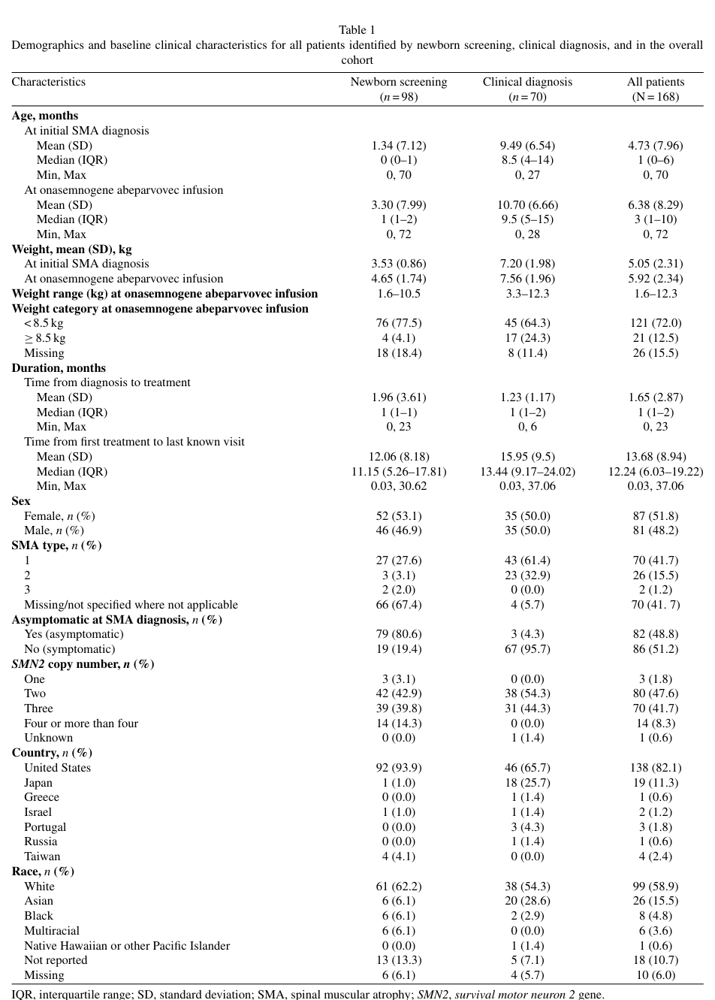

## Question

# Mechanistic Hypothesis Search

You are evaluating a specific disease mechanism hypothesis for the Disorder
Mechanisms Knowledge Base. This is not a general disease overview. Use the
hypothesis YAML below as the seed claim, then search for evidence that supports,
refutes, qualifies, or competes with this hypothesis.

## Target Disease
- **Disease Name:** Spinal Muscular Atrophy
- **Category:** Genetic

## Target Hypothesis
- **Hypothesis ID:** canonical_smn1_deficiency_motor_neuron_degeneration_model
- **Hypothesis Label:** Canonical SMN1 Deficiency / SMN Protein Loss / Motor Neuron Degeneration Model
- **Status in KB:** CANONICAL

## Seed Hypothesis YAML

```yaml
hypothesis_group_id: canonical_smn1_deficiency_motor_neuron_degeneration_model
hypothesis_label: Canonical SMN1 Deficiency / SMN Protein Loss / Motor Neuron Degeneration Model
status: CANONICAL
description: Spinal muscular atrophy (SMA) is caused by biallelic loss-of-function variants in SMN1 on
  5q13, most commonly homozygous SMN1 exon 7 deletion. SMN1 encodes the ubiquitously expressed Survival
  of Motor Neuron (SMN) protein, which functions in snRNP biogenesis, axonal mRNA transport, and neuromuscular
  junction development. SMA severity is inversely modified by SMN2 copy number — a near-identical paralog
  that produces predominantly an unstable, exon-7-skipped transcript (SMN-Δ7) but generates a low level
  of full-length SMN. SMN deficiency selectively kills alpha motor neurons in the anterior horn of the
  spinal cord, producing progressive symmetric weakness, hypotonia, and respiratory failure. Three FDA-approved
  therapies — nusinersen (intrathecal antisense oligonucleotide enhancing SMN2 exon 7 inclusion), onasemnogene
  abeparvovec (AAV9-SMN1 gene therapy, single intravenous infusion), and risdiplam (oral small-molecule
  SMN2 splicing modifier) — definitively validate the SMN-deficiency axis as the canonical pathogenic
  mechanism.
evidence:
- reference: PMID:16364894
  reference_title: Spinal muscular atrophy.
  supports: SUPPORT
  evidence_source: OTHER
  snippet: SMA is caused by mutations in a single gene, the Survival of Motor Neuron 1 (SMN1) gene.
  explanation: |
    Existing canonical mechanism citation in the dismech knowledge base, used as the seed for the hypothesis-search deep-research run.
```

## Research Objective

Build a focused hypothesis-search report that answers:

1. What is the strongest direct evidence for this hypothesis?
2. What evidence argues against it, fails to reproduce it, or limits its scope?
3. Which claims are established, emerging, speculative, or contradicted?
4. Which patient subtypes, stages, tissues, cell types, molecular pathways, or
   biomarkers does the hypothesis best explain?
5. Which alternative or competing mechanistic hypotheses explain the same disease
   features better or more parsimoniously?
6. What are the explicit knowledge gaps: missing causal steps, unconfirmed edges,
   contradictory evidence, unknown source-to-target links, or source/data absences?
7. What experiments, cohorts, assays, datasets, or trials would most directly
   distinguish this hypothesis from alternatives?

Use primary literature whenever possible. Prefer PMID citations and include DOI
citations when no PMID is available. Treat reviews as orientation unless they
contain directly relevant synthesized evidence that should be clearly labeled as
review-level support.

## Required Output

### Executive Judgment

Give a concise verdict on the hypothesis as of the current literature:
supported, partially supported, unresolved, weakly supported, or refuted. Explain
the reasoning and the most important caveats.

### Evidence Matrix

Create a table with one row per important evidence item:

- Citation (PMID preferred)
- Evidence type (human clinical, model organism, in vitro, computational, review)
- Supports / refutes / qualifies / competing
- Mechanistic claim tested
- Key finding
- Disease subtype or context
- Confidence and limitations

### Mechanistic Causal Chain

Describe the causal chain implied by the hypothesis from upstream trigger to
clinical manifestation. Identify where the literature is strong, where the links
are inferred, and where there are missing causal steps.

### Knowledge Gaps

Identify explicit known unknowns surfaced by the search. Treat absence of
evidence as a curation-relevant finding only when the search actually checked for
it. Include:

- Unknown or weakly supported causal steps in the hypothesis
- Unconfirmed causal graph edges that need direct perturbation or longitudinal
  evidence
- Conflicting evidence, failed replications, or incompatible subtype-specific
  findings
- Unknown mechanism of action for relevant treatments, biomarkers, or
  interventions tied to this hypothesis
- Source-level or dataset-level absences, such as no relevant GenCC, ClinGen,
  trial, omics, or cohort evidence found as of the search date

For each gap, state the scope, why it matters, what was checked, and what
evidence or experiment would resolve it.

### Alternative Models

List competing or complementary hypotheses. For each, explain whether it is an
alternative to the seed hypothesis, a downstream consequence, an upstream cause,
or a parallel mechanism.

### Discriminating Tests

Recommend concrete studies or assays that would most efficiently test this
hypothesis against alternatives. Include patient stratification, biomarkers,
sample type, model system, perturbation, and expected result where applicable.

### Curation Leads

Provide candidate updates for the KB, but label these as leads requiring curator
verification. Include:

- candidate evidence references and exact abstract snippets to verify
- candidate pathophysiology nodes or edges
- candidate ontology terms for cell types and biological processes
- candidate subtype restrictions or status changes
- candidate `knowledge_gaps` or discussion prompts for unresolved causal claims,
  conflicting evidence, or explicit source/data absences

If the provider supports artifacts, produce artifact-friendly outputs such as an
evidence matrix, mechanistic diagram, knowledge-gap table, or comparison table.
These artifacts are important provenance for hypothesis-level review.


## Output

Question: You are an expert researcher providing comprehensive, well-cited information.

Provide detailed information focusing on:
1. Key concepts and definitions with current understanding
2. Recent developments and latest research (prioritize 2023-2024 sources)
3. Current applications and real-world implementations
4. Expert opinions and analysis from authoritative sources
5. Relevant statistics and data from recent studies

Format as a comprehensive research report with proper citations. Include URLs and publication dates where available.
Always prioritize recent, authoritative sources and provide specific citations for all major claims.

# Mechanistic Hypothesis Search

You are evaluating a specific disease mechanism hypothesis for the Disorder
Mechanisms Knowledge Base. This is not a general disease overview. Use the
hypothesis YAML below as the seed claim, then search for evidence that supports,
refutes, qualifies, or competes with this hypothesis.

## Target Disease
- **Disease Name:** Spinal Muscular Atrophy
- **Category:** Genetic

## Target Hypothesis
- **Hypothesis ID:** canonical_smn1_deficiency_motor_neuron_degeneration_model
- **Hypothesis Label:** Canonical SMN1 Deficiency / SMN Protein Loss / Motor Neuron Degeneration Model
- **Status in KB:** CANONICAL

## Seed Hypothesis YAML

```yaml
hypothesis_group_id: canonical_smn1_deficiency_motor_neuron_degeneration_model
hypothesis_label: Canonical SMN1 Deficiency / SMN Protein Loss / Motor Neuron Degeneration Model
status: CANONICAL
description: Spinal muscular atrophy (SMA) is caused by biallelic loss-of-function variants in SMN1 on
  5q13, most commonly homozygous SMN1 exon 7 deletion. SMN1 encodes the ubiquitously expressed Survival
  of Motor Neuron (SMN) protein, which functions in snRNP biogenesis, axonal mRNA transport, and neuromuscular
  junction development. SMA severity is inversely modified by SMN2 copy number — a near-identical paralog
  that produces predominantly an unstable, exon-7-skipped transcript (SMN-Δ7) but generates a low level
  of full-length SMN. SMN deficiency selectively kills alpha motor neurons in the anterior horn of the
  spinal cord, producing progressive symmetric weakness, hypotonia, and respiratory failure. Three FDA-approved
  therapies — nusinersen (intrathecal antisense oligonucleotide enhancing SMN2 exon 7 inclusion), onasemnogene
  abeparvovec (AAV9-SMN1 gene therapy, single intravenous infusion), and risdiplam (oral small-molecule
  SMN2 splicing modifier) — definitively validate the SMN-deficiency axis as the canonical pathogenic
  mechanism.
evidence:
- reference: PMID:16364894
  reference_title: Spinal muscular atrophy.
  supports: SUPPORT
  evidence_source: OTHER
  snippet: SMA is caused by mutations in a single gene, the Survival of Motor Neuron 1 (SMN1) gene.
  explanation: |
    Existing canonical mechanism citation in the dismech knowledge base, used as the seed for the hypothesis-search deep-research run.
```

## Research Objective

Build a focused hypothesis-search report that answers:

1. What is the strongest direct evidence for this hypothesis?
2. What evidence argues against it, fails to reproduce it, or limits its scope?
3. Which claims are established, emerging, speculative, or contradicted?
4. Which patient subtypes, stages, tissues, cell types, molecular pathways, or
   biomarkers does the hypothesis best explain?
5. Which alternative or competing mechanistic hypotheses explain the same disease
   features better or more parsimoniously?
6. What are the explicit knowledge gaps: missing causal steps, unconfirmed edges,
   contradictory evidence, unknown source-to-target links, or source/data absences?
7. What experiments, cohorts, assays, datasets, or trials would most directly
   distinguish this hypothesis from alternatives?

Use primary literature whenever possible. Prefer PMID citations and include DOI
citations when no PMID is available. Treat reviews as orientation unless they
contain directly relevant synthesized evidence that should be clearly labeled as
review-level support.

## Required Output

### Executive Judgment

Give a concise verdict on the hypothesis as of the current literature:
supported, partially supported, unresolved, weakly supported, or refuted. Explain
the reasoning and the most important caveats.

### Evidence Matrix

Create a table with one row per important evidence item:

- Citation (PMID preferred)
- Evidence type (human clinical, model organism, in vitro, computational, review)
- Supports / refutes / qualifies / competing
- Mechanistic claim tested
- Key finding
- Disease subtype or context
- Confidence and limitations

### Mechanistic Causal Chain

Describe the causal chain implied by the hypothesis from upstream trigger to
clinical manifestation. Identify where the literature is strong, where the links
are inferred, and where there are missing causal steps.

### Knowledge Gaps

Identify explicit known unknowns surfaced by the search. Treat absence of
evidence as a curation-relevant finding only when the search actually checked for
it. Include:

- Unknown or weakly supported causal steps in the hypothesis
- Unconfirmed causal graph edges that need direct perturbation or longitudinal
  evidence
- Conflicting evidence, failed replications, or incompatible subtype-specific
  findings
- Unknown mechanism of action for relevant treatments, biomarkers, or
  interventions tied to this hypothesis
- Source-level or dataset-level absences, such as no relevant GenCC, ClinGen,
  trial, omics, or cohort evidence found as of the search date

For each gap, state the scope, why it matters, what was checked, and what
evidence or experiment would resolve it.

### Alternative Models

List competing or complementary hypotheses. For each, explain whether it is an
alternative to the seed hypothesis, a downstream consequence, an upstream cause,
or a parallel mechanism.

### Discriminating Tests

Recommend concrete studies or assays that would most efficiently test this
hypothesis against alternatives. Include patient stratification, biomarkers,
sample type, model system, perturbation, and expected result where applicable.

### Curation Leads

Provide candidate updates for the KB, but label these as leads requiring curator
verification. Include:

- candidate evidence references and exact abstract snippets to verify
- candidate pathophysiology nodes or edges
- candidate ontology terms for cell types and biological processes
- candidate subtype restrictions or status changes
- candidate `knowledge_gaps` or discussion prompts for unresolved causal claims,
  conflicting evidence, or explicit source/data absences

If the provider supports artifacts, produce artifact-friendly outputs such as an
evidence matrix, mechanistic diagram, knowledge-gap table, or comparison table.
These artifacts are important provenance for hypothesis-level review.


## Hypothesis-Search Research Report

**Target disease:** 5q Spinal Muscular Atrophy (SMA) (genetic)

**Seed hypothesis (KB):** *Canonical SMN1 Deficiency / SMN Protein Loss / Motor Neuron Degeneration Model*

### Executive Judgment

**Verdict: Supported (with important scope qualifiers).** The strongest evidence remains (i) human genetics demonstrating that biallelic SMN1 loss-of-function is present in the vast majority of 5q-SMA cases and that SMN2 copy number modifies severity via exon-7 splicing (canonical upstream cause and modifier), and (ii) mechanistically aligned clinical efficacy of three SMN-restoring therapies (SMN2 splicing correction by nusinersen/risdiplam; SMN1 replacement by onasemnogene abeparvovec), including large recent real-world cohorts showing improved motor outcomes and survival compared with historical natural history. This therapeutic triangulation provides compelling causal validation of the SMN-deficiency axis. (sharma2024translationaldefectsin pages 16-20, nowak2024molecularmechanismsin pages 10-12, servais2024realworldoutcomesin pages 1-3)

However, **the hypothesis is incomplete as a full disease mechanism model** because multiple lines of recent evidence show that SMA is (a) a **multi-system** disorder with non-neuronal tissue involvement, and (b) **not fully reversible** by restoring SMN—particularly when treatment is not presymptomatic—leaving residual musculoskeletal, metabolic/mitochondrial, and possibly glial/inflammatory pathology. These findings do not refute the canonical axis but limit its sufficiency to explain all persistent features in the treatment era and suggest **parallel or downstream SMN-dependent and SMN-independent pathways** contribute to phenotypic heterogeneity. (grandi2024smatypeii pages 1-4, grandi2024smatypeii pages 22-25, liguori2024anearlytranscriptomic pages 1-2)

### 1) Key Concepts and Definitions (current understanding)

**5q-SMA and causality.** 5q-SMA is a monogenic neuromuscular disorder primarily caused by **biallelic loss of SMN1** at 5q13, which results in **reduced levels of SMN protein** and degeneration of lower motor neurons with progressive weakness. A large genetics summary in the retrieved corpus notes “complete absence of SMN1” in **226/229** patients, and that **>95%** of patients carry homozygous SMN1 deletions/mutations causing reduced SMN protein. (sharma2024translationaldefectsin pages 16-20)

**SMN2 modifier mechanism.** Humans carry **SMN2**, a near-identical paralog. A key mechanistic point is a single-nucleotide difference in exon 7 that promotes exon-7 skipping in the majority of SMN2 transcripts. Multiple sources in this corpus converge on the quantitative rule-of-thumb: **~90%** of SMN2 transcripts skip exon 7, producing unstable **SMNΔ7**, while **~10%** yield full-length functional SMN; consequently, **severity inversely correlates with SMN2 copy number**. (sharma2024translationaldefectsin pages 16-20, nowak2024molecularmechanismsin pages 10-12, grandi2024smatypeii pages 1-4)

**Mechanistic functions of SMN (core vs expanding view).** Recent authoritative reviews emphasize SMN’s central role in spliceosomal **snRNP assembly** and additional roles spanning translation and cellular homeostasis. While snRNP biogenesis remains the best-established biochemical function, recent syntheses highlight SMN involvement in processes such as translation and endocytosis, and broaden SMA pathogenesis from a purely motor-neuron-autonomous model to a systemic framework. (haque2024recentprogressin pages 1-2, nowak2024molecularmechanismsin pages 10-12)

**Therapy classes as mechanistic probes.** The “definitive validation” element of the hypothesis rests on three approved therapy mechanisms:
- **Nusinersen**: intrathecal antisense oligonucleotide that **modulates SMN2 pre-mRNA splicing** to increase exon 7 inclusion and full-length SMN protein. (nowak2024molecularmechanismsin pages 10-12, lemska2024efficacyofnusinersen pages 1-2)
- **Risdiplam**: oral small-molecule splicing modifier that also promotes SMN2 exon 7 inclusion (mechanistic class support in reviews; implementation evidence in RWE claims). (nowak2024molecularmechanismsin pages 10-12, patel2024risdiplamutilizationadherence pages 4-5)
- **Onasemnogene abeparvovec**: AAV9-mediated **SMN1 gene replacement**, single infusion. (servais2024realworldoutcomesin pages 1-3, nowak2024molecularmechanismsin pages 10-12)

### 2) Recent Developments and Latest Research (prioritizing 2023–2024)

#### 2.1 Real-world gene therapy outcomes (2024): RESTORE registry

A major 2024 advance is scale/representativeness of real-world evidence for SMN1 gene replacement.

**RESTORE registry (cutoff May 23, 2022; publication Jan 2024):**
- **n=168** received **onasemnogene abeparvovec monotherapy**. (servais2024realworldoutcomesin pages 1-3)
- Median (IQR) age: **1 (0–6) months** at diagnosis; **3 (1–10) months** at infusion. (servais2024realworldoutcomesin pages 1-3)
- SMN2 distribution: **47.6%** had **2 copies** (80/168); **41.7%** had **3 copies** (70/168). (servais2024realworldoutcomesin pages 1-3)
- **58.3%** identified via **newborn screening** (98/168). (servais2024realworldoutcomesin pages 1-3)
- Motor function: all patients “maintained/achieved motor milestones”; newborn-screened infants had higher mean final **CHOP-INTEND 57.0 (SD 10.0)** versus clinically diagnosed **52.1 (SD 8.0)**, with younger age at final assessment in the newborn-screened group. (servais2024realworldoutcomesin pages 1-3)
- Survival: for two-copy patients, **93.7% event-free at 1 year** and **90% at 2 years**; for three-copy patients **100% event-free at 1 year**; in a newborn-screened two-copy subgroup, **100% event-free** was reported in the excerpt. (servais2024realworldoutcomesin pages 4-6)
- Safety: **48.5%** had ≥1 treatment-emergent AE; **18.6%** had ≥1 serious AE, with **8/31** serious AEs considered treatment-related. (servais2024realworldoutcomesin pages 1-3)

These data strongly support the canonical axis: restoring SMN via SMN1 delivery produces improved function and survival, and earlier treatment (as enabled by newborn screening) associates with better outcomes. (servais2024realworldoutcomesin pages 1-3, servais2024realworldoutcomesin pages 4-6)

**Visual provenance:** RESTORE outcomes tables and CHOP-INTEND trajectory figure were retrieved from the paper (Tables/Figure: baseline characteristics, CHOP-INTEND changes, TEAEs). (servais2024realworldoutcomesin media 5868c42a, servais2024realworldoutcomesin media 0f3ba06c, servais2024realworldoutcomesin media 96711005, servais2024realworldoutcomesin media 827c9b92)

#### 2.2 Real-world nusinersen effectiveness (2024)

A 2024 single-center prospective pediatric real-world study provides quantitative, regimen-aligned evidence that SMN2 splicing correction improves motor function.

- **Lemska et al., Aug 2024 (Neurology International)**: **n=23** pediatric SMA types 1–3, followed for **22 months** under standard nusinersen dosing (loading then q4mo maintenance). Mean **CHOP-INTEND** improvement was **+4.2 points at 6 months** and **+17.8 points at 22 months**; **100%** showed stabilization or improvement. Frequent AEs were procedure-related (e.g., post-lumbar puncture headache **9%** per puncture). (lemska2024efficacyofnusinersen pages 1-2, lemska2024efficacyofnusinersen pages 2-4)

This supports the mechanistic hypothesis because clinical improvement follows a therapy explicitly designed to increase full-length SMN by SMN2 exon 7 inclusion. (lemska2024efficacyofnusinersen pages 1-2)

#### 2.3 Adult nusinersen: early molecular response markers (2024)

- **Liguori et al., Sep 2024 (Journal of Molecular Neuroscience)**: In **10 adult** SMA patients treated for **10 months**, the subset with some clinical improvement showed a slight increase in **SMN2/SMN1 ratio** over time, whereas stable patients showed a decrease; 38/147 baseline DE genes were “restored” at 10 months. The study also highlights miRNA dysregulation (miR-146a-5p, miR-324-5p, miR-423-5p) and links miR-146a-5p to SMN1 targeting and to experimental literature suggesting astrocyte-derived miR-146a contributes to motor neuron loss. (liguori2024anearlytranscriptomic pages 1-2, liguori2024anearlytranscriptomic pages 10-13)

This qualifies the canonical model: SMN2 splicing rescue is necessary, but adult-stage outcomes may be influenced by non-neuronal/inflammatory pathways and response heterogeneity. (liguori2024anearlytranscriptomic pages 1-2)

#### 2.4 Post-treatment residual pathology in human muscle (2024 preprint)

A key 2024 contribution is direct human tissue evidence that **SMN restoration can occur without full downstream tissue normalization**.

- **Grandi et al., Mar 2024 (bioRxiv)**: In paravertebral muscle from **8 SMA type II** patients undergoing scoliosis surgery, the authors report **SMN mRNA and protein restored to at or above controls** in treated muscle, yet a subset showed persistent signatures of **mitochondrial deficiency**, including decreased mitochondrial copy number and a transcriptional profile consistent with reduced oxidative phosphorylation capacity. The study argues that SMN-centric therapy may be insufficient for certain muscle deficits and motivates combination approaches. (grandi2024smatypeii pages 1-4, grandi2024smatypeii pages 22-25)

This is strong qualifying evidence: it supports the SMN axis (SMN is restorable) while showing it does not fully account for persistent organ-level pathology (muscle mitochondrial/metabolic stress). (grandi2024smatypeii pages 22-25)

### 3) Current Applications and Real-World Implementations

**Newborn screening-enabled early treatment.** RESTORE registry data show that infants identified by newborn screening are treated earlier and have higher CHOP-INTEND scores at assessment than clinically diagnosed infants, consistent with a narrow window before irreversible loss. (servais2024realworldoutcomesin pages 1-3, servais2024realworldoutcomesin pages 4-6)

**Real-world nusinersen delivery and safety.** Standard intrathecal dosing schedules are feasible in routine pediatric care, with improvements over 22 months and predominantly procedure-related AEs. (lemska2024efficacyofnusinersen pages 1-2)

**Risdiplam adherence as implementation determinant (claims-based RWE).** A US claims analysis (Jan 2020–Jun 2022 data; publication Dec 2024) provides operational data for a daily oral SMN2 splicing modifier:
- **n=86** risdiplam-treated patients; mean proportion of days covered (PDC) **0.89**, and **83.7%** adherent (PDC≥0.80). (patel2024risdiplamutilizationadherence pages 1-2, patel2024risdiplamutilizationadherence pages 2-4)
- Discontinuation within 1 year: **21%**. (patel2024risdiplamutilizationadherence pages 4-5)
- Nonadherence associated with substantially higher median total healthcare costs (e.g., SMA type 2: **$356,524.60 vs $21,475.40**). (patel2024risdiplamutilizationadherence pages 4-5)

This does not directly validate mechanism biologically, but it provides real-world constraints and determinants of realized benefit for SMN2 splicing therapy deployment. (patel2024risdiplamutilizationadherence pages 4-5)

### 4) Expert Opinions and Analysis from Authoritative Sources

Recent reviews emphasize that **SMN deficiency is necessary and causal**, yet the field increasingly recognizes that SMA includes systemic and non-cell-autonomous components and that SMN-restoring therapies are transformative but **not universally curative**.

- Haque & Yokota (2024) explicitly note systemic pathology beyond motor neurons and the likely need for SMN-independent therapies alongside SMN-targeting drugs. (haque2024recentprogressin pages 1-2)
- Reviews addressing mechanism-to-therapy mapping highlight that exon 7 splicing regulation is central to SMN2’s modifier role and is directly targeted by nusinersen/risdiplam. (nowak2024molecularmechanismsin pages 10-12)

### 5) Relevant Statistics and Data (recent studies)

Key quantitative evidence points relevant to the hypothesis:

**Genetics / modifier mechanism**
- “Complete absence of SMN1” in **226/229** patients; **>95%** have homozygous SMN1 deletions/mutations causing reduced SMN protein. (sharma2024translationaldefectsin pages 16-20)
- SMN2 exon 7 skipping occurs in **~90%** of transcripts, leaving **~10%** full-length SMN; severity inversely correlates with SMN2 copy number. (sharma2024translationaldefectsin pages 16-20, grandi2024smatypeii pages 1-4)

**Onasemnogene abeparvovec (RESTORE RWE, 2024)**
- **n=168** monotherapy; median infusion age **3 months**. (servais2024realworldoutcomesin pages 1-3)
- TEAE: **48.5%**; serious AEs: **18.6%**. (servais2024realworldoutcomesin pages 1-3)
- Event-free survival 1 year: **93.7%** (2 SMN2 copies) vs **100%** (3 copies). (servais2024realworldoutcomesin pages 4-6)

**Nusinersen (RWE, 2024)**
- **n=23** pediatric cohort: CHOP-INTEND **+4.2** at 6 months; **+17.8** at 22 months; **100%** stabilized/improved. (lemska2024efficacyofnusinersen pages 1-2)

**Risdiplam (implementation RWE, 2024)**
- **n=86**: mean PDC **0.89**; adherent **83.7%**. (patel2024risdiplamutilizationadherence pages 1-2)

### Evidence Matrix (KB-friendly)

| Citation | Publication date | URL | Evidence type | Supports/refutes/qualifies/competing | Mechanistic claim tested | Key finding | Disease subtype/context | Confidence & main limitations |
|---|---|---|---|---|---|---|---|---|
| Sharma, 2024, unknown journal; DOI not available in context (sharma2024translationaldefectsin pages 16-20) | 2024 | Not available in context | Human genetics/review-level synthesis | Supports | **SMN1 biallelic loss → reduced SMN → 5q-SMA; SMN2 copy number modifies severity via exon 7 skipping** | Positional cloning identified **SMN1**; “complete absence of SMN1” in **226/229** patients; **>95%** of patients have homozygous SMN1 deletions/mutations; **~90%** of SMN2 transcripts skip exon 7 and only **~10%** are full-length; severity inversely correlates with SMN2 copies; approved SMN-restoring therapies produced “unprecedented motor milestones and survival outcomes,” especially presymptomatically (sharma2024translationaldefectsin pages 16-20) | Broad 5q-SMA; all clinical types | **High** for core genetics; **moderate** because source appears synthesis rather than primary dataset and journal metadata/PMID unavailable |
| Silva & da Costa, 2024, unknown journal; DOI not available in context (silva2024ametaanalysisof pages 12-15) | 2024 | Not available in context | Review/meta-analysis-level synthesis | Supports | **SMN1 loss → alpha motor neuron degeneration; SMN2 is severity modifier; SMN-directed therapies validate axis** | States **~95%** of SMA cases are due to homozygous SMN1 deletion/mutation/rearrangement; SMN deficiency leads to alpha motor neuron degeneration; SMN2 copy number correlates with severity; nusinersen, onasemnogene, and risdiplam act by increasing functional SMN (silva2024ametaanalysisof pages 12-15) | 5q-SMA broadly | **Moderate-high** for canonical framework; limited because excerpt lacks primary experimental detail and PMID/DOI unavailable in context |
| Nowak et al., 2024, *Current Issues in Molecular Biology*; DOI: 10.3390/cimb46060325 (nowak2024molecularmechanismsin pages 10-12) | May 2024 | https://doi.org/10.3390/cimb46060325 | Review | Supports | **SMN2 exon 7 C>T change → exon skipping/unstable SMNΔ7; SMN loss → anterior horn alpha motor neuron degeneration** | Describes exon-7 silent C>T in SMN2 creating splicing repression and SMNΔ7 degradation; links SMN malfunction to degeneration of alpha motor neurons in anterior horns; summarizes nusinersen, risdiplam, and AAV9-SMN1 replacement as mechanism-based therapies (nowak2024molecularmechanismsin pages 10-12) | 5q-SMA broadly | **Moderate**; mechanistically coherent but review-level and not a direct causal experiment |
| Haque & Yokota, 2024, *Genes*; DOI: 10.3390/genes15080999 (haque2024recentprogressin pages 1-2) | Jul 2024 | https://doi.org/10.3390/genes15080999 | Review | Supports/qualifies | **SMN1 mutation → SMN deficiency; SMN2 partially compensates; SMA extends beyond motor neurons** | Summarizes that SMN1 mutations cause SMN deficiency, SMN2 exon 7 skipping occurs in **~90%** of transcripts, and SMN is required for snRNP assembly, translation, endocytosis, and homeostasis; also notes systemic pathology beyond motor neurons and need for combination strategies (haque2024recentprogressin pages 1-2) | 5q-SMA broadly | **Moderate**; authoritative recent review, but not direct primary evidence |
| Grandi et al., 2024, *bioRxiv*; DOI: 10.1101/2024.02.29.582680 (grandi2024smatypeii pages 1-4) | Mar 2024 | https://doi.org/10.1101/2024.02.29.582680 | Human tissue/preprint | Supports/qualifies | **SMN1 loss causes SMA; SMA is multi-system; peripheral tissue pathology persists despite SMN restoration** | In paravertebral muscle from **8 SMA type II** patients, nusinersen-treated tissue showed **SMN mRNA/protein restored to at or above control levels**, yet a subset retained **mitochondrial metabolism abnormalities** and cellular stress markers; supports whole-body disease and incomplete reversal by SMN-centric therapy (grandi2024smatypeii pages 1-4) | SMA type II, post-nusinersen skeletal muscle | **Moderate**; highly relevant human tissue evidence, but preprint, small cohort, surgical muscle sample context |
| Grandi et al., 2024, *bioRxiv*; DOI: 10.1101/2024.02.29.582680 (grandi2024smatypeii pages 22-25) | Mar 2024 | https://doi.org/10.1101/2024.02.29.582680 | Human tissue/preprint | Qualifies | **SMN restoration in muscle does not fully normalize downstream pathology** | Despite corrected SMN2 splicing and restored SMN in treated muscle, samples still showed **multiple internalized nuclei**, **decreased mitochondrial copy number**, and transcriptional evidence of reduced oxidative phosphorylation; authors argue SMN-centric therapy alone may be insufficient for irreversible muscle deficits (grandi2024smatypeii pages 22-25) | SMA type II, treated paravertebral muscle | **Moderate**; direct tissue evidence, but preprint, small sample, tissue-specific and cross-sectional |
| Torres, 2025, unknown journal; DOI not available in context (torres2025dissectingtherole pages 28-32) | 2025 | Not available in context | Animal model/review-level synthesis | Supports/qualifies | **SMN deficiency → selective motor neuron/NMJ pathology; non-neuronal tissues also contribute** | Reports **73% reduction** in anterior horn neurons in classic pathology, selective alpha motor neuron vulnerability, early NMJ defects (AChR clustering defects, presynaptic vesicle mislocalization, neurofilament accumulation), muscle-intrinsic pathology, astrocyte activation, and multisystem involvement (torres2025dissectingtherole pages 28-32) | Human pathology and SMA mouse models | **Moderate**; strong mechanistic synthesis, but not recent primary clinical evidence and metadata incomplete |
| Servais et al., 2024, *Journal of Neuromuscular Diseases*; DOI: 10.3233/JND-230122 (servais2024realworldoutcomesin pages 1-3, servais2024realworldoutcomesin pages 4-6) | Jan 2024 | https://doi.org/10.3233/jnd-230122 | Human clinical RWE/registry | Supports | **AAV9-SMN1 gene replacement improves motor outcomes and survival, validating SMN-deficiency axis** | RESTORE registry: **168** monotherapy patients; median age at infusion **3 months**; **47.6%** had 2 SMN2 copies, **41.7%** had 3; **58.3%** identified by newborn screening; all patients maintained/achieved motor milestones; newborn-screened infants had higher final **CHOP-INTEND 57.0 ± 10.0** vs **52.1 ± 8.0** in clinically diagnosed; TEAEs in **48.5%**, serious AEs in **18.6%**; event-free survival at 1 year **93.7%** for 2-copy and **100%** for 3-copy patients (servais2024realworldoutcomesin pages 1-3, servais2024realworldoutcomesin pages 4-6) | SMA infants, onasemnogene monotherapy, real-world multinational registry | **High** for therapeutic validation; limitations: observational registry, no untreated contemporary control, follow-up heterogeneity |
| Bitetti et al., 2023, *Gene Therapy*; DOI: 10.1038/s41434-022-00341-6 (bitetti2023onasemnogeneabeparvovecgene pages 1-2, bitetti2023onasemnogeneabeparvovecgene pages 2-3) | May 2023 | https://doi.org/10.1038/s41434-022-00341-6 | Human clinical RWE | Supports/qualifies | **SMN1 gene replacement can improve motor function, including in some poor nusinersen responders** | Real-world cohort of **9 SMA1** patients (all with **2 SMN2 copies**); among **7** previously stable on nusinersen, median CHOP-INTEND improved significantly during nusinersen (**p=0.018**) and remained significantly higher **3 months** after switch to onasemnogene (**p=0.0467**); 2 poor nusinersen responders had largest gains after switch; one thrombocytopenia case, no unknown AEs (bitetti2023onasemnogeneabeparvovecgene pages 1-2, bitetti2023onasemnogeneabeparvovecgene pages 2-3) | SMA type 1, mostly treatment-experienced, switch to onasemnogene | **Moderate**; small uncontrolled cohort, short follow-up, mixed prior treatment exposure |
| Lemska et al., 2024, *Neurology International*; DOI: 10.3390/neurolint16060096 (lemska2024efficacyofnusinersen pages 1-2, lemska2024efficacyofnusinersen pages 2-4) | Aug 2024 | https://doi.org/10.3390/neurolint16060096 | Human clinical RWE | Supports | **Nusinersen-mediated SMN2 splicing correction improves/stabilizes motor function** | Single-center pediatric cohort (**n=23**) showed CHOP-INTEND mean improvement **+4.2** at **6 months** and **+17.8** at **22 months**; **100%** had stabilization or improvement by study end; mild AEs mainly post-lumbar-puncture headache (**13 events/138 punctures; 9%**) and low back pain (lemska2024efficacyofnusinersen pages 1-2, lemska2024efficacyofnusinersen pages 2-4) | Pediatric SMA types 1–3, nusinersen | **Moderate-high**; prospective real-world study but single-center, small cohort, no control group |
| Liguori et al., 2024, *Journal of Molecular Neuroscience*; DOI: 10.1007/s12031-024-02251-1 (liguori2024anearlytranscriptomic pages 1-2, liguori2024anearlytranscriptomic pages 10-13) | Sep 2024 | https://doi.org/10.1007/s12031-024-02251-1 | Human clinical/transcriptomic biomarker study | Qualifies | **Nusinersen response varies; molecular response markers may include SMN2/SMN1 ratio and inflammatory/miRNA pathways** | In **10 adults** treated for **10 months**, clinically improving patients showed slight **increase in SMN2/SMN1 ratio**, stable patients a decrease; **38/147** differentially expressed genes normalized at T10; dysregulated **miR-146a-5p, miR-324-5p, miR-423-5p** implicated; suggests response heterogeneity and non-cell-autonomous/inflammatory pathways (liguori2024anearlytranscriptomic pages 1-2, liguori2024anearlytranscriptomic pages 10-13) | Adult SMA on nusinersen | **Moderate**; mechanistically informative but very small adult cohort, short follow-up, exploratory biomarkers |
| Patel et al., 2024, *Orphanet Journal of Rare Diseases*; DOI: 10.1186/s13023-024-03399-0 (patel2024risdiplamutilizationadherence pages 1-2, patel2024risdiplamutilizationadherence pages 4-5, patel2024risdiplamutilizationadherence pages 5-7) | Dec 2024 | https://doi.org/10.1186/s13023-024-03399-0 | Human clinical RWE/claims | Supports/qualifies | **Oral SMN2 splicing therapy is implementable in practice, but adherence affects realized benefit** | US claims cohort (**n=86**) on risdiplam: mean PDC **0.89** overall; **83.7%** adherent (PDC ≥0.80); adherence lowest in type 4 (**75%**) and ages 6–12 (**76.5%**); discontinuation within 1 year **21%**; nonadherence associated with markedly higher median annual healthcare costs, e.g. type 2 **$356,524.60 vs $21,475.40** (patel2024risdiplamutilizationadherence pages 1-2, patel2024risdiplamutilizationadherence pages 4-5, patel2024risdiplamutilizationadherence pages 5-7) | SMA types 1–4, real-world risdiplam use | **Moderate**; strong implementation evidence, but claims data lack direct motor outcomes and include very few type 1 patients |
| Gao et al., 2025, *International Journal of Molecular Sciences*; DOI: 10.3390/ijms26146887 (gao2025applicationofbiomarkers pages 25-27) | Jul 2025 | https://doi.org/10.3390/ijms26146887 | Review/biomarker synthesis | Qualifies/competing-complementary | **SMN2/SMN are established biomarkers, but residual inflammatory/metabolic pathology suggests additional mechanisms and adjunct targets** | Notes early treatment within **first 6 weeks** is pivotal; summarizes reduced CMAP/MUNE, myostatin **98 vs 412 pg/mL (p<0.001)** with severity correlations **Rho 0.493–0.812**; CSF multi-omics implicate lipid/amino-acid dysmetabolism; miR-206 adjunct strategy reduced motor neuron loss by **25% brainstem / 15% spinal cord** and extended survival **~15%** in mice (gao2025applicationofbiomarkers pages 25-27) | Biomarkers across SMA subtypes; treatment era | **Moderate**; useful for scope limits and adjunct mechanisms, but review-level and includes mixed evidence streams |


*Table: This table summarizes key evidence supporting, qualifying, and limiting the canonical SMN1-deficiency model of 5q spinal muscular atrophy. It emphasizes direct genetic and therapeutic validation while highlighting residual pathology, multisystem involvement, and response heterogeneity relevant for curation.*

### Mechanistic Causal Chain (with strength of evidence)

Below is the causal chain implied by the canonical hypothesis; each link is tagged as **strong (directly supported)** vs **inferred/qualifying** based on the retrieved evidence.

1) **Biallelic SMN1 loss-of-function (5q13) → low SMN protein systemically** (**strong**)
- Large patient-series synthesis reports near-universal SMN1 absence/mutation and reduced SMN protein. (sharma2024translationaldefectsin pages 16-20)

2) **SMN2 exon 7 splicing inefficiency → low basal full-length SMN; SMN2 copy number modifies severity** (**strong**)
- Multiple sources support ~90% exon 7 skipping and inverse severity relationship with copy number. (sharma2024translationaldefectsin pages 16-20, nowak2024molecularmechanismsin pages 10-12)

3) **Low SMN → defects in RNA metabolism/translation and related pathways (snRNP assembly and others)** (**moderate; partly inferred**)
- Recent reviews support SMN in snRNP assembly and broader RNA/translation-related functions; direct causal mapping from each molecular defect to motor neuron death remains incomplete in the retrieved excerpts. (haque2024recentprogressin pages 1-2, nowak2024molecularmechanismsin pages 10-12)

4) **Cell-type/tissue vulnerability (motor neurons/NMJ/muscle) → motor unit failure** (**moderate; qualifying**)
- NMJ defects and multisystem involvement are described in synthesis; treated human muscle shows persistent mitochondrial deficits despite SMN restoration, supporting multi-tissue contributions. (torres2025dissectingtherole pages 28-32, grandi2024smatypeii pages 22-25)

5) **Motor neuron degeneration / NMJ failure → progressive weakness, hypotonia, respiratory failure** (**strong at phenotypic level; mechanistic partitioning unresolved**)
- Clinical trajectory is consistent with widespread motor unit dysfunction; however, the proportion attributable to primary motor neuron death vs NMJ/muscle intrinsic pathology may vary by stage and treatment timing. (torres2025dissectingtherole pages 28-32, servais2024realworldoutcomesin pages 1-3)

6) **SMN restoration (SMN2 splicing correction or SMN1 replacement) → improved survival and motor outcomes** (**strong**)
- RESTORE registry demonstrates improved outcomes in a large real-world cohort; nusinersen RWE shows sustained CHOP-INTEND improvements; both are mechanistically aligned interventions. (servais2024realworldoutcomesin pages 1-3, lemska2024efficacyofnusinersen pages 1-2)

7) **Residual disease after SMN restoration** (**strong qualifying evidence**)
- Human muscle shows restored SMN but persistent mitochondrial/metabolic stress; real-world cohorts still include complications and residual disability (e.g., requiring supportive measures in subsets). (grandi2024smatypeii pages 22-25, servais2024realworldoutcomesin pages 4-6)

### Knowledge Gaps

| Gap / uncertainty | Why it matters for hypothesis scope | What was checked in current evidence | Proposed discriminating experiment / study (cohort, assay, perturbation, endpoint) | Expected result under canonical model vs alternative |
|---|---|---|---|---|
| Precise causal step from global SMN deficiency to selective alpha motor neuron vulnerability | Core selectivity problem: SMN is ubiquitous, but motor neurons degenerate disproportionately | Reviews/syntheses support SMN roles in snRNP assembly, translation, axonal/NMJ biology, but direct human causal linkage from each SMN-dependent defect to selective motor neuron death remains incomplete (haque2024recentprogressin pages 1-2, nowak2024molecularmechanismsin pages 10-12, torres2025dissectingtherole pages 28-32) | Human iPSC tri-culture system (motor neurons + astrocytes + myotubes) from SMA patients stratified by SMN2 copy number; CRISPR SMN rescue in one compartment at a time; single-cell RNA-seq, splicing, ribosome profiling, axonal transport imaging, survival/NMJ endpoints | Canonical model: neuron-intrinsic SMN rescue should largely normalize survival and major transcriptomic/splicing defects; alternative non-cell-autonomous model: glial or muscle rescue is required for full protection |
| Whether motor neuron degeneration is primary driver or whether NMJ and muscle pathology are equally early causal lesions | Determines whether seed model is sufficient or needs explicit NMJ/muscle branches | Current evidence shows early NMJ defects, muscle-intrinsic abnormalities, and multisystem involvement, but treated cohorts still largely interpret benefit through motor-neuron rescue (grandi2024smatypeii pages 1-4, grandi2024smatypeii pages 22-25, torres2025dissectingtherole pages 28-32) | Longitudinal presymptomatic infant cohort detected by newborn screening; serial motor unit number estimation, CMAP, muscle MRI, plasma/CSF biomarkers, and if feasible muscle transcriptomics before and after therapy | Canonical model: neuronal/electrophysiologic denervation markers should precede major muscle-intrinsic signatures; alternative parallel-pathology model: muscle/NMJ abnormalities emerge concurrently or before denervation |
| Extent to which residual disability after SMN restoration reflects irreversible developmental loss vs ongoing SMN-independent pathology | Critical for interpreting why approved therapies validate but do not fully explain all treated phenotypes | Human muscle study found restored SMN mRNA/protein with persistent mitochondrial and stress abnormalities; real-world gene-therapy cohorts still show scoliosis/bracing, ventilation, feeding needs in subsets (grandi2024smatypeii pages 1-4, grandi2024smatypeii pages 22-25, servais2024realworldoutcomesin pages 1-3, belancic2025transformingspinalmuscular pages 26-28) | Early-vs-late treatment matched cohort with deep phenotyping; compare presymptomatic, mildly symptomatic, and late-treated patients using motor scales, scoliosis progression, mitochondrial assays in blood/muscle, and omics | Canonical developmental-window model: earliest-treated patients show near-complete normalization, whereas late-treated patients retain fixed deficits; alternative ongoing-parallel-pathology model: persistent mitochondrial/stress signatures remain even in earliest-treated patients |
| Therapeutic timing window: how early SMN restoration must occur to prevent downstream pathology | Limits generalizability of the canonical mechanism across stages and subtypes | Registry data show better outcomes with newborn screening and earlier treatment; reviews emphasize fetal/developmental onset in severe SMA (servais2024realworldoutcomesin pages 1-3, servais2024realworldoutcomesin pages 4-6, gao2025applicationofbiomarkers pages 25-27) | Registry-based causal inference study using newborn-screened infants treated at <2 weeks, 2–6 weeks, >6 weeks; endpoints: independent sitting/walking, event-free survival, electrophysiology, scoliosis, bulbar outcomes | Canonical timing-sensitive model: monotonic benefit gradient with earliest treatment giving strongest normalization; alternative stage-independent model: smaller timing effect after adjusting for baseline severity |
| How much non-neuronal tissues contribute after CNS-targeted or partial-peripheral rescue | Determines whether SMA should be modeled as motor neuron disease only or systemic SMN-deficiency disorder | Nusinersen-treated muscle can show SMN restoration yet persistent deficits; reviews emphasize systemic disease; risdiplam and onasemnogene have broader distribution but residual pathology persists (grandi2024smatypeii pages 1-4, haque2024recentprogressin pages 1-2, grandi2024smatypeii pages 22-25) | Comparative cohort of nusinersen vs risdiplam vs onasemnogene started at similar stage; endpoints: CNS motor scales, peripheral biomarkers, muscle mitochondrial readouts, liver/metabolic markers, fatigue/quality of life | Canonical CNS-dominant model: similar long-term outcomes once spinal motor neurons are rescued; systemic model: broader-distribution therapies show superior peripheral/metabolic/fatigue outcomes despite similar CNS motor scores |
| Source of heterogeneity in response beyond SMN2 copy number | Important for subtype restrictions and for avoiding over-strong canonical claims | SMN2 copy number is established as major modifier, but adult transcriptomic data and real-world cohorts show variable response and incomplete biomarker standardization (sharma2024translationaldefectsin pages 16-20, liguori2024anearlytranscriptomic pages 1-2, liguori2024anearlytranscriptomic pages 10-13) | Multi-center genotype-phenotype-response study integrating SMN2 copies, SMN2/SMN1 expression ratio, modifier variants, treatment timing, baseline denervation; endpoint: motor trajectory and bulbar/respiratory response | Canonical model: SMN2 copy number and baseline SMN-related measures explain most variance; alternative modifier-rich model: substantial residual variance explained by inflammatory, muscle, or glial biomarkers/modifier genes |
| Whether biomarker changes truly report causal rescue vs downstream correlation | Needed to distinguish mechanism-proximal from epiphenomenal biomarkers | NFL, tau, GFAP, SMN2/SMN1 ratio, myostatin, CMAP/MUNE, miRNAs show associations, but many are not yet validated as causal or stage-general markers (gao2025applicationofbiomarkers pages 25-27, belancic2025transformingspinalmuscular pages 17-19, liguori2024anearlytranscriptomic pages 1-2, liguori2024anearlytranscriptomic pages 10-13) | Prospective biomarker qualification cohort across infant, pediatric, and adult SMA; repeated sampling pre/post therapy; mediation analysis linking biomarker change to later motor benefit | Canonical model: proximal SMN-linked biomarkers should change early and mediate later functional benefit; alternative model: many biomarkers track disease burden only and fail mediation/forecasting |
| Relative contribution of inflammatory/glial pathways to ongoing degeneration | Could indicate a competing or complementary non-cell-autonomous mechanism | Adult nusinersen transcriptomics implicate miR-146a, NF-kB, Toll-like receptor and NOTCH pathways; reviews highlight glial activation, but direct perturbation evidence in human disease is sparse (liguori2024anearlytranscriptomic pages 1-2, liguori2024anearlytranscriptomic pages 10-13, torres2025dissectingtherole pages 28-32) | Patient-derived astrocyte–motor neuron co-culture with selective SMN rescue vs anti-inflammatory/miR-146a inhibition; endpoints: motor neuron survival, synaptic activity, target-gene normalization | Canonical model: SMN restoration dominates rescue and anti-inflammatory manipulation adds little; alternative glial/inflammatory model: blocking astrocyte/miR-146a pathways improves survival even with partial SMN rescue |
| Whether persistent muscle mitochondrial deficits are downstream scars or active therapeutic targets | Directly affects whether combination therapy should be added to KB as parallel mechanism | Treated type II muscle retained reduced mitochondrial copy number/oxidative phosphorylation signatures despite SMN restoration (grandi2024smatypeii pages 22-25) | Randomized add-on study in treated later-onset SMA using mitochondrial-targeted intervention; endpoints: fatigue, endurance, muscle transcriptomics, mitochondrial DNA copy number, motor scales | Canonical scar model: add-on has limited benefit once SMN is restored; alternative active-muscle-pathology model: mitochondrial-targeted add-on improves endurance/fatigue and muscle molecular signatures |
| Lack of direct head-to-head mechanistic comparison across approved SMN-restoring therapies | Important because all three validate the axis, but tissue distribution and response patterns differ | Current evidence includes separate real-world cohorts for nusinersen, onasemnogene, and risdiplam, but cross-therapy mechanistic comparisons are limited and confounded (servais2024realworldoutcomesin pages 1-3, lemska2024efficacyofnusinersen pages 1-2, patel2024risdiplamutilizationadherence pages 4-5) | Pragmatic harmonized registry with common endpoints and biospecimens across therapy classes, stratified by age, SMN2 copies, and prior treatment | Canonical model: all therapies converge on similar mechanism-proximal biomarker and functional rescue when exposure is adequate; alternative distribution-specific model: each therapy leaves distinct residual pathology signatures |
| Absence of strong direct human evidence separating fetal developmental arrest from postnatal neurodegeneration in severe SMA | Affects whether seed hypothesis should explicitly include developmental pathology, not only degeneration | Reviews and early-treatment data suggest pathology begins prenatally and severe SMA may be both developmental and degenerative, but direct longitudinal human fetal-to-neonatal data are limited (gao2025applicationofbiomarkers pages 25-27, servais2024realworldoutcomesin pages 1-3, servais2024realworldoutcomesin pages 4-6) | Natural-history-plus-screening study using prenatal/fetal imaging where available, neonatal electrophysiology, and immediate postnatal treatment outcomes in genetically diagnosed fetuses/newborns | Canonical degeneration-focused model: postnatal rescue should largely prevent pathology if given quickly; developmental-arrest model: measurable deficits are already present at birth despite immediate postnatal treatment |


*Table: This table summarizes the main unresolved causal steps and scope limits for the canonical SMN1-deficiency model of SMA, along with concrete studies that could discriminate it from alternative or complementary models. It is designed for KB curation and highlights where current evidence supports, qualifies, or leaves uncertainty.*

### Alternative or Competing Mechanistic Models (relationship to canonical hypothesis)

The following are **complementary** rather than strictly competing models; they explain residual features not fully captured by the motor-neuron-centric SMN-deficiency narrative.

1) **Multi-system / whole-body SMN-deficiency model** (parallel mechanism downstream of SMN loss)
- Evidence: systemic framing in reviews; muscle-intrinsic deficits and persistent metabolic/mitochondrial abnormalities even when SMN is restored in muscle. (haque2024recentprogressin pages 1-2, grandi2024smatypeii pages 22-25)

2) **Non-cell-autonomous glial/inflammatory contribution** (parallel/downstream)
- Evidence: adult nusinersen transcriptomics highlight NF-κB/TLR/NOTCH pathways and miR-146a-5p (linked to astrocyte-produced miR-146a in cited experimental literature), suggesting glial signaling may modify vulnerability and response. (liguori2024anearlytranscriptomic pages 1-2, liguori2024anearlytranscriptomic pages 10-13)

3) **NMJ-centric vulnerability model** (downstream lesion shaping symptoms)
- Evidence: synthesis describes early NMJ defects and peripheral axon involvement; consistent with symptoms and potential adjunct targets. (torres2025dissectingtherole pages 28-32)

4) **Muscle mitochondrial/metabolic pathology model** (downstream consequence or partially independent driver)
- Evidence: persistent mitochondrial copy number reduction and oxidative phosphorylation transcriptional signatures after SMN restoration in treated SMA type II muscle. (grandi2024smatypeii pages 22-25)

### Discriminating Tests (high-yield studies)

The highest-yield discriminating tests are those that separate **neuron-intrinsic SMN rescue sufficiency** from **parallel tissue mechanisms**, and that determine whether residual pathology is a fixed developmental “scar” or an active treatable process. The recommended studies are summarized in the Knowledge Gaps artifact and include: compartment-specific SMN rescue in human iPSC tri-cultures; early-vs-late treatment deep-phenotyping cohorts; and cross-therapy comparative registries with harmonized biospecimens. (grandi2024smatypeii pages 1-4, servais2024realworldoutcomesin pages 1-3, liguori2024anearlytranscriptomic pages 1-2)

### Curation Leads (for curator verification)

**Lead 1: Add explicit ‘residual muscle mitochondrial dysfunction despite SMN restoration’ qualifier edge**
- Candidate evidence: Grandi et al. report SMN mRNA/protein restored “at levels at or above controls” in treated SMA type II paravertebral muscle, yet persistent “decreased mitochondrial copy number” and oxidative phosphorylation reduction signatures. (grandi2024smatypeii pages 22-25)
- Candidate edges/nodes:
  - *SMN restoration (nusinersen-treated muscle)* → *SMN protein normalized in muscle* (supports)
  - *SMN protein normalized in muscle* ↛ *mitochondrial oxidative phosphorylation fully normalized* (qualifier)
  - Ontology candidates: skeletal muscle tissue; mitochondrial DNA copy number; oxidative phosphorylation; cellular stress response.

**Lead 2: Add therapy-response heterogeneity and candidate biomarkers**
- Candidate evidence: Liguori et al. report SMN2/SMN1 ratio trends differing between improving vs stable adults; dysregulated miR-146a-5p (targets SMN1) and pathways (NOTCH, NF-κB, TLR). (liguori2024anearlytranscriptomic pages 1-2, liguori2024anearlytranscriptomic pages 10-13)
- Candidate nodes/edges:
  - *Nusinersen treatment* → *SMN2/SMN1 expression ratio change* → *clinical improvement (subset)* (qualifier)
  - *Astrocyte-derived miR-146a (putative)* → *motor neuron vulnerability* (curation prompt; requires primary validation)

**Lead 3: Real-world gene therapy effectiveness and safety statistics for KB**
- Candidate evidence: RESTORE registry provides cohort size, SMN2 distribution, event-free survival, CHOP-INTEND differences by newborn screening, and AE rates. (servais2024realworldoutcomesin pages 1-3, servais2024realworldoutcomesin pages 4-6)
- Candidate nodes/edges:
  - *AAV9-SMN1 replacement* → *improved CHOP-INTEND / motor milestones* (supports)
  - *Earlier (NBS) treatment* → *higher CHOP-INTEND at assessment* (qualifier)

**Lead 4: Implementation constraints for oral SMN2 modifier therapy**
- Candidate evidence: Patel et al. claims-based adherence metrics (mean PDC 0.89; 83.7% adherent; 21% discontinue in 1 year) and strong association of nonadherence with higher costs (proxy for increased supportive needs). (patel2024risdiplamutilizationadherence pages 1-2, patel2024risdiplamutilizationadherence pages 4-5)
- Candidate KB note: ‘real-world adherence/persistence modulates therapy effectiveness; not purely biological mechanism’.

### Included URLs and Publication Dates (where available)

- Servais et al., *Journal of Neuromuscular Diseases* (Jan 2024): https://doi.org/10.3233/jnd-230122 (servais2024realworldoutcomesin pages 1-3)
- Lemska et al., *Neurology International* (Aug 2024): https://doi.org/10.3390/neurolint16060096 (lemska2024efficacyofnusinersen pages 1-2)
- Liguori et al., *Journal of Molecular Neuroscience* (Sep 2024): https://doi.org/10.1007/s12031-024-02251-1 (liguori2024anearlytranscriptomic pages 1-2)
- Patel et al., *Orphanet Journal of Rare Diseases* (Dec 2024): https://doi.org/10.1186/s13023-024-03399-0 (patel2024risdiplamutilizationadherence pages 1-2)
- Grandi et al., *bioRxiv* (Mar 2024): https://doi.org/10.1101/2024.02.29.582680 (grandi2024smatypeii pages 1-4)
- Haque & Yokota, *Genes* (Jul 2024): https://doi.org/10.3390/genes15080999 (haque2024recentprogressin pages 1-2)
- Nowak et al., *Current Issues in Molecular Biology* (May 2024): https://doi.org/10.3390/cimb46060325 (nowak2024molecularmechanismsin pages 10-12)

## Conclusion

The canonical SMN1-deficiency / SMN-loss model remains the most strongly supported causal explanation for 5q-SMA, with unusually strong mechanistic validation from multiple therapies that converge on restoring SMN. Current (2023–2024) evidence most strongly qualifies the model by demonstrating (i) a systemic, multi-tissue disease architecture and (ii) persistent residual pathology (notably mitochondrial/metabolic and musculoskeletal features) despite SMN restoration, particularly outside the earliest treatment window. This supports a KB stance of “canonical cause validated” plus explicit qualifier edges capturing stage-, tissue-, and response-dependent limitations. (servais2024realworldoutcomesin pages 1-3, grandi2024smatypeii pages 22-25, liguori2024anearlytranscriptomic pages 1-2)

References

1. (sharma2024translationaldefectsin pages 16-20): G Sharma. Translational defects in multiple tissues from the smn2b/-mouse model of sma. Unknown journal, 2024.

2. (nowak2024molecularmechanismsin pages 10-12): Ilona Nowak, Marlena Paździor, Robert Sarna, and Marcel Madej. Molecular mechanisms in the design of novel targeted therapies for neurodegenerative diseases. Current Issues in Molecular Biology, 46:5436-5453, May 2024. URL: https://doi.org/10.3390/cimb46060325, doi:10.3390/cimb46060325. This article has 1 citations.

3. (servais2024realworldoutcomesin pages 1-3): Laurent Servais, John W. Day, Darryl C. De Vivo, Janbernd Kirschner, Eugenio Mercuri, Francesco Muntoni, Crystal M. Proud, Perry B. Shieh, Eduardo F. Tizzano, Susana Quijano-Roy, Isabelle Desguerre, Kayoko Saito, Eric Faulkner, Kamal M. Benguerba, Dheeraj Raju, Nicole LaMarca, Rui Sun, Frederick A. Anderson, and Richard S. Finkel. Real-world outcomes in patients with spinal muscular atrophy treated with onasemnogene abeparvovec monotherapy: findings from the restore registry. Journal of Neuromuscular Diseases, 11:425-442, Jan 2024. URL: https://doi.org/10.3233/jnd-230122, doi:10.3233/jnd-230122. This article has 79 citations and is from a peer-reviewed journal.

4. (grandi2024smatypeii pages 1-4): Fiorella Carla Grandi, Stephanie Astord, Elena Gidaja, Sonia Pezet, Sabrina Mazzucchi, Maud Chapart, Stephane Vasseur, Kamel Mamchaoui, and Piera Smeriglio. Sma type ii skeletal muscle treated with nusinersen shows smn restoration but mitochondrial deficiency. bioRxiv, Mar 2024. URL: https://doi.org/10.1101/2024.02.29.582680, doi:10.1101/2024.02.29.582680. This article has 3 citations.

5. (grandi2024smatypeii pages 22-25): Fiorella Carla Grandi, Stephanie Astord, Elena Gidaja, Sonia Pezet, Sabrina Mazzucchi, Maud Chapart, Stephane Vasseur, Kamel Mamchaoui, and Piera Smeriglio. Sma type ii skeletal muscle treated with nusinersen shows smn restoration but mitochondrial deficiency. bioRxiv, Mar 2024. URL: https://doi.org/10.1101/2024.02.29.582680, doi:10.1101/2024.02.29.582680. This article has 3 citations.

6. (liguori2024anearlytranscriptomic pages 1-2): Maria Liguori, Annalisa Bianco, Alessandro Introna, Arianna Consiglio, Giammarco Milella, Elena Abbatangelo, Eustachio D’Errico, Flavio Licciulli, Giorgio Grillo, and Isabella Laura Simone. An early transcriptomic investigation in adult patients with spinal muscular atrophy under treatment with nusinersen. Journal of Molecular Neuroscience, Sep 2024. URL: https://doi.org/10.1007/s12031-024-02251-1, doi:10.1007/s12031-024-02251-1. This article has 2 citations and is from a peer-reviewed journal.

7. (haque2024recentprogressin pages 1-2): Umme Sabrina Haque and Toshifumi Yokota. Recent progress in gene-targeting therapies for spinal muscular atrophy: promises and challenges. Genes, Jul 2024. URL: https://doi.org/10.3390/genes15080999, doi:10.3390/genes15080999. This article has 27 citations.

8. (lemska2024efficacyofnusinersen pages 1-2): Anna Lemska, Piotr Ruminski, Jakub Szymarek, Sylwia Studzinska, and Maria Mazurkiewicz-Beldzinska. Efficacy of nusinersen treatment in type 1, 2, and 3 spinal muscular atrophy: real-world data from a single-center study. Neurology International, 16:1266-1278, Aug 2024. URL: https://doi.org/10.3390/neurolint16060096, doi:10.3390/neurolint16060096. This article has 9 citations.

9. (patel2024risdiplamutilizationadherence pages 4-5): Anish Patel, Walter Toro, Min Yang, Wei Song, Raj Desai, Mingchen Ye, Nadia Tabatabaeepour, and Omar Dabbous. Risdiplam utilization, adherence, and associated health care costs for patients with spinal muscular atrophy: a united states retrospective claims database analysis. Orphanet Journal of Rare Diseases, Dec 2024. URL: https://doi.org/10.1186/s13023-024-03399-0, doi:10.1186/s13023-024-03399-0. This article has 6 citations and is from a peer-reviewed journal.

10. (servais2024realworldoutcomesin pages 4-6): Laurent Servais, John W. Day, Darryl C. De Vivo, Janbernd Kirschner, Eugenio Mercuri, Francesco Muntoni, Crystal M. Proud, Perry B. Shieh, Eduardo F. Tizzano, Susana Quijano-Roy, Isabelle Desguerre, Kayoko Saito, Eric Faulkner, Kamal M. Benguerba, Dheeraj Raju, Nicole LaMarca, Rui Sun, Frederick A. Anderson, and Richard S. Finkel. Real-world outcomes in patients with spinal muscular atrophy treated with onasemnogene abeparvovec monotherapy: findings from the restore registry. Journal of Neuromuscular Diseases, 11:425-442, Jan 2024. URL: https://doi.org/10.3233/jnd-230122, doi:10.3233/jnd-230122. This article has 79 citations and is from a peer-reviewed journal.

11. (servais2024realworldoutcomesin media 5868c42a): Laurent Servais, John W. Day, Darryl C. De Vivo, Janbernd Kirschner, Eugenio Mercuri, Francesco Muntoni, Crystal M. Proud, Perry B. Shieh, Eduardo F. Tizzano, Susana Quijano-Roy, Isabelle Desguerre, Kayoko Saito, Eric Faulkner, Kamal M. Benguerba, Dheeraj Raju, Nicole LaMarca, Rui Sun, Frederick A. Anderson, and Richard S. Finkel. Real-world outcomes in patients with spinal muscular atrophy treated with onasemnogene abeparvovec monotherapy: findings from the restore registry. Journal of Neuromuscular Diseases, 11:425-442, Jan 2024. URL: https://doi.org/10.3233/jnd-230122, doi:10.3233/jnd-230122. This article has 79 citations and is from a peer-reviewed journal.

12. (servais2024realworldoutcomesin media 0f3ba06c): Laurent Servais, John W. Day, Darryl C. De Vivo, Janbernd Kirschner, Eugenio Mercuri, Francesco Muntoni, Crystal M. Proud, Perry B. Shieh, Eduardo F. Tizzano, Susana Quijano-Roy, Isabelle Desguerre, Kayoko Saito, Eric Faulkner, Kamal M. Benguerba, Dheeraj Raju, Nicole LaMarca, Rui Sun, Frederick A. Anderson, and Richard S. Finkel. Real-world outcomes in patients with spinal muscular atrophy treated with onasemnogene abeparvovec monotherapy: findings from the restore registry. Journal of Neuromuscular Diseases, 11:425-442, Jan 2024. URL: https://doi.org/10.3233/jnd-230122, doi:10.3233/jnd-230122. This article has 79 citations and is from a peer-reviewed journal.

13. (servais2024realworldoutcomesin media 96711005): Laurent Servais, John W. Day, Darryl C. De Vivo, Janbernd Kirschner, Eugenio Mercuri, Francesco Muntoni, Crystal M. Proud, Perry B. Shieh, Eduardo F. Tizzano, Susana Quijano-Roy, Isabelle Desguerre, Kayoko Saito, Eric Faulkner, Kamal M. Benguerba, Dheeraj Raju, Nicole LaMarca, Rui Sun, Frederick A. Anderson, and Richard S. Finkel. Real-world outcomes in patients with spinal muscular atrophy treated with onasemnogene abeparvovec monotherapy: findings from the restore registry. Journal of Neuromuscular Diseases, 11:425-442, Jan 2024. URL: https://doi.org/10.3233/jnd-230122, doi:10.3233/jnd-230122. This article has 79 citations and is from a peer-reviewed journal.

14. (servais2024realworldoutcomesin media 827c9b92): Laurent Servais, John W. Day, Darryl C. De Vivo, Janbernd Kirschner, Eugenio Mercuri, Francesco Muntoni, Crystal M. Proud, Perry B. Shieh, Eduardo F. Tizzano, Susana Quijano-Roy, Isabelle Desguerre, Kayoko Saito, Eric Faulkner, Kamal M. Benguerba, Dheeraj Raju, Nicole LaMarca, Rui Sun, Frederick A. Anderson, and Richard S. Finkel. Real-world outcomes in patients with spinal muscular atrophy treated with onasemnogene abeparvovec monotherapy: findings from the restore registry. Journal of Neuromuscular Diseases, 11:425-442, Jan 2024. URL: https://doi.org/10.3233/jnd-230122, doi:10.3233/jnd-230122. This article has 79 citations and is from a peer-reviewed journal.

15. (lemska2024efficacyofnusinersen pages 2-4): Anna Lemska, Piotr Ruminski, Jakub Szymarek, Sylwia Studzinska, and Maria Mazurkiewicz-Beldzinska. Efficacy of nusinersen treatment in type 1, 2, and 3 spinal muscular atrophy: real-world data from a single-center study. Neurology International, 16:1266-1278, Aug 2024. URL: https://doi.org/10.3390/neurolint16060096, doi:10.3390/neurolint16060096. This article has 9 citations.

16. (liguori2024anearlytranscriptomic pages 10-13): Maria Liguori, Annalisa Bianco, Alessandro Introna, Arianna Consiglio, Giammarco Milella, Elena Abbatangelo, Eustachio D’Errico, Flavio Licciulli, Giorgio Grillo, and Isabella Laura Simone. An early transcriptomic investigation in adult patients with spinal muscular atrophy under treatment with nusinersen. Journal of Molecular Neuroscience, Sep 2024. URL: https://doi.org/10.1007/s12031-024-02251-1, doi:10.1007/s12031-024-02251-1. This article has 2 citations and is from a peer-reviewed journal.

17. (patel2024risdiplamutilizationadherence pages 1-2): Anish Patel, Walter Toro, Min Yang, Wei Song, Raj Desai, Mingchen Ye, Nadia Tabatabaeepour, and Omar Dabbous. Risdiplam utilization, adherence, and associated health care costs for patients with spinal muscular atrophy: a united states retrospective claims database analysis. Orphanet Journal of Rare Diseases, Dec 2024. URL: https://doi.org/10.1186/s13023-024-03399-0, doi:10.1186/s13023-024-03399-0. This article has 6 citations and is from a peer-reviewed journal.

18. (patel2024risdiplamutilizationadherence pages 2-4): Anish Patel, Walter Toro, Min Yang, Wei Song, Raj Desai, Mingchen Ye, Nadia Tabatabaeepour, and Omar Dabbous. Risdiplam utilization, adherence, and associated health care costs for patients with spinal muscular atrophy: a united states retrospective claims database analysis. Orphanet Journal of Rare Diseases, Dec 2024. URL: https://doi.org/10.1186/s13023-024-03399-0, doi:10.1186/s13023-024-03399-0. This article has 6 citations and is from a peer-reviewed journal.

19. (silva2024ametaanalysisof pages 12-15): BP Silva and VV da Costa. A meta-analysis of the biomarkers in late-onset spinal muscular atrophy patients treated with nusinersen. Unknown journal, 2024.

20. (torres2025dissectingtherole pages 28-32): P Pacheco Torres. Dissecting the role of oxidative stress in spinal muscular atrophy (sma). Unknown journal, 2025.

21. (bitetti2023onasemnogeneabeparvovecgene pages 1-2): Ilaria Bitetti, Valentina Lanzara, Giovanna Margiotta, and Antonio Varone. Onasemnogene abeparvovec gene replacement therapy for the treatment of spinal muscular atrophy: a real-world observational study. Gene Therapy, 30:592-597, May 2023. URL: https://doi.org/10.1038/s41434-022-00341-6, doi:10.1038/s41434-022-00341-6. This article has 66 citations and is from a peer-reviewed journal.

22. (bitetti2023onasemnogeneabeparvovecgene pages 2-3): Ilaria Bitetti, Valentina Lanzara, Giovanna Margiotta, and Antonio Varone. Onasemnogene abeparvovec gene replacement therapy for the treatment of spinal muscular atrophy: a real-world observational study. Gene Therapy, 30:592-597, May 2023. URL: https://doi.org/10.1038/s41434-022-00341-6, doi:10.1038/s41434-022-00341-6. This article has 66 citations and is from a peer-reviewed journal.

23. (patel2024risdiplamutilizationadherence pages 5-7): Anish Patel, Walter Toro, Min Yang, Wei Song, Raj Desai, Mingchen Ye, Nadia Tabatabaeepour, and Omar Dabbous. Risdiplam utilization, adherence, and associated health care costs for patients with spinal muscular atrophy: a united states retrospective claims database analysis. Orphanet Journal of Rare Diseases, Dec 2024. URL: https://doi.org/10.1186/s13023-024-03399-0, doi:10.1186/s13023-024-03399-0. This article has 6 citations and is from a peer-reviewed journal.

24. (gao2025applicationofbiomarkers pages 25-27): Changyi Gao, Yanqiang Zhan, Hong Chen, and Chunchu Deng. Application of biomarkers in spinal muscular atrophy. International Journal of Molecular Sciences, Jul 2025. URL: https://doi.org/10.3390/ijms26146887, doi:10.3390/ijms26146887. This article has 4 citations.

25. (belancic2025transformingspinalmuscular pages 26-28): Andrej Belančić, Patrick Castillo Eustaquio, Elvira Meni Maria Gkrinia, Valentino Rački, Kristina Pilipović, and Dinko Vitezić. Transforming spinal muscular atrophy: from pivotal trials to real-world evidence and future therapeutic frontiers in types 1 and 2. Biomedicines, 13:1939, Aug 2025. URL: https://doi.org/10.3390/biomedicines13081939, doi:10.3390/biomedicines13081939. This article has 4 citations.

26. (belancic2025transformingspinalmuscular pages 17-19): Andrej Belančić, Patrick Castillo Eustaquio, Elvira Meni Maria Gkrinia, Valentino Rački, Kristina Pilipović, and Dinko Vitezić. Transforming spinal muscular atrophy: from pivotal trials to real-world evidence and future therapeutic frontiers in types 1 and 2. Biomedicines, 13:1939, Aug 2025. URL: https://doi.org/10.3390/biomedicines13081939, doi:10.3390/biomedicines13081939. This article has 4 citations.

## Artifacts

- [Edison artifact artifact-00](falcon_artifacts/artifact-00.md)
- [Edison artifact artifact-01](falcon_artifacts/artifact-01.md)

