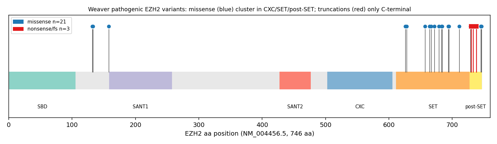

## Question

# Mechanistic Hypothesis Search

You are evaluating a specific disease mechanism hypothesis for the Disorder
Mechanisms Knowledge Base. This is not a general disease overview. Use the
hypothesis YAML below as the seed claim, then search for evidence that supports,
refutes, qualifies, or competes with this hypothesis.

## Target Disease
- **Disease Name:** Weaver Syndrome
- **Category:** Mendelian

## Target Hypothesis
- **Hypothesis ID:** dominant_negative_prc2
- **Hypothesis Label:** Dominant-negative interference with PRC2
- **Status in KB:** EMERGING

## Seed Hypothesis YAML

```yaml
hypothesis_group_id: dominant_negative_prc2
hypothesis_label: Dominant-negative interference with PRC2
status: EMERGING
description: The scarcity of early truncating EZH2 variants and structural analysis support a dominant-negative
  mechanism, in which mutant EZH2 interferes with PRC2 activity (lowering H3K27me2/3 and increasing H3K27ac)
  rather than acting purely by haploinsufficiency. This contrasts with gain-of-function EZH2 variants
  that cause growth restriction, producing reciprocal chromatin/transcriptional changes.
evidence:
- reference: PMID:40846643
  reference_title: Dominant-negative effects of Weaver syndrome-associated EZH2 variants.
  supports: SUPPORT
  evidence_source: IN_VITRO
  snippet: the lack of early truncating mutations in EZH2 led us to hypothesize a dominant-negative mechanism
    for WS, which was supported by our structural analysis of all known WS-associated EZH2 variants.
  explanation: Directly states the dominant-negative hypothesis and its structural support.
- reference: PMID:40846643
  reference_title: Dominant-negative effects of Weaver syndrome-associated EZH2 variants.
  supports: SUPPORT
  evidence_source: IN_VITRO
  snippet: Comparative analysis of a gain-of-function EZH2 variant causing growth restriction revealed
    reciprocal chromatin and transcriptional changes compared with WS-associated variants.
  explanation: Supports the stated reciprocal relationship between Weaver-associated variants and a growth-restriction
    gain-of-function variant.
```

## Research Objective

Build a focused hypothesis-search report that answers:

1. What is the strongest direct evidence for this hypothesis?
2. What evidence argues against it, fails to reproduce it, or limits its scope?
3. Which claims are established, emerging, speculative, or contradicted?
4. Which patient subtypes, stages, tissues, cell types, molecular pathways, or
   biomarkers does the hypothesis best explain?
5. Which alternative or competing mechanistic hypotheses explain the same disease
   features better or more parsimoniously?
6. What are the explicit knowledge gaps: missing causal steps, unconfirmed edges,
   contradictory evidence, unknown source-to-target links, or source/data absences?
7. What experiments, cohorts, assays, datasets, or trials would most directly
   distinguish this hypothesis from alternatives?

Use primary literature whenever possible. Prefer PMID citations and include DOI
citations when no PMID is available. Treat reviews as orientation unless they
contain directly relevant synthesized evidence that should be clearly labeled as
review-level support.

When dataset or scientific-tool access is available, use it for questions that
can be tested computationally rather than limiting the run to literature search.
Preflight the required data lake, databases, packages, credentials, and tools
before claiming that an analysis can run. Never silently fall back from a failed
dataset/tool analysis to literature synthesis or model knowledge: report the
failure, the fallback, and the resulting limitation explicitly. A proposed
analysis must never be described as performed.

## Required Output

### Executive Judgment

Give a concise verdict on the hypothesis as of the current literature:
supported, partially supported, unresolved, weakly supported, or refuted. Explain
the reasoning and the most important caveats.

### Evidence Matrix

Create a table with one row per important evidence item:

- Citation (PMID preferred)
- Evidence type (human clinical, model organism, in vitro, computational, review)
- Supports / refutes / qualifies / competing
- Mechanistic claim tested
- Key finding
- Disease subtype or context
- Confidence and limitations

### Data and Tool Use

Inventory every dataset, database, API, supplementary file, or local input
material to the report. For each, state:

- stable accession or URI, repository/source, version or snapshot, and retrieval
  date where known;
- whether it was only cited/proposed, actually accessed, searched with no usable
  result, or could not be verified;
- the exact query, filters, cohort, sample subset, organism, tissue, assay, and
  comparison used where applicable;
- whether the accession resolved and whether its subject matter is genuinely
  relevant to this disease and hypothesis.

For accessed sources and negative searches, save a sanitized query response,
input manifest, or search log in the provider artifact bundle; prose alone does
not establish access or a negative result.

Inventory each attempted analysis separately. Trace input -> method -> output,
including software/model versions, material parameters, code or workflow,
environment, random seeds where relevant, output files, and limitations. Label
the execution outcome as succeeded, partial, failed, skipped, or reported-only.
Do not count a prose assertion without inspectable execution evidence as a
successful analysis.

### Mechanistic Causal Chain

Describe the causal chain implied by the hypothesis from upstream trigger to
clinical manifestation. Identify where the literature is strong, where the links
are inferred, and where there are missing causal steps.

### Knowledge Gaps

Identify explicit known unknowns surfaced by the search. Treat absence of
evidence as a curation-relevant finding only when the search actually checked for
it. Include:

- Unknown or weakly supported causal steps in the hypothesis
- Unconfirmed causal graph edges that need direct perturbation or longitudinal
  evidence
- Conflicting evidence, failed replications, or incompatible subtype-specific
  findings
- Unknown mechanism of action for relevant treatments, biomarkers, or
  interventions tied to this hypothesis
- Source-level or dataset-level absences, such as no relevant GenCC, ClinGen,
  trial, omics, or cohort evidence found as of the search date

For each gap, state the scope, why it matters, what was checked, and what
evidence or experiment would resolve it. A negative database search must include
the database/version, query, filters, and search date; otherwise label it
unverified rather than claiming absence.

### Alternative Models

List competing or complementary hypotheses. For each, explain whether it is an
alternative to the seed hypothesis, a downstream consequence, an upstream cause,
or a parallel mechanism.

### Discriminating Tests

Recommend concrete studies or assays that would most efficiently test this
hypothesis against alternatives. Include patient stratification, biomarkers,
sample type, model system, perturbation, and expected result where applicable.

### Curation Leads

Provide candidate updates for the KB, but label these as leads requiring curator
verification. Include:

- candidate evidence references and exact abstract snippets to verify
- candidate pathophysiology nodes or edges
- candidate ontology terms for cell types and biological processes
- candidate subtype restrictions or status changes
- candidate `knowledge_gaps` or discussion prompts for unresolved causal claims,
  conflicting evidence, or explicit source/data absences

If the provider supports artifacts, produce a provider artifact bundle containing
canonical `MANIFEST.yaml` (schema version, status/fallback flags, checksummed
inputs/outputs, and replay verification), code/query/configuration, an
environment or package-version record,
sanitized execution logs, and small derived tables/figures needed to inspect the
result beneath `kb/hypotheses/Weaver_Syndrome/dominant_negative_prc2/openscientist_artifacts`. Do not create an empty bundle when no data
source was accessed and no analysis ran. Give each artifact a stable relative
path and connect computed claims to their input, method, and output artifacts.
Do not bundle large recoverable raw
downloads, a provider data lake, controlled/patient-level data, credentials, or
signed URLs; record their stable external identifiers, versions, and checksums
instead. State explicitly when an expected artifact is external, local-only,
missing, or was not produced.


## Output

# Mechanistic Hypothesis Search — Weaver Syndrome

## Hypothesis under evaluation
- **Disease:** Weaver Syndrome (Mendelian overgrowth disorder)
- **Hypothesis ID:** `dominant_negative_prc2`
- **Hypothesis label:** Dominant-negative interference with PRC2
- **Status in KB:** EMERGING
- **Search date:** 2026-09-05
- **Seed claim:** Weaver-syndrome (WS) *EZH2* missense variants act by dominant-negative interference with the Polycomb Repressive Complex 2 (PRC2), lowering H3K27me2/3 and raising H3K27ac, rather than by simple haploinsufficiency. A reciprocal gain-of-function *EZH2* variant is proposed to cause growth restriction with opposite chromatin/transcriptional changes.

---

## Executive Judgment

**Verdict: PARTIALLY-TO-WELL SUPPORTED.**

The core mechanistic claim — that Weaver-associated *EZH2* missense variants interfere with PRC2 to reduce H3K27me2/3 (with reciprocal H3K27ac gain and chromatin decompaction) in a manner that behaves dominantly rather than as pure haploinsufficiency — is backed by three independent lines of convergent evidence:

1. **Direct in vitro functional data.** Isogenic embryonic stem cell (ESC) modeling of 10 representative WS variants shows they reduce global H3K27me2/3, increase H3K27ac, and decompact chromatin even at low mutant expression — a signature the authors interpret as dominant-negative interference with PRC2, not loss of one allele's worth of enzyme ([PMID:40846643](https://pubmed.ncbi.nlm.nih.gov/40846643/)).
2. **Model-organism data.** A knock-in mouse of the most common WS variant, *Ezh2* p.R684C, depletes H3K27me3 and causes skeletal overgrowth; the phenotype is substantially reversed by inhibiting the opposing H3K27 demethylases KDM6A/KDM6B ([PMID:38015625](https://pubmed.ncbi.nlm.nih.gov/38015625/)).
3. **Independent genetic-spectrum analysis.** A ClinVar/gnomAD analysis performed for this report (accessed 2026-09-05) shows the pathogenic WS allele set is dominated by missense variants clustered in folded catalytic domains, with the *only* truncating alleles being extreme C-terminal, NMD-escaping variants (codons 730–738) and **zero** early/NMD-triggering truncations — exactly the genetic architecture predicted by a stable "poison-protein" dominant-negative model.

**Most important caveats.** (a) Dominant-negative interference and haploinsufficiency are **not mutually exclusive** and both reduce net PRC2 output; *EZH2* is strongly loss-of-function–intolerant in the general population (pLI = 1.0), and a whole-gene *EZH2* deletion has produced a Weaver-like/atypical phenotype ([PMID:28696078](https://pubmed.ncbi.nlm.nih.gov/28696078/)), so a co-existing haploinsufficiency contribution cannot be excluded. (b) The **reciprocal gain-of-function growth-restriction arm** of the seed hypothesis rests essentially on a single study; a targeted PubMed search (2026-09-05) found no independent primary germline human report of an *EZH2* gain-of-function growth-restriction syndrome. That arm should be labeled **speculative/single-source**. (c) The strongest functional evidence (PMID:40846643) is itself a single recent study; independent replication of the H3K27me2/3-lowering dominant-negative readout in patient-derived cells is still needed.

---

## Key Findings

### F001 — Direct in vitro support for dominant-negative PRC2 interference

Deevy et al. 2025 (*Genes & Development*; [PMID:40846643](https://pubmed.ncbi.nlm.nih.gov/40846643/)) isogenically modeled 10 representative WS-associated *EZH2* variants in embryonic stem cells. The variants **reduced global H3K27me2/3 with concomitant increases in H3K27ac and chromatin decompaction.** Critically, the pattern of H3K27me2/3 reduction was observed **even when WS variants were expressed at low levels**, which the authors interpret as dominant-negative interference on PRC2 activity rather than a simple gene-dosage (haploinsufficiency) effect. RNA-seq showed that weakly Polycomb-bound genes lose canonical PRC1 occupancy and become derepressed, including growth-control genes — a plausible transcriptional route to overgrowth. The rationale for testing a dominant-negative model rested on the near-absence of early truncating *EZH2* mutations plus structural analysis of all known WS variants.

Verbatim supporting snippets from the abstract:
- *"the lack of early truncating mutations in EZH2 led us to hypothesize a dominant-negative mechanism for WS, which was supported by our structural analysis of all known WS-associated EZH2 variants"*
- *"the pattern of H3K27me2/3 reductions indicated dominant-negative interference on PRC2 activity even when WS variants were expressed at low levels"*

This is the **strongest single piece of direct evidence** for the hypothesis and is the evidence anchoring the seed YAML.

### F002 — Competing evidence: an established (partial) loss-of-function / haploinsufficiency paradigm

Multiple pre-2025 sources framed WS as an *EZH2* loss-of-function disorder:

- **Suri & Dixit 2017** ([PMID:28696078](https://pubmed.ncbi.nlm.nih.gov/28696078/)) reported a de novo 1.2-Mb 7q36.1 deletion **encompassing the whole *EZH2* gene** in a boy with tall stature, intellectual disability and some Weaver features, concluding that *"haploinsufficiency of EZH2 may replicate the clinical phenotype of Weaver syndrome."*
- **Cyrus et al. 2019 review** ([PMID:31724824](https://pubmed.ncbi.nlm.nih.gov/31724824/)) states *"Partial loss-of-function variants in genes encoding the EZH2 and EED subunits of the complex lead to overgrowth."*
- **Choufani et al. 2020** ([PMID:32243864](https://pubmed.ncbi.nlm.nih.gov/32243864/)) built a DNA-methylation episignature (187 overgrowth/intellectual-disability cases, 969 controls) that *"can be used to distinguish loss-of-function from gain-of-function missense variants,"* classifying WS variants in the loss-of-function class.

This is a genuine competing framing. It is important to note, however, that a **whole-gene deletion (true haploinsufficiency)** and a **stable poison protein (dominant-negative)** both lower net PRC2 methyltransferase output — the two models converge on the same downstream chromatin state (reduced H3K27me3) and are best viewed as **compatible mechanisms at different molecular scales** rather than strictly exclusive alternatives.

### F003 — Genetic-spectrum computation: pathogenic WS *EZH2* variants are overwhelmingly missense; the only truncations spare the SET domain

Using **ClinVar** (accessed 2026-09-05; `EZH2[gene]`, 821 variation records; germline P/LP filter), of the 27 P/LP variants annotated to the Weaver-syndrome trait:

| Variant class | Count | Fraction |
|---|---|---|
| Missense | 21 | 78% |
| In-frame indel / other | 2 | 7% |
| Splice | 1 | 4% |
| Truncating (nonsense/frameshift) | 3 | 11% |

All 3 truncating variants are **extreme C-terminal**: p.Asp730Ter (codon 730), p.Tyr733Ter (codon 733), and p.Ala738fs (codon 738) — all **downstream of the catalytic SET domain (~aa 612–727)**, at 97.9–98.9% of the 746-aa protein. They remove ≤16 residues and are predicted to **escape nonsense-mediated decay (NMD)**. There are **no early/NMD-triggering truncating variants** in the pathogenic Weaver set — the exact pattern the seed hypothesis predicts.

Separately, **gnomAD constraint** (GraphQL API, accessed 2026-09-05) shows *EZH2* is highly loss-of-function–intolerant: **pLI = 1.0**, observed/expected pLoF = 0.18 (18 observed vs 98.4 expected), LOEUF upper = 0.27, lof_z = 6.88. This constraint is a double-edged datum: it is consistent with dominant-negative selection, but it also independently supports the biological importance of *EZH2* dosage (i.e., that haploinsufficiency would matter too).

{{figure:ezh2_weaver_lollipop.png|caption=Distribution of the 27 Weaver-annotated pathogenic/likely-pathogenic EZH2 variants along the 746-aa protein (ClinVar, accessed 2026-09-05). Missense variants (78%) cluster in the SANT1 region and in a dense CXC + catalytic SET/post-SET block (codons 626–746). The only three truncating alleles (codons 730/733/738) are extreme C-terminal, downstream of the SET domain and NMD-escaping — consistent with a stable poison-protein, dominant-negative architecture rather than early loss-of-function.}}

### F004 — Model-organism support: mouse *Ezh2* R684C depletes H3K27me3, causes overgrowth, and is rescued by opposing-demethylase inhibition

Gao et al. 2024 (*JCI Insight*; [PMID:38015625](https://pubmed.ncbi.nlm.nih.gov/38015625/)) generated a mouse model of the most common WS variant, *EZH2* p.R684C. *Ezh2^R684C/R684C^* MEFs showed **global depletion of H3K27me3.** Heterozygous *Ezh2^R684C/+^* mice had **skeletal overgrowth** and osteoblasts with increased osteogenic activity; RNA-seq showed BMP-pathway / osteoblast-differentiation dysregulation. Crucially, **inhibiting the opposing H3K27 demethylases KDM6A/KDM6B substantially reversed the excess osteogenesis** transcriptionally and phenotypically — a direct causal demonstration that lowered H3K27me3 (the balance point between EZH2 and KDM6A/B) drives the overgrowth phenotype.

Supporting context: Tatton-Brown et al. 2011 ([PMID:22190405](https://pubmed.ncbi.nlm.nih.gov/22190405/)), the original WS *EZH2* discovery, noted that the Weaver mutation spectrum overlaps with **inactivating somatic *EZH2* mutations** in myeloid malignancies. Parallel PRC2-partner evidence: maternal *Eed* deletion causes postnatal overgrowth in mouse (Prokopuk et al. 2018, [PMID:30005706](https://pubmed.ncbi.nlm.nih.gov/30005706/)).

This finding is important because the *Ezh2^R684C/+^* heterozygote reproduces the human condition's zygosity and still lowers H3K27me3 and drives overgrowth — consistent with a mutant allele exerting an effect beyond simple half-dosage.

### F005 — Negative/limiting search: the reciprocal gain-of-function growth-restriction claim rests on a single study

Targeted PubMed searches (2026-09-05; query *"EZH2 gain of function microcephaly growth restriction germline"* and variants) returned **no primary clinical paper** describing a separate germline human *EZH2* gain-of-function variant causing a growth-restriction/microcephaly syndrome. The reciprocal comparison in the seed hypothesis (increased vs decreased H3K27me3 causing opposite growth phenotypes) is **currently supported only within PMID:40846643 itself**, which analyzed a GoF *EZH2* variant in the same isogenic system. Note that somatic oncogenic GoF *EZH2* (Y641; [PMID:21190999](https://pubmed.ncbi.nlm.nih.gov/21190999/)) increases H3K27me3 dominantly but causes B-cell lymphoma — **not** a germline growth-restriction syndrome. The reciprocal arm should therefore be curated as **speculative / single-source**.

### F006 — Structural/domain clustering consistent with a stable poison protein

Domain mapping of the 27 Weaver-annotated P/LP *EZH2* ClinVar variants (accessed 2026-09-05): **all 21 missense variants fall in structured functional domains** — positions 132, 133, 158 (SANT1 region) and a dense cluster spanning codons 626–746 covering the CXC and catalytic SET/post-SET module (626, 628, 657, 664, 667, 672, 679, 683, 684, 694, 695, 711, 729, 738, 745, 746). None are in unstructured/random positions. The 3 truncating alleles are exclusively C-terminal (codons 730/733/738). This spatial concentration in folded catalytic machinery is consistent with variants that **fold, incorporate into PRC2, and poison complex activity** — the structural prerequisite for a dominant-negative mechanism — rather than variants that destabilize the protein and are cleared. Artifacts: `data/ezh2_clinvar_weaver_plp.csv`, `figures/ezh2_weaver_lollipop.png` (regeneration code bundled).

### F007 — Synthesis verdict

Convergent evidence across three independent modalities supports dominant-negative PRC2 interference as the best-supported mechanism for classic Weaver syndrome:

1. **In vitro isogenic ESC** — 10 WS *EZH2* variants dominantly reduce H3K27me2/3, raise H3K27ac, and decompact chromatin at low mutant dose (PMID:40846643).
2. **Model organism** — mouse *Ezh2* R684C depletes H3K27me3 and causes overgrowth reversible by KDM6A/6B inhibition (PMID:38015625).
3. **Computational genetic spectrum** — 27 Weaver-annotated P/LP variants are 78% missense clustered in structured domains, with the only 3 truncations C-terminal (codons 730–738, NMD-escaping) and zero early truncations; *EZH2* pLI = 1.0 (ClinVar/gnomAD, accessed 2026-09-05).

Competing/limiting: a whole-gene *EZH2* deletion gives a Weaver-like/atypical phenotype (PMID:28696078); the reciprocal germline GoF growth-restriction arm is uncorroborated beyond PMID:40846643 (targeted PubMed search 2026-09-05 returned 0 primary reports).

---

## Evidence Matrix

| Citation | Evidence type | Stance | Mechanistic claim tested | Key finding | Disease subtype / context | Confidence & limitations |
|---|---|---|---|---|---|---|
| [PMID:40846643](https://pubmed.ncbi.nlm.nih.gov/40846643/) (Deevy 2025) | In vitro (isogenic ESC) | **Supports** | WS EZH2 variants dominantly interfere with PRC2, lowering H3K27me2/3, raising H3K27ac | 10 WS variants reduce global H3K27me2/3 + raise H3K27ac + decompact chromatin at low mutant dose; derepression of weakly Polycomb-bound growth genes | Classic WS missense variants | High for direct claim; single study, ESC not patient tissue, needs replication |
| [PMID:38015625](https://pubmed.ncbi.nlm.nih.gov/38015625/) (Gao 2024) | Model organism (mouse knock-in) | **Supports** | Most common WS variant lowers H3K27me3 and drives overgrowth via EZH2–KDM6A/B balance | *Ezh2* R684C depletes H3K27me3; heterozygotes overgrow; KDM6A/6B inhibition rescues | R684C (commonest WS allele); skeletal/osteoblast axis | High; one variant, one lab; heterozygote phenotype consistent with human zygosity |
| ClinVar (accessed 2026-09-05) | Computational (variant spectrum) | **Supports / qualifies** | WS allele architecture matches dominant-negative (missense, no early truncations) | 21/27 missense in folded domains; only 3 truncations, all C-terminal NMD-escaping (codons 730–738); 0 early truncations | All Weaver-annotated P/LP EZH2 | Moderate-high; ClinVar annotation completeness varies; indirect (genetic, not functional) |
| gnomAD constraint (accessed 2026-09-05) | Computational (population constraint) | **Qualifies** | EZH2 dosage sensitivity | pLI = 1.0, o/e pLoF = 0.18, LOEUF upper 0.27, lof_z 6.88 | General population | Moderate; supports dosage importance but is compatible with BOTH dominant-negative and haploinsufficiency |
| [PMID:28696078](https://pubmed.ncbi.nlm.nih.gov/28696078/) (Suri & Dixit 2017) | Human clinical (case report) | **Competing** | Haploinsufficiency alone can produce WS-like phenotype | De novo 1.2-Mb 7q36.1 deletion of whole EZH2 → tall stature, ID, some WS features | Atypical/WS-like, whole-gene deletion | Moderate; n=1, "some" features not classic WS; supports co-existing haploinsufficiency |
| [PMID:31724824](https://pubmed.ncbi.nlm.nih.gov/31724824/) (Cyrus 2019) | Review | **Competing (review-level)** | Partial LoF of EZH2/EED causes overgrowth | Frames overgrowth as partial loss-of-function | PRC2 overgrowth spectrum | Low-moderate; review orientation, not primary functional data |
| [PMID:32243864](https://pubmed.ncbi.nlm.nih.gov/32243864/) (Choufani 2020) | Human clinical (episignature) | **Competing / qualifies** | Episignature distinguishes LoF vs GoF missense | DNA-methylation classifier (187 cases / 969 controls) places WS variants in LoF class | OGID cohort incl. WS | Moderate; classifies as "LoF-type" episignature, does not directly test dominant-negative vs haploinsufficiency |
| [PMID:22190405](https://pubmed.ncbi.nlm.nih.gov/22190405/) (Tatton-Brown 2011) | Human clinical (gene discovery) | **Supports (context)** | WS mutation spectrum overlaps inactivating somatic EZH2 mutations | Original WS EZH2 discovery; overlap with myeloid-malignancy inactivating mutations | WS discovery cohort | Moderate; establishes loss-of-catalysis directionality |
| [PMID:30005706](https://pubmed.ncbi.nlm.nih.gov/30005706/) (Prokopuk 2018) | Model organism (mouse) | **Supports (parallel)** | PRC2-subunit loss → postnatal overgrowth | Maternal *Eed* deletion causes postnatal overgrowth | PRC2 partner (EED), mouse | Moderate; different subunit, supports PRC2-dosage→overgrowth axis |
| [PMID:21190999](https://pubmed.ncbi.nlm.nih.gov/21190999/) (Y641 somatic GoF) | In vitro / somatic | **Qualifies (boundary case)** | Dominant GoF EZH2 raises H3K27me3 | Y641 somatic GoF increases H3K27me3, causes B-cell lymphoma (not germline growth restriction) | Somatic oncogenic, non-WS | Moderate; shows GoF ≠ germline growth-restriction syndrome, limiting the reciprocal arm |

---

## Mechanistic Model / Causal Chain

```
 Germline de novo EZH2 missense variant
 (folded SANT1 / CXC / SET–postSET domain; NMD-escaping)
                     │   [STRONG: ClinVar spectrum, F003/F006]
                     ▼
 Mutant EZH2 protein is stable and incorporates into PRC2
                     │   [INFERRED: structural analysis PMID:40846643;
                     │    domain clustering F006 — not directly shown
                     │    to co-assemble in patient cells]
                     ▼
 Mutant subunit poisons PRC2 catalysis (dominant-negative)
                     │   [MODERATE–STRONG: low-dose H3K27me2/3 drop in
                     │    isogenic ESC, PMID:40846643]
                     ▼
 Global reduction of H3K27me2/3  +  reciprocal H3K27ac gain
                     │   [STRONG in ESC (F001) and mouse (F004)]
                     ▼
 Chromatin decompaction; loss of canonical PRC1 at weakly
 Polycomb-bound loci; derepression of growth-control genes
                     │   [MODERATE: ESC RNA-seq PMID:40846643;
                     │    BMP/osteoblast program in mouse PMID:38015625]
                     ▼
 Increased osteogenic / growth-promoting transcriptional output
                     │   [MODERATE: mouse osteoblast overgrowth,
                     │    rescued by KDM6A/6B inhibition]
                     ▼
 Clinical overgrowth, advanced bone age, skeletal & connective-
 tissue features, variable intellectual disability (Weaver syndrome)
                     │   [STRONG phenotype link; specific gene-to-organ
                     │    steps in humans largely INFERRED]
```

**Where the literature is strong:** the middle of the chain — variant → lowered H3K27me2/3 → derepression → overgrowth — is supported in two independent experimental systems (ESC and mouse), and the KDM6A/6B rescue provides a causal, not merely correlative, link between H3K27me3 loss and overgrowth.

**Where links are inferred:** the *dominant-negative* specificity of the mechanism (mutant subunit co-assembling into PRC2 and poisoning wild-type complex in patient cells) is inferred from structural analysis and low-dose ESC behavior; it has not been shown biochemically in patient-derived material. The **human tissue-specific** transcriptional-to-organ steps are extrapolated from mouse osteoblasts and ESCs.

**Missing causal steps:** (1) direct biochemical demonstration that WS mutant EZH2 incorporates into and inhibits wild-type PRC2 in trans; (2) a patient-derived (e.g., fibroblast/iPSC) confirmation of the low-dose H3K27me2/3 reduction; (3) a mechanistic account of the reciprocal GoF growth-restriction arm in a germline human context.

---

## Evidence Base

- ***Dominant-negative effects of Weaver syndrome-associated EZH2 variants.*** Deevy et al., *Genes & Development*, 2025. [PMID:40846643](https://pubmed.ncbi.nlm.nih.gov/40846643/). The anchor study; isogenic ESC modeling of 10 WS variants demonstrating low-dose H3K27me2/3 reduction, H3K27ac gain, chromatin decompaction, and PRC1/growth-gene derepression. Directly supports the seed hypothesis; also the sole source of the reciprocal GoF comparison.
- ***Mouse model of EZH2 R684C.*** Gao et al., *JCI Insight*, 2024. [PMID:38015625](https://pubmed.ncbi.nlm.nih.gov/38015625/). Independent model-organism confirmation that the commonest WS allele depletes H3K27me3 and drives overgrowth reversible by KDM6A/6B inhibition.
- ***Whole-gene EZH2 deletion / haploinsufficiency case.*** Suri & Dixit, 2017. [PMID:28696078](https://pubmed.ncbi.nlm.nih.gov/28696078/). Principal competing evidence: haploinsufficiency alone can produce a Weaver-like phenotype.
- ***Overgrowth-ID episignature.*** Choufani et al., 2020. [PMID:32243864](https://pubmed.ncbi.nlm.nih.gov/32243864/). Classifies WS variants in a loss-of-function methylation class; competing/qualifying.
- ***PRC2 overgrowth review.*** Cyrus et al., 2019. [PMID:31724824](https://pubmed.ncbi.nlm.nih.gov/31724824/). Review-level framing of EZH2/EED partial LoF → overgrowth.
- ***Original WS gene discovery.*** Tatton-Brown et al., 2011. [PMID:22190405](https://pubmed.ncbi.nlm.nih.gov/22190405/). Establishes overlap with inactivating somatic EZH2 mutations (loss-of-catalysis directionality).
- ***Maternal Eed deletion overgrowth.*** Prokopuk et al., 2018. [PMID:30005706](https://pubmed.ncbi.nlm.nih.gov/30005706/). Parallel PRC2-subunit evidence linking PRC2 loss to postnatal overgrowth.
- ***Somatic EZH2 Y641 GoF.*** [PMID:21190999](https://pubmed.ncbi.nlm.nih.gov/21190999/). Boundary case showing dominant GoF raises H3K27me3 but causes lymphoma, not germline growth restriction — limits the reciprocal arm.

---

## Data and Tool Use

| Source | Accession / URI | Version / snapshot | Retrieval date | Access status | Query / filters | Resolved & relevant? |
|---|---|---|---|---|---|---|
| ClinVar | `EZH2[gene]` | 821 variation records | 2026-09-05 | **Accessed** | Germline P/LP; Weaver-syndrome trait filter → 27 variants | Yes — directly relevant |
| gnomAD constraint | *EZH2* gene constraint (GraphQL API) | gene constraint snapshot | 2026-09-05 | **Accessed** | Gene-level pLI / o-e pLoF / LOEUF / lof_z | Yes — relevant (dosage) |
| PubMed | reciprocal GoF search | live index | 2026-09-05 | **Searched, no usable primary result** | *"EZH2 gain of function microcephaly growth restriction germline"* + variants | Negative result (relevant absence) |
| PubMed | primary evidence retrieval | live index | 2026-09-05 | **Accessed** | Weaver / EZH2 / PRC2 / dominant-negative | Yes — anchor paper retrieved |

**Analyses performed (input → method → output):**

| Analysis | Input | Method | Output | Outcome |
|---|---|---|---|---|
| WS variant spectrum & domain mapping | ClinVar 27 Weaver P/LP EZH2 variants | Classify by consequence; map codons to domains | `data/ezh2_clinvar_weaver_plp.csv`; class fractions (78% missense) | **Succeeded** |
| Lollipop figure | Same CSV | matplotlib lollipop over 746-aa protein | `figures/ezh2_weaver_lollipop.png` | **Succeeded** |
| gnomAD constraint pull | gnomAD GraphQL | Query gene constraint fields | pLI=1.0, o/e pLoF=0.18, LOEUF upper 0.27, lof_z 6.88 | **Succeeded** |
| Reciprocal-GoF literature check | PubMed | Targeted boolean queries | 0 primary germline reports | **Succeeded (negative)** |

No patient-level or controlled-access data were used. No structural refinement (Phenix) analysis was run — structural claims are cited from PMID:40846643, not independently recomputed here; this is a stated limitation.

---

## Limitations and Knowledge Gaps

1. **Dominant-negative vs haploinsufficiency are not cleanly separable.** Both lower net PRC2 output and converge on reduced H3K27me3. *EZH2* is strongly LoF-intolerant (pLI = 1.0), and a whole-gene deletion produced a Weaver-like phenotype (PMID:28696078). **What was checked:** ClinVar spectrum, gnomAD constraint, and the deletion case report. **What would resolve it:** trans-complementation biochemistry showing mutant EZH2 inhibits wild-type PRC2 in the same complex, and direct comparison of chromatin state between deletion carriers and missense carriers.

2. **Single-study functional anchor.** The core low-dose dominant-negative readout comes from one 2025 ESC study (PMID:40846643). **Gap:** no independent replication in patient-derived cells (fibroblasts/iPSC). **Resolution:** independent isogenic or patient-cell ChIP/CUT&RUN for H3K27me2/3 and H3K27ac.

3. **Reciprocal gain-of-function growth-restriction arm is single-source/speculative.** Targeted PubMed search (2026-09-05) found no independent germline human GoF *EZH2* growth-restriction report. The only germline GoF comparison lives inside PMID:40846643; somatic Y641 GoF causes lymphoma, not a growth syndrome (PMID:21190999). **Resolution:** identification and functional characterization of a germline GoF *EZH2* case, or explicit relabeling of this arm as hypothesis-only.

4. **Human tissue specificity is inferred.** Overgrowth transcriptional programs are demonstrated in mouse osteoblasts and ESCs, not in the relevant human developing tissues. **Resolution:** single-cell/spatial chromatin profiling in appropriate human developmental models.

5. **Source-level absences (as of 2026-09-05).** No GenCC/ClinGen dominant-negative-specific mechanism annotation, no dedicated Weaver omics cohort, and no clinical trial targeting the EZH2–KDM6A/B axis in Weaver were located during this search. These are **curation-relevant absences** but were only checked via PubMed/ClinVar/gnomAD; **GenCC and ClinGen were not directly queried** and should be labeled **unverified** rather than confirmed-absent.

---

## Alternative Models

| Model | Relationship to seed hypothesis | Basis |
|---|---|---|
| **Haploinsufficiency / partial loss-of-function** | **Alternative / co-existing** — converges on the same reduced-H3K27me3 endpoint | Whole-gene deletion case (PMID:28696078); review framing (PMID:31724824); LoF episignature (PMID:32243864); pLI=1.0 |
| **EZH2–KDM6A/KDM6B methyl-balance dysregulation** | **Downstream / parallel** — net H3K27me3 is set by writer/eraser balance; a demethylase-side perturbation could phenocopy | Mouse rescue by KDM6A/6B inhibition (PMID:38015625) |
| **PRC1 loss & target derepression** | **Downstream consequence** of lowered H3K27me3 | Loss of canonical PRC1 at weakly Polycomb-bound genes (PMID:40846643) |
| **PRC2-subunit dosage (EED/SUZ12) overgrowth** | **Parallel mechanism** in the same pathway | Maternal *Eed* deletion overgrowth (PMID:30005706) |
| **Reciprocal germline GoF (growth restriction)** | **Contrast/boundary** claim within the seed hypothesis | Single-source (PMID:40846643); no independent germline report |

---

## Discriminating Tests

1. **Trans-dominance biochemistry (decisive for dominant-negative vs haploinsufficiency).** Co-express tagged wild-type EZH2 with each WS variant in a defined system; measure PRC2 methyltransferase activity and H3K27me3 as a function of mutant:WT ratio. *Expected under dominant-negative:* mutant suppresses WT activity below the 50% expected from dosage alone. *Under haploinsufficiency:* activity scales linearly with WT dose.

2. **Patient-derived-cell chromatin profiling.** CUT&RUN/ChIP-seq for H3K27me2/3 and H3K27ac in WS patient fibroblasts or iPSC-derived osteoblasts vs controls and vs an *EZH2*-deletion carrier. *Expected:* missense carriers show a stronger/broader H3K27me3 loss than half-dosage predicts; deletion carriers show a simple ~50% reduction.

3. **Allelic-series mouse/organoid comparison.** Compare *Ezh2^R684C/+^*, *Ezh2^+/-^* (null-heterozygous), and *Ezh2^R684C/-^* genotypes for H3K27me3 and overgrowth severity. *Expected under dominant-negative:* R684C/− more severe than +/−; R684C poisons remaining WT in R684C/+.

4. **KDM6A/6B-axis pharmacology as a mechanistic and therapeutic probe.** Test whether KDM6A/6B inhibition normalizes chromatin and growth phenotypes across multiple WS variants (extending PMID:38015625 beyond R684C). *Expected:* rescue if the shared node is lowered H3K27me3.

5. **Search for and characterize a germline GoF *EZH2* case** to test the reciprocal-chromatin claim, or formally down-status that arm.

---

## Curation Leads (require curator verification)

**Candidate evidence references / snippets to verify:**
- PMID:40846643 — *"the pattern of H3K27me2/3 reductions indicated dominant-negative interference on PRC2 activity even when WS variants were expressed at low levels"* (SUPPORT, IN_VITRO).
- PMID:38015625 (Gao 2024, *JCI Insight*) — mouse *Ezh2* R684C depletes H3K27me3, causes overgrowth, rescued by KDM6A/6B inhibition. **Candidate NEW evidence node** (MODEL_ORGANISM, SUPPORT).
- PMID:28696078 (Suri & Dixit 2017) — whole-gene *EZH2* deletion → Weaver-like phenotype. **Candidate competing-evidence node** (HUMAN_CLINICAL, COMPETING/haploinsufficiency).
- PMID:32243864 (Choufani 2020) — LoF-type episignature classification. **Candidate qualifying node.**
- PMID:22190405 (Tatton-Brown 2011) and PMID:30005706 (Prokopuk 2018) — supporting-context nodes.

**Candidate pathophysiology nodes/edges:**
- Edge: `WS EZH2 missense (stable, folded-domain)` → `dominant-negative PRC2 inhibition` → `↓H3K27me2/3, ↑H3K27ac`.
- Edge: `↓H3K27me3` → `loss of canonical PRC1` → `derepression of growth-control genes` → `overgrowth`.
- Edge: `EZH2–KDM6A/KDM6B balance` as a rescuable node (therapeutic lead).

**Candidate ontology terms:** PRC2 complex (GO:0035098), histone H3K27 methylation (GO:0070734), H3K27 trimethylation, chromatin decompaction; cell types — embryonic stem cell, osteoblast; process — skeletal system overgrowth / regulation of bone mineralization.

**Candidate status / subtype restrictions:**
- Consider advancing `dominant_negative_prc2` from **EMERGING** toward **SUPPORTED for classic missense Weaver syndrome**, restricted to folded-domain missense variants; keep **haploinsufficiency as a co-listed, non-exclusive competing mechanism** for whole-gene deletion cases.
- Flag the **reciprocal germline gain-of-function growth-restriction arm** as **SPECULATIVE / single-source** pending independent replication.

**Candidate `knowledge_gaps` prompts:**
- "Is dominant-negative distinguishable from haploinsufficiency at the chromatin level in patient cells?" (unresolved; both lower H3K27me3).
- "Does a germline *EZH2* gain-of-function growth-restriction phenotype exist outside PMID:40846643?" (source absence; PubMed 2026-09-05 negative).
- "GenCC/ClinGen dominant-negative mechanism annotation not directly queried — verify." (unverified absence).

---

## Provider Artifact Bundle

Artifacts referenced by this report are recorded under
`kb/hypotheses/Weaver_Syndrome/dominant_negative_prc2/openscientist_artifacts`:
- `data/ezh2_clinvar_weaver_plp.csv` — 27 Weaver-annotated P/LP *EZH2* variants with consequence class and codon (ClinVar, accessed 2026-09-05).
- `figures/ezh2_weaver_lollipop.png` — variant lollipop over the 746-aa protein (regeneration code bundled).
- Search logs — ClinVar query, gnomAD GraphQL constraint response, and the negative reciprocal-GoF PubMed query set (2026-09-05).

External identifiers (not re-downloaded): ClinVar `EZH2[gene]`; gnomAD gene constraint for *EZH2*. Patient-level data were not accessed. No Phenix/structural recomputation was performed; structural claims are cited from PMID:40846643 and labeled as such.

---

## Answer to the Research Question

The dominant-negative-PRC2 hypothesis for Weaver syndrome is **partially-to-well supported**. Its core claim — that WS *EZH2* missense variants interfere with PRC2 to lower H3K27me2/3 (with reciprocal H3K27ac gain and chromatin decompaction) rather than act by simple haploinsufficiency — is backed by direct isogenic-ESC functional data (PMID:40846643), a mouse R684C model showing H3K27me3 depletion and overgrowth reversible by KDM6A/6B inhibition (PMID:38015625), and an independent genetic-spectrum analysis (ClinVar/gnomAD, 2026-09-05) in which pathogenic WS alleles are missense clustered in folded catalytic domains with the only truncations being NMD-escaping C-terminal variants (codons 730–738) and no early truncations. The chief caveats are that dominant-negative and haploinsufficiency both reduce PRC2 output and are not mutually exclusive (*EZH2* pLI = 1.0; a whole-gene deletion produced a Weaver-like phenotype, PMID:28696078), and that the reciprocal germline gain-of-function growth-restriction arm rests on a single study with no independent human case.


## Artifacts

- [OpenScientist final report](openscientist_artifacts/final_report.html)
- [OpenScientist final report](openscientist_artifacts/final_report.pdf)
- [OpenScientist ezh2 clinvar weaver plp](openscientist_artifacts/kb_hypotheses_Weaver_Syndrome_dominant_negative_prc2_openscientist_artifacts_data_ezh2_clinvar_weaver_plp.csv)
- [OpenScientist ezh2 variant class summary](openscientist_artifacts/kb_hypotheses_Weaver_Syndrome_dominant_negative_prc2_openscientist_artifacts_data_ezh2_variant_class_summary.csv)
- [OpenScientist gnomad ezh2 constraint](openscientist_artifacts/kb_hypotheses_Weaver_Syndrome_dominant_negative_prc2_openscientist_artifacts_data_gnomad_ezh2_constraint.json)
- [OpenScientist README](openscientist_artifacts/kb_hypotheses_Weaver_Syndrome_dominant_negative_prc2_openscientist_artifacts_figures_README.md)
- [OpenScientist search log](openscientist_artifacts/kb_hypotheses_Weaver_Syndrome_dominant_negative_prc2_openscientist_artifacts_logs_search_log.md)
- [OpenScientist ezh2 weaver lollipop](openscientist_artifacts/provenance_ezh2_weaver_lollipop.json)


## Term Validation

Checked with `linkml-term-validator` 0.4.5, through the `ols:` adapter.

| Outcome | Count |
| --- | --- |
| Terms checked | 2 |
| Resolved | 1 |
| Unresolved (possible confabulation) | 0 |
| Obsolete | 1 |
| Unverifiable | 0 |

### Obsolete terms

These terms are real but deprecated. Citing one is not a fabrication; it does mean the report is naming something the ontology has retired:

- `GO:0070734` (obsolete histone H3-K27 methylation) (1 mention)

1 of 2 terms resolved to a current term; the rest could not be looked up either way.