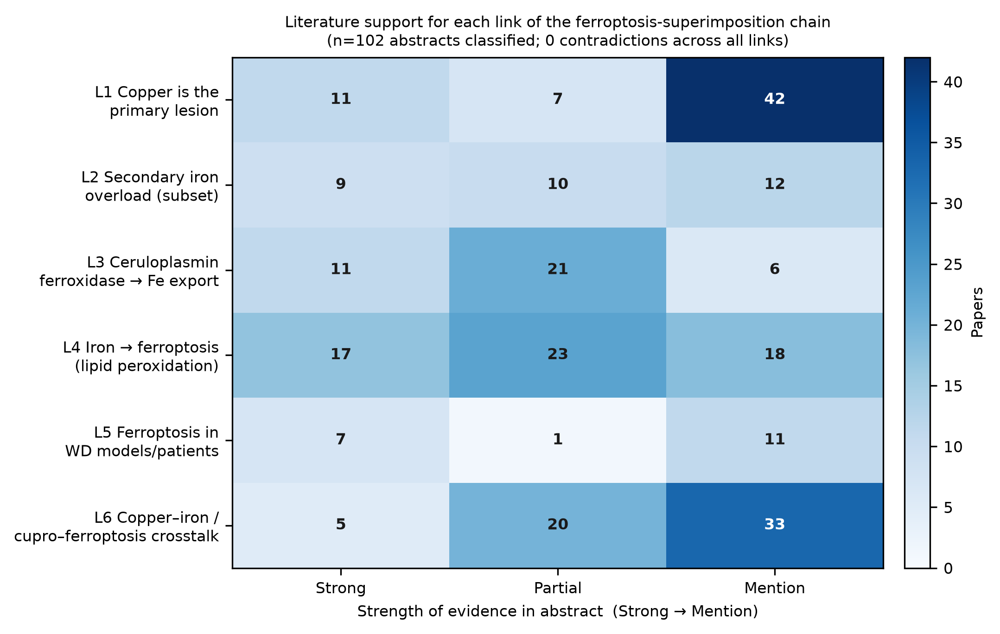
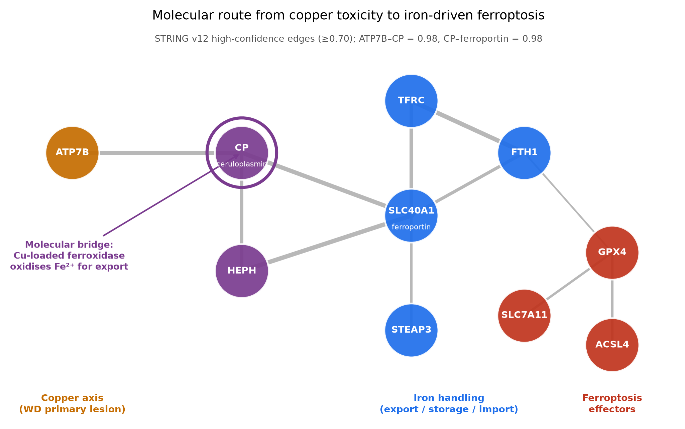
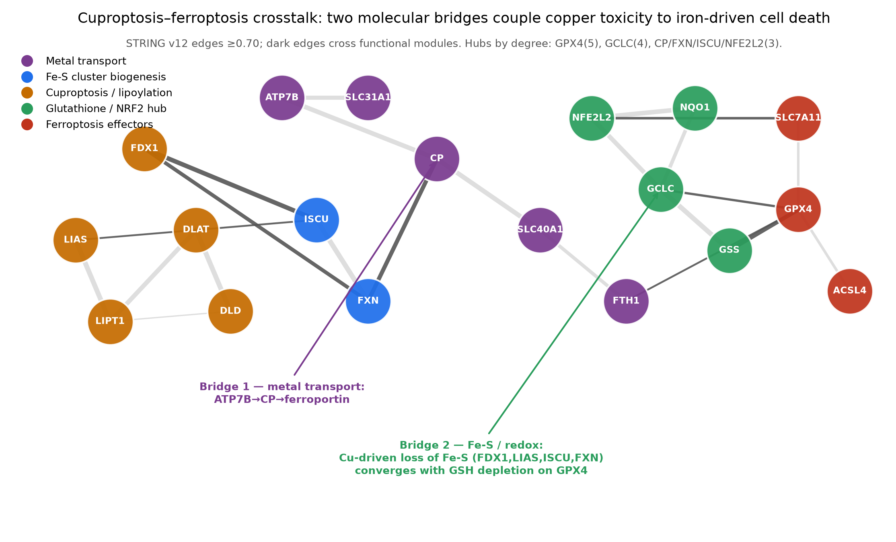
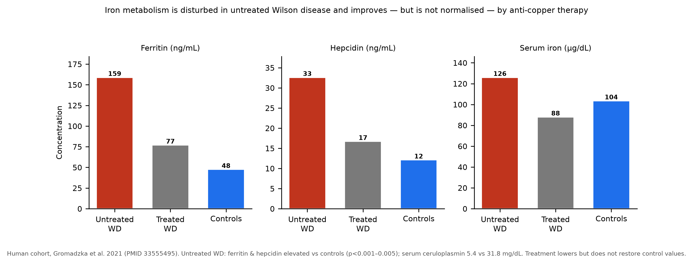
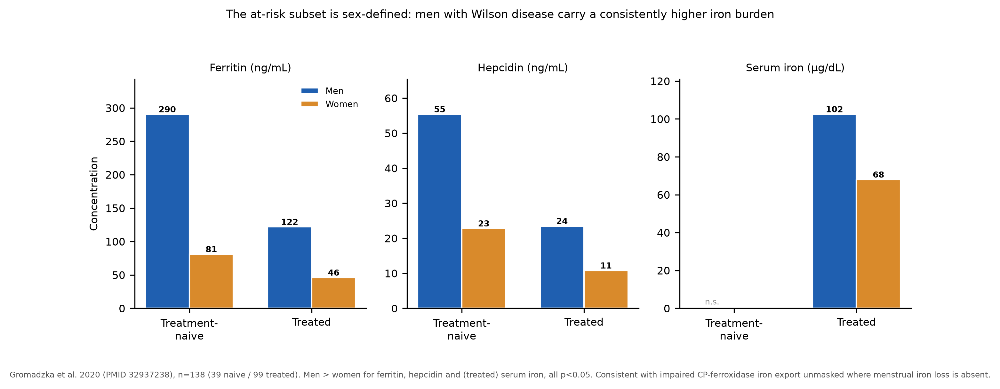

# Iron-Related Ferroptosis Superimposition Model in Wilson Disease
### A ClaudeScience evidence assessment

**Hypothesis group:** `ferroptosis_superimposition_model`  |  **Status:** EMERGING

> In Wilson disease (WD), loss of ATP7B causes hepatic copper accumulation and copper-mediated injury as the **primary** lesion. In a subset of patients, **secondary hepatic iron deposition** may superimpose **iron-driven ferroptotic injury** on top of the copper pathology, amplifying hepatocyte death.

---

## Executive summary

The hypothesis is **mechanistically coherent and internally consistent.** The hypothesis was decomposed into a six-link causal chain (L1–L6); a focused PubMed corpus of 109 articles was assembled, abstracts for 108 retrieved, and 102 classified link-by-link (support graded Strong / Partial / Mention / Contradicts). **Every link has published support, and across 102 abstracts there were zero direct contradictions of any link.** The copper→iron coupling was independently corroborated at the protein-network (STRING v12) and gene-function (NCBI Entrez) levels.

Two findings sharpen — and appropriately constrain — the model:

1. **The at-risk subset is largely sex-defined.** Secondary iron overload is a minority phenomenon (~8% by hepatic iron index [1]) concentrated in **men** with very low functional ceruloplasmin [4,6,5] — plausibly because menstrual iron loss protects women, unmasking the ferroxidase-export defect in men.

2. **Copper couples to ferroptosis through two molecular bridges, not one.** Beyond the classical ceruloplasmin-ferroxidase iron-export route, a second bridge runs through iron–sulfur cluster biology and the glutathione/NRF2 antioxidant hub. Copper excess therefore both **supplies labile iron** and **removes the GPX4 brake** — reframing the model from 'iron piles on' to 'copper supplies the iron *and* lowers the ferroptosis threshold.'

**Why it remains EMERGING (not established):** direct evidence that ferroptosis — as opposed to generic copper oxidative injury or cuproptosis — operates in WD is dominated by **rodent models and natural-product intervention studies** [14,15,16,17,20]; human WD-tissue confirmation is still lacking. This is the single biggest testable gap.

## Evidence across the causal chain

*Figure 1. Papers supporting each link, graded by strength (n=102 abstracts classified; 0 contradictions across all links).*

| Link | Claim | Strong | Partial | Contra | Verdict |
|---|---|:--:|:--:|:--:|---|
| **L1** | Copper is the primary lesion | 11 | 7 | 0 | **Established. |
| **L2** | Secondary hepatic iron overload in a subset | 9 | 10 | 0 | **Supported for a subset; not universal. |
| **L3** | Ceruloplasmin ferroxidase → iron export (the bridge) | 11 | 21 | 0 | **Established general biology; mechanistic linchpin. |
| **L4** | Iron → ferroptosis via lipid peroxidation / GPX4 | 17 | 23 | 0 | **Established general biology. |
| **L5** | Ferroptosis in WD models, rescued by inhibitors | 7 | 1 | 0 | **Emerging; rodent-model–dominated. |
| **L6** | Copper–iron / cuproptosis–ferroptosis crosstalk | 5 | 20 | 0 | **Plausible and actively studied. |

**Representative findings (with citations):**

- **L1 — Copper is the primary lesion.**
  - Excess hepatic copper generates free radicals; antioxidant enzyme activities decreased in patients [22]
  - Cuproptosis: abnormal Cu accumulation, aberrant TCA-cycle enzyme interactions, protein aggregation [29]
- **L2 — Secondary hepatic iron overload in a subset.**
  - 13/197 (8%) WD patients ≥13 y had hepatic iron index >1.0; copper–iron concentrations uncorrelated overall (p=0.84) [1]
  - Untreated WD: ferritin 158.9 vs 47.5 ng/mL and hepcidin 32.6 vs 12.1 ng/mL vs controls; serum CP 5.4 vs 31.8 mg/dL [3]
- **L3 — Ceruloplasmin ferroxidase → iron export (the bridge).**
  - Ceruloplasmin is a ferroxidase essential for iron metabolism; its absence causes parenchymal iron accumulation [9]
  - CP ferroxidase activity required for hepatic iron efflux via ferroportin (oxidises Fe²⁺→Fe³⁺) [11]
- **L4 — Iron → ferroptosis via lipid peroxidation / GPX4.**
  - Iron drives ferroptosis via GPX4/ACSL4/ALOX15 in WD liver; elevated Fe, MDA, ROS, 4-HNE; decreased GPX4 [15]
  - Iron accumulation and lipid peroxidation trigger hepatocyte ferroptosis [30]
- **L5 — Ferroptosis in WD models, rescued by inhibitors.**
  - Ferroptosis inhibitor Fer-1 rescues WD-model liver injury; ferroptosis inhibition improves steatosis [15]
  - Ferroptosis drives WD liver injury in TX mice; intervention lowers lipid peroxidation and restores GPX4 [14]
- **L6 — Copper–iron / cuproptosis–ferroptosis crosstalk.**
  - Iron–copper crosstalk: Fe²⁺ accumulation downregulates [4Fe-4S] cluster assembly [26]
  - Ferroptosis and cuproptosis connected through shared molecular nodes, redox homeostasis, signalling [28]

## The molecular bridge(s)

*Figure 2. STRING v12 high-confidence network (edges ≥0.70). Ceruloplasmin (CP) is the articulation point joining the copper axis to iron export and the ferroptosis effectors.*

**Bridge 1 — metal transport (ferroxidase route).** ATP7B loads copper onto ceruloplasmin (ATP7B–CP = 0.98); ceruloplasmin's ferroxidase activity is required for iron export via ferroportin (CP–ferroportin/SLC40A1 = 0.98) [9,10,11]. NCBI Entrez annotation states CP "binds most of the copper in plasma and is involved in the peroxidation of Fe(II) to Fe(III)." In WD, copper overload lowers functional holo-ceruloplasmin, impairing iron export and causing hepatic iron retention [6,8].

*Figure 3. Extended 19-gene crosstalk network (23 high-confidence edges). Dark edges cross functional modules. Two bridges are visible; GPX4 (degree 5) and GCLC (degree 4) are the top hubs.*

**Bridge 2 — iron–sulfur & glutathione (redox route).** Cuproptosis proceeds via copper attacking lipoylated TCA enzymes and Fe–S proteins (FDX1, LIAS, DLAT, LIPT1); LIAS is itself an Fe–S enzyme, and the network links this module to Fe–S biogenesis (FDX1–ISCU 0.97, CP–FXN 0.945). Both death programs then converge on the glutathione/NRF2 hub (GCLC–GSS 0.995, GCLC–GPX4 0.809, NFE2L2–SLC7A11 0.826) [26,28,27]. Thus copper can raise ferroptotic risk by two independent mechanisms at once — supplying labile iron and depleting the GSH/Fe–S capacity GPX4 needs.

## Who is at risk — the subset is sex-defined

*Figure 5. Human WD cohort (Gromadzka et al. 2021, PMID 33555495 [3]). Iron metabolism is disturbed in untreated WD and improves — but is not normalised — by anti-copper therapy.*

*Figure 4. Sex-stratified iron biomarkers (Gromadzka et al. 2020, n=138). Men consistently carry a higher iron burden, treatment-naive and treated.*

- **Prevalence low but real** — hepatic iron index >1.0 in 13/197 (8%) [1].
- **Men carry the burden** — treatment-naive men: ferritin 290.5 vs 81.0, hepcidin 55.4 vs 22.8 ng/mL vs women; gaps persist after decoppering (all p<0.05) [4].
- **Mechanism confirmed longitudinally** — in male WD patients, chelation lowered copper but liver non-heme iron *rose*, and **phlebotomy ameliorated the liver damage** [6].
- **Not a hemochromatosis artifact** — HFE C282Y/H63D allele frequencies matched the general population (n=143) [5].
- **Over-treatment is a second, iatrogenic risk axis** [7].

**Refined at-risk profile:** male sex + very low functional (holo-)ceruloplasmin + longer disease/chelation duration.

## What would move this from EMERGING to established

1. **Sex-stratified human WD liver**, iron-index-high vs -low, stained for ferroptosis-specific markers (4-HNE, GPX4, ACSL4) co-localising with iron-loaded hepatocytes — separating ferroptosis from generic copper oxidative injury and cuproptosis.
2. **Functional readouts, not levels** — correlate CP *ferroxidase activity* and GSH/GPX4 capacity (not immunoreactive protein) with hepatic copper *and* iron; Bridge 2 predicts GSH capacity falls with copper independent of iron.
3. **Additivity trial** — test whether iron chelation/phlebotomy or a ferroptosis inhibitor (ferrostatin-1, liproxstatin-1) reduces injury additively to decoppering, specifically in iron-loaded (male, high-ferritin) patients. Shiono's phlebotomy observation is the seed.
4. **Fe–S axis in WD models** — does copper loading reduce Fe–S cluster assembly (CP–FXN edge) and sensitise to ferroptosis?

## Methods & caveats

- **Corpus:** PubMed via the pubmed-mcp connector; 10 keyword-seeded queries → 109 unique PMIDs; 108 abstracts retrieved; 102 classified by an LLM extractor into Strong/Partial/Mention/Contradicts per link. Two full texts (PMID 33555495 human cohort; PMID 39223962 WD model) mined for quantitative values.
- **Networks:** STRING v12.0 (Homo sapiens, confidence ≥0.70); gene function from NCBI Entrez / MyGene.info.
- **Caveat — grading:** a 'Strong' grade means the *abstract* reports supporting data, not that the claim is independently replicated. Verify via PMIDs/DOIs in the citations file.
- **Caveat — sampling:** keyword-seeded corpus is a focused sample, not a systematic review. Absence of contradictions reflects the sampled literature; publication bias toward positive intervention results (especially L5 natural-product studies) should be weighed.
- **Caveat — inference:** Bridge 2 rests on STRING functional-association edges (incl. co-expression, databases, text-mining), not WD-specific perturbation data — a hypothesis-generating map, not proof of flux in WD hepatocytes. Ferritin is an acute-phase reactant, a confounder in inflamed WD livers.

---
*Generated by ClaudeScience. Full numbered references in `claudescience.citations.md`; reproducible figure code and the evidence table in `claudescience_artifacts/`.*
