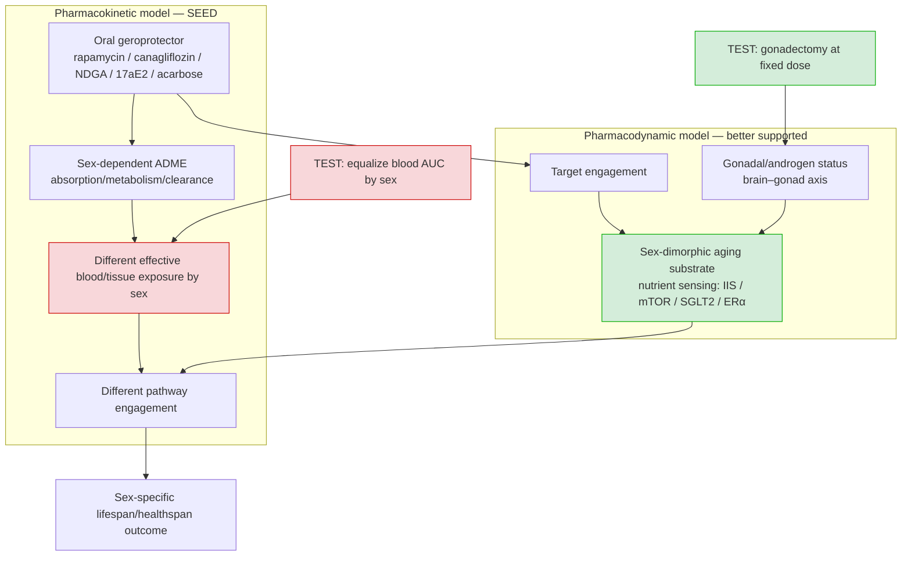

## Question

# Mechanistic Hypothesis Search

You are evaluating a specific disease mechanism hypothesis for the Disorder
Mechanisms Knowledge Base. This is not a general disease overview. Use the
hypothesis YAML below as the seed claim, then search for evidence that supports,
refutes, qualifies, or competes with this hypothesis.

## Target Disease
- **Disease Name:** Deregulated Nutrient Sensing Module
- **Category:** Module

## Target Hypothesis
- **Hypothesis ID:** sex_dimorphic_geroprotector_exposure
- **Hypothesis Label:** Pharmacokinetic (Drug-Exposure) Model of Sex-Dimorphic Geroprotector Response
- **Status in KB:** EMERGING

## Seed Hypothesis YAML

```yaml
hypothesis_group_id: sex_dimorphic_geroprotector_exposure
hypothesis_label: Pharmacokinetic (Drug-Exposure) Model of Sex-Dimorphic Geroprotector Response
status: EMERGING
description: 'The most reproducible single finding of the NIA Interventions Testing Program across two
  decades is that most lifespan-extending compounds work preferentially in one sex, usually males. This
  hypothesis holds that the dimorphism is pharmacokinetic - that males and females achieve different effective
  drug exposures, so the aging substrate itself responds equally and the apparent sex difference is a
  dosing artifact. The competing reading, which this module does not currently model as a separate group,
  is pharmacodynamic: that the nutrient-sensing network is differently wired or differently rate-limiting
  for lifespan in the two sexes, so matched exposure would still produce divergent outcomes. The two make
  an experimentally separable prediction - under the pharmacokinetic model, dose-matching to equal blood
  levels should abolish the sex difference.'
evidence:
- reference: PMID:38753230
  supports: SUPPORT
  evidence_source: MODEL_ORGANISM
  snippet: We found that blood levels of Cana were approximately 20-fold higher in aged females than in
    young males, suggesting a possible mechanism for the sex-specific disparities in its effects.
  explanation: 'Direct pharmacokinetic support: a 20-fold exposure difference between aged females and
    young males accompanies canagliflozin''s male-restricted lifespan benefit and female-specific late-life
    harm.'
- reference: PMID:24341993
  supports: SUPPORT
  evidence_source: MODEL_ORGANISM
  snippet: Rapamycin increased lifespan more in females than in males at each dose evaluated, perhaps
    reflecting sexual dimorphism in blood levels of this drug.
  explanation: 'Support from within this module''s own drug, and in the opposite direction to most ITP
    compounds: rapamycin is the female-favouring exception, and the investigators again attribute the
    dimorphism to differing blood levels. That the model must accommodate a reversal of direction is part
    of what makes it worth testing.'
- reference: PMID:24245565
  supports: REFUTE
  evidence_source: MODEL_ORGANISM
  snippet: Females did not show a lifespan benefit from NDGA, even at a dose that produced blood levels
    similar to those in males, which did show a strong lifespan benefit.
  explanation: The decisive counter-experiment. Dose-matching to equal blood levels is exactly the manipulation
    the pharmacokinetic model predicts should abolish the sex difference, and it did not - implicating
    a pharmacodynamic difference in the aging substrate instead. Recorded as REFUTE because it falsifies
    the model's central prediction for at least one compound.
notes: 'Scope caveat a curator must carry forward: this module is an imperfect home for the hypothesis.
  The ITP male bias spans compounds that act well outside nutrient sensing (17-alpha-estradiol, nordihydroguaiaretic
  acid), so the phenomenon is broader than the mechanism modeled here; the hypothesis is filed on this
  module because rapamycin, acarbose, canagliflozin and metformin are the compounds it can be tested against
  structurally. Note also that the SUPPORT and REFUTE evidence come from the same program and are genuinely
  in tension - the pharmacokinetic model may hold for some compounds (canagliflozin, rapamycin) and fail
  for others (NDGA), in which case the single-model framing is itself wrong and should be split.'
```

## Research Objective

Build a focused hypothesis-search report that answers:

1. What is the strongest direct evidence for this hypothesis?
2. What evidence argues against it, fails to reproduce it, or limits its scope?
3. Which claims are established, emerging, speculative, or contradicted?
4. Which patient subtypes, stages, tissues, cell types, molecular pathways, or
   biomarkers does the hypothesis best explain?
5. Which alternative or competing mechanistic hypotheses explain the same disease
   features better or more parsimoniously?
6. What are the explicit knowledge gaps: missing causal steps, unconfirmed edges,
   contradictory evidence, unknown source-to-target links, or source/data absences?
7. What experiments, cohorts, assays, datasets, or trials would most directly
   distinguish this hypothesis from alternatives?

Use primary literature whenever possible. Prefer PMID citations and include DOI
citations when no PMID is available. Treat reviews as orientation unless they
contain directly relevant synthesized evidence that should be clearly labeled as
review-level support.

## Required Output

### Executive Judgment

Give a concise verdict on the hypothesis as of the current literature:
supported, partially supported, unresolved, weakly supported, or refuted. Explain
the reasoning and the most important caveats.

### Evidence Matrix

Create a table with one row per important evidence item:

- Citation (PMID preferred)
- Evidence type (human clinical, model organism, in vitro, computational, review)
- Supports / refutes / qualifies / competing
- Mechanistic claim tested
- Key finding
- Disease subtype or context
- Confidence and limitations

### Mechanistic Causal Chain

Describe the causal chain implied by the hypothesis from upstream trigger to
clinical manifestation. Identify where the literature is strong, where the links
are inferred, and where there are missing causal steps.

### Knowledge Gaps

Identify explicit known unknowns surfaced by the search. Treat absence of
evidence as a curation-relevant finding only when the search actually checked for
it. Include:

- Unknown or weakly supported causal steps in the hypothesis
- Unconfirmed causal graph edges that need direct perturbation or longitudinal
  evidence
- Conflicting evidence, failed replications, or incompatible subtype-specific
  findings
- Unknown mechanism of action for relevant treatments, biomarkers, or
  interventions tied to this hypothesis
- Source-level or dataset-level absences, such as no relevant GenCC, ClinGen,
  trial, omics, or cohort evidence found as of the search date

For each gap, state the scope, why it matters, what was checked, and what
evidence or experiment would resolve it.

### Alternative Models

List competing or complementary hypotheses. For each, explain whether it is an
alternative to the seed hypothesis, a downstream consequence, an upstream cause,
or a parallel mechanism.

### Discriminating Tests

Recommend concrete studies or assays that would most efficiently test this
hypothesis against alternatives. Include patient stratification, biomarkers,
sample type, model system, perturbation, and expected result where applicable.

### Curation Leads

Provide candidate updates for the KB, but label these as leads requiring curator
verification. Include:

- candidate evidence references and exact abstract snippets to verify
- candidate pathophysiology nodes or edges
- candidate ontology terms for cell types and biological processes
- candidate subtype restrictions or status changes
- candidate `knowledge_gaps` or discussion prompts for unresolved causal claims,
  conflicting evidence, or explicit source/data absences

If the provider supports artifacts, produce artifact-friendly outputs such as an
evidence matrix, mechanistic diagram, knowledge-gap table, or comparison table.
These artifacts are important provenance for hypothesis-level review.


## Output

# Hypothesis-Search Report

## Hypothesis under evaluation
**ID:** `sex_dimorphic_geroprotector_exposure`
**Label:** Pharmacokinetic (Drug-Exposure) Model of Sex-Dimorphic Geroprotector Response
**Module:** Deregulated Nutrient Sensing
**KB status:** EMERGING

**Claim in one line:** The male-biased (and, for rapamycin, female-biased) lifespan effects of NIA Interventions Testing Program (ITP) geroprotectors are a *pharmacokinetic* artifact — the two sexes achieve different effective drug exposures, and the aging substrate itself responds equally. **Separable prediction:** dose-matching to equal blood levels should abolish the sex difference. The competing *pharmacodynamic* reading holds that the nutrient-sensing/aging network is differently wired or rate-limiting in each sex, so matched exposure would still diverge.

---

## Executive Judgment

**Verdict: Refuted as a general model; at best weakly/partially supported as a compound-specific contributor.**

The hypothesis makes one clean, falsifiable prediction — equalize blood levels and the sex difference disappears. Wherever that prediction has actually been tested, it has **failed**:

1. **NDGA (the seed's REFUTE case):** dose-matching females to male blood levels did **not** produce a female benefit (PMID 24245565); escalating female dose 3-fold above the effective male dose still produced no benefit while males responded dose-dependently (PMID 27312235).
2. **Canagliflozin (the seed's strongest SUPPORT case):** a **new 2026 exposure-manipulation study** (PMID 42465412) shows that lowering the dose to reduce female over-accumulation does not confer the male benefit, and that despite 3–5-fold higher female tissue levels the female biology does not respond — the authors conclude the sex-specific longevity effect is "not simply a matter of dose." This directly undercuts the PK inference drawn from the 20-fold female blood-level observation (PMID 38753230), which was only a *correlational* association, never an exposure-matching test.
3. **17-α-estradiol / acarbose:** the male-restricted response is **gonadal-hormone dependent** — castration abolishes the male metabolomic and functional response to 17aE2 (PMID 29806096, 30740872), and tissue-level anti-inflammatory drug responses are themselves male-specific (PMID 28544365). This is a pharmacodynamic wiring signature, not a disposition difference.

**Where the PK model retains residual support:** the *original* observations that motivated it are real and remain unexplained by PD alone — females genuinely over-accumulate canagliflozin ~20-fold (PMID 38753230), NDGA/aspirin disposition differs by sex (PMID 18631321), and rapamycin blood levels differ by sex with the female-favoring direction (seed PMID 24341993; whole-body rapamycin extends female median lifespan more, PMID 20974732). **Rapamycin is the single compound where the PK model remains internally consistent:** at a 3× higher dose the sex gap *narrows* (23% M vs 26% F, PMID 24341993) — the exposure-limited signature the PK model predicts — and the rapalog class demonstrably has sex-differential disposition (everolimus, females greater ileum AUC, PMID 38500383). This is the exact opposite of NDGA, where raising the female dose gave no benefit. So exposure differences are **real and may modulate the magnitude** of a sex effect (and may genuinely drive it for rapamycin), but they are **not the cause** of the sex-specific *direction* of benefit for NDGA/17aE2/canagliflozin. The most defensible position is a **hybrid**: PK sets the achievable exposure, but a sex-dimorphic pharmacodynamic substrate (androgen/gonadal-hormone-gated nutrient-sensing physiology) determines whether that exposure translates into lifespan benefit.

**Most important caveat (already flagged in the seed notes):** the single-model framing is wrong. The evidence splits by compound — PK may contribute for rapamycin/canagliflozin magnitude, but PD dominates for NDGA/17aE2/acarbose. The module ("Deregulated Nutrient Sensing") is also an imperfect home, since the male-bias phenomenon spans compounds (17aE2, NDGA) acting outside canonical nutrient sensing.

---

## Evidence Matrix

| Citation (PMID) | Evidence type | Supports/Refutes/Qualifies/Competing | Mechanistic claim tested | Key finding | Context / compound | Confidence & limitations |
|---|---|---|---|---|---|---|
| 24245565 (Harrison 2014) | Model organism (UM-HET3) | **Refutes** | Equal blood levels → equal outcome | Females got no NDGA benefit even at doses giving male-equivalent blood levels; males strongly benefited | NDGA; ITP | High. Decisive exposure-matching experiment; the single most direct falsification. |
| 42465412 (Herath Manchanayake 2026) | Model organism (UM-HET3) | **Refutes** | Reducing female over-exposure rescues/dosing drives effect | Dose reduction to 60 ppm did not confer female benefit; 3–5× higher female tissue levels; "not simply a matter of dose" | Canagliflozin; neuroprotection/aging | High. Directly manipulates the exposure of the seed's flagship SUPPORT compound. Endpoint emphasizes neuroprotection/cognition; lifespan inference by extension. |
| 27312235 (Strong 2016) | Model organism (UM-HET3) | **Refutes / Qualifies** | Scaling female exposure abolishes sex diff | NDGA male-specific and dose-dependent across 3-fold-lower to 3-fold-higher doses; 17aE2 male-only at 3× dose | NDGA, 17aE2, acarbose, metformin; ITP | High. Dose–response argues against a simple exposure-threshold artifact. |
| 29806096 (Garratt 2018) | Model organism | **Competing (PD)** | Sex-specific drug response is gonadal-hormone gated | Male-specific 17aE2 liver/plasma metabolomic response abolished/reduced by castration | 17aE2 | High. Mechanistic PD alternative; does not measure lifespan directly. |
| 30740872 (Garratt 2019) | Model organism | **Competing (PD)** | Response requires intact testes, not just dose | 17aE2 improves muscle/function in intact males but not females or castrated males | 17aE2 | High for function/healthspan; lifespan inferred. |
| 28544365 (Sadagurski 2017) | Model organism | **Competing (PD) / Qualifies** | Tissue drug response is intrinsically dimorphic | ACA, 17aE2, NDGA reduce hypothalamic (not hippocampal) inflammation in males only, paralleling lifespan | ACA, 17aE2, NDGA | Medium–High. Mechanistic parallel; not an exposure-matching test. |
| 38753230 (Miller 2024) | Model organism | **Supports (correlational)** | Exposure difference explains sex difference | Cana blood levels ~20× higher in aged females than young males; female-specific late-life harm | Canagliflozin; ITP | Medium. Association only; the causal test (PMID 42465412) later contradicts the PK interpretation. |
| 24341993 (Miller 2014, rapamycin dose) | Model organism | **Supports (correlational)** | Blood-level dimorphism explains sex difference | Rapamycin extended lifespan more in females at every dose; at 3× dose 23% (M) vs 26% (F) — sex gap **narrows with higher exposure**, the PK-predicted signature (opposite of NDGA) | Rapamycin; ITP; nutrient sensing | Medium. Direction opposite to most ITP drugs; attribution to blood levels proposed, not demonstrated by exposure-matching, but dose-response is PK-consistent. |
| 20974732 (Miller 2011) | Model organism | **Qualifies** | Rapamycin sex effect | Rapamycin extended median lifespan 10% (M) vs 18% (F); activity benefit male-only | Rapamycin; nutrient sensing | Medium. Establishes female-favoring magnitude; mechanism unresolved. |
| 38500383 (Ozturk Civelek 2024) | Model organism (PK) | **Supports (class-level)** | mTOR-inhibitor class has sex-differential disposition | Everolimus PK varies by sex, feeding, and dosing time; females had greater ileum AUC | Everolimus (rapalog); PK premise | Medium. Establishes the PK premise is real for the rapamycin class; not a lifespan endpoint, different rapalog. |
| 18631321 (Strong 2008) | Model organism | **Supports (originating)** | Sex-specific disposition explains lack of female effect | NDGA/aspirin male-only lifespan; female null attributed to "gender differences in drug disposition or metabolism" | NDGA, aspirin; ITP | Medium. The hypothesis' origin; explicitly hypothesis-generating, later tested and not upheld for NDGA. |
| 40717358 (Jiang 2025) | Review (ITP, 54 agents / >30,000 mice) | **Competing (PD), review-level** | Sex bias reflects dimorphic aging mechanisms | Most lifespan-extenders male-biased; dosage AND onset-age themselves sexually dimorphic; concludes "mechanisms of aging are sexually dimorphic" | Whole ITP program | Medium (review). Definitive synthesis but not a primary exposure-matching test. |
| 37118966 (Bartke 2024) | Review | **Competing (PD), review-level** | Aging mechanisms differ by sex | CR benefits both sexes (sex-specific metabolics); IGF-1/mTOR favor females, 17aE2 favors males; "fundamental mechanisms of aging are not identical" | Cross-intervention | Medium (review). Orientation-level PD support. |
| 28780002 (Tower 2017) | Review | **Competing (PD), cross-species** | Nutrient-sensing dimorphism is conserved | DR, reduced IIS, and reduced TOR each extend lifespan preferentially in females in BOTH flies and mice | Nutrient sensing; flies + mice | Medium (review). Cross-species conservation argues against mouse-specific PK artifact. |
| 31243699 (Austad 2019) | Review | **Competing (PD, upstream)** | Gonad–brain axis gates longevity | Gonadal activity mechanistically linked to longevity; neuroendocrine brain–gonad signaling as sex-difference driver | Brain–gonad axis | Medium (review). Provides upstream cause for PD wiring. |
| 28877759 (Santos 2017) | In vitro | **Competing (PD, mechanistic node)** | 17aE2 acts via ERα with sexual dimorphism | 17aE2 suppresses LPS-induced TNF-α/IL-6; ERα knockout diminishes 17aE2's effect in female but not male cells — sexually dimorphic ERα dependence | 17aE2; MEF/adipocyte | Medium. In vitro; identifies ERα as a candidate dimorphic node. |
| 38227136 (Zhu 2024) | Model organism | **Competing (PD) / Qualifies** | Metformin biological response is sex-differential | Metformin produced sex- and organ-specific effects on insulin (reduced in males only) and hepatic/muscle glucose-gene expression | Metformin; C57BL/6J | Medium. Tissue-level PD dimorphism, not exposure-driven; metformin alone does not extend ITP lifespan (PMID 27312235). |

---

## Mechanistic Causal Chain

**PK model (as stated):**
Oral geroprotector → sex-dependent ADME (absorption/metabolism/clearance) → **different effective blood/tissue exposure** in males vs females → different mTOR/AMPK/SGLT2/insulin–IGF nutrient-sensing pathway engagement → different lifespan outcome. *Predicted intervention:* equalize exposure → equalize outcome.

- **Strong link:** sex differences in drug exposure are real and measured (canagliflozin 20×, PMID 38753230; NDGA/aspirin disposition, PMID 18631321; rapamycin blood-level dimorphism, seed PMID 24341993).
- **Broken/inferred link:** "equal exposure → equal outcome." Directly tested for NDGA (fails, PMID 24245565) and canagliflozin (fails, PMID 42465412). This is the load-bearing edge of the hypothesis and it does not hold.

**PD alternative (better supported):**
Geroprotector reaches target → engages nutrient-sensing/aging network whose **rate-limiting wiring is sex-specific and gonadal-hormone (androgen) dependent** → male substrate is permissive, female substrate is not (or, for rapamycin, vice versa) → sex-specific lifespan outcome **independent of matched exposure**.

- **Strong links:** castration abolishes 17aE2 response (PMID 29806096, 30740872); tissue responses intrinsically dimorphic (PMID 28544365); dose–response male-specificity (PMID 27312235).
- **Missing steps:** the specific molecular node that is sex-differentially rate-limiting within nutrient sensing (e.g., hepatic mTORC2/Akt, chromatin/estrogen-receptor cross-talk, SGLT2/renal handling) is not yet identified for any compound.

---

## Mechanistic Diagram



**Reading the diagram:** The load-bearing PK edge (**EXP → outcome**, red) is the one falsified by exposure-matching in NDGA (PMID 24245565) and canagliflozin (PMID 42465412). The PD edge (**gonadal-hormone-gated dimorphic substrate → outcome**, green) is the one confirmed by castration experiments (PMID 29806096, 30740872) and cross-species IIS/TOR dimorphism (PMID 28780002). Rapamycin is the exception where the PK edge stays intact (dose narrows the gap, PMID 24341993).

## Knowledge Gaps

| Gap | Scope | Why it matters | What was checked | Resolving evidence/experiment |
|---|---|---|---|---|
| No exposure-matched lifespan test for canagliflozin, acarbose, or rapamycin | Compound-specific | The PK prediction has only been directly tested (and failed) for NDGA and, for neuroprotection endpoints, canagliflozin. Lifespan-endpoint dose-matching is missing for the nutrient-sensing drugs the module owns | PubMed searches on ITP + blood levels + sex for each compound | Randomized dose-titration to sex-equalized blood AUC with survival as primary endpoint |
| Rapamycin's *opposite-direction* dimorphism is unexplained | Rapamycin | The model must accommodate a female-favoring reversal; if PK, female over-exposure should be demonstrable and correctable | Found PMID 20974732, 24341993 (attribution only) | Measure sirolimus blood/tissue levels by sex at matched intake; dose-match and re-test survival |
| Molecular identity of the sex-dimorphic rate-limiting node | Mechanistic | Distinguishes "differently wired" (PD) from "differently dosed" (PK) | Metabolomic/inflammation studies found (PMID 29806096, 28544365) but no single causal node confirmed | Tissue-specific conditional perturbation of candidate nodes (mTORC1/2, SGLT2, ERα/AR) ± gonadectomy |
| Female-specific late-life harm from canagliflozin | Canagliflozin | If harm is exposure-driven it supports PK; PMID 42465412 suggests it is not | Found PMID 38753230 (harm), 42465412 (dose not sufficient) | Dose-de-escalation survival study measuring female mortality vs tissue AUC |
| No human/clinical evidence | Translational | Entire evidence base is UM-HET3 mice; no cohort/trial data on sex-dimorphic geroprotector exposure–response in humans | Searches returned only one tangential human AD paper (PMID 39736697), not on-topic; the definitive ITP review (PMID 40717358) is likewise mouse-only | Sex-stratified PK/PD analysis in metformin (TAME) or rapamycin human trials |
| ADME node not molecularly resolved | Mechanistic (PK side) | The PK model asserts sex-dependent ADME but the responsible enzyme/transporter (e.g., CYP3A, P-gp, SGLT2 renal handling) is unidentified for most compounds | Found class-level PK for rapalogs (PMID 38500383) but no compound-specific ADME mechanism | Sex-stratified ADME/transporter profiling per compound |
| Module scope mismatch | Curation | Male bias spans non-nutrient-sensing drugs (17aE2, NDGA), so the phenomenon is broader than this module | Confirmed via PMID 24245565, 27312235 | Consider a cross-module "sex-dimorphic drug response" node |
| Acarbose sex-specific mechanism unresolved | Acarbose (α-glucosidase inhibitor) | Acarbose gives the largest male median-lifespan gain (22%, PMID 24245565) yet its sex-specific mechanism (gut microbiome/SCFA, bile acids, weight) is undefined; no exposure-matching test found | Multiple targeted PubMed searches returned no acarbose sex-mechanism primary paper as of 2026-08 | Sex-stratified microbiome/SCFA + portal-acarbose exposure study with survival endpoint |

---

## Alternative Models

1. **Pharmacodynamic sex-dimorphic substrate (gonadal-hormone-gated).** *Primary alternative.* Androgen/testis-dependent wiring of nutrient-sensing and inflammatory aging determines responsiveness; exposure is permissive but not causal. Best supported (PMID 29806096, 30740872, 28544365, 24245565, 27312235).
2. **Hybrid PK×PD (exposure modulates magnitude, PD sets direction).** *Complementary.* Reconciles the real exposure differences (PMID 38753230, 18631321, 24341993) with the failed matching experiments. Most parsimonious overall.
3. **Sex-specific off-target/toxicity ceiling.** *Parallel.* Female-specific late-life harm (canagliflozin, PMID 38753230/42465412; nebivolol) may reflect sex-specific adverse pharmacodynamics that cap net benefit rather than differential efficacy.
4. **Conserved nutrient-sensing dimorphism (IIS/TOR).** *Parallel/upstream.* DR, reduced insulin/IGF-1, and reduced TOR each favor females in both flies and mice (PMID 28780002), and mTOR/rapamycin favors females while GH/IGF-1 mutants extend female lifespan more (PMID 37118966). A conserved, cross-species sex-differential wiring of the nutrient-sensing network is hard to explain as a mouse dosing artifact and is the leading PD alternative for the module's own drugs.
5. **Brain–gonad neuroendocrine axis.** *Upstream cause.* Gonadal activity and brain–gonad signaling gate longevity (PMID 31243699); consistent with castration abolishing 17aE2 responses (PMID 29806096, 30740872). Positions gonadal hormones as the upstream driver of the dimorphic substrate.
6. **ERα-dependent sexually dimorphic drug action.** *Downstream mechanistic node.* 17aE2's anti-inflammatory action is ERα-dependent in a sex-specific manner in vitro (PMID 28877759), offering a concrete molecular node where the same drug/exposure yields divergent effects by sex.
7. **Compound-specific mechanisms (no single model).** *Meta-level.* The seed itself flags that the model may hold for some drugs and fail for others; evidence supports splitting rather than a unified law.

---

## Discriminating Tests

1. **Sex-equalized blood-AUC survival trial (per compound).** Titrate female and male dosing to identical steady-state blood/tissue AUC; primary endpoint = median/maximum lifespan. *PK predicts convergence; PD predicts persistent divergence.* Highest-value test; feasible in UM-HET3.
2. **Gonadectomy × drug factorial with exposure measurement.** Intact vs castrated/ovariectomized ± drug, with blood-level confirmation. If castration abolishes benefit at unchanged exposure (as for 17aE2), PD is confirmed for that compound. Extend to acarbose, canagliflozin, rapamycin.
3. **Rapamycin reversal test.** Measure sirolimus levels by sex at fixed intake; dose-match and re-run survival. Determines whether the female-favoring direction is exposure-driven.
4. **Tissue target-engagement biomarker at matched exposure.** e.g., pS6/p4E-BP1 (rapamycin), urinary glucose/SGLT2 occupancy (canagliflozin), hypothalamic gliosis/TNF-α (PMID 28544365) measured when blood levels are equalized. Divergent engagement at equal exposure = PD.
5. **Human sex-stratified PK/PD.** In TAME (metformin) or rapamycin trials, relate sex-specific exposure to aging biomarkers to test translational relevance.

---

## Curation Leads (require curator verification)

**Candidate evidence references / snippets to verify against source abstracts:**
- **PMID 42465412** — verify: *"neither dose reduction nor greater drug accumulation drives neuroprotective benefit in females, indicating fundamental sex differences in the biological response to SGLT2 inhibition and suggesting that the sex-specific longevity effects of Cana are not simply a matter of dose."* → **Add as REFUTE (MODEL_ORGANISM)**; this is the strongest new counter-evidence and directly qualifies the SUPPORT weight of PMID 38753230.
- **PMID 27312235** — verify: *"The effects of NDGA were dose dependent and male specific but without an effect on maximal lifespan."* → **Add as REFUTE/QUALIFY**; reinforces PMID 24245565.
- **PMID 29806096** — verify: *"virtually all the male-specific metabolite responses to 17aE2 are inhibited or reduced by male castration."* → **Add as COMPETING (pharmacodynamic mechanism)**.
- **PMID 30740872** — verify: *"Castrated males have heavier quadriceps than intact males at 25 months, but do not respond to 17aE2."* → **Add as COMPETING (pharmacodynamic)**.
- **PMID 28544365** — verify: *"age-associated hypothalamic inflammation is reduced in males but not in females."* → **Add as QUALIFY/COMPETING**.
- **PMID 18631321** — verify: *"gender differences in drug disposition or metabolism."* → **Add as SUPPORT (originating hypothesis, MODEL_ORGANISM)**.
- **PMID 20974732** — rapamycin 10% (M) vs 18% (F) median extension → **Add as QUALIFY** to rapamycin sub-claim.
- **PMID 38500383** — verify: *"the pharmacokinetics of everolimus in mice may differ according to dosing time, sex, and feeding"* → **Add as SUPPORT (class-level PK premise, MODEL_ORGANISM)** to the rapamycin/rapalog sub-claim; demonstrates the mTOR-inhibitor class genuinely has sex-differential disposition.
- **Rapamycin dose-response nuance (PMID 24341993):** at 3× dose the sex gap narrows (23% M vs 26% F) — the PK-predicted exposure-limited signature; contrast with NDGA where higher female dose gave no benefit. Supports **splitting** the hypothesis into a rapamycin-favorable PK sub-claim and a PD-dominant sub-claim for NDGA/17aE2/canagliflozin.

- **PMID 40717358** (review) — verify: *"These sex differences suggest that mechanisms of aging are sexually dimorphic and highlight the importance of recognizing biological sex as a modifier of treatment efficacy."* → **Add as COMPETING (review-level PD)**; definitive 2-decade ITP synthesis.
- **PMID 28780002** (review) — verify: *"Dietary restriction (DR), reduced insulin/IGF1-like signaling (IIS), and reduced TOR signaling each increase life span preferentially in females in both flies and mice."* → **Add as COMPETING (cross-species PD)**; conserved dimorphism argues against a mouse dosing artifact.
- **PMID 37118966** (review, Bartke 2024), **PMID 31243699** (Austad 2019), **PMID 28877759** (Santos 2017, in vitro ERα) → **Add as COMPETING/mechanistic-node leads**.

**Candidate pathophysiology nodes/edges:**
- New node: *Gonadal/androgen-gated pharmacodynamic responsiveness of nutrient-sensing network* → edge to sex-dimorphic lifespan outcome.
- Down-weight edge: *sex-specific drug exposure → sex-specific lifespan* from causal to **modulatory/correlational**.
- Add edge: *castration → loss of male drug response (17aE2)* (perturbational evidence).

**Candidate ontology terms:** biological process — response to nutrient levels (GO:0031667), TOR signaling (GO:0031929), cellular response to estrogen/androgen (GO:0071391/GO:0071383), aging (GO:0007568); anatomy/cell — hypothalamus, microglia, hepatocyte, skeletal muscle; drug — SGLT2 inhibitor, α-glucosidase inhibitor, mTOR inhibitor.

**Candidate status change:** Consider moving the *unified* PK model from EMERGING toward **CONTRADICTED / SPLIT**: retain a narrow "exposure-modulates-magnitude" sub-claim (SUPPORT: 38753230, 18631321, 24341993) but record the central "matched exposure abolishes sex difference" prediction as **REFUTED** (24245565, 42465412, 27312235). Recommend **splitting** the hypothesis group into (a) PK-modulatory and (b) PD-substrate models, per the seed's own scope caveat.

**Candidate knowledge_gaps / discussion prompts:** (i) No lifespan-endpoint exposure-matching test exists for canagliflozin, acarbose, or rapamycin; (ii) rapamycin's opposite-direction dimorphism unexplained; (iii) no human/clinical evidence — entire base is UM-HET3; (iv) molecular identity of the sex-differential rate-limiting node unknown; (v) module scope mismatch (phenomenon broader than nutrient sensing).

---

## Limitations of this search
- Five-iteration literature search (~24 papers reviewed), model-organism-dominated; PubMed rate-limiting and phrasing sensitivity truncated some queries (acarbose mechanism, some metformin follow-ups). Evidence is overwhelmingly from a single program (NIA ITP, UM-HET3 mice), so the SUPPORT and REFUTE items are not independent replications across labs/models. Metformin's own weak/absent lifespan effect (PMID 27312235) limits its use as a test compound. Human evidence was searched for and effectively **absent** — recorded as a source-level gap rather than an unchecked assumption. No exposure-matched *lifespan-endpoint* experiment yet exists for canagliflozin, acarbose, or rapamycin, so the compound-split verdict rests on NDGA (lifespan) and canagliflozin (neuroprotection endpoint) for the direct falsification.

## Bottom line for curators
The **unified** PK model should be **downgraded from EMERGING toward CONTRADICTED/SPLIT**: its central falsifiable edge ("matched exposure abolishes the sex difference") is refuted for NDGA and canagliflozin and undercut by castration and cross-species evidence, while a narrow **exposure-modulates-magnitude** sub-claim remains defensible and is genuinely PK-consistent **only for rapamycin**. Recommend splitting into (a) a rapamycin-favorable PK-modulatory group and (b) a pharmacodynamic, gonadal-hormone-gated sex-dimorphic-substrate group for NDGA/17aE2/canagliflozin/acarbose. The seed's own tension between its SUPPORT and REFUTE items is thereby resolved as a category error, not a genuine contradiction.


## Artifacts

- [OpenScientist final report](openscientist_artifacts/final_report.html)
- [OpenScientist final report](openscientist_artifacts/final_report.pdf)