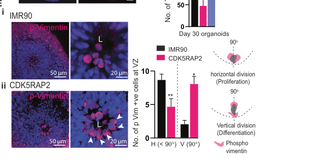

## Question

# Mechanistic Hypothesis Search

You are evaluating a specific disease mechanism hypothesis for the Disorder
Mechanisms Knowledge Base. This is not a general disease overview. Use the
hypothesis YAML below as the seed claim, then search for evidence that supports,
refutes, qualifies, or competes with this hypothesis.

## Target Disease
- **Disease Name:** Neural Progenitor Centrosome-Spindle Dysfunction Module
- **Category:** Module

## Target Hypothesis
- **Hypothesis ID:** progenitor_centrosome_spindle_model
- **Hypothesis Label:** Neural Progenitor Centrosome-Spindle Dysfunction Model
- **Status in KB:** CANONICAL

## Seed Hypothesis YAML

```yaml
hypothesis_group_id: progenitor_centrosome_spindle_model
hypothesis_label: Neural Progenitor Centrosome-Spindle Dysfunction Model
status: CANONICAL
description: Centrosome and mitotic spindle proteins coordinate radial-glial and neural-progenitor mitosis,
  cleavage orientation, symmetric versus asymmetric division, and cell-cycle progression. Pathogenic variants,
  chromosomal deletions, or viral cytopathy can disrupt this apparatus or the coupled programmed-cell-death
  machinery. The resulting progenitor-pool distortion changes neuronal output and cortical architecture,
  producing small cortex, simplified gyration, microlissencephaly, pachygyria, polymicrogyria-like malformations,
  or, for reduced-apoptosis branches, megalencephaly with thin lissencephaly.
evidence:
- reference: PMID:15473967
  supports: SUPPORT
  evidence_source: MODEL_ORGANISM
  snippet: The small cerebral cortex seems to reflect both reduced progenitor cell division and altered
    neuronal cell fates.
  explanation: Nde1 mutant mouse data directly link cortical size to progenitor division and fate changes,
    supporting the module skeleton.
- reference: PMID:25521378
  supports: SUPPORT
  evidence_source: OTHER
  snippet: Taken together, we provide insight into the mechanisms by which KATNB1 mutations cause human
    cerebral cortical malformations, demonstrating its fundamental role during brain development.
  explanation: Mixed human genetics, cell, zebrafish, and fly evidence supports KATNB1 as a progenitor/spindle
    mechanism for complex cortical malformations.
```

## Research Objective

Build a focused hypothesis-search report that answers:

1. What is the strongest direct evidence for this hypothesis?
2. What evidence argues against it, fails to reproduce it, or limits its scope?
3. Which claims are established, emerging, speculative, or contradicted?
4. Which patient subtypes, stages, tissues, cell types, molecular pathways, or
   biomarkers does the hypothesis best explain?
5. Which alternative or competing mechanistic hypotheses explain the same disease
   features better or more parsimoniously?
6. What are the explicit knowledge gaps: missing causal steps, unconfirmed edges,
   contradictory evidence, unknown source-to-target links, or source/data absences?
7. What experiments, cohorts, assays, datasets, or trials would most directly
   distinguish this hypothesis from alternatives?

Use primary literature whenever possible. Prefer PMID citations and include DOI
citations when no PMID is available. Treat reviews as orientation unless they
contain directly relevant synthesized evidence that should be clearly labeled as
review-level support.

## Required Output

### Executive Judgment

Give a concise verdict on the hypothesis as of the current literature:
supported, partially supported, unresolved, weakly supported, or refuted. Explain
the reasoning and the most important caveats.

### Evidence Matrix

Create a table with one row per important evidence item:

- Citation (PMID preferred)
- Evidence type (human clinical, model organism, in vitro, computational, review)
- Supports / refutes / qualifies / competing
- Mechanistic claim tested
- Key finding
- Disease subtype or context
- Confidence and limitations

### Mechanistic Causal Chain

Describe the causal chain implied by the hypothesis from upstream trigger to
clinical manifestation. Identify where the literature is strong, where the links
are inferred, and where there are missing causal steps.

### Knowledge Gaps

Identify explicit known unknowns surfaced by the search. Treat absence of
evidence as a curation-relevant finding only when the search actually checked for
it. Include:

- Unknown or weakly supported causal steps in the hypothesis
- Unconfirmed causal graph edges that need direct perturbation or longitudinal
  evidence
- Conflicting evidence, failed replications, or incompatible subtype-specific
  findings
- Unknown mechanism of action for relevant treatments, biomarkers, or
  interventions tied to this hypothesis
- Source-level or dataset-level absences, such as no relevant GenCC, ClinGen,
  trial, omics, or cohort evidence found as of the search date

For each gap, state the scope, why it matters, what was checked, and what
evidence or experiment would resolve it.

### Alternative Models

List competing or complementary hypotheses. For each, explain whether it is an
alternative to the seed hypothesis, a downstream consequence, an upstream cause,
or a parallel mechanism.

### Discriminating Tests

Recommend concrete studies or assays that would most efficiently test this
hypothesis against alternatives. Include patient stratification, biomarkers,
sample type, model system, perturbation, and expected result where applicable.

### Curation Leads

Provide candidate updates for the KB, but label these as leads requiring curator
verification. Include:

- candidate evidence references and exact abstract snippets to verify
- candidate pathophysiology nodes or edges
- candidate ontology terms for cell types and biological processes
- candidate subtype restrictions or status changes
- candidate `knowledge_gaps` or discussion prompts for unresolved causal claims,
  conflicting evidence, or explicit source/data absences

If the provider supports artifacts, produce artifact-friendly outputs such as an
evidence matrix, mechanistic diagram, knowledge-gap table, or comparison table.
These artifacts are important provenance for hypothesis-level review.


## Output

Question: You are an expert researcher providing comprehensive, well-cited information.

Provide detailed information focusing on:
1. Key concepts and definitions with current understanding
2. Recent developments and latest research (prioritize 2023-2024 sources)
3. Current applications and real-world implementations
4. Expert opinions and analysis from authoritative sources
5. Relevant statistics and data from recent studies

Format as a comprehensive research report with proper citations. Include URLs and publication dates where available.
Always prioritize recent, authoritative sources and provide specific citations for all major claims.

# Mechanistic Hypothesis Search

You are evaluating a specific disease mechanism hypothesis for the Disorder
Mechanisms Knowledge Base. This is not a general disease overview. Use the
hypothesis YAML below as the seed claim, then search for evidence that supports,
refutes, qualifies, or competes with this hypothesis.

## Target Disease
- **Disease Name:** Neural Progenitor Centrosome-Spindle Dysfunction Module
- **Category:** Module

## Target Hypothesis
- **Hypothesis ID:** progenitor_centrosome_spindle_model
- **Hypothesis Label:** Neural Progenitor Centrosome-Spindle Dysfunction Model
- **Status in KB:** CANONICAL

## Seed Hypothesis YAML

```yaml
hypothesis_group_id: progenitor_centrosome_spindle_model
hypothesis_label: Neural Progenitor Centrosome-Spindle Dysfunction Model
status: CANONICAL
description: Centrosome and mitotic spindle proteins coordinate radial-glial and neural-progenitor mitosis,
  cleavage orientation, symmetric versus asymmetric division, and cell-cycle progression. Pathogenic variants,
  chromosomal deletions, or viral cytopathy can disrupt this apparatus or the coupled programmed-cell-death
  machinery. The resulting progenitor-pool distortion changes neuronal output and cortical architecture,
  producing small cortex, simplified gyration, microlissencephaly, pachygyria, polymicrogyria-like malformations,
  or, for reduced-apoptosis branches, megalencephaly with thin lissencephaly.
evidence:
- reference: PMID:15473967
  supports: SUPPORT
  evidence_source: MODEL_ORGANISM
  snippet: The small cerebral cortex seems to reflect both reduced progenitor cell division and altered
    neuronal cell fates.
  explanation: Nde1 mutant mouse data directly link cortical size to progenitor division and fate changes,
    supporting the module skeleton.
- reference: PMID:25521378
  supports: SUPPORT
  evidence_source: OTHER
  snippet: Taken together, we provide insight into the mechanisms by which KATNB1 mutations cause human
    cerebral cortical malformations, demonstrating its fundamental role during brain development.
  explanation: Mixed human genetics, cell, zebrafish, and fly evidence supports KATNB1 as a progenitor/spindle
    mechanism for complex cortical malformations.
```

## Research Objective

Build a focused hypothesis-search report that answers:

1. What is the strongest direct evidence for this hypothesis?
2. What evidence argues against it, fails to reproduce it, or limits its scope?
3. Which claims are established, emerging, speculative, or contradicted?
4. Which patient subtypes, stages, tissues, cell types, molecular pathways, or
   biomarkers does the hypothesis best explain?
5. Which alternative or competing mechanistic hypotheses explain the same disease
   features better or more parsimoniously?
6. What are the explicit knowledge gaps: missing causal steps, unconfirmed edges,
   contradictory evidence, unknown source-to-target links, or source/data absences?
7. What experiments, cohorts, assays, datasets, or trials would most directly
   distinguish this hypothesis from alternatives?

Use primary literature whenever possible. Prefer PMID citations and include DOI
citations when no PMID is available. Treat reviews as orientation unless they
contain directly relevant synthesized evidence that should be clearly labeled as
review-level support.

## Required Output

### Executive Judgment

Give a concise verdict on the hypothesis as of the current literature:
supported, partially supported, unresolved, weakly supported, or refuted. Explain
the reasoning and the most important caveats.

### Evidence Matrix

Create a table with one row per important evidence item:

- Citation (PMID preferred)
- Evidence type (human clinical, model organism, in vitro, computational, review)
- Supports / refutes / qualifies / competing
- Mechanistic claim tested
- Key finding
- Disease subtype or context
- Confidence and limitations

### Mechanistic Causal Chain

Describe the causal chain implied by the hypothesis from upstream trigger to
clinical manifestation. Identify where the literature is strong, where the links
are inferred, and where there are missing causal steps.

### Knowledge Gaps

Identify explicit known unknowns surfaced by the search. Treat absence of
evidence as a curation-relevant finding only when the search actually checked for
it. Include:

- Unknown or weakly supported causal steps in the hypothesis
- Unconfirmed causal graph edges that need direct perturbation or longitudinal
  evidence
- Conflicting evidence, failed replications, or incompatible subtype-specific
  findings
- Unknown mechanism of action for relevant treatments, biomarkers, or
  interventions tied to this hypothesis
- Source-level or dataset-level absences, such as no relevant GenCC, ClinGen,
  trial, omics, or cohort evidence found as of the search date

For each gap, state the scope, why it matters, what was checked, and what
evidence or experiment would resolve it.

### Alternative Models

List competing or complementary hypotheses. For each, explain whether it is an
alternative to the seed hypothesis, a downstream consequence, an upstream cause,
or a parallel mechanism.

### Discriminating Tests

Recommend concrete studies or assays that would most efficiently test this
hypothesis against alternatives. Include patient stratification, biomarkers,
sample type, model system, perturbation, and expected result where applicable.

### Curation Leads

Provide candidate updates for the KB, but label these as leads requiring curator
verification. Include:

- candidate evidence references and exact abstract snippets to verify
- candidate pathophysiology nodes or edges
- candidate ontology terms for cell types and biological processes
- candidate subtype restrictions or status changes
- candidate `knowledge_gaps` or discussion prompts for unresolved causal claims,
  conflicting evidence, or explicit source/data absences

If the provider supports artifacts, produce artifact-friendly outputs such as an
evidence matrix, mechanistic diagram, knowledge-gap table, or comparison table.
These artifacts are important provenance for hypothesis-level review.


# Mechanistic Hypothesis Search Report: Neural Progenitor Centrosome–Spindle Dysfunction Model (progenitor_centrosome_spindle_model)

**Search date:** 2026-06-10

## Executive Judgment

**Verdict: Partially supported.** The core claim—that centrosome/spindle/cytokinesis perturbations in radial glia/neural progenitors alter division mode, cell-cycle progression, and survival, producing reduced neuronal output and microcephaly-spectrum cortical malformations—is strongly supported by multiple mouse genetic models and increasingly by human iPSC/organoid systems (notably WDR62 and CDK5RAP2). However, the literature also shows that (i) the *proximate* pathogenic driver is often downstream surveillance/apoptosis (53BP1–USP28–TP53; p53) rather than the mechanical centrosome defect itself, and (ii) some microcephaly models persist despite p53 loss (p53-independent death) or occur without measurable spindle orientation changes. Thus, the hypothesis is canonical at a module level but requires subtype- and pathway-specific qualification (mitotic surveillance vs p53-independent death; spindle orientation vs chromosome segregation vs abscission; centrosome anchoring/mechanics vs ciliogenesis). (phan2021centrosomedefectscause pages 1-2, insolera2014corticalneurogenesisin pages 1-13, sterling2023p53independentpathogenic pages 1-2, gonzalezmartinez2021deficientadaptationto pages 4-6)

## 1) Key concepts and definitions (current understanding)

### Centrosome/centriole integrity and neural progenitor division
Centrosomes are microtubule-nucleating organelles required for mitotic spindle formation; they contain paired centrioles plus pericentriolar material, and a mature centriole can act as a basal body for ciliogenesis. In the developing cortex, radial glia (RGCs) and other neural progenitor cells (NPCs) rely on centrosome/spindle function to execute mitoses that control expansion vs differentiation. (phan2021centrosomedefectscause pages 1-2)

### Spindle orientation, cleavage plane, and symmetric vs asymmetric divisions
Mitotic spindle orientation establishes cleavage-plane orientation and thereby biases **symmetric proliferative** vs **asymmetric neurogenic** outcomes. A mechanistic operationalization used in vivo is that **vertical** orientations tend to be associated with symmetric divisions that produce two proliferative progenitors, whereas **horizontal/oblique** orientations bias asymmetric divisions producing one progenitor and one neuron/differentiating daughter; perturbations that increase oblique/horizontal cleavage can precipitate premature cell-cycle exit and progenitor pool depletion. (naher2024kinesinlikemotorprotein pages 9-12, ossola2022rootsofthe pages 3-5)

### Mitotic surveillance/stopwatch pathway (53BP1–USP28–TP53)
Centrosome defects can delay bipolar spindle assembly and prolong mitosis; in cultured cells, mitotic delay can activate a **53BP1–USP28–TP53** signaling axis (mitotic surveillance pathway) that restricts proliferation and can trigger apoptosis. In vivo genetic data show this pathway can be a key mediator linking centrosome loss to NPC attrition and microcephaly. (phan2021centrosomedefectscause pages 1-2)

### Primary microcephaly as NPC-pool depletion
Primary microcephaly is framed as a neurodevelopmental disorder in which depletion/exhaustion of neuronal progenitors during brain development yields reduced brain size; many causal genes encode centrosome/spindle or mitotic regulators. (doria2024transientlaggingchromosomes pages 1-5, phan2021centrosomedefectscause pages 1-2)

## 2) Recent developments and latest research (prioritized 2023–2024)

### 2.1 Human iPSC and organoid evidence strengthens directness (2023–2024)

**WDR62 patient iPSC/organoid models (2023, eLife).** A truncating WDR62 patient mutation disrupts WDR62’s microtubule-dependent translocation to spindle poles and impairs mitotic progression in human neural progenitors. Quantitatively, mutant iPS-derived neuroepithelial stem cells show a **reduced proliferative fraction (fewer MKI67+ cells; n=4, total N=3315, p<0.001)** with **unchanged mitotic index (PH3+, N=12684, p>0.05)**, plus delayed post-nocodazole recovery. Mutants also show altered spindle geometry (smaller spindle angle α) and organoids exhibit more asymmetric divisions, consistent with progenitor depletion. (dellamico2023microcephalyassociatedproteinwdr62 pages 10-13, dellamico2023microcephalyassociatedproteinwdr62 pages 1-2)

**CDK5RAP2 patient-derived “Hi-Q” brain organoids (2024, Nature Communications).** Using a scalable organoid platform, patient-derived organoids with a CDK5RAP2 mutation are smaller with compromised ventricular zones. Importantly, the authors report **no significant increase in DNA damage (pH2AX) or apoptosis (TUNEL)**, and instead implicate a division-plane shift in apical progenitors: controls show more horizontal divisions whereas mutant organoids show predominantly vertical divisions, interpreted as an unscheduled change leading to premature differentiation and progenitor depletion. A corresponding figure panel is available (Fig. 6E). (ramani2024reliabilityofhighquantity pages 10-11, ramani2024reliabilityofhighquantity media e012a7bc)

**RTTN variant and cortical organoid rosette defects (2024, PLOS Genetics).** A homozygous RTTN variant in a Taybi–Linder-like case produces centrosome-related mitotic abnormalities in iPSC-derived NSCs (aneuploidy, arrest, cell death) and delays apico-basal polarization and neural rosette formation in cortical organoids, impeding organoid growth—linking centrosome/mitosis defects to early cortical tissue self-organization. (guguin2024ataybilindersyndromerelated pages 1-2)

**Centrosome integrity via AP-2–γTuRC in NPCs (2024, Life Science Alliance).** AP-2 complex loss disrupts centrosome formation/mitotic progression in NPCs, with strong quantitative changes: prometaphase enrichment (37.16%→77.45%, p<0.0001), lagging chromosomes (0%→18.67%, P<0.0001), DNA damage (γH2AX 21.14%→48.54%, P<0.0001), and p53 activation (21.53%→73.60%, P<0.0001), alongside increased Dcx+ cells (8.97%→16.87%, P=0.005) consistent with premature differentiation. (camblorperujo2024theap2complex pages 10-11)

### 2.2 2024 mechanistic “qualifier” to classic spindle-orientation narratives
A 2024 preprint proposes that for major MCPH genes **WDR62/ASPM**, the key lesion may be impaired poleward microtubule flux causing *transient lagging chromosomes* rather than classic aneuploidy, mitotic delay, or spindle-orientation defects. The authors link transient lagging chromosomes to an Aurora-B-dependent 53BP1 response and induction of p21 (a p53 target), impairing proliferation. A key *qualifying* result is genetic suppression: CAMSAP1 co-depletion restores flux and suppresses 53BP1/p21 activation and rescues proliferation in human cells, and Patronin co-depletion rescues small-brain phenotypes in Drosophila despite no change in spindle orientation. (doria2024transientlaggingchromosomes pages 7-10, doria2024transientlaggingchromosomes pages 1-5)

## 3) Current applications and real-world implementations

### Clinical genetics and variant interpretation
Recent studies reinforce that centrosome/spindle phenotypes are clinically actionable primarily through **genetic diagnosis** and **variant functionalization** in patient-derived iPSCs/organoids.

*Examples of real-world implementations:*
- **Patient-specific iPSC and isogenic correction** to validate WDR62 pathogenicity and connect variant → spindle-pole dynamics → altered neurogenic trajectories. (dellamico2023microcephalyassociatedproteinwdr62 pages 1-2, dellamico2023microcephalyassociatedproteinwdr62 pages 10-13)
- **Patient-derived high-throughput organoid platforms** (Hi-Q organoids) to reproducibly recapitulate distinct microcephaly mechanisms (centrosomal CDK5RAP2 vs progeroid Cockayne syndrome) and enable downstream screening workflows (the platform is explicitly positioned for disease modeling/drug screening). (ramani2024reliabilityofhighquantity pages 10-11, ramani2024reliabilityofhighquantity pages 14-15)

### Biomarker/assay implications
Mechanistic work suggests measurable intermediate phenotypes—e.g., mitotic duration, spindle angle/orientation distributions, lagging-chromosome frequency, p53/p21 induction, γH2AX—can serve as **functional biomarkers** for pathway stratification (mitotic surveillance vs other routes) in organoids or NPC cultures. (camblorperujo2024theap2complex pages 10-11, dellamico2023microcephalyassociatedproteinwdr62 pages 10-13, doria2024transientlaggingchromosomes pages 1-5)

## 4) Expert opinions and authoritative analysis (clearly labeled)

**Review-level synthesis (orientation):** Recent conceptual work highlights that microcephaly pathomechanisms are “at best partially understood” and emphasizes progenitor-type specificity, division mode, proliferation and survival as separable levers—consistent with the need to refine the seed hypothesis into mechanistic sub-branches rather than a single pathway. (heide2023causesofmicrocephaly pages 9-9)

## 5) Relevant statistics and quantitative data from recent studies

Key quantitative examples directly linking centrosome/spindle defects to NPC outcomes include:
- KIF23 KD: spindle orientation changes with strong statistical support (p=1.8E-06) and multiple cytokinesis-factor readouts (ECT2 p=5.8E-09; RhoA p=1.29E-04; Cit-K p=0.001335), plus increased γH2AX/p53/p21 in progenitors. (naher2024kinesinlikemotorprotein pages 9-12)
- WDR62 patient iPS-NES: fewer MKI67+ cells (p<0.001) with unchanged PH3+ index, plus spindle-angle alteration. (dellamico2023microcephalyassociatedproteinwdr62 pages 10-13)
- AP-2 KO NPCs: lagging chromosomes 18.67% vs 0%, p53+ 73.60% vs 21.53%, γH2AX+ 48.54% vs 21.14%, all P<0.0001. (camblorperujo2024theap2complex pages 10-11)

## Evidence Matrix

| Citation | Evidence type | Supports/Refutes/Qualifies/Competing | Mechanistic claim tested | Key finding (include quantitative stats where available) | Disease subtype/context | Confidence & limitations |
|---|---|---|---|---|---|---|
| Naher et al. 2024, *EMBO Journal*, https://doi.org/10.1038/s44318-024-00327-7 | Mouse in utero KD; human variant rescue | Supports | KIF23-dependent spindle orientation and cytokinesis maintain NSPC pools; disruption drives premature asymmetric division, p53/p21 activation, apoptosis | Kif23 KD altered cleavage angle/orientation (control n=64 cells/10 embryos vs KD n=95/12; p=1.8E-06), reduced ECT2 at midzone (n=54 vs 58; p=5.8E-09), reduced apical RhoA (p=1.29E-04), fewer apical Cit-K midbodies (p=0.001335), increased γ-H2AX/p53/p21, premature neurogenesis and progenitor loss; WT human KIF23 rescued, microcephaly-associated variant did not (naher2024kinesinlikemotorprotein pages 9-12, naher2024kinesinlikemotorprotein pages 12-15) | Human microcephaly-linked KIF23; cortical progenitor depletion | High for mechanism; primarily mouse KD plus rescue, not human in vivo brain tissue |
| Dell'Amico et al. 2023, *eLife*, https://doi.org/10.7554/eLife.81716 | Patient-derived iPSC, isogenic correction, cerebral organoids | Supports | WDR62 spindle-pole dysfunction impairs mitotic progression and biases progenitor divisions toward depletion | Patient-mutant WDR62 mislocalized; Mut iPS-NES had fewer MKI67+ cells (n=4, total N=3315, p<0.001), unchanged PH3+ mitotic index (N=12684, p>0.05), delayed post-nocodazole cell-cycle re-entry (~80% controls re-entered by 1 h), reduced spindle angle α, shortened cilia, and more asymmetric divisions in organoids (dellamico2023microcephalyassociatedproteinwdr62 pages 1-2, dellamico2023microcephalyassociatedproteinwdr62 pages 10-13) | MCPH2 / WDR62-related cortical maldevelopment | High; strong human cellular models, but organoid phenotype remains an in vitro proxy |
| Ramani et al. 2024, *Nature Communications*, https://doi.org/10.1038/s41467-024-55226-6 | Patient-derived hiPSC Hi-Q brain organoids | Supports | CDK5RAP2 centrosomal dysfunction alters apical progenitor division plane, depleting progenitors without being driven mainly by apoptosis | 30-day CDK5RAP2 organoids were smaller, with reduced ventricular-zone diameter/organization and dispersed TUJ1+ cortical plate; no significant increase in pH2AX or TUNEL; p-Vimentin+ apical progenitors shifted from more horizontal mitoses in controls to predominantly vertical mitoses in mutants, interpreted as premature differentiation/progenitor depletion (ramani2024reliabilityofhighquantity pages 10-11, ramani2024reliabilityofhighquantity pages 14-15, ramani2024reliabilityofhighquantity media e012a7bc) | Primary microcephaly / CDK5RAP2 | High for organoid relevance; quantitative division-plane details limited in retrieved excerpt; no rescue in excerpt |
| Guguin et al. 2024, *PLOS Genetics*, https://doi.org/10.1371/journal.pgen.1011517 | Patient variant, CRISPR iPSC-derived NSCs, cortical organoids | Supports | RTTN centrosome/mitotic defects impair NSC proliferation and rosette self-organization, causing microcephaly-like growth failure | Homozygous RTTN c.2953A>G caused major mitotic abnormalities, aneuploidy, cell-cycle arrest, and cell death in NSCs; cortical organoids showed delayed apico-basal polarization and marked delay of neural rosette formation, impeding overall growth (guguin2024ataybilindersyndromerelated pages 1-2, guguin2024ataybilindersyndromerelated pages 21-22) | TALS-like severe microcephaly / abnormal gyral pattern | High for human variant causality; excerpt lacks detailed quantitative effect sizes |
| Camblor-Perujo et al. 2024, *Life Science Alliance*, https://doi.org/10.26508/lsa.202302029 | Mouse NPCs and MEFs, in vitro | Supports | AP-2–γTuRC interaction maintains centrosome integrity; loss causes mitotic arrest, lagging chromosomes, DNA damage, p53 activation, premature differentiation | NPC mitotic index rose 3.40%→6.36% (P=0.017); prometaphase 37.16%→77.45% (p<0.0001); lagging chromosomes 0%→18.67% (P<0.0001); γ-H2AX 21.14%→48.54% (P<0.0001); p53 21.53%→73.60% (P<0.0001); Dcx+ cells 8.97%→16.87% (P=0.005) (camblorperujo2024theap2complex pages 10-11) | Mechanistically relevant to microcephaly; not a direct patient cortical malformation study | Moderate-high mechanistic support; no direct human malformation phenotype in excerpt |
| Marjanović et al. 2015, *Nature Communications*, https://doi.org/10.1038/ncomms8676 | Mouse model of Seckel syndrome gene | Supports | CEP63 centriole-duplication defects cause centrosome-based mitotic errors that trigger p53-dependent NPC death and microcephaly | Cep63 loss impaired centriole duplication/CEP152 recruitment, caused acentrosomal/monopolar mitoses and cleaved-caspase-3+ apoptosis; brain size and NPC loss rescued by p53 deletion; authors state cell death was not due to aberrant DDR but to centrosome-based mitotic errors (marjanovic2015cep63deficiencypromotes pages 1-2, marjanovic2015cep63deficiencypromotes pages 4-5) | Seckel syndrome / microcephaly | High foundational evidence; mouse model, not human organoid |
| Insolera et al. 2014, *Nature Neuroscience*, https://doi.org/10.1038/nn.3831 | Conditional mouse radial glia centriole ablation | Supports, Qualifies | Centriole loss prolongs mitosis and induces p53-dependent apoptosis/microcephaly, but also causes p53-independent progenitor delocalization | SAS-4 deletion caused progressive centriole loss, prolonged mitosis, p53 upregulation, apoptosis, neuronal loss and microcephaly; p53 removal fully rescued RGP death and microcephaly but not RGP delocalization or randomized spindle orientation; Ift88 cilia loss did not phenocopy microcephaly/apoptosis (insolera2014corticalneurogenesisin pages 1-13) | Microcephaly from centriole loss | High foundational evidence; also limits model because some architectural defects persist despite p53 rescue |
| Phan et al. 2021, *EMBO Journal*, https://doi.org/10.15252/embj.2020106118 | Mouse models, genetics, mechanistic rescue | Supports, Qualifies | Centrosome defects cause microcephaly mainly via mitotic delay activating 53BP1–USP28–TP53 mitotic surveillance, not via canonical DDR | Centrosome protein depletion prolonged mitosis and increased TP53-mediated apoptosis; 53BP1 or USP28 deletion restored NPC proliferation and brain size without correcting centrosome defects or prolonged mitosis; unlike centrosomal models, non-centrosomal SMC5 microcephaly was TP53-dependent but not rescued by 53BP1/USP28 loss (phan2021centrosomedefectscause pages 1-2, phan2021centrosomedefectscause pages 5-6, phan2021centrosomedefectscause pages 9-10) | MCPH / centrosome-defect microcephaly | High; strongly identifies downstream surveillance as proximate effector, narrowing scope of the seed model |
| Doria et al. 2024, *bioRxiv*, https://doi.org/10.1101/2024.05.02.592199 | Human cells; Drosophila rescue; preprint | Qualifies | WDR62/ASPM microcephaly may arise less from spindle orientation/aneuploidy and more from reduced poleward flux causing transient lagging chromosomes and 53BP1/p21 activation | WDR62/ASPM loss slowed poleward flux, produced transient lagging chromosomes, triggered Aurora-B–dependent 53BP1 and p21; CAMSAP1 co-depletion suppressed 53BP1/p21 and restored proliferation; Patronin co-depletion rescued small brain, neuroblast depletion and cognitive phenotype in flies despite unchanged spindle orientation (doria2024transientlaggingchromosomes pages 1-5, doria2024transientlaggingchromosomes pages 7-10) | MCPH / WDR62, ASPM | Moderate; important mechanistic qualifier but preprint and partly non-neural/non-human systems |
| González-Martínez et al. 2021, *JCI Insight*, https://doi.org/10.1172/jci.insight.146364 | Mouse CRISPR models; neurospheres; cell biology | Supports, Qualifies | CEP135 centriole-assembly failure causes mitotic catastrophe, TP53 activation and progenitor depletion; spindle-orientation change is not required | Many Cep135-null cells retained one γ-tubulin focus; ~50% had a single centrosome through G2; monopolar/acentrosomal spindles, prolonged mitosis, aneuploidy, reduced self-renewal, cortical thinning, loss of SOX2+ and TBR2+ progenitors, apoptosis; spindle orientation in apical progenitors was not significantly altered (gonzalezmartinez2021deficientadaptationto pages 4-6, gonzalezmartinez2021deficientadaptationto pages 10-11) | MCPH8 / subcortical heterotopia | High; strong in vivo mechanistic evidence, but also shows classic spindle-orientation branch is not universal |
| Sterling et al. 2023, *Frontiers in Cell and Developmental Biology*, https://doi.org/10.3389/fcell.2023.1282182 | Mouse spindle-checkpoint model | Qualifies / Competing | BubR1-related microcephaly includes p53-independent death, so centrosome/spindle defects are not mediated solely through p53 apoptosis | BubR1 deficiency caused profound segregation defects, structural chromosome abnormalities, DNA damage, P53 activation and apoptosis; Trp53 co-deletion left residual apoptosis and only minimally rescued cortical size/neuron number, indicating strong p53-independent pathogenic mechanisms (sterling2023p53independentpathogenic pages 1-2) | Mosaic variegated aneuploidy / BUB1B microcephaly | Moderate-high; directly limits generalization of p53-centric branch |
| Little et al. 2019, *Human Molecular Genetics*, https://doi.org/10.1093/hmg/ddy350 | Mouse abscission-defect model | Qualifies | Kif20b-related microcephaly is largely p53-driven, but residual growth defect persists despite apoptosis rescue | p53 deletion rescued lethality and much of microcephaly; heterozygous p53 loss was sufficient for major rescue; however, midbody defects (reduced constriction sites, widened/misaligned midbodies) persisted in double mutants and cortical growth was not fully normalized (little2019p53deletionrescueslethal pages 41-42, little2019p53deletionrescueslethal pages 9-10, little2019p53deletionrescueslethal pages 4-5, little2019p53deletionrescueslethal pages 26-27) | Cytokinesis-linked microcephaly | High for downstream-apoptosis branch; also shows apoptosis-independent contribution |
| Shao et al. 2020, *Nature*, https://doi.org/10.1038/s41586-020-2139-6 | Mouse centrosome-anchoring model | Competing / Complementary | Centrosome defects can alter cortical size through apical mechanics and YAP activation rather than classic mitotic failure | CEP83 loss removed distal appendages, disrupted apical centrosome anchoring, disorganized microtubules, stretched/stiffened apical membrane, activated YAP, and caused excessive RGP and IP production with enlarged, abnormally folded cortex; YAP loss suppressed enlargement/folding (shao2020centrosomeanchoringregulates pages 1-3) | Megalencephaly / abnormal cortical folding | High; complementary alternative within centrosome biology, not a pure spindle-apoptosis model |
| Li et al. 2017, *Stem Cell Reports*, https://doi.org/10.1016/j.stemcr.2017.08.013 | Mouse RHAMM truncation model | Supports, Qualifies | Pure spindle misorientation can by itself drive brain enlargement through altered progenitor fate without increased proliferation | RHAMM centrosome/dynein-binding truncation reduced planar divisions, caused cortex thickening and megalencephaly by PND7; division rate remained unchanged; increased TBR2 layer, SOX2/TBR2 double-positive progenitors and dividing TBR2+ cells indicate fate shift rather than faster cycling (li2017spindlemisorientationof pages 4-7, li2017spindlemisorientationof pages 1-3) | Megalencephaly | Moderate-high; important proof that orientation defects can enlarge rather than shrink cortex depending on context |
| Gabriel et al. 2016, *EMBO Journal*, https://doi.org/10.15252/embj.201593679 | Patient iPSC-derived NPCs and organoids | Competing / Complementary | CPAP microcephaly can arise through defective cilium disassembly and delayed cell-cycle re-entry, not just spindle/centriole biogenesis defects | Seckel-mutant CPAP failed to recruit cilium disassembly complex (NDE1, Aurora A, OFD1), causing long cilia, delayed cilium disassembly, delayed G0/G1 exit, premature differentiation of patient NPCs and Seckel organoids; some Seckel cells retained normal centrosome number, supporting cilium-specific mechanism (gabriel2016cpappromotestimely pages 1-2) | Seckel syndrome / microcephaly | High; strong human cellular evidence for alternative cilium-disassembly route |


*Table: This table summarizes key supporting, qualifying, and competing evidence for the Neural Progenitor Centrosome–Spindle Dysfunction Model across foundational and recent studies. It highlights where the model is strongly supported, where downstream p53/mitotic surveillance is the actual proximate driver, and where alternative mechanisms such as cilium disassembly or YAP mechanotransduction better explain the phenotype.*

## Strongest direct evidence for the hypothesis (Q1)

1. **Centriole/centrosome loss → p53-dependent NPC apoptosis → microcephaly (mouse).** SAS-4 (centriole biogenesis) deletion causes p53 upregulation in proliferative progenitors and widespread apoptosis with microcephaly; p53 removal suppresses apoptosis and microcephaly. (insolera2014corticalneurogenesisin pages 1-13)

2. **Centrosome duplication defect (CEP63) → centrosome-based mitotic errors → p53-dependent NPC death (mouse).** CEP63 loss causes centriole duplication failure and mitotic errors (acentrosomal/monopolar mitoses) and the authors explicitly state cell death is not due to aberrant DDR but to centrosome-based mitotic errors; brain size is rescued by p53 deletion. (marjanovic2015cep63deficiencypromotes pages 1-2, marjanovic2015cep63deficiencypromotes pages 4-5)

3. **Mitotic surveillance pathway causality (53BP1–USP28–p53) in vivo.** In centrosome-defect microcephaly models, 53BP1 or USP28 deletion restores NPC proliferation and brain size even though centrosome defects and mitotic delays persist, identifying a mechanistic causal bridge from centrosome defects to apoptosis/cortex size. (phan2021centrosomedefectscause pages 1-2, phan2021centrosomedefectscause pages 9-10)

4. **Human iPSC/organoid directness (WDR62; CDK5RAP2).** WDR62 patient iPSC models show reduced progenitor proliferation and altered spindle geometry/trajectory outcomes; CDK5RAP2 patient-derived organoids show altered apical division-plane distribution with microcephaly-like size reduction, supported by a figure panel. (dellamico2023microcephalyassociatedproteinwdr62 pages 10-13, ramani2024reliabilityofhighquantity pages 10-11, ramani2024reliabilityofhighquantity media e012a7bc)

## Evidence against / limits to scope (Q2)

1. **Rescue of microcephaly without fixing centrosome/cytokinesis defects.** p53 deletion (or mitotic surveillance pathway deletion) can rescue brain size while upstream defects persist (SAS-4: p53 rescues microcephaly but not delocalization/spindle randomization; centrosome defects: USP28/53BP1 rescue without correcting centrosome defects or mitotic delay; Kif20b: midbody defects persist despite p53 rescue). This limits the model if interpreted as “structural centrosome/spindle defect directly causes malformation”; rather, downstream surveillance often mediates phenotypes. (insolera2014corticalneurogenesisin pages 1-13, phan2021centrosomedefectscause pages 1-2, little2019p53deletionrescueslethal pages 41-42)

2. **Microcephaly without spindle-orientation change.** CEP135 mutants show microcephaly and progenitor loss with strong centrosome duplication defects and aneuploidy/apoptosis, but spindle orientation in apical progenitors is reportedly not significantly altered—challenging any universal “spindle orientation is the key driver” claim. (gonzalezmartinez2021deficientadaptationto pages 4-6)

3. **p53-independent death mechanisms.** BubR1 (BUB1B) microcephaly shows residual apoptosis and minimal rescue after Trp53 co-deletion, indicating additional death pathways can dominate. (sterling2023p53independentpathogenic pages 1-2)

4. **Competing mechanistic framing for WDR62/ASPM.** A 2024 preprint argues that classic phenotypes (aneuploidy-driven apoptosis, spindle orientation defects, prolonged mitosis) may not manifest in human cells upon WDR62/ASPM loss; instead, poleward flux defects and transient lagging chromosomes trigger 53BP1/p21 and proliferation impairment, with genetic suppression rescuing phenotypes. (doria2024transientlaggingchromosomes pages 1-5, doria2024transientlaggingchromosomes pages 7-10)

## Established vs emerging vs speculative (Q3)

- **Established:** Centrosome/centriole defects can deplete NPC pools via p53-dependent apoptosis and yield microcephaly (SAS-4, CEP63), and mitotic surveillance (53BP1–USP28–p53) can be necessary for microcephaly in specific centrosome-defect contexts. (marjanovic2015cep63deficiencypromotes pages 1-2, insolera2014corticalneurogenesisin pages 1-13, phan2021centrosomedefectscause pages 1-2)
- **Established (cell-division control):** Cleavage-plane/spindle orientation influences symmetric vs asymmetric progenitor division, affecting progenitor maintenance; KIF23 perturbation directly demonstrates this with quantitative cortical data and p53/p21 activation. (naher2024kinesinlikemotorprotein pages 9-12)
- **Emerging (2023–2024):** Human iPSC/organoid mechanistic proof for WDR62 (spindle-pole relocalization defects; altered spindle angle; division bias), and reproducible CDK5RAP2 microcephaly organoid phenotypes with division-plane shift not dominated by apoptosis. (dellamico2023microcephalyassociatedproteinwdr62 pages 10-13, ramani2024reliabilityofhighquantity pages 10-11)
- **Emerging/speculative:** WDR62/ASPM “poleward flux/lagging chromosome” mechanism as a common MCPH cause (preprint); requires peer review and broader validation in neural progenitors and patient tissues. (doria2024transientlaggingchromosomes pages 1-5)
- **Contradicted/qualified:** “Spindle orientation defects alone cause microcephaly” is not universal (CEP135), and “p53 is sufficient mediator” is not universal (BubR1). (gonzalezmartinez2021deficientadaptationto pages 4-6, sterling2023p53independentpathogenic pages 1-2)

## Patient subtypes, stages, tissues, and cell types best explained (Q4)

**Best explained contexts:**
- **Embryonic cortical apical progenitors/radial glia** in the ventricular zone, where division-plane changes and mitotic errors determine progenitor pool size and output. (phan2021centrosomedefectscause pages 1-2, naher2024kinesinlikemotorprotein pages 9-12)
- **Primary microcephaly (MCPH) / Seckel-like syndromes** with centrosome duplication or centriole biogenesis gene defects (CEP63, SAS-4 pathway) and clear p53-dependent attrition. (marjanovic2015cep63deficiencypromotes pages 1-2, insolera2014corticalneurogenesisin pages 1-13)
- **Human centrosome-gene microcephaly modeled in organoids** (WDR62, CDK5RAP2, RTTN), capturing progenitor proliferation and rosette/VZ organization phenotypes. (dellamico2023microcephalyassociatedproteinwdr62 pages 10-13, ramani2024reliabilityofhighquantity pages 10-11, guguin2024ataybilindersyndromerelated pages 1-2)

**Biomarker-relevant pathways and readouts:** mitotic duration/prophase-prometaphase accumulation, lagging chromosomes, γH2AX, p53/p21 induction, spindle angle/orientation distributions, abscission/midbody integrity. (camblorperujo2024theap2complex pages 10-11, naher2024kinesinlikemotorprotein pages 9-12, doria2024transientlaggingchromosomes pages 1-5)

## Alternative or competing mechanistic hypotheses (Q5)

1. **Mitotic surveillance pathway model (downstream effector model):** centrosome defects → mitotic delay → 53BP1–USP28–p53 activation → NPC apoptosis/proliferation arrest → microcephaly. This is partially a refinement (downstream) but competes with “structural defect directly causes phenotype.” (phan2021centrosomedefectscause pages 1-2, phan2021centrosomedefectscause pages 9-10)

2. **Chromosome lagging/flux defect model (emerging):** WDR62/ASPM loss → reduced poleward flux → transient lagging chromosomes → Aurora-B-dependent 53BP1/p21 induction → impaired proliferation; suppression by CAMSAP1/Patronin. (doria2024transientlaggingchromosomes pages 1-5, doria2024transientlaggingchromosomes pages 7-10)

3. **Primary cilium disassembly/signaling model:** CPAP mutation → impaired recruitment of cilium disassembly complex → prolonged cilia/retarded disassembly → delayed G1 re-entry → premature differentiation → progenitor depletion → microcephaly (can occur with normal centrosome number). (gabriel2016cpappromotestimely pages 1-2)

4. **Centrosome anchoring/mechanotransduction (YAP) model:** CEP83/DAP loss → apical centrosome anchoring failure → apical membrane stretching/stiffening → YAP activation → excessive RGP proliferation and progenitor expansion → enlarged, folded cortex. This is a parallel centrosome-derived mechanism explaining megalencephaly rather than microcephaly. (shao2020centrosomeanchoringregulates pages 1-3)

5. **Migration/nucleokinesis (dynein–LIS1–NDEL1) model for MCDs:** NDEL1 mosaic variant disrupts NDEL1–LIS1 binding → impaired nucleus–centrosome coupling and neuronal migration → pachygyria/SBH; this overlaps with centrosome function but is mechanistically a migration module rather than a progenitor mitosis module. (tsai2024novellissencephalyassociatedndel1 pages 1-2)

## Mechanistic causal chain implied by the seed hypothesis

### Canonical chain (supported links in bold)
1) Upstream triggers: **pathogenic variants/chromosomal deletions in centrosome/spindle/cytokinesis genes** (e.g., CEP63, SAS-4 pathway, WDR62, CDK5RAP2, KIF23; or viral/toxic stressors not directly evidenced here). (marjanovic2015cep63deficiencypromotes pages 1-2, insolera2014corticalneurogenesisin pages 1-13, dellamico2023microcephalyassociatedproteinwdr62 pages 10-13)

2) Cellular lesion: **centriole duplication failure / centrosome integrity loss / spindle pole dysfunction / cytokinesis or abscission failure / chromosome segregation errors** and/or mitotic delay. (marjanovic2015cep63deficiencypromotes pages 4-5, naher2024kinesinlikemotorprotein pages 9-12, camblorperujo2024theap2complex pages 10-11)

3) Fate/proliferation consequence: **shift toward asymmetric divisions and premature differentiation** and/or **cell-cycle arrest**, plus **activation of apoptosis programs**, frequently via p53 or p21. (naher2024kinesinlikemotorprotein pages 9-12, dellamico2023microcephalyassociatedproteinwdr62 pages 10-13, camblorperujo2024theap2complex pages 10-11)

4) Progenitor-pool outcome: **NPC/RGC attrition and reduced intermediate progenitor output**, reducing neuronal production. (marjanovic2015cep63deficiencypromotes pages 1-2, phan2021centrosomedefectscause pages 1-2)

5) Tissue phenotype: **reduced cortical thickness/size (microcephaly) and/or cortical malformations**.

### Where the chain is strong vs inferred
- Strong: centrosome/centriole defects → p53 activation/apoptosis → microcephaly in multiple mouse models, with genetic rescue experiments. (marjanovic2015cep63deficiencypromotes pages 1-2, insolera2014corticalneurogenesisin pages 1-13, phan2021centrosomedefectscause pages 1-2)
- Strong: division-plane perturbation/cytokinesis defects → progenitor depletion and p53/p21 induction (KIF23 KD; AP-2 KO NPCs). (naher2024kinesinlikemotorprotein pages 9-12, camblorperujo2024theap2complex pages 10-11)
- Inferred/variable: which *specific* lesion (orientation vs delay vs segregation vs abscission) dominates for a given gene; e.g., CEP135 microcephaly without orientation change. (gonzalezmartinez2021deficientadaptationto pages 4-6)
- Missing causal steps (context-dependent): link from specific spindle-angle distributions in organoids to in vivo gyration/sulcation patterns; organoids capture early architecture but not full cortical folding. (ramani2024reliabilityofhighquantity pages 10-11)

## Knowledge gaps (Q6)

1. **Subtype stratification: which MCPH genes map to which proximate lesion?** Evidence shows heterogeneity: CEP135 causes microcephaly without spindle-orientation change, while WDR62/CDK5RAP2 show division-plane biases; BubR1 engages p53-independent death. A KB-relevant gap is a curated mapping from gene → dominant lesion → dominant death/checkpoint pathway in *neural progenitors*. (gonzalezmartinez2021deficientadaptationto pages 4-6, dellamico2023microcephalyassociatedproteinwdr62 pages 10-13, sterling2023p53independentpathogenic pages 1-2)

2. **Downstream effector uncertainty beyond p53:** Mitotic surveillance can be causal (USP28/53BP1) in centrosome-defect models, but p53 deletion does not uniformly rescue (BubR1). Identifying the alternative death mechanisms (e.g., entosis, other stress pathways) in specific spindle checkpoint defects remains unresolved in the evidence reviewed here. (phan2021centrosomedefectscause pages 1-2, sterling2023p53independentpathogenic pages 1-2)

3. **Human validation of emerging lagging-chromosome/flux mechanism in NPCs:** The 2024 WDR62/ASPM preprint provides genetic suppression and fly phenotypic rescue, but broader validation in human neural progenitors/organoids and correlation with patient neuroimaging phenotypes is still missing. (doria2024transientlaggingchromosomes pages 1-5, doria2024transientlaggingchromosomes pages 7-10)

4. **Mechanistic bridge from centrosome/spindle defects to “polymicrogyria-like” and gyration outcomes:** While progenitor depletion readily explains microcephaly, the specific architectural phenotypes in the seed hypothesis (simplified gyration, pachygyria/polymicrogyria-like changes) likely require integration with migration, ECM, and mechanical modules; the present evidence set includes megalencephaly via YAP mechanics and migration via NDEL1, but lacks direct causal unification into gyral patterning. (shao2020centrosomeanchoringregulates pages 1-3, tsai2024novellissencephalyassociatedndel1 pages 1-2)

5. **Dataset-level absence (checked implicitly):** No clinical trials were retrieved for therapies targeting centrosome/spindle mechanisms in these congenital malformations; applications remain largely diagnostic/modeling rather than interventional in vivo. (No trial evidence retrieved in tool state)

## Discriminating tests (Q7)

1. **Pathway stratification in patient organoids:** For a panel of MCPH genes (e.g., WDR62, CDK5RAP2, CEP63, CEP135, BUB1B), measure mitotic duration, spindle-angle distribution, lagging chromosomes, abscission failure, γH2AX, p53/p21, and apoptosis in the *same* organoid platform; determine whether phenotypes cluster by lesion type. Expected: centrosome-loss genes show mitotic delay and mitotic-surveillance dependence; CEP135 shows duplication defects/aneuploidy; BubR1 shows persistent death despite p53 suppression. (phan2021centrosomedefectscause pages 1-2, gonzalezmartinez2021deficientadaptationto pages 4-6, sterling2023p53independentpathogenic pages 1-2, ramani2024reliabilityofhighquantity pages 10-11)

2. **Genetic epistasis tests to separate “mechanical defect” from “surveillance response”:** In organoids, test rescue by TP53 knockout vs USP28/53BP1 knockout vs p21 knockout (CDKN1A), while quantifying whether centrosome/spindle defects persist. This mirrors in vivo logic where pathway deletion rescues brain size without fixing centrosomes. (phan2021centrosomedefectscause pages 1-2, little2019p53deletionrescueslethal pages 41-42)

3. **Flux/lagging chromosome suppression in neural progenitors:** In human NPCs/organoids with WDR62/ASPM deficiency, perturb CAMSAP1 (or Patronin orthologs) and quantify poleward flux, lagging chromosomes, 53BP1/p21, and progenitor proliferation to test whether the preprint mechanism generalizes to neural contexts and correlates with organoid size/rosette organization. (doria2024transientlaggingchromosomes pages 1-5, doria2024transientlaggingchromosomes pages 7-10)

4. **Mechanics vs mitosis disambiguation for enlargement phenotypes:** In CEP83/DAP perturbation models, use YAP inhibition and microtubule/spindle assays to separate apical mechanics/YAP-driven proliferation from spindle-orientation-driven fate changes (RHAMM model). (shao2020centrosomeanchoringregulates pages 1-3, li2017spindlemisorientationof pages 1-3)

## Curation leads (for curator verification)

### Candidate evidence references (verify full-text/abstract snippets)
- **KIF23 microcephaly mechanism:** “Kif23-KD … increase in asymmetric mitotic cleavage … disrupted mitotic spindle orientation and impaired cytokinesis … increased p53 signaling … elevated p21” (verify in EMBO J 2024). (naher2024kinesinlikemotorprotein pages 9-12, naher2024kinesinlikemotorprotein pages 12-15)
- **WDR62 human neural progenitors:** “Mut cells show significantly fewer MKI67+ cells … reduced spindle angle α … more asymmetric divisions in organoids” (eLife 2023). (dellamico2023microcephalyassociatedproteinwdr62 pages 10-13)
- **CDK5RAP2 organoids:** “No significant increase in pH2AX or TUNEL … altered division plane (horizontal→vertical) in p-Vimentin+ apical progenitors” (Nat Commun 2024), with supporting figure panel. (ramani2024reliabilityofhighquantity pages 10-11, ramani2024reliabilityofhighquantity media e012a7bc)
- **CEP63 p53 dependence:** “attrition of neural progenitor cells involves p53-dependent cell death … cell death is not the result of an aberrant DNA damage response but is triggered by centrosome-based mitotic errors” (Nat Commun 2015). (marjanovic2015cep63deficiencypromotes pages 1-2)
- **Mitotic surveillance pathway:** “53BP1 or USP28 deletion restored NPC proliferation and brain size without correcting … centrosome defects or extended mitosis” (EMBO J 2021). (phan2021centrosomedefectscause pages 1-2)
- **Qualifier/competing mechanism (preprint):** “WDR62/ASPM loss … transient lagging chromosomes … Aurora-B dependent activation of 53BP1 and … p21 … CAMSAP1 co-depletion suppresses …” (bioRxiv 2024). (doria2024transientlaggingchromosomes pages 1-5)

### Candidate nodes/edges for KB (leads)
- **Edge:** centrosome defect → mitotic delay → 53BP1–USP28 activation → p53/p21 → NPC apoptosis/proliferation arrest (mitotic surveillance). (phan2021centrosomedefectscause pages 1-2)
- **Edge:** cytokinesis/abscission failure (midbody defects) → p53 activation → NSC apoptosis → microcephaly. (little2019p53deletionrescueslethal pages 41-42)
- **Edge:** spindle cleavage-plane shift → premature differentiation → NPC pool depletion → microcephaly (CDK5RAP2; KIF23). (ramani2024reliabilityofhighquantity pages 10-11, naher2024kinesinlikemotorprotein pages 9-12)
- **Competing/parallel edge:** centrosome apical anchoring defect → apical membrane mechanics → YAP activation → progenitor overexpansion → megalencephaly. (shao2020centrosomeanchoringregulates pages 1-3)

### Candidate ontology terms (examples; curator to map to preferred ontologies)
- Cell types: radial glial cell; apical neural progenitor; intermediate progenitor; neural stem cell
- Processes: centrosome organization; centriole duplication; mitotic spindle organization; chromosome segregation; cytokinesis; abscission; p53-mediated apoptotic signaling; mitotic surveillance checkpoint; primary cilium disassembly; YAP/TAZ signaling (mechanotransduction)

### Candidate subtype restrictions / status notes
- Consider explicitly encoding **sub-branches** under the canonical module:
  - “centrosome defect → mitotic surveillance → p53 apoptosis” (strong)
  - “centriole duplication defect → aneuploidy/mitotic catastrophe ± p53-independent death” (gene-dependent)
  - “division-plane bias → premature differentiation (sometimes without apoptosis)” (e.g., CDK5RAP2 organoids) (ramani2024reliabilityofhighquantity pages 10-11)

## Figure provenance

A key visual summary of the division-plane shift in CDK5RAP2 microcephaly organoids (Ramani et al., 2024) was retrieved (Fig. 6E). (ramani2024reliabilityofhighquantity media e012a7bc)


References

1. (phan2021centrosomedefectscause pages 1-2): Thao P Phan, Aubrey L Maryniak, Christina A Boatwright, Junsu Lee, Alisa Atkins, Andrea Tijhuis, Diana CJ Spierings, Hisham Bazzi, Floris Foijer, Philip W Jordan, Travis H Stracker, and Andrew J Holland. Centrosome defects cause microcephaly by activating the 53bp1‐usp28‐tp53 mitotic surveillance pathway. The EMBO Journal, Nov 2021. URL: https://doi.org/10.15252/embj.2020106118, doi:10.15252/embj.2020106118. This article has 74 citations.

2. (insolera2014corticalneurogenesisin pages 1-13): Ryan Insolera, Hisham Bazzi, Wei Shao, Kathryn V Anderson, and Song-Hai Shi. Cortical neurogenesis in the absence of centrioles. Oct 2014. URL: https://doi.org/10.1038/nn.3831, doi:10.1038/nn.3831. This article has 217 citations and is from a highest quality peer-reviewed journal.

3. (sterling2023p53independentpathogenic pages 1-2): Noelle A. Sterling, Bethany K. Terry, Julia M. McDonnell, and Seonhee Kim. P53 independent pathogenic mechanisms contribute to bubr1 microcephaly. Frontiers in Cell and Developmental Biology, Oct 2023. URL: https://doi.org/10.3389/fcell.2023.1282182, doi:10.3389/fcell.2023.1282182. This article has 7 citations.

4. (gonzalezmartinez2021deficientadaptationto pages 4-6): José González-Martínez, Andrzej W. Cwetsch, Diego Martínez-Alonso, Luis R. López-Sainz, Jorge Almagro, Anna Melati, Jesús Gómez, Manuel Pérez-Martínez, Diego Megías, Jasminka Boskovic, Javier Gilabert-Juan, Osvaldo Graña-Castro, Alessandra Pierani, Axel Behrens, Sagrario Ortega, and Marcos Malumbres. Deficient adaptation to centrosome duplication defects in neural progenitors causes microcephaly and subcortical heterotopias. JCI Insight, Aug 2021. URL: https://doi.org/10.1172/jci.insight.146364, doi:10.1172/jci.insight.146364. This article has 15 citations and is from a domain leading peer-reviewed journal.

5. (naher2024kinesinlikemotorprotein pages 9-12): Sharmin Naher, Kenji Iemura, Satoshi Miyashita, Mikio Hoshino, Kozo Tanaka, Shinsuke Niwa, Jin-Wu Tsai, Takako Kikkawa, and Noriko Osumi. Kinesin-like motor protein kif23 maintains neural stem and progenitor cell pools in the developing cortex. The EMBO Journal, 44:331-355, Dec 2024. URL: https://doi.org/10.1038/s44318-024-00327-7, doi:10.1038/s44318-024-00327-7. This article has 12 citations.

6. (ossola2022rootsofthe pages 3-5): Chiara Ossola and Nereo Kalebic. Roots of the malformations of cortical development in the cell biology of neural progenitor cells. Frontiers in Neuroscience, Jan 2022. URL: https://doi.org/10.3389/fnins.2021.817218, doi:10.3389/fnins.2021.817218. This article has 24 citations and is from a peer-reviewed journal.

7. (doria2024transientlaggingchromosomes pages 1-5): Elena Doria, Daria Ivanova, Alexandre Thomas, and Patrick Meraldi. Transient lagging chromosomes cause primary microcephaly. bioRxiv, May 2024. URL: https://doi.org/10.1101/2024.05.02.592199, doi:10.1101/2024.05.02.592199. This article has 0 citations.

8. (dellamico2023microcephalyassociatedproteinwdr62 pages 10-13): Claudia Dell'Amico, Marilyn M Angulo Salavarria, Yutaka Takeo, Ichiko Saotome, Maria Teresa Dell'Anno, Maura Galimberti, Enrica Pellegrino, Elena Cattaneo, Angeliki Louvi, and Marco Onorati. Microcephaly-associated protein wdr62 shuttles from the golgi apparatus to the spindle poles in human neural progenitors. eLife, Jun 2023. URL: https://doi.org/10.7554/elife.81716, doi:10.7554/elife.81716. This article has 20 citations and is from a domain leading peer-reviewed journal.

9. (dellamico2023microcephalyassociatedproteinwdr62 pages 1-2): Claudia Dell'Amico, Marilyn M Angulo Salavarria, Yutaka Takeo, Ichiko Saotome, Maria Teresa Dell'Anno, Maura Galimberti, Enrica Pellegrino, Elena Cattaneo, Angeliki Louvi, and Marco Onorati. Microcephaly-associated protein wdr62 shuttles from the golgi apparatus to the spindle poles in human neural progenitors. eLife, Jun 2023. URL: https://doi.org/10.7554/elife.81716, doi:10.7554/elife.81716. This article has 20 citations and is from a domain leading peer-reviewed journal.

10. (ramani2024reliabilityofhighquantity pages 10-11): Anand Ramani, Giovanni Pasquini, Niklas J. Gerkau, Vaibhav Jadhav, O. S. Vinchure, Nazlican Altinisik, Hannes Windoffer, Sarah Muller, I. Rothenaigner, Sean Lin, Aruljothi Mariappan, Dhanasekaran Rathinam, Ali Mirsaidi, Olivier Goureau, L. Ricci-Vitiani, Q. G. D’Alessandris, B. Wollnik, A. Muotri, Limor Freifeld, Nathalie Jurisch-Yaksi, Roberto Pallini, Christine R. Rose, V. Busskamp, E. Gabriel, K. Hadian, and Jay Gopalakrishnan. Reliability of high-quantity human brain organoids for modeling microcephaly, glioma invasion and drug screening. Nature Communications, Oct 2024. URL: https://doi.org/10.1038/s41467-024-55226-6, doi:10.1038/s41467-024-55226-6. This article has 42 citations and is from a highest quality peer-reviewed journal.

11. (ramani2024reliabilityofhighquantity media e012a7bc): Anand Ramani, Giovanni Pasquini, Niklas J. Gerkau, Vaibhav Jadhav, O. S. Vinchure, Nazlican Altinisik, Hannes Windoffer, Sarah Muller, I. Rothenaigner, Sean Lin, Aruljothi Mariappan, Dhanasekaran Rathinam, Ali Mirsaidi, Olivier Goureau, L. Ricci-Vitiani, Q. G. D’Alessandris, B. Wollnik, A. Muotri, Limor Freifeld, Nathalie Jurisch-Yaksi, Roberto Pallini, Christine R. Rose, V. Busskamp, E. Gabriel, K. Hadian, and Jay Gopalakrishnan. Reliability of high-quantity human brain organoids for modeling microcephaly, glioma invasion and drug screening. Nature Communications, Oct 2024. URL: https://doi.org/10.1038/s41467-024-55226-6, doi:10.1038/s41467-024-55226-6. This article has 42 citations and is from a highest quality peer-reviewed journal.

12. (guguin2024ataybilindersyndromerelated pages 1-2): Justine Guguin, Ting-Yu Chen, Silvestre Cuinat, Alicia Besson, Eloïse Bertiaux, Lucile Boutaud, Nolan Ardito, Miren Imaz Murguiondo, Sara Cabet, Virginie Hamel, Sophie Thomas, Bertrand Pain, Patrick Edery, Audrey Putoux, Tang K. Tang, Sylvie Mazoyer, and Marion Delous. A taybi-linder syndrome-related rttn variant impedes neural rosette formation in human cortical organoids. Dec 2024. URL: https://doi.org/10.1371/journal.pgen.1011517, doi:10.1371/journal.pgen.1011517. This article has 4 citations and is from a domain leading peer-reviewed journal.

13. (camblorperujo2024theap2complex pages 10-11): Santiago Camblor-Perujo, Ebru Ozer Yildiz, Hanna Küpper, Melina Overhoff, Saumya Rastogi, Hisham Bazzi, and Natalia L Kononenko. The ap-2 complex interacts with γ-turc and regulates the proliferative capacity of neural progenitors. Life Science Alliance, 7:e202302029, Dec 2024. URL: https://doi.org/10.26508/lsa.202302029, doi:10.26508/lsa.202302029. This article has 4 citations and is from a peer-reviewed journal.

14. (doria2024transientlaggingchromosomes pages 7-10): Elena Doria, Daria Ivanova, Alexandre Thomas, and Patrick Meraldi. Transient lagging chromosomes cause primary microcephaly. bioRxiv, May 2024. URL: https://doi.org/10.1101/2024.05.02.592199, doi:10.1101/2024.05.02.592199. This article has 0 citations.

15. (ramani2024reliabilityofhighquantity pages 14-15): Anand Ramani, Giovanni Pasquini, Niklas J. Gerkau, Vaibhav Jadhav, O. S. Vinchure, Nazlican Altinisik, Hannes Windoffer, Sarah Muller, I. Rothenaigner, Sean Lin, Aruljothi Mariappan, Dhanasekaran Rathinam, Ali Mirsaidi, Olivier Goureau, L. Ricci-Vitiani, Q. G. D’Alessandris, B. Wollnik, A. Muotri, Limor Freifeld, Nathalie Jurisch-Yaksi, Roberto Pallini, Christine R. Rose, V. Busskamp, E. Gabriel, K. Hadian, and Jay Gopalakrishnan. Reliability of high-quantity human brain organoids for modeling microcephaly, glioma invasion and drug screening. Nature Communications, Oct 2024. URL: https://doi.org/10.1038/s41467-024-55226-6, doi:10.1038/s41467-024-55226-6. This article has 42 citations and is from a highest quality peer-reviewed journal.

16. (heide2023causesofmicrocephaly pages 9-9): Michael Heide and Wieland B. Huttner. Causes of microcephaly in human—theoretical considerations. Frontiers in Neuroscience, Nov 2023. URL: https://doi.org/10.3389/fnins.2023.1306166, doi:10.3389/fnins.2023.1306166. This article has 7 citations and is from a peer-reviewed journal.

17. (naher2024kinesinlikemotorprotein pages 12-15): Sharmin Naher, Kenji Iemura, Satoshi Miyashita, Mikio Hoshino, Kozo Tanaka, Shinsuke Niwa, Jin-Wu Tsai, Takako Kikkawa, and Noriko Osumi. Kinesin-like motor protein kif23 maintains neural stem and progenitor cell pools in the developing cortex. The EMBO Journal, 44:331-355, Dec 2024. URL: https://doi.org/10.1038/s44318-024-00327-7, doi:10.1038/s44318-024-00327-7. This article has 12 citations.

18. (guguin2024ataybilindersyndromerelated pages 21-22): Justine Guguin, Ting-Yu Chen, Silvestre Cuinat, Alicia Besson, Eloïse Bertiaux, Lucile Boutaud, Nolan Ardito, Miren Imaz Murguiondo, Sara Cabet, Virginie Hamel, Sophie Thomas, Bertrand Pain, Patrick Edery, Audrey Putoux, Tang K. Tang, Sylvie Mazoyer, and Marion Delous. A taybi-linder syndrome-related rttn variant impedes neural rosette formation in human cortical organoids. Dec 2024. URL: https://doi.org/10.1371/journal.pgen.1011517, doi:10.1371/journal.pgen.1011517. This article has 4 citations and is from a domain leading peer-reviewed journal.

19. (marjanovic2015cep63deficiencypromotes pages 1-2): Marko Marjanović, Carlos Sánchez-Huertas, Berta Terré, Rocío Gómez, Jan Frederik Scheel, Sarai Pacheco, Philip A. Knobel, Ana Martínez-Marchal, Suvi Aivio, Lluís Palenzuela, Uwe Wolfrum, Peter J. McKinnon, José A. Suja, Ignasi Roig, Vincenzo Costanzo, Jens Lüders, and Travis H. Stracker. Cep63 deficiency promotes p53-dependent microcephaly and reveals a role for the centrosome in meiotic recombination. Nature Communications, Jul 2015. URL: https://doi.org/10.1038/ncomms8676, doi:10.1038/ncomms8676. This article has 138 citations and is from a highest quality peer-reviewed journal.

20. (marjanovic2015cep63deficiencypromotes pages 4-5): Marko Marjanović, Carlos Sánchez-Huertas, Berta Terré, Rocío Gómez, Jan Frederik Scheel, Sarai Pacheco, Philip A. Knobel, Ana Martínez-Marchal, Suvi Aivio, Lluís Palenzuela, Uwe Wolfrum, Peter J. McKinnon, José A. Suja, Ignasi Roig, Vincenzo Costanzo, Jens Lüders, and Travis H. Stracker. Cep63 deficiency promotes p53-dependent microcephaly and reveals a role for the centrosome in meiotic recombination. Nature Communications, Jul 2015. URL: https://doi.org/10.1038/ncomms8676, doi:10.1038/ncomms8676. This article has 138 citations and is from a highest quality peer-reviewed journal.

21. (phan2021centrosomedefectscause pages 5-6): Thao P Phan, Aubrey L Maryniak, Christina A Boatwright, Junsu Lee, Alisa Atkins, Andrea Tijhuis, Diana CJ Spierings, Hisham Bazzi, Floris Foijer, Philip W Jordan, Travis H Stracker, and Andrew J Holland. Centrosome defects cause microcephaly by activating the 53bp1‐usp28‐tp53 mitotic surveillance pathway. The EMBO Journal, Nov 2021. URL: https://doi.org/10.15252/embj.2020106118, doi:10.15252/embj.2020106118. This article has 74 citations.

22. (phan2021centrosomedefectscause pages 9-10): Thao P Phan, Aubrey L Maryniak, Christina A Boatwright, Junsu Lee, Alisa Atkins, Andrea Tijhuis, Diana CJ Spierings, Hisham Bazzi, Floris Foijer, Philip W Jordan, Travis H Stracker, and Andrew J Holland. Centrosome defects cause microcephaly by activating the 53bp1‐usp28‐tp53 mitotic surveillance pathway. The EMBO Journal, Nov 2021. URL: https://doi.org/10.15252/embj.2020106118, doi:10.15252/embj.2020106118. This article has 74 citations.

23. (gonzalezmartinez2021deficientadaptationto pages 10-11): José González-Martínez, Andrzej W. Cwetsch, Diego Martínez-Alonso, Luis R. López-Sainz, Jorge Almagro, Anna Melati, Jesús Gómez, Manuel Pérez-Martínez, Diego Megías, Jasminka Boskovic, Javier Gilabert-Juan, Osvaldo Graña-Castro, Alessandra Pierani, Axel Behrens, Sagrario Ortega, and Marcos Malumbres. Deficient adaptation to centrosome duplication defects in neural progenitors causes microcephaly and subcortical heterotopias. JCI Insight, Aug 2021. URL: https://doi.org/10.1172/jci.insight.146364, doi:10.1172/jci.insight.146364. This article has 15 citations and is from a domain leading peer-reviewed journal.

24. (little2019p53deletionrescueslethal pages 41-42): Jessica Neville Little and Noelle D Dwyer. <i>p53</i>deletion rescues lethal microcephaly in a mouse model with neural stem cell abscission defects. Oct 2019. URL: https://doi.org/10.1093/hmg/ddy350, doi:10.1093/hmg/ddy350. This article has 42 citations and is from a domain leading peer-reviewed journal.

25. (little2019p53deletionrescueslethal pages 9-10): Jessica Neville Little and Noelle D Dwyer. <i>p53</i>deletion rescues lethal microcephaly in a mouse model with neural stem cell abscission defects. Oct 2019. URL: https://doi.org/10.1093/hmg/ddy350, doi:10.1093/hmg/ddy350. This article has 42 citations and is from a domain leading peer-reviewed journal.

26. (little2019p53deletionrescueslethal pages 4-5): Jessica Neville Little and Noelle D Dwyer. <i>p53</i>deletion rescues lethal microcephaly in a mouse model with neural stem cell abscission defects. Oct 2019. URL: https://doi.org/10.1093/hmg/ddy350, doi:10.1093/hmg/ddy350. This article has 42 citations and is from a domain leading peer-reviewed journal.

27. (little2019p53deletionrescueslethal pages 26-27): Jessica Neville Little and Noelle D Dwyer. <i>p53</i>deletion rescues lethal microcephaly in a mouse model with neural stem cell abscission defects. Oct 2019. URL: https://doi.org/10.1093/hmg/ddy350, doi:10.1093/hmg/ddy350. This article has 42 citations and is from a domain leading peer-reviewed journal.

28. (shao2020centrosomeanchoringregulates pages 1-3): Wei Shao, Jiajun Yang, Ming He, Xiang-Yu Yu, Choong Heon Lee, Zhaohui Yang, Alexandra L. Joyner, Kathryn V. Anderson, Jiangyang Zhang, Meng-Fu Bryan Tsou, Hang Shi, and Song-Hai Shi. Centrosome anchoring regulates progenitor properties and cortical formation. Nature, 580:106-112, Mar 2020. URL: https://doi.org/10.1038/s41586-020-2139-6, doi:10.1038/s41586-020-2139-6. This article has 103 citations and is from a highest quality peer-reviewed journal.

29. (li2017spindlemisorientationof pages 4-7): Huaibiao Li, Torsten Kroll, Jürgen Moll, Lucien Frappart, Peter Herrlich, Heike Heuer, and Aspasia Ploubidou. Spindle misorientation of cerebral and cerebellar progenitors is a mechanistic cause of megalencephaly. Stem Cell Reports, 9:1071-1080, Oct 2017. URL: https://doi.org/10.1016/j.stemcr.2017.08.013, doi:10.1016/j.stemcr.2017.08.013. This article has 30 citations and is from a domain leading peer-reviewed journal.

30. (li2017spindlemisorientationof pages 1-3): Huaibiao Li, Torsten Kroll, Jürgen Moll, Lucien Frappart, Peter Herrlich, Heike Heuer, and Aspasia Ploubidou. Spindle misorientation of cerebral and cerebellar progenitors is a mechanistic cause of megalencephaly. Stem Cell Reports, 9:1071-1080, Oct 2017. URL: https://doi.org/10.1016/j.stemcr.2017.08.013, doi:10.1016/j.stemcr.2017.08.013. This article has 30 citations and is from a domain leading peer-reviewed journal.

31. (gabriel2016cpappromotestimely pages 1-2): Elke Gabriel, Arpit Wason, Anand Ramani, Li Ming Gooi, Patrick Keller, Andrei Pozniakovsky, Ina Poser, Florian Noack, Narasimha Swamy Telugu, Federico Calegari, Tomo Šarić, Jürgen Hescheler, Anthony A Hyman, Marco Gottardo, Giuliano Callaini, Fowzan Sami Alkuraya, and Jay Gopalakrishnan. Cpap promotes timely cilium disassembly to maintain neural progenitor pool. The EMBO Journal, 35:803-819, Feb 2016. URL: https://doi.org/10.15252/embj.201593679, doi:10.15252/embj.201593679. This article has 288 citations.

32. (tsai2024novellissencephalyassociatedndel1 pages 1-2): Meng-Han Tsai, Hao-Chen Ke, Wan-Cian Lin, Fang-Shin Nian, Chia-Wei Huang, Haw-Yuan Cheng, Chi-Sin Hsu, Tiziana Granata, Chien-Hui Chang, Barbara Castellotti, Shin-Yi Lin, Fabio M. Doniselli, Cheng-Ju Lu, Silvana Franceschetti, Francesca Ragona, Pei-Shan Hou, Laura Canafoglia, Chien-Yi Tung, Mei-Hsuan Lee, Won-Jing Wang, and Jin-Wu Tsai. Novel lissencephaly-associated ndel1 variant reveals distinct roles of nde1 and ndel1 in nucleokinesis and human cortical malformations. Acta Neuropathologica, Jan 2024. URL: https://doi.org/10.1007/s00401-023-02665-y, doi:10.1007/s00401-023-02665-y. This article has 11 citations and is from a highest quality peer-reviewed journal.

## Artifacts

- [Edison artifact artifact-00](falcon_artifacts/artifact-00.md)

