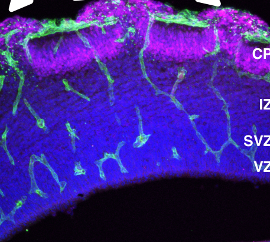

## Question

# Mechanistic Hypothesis Search

You are evaluating a specific disease mechanism hypothesis for the Disorder
Mechanisms Knowledge Base. This is not a general disease overview. Use the
hypothesis YAML below as the seed claim, then search for evidence that supports,
refutes, qualifies, or competes with this hypothesis.

## Target Disease
- **Disease Name:** Pial Basement Membrane and Radial-Glial Endfoot Failure Module
- **Category:** Module

## Target Hypothesis
- **Hypothesis ID:** pial_boundary_overmigration_model
- **Hypothesis Label:** Pial Boundary-Failure Overmigration Model
- **Status in KB:** CANONICAL

## Seed Hypothesis YAML

```yaml
hypothesis_group_id: pial_boundary_overmigration_model
hypothesis_label: Pial Boundary-Failure Overmigration Model
status: CANONICAL
description: Pathogenic disruption of the pial ECM interface, especially through alpha-dystroglycan O-mannosylation
  or GPR56-COL3A1 signaling, weakens basement membrane integrity and radial-glial basal endfoot anchoring.
  The causal readout is not primarily slow or failed neuronal locomotion; it is loss of the cortical pial
  boundary that allows overmigration and ectopic extracortical/cobblestone-like tissue.
evidence:
- reference: PMID:18509043
  supports: SUPPORT
  evidence_source: MODEL_ORGANISM
  snippet: There are four crucial events in the development of cobblestone cortex, namely defective pial
    basement membrane (BM), abnormal anchorage of radial glial endfeet, mislocalized Cajal-Retzius cells,
    and neuronal overmigration.
  explanation: 'Defines the pial-boundary skeleton used by this module: basement membrane defect, radial-glial
    endfoot anchoring failure, Cajal-Retzius mislocalization, and overmigration.'
- reference: PMID:21768377
  supports: SUPPORT
  evidence_source: MODEL_ORGANISM
  snippet: Further studies demonstrated that Col3a1 null mutant mice exhibit overmigration of neurons
    beyond the pial basement membrane and a cobblestone-like cortical malformation similar to the phenotype
    seen in Gpr56 null mutant mice.
  explanation: Shows that loss of the GPR56 ligand COL3A1 produces the same pial-boundary overmigration
    phenotype as Gpr56 loss.
```

## Research Objective

Build a focused hypothesis-search report that answers:

1. What is the strongest direct evidence for this hypothesis?
2. What evidence argues against it, fails to reproduce it, or limits its scope?
3. Which claims are established, emerging, speculative, or contradicted?
4. Which patient subtypes, stages, tissues, cell types, molecular pathways, or
   biomarkers does the hypothesis best explain?
5. Which alternative or competing mechanistic hypotheses explain the same disease
   features better or more parsimoniously?
6. What are the explicit knowledge gaps: missing causal steps, unconfirmed edges,
   contradictory evidence, unknown source-to-target links, or source/data absences?
7. What experiments, cohorts, assays, datasets, or trials would most directly
   distinguish this hypothesis from alternatives?

Use primary literature whenever possible. Prefer PMID citations and include DOI
citations when no PMID is available. Treat reviews as orientation unless they
contain directly relevant synthesized evidence that should be clearly labeled as
review-level support.

## Required Output

### Executive Judgment

Give a concise verdict on the hypothesis as of the current literature:
supported, partially supported, unresolved, weakly supported, or refuted. Explain
the reasoning and the most important caveats.

### Evidence Matrix

Create a table with one row per important evidence item:

- Citation (PMID preferred)
- Evidence type (human clinical, model organism, in vitro, computational, review)
- Supports / refutes / qualifies / competing
- Mechanistic claim tested
- Key finding
- Disease subtype or context
- Confidence and limitations

### Mechanistic Causal Chain

Describe the causal chain implied by the hypothesis from upstream trigger to
clinical manifestation. Identify where the literature is strong, where the links
are inferred, and where there are missing causal steps.

### Knowledge Gaps

Identify explicit known unknowns surfaced by the search. Treat absence of
evidence as a curation-relevant finding only when the search actually checked for
it. Include:

- Unknown or weakly supported causal steps in the hypothesis
- Unconfirmed causal graph edges that need direct perturbation or longitudinal
  evidence
- Conflicting evidence, failed replications, or incompatible subtype-specific
  findings
- Unknown mechanism of action for relevant treatments, biomarkers, or
  interventions tied to this hypothesis
- Source-level or dataset-level absences, such as no relevant GenCC, ClinGen,
  trial, omics, or cohort evidence found as of the search date

For each gap, state the scope, why it matters, what was checked, and what
evidence or experiment would resolve it.

### Alternative Models

List competing or complementary hypotheses. For each, explain whether it is an
alternative to the seed hypothesis, a downstream consequence, an upstream cause,
or a parallel mechanism.

### Discriminating Tests

Recommend concrete studies or assays that would most efficiently test this
hypothesis against alternatives. Include patient stratification, biomarkers,
sample type, model system, perturbation, and expected result where applicable.

### Curation Leads

Provide candidate updates for the KB, but label these as leads requiring curator
verification. Include:

- candidate evidence references and exact abstract snippets to verify
- candidate pathophysiology nodes or edges
- candidate ontology terms for cell types and biological processes
- candidate subtype restrictions or status changes
- candidate `knowledge_gaps` or discussion prompts for unresolved causal claims,
  conflicting evidence, or explicit source/data absences

If the provider supports artifacts, produce artifact-friendly outputs such as an
evidence matrix, mechanistic diagram, knowledge-gap table, or comparison table.
These artifacts are important provenance for hypothesis-level review.


## Output

Question: You are an expert researcher providing comprehensive, well-cited information.

Provide detailed information focusing on:
1. Key concepts and definitions with current understanding
2. Recent developments and latest research (prioritize 2023-2024 sources)
3. Current applications and real-world implementations
4. Expert opinions and analysis from authoritative sources
5. Relevant statistics and data from recent studies

Format as a comprehensive research report with proper citations. Include URLs and publication dates where available.
Always prioritize recent, authoritative sources and provide specific citations for all major claims.

# Mechanistic Hypothesis Search

You are evaluating a specific disease mechanism hypothesis for the Disorder
Mechanisms Knowledge Base. This is not a general disease overview. Use the
hypothesis YAML below as the seed claim, then search for evidence that supports,
refutes, qualifies, or competes with this hypothesis.

## Target Disease
- **Disease Name:** Pial Basement Membrane and Radial-Glial Endfoot Failure Module
- **Category:** Module

## Target Hypothesis
- **Hypothesis ID:** pial_boundary_overmigration_model
- **Hypothesis Label:** Pial Boundary-Failure Overmigration Model
- **Status in KB:** CANONICAL

## Seed Hypothesis YAML

```yaml
hypothesis_group_id: pial_boundary_overmigration_model
hypothesis_label: Pial Boundary-Failure Overmigration Model
status: CANONICAL
description: Pathogenic disruption of the pial ECM interface, especially through alpha-dystroglycan O-mannosylation
  or GPR56-COL3A1 signaling, weakens basement membrane integrity and radial-glial basal endfoot anchoring.
  The causal readout is not primarily slow or failed neuronal locomotion; it is loss of the cortical pial
  boundary that allows overmigration and ectopic extracortical/cobblestone-like tissue.
evidence:
- reference: PMID:18509043
  supports: SUPPORT
  evidence_source: MODEL_ORGANISM
  snippet: There are four crucial events in the development of cobblestone cortex, namely defective pial
    basement membrane (BM), abnormal anchorage of radial glial endfeet, mislocalized Cajal-Retzius cells,
    and neuronal overmigration.
  explanation: 'Defines the pial-boundary skeleton used by this module: basement membrane defect, radial-glial
    endfoot anchoring failure, Cajal-Retzius mislocalization, and overmigration.'
- reference: PMID:21768377
  supports: SUPPORT
  evidence_source: MODEL_ORGANISM
  snippet: Further studies demonstrated that Col3a1 null mutant mice exhibit overmigration of neurons
    beyond the pial basement membrane and a cobblestone-like cortical malformation similar to the phenotype
    seen in Gpr56 null mutant mice.
  explanation: Shows that loss of the GPR56 ligand COL3A1 produces the same pial-boundary overmigration
    phenotype as Gpr56 loss.
```

## Research Objective

Build a focused hypothesis-search report that answers:

1. What is the strongest direct evidence for this hypothesis?
2. What evidence argues against it, fails to reproduce it, or limits its scope?
3. Which claims are established, emerging, speculative, or contradicted?
4. Which patient subtypes, stages, tissues, cell types, molecular pathways, or
   biomarkers does the hypothesis best explain?
5. Which alternative or competing mechanistic hypotheses explain the same disease
   features better or more parsimoniously?
6. What are the explicit knowledge gaps: missing causal steps, unconfirmed edges,
   contradictory evidence, unknown source-to-target links, or source/data absences?
7. What experiments, cohorts, assays, datasets, or trials would most directly
   distinguish this hypothesis from alternatives?

Use primary literature whenever possible. Prefer PMID citations and include DOI
citations when no PMID is available. Treat reviews as orientation unless they
contain directly relevant synthesized evidence that should be clearly labeled as
review-level support.

## Required Output

### Executive Judgment

Give a concise verdict on the hypothesis as of the current literature:
supported, partially supported, unresolved, weakly supported, or refuted. Explain
the reasoning and the most important caveats.

### Evidence Matrix

Create a table with one row per important evidence item:

- Citation (PMID preferred)
- Evidence type (human clinical, model organism, in vitro, computational, review)
- Supports / refutes / qualifies / competing
- Mechanistic claim tested
- Key finding
- Disease subtype or context
- Confidence and limitations

### Mechanistic Causal Chain

Describe the causal chain implied by the hypothesis from upstream trigger to
clinical manifestation. Identify where the literature is strong, where the links
are inferred, and where there are missing causal steps.

### Knowledge Gaps

Identify explicit known unknowns surfaced by the search. Treat absence of
evidence as a curation-relevant finding only when the search actually checked for
it. Include:

- Unknown or weakly supported causal steps in the hypothesis
- Unconfirmed causal graph edges that need direct perturbation or longitudinal
  evidence
- Conflicting evidence, failed replications, or incompatible subtype-specific
  findings
- Unknown mechanism of action for relevant treatments, biomarkers, or
  interventions tied to this hypothesis
- Source-level or dataset-level absences, such as no relevant GenCC, ClinGen,
  trial, omics, or cohort evidence found as of the search date

For each gap, state the scope, why it matters, what was checked, and what
evidence or experiment would resolve it.

### Alternative Models

List competing or complementary hypotheses. For each, explain whether it is an
alternative to the seed hypothesis, a downstream consequence, an upstream cause,
or a parallel mechanism.

### Discriminating Tests

Recommend concrete studies or assays that would most efficiently test this
hypothesis against alternatives. Include patient stratification, biomarkers,
sample type, model system, perturbation, and expected result where applicable.

### Curation Leads

Provide candidate updates for the KB, but label these as leads requiring curator
verification. Include:

- candidate evidence references and exact abstract snippets to verify
- candidate pathophysiology nodes or edges
- candidate ontology terms for cell types and biological processes
- candidate subtype restrictions or status changes
- candidate `knowledge_gaps` or discussion prompts for unresolved causal claims,
  conflicting evidence, or explicit source/data absences

If the provider supports artifacts, produce artifact-friendly outputs such as an
evidence matrix, mechanistic diagram, knowledge-gap table, or comparison table.
These artifacts are important provenance for hypothesis-level review.


# Hypothesis-Search Report: Pial Boundary-Failure Overmigration Model (pial_boundary_overmigration_model)

**Search date:** 2026-06-10

## Executive Judgment
**Verdict: Supported (with important qualifiers).** The strongest causal evidence supports the seed hypothesis that **pial basement membrane (PBM)/glia limitans failure with radial-glial (RG) basal endfoot detachment is a primary driver of cobblestone-like neuronal overmigration**, rather than primarily a defect in neuronal locomotion speed/competence. This is best supported by **cell-type–specific genetics and pathway-rescue epistasis** demonstrating RG-autonomous requirements for ECM adhesion signaling (Dystroglycan/β1-integrin/Cas) to maintain PBM integrity and prevent overmigration (Wong et al., 2023) (wong2023anadhesionsignaling pages 22-25, wong2023anadhesionsignaling pages 25-28, wong2023anadhesionsignaling pages 15-18, wong2023anadhesionsignaling pages 18-22).

Key caveats are that (i) **PBM breaches may be secondary** in some contexts (neurons/progenitors tearing through a weakened or even initially intact PBM), and (ii) **genetic background and pathway redundancy** can markedly modify penetrance and lesion focality, indicating multiple convergent routes to the cobblestone readout (carrier2025themicrotubulebindingprotein pages 13-16, carrier2025themicrotubulebindingprotein pages 1-4, carrier2025themicrotubulebindingprotein pages 7-10). Additionally, α-dystroglycan O-mannosylation defects may affect additional glycoproteins, and patient–model variability remains incompletely explained (nickolls2018therolesof pages 8-9).

## 1) Key concepts and definitions (current mechanistic understanding)
### Cobblestone malformation as a boundary-failure phenotype
In the boundary-failure model, the **PBM/glia limitans** and its coverage by **RG basal endfeet** form a **physical and signaling boundary** at the pial surface. When this interface is weakened—classically by **loss of α-dystroglycan (αDG) glycosylation–dependent ECM binding** or by disrupted RG adhesion signaling—**neurons overmigrate beyond the cortical plate into extracortical (subarachnoid/meningeal) spaces**, producing **cobblestone-like ectopias** rather than simply stalling in migration (nickolls2018therolesof pages 8-9, ferent2020extracellularcontrolof pages 19-20, meyerink2020ariadne’sthreadin pages 6-8).

### Molecular nodes highlighted in the seed hypothesis
* **αDG O-mannosylation / dystroglycanopathies:** αDG requires a specialized glyco-epitope for high-affinity binding to ECM ligands such as laminin; hypoglycosylation disrupts this binding and destabilizes PBM–endfoot anchoring (ferent2020extracellularcontrolof pages 19-20, nickolls2018therolesof pages 5-6).
* **RG adhesion signaling (β1-integrin–Cas axis):** Recent primary data place **Cas adaptor phosphorylation downstream of β1-integrin and dystroglycan** within RGs, coupling transmembrane ECM receptors to cytoskeletal/adhesion machinery required for scaffold integrity and PBM maintenance (wong2023anadhesionsignaling pages 22-25, wong2023anadhesionsignaling pages 25-28, wong2023anadhesionsignaling pages 46-51).
* **GPR56/ADGRG1–COL3A1 signaling:** This receptor–ligand pair is repeatedly linked (across the broader literature and summarized in retrieved syntheses) to cobblestone-like overmigration and basal lamina/endfoot defects, but in the retrieved set it is **less mechanistically resolved** than the Dag1/Itgb1/Cas pathway (meyerink2020ariadne’sthreadin pages 6-8, carrier2025themicrotubulebindingprotein pages 13-16).

## 2) Recent developments and latest research (prioritizing 2023–2024)
### 2.1 A 2023 in vivo causal test of RG-autonomous PBM integrity control
**Wong et al. (publication month in metadata: Jun 2023; PLOS Biology; DOI in retrieved metadata: 10.1101/2022.08.02.502565; URL: https://doi.org/10.1101/2022.08.02.502565)** provide the most direct, mechanistically specific support among retrieved sources. They show:

* **RG (Emx1Cre) but not neuronal (NexCre) deletion** is sufficient to cause cobblestone phenotypes. Emx1Cre;β1-Integrin conditional knockouts showed a cobblestone phenotype with **100% penetrance** (n=17 mutants vs n=20 controls; Fisher exact test p<0.0001), while NexCre;β1-Integrin deletion showed **0% penetrance** (Fisher p=1), indicating a **non-neuronal-autonomous (RG-autonomous)** requirement for β1-integrin in preventing overmigration (wong2023anadhesionsignaling pages 22-25).
* **Cas adaptor proteins are required in Emx1-lineage cells** for PBM integrity: Emx1Cre;CasTcKO cortices show **Laminin+ PBM ruptures** and **RG-marker-positive RG endfeet detachment/extension into the subarachnoid space**, consistent with boundary failure (wong2023anadhesionsignaling pages 15-18).
* **Pathway placement and rescue:** A functional interaction trap forcing Src–p130Cas interaction **rescued** the cobblestone phenotype in β1-integrin mutants **locally in electroporated regions**, restoring laminar Ctip2 distribution and reducing ectopias (One-way ANOVA p=0.0003; Tukey HSD **p<0.01** for key contrasts) (wong2023anadhesionsignaling pages 25-28). This is unusually strong evidence that the phenotype is not simply “migration is slow/aberrant,” but is **caused by specific failure of an adhesion signaling module that maintains PBM/endfoot integrity**.

**Figure provenance:** Cropped figure panels from this study show (i) laminin breaks with Ctip2+ neuron overmigration, (ii) RG endfoot detachment, and (iii) rescue in β1-integrin mutants by downstream Cas activation (wong2023anadhesionsignaling media 44b4a27d, wong2023anadhesionsignaling media 02940250, wong2023anadhesionsignaling media 3504650b).

### 2.2 2024 sources retrieved in this search
A 2024 mechanistic paper on **GPR56 G-protein selectivity** was retrieved (Cellular and Molecular Life Sciences, Sep 2024; https://doi.org/10.1007/s00018-024-05416-8), but it is not cortical-development specific in the retrieved excerpt and therefore does not directly strengthen/contradict the PBM boundary-failure mechanism in this report (no direct PBM/endfoot phenotyping evidence surfaced here) (jallouli2024gproteinselectivity metadata in search results).

## 3) Current applications and real-world implementations
### 3.1 Translational implementation: genotype-to-mechanism interpretation
The boundary-failure model supports **clinical interpretation and stratification** of malformations that share extracortical ectopia/cobblestone features toward **ECM–RG endfoot–PBM pathways** (e.g., DAG1 and αDG glycosylation genes; ECM/basement-membrane genes such as LAMB1; and likely ADGRG1/COL3A1). Review-level syntheses in the retrieved set explicitly connect **human LAMB1 mutations** to cobblestone malformation even without muscle/eye involvement, highlighting that a “muscle dystrophy” context is not required for a PBM-centric mechanism (nickolls2018therolesof pages 15-15).

### 3.2 Experimental implementation: rescue and pathway bypass as mechanism tests
The Wong 2023 **downstream rescue** (forced Src–Cas interaction) is a practical experimental paradigm for distinguishing **primary boundary-failure** from neuron-autonomous migration defects: restoration of RG adhesion signaling can restore PBM integrity and lamination even when an upstream adhesion receptor is lost (wong2023anadhesionsignaling pages 25-28, wong2023anadhesionsignaling pages 46-51).

## 4) Expert opinions and analysis from authoritative sources (clearly labeled)
### Review-level synthesis supporting the canonical skeleton
Several retrieved reviews converge on a canonical mechanistic skeleton: **PBM defect → RG endfoot anchoring failure → CR-cell mislocalization → neuronal overmigration** as core events in cobblestone phenotypes (ferent2020extracellularcontrolof pages 19-20, meyerink2020ariadne’sthreadin pages 6-8). Nickolls & Bönnemann synthesize multiple dystroglycanopathy models showing early pial breaches and overmigration, arguing the PBM boundary mechanism is central while acknowledging pleiotropy and variability (nickolls2018therolesof pages 8-9).

### Review-level qualifying analysis
Authoritative syntheses also emphasize that similar migration phenotypes can arise from **stop-signal/signaling pathway perturbations** (e.g., Reelin pathway) and that there are **species/context differences**; thus PBM rupture is not necessarily the only proximate cause of abnormal neuronal positioning (amin2020theextracellularmatrix pages 10-10).

## 5) Relevant statistics and data points from recent studies
From Wong et al. 2023:
* **100% penetrance** of cobblestone phenotype in Emx1Cre;β1-Integrin cKO (n=17 mutants vs n=20 controls; Fisher exact p<0.0001) and **0% penetrance** in NexCre neuronal β1-Integrin deletion (n=10 mutants vs n=8 controls; Fisher p=1) (wong2023anadhesionsignaling pages 22-25).
* **Dag1 intracellular domain dispensability for lamination**: Dag1βcyto/- lamination normal (n=10/genotype; Fisher exact p=1), aligning with the hypothesis emphasis on the **extracellular ECM-binding/adhesion function** rather than intracellular dystroglycan signaling in this specific phenotype (wong2023anadhesionsignaling pages 22-25).
* **Cas phosphorylation as mechanistic readout:** myc-Dag1 in Neuro2A cells increased pY165Cas from **1.03±0.16 to 2.85±0.25** (au; one-way ANOVA p<0.001; Tukey p<0.0001), and the extracellular domain (myc-Dag1ecto) produced a similar increase (2.74±0.17) (wong2023anadhesionsignaling pages 18-22).
* **Rescue statistics:** One-way ANOVA p=0.0003 with Tukey HSD **p<0.01** supporting rescue of Itgb1-mutant cobblestone phenotypes by forced Src–Cas interaction (wong2023anadhesionsignaling pages 25-28).

## Strongest direct evidence for the hypothesis (Q1)
1. **Cell-type specificity (RG-autonomous necessity):** RG-targeted deletion (Emx1Cre) of Cas/Itgb1/Dag1 yields PBM rupture and cobblestone overmigration; neuron-targeted deletion (NexCre) does not, arguing against neuronal locomotion defects as primary in this module (wong2023anadhesionsignaling pages 22-25, wong2023anadhesionsignaling pages 15-18, wong2023anadhesionsignaling pages 18-22).
2. **Mechanistic epistasis and rescue:** Forcing downstream Cas activation rescues β1-integrin mutant phenotypes locally, demonstrating a causal adhesion-signaling chain consistent with PBM/endfoot integrity driving the outcome (wong2023anadhesionsignaling pages 25-28, wong2023anadhesionsignaling pages 46-51).
3. **Phenotype-level visual provenance:** Laminin discontinuities, RG endfoot detachment, and neuronal overmigration are shown in extracted figure panels (wong2023anadhesionsignaling media 44b4a27d, wong2023anadhesionsignaling media 02940250, wong2023anadhesionsignaling media 3504650b).

## Evidence against / limitations / non-replications (Q2)
No retrieved primary study directly refutes PBM boundary failure as a cause of cobblestone overmigration; instead, the main limitations are **scope and causal direction**:
* **Competing causal fork:** Cobblestone could arise either from (i) primary PBM weakness failing to provide boundary/stop cues, or (ii) neuron-intrinsic failure to interpret stop cues leading neurons to tear through an otherwise functional PBM; this is explicitly framed as an alternative in the retrieved Eml3 preprint (carrier2025themicrotubulebindingprotein pages 1-4, carrier2025themicrotubulebindingprotein pages 7-10).
* **Modifier effects and redundancy:** Strong genetic background dependence (e.g., absence of phenotype on CD-1 congenic background in Eml3-null) implies redundancy and compensatory pathways, which can obscure causal inference from negative data (carrier2025themicrotubulebindingprotein pages 13-16).
* **Pleiotropy of glycosylation defects:** Early O-mannosylation defects may alter additional substrates; αDG is broadly expressed, and intracellular functions (e.g., βDG nuclear localization) complicate a single-edge explanation (nickolls2018therolesof pages 8-9).
* **Stop-signal signaling not globally disrupted in some models:** Global Reelin signaling appears unperturbed in Pomgnt2-null and Fkrp(Y307N) mice despite overmigration, arguing against a simple “Reelin failure drives overmigration” explanation in these dystroglycanopathy contexts, while not excluding local CR-cell positioning effects (nickolls2018therolesof pages 8-9).

## Claim maturity (Q3)
* **Established (high confidence):** RG endfoot–PBM integrity is required to prevent neuronal overmigration; RG-autonomous deletions in adhesion pathways produce PBM rupture and cobblestone ectopias (wong2023anadhesionsignaling pages 22-25, wong2023anadhesionsignaling pages 15-18, wong2023anadhesionsignaling media 44b4a27d).
* **Emerging:** Specific intracellular signaling axes downstream of ECM receptors (β1-integrin→Cas phosphorylation) are actionable drivers and can be experimentally bypassed to rescue phenotype (wong2023anadhesionsignaling pages 25-28, wong2023anadhesionsignaling pages 46-51).
* **Speculative/under-resolved:** The precise biomechanics/sequence of PBM rupture (primary structural failure vs neuron-mediated tearing) across genotypes; direct mechanistic coupling from GPR56–COL3A1 to endfoot anchoring and PBM stability in the same level of detail as Dag1/Itgb1/Cas (meyerink2020ariadne’sthreadin pages 6-8, carrier2025themicrotubulebindingprotein pages 1-4).

## Best-explained subtypes/contexts (Q4)
This hypothesis best explains malformations where the defining pathology includes **PBM/glia limitans disruption and extracortical neuronal ectopia**, including:
* **α-dystroglycanopathy/cobblestone spectrum** (glycosylation genes; DAG1), where early pial BM breaches and neuronal overmigration are recurring and can be glial-autonomous in conditional models (nickolls2018therolesof pages 8-9, nickolls2018therolesof pages 5-6).
* **RG adhesion-complex perturbations** (β1-integrin/Cas axis), where the primary lesion is demonstrably in RG scaffold/basement membrane integrity (wong2023anadhesionsignaling pages 22-25, wong2023anadhesionsignaling pages 15-18).
* **Contexts implicating meningeal ECM supply** (suggested by Eml3 expression in meningeal mesenchyme and neuroepithelium), consistent with a PBM assembly module that spans compartments (carrier2025themicrotubulebindingprotein pages 1-4, carrier2025themicrotubulebindingprotein pages 13-16).

## Alternative or competing mechanistic hypotheses (Q5)
1. **Neuron-intrinsic stop-signal failure model (competing proximal mechanism):** Migrating neurons fail to interpret termination cues and tear through an initially intact PBM. This model can explain cobblestone-like overmigration without requiring primary PBM weakness, and is explicitly raised as a plausible alternative in the Eml3 work (carrier2025themicrotubulebindingprotein pages 1-4, carrier2025themicrotubulebindingprotein pages 7-10).
2. **Reelin/CR-cell signaling perturbation (complementary or parallel):** Reelin is a proposed stop signal affecting migration and RG integrity; however, global Reelin signaling can be unperturbed in dystroglycanopathy models with overmigration, suggesting it is not the sole driver in those contexts (nickolls2018therolesof pages 8-9, amin2020theextracellularmatrix pages 10-10).
3. **Progenitor delamination / intrinsic progenitor polarity defects (competing for some ectopia phenotypes):** Progenitor-intrinsic defects (e.g., abnormal mitotic spindle orientation with delamination) can generate ectopias via mechanisms not strictly dependent on pial boundary failure (noted as an alternative route in the Eml-family discussion) (carrier2025themicrotubulebindingprotein pages 1-4).
4. **ECM dosage/regulatory defects (parallel upstream causes):** ECM regulators can cause apical-basal detachment and ectopic accumulation (e.g., ECE2 dosage effects discussed in synthesis), producing migration phenotypes that may or may not map cleanly onto PBM rupture as the initiating event (amin2020theextracellularmatrix pages 10-10).

## Explicit knowledge gaps (Q6)
The most curation-relevant known unknowns, grounded in retrieved evidence, are summarized in the Knowledge Gaps & Discriminating Tests table (artifact-02), including: primary-versus-secondary PBM rupture, compartment-of-action (meningeal vs RG), redundancy/compensation, and incomplete mechanistic mapping for ADGRG1/COL3A1 (carrier2025themicrotubulebindingprotein pages 13-16, amin2020theextracellularmatrix pages 10-10).

## Discriminating tests (Q7)
The most efficient tests to distinguish the seed hypothesis from neuron-intrinsic alternatives include (i) **RG-specific vs neuron-specific perturbations** for candidate genes, (ii) **live imaging** to time PBM rupture relative to first neuron contact, and (iii) **downstream adhesion-signaling rescue** (Cas activation) with defined temporal windows (wong2023anadhesionsignaling pages 25-28, wong2023anadhesionsignaling pages 15-18, carrier2025themicrotubulebindingprotein pages 7-10). Concrete designs and expected outcomes are listed in artifact-02.

---

## Evidence Matrix (artifact)
| Citation (year, journal, URL/DOI) | Evidence type | Supports / refutes / qualifies / competing | Mechanistic claim tested | Key finding | Context (gene/model/cell type) | Confidence & limitations |
|---|---|---|---|---|---|---|
| Wong et al. 2023, *PLOS Biology*, https://doi.org/10.1101/2022.08.02.502565 | Primary model organism | Supports | Radial-glial adhesion signaling through Dystroglycan–β1-Integrin–Cas is required to establish/maintain the pial basement membrane and prevent neuronal overmigration | Emx1Cre;Cas TcKO cortices showed breached Laminin+ pial basement membrane, RG-marker-positive radial glial endfeet detachment/extension into subarachnoid space, and cobblestone-like neuronal ectopias; NexCre;Cas TcKO lacked the phenotype, arguing against a neuron-autonomous migration defect. Emx1Cre;Dag1 and Emx1Cre;Itgb1 mutants phenocopied cobblestone defects, while neuronal Itgb1 deletion did not. Forced Src–p130Cas interaction (FIT rescue) locally rescued the Itgb1 mutant phenotype and restored laminar organization (wong2023anadhesionsignaling pages 22-25, wong2023anadhesionsignaling pages 25-28, wong2023anadhesionsignaling pages 15-18, wong2023anadhesionsignaling pages 18-22, wong2023anadhesionsignaling media 44b4a27d). | Mouse conditional knockouts; radial glia vs neuron-specific deletion; Dag1/Itgb1/Cas axis; radial glial endfeet | High confidence for RG-autonomous scaffold mechanism; strong genetics, cell-type specificity, and rescue. Limitations: mouse-only; not directly testing every human genotype; DOI/URL in retrieved metadata points to preprint DOI rather than final article URL (wong2023anadhesionsignaling pages 22-25, wong2023anadhesionsignaling pages 25-28, wong2023anadhesionsignaling pages 15-18, wong2023anadhesionsignaling pages 18-22). |
| Nickolls & Bönnemann 2018, *Disease Models & Mechanisms*, https://doi.org/10.1242/dmm.035931 | Review-level orientation synthesizing primary models | Supports / qualifies | Hypoglycosylated α-dystroglycan weakens pial BM / glia limitans, causing overmigration; glial Dag1 is more critical than neuronal Dag1 for malformation | Summarizes primary observations that Pomgnt2-null and Fkrp(Y307N) mice show early ectopic movement of Cajal–Retzius and subplate neurons through the pial BM from ~E10.5, followed by cortical plate neurons streaming through pial ruptures into the subarachnoid space. Glial Dag1 knockout fragments basement membranes and causes cortical defects, whereas neuronal or meningeal Dag1 deletion does not cause nervous system malformation. Also notes neurons often retain layer markers/projections and reelin signaling is not globally perturbed, supporting boundary failure over primary locomotion failure but qualifying that αDG acts in multiple cell types and other glycoproteins may contribute (nickolls2018therolesof pages 8-9, nickolls2018therolesof pages 15-15, nickolls2018therolesof pages 5-6). | Dystroglycanopathy models: Pomgnt2, Fkrp(Y307N), Large^myd, Dag1 conditional KOs; glia vs neurons | Moderate-high confidence for the synthesized conclusion, but this source is a review rather than a new experiment. Use underlying primary studies for curator-grade causal claims (nickolls2018therolesof pages 8-9, nickolls2018therolesof pages 15-15, nickolls2018therolesof pages 5-6). |
| Carrier et al. 2025, *bioRxiv*, https://doi.org/10.1101/2025.04.06.647459 | Primary model organism / preprint | Supports / qualifies | Structural pial basement membrane defects can precede and enable focal neuronal overmigration, independent of known dystroglycanopathy genes | In Eml3-null mice, transmission EM showed the pial basement membrane ECM was structurally abnormal, uniformly disorganized, and less dense before focal neuronal ectopias formed; overmigration occurred when the first radially migrating neurons encountered the already defective PBM. The authors state a neuroblast-intrinsic motility defect was not observed, favoring a pre-existing pial boundary-failure mechanism. Expression in both neuroepithelium and meningeal mesenchyme implicates multiple PBM-building compartments (carrier2025themicrotubulebindingprotein pages 1-4, carrier2025themicrotubulebindingprotein pages 13-16). | Eml3-null mouse; PBM ultrastructure; neuroepithelium + meningeal mesenchyme | Moderate confidence: direct temporal/ultrastructural evidence strongly supports the model, but it is a 2025 preprint and not yet peer reviewed; relevance to canonical αDG/GPR56 pathways is indirect (carrier2025themicrotubulebindingprotein pages 1-4, carrier2025themicrotubulebindingprotein pages 13-16). |
| Amin & Borrell 2020, *Frontiers in Cell and Developmental Biology*, https://doi.org/10.3389/fcell.2020.604448 | Review-level orientation synthesizing human + model evidence | Supports / qualifies | Basement-membrane and ECM defects disrupt radial glial attachment and produce neuronal ectopias/cobblestone-like malformations | Reviews examples in which human LAMB1 mutations and mouse Laminin γ1III4, Perlecan, and Dag1 mutants show BM breach, truncated RGC fibers, loss of RGC endfoot attachment, and ectopias/heterotopias. Also notes ECM-related perturbations can cause apical-basal detachment and ectopic neurons, supporting a scaffold/substrate mechanism rather than proliferation/survival change in some models (amin2020theextracellularmatrix pages 10-10). | Human genetics and mouse models; LAMB1, Dag1, perlecan, laminin pathways; radial glia | Moderate confidence as orientation only; useful for breadth across ECM genes, but causal weight depends on the primary papers it summarizes. Some ECM/reelin interactions remain debated or species-dependent (amin2020theextracellularmatrix pages 10-10). |
| Ferent et al. 2020, *Frontiers in Cell and Developmental Biology*, https://doi.org/10.3389/fcell.2020.578341 | Review-level orientation | Supports / qualifies | Cobblestone malformations arise when radial glial basal endfeet fail to remain attached to pial ECM, leading to BM breaks and overmigration | States that neuronal overmigration at the pial surface occurs due to cortical BM breaks and that radial glial basal endfeet are not well attached to ECM such as laminin, causing RG scaffold disintegration. Links these events to dystroglycan glycosylation defects and mutations in DAG1, laminin subunits, and multiple glycosylation genes (ferent2020extracellularcontrolof pages 19-20). | Dystroglycanopathies and ECM-linked cortical malformations; radial glia–ECM interactions | Moderate confidence as review-level support; mechanistic summary aligns with primary models but does not itself provide new perturbation data (ferent2020extracellularcontrolof pages 19-20). |
| Meyerink et al. 2020, *Cells*, https://doi.org/10.3390/cells10010003 | Review-level orientation | Supports / qualifies / competing | The basal lamina–radial glia endfoot interface forms a migration barrier; disruption of GPR56, integrins, dystrophin-glycoprotein complex, or FAK permits meningeal heterotopias | Summarizes that perturbations in basal lamina components, integrins, DGC members, FAK, or Gpr56 disconnect radial glial basal endfeet, create basal lamina breaches, and allow neurons to ectopically migrate into meningeal layers. Explicitly highlights an unresolved mechanistic alternative: whether weakened endfoot adhesion directly ruptures the basal lamina or whether migrating neurons actively breach a weakened lamina (meyerink2020ariadne’sthreadin pages 6-8). | Radial glia basal process/endfoot biology; GPR56/ADGRG1 and ECM adhesion pathways | Moderate confidence as synthesis; especially useful for mapping GPR56 into the boundary-failure framework. Limitation: largely interpretive and does not resolve the direct rupture mechanism (meyerink2020ariadne’sthreadin pages 6-8). |
| Figure-level support from Wong et al. 2023 (*PLOS Biology* figures extracted via image context) | Primary model organism image evidence | Supports | Visual confirmation that basement membrane breakage and RG endfoot detachment coincide with overmigration and that downstream Cas activation can rescue β1-integrin loss | Extracted figure panels show: (i) Laminin+ pial BM breaks with Ctip2+ neurons overmigrating through breaches; (ii) RG-marker-positive radial glial endfeet detaching and extending into the subarachnoid space at rupture sites; and (iii) local rescue of Itgb1-mutant BM rupture/ectopias by Src-ZipA + p130Cas-ZipB FIT system (wong2023anadhesionsignaling media 44b4a27d, wong2023anadhesionsignaling media 02940250, wong2023anadhesionsignaling media 3504650b). | Cas TcKO and Emx1Cre;Itgb1 conditional mutant mouse cortex | High confidence for phenotype visualization; limitation is that figure extraction is supportive provenance, not independent evidence beyond the paper’s main results (wong2023anadhesionsignaling media 44b4a27d, wong2023anadhesionsignaling media 02940250, wong2023anadhesionsignaling media 3504650b). |


*Table: This table summarizes the main supporting and qualifying evidence for the Pial Boundary-Failure Overmigration Model, emphasizing direct primary data where available and clearly labeling review-level orientation sources. It is useful for curation because it separates strong causal perturbation evidence from broader synthesis and highlights where the hypothesis is best established versus still qualified.*

## Mechanistic Causal Chain (artifact)
> - **Strongly supported:** Upstream lesions that impair α-dystroglycan O-mannosylation/glycosylation or delete **DAG1**, **ITGB1**, or **Cas** in dorsal telencephalic progenitors/radial glia disrupt the radial-glial adhesion machinery that normally couples basal endfeet to the pial basement membrane (PBM), whereas neuron-specific deletions largely spare cortical lamination, arguing against a primary neuron-autonomous locomotion defect as the core mechanism (wong2023anadhesionsignaling pages 22-25, wong2023anadhesionsignaling pages 15-18, wong2023anadhesionsignaling pages 18-22).
> - **Strongly supported:** In radial glia, Dystroglycan and β1-integrin converge on **Cas phosphorylation/signaling**; Dag1 overexpression increases pY165Cas, but this effect is lost without β1-integrin, and forced Src–p130Cas interaction can rescue β1-integrin-mutant cobblestone phenotypes, placing reduced Cas activation downstream of defective ECM adhesion (wong2023anadhesionsignaling pages 22-25, wong2023anadhesionsignaling pages 25-28, wong2023anadhesionsignaling pages 46-51).
> - **Strongly supported:** Loss of αDG-mediated ECM binding, especially to laminin-rich PBM, destabilizes radial-glial basal endfeet and the glial scaffold, producing visible Laminin-positive basement-membrane discontinuities together with RG-marker-positive endfoot detachment or extension into the subarachnoid space (nickolls2018therolesof pages 5-6, wong2023anadhesionsignaling pages 15-18, wong2023anadhesionsignaling media 44b4a27d).
> - **Strongly supported:** In dystroglycanopathy models such as **Pomgnt2-null**, **Fkrp(Y307N)**, and related **Large** or glial **Dag1** mutants, early ectopic movement of **Cajal–Retzius** and subplate cells through the pial surface accompanies PBM failure, making CR-cell mislocalization part of the recurring boundary-failure phenotype rather than isolated evidence of defective Reelin stop signaling (nickolls2018therolesof pages 8-9, nickolls2018therolesof pages 15-15).
> - **Inferred to moderately supported:** **ADGRG1/GPR56–COL3A1** signaling likely acts in a parallel ECM-sensing/anchoring pathway at the pial surface, because Gpr56- and Col3a1-deficient cortices show similar overmigration and cobblestone-like malformations, but the exact molecular coupling from this receptor–ligand pair to endfoot anchoring and PBM biomechanics is less directly resolved than for the Dag1/Itgb1/Cas axis (meyerink2020ariadne’sthreadin pages 6-8, carrier2025themicrotubulebindingprotein pages 13-16).
> - **Inferred to moderately supported:** **Meningeal fibroblasts/mesenchyme** contribute causally by supplying PBM extracellular matrix, while radial glia provide the anchored endfoot interface; support comes from models such as **Eml3** in which the gene is expressed in both neuroepithelium and meningeal mesenchyme and PBM ultrastructure is abnormal before overt ectopia, but cell-type-specific necessity remains incompletely dissected (carrier2025themicrotubulebindingprotein pages 1-4, carrier2025themicrotubulebindingprotein pages 13-16).
> - **Strongly supported:** Once the PBM/glia limitans is weakened or ruptured, the key causal readout is **neuronal overmigration through pial breaches into the subarachnoid space/meninges**, producing ectopic extracortical neuronal clusters and the histologic/radiologic appearance of cobblestone cortex (nickolls2018therolesof pages 8-9, wong2023anadhesionsignaling pages 15-18, wong2023anadhesionsignaling media 44b4a27d).
> - **Qualified/inferred:** The literature still leaves open whether neurons merely exploit a pre-weakened PBM or can actively tear through a vulnerable but initially continuous barrier, so the final step from endfoot-anchoring failure to frank rupture is strongly associated yet not fully resolved mechanistically across all subtypes (meyerink2020ariadne’sthreadin pages 6-8, carrier2025themicrotubulebindingprotein pages 1-4, carrier2025themicrotubulebindingprotein pages 7-10).
> - **Overall causal chain:** genetic lesions in **αDG glycosylation genes/DAG1**, or in the **ITGB1–Cas** scaffold, and probably in **ADGRG1/GPR56–COL3A1**, impair ECM adhesion/signaling at radial-glial endfeet → reduce Cas-dependent scaffold stabilization and αDG/laminin-mediated anchoring → detach endfeet and weaken the PBM/glia limitans, with accompanying CR-cell mislocalization → permit neuronal overmigration beyond the cortical surface into meningeal compartments → generate cobblestone-like cortical malformation (wong2023anadhesionsignaling pages 22-25, wong2023anadhesionsignaling pages 25-28, wong2023anadhesionsignaling pages 15-18, wong2023anadhesionsignaling pages 18-22, nickolls2018therolesof pages 8-9).


*Blockquote: This blockquote summarizes the proposed causal sequence for the Pial Boundary-Failure Overmigration Model, distinguishing strongly supported links from inferred ones. It is useful as a compact mechanistic narrative tying genetic lesions to cell types, intermediate failures, and the cobblestone overmigration phenotype.*

## Knowledge Gaps & Discriminating Tests (artifact)
| Type | Gap or Test description | Why it matters for distinguishing pial-boundary failure vs alternatives | What evidence currently exists (with citations) | Proposed study/assay design (models, perturbation, readouts) | Expected results under pial-boundary failure model vs neuron-intrinsic stop-signal model |
|---|---|---|---|---|---|
| Gap | Whether pial basement membrane (PBM) rupture is primary or is torn secondarily by the first arriving neurons remains unresolved in several models | This is the core causal fork: if PBM weakness precedes neuron contact, the seed hypothesis is strengthened; if neurons breach an initially intact PBM, a neuron-intrinsic stop-signal model gains support | Eml3-null work explicitly frames both possibilities and uses temporal analysis, but notes the need to show PBM defects before neuroblast arrival; early PBM structural abnormality is supportive yet not fully definitive. Meyerink also notes unresolved causality between endfoot detachment and lamina rupture (carrier2025themicrotubulebindingprotein pages 13-16, carrier2025themicrotubulebindingprotein pages 1-4, carrier2025themicrotubulebindingprotein pages 7-10, meyerink2020ariadne’sthreadin pages 6-8) | Live imaging in ex vivo embryonic mouse cortex and human cortical organoids with fluorescent laminin/collagen reporters, radial-glia endfoot markers, and sparse neuronal lineage labels; perturb DAG1/POMGNT2/ITGB1/CAS vs neuron-specific stop-cue genes; quantify timing of PBM discontinuity relative to first neuronal contact | **Pial-boundary failure:** PBM/endfoot defects appear before or independent of neuron contact, and overmigration occurs only at pre-weakened sites. **Neuron-intrinsic stop-signal:** neurons contact an apparently intact PBM first, then locally rupture it during failed stopping |
| Gap | The precise molecular bridge from ADGRG1/GPR56-COL3A1 signaling to radial-glial endfoot anchoring and PBM biomechanics is incompletely resolved | The hypothesis names GPR56-COL3A1 as canonical, but the direct downstream adhesion/cytoskeletal machinery is less well mapped than the DAG1-ITGB1-Cas axis | Reviews and prior models place GPR56 with basal lamina/endfoot defects and overmigration, but Wong 2023 provides much stronger mechanistic depth for Dag1/Itgb1/Cas than for GPR56; Meyerink identifies Gpr56 as part of the same endfoot/basal lamina failure class (meyerink2020ariadne’sthreadin pages 6-8, wong2023anadhesionsignaling pages 51-55, wong2023anadhesionsignaling pages 46-51) | CRISPR perturb ADGRG1 or COL3A1 in radial glia-meningeal co-culture and cerebral organoids; measure endfoot adhesion strength, RhoA/Cas phosphorylation, ECM ultrastructure, and rescue with constitutively active downstream effectors | **Pial-boundary failure:** ADGRG1/COL3A1 loss reduces endfoot adhesion/ECM integrity and may converge on adhesion signaling defects. **Neuron-intrinsic stop-signal:** ADGRG1/COL3A1 loss would alter neuronal stopping without consistent antecedent PBM/endfoot failure |
| Gap | Relative contribution of meningeal mesenchyme/fibroblasts versus radial glia to PBM failure is not fully dissected across models | Distinguishing ECM-source defects from endfoot-anchoring defects clarifies upstream causation and identifies the primary pathogenic compartment | Eml3 is expressed in both neuroepithelium and meningeal mesenchyme, implicating both compartments; review-level syntheses also emphasize meningeal ECM contribution, but direct compartment-specific necessity remains sparse in retrieved evidence (carrier2025themicrotubulebindingprotein pages 1-4, carrier2025themicrotubulebindingprotein pages 13-16, amin2020theextracellularmatrix pages 10-10) | Cell-type-specific conditional perturbations in mice and assembloids: meningeal fibroblast-specific ECM gene deletion versus radial-glia-specific Dag1/Itgb1/Cas deletion; readouts: PBM ultrastructure, endfoot attachment, ectopia frequency | **Pial-boundary failure:** either compartment can initiate PBM weakness, with strongest phenotypes when ECM supply or endfoot anchoring is disrupted. **Neuron-intrinsic stop-signal:** compartment-specific ECM manipulations would have limited effect unless neuronal stop pathways are also altered |
| Gap | Extent of compensatory redundancy between α-dystroglycan, β1-integrin, Cas, and other adhesion/IAC components is incompletely known | Redundancy can mask phenotypes, create mild or focal lesions, and complicate negative findings | Wong shows Dag1 requires β1-integrin for Cas phosphorylation and that forced Cas activation can bypass β1-integrin loss; Carrier notes milder/focal COB-like phenotypes and strong background-modifier effects; reviews cite multiple integrin pathways (wong2023anadhesionsignaling pages 22-25, wong2023anadhesionsignaling pages 25-28, carrier2025themicrotubulebindingprotein pages 13-16, wong2023anadhesionsignaling pages 51-55, wong2023anadhesionsignaling pages 46-51) | Systematic combinatorial perturbation screen in organoids or mouse cortex: single and double disruptions of DAG1, ITGB1, CAS family, GPR56, focal adhesion components; readouts: penetrance, lesion size, endfoot attachment, phospho-signaling | **Pial-boundary failure:** double/triple perturbations show synergistic PBM rupture and overmigration; downstream Cas rescue may bypass some upstream lesions. **Neuron-intrinsic stop-signal:** synergy should be stronger among neuronal guidance/termination genes than among ECM-adhesion genes |
| Gap | Why many neurons retain layer markers/projections despite severe overmigration and laminar disorganization | If neuronal identity programs are preserved, the main defect may be barrier failure rather than intrinsic migration specification failure | Nickolls summarizes that reelin signaling is not globally perturbed in key dystroglycanopathy models and many neurons still express layer-specific markers and project appropriately despite overmigration (nickolls2018therolesof pages 8-9) | Spatial transcriptomics plus retrograde tracing in mutant cortex comparing ectopic versus correctly placed neurons; assess identity, maturation, and axon targeting alongside PBM status | **Pial-boundary failure:** ectopic neurons largely preserve fate and projection programs but are mislocalized because the barrier failed. **Neuron-intrinsic stop-signal:** broader defects in migration-termination programs and possibly cell-state changes would be expected |
| Gap | Human subtype restriction and genotype-phenotype mapping remain incomplete for canonical pathway claims | The model may explain cobblestone/dystroglycanopathy cases best, but not all polymicrogyria or migration disorders | Retrieved evidence strongly supports dystroglycanopathy and RG-adhesion contexts; reviews note species/context dependence and broader ECM/signaling causes of migration phenotypes; direct recent human mechanistic datasets are limited in the retrieved set (nickolls2018therolesof pages 8-9, amin2020theextracellularmatrix pages 10-10) | Multi-center fetal/neonatal imaging-pathology-genomics cohort stratified by DAG1/glycosylation genes, ADGRG1/COL3A1, laminins, and neuronal migration genes; harmonize MRI, pathology, and variant interpretation | **Pial-boundary failure:** strongest enrichment of cobblestone/extracortical ectopia in ECM/endfoot-anchoring genotypes. **Neuron-intrinsic stop-signal:** similar overmigration signatures would be common in purely neuronal migration-termination gene defects |
| Test | Radial-glia-specific versus neuron-specific perturbation test of candidate genes | Directly separates scaffold/endfoot-autonomous from neuron-autonomous mechanisms | Wong 2023 shows Emx1Cre deletion of Cas, Dag1, or Itgb1 causes cobblestone phenotypes, while NexCre neuronal deletion does not for Cas/Itgb1-related lamination defects (wong2023anadhesionsignaling pages 15-18, wong2023anadhesionsignaling pages 18-22, wong2023anadhesionsignaling pages 22-25) | Conditional mouse genetics and matched organoid CRISPR mosaics: RG-specific versus neuron-specific knockout of DAG1, ITGB1, ADGRG1, candidate stop-signal genes; readouts: laminin continuity, endfoot morphology, neuronal trajectories, ectopia burden | **Pial-boundary failure:** RG-specific loss reproduces PBM rupture and overmigration; neuron-specific loss has weaker or different effects. **Neuron-intrinsic stop-signal:** neuron-specific loss causes overmigration even with preserved PBM/endfeet |
| Test | Temporal rescue of adhesion signaling downstream of β1-integrin/Dag1 using Cas activation | Tests whether restoring the radial-glial adhesion pathway is sufficient to suppress overmigration despite upstream adhesion loss | Wong showed forced Src-p130Cas interaction locally rescues the β1-integrin cobblestone phenotype and restores laminar Ctip2 distribution (wong2023anadhesionsignaling pages 25-28, wong2023anadhesionsignaling pages 46-51, wong2023anadhesionsignaling media 44b4a27d) | In utero electroporation or inducible organoid rescue with phosphomimetic/activated Cas signaling delivered before versus after PBM rupture; readouts: pY165Cas, endfoot attachment, laminin breaks, ectopia counts | **Pial-boundary failure:** early Cas rescue stabilizes endfeet/PBM and prevents overmigration; late rescue after rupture has limited effect. **Neuron-intrinsic stop-signal:** Cas rescue should not substantially correct overmigration if neuronal stopping is primary |
| Test | PBM mechanical vulnerability assay with neuron-free versus neuron-containing preparations | Determines whether the matrix is intrinsically weak before neuron contact | Carrier emphasizes this unresolved distinction and reports pre-existing ultrastructural PBM abnormalities in Eml3-null embryos (carrier2025themicrotubulebindingprotein pages 13-16, carrier2025themicrotubulebindingprotein pages 7-10) | Atomic force microscopy, laser ablation, and ultrastructural EM on isolated pial surfaces or early-stage cortex before neuronal arrival; compare mutants and controls, then add migrating neurons in controlled assays | **Pial-boundary failure:** mutant PBM shows reduced stiffness/continuity before neuron exposure. **Neuron-intrinsic stop-signal:** baseline PBM mechanics remain near normal until challenged by abnormal neurons |
| Test | Reelin/stop-signal pathway perturbation on a background of intact PBM | Evaluates whether overmigration can be generated without PBM failure | Reviews note reelin and other signaling cues can alter migration and radial glia, but Nickolls indicates global reelin signaling is not perturbed in key dystroglycanopathy models despite overmigration (nickolls2018therolesof pages 8-9, amin2020theextracellularmatrix pages 10-10) | Compare neuronal stop-signal mutants or acute Reelin pathway blockade against ECM-adhesion mutants using identical PBM imaging and lineage tracing | **Pial-boundary failure:** stop-signal perturbation causes lamination defects or under/overmigration without the characteristic antecedent PBM rupture-endfoot detachment signature. **Neuron-intrinsic stop-signal:** stop-signal perturbation alone should recapitulate overmigration through an initially intact PBM |
| Test | Human iPSC cortical organoid + meningeal ECM assembloid stratified by genotype | Provides a human-relevant system to distinguish ECM boundary failure from neuron-intrinsic migration defects across patient subtypes | Organoid work is cited as informative for ECM-related radial-glial detachment; retrieved reviews emphasize organoid utility, but direct 2023-2024 human mechanistic tests are still limited in this search set (amin2020theextracellularmatrix pages 10-10, ferent2020extracellularcontrolof pages 19-20, meyerink2020ariadne’sthreadin pages 6-8) | Assemble patient-derived iPSC cortical organoids with meningeal fibroblast/ECM components from dystroglycanopathy, ADGRG1, and neuronal migration-stop cohorts; assay glycosylated αDG, laminin deposition, endfoot adhesion, live neuronal stopping behavior | **Pial-boundary failure:** dystroglycanopathy/ADGRG1 lines show defective ECM deposition or endfoot anchoring preceding overmigration; neuronal-stop lines show abnormal stopping on relatively intact boundaries. **Neuron-intrinsic stop-signal:** patient neurons overmigrate despite normal ECM/endfoot metrics |
| Test | Prospective fetal imaging-pathology correlation focused on extracortical tissue and glia limitans integrity | Distinguishes true boundary breach/cobblestone pathology from superficially similar cortical malformations | The retrieved set includes repeated emphasis that cobblestone phenotype is defined by PBM/glia limitans breach with ectopic extracortical tissue, but recent human mechanistic correlation data are sparse in-hand (nickolls2018therolesof pages 8-9, nickolls2018therolesof pages 15-15, amin2020theextracellularmatrix pages 10-10) | Enroll fetuses/terminations/newborns with suspected cobblestone/polymicrogyria; perform MRI, postmortem laminin/collagen IV/radial-glia-marker pathology, and sequencing; correlate imaging signs with actual PBM rupture | **Pial-boundary failure:** extracortical cobblestone tissue tracks with histologic PBM rupture/endfoot disorganization and ECM-pathway genotypes. **Neuron-intrinsic stop-signal:** overmigration-like imaging could occur without consistent histologic PBM failure |


*Table: This table summarizes unresolved mechanistic questions and concrete experiments that would best distinguish a primary pial-boundary failure model from neuron-intrinsic migration stop-signal alternatives. It integrates the strongest direct 2023 evidence with key caveats from review and preprint sources.*

---

## Curation leads (candidate KB updates; curator verification required)
### Candidate evidence references and snippets to verify
1. **Wong et al., 2023 (PLOS Biology)**: primary causal evidence for RG-autonomous Dag1/Itgb1/Cas pathway controlling PBM integrity and cobblestone overmigration. Verify within full text the described penetrance, rescue, and quantified pY165Cas readouts (wong2023anadhesionsignaling pages 22-25, wong2023anadhesionsignaling pages 25-28, wong2023anadhesionsignaling pages 18-22).
2. **Nickolls & Bönnemann, 2018 (DMM review)**: identifies primary-model findings including early (E10.5) cell movement through pial BM and conditional Dag1 cell-type specificity. Use as an index to curate the underlying primary papers (nickolls2018therolesof pages 8-9, nickolls2018therolesof pages 5-6).
3. **Carrier et al., 2025 (bioRxiv)**: suggests PBM ultrastructural weakness preceding first neuronal arrival and highlights genetic-background modifiers; candidate ‘qualifying’ evidence for penetrance/context dependence (carrier2025themicrotubulebindingprotein pages 13-16).

### Candidate pathophysiology nodes/edges
* **Node:** “pial basement membrane integrity” / “glia limitans integrity” (process/phenotype) → **Edge:** decreases → “neuronal overmigration beyond pial surface” (wong2023anadhesionsignaling pages 15-18, wong2023anadhesionsignaling media 44b4a27d).
* **Node:** “radial glial basal endfoot anchoring to PBM” → **Edge:** loss causes → “PBM rupture/discontinuity” (strong association; directionality may need additional direct proof across models) (wong2023anadhesionsignaling pages 15-18, meyerink2020ariadne’sthreadin pages 6-8).
* **Node:** “β1-integrin–Cas phosphorylation in radial glia” → **Edge:** promotes → “RG endfoot adhesion / PBM maintenance”; **Edge:** downstream Cas activation rescues upstream integrin loss (wong2023anadhesionsignaling pages 25-28, wong2023anadhesionsignaling pages 46-51).

### Candidate ontology terms (examples)
* Cell types: radial glial cell; Cajal–Retzius cell; meningeal fibroblast/meningeal mesenchymal cell (nickolls2018therolesof pages 8-9, carrier2025themicrotubulebindingprotein pages 13-16).
* Processes: basement membrane organization; cell-substrate adhesion; neuron migration; cortical lamination; extracellular matrix organization; focal adhesion / integrin signaling; Rho GTPase signaling (review-mapped) (meyerink2020ariadne’sthreadin pages 6-8, amin2020theextracellularmatrix pages 10-10).

### Candidate subtype restrictions / status prompts
* The hypothesis appears **best supported for dystroglycanopathy-like cobblestone phenotypes and RG adhesion complex disruptions**; for broader polymicrogyria without clear extracortical ectopia, boundary failure may be less explanatory and should be curated with subtype constraints (nickolls2018therolesof pages 8-9, amin2020theextracellularmatrix pages 10-10).

### Candidate knowledge_gaps prompts
* “Is PBM rupture a primary structural defect or neuron-mediated tearing in each genotype?” (carrier2025themicrotubulebindingprotein pages 1-4, carrier2025themicrotubulebindingprotein pages 7-10).
* “What are the causal meningeal vs RG contributions to PBM assembly and stability?” (carrier2025themicrotubulebindingprotein pages 1-4, carrier2025themicrotubulebindingprotein pages 13-16).
* “What is the downstream signaling/adhesion machinery for ADGRG1/GPR56–COL3A1 in the same PBM/endfoot module?” (meyerink2020ariadne’sthreadin pages 6-8).


References

1. (wong2023anadhesionsignaling pages 22-25): Wenny Wong, Jason A. Estep, Alyssa M. Treptow, Niloofar Rajabli, Jennifer N. Jahncke, Teresa Ubina, Kevin M. Wright, and Martin M. Riccomagno. An adhesion signaling axis involving dystroglycan, β1-integrin, and cas adaptor proteins regulates the establishment of the cortical glial scaffold. PLOS Biology, Jun 2023. URL: https://doi.org/10.1101/2022.08.02.502565, doi:10.1101/2022.08.02.502565. This article has 9 citations and is from a highest quality peer-reviewed journal.

2. (wong2023anadhesionsignaling pages 25-28): Wenny Wong, Jason A. Estep, Alyssa M. Treptow, Niloofar Rajabli, Jennifer N. Jahncke, Teresa Ubina, Kevin M. Wright, and Martin M. Riccomagno. An adhesion signaling axis involving dystroglycan, β1-integrin, and cas adaptor proteins regulates the establishment of the cortical glial scaffold. PLOS Biology, Jun 2023. URL: https://doi.org/10.1101/2022.08.02.502565, doi:10.1101/2022.08.02.502565. This article has 9 citations and is from a highest quality peer-reviewed journal.

3. (wong2023anadhesionsignaling pages 15-18): Wenny Wong, Jason A. Estep, Alyssa M. Treptow, Niloofar Rajabli, Jennifer N. Jahncke, Teresa Ubina, Kevin M. Wright, and Martin M. Riccomagno. An adhesion signaling axis involving dystroglycan, β1-integrin, and cas adaptor proteins regulates the establishment of the cortical glial scaffold. PLOS Biology, Jun 2023. URL: https://doi.org/10.1101/2022.08.02.502565, doi:10.1101/2022.08.02.502565. This article has 9 citations and is from a highest quality peer-reviewed journal.

4. (wong2023anadhesionsignaling pages 18-22): Wenny Wong, Jason A. Estep, Alyssa M. Treptow, Niloofar Rajabli, Jennifer N. Jahncke, Teresa Ubina, Kevin M. Wright, and Martin M. Riccomagno. An adhesion signaling axis involving dystroglycan, β1-integrin, and cas adaptor proteins regulates the establishment of the cortical glial scaffold. PLOS Biology, Jun 2023. URL: https://doi.org/10.1101/2022.08.02.502565, doi:10.1101/2022.08.02.502565. This article has 9 citations and is from a highest quality peer-reviewed journal.

5. (carrier2025themicrotubulebindingprotein pages 13-16): Isabelle Carrier, Eduardo Diez, Valerio E.C. Piscopo, Susanne Bechstedt, Hans van Bokhoven, Myriam Srour, Albert Berghuis, Stefano Stifani, Yojiro Yamanaka, and Roderick R. McInnes. The microtubule-binding protein eml3 is required for mammalian embryonic growth and cerebral cortical development; eml3 null mice are a model of cobblestone brain malformation. bioRxiv, Apr 2025. URL: https://doi.org/10.1101/2025.04.06.647459, doi:10.1101/2025.04.06.647459. This article has 1 citations.

6. (carrier2025themicrotubulebindingprotein pages 1-4): Isabelle Carrier, Eduardo Diez, Valerio E.C. Piscopo, Susanne Bechstedt, Hans van Bokhoven, Myriam Srour, Albert Berghuis, Stefano Stifani, Yojiro Yamanaka, and Roderick R. McInnes. The microtubule-binding protein eml3 is required for mammalian embryonic growth and cerebral cortical development; eml3 null mice are a model of cobblestone brain malformation. bioRxiv, Apr 2025. URL: https://doi.org/10.1101/2025.04.06.647459, doi:10.1101/2025.04.06.647459. This article has 1 citations.

7. (carrier2025themicrotubulebindingprotein pages 7-10): Isabelle Carrier, Eduardo Diez, Valerio E.C. Piscopo, Susanne Bechstedt, Hans van Bokhoven, Myriam Srour, Albert Berghuis, Stefano Stifani, Yojiro Yamanaka, and Roderick R. McInnes. The microtubule-binding protein eml3 is required for mammalian embryonic growth and cerebral cortical development; eml3 null mice are a model of cobblestone brain malformation. bioRxiv, Apr 2025. URL: https://doi.org/10.1101/2025.04.06.647459, doi:10.1101/2025.04.06.647459. This article has 1 citations.

8. (nickolls2018therolesof pages 8-9): Alec R. Nickolls and Carsten G. Bönnemann. The roles of dystroglycan in the nervous system: insights from animal models of muscular dystrophy. Disease Models & Mechanisms, Dec 2018. URL: https://doi.org/10.1242/dmm.035931, doi:10.1242/dmm.035931. This article has 86 citations and is from a domain leading peer-reviewed journal.

9. (ferent2020extracellularcontrolof pages 19-20): Julien Ferent, Donia Zaidi, and Fiona Francis. Extracellular control of radial glia proliferation and scaffolding during cortical development and pathology. Frontiers in Cell and Developmental Biology, Oct 2020. URL: https://doi.org/10.3389/fcell.2020.578341, doi:10.3389/fcell.2020.578341. This article has 67 citations.

10. (meyerink2020ariadne’sthreadin pages 6-8): B. Meyerink, N. K. Tiwari, and L. Pilaz. Ariadne’s thread in the developing cerebral cortex: mechanisms enabling the guiding role of the radial glia basal process during neuron migration. Cells, Dec 2020. URL: https://doi.org/10.3390/cells10010003, doi:10.3390/cells10010003. This article has 22 citations.

11. (nickolls2018therolesof pages 5-6): Alec R. Nickolls and Carsten G. Bönnemann. The roles of dystroglycan in the nervous system: insights from animal models of muscular dystrophy. Disease Models & Mechanisms, Dec 2018. URL: https://doi.org/10.1242/dmm.035931, doi:10.1242/dmm.035931. This article has 86 citations and is from a domain leading peer-reviewed journal.

12. (wong2023anadhesionsignaling pages 46-51): Wenny Wong, Jason A. Estep, Alyssa M. Treptow, Niloofar Rajabli, Jennifer N. Jahncke, Teresa Ubina, Kevin M. Wright, and Martin M. Riccomagno. An adhesion signaling axis involving dystroglycan, β1-integrin, and cas adaptor proteins regulates the establishment of the cortical glial scaffold. PLOS Biology, Jun 2023. URL: https://doi.org/10.1101/2022.08.02.502565, doi:10.1101/2022.08.02.502565. This article has 9 citations and is from a highest quality peer-reviewed journal.

13. (wong2023anadhesionsignaling media 44b4a27d): Wenny Wong, Jason A. Estep, Alyssa M. Treptow, Niloofar Rajabli, Jennifer N. Jahncke, Teresa Ubina, Kevin M. Wright, and Martin M. Riccomagno. An adhesion signaling axis involving dystroglycan, β1-integrin, and cas adaptor proteins regulates the establishment of the cortical glial scaffold. PLOS Biology, Jun 2023. URL: https://doi.org/10.1101/2022.08.02.502565, doi:10.1101/2022.08.02.502565. This article has 9 citations and is from a highest quality peer-reviewed journal.

14. (wong2023anadhesionsignaling media 02940250): Wenny Wong, Jason A. Estep, Alyssa M. Treptow, Niloofar Rajabli, Jennifer N. Jahncke, Teresa Ubina, Kevin M. Wright, and Martin M. Riccomagno. An adhesion signaling axis involving dystroglycan, β1-integrin, and cas adaptor proteins regulates the establishment of the cortical glial scaffold. PLOS Biology, Jun 2023. URL: https://doi.org/10.1101/2022.08.02.502565, doi:10.1101/2022.08.02.502565. This article has 9 citations and is from a highest quality peer-reviewed journal.

15. (wong2023anadhesionsignaling media 3504650b): Wenny Wong, Jason A. Estep, Alyssa M. Treptow, Niloofar Rajabli, Jennifer N. Jahncke, Teresa Ubina, Kevin M. Wright, and Martin M. Riccomagno. An adhesion signaling axis involving dystroglycan, β1-integrin, and cas adaptor proteins regulates the establishment of the cortical glial scaffold. PLOS Biology, Jun 2023. URL: https://doi.org/10.1101/2022.08.02.502565, doi:10.1101/2022.08.02.502565. This article has 9 citations and is from a highest quality peer-reviewed journal.

16. (nickolls2018therolesof pages 15-15): Alec R. Nickolls and Carsten G. Bönnemann. The roles of dystroglycan in the nervous system: insights from animal models of muscular dystrophy. Disease Models & Mechanisms, Dec 2018. URL: https://doi.org/10.1242/dmm.035931, doi:10.1242/dmm.035931. This article has 86 citations and is from a domain leading peer-reviewed journal.

17. (amin2020theextracellularmatrix pages 10-10): Salma Amin and Víctor Borrell. The extracellular matrix in the evolution of cortical development and folding. Frontiers in Cell and Developmental Biology, Dec 2020. URL: https://doi.org/10.3389/fcell.2020.604448, doi:10.3389/fcell.2020.604448. This article has 63 citations.

18. (wong2023anadhesionsignaling pages 51-55): Wenny Wong, Jason A. Estep, Alyssa M. Treptow, Niloofar Rajabli, Jennifer N. Jahncke, Teresa Ubina, Kevin M. Wright, and Martin M. Riccomagno. An adhesion signaling axis involving dystroglycan, β1-integrin, and cas adaptor proteins regulates the establishment of the cortical glial scaffold. PLOS Biology, Jun 2023. URL: https://doi.org/10.1101/2022.08.02.502565, doi:10.1101/2022.08.02.502565. This article has 9 citations and is from a highest quality peer-reviewed journal.

## Artifacts

- [Edison artifact artifact-00](falcon_artifacts/artifact-00.md)
- [Edison artifact artifact-01](falcon_artifacts/artifact-01.md)
- [Edison artifact artifact-02](falcon_artifacts/artifact-02.md)

