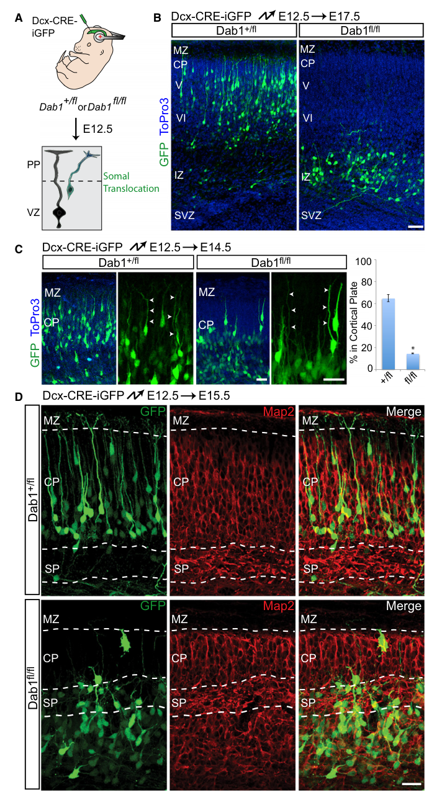

## Question

# Mechanistic Hypothesis Search

You are evaluating a specific disease mechanism hypothesis for the Disorder
Mechanisms Knowledge Base. This is not a general disease overview. Use the
hypothesis YAML below as the seed claim, then search for evidence that supports,
refutes, qualifies, or competes with this hypothesis.

## Target Disease
- **Disease Name:** Reelin Terminal Translocation and Cortical Lamination Failure Module
- **Category:** Module

## Target Hypothesis
- **Hypothesis ID:** reelin_terminal_translocation_model
- **Hypothesis Label:** Reelin Terminal Translocation and Lamination Model
- **Status in KB:** CANONICAL

## Seed Hypothesis YAML

```yaml
hypothesis_group_id: reelin_terminal_translocation_model
hypothesis_label: Reelin Terminal Translocation and Lamination Model
status: CANONICAL
description: Reelin secreted by Cajal-Retzius cells in the marginal zone binds VLDLR and ApoER2/LRP8 on
  migrating neurons, activating DAB1 and downstream adhesion and cytoskeletal effectors. Failure of this
  signal impairs glia-independent somal translocation and leading-process stabilization, so late and early
  cortical neurons fail to settle in the proper inside-out order. The same pathway also organizes hippocampal
  and cerebellar development, explaining the recurring association of cortical lamination defects with
  hippocampal and cerebellar hypoplasia or disorganization.
evidence:
- reference: PMID:27445693
  supports: SUPPORT
  evidence_source: OTHER
  snippet: Reelin is a large secreted glycoprotein that is essential for correct neuronal positioning
    during neurodevelopment and is important for synaptic plasticity in the mature brain.
  explanation: Review evidence summarizes Reelin as an essential secreted cue for neuronal positioning.
- reference: PMID:27445693
  supports: SUPPORT
  evidence_source: OTHER
  snippet: In the brain, many of Reelin's functions are mediated by a molecular signaling cascade that
    involves two lipoprotein receptors, apolipoprotein E receptor-2 (Apoer2) and very low density-lipoprotein
    receptor (Vldlr), the neuronal phosphoprotein Disabled-1 (Dab1), and members of the Src family of
    protein tyrosine kinases as crucial elements.
  explanation: Defines the core receptor-adaptor cascade used as this module's central skeleton.
- reference: PMID:21315259
  supports: SUPPORT
  evidence_source: MODEL_ORGANISM
  snippet: Thus, we define the cellular mechanism of reelin function during radial migration, elucidate
    the molecular pathway downstream of Dab1 during somal translocation, and establish the importance
    of glia-independent motility in neocortical development.
  explanation: Primary mouse and slice-culture experiments connect Reelin/Dab1 signaling to somal translocation
    and neocortical development.
```

## Research Objective

Build a focused hypothesis-search report that answers:

1. What is the strongest direct evidence for this hypothesis?
2. What evidence argues against it, fails to reproduce it, or limits its scope?
3. Which claims are established, emerging, speculative, or contradicted?
4. Which patient subtypes, stages, tissues, cell types, molecular pathways, or
   biomarkers does the hypothesis best explain?
5. Which alternative or competing mechanistic hypotheses explain the same disease
   features better or more parsimoniously?
6. What are the explicit knowledge gaps: missing causal steps, unconfirmed edges,
   contradictory evidence, unknown source-to-target links, or source/data absences?
7. What experiments, cohorts, assays, datasets, or trials would most directly
   distinguish this hypothesis from alternatives?

Use primary literature whenever possible. Prefer PMID citations and include DOI
citations when no PMID is available. Treat reviews as orientation unless they
contain directly relevant synthesized evidence that should be clearly labeled as
review-level support.

## Required Output

### Executive Judgment

Give a concise verdict on the hypothesis as of the current literature:
supported, partially supported, unresolved, weakly supported, or refuted. Explain
the reasoning and the most important caveats.

### Evidence Matrix

Create a table with one row per important evidence item:

- Citation (PMID preferred)
- Evidence type (human clinical, model organism, in vitro, computational, review)
- Supports / refutes / qualifies / competing
- Mechanistic claim tested
- Key finding
- Disease subtype or context
- Confidence and limitations

### Mechanistic Causal Chain

Describe the causal chain implied by the hypothesis from upstream trigger to
clinical manifestation. Identify where the literature is strong, where the links
are inferred, and where there are missing causal steps.

### Knowledge Gaps

Identify explicit known unknowns surfaced by the search. Treat absence of
evidence as a curation-relevant finding only when the search actually checked for
it. Include:

- Unknown or weakly supported causal steps in the hypothesis
- Unconfirmed causal graph edges that need direct perturbation or longitudinal
  evidence
- Conflicting evidence, failed replications, or incompatible subtype-specific
  findings
- Unknown mechanism of action for relevant treatments, biomarkers, or
  interventions tied to this hypothesis
- Source-level or dataset-level absences, such as no relevant GenCC, ClinGen,
  trial, omics, or cohort evidence found as of the search date

For each gap, state the scope, why it matters, what was checked, and what
evidence or experiment would resolve it.

### Alternative Models

List competing or complementary hypotheses. For each, explain whether it is an
alternative to the seed hypothesis, a downstream consequence, an upstream cause,
or a parallel mechanism.

### Discriminating Tests

Recommend concrete studies or assays that would most efficiently test this
hypothesis against alternatives. Include patient stratification, biomarkers,
sample type, model system, perturbation, and expected result where applicable.

### Curation Leads

Provide candidate updates for the KB, but label these as leads requiring curator
verification. Include:

- candidate evidence references and exact abstract snippets to verify
- candidate pathophysiology nodes or edges
- candidate ontology terms for cell types and biological processes
- candidate subtype restrictions or status changes
- candidate `knowledge_gaps` or discussion prompts for unresolved causal claims,
  conflicting evidence, or explicit source/data absences

If the provider supports artifacts, produce artifact-friendly outputs such as an
evidence matrix, mechanistic diagram, knowledge-gap table, or comparison table.
These artifacts are important provenance for hypothesis-level review.


## Output

Question: You are an expert researcher providing comprehensive, well-cited information.

Provide detailed information focusing on:
1. Key concepts and definitions with current understanding
2. Recent developments and latest research (prioritize 2023-2024 sources)
3. Current applications and real-world implementations
4. Expert opinions and analysis from authoritative sources
5. Relevant statistics and data from recent studies

Format as a comprehensive research report with proper citations. Include URLs and publication dates where available.
Always prioritize recent, authoritative sources and provide specific citations for all major claims.

# Mechanistic Hypothesis Search

You are evaluating a specific disease mechanism hypothesis for the Disorder
Mechanisms Knowledge Base. This is not a general disease overview. Use the
hypothesis YAML below as the seed claim, then search for evidence that supports,
refutes, qualifies, or competes with this hypothesis.

## Target Disease
- **Disease Name:** Reelin Terminal Translocation and Cortical Lamination Failure Module
- **Category:** Module

## Target Hypothesis
- **Hypothesis ID:** reelin_terminal_translocation_model
- **Hypothesis Label:** Reelin Terminal Translocation and Lamination Model
- **Status in KB:** CANONICAL

## Seed Hypothesis YAML

```yaml
hypothesis_group_id: reelin_terminal_translocation_model
hypothesis_label: Reelin Terminal Translocation and Lamination Model
status: CANONICAL
description: Reelin secreted by Cajal-Retzius cells in the marginal zone binds VLDLR and ApoER2/LRP8 on
  migrating neurons, activating DAB1 and downstream adhesion and cytoskeletal effectors. Failure of this
  signal impairs glia-independent somal translocation and leading-process stabilization, so late and early
  cortical neurons fail to settle in the proper inside-out order. The same pathway also organizes hippocampal
  and cerebellar development, explaining the recurring association of cortical lamination defects with
  hippocampal and cerebellar hypoplasia or disorganization.
evidence:
- reference: PMID:27445693
  supports: SUPPORT
  evidence_source: OTHER
  snippet: Reelin is a large secreted glycoprotein that is essential for correct neuronal positioning
    during neurodevelopment and is important for synaptic plasticity in the mature brain.
  explanation: Review evidence summarizes Reelin as an essential secreted cue for neuronal positioning.
- reference: PMID:27445693
  supports: SUPPORT
  evidence_source: OTHER
  snippet: In the brain, many of Reelin's functions are mediated by a molecular signaling cascade that
    involves two lipoprotein receptors, apolipoprotein E receptor-2 (Apoer2) and very low density-lipoprotein
    receptor (Vldlr), the neuronal phosphoprotein Disabled-1 (Dab1), and members of the Src family of
    protein tyrosine kinases as crucial elements.
  explanation: Defines the core receptor-adaptor cascade used as this module's central skeleton.
- reference: PMID:21315259
  supports: SUPPORT
  evidence_source: MODEL_ORGANISM
  snippet: Thus, we define the cellular mechanism of reelin function during radial migration, elucidate
    the molecular pathway downstream of Dab1 during somal translocation, and establish the importance
    of glia-independent motility in neocortical development.
  explanation: Primary mouse and slice-culture experiments connect Reelin/Dab1 signaling to somal translocation
    and neocortical development.
```

## Research Objective

Build a focused hypothesis-search report that answers:

1. What is the strongest direct evidence for this hypothesis?
2. What evidence argues against it, fails to reproduce it, or limits its scope?
3. Which claims are established, emerging, speculative, or contradicted?
4. Which patient subtypes, stages, tissues, cell types, molecular pathways, or
   biomarkers does the hypothesis best explain?
5. Which alternative or competing mechanistic hypotheses explain the same disease
   features better or more parsimoniously?
6. What are the explicit knowledge gaps: missing causal steps, unconfirmed edges,
   contradictory evidence, unknown source-to-target links, or source/data absences?
7. What experiments, cohorts, assays, datasets, or trials would most directly
   distinguish this hypothesis from alternatives?

Use primary literature whenever possible. Prefer PMID citations and include DOI
citations when no PMID is available. Treat reviews as orientation unless they
contain directly relevant synthesized evidence that should be clearly labeled as
review-level support.

## Required Output

### Executive Judgment

Give a concise verdict on the hypothesis as of the current literature:
supported, partially supported, unresolved, weakly supported, or refuted. Explain
the reasoning and the most important caveats.

### Evidence Matrix

Create a table with one row per important evidence item:

- Citation (PMID preferred)
- Evidence type (human clinical, model organism, in vitro, computational, review)
- Supports / refutes / qualifies / competing
- Mechanistic claim tested
- Key finding
- Disease subtype or context
- Confidence and limitations

### Mechanistic Causal Chain

Describe the causal chain implied by the hypothesis from upstream trigger to
clinical manifestation. Identify where the literature is strong, where the links
are inferred, and where there are missing causal steps.

### Knowledge Gaps

Identify explicit known unknowns surfaced by the search. Treat absence of
evidence as a curation-relevant finding only when the search actually checked for
it. Include:

- Unknown or weakly supported causal steps in the hypothesis
- Unconfirmed causal graph edges that need direct perturbation or longitudinal
  evidence
- Conflicting evidence, failed replications, or incompatible subtype-specific
  findings
- Unknown mechanism of action for relevant treatments, biomarkers, or
  interventions tied to this hypothesis
- Source-level or dataset-level absences, such as no relevant GenCC, ClinGen,
  trial, omics, or cohort evidence found as of the search date

For each gap, state the scope, why it matters, what was checked, and what
evidence or experiment would resolve it.

### Alternative Models

List competing or complementary hypotheses. For each, explain whether it is an
alternative to the seed hypothesis, a downstream consequence, an upstream cause,
or a parallel mechanism.

### Discriminating Tests

Recommend concrete studies or assays that would most efficiently test this
hypothesis against alternatives. Include patient stratification, biomarkers,
sample type, model system, perturbation, and expected result where applicable.

### Curation Leads

Provide candidate updates for the KB, but label these as leads requiring curator
verification. Include:

- candidate evidence references and exact abstract snippets to verify
- candidate pathophysiology nodes or edges
- candidate ontology terms for cell types and biological processes
- candidate subtype restrictions or status changes
- candidate `knowledge_gaps` or discussion prompts for unresolved causal claims,
  conflicting evidence, or explicit source/data absences

If the provider supports artifacts, produce artifact-friendly outputs such as an
evidence matrix, mechanistic diagram, knowledge-gap table, or comparison table.
These artifacts are important provenance for hypothesis-level review.


## Hypothesis-Search Research Report
### Module: Reelin Terminal Translocation and Cortical Lamination Failure
**Hypothesis ID:** `reelin_terminal_translocation_model`

### Executive Judgment (as of 2026-06-10)
**Verdict: partially supported.** The core causal skeleton—**Reelin secreted by Cajal–Retzius cells binds VLDLR and ApoER2/LRP8 on migrating neurons, activates Src/Fyn-dependent DAB1 phosphorylation, and controls late-stage radial migration/positioning**—is strongly supported by mouse genetics and is consistent with human Mendelian disorders involving **VLDLR** and **DAB1**. The strongest direct support for *terminal/somal translocation* comes from cell-autonomous Dab1 loss in late-born cortical neurons that specifically blocks glia-independent somal translocation and disrupts inside-out lamination (Franco 2011) (franco2011reelinregulatescadherin pages 1-2, franco2011reelinregulatescadherin media 5126f54b).

However, multiple recent lines of evidence qualify “failure of this signal” as a unitary mechanism:
1) **Receptor-specific division of labor**: VLDLR appears particularly important for “stop”/terminal positioning near the marginal zone, while ApoER2 contributes differently across phases/regions (Ha 2017) (ha2017cterminalregiontruncation pages 6-8, ha2017cterminalregiontruncation pages 8-9).
2) **Dose- and region-dependence**: Dab1 haploinsufficiency can spare gross neocortical radial migration yet alter layer 1 integrity and dendrite targeting, while still disrupting migration of specific hippocampal subpopulations (Honda 2023) (honda2023heterozygousdab1null pages 13-14, honda2023heterozygousdab1null pages 18-20).
3) **Human RELN missense variants can be dominant-negative or gain-of-function** with malformations (pachygyria or polymicrogyria) often **without cerebellar hypoplasia**, implying mechanism heterogeneity beyond simple loss of canonical signaling (Riva 2024) (riva2024denovomonoallelic pages 7-10, riva2024denovomonoallelic pages 2-3).

Overall, the hypothesis remains a strong *canonical* model for a subset of cortical lamination failure mechanisms, but it should be represented as **phase-, receptor-, region-, and allele-class–dependent** rather than uniformly “Reelin pathway failure → lamination failure.”

---

### Key Concepts and Definitions (current understanding)
1. **Inside-out cortical lamination:** later-born excitatory neurons migrate past earlier-born neurons to populate superficial layers; this requires sequential migration modes.
2. **Glia-independent somal/terminal translocation:** a late migration mode near the cortical surface where the soma moves rapidly along the leading process without continuous radial glia locomotion; Reelin/Dab1 signaling is a key regulator of this step in neocortex (Franco 2011) (franco2011reelinregulatescadherin pages 1-2).
3. **Canonical Reelin signaling:** Reelin binding to **VLDLR and ApoER2/LRP8** promotes receptor multimerization and **Src/Fyn-mediated Dab1 tyrosine phosphorylation**, triggering downstream pathways (Rap1/N-cadherin; PI3K/Akt; Crk/CrkL/C3G) and negative-feedback termination via Dab1 degradation (review-level synthesis) (Jossin 2020) (jossin2020reelinfunctionsmechanisms pages 11-12).

---

### Evidence Matrix (primary items)
| Citation | Evidence type | Supports/refutes/qualifies/competing | Mechanistic claim tested | Key findings | Context | Confidence & limitations |
| :--- | :--- | :--- | :--- | :--- | :--- | :--- |
| Franco et al., 2011. *Neuron*. 10.1016/j.neuron.2011.01.003 (franco2011reelinregulatescadherin pages 11-12, franco2011reelinregulatescadherin pages 1-2) | Model Organism / In vitro | Supports | Dab1 activates Rap1 and N-cadherin to control glia-independent somal translocation | Dab1 is cell-autonomously required for somal translocation in late-born neurons; Dab1 mutants fail to enter the cortical plate and lose leading process polarity. Cdh2 overexpression rescues Rap1GAP-induced translocation failure. | Mouse neocortex (E12.5-E17.5), projection neurons | High confidence for cortical translocation mechanism; does not address hippocampal or cerebellar phenotypes. |
| Ha et al., 2017. *J Neurosci*. 10.1523/jneurosci.1826-16.2016 (ha2017cterminalregiontruncation pages 6-8, ha2017cterminalregiontruncation pages 1-2, ha2017cterminalregiontruncation pages 4-4) | Model Organism / In vitro | Qualifies | Reelin C-terminal region (CTR) provides specific binding for VLDLR, driving terminal stop signal | RelnCTRdel mutant severely reduces VLDLR binding while sparing APOER2. Mutants exhibit deep-layer cortical overmigration into marginal zone and dentate gyrus (IPB) defect without reeler-like cerebellar hypoplasia. Double RelnCTRdel/Apoer2null mutants phenocopy reeler. | Mouse cortex and hippocampus, HEK293T cells | High confidence for receptor-specific roles; indicates VLDLR specifically mediates the terminal translocation "stop" signal while ApoER2 mediates other functions. |
| Honda et al., 2023. *eNeuro*. 10.1523/eneuro.0433-22.2023 (honda2023heterozygousdab1null pages 14-15, honda2023heterozygousdab1null pages 13-14, honda2023heterozygousdab1null pages 18-20) | Model Organism | Qualifies | Dab1 dosage differentially affects radial migration versus apical dendritogenesis and specific subpopulation migration | Heterozygous Dab1 (+/-) mice have largely normal neocortical radial migration but exhibit significantly thinner layer 1 and misplaced apical dendrites. Caudal CA1 pyramidal layer is split due to migration failure of late-born (E16.5) neurons. | Mouse neocortex and caudal hippocampus (E16.5-P9) | Demonstrates haploinsufficiency and region/stage-specific sensitivity to Dab1 levels, qualifying the binary "loss-of-function" assumption. |
| Riva et al., 2024. *JCI*. 10.1172/jci153097 (riva2024denovomonoallelic pages 1-2, riva2024denovomonoallelic pages 7-10, riva2024denovomonoallelic pages 3-4) | Human Clinical / Model Organism | Qualifies | RELN missense variants cause dominant neuronal migration disorders via distinct mechanisms | Pachygyria-associated variants (e.g., I650S/D556V, C539R) act as dominant-negatives, severely reducing WT RELN secretion (~80% decrease). Polymicrogyria variants (e.g., Y1821H) act as gain-of-function (increased aggregation). Patients lacked cerebellar hypoplasia. | Human patients, mouse embryonic cortex, cell lines | Highlights non-recessive disease mechanisms and implies mutant RELN alters migration independent of canonical VLDLR/ApoER2 loss. |
| Boycott et al., 2005. *AJHG*. 10.1086/444400 (boycott2005homozygousdeletionof pages 1-2) | Human Clinical | Supports | VLDLR loss disrupts cerebellar and cortical lamination | A 199-kb homozygous deletion of VLDLR causes dysequilibrium syndrome with nonprogressive cerebellar hypoplasia (inferior vermis absent/hypoplastic) and mild cortical gyral simplification. | Human (Hutterite population) | Direct genetic evidence of VLDLR role in human brain development; cortical defect is characterized as gyral simplification rather than classic lissencephaly. |
| Ozcelik et al., 2008. *PNAS*. 10.1073/pnas.0710010105 (ozcelik2008mutationsinthe pages 3-4, ozcelik2008mutationsinthe pages 1-3) | Human Clinical | Supports | VLDLR mutations cause cerebrocerebellar malformations | Homozygous R257X and c2339delT mutations cause inferior cerebellar hypoplasia, pontine hypoplasia, and moderate simplification of cerebral gyri, accompanied by quadrupedal locomotion and mental retardation. | Human (Turkish consanguineous kindreds) | Strongly links VLDLR to severe human malformations affecting both cortex and cerebellum, supporting the Reelin receptor requirement. |
| Boycott et al., 2009. *J Child Neurol*. 10.1177/0883073809332696 (boycott2009mutationsinvldlr pages 4-5, boycott2009mutationsinvldlr pages 2-4) | Human Clinical | Supports | Reelin receptor VLDLR is essential for neuroblast positioning | Compound heterozygous VLDLR mutations (p.D521H / p.Y571LfsX7) cause simplified cortical sulcation (uniformly thickened cortex without AP gradient) and inferior cerebellar hypoplasia. | Human patients | Phenotypic consistency across diverse mutations confirms VLDLR's essential role in human cortical and cerebellar structural development. |
| Smits et al., 2021. *Neurol Genet*. 10.1212/nxg.0000000000000558 (smits2021biallelicdab1variants pages 4-5, smits2021biallelicdab1variants pages 2-4, smits2021biallelicdab1variants pages 1-2) | Human Clinical / In vitro | Supports | DAB1 loss-of-function phenocopies RELN mutations in humans | Biallelic DAB1 splice variants (c.67+1G>T, c.307-2A>T) altering the PTB domain cause RELN-like mild diffuse pachygyria, cerebellar vermis hypoplasia, intellectual disability, and epilepsy. Fibroblasts confirmed loss of normal transcripts. | Human patient, patient-derived fibroblasts | First human evidence that DAB1 deficiency causes lissencephaly with cerebellar hypoplasia, directly confirming the canonical pathway in human patients. |
| Jossin, 2020. *Biomolecules*. 10.3390/biom10060964 (jossin2020reelinfunctionsmechanisms pages 8-11, jossin2020reelinfunctionsmechanisms pages 11-12) | Review | Orientation / Supports | Canonical Reelin signaling cascade mechanism | Reelin binds VLDLR/ApoER2, inducing Dab1 phosphorylation by Src/Fyn kinases. This signaling cascade requires both receptors for complete canonical function (double knockout phenocopies reeler). | Mammalian brain development | Synthesizes molecular consensus; highlights that while single knockouts show specific defects, VLDLR and ApoER2 exhibit substantial functional redundancy. |


*Table: A structured summary of primary experimental and clinical evidence evaluating the Reelin Terminal Translocation and Cortical Lamination Model, including specific citations, mechanistic claims, key findings, and context.*

**Visual provenance (primary study):** Cropped figure panels supporting Dab1-dependent somal translocation and Rap1/N-cadherin mechanism are available from Franco et al. 2011 (franco2011reelinregulatescadherin media 5126f54b, franco2011reelinregulatescadherin media b721c753).

---

### Strongest Direct Evidence *for* the Seed Hypothesis
#### 1) Cell-autonomous Dab1 requirement for glia-independent somal translocation and lamination
- **Experiment:** Conditional and sparse perturbation of Dab1 in late-born cortical neurons (mouse) with migration and morphology readouts.
- **Finding:** Dab1 is dispensable for earlier phases (e.g., multipolar migration/locomotion) but **required cell-autonomously for glia-independent somal translocation**. Dab1-deficient neurons fail to properly enter/sort within the cortical plate and exhibit abnormal leading process stability/polarity (Franco 2011) (franco2011reelinregulatescadherin pages 1-2, franco2011reelinregulatescadherin media 5126f54b).
- **Mechanism:** Reelin→Dab1 signaling engages **Rap1**, which maintains **N-cadherin/Cdh2**; **Cdh2 overexpression rescues** migration failure caused by Rap1 inactivation, supporting a causal chain from Reelin/Dab1 to adhesion-mediated translocation (Franco 2011) (franco2011reelinregulatescadherin pages 11-12, franco2011reelinregulatescadherin media 5126f54b).

#### 2) Reelin C-terminal region (CTR) links receptor specificity to “stop/terminal positioning” phenotypes
- **Experiment:** Hypomorphic **RelnCTRdel** mouse and receptor-binding assays plus genetic epistasis.
- **Finding:** CTR truncation **selectively reduces RELN binding to VLDLR** but not ApoER2, and produces a phenotype resembling Vldlr deficiency with **overmigration into the marginal zone** and hippocampal dentate defects; combining RelnCTRdel with Apoer2 null yields a reeler-like phenotype, supporting receptor-pathway partitioning (Ha 2017) (ha2017cterminalregiontruncation pages 9-11, ha2017cterminalregiontruncation pages 8-9).

#### 3) Human Mendelian disorders strongly implicate the same receptor–adaptor axis
- **VLDLR:** A 199-kb homozygous deletion removing VLDLR (Hutterite patients) causes **inferior vermian/cerebellar hypoplasia and cortical gyral simplification**, interpreted as disrupted Reelin-receptor guidance (Boycott 2005; published 2005-09-??) URL https://doi.org/10.1086/444400 (boycott2005homozygousdeletionof pages 1-2). Other families show similar neuroimaging phenotypes (Ozcelik 2008; Boycott 2009) (ozcelik2008mutationsinthe pages 1-3, boycott2009mutationsinvldlr pages 2-4).
- **DAB1:** A patient with **biallelic DAB1 splice variants** affecting the PTB domain (which binds the receptors) has **RELN-like mild pachygyria and cerebellar vermis hypoplasia**, with patient-cell RT-PCR evidence for abnormal transcripts (Smits 2021-04; URL https://doi.org/10.1212/nxg.0000000000000558) (smits2021biallelicdab1variants pages 2-4, smits2021biallelicdab1variants pages 1-2).

Together these link the canonical Reelin receptor–Dab1 machinery to combined cortical + cerebellar phenotypes consistent with the seed model’s cross-structure claim.

---

### Evidence *against*, limitations, and scope qualifiers
1) **Dab1 dosage is not a simple on/off switch.** Dab1 heterozygotes can show **no gross neocortical radial migration defect**, yet display thinner layer 1 and abnormal apical dendrite targeting; in contrast, **caudal CA1** shows splitting due to late-born neuron migration failure (Honda 2023-03; URL https://doi.org/10.1523/eneuro.0433-22.2023) (honda2023heterozygousdab1null pages 13-14, honda2023heterozygousdab1null pages 18-20). This limits generalization of “Reelin failure → migration failure” across regions and processes.
2) **Reelin pathway mutations can produce overmigration phenotypes** rather than classic inside-out inversion. RelnCTRdel (VLDLR-binding-defective) causes **marginal-zone invasion** without full inversion and lacks cerebellar hypoplasia, indicating partial pathway function and receptor-specific phenotypic spectrum (Ha 2017) (ha2017cterminalregiontruncation pages 1-2, ha2017cterminalregiontruncation pages 4-4).
3) **Human heterozygous RELN missense variants can be dominant-negative or gain-of-function.** Riva et al. identify heterozygous variants causing dominant neuronal migration disorders via impaired secretion (dominant-negative) or increased aggregation (gain-of-function), often **without cerebellar hypoplasia** (JCI 2024-07; URL https://doi.org/10.1172/jci153097) (riva2024denovomonoallelic pages 7-10, riva2024denovomonoallelic pages 2-3). This competes with a “simple LoF of canonical signaling” framing.
4) **Downstream effectors are plural and context-specific.** Review-level synthesis indicates multiple downstream modules (Rap1/N-cadherin; integrin α5β1 adhesion; PI3K/Akt/n-cofilin; Crk/CrkL/C3G) and notes heterogeneity across studies regarding certain branches (e.g., Erk1/2, PI3K/Akt requirements) (Jossin 2020) (jossin2020reelinfunctionsmechanisms pages 11-12).

---

### Mechanistic Causal Chain (seed model mapped to evidence strength)
1) **Upstream source:** Cajal–Retzius cells in marginal zone secrete Reelin (background consensus) (franco2011reelinregulatescadherin pages 1-2).
2) **Receptor binding:** Reelin binds **VLDLR and ApoER2** on migrating neurons; CTR contributes to receptor-binding specificity (strong: Ha 2017 binding assay) (ha2017cterminalregiontruncation pages 9-11).
3) **Signal transduction:** receptor engagement → Src/Fyn → **Dab1 tyrosine phosphorylation** (strongly established, though primarily consolidated in synthesis sources here) (jossin2020reelinfunctionsmechanisms pages 11-12).
4) **Effector activation:** Dab1 engages downstream adaptors to regulate adhesion/cytoskeleton; a particularly direct chain is **Dab1 → Rap1 → N-cadherin**, controlling leading process stability and glia-independent somal translocation (strong: perturbation + rescue in Franco 2011) (franco2011reelinregulatescadherin pages 11-12, franco2011reelinregulatescadherin media 5126f54b).
5) **Cellular outcome:** appropriate terminal positioning (“stop” near MZ), laminar sorting, and inside-out cortical layering (strong in mouse genetics; qualified by overmigration phenotypes and receptor-specific effects) (franco2011reelinregulatescadherin pages 1-2, ha2017cterminalregiontruncation pages 8-9).
6) **Anatomical/clinical manifestation:** cortical lamination/gyrification abnormalities, hippocampal lamination defects, and cerebellar hypoplasia/disorganization; supported by human VLDLR and DAB1 disorders (boycott2005homozygousdeletionof pages 1-2, smits2021biallelicdab1variants pages 2-4).

**Where the chain is inferred vs direct:** steps 2 and 4 have direct primary evidence in the retrieved corpus (Ha 2017; Franco 2011). Steps 3 and some branch choices are strongly accepted but, within this search, are most explicitly documented in review/synthesis excerpts (Jossin 2020) rather than newly extracted primary biochemical datasets.

---

### Knowledge Gaps (explicit) and Discriminating Tests
| Gap/uncertainty | Why it matters | What evidence in current sources addresses it | What was checked in this search | Proposed discriminating experiment/dataset (model system, perturbation, readouts) | Expected outcomes under seed model vs alternatives |
| :--- | :--- | :--- | :--- | :--- | :--- |
| **Receptor Specificity vs. Redundancy** (VLDLR vs ApoER2 in terminal stop vs multipolar switch) | The seed model groups VLDLR and ApoER2 together, but phenotypic data suggests they control distinct migratory phases. | VLDLR specifically mediates the terminal translocation "stop" signal while ApoER2 is less critical for this step (ha2017cterminalregiontruncation pages 6-8, ha2017cterminalregiontruncation pages 1-2); single KOs show distinct defects (jossin2020reelinfunctionsmechanisms pages 11-12). | Examined single vs double knockout phenotypes and the differential receptor binding of the Reelin C-terminal truncation mutant (RelnCTRdel). | Temporally controlled, cell-type specific single-receptor rescue in VLDLR/ApoER2 double knockout mouse cortex, reading out leading process stabilization and somal translocation via live imaging. | **Seed model:** Either receptor rescues somal translocation. **Alternative:** Only VLDLR rescue restores terminal somal translocation, while ApoER2 restores earlier multipolar exit. |
| **Dab1 and RELN Haploinsufficiency** / Differential Dosage Sensitivity | The core hypothesis implies a binary switch for layer formation, but human and mouse data show continuous dosage sensitivity for distinct cellular processes (migration vs dendritogenesis). | Heterozygous Dab1 (+/-) mice have normal overall radial migration but specific layer 1 thinning and ectopic apical dendrites (honda2023heterozygousdab1null pages 13-14, honda2023heterozygousdab1null pages 18-20). Human RELN missense variants show dosage-dependent severity (riva2024denovomonoallelic pages 12-13). | Extracted data on heterozygous phenotypes, dendrite vs somal positioning, and dosage effects. | Quantitative titration of Reelin or Dab1 (e.g., using CRISPRi/a) in human cortical organoids, measuring radial migration velocity vs. apical dendrite length and branching. | **Seed model:** Migration and dendritogenesis fail simultaneously at a threshold. **Alternative:** Migration requires low Dab1 levels, while apical dendrite maintenance/layer 1 integrity requires high Dab1 levels. |
| **Gain-of-Function (Aggregation) vs Canonical Loss-of-Function** in human cortical malformations | The seed model assumes malformations arise from loss of Reelin signaling (failure to translocate), but some human mutations cause hyper-aggregation. | Polymicrogyria-associated RELN variants (e.g., Y1821H) cause gain-of-function excessive neuronal aggregation, unlike pachygyria-associated variants that fail to secrete/translocate (riva2024denovomonoallelic pages 1-2, riva2024denovomonoallelic pages 7-10). | Assessed functional aggregation assays and in utero electroporation outcomes of de novo human RELN variants. | Measure core receptor engagement and Dab1 phosphorylation kinetics using purified gain-of-function human variant Reelin on wild-type neurons in vitro. | **Seed model:** Pathogenic variants purely reduce canonical signaling. **Alternative:** GF variants hyperactivate or prolong canonical signaling, or mislocalize adhesion molecules like N-cadherin. |
| **Sufficiency of the Rap1/N-cadherin sub-pathway** vs parallel non-canonical effectors | Is the lamination defect purely Rap1/Cdh2 driven, or are parallel pathways (integrins, Erk1/2) strictly required for terminal translocation? | Dab1 activates Rap1 and N-cadherin to control glia-independent somal translocation, and N-cadherin rescues Rap1 loss (franco2011reelinregulatescadherin pages 11-12, franco2011reelinregulatescadherin media 5126f54b). Non-canonical pathways are also implicated in lamination (riva2024denovomonoallelic pages 14-15). | Looked for downstream effector rescue experiments and evidence of parallel pathway requirements. | Rescue Dab1-null cortex with constitutively active Rap1/Cdh2 versus multi-pathway (e.g., Rap1 + Integrin α5β1) activation, assessing inside-out layer formation. | **Seed model:** Rap1/Cdh2 activation is sufficient to restore terminal translocation in Dab1 absence. **Alternative:** Partial rescue occurs, requiring simultaneous activation of parallel cytoskeletal or integrin pathways for full lamination. |
| **Mechanism of Hippocampal CA1 vs Dentate Gyrus Lamination** | The seed model generalizes cortical mechanisms to the hippocampus, but evidence shows region-specific cellular responses to Reelin/Dab1 loss. | Caudal CA1 splitting is due to late-born neuron migration failure (honda2023heterozygousdab1null pages 14-15, honda2023heterozygousdab1null pages 18-20); dentate gyrus requires specific Reelin CTR/VLDLR interactions (ha2017cterminalregiontruncation pages 9-11, ha2017cterminalregiontruncation pages 4-4). | Extracted specific hippocampal phenotypes in RelnCTRdel and Dab1 heterozygous mice. | Lineage tracing and time-lapse imaging of CA1 vs Dentate Gyrus progenitors in RelnCTRdel mice vs wild-type. | **Seed model:** CA1 and DG both fail due to identical somal translocation arrest. **Alternative:** CA1 fails via radial migration arrest, whereas DG fails via altered proliferation or scaffold interaction independent of somal translocation. |


*Table: A table outlining explicit knowledge gaps in the Reelin terminal translocation model, alongside the evidence checked and proposed experiments to test competing hypotheses.*

---

### Alternative / Competing Mechanistic Models (within retrieved sources)
1) **VLDLR-mediated stop/terminal positioning vs ApoER2-mediated earlier polarization:** A receptor-partitioned model where VLDLR is more critical for terminal stop and ApoER2 for earlier multipolar/bipolar transitions (complementary to seed model; increases specificity) (ha2017cterminalregiontruncation pages 8-9, jossin2020reelinfunctionsmechanisms pages 11-12).
2) **Adhesion-centric “detach-and-go” model:** terminal phases depend on Reelin-regulated adhesion dynamics (integrin α5β1, fibronectin; N-cadherin) rather than a single effector branch (parallel mechanism; may be more parsimonious for certain phenotypes) (jossin2020reelinfunctionsmechanisms pages 8-11).
3) **Noncanonical Reelin mechanisms and allele-class effects:** human RELN missense variants can cause pathology through secretion interference (dominant-negative) or increased adhesion/aggregation (gain-of-function), potentially shifting focus from “absence of signal” to “mislocalized/misdirected signal” (competing upstream cause classes) (riva2024denovomonoallelic pages 7-10, riva2024denovomonoallelic pages 13-14).

*Note:* Broader non-Reelin migration mechanisms (e.g., LIS1/DCX microtubule defects) were not directly evidenced in the retrieved corpus and are therefore not asserted here.

---

### Current Applications and Real-World Implementations
1) **Neurogenetic diagnosis:** The VLDLR and DAB1 findings support inclusion of **Reelin pathway genes** in diagnostic panels for malformations of cortical development and cerebellar hypoplasia syndromes (Smits 2021) (smits2021biallelicdab1variants pages 1-2).
2) **Variant interpretation workflows:** Riva et al. demonstrate combining **secretion assays, in vivo electroporation-based aggregation/migration assays, and serum RELN measurements** to interpret heterozygous RELN missense variants and refine ACMG classification (Riva 2024) (riva2024denovomonoallelic pages 12-13).

---

### Relevant Recent Developments (prioritizing 2023–2024)
1) **Region-specific Dab1 dosage sensitivity (2023):** Dab1+/– mice show selective vulnerability of **layer 1 and caudal CA1 migration** despite preserved global neocortical migration, emphasizing subregion dependence (Honda 2023) (honda2023heterozygousdab1null pages 18-20).
2) **Dominant RELN missense disease mechanisms (2024):** De novo monoallelic RELN variants can be **dominant-negative** (inhibiting WT secretion) or **gain-of-function** (hyper-aggregation), expanding the mechanistic landscape beyond recessive RELN LoF and suggesting serum RELN as a potential biomarker lead (Riva 2024) (riva2024denovomonoallelic pages 7-10, riva2024denovomonoallelic pages 12-13).

---

### Statistics and Quantitative Data (from extracted evidence)
- **RelnCTRdel reduces serum Reelin to ~58.5% of wild type**, with elevated Dab1 protein and reduced Dab1 tyrosine phosphorylation induction, consistent with impaired signaling and feedback termination (Ha 2017) (ha2017cterminalregiontruncation pages 4-6).
- **Hippocampal CA1 thickness increase ~47.6%** in RelnCTRdel mutants (reported means ~51.90 µm vs 76.63 µm; n=3; p=0.0074) (Ha 2017) (ha2017cterminalregiontruncation pages 4-4).
- **Dominant-negative secretion interference:** several pachygyria-associated RELN variants reduce co-expressed WT RELN secretion by ~80% in cotransfection assays (Riva 2024) (riva2024denovomonoallelic pages 7-10).
- **Boycott 2005 cohort**: 12 affected individuals identified; mapping used DNA from eight; all affected shared a homozygous deletion removing VLDLR (Boycott 2005) (boycott2005homozygousdeletionof pages 1-2).

---

### Curation Leads (requires curator verification)
**Candidate evidence references/snippets to verify:**
1) **Terminal translocation mechanism (mouse cortex):** Franco et al. (Neuron 2011; DOI 10.1016/j.neuron.2011.01.003) show Dab1 is required for glia-independent somal translocation and that the Rap1/Cdh2 axis rescues downstream defects (franco2011reelinregulatescadherin pages 1-2, franco2011reelinregulatescadherin media 5126f54b).
2) **Receptor specificity and stop-signal partition:** Ha et al. (J Neurosci 2017; DOI 10.1523/jneurosci.1826-16.2016) report CTR truncation selectively reduces VLDLR binding and yields marginal-zone invasion and dentate gyrus IPB loss (ha2017cterminalregiontruncation pages 9-11, ha2017cterminalregiontruncation pages 4-4).
3) **Human Mendelian confirmation:** Smits et al. (Neurology Genetics 2021; DOI 10.1212/nxg.0000000000000558) provide biallelic DAB1 transcript evidence and RELN-like MRI phenotype (smits2021biallelicdab1variants pages 2-4, smits2021biallelicdab1variants pages 1-2). Boycott et al. (AJHG 2005; DOI 10.1086/444400) provide VLDLR deletion evidence with cerebellar and cortical abnormalities (boycott2005homozygousdeletionof pages 1-2).
4) **2024 allele-class heterogeneity:** Riva et al. (JCI 2024; DOI 10.1172/jci153097) supports dominant-negative and gain-of-function RELN variant mechanisms, useful for KB edges linking “RELN missense” to “impaired secretion” or “hyper-adhesion/aggregation” and to distinct malformation classes (pachygyria vs polymicrogyria) (riva2024denovomonoallelic pages 7-10, riva2024denovomonoallelic pages 13-14).

**Candidate pathophysiology nodes/edges:**
- RELN (extracellular ligand) → VLDLR (receptor) → DAB1 phosphorylation → Rap1 activation → N-cadherin stabilization → terminal somal translocation/stop at MZ (supported) (franco2011reelinregulatescadherin pages 11-12, ha2017cterminalregiontruncation pages 8-9).
- RELN CTR domain → VLDLR binding specificity → prevention of MZ invasion (supported) (ha2017cterminalregiontruncation pages 9-11, ha2017cterminalregiontruncation pages 4-4).
- DAB1 dosage → layer 1 thickness/apical dendrite targeting (qualifying edge) (honda2023heterozygousdab1null pages 18-20).
- RELN dominant-negative secretion defect → dominant cortical malformation (pachygyria) (emerging; 2024) (riva2024denovomonoallelic pages 7-10).

**Candidate ontology terms (examples):**
- Cell types: Cajal–Retzius cell; cortical projection neuron; hippocampal CA1 pyramidal neuron.
- Processes: neuron migration; somal translocation; cell adhesion; cortical layer formation; dendrite morphogenesis.

**Candidate subtype restrictions/status changes:**
- Consider encoding **receptor- and phase-specific submodules** (ApoER2-biased earlier polarization vs VLDLR-biased terminal stop) rather than a single undifferentiated receptor node, based on receptor-specific phenotypes (ha2017cterminalregiontruncation pages 8-9, ha2017cterminalregiontruncation pages 9-11).

**Candidate knowledge gaps to record:**
- Whether gain-of-function RELN variants act through canonical VLDLR/ApoER2–Dab1 signaling kinetics or through alternative adhesion pathways requires direct biochemical signaling readouts (riva2024denovomonoallelic pages 7-10).

---

### References (URLs and publication dates)
- Franco SJ et al. *Neuron* (2011-02). “Reelin Regulates Cadherin Function via Dab1/Rap1…” https://doi.org/10.1016/j.neuron.2011.01.003 (franco2011reelinregulatescadherin pages 1-2)
- Ha S et al. *J Neurosci* (2017-01). “C-Terminal Region Truncation of RELN…” https://doi.org/10.1523/jneurosci.1826-16.2016 (ha2017cterminalregiontruncation pages 1-2)
- Honda T et al. *eNeuro* (2023-03). “Heterozygous Dab1 Null Mutation…” https://doi.org/10.1523/eneuro.0433-22.2023 (honda2023heterozygousdab1null pages 1-2)
- Riva M et al. *J Clin Invest* (2024-07). “De novo monoallelic Reelin missense variants…” https://doi.org/10.1172/jci153097 (riva2024denovomonoallelic pages 1-2)
- Boycott KM et al. *Am J Hum Genet* (2005-09). “Homozygous deletion of the VLDLR gene…” https://doi.org/10.1086/444400 (boycott2005homozygousdeletionof pages 1-2)
- Ozcelik T et al. *PNAS* (2008-03). “Mutations in VLDLR…” https://doi.org/10.1073/pnas.0710010105 (ozcelik2008mutationsinthe pages 1-3)
- Boycott KM et al. *J Child Neurol* (2009-03). “Mutations in VLDLR…” https://doi.org/10.1177/0883073809332696 (boycott2009mutationsinvldlr pages 1-2)
- Smits DJ et al. *Neurology Genetics* (2021-04). “Biallelic DAB1 variants…” https://doi.org/10.1212/nxg.0000000000000558 (smits2021biallelicdab1variants pages 1-2)
- Jossin Y. *Biomolecules* (2020-06). “Reelin Functions, Mechanisms of Action…” https://doi.org/10.3390/biom10060964 (jossin2020reelinfunctionsmechanisms pages 11-12)


References

1. (franco2011reelinregulatescadherin pages 1-2): Santos J. Franco, Isabel Martinez-Garay, Cristina Gil-Sanz, Sarah R. Harkins-Perry, and Ulrich Müller. Reelin regulates cadherin function via dab1/rap1 to control neuronal migration and lamination in the neocortex. Neuron, 69:482-497, Feb 2011. URL: https://doi.org/10.1016/j.neuron.2011.01.003, doi:10.1016/j.neuron.2011.01.003. This article has 386 citations and is from a highest quality peer-reviewed journal.

2. (franco2011reelinregulatescadherin media 5126f54b): Santos J. Franco, Isabel Martinez-Garay, Cristina Gil-Sanz, Sarah R. Harkins-Perry, and Ulrich Müller. Reelin regulates cadherin function via dab1/rap1 to control neuronal migration and lamination in the neocortex. Neuron, 69:482-497, Feb 2011. URL: https://doi.org/10.1016/j.neuron.2011.01.003, doi:10.1016/j.neuron.2011.01.003. This article has 386 citations and is from a highest quality peer-reviewed journal.

3. (ha2017cterminalregiontruncation pages 6-8): Seungshin Ha, Prem P. Tripathi, Anca B. Mihalas, Robert F. Hevner, and David R. Beier. C-terminal region truncation of reln disrupts an interaction with vldlr, causing abnormal development of the cerebral cortex and hippocampus. The Journal of Neuroscience, 37:960-971, Jan 2017. URL: https://doi.org/10.1523/jneurosci.1826-16.2016, doi:10.1523/jneurosci.1826-16.2016. This article has 29 citations.

4. (ha2017cterminalregiontruncation pages 8-9): Seungshin Ha, Prem P. Tripathi, Anca B. Mihalas, Robert F. Hevner, and David R. Beier. C-terminal region truncation of reln disrupts an interaction with vldlr, causing abnormal development of the cerebral cortex and hippocampus. The Journal of Neuroscience, 37:960-971, Jan 2017. URL: https://doi.org/10.1523/jneurosci.1826-16.2016, doi:10.1523/jneurosci.1826-16.2016. This article has 29 citations.

5. (honda2023heterozygousdab1null pages 13-14): Takao Honda, Yuki Hirota, and Kazunori Nakajima. Heterozygous dab1 null mutation disrupts neocortical and hippocampal development. eNeuro, 10:ENEURO.0433-22.2023, Mar 2023. URL: https://doi.org/10.1523/eneuro.0433-22.2023, doi:10.1523/eneuro.0433-22.2023. This article has 6 citations and is from a peer-reviewed journal.

6. (honda2023heterozygousdab1null pages 18-20): Takao Honda, Yuki Hirota, and Kazunori Nakajima. Heterozygous dab1 null mutation disrupts neocortical and hippocampal development. eNeuro, 10:ENEURO.0433-22.2023, Mar 2023. URL: https://doi.org/10.1523/eneuro.0433-22.2023, doi:10.1523/eneuro.0433-22.2023. This article has 6 citations and is from a peer-reviewed journal.

7. (riva2024denovomonoallelic pages 7-10): Martina Riva, Sofia Ferreira, Kotaro Hayashi, Yoann Saillour, Vera P. Medvedeva, Takao Honda, Kanehiro Hayashi, Claire Altersitz, Shahad Albadri, Marion Rosello, Julie Dang, Malo Serafini, Frédéric Causeret, Olivia J. Henry, Charles-Joris Roux, Céline Bellesme, Elena Freri, Dragana Josifova, Elena Parrini, Renzo Guerrini, Filippo Del Bene, Kazunori Nakajima, Nadia Bahi-Buisson, and Alessandra Pierani. De novo monoallelic reelin missense variants cause dominant neuronal migration disorders via a dominant-negative mechanism. The Journal of Clinical Investigation, Jul 2024. URL: https://doi.org/10.1172/jci153097, doi:10.1172/jci153097. This article has 9 citations.

8. (riva2024denovomonoallelic pages 2-3): Martina Riva, Sofia Ferreira, Kotaro Hayashi, Yoann Saillour, Vera P. Medvedeva, Takao Honda, Kanehiro Hayashi, Claire Altersitz, Shahad Albadri, Marion Rosello, Julie Dang, Malo Serafini, Frédéric Causeret, Olivia J. Henry, Charles-Joris Roux, Céline Bellesme, Elena Freri, Dragana Josifova, Elena Parrini, Renzo Guerrini, Filippo Del Bene, Kazunori Nakajima, Nadia Bahi-Buisson, and Alessandra Pierani. De novo monoallelic reelin missense variants cause dominant neuronal migration disorders via a dominant-negative mechanism. The Journal of Clinical Investigation, Jul 2024. URL: https://doi.org/10.1172/jci153097, doi:10.1172/jci153097. This article has 9 citations.

9. (jossin2020reelinfunctionsmechanisms pages 11-12): Yves Jossin. Reelin functions, mechanisms of action and signaling pathways during brain development and maturation. Biomolecules, 10:964, Jun 2020. URL: https://doi.org/10.3390/biom10060964, doi:10.3390/biom10060964. This article has 250 citations.

10. (franco2011reelinregulatescadherin pages 11-12): Santos J. Franco, Isabel Martinez-Garay, Cristina Gil-Sanz, Sarah R. Harkins-Perry, and Ulrich Müller. Reelin regulates cadherin function via dab1/rap1 to control neuronal migration and lamination in the neocortex. Neuron, 69:482-497, Feb 2011. URL: https://doi.org/10.1016/j.neuron.2011.01.003, doi:10.1016/j.neuron.2011.01.003. This article has 386 citations and is from a highest quality peer-reviewed journal.

11. (ha2017cterminalregiontruncation pages 1-2): Seungshin Ha, Prem P. Tripathi, Anca B. Mihalas, Robert F. Hevner, and David R. Beier. C-terminal region truncation of reln disrupts an interaction with vldlr, causing abnormal development of the cerebral cortex and hippocampus. The Journal of Neuroscience, 37:960-971, Jan 2017. URL: https://doi.org/10.1523/jneurosci.1826-16.2016, doi:10.1523/jneurosci.1826-16.2016. This article has 29 citations.

12. (ha2017cterminalregiontruncation pages 4-4): Seungshin Ha, Prem P. Tripathi, Anca B. Mihalas, Robert F. Hevner, and David R. Beier. C-terminal region truncation of reln disrupts an interaction with vldlr, causing abnormal development of the cerebral cortex and hippocampus. The Journal of Neuroscience, 37:960-971, Jan 2017. URL: https://doi.org/10.1523/jneurosci.1826-16.2016, doi:10.1523/jneurosci.1826-16.2016. This article has 29 citations.

13. (honda2023heterozygousdab1null pages 14-15): Takao Honda, Yuki Hirota, and Kazunori Nakajima. Heterozygous dab1 null mutation disrupts neocortical and hippocampal development. eNeuro, 10:ENEURO.0433-22.2023, Mar 2023. URL: https://doi.org/10.1523/eneuro.0433-22.2023, doi:10.1523/eneuro.0433-22.2023. This article has 6 citations and is from a peer-reviewed journal.

14. (riva2024denovomonoallelic pages 1-2): Martina Riva, Sofia Ferreira, Kotaro Hayashi, Yoann Saillour, Vera P. Medvedeva, Takao Honda, Kanehiro Hayashi, Claire Altersitz, Shahad Albadri, Marion Rosello, Julie Dang, Malo Serafini, Frédéric Causeret, Olivia J. Henry, Charles-Joris Roux, Céline Bellesme, Elena Freri, Dragana Josifova, Elena Parrini, Renzo Guerrini, Filippo Del Bene, Kazunori Nakajima, Nadia Bahi-Buisson, and Alessandra Pierani. De novo monoallelic reelin missense variants cause dominant neuronal migration disorders via a dominant-negative mechanism. The Journal of Clinical Investigation, Jul 2024. URL: https://doi.org/10.1172/jci153097, doi:10.1172/jci153097. This article has 9 citations.

15. (riva2024denovomonoallelic pages 3-4): Martina Riva, Sofia Ferreira, Kotaro Hayashi, Yoann Saillour, Vera P. Medvedeva, Takao Honda, Kanehiro Hayashi, Claire Altersitz, Shahad Albadri, Marion Rosello, Julie Dang, Malo Serafini, Frédéric Causeret, Olivia J. Henry, Charles-Joris Roux, Céline Bellesme, Elena Freri, Dragana Josifova, Elena Parrini, Renzo Guerrini, Filippo Del Bene, Kazunori Nakajima, Nadia Bahi-Buisson, and Alessandra Pierani. De novo monoallelic reelin missense variants cause dominant neuronal migration disorders via a dominant-negative mechanism. The Journal of Clinical Investigation, Jul 2024. URL: https://doi.org/10.1172/jci153097, doi:10.1172/jci153097. This article has 9 citations.

16. (boycott2005homozygousdeletionof pages 1-2): Kym M. Boycott, Shauna Flavelle, Alexandre Bureau, Hannah C. Glass, T. Mary Fujiwara, Elaine Wirrell, Krista Davey, Albert E. Chudley, James N. Scott, D. Ross McLeod, and Jillian S. Parboosingh. Homozygous deletion of the very low density lipoprotein receptor gene causes autosomal recessive cerebellar hypoplasia with cerebral gyral simplification. American journal of human genetics, 77 3:477-83, Sep 2005. URL: https://doi.org/10.1086/444400, doi:10.1086/444400. This article has 256 citations and is from a highest quality peer-reviewed journal.

17. (ozcelik2008mutationsinthe pages 3-4): Tayfun Ozcelik, Nurten Akarsu, Elif Uz, Safak Caglayan, Suleyman Gulsuner, Onur Emre Onat, Meliha Tan, and Uner Tan. Mutations in the very low-density lipoprotein receptor vldlr cause cerebellar hypoplasia and quadrupedal locomotion in humans. Proceedings of the National Academy of Sciences, 105:4232-4236, Mar 2008. URL: https://doi.org/10.1073/pnas.0710010105, doi:10.1073/pnas.0710010105. This article has 132 citations and is from a highest quality peer-reviewed journal.

18. (ozcelik2008mutationsinthe pages 1-3): Tayfun Ozcelik, Nurten Akarsu, Elif Uz, Safak Caglayan, Suleyman Gulsuner, Onur Emre Onat, Meliha Tan, and Uner Tan. Mutations in the very low-density lipoprotein receptor vldlr cause cerebellar hypoplasia and quadrupedal locomotion in humans. Proceedings of the National Academy of Sciences, 105:4232-4236, Mar 2008. URL: https://doi.org/10.1073/pnas.0710010105, doi:10.1073/pnas.0710010105. This article has 132 citations and is from a highest quality peer-reviewed journal.

19. (boycott2009mutationsinvldlr pages 4-5): Kym M. Boycott, Carsten Bonnemann, Joachim Herz, Stephanie Neuert, Chandree Beaulieu, James N. Scott, Anuradha Venkatasubramanian, and Jillian S. Parboosingh. Mutations in vldlr as a cause for autosomal recessive cerebellar ataxia with mental retardation (dysequilibrium syndrome). Journal of Child Neurology, 24:1310-1315, Mar 2009. URL: https://doi.org/10.1177/0883073809332696, doi:10.1177/0883073809332696. This article has 80 citations and is from a peer-reviewed journal.

20. (boycott2009mutationsinvldlr pages 2-4): Kym M. Boycott, Carsten Bonnemann, Joachim Herz, Stephanie Neuert, Chandree Beaulieu, James N. Scott, Anuradha Venkatasubramanian, and Jillian S. Parboosingh. Mutations in vldlr as a cause for autosomal recessive cerebellar ataxia with mental retardation (dysequilibrium syndrome). Journal of Child Neurology, 24:1310-1315, Mar 2009. URL: https://doi.org/10.1177/0883073809332696, doi:10.1177/0883073809332696. This article has 80 citations and is from a peer-reviewed journal.

21. (smits2021biallelicdab1variants pages 4-5): MD Msc Daphne J. Smits, BSc Rachel Schot, PhD Martina Wilke, PhD Marjon van Slegtenhorst, Marie Claire, MD Y. de Wit, Marjolein H.G. Dremmen PhD, M. W. B. Md, PhD A. James Barkovich, and PhD Grazia M.S. Mancini. Biallelic <i>dab1</i> variants are associated with mild lissencephaly and cerebellar hypoplasia. Neurology Genetics, Apr 2021. URL: https://doi.org/10.1212/nxg.0000000000000558, doi:10.1212/nxg.0000000000000558. This article has 13 citations.

22. (smits2021biallelicdab1variants pages 2-4): MD Msc Daphne J. Smits, BSc Rachel Schot, PhD Martina Wilke, PhD Marjon van Slegtenhorst, Marie Claire, MD Y. de Wit, Marjolein H.G. Dremmen PhD, M. W. B. Md, PhD A. James Barkovich, and PhD Grazia M.S. Mancini. Biallelic <i>dab1</i> variants are associated with mild lissencephaly and cerebellar hypoplasia. Neurology Genetics, Apr 2021. URL: https://doi.org/10.1212/nxg.0000000000000558, doi:10.1212/nxg.0000000000000558. This article has 13 citations.

23. (smits2021biallelicdab1variants pages 1-2): MD Msc Daphne J. Smits, BSc Rachel Schot, PhD Martina Wilke, PhD Marjon van Slegtenhorst, Marie Claire, MD Y. de Wit, Marjolein H.G. Dremmen PhD, M. W. B. Md, PhD A. James Barkovich, and PhD Grazia M.S. Mancini. Biallelic <i>dab1</i> variants are associated with mild lissencephaly and cerebellar hypoplasia. Neurology Genetics, Apr 2021. URL: https://doi.org/10.1212/nxg.0000000000000558, doi:10.1212/nxg.0000000000000558. This article has 13 citations.

24. (jossin2020reelinfunctionsmechanisms pages 8-11): Yves Jossin. Reelin functions, mechanisms of action and signaling pathways during brain development and maturation. Biomolecules, 10:964, Jun 2020. URL: https://doi.org/10.3390/biom10060964, doi:10.3390/biom10060964. This article has 250 citations.

25. (franco2011reelinregulatescadherin media b721c753): Santos J. Franco, Isabel Martinez-Garay, Cristina Gil-Sanz, Sarah R. Harkins-Perry, and Ulrich Müller. Reelin regulates cadherin function via dab1/rap1 to control neuronal migration and lamination in the neocortex. Neuron, 69:482-497, Feb 2011. URL: https://doi.org/10.1016/j.neuron.2011.01.003, doi:10.1016/j.neuron.2011.01.003. This article has 386 citations and is from a highest quality peer-reviewed journal.

26. (ha2017cterminalregiontruncation pages 9-11): Seungshin Ha, Prem P. Tripathi, Anca B. Mihalas, Robert F. Hevner, and David R. Beier. C-terminal region truncation of reln disrupts an interaction with vldlr, causing abnormal development of the cerebral cortex and hippocampus. The Journal of Neuroscience, 37:960-971, Jan 2017. URL: https://doi.org/10.1523/jneurosci.1826-16.2016, doi:10.1523/jneurosci.1826-16.2016. This article has 29 citations.

27. (riva2024denovomonoallelic pages 12-13): Martina Riva, Sofia Ferreira, Kotaro Hayashi, Yoann Saillour, Vera P. Medvedeva, Takao Honda, Kanehiro Hayashi, Claire Altersitz, Shahad Albadri, Marion Rosello, Julie Dang, Malo Serafini, Frédéric Causeret, Olivia J. Henry, Charles-Joris Roux, Céline Bellesme, Elena Freri, Dragana Josifova, Elena Parrini, Renzo Guerrini, Filippo Del Bene, Kazunori Nakajima, Nadia Bahi-Buisson, and Alessandra Pierani. De novo monoallelic reelin missense variants cause dominant neuronal migration disorders via a dominant-negative mechanism. The Journal of Clinical Investigation, Jul 2024. URL: https://doi.org/10.1172/jci153097, doi:10.1172/jci153097. This article has 9 citations.

28. (riva2024denovomonoallelic pages 14-15): Martina Riva, Sofia Ferreira, Kotaro Hayashi, Yoann Saillour, Vera P. Medvedeva, Takao Honda, Kanehiro Hayashi, Claire Altersitz, Shahad Albadri, Marion Rosello, Julie Dang, Malo Serafini, Frédéric Causeret, Olivia J. Henry, Charles-Joris Roux, Céline Bellesme, Elena Freri, Dragana Josifova, Elena Parrini, Renzo Guerrini, Filippo Del Bene, Kazunori Nakajima, Nadia Bahi-Buisson, and Alessandra Pierani. De novo monoallelic reelin missense variants cause dominant neuronal migration disorders via a dominant-negative mechanism. The Journal of Clinical Investigation, Jul 2024. URL: https://doi.org/10.1172/jci153097, doi:10.1172/jci153097. This article has 9 citations.

29. (riva2024denovomonoallelic pages 13-14): Martina Riva, Sofia Ferreira, Kotaro Hayashi, Yoann Saillour, Vera P. Medvedeva, Takao Honda, Kanehiro Hayashi, Claire Altersitz, Shahad Albadri, Marion Rosello, Julie Dang, Malo Serafini, Frédéric Causeret, Olivia J. Henry, Charles-Joris Roux, Céline Bellesme, Elena Freri, Dragana Josifova, Elena Parrini, Renzo Guerrini, Filippo Del Bene, Kazunori Nakajima, Nadia Bahi-Buisson, and Alessandra Pierani. De novo monoallelic reelin missense variants cause dominant neuronal migration disorders via a dominant-negative mechanism. The Journal of Clinical Investigation, Jul 2024. URL: https://doi.org/10.1172/jci153097, doi:10.1172/jci153097. This article has 9 citations.

30. (ha2017cterminalregiontruncation pages 4-6): Seungshin Ha, Prem P. Tripathi, Anca B. Mihalas, Robert F. Hevner, and David R. Beier. C-terminal region truncation of reln disrupts an interaction with vldlr, causing abnormal development of the cerebral cortex and hippocampus. The Journal of Neuroscience, 37:960-971, Jan 2017. URL: https://doi.org/10.1523/jneurosci.1826-16.2016, doi:10.1523/jneurosci.1826-16.2016. This article has 29 citations.

31. (honda2023heterozygousdab1null pages 1-2): Takao Honda, Yuki Hirota, and Kazunori Nakajima. Heterozygous dab1 null mutation disrupts neocortical and hippocampal development. eNeuro, 10:ENEURO.0433-22.2023, Mar 2023. URL: https://doi.org/10.1523/eneuro.0433-22.2023, doi:10.1523/eneuro.0433-22.2023. This article has 6 citations and is from a peer-reviewed journal.

32. (boycott2009mutationsinvldlr pages 1-2): Kym M. Boycott, Carsten Bonnemann, Joachim Herz, Stephanie Neuert, Chandree Beaulieu, James N. Scott, Anuradha Venkatasubramanian, and Jillian S. Parboosingh. Mutations in vldlr as a cause for autosomal recessive cerebellar ataxia with mental retardation (dysequilibrium syndrome). Journal of Child Neurology, 24:1310-1315, Mar 2009. URL: https://doi.org/10.1177/0883073809332696, doi:10.1177/0883073809332696. This article has 80 citations and is from a peer-reviewed journal.

## Artifacts

- [Edison artifact artifact-00](falcon_artifacts/artifact-00.md)
- [Edison artifact artifact-01](falcon_artifacts/artifact-01.md)

