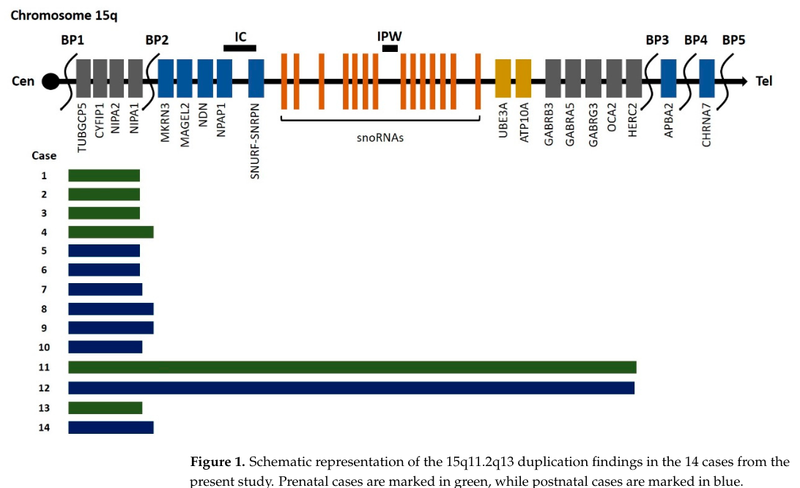

## Question

# Disease Characteristics Research Template

## Target Disease
- **Disease Name:** 15q11q13 Microduplication Syndrome
- **MONDO ID:**  (if available)
- **Category:** Mendelian

## Research Objectives

Please provide a comprehensive research report on **15q11q13 Microduplication Syndrome** covering all of the
disease characteristics listed below. This report will be used to populate a disease knowledge
base entry. Be thorough and cite primary literature (PMID preferred) for all claims.

For each section, **suggested databases/resources** are listed. These are the first places
you should search for information on each topic.

---

### 1. Disease Information
> **Search first:** OMIM, Orphanet, ICD-10/ICD-11, MeSH, PubMed

- What is the disease? Provide a concise overview.
- What are the key identifiers? (OMIM, Orphanet, ICD-10/ICD-11, MeSH, Mondo)
- What are the common synonyms and alternative names?
- Is the information derived from individual patients (e.g., EHR) or aggregated disease-level resources?

### 2. Etiology

- **Disease Causal Factors**: What are the primary causes? (genetic, environmental, infectious, mechanistic)
- **Risk Factors**:
  > **Search first:** PubMed, Cochrane Library, UpToDate, clinical guidelines, ClinVar, ClinGen, GWAS Catalog, PheGenI, CTD, CDC, WHO, epidemiological databases
  - Genetic risk factors (causal variants, susceptibility loci, modifier genes)
  - Environmental risk factors (toxins, lifestyle, occupational exposures, age, sex, family history)
- **Protective Factors**:
  > **Search first:** PubMed, Cochrane Library, clinical trial databases, GWAS Catalog, gnomAD, WHO, CDC, nutrition databases
  - Genetic protective factors (protective variants, modifier alleles)
  - Environmental protective factors (diet, lifestyle, exposures that reduce risk)
- **Gene-Environment Interactions**: How do genetic and environmental factors interact to influence disease?
  > **Search first:** CTD, PubMed, PheGenI, GxE databases

### 3. Phenotypes
> **Search first:** HPO (Human Phenotype Ontology), OMIM, Orphanet, PubMed, clinicaltrials.gov, MedDRA, SNOMED CT, DECIPHER, LOINC

For each phenotype, provide:
- **Phenotype type**: symptoms, clinical signs, physical manifestations, behavioral changes, or laboratory abnormalities
  > For symptoms/signs: HPO, OMIM, Orphanet, PubMed
  > For behavioral changes: HPO, DSM, RDoC (Research Domain Criteria), PubMed
  > For laboratory abnormalities: LOINC, SNOMED CT, LabTests Online, PubMed
- **Phenotype characteristics**:
  > **Search first:** OMIM, Orphanet, HPO, PubMed
  - Age of symptom onset (neonatal, childhood, adult-onset, late-onset)
  - Symptom severity (mild, moderate, severe, variable)
  - Symptom progression (stable, progressive, episodic, fluctuating)
  - Frequency among affected individuals (percentage or qualitative)
- **Quality of life impact**: Effects on daily functioning and well-being (per-phenotype when possible)
  > **Search first:** EQ-5D database, SF-36, WHO QOL databases, PubMed
- Suggest HPO (Human Phenotype Ontology) terms for each phenotype

### 4. Genetic/Molecular Information

- **Causal Genes**: Gene mutations or chromosomal abnormalities responsible for disease (gene symbols, OMIM IDs)
  > **Search first:** OMIM, ClinVar, HGMD, Ensembl, NCBI Gene
- **Pathogenic Variants**:
  - Affected genes (gene symbols, HGNC IDs)
    > **Search first:** OMIM, NCBI Gene, Ensembl, HGNC, UniProt, GeneCards
  - Variant classification (pathogenic, likely pathogenic, VUS per ACMG/AMP guidelines)
    > **Search first:** ClinVar, ClinGen, ACMG/AMP guidelines, VarSome
  - Variant type/class (missense, frameshift, nonsense, splice-site, structural)
  - Allele frequency in population databases
    > **Search first:** gnomAD, 1000 Genomes, ExAC, TOPMed, dbSNP
  - Somatic vs germline origin
    > **Search first:** COSMIC (somatic), ClinVar, ICGC, TCGA
  - Functional consequences (loss of function, gain of function, dominant negative)
- **Modifier Genes**: Genes that modify disease severity or expression
- **Epigenetic Information**: DNA methylation, histone modifications, chromatin changes affecting disease
  > **Search first:** ENCODE, Roadmap Epigenomics, MethBase, DiseaseMeth
- **Chromosomal Abnormalities**: Large-scale genetic changes (aneuploidy, translocations, inversions)
  > **Search first:** DECIPHER, ClinVar, ECARUCA, UCSC Genome Browser

### 5. Environmental Information

- **Environmental Factors**: Non-genetic contributing factors (toxins, radiation, pollution, occupational exposure)
  > **Search first:** CTD (Comparative Toxicogenomics Database), TOXNET, PubMed, EPA databases
- **Lifestyle Factors**: Behavioral factors (smoking, diet, exercise, alcohol consumption)
  > **Search first:** CDC databases, WHO, PubMed, NHANES
- **Infectious Agents**: If applicable, pathogens causing or triggering disease (bacteria, viruses, fungi, parasites)
  > **Search first:** NCBI Taxonomy, ViPR, BV-BRC, MicrobeDB, GIDEON

### 6. Mechanism / Pathophysiology

- **Molecular Pathways**: Specific signaling cascades or biochemical pathways involved (Wnt, MAPK, mTOR, PI3K-AKT, etc.)
  > **Search first:** KEGG, Reactome, WikiPathways, PathBank, BioCyc
- **Cellular Processes**: Cell-level mechanisms (apoptosis, autophagy, cell cycle dysregulation, inflammation, etc.)
  > **Search first:** Gene Ontology (GO), Reactome, KEGG, PubMed
- **Protein Dysfunction**: How protein structure or function is altered (misfolding, aggregation, loss of function, gain of function)
  > **Search first:** UniProt, PDB (Protein Data Bank), InterPro, Pfam, AlphaFold
- **Metabolic Changes**: Alterations in metabolic processes (energy metabolism, lipid metabolism, amino acid metabolism)
  > **Search first:** KEGG, BioCyc, HMDB (Human Metabolome Database), BRENDA
- **Immune System Involvement**: Role of immune response (autoimmunity, immunodeficiency, chronic inflammation)
  > **Search first:** ImmPort, Immunome Database, IEDB, Gene Ontology
- **Tissue Damage Mechanisms**: How tissues/ are injured (oxidative stress, ischemia, fibrosis, necrosis)
  > **Search first:** PubMed, Gene Ontology, Reactome
- **Biochemical Abnormalities**: Specific molecular defects (enzyme deficiencies, receptor dysfunction, ion channel defects)
  > **Search first:** BRENDA, UniProt, KEGG, OMIM, PubMed
- **Epigenetic Changes**: DNA methylation, histone modifications affecting gene expression in disease
  > **Search first:** ENCODE, Roadmap Epigenomics, MethBase, DiseaseMeth
- **Molecular Profiling** (if available):
  - Transcriptomics/gene expression changes
    > **Search first:** GEO (Gene Expression Omnibus), ArrayExpress, GTEx, Human Cell Atlas, SRA
  - Proteomics findings
    > **Search first:** PRIDE, ProteomeXchange, Human Protein Atlas, STRING, BioGRID
  - Metabolomics signatures
    > **Search first:** MetaboLights, Metabolomics Workbench, HMDB, METLIN
  - Lipidomics alterations
    > **Search first:** LIPID MAPS, SwissLipids, LipidHome, Metabolomics Workbench
  - Genomic structural features
    > **Search first:** UCSC Genome Browser, Ensembl, NCBI, dbVar, DGV
- **Advanced Technologies** (if applicable):
  - Single-cell analysis findings (cell-type specific mechanisms, cellular heterogeneity)
    > **Search first:** Human Cell Atlas, Single Cell Portal, GEO, CELLxGENE
  - Spatial transcriptomics findings
    > **Search first:** GEO, Spatial Research, Vizgen, 10x Genomics data
  - Multi-omics integration results
    > **Search first:** TCGA, ICGC, cBioPortal, LinkedOmics, PubMed
  - Functional genomics screens (CRISPR, RNAi)
    > **Search first:** DepMap, GenomeRNAi, PubMed, BioGRID ORCS

For each mechanism, describe:
- The causal chain from initial trigger to clinical manifestation
- Which mechanisms are upstream vs downstream
- What cell types and biological processes are involved
- Suggest GO terms for biological processes and CL terms for cell types

### 7. Anatomical Structures Affected

- **Organ Level**:
  - Primary organs directly affected
  - Secondary organ involvement (complications, secondary effects)
  - Body systems involved (cardiovascular, nervous, digestive, respiratory, endocrine, etc.)
  > **Search first:** Uberon, FMA (Foundational Model of Anatomy), OMIM, HPO, ICD-11, MeSH, SNOMED CT
- **Tissue and Cell Level**:
  - Specific tissue types affected (epithelial, connective, muscle, nervous)
  - Specific cell populations targeted (with Cell Ontology terms)
  > **Search first:** Uberon, Human Protein Atlas, Cell Ontology, Human Cell Atlas, CellMarker, PanglaoDB
- **Subcellular Level**:
  - Cellular compartments involved (mitochondria, nucleus, ER, lysosomes) (with GO Cellular Component terms)
  > **Search first:** Gene Ontology (Cellular Component), UniProt, Human Protein Atlas
- **Localization**:
  - Specific anatomical sites (with UBERON terms)
    > **Search first:** FMA, Uberon, NeuroNames (for brain), SNOMED CT
  - Lateralization (unilateral, bilateral, asymmetric)
    > **Search first:** HPO, clinical literature, imaging databases

### 8. Temporal Development

- **Onset**:
  - Typical age of onset (congenital, pediatric, adult, geriatric)
  - Onset pattern (acute, subacute, chronic, insidious)
  > **Search first:** OMIM, Orphanet, HPO, PubMed
- **Progression**:
  - Disease stages (early, intermediate, advanced, end-stage)
    > **Search first:** Cancer Staging Manual (AJCC), WHO classifications, PubMed
  - Progression rate (rapid, slow, variable)
  - Disease course pattern (episodic, relapsing-remitting, progressive, stable)
  - Disease duration (self-limited, chronic lifelong)
  > **Search first:** Disease registries, longitudinal cohort databases, natural history studies, PubMed, Orphanet, OMIM
- **Patterns**:
  - Remission patterns (spontaneous, treatment-induced)
    > **Search first:** Clinical trial databases, disease registries, PubMed
  - Critical periods (time windows of vulnerability or opportunity for intervention)
    > **Search first:** PubMed, developmental biology databases, clinical guidelines

### 9. Inheritance and Population

- **Epidemiology**:
  - Prevalence (cases per 100,000 at given time)
  - Incidence (new cases per 100,000 per year)
  > **Search first:** Orphanet, CDC, WHO, GBD (Global Burden of Disease), national registries, SEER, disease registries
- **For Genetic Etiology**:
  - Inheritance pattern (AD, AR, X-linked, mitochondrial, multifactorial, polygenic)
    > **Search first:** OMIM, Orphanet, ClinVar, GTR (Genetic Testing Registry)
  - Penetrance (complete, incomplete, age-dependent)
    > **Search first:** ClinVar, OMIM, PubMed, ClinGen
  - Expressivity (variable, consistent)
    > **Search first:** OMIM, ClinVar, PubMed
  - Genetic anticipation (increasing severity in successive generations)
    > **Search first:** OMIM, PubMed (especially for repeat expansion disorders)
  - Germline mosaicism
    > **Search first:** ClinVar, OMIM, genetic counseling literature, PubMed
  - Founder effects (population-specific mutations)
    > **Search first:** gnomAD, population genetics databases, PubMed
  - Consanguinity role
    > **Search first:** OMIM, population studies, genetic counseling resources
  - Carrier frequency
    > **Search first:** gnomAD, carrier screening databases, GeneReviews, GTR
- **Population Demographics**:
  - Affected populations (ethnic or demographic groups with higher prevalence)
    > **Search first:** gnomAD, 1000 Genomes, PAGE Study, PubMed, population registries
  - Geographic distribution (endemic areas, regional variation)
    > **Search first:** WHO, CDC, GBD, Orphanet, geographic epidemiology databases
  - Geographic distribution of specific variants
  - Sex ratio (male:female)
    > **Search first:** Disease registries, OMIM, PubMed, epidemiological databases
  - Age distribution of affected individuals
    > **Search first:** CDC, disease registries, SEER, Orphanet

### 10. Diagnostics

- **Clinical Tests**:
  - Laboratory tests (blood, urine, tissue chemistry, specific enzyme assays)
    > **Search first:** LOINC, LabTests Online, PubMed
  - Biomarkers (proteins, metabolites, genetic markers, circulating biomarkers)
    > **Search first:** FDA Biomarker List, BEST (Biomarkers, EndpointS, and other Tools), PubMed
  - Imaging studies (X-ray, CT, MRI, PET, ultrasound)
    > **Search first:** RadLex, DICOM, Radiopaedia, imaging databases
  - Functional tests (pulmonary function, cardiac stress tests)
    > **Search first:** LOINC, clinical guidelines, PubMed
  - Electrophysiology (EEG, EMG, ECG, nerve conduction studies)
    > **Search first:** LOINC, clinical neurophysiology databases, PubMed
  - Biopsy findings (histopathology, immunohistochemistry)
    > **Search first:** SNOMED CT, College of American Pathologists resources, PubMed
  - Pathology findings (microscopic examination)
    > **Search first:** SNOMED CT, Digital Pathology databases, PubMed
- **Genetic Testing**:
  > **Search first:** GTR (Genetic Testing Registry), GeneReviews, ClinGen
  - Overview of recommended genetic testing approach
  - Whole genome sequencing (WGS) utility
    > **Search first:** GTR, ClinVar, GEL (Genomics England), gnomAD
  - Whole exome sequencing (WES) utility
    > **Search first:** GTR, ClinVar, OMIM, GeneMatcher
  - Gene panels (which panels, which genes)
    > **Search first:** GTR, ClinVar, laboratory-specific databases
  - Single gene testing
    > **Search first:** GTR, ClinVar, OMIM, GeneReviews
  - Chromosomal microarray (CMA)
    > **Search first:** DECIPHER, ClinVar, dbVar, ECARUCA
  - Karyotyping
    > **Search first:** Chromosome Abnormality Database, ClinVar, cytogenetics resources
  - FISH
    > **Search first:** ClinVar, cytogenetics databases, PubMed
  - Mitochondrial DNA testing
    > **Search first:** MITOMAP, MSeqDR, ClinVar, GTR
  - Repeat expansion testing
    > **Search first:** GTR, ClinVar, repeat expansion databases, PubMed
- **Omics-Based Diagnostics** (if applicable):
  - RNA sequencing / transcriptomics
    > **Search first:** GEO, ArrayExpress, GTEx, RNA-seq databases
  - Proteomics
    > **Search first:** PRIDE, ProteomeXchange, FDA Biomarker database
  - Metabolomics
    > **Search first:** MetaboLights, Metabolomics Workbench, HMDB
  - Epigenomics
    > **Search first:** GEO, ENCODE, Roadmap Epigenomics, MethBase
  - Liquid biopsy
    > **Search first:** COSMIC, ClinVar, liquid biopsy databases, PubMed
- **Clinical Criteria**:
  - Standardized diagnostic criteria (DSM, ICD, society guidelines)
    > **Search first:** DSM-5, ICD-11, clinical society guidelines, UpToDate
  - Differential diagnosis (other conditions to rule out, with distinguishing features)
    > **Search first:** DynaMed, UpToDate, clinical decision support systems
- **Screening**:
  - Screening methods for asymptomatic individuals (newborn screening, carrier screening, cascade screening)
    > **Search first:** ACMG recommendations, CDC newborn screening, GTR

### 11. Outcome/Prognosis

- **Survival and Mortality**:
  - Survival rate (5-year, 10-year, overall)
    > **Search first:** SEER, cancer registries, disease-specific registries, PubMed
  - Life expectancy (with and without treatment if applicable)
    > **Search first:** Orphanet, disease registries, actuarial databases, PubMed
  - Mortality rate
    > **Search first:** CDC, WHO, GBD, national mortality databases
  - Disease-specific mortality (deaths directly attributable to disease)
    > **Search first:** Disease registries, CDC Wonder, GBD, PubMed
- **Morbidity and Function**:
  - Morbidity (disease-related disability and health impacts)
    > **Search first:** GBD, WHO, disability databases, PubMed
  - Disability outcomes (long-term functional impairments)
    > **Search first:** ICF (International Classification of Functioning), disability registries
  - Quality of life measures (EQ-5D, SF-36, PROMIS, disease-specific tools)
    > **Search first:** EQ-5D database, SF-36, PROMIS, PubMed
- **Disease Course**:
  - Complications (secondary problems: infections, organ failure, etc.)
    > **Search first:** ICD codes, disease registries, clinical databases, PubMed
  - Recovery potential (likelihood and extent of recovery, with vs without treatment)
    > **Search first:** Natural history studies, rehabilitation databases, PubMed
- **Prediction**:
  - Prognostic factors (age, disease severity, biomarkers, treatment response)
    > **Search first:** Prognostic models databases, clinical calculators, PubMed
  - Prognostic biomarkers (molecular markers predicting disease course)
    > **Search first:** FDA Biomarker database, PubMed, cancer prognostic databases

### 12. Treatment

- **Pharmacotherapy**:
  - Pharmacological treatments (drug names, drug classes, mechanisms of action)
    > **Search first:** DrugBank, RxNorm, ATC classification, DailyMed, FDA databases
  - Pharmacogenomics (how genetic variants affect drug metabolism, efficacy, toxicity)
    > **Search first:** PharmGKB, CPIC (Clinical Pharmacogenetics), FDA Table of PGx Biomarkers
- **Advanced Therapeutics**:
  - Gene therapy (viral vectors, CRISPR, gene replacement, gene editing)
    > **Search first:** ClinicalTrials.gov, FDA gene therapy database, ASGCT resources
  - Cell therapy (stem cell transplant, CAR-T, cellular therapeutics)
    > **Search first:** ClinicalTrials.gov, FDA cell therapy database, FACT standards
  - RNA-based therapies (ASOs, siRNA, mRNA therapies)
    > **Search first:** ClinicalTrials.gov, FDA approvals, PubMed
  - Targeted therapies (treatments directed at specific molecular targets)
    > **Search first:** My Cancer Genome, OncoKB, ClinicalTrials.gov, FDA approvals
  - Immunotherapies (checkpoint inhibitors, monoclonal antibodies)
    > **Search first:** Cancer Immunotherapy Database, FDA approvals, ClinicalTrials.gov
- **Surgical and Interventional**:
  - Surgical interventions (types of surgery, timing, outcomes)
    > **Search first:** CPT codes, surgical registries, clinical guidelines, PubMed
- **Supportive and Rehabilitative**:
  - Supportive care (symptom management, pain control, nutrition)
    > **Search first:** Clinical guidelines, Cochrane Library, PubMed
  - Rehabilitation (physical therapy, occupational therapy, speech therapy)
    > **Search first:** Rehabilitation medicine databases, clinical guidelines, PubMed
- **Experimental**:
  - Experimental treatments in clinical trials (with NCT identifiers if available)
    > **Search first:** ClinicalTrials.gov, EU Clinical Trials Register, WHO ICTRP
- **Treatment Outcomes**:
  - Treatment response rates
    > **Search first:** Clinical trial databases, FDA reviews, systematic reviews, PubMed
  - Side effects and adverse events
    > **Search first:** FDA Adverse Event Reporting System (FAERS), MedWatch, PubMed
- **Treatment Strategy**:
  - Treatment algorithms (clinical pathways, decision trees)
    > **Search first:** Clinical practice guidelines, NCCN Guidelines, UpToDate
  - Combination therapies
    > **Search first:** ClinicalTrials.gov, treatment guidelines, PubMed
  - Personalized medicine approaches (genotype-guided treatment)
    > **Search first:** My Cancer Genome, CIViC, PharmGKB, precision medicine databases

For each treatment, suggest MAXO (Medical Action Ontology) terms where applicable.

### 13. Prevention

- **Prevention Levels**:
  - Primary prevention (preventing disease occurrence: vaccination, risk factor modification)
    > **Search first:** CDC, WHO, USPSTF recommendations, Cochrane Library
  - Secondary prevention (early detection and treatment: screening programs, early intervention)
    > **Search first:** USPSTF, CDC screening guidelines, WHO
  - Tertiary prevention (preventing complications in those with disease)
    > **Search first:** Clinical guidelines, disease management protocols, PubMed
- **Immunization**: Vaccine strategies (if applicable)
  > **Search first:** CDC vaccine schedules, WHO immunization, FDA vaccine database
- **Screening and Early Detection**:
  - Screening programs (population-based: newborn screening, cancer screening)
    > **Search first:** CDC screening programs, USPSTF, cancer screening databases
  - Genetic screening (carrier screening, preimplantation genetic diagnosis, prenatal testing)
    > **Search first:** ACMG recommendations, ACOG guidelines, GTR
  - Risk stratification (identifying high-risk individuals for targeted prevention)
    > **Search first:** Risk prediction models, clinical calculators, PubMed
- **Behavioral Interventions**: Lifestyle modifications to reduce risk
  > **Search first:** CDC, WHO, behavioral intervention databases, Cochrane Library
- **Counseling**: Genetic counseling (risk assessment, family planning guidance)
  > **Search first:** NSGC resources, ACMG guidelines, GeneReviews
- **Public Health**:
  - Public health interventions (sanitation, vector control, health education)
    > **Search first:** CDC, WHO, public health databases, PubMed
  - Environmental interventions (reducing environmental risk factors)
    > **Search first:** EPA databases, WHO environmental health, PubMed
- **Prophylaxis**: Preventive medications or procedures
  > **Search first:** Clinical guidelines, FDA approvals, PubMed

### 14. Other Species / Natural Disease

- **Taxonomy**: Species affected (with NCBI Taxon identifiers)
  > **Search first:** NCBI Taxonomy
- **Breed**: Specific breeds affected (with VBO identifiers if applicable)
  > **Search first:** VBO (Vertebrate Breed Ontology)
- **Gene**: Orthologous genes in other species (with NCBI Gene IDs)
  > **Search first:** NCBI Gene
- **Natural Disease**:
  - Naturally occurring disease in other species (companion animals, wildlife)
    > **Search first:** OMIA (Online Mendelian Inheritance in Animals), VetCompass, PubMed
  - Veterinary relevance and importance in animal health
    > **Search first:** OMIA, veterinary databases, PubMed
- **Comparative Biology**:
  - Comparative pathology (similarities and differences across species)
    > **Search first:** OMIA, comparative pathology databases, PubMed
  - Evolutionary conservation of disease mechanisms
    > **Search first:** HomoloGene, OrthoMCL, Alliance of Genome Resources
- **Transmission** (if applicable):
  - Zoonotic potential
    > **Search first:** CDC zoonotic diseases, WHO zoonoses, GIDEON
  - Cross-species susceptibility
    > **Search first:** NCBI Taxonomy, veterinary databases, PubMed

### 15. Model Organisms

- **Model Types**:
  - Model organism type (mammalian, invertebrate, cellular, in vitro)
    > **Search first:** Alliance of Genome Resources, model organism databases
  - Specific model systems (mouse, rat, zebrafish, Drosophila, C. elegans, yeast, cell lines, organoids, iPSCs)
    > **Search first:** MGI, RGD, ZFIN, FlyBase, WormBase, SGD, ATCC, Cellosaurus
  - Induced models (drug treatment, surgical intervention, environmental manipulation)
    > **Search first:** MGI, model organism databases, PubMed
- **Genetic Models**:
  - Types available (knockout, knock-in, transgenic, conditional, humanized)
    > **Search first:** MGI, IMPC, KOMP, EuMMCR, IMSR
- **Model Characteristics**:
  - Phenotype recapitulation (how well model reproduces human disease features)
    > **Search first:** Model organism databases, comparative studies, PubMed
  - Model limitations (aspects of human disease not captured)
    > **Search first:** Model organism databases, PubMed, review articles
- **Applications**:
  - Research applications (what aspects of disease can be studied)
    > **Search first:** Model organism databases, PubMed
- **Resources**:
  - Model databases
    > **Search first:** MGI, RGD, ZFIN, FlyBase, WormBase, IMSR, EMMA, MMRRC

---

## Citation Requirements

- Cite primary literature (PMID preferred) for all mechanistic and clinical claims
- Prioritize recent reviews and landmark papers
- Include direct quotes from abstracts where possible to support key statements
- Distinguish evidence source types: human clinical, model organism, in vitro, computational

## Output Format

Structure your response as a comprehensive narrative organized by the sections above.
For each section, provide:
- Factual content with specific details (numbers, percentages, gene names, variant nomenclature)
- Ontology term suggestions (HPO, GO, CL, UBERON, CHEBI, MAXO, MONDO) where applicable
- Evidence citations with PMIDs
- Direct quotes from abstracts to support key claims
- Clear indication when information is not available or not applicable for this disease

This report will be used to populate a disease knowledge base entry with:
- Pathophysiology descriptions with causal chains
- Gene/protein annotations (HGNC, GO terms)
- Phenotype associations (HP terms) with frequencies
- Cell type involvement (CL terms)
- Anatomical locations (UBERON terms)
- Chemical entities (CHEBI terms)
- Treatment annotations (MAXO terms)
- Evidence items with PMIDs and exact abstract quotes
- Epidemiology, prognosis, diagnostic, and prevention information
- Animal model descriptions with phenotype recapitulation details

## Output

Question: You are an expert researcher providing comprehensive, well-cited information.

Provide detailed information focusing on:
1. Key concepts and definitions with current understanding
2. Recent developments and latest research (prioritize 2023-2024 sources)
3. Current applications and real-world implementations
4. Expert opinions and analysis from authoritative sources
5. Relevant statistics and data from recent studies

Format as a comprehensive research report with proper citations. Include URLs and publication dates where available.
Always prioritize recent, authoritative sources and provide specific citations for all major claims.

# Disease Characteristics Research Template

## Target Disease
- **Disease Name:** 15q11q13 Microduplication Syndrome
- **MONDO ID:**  (if available)
- **Category:** Mendelian

## Research Objectives

Please provide a comprehensive research report on **15q11q13 Microduplication Syndrome** covering all of the
disease characteristics listed below. This report will be used to populate a disease knowledge
base entry. Be thorough and cite primary literature (PMID preferred) for all claims.

For each section, **suggested databases/resources** are listed. These are the first places
you should search for information on each topic.

---

### 1. Disease Information
> **Search first:** OMIM, Orphanet, ICD-10/ICD-11, MeSH, PubMed

- What is the disease? Provide a concise overview.
- What are the key identifiers? (OMIM, Orphanet, ICD-10/ICD-11, MeSH, Mondo)
- What are the common synonyms and alternative names?
- Is the information derived from individual patients (e.g., EHR) or aggregated disease-level resources?

### 2. Etiology

- **Disease Causal Factors**: What are the primary causes? (genetic, environmental, infectious, mechanistic)
- **Risk Factors**:
  > **Search first:** PubMed, Cochrane Library, UpToDate, clinical guidelines, ClinVar, ClinGen, GWAS Catalog, PheGenI, CTD, CDC, WHO, epidemiological databases
  - Genetic risk factors (causal variants, susceptibility loci, modifier genes)
  - Environmental risk factors (toxins, lifestyle, occupational exposures, age, sex, family history)
- **Protective Factors**:
  > **Search first:** PubMed, Cochrane Library, clinical trial databases, GWAS Catalog, gnomAD, WHO, CDC, nutrition databases
  - Genetic protective factors (protective variants, modifier alleles)
  - Environmental protective factors (diet, lifestyle, exposures that reduce risk)
- **Gene-Environment Interactions**: How do genetic and environmental factors interact to influence disease?
  > **Search first:** CTD, PubMed, PheGenI, GxE databases

### 3. Phenotypes
> **Search first:** HPO (Human Phenotype Ontology), OMIM, Orphanet, PubMed, clinicaltrials.gov, MedDRA, SNOMED CT, DECIPHER, LOINC

For each phenotype, provide:
- **Phenotype type**: symptoms, clinical signs, physical manifestations, behavioral changes, or laboratory abnormalities
  > For symptoms/signs: HPO, OMIM, Orphanet, PubMed
  > For behavioral changes: HPO, DSM, RDoC (Research Domain Criteria), PubMed
  > For laboratory abnormalities: LOINC, SNOMED CT, LabTests Online, PubMed
- **Phenotype characteristics**:
  > **Search first:** OMIM, Orphanet, HPO, PubMed
  - Age of symptom onset (neonatal, childhood, adult-onset, late-onset)
  - Symptom severity (mild, moderate, severe, variable)
  - Symptom progression (stable, progressive, episodic, fluctuating)
  - Frequency among affected individuals (percentage or qualitative)
- **Quality of life impact**: Effects on daily functioning and well-being (per-phenotype when possible)
  > **Search first:** EQ-5D database, SF-36, WHO QOL databases, PubMed
- Suggest HPO (Human Phenotype Ontology) terms for each phenotype

### 4. Genetic/Molecular Information

- **Causal Genes**: Gene mutations or chromosomal abnormalities responsible for disease (gene symbols, OMIM IDs)
  > **Search first:** OMIM, ClinVar, HGMD, Ensembl, NCBI Gene
- **Pathogenic Variants**:
  - Affected genes (gene symbols, HGNC IDs)
    > **Search first:** OMIM, NCBI Gene, Ensembl, HGNC, UniProt, GeneCards
  - Variant classification (pathogenic, likely pathogenic, VUS per ACMG/AMP guidelines)
    > **Search first:** ClinVar, ClinGen, ACMG/AMP guidelines, VarSome
  - Variant type/class (missense, frameshift, nonsense, splice-site, structural)
  - Allele frequency in population databases
    > **Search first:** gnomAD, 1000 Genomes, ExAC, TOPMed, dbSNP
  - Somatic vs germline origin
    > **Search first:** COSMIC (somatic), ClinVar, ICGC, TCGA
  - Functional consequences (loss of function, gain of function, dominant negative)
- **Modifier Genes**: Genes that modify disease severity or expression
- **Epigenetic Information**: DNA methylation, histone modifications, chromatin changes affecting disease
  > **Search first:** ENCODE, Roadmap Epigenomics, MethBase, DiseaseMeth
- **Chromosomal Abnormalities**: Large-scale genetic changes (aneuploidy, translocations, inversions)
  > **Search first:** DECIPHER, ClinVar, ECARUCA, UCSC Genome Browser

### 5. Environmental Information

- **Environmental Factors**: Non-genetic contributing factors (toxins, radiation, pollution, occupational exposure)
  > **Search first:** CTD (Comparative Toxicogenomics Database), TOXNET, PubMed, EPA databases
- **Lifestyle Factors**: Behavioral factors (smoking, diet, exercise, alcohol consumption)
  > **Search first:** CDC databases, WHO, PubMed, NHANES
- **Infectious Agents**: If applicable, pathogens causing or triggering disease (bacteria, viruses, fungi, parasites)
  > **Search first:** NCBI Taxonomy, ViPR, BV-BRC, MicrobeDB, GIDEON

### 6. Mechanism / Pathophysiology

- **Molecular Pathways**: Specific signaling cascades or biochemical pathways involved (Wnt, MAPK, mTOR, PI3K-AKT, etc.)
  > **Search first:** KEGG, Reactome, WikiPathways, PathBank, BioCyc
- **Cellular Processes**: Cell-level mechanisms (apoptosis, autophagy, cell cycle dysregulation, inflammation, etc.)
  > **Search first:** Gene Ontology (GO), Reactome, KEGG, PubMed
- **Protein Dysfunction**: How protein structure or function is altered (misfolding, aggregation, loss of function, gain of function)
  > **Search first:** UniProt, PDB (Protein Data Bank), InterPro, Pfam, AlphaFold
- **Metabolic Changes**: Alterations in metabolic processes (energy metabolism, lipid metabolism, amino acid metabolism)
  > **Search first:** KEGG, BioCyc, HMDB (Human Metabolome Database), BRENDA
- **Immune System Involvement**: Role of immune response (autoimmunity, immunodeficiency, chronic inflammation)
  > **Search first:** ImmPort, Immunome Database, IEDB, Gene Ontology
- **Tissue Damage Mechanisms**: How tissues/ are injured (oxidative stress, ischemia, fibrosis, necrosis)
  > **Search first:** PubMed, Gene Ontology, Reactome
- **Biochemical Abnormalities**: Specific molecular defects (enzyme deficiencies, receptor dysfunction, ion channel defects)
  > **Search first:** BRENDA, UniProt, KEGG, OMIM, PubMed
- **Epigenetic Changes**: DNA methylation, histone modifications affecting gene expression in disease
  > **Search first:** ENCODE, Roadmap Epigenomics, MethBase, DiseaseMeth
- **Molecular Profiling** (if available):
  - Transcriptomics/gene expression changes
    > **Search first:** GEO (Gene Expression Omnibus), ArrayExpress, GTEx, Human Cell Atlas, SRA
  - Proteomics findings
    > **Search first:** PRIDE, ProteomeXchange, Human Protein Atlas, STRING, BioGRID
  - Metabolomics signatures
    > **Search first:** MetaboLights, Metabolomics Workbench, HMDB, METLIN
  - Lipidomics alterations
    > **Search first:** LIPID MAPS, SwissLipids, LipidHome, Metabolomics Workbench
  - Genomic structural features
    > **Search first:** UCSC Genome Browser, Ensembl, NCBI, dbVar, DGV
- **Advanced Technologies** (if applicable):
  - Single-cell analysis findings (cell-type specific mechanisms, cellular heterogeneity)
    > **Search first:** Human Cell Atlas, Single Cell Portal, GEO, CELLxGENE
  - Spatial transcriptomics findings
    > **Search first:** GEO, Spatial Research, Vizgen, 10x Genomics data
  - Multi-omics integration results
    > **Search first:** TCGA, ICGC, cBioPortal, LinkedOmics, PubMed
  - Functional genomics screens (CRISPR, RNAi)
    > **Search first:** DepMap, GenomeRNAi, PubMed, BioGRID ORCS

For each mechanism, describe:
- The causal chain from initial trigger to clinical manifestation
- Which mechanisms are upstream vs downstream
- What cell types and biological processes are involved
- Suggest GO terms for biological processes and CL terms for cell types

### 7. Anatomical Structures Affected

- **Organ Level**:
  - Primary organs directly affected
  - Secondary organ involvement (complications, secondary effects)
  - Body systems involved (cardiovascular, nervous, digestive, respiratory, endocrine, etc.)
  > **Search first:** Uberon, FMA (Foundational Model of Anatomy), OMIM, HPO, ICD-11, MeSH, SNOMED CT
- **Tissue and Cell Level**:
  - Specific tissue types affected (epithelial, connective, muscle, nervous)
  - Specific cell populations targeted (with Cell Ontology terms)
  > **Search first:** Uberon, Human Protein Atlas, Cell Ontology, Human Cell Atlas, CellMarker, PanglaoDB
- **Subcellular Level**:
  - Cellular compartments involved (mitochondria, nucleus, ER, lysosomes) (with GO Cellular Component terms)
  > **Search first:** Gene Ontology (Cellular Component), UniProt, Human Protein Atlas
- **Localization**:
  - Specific anatomical sites (with UBERON terms)
    > **Search first:** FMA, Uberon, NeuroNames (for brain), SNOMED CT
  - Lateralization (unilateral, bilateral, asymmetric)
    > **Search first:** HPO, clinical literature, imaging databases

### 8. Temporal Development

- **Onset**:
  - Typical age of onset (congenital, pediatric, adult, geriatric)
  - Onset pattern (acute, subacute, chronic, insidious)
  > **Search first:** OMIM, Orphanet, HPO, PubMed
- **Progression**:
  - Disease stages (early, intermediate, advanced, end-stage)
    > **Search first:** Cancer Staging Manual (AJCC), WHO classifications, PubMed
  - Progression rate (rapid, slow, variable)
  - Disease course pattern (episodic, relapsing-remitting, progressive, stable)
  - Disease duration (self-limited, chronic lifelong)
  > **Search first:** Disease registries, longitudinal cohort databases, natural history studies, PubMed, Orphanet, OMIM
- **Patterns**:
  - Remission patterns (spontaneous, treatment-induced)
    > **Search first:** Clinical trial databases, disease registries, PubMed
  - Critical periods (time windows of vulnerability or opportunity for intervention)
    > **Search first:** PubMed, developmental biology databases, clinical guidelines

### 9. Inheritance and Population

- **Epidemiology**:
  - Prevalence (cases per 100,000 at given time)
  - Incidence (new cases per 100,000 per year)
  > **Search first:** Orphanet, CDC, WHO, GBD (Global Burden of Disease), national registries, SEER, disease registries
- **For Genetic Etiology**:
  - Inheritance pattern (AD, AR, X-linked, mitochondrial, multifactorial, polygenic)
    > **Search first:** OMIM, Orphanet, ClinVar, GTR (Genetic Testing Registry)
  - Penetrance (complete, incomplete, age-dependent)
    > **Search first:** ClinVar, OMIM, PubMed, ClinGen
  - Expressivity (variable, consistent)
    > **Search first:** OMIM, ClinVar, PubMed
  - Genetic anticipation (increasing severity in successive generations)
    > **Search first:** OMIM, PubMed (especially for repeat expansion disorders)
  - Germline mosaicism
    > **Search first:** ClinVar, OMIM, genetic counseling literature, PubMed
  - Founder effects (population-specific mutations)
    > **Search first:** gnomAD, population genetics databases, PubMed
  - Consanguinity role
    > **Search first:** OMIM, population studies, genetic counseling resources
  - Carrier frequency
    > **Search first:** gnomAD, carrier screening databases, GeneReviews, GTR
- **Population Demographics**:
  - Affected populations (ethnic or demographic groups with higher prevalence)
    > **Search first:** gnomAD, 1000 Genomes, PAGE Study, PubMed, population registries
  - Geographic distribution (endemic areas, regional variation)
    > **Search first:** WHO, CDC, GBD, Orphanet, geographic epidemiology databases
  - Geographic distribution of specific variants
  - Sex ratio (male:female)
    > **Search first:** Disease registries, OMIM, PubMed, epidemiological databases
  - Age distribution of affected individuals
    > **Search first:** CDC, disease registries, SEER, Orphanet

### 10. Diagnostics

- **Clinical Tests**:
  - Laboratory tests (blood, urine, tissue chemistry, specific enzyme assays)
    > **Search first:** LOINC, LabTests Online, PubMed
  - Biomarkers (proteins, metabolites, genetic markers, circulating biomarkers)
    > **Search first:** FDA Biomarker List, BEST (Biomarkers, EndpointS, and other Tools), PubMed
  - Imaging studies (X-ray, CT, MRI, PET, ultrasound)
    > **Search first:** RadLex, DICOM, Radiopaedia, imaging databases
  - Functional tests (pulmonary function, cardiac stress tests)
    > **Search first:** LOINC, clinical guidelines, PubMed
  - Electrophysiology (EEG, EMG, ECG, nerve conduction studies)
    > **Search first:** LOINC, clinical neurophysiology databases, PubMed
  - Biopsy findings (histopathology, immunohistochemistry)
    > **Search first:** SNOMED CT, College of American Pathologists resources, PubMed
  - Pathology findings (microscopic examination)
    > **Search first:** SNOMED CT, Digital Pathology databases, PubMed
- **Genetic Testing**:
  > **Search first:** GTR (Genetic Testing Registry), GeneReviews, ClinGen
  - Overview of recommended genetic testing approach
  - Whole genome sequencing (WGS) utility
    > **Search first:** GTR, ClinVar, GEL (Genomics England), gnomAD
  - Whole exome sequencing (WES) utility
    > **Search first:** GTR, ClinVar, OMIM, GeneMatcher
  - Gene panels (which panels, which genes)
    > **Search first:** GTR, ClinVar, laboratory-specific databases
  - Single gene testing
    > **Search first:** GTR, ClinVar, OMIM, GeneReviews
  - Chromosomal microarray (CMA)
    > **Search first:** DECIPHER, ClinVar, dbVar, ECARUCA
  - Karyotyping
    > **Search first:** Chromosome Abnormality Database, ClinVar, cytogenetics resources
  - FISH
    > **Search first:** ClinVar, cytogenetics databases, PubMed
  - Mitochondrial DNA testing
    > **Search first:** MITOMAP, MSeqDR, ClinVar, GTR
  - Repeat expansion testing
    > **Search first:** GTR, ClinVar, repeat expansion databases, PubMed
- **Omics-Based Diagnostics** (if applicable):
  - RNA sequencing / transcriptomics
    > **Search first:** GEO, ArrayExpress, GTEx, RNA-seq databases
  - Proteomics
    > **Search first:** PRIDE, ProteomeXchange, FDA Biomarker database
  - Metabolomics
    > **Search first:** MetaboLights, Metabolomics Workbench, HMDB
  - Epigenomics
    > **Search first:** GEO, ENCODE, Roadmap Epigenomics, MethBase
  - Liquid biopsy
    > **Search first:** COSMIC, ClinVar, liquid biopsy databases, PubMed
- **Clinical Criteria**:
  - Standardized diagnostic criteria (DSM, ICD, society guidelines)
    > **Search first:** DSM-5, ICD-11, clinical society guidelines, UpToDate
  - Differential diagnosis (other conditions to rule out, with distinguishing features)
    > **Search first:** DynaMed, UpToDate, clinical decision support systems
- **Screening**:
  - Screening methods for asymptomatic individuals (newborn screening, carrier screening, cascade screening)
    > **Search first:** ACMG recommendations, CDC newborn screening, GTR

### 11. Outcome/Prognosis

- **Survival and Mortality**:
  - Survival rate (5-year, 10-year, overall)
    > **Search first:** SEER, cancer registries, disease-specific registries, PubMed
  - Life expectancy (with and without treatment if applicable)
    > **Search first:** Orphanet, disease registries, actuarial databases, PubMed
  - Mortality rate
    > **Search first:** CDC, WHO, GBD, national mortality databases
  - Disease-specific mortality (deaths directly attributable to disease)
    > **Search first:** Disease registries, CDC Wonder, GBD, PubMed
- **Morbidity and Function**:
  - Morbidity (disease-related disability and health impacts)
    > **Search first:** GBD, WHO, disability databases, PubMed
  - Disability outcomes (long-term functional impairments)
    > **Search first:** ICF (International Classification of Functioning), disability registries
  - Quality of life measures (EQ-5D, SF-36, PROMIS, disease-specific tools)
    > **Search first:** EQ-5D database, SF-36, PROMIS, PubMed
- **Disease Course**:
  - Complications (secondary problems: infections, organ failure, etc.)
    > **Search first:** ICD codes, disease registries, clinical databases, PubMed
  - Recovery potential (likelihood and extent of recovery, with vs without treatment)
    > **Search first:** Natural history studies, rehabilitation databases, PubMed
- **Prediction**:
  - Prognostic factors (age, disease severity, biomarkers, treatment response)
    > **Search first:** Prognostic models databases, clinical calculators, PubMed
  - Prognostic biomarkers (molecular markers predicting disease course)
    > **Search first:** FDA Biomarker database, PubMed, cancer prognostic databases

### 12. Treatment

- **Pharmacotherapy**:
  - Pharmacological treatments (drug names, drug classes, mechanisms of action)
    > **Search first:** DrugBank, RxNorm, ATC classification, DailyMed, FDA databases
  - Pharmacogenomics (how genetic variants affect drug metabolism, efficacy, toxicity)
    > **Search first:** PharmGKB, CPIC (Clinical Pharmacogenetics), FDA Table of PGx Biomarkers
- **Advanced Therapeutics**:
  - Gene therapy (viral vectors, CRISPR, gene replacement, gene editing)
    > **Search first:** ClinicalTrials.gov, FDA gene therapy database, ASGCT resources
  - Cell therapy (stem cell transplant, CAR-T, cellular therapeutics)
    > **Search first:** ClinicalTrials.gov, FDA cell therapy database, FACT standards
  - RNA-based therapies (ASOs, siRNA, mRNA therapies)
    > **Search first:** ClinicalTrials.gov, FDA approvals, PubMed
  - Targeted therapies (treatments directed at specific molecular targets)
    > **Search first:** My Cancer Genome, OncoKB, ClinicalTrials.gov, FDA approvals
  - Immunotherapies (checkpoint inhibitors, monoclonal antibodies)
    > **Search first:** Cancer Immunotherapy Database, FDA approvals, ClinicalTrials.gov
- **Surgical and Interventional**:
  - Surgical interventions (types of surgery, timing, outcomes)
    > **Search first:** CPT codes, surgical registries, clinical guidelines, PubMed
- **Supportive and Rehabilitative**:
  - Supportive care (symptom management, pain control, nutrition)
    > **Search first:** Clinical guidelines, Cochrane Library, PubMed
  - Rehabilitation (physical therapy, occupational therapy, speech therapy)
    > **Search first:** Rehabilitation medicine databases, clinical guidelines, PubMed
- **Experimental**:
  - Experimental treatments in clinical trials (with NCT identifiers if available)
    > **Search first:** ClinicalTrials.gov, EU Clinical Trials Register, WHO ICTRP
- **Treatment Outcomes**:
  - Treatment response rates
    > **Search first:** Clinical trial databases, FDA reviews, systematic reviews, PubMed
  - Side effects and adverse events
    > **Search first:** FDA Adverse Event Reporting System (FAERS), MedWatch, PubMed
- **Treatment Strategy**:
  - Treatment algorithms (clinical pathways, decision trees)
    > **Search first:** Clinical practice guidelines, NCCN Guidelines, UpToDate
  - Combination therapies
    > **Search first:** ClinicalTrials.gov, treatment guidelines, PubMed
  - Personalized medicine approaches (genotype-guided treatment)
    > **Search first:** My Cancer Genome, CIViC, PharmGKB, precision medicine databases

For each treatment, suggest MAXO (Medical Action Ontology) terms where applicable.

### 13. Prevention

- **Prevention Levels**:
  - Primary prevention (preventing disease occurrence: vaccination, risk factor modification)
    > **Search first:** CDC, WHO, USPSTF recommendations, Cochrane Library
  - Secondary prevention (early detection and treatment: screening programs, early intervention)
    > **Search first:** USPSTF, CDC screening guidelines, WHO
  - Tertiary prevention (preventing complications in those with disease)
    > **Search first:** Clinical guidelines, disease management protocols, PubMed
- **Immunization**: Vaccine strategies (if applicable)
  > **Search first:** CDC vaccine schedules, WHO immunization, FDA vaccine database
- **Screening and Early Detection**:
  - Screening programs (population-based: newborn screening, cancer screening)
    > **Search first:** CDC screening programs, USPSTF, cancer screening databases
  - Genetic screening (carrier screening, preimplantation genetic diagnosis, prenatal testing)
    > **Search first:** ACMG recommendations, ACOG guidelines, GTR
  - Risk stratification (identifying high-risk individuals for targeted prevention)
    > **Search first:** Risk prediction models, clinical calculators, PubMed
- **Behavioral Interventions**: Lifestyle modifications to reduce risk
  > **Search first:** CDC, WHO, behavioral intervention databases, Cochrane Library
- **Counseling**: Genetic counseling (risk assessment, family planning guidance)
  > **Search first:** NSGC resources, ACMG guidelines, GeneReviews
- **Public Health**:
  - Public health interventions (sanitation, vector control, health education)
    > **Search first:** CDC, WHO, public health databases, PubMed
  - Environmental interventions (reducing environmental risk factors)
    > **Search first:** EPA databases, WHO environmental health, PubMed
- **Prophylaxis**: Preventive medications or procedures
  > **Search first:** Clinical guidelines, FDA approvals, PubMed

### 14. Other Species / Natural Disease

- **Taxonomy**: Species affected (with NCBI Taxon identifiers)
  > **Search first:** NCBI Taxonomy
- **Breed**: Specific breeds affected (with VBO identifiers if applicable)
  > **Search first:** VBO (Vertebrate Breed Ontology)
- **Gene**: Orthologous genes in other species (with NCBI Gene IDs)
  > **Search first:** NCBI Gene
- **Natural Disease**:
  - Naturally occurring disease in other species (companion animals, wildlife)
    > **Search first:** OMIA (Online Mendelian Inheritance in Animals), VetCompass, PubMed
  - Veterinary relevance and importance in animal health
    > **Search first:** OMIA, veterinary databases, PubMed
- **Comparative Biology**:
  - Comparative pathology (similarities and differences across species)
    > **Search first:** OMIA, comparative pathology databases, PubMed
  - Evolutionary conservation of disease mechanisms
    > **Search first:** HomoloGene, OrthoMCL, Alliance of Genome Resources
- **Transmission** (if applicable):
  - Zoonotic potential
    > **Search first:** CDC zoonotic diseases, WHO zoonoses, GIDEON
  - Cross-species susceptibility
    > **Search first:** NCBI Taxonomy, veterinary databases, PubMed

### 15. Model Organisms

- **Model Types**:
  - Model organism type (mammalian, invertebrate, cellular, in vitro)
    > **Search first:** Alliance of Genome Resources, model organism databases
  - Specific model systems (mouse, rat, zebrafish, Drosophila, C. elegans, yeast, cell lines, organoids, iPSCs)
    > **Search first:** MGI, RGD, ZFIN, FlyBase, WormBase, SGD, ATCC, Cellosaurus
  - Induced models (drug treatment, surgical intervention, environmental manipulation)
    > **Search first:** MGI, model organism databases, PubMed
- **Genetic Models**:
  - Types available (knockout, knock-in, transgenic, conditional, humanized)
    > **Search first:** MGI, IMPC, KOMP, EuMMCR, IMSR
- **Model Characteristics**:
  - Phenotype recapitulation (how well model reproduces human disease features)
    > **Search first:** Model organism databases, comparative studies, PubMed
  - Model limitations (aspects of human disease not captured)
    > **Search first:** Model organism databases, PubMed, review articles
- **Applications**:
  - Research applications (what aspects of disease can be studied)
    > **Search first:** Model organism databases, PubMed
- **Resources**:
  - Model databases
    > **Search first:** MGI, RGD, ZFIN, FlyBase, WormBase, IMSR, EMMA, MMRRC

---

## Citation Requirements

- Cite primary literature (PMID preferred) for all mechanistic and clinical claims
- Prioritize recent reviews and landmark papers
- Include direct quotes from abstracts where possible to support key statements
- Distinguish evidence source types: human clinical, model organism, in vitro, computational

## Output Format

Structure your response as a comprehensive narrative organized by the sections above.
For each section, provide:
- Factual content with specific details (numbers, percentages, gene names, variant nomenclature)
- Ontology term suggestions (HPO, GO, CL, UBERON, CHEBI, MAXO, MONDO) where applicable
- Evidence citations with PMIDs
- Direct quotes from abstracts to support key claims
- Clear indication when information is not available or not applicable for this disease

This report will be used to populate a disease knowledge base entry with:
- Pathophysiology descriptions with causal chains
- Gene/protein annotations (HGNC, GO terms)
- Phenotype associations (HP terms) with frequencies
- Cell type involvement (CL terms)
- Anatomical locations (UBERON terms)
- Chemical entities (CHEBI terms)
- Treatment annotations (MAXO terms)
- Evidence items with PMIDs and exact abstract quotes
- Epidemiology, prognosis, diagnostic, and prevention information
- Animal model descriptions with phenotype recapitulation details

## Comprehensive Research Report: 15q11q13 Microduplication Syndrome (dup15q / 15q11-q13 duplication syndrome)

### Executive summary
15q11q13 microduplication syndrome (often discussed under the umbrella term **dup15q syndrome**) is a neurodevelopmental copy-number variant (CNV) disorder caused by increased copy number of the 15q11.2–q13.1 region. Clinical impact depends strongly on **parent of origin** because the region contains imprinted genes, especially **UBE3A**, which is **maternally expressed in neurons**; maternal duplications tend to be more penetrant and severe than paternal duplications. Recent (2023–2024) work has advanced (i) **population-level incidence estimates from genome-wide NIPS**, (ii) **larger literature-based clinical syntheses** of phenotype and inheritance, and (iii) **translational biomarkers** (beta-band EEG) and mechanistic models (patient-derived neurons, chromosome-engineered mice) that are being leveraged for therapy development and clinical trials. (parijs2024populationscreeningfor pages 1-2, bisba2024chromosome15q11q13duplication pages 1-2, saravanapandian2024sleepeegsignatures pages 2-4, elamin2023theroleof pages 1-2)

### Key evidence-at-a-glance
| Category | Finding (concise) | Quantitative detail | Source (first author year) | Publication date (month year) | URL |
|---|---|---:|---|---|---|
| Identifiers | Disease identifier | OMIM **608636** for chromosome 15q11-q13 duplication syndrome | Bisba 2024 (bisba2024chromosome15q11q13duplication pages 1-2) | Oct 2024 | https://doi.org/10.3390/genes15101304 |
| Genetics | Common inheritance pattern among literature cases | Of carriers inheriting from a parent, **62.96% maternal** and **37.04% paternal**; **80.20%** inherited from a parent overall | Bisba 2024 (bisba2024chromosome15q11q13duplication pages 5-7) | Oct 2024 | https://doi.org/10.3390/genes15101304 |
| Genetics | Postnatal inheritance totals | Table 6 totals: **48 maternal, 29 paternal, 17 de novo, 8 unknown** | Bisba 2024 (bisba2024chromosome15q11q13duplication pages 5-7) | Oct 2024 | https://doi.org/10.3390/genes15101304 |
| Genetics | Prenatal inheritance totals | Table 7 totals: **3 maternal, 1 paternal, 3 de novo, 1 unknown** | Bisba 2024 (bisba2024chromosome15q11q13duplication pages 5-7) | Oct 2024 | https://doi.org/10.3390/genes15101304 |
| Epidemiology | Population incidence from genome-wide NIPS | **23/333,187 = 0.0069%** detected 15q11-q13 duplications | Parijs 2024 (parijs2024populationscreeningfor pages 1-2, parijs2024populationscreeningfor pages 3-5) | Apr 2024 | https://doi.org/10.1038/s41431-023-01336-6 |
| Diagnostics | Positive predictive value of NIPS detection | **PPV 100%** for this CNV in followed cases | Parijs 2024 (parijs2024populationscreeningfor pages 3-5) | Apr 2024 | https://doi.org/10.1038/s41431-023-01336-6 |
| Epidemiology | Estimated general prevalence cited in review | Rare congenital disease; cited prevalence **1 in 30,000 to 1 in 60,000 children** worldwide | Bisba 2024 (bisba2024chromosome15q11q13duplication pages 5-7) | Oct 2024 | https://doi.org/10.3390/genes15101304 |
| Phenotypes | Postnatal phenotype distribution: composite phenotype | **62/115 = 53.91%** | Bisba 2024 Table 2 (bisba2024chromosome15q11q13duplication pages 3-5) | Oct 2024 | https://doi.org/10.3390/genes15101304 |
| Phenotypes | Postnatal phenotype distribution: normal | **15/115 = 13.04%** | Bisba 2024 Table 2 (bisba2024chromosome15q11q13duplication pages 3-5) | Oct 2024 | https://doi.org/10.3390/genes15101304 |
| Phenotypes | Postnatal phenotype distribution: developmental delay | **15/115 = 13.04%** | Bisba 2024 Table 2 (bisba2024chromosome15q11q13duplication pages 3-5) | Oct 2024 | https://doi.org/10.3390/genes15101304 |
| Phenotypes | Postnatal phenotype distribution: ASD | **8/115 = 6.95%** | Bisba 2024 Table 2 (bisba2024chromosome15q11q13duplication pages 3-5) | Oct 2024 | https://doi.org/10.3390/genes15101304 |
| Phenotypes | Postnatal phenotype distribution: epilepsy | **2/115 = 1.74%** | Bisba 2024 Table 2 (bisba2024chromosome15q11q13duplication pages 3-5) | Oct 2024 | https://doi.org/10.3390/genes15101304 |
| Phenotypes | Postnatal phenotype distribution: behavioral problems | **3/115 = 2.61%** | Bisba 2024 Table 2 (bisba2024chromosome15q11q13duplication pages 3-5) | Oct 2024 | https://doi.org/10.3390/genes15101304 |
| Phenotypes | Postnatal phenotype distribution: congenital heart defects | **2/115 = 1.74%** | Bisba 2024 Table 2 (bisba2024chromosome15q11q13duplication pages 3-5) | Oct 2024 | https://doi.org/10.3390/genes15101304 |
| Phenotypes | Prenatal phenotype distribution: normal | **10/14 = 71.43%** | Bisba 2024 Table 3 (bisba2024chromosome15q11q13duplication pages 3-5) | Oct 2024 | https://doi.org/10.3390/genes15101304 |
| Phenotypes | Prenatal phenotype distribution: congenital heart defects | **3/14 = 21.43%** | Bisba 2024 Table 3 (bisba2024chromosome15q11q13duplication pages 3-5) | Oct 2024 | https://doi.org/10.3390/genes15101304 |
| Phenotypes | Prenatal phenotype distribution: IUGR | **1/14 = 7.14%** | Bisba 2024 Table 3 (bisba2024chromosome15q11q13duplication pages 3-5) | Oct 2024 | https://doi.org/10.3390/genes15101304 |
| Genetics | Parent-of-origin effect in population screening | Maternal and paternal duplications occurred in approximately equal numbers in screening, but maternal duplications were consistently associated with phenotype; **7 fetuses** inherited the duplication among **14** amniocenteses with follow-up | Parijs 2024 (parijs2024populationscreeningfor pages 3-5) | Apr 2024 | https://doi.org/10.1038/s41431-023-01336-6 |
| Phenotypes | Autism burden reported in mechanistic study | Autism reported in **77%–100%** of affected individuals | Elamin 2023 (elamin2023theroleof pages 1-2) | Apr 2023 | https://doi.org/10.1016/j.stemcr.2023.02.002 |
| Phenotypes | Seizure burden in idic(15) | Seizures in **63%** of individuals with idic(15) | Elamin 2023 (elamin2023theroleof pages 1-2) | Apr 2023 | https://doi.org/10.1016/j.stemcr.2023.02.002 |
| Biomarkers | Human EEG beta biomarker cohort size | **N = 41** children, age **9–189 months** | Saravanapandian 2020 (saravanapandian2020propertiesofbeta pages 1-2) | Aug 2020 | https://doi.org/10.1186/s11689-020-09326-1 |
| Biomarkers | Beta biomarker stability | Beta power **ICC = 0.93**; beta peak frequency **ICC = 0.92** | Saravanapandian 2020 (saravanapandian2020propertiesofbeta pages 1-2) | Aug 2020 | https://doi.org/10.1186/s11689-020-09326-1 |
| Biomarkers | Clinical reproducibility of EEG biomarker | Research vs clinical EEG beta power **ICC = 0.94** | Saravanapandian 2020 (saravanapandian2020propertiesofbeta pages 1-2) | Aug 2020 | https://doi.org/10.1186/s11689-020-09326-1 |
| Biomarkers | Clinical correlates of beta peak frequency | Epilepsy status **R² = 0.11, p = 0.038**; daily living skills **R² = 0.17, p = 0.01** | Saravanapandian 2020 (saravanapandian2020propertiesofbeta pages 1-2) | Aug 2020 | https://doi.org/10.1186/s11689-020-09326-1 |
| Biomarkers | Sleep EEG abnormalities in children | Dup15q **n = 15** vs controls **n = 12**; elevated beta power, reduced spindle density, reduced/absent SWS | Saravanapandian 2021 (saravanapandian2021abnormalsleepphysiology pages 1-2) | Aug 2021 | https://doi.org/10.1186/s13229-021-00460-8 |
| Biomarkers | Mouse sleep EEG translational study size | **35 mice** total after exclusions; matDp/+ **9**, WT **8**; patDp/+ **6**, WT **4**; Ube3a OE **5**, WT **3** | Saravanapandian 2024 (saravanapandian2024sleepeegsignatures pages 2-4) | Jul 2024 | https://doi.org/10.1186/s11689-024-09556-7 |
| Biomarkers | Mouse sleep EEG findings | Maternal duplication mice mirrored elevated beta oscillations; matDp/+ and Ube3a OE had reduced sleep-onset latency; **no alterations in NREM sleep** in any of the 3 mouse groups | Saravanapandian 2024 (saravanapandian2024sleepeegsignatures pages 2-4) | Jul 2024 | https://doi.org/10.1186/s11689-024-09556-7 |
| Diagnostics | Recommended/used genomic methods in clinical literature | Array-CGH/Affymetrix CytoScan 750K used in large 2024 review cohort; MLPA suggested as cost- and time-effective first-line test in some familial interstitial cases | Bisba 2024; Levandivska 2023 (bisba2024chromosome15q11q13duplication pages 1-2, levandivska2023inherited15qduplication pages 1-2) | Oct 2024; Jun 2023 | https://doi.org/10.3390/genes15101304; https://doi.org/10.32345/2664-4738.2.2023.08 |
| Data infrastructure | LADDER database purpose | Database launched to harmonize data across registries, clinic visits, trials, and studies for AS and dup15q; started collaboration in **2019** | Potter 2024 (potter2024linkingangelmanand pages 3-5) | Jan 2024 | https://doi.org/10.1177/26330040241254122 |
| Trials | Retinoic acid pilot trial | **NCT05281965**; Early Phase 1; randomized crossover; estimated enrollment **20**; ages **6–18 years** | ClinicalTrials.gov / Feng et al. listing (NCT05281965 chunk 1) | Mar 2022 posting | https://clinicaltrials.gov/study/NCT05281965 |
| Trials | Basmisanil phase 2 trial | **NCT05307679**; Phase 2; randomized double-blind placebo-controlled; actual enrollment **7**; ages **2–14 years**; terminated for sponsor decision not safety | ClinicalTrials.gov / Roche listing (NCT05307679 chunk 1) | Apr 2022 posting; updated Nov 2025 | https://clinicaltrials.gov/study/NCT05307679 |
| Trials | Soticlestat ARCADE study | **NCT03694275**; Phase 2; open-label/non-randomized; actual enrollment **20**; ages **2–55 years**; maintenance endpoint weeks **9–20** | ClinicalTrials.gov / Takeda listing (NCT03694275 chunk 1, NCT03694275 chunk 2) | Oct 2018 posting; updated May 2022 | https://clinicaltrials.gov/study/NCT03694275 |
| Trials | All-trans retinoic acid efficacy study | **NCT07079696**; Phase 2; single-group; estimated enrollment **90**; ages **3–7 years**; treatment duration **18 months** | ClinicalTrials.gov / Zhejiang University listing (NCT07079696 chunk 1) | Jul 2025 posting | https://clinicaltrials.gov/study/NCT07079696 |

*Table: This table compiles the main identifiers, epidemiology, inheritance patterns, phenotype frequencies, biomarker statistics, diagnostic approaches, and active/recent clinical trials for 15q11q13 microduplication (dup15q) syndrome from the cited evidence. It is useful as a compact reference for knowledge-base population and evidence tracing.*

---

## 1. Disease information

### 1.1 Disease overview (current understanding)
**15q11q13 microduplication syndrome** refers to pathogenic duplications (or higher copy gains such as triplications/tetrasomies) involving the proximal long arm of chromosome 15 that encompass neurodevelopmentally relevant genes and, in many cases, the Prader–Willi/Angelman critical region. A widely used clinical framing is that **dup15q syndrome** is “defined as the presence of three or more copies of 15q11.2-q13.1” (cited in a prenatal cohort report) and is associated with developmental delay/intellectual disability, hypotonia, autism spectrum disorder (ASD), epilepsy/seizures, and behavioral problems. (parijs2024populationscreeningfor pages 1-2, bisba2024chromosome15q11q13duplication pages 1-2)

### 1.2 Key identifiers
- **MONDO**: **MONDO_0012081** (15q11q13 microduplication syndrome). (OpenTargets Search: dup15q syndrome,15q11-q13 duplication syndrome,15q11q13 microduplication syndrome)
- **OMIM**: **608636** (15q11-q13 duplication syndrome / dup15q). (bisba2024chromosome15q11q13duplication pages 1-2)

**Not retrieved in current evidence set**: Orphanet/ORDO ID, MeSH ID, ICD-10/ICD-11 code. These typically exist in curated resources but were not available in the retrieved texts.

### 1.3 Synonyms and alternative names
Commonly used names in the 2023–2024 literature include:
- **dup15q syndrome** / **15q11.2–q13.1 duplication syndrome** / **chromosome 15q11-q13 duplication syndrome** (bisba2024chromosome15q11q13duplication pages 1-2, parijs2024populationscreeningfor pages 1-2)
- Cytogenetic-mechanism labels encountered in the literature: **interstitial 15q duplication** and **isodicentric 15 [idic(15)]** forms of dup15q (bisba2024chromosome15q11q13duplication pages 1-2, levandivska2023inherited15qduplication pages 1-2)

### 1.4 Evidence provenance
The evidence used here includes:
- Aggregated literature synthesis + new clinical cases (Genes 2024 review/series). (bisba2024chromosome15q11q13duplication pages 1-2, bisba2024chromosome15q11q13duplication pages 3-5)
- Population-level screening analysis from genome-wide cfDNA NIPS (European Journal of Human Genetics 2024). (parijs2024populationscreeningfor pages 1-2, parijs2024populationscreeningfor pages 3-5)
- Mechanistic human-cell work using patient-derived neurons and CRISPR correction (Stem Cell Reports 2023). (elamin2023theroleof pages 1-2)
- Translational mouse biomarker work (Journal of Neurodevelopmental Disorders 2024). (saravanapandian2024sleepeegsignatures pages 2-4)
- Rare-disease data infrastructure paper describing a linked database for AS + dup15q natural history and trial readiness (Therapeutic Advances in Rare Disease 2024). (potter2024linkingangelmanand pages 3-5)

---

## 2. Etiology

### 2.1 Disease causal factors
**Primary cause**: germline **copy-number gain** (duplication/triplication/tetrasomy) of 15q11.2–q13.1, generated through non-allelic homologous recombination facilitated by **low-copy repeats** and canonical **breakpoints BP1–BP5**. (bisba2024chromosome15q11q13duplication pages 1-2, bisba2024chromosome15q11q13duplication media 4f90b336)

**Parent-of-origin** (imprinting) is a key causal modifier:
- In a population-screening cohort, the authors conclude: “**maternal duplications are invariably associated with a clinical phenotype** … [while] the majority of paternal duplication carriers are phenotypically normal” with some mildly affected phenotypes observed. (parijs2024populationscreeningfor pages 3-5)
- Bisba et al. (2024) note many pathogenic presentations are maternally derived and implicate maternally expressed imprinted genes (notably UBE3A) as contributors to ASD/developmental disorders. (bisba2024chromosome15q11q13duplication pages 5-7)

### 2.2 Risk factors
- **Genetic**: Presence of a 15q11-q13 duplication (particularly maternally derived) is itself the dominant risk factor for neurodevelopmental phenotypes (ASD/ID/epilepsy). (parijs2024populationscreeningfor pages 1-2, elamin2023theroleof pages 1-2)
- **Structural genomic architecture**: The segmental duplication/LCR structure and BP1–BP5 breakpoint framework predispose to rearrangements (duplications). (bisba2024chromosome15q11q13duplication pages 1-2, bisba2024chromosome15q11q13duplication media 4f90b336)

**Environmental risk/protective factors**: not specifically established for this CNV syndrome in the retrieved evidence set.

### 2.3 Protective factors and gene–environment interactions
No robust protective factors or gene–environment interaction studies specific to dup15q were retrieved in the evidence set.

---

## 3. Phenotypes (clinical presentation)

### 3.1 Phenotype spectrum and frequencies (recent synthesis)
A 2024 combined series/review (Bisba et al.) compiled phenotypic features from postnatal cases (defined across literature + their cases), with a notable fraction recorded as having **composite phenotype** (multiple neurodevelopmental features). Reported postnatal feature frequencies include: composite phenotype **53.91% (62/115)**, “normal” **13.04% (15/115)**, developmental delay **13.04% (15/115)**, ASD **6.95% (8/115)**, epilepsy **1.74% (2/115)**, congenital heart defects **1.74% (2/115)**. (bisba2024chromosome15q11q13duplication pages 3-5)

Prenatal-case features in the same synthesis (n=14) included “normal” **71.43% (10/14)**, congenital heart defects **21.43% (3/14)**, and intrauterine growth restriction (IUGR) **7.14% (1/14)** (noting follow-up after birth was often unavailable). (bisba2024chromosome15q11q13duplication pages 3-5)

**Important interpretation note**: These summary tables aggregate heterogeneous ascertainment (including prenatal referrals and incomplete follow-up), and therefore should not be treated as population penetrance estimates.

### 3.2 Age of onset, progression, and severity
- **Typical onset**: congenital/genetic; neurodevelopmental symptoms usually manifest in **infancy/early childhood** (developmental delay, hypotonia, ASD features), and epilepsy may present early (including infantile spasms, especially in severe subtypes such as idic(15)). (elamin2023theroleof pages 1-2)
- **Course**: lifelong neurodevelopmental disability is common; severity varies with duplication type and parent-of-origin. (bisba2024chromosome15q11q13duplication pages 1-2, parijs2024populationscreeningfor pages 3-5)

### 3.3 Key phenotypes and suggested HPO terms
Below are common features with ontology suggestions (frequency varies by subtype and ascertainment):
- Developmental delay: **HP:0001263** (Global developmental delay) (bisba2024chromosome15q11q13duplication pages 1-2, bisba2024chromosome15q11q13duplication pages 3-5)
- Intellectual disability: **HP:0001249** (Intellectual disability) (bisba2024chromosome15q11q13duplication pages 1-2, parijs2024populationscreeningfor pages 1-2)
- Autism spectrum disorder: **HP:0000729** (Autistic behavior) (bisba2024chromosome15q11q13duplication pages 1-2, elamin2023theroleof pages 1-2)
- Hypotonia: **HP:0001252** (Muscular hypotonia) (parijs2024populationscreeningfor pages 1-2)
- Seizures/Epilepsy: **HP:0001250** (Seizures), **HP:0001270** (Epileptic encephalopathy—when severe) (bisba2024chromosome15q11q13duplication pages 1-2, elamin2023theroleof pages 1-2)
- Sleep disturbance: **HP:0002360** (Sleep disturbance) supported by sleep-EEG biomarker work (saravanapandian2021abnormalsleepphysiology pages 1-2)
- Congenital heart defects: **HP:0001627** (Abnormality of the cardiovascular system) (bisba2024chromosome15q11q13duplication pages 3-5)

### 3.4 Quality of life (QoL) impact
While formal QoL instruments were not retrieved in the evidence set, the need for lifelong care and functional impairment is emphasized in rare-disease infrastructure work linking dup15q and Angelman syndrome datasets to support natural history and trial readiness. (potter2024linkingangelmanand pages 3-5)

---

## 4. Genetic / molecular information

### 4.1 Causal genomic abnormality and duplication classes
- **Structural basis**: recurrent CNVs mediated by LCRs at **BP1–BP5** (BP schematic shown in Bisba et al. Figure 1). (bisba2024chromosome15q11q13duplication media 4f90b336)
- **Cytogenetic forms**:
  - **Interstitial duplications** (tandem duplications within chromosome 15)
  - **Isodicentric 15 [idic(15)]** supernumerary chromosomes (often increasing dosage further)

These classes are frequently invoked as the two common forms of Dup15q. (mim2024expandingdeepphenotypic pages 1-2, levandivska2023inherited15qduplication pages 1-2)

### 4.2 Key genes and dosage mechanisms
The region includes:
- **UBE3A** (imprinted; maternally expressed in neurons) – dosage increase implicated in ASD and cellular hyperexcitability phenotypes. (elamin2023theroleof pages 1-2, bisba2024chromosome15q11q13duplication pages 1-2)
- A cluster of **GABAA receptor subunit genes** (e.g., **GABRA5, GABRB3, GABRG3**) implicated in inhibitory neurotransmission and linked to EEG beta oscillation signatures and seizures. (saravanapandian2020propertiesofbeta pages 1-2, saravanapandian2024sleepeegsignatures pages 2-4)
- Non-imprinted genes in BP1–BP2 often highlighted in clinical CNV interpretation: **NIPA1, NIPA2, CYFIP1, TUBGCP5**. (bisba2024chromosome15q11q13duplication pages 3-5)

### 4.3 Parent-of-origin and penetrance/expressivity
- Bisba et al. interpret inherited duplications from apparently unaffected parents as evidence of **reduced penetrance and variable expressivity**. (bisba2024chromosome15q11q13duplication pages 5-7)
- In their literature synthesis of inherited cases, **80.20%** of carriers inherited the duplicated region from one parent, with **62.96% maternal** and **37.04% paternal** among inherited cases. (bisba2024chromosome15q11q13duplication pages 5-7)

### 4.4 Variant classification and population frequencies
- At the population-screening level, **23 duplications in 333,187** NIPS profiles were found (incidence **0.0069%**) and confirmed in maternal DNA where follow-up existed, with **positive predictive value 100%**: “**Hence, the positive predictive value to detect this CNV by NIPS is 100%.**” (parijs2024populationscreeningfor pages 3-5)
- Precise allele frequencies by duplication class and size were not derived beyond this incidence estimate in the evidence set.

### 4.5 Epigenetic information
Genomic imprinting (parent-of-origin gene expression) is an epigenetic mechanism central to the 15q11–q13 locus; this is explicitly emphasized in 2024 work addressing structural variants overlapping the imprinting region and in population-screening context. (mim2024expandingdeepphenotypic pages 1-2, parijs2024populationscreeningfor pages 1-2)

---

## 5. Environmental information
No specific environmental toxins, lifestyle factors, or infectious triggers were identified in the retrieved evidence set as contributors to dup15q clinical expression.

---

## 6. Mechanism / pathophysiology

### 6.1 Causal chain (high-level)
1. **Copy-number gain** of 15q11.2–q13.1 occurs via NAHR at BP1–BP5. (bisba2024chromosome15q11q13duplication media 4f90b336)
2. **Gene-dosage imbalance** results, including increased dosage of maternally expressed **UBE3A** (in maternal duplications) and increased dosage of **GABAA receptor subunit genes**. (elamin2023theroleof pages 1-2, saravanapandian2020propertiesofbeta pages 1-2)
3. **Circuit-level consequences** include altered excitation/inhibition dynamics, reflected in a robust EEG phenotype with **excess beta oscillations (12–30 Hz)**. (saravanapandian2020propertiesofbeta pages 1-2, saravanapandian2024sleepeegsignatures pages 2-4)
4. Downstream manifestations include ASD/ID, epilepsy, hypotonia, sleep disruption, and other neurodevelopmental impairments. (bisba2024chromosome15q11q13duplication pages 1-2, saravanapandian2021abnormalsleepphysiology pages 1-2)

### 6.2 Human cellular evidence (patient-derived neurons; 2023)
In patient-derived neurons with CRISPR-corrected isogenic controls, Dup15q was associated with neuronal hyperexcitability (increased excitatory synaptic event frequency/amplitude and increased action potential firing). Normalizing UBE3A levels (via antisense oligonucleotide approaches) generally prevented hyperexcitability; UBE3A overexpression recapitulated many phenotypes, supporting a causal role for UBE3A dosage while also leaving room for contributions from other duplicated genes. (elamin2023theroleof pages 1-2)

**Statistics extracted from this mechanistic study’s clinical context**: autism is reported in **77–100%** and seizures in **63%** of individuals with idic(15). (elamin2023theroleof pages 1-2)

### 6.3 Systems biomarkers: EEG beta phenotype and sleep physiology
A key translational biomarker is the **beta-band EEG phenotype**.
- In a cohort study, beta power and beta peak frequency were highly stable across visits (ICC ~0.92–0.93) and comparable between research and clinical EEG (ICC 0.94), supporting use as a clinical trial biomarker. (saravanapandian2020propertiesofbeta pages 1-2)
- Sleep physiology abnormalities in children with Dup15q include “**elevated beta power, reduced spindle density, and reduced or absent SWS**” in overnight EEG comparisons. (saravanapandian2021abnormalsleepphysiology pages 1-2)

### 6.4 Translational mouse models (2024)
A 2024 sleep-EEG study in chromosome-engineered mice found that maternal duplication mice mirrored the elevated beta oscillation phenotype observed clinically and concluded that this supports translational validity of the beta EEG biomarker for preclinical drug-target studies. (saravanapandian2024sleepeegsignatures pages 2-4)

### 6.5 Pathways and ontology suggestions
- Suggested GO Biological Process terms (conceptual mapping from evidence):
  - **GABAergic synaptic transmission** (GO:0007268-related; mechanism implied by GABAA modulation–like EEG phenotype) (saravanapandian2020propertiesofbeta pages 1-2)
  - **Regulation of membrane potential / neuronal excitability** (GO:0042391 family) (elamin2023theroleof pages 1-2)
  - **Synapse organization / synaptogenesis** (GO:0050808-related; discussed with CYFIP1/NIPA genes) (bisba2024chromosome15q11q13duplication pages 5-7)
- Suggested Cell Ontology terms (CL; conceptual mapping):
  - **Cortical excitatory neuron** (glutamatergic neuron) and **GABAergic interneuron** (inferred from E/I and GABAA involvement). (elamin2023theroleof pages 1-2, saravanapandian2020propertiesofbeta pages 1-2)

---

## 7. Anatomical structures affected

### 7.1 Primary systems
- **Nervous system / brain** (dominant clinical manifestations and EEG biomarkers). (saravanapandian2021abnormalsleepphysiology pages 1-2, saravanapandian2020propertiesofbeta pages 1-2)
- Occasional **cardiac** involvement (congenital heart defects noted in prenatal/postnatal summaries). (bisba2024chromosome15q11q13duplication pages 3-5)

### 7.2 Suggested UBERON terms
- Brain: **UBERON:0000955**
- Cerebral cortex: **UBERON:0000956**
- Heart: **UBERON:0000948** (for CHD cases)

### 7.3 Subcellular / GO Cellular Component (conceptual)
UBE3A is an E3 ubiquitin ligase; mechanistic implications include altered protein turnover pathways, but specific subcellular compartments were not directly specified in the retrieved evidence. (elamin2023theroleof pages 1-2)

---

## 8. Temporal development
- **Onset**: congenital (genetic CNV); clinical recognition typically in early childhood when developmental delay/ASD/hypotonia become evident. (bisba2024chromosome15q11q13duplication pages 1-2)
- **Progression/course**: chronic/lifelong neurodevelopmental disorder with variable severity; epilepsy can be persistent and disabling in severe cases. (elamin2023theroleof pages 1-2)

---

## 9. Inheritance and population

### 9.1 Incidence and prevalence (recent data)
- **Population incidence estimate from screening**: In genome-wide NIPS profiles, 15q11-q13 duplications were detected in **23 of 333,187 pregnancies (0.0069%)**. (parijs2024populationscreeningfor pages 3-5, parijs2024populationscreeningfor pages 1-2)
- **Prevalence estimate cited in a 2024 review**: “affecting 1 in 30,000 to 1 in 60,000 children worldwide” (noting this is a cited estimate within the review, not newly measured there). (bisba2024chromosome15q11q13duplication pages 5-7)

### 9.2 Inheritance pattern and counseling implications
- The disorder is often described as **autosomal dominant** in CNV inheritance terms, but with **reduced penetrance/variable expressivity** (especially paternal or smaller duplications) and a strong **parent-of-origin effect**. (bisba2024chromosome15q11q13duplication pages 1-2, parijs2024populationscreeningfor pages 3-5)
- In Bisba’s literature synthesis, among postnatal cases with known inheritance patterns, the totals were **48 maternal**, **29 paternal**, **17 de novo**, **8 unknown**. (bisba2024chromosome15q11q13duplication pages 5-7)

---

## 10. Diagnostics

### 10.1 Recommended / real-world testing approaches reflected in 2023–2024 evidence
- **Chromosomal microarray (CMA / array-CGH)** is used as a primary diagnostic modality in clinical series; Bisba et al. diagnosed cases using **Affymetrix CytoScan 750K array-CGH**. (bisba2024chromosome15q11q13duplication pages 1-2)
- **Genome-wide NIPS (cfDNA)** can detect maternal 15q11-q13 duplications at population scale; Parijs et al. report that in their dataset, duplications detected in cfDNA were confirmed in maternal DNA (when follow-up existed) and report **PPV 100%**. (parijs2024populationscreeningfor pages 3-5)
- **MLPA and karyotyping** are used to confirm interstitial duplications and characterize structure; a family series recommends MLPA as cost/time effective “in cases of Dup15q suspicion.” (levandivska2023inherited15qduplication pages 1-2)

### 10.2 Differential diagnosis (conceptual, based on locus overlap)
Given locus complexity and overlap with imprinting disorders:
- **Prader–Willi syndrome** and **Angelman syndrome** (loss of paternal vs maternal expression within 15q11–q13) are key differentials in the same region. (parijs2024populationscreeningfor pages 1-2, mim2024expandingdeepphenotypic pages 1-2)

### 10.3 Ontology suggestions
- Diagnostic procedure (MAXO-like mapping for actions): **chromosomal microarray analysis**, **genetic counseling**, **prenatal cfDNA screening**.

**Not retrieved in current evidence set**: explicit ACMG/ClinGen CNV interpretation criteria text, and GTR test listings.

---

## 11. Outcome / prognosis
Robust survival and mortality statistics were not retrieved in the evidence set. Clinical burden is driven by neurodevelopmental disability and epilepsy severity; the 2024 population-screening paper emphasizes counseling complexity due to variable phenotype even within families. (parijs2024populationscreeningfor pages 3-5)

---

## 12. Treatment

### 12.1 Standard-of-care (supportive; evidence limitations)
The retrieved 2023–2024 sources emphasize symptom domains (ASD, epilepsy, sleep disturbance) but do not provide comprehensive, guideline-grade management algorithms. Supportive neurodevelopmental interventions and seizure management are implied as key care components, and the field is increasingly focused on objective biomarkers (EEG beta) to support trials. (saravanapandian2021abnormalsleepphysiology pages 1-2, potter2024linkingangelmanand pages 3-5)

### 12.2 Clinical trials and emerging therapeutics (real-world implementation)
Several interventional studies on ClinicalTrials.gov illustrate active drug-repurposing/targeted strategies:

1. **Soticlestat (TAK-935/OV935)** – Phase 2, open-label signal-finding trial in Dup15q or CDKL5 deficiency disorder (ARCADE).
   - NCT **03694275**, enrollment **20 (actual)**; evaluates percent change in motor seizure frequency during maintenance weeks 9–20. (NCT03694275 chunk 1)
   - Trial record includes a linked publication (PMID **37011526**) in Epilepsy & Behavior (2023) referenced in the registry entry. (NCT03694275 chunk 2)
   - MAXO suggestion: **antiseizure therapy**; **cholesterol 24S-hydroxylase inhibitor therapy** (mechanism per keyword list). (NCT03694275 chunk 1)

2. **Basmisanil** (GABAA receptor subtype negative allosteric modulation hypothesis)
   - NCT **05307679**, Phase 2 randomized double-blind placebo-controlled; **enrollment 7 (actual)**; **terminated** “due to sponsor decision and not related to safety or tolerability.” (NCT05307679 chunk 1)
   - MAXO suggestion: **GABA receptor modulator therapy**; **clinical trial participation**. (NCT05307679 chunk 1)

3. **Retinoic acid / all-trans retinoic acid (ATRA)** strategies (UBE3A-related mechanism suggested in trial descriptions)
   - NCT **05281965**: randomized crossover early phase 1 study of retinoic acid in dup15q; estimated enrollment 20; ages 6–18 years; outcomes include ADOS-based social reciprocity scores. (NCT05281965 chunk 1)
   - NCT **07079696**: Phase 2 single-group ATRA study; estimated enrollment 90; ages 3–7 years; includes EEG/fMRI and proteomics sampling in protocol summary. (NCT07079696 chunk 1)
   - MAXO suggestion: **retinoid therapy**; **behavioral assessment**; **EEG biomarker monitoring**. (NCT05281965 chunk 1, NCT07079696 chunk 1)

**Adverse events / response rates**: not extractable from the evidence set here (except termination rationale for basmisanil). (NCT05307679 chunk 1)

---

## 13. Prevention
No primary prevention is available for a germline CNV disorder aside from reproductive options and counseling.
- **Secondary prevention / early detection**: genome-wide NIPS can detect maternal duplications and prompts confirmatory testing and counseling. Parijs et al. discuss reporting and counseling guidance, noting that “**Following these guidelines, 15q11-q13 duplications should be reported as maternal secondary findings**” with invasive testing and genetic counseling recommended. (parijs2024populationscreeningfor pages 3-5)

MAXO suggestion: **genetic counseling**; **prenatal genetic screening**. (parijs2024populationscreeningfor pages 3-5)

---

## 14. Other species / natural disease
No naturally occurring non-human disease equivalent was retrieved in the evidence set.

---

## 15. Model organisms and experimental models

### 15.1 Mouse models (2024)
Sleep-EEG phenotyping was performed in chromosome-engineered mice modeling maternal vs paternal inheritance and in Ube3a overexpression mice. The study supports translational validity of the beta oscillation biomarker and notes nuanced divergence from human NREM abnormalities. (saravanapandian2024sleepeegsignatures pages 2-4)

### 15.2 Patient-derived cellular models (2023)
CRISPR-corrected patient-derived neurons provide an isogenic system to attribute electrophysiological phenotypes to dosage (especially UBE3A), supporting preclinical target validation approaches (ASO-based normalization, gene-editing controls). (elamin2023theroleof pages 1-2)

### 15.3 Model limitations
Mouse studies reported preserved NREM sleep and recovery post-deprivation, contrasting with human sleep abnormalities; this highlights species differences and the need for multi-model triangulation. (saravanapandian2024sleepeegsignatures pages 2-4, saravanapandian2021abnormalsleepphysiology pages 1-2)

---

## Visual evidence (breakpoints and phenotype frequency)
Bisba et al. include (i) a **breakpoint schematic (BP1–BP5)** and (ii) tables summarizing phenotype frequencies and duplication spans; these were retrieved as cropped images and support the breakpoint architecture and the frequency summaries cited above. (bisba2024chromosome15q11q13duplication media 4f90b336, bisba2024chromosome15q11q13duplication media 5c40aa4c, bisba2024chromosome15q11q13duplication media a29eeba0, bisba2024chromosome15q11q13duplication media d7b953db)

---

## Evidence gaps and limitations (for knowledge-base curation)
1. **Curated database IDs** (Orphanet/MeSH/ICD) were not available in the retrieved evidence set and would require direct queries to those resources.
2. **Penetrance and true population prevalence** remain challenging because clinical cohorts are biased and even population screening is limited by inclusion (pregnant women only) and incomplete fetal follow-up. (parijs2024populationscreeningfor pages 3-5)
3. **Standard-of-care guidelines** and systematic reviews of therapies specific to dup15q were not retrieved; the most actionable treatment evidence in this set comes from **clinical trial registries** and biomarker work.

---

## URLs and publication dates (key 2023–2024 sources)
- Bisba et al. “Chromosome 15q11-q13 Duplication Syndrome: A Review of the Literature and 14 New Cases.” **Oct 2024**. https://doi.org/10.3390/genes15101304 (bisba2024chromosome15q11q13duplication pages 1-2)
- Parijs et al. “Population screening for 15q11-q13 duplications…” **Apr 2024**. https://doi.org/10.1038/s41431-023-01336-6 (parijs2024populationscreeningfor pages 1-2)
- Saravanapandian et al. “Sleep EEG signatures in mouse models of 15q11.2-13.1 duplication (Dup15q) syndrome.” **Jul 2024**. https://doi.org/10.1186/s11689-024-09556-7 (saravanapandian2024sleepeegsignatures pages 2-4)
- Elamin et al. “The role of UBE3A … using patient-derived, CRISPR-corrected neurons.” **Apr 2023**. https://doi.org/10.1016/j.stemcr.2023.02.002 (elamin2023theroleof pages 1-2)
- Potter et al. “Linking Angelman and dup15q data for expanded research (LADDER) database…” **Jan 2024**. https://doi.org/10.1177/26330040241254122 (potter2024linkingangelmanand pages 3-5)

---

### Appendix: key 2023–2024 expert interpretation statements (direct excerpts)
- Population screening interpretation: “**the incidence of the 15q11-q13 duplications is 0.0069%.**” and “**Hence, the positive predictive value to detect this CNV by NIPS is 100%.**” (parijs2024populationscreeningfor pages 3-5)
- Parent-of-origin impact: “**maternal duplications are invariably associated with a clinical phenotype** … [while] **the majority of paternal duplication carriers are phenotypically normal**” (parijs2024populationscreeningfor pages 3-5)
- Sleep biomarkers in children: “**Children with Dup15q syndrome showed abnormal sleep physiology with elevated beta power, reduced spindle density, and reduced or absent SWS**” (saravanapandian2021abnormalsleepphysiology pages 1-2)

References

1. (parijs2024populationscreeningfor pages 1-2): Ilse Parijs, Nathalie Brison, Leen Vancoillie, Machteld Baetens, Bettina Blaumeiser, Sébastien Boulanger, Julie Désir, Boyan Dimitrov, Nathalie Fieremans, Katrien Janssens, Sandra Janssens, Axel Marichal, Björn Menten, Colombine Meunier, Kim Van Berkel, Ann Van Den Bogaert, Koenraad Devriendt, Kris Van Den Bogaert, and Joris Robert Vermeesch. Population screening for 15q11-q13 duplications: corroboration of the difference in impact between maternally and paternally inherited alleles. European Journal of Human Genetics, 32:31-36, Apr 2024. URL: https://doi.org/10.1038/s41431-023-01336-6, doi:10.1038/s41431-023-01336-6. This article has 9 citations and is from a domain leading peer-reviewed journal.

2. (bisba2024chromosome15q11q13duplication pages 1-2): Maria Bisba, Christina Malamaki, Pantelis Constantoulakis, and Spiros Vittas. Chromosome 15q11-q13 duplication syndrome: a review of the literature and 14 new cases. Genes, 15:1304, Oct 2024. URL: https://doi.org/10.3390/genes15101304, doi:10.3390/genes15101304. This article has 21 citations.

3. (saravanapandian2024sleepeegsignatures pages 2-4): Vidya Saravanapandian, Melika Madani, India Nichols, Scott Vincent, Mary Dover, Dante Dikeman, Benjamin D. Philpot, Toru Takumi, Christopher S. Colwell, Shafali Jeste, Ketema N. Paul, and Peyman Golshani. Sleep eeg signatures in mouse models of 15q11.2-13.1 duplication (dup15q) syndrome. Journal of Neurodevelopmental Disorders, Jul 2024. URL: https://doi.org/10.1186/s11689-024-09556-7, doi:10.1186/s11689-024-09556-7. This article has 1 citations and is from a peer-reviewed journal.

4. (elamin2023theroleof pages 1-2): Marwa Elamin, Aurelie Dumarchey, Christopher Stoddard, Tiwanna M. Robinson, Christopher Cowie, Dea Gorka, Stormy J. Chamberlain, and Eric S. Levine. The role of ube3a in the autism and epilepsy-related dup15q syndrome using patient-derived, crispr-corrected neurons. Stem Cell Reports, 18:884-898, Apr 2023. URL: https://doi.org/10.1016/j.stemcr.2023.02.002, doi:10.1016/j.stemcr.2023.02.002. This article has 25 citations and is from a domain leading peer-reviewed journal.

5. (bisba2024chromosome15q11q13duplication pages 5-7): Maria Bisba, Christina Malamaki, Pantelis Constantoulakis, and Spiros Vittas. Chromosome 15q11-q13 duplication syndrome: a review of the literature and 14 new cases. Genes, 15:1304, Oct 2024. URL: https://doi.org/10.3390/genes15101304, doi:10.3390/genes15101304. This article has 21 citations.

6. (parijs2024populationscreeningfor pages 3-5): Ilse Parijs, Nathalie Brison, Leen Vancoillie, Machteld Baetens, Bettina Blaumeiser, Sébastien Boulanger, Julie Désir, Boyan Dimitrov, Nathalie Fieremans, Katrien Janssens, Sandra Janssens, Axel Marichal, Björn Menten, Colombine Meunier, Kim Van Berkel, Ann Van Den Bogaert, Koenraad Devriendt, Kris Van Den Bogaert, and Joris Robert Vermeesch. Population screening for 15q11-q13 duplications: corroboration of the difference in impact between maternally and paternally inherited alleles. European Journal of Human Genetics, 32:31-36, Apr 2024. URL: https://doi.org/10.1038/s41431-023-01336-6, doi:10.1038/s41431-023-01336-6. This article has 9 citations and is from a domain leading peer-reviewed journal.

7. (bisba2024chromosome15q11q13duplication pages 3-5): Maria Bisba, Christina Malamaki, Pantelis Constantoulakis, and Spiros Vittas. Chromosome 15q11-q13 duplication syndrome: a review of the literature and 14 new cases. Genes, 15:1304, Oct 2024. URL: https://doi.org/10.3390/genes15101304, doi:10.3390/genes15101304. This article has 21 citations.

8. (saravanapandian2020propertiesofbeta pages 1-2): Vidya Saravanapandian, Joel Frohlich, Joerg F. Hipp, Carly Hyde, Aaron W. Scheffler, Peyman Golshani, Edwin H. Cook, Lawrence T. Reiter, Damla Senturk, and Shafali S. Jeste. Properties of beta oscillations in dup15q syndrome. Journal of Neurodevelopmental Disorders, Aug 2020. URL: https://doi.org/10.1186/s11689-020-09326-1, doi:10.1186/s11689-020-09326-1. This article has 25 citations and is from a peer-reviewed journal.

9. (saravanapandian2021abnormalsleepphysiology pages 1-2): Vidya Saravanapandian, Divya Nadkarni, Sheng-Hsiou Hsu, Shaun A. Hussain, Kiran Maski, Peyman Golshani, Christopher S. Colwell, Saravanavel Balasubramanian, Amos Dixon, Daniel H. Geschwind, and Shafali S. Jeste. Abnormal sleep physiology in children with 15q11.2-13.1 duplication (dup15q) syndrome. Molecular Autism, Aug 2021. URL: https://doi.org/10.1186/s13229-021-00460-8, doi:10.1186/s13229-021-00460-8. This article has 26 citations and is from a peer-reviewed journal.

10. (levandivska2023inherited15qduplication pages 1-2): S. H. Levandivska, M. I. Dushar, O. V. Tyshchenko, N. L. Huleyuk, E. Y. Patskun, and H. V. Makukh. Inherited 15q duplication in three not related ukrainian families. Medical Science of Ukraine (MSU), 19:58-65, Jun 2023. URL: https://doi.org/10.32345/2664-4738.2.2023.08, doi:10.32345/2664-4738.2.2023.08. This article has 0 citations.

11. (potter2024linkingangelmanand pages 3-5): Sarah Nelson Potter, Elizabeth Reynolds, Katherine C. Okoniewski, Anne Edwards, Julia Gable, Christine Hill, Vesselina Bakalov, Stephanie Zentz, Carolyne Whiting, Emily Cheves, Katie Garbarini, Elizabeth Jalazo, Carrie Howell, Amanda Moore, and Anne Wheeler. Linking angelman and dup15q data for expanded research (ladder) database: a model for advancing research, clinical guidance, and therapeutic development for rare conditions. Therapeutic Advances in Rare Disease, Jan 2024. URL: https://doi.org/10.1177/26330040241254122, doi:10.1177/26330040241254122. This article has 4 citations.

12. (NCT05281965 chunk 1):  A Clinical Study Evaluating the Efficacy and Safety of Retinoic Acid in Patients With 15q11-q13 Duplication Syndrome. Second Affiliated Hospital, School of Medicine, Zhejiang University. 2022. ClinicalTrials.gov Identifier: NCT05281965

13. (NCT05307679 chunk 1):  A Study to Evaluate the Safety and Efficacy of Basmisanil Treatment in Children Aged 2-14 Years With Dup15q Syndrome. Hoffmann-La Roche. 2022. ClinicalTrials.gov Identifier: NCT05307679

14. (NCT03694275 chunk 1):  A Multicenter, Open-label, Pilot Study of Soticlestat (TAK-935/OV935) in Participants With 15Q Duplication Syndrome (Dup 15q) or Cyclin-Dependent Kinase-Like 5 (CDKL5) Deficiency Disorder (ARCADE STUDY). Takeda. 2018. ClinicalTrials.gov Identifier: NCT03694275

15. (NCT03694275 chunk 2):  A Multicenter, Open-label, Pilot Study of Soticlestat (TAK-935/OV935) in Participants With 15Q Duplication Syndrome (Dup 15q) or Cyclin-Dependent Kinase-Like 5 (CDKL5) Deficiency Disorder (ARCADE STUDY). Takeda. 2018. ClinicalTrials.gov Identifier: NCT03694275

16. (NCT07079696 chunk 1):  Investigating the Therapeutic Efficacy of All-trans Retinoic Acid in Autism Spectrum Disorder Patients With 15q11-13 Duplication Syndrome. Second Affiliated Hospital, School of Medicine, Zhejiang University. 2025. ClinicalTrials.gov Identifier: NCT07079696

17. (OpenTargets Search: dup15q syndrome,15q11-q13 duplication syndrome,15q11q13 microduplication syndrome): Open Targets Query (dup15q syndrome,15q11-q13 duplication syndrome,15q11q13 microduplication syndrome, 15 results). Buniello, A. et al. (2025). Open Targets Platform: facilitating therapeutic hypotheses building in drug discovery. Nucleic Acids Research.

18. (bisba2024chromosome15q11q13duplication media 4f90b336): Maria Bisba, Christina Malamaki, Pantelis Constantoulakis, and Spiros Vittas. Chromosome 15q11-q13 duplication syndrome: a review of the literature and 14 new cases. Genes, 15:1304, Oct 2024. URL: https://doi.org/10.3390/genes15101304, doi:10.3390/genes15101304. This article has 21 citations.

19. (mim2024expandingdeepphenotypic pages 1-2): Rabeya Akter Mim, Anjana Soorajkumar, Noor Kosaji, Muhammad Mizanur Rahman, Shaoli Sarker, Noushad Karuvantevida, Tamannyat Binte Eshaque, Md Atikur Rahaman, Amirul Islam, Mohammod Shah Jahan Chowdhury, Nusrat Shams, K. M. Furkan Uddin, Hosneara Akter, and Mohammed Uddin. Expanding deep phenotypic spectrum associated with atypical pathogenic structural variations overlapping 15q11–q13 imprinting region. Brain and Behavior, Apr 2024. URL: https://doi.org/10.1002/brb3.3437, doi:10.1002/brb3.3437. This article has 9 citations and is from a peer-reviewed journal.

20. (bisba2024chromosome15q11q13duplication media 5c40aa4c): Maria Bisba, Christina Malamaki, Pantelis Constantoulakis, and Spiros Vittas. Chromosome 15q11-q13 duplication syndrome: a review of the literature and 14 new cases. Genes, 15:1304, Oct 2024. URL: https://doi.org/10.3390/genes15101304, doi:10.3390/genes15101304. This article has 21 citations.

21. (bisba2024chromosome15q11q13duplication media a29eeba0): Maria Bisba, Christina Malamaki, Pantelis Constantoulakis, and Spiros Vittas. Chromosome 15q11-q13 duplication syndrome: a review of the literature and 14 new cases. Genes, 15:1304, Oct 2024. URL: https://doi.org/10.3390/genes15101304, doi:10.3390/genes15101304. This article has 21 citations.

22. (bisba2024chromosome15q11q13duplication media d7b953db): Maria Bisba, Christina Malamaki, Pantelis Constantoulakis, and Spiros Vittas. Chromosome 15q11-q13 duplication syndrome: a review of the literature and 14 new cases. Genes, 15:1304, Oct 2024. URL: https://doi.org/10.3390/genes15101304, doi:10.3390/genes15101304. This article has 21 citations.

## Artifacts

- [Edison artifact artifact-00](15q11q13_Microduplication_Syndrome-deep-research-falcon_artifacts/artifact-00.md)

