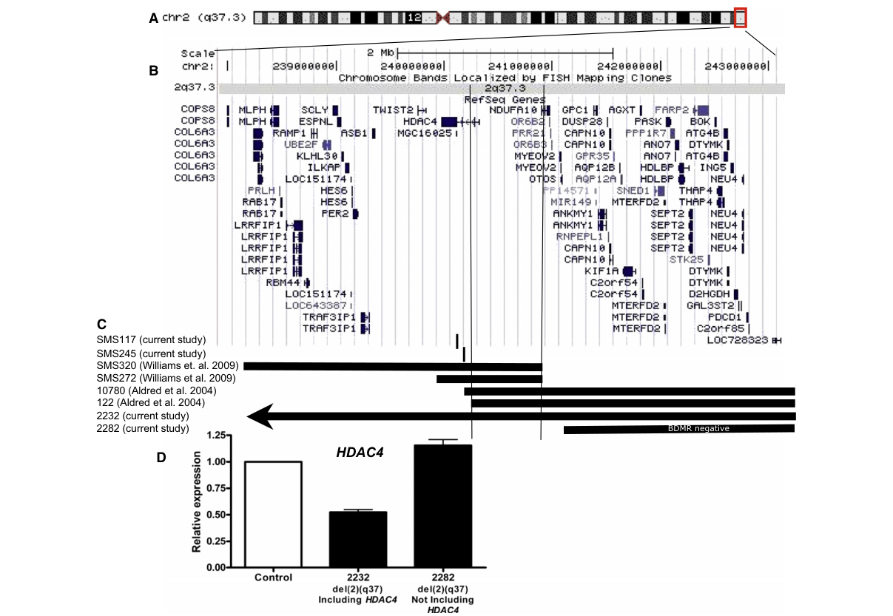

## Question

# Disease Characteristics Research Template

## Target Disease
- **Disease Name:** 2q37 Microdeletion Syndrome
- **MONDO ID:**  (if available)
- **Category:** Mendelian

## Research Objectives

Please provide a comprehensive research report on **2q37 Microdeletion Syndrome** covering all of the
disease characteristics listed below. This report will be used to populate a disease knowledge
base entry. Be thorough and cite primary literature (PMID preferred) for all claims.

For each section, **suggested databases/resources** are listed. These are the first places
you should search for information on each topic.

---

### 1. Disease Information
> **Search first:** OMIM, Orphanet, ICD-10/ICD-11, MeSH, PubMed

- What is the disease? Provide a concise overview.
- What are the key identifiers? (OMIM, Orphanet, ICD-10/ICD-11, MeSH, Mondo)
- What are the common synonyms and alternative names?
- Is the information derived from individual patients (e.g., EHR) or aggregated disease-level resources?

### 2. Etiology

- **Disease Causal Factors**: What are the primary causes? (genetic, environmental, infectious, mechanistic)
- **Risk Factors**:
  > **Search first:** PubMed, Cochrane Library, UpToDate, clinical guidelines, ClinVar, ClinGen, GWAS Catalog, PheGenI, CTD, CDC, WHO, epidemiological databases
  - Genetic risk factors (causal variants, susceptibility loci, modifier genes)
  - Environmental risk factors (toxins, lifestyle, occupational exposures, age, sex, family history)
- **Protective Factors**:
  > **Search first:** PubMed, Cochrane Library, clinical trial databases, GWAS Catalog, gnomAD, WHO, CDC, nutrition databases
  - Genetic protective factors (protective variants, modifier alleles)
  - Environmental protective factors (diet, lifestyle, exposures that reduce risk)
- **Gene-Environment Interactions**: How do genetic and environmental factors interact to influence disease?
  > **Search first:** CTD, PubMed, PheGenI, GxE databases

### 3. Phenotypes
> **Search first:** HPO (Human Phenotype Ontology), OMIM, Orphanet, PubMed, clinicaltrials.gov, MedDRA, SNOMED CT, DECIPHER, LOINC

For each phenotype, provide:
- **Phenotype type**: symptoms, clinical signs, physical manifestations, behavioral changes, or laboratory abnormalities
  > For symptoms/signs: HPO, OMIM, Orphanet, PubMed
  > For behavioral changes: HPO, DSM, RDoC (Research Domain Criteria), PubMed
  > For laboratory abnormalities: LOINC, SNOMED CT, LabTests Online, PubMed
- **Phenotype characteristics**:
  > **Search first:** OMIM, Orphanet, HPO, PubMed
  - Age of symptom onset (neonatal, childhood, adult-onset, late-onset)
  - Symptom severity (mild, moderate, severe, variable)
  - Symptom progression (stable, progressive, episodic, fluctuating)
  - Frequency among affected individuals (percentage or qualitative)
- **Quality of life impact**: Effects on daily functioning and well-being (per-phenotype when possible)
  > **Search first:** EQ-5D database, SF-36, WHO QOL databases, PubMed
- Suggest HPO (Human Phenotype Ontology) terms for each phenotype

### 4. Genetic/Molecular Information

- **Causal Genes**: Gene mutations or chromosomal abnormalities responsible for disease (gene symbols, OMIM IDs)
  > **Search first:** OMIM, ClinVar, HGMD, Ensembl, NCBI Gene
- **Pathogenic Variants**:
  - Affected genes (gene symbols, HGNC IDs)
    > **Search first:** OMIM, NCBI Gene, Ensembl, HGNC, UniProt, GeneCards
  - Variant classification (pathogenic, likely pathogenic, VUS per ACMG/AMP guidelines)
    > **Search first:** ClinVar, ClinGen, ACMG/AMP guidelines, VarSome
  - Variant type/class (missense, frameshift, nonsense, splice-site, structural)
  - Allele frequency in population databases
    > **Search first:** gnomAD, 1000 Genomes, ExAC, TOPMed, dbSNP
  - Somatic vs germline origin
    > **Search first:** COSMIC (somatic), ClinVar, ICGC, TCGA
  - Functional consequences (loss of function, gain of function, dominant negative)
- **Modifier Genes**: Genes that modify disease severity or expression
- **Epigenetic Information**: DNA methylation, histone modifications, chromatin changes affecting disease
  > **Search first:** ENCODE, Roadmap Epigenomics, MethBase, DiseaseMeth
- **Chromosomal Abnormalities**: Large-scale genetic changes (aneuploidy, translocations, inversions)
  > **Search first:** DECIPHER, ClinVar, ECARUCA, UCSC Genome Browser

### 5. Environmental Information

- **Environmental Factors**: Non-genetic contributing factors (toxins, radiation, pollution, occupational exposure)
  > **Search first:** CTD (Comparative Toxicogenomics Database), TOXNET, PubMed, EPA databases
- **Lifestyle Factors**: Behavioral factors (smoking, diet, exercise, alcohol consumption)
  > **Search first:** CDC databases, WHO, PubMed, NHANES
- **Infectious Agents**: If applicable, pathogens causing or triggering disease (bacteria, viruses, fungi, parasites)
  > **Search first:** NCBI Taxonomy, ViPR, BV-BRC, MicrobeDB, GIDEON

### 6. Mechanism / Pathophysiology

- **Molecular Pathways**: Specific signaling cascades or biochemical pathways involved (Wnt, MAPK, mTOR, PI3K-AKT, etc.)
  > **Search first:** KEGG, Reactome, WikiPathways, PathBank, BioCyc
- **Cellular Processes**: Cell-level mechanisms (apoptosis, autophagy, cell cycle dysregulation, inflammation, etc.)
  > **Search first:** Gene Ontology (GO), Reactome, KEGG, PubMed
- **Protein Dysfunction**: How protein structure or function is altered (misfolding, aggregation, loss of function, gain of function)
  > **Search first:** UniProt, PDB (Protein Data Bank), InterPro, Pfam, AlphaFold
- **Metabolic Changes**: Alterations in metabolic processes (energy metabolism, lipid metabolism, amino acid metabolism)
  > **Search first:** KEGG, BioCyc, HMDB (Human Metabolome Database), BRENDA
- **Immune System Involvement**: Role of immune response (autoimmunity, immunodeficiency, chronic inflammation)
  > **Search first:** ImmPort, Immunome Database, IEDB, Gene Ontology
- **Tissue Damage Mechanisms**: How tissues/ are injured (oxidative stress, ischemia, fibrosis, necrosis)
  > **Search first:** PubMed, Gene Ontology, Reactome
- **Biochemical Abnormalities**: Specific molecular defects (enzyme deficiencies, receptor dysfunction, ion channel defects)
  > **Search first:** BRENDA, UniProt, KEGG, OMIM, PubMed
- **Epigenetic Changes**: DNA methylation, histone modifications affecting gene expression in disease
  > **Search first:** ENCODE, Roadmap Epigenomics, MethBase, DiseaseMeth
- **Molecular Profiling** (if available):
  - Transcriptomics/gene expression changes
    > **Search first:** GEO (Gene Expression Omnibus), ArrayExpress, GTEx, Human Cell Atlas, SRA
  - Proteomics findings
    > **Search first:** PRIDE, ProteomeXchange, Human Protein Atlas, STRING, BioGRID
  - Metabolomics signatures
    > **Search first:** MetaboLights, Metabolomics Workbench, HMDB, METLIN
  - Lipidomics alterations
    > **Search first:** LIPID MAPS, SwissLipids, LipidHome, Metabolomics Workbench
  - Genomic structural features
    > **Search first:** UCSC Genome Browser, Ensembl, NCBI, dbVar, DGV
- **Advanced Technologies** (if applicable):
  - Single-cell analysis findings (cell-type specific mechanisms, cellular heterogeneity)
    > **Search first:** Human Cell Atlas, Single Cell Portal, GEO, CELLxGENE
  - Spatial transcriptomics findings
    > **Search first:** GEO, Spatial Research, Vizgen, 10x Genomics data
  - Multi-omics integration results
    > **Search first:** TCGA, ICGC, cBioPortal, LinkedOmics, PubMed
  - Functional genomics screens (CRISPR, RNAi)
    > **Search first:** DepMap, GenomeRNAi, PubMed, BioGRID ORCS

For each mechanism, describe:
- The causal chain from initial trigger to clinical manifestation
- Which mechanisms are upstream vs downstream
- What cell types and biological processes are involved
- Suggest GO terms for biological processes and CL terms for cell types

### 7. Anatomical Structures Affected

- **Organ Level**:
  - Primary organs directly affected
  - Secondary organ involvement (complications, secondary effects)
  - Body systems involved (cardiovascular, nervous, digestive, respiratory, endocrine, etc.)
  > **Search first:** Uberon, FMA (Foundational Model of Anatomy), OMIM, HPO, ICD-11, MeSH, SNOMED CT
- **Tissue and Cell Level**:
  - Specific tissue types affected (epithelial, connective, muscle, nervous)
  - Specific cell populations targeted (with Cell Ontology terms)
  > **Search first:** Uberon, Human Protein Atlas, Cell Ontology, Human Cell Atlas, CellMarker, PanglaoDB
- **Subcellular Level**:
  - Cellular compartments involved (mitochondria, nucleus, ER, lysosomes) (with GO Cellular Component terms)
  > **Search first:** Gene Ontology (Cellular Component), UniProt, Human Protein Atlas
- **Localization**:
  - Specific anatomical sites (with UBERON terms)
    > **Search first:** FMA, Uberon, NeuroNames (for brain), SNOMED CT
  - Lateralization (unilateral, bilateral, asymmetric)
    > **Search first:** HPO, clinical literature, imaging databases

### 8. Temporal Development

- **Onset**:
  - Typical age of onset (congenital, pediatric, adult, geriatric)
  - Onset pattern (acute, subacute, chronic, insidious)
  > **Search first:** OMIM, Orphanet, HPO, PubMed
- **Progression**:
  - Disease stages (early, intermediate, advanced, end-stage)
    > **Search first:** Cancer Staging Manual (AJCC), WHO classifications, PubMed
  - Progression rate (rapid, slow, variable)
  - Disease course pattern (episodic, relapsing-remitting, progressive, stable)
  - Disease duration (self-limited, chronic lifelong)
  > **Search first:** Disease registries, longitudinal cohort databases, natural history studies, PubMed, Orphanet, OMIM
- **Patterns**:
  - Remission patterns (spontaneous, treatment-induced)
    > **Search first:** Clinical trial databases, disease registries, PubMed
  - Critical periods (time windows of vulnerability or opportunity for intervention)
    > **Search first:** PubMed, developmental biology databases, clinical guidelines

### 9. Inheritance and Population

- **Epidemiology**:
  - Prevalence (cases per 100,000 at given time)
  - Incidence (new cases per 100,000 per year)
  > **Search first:** Orphanet, CDC, WHO, GBD (Global Burden of Disease), national registries, SEER, disease registries
- **For Genetic Etiology**:
  - Inheritance pattern (AD, AR, X-linked, mitochondrial, multifactorial, polygenic)
    > **Search first:** OMIM, Orphanet, ClinVar, GTR (Genetic Testing Registry)
  - Penetrance (complete, incomplete, age-dependent)
    > **Search first:** ClinVar, OMIM, PubMed, ClinGen
  - Expressivity (variable, consistent)
    > **Search first:** OMIM, ClinVar, PubMed
  - Genetic anticipation (increasing severity in successive generations)
    > **Search first:** OMIM, PubMed (especially for repeat expansion disorders)
  - Germline mosaicism
    > **Search first:** ClinVar, OMIM, genetic counseling literature, PubMed
  - Founder effects (population-specific mutations)
    > **Search first:** gnomAD, population genetics databases, PubMed
  - Consanguinity role
    > **Search first:** OMIM, population studies, genetic counseling resources
  - Carrier frequency
    > **Search first:** gnomAD, carrier screening databases, GeneReviews, GTR
- **Population Demographics**:
  - Affected populations (ethnic or demographic groups with higher prevalence)
    > **Search first:** gnomAD, 1000 Genomes, PAGE Study, PubMed, population registries
  - Geographic distribution (endemic areas, regional variation)
    > **Search first:** WHO, CDC, GBD, Orphanet, geographic epidemiology databases
  - Geographic distribution of specific variants
  - Sex ratio (male:female)
    > **Search first:** Disease registries, OMIM, PubMed, epidemiological databases
  - Age distribution of affected individuals
    > **Search first:** CDC, disease registries, SEER, Orphanet

### 10. Diagnostics

- **Clinical Tests**:
  - Laboratory tests (blood, urine, tissue chemistry, specific enzyme assays)
    > **Search first:** LOINC, LabTests Online, PubMed
  - Biomarkers (proteins, metabolites, genetic markers, circulating biomarkers)
    > **Search first:** FDA Biomarker List, BEST (Biomarkers, EndpointS, and other Tools), PubMed
  - Imaging studies (X-ray, CT, MRI, PET, ultrasound)
    > **Search first:** RadLex, DICOM, Radiopaedia, imaging databases
  - Functional tests (pulmonary function, cardiac stress tests)
    > **Search first:** LOINC, clinical guidelines, PubMed
  - Electrophysiology (EEG, EMG, ECG, nerve conduction studies)
    > **Search first:** LOINC, clinical neurophysiology databases, PubMed
  - Biopsy findings (histopathology, immunohistochemistry)
    > **Search first:** SNOMED CT, College of American Pathologists resources, PubMed
  - Pathology findings (microscopic examination)
    > **Search first:** SNOMED CT, Digital Pathology databases, PubMed
- **Genetic Testing**:
  > **Search first:** GTR (Genetic Testing Registry), GeneReviews, ClinGen
  - Overview of recommended genetic testing approach
  - Whole genome sequencing (WGS) utility
    > **Search first:** GTR, ClinVar, GEL (Genomics England), gnomAD
  - Whole exome sequencing (WES) utility
    > **Search first:** GTR, ClinVar, OMIM, GeneMatcher
  - Gene panels (which panels, which genes)
    > **Search first:** GTR, ClinVar, laboratory-specific databases
  - Single gene testing
    > **Search first:** GTR, ClinVar, OMIM, GeneReviews
  - Chromosomal microarray (CMA)
    > **Search first:** DECIPHER, ClinVar, dbVar, ECARUCA
  - Karyotyping
    > **Search first:** Chromosome Abnormality Database, ClinVar, cytogenetics resources
  - FISH
    > **Search first:** ClinVar, cytogenetics databases, PubMed
  - Mitochondrial DNA testing
    > **Search first:** MITOMAP, MSeqDR, ClinVar, GTR
  - Repeat expansion testing
    > **Search first:** GTR, ClinVar, repeat expansion databases, PubMed
- **Omics-Based Diagnostics** (if applicable):
  - RNA sequencing / transcriptomics
    > **Search first:** GEO, ArrayExpress, GTEx, RNA-seq databases
  - Proteomics
    > **Search first:** PRIDE, ProteomeXchange, FDA Biomarker database
  - Metabolomics
    > **Search first:** MetaboLights, Metabolomics Workbench, HMDB
  - Epigenomics
    > **Search first:** GEO, ENCODE, Roadmap Epigenomics, MethBase
  - Liquid biopsy
    > **Search first:** COSMIC, ClinVar, liquid biopsy databases, PubMed
- **Clinical Criteria**:
  - Standardized diagnostic criteria (DSM, ICD, society guidelines)
    > **Search first:** DSM-5, ICD-11, clinical society guidelines, UpToDate
  - Differential diagnosis (other conditions to rule out, with distinguishing features)
    > **Search first:** DynaMed, UpToDate, clinical decision support systems
- **Screening**:
  - Screening methods for asymptomatic individuals (newborn screening, carrier screening, cascade screening)
    > **Search first:** ACMG recommendations, CDC newborn screening, GTR

### 11. Outcome/Prognosis

- **Survival and Mortality**:
  - Survival rate (5-year, 10-year, overall)
    > **Search first:** SEER, cancer registries, disease-specific registries, PubMed
  - Life expectancy (with and without treatment if applicable)
    > **Search first:** Orphanet, disease registries, actuarial databases, PubMed
  - Mortality rate
    > **Search first:** CDC, WHO, GBD, national mortality databases
  - Disease-specific mortality (deaths directly attributable to disease)
    > **Search first:** Disease registries, CDC Wonder, GBD, PubMed
- **Morbidity and Function**:
  - Morbidity (disease-related disability and health impacts)
    > **Search first:** GBD, WHO, disability databases, PubMed
  - Disability outcomes (long-term functional impairments)
    > **Search first:** ICF (International Classification of Functioning), disability registries
  - Quality of life measures (EQ-5D, SF-36, PROMIS, disease-specific tools)
    > **Search first:** EQ-5D database, SF-36, PROMIS, PubMed
- **Disease Course**:
  - Complications (secondary problems: infections, organ failure, etc.)
    > **Search first:** ICD codes, disease registries, clinical databases, PubMed
  - Recovery potential (likelihood and extent of recovery, with vs without treatment)
    > **Search first:** Natural history studies, rehabilitation databases, PubMed
- **Prediction**:
  - Prognostic factors (age, disease severity, biomarkers, treatment response)
    > **Search first:** Prognostic models databases, clinical calculators, PubMed
  - Prognostic biomarkers (molecular markers predicting disease course)
    > **Search first:** FDA Biomarker database, PubMed, cancer prognostic databases

### 12. Treatment

- **Pharmacotherapy**:
  - Pharmacological treatments (drug names, drug classes, mechanisms of action)
    > **Search first:** DrugBank, RxNorm, ATC classification, DailyMed, FDA databases
  - Pharmacogenomics (how genetic variants affect drug metabolism, efficacy, toxicity)
    > **Search first:** PharmGKB, CPIC (Clinical Pharmacogenetics), FDA Table of PGx Biomarkers
- **Advanced Therapeutics**:
  - Gene therapy (viral vectors, CRISPR, gene replacement, gene editing)
    > **Search first:** ClinicalTrials.gov, FDA gene therapy database, ASGCT resources
  - Cell therapy (stem cell transplant, CAR-T, cellular therapeutics)
    > **Search first:** ClinicalTrials.gov, FDA cell therapy database, FACT standards
  - RNA-based therapies (ASOs, siRNA, mRNA therapies)
    > **Search first:** ClinicalTrials.gov, FDA approvals, PubMed
  - Targeted therapies (treatments directed at specific molecular targets)
    > **Search first:** My Cancer Genome, OncoKB, ClinicalTrials.gov, FDA approvals
  - Immunotherapies (checkpoint inhibitors, monoclonal antibodies)
    > **Search first:** Cancer Immunotherapy Database, FDA approvals, ClinicalTrials.gov
- **Surgical and Interventional**:
  - Surgical interventions (types of surgery, timing, outcomes)
    > **Search first:** CPT codes, surgical registries, clinical guidelines, PubMed
- **Supportive and Rehabilitative**:
  - Supportive care (symptom management, pain control, nutrition)
    > **Search first:** Clinical guidelines, Cochrane Library, PubMed
  - Rehabilitation (physical therapy, occupational therapy, speech therapy)
    > **Search first:** Rehabilitation medicine databases, clinical guidelines, PubMed
- **Experimental**:
  - Experimental treatments in clinical trials (with NCT identifiers if available)
    > **Search first:** ClinicalTrials.gov, EU Clinical Trials Register, WHO ICTRP
- **Treatment Outcomes**:
  - Treatment response rates
    > **Search first:** Clinical trial databases, FDA reviews, systematic reviews, PubMed
  - Side effects and adverse events
    > **Search first:** FDA Adverse Event Reporting System (FAERS), MedWatch, PubMed
- **Treatment Strategy**:
  - Treatment algorithms (clinical pathways, decision trees)
    > **Search first:** Clinical practice guidelines, NCCN Guidelines, UpToDate
  - Combination therapies
    > **Search first:** ClinicalTrials.gov, treatment guidelines, PubMed
  - Personalized medicine approaches (genotype-guided treatment)
    > **Search first:** My Cancer Genome, CIViC, PharmGKB, precision medicine databases

For each treatment, suggest MAXO (Medical Action Ontology) terms where applicable.

### 13. Prevention

- **Prevention Levels**:
  - Primary prevention (preventing disease occurrence: vaccination, risk factor modification)
    > **Search first:** CDC, WHO, USPSTF recommendations, Cochrane Library
  - Secondary prevention (early detection and treatment: screening programs, early intervention)
    > **Search first:** USPSTF, CDC screening guidelines, WHO
  - Tertiary prevention (preventing complications in those with disease)
    > **Search first:** Clinical guidelines, disease management protocols, PubMed
- **Immunization**: Vaccine strategies (if applicable)
  > **Search first:** CDC vaccine schedules, WHO immunization, FDA vaccine database
- **Screening and Early Detection**:
  - Screening programs (population-based: newborn screening, cancer screening)
    > **Search first:** CDC screening programs, USPSTF, cancer screening databases
  - Genetic screening (carrier screening, preimplantation genetic diagnosis, prenatal testing)
    > **Search first:** ACMG recommendations, ACOG guidelines, GTR
  - Risk stratification (identifying high-risk individuals for targeted prevention)
    > **Search first:** Risk prediction models, clinical calculators, PubMed
- **Behavioral Interventions**: Lifestyle modifications to reduce risk
  > **Search first:** CDC, WHO, behavioral intervention databases, Cochrane Library
- **Counseling**: Genetic counseling (risk assessment, family planning guidance)
  > **Search first:** NSGC resources, ACMG guidelines, GeneReviews
- **Public Health**:
  - Public health interventions (sanitation, vector control, health education)
    > **Search first:** CDC, WHO, public health databases, PubMed
  - Environmental interventions (reducing environmental risk factors)
    > **Search first:** EPA databases, WHO environmental health, PubMed
- **Prophylaxis**: Preventive medications or procedures
  > **Search first:** Clinical guidelines, FDA approvals, PubMed

### 14. Other Species / Natural Disease

- **Taxonomy**: Species affected (with NCBI Taxon identifiers)
  > **Search first:** NCBI Taxonomy
- **Breed**: Specific breeds affected (with VBO identifiers if applicable)
  > **Search first:** VBO (Vertebrate Breed Ontology)
- **Gene**: Orthologous genes in other species (with NCBI Gene IDs)
  > **Search first:** NCBI Gene
- **Natural Disease**:
  - Naturally occurring disease in other species (companion animals, wildlife)
    > **Search first:** OMIA (Online Mendelian Inheritance in Animals), VetCompass, PubMed
  - Veterinary relevance and importance in animal health
    > **Search first:** OMIA, veterinary databases, PubMed
- **Comparative Biology**:
  - Comparative pathology (similarities and differences across species)
    > **Search first:** OMIA, comparative pathology databases, PubMed
  - Evolutionary conservation of disease mechanisms
    > **Search first:** HomoloGene, OrthoMCL, Alliance of Genome Resources
- **Transmission** (if applicable):
  - Zoonotic potential
    > **Search first:** CDC zoonotic diseases, WHO zoonoses, GIDEON
  - Cross-species susceptibility
    > **Search first:** NCBI Taxonomy, veterinary databases, PubMed

### 15. Model Organisms

- **Model Types**:
  - Model organism type (mammalian, invertebrate, cellular, in vitro)
    > **Search first:** Alliance of Genome Resources, model organism databases
  - Specific model systems (mouse, rat, zebrafish, Drosophila, C. elegans, yeast, cell lines, organoids, iPSCs)
    > **Search first:** MGI, RGD, ZFIN, FlyBase, WormBase, SGD, ATCC, Cellosaurus
  - Induced models (drug treatment, surgical intervention, environmental manipulation)
    > **Search first:** MGI, model organism databases, PubMed
- **Genetic Models**:
  - Types available (knockout, knock-in, transgenic, conditional, humanized)
    > **Search first:** MGI, IMPC, KOMP, EuMMCR, IMSR
- **Model Characteristics**:
  - Phenotype recapitulation (how well model reproduces human disease features)
    > **Search first:** Model organism databases, comparative studies, PubMed
  - Model limitations (aspects of human disease not captured)
    > **Search first:** Model organism databases, PubMed, review articles
- **Applications**:
  - Research applications (what aspects of disease can be studied)
    > **Search first:** Model organism databases, PubMed
- **Resources**:
  - Model databases
    > **Search first:** MGI, RGD, ZFIN, FlyBase, WormBase, IMSR, EMMA, MMRRC

---

## Citation Requirements

- Cite primary literature (PMID preferred) for all mechanistic and clinical claims
- Prioritize recent reviews and landmark papers
- Include direct quotes from abstracts where possible to support key statements
- Distinguish evidence source types: human clinical, model organism, in vitro, computational

## Output Format

Structure your response as a comprehensive narrative organized by the sections above.
For each section, provide:
- Factual content with specific details (numbers, percentages, gene names, variant nomenclature)
- Ontology term suggestions (HPO, GO, CL, UBERON, CHEBI, MAXO, MONDO) where applicable
- Evidence citations with PMIDs
- Direct quotes from abstracts to support key claims
- Clear indication when information is not available or not applicable for this disease

This report will be used to populate a disease knowledge base entry with:
- Pathophysiology descriptions with causal chains
- Gene/protein annotations (HGNC, GO terms)
- Phenotype associations (HP terms) with frequencies
- Cell type involvement (CL terms)
- Anatomical locations (UBERON terms)
- Chemical entities (CHEBI terms)
- Treatment annotations (MAXO terms)
- Evidence items with PMIDs and exact abstract quotes
- Epidemiology, prognosis, diagnostic, and prevention information
- Animal model descriptions with phenotype recapitulation details

## Output

Question: You are an expert researcher providing comprehensive, well-cited information.

Provide detailed information focusing on:
1. Key concepts and definitions with current understanding
2. Recent developments and latest research (prioritize 2023-2024 sources)
3. Current applications and real-world implementations
4. Expert opinions and analysis from authoritative sources
5. Relevant statistics and data from recent studies

Format as a comprehensive research report with proper citations. Include URLs and publication dates where available.
Always prioritize recent, authoritative sources and provide specific citations for all major claims.

# Disease Characteristics Research Template

## Target Disease
- **Disease Name:** 2q37 Microdeletion Syndrome
- **MONDO ID:**  (if available)
- **Category:** Mendelian

## Research Objectives

Please provide a comprehensive research report on **2q37 Microdeletion Syndrome** covering all of the
disease characteristics listed below. This report will be used to populate a disease knowledge
base entry. Be thorough and cite primary literature (PMID preferred) for all claims.

For each section, **suggested databases/resources** are listed. These are the first places
you should search for information on each topic.

---

### 1. Disease Information
> **Search first:** OMIM, Orphanet, ICD-10/ICD-11, MeSH, PubMed

- What is the disease? Provide a concise overview.
- What are the key identifiers? (OMIM, Orphanet, ICD-10/ICD-11, MeSH, Mondo)
- What are the common synonyms and alternative names?
- Is the information derived from individual patients (e.g., EHR) or aggregated disease-level resources?

### 2. Etiology

- **Disease Causal Factors**: What are the primary causes? (genetic, environmental, infectious, mechanistic)
- **Risk Factors**:
  > **Search first:** PubMed, Cochrane Library, UpToDate, clinical guidelines, ClinVar, ClinGen, GWAS Catalog, PheGenI, CTD, CDC, WHO, epidemiological databases
  - Genetic risk factors (causal variants, susceptibility loci, modifier genes)
  - Environmental risk factors (toxins, lifestyle, occupational exposures, age, sex, family history)
- **Protective Factors**:
  > **Search first:** PubMed, Cochrane Library, clinical trial databases, GWAS Catalog, gnomAD, WHO, CDC, nutrition databases
  - Genetic protective factors (protective variants, modifier alleles)
  - Environmental protective factors (diet, lifestyle, exposures that reduce risk)
- **Gene-Environment Interactions**: How do genetic and environmental factors interact to influence disease?
  > **Search first:** CTD, PubMed, PheGenI, GxE databases

### 3. Phenotypes
> **Search first:** HPO (Human Phenotype Ontology), OMIM, Orphanet, PubMed, clinicaltrials.gov, MedDRA, SNOMED CT, DECIPHER, LOINC

For each phenotype, provide:
- **Phenotype type**: symptoms, clinical signs, physical manifestations, behavioral changes, or laboratory abnormalities
  > For symptoms/signs: HPO, OMIM, Orphanet, PubMed
  > For behavioral changes: HPO, DSM, RDoC (Research Domain Criteria), PubMed
  > For laboratory abnormalities: LOINC, SNOMED CT, LabTests Online, PubMed
- **Phenotype characteristics**:
  > **Search first:** OMIM, Orphanet, HPO, PubMed
  - Age of symptom onset (neonatal, childhood, adult-onset, late-onset)
  - Symptom severity (mild, moderate, severe, variable)
  - Symptom progression (stable, progressive, episodic, fluctuating)
  - Frequency among affected individuals (percentage or qualitative)
- **Quality of life impact**: Effects on daily functioning and well-being (per-phenotype when possible)
  > **Search first:** EQ-5D database, SF-36, WHO QOL databases, PubMed
- Suggest HPO (Human Phenotype Ontology) terms for each phenotype

### 4. Genetic/Molecular Information

- **Causal Genes**: Gene mutations or chromosomal abnormalities responsible for disease (gene symbols, OMIM IDs)
  > **Search first:** OMIM, ClinVar, HGMD, Ensembl, NCBI Gene
- **Pathogenic Variants**:
  - Affected genes (gene symbols, HGNC IDs)
    > **Search first:** OMIM, NCBI Gene, Ensembl, HGNC, UniProt, GeneCards
  - Variant classification (pathogenic, likely pathogenic, VUS per ACMG/AMP guidelines)
    > **Search first:** ClinVar, ClinGen, ACMG/AMP guidelines, VarSome
  - Variant type/class (missense, frameshift, nonsense, splice-site, structural)
  - Allele frequency in population databases
    > **Search first:** gnomAD, 1000 Genomes, ExAC, TOPMed, dbSNP
  - Somatic vs germline origin
    > **Search first:** COSMIC (somatic), ClinVar, ICGC, TCGA
  - Functional consequences (loss of function, gain of function, dominant negative)
- **Modifier Genes**: Genes that modify disease severity or expression
- **Epigenetic Information**: DNA methylation, histone modifications, chromatin changes affecting disease
  > **Search first:** ENCODE, Roadmap Epigenomics, MethBase, DiseaseMeth
- **Chromosomal Abnormalities**: Large-scale genetic changes (aneuploidy, translocations, inversions)
  > **Search first:** DECIPHER, ClinVar, ECARUCA, UCSC Genome Browser

### 5. Environmental Information

- **Environmental Factors**: Non-genetic contributing factors (toxins, radiation, pollution, occupational exposure)
  > **Search first:** CTD (Comparative Toxicogenomics Database), TOXNET, PubMed, EPA databases
- **Lifestyle Factors**: Behavioral factors (smoking, diet, exercise, alcohol consumption)
  > **Search first:** CDC databases, WHO, PubMed, NHANES
- **Infectious Agents**: If applicable, pathogens causing or triggering disease (bacteria, viruses, fungi, parasites)
  > **Search first:** NCBI Taxonomy, ViPR, BV-BRC, MicrobeDB, GIDEON

### 6. Mechanism / Pathophysiology

- **Molecular Pathways**: Specific signaling cascades or biochemical pathways involved (Wnt, MAPK, mTOR, PI3K-AKT, etc.)
  > **Search first:** KEGG, Reactome, WikiPathways, PathBank, BioCyc
- **Cellular Processes**: Cell-level mechanisms (apoptosis, autophagy, cell cycle dysregulation, inflammation, etc.)
  > **Search first:** Gene Ontology (GO), Reactome, KEGG, PubMed
- **Protein Dysfunction**: How protein structure or function is altered (misfolding, aggregation, loss of function, gain of function)
  > **Search first:** UniProt, PDB (Protein Data Bank), InterPro, Pfam, AlphaFold
- **Metabolic Changes**: Alterations in metabolic processes (energy metabolism, lipid metabolism, amino acid metabolism)
  > **Search first:** KEGG, BioCyc, HMDB (Human Metabolome Database), BRENDA
- **Immune System Involvement**: Role of immune response (autoimmunity, immunodeficiency, chronic inflammation)
  > **Search first:** ImmPort, Immunome Database, IEDB, Gene Ontology
- **Tissue Damage Mechanisms**: How tissues/ are injured (oxidative stress, ischemia, fibrosis, necrosis)
  > **Search first:** PubMed, Gene Ontology, Reactome
- **Biochemical Abnormalities**: Specific molecular defects (enzyme deficiencies, receptor dysfunction, ion channel defects)
  > **Search first:** BRENDA, UniProt, KEGG, OMIM, PubMed
- **Epigenetic Changes**: DNA methylation, histone modifications affecting gene expression in disease
  > **Search first:** ENCODE, Roadmap Epigenomics, MethBase, DiseaseMeth
- **Molecular Profiling** (if available):
  - Transcriptomics/gene expression changes
    > **Search first:** GEO (Gene Expression Omnibus), ArrayExpress, GTEx, Human Cell Atlas, SRA
  - Proteomics findings
    > **Search first:** PRIDE, ProteomeXchange, Human Protein Atlas, STRING, BioGRID
  - Metabolomics signatures
    > **Search first:** MetaboLights, Metabolomics Workbench, HMDB, METLIN
  - Lipidomics alterations
    > **Search first:** LIPID MAPS, SwissLipids, LipidHome, Metabolomics Workbench
  - Genomic structural features
    > **Search first:** UCSC Genome Browser, Ensembl, NCBI, dbVar, DGV
- **Advanced Technologies** (if applicable):
  - Single-cell analysis findings (cell-type specific mechanisms, cellular heterogeneity)
    > **Search first:** Human Cell Atlas, Single Cell Portal, GEO, CELLxGENE
  - Spatial transcriptomics findings
    > **Search first:** GEO, Spatial Research, Vizgen, 10x Genomics data
  - Multi-omics integration results
    > **Search first:** TCGA, ICGC, cBioPortal, LinkedOmics, PubMed
  - Functional genomics screens (CRISPR, RNAi)
    > **Search first:** DepMap, GenomeRNAi, PubMed, BioGRID ORCS

For each mechanism, describe:
- The causal chain from initial trigger to clinical manifestation
- Which mechanisms are upstream vs downstream
- What cell types and biological processes are involved
- Suggest GO terms for biological processes and CL terms for cell types

### 7. Anatomical Structures Affected

- **Organ Level**:
  - Primary organs directly affected
  - Secondary organ involvement (complications, secondary effects)
  - Body systems involved (cardiovascular, nervous, digestive, respiratory, endocrine, etc.)
  > **Search first:** Uberon, FMA (Foundational Model of Anatomy), OMIM, HPO, ICD-11, MeSH, SNOMED CT
- **Tissue and Cell Level**:
  - Specific tissue types affected (epithelial, connective, muscle, nervous)
  - Specific cell populations targeted (with Cell Ontology terms)
  > **Search first:** Uberon, Human Protein Atlas, Cell Ontology, Human Cell Atlas, CellMarker, PanglaoDB
- **Subcellular Level**:
  - Cellular compartments involved (mitochondria, nucleus, ER, lysosomes) (with GO Cellular Component terms)
  > **Search first:** Gene Ontology (Cellular Component), UniProt, Human Protein Atlas
- **Localization**:
  - Specific anatomical sites (with UBERON terms)
    > **Search first:** FMA, Uberon, NeuroNames (for brain), SNOMED CT
  - Lateralization (unilateral, bilateral, asymmetric)
    > **Search first:** HPO, clinical literature, imaging databases

### 8. Temporal Development

- **Onset**:
  - Typical age of onset (congenital, pediatric, adult, geriatric)
  - Onset pattern (acute, subacute, chronic, insidious)
  > **Search first:** OMIM, Orphanet, HPO, PubMed
- **Progression**:
  - Disease stages (early, intermediate, advanced, end-stage)
    > **Search first:** Cancer Staging Manual (AJCC), WHO classifications, PubMed
  - Progression rate (rapid, slow, variable)
  - Disease course pattern (episodic, relapsing-remitting, progressive, stable)
  - Disease duration (self-limited, chronic lifelong)
  > **Search first:** Disease registries, longitudinal cohort databases, natural history studies, PubMed, Orphanet, OMIM
- **Patterns**:
  - Remission patterns (spontaneous, treatment-induced)
    > **Search first:** Clinical trial databases, disease registries, PubMed
  - Critical periods (time windows of vulnerability or opportunity for intervention)
    > **Search first:** PubMed, developmental biology databases, clinical guidelines

### 9. Inheritance and Population

- **Epidemiology**:
  - Prevalence (cases per 100,000 at given time)
  - Incidence (new cases per 100,000 per year)
  > **Search first:** Orphanet, CDC, WHO, GBD (Global Burden of Disease), national registries, SEER, disease registries
- **For Genetic Etiology**:
  - Inheritance pattern (AD, AR, X-linked, mitochondrial, multifactorial, polygenic)
    > **Search first:** OMIM, Orphanet, ClinVar, GTR (Genetic Testing Registry)
  - Penetrance (complete, incomplete, age-dependent)
    > **Search first:** ClinVar, OMIM, PubMed, ClinGen
  - Expressivity (variable, consistent)
    > **Search first:** OMIM, ClinVar, PubMed
  - Genetic anticipation (increasing severity in successive generations)
    > **Search first:** OMIM, PubMed (especially for repeat expansion disorders)
  - Germline mosaicism
    > **Search first:** ClinVar, OMIM, genetic counseling literature, PubMed
  - Founder effects (population-specific mutations)
    > **Search first:** gnomAD, population genetics databases, PubMed
  - Consanguinity role
    > **Search first:** OMIM, population studies, genetic counseling resources
  - Carrier frequency
    > **Search first:** gnomAD, carrier screening databases, GeneReviews, GTR
- **Population Demographics**:
  - Affected populations (ethnic or demographic groups with higher prevalence)
    > **Search first:** gnomAD, 1000 Genomes, PAGE Study, PubMed, population registries
  - Geographic distribution (endemic areas, regional variation)
    > **Search first:** WHO, CDC, GBD, Orphanet, geographic epidemiology databases
  - Geographic distribution of specific variants
  - Sex ratio (male:female)
    > **Search first:** Disease registries, OMIM, PubMed, epidemiological databases
  - Age distribution of affected individuals
    > **Search first:** CDC, disease registries, SEER, Orphanet

### 10. Diagnostics

- **Clinical Tests**:
  - Laboratory tests (blood, urine, tissue chemistry, specific enzyme assays)
    > **Search first:** LOINC, LabTests Online, PubMed
  - Biomarkers (proteins, metabolites, genetic markers, circulating biomarkers)
    > **Search first:** FDA Biomarker List, BEST (Biomarkers, EndpointS, and other Tools), PubMed
  - Imaging studies (X-ray, CT, MRI, PET, ultrasound)
    > **Search first:** RadLex, DICOM, Radiopaedia, imaging databases
  - Functional tests (pulmonary function, cardiac stress tests)
    > **Search first:** LOINC, clinical guidelines, PubMed
  - Electrophysiology (EEG, EMG, ECG, nerve conduction studies)
    > **Search first:** LOINC, clinical neurophysiology databases, PubMed
  - Biopsy findings (histopathology, immunohistochemistry)
    > **Search first:** SNOMED CT, College of American Pathologists resources, PubMed
  - Pathology findings (microscopic examination)
    > **Search first:** SNOMED CT, Digital Pathology databases, PubMed
- **Genetic Testing**:
  > **Search first:** GTR (Genetic Testing Registry), GeneReviews, ClinGen
  - Overview of recommended genetic testing approach
  - Whole genome sequencing (WGS) utility
    > **Search first:** GTR, ClinVar, GEL (Genomics England), gnomAD
  - Whole exome sequencing (WES) utility
    > **Search first:** GTR, ClinVar, OMIM, GeneMatcher
  - Gene panels (which panels, which genes)
    > **Search first:** GTR, ClinVar, laboratory-specific databases
  - Single gene testing
    > **Search first:** GTR, ClinVar, OMIM, GeneReviews
  - Chromosomal microarray (CMA)
    > **Search first:** DECIPHER, ClinVar, dbVar, ECARUCA
  - Karyotyping
    > **Search first:** Chromosome Abnormality Database, ClinVar, cytogenetics resources
  - FISH
    > **Search first:** ClinVar, cytogenetics databases, PubMed
  - Mitochondrial DNA testing
    > **Search first:** MITOMAP, MSeqDR, ClinVar, GTR
  - Repeat expansion testing
    > **Search first:** GTR, ClinVar, repeat expansion databases, PubMed
- **Omics-Based Diagnostics** (if applicable):
  - RNA sequencing / transcriptomics
    > **Search first:** GEO, ArrayExpress, GTEx, RNA-seq databases
  - Proteomics
    > **Search first:** PRIDE, ProteomeXchange, FDA Biomarker database
  - Metabolomics
    > **Search first:** MetaboLights, Metabolomics Workbench, HMDB
  - Epigenomics
    > **Search first:** GEO, ENCODE, Roadmap Epigenomics, MethBase
  - Liquid biopsy
    > **Search first:** COSMIC, ClinVar, liquid biopsy databases, PubMed
- **Clinical Criteria**:
  - Standardized diagnostic criteria (DSM, ICD, society guidelines)
    > **Search first:** DSM-5, ICD-11, clinical society guidelines, UpToDate
  - Differential diagnosis (other conditions to rule out, with distinguishing features)
    > **Search first:** DynaMed, UpToDate, clinical decision support systems
- **Screening**:
  - Screening methods for asymptomatic individuals (newborn screening, carrier screening, cascade screening)
    > **Search first:** ACMG recommendations, CDC newborn screening, GTR

### 11. Outcome/Prognosis

- **Survival and Mortality**:
  - Survival rate (5-year, 10-year, overall)
    > **Search first:** SEER, cancer registries, disease-specific registries, PubMed
  - Life expectancy (with and without treatment if applicable)
    > **Search first:** Orphanet, disease registries, actuarial databases, PubMed
  - Mortality rate
    > **Search first:** CDC, WHO, GBD, national mortality databases
  - Disease-specific mortality (deaths directly attributable to disease)
    > **Search first:** Disease registries, CDC Wonder, GBD, PubMed
- **Morbidity and Function**:
  - Morbidity (disease-related disability and health impacts)
    > **Search first:** GBD, WHO, disability databases, PubMed
  - Disability outcomes (long-term functional impairments)
    > **Search first:** ICF (International Classification of Functioning), disability registries
  - Quality of life measures (EQ-5D, SF-36, PROMIS, disease-specific tools)
    > **Search first:** EQ-5D database, SF-36, PROMIS, PubMed
- **Disease Course**:
  - Complications (secondary problems: infections, organ failure, etc.)
    > **Search first:** ICD codes, disease registries, clinical databases, PubMed
  - Recovery potential (likelihood and extent of recovery, with vs without treatment)
    > **Search first:** Natural history studies, rehabilitation databases, PubMed
- **Prediction**:
  - Prognostic factors (age, disease severity, biomarkers, treatment response)
    > **Search first:** Prognostic models databases, clinical calculators, PubMed
  - Prognostic biomarkers (molecular markers predicting disease course)
    > **Search first:** FDA Biomarker database, PubMed, cancer prognostic databases

### 12. Treatment

- **Pharmacotherapy**:
  - Pharmacological treatments (drug names, drug classes, mechanisms of action)
    > **Search first:** DrugBank, RxNorm, ATC classification, DailyMed, FDA databases
  - Pharmacogenomics (how genetic variants affect drug metabolism, efficacy, toxicity)
    > **Search first:** PharmGKB, CPIC (Clinical Pharmacogenetics), FDA Table of PGx Biomarkers
- **Advanced Therapeutics**:
  - Gene therapy (viral vectors, CRISPR, gene replacement, gene editing)
    > **Search first:** ClinicalTrials.gov, FDA gene therapy database, ASGCT resources
  - Cell therapy (stem cell transplant, CAR-T, cellular therapeutics)
    > **Search first:** ClinicalTrials.gov, FDA cell therapy database, FACT standards
  - RNA-based therapies (ASOs, siRNA, mRNA therapies)
    > **Search first:** ClinicalTrials.gov, FDA approvals, PubMed
  - Targeted therapies (treatments directed at specific molecular targets)
    > **Search first:** My Cancer Genome, OncoKB, ClinicalTrials.gov, FDA approvals
  - Immunotherapies (checkpoint inhibitors, monoclonal antibodies)
    > **Search first:** Cancer Immunotherapy Database, FDA approvals, ClinicalTrials.gov
- **Surgical and Interventional**:
  - Surgical interventions (types of surgery, timing, outcomes)
    > **Search first:** CPT codes, surgical registries, clinical guidelines, PubMed
- **Supportive and Rehabilitative**:
  - Supportive care (symptom management, pain control, nutrition)
    > **Search first:** Clinical guidelines, Cochrane Library, PubMed
  - Rehabilitation (physical therapy, occupational therapy, speech therapy)
    > **Search first:** Rehabilitation medicine databases, clinical guidelines, PubMed
- **Experimental**:
  - Experimental treatments in clinical trials (with NCT identifiers if available)
    > **Search first:** ClinicalTrials.gov, EU Clinical Trials Register, WHO ICTRP
- **Treatment Outcomes**:
  - Treatment response rates
    > **Search first:** Clinical trial databases, FDA reviews, systematic reviews, PubMed
  - Side effects and adverse events
    > **Search first:** FDA Adverse Event Reporting System (FAERS), MedWatch, PubMed
- **Treatment Strategy**:
  - Treatment algorithms (clinical pathways, decision trees)
    > **Search first:** Clinical practice guidelines, NCCN Guidelines, UpToDate
  - Combination therapies
    > **Search first:** ClinicalTrials.gov, treatment guidelines, PubMed
  - Personalized medicine approaches (genotype-guided treatment)
    > **Search first:** My Cancer Genome, CIViC, PharmGKB, precision medicine databases

For each treatment, suggest MAXO (Medical Action Ontology) terms where applicable.

### 13. Prevention

- **Prevention Levels**:
  - Primary prevention (preventing disease occurrence: vaccination, risk factor modification)
    > **Search first:** CDC, WHO, USPSTF recommendations, Cochrane Library
  - Secondary prevention (early detection and treatment: screening programs, early intervention)
    > **Search first:** USPSTF, CDC screening guidelines, WHO
  - Tertiary prevention (preventing complications in those with disease)
    > **Search first:** Clinical guidelines, disease management protocols, PubMed
- **Immunization**: Vaccine strategies (if applicable)
  > **Search first:** CDC vaccine schedules, WHO immunization, FDA vaccine database
- **Screening and Early Detection**:
  - Screening programs (population-based: newborn screening, cancer screening)
    > **Search first:** CDC screening programs, USPSTF, cancer screening databases
  - Genetic screening (carrier screening, preimplantation genetic diagnosis, prenatal testing)
    > **Search first:** ACMG recommendations, ACOG guidelines, GTR
  - Risk stratification (identifying high-risk individuals for targeted prevention)
    > **Search first:** Risk prediction models, clinical calculators, PubMed
- **Behavioral Interventions**: Lifestyle modifications to reduce risk
  > **Search first:** CDC, WHO, behavioral intervention databases, Cochrane Library
- **Counseling**: Genetic counseling (risk assessment, family planning guidance)
  > **Search first:** NSGC resources, ACMG guidelines, GeneReviews
- **Public Health**:
  - Public health interventions (sanitation, vector control, health education)
    > **Search first:** CDC, WHO, public health databases, PubMed
  - Environmental interventions (reducing environmental risk factors)
    > **Search first:** EPA databases, WHO environmental health, PubMed
- **Prophylaxis**: Preventive medications or procedures
  > **Search first:** Clinical guidelines, FDA approvals, PubMed

### 14. Other Species / Natural Disease

- **Taxonomy**: Species affected (with NCBI Taxon identifiers)
  > **Search first:** NCBI Taxonomy
- **Breed**: Specific breeds affected (with VBO identifiers if applicable)
  > **Search first:** VBO (Vertebrate Breed Ontology)
- **Gene**: Orthologous genes in other species (with NCBI Gene IDs)
  > **Search first:** NCBI Gene
- **Natural Disease**:
  - Naturally occurring disease in other species (companion animals, wildlife)
    > **Search first:** OMIA (Online Mendelian Inheritance in Animals), VetCompass, PubMed
  - Veterinary relevance and importance in animal health
    > **Search first:** OMIA, veterinary databases, PubMed
- **Comparative Biology**:
  - Comparative pathology (similarities and differences across species)
    > **Search first:** OMIA, comparative pathology databases, PubMed
  - Evolutionary conservation of disease mechanisms
    > **Search first:** HomoloGene, OrthoMCL, Alliance of Genome Resources
- **Transmission** (if applicable):
  - Zoonotic potential
    > **Search first:** CDC zoonotic diseases, WHO zoonoses, GIDEON
  - Cross-species susceptibility
    > **Search first:** NCBI Taxonomy, veterinary databases, PubMed

### 15. Model Organisms

- **Model Types**:
  - Model organism type (mammalian, invertebrate, cellular, in vitro)
    > **Search first:** Alliance of Genome Resources, model organism databases
  - Specific model systems (mouse, rat, zebrafish, Drosophila, C. elegans, yeast, cell lines, organoids, iPSCs)
    > **Search first:** MGI, RGD, ZFIN, FlyBase, WormBase, SGD, ATCC, Cellosaurus
  - Induced models (drug treatment, surgical intervention, environmental manipulation)
    > **Search first:** MGI, model organism databases, PubMed
- **Genetic Models**:
  - Types available (knockout, knock-in, transgenic, conditional, humanized)
    > **Search first:** MGI, IMPC, KOMP, EuMMCR, IMSR
- **Model Characteristics**:
  - Phenotype recapitulation (how well model reproduces human disease features)
    > **Search first:** Model organism databases, comparative studies, PubMed
  - Model limitations (aspects of human disease not captured)
    > **Search first:** Model organism databases, PubMed, review articles
- **Applications**:
  - Research applications (what aspects of disease can be studied)
    > **Search first:** Model organism databases, PubMed
- **Resources**:
  - Model databases
    > **Search first:** MGI, RGD, ZFIN, FlyBase, WormBase, IMSR, EMMA, MMRRC

---

## Citation Requirements

- Cite primary literature (PMID preferred) for all mechanistic and clinical claims
- Prioritize recent reviews and landmark papers
- Include direct quotes from abstracts where possible to support key statements
- Distinguish evidence source types: human clinical, model organism, in vitro, computational

## Output Format

Structure your response as a comprehensive narrative organized by the sections above.
For each section, provide:
- Factual content with specific details (numbers, percentages, gene names, variant nomenclature)
- Ontology term suggestions (HPO, GO, CL, UBERON, CHEBI, MAXO, MONDO) where applicable
- Evidence citations with PMIDs
- Direct quotes from abstracts to support key claims
- Clear indication when information is not available or not applicable for this disease

This report will be used to populate a disease knowledge base entry with:
- Pathophysiology descriptions with causal chains
- Gene/protein annotations (HGNC, GO terms)
- Phenotype associations (HP terms) with frequencies
- Cell type involvement (CL terms)
- Anatomical locations (UBERON terms)
- Chemical entities (CHEBI terms)
- Treatment annotations (MAXO terms)
- Evidence items with PMIDs and exact abstract quotes
- Epidemiology, prognosis, diagnostic, and prevention information
- Animal model descriptions with phenotype recapitulation details

## Comprehensive Research Report: 2q37 Microdeletion Syndrome (2q37 Deletion Syndrome / BDMR)

### Scope note
This report synthesizes evidence from primary literature and recent reviews retrieved in this run. Some registry-level identifiers (ICD-10/11, MeSH, MONDO) are not explicitly present in the retrieved texts; they are therefore not asserted here. Where frequencies are reported, they come from either (i) a 2023 nine-patient cohort, (ii) a literature review summarized in a 2023 HDAC4 family report, or (iii) earlier cohort/screening studies. For mechanistic and management claims, primary citations are provided.

---

## 1. Disease Information

### 1.1 Definition / overview
2q37 microdeletion/deletion syndrome is a rare subtelomeric deletion disorder caused by heterozygous deletion of the distal long arm of chromosome 2 (2q37), with variable deletion size and gene content. Clinically, it is characterized by developmental delay/intellectual disability (DD/ID), behavioral abnormalities (including autism spectrum disorder), characteristic facial dysmorphism, and skeletal anomalies—particularly brachydactyly type E/brachymetaphalangy. (gavril2023genotype–phenotypecorrelationsin pages 1-2, williams2010haploinsufficiencyofhdac4 pages 1-2)

A major current understanding (supported by deletion mapping and intragenic variants) is that haploinsufficiency of **HDAC4** is the principal driver of the “core” brachydactyly–neurodevelopmental phenotype, with additional genes in larger deletions contributing to variable expressivity. (williams2010haploinsufficiencyofhdac4 pages 1-2, williams2010haploinsufficiencyofhdac4 pages 3-4)

### 1.2 Key identifiers
- **OMIM/MIM disease ID:** **600430** (brachydactyly-mental retardation syndrome; BDMR) (villavicenciolorini2013phenotypicvariantof pages 1-2, takeyari2023afamilywith pages 1-7)
- **Orphanet (ORPHA):** **1001** (explicitly stated for “2q37.3 deletion syndrome”) (massoniUnknownyearsíndromedadeleção pages 1-5)

### 1.3 Common synonyms / alternative names
- 2q37 deletion syndrome / 2q37 microdeletion syndrome / 2q37-deletion syndrome (gavril2023genotype–phenotypecorrelationsin pages 1-2, falk2007chromosome2q37deletion pages 1-2)
- 2q37.3 deletion syndrome / monosomy 2q37.3 (falk2007chromosome2q37deletion pages 1-2, gavril2023genotype–phenotypecorrelationsin pages 14-14)
- **Brachydactyly-mental retardation syndrome (BDMR)** (villavicenciolorini2013phenotypicvariantof pages 1-2, takeyari2023afamilywith pages 1-7)
- “**Albright hereditary osteodystrophy-like syndrome/phenotype**” (AHO-like) (villavicenciolorini2013phenotypicvariantof pages 1-2, falk2007chromosome2q37deletion pages 1-2)

### 1.4 Evidence source types
- Aggregated disease-level resources/reviews and cohorts: 2007 clinical review; 2010 causal gene mapping paper; 2013 cohort update; 2023 cohort/review. (falk2007chromosome2q37deletion pages 1-2, williams2010haploinsufficiencyofhdac4 pages 1-2, leroy2013the2q37deletionsyndrome pages 5-7, gavril2023genotype–phenotypecorrelationsin pages 1-2)
- Individual/family case reports: familial HDAC4 missense variant (2023); three-generation familial interstitial deletion (2013); oral management report (2026). (takeyari2023afamilywith pages 1-7, villavicenciolorini2013phenotypicvariantof pages 3-5, homma2026longtermoralmanagement pages 7-8)
- Observational research registry: Simons Searchlight (NCT01238250). (NCT01238250 chunk 1)

---

## 2. Etiology

### 2.1 Disease causal factors
**Primary cause:** germline heterozygous deletions affecting 2q37 (terminal or interstitial), including the **HDAC4** locus; complex unbalanced rearrangements can also produce the effective 2q37 monosomy. (gavril2023genotype–phenotypecorrelationsin pages 1-2, gavril2023genotype–phenotypecorrelationsin pages 4-7)

**Causal gene-level mechanism:** **HDAC4 haploinsufficiency**. Williams et al. delineated the critical region to HDAC4 and identified de novo intragenic HDAC4 mutations in individuals with a BDMR phenotype but without a 2q37 deletion, supporting causality. (williams2010haploinsufficiencyofhdac4 pages 1-2, williams2010haploinsufficiencyofhdac4 pages 3-4)

### 2.2 Risk factors
Because this is a genomic deletion/variant syndrome, “risk factors” are primarily genetic:
- **De novo CNVs**: most cases are reported as de novo, with a minority inherited. (villavicenciolorini2013phenotypicvariantof pages 3-5)
- **Parental balanced rearrangements** can increase recurrence risk in a family (unbalanced translocations leading to 2q37 monosomy). (morris2012dosedependentexpression pages 1-2, falk2007chromosome2q37deletion pages 1-2)

Environmental risk factors are not established in the retrieved evidence (not applicable as primary etiology).

### 2.3 Protective factors / gene–environment interactions
No validated protective factors or gene–environment interactions specific to 2q37 deletion syndrome were identified in the retrieved evidence.

---

## 3. Phenotypes (with HPO suggestions)

A structured phenotype-to-HPO mapping with frequencies is provided below.

| Phenotype | HPO term(s) | Reported frequency/quantitative data | Key source citation IDs |
|---|---|---|---|
| Developmental delay / intellectual disability | HP:0001263 Global developmental delay; HP:0001249 Intellectual disability | 8/9 in the 2023 cohort had global developmental delay/ID; literature review cited DD/ID in ~79% of affected individuals; severity often mild-to-moderate but variable | (gavril2023genotype–phenotypecorrelationsin pages 4-7, gavril2023genotype–phenotypecorrelationsin pages 10-11, takeyari2023afamilywith pages 7-11, williams2010haploinsufficiencyofhdac4 pages 1-2) |
| Infantile hypotonia | HP:0001252 Hypotonia; HP:0008947 Infantile muscular hypotonia | 4/9 in one extracted cohort; another 2023 abstract reported 6/9; broader literature frequency cited as 27%; typically infancy/early childhood onset | (gavril2023genotype–phenotypecorrelationsin pages 4-7, gavril2023genotype–phenotypecorrelationsin pages 1-2, gavril2023genotype–phenotypecorrelationsin pages 11-12) |
| Autism spectrum disorder / behavioral abnormalities | HP:0000729 Autism; HP:0007018 Attention deficit hyperactivity disorder; HP:0000734 Repetitive behavior; HP:0000718 Aggressive behavior; HP:0000752 Hyperactivity | Behavior abnormalities ~79% in literature summary; autism ~30%; repetitive behavior 24%; hyperactivity 15%; aggression 12%; delayed social skills 10%; ADD 9%; in 2023 cohort 5/9 had behavior disorders and 1/9 had autism | (gavril2023genotype–phenotypecorrelationsin pages 10-11, gavril2023genotype–phenotypecorrelationsin pages 4-7, gavril2023genotype–phenotypecorrelationsin pages 1-2) |
| Brachydactyly type E / brachymetaphalangy | HP:0005863 Brachydactyly syndrome, type E; HP:0006058 Brachymetaphalangy | 8/9 had skeletal anomalies especially brachydactyly type E in one 2023 cohort; literature cited brachydactyly in ~50–62%; 103-patient review cited BDE in 48% | (gavril2023genotype–phenotypecorrelationsin pages 4-7, gavril2023genotype–phenotypecorrelationsin pages 10-11, takeyari2023afamilywith pages 7-11, williams2010haploinsufficiencyofhdac4 pages 1-2) |
| Short stature | HP:0004322 Short stature | 7/9 in one 2023 cohort; another 2023 series emphasized unexpectedly frequent short stature 5/9 versus literature ~22%; 103-patient review cited 22% | (gavril2023genotype–phenotypecorrelationsin pages 4-7, gavril2023genotype–phenotypecorrelationsin pages 10-11, takeyari2023afamilywith pages 7-11) |
| Obesity / overweight | HP:0001513 Obesity; HP:0025502 Overweight | 2/9 obese in one 2023 cohort; overweight/obesity is a recognized syndrome feature; 103-patient review cited obesity in affected individuals and early literature described obesity with age | (gavril2023genotype–phenotypecorrelationsin pages 4-7, gavril2023genotype–phenotypecorrelationsin pages 1-2, takeyari2023afamilywith pages 7-11, morris2012dosedependentexpression pages 1-2, leroy2013the2q37deletionsyndrome pages 5-7) |
| Seizures | HP:0001250 Seizure | Literature frequency cited as 16%; also listed among core syndrome manifestations in HDAC4-related BDMR descriptions; variable presence | (gavril2023genotype–phenotypecorrelationsin pages 11-12, takeyari2023afamilywith pages 1-7, williams2010haploinsufficiencyofhdac4 pages 1-2) |
| Congenital heart defects / septal defects | HP:0001627 Abnormality of the cardiovascular system; HP:0011675 Congenital heart defect; HP:0001629 Ventricular septal defect; HP:0001631 Atrial septal defect | 4/9 in 2023 cohort had heart defects, especially septal defects; broader literature frequency ~16–20%; family with HDAC4 missense variant had mild cardiac anomalies in 3/4 affected individuals | (gavril2023genotype–phenotypecorrelationsin pages 8-10, gavril2023genotype–phenotypecorrelationsin pages 11-12, takeyari2023afamilywith pages 7-11, gavril2023genotype–phenotypecorrelationsin pages 1-2, williams2010haploinsufficiencyofhdac4 pages 1-2) |
| Craniosynostosis | HP:0001363 Craniosynostosis | Rare; reported in 1/9 in the 2023 cohort and noted as phenotype expansion in syndromic craniosynostosis work | (gavril2023genotype–phenotypecorrelationsin pages 1-2, gavril2023genotype–phenotypecorrelationsin pages 10-11) |
| Renal anomalies | HP:0012210 Abnormal renal morphology; HP:0000077 Abnormality of the kidney | Two cases with renal abnormalities reported in the extracted 2023 series; specific lesion types not fully quantified in available excerpts | (gavril2023genotype–phenotypecorrelationsin pages 8-10) |
| Gastrointestinal anomalies | HP:0000008 Abnormality of the abdomen; HP:0001537 Umbilical hernia; HP:0000023 Inguinal hernia; HP:0002586 Intestinal malrotation; HP:0002247 Duodenal stenosis; HP:0002023 Anorectal malformation | Reported spectrum in 2023 cohort included umbilical/inguinal hernia, intestinal malrotation, duodenal stenosis, and anorectal malformation; frequency not fully resolved in excerpted data | (gavril2023genotype–phenotypecorrelationsin pages 8-10) |
| Facial dysmorphism: broad/round face | HP:0011220 Broad face; HP:0000311 Round face | Broad/round face reported in 40–41% of reviewed cases; facial dysmorphism present in 9/9 in one 2023 cohort and ~86% in literature summaries | (gavril2023genotype–phenotypecorrelationsin pages 1-2, gavril2023genotype–phenotypecorrelationsin pages 10-11, takeyari2023afamilywith pages 7-11) |
| Facial dysmorphism: frontal bossing | HP:0002007 Frontal bossing | ~33–35% in literature summaries/reviews | (gavril2023genotype–phenotypecorrelationsin pages 1-2, takeyari2023afamilywith pages 7-11) |
| Facial dysmorphism: arched/bushy eyebrows | HP:0002553 Highly arched eyebrow; HP:0000574 Thick eyebrow | Characteristic facial feature; bushy eyebrows highlighted in 2023 series as notable/common, though exact cohort-wide percentage not given in excerpt | (gavril2023genotype–phenotypecorrelationsin pages 10-11) |
| Facial dysmorphism: short nose / V-shaped nasal tip | HP:0003196 Short nose; HP:0011800 Broad nasal tip / HP:0000455 Broad nose (approximate); HP:0011831 Anteverted nares (if present) | Short nose reported in 17% of reviewed cases; V-shaped nasal tip highlighted in 2013 spectrum update | (takeyari2023afamilywith pages 7-11, leroy2013the2q37deletionsyndrome pages 5-7) |
| Facial dysmorphism: smooth philtrum / thin upper lip | HP:0000319 Smooth philtrum; HP:0000219 Thin upper lip vermilion | Recognized recurrent facial gestalt; percentages not consistently provided in extracted excerpts | (leroy2013the2q37deletionsyndrome pages 5-7) |
| Telangiectasia / translucent skin | HP:0001009 Telangiectasia; HP:0000963 Abnormality of skin transparency | 6/9 in the 2023 cohort had translucent skin and telangiectasias; presented as relatively novel/underreported features | (gavril2023genotype–phenotypecorrelationsin pages 1-2, gavril2023genotype–phenotypecorrelationsin pages 11-12) |
| Fat pad / hump of upper thorax | HP:0033759 Increased subcutaneous truncal adipose tissue (approximate); HP:0001511 Thoracic kyphosis not appropriate; descriptive phenotype only | 5/9 in the 2023 cohort had a “hump of fat on the upper thorax”; appears novel/underreported and no exact standard HPO term matches perfectly | (gavril2023genotype–phenotypecorrelationsin pages 1-2, gavril2023genotype–phenotypecorrelationsin pages 11-12) |
| Hypothyroidism | HP:0000821 Hypothyroidism | In the 2023 HDAC4 missense family, 2/4 affected individuals had hypothyroidism; literature review of 103 BDMR patients cited 5% | (takeyari2023afamilywith pages 7-11, takeyari2023afamilywith pages 1-7) |
| High-arched palate | HP:0000218 High palate | Oral/dental review noted high-arched palate in ~20% | (homma2026longtermoralmanagement pages 7-8) |
| Tooth agenesis | HP:0009804 Tooth agenesis | Reported in dental/oral case literature for 2q37 deletion syndrome; no robust syndrome-wide frequency available in extracted sources | (homma2026longtermoralmanagement pages 7-8) |
| Enamel hypomineralization | HP:0011064 Enamel hypoplasia / hypomineralization (approximate) | Reported among dental findings in oral management literature; prevalence not established | (homma2026longtermoralmanagement pages 7-8) |

*Table: This table maps major clinical findings reported for 2q37 deletion syndrome/BDMR to suggested HPO terms and summarizes available frequencies or quantitative notes from the extracted literature. It is useful for phenotype annotation and knowledge-base curation.*

### Phenotype characteristics (onset, severity, course)
- **Onset:** typically congenital/early childhood neurodevelopmental delay and hypotonia; skeletal findings are congenital/developmental. (gavril2023genotype–phenotypecorrelationsin pages 1-2, falk2007chromosome2q37deletion pages 11-13)
- **Severity/expressivity:** variable; deletion size does not reliably correlate with severity in a 2023 cohort (“the size of the deletion cannot be correlated with the severity of the abnormal phenotype”). (gavril2023genotype–phenotypecorrelationsin pages 8-10)
- **Progression:** developmental disability is generally lifelong; obesity may become more prominent with age in some patients. (morris2012dosedependentexpression pages 1-2)

### Quality of life impact
The retrieved evidence supports substantial impacts through global DD/ID, behavioral dysregulation/autism traits, hypotonia, and multisystem malformations requiring surveillance and intervention, motivating multidisciplinary care pathways. (falk2007chromosome2q37deletion pages 11-13)

---

## 4. Genetic / Molecular Information

A structured summary of genetics and diagnostics is provided here.

| Item | Details | Key supporting citation IDs | URL |
|---|---|---|---|
| Causal mechanism | 2q37 deletion syndrome / BDMR is primarily a contiguous-gene deletion disorder in which **HDAC4 haploinsufficiency** is the main established driver of core features, especially brachydactyly type E, developmental delay/intellectual disability, and behavioral abnormalities. Williams et al. refined the BDMR critical region to **HDAC4** and identified de novo intragenic HDAC4 defects in non-deletion cases. (williams2010haploinsufficiencyofhdac4 pages 1-2, williams2010haploinsufficiencyofhdac4 pages 3-4) | (williams2010haploinsufficiencyofhdac4 pages 1-2, williams2010haploinsufficiencyofhdac4 pages 3-4) | https://doi.org/10.1016/j.ajhg.2010.07.011 |
| Key gene | **HDAC4** (2q37.3), a class IIa histone deacetylase and transcriptional corepressor interacting with factors including **MEF2C** and **RUNX2**; dosage sensitivity is central to the syndrome. Additional genes in larger deletions may modify expressivity, but HDAC4 has the strongest causal support. (williams2010haploinsufficiencyofhdac4 pages 1-2, wakeling2021missensesubstitutionsat pages 1-6) | (williams2010haploinsufficiencyofhdac4 pages 1-2, wakeling2021missensesubstitutionsat pages 1-6) | https://doi.org/10.1016/j.ajhg.2010.07.011 |
| CNV size range in recent cohort | In the 2023 nine-patient series, **MLPA** first detected the 2q37 deletion and **array-CGH** then defined deletion sizes ranging from **1.84 Mb to 8.14 Mb**. Four patients had pure 2q37 deletions; five had deletion/duplication rearrangements. (gavril2023genotype–phenotypecorrelationsin pages 4-7) | (gavril2023genotype–phenotypecorrelationsin pages 4-7) | https://doi.org/10.3390/genes14020465 |
| Variant types | Pathogenic lesion classes include **terminal or interstitial heterozygous deletions**, **complex unbalanced rearrangements**, **intragenic deletions/insertions disrupting HDAC4**, and rare **HDAC4 missense variants** associated either with classical BDMR-like disease or distinct HDAC4-related neurodevelopmental syndromes. (williams2010haploinsufficiencyofhdac4 pages 1-2, takeyari2023afamilywith pages 1-7, wakeling2021missensesubstitutionsat pages 6-9) | (williams2010haploinsufficiencyofhdac4 pages 1-2, takeyari2023afamilywith pages 1-7, wakeling2021missensesubstitutionsat pages 6-9) | https://doi.org/10.1016/j.ajhg.2010.07.011 |
| Familial interstitial deletion evidence | A three-generation familial interstitial 2q37.3 deletion was reported with coordinates **arr 2q37.3q37.3(239,395,957-240,154,599)x1** (approx. 800 kb), including **HDAC4, FLJ43879, and TWIST2**, confirmed by **array CGH and FISH**. This supports inherited disease in a minority of families. (villavicenciolorini2013phenotypicvariantof pages 3-5) | (villavicenciolorini2013phenotypicvariantof pages 3-5) | https://doi.org/10.1038/ejhg.2012.240 |
| Inheritance pattern | The disorder is generally considered **autosomal dominant** at the molecular level because a single heterozygous pathogenic deletion or HDAC4 defect is sufficient; however, **most 2q37.3 deletions are de novo**, with only a minority familial. Variable expressivity is documented in inherited cases. (villavicenciolorini2013phenotypicvariantof pages 3-5, morris2012dosedependentexpression pages 1-2, takeyari2023afamilywith pages 1-7) | (villavicenciolorini2013phenotypicvariantof pages 3-5, morris2012dosedependentexpression pages 1-2, takeyari2023afamilywith pages 1-7) | https://doi.org/10.1038/ejhg.2012.240 |
| Recommended first-line test | **Chromosomal microarray (array-CGH/CMA)** is the practical first-line molecular test for suspected 2q37 deletion syndrome because it detects pathogenic terminal/interstitial CNVs and defines size/content. The 2023 review states array-CGH is the **gold standard** for diagnosis. (gavril2023genotype–phenotypecorrelationsin pages 11-12) | (gavril2023genotype–phenotypecorrelationsin pages 11-12) | https://doi.org/10.3390/genes14020465 |
| Screening workflow used in 2023 study | The 2023 cohort used **MLPA subtelomeric screening (P036/P070 and P264 kits)** as an initial low-cost screen, followed by **CGH-array** confirmation for deletion size/location and detection of additional CNVs. This is a pragmatic workflow where subtelomeric deletion is suspected clinically. (gavril2023genotype–phenotypecorrelationsin pages 4-7, gavril2023genotype–phenotypecorrelationsin pages 11-12) | (gavril2023genotype–phenotypecorrelationsin pages 4-7, gavril2023genotype–phenotypecorrelationsin pages 11-12) | https://doi.org/10.3390/genes14020465 |
| Confirmatory / complementary tests | Complementary testing may include **karyotype** for visible rearrangements, **FISH** for confirming interstitial/terminal deletions, and **WES** when a BDMR phenotype is present but CNV testing is negative or equivocal, particularly to detect **intragenic HDAC4 variants**. (gavril2023genotype–phenotypecorrelationsin pages 4-7, villavicenciolorini2013phenotypicvariantof pages 3-5, takeyari2023afamilywith pages 1-7) | (gavril2023genotype–phenotypecorrelationsin pages 4-7, villavicenciolorini2013phenotypicvariantof pages 3-5, takeyari2023afamilywith pages 1-7) | https://doi.org/10.1297/cpe.2022-0076 |
| Breakpoint mapping evidence | Breakpoint/deletion mapping in AJHG 2010 showed the BDMR critical interval overlaps **HDAC4**, and expression studies demonstrated ~50% reduction of HDAC4 expression in deletion carriers involving HDAC4, supporting haploinsufficiency. A figure-based mapping summary specifically localizes the critical region to HDAC4. (williams2010haploinsufficiencyofhdac4 pages 3-4, williams2010haploinsufficiencyofhdac4 media ef4f19fc) | (williams2010haploinsufficiencyofhdac4 pages 3-4, williams2010haploinsufficiencyofhdac4 media ef4f19fc) | https://doi.org/10.1016/j.ajhg.2010.07.011 |
| HDAC4 missense example | A 2023 family report identified **HDAC4 NM_001378414.1:c.2204G>A (p.Arg735Gln)** by **whole-exome sequencing**, confirmed by Sanger sequencing. The variant was absent from major population databases, predicted damaging, and classified as likely pathogenic; affected relatives had mild ID, short stature, mild cardiac anomalies, and some hypothyroidism. (takeyari2023afamilywith pages 7-11, takeyari2023afamilywith pages 1-7) | (takeyari2023afamilywith pages 7-11, takeyari2023afamilywith pages 1-7) | https://doi.org/10.1297/cpe.2022-0076 |
| Tumor surveillance note | A 2024 AACR surveillance update lists **2p24 duplication/2q37 deletion** with **undefined Wilms tumor risk**; hepatoblastoma risk is not specified for this entry. The Wilms tumor surveillance recommendation is **“Shared decision”**, and the table notes that neuroblastoma concern/screening discussion should occur with families. This does **not** establish a routine evidence-based Wilms screening protocol specific to isolated 2q37 deletion syndrome. (kalish2024updateonsurveillance pages 19-20) | (kalish2024updateonsurveillance pages 19-20) | https://doi.org/10.1158/1078-0432.CCR-24-2100 |

*Table: This table summarizes the key molecular etiology and diagnostic evidence for 2q37 deletion syndrome/BDMR, emphasizing HDAC4 haploinsufficiency, typical CNV findings, inheritance patterns, and current testing strategies. It also includes a recent tumor-surveillance note relevant to counseling and follow-up.*

### 4.1 Causal genes and key molecular lesion classes
- **Causal/major gene:** **HDAC4** (class IIa histone deacetylase). (williams2010haploinsufficiencyofhdac4 pages 1-2, wakeling2021missensesubstitutionsat pages 1-6)
- **Structural variants:** terminal/interstitial 2q37 deletions and complex rearrangements; 2023 cohort range 1.84–8.14 Mb with both pure deletions and deletion/duplication rearrangements. (gavril2023genotype–phenotypecorrelationsin pages 4-7)
- **Intragenic HDAC4 variants:**
  - De novo intragenic disruptions (intragenic deletion affecting splicing; frameshift insertion) in the AJHG 2010 study support direct gene causality. (williams2010haploinsufficiencyofhdac4 pages 1-2)
  - A familial likely pathogenic missense variant **HDAC4 NM_001378414.1:c.2204G>A (p.Arg735Gln)** was identified by WES in a family with BDMR features. (takeyari2023afamilywith pages 1-7)

### 4.2 Inheritance
At the “molecular” level, a single heterozygous pathogenic deletion or HDAC4 LoF is sufficient (autosomal dominant mechanism), but most cases are de novo; familial transmission occurs (including a three-generation interstitial deletion including HDAC4). (villavicenciolorini2013phenotypicvariantof pages 3-5, morris2012dosedependentexpression pages 1-2)

### 4.3 Epigenetic information
The syndrome is often discussed within “chromatinopathy” frameworks because HDAC4 is an epigenetic regulator; however, syndrome-specific DNA methylation signatures were not provided in the retrieved evidence.

---

## 5. Mechanism / Pathophysiology

### 5.1 Key molecular pathways and causal chain (current understanding)
**Upstream trigger:** heterozygous deletion/disruption of 2q37 including **HDAC4**, reducing HDAC4 dosage or altering protein function/localization. (williams2010haploinsufficiencyofhdac4 pages 1-2, williams2010haploinsufficiencyofhdac4 pages 3-4)

**Core downstream mechanisms (evidence-supported):**
1) **Skeletal development (chondrocyte maturation/ossification):** HDAC4 acts as a transcriptional corepressor and (with HDAC9/HDAC3) inhibits transcription factors including **RUNX2** and **MEF2C**, which are critical for chondrocyte hypertrophy and skeletal development. Hdac4−/− mice show premature ossification and severe bone malformations, supporting a direct mechanistic link to brachydactyly type E. (williams2010haploinsufficiencyofhdac4 pages 7-8, williams2010haploinsufficiencyofhdac4 pages 1-2)

2) **Neurodevelopment (HDAC4 nucleocytoplasmic shuttling; MEF2 dependence):** HDAC4 shuttles between nucleus and cytoplasm in a phosphorylation/14-3-3–dependent manner; MEF2 binding promotes nuclear entry. In Drosophila neuronal morphogenesis models, forced nuclear or cytoplasmic sequestration disrupts axon morphogenesis in mushroom body neurons, and effects depend on the MEF2-binding region. This supports the plausibility that altered HDAC4 dosage/localization perturbs neuronal development and synaptic programs contributing to DD/ID and behavioral phenotypes. (tan2024decipheringtheroles pages 1-2, tan2024decipheringtheroles pages 2-4)

3) **Nuclear architecture and long-range gene regulation:** In patient-derived mesenchymal stem cells (MSCs) and derived skeletal lineages, a 2q37 deletion including HDAC4 altered inter-chromosomal arrangements and interactions between chromosome 2 and chromosomes 12/17; Hi-C and DNA-FISH support a “direct link between a structural chromosomal aberration and altered interphase architecture.” This provides an additional pathophysiologic layer—beyond “single-gene dosage”—where chromosome territory organization and nuclear higher-order contacts may affect gene expression relevant to chondrogenesis (e.g., loci near PTHLH/NOG mentioned in the mechanistic synthesis). (maass2018reorganizationofinter‐chromosomal pages 1-2, maass2018reorganizationofinter‐chromosomal pages 2-3)

### 5.2 Cell types (CL terms) and anatomical contexts
- **Mesenchymal stem cells** (CL:0000134) and derived skeletal lineages (chondrocytes/osteocytes) studied in Maass et al. as a mechanistic system. (maass2018reorganizationofinter‐chromosomal pages 1-2)
- **Neurons** (CL:0000540), including Drosophila mushroom body circuits as a neurodevelopmental model. (tan2024decipheringtheroles pages 1-2)
- **Chondrocytes** (CL:0000138) and skeletal development contexts inferred from Hdac4 mouse data. (williams2010haploinsufficiencyofhdac4 pages 7-8)

### 5.3 GO biological process term suggestions (non-exhaustive)
Based on the mechanistic evidence above:
- Chondrocyte hypertrophy / endochondral ossification; regulation of ossification; skeletal system development (supported by Hdac4-null premature ossification phenotype and RUNX2/MEF2C repression). (williams2010haploinsufficiencyofhdac4 pages 7-8)
- Regulation of transcription by RNA polymerase II; chromatin organization; histone deacetylation–related regulation (HDAC4 core function). (williams2010haploinsufficiencyofhdac4 pages 1-2)
- Neuron projection development / axon morphogenesis; regulation of synaptic plasticity programs (supported by Drosophila morphogenesis dependencies on HDAC4 localization and MEF2 interaction). (tan2024decipheringtheroles pages 1-2)

### 5.4 Distinguishing LoF/haploinsufficiency vs gain-of-function (expert analysis)
A key nuance in current expert interpretation is that not all HDAC4 variants phenocopy classical BDMR. Missense variants in the conserved 14-3-3 binding motif can reduce 14-3-3 binding and increase nuclear HDAC4 activity, producing a distinct intellectual disability syndrome that differs mechanistically from haploinsufficiency-driven BDMR. This distinction is important for variant interpretation in clinical genomics. (wakeling2021missensesubstitutionsat pages 1-6, wakeling2021missensesubstitutionsat pages 9-12)

---

## 6. Diagnostics

### 6.1 Genetic testing approach (real-world implementation)
- **Chromosomal microarray (CMA/array-CGH)** is described as the practical “gold standard” for defining 2q37 deletions (size and gene content). (gavril2023genotype–phenotypecorrelationsin pages 11-12)
- A cost-effective workflow used in a 2023 cohort: **subtelomeric MLPA screening** followed by **CGH-array** to confirm size/location and detect additional CNVs. (gavril2023genotype–phenotypecorrelationsin pages 4-7, gavril2023genotype–phenotypecorrelationsin pages 11-12)
- **Karyotype/FISH** can clarify rearrangements and confirm deletions in familial or complex cases. (villavicenciolorini2013phenotypicvariantof pages 3-5, falk2007chromosome2q37deletion pages 11-13)
- **WES** is useful when a BDMR phenotype is present but no deletion is detected, enabling identification of intragenic HDAC4 variants (e.g., p.Arg735Gln). (takeyari2023afamilywith pages 1-7)

### 6.2 Differential diagnosis (syndromic considerations)
Retrieved evidence emphasizes overlap with AHO-like phenotypes and other neurodevelopmental/chromatin disorders, and that brachydactyly type E has a broad differential. (villavicenciolorini2013phenotypicvariantof pages 1-2, leroy2013the2q37deletionsyndrome pages 5-7)

---

## 7. Inheritance and Population

### 7.1 Epidemiology (statistics from studies)
Epidemiology estimates depend strongly on ascertainment (learning disability referral vs population screening):
- Subtelomeric deletions associated with developmental delays account for **~2.5%** of the aetiology of learning disabilities (in the context of subtelomeric testing paradigms). (leroy2013the2q37deletionsyndrome pages 5-7)
- In a large telomere-screening study of **11,688** specimens, **seven** had a 2q37 deletion (reported as **0.06%** overall; 4% of all terminal deletions detected in that study). (falk2007chromosome2q37deletion pages 1-2)
- In a selected cohort of **150** syndromic, previously undiagnosed individuals with intellectual disability, **15 (10%)** had cryptic subtelomeric rearrangements; **3** had breakpoints at **2q37**. (falk2007chromosome2q37deletion pages 1-2)
- Case-count statements in older literature are heterogeneous and may include diverse 2q subtelomeric findings; for example, Leroy et al. cite thousands of identified cases in telomeric FISH series/literature, but denominators and pathogenicity classification can be unclear. (leroy2013the2q37deletionsyndrome pages 1-2)

### 7.2 Inheritance, penetrance, expressivity
- A three-generation familial interstitial deletion including HDAC4 demonstrates familial transmission with variable expressivity. (villavicenciolorini2013phenotypicvariantof pages 3-5)
- Dose-dependent HDAC4 expression differences were reported in an inherited translocation context, supporting variable expressivity linked to effective dosage. (morris2012dosedependentexpression pages 1-2)

---

## 8. Treatment / Management / Prevention

### 8.1 Disease-specific pharmacotherapy
No disease-specific pharmacologic therapy was identified in the retrieved evidence.

### 8.2 Supportive care and surveillance (current practice patterns)
A detailed management framework is provided in the 2007 clinical review, emphasizing multisystem baseline evaluation and longitudinal surveillance:
- At diagnosis: echocardiogram and renal ultrasound; confirm cytogenetic diagnosis with high-resolution methods (FISH/CGH). (falk2007chromosome2q37deletion pages 11-13)
- Early/ongoing: address feeding issues/failure to thrive, hypotonia, GERD/hiatal hernia; consider pyloric stenosis if projectile vomiting; baseline ophthalmology and periodic hearing tests; developmental/educational interventions; evaluation and intervention for behavioral/autism concerns; monitor growth/obesity. (falk2007chromosome2q37deletion pages 11-13)
- Renal/tumor: Falk et al. propose Wilms tumor surveillance for children with breakpoints at or proximal to 2q37.1 (particularly in first 8 years), and repeat renal sonography at later ages for more distal deletions to screen for renal cysts. (falk2007chromosome2q37deletion pages 11-13)

### 8.3 Tumor surveillance (updated expert guidance; 2024)
A 2024 AACR Pediatric Cancer Working Group update includes an entry for **2p24 duplication/2q37 deletion** with **undefined Wilms tumor risk** and recommends **shared decision making** rather than routine surveillance based on a defined risk estimate; hepatoblastoma risk is not indicated for this entry. (kalish2024updateonsurveillance pages 19-20)

### 8.4 Dental/oral management (real-world implementation)
Long-term dental management in a 2q37 deletion patient emphasized behavior shaping, caregiver engagement, and frequent preventive follow-up (monthly acclimation visits transitioning to 3–4 month recalls); in the presence of congenital heart disease, prophylactic antibiotics before invasive dental procedures may be needed to prevent infective endocarditis. (homma2026longtermoralmanagement pages 7-8)

### 8.5 Prevention (genetic counseling; secondary prevention)
Primary prevention is not applicable for de novo genomic disorders; key preventive strategies are:
- **Genetic counseling** on recurrence risk (low in de novo cases; higher if a parent carries a balanced rearrangement or the deletion is inherited). (villavicenciolorini2013phenotypicvariantof pages 3-5, falk2007chromosome2q37deletion pages 1-2)
- **Prenatal diagnosis** and family cascade testing when a pathogenic familial rearrangement/deletion is known (implied by familial reports and diagnostic approaches). (villavicenciolorini2013phenotypicvariantof pages 3-5)

### 8.6 MAXO term suggestions (non-exhaustive)
From evidence-supported management components:
- Chromosomal microarray analysis / copy number testing; FISH confirmation; WES (gavril2023genotype–phenotypecorrelationsin pages 4-7, takeyari2023afamilywith pages 1-7, falk2007chromosome2q37deletion pages 11-13)
- Echocardiography; renal ultrasonography; Wilms tumor surveillance ultrasound (falk2007chromosome2q37deletion pages 11-13)
- Early intervention services; special education; behavioral therapy (falk2007chromosome2q37deletion pages 11-13)
- Preventive dental care; orthodontic treatment for malocclusion (homma2026longtermoralmanagement pages 7-8)

---

## 9. Other Species / Natural Disease
No naturally occurring veterinary analogue was identified in the retrieved evidence.

---

## 10. Model Organisms

### 10.1 Mouse
Hdac4-null mice show premature ossification and severe bone malformations, supporting skeletal mechanism relevance to brachydactyly type E. (williams2010haploinsufficiencyofhdac4 pages 1-2, williams2010haploinsufficiencyofhdac4 pages 7-8)

### 10.2 Drosophila
Drosophila models dissected the roles of HDAC4 localization (nuclear/cytoplasmic sequestration), MEF2 binding region, and other motifs in neuronal morphogenesis, demonstrating axon morphogenesis defects and neuronal-subtype-specific dependencies. (tan2024decipheringtheroles pages 1-2, tan2024decipheringtheroles pages 2-4)

### 10.3 Patient-derived cells
Human mesenchymal stem cells and derived lineages were used to show altered inter-chromosomal interactions in a three-generation family with a 2q37 deletion including HDAC4. (maass2018reorganizationofinter‐chromosomal pages 1-2)

---

## 11. Recent Developments (2023–2024 prioritized)

1) **Clinical spectrum expansion and genotype–phenotype updates (2023):** A 2023 cohort (n=9) confirmed high rates of facial dysmorphism (9/9), DD/ID (8/9), skeletal anomalies (8/9), and reported underrecognized findings such as translucent skin/telangiectasias (6/9) and an upper-thorax fat hump (5/9). (gavril2023genotype–phenotypecorrelationsin pages 1-2, gavril2023genotype–phenotypecorrelationsin pages 11-12)

2) **HDAC4 sequence-level etiology beyond deletions (2023):** A family with BDMR carried a likely pathogenic HDAC4 missense variant (p.Arg735Gln) found by WES, expanding clinically actionable variant interpretation beyond CNVs. (takeyari2023afamilywith pages 1-7)

3) **Mechanistic neurodevelopment advances relevant to HDAC4 (2024):** Drosophila studies in 2024 dissected how HDAC4 subcellular localization and MEF2 interaction control neuronal morphogenesis, reinforcing HDAC4 as a neurodevelopmental regulator and highlighting cell-type-specific requirements for different HDAC4 domains. (tan2024decipheringtheroles pages 1-2)

4) **Updated tumor surveillance guidance context (2024):** AACR surveillance updates explicitly list 2p24 duplication/2q37 deletion with “shared decision” for Wilms tumor surveillance due to undefined risk, reflecting contemporary practice of risk-threshold-driven screening recommendations. (kalish2024updateonsurveillance pages 19-20)

---

## 12. Current Applications and Real-World Implementations

- **Diagnostics in clinical genetics:** CMA/array-CGH as first-tier testing for suspected syndromic DD/ID and dysmorphism; MLPA can be used for subtelomeric screening followed by array confirmation. (gavril2023genotype–phenotypecorrelationsin pages 11-12, gavril2023genotype–phenotypecorrelationsin pages 4-7)
- **Family-based longitudinal research participation:** Simons Searchlight (NCT01238250) explicitly includes “2Q37 Deletion Syndrome” and “2q37.3 Deletion,” enabling remote enrollment and longitudinal phenotype capture, with de-identified data sharing for qualified researchers. (NCT01238250 chunk 1, NCT01238250 chunk 2)
- **Clinical care pathways:** multidisciplinary baseline evaluation (cardiac/renal imaging, hearing/vision assessment), neurodevelopmental supports, and targeted management of malformations and behavioral issues as described in clinical guidance. (falk2007chromosome2q37deletion pages 11-13)

---

## 13. Visual evidence (critical region mapping)
Williams et al. 2010 includes a deletion-mapping figure delineating the BDMR critical region to **HDAC4**, supporting gene causality through overlapping deletions. (williams2010haploinsufficiencyofhdac4 media ef4f19fc, williams2010haploinsufficiencyofhdac4 media 88beca26)

---

## Key limitations of this evidence set (transparency)
- ICD-10/ICD-11, MeSH, and MONDO identifiers were not explicitly available in retrieved texts; they are not asserted.
- Some frequency values in the phenotype table rely on secondary reporting of a 103-case review within a 2023 family report; primary extraction of that 103-case cohort paper was not available in this run.
- Tumor risk estimates specific to isolated 2q37 deletion syndrome remain uncertain in retrieved 2024 guideline tables (listed as “undefined”), and older surveillance suggestions differ by breakpoint assumptions and historical evidence. (kalish2024updateonsurveillance pages 19-20, falk2007chromosome2q37deletion pages 11-13)

References

1. (gavril2023genotype–phenotypecorrelationsin pages 1-2): Eva-Cristiana Gavril, Irina Nucă, Monica-Cristina Pânzaru, Anca Viorica Ivanov, Cosmin-Teodor Mihai, Lucian-Mihai Antoci, Cristian-Gabriel Ciobanu, Cristina Rusu, and Roxana Popescu. Genotype–phenotype correlations in 2q37-deletion syndrome: an update of the clinical spectrum and literature review. Genes, 14:465, Feb 2023. URL: https://doi.org/10.3390/genes14020465, doi:10.3390/genes14020465. This article has 16 citations.

2. (williams2010haploinsufficiencyofhdac4 pages 1-2): Stephen R. Williams, Micheala A. Aldred, Vazken M. Der Kaloustian, Fahed Halal, Gordon Gowans, D. Ross McLeod, Sara Zondag, Helga V. Toriello, R. Ellen Magenis, and Sarah H. Elsea. Haploinsufficiency of hdac4 causes brachydactyly mental retardation syndrome, with brachydactyly type e, developmental delays, and behavioral problems. American journal of human genetics, 87 2:219-28, Aug 2010. URL: https://doi.org/10.1016/j.ajhg.2010.07.011, doi:10.1016/j.ajhg.2010.07.011. This article has 363 citations and is from a highest quality peer-reviewed journal.

3. (williams2010haploinsufficiencyofhdac4 pages 3-4): Stephen R. Williams, Micheala A. Aldred, Vazken M. Der Kaloustian, Fahed Halal, Gordon Gowans, D. Ross McLeod, Sara Zondag, Helga V. Toriello, R. Ellen Magenis, and Sarah H. Elsea. Haploinsufficiency of hdac4 causes brachydactyly mental retardation syndrome, with brachydactyly type e, developmental delays, and behavioral problems. American journal of human genetics, 87 2:219-28, Aug 2010. URL: https://doi.org/10.1016/j.ajhg.2010.07.011, doi:10.1016/j.ajhg.2010.07.011. This article has 363 citations and is from a highest quality peer-reviewed journal.

4. (villavicenciolorini2013phenotypicvariantof pages 1-2): Pablo Villavicencio-Lorini, Eva Klopocki, Marc Trimborn, Randi Koll, Stefan Mundlos, and Denise Horn. Phenotypic variant of brachydactyly-mental retardation syndrome in a family with an inherited interstitial 2q37.3 microdeletion including hdac4. European Journal of Human Genetics, 21:743-748, Nov 2013. URL: https://doi.org/10.1038/ejhg.2012.240, doi:10.1038/ejhg.2012.240. This article has 70 citations and is from a domain leading peer-reviewed journal.

5. (takeyari2023afamilywith pages 1-7): Shinji Takeyari, Kenichi Yamamoto, Makoto Fujiwara, Yasuhisa Ohata, Taichi Kitaoka, Takuo Kubota, Miho Nagata, Yasuki Ishihara, Yohei Miyashita, Yoshihiro Asano, and Keiichi Ozono. A family with brachydactyly mental retardation syndrome with a missense variant in hdac4. Clinical Pediatric Endocrinology, 32:105-109, Feb 2023. URL: https://doi.org/10.1297/cpe.2022-0076, doi:10.1297/cpe.2022-0076. This article has 0 citations and is from a peer-reviewed journal.

6. (massoniUnknownyearsíndromedadeleção pages 1-5): VV Massoni. Síndrome da deleção 2q37. 3–a primeira descrição de achados orais, relato de caso. Unknown journal, Unknown year.

7. (falk2007chromosome2q37deletion pages 1-2): Rena E. Falk and Kari A. Casas. Chromosome 2q37 deletion: clinical and molecular aspects. American Journal of Medical Genetics Part C: Seminars in Medical Genetics, 145C:357-371, Nov 2007. URL: https://doi.org/10.1002/ajmg.c.30153, doi:10.1002/ajmg.c.30153. This article has 134 citations.

8. (gavril2023genotype–phenotypecorrelationsin pages 14-14): Eva-Cristiana Gavril, Irina Nucă, Monica-Cristina Pânzaru, Anca Viorica Ivanov, Cosmin-Teodor Mihai, Lucian-Mihai Antoci, Cristian-Gabriel Ciobanu, Cristina Rusu, and Roxana Popescu. Genotype–phenotype correlations in 2q37-deletion syndrome: an update of the clinical spectrum and literature review. Genes, 14:465, Feb 2023. URL: https://doi.org/10.3390/genes14020465, doi:10.3390/genes14020465. This article has 16 citations.

9. (leroy2013the2q37deletionsyndrome pages 5-7): Camille Leroy, Emilie Landais, Sylvain Briault, Albert David, Olivier Tassy, Nicolas Gruchy, Bruno Delobel, Marie-José Grégoire, Bruno Leheup, Laurence Taine, Didier Lacombe, Marie-Ange Delrue, Annick Toutain, Agathe Paubel, Francine Mugneret, Christel Thauvin-Robinet, Stéphanie Arpin, Cedric Le Caignec, Philippe Jonveaux, Mylène Beri, Nathalie Leporrier, Jacques Motte, Caroline Fiquet, Olivier Brichet, Monique Mozelle-Nivoix, Pascal Sabouraud, Nathalie Golovkine, Nathalie Bednarek, Dominique Gaillard, and Martine Doco-Fenzy. The 2q37-deletion syndrome: an update of the clinical spectrum including overweight, brachydactyly and behavioural features in 14 new patients. European Journal of Human Genetics, 21:602-612, Oct 2013. URL: https://doi.org/10.1038/ejhg.2012.230, doi:10.1038/ejhg.2012.230. This article has 113 citations and is from a domain leading peer-reviewed journal.

10. (villavicenciolorini2013phenotypicvariantof pages 3-5): Pablo Villavicencio-Lorini, Eva Klopocki, Marc Trimborn, Randi Koll, Stefan Mundlos, and Denise Horn. Phenotypic variant of brachydactyly-mental retardation syndrome in a family with an inherited interstitial 2q37.3 microdeletion including hdac4. European Journal of Human Genetics, 21:743-748, Nov 2013. URL: https://doi.org/10.1038/ejhg.2012.240, doi:10.1038/ejhg.2012.240. This article has 70 citations and is from a domain leading peer-reviewed journal.

11. (homma2026longtermoralmanagement pages 7-8): Hiromi Homma, Atsuo Sakurai, Dai Ariizumi, Yasushi Nishii, and Seikou Shintani. Long-term oral management for 2q37 deletion syndrome patient. The Bulletin of Tokyo Dental College, Feb 2026. URL: https://doi.org/10.2209/tdcpublication.2025-0022, doi:10.2209/tdcpublication.2025-0022. This article has 0 citations.

12. (NCT01238250 chunk 1):  Online Study of People Who Have Genetic Changes and Features of Autism: Simons Searchlight. Simons Searchlight. 2010. ClinicalTrials.gov Identifier: NCT01238250

13. (gavril2023genotype–phenotypecorrelationsin pages 4-7): Eva-Cristiana Gavril, Irina Nucă, Monica-Cristina Pânzaru, Anca Viorica Ivanov, Cosmin-Teodor Mihai, Lucian-Mihai Antoci, Cristian-Gabriel Ciobanu, Cristina Rusu, and Roxana Popescu. Genotype–phenotype correlations in 2q37-deletion syndrome: an update of the clinical spectrum and literature review. Genes, 14:465, Feb 2023. URL: https://doi.org/10.3390/genes14020465, doi:10.3390/genes14020465. This article has 16 citations.

14. (morris2012dosedependentexpression pages 1-2): Benjamin Morris, Cécile Etoubleau, Sylvie Bourthoumieu, Sandrine Reynaud‐Perrine, Cécile Laroche, Aziza Lebbar, Catherine Yardin, and Sarah H. Elsea. Dose dependent expression of hdac4 causes variable expressivity in a novel inherited case of brachydactyly mental retardation syndrome. American Journal of Medical Genetics Part A, 158A:2015-2020, Aug 2012. URL: https://doi.org/10.1002/ajmg.a.35463, doi:10.1002/ajmg.a.35463. This article has 50 citations.

15. (gavril2023genotype–phenotypecorrelationsin pages 10-11): Eva-Cristiana Gavril, Irina Nucă, Monica-Cristina Pânzaru, Anca Viorica Ivanov, Cosmin-Teodor Mihai, Lucian-Mihai Antoci, Cristian-Gabriel Ciobanu, Cristina Rusu, and Roxana Popescu. Genotype–phenotype correlations in 2q37-deletion syndrome: an update of the clinical spectrum and literature review. Genes, 14:465, Feb 2023. URL: https://doi.org/10.3390/genes14020465, doi:10.3390/genes14020465. This article has 16 citations.

16. (takeyari2023afamilywith pages 7-11): Shinji Takeyari, Kenichi Yamamoto, Makoto Fujiwara, Yasuhisa Ohata, Taichi Kitaoka, Takuo Kubota, Miho Nagata, Yasuki Ishihara, Yohei Miyashita, Yoshihiro Asano, and Keiichi Ozono. A family with brachydactyly mental retardation syndrome with a missense variant in hdac4. Clinical Pediatric Endocrinology, 32:105-109, Feb 2023. URL: https://doi.org/10.1297/cpe.2022-0076, doi:10.1297/cpe.2022-0076. This article has 0 citations and is from a peer-reviewed journal.

17. (gavril2023genotype–phenotypecorrelationsin pages 11-12): Eva-Cristiana Gavril, Irina Nucă, Monica-Cristina Pânzaru, Anca Viorica Ivanov, Cosmin-Teodor Mihai, Lucian-Mihai Antoci, Cristian-Gabriel Ciobanu, Cristina Rusu, and Roxana Popescu. Genotype–phenotype correlations in 2q37-deletion syndrome: an update of the clinical spectrum and literature review. Genes, 14:465, Feb 2023. URL: https://doi.org/10.3390/genes14020465, doi:10.3390/genes14020465. This article has 16 citations.

18. (gavril2023genotype–phenotypecorrelationsin pages 8-10): Eva-Cristiana Gavril, Irina Nucă, Monica-Cristina Pânzaru, Anca Viorica Ivanov, Cosmin-Teodor Mihai, Lucian-Mihai Antoci, Cristian-Gabriel Ciobanu, Cristina Rusu, and Roxana Popescu. Genotype–phenotype correlations in 2q37-deletion syndrome: an update of the clinical spectrum and literature review. Genes, 14:465, Feb 2023. URL: https://doi.org/10.3390/genes14020465, doi:10.3390/genes14020465. This article has 16 citations.

19. (falk2007chromosome2q37deletion pages 11-13): Rena E. Falk and Kari A. Casas. Chromosome 2q37 deletion: clinical and molecular aspects. American Journal of Medical Genetics Part C: Seminars in Medical Genetics, 145C:357-371, Nov 2007. URL: https://doi.org/10.1002/ajmg.c.30153, doi:10.1002/ajmg.c.30153. This article has 134 citations.

20. (wakeling2021missensesubstitutionsat pages 1-6): Emma Wakeling, Meriel McEntagart, Michael Bruccoleri, Charles Shaw-Smith, Karen L. Stals, Matthew Wakeling, Angela Barnicoat, Clare Beesley, Andrea K. Hanson-Kahn, Mary Kukolich, David A. Stevenson, Philippe M. Campeau, Sian Ellard, Sarah H. Elsea, Xiang-Jiao Yang, and Richard C. Caswell. Missense substitutions at a conserved 14-3-3 binding site in hdac4 cause a novel intellectual disability syndrome. Human Genetics and Genomics Advances, 2:100015, Jan 2021. URL: https://doi.org/10.1016/j.xhgg.2020.100015, doi:10.1016/j.xhgg.2020.100015. This article has 24 citations and is from a peer-reviewed journal.

21. (wakeling2021missensesubstitutionsat pages 6-9): Emma Wakeling, Meriel McEntagart, Michael Bruccoleri, Charles Shaw-Smith, Karen L. Stals, Matthew Wakeling, Angela Barnicoat, Clare Beesley, Andrea K. Hanson-Kahn, Mary Kukolich, David A. Stevenson, Philippe M. Campeau, Sian Ellard, Sarah H. Elsea, Xiang-Jiao Yang, and Richard C. Caswell. Missense substitutions at a conserved 14-3-3 binding site in hdac4 cause a novel intellectual disability syndrome. Human Genetics and Genomics Advances, 2:100015, Jan 2021. URL: https://doi.org/10.1016/j.xhgg.2020.100015, doi:10.1016/j.xhgg.2020.100015. This article has 24 citations and is from a peer-reviewed journal.

22. (williams2010haploinsufficiencyofhdac4 media ef4f19fc): Stephen R. Williams, Micheala A. Aldred, Vazken M. Der Kaloustian, Fahed Halal, Gordon Gowans, D. Ross McLeod, Sara Zondag, Helga V. Toriello, R. Ellen Magenis, and Sarah H. Elsea. Haploinsufficiency of hdac4 causes brachydactyly mental retardation syndrome, with brachydactyly type e, developmental delays, and behavioral problems. American journal of human genetics, 87 2:219-28, Aug 2010. URL: https://doi.org/10.1016/j.ajhg.2010.07.011, doi:10.1016/j.ajhg.2010.07.011. This article has 363 citations and is from a highest quality peer-reviewed journal.

23. (kalish2024updateonsurveillance pages 19-20): Jennifer M. Kalish, Kerri D. Becktell, Gaëlle Bougeard, Garrett M. Brodeur, Lisa R. Diller, Andrea S. Doria, Jordan R. Hansford, Steven D. Klein, Wendy K. Kohlmann, Christian P. Kratz, Suzanne P. MacFarland, Kristian W. Pajtler, Surya P. Rednam, Jaclyn Schienda, Lisa J. States, Anita Villani, Rosanna Weksberg, Kristin Zelley, Gail E. Tomlinson, and Jack J. Brzezinski. Update on surveillance for wilms tumor and hepatoblastoma in beckwith-wiedemann syndrome and other predisposition syndromes. Clinical cancer research : an official journal of the American Association for Cancer Research, 30:5260-5269, Sep 2024. URL: https://doi.org/10.1158/1078-0432.ccr-24-2100, doi:10.1158/1078-0432.ccr-24-2100. This article has 46 citations.

24. (williams2010haploinsufficiencyofhdac4 pages 7-8): Stephen R. Williams, Micheala A. Aldred, Vazken M. Der Kaloustian, Fahed Halal, Gordon Gowans, D. Ross McLeod, Sara Zondag, Helga V. Toriello, R. Ellen Magenis, and Sarah H. Elsea. Haploinsufficiency of hdac4 causes brachydactyly mental retardation syndrome, with brachydactyly type e, developmental delays, and behavioral problems. American journal of human genetics, 87 2:219-28, Aug 2010. URL: https://doi.org/10.1016/j.ajhg.2010.07.011, doi:10.1016/j.ajhg.2010.07.011. This article has 363 citations and is from a highest quality peer-reviewed journal.

25. (tan2024decipheringtheroles pages 1-2): Wei Jun Tan, Hannah R. Hawley, Sarah J. Wilson, and Helen L. Fitzsimons. Deciphering the roles of subcellular distribution and interactions involving the mef2 binding region, the ankyrin repeat binding motif and the catalytic site of hdac4 in drosophila neuronal morphogenesis. BMC Biology, Jan 2024. URL: https://doi.org/10.1186/s12915-023-01800-1, doi:10.1186/s12915-023-01800-1. This article has 4 citations and is from a domain leading peer-reviewed journal.

26. (tan2024decipheringtheroles pages 2-4): Wei Jun Tan, Hannah R. Hawley, Sarah J. Wilson, and Helen L. Fitzsimons. Deciphering the roles of subcellular distribution and interactions involving the mef2 binding region, the ankyrin repeat binding motif and the catalytic site of hdac4 in drosophila neuronal morphogenesis. BMC Biology, Jan 2024. URL: https://doi.org/10.1186/s12915-023-01800-1, doi:10.1186/s12915-023-01800-1. This article has 4 citations and is from a domain leading peer-reviewed journal.

27. (maass2018reorganizationofinter‐chromosomal pages 1-2): Philipp G Maass, Anja Weise, Katharina Rittscher, Julia Lichtenwald, A Rasim Barutcu, Thomas Liehr, Atakan Aydin, Yvette Wefeld‐Neuenfeld, Laura Pölsler, Sigrid Tinschert, John L Rinn, Friedrich C Luft, and Sylvia Bähring. Reorganization of inter‐chromosomal interactions in the 2q37‐deletion syndrome. The EMBO Journal, Jun 2018. URL: https://doi.org/10.15252/embj.201696257, doi:10.15252/embj.201696257. This article has 22 citations.

28. (maass2018reorganizationofinter‐chromosomal pages 2-3): Philipp G Maass, Anja Weise, Katharina Rittscher, Julia Lichtenwald, A Rasim Barutcu, Thomas Liehr, Atakan Aydin, Yvette Wefeld‐Neuenfeld, Laura Pölsler, Sigrid Tinschert, John L Rinn, Friedrich C Luft, and Sylvia Bähring. Reorganization of inter‐chromosomal interactions in the 2q37‐deletion syndrome. The EMBO Journal, Jun 2018. URL: https://doi.org/10.15252/embj.201696257, doi:10.15252/embj.201696257. This article has 22 citations.

29. (wakeling2021missensesubstitutionsat pages 9-12): Emma Wakeling, Meriel McEntagart, Michael Bruccoleri, Charles Shaw-Smith, Karen L. Stals, Matthew Wakeling, Angela Barnicoat, Clare Beesley, Andrea K. Hanson-Kahn, Mary Kukolich, David A. Stevenson, Philippe M. Campeau, Sian Ellard, Sarah H. Elsea, Xiang-Jiao Yang, and Richard C. Caswell. Missense substitutions at a conserved 14-3-3 binding site in hdac4 cause a novel intellectual disability syndrome. Human Genetics and Genomics Advances, 2:100015, Jan 2021. URL: https://doi.org/10.1016/j.xhgg.2020.100015, doi:10.1016/j.xhgg.2020.100015. This article has 24 citations and is from a peer-reviewed journal.

30. (leroy2013the2q37deletionsyndrome pages 1-2): Camille Leroy, Emilie Landais, Sylvain Briault, Albert David, Olivier Tassy, Nicolas Gruchy, Bruno Delobel, Marie-José Grégoire, Bruno Leheup, Laurence Taine, Didier Lacombe, Marie-Ange Delrue, Annick Toutain, Agathe Paubel, Francine Mugneret, Christel Thauvin-Robinet, Stéphanie Arpin, Cedric Le Caignec, Philippe Jonveaux, Mylène Beri, Nathalie Leporrier, Jacques Motte, Caroline Fiquet, Olivier Brichet, Monique Mozelle-Nivoix, Pascal Sabouraud, Nathalie Golovkine, Nathalie Bednarek, Dominique Gaillard, and Martine Doco-Fenzy. The 2q37-deletion syndrome: an update of the clinical spectrum including overweight, brachydactyly and behavioural features in 14 new patients. European Journal of Human Genetics, 21:602-612, Oct 2013. URL: https://doi.org/10.1038/ejhg.2012.230, doi:10.1038/ejhg.2012.230. This article has 113 citations and is from a domain leading peer-reviewed journal.

31. (NCT01238250 chunk 2):  Online Study of People Who Have Genetic Changes and Features of Autism: Simons Searchlight. Simons Searchlight. 2010. ClinicalTrials.gov Identifier: NCT01238250

32. (williams2010haploinsufficiencyofhdac4 media 88beca26): Stephen R. Williams, Micheala A. Aldred, Vazken M. Der Kaloustian, Fahed Halal, Gordon Gowans, D. Ross McLeod, Sara Zondag, Helga V. Toriello, R. Ellen Magenis, and Sarah H. Elsea. Haploinsufficiency of hdac4 causes brachydactyly mental retardation syndrome, with brachydactyly type e, developmental delays, and behavioral problems. American journal of human genetics, 87 2:219-28, Aug 2010. URL: https://doi.org/10.1016/j.ajhg.2010.07.011, doi:10.1016/j.ajhg.2010.07.011. This article has 363 citations and is from a highest quality peer-reviewed journal.

## Artifacts

- [Edison artifact artifact-00](2q37_Microdeletion_Syndrome-deep-research-falcon_artifacts/artifact-00.md)
- [Edison artifact artifact-01](2q37_Microdeletion_Syndrome-deep-research-falcon_artifacts/artifact-01.md)

