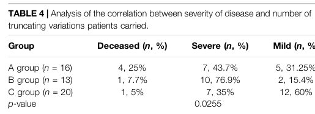

## Question

# Disease Characteristics Research Template

## Target Disease
- **Disease Name:** 3-Hydroxy-3-Methylglutaryl-CoA Synthase Deficiency
- **MONDO ID:**  (if available)
- **Category:** Mendelian

## Research Objectives

Please provide a comprehensive research report on **3-Hydroxy-3-Methylglutaryl-CoA Synthase Deficiency** covering all of the
disease characteristics listed below. This report will be used to populate a disease knowledge
base entry. Be thorough and cite primary literature (PMID preferred) for all claims.

For each section, **suggested databases/resources** are listed. These are the first places
you should search for information on each topic.

---

### 1. Disease Information
> **Search first:** OMIM, Orphanet, ICD-10/ICD-11, MeSH, PubMed

- What is the disease? Provide a concise overview.
- What are the key identifiers? (OMIM, Orphanet, ICD-10/ICD-11, MeSH, Mondo)
- What are the common synonyms and alternative names?
- Is the information derived from individual patients (e.g., EHR) or aggregated disease-level resources?

### 2. Etiology

- **Disease Causal Factors**: What are the primary causes? (genetic, environmental, infectious, mechanistic)
- **Risk Factors**:
  > **Search first:** PubMed, Cochrane Library, UpToDate, clinical guidelines, ClinVar, ClinGen, GWAS Catalog, PheGenI, CTD, CDC, WHO, epidemiological databases
  - Genetic risk factors (causal variants, susceptibility loci, modifier genes)
  - Environmental risk factors (toxins, lifestyle, occupational exposures, age, sex, family history)
- **Protective Factors**:
  > **Search first:** PubMed, Cochrane Library, clinical trial databases, GWAS Catalog, gnomAD, WHO, CDC, nutrition databases
  - Genetic protective factors (protective variants, modifier alleles)
  - Environmental protective factors (diet, lifestyle, exposures that reduce risk)
- **Gene-Environment Interactions**: How do genetic and environmental factors interact to influence disease?
  > **Search first:** CTD, PubMed, PheGenI, GxE databases

### 3. Phenotypes
> **Search first:** HPO (Human Phenotype Ontology), OMIM, Orphanet, PubMed, clinicaltrials.gov, MedDRA, SNOMED CT, DECIPHER, LOINC

For each phenotype, provide:
- **Phenotype type**: symptoms, clinical signs, physical manifestations, behavioral changes, or laboratory abnormalities
  > For symptoms/signs: HPO, OMIM, Orphanet, PubMed
  > For behavioral changes: HPO, DSM, RDoC (Research Domain Criteria), PubMed
  > For laboratory abnormalities: LOINC, SNOMED CT, LabTests Online, PubMed
- **Phenotype characteristics**:
  > **Search first:** OMIM, Orphanet, HPO, PubMed
  - Age of symptom onset (neonatal, childhood, adult-onset, late-onset)
  - Symptom severity (mild, moderate, severe, variable)
  - Symptom progression (stable, progressive, episodic, fluctuating)
  - Frequency among affected individuals (percentage or qualitative)
- **Quality of life impact**: Effects on daily functioning and well-being (per-phenotype when possible)
  > **Search first:** EQ-5D database, SF-36, WHO QOL databases, PubMed
- Suggest HPO (Human Phenotype Ontology) terms for each phenotype

### 4. Genetic/Molecular Information

- **Causal Genes**: Gene mutations or chromosomal abnormalities responsible for disease (gene symbols, OMIM IDs)
  > **Search first:** OMIM, ClinVar, HGMD, Ensembl, NCBI Gene
- **Pathogenic Variants**:
  - Affected genes (gene symbols, HGNC IDs)
    > **Search first:** OMIM, NCBI Gene, Ensembl, HGNC, UniProt, GeneCards
  - Variant classification (pathogenic, likely pathogenic, VUS per ACMG/AMP guidelines)
    > **Search first:** ClinVar, ClinGen, ACMG/AMP guidelines, VarSome
  - Variant type/class (missense, frameshift, nonsense, splice-site, structural)
  - Allele frequency in population databases
    > **Search first:** gnomAD, 1000 Genomes, ExAC, TOPMed, dbSNP
  - Somatic vs germline origin
    > **Search first:** COSMIC (somatic), ClinVar, ICGC, TCGA
  - Functional consequences (loss of function, gain of function, dominant negative)
- **Modifier Genes**: Genes that modify disease severity or expression
- **Epigenetic Information**: DNA methylation, histone modifications, chromatin changes affecting disease
  > **Search first:** ENCODE, Roadmap Epigenomics, MethBase, DiseaseMeth
- **Chromosomal Abnormalities**: Large-scale genetic changes (aneuploidy, translocations, inversions)
  > **Search first:** DECIPHER, ClinVar, ECARUCA, UCSC Genome Browser

### 5. Environmental Information

- **Environmental Factors**: Non-genetic contributing factors (toxins, radiation, pollution, occupational exposure)
  > **Search first:** CTD (Comparative Toxicogenomics Database), TOXNET, PubMed, EPA databases
- **Lifestyle Factors**: Behavioral factors (smoking, diet, exercise, alcohol consumption)
  > **Search first:** CDC databases, WHO, PubMed, NHANES
- **Infectious Agents**: If applicable, pathogens causing or triggering disease (bacteria, viruses, fungi, parasites)
  > **Search first:** NCBI Taxonomy, ViPR, BV-BRC, MicrobeDB, GIDEON

### 6. Mechanism / Pathophysiology

- **Molecular Pathways**: Specific signaling cascades or biochemical pathways involved (Wnt, MAPK, mTOR, PI3K-AKT, etc.)
  > **Search first:** KEGG, Reactome, WikiPathways, PathBank, BioCyc
- **Cellular Processes**: Cell-level mechanisms (apoptosis, autophagy, cell cycle dysregulation, inflammation, etc.)
  > **Search first:** Gene Ontology (GO), Reactome, KEGG, PubMed
- **Protein Dysfunction**: How protein structure or function is altered (misfolding, aggregation, loss of function, gain of function)
  > **Search first:** UniProt, PDB (Protein Data Bank), InterPro, Pfam, AlphaFold
- **Metabolic Changes**: Alterations in metabolic processes (energy metabolism, lipid metabolism, amino acid metabolism)
  > **Search first:** KEGG, BioCyc, HMDB (Human Metabolome Database), BRENDA
- **Immune System Involvement**: Role of immune response (autoimmunity, immunodeficiency, chronic inflammation)
  > **Search first:** ImmPort, Immunome Database, IEDB, Gene Ontology
- **Tissue Damage Mechanisms**: How tissues/ are injured (oxidative stress, ischemia, fibrosis, necrosis)
  > **Search first:** PubMed, Gene Ontology, Reactome
- **Biochemical Abnormalities**: Specific molecular defects (enzyme deficiencies, receptor dysfunction, ion channel defects)
  > **Search first:** BRENDA, UniProt, KEGG, OMIM, PubMed
- **Epigenetic Changes**: DNA methylation, histone modifications affecting gene expression in disease
  > **Search first:** ENCODE, Roadmap Epigenomics, MethBase, DiseaseMeth
- **Molecular Profiling** (if available):
  - Transcriptomics/gene expression changes
    > **Search first:** GEO (Gene Expression Omnibus), ArrayExpress, GTEx, Human Cell Atlas, SRA
  - Proteomics findings
    > **Search first:** PRIDE, ProteomeXchange, Human Protein Atlas, STRING, BioGRID
  - Metabolomics signatures
    > **Search first:** MetaboLights, Metabolomics Workbench, HMDB, METLIN
  - Lipidomics alterations
    > **Search first:** LIPID MAPS, SwissLipids, LipidHome, Metabolomics Workbench
  - Genomic structural features
    > **Search first:** UCSC Genome Browser, Ensembl, NCBI, dbVar, DGV
- **Advanced Technologies** (if applicable):
  - Single-cell analysis findings (cell-type specific mechanisms, cellular heterogeneity)
    > **Search first:** Human Cell Atlas, Single Cell Portal, GEO, CELLxGENE
  - Spatial transcriptomics findings
    > **Search first:** GEO, Spatial Research, Vizgen, 10x Genomics data
  - Multi-omics integration results
    > **Search first:** TCGA, ICGC, cBioPortal, LinkedOmics, PubMed
  - Functional genomics screens (CRISPR, RNAi)
    > **Search first:** DepMap, GenomeRNAi, PubMed, BioGRID ORCS

For each mechanism, describe:
- The causal chain from initial trigger to clinical manifestation
- Which mechanisms are upstream vs downstream
- What cell types and biological processes are involved
- Suggest GO terms for biological processes and CL terms for cell types

### 7. Anatomical Structures Affected

- **Organ Level**:
  - Primary organs directly affected
  - Secondary organ involvement (complications, secondary effects)
  - Body systems involved (cardiovascular, nervous, digestive, respiratory, endocrine, etc.)
  > **Search first:** Uberon, FMA (Foundational Model of Anatomy), OMIM, HPO, ICD-11, MeSH, SNOMED CT
- **Tissue and Cell Level**:
  - Specific tissue types affected (epithelial, connective, muscle, nervous)
  - Specific cell populations targeted (with Cell Ontology terms)
  > **Search first:** Uberon, Human Protein Atlas, Cell Ontology, Human Cell Atlas, CellMarker, PanglaoDB
- **Subcellular Level**:
  - Cellular compartments involved (mitochondria, nucleus, ER, lysosomes) (with GO Cellular Component terms)
  > **Search first:** Gene Ontology (Cellular Component), UniProt, Human Protein Atlas
- **Localization**:
  - Specific anatomical sites (with UBERON terms)
    > **Search first:** FMA, Uberon, NeuroNames (for brain), SNOMED CT
  - Lateralization (unilateral, bilateral, asymmetric)
    > **Search first:** HPO, clinical literature, imaging databases

### 8. Temporal Development

- **Onset**:
  - Typical age of onset (congenital, pediatric, adult, geriatric)
  - Onset pattern (acute, subacute, chronic, insidious)
  > **Search first:** OMIM, Orphanet, HPO, PubMed
- **Progression**:
  - Disease stages (early, intermediate, advanced, end-stage)
    > **Search first:** Cancer Staging Manual (AJCC), WHO classifications, PubMed
  - Progression rate (rapid, slow, variable)
  - Disease course pattern (episodic, relapsing-remitting, progressive, stable)
  - Disease duration (self-limited, chronic lifelong)
  > **Search first:** Disease registries, longitudinal cohort databases, natural history studies, PubMed, Orphanet, OMIM
- **Patterns**:
  - Remission patterns (spontaneous, treatment-induced)
    > **Search first:** Clinical trial databases, disease registries, PubMed
  - Critical periods (time windows of vulnerability or opportunity for intervention)
    > **Search first:** PubMed, developmental biology databases, clinical guidelines

### 9. Inheritance and Population

- **Epidemiology**:
  - Prevalence (cases per 100,000 at given time)
  - Incidence (new cases per 100,000 per year)
  > **Search first:** Orphanet, CDC, WHO, GBD (Global Burden of Disease), national registries, SEER, disease registries
- **For Genetic Etiology**:
  - Inheritance pattern (AD, AR, X-linked, mitochondrial, multifactorial, polygenic)
    > **Search first:** OMIM, Orphanet, ClinVar, GTR (Genetic Testing Registry)
  - Penetrance (complete, incomplete, age-dependent)
    > **Search first:** ClinVar, OMIM, PubMed, ClinGen
  - Expressivity (variable, consistent)
    > **Search first:** OMIM, ClinVar, PubMed
  - Genetic anticipation (increasing severity in successive generations)
    > **Search first:** OMIM, PubMed (especially for repeat expansion disorders)
  - Germline mosaicism
    > **Search first:** ClinVar, OMIM, genetic counseling literature, PubMed
  - Founder effects (population-specific mutations)
    > **Search first:** gnomAD, population genetics databases, PubMed
  - Consanguinity role
    > **Search first:** OMIM, population studies, genetic counseling resources
  - Carrier frequency
    > **Search first:** gnomAD, carrier screening databases, GeneReviews, GTR
- **Population Demographics**:
  - Affected populations (ethnic or demographic groups with higher prevalence)
    > **Search first:** gnomAD, 1000 Genomes, PAGE Study, PubMed, population registries
  - Geographic distribution (endemic areas, regional variation)
    > **Search first:** WHO, CDC, GBD, Orphanet, geographic epidemiology databases
  - Geographic distribution of specific variants
  - Sex ratio (male:female)
    > **Search first:** Disease registries, OMIM, PubMed, epidemiological databases
  - Age distribution of affected individuals
    > **Search first:** CDC, disease registries, SEER, Orphanet

### 10. Diagnostics

- **Clinical Tests**:
  - Laboratory tests (blood, urine, tissue chemistry, specific enzyme assays)
    > **Search first:** LOINC, LabTests Online, PubMed
  - Biomarkers (proteins, metabolites, genetic markers, circulating biomarkers)
    > **Search first:** FDA Biomarker List, BEST (Biomarkers, EndpointS, and other Tools), PubMed
  - Imaging studies (X-ray, CT, MRI, PET, ultrasound)
    > **Search first:** RadLex, DICOM, Radiopaedia, imaging databases
  - Functional tests (pulmonary function, cardiac stress tests)
    > **Search first:** LOINC, clinical guidelines, PubMed
  - Electrophysiology (EEG, EMG, ECG, nerve conduction studies)
    > **Search first:** LOINC, clinical neurophysiology databases, PubMed
  - Biopsy findings (histopathology, immunohistochemistry)
    > **Search first:** SNOMED CT, College of American Pathologists resources, PubMed
  - Pathology findings (microscopic examination)
    > **Search first:** SNOMED CT, Digital Pathology databases, PubMed
- **Genetic Testing**:
  > **Search first:** GTR (Genetic Testing Registry), GeneReviews, ClinGen
  - Overview of recommended genetic testing approach
  - Whole genome sequencing (WGS) utility
    > **Search first:** GTR, ClinVar, GEL (Genomics England), gnomAD
  - Whole exome sequencing (WES) utility
    > **Search first:** GTR, ClinVar, OMIM, GeneMatcher
  - Gene panels (which panels, which genes)
    > **Search first:** GTR, ClinVar, laboratory-specific databases
  - Single gene testing
    > **Search first:** GTR, ClinVar, OMIM, GeneReviews
  - Chromosomal microarray (CMA)
    > **Search first:** DECIPHER, ClinVar, dbVar, ECARUCA
  - Karyotyping
    > **Search first:** Chromosome Abnormality Database, ClinVar, cytogenetics resources
  - FISH
    > **Search first:** ClinVar, cytogenetics databases, PubMed
  - Mitochondrial DNA testing
    > **Search first:** MITOMAP, MSeqDR, ClinVar, GTR
  - Repeat expansion testing
    > **Search first:** GTR, ClinVar, repeat expansion databases, PubMed
- **Omics-Based Diagnostics** (if applicable):
  - RNA sequencing / transcriptomics
    > **Search first:** GEO, ArrayExpress, GTEx, RNA-seq databases
  - Proteomics
    > **Search first:** PRIDE, ProteomeXchange, FDA Biomarker database
  - Metabolomics
    > **Search first:** MetaboLights, Metabolomics Workbench, HMDB
  - Epigenomics
    > **Search first:** GEO, ENCODE, Roadmap Epigenomics, MethBase
  - Liquid biopsy
    > **Search first:** COSMIC, ClinVar, liquid biopsy databases, PubMed
- **Clinical Criteria**:
  - Standardized diagnostic criteria (DSM, ICD, society guidelines)
    > **Search first:** DSM-5, ICD-11, clinical society guidelines, UpToDate
  - Differential diagnosis (other conditions to rule out, with distinguishing features)
    > **Search first:** DynaMed, UpToDate, clinical decision support systems
- **Screening**:
  - Screening methods for asymptomatic individuals (newborn screening, carrier screening, cascade screening)
    > **Search first:** ACMG recommendations, CDC newborn screening, GTR

### 11. Outcome/Prognosis

- **Survival and Mortality**:
  - Survival rate (5-year, 10-year, overall)
    > **Search first:** SEER, cancer registries, disease-specific registries, PubMed
  - Life expectancy (with and without treatment if applicable)
    > **Search first:** Orphanet, disease registries, actuarial databases, PubMed
  - Mortality rate
    > **Search first:** CDC, WHO, GBD, national mortality databases
  - Disease-specific mortality (deaths directly attributable to disease)
    > **Search first:** Disease registries, CDC Wonder, GBD, PubMed
- **Morbidity and Function**:
  - Morbidity (disease-related disability and health impacts)
    > **Search first:** GBD, WHO, disability databases, PubMed
  - Disability outcomes (long-term functional impairments)
    > **Search first:** ICF (International Classification of Functioning), disability registries
  - Quality of life measures (EQ-5D, SF-36, PROMIS, disease-specific tools)
    > **Search first:** EQ-5D database, SF-36, PROMIS, PubMed
- **Disease Course**:
  - Complications (secondary problems: infections, organ failure, etc.)
    > **Search first:** ICD codes, disease registries, clinical databases, PubMed
  - Recovery potential (likelihood and extent of recovery, with vs without treatment)
    > **Search first:** Natural history studies, rehabilitation databases, PubMed
- **Prediction**:
  - Prognostic factors (age, disease severity, biomarkers, treatment response)
    > **Search first:** Prognostic models databases, clinical calculators, PubMed
  - Prognostic biomarkers (molecular markers predicting disease course)
    > **Search first:** FDA Biomarker database, PubMed, cancer prognostic databases

### 12. Treatment

- **Pharmacotherapy**:
  - Pharmacological treatments (drug names, drug classes, mechanisms of action)
    > **Search first:** DrugBank, RxNorm, ATC classification, DailyMed, FDA databases
  - Pharmacogenomics (how genetic variants affect drug metabolism, efficacy, toxicity)
    > **Search first:** PharmGKB, CPIC (Clinical Pharmacogenetics), FDA Table of PGx Biomarkers
- **Advanced Therapeutics**:
  - Gene therapy (viral vectors, CRISPR, gene replacement, gene editing)
    > **Search first:** ClinicalTrials.gov, FDA gene therapy database, ASGCT resources
  - Cell therapy (stem cell transplant, CAR-T, cellular therapeutics)
    > **Search first:** ClinicalTrials.gov, FDA cell therapy database, FACT standards
  - RNA-based therapies (ASOs, siRNA, mRNA therapies)
    > **Search first:** ClinicalTrials.gov, FDA approvals, PubMed
  - Targeted therapies (treatments directed at specific molecular targets)
    > **Search first:** My Cancer Genome, OncoKB, ClinicalTrials.gov, FDA approvals
  - Immunotherapies (checkpoint inhibitors, monoclonal antibodies)
    > **Search first:** Cancer Immunotherapy Database, FDA approvals, ClinicalTrials.gov
- **Surgical and Interventional**:
  - Surgical interventions (types of surgery, timing, outcomes)
    > **Search first:** CPT codes, surgical registries, clinical guidelines, PubMed
- **Supportive and Rehabilitative**:
  - Supportive care (symptom management, pain control, nutrition)
    > **Search first:** Clinical guidelines, Cochrane Library, PubMed
  - Rehabilitation (physical therapy, occupational therapy, speech therapy)
    > **Search first:** Rehabilitation medicine databases, clinical guidelines, PubMed
- **Experimental**:
  - Experimental treatments in clinical trials (with NCT identifiers if available)
    > **Search first:** ClinicalTrials.gov, EU Clinical Trials Register, WHO ICTRP
- **Treatment Outcomes**:
  - Treatment response rates
    > **Search first:** Clinical trial databases, FDA reviews, systematic reviews, PubMed
  - Side effects and adverse events
    > **Search first:** FDA Adverse Event Reporting System (FAERS), MedWatch, PubMed
- **Treatment Strategy**:
  - Treatment algorithms (clinical pathways, decision trees)
    > **Search first:** Clinical practice guidelines, NCCN Guidelines, UpToDate
  - Combination therapies
    > **Search first:** ClinicalTrials.gov, treatment guidelines, PubMed
  - Personalized medicine approaches (genotype-guided treatment)
    > **Search first:** My Cancer Genome, CIViC, PharmGKB, precision medicine databases

For each treatment, suggest MAXO (Medical Action Ontology) terms where applicable.

### 13. Prevention

- **Prevention Levels**:
  - Primary prevention (preventing disease occurrence: vaccination, risk factor modification)
    > **Search first:** CDC, WHO, USPSTF recommendations, Cochrane Library
  - Secondary prevention (early detection and treatment: screening programs, early intervention)
    > **Search first:** USPSTF, CDC screening guidelines, WHO
  - Tertiary prevention (preventing complications in those with disease)
    > **Search first:** Clinical guidelines, disease management protocols, PubMed
- **Immunization**: Vaccine strategies (if applicable)
  > **Search first:** CDC vaccine schedules, WHO immunization, FDA vaccine database
- **Screening and Early Detection**:
  - Screening programs (population-based: newborn screening, cancer screening)
    > **Search first:** CDC screening programs, USPSTF, cancer screening databases
  - Genetic screening (carrier screening, preimplantation genetic diagnosis, prenatal testing)
    > **Search first:** ACMG recommendations, ACOG guidelines, GTR
  - Risk stratification (identifying high-risk individuals for targeted prevention)
    > **Search first:** Risk prediction models, clinical calculators, PubMed
- **Behavioral Interventions**: Lifestyle modifications to reduce risk
  > **Search first:** CDC, WHO, behavioral intervention databases, Cochrane Library
- **Counseling**: Genetic counseling (risk assessment, family planning guidance)
  > **Search first:** NSGC resources, ACMG guidelines, GeneReviews
- **Public Health**:
  - Public health interventions (sanitation, vector control, health education)
    > **Search first:** CDC, WHO, public health databases, PubMed
  - Environmental interventions (reducing environmental risk factors)
    > **Search first:** EPA databases, WHO environmental health, PubMed
- **Prophylaxis**: Preventive medications or procedures
  > **Search first:** Clinical guidelines, FDA approvals, PubMed

### 14. Other Species / Natural Disease

- **Taxonomy**: Species affected (with NCBI Taxon identifiers)
  > **Search first:** NCBI Taxonomy
- **Breed**: Specific breeds affected (with VBO identifiers if applicable)
  > **Search first:** VBO (Vertebrate Breed Ontology)
- **Gene**: Orthologous genes in other species (with NCBI Gene IDs)
  > **Search first:** NCBI Gene
- **Natural Disease**:
  - Naturally occurring disease in other species (companion animals, wildlife)
    > **Search first:** OMIA (Online Mendelian Inheritance in Animals), VetCompass, PubMed
  - Veterinary relevance and importance in animal health
    > **Search first:** OMIA, veterinary databases, PubMed
- **Comparative Biology**:
  - Comparative pathology (similarities and differences across species)
    > **Search first:** OMIA, comparative pathology databases, PubMed
  - Evolutionary conservation of disease mechanisms
    > **Search first:** HomoloGene, OrthoMCL, Alliance of Genome Resources
- **Transmission** (if applicable):
  - Zoonotic potential
    > **Search first:** CDC zoonotic diseases, WHO zoonoses, GIDEON
  - Cross-species susceptibility
    > **Search first:** NCBI Taxonomy, veterinary databases, PubMed

### 15. Model Organisms

- **Model Types**:
  - Model organism type (mammalian, invertebrate, cellular, in vitro)
    > **Search first:** Alliance of Genome Resources, model organism databases
  - Specific model systems (mouse, rat, zebrafish, Drosophila, C. elegans, yeast, cell lines, organoids, iPSCs)
    > **Search first:** MGI, RGD, ZFIN, FlyBase, WormBase, SGD, ATCC, Cellosaurus
  - Induced models (drug treatment, surgical intervention, environmental manipulation)
    > **Search first:** MGI, model organism databases, PubMed
- **Genetic Models**:
  - Types available (knockout, knock-in, transgenic, conditional, humanized)
    > **Search first:** MGI, IMPC, KOMP, EuMMCR, IMSR
- **Model Characteristics**:
  - Phenotype recapitulation (how well model reproduces human disease features)
    > **Search first:** Model organism databases, comparative studies, PubMed
  - Model limitations (aspects of human disease not captured)
    > **Search first:** Model organism databases, PubMed, review articles
- **Applications**:
  - Research applications (what aspects of disease can be studied)
    > **Search first:** Model organism databases, PubMed
- **Resources**:
  - Model databases
    > **Search first:** MGI, RGD, ZFIN, FlyBase, WormBase, IMSR, EMMA, MMRRC

---

## Citation Requirements

- Cite primary literature (PMID preferred) for all mechanistic and clinical claims
- Prioritize recent reviews and landmark papers
- Include direct quotes from abstracts where possible to support key statements
- Distinguish evidence source types: human clinical, model organism, in vitro, computational

## Output Format

Structure your response as a comprehensive narrative organized by the sections above.
For each section, provide:
- Factual content with specific details (numbers, percentages, gene names, variant nomenclature)
- Ontology term suggestions (HPO, GO, CL, UBERON, CHEBI, MAXO, MONDO) where applicable
- Evidence citations with PMIDs
- Direct quotes from abstracts to support key claims
- Clear indication when information is not available or not applicable for this disease

This report will be used to populate a disease knowledge base entry with:
- Pathophysiology descriptions with causal chains
- Gene/protein annotations (HGNC, GO terms)
- Phenotype associations (HP terms) with frequencies
- Cell type involvement (CL terms)
- Anatomical locations (UBERON terms)
- Chemical entities (CHEBI terms)
- Treatment annotations (MAXO terms)
- Evidence items with PMIDs and exact abstract quotes
- Epidemiology, prognosis, diagnostic, and prevention information
- Animal model descriptions with phenotype recapitulation details

## Output

Question: You are an expert researcher providing comprehensive, well-cited information.

Provide detailed information focusing on:
1. Key concepts and definitions with current understanding
2. Recent developments and latest research (prioritize 2023-2024 sources)
3. Current applications and real-world implementations
4. Expert opinions and analysis from authoritative sources
5. Relevant statistics and data from recent studies

Format as a comprehensive research report with proper citations. Include URLs and publication dates where available.
Always prioritize recent, authoritative sources and provide specific citations for all major claims.

# Disease Characteristics Research Template

## Target Disease
- **Disease Name:** 3-Hydroxy-3-Methylglutaryl-CoA Synthase Deficiency
- **MONDO ID:**  (if available)
- **Category:** Mendelian

## Research Objectives

Please provide a comprehensive research report on **3-Hydroxy-3-Methylglutaryl-CoA Synthase Deficiency** covering all of the
disease characteristics listed below. This report will be used to populate a disease knowledge
base entry. Be thorough and cite primary literature (PMID preferred) for all claims.

For each section, **suggested databases/resources** are listed. These are the first places
you should search for information on each topic.

---

### 1. Disease Information
> **Search first:** OMIM, Orphanet, ICD-10/ICD-11, MeSH, PubMed

- What is the disease? Provide a concise overview.
- What are the key identifiers? (OMIM, Orphanet, ICD-10/ICD-11, MeSH, Mondo)
- What are the common synonyms and alternative names?
- Is the information derived from individual patients (e.g., EHR) or aggregated disease-level resources?

### 2. Etiology

- **Disease Causal Factors**: What are the primary causes? (genetic, environmental, infectious, mechanistic)
- **Risk Factors**:
  > **Search first:** PubMed, Cochrane Library, UpToDate, clinical guidelines, ClinVar, ClinGen, GWAS Catalog, PheGenI, CTD, CDC, WHO, epidemiological databases
  - Genetic risk factors (causal variants, susceptibility loci, modifier genes)
  - Environmental risk factors (toxins, lifestyle, occupational exposures, age, sex, family history)
- **Protective Factors**:
  > **Search first:** PubMed, Cochrane Library, clinical trial databases, GWAS Catalog, gnomAD, WHO, CDC, nutrition databases
  - Genetic protective factors (protective variants, modifier alleles)
  - Environmental protective factors (diet, lifestyle, exposures that reduce risk)
- **Gene-Environment Interactions**: How do genetic and environmental factors interact to influence disease?
  > **Search first:** CTD, PubMed, PheGenI, GxE databases

### 3. Phenotypes
> **Search first:** HPO (Human Phenotype Ontology), OMIM, Orphanet, PubMed, clinicaltrials.gov, MedDRA, SNOMED CT, DECIPHER, LOINC

For each phenotype, provide:
- **Phenotype type**: symptoms, clinical signs, physical manifestations, behavioral changes, or laboratory abnormalities
  > For symptoms/signs: HPO, OMIM, Orphanet, PubMed
  > For behavioral changes: HPO, DSM, RDoC (Research Domain Criteria), PubMed
  > For laboratory abnormalities: LOINC, SNOMED CT, LabTests Online, PubMed
- **Phenotype characteristics**:
  > **Search first:** OMIM, Orphanet, HPO, PubMed
  - Age of symptom onset (neonatal, childhood, adult-onset, late-onset)
  - Symptom severity (mild, moderate, severe, variable)
  - Symptom progression (stable, progressive, episodic, fluctuating)
  - Frequency among affected individuals (percentage or qualitative)
- **Quality of life impact**: Effects on daily functioning and well-being (per-phenotype when possible)
  > **Search first:** EQ-5D database, SF-36, WHO QOL databases, PubMed
- Suggest HPO (Human Phenotype Ontology) terms for each phenotype

### 4. Genetic/Molecular Information

- **Causal Genes**: Gene mutations or chromosomal abnormalities responsible for disease (gene symbols, OMIM IDs)
  > **Search first:** OMIM, ClinVar, HGMD, Ensembl, NCBI Gene
- **Pathogenic Variants**:
  - Affected genes (gene symbols, HGNC IDs)
    > **Search first:** OMIM, NCBI Gene, Ensembl, HGNC, UniProt, GeneCards
  - Variant classification (pathogenic, likely pathogenic, VUS per ACMG/AMP guidelines)
    > **Search first:** ClinVar, ClinGen, ACMG/AMP guidelines, VarSome
  - Variant type/class (missense, frameshift, nonsense, splice-site, structural)
  - Allele frequency in population databases
    > **Search first:** gnomAD, 1000 Genomes, ExAC, TOPMed, dbSNP
  - Somatic vs germline origin
    > **Search first:** COSMIC (somatic), ClinVar, ICGC, TCGA
  - Functional consequences (loss of function, gain of function, dominant negative)
- **Modifier Genes**: Genes that modify disease severity or expression
- **Epigenetic Information**: DNA methylation, histone modifications, chromatin changes affecting disease
  > **Search first:** ENCODE, Roadmap Epigenomics, MethBase, DiseaseMeth
- **Chromosomal Abnormalities**: Large-scale genetic changes (aneuploidy, translocations, inversions)
  > **Search first:** DECIPHER, ClinVar, ECARUCA, UCSC Genome Browser

### 5. Environmental Information

- **Environmental Factors**: Non-genetic contributing factors (toxins, radiation, pollution, occupational exposure)
  > **Search first:** CTD (Comparative Toxicogenomics Database), TOXNET, PubMed, EPA databases
- **Lifestyle Factors**: Behavioral factors (smoking, diet, exercise, alcohol consumption)
  > **Search first:** CDC databases, WHO, PubMed, NHANES
- **Infectious Agents**: If applicable, pathogens causing or triggering disease (bacteria, viruses, fungi, parasites)
  > **Search first:** NCBI Taxonomy, ViPR, BV-BRC, MicrobeDB, GIDEON

### 6. Mechanism / Pathophysiology

- **Molecular Pathways**: Specific signaling cascades or biochemical pathways involved (Wnt, MAPK, mTOR, PI3K-AKT, etc.)
  > **Search first:** KEGG, Reactome, WikiPathways, PathBank, BioCyc
- **Cellular Processes**: Cell-level mechanisms (apoptosis, autophagy, cell cycle dysregulation, inflammation, etc.)
  > **Search first:** Gene Ontology (GO), Reactome, KEGG, PubMed
- **Protein Dysfunction**: How protein structure or function is altered (misfolding, aggregation, loss of function, gain of function)
  > **Search first:** UniProt, PDB (Protein Data Bank), InterPro, Pfam, AlphaFold
- **Metabolic Changes**: Alterations in metabolic processes (energy metabolism, lipid metabolism, amino acid metabolism)
  > **Search first:** KEGG, BioCyc, HMDB (Human Metabolome Database), BRENDA
- **Immune System Involvement**: Role of immune response (autoimmunity, immunodeficiency, chronic inflammation)
  > **Search first:** ImmPort, Immunome Database, IEDB, Gene Ontology
- **Tissue Damage Mechanisms**: How tissues/ are injured (oxidative stress, ischemia, fibrosis, necrosis)
  > **Search first:** PubMed, Gene Ontology, Reactome
- **Biochemical Abnormalities**: Specific molecular defects (enzyme deficiencies, receptor dysfunction, ion channel defects)
  > **Search first:** BRENDA, UniProt, KEGG, OMIM, PubMed
- **Epigenetic Changes**: DNA methylation, histone modifications affecting gene expression in disease
  > **Search first:** ENCODE, Roadmap Epigenomics, MethBase, DiseaseMeth
- **Molecular Profiling** (if available):
  - Transcriptomics/gene expression changes
    > **Search first:** GEO (Gene Expression Omnibus), ArrayExpress, GTEx, Human Cell Atlas, SRA
  - Proteomics findings
    > **Search first:** PRIDE, ProteomeXchange, Human Protein Atlas, STRING, BioGRID
  - Metabolomics signatures
    > **Search first:** MetaboLights, Metabolomics Workbench, HMDB, METLIN
  - Lipidomics alterations
    > **Search first:** LIPID MAPS, SwissLipids, LipidHome, Metabolomics Workbench
  - Genomic structural features
    > **Search first:** UCSC Genome Browser, Ensembl, NCBI, dbVar, DGV
- **Advanced Technologies** (if applicable):
  - Single-cell analysis findings (cell-type specific mechanisms, cellular heterogeneity)
    > **Search first:** Human Cell Atlas, Single Cell Portal, GEO, CELLxGENE
  - Spatial transcriptomics findings
    > **Search first:** GEO, Spatial Research, Vizgen, 10x Genomics data
  - Multi-omics integration results
    > **Search first:** TCGA, ICGC, cBioPortal, LinkedOmics, PubMed
  - Functional genomics screens (CRISPR, RNAi)
    > **Search first:** DepMap, GenomeRNAi, PubMed, BioGRID ORCS

For each mechanism, describe:
- The causal chain from initial trigger to clinical manifestation
- Which mechanisms are upstream vs downstream
- What cell types and biological processes are involved
- Suggest GO terms for biological processes and CL terms for cell types

### 7. Anatomical Structures Affected

- **Organ Level**:
  - Primary organs directly affected
  - Secondary organ involvement (complications, secondary effects)
  - Body systems involved (cardiovascular, nervous, digestive, respiratory, endocrine, etc.)
  > **Search first:** Uberon, FMA (Foundational Model of Anatomy), OMIM, HPO, ICD-11, MeSH, SNOMED CT
- **Tissue and Cell Level**:
  - Specific tissue types affected (epithelial, connective, muscle, nervous)
  - Specific cell populations targeted (with Cell Ontology terms)
  > **Search first:** Uberon, Human Protein Atlas, Cell Ontology, Human Cell Atlas, CellMarker, PanglaoDB
- **Subcellular Level**:
  - Cellular compartments involved (mitochondria, nucleus, ER, lysosomes) (with GO Cellular Component terms)
  > **Search first:** Gene Ontology (Cellular Component), UniProt, Human Protein Atlas
- **Localization**:
  - Specific anatomical sites (with UBERON terms)
    > **Search first:** FMA, Uberon, NeuroNames (for brain), SNOMED CT
  - Lateralization (unilateral, bilateral, asymmetric)
    > **Search first:** HPO, clinical literature, imaging databases

### 8. Temporal Development

- **Onset**:
  - Typical age of onset (congenital, pediatric, adult, geriatric)
  - Onset pattern (acute, subacute, chronic, insidious)
  > **Search first:** OMIM, Orphanet, HPO, PubMed
- **Progression**:
  - Disease stages (early, intermediate, advanced, end-stage)
    > **Search first:** Cancer Staging Manual (AJCC), WHO classifications, PubMed
  - Progression rate (rapid, slow, variable)
  - Disease course pattern (episodic, relapsing-remitting, progressive, stable)
  - Disease duration (self-limited, chronic lifelong)
  > **Search first:** Disease registries, longitudinal cohort databases, natural history studies, PubMed, Orphanet, OMIM
- **Patterns**:
  - Remission patterns (spontaneous, treatment-induced)
    > **Search first:** Clinical trial databases, disease registries, PubMed
  - Critical periods (time windows of vulnerability or opportunity for intervention)
    > **Search first:** PubMed, developmental biology databases, clinical guidelines

### 9. Inheritance and Population

- **Epidemiology**:
  - Prevalence (cases per 100,000 at given time)
  - Incidence (new cases per 100,000 per year)
  > **Search first:** Orphanet, CDC, WHO, GBD (Global Burden of Disease), national registries, SEER, disease registries
- **For Genetic Etiology**:
  - Inheritance pattern (AD, AR, X-linked, mitochondrial, multifactorial, polygenic)
    > **Search first:** OMIM, Orphanet, ClinVar, GTR (Genetic Testing Registry)
  - Penetrance (complete, incomplete, age-dependent)
    > **Search first:** ClinVar, OMIM, PubMed, ClinGen
  - Expressivity (variable, consistent)
    > **Search first:** OMIM, ClinVar, PubMed
  - Genetic anticipation (increasing severity in successive generations)
    > **Search first:** OMIM, PubMed (especially for repeat expansion disorders)
  - Germline mosaicism
    > **Search first:** ClinVar, OMIM, genetic counseling literature, PubMed
  - Founder effects (population-specific mutations)
    > **Search first:** gnomAD, population genetics databases, PubMed
  - Consanguinity role
    > **Search first:** OMIM, population studies, genetic counseling resources
  - Carrier frequency
    > **Search first:** gnomAD, carrier screening databases, GeneReviews, GTR
- **Population Demographics**:
  - Affected populations (ethnic or demographic groups with higher prevalence)
    > **Search first:** gnomAD, 1000 Genomes, PAGE Study, PubMed, population registries
  - Geographic distribution (endemic areas, regional variation)
    > **Search first:** WHO, CDC, GBD, Orphanet, geographic epidemiology databases
  - Geographic distribution of specific variants
  - Sex ratio (male:female)
    > **Search first:** Disease registries, OMIM, PubMed, epidemiological databases
  - Age distribution of affected individuals
    > **Search first:** CDC, disease registries, SEER, Orphanet

### 10. Diagnostics

- **Clinical Tests**:
  - Laboratory tests (blood, urine, tissue chemistry, specific enzyme assays)
    > **Search first:** LOINC, LabTests Online, PubMed
  - Biomarkers (proteins, metabolites, genetic markers, circulating biomarkers)
    > **Search first:** FDA Biomarker List, BEST (Biomarkers, EndpointS, and other Tools), PubMed
  - Imaging studies (X-ray, CT, MRI, PET, ultrasound)
    > **Search first:** RadLex, DICOM, Radiopaedia, imaging databases
  - Functional tests (pulmonary function, cardiac stress tests)
    > **Search first:** LOINC, clinical guidelines, PubMed
  - Electrophysiology (EEG, EMG, ECG, nerve conduction studies)
    > **Search first:** LOINC, clinical neurophysiology databases, PubMed
  - Biopsy findings (histopathology, immunohistochemistry)
    > **Search first:** SNOMED CT, College of American Pathologists resources, PubMed
  - Pathology findings (microscopic examination)
    > **Search first:** SNOMED CT, Digital Pathology databases, PubMed
- **Genetic Testing**:
  > **Search first:** GTR (Genetic Testing Registry), GeneReviews, ClinGen
  - Overview of recommended genetic testing approach
  - Whole genome sequencing (WGS) utility
    > **Search first:** GTR, ClinVar, GEL (Genomics England), gnomAD
  - Whole exome sequencing (WES) utility
    > **Search first:** GTR, ClinVar, OMIM, GeneMatcher
  - Gene panels (which panels, which genes)
    > **Search first:** GTR, ClinVar, laboratory-specific databases
  - Single gene testing
    > **Search first:** GTR, ClinVar, OMIM, GeneReviews
  - Chromosomal microarray (CMA)
    > **Search first:** DECIPHER, ClinVar, dbVar, ECARUCA
  - Karyotyping
    > **Search first:** Chromosome Abnormality Database, ClinVar, cytogenetics resources
  - FISH
    > **Search first:** ClinVar, cytogenetics databases, PubMed
  - Mitochondrial DNA testing
    > **Search first:** MITOMAP, MSeqDR, ClinVar, GTR
  - Repeat expansion testing
    > **Search first:** GTR, ClinVar, repeat expansion databases, PubMed
- **Omics-Based Diagnostics** (if applicable):
  - RNA sequencing / transcriptomics
    > **Search first:** GEO, ArrayExpress, GTEx, RNA-seq databases
  - Proteomics
    > **Search first:** PRIDE, ProteomeXchange, FDA Biomarker database
  - Metabolomics
    > **Search first:** MetaboLights, Metabolomics Workbench, HMDB
  - Epigenomics
    > **Search first:** GEO, ENCODE, Roadmap Epigenomics, MethBase
  - Liquid biopsy
    > **Search first:** COSMIC, ClinVar, liquid biopsy databases, PubMed
- **Clinical Criteria**:
  - Standardized diagnostic criteria (DSM, ICD, society guidelines)
    > **Search first:** DSM-5, ICD-11, clinical society guidelines, UpToDate
  - Differential diagnosis (other conditions to rule out, with distinguishing features)
    > **Search first:** DynaMed, UpToDate, clinical decision support systems
- **Screening**:
  - Screening methods for asymptomatic individuals (newborn screening, carrier screening, cascade screening)
    > **Search first:** ACMG recommendations, CDC newborn screening, GTR

### 11. Outcome/Prognosis

- **Survival and Mortality**:
  - Survival rate (5-year, 10-year, overall)
    > **Search first:** SEER, cancer registries, disease-specific registries, PubMed
  - Life expectancy (with and without treatment if applicable)
    > **Search first:** Orphanet, disease registries, actuarial databases, PubMed
  - Mortality rate
    > **Search first:** CDC, WHO, GBD, national mortality databases
  - Disease-specific mortality (deaths directly attributable to disease)
    > **Search first:** Disease registries, CDC Wonder, GBD, PubMed
- **Morbidity and Function**:
  - Morbidity (disease-related disability and health impacts)
    > **Search first:** GBD, WHO, disability databases, PubMed
  - Disability outcomes (long-term functional impairments)
    > **Search first:** ICF (International Classification of Functioning), disability registries
  - Quality of life measures (EQ-5D, SF-36, PROMIS, disease-specific tools)
    > **Search first:** EQ-5D database, SF-36, PROMIS, PubMed
- **Disease Course**:
  - Complications (secondary problems: infections, organ failure, etc.)
    > **Search first:** ICD codes, disease registries, clinical databases, PubMed
  - Recovery potential (likelihood and extent of recovery, with vs without treatment)
    > **Search first:** Natural history studies, rehabilitation databases, PubMed
- **Prediction**:
  - Prognostic factors (age, disease severity, biomarkers, treatment response)
    > **Search first:** Prognostic models databases, clinical calculators, PubMed
  - Prognostic biomarkers (molecular markers predicting disease course)
    > **Search first:** FDA Biomarker database, PubMed, cancer prognostic databases

### 12. Treatment

- **Pharmacotherapy**:
  - Pharmacological treatments (drug names, drug classes, mechanisms of action)
    > **Search first:** DrugBank, RxNorm, ATC classification, DailyMed, FDA databases
  - Pharmacogenomics (how genetic variants affect drug metabolism, efficacy, toxicity)
    > **Search first:** PharmGKB, CPIC (Clinical Pharmacogenetics), FDA Table of PGx Biomarkers
- **Advanced Therapeutics**:
  - Gene therapy (viral vectors, CRISPR, gene replacement, gene editing)
    > **Search first:** ClinicalTrials.gov, FDA gene therapy database, ASGCT resources
  - Cell therapy (stem cell transplant, CAR-T, cellular therapeutics)
    > **Search first:** ClinicalTrials.gov, FDA cell therapy database, FACT standards
  - RNA-based therapies (ASOs, siRNA, mRNA therapies)
    > **Search first:** ClinicalTrials.gov, FDA approvals, PubMed
  - Targeted therapies (treatments directed at specific molecular targets)
    > **Search first:** My Cancer Genome, OncoKB, ClinicalTrials.gov, FDA approvals
  - Immunotherapies (checkpoint inhibitors, monoclonal antibodies)
    > **Search first:** Cancer Immunotherapy Database, FDA approvals, ClinicalTrials.gov
- **Surgical and Interventional**:
  - Surgical interventions (types of surgery, timing, outcomes)
    > **Search first:** CPT codes, surgical registries, clinical guidelines, PubMed
- **Supportive and Rehabilitative**:
  - Supportive care (symptom management, pain control, nutrition)
    > **Search first:** Clinical guidelines, Cochrane Library, PubMed
  - Rehabilitation (physical therapy, occupational therapy, speech therapy)
    > **Search first:** Rehabilitation medicine databases, clinical guidelines, PubMed
- **Experimental**:
  - Experimental treatments in clinical trials (with NCT identifiers if available)
    > **Search first:** ClinicalTrials.gov, EU Clinical Trials Register, WHO ICTRP
- **Treatment Outcomes**:
  - Treatment response rates
    > **Search first:** Clinical trial databases, FDA reviews, systematic reviews, PubMed
  - Side effects and adverse events
    > **Search first:** FDA Adverse Event Reporting System (FAERS), MedWatch, PubMed
- **Treatment Strategy**:
  - Treatment algorithms (clinical pathways, decision trees)
    > **Search first:** Clinical practice guidelines, NCCN Guidelines, UpToDate
  - Combination therapies
    > **Search first:** ClinicalTrials.gov, treatment guidelines, PubMed
  - Personalized medicine approaches (genotype-guided treatment)
    > **Search first:** My Cancer Genome, CIViC, PharmGKB, precision medicine databases

For each treatment, suggest MAXO (Medical Action Ontology) terms where applicable.

### 13. Prevention

- **Prevention Levels**:
  - Primary prevention (preventing disease occurrence: vaccination, risk factor modification)
    > **Search first:** CDC, WHO, USPSTF recommendations, Cochrane Library
  - Secondary prevention (early detection and treatment: screening programs, early intervention)
    > **Search first:** USPSTF, CDC screening guidelines, WHO
  - Tertiary prevention (preventing complications in those with disease)
    > **Search first:** Clinical guidelines, disease management protocols, PubMed
- **Immunization**: Vaccine strategies (if applicable)
  > **Search first:** CDC vaccine schedules, WHO immunization, FDA vaccine database
- **Screening and Early Detection**:
  - Screening programs (population-based: newborn screening, cancer screening)
    > **Search first:** CDC screening programs, USPSTF, cancer screening databases
  - Genetic screening (carrier screening, preimplantation genetic diagnosis, prenatal testing)
    > **Search first:** ACMG recommendations, ACOG guidelines, GTR
  - Risk stratification (identifying high-risk individuals for targeted prevention)
    > **Search first:** Risk prediction models, clinical calculators, PubMed
- **Behavioral Interventions**: Lifestyle modifications to reduce risk
  > **Search first:** CDC, WHO, behavioral intervention databases, Cochrane Library
- **Counseling**: Genetic counseling (risk assessment, family planning guidance)
  > **Search first:** NSGC resources, ACMG guidelines, GeneReviews
- **Public Health**:
  - Public health interventions (sanitation, vector control, health education)
    > **Search first:** CDC, WHO, public health databases, PubMed
  - Environmental interventions (reducing environmental risk factors)
    > **Search first:** EPA databases, WHO environmental health, PubMed
- **Prophylaxis**: Preventive medications or procedures
  > **Search first:** Clinical guidelines, FDA approvals, PubMed

### 14. Other Species / Natural Disease

- **Taxonomy**: Species affected (with NCBI Taxon identifiers)
  > **Search first:** NCBI Taxonomy
- **Breed**: Specific breeds affected (with VBO identifiers if applicable)
  > **Search first:** VBO (Vertebrate Breed Ontology)
- **Gene**: Orthologous genes in other species (with NCBI Gene IDs)
  > **Search first:** NCBI Gene
- **Natural Disease**:
  - Naturally occurring disease in other species (companion animals, wildlife)
    > **Search first:** OMIA (Online Mendelian Inheritance in Animals), VetCompass, PubMed
  - Veterinary relevance and importance in animal health
    > **Search first:** OMIA, veterinary databases, PubMed
- **Comparative Biology**:
  - Comparative pathology (similarities and differences across species)
    > **Search first:** OMIA, comparative pathology databases, PubMed
  - Evolutionary conservation of disease mechanisms
    > **Search first:** HomoloGene, OrthoMCL, Alliance of Genome Resources
- **Transmission** (if applicable):
  - Zoonotic potential
    > **Search first:** CDC zoonotic diseases, WHO zoonoses, GIDEON
  - Cross-species susceptibility
    > **Search first:** NCBI Taxonomy, veterinary databases, PubMed

### 15. Model Organisms

- **Model Types**:
  - Model organism type (mammalian, invertebrate, cellular, in vitro)
    > **Search first:** Alliance of Genome Resources, model organism databases
  - Specific model systems (mouse, rat, zebrafish, Drosophila, C. elegans, yeast, cell lines, organoids, iPSCs)
    > **Search first:** MGI, RGD, ZFIN, FlyBase, WormBase, SGD, ATCC, Cellosaurus
  - Induced models (drug treatment, surgical intervention, environmental manipulation)
    > **Search first:** MGI, model organism databases, PubMed
- **Genetic Models**:
  - Types available (knockout, knock-in, transgenic, conditional, humanized)
    > **Search first:** MGI, IMPC, KOMP, EuMMCR, IMSR
- **Model Characteristics**:
  - Phenotype recapitulation (how well model reproduces human disease features)
    > **Search first:** Model organism databases, comparative studies, PubMed
  - Model limitations (aspects of human disease not captured)
    > **Search first:** Model organism databases, PubMed, review articles
- **Applications**:
  - Research applications (what aspects of disease can be studied)
    > **Search first:** Model organism databases, PubMed
- **Resources**:
  - Model databases
    > **Search first:** MGI, RGD, ZFIN, FlyBase, WormBase, IMSR, EMMA, MMRRC

---

## Citation Requirements

- Cite primary literature (PMID preferred) for all mechanistic and clinical claims
- Prioritize recent reviews and landmark papers
- Include direct quotes from abstracts where possible to support key statements
- Distinguish evidence source types: human clinical, model organism, in vitro, computational

## Output Format

Structure your response as a comprehensive narrative organized by the sections above.
For each section, provide:
- Factual content with specific details (numbers, percentages, gene names, variant nomenclature)
- Ontology term suggestions (HPO, GO, CL, UBERON, CHEBI, MAXO, MONDO) where applicable
- Evidence citations with PMIDs
- Direct quotes from abstracts to support key claims
- Clear indication when information is not available or not applicable for this disease

This report will be used to populate a disease knowledge base entry with:
- Pathophysiology descriptions with causal chains
- Gene/protein annotations (HGNC, GO terms)
- Phenotype associations (HP terms) with frequencies
- Cell type involvement (CL terms)
- Anatomical locations (UBERON terms)
- Chemical entities (CHEBI terms)
- Treatment annotations (MAXO terms)
- Evidence items with PMIDs and exact abstract quotes
- Epidemiology, prognosis, diagnostic, and prevention information
- Animal model descriptions with phenotype recapitulation details

# Comprehensive Disease Characteristics Report: 3‑Hydroxy‑3‑Methylglutaryl‑CoA Synthase Deficiency (HMGCS2 Deficiency)

## 1. Disease Information

### 1.1 Overview / definition
Mitochondrial 3‑hydroxy‑3‑methylglutaryl‑CoA synthase deficiency (HMGCS2D) is a rare inborn error of ketone body synthesis (ketogenesis) caused by loss of function of mitochondrial HMG‑CoA synthase (encoded by **HMGCS2**), leading to inability to appropriately generate ketone bodies during fasting or illness and resulting in episodic metabolic decompensation. (nguyen2025mitochondrialhmgcoasynthase pages 1-2, conlon2020hypoglycemiaisnot pages 1-3, suresh2025notjustan pages 22-23)

Direct abstract quote (2025 Vietnamese case series): “**Mitochondrial 3-hydroxy-3-methylglutaryl-CoA synthase deficiency (HMGCS2D) is a rare metabolic disorder that impairs the body’s ability to produce ketone bodies and regulate energy metabolism**.” (Nguyen et al., 2025; https://doi.org/10.3390/ijms26041644; published Feb 2025) (nguyen2025mitochondrialhmgcoasynthase pages 1-2)

### 1.2 Key identifiers
- **OMIM (disease):** **605911** (reported explicitly in multiple sources) (nguyen2025mitochondrialhmgcoasynthase pages 1-2, conlon2020hypoglycemiaisnot pages 1-3)
- **OMIM (gene HMGCS2):** **600234** (nguyen2025mitochondrialhmgcoasynthase pages 2-3)
- **Orphanet / ICD‑10 / ICD‑11 / MeSH / MONDO:** Not identified in the retrieved full‑text evidence in this run; therefore not reported here.

### 1.3 Synonyms / alternative names
Common names in the literature include:
- “Mitochondrial HMG‑CoA synthase deficiency”
- “mHS deficiency” (mitochondrial HMG‑CoA synthase deficiency)
- “HMGCS2 deficiency”
- “Mitochondrial 3‑hydroxy‑3‑methylglutaryl‑CoA synthase deficiency” (conlon2020hypoglycemiaisnot pages 1-3, suresh2025notjustan pages 22-23)

### 1.4 Evidence source type
Evidence in this report is primarily derived from aggregated disease-level clinical resources in peer‑reviewed case series and case reports (human clinical evidence), plus mechanistic interpretation from reviews. The quantitative phenotype and laboratory frequencies below come mainly from two retrospective patient series: a Vietnamese cohort (n=19) and a Chinese cohort (n=10). (nguyen2025mitochondrialhmgcoasynthase pages 1-2, wu2022clinicalbiochemicalmolecular pages 2-3)

## 2. Etiology

### 2.1 Disease causal factors
**Genetic cause (primary):** biallelic pathogenic variants in **HMGCS2** cause autosomal recessive mitochondrial HMG‑CoA synthase deficiency. (conlon2020hypoglycemiaisnot pages 1-3, suresh2025notjustan pages 22-23, dong2025mitochondrial3hydroxy3methylglutarylcoenzymea pages 1-3)

Direct abstract quote (2020 JIMD Reports): “**Mitochondrial 3‐hydroxy‐3‐methylglutaryl‐CoA (HMG Co‐A) synthase (mHS) deficiency is an autosomal recessive disorder of ketone body synthesis**…” (Conlon et al., 2020; https://doi.org/10.1002/jmd2.12146; published Jun 2020) (conlon2020hypoglycemiaisnot pages 1-3)

**Mechanistic cause:** deficiency of the mitochondrial ketogenesis enzyme leads to inadequate ketone availability under catabolic stress and downstream biochemical derangements (see Section 6). (suresh2025notjustan pages 22-23, kılıc2020expandingtheclinical pages 6-7)

### 2.2 Risk factors
- **Genetic:** having biallelic loss‑of‑function (especially truncating) variants in HMGCS2 increases risk of severe presentations; aggregated analysis suggests severity correlates with the number of truncating alleles. (wu2022clinicalbiochemicalmolecular pages 8-9, wu2022clinicalbiochemicalmolecular media 0a979ec7)
- **Environmental/physiologic triggers (for crises rather than disease occurrence):** fasting/prolonged reduced intake and intercurrent infections/illness are common crisis precipitants. (nguyen2025mitochondrialhmgcoasynthase pages 1-2, conlon2020hypoglycemiaisnot pages 1-3, suresh2025notjustan pages 22-23)

In the Vietnamese series, the most common triggers for the initial crisis were poor feeding/fasting (93.8%), vomiting (56.3%), diarrhea (25.0%), and fever (18.8%). (nguyen2025mitochondrialhmgcoasynthase pages 1-2)

### 2.3 Protective factors
No validated genetic protective variants or environmental protective exposures were identified in the retrieved evidence. Clinically, **prevention of prolonged fasting** and proactive carbohydrate administration during illness function as protective management strategies against acute decompensation (Section 12/13), but these are not “protective factors” for disease occurrence. (nguyen2025mitochondrialhmgcoasynthase pages 1-2)

### 2.4 Gene–environment interaction
The dominant gene–environment interaction is that HMGCS2 loss of function may be clinically silent until a catabolic state (fasting/illness) increases reliance on ketogenesis, precipitating crisis. (nguyen2025mitochondrialhmgcoasynthase pages 1-2, suresh2025notjustan pages 22-23)

## 3. Phenotypes

### 3.1 Core phenotype pattern
HMGCS2 deficiency typically manifests as **episodic metabolic decompensation** in infancy/early childhood, often with encephalopathy (lethargy, coma), respiratory compensation for acidosis, and hepatic involvement (hepatomegaly, transaminitis). (nguyen2025mitochondrialhmgcoasynthase pages 1-2, wu2022clinicalbiochemicalmolecular pages 2-3)

A key clinical point is that **hypoglycemia is common but not universal**; cases with normal glucose at presentation are documented. (conlon2020hypoglycemiaisnot pages 1-3, wu2022clinicalbiochemicalmolecular pages 1-2)

### 3.2 Age of onset, severity, and course
- **Onset:** typically within the first year; Chinese series first crisis at 5–12 months. (wu2022clinicalbiochemicalmolecular pages 2-3)
- **Range:** Vietnamese series first acute episode at 10 days to 28 months. (nguyen2025mitochondrialhmgcoasynthase pages 1-2)
- **Course:** episodic; crises precipitated by fasting/illness; many laboratory abnormalities normalize between crises. (wu2022clinicalbiochemicalmolecular pages 1-2)

### 3.3 Symptom/sign frequencies (recent patient series)
**Vietnamese cohort (n=16 symptomatic of 19 total):**
- Lethargy/coma 81.3%
- Rapid breathing 68.8%
- Hepatomegaly 56.3%
- Shock 37.5%
- Seizures 18.8% (nguyen2025mitochondrialhmgcoasynthase pages 1-2)

**Chinese cohort (n=10):**
- Anorexia 10/10
- Dyspnea 10/10
- Disturbance of consciousness 10/10
- Vomiting 8/10
- Fever 7/10
- Cough 4/10
- Diarrhea 3/10
- Seizures 3/10
- Hepatomegaly 10/10 (wu2022clinicalbiochemicalmolecular pages 2-3, wu2022clinicalbiochemicalmolecular pages 1-2)

### 3.4 Laboratory abnormalities (phenotype‑linked)
Common acute‑episode laboratory findings include metabolic acidosis, hypoglycemia (variable), elevated aminotransferases, and sometimes hyperammonemia and hypertriglyceridemia. (nguyen2025mitochondrialhmgcoasynthase pages 1-2, wu2022clinicalbiochemicalmolecular pages 1-2)

Notably, Conlon et al. emphasize that hypoglycemia is not mandatory for crisis presentation. (conlon2020hypoglycemiaisnot pages 1-3)

### 3.5 Neuroimaging findings
In the Chinese series, brain MRI abnormalities were variably present, including widened sulci/subarachnoid spaces, basal ganglia signal abnormalities, and delayed myelination in subsets of imaged patients. (wu2022clinicalbiochemicalmolecular pages 2-3)

### 3.6 Suggested HPO terms (non-exhaustive)
Based on the reported clinical features and labs:
- Hypoglycemia (HP:0001943) (nguyen2025mitochondrialhmgcoasynthase pages 1-2, wu2022clinicalbiochemicalmolecular pages 1-2)
- Metabolic acidosis (HP:0001942) (nguyen2025mitochondrialhmgcoasynthase pages 1-2, wu2022clinicalbiochemicalmolecular pages 2-3)
- Encephalopathy / altered mental status (HP:0001298) (nguyen2025mitochondrialhmgcoasynthase pages 1-2, wu2022clinicalbiochemicalmolecular pages 2-3)
- Lethargy (HP:0001254) / Coma (HP:0001259) (nguyen2025mitochondrialhmgcoasynthase pages 1-2)
- Hepatomegaly (HP:0002240) (nguyen2025mitochondrialhmgcoasynthase pages 1-2, wu2022clinicalbiochemicalmolecular pages 2-3)
- Elevated hepatic transaminases (HP:0002910) (nguyen2025mitochondrialhmgcoasynthase pages 1-2)
- Hyperammonemia (HP:0001987) (nguyen2025mitochondrialhmgcoasynthase pages 1-2, wu2022clinicalbiochemicalmolecular pages 1-2)
- Seizures (HP:0001250) (nguyen2025mitochondrialhmgcoasynthase pages 1-2, wu2022clinicalbiochemicalmolecular pages 2-3)
- Shock (HP:0030148) (nguyen2025mitochondrialhmgcoasynthase pages 1-2)

(Exact HPO IDs are provided as standard ontology mappings; the clinical evidence for each term is as cited.)

## 4. Genetic / Molecular Information

### 4.1 Causal gene
- **Gene:** **HMGCS2** (mitochondrial 3‑hydroxy‑3‑methylglutaryl‑CoA synthase)
- **Disease mechanism:** generally loss of function (LOF) of mitochondrial ketogenesis enzyme activity (nguyen2025mitochondrialhmgcoasynthase pages 2-3, suresh2025notjustan pages 22-23)

### 4.2 Pathogenic variants and variant classes
Across clinical series and reviews, pathogenic variants include missense, nonsense, frameshift, and splice‑site changes. (suresh2025notjustan pages 22-23, wu2022clinicalbiochemicalmolecular pages 1-2)

Examples from recent cohorts/case reports:
- Vietnamese series identified a novel c.407A>T (p.D136V) and recurrent variants c.559+1G>A and c.1090T>A (p.F364I), each present in >50% of the 19 cases (57.9% and 55.5%, respectively). (nguyen2025mitochondrialhmgcoasynthase pages 1-2)
- Chinese cohort identified 15 variants (10 novel) including missense, frameshift, nonsense, and splice variants; and highlighted c.1201G>T (p.E401*) as a possible hotspot in Chinese patients (6/40 mutated alleles, 15.0% in their combined dataset of Chinese patients). (wu2022clinicalbiochemicalmolecular pages 1-2)

### 4.3 Genotype–phenotype correlation (severity)
An aggregated analysis (Wu et al., combining their cases with literature) reported that severity correlates with truncating alleles; mortality was highest in the group with biallelic truncating variants (25% in their grouped analysis). (wu2022clinicalbiochemicalmolecular pages 8-9, wu2022clinicalbiochemicalmolecular media ec3f9f64)

### 4.4 Population genetics / epidemiology (limited)
- A Vietnamese series/review states an estimated incidence <1/1,000,000 (rare disease). (nguyen2025mitochondrialhmgcoasynthase pages 1-2)
- Population‑wide prevalence and carrier frequency were not found in the retrieved evidence.

### 4.5 Somatic vs germline
All cited disease-causing variants are inherited germline variants in HMGCS2 causing an autosomal recessive metabolic disease. (suresh2025notjustan pages 22-23, dong2025mitochondrial3hydroxy3methylglutarylcoenzymea pages 1-3)

### 4.6 Modifier genes / epigenetics / chromosomal abnormalities
No validated modifier genes, epigenetic signatures, or chromosomal abnormalities specific to HMGCS2 deficiency were identified in the retrieved evidence.

## 5. Environmental Information

This is a Mendelian disorder; environmental factors primarily influence **crisis occurrence** rather than disease causation.

### 5.1 Key environmental/physiologic precipitants
- Fasting / reduced intake (“poor feeding”) is a major trigger. (nguyen2025mitochondrialhmgcoasynthase pages 1-2)
- Intercurrent illness (e.g., febrile infections, gastroenteritis) is a major trigger. (nguyen2025mitochondrialhmgcoasynthase pages 1-2, conlon2020hypoglycemiaisnot pages 1-3)

### 5.2 Infectious triggers
Fever/illness is repeatedly reported as a precipitant of metabolic crises. (nguyen2025mitochondrialhmgcoasynthase pages 1-2, conlon2020hypoglycemiaisnot pages 1-3)

## 6. Mechanism / Pathophysiology

### 6.1 Key pathway and biochemical defect
HMGCS2 is the mitochondrial HMG‑CoA synthase, a rate‑limiting ketogenesis enzyme. Loss-of-function variants block ketone body synthesis, particularly critical during fasting/illness when ketones act as alternative fuels. (suresh2025notjustan pages 22-23, kılıc2020expandingtheclinical pages 6-7)

### 6.2 Causal chain (clinical mechanism narrative)
1. **Trigger:** fasting/reduced intake or intercurrent illness increases catabolic demand and lipolysis. (nguyen2025mitochondrialhmgcoasynthase pages 1-2, conlon2020hypoglycemiaisnot pages 1-3)
2. **Primary defect:** impaired mitochondrial ketogenesis due to HMGCS2 deficiency limits ketone production. (suresh2025notjustan pages 22-23)
3. **Biochemical consequences:** inadequate ketone availability leads to metabolic crisis characterized by severe metabolic acidosis and “hypoketotic” patterns; urine organic acids may show dicarboxylic aciduria and proposed markers such as 4HMP and 3‑hydroxyglutarate in some cases. (conlon2020hypoglycemiaisnot pages 1-3, wu2022clinicalbiochemicalmolecular pages 1-2)
4. **Clinical manifestations:** encephalopathy (lethargy/coma), respiratory compensation (tachypnea), hepatic stress (hepatomegaly/transaminitis), and in severe cases shock, seizures, and multi‑organ dysfunction. (nguyen2025mitochondrialhmgcoasynthase pages 1-2, wu2022clinicalbiochemicalmolecular pages 2-3)

### 6.3 Proposed diagnostic biomarkers (expert interpretation)
A recurring expert opinion across case-based literature is that biochemical markers can be inconsistent and therefore diagnosis is frequently delayed unless samples are captured during crisis.
- Conlon et al. propose additional acute clues including elevated acetylcarnitine, triglycerides, and 3‑hydroxyglutarate. (conlon2020hypoglycemiaisnot pages 1-3)
- Wu et al. propose an elevated **acetylcarnitine/free carnitine ratio** as an additional signature. (wu2022clinicalbiochemicalmolecular pages 1-2)
- Nguyen et al. note 4‑hydroxy‑6‑methyl‑2‑pyrone (4HMP) as a recently reported biomarker but not routine. (nguyen2025mitochondrialhmgcoasynthase pages 2-3)

### 6.4 Suggested ontology mappings
- **Pathway:** ketone body synthesis / ketogenesis (supported conceptually by disease definition and review) (suresh2025notjustan pages 22-23)
- **GO biological processes (suggested):** “ketone body biosynthetic process”, “fatty acid beta-oxidation” (secondary metabolic interplay), “response to starvation”. Evidence for ketogenesis impairment is explicit; downstream processes are inferred as standard biology of fasting dependence on ketones. (suresh2025notjustan pages 22-23, kılıc2020expandingtheclinical pages 6-7)
- **Cell types (CL, suggested):** hepatocyte (primary site of hepatic ketogenesis and prominent liver phenotype), supported by clinical liver involvement and ketogenesis biology described in reviews. (suresh2025notjustan pages 22-23, wu2022clinicalbiochemicalmolecular pages 2-3)

## 7. Anatomical Structures Affected

### 7.1 Primary organs/systems
- **Liver:** hepatomegaly and elevated transaminases are highly frequent in patient series. (nguyen2025mitochondrialhmgcoasynthase pages 1-2, wu2022clinicalbiochemicalmolecular pages 2-3)
- **Central nervous system:** encephalopathy, seizures, coma during crises; MRI abnormalities reported in subsets. (nguyen2025mitochondrialhmgcoasynthase pages 1-2, wu2022clinicalbiochemicalmolecular pages 2-3)

### 7.2 Suggested UBERON terms (examples)
- Liver (UBERON:0002107) (wu2022clinicalbiochemicalmolecular pages 2-3)
- Brain (UBERON:0000955) (wu2022clinicalbiochemicalmolecular pages 2-3)

### 7.3 Subcellular localization
The affected enzyme is mitochondrial; the disorder is a mitochondrial ketogenesis defect. (conlon2020hypoglycemiaisnot pages 1-3, suresh2025notjustan pages 22-23)

## 8. Temporal Development

### 8.1 Onset and pattern
- Typical onset in infancy/early childhood, with episodes after fasting/illness. (nguyen2025mitochondrialhmgcoasynthase pages 1-2, suresh2025notjustan pages 22-23)

### 8.2 Progression/course
- Often **episodic** with inter-episode normalization of many laboratory abnormalities. (wu2022clinicalbiochemicalmolecular pages 1-2)
- Acute episodes can be severe/life-threatening; severe genotype groups show higher mortality. (wu2022clinicalbiochemicalmolecular pages 8-9)

## 9. Inheritance and Population

### 9.1 Inheritance
Autosomal recessive inheritance is consistently reported. (conlon2020hypoglycemiaisnot pages 1-3, suresh2025notjustan pages 22-23)

### 9.2 Epidemiology
- A Vietnamese series/review reports estimated incidence **<1/1,000,000**. (nguyen2025mitochondrialhmgcoasynthase pages 1-2)
- Robust population prevalence, incidence, and carrier frequency estimates were not identified in the retrieved evidence.

### 9.3 Population-specific variants
- Chinese cohort: c.1201G>T (p.E401*) represented 15.0% of mutated alleles in the reported unrelated Chinese patients and was not reported in other populations in that analysis, suggesting a population hotspot. (wu2022clinicalbiochemicalmolecular pages 1-2)
- Vietnamese cohort: recurrent variants c.559+1G>A and c.1090T>A (p.F364I) were present in ~56% of cases in a single-center cohort. (nguyen2025mitochondrialhmgcoasynthase pages 1-2)

## 10. Diagnostics

### 10.1 Clinical and biochemical testing
During acute crisis, testing commonly includes:
- Blood gas (metabolic acidosis), plasma glucose, ammonia
- Liver enzymes (ALT/AST), coagulation markers (e.g., fibrinogen)
- Plasma acylcarnitines (may show elevated acetylcarnitine and/or low free carnitine; and proposed elevated C2/C0 ratio)
- Urine organic acids (dicarboxylic aciduria; potential presence of 4HMP, elevated glutarate/3HG in some cases) (conlon2020hypoglycemiaisnot pages 1-3, wu2022clinicalbiochemicalmolecular pages 1-2)

Quantitative series examples:
- Vietnamese cohort: elevated transaminases 100%, metabolic acidosis 75%, hypoglycemia 56.3%, elevated ammonia 31.3%. (nguyen2025mitochondrialhmgcoasynthase pages 1-2)
- Chinese cohort: severe metabolic acidosis 10/10; hypoglycemia 9/10; hyperammonemia 5/10; hypertriglyceridemia 3/10; hypofibrinogenemia 10/10. (wu2022clinicalbiochemicalmolecular pages 2-3, wu2022clinicalbiochemicalmolecular pages 1-2)

### 10.2 Genetic testing (definitive diagnosis)
Multiple sources emphasize that due to the lack of reliable biochemical markers and limitations of enzyme assays, **genetic testing is considered definitive**.

Direct abstract quote (2025 Vietnamese case series): “**Due to the absence of reliable biochemical markers, genetic testing has become the definitive method for diagnosing HMGCS2D**.” (Nguyen et al., 2025; https://doi.org/10.3390/ijms26041644; published Feb 2025) (nguyen2025mitochondrialhmgcoasynthase pages 1-2)

### 10.3 Enzyme assay limitations (expert opinion)
Enzyme assays are described as limited by challenges in distinguishing mitochondrial vs cytosolic HMG‑CoA synthase in practice, reinforcing reliance on molecular diagnosis. (nguyen2025mitochondrialhmgcoasynthase pages 1-2, nguyen2025mitochondrialhmgcoasynthase pages 2-3)

### 10.4 Differential diagnosis
Clinical presentations overlap with fatty acid oxidation disorders (FAODs) due to fasting intolerance and hypoketotic crisis patterns. (kılıc2020expandingtheclinical pages 6-7)

## 11. Outcome / Prognosis

### 11.1 Overall prognosis with diagnosis and prevention
With timely diagnosis and preventive management (fasting avoidance, sick-day carbohydrate plans), outcomes can be favorable.
- Vietnamese cohort: “Currently, **all 19 patients are alive**… and exhibit **normal physical development**.” (Nguyen et al., 2025; https://doi.org/10.3390/ijms26041644; published Feb 2025) (nguyen2025mitochondrialhmgcoasynthase pages 1-2)

### 11.2 Risk of severe outcomes
Severe metabolic crises can require intensive care measures (mechanical ventilation, CRRT) and deaths have occurred in reported cohorts; aggregated genotype–phenotype analysis suggests higher mortality with biallelic truncating variants. (wu2022clinicalbiochemicalmolecular pages 3-4, wu2022clinicalbiochemicalmolecular pages 8-9, wu2022clinicalbiochemicalmolecular media 0a979ec7)

## 12. Treatment

### 12.1 Acute management (real-world implementation)
Management is largely supportive and aims to reverse catabolism:
- **High glucose/dextrose infusion** is emphasized as a key acute therapy in series and reports. (nguyen2025mitochondrialhmgcoasynthase pages 1-2, wu2022clinicalbiochemicalmolecular pages 2-3)
- Correction of metabolic acidosis (e.g., bicarbonate) and supportive critical care when required. (wu2022clinicalbiochemicalmolecular pages 2-3)
- Adjuncts used in some reports/series include carnitine supplementation and organ-support therapies (mechanical ventilation, CRRT/hemodialysis for severe crises). (wu2022clinicalbiochemicalmolecular pages 3-4, wu2022clinicalbiochemicalmolecular pages 2-3)

### 12.2 Long-term management
- **Avoidance of prolonged fasting** is consistently recommended after diagnosis. (nguyen2025mitochondrialhmgcoasynthase pages 1-2, wu2022clinicalbiochemicalmolecular pages 2-3)
- Dietary strategies in case series include moderation/restriction of fat intake and planning enteral carbohydrate provision during illness (“sick day” management). (nguyen2025mitochondrialhmgcoasynthase pages 1-2, sait2024inbornerrorsof pages 1-2)

The Vietnamese cohort specifically reports that “high glucose infusion” combined with proactive strategies (prevent prolonged fasting; enteral carbohydrate/glucose infusion during illness) reduced acute relapse rates. (nguyen2025mitochondrialhmgcoasynthase pages 1-2)

### 12.3 Experimental/advanced therapeutics
No gene therapy, RNA therapy, or targeted molecular therapy trials specific to HMGCS2 deficiency were identified in the retrieved evidence for this run.

### 12.4 Suggested MAXO terms (examples)
- Intravenous glucose administration (acute crisis) (nguyen2025mitochondrialhmgcoasynthase pages 1-2)
- Avoidance of fasting (preventive management) (nguyen2025mitochondrialhmgcoasynthase pages 1-2)
- Dietary fat modification / low-fat diet (long-term management in cohorts) (wu2022clinicalbiochemicalmolecular pages 2-3)
- Continuous renal replacement therapy / hemodialysis (severe crises) (wu2022clinicalbiochemicalmolecular pages 3-4)

## 13. Prevention

### 13.1 Primary prevention
Not applicable in the classical public-health sense (genetic disease), but risk reduction for crises includes:
- Avoid prolonged fasting
- Provide early carbohydrate during intercurrent illness
- Care pathways for vomiting/poor intake (nguyen2025mitochondrialhmgcoasynthase pages 1-2, wu2022clinicalbiochemicalmolecular pages 2-3)

### 13.2 Secondary prevention
- Genetic testing in suspected cases to establish diagnosis early and implement fasting-avoidance plans. (nguyen2025mitochondrialhmgcoasynthase pages 1-2)

### 13.3 Newborn screening
HMGCS2 deficiency is described as **not detectable via standard newborn screening dried blood spot approaches** in at least one literature review excerpt; the condition lacks a consistently reliable routine biochemical marker. (kılıc2020expandingtheclinical pages 6-7)

## 14. Other Species / Natural Disease

No naturally occurring veterinary disease analogs were identified in the retrieved evidence.

## 15. Model Organisms

No model organism specifically established to recapitulate human HMGCS2 deficiency was identified in the retrieved evidence for this run. (Note: retrieved papers included HMGCS2 biology in mice and other disease contexts, but not a dedicated HMGCS2-deficiency Mendelian disease model relevant to the human inborn error.) (suresh2025notjustan pages 22-23)

## Recent developments and latest research emphasis (2023–2025)

1. **Larger contemporary cohorts with systematic frequencies and variant spectra:** The 2025 Vietnamese case series (n=19, Oct 2018–Oct 2024) provides detailed trigger frequencies, clinical presentation frequencies, and recurrent variants in that population, and reports favorable outcomes with proactive management. (Nguyen et al., Feb 2025; https://doi.org/10.3390/ijms26041644) (nguyen2025mitochondrialhmgcoasynthase pages 1-2)
2. **Ongoing refinement of diagnostic biomarkers beyond “hypoketotic hypoglycemia”:** Case-based evidence emphasizes that hypoglycemia may be absent, and proposes additional acute-phase biomarkers (e.g., 4HMP, 3HG, hypertriglyceridemia, acetylcarnitine patterns and C2/C0 ratio). (conlon2020hypoglycemiaisnot pages 1-3, wu2022clinicalbiochemicalmolecular pages 1-2, nguyen2025mitochondrialhmgcoasynthase pages 2-3)
3. **Genotype–phenotype correlation analyses:** Aggregated analysis suggests truncating variant burden influences severity and mortality risk, supporting more genotype-informed counseling and risk stratification. (wu2022clinicalbiochemicalmolecular pages 8-9, wu2022clinicalbiochemicalmolecular media ec3f9f64)

## Key statistics (selected)
- Triggers at first crisis (Vietnamese cohort): poor feeding 93.8%, vomiting 56.3%, diarrhea 25.0%, fever 18.8%. (nguyen2025mitochondrialhmgcoasynthase pages 1-2)
- Presenting features (Vietnamese cohort): lethargy/coma 81.3%, rapid breathing 68.8%, hepatomegaly 56.3%, shock 37.5%, seizures 18.8%. (nguyen2025mitochondrialhmgcoasynthase pages 1-2)
- Acute labs (Vietnamese cohort): transaminases 100%, metabolic acidosis 75%, hypoglycemia 56.3%, hyperammonemia 31.3%. (nguyen2025mitochondrialhmgcoasynthase pages 1-2)
- Presenting features (Chinese cohort): anorexia/dyspnea/disturbance of consciousness 10/10; vomiting 8/10; fever 7/10; seizures 3/10. (wu2022clinicalbiochemicalmolecular pages 2-3)
- Acute labs (Chinese cohort): hypoglycemia 9/10; hyperammonemia 5/10; hypertriglyceridemia 3/10; hypofibrinogenemia 10/10. (wu2022clinicalbiochemicalmolecular pages 2-3, wu2022clinicalbiochemicalmolecular pages 1-2)

## Summary table (knowledge-base ready)
The following table consolidates identifiers, phenotype frequencies, diagnostic markers, and management.

| Domain | Summary | Key details / frequencies |
|---|---|---|
| Identifiers | Disease: mitochondrial 3-hydroxy-3-methylglutaryl-CoA synthase deficiency / HMGCS2 deficiency; OMIM disease #605911; causal gene **HMGCS2** (OMIM gene #600234) (nguyen2025mitochondrialhmgcoasynthase pages 1-2, nguyen2025mitochondrialhmgcoasynthase pages 2-3, conlon2020hypoglycemiaisnot pages 1-3) | Rare ketogenesis disorder with estimated incidence **<1/1,000,000** in the 2025 Vietnamese series/review (nguyen2025mitochondrialhmgcoasynthase pages 1-2) |
| Synonyms | Mitochondrial HMG-CoA synthase deficiency; mHS deficiency; HMGCS2 deficiency; mitochondrial 3-hydroxy-3-methylglutaryl-CoA synthase deficiency (conlon2020hypoglycemiaisnot pages 1-3, suresh2025notjustan pages 22-23) | Defect of hepatic ketone-body synthesis due to loss of mitochondrial HMG-CoA synthase activity (nguyen2025mitochondrialhmgcoasynthase pages 1-2, suresh2025notjustan pages 22-23) |
| Inheritance | **Autosomal recessive**; caused by biallelic pathogenic variants in **HMGCS2** (conlon2020hypoglycemiaisnot pages 1-3, suresh2025notjustan pages 22-23, dong2025mitochondrial3hydroxy3methylglutarylcoenzymea pages 1-3) | Missense, nonsense, splice, and frameshift variants reported; biallelic truncating variants are associated with more severe disease/higher mortality in aggregated analyses (suresh2025notjustan pages 22-23, wu2022clinicalbiochemicalmolecular pages 8-9, nguyen2025mitochondrialhmgcoasynthase pages 2-3) |
| Typical onset / triggers | Usually infancy to early childhood; first crisis often in the **first year of life** and may occur from **10 days to 28 months** (nguyen2025mitochondrialhmgcoasynthase pages 1-2, suresh2025notjustan pages 22-23, wu2022clinicalbiochemicalmolecular pages 2-3) | Vietnamese series: poor feeding **93.8%**, vomiting **56.3%**, diarrhea **25.0%**, fever **18.8%** as triggers (nguyen2025mitochondrialhmgcoasynthase pages 1-2, nguyen2025mitochondrialhmgcoasynthase pages 2-3); crises typically follow fasting or intercurrent illness (conlon2020hypoglycemiaisnot pages 1-3, suresh2025notjustan pages 22-23, sait2024inbornerrorsof pages 1-2) |
| Key clinical features | Acute metabolic decompensation with encephalopathy and liver involvement (nguyen2025mitochondrialhmgcoasynthase pages 1-2, wu2022clinicalbiochemicalmolecular pages 2-3) | Nguyen 2025: lethargy/coma **81.3%**, rapid breathing **68.8%**, hepatomegaly **56.3%**, shock **37.5%**, seizures **18.8%** (nguyen2025mitochondrialhmgcoasynthase pages 1-2, nguyen2025mitochondrialhmgcoasynthase pages 2-3); Wu 2022: anorexia **10/10**, dyspnea **10/10**, disturbance of consciousness **10/10**, vomiting **8/10**, fever **7/10**, cough **4/10**, diarrhea **3/10**, seizures **3/10**, hepatomegaly **10/10** (wu2022clinicalbiochemicalmolecular pages 2-3, wu2022clinicalbiochemicalmolecular pages 1-2) |
| Key lab findings | Hallmark pattern is impaired ketogenesis with severe metabolic crisis; findings may be nonspecific and can normalize between episodes (nguyen2025mitochondrialhmgcoasynthase pages 2-3, wu2022clinicalbiochemicalmolecular pages 1-2) | Metabolic acidosis: **75%** in Nguyen 2025; **10/10** in Wu 2022 (nguyen2025mitochondrialhmgcoasynthase pages 1-2, wu2022clinicalbiochemicalmolecular pages 2-3). Hypoglycemia: **56.3%** in Nguyen 2025; **9/10** in Wu 2022, but absence of hypoglycemia does **not** exclude disease (nguyen2025mitochondrialhmgcoasynthase pages 1-2, conlon2020hypoglycemiaisnot pages 1-3, wu2022clinicalbiochemicalmolecular pages 1-2). Elevated transaminases: **100%** in Nguyen 2025 and **10/10** in Wu 2022 (nguyen2025mitochondrialhmgcoasynthase pages 1-2, wu2022clinicalbiochemicalmolecular pages 2-3). Hyperammonemia: **31.3%** in Nguyen 2025 and **5/10** in Wu 2022 (nguyen2025mitochondrialhmgcoasynthase pages 1-2, wu2022clinicalbiochemicalmolecular pages 1-2). Hypofibrinogenemia: **10/10** in Wu 2022 (wu2022clinicalbiochemicalmolecular pages 2-3, wu2022clinicalbiochemicalmolecular pages 1-2). Urinary dicarboxylic acids: reported during crises, often prominent, with only mild/absent ketones (conlon2020hypoglycemiaisnot pages 1-3, wu2022clinicalbiochemicalmolecular pages 3-4, wu2022clinicalbiochemicalmolecular pages 1-2). Acetylcarnitine/free carnitine signal: elevated **C2/C0 ratio** proposed by Wu 2022; low free carnitine and/or elevated acetylcarnitine variably observed across patients (wu2022clinicalbiochemicalmolecular pages 3-4, wu2022clinicalbiochemicalmolecular pages 1-2) |
| Proposed biomarkers | No single routine biomarker is fully reliable; several candidate acute-phase markers have been proposed (nguyen2025mitochondrialhmgcoasynthase pages 2-3, conlon2020hypoglycemiaisnot pages 1-3, kılıc2020expandingtheclinical pages 6-7) | **4-hydroxy-6-methyl-2-pyrone (4HMP)** proposed as a novel marker (conlon2020hypoglycemiaisnot pages 1-3, nguyen2025mitochondrialhmgcoasynthase pages 2-3); **3-hydroxyglutarate (3HG)** and markedly elevated **glutarate** may support diagnosis (conlon2020hypoglycemiaisnot pages 1-3); **hypertriglyceridemia** proposed as an additional acute clue (conlon2020hypoglycemiaisnot pages 1-3, wu2022clinicalbiochemicalmolecular pages 1-2); **raised acetylcarnitine (C2)** and elevated **acetylcarnitine/free carnitine ratio** proposed as signatures in some patients (conlon2020hypoglycemiaisnot pages 1-3, wu2022clinicalbiochemicalmolecular pages 1-2) |
| Diagnostic approach | Diagnosis requires integration of acute biochemical testing with molecular confirmation; **genetic testing is now considered definitive** because enzyme assay and routine biochemical markers can be unreliable (nguyen2025mitochondrialhmgcoasynthase pages 1-2, nguyen2025mitochondrialhmgcoasynthase pages 2-3) | Suggested workup during crisis: blood gas, glucose, ammonia, liver enzymes, free fatty acids/ketones if available, plasma acylcarnitines, and urine organic acids/GC-MS (conlon2020hypoglycemiaisnot pages 1-3, kılıc2020expandingtheclinical pages 6-7, wu2022clinicalbiochemicalmolecular pages 2-3). Typical clues: hypoketotic or relatively low-ketone crisis, dicarboxylic aciduria, raised C2 or C2/C0 ratio, normal/nonspecific TMS, and sometimes 4HMP/3HG (conlon2020hypoglycemiaisnot pages 1-3, sait2024inbornerrorsof pages 1-2, wu2022clinicalbiochemicalmolecular pages 1-2). Confirm by **Sanger, targeted NGS, WES** or similar sequencing of **HMGCS2** (nguyen2025mitochondrialhmgcoasynthase pages 2-3, dong2025mitochondrial3hydroxy3methylglutarylcoenzymea pages 1-3) |
| Management / treatment | Acute care centers on reversal of catabolism with **high-glucose/dextrose infusion**, correction of acidosis, and supportive intensive care as needed; long-term care focuses on **fasting avoidance** and sick-day carbohydrate plans (nguyen2025mitochondrialhmgcoasynthase pages 1-2, wu2022clinicalbiochemicalmolecular pages 2-3) | Reported acute measures: IV glucose/dextrose, sodium bicarbonate, carnitine, liver-protective/supportive therapy, mechanical ventilation, and CRRT/hemodialysis for severe crises (sait2024inbornerrorsof pages 1-2, wu2022clinicalbiochemicalmolecular pages 3-4, wu2022clinicalbiochemicalmolecular pages 2-3). Vietnamese series noted that high-glucose infusion plus prevention of prolonged fasting and enteral carbohydrate/glucose during illness **reduced relapses** (nguyen2025mitochondrialhmgcoasynthase pages 1-2). Long-term diet: avoidance of prolonged fasting and often low/moderate-fat intake (sait2024inbornerrorsof pages 1-2, wu2022clinicalbiochemicalmolecular pages 2-3) |
| Prognosis / outcomes | Prognosis is often good **after diagnosis** with preventive management, but acute episodes can be life-threatening and fatalities are reported (nguyen2025mitochondrialhmgcoasynthase pages 1-2, wu2022clinicalbiochemicalmolecular pages 8-9) | Nguyen 2025: **all 19 patients alive** at follow-up (ages 5 months-14 years) with normal physical development after proactive management (nguyen2025mitochondrialhmgcoasynthase pages 1-2). Wu 2022/literature aggregation: most recover fully and maintain normal growth; only limited neurologic sequelae reported, but genotype severity matters; mortality highest in the biallelic truncating group (**25%**) (wu2022clinicalbiochemicalmolecular pages 8-9). Individual severe cases can progress to multiorgan failure and death (dong2025mitochondrial3hydroxy3methylglutarylcoenzymea pages 1-3, wu2022clinicalbiochemicalmolecular pages 3-4) |

*Table: This table condenses identifiers, phenotype frequencies, biochemical clues, diagnostic strategy, management, and prognosis for mitochondrial HMG-CoA synthase deficiency. It is designed as a disease knowledge base quick-reference using recent case-series evidence plus key prior reports.*

## Visual evidence from tables (original sources)
The extracted tables below contain the underlying cohort-level clinical and genotype–phenotype correlation information discussed in this report.

- Patient clinical/laboratory/outcome summary table crop (Wu et al., 2022). (wu2022clinicalbiochemicalmolecular media 0a979ec7)
- Genotype–phenotype correlation table crop (Wu et al., 2022). (wu2022clinicalbiochemicalmolecular media ec3f9f64)

References

1. (nguyen2025mitochondrialhmgcoasynthase pages 1-2): Khanh Ngoc Nguyen, Tran Minh Dien, Thi Bich Ngoc Can, Bui Phuong Thao, Thi Kim Giang Dang, Ngoc Lan Nguyen, Van Khanh Tran, Thuy Thu Nguyen, Tran Thi Quynh Trang, Le Thi Phuong, Phan Long Nguyen, Thinh Huy Tran, Nguyen Huu Tu, and Chi Dung Vu. Mitochondrial hmg-coa synthase deficiency in vietnamese patients. International Journal of Molecular Sciences, Feb 2025. URL: https://doi.org/10.3390/ijms26041644, doi:10.3390/ijms26041644. This article has 2 citations.

2. (conlon2020hypoglycemiaisnot pages 1-3): Tracey A. Conlon, Patricia E. Fitzsimons, Ingrid Borovickova, Fidelma Kirby, Sinéad Murphy, Ina Knerr, and Ellen Crushell. Hypoglycemia is not a defining feature of metabolic crisis in mitochondrial 3‐hydroxy‐3‐methylglutaryl‐coa synthase deficiency: further evidence of specific biochemical markers which may aid diagnosis. JIMD Reports, 55:26-31, Jun 2020. URL: https://doi.org/10.1002/jmd2.12146, doi:10.1002/jmd2.12146. This article has 11 citations and is from a peer-reviewed journal.

3. (suresh2025notjustan pages 22-23): Varshini V. Suresh, Sathish Sivaprakasam, Yangzom D. Bhutia, Puttur D. Prasad, Muthusamy Thangaraju, and Vadivel Ganapathy. Not just an alternative energy source: diverse biological functions of ketone bodies and relevance of hmgcs2 to health and disease. Biomolecules, 15:580, Apr 2025. URL: https://doi.org/10.3390/biom15040580, doi:10.3390/biom15040580. This article has 17 citations.

4. (nguyen2025mitochondrialhmgcoasynthase pages 2-3): Khanh Ngoc Nguyen, Tran Minh Dien, Thi Bich Ngoc Can, Bui Phuong Thao, Thi Kim Giang Dang, Ngoc Lan Nguyen, Van Khanh Tran, Thuy Thu Nguyen, Tran Thi Quynh Trang, Le Thi Phuong, Phan Long Nguyen, Thinh Huy Tran, Nguyen Huu Tu, and Chi Dung Vu. Mitochondrial hmg-coa synthase deficiency in vietnamese patients. International Journal of Molecular Sciences, Feb 2025. URL: https://doi.org/10.3390/ijms26041644, doi:10.3390/ijms26041644. This article has 2 citations.

5. (wu2022clinicalbiochemicalmolecular pages 2-3): Shengnan Wu, Linghua Shen, Qiong Chen, Chunxiu Gong, Yanling Yang, Haiyan Wei, Bingyan Cao, and Yongxing Chen. Clinical, biochemical, molecular, and outcome features of mitochondrial 3-hydroxy-3-methylglutaryl-coa synthase deficiency in 10 chinese patients. Frontiers in Genetics, Mar 2022. URL: https://doi.org/10.3389/fgene.2021.816779, doi:10.3389/fgene.2021.816779. This article has 13 citations and is from a peer-reviewed journal.

6. (dong2025mitochondrial3hydroxy3methylglutarylcoenzymea pages 1-3): Chang Dong, Tiantian Lu, Yazhou Jiang, Zihao Yan, and Suyue Zhu. Mitochondrial 3-hydroxy-3-methylglutaryl-coenzyme a synthase 2 deficiency with severe hyperglycemia in a child: a rare case report. Sep 2025. URL: https://doi.org/10.1177/03000605251375537, doi:10.1177/03000605251375537. This article has 0 citations and is from a peer-reviewed journal.

7. (kılıc2020expandingtheclinical pages 6-7): Mustafa Kılıç, Sevil Dorum, Ali Topak, Mutlu U. Yazıcı, Fatih S. Ezgu, and Turgay Coskun. Expanding the clinical spectrum of mitochondrial 3‐hydroxy‐3‐methylglutaryl‐coa synthase deficiency with turkish cases harboring novel hmgcs2 gene mutations and literature review. American Journal of Medical Genetics Part A, 182:1608-1614, Apr 2020. URL: https://doi.org/10.1002/ajmg.a.61590, doi:10.1002/ajmg.a.61590. This article has 15 citations.

8. (wu2022clinicalbiochemicalmolecular pages 8-9): Shengnan Wu, Linghua Shen, Qiong Chen, Chunxiu Gong, Yanling Yang, Haiyan Wei, Bingyan Cao, and Yongxing Chen. Clinical, biochemical, molecular, and outcome features of mitochondrial 3-hydroxy-3-methylglutaryl-coa synthase deficiency in 10 chinese patients. Frontiers in Genetics, Mar 2022. URL: https://doi.org/10.3389/fgene.2021.816779, doi:10.3389/fgene.2021.816779. This article has 13 citations and is from a peer-reviewed journal.

9. (wu2022clinicalbiochemicalmolecular media 0a979ec7): Shengnan Wu, Linghua Shen, Qiong Chen, Chunxiu Gong, Yanling Yang, Haiyan Wei, Bingyan Cao, and Yongxing Chen. Clinical, biochemical, molecular, and outcome features of mitochondrial 3-hydroxy-3-methylglutaryl-coa synthase deficiency in 10 chinese patients. Frontiers in Genetics, Mar 2022. URL: https://doi.org/10.3389/fgene.2021.816779, doi:10.3389/fgene.2021.816779. This article has 13 citations and is from a peer-reviewed journal.

10. (wu2022clinicalbiochemicalmolecular pages 1-2): Shengnan Wu, Linghua Shen, Qiong Chen, Chunxiu Gong, Yanling Yang, Haiyan Wei, Bingyan Cao, and Yongxing Chen. Clinical, biochemical, molecular, and outcome features of mitochondrial 3-hydroxy-3-methylglutaryl-coa synthase deficiency in 10 chinese patients. Frontiers in Genetics, Mar 2022. URL: https://doi.org/10.3389/fgene.2021.816779, doi:10.3389/fgene.2021.816779. This article has 13 citations and is from a peer-reviewed journal.

11. (wu2022clinicalbiochemicalmolecular media ec3f9f64): Shengnan Wu, Linghua Shen, Qiong Chen, Chunxiu Gong, Yanling Yang, Haiyan Wei, Bingyan Cao, and Yongxing Chen. Clinical, biochemical, molecular, and outcome features of mitochondrial 3-hydroxy-3-methylglutaryl-coa synthase deficiency in 10 chinese patients. Frontiers in Genetics, Mar 2022. URL: https://doi.org/10.3389/fgene.2021.816779, doi:10.3389/fgene.2021.816779. This article has 13 citations and is from a peer-reviewed journal.

12. (wu2022clinicalbiochemicalmolecular pages 3-4): Shengnan Wu, Linghua Shen, Qiong Chen, Chunxiu Gong, Yanling Yang, Haiyan Wei, Bingyan Cao, and Yongxing Chen. Clinical, biochemical, molecular, and outcome features of mitochondrial 3-hydroxy-3-methylglutaryl-coa synthase deficiency in 10 chinese patients. Frontiers in Genetics, Mar 2022. URL: https://doi.org/10.3389/fgene.2021.816779, doi:10.3389/fgene.2021.816779. This article has 13 citations and is from a peer-reviewed journal.

13. (sait2024inbornerrorsof pages 1-2): Haseena Sait, Somya Srivastava, Somesh Kumar, Bijo Varughese, Manmohan Pandey, Manjunath Venkatramaiah, Parul Chaudhary, Amita Moirangthem, Kausik Mandal, and Seema Kapoor. Inborn errors of ketogenesis: novel variants, clinical presentation, and follow-up in a series of four patients. Journal of Pediatric Genetics, 13:022-028, Jul 2024. URL: https://doi.org/10.1055/s-0042-1749362, doi:10.1055/s-0042-1749362. This article has 6 citations and is from a peer-reviewed journal.

## Artifacts

- [Edison artifact artifact-00](3-Hydroxy-3-Methylglutaryl-CoA_Synthase_Deficiency-deep-research-falcon_artifacts/artifact-00.md)

