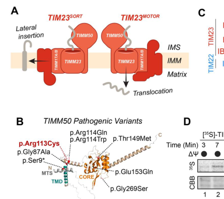

## Question

# Disease Characteristics Research Template

## Target Disease
- **Disease Name:** 3-Methylglutaconic Aciduria Type 9
- **MONDO ID:** MONDO:0044724 (if available)
- **Category:** Mendelian

## Research Objectives

Please provide a comprehensive research report on **3-Methylglutaconic Aciduria Type 9** covering all of the
disease characteristics listed below. This report will be used to populate a disease knowledge
base entry. Be thorough and cite primary literature (PMID preferred) for all claims.

For each section, **suggested databases/resources** are listed. These are the first places
you should search for information on each topic.

---

### 1. Disease Information
> **Search first:** OMIM, Orphanet, ICD-10/ICD-11, MeSH, PubMed

- What is the disease? Provide a concise overview.
- What are the key identifiers? (OMIM, Orphanet, ICD-10/ICD-11, MeSH, Mondo)
- What are the common synonyms and alternative names?
- Is the information derived from individual patients (e.g., EHR) or aggregated disease-level resources?

### 2. Etiology

- **Disease Causal Factors**: What are the primary causes? (genetic, environmental, infectious, mechanistic)
- **Risk Factors**:
  > **Search first:** PubMed, Cochrane Library, UpToDate, clinical guidelines, ClinVar, ClinGen, GWAS Catalog, PheGenI, CTD, CDC, WHO, epidemiological databases
  - Genetic risk factors (causal variants, susceptibility loci, modifier genes)
  - Environmental risk factors (toxins, lifestyle, occupational exposures, age, sex, family history)
- **Protective Factors**:
  > **Search first:** PubMed, Cochrane Library, clinical trial databases, GWAS Catalog, gnomAD, WHO, CDC, nutrition databases
  - Genetic protective factors (protective variants, modifier alleles)
  - Environmental protective factors (diet, lifestyle, exposures that reduce risk)
- **Gene-Environment Interactions**: How do genetic and environmental factors interact to influence disease?
  > **Search first:** CTD, PubMed, PheGenI, GxE databases

### 3. Phenotypes
> **Search first:** HPO (Human Phenotype Ontology), OMIM, Orphanet, PubMed, clinicaltrials.gov, MedDRA, SNOMED CT, DECIPHER, LOINC

For each phenotype, provide:
- **Phenotype type**: symptoms, clinical signs, physical manifestations, behavioral changes, or laboratory abnormalities
  > For symptoms/signs: HPO, OMIM, Orphanet, PubMed
  > For behavioral changes: HPO, DSM, RDoC (Research Domain Criteria), PubMed
  > For laboratory abnormalities: LOINC, SNOMED CT, LabTests Online, PubMed
- **Phenotype characteristics**:
  > **Search first:** OMIM, Orphanet, HPO, PubMed
  - Age of symptom onset (neonatal, childhood, adult-onset, late-onset)
  - Symptom severity (mild, moderate, severe, variable)
  - Symptom progression (stable, progressive, episodic, fluctuating)
  - Frequency among affected individuals (percentage or qualitative)
- **Quality of life impact**: Effects on daily functioning and well-being (per-phenotype when possible)
  > **Search first:** EQ-5D database, SF-36, WHO QOL databases, PubMed
- Suggest HPO (Human Phenotype Ontology) terms for each phenotype

### 4. Genetic/Molecular Information

- **Causal Genes**: Gene mutations or chromosomal abnormalities responsible for disease (gene symbols, OMIM IDs)
  > **Search first:** OMIM, ClinVar, HGMD, Ensembl, NCBI Gene
- **Pathogenic Variants**:
  - Affected genes (gene symbols, HGNC IDs)
    > **Search first:** OMIM, NCBI Gene, Ensembl, HGNC, UniProt, GeneCards
  - Variant classification (pathogenic, likely pathogenic, VUS per ACMG/AMP guidelines)
    > **Search first:** ClinVar, ClinGen, ACMG/AMP guidelines, VarSome
  - Variant type/class (missense, frameshift, nonsense, splice-site, structural)
  - Allele frequency in population databases
    > **Search first:** gnomAD, 1000 Genomes, ExAC, TOPMed, dbSNP
  - Somatic vs germline origin
    > **Search first:** COSMIC (somatic), ClinVar, ICGC, TCGA
  - Functional consequences (loss of function, gain of function, dominant negative)
- **Modifier Genes**: Genes that modify disease severity or expression
- **Epigenetic Information**: DNA methylation, histone modifications, chromatin changes affecting disease
  > **Search first:** ENCODE, Roadmap Epigenomics, MethBase, DiseaseMeth
- **Chromosomal Abnormalities**: Large-scale genetic changes (aneuploidy, translocations, inversions)
  > **Search first:** DECIPHER, ClinVar, ECARUCA, UCSC Genome Browser

### 5. Environmental Information

- **Environmental Factors**: Non-genetic contributing factors (toxins, radiation, pollution, occupational exposure)
  > **Search first:** CTD (Comparative Toxicogenomics Database), TOXNET, PubMed, EPA databases
- **Lifestyle Factors**: Behavioral factors (smoking, diet, exercise, alcohol consumption)
  > **Search first:** CDC databases, WHO, PubMed, NHANES
- **Infectious Agents**: If applicable, pathogens causing or triggering disease (bacteria, viruses, fungi, parasites)
  > **Search first:** NCBI Taxonomy, ViPR, BV-BRC, MicrobeDB, GIDEON

### 6. Mechanism / Pathophysiology

**Present this section as an ordered causal chain first, then the detail below.**
Open with a numbered sequence of mechanistic steps running from the initiating
lesion (mutation, exposure, infection) to the clinical manifestation, one step per
line, each naming what it causes next. State the causal verb explicitly ("leads
to", "results in") and say where a step is inferred rather than demonstrated.
Where the mechanism branches, show the branch. The categories below are a
checklist of what to cover within those steps, not the organizing structure —
a step may draw on several of them, and a category may contribute to several
steps.

- **Molecular Pathways**: Specific signaling cascades or biochemical pathways involved (Wnt, MAPK, mTOR, PI3K-AKT, etc.)
  > **Search first:** KEGG, Reactome, WikiPathways, PathBank, BioCyc
- **Cellular Processes**: Cell-level mechanisms (apoptosis, autophagy, cell cycle dysregulation, inflammation, etc.)
  > **Search first:** Gene Ontology (GO), Reactome, KEGG, PubMed
- **Protein Dysfunction**: How protein structure or function is altered (misfolding, aggregation, loss of function, gain of function)
  > **Search first:** UniProt, PDB (Protein Data Bank), InterPro, Pfam, AlphaFold
- **Metabolic Changes**: Alterations in metabolic processes (energy metabolism, lipid metabolism, amino acid metabolism)
  > **Search first:** KEGG, BioCyc, HMDB (Human Metabolome Database), BRENDA
- **Immune System Involvement**: Role of immune response (autoimmunity, immunodeficiency, chronic inflammation)
  > **Search first:** ImmPort, Immunome Database, IEDB, Gene Ontology
- **Tissue Damage Mechanisms**: How tissues/ are injured (oxidative stress, ischemia, fibrosis, necrosis)
  > **Search first:** PubMed, Gene Ontology, Reactome
- **Biochemical Abnormalities**: Specific molecular defects (enzyme deficiencies, receptor dysfunction, ion channel defects)
  > **Search first:** BRENDA, UniProt, KEGG, OMIM, PubMed
- **Epigenetic Changes**: DNA methylation, histone modifications affecting gene expression in disease
  > **Search first:** ENCODE, Roadmap Epigenomics, MethBase, DiseaseMeth
- **Molecular Profiling** (if available):
  - Transcriptomics/gene expression changes
    > **Search first:** GEO (Gene Expression Omnibus), ArrayExpress, GTEx, Human Cell Atlas, SRA
  - Proteomics findings
    > **Search first:** PRIDE, ProteomeXchange, Human Protein Atlas, STRING, BioGRID
  - Metabolomics signatures
    > **Search first:** MetaboLights, Metabolomics Workbench, HMDB, METLIN
  - Lipidomics alterations
    > **Search first:** LIPID MAPS, SwissLipids, LipidHome, Metabolomics Workbench
  - Genomic structural features
    > **Search first:** UCSC Genome Browser, Ensembl, NCBI, dbVar, DGV
- **Advanced Technologies** (if applicable):
  - Single-cell analysis findings (cell-type specific mechanisms, cellular heterogeneity)
    > **Search first:** Human Cell Atlas, Single Cell Portal, GEO, CELLxGENE
  - Spatial transcriptomics findings
    > **Search first:** GEO, Spatial Research, Vizgen, 10x Genomics data
  - Multi-omics integration results
    > **Search first:** TCGA, ICGC, cBioPortal, LinkedOmics, PubMed
  - Functional genomics screens (CRISPR, RNAi)
    > **Search first:** DepMap, GenomeRNAi, PubMed, BioGRID ORCS

For each mechanism, describe:
- The causal chain from initial trigger to clinical manifestation
- Which mechanisms are upstream vs downstream
- What cell types and biological processes are involved
- Suggest GO terms for biological processes and CL terms for cell types

### 7. Anatomical Structures Affected

- **Organ Level**:
  - Primary organs directly affected
  - Secondary organ involvement (complications, secondary effects)
  - Body systems involved (cardiovascular, nervous, digestive, respiratory, endocrine, etc.)
  > **Search first:** Uberon, FMA (Foundational Model of Anatomy), OMIM, HPO, ICD-11, MeSH, SNOMED CT
- **Tissue and Cell Level**:
  - Specific tissue types affected (epithelial, connective, muscle, nervous)
  - Specific cell populations targeted (with Cell Ontology terms)
  > **Search first:** Uberon, Human Protein Atlas, Cell Ontology, Human Cell Atlas, CellMarker, PanglaoDB
- **Subcellular Level**:
  - Cellular compartments involved (mitochondria, nucleus, ER, lysosomes) (with GO Cellular Component terms)
  > **Search first:** Gene Ontology (Cellular Component), UniProt, Human Protein Atlas
- **Localization**:
  - Specific anatomical sites (with UBERON terms)
    > **Search first:** FMA, Uberon, NeuroNames (for brain), SNOMED CT
  - Lateralization (unilateral, bilateral, asymmetric)
    > **Search first:** HPO, clinical literature, imaging databases

### 8. Temporal Development

- **Onset**:
  - Typical age of onset (congenital, pediatric, adult, geriatric)
  - Onset pattern (acute, subacute, chronic, insidious)
  > **Search first:** OMIM, Orphanet, HPO, PubMed
- **Progression**:
  - Disease stages (early, intermediate, advanced, end-stage)
    > **Search first:** Cancer Staging Manual (AJCC), WHO classifications, PubMed
  - Progression rate (rapid, slow, variable)
  - Disease course pattern (episodic, relapsing-remitting, progressive, stable)
  - Disease duration (self-limited, chronic lifelong)
  > **Search first:** Disease registries, longitudinal cohort databases, natural history studies, PubMed, Orphanet, OMIM
- **Patterns**:
  - Remission patterns (spontaneous, treatment-induced)
    > **Search first:** Clinical trial databases, disease registries, PubMed
  - Critical periods (time windows of vulnerability or opportunity for intervention)
    > **Search first:** PubMed, developmental biology databases, clinical guidelines

### 9. Inheritance and Population

- **Epidemiology**:
  - Prevalence (cases per 100,000 at given time)
  - Incidence (new cases per 100,000 per year)
  > **Search first:** Orphanet, CDC, WHO, GBD (Global Burden of Disease), national registries, SEER, disease registries
- **For Genetic Etiology**:
  - Inheritance pattern (AD, AR, X-linked, mitochondrial, multifactorial, polygenic)
    > **Search first:** OMIM, Orphanet, ClinVar, GTR (Genetic Testing Registry)
  - Penetrance (complete, incomplete, age-dependent)
    > **Search first:** ClinVar, OMIM, PubMed, ClinGen
  - Expressivity (variable, consistent)
    > **Search first:** OMIM, ClinVar, PubMed
  - Genetic anticipation (increasing severity in successive generations)
    > **Search first:** OMIM, PubMed (especially for repeat expansion disorders)
  - Germline mosaicism
    > **Search first:** ClinVar, OMIM, genetic counseling literature, PubMed
  - Founder effects (population-specific mutations)
    > **Search first:** gnomAD, population genetics databases, PubMed
  - Consanguinity role
    > **Search first:** OMIM, population studies, genetic counseling resources
  - Carrier frequency
    > **Search first:** gnomAD, carrier screening databases, GeneReviews, GTR
- **Population Demographics**:
  - Affected populations (ethnic or demographic groups with higher prevalence)
    > **Search first:** gnomAD, 1000 Genomes, PAGE Study, PubMed, population registries
  - Geographic distribution (endemic areas, regional variation)
    > **Search first:** WHO, CDC, GBD, Orphanet, geographic epidemiology databases
  - Geographic distribution of specific variants
  - Sex ratio (male:female)
    > **Search first:** Disease registries, OMIM, PubMed, epidemiological databases
  - Age distribution of affected individuals
    > **Search first:** CDC, disease registries, SEER, Orphanet

### 10. Diagnostics

- **Clinical Tests**:
  - Laboratory tests (blood, urine, tissue chemistry, specific enzyme assays)
    > **Search first:** LOINC, LabTests Online, PubMed
  - Biomarkers (proteins, metabolites, genetic markers, circulating biomarkers)
    > **Search first:** FDA Biomarker List, BEST (Biomarkers, EndpointS, and other Tools), PubMed
  - Imaging studies (X-ray, CT, MRI, PET, ultrasound)
    > **Search first:** RadLex, DICOM, Radiopaedia, imaging databases
  - Functional tests (pulmonary function, cardiac stress tests)
    > **Search first:** LOINC, clinical guidelines, PubMed
  - Electrophysiology (EEG, EMG, ECG, nerve conduction studies)
    > **Search first:** LOINC, clinical neurophysiology databases, PubMed
  - Biopsy findings (histopathology, immunohistochemistry)
    > **Search first:** SNOMED CT, College of American Pathologists resources, PubMed
  - Pathology findings (microscopic examination)
    > **Search first:** SNOMED CT, Digital Pathology databases, PubMed
- **Genetic Testing**:
  > **Search first:** GTR (Genetic Testing Registry), GeneReviews, ClinGen
  - Overview of recommended genetic testing approach
  - Whole genome sequencing (WGS) utility
    > **Search first:** GTR, ClinVar, GEL (Genomics England), gnomAD
  - Whole exome sequencing (WES) utility
    > **Search first:** GTR, ClinVar, OMIM, GeneMatcher
  - Gene panels (which panels, which genes)
    > **Search first:** GTR, ClinVar, laboratory-specific databases
  - Single gene testing
    > **Search first:** GTR, ClinVar, OMIM, GeneReviews
  - Chromosomal microarray (CMA)
    > **Search first:** DECIPHER, ClinVar, dbVar, ECARUCA
  - Karyotyping
    > **Search first:** Chromosome Abnormality Database, ClinVar, cytogenetics resources
  - FISH
    > **Search first:** ClinVar, cytogenetics databases, PubMed
  - Mitochondrial DNA testing
    > **Search first:** MITOMAP, MSeqDR, ClinVar, GTR
  - Repeat expansion testing
    > **Search first:** GTR, ClinVar, repeat expansion databases, PubMed
- **Omics-Based Diagnostics** (if applicable):
  - RNA sequencing / transcriptomics
    > **Search first:** GEO, ArrayExpress, GTEx, RNA-seq databases
  - Proteomics
    > **Search first:** PRIDE, ProteomeXchange, FDA Biomarker database
  - Metabolomics
    > **Search first:** MetaboLights, Metabolomics Workbench, HMDB
  - Epigenomics
    > **Search first:** GEO, ENCODE, Roadmap Epigenomics, MethBase
  - Liquid biopsy
    > **Search first:** COSMIC, ClinVar, liquid biopsy databases, PubMed
- **Clinical Criteria**:
  - Standardized diagnostic criteria (DSM, ICD, society guidelines)
    > **Search first:** DSM-5, ICD-11, clinical society guidelines, UpToDate
  - Differential diagnosis (other conditions to rule out, with distinguishing features)
    > **Search first:** DynaMed, UpToDate, clinical decision support systems
- **Screening**:
  - Screening methods for asymptomatic individuals (newborn screening, carrier screening, cascade screening)
    > **Search first:** ACMG recommendations, CDC newborn screening, GTR

### 11. Outcome/Prognosis

- **Survival and Mortality**:
  - Survival rate (5-year, 10-year, overall)
    > **Search first:** SEER, cancer registries, disease-specific registries, PubMed
  - Life expectancy (with and without treatment if applicable)
    > **Search first:** Orphanet, disease registries, actuarial databases, PubMed
  - Mortality rate
    > **Search first:** CDC, WHO, GBD, national mortality databases
  - Disease-specific mortality (deaths directly attributable to disease)
    > **Search first:** Disease registries, CDC Wonder, GBD, PubMed
- **Morbidity and Function**:
  - Morbidity (disease-related disability and health impacts)
    > **Search first:** GBD, WHO, disability databases, PubMed
  - Disability outcomes (long-term functional impairments)
    > **Search first:** ICF (International Classification of Functioning), disability registries
  - Quality of life measures (EQ-5D, SF-36, PROMIS, disease-specific tools)
    > **Search first:** EQ-5D database, SF-36, PROMIS, PubMed
- **Disease Course**:
  - Complications (secondary problems: infections, organ failure, etc.)
    > **Search first:** ICD codes, disease registries, clinical databases, PubMed
  - Recovery potential (likelihood and extent of recovery, with vs without treatment)
    > **Search first:** Natural history studies, rehabilitation databases, PubMed
- **Prediction**:
  - Prognostic factors (age, disease severity, biomarkers, treatment response)
    > **Search first:** Prognostic models databases, clinical calculators, PubMed
  - Prognostic biomarkers (molecular markers predicting disease course)
    > **Search first:** FDA Biomarker database, PubMed, cancer prognostic databases

### 12. Treatment

- **Pharmacotherapy**:
  - Pharmacological treatments (drug names, drug classes, mechanisms of action)
    > **Search first:** DrugBank, RxNorm, ATC classification, DailyMed, FDA databases
  - Pharmacogenomics (how genetic variants affect drug metabolism, efficacy, toxicity)
    > **Search first:** PharmGKB, CPIC (Clinical Pharmacogenetics), FDA Table of PGx Biomarkers
- **Advanced Therapeutics**:
  - Gene therapy (viral vectors, CRISPR, gene replacement, gene editing)
    > **Search first:** ClinicalTrials.gov, FDA gene therapy database, ASGCT resources
  - Cell therapy (stem cell transplant, CAR-T, cellular therapeutics)
    > **Search first:** ClinicalTrials.gov, FDA cell therapy database, FACT standards
  - RNA-based therapies (ASOs, siRNA, mRNA therapies)
    > **Search first:** ClinicalTrials.gov, FDA approvals, PubMed
  - Targeted therapies (treatments directed at specific molecular targets)
    > **Search first:** My Cancer Genome, OncoKB, ClinicalTrials.gov, FDA approvals
  - Immunotherapies (checkpoint inhibitors, monoclonal antibodies)
    > **Search first:** Cancer Immunotherapy Database, FDA approvals, ClinicalTrials.gov
- **Surgical and Interventional**:
  - Surgical interventions (types of surgery, timing, outcomes)
    > **Search first:** CPT codes, surgical registries, clinical guidelines, PubMed
- **Supportive and Rehabilitative**:
  - Supportive care (symptom management, pain control, nutrition)
    > **Search first:** Clinical guidelines, Cochrane Library, PubMed
  - Rehabilitation (physical therapy, occupational therapy, speech therapy)
    > **Search first:** Rehabilitation medicine databases, clinical guidelines, PubMed
- **Experimental**:
  - Experimental treatments in clinical trials (with NCT identifiers if available)
    > **Search first:** ClinicalTrials.gov, EU Clinical Trials Register, WHO ICTRP
- **Treatment Outcomes**:
  - Treatment response rates
    > **Search first:** Clinical trial databases, FDA reviews, systematic reviews, PubMed
  - Side effects and adverse events
    > **Search first:** FDA Adverse Event Reporting System (FAERS), MedWatch, PubMed
- **Treatment Strategy**:
  - Treatment algorithms (clinical pathways, decision trees)
    > **Search first:** Clinical practice guidelines, NCCN Guidelines, UpToDate
  - Combination therapies
    > **Search first:** ClinicalTrials.gov, treatment guidelines, PubMed
  - Personalized medicine approaches (genotype-guided treatment)
    > **Search first:** My Cancer Genome, CIViC, PharmGKB, precision medicine databases

For each treatment, suggest NCIT (NCI Thesaurus) clinical-intervention terms where applicable.

### 13. Prevention

- **Prevention Levels**:
  - Primary prevention (preventing disease occurrence: vaccination, risk factor modification)
    > **Search first:** CDC, WHO, USPSTF recommendations, Cochrane Library
  - Secondary prevention (early detection and treatment: screening programs, early intervention)
    > **Search first:** USPSTF, CDC screening guidelines, WHO
  - Tertiary prevention (preventing complications in those with disease)
    > **Search first:** Clinical guidelines, disease management protocols, PubMed
- **Immunization**: Vaccine strategies (if applicable)
  > **Search first:** CDC vaccine schedules, WHO immunization, FDA vaccine database
- **Screening and Early Detection**:
  - Screening programs (population-based: newborn screening, cancer screening)
    > **Search first:** CDC screening programs, USPSTF, cancer screening databases
  - Genetic screening (carrier screening, preimplantation genetic diagnosis, prenatal testing)
    > **Search first:** ACMG recommendations, ACOG guidelines, GTR
  - Risk stratification (identifying high-risk individuals for targeted prevention)
    > **Search first:** Risk prediction models, clinical calculators, PubMed
- **Behavioral Interventions**: Lifestyle modifications to reduce risk
  > **Search first:** CDC, WHO, behavioral intervention databases, Cochrane Library
- **Counseling**: Genetic counseling (risk assessment, family planning guidance)
  > **Search first:** NSGC resources, ACMG guidelines, GeneReviews
- **Public Health**:
  - Public health interventions (sanitation, vector control, health education)
    > **Search first:** CDC, WHO, public health databases, PubMed
  - Environmental interventions (reducing environmental risk factors)
    > **Search first:** EPA databases, WHO environmental health, PubMed
- **Prophylaxis**: Preventive medications or procedures
  > **Search first:** Clinical guidelines, FDA approvals, PubMed

### 14. Other Species / Natural Disease

- **Taxonomy**: Species affected (with NCBI Taxon identifiers)
  > **Search first:** NCBI Taxonomy
- **Breed**: Specific breeds affected (with VBO identifiers if applicable)
  > **Search first:** VBO (Vertebrate Breed Ontology)
- **Gene**: Orthologous genes in other species (with NCBI Gene IDs)
  > **Search first:** NCBI Gene
- **Natural Disease**:
  - Naturally occurring disease in other species (companion animals, wildlife)
    > **Search first:** OMIA (Online Mendelian Inheritance in Animals), VetCompass, PubMed
  - Veterinary relevance and importance in animal health
    > **Search first:** OMIA, veterinary databases, PubMed
- **Comparative Biology**:
  - Comparative pathology (similarities and differences across species)
    > **Search first:** OMIA, comparative pathology databases, PubMed
  - Evolutionary conservation of disease mechanisms
    > **Search first:** HomoloGene, OrthoMCL, Alliance of Genome Resources
- **Transmission** (if applicable):
  - Zoonotic potential
    > **Search first:** CDC zoonotic diseases, WHO zoonoses, GIDEON
  - Cross-species susceptibility
    > **Search first:** NCBI Taxonomy, veterinary databases, PubMed

### 15. Model Organisms

- **Model Types**:
  - Model organism type (mammalian, invertebrate, cellular, in vitro)
    > **Search first:** Alliance of Genome Resources, model organism databases
  - Specific model systems (mouse, rat, zebrafish, Drosophila, C. elegans, yeast, cell lines, organoids, iPSCs)
    > **Search first:** MGI, RGD, ZFIN, FlyBase, WormBase, SGD, ATCC, Cellosaurus
  - Induced models (drug treatment, surgical intervention, environmental manipulation)
    > **Search first:** MGI, model organism databases, PubMed
- **Genetic Models**:
  - Types available (knockout, knock-in, transgenic, conditional, humanized)
    > **Search first:** MGI, IMPC, KOMP, EuMMCR, IMSR
- **Model Characteristics**:
  - Phenotype recapitulation (how well model reproduces human disease features)
    > **Search first:** Model organism databases, comparative studies, PubMed
  - Model limitations (aspects of human disease not captured)
    > **Search first:** Model organism databases, PubMed, review articles
- **Applications**:
  - Research applications (what aspects of disease can be studied)
    > **Search first:** Model organism databases, PubMed
- **Resources**:
  - Model databases
    > **Search first:** MGI, RGD, ZFIN, FlyBase, WormBase, IMSR, EMMA, MMRRC

---

## Citation Requirements

- Cite primary literature (PMID preferred) for all mechanistic and clinical claims
- Prioritize recent reviews and landmark papers
- Include direct quotes from abstracts where possible to support key statements
- Distinguish evidence source types: human clinical, model organism, in vitro, computational

## Output Format

Structure your response as a comprehensive narrative organized by the sections above.
For each section, provide:
- Factual content with specific details (numbers, percentages, gene names, variant nomenclature)
- Ontology term suggestions (HPO, GO, CL, UBERON, CHEBI, NCIT, MONDO) where applicable
- Evidence citations with PMIDs
- Direct quotes from abstracts to support key claims
- Clear indication when information is not available or not applicable for this disease

This report will be used to populate a disease knowledge base entry with:
- Pathophysiology descriptions with causal chains
- Gene/protein annotations (HGNC, GO terms)
- Phenotype associations (HP terms) with frequencies
- Cell type involvement (CL terms)
- Anatomical locations (UBERON terms)
- Chemical entities (CHEBI terms)
- Treatment annotations (NCIT terms)
- Evidence items with PMIDs and exact abstract quotes
- Epidemiology, prognosis, diagnostic, and prevention information
- Animal model descriptions with phenotype recapitulation details

## Output

Question: You are an expert researcher providing comprehensive, well-cited information.

Provide detailed information focusing on:
1. Key concepts and definitions with current understanding
2. Recent developments and latest research (prioritize 2023-2024 sources)
3. Current applications and real-world implementations
4. Expert opinions and analysis from authoritative sources
5. Relevant statistics and data from recent studies

Format as a comprehensive research report with proper citations. Include URLs and publication dates where available.
Always prioritize recent, authoritative sources and provide specific citations for all major claims.

# Disease Characteristics Research Template

## Target Disease
- **Disease Name:** 3-Methylglutaconic Aciduria Type 9
- **MONDO ID:** MONDO:0044724 (if available)
- **Category:** Mendelian

## Research Objectives

Please provide a comprehensive research report on **3-Methylglutaconic Aciduria Type 9** covering all of the
disease characteristics listed below. This report will be used to populate a disease knowledge
base entry. Be thorough and cite primary literature (PMID preferred) for all claims.

For each section, **suggested databases/resources** are listed. These are the first places
you should search for information on each topic.

---

### 1. Disease Information
> **Search first:** OMIM, Orphanet, ICD-10/ICD-11, MeSH, PubMed

- What is the disease? Provide a concise overview.
- What are the key identifiers? (OMIM, Orphanet, ICD-10/ICD-11, MeSH, Mondo)
- What are the common synonyms and alternative names?
- Is the information derived from individual patients (e.g., EHR) or aggregated disease-level resources?

### 2. Etiology

- **Disease Causal Factors**: What are the primary causes? (genetic, environmental, infectious, mechanistic)
- **Risk Factors**:
  > **Search first:** PubMed, Cochrane Library, UpToDate, clinical guidelines, ClinVar, ClinGen, GWAS Catalog, PheGenI, CTD, CDC, WHO, epidemiological databases
  - Genetic risk factors (causal variants, susceptibility loci, modifier genes)
  - Environmental risk factors (toxins, lifestyle, occupational exposures, age, sex, family history)
- **Protective Factors**:
  > **Search first:** PubMed, Cochrane Library, clinical trial databases, GWAS Catalog, gnomAD, WHO, CDC, nutrition databases
  - Genetic protective factors (protective variants, modifier alleles)
  - Environmental protective factors (diet, lifestyle, exposures that reduce risk)
- **Gene-Environment Interactions**: How do genetic and environmental factors interact to influence disease?
  > **Search first:** CTD, PubMed, PheGenI, GxE databases

### 3. Phenotypes
> **Search first:** HPO (Human Phenotype Ontology), OMIM, Orphanet, PubMed, clinicaltrials.gov, MedDRA, SNOMED CT, DECIPHER, LOINC

For each phenotype, provide:
- **Phenotype type**: symptoms, clinical signs, physical manifestations, behavioral changes, or laboratory abnormalities
  > For symptoms/signs: HPO, OMIM, Orphanet, PubMed
  > For behavioral changes: HPO, DSM, RDoC (Research Domain Criteria), PubMed
  > For laboratory abnormalities: LOINC, SNOMED CT, LabTests Online, PubMed
- **Phenotype characteristics**:
  > **Search first:** OMIM, Orphanet, HPO, PubMed
  - Age of symptom onset (neonatal, childhood, adult-onset, late-onset)
  - Symptom severity (mild, moderate, severe, variable)
  - Symptom progression (stable, progressive, episodic, fluctuating)
  - Frequency among affected individuals (percentage or qualitative)
- **Quality of life impact**: Effects on daily functioning and well-being (per-phenotype when possible)
  > **Search first:** EQ-5D database, SF-36, WHO QOL databases, PubMed
- Suggest HPO (Human Phenotype Ontology) terms for each phenotype

### 4. Genetic/Molecular Information

- **Causal Genes**: Gene mutations or chromosomal abnormalities responsible for disease (gene symbols, OMIM IDs)
  > **Search first:** OMIM, ClinVar, HGMD, Ensembl, NCBI Gene
- **Pathogenic Variants**:
  - Affected genes (gene symbols, HGNC IDs)
    > **Search first:** OMIM, NCBI Gene, Ensembl, HGNC, UniProt, GeneCards
  - Variant classification (pathogenic, likely pathogenic, VUS per ACMG/AMP guidelines)
    > **Search first:** ClinVar, ClinGen, ACMG/AMP guidelines, VarSome
  - Variant type/class (missense, frameshift, nonsense, splice-site, structural)
  - Allele frequency in population databases
    > **Search first:** gnomAD, 1000 Genomes, ExAC, TOPMed, dbSNP
  - Somatic vs germline origin
    > **Search first:** COSMIC (somatic), ClinVar, ICGC, TCGA
  - Functional consequences (loss of function, gain of function, dominant negative)
- **Modifier Genes**: Genes that modify disease severity or expression
- **Epigenetic Information**: DNA methylation, histone modifications, chromatin changes affecting disease
  > **Search first:** ENCODE, Roadmap Epigenomics, MethBase, DiseaseMeth
- **Chromosomal Abnormalities**: Large-scale genetic changes (aneuploidy, translocations, inversions)
  > **Search first:** DECIPHER, ClinVar, ECARUCA, UCSC Genome Browser

### 5. Environmental Information

- **Environmental Factors**: Non-genetic contributing factors (toxins, radiation, pollution, occupational exposure)
  > **Search first:** CTD (Comparative Toxicogenomics Database), TOXNET, PubMed, EPA databases
- **Lifestyle Factors**: Behavioral factors (smoking, diet, exercise, alcohol consumption)
  > **Search first:** CDC databases, WHO, PubMed, NHANES
- **Infectious Agents**: If applicable, pathogens causing or triggering disease (bacteria, viruses, fungi, parasites)
  > **Search first:** NCBI Taxonomy, ViPR, BV-BRC, MicrobeDB, GIDEON

### 6. Mechanism / Pathophysiology

**Present this section as an ordered causal chain first, then the detail below.**
Open with a numbered sequence of mechanistic steps running from the initiating
lesion (mutation, exposure, infection) to the clinical manifestation, one step per
line, each naming what it causes next. State the causal verb explicitly ("leads
to", "results in") and say where a step is inferred rather than demonstrated.
Where the mechanism branches, show the branch. The categories below are a
checklist of what to cover within those steps, not the organizing structure —
a step may draw on several of them, and a category may contribute to several
steps.

- **Molecular Pathways**: Specific signaling cascades or biochemical pathways involved (Wnt, MAPK, mTOR, PI3K-AKT, etc.)
  > **Search first:** KEGG, Reactome, WikiPathways, PathBank, BioCyc
- **Cellular Processes**: Cell-level mechanisms (apoptosis, autophagy, cell cycle dysregulation, inflammation, etc.)
  > **Search first:** Gene Ontology (GO), Reactome, KEGG, PubMed
- **Protein Dysfunction**: How protein structure or function is altered (misfolding, aggregation, loss of function, gain of function)
  > **Search first:** UniProt, PDB (Protein Data Bank), InterPro, Pfam, AlphaFold
- **Metabolic Changes**: Alterations in metabolic processes (energy metabolism, lipid metabolism, amino acid metabolism)
  > **Search first:** KEGG, BioCyc, HMDB (Human Metabolome Database), BRENDA
- **Immune System Involvement**: Role of immune response (autoimmunity, immunodeficiency, chronic inflammation)
  > **Search first:** ImmPort, Immunome Database, IEDB, Gene Ontology
- **Tissue Damage Mechanisms**: How tissues/ are injured (oxidative stress, ischemia, fibrosis, necrosis)
  > **Search first:** PubMed, Gene Ontology, Reactome
- **Biochemical Abnormalities**: Specific molecular defects (enzyme deficiencies, receptor dysfunction, ion channel defects)
  > **Search first:** BRENDA, UniProt, KEGG, OMIM, PubMed
- **Epigenetic Changes**: DNA methylation, histone modifications affecting gene expression in disease
  > **Search first:** ENCODE, Roadmap Epigenomics, MethBase, DiseaseMeth
- **Molecular Profiling** (if available):
  - Transcriptomics/gene expression changes
    > **Search first:** GEO (Gene Expression Omnibus), ArrayExpress, GTEx, Human Cell Atlas, SRA
  - Proteomics findings
    > **Search first:** PRIDE, ProteomeXchange, Human Protein Atlas, STRING, BioGRID
  - Metabolomics signatures
    > **Search first:** MetaboLights, Metabolomics Workbench, HMDB, METLIN
  - Lipidomics alterations
    > **Search first:** LIPID MAPS, SwissLipids, LipidHome, Metabolomics Workbench
  - Genomic structural features
    > **Search first:** UCSC Genome Browser, Ensembl, NCBI, dbVar, DGV
- **Advanced Technologies** (if applicable):
  - Single-cell analysis findings (cell-type specific mechanisms, cellular heterogeneity)
    > **Search first:** Human Cell Atlas, Single Cell Portal, GEO, CELLxGENE
  - Spatial transcriptomics findings
    > **Search first:** GEO, Spatial Research, Vizgen, 10x Genomics data
  - Multi-omics integration results
    > **Search first:** TCGA, ICGC, cBioPortal, LinkedOmics, PubMed
  - Functional genomics screens (CRISPR, RNAi)
    > **Search first:** DepMap, GenomeRNAi, PubMed, BioGRID ORCS

For each mechanism, describe:
- The causal chain from initial trigger to clinical manifestation
- Which mechanisms are upstream vs downstream
- What cell types and biological processes are involved
- Suggest GO terms for biological processes and CL terms for cell types

### 7. Anatomical Structures Affected

- **Organ Level**:
  - Primary organs directly affected
  - Secondary organ involvement (complications, secondary effects)
  - Body systems involved (cardiovascular, nervous, digestive, respiratory, endocrine, etc.)
  > **Search first:** Uberon, FMA (Foundational Model of Anatomy), OMIM, HPO, ICD-11, MeSH, SNOMED CT
- **Tissue and Cell Level**:
  - Specific tissue types affected (epithelial, connective, muscle, nervous)
  - Specific cell populations targeted (with Cell Ontology terms)
  > **Search first:** Uberon, Human Protein Atlas, Cell Ontology, Human Cell Atlas, CellMarker, PanglaoDB
- **Subcellular Level**:
  - Cellular compartments involved (mitochondria, nucleus, ER, lysosomes) (with GO Cellular Component terms)
  > **Search first:** Gene Ontology (Cellular Component), UniProt, Human Protein Atlas
- **Localization**:
  - Specific anatomical sites (with UBERON terms)
    > **Search first:** FMA, Uberon, NeuroNames (for brain), SNOMED CT
  - Lateralization (unilateral, bilateral, asymmetric)
    > **Search first:** HPO, clinical literature, imaging databases

### 8. Temporal Development

- **Onset**:
  - Typical age of onset (congenital, pediatric, adult, geriatric)
  - Onset pattern (acute, subacute, chronic, insidious)
  > **Search first:** OMIM, Orphanet, HPO, PubMed
- **Progression**:
  - Disease stages (early, intermediate, advanced, end-stage)
    > **Search first:** Cancer Staging Manual (AJCC), WHO classifications, PubMed
  - Progression rate (rapid, slow, variable)
  - Disease course pattern (episodic, relapsing-remitting, progressive, stable)
  - Disease duration (self-limited, chronic lifelong)
  > **Search first:** Disease registries, longitudinal cohort databases, natural history studies, PubMed, Orphanet, OMIM
- **Patterns**:
  - Remission patterns (spontaneous, treatment-induced)
    > **Search first:** Clinical trial databases, disease registries, PubMed
  - Critical periods (time windows of vulnerability or opportunity for intervention)
    > **Search first:** PubMed, developmental biology databases, clinical guidelines

### 9. Inheritance and Population

- **Epidemiology**:
  - Prevalence (cases per 100,000 at given time)
  - Incidence (new cases per 100,000 per year)
  > **Search first:** Orphanet, CDC, WHO, GBD (Global Burden of Disease), national registries, SEER, disease registries
- **For Genetic Etiology**:
  - Inheritance pattern (AD, AR, X-linked, mitochondrial, multifactorial, polygenic)
    > **Search first:** OMIM, Orphanet, ClinVar, GTR (Genetic Testing Registry)
  - Penetrance (complete, incomplete, age-dependent)
    > **Search first:** ClinVar, OMIM, PubMed, ClinGen
  - Expressivity (variable, consistent)
    > **Search first:** OMIM, ClinVar, PubMed
  - Genetic anticipation (increasing severity in successive generations)
    > **Search first:** OMIM, PubMed (especially for repeat expansion disorders)
  - Germline mosaicism
    > **Search first:** ClinVar, OMIM, genetic counseling literature, PubMed
  - Founder effects (population-specific mutations)
    > **Search first:** gnomAD, population genetics databases, PubMed
  - Consanguinity role
    > **Search first:** OMIM, population studies, genetic counseling resources
  - Carrier frequency
    > **Search first:** gnomAD, carrier screening databases, GeneReviews, GTR
- **Population Demographics**:
  - Affected populations (ethnic or demographic groups with higher prevalence)
    > **Search first:** gnomAD, 1000 Genomes, PAGE Study, PubMed, population registries
  - Geographic distribution (endemic areas, regional variation)
    > **Search first:** WHO, CDC, GBD, Orphanet, geographic epidemiology databases
  - Geographic distribution of specific variants
  - Sex ratio (male:female)
    > **Search first:** Disease registries, OMIM, PubMed, epidemiological databases
  - Age distribution of affected individuals
    > **Search first:** CDC, disease registries, SEER, Orphanet

### 10. Diagnostics

- **Clinical Tests**:
  - Laboratory tests (blood, urine, tissue chemistry, specific enzyme assays)
    > **Search first:** LOINC, LabTests Online, PubMed
  - Biomarkers (proteins, metabolites, genetic markers, circulating biomarkers)
    > **Search first:** FDA Biomarker List, BEST (Biomarkers, EndpointS, and other Tools), PubMed
  - Imaging studies (X-ray, CT, MRI, PET, ultrasound)
    > **Search first:** RadLex, DICOM, Radiopaedia, imaging databases
  - Functional tests (pulmonary function, cardiac stress tests)
    > **Search first:** LOINC, clinical guidelines, PubMed
  - Electrophysiology (EEG, EMG, ECG, nerve conduction studies)
    > **Search first:** LOINC, clinical neurophysiology databases, PubMed
  - Biopsy findings (histopathology, immunohistochemistry)
    > **Search first:** SNOMED CT, College of American Pathologists resources, PubMed
  - Pathology findings (microscopic examination)
    > **Search first:** SNOMED CT, Digital Pathology databases, PubMed
- **Genetic Testing**:
  > **Search first:** GTR (Genetic Testing Registry), GeneReviews, ClinGen
  - Overview of recommended genetic testing approach
  - Whole genome sequencing (WGS) utility
    > **Search first:** GTR, ClinVar, GEL (Genomics England), gnomAD
  - Whole exome sequencing (WES) utility
    > **Search first:** GTR, ClinVar, OMIM, GeneMatcher
  - Gene panels (which panels, which genes)
    > **Search first:** GTR, ClinVar, laboratory-specific databases
  - Single gene testing
    > **Search first:** GTR, ClinVar, OMIM, GeneReviews
  - Chromosomal microarray (CMA)
    > **Search first:** DECIPHER, ClinVar, dbVar, ECARUCA
  - Karyotyping
    > **Search first:** Chromosome Abnormality Database, ClinVar, cytogenetics resources
  - FISH
    > **Search first:** ClinVar, cytogenetics databases, PubMed
  - Mitochondrial DNA testing
    > **Search first:** MITOMAP, MSeqDR, ClinVar, GTR
  - Repeat expansion testing
    > **Search first:** GTR, ClinVar, repeat expansion databases, PubMed
- **Omics-Based Diagnostics** (if applicable):
  - RNA sequencing / transcriptomics
    > **Search first:** GEO, ArrayExpress, GTEx, RNA-seq databases
  - Proteomics
    > **Search first:** PRIDE, ProteomeXchange, FDA Biomarker database
  - Metabolomics
    > **Search first:** MetaboLights, Metabolomics Workbench, HMDB
  - Epigenomics
    > **Search first:** GEO, ENCODE, Roadmap Epigenomics, MethBase
  - Liquid biopsy
    > **Search first:** COSMIC, ClinVar, liquid biopsy databases, PubMed
- **Clinical Criteria**:
  - Standardized diagnostic criteria (DSM, ICD, society guidelines)
    > **Search first:** DSM-5, ICD-11, clinical society guidelines, UpToDate
  - Differential diagnosis (other conditions to rule out, with distinguishing features)
    > **Search first:** DynaMed, UpToDate, clinical decision support systems
- **Screening**:
  - Screening methods for asymptomatic individuals (newborn screening, carrier screening, cascade screening)
    > **Search first:** ACMG recommendations, CDC newborn screening, GTR

### 11. Outcome/Prognosis

- **Survival and Mortality**:
  - Survival rate (5-year, 10-year, overall)
    > **Search first:** SEER, cancer registries, disease-specific registries, PubMed
  - Life expectancy (with and without treatment if applicable)
    > **Search first:** Orphanet, disease registries, actuarial databases, PubMed
  - Mortality rate
    > **Search first:** CDC, WHO, GBD, national mortality databases
  - Disease-specific mortality (deaths directly attributable to disease)
    > **Search first:** Disease registries, CDC Wonder, GBD, PubMed
- **Morbidity and Function**:
  - Morbidity (disease-related disability and health impacts)
    > **Search first:** GBD, WHO, disability databases, PubMed
  - Disability outcomes (long-term functional impairments)
    > **Search first:** ICF (International Classification of Functioning), disability registries
  - Quality of life measures (EQ-5D, SF-36, PROMIS, disease-specific tools)
    > **Search first:** EQ-5D database, SF-36, PROMIS, PubMed
- **Disease Course**:
  - Complications (secondary problems: infections, organ failure, etc.)
    > **Search first:** ICD codes, disease registries, clinical databases, PubMed
  - Recovery potential (likelihood and extent of recovery, with vs without treatment)
    > **Search first:** Natural history studies, rehabilitation databases, PubMed
- **Prediction**:
  - Prognostic factors (age, disease severity, biomarkers, treatment response)
    > **Search first:** Prognostic models databases, clinical calculators, PubMed
  - Prognostic biomarkers (molecular markers predicting disease course)
    > **Search first:** FDA Biomarker database, PubMed, cancer prognostic databases

### 12. Treatment

- **Pharmacotherapy**:
  - Pharmacological treatments (drug names, drug classes, mechanisms of action)
    > **Search first:** DrugBank, RxNorm, ATC classification, DailyMed, FDA databases
  - Pharmacogenomics (how genetic variants affect drug metabolism, efficacy, toxicity)
    > **Search first:** PharmGKB, CPIC (Clinical Pharmacogenetics), FDA Table of PGx Biomarkers
- **Advanced Therapeutics**:
  - Gene therapy (viral vectors, CRISPR, gene replacement, gene editing)
    > **Search first:** ClinicalTrials.gov, FDA gene therapy database, ASGCT resources
  - Cell therapy (stem cell transplant, CAR-T, cellular therapeutics)
    > **Search first:** ClinicalTrials.gov, FDA cell therapy database, FACT standards
  - RNA-based therapies (ASOs, siRNA, mRNA therapies)
    > **Search first:** ClinicalTrials.gov, FDA approvals, PubMed
  - Targeted therapies (treatments directed at specific molecular targets)
    > **Search first:** My Cancer Genome, OncoKB, ClinicalTrials.gov, FDA approvals
  - Immunotherapies (checkpoint inhibitors, monoclonal antibodies)
    > **Search first:** Cancer Immunotherapy Database, FDA approvals, ClinicalTrials.gov
- **Surgical and Interventional**:
  - Surgical interventions (types of surgery, timing, outcomes)
    > **Search first:** CPT codes, surgical registries, clinical guidelines, PubMed
- **Supportive and Rehabilitative**:
  - Supportive care (symptom management, pain control, nutrition)
    > **Search first:** Clinical guidelines, Cochrane Library, PubMed
  - Rehabilitation (physical therapy, occupational therapy, speech therapy)
    > **Search first:** Rehabilitation medicine databases, clinical guidelines, PubMed
- **Experimental**:
  - Experimental treatments in clinical trials (with NCT identifiers if available)
    > **Search first:** ClinicalTrials.gov, EU Clinical Trials Register, WHO ICTRP
- **Treatment Outcomes**:
  - Treatment response rates
    > **Search first:** Clinical trial databases, FDA reviews, systematic reviews, PubMed
  - Side effects and adverse events
    > **Search first:** FDA Adverse Event Reporting System (FAERS), MedWatch, PubMed
- **Treatment Strategy**:
  - Treatment algorithms (clinical pathways, decision trees)
    > **Search first:** Clinical practice guidelines, NCCN Guidelines, UpToDate
  - Combination therapies
    > **Search first:** ClinicalTrials.gov, treatment guidelines, PubMed
  - Personalized medicine approaches (genotype-guided treatment)
    > **Search first:** My Cancer Genome, CIViC, PharmGKB, precision medicine databases

For each treatment, suggest NCIT (NCI Thesaurus) clinical-intervention terms where applicable.

### 13. Prevention

- **Prevention Levels**:
  - Primary prevention (preventing disease occurrence: vaccination, risk factor modification)
    > **Search first:** CDC, WHO, USPSTF recommendations, Cochrane Library
  - Secondary prevention (early detection and treatment: screening programs, early intervention)
    > **Search first:** USPSTF, CDC screening guidelines, WHO
  - Tertiary prevention (preventing complications in those with disease)
    > **Search first:** Clinical guidelines, disease management protocols, PubMed
- **Immunization**: Vaccine strategies (if applicable)
  > **Search first:** CDC vaccine schedules, WHO immunization, FDA vaccine database
- **Screening and Early Detection**:
  - Screening programs (population-based: newborn screening, cancer screening)
    > **Search first:** CDC screening programs, USPSTF, cancer screening databases
  - Genetic screening (carrier screening, preimplantation genetic diagnosis, prenatal testing)
    > **Search first:** ACMG recommendations, ACOG guidelines, GTR
  - Risk stratification (identifying high-risk individuals for targeted prevention)
    > **Search first:** Risk prediction models, clinical calculators, PubMed
- **Behavioral Interventions**: Lifestyle modifications to reduce risk
  > **Search first:** CDC, WHO, behavioral intervention databases, Cochrane Library
- **Counseling**: Genetic counseling (risk assessment, family planning guidance)
  > **Search first:** NSGC resources, ACMG guidelines, GeneReviews
- **Public Health**:
  - Public health interventions (sanitation, vector control, health education)
    > **Search first:** CDC, WHO, public health databases, PubMed
  - Environmental interventions (reducing environmental risk factors)
    > **Search first:** EPA databases, WHO environmental health, PubMed
- **Prophylaxis**: Preventive medications or procedures
  > **Search first:** Clinical guidelines, FDA approvals, PubMed

### 14. Other Species / Natural Disease

- **Taxonomy**: Species affected (with NCBI Taxon identifiers)
  > **Search first:** NCBI Taxonomy
- **Breed**: Specific breeds affected (with VBO identifiers if applicable)
  > **Search first:** VBO (Vertebrate Breed Ontology)
- **Gene**: Orthologous genes in other species (with NCBI Gene IDs)
  > **Search first:** NCBI Gene
- **Natural Disease**:
  - Naturally occurring disease in other species (companion animals, wildlife)
    > **Search first:** OMIA (Online Mendelian Inheritance in Animals), VetCompass, PubMed
  - Veterinary relevance and importance in animal health
    > **Search first:** OMIA, veterinary databases, PubMed
- **Comparative Biology**:
  - Comparative pathology (similarities and differences across species)
    > **Search first:** OMIA, comparative pathology databases, PubMed
  - Evolutionary conservation of disease mechanisms
    > **Search first:** HomoloGene, OrthoMCL, Alliance of Genome Resources
- **Transmission** (if applicable):
  - Zoonotic potential
    > **Search first:** CDC zoonotic diseases, WHO zoonoses, GIDEON
  - Cross-species susceptibility
    > **Search first:** NCBI Taxonomy, veterinary databases, PubMed

### 15. Model Organisms

- **Model Types**:
  - Model organism type (mammalian, invertebrate, cellular, in vitro)
    > **Search first:** Alliance of Genome Resources, model organism databases
  - Specific model systems (mouse, rat, zebrafish, Drosophila, C. elegans, yeast, cell lines, organoids, iPSCs)
    > **Search first:** MGI, RGD, ZFIN, FlyBase, WormBase, SGD, ATCC, Cellosaurus
  - Induced models (drug treatment, surgical intervention, environmental manipulation)
    > **Search first:** MGI, model organism databases, PubMed
- **Genetic Models**:
  - Types available (knockout, knock-in, transgenic, conditional, humanized)
    > **Search first:** MGI, IMPC, KOMP, EuMMCR, IMSR
- **Model Characteristics**:
  - Phenotype recapitulation (how well model reproduces human disease features)
    > **Search first:** Model organism databases, comparative studies, PubMed
  - Model limitations (aspects of human disease not captured)
    > **Search first:** Model organism databases, PubMed, review articles
- **Applications**:
  - Research applications (what aspects of disease can be studied)
    > **Search first:** Model organism databases, PubMed
- **Resources**:
  - Model databases
    > **Search first:** MGI, RGD, ZFIN, FlyBase, WormBase, IMSR, EMMA, MMRRC

---

## Citation Requirements

- Cite primary literature (PMID preferred) for all mechanistic and clinical claims
- Prioritize recent reviews and landmark papers
- Include direct quotes from abstracts where possible to support key statements
- Distinguish evidence source types: human clinical, model organism, in vitro, computational

## Output Format

Structure your response as a comprehensive narrative organized by the sections above.
For each section, provide:
- Factual content with specific details (numbers, percentages, gene names, variant nomenclature)
- Ontology term suggestions (HPO, GO, CL, UBERON, CHEBI, NCIT, MONDO) where applicable
- Evidence citations with PMIDs
- Direct quotes from abstracts to support key claims
- Clear indication when information is not available or not applicable for this disease

This report will be used to populate a disease knowledge base entry with:
- Pathophysiology descriptions with causal chains
- Gene/protein annotations (HGNC, GO terms)
- Phenotype associations (HP terms) with frequencies
- Cell type involvement (CL terms)
- Anatomical locations (UBERON terms)
- Chemical entities (CHEBI terms)
- Treatment annotations (NCIT terms)
- Evidence items with PMIDs and exact abstract quotes
- Epidemiology, prognosis, diagnostic, and prevention information
- Animal model descriptions with phenotype recapitulation details

# 3-Methylglutaconic Aciduria Type 9: Disease-Characteristics Research Report

**Scope and evidence standard.** This entry describes the *TIMM50*-associated disorder, not all conditions that produce urinary 3-methylglutaconic acid (3-MGA). Evidence comes primarily from published families, individual case reports, patient-derived cells, and experimental models—not an individual electronic health record or a population registry. The small, selectively ascertained clinical series do **not** support population prevalence estimates or reliable phenotype percentages. DOI links and publication years are provided below; **PMIDs were not verifiable in the retrieved primary texts and are therefore not supplied rather than guessed**. Ontology labels below are *suggestions for curator verification*, not asserted database mappings. (shahrour2017mitochondrialepilepticencephalopathy pages 1-2, crameri2024reducedproteinimport pages 3-4, paz2024biochemicalandneurophysiological pages 1-2)

## 1. Disease information and identifiers

**3-Methylglutaconic aciduria type IX** (MGCA9, MGCA type 9) is an early-onset, autosomal-recessive mitochondrial protein-import disorder caused by biallelic *TIMM50* variants. Common descriptive names are *TIMM50-related mitochondrial disease*, *TIMM50 deficiency*, and *mitochondrial epileptic encephalopathy with 3-methylglutaconic aciduria*. Seizures, neurodevelopmental impairment, and variably abnormal mitochondrial respiration are more informative than the name alone: a genetically affected person in a 2024 study **did not have detectable urinary 3-MGA**. The primary article explicitly identifies **OMIM/MIM 617698** for MGCA9; *TIMM50* is associated with **MIM 607381**. **MONDO:0044724** is the identifier supplied for this entry, but an independent MONDO cross-reference was not verified. A distinct Orphanet disease number, disease-specific ICD-10/ICD-11 code, and MeSH descriptor were not established by the reviewed evidence; do not substitute a general organic-aciduria code for a verified MGCA9-specific identifier. (crameri2024reducedproteinimport pages 1-3, crameri2024reducedproteinimport pages 3-4, tort2019mutationsintimm50 pages 2-3)

## 2. Etiology, risks, protection, and environment

The demonstrated causal factor is inherited **biallelic germline dysfunction of nuclear-encoded *TIMM50***, which encodes a core component of the mitochondrial inner-membrane TIM23 protein-import system. Reported affected genotypes include homozygous missense variants and compound-heterozygous missense/nonsense variants; segregation in families and restoration of cellular phenotypes by wild-type *TIMM50* strengthen causality. Consanguinity increased the likelihood of homozygosity in several reported families, whereas an affected Spanish patient had non-consanguineous parents and compound-heterozygous variants. These observations establish an inheritance mechanism, **not** a population-specific risk rate. (shahrour2017mitochondrialepilepticencephalopathy pages 1-2, shahrour2017mitochondrialepilepticencephalopathy pages 2-4, tort2019mutationsintimm50 pages 1-2, reyes2018mutationsintimm50 pages 2-3, crameri2024reducedproteinimport pages 4-5)

No independently causal toxin, pathogen, dietary exposure, lifestyle habit, susceptibility locus, protective allele, or validated protective environmental factor was established for MGCA9. The experimentally imposed switch to galactose-dependent oxidative metabolism increased apoptosis in affected fibroblasts despite improving some biochemical measurements; this **cell-culture gene–environment interaction is not a recommendation to avoid or consume a particular food**. Illness-related deterioration and prevention of metabolic crises have not been quantified specifically for this disorder. (reyes2018mutationsintimm50 pages 3-6, reyes2018mutationsintimm50 pages 2-3)

## 3. Phenotypes and suggested HPO annotations

The following frequencies are **within explicitly defined reports only**. The original series comprised four affected individuals from two families. A 2020 comparison of those four plus one new patient records developmental delay, seizure presentations, and urinary 3-MGA in **5/5 selected patients**; that is *not* a disease-wide frequency, especially because a subsequent genetically affected patient lacked 3-MGA. Seizures began at approximately **2–4 months** in the five-person comparison. Severity and progression vary: some children achieved walking and seizure control but had severe persistent communication deficits; another patient developed progressive motor disability and wheelchair dependence by age 17. (mir2020completeresolutionof pages 1-2, shahrour2017mitochondrialepilepticencephalopathy pages 2-4, tort2019mutationsintimm50 pages 2-3, crameri2024reducedproteinimport pages 3-4)

| Manifestation and type | Reported pattern; impact on functioning | Suggested HPO concept, subject to ID verification |
|---|---|---|
| Infantile spasms, myoclonic or tonic seizures; **clinical symptom** | Often early infancy; hypsarrhythmia in children with spasms. Seizures may respond to antiseizure treatment, but neurological disability can persist. | Infantile spasms; seizures; myoclonus; hypsarrhythmia |
| Global developmental delay and intellectual disability; **developmental/behavioral** | Prominent in original families; later speech and self-care can be severely limited. Hyperactivity or aggression when frightened was described in individual older children, not established as universal. | Global developmental delay; intellectual disability; delayed speech and language development; aggressive behavior |
| Hypotonia, subsequently spasticity/dystonia; **clinical signs** | Head lag or reduced tone in infancy; progressive spastic tetraparesis and dystonia in the 17-year-old Spanish patient. May impair ambulation and require a wheelchair. | Muscular hypotonia; spastic tetraparesis; dystonia |
| Microcephaly/failure to thrive; **physical manifestations** | Microcephaly was tabulated in the five selected patients; individual children had marked growth impairment or cachexia. Frequency beyond this selected comparison is unknown. | Microcephaly; failure to thrive |
| Optic atrophy, strabismus, visual impairment; **clinical signs** | Optic atrophy sometimes emerged years after initially normal fundus examinations. Severe impairment affected one long-term survivor. | Optic atrophy; strabismus; visual impairment |
| Brain atrophy, white-matter loss, bilateral basal-ganglia/brainstem abnormalities; **imaging signs** | Variable and sometimes progressive. One patient's lesions arose after vigabatrin and substantially resolved, so they must not automatically be attributed to MGCA9. | Cerebral atrophy; abnormality of cerebral white matter; abnormal basal-ganglia MRI signal |
| Cardiomyopathy or cardiac findings; **clinical signs** | Dilated cardiomyopathy occurred in one patient and improved with digoxin; another had mild left-ventricular hypertrophy and patent ductus arteriosus. These do not establish a cardiac frequency. | Dilated cardiomyopathy; left-ventricular hypertrophy; patent ductus arteriosus |
| Urinary 3-MGA/3-methylglutaric acid, increased lactate, variable OXPHOS deficiency; **laboratory abnormalities** | The Spanish patient's urine 3-MGA was **53–308 mmol/mol creatinine** versus laboratory control **<20**; blood/CSF lactate were **3/5 mmol/L**. Another patient had **no detected urinary 3-MGA**. Complex-V activity was **54% of control** in one muscle sample; normal enzyme tests in another did not exclude disease. | Increased urinary 3-methylglutaconic acid; increased circulating lactate; increased CSF lactate; abnormal mitochondrial respiratory-chain activity |

These are candidate *phenotype labels*, not validated HPO accession assignments. No disease-specific EQ-5D, SF-36, PROMIS, or per-phenotype quality-of-life scores were identified. Walking, vision, communication, feeding, seizure burden, and reliance on caregivers provide the documented functional outcomes. (mir2020completeresolutionof pages 1-2, shahrour2017mitochondrialepilepticencephalopathy pages 2-4, shahrour2017mitochondrialepilepticencephalopathy pages 4-5, tort2019mutationsintimm50 pages 2-3, crameri2024reducedproteinimport pages 3-4)

## 4. Genetic and molecular characteristics

**Gene:** *TIMM50*, chromosome **19q13.2**, gene MIM **607381**. Its protein is part of the mitochondrial TIM23 core, alongside TIMM23 and TIMM17A/B. An HGNC numeric ID was not independently verified. Importantly, older reports used a longer *TIMM50* isoform: their amino-acid and coding-DNA coordinates should **not** be combined indiscriminately with current mitochondrial-isoform annotations. The 2024 studies use canonical **NM_001001563.5 / NP_001001563.2**; transcript-aware reinterpretation is essential in ClinVar and laboratory reports. (mir2020completeresolutionof pages 1-2, crameri2024reducedproteinimport pages 1-3, crameri2024reducedproteinimport pages 3-4, jain2024hotspotsfordiseasecausing pages 4-5)

The table below preserves clinically important source-to-current variant mappings, classification caveats, and the biochemical exception to the disease name. It is a case-report comparison, not a carrier-screening dataset. (jain2024hotspotsfordiseasecausing pages 4-5, crameri2024reducedproteinimport pages 3-4)

| Study | Reported genotype / original notation | NM_001001563.5 normalized notation | Key clinical or functional evidence | Evidence limits |
|---|---|---|---|---|
| [Shahrour et al., 2017](https://doi.org/10.1111/cge.12855) | Homozygous legacy **p.Arg217Trp** or **p.Thr252Met** in four individuals from two consanguineous families | **c.340C>T, p.Arg114Trp** or **c.446C>T, p.Thr149Met** | Infantile-onset seizures, severe developmental impairment, 3-methylglutaconic aciduria, mildly elevated lactate, brain atrophy/basal-ganglia abnormalities, and variable complex-V deficiency; one tested patient had complex-V activity at 54% of control (shahrour2017mitochondrialepilepticencephalopathy pages 1-2, shahrour2017mitochondrialepilepticencephalopathy pages 2-4, shahrour2017mitochondrialepilepticencephalopathy pages 4-5, jain2024hotspotsfordiseasecausing pages 4-5) | Only four affected individuals; frequencies are not population estimates. Earlier protein numbering used a longer transcript/isoform and must not be mixed with current canonical numbering. |
| [Reyes et al., 2018](https://doi.org/10.15252/emmm.201708698) | Compound heterozygous **c.335C>A, p.Ser112Ter** and **c.569G>C, p.Gly190Ala** on the legacy transcript; one variant inherited from each parent | **c.26C>A, p.Ser9Ter** and **c.260G>C, p.Gly87Ala** | Rapidly progressive severe encephalopathy with epilepsy and lactic acidosis; fibroblasts had reduced TIMM50/TIM23 components, impaired TIM23-dependent import, lower membrane potential and respiration, and rescue after wild-type TIMM50 expression. The legacy missense allele was reported once among >200,000 alleles; the nonsense allele was absent from ExAC (reyes2018mutationsintimm50 pages 3-6, reyes2018mutationsintimm50 pages 2-3) | Single proband; historical and current HGVS coordinates are transcript-specific. Functional rescue supports causality but does not establish clinical treatment efficacy. |
| [Tort et al., 2019](https://doi.org/10.1002/humu.23779) | Compound heterozygous **c.341G>A** and **c.805G>A** | **p.Arg114Gln** and **p.Gly269Ser** | One boy had onset at 2.5–3.5 months, West syndrome, Leigh-like lesions, optic atrophy, persistent 3-MGA/3-methylglutaric aciduria, lactic acidosis, neutropenia and dilated cardiomyopathy; at 17 years he had severe encephalopathy, dystonia and wheelchair dependence. Patient cells showed TIMM50 protein loss, abnormal cristae, reduced OXPHOS assembly and respiration; wild-type TIMM50 rescued the cellular defect (tort2019mutationsintimm50 pages 2-3, tort2019mutationsintimm50 pages 1-2, tort2019mutationsintimm50 pages 3-5) | Single-patient case study; complex activities varied by tissue and normalization method, limiting genotype–phenotype generalization. |
| [Mir et al., 2020](https://doi.org/10.1111/cge.13763) | Apparent homozygous **c.755C>T, p.Thr252Met** under the report’s legacy transcript numbering | Corresponding current canonical notation: **c.446C>T, p.Thr149Met** | One girl developed epileptic spasms at two months with hypsarrhythmia, hypotonia, global developmental delay, microcephaly, marked urinary 3-MGA and lactate of 3 mmol/L. Vigabatrin 150 mg/kg/day produced seizure cessation and EEG normalization; she remained seizure-free after withdrawal at 16 months (mir2020completeresolutionof pages 1-2) | Single case without a comparator. **c.755C>T/p.Thr252Met and c.446C>T/p.Thr149Met are transcript-specific representations of the same reported substitution and must not be treated as separate variants.** MRI abnormalities were considered vigabatrin-associated and largely resolved. |
| [Crameri et al., 2024](https://doi.org/10.1080/10985549.2024.2353652) | Homozygous **NM_001001563.5:c.337C>T, p.Arg113Cys** | Same: **c.337C>T, p.Arg113Cys** | One patient had infantile spasms, developmental delay, optic atrophy and generalized white-matter loss, but **urinary 3-MGA was not detected**. The allele had gnomAD v4.0 frequency 0.00001053 with no homozygotes. Fibroblasts showed near-complete TIMM50 loss, impaired TIM23 import, combined OXPHOS and cristae defects, and improvement with wild-type TIMM50 re-expression (crameri2024reducedproteinimport pages 3-4, crameri2024reducedproteinimport pages 4-5, crameri2024reducedproteinimport pages 6-9) | Initially classified as a **VUS with potential clinical relevance**; rarity, phenotype, functional impairment and rescue add pathogenic evidence, but the report concerns one patient. Absence of 3-MGA shows that this biomarker is not obligatory. |

*Table: Transcript-aware comparison of key TIMM50-associated MGCA9 reports, emphasizing the very small samples, functional evidence, and the need not to conflate legacy and current HGVS numbering. No PMID or population prevalence is inferred where it was not verified.*

**Interpretation cautions.** The 2024 p.Arg113Cys allele was reported at **0.00001053** in gnomAD v4.0, with **zero homozygotes**, but was initially designated a **variant of uncertain significance with potential clinical relevance**; abnormal patient-cell import and wild-type rescue provide functional evidence, not an automatic retrospective ACMG/AMP reclassification. The older Reyes missense allele was observed in **one of >200,000 ExAC alleles** in that report. The reviewed literature does not establish a complete list of validated modifier genes, pathogenic structural variants, somatic contributions, repeat expansions, or an MGCA9-specific methylation signature. Copy-number analysis may be appropriate for an unresolved recessive genotype, but no recurrent chromosomal syndrome is established. (crameri2024reducedproteinimport pages 3-4, reyes2018mutationsintimm50 pages 2-3, crameri2024reducedproteinimport pages 4-5)

## 5. Environmental information

MGCA9 is **not an infection or toxic-exposure disorder** and has no demonstrated zoonotic transmission. Smoking, exercise, alcohol, occupation, pollutants, vaccination, and specific diets have not been shown to cause or protect against the *TIMM50* lesion. Galactose-for-glucose substitution is an *in vitro* energy-stress experiment, not a clinical dietary intervention. No MGCA9-specific infectious trigger or environmental intervention can presently be annotated as established. (shahrour2017mitochondrialepilepticencephalopathy pages 1-2, reyes2018mutationsintimm50 pages 3-6)

## 6. Mechanism and pathophysiology

**Ordered causal chain; evidence level stated at each branch.** The accompanying published TIM23 diagram distinguishes lateral insertion (**TIM23SORT**) from matrix translocation (**TIM23MOTOR**); it is a pathway schematic, not proof that every substrate is affected. (crameri2024reducedproteinimport media d6c9828b, crameri2024reducedproteinimport pages 1-3)

1. **Biallelic *TIMM50* variants lead to reduced functional TIMM50 protein** in examined patient fibroblasts; missense changes can destabilize the protein despite near-normal transcript, whereas a nonsense-containing genotype has reduced transcript consistent with nonsense-mediated decay. **Demonstrated in cells; effects vary by allele.** (tort2019mutationsintimm50 pages 1-2, crameri2024reducedproteinimport pages 4-5, reyes2018mutationsintimm50 pages 2-3)
2. **Reduced TIMM50 leads to loss or destabilization of TIM23 core subunits and assembled TIM23**, which **leads to impaired import of selected nuclear-encoded mitochondrial precursors**. Direct import assays showed deficient TIM23-dependent TFAM or NDUFV3 import, with substantially spared TIM22-pathway control substrates; wild-type *TIMM50* improved import. **Demonstrated in patient-derived cells.** (reyes2018mutationsintimm50 pages 3-6, crameri2024reducedproteinimport pages 4-5)
3. **Import dysfunction branches.** **Branch A:** TIM23SORT-sensitive inner-membrane substrates **lead to** reduced proteins involved in OXPHOS assembly and membrane organization; comparative 2024 proteomics identifies this pathway as disproportionately affected. **Branch B:** deficits in selected mitochondrial-ribosomal and respiratory proteins **lead to** impaired mitochondrial bioenergetics; most assayed mitochondrial inner-membrane and matrix protein levels remain near normal, so this is **not** complete shutdown of protein import. **Demonstrated proteomic changes; assignment of individual clinical features to each substrate remains inferred.** (crameri2024reducedproteinimport pages 1-3, crameri2024reducedproteinimport pages 4-5, paz2024biochemicalandneurophysiological pages 4-6, paz2024biochemicalandneurophysiological pages 9-11)
4. **Altered OXPHOS assembly and cristae-organizing complexes lead to lower oxygen consumption and disturbed inner-membrane architecture**. Crameri and colleagues observed reductions in complexes **I, II and IV**, whereas complex III was comparatively spared in their patient fibroblasts; complex-V dimerization and MICOS-associated organization were disturbed. Complex-V defects in other patients vary with tissue and assay. **Demonstrated in cells and some biopsies; which membrane change is upstream of which remains unresolved.** (crameri2024reducedproteinimport pages 4-5, crameri2024reducedproteinimport pages 5-6, crameri2024reducedproteinimport pages 6-9, shahrour2017mitochondrialepilepticencephalopathy pages 4-5)
5. **Reduced respiratory capacity leads to reduced ATP availability** and, in one cellular study, increased reactive oxygen species. In *TIMM50*-knockdown mouse neuronal cultures, approximately **25% lower cellular ATP** coincided with a roughly **twofold reduction in the fraction of mobile neuritic mitochondria**. The interpretation that ATP shortage *causes* impaired trafficking is **plausible but not isolated experimentally**. (reyes2018mutationsintimm50 pages 3-6, paz2024biochemicalandneurophysiological pages 9-11, paz2024biochemicalandneurophysiological pages 11-13)
6. **A parallel neuronal branch links TIMM50 knockdown to reduced KCNA2 and KCNJ10 potassium-channel abundance and increased action-potential firing**. The channels fell approximately **2.5-fold** in the mouse neuronal system; pharmacological KCNA2 inhibition helped investigate its contribution. The complete chain from TIM23 substrate sorting to channel depletion, and from mouse-neuron excitability to seizures in individual patients, **remains inferred**. (paz2024biochemicalandneurophysiological pages 13-14, paz2024biochemicalandneurophysiological pages 1-2, paz2024biochemicalandneurophysiological pages 11-13)
7. **Together, impaired energetic support and altered neuronal excitability plausibly lead to infantile epileptic encephalopathy, developmental and motor deficits**, with variable involvement of optic pathways and cardiac muscle. The proximal route to **urinary 3-MGA is unresolved**: this condition is *not* established as primary deficiency of leucine-pathway 3-methylglutaconyl-CoA hydratase (*AUH*), and the biomarker can be absent. **Clinical association is demonstrated; complete metabolite-to-phenotype causality is not.** (shahrour2017mitochondrialepilepticencephalopathy pages 1-2, crameri2024reducedproteinimport pages 3-4, paz2024biochemicalandneurophysiological pages 1-2, mir2020completeresolutionof pages 1-2)

**Suggested mechanism annotations:** mitochondrial protein import (**GO biological-process concept**), mitochondrial inner-membrane protein insertion, mitochondrial respiratory-chain complex assembly, oxidative phosphorylation, ATP biosynthesis, mitochondrial organization and mitochondrial transport along neuronal projections. Suggested GO cellular components are **mitochondrial inner membrane**, **mitochondrial intermembrane space**, **mitochondrial matrix**, and **respiratory-chain complex**. Candidate cellular concepts include **neuron** (Cell Ontology **CL:0000540**, verify before ingestion), fibroblast, cardiomyocyte, skeletal-muscle cell, and retinal ganglion cell; the latter two neural/cardiac assignments reflect affected tissues, **not** single-cell disease profiling. Candidate chemical annotations are 3-methylglutaconic acid, 3-methylglutaric acid, lactate and ATP; check their **ChEBI identifiers** against the intended protonation state rather than assigning unverified numbers. (crameri2024reducedproteinimport pages 1-3, paz2024biochemicalandneurophysiological pages 1-2, tort2019mutationsintimm50 pages 2-3)

**Omics and limitations:** 2024 patient-fibroblast and HEK293 proteomics identified altered OXPHOS, import and cristae-associated proteins; patient-fibroblast and mouse-neuron proteomics identified selected mitochondrial-ribosome and channel changes. In one study **83/127 (~65%)** detected inner-membrane proteins and **135/190 (~71%)** detected matrix proteins were unchanged in both patient fibroblast samples. Neither study demonstrated an MGCA9-specific clinical transcriptomic, lipidomic, epigenomic, single-cell, spatial-transcriptomic, or multi-omics diagnostic signature. The published experiments are bulk proteomics and cultured-cell physiology, not a CRISPR therapeutic screen. Immune activation, apoptosis, and oxidative stress should not be recorded as universal patient tissue lesions merely because particular cultured-cell conditions produced ROS or apoptosis. (paz2024biochemicalandneurophysiological pages 4-6, reyes2018mutationsintimm50 pages 3-6, crameri2024reducedproteinimport pages 6-9, paz2024biochemicalandneurophysiological pages 13-14)

## 7. Affected anatomy

The **central nervous system** is the most consistently described organ system: cerebral cortex and white matter, basal ganglia (including bilateral lentiform nuclei/globus pallidus), brainstem and cerebellar connections can show abnormalities. The optic nerves/visual pathway and **heart** are affected in selected individuals; skeletal muscle supplied biopsy evidence and later motor abnormalities. Suggested Uberon labels for verification are **brain, cerebral white matter, basal ganglion, brainstem, cerebellar peduncle, optic nerve, heart, skeletal muscle**, and **mitochondrion** as the relevant *subcellular*, rather than organ-level, site. Lesions in published MRIs may be **bilateral and symmetric**, but unilateral-versus-bilateral status is not a defining diagnostic criterion. Abnormal mitochondrial cristae and swelling were seen in patient cells or muscle. Normal muscle histological architecture or an initially normal eye examination does not exclude disease. (shahrour2017mitochondrialepilepticencephalopathy pages 2-4, shahrour2017mitochondrialepilepticencephalopathy pages 4-5, tort2019mutationsintimm50 pages 2-3, tort2019mutationsintimm50 pages 3-5, crameri2024reducedproteinimport pages 6-9)

## 8. Temporal development

Reported symptom onset is predominantly **early infancy**, commonly approximately **2–4 months** for seizures. Some cases evolve from apparently unremarkable early development to spasms, developmental delay and later visual or motor deterioration; another survived to **17 years** with severe progressive disability. Seizures can remit under treatment without remission of the underlying mitochondrial disease. No validated stages, mean progression rate, critical treatment window specific to *TIMM50*, spontaneous-remission frequency, or standardized lifelong natural-history curve has been established. Early recognition and treatment of infantile spasms are clinically important but should not be equated with curing MGCA9. (mir2020completeresolutionof pages 1-2, shahrour2017mitochondrialepilepticencephalopathy pages 2-4, tort2019mutationsintimm50 pages 2-3)

## 9. Inheritance and population

Inheritance is **autosomal recessive**: homozygous variants segregate in consanguineous families, and a compound-heterozygous genotype was shown to carry one variant from each parent. Under conventional Mendelian assumptions, two carriers have a **25% affected-pregnancy risk**; this is a counseling calculation, **not** an observed disease incidence. The 2024 Paz article described **seven distinct mutations among children from ten unrelated families** known to its authors at that time; later inclusion criteria and variant remapping may change a count. Those numbers are **published-case counts, not carrier frequency or prevalence**. There are no defensible disease-specific incidence or prevalence figures per 100,000, sex ratio, founder-allele estimate, quantified penetrance, or established anticipation/germline-mosaicism rates from these sources. Affected individuals have been described in several geographic/ancestral settings, but no ethnic group can be assigned a population risk from the case reports alone. Expressivity is demonstrably variable; penetrance cannot be computed. (paz2024biochemicalandneurophysiological pages 2-4, shahrour2017mitochondrialepilepticencephalopathy pages 1-2, reyes2018mutationsintimm50 pages 2-3, tort2019mutationsintimm50 pages 2-3, crameri2024reducedproteinimport pages 3-4)

## 10. Diagnostics and differential diagnosis

A practical **clinical workflow** is: (1) assess infantile seizures, developmental course, eye and cardiac findings; (2) obtain **urine organic-acid profiling for 3-MGA and 3-methylglutaric acid**, plasma/CSF lactate when clinically indicated, and general metabolic tests; (3) evaluate **EEG**, **brain MRI**, ophthalmology and **ECG/echocardiography** as indicated; (4) perform a **mitochondrial-disease/3-MGA multigene panel including *TIMM50*** or **trio whole-exome/genome sequencing**, with segregation testing; and (5) use fibroblast protein/import/OXPHOS studies, when available, to investigate uncertain genotypes. Sequencing confirms a molecular diagnosis; abnormal urine is supportive but **neither pathognomonic nor obligatory**. A pathogenic *TIMM50* genotype can occur when urine 3-MGA is undetected, and muscle respiratory-chain enzyme activities can appear normal even when other measures are abnormal. (shahrour2017mitochondrialepilepticencephalopathy pages 1-2, shahrour2017mitochondrialepilepticencephalopathy pages 4-5, tort2019mutationsintimm50 pages 2-3, crameri2024reducedproteinimport pages 3-4, crameri2024reducedproteinimport pages 4-5)

**Tests and caveats.** EEG can establish spasms/hypsarrhythmia; MRI may show atrophy or Leigh-like bilateral abnormalities. Interpret new basal-ganglia/brainstem lesions after vigabatrin cautiously: the Mir patient’s lesions were considered **drug-associated and near-resolved on follow-up**, not proof of progressive primary brain injury. Muscle biopsy can show mitochondrial lipid/cristae abnormalities or reduced respiratory-complex activity *after normalization to citrate synthase*; it is not obligatory when genetics is definitive. In cells, TIM23-versus-TIM22 substrate-import assays and wild-type complementation are research-level functional confirmation, **not routine validated screening assays**. No disease-specific diagnostic cutoff, validated GDF15/FGF21 threshold, LOINC-based test algorithm, RNA-seq classifier, liquid-biopsy test, or formal society diagnostic criteria were verified. (mir2020completeresolutionof pages 1-2, tort2019mutationsintimm50 pages 2-3, tort2019mutationsintimm50 pages 3-5, reyes2018mutationsintimm50 pages 3-6)

**Differential:** other genetic conditions with 3-MGA and mitochondrial disease, including *AUH*-related primary 3-MGA metabolism defects and *TAZ*, *DNAJC19*, *TMEM70*, *SERAC1*, *AGK*, *CLPB* and other mitochondrial-membrane or respiratory disorders. Urinary 3-MGA alone cannot distinguish them; sequencing the appropriate disease-gene set is central. A normal result on standard mtDNA testing does not rule out this **nuclear-gene** condition. Chromosomal microarray, karyotyping, FISH and repeat-expansion testing are **not established specific first-line tests** for MGCA9, though broader evaluation may be appropriate for unresolved cases. No validated MGCA9-specific routine newborn-screening marker or population program was established in the retrieved evidence. (tort2019mutationsintimm50 pages 2-3, crameri2024reducedproteinimport pages 1-3, crameri2024reducedproteinimport pages 3-4)

## 11. Outcome and prognosis

The principal documented morbidity is persistent neurodevelopmental impairment, epilepsy, visual dysfunction and, in some patients, progressive motor disability and cardiomyopathy. Clinical course ranges from ambulatory childhood despite marked intellectual disability to wheelchair dependence at 17 years; reports of rapidly progressive severe encephalopathy also exist. Consequently **no credible five-/ten-year survival rate, median life expectancy, treatment-adjusted mortality rate, validated prognostic score, or quantitative quality-of-life measure** can be reported for MGCA9. Seizure control is **not** evidence that mitochondrial protein import has normalized. Genotype, respiratory-complex activities and urinary 3-MGA are not validated prognostic biomarkers. (shahrour2017mitochondrialepilepticencephalopathy pages 2-4, tort2019mutationsintimm50 pages 2-3, reyes2018mutationsintimm50 pages 3-6, mir2020completeresolutionof pages 1-2, crameri2024reducedproteinimport pages 3-4)

## 12. Treatment and current implementation

**There is no demonstrated disease-modifying treatment or approved *TIMM50*-specific drug, gene therapy, cell therapy, RNA therapy or immunotherapy in the reviewed literature.** Actual reported care is supportive and symptom-directed:

* **Epileptic spasms:** one girl with homozygous reported p.Thr252Met had cessation of spasms and EEG normalization after **vigabatrin titrated to 150 mg/kg/day**; treatment was withdrawn at **16 months**, with seizure freedom reported thereafter. Original-family patients received **ACTH**, followed in some by **vigabatrin**, **valproate** or **topiramate**; other individuals received valproate and lamotrigine. These are **individual treatment histories, not MGCA9-specific response rates or a comparative efficacy trial**. Suggested NCIT concepts to verify: *Vigabatrin*, *Adrenocorticotropic Hormone*, *Valproic Acid*, *Topiramate*, *Lamotrigine*, *Antiepileptic Therapy*. (mir2020completeresolutionof pages 1-2, shahrour2017mitochondrialepilepticencephalopathy pages 2-4, shahrour2017mitochondrialepilepticencephalopathy pages 4-5)
* **Cardiac care:** digoxin was associated with improvement in one patient's **dilated cardiomyopathy**. Echocardiographic surveillance and specialist-directed treatment are reasonable clinical extrapolations from reported heart disease, not proven MGCA9-specific protocols. Suggested NCIT concepts to verify: *Digoxin*, *Echocardiography*. (tort2019mutationsintimm50 pages 2-3)
* **Functional support:** developmental, physical, occupational, speech/feeding, vision and nutritional assessment follows from documented disability and growth failure, but no MGCA9-specific trial has established its magnitude of benefit. Suggested NCIT concepts to verify: *Physical Therapy*, *Occupational Therapy*, *Speech Therapy*, *Nutritional Support*, *Genetic Counseling*. (tort2019mutationsintimm50 pages 2-3, shahrour2017mitochondrialepilepticencephalopathy pages 2-4, mir2020completeresolutionof pages 1-2)

**Safety and experimental status:** MRI findings considered transiently vigabatrin-associated were reported in one treated child; this does not provide an MGCA9-specific adverse-event rate. Wild-type *TIMM50* rescued defects in **cultured cells only** and should **not** be described as an available patient gene therapy. Searches of the accessible clinical-trial records did not identify a clearly MGCA9/*TIMM50*-specific interventional NCT study; absence from those search results does not prove that none can exist in every registry. No validated pharmacogenomic dosing rule or combination-therapy algorithm is established. (mir2020completeresolutionof pages 1-2, crameri2024reducedproteinimport pages 4-5, crameri2024reducedproteinimport pages 9-11)

## 13. Prevention and counseling

Because pathogenic *TIMM50* alleles are inherited, **primary prevention by avoiding infection, changing diet, vaccination against MGCA9, or toxin removal is not established**. Genetic counseling, reproductive carrier testing in an affected family, variant-specific prenatal testing or preimplantation genetic testing when familial pathogenic variants are known, and cascade testing of relatives are applicable Mendelian options; their clinical implementation requires local laboratory confirmation and counseling, especially for VUSs. Secondary prevention is early recognition of infantile spasms and associated organ involvement, **not** proven population newborn screening for MGCA9. Tertiary prevention addresses seizures, nutrition, mobility, vision and cardiac complications. Ordinary recommended immunizations may remain important as general health care; **there is no MGCA9-specific vaccine or prophylactic medication** demonstrated here. (shahrour2017mitochondrialepilepticencephalopathy pages 1-2, reyes2018mutationsintimm50 pages 2-3, crameri2024reducedproteinimport pages 3-4, mir2020completeresolutionof pages 1-2)

## 14. Natural disease in other species

The disorder defined by **OMIM 617698** is documented in **humans (*Homo sapiens*, NCBI Taxon **9606**)**. Orthologous Tim50 proteins occur in yeast and mouse and enable comparative experiments, but an independently diagnosed, naturally occurring MGCA9 syndrome in companion animals, livestock or wildlife—and hence a breed/VBO identifier—was **not established** by the sources assessed. There is no infectious agent and **no zoonotic route**. Ortholog-specific NCBI Gene IDs should be checked directly rather than inferred from a human symbol; the Shahrour yeast study explicitly gives *Saccharomyces cerevisiae* **Tim50 Gene ID 856042**. The structural differences between yeast and human proteins limit simple cross-species variant interpretation. (shahrour2017mitochondrialepilepticencephalopathy pages 4-5, shahrour2017mitochondrialepilepticencephalopathy pages 5-6, jain2024hotspotsfordiseasecausing pages 4-5)

## 15. Model organisms and experimental systems

* **Patient-derived human skin fibroblasts, cellular model:** reduced TIMM50/TIM23, impaired import and respiration, variable OXPHOS assembly, abnormal cristae; **wild-type *TIMM50* re-expression improved several defects**. These cells support variant causality but cannot reproduce human cognition, seizures or survival. (crameri2024reducedproteinimport pages 4-5, reyes2018mutationsintimm50 pages 3-6, crameri2024reducedproteinimport pages 6-9)
* **Human HEK293/HEK293T CRISPR-perturbed cell lines:** partial/mutant *TIMM50* disruption recapitulated TIM23 and respiratory defects, with improvement on gene re-expression. A 2024 group **could not obtain a complete knockout** in its HEK293 system, an important essential-gene/model limitation. Cell-line rescue is a **research application**, not established treatment. (crameri2024reducedproteinimport pages 6-9, crameri2024reducedproteinimport pages 9-11, tort2019mutationsintimm50 pages 1-2)
* **Primary mouse cortical-neuron cultures, induced knockdown:** about **80% reduction** of TIMM50 with the selected shRNA; reduced respiration and ATP, impaired neuritic mitochondrial movement, and increased electrical excitability associated with lower KCNA2/KCNJ10. This is **not a naturally affected mouse** and not evidence that a whole-body engineered mouse reproduces all human features. Candidate cell type: neuron, CL:0000540 (**verify**). (paz2024biochemicalandneurophysiological pages 4-6, paz2024biochemicalandneurophysiological pages 11-13, paz2024biochemicalandneurophysiological pages 13-14)
* **Yeast (*Saccharomyces cerevisiae*, NCBI Taxon 4932), allele-model experiment:** the equivalent of human legacy p.Arg217Trp was introduced as yeast Tim50 **p.Arg159Trp**. Unexpectedly, tested yeast grew normally on glucose/glycerol and showed no clear Hsp60-import defect. Thus a **negative yeast assay did not overturn the human genetic/clinical evidence**; human and yeast Tim50 domains differ. (shahrour2017mitochondrialepilepticencephalopathy pages 5-6, jain2024hotspotsfordiseasecausing pages 4-5)

No validated whole-animal *Timm50* knock-in that recapitulates the complete MGCA9 phenotype, breed-specific spontaneous model, or disease-specific iPSC/organoid resource was verified. The model's evidentiary category should always be stored separately from the corresponding **human clinical observation**. (paz2024biochemicalandneurophysiological pages 1-2, shahrour2017mitochondrialepilepticencephalopathy pages 5-6)

## Selected primary sources and exact abstract evidence

* **Shahrour et al., *Clinical Genetics*, 2017**, https://doi.org/10.1111/cge.12855. Abstract: “We now report on four patients from two unrelated families who presented with severe intellectual disability and seizure disorder, accompanied by slightly elevated lactate level, 3-methylglutaconic aciduria and variable deficiency of mitochondrial complex V.” **Human familial clinical/genetic evidence.** (shahrour2017mitochondrialepilepticencephalopathy pages 1-2)
* **Reyes et al., *EMBO Molecular Medicine*, published online 6 September 2018**, https://doi.org/10.15252/emmm.201708698. Abstract: “Patient fibroblasts presented low levels of TIMM50 and other components of the TIM23 complex, lower mitochondrial membrane potential, and impaired TIM23-dependent protein import.” **One affected child plus cellular functional experiments.** (reyes2018mutationsintimm50 pages 3-6)
* **Tort et al., *Human Mutation*, 2019**, https://doi.org/10.1002/humu.23779. Abstract: “TIMM50 protein was severely reduced in the patient fibroblasts, regardless of the normal mRNA levels, suggesting that the mutated residues might be important for TIMM50 protein stability.” **Single-patient clinical and cell-rescue evidence.** (tort2019mutationsintimm50 pages 1-2)
* **Mir et al., *Clinical Genetics*, 2020**, https://doi.org/10.1111/cge.13763. Authors' letter: “We describe a very rare case of 3-MGA caused by a mutation in TIMM50 gene presenting with ES who had complete resolution of ES and hypsarrhythmia with vigabatrin (VGB).” **Single-patient treatment observation; not a controlled efficacy estimate.** (mir2020completeresolutionof pages 1-2)
* **Crameri et al., *Molecular and Cellular Biology*, 2024**, https://doi.org/10.1080/10985549.2024.2353652. Abstract: “laterally released substrates imported via the TIM23SORT complex pathway are most sensitive to loss of TIMM50.” **One new clinical case, human-cell/HEK293 proteomics and import experiments.** The same report explicitly records absent urinary 3-MGA in its patient. (crameri2024reducedproteinimport pages 1-3, crameri2024reducedproteinimport pages 3-4)
* **Paz et al., *eLife*, version of record 16 December 2024**, https://doi.org/10.7554/eLife.99914. Abstract: “increased electrical activity was observed in TIMM50 deficient mice neuronal cells, which correlated with reduced levels of KCNJ10 and KCNA2 plasma membrane potassium channels.” **Patient-fibroblast and cultured mouse-neuron evidence; causal relevance of specific channel changes to human epilepsy is not yet established.** (paz2024biochemicalandneurophysiological pages 1-2, paz2024biochemicalandneurophysiological pages 13-14)

**Knowledge-base priority:** record the *TIMM50*–MGCA9 causal association and transcript-aware alleles as strong human genetic evidence; record patient-specific manifestations, treatment responses and model-derived downstream mechanisms with their actual evidence types and uncertainty; leave unverified prevalence, HPO/GO/UBERON/ChEBI/NCIT accession numbers, PMIDs and unsupported disease-specific therapies unpopulated pending direct database validation. (shahrour2017mitochondrialepilepticencephalopathy pages 1-2, crameri2024reducedproteinimport pages 3-4, paz2024biochemicalandneurophysiological pages 1-2)

References

1. (shahrour2017mitochondrialepilepticencephalopathy pages 1-2): M.A. Shahrour, O. Staretz‐Chacham, D. Dayan, J. Stephen, A. Weech, N. Damseh, H. Pri Chen, S. Edvardson, S. Mazaheri, A. Saada, E. Hershkovitz, A. Shaag, M. Huizing, B. Abu‐Libdeh, W.A Gahl, A. Azem, Y. Anikster, T. Vilboux, O. Elpeleg, and M.C. Malicdan. Mitochondrial epileptic encephalopathy, 3‐methylglutaconic aciduria and variable complex v deficiency associated with timm50 mutations. Clinical Genetics, 91:690-696, May 2017. URL: https://doi.org/10.1111/cge.12855, doi:10.1111/cge.12855. This article has 49 citations and is from a peer-reviewed journal.

2. (crameri2024reducedproteinimport pages 3-4): Jordan J. Crameri, Catherine S. Palmer, Tegan Stait, Thomas D. Jackson, Matthew Lynch, Adriane Sinclair, Leah E. Frajman, Alison G. Compton, David Coman, David R. Thorburn, Ann E. Frazier, and Diana Stojanovski. Reduced protein import via tim23 sort drives disease pathology in timm50-associated mitochondrial disease. Molecular and Cellular Biology, 44:226-244, Jun 2024. URL: https://doi.org/10.1080/10985549.2024.2353652, doi:10.1080/10985549.2024.2353652. This article has 12 citations and is from a domain leading peer-reviewed journal.

3. (paz2024biochemicalandneurophysiological pages 1-2): Eyal Paz, Sahil Jain, Irit Gottfried, Orna Staretz-Chacham, Muhammad Mahajnah, Pritha Bagchi, Nicholas T Seyfried, Uri Ashery, and Abdussalam Azem. Biochemical and neurophysiological effects of deficiency of the mitochondrial import protein timm50. eLife, Dec 2024. URL: https://doi.org/10.7554/elife.99914, doi:10.7554/elife.99914. This article has 6 citations and is from a domain leading peer-reviewed journal.

4. (crameri2024reducedproteinimport pages 1-3): Jordan J. Crameri, Catherine S. Palmer, Tegan Stait, Thomas D. Jackson, Matthew Lynch, Adriane Sinclair, Leah E. Frajman, Alison G. Compton, David Coman, David R. Thorburn, Ann E. Frazier, and Diana Stojanovski. Reduced protein import via tim23 sort drives disease pathology in timm50-associated mitochondrial disease. Molecular and Cellular Biology, 44:226-244, Jun 2024. URL: https://doi.org/10.1080/10985549.2024.2353652, doi:10.1080/10985549.2024.2353652. This article has 12 citations and is from a domain leading peer-reviewed journal.

5. (tort2019mutationsintimm50 pages 2-3): Frederic Tort, Olatz Ugarteburu, Laura Texidó, Sabrina Gea‐Sorlí, Judit García‐Villoria, Xènia Ferrer‐Cortès, Ángela Arias, Leslie Matalonga, Laura Gort, Isidre Ferrer, Mariona Guitart‐Mampel, Glòria Garrabou, Frederick M Vaz, Ana Pristoupilova, María Isabel Esteban Rodríguez, Sergi Beltran, Francesc Cardellach, Ronald JA Wanders, Cristina Fillat, María Teresa García‐Silva, and Antonia Ribes. Mutations in timm50 cause severe mitochondrial dysfunction by targeting key aspects of mitochondrial physiology. Human Mutation, 40:1700-1712, May 2019. URL: https://doi.org/10.1002/humu.23779, doi:10.1002/humu.23779. This article has 30 citations and is from a domain leading peer-reviewed journal.

6. (shahrour2017mitochondrialepilepticencephalopathy pages 2-4): M.A. Shahrour, O. Staretz‐Chacham, D. Dayan, J. Stephen, A. Weech, N. Damseh, H. Pri Chen, S. Edvardson, S. Mazaheri, A. Saada, E. Hershkovitz, A. Shaag, M. Huizing, B. Abu‐Libdeh, W.A Gahl, A. Azem, Y. Anikster, T. Vilboux, O. Elpeleg, and M.C. Malicdan. Mitochondrial epileptic encephalopathy, 3‐methylglutaconic aciduria and variable complex v deficiency associated with timm50 mutations. Clinical Genetics, 91:690-696, May 2017. URL: https://doi.org/10.1111/cge.12855, doi:10.1111/cge.12855. This article has 49 citations and is from a peer-reviewed journal.

7. (tort2019mutationsintimm50 pages 1-2): Frederic Tort, Olatz Ugarteburu, Laura Texidó, Sabrina Gea‐Sorlí, Judit García‐Villoria, Xènia Ferrer‐Cortès, Ángela Arias, Leslie Matalonga, Laura Gort, Isidre Ferrer, Mariona Guitart‐Mampel, Glòria Garrabou, Frederick M Vaz, Ana Pristoupilova, María Isabel Esteban Rodríguez, Sergi Beltran, Francesc Cardellach, Ronald JA Wanders, Cristina Fillat, María Teresa García‐Silva, and Antonia Ribes. Mutations in timm50 cause severe mitochondrial dysfunction by targeting key aspects of mitochondrial physiology. Human Mutation, 40:1700-1712, May 2019. URL: https://doi.org/10.1002/humu.23779, doi:10.1002/humu.23779. This article has 30 citations and is from a domain leading peer-reviewed journal.

8. (reyes2018mutationsintimm50 pages 2-3): Aurelio Reyes, Laura Melchionda, Alberto Burlina, Alan J Robinson, Daniele Ghezzi, and Massimo Zeviani. Mutations in timm50 compromise cell survival in oxphos‐dependent metabolic conditions. EMBO Molecular Medicine, Sep 2018. URL: https://doi.org/10.15252/emmm.201708698, doi:10.15252/emmm.201708698. This article has 40 citations and is from a highest quality peer-reviewed journal.

9. (crameri2024reducedproteinimport pages 4-5): Jordan J. Crameri, Catherine S. Palmer, Tegan Stait, Thomas D. Jackson, Matthew Lynch, Adriane Sinclair, Leah E. Frajman, Alison G. Compton, David Coman, David R. Thorburn, Ann E. Frazier, and Diana Stojanovski. Reduced protein import via tim23 sort drives disease pathology in timm50-associated mitochondrial disease. Molecular and Cellular Biology, 44:226-244, Jun 2024. URL: https://doi.org/10.1080/10985549.2024.2353652, doi:10.1080/10985549.2024.2353652. This article has 12 citations and is from a domain leading peer-reviewed journal.

10. (reyes2018mutationsintimm50 pages 3-6): Aurelio Reyes, Laura Melchionda, Alberto Burlina, Alan J Robinson, Daniele Ghezzi, and Massimo Zeviani. Mutations in timm50 compromise cell survival in oxphos‐dependent metabolic conditions. EMBO Molecular Medicine, Sep 2018. URL: https://doi.org/10.15252/emmm.201708698, doi:10.15252/emmm.201708698. This article has 40 citations and is from a highest quality peer-reviewed journal.

11. (mir2020completeresolutionof pages 1-2): Ali Mir, Safeya Hadab, Mohammed Sammak, Rami Alhazmi, Yousef Housawi, and Shahid Bashir. Complete resolution of epileptic spasms with vigabatrin in a patient with 3‐methylglutaconic aciduria caused by timm50 gene mutation. Clinical Genetics, 98:102-103, May 2020. URL: https://doi.org/10.1111/cge.13763, doi:10.1111/cge.13763. This article has 10 citations and is from a peer-reviewed journal.

12. (shahrour2017mitochondrialepilepticencephalopathy pages 4-5): M.A. Shahrour, O. Staretz‐Chacham, D. Dayan, J. Stephen, A. Weech, N. Damseh, H. Pri Chen, S. Edvardson, S. Mazaheri, A. Saada, E. Hershkovitz, A. Shaag, M. Huizing, B. Abu‐Libdeh, W.A Gahl, A. Azem, Y. Anikster, T. Vilboux, O. Elpeleg, and M.C. Malicdan. Mitochondrial epileptic encephalopathy, 3‐methylglutaconic aciduria and variable complex v deficiency associated with timm50 mutations. Clinical Genetics, 91:690-696, May 2017. URL: https://doi.org/10.1111/cge.12855, doi:10.1111/cge.12855. This article has 49 citations and is from a peer-reviewed journal.

13. (jain2024hotspotsfordiseasecausing pages 4-5): Sahil Jain, Eyal Paz, and Abdussalam Azem. Hotspots for disease-causing mutations in the mitochondrial tim23 import complex. Genes, 15:1534, Nov 2024. URL: https://doi.org/10.3390/genes15121534, doi:10.3390/genes15121534. This article has 1 citations.

14. (tort2019mutationsintimm50 pages 3-5): Frederic Tort, Olatz Ugarteburu, Laura Texidó, Sabrina Gea‐Sorlí, Judit García‐Villoria, Xènia Ferrer‐Cortès, Ángela Arias, Leslie Matalonga, Laura Gort, Isidre Ferrer, Mariona Guitart‐Mampel, Glòria Garrabou, Frederick M Vaz, Ana Pristoupilova, María Isabel Esteban Rodríguez, Sergi Beltran, Francesc Cardellach, Ronald JA Wanders, Cristina Fillat, María Teresa García‐Silva, and Antonia Ribes. Mutations in timm50 cause severe mitochondrial dysfunction by targeting key aspects of mitochondrial physiology. Human Mutation, 40:1700-1712, May 2019. URL: https://doi.org/10.1002/humu.23779, doi:10.1002/humu.23779. This article has 30 citations and is from a domain leading peer-reviewed journal.

15. (crameri2024reducedproteinimport pages 6-9): Jordan J. Crameri, Catherine S. Palmer, Tegan Stait, Thomas D. Jackson, Matthew Lynch, Adriane Sinclair, Leah E. Frajman, Alison G. Compton, David Coman, David R. Thorburn, Ann E. Frazier, and Diana Stojanovski. Reduced protein import via tim23 sort drives disease pathology in timm50-associated mitochondrial disease. Molecular and Cellular Biology, 44:226-244, Jun 2024. URL: https://doi.org/10.1080/10985549.2024.2353652, doi:10.1080/10985549.2024.2353652. This article has 12 citations and is from a domain leading peer-reviewed journal.

16. (crameri2024reducedproteinimport media d6c9828b): Jordan J. Crameri, Catherine S. Palmer, Tegan Stait, Thomas D. Jackson, Matthew Lynch, Adriane Sinclair, Leah E. Frajman, Alison G. Compton, David Coman, David R. Thorburn, Ann E. Frazier, and Diana Stojanovski. Reduced protein import via tim23 sort drives disease pathology in timm50-associated mitochondrial disease. Molecular and Cellular Biology, 44:226-244, Jun 2024. URL: https://doi.org/10.1080/10985549.2024.2353652, doi:10.1080/10985549.2024.2353652. This article has 12 citations and is from a domain leading peer-reviewed journal.

17. (paz2024biochemicalandneurophysiological pages 4-6): Eyal Paz, Sahil Jain, Irit Gottfried, Orna Staretz-Chacham, Muhammad Mahajnah, Pritha Bagchi, Nicholas T Seyfried, Uri Ashery, and Abdussalam Azem. Biochemical and neurophysiological effects of deficiency of the mitochondrial import protein timm50. eLife, Dec 2024. URL: https://doi.org/10.7554/elife.99914, doi:10.7554/elife.99914. This article has 6 citations and is from a domain leading peer-reviewed journal.

18. (paz2024biochemicalandneurophysiological pages 9-11): Eyal Paz, Sahil Jain, Irit Gottfried, Orna Staretz-Chacham, Muhammad Mahajnah, Pritha Bagchi, Nicholas T Seyfried, Uri Ashery, and Abdussalam Azem. Biochemical and neurophysiological effects of deficiency of the mitochondrial import protein timm50. eLife, Dec 2024. URL: https://doi.org/10.7554/elife.99914, doi:10.7554/elife.99914. This article has 6 citations and is from a domain leading peer-reviewed journal.

19. (crameri2024reducedproteinimport pages 5-6): Jordan J. Crameri, Catherine S. Palmer, Tegan Stait, Thomas D. Jackson, Matthew Lynch, Adriane Sinclair, Leah E. Frajman, Alison G. Compton, David Coman, David R. Thorburn, Ann E. Frazier, and Diana Stojanovski. Reduced protein import via tim23 sort drives disease pathology in timm50-associated mitochondrial disease. Molecular and Cellular Biology, 44:226-244, Jun 2024. URL: https://doi.org/10.1080/10985549.2024.2353652, doi:10.1080/10985549.2024.2353652. This article has 12 citations and is from a domain leading peer-reviewed journal.

20. (paz2024biochemicalandneurophysiological pages 11-13): Eyal Paz, Sahil Jain, Irit Gottfried, Orna Staretz-Chacham, Muhammad Mahajnah, Pritha Bagchi, Nicholas T Seyfried, Uri Ashery, and Abdussalam Azem. Biochemical and neurophysiological effects of deficiency of the mitochondrial import protein timm50. eLife, Dec 2024. URL: https://doi.org/10.7554/elife.99914, doi:10.7554/elife.99914. This article has 6 citations and is from a domain leading peer-reviewed journal.

21. (paz2024biochemicalandneurophysiological pages 13-14): Eyal Paz, Sahil Jain, Irit Gottfried, Orna Staretz-Chacham, Muhammad Mahajnah, Pritha Bagchi, Nicholas T Seyfried, Uri Ashery, and Abdussalam Azem. Biochemical and neurophysiological effects of deficiency of the mitochondrial import protein timm50. eLife, Dec 2024. URL: https://doi.org/10.7554/elife.99914, doi:10.7554/elife.99914. This article has 6 citations and is from a domain leading peer-reviewed journal.

22. (paz2024biochemicalandneurophysiological pages 2-4): Eyal Paz, Sahil Jain, Irit Gottfried, Orna Staretz-Chacham, Muhammad Mahajnah, Pritha Bagchi, Nicholas T Seyfried, Uri Ashery, and Abdussalam Azem. Biochemical and neurophysiological effects of deficiency of the mitochondrial import protein timm50. eLife, Dec 2024. URL: https://doi.org/10.7554/elife.99914, doi:10.7554/elife.99914. This article has 6 citations and is from a domain leading peer-reviewed journal.

23. (crameri2024reducedproteinimport pages 9-11): Jordan J. Crameri, Catherine S. Palmer, Tegan Stait, Thomas D. Jackson, Matthew Lynch, Adriane Sinclair, Leah E. Frajman, Alison G. Compton, David Coman, David R. Thorburn, Ann E. Frazier, and Diana Stojanovski. Reduced protein import via tim23 sort drives disease pathology in timm50-associated mitochondrial disease. Molecular and Cellular Biology, 44:226-244, Jun 2024. URL: https://doi.org/10.1080/10985549.2024.2353652, doi:10.1080/10985549.2024.2353652. This article has 12 citations and is from a domain leading peer-reviewed journal.

24. (shahrour2017mitochondrialepilepticencephalopathy pages 5-6): M.A. Shahrour, O. Staretz‐Chacham, D. Dayan, J. Stephen, A. Weech, N. Damseh, H. Pri Chen, S. Edvardson, S. Mazaheri, A. Saada, E. Hershkovitz, A. Shaag, M. Huizing, B. Abu‐Libdeh, W.A Gahl, A. Azem, Y. Anikster, T. Vilboux, O. Elpeleg, and M.C. Malicdan. Mitochondrial epileptic encephalopathy, 3‐methylglutaconic aciduria and variable complex v deficiency associated with timm50 mutations. Clinical Genetics, 91:690-696, May 2017. URL: https://doi.org/10.1111/cge.12855, doi:10.1111/cge.12855. This article has 49 citations and is from a peer-reviewed journal.

## Artifacts

- [Edison artifact artifact-00](3-methylglutaconic_Aciduria_Type_9-deep-research-falcon_artifacts/artifact-00.md)

## Reference Validation

Checked with `linkml-reference-validator` 0.3.0.

| Outcome | Count |
| --- | --- |
| References checked | 8 |
| Resolved | 8 |
| Unresolved (possible confabulation) | 0 |
| Unverifiable | 0 |
| References weighed for topical relevance | 8 |
| On topic | 3 |
| Off topic | 0 |

All extracted references resolved successfully.

## Term Validation

Checked with `linkml-term-validator` 0.4.5, through the `ols:` adapter.

| Outcome | Count |
| --- | --- |
| Terms checked | 2 |
| Resolved | 2 |
| Unresolved (possible confabulation) | 0 |
| Obsolete | 0 |
| Unverifiable | 0 |
| Terms whose name was checked | 2 |
| Terms named correctly | 0 |
| Terms named as a **different** term | 2 |

### Terms the report names something else

These identifiers resolve, so nothing about them looks wrong, and the ontology calls them something unrelated to what the report calls them. That usually means the identifier is not the one the sentence needs:

- `MONDO:0044724` (2 mentions) - the report calls it "if available"; MONDO calls it **3-methylglutaconic aciduria type 9**
- `CL:0000540` (2 mentions) - the report calls it "verify"; CL calls it **neuron**