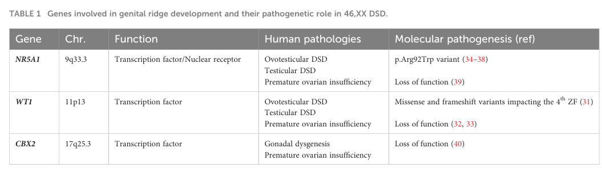

## Question

# Disease Characteristics Research Template

## Target Disease
- **Disease Name:** 46,XX Gonadal Dysgenesis
- **MONDO ID:**  (if available)
- **Category:** Mendelian

## Research Objectives

Please provide a comprehensive research report on **46,XX Gonadal Dysgenesis** covering all of the
disease characteristics listed below. This report will be used to populate a disease knowledge
base entry. Be thorough and cite primary literature (PMID preferred) for all claims.

For each section, **suggested databases/resources** are listed. These are the first places
you should search for information on each topic.

---

### 1. Disease Information
> **Search first:** OMIM, Orphanet, ICD-10/ICD-11, MeSH, PubMed

- What is the disease? Provide a concise overview.
- What are the key identifiers? (OMIM, Orphanet, ICD-10/ICD-11, MeSH, Mondo)
- What are the common synonyms and alternative names?
- Is the information derived from individual patients (e.g., EHR) or aggregated disease-level resources?

### 2. Etiology

- **Disease Causal Factors**: What are the primary causes? (genetic, environmental, infectious, mechanistic)
- **Risk Factors**:
  > **Search first:** PubMed, Cochrane Library, UpToDate, clinical guidelines, ClinVar, ClinGen, GWAS Catalog, PheGenI, CTD, CDC, WHO, epidemiological databases
  - Genetic risk factors (causal variants, susceptibility loci, modifier genes)
  - Environmental risk factors (toxins, lifestyle, occupational exposures, age, sex, family history)
- **Protective Factors**:
  > **Search first:** PubMed, Cochrane Library, clinical trial databases, GWAS Catalog, gnomAD, WHO, CDC, nutrition databases
  - Genetic protective factors (protective variants, modifier alleles)
  - Environmental protective factors (diet, lifestyle, exposures that reduce risk)
- **Gene-Environment Interactions**: How do genetic and environmental factors interact to influence disease?
  > **Search first:** CTD, PubMed, PheGenI, GxE databases

### 3. Phenotypes
> **Search first:** HPO (Human Phenotype Ontology), OMIM, Orphanet, PubMed, clinicaltrials.gov, MedDRA, SNOMED CT, DECIPHER, LOINC

For each phenotype, provide:
- **Phenotype type**: symptoms, clinical signs, physical manifestations, behavioral changes, or laboratory abnormalities
  > For symptoms/signs: HPO, OMIM, Orphanet, PubMed
  > For behavioral changes: HPO, DSM, RDoC (Research Domain Criteria), PubMed
  > For laboratory abnormalities: LOINC, SNOMED CT, LabTests Online, PubMed
- **Phenotype characteristics**:
  > **Search first:** OMIM, Orphanet, HPO, PubMed
  - Age of symptom onset (neonatal, childhood, adult-onset, late-onset)
  - Symptom severity (mild, moderate, severe, variable)
  - Symptom progression (stable, progressive, episodic, fluctuating)
  - Frequency among affected individuals (percentage or qualitative)
- **Quality of life impact**: Effects on daily functioning and well-being (per-phenotype when possible)
  > **Search first:** EQ-5D database, SF-36, WHO QOL databases, PubMed
- Suggest HPO (Human Phenotype Ontology) terms for each phenotype

### 4. Genetic/Molecular Information

- **Causal Genes**: Gene mutations or chromosomal abnormalities responsible for disease (gene symbols, OMIM IDs)
  > **Search first:** OMIM, ClinVar, HGMD, Ensembl, NCBI Gene
- **Pathogenic Variants**:
  - Affected genes (gene symbols, HGNC IDs)
    > **Search first:** OMIM, NCBI Gene, Ensembl, HGNC, UniProt, GeneCards
  - Variant classification (pathogenic, likely pathogenic, VUS per ACMG/AMP guidelines)
    > **Search first:** ClinVar, ClinGen, ACMG/AMP guidelines, VarSome
  - Variant type/class (missense, frameshift, nonsense, splice-site, structural)
  - Allele frequency in population databases
    > **Search first:** gnomAD, 1000 Genomes, ExAC, TOPMed, dbSNP
  - Somatic vs germline origin
    > **Search first:** COSMIC (somatic), ClinVar, ICGC, TCGA
  - Functional consequences (loss of function, gain of function, dominant negative)
- **Modifier Genes**: Genes that modify disease severity or expression
- **Epigenetic Information**: DNA methylation, histone modifications, chromatin changes affecting disease
  > **Search first:** ENCODE, Roadmap Epigenomics, MethBase, DiseaseMeth
- **Chromosomal Abnormalities**: Large-scale genetic changes (aneuploidy, translocations, inversions)
  > **Search first:** DECIPHER, ClinVar, ECARUCA, UCSC Genome Browser

### 5. Environmental Information

- **Environmental Factors**: Non-genetic contributing factors (toxins, radiation, pollution, occupational exposure)
  > **Search first:** CTD (Comparative Toxicogenomics Database), TOXNET, PubMed, EPA databases
- **Lifestyle Factors**: Behavioral factors (smoking, diet, exercise, alcohol consumption)
  > **Search first:** CDC databases, WHO, PubMed, NHANES
- **Infectious Agents**: If applicable, pathogens causing or triggering disease (bacteria, viruses, fungi, parasites)
  > **Search first:** NCBI Taxonomy, ViPR, BV-BRC, MicrobeDB, GIDEON

### 6. Mechanism / Pathophysiology

- **Molecular Pathways**: Specific signaling cascades or biochemical pathways involved (Wnt, MAPK, mTOR, PI3K-AKT, etc.)
  > **Search first:** KEGG, Reactome, WikiPathways, PathBank, BioCyc
- **Cellular Processes**: Cell-level mechanisms (apoptosis, autophagy, cell cycle dysregulation, inflammation, etc.)
  > **Search first:** Gene Ontology (GO), Reactome, KEGG, PubMed
- **Protein Dysfunction**: How protein structure or function is altered (misfolding, aggregation, loss of function, gain of function)
  > **Search first:** UniProt, PDB (Protein Data Bank), InterPro, Pfam, AlphaFold
- **Metabolic Changes**: Alterations in metabolic processes (energy metabolism, lipid metabolism, amino acid metabolism)
  > **Search first:** KEGG, BioCyc, HMDB (Human Metabolome Database), BRENDA
- **Immune System Involvement**: Role of immune response (autoimmunity, immunodeficiency, chronic inflammation)
  > **Search first:** ImmPort, Immunome Database, IEDB, Gene Ontology
- **Tissue Damage Mechanisms**: How tissues/ are injured (oxidative stress, ischemia, fibrosis, necrosis)
  > **Search first:** PubMed, Gene Ontology, Reactome
- **Biochemical Abnormalities**: Specific molecular defects (enzyme deficiencies, receptor dysfunction, ion channel defects)
  > **Search first:** BRENDA, UniProt, KEGG, OMIM, PubMed
- **Epigenetic Changes**: DNA methylation, histone modifications affecting gene expression in disease
  > **Search first:** ENCODE, Roadmap Epigenomics, MethBase, DiseaseMeth
- **Molecular Profiling** (if available):
  - Transcriptomics/gene expression changes
    > **Search first:** GEO (Gene Expression Omnibus), ArrayExpress, GTEx, Human Cell Atlas, SRA
  - Proteomics findings
    > **Search first:** PRIDE, ProteomeXchange, Human Protein Atlas, STRING, BioGRID
  - Metabolomics signatures
    > **Search first:** MetaboLights, Metabolomics Workbench, HMDB, METLIN
  - Lipidomics alterations
    > **Search first:** LIPID MAPS, SwissLipids, LipidHome, Metabolomics Workbench
  - Genomic structural features
    > **Search first:** UCSC Genome Browser, Ensembl, NCBI, dbVar, DGV
- **Advanced Technologies** (if applicable):
  - Single-cell analysis findings (cell-type specific mechanisms, cellular heterogeneity)
    > **Search first:** Human Cell Atlas, Single Cell Portal, GEO, CELLxGENE
  - Spatial transcriptomics findings
    > **Search first:** GEO, Spatial Research, Vizgen, 10x Genomics data
  - Multi-omics integration results
    > **Search first:** TCGA, ICGC, cBioPortal, LinkedOmics, PubMed
  - Functional genomics screens (CRISPR, RNAi)
    > **Search first:** DepMap, GenomeRNAi, PubMed, BioGRID ORCS

For each mechanism, describe:
- The causal chain from initial trigger to clinical manifestation
- Which mechanisms are upstream vs downstream
- What cell types and biological processes are involved
- Suggest GO terms for biological processes and CL terms for cell types

### 7. Anatomical Structures Affected

- **Organ Level**:
  - Primary organs directly affected
  - Secondary organ involvement (complications, secondary effects)
  - Body systems involved (cardiovascular, nervous, digestive, respiratory, endocrine, etc.)
  > **Search first:** Uberon, FMA (Foundational Model of Anatomy), OMIM, HPO, ICD-11, MeSH, SNOMED CT
- **Tissue and Cell Level**:
  - Specific tissue types affected (epithelial, connective, muscle, nervous)
  - Specific cell populations targeted (with Cell Ontology terms)
  > **Search first:** Uberon, Human Protein Atlas, Cell Ontology, Human Cell Atlas, CellMarker, PanglaoDB
- **Subcellular Level**:
  - Cellular compartments involved (mitochondria, nucleus, ER, lysosomes) (with GO Cellular Component terms)
  > **Search first:** Gene Ontology (Cellular Component), UniProt, Human Protein Atlas
- **Localization**:
  - Specific anatomical sites (with UBERON terms)
    > **Search first:** FMA, Uberon, NeuroNames (for brain), SNOMED CT
  - Lateralization (unilateral, bilateral, asymmetric)
    > **Search first:** HPO, clinical literature, imaging databases

### 8. Temporal Development

- **Onset**:
  - Typical age of onset (congenital, pediatric, adult, geriatric)
  - Onset pattern (acute, subacute, chronic, insidious)
  > **Search first:** OMIM, Orphanet, HPO, PubMed
- **Progression**:
  - Disease stages (early, intermediate, advanced, end-stage)
    > **Search first:** Cancer Staging Manual (AJCC), WHO classifications, PubMed
  - Progression rate (rapid, slow, variable)
  - Disease course pattern (episodic, relapsing-remitting, progressive, stable)
  - Disease duration (self-limited, chronic lifelong)
  > **Search first:** Disease registries, longitudinal cohort databases, natural history studies, PubMed, Orphanet, OMIM
- **Patterns**:
  - Remission patterns (spontaneous, treatment-induced)
    > **Search first:** Clinical trial databases, disease registries, PubMed
  - Critical periods (time windows of vulnerability or opportunity for intervention)
    > **Search first:** PubMed, developmental biology databases, clinical guidelines

### 9. Inheritance and Population

- **Epidemiology**:
  - Prevalence (cases per 100,000 at given time)
  - Incidence (new cases per 100,000 per year)
  > **Search first:** Orphanet, CDC, WHO, GBD (Global Burden of Disease), national registries, SEER, disease registries
- **For Genetic Etiology**:
  - Inheritance pattern (AD, AR, X-linked, mitochondrial, multifactorial, polygenic)
    > **Search first:** OMIM, Orphanet, ClinVar, GTR (Genetic Testing Registry)
  - Penetrance (complete, incomplete, age-dependent)
    > **Search first:** ClinVar, OMIM, PubMed, ClinGen
  - Expressivity (variable, consistent)
    > **Search first:** OMIM, ClinVar, PubMed
  - Genetic anticipation (increasing severity in successive generations)
    > **Search first:** OMIM, PubMed (especially for repeat expansion disorders)
  - Germline mosaicism
    > **Search first:** ClinVar, OMIM, genetic counseling literature, PubMed
  - Founder effects (population-specific mutations)
    > **Search first:** gnomAD, population genetics databases, PubMed
  - Consanguinity role
    > **Search first:** OMIM, population studies, genetic counseling resources
  - Carrier frequency
    > **Search first:** gnomAD, carrier screening databases, GeneReviews, GTR
- **Population Demographics**:
  - Affected populations (ethnic or demographic groups with higher prevalence)
    > **Search first:** gnomAD, 1000 Genomes, PAGE Study, PubMed, population registries
  - Geographic distribution (endemic areas, regional variation)
    > **Search first:** WHO, CDC, GBD, Orphanet, geographic epidemiology databases
  - Geographic distribution of specific variants
  - Sex ratio (male:female)
    > **Search first:** Disease registries, OMIM, PubMed, epidemiological databases
  - Age distribution of affected individuals
    > **Search first:** CDC, disease registries, SEER, Orphanet

### 10. Diagnostics

- **Clinical Tests**:
  - Laboratory tests (blood, urine, tissue chemistry, specific enzyme assays)
    > **Search first:** LOINC, LabTests Online, PubMed
  - Biomarkers (proteins, metabolites, genetic markers, circulating biomarkers)
    > **Search first:** FDA Biomarker List, BEST (Biomarkers, EndpointS, and other Tools), PubMed
  - Imaging studies (X-ray, CT, MRI, PET, ultrasound)
    > **Search first:** RadLex, DICOM, Radiopaedia, imaging databases
  - Functional tests (pulmonary function, cardiac stress tests)
    > **Search first:** LOINC, clinical guidelines, PubMed
  - Electrophysiology (EEG, EMG, ECG, nerve conduction studies)
    > **Search first:** LOINC, clinical neurophysiology databases, PubMed
  - Biopsy findings (histopathology, immunohistochemistry)
    > **Search first:** SNOMED CT, College of American Pathologists resources, PubMed
  - Pathology findings (microscopic examination)
    > **Search first:** SNOMED CT, Digital Pathology databases, PubMed
- **Genetic Testing**:
  > **Search first:** GTR (Genetic Testing Registry), GeneReviews, ClinGen
  - Overview of recommended genetic testing approach
  - Whole genome sequencing (WGS) utility
    > **Search first:** GTR, ClinVar, GEL (Genomics England), gnomAD
  - Whole exome sequencing (WES) utility
    > **Search first:** GTR, ClinVar, OMIM, GeneMatcher
  - Gene panels (which panels, which genes)
    > **Search first:** GTR, ClinVar, laboratory-specific databases
  - Single gene testing
    > **Search first:** GTR, ClinVar, OMIM, GeneReviews
  - Chromosomal microarray (CMA)
    > **Search first:** DECIPHER, ClinVar, dbVar, ECARUCA
  - Karyotyping
    > **Search first:** Chromosome Abnormality Database, ClinVar, cytogenetics resources
  - FISH
    > **Search first:** ClinVar, cytogenetics databases, PubMed
  - Mitochondrial DNA testing
    > **Search first:** MITOMAP, MSeqDR, ClinVar, GTR
  - Repeat expansion testing
    > **Search first:** GTR, ClinVar, repeat expansion databases, PubMed
- **Omics-Based Diagnostics** (if applicable):
  - RNA sequencing / transcriptomics
    > **Search first:** GEO, ArrayExpress, GTEx, RNA-seq databases
  - Proteomics
    > **Search first:** PRIDE, ProteomeXchange, FDA Biomarker database
  - Metabolomics
    > **Search first:** MetaboLights, Metabolomics Workbench, HMDB
  - Epigenomics
    > **Search first:** GEO, ENCODE, Roadmap Epigenomics, MethBase
  - Liquid biopsy
    > **Search first:** COSMIC, ClinVar, liquid biopsy databases, PubMed
- **Clinical Criteria**:
  - Standardized diagnostic criteria (DSM, ICD, society guidelines)
    > **Search first:** DSM-5, ICD-11, clinical society guidelines, UpToDate
  - Differential diagnosis (other conditions to rule out, with distinguishing features)
    > **Search first:** DynaMed, UpToDate, clinical decision support systems
- **Screening**:
  - Screening methods for asymptomatic individuals (newborn screening, carrier screening, cascade screening)
    > **Search first:** ACMG recommendations, CDC newborn screening, GTR

### 11. Outcome/Prognosis

- **Survival and Mortality**:
  - Survival rate (5-year, 10-year, overall)
    > **Search first:** SEER, cancer registries, disease-specific registries, PubMed
  - Life expectancy (with and without treatment if applicable)
    > **Search first:** Orphanet, disease registries, actuarial databases, PubMed
  - Mortality rate
    > **Search first:** CDC, WHO, GBD, national mortality databases
  - Disease-specific mortality (deaths directly attributable to disease)
    > **Search first:** Disease registries, CDC Wonder, GBD, PubMed
- **Morbidity and Function**:
  - Morbidity (disease-related disability and health impacts)
    > **Search first:** GBD, WHO, disability databases, PubMed
  - Disability outcomes (long-term functional impairments)
    > **Search first:** ICF (International Classification of Functioning), disability registries
  - Quality of life measures (EQ-5D, SF-36, PROMIS, disease-specific tools)
    > **Search first:** EQ-5D database, SF-36, PROMIS, PubMed
- **Disease Course**:
  - Complications (secondary problems: infections, organ failure, etc.)
    > **Search first:** ICD codes, disease registries, clinical databases, PubMed
  - Recovery potential (likelihood and extent of recovery, with vs without treatment)
    > **Search first:** Natural history studies, rehabilitation databases, PubMed
- **Prediction**:
  - Prognostic factors (age, disease severity, biomarkers, treatment response)
    > **Search first:** Prognostic models databases, clinical calculators, PubMed
  - Prognostic biomarkers (molecular markers predicting disease course)
    > **Search first:** FDA Biomarker database, PubMed, cancer prognostic databases

### 12. Treatment

- **Pharmacotherapy**:
  - Pharmacological treatments (drug names, drug classes, mechanisms of action)
    > **Search first:** DrugBank, RxNorm, ATC classification, DailyMed, FDA databases
  - Pharmacogenomics (how genetic variants affect drug metabolism, efficacy, toxicity)
    > **Search first:** PharmGKB, CPIC (Clinical Pharmacogenetics), FDA Table of PGx Biomarkers
- **Advanced Therapeutics**:
  - Gene therapy (viral vectors, CRISPR, gene replacement, gene editing)
    > **Search first:** ClinicalTrials.gov, FDA gene therapy database, ASGCT resources
  - Cell therapy (stem cell transplant, CAR-T, cellular therapeutics)
    > **Search first:** ClinicalTrials.gov, FDA cell therapy database, FACT standards
  - RNA-based therapies (ASOs, siRNA, mRNA therapies)
    > **Search first:** ClinicalTrials.gov, FDA approvals, PubMed
  - Targeted therapies (treatments directed at specific molecular targets)
    > **Search first:** My Cancer Genome, OncoKB, ClinicalTrials.gov, FDA approvals
  - Immunotherapies (checkpoint inhibitors, monoclonal antibodies)
    > **Search first:** Cancer Immunotherapy Database, FDA approvals, ClinicalTrials.gov
- **Surgical and Interventional**:
  - Surgical interventions (types of surgery, timing, outcomes)
    > **Search first:** CPT codes, surgical registries, clinical guidelines, PubMed
- **Supportive and Rehabilitative**:
  - Supportive care (symptom management, pain control, nutrition)
    > **Search first:** Clinical guidelines, Cochrane Library, PubMed
  - Rehabilitation (physical therapy, occupational therapy, speech therapy)
    > **Search first:** Rehabilitation medicine databases, clinical guidelines, PubMed
- **Experimental**:
  - Experimental treatments in clinical trials (with NCT identifiers if available)
    > **Search first:** ClinicalTrials.gov, EU Clinical Trials Register, WHO ICTRP
- **Treatment Outcomes**:
  - Treatment response rates
    > **Search first:** Clinical trial databases, FDA reviews, systematic reviews, PubMed
  - Side effects and adverse events
    > **Search first:** FDA Adverse Event Reporting System (FAERS), MedWatch, PubMed
- **Treatment Strategy**:
  - Treatment algorithms (clinical pathways, decision trees)
    > **Search first:** Clinical practice guidelines, NCCN Guidelines, UpToDate
  - Combination therapies
    > **Search first:** ClinicalTrials.gov, treatment guidelines, PubMed
  - Personalized medicine approaches (genotype-guided treatment)
    > **Search first:** My Cancer Genome, CIViC, PharmGKB, precision medicine databases

For each treatment, suggest MAXO (Medical Action Ontology) terms where applicable.

### 13. Prevention

- **Prevention Levels**:
  - Primary prevention (preventing disease occurrence: vaccination, risk factor modification)
    > **Search first:** CDC, WHO, USPSTF recommendations, Cochrane Library
  - Secondary prevention (early detection and treatment: screening programs, early intervention)
    > **Search first:** USPSTF, CDC screening guidelines, WHO
  - Tertiary prevention (preventing complications in those with disease)
    > **Search first:** Clinical guidelines, disease management protocols, PubMed
- **Immunization**: Vaccine strategies (if applicable)
  > **Search first:** CDC vaccine schedules, WHO immunization, FDA vaccine database
- **Screening and Early Detection**:
  - Screening programs (population-based: newborn screening, cancer screening)
    > **Search first:** CDC screening programs, USPSTF, cancer screening databases
  - Genetic screening (carrier screening, preimplantation genetic diagnosis, prenatal testing)
    > **Search first:** ACMG recommendations, ACOG guidelines, GTR
  - Risk stratification (identifying high-risk individuals for targeted prevention)
    > **Search first:** Risk prediction models, clinical calculators, PubMed
- **Behavioral Interventions**: Lifestyle modifications to reduce risk
  > **Search first:** CDC, WHO, behavioral intervention databases, Cochrane Library
- **Counseling**: Genetic counseling (risk assessment, family planning guidance)
  > **Search first:** NSGC resources, ACMG guidelines, GeneReviews
- **Public Health**:
  - Public health interventions (sanitation, vector control, health education)
    > **Search first:** CDC, WHO, public health databases, PubMed
  - Environmental interventions (reducing environmental risk factors)
    > **Search first:** EPA databases, WHO environmental health, PubMed
- **Prophylaxis**: Preventive medications or procedures
  > **Search first:** Clinical guidelines, FDA approvals, PubMed

### 14. Other Species / Natural Disease

- **Taxonomy**: Species affected (with NCBI Taxon identifiers)
  > **Search first:** NCBI Taxonomy
- **Breed**: Specific breeds affected (with VBO identifiers if applicable)
  > **Search first:** VBO (Vertebrate Breed Ontology)
- **Gene**: Orthologous genes in other species (with NCBI Gene IDs)
  > **Search first:** NCBI Gene
- **Natural Disease**:
  - Naturally occurring disease in other species (companion animals, wildlife)
    > **Search first:** OMIA (Online Mendelian Inheritance in Animals), VetCompass, PubMed
  - Veterinary relevance and importance in animal health
    > **Search first:** OMIA, veterinary databases, PubMed
- **Comparative Biology**:
  - Comparative pathology (similarities and differences across species)
    > **Search first:** OMIA, comparative pathology databases, PubMed
  - Evolutionary conservation of disease mechanisms
    > **Search first:** HomoloGene, OrthoMCL, Alliance of Genome Resources
- **Transmission** (if applicable):
  - Zoonotic potential
    > **Search first:** CDC zoonotic diseases, WHO zoonoses, GIDEON
  - Cross-species susceptibility
    > **Search first:** NCBI Taxonomy, veterinary databases, PubMed

### 15. Model Organisms

- **Model Types**:
  - Model organism type (mammalian, invertebrate, cellular, in vitro)
    > **Search first:** Alliance of Genome Resources, model organism databases
  - Specific model systems (mouse, rat, zebrafish, Drosophila, C. elegans, yeast, cell lines, organoids, iPSCs)
    > **Search first:** MGI, RGD, ZFIN, FlyBase, WormBase, SGD, ATCC, Cellosaurus
  - Induced models (drug treatment, surgical intervention, environmental manipulation)
    > **Search first:** MGI, model organism databases, PubMed
- **Genetic Models**:
  - Types available (knockout, knock-in, transgenic, conditional, humanized)
    > **Search first:** MGI, IMPC, KOMP, EuMMCR, IMSR
- **Model Characteristics**:
  - Phenotype recapitulation (how well model reproduces human disease features)
    > **Search first:** Model organism databases, comparative studies, PubMed
  - Model limitations (aspects of human disease not captured)
    > **Search first:** Model organism databases, PubMed, review articles
- **Applications**:
  - Research applications (what aspects of disease can be studied)
    > **Search first:** Model organism databases, PubMed
- **Resources**:
  - Model databases
    > **Search first:** MGI, RGD, ZFIN, FlyBase, WormBase, IMSR, EMMA, MMRRC

---

## Citation Requirements

- Cite primary literature (PMID preferred) for all mechanistic and clinical claims
- Prioritize recent reviews and landmark papers
- Include direct quotes from abstracts where possible to support key statements
- Distinguish evidence source types: human clinical, model organism, in vitro, computational

## Output Format

Structure your response as a comprehensive narrative organized by the sections above.
For each section, provide:
- Factual content with specific details (numbers, percentages, gene names, variant nomenclature)
- Ontology term suggestions (HPO, GO, CL, UBERON, CHEBI, MAXO, MONDO) where applicable
- Evidence citations with PMIDs
- Direct quotes from abstracts to support key claims
- Clear indication when information is not available or not applicable for this disease

This report will be used to populate a disease knowledge base entry with:
- Pathophysiology descriptions with causal chains
- Gene/protein annotations (HGNC, GO terms)
- Phenotype associations (HP terms) with frequencies
- Cell type involvement (CL terms)
- Anatomical locations (UBERON terms)
- Chemical entities (CHEBI terms)
- Treatment annotations (MAXO terms)
- Evidence items with PMIDs and exact abstract quotes
- Epidemiology, prognosis, diagnostic, and prevention information
- Animal model descriptions with phenotype recapitulation details

## Output

Question: You are an expert researcher providing comprehensive, well-cited information.

Provide detailed information focusing on:
1. Key concepts and definitions with current understanding
2. Recent developments and latest research (prioritize 2023-2024 sources)
3. Current applications and real-world implementations
4. Expert opinions and analysis from authoritative sources
5. Relevant statistics and data from recent studies

Format as a comprehensive research report with proper citations. Include URLs and publication dates where available.
Always prioritize recent, authoritative sources and provide specific citations for all major claims.

# Disease Characteristics Research Template

## Target Disease
- **Disease Name:** 46,XX Gonadal Dysgenesis
- **MONDO ID:**  (if available)
- **Category:** Mendelian

## Research Objectives

Please provide a comprehensive research report on **46,XX Gonadal Dysgenesis** covering all of the
disease characteristics listed below. This report will be used to populate a disease knowledge
base entry. Be thorough and cite primary literature (PMID preferred) for all claims.

For each section, **suggested databases/resources** are listed. These are the first places
you should search for information on each topic.

---

### 1. Disease Information
> **Search first:** OMIM, Orphanet, ICD-10/ICD-11, MeSH, PubMed

- What is the disease? Provide a concise overview.
- What are the key identifiers? (OMIM, Orphanet, ICD-10/ICD-11, MeSH, Mondo)
- What are the common synonyms and alternative names?
- Is the information derived from individual patients (e.g., EHR) or aggregated disease-level resources?

### 2. Etiology

- **Disease Causal Factors**: What are the primary causes? (genetic, environmental, infectious, mechanistic)
- **Risk Factors**:
  > **Search first:** PubMed, Cochrane Library, UpToDate, clinical guidelines, ClinVar, ClinGen, GWAS Catalog, PheGenI, CTD, CDC, WHO, epidemiological databases
  - Genetic risk factors (causal variants, susceptibility loci, modifier genes)
  - Environmental risk factors (toxins, lifestyle, occupational exposures, age, sex, family history)
- **Protective Factors**:
  > **Search first:** PubMed, Cochrane Library, clinical trial databases, GWAS Catalog, gnomAD, WHO, CDC, nutrition databases
  - Genetic protective factors (protective variants, modifier alleles)
  - Environmental protective factors (diet, lifestyle, exposures that reduce risk)
- **Gene-Environment Interactions**: How do genetic and environmental factors interact to influence disease?
  > **Search first:** CTD, PubMed, PheGenI, GxE databases

### 3. Phenotypes
> **Search first:** HPO (Human Phenotype Ontology), OMIM, Orphanet, PubMed, clinicaltrials.gov, MedDRA, SNOMED CT, DECIPHER, LOINC

For each phenotype, provide:
- **Phenotype type**: symptoms, clinical signs, physical manifestations, behavioral changes, or laboratory abnormalities
  > For symptoms/signs: HPO, OMIM, Orphanet, PubMed
  > For behavioral changes: HPO, DSM, RDoC (Research Domain Criteria), PubMed
  > For laboratory abnormalities: LOINC, SNOMED CT, LabTests Online, PubMed
- **Phenotype characteristics**:
  > **Search first:** OMIM, Orphanet, HPO, PubMed
  - Age of symptom onset (neonatal, childhood, adult-onset, late-onset)
  - Symptom severity (mild, moderate, severe, variable)
  - Symptom progression (stable, progressive, episodic, fluctuating)
  - Frequency among affected individuals (percentage or qualitative)
- **Quality of life impact**: Effects on daily functioning and well-being (per-phenotype when possible)
  > **Search first:** EQ-5D database, SF-36, WHO QOL databases, PubMed
- Suggest HPO (Human Phenotype Ontology) terms for each phenotype

### 4. Genetic/Molecular Information

- **Causal Genes**: Gene mutations or chromosomal abnormalities responsible for disease (gene symbols, OMIM IDs)
  > **Search first:** OMIM, ClinVar, HGMD, Ensembl, NCBI Gene
- **Pathogenic Variants**:
  - Affected genes (gene symbols, HGNC IDs)
    > **Search first:** OMIM, NCBI Gene, Ensembl, HGNC, UniProt, GeneCards
  - Variant classification (pathogenic, likely pathogenic, VUS per ACMG/AMP guidelines)
    > **Search first:** ClinVar, ClinGen, ACMG/AMP guidelines, VarSome
  - Variant type/class (missense, frameshift, nonsense, splice-site, structural)
  - Allele frequency in population databases
    > **Search first:** gnomAD, 1000 Genomes, ExAC, TOPMed, dbSNP
  - Somatic vs germline origin
    > **Search first:** COSMIC (somatic), ClinVar, ICGC, TCGA
  - Functional consequences (loss of function, gain of function, dominant negative)
- **Modifier Genes**: Genes that modify disease severity or expression
- **Epigenetic Information**: DNA methylation, histone modifications, chromatin changes affecting disease
  > **Search first:** ENCODE, Roadmap Epigenomics, MethBase, DiseaseMeth
- **Chromosomal Abnormalities**: Large-scale genetic changes (aneuploidy, translocations, inversions)
  > **Search first:** DECIPHER, ClinVar, ECARUCA, UCSC Genome Browser

### 5. Environmental Information

- **Environmental Factors**: Non-genetic contributing factors (toxins, radiation, pollution, occupational exposure)
  > **Search first:** CTD (Comparative Toxicogenomics Database), TOXNET, PubMed, EPA databases
- **Lifestyle Factors**: Behavioral factors (smoking, diet, exercise, alcohol consumption)
  > **Search first:** CDC databases, WHO, PubMed, NHANES
- **Infectious Agents**: If applicable, pathogens causing or triggering disease (bacteria, viruses, fungi, parasites)
  > **Search first:** NCBI Taxonomy, ViPR, BV-BRC, MicrobeDB, GIDEON

### 6. Mechanism / Pathophysiology

- **Molecular Pathways**: Specific signaling cascades or biochemical pathways involved (Wnt, MAPK, mTOR, PI3K-AKT, etc.)
  > **Search first:** KEGG, Reactome, WikiPathways, PathBank, BioCyc
- **Cellular Processes**: Cell-level mechanisms (apoptosis, autophagy, cell cycle dysregulation, inflammation, etc.)
  > **Search first:** Gene Ontology (GO), Reactome, KEGG, PubMed
- **Protein Dysfunction**: How protein structure or function is altered (misfolding, aggregation, loss of function, gain of function)
  > **Search first:** UniProt, PDB (Protein Data Bank), InterPro, Pfam, AlphaFold
- **Metabolic Changes**: Alterations in metabolic processes (energy metabolism, lipid metabolism, amino acid metabolism)
  > **Search first:** KEGG, BioCyc, HMDB (Human Metabolome Database), BRENDA
- **Immune System Involvement**: Role of immune response (autoimmunity, immunodeficiency, chronic inflammation)
  > **Search first:** ImmPort, Immunome Database, IEDB, Gene Ontology
- **Tissue Damage Mechanisms**: How tissues/ are injured (oxidative stress, ischemia, fibrosis, necrosis)
  > **Search first:** PubMed, Gene Ontology, Reactome
- **Biochemical Abnormalities**: Specific molecular defects (enzyme deficiencies, receptor dysfunction, ion channel defects)
  > **Search first:** BRENDA, UniProt, KEGG, OMIM, PubMed
- **Epigenetic Changes**: DNA methylation, histone modifications affecting gene expression in disease
  > **Search first:** ENCODE, Roadmap Epigenomics, MethBase, DiseaseMeth
- **Molecular Profiling** (if available):
  - Transcriptomics/gene expression changes
    > **Search first:** GEO (Gene Expression Omnibus), ArrayExpress, GTEx, Human Cell Atlas, SRA
  - Proteomics findings
    > **Search first:** PRIDE, ProteomeXchange, Human Protein Atlas, STRING, BioGRID
  - Metabolomics signatures
    > **Search first:** MetaboLights, Metabolomics Workbench, HMDB, METLIN
  - Lipidomics alterations
    > **Search first:** LIPID MAPS, SwissLipids, LipidHome, Metabolomics Workbench
  - Genomic structural features
    > **Search first:** UCSC Genome Browser, Ensembl, NCBI, dbVar, DGV
- **Advanced Technologies** (if applicable):
  - Single-cell analysis findings (cell-type specific mechanisms, cellular heterogeneity)
    > **Search first:** Human Cell Atlas, Single Cell Portal, GEO, CELLxGENE
  - Spatial transcriptomics findings
    > **Search first:** GEO, Spatial Research, Vizgen, 10x Genomics data
  - Multi-omics integration results
    > **Search first:** TCGA, ICGC, cBioPortal, LinkedOmics, PubMed
  - Functional genomics screens (CRISPR, RNAi)
    > **Search first:** DepMap, GenomeRNAi, PubMed, BioGRID ORCS

For each mechanism, describe:
- The causal chain from initial trigger to clinical manifestation
- Which mechanisms are upstream vs downstream
- What cell types and biological processes are involved
- Suggest GO terms for biological processes and CL terms for cell types

### 7. Anatomical Structures Affected

- **Organ Level**:
  - Primary organs directly affected
  - Secondary organ involvement (complications, secondary effects)
  - Body systems involved (cardiovascular, nervous, digestive, respiratory, endocrine, etc.)
  > **Search first:** Uberon, FMA (Foundational Model of Anatomy), OMIM, HPO, ICD-11, MeSH, SNOMED CT
- **Tissue and Cell Level**:
  - Specific tissue types affected (epithelial, connective, muscle, nervous)
  - Specific cell populations targeted (with Cell Ontology terms)
  > **Search first:** Uberon, Human Protein Atlas, Cell Ontology, Human Cell Atlas, CellMarker, PanglaoDB
- **Subcellular Level**:
  - Cellular compartments involved (mitochondria, nucleus, ER, lysosomes) (with GO Cellular Component terms)
  > **Search first:** Gene Ontology (Cellular Component), UniProt, Human Protein Atlas
- **Localization**:
  - Specific anatomical sites (with UBERON terms)
    > **Search first:** FMA, Uberon, NeuroNames (for brain), SNOMED CT
  - Lateralization (unilateral, bilateral, asymmetric)
    > **Search first:** HPO, clinical literature, imaging databases

### 8. Temporal Development

- **Onset**:
  - Typical age of onset (congenital, pediatric, adult, geriatric)
  - Onset pattern (acute, subacute, chronic, insidious)
  > **Search first:** OMIM, Orphanet, HPO, PubMed
- **Progression**:
  - Disease stages (early, intermediate, advanced, end-stage)
    > **Search first:** Cancer Staging Manual (AJCC), WHO classifications, PubMed
  - Progression rate (rapid, slow, variable)
  - Disease course pattern (episodic, relapsing-remitting, progressive, stable)
  - Disease duration (self-limited, chronic lifelong)
  > **Search first:** Disease registries, longitudinal cohort databases, natural history studies, PubMed, Orphanet, OMIM
- **Patterns**:
  - Remission patterns (spontaneous, treatment-induced)
    > **Search first:** Clinical trial databases, disease registries, PubMed
  - Critical periods (time windows of vulnerability or opportunity for intervention)
    > **Search first:** PubMed, developmental biology databases, clinical guidelines

### 9. Inheritance and Population

- **Epidemiology**:
  - Prevalence (cases per 100,000 at given time)
  - Incidence (new cases per 100,000 per year)
  > **Search first:** Orphanet, CDC, WHO, GBD (Global Burden of Disease), national registries, SEER, disease registries
- **For Genetic Etiology**:
  - Inheritance pattern (AD, AR, X-linked, mitochondrial, multifactorial, polygenic)
    > **Search first:** OMIM, Orphanet, ClinVar, GTR (Genetic Testing Registry)
  - Penetrance (complete, incomplete, age-dependent)
    > **Search first:** ClinVar, OMIM, PubMed, ClinGen
  - Expressivity (variable, consistent)
    > **Search first:** OMIM, ClinVar, PubMed
  - Genetic anticipation (increasing severity in successive generations)
    > **Search first:** OMIM, PubMed (especially for repeat expansion disorders)
  - Germline mosaicism
    > **Search first:** ClinVar, OMIM, genetic counseling literature, PubMed
  - Founder effects (population-specific mutations)
    > **Search first:** gnomAD, population genetics databases, PubMed
  - Consanguinity role
    > **Search first:** OMIM, population studies, genetic counseling resources
  - Carrier frequency
    > **Search first:** gnomAD, carrier screening databases, GeneReviews, GTR
- **Population Demographics**:
  - Affected populations (ethnic or demographic groups with higher prevalence)
    > **Search first:** gnomAD, 1000 Genomes, PAGE Study, PubMed, population registries
  - Geographic distribution (endemic areas, regional variation)
    > **Search first:** WHO, CDC, GBD, Orphanet, geographic epidemiology databases
  - Geographic distribution of specific variants
  - Sex ratio (male:female)
    > **Search first:** Disease registries, OMIM, PubMed, epidemiological databases
  - Age distribution of affected individuals
    > **Search first:** CDC, disease registries, SEER, Orphanet

### 10. Diagnostics

- **Clinical Tests**:
  - Laboratory tests (blood, urine, tissue chemistry, specific enzyme assays)
    > **Search first:** LOINC, LabTests Online, PubMed
  - Biomarkers (proteins, metabolites, genetic markers, circulating biomarkers)
    > **Search first:** FDA Biomarker List, BEST (Biomarkers, EndpointS, and other Tools), PubMed
  - Imaging studies (X-ray, CT, MRI, PET, ultrasound)
    > **Search first:** RadLex, DICOM, Radiopaedia, imaging databases
  - Functional tests (pulmonary function, cardiac stress tests)
    > **Search first:** LOINC, clinical guidelines, PubMed
  - Electrophysiology (EEG, EMG, ECG, nerve conduction studies)
    > **Search first:** LOINC, clinical neurophysiology databases, PubMed
  - Biopsy findings (histopathology, immunohistochemistry)
    > **Search first:** SNOMED CT, College of American Pathologists resources, PubMed
  - Pathology findings (microscopic examination)
    > **Search first:** SNOMED CT, Digital Pathology databases, PubMed
- **Genetic Testing**:
  > **Search first:** GTR (Genetic Testing Registry), GeneReviews, ClinGen
  - Overview of recommended genetic testing approach
  - Whole genome sequencing (WGS) utility
    > **Search first:** GTR, ClinVar, GEL (Genomics England), gnomAD
  - Whole exome sequencing (WES) utility
    > **Search first:** GTR, ClinVar, OMIM, GeneMatcher
  - Gene panels (which panels, which genes)
    > **Search first:** GTR, ClinVar, laboratory-specific databases
  - Single gene testing
    > **Search first:** GTR, ClinVar, OMIM, GeneReviews
  - Chromosomal microarray (CMA)
    > **Search first:** DECIPHER, ClinVar, dbVar, ECARUCA
  - Karyotyping
    > **Search first:** Chromosome Abnormality Database, ClinVar, cytogenetics resources
  - FISH
    > **Search first:** ClinVar, cytogenetics databases, PubMed
  - Mitochondrial DNA testing
    > **Search first:** MITOMAP, MSeqDR, ClinVar, GTR
  - Repeat expansion testing
    > **Search first:** GTR, ClinVar, repeat expansion databases, PubMed
- **Omics-Based Diagnostics** (if applicable):
  - RNA sequencing / transcriptomics
    > **Search first:** GEO, ArrayExpress, GTEx, RNA-seq databases
  - Proteomics
    > **Search first:** PRIDE, ProteomeXchange, FDA Biomarker database
  - Metabolomics
    > **Search first:** MetaboLights, Metabolomics Workbench, HMDB
  - Epigenomics
    > **Search first:** GEO, ENCODE, Roadmap Epigenomics, MethBase
  - Liquid biopsy
    > **Search first:** COSMIC, ClinVar, liquid biopsy databases, PubMed
- **Clinical Criteria**:
  - Standardized diagnostic criteria (DSM, ICD, society guidelines)
    > **Search first:** DSM-5, ICD-11, clinical society guidelines, UpToDate
  - Differential diagnosis (other conditions to rule out, with distinguishing features)
    > **Search first:** DynaMed, UpToDate, clinical decision support systems
- **Screening**:
  - Screening methods for asymptomatic individuals (newborn screening, carrier screening, cascade screening)
    > **Search first:** ACMG recommendations, CDC newborn screening, GTR

### 11. Outcome/Prognosis

- **Survival and Mortality**:
  - Survival rate (5-year, 10-year, overall)
    > **Search first:** SEER, cancer registries, disease-specific registries, PubMed
  - Life expectancy (with and without treatment if applicable)
    > **Search first:** Orphanet, disease registries, actuarial databases, PubMed
  - Mortality rate
    > **Search first:** CDC, WHO, GBD, national mortality databases
  - Disease-specific mortality (deaths directly attributable to disease)
    > **Search first:** Disease registries, CDC Wonder, GBD, PubMed
- **Morbidity and Function**:
  - Morbidity (disease-related disability and health impacts)
    > **Search first:** GBD, WHO, disability databases, PubMed
  - Disability outcomes (long-term functional impairments)
    > **Search first:** ICF (International Classification of Functioning), disability registries
  - Quality of life measures (EQ-5D, SF-36, PROMIS, disease-specific tools)
    > **Search first:** EQ-5D database, SF-36, PROMIS, PubMed
- **Disease Course**:
  - Complications (secondary problems: infections, organ failure, etc.)
    > **Search first:** ICD codes, disease registries, clinical databases, PubMed
  - Recovery potential (likelihood and extent of recovery, with vs without treatment)
    > **Search first:** Natural history studies, rehabilitation databases, PubMed
- **Prediction**:
  - Prognostic factors (age, disease severity, biomarkers, treatment response)
    > **Search first:** Prognostic models databases, clinical calculators, PubMed
  - Prognostic biomarkers (molecular markers predicting disease course)
    > **Search first:** FDA Biomarker database, PubMed, cancer prognostic databases

### 12. Treatment

- **Pharmacotherapy**:
  - Pharmacological treatments (drug names, drug classes, mechanisms of action)
    > **Search first:** DrugBank, RxNorm, ATC classification, DailyMed, FDA databases
  - Pharmacogenomics (how genetic variants affect drug metabolism, efficacy, toxicity)
    > **Search first:** PharmGKB, CPIC (Clinical Pharmacogenetics), FDA Table of PGx Biomarkers
- **Advanced Therapeutics**:
  - Gene therapy (viral vectors, CRISPR, gene replacement, gene editing)
    > **Search first:** ClinicalTrials.gov, FDA gene therapy database, ASGCT resources
  - Cell therapy (stem cell transplant, CAR-T, cellular therapeutics)
    > **Search first:** ClinicalTrials.gov, FDA cell therapy database, FACT standards
  - RNA-based therapies (ASOs, siRNA, mRNA therapies)
    > **Search first:** ClinicalTrials.gov, FDA approvals, PubMed
  - Targeted therapies (treatments directed at specific molecular targets)
    > **Search first:** My Cancer Genome, OncoKB, ClinicalTrials.gov, FDA approvals
  - Immunotherapies (checkpoint inhibitors, monoclonal antibodies)
    > **Search first:** Cancer Immunotherapy Database, FDA approvals, ClinicalTrials.gov
- **Surgical and Interventional**:
  - Surgical interventions (types of surgery, timing, outcomes)
    > **Search first:** CPT codes, surgical registries, clinical guidelines, PubMed
- **Supportive and Rehabilitative**:
  - Supportive care (symptom management, pain control, nutrition)
    > **Search first:** Clinical guidelines, Cochrane Library, PubMed
  - Rehabilitation (physical therapy, occupational therapy, speech therapy)
    > **Search first:** Rehabilitation medicine databases, clinical guidelines, PubMed
- **Experimental**:
  - Experimental treatments in clinical trials (with NCT identifiers if available)
    > **Search first:** ClinicalTrials.gov, EU Clinical Trials Register, WHO ICTRP
- **Treatment Outcomes**:
  - Treatment response rates
    > **Search first:** Clinical trial databases, FDA reviews, systematic reviews, PubMed
  - Side effects and adverse events
    > **Search first:** FDA Adverse Event Reporting System (FAERS), MedWatch, PubMed
- **Treatment Strategy**:
  - Treatment algorithms (clinical pathways, decision trees)
    > **Search first:** Clinical practice guidelines, NCCN Guidelines, UpToDate
  - Combination therapies
    > **Search first:** ClinicalTrials.gov, treatment guidelines, PubMed
  - Personalized medicine approaches (genotype-guided treatment)
    > **Search first:** My Cancer Genome, CIViC, PharmGKB, precision medicine databases

For each treatment, suggest MAXO (Medical Action Ontology) terms where applicable.

### 13. Prevention

- **Prevention Levels**:
  - Primary prevention (preventing disease occurrence: vaccination, risk factor modification)
    > **Search first:** CDC, WHO, USPSTF recommendations, Cochrane Library
  - Secondary prevention (early detection and treatment: screening programs, early intervention)
    > **Search first:** USPSTF, CDC screening guidelines, WHO
  - Tertiary prevention (preventing complications in those with disease)
    > **Search first:** Clinical guidelines, disease management protocols, PubMed
- **Immunization**: Vaccine strategies (if applicable)
  > **Search first:** CDC vaccine schedules, WHO immunization, FDA vaccine database
- **Screening and Early Detection**:
  - Screening programs (population-based: newborn screening, cancer screening)
    > **Search first:** CDC screening programs, USPSTF, cancer screening databases
  - Genetic screening (carrier screening, preimplantation genetic diagnosis, prenatal testing)
    > **Search first:** ACMG recommendations, ACOG guidelines, GTR
  - Risk stratification (identifying high-risk individuals for targeted prevention)
    > **Search first:** Risk prediction models, clinical calculators, PubMed
- **Behavioral Interventions**: Lifestyle modifications to reduce risk
  > **Search first:** CDC, WHO, behavioral intervention databases, Cochrane Library
- **Counseling**: Genetic counseling (risk assessment, family planning guidance)
  > **Search first:** NSGC resources, ACMG guidelines, GeneReviews
- **Public Health**:
  - Public health interventions (sanitation, vector control, health education)
    > **Search first:** CDC, WHO, public health databases, PubMed
  - Environmental interventions (reducing environmental risk factors)
    > **Search first:** EPA databases, WHO environmental health, PubMed
- **Prophylaxis**: Preventive medications or procedures
  > **Search first:** Clinical guidelines, FDA approvals, PubMed

### 14. Other Species / Natural Disease

- **Taxonomy**: Species affected (with NCBI Taxon identifiers)
  > **Search first:** NCBI Taxonomy
- **Breed**: Specific breeds affected (with VBO identifiers if applicable)
  > **Search first:** VBO (Vertebrate Breed Ontology)
- **Gene**: Orthologous genes in other species (with NCBI Gene IDs)
  > **Search first:** NCBI Gene
- **Natural Disease**:
  - Naturally occurring disease in other species (companion animals, wildlife)
    > **Search first:** OMIA (Online Mendelian Inheritance in Animals), VetCompass, PubMed
  - Veterinary relevance and importance in animal health
    > **Search first:** OMIA, veterinary databases, PubMed
- **Comparative Biology**:
  - Comparative pathology (similarities and differences across species)
    > **Search first:** OMIA, comparative pathology databases, PubMed
  - Evolutionary conservation of disease mechanisms
    > **Search first:** HomoloGene, OrthoMCL, Alliance of Genome Resources
- **Transmission** (if applicable):
  - Zoonotic potential
    > **Search first:** CDC zoonotic diseases, WHO zoonoses, GIDEON
  - Cross-species susceptibility
    > **Search first:** NCBI Taxonomy, veterinary databases, PubMed

### 15. Model Organisms

- **Model Types**:
  - Model organism type (mammalian, invertebrate, cellular, in vitro)
    > **Search first:** Alliance of Genome Resources, model organism databases
  - Specific model systems (mouse, rat, zebrafish, Drosophila, C. elegans, yeast, cell lines, organoids, iPSCs)
    > **Search first:** MGI, RGD, ZFIN, FlyBase, WormBase, SGD, ATCC, Cellosaurus
  - Induced models (drug treatment, surgical intervention, environmental manipulation)
    > **Search first:** MGI, model organism databases, PubMed
- **Genetic Models**:
  - Types available (knockout, knock-in, transgenic, conditional, humanized)
    > **Search first:** MGI, IMPC, KOMP, EuMMCR, IMSR
- **Model Characteristics**:
  - Phenotype recapitulation (how well model reproduces human disease features)
    > **Search first:** Model organism databases, comparative studies, PubMed
  - Model limitations (aspects of human disease not captured)
    > **Search first:** Model organism databases, PubMed, review articles
- **Applications**:
  - Research applications (what aspects of disease can be studied)
    > **Search first:** Model organism databases, PubMed
- **Resources**:
  - Model databases
    > **Search first:** MGI, RGD, ZFIN, FlyBase, WormBase, IMSR, EMMA, MMRRC

---

## Citation Requirements

- Cite primary literature (PMID preferred) for all mechanistic and clinical claims
- Prioritize recent reviews and landmark papers
- Include direct quotes from abstracts where possible to support key statements
- Distinguish evidence source types: human clinical, model organism, in vitro, computational

## Output Format

Structure your response as a comprehensive narrative organized by the sections above.
For each section, provide:
- Factual content with specific details (numbers, percentages, gene names, variant nomenclature)
- Ontology term suggestions (HPO, GO, CL, UBERON, CHEBI, MAXO, MONDO) where applicable
- Evidence citations with PMIDs
- Direct quotes from abstracts to support key claims
- Clear indication when information is not available or not applicable for this disease

This report will be used to populate a disease knowledge base entry with:
- Pathophysiology descriptions with causal chains
- Gene/protein annotations (HGNC, GO terms)
- Phenotype associations (HP terms) with frequencies
- Cell type involvement (CL terms)
- Anatomical locations (UBERON terms)
- Chemical entities (CHEBI terms)
- Treatment annotations (MAXO terms)
- Evidence items with PMIDs and exact abstract quotes
- Epidemiology, prognosis, diagnostic, and prevention information
- Animal model descriptions with phenotype recapitulation details

## Comprehensive Disease Characteristics Research Report: 46,XX Gonadal Dysgenesis

### Target disease
**Disease name:** 46,XX gonadal dysgenesis (also referred to in the literature as **46,XX gonadal dysgenesis**, **46,XX ovarian dysgenesis**, **XX gonadal dysgenesis (XX-GD)**, **XX ovarian dysgenesis**, and sometimes discussed on a spectrum with **primary ovarian insufficiency (POI)** when presenting as primary amenorrhea with hypergonadotropic hypogonadism). (weinbergshukron2015amutationin pages 1-2, zangen2011xxovariandysgenesis pages 1-2, martin2020clinicalandmolecular pages 63-66)

**Category:** Mendelian (genetically heterogeneous; both recessive and dominant mechanisms reported; some X-linked). (weinbergshukron2015amutationin pages 1-2, zangen2011xxovariandysgenesis pages 1-2, luppino2024roleofnr5a1 pages 7-8, yatsenko2024primaryamenorrheaand pages 16-17)

**MONDO / OMIM / Orphanet / ICD / MeSH identifiers:** Not reliably extractable from the currently retrieved full-text evidence set using the available tools; the report below is grounded in primary literature and recent reviews that explicitly define the condition and its genetics. (weinbergshukron2015amutationin pages 1-2, zangen2011xxovariandysgenesis pages 1-2)

**Evidence provenance note:** The content below is primarily derived from aggregated literature sources (peer‑reviewed reviews and primary research), not from EHRs. (abalı2024diagnosisandmanagement pages 1-2, grouthier2024longtermoutcomesin pages 2-3)

---

## 1. Disease information

### 1.1 Concise overview (current understanding)
46,XX gonadal dysgenesis is a disorder of ovarian development and/or function in individuals with a **46,XX karyotype**, typically characterized by **lack of spontaneous pubertal development**, **primary amenorrhea**, **uterine hypoplasia**, and **hypergonadotropic hypogonadism** (elevated gonadotropins with gonadal failure). (weinbergshukron2015amutationin pages 1-2, zangen2011xxovariandysgenesis pages 1-2)

A widely cited clinical framing is that affected individuals present in adolescence with failure of pubertal progression (e.g., minimal breast development), primary amenorrhea, low estrogen, and markedly elevated FSH/LH due to loss of ovarian negative feedback. (weinbergshukron2015amutationin pages 1-2, martin2020clinicalandmolecular pages 63-66)

### 1.2 Key synonyms / alternative names
- **XX gonadal dysgenesis (XX-GD)** (weinbergshukron2015amutationin pages 1-2, zangen2011xxovariandysgenesis pages 1-2)
- **XX ovarian dysgenesis** (zangen2011xxovariandysgenesis pages 1-2)
- **46,XX ovarian dysgenesis** (zangen2011xxovariandysgenesis pages 1-2)
- **46,XX pure gonadal dysgenesis** (used in some clinical discussions/case‑based literature on the POI/ovarian dysgenesis spectrum). (cattoni2020thepotentialsynergic pages 1-2)

---

## 2. Etiology

### 2.1 Primary causal factors
**Primary cause is genetic**, involving defects in pathways of ovarian determination, follicle formation/maintenance, gonadotropin signaling, and/or meiosis/DNA repair. (weinbergshukron2015amutationin pages 1-2, zangen2011xxovariandysgenesis pages 1-2, yatsenko2024primaryamenorrheaand pages 16-17)

Key mechanistic gene categories emphasized by primary studies and recent reviews:
- **Gonadotropin signaling / receptor resistance:** e.g., **FSHR** loss-of-function leading to FSH resistance and hypergonadotropic ovarian failure. (martin2020clinicalandmolecular pages 63-66)
- **Meiosis and recombination / follicle pool establishment:** e.g., **PSMC3IP (HOP2)** and **NUP107**. (zangen2011xxovariandysgenesis pages 1-2, weinbergshukron2015amutationin pages 1-2)
- **Ovarian developmental transcriptional regulators and maintenance factors:** e.g., **NR5A1, FIGLA, NOBOX, FOXL2**, and pro‑ovarian pathway genes such as **WNT4/RSPO1** (reported in the XX‑GD genetic landscape). (luppino2024roleofnr5a1 pages 7-8, cattoni2020thepotentialsynergic pages 1-2, weinbergshukron2015amutationin pages 1-2, zangen2011xxovariandysgenesis pages 1-2, abalı2024diagnosisandmanagement pages 6-7)

### 2.2 Risk factors
Because 46,XX gonadal dysgenesis is primarily genetic, “risk” is largely determined by **family history** and **carrier status** (depending on inheritance). (zangen2011xxovariandysgenesis pages 1-2, weinbergshukron2015amutationin pages 1-2)

The broader POI literature provides population-level context: non‑iatrogenic POI has estimated prevalence increasing with age (approx. **1:10,000 before age 20; 1:1,000 before age 30; 1:100 before age 40**), with chromosomal abnormalities accounting for about **~9%** in one synthesis. (cattoni2020thepotentialsynergic pages 1-2)

### 2.3 Protective factors / gene–environment interactions
No specific protective factors or gene–environment interactions were identified in the retrieved evidence set for 46,XX gonadal dysgenesis specifically; broader POI literature emphasizes multifactorial contributions in many cases, but XX‑GD itself is often described as Mendelian and rare. (zangen2011xxovariandysgenesis pages 1-2, cattoni2020thepotentialsynergic pages 1-2)

---

## 3. Phenotypes

### 3.1 Core phenotype (human clinical)
**Hallmark phenotype constellation**:
- **Absent or incomplete puberty** / lack of spontaneous pubertal development (symptom/sign). (weinbergshukron2015amutationin pages 1-2, zangen2011xxovariandysgenesis pages 1-2)
- **Primary amenorrhea** (symptom). (weinbergshukron2015amutationin pages 1-2, zangen2011xxovariandysgenesis pages 1-2)
- **Hypergonadotropic hypogonadism** (laboratory abnormality): very high gonadotropins (FSH/LH) with ovarian failure. (weinbergshukron2015amutationin pages 1-2, zangen2011xxovariandysgenesis pages 1-2, martin2020clinicalandmolecular pages 63-66)
- **Uterine hypoplasia** (anatomical finding), and ovaries may be **not visualized** on ultrasound/MRI in some cases. (weinbergshukron2015amutationin pages 1-2, zangen2011xxovariandysgenesis pages 1-2)

**Quantitative example (from NUP107-associated XX-GD):** LH reported in the range **38–60 IU/L** and FSH **50–92 IU/L** in affected individuals; an example proband had LH **52 IU/L** and FSH **87 IU/L**; uterus ~**4 cm** and ovaries not visualized on imaging. (weinbergshukron2015amutationin pages 1-2)

### 3.2 Phenotype characteristics
- **Age of onset:** typically **adolescence**, presenting as absent/delayed puberty and primary amenorrhea. (weinbergshukron2015amutationin pages 1-2, martin2020clinicalandmolecular pages 63-66)
- **Severity:** ranges from complete ovarian dysgenesis (no pubertal development) to milder POI spectrum with partial residual function; XX‑GD is described as a severe end of ovarian insufficiency spectrum. (zangen2011xxovariandysgenesis pages 1-2, cattoni2020thepotentialsynergic pages 1-2)
- **Progression/course:** usually chronic/lifelong hypogonadism unless treated hormonally; fertility is typically severely impaired. (grouthier2024longtermoutcomesin pages 2-3, cattoni2020thepotentialsynergic pages 1-2)

### 3.3 Suggested HPO terms (non-exhaustive)
Based on the phenotype descriptions in primary papers and reviews:
- **Primary amenorrhea** (HPO: HP:0000786) (weinbergshukron2015amutationin pages 1-2, zangen2011xxovariandysgenesis pages 1-2)
- **Delayed puberty** (HP:0000821) / **Absent puberty** (HP:0000875) (weinbergshukron2015amutationin pages 1-2, zangen2011xxovariandysgenesis pages 1-2)
- **Hypergonadotropic hypogonadism** (HP:0000044) (weinbergshukron2015amutationin pages 1-2, zangen2011xxovariandysgenesis pages 1-2)
- **Uterine hypoplasia** (HP:0000130) (weinbergshukron2015amutationin pages 1-2, zangen2011xxovariandysgenesis pages 1-2)
- **Streak gonads** (often described in XX‑GD clinical definitions; map to gonadal dysgenesis concept; HPO frequently used: Gonadal dysgenesis HP:0000130?—note: exact HPO term IDs should be verified in an ontology browser; the concept is directly described in-source). (zangen2011xxovariandysgenesis pages 1-2)

### 3.4 Quality of life impact
For the broader non‑CAH 46,XX DSD group (which includes XX gonadal dysgenesis and monogenic POI), long‑term quality of life data are emphasized as sparse: “data … remain scarce” and adult QoL assessment is noted as lacking accurate data in this rare group. (grouthier2024longtermoutcomesin pages 2-3)

---

## 4. Genetic / molecular information

### 4.1 Causal genes (high-confidence examples from primary literature)
The genetic architecture is heterogeneous. Primary studies provide strong evidence for Mendelian forms including:
- **NUP107 (AR)**: recessive missense mutation segregating with XX‑GD; functional model (Drosophila) supports ovarian developmental requirement. (weinbergshukron2015amutationin pages 1-2)
- **PSMC3IP/HOP2 (AR)**: homozygous deletion; functional assays show loss of estrogen-driven transcriptional coactivation. (zangen2011xxovariandysgenesis pages 1-2)
- **FSHR (AR)**: rare; WES-identified homozygous missense variant with demonstrated membrane trafficking/signaling impairment in vitro and hypergonadotropic amenorrhea in affected sisters. (martin2020clinicalandmolecular pages 63-66)

Recent reviews further emphasize additional implicated genes and pathways (often overlapping with POI genetics) including **NR5A1, FIGLA, NOBOX, FOXL2, BMP15**, and pro‑ovarian pathway regulators (e.g., **WNT4/RSPO1**) in the ovarian dysgenesis/POI spectrum. (luppino2024roleofnr5a1 pages 7-8, yatsenko2024primaryamenorrheaand pages 16-17, zangen2011xxovariandysgenesis pages 1-2)

### 4.2 Pathogenic variants and functional consequences (examples)
- **FSHR p.Asp408Tyr (c.1222G>T)** in two affected sisters (homozygous): flow cytometry showed ~**48% reduction** in cell-surface receptor signal and ~**50% reduction** in FSH-stimulated cAMP signal in mutant‑transfected cells, consistent with impaired signaling/trafficking. (martin2020clinicalandmolecular pages 63-66)
- **PSMC3IP p.Glu201del** (homozygous 3-bp deletion): functional assays showed the mutation **“abolished PSMC3IP activation of estrogen-driven transcription”**, supporting a loss‑of‑function mechanism. (zangen2011xxovariandysgenesis pages 1-2)
- **NUP107 p.D447N** (homozygous missense): functional studies in Drosophila showed female sterility when Nup107 was knocked down in somatic gonadal cells, and the human-corresponding mutant allele led to near‑complete sterility and ovarian/egg chamber defects. (weinbergshukron2015amutationin pages 1-2)

### 4.3 Inheritance patterns (summary)
- **Autosomal recessive** inheritance is emphasized for several severe XX‑GD genes (e.g., NUP107, PSMC3IP, FSHR) and is suggested to account for a substantial portion of unexplained severe cases in some families/consanguinity settings. (weinbergshukron2015amutationin pages 1-2, zangen2011xxovariandysgenesis pages 1-2, martin2020clinicalandmolecular pages 63-66)
- **Autosomal dominant / heterozygous contributions** are relevant particularly for POI-spectrum genes such as **NR5A1**, with reported pathogenic variants in **0.26%–8%** of sporadic POI in different studies and **2.8%** in a cohort of 142 women with ovarian deficiency/diminished ovarian reserve/unexplained infertility. (luppino2024roleofnr5a1 pages 7-8)
- **X-linked** inheritance is noted for some genes implicated in ovarian failure/POI such as **BMP15** (summarized as X‑linked recessive in XX‑GD landscape discussions). (weinbergshukron2015amutationin pages 1-2)

### 4.4 Oligogenic / modifier models
A 2020 case report proposed that the severe phenotype (complete ovarian dysgenesis) could reflect a **synergic detrimental effect** of inherited variants across **FIGLA, NOBOX, and NR5A1**, with relatives carrying subsets showing variable residual ovarian function. (cattoni2020thepotentialsynergic pages 1-2)

A broader 2023 review discusses **oligogenic inheritance** in DSD and highlights the challenges of interpreting combined variants; although this is not limited to XX‑GD, it supports the plausibility of multi‑hit models in sex development disorders. (stancampiano202446xxdifferencesof pages 4-5)

---

## 5. Environmental information
No specific environmental/lifestyle/infectious causal factors were identified for 46,XX gonadal dysgenesis in the retrieved evidence set; the condition is presented as primarily genetic. (weinbergshukron2015amutationin pages 1-2, zangen2011xxovariandysgenesis pages 1-2)

---

## 6. Mechanism / pathophysiology

### 6.1 Causal chain (from gene defect to phenotype)
A simplified mechanistic chain consistent with primary genetic examples:
1. **Primary genetic defect** (e.g., meiotic recombination factor PSMC3IP, nucleoporin NUP107, or receptor FSHR). (zangen2011xxovariandysgenesis pages 1-2, weinbergshukron2015amutationin pages 1-2, martin2020clinicalandmolecular pages 63-66)
2. **Failure of follicle pool establishment/maintenance or gonadotropin response**, leading to severely reduced ovarian steroidogenesis. (zangen2011xxovariandysgenesis pages 1-2, martin2020clinicalandmolecular pages 63-66)
3. **Low estrogen → loss of negative feedback** on hypothalamic-pituitary axis → **elevated FSH/LH (hypergonadotropic hypogonadism)**. (weinbergshukron2015amutationin pages 1-2, zangen2011xxovariandysgenesis pages 1-2, martin2020clinicalandmolecular pages 63-66)
4. **Absent/delayed puberty and primary amenorrhea**; **uterine hypoplasia** likely reflects hypoestrogenism during puberty. (weinbergshukron2015amutationin pages 1-2, zangen2011xxovariandysgenesis pages 1-2)

### 6.2 Ovarian determination pathway concepts (pro‑ovarian vs pro‑testis)
A 2024 non‑CAH 46,XX DSD management review describes that **WNT4 and RSPO1 stabilize β‑catenin (CTNNB1)**, and that in the 46,XX gonad, **WNT/RSPO1/CTNNB1/FOXL2/FST** promote ovarian development while suppressing testicular pathways (including inhibition of **SOX9/FGF9**). (abalı2024diagnosisandmanagement pages 6-7)

### 6.3 Suggested ontology terms
**GO biological process (suggested, to be verified in GO):**
- gonad development; ovarian follicle development; meiotic cell cycle; steroid hormone biosynthetic process; regulation of transcription by nuclear receptor. (zangen2011xxovariandysgenesis pages 1-2, weinbergshukron2015amutationin pages 1-2, luppino2024roleofnr5a1 pages 7-8)

**Cell Ontology (CL) likely relevant cell types (suggested):**
- granulosa cell; theca cell; oocyte; ovarian stromal cells; pituitary gonadotrophs (downstream endocrine response). (abalı2024diagnosisandmanagement pages 6-7, zangen2011xxovariandysgenesis pages 1-2)

**UBERON (anatomy) (suggested):**
- ovary; uterus; hypothalamus; anterior pituitary gland. (weinbergshukron2015amutationin pages 1-2, zangen2011xxovariandysgenesis pages 1-2)

---

## 7. Anatomical structures affected
- **Primary organs:** ovaries/gonads (dysgenetic or absent follicular function). (zangen2011xxovariandysgenesis pages 1-2, weinbergshukron2015amutationin pages 1-2)
- **Secondary/related structures:** uterus is often **hypoplastic** (likely secondary to hypoestrogenism). (weinbergshukron2015amutationin pages 1-2, zangen2011xxovariandysgenesis pages 1-2)
- **Systems:** endocrine/reproductive axis (hypothalamic–pituitary–gonadal). (martin2020clinicalandmolecular pages 63-66)

---

## 8. Temporal development
- **Typical detection:** adolescence (evaluation for absent puberty/primary amenorrhea). (weinbergshukron2015amutationin pages 1-2, martin2020clinicalandmolecular pages 63-66)
- **Course:** persistent ovarian failure without intervention; POI spectrum may have variable residual function in some genetic contexts. (zangen2011xxovariandysgenesis pages 1-2, cattoni2020thepotentialsynergic pages 1-2)

---

## 9. Inheritance and population

### 9.1 Epidemiology
Direct prevalence/incidence of 46,XX gonadal dysgenesis specifically was not provided in the retrieved evidence set.

However, adjacent epidemiologic context from related 46,XX DSD conditions:
- 46,XX testicular DSD prevalence estimated ~**1:20,000**, and ~**90%** are due to **SRY translocation** (contextual, not XX‑GD). (stancampiano202446xxdifferencesof pages 4-5)
- For men with non‑CAH 46,XX DSD in Denmark, national estimate **3.5–4.7 per 100,000** (contextual, reflects XX male/testicular/ovotesticular DSD and related entities rather than ovarian dysgenesis). (grouthier2024longtermoutcomesin pages 2-3)

For POI (broader umbrella that includes ovarian dysgenesis presentations), one case-based synthesis reports age‑stratified prevalence (1:10,000 before 20; 1:1,000 before 30; 1:100 before 40). (cattoni2020thepotentialsynergic pages 1-2)

### 9.2 Inheritance
- **AR inheritance** is supported by multiple severe XX‑GD genes (NUP107, PSMC3IP, FSHR). (weinbergshukron2015amutationin pages 1-2, zangen2011xxovariandysgenesis pages 1-2, martin2020clinicalandmolecular pages 63-66)
- **AD/heterozygous** contribution is supported for NR5A1-related POI and gonadal development disorders. (luppino2024roleofnr5a1 pages 7-8)
- **X-linked** is noted for BMP15 in the XX‑GD landscape. (weinbergshukron2015amutationin pages 1-2)

---

## 10. Diagnostics

### 10.1 Clinical presentation prompting workup
- Primary amenorrhea with absent/delayed puberty and hypergonadotropic pattern. (weinbergshukron2015amutationin pages 1-2, martin2020clinicalandmolecular pages 63-66)

### 10.2 Core laboratory evaluation (supported)
- Gonadotropins: **FSH and LH are elevated** (hypergonadotropic hypogonadism). (weinbergshukron2015amutationin pages 1-2, zangen2011xxovariandysgenesis pages 1-2, martin2020clinicalandmolecular pages 63-66)
- Sex steroids: low estrogen is implied/typical in XX‑GD definitions. (zangen2011xxovariandysgenesis pages 1-2)

### 10.3 Imaging and anatomic evaluation (supported)
- **Pelvic ultrasound and/or MRI** often show **uterine hypoplasia** and may show ovaries not visualized in severe cases. (weinbergshukron2015amutationin pages 1-2, zangen2011xxovariandysgenesis pages 1-2)

### 10.4 Genetic testing strategy (current implementation trend)
A 2023 clinical approach review for DSD emphasizes that increased availability of next‑generation sequencing has led to recommendations for **earlier integration of genetic testing** into DSD diagnostic pathways and highlights that establishing a molecular diagnosis can affect individualized management and monitoring. (stancampiano202446xxdifferencesof pages 4-5)

For DSD workups more broadly, a 2021 prospective series used a stepwise genetic protocol including **karyotype + SRY testing**, followed by targeted gene testing for common etiologies, chromosomal microarray, and NGS panels, with yields varying by technique. (nistal2015perspectivesinpediatric pages 15-16)

For suspected XX‑GD/ovarian dysgenesis, high‑confidence Mendelian diagnoses have been achieved using **homozygosity mapping + WES** (PSMC3IP) and **WES with functional validation** (FSHR). (zangen2011xxovariandysgenesis pages 1-2, martin2020clinicalandmolecular pages 63-66)

### 10.5 Differential diagnosis (contextual)
In primary amenorrhea, XX‑GD/ovarian dysgenesis must be distinguished from other major causes such as Müllerian agenesis (MRKH), central (hypogonadotropic) causes, and other DSDs; the key distinguishing laboratory feature for ovarian dysgenesis is typically **hypergonadotropic** hypogonadism. (martin2020clinicalandmolecular pages 63-66)

---

## 11. Outcomes / prognosis

### 11.1 Fertility
Fertility is typically **severely impaired** in non‑CAH 46,XX DSD overall, and for ovarian dysgenesis specifically, ovarian function is absent or markedly reduced. (grouthier2024longtermoutcomesin pages 2-3, zangen2011xxovariandysgenesis pages 1-2)

### 11.2 Long-term health outcomes and QoL (what is known vs unknown)
A 2024 review on long-term outcomes in non‑CAH 46,XX DSD highlights that long‑term follow-up data are scarce, with limited adult QoL data, and emphasizes needs in bone/cardiometabolic monitoring, cancer risk, and mortality assessment. (grouthier2024longtermoutcomesin pages 2-3)

For POI more broadly, clinical impact includes fertility, psychological/sexual quality of life, and long-term bone/cardiovascular health consequences of hypoestrogenism; this context is emphasized in a 2020 report framing POI diagnostic criteria and prevalence. (cattoni2020thepotentialsynergic pages 1-2)

---

## 12. Treatment

### 12.1 Core management principles (evidence-supported high level)
Because the core endocrine defect is ovarian estrogen deficiency with hypergonadotropic hypogonadism, treatment typically involves:
- **Sex hormone replacement** to induce/maintain secondary sexual development and mitigate hypoestrogenism sequelae (supported as a key management topic in 46,XX DSD reviews; specific regimens not detailed in the retrieved excerpt-level evidence). (grouthier2024longtermoutcomesin pages 2-3, stancampiano202446xxdifferencesof pages 4-5)
- **Fertility counseling** and consideration of fertility preservation approaches where applicable; fertility is generally impaired in non‑CAH 46,XX DSD. (grouthier2024longtermoutcomesin pages 2-3)

### 12.2 Experimental / clinical trial activity (real-world implementation)
**ClinicalTrials.gov NCT06518746** (University of Colorado, Denver; interventional pilot; posted as 2021 record) evaluates **gonadal tissue cryopreservation** in patients with gonadal dysgenesis/DSD undergoing clinically indicated gonadectomy or at risk of POI. The study processes gonadal tissue removed at surgery, histologically examines it, and cryopreserves tissue if viable germ cells are present and no tumor is found; outcomes include sample viability and adverse events. (NCT06518746 chunk 1, NCT06518746 chunk 2)

### 12.3 Suggested MAXO terms (non-exhaustive; to be verified)
- **Hormone replacement therapy** (MAXO concept) (grouthier2024longtermoutcomesin pages 2-3)
- **Fertility preservation procedure** / **cryopreservation of gonadal tissue** (MAXO concept; aligned with NCT06518746 intervention). (NCT06518746 chunk 1)
- **Genetic counseling** (MAXO concept). (stancampiano202446xxdifferencesof pages 4-5)

---

## 13. Prevention
Primary prevention of Mendelian XX‑GD is not generally feasible, but **secondary/tertiary prevention** focuses on:
- **Genetic counseling** and family-based risk assessment, particularly for recessive forms in consanguineous families. (zangen2011xxovariandysgenesis pages 1-2, weinbergshukron2015amutationin pages 1-2)
- Consideration of **early molecular diagnosis** to guide individualized monitoring and management planning in DSD conditions. (stancampiano202446xxdifferencesof pages 4-5)

---

## 14. Other species / natural disease
A specific naturally occurring veterinary analog was not identified in the retrieved evidence set. However, the NUP107 study provides direct functional evidence in **Drosophila** that Nup107 is required in somatic gonadal cells for female fertility, supporting evolutionary conservation of aspects of ovarian development mechanisms. (weinbergshukron2015amutationin pages 1-2)

---

## 15. Model organisms
- **Drosophila model (functional genomics):** Nup107 knockdown in somatic gonadal cells causes **female sterility**, and the human-corresponding mutant allele leads to near complete sterility and ovarian/egg chamber defects, supporting NUP107 causality in XX‑GD. (weinbergshukron2015amutationin pages 1-2)
- **Cell models (in vitro):** FSHR mutant functional testing in HEK293T cells and quantitative flow cytometry demonstrates impaired receptor surface localization and signaling (cAMP response), supporting pathogenicity. (martin2020clinicalandmolecular pages 63-66)

---

## Recent developments and 2023–2024 highlights (prioritized)

1. **Expanded and clinically oriented reviews for non‑CAH 46,XX DSD (2024):** Multiple Frontiers in Endocrinology reviews synthesize etiology, diagnostic and management challenges, and long-term outcomes, emphasizing rarity and limited adult outcome datasets. (abalı2024diagnosisandmanagement pages 1-2, grouthier2024longtermoutcomesin pages 2-3)
2. **Updated gene/pathway framing (2024):** Reviews emphasize gene networks in ovarian determination and maintenance (WNT4/RSPO1/β‑catenin/FOXL2), and highlight ongoing uncertainty about genotype–phenotype correlation in DSD. (abalı2024diagnosisandmanagement pages 6-7)
3. **NR5A1 relevance to ovarian dysfunction (2024):** A 2024 review summarizes reported frequencies of NR5A1 variants in POI-related cohorts and reinforces that NR5A1 contributes to ovarian failure phenotypes (amenorrhea, elevated gonadotropins, infertility) and may warrant early genetic testing and fertility considerations. (luppino2024roleofnr5a1 pages 7-8)
4. **Long-term outcome knowledge gaps (2024):** Long-term data for non‑CAH 46,XX DSD (including XX gonadal dysgenesis/POI) remain sparse, motivating multicenter longitudinal follow-up studies. (grouthier2024longtermoutcomesin pages 2-3)

---

## Key abstract-supported quotes (verbatim excerpts available in retrieved text)

- FSHR-WES study (Human Reproduction 2016) states: **“FSHR mutations are an extremely rare cause of 46, XX gonadal dysgenesis with primary amenorrhea due to hypergonadotropic ovarian failure.”** (martin2020clinicalandmolecular pages 63-66)
- PSMC3IP (Am J Hum Genet 2011) functional conclusion: mutation **“abolished PSMC3IP activation of estrogen-driven transcription.”** (zangen2011xxovariandysgenesis pages 1-2)

---

## Visual evidence (extracted tables/figures)
Gene/phenotype tables relevant to 46,XX DSD etiologies (including gonadal dysgenesis/POI context) were extracted from Stancampiano et al. 2024 (Frontiers in Endocrinology). (stancampiano202446xxdifferencesof media 3d672b2a, stancampiano202446xxdifferencesof media 5ebb60ba, stancampiano202446xxdifferencesof media 7a210e9a)

---

## Structured gene summary artifact
The following table compiles the principal evidence-supported genetic etiologies and quantitative data points relevant to 46,XX gonadal dysgenesis / XX ovarian dysgenesis and closely related POI presentations:

| Gene (HGNC symbol) | Typical inheritance pattern (AR/AD/X-linked or reported) | Molecular mechanism | Key clinical features | Key study evidence | Key quantitative data | URL |
|---|---|---|---|---|---|---|
| NUP107 | Autosomal recessive / recessive reported | Missense loss of function affecting nucleoporin function; ovarian development defect supported by functional model data | 46,XX gonadal dysgenesis with lack of spontaneous pubertal development, primary amenorrhea, uterine hypoplasia, hypergonadotropic hypogonadism; ovaries not visualized on imaging in reported cases (weinbergshukron2015amutationin pages 1-2) | Weinberg-Shukron 2015, *J Clin Invest* (weinbergshukron2015amutationin pages 1-2) | Example values reported: LH 38–60 IU/L, FSH 50–92 IU/L; variant absent from databases and 150 ethnically matched controls (weinbergshukron2015amutationin pages 1-2) | https://doi.org/10.1172/JCI83553 |
| PSMC3IP (HOP2) | Often autosomal recessive / often AR in unexplained XX-GD families | Loss of function; meiotic recombination defect and abolished coactivation of estrogen-driven transcription | Rare 46,XX gonadal dysgenesis with absent spontaneous puberty, primary amenorrhea, uterine hypoplasia, streak gonads, hypergonadotropic hypogonadism (zangen2011xxovariandysgenesis pages 1-2) | Zangen 2011, *Am J Hum Genet* (zangen2011xxovariandysgenesis pages 1-2) | Homozygous 3-bp deletion p.Glu201del identified in consanguineous family; functional assay showed mutation abolished estrogen-driven transcriptional coactivation (zangen2011xxovariandysgenesis pages 1-2) | https://doi.org/10.1016/j.ajhg.2011.09.006 |
| FSHR | Autosomal recessive / AR reported | Receptor resistance / inactivating loss of function in FSH signaling | Primary amenorrhea due to hypergonadotropic ovarian failure; 46,XX gonadal dysgenesis / ovarian dysgenesis phenotype with absent puberty or delayed puberty and high gonadotropins (weinbergshukron2015amutationin pages 1-2, martin2020clinicalandmolecular pages 63-66) | Bramble 2016, *Hum Reprod*; cited in reviews of XX-GD/amenorrhea (weinbergshukron2015amutationin pages 1-2, martin2020clinicalandmolecular pages 63-66) | Described as an “extremely rare” cause; novel p.Asp408Tyr showed ~48% reduction in cell-surface signal and ~50% reduction in FSH-stimulated cAMP (martin2020clinicalandmolecular pages 63-66) | https://doi.org/10.1093/humrep/dew025 |
| BMP15 | X-linked recessive reported; heterozygous and homozygous variants reported | Oocyte-derived growth factor dysfunction / impaired ovarian growth and maturation | Hypergonadotropic ovarian failure; ovarian dysgenesis/POI with primary amenorrhea possible, including severe ovarian dysgenesis phenotypes (weinbergshukron2015amutationin pages 1-2, yatsenko2024primaryamenorrheaand pages 16-17) | Di Pasquale 2004, *Am J Hum Genet*; summarized in later reviews (weinbergshukron2015amutationin pages 1-2, yatsenko2024primaryamenorrheaand pages 16-17) | Ovarian dysgenesis accounts for about half of primary amenorrhea cases in older review context; BMP15 variants reported in 1.5%–15% of POI in review summary (yatsenko2024primaryamenorrheaand pages 16-17) | https://doi.org/10.1086/422103 |
| NR5A1 | Heterozygous variants reported; AD/reported | Loss of function affecting ovarian steroidogenic/gonadal developmental transcriptional regulation | POI or 46,XX DSD with primary or secondary amenorrhea, estrogen deficiency, elevated gonadotropins, infertility; can overlap with ovarian dysgenesis spectrum (luppino2024roleofnr5a1 pages 7-8) | Luppino 2024, *Curr Issues Mol Biol*; Jaillard 2020, *Maturitas* summarized therein (luppino2024roleofnr5a1 pages 7-8) | NR5A1 variants found in 2.8% of 142 women with ovarian deficiency/DOR/unexplained infertility; pathogenic variants reported in 0.26%–8% of sporadic POI (luppino2024roleofnr5a1 pages 7-8) | https://doi.org/10.3390/cimb46050274 |
| FIGLA | Reported; autosomal recessive possible in some families, but not specified here | Transcription factor defect in ovarian maturation / folliculogenesis | Ovarian dysgenesis or POI spectrum with primary amenorrhea and reduced/absent ovarian function (martin2020clinicalandmolecular pages 63-66, cattoni2020thepotentialsynergic pages 1-2, yatsenko2024primaryamenorrheaand pages 16-17) | Cattoni 2020, *Front Endocrinol*; review summaries (martin2020clinicalandmolecular pages 63-66, cattoni2020thepotentialsynergic pages 1-2, yatsenko2024primaryamenorrheaand pages 16-17) | FIGLA variants found in 4% of one Chinese sporadic POI series (martin2020clinicalandmolecular pages 63-66) | https://doi.org/10.3389/fendo.2020.540683 |
| NOBOX | Reported; autosomal recessive possible in some families, but not specified here | Loss of function in ovarian developmental transcription factor | Ovarian dysgenesis/POI with primary amenorrhea possible; impaired ovarian function spectrum (martin2020clinicalandmolecular pages 63-66, cattoni2020thepotentialsynergic pages 1-2, yatsenko2024primaryamenorrheaand pages 16-17) | Cattoni 2020, *Front Endocrinol*; review summaries (martin2020clinicalandmolecular pages 63-66, cattoni2020thepotentialsynergic pages 1-2, yatsenko2024primaryamenorrheaand pages 16-17) | Loss-of-function NOBOX variants accounted for 6.2%, 6.5%, and 5.6% in three POI cohorts (martin2020clinicalandmolecular pages 63-66) | https://doi.org/10.3389/fendo.2020.540683 |
| FOXL2 | Autosomal dominant in BPES syndromic context; heterozygous and homozygous variants reported in ovarian dysgenesis/POI | Transcription factor dysfunction affecting granulosa/overy maintenance | Ovarian dysgenesis/POI with delayed puberty, primary amenorrhea, or POI; can be syndromic (BPES) or isolated ovarian insufficiency (yatsenko2024primaryamenorrheaand pages 16-17) | Yatsenko 2024, *Endocrinol Metab Clin N Am*; Luo 2023, *J Ovarian Res* summarized in gathered evidence (yatsenko2024primaryamenorrheaand pages 16-17) | In 500 POI patients, FOXL2 had the highest occurrence frequency at 3.2% (16/500); p.R349G accounted for 2.6% in that cohort (yatsenko2024primaryamenorrheaand pages 16-17) | https://doi.org/10.1016/j.ecl.2024.01.009 |
| WNT4 | Not specified in gathered evidence | Pro-ovarian developmental pathway defect / ovarian determination | Included among known causes or candidate genes for XX-GD/ovarian development disorders; detailed XX-GD phenotype specifics not provided in gathered evidence (weinbergshukron2015amutationin pages 1-2, zangen2011xxovariandysgenesis pages 1-2) | Summarized in Weinberg-Shukron 2015, *J Clin Invest* and Zangen 2011, *Am J Hum Genet* (weinbergshukron2015amutationin pages 1-2, zangen2011xxovariandysgenesis pages 1-2) | Not specified | https://doi.org/10.1172/JCI83553 |
| RSPO1 | Not specified in gathered evidence | Pro-ovarian developmental pathway defect / ovarian determination | Included among genes implicated in ovarian development disorders and 46,XX gonadal development pathways; detailed pure XX-GD quantitative data not specified here (weinbergshukron2015amutationin pages 1-2, zangen2011xxovariandysgenesis pages 1-2) | Summarized in Weinberg-Shukron 2015, *J Clin Invest* and Zangen 2011, *Am J Hum Genet* (weinbergshukron2015amutationin pages 1-2, zangen2011xxovariandysgenesis pages 1-2) | Not specified | https://doi.org/10.1172/JCI83553 |

*Table: This table summarizes evidence-supported genes implicated in 46,XX gonadal dysgenesis / XX ovarian dysgenesis and closely related primary ovarian insufficiency presenting with primary amenorrhea. It highlights inheritance, mechanisms, hallmark phenotypes, and key quantitative findings to support disease knowledge base curation.*

---

## References (URLs and dates)
The citations embedded above include publication year/month and URLs where available, notably:
- Stancampiano et al., 2024-05, Frontiers in Endocrinology. https://doi.org/10.3389/fendo.2024.1402579 (stancampiano202446xxdifferencesof pages 4-5)
- Abalı & Guran, 2024-05, Frontiers in Endocrinology. https://doi.org/10.3389/fendo.2024.1354759 (abalı2024diagnosisandmanagement pages 1-2, abalı2024diagnosisandmanagement pages 6-7)
- Grouthier & Bachelot, 2024-04, Frontiers in Endocrinology. https://doi.org/10.3389/fendo.2024.1372887 (grouthier2024longtermoutcomesin pages 2-3)
- Luppino et al., 2024-05, Current Issues in Molecular Biology. https://doi.org/10.3390/cimb46050274 (luppino2024roleofnr5a1 pages 7-8)
- Yatsenko et al., 2024-06, Endocrinology and Metabolism Clinics of North America. https://doi.org/10.1016/j.ecl.2024.01.009 (yatsenko2024primaryamenorrheaand pages 16-17)
- Weinberg‑Shukron et al., 2015-11, J Clin Invest. https://doi.org/10.1172/JCI83553 (weinbergshukron2015amutationin pages 1-2)
- Zangen et al., 2011-10, Am J Hum Genet. https://doi.org/10.1016/j.ajhg.2011.09.006 (zangen2011xxovariandysgenesis pages 1-2)
- Bramble et al., 2016-02, Human Reproduction. https://doi.org/10.1093/humrep/dew025 (martin2020clinicalandmolecular pages 63-66)
- ClinicalTrials.gov NCT06518746 (record year 2021). https://clinicaltrials.gov/study/NCT06518746 (NCT06518746 chunk 1, NCT06518746 chunk 2)

References

1. (weinbergshukron2015amutationin pages 1-2): Ariella Weinberg-Shukron, Paul Renbaum, Rachel Kalifa, Sharon Zeligson, Ziva Ben-Neriah, Amatzia Dreifuss, Amal Abu-Rayyan, Noa Maatuk, Nilly Fardian, Dina Rekler, Moien Kanaan, Abraham O. Samson, Ephrat Levy-Lahad, Offer Gerlitz, and David Zangen. A mutation in the nucleoporin-107 gene causes xx gonadal dysgenesis. The Journal of clinical investigation, 125 11:4295-304, Nov 2015. URL: https://doi.org/10.1172/jci83553, doi:10.1172/jci83553. This article has 111 citations.

2. (zangen2011xxovariandysgenesis pages 1-2): David Zangen, Yotam Kaufman, Sharon Zeligson, Shira Perlberg, Hila Fridman, Moein Kanaan, Maha Abdulhadi-Atwan, Abdulsalam Abu Libdeh, Ayal Gussow, Irit Kisslov, Liran Carmel, Paul Renbaum, and Ephrat Levy-Lahad. Xx ovarian dysgenesis is caused by a psmc3ip/hop2 mutation that abolishes coactivation of estrogen-driven transcription. American journal of human genetics, 89 4:572-9, Oct 2011. URL: https://doi.org/10.1016/j.ajhg.2011.09.006, doi:10.1016/j.ajhg.2011.09.006. This article has 140 citations and is from a highest quality peer-reviewed journal.

3. (martin2020clinicalandmolecular pages 63-66): I Martínez de la Piscina Martín. Clinical and molecular characterization of dsd patients: impact of next generation sequencing in diagnosis. Unknown journal, 2020.

4. (luppino2024roleofnr5a1 pages 7-8): Giovanni Luppino, Malgorzata Wasniewska, Roberto Coco, Giorgia Pepe, Letteria Anna Morabito, Alessandra Li Pomi, Domenico Corica, and Tommaso Aversa. Role of nr5a1 gene mutations in disorders of sex development: molecular and clinical features. Current Issues in Molecular Biology, 46:4519-4532, May 2024. URL: https://doi.org/10.3390/cimb46050274, doi:10.3390/cimb46050274. This article has 24 citations.

5. (yatsenko2024primaryamenorrheaand pages 16-17): Svetlana A. Yatsenko, Selma F. Witchel, and Catherine M. Gordon. Primary amenorrhea and premature ovarian insufficiency. Endocrinology and Metabolism Clinics of North America, 53:293-305, Jun 2024. URL: https://doi.org/10.1016/j.ecl.2024.01.009, doi:10.1016/j.ecl.2024.01.009. This article has 22 citations and is from a peer-reviewed journal.

6. (abalı2024diagnosisandmanagement pages 1-2): Zehra Yavas Abalı and Tulay Guran. Diagnosis and management of non-cah 46,xx disorders/differences in sex development. Frontiers in Endocrinology, May 2024. URL: https://doi.org/10.3389/fendo.2024.1354759, doi:10.3389/fendo.2024.1354759. This article has 11 citations.

7. (grouthier2024longtermoutcomesin pages 2-3): Virginie Grouthier and Anne Bachelot. Long-term outcomes in non-cah 46,xx dsd. Frontiers in Endocrinology, Apr 2024. URL: https://doi.org/10.3389/fendo.2024.1372887, doi:10.3389/fendo.2024.1372887. This article has 6 citations.

8. (cattoni2020thepotentialsynergic pages 1-2): Alessandro Cattoni, Alice Spano, Anna Tulone, Annalisa Boneschi, Nicoletta Masera, Silvia Maitz, Anna Maria Di Blasio, Luca Persani, Fabiana Guizzardi, and Raffaella Rossetti. The potential synergic effect of a complex pattern of multiple inherited genetic variants as a pathogenic factor for ovarian dysgenesis: a case report. Frontiers in Endocrinology, Sep 2020. URL: https://doi.org/10.3389/fendo.2020.540683, doi:10.3389/fendo.2020.540683. This article has 11 citations.

9. (abalı2024diagnosisandmanagement pages 6-7): Zehra Yavas Abalı and Tulay Guran. Diagnosis and management of non-cah 46,xx disorders/differences in sex development. Frontiers in Endocrinology, May 2024. URL: https://doi.org/10.3389/fendo.2024.1354759, doi:10.3389/fendo.2024.1354759. This article has 11 citations.

10. (stancampiano202446xxdifferencesof pages 4-5): Marianna Rita Stancampiano, Silvia Laura Carla Meroni, Carmen Bucolo, and Gianni Russo. 46,xx differences of sex development outside congenital adrenal hyperplasia: pathogenesis, clinical aspects, puberty, sex hormone replacement therapy and fertility outcomes. Frontiers in Endocrinology, May 2024. URL: https://doi.org/10.3389/fendo.2024.1402579, doi:10.3389/fendo.2024.1402579. This article has 9 citations.

11. (nistal2015perspectivesinpediatric pages 15-16): Manuel Nistal, Ricardo Paniagua, Pilar González-Peramato, and Miguel Reyes-Múgica. Perspectives in pediatric pathology, chapter 5. gonadal dysgenesis. Pediatric and Developmental Pathology, 18:259-278, Jul 2015. URL: https://doi.org/10.2350/14-04-1471-pb.1, doi:10.2350/14-04-1471-pb.1. This article has 22 citations and is from a peer-reviewed journal.

12. (NCT06518746 chunk 1):  Gonadal Dysgenesis Tissue Cryopreservation for Fertility Preservation. University of Colorado, Denver. 2021. ClinicalTrials.gov Identifier: NCT06518746

13. (NCT06518746 chunk 2):  Gonadal Dysgenesis Tissue Cryopreservation for Fertility Preservation. University of Colorado, Denver. 2021. ClinicalTrials.gov Identifier: NCT06518746

14. (stancampiano202446xxdifferencesof media 3d672b2a): Marianna Rita Stancampiano, Silvia Laura Carla Meroni, Carmen Bucolo, and Gianni Russo. 46,xx differences of sex development outside congenital adrenal hyperplasia: pathogenesis, clinical aspects, puberty, sex hormone replacement therapy and fertility outcomes. Frontiers in Endocrinology, May 2024. URL: https://doi.org/10.3389/fendo.2024.1402579, doi:10.3389/fendo.2024.1402579. This article has 9 citations.

15. (stancampiano202446xxdifferencesof media 5ebb60ba): Marianna Rita Stancampiano, Silvia Laura Carla Meroni, Carmen Bucolo, and Gianni Russo. 46,xx differences of sex development outside congenital adrenal hyperplasia: pathogenesis, clinical aspects, puberty, sex hormone replacement therapy and fertility outcomes. Frontiers in Endocrinology, May 2024. URL: https://doi.org/10.3389/fendo.2024.1402579, doi:10.3389/fendo.2024.1402579. This article has 9 citations.

16. (stancampiano202446xxdifferencesof media 7a210e9a): Marianna Rita Stancampiano, Silvia Laura Carla Meroni, Carmen Bucolo, and Gianni Russo. 46,xx differences of sex development outside congenital adrenal hyperplasia: pathogenesis, clinical aspects, puberty, sex hormone replacement therapy and fertility outcomes. Frontiers in Endocrinology, May 2024. URL: https://doi.org/10.3389/fendo.2024.1402579, doi:10.3389/fendo.2024.1402579. This article has 9 citations.

## Artifacts

- [Edison artifact artifact-00](46_XX_Gonadal_Dysgenesis-deep-research-falcon_artifacts/artifact-00.md)

