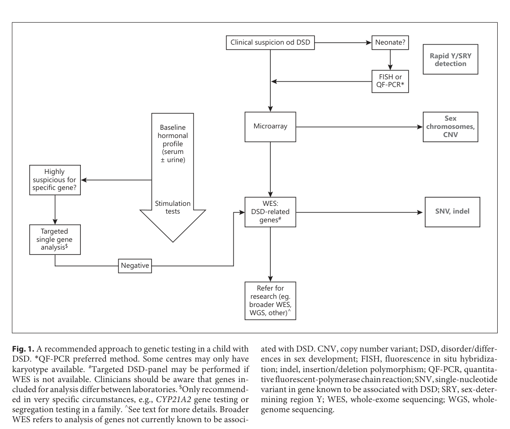

## Question

# Disease Characteristics Research Template

## Target Disease
- **Disease Name:** 46,XY complete gonadal dysgenesis
- **MONDO ID:**  (if available)
- **Category:** Mendelian

## Research Objectives

Please provide a comprehensive research report on **46,XY complete gonadal dysgenesis** covering all of the
disease characteristics listed below. This report will be used to populate a disease knowledge
base entry. Be thorough and cite primary literature (PMID preferred) for all claims.

For each section, **suggested databases/resources** are listed. These are the first places
you should search for information on each topic.

---

### 1. Disease Information
> **Search first:** OMIM, Orphanet, ICD-10/ICD-11, MeSH, PubMed

- What is the disease? Provide a concise overview.
- What are the key identifiers? (OMIM, Orphanet, ICD-10/ICD-11, MeSH, Mondo)
- What are the common synonyms and alternative names?
- Is the information derived from individual patients (e.g., EHR) or aggregated disease-level resources?

### 2. Etiology

- **Disease Causal Factors**: What are the primary causes? (genetic, environmental, infectious, mechanistic)
- **Risk Factors**:
  > **Search first:** PubMed, Cochrane Library, UpToDate, clinical guidelines, ClinVar, ClinGen, GWAS Catalog, PheGenI, CTD, CDC, WHO, epidemiological databases
  - Genetic risk factors (causal variants, susceptibility loci, modifier genes)
  - Environmental risk factors (toxins, lifestyle, occupational exposures, age, sex, family history)
- **Protective Factors**:
  > **Search first:** PubMed, Cochrane Library, clinical trial databases, GWAS Catalog, gnomAD, WHO, CDC, nutrition databases
  - Genetic protective factors (protective variants, modifier alleles)
  - Environmental protective factors (diet, lifestyle, exposures that reduce risk)
- **Gene-Environment Interactions**: How do genetic and environmental factors interact to influence disease?
  > **Search first:** CTD, PubMed, PheGenI, GxE databases

### 3. Phenotypes
> **Search first:** HPO (Human Phenotype Ontology), OMIM, Orphanet, PubMed, clinicaltrials.gov, MedDRA, SNOMED CT, DECIPHER, LOINC

For each phenotype, provide:
- **Phenotype type**: symptoms, clinical signs, physical manifestations, behavioral changes, or laboratory abnormalities
  > For symptoms/signs: HPO, OMIM, Orphanet, PubMed
  > For behavioral changes: HPO, DSM, RDoC (Research Domain Criteria), PubMed
  > For laboratory abnormalities: LOINC, SNOMED CT, LabTests Online, PubMed
- **Phenotype characteristics**:
  > **Search first:** OMIM, Orphanet, HPO, PubMed
  - Age of symptom onset (neonatal, childhood, adult-onset, late-onset)
  - Symptom severity (mild, moderate, severe, variable)
  - Symptom progression (stable, progressive, episodic, fluctuating)
  - Frequency among affected individuals (percentage or qualitative)
- **Quality of life impact**: Effects on daily functioning and well-being (per-phenotype when possible)
  > **Search first:** EQ-5D database, SF-36, WHO QOL databases, PubMed
- Suggest HPO (Human Phenotype Ontology) terms for each phenotype

### 4. Genetic/Molecular Information

- **Causal Genes**: Gene mutations or chromosomal abnormalities responsible for disease (gene symbols, OMIM IDs)
  > **Search first:** OMIM, ClinVar, HGMD, Ensembl, NCBI Gene
- **Pathogenic Variants**:
  - Affected genes (gene symbols, HGNC IDs)
    > **Search first:** OMIM, NCBI Gene, Ensembl, HGNC, UniProt, GeneCards
  - Variant classification (pathogenic, likely pathogenic, VUS per ACMG/AMP guidelines)
    > **Search first:** ClinVar, ClinGen, ACMG/AMP guidelines, VarSome
  - Variant type/class (missense, frameshift, nonsense, splice-site, structural)
  - Allele frequency in population databases
    > **Search first:** gnomAD, 1000 Genomes, ExAC, TOPMed, dbSNP
  - Somatic vs germline origin
    > **Search first:** COSMIC (somatic), ClinVar, ICGC, TCGA
  - Functional consequences (loss of function, gain of function, dominant negative)
- **Modifier Genes**: Genes that modify disease severity or expression
- **Epigenetic Information**: DNA methylation, histone modifications, chromatin changes affecting disease
  > **Search first:** ENCODE, Roadmap Epigenomics, MethBase, DiseaseMeth
- **Chromosomal Abnormalities**: Large-scale genetic changes (aneuploidy, translocations, inversions)
  > **Search first:** DECIPHER, ClinVar, ECARUCA, UCSC Genome Browser

### 5. Environmental Information

- **Environmental Factors**: Non-genetic contributing factors (toxins, radiation, pollution, occupational exposure)
  > **Search first:** CTD (Comparative Toxicogenomics Database), TOXNET, PubMed, EPA databases
- **Lifestyle Factors**: Behavioral factors (smoking, diet, exercise, alcohol consumption)
  > **Search first:** CDC databases, WHO, PubMed, NHANES
- **Infectious Agents**: If applicable, pathogens causing or triggering disease (bacteria, viruses, fungi, parasites)
  > **Search first:** NCBI Taxonomy, ViPR, BV-BRC, MicrobeDB, GIDEON

### 6. Mechanism / Pathophysiology

- **Molecular Pathways**: Specific signaling cascades or biochemical pathways involved (Wnt, MAPK, mTOR, PI3K-AKT, etc.)
  > **Search first:** KEGG, Reactome, WikiPathways, PathBank, BioCyc
- **Cellular Processes**: Cell-level mechanisms (apoptosis, autophagy, cell cycle dysregulation, inflammation, etc.)
  > **Search first:** Gene Ontology (GO), Reactome, KEGG, PubMed
- **Protein Dysfunction**: How protein structure or function is altered (misfolding, aggregation, loss of function, gain of function)
  > **Search first:** UniProt, PDB (Protein Data Bank), InterPro, Pfam, AlphaFold
- **Metabolic Changes**: Alterations in metabolic processes (energy metabolism, lipid metabolism, amino acid metabolism)
  > **Search first:** KEGG, BioCyc, HMDB (Human Metabolome Database), BRENDA
- **Immune System Involvement**: Role of immune response (autoimmunity, immunodeficiency, chronic inflammation)
  > **Search first:** ImmPort, Immunome Database, IEDB, Gene Ontology
- **Tissue Damage Mechanisms**: How tissues/ are injured (oxidative stress, ischemia, fibrosis, necrosis)
  > **Search first:** PubMed, Gene Ontology, Reactome
- **Biochemical Abnormalities**: Specific molecular defects (enzyme deficiencies, receptor dysfunction, ion channel defects)
  > **Search first:** BRENDA, UniProt, KEGG, OMIM, PubMed
- **Epigenetic Changes**: DNA methylation, histone modifications affecting gene expression in disease
  > **Search first:** ENCODE, Roadmap Epigenomics, MethBase, DiseaseMeth
- **Molecular Profiling** (if available):
  - Transcriptomics/gene expression changes
    > **Search first:** GEO (Gene Expression Omnibus), ArrayExpress, GTEx, Human Cell Atlas, SRA
  - Proteomics findings
    > **Search first:** PRIDE, ProteomeXchange, Human Protein Atlas, STRING, BioGRID
  - Metabolomics signatures
    > **Search first:** MetaboLights, Metabolomics Workbench, HMDB, METLIN
  - Lipidomics alterations
    > **Search first:** LIPID MAPS, SwissLipids, LipidHome, Metabolomics Workbench
  - Genomic structural features
    > **Search first:** UCSC Genome Browser, Ensembl, NCBI, dbVar, DGV
- **Advanced Technologies** (if applicable):
  - Single-cell analysis findings (cell-type specific mechanisms, cellular heterogeneity)
    > **Search first:** Human Cell Atlas, Single Cell Portal, GEO, CELLxGENE
  - Spatial transcriptomics findings
    > **Search first:** GEO, Spatial Research, Vizgen, 10x Genomics data
  - Multi-omics integration results
    > **Search first:** TCGA, ICGC, cBioPortal, LinkedOmics, PubMed
  - Functional genomics screens (CRISPR, RNAi)
    > **Search first:** DepMap, GenomeRNAi, PubMed, BioGRID ORCS

For each mechanism, describe:
- The causal chain from initial trigger to clinical manifestation
- Which mechanisms are upstream vs downstream
- What cell types and biological processes are involved
- Suggest GO terms for biological processes and CL terms for cell types

### 7. Anatomical Structures Affected

- **Organ Level**:
  - Primary organs directly affected
  - Secondary organ involvement (complications, secondary effects)
  - Body systems involved (cardiovascular, nervous, digestive, respiratory, endocrine, etc.)
  > **Search first:** Uberon, FMA (Foundational Model of Anatomy), OMIM, HPO, ICD-11, MeSH, SNOMED CT
- **Tissue and Cell Level**:
  - Specific tissue types affected (epithelial, connective, muscle, nervous)
  - Specific cell populations targeted (with Cell Ontology terms)
  > **Search first:** Uberon, Human Protein Atlas, Cell Ontology, Human Cell Atlas, CellMarker, PanglaoDB
- **Subcellular Level**:
  - Cellular compartments involved (mitochondria, nucleus, ER, lysosomes) (with GO Cellular Component terms)
  > **Search first:** Gene Ontology (Cellular Component), UniProt, Human Protein Atlas
- **Localization**:
  - Specific anatomical sites (with UBERON terms)
    > **Search first:** FMA, Uberon, NeuroNames (for brain), SNOMED CT
  - Lateralization (unilateral, bilateral, asymmetric)
    > **Search first:** HPO, clinical literature, imaging databases

### 8. Temporal Development

- **Onset**:
  - Typical age of onset (congenital, pediatric, adult, geriatric)
  - Onset pattern (acute, subacute, chronic, insidious)
  > **Search first:** OMIM, Orphanet, HPO, PubMed
- **Progression**:
  - Disease stages (early, intermediate, advanced, end-stage)
    > **Search first:** Cancer Staging Manual (AJCC), WHO classifications, PubMed
  - Progression rate (rapid, slow, variable)
  - Disease course pattern (episodic, relapsing-remitting, progressive, stable)
  - Disease duration (self-limited, chronic lifelong)
  > **Search first:** Disease registries, longitudinal cohort databases, natural history studies, PubMed, Orphanet, OMIM
- **Patterns**:
  - Remission patterns (spontaneous, treatment-induced)
    > **Search first:** Clinical trial databases, disease registries, PubMed
  - Critical periods (time windows of vulnerability or opportunity for intervention)
    > **Search first:** PubMed, developmental biology databases, clinical guidelines

### 9. Inheritance and Population

- **Epidemiology**:
  - Prevalence (cases per 100,000 at given time)
  - Incidence (new cases per 100,000 per year)
  > **Search first:** Orphanet, CDC, WHO, GBD (Global Burden of Disease), national registries, SEER, disease registries
- **For Genetic Etiology**:
  - Inheritance pattern (AD, AR, X-linked, mitochondrial, multifactorial, polygenic)
    > **Search first:** OMIM, Orphanet, ClinVar, GTR (Genetic Testing Registry)
  - Penetrance (complete, incomplete, age-dependent)
    > **Search first:** ClinVar, OMIM, PubMed, ClinGen
  - Expressivity (variable, consistent)
    > **Search first:** OMIM, ClinVar, PubMed
  - Genetic anticipation (increasing severity in successive generations)
    > **Search first:** OMIM, PubMed (especially for repeat expansion disorders)
  - Germline mosaicism
    > **Search first:** ClinVar, OMIM, genetic counseling literature, PubMed
  - Founder effects (population-specific mutations)
    > **Search first:** gnomAD, population genetics databases, PubMed
  - Consanguinity role
    > **Search first:** OMIM, population studies, genetic counseling resources
  - Carrier frequency
    > **Search first:** gnomAD, carrier screening databases, GeneReviews, GTR
- **Population Demographics**:
  - Affected populations (ethnic or demographic groups with higher prevalence)
    > **Search first:** gnomAD, 1000 Genomes, PAGE Study, PubMed, population registries
  - Geographic distribution (endemic areas, regional variation)
    > **Search first:** WHO, CDC, GBD, Orphanet, geographic epidemiology databases
  - Geographic distribution of specific variants
  - Sex ratio (male:female)
    > **Search first:** Disease registries, OMIM, PubMed, epidemiological databases
  - Age distribution of affected individuals
    > **Search first:** CDC, disease registries, SEER, Orphanet

### 10. Diagnostics

- **Clinical Tests**:
  - Laboratory tests (blood, urine, tissue chemistry, specific enzyme assays)
    > **Search first:** LOINC, LabTests Online, PubMed
  - Biomarkers (proteins, metabolites, genetic markers, circulating biomarkers)
    > **Search first:** FDA Biomarker List, BEST (Biomarkers, EndpointS, and other Tools), PubMed
  - Imaging studies (X-ray, CT, MRI, PET, ultrasound)
    > **Search first:** RadLex, DICOM, Radiopaedia, imaging databases
  - Functional tests (pulmonary function, cardiac stress tests)
    > **Search first:** LOINC, clinical guidelines, PubMed
  - Electrophysiology (EEG, EMG, ECG, nerve conduction studies)
    > **Search first:** LOINC, clinical neurophysiology databases, PubMed
  - Biopsy findings (histopathology, immunohistochemistry)
    > **Search first:** SNOMED CT, College of American Pathologists resources, PubMed
  - Pathology findings (microscopic examination)
    > **Search first:** SNOMED CT, Digital Pathology databases, PubMed
- **Genetic Testing**:
  > **Search first:** GTR (Genetic Testing Registry), GeneReviews, ClinGen
  - Overview of recommended genetic testing approach
  - Whole genome sequencing (WGS) utility
    > **Search first:** GTR, ClinVar, GEL (Genomics England), gnomAD
  - Whole exome sequencing (WES) utility
    > **Search first:** GTR, ClinVar, OMIM, GeneMatcher
  - Gene panels (which panels, which genes)
    > **Search first:** GTR, ClinVar, laboratory-specific databases
  - Single gene testing
    > **Search first:** GTR, ClinVar, OMIM, GeneReviews
  - Chromosomal microarray (CMA)
    > **Search first:** DECIPHER, ClinVar, dbVar, ECARUCA
  - Karyotyping
    > **Search first:** Chromosome Abnormality Database, ClinVar, cytogenetics resources
  - FISH
    > **Search first:** ClinVar, cytogenetics databases, PubMed
  - Mitochondrial DNA testing
    > **Search first:** MITOMAP, MSeqDR, ClinVar, GTR
  - Repeat expansion testing
    > **Search first:** GTR, ClinVar, repeat expansion databases, PubMed
- **Omics-Based Diagnostics** (if applicable):
  - RNA sequencing / transcriptomics
    > **Search first:** GEO, ArrayExpress, GTEx, RNA-seq databases
  - Proteomics
    > **Search first:** PRIDE, ProteomeXchange, FDA Biomarker database
  - Metabolomics
    > **Search first:** MetaboLights, Metabolomics Workbench, HMDB
  - Epigenomics
    > **Search first:** GEO, ENCODE, Roadmap Epigenomics, MethBase
  - Liquid biopsy
    > **Search first:** COSMIC, ClinVar, liquid biopsy databases, PubMed
- **Clinical Criteria**:
  - Standardized diagnostic criteria (DSM, ICD, society guidelines)
    > **Search first:** DSM-5, ICD-11, clinical society guidelines, UpToDate
  - Differential diagnosis (other conditions to rule out, with distinguishing features)
    > **Search first:** DynaMed, UpToDate, clinical decision support systems
- **Screening**:
  - Screening methods for asymptomatic individuals (newborn screening, carrier screening, cascade screening)
    > **Search first:** ACMG recommendations, CDC newborn screening, GTR

### 11. Outcome/Prognosis

- **Survival and Mortality**:
  - Survival rate (5-year, 10-year, overall)
    > **Search first:** SEER, cancer registries, disease-specific registries, PubMed
  - Life expectancy (with and without treatment if applicable)
    > **Search first:** Orphanet, disease registries, actuarial databases, PubMed
  - Mortality rate
    > **Search first:** CDC, WHO, GBD, national mortality databases
  - Disease-specific mortality (deaths directly attributable to disease)
    > **Search first:** Disease registries, CDC Wonder, GBD, PubMed
- **Morbidity and Function**:
  - Morbidity (disease-related disability and health impacts)
    > **Search first:** GBD, WHO, disability databases, PubMed
  - Disability outcomes (long-term functional impairments)
    > **Search first:** ICF (International Classification of Functioning), disability registries
  - Quality of life measures (EQ-5D, SF-36, PROMIS, disease-specific tools)
    > **Search first:** EQ-5D database, SF-36, PROMIS, PubMed
- **Disease Course**:
  - Complications (secondary problems: infections, organ failure, etc.)
    > **Search first:** ICD codes, disease registries, clinical databases, PubMed
  - Recovery potential (likelihood and extent of recovery, with vs without treatment)
    > **Search first:** Natural history studies, rehabilitation databases, PubMed
- **Prediction**:
  - Prognostic factors (age, disease severity, biomarkers, treatment response)
    > **Search first:** Prognostic models databases, clinical calculators, PubMed
  - Prognostic biomarkers (molecular markers predicting disease course)
    > **Search first:** FDA Biomarker database, PubMed, cancer prognostic databases

### 12. Treatment

- **Pharmacotherapy**:
  - Pharmacological treatments (drug names, drug classes, mechanisms of action)
    > **Search first:** DrugBank, RxNorm, ATC classification, DailyMed, FDA databases
  - Pharmacogenomics (how genetic variants affect drug metabolism, efficacy, toxicity)
    > **Search first:** PharmGKB, CPIC (Clinical Pharmacogenetics), FDA Table of PGx Biomarkers
- **Advanced Therapeutics**:
  - Gene therapy (viral vectors, CRISPR, gene replacement, gene editing)
    > **Search first:** ClinicalTrials.gov, FDA gene therapy database, ASGCT resources
  - Cell therapy (stem cell transplant, CAR-T, cellular therapeutics)
    > **Search first:** ClinicalTrials.gov, FDA cell therapy database, FACT standards
  - RNA-based therapies (ASOs, siRNA, mRNA therapies)
    > **Search first:** ClinicalTrials.gov, FDA approvals, PubMed
  - Targeted therapies (treatments directed at specific molecular targets)
    > **Search first:** My Cancer Genome, OncoKB, ClinicalTrials.gov, FDA approvals
  - Immunotherapies (checkpoint inhibitors, monoclonal antibodies)
    > **Search first:** Cancer Immunotherapy Database, FDA approvals, ClinicalTrials.gov
- **Surgical and Interventional**:
  - Surgical interventions (types of surgery, timing, outcomes)
    > **Search first:** CPT codes, surgical registries, clinical guidelines, PubMed
- **Supportive and Rehabilitative**:
  - Supportive care (symptom management, pain control, nutrition)
    > **Search first:** Clinical guidelines, Cochrane Library, PubMed
  - Rehabilitation (physical therapy, occupational therapy, speech therapy)
    > **Search first:** Rehabilitation medicine databases, clinical guidelines, PubMed
- **Experimental**:
  - Experimental treatments in clinical trials (with NCT identifiers if available)
    > **Search first:** ClinicalTrials.gov, EU Clinical Trials Register, WHO ICTRP
- **Treatment Outcomes**:
  - Treatment response rates
    > **Search first:** Clinical trial databases, FDA reviews, systematic reviews, PubMed
  - Side effects and adverse events
    > **Search first:** FDA Adverse Event Reporting System (FAERS), MedWatch, PubMed
- **Treatment Strategy**:
  - Treatment algorithms (clinical pathways, decision trees)
    > **Search first:** Clinical practice guidelines, NCCN Guidelines, UpToDate
  - Combination therapies
    > **Search first:** ClinicalTrials.gov, treatment guidelines, PubMed
  - Personalized medicine approaches (genotype-guided treatment)
    > **Search first:** My Cancer Genome, CIViC, PharmGKB, precision medicine databases

For each treatment, suggest MAXO (Medical Action Ontology) terms where applicable.

### 13. Prevention

- **Prevention Levels**:
  - Primary prevention (preventing disease occurrence: vaccination, risk factor modification)
    > **Search first:** CDC, WHO, USPSTF recommendations, Cochrane Library
  - Secondary prevention (early detection and treatment: screening programs, early intervention)
    > **Search first:** USPSTF, CDC screening guidelines, WHO
  - Tertiary prevention (preventing complications in those with disease)
    > **Search first:** Clinical guidelines, disease management protocols, PubMed
- **Immunization**: Vaccine strategies (if applicable)
  > **Search first:** CDC vaccine schedules, WHO immunization, FDA vaccine database
- **Screening and Early Detection**:
  - Screening programs (population-based: newborn screening, cancer screening)
    > **Search first:** CDC screening programs, USPSTF, cancer screening databases
  - Genetic screening (carrier screening, preimplantation genetic diagnosis, prenatal testing)
    > **Search first:** ACMG recommendations, ACOG guidelines, GTR
  - Risk stratification (identifying high-risk individuals for targeted prevention)
    > **Search first:** Risk prediction models, clinical calculators, PubMed
- **Behavioral Interventions**: Lifestyle modifications to reduce risk
  > **Search first:** CDC, WHO, behavioral intervention databases, Cochrane Library
- **Counseling**: Genetic counseling (risk assessment, family planning guidance)
  > **Search first:** NSGC resources, ACMG guidelines, GeneReviews
- **Public Health**:
  - Public health interventions (sanitation, vector control, health education)
    > **Search first:** CDC, WHO, public health databases, PubMed
  - Environmental interventions (reducing environmental risk factors)
    > **Search first:** EPA databases, WHO environmental health, PubMed
- **Prophylaxis**: Preventive medications or procedures
  > **Search first:** Clinical guidelines, FDA approvals, PubMed

### 14. Other Species / Natural Disease

- **Taxonomy**: Species affected (with NCBI Taxon identifiers)
  > **Search first:** NCBI Taxonomy
- **Breed**: Specific breeds affected (with VBO identifiers if applicable)
  > **Search first:** VBO (Vertebrate Breed Ontology)
- **Gene**: Orthologous genes in other species (with NCBI Gene IDs)
  > **Search first:** NCBI Gene
- **Natural Disease**:
  - Naturally occurring disease in other species (companion animals, wildlife)
    > **Search first:** OMIA (Online Mendelian Inheritance in Animals), VetCompass, PubMed
  - Veterinary relevance and importance in animal health
    > **Search first:** OMIA, veterinary databases, PubMed
- **Comparative Biology**:
  - Comparative pathology (similarities and differences across species)
    > **Search first:** OMIA, comparative pathology databases, PubMed
  - Evolutionary conservation of disease mechanisms
    > **Search first:** HomoloGene, OrthoMCL, Alliance of Genome Resources
- **Transmission** (if applicable):
  - Zoonotic potential
    > **Search first:** CDC zoonotic diseases, WHO zoonoses, GIDEON
  - Cross-species susceptibility
    > **Search first:** NCBI Taxonomy, veterinary databases, PubMed

### 15. Model Organisms

- **Model Types**:
  - Model organism type (mammalian, invertebrate, cellular, in vitro)
    > **Search first:** Alliance of Genome Resources, model organism databases
  - Specific model systems (mouse, rat, zebrafish, Drosophila, C. elegans, yeast, cell lines, organoids, iPSCs)
    > **Search first:** MGI, RGD, ZFIN, FlyBase, WormBase, SGD, ATCC, Cellosaurus
  - Induced models (drug treatment, surgical intervention, environmental manipulation)
    > **Search first:** MGI, model organism databases, PubMed
- **Genetic Models**:
  - Types available (knockout, knock-in, transgenic, conditional, humanized)
    > **Search first:** MGI, IMPC, KOMP, EuMMCR, IMSR
- **Model Characteristics**:
  - Phenotype recapitulation (how well model reproduces human disease features)
    > **Search first:** Model organism databases, comparative studies, PubMed
  - Model limitations (aspects of human disease not captured)
    > **Search first:** Model organism databases, PubMed, review articles
- **Applications**:
  - Research applications (what aspects of disease can be studied)
    > **Search first:** Model organism databases, PubMed
- **Resources**:
  - Model databases
    > **Search first:** MGI, RGD, ZFIN, FlyBase, WormBase, IMSR, EMMA, MMRRC

---

## Citation Requirements

- Cite primary literature (PMID preferred) for all mechanistic and clinical claims
- Prioritize recent reviews and landmark papers
- Include direct quotes from abstracts where possible to support key statements
- Distinguish evidence source types: human clinical, model organism, in vitro, computational

## Output Format

Structure your response as a comprehensive narrative organized by the sections above.
For each section, provide:
- Factual content with specific details (numbers, percentages, gene names, variant nomenclature)
- Ontology term suggestions (HPO, GO, CL, UBERON, CHEBI, MAXO, MONDO) where applicable
- Evidence citations with PMIDs
- Direct quotes from abstracts to support key claims
- Clear indication when information is not available or not applicable for this disease

This report will be used to populate a disease knowledge base entry with:
- Pathophysiology descriptions with causal chains
- Gene/protein annotations (HGNC, GO terms)
- Phenotype associations (HP terms) with frequencies
- Cell type involvement (CL terms)
- Anatomical locations (UBERON terms)
- Chemical entities (CHEBI terms)
- Treatment annotations (MAXO terms)
- Evidence items with PMIDs and exact abstract quotes
- Epidemiology, prognosis, diagnostic, and prevention information
- Animal model descriptions with phenotype recapitulation details

## Output

Question: You are an expert researcher providing comprehensive, well-cited information.

Provide detailed information focusing on:
1. Key concepts and definitions with current understanding
2. Recent developments and latest research (prioritize 2023-2024 sources)
3. Current applications and real-world implementations
4. Expert opinions and analysis from authoritative sources
5. Relevant statistics and data from recent studies

Format as a comprehensive research report with proper citations. Include URLs and publication dates where available.
Always prioritize recent, authoritative sources and provide specific citations for all major claims.

# Disease Characteristics Research Template

## Target Disease
- **Disease Name:** 46,XY complete gonadal dysgenesis
- **MONDO ID:**  (if available)
- **Category:** Mendelian

## Research Objectives

Please provide a comprehensive research report on **46,XY complete gonadal dysgenesis** covering all of the
disease characteristics listed below. This report will be used to populate a disease knowledge
base entry. Be thorough and cite primary literature (PMID preferred) for all claims.

For each section, **suggested databases/resources** are listed. These are the first places
you should search for information on each topic.

---

### 1. Disease Information
> **Search first:** OMIM, Orphanet, ICD-10/ICD-11, MeSH, PubMed

- What is the disease? Provide a concise overview.
- What are the key identifiers? (OMIM, Orphanet, ICD-10/ICD-11, MeSH, Mondo)
- What are the common synonyms and alternative names?
- Is the information derived from individual patients (e.g., EHR) or aggregated disease-level resources?

### 2. Etiology

- **Disease Causal Factors**: What are the primary causes? (genetic, environmental, infectious, mechanistic)
- **Risk Factors**:
  > **Search first:** PubMed, Cochrane Library, UpToDate, clinical guidelines, ClinVar, ClinGen, GWAS Catalog, PheGenI, CTD, CDC, WHO, epidemiological databases
  - Genetic risk factors (causal variants, susceptibility loci, modifier genes)
  - Environmental risk factors (toxins, lifestyle, occupational exposures, age, sex, family history)
- **Protective Factors**:
  > **Search first:** PubMed, Cochrane Library, clinical trial databases, GWAS Catalog, gnomAD, WHO, CDC, nutrition databases
  - Genetic protective factors (protective variants, modifier alleles)
  - Environmental protective factors (diet, lifestyle, exposures that reduce risk)
- **Gene-Environment Interactions**: How do genetic and environmental factors interact to influence disease?
  > **Search first:** CTD, PubMed, PheGenI, GxE databases

### 3. Phenotypes
> **Search first:** HPO (Human Phenotype Ontology), OMIM, Orphanet, PubMed, clinicaltrials.gov, MedDRA, SNOMED CT, DECIPHER, LOINC

For each phenotype, provide:
- **Phenotype type**: symptoms, clinical signs, physical manifestations, behavioral changes, or laboratory abnormalities
  > For symptoms/signs: HPO, OMIM, Orphanet, PubMed
  > For behavioral changes: HPO, DSM, RDoC (Research Domain Criteria), PubMed
  > For laboratory abnormalities: LOINC, SNOMED CT, LabTests Online, PubMed
- **Phenotype characteristics**:
  > **Search first:** OMIM, Orphanet, HPO, PubMed
  - Age of symptom onset (neonatal, childhood, adult-onset, late-onset)
  - Symptom severity (mild, moderate, severe, variable)
  - Symptom progression (stable, progressive, episodic, fluctuating)
  - Frequency among affected individuals (percentage or qualitative)
- **Quality of life impact**: Effects on daily functioning and well-being (per-phenotype when possible)
  > **Search first:** EQ-5D database, SF-36, WHO QOL databases, PubMed
- Suggest HPO (Human Phenotype Ontology) terms for each phenotype

### 4. Genetic/Molecular Information

- **Causal Genes**: Gene mutations or chromosomal abnormalities responsible for disease (gene symbols, OMIM IDs)
  > **Search first:** OMIM, ClinVar, HGMD, Ensembl, NCBI Gene
- **Pathogenic Variants**:
  - Affected genes (gene symbols, HGNC IDs)
    > **Search first:** OMIM, NCBI Gene, Ensembl, HGNC, UniProt, GeneCards
  - Variant classification (pathogenic, likely pathogenic, VUS per ACMG/AMP guidelines)
    > **Search first:** ClinVar, ClinGen, ACMG/AMP guidelines, VarSome
  - Variant type/class (missense, frameshift, nonsense, splice-site, structural)
  - Allele frequency in population databases
    > **Search first:** gnomAD, 1000 Genomes, ExAC, TOPMed, dbSNP
  - Somatic vs germline origin
    > **Search first:** COSMIC (somatic), ClinVar, ICGC, TCGA
  - Functional consequences (loss of function, gain of function, dominant negative)
- **Modifier Genes**: Genes that modify disease severity or expression
- **Epigenetic Information**: DNA methylation, histone modifications, chromatin changes affecting disease
  > **Search first:** ENCODE, Roadmap Epigenomics, MethBase, DiseaseMeth
- **Chromosomal Abnormalities**: Large-scale genetic changes (aneuploidy, translocations, inversions)
  > **Search first:** DECIPHER, ClinVar, ECARUCA, UCSC Genome Browser

### 5. Environmental Information

- **Environmental Factors**: Non-genetic contributing factors (toxins, radiation, pollution, occupational exposure)
  > **Search first:** CTD (Comparative Toxicogenomics Database), TOXNET, PubMed, EPA databases
- **Lifestyle Factors**: Behavioral factors (smoking, diet, exercise, alcohol consumption)
  > **Search first:** CDC databases, WHO, PubMed, NHANES
- **Infectious Agents**: If applicable, pathogens causing or triggering disease (bacteria, viruses, fungi, parasites)
  > **Search first:** NCBI Taxonomy, ViPR, BV-BRC, MicrobeDB, GIDEON

### 6. Mechanism / Pathophysiology

- **Molecular Pathways**: Specific signaling cascades or biochemical pathways involved (Wnt, MAPK, mTOR, PI3K-AKT, etc.)
  > **Search first:** KEGG, Reactome, WikiPathways, PathBank, BioCyc
- **Cellular Processes**: Cell-level mechanisms (apoptosis, autophagy, cell cycle dysregulation, inflammation, etc.)
  > **Search first:** Gene Ontology (GO), Reactome, KEGG, PubMed
- **Protein Dysfunction**: How protein structure or function is altered (misfolding, aggregation, loss of function, gain of function)
  > **Search first:** UniProt, PDB (Protein Data Bank), InterPro, Pfam, AlphaFold
- **Metabolic Changes**: Alterations in metabolic processes (energy metabolism, lipid metabolism, amino acid metabolism)
  > **Search first:** KEGG, BioCyc, HMDB (Human Metabolome Database), BRENDA
- **Immune System Involvement**: Role of immune response (autoimmunity, immunodeficiency, chronic inflammation)
  > **Search first:** ImmPort, Immunome Database, IEDB, Gene Ontology
- **Tissue Damage Mechanisms**: How tissues/ are injured (oxidative stress, ischemia, fibrosis, necrosis)
  > **Search first:** PubMed, Gene Ontology, Reactome
- **Biochemical Abnormalities**: Specific molecular defects (enzyme deficiencies, receptor dysfunction, ion channel defects)
  > **Search first:** BRENDA, UniProt, KEGG, OMIM, PubMed
- **Epigenetic Changes**: DNA methylation, histone modifications affecting gene expression in disease
  > **Search first:** ENCODE, Roadmap Epigenomics, MethBase, DiseaseMeth
- **Molecular Profiling** (if available):
  - Transcriptomics/gene expression changes
    > **Search first:** GEO (Gene Expression Omnibus), ArrayExpress, GTEx, Human Cell Atlas, SRA
  - Proteomics findings
    > **Search first:** PRIDE, ProteomeXchange, Human Protein Atlas, STRING, BioGRID
  - Metabolomics signatures
    > **Search first:** MetaboLights, Metabolomics Workbench, HMDB, METLIN
  - Lipidomics alterations
    > **Search first:** LIPID MAPS, SwissLipids, LipidHome, Metabolomics Workbench
  - Genomic structural features
    > **Search first:** UCSC Genome Browser, Ensembl, NCBI, dbVar, DGV
- **Advanced Technologies** (if applicable):
  - Single-cell analysis findings (cell-type specific mechanisms, cellular heterogeneity)
    > **Search first:** Human Cell Atlas, Single Cell Portal, GEO, CELLxGENE
  - Spatial transcriptomics findings
    > **Search first:** GEO, Spatial Research, Vizgen, 10x Genomics data
  - Multi-omics integration results
    > **Search first:** TCGA, ICGC, cBioPortal, LinkedOmics, PubMed
  - Functional genomics screens (CRISPR, RNAi)
    > **Search first:** DepMap, GenomeRNAi, PubMed, BioGRID ORCS

For each mechanism, describe:
- The causal chain from initial trigger to clinical manifestation
- Which mechanisms are upstream vs downstream
- What cell types and biological processes are involved
- Suggest GO terms for biological processes and CL terms for cell types

### 7. Anatomical Structures Affected

- **Organ Level**:
  - Primary organs directly affected
  - Secondary organ involvement (complications, secondary effects)
  - Body systems involved (cardiovascular, nervous, digestive, respiratory, endocrine, etc.)
  > **Search first:** Uberon, FMA (Foundational Model of Anatomy), OMIM, HPO, ICD-11, MeSH, SNOMED CT
- **Tissue and Cell Level**:
  - Specific tissue types affected (epithelial, connective, muscle, nervous)
  - Specific cell populations targeted (with Cell Ontology terms)
  > **Search first:** Uberon, Human Protein Atlas, Cell Ontology, Human Cell Atlas, CellMarker, PanglaoDB
- **Subcellular Level**:
  - Cellular compartments involved (mitochondria, nucleus, ER, lysosomes) (with GO Cellular Component terms)
  > **Search first:** Gene Ontology (Cellular Component), UniProt, Human Protein Atlas
- **Localization**:
  - Specific anatomical sites (with UBERON terms)
    > **Search first:** FMA, Uberon, NeuroNames (for brain), SNOMED CT
  - Lateralization (unilateral, bilateral, asymmetric)
    > **Search first:** HPO, clinical literature, imaging databases

### 8. Temporal Development

- **Onset**:
  - Typical age of onset (congenital, pediatric, adult, geriatric)
  - Onset pattern (acute, subacute, chronic, insidious)
  > **Search first:** OMIM, Orphanet, HPO, PubMed
- **Progression**:
  - Disease stages (early, intermediate, advanced, end-stage)
    > **Search first:** Cancer Staging Manual (AJCC), WHO classifications, PubMed
  - Progression rate (rapid, slow, variable)
  - Disease course pattern (episodic, relapsing-remitting, progressive, stable)
  - Disease duration (self-limited, chronic lifelong)
  > **Search first:** Disease registries, longitudinal cohort databases, natural history studies, PubMed, Orphanet, OMIM
- **Patterns**:
  - Remission patterns (spontaneous, treatment-induced)
    > **Search first:** Clinical trial databases, disease registries, PubMed
  - Critical periods (time windows of vulnerability or opportunity for intervention)
    > **Search first:** PubMed, developmental biology databases, clinical guidelines

### 9. Inheritance and Population

- **Epidemiology**:
  - Prevalence (cases per 100,000 at given time)
  - Incidence (new cases per 100,000 per year)
  > **Search first:** Orphanet, CDC, WHO, GBD (Global Burden of Disease), national registries, SEER, disease registries
- **For Genetic Etiology**:
  - Inheritance pattern (AD, AR, X-linked, mitochondrial, multifactorial, polygenic)
    > **Search first:** OMIM, Orphanet, ClinVar, GTR (Genetic Testing Registry)
  - Penetrance (complete, incomplete, age-dependent)
    > **Search first:** ClinVar, OMIM, PubMed, ClinGen
  - Expressivity (variable, consistent)
    > **Search first:** OMIM, ClinVar, PubMed
  - Genetic anticipation (increasing severity in successive generations)
    > **Search first:** OMIM, PubMed (especially for repeat expansion disorders)
  - Germline mosaicism
    > **Search first:** ClinVar, OMIM, genetic counseling literature, PubMed
  - Founder effects (population-specific mutations)
    > **Search first:** gnomAD, population genetics databases, PubMed
  - Consanguinity role
    > **Search first:** OMIM, population studies, genetic counseling resources
  - Carrier frequency
    > **Search first:** gnomAD, carrier screening databases, GeneReviews, GTR
- **Population Demographics**:
  - Affected populations (ethnic or demographic groups with higher prevalence)
    > **Search first:** gnomAD, 1000 Genomes, PAGE Study, PubMed, population registries
  - Geographic distribution (endemic areas, regional variation)
    > **Search first:** WHO, CDC, GBD, Orphanet, geographic epidemiology databases
  - Geographic distribution of specific variants
  - Sex ratio (male:female)
    > **Search first:** Disease registries, OMIM, PubMed, epidemiological databases
  - Age distribution of affected individuals
    > **Search first:** CDC, disease registries, SEER, Orphanet

### 10. Diagnostics

- **Clinical Tests**:
  - Laboratory tests (blood, urine, tissue chemistry, specific enzyme assays)
    > **Search first:** LOINC, LabTests Online, PubMed
  - Biomarkers (proteins, metabolites, genetic markers, circulating biomarkers)
    > **Search first:** FDA Biomarker List, BEST (Biomarkers, EndpointS, and other Tools), PubMed
  - Imaging studies (X-ray, CT, MRI, PET, ultrasound)
    > **Search first:** RadLex, DICOM, Radiopaedia, imaging databases
  - Functional tests (pulmonary function, cardiac stress tests)
    > **Search first:** LOINC, clinical guidelines, PubMed
  - Electrophysiology (EEG, EMG, ECG, nerve conduction studies)
    > **Search first:** LOINC, clinical neurophysiology databases, PubMed
  - Biopsy findings (histopathology, immunohistochemistry)
    > **Search first:** SNOMED CT, College of American Pathologists resources, PubMed
  - Pathology findings (microscopic examination)
    > **Search first:** SNOMED CT, Digital Pathology databases, PubMed
- **Genetic Testing**:
  > **Search first:** GTR (Genetic Testing Registry), GeneReviews, ClinGen
  - Overview of recommended genetic testing approach
  - Whole genome sequencing (WGS) utility
    > **Search first:** GTR, ClinVar, GEL (Genomics England), gnomAD
  - Whole exome sequencing (WES) utility
    > **Search first:** GTR, ClinVar, OMIM, GeneMatcher
  - Gene panels (which panels, which genes)
    > **Search first:** GTR, ClinVar, laboratory-specific databases
  - Single gene testing
    > **Search first:** GTR, ClinVar, OMIM, GeneReviews
  - Chromosomal microarray (CMA)
    > **Search first:** DECIPHER, ClinVar, dbVar, ECARUCA
  - Karyotyping
    > **Search first:** Chromosome Abnormality Database, ClinVar, cytogenetics resources
  - FISH
    > **Search first:** ClinVar, cytogenetics databases, PubMed
  - Mitochondrial DNA testing
    > **Search first:** MITOMAP, MSeqDR, ClinVar, GTR
  - Repeat expansion testing
    > **Search first:** GTR, ClinVar, repeat expansion databases, PubMed
- **Omics-Based Diagnostics** (if applicable):
  - RNA sequencing / transcriptomics
    > **Search first:** GEO, ArrayExpress, GTEx, RNA-seq databases
  - Proteomics
    > **Search first:** PRIDE, ProteomeXchange, FDA Biomarker database
  - Metabolomics
    > **Search first:** MetaboLights, Metabolomics Workbench, HMDB
  - Epigenomics
    > **Search first:** GEO, ENCODE, Roadmap Epigenomics, MethBase
  - Liquid biopsy
    > **Search first:** COSMIC, ClinVar, liquid biopsy databases, PubMed
- **Clinical Criteria**:
  - Standardized diagnostic criteria (DSM, ICD, society guidelines)
    > **Search first:** DSM-5, ICD-11, clinical society guidelines, UpToDate
  - Differential diagnosis (other conditions to rule out, with distinguishing features)
    > **Search first:** DynaMed, UpToDate, clinical decision support systems
- **Screening**:
  - Screening methods for asymptomatic individuals (newborn screening, carrier screening, cascade screening)
    > **Search first:** ACMG recommendations, CDC newborn screening, GTR

### 11. Outcome/Prognosis

- **Survival and Mortality**:
  - Survival rate (5-year, 10-year, overall)
    > **Search first:** SEER, cancer registries, disease-specific registries, PubMed
  - Life expectancy (with and without treatment if applicable)
    > **Search first:** Orphanet, disease registries, actuarial databases, PubMed
  - Mortality rate
    > **Search first:** CDC, WHO, GBD, national mortality databases
  - Disease-specific mortality (deaths directly attributable to disease)
    > **Search first:** Disease registries, CDC Wonder, GBD, PubMed
- **Morbidity and Function**:
  - Morbidity (disease-related disability and health impacts)
    > **Search first:** GBD, WHO, disability databases, PubMed
  - Disability outcomes (long-term functional impairments)
    > **Search first:** ICF (International Classification of Functioning), disability registries
  - Quality of life measures (EQ-5D, SF-36, PROMIS, disease-specific tools)
    > **Search first:** EQ-5D database, SF-36, PROMIS, PubMed
- **Disease Course**:
  - Complications (secondary problems: infections, organ failure, etc.)
    > **Search first:** ICD codes, disease registries, clinical databases, PubMed
  - Recovery potential (likelihood and extent of recovery, with vs without treatment)
    > **Search first:** Natural history studies, rehabilitation databases, PubMed
- **Prediction**:
  - Prognostic factors (age, disease severity, biomarkers, treatment response)
    > **Search first:** Prognostic models databases, clinical calculators, PubMed
  - Prognostic biomarkers (molecular markers predicting disease course)
    > **Search first:** FDA Biomarker database, PubMed, cancer prognostic databases

### 12. Treatment

- **Pharmacotherapy**:
  - Pharmacological treatments (drug names, drug classes, mechanisms of action)
    > **Search first:** DrugBank, RxNorm, ATC classification, DailyMed, FDA databases
  - Pharmacogenomics (how genetic variants affect drug metabolism, efficacy, toxicity)
    > **Search first:** PharmGKB, CPIC (Clinical Pharmacogenetics), FDA Table of PGx Biomarkers
- **Advanced Therapeutics**:
  - Gene therapy (viral vectors, CRISPR, gene replacement, gene editing)
    > **Search first:** ClinicalTrials.gov, FDA gene therapy database, ASGCT resources
  - Cell therapy (stem cell transplant, CAR-T, cellular therapeutics)
    > **Search first:** ClinicalTrials.gov, FDA cell therapy database, FACT standards
  - RNA-based therapies (ASOs, siRNA, mRNA therapies)
    > **Search first:** ClinicalTrials.gov, FDA approvals, PubMed
  - Targeted therapies (treatments directed at specific molecular targets)
    > **Search first:** My Cancer Genome, OncoKB, ClinicalTrials.gov, FDA approvals
  - Immunotherapies (checkpoint inhibitors, monoclonal antibodies)
    > **Search first:** Cancer Immunotherapy Database, FDA approvals, ClinicalTrials.gov
- **Surgical and Interventional**:
  - Surgical interventions (types of surgery, timing, outcomes)
    > **Search first:** CPT codes, surgical registries, clinical guidelines, PubMed
- **Supportive and Rehabilitative**:
  - Supportive care (symptom management, pain control, nutrition)
    > **Search first:** Clinical guidelines, Cochrane Library, PubMed
  - Rehabilitation (physical therapy, occupational therapy, speech therapy)
    > **Search first:** Rehabilitation medicine databases, clinical guidelines, PubMed
- **Experimental**:
  - Experimental treatments in clinical trials (with NCT identifiers if available)
    > **Search first:** ClinicalTrials.gov, EU Clinical Trials Register, WHO ICTRP
- **Treatment Outcomes**:
  - Treatment response rates
    > **Search first:** Clinical trial databases, FDA reviews, systematic reviews, PubMed
  - Side effects and adverse events
    > **Search first:** FDA Adverse Event Reporting System (FAERS), MedWatch, PubMed
- **Treatment Strategy**:
  - Treatment algorithms (clinical pathways, decision trees)
    > **Search first:** Clinical practice guidelines, NCCN Guidelines, UpToDate
  - Combination therapies
    > **Search first:** ClinicalTrials.gov, treatment guidelines, PubMed
  - Personalized medicine approaches (genotype-guided treatment)
    > **Search first:** My Cancer Genome, CIViC, PharmGKB, precision medicine databases

For each treatment, suggest MAXO (Medical Action Ontology) terms where applicable.

### 13. Prevention

- **Prevention Levels**:
  - Primary prevention (preventing disease occurrence: vaccination, risk factor modification)
    > **Search first:** CDC, WHO, USPSTF recommendations, Cochrane Library
  - Secondary prevention (early detection and treatment: screening programs, early intervention)
    > **Search first:** USPSTF, CDC screening guidelines, WHO
  - Tertiary prevention (preventing complications in those with disease)
    > **Search first:** Clinical guidelines, disease management protocols, PubMed
- **Immunization**: Vaccine strategies (if applicable)
  > **Search first:** CDC vaccine schedules, WHO immunization, FDA vaccine database
- **Screening and Early Detection**:
  - Screening programs (population-based: newborn screening, cancer screening)
    > **Search first:** CDC screening programs, USPSTF, cancer screening databases
  - Genetic screening (carrier screening, preimplantation genetic diagnosis, prenatal testing)
    > **Search first:** ACMG recommendations, ACOG guidelines, GTR
  - Risk stratification (identifying high-risk individuals for targeted prevention)
    > **Search first:** Risk prediction models, clinical calculators, PubMed
- **Behavioral Interventions**: Lifestyle modifications to reduce risk
  > **Search first:** CDC, WHO, behavioral intervention databases, Cochrane Library
- **Counseling**: Genetic counseling (risk assessment, family planning guidance)
  > **Search first:** NSGC resources, ACMG guidelines, GeneReviews
- **Public Health**:
  - Public health interventions (sanitation, vector control, health education)
    > **Search first:** CDC, WHO, public health databases, PubMed
  - Environmental interventions (reducing environmental risk factors)
    > **Search first:** EPA databases, WHO environmental health, PubMed
- **Prophylaxis**: Preventive medications or procedures
  > **Search first:** Clinical guidelines, FDA approvals, PubMed

### 14. Other Species / Natural Disease

- **Taxonomy**: Species affected (with NCBI Taxon identifiers)
  > **Search first:** NCBI Taxonomy
- **Breed**: Specific breeds affected (with VBO identifiers if applicable)
  > **Search first:** VBO (Vertebrate Breed Ontology)
- **Gene**: Orthologous genes in other species (with NCBI Gene IDs)
  > **Search first:** NCBI Gene
- **Natural Disease**:
  - Naturally occurring disease in other species (companion animals, wildlife)
    > **Search first:** OMIA (Online Mendelian Inheritance in Animals), VetCompass, PubMed
  - Veterinary relevance and importance in animal health
    > **Search first:** OMIA, veterinary databases, PubMed
- **Comparative Biology**:
  - Comparative pathology (similarities and differences across species)
    > **Search first:** OMIA, comparative pathology databases, PubMed
  - Evolutionary conservation of disease mechanisms
    > **Search first:** HomoloGene, OrthoMCL, Alliance of Genome Resources
- **Transmission** (if applicable):
  - Zoonotic potential
    > **Search first:** CDC zoonotic diseases, WHO zoonoses, GIDEON
  - Cross-species susceptibility
    > **Search first:** NCBI Taxonomy, veterinary databases, PubMed

### 15. Model Organisms

- **Model Types**:
  - Model organism type (mammalian, invertebrate, cellular, in vitro)
    > **Search first:** Alliance of Genome Resources, model organism databases
  - Specific model systems (mouse, rat, zebrafish, Drosophila, C. elegans, yeast, cell lines, organoids, iPSCs)
    > **Search first:** MGI, RGD, ZFIN, FlyBase, WormBase, SGD, ATCC, Cellosaurus
  - Induced models (drug treatment, surgical intervention, environmental manipulation)
    > **Search first:** MGI, model organism databases, PubMed
- **Genetic Models**:
  - Types available (knockout, knock-in, transgenic, conditional, humanized)
    > **Search first:** MGI, IMPC, KOMP, EuMMCR, IMSR
- **Model Characteristics**:
  - Phenotype recapitulation (how well model reproduces human disease features)
    > **Search first:** Model organism databases, comparative studies, PubMed
  - Model limitations (aspects of human disease not captured)
    > **Search first:** Model organism databases, PubMed, review articles
- **Applications**:
  - Research applications (what aspects of disease can be studied)
    > **Search first:** Model organism databases, PubMed
- **Resources**:
  - Model databases
    > **Search first:** MGI, RGD, ZFIN, FlyBase, WormBase, IMSR, EMMA, MMRRC

---

## Citation Requirements

- Cite primary literature (PMID preferred) for all mechanistic and clinical claims
- Prioritize recent reviews and landmark papers
- Include direct quotes from abstracts where possible to support key statements
- Distinguish evidence source types: human clinical, model organism, in vitro, computational

## Output Format

Structure your response as a comprehensive narrative organized by the sections above.
For each section, provide:
- Factual content with specific details (numbers, percentages, gene names, variant nomenclature)
- Ontology term suggestions (HPO, GO, CL, UBERON, CHEBI, MAXO, MONDO) where applicable
- Evidence citations with PMIDs
- Direct quotes from abstracts to support key claims
- Clear indication when information is not available or not applicable for this disease

This report will be used to populate a disease knowledge base entry with:
- Pathophysiology descriptions with causal chains
- Gene/protein annotations (HGNC, GO terms)
- Phenotype associations (HP terms) with frequencies
- Cell type involvement (CL terms)
- Anatomical locations (UBERON terms)
- Chemical entities (CHEBI terms)
- Treatment annotations (MAXO terms)
- Evidence items with PMIDs and exact abstract quotes
- Epidemiology, prognosis, diagnostic, and prevention information
- Animal model descriptions with phenotype recapitulation details

# 46,XY Complete Gonadal Dysgenesis (Swyer syndrome): Comprehensive Disease Characteristics Research Report

## Executive summary
46,XY complete gonadal dysgenesis (CGD), commonly called **Swyer syndrome**, is a Mendelian (single‑gene/oligogenic) **46,XY difference/disorder of sex development (DSD)** characterized by **nonfunctional “streak” gonads**, **female external genitalia**, and typically **preserved Müllerian internal structures** due to failure of fetal testicular hormone production. The most clinically consequential feature is a **high risk of gonadal germ‑cell neoplasia** in Y‑chromosome–containing dysgenetic gonads, motivating **prophylactic gonadectomy** plus **puberty induction and lifelong hormone replacement therapy (HRT)**. Recent literature (2023–2024) emphasizes early **genetic diagnosis using NGS** and risk‑stratified long‑term care, while acknowledging persistent diagnostic yield limits in 46,XY DSD. (o’connell2023establishingamolecular pages 5-6, o’connell2023establishingamolecular pages 10-11, o’connell2023establishingamolecular pages 2-3, rudnicka2024ariskof pages 1-2)

## Key recent sources (2023–2024 prioritized)
| Topic area | Key findings/statistics | Evidence type | Publication (authors, journal) | Year-month | Identifier | URL |
|---|---|---|---|---|---|---|
| Definition / phenotype | Swyer syndrome = 46,XY complete gonadal dysgenesis with female phenotype; typical presentation is primary amenorrhea, delayed/absent puberty, hypergonadotropic hypogonadism, streak gonads, and usually a small/hypoplastic uterus; incidence reported as ~1:80,000 in a case report (sandilya2023swyersyndromea pages 1-2, sowinskaprzepiera2023latediagnosisof pages 1-2) | Case report / review | Sandilya & Jha, *Journal of Rare Diseases* | 2023-09 | DOI: 10.1007/s44162-023-00016-9 | https://doi.org/10.1007/s44162-023-00016-9 |
| Definition / phenotype / genetics | Phenotypic female with 46,XY karyotype, primary amenorrhea, lack of secondary sexual characteristics, infantile uterus, streak gonads; genetics summarized as SRY mutation in 10–20% while most have normal SRY; other implicated genes include **DHH, NR5A1, DAX1** duplication, and gain-of-function **MAP3K1** variants (jawed2023ararecase pages 2-4) | Case report / review | Jawed et al., *Women’s Health* | 2023-01 | DOI: 10.1177/17455057231213270 | https://doi.org/10.1177/17455057231213270 |
| Tumor risk / management | Tumor risk rises with age: ~**5% by age 15** and **27.5% by age 30**; gonadectomy recommended for every diagnosed patient; prophylactic bilateral gonadectomy/salpingectomy emphasized (oryani2024dysgerminomaina pages 5-5, oryani2024dysgerminomaina pages 5-7) | Case report + literature review | Oryani et al., *Journal of Obstetrics, Gynecology and Cancer Research* | 2024-08 | DOI: 10.30699/jogcr.9.5.591 | https://doi.org/10.30699/jogcr.9.5.591 |
| Tumor risk / management | Reported malignancy risk **37–45%** overall; dysgenetic gonads carry ~**30% risk of gonadoblastoma**; gonadoblastoma may transform to malignant germ-cell tumor in **50–60%** of cases; prophylactic gonadectomy and estrogen-based HRT recommended (adra2024seminomain46 pages 2-3) | Case report + literature review | Adra et al., *Journal of Clinical Research in Pediatric Endocrinology* | 2024-04 | DOI: 10.4274/jcrpe.galenos.2023.2023-12-11 | https://doi.org/10.4274/jcrpe.galenos.2023.2023-12-11 |
| Tumor risk / management | Gonadoblastoma occurs in about **20–30%**; **>40%** of gonadoblastomas reported as bilateral; early prophylactic gonadectomy, HRT for pubertal induction/bone health, and fertility via donor oocytes/ART discussed (jawed2023ararecase pages 2-4) | Case report / review | Jawed et al., *Women’s Health* | 2023-01 | DOI: 10.1177/17455057231213270 | https://doi.org/10.1177/17455057231213270 |
| Familial tumor risk / genetics | In reviewed familial cases, **27/30** underwent gonadectomy and **18/27 (66.6%)** had gonadal tumors; tumors reported only in patients >10 years; familial heterogeneity includes **MAP3K1, DHH, SRY, NR5A1, DAX1**-related findings (rudnicka2024ariskof pages 4-4) | Case report + literature review | Rudnicka et al., *Journal of Clinical Medicine* | 2024-01 | DOI: 10.3390/jcm13030785 | https://doi.org/10.3390/jcm13030785 |
| Diagnostics / tumor prevention | Early workup of primary amenorrhea and absent puberty should include imaging, karyotype/cytogenetics, hormone testing, and histology when needed; prophylactic gonadectomy can prevent dysgenetic-gonad tumors; DSD prevalence broadly cited as ~**1:1000 births** in review context (sowinskaprzepiera2023latediagnosisof pages 1-2, sowinskaprzepiera2023latediagnosisof pages 2-6) | Case report / review | Sowińska-Przepiera et al., *International Journal of Environmental Research and Public Health* | 2023-01 | DOI: 10.3390/ijerph20032139 | https://doi.org/10.3390/ijerph20032139 |
| Genetics / molecular diagnosis | Early genomic testing recommended; **up to 2/3** of 46,XY DSD may remain without molecular diagnosis; gene evidence table includes **NR5A1** (high evidence) among 46,XY gonadal dysgenesis genes; stepwise testing: chromosomal sex confirmation, rapid Y/SRY tests, microarray/CNV analysis, targeted panels, then WES (o’connell2023establishingamolecular pages 7-8, o’connell2023establishingamolecular pages 10-11, o’connell2023establishingamolecular pages 1-2, o’connell2023establishingamolecular pages 2-3, o’connell2023establishingamolecular pages 3-4) | Clinical review | O’Connell et al., *Hormone Research in Paediatrics* | 2023-11 | DOI: 10.1159/000520926 | https://doi.org/10.1159/000520926 |
| Diagnostics / yield | DSD gene panels reported diagnostic yields of **20–45%**; WES useful for unsolved cases and novel/oligogenic causes but may miss noncoding/CNV changes; a UK cohort cited **52%** of genetically confirmed 46,XY DSD had apparently normal hormone profiles, supporting genomic testing beyond endocrine screening (o’connell2023establishingamolecular pages 5-6, o’connell2023establishingamolecular pages 10-11) | Clinical review | O’Connell et al., *Hormone Research in Paediatrics* | 2023-11 | DOI: 10.1159/000520926 | https://doi.org/10.1159/000520926 |
| Genetics / worldwide diagnostic landscape | Approximately **50%** of 46,XY DSD patients lack a molecular diagnosis; most commonly mutated gonadal-development genes are **NR5A1** and **MAP3K1**; review states **WES** generally gives higher diagnostic yield than panel sequencing, although cohort performance varies by ascertainment and method (jiali2024worldwidecohortstudy pages 1-2) | Worldwide cohort review | Chen Jiali et al., *Frontiers in Genetics* | 2024-06 | DOI: 10.3389/fgene.2024.1387598 | https://doi.org/10.3389/fgene.2024.1387598 |
| Genetics / diagnostic yield statistics | Across cohorts, molecular diagnostic rates ranged **24.3%–64.3%**; one summary reported **43%** of 46,XY DSD receiving a possible genetic diagnosis; common genes include **AR, SRD5A2, NR5A1**, with **MAP3K1** also recurrent in some cohorts (jiali2024worldwidecohortstudy pages 4-6, jiali2024worldwidecohortstudy pages 6-7, jiali2024worldwidecohortstudy pages 3-4) | Worldwide cohort review | Chen Jiali et al., *Frontiers in Genetics* | 2024-06 | DOI: 10.3389/fgene.2024.1387598 | https://doi.org/10.3389/fgene.2024.1387598 |
| Genetics / mechanism / counseling | **NR5A1** variants show broad phenotypic range including complete gonadal dysgenesis; lack of clear genotype-phenotype correlation; possible oligogenic contribution; early genetic testing and fertility counseling/preservation are advised (luppino2024roleofnr5a1 pages 5-7, luppino2024roleofnr5a1 pages 1-2) | Gene-focused review | Luppino et al., *Current Issues in Molecular Biology* | 2024-05 | DOI: 10.3390/cimb46050274 | https://doi.org/10.3390/cimb46050274 |
| Diagnostic workflow figure | Figure 1 presents a practical stepwise diagnostic/genetic workflow for DSD: clinical suspicion → rapid Y/SRY detection (esp. neonates) → baseline hormones → microarray/CNV assessment → targeted testing or exome-based DSD analysis (o’connell2023establishingamolecular media 9ea011f5) | Figure / workflow from review | O’Connell et al., *Hormone Research in Paediatrics* | 2023-11 | DOI: 10.1159/000520926 | https://doi.org/10.1159/000520926 |

*Table: This table summarizes key 2023-2024 sources for 46,XY complete gonadal dysgenesis/Swyer syndrome across phenotype, genetics, tumor risk, diagnostics, and management. It highlights the most actionable statistics and recent diagnostic-yield statements for rapid evidence review.*

---

## 1. Disease information

### 1.1 Concise overview (what is the disease?)
Swyer syndrome is **46,XY complete (pure) gonadal dysgenesis**, in which gonads are **completely dysgenetic and nonfunctional** despite a 46,XY karyotype, leading to absent testicular hormone secretion (AMH/testosterone) and a **phenotypic female** presentation that is typically detected at **puberty** as **primary amenorrhea** and **delayed puberty**. (rudnicka2024ariskof pages 1-2, sandilya2023swyersyndromea pages 1-2, sowinskaprzepiera2023latediagnosisof pages 1-2)

### 1.2 Common synonyms / alternative names
* Swyer syndrome; Gordon Swyer syndrome (rudnicka2024ariskof pages 1-2)
* 46,XY **complete** gonadal dysgenesis (CGD) (rudnicka2024ariskof pages 1-2, adra2024seminomain46 pages 2-3)
* 46,XY **pure** gonadal dysgenesis (sandilya2023swyersyndromea pages 1-2, sowinskaprzepiera2023latediagnosisof pages 1-2)
* 46,XY gonadal dysgenesis (GD) / 46,XY CGD (adra2024seminomain46 pages 2-3)
* “XY female” / “XY‑female” (usage in case‑based literature) (rudnicka2024ariskof pages 4-6)

### 1.3 Key identifiers (OMIM, Orphanet, ICD‑10/ICD‑11, MeSH, MONDO)
**Not available in the retrieved full‑text evidence.** The accessible papers did not report OMIM/Orphanet/ICD‑10/ICD‑11/MeSH/MONDO codes for Swyer syndrome. (rudnicka2024ariskof pages 1-2, sandilya2023swyersyndromea pages 1-2, sowinskaprzepiera2023latediagnosisof pages 1-2)

### 1.4 Evidence sources: patient-level vs aggregated resources
The retrieved evidence is primarily **case reports** and **case‑based literature reviews** (patient-level) for Swyer syndrome, complemented by **DSD diagnostic/genomics reviews** and **global cohort summaries** (aggregated) describing genetic testing approaches and diagnostic yields for 46,XY DSD broadly. (sowinskaprzepiera2023latediagnosisof pages 1-2, o’connell2023establishingamolecular pages 10-11, jiali2024worldwidecohortstudy pages 1-2)

---

## 2. Etiology

### 2.1 Disease causal factors
**Primary cause:** genetic disruption of the **testis‑determination / gonadal differentiation pathway** in a 46,XY individual, leading to failure of testicular differentiation and endocrine function. (adra2024seminomain46 pages 2-3, rudnicka2024ariskof pages 4-6)

**Genes implicated (examples from recent reviews/case-based syntheses):**
* **SRY** (Y‑linked testis determining factor) (adra2024seminomain46 pages 2-3, rudnicka2024ariskof pages 4-6)
* **SOX9**, **FGF9** (testis pathway) (rudnicka2024ariskof pages 4-6)
* **NR5A1 (SF‑1)** (early gonadal development; supports SOX9 and AMH/steroidogenic programs) (o’connell2023establishingamolecular pages 2-3)
* **MAP3K1**, **DHH**, **WT1**, **DMRT1**, **NR0B1 (DAX1)** (duplication), **GATA4** (jawed2023ararecase pages 2-4, rudnicka2024ariskof pages 4-6, idris2025genomictechnologiesand pages 1-2)

**SRY mutation frequency:** multiple sources note that SRY mutations account for a minority (e.g., ~10–20% or ~15% depending on series/review). (jawed2023ararecase pages 2-4, adra2024seminomain46 pages 3-5)

### 2.2 Risk factors
* **Presence of Y‑chromosome material in dysgenetic gonads** is a major risk factor for gonadal tumors (gonadoblastoma/germinoma spectrum). (rudnicka2024ariskof pages 1-2, sowinskaprzepiera2023latediagnosisof pages 1-2)
* **Increasing age** increases risk of neoplasia in Swyer syndrome (age‑stratified estimates reported in recent case‑based reviews). (oryani2024dysgerminomaina pages 5-5, jawed2023ararecase pages 1-2)

### 2.3 Protective factors
No protective genetic or environmental factors were identified in the retrieved full‑text evidence.

### 2.4 Gene–environment interactions
No gene–environment interaction evidence was identified in the retrieved full‑text evidence.

---

## 3. Phenotypes

### 3.1 Core clinical phenotype (typical)
**Onset/trigger for recognition:** usually adolescence with **delayed puberty** and **primary amenorrhea**. (sandilya2023swyersyndromea pages 1-2, rudnicka2024ariskof pages 1-2, sowinskaprzepiera2023latediagnosisof pages 2-6)

**Anatomy:** typically **female external genitalia** with **Müllerian structures present** (uterus/fallopian tubes/upper vagina) because AMH is not produced in fetal life; gonads are **streak/dysgenetic**. (rudnicka2024ariskof pages 1-2, rudnicka2024ariskof pages 4-6)

**Hormone profile:** classic **hypergonadotropic hypogonadism** (high FSH/LH with low estradiol; often very low AMH/inhibin B where measured). Example values across reports include:
* FSH 76.25 UI/L, LH 16.08 UI/L, estradiol <10 pg/mL, testosterone <0.02 ng/mL, AMH <1 pmol/L, inhibin B ~10 pg/mL (adra2024seminomain46 pages 2-3)
* FSH 56.7 mIU/mL, LH 19.8 mIU/mL, estradiol <5 pg/mL (sowinskaprzepiera2023latediagnosisof pages 2-6)
* FSH 96.73 mIU/mL, LH 26.84 mIU/mL with very low estradiol (sandilya2023swyersyndromea pages 1-2)

**Secondary sexual characteristics:** minimal/absent spontaneous breast development; sparse or absent pubic/axillary hair can occur, though adrenal androgens may contribute. (sandilya2023swyersyndromea pages 1-2, sowinskaprzepiera2023latediagnosisof pages 2-6)

### 3.2 Phenotype characteristics
* **Severity:** usually severe gonadal failure (complete dysgenesis) with absent endogenous puberty (rudnicka2024ariskof pages 1-2, adra2024seminomain46 pages 2-3)
* **Progression/course:** congenital gonadal defect; clinical detection often delayed until adolescence; tumor risk increases with age (oryani2024dysgerminomaina pages 5-5, jawed2023ararecase pages 1-2)
* **Frequency among affected:** quantitative symptom frequencies were not provided in the retrieved texts; key manifestations are repeatedly described as typical. (rudnicka2024ariskof pages 1-2, sandilya2023swyersyndromea pages 1-2)

### 3.3 Quality‑of‑life impact
Quantitative QoL instruments (e.g., SF‑36/EQ‑5D) were **not** reported in the retrieved evidence. Case reports and DSD care reviews note the need for psychological support and counseling, and delayed diagnosis may contribute to psychosocial distress. (sowinskaprzepiera2023latediagnosisof pages 2-6, krygere2025infertilitymanagementin pages 1-3)

### 3.4 Suggested HPO terms (examples)
* Primary amenorrhea — **HP:0000786**
* Delayed puberty — **HP:0000823**
* Hypergonadotropic hypogonadism — **HP:0000044**
* Streak gonads / gonadal dysgenesis — **HP:0000135** (gonadal dysgenesis)
* Female external genitalia with 46,XY karyotype (sex reversal/DSD) — **HP:0000069** (ambiguous genitalia; if applicable) and broader DSD terms
* Hypoplastic uterus — **HP:0001107**
* Gonadoblastoma / germ cell tumor — **HP:0002893** (neoplasm)

(Note: HPO codes are provided as commonly used terms; they were not enumerated in the retrieved texts.)

---

## 4. Genetic / molecular information

### 4.1 Causal genes (high‑confidence examples in retrieved sources)
* **SRY** (Y‑linked; classic testis‑determining gene) (adra2024seminomain46 pages 2-3, rudnicka2024ariskof pages 4-6)
* **NR5A1 (SF‑1)** (promotes SOX9/AMH/steroidogenic programs) (o’connell2023establishingamolecular pages 2-3)
* **SOX9**, **DHH**, **MAP3K1**, **WT1**, **DMRT1**, **NR0B1/DAX1** (duplication) (jawed2023ararecase pages 2-4, idris2025genomictechnologiesand pages 1-2)

### 4.2 Pathogenic variant classes (general)
DSD gene tables and Swyer‑focused reviews cite multiple variant classes including **SNVs**, **deletions/duplications (CNVs)**, and structural rearrangements across sex determination genes. (o’connell2023establishingamolecular pages 2-3, o’connell2023establishingamolecular pages 3-4)

### 4.3 Inheritance patterns and genetic architecture
Familial cases are described as uncommon but documented; inheritance can be **autosomal dominant, autosomal recessive, or X‑linked** depending on gene, and oligogenic contributions are recognized in DSD genetics. (rudnicka2024ariskof pages 4-6, luppino2024roleofnr5a1 pages 5-7)

### 4.4 Epigenetics / chromosomal abnormalities
No Swyer‑specific epigenetic signatures were identified in the retrieved evidence. Chromosomal testing is central (46,XY), and mosaicism is mentioned as a consideration in gonadal dysgenesis contexts. (sandilya2023swyersyndromea pages 1-2)

---

## 5. Environmental information
No environmental, lifestyle, or infectious causal factors were identified in the retrieved evidence; Swyer syndrome is treated as primarily genetic. (rudnicka2024ariskof pages 1-2, rudnicka2024ariskof pages 4-6)

---

## 6. Mechanism / pathophysiology

### 6.1 Causal chain (current understanding)
1. **Upstream genetic disruption** of testis determination (commonly SRY pathway and/or downstream regulators such as SOX9/NR5A1, plus other genes such as MAP3K1/DHH/WT1) prevents normal Sertoli/Leydig lineage differentiation. (adra2024seminomain46 pages 2-3, rudnicka2024ariskof pages 4-6, o’connell2023establishingamolecular pages 2-3)
2. **Absent fetal AMH and testosterone**:
   * Lack of **AMH** → persistence of **Müllerian ducts** → uterus, fallopian tubes, upper vagina. (rudnicka2024ariskof pages 1-2, rudnicka2024ariskof pages 4-6)
   * Lack of **testosterone** → absent Wolffian development and absent masculinization → female external phenotype. (rudnicka2024ariskof pages 4-6)
3. **Streak/dysgenetic gonads** fail to produce sex steroids at puberty → **hypergonadotropic hypogonadism** (high FSH/LH, low estradiol) → delayed/absent puberty and primary amenorrhea. (rudnicka2024ariskof pages 1-2, adra2024seminomain46 pages 2-3)
4. **Tumor predisposition**: dysgenetic gonads with Y‑chromosome material have high gonadal tumor risk; Y‑linked factors such as **TSPY1** are implicated in gonadoblastoma pathogenesis, and gonadoblastoma can transform to malignant germ cell tumors. (rudnicka2024ariskof pages 1-2, adra2024seminomain46 pages 2-3)

### 6.2 Pathways and processes (ontology suggestions)
**GO biological processes (suggested):**
* Sex determination (**GO:0007530**)
* Gonad development (**GO:0008406**)
* Sertoli cell differentiation (**GO:0060009**)
* Anti‑Müllerian hormone signaling / Müllerian duct regression (process concept supported by AMH deficiency; term selection may vary) (rudnicka2024ariskof pages 4-6, adra2024seminomain46 pages 2-3)

**Cell types (Cell Ontology suggestions):**
* Sertoli cell — **CL:0000096**
* Leydig cell — **CL:0000179**
* Primordial germ cell — **CL:0000670**

---

## 7. Anatomical structures affected

### 7.1 Organ level
* **Gonads** (dysgenetic/streak gonads) (rudnicka2024ariskof pages 1-2)
* **Reproductive tract**: uterus/fallopian tubes/upper vagina typically present (rudnicka2024ariskof pages 1-2, rudnicka2024ariskof pages 4-6)

### 7.2 Suggested UBERON terms (examples)
* Gonad — **UBERON:0000990**
* Ovary / testis (context-specific; dysgenetic gonads) — **UBERON:0000992 / UBERON:0000473**
* Uterus — **UBERON:0000995**
* Fallopian tube — **UBERON:0003889**
* Vagina — **UBERON:0000996**

---

## 8. Temporal development

### 8.1 Onset
Congenital developmental condition; typically diagnosed at **puberty** due to lack of spontaneous pubertal progression and primary amenorrhea. (sandilya2023swyersyndromea pages 1-2, rudnicka2024ariskof pages 1-2)

### 8.2 Progression / critical periods
* **Puberty** is a critical window for recognition and intervention (HRT, counseling). (sandilya2023swyersyndromea pages 1-2, adra2024seminomain46 pages 2-3)
* Tumor risk is described as highest at/after puberty and increasing with age in reviewed series. (adra2024seminomain46 pages 2-3, oryani2024dysgerminomaina pages 5-5)

---

## 9. Inheritance and population

### 9.1 Epidemiology
* Incidence estimates reported: **~1:80,000** (case report) and **~1:80,000–100,000 births** (review). (sandilya2023swyersyndromea pages 1-2, rudnicka2024ariskof pages 1-2)
* For context, **DSD overall** reported as ~**1:1000 births** in a DSD review/case report. (sowinskaprzepiera2023latediagnosisof pages 1-2)

### 9.2 Inheritance
Heterogeneous inheritance depending on gene; familial cases exist and may show elevated tumor frequency in a literature review dataset. (rudnicka2024ariskof pages 4-6, rudnicka2024ariskof pages 1-2)

---

## 10. Diagnostics

### 10.1 Clinical evaluation (real-world implementation)
Common diagnostic elements include:
* **History/physical**: primary amenorrhea, absent puberty, undervirilization; Tanner staging (sowinskaprzepiera2023latediagnosisof pages 2-6)
* **Hormonal profile**: FSH/LH/estradiol ± testosterone; AMH and inhibin B can support absent Sertoli function (adra2024seminomain46 pages 2-3)
* **Imaging**: pelvic ultrasound and/or MRI to evaluate uterus and locate gonads, which may be small or not visualized (sowinskaprzepiera2023latediagnosisof pages 2-6)
* **Cytogenetics/molecular**: karyotype confirming 46,XY; SRY detection/testing (sowinskaprzepiera2023latediagnosisof pages 2-6)
* **Histopathology** following gonadectomy/biopsy to assess malignancy (sowinskaprzepiera2023latediagnosisof pages 1-2)

### 10.2 Genetic testing approach (2023 workflow)
A 2023 DSD genetics review recommends early integration of genomic testing and describes a stepwise strategy including rapid Y/SRY testing (FISH/QF‑PCR), karyotype/microarray for CNVs, targeted panels, and WES when needed; DSD gene panels have reported diagnostic yields **20–45%** and up to **two‑thirds** of 46,XY DSD may lack a molecular diagnosis in some cohorts. (o’connell2023establishingamolecular pages 10-11, o’connell2023establishingamolecular pages 2-3)

**Figure evidence:** A DSD diagnostic/genetic workflow is shown in O’Connell et al. (Figure 1). (o’connell2023establishingamolecular media 9ea011f5)

---

## 11. Outcome / prognosis

### 11.1 Major complication: gonadal malignancy
Quantitative malignancy risk estimates vary across reviews/series:
* Overall malignancy risk reported **37–45%** in a 2024 review/case report context; dysgenetic gonads carry ~**30%** risk of gonadoblastoma; malignant transformation potential **50–60%**. (adra2024seminomain46 pages 2-3)
* Age-related neoplasm risk estimates: ~**5%** by age 15 and **27.5%** by age 30 in a 2024 literature review; other sources cite risk rising further by age 40. (oryani2024dysgerminomaina pages 5-5, jawed2023ararecase pages 1-2)
* Familial case literature review: among gonadectomized familial cases, **18/27 (66.6%)** had tumors; compared with **15–45%** cited for sporadic cases in that review. (rudnicka2024ariskof pages 1-2)

### 11.2 Follow-up outcomes
A 2023 case report of bilateral dysgerminoma reports **5-year follow-up** without changes suspected of invasion after gonadectomy. (sowinskaprzepiera2023latediagnosisof pages 1-2)

---

## 12. Treatment

### 12.1 Surgical
**Prophylactic bilateral gonadectomy** is consistently recommended once Swyer syndrome is diagnosed due to high tumor risk in dysgenetic Y‑containing gonads. (adra2024seminomain46 pages 2-3, sandilya2023swyersyndromea pages 1-2)

**MAXO suggestion:** gonadectomy — **MAXO:0001024** (suggested term; not provided in retrieved text).

### 12.2 Hormone replacement therapy (HRT)
HRT is used to induce and maintain secondary sexual characteristics, uterine/endometrial maturation, bleeding cycles, and bone health.
* One case report describes “**estrogen first followed by cyclical estrogen and progesterone**,” with menstruation by 6 months. (sandilya2023swyersyndromea pages 1-2)
* A familial case series describes **17‑β estradiol titration up to 2 mg daily** with addition of **dydrogesterone 10 mg** in sequential therapy after bleeding. (rudnicka2024ariskof pages 2-4)

**MAXO suggestions:** estrogen replacement therapy; progestin therapy (suggested; not provided as MAXO terms in retrieved text).

### 12.3 Bone health and supportive care
Estrogen replacement is described as important to prevent osteoporosis; calcium/vitamin D supplementation is used in case-based management. (jawed2023ararecase pages 2-4, yu2024pure46xy pages 1-2)

### 12.4 Fertility and real-world reproductive outcomes
Pregnancy is possible using **assisted reproductive technologies (ART)**, particularly **IVF with donor oocytes**. A 2025 assisted reproduction case report describes successful IVF with donated oocytes leading to delivery of a healthy infant. (krygere2025infertilitymanagementin pages 1-3)

### 12.5 Psychosocial care
Psychological support/counseling is highlighted in case management (individual/group support; long-term psychotherapy in ART case). (sowinskaprzepiera2023latediagnosisof pages 2-6, krygere2025infertilitymanagementin pages 1-3)

---

## 13. Prevention
Primary prevention is not established (genetic developmental condition). Secondary/tertiary prevention focuses on:
* **Early detection** (karyotype/genetic testing in primary amenorrhea/delayed puberty workup) (sowinskaprzepiera2023latediagnosisof pages 1-2)
* **Cancer prevention** via **early prophylactic gonadectomy** (adra2024seminomain46 pages 2-3)
* **Genetic counseling** for family planning (rudnicka2024ariskof pages 4-6)

---

## 14. Other species / natural disease
No comparative veterinary/natural disease evidence was identified in the retrieved corpus.

---

## 15. Model organisms
No Swyer‑specific model organism data were identified in the retrieved corpus.

---

## Recent developments and expert analysis (2023–2024 emphasis)

1. **Earlier genetic diagnosis is increasingly recommended** in DSD care pathways because hormonal/imaging phenotypes overlap substantially; diagnostic yields for DSD gene panels are commonly reported as **20–45%**, and “up to two‑thirds” of 46,XY DSD may lack a molecular diagnosis in some settings, motivating broader sequencing and reanalysis strategies. (o’connell2023establishingamolecular pages 10-11, o’connell2023establishingamolecular pages 2-3)
2. **Global diagnostic yield remains limited**: a 2024 worldwide cohort review states ~**50%** of 46,XY DSD patients cannot obtain a molecular diagnosis, while noting **NR5A1 and MAP3K1** are among the most commonly mutated gonadal-development genes. (jiali2024worldwidecohortstudy pages 1-2)
3. **Risk‑stratified surgical decision-making is evolving** in broader 46,XY DSD contexts (especially NR5A1-related forms), but for classic Swyer syndrome (streak, intra‑abdominal dysgenetic gonads with Y material), the prevailing recommendation in recent Swyer‑focused reports remains early gonadectomy. (adra2024seminomain46 pages 2-3, rudnicka2024ariskof pages 2-4)

---

## Evidence gaps (from retrieved sources)
* Standardized identifiers (OMIM/Orphanet/ICD/MeSH/MONDO) were not present in accessible full text. (rudnicka2024ariskof pages 1-2, sandilya2023swyersyndromea pages 1-2)
* Limited systematic QoL outcome statistics specific to Swyer syndrome in 2023–2024 accessible corpus; evidence is largely qualitative. (sowinskaprzepiera2023latediagnosisof pages 2-6)
* Few disease-specific interventional trials; management is largely guideline/consensus and case-series driven.

---

## URLs and publication dates (examples)
* O’Connell et al., *Hormone Research in Paediatrics*, **Nov 2023**, https://doi.org/10.1159/000520926 (o’connell2023establishingamolecular pages 10-11)
* Sowińska-Przepiera et al., *Int J Environ Res Public Health*, **24 Jan 2023**, https://doi.org/10.3390/ijerph20032139 (sowinskaprzepiera2023latediagnosisof pages 1-2)
* Rudnicka et al., *Journal of Clinical Medicine*, **Jan 2024**, https://doi.org/10.3390/jcm13030785 (rudnicka2024ariskof pages 4-4)
* Adra et al., *J Clin Res Pediatr Endocrinol*, **Apr 2024**, https://doi.org/10.4274/jcrpe.galenos.2023.2023-12-11 (adra2024seminomain46 pages 2-3)

References

1. (o’connell2023establishingamolecular pages 5-6): Michele A. O’Connell, Gabby Atlas, Katie Ayers, and Andrew Sinclair. Establishing a molecular genetic diagnosis in children with differences of sex development: a clinical approach. Hormone Research in Paediatrics, 96:128-143, Nov 2023. URL: https://doi.org/10.1159/000520926, doi:10.1159/000520926. This article has 43 citations and is from a peer-reviewed journal.

2. (o’connell2023establishingamolecular pages 10-11): Michele A. O’Connell, Gabby Atlas, Katie Ayers, and Andrew Sinclair. Establishing a molecular genetic diagnosis in children with differences of sex development: a clinical approach. Hormone Research in Paediatrics, 96:128-143, Nov 2023. URL: https://doi.org/10.1159/000520926, doi:10.1159/000520926. This article has 43 citations and is from a peer-reviewed journal.

3. (o’connell2023establishingamolecular pages 2-3): Michele A. O’Connell, Gabby Atlas, Katie Ayers, and Andrew Sinclair. Establishing a molecular genetic diagnosis in children with differences of sex development: a clinical approach. Hormone Research in Paediatrics, 96:128-143, Nov 2023. URL: https://doi.org/10.1159/000520926, doi:10.1159/000520926. This article has 43 citations and is from a peer-reviewed journal.

4. (rudnicka2024ariskof pages 1-2): Ewa Rudnicka, Aleksandra Jaroń, Jagoda Kruszewska, Roman Smolarczyk, Krystian Jażdżewski, Paweł Derlatka, and Anna Małgorzata Kucharska. A risk of gonadoblastoma in familial swyer syndrome—a case report and literature review. Journal of Clinical Medicine, 13:785, Jan 2024. URL: https://doi.org/10.3390/jcm13030785, doi:10.3390/jcm13030785. This article has 9 citations.

5. (sandilya2023swyersyndromea pages 1-2): Ujjwala Sandilya and Sangam Jha. Swyer syndrome: a rare cause of primary amenorrhea. Journal of Rare Diseases, 2:1-3, Sep 2023. URL: https://doi.org/10.1007/s44162-023-00016-9, doi:10.1007/s44162-023-00016-9. This article has 1 citations.

6. (sowinskaprzepiera2023latediagnosisof pages 1-2): Elżbieta Sowińska-Przepiera, Mariola Krzyścin, Adam Przepiera, Agnieszka Brodowska, Ewelina Malanowska, Mateusz Kozłowski, and Aneta Cymbaluk-Płoska. Late diagnosis of swyer syndrome in a patient with bilateral germ cell tumor treated with a contraceptive due to primary amenorrhea. International Journal of Environmental Research and Public Health, 20:2139, Jan 2023. URL: https://doi.org/10.3390/ijerph20032139, doi:10.3390/ijerph20032139. This article has 4 citations.

7. (jawed2023ararecase pages 2-4): Inshal Jawed, Ayesha Azhar Javed, Syeda Alisha Johar, Daayl N Mirza, Ayesha A Abdani, and Asad Ali Khan. A rare case of swyer syndrome from pakistan in a young girl with primary amenorrhea and 46xy genotype. Women's Health, Jan 2023. URL: https://doi.org/10.1177/17455057231213270, doi:10.1177/17455057231213270. This article has 4 citations and is from a peer-reviewed journal.

8. (oryani2024dysgerminomaina pages 5-5): Mahsa Akbari Oryani, Mohaddeseh Shahraki, and Marjaneh Farazestanian. Dysgerminoma in a patient with 46, xy karyotype and pure gonadal dysgenesis (swyer syndrome): a case report and literature review. Journal of Obstetrics, Gynecology and Cancer Research, 9:591-598, Aug 2024. URL: https://doi.org/10.30699/jogcr.9.5.591, doi:10.30699/jogcr.9.5.591. This article has 2 citations.

9. (oryani2024dysgerminomaina pages 5-7): Mahsa Akbari Oryani, Mohaddeseh Shahraki, and Marjaneh Farazestanian. Dysgerminoma in a patient with 46, xy karyotype and pure gonadal dysgenesis (swyer syndrome): a case report and literature review. Journal of Obstetrics, Gynecology and Cancer Research, 9:591-598, Aug 2024. URL: https://doi.org/10.30699/jogcr.9.5.591, doi:10.30699/jogcr.9.5.591. This article has 2 citations.

10. (adra2024seminomain46 pages 2-3): Maamoun Adra, Hayato Nakanishi, Eleni Papachristodoulou, Evangelia Karaoli, Petroula Gerasimou, Antri Miltiadous, Katerina Nicolaou, Loizos Loizou, and Nicos Skordis. Seminoma in 46, xy gonadal dysgenesis: rare presentation and review of the literature. Journal of Clinical Research in Pediatric Endocrinology, 16:495-500, Apr 2024. URL: https://doi.org/10.4274/jcrpe.galenos.2023.2023-12-11, doi:10.4274/jcrpe.galenos.2023.2023-12-11. This article has 1 citations.

11. (rudnicka2024ariskof pages 4-4): Ewa Rudnicka, Aleksandra Jaroń, Jagoda Kruszewska, Roman Smolarczyk, Krystian Jażdżewski, Paweł Derlatka, and Anna Małgorzata Kucharska. A risk of gonadoblastoma in familial swyer syndrome—a case report and literature review. Journal of Clinical Medicine, 13:785, Jan 2024. URL: https://doi.org/10.3390/jcm13030785, doi:10.3390/jcm13030785. This article has 9 citations.

12. (sowinskaprzepiera2023latediagnosisof pages 2-6): Elżbieta Sowińska-Przepiera, Mariola Krzyścin, Adam Przepiera, Agnieszka Brodowska, Ewelina Malanowska, Mateusz Kozłowski, and Aneta Cymbaluk-Płoska. Late diagnosis of swyer syndrome in a patient with bilateral germ cell tumor treated with a contraceptive due to primary amenorrhea. International Journal of Environmental Research and Public Health, 20:2139, Jan 2023. URL: https://doi.org/10.3390/ijerph20032139, doi:10.3390/ijerph20032139. This article has 4 citations.

13. (o’connell2023establishingamolecular pages 7-8): Michele A. O’Connell, Gabby Atlas, Katie Ayers, and Andrew Sinclair. Establishing a molecular genetic diagnosis in children with differences of sex development: a clinical approach. Hormone Research in Paediatrics, 96:128-143, Nov 2023. URL: https://doi.org/10.1159/000520926, doi:10.1159/000520926. This article has 43 citations and is from a peer-reviewed journal.

14. (o’connell2023establishingamolecular pages 1-2): Michele A. O’Connell, Gabby Atlas, Katie Ayers, and Andrew Sinclair. Establishing a molecular genetic diagnosis in children with differences of sex development: a clinical approach. Hormone Research in Paediatrics, 96:128-143, Nov 2023. URL: https://doi.org/10.1159/000520926, doi:10.1159/000520926. This article has 43 citations and is from a peer-reviewed journal.

15. (o’connell2023establishingamolecular pages 3-4): Michele A. O’Connell, Gabby Atlas, Katie Ayers, and Andrew Sinclair. Establishing a molecular genetic diagnosis in children with differences of sex development: a clinical approach. Hormone Research in Paediatrics, 96:128-143, Nov 2023. URL: https://doi.org/10.1159/000520926, doi:10.1159/000520926. This article has 43 citations and is from a peer-reviewed journal.

16. (jiali2024worldwidecohortstudy pages 1-2): Chen Jiali, Peng Huifang, Jiang Yuqing, Zeng Xiantao, and Jiang Hongwei. Worldwide cohort study of 46, xy differences/disorders of sex development genetic diagnoses: geographic and ethnic differences in variants. Frontiers in Genetics, Jun 2024. URL: https://doi.org/10.3389/fgene.2024.1387598, doi:10.3389/fgene.2024.1387598. This article has 15 citations and is from a peer-reviewed journal.

17. (jiali2024worldwidecohortstudy pages 4-6): Chen Jiali, Peng Huifang, Jiang Yuqing, Zeng Xiantao, and Jiang Hongwei. Worldwide cohort study of 46, xy differences/disorders of sex development genetic diagnoses: geographic and ethnic differences in variants. Frontiers in Genetics, Jun 2024. URL: https://doi.org/10.3389/fgene.2024.1387598, doi:10.3389/fgene.2024.1387598. This article has 15 citations and is from a peer-reviewed journal.

18. (jiali2024worldwidecohortstudy pages 6-7): Chen Jiali, Peng Huifang, Jiang Yuqing, Zeng Xiantao, and Jiang Hongwei. Worldwide cohort study of 46, xy differences/disorders of sex development genetic diagnoses: geographic and ethnic differences in variants. Frontiers in Genetics, Jun 2024. URL: https://doi.org/10.3389/fgene.2024.1387598, doi:10.3389/fgene.2024.1387598. This article has 15 citations and is from a peer-reviewed journal.

19. (jiali2024worldwidecohortstudy pages 3-4): Chen Jiali, Peng Huifang, Jiang Yuqing, Zeng Xiantao, and Jiang Hongwei. Worldwide cohort study of 46, xy differences/disorders of sex development genetic diagnoses: geographic and ethnic differences in variants. Frontiers in Genetics, Jun 2024. URL: https://doi.org/10.3389/fgene.2024.1387598, doi:10.3389/fgene.2024.1387598. This article has 15 citations and is from a peer-reviewed journal.

20. (luppino2024roleofnr5a1 pages 5-7): Giovanni Luppino, Malgorzata Wasniewska, Roberto Coco, Giorgia Pepe, Letteria Anna Morabito, Alessandra Li Pomi, Domenico Corica, and Tommaso Aversa. Role of nr5a1 gene mutations in disorders of sex development: molecular and clinical features. Current Issues in Molecular Biology, 46:4519-4532, May 2024. URL: https://doi.org/10.3390/cimb46050274, doi:10.3390/cimb46050274. This article has 24 citations.

21. (luppino2024roleofnr5a1 pages 1-2): Giovanni Luppino, Malgorzata Wasniewska, Roberto Coco, Giorgia Pepe, Letteria Anna Morabito, Alessandra Li Pomi, Domenico Corica, and Tommaso Aversa. Role of nr5a1 gene mutations in disorders of sex development: molecular and clinical features. Current Issues in Molecular Biology, 46:4519-4532, May 2024. URL: https://doi.org/10.3390/cimb46050274, doi:10.3390/cimb46050274. This article has 24 citations.

22. (o’connell2023establishingamolecular media 9ea011f5): Michele A. O’Connell, Gabby Atlas, Katie Ayers, and Andrew Sinclair. Establishing a molecular genetic diagnosis in children with differences of sex development: a clinical approach. Hormone Research in Paediatrics, 96:128-143, Nov 2023. URL: https://doi.org/10.1159/000520926, doi:10.1159/000520926. This article has 43 citations and is from a peer-reviewed journal.

23. (rudnicka2024ariskof pages 4-6): Ewa Rudnicka, Aleksandra Jaroń, Jagoda Kruszewska, Roman Smolarczyk, Krystian Jażdżewski, Paweł Derlatka, and Anna Małgorzata Kucharska. A risk of gonadoblastoma in familial swyer syndrome—a case report and literature review. Journal of Clinical Medicine, 13:785, Jan 2024. URL: https://doi.org/10.3390/jcm13030785, doi:10.3390/jcm13030785. This article has 9 citations.

24. (idris2025genomictechnologiesand pages 1-2): Firman Idris, Andrew H. Sinclair, and Katie L. Ayers. Genomic technologies and the diagnosis of 46, xy differences of sex development. Andrology, 13:1025-1043, Jul 2025. URL: https://doi.org/10.1111/andr.13708, doi:10.1111/andr.13708. This article has 6 citations and is from a peer-reviewed journal.

25. (adra2024seminomain46 pages 3-5): Maamoun Adra, Hayato Nakanishi, Eleni Papachristodoulou, Evangelia Karaoli, Petroula Gerasimou, Antri Miltiadous, Katerina Nicolaou, Loizos Loizou, and Nicos Skordis. Seminoma in 46, xy gonadal dysgenesis: rare presentation and review of the literature. Journal of Clinical Research in Pediatric Endocrinology, 16:495-500, Apr 2024. URL: https://doi.org/10.4274/jcrpe.galenos.2023.2023-12-11, doi:10.4274/jcrpe.galenos.2023.2023-12-11. This article has 1 citations.

26. (jawed2023ararecase pages 1-2): Inshal Jawed, Ayesha Azhar Javed, Syeda Alisha Johar, Daayl N Mirza, Ayesha A Abdani, and Asad Ali Khan. A rare case of swyer syndrome from pakistan in a young girl with primary amenorrhea and 46xy genotype. Women's Health, Jan 2023. URL: https://doi.org/10.1177/17455057231213270, doi:10.1177/17455057231213270. This article has 4 citations and is from a peer-reviewed journal.

27. (krygere2025infertilitymanagementin pages 1-3): Laura Krygere, Ruta Bartasiene, Agne Kozlovskaja–Gumbriene, and Egle Drejeriene. Infertility management in a patient with swyer syndrome: a case report. Journal of Assisted Reproduction and Genetics, 42:1689-1695, Mar 2025. URL: https://doi.org/10.1007/s10815-025-03442-4, doi:10.1007/s10815-025-03442-4. This article has 3 citations and is from a peer-reviewed journal.

28. (rudnicka2024ariskof pages 2-4): Ewa Rudnicka, Aleksandra Jaroń, Jagoda Kruszewska, Roman Smolarczyk, Krystian Jażdżewski, Paweł Derlatka, and Anna Małgorzata Kucharska. A risk of gonadoblastoma in familial swyer syndrome—a case report and literature review. Journal of Clinical Medicine, 13:785, Jan 2024. URL: https://doi.org/10.3390/jcm13030785, doi:10.3390/jcm13030785. This article has 9 citations.

29. (yu2024pure46xy pages 1-2): Tengge Yu and Li Liu. Pure 46, xy gonadal dysgenesis and 46, xy complete androgen insensitivity syndrome: a case report. Medicine, 103:e38297, Jun 2024. URL: https://doi.org/10.1097/md.0000000000038297, doi:10.1097/md.0000000000038297. This article has 5 citations and is from a peer-reviewed journal.

## Artifacts

- [Edison artifact artifact-00](46_XY_complete_gonadal_dysgenesis-deep-research-falcon_artifacts/artifact-00.md)
