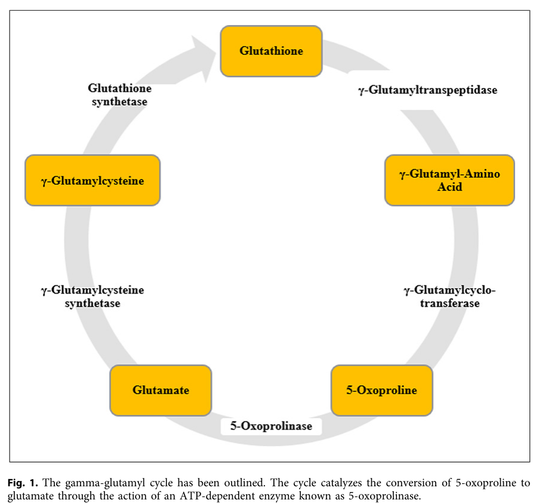

## Question

# Disease Characteristics Research Template

## Target Disease
- **Disease Name:** 5-Oxoprolinase Deficiency
- **MONDO ID:**  (if available)
- **Category:** Mendelian

## Research Objectives

Please provide a comprehensive research report on **5-Oxoprolinase Deficiency** covering all of the
disease characteristics listed below. This report will be used to populate a disease knowledge
base entry. Be thorough and cite primary literature (PMID preferred) for all claims.

For each section, **suggested databases/resources** are listed. These are the first places
you should search for information on each topic.

---

### 1. Disease Information
> **Search first:** OMIM, Orphanet, ICD-10/ICD-11, MeSH, PubMed

- What is the disease? Provide a concise overview.
- What are the key identifiers? (OMIM, Orphanet, ICD-10/ICD-11, MeSH, Mondo)
- What are the common synonyms and alternative names?
- Is the information derived from individual patients (e.g., EHR) or aggregated disease-level resources?

### 2. Etiology

- **Disease Causal Factors**: What are the primary causes? (genetic, environmental, infectious, mechanistic)
- **Risk Factors**:
  > **Search first:** PubMed, Cochrane Library, UpToDate, clinical guidelines, ClinVar, ClinGen, GWAS Catalog, PheGenI, CTD, CDC, WHO, epidemiological databases
  - Genetic risk factors (causal variants, susceptibility loci, modifier genes)
  - Environmental risk factors (toxins, lifestyle, occupational exposures, age, sex, family history)
- **Protective Factors**:
  > **Search first:** PubMed, Cochrane Library, clinical trial databases, GWAS Catalog, gnomAD, WHO, CDC, nutrition databases
  - Genetic protective factors (protective variants, modifier alleles)
  - Environmental protective factors (diet, lifestyle, exposures that reduce risk)
- **Gene-Environment Interactions**: How do genetic and environmental factors interact to influence disease?
  > **Search first:** CTD, PubMed, PheGenI, GxE databases

### 3. Phenotypes
> **Search first:** HPO (Human Phenotype Ontology), OMIM, Orphanet, PubMed, clinicaltrials.gov, MedDRA, SNOMED CT, DECIPHER, LOINC

For each phenotype, provide:
- **Phenotype type**: symptoms, clinical signs, physical manifestations, behavioral changes, or laboratory abnormalities
  > For symptoms/signs: HPO, OMIM, Orphanet, PubMed
  > For behavioral changes: HPO, DSM, RDoC (Research Domain Criteria), PubMed
  > For laboratory abnormalities: LOINC, SNOMED CT, LabTests Online, PubMed
- **Phenotype characteristics**:
  > **Search first:** OMIM, Orphanet, HPO, PubMed
  - Age of symptom onset (neonatal, childhood, adult-onset, late-onset)
  - Symptom severity (mild, moderate, severe, variable)
  - Symptom progression (stable, progressive, episodic, fluctuating)
  - Frequency among affected individuals (percentage or qualitative)
- **Quality of life impact**: Effects on daily functioning and well-being (per-phenotype when possible)
  > **Search first:** EQ-5D database, SF-36, WHO QOL databases, PubMed
- Suggest HPO (Human Phenotype Ontology) terms for each phenotype

### 4. Genetic/Molecular Information

- **Causal Genes**: Gene mutations or chromosomal abnormalities responsible for disease (gene symbols, OMIM IDs)
  > **Search first:** OMIM, ClinVar, HGMD, Ensembl, NCBI Gene
- **Pathogenic Variants**:
  - Affected genes (gene symbols, HGNC IDs)
    > **Search first:** OMIM, NCBI Gene, Ensembl, HGNC, UniProt, GeneCards
  - Variant classification (pathogenic, likely pathogenic, VUS per ACMG/AMP guidelines)
    > **Search first:** ClinVar, ClinGen, ACMG/AMP guidelines, VarSome
  - Variant type/class (missense, frameshift, nonsense, splice-site, structural)
  - Allele frequency in population databases
    > **Search first:** gnomAD, 1000 Genomes, ExAC, TOPMed, dbSNP
  - Somatic vs germline origin
    > **Search first:** COSMIC (somatic), ClinVar, ICGC, TCGA
  - Functional consequences (loss of function, gain of function, dominant negative)
- **Modifier Genes**: Genes that modify disease severity or expression
- **Epigenetic Information**: DNA methylation, histone modifications, chromatin changes affecting disease
  > **Search first:** ENCODE, Roadmap Epigenomics, MethBase, DiseaseMeth
- **Chromosomal Abnormalities**: Large-scale genetic changes (aneuploidy, translocations, inversions)
  > **Search first:** DECIPHER, ClinVar, ECARUCA, UCSC Genome Browser

### 5. Environmental Information

- **Environmental Factors**: Non-genetic contributing factors (toxins, radiation, pollution, occupational exposure)
  > **Search first:** CTD (Comparative Toxicogenomics Database), TOXNET, PubMed, EPA databases
- **Lifestyle Factors**: Behavioral factors (smoking, diet, exercise, alcohol consumption)
  > **Search first:** CDC databases, WHO, PubMed, NHANES
- **Infectious Agents**: If applicable, pathogens causing or triggering disease (bacteria, viruses, fungi, parasites)
  > **Search first:** NCBI Taxonomy, ViPR, BV-BRC, MicrobeDB, GIDEON

### 6. Mechanism / Pathophysiology

- **Molecular Pathways**: Specific signaling cascades or biochemical pathways involved (Wnt, MAPK, mTOR, PI3K-AKT, etc.)
  > **Search first:** KEGG, Reactome, WikiPathways, PathBank, BioCyc
- **Cellular Processes**: Cell-level mechanisms (apoptosis, autophagy, cell cycle dysregulation, inflammation, etc.)
  > **Search first:** Gene Ontology (GO), Reactome, KEGG, PubMed
- **Protein Dysfunction**: How protein structure or function is altered (misfolding, aggregation, loss of function, gain of function)
  > **Search first:** UniProt, PDB (Protein Data Bank), InterPro, Pfam, AlphaFold
- **Metabolic Changes**: Alterations in metabolic processes (energy metabolism, lipid metabolism, amino acid metabolism)
  > **Search first:** KEGG, BioCyc, HMDB (Human Metabolome Database), BRENDA
- **Immune System Involvement**: Role of immune response (autoimmunity, immunodeficiency, chronic inflammation)
  > **Search first:** ImmPort, Immunome Database, IEDB, Gene Ontology
- **Tissue Damage Mechanisms**: How tissues/ are injured (oxidative stress, ischemia, fibrosis, necrosis)
  > **Search first:** PubMed, Gene Ontology, Reactome
- **Biochemical Abnormalities**: Specific molecular defects (enzyme deficiencies, receptor dysfunction, ion channel defects)
  > **Search first:** BRENDA, UniProt, KEGG, OMIM, PubMed
- **Epigenetic Changes**: DNA methylation, histone modifications affecting gene expression in disease
  > **Search first:** ENCODE, Roadmap Epigenomics, MethBase, DiseaseMeth
- **Molecular Profiling** (if available):
  - Transcriptomics/gene expression changes
    > **Search first:** GEO (Gene Expression Omnibus), ArrayExpress, GTEx, Human Cell Atlas, SRA
  - Proteomics findings
    > **Search first:** PRIDE, ProteomeXchange, Human Protein Atlas, STRING, BioGRID
  - Metabolomics signatures
    > **Search first:** MetaboLights, Metabolomics Workbench, HMDB, METLIN
  - Lipidomics alterations
    > **Search first:** LIPID MAPS, SwissLipids, LipidHome, Metabolomics Workbench
  - Genomic structural features
    > **Search first:** UCSC Genome Browser, Ensembl, NCBI, dbVar, DGV
- **Advanced Technologies** (if applicable):
  - Single-cell analysis findings (cell-type specific mechanisms, cellular heterogeneity)
    > **Search first:** Human Cell Atlas, Single Cell Portal, GEO, CELLxGENE
  - Spatial transcriptomics findings
    > **Search first:** GEO, Spatial Research, Vizgen, 10x Genomics data
  - Multi-omics integration results
    > **Search first:** TCGA, ICGC, cBioPortal, LinkedOmics, PubMed
  - Functional genomics screens (CRISPR, RNAi)
    > **Search first:** DepMap, GenomeRNAi, PubMed, BioGRID ORCS

For each mechanism, describe:
- The causal chain from initial trigger to clinical manifestation
- Which mechanisms are upstream vs downstream
- What cell types and biological processes are involved
- Suggest GO terms for biological processes and CL terms for cell types

### 7. Anatomical Structures Affected

- **Organ Level**:
  - Primary organs directly affected
  - Secondary organ involvement (complications, secondary effects)
  - Body systems involved (cardiovascular, nervous, digestive, respiratory, endocrine, etc.)
  > **Search first:** Uberon, FMA (Foundational Model of Anatomy), OMIM, HPO, ICD-11, MeSH, SNOMED CT
- **Tissue and Cell Level**:
  - Specific tissue types affected (epithelial, connective, muscle, nervous)
  - Specific cell populations targeted (with Cell Ontology terms)
  > **Search first:** Uberon, Human Protein Atlas, Cell Ontology, Human Cell Atlas, CellMarker, PanglaoDB
- **Subcellular Level**:
  - Cellular compartments involved (mitochondria, nucleus, ER, lysosomes) (with GO Cellular Component terms)
  > **Search first:** Gene Ontology (Cellular Component), UniProt, Human Protein Atlas
- **Localization**:
  - Specific anatomical sites (with UBERON terms)
    > **Search first:** FMA, Uberon, NeuroNames (for brain), SNOMED CT
  - Lateralization (unilateral, bilateral, asymmetric)
    > **Search first:** HPO, clinical literature, imaging databases

### 8. Temporal Development

- **Onset**:
  - Typical age of onset (congenital, pediatric, adult, geriatric)
  - Onset pattern (acute, subacute, chronic, insidious)
  > **Search first:** OMIM, Orphanet, HPO, PubMed
- **Progression**:
  - Disease stages (early, intermediate, advanced, end-stage)
    > **Search first:** Cancer Staging Manual (AJCC), WHO classifications, PubMed
  - Progression rate (rapid, slow, variable)
  - Disease course pattern (episodic, relapsing-remitting, progressive, stable)
  - Disease duration (self-limited, chronic lifelong)
  > **Search first:** Disease registries, longitudinal cohort databases, natural history studies, PubMed, Orphanet, OMIM
- **Patterns**:
  - Remission patterns (spontaneous, treatment-induced)
    > **Search first:** Clinical trial databases, disease registries, PubMed
  - Critical periods (time windows of vulnerability or opportunity for intervention)
    > **Search first:** PubMed, developmental biology databases, clinical guidelines

### 9. Inheritance and Population

- **Epidemiology**:
  - Prevalence (cases per 100,000 at given time)
  - Incidence (new cases per 100,000 per year)
  > **Search first:** Orphanet, CDC, WHO, GBD (Global Burden of Disease), national registries, SEER, disease registries
- **For Genetic Etiology**:
  - Inheritance pattern (AD, AR, X-linked, mitochondrial, multifactorial, polygenic)
    > **Search first:** OMIM, Orphanet, ClinVar, GTR (Genetic Testing Registry)
  - Penetrance (complete, incomplete, age-dependent)
    > **Search first:** ClinVar, OMIM, PubMed, ClinGen
  - Expressivity (variable, consistent)
    > **Search first:** OMIM, ClinVar, PubMed
  - Genetic anticipation (increasing severity in successive generations)
    > **Search first:** OMIM, PubMed (especially for repeat expansion disorders)
  - Germline mosaicism
    > **Search first:** ClinVar, OMIM, genetic counseling literature, PubMed
  - Founder effects (population-specific mutations)
    > **Search first:** gnomAD, population genetics databases, PubMed
  - Consanguinity role
    > **Search first:** OMIM, population studies, genetic counseling resources
  - Carrier frequency
    > **Search first:** gnomAD, carrier screening databases, GeneReviews, GTR
- **Population Demographics**:
  - Affected populations (ethnic or demographic groups with higher prevalence)
    > **Search first:** gnomAD, 1000 Genomes, PAGE Study, PubMed, population registries
  - Geographic distribution (endemic areas, regional variation)
    > **Search first:** WHO, CDC, GBD, Orphanet, geographic epidemiology databases
  - Geographic distribution of specific variants
  - Sex ratio (male:female)
    > **Search first:** Disease registries, OMIM, PubMed, epidemiological databases
  - Age distribution of affected individuals
    > **Search first:** CDC, disease registries, SEER, Orphanet

### 10. Diagnostics

- **Clinical Tests**:
  - Laboratory tests (blood, urine, tissue chemistry, specific enzyme assays)
    > **Search first:** LOINC, LabTests Online, PubMed
  - Biomarkers (proteins, metabolites, genetic markers, circulating biomarkers)
    > **Search first:** FDA Biomarker List, BEST (Biomarkers, EndpointS, and other Tools), PubMed
  - Imaging studies (X-ray, CT, MRI, PET, ultrasound)
    > **Search first:** RadLex, DICOM, Radiopaedia, imaging databases
  - Functional tests (pulmonary function, cardiac stress tests)
    > **Search first:** LOINC, clinical guidelines, PubMed
  - Electrophysiology (EEG, EMG, ECG, nerve conduction studies)
    > **Search first:** LOINC, clinical neurophysiology databases, PubMed
  - Biopsy findings (histopathology, immunohistochemistry)
    > **Search first:** SNOMED CT, College of American Pathologists resources, PubMed
  - Pathology findings (microscopic examination)
    > **Search first:** SNOMED CT, Digital Pathology databases, PubMed
- **Genetic Testing**:
  > **Search first:** GTR (Genetic Testing Registry), GeneReviews, ClinGen
  - Overview of recommended genetic testing approach
  - Whole genome sequencing (WGS) utility
    > **Search first:** GTR, ClinVar, GEL (Genomics England), gnomAD
  - Whole exome sequencing (WES) utility
    > **Search first:** GTR, ClinVar, OMIM, GeneMatcher
  - Gene panels (which panels, which genes)
    > **Search first:** GTR, ClinVar, laboratory-specific databases
  - Single gene testing
    > **Search first:** GTR, ClinVar, OMIM, GeneReviews
  - Chromosomal microarray (CMA)
    > **Search first:** DECIPHER, ClinVar, dbVar, ECARUCA
  - Karyotyping
    > **Search first:** Chromosome Abnormality Database, ClinVar, cytogenetics resources
  - FISH
    > **Search first:** ClinVar, cytogenetics databases, PubMed
  - Mitochondrial DNA testing
    > **Search first:** MITOMAP, MSeqDR, ClinVar, GTR
  - Repeat expansion testing
    > **Search first:** GTR, ClinVar, repeat expansion databases, PubMed
- **Omics-Based Diagnostics** (if applicable):
  - RNA sequencing / transcriptomics
    > **Search first:** GEO, ArrayExpress, GTEx, RNA-seq databases
  - Proteomics
    > **Search first:** PRIDE, ProteomeXchange, FDA Biomarker database
  - Metabolomics
    > **Search first:** MetaboLights, Metabolomics Workbench, HMDB
  - Epigenomics
    > **Search first:** GEO, ENCODE, Roadmap Epigenomics, MethBase
  - Liquid biopsy
    > **Search first:** COSMIC, ClinVar, liquid biopsy databases, PubMed
- **Clinical Criteria**:
  - Standardized diagnostic criteria (DSM, ICD, society guidelines)
    > **Search first:** DSM-5, ICD-11, clinical society guidelines, UpToDate
  - Differential diagnosis (other conditions to rule out, with distinguishing features)
    > **Search first:** DynaMed, UpToDate, clinical decision support systems
- **Screening**:
  - Screening methods for asymptomatic individuals (newborn screening, carrier screening, cascade screening)
    > **Search first:** ACMG recommendations, CDC newborn screening, GTR

### 11. Outcome/Prognosis

- **Survival and Mortality**:
  - Survival rate (5-year, 10-year, overall)
    > **Search first:** SEER, cancer registries, disease-specific registries, PubMed
  - Life expectancy (with and without treatment if applicable)
    > **Search first:** Orphanet, disease registries, actuarial databases, PubMed
  - Mortality rate
    > **Search first:** CDC, WHO, GBD, national mortality databases
  - Disease-specific mortality (deaths directly attributable to disease)
    > **Search first:** Disease registries, CDC Wonder, GBD, PubMed
- **Morbidity and Function**:
  - Morbidity (disease-related disability and health impacts)
    > **Search first:** GBD, WHO, disability databases, PubMed
  - Disability outcomes (long-term functional impairments)
    > **Search first:** ICF (International Classification of Functioning), disability registries
  - Quality of life measures (EQ-5D, SF-36, PROMIS, disease-specific tools)
    > **Search first:** EQ-5D database, SF-36, PROMIS, PubMed
- **Disease Course**:
  - Complications (secondary problems: infections, organ failure, etc.)
    > **Search first:** ICD codes, disease registries, clinical databases, PubMed
  - Recovery potential (likelihood and extent of recovery, with vs without treatment)
    > **Search first:** Natural history studies, rehabilitation databases, PubMed
- **Prediction**:
  - Prognostic factors (age, disease severity, biomarkers, treatment response)
    > **Search first:** Prognostic models databases, clinical calculators, PubMed
  - Prognostic biomarkers (molecular markers predicting disease course)
    > **Search first:** FDA Biomarker database, PubMed, cancer prognostic databases

### 12. Treatment

- **Pharmacotherapy**:
  - Pharmacological treatments (drug names, drug classes, mechanisms of action)
    > **Search first:** DrugBank, RxNorm, ATC classification, DailyMed, FDA databases
  - Pharmacogenomics (how genetic variants affect drug metabolism, efficacy, toxicity)
    > **Search first:** PharmGKB, CPIC (Clinical Pharmacogenetics), FDA Table of PGx Biomarkers
- **Advanced Therapeutics**:
  - Gene therapy (viral vectors, CRISPR, gene replacement, gene editing)
    > **Search first:** ClinicalTrials.gov, FDA gene therapy database, ASGCT resources
  - Cell therapy (stem cell transplant, CAR-T, cellular therapeutics)
    > **Search first:** ClinicalTrials.gov, FDA cell therapy database, FACT standards
  - RNA-based therapies (ASOs, siRNA, mRNA therapies)
    > **Search first:** ClinicalTrials.gov, FDA approvals, PubMed
  - Targeted therapies (treatments directed at specific molecular targets)
    > **Search first:** My Cancer Genome, OncoKB, ClinicalTrials.gov, FDA approvals
  - Immunotherapies (checkpoint inhibitors, monoclonal antibodies)
    > **Search first:** Cancer Immunotherapy Database, FDA approvals, ClinicalTrials.gov
- **Surgical and Interventional**:
  - Surgical interventions (types of surgery, timing, outcomes)
    > **Search first:** CPT codes, surgical registries, clinical guidelines, PubMed
- **Supportive and Rehabilitative**:
  - Supportive care (symptom management, pain control, nutrition)
    > **Search first:** Clinical guidelines, Cochrane Library, PubMed
  - Rehabilitation (physical therapy, occupational therapy, speech therapy)
    > **Search first:** Rehabilitation medicine databases, clinical guidelines, PubMed
- **Experimental**:
  - Experimental treatments in clinical trials (with NCT identifiers if available)
    > **Search first:** ClinicalTrials.gov, EU Clinical Trials Register, WHO ICTRP
- **Treatment Outcomes**:
  - Treatment response rates
    > **Search first:** Clinical trial databases, FDA reviews, systematic reviews, PubMed
  - Side effects and adverse events
    > **Search first:** FDA Adverse Event Reporting System (FAERS), MedWatch, PubMed
- **Treatment Strategy**:
  - Treatment algorithms (clinical pathways, decision trees)
    > **Search first:** Clinical practice guidelines, NCCN Guidelines, UpToDate
  - Combination therapies
    > **Search first:** ClinicalTrials.gov, treatment guidelines, PubMed
  - Personalized medicine approaches (genotype-guided treatment)
    > **Search first:** My Cancer Genome, CIViC, PharmGKB, precision medicine databases

For each treatment, suggest MAXO (Medical Action Ontology) terms where applicable.

### 13. Prevention

- **Prevention Levels**:
  - Primary prevention (preventing disease occurrence: vaccination, risk factor modification)
    > **Search first:** CDC, WHO, USPSTF recommendations, Cochrane Library
  - Secondary prevention (early detection and treatment: screening programs, early intervention)
    > **Search first:** USPSTF, CDC screening guidelines, WHO
  - Tertiary prevention (preventing complications in those with disease)
    > **Search first:** Clinical guidelines, disease management protocols, PubMed
- **Immunization**: Vaccine strategies (if applicable)
  > **Search first:** CDC vaccine schedules, WHO immunization, FDA vaccine database
- **Screening and Early Detection**:
  - Screening programs (population-based: newborn screening, cancer screening)
    > **Search first:** CDC screening programs, USPSTF, cancer screening databases
  - Genetic screening (carrier screening, preimplantation genetic diagnosis, prenatal testing)
    > **Search first:** ACMG recommendations, ACOG guidelines, GTR
  - Risk stratification (identifying high-risk individuals for targeted prevention)
    > **Search first:** Risk prediction models, clinical calculators, PubMed
- **Behavioral Interventions**: Lifestyle modifications to reduce risk
  > **Search first:** CDC, WHO, behavioral intervention databases, Cochrane Library
- **Counseling**: Genetic counseling (risk assessment, family planning guidance)
  > **Search first:** NSGC resources, ACMG guidelines, GeneReviews
- **Public Health**:
  - Public health interventions (sanitation, vector control, health education)
    > **Search first:** CDC, WHO, public health databases, PubMed
  - Environmental interventions (reducing environmental risk factors)
    > **Search first:** EPA databases, WHO environmental health, PubMed
- **Prophylaxis**: Preventive medications or procedures
  > **Search first:** Clinical guidelines, FDA approvals, PubMed

### 14. Other Species / Natural Disease

- **Taxonomy**: Species affected (with NCBI Taxon identifiers)
  > **Search first:** NCBI Taxonomy
- **Breed**: Specific breeds affected (with VBO identifiers if applicable)
  > **Search first:** VBO (Vertebrate Breed Ontology)
- **Gene**: Orthologous genes in other species (with NCBI Gene IDs)
  > **Search first:** NCBI Gene
- **Natural Disease**:
  - Naturally occurring disease in other species (companion animals, wildlife)
    > **Search first:** OMIA (Online Mendelian Inheritance in Animals), VetCompass, PubMed
  - Veterinary relevance and importance in animal health
    > **Search first:** OMIA, veterinary databases, PubMed
- **Comparative Biology**:
  - Comparative pathology (similarities and differences across species)
    > **Search first:** OMIA, comparative pathology databases, PubMed
  - Evolutionary conservation of disease mechanisms
    > **Search first:** HomoloGene, OrthoMCL, Alliance of Genome Resources
- **Transmission** (if applicable):
  - Zoonotic potential
    > **Search first:** CDC zoonotic diseases, WHO zoonoses, GIDEON
  - Cross-species susceptibility
    > **Search first:** NCBI Taxonomy, veterinary databases, PubMed

### 15. Model Organisms

- **Model Types**:
  - Model organism type (mammalian, invertebrate, cellular, in vitro)
    > **Search first:** Alliance of Genome Resources, model organism databases
  - Specific model systems (mouse, rat, zebrafish, Drosophila, C. elegans, yeast, cell lines, organoids, iPSCs)
    > **Search first:** MGI, RGD, ZFIN, FlyBase, WormBase, SGD, ATCC, Cellosaurus
  - Induced models (drug treatment, surgical intervention, environmental manipulation)
    > **Search first:** MGI, model organism databases, PubMed
- **Genetic Models**:
  - Types available (knockout, knock-in, transgenic, conditional, humanized)
    > **Search first:** MGI, IMPC, KOMP, EuMMCR, IMSR
- **Model Characteristics**:
  - Phenotype recapitulation (how well model reproduces human disease features)
    > **Search first:** Model organism databases, comparative studies, PubMed
  - Model limitations (aspects of human disease not captured)
    > **Search first:** Model organism databases, PubMed, review articles
- **Applications**:
  - Research applications (what aspects of disease can be studied)
    > **Search first:** Model organism databases, PubMed
- **Resources**:
  - Model databases
    > **Search first:** MGI, RGD, ZFIN, FlyBase, WormBase, IMSR, EMMA, MMRRC

---

## Citation Requirements

- Cite primary literature (PMID preferred) for all mechanistic and clinical claims
- Prioritize recent reviews and landmark papers
- Include direct quotes from abstracts where possible to support key statements
- Distinguish evidence source types: human clinical, model organism, in vitro, computational

## Output Format

Structure your response as a comprehensive narrative organized by the sections above.
For each section, provide:
- Factual content with specific details (numbers, percentages, gene names, variant nomenclature)
- Ontology term suggestions (HPO, GO, CL, UBERON, CHEBI, MAXO, MONDO) where applicable
- Evidence citations with PMIDs
- Direct quotes from abstracts to support key claims
- Clear indication when information is not available or not applicable for this disease

This report will be used to populate a disease knowledge base entry with:
- Pathophysiology descriptions with causal chains
- Gene/protein annotations (HGNC, GO terms)
- Phenotype associations (HP terms) with frequencies
- Cell type involvement (CL terms)
- Anatomical locations (UBERON terms)
- Chemical entities (CHEBI terms)
- Treatment annotations (MAXO terms)
- Evidence items with PMIDs and exact abstract quotes
- Epidemiology, prognosis, diagnostic, and prevention information
- Animal model descriptions with phenotype recapitulation details

## Output

Question: You are an expert researcher providing comprehensive, well-cited information.

Provide detailed information focusing on:
1. Key concepts and definitions with current understanding
2. Recent developments and latest research (prioritize 2023-2024 sources)
3. Current applications and real-world implementations
4. Expert opinions and analysis from authoritative sources
5. Relevant statistics and data from recent studies

Format as a comprehensive research report with proper citations. Include URLs and publication dates where available.
Always prioritize recent, authoritative sources and provide specific citations for all major claims.

# Disease Characteristics Research Template

## Target Disease
- **Disease Name:** 5-Oxoprolinase Deficiency
- **MONDO ID:**  (if available)
- **Category:** Mendelian

## Research Objectives

Please provide a comprehensive research report on **5-Oxoprolinase Deficiency** covering all of the
disease characteristics listed below. This report will be used to populate a disease knowledge
base entry. Be thorough and cite primary literature (PMID preferred) for all claims.

For each section, **suggested databases/resources** are listed. These are the first places
you should search for information on each topic.

---

### 1. Disease Information
> **Search first:** OMIM, Orphanet, ICD-10/ICD-11, MeSH, PubMed

- What is the disease? Provide a concise overview.
- What are the key identifiers? (OMIM, Orphanet, ICD-10/ICD-11, MeSH, Mondo)
- What are the common synonyms and alternative names?
- Is the information derived from individual patients (e.g., EHR) or aggregated disease-level resources?

### 2. Etiology

- **Disease Causal Factors**: What are the primary causes? (genetic, environmental, infectious, mechanistic)
- **Risk Factors**:
  > **Search first:** PubMed, Cochrane Library, UpToDate, clinical guidelines, ClinVar, ClinGen, GWAS Catalog, PheGenI, CTD, CDC, WHO, epidemiological databases
  - Genetic risk factors (causal variants, susceptibility loci, modifier genes)
  - Environmental risk factors (toxins, lifestyle, occupational exposures, age, sex, family history)
- **Protective Factors**:
  > **Search first:** PubMed, Cochrane Library, clinical trial databases, GWAS Catalog, gnomAD, WHO, CDC, nutrition databases
  - Genetic protective factors (protective variants, modifier alleles)
  - Environmental protective factors (diet, lifestyle, exposures that reduce risk)
- **Gene-Environment Interactions**: How do genetic and environmental factors interact to influence disease?
  > **Search first:** CTD, PubMed, PheGenI, GxE databases

### 3. Phenotypes
> **Search first:** HPO (Human Phenotype Ontology), OMIM, Orphanet, PubMed, clinicaltrials.gov, MedDRA, SNOMED CT, DECIPHER, LOINC

For each phenotype, provide:
- **Phenotype type**: symptoms, clinical signs, physical manifestations, behavioral changes, or laboratory abnormalities
  > For symptoms/signs: HPO, OMIM, Orphanet, PubMed
  > For behavioral changes: HPO, DSM, RDoC (Research Domain Criteria), PubMed
  > For laboratory abnormalities: LOINC, SNOMED CT, LabTests Online, PubMed
- **Phenotype characteristics**:
  > **Search first:** OMIM, Orphanet, HPO, PubMed
  - Age of symptom onset (neonatal, childhood, adult-onset, late-onset)
  - Symptom severity (mild, moderate, severe, variable)
  - Symptom progression (stable, progressive, episodic, fluctuating)
  - Frequency among affected individuals (percentage or qualitative)
- **Quality of life impact**: Effects on daily functioning and well-being (per-phenotype when possible)
  > **Search first:** EQ-5D database, SF-36, WHO QOL databases, PubMed
- Suggest HPO (Human Phenotype Ontology) terms for each phenotype

### 4. Genetic/Molecular Information

- **Causal Genes**: Gene mutations or chromosomal abnormalities responsible for disease (gene symbols, OMIM IDs)
  > **Search first:** OMIM, ClinVar, HGMD, Ensembl, NCBI Gene
- **Pathogenic Variants**:
  - Affected genes (gene symbols, HGNC IDs)
    > **Search first:** OMIM, NCBI Gene, Ensembl, HGNC, UniProt, GeneCards
  - Variant classification (pathogenic, likely pathogenic, VUS per ACMG/AMP guidelines)
    > **Search first:** ClinVar, ClinGen, ACMG/AMP guidelines, VarSome
  - Variant type/class (missense, frameshift, nonsense, splice-site, structural)
  - Allele frequency in population databases
    > **Search first:** gnomAD, 1000 Genomes, ExAC, TOPMed, dbSNP
  - Somatic vs germline origin
    > **Search first:** COSMIC (somatic), ClinVar, ICGC, TCGA
  - Functional consequences (loss of function, gain of function, dominant negative)
- **Modifier Genes**: Genes that modify disease severity or expression
- **Epigenetic Information**: DNA methylation, histone modifications, chromatin changes affecting disease
  > **Search first:** ENCODE, Roadmap Epigenomics, MethBase, DiseaseMeth
- **Chromosomal Abnormalities**: Large-scale genetic changes (aneuploidy, translocations, inversions)
  > **Search first:** DECIPHER, ClinVar, ECARUCA, UCSC Genome Browser

### 5. Environmental Information

- **Environmental Factors**: Non-genetic contributing factors (toxins, radiation, pollution, occupational exposure)
  > **Search first:** CTD (Comparative Toxicogenomics Database), TOXNET, PubMed, EPA databases
- **Lifestyle Factors**: Behavioral factors (smoking, diet, exercise, alcohol consumption)
  > **Search first:** CDC databases, WHO, PubMed, NHANES
- **Infectious Agents**: If applicable, pathogens causing or triggering disease (bacteria, viruses, fungi, parasites)
  > **Search first:** NCBI Taxonomy, ViPR, BV-BRC, MicrobeDB, GIDEON

### 6. Mechanism / Pathophysiology

- **Molecular Pathways**: Specific signaling cascades or biochemical pathways involved (Wnt, MAPK, mTOR, PI3K-AKT, etc.)
  > **Search first:** KEGG, Reactome, WikiPathways, PathBank, BioCyc
- **Cellular Processes**: Cell-level mechanisms (apoptosis, autophagy, cell cycle dysregulation, inflammation, etc.)
  > **Search first:** Gene Ontology (GO), Reactome, KEGG, PubMed
- **Protein Dysfunction**: How protein structure or function is altered (misfolding, aggregation, loss of function, gain of function)
  > **Search first:** UniProt, PDB (Protein Data Bank), InterPro, Pfam, AlphaFold
- **Metabolic Changes**: Alterations in metabolic processes (energy metabolism, lipid metabolism, amino acid metabolism)
  > **Search first:** KEGG, BioCyc, HMDB (Human Metabolome Database), BRENDA
- **Immune System Involvement**: Role of immune response (autoimmunity, immunodeficiency, chronic inflammation)
  > **Search first:** ImmPort, Immunome Database, IEDB, Gene Ontology
- **Tissue Damage Mechanisms**: How tissues/ are injured (oxidative stress, ischemia, fibrosis, necrosis)
  > **Search first:** PubMed, Gene Ontology, Reactome
- **Biochemical Abnormalities**: Specific molecular defects (enzyme deficiencies, receptor dysfunction, ion channel defects)
  > **Search first:** BRENDA, UniProt, KEGG, OMIM, PubMed
- **Epigenetic Changes**: DNA methylation, histone modifications affecting gene expression in disease
  > **Search first:** ENCODE, Roadmap Epigenomics, MethBase, DiseaseMeth
- **Molecular Profiling** (if available):
  - Transcriptomics/gene expression changes
    > **Search first:** GEO (Gene Expression Omnibus), ArrayExpress, GTEx, Human Cell Atlas, SRA
  - Proteomics findings
    > **Search first:** PRIDE, ProteomeXchange, Human Protein Atlas, STRING, BioGRID
  - Metabolomics signatures
    > **Search first:** MetaboLights, Metabolomics Workbench, HMDB, METLIN
  - Lipidomics alterations
    > **Search first:** LIPID MAPS, SwissLipids, LipidHome, Metabolomics Workbench
  - Genomic structural features
    > **Search first:** UCSC Genome Browser, Ensembl, NCBI, dbVar, DGV
- **Advanced Technologies** (if applicable):
  - Single-cell analysis findings (cell-type specific mechanisms, cellular heterogeneity)
    > **Search first:** Human Cell Atlas, Single Cell Portal, GEO, CELLxGENE
  - Spatial transcriptomics findings
    > **Search first:** GEO, Spatial Research, Vizgen, 10x Genomics data
  - Multi-omics integration results
    > **Search first:** TCGA, ICGC, cBioPortal, LinkedOmics, PubMed
  - Functional genomics screens (CRISPR, RNAi)
    > **Search first:** DepMap, GenomeRNAi, PubMed, BioGRID ORCS

For each mechanism, describe:
- The causal chain from initial trigger to clinical manifestation
- Which mechanisms are upstream vs downstream
- What cell types and biological processes are involved
- Suggest GO terms for biological processes and CL terms for cell types

### 7. Anatomical Structures Affected

- **Organ Level**:
  - Primary organs directly affected
  - Secondary organ involvement (complications, secondary effects)
  - Body systems involved (cardiovascular, nervous, digestive, respiratory, endocrine, etc.)
  > **Search first:** Uberon, FMA (Foundational Model of Anatomy), OMIM, HPO, ICD-11, MeSH, SNOMED CT
- **Tissue and Cell Level**:
  - Specific tissue types affected (epithelial, connective, muscle, nervous)
  - Specific cell populations targeted (with Cell Ontology terms)
  > **Search first:** Uberon, Human Protein Atlas, Cell Ontology, Human Cell Atlas, CellMarker, PanglaoDB
- **Subcellular Level**:
  - Cellular compartments involved (mitochondria, nucleus, ER, lysosomes) (with GO Cellular Component terms)
  > **Search first:** Gene Ontology (Cellular Component), UniProt, Human Protein Atlas
- **Localization**:
  - Specific anatomical sites (with UBERON terms)
    > **Search first:** FMA, Uberon, NeuroNames (for brain), SNOMED CT
  - Lateralization (unilateral, bilateral, asymmetric)
    > **Search first:** HPO, clinical literature, imaging databases

### 8. Temporal Development

- **Onset**:
  - Typical age of onset (congenital, pediatric, adult, geriatric)
  - Onset pattern (acute, subacute, chronic, insidious)
  > **Search first:** OMIM, Orphanet, HPO, PubMed
- **Progression**:
  - Disease stages (early, intermediate, advanced, end-stage)
    > **Search first:** Cancer Staging Manual (AJCC), WHO classifications, PubMed
  - Progression rate (rapid, slow, variable)
  - Disease course pattern (episodic, relapsing-remitting, progressive, stable)
  - Disease duration (self-limited, chronic lifelong)
  > **Search first:** Disease registries, longitudinal cohort databases, natural history studies, PubMed, Orphanet, OMIM
- **Patterns**:
  - Remission patterns (spontaneous, treatment-induced)
    > **Search first:** Clinical trial databases, disease registries, PubMed
  - Critical periods (time windows of vulnerability or opportunity for intervention)
    > **Search first:** PubMed, developmental biology databases, clinical guidelines

### 9. Inheritance and Population

- **Epidemiology**:
  - Prevalence (cases per 100,000 at given time)
  - Incidence (new cases per 100,000 per year)
  > **Search first:** Orphanet, CDC, WHO, GBD (Global Burden of Disease), national registries, SEER, disease registries
- **For Genetic Etiology**:
  - Inheritance pattern (AD, AR, X-linked, mitochondrial, multifactorial, polygenic)
    > **Search first:** OMIM, Orphanet, ClinVar, GTR (Genetic Testing Registry)
  - Penetrance (complete, incomplete, age-dependent)
    > **Search first:** ClinVar, OMIM, PubMed, ClinGen
  - Expressivity (variable, consistent)
    > **Search first:** OMIM, ClinVar, PubMed
  - Genetic anticipation (increasing severity in successive generations)
    > **Search first:** OMIM, PubMed (especially for repeat expansion disorders)
  - Germline mosaicism
    > **Search first:** ClinVar, OMIM, genetic counseling literature, PubMed
  - Founder effects (population-specific mutations)
    > **Search first:** gnomAD, population genetics databases, PubMed
  - Consanguinity role
    > **Search first:** OMIM, population studies, genetic counseling resources
  - Carrier frequency
    > **Search first:** gnomAD, carrier screening databases, GeneReviews, GTR
- **Population Demographics**:
  - Affected populations (ethnic or demographic groups with higher prevalence)
    > **Search first:** gnomAD, 1000 Genomes, PAGE Study, PubMed, population registries
  - Geographic distribution (endemic areas, regional variation)
    > **Search first:** WHO, CDC, GBD, Orphanet, geographic epidemiology databases
  - Geographic distribution of specific variants
  - Sex ratio (male:female)
    > **Search first:** Disease registries, OMIM, PubMed, epidemiological databases
  - Age distribution of affected individuals
    > **Search first:** CDC, disease registries, SEER, Orphanet

### 10. Diagnostics

- **Clinical Tests**:
  - Laboratory tests (blood, urine, tissue chemistry, specific enzyme assays)
    > **Search first:** LOINC, LabTests Online, PubMed
  - Biomarkers (proteins, metabolites, genetic markers, circulating biomarkers)
    > **Search first:** FDA Biomarker List, BEST (Biomarkers, EndpointS, and other Tools), PubMed
  - Imaging studies (X-ray, CT, MRI, PET, ultrasound)
    > **Search first:** RadLex, DICOM, Radiopaedia, imaging databases
  - Functional tests (pulmonary function, cardiac stress tests)
    > **Search first:** LOINC, clinical guidelines, PubMed
  - Electrophysiology (EEG, EMG, ECG, nerve conduction studies)
    > **Search first:** LOINC, clinical neurophysiology databases, PubMed
  - Biopsy findings (histopathology, immunohistochemistry)
    > **Search first:** SNOMED CT, College of American Pathologists resources, PubMed
  - Pathology findings (microscopic examination)
    > **Search first:** SNOMED CT, Digital Pathology databases, PubMed
- **Genetic Testing**:
  > **Search first:** GTR (Genetic Testing Registry), GeneReviews, ClinGen
  - Overview of recommended genetic testing approach
  - Whole genome sequencing (WGS) utility
    > **Search first:** GTR, ClinVar, GEL (Genomics England), gnomAD
  - Whole exome sequencing (WES) utility
    > **Search first:** GTR, ClinVar, OMIM, GeneMatcher
  - Gene panels (which panels, which genes)
    > **Search first:** GTR, ClinVar, laboratory-specific databases
  - Single gene testing
    > **Search first:** GTR, ClinVar, OMIM, GeneReviews
  - Chromosomal microarray (CMA)
    > **Search first:** DECIPHER, ClinVar, dbVar, ECARUCA
  - Karyotyping
    > **Search first:** Chromosome Abnormality Database, ClinVar, cytogenetics resources
  - FISH
    > **Search first:** ClinVar, cytogenetics databases, PubMed
  - Mitochondrial DNA testing
    > **Search first:** MITOMAP, MSeqDR, ClinVar, GTR
  - Repeat expansion testing
    > **Search first:** GTR, ClinVar, repeat expansion databases, PubMed
- **Omics-Based Diagnostics** (if applicable):
  - RNA sequencing / transcriptomics
    > **Search first:** GEO, ArrayExpress, GTEx, RNA-seq databases
  - Proteomics
    > **Search first:** PRIDE, ProteomeXchange, FDA Biomarker database
  - Metabolomics
    > **Search first:** MetaboLights, Metabolomics Workbench, HMDB
  - Epigenomics
    > **Search first:** GEO, ENCODE, Roadmap Epigenomics, MethBase
  - Liquid biopsy
    > **Search first:** COSMIC, ClinVar, liquid biopsy databases, PubMed
- **Clinical Criteria**:
  - Standardized diagnostic criteria (DSM, ICD, society guidelines)
    > **Search first:** DSM-5, ICD-11, clinical society guidelines, UpToDate
  - Differential diagnosis (other conditions to rule out, with distinguishing features)
    > **Search first:** DynaMed, UpToDate, clinical decision support systems
- **Screening**:
  - Screening methods for asymptomatic individuals (newborn screening, carrier screening, cascade screening)
    > **Search first:** ACMG recommendations, CDC newborn screening, GTR

### 11. Outcome/Prognosis

- **Survival and Mortality**:
  - Survival rate (5-year, 10-year, overall)
    > **Search first:** SEER, cancer registries, disease-specific registries, PubMed
  - Life expectancy (with and without treatment if applicable)
    > **Search first:** Orphanet, disease registries, actuarial databases, PubMed
  - Mortality rate
    > **Search first:** CDC, WHO, GBD, national mortality databases
  - Disease-specific mortality (deaths directly attributable to disease)
    > **Search first:** Disease registries, CDC Wonder, GBD, PubMed
- **Morbidity and Function**:
  - Morbidity (disease-related disability and health impacts)
    > **Search first:** GBD, WHO, disability databases, PubMed
  - Disability outcomes (long-term functional impairments)
    > **Search first:** ICF (International Classification of Functioning), disability registries
  - Quality of life measures (EQ-5D, SF-36, PROMIS, disease-specific tools)
    > **Search first:** EQ-5D database, SF-36, PROMIS, PubMed
- **Disease Course**:
  - Complications (secondary problems: infections, organ failure, etc.)
    > **Search first:** ICD codes, disease registries, clinical databases, PubMed
  - Recovery potential (likelihood and extent of recovery, with vs without treatment)
    > **Search first:** Natural history studies, rehabilitation databases, PubMed
- **Prediction**:
  - Prognostic factors (age, disease severity, biomarkers, treatment response)
    > **Search first:** Prognostic models databases, clinical calculators, PubMed
  - Prognostic biomarkers (molecular markers predicting disease course)
    > **Search first:** FDA Biomarker database, PubMed, cancer prognostic databases

### 12. Treatment

- **Pharmacotherapy**:
  - Pharmacological treatments (drug names, drug classes, mechanisms of action)
    > **Search first:** DrugBank, RxNorm, ATC classification, DailyMed, FDA databases
  - Pharmacogenomics (how genetic variants affect drug metabolism, efficacy, toxicity)
    > **Search first:** PharmGKB, CPIC (Clinical Pharmacogenetics), FDA Table of PGx Biomarkers
- **Advanced Therapeutics**:
  - Gene therapy (viral vectors, CRISPR, gene replacement, gene editing)
    > **Search first:** ClinicalTrials.gov, FDA gene therapy database, ASGCT resources
  - Cell therapy (stem cell transplant, CAR-T, cellular therapeutics)
    > **Search first:** ClinicalTrials.gov, FDA cell therapy database, FACT standards
  - RNA-based therapies (ASOs, siRNA, mRNA therapies)
    > **Search first:** ClinicalTrials.gov, FDA approvals, PubMed
  - Targeted therapies (treatments directed at specific molecular targets)
    > **Search first:** My Cancer Genome, OncoKB, ClinicalTrials.gov, FDA approvals
  - Immunotherapies (checkpoint inhibitors, monoclonal antibodies)
    > **Search first:** Cancer Immunotherapy Database, FDA approvals, ClinicalTrials.gov
- **Surgical and Interventional**:
  - Surgical interventions (types of surgery, timing, outcomes)
    > **Search first:** CPT codes, surgical registries, clinical guidelines, PubMed
- **Supportive and Rehabilitative**:
  - Supportive care (symptom management, pain control, nutrition)
    > **Search first:** Clinical guidelines, Cochrane Library, PubMed
  - Rehabilitation (physical therapy, occupational therapy, speech therapy)
    > **Search first:** Rehabilitation medicine databases, clinical guidelines, PubMed
- **Experimental**:
  - Experimental treatments in clinical trials (with NCT identifiers if available)
    > **Search first:** ClinicalTrials.gov, EU Clinical Trials Register, WHO ICTRP
- **Treatment Outcomes**:
  - Treatment response rates
    > **Search first:** Clinical trial databases, FDA reviews, systematic reviews, PubMed
  - Side effects and adverse events
    > **Search first:** FDA Adverse Event Reporting System (FAERS), MedWatch, PubMed
- **Treatment Strategy**:
  - Treatment algorithms (clinical pathways, decision trees)
    > **Search first:** Clinical practice guidelines, NCCN Guidelines, UpToDate
  - Combination therapies
    > **Search first:** ClinicalTrials.gov, treatment guidelines, PubMed
  - Personalized medicine approaches (genotype-guided treatment)
    > **Search first:** My Cancer Genome, CIViC, PharmGKB, precision medicine databases

For each treatment, suggest MAXO (Medical Action Ontology) terms where applicable.

### 13. Prevention

- **Prevention Levels**:
  - Primary prevention (preventing disease occurrence: vaccination, risk factor modification)
    > **Search first:** CDC, WHO, USPSTF recommendations, Cochrane Library
  - Secondary prevention (early detection and treatment: screening programs, early intervention)
    > **Search first:** USPSTF, CDC screening guidelines, WHO
  - Tertiary prevention (preventing complications in those with disease)
    > **Search first:** Clinical guidelines, disease management protocols, PubMed
- **Immunization**: Vaccine strategies (if applicable)
  > **Search first:** CDC vaccine schedules, WHO immunization, FDA vaccine database
- **Screening and Early Detection**:
  - Screening programs (population-based: newborn screening, cancer screening)
    > **Search first:** CDC screening programs, USPSTF, cancer screening databases
  - Genetic screening (carrier screening, preimplantation genetic diagnosis, prenatal testing)
    > **Search first:** ACMG recommendations, ACOG guidelines, GTR
  - Risk stratification (identifying high-risk individuals for targeted prevention)
    > **Search first:** Risk prediction models, clinical calculators, PubMed
- **Behavioral Interventions**: Lifestyle modifications to reduce risk
  > **Search first:** CDC, WHO, behavioral intervention databases, Cochrane Library
- **Counseling**: Genetic counseling (risk assessment, family planning guidance)
  > **Search first:** NSGC resources, ACMG guidelines, GeneReviews
- **Public Health**:
  - Public health interventions (sanitation, vector control, health education)
    > **Search first:** CDC, WHO, public health databases, PubMed
  - Environmental interventions (reducing environmental risk factors)
    > **Search first:** EPA databases, WHO environmental health, PubMed
- **Prophylaxis**: Preventive medications or procedures
  > **Search first:** Clinical guidelines, FDA approvals, PubMed

### 14. Other Species / Natural Disease

- **Taxonomy**: Species affected (with NCBI Taxon identifiers)
  > **Search first:** NCBI Taxonomy
- **Breed**: Specific breeds affected (with VBO identifiers if applicable)
  > **Search first:** VBO (Vertebrate Breed Ontology)
- **Gene**: Orthologous genes in other species (with NCBI Gene IDs)
  > **Search first:** NCBI Gene
- **Natural Disease**:
  - Naturally occurring disease in other species (companion animals, wildlife)
    > **Search first:** OMIA (Online Mendelian Inheritance in Animals), VetCompass, PubMed
  - Veterinary relevance and importance in animal health
    > **Search first:** OMIA, veterinary databases, PubMed
- **Comparative Biology**:
  - Comparative pathology (similarities and differences across species)
    > **Search first:** OMIA, comparative pathology databases, PubMed
  - Evolutionary conservation of disease mechanisms
    > **Search first:** HomoloGene, OrthoMCL, Alliance of Genome Resources
- **Transmission** (if applicable):
  - Zoonotic potential
    > **Search first:** CDC zoonotic diseases, WHO zoonoses, GIDEON
  - Cross-species susceptibility
    > **Search first:** NCBI Taxonomy, veterinary databases, PubMed

### 15. Model Organisms

- **Model Types**:
  - Model organism type (mammalian, invertebrate, cellular, in vitro)
    > **Search first:** Alliance of Genome Resources, model organism databases
  - Specific model systems (mouse, rat, zebrafish, Drosophila, C. elegans, yeast, cell lines, organoids, iPSCs)
    > **Search first:** MGI, RGD, ZFIN, FlyBase, WormBase, SGD, ATCC, Cellosaurus
  - Induced models (drug treatment, surgical intervention, environmental manipulation)
    > **Search first:** MGI, model organism databases, PubMed
- **Genetic Models**:
  - Types available (knockout, knock-in, transgenic, conditional, humanized)
    > **Search first:** MGI, IMPC, KOMP, EuMMCR, IMSR
- **Model Characteristics**:
  - Phenotype recapitulation (how well model reproduces human disease features)
    > **Search first:** Model organism databases, comparative studies, PubMed
  - Model limitations (aspects of human disease not captured)
    > **Search first:** Model organism databases, PubMed, review articles
- **Applications**:
  - Research applications (what aspects of disease can be studied)
    > **Search first:** Model organism databases, PubMed
- **Resources**:
  - Model databases
    > **Search first:** MGI, RGD, ZFIN, FlyBase, WormBase, IMSR, EMMA, MMRRC

---

## Citation Requirements

- Cite primary literature (PMID preferred) for all mechanistic and clinical claims
- Prioritize recent reviews and landmark papers
- Include direct quotes from abstracts where possible to support key statements
- Distinguish evidence source types: human clinical, model organism, in vitro, computational

## Output Format

Structure your response as a comprehensive narrative organized by the sections above.
For each section, provide:
- Factual content with specific details (numbers, percentages, gene names, variant nomenclature)
- Ontology term suggestions (HPO, GO, CL, UBERON, CHEBI, MAXO, MONDO) where applicable
- Evidence citations with PMIDs
- Direct quotes from abstracts to support key claims
- Clear indication when information is not available or not applicable for this disease

This report will be used to populate a disease knowledge base entry with:
- Pathophysiology descriptions with causal chains
- Gene/protein annotations (HGNC, GO terms)
- Phenotype associations (HP terms) with frequencies
- Cell type involvement (CL terms)
- Anatomical locations (UBERON terms)
- Chemical entities (CHEBI terms)
- Treatment annotations (MAXO terms)
- Evidence items with PMIDs and exact abstract quotes
- Epidemiology, prognosis, diagnostic, and prevention information
- Animal model descriptions with phenotype recapitulation details

# Comprehensive Disease Characteristics Report: 5‑Oxoprolinase Deficiency (OPLAH deficiency)

## Executive summary
Inherited 5‑oxoprolinase deficiency is a very rare Mendelian disorder of the γ‑glutamyl (glutathione) cycle caused by biallelic variants in **OPLAH**, leading to **persistent or intermittent elevation of urinary 5‑oxoproline (pyroglutamic acid)**. Historically it was often described as a “benign biochemical condition,” but recent case literature (2024) reports children with epilepsy, speech delay, macrocephaly/hydrocephalus, and progressive neuroimaging abnormalities, supporting that at least a subset of patients can be symptomatic. (kasapkara2024is5oxoprolinasedeficiency pages 1-2, kasapkara2024is5oxoprolinasedeficiency pages 2-3)

A major real‑world implementation issue is **differential diagnosis**: elevated 5‑oxoproline is much more commonly encountered as an **acquired, drug‑related high‑anion‑gap metabolic acidosis** (often iatrogenic) associated with prolonged paracetamol/acetaminophen exposure, sometimes with β‑lactamase‑resistant penicillins (e.g., flucloxacillin), and risk factors such as undernutrition, infection, alcohol‑use disorder, and kidney disease. A 2024 systematic review summarized **131 reported acquired cases**, with **18% fatality** and commonly used interventions including drug discontinuation (100%), bicarbonate (63%), and N‑acetylcysteine (42%). (scafetta2024drugrelatedpyroglutamicacidosis pages 1-2, scafetta2024drugrelatedpyroglutamicacidosis pages 5-7)

---

## 1. Disease information
### 1.1 What is the disease?
**Inherited 5‑oxoprolinase deficiency** is an inborn error of metabolism affecting glutathione metabolism (γ‑glutamyl cycle), characterized biochemically by **5‑oxoprolinuria** (markedly increased urinary 5‑oxoproline). (almaghlouth20125‐oxoprolinasedeficiencyreport pages 1-2, kasapkara2024is5oxoprolinasedeficiency pages 2-3)

### 1.2 Key identifiers (knowledge‑base mapping fields)
* **MONDO ID:** not determined from available tool‑retrieved sources.
* **OMIM / Orphanet / ICD‑10/ICD‑11 / MeSH:** not determined in this tool environment.

**Implementation note:** in a production curation workflow, these should be mapped by querying OMIM/Orphanet/MONDO directly using synonyms in §1.3.

### 1.3 Synonyms and alternative names (literature‑used)
* **5‑oxoprolinase deficiency** (OPLAH deficiency) (almaghlouth20125‐oxoprolinasedeficiencyreport pages 1-2, kasapkara2024is5oxoprolinasedeficiency pages 1-2)
* **Inherited 5‑oxoprolinuria** (kasapkara2024is5oxoprolinasedeficiency pages 1-2, calpena20125oxoprolinuriainheterozygous pages 1-2)
* **Primary 5‑oxoprolinuria** (as used in a 2024 case report) (kasapkara2024is5oxoprolinasedeficiency pages 1-2)
* **Pyroglutamic aciduria** / **pyroglutamic acidemia** (context‑dependent; may refer to inherited or acquired forms) (kasapkara2024is5oxoprolinasedeficiency pages 1-2, stewart2024pyroglutamateacidosis2023. pages 1-2)

### 1.4 Evidence source type
For inherited OPLAH deficiency, the information base is dominated by **individual patient case reports/family studies** and small literature reviews (human clinical evidence). (almaghlouth20125‐oxoprolinasedeficiencyreport pages 2-3, kasapkara2024is5oxoprolinasedeficiency pages 1-2)

---

## 2. Etiology
### 2.1 Disease causal factors
**Primary cause (genetic):** biallelic pathogenic variants in **OPLAH**, encoding ATP‑dependent **5‑oxoprolinase**, which converts **5‑oxo‑L‑proline (5‑oxoproline)** to **L‑glutamate** in the γ‑glutamyl cycle. (kasapkara2024is5oxoprolinasedeficiency pages 2-3, almaghlouth20125‐oxoprolinasedeficiencyreport pages 1-2)

**Mechanistic consequence:** reduced conversion of 5‑oxoproline to glutamate leads to **accumulation of 5‑oxoproline** in body fluids and urine. (kasapkara2024is5oxoprolinasedeficiency pages 1-1)

### 2.2 Risk factors
**Genetic:**
* Consanguinity is a recurring context in reported biallelic cases (e.g., homozygous variants in consanguineous parents). (almaghlouth20125‐oxoprolinasedeficiencyreport pages 2-3, kasapkara2024is5oxoprolinasedeficiency pages 1-2)

**Environmental/clinical modifiers:** evidence is limited; elevated 5‑oxoproline can occur in many acquired settings (malnutrition, drugs, pregnancy, diabetes, artificial diets), complicating recognition of inherited disease. (almaghlouth20125‐oxoprolinasedeficiencyreport pages 1-2, kasapkara2024is5oxoprolinasedeficiency pages 1-2)

### 2.3 Protective factors
No established genetic or environmental protective factors were identified from the retrieved literature.

### 2.4 Gene–environment interactions
Direct gene–environment interaction evidence for inherited OPLAH deficiency is not established in the retrieved sources; however, **acquired causes of 5‑oxoproline elevation** may confound phenotyping and diagnosis in genetically affected individuals. (almaghlouth20125‐oxoprolinasedeficiencyreport pages 1-2, calpena20125oxoprolinuriainheterozygous pages 1-2)

---

## 3. Phenotypes (clinical presentation)
### 3.1 Core phenotype and variability
The **consistent** feature across reports is **elevated urinary 5‑oxoproline**; the **clinical phenotype is variable** and the field has debated whether OPLAH deficiency can be purely biochemical versus symptomatic. (calpena20125oxoprolinuriainheterozygous pages 1-2, kasapkara2024is5oxoprolinasedeficiency pages 2-3)

A 2012 family study emphasized variability from apparently normal individuals to those with neurodevelopmental and systemic features reported in the literature (e.g., low IQ, delayed psychomotor development, microcephaly, failure to thrive, microcytic anemia, nephrolithiasis, enterocolitis, transient neonatal hypoglycemia). (almaghlouth20125‐oxoprolinasedeficiencyreport pages 2-3)

A 2024 case report described a 3‑year‑old with neurologic disease and brain MRI abnormalities and concluded the condition “**is not a benign biochemical condition**” (direct quoted phrasing as reported in the excerpt). (kasapkara2024is5oxoprolinasedeficiency pages 1-2)

### 3.2 Phenotype list with suggested HPO terms
Below are phenotype elements explicitly described in tool‑retrieved texts, with suggested HPO mappings:

**Neurologic / developmental**
* Epilepsy / seizures — **HP:0001250 Seizures**, **HP:0001270 Epilepsy** (kasapkara2024is5oxoprolinasedeficiency pages 1-2, kasapkara2024is5oxoprolinasedeficiency pages 2-3)
* Speech delay / language impairment — **HP:0000750 Delayed speech and language development** (kasapkara2024is5oxoprolinasedeficiency pages 1-2)
* Developmental delay / psychomotor retardation — **HP:0001263 Global developmental delay**, **HP:0001252 Muscular hypotonia** (hypotonia reported in reviewed cases) (kasapkara2024is5oxoprolinasedeficiency pages 2-3)

**Brain imaging / neuroanatomy**
* Progressive cerebral atrophy — **HP:0002059 Cerebral atrophy** (kasapkara2024is5oxoprolinasedeficiency pages 1-2)
* Hypomyelination / delayed myelination — **HP:0011402 Hypomyelination**, **HP:0003429 Delayed myelination** (kasapkara2024is5oxoprolinasedeficiency pages 1-2, kasapkara2024is5oxoprolinasedeficiency pages 2-3)
* Ventriculomegaly — **HP:0002119 Ventriculomegaly** (kasapkara2024is5oxoprolinasedeficiency pages 1-2)
* Corpus callosum hypoplasia — **HP:0002079 Hypoplasia of the corpus callosum** (kasapkara2024is5oxoprolinasedeficiency pages 1-2)

**Growth / head size**
* Macrocephaly (postnatal) — **HP:0000256 Macrocephaly** (kasapkara2024is5oxoprolinasedeficiency pages 1-2)
* Microcephaly (reported in some cases) — **HP:0000252 Microcephaly** (almaghlouth20125‐oxoprolinasedeficiencyreport pages 2-3, kasapkara2024is5oxoprolinasedeficiency pages 1-1)

**Systemic (reported across cases/literature)**
* Mild metabolic acidosis — **HP:0001942 Metabolic acidosis** (almaghlouth20125‐oxoprolinasedeficiencyreport pages 1-2, kasapkara2024is5oxoprolinasedeficiency pages 2-3)
* Nephrolithiasis (kidney stones) — **HP:0000787 Nephrolithiasis** (almaghlouth20125‐oxoprolinasedeficiencyreport pages 2-3, kasapkara2024is5oxoprolinasedeficiency pages 1-1)
* Microcytic anemia — **HP:0001935 Microcytic anemia** (almaghlouth20125‐oxoprolinasedeficiencyreport pages 2-3, kasapkara2024is5oxoprolinasedeficiency pages 1-1)
* Enterocolitis — **HP:0004386 Enterocolitis** (almaghlouth20125‐oxoprolinasedeficiencyreport pages 2-3, kasapkara2024is5oxoprolinasedeficiency pages 1-1)
* Neonatal hypoglycemia (transient) — **HP:0001998 Neonatal hypoglycemia** (almaghlouth20125‐oxoprolinasedeficiencyreport pages 2-3, kasapkara2024is5oxoprolinasedeficiency pages 1-1)

### 3.3 Phenotype characteristics (onset, severity, progression)
* **Age of onset:** pediatric cases include infancy and early childhood; epilepsy onset at ~2 years was reported in the 2024 case. (kasapkara2024is5oxoprolinasedeficiency pages 1-2)
* **Severity:** ranges from apparently asymptomatic/normal development to neurologic impairment with progressive MRI abnormalities. (almaghlouth20125‐oxoprolinasedeficiencyreport pages 2-3, kasapkara2024is5oxoprolinasedeficiency pages 1-2)
* **Course:** at least some reports describe biochemical persistence; one infant in earlier literature had normalization of urinary 5‑oxoproline by ~1 year in the context of 5‑oxoprolinuria. (calpena20125oxoprolinuriainheterozygous pages 1-2, kasapkara2024is5oxoprolinasedeficiency pages 6-7)

### 3.4 Quality of life impact
Direct quality‑of‑life instruments (e.g., EQ‑5D/SF‑36) were not reported in retrieved sources. Functional impact is implied via seizures and speech/developmental delays. (kasapkara2024is5oxoprolinasedeficiency pages 1-2)

---

## 4. Genetic / molecular information
### 4.1 Causal gene
* **OPLAH** (5‑oxoprolinase; ATP‑dependent 5‑oxoproline hydrolysis) (kasapkara2024is5oxoprolinasedeficiency pages 2-3, almaghlouth20125‐oxoprolinasedeficiencyreport pages 1-2)

### 4.2 Inheritance
Autosomal recessive inheritance is supported by homozygous affected siblings with heterozygous parents in a consanguineous family and by other homozygous/compound heterozygous cases summarized in the 2024 review. (almaghlouth20125‐oxoprolinasedeficiencyreport pages 2-3, kasapkara2024is5oxoprolinasedeficiency pages 6-7)

### 4.3 Pathogenic/putative pathogenic variants reported in retrieved texts
Human evidence includes:
* **Frameshift**: NM_017570.3:c.2601_2602insC → p.(His870Profs*92) (first molecularly confirmed case report). (almaghlouth20125‐oxoprolinasedeficiencyreport pages 2-3)
* **Homozygous missense**: NM_017570.5:c.1909C>T → p.Arg637Trp (2024 case report; classified as likely pathogenic in excerpt). (kasapkara2024is5oxoprolinasedeficiency pages 1-2)
* **Heterozygous missense associated with massive 5‑oxoprolinuria (uncertain clinical significance):** c.969C>A (p.S323R) and c.3265G>A (p.V1089I). (calpena20125oxoprolinuriainheterozygous pages 2-4)
* **Additional variants listed in the 2024 review excerpt:** c.1562G>A (p.Gly521Glu), c.3622G>A (p.Gly1208Arg), c.2303G>A (p.Arg768His), c.1069G>C (p.Gly357Arg), c.1237_1238delGG (Gly413Argfs*), plus other newly mentioned variants (c.1904G>A, c.2813_2815delGGG, c.2978G>T). (kasapkara2024is5oxoprolinasedeficiency pages 6-7)

**Population frequency notes (limited):** the 2024 report notes extremely low allele frequency for p.Arg637Trp and provides an example heterozygote frequency in a Turkish variome context (1/5,090) for variant context. (kasapkara2024is5oxoprolinasedeficiency pages 3-4, kasapkara2024is5oxoprolinasedeficiency pages 2-3)

### 4.4 Functional consequences
* The 2012 frameshift removes the oxoprolinase domain and is expected to severely impair enzyme activity (loss of function). (almaghlouth20125‐oxoprolinasedeficiencyreport pages 2-3)

### 4.5 Modifier genes / epigenetics / chromosomal abnormalities
No modifier genes, epigenetic findings, or chromosomal abnormalities were identified in the retrieved evidence.

---

## 5. Environmental information
Not typically applicable as a primary driver for this Mendelian condition. However, **acquired 5‑oxoproline elevation** can occur due to malnutrition and drugs (e.g., vigabatrin) and other clinical states, which is critical for differential diagnosis. (almaghlouth20125‐oxoprolinasedeficiencyreport pages 1-2, kasapkara2024is5oxoprolinasedeficiency pages 1-2)

---

## 6. Mechanism / pathophysiology
### 6.1 Molecular pathway and causal chain
**Pathway:** γ‑glutamyl cycle (glutathione synthesis and degradation).

**Key reaction:** 5‑oxoprolinase (OPLAH) is an **ATP‑dependent enzyme** converting **5‑oxoproline → glutamate**. (kasapkara2024is5oxoprolinasedeficiency pages 2-3, almaghlouth20125‐oxoprolinasedeficiencyreport pages 1-2)

**Causal chain (inherited OPLAH deficiency):**
1. Biallelic OPLAH loss‑of‑function or damaging missense variants reduce 5‑oxoprolinase activity. (almaghlouth20125‐oxoprolinasedeficiencyreport pages 2-3, kasapkara2024is5oxoprolinasedeficiency pages 1-1)
2. 5‑oxoproline cannot be efficiently converted to glutamate and accumulates, yielding **5‑oxoprolinuria** on urine organic acids. (kasapkara2024is5oxoprolinasedeficiency pages 2-3, kasapkara2024is5oxoprolinasedeficiency pages 1-2)
3. Downstream clinical effects are variable; a 2024 case report emphasizes neurologic manifestations and notes that “the precise way accumulated 5‑oxoproline perturbs cellular energy metabolism and causes oxidative stress in neural cells is currently unknown” (as reported in excerpt). (kasapkara2024is5oxoprolinasedeficiency pages 1-2)

**Additional mechanistic context (biochemistry / comparative biology):** 5‑oxoproline is also described as an “unavoidable damage product” formed spontaneously (e.g., from glutamine cyclization), and 5‑oxoprolinase is a disposal system; accumulation has been reported to interfere with energy production and antioxidant defenses and is associated with acidosis/neurologic problems in glutathione‑metabolism inborn errors. (niehaus2017discoveryofa pages 1-2)

### 6.2 Suggested ontology terms
**GO Biological Process (suggested):**
* GO:0006749 *glutathione metabolic process* (pathway‑level)
* GO:0006750 *glutathione biosynthetic process* (cycle context)

**GO Molecular Function (suggested):**
* GO:0004358 *glutamate—cysteine ligase activity* is not OPLAH; for OPLAH specifically use a term corresponding to 5‑oxoprolinase activity (OPLAH catalytic function) (supported conceptually by enzymatic role described). (kasapkara2024is5oxoprolinasedeficiency pages 2-3)

**Cell types (CL terms; suggested, hypothesis‑driven):**
* Neurons (given neurologic phenotypes) — e.g., **CL:0000540 neuron**
* Oligodendrocytes (given hypomyelination) — e.g., **CL:0000128 oligodendrocyte**
(Clinical evidence indicates CNS involvement but does not localize to specific cell types experimentally.) (kasapkara2024is5oxoprolinasedeficiency pages 1-2)

**Chemicals (ChEBI; suggested):**
* 5‑oxoproline / pyroglutamic acid (the metabolite measured clinically) (kasapkara2024is5oxoprolinasedeficiency pages 1-2)
* L‑glutamate (product of OPLAH reaction) (kasapkara2024is5oxoprolinasedeficiency pages 2-3)

**Pathway visual evidence:** the γ‑glutamyl cycle depiction and the position of 5‑oxoprolinase in the cycle are shown in a figure extracted from the 2024 report. (kasapkara2024is5oxoprolinasedeficiency media cc8de042, kasapkara2024is5oxoprolinasedeficiency media c684e2b6)

---

## 7. Anatomical structures affected
**Primary system implicated in symptomatic cases:** central nervous system (seizures, developmental delay, brain atrophy, hypomyelination, ventriculomegaly, corpus callosum hypoplasia). (kasapkara2024is5oxoprolinasedeficiency pages 1-2)

**Suggested UBERON terms (selected):**
* UBERON:0000955 *brain*
* UBERON:0002285 *corpus callosum*
* UBERON:0002113 *cerebral ventricle*

Systemic involvement (kidney stones, anemia, enterocolitis) is reported in some cases/literature summaries but is not consistently present. (almaghlouth20125‐oxoprolinasedeficiencyreport pages 2-3, kasapkara2024is5oxoprolinasedeficiency pages 1-1)

---

## 8. Temporal development
* **Onset:** childhood onset is documented; epilepsy onset at age 2 years in the 2024 case. (kasapkara2024is5oxoprolinasedeficiency pages 1-2)
* **Progression:** progressive cerebral atrophy and other progressive MRI changes were described in the 2024 case. (kasapkara2024is5oxoprolinasedeficiency pages 1-2)
* **Episodic vs stable:** earlier literature includes episodic presentations and reports of normalization of 5‑oxoproline excretion in at least one child by ~1 year, suggesting biochemical and clinical variability over time. (calpena20125oxoprolinuriainheterozygous pages 1-2, kasapkara2024is5oxoprolinasedeficiency pages 6-7)

---

## 9. Inheritance and population
### 9.1 Epidemiology (inherited OPLAH deficiency)
Quantitative prevalence/incidence estimates were not identified in tool‑retrieved sources. Available rarity indicators are case‑count based:
* By 2012, the disorder was described as “extremely rare,” with only **eight patients (six families)** reported previously in the 2012 paper’s framing. (almaghlouth20125‐oxoprolinasedeficiencyreport pages 1-2)
* The 2024 review excerpt refers to roughly **~20 patients** reported. (kasapkara2024is5oxoprolinasedeficiency pages 2-3)

### 9.2 Population genetics
Limited population frequency detail is available in the retrieved excerpts (e.g., extremely low allele frequency for p.Arg637Trp and a Turkish variome heterozygote frequency example). (kasapkara2024is5oxoprolinasedeficiency pages 3-4, kasapkara2024is5oxoprolinasedeficiency pages 2-3)

### 9.3 Prognosis
Prognosis is not well established due to few cases and variable phenotypes; the 2024 report explicitly calls for long‑term observation. (kasapkara2024is5oxoprolinasedeficiency pages 1-2)

---

## 10. Diagnostics
### 10.1 Clinical laboratory diagnosis (inherited)
* **Urine organic acid analysis (GC‑MS)** is used to identify **markedly elevated urinary 5‑oxoproline**, including quantitation by stable isotope dilution in the 2024 case. (kasapkara2024is5oxoprolinasedeficiency pages 1-2)
* 2012 and 2024 reports emphasize excluding **glutathione synthetase deficiency (GSS)** (e.g., normal glutathione synthase enzyme levels or normal GSS analysis) when interpreting 5‑oxoprolinuria. (almaghlouth20125‐oxoprolinasedeficiencyreport pages 1-2, kasapkara2024is5oxoprolinasedeficiency pages 1-2)

**Quantitative examples:**
* 2024 case: urine 5‑oxoproline 177.9 mmol/mol creatinine (reference 25.8–92.2), with additional samples 105.79–243.13 mmol/mol creatinine. (kasapkara2024is5oxoprolinasedeficiency pages 2-3)
* 2012 heterozygous report: values up to 13,208 mmol/mol creatinine (reference <10), with later normalization in one infant. (calpena20125oxoprolinuriainheterozygous pages 2-4)

### 10.2 Genetic testing
* Molecular confirmation includes sequencing of **OPLAH**; examples include homozygous frameshift and homozygous missense variants. (almaghlouth20125‐oxoprolinasedeficiencyreport pages 2-3, kasapkara2024is5oxoprolinasedeficiency pages 1-2)

### 10.3 Differential diagnosis: inherited vs acquired 5‑oxoproline elevation
**Acquired drug‑related pyroglutamic acidosis** can present with severe high‑anion‑gap metabolic acidosis and (often) 5‑oxoproline positivity on urine organic acids. (scafetta2024drugrelatedpyroglutamicacidosis pages 4-5, scafetta2024drugrelatedpyroglutamicacidosis pages 5-7)

Key differentiators:
* **Clinical context:** acquired cases typically occur in ill hospitalized adults with risk factors and drug exposure, especially prolonged paracetamol ± flucloxacillin. (scafetta2024drugrelatedpyroglutamicacidosis pages 1-2, stewart2024pyroglutamateacidosis2023. pages 2-3)
* **Acid–base severity (acquired):** median arterial pH ~7.19 (IQR 7.12–7.29) and bicarbonate ~7 mmol/L (IQR 5–10), with anion gap elevated (median 25 meq/L [20–30]). (scafetta2024drugrelatedpyroglutamicacidosis pages 5-7)
* **Specimen considerations (acquired):** in the 2024 review, pyroglutamate testing was mostly performed in **urine (115/121 assays)** rather than blood (6/121), and some series note low/normal blood pyroglutamate despite high urine excretion. (scafetta2024drugrelatedpyroglutamicacidosis pages 4-5, scafetta2024drugrelatedpyroglutamicacidosis pages 7-9)

---

## 11. Outcome / prognosis
### Inherited OPLAH deficiency
Outcomes vary and are insufficiently characterized; literature describes individuals who appear clinically benign and others with neurologic impairment. (almaghlouth20125‐oxoprolinasedeficiencyreport pages 2-3, kasapkara2024is5oxoprolinasedeficiency pages 1-2)

### Acquired drug‑related pyroglutamic acidosis (contextual comparator)
In the 2024 systematic review of 131 cases, mortality was **18%** and median recovery time was **5 days (IQR 2–7)**. (scafetta2024drugrelatedpyroglutamicacidosis pages 5-7)

---

## 12. Treatment
### 12.1 Inherited OPLAH deficiency
No established treatment recommendations were identified in the retrieved excerpts (“There is no treatment recommendation” in the 2024 case report’s fact box). (kasapkara2024is5oxoprolinasedeficiency pages 1-1)

**Management in practice (inferred from case literature):** supportive neurologic management (e.g., anti‑seizure medications) and longitudinal follow‑up, with emphasis on confirming diagnosis molecularly in symptomatic patients with persistent 5‑oxoprolinuria. (kasapkara2024is5oxoprolinasedeficiency pages 1-2)

**Suggested MAXO terms (for knowledge base; supportive):**
* Antiepileptic drug therapy (seizure management) (supported as levetiracetam use in 2024 case narrative) (kasapkara2024is5oxoprolinasedeficiency pages 1-2)
* Genetic counseling (given AR inheritance/consanguinity context) (almaghlouth20125‐oxoprolinasedeficiencyreport pages 2-3, kasapkara2024is5oxoprolinasedeficiency pages 1-2)

### 12.2 Acquired drug‑related pyroglutamic acidosis (real‑world implementation)
From the 2024 systematic review (131 cases):
* Stop offending drug(s): **100%** (scafetta2024drugrelatedpyroglutamicacidosis pages 1-2)
* Sodium bicarbonate: **63%** (scafetta2024drugrelatedpyroglutamicacidosis pages 1-2)
* N‑acetylcysteine: **42%** (scafetta2024drugrelatedpyroglutamicacidosis pages 1-2)
* Acute kidney replacement therapy/dialysis: **18%** (scafetta2024drugrelatedpyroglutamicacidosis pages 1-2)
* Case fatality: **18%** (scafetta2024drugrelatedpyroglutamicacidosis pages 1-2)

This acquired condition is relevant operationally because it can be the most common clinical scenario in which 5‑oxoproline is detected, and because management is time‑sensitive. (scafetta2024drugrelatedpyroglutamicacidosis pages 1-2, scafetta2024drugrelatedpyroglutamicacidosis pages 5-7)

---

## 13. Prevention
### Inherited OPLAH deficiency
No disease‑specific primary prevention is established; prevention is mainly via **carrier screening/genetic counseling** in affected families (consistent with AR inheritance and consanguinity in reported families). (almaghlouth20125‐oxoprolinasedeficiencyreport pages 2-3, kasapkara2024is5oxoprolinasedeficiency pages 1-2)

### Acquired pyroglutamic acidosis prevention (context)
Risk mitigation includes avoiding prolonged paracetamol co‑prescription with flucloxacillin in high‑risk patients and recognizing predisposing factors (undernutrition, infection, kidney disease). (scafetta2024drugrelatedpyroglutamicacidosis pages 1-2, stewart2024pyroglutamateacidosis2023. pages 2-3)

---

## 14. Other species / natural disease
No naturally occurring veterinary syndrome analogous to human inherited OPLAH deficiency was identified in retrieved sources.

---

## 15. Model organisms
### 15.1 Mouse / nervous system evidence
A mouse brain study identified **Oplah** as a putative interacting protein with **Cpt1c** in vivo (co‑immunoprecipitation in transgenic mouse brain). The report notes that Oplah is enriched in the nervous system and that **Oplah deletion in mice** is associated with **increased startle response and decreased heart rate** (as summarized in the excerpt). (wolfgang2016carnitinepalmitoyltransfersase1cand pages 1-3, wolfgang2016carnitinepalmitoyltransfersase1cand pages 3-4)

### 15.2 Prokaryotic comparative biology
A 2017 JBC paper describes discovery of a widespread prokaryotic 5‑oxoprolinase system and highlights 5‑oxoproline as both a γ‑glutamyl cycle intermediate and a spontaneous metabolite “damage product,” supporting evolutionary conservation of 5‑oxoproline disposal. (niehaus2017discoveryofa pages 1-2)

---

## Recent developments and latest research (2023–2024 emphasis)
1. **Symptomatic inherited OPLAH deficiency case report (2024):** A 3‑year‑old with epilepsy, speech difficulty, macrocephaly/hydrocephalus, and progressive MRI abnormalities had persistently elevated urine 5‑oxoproline and a novel homozygous OPLAH variant (c.1909C>T; p.Arg637Trp). (kasapkara2024is5oxoprolinasedeficiency pages 1-2, kasapkara2024is5oxoprolinasedeficiency pages 2-3)
2. **Drug‑related pyroglutamic acidosis systematic review (2024):** 131 cases; predominant association with therapeutic paracetamol exposure and identifiable risk‑factor cluster; provides quantitative acid–base descriptors and management/outcome statistics. (scafetta2024drugrelatedpyroglutamicacidosis pages 1-2, scafetta2024drugrelatedpyroglutamicacidosis pages 5-7)

---

## Evidence table (curated)
The following table summarizes key human evidence (inherited OPLAH deficiency / 5‑oxoprolinuria) available from tool‑retrieved full texts.

| Study (first author, year) | Publication type | URL/DOI | Patient count / families | Inheritance / genotype | Key phenotypes | Key biochemical findings (urine 5-oxoproline values/units) | Key interpretation |
|---|---|---|---|---|---|---|---|
| Almaghlouth, 2012 | Human case report / family study | https://doi.org/10.1111/j.1399-0004.2011.01728.x | 2 homozygous siblings in 1 consanguineous family; paper notes only 8 patients from 6 families had been reported previously | Autosomal recessive; first molecularly confirmed human OPLAH defect: NM_017570.3:c.2601_2602insC, p.(His870Profs*92); parents heterozygous, sister homozygous | Variable spectrum in literature from apparently asymptomatic/developmentally normal to low IQ, delayed psychomotor development, microcephaly, failure to thrive, microcytic anemia, nephrolithiasis, enterocolitis, transient neonatal hypoglycemia; index case had mild indirect hyperbilirubinemia, mild metabolic acidosis, eczema/food allergies, slowed head growth but normal motor/social/cognitive development (almaghlouth20125‐oxoprolinasedeficiencyreport pages 2-3, almaghlouth20125‐oxoprolinasedeficiencyreport pages 1-2) | Markedly elevated urinary 5-oxoproline by GC-MS; index ratio 7.60 vs average control 0.06; homozygous sister 3.76 vs 0.06 control; prior reports had high urinary 5-oxoproline with normal glutathione synthase levels and usually no metabolic acidemia (almaghlouth20125‐oxoprolinasedeficiencyreport pages 2-3, almaghlouth20125‐oxoprolinasedeficiencyreport pages 1-2) | Supports true inherited OPLAH deficiency with highly variable expression; authors note debate over whether some prior neurologic findings were due solely to OPLAH deficiency versus overlapping defects (almaghlouth20125‐oxoprolinasedeficiencyreport pages 2-3, almaghlouth20125‐oxoprolinasedeficiencyreport pages 1-2) |
| Calpena, 2012 | Human case report / short series | https://doi.org/10.1007/8904_2012_166 | 2 unrelated probands | Expected AR disorder overall; prior homozygous p.H870Pfs truncating mutation noted in literature; in this report only single heterozygous missense OPLAH changes found: c.969C>A (p.S323R) and c.3265G>A (p.V1089I) (calpena20125oxoprolinuriainheterozygous pages 2-4, calpena20125oxoprolinuriainheterozygous pages 1-2) | Clinical significance uncertain; literature cited as inconsistent, with renal stones, mental retardation, neonatal hypoglycaemia, microcytic anemia, microcephaly, and episodic seizures in an infant; present series did not clearly support symptomatic enzymopathy, and one infant’s oxoprolinuria normalized by age 1 year (calpena20125oxoprolinuriainheterozygous pages 2-4, calpena20125oxoprolinuriainheterozygous pages 1-2) | Very high urinary pyroglutamic acid/5-oxoproline: one proband 13,208 mmol/mol creatinine, second sample 7,931 mmol/mol creatinine; decompensation examples 7,828 and 3,255 mmol/mol creatinine; later normalization example 9 mmol/mol creatinine at 1 year (reference <10); blood glutathione within reference range (e.g., 3.2 mmol/L, 2.45 mmol/L) (calpena20125oxoprolinuriainheterozygous pages 2-4, calpena20125oxoprolinuriainheterozygous pages 1-2) | Interpreted largely as a benign biochemical condition / uncertain pathogenic significance, especially for isolated heterozygous missense findings; authors suggest oxoprolinuria may sometimes be an epiphenomenon (calpena20125oxoprolinuriainheterozygous pages 2-4, calpena20125oxoprolinuriainheterozygous pages 1-2) |
| Kasapkara, 2024 | Human case report with literature review | https://doi.org/10.1159/000536295 | 1 symptomatic child; review text notes roughly 20 patients reported overall | Homozygous OPLAH variant NM_017570.5:c.1909C>T (p.Arg637Trp) in child of consanguineous parents; ACMG classification reported as likely pathogenic; review also lists additional reported homozygous/compound heterozygous/heterozygous variants in prior patients (kasapkara2024is5oxoprolinasedeficiency pages 3-4, kasapkara2024is5oxoprolinasedeficiency pages 1-2, kasapkara2024is5oxoprolinasedeficiency pages 6-7, kasapkara2024is5oxoprolinasedeficiency pages 2-3) | Epilepsy, speech difficulty/delay, developmental delay, postnatal macrocephaly, hydrocephalus, progressive cerebral atrophy, hypomyelination, ventriculomegaly, corpus callosum hypoplasia; review notes broader spectrum including psychomotor retardation, hypotonia, feeding problems, vomiting, recurrent pneumonia, severe respiratory events, microcephaly or macrocephaly, leukodystrophy/delayed myelination, mild metabolic acidosis (kasapkara2024is5oxoprolinasedeficiency pages 1-2, kasapkara2024is5oxoprolinasedeficiency pages 6-7, kasapkara2024is5oxoprolinasedeficiency pages 2-3) | Urine 5-oxoproline 177.9 mmol/mol creatinine (reference 25.8–92.2); three additional samples ranged 105.79–243.13 mmol/mol creatinine; diagnosis supported by persistent 5-oxoprolinuria and normal GSS analysis (kasapkara2024is5oxoprolinasedeficiency pages 1-2, kasapkara2024is5oxoprolinasedeficiency pages 2-3) | Authors argue inherited OPLAH deficiency is “not a benign biochemical condition” and recommend molecular testing/screening in symptomatic patients with persistent 5-oxoprolinuria (kasapkara2024is5oxoprolinasedeficiency pages 3-4, kasapkara2024is5oxoprolinasedeficiency pages 1-2, kasapkara2024is5oxoprolinasedeficiency pages 2-3) |

*Table: This table summarizes the key published human evidence for inherited OPLAH deficiency/5-oxoprolinuria from the three provided studies. It highlights the shift from viewing the condition as a potentially benign biochemical finding toward recognition that some patients have clear neurologic and structural brain manifestations.*

---

## Visual evidence (figure/table)
The 2024 case report includes (i) a figure diagramming the γ‑glutamyl cycle and the OPLAH step, and (ii) a table summarizing published OPLAH variants and associated clinical findings. (kasapkara2024is5oxoprolinasedeficiency media cc8de042, kasapkara2024is5oxoprolinasedeficiency media f8f7f3ad)

---

## Key limitations of this report (data gaps)
* Cross‑ontology identifiers (MONDO/OMIM/Orphanet/ICD/MeSH) could not be programmatically retrieved with the available tools; they should be added via direct database lookups in the curation pipeline.
* Phenotype frequencies (percent of affected individuals) and robust natural history are not well established for inherited OPLAH deficiency due to very small numbers and heterogeneous reporting. (almaghlouth20125‐oxoprolinasedeficiencyreport pages 1-2, kasapkara2024is5oxoprolinasedeficiency pages 2-3)
* ClinVar‑level variant classifications and population allele frequencies (gnomAD) were not accessible via direct database tools here; only limited frequency commentary in the 2024 case report excerpt was available. (kasapkara2024is5oxoprolinasedeficiency pages 3-4, kasapkara2024is5oxoprolinasedeficiency pages 2-3)

References

1. (kasapkara2024is5oxoprolinasedeficiency pages 1-2): Çiğdem Seher Kasapkara, Oya Kıreker Köylü, Aysenur Engin Erdal, Burak Yürek, Nesrin Ceylan, and Serdar Ceylaner. Is 5-oxoprolinase deficiency more than just a benign condition? Molecular Syndromology, 15:303-310, Feb 2024. URL: https://doi.org/10.1159/000536295, doi:10.1159/000536295. This article has 1 citations and is from a peer-reviewed journal.

2. (kasapkara2024is5oxoprolinasedeficiency pages 2-3): Çiğdem Seher Kasapkara, Oya Kıreker Köylü, Aysenur Engin Erdal, Burak Yürek, Nesrin Ceylan, and Serdar Ceylaner. Is 5-oxoprolinase deficiency more than just a benign condition? Molecular Syndromology, 15:303-310, Feb 2024. URL: https://doi.org/10.1159/000536295, doi:10.1159/000536295. This article has 1 citations and is from a peer-reviewed journal.

3. (scafetta2024drugrelatedpyroglutamicacidosis pages 1-2): Tessa Scafetta, Orsolya Kovacs, Gregorio P. Milani, Gabriel Bronz, Sebastiano A. G. Lava, Céline Betti, Federica Vanoni, Mario G. Bianchetti, Pietro B. Faré, and Pietro Camozzi. Drug-related pyroglutamic acidosis: systematic literature review. Journal of Clinical Medicine, 13:5781, Sep 2024. URL: https://doi.org/10.3390/jcm13195781, doi:10.3390/jcm13195781. This article has 2 citations.

4. (scafetta2024drugrelatedpyroglutamicacidosis pages 5-7): Tessa Scafetta, Orsolya Kovacs, Gregorio P. Milani, Gabriel Bronz, Sebastiano A. G. Lava, Céline Betti, Federica Vanoni, Mario G. Bianchetti, Pietro B. Faré, and Pietro Camozzi. Drug-related pyroglutamic acidosis: systematic literature review. Journal of Clinical Medicine, 13:5781, Sep 2024. URL: https://doi.org/10.3390/jcm13195781, doi:10.3390/jcm13195781. This article has 2 citations.

5. (almaghlouth20125‐oxoprolinasedeficiencyreport pages 1-2): IA Almaghlouth, Jawahir Y. Mohamed, M. Al-Amoudi, L. Al-Ahaidib, A. Al-Odaib, F. Alkuraya, and F. Alkuraya. 5‐oxoprolinase deficiency: report of the first human oplah mutation. Clinical Genetics, 82:193-196, Aug 2012. URL: https://doi.org/10.1111/j.1399-0004.2011.01728.x, doi:10.1111/j.1399-0004.2011.01728.x. This article has 26 citations and is from a peer-reviewed journal.

6. (calpena20125oxoprolinuriainheterozygous pages 1-2): Eduardo Calpena, Mercedes Casado, Dolores Martínez-Rubio, Andrés Nascimento, Jaume Colomer, Eva Gargallo, Angels García-Cazorla, Francesc Palau, Rafael Artuch, and Carmen Espinós. 5-oxoprolinuria in heterozygous patients for 5-oxoprolinase (oplah) missense changes. JIMD reports, 7:123-8, Jul 2012. URL: https://doi.org/10.1007/8904\_2012\_166, doi:10.1007/8904\_2012\_166. This article has 20 citations and is from a peer-reviewed journal.

7. (stewart2024pyroglutamateacidosis2023. pages 1-2): Gordon W. Stewart. Pyroglutamate acidosis 2023. a review of 100 cases. Mar 2024. URL: https://doi.org/10.1016/j.clinme.2024.100030, doi:10.1016/j.clinme.2024.100030. This article has 12 citations and is from a peer-reviewed journal.

8. (almaghlouth20125‐oxoprolinasedeficiencyreport pages 2-3): IA Almaghlouth, Jawahir Y. Mohamed, M. Al-Amoudi, L. Al-Ahaidib, A. Al-Odaib, F. Alkuraya, and F. Alkuraya. 5‐oxoprolinase deficiency: report of the first human oplah mutation. Clinical Genetics, 82:193-196, Aug 2012. URL: https://doi.org/10.1111/j.1399-0004.2011.01728.x, doi:10.1111/j.1399-0004.2011.01728.x. This article has 26 citations and is from a peer-reviewed journal.

9. (kasapkara2024is5oxoprolinasedeficiency pages 1-1): Çiğdem Seher Kasapkara, Oya Kıreker Köylü, Aysenur Engin Erdal, Burak Yürek, Nesrin Ceylan, and Serdar Ceylaner. Is 5-oxoprolinase deficiency more than just a benign condition? Molecular Syndromology, 15:303-310, Feb 2024. URL: https://doi.org/10.1159/000536295, doi:10.1159/000536295. This article has 1 citations and is from a peer-reviewed journal.

10. (kasapkara2024is5oxoprolinasedeficiency pages 6-7): Çiğdem Seher Kasapkara, Oya Kıreker Köylü, Aysenur Engin Erdal, Burak Yürek, Nesrin Ceylan, and Serdar Ceylaner. Is 5-oxoprolinase deficiency more than just a benign condition? Molecular Syndromology, 15:303-310, Feb 2024. URL: https://doi.org/10.1159/000536295, doi:10.1159/000536295. This article has 1 citations and is from a peer-reviewed journal.

11. (calpena20125oxoprolinuriainheterozygous pages 2-4): Eduardo Calpena, Mercedes Casado, Dolores Martínez-Rubio, Andrés Nascimento, Jaume Colomer, Eva Gargallo, Angels García-Cazorla, Francesc Palau, Rafael Artuch, and Carmen Espinós. 5-oxoprolinuria in heterozygous patients for 5-oxoprolinase (oplah) missense changes. JIMD reports, 7:123-8, Jul 2012. URL: https://doi.org/10.1007/8904\_2012\_166, doi:10.1007/8904\_2012\_166. This article has 20 citations and is from a peer-reviewed journal.

12. (kasapkara2024is5oxoprolinasedeficiency pages 3-4): Çiğdem Seher Kasapkara, Oya Kıreker Köylü, Aysenur Engin Erdal, Burak Yürek, Nesrin Ceylan, and Serdar Ceylaner. Is 5-oxoprolinase deficiency more than just a benign condition? Molecular Syndromology, 15:303-310, Feb 2024. URL: https://doi.org/10.1159/000536295, doi:10.1159/000536295. This article has 1 citations and is from a peer-reviewed journal.

13. (niehaus2017discoveryofa pages 1-2): Thomas D. Niehaus, Mona Elbadawi-Sidhu, Valérie de Crécy-Lagard, Oliver Fiehn, and Andrew D. Hanson. Discovery of a widespread prokaryotic 5-oxoprolinase that was hiding in plain sight. Journal of Biological Chemistry, 292:16360-16367, Sep 2017. URL: https://doi.org/10.1074/jbc.m117.805028, doi:10.1074/jbc.m117.805028. This article has 80 citations and is from a domain leading peer-reviewed journal.

14. (kasapkara2024is5oxoprolinasedeficiency media cc8de042): Çiğdem Seher Kasapkara, Oya Kıreker Köylü, Aysenur Engin Erdal, Burak Yürek, Nesrin Ceylan, and Serdar Ceylaner. Is 5-oxoprolinase deficiency more than just a benign condition? Molecular Syndromology, 15:303-310, Feb 2024. URL: https://doi.org/10.1159/000536295, doi:10.1159/000536295. This article has 1 citations and is from a peer-reviewed journal.

15. (kasapkara2024is5oxoprolinasedeficiency media c684e2b6): Çiğdem Seher Kasapkara, Oya Kıreker Köylü, Aysenur Engin Erdal, Burak Yürek, Nesrin Ceylan, and Serdar Ceylaner. Is 5-oxoprolinase deficiency more than just a benign condition? Molecular Syndromology, 15:303-310, Feb 2024. URL: https://doi.org/10.1159/000536295, doi:10.1159/000536295. This article has 1 citations and is from a peer-reviewed journal.

16. (scafetta2024drugrelatedpyroglutamicacidosis pages 4-5): Tessa Scafetta, Orsolya Kovacs, Gregorio P. Milani, Gabriel Bronz, Sebastiano A. G. Lava, Céline Betti, Federica Vanoni, Mario G. Bianchetti, Pietro B. Faré, and Pietro Camozzi. Drug-related pyroglutamic acidosis: systematic literature review. Journal of Clinical Medicine, 13:5781, Sep 2024. URL: https://doi.org/10.3390/jcm13195781, doi:10.3390/jcm13195781. This article has 2 citations.

17. (stewart2024pyroglutamateacidosis2023. pages 2-3): Gordon W. Stewart. Pyroglutamate acidosis 2023. a review of 100 cases. Mar 2024. URL: https://doi.org/10.1016/j.clinme.2024.100030, doi:10.1016/j.clinme.2024.100030. This article has 12 citations and is from a peer-reviewed journal.

18. (scafetta2024drugrelatedpyroglutamicacidosis pages 7-9): Tessa Scafetta, Orsolya Kovacs, Gregorio P. Milani, Gabriel Bronz, Sebastiano A. G. Lava, Céline Betti, Federica Vanoni, Mario G. Bianchetti, Pietro B. Faré, and Pietro Camozzi. Drug-related pyroglutamic acidosis: systematic literature review. Journal of Clinical Medicine, 13:5781, Sep 2024. URL: https://doi.org/10.3390/jcm13195781, doi:10.3390/jcm13195781. This article has 2 citations.

19. (wolfgang2016carnitinepalmitoyltransfersase1cand pages 1-3): Michael Wolfgang. Carnitine palmitoyltransfersase-1c and 5-oxoprolinase interact in the mouse brain. ArXiv, Nov 2016. URL: https://doi.org/10.19185/matters.201609000009, doi:10.19185/matters.201609000009. This article has 1 citations.

20. (wolfgang2016carnitinepalmitoyltransfersase1cand pages 3-4): Michael Wolfgang. Carnitine palmitoyltransfersase-1c and 5-oxoprolinase interact in the mouse brain. ArXiv, Nov 2016. URL: https://doi.org/10.19185/matters.201609000009, doi:10.19185/matters.201609000009. This article has 1 citations.

21. (kasapkara2024is5oxoprolinasedeficiency media f8f7f3ad): Çiğdem Seher Kasapkara, Oya Kıreker Köylü, Aysenur Engin Erdal, Burak Yürek, Nesrin Ceylan, and Serdar Ceylaner. Is 5-oxoprolinase deficiency more than just a benign condition? Molecular Syndromology, 15:303-310, Feb 2024. URL: https://doi.org/10.1159/000536295, doi:10.1159/000536295. This article has 1 citations and is from a peer-reviewed journal.

## Artifacts

- [Edison artifact artifact-00](5-Oxoprolinase_Deficiency-deep-research-falcon_artifacts/artifact-00.md)

