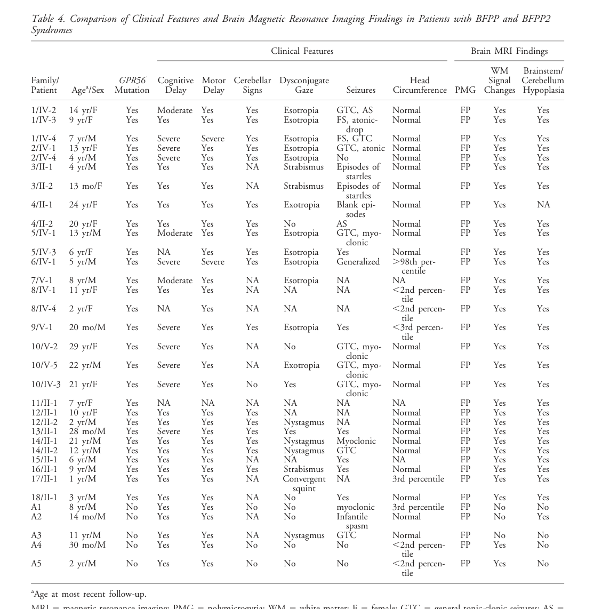

## Question

# Disease Characteristics Research Template

## Target Disease
- **Disease Name:** ADGRG1-related Bilateral Frontoparietal Polymicrogyria
- **MONDO ID:**  (if available)
- **Category:** Mendelian

## Research Objectives

Please provide a comprehensive research report on **ADGRG1-related Bilateral Frontoparietal Polymicrogyria** covering all of the
disease characteristics listed below. This report will be used to populate a disease knowledge
base entry. Be thorough and cite primary literature (PMID preferred) for all claims.

For each section, **suggested databases/resources** are listed. These are the first places
you should search for information on each topic.

---

### 1. Disease Information
> **Search first:** OMIM, Orphanet, ICD-10/ICD-11, MeSH, PubMed

- What is the disease? Provide a concise overview.
- What are the key identifiers? (OMIM, Orphanet, ICD-10/ICD-11, MeSH, Mondo)
- What are the common synonyms and alternative names?
- Is the information derived from individual patients (e.g., EHR) or aggregated disease-level resources?

### 2. Etiology

- **Disease Causal Factors**: What are the primary causes? (genetic, environmental, infectious, mechanistic)
- **Risk Factors**:
  > **Search first:** PubMed, Cochrane Library, UpToDate, clinical guidelines, ClinVar, ClinGen, GWAS Catalog, PheGenI, CTD, CDC, WHO, epidemiological databases
  - Genetic risk factors (causal variants, susceptibility loci, modifier genes)
  - Environmental risk factors (toxins, lifestyle, occupational exposures, age, sex, family history)
- **Protective Factors**:
  > **Search first:** PubMed, Cochrane Library, clinical trial databases, GWAS Catalog, gnomAD, WHO, CDC, nutrition databases
  - Genetic protective factors (protective variants, modifier alleles)
  - Environmental protective factors (diet, lifestyle, exposures that reduce risk)
- **Gene-Environment Interactions**: How do genetic and environmental factors interact to influence disease?
  > **Search first:** CTD, PubMed, PheGenI, GxE databases

### 3. Phenotypes
> **Search first:** HPO (Human Phenotype Ontology), OMIM, Orphanet, PubMed, clinicaltrials.gov, MedDRA, SNOMED CT, DECIPHER, LOINC

For each phenotype, provide:
- **Phenotype type**: symptoms, clinical signs, physical manifestations, behavioral changes, or laboratory abnormalities
  > For symptoms/signs: HPO, OMIM, Orphanet, PubMed
  > For behavioral changes: HPO, DSM, RDoC (Research Domain Criteria), PubMed
  > For laboratory abnormalities: LOINC, SNOMED CT, LabTests Online, PubMed
- **Phenotype characteristics**:
  > **Search first:** OMIM, Orphanet, HPO, PubMed
  - Age of symptom onset (neonatal, childhood, adult-onset, late-onset)
  - Symptom severity (mild, moderate, severe, variable)
  - Symptom progression (stable, progressive, episodic, fluctuating)
  - Frequency among affected individuals (percentage or qualitative)
- **Quality of life impact**: Effects on daily functioning and well-being (per-phenotype when possible)
  > **Search first:** EQ-5D database, SF-36, WHO QOL databases, PubMed
- Suggest HPO (Human Phenotype Ontology) terms for each phenotype

### 4. Genetic/Molecular Information

- **Causal Genes**: Gene mutations or chromosomal abnormalities responsible for disease (gene symbols, OMIM IDs)
  > **Search first:** OMIM, ClinVar, HGMD, Ensembl, NCBI Gene
- **Pathogenic Variants**:
  - Affected genes (gene symbols, HGNC IDs)
    > **Search first:** OMIM, NCBI Gene, Ensembl, HGNC, UniProt, GeneCards
  - Variant classification (pathogenic, likely pathogenic, VUS per ACMG/AMP guidelines)
    > **Search first:** ClinVar, ClinGen, ACMG/AMP guidelines, VarSome
  - Variant type/class (missense, frameshift, nonsense, splice-site, structural)
  - Allele frequency in population databases
    > **Search first:** gnomAD, 1000 Genomes, ExAC, TOPMed, dbSNP
  - Somatic vs germline origin
    > **Search first:** COSMIC (somatic), ClinVar, ICGC, TCGA
  - Functional consequences (loss of function, gain of function, dominant negative)
- **Modifier Genes**: Genes that modify disease severity or expression
- **Epigenetic Information**: DNA methylation, histone modifications, chromatin changes affecting disease
  > **Search first:** ENCODE, Roadmap Epigenomics, MethBase, DiseaseMeth
- **Chromosomal Abnormalities**: Large-scale genetic changes (aneuploidy, translocations, inversions)
  > **Search first:** DECIPHER, ClinVar, ECARUCA, UCSC Genome Browser

### 5. Environmental Information

- **Environmental Factors**: Non-genetic contributing factors (toxins, radiation, pollution, occupational exposure)
  > **Search first:** CTD (Comparative Toxicogenomics Database), TOXNET, PubMed, EPA databases
- **Lifestyle Factors**: Behavioral factors (smoking, diet, exercise, alcohol consumption)
  > **Search first:** CDC databases, WHO, PubMed, NHANES
- **Infectious Agents**: If applicable, pathogens causing or triggering disease (bacteria, viruses, fungi, parasites)
  > **Search first:** NCBI Taxonomy, ViPR, BV-BRC, MicrobeDB, GIDEON

### 6. Mechanism / Pathophysiology

- **Molecular Pathways**: Specific signaling cascades or biochemical pathways involved (Wnt, MAPK, mTOR, PI3K-AKT, etc.)
  > **Search first:** KEGG, Reactome, WikiPathways, PathBank, BioCyc
- **Cellular Processes**: Cell-level mechanisms (apoptosis, autophagy, cell cycle dysregulation, inflammation, etc.)
  > **Search first:** Gene Ontology (GO), Reactome, KEGG, PubMed
- **Protein Dysfunction**: How protein structure or function is altered (misfolding, aggregation, loss of function, gain of function)
  > **Search first:** UniProt, PDB (Protein Data Bank), InterPro, Pfam, AlphaFold
- **Metabolic Changes**: Alterations in metabolic processes (energy metabolism, lipid metabolism, amino acid metabolism)
  > **Search first:** KEGG, BioCyc, HMDB (Human Metabolome Database), BRENDA
- **Immune System Involvement**: Role of immune response (autoimmunity, immunodeficiency, chronic inflammation)
  > **Search first:** ImmPort, Immunome Database, IEDB, Gene Ontology
- **Tissue Damage Mechanisms**: How tissues/ are injured (oxidative stress, ischemia, fibrosis, necrosis)
  > **Search first:** PubMed, Gene Ontology, Reactome
- **Biochemical Abnormalities**: Specific molecular defects (enzyme deficiencies, receptor dysfunction, ion channel defects)
  > **Search first:** BRENDA, UniProt, KEGG, OMIM, PubMed
- **Epigenetic Changes**: DNA methylation, histone modifications affecting gene expression in disease
  > **Search first:** ENCODE, Roadmap Epigenomics, MethBase, DiseaseMeth
- **Molecular Profiling** (if available):
  - Transcriptomics/gene expression changes
    > **Search first:** GEO (Gene Expression Omnibus), ArrayExpress, GTEx, Human Cell Atlas, SRA
  - Proteomics findings
    > **Search first:** PRIDE, ProteomeXchange, Human Protein Atlas, STRING, BioGRID
  - Metabolomics signatures
    > **Search first:** MetaboLights, Metabolomics Workbench, HMDB, METLIN
  - Lipidomics alterations
    > **Search first:** LIPID MAPS, SwissLipids, LipidHome, Metabolomics Workbench
  - Genomic structural features
    > **Search first:** UCSC Genome Browser, Ensembl, NCBI, dbVar, DGV
- **Advanced Technologies** (if applicable):
  - Single-cell analysis findings (cell-type specific mechanisms, cellular heterogeneity)
    > **Search first:** Human Cell Atlas, Single Cell Portal, GEO, CELLxGENE
  - Spatial transcriptomics findings
    > **Search first:** GEO, Spatial Research, Vizgen, 10x Genomics data
  - Multi-omics integration results
    > **Search first:** TCGA, ICGC, cBioPortal, LinkedOmics, PubMed
  - Functional genomics screens (CRISPR, RNAi)
    > **Search first:** DepMap, GenomeRNAi, PubMed, BioGRID ORCS

For each mechanism, describe:
- The causal chain from initial trigger to clinical manifestation
- Which mechanisms are upstream vs downstream
- What cell types and biological processes are involved
- Suggest GO terms for biological processes and CL terms for cell types

### 7. Anatomical Structures Affected

- **Organ Level**:
  - Primary organs directly affected
  - Secondary organ involvement (complications, secondary effects)
  - Body systems involved (cardiovascular, nervous, digestive, respiratory, endocrine, etc.)
  > **Search first:** Uberon, FMA (Foundational Model of Anatomy), OMIM, HPO, ICD-11, MeSH, SNOMED CT
- **Tissue and Cell Level**:
  - Specific tissue types affected (epithelial, connective, muscle, nervous)
  - Specific cell populations targeted (with Cell Ontology terms)
  > **Search first:** Uberon, Human Protein Atlas, Cell Ontology, Human Cell Atlas, CellMarker, PanglaoDB
- **Subcellular Level**:
  - Cellular compartments involved (mitochondria, nucleus, ER, lysosomes) (with GO Cellular Component terms)
  > **Search first:** Gene Ontology (Cellular Component), UniProt, Human Protein Atlas
- **Localization**:
  - Specific anatomical sites (with UBERON terms)
    > **Search first:** FMA, Uberon, NeuroNames (for brain), SNOMED CT
  - Lateralization (unilateral, bilateral, asymmetric)
    > **Search first:** HPO, clinical literature, imaging databases

### 8. Temporal Development

- **Onset**:
  - Typical age of onset (congenital, pediatric, adult, geriatric)
  - Onset pattern (acute, subacute, chronic, insidious)
  > **Search first:** OMIM, Orphanet, HPO, PubMed
- **Progression**:
  - Disease stages (early, intermediate, advanced, end-stage)
    > **Search first:** Cancer Staging Manual (AJCC), WHO classifications, PubMed
  - Progression rate (rapid, slow, variable)
  - Disease course pattern (episodic, relapsing-remitting, progressive, stable)
  - Disease duration (self-limited, chronic lifelong)
  > **Search first:** Disease registries, longitudinal cohort databases, natural history studies, PubMed, Orphanet, OMIM
- **Patterns**:
  - Remission patterns (spontaneous, treatment-induced)
    > **Search first:** Clinical trial databases, disease registries, PubMed
  - Critical periods (time windows of vulnerability or opportunity for intervention)
    > **Search first:** PubMed, developmental biology databases, clinical guidelines

### 9. Inheritance and Population

- **Epidemiology**:
  - Prevalence (cases per 100,000 at given time)
  - Incidence (new cases per 100,000 per year)
  > **Search first:** Orphanet, CDC, WHO, GBD (Global Burden of Disease), national registries, SEER, disease registries
- **For Genetic Etiology**:
  - Inheritance pattern (AD, AR, X-linked, mitochondrial, multifactorial, polygenic)
    > **Search first:** OMIM, Orphanet, ClinVar, GTR (Genetic Testing Registry)
  - Penetrance (complete, incomplete, age-dependent)
    > **Search first:** ClinVar, OMIM, PubMed, ClinGen
  - Expressivity (variable, consistent)
    > **Search first:** OMIM, ClinVar, PubMed
  - Genetic anticipation (increasing severity in successive generations)
    > **Search first:** OMIM, PubMed (especially for repeat expansion disorders)
  - Germline mosaicism
    > **Search first:** ClinVar, OMIM, genetic counseling literature, PubMed
  - Founder effects (population-specific mutations)
    > **Search first:** gnomAD, population genetics databases, PubMed
  - Consanguinity role
    > **Search first:** OMIM, population studies, genetic counseling resources
  - Carrier frequency
    > **Search first:** gnomAD, carrier screening databases, GeneReviews, GTR
- **Population Demographics**:
  - Affected populations (ethnic or demographic groups with higher prevalence)
    > **Search first:** gnomAD, 1000 Genomes, PAGE Study, PubMed, population registries
  - Geographic distribution (endemic areas, regional variation)
    > **Search first:** WHO, CDC, GBD, Orphanet, geographic epidemiology databases
  - Geographic distribution of specific variants
  - Sex ratio (male:female)
    > **Search first:** Disease registries, OMIM, PubMed, epidemiological databases
  - Age distribution of affected individuals
    > **Search first:** CDC, disease registries, SEER, Orphanet

### 10. Diagnostics

- **Clinical Tests**:
  - Laboratory tests (blood, urine, tissue chemistry, specific enzyme assays)
    > **Search first:** LOINC, LabTests Online, PubMed
  - Biomarkers (proteins, metabolites, genetic markers, circulating biomarkers)
    > **Search first:** FDA Biomarker List, BEST (Biomarkers, EndpointS, and other Tools), PubMed
  - Imaging studies (X-ray, CT, MRI, PET, ultrasound)
    > **Search first:** RadLex, DICOM, Radiopaedia, imaging databases
  - Functional tests (pulmonary function, cardiac stress tests)
    > **Search first:** LOINC, clinical guidelines, PubMed
  - Electrophysiology (EEG, EMG, ECG, nerve conduction studies)
    > **Search first:** LOINC, clinical neurophysiology databases, PubMed
  - Biopsy findings (histopathology, immunohistochemistry)
    > **Search first:** SNOMED CT, College of American Pathologists resources, PubMed
  - Pathology findings (microscopic examination)
    > **Search first:** SNOMED CT, Digital Pathology databases, PubMed
- **Genetic Testing**:
  > **Search first:** GTR (Genetic Testing Registry), GeneReviews, ClinGen
  - Overview of recommended genetic testing approach
  - Whole genome sequencing (WGS) utility
    > **Search first:** GTR, ClinVar, GEL (Genomics England), gnomAD
  - Whole exome sequencing (WES) utility
    > **Search first:** GTR, ClinVar, OMIM, GeneMatcher
  - Gene panels (which panels, which genes)
    > **Search first:** GTR, ClinVar, laboratory-specific databases
  - Single gene testing
    > **Search first:** GTR, ClinVar, OMIM, GeneReviews
  - Chromosomal microarray (CMA)
    > **Search first:** DECIPHER, ClinVar, dbVar, ECARUCA
  - Karyotyping
    > **Search first:** Chromosome Abnormality Database, ClinVar, cytogenetics resources
  - FISH
    > **Search first:** ClinVar, cytogenetics databases, PubMed
  - Mitochondrial DNA testing
    > **Search first:** MITOMAP, MSeqDR, ClinVar, GTR
  - Repeat expansion testing
    > **Search first:** GTR, ClinVar, repeat expansion databases, PubMed
- **Omics-Based Diagnostics** (if applicable):
  - RNA sequencing / transcriptomics
    > **Search first:** GEO, ArrayExpress, GTEx, RNA-seq databases
  - Proteomics
    > **Search first:** PRIDE, ProteomeXchange, FDA Biomarker database
  - Metabolomics
    > **Search first:** MetaboLights, Metabolomics Workbench, HMDB
  - Epigenomics
    > **Search first:** GEO, ENCODE, Roadmap Epigenomics, MethBase
  - Liquid biopsy
    > **Search first:** COSMIC, ClinVar, liquid biopsy databases, PubMed
- **Clinical Criteria**:
  - Standardized diagnostic criteria (DSM, ICD, society guidelines)
    > **Search first:** DSM-5, ICD-11, clinical society guidelines, UpToDate
  - Differential diagnosis (other conditions to rule out, with distinguishing features)
    > **Search first:** DynaMed, UpToDate, clinical decision support systems
- **Screening**:
  - Screening methods for asymptomatic individuals (newborn screening, carrier screening, cascade screening)
    > **Search first:** ACMG recommendations, CDC newborn screening, GTR

### 11. Outcome/Prognosis

- **Survival and Mortality**:
  - Survival rate (5-year, 10-year, overall)
    > **Search first:** SEER, cancer registries, disease-specific registries, PubMed
  - Life expectancy (with and without treatment if applicable)
    > **Search first:** Orphanet, disease registries, actuarial databases, PubMed
  - Mortality rate
    > **Search first:** CDC, WHO, GBD, national mortality databases
  - Disease-specific mortality (deaths directly attributable to disease)
    > **Search first:** Disease registries, CDC Wonder, GBD, PubMed
- **Morbidity and Function**:
  - Morbidity (disease-related disability and health impacts)
    > **Search first:** GBD, WHO, disability databases, PubMed
  - Disability outcomes (long-term functional impairments)
    > **Search first:** ICF (International Classification of Functioning), disability registries
  - Quality of life measures (EQ-5D, SF-36, PROMIS, disease-specific tools)
    > **Search first:** EQ-5D database, SF-36, PROMIS, PubMed
- **Disease Course**:
  - Complications (secondary problems: infections, organ failure, etc.)
    > **Search first:** ICD codes, disease registries, clinical databases, PubMed
  - Recovery potential (likelihood and extent of recovery, with vs without treatment)
    > **Search first:** Natural history studies, rehabilitation databases, PubMed
- **Prediction**:
  - Prognostic factors (age, disease severity, biomarkers, treatment response)
    > **Search first:** Prognostic models databases, clinical calculators, PubMed
  - Prognostic biomarkers (molecular markers predicting disease course)
    > **Search first:** FDA Biomarker database, PubMed, cancer prognostic databases

### 12. Treatment

- **Pharmacotherapy**:
  - Pharmacological treatments (drug names, drug classes, mechanisms of action)
    > **Search first:** DrugBank, RxNorm, ATC classification, DailyMed, FDA databases
  - Pharmacogenomics (how genetic variants affect drug metabolism, efficacy, toxicity)
    > **Search first:** PharmGKB, CPIC (Clinical Pharmacogenetics), FDA Table of PGx Biomarkers
- **Advanced Therapeutics**:
  - Gene therapy (viral vectors, CRISPR, gene replacement, gene editing)
    > **Search first:** ClinicalTrials.gov, FDA gene therapy database, ASGCT resources
  - Cell therapy (stem cell transplant, CAR-T, cellular therapeutics)
    > **Search first:** ClinicalTrials.gov, FDA cell therapy database, FACT standards
  - RNA-based therapies (ASOs, siRNA, mRNA therapies)
    > **Search first:** ClinicalTrials.gov, FDA approvals, PubMed
  - Targeted therapies (treatments directed at specific molecular targets)
    > **Search first:** My Cancer Genome, OncoKB, ClinicalTrials.gov, FDA approvals
  - Immunotherapies (checkpoint inhibitors, monoclonal antibodies)
    > **Search first:** Cancer Immunotherapy Database, FDA approvals, ClinicalTrials.gov
- **Surgical and Interventional**:
  - Surgical interventions (types of surgery, timing, outcomes)
    > **Search first:** CPT codes, surgical registries, clinical guidelines, PubMed
- **Supportive and Rehabilitative**:
  - Supportive care (symptom management, pain control, nutrition)
    > **Search first:** Clinical guidelines, Cochrane Library, PubMed
  - Rehabilitation (physical therapy, occupational therapy, speech therapy)
    > **Search first:** Rehabilitation medicine databases, clinical guidelines, PubMed
- **Experimental**:
  - Experimental treatments in clinical trials (with NCT identifiers if available)
    > **Search first:** ClinicalTrials.gov, EU Clinical Trials Register, WHO ICTRP
- **Treatment Outcomes**:
  - Treatment response rates
    > **Search first:** Clinical trial databases, FDA reviews, systematic reviews, PubMed
  - Side effects and adverse events
    > **Search first:** FDA Adverse Event Reporting System (FAERS), MedWatch, PubMed
- **Treatment Strategy**:
  - Treatment algorithms (clinical pathways, decision trees)
    > **Search first:** Clinical practice guidelines, NCCN Guidelines, UpToDate
  - Combination therapies
    > **Search first:** ClinicalTrials.gov, treatment guidelines, PubMed
  - Personalized medicine approaches (genotype-guided treatment)
    > **Search first:** My Cancer Genome, CIViC, PharmGKB, precision medicine databases

For each treatment, suggest MAXO (Medical Action Ontology) terms where applicable.

### 13. Prevention

- **Prevention Levels**:
  - Primary prevention (preventing disease occurrence: vaccination, risk factor modification)
    > **Search first:** CDC, WHO, USPSTF recommendations, Cochrane Library
  - Secondary prevention (early detection and treatment: screening programs, early intervention)
    > **Search first:** USPSTF, CDC screening guidelines, WHO
  - Tertiary prevention (preventing complications in those with disease)
    > **Search first:** Clinical guidelines, disease management protocols, PubMed
- **Immunization**: Vaccine strategies (if applicable)
  > **Search first:** CDC vaccine schedules, WHO immunization, FDA vaccine database
- **Screening and Early Detection**:
  - Screening programs (population-based: newborn screening, cancer screening)
    > **Search first:** CDC screening programs, USPSTF, cancer screening databases
  - Genetic screening (carrier screening, preimplantation genetic diagnosis, prenatal testing)
    > **Search first:** ACMG recommendations, ACOG guidelines, GTR
  - Risk stratification (identifying high-risk individuals for targeted prevention)
    > **Search first:** Risk prediction models, clinical calculators, PubMed
- **Behavioral Interventions**: Lifestyle modifications to reduce risk
  > **Search first:** CDC, WHO, behavioral intervention databases, Cochrane Library
- **Counseling**: Genetic counseling (risk assessment, family planning guidance)
  > **Search first:** NSGC resources, ACMG guidelines, GeneReviews
- **Public Health**:
  - Public health interventions (sanitation, vector control, health education)
    > **Search first:** CDC, WHO, public health databases, PubMed
  - Environmental interventions (reducing environmental risk factors)
    > **Search first:** EPA databases, WHO environmental health, PubMed
- **Prophylaxis**: Preventive medications or procedures
  > **Search first:** Clinical guidelines, FDA approvals, PubMed

### 14. Other Species / Natural Disease

- **Taxonomy**: Species affected (with NCBI Taxon identifiers)
  > **Search first:** NCBI Taxonomy
- **Breed**: Specific breeds affected (with VBO identifiers if applicable)
  > **Search first:** VBO (Vertebrate Breed Ontology)
- **Gene**: Orthologous genes in other species (with NCBI Gene IDs)
  > **Search first:** NCBI Gene
- **Natural Disease**:
  - Naturally occurring disease in other species (companion animals, wildlife)
    > **Search first:** OMIA (Online Mendelian Inheritance in Animals), VetCompass, PubMed
  - Veterinary relevance and importance in animal health
    > **Search first:** OMIA, veterinary databases, PubMed
- **Comparative Biology**:
  - Comparative pathology (similarities and differences across species)
    > **Search first:** OMIA, comparative pathology databases, PubMed
  - Evolutionary conservation of disease mechanisms
    > **Search first:** HomoloGene, OrthoMCL, Alliance of Genome Resources
- **Transmission** (if applicable):
  - Zoonotic potential
    > **Search first:** CDC zoonotic diseases, WHO zoonoses, GIDEON
  - Cross-species susceptibility
    > **Search first:** NCBI Taxonomy, veterinary databases, PubMed

### 15. Model Organisms

- **Model Types**:
  - Model organism type (mammalian, invertebrate, cellular, in vitro)
    > **Search first:** Alliance of Genome Resources, model organism databases
  - Specific model systems (mouse, rat, zebrafish, Drosophila, C. elegans, yeast, cell lines, organoids, iPSCs)
    > **Search first:** MGI, RGD, ZFIN, FlyBase, WormBase, SGD, ATCC, Cellosaurus
  - Induced models (drug treatment, surgical intervention, environmental manipulation)
    > **Search first:** MGI, model organism databases, PubMed
- **Genetic Models**:
  - Types available (knockout, knock-in, transgenic, conditional, humanized)
    > **Search first:** MGI, IMPC, KOMP, EuMMCR, IMSR
- **Model Characteristics**:
  - Phenotype recapitulation (how well model reproduces human disease features)
    > **Search first:** Model organism databases, comparative studies, PubMed
  - Model limitations (aspects of human disease not captured)
    > **Search first:** Model organism databases, PubMed, review articles
- **Applications**:
  - Research applications (what aspects of disease can be studied)
    > **Search first:** Model organism databases, PubMed
- **Resources**:
  - Model databases
    > **Search first:** MGI, RGD, ZFIN, FlyBase, WormBase, IMSR, EMMA, MMRRC

---

## Citation Requirements

- Cite primary literature (PMID preferred) for all mechanistic and clinical claims
- Prioritize recent reviews and landmark papers
- Include direct quotes from abstracts where possible to support key statements
- Distinguish evidence source types: human clinical, model organism, in vitro, computational

## Output Format

Structure your response as a comprehensive narrative organized by the sections above.
For each section, provide:
- Factual content with specific details (numbers, percentages, gene names, variant nomenclature)
- Ontology term suggestions (HPO, GO, CL, UBERON, CHEBI, MAXO, MONDO) where applicable
- Evidence citations with PMIDs
- Direct quotes from abstracts to support key claims
- Clear indication when information is not available or not applicable for this disease

This report will be used to populate a disease knowledge base entry with:
- Pathophysiology descriptions with causal chains
- Gene/protein annotations (HGNC, GO terms)
- Phenotype associations (HP terms) with frequencies
- Cell type involvement (CL terms)
- Anatomical locations (UBERON terms)
- Chemical entities (CHEBI terms)
- Treatment annotations (MAXO terms)
- Evidence items with PMIDs and exact abstract quotes
- Epidemiology, prognosis, diagnostic, and prevention information
- Animal model descriptions with phenotype recapitulation details

## Output

Question: You are an expert researcher providing comprehensive, well-cited information.

Provide detailed information focusing on:
1. Key concepts and definitions with current understanding
2. Recent developments and latest research (prioritize 2023-2024 sources)
3. Current applications and real-world implementations
4. Expert opinions and analysis from authoritative sources
5. Relevant statistics and data from recent studies

Format as a comprehensive research report with proper citations. Include URLs and publication dates where available.
Always prioritize recent, authoritative sources and provide specific citations for all major claims.

# Disease Characteristics Research Template

## Target Disease
- **Disease Name:** ADGRG1-related Bilateral Frontoparietal Polymicrogyria
- **MONDO ID:**  (if available)
- **Category:** Mendelian

## Research Objectives

Please provide a comprehensive research report on **ADGRG1-related Bilateral Frontoparietal Polymicrogyria** covering all of the
disease characteristics listed below. This report will be used to populate a disease knowledge
base entry. Be thorough and cite primary literature (PMID preferred) for all claims.

For each section, **suggested databases/resources** are listed. These are the first places
you should search for information on each topic.

---

### 1. Disease Information
> **Search first:** OMIM, Orphanet, ICD-10/ICD-11, MeSH, PubMed

- What is the disease? Provide a concise overview.
- What are the key identifiers? (OMIM, Orphanet, ICD-10/ICD-11, MeSH, Mondo)
- What are the common synonyms and alternative names?
- Is the information derived from individual patients (e.g., EHR) or aggregated disease-level resources?

### 2. Etiology

- **Disease Causal Factors**: What are the primary causes? (genetic, environmental, infectious, mechanistic)
- **Risk Factors**:
  > **Search first:** PubMed, Cochrane Library, UpToDate, clinical guidelines, ClinVar, ClinGen, GWAS Catalog, PheGenI, CTD, CDC, WHO, epidemiological databases
  - Genetic risk factors (causal variants, susceptibility loci, modifier genes)
  - Environmental risk factors (toxins, lifestyle, occupational exposures, age, sex, family history)
- **Protective Factors**:
  > **Search first:** PubMed, Cochrane Library, clinical trial databases, GWAS Catalog, gnomAD, WHO, CDC, nutrition databases
  - Genetic protective factors (protective variants, modifier alleles)
  - Environmental protective factors (diet, lifestyle, exposures that reduce risk)
- **Gene-Environment Interactions**: How do genetic and environmental factors interact to influence disease?
  > **Search first:** CTD, PubMed, PheGenI, GxE databases

### 3. Phenotypes
> **Search first:** HPO (Human Phenotype Ontology), OMIM, Orphanet, PubMed, clinicaltrials.gov, MedDRA, SNOMED CT, DECIPHER, LOINC

For each phenotype, provide:
- **Phenotype type**: symptoms, clinical signs, physical manifestations, behavioral changes, or laboratory abnormalities
  > For symptoms/signs: HPO, OMIM, Orphanet, PubMed
  > For behavioral changes: HPO, DSM, RDoC (Research Domain Criteria), PubMed
  > For laboratory abnormalities: LOINC, SNOMED CT, LabTests Online, PubMed
- **Phenotype characteristics**:
  > **Search first:** OMIM, Orphanet, HPO, PubMed
  - Age of symptom onset (neonatal, childhood, adult-onset, late-onset)
  - Symptom severity (mild, moderate, severe, variable)
  - Symptom progression (stable, progressive, episodic, fluctuating)
  - Frequency among affected individuals (percentage or qualitative)
- **Quality of life impact**: Effects on daily functioning and well-being (per-phenotype when possible)
  > **Search first:** EQ-5D database, SF-36, WHO QOL databases, PubMed
- Suggest HPO (Human Phenotype Ontology) terms for each phenotype

### 4. Genetic/Molecular Information

- **Causal Genes**: Gene mutations or chromosomal abnormalities responsible for disease (gene symbols, OMIM IDs)
  > **Search first:** OMIM, ClinVar, HGMD, Ensembl, NCBI Gene
- **Pathogenic Variants**:
  - Affected genes (gene symbols, HGNC IDs)
    > **Search first:** OMIM, NCBI Gene, Ensembl, HGNC, UniProt, GeneCards
  - Variant classification (pathogenic, likely pathogenic, VUS per ACMG/AMP guidelines)
    > **Search first:** ClinVar, ClinGen, ACMG/AMP guidelines, VarSome
  - Variant type/class (missense, frameshift, nonsense, splice-site, structural)
  - Allele frequency in population databases
    > **Search first:** gnomAD, 1000 Genomes, ExAC, TOPMed, dbSNP
  - Somatic vs germline origin
    > **Search first:** COSMIC (somatic), ClinVar, ICGC, TCGA
  - Functional consequences (loss of function, gain of function, dominant negative)
- **Modifier Genes**: Genes that modify disease severity or expression
- **Epigenetic Information**: DNA methylation, histone modifications, chromatin changes affecting disease
  > **Search first:** ENCODE, Roadmap Epigenomics, MethBase, DiseaseMeth
- **Chromosomal Abnormalities**: Large-scale genetic changes (aneuploidy, translocations, inversions)
  > **Search first:** DECIPHER, ClinVar, ECARUCA, UCSC Genome Browser

### 5. Environmental Information

- **Environmental Factors**: Non-genetic contributing factors (toxins, radiation, pollution, occupational exposure)
  > **Search first:** CTD (Comparative Toxicogenomics Database), TOXNET, PubMed, EPA databases
- **Lifestyle Factors**: Behavioral factors (smoking, diet, exercise, alcohol consumption)
  > **Search first:** CDC databases, WHO, PubMed, NHANES
- **Infectious Agents**: If applicable, pathogens causing or triggering disease (bacteria, viruses, fungi, parasites)
  > **Search first:** NCBI Taxonomy, ViPR, BV-BRC, MicrobeDB, GIDEON

### 6. Mechanism / Pathophysiology

- **Molecular Pathways**: Specific signaling cascades or biochemical pathways involved (Wnt, MAPK, mTOR, PI3K-AKT, etc.)
  > **Search first:** KEGG, Reactome, WikiPathways, PathBank, BioCyc
- **Cellular Processes**: Cell-level mechanisms (apoptosis, autophagy, cell cycle dysregulation, inflammation, etc.)
  > **Search first:** Gene Ontology (GO), Reactome, KEGG, PubMed
- **Protein Dysfunction**: How protein structure or function is altered (misfolding, aggregation, loss of function, gain of function)
  > **Search first:** UniProt, PDB (Protein Data Bank), InterPro, Pfam, AlphaFold
- **Metabolic Changes**: Alterations in metabolic processes (energy metabolism, lipid metabolism, amino acid metabolism)
  > **Search first:** KEGG, BioCyc, HMDB (Human Metabolome Database), BRENDA
- **Immune System Involvement**: Role of immune response (autoimmunity, immunodeficiency, chronic inflammation)
  > **Search first:** ImmPort, Immunome Database, IEDB, Gene Ontology
- **Tissue Damage Mechanisms**: How tissues/ are injured (oxidative stress, ischemia, fibrosis, necrosis)
  > **Search first:** PubMed, Gene Ontology, Reactome
- **Biochemical Abnormalities**: Specific molecular defects (enzyme deficiencies, receptor dysfunction, ion channel defects)
  > **Search first:** BRENDA, UniProt, KEGG, OMIM, PubMed
- **Epigenetic Changes**: DNA methylation, histone modifications affecting gene expression in disease
  > **Search first:** ENCODE, Roadmap Epigenomics, MethBase, DiseaseMeth
- **Molecular Profiling** (if available):
  - Transcriptomics/gene expression changes
    > **Search first:** GEO (Gene Expression Omnibus), ArrayExpress, GTEx, Human Cell Atlas, SRA
  - Proteomics findings
    > **Search first:** PRIDE, ProteomeXchange, Human Protein Atlas, STRING, BioGRID
  - Metabolomics signatures
    > **Search first:** MetaboLights, Metabolomics Workbench, HMDB, METLIN
  - Lipidomics alterations
    > **Search first:** LIPID MAPS, SwissLipids, LipidHome, Metabolomics Workbench
  - Genomic structural features
    > **Search first:** UCSC Genome Browser, Ensembl, NCBI, dbVar, DGV
- **Advanced Technologies** (if applicable):
  - Single-cell analysis findings (cell-type specific mechanisms, cellular heterogeneity)
    > **Search first:** Human Cell Atlas, Single Cell Portal, GEO, CELLxGENE
  - Spatial transcriptomics findings
    > **Search first:** GEO, Spatial Research, Vizgen, 10x Genomics data
  - Multi-omics integration results
    > **Search first:** TCGA, ICGC, cBioPortal, LinkedOmics, PubMed
  - Functional genomics screens (CRISPR, RNAi)
    > **Search first:** DepMap, GenomeRNAi, PubMed, BioGRID ORCS

For each mechanism, describe:
- The causal chain from initial trigger to clinical manifestation
- Which mechanisms are upstream vs downstream
- What cell types and biological processes are involved
- Suggest GO terms for biological processes and CL terms for cell types

### 7. Anatomical Structures Affected

- **Organ Level**:
  - Primary organs directly affected
  - Secondary organ involvement (complications, secondary effects)
  - Body systems involved (cardiovascular, nervous, digestive, respiratory, endocrine, etc.)
  > **Search first:** Uberon, FMA (Foundational Model of Anatomy), OMIM, HPO, ICD-11, MeSH, SNOMED CT
- **Tissue and Cell Level**:
  - Specific tissue types affected (epithelial, connective, muscle, nervous)
  - Specific cell populations targeted (with Cell Ontology terms)
  > **Search first:** Uberon, Human Protein Atlas, Cell Ontology, Human Cell Atlas, CellMarker, PanglaoDB
- **Subcellular Level**:
  - Cellular compartments involved (mitochondria, nucleus, ER, lysosomes) (with GO Cellular Component terms)
  > **Search first:** Gene Ontology (Cellular Component), UniProt, Human Protein Atlas
- **Localization**:
  - Specific anatomical sites (with UBERON terms)
    > **Search first:** FMA, Uberon, NeuroNames (for brain), SNOMED CT
  - Lateralization (unilateral, bilateral, asymmetric)
    > **Search first:** HPO, clinical literature, imaging databases

### 8. Temporal Development

- **Onset**:
  - Typical age of onset (congenital, pediatric, adult, geriatric)
  - Onset pattern (acute, subacute, chronic, insidious)
  > **Search first:** OMIM, Orphanet, HPO, PubMed
- **Progression**:
  - Disease stages (early, intermediate, advanced, end-stage)
    > **Search first:** Cancer Staging Manual (AJCC), WHO classifications, PubMed
  - Progression rate (rapid, slow, variable)
  - Disease course pattern (episodic, relapsing-remitting, progressive, stable)
  - Disease duration (self-limited, chronic lifelong)
  > **Search first:** Disease registries, longitudinal cohort databases, natural history studies, PubMed, Orphanet, OMIM
- **Patterns**:
  - Remission patterns (spontaneous, treatment-induced)
    > **Search first:** Clinical trial databases, disease registries, PubMed
  - Critical periods (time windows of vulnerability or opportunity for intervention)
    > **Search first:** PubMed, developmental biology databases, clinical guidelines

### 9. Inheritance and Population

- **Epidemiology**:
  - Prevalence (cases per 100,000 at given time)
  - Incidence (new cases per 100,000 per year)
  > **Search first:** Orphanet, CDC, WHO, GBD (Global Burden of Disease), national registries, SEER, disease registries
- **For Genetic Etiology**:
  - Inheritance pattern (AD, AR, X-linked, mitochondrial, multifactorial, polygenic)
    > **Search first:** OMIM, Orphanet, ClinVar, GTR (Genetic Testing Registry)
  - Penetrance (complete, incomplete, age-dependent)
    > **Search first:** ClinVar, OMIM, PubMed, ClinGen
  - Expressivity (variable, consistent)
    > **Search first:** OMIM, ClinVar, PubMed
  - Genetic anticipation (increasing severity in successive generations)
    > **Search first:** OMIM, PubMed (especially for repeat expansion disorders)
  - Germline mosaicism
    > **Search first:** ClinVar, OMIM, genetic counseling literature, PubMed
  - Founder effects (population-specific mutations)
    > **Search first:** gnomAD, population genetics databases, PubMed
  - Consanguinity role
    > **Search first:** OMIM, population studies, genetic counseling resources
  - Carrier frequency
    > **Search first:** gnomAD, carrier screening databases, GeneReviews, GTR
- **Population Demographics**:
  - Affected populations (ethnic or demographic groups with higher prevalence)
    > **Search first:** gnomAD, 1000 Genomes, PAGE Study, PubMed, population registries
  - Geographic distribution (endemic areas, regional variation)
    > **Search first:** WHO, CDC, GBD, Orphanet, geographic epidemiology databases
  - Geographic distribution of specific variants
  - Sex ratio (male:female)
    > **Search first:** Disease registries, OMIM, PubMed, epidemiological databases
  - Age distribution of affected individuals
    > **Search first:** CDC, disease registries, SEER, Orphanet

### 10. Diagnostics

- **Clinical Tests**:
  - Laboratory tests (blood, urine, tissue chemistry, specific enzyme assays)
    > **Search first:** LOINC, LabTests Online, PubMed
  - Biomarkers (proteins, metabolites, genetic markers, circulating biomarkers)
    > **Search first:** FDA Biomarker List, BEST (Biomarkers, EndpointS, and other Tools), PubMed
  - Imaging studies (X-ray, CT, MRI, PET, ultrasound)
    > **Search first:** RadLex, DICOM, Radiopaedia, imaging databases
  - Functional tests (pulmonary function, cardiac stress tests)
    > **Search first:** LOINC, clinical guidelines, PubMed
  - Electrophysiology (EEG, EMG, ECG, nerve conduction studies)
    > **Search first:** LOINC, clinical neurophysiology databases, PubMed
  - Biopsy findings (histopathology, immunohistochemistry)
    > **Search first:** SNOMED CT, College of American Pathologists resources, PubMed
  - Pathology findings (microscopic examination)
    > **Search first:** SNOMED CT, Digital Pathology databases, PubMed
- **Genetic Testing**:
  > **Search first:** GTR (Genetic Testing Registry), GeneReviews, ClinGen
  - Overview of recommended genetic testing approach
  - Whole genome sequencing (WGS) utility
    > **Search first:** GTR, ClinVar, GEL (Genomics England), gnomAD
  - Whole exome sequencing (WES) utility
    > **Search first:** GTR, ClinVar, OMIM, GeneMatcher
  - Gene panels (which panels, which genes)
    > **Search first:** GTR, ClinVar, laboratory-specific databases
  - Single gene testing
    > **Search first:** GTR, ClinVar, OMIM, GeneReviews
  - Chromosomal microarray (CMA)
    > **Search first:** DECIPHER, ClinVar, dbVar, ECARUCA
  - Karyotyping
    > **Search first:** Chromosome Abnormality Database, ClinVar, cytogenetics resources
  - FISH
    > **Search first:** ClinVar, cytogenetics databases, PubMed
  - Mitochondrial DNA testing
    > **Search first:** MITOMAP, MSeqDR, ClinVar, GTR
  - Repeat expansion testing
    > **Search first:** GTR, ClinVar, repeat expansion databases, PubMed
- **Omics-Based Diagnostics** (if applicable):
  - RNA sequencing / transcriptomics
    > **Search first:** GEO, ArrayExpress, GTEx, RNA-seq databases
  - Proteomics
    > **Search first:** PRIDE, ProteomeXchange, FDA Biomarker database
  - Metabolomics
    > **Search first:** MetaboLights, Metabolomics Workbench, HMDB
  - Epigenomics
    > **Search first:** GEO, ENCODE, Roadmap Epigenomics, MethBase
  - Liquid biopsy
    > **Search first:** COSMIC, ClinVar, liquid biopsy databases, PubMed
- **Clinical Criteria**:
  - Standardized diagnostic criteria (DSM, ICD, society guidelines)
    > **Search first:** DSM-5, ICD-11, clinical society guidelines, UpToDate
  - Differential diagnosis (other conditions to rule out, with distinguishing features)
    > **Search first:** DynaMed, UpToDate, clinical decision support systems
- **Screening**:
  - Screening methods for asymptomatic individuals (newborn screening, carrier screening, cascade screening)
    > **Search first:** ACMG recommendations, CDC newborn screening, GTR

### 11. Outcome/Prognosis

- **Survival and Mortality**:
  - Survival rate (5-year, 10-year, overall)
    > **Search first:** SEER, cancer registries, disease-specific registries, PubMed
  - Life expectancy (with and without treatment if applicable)
    > **Search first:** Orphanet, disease registries, actuarial databases, PubMed
  - Mortality rate
    > **Search first:** CDC, WHO, GBD, national mortality databases
  - Disease-specific mortality (deaths directly attributable to disease)
    > **Search first:** Disease registries, CDC Wonder, GBD, PubMed
- **Morbidity and Function**:
  - Morbidity (disease-related disability and health impacts)
    > **Search first:** GBD, WHO, disability databases, PubMed
  - Disability outcomes (long-term functional impairments)
    > **Search first:** ICF (International Classification of Functioning), disability registries
  - Quality of life measures (EQ-5D, SF-36, PROMIS, disease-specific tools)
    > **Search first:** EQ-5D database, SF-36, PROMIS, PubMed
- **Disease Course**:
  - Complications (secondary problems: infections, organ failure, etc.)
    > **Search first:** ICD codes, disease registries, clinical databases, PubMed
  - Recovery potential (likelihood and extent of recovery, with vs without treatment)
    > **Search first:** Natural history studies, rehabilitation databases, PubMed
- **Prediction**:
  - Prognostic factors (age, disease severity, biomarkers, treatment response)
    > **Search first:** Prognostic models databases, clinical calculators, PubMed
  - Prognostic biomarkers (molecular markers predicting disease course)
    > **Search first:** FDA Biomarker database, PubMed, cancer prognostic databases

### 12. Treatment

- **Pharmacotherapy**:
  - Pharmacological treatments (drug names, drug classes, mechanisms of action)
    > **Search first:** DrugBank, RxNorm, ATC classification, DailyMed, FDA databases
  - Pharmacogenomics (how genetic variants affect drug metabolism, efficacy, toxicity)
    > **Search first:** PharmGKB, CPIC (Clinical Pharmacogenetics), FDA Table of PGx Biomarkers
- **Advanced Therapeutics**:
  - Gene therapy (viral vectors, CRISPR, gene replacement, gene editing)
    > **Search first:** ClinicalTrials.gov, FDA gene therapy database, ASGCT resources
  - Cell therapy (stem cell transplant, CAR-T, cellular therapeutics)
    > **Search first:** ClinicalTrials.gov, FDA cell therapy database, FACT standards
  - RNA-based therapies (ASOs, siRNA, mRNA therapies)
    > **Search first:** ClinicalTrials.gov, FDA approvals, PubMed
  - Targeted therapies (treatments directed at specific molecular targets)
    > **Search first:** My Cancer Genome, OncoKB, ClinicalTrials.gov, FDA approvals
  - Immunotherapies (checkpoint inhibitors, monoclonal antibodies)
    > **Search first:** Cancer Immunotherapy Database, FDA approvals, ClinicalTrials.gov
- **Surgical and Interventional**:
  - Surgical interventions (types of surgery, timing, outcomes)
    > **Search first:** CPT codes, surgical registries, clinical guidelines, PubMed
- **Supportive and Rehabilitative**:
  - Supportive care (symptom management, pain control, nutrition)
    > **Search first:** Clinical guidelines, Cochrane Library, PubMed
  - Rehabilitation (physical therapy, occupational therapy, speech therapy)
    > **Search first:** Rehabilitation medicine databases, clinical guidelines, PubMed
- **Experimental**:
  - Experimental treatments in clinical trials (with NCT identifiers if available)
    > **Search first:** ClinicalTrials.gov, EU Clinical Trials Register, WHO ICTRP
- **Treatment Outcomes**:
  - Treatment response rates
    > **Search first:** Clinical trial databases, FDA reviews, systematic reviews, PubMed
  - Side effects and adverse events
    > **Search first:** FDA Adverse Event Reporting System (FAERS), MedWatch, PubMed
- **Treatment Strategy**:
  - Treatment algorithms (clinical pathways, decision trees)
    > **Search first:** Clinical practice guidelines, NCCN Guidelines, UpToDate
  - Combination therapies
    > **Search first:** ClinicalTrials.gov, treatment guidelines, PubMed
  - Personalized medicine approaches (genotype-guided treatment)
    > **Search first:** My Cancer Genome, CIViC, PharmGKB, precision medicine databases

For each treatment, suggest MAXO (Medical Action Ontology) terms where applicable.

### 13. Prevention

- **Prevention Levels**:
  - Primary prevention (preventing disease occurrence: vaccination, risk factor modification)
    > **Search first:** CDC, WHO, USPSTF recommendations, Cochrane Library
  - Secondary prevention (early detection and treatment: screening programs, early intervention)
    > **Search first:** USPSTF, CDC screening guidelines, WHO
  - Tertiary prevention (preventing complications in those with disease)
    > **Search first:** Clinical guidelines, disease management protocols, PubMed
- **Immunization**: Vaccine strategies (if applicable)
  > **Search first:** CDC vaccine schedules, WHO immunization, FDA vaccine database
- **Screening and Early Detection**:
  - Screening programs (population-based: newborn screening, cancer screening)
    > **Search first:** CDC screening programs, USPSTF, cancer screening databases
  - Genetic screening (carrier screening, preimplantation genetic diagnosis, prenatal testing)
    > **Search first:** ACMG recommendations, ACOG guidelines, GTR
  - Risk stratification (identifying high-risk individuals for targeted prevention)
    > **Search first:** Risk prediction models, clinical calculators, PubMed
- **Behavioral Interventions**: Lifestyle modifications to reduce risk
  > **Search first:** CDC, WHO, behavioral intervention databases, Cochrane Library
- **Counseling**: Genetic counseling (risk assessment, family planning guidance)
  > **Search first:** NSGC resources, ACMG guidelines, GeneReviews
- **Public Health**:
  - Public health interventions (sanitation, vector control, health education)
    > **Search first:** CDC, WHO, public health databases, PubMed
  - Environmental interventions (reducing environmental risk factors)
    > **Search first:** EPA databases, WHO environmental health, PubMed
- **Prophylaxis**: Preventive medications or procedures
  > **Search first:** Clinical guidelines, FDA approvals, PubMed

### 14. Other Species / Natural Disease

- **Taxonomy**: Species affected (with NCBI Taxon identifiers)
  > **Search first:** NCBI Taxonomy
- **Breed**: Specific breeds affected (with VBO identifiers if applicable)
  > **Search first:** VBO (Vertebrate Breed Ontology)
- **Gene**: Orthologous genes in other species (with NCBI Gene IDs)
  > **Search first:** NCBI Gene
- **Natural Disease**:
  - Naturally occurring disease in other species (companion animals, wildlife)
    > **Search first:** OMIA (Online Mendelian Inheritance in Animals), VetCompass, PubMed
  - Veterinary relevance and importance in animal health
    > **Search first:** OMIA, veterinary databases, PubMed
- **Comparative Biology**:
  - Comparative pathology (similarities and differences across species)
    > **Search first:** OMIA, comparative pathology databases, PubMed
  - Evolutionary conservation of disease mechanisms
    > **Search first:** HomoloGene, OrthoMCL, Alliance of Genome Resources
- **Transmission** (if applicable):
  - Zoonotic potential
    > **Search first:** CDC zoonotic diseases, WHO zoonoses, GIDEON
  - Cross-species susceptibility
    > **Search first:** NCBI Taxonomy, veterinary databases, PubMed

### 15. Model Organisms

- **Model Types**:
  - Model organism type (mammalian, invertebrate, cellular, in vitro)
    > **Search first:** Alliance of Genome Resources, model organism databases
  - Specific model systems (mouse, rat, zebrafish, Drosophila, C. elegans, yeast, cell lines, organoids, iPSCs)
    > **Search first:** MGI, RGD, ZFIN, FlyBase, WormBase, SGD, ATCC, Cellosaurus
  - Induced models (drug treatment, surgical intervention, environmental manipulation)
    > **Search first:** MGI, model organism databases, PubMed
- **Genetic Models**:
  - Types available (knockout, knock-in, transgenic, conditional, humanized)
    > **Search first:** MGI, IMPC, KOMP, EuMMCR, IMSR
- **Model Characteristics**:
  - Phenotype recapitulation (how well model reproduces human disease features)
    > **Search first:** Model organism databases, comparative studies, PubMed
  - Model limitations (aspects of human disease not captured)
    > **Search first:** Model organism databases, PubMed, review articles
- **Applications**:
  - Research applications (what aspects of disease can be studied)
    > **Search first:** Model organism databases, PubMed
- **Resources**:
  - Model databases
    > **Search first:** MGI, RGD, ZFIN, FlyBase, WormBase, IMSR, EMMA, MMRRC

---

## Citation Requirements

- Cite primary literature (PMID preferred) for all mechanistic and clinical claims
- Prioritize recent reviews and landmark papers
- Include direct quotes from abstracts where possible to support key statements
- Distinguish evidence source types: human clinical, model organism, in vitro, computational

## Output Format

Structure your response as a comprehensive narrative organized by the sections above.
For each section, provide:
- Factual content with specific details (numbers, percentages, gene names, variant nomenclature)
- Ontology term suggestions (HPO, GO, CL, UBERON, CHEBI, MAXO, MONDO) where applicable
- Evidence citations with PMIDs
- Direct quotes from abstracts to support key claims
- Clear indication when information is not available or not applicable for this disease

This report will be used to populate a disease knowledge base entry with:
- Pathophysiology descriptions with causal chains
- Gene/protein annotations (HGNC, GO terms)
- Phenotype associations (HP terms) with frequencies
- Cell type involvement (CL terms)
- Anatomical locations (UBERON terms)
- Chemical entities (CHEBI terms)
- Treatment annotations (MAXO terms)
- Evidence items with PMIDs and exact abstract quotes
- Epidemiology, prognosis, diagnostic, and prevention information
- Animal model descriptions with phenotype recapitulation details

# ADGRG1-related Bilateral Frontoparietal Polymicrogyria (BFPP): Comprehensive Disease Characteristics Report

## Target disease
**Disease name:** ADGRG1-related Bilateral Frontoparietal Polymicrogyria (BFPP)  
**Category:** Mendelian (autosomal recessive)  

## 1. Disease information
### 1.1 Overview (what is the disease?)
ADGRG1-related bilateral frontoparietal polymicrogyria (BFPP) is a congenital malformation of cortical development characterized by bilateral frontoparietal polymicrogyria, typically showing an anterior-to-posterior gradient of severity, and commonly accompanied by white-matter signal abnormalities plus brainstem/cerebellar hypoplasia on MRI, with neurodevelopmental disability and high rates of epilepsy and oculomotor/cerebellar signs. (piao2005genotype–phenotypeanalysisof pages 3-5, khatib2024adgrg1relatedpolymicrogyriasyndrome pages 1-3)

A core definition of polymicrogyria used in BFPP literature is: **“a cortical malformation characterized by supernumerary, small gyri with abnormal cortical lamination.”** (piao2005genotype–phenotypeanalysisof pages 1-2)

### 1.2 Key identifiers and nomenclature
| Identifier type | ID | Preferred name | Synonyms/notes | Evidence/source |
|---|---|---|---|---|
| OMIM | 606854 | Bilateral frontoparietal polymicrogyria | Common abbreviation: BFPP; classic Mendelian cortical malformation linked to ADGRG1/GPR56 | Piao et al. 2005 (piao2005genotype–phenotypeanalysisof pages 1-2) |
| MONDO | MONDO_0000087 | polymicrogyria | Broader parent disease term used in OpenTargets disease-target association for ADGRG1 | OpenTargets association (OpenTargets Search: polymicrogyria,bilateral frontoparietal polymicrogyria-ADGRG1) |
| MONDO | MONDO_0017091 | bilateral polymicrogyria | Broader bilateral PMG term associated with ADGRG1 in OpenTargets | OpenTargets association (OpenTargets Search: polymicrogyria,bilateral frontoparietal polymicrogyria-ADGRG1) |
| OpenTargets target | ENSG00000205336 | ADGRG1 | Approved symbol ADGRG1; former symbol/name GPR56; disease-target evidence links ADGRG1 to polymicrogyria/bilateral polymicrogyria | OpenTargets association (OpenTargets Search: polymicrogyria,bilateral frontoparietal polymicrogyria-ADGRG1) |
| Other (gene nomenclature) | — | ADGRG1-related polymicrogyria syndrome | Also described as GPR56-related polymicrogyria; ADGRG1 formerly known as GPR56 | Khatib et al. 2024 (khatib2024adgrg1relatedpolymicrogyriasyndrome pages 1-3, khatib2024adgrg1relatedpolymicrogyriasyndrome pages 6-7) |
| Other (cytogenetic locus) | 16q12.2-21 | BFPP locus / ADGRG1-linked region | Historical linked interval for autosomal recessive BFPP before/alongside gene definition | Jansen & Andermann 2005 (jansen2005geneticsofthe pages 5-6); Piao et al. 2005 (piao2005genotype–phenotypeanalysisof pages 1-2) |
| Other (gene chromosomal location) | 16q21 | ADGRG1 | Gene location reported in recent family report; complements earlier BFPP linkage interval 16q12.2-21 | Khatib et al. 2024 (khatib2024adgrg1relatedpolymicrogyriasyndrome pages 1-3) |

*Table: This table summarizes the key nomenclature and identifier anchors for ADGRG1-related bilateral frontoparietal polymicrogyria, including OMIM and MONDO mappings plus gene naming and chromosomal locus information. It is useful for harmonizing disease knowledge base entries across clinical and genomic resources.*

**Notes on missing identifiers:** Orphanet, ICD-10/ICD-11, and MeSH identifiers specific to *BFPP* were not available in the retrieved full-text evidence; therefore, they are not reported here.

### 1.3 Synonyms / alternative names
Common disease names in the retrieved literature include:
- “Bilateral frontoparietal polymicrogyria (BFPP)” (piao2005genotype–phenotypeanalysisof pages 1-2)
- “ADGRG1-related polymicrogyria syndrome” (khatib2024adgrg1relatedpolymicrogyriasyndrome pages 1-3)
- “GPR56-related polymicrogyria” / “GPR56 mutations” (ADGRG1 formerly known as **GPR56**) (khatib2024adgrg1relatedpolymicrogyriasyndrome pages 1-3, khatib2024adgrg1relatedpolymicrogyriasyndrome pages 6-7)

### 1.4 Evidence provenance
Evidence in this report is derived from aggregated disease-level resources (e.g., OpenTargets) and aggregated literature evidence (case series + reviews), supplemented by individual patient/family case reports with molecular confirmation. (OpenTargets Search: polymicrogyria,bilateral frontoparietal polymicrogyria-ADGRG1, piao2005genotype–phenotypeanalysisof pages 3-5, carneiro2021casereportdiffuse pages 1-2)

## 2. Etiology
### 2.1 Disease causal factors
**Primary cause:** biallelic (typically homozygous) loss-of-function or deleterious variants in **ADGRG1 (GPR56)** causing abnormal cortical development with characteristic MRI findings and neurodevelopmental impairment. (piao2005genotype–phenotypeanalysisof pages 3-5, piao2005genotype–phenotypeanalysisof pages 1-2, chiang2011diseaseassociatedgpr56mutations pages 1-2)

**Abstract quote (primary mechanistic genetics):** Chiang et al. state, **“Loss-of-function mutations in the gene encoding G protein-coupled receptor 56 (GPR56) lead to bilateral frontoparietal polymicrogyria (BFPP), an autosomal recessive disorder affecting brain development.”** (chiang2011diseaseassociatedgpr56mutations pages 1-2)

### 2.2 Risk factors
- **Consanguinity** is a major familial/contextual risk factor for recessive BFPP and is common among reported pedigrees. (jansen2005geneticsofthe pages 5-6, khatib2024adgrg1relatedpolymicrogyriasyndrome pages 1-3)
- **Family history of BFPP / known familial ADGRG1 variant** increases recurrence risk consistent with autosomal recessive inheritance. (carneiro2021casereportdiffuse pages 1-2, carneiro2021casereportdiffuse pages 2-3)

### 2.3 Protective factors
No genetic or environmental protective factors were identified in the retrieved evidence.

### 2.4 Gene–environment interactions
No specific gene–environment interaction evidence was identified in the retrieved sources.

## 3. Phenotypes
### 3.1 Core clinical phenotype spectrum and frequencies
| Domain | Phenotype (plain) | Suggested HPO term(s) | Frequency/quantitative data | Typical onset/course | Key notes | Key sources (citation ids) |
|---|---|---|---|---|---|---|
| Neurodevelopment | Global developmental delay / psychomotor delay | HP:0001263 Developmental delay; HP:0001270 Motor delay | Reported as universal in classic BFPP series; mental retardation and motor developmental delay in 100% of 29 typical BFPP cases | Congenital/infantile onset; chronic, nonprogressive structural brain disorder with lifelong impairment | Core defining clinical feature across cohorts | (piao2005genotype–phenotypeanalysisof pages 3-5, piao2005genotype–phenotypeanalysisof pages 1-2, khatib2024adgrg1relatedpolymicrogyriasyndrome pages 1-3) |
| Cognition | Intellectual disability / severe cognitive impairment | HP:0001249 Intellectual disability; HP:0011342 Severe global developmental delay | Severe cognitive impairment in 79.3% of reviewed cases | Apparent in infancy/early childhood; persistent | Often accompanied by markedly limited language acquisition | (carneiro2021casereportdiffuse pages 3-5) |
| Epilepsy | Seizures / epilepsy | HP:0001250 Seizure; HP:0002373 Febrile seizures; HP:0002123 Generalized myoclonic seizure; HP:0002121 Absence seizure | 95% in 29-patient classic BFPP cohort; 88.2% (60/68) in review; refractory in 60.0% (36/60) of those with seizures; 90.4% (75/83) in 2024 review with refractory seizures in 54.7% (41/75) | Usually infancy to childhood onset; often chronic and can be drug-refractory | Lennox-Gastaut phenotype reported in some families; seizure types include atonic, atypical absence, myoclonic, tonic, spasms | (piao2005genotype–phenotypeanalysisof pages 3-5, carneiro2021casereportdiffuse pages 5-6, parrini2009bilateralfrontoparietalpolymicrogyria pages 6-8, parrini2009bilateralfrontoparietalpolymicrogyria pages 3-5, khatib2024adgrg1relatedpolymicrogyriasyndrome pages 6-7) |
| Cerebellar / coordination | Cerebellar signs / ataxia | HP:0001251 Ataxia; HP:0002070 Cerebellar atrophy (imaging adjunct) | 94% in classic BFPP cohort; 92.6% in later literature review | Early childhood; generally persistent/nonprogressive relative to malformation | Reflects characteristic cerebellar involvement on MRI and exam | (piao2005genotype–phenotypeanalysisof pages 3-5, carneiro2021casereportdiffuse pages 3-5, khatib2024adgrg1relatedpolymicrogyriasyndrome pages 1-3) |
| Eye movement | Dysconjugate gaze / oculomotor abnormalities | HP:0000608 Abnormality of the eye movement; HP:0000486 Strabismus; HP:0000511 Nystagmus | Dysconjugate gaze in 88% of classic BFPP cohort; oculomotor abnormalities in 92.1% in later review; strabismus 59.5% among those with oculomotor findings | Usually recognized in infancy/childhood; persistent | Commonly includes strabismus and nystagmus | (piao2005genotype–phenotypeanalysisof pages 3-5, carneiro2021casereportdiffuse pages 3-5, khatib2024adgrg1relatedpolymicrogyriasyndrome pages 3-4) |
| Motor / pyramidal | Pyramidal signs / spasticity / brisk reflexes | HP:0002493 Upper motor neuron dysfunction; HP:0001257 Spasticity; HP:0001347 Hyperreflexia; HP:0002509 Limb hypertonia | Pyramidal signs present in 75.9% in review | Infantile/childhood onset; chronic | Can include spastic quadriparesis, ankle clonus, wide-based gait, hyperreflexia | (carneiro2021casereportdiffuse pages 3-5, parrini2009bilateralfrontoparietalpolymicrogyria pages 3-5) |
| Motor function | Ambulation outcome | HP:0002505 Impaired ambulation; HP:0002540 Delayed walking | Able to walk in 81.6% overall in 2021 review; median walking age 3.5 years; unable to walk 18.4%; 44/63 (~70%) able to walk in 2024 review | Delayed acquisition in childhood; variable ultimate attainment | Walking ability is variable and useful for severity stratification | (carneiro2021casereportdiffuse pages 3-5, carneiro2021casereportdiffuse pages 2-3, khatib2024adgrg1relatedpolymicrogyriasyndrome pages 4-6) |
| Tone / early presentation | Hypotonia, sometimes evolving to hypertonia | HP:0001252 Hypotonia; HP:0001276 Hypertonia | No pooled percentage available in cited excerpts | Often first year of life or noted at birth; chronic | Early pseudomyopathic presentation can mimic congenital muscular dystrophy | (carneiro2021casereportdiffuse pages 2-3, khatib2024adgrg1relatedpolymicrogyriasyndrome pages 3-4) |
| Growth / head size | Head circumference usually normal; occasional microcephaly or macrocephaly | HP:0000252 Microcephaly; HP:0000256 Macrocephaly | Normal head circumference 85.1% in 2021 review; 81% in 2024 review; microcephaly 12.7%, macrocephaly 6.3% in 2024 review | Congenital/childhood trait; generally stable descriptor | Head size is not usually markedly abnormal despite severe neurologic disease | (carneiro2021casereportdiffuse pages 5-6, khatib2024adgrg1relatedpolymicrogyriasyndrome pages 6-7) |
| Imaging / cortex | Bilateral frontoparietal polymicrogyria with anterior-posterior gradient | HP:0002126 Polymicrogyria; HP:0012650 Bilateral cerebral cortical dysgenesis | Hallmark MRI pattern in essentially all classic BFPP cases; all 29 classic cases had bilateral frontoparietal PMG | Congenital, static malformation | Symmetric bilateral PMG with decreasing anterior-to-posterior severity is the canonical radiologic signature | (piao2005genotype–phenotypeanalysisof pages 3-5, khatib2024adgrg1relatedpolymicrogyriasyndrome pages 1-3, piao2005genotype–phenotypeanalysisof media 547d7d36) |
| Imaging / white matter | Patchy white-matter signal abnormalities / hypomyelination / reduced volume | HP:0002500 Abnormal cerebral white matter morphology; HP:0002188 Delayed CNS myelination | Present in all 29 classic cases as hallmark MRI finding; later reports describe diffuse hypomyelination in atypical severe cases | Congenital/static on serial imaging | May be patchy in classic BFPP or diffuse in atypical ADGRG1-related phenotypes | (piao2005genotype–phenotypeanalysisof pages 3-5, carneiro2021casereportdiffuse pages 2-3, piao2005genotype–phenotypeanalysisof media 547d7d36) |
| Imaging / posterior fossa | Brainstem and cerebellar hypoplasia | HP:0001321 Cerebellar hypoplasia; HP:0007366 Small pons | Present in all 29 classic cases as hallmark MRI finding | Congenital/static | Strong clue favoring ADGRG1-related BFPP over some other PMG subtypes | (piao2005genotype–phenotypeanalysisof pages 3-5, jansen2005geneticsofthe pages 5-6, piao2005genotype–phenotypeanalysisof media 547d7d36) |
| Severity / variability | Intrafamilial and interfamilial phenotypic variability | HP:0003812 Variable expressivity | Qualitative; no single pooled percentage | Lifelong, variable severity | Atypical diffuse polymicrogyria, pachygyria/lissencephaly-like changes, and severe non-ambulatory phenotypes have been reported | (carneiro2021casereportdiffuse pages 3-5, khatib2024adgrg1relatedpolymicrogyriasyndrome pages 4-6, khatib2024adgrg1relatedpolymicrogyriasyndrome pages 3-4, lin2021atwinscase pages 7-10) |

*Table: This table summarizes the core clinical and imaging phenotype spectrum reported for ADGRG1-related bilateral frontoparietal polymicrogyria, with frequencies drawn from classic and updated literature reviews. It is useful for knowledge-base curation because it aligns phenotype terms, quantitative prevalence, and suggested HPO mappings with supporting citations.*

Key quantitative phenotype statistics from landmark and updated reviews include:
- In a classic cohort of **29** typical BFPP cases, **cerebellar signs (94%)**, **dysconjugate gaze (88%)**, and **seizures (95%)** were highly prevalent; cognitive and motor developmental delay were universal. (piao2005genotype–phenotypeanalysisof pages 3-5)
- In an updated literature synthesis (as captured in the Carneiro 2021 excerpts), seizures were reported in **88.2%**, with **60.0%** of those being drug-refractory; severe cognitive impairment was reported in **79.3%**; oculomotor findings in **92.1%**. (carneiro2021casereportdiffuse pages 5-6, carneiro2021casereportdiffuse pages 3-5)
- In the Khatib 2024 review excerpt, seizures were present in **75/83 (90.4%)**, refractory in **41/75 (54.7%)**. (khatib2024adgrg1relatedpolymicrogyriasyndrome pages 6-7)

### 3.2 Phenotype characteristics (onset, progression, QoL impact)
- **Onset:** Congenital/infantile, with developmental delay/hypotonia often evident within the first year; seizures typically begin in infancy or childhood. (carneiro2021casereportdiffuse pages 2-3, parrini2009bilateralfrontoparietalpolymicrogyria pages 3-5)
- **Course:** The malformation is structural and nonprogressive, but functional outcomes vary; epilepsy can be refractory and can contribute to developmental decompensation (epileptic encephalopathy-like course). (carneiro2021casereportdiffuse pages 3-5, parrini2009bilateralfrontoparietalpolymicrogyria pages 6-8)
- **Quality-of-life impact:** Severe intellectual disability, refractory epilepsy, impaired ambulation, and oculomotor dysfunction can markedly limit independence and communication; quantitative QoL metrics (e.g., EQ-5D/SF-36) were not identified in the retrieved literature.

### 3.3 Suggested HPO terms
HPO suggestions are included per-phenotype in Artifact-01.

## 4. Genetic / molecular information
### 4.1 Causal gene(s)
**ADGRG1** (former name **GPR56**) is the established causal gene for classic BFPP, with autosomal recessive inheritance. (piao2005genotype–phenotypeanalysisof pages 3-5, khatib2024adgrg1relatedpolymicrogyriasyndrome pages 1-3)

### 4.2 Pathogenic variant spectrum
| Gene (HGNC symbol) | Inheritance | Variant class / region | Example variants (HGVS / legacy protein) | Notable genotype-phenotype notes | Population / consanguinity / founder info | Key counts / classification | Evidence type | Key sources |
|---|---|---|---|---|---|---|---|---|
| **ADGRG1** (formerly **GPR56**) | Autosomal recessive | Disease-causing variants in classic BFPP are typically **biallelic**, often **homozygous** | Historical protein-level examples span extracellular and 7TM regions | In the landmark genotype-phenotype study, **homozygous GPR56 mutations were identified in all 29 patients with typical BFPP**; BFPP is therefore a canonical recessive ADGRG1-related cortical malformation (piao2005genotype–phenotypeanalysisof pages 3-5, piao2005genotype–phenotypeanalysisof pages 1-2) | Consanguinity is common in reported families, but homozygous variants were also seen in some apparently nonconsanguineous pedigrees (jansen2005geneticsofthe pages 5-6, piao2005genotype–phenotypeanalysisof pages 3-5) | OMIM BFPP 606854; ADGRG1 linked to BFPP/polymicrogyria across human cohorts (piao2005genotype–phenotypeanalysisof pages 1-2, OpenTargets Search: polymicrogyria,bilateral frontoparietal polymicrogyria-ADGRG1) | Human clinical / human genetics | (piao2005genotype–phenotypeanalysisof pages 3-5, piao2005genotype–phenotypeanalysisof pages 1-2, jansen2005geneticsofthe pages 5-6) |
| **ADGRG1** | Autosomal recessive | **Extracellular-region missense cluster**: N-terminal ECD, GPS motif, extracellular loops of 7TM | **p.Arg38Gln (R38Q), p.Arg38Trp (R38W), p.Tyr88Cys (Y88C), p.Cys91Ser (C91S), p.Cys346Ser (C346S), p.Trp349Ser (W349S), p.Arg565Trp (R565W), p.Leu640Arg (L640R)** | BFPP-associated missense variants cluster in extracellular regions and act through multiple loss-of-function mechanisms including **reduced surface expression, ER retention, defective glycosylation, impaired GPS proteolysis, altered receptor shedding, loss of ligand interaction, and altered lipid-raft distribution** (chiang2011diseaseassociatedgpr56mutations pages 8-10, chiang2011diseaseassociatedgpr56mutations pages 3-5, chiang2011diseaseassociatedgpr56mutations pages 10-11, ke2008biochemicalcharacterizationof pages 1-2, chiang2011diseaseassociatedgpr56mutations pages 1-2) | Families reported across Arabic-speaking Middle Eastern, Pakistani, Indian, Afghani, Canadian, Turkish, Italian, Israeli, and Hispanic American backgrounds; several alleles appear recurrent/founder-like in specific pedigrees (piao2005genotype–phenotypeanalysisof pages 3-5) | Missense variants were absent from 260 control chromosomes in the 2005 cohort (piao2005genotype–phenotypeanalysisof pages 3-5) | Human clinical + in vitro functional | (chiang2011diseaseassociatedgpr56mutations pages 8-10, chiang2011diseaseassociatedgpr56mutations pages 3-5, chiang2011diseaseassociatedgpr56mutations pages 10-11, ke2008biochemicalcharacterizationof pages 1-2, chiang2011diseaseassociatedgpr56mutations pages 1-2, piao2005genotype–phenotypeanalysisof pages 3-5) |
| **ADGRG1** | Autosomal recessive | **Truncating variants** (nonsense / frameshift / deletion) | Historical **7-bp deletion**; nonsense and frameshift alleles noted across BFPP pedigrees | Truncating alleles are associated with severe disease and are common among the most motor-impaired/non-ambulatory cases; loss of function is an established disease mechanism (carneiro2021casereportdiffuse pages 2-3, carneiro2021casereportdiffuse pages 5-6, carneiro2021casereportdiffuse pages 3-5) | Many truncating-variant families arise in consanguineous settings, though compound heterozygosity is also reported in the wider ADGRG1 literature (carneiro2021casereportdiffuse pages 5-6, carneiro2021casereportdiffuse pages 3-5) | By 2021, **77 patients from 47 pedigrees with 34 distinct ADGRG1 variants** had been reported (carneiro2021casereportdiffuse pages 3-5) | Human clinical / literature review | (carneiro2021casereportdiffuse pages 3-5, carneiro2021casereportdiffuse pages 2-3, carneiro2021casereportdiffuse pages 5-6) |
| **ADGRG1** | Autosomal recessive | **Nonsense variant in 7TM domain** | **NM_001145771.2:c.1504C>T; NP_005673.3:p.Arg502Ter / p.Arg502\***; dbSNP **rs746634404** | Reported in a child with **diffuse polymicrogyria without the classic anterior-posterior gradient**, diffuse hypomyelination, pontine/cerebellar hypoplasia, profound developmental impairment, and refractory epilepsy, expanding the ADGRG1 phenotypic spectrum beyond classic BFPP (carneiro2021casereportdiffuse pages 2-3, carneiro2021casereportdiffuse pages 1-2, carneiro2021casereportdiffuse pages 3-5) | Found homozygously in a consanguineous family; both parents were heterozygous carriers (carneiro2021casereportdiffuse pages 1-2, carneiro2021casereportdiffuse pages 2-3) | Very rare in gnomAD (**f = 0.0000119** in cited report); classified as **pathogenic with very strong ACMG evidence** in the case report (carneiro2021casereportdiffuse pages 2-3) | Human clinical + diagnostic genetics | (carneiro2021casereportdiffuse pages 2-3, carneiro2021casereportdiffuse pages 1-2, carneiro2021casereportdiffuse pages 3-5) |
| **ADGRG1** | Autosomal recessive | **Novel missense variant** | **NM_201525.4:c.308T>C; p.Leu103Pro** | Identified in a large Syrian consanguineous family with ADGRG1-related polymicrogyria/BFPP; affected individuals showed early developmental delay, severe cognitive/motor impairment, oculomotor findings, and often refractory seizures with intrafamilial variability (khatib2024adgrg1relatedpolymicrogyriasyndrome pages 3-4, khatib2024adgrg1relatedpolymicrogyriasyndrome pages 1-3, khatib2024adgrg1relatedpolymicrogyriasyndrome pages 4-6) | Reported in a **consanguineous Syrian family** with five affected individuals (khatib2024adgrg1relatedpolymicrogyriasyndrome pages 1-3, khatib2024adgrg1relatedpolymicrogyriasyndrome pages 3-4) | **Absent from gnomAD v2.1.1** and predicted damaging; classified as pathogenic in study workflow using ACMG-based interpretation (khatib2024adgrg1relatedpolymicrogyriasyndrome pages 3-4, khatib2024adgrg1relatedpolymicrogyriasyndrome pages 1-3) | Human clinical / exome sequencing | (khatib2024adgrg1relatedpolymicrogyriasyndrome pages 1-3, khatib2024adgrg1relatedpolymicrogyriasyndrome pages 3-4, khatib2024adgrg1relatedpolymicrogyriasyndrome pages 4-6) |
| **ADGRG1** | Autosomal recessive | **Recurrent pathogenic missense variant** | **c.1693C>T; p.Arg565Trp** (legacy **R565W**) | Seen in BFPP and in severe overlapping phenotypes; associated reports include Lennox-Gastaut syndrome / drug-refractory epilepsy in some families and extensive polymicrogyria with hindbrain abnormalities in others (parrini2009bilateralfrontoparietalpolymicrogyria pages 6-8, parrini2009bilateralfrontoparietalpolymicrogyria pages 3-5, shaath2024integratinggenomesequencing pages 2-4) | Previously reported in a consanguineous Bedouin family; also detected homozygously in monozygotic twins from a consanguineous family (parrini2009bilateralfrontoparietalpolymicrogyria pages 6-8, shaath2024integratinggenomesequencing pages 4-5, shaath2024integratinggenomesequencing pages 2-4) | In the 2024 twin report, **ClinVar pathogenic** (**VCV000005831.23**) with **CADD 29.5** (shaath2024integratinggenomesequencing pages 4-5, shaath2024integratinggenomesequencing pages 2-4) | Human clinical + curated clinical variant evidence | (parrini2009bilateralfrontoparietalpolymicrogyria pages 6-8, parrini2009bilateralfrontoparietalpolymicrogyria pages 3-5, shaath2024integratinggenomesequencing pages 4-5, shaath2024integratinggenomesequencing pages 2-4) |
| **ADGRG1** | Autosomal recessive | Cohort-level variant spectrum | Missense, nonsense, frameshift, deletion; recurrent alleles plus private family-specific variants | The recognized phenotype is broad: classic bilateral frontoparietal PMG with white-matter and hindbrain abnormalities, but also atypical diffuse PMG, pachygyria/lissencephaly-like presentations, and variable ambulation/cognitive outcomes (carneiro2021casereportdiffuse pages 3-5, khatib2024adgrg1relatedpolymicrogyriasyndrome pages 4-6, khatib2024adgrg1relatedpolymicrogyriasyndrome pages 3-4) | Early literature: **8 independent mutations in 22 radiologically and clinically confirmed patients from 12 families**, with **9 families showing close parental consanguinity** and families of **Middle Eastern and French Canadian** origin; broader 2005 sampling was geographically diverse (jansen2005geneticsofthe pages 5-6, piao2005genotype–phenotypeanalysisof pages 3-5) | 2005 landmark: all 29 typical BFPP cases mutation-positive; 2021 review: 77 patients / 47 pedigrees / 34 variants (piao2005genotype–phenotypeanalysisof pages 3-5, carneiro2021casereportdiffuse pages 3-5) | Human clinical / literature review | (piao2005genotype–phenotypeanalysisof pages 3-5, carneiro2021casereportdiffuse pages 3-5, jansen2005geneticsofthe pages 5-6) |

*Table: This table summarizes the core human genetic evidence linking ADGRG1 (GPR56) to bilateral frontoparietal polymicrogyria, including inheritance, variant classes, representative alleles, and cohort-level statistics. It is useful for quickly mapping variant-level findings to phenotypic interpretation, population context, and evidence type.*

Key genetic findings:
- Landmark genotype–phenotype analysis identified **homozygous GPR56 mutations in all 29 patients with typical BFPP** (defining ADGRG1 as a major Mendelian cause of this imaging phenotype). (piao2005genotype–phenotypeanalysisof pages 1-2)
- BFPP-associated missense variants cluster in extracellular regions (ECD/GPS/extracellular loops), with additional truncating variants and occasional regulatory variants (e.g., promoter deletion affecting expression in developing neurons). (ke2008biochemicalcharacterizationof pages 1-2, murayama2020thepolymicrogyriaassociatedgpr56 pages 1-2)
- By the time of the 2021 review excerpt, ADGRG1 BFPP-spectrum variants had been reported in **77 patients from 47 pedigrees** with **34 distinct variants**. (carneiro2021casereportdiffuse pages 3-5)

### 4.3 Functional consequences
Many BFPP-associated variants cause loss-of-function via impaired receptor maturation/processing/trafficking and impaired ligand interactions (see Mechanism/Pathophysiology). (chiang2011diseaseassociatedgpr56mutations pages 3-5, chiang2011diseaseassociatedgpr56mutations pages 10-11)

### 4.4 Modifier genes / multilocus disease
The retrieved excerpts note that broader sequencing (exome/genome) can reveal additional pathogenic variants that may modify severity in malformation syndromes; specific validated modifier genes for ADGRG1-BFPP were not established in the retrieved excerpts. (carneiro2021casereportdiffuse pages 3-5)

### 4.5 Epigenetics / chromosomal abnormalities
No disease-specific epigenetic signatures or recurrent chromosomal abnormalities were identified in the retrieved evidence.

## 5. Environmental information
No convincing disease-specific environmental, lifestyle, or infectious etiologic triggers were identified in the retrieved evidence for *ADGRG1-related BFPP* as a Mendelian disorder. However, **congenital infections (e.g., CMV/HSV)** can mimic the MRI pattern and must be considered in differential diagnosis. (khatib2024adgrg1relatedpolymicrogyriasyndrome pages 4-6)

## 6. Mechanism / pathophysiology
### 6.1 Molecular mechanism: ADGRG1 receptor biology and BFPP loss-of-function
ADGRG1/GPR56 is an adhesion GPCR with an extracellular domain (ECD), a GPCR proteolysis site (GPS/GAIN) and a 7TM signaling domain; BFPP-associated missense variants occur in extracellular regions and can cause disease through multiple convergent loss-of-function mechanisms. (chiang2011diseaseassociatedgpr56mutations pages 1-2)

**Primary functional mechanisms in BFPP variants (cellular/biochemical):**
- **Defective processing and trafficking:** BFPP mutants frequently show ER retention, EndoH-sensitive glycosylation, reduced surface expression, and likely increased degradation. (chiang2011diseaseassociatedgpr56mutations pages 3-5, chiang2011diseaseassociatedgpr56mutations pages 5-6)
- **Loss of GPS proteolysis:** GPS-site mutants (e.g., C346S, W349S) can become uncleaved single-chain forms and fail to reach the cell surface. (chiang2011diseaseassociatedgpr56mutations pages 3-5, ke2008biochemicalcharacterizationof pages 1-2)
- **Impaired ligand interactions / adhesion:** N-terminal variants can abolish or reduce binding to a protein ligand and impair ligand-dependent adhesion. (chiang2011diseaseassociatedgpr56mutations pages 8-10, chiang2011diseaseassociatedgpr56mutations pages 7-8)
- **Membrane microdomain mislocalization:** Some extracellular-loop variants (e.g., R565W, L640R) alter β-subunit behavior and lipid-raft distribution, supporting pathogenic mechanisms beyond simple surface expression loss. (chiang2011diseaseassociatedgpr56mutations pages 8-10)

### 6.2 Signaling pathways and ligand modalities (current understanding; 2023–2024 emphasis)
ADGRG1 signaling is strongly linked to **Gα12/Gα13 → RhoA** pathways:
- **Abstract quote (2024):** **“GPR56 constitutively activates both G12 and G13.”** (jallouli2024gproteinselectivity pages 1-2)
- **Abstract quote (2024):** **“[10C7 antibody] led to an activation that favors G13 over G12.”** (jallouli2024gproteinselectivity pages 1-2)

Endogenous ligand/binding-partner biology relevant to development and myelination includes:
- **Collagen III (basement membrane ligand):** ADGRG1 binding to collagen III in the basement membrane is linked to **Gα12/13–RhoA-dependent inhibition of neuronal migration**, and loss of this regulation contributes to BFPP cortical malformation. (einspahr2022pathophysiologicalimpactof pages 5-9)
- **Transglutaminase-2 (TG2):** TG2 is an ADGRG1 ligand/binding partner in multiple contexts, including oligodendrocyte lineage signaling (microglia→OPC) and epithelial migration systems. (giera2018microglialtransglutaminase2drives pages 1-2, giera2018microglialtransglutaminase2drives pages 3-5, bauer2024mesenchymaltransglutaminase2 pages 1-2)

**Recent mechanistic development (2024, epithelial context):** Bauer et al. describe TG2–GPR56 as a ligand–receptor pair that activates **RhoA/ROCK** and **ADAM17**, leading to **EGFR transactivation** and rapid keratinocyte migration, illustrating mechanistic routes by which extracellular ligands can drive ADGRG1 signaling. (bauer2024mesenchymaltransglutaminase2 pages 1-2, bauer2024mesenchymaltransglutaminase2 pages 2-5, bauer2024mesenchymaltransglutaminase2 pages 6-9)

### 6.3 Causal chain from gene defect to clinical phenotype (integrated)
1) **Biallelic ADGRG1 variants** → impaired receptor processing/trafficking and/or impaired extracellular ligand interactions (collagen III; protein ligands), reducing effective receptor function at the cell surface. (chiang2011diseaseassociatedgpr56mutations pages 3-5, chiang2011diseaseassociatedgpr56mutations pages 10-11, chiang2011diseaseassociatedgpr56mutations pages 1-2)  
2) Reduced ADGRG1 function perturbs **Gα12/13–RhoA** signaling that normally regulates neuronal migration, cortical lamination, and pial basement membrane integrity. (einspahr2022pathophysiologicalimpactof pages 5-9, murayama2020thepolymicrogyriaassociatedgpr56 pages 1-2)  
3) Developmental disruption yields **frontoparietal-predominant polymicrogyria**, abnormal cortical lamination, associated white-matter abnormalities, and posterior fossa involvement (pons/vermian/cerebellar hypoplasia), producing a characteristic radiologic pattern. (piao2005genotype–phenotypeanalysisof pages 3-5, piao2005genotype–phenotypeanalysisof media 547d7d36)  
4) The resulting circuit malformation and developmental perturbations manifest as global developmental delay/intellectual disability, seizures (often refractory), oculomotor abnormalities, pyramidal signs/spasticity, and cerebellar signs. (piao2005genotype–phenotypeanalysisof pages 3-5, carneiro2021casereportdiffuse pages 5-6)

### 6.4 Suggested ontology terms (mechanism, anatomy, cells)
**GO Biological Process (suggested):**
- Neuronal migration (GO:0001764) (supported conceptually by Gα12/13–RhoA migration regulation and cortical malformation) (einspahr2022pathophysiologicalimpactof pages 5-9)
- Cell adhesion (GO:0007155) (ligand-dependent adhesion and receptor–ligand interactions) (chiang2011diseaseassociatedgpr56mutations pages 10-11)
- Myelination / glial development (GO:0042552; oligodendrocyte precursor proliferation related processes) (giera2018microglialtransglutaminase2drives pages 1-2, ackerman2018gpr56adgrg1regulatesdevelopment pages 1-2)

**Cell Ontology (CL; suggested):**
- Radial glial cell (CL:0000243) (pial basement membrane/endfeet abnormalities in Gpr56 loss model) (murayama2020thepolymicrogyriaassociatedgpr56 pages 1-2)
- Neural progenitor cell (CL:0011020) (reduced proliferation in mouse loss models; BFPP developmental mechanism) (murayama2020thepolymicrogyriaassociatedgpr56 pages 1-2)
- GABAergic interneuron (CL:0000099) (e1m promoter activity in developing GABAergic neurons; epilepsy link) (murayama2020thepolymicrogyriaassociatedgpr56 pages 1-2)
- Oligodendrocyte precursor cell (CL:0002453) (TG2→ADGRG1 promotes OPC proliferation and remyelination) (giera2018microglialtransglutaminase2drives pages 1-2)
- Microglial cell (CL:0000129) (microglial TG2 source) (giera2018microglialtransglutaminase2drives pages 3-5)
- Schwann cell (CL:0000688) (peripheral myelin roles) (ackerman2018gpr56adgrg1regulatesdevelopment pages 1-2)

**UBERON (suggested):**
- Cerebral cortex (UBERON:0000956), frontal lobe (UBERON:0001870), parietal lobe (UBERON:0001872) (piao2005genotype–phenotypeanalysisof pages 3-5)
- Pons (UBERON:0000988), cerebellar vermis (UBERON:0002124), cerebellum (UBERON:0002037) (piao2005genotype–phenotypeanalysisof pages 3-5, piao2005genotype–phenotypeanalysisof media 547d7d36)
- Cerebral white matter (UBERON:0002314) (piao2005genotype–phenotypeanalysisof pages 3-5)

## 7. Anatomical structures affected
### 7.1 Organ/system level
Primary affected system is the **central nervous system**, especially:
- Bilateral frontoparietal cerebral cortex (polymicrogyria) (piao2005genotype–phenotypeanalysisof pages 3-5)
- White matter (patchy signal change/hypomyelination) (piao2005genotype–phenotypeanalysisof pages 3-5, carneiro2021casereportdiffuse pages 2-3)
- Brainstem and cerebellum (pons/vermian/cerebellar hypoplasia) (piao2005genotype–phenotypeanalysisof pages 3-5, piao2005genotype–phenotypeanalysisof media 547d7d36)

### 7.2 Tissue/cell level
Evidence from mammalian models indicates involvement of neurodevelopmental and glial lineages (radial glia, neuronal progenitors, migrating neurons), and later roles in myelination involving Schwann cells and oligodendrocyte lineage cells. (murayama2020thepolymicrogyriaassociatedgpr56 pages 1-2, ackerman2018gpr56adgrg1regulatesdevelopment pages 1-2, giera2018microglialtransglutaminase2drives pages 1-2)

### 7.3 Subcellular level
Mutant receptor biology implicates ER retention/misprocessing (EndoH sensitivity) and altered membrane microdomain distribution (lipid rafts). (chiang2011diseaseassociatedgpr56mutations pages 3-5, chiang2011diseaseassociatedgpr56mutations pages 8-10)

## 8. Temporal development
- **Typical onset:** congenital/infancy with early psychomotor delay; seizures often begin in infancy or early childhood. (carneiro2021casereportdiffuse pages 2-3, parrini2009bilateralfrontoparietalpolymicrogyria pages 3-5)
- **Progression:** structural malformation is static; clinical trajectory is variable and can be complicated by refractory epilepsy and developmental plateau/regression. (carneiro2021casereportdiffuse pages 3-5, carneiro2021casereportdiffuse pages 1-2)

## 9. Inheritance and population
### 9.1 Inheritance
BFPP is **autosomal recessive**, frequently observed in consanguineous pedigrees; classic cohorts show biallelic/homozygous ADGRG1 variants in typical BFPP. (jansen2005geneticsofthe pages 5-6, piao2005genotype–phenotypeanalysisof pages 1-2)

### 9.2 Epidemiology
True prevalence/incidence estimates specific to ADGRG1-related BFPP were not identified in the retrieved evidence.

### 9.3 Population and geographic distribution
Reported mutation-positive BFPP families in the landmark cohort included Arabic-speaking Middle Eastern, Pakistani, Indian, Afghani, Canadian, Turkish, Italian, Israeli, and Hispanic American backgrounds. (piao2005genotype–phenotypeanalysisof pages 3-5)

### 9.4 Statistics supporting clinical relevance in PMG cohorts (recent)
In a large polymicrogyria genetics study (275 families), a genetic etiology was found in **32.7% (90/275)**; ADGRG1/GPR56 was listed among known PMG genes detected in the cohort, though per-gene counts were not extractable from the retrieved excerpts. (akula2023exomesequencingand pages 2-3)

## 10. Diagnostics
| Category | Item | Details/real-world implementation | Suggested ontology term (LOINC/MAXO where applicable) | Evidence/notes | Key sources (citation ids) |
|---|---|---|---|---|---|
| Diagnostics | Brain MRI | Core radiologic pattern in classic ADGRG1-related BFPP is symmetric bilateral frontoparietal polymicrogyria with a decreasing anterior-to-posterior gradient, patchy/random white-matter abnormalities, and cerebellar/brainstem hypoplasia; atypical cases may show diffuse polymicrogyria, hypomyelination, thin corpus callosum, ventriculomegaly, or pachygyria/lissencephaly-like changes. MRI is the frontline real-world diagnostic modality. | MAXO: brain MRI; LOINC-style concept: Magnetic resonance imaging of brain | Hallmark imaging clue; brainstem/cerebellar involvement helps distinguish ADGRG1-related disease from some broader PMG categories. Early MRI can occasionally be normal, so repeat imaging may be needed. | (piao2005genotype–phenotypeanalysisof pages 3-5, khatib2024adgrg1relatedpolymicrogyriasyndrome pages 1-3, piao2005genotype–phenotypeanalysisof media 547d7d36, khatib2024adgrg1relatedpolymicrogyriasyndrome pages 4-6, carneiro2021casereportdiffuse pages 2-3) |
| Diagnostics | EEG | EEG is used for seizure characterization and longitudinal management; reported findings include predominantly frontal spikes/spike-waves, multifocal spikes, generalized slow spike-and-wave complexes, and tonic seizures during sleep in severe epileptic encephalopathy/Lennox-Gastaut presentations. | LOINC-style concept: Electroencephalogram study; MAXO: electroencephalographic monitoring | Supports phenotyping of high-burden epilepsy; abnormalities are variable and reflect seizure syndrome rather than disease specificity. | (carneiro2021casereportdiffuse pages 2-3, parrini2009bilateralfrontoparietalpolymicrogyria pages 3-5, carneiro2021casereportdiffuse pages 1-2) |
| Diagnostics | Whole-exome sequencing (WES) | Recommended high-yield molecular test in suspected ADGRG1-related BFPP, especially with PMG plus cerebellar/brainstem findings or consanguinity. In the 2024 family report, WES used Illumina NovaSeq paired-end sequencing, alignment with BWA-MEM2, SNV/indel calling with GATK, and annotation/classification with ACMG-based pipelines. | MAXO: exome sequencing | Useful early when neuroradiologic interpretation is uncertain or when imaging overlaps infection/cobblestone phenotypes. | (khatib2024adgrg1relatedpolymicrogyriasyndrome pages 1-3, khatib2024adgrg1relatedpolymicrogyriasyndrome pages 4-6, khatib2024adgrg1relatedpolymicrogyriasyndrome pages 6-7) |
| Diagnostics | Targeted NGS panel | Real-world alternative/adjunct to WES: targeted next-generation sequencing panels for brain morphogenesis/malformations of cortical development can detect ADGRG1 variants, as shown in the 2021 case. | MAXO: targeted gene panel sequencing | Practical in clinical neurogenetics workflows where phenotype strongly suggests a malformation-of-cortical-development disorder. | (carneiro2021casereportdiffuse pages 1-2, carneiro2021casereportdiffuse pages 2-3) |
| Diagnostics | Sanger segregation testing | After candidate variant detection, familial segregation by Sanger sequencing is used to confirm biallelic inheritance and carrier status in parents/siblings. | MAXO: Sanger sequencing; MAXO: genetic testing of family members | Important for confirming autosomal recessive inheritance and informing recurrence risk/cascade testing. | (carneiro2021casereportdiffuse pages 1-2, khatib2024adgrg1relatedpolymicrogyriasyndrome pages 1-3, carneiro2021casereportdiffuse pages 2-3) |
| Diagnostics | Variant interpretation | Variant interpretation should follow ACMG/AMP principles, incorporating rarity in population databases, predicted loss-of-function mechanism, in silico tools, and segregation. Examples include p.Arg502Ter classified with very strong pathogenic evidence and p.Leu103Pro interpreted through an ACMG-based workflow. | MAXO: genetic variant interpretation | ADGRG1 loss of function is a recognized disease mechanism, supporting pathogenic classification of truncating alleles. | (carneiro2021casereportdiffuse pages 2-3, shaath2024integratinggenomesequencing pages 4-5, khatib2024adgrg1relatedpolymicrogyriasyndrome pages 1-3) |
| Diagnostics | CNV/SV analysis | Exome-era workflows may include exome-based CNV/SV calling (e.g., CoNIFER, 3bCNV in the 2024 report) to avoid missing structural contributors when single-nucleotide testing is unrevealing. | MAXO: copy number variation analysis | Not a classic major mechanism for ADGRG1-BFPP based on retrieved evidence, but included in modern rare-disease diagnostic pipelines. | (khatib2024adgrg1relatedpolymicrogyriasyndrome pages 1-3, khatib2024adgrg1relatedpolymicrogyriasyndrome pages 6-7) |
| Diagnostics | Ancillary exclusion testing | In complex cases, clinicians have used chromosomal testing, fragile X/imprinting studies, mtDNA testing, metabolic screening, and muscle biopsy to exclude alternative diagnoses. | MAXO: metabolic testing; MAXO: muscle biopsy | Particularly useful when presentation mimics congenital muscular dystrophy/cobblestone complex or metabolic disease. | (carneiro2021casereportdiffuse pages 2-3) |
| Differential diagnosis | Congenital CMV/HSV and other congenital infections | BFPP MRI may mimic congenital CMV or HSV because of polymicrogyria, ventriculomegaly, and white-matter abnormalities; infectious workup and molecular testing help avoid misdiagnosis. | MAXO: infectious disease differential diagnosis; MAXO: brain MRI | Important diagnostic pitfall emphasized in recent literature, especially where expert neuroradiology access is limited. | (khatib2024adgrg1relatedpolymicrogyriasyndrome pages 4-6, khatib2024adgrg1relatedpolymicrogyriasyndrome pages 6-7) |
| Differential diagnosis | Dystroglycanopathies / cobblestone muscular dystrophy | ADGRG1-related disease can present with early hypotonia and MRI overlap resembling cobblestone complex; normal muscle biopsy and the characteristic posterior fossa/brainstem pattern favor ADGRG1-related BFPP. | MAXO: muscle biopsy; MAXO: differential diagnosis | Early “pseudomyopathic” presentation is a recurring clinical trap. | (carneiro2021casereportdiffuse pages 2-3) |
| Differential diagnosis | Other PMG subtypes / BGP / pachygyria-lissencephaly spectrum | Atypical ADGRG1 cases may lack the canonical gradient and instead show diffuse PMG or pachygyria/lissencephaly-like changes, requiring broad malformation-of-cortical-development differential diagnosis. | MAXO: exome sequencing; MAXO: neuroradiologic review | Broad genomic testing helps resolve overlap syndromes and possible multilocus disease. | (carneiro2021casereportdiffuse pages 3-5, khatib2024adgrg1relatedpolymicrogyriasyndrome pages 3-4) |
| Differential diagnosis | False reassurance from normal early MRI | One reported patient had a normal MRI in infancy despite later-confirmed ADGRG1-related disease; repeat imaging should be considered if clinical suspicion remains high. | MAXO: follow-up brain MRI | Normal early imaging does not exclude the diagnosis. | (khatib2024adgrg1relatedpolymicrogyriasyndrome pages 4-6) |
| Management/Treatment | Antiseizure therapy | Seizure treatment is symptomatic and individualized. Reported medications include valproate (initially effective in one case), vigabatrin, levetiracetam, topiramate, clonazepam, and perampanel; many patients have refractory epilepsy. | MAXO: antiseizure medication therapy | No disease-modifying therapy identified in retrieved literature; seizure burden is often high and drug resistance common. | (carneiro2021casereportdiffuse pages 2-3, carneiro2021casereportdiffuse pages 1-2, khatib2024adgrg1relatedpolymicrogyriasyndrome pages 6-7) |
| Management/Treatment | Developmental and supportive care | Real-world care typically includes multidisciplinary neurodevelopmental support for motor, cognitive, speech/language, feeding, and visual/oculomotor impairments, although disease-specific protocols are not detailed in the retrieved ADGRG1 papers. | MAXO: supportive care; MAXO: physical therapy; MAXO: speech therapy; MAXO: occupational therapy | Supportive management is inferred from the severe, lifelong neurodevelopmental phenotype and standard PMG care principles. | (khatib2024adgrg1relatedpolymicrogyriasyndrome pages 1-3, carneiro2021casereportdiffuse pages 3-5, khatib2024adgrg1relatedpolymicrogyriasyndrome pages 6-7) |
| Management/Treatment | Longitudinal neurologic follow-up | Ongoing follow-up is needed for epilepsy evolution, ambulation, tone/pyramidal signs, cerebellar features, and developmental progress; some patients show regression with epileptic decompensation. | MAXO: neurologic follow-up | Clinical course is static structurally but functionally variable, especially with refractory epilepsy. | (carneiro2021casereportdiffuse pages 1-2, carneiro2021casereportdiffuse pages 3-5) |
| Management/Treatment | Clinical research implementation | Observational study NCT01488461 (“Phenotypic and Genotypic Studies in Congenital and Early Onset Ataxias”) posted 2011-12-08 and completed 2014-10 included sequencing of GPR56 in patients with suggestive congenital ataxia features. | MAXO: enrollment in observational study; MAXO: genetic testing | Illustrates real-world incorporation of GPR56/ADGRG1 testing into neurogenetics research/diagnostic pathways for cerebellar ataxia syndromes. | (NCT01488461 chunk 1) |
| Prevention | Genetic counseling | Genetic counseling is strongly recommended for affected families, especially in consanguineous settings, to explain autosomal recessive inheritance, recurrence risk, testing options, and family planning. | MAXO: genetic counseling | Explicitly emphasized in the 2024 family report and supported by segregation-based diagnosis. | (khatib2024adgrg1relatedpolymicrogyriasyndrome pages 1-3, khatib2024adgrg1relatedpolymicrogyriasyndrome pages 4-6, khatib2024adgrg1relatedpolymicrogyriasyndrome pages 6-7) |
| Prevention | Carrier testing / cascade testing | Once the familial ADGRG1 variant is known, targeted testing of parents, siblings, and extended relatives can identify carriers and clarify reproductive risk. | MAXO: carrier screening; MAXO: cascade genetic testing | Practical prevention strategy for rare recessive disease in extended families. | (carneiro2021casereportdiffuse pages 1-2, khatib2024adgrg1relatedpolymicrogyriasyndrome pages 1-3, carneiro2021casereportdiffuse pages 2-3) |
| Prevention | Prenatal diagnosis / reproductive planning | Although not elaborated as formal protocols in all retrieved papers, family reports show direct reproductive utility of molecular diagnosis; one cited family used fetal testing in a subsequent pregnancy, and counseling papers explicitly frame genetic diagnosis as aiding future reproductive choices. | MAXO: prenatal genetic testing; MAXO: reproductive counseling; MAXO: preimplantation genetic testing | Appropriate once a familial pathogenic ADGRG1 variant is established. | (khatib2024adgrg1relatedpolymicrogyriasyndrome pages 4-6, khatib2024adgrg1relatedpolymicrogyriasyndrome pages 1-3, khatib2024adgrg1relatedpolymicrogyriasyndrome pages 6-7) |
| Prevention | Consanguinity-informed risk assessment | In populations/families with consanguinity, earlier consideration of autosomal recessive BFPP and earlier exome/panel testing may shorten diagnostic delay and reduce recurrence through informed planning. | MAXO: risk assessment; MAXO: exome sequencing | Consanguinity is a prominent feature in many reported pedigrees. | (jansen2005geneticsofthe pages 5-6, piao2005genotype–phenotypeanalysisof pages 3-5, khatib2024adgrg1relatedpolymicrogyriasyndrome pages 1-3) |

*Table: This table summarizes practical diagnostic workflows, common differential-diagnosis pitfalls, symptomatic management, and prevention/counseling strategies for ADGRG1-related bilateral frontoparietal polymicrogyria. It is useful for translating case-report and cohort evidence into a knowledge-base-ready clinical implementation view.*

Key diagnostic principles:
- Diagnosis is typically suspected from MRI pattern and confirmed by molecular testing (panel or WES) with segregation and ACMG-based interpretation. (khatib2024adgrg1relatedpolymicrogyriasyndrome pages 1-3, carneiro2021casereportdiffuse pages 2-3)
- Important diagnostic pitfalls include mimicry of congenital CMV/HSV and cobblestone/dystroglycanopathy-like presentations. (khatib2024adgrg1relatedpolymicrogyriasyndrome pages 4-6, carneiro2021casereportdiffuse pages 2-3)

## 11. Outcome / prognosis
- Many individuals have severe intellectual disability and motor impairment; however, ambulation is achieved in a majority in aggregated series (e.g., 81.6% in one literature synthesis; 44/63 ~70% in another), indicating variable functional outcomes. (carneiro2021casereportdiffuse pages 3-5, khatib2024adgrg1relatedpolymicrogyriasyndrome pages 4-6)
- Epilepsy is common and frequently refractory (e.g., 54.7–60% refractory among seizure-affected individuals in aggregated datasets), which is a major driver of morbidity. (carneiro2021casereportdiffuse pages 5-6, khatib2024adgrg1relatedpolymicrogyriasyndrome pages 6-7)
- Disease-specific mortality rates for BFPP were not identified in the retrieved evidence; one severe multi-system twin presentation with ADGRG1 p.Arg565Trp (plus an additional variant) died before age 2, illustrating potential severity in complex/overlapping cases rather than typical BFPP prognosis. (shaath2024integratinggenomesequencing pages 2-4, shaath2024integratinggenomesequencing pages 5-7)

## 12. Treatment
### 12.1 Pharmacotherapy (symptomatic)
No disease-modifying pharmacotherapy specific to ADGRG1-BFPP was identified in the retrieved evidence. Current treatment is symptomatic, primarily targeting seizures.

**Antiseizure medications (ASMs):**
- Valproate was **“initially responsive”** in one ADGRG1 case report; other reported ASMs used across severe cases include vigabatrin, levetiracetam, topiramate, clonazepam, and perampanel, with many patients remaining refractory. (carneiro2021casereportdiffuse pages 2-3, carneiro2021casereportdiffuse pages 1-2)
- A separate ADGRG1 regulatory-variant–associated polymicrogyria phenotype (perisylvian-restricted) is reported to have **vigabatrin** efficacy in GPR56-mutated patients (reported in model-focused review context). (murayama2020thepolymicrogyriaassociatedgpr56 pages 1-2)

**Suggested MAXO terms (treatment):**
- MAXO: antiseizure medication therapy (carneiro2021casereportdiffuse pages 1-2)
- MAXO: supportive care / multidisciplinary rehabilitation (inferred standard of care; disease-specific trials absent) (khatib2024adgrg1relatedpolymicrogyriasyndrome pages 1-3)

### 12.2 Surgical/interventional
No ADGRG1-specific epilepsy surgery outcomes were identified in the retrieved evidence excerpts.

### 12.3 Experimental therapeutics
No interventional clinical trials targeting ADGRG1-BFPP were identified. An observational study in congenital/early-onset ataxias included sequencing **GPR56** in participants with suggestive features (NCT01488461; first posted **2011-12-08**, completion **2014-10**). (NCT01488461 chunk 1)

## 13. Prevention
Primary prevention of the genetic disorder is not possible without reproductive interventions; prevention focuses on recurrence reduction through genetic counseling and family testing.
- **Genetic counseling** and **carrier/cascade testing** are recommended and emphasized, especially in consanguineous families. (khatib2024adgrg1relatedpolymicrogyriasyndrome pages 1-3, khatib2024adgrg1relatedpolymicrogyriasyndrome pages 6-7)
- **Prenatal testing / reproductive planning** is enabled once a familial pathogenic ADGRG1 variant is established; family reports highlight reproductive utility of molecular diagnosis. (khatib2024adgrg1relatedpolymicrogyriasyndrome pages 4-6, khatib2024adgrg1relatedpolymicrogyriasyndrome pages 6-7)

Suggested MAXO terms (prevention):
- MAXO: genetic counseling; MAXO: carrier screening; MAXO: prenatal genetic testing (khatib2024adgrg1relatedpolymicrogyriasyndrome pages 6-7, khatib2024adgrg1relatedpolymicrogyriasyndrome pages 1-3)

## 14. Other species / natural disease
No naturally occurring veterinary disease analogs explicitly tied to ADGRG1 variants were identified in the retrieved evidence.

## 15. Model organisms
### 15.1 Model systems and key phenotypes
- **Mouse (Gpr56 loss):** reported to cause reduced progenitor proliferation, radial glial endfeet/pial basement membrane abnormalities, neuron overmigration, disorganized lamination, and a **“cobblestone-like malformation.”** (murayama2020thepolymicrogyriaassociatedgpr56 pages 1-2)
- **Zebrafish/rodent glial models:** ADGRG1/GPR56 is implicated as a conserved regulator of myelination and glial development; in PNS Schwann cells, GPR56-dependent RhoA signaling supports radial sorting and myelin thickness/organization, and mutants show progressive neuropathy-like phenotypes. (ackerman2018gpr56adgrg1regulatesdevelopment pages 1-2, ackerman2018gpr56adgrg1regulatesdevelopment pages 10-11)
- **Microglia–OPC axis (mouse):** microglia-derived TG2 signals to ADGRG1 on OPCs (with laminin) promoting OPC proliferation and improving remyelination in murine demyelination models. (giera2018microglialtransglutaminase2drives pages 1-2, giera2018microglialtransglutaminase2drives pages 3-5)
- **Common marmoset (transgenic promoter model):** a polymicrogyria-associated GPR56 promoter element preferentially drives expression in developing **GABAergic neurons**, supporting interneuron involvement in epilepsy linked to GPR56 regulatory variants. (murayama2020thepolymicrogyriaassociatedgpr56 pages 1-2)

### 15.2 Model applications and limitations
These models support mechanistic interrogation of (i) cortical lamination and migration, (ii) ECM ligand interactions and Gα12/13–RhoA signaling, and (iii) myelination/glia–glia signaling (microglia→OPC; Schwann cells). However, no model fully recapitulates the complete human BFPP MRI signature (frontoparietal gradient plus hindbrain hypoplasia) in the retrieved excerpts, and species differences in ligand interactions (e.g., TG2 binding specificity in some systems) have been reported in mechanistic studies. (chiang2011diseaseassociatedgpr56mutations pages 7-8, ackerman2018gpr56adgrg1regulatesdevelopment pages 1-2)

---

## Recent developments (2023–2024 prioritized highlights)
- **2024 (family + review):** identification of a novel homozygous ADGRG1 variant (p.Leu103Pro) in a large consanguineous family; detailed modern WES pipeline and emphasis on genetic counseling and diagnostic pitfalls (MRI mimicry of infections; occasional normal infancy MRI). (khatib2024adgrg1relatedpolymicrogyriasyndrome pages 1-3, khatib2024adgrg1relatedpolymicrogyriasyndrome pages 4-6)
- **2024 (multi-omics rare disease):** integrated WGS + untargeted metabolomics in twins with homozygous ADGRG1 p.Arg565Trp and complex overlapping phenotype; metabolomics flagged 180 clinically relevant biochemicals with substantial lipid (48%) and amino-acid pathway (29%) perturbations, and evidence for oxidative stress/glutathione depletion markers and urea-cycle/arginine–proline metabolism involvement. (shaath2024integratinggenomesequencing pages 5-7, shaath2024integratinggenomesequencing pages 7-8, shaath2024integratinggenomesequencing pages 4-5)
- **2024 (signaling pharmacology):** GPR56 ligand modalities show biased G-protein selectivity (G13 vs G12) while converging on Rho pathway activation, providing tools and conceptual frameworks potentially relevant to future targeted modulation strategies (not yet applied clinically to BFPP). (jallouli2024gproteinselectivity pages 1-2, jallouli2024gproteinselectivity pages 11-13)
- **2023 (cohort genetics):** large polymicrogyria cohort study demonstrated 32.7% genetic diagnostic yield and highlighted convergent mechanistic categories including ion-conducting proteins; ADGRG1 remains a canonical known PMG gene within such cohorts. (akula2023exomesequencingand pages 2-3)

---

## Expert synthesis / interpretation (authoritative-source-driven)
Taken together, the human genetics literature establishes ADGRG1 as a high-confidence Mendelian cause of BFPP with a recognizable radiogenomic signature and high burden of epilepsy and developmental disability (piao2005genotype–phenotypeanalysisof pages 3-5, piao2005genotype–phenotypeanalysisof pages 1-2). Functional biochemical studies support that many disease alleles are “processing/trafficking” loss-of-function variants in an adhesion GPCR requiring precise proteolytic maturation and extracellular interactions; this molecular fragility plausibly explains why both extracellular missense and truncating variants can converge on a similar neurodevelopmental outcome (chiang2011diseaseassociatedgpr56mutations pages 3-5, ke2008biochemicalcharacterizationof pages 1-2, chiang2011diseaseassociatedgpr56mutations pages 1-2). Recent signaling studies (2024) deepen mechanistic resolution of how distinct ADGRG1 activation modalities (antibody vs small molecule vs constitutive) can yield biased G-protein engagement while preserving Rho-pathway output, suggesting that future therapeutic exploration would likely need to consider ligand modality, receptor cleavage state, and cell-type-specific signaling context (jallouli2024gproteinselectivity pages 1-2, jallouli2024gproteinselectivity pages 7-9). At present, however, clinical management remains supportive and seizure-focused, and prevention is primarily via genetic counseling and reproductive planning in affected families. (khatib2024adgrg1relatedpolymicrogyriasyndrome pages 6-7, carneiro2021casereportdiffuse pages 1-2)

References

1. (piao2005genotype–phenotypeanalysisof pages 3-5): Xianhua Piao, Bernard S. Chang, Adria Bodell, Katelyn Woods, Bruria BenZeev, Meral Topcu, Renzo Guerrini, Hadassa Goldberg‐Stern, Laszlo Sztriha, William B. Dobyns, A. James Barkovich, and Christopher A. Walsh. Genotype–phenotype analysis of human frontoparietal polymicrogyria syndromes. Annals of Neurology, 58:680-687, Nov 2005. URL: https://doi.org/10.1002/ana.20616, doi:10.1002/ana.20616. This article has 174 citations and is from a highest quality peer-reviewed journal.

2. (khatib2024adgrg1relatedpolymicrogyriasyndrome pages 1-3): Dalida El Khatib, Moussa Hojeij, Sandra Sabbagh, Cybel Mehawej, Eliane Chouery, Seung Woo Ryu, JiHye Kim, and Andre Mégarbané. Adgrg1-related polymicrogyria syndrome: report on a large consanguineous family with a novel variant and review. Egyptian Journal of Medical Human Genetics, Apr 2024. URL: https://doi.org/10.1186/s43042-024-00499-1, doi:10.1186/s43042-024-00499-1. This article has 1 citations and is from a peer-reviewed journal.

3. (piao2005genotype–phenotypeanalysisof pages 1-2): Xianhua Piao, Bernard S. Chang, Adria Bodell, Katelyn Woods, Bruria BenZeev, Meral Topcu, Renzo Guerrini, Hadassa Goldberg‐Stern, Laszlo Sztriha, William B. Dobyns, A. James Barkovich, and Christopher A. Walsh. Genotype–phenotype analysis of human frontoparietal polymicrogyria syndromes. Annals of Neurology, 58:680-687, Nov 2005. URL: https://doi.org/10.1002/ana.20616, doi:10.1002/ana.20616. This article has 174 citations and is from a highest quality peer-reviewed journal.

4. (OpenTargets Search: polymicrogyria,bilateral frontoparietal polymicrogyria-ADGRG1): Open Targets Query (polymicrogyria,bilateral frontoparietal polymicrogyria-ADGRG1, 2 results). Buniello, A. et al. (2025). Open Targets Platform: facilitating therapeutic hypotheses building in drug discovery. Nucleic Acids Research.

5. (khatib2024adgrg1relatedpolymicrogyriasyndrome pages 6-7): Dalida El Khatib, Moussa Hojeij, Sandra Sabbagh, Cybel Mehawej, Eliane Chouery, Seung Woo Ryu, JiHye Kim, and Andre Mégarbané. Adgrg1-related polymicrogyria syndrome: report on a large consanguineous family with a novel variant and review. Egyptian Journal of Medical Human Genetics, Apr 2024. URL: https://doi.org/10.1186/s43042-024-00499-1, doi:10.1186/s43042-024-00499-1. This article has 1 citations and is from a peer-reviewed journal.

6. (jansen2005geneticsofthe pages 5-6): An C. Jansen and E. Andermann. Genetics of the polymicrogyria syndromes. Journal of Medical Genetics, 42:369-378, May 2005. URL: https://doi.org/10.1136/jmg.2004.023952, doi:10.1136/jmg.2004.023952. This article has 205 citations and is from a domain leading peer-reviewed journal.

7. (carneiro2021casereportdiffuse pages 1-2): Fábio Carneiro, Júlia Duarte, Francisco Laranjeira, Sofia Barbosa-Gouveia, María-Luz Couce, and Maria José Fonseca. Case report: diffuse polymicrogyria associated with a novel adgrg1 variant. Frontiers in Pediatrics, Aug 2021. URL: https://doi.org/10.3389/fped.2021.728077, doi:10.3389/fped.2021.728077. This article has 7 citations.

8. (chiang2011diseaseassociatedgpr56mutations pages 1-2): Nien-Yi Chiang, Cheng-Chih Hsiao, Yi-Shu Huang, Hsin-Yi Chen, I-Ju Hsieh, Gin-Wen Chang, and Hsi-Hsien Lin. Disease-associated gpr56 mutations cause bilateral frontoparietal polymicrogyria via multiple mechanisms. Journal of Biological Chemistry, 286:14215-14225, Apr 2011. URL: https://doi.org/10.1074/jbc.m110.183830, doi:10.1074/jbc.m110.183830. This article has 103 citations and is from a domain leading peer-reviewed journal.

9. (carneiro2021casereportdiffuse pages 2-3): Fábio Carneiro, Júlia Duarte, Francisco Laranjeira, Sofia Barbosa-Gouveia, María-Luz Couce, and Maria José Fonseca. Case report: diffuse polymicrogyria associated with a novel adgrg1 variant. Frontiers in Pediatrics, Aug 2021. URL: https://doi.org/10.3389/fped.2021.728077, doi:10.3389/fped.2021.728077. This article has 7 citations.

10. (carneiro2021casereportdiffuse pages 3-5): Fábio Carneiro, Júlia Duarte, Francisco Laranjeira, Sofia Barbosa-Gouveia, María-Luz Couce, and Maria José Fonseca. Case report: diffuse polymicrogyria associated with a novel adgrg1 variant. Frontiers in Pediatrics, Aug 2021. URL: https://doi.org/10.3389/fped.2021.728077, doi:10.3389/fped.2021.728077. This article has 7 citations.

11. (carneiro2021casereportdiffuse pages 5-6): Fábio Carneiro, Júlia Duarte, Francisco Laranjeira, Sofia Barbosa-Gouveia, María-Luz Couce, and Maria José Fonseca. Case report: diffuse polymicrogyria associated with a novel adgrg1 variant. Frontiers in Pediatrics, Aug 2021. URL: https://doi.org/10.3389/fped.2021.728077, doi:10.3389/fped.2021.728077. This article has 7 citations.

12. (parrini2009bilateralfrontoparietalpolymicrogyria pages 6-8): Elena Parrini, Anna Rita Ferrari, Thomas Dorn, Christopher A. Walsh, and Renzo Guerrini. Bilateral frontoparietal polymicrogyria, lennox‐gastaut syndrome, and gpr56 gene mutations. Epilepsia, 50:1344-1353, Jun 2009. URL: https://doi.org/10.1111/j.1528-1167.2008.01787.x, doi:10.1111/j.1528-1167.2008.01787.x. This article has 75 citations and is from a domain leading peer-reviewed journal.

13. (parrini2009bilateralfrontoparietalpolymicrogyria pages 3-5): Elena Parrini, Anna Rita Ferrari, Thomas Dorn, Christopher A. Walsh, and Renzo Guerrini. Bilateral frontoparietal polymicrogyria, lennox‐gastaut syndrome, and gpr56 gene mutations. Epilepsia, 50:1344-1353, Jun 2009. URL: https://doi.org/10.1111/j.1528-1167.2008.01787.x, doi:10.1111/j.1528-1167.2008.01787.x. This article has 75 citations and is from a domain leading peer-reviewed journal.

14. (khatib2024adgrg1relatedpolymicrogyriasyndrome pages 3-4): Dalida El Khatib, Moussa Hojeij, Sandra Sabbagh, Cybel Mehawej, Eliane Chouery, Seung Woo Ryu, JiHye Kim, and Andre Mégarbané. Adgrg1-related polymicrogyria syndrome: report on a large consanguineous family with a novel variant and review. Egyptian Journal of Medical Human Genetics, Apr 2024. URL: https://doi.org/10.1186/s43042-024-00499-1, doi:10.1186/s43042-024-00499-1. This article has 1 citations and is from a peer-reviewed journal.

15. (khatib2024adgrg1relatedpolymicrogyriasyndrome pages 4-6): Dalida El Khatib, Moussa Hojeij, Sandra Sabbagh, Cybel Mehawej, Eliane Chouery, Seung Woo Ryu, JiHye Kim, and Andre Mégarbané. Adgrg1-related polymicrogyria syndrome: report on a large consanguineous family with a novel variant and review. Egyptian Journal of Medical Human Genetics, Apr 2024. URL: https://doi.org/10.1186/s43042-024-00499-1, doi:10.1186/s43042-024-00499-1. This article has 1 citations and is from a peer-reviewed journal.

16. (piao2005genotype–phenotypeanalysisof media 547d7d36): Xianhua Piao, Bernard S. Chang, Adria Bodell, Katelyn Woods, Bruria BenZeev, Meral Topcu, Renzo Guerrini, Hadassa Goldberg‐Stern, Laszlo Sztriha, William B. Dobyns, A. James Barkovich, and Christopher A. Walsh. Genotype–phenotype analysis of human frontoparietal polymicrogyria syndromes. Annals of Neurology, 58:680-687, Nov 2005. URL: https://doi.org/10.1002/ana.20616, doi:10.1002/ana.20616. This article has 174 citations and is from a highest quality peer-reviewed journal.

17. (lin2021atwinscase pages 7-10): Wenxin Lin, Yingying Chai, Xia Zhang, Tingting Huang, Guo Zheng, Gang Zhang, Fang Peng, and Yanjun Huang. A twins case of lissencephaly with gpr56 compound heterozygous mutations and literatures review. ArXiv, Jan 2021. URL: https://doi.org/10.21203/rs.3.rs-144069/v1, doi:10.21203/rs.3.rs-144069/v1. This article has 0 citations.

18. (chiang2011diseaseassociatedgpr56mutations pages 8-10): Nien-Yi Chiang, Cheng-Chih Hsiao, Yi-Shu Huang, Hsin-Yi Chen, I-Ju Hsieh, Gin-Wen Chang, and Hsi-Hsien Lin. Disease-associated gpr56 mutations cause bilateral frontoparietal polymicrogyria via multiple mechanisms. Journal of Biological Chemistry, 286:14215-14225, Apr 2011. URL: https://doi.org/10.1074/jbc.m110.183830, doi:10.1074/jbc.m110.183830. This article has 103 citations and is from a domain leading peer-reviewed journal.

19. (chiang2011diseaseassociatedgpr56mutations pages 3-5): Nien-Yi Chiang, Cheng-Chih Hsiao, Yi-Shu Huang, Hsin-Yi Chen, I-Ju Hsieh, Gin-Wen Chang, and Hsi-Hsien Lin. Disease-associated gpr56 mutations cause bilateral frontoparietal polymicrogyria via multiple mechanisms. Journal of Biological Chemistry, 286:14215-14225, Apr 2011. URL: https://doi.org/10.1074/jbc.m110.183830, doi:10.1074/jbc.m110.183830. This article has 103 citations and is from a domain leading peer-reviewed journal.

20. (chiang2011diseaseassociatedgpr56mutations pages 10-11): Nien-Yi Chiang, Cheng-Chih Hsiao, Yi-Shu Huang, Hsin-Yi Chen, I-Ju Hsieh, Gin-Wen Chang, and Hsi-Hsien Lin. Disease-associated gpr56 mutations cause bilateral frontoparietal polymicrogyria via multiple mechanisms. Journal of Biological Chemistry, 286:14215-14225, Apr 2011. URL: https://doi.org/10.1074/jbc.m110.183830, doi:10.1074/jbc.m110.183830. This article has 103 citations and is from a domain leading peer-reviewed journal.

21. (ke2008biochemicalcharacterizationof pages 1-2): Ning Ke, Hongwen Ma, Gundo Diedrich, John Chionis, Guohong Liu, De-Hua Yu, Flossie Wong-Staal, and Qi-Xiang Li. Biochemical characterization of genetic mutations of gpr56 in patients with bilateral frontoparietal polymicrogyria (bfpp). Biochemical and biophysical research communications, 366 2:314-20, Feb 2008. URL: https://doi.org/10.1016/j.bbrc.2007.11.071, doi:10.1016/j.bbrc.2007.11.071. This article has 35 citations and is from a peer-reviewed journal.

22. (shaath2024integratinggenomesequencing pages 2-4): Rulan Shaath, Aljazi Al-Maraghi, Haytham Ali, Jehan AlRayahi, Adam D. Kennedy, Karen L. DeBalsi, Sura Hussein, Najwa Elbashir, Sujitha S. Padmajeya, Sasirekha Palaniswamy, Sarah H. Elsea, Ammira A. Akil, Noha A. Yousri, and Khalid A. Fakhro. Integrating genome sequencing and untargeted metabolomics in monozygotic twins with a rare complex neurological disorder. Metabolites, 14:152, Mar 2024. URL: https://doi.org/10.3390/metabo14030152, doi:10.3390/metabo14030152. This article has 5 citations.

23. (shaath2024integratinggenomesequencing pages 4-5): Rulan Shaath, Aljazi Al-Maraghi, Haytham Ali, Jehan AlRayahi, Adam D. Kennedy, Karen L. DeBalsi, Sura Hussein, Najwa Elbashir, Sujitha S. Padmajeya, Sasirekha Palaniswamy, Sarah H. Elsea, Ammira A. Akil, Noha A. Yousri, and Khalid A. Fakhro. Integrating genome sequencing and untargeted metabolomics in monozygotic twins with a rare complex neurological disorder. Metabolites, 14:152, Mar 2024. URL: https://doi.org/10.3390/metabo14030152, doi:10.3390/metabo14030152. This article has 5 citations.

24. (murayama2020thepolymicrogyriaassociatedgpr56 pages 1-2): Ayako Y. Murayama, Ken-ichiro Kuwako, Junko Okahara, Byoung-Il Bae, Misako Okuno, Hiromi Mashiko, Tomomi Shimogori, Christopher A. Walsh, Erika Sasaki, and Hideyuki Okano. The polymicrogyria-associated gpr56 promoter preferentially drives gene expression in developing gabaergic neurons in common marmosets. Scientific Reports, Dec 2020. URL: https://doi.org/10.1038/s41598-020-78608-4, doi:10.1038/s41598-020-78608-4. This article has 17 citations and is from a peer-reviewed journal.

25. (chiang2011diseaseassociatedgpr56mutations pages 5-6): Nien-Yi Chiang, Cheng-Chih Hsiao, Yi-Shu Huang, Hsin-Yi Chen, I-Ju Hsieh, Gin-Wen Chang, and Hsi-Hsien Lin. Disease-associated gpr56 mutations cause bilateral frontoparietal polymicrogyria via multiple mechanisms. Journal of Biological Chemistry, 286:14215-14225, Apr 2011. URL: https://doi.org/10.1074/jbc.m110.183830, doi:10.1074/jbc.m110.183830. This article has 103 citations and is from a domain leading peer-reviewed journal.

26. (chiang2011diseaseassociatedgpr56mutations pages 7-8): Nien-Yi Chiang, Cheng-Chih Hsiao, Yi-Shu Huang, Hsin-Yi Chen, I-Ju Hsieh, Gin-Wen Chang, and Hsi-Hsien Lin. Disease-associated gpr56 mutations cause bilateral frontoparietal polymicrogyria via multiple mechanisms. Journal of Biological Chemistry, 286:14215-14225, Apr 2011. URL: https://doi.org/10.1074/jbc.m110.183830, doi:10.1074/jbc.m110.183830. This article has 103 citations and is from a domain leading peer-reviewed journal.

27. (jallouli2024gproteinselectivity pages 1-2): Raida Jallouli, Ana L. Moreno-Salinas, Andréanne Laniel, Brian Holleran, Charlotte Avet, Joan Jacob, Trang Hoang, Christine Lavoie, Kendra S. Carmon, Michel Bouvier, and Richard Leduc. G protein selectivity profile of gpr56/adgrg1 and its effect on downstream effectors. Cellular and Molecular Life Sciences: CMLS, Sep 2024. URL: https://doi.org/10.1007/s00018-024-05416-8, doi:10.1007/s00018-024-05416-8. This article has 10 citations.

28. (einspahr2022pathophysiologicalimpactof pages 5-9): Jeanette M. Einspahr and Douglas G. Tilley. Pathophysiological impact of the adhesion g protein-coupled receptor family. Aug 2022. URL: https://doi.org/10.1152/ajpcell.00445.2021, doi:10.1152/ajpcell.00445.2021. This article has 31 citations.

29. (giera2018microglialtransglutaminase2drives pages 1-2): Stefanie Giera, Rong Luo, Yanqin Ying, Sarah D Ackerman, Sung-Jin Jeong, Hannah M Stoveken, Christopher J Folts, Christina A Welsh, Gregory G Tall, Beth Stevens, Kelly R Monk, and Xianhua Piao. Microglial transglutaminase-2 drives myelination and myelin repair via gpr56/adgrg1 in oligodendrocyte precursor cells. eLife, May 2018. URL: https://doi.org/10.7554/elife.33385, doi:10.7554/elife.33385. This article has 164 citations and is from a domain leading peer-reviewed journal.

30. (giera2018microglialtransglutaminase2drives pages 3-5): Stefanie Giera, Rong Luo, Yanqin Ying, Sarah D Ackerman, Sung-Jin Jeong, Hannah M Stoveken, Christopher J Folts, Christina A Welsh, Gregory G Tall, Beth Stevens, Kelly R Monk, and Xianhua Piao. Microglial transglutaminase-2 drives myelination and myelin repair via gpr56/adgrg1 in oligodendrocyte precursor cells. eLife, May 2018. URL: https://doi.org/10.7554/elife.33385, doi:10.7554/elife.33385. This article has 164 citations and is from a domain leading peer-reviewed journal.

31. (bauer2024mesenchymaltransglutaminase2 pages 1-2): Lea Bauer, Jessica Edwards, Andreas Heil, Sharon Dewitt, Heike Biebermann, Daniel Aeschlimann, and Vera Knäuper. Mesenchymal transglutaminase 2 activates epithelial adam17: link to g-protein-coupled receptor 56 (adgrg1) signalling. International Journal of Molecular Sciences, 25:2329, Feb 2024. URL: https://doi.org/10.3390/ijms25042329, doi:10.3390/ijms25042329. This article has 5 citations.

32. (bauer2024mesenchymaltransglutaminase2 pages 2-5): Lea Bauer, Jessica Edwards, Andreas Heil, Sharon Dewitt, Heike Biebermann, Daniel Aeschlimann, and Vera Knäuper. Mesenchymal transglutaminase 2 activates epithelial adam17: link to g-protein-coupled receptor 56 (adgrg1) signalling. International Journal of Molecular Sciences, 25:2329, Feb 2024. URL: https://doi.org/10.3390/ijms25042329, doi:10.3390/ijms25042329. This article has 5 citations.

33. (bauer2024mesenchymaltransglutaminase2 pages 6-9): Lea Bauer, Jessica Edwards, Andreas Heil, Sharon Dewitt, Heike Biebermann, Daniel Aeschlimann, and Vera Knäuper. Mesenchymal transglutaminase 2 activates epithelial adam17: link to g-protein-coupled receptor 56 (adgrg1) signalling. International Journal of Molecular Sciences, 25:2329, Feb 2024. URL: https://doi.org/10.3390/ijms25042329, doi:10.3390/ijms25042329. This article has 5 citations.

34. (ackerman2018gpr56adgrg1regulatesdevelopment pages 1-2): Sarah D. Ackerman, Rong Luo, Yannick Poitelon, Amit Mogha, Breanne L. Harty, Mitchell D’Rozario, Nicholas E. Sanchez, Asvin K.K. Lakkaraju, Paul Gamble, Jun Li, Jun Qu, Matthew R. MacEwan, Wilson Zachary Ray, Adriano Aguzzi, M. Laura Feltri, Xianhua Piao, and Kelly R. Monk. Gpr56/adgrg1 regulates development and maintenance of peripheral myelin. The Journal of Experimental Medicine, 215:941-961, Mar 2018. URL: https://doi.org/10.1084/jem.20161714, doi:10.1084/jem.20161714. This article has 73 citations.

35. (akula2023exomesequencingand pages 2-3): Shyam K. Akula, Allen Y. Chen, Jennifer E. Neil, Diane D. Shao, Alisa Mo, Norma K. Hylton, Stephanie DiTroia, Vijay S. Ganesh, Richard S. Smith, Katherine O’Kane, Rebecca C. Yeh, Jack H. Marciano, Samantha Kirkham, Connor J. Kenny, Janet H. T. Song, Muna Al Saffar, Francisca Millan, David J. Harris, Andrea V. Murphy, Kara C. Klemp, Stephen R. Braddock, Harrison Brand, Isaac Wong, Michael E. Talkowski, Anne O’Donnell-Luria, Abbe Lai, Robert Sean Hill, Ganeshwaran H. Mochida, Ryan N. Doan, A. James Barkovich, Edward Yang, Dina Amrom, Eva Andermann, Annapurna Poduri, Christopher A. Walsh, Bassam Abu-Libdeh, Lihadh Al-Gazali, Muna Al Saffar, Edith Alva Moncayo, Dina Amrom, Eva Anderman, Anna-Kaisa Anttonen, Saunder Barnes, Sara Barnett, Todd Barron, Brenda J. Barry, Lina Basel-Vanagaite, Laila Bastaki, Luis Bello-Espinosa, Tawfeg Ben-Omran, Matthew Bernard, Carsten G. Bonneman, Blaise Bourgeois, Stephen Brown, Roberto H. Caraballo, Gergory Cascino, Michael Clarke, Monika Cohen, Yanick Crow, Bernard Dan, Kira A. Dies, William B. Dobyns, François Dubeau, Christelle El Achkar, Gregory M. Enns, Laurence Faivre, Laura Flores-Sarnat, John Gaitanis, Kuchukhidze Giorgi, Andrew Green, Alan Guberman, Renzo Guerrini, Micheil Innes, Richard Jacobsen, Sebastian Jacquemont, Samir Khalil, Joerg Klepper, Dimitri Kranic, Kalpathy Krishnamoorthy, Anna-Elina Lehesjoki, Dorit Lev, Richard J. Leventer, Emily Lisi, Valerie Loik Ramey, Sally Ann Lynch, Laila Mahmoud, David Manchester, David Mandelbaum, Daphna Marom, Deborah Marsden, Mayra Martinez Ojeda, Amira Masri, Livija Medne, Denis Melanson, David T. Miller, Anna Minster, Edward Neilan, Dang Khoa Nguyen, Heather E. Olson, Ignacio Pascual-Castroviejo, Philip L. Pearl, Daniela Pilz, Nada Quercia, Salmo Raskin, Miriam Regev, Lance Rodan, Cynthia Rooney, Michael Rutlin, Mustafa Sahin, Mustafa A. Salih, Pierre Sarda, Harvey B. Sarnat, Ingrid Scheffer, Joseph Shieh, Sharon E. Smith, Janet S. Soul, Siddharth Srivastava, Laszlo Sztriha, Donatella Tampieri, John Tolmie, Meral Topçu, Eugen Trinka, John Tsai, Jack Tsao, Sheila Unger, Iris Unterberger, Goekhan Uyanik, Kette Valente, Thomas Voit, Louise Wilson, and Grace Yoon. Exome sequencing and the identification of new genes and shared mechanisms in polymicrogyria. JAMA Neurology, 80:980, Sep 2023. URL: https://doi.org/10.1001/jamaneurol.2023.2363, doi:10.1001/jamaneurol.2023.2363. This article has 39 citations and is from a highest quality peer-reviewed journal.

36. (NCT01488461 chunk 1):  Phenotypic and Genotypic Studies in Congenital and Early Onset Ataxias. Assistance Publique - Hôpitaux de Paris. 2012. ClinicalTrials.gov Identifier: NCT01488461

37. (shaath2024integratinggenomesequencing pages 5-7): Rulan Shaath, Aljazi Al-Maraghi, Haytham Ali, Jehan AlRayahi, Adam D. Kennedy, Karen L. DeBalsi, Sura Hussein, Najwa Elbashir, Sujitha S. Padmajeya, Sasirekha Palaniswamy, Sarah H. Elsea, Ammira A. Akil, Noha A. Yousri, and Khalid A. Fakhro. Integrating genome sequencing and untargeted metabolomics in monozygotic twins with a rare complex neurological disorder. Metabolites, 14:152, Mar 2024. URL: https://doi.org/10.3390/metabo14030152, doi:10.3390/metabo14030152. This article has 5 citations.

38. (ackerman2018gpr56adgrg1regulatesdevelopment pages 10-11): Sarah D. Ackerman, Rong Luo, Yannick Poitelon, Amit Mogha, Breanne L. Harty, Mitchell D’Rozario, Nicholas E. Sanchez, Asvin K.K. Lakkaraju, Paul Gamble, Jun Li, Jun Qu, Matthew R. MacEwan, Wilson Zachary Ray, Adriano Aguzzi, M. Laura Feltri, Xianhua Piao, and Kelly R. Monk. Gpr56/adgrg1 regulates development and maintenance of peripheral myelin. The Journal of Experimental Medicine, 215:941-961, Mar 2018. URL: https://doi.org/10.1084/jem.20161714, doi:10.1084/jem.20161714. This article has 73 citations.

39. (shaath2024integratinggenomesequencing pages 7-8): Rulan Shaath, Aljazi Al-Maraghi, Haytham Ali, Jehan AlRayahi, Adam D. Kennedy, Karen L. DeBalsi, Sura Hussein, Najwa Elbashir, Sujitha S. Padmajeya, Sasirekha Palaniswamy, Sarah H. Elsea, Ammira A. Akil, Noha A. Yousri, and Khalid A. Fakhro. Integrating genome sequencing and untargeted metabolomics in monozygotic twins with a rare complex neurological disorder. Metabolites, 14:152, Mar 2024. URL: https://doi.org/10.3390/metabo14030152, doi:10.3390/metabo14030152. This article has 5 citations.

40. (jallouli2024gproteinselectivity pages 11-13): Raida Jallouli, Ana L. Moreno-Salinas, Andréanne Laniel, Brian Holleran, Charlotte Avet, Joan Jacob, Trang Hoang, Christine Lavoie, Kendra S. Carmon, Michel Bouvier, and Richard Leduc. G protein selectivity profile of gpr56/adgrg1 and its effect on downstream effectors. Cellular and Molecular Life Sciences: CMLS, Sep 2024. URL: https://doi.org/10.1007/s00018-024-05416-8, doi:10.1007/s00018-024-05416-8. This article has 10 citations.

41. (jallouli2024gproteinselectivity pages 7-9): Raida Jallouli, Ana L. Moreno-Salinas, Andréanne Laniel, Brian Holleran, Charlotte Avet, Joan Jacob, Trang Hoang, Christine Lavoie, Kendra S. Carmon, Michel Bouvier, and Richard Leduc. G protein selectivity profile of gpr56/adgrg1 and its effect on downstream effectors. Cellular and Molecular Life Sciences: CMLS, Sep 2024. URL: https://doi.org/10.1007/s00018-024-05416-8, doi:10.1007/s00018-024-05416-8. This article has 10 citations.

## Artifacts

- [Edison artifact artifact-00](ADGRG1_Bilateral_Frontoparietal_Polymicrogyria-deep-research-falcon_artifacts/artifact-00.md)
- [Edison artifact artifact-01](ADGRG1_Bilateral_Frontoparietal_Polymicrogyria-deep-research-falcon_artifacts/artifact-01.md)
- [Edison artifact artifact-02](ADGRG1_Bilateral_Frontoparietal_Polymicrogyria-deep-research-falcon_artifacts/artifact-02.md)
- [Edison artifact artifact-03](ADGRG1_Bilateral_Frontoparietal_Polymicrogyria-deep-research-falcon_artifacts/artifact-03.md)

