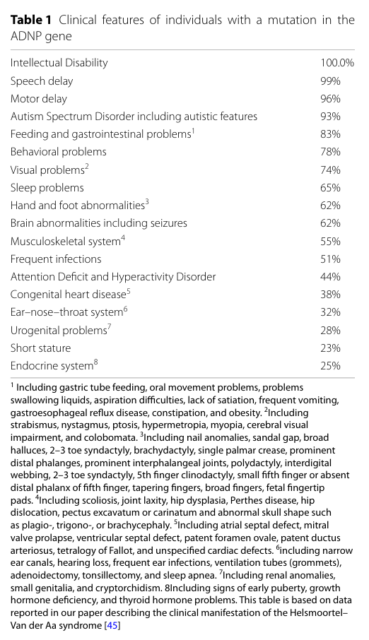

## Question

# Disease Characteristics Research Template

## Target Disease
- **Disease Name:** ADNP-Related Syndrome
- **MONDO ID:**  (if available)
- **Category:** Mendelian

## Research Objectives

Please provide a comprehensive research report on **ADNP-Related Syndrome** covering all of the
disease characteristics listed below. This report will be used to populate a disease knowledge
base entry. Be thorough and cite primary literature (PMID preferred) for all claims.

For each section, **suggested databases/resources** are listed. These are the first places
you should search for information on each topic.

---

### 1. Disease Information
> **Search first:** OMIM, Orphanet, ICD-10/ICD-11, MeSH, PubMed

- What is the disease? Provide a concise overview.
- What are the key identifiers? (OMIM, Orphanet, ICD-10/ICD-11, MeSH, Mondo)
- What are the common synonyms and alternative names?
- Is the information derived from individual patients (e.g., EHR) or aggregated disease-level resources?

### 2. Etiology

- **Disease Causal Factors**: What are the primary causes? (genetic, environmental, infectious, mechanistic)
- **Risk Factors**:
  > **Search first:** PubMed, Cochrane Library, UpToDate, clinical guidelines, ClinVar, ClinGen, GWAS Catalog, PheGenI, CTD, CDC, WHO, epidemiological databases
  - Genetic risk factors (causal variants, susceptibility loci, modifier genes)
  - Environmental risk factors (toxins, lifestyle, occupational exposures, age, sex, family history)
- **Protective Factors**:
  > **Search first:** PubMed, Cochrane Library, clinical trial databases, GWAS Catalog, gnomAD, WHO, CDC, nutrition databases
  - Genetic protective factors (protective variants, modifier alleles)
  - Environmental protective factors (diet, lifestyle, exposures that reduce risk)
- **Gene-Environment Interactions**: How do genetic and environmental factors interact to influence disease?
  > **Search first:** CTD, PubMed, PheGenI, GxE databases

### 3. Phenotypes
> **Search first:** HPO (Human Phenotype Ontology), OMIM, Orphanet, PubMed, clinicaltrials.gov, MedDRA, SNOMED CT, DECIPHER, LOINC

For each phenotype, provide:
- **Phenotype type**: symptoms, clinical signs, physical manifestations, behavioral changes, or laboratory abnormalities
  > For symptoms/signs: HPO, OMIM, Orphanet, PubMed
  > For behavioral changes: HPO, DSM, RDoC (Research Domain Criteria), PubMed
  > For laboratory abnormalities: LOINC, SNOMED CT, LabTests Online, PubMed
- **Phenotype characteristics**:
  > **Search first:** OMIM, Orphanet, HPO, PubMed
  - Age of symptom onset (neonatal, childhood, adult-onset, late-onset)
  - Symptom severity (mild, moderate, severe, variable)
  - Symptom progression (stable, progressive, episodic, fluctuating)
  - Frequency among affected individuals (percentage or qualitative)
- **Quality of life impact**: Effects on daily functioning and well-being (per-phenotype when possible)
  > **Search first:** EQ-5D database, SF-36, WHO QOL databases, PubMed
- Suggest HPO (Human Phenotype Ontology) terms for each phenotype

### 4. Genetic/Molecular Information

- **Causal Genes**: Gene mutations or chromosomal abnormalities responsible for disease (gene symbols, OMIM IDs)
  > **Search first:** OMIM, ClinVar, HGMD, Ensembl, NCBI Gene
- **Pathogenic Variants**:
  - Affected genes (gene symbols, HGNC IDs)
    > **Search first:** OMIM, NCBI Gene, Ensembl, HGNC, UniProt, GeneCards
  - Variant classification (pathogenic, likely pathogenic, VUS per ACMG/AMP guidelines)
    > **Search first:** ClinVar, ClinGen, ACMG/AMP guidelines, VarSome
  - Variant type/class (missense, frameshift, nonsense, splice-site, structural)
  - Allele frequency in population databases
    > **Search first:** gnomAD, 1000 Genomes, ExAC, TOPMed, dbSNP
  - Somatic vs germline origin
    > **Search first:** COSMIC (somatic), ClinVar, ICGC, TCGA
  - Functional consequences (loss of function, gain of function, dominant negative)
- **Modifier Genes**: Genes that modify disease severity or expression
- **Epigenetic Information**: DNA methylation, histone modifications, chromatin changes affecting disease
  > **Search first:** ENCODE, Roadmap Epigenomics, MethBase, DiseaseMeth
- **Chromosomal Abnormalities**: Large-scale genetic changes (aneuploidy, translocations, inversions)
  > **Search first:** DECIPHER, ClinVar, ECARUCA, UCSC Genome Browser

### 5. Environmental Information

- **Environmental Factors**: Non-genetic contributing factors (toxins, radiation, pollution, occupational exposure)
  > **Search first:** CTD (Comparative Toxicogenomics Database), TOXNET, PubMed, EPA databases
- **Lifestyle Factors**: Behavioral factors (smoking, diet, exercise, alcohol consumption)
  > **Search first:** CDC databases, WHO, PubMed, NHANES
- **Infectious Agents**: If applicable, pathogens causing or triggering disease (bacteria, viruses, fungi, parasites)
  > **Search first:** NCBI Taxonomy, ViPR, BV-BRC, MicrobeDB, GIDEON

### 6. Mechanism / Pathophysiology

- **Molecular Pathways**: Specific signaling cascades or biochemical pathways involved (Wnt, MAPK, mTOR, PI3K-AKT, etc.)
  > **Search first:** KEGG, Reactome, WikiPathways, PathBank, BioCyc
- **Cellular Processes**: Cell-level mechanisms (apoptosis, autophagy, cell cycle dysregulation, inflammation, etc.)
  > **Search first:** Gene Ontology (GO), Reactome, KEGG, PubMed
- **Protein Dysfunction**: How protein structure or function is altered (misfolding, aggregation, loss of function, gain of function)
  > **Search first:** UniProt, PDB (Protein Data Bank), InterPro, Pfam, AlphaFold
- **Metabolic Changes**: Alterations in metabolic processes (energy metabolism, lipid metabolism, amino acid metabolism)
  > **Search first:** KEGG, BioCyc, HMDB (Human Metabolome Database), BRENDA
- **Immune System Involvement**: Role of immune response (autoimmunity, immunodeficiency, chronic inflammation)
  > **Search first:** ImmPort, Immunome Database, IEDB, Gene Ontology
- **Tissue Damage Mechanisms**: How tissues/ are injured (oxidative stress, ischemia, fibrosis, necrosis)
  > **Search first:** PubMed, Gene Ontology, Reactome
- **Biochemical Abnormalities**: Specific molecular defects (enzyme deficiencies, receptor dysfunction, ion channel defects)
  > **Search first:** BRENDA, UniProt, KEGG, OMIM, PubMed
- **Epigenetic Changes**: DNA methylation, histone modifications affecting gene expression in disease
  > **Search first:** ENCODE, Roadmap Epigenomics, MethBase, DiseaseMeth
- **Molecular Profiling** (if available):
  - Transcriptomics/gene expression changes
    > **Search first:** GEO (Gene Expression Omnibus), ArrayExpress, GTEx, Human Cell Atlas, SRA
  - Proteomics findings
    > **Search first:** PRIDE, ProteomeXchange, Human Protein Atlas, STRING, BioGRID
  - Metabolomics signatures
    > **Search first:** MetaboLights, Metabolomics Workbench, HMDB, METLIN
  - Lipidomics alterations
    > **Search first:** LIPID MAPS, SwissLipids, LipidHome, Metabolomics Workbench
  - Genomic structural features
    > **Search first:** UCSC Genome Browser, Ensembl, NCBI, dbVar, DGV
- **Advanced Technologies** (if applicable):
  - Single-cell analysis findings (cell-type specific mechanisms, cellular heterogeneity)
    > **Search first:** Human Cell Atlas, Single Cell Portal, GEO, CELLxGENE
  - Spatial transcriptomics findings
    > **Search first:** GEO, Spatial Research, Vizgen, 10x Genomics data
  - Multi-omics integration results
    > **Search first:** TCGA, ICGC, cBioPortal, LinkedOmics, PubMed
  - Functional genomics screens (CRISPR, RNAi)
    > **Search first:** DepMap, GenomeRNAi, PubMed, BioGRID ORCS

For each mechanism, describe:
- The causal chain from initial trigger to clinical manifestation
- Which mechanisms are upstream vs downstream
- What cell types and biological processes are involved
- Suggest GO terms for biological processes and CL terms for cell types

### 7. Anatomical Structures Affected

- **Organ Level**:
  - Primary organs directly affected
  - Secondary organ involvement (complications, secondary effects)
  - Body systems involved (cardiovascular, nervous, digestive, respiratory, endocrine, etc.)
  > **Search first:** Uberon, FMA (Foundational Model of Anatomy), OMIM, HPO, ICD-11, MeSH, SNOMED CT
- **Tissue and Cell Level**:
  - Specific tissue types affected (epithelial, connective, muscle, nervous)
  - Specific cell populations targeted (with Cell Ontology terms)
  > **Search first:** Uberon, Human Protein Atlas, Cell Ontology, Human Cell Atlas, CellMarker, PanglaoDB
- **Subcellular Level**:
  - Cellular compartments involved (mitochondria, nucleus, ER, lysosomes) (with GO Cellular Component terms)
  > **Search first:** Gene Ontology (Cellular Component), UniProt, Human Protein Atlas
- **Localization**:
  - Specific anatomical sites (with UBERON terms)
    > **Search first:** FMA, Uberon, NeuroNames (for brain), SNOMED CT
  - Lateralization (unilateral, bilateral, asymmetric)
    > **Search first:** HPO, clinical literature, imaging databases

### 8. Temporal Development

- **Onset**:
  - Typical age of onset (congenital, pediatric, adult, geriatric)
  - Onset pattern (acute, subacute, chronic, insidious)
  > **Search first:** OMIM, Orphanet, HPO, PubMed
- **Progression**:
  - Disease stages (early, intermediate, advanced, end-stage)
    > **Search first:** Cancer Staging Manual (AJCC), WHO classifications, PubMed
  - Progression rate (rapid, slow, variable)
  - Disease course pattern (episodic, relapsing-remitting, progressive, stable)
  - Disease duration (self-limited, chronic lifelong)
  > **Search first:** Disease registries, longitudinal cohort databases, natural history studies, PubMed, Orphanet, OMIM
- **Patterns**:
  - Remission patterns (spontaneous, treatment-induced)
    > **Search first:** Clinical trial databases, disease registries, PubMed
  - Critical periods (time windows of vulnerability or opportunity for intervention)
    > **Search first:** PubMed, developmental biology databases, clinical guidelines

### 9. Inheritance and Population

- **Epidemiology**:
  - Prevalence (cases per 100,000 at given time)
  - Incidence (new cases per 100,000 per year)
  > **Search first:** Orphanet, CDC, WHO, GBD (Global Burden of Disease), national registries, SEER, disease registries
- **For Genetic Etiology**:
  - Inheritance pattern (AD, AR, X-linked, mitochondrial, multifactorial, polygenic)
    > **Search first:** OMIM, Orphanet, ClinVar, GTR (Genetic Testing Registry)
  - Penetrance (complete, incomplete, age-dependent)
    > **Search first:** ClinVar, OMIM, PubMed, ClinGen
  - Expressivity (variable, consistent)
    > **Search first:** OMIM, ClinVar, PubMed
  - Genetic anticipation (increasing severity in successive generations)
    > **Search first:** OMIM, PubMed (especially for repeat expansion disorders)
  - Germline mosaicism
    > **Search first:** ClinVar, OMIM, genetic counseling literature, PubMed
  - Founder effects (population-specific mutations)
    > **Search first:** gnomAD, population genetics databases, PubMed
  - Consanguinity role
    > **Search first:** OMIM, population studies, genetic counseling resources
  - Carrier frequency
    > **Search first:** gnomAD, carrier screening databases, GeneReviews, GTR
- **Population Demographics**:
  - Affected populations (ethnic or demographic groups with higher prevalence)
    > **Search first:** gnomAD, 1000 Genomes, PAGE Study, PubMed, population registries
  - Geographic distribution (endemic areas, regional variation)
    > **Search first:** WHO, CDC, GBD, Orphanet, geographic epidemiology databases
  - Geographic distribution of specific variants
  - Sex ratio (male:female)
    > **Search first:** Disease registries, OMIM, PubMed, epidemiological databases
  - Age distribution of affected individuals
    > **Search first:** CDC, disease registries, SEER, Orphanet

### 10. Diagnostics

- **Clinical Tests**:
  - Laboratory tests (blood, urine, tissue chemistry, specific enzyme assays)
    > **Search first:** LOINC, LabTests Online, PubMed
  - Biomarkers (proteins, metabolites, genetic markers, circulating biomarkers)
    > **Search first:** FDA Biomarker List, BEST (Biomarkers, EndpointS, and other Tools), PubMed
  - Imaging studies (X-ray, CT, MRI, PET, ultrasound)
    > **Search first:** RadLex, DICOM, Radiopaedia, imaging databases
  - Functional tests (pulmonary function, cardiac stress tests)
    > **Search first:** LOINC, clinical guidelines, PubMed
  - Electrophysiology (EEG, EMG, ECG, nerve conduction studies)
    > **Search first:** LOINC, clinical neurophysiology databases, PubMed
  - Biopsy findings (histopathology, immunohistochemistry)
    > **Search first:** SNOMED CT, College of American Pathologists resources, PubMed
  - Pathology findings (microscopic examination)
    > **Search first:** SNOMED CT, Digital Pathology databases, PubMed
- **Genetic Testing**:
  > **Search first:** GTR (Genetic Testing Registry), GeneReviews, ClinGen
  - Overview of recommended genetic testing approach
  - Whole genome sequencing (WGS) utility
    > **Search first:** GTR, ClinVar, GEL (Genomics England), gnomAD
  - Whole exome sequencing (WES) utility
    > **Search first:** GTR, ClinVar, OMIM, GeneMatcher
  - Gene panels (which panels, which genes)
    > **Search first:** GTR, ClinVar, laboratory-specific databases
  - Single gene testing
    > **Search first:** GTR, ClinVar, OMIM, GeneReviews
  - Chromosomal microarray (CMA)
    > **Search first:** DECIPHER, ClinVar, dbVar, ECARUCA
  - Karyotyping
    > **Search first:** Chromosome Abnormality Database, ClinVar, cytogenetics resources
  - FISH
    > **Search first:** ClinVar, cytogenetics databases, PubMed
  - Mitochondrial DNA testing
    > **Search first:** MITOMAP, MSeqDR, ClinVar, GTR
  - Repeat expansion testing
    > **Search first:** GTR, ClinVar, repeat expansion databases, PubMed
- **Omics-Based Diagnostics** (if applicable):
  - RNA sequencing / transcriptomics
    > **Search first:** GEO, ArrayExpress, GTEx, RNA-seq databases
  - Proteomics
    > **Search first:** PRIDE, ProteomeXchange, FDA Biomarker database
  - Metabolomics
    > **Search first:** MetaboLights, Metabolomics Workbench, HMDB
  - Epigenomics
    > **Search first:** GEO, ENCODE, Roadmap Epigenomics, MethBase
  - Liquid biopsy
    > **Search first:** COSMIC, ClinVar, liquid biopsy databases, PubMed
- **Clinical Criteria**:
  - Standardized diagnostic criteria (DSM, ICD, society guidelines)
    > **Search first:** DSM-5, ICD-11, clinical society guidelines, UpToDate
  - Differential diagnosis (other conditions to rule out, with distinguishing features)
    > **Search first:** DynaMed, UpToDate, clinical decision support systems
- **Screening**:
  - Screening methods for asymptomatic individuals (newborn screening, carrier screening, cascade screening)
    > **Search first:** ACMG recommendations, CDC newborn screening, GTR

### 11. Outcome/Prognosis

- **Survival and Mortality**:
  - Survival rate (5-year, 10-year, overall)
    > **Search first:** SEER, cancer registries, disease-specific registries, PubMed
  - Life expectancy (with and without treatment if applicable)
    > **Search first:** Orphanet, disease registries, actuarial databases, PubMed
  - Mortality rate
    > **Search first:** CDC, WHO, GBD, national mortality databases
  - Disease-specific mortality (deaths directly attributable to disease)
    > **Search first:** Disease registries, CDC Wonder, GBD, PubMed
- **Morbidity and Function**:
  - Morbidity (disease-related disability and health impacts)
    > **Search first:** GBD, WHO, disability databases, PubMed
  - Disability outcomes (long-term functional impairments)
    > **Search first:** ICF (International Classification of Functioning), disability registries
  - Quality of life measures (EQ-5D, SF-36, PROMIS, disease-specific tools)
    > **Search first:** EQ-5D database, SF-36, PROMIS, PubMed
- **Disease Course**:
  - Complications (secondary problems: infections, organ failure, etc.)
    > **Search first:** ICD codes, disease registries, clinical databases, PubMed
  - Recovery potential (likelihood and extent of recovery, with vs without treatment)
    > **Search first:** Natural history studies, rehabilitation databases, PubMed
- **Prediction**:
  - Prognostic factors (age, disease severity, biomarkers, treatment response)
    > **Search first:** Prognostic models databases, clinical calculators, PubMed
  - Prognostic biomarkers (molecular markers predicting disease course)
    > **Search first:** FDA Biomarker database, PubMed, cancer prognostic databases

### 12. Treatment

- **Pharmacotherapy**:
  - Pharmacological treatments (drug names, drug classes, mechanisms of action)
    > **Search first:** DrugBank, RxNorm, ATC classification, DailyMed, FDA databases
  - Pharmacogenomics (how genetic variants affect drug metabolism, efficacy, toxicity)
    > **Search first:** PharmGKB, CPIC (Clinical Pharmacogenetics), FDA Table of PGx Biomarkers
- **Advanced Therapeutics**:
  - Gene therapy (viral vectors, CRISPR, gene replacement, gene editing)
    > **Search first:** ClinicalTrials.gov, FDA gene therapy database, ASGCT resources
  - Cell therapy (stem cell transplant, CAR-T, cellular therapeutics)
    > **Search first:** ClinicalTrials.gov, FDA cell therapy database, FACT standards
  - RNA-based therapies (ASOs, siRNA, mRNA therapies)
    > **Search first:** ClinicalTrials.gov, FDA approvals, PubMed
  - Targeted therapies (treatments directed at specific molecular targets)
    > **Search first:** My Cancer Genome, OncoKB, ClinicalTrials.gov, FDA approvals
  - Immunotherapies (checkpoint inhibitors, monoclonal antibodies)
    > **Search first:** Cancer Immunotherapy Database, FDA approvals, ClinicalTrials.gov
- **Surgical and Interventional**:
  - Surgical interventions (types of surgery, timing, outcomes)
    > **Search first:** CPT codes, surgical registries, clinical guidelines, PubMed
- **Supportive and Rehabilitative**:
  - Supportive care (symptom management, pain control, nutrition)
    > **Search first:** Clinical guidelines, Cochrane Library, PubMed
  - Rehabilitation (physical therapy, occupational therapy, speech therapy)
    > **Search first:** Rehabilitation medicine databases, clinical guidelines, PubMed
- **Experimental**:
  - Experimental treatments in clinical trials (with NCT identifiers if available)
    > **Search first:** ClinicalTrials.gov, EU Clinical Trials Register, WHO ICTRP
- **Treatment Outcomes**:
  - Treatment response rates
    > **Search first:** Clinical trial databases, FDA reviews, systematic reviews, PubMed
  - Side effects and adverse events
    > **Search first:** FDA Adverse Event Reporting System (FAERS), MedWatch, PubMed
- **Treatment Strategy**:
  - Treatment algorithms (clinical pathways, decision trees)
    > **Search first:** Clinical practice guidelines, NCCN Guidelines, UpToDate
  - Combination therapies
    > **Search first:** ClinicalTrials.gov, treatment guidelines, PubMed
  - Personalized medicine approaches (genotype-guided treatment)
    > **Search first:** My Cancer Genome, CIViC, PharmGKB, precision medicine databases

For each treatment, suggest MAXO (Medical Action Ontology) terms where applicable.

### 13. Prevention

- **Prevention Levels**:
  - Primary prevention (preventing disease occurrence: vaccination, risk factor modification)
    > **Search first:** CDC, WHO, USPSTF recommendations, Cochrane Library
  - Secondary prevention (early detection and treatment: screening programs, early intervention)
    > **Search first:** USPSTF, CDC screening guidelines, WHO
  - Tertiary prevention (preventing complications in those with disease)
    > **Search first:** Clinical guidelines, disease management protocols, PubMed
- **Immunization**: Vaccine strategies (if applicable)
  > **Search first:** CDC vaccine schedules, WHO immunization, FDA vaccine database
- **Screening and Early Detection**:
  - Screening programs (population-based: newborn screening, cancer screening)
    > **Search first:** CDC screening programs, USPSTF, cancer screening databases
  - Genetic screening (carrier screening, preimplantation genetic diagnosis, prenatal testing)
    > **Search first:** ACMG recommendations, ACOG guidelines, GTR
  - Risk stratification (identifying high-risk individuals for targeted prevention)
    > **Search first:** Risk prediction models, clinical calculators, PubMed
- **Behavioral Interventions**: Lifestyle modifications to reduce risk
  > **Search first:** CDC, WHO, behavioral intervention databases, Cochrane Library
- **Counseling**: Genetic counseling (risk assessment, family planning guidance)
  > **Search first:** NSGC resources, ACMG guidelines, GeneReviews
- **Public Health**:
  - Public health interventions (sanitation, vector control, health education)
    > **Search first:** CDC, WHO, public health databases, PubMed
  - Environmental interventions (reducing environmental risk factors)
    > **Search first:** EPA databases, WHO environmental health, PubMed
- **Prophylaxis**: Preventive medications or procedures
  > **Search first:** Clinical guidelines, FDA approvals, PubMed

### 14. Other Species / Natural Disease

- **Taxonomy**: Species affected (with NCBI Taxon identifiers)
  > **Search first:** NCBI Taxonomy
- **Breed**: Specific breeds affected (with VBO identifiers if applicable)
  > **Search first:** VBO (Vertebrate Breed Ontology)
- **Gene**: Orthologous genes in other species (with NCBI Gene IDs)
  > **Search first:** NCBI Gene
- **Natural Disease**:
  - Naturally occurring disease in other species (companion animals, wildlife)
    > **Search first:** OMIA (Online Mendelian Inheritance in Animals), VetCompass, PubMed
  - Veterinary relevance and importance in animal health
    > **Search first:** OMIA, veterinary databases, PubMed
- **Comparative Biology**:
  - Comparative pathology (similarities and differences across species)
    > **Search first:** OMIA, comparative pathology databases, PubMed
  - Evolutionary conservation of disease mechanisms
    > **Search first:** HomoloGene, OrthoMCL, Alliance of Genome Resources
- **Transmission** (if applicable):
  - Zoonotic potential
    > **Search first:** CDC zoonotic diseases, WHO zoonoses, GIDEON
  - Cross-species susceptibility
    > **Search first:** NCBI Taxonomy, veterinary databases, PubMed

### 15. Model Organisms

- **Model Types**:
  - Model organism type (mammalian, invertebrate, cellular, in vitro)
    > **Search first:** Alliance of Genome Resources, model organism databases
  - Specific model systems (mouse, rat, zebrafish, Drosophila, C. elegans, yeast, cell lines, organoids, iPSCs)
    > **Search first:** MGI, RGD, ZFIN, FlyBase, WormBase, SGD, ATCC, Cellosaurus
  - Induced models (drug treatment, surgical intervention, environmental manipulation)
    > **Search first:** MGI, model organism databases, PubMed
- **Genetic Models**:
  - Types available (knockout, knock-in, transgenic, conditional, humanized)
    > **Search first:** MGI, IMPC, KOMP, EuMMCR, IMSR
- **Model Characteristics**:
  - Phenotype recapitulation (how well model reproduces human disease features)
    > **Search first:** Model organism databases, comparative studies, PubMed
  - Model limitations (aspects of human disease not captured)
    > **Search first:** Model organism databases, PubMed, review articles
- **Applications**:
  - Research applications (what aspects of disease can be studied)
    > **Search first:** Model organism databases, PubMed
- **Resources**:
  - Model databases
    > **Search first:** MGI, RGD, ZFIN, FlyBase, WormBase, IMSR, EMMA, MMRRC

---

## Citation Requirements

- Cite primary literature (PMID preferred) for all mechanistic and clinical claims
- Prioritize recent reviews and landmark papers
- Include direct quotes from abstracts where possible to support key statements
- Distinguish evidence source types: human clinical, model organism, in vitro, computational

## Output Format

Structure your response as a comprehensive narrative organized by the sections above.
For each section, provide:
- Factual content with specific details (numbers, percentages, gene names, variant nomenclature)
- Ontology term suggestions (HPO, GO, CL, UBERON, CHEBI, MAXO, MONDO) where applicable
- Evidence citations with PMIDs
- Direct quotes from abstracts to support key claims
- Clear indication when information is not available or not applicable for this disease

This report will be used to populate a disease knowledge base entry with:
- Pathophysiology descriptions with causal chains
- Gene/protein annotations (HGNC, GO terms)
- Phenotype associations (HP terms) with frequencies
- Cell type involvement (CL terms)
- Anatomical locations (UBERON terms)
- Chemical entities (CHEBI terms)
- Treatment annotations (MAXO terms)
- Evidence items with PMIDs and exact abstract quotes
- Epidemiology, prognosis, diagnostic, and prevention information
- Animal model descriptions with phenotype recapitulation details

## Output

Question: You are an expert researcher providing comprehensive, well-cited information.

Provide detailed information focusing on:
1. Key concepts and definitions with current understanding
2. Recent developments and latest research (prioritize 2023-2024 sources)
3. Current applications and real-world implementations
4. Expert opinions and analysis from authoritative sources
5. Relevant statistics and data from recent studies

Format as a comprehensive research report with proper citations. Include URLs and publication dates where available.
Always prioritize recent, authoritative sources and provide specific citations for all major claims.

# Disease Characteristics Research Template

## Target Disease
- **Disease Name:** ADNP-Related Syndrome
- **MONDO ID:**  (if available)
- **Category:** Mendelian

## Research Objectives

Please provide a comprehensive research report on **ADNP-Related Syndrome** covering all of the
disease characteristics listed below. This report will be used to populate a disease knowledge
base entry. Be thorough and cite primary literature (PMID preferred) for all claims.

For each section, **suggested databases/resources** are listed. These are the first places
you should search for information on each topic.

---

### 1. Disease Information
> **Search first:** OMIM, Orphanet, ICD-10/ICD-11, MeSH, PubMed

- What is the disease? Provide a concise overview.
- What are the key identifiers? (OMIM, Orphanet, ICD-10/ICD-11, MeSH, Mondo)
- What are the common synonyms and alternative names?
- Is the information derived from individual patients (e.g., EHR) or aggregated disease-level resources?

### 2. Etiology

- **Disease Causal Factors**: What are the primary causes? (genetic, environmental, infectious, mechanistic)
- **Risk Factors**:
  > **Search first:** PubMed, Cochrane Library, UpToDate, clinical guidelines, ClinVar, ClinGen, GWAS Catalog, PheGenI, CTD, CDC, WHO, epidemiological databases
  - Genetic risk factors (causal variants, susceptibility loci, modifier genes)
  - Environmental risk factors (toxins, lifestyle, occupational exposures, age, sex, family history)
- **Protective Factors**:
  > **Search first:** PubMed, Cochrane Library, clinical trial databases, GWAS Catalog, gnomAD, WHO, CDC, nutrition databases
  - Genetic protective factors (protective variants, modifier alleles)
  - Environmental protective factors (diet, lifestyle, exposures that reduce risk)
- **Gene-Environment Interactions**: How do genetic and environmental factors interact to influence disease?
  > **Search first:** CTD, PubMed, PheGenI, GxE databases

### 3. Phenotypes
> **Search first:** HPO (Human Phenotype Ontology), OMIM, Orphanet, PubMed, clinicaltrials.gov, MedDRA, SNOMED CT, DECIPHER, LOINC

For each phenotype, provide:
- **Phenotype type**: symptoms, clinical signs, physical manifestations, behavioral changes, or laboratory abnormalities
  > For symptoms/signs: HPO, OMIM, Orphanet, PubMed
  > For behavioral changes: HPO, DSM, RDoC (Research Domain Criteria), PubMed
  > For laboratory abnormalities: LOINC, SNOMED CT, LabTests Online, PubMed
- **Phenotype characteristics**:
  > **Search first:** OMIM, Orphanet, HPO, PubMed
  - Age of symptom onset (neonatal, childhood, adult-onset, late-onset)
  - Symptom severity (mild, moderate, severe, variable)
  - Symptom progression (stable, progressive, episodic, fluctuating)
  - Frequency among affected individuals (percentage or qualitative)
- **Quality of life impact**: Effects on daily functioning and well-being (per-phenotype when possible)
  > **Search first:** EQ-5D database, SF-36, WHO QOL databases, PubMed
- Suggest HPO (Human Phenotype Ontology) terms for each phenotype

### 4. Genetic/Molecular Information

- **Causal Genes**: Gene mutations or chromosomal abnormalities responsible for disease (gene symbols, OMIM IDs)
  > **Search first:** OMIM, ClinVar, HGMD, Ensembl, NCBI Gene
- **Pathogenic Variants**:
  - Affected genes (gene symbols, HGNC IDs)
    > **Search first:** OMIM, NCBI Gene, Ensembl, HGNC, UniProt, GeneCards
  - Variant classification (pathogenic, likely pathogenic, VUS per ACMG/AMP guidelines)
    > **Search first:** ClinVar, ClinGen, ACMG/AMP guidelines, VarSome
  - Variant type/class (missense, frameshift, nonsense, splice-site, structural)
  - Allele frequency in population databases
    > **Search first:** gnomAD, 1000 Genomes, ExAC, TOPMed, dbSNP
  - Somatic vs germline origin
    > **Search first:** COSMIC (somatic), ClinVar, ICGC, TCGA
  - Functional consequences (loss of function, gain of function, dominant negative)
- **Modifier Genes**: Genes that modify disease severity or expression
- **Epigenetic Information**: DNA methylation, histone modifications, chromatin changes affecting disease
  > **Search first:** ENCODE, Roadmap Epigenomics, MethBase, DiseaseMeth
- **Chromosomal Abnormalities**: Large-scale genetic changes (aneuploidy, translocations, inversions)
  > **Search first:** DECIPHER, ClinVar, ECARUCA, UCSC Genome Browser

### 5. Environmental Information

- **Environmental Factors**: Non-genetic contributing factors (toxins, radiation, pollution, occupational exposure)
  > **Search first:** CTD (Comparative Toxicogenomics Database), TOXNET, PubMed, EPA databases
- **Lifestyle Factors**: Behavioral factors (smoking, diet, exercise, alcohol consumption)
  > **Search first:** CDC databases, WHO, PubMed, NHANES
- **Infectious Agents**: If applicable, pathogens causing or triggering disease (bacteria, viruses, fungi, parasites)
  > **Search first:** NCBI Taxonomy, ViPR, BV-BRC, MicrobeDB, GIDEON

### 6. Mechanism / Pathophysiology

- **Molecular Pathways**: Specific signaling cascades or biochemical pathways involved (Wnt, MAPK, mTOR, PI3K-AKT, etc.)
  > **Search first:** KEGG, Reactome, WikiPathways, PathBank, BioCyc
- **Cellular Processes**: Cell-level mechanisms (apoptosis, autophagy, cell cycle dysregulation, inflammation, etc.)
  > **Search first:** Gene Ontology (GO), Reactome, KEGG, PubMed
- **Protein Dysfunction**: How protein structure or function is altered (misfolding, aggregation, loss of function, gain of function)
  > **Search first:** UniProt, PDB (Protein Data Bank), InterPro, Pfam, AlphaFold
- **Metabolic Changes**: Alterations in metabolic processes (energy metabolism, lipid metabolism, amino acid metabolism)
  > **Search first:** KEGG, BioCyc, HMDB (Human Metabolome Database), BRENDA
- **Immune System Involvement**: Role of immune response (autoimmunity, immunodeficiency, chronic inflammation)
  > **Search first:** ImmPort, Immunome Database, IEDB, Gene Ontology
- **Tissue Damage Mechanisms**: How tissues/ are injured (oxidative stress, ischemia, fibrosis, necrosis)
  > **Search first:** PubMed, Gene Ontology, Reactome
- **Biochemical Abnormalities**: Specific molecular defects (enzyme deficiencies, receptor dysfunction, ion channel defects)
  > **Search first:** BRENDA, UniProt, KEGG, OMIM, PubMed
- **Epigenetic Changes**: DNA methylation, histone modifications affecting gene expression in disease
  > **Search first:** ENCODE, Roadmap Epigenomics, MethBase, DiseaseMeth
- **Molecular Profiling** (if available):
  - Transcriptomics/gene expression changes
    > **Search first:** GEO (Gene Expression Omnibus), ArrayExpress, GTEx, Human Cell Atlas, SRA
  - Proteomics findings
    > **Search first:** PRIDE, ProteomeXchange, Human Protein Atlas, STRING, BioGRID
  - Metabolomics signatures
    > **Search first:** MetaboLights, Metabolomics Workbench, HMDB, METLIN
  - Lipidomics alterations
    > **Search first:** LIPID MAPS, SwissLipids, LipidHome, Metabolomics Workbench
  - Genomic structural features
    > **Search first:** UCSC Genome Browser, Ensembl, NCBI, dbVar, DGV
- **Advanced Technologies** (if applicable):
  - Single-cell analysis findings (cell-type specific mechanisms, cellular heterogeneity)
    > **Search first:** Human Cell Atlas, Single Cell Portal, GEO, CELLxGENE
  - Spatial transcriptomics findings
    > **Search first:** GEO, Spatial Research, Vizgen, 10x Genomics data
  - Multi-omics integration results
    > **Search first:** TCGA, ICGC, cBioPortal, LinkedOmics, PubMed
  - Functional genomics screens (CRISPR, RNAi)
    > **Search first:** DepMap, GenomeRNAi, PubMed, BioGRID ORCS

For each mechanism, describe:
- The causal chain from initial trigger to clinical manifestation
- Which mechanisms are upstream vs downstream
- What cell types and biological processes are involved
- Suggest GO terms for biological processes and CL terms for cell types

### 7. Anatomical Structures Affected

- **Organ Level**:
  - Primary organs directly affected
  - Secondary organ involvement (complications, secondary effects)
  - Body systems involved (cardiovascular, nervous, digestive, respiratory, endocrine, etc.)
  > **Search first:** Uberon, FMA (Foundational Model of Anatomy), OMIM, HPO, ICD-11, MeSH, SNOMED CT
- **Tissue and Cell Level**:
  - Specific tissue types affected (epithelial, connective, muscle, nervous)
  - Specific cell populations targeted (with Cell Ontology terms)
  > **Search first:** Uberon, Human Protein Atlas, Cell Ontology, Human Cell Atlas, CellMarker, PanglaoDB
- **Subcellular Level**:
  - Cellular compartments involved (mitochondria, nucleus, ER, lysosomes) (with GO Cellular Component terms)
  > **Search first:** Gene Ontology (Cellular Component), UniProt, Human Protein Atlas
- **Localization**:
  - Specific anatomical sites (with UBERON terms)
    > **Search first:** FMA, Uberon, NeuroNames (for brain), SNOMED CT
  - Lateralization (unilateral, bilateral, asymmetric)
    > **Search first:** HPO, clinical literature, imaging databases

### 8. Temporal Development

- **Onset**:
  - Typical age of onset (congenital, pediatric, adult, geriatric)
  - Onset pattern (acute, subacute, chronic, insidious)
  > **Search first:** OMIM, Orphanet, HPO, PubMed
- **Progression**:
  - Disease stages (early, intermediate, advanced, end-stage)
    > **Search first:** Cancer Staging Manual (AJCC), WHO classifications, PubMed
  - Progression rate (rapid, slow, variable)
  - Disease course pattern (episodic, relapsing-remitting, progressive, stable)
  - Disease duration (self-limited, chronic lifelong)
  > **Search first:** Disease registries, longitudinal cohort databases, natural history studies, PubMed, Orphanet, OMIM
- **Patterns**:
  - Remission patterns (spontaneous, treatment-induced)
    > **Search first:** Clinical trial databases, disease registries, PubMed
  - Critical periods (time windows of vulnerability or opportunity for intervention)
    > **Search first:** PubMed, developmental biology databases, clinical guidelines

### 9. Inheritance and Population

- **Epidemiology**:
  - Prevalence (cases per 100,000 at given time)
  - Incidence (new cases per 100,000 per year)
  > **Search first:** Orphanet, CDC, WHO, GBD (Global Burden of Disease), national registries, SEER, disease registries
- **For Genetic Etiology**:
  - Inheritance pattern (AD, AR, X-linked, mitochondrial, multifactorial, polygenic)
    > **Search first:** OMIM, Orphanet, ClinVar, GTR (Genetic Testing Registry)
  - Penetrance (complete, incomplete, age-dependent)
    > **Search first:** ClinVar, OMIM, PubMed, ClinGen
  - Expressivity (variable, consistent)
    > **Search first:** OMIM, ClinVar, PubMed
  - Genetic anticipation (increasing severity in successive generations)
    > **Search first:** OMIM, PubMed (especially for repeat expansion disorders)
  - Germline mosaicism
    > **Search first:** ClinVar, OMIM, genetic counseling literature, PubMed
  - Founder effects (population-specific mutations)
    > **Search first:** gnomAD, population genetics databases, PubMed
  - Consanguinity role
    > **Search first:** OMIM, population studies, genetic counseling resources
  - Carrier frequency
    > **Search first:** gnomAD, carrier screening databases, GeneReviews, GTR
- **Population Demographics**:
  - Affected populations (ethnic or demographic groups with higher prevalence)
    > **Search first:** gnomAD, 1000 Genomes, PAGE Study, PubMed, population registries
  - Geographic distribution (endemic areas, regional variation)
    > **Search first:** WHO, CDC, GBD, Orphanet, geographic epidemiology databases
  - Geographic distribution of specific variants
  - Sex ratio (male:female)
    > **Search first:** Disease registries, OMIM, PubMed, epidemiological databases
  - Age distribution of affected individuals
    > **Search first:** CDC, disease registries, SEER, Orphanet

### 10. Diagnostics

- **Clinical Tests**:
  - Laboratory tests (blood, urine, tissue chemistry, specific enzyme assays)
    > **Search first:** LOINC, LabTests Online, PubMed
  - Biomarkers (proteins, metabolites, genetic markers, circulating biomarkers)
    > **Search first:** FDA Biomarker List, BEST (Biomarkers, EndpointS, and other Tools), PubMed
  - Imaging studies (X-ray, CT, MRI, PET, ultrasound)
    > **Search first:** RadLex, DICOM, Radiopaedia, imaging databases
  - Functional tests (pulmonary function, cardiac stress tests)
    > **Search first:** LOINC, clinical guidelines, PubMed
  - Electrophysiology (EEG, EMG, ECG, nerve conduction studies)
    > **Search first:** LOINC, clinical neurophysiology databases, PubMed
  - Biopsy findings (histopathology, immunohistochemistry)
    > **Search first:** SNOMED CT, College of American Pathologists resources, PubMed
  - Pathology findings (microscopic examination)
    > **Search first:** SNOMED CT, Digital Pathology databases, PubMed
- **Genetic Testing**:
  > **Search first:** GTR (Genetic Testing Registry), GeneReviews, ClinGen
  - Overview of recommended genetic testing approach
  - Whole genome sequencing (WGS) utility
    > **Search first:** GTR, ClinVar, GEL (Genomics England), gnomAD
  - Whole exome sequencing (WES) utility
    > **Search first:** GTR, ClinVar, OMIM, GeneMatcher
  - Gene panels (which panels, which genes)
    > **Search first:** GTR, ClinVar, laboratory-specific databases
  - Single gene testing
    > **Search first:** GTR, ClinVar, OMIM, GeneReviews
  - Chromosomal microarray (CMA)
    > **Search first:** DECIPHER, ClinVar, dbVar, ECARUCA
  - Karyotyping
    > **Search first:** Chromosome Abnormality Database, ClinVar, cytogenetics resources
  - FISH
    > **Search first:** ClinVar, cytogenetics databases, PubMed
  - Mitochondrial DNA testing
    > **Search first:** MITOMAP, MSeqDR, ClinVar, GTR
  - Repeat expansion testing
    > **Search first:** GTR, ClinVar, repeat expansion databases, PubMed
- **Omics-Based Diagnostics** (if applicable):
  - RNA sequencing / transcriptomics
    > **Search first:** GEO, ArrayExpress, GTEx, RNA-seq databases
  - Proteomics
    > **Search first:** PRIDE, ProteomeXchange, FDA Biomarker database
  - Metabolomics
    > **Search first:** MetaboLights, Metabolomics Workbench, HMDB
  - Epigenomics
    > **Search first:** GEO, ENCODE, Roadmap Epigenomics, MethBase
  - Liquid biopsy
    > **Search first:** COSMIC, ClinVar, liquid biopsy databases, PubMed
- **Clinical Criteria**:
  - Standardized diagnostic criteria (DSM, ICD, society guidelines)
    > **Search first:** DSM-5, ICD-11, clinical society guidelines, UpToDate
  - Differential diagnosis (other conditions to rule out, with distinguishing features)
    > **Search first:** DynaMed, UpToDate, clinical decision support systems
- **Screening**:
  - Screening methods for asymptomatic individuals (newborn screening, carrier screening, cascade screening)
    > **Search first:** ACMG recommendations, CDC newborn screening, GTR

### 11. Outcome/Prognosis

- **Survival and Mortality**:
  - Survival rate (5-year, 10-year, overall)
    > **Search first:** SEER, cancer registries, disease-specific registries, PubMed
  - Life expectancy (with and without treatment if applicable)
    > **Search first:** Orphanet, disease registries, actuarial databases, PubMed
  - Mortality rate
    > **Search first:** CDC, WHO, GBD, national mortality databases
  - Disease-specific mortality (deaths directly attributable to disease)
    > **Search first:** Disease registries, CDC Wonder, GBD, PubMed
- **Morbidity and Function**:
  - Morbidity (disease-related disability and health impacts)
    > **Search first:** GBD, WHO, disability databases, PubMed
  - Disability outcomes (long-term functional impairments)
    > **Search first:** ICF (International Classification of Functioning), disability registries
  - Quality of life measures (EQ-5D, SF-36, PROMIS, disease-specific tools)
    > **Search first:** EQ-5D database, SF-36, PROMIS, PubMed
- **Disease Course**:
  - Complications (secondary problems: infections, organ failure, etc.)
    > **Search first:** ICD codes, disease registries, clinical databases, PubMed
  - Recovery potential (likelihood and extent of recovery, with vs without treatment)
    > **Search first:** Natural history studies, rehabilitation databases, PubMed
- **Prediction**:
  - Prognostic factors (age, disease severity, biomarkers, treatment response)
    > **Search first:** Prognostic models databases, clinical calculators, PubMed
  - Prognostic biomarkers (molecular markers predicting disease course)
    > **Search first:** FDA Biomarker database, PubMed, cancer prognostic databases

### 12. Treatment

- **Pharmacotherapy**:
  - Pharmacological treatments (drug names, drug classes, mechanisms of action)
    > **Search first:** DrugBank, RxNorm, ATC classification, DailyMed, FDA databases
  - Pharmacogenomics (how genetic variants affect drug metabolism, efficacy, toxicity)
    > **Search first:** PharmGKB, CPIC (Clinical Pharmacogenetics), FDA Table of PGx Biomarkers
- **Advanced Therapeutics**:
  - Gene therapy (viral vectors, CRISPR, gene replacement, gene editing)
    > **Search first:** ClinicalTrials.gov, FDA gene therapy database, ASGCT resources
  - Cell therapy (stem cell transplant, CAR-T, cellular therapeutics)
    > **Search first:** ClinicalTrials.gov, FDA cell therapy database, FACT standards
  - RNA-based therapies (ASOs, siRNA, mRNA therapies)
    > **Search first:** ClinicalTrials.gov, FDA approvals, PubMed
  - Targeted therapies (treatments directed at specific molecular targets)
    > **Search first:** My Cancer Genome, OncoKB, ClinicalTrials.gov, FDA approvals
  - Immunotherapies (checkpoint inhibitors, monoclonal antibodies)
    > **Search first:** Cancer Immunotherapy Database, FDA approvals, ClinicalTrials.gov
- **Surgical and Interventional**:
  - Surgical interventions (types of surgery, timing, outcomes)
    > **Search first:** CPT codes, surgical registries, clinical guidelines, PubMed
- **Supportive and Rehabilitative**:
  - Supportive care (symptom management, pain control, nutrition)
    > **Search first:** Clinical guidelines, Cochrane Library, PubMed
  - Rehabilitation (physical therapy, occupational therapy, speech therapy)
    > **Search first:** Rehabilitation medicine databases, clinical guidelines, PubMed
- **Experimental**:
  - Experimental treatments in clinical trials (with NCT identifiers if available)
    > **Search first:** ClinicalTrials.gov, EU Clinical Trials Register, WHO ICTRP
- **Treatment Outcomes**:
  - Treatment response rates
    > **Search first:** Clinical trial databases, FDA reviews, systematic reviews, PubMed
  - Side effects and adverse events
    > **Search first:** FDA Adverse Event Reporting System (FAERS), MedWatch, PubMed
- **Treatment Strategy**:
  - Treatment algorithms (clinical pathways, decision trees)
    > **Search first:** Clinical practice guidelines, NCCN Guidelines, UpToDate
  - Combination therapies
    > **Search first:** ClinicalTrials.gov, treatment guidelines, PubMed
  - Personalized medicine approaches (genotype-guided treatment)
    > **Search first:** My Cancer Genome, CIViC, PharmGKB, precision medicine databases

For each treatment, suggest MAXO (Medical Action Ontology) terms where applicable.

### 13. Prevention

- **Prevention Levels**:
  - Primary prevention (preventing disease occurrence: vaccination, risk factor modification)
    > **Search first:** CDC, WHO, USPSTF recommendations, Cochrane Library
  - Secondary prevention (early detection and treatment: screening programs, early intervention)
    > **Search first:** USPSTF, CDC screening guidelines, WHO
  - Tertiary prevention (preventing complications in those with disease)
    > **Search first:** Clinical guidelines, disease management protocols, PubMed
- **Immunization**: Vaccine strategies (if applicable)
  > **Search first:** CDC vaccine schedules, WHO immunization, FDA vaccine database
- **Screening and Early Detection**:
  - Screening programs (population-based: newborn screening, cancer screening)
    > **Search first:** CDC screening programs, USPSTF, cancer screening databases
  - Genetic screening (carrier screening, preimplantation genetic diagnosis, prenatal testing)
    > **Search first:** ACMG recommendations, ACOG guidelines, GTR
  - Risk stratification (identifying high-risk individuals for targeted prevention)
    > **Search first:** Risk prediction models, clinical calculators, PubMed
- **Behavioral Interventions**: Lifestyle modifications to reduce risk
  > **Search first:** CDC, WHO, behavioral intervention databases, Cochrane Library
- **Counseling**: Genetic counseling (risk assessment, family planning guidance)
  > **Search first:** NSGC resources, ACMG guidelines, GeneReviews
- **Public Health**:
  - Public health interventions (sanitation, vector control, health education)
    > **Search first:** CDC, WHO, public health databases, PubMed
  - Environmental interventions (reducing environmental risk factors)
    > **Search first:** EPA databases, WHO environmental health, PubMed
- **Prophylaxis**: Preventive medications or procedures
  > **Search first:** Clinical guidelines, FDA approvals, PubMed

### 14. Other Species / Natural Disease

- **Taxonomy**: Species affected (with NCBI Taxon identifiers)
  > **Search first:** NCBI Taxonomy
- **Breed**: Specific breeds affected (with VBO identifiers if applicable)
  > **Search first:** VBO (Vertebrate Breed Ontology)
- **Gene**: Orthologous genes in other species (with NCBI Gene IDs)
  > **Search first:** NCBI Gene
- **Natural Disease**:
  - Naturally occurring disease in other species (companion animals, wildlife)
    > **Search first:** OMIA (Online Mendelian Inheritance in Animals), VetCompass, PubMed
  - Veterinary relevance and importance in animal health
    > **Search first:** OMIA, veterinary databases, PubMed
- **Comparative Biology**:
  - Comparative pathology (similarities and differences across species)
    > **Search first:** OMIA, comparative pathology databases, PubMed
  - Evolutionary conservation of disease mechanisms
    > **Search first:** HomoloGene, OrthoMCL, Alliance of Genome Resources
- **Transmission** (if applicable):
  - Zoonotic potential
    > **Search first:** CDC zoonotic diseases, WHO zoonoses, GIDEON
  - Cross-species susceptibility
    > **Search first:** NCBI Taxonomy, veterinary databases, PubMed

### 15. Model Organisms

- **Model Types**:
  - Model organism type (mammalian, invertebrate, cellular, in vitro)
    > **Search first:** Alliance of Genome Resources, model organism databases
  - Specific model systems (mouse, rat, zebrafish, Drosophila, C. elegans, yeast, cell lines, organoids, iPSCs)
    > **Search first:** MGI, RGD, ZFIN, FlyBase, WormBase, SGD, ATCC, Cellosaurus
  - Induced models (drug treatment, surgical intervention, environmental manipulation)
    > **Search first:** MGI, model organism databases, PubMed
- **Genetic Models**:
  - Types available (knockout, knock-in, transgenic, conditional, humanized)
    > **Search first:** MGI, IMPC, KOMP, EuMMCR, IMSR
- **Model Characteristics**:
  - Phenotype recapitulation (how well model reproduces human disease features)
    > **Search first:** Model organism databases, comparative studies, PubMed
  - Model limitations (aspects of human disease not captured)
    > **Search first:** Model organism databases, PubMed, review articles
- **Applications**:
  - Research applications (what aspects of disease can be studied)
    > **Search first:** Model organism databases, PubMed
- **Resources**:
  - Model databases
    > **Search first:** MGI, RGD, ZFIN, FlyBase, WormBase, IMSR, EMMA, MMRRC

---

## Citation Requirements

- Cite primary literature (PMID preferred) for all mechanistic and clinical claims
- Prioritize recent reviews and landmark papers
- Include direct quotes from abstracts where possible to support key statements
- Distinguish evidence source types: human clinical, model organism, in vitro, computational

## Output Format

Structure your response as a comprehensive narrative organized by the sections above.
For each section, provide:
- Factual content with specific details (numbers, percentages, gene names, variant nomenclature)
- Ontology term suggestions (HPO, GO, CL, UBERON, CHEBI, MAXO, MONDO) where applicable
- Evidence citations with PMIDs
- Direct quotes from abstracts to support key claims
- Clear indication when information is not available or not applicable for this disease

This report will be used to populate a disease knowledge base entry with:
- Pathophysiology descriptions with causal chains
- Gene/protein annotations (HGNC, GO terms)
- Phenotype associations (HP terms) with frequencies
- Cell type involvement (CL terms)
- Anatomical locations (UBERON terms)
- Chemical entities (CHEBI terms)
- Treatment annotations (MAXO terms)
- Evidence items with PMIDs and exact abstract quotes
- Epidemiology, prognosis, diagnostic, and prevention information
- Animal model descriptions with phenotype recapitulation details

## Comprehensive Disease Characteristics Report: ADNP-Related Syndrome (Helsmoortel–Van der Aa syndrome)

### Target disease
**Disease name:** ADNP-related syndrome (ADNP syndrome; Helsmoortel–Van der Aa syndrome, HVDAS) (grice2024transientperipheralblood pages 1-2, ge2024clinicalimpactand pages 1-2)

---

## 1. Disease information

### 1.1 Concise overview (current understanding)
ADNP-related syndrome is a rare, monogenic neurodevelopmental disorder caused by pathogenic variants in **ADNP** (activity dependent neuroprotector homeobox). It is characterized by global developmental delay/intellectual disability and frequent autism/autistic features, with multisystem medical comorbidity (e.g., hypotonia, feeding/GI issues, congenital heart disease, visual problems, sleep disturbance). (grice2024transientperipheralblood pages 1-2, d’incal2023chromatinremodeleractivitydependent pages 6-8)

**Definition quote (abstract-level):** “Activity-dependent neuroprotective protein (ADNP) syndrome is a rare neurodevelopmental disorder resulting in intellectual disability, developmental delay and autism spectrum disorder (ASD) and is due to mutations in the ADNP gene.” (Translational Psychiatry, published Jul 2024) (grice2024transientperipheralblood pages 1-2)

### 1.2 Key identifiers
- **OMIM (disease):** **615873** (Helsmoortel–Van der Aa syndrome) (ge2024clinicalimpactand pages 1-2, d’incal2023chromatinremodeleractivitydependent pages 6-8)
- **MONDO:** **MONDO:0014379** “ADNP-related multiple congenital anomalies - intellectual disability - autism spectrum disorder” (OpenTargets evidence) (OpenTargets Search: ADNP-related syndrome,Helsmoortel-Van der Aa syndrome)
- **Gene locus:** **20q13.13** (ADNP) (ge2024clinicalimpactand pages 1-2)

**Not found in the retrieved sources:** Orphanet ORPHA code, ICD-10/ICD-11 mapping, and MeSH disease term were not present in the tool-retrieved full text/corpus used here; these should be confirmed directly in Orphanet/ICD/MeSH authoritative databases for knowledge-base completeness.

### 1.3 Synonyms / alternative names
- ADNP syndrome (ge2024clinicalimpactand pages 1-2)
- Helsmoortel–Van der Aa syndrome (HVDAS) (grice2024transientperipheralblood pages 1-2, d’incal2023chromatinremodeleractivitydependent pages 6-8)
- ADNP-related disorder (terminology used in some contexts) (grice2024transientperipheralblood pages 1-2)

### 1.4 Evidence provenance
Most clinical knowledge is derived from **aggregated disease-level resources**: cohort studies, genotype-first sequencing cohorts, and systematic reviews (e.g., n=78 cohort in 2019; review synthesis in 2023). (d’incal2023chromatinremodeleractivitydependent pages 6-8, dijck2019clinicalpresentationof pages 13-18)

---

## 2. Etiology

### 2.1 Disease causal factors
**Primary cause:** pathogenic **heterozygous ADNP variants**, typically **de novo**, most often predicted loss-of-function (nonsense/frameshift). (d’incal2023chromatinremodeleractivitydependent pages 6-8, helsmoortel2014aswisnfrelated pages 2-4, dijck2019clinicalpresentationof pages 13-18)

**Variant mechanism nuance:** Many recurrent truncating variants occur in the last exon and are predicted to escape nonsense-mediated decay, with mutant transcripts detectable; consequently, some disease biology may involve truncated protein effects rather than pure haploinsufficiency. (helsmoortel2014aswisnfrelated pages 2-4, d’incal2023chromatinremodeleractivitydependent pages 6-8)

### 2.2 Risk factors
- **Genetic:** A de novo pathogenic ADNP variant is the principal “risk factor”/cause; familial recurrence is expected to be low but not zero due to possible parental germline mosaicism (not quantified in the retrieved evidence). (helsmoortel2014aswisnfrelated pages 2-4)
- **Environmental:** No disease-specific environmental risk factors were identified in the retrieved evidence; the syndrome is primarily genetic.

### 2.3 Protective factors
No validated protective genetic or environmental factors for ADNP-related syndrome were identified in the retrieved evidence corpus. (d’incal2023chromatinremodeleractivitydependent pages 6-8)

### 2.4 Gene–environment interactions
No ADNP-specific gene–environment interaction evidence was identified in the retrieved sources.

---

## 3. Phenotypes

### 3.1 High-frequency phenotypes (with frequencies)
A 2023 review synthesized phenotype frequencies (Table 1), reporting: **intellectual disability 100%**, **speech delay 99%**, **motor delay 96%**, **autism/autistic features 93%**, **feeding/GI problems 83%**, **behavioral problems 78%**, **visual problems 74%**, **sleep problems 65%**, **hand/foot abnormalities 62%**, **brain abnormalities/seizures 62%**, **musculoskeletal issues 55%**, **frequent infections 51%**. (d’incal2023chromatinremodeleractivitydependent pages 6-8, d’incal2023chromatinremodeleractivitydependent media ebbb8a81)

A 2019 cohort (n=78) provided additional quantified phenotypes, including visual problems (73.6%; e.g., strabismus 49.2%, hypermetropia 40.3%, cortical visual impairment 41%), recurrent infections (51%), oral movement problems (45.6%), and male cryptorchidism (34%). (dijck2019clinicalpresentationof pages 13-18)

A 2024 Chinese pediatric cohort (n=15) illustrates multisystem frequencies in an ascertained clinic cohort, including strabismus (6/15), atrial septal defect (5/15), oral movement problems (8/15), vomiting (6/15), and various urogenital/musculoskeletal findings. (ge2024clinicalimpactand pages 4-5)

### 3.2 Age of onset and course features
ADNP-related syndrome is a **developmental** disorder with onset in infancy/early childhood, typically recognized through early developmental delay, hypotonia, feeding difficulties, and later neurobehavioral features including ASD. (helsmoortel2014aswisnfrelated pages 2-4, grice2024transientperipheralblood pages 1-2)

Natural history signals include reported genotype–phenotype correlations and age-dependent functional outcomes (e.g., walking age predicting cognitive outcome noted in review summaries); robust longitudinal, population-based natural history remains limited. (d’incal2023chromatinremodeleractivitydependent pages 6-8)

### 3.3 Quality-of-life (QoL) impact
Direct standardized QoL instruments (e.g., EQ-5D/SF-36) were not identified in the retrieved evidence set; however, phenotypes such as severe speech delay, motor delay, feeding/oral-motor difficulties, sleep disturbance, and ASD features imply substantial impact on activities of daily living and caregiver burden. (d’incal2023chromatinremodeleractivitydependent pages 6-8, kolevzon2022anopenlabelstudy pages 1-2)

### 3.4 Suggested HPO terms (examples; not exhaustive)
- Intellectual disability **HP:0001249**
- Global developmental delay **HP:0001263**
- Autism **HP:0000717**
- Speech delay **HP:0000750** / Absent speech **HP:0001344**
- Hypotonia **HP:0001252**
- Feeding difficulties **HP:0011968** / Oral motor dysfunction **HP:0010299**
- Strabismus **HP:0000486**; Hypermetropia **HP:0000540**; Cortical visual impairment **HP:0100704**
- Congenital heart defect **HP:0001627**; Atrial septal defect **HP:0001631**
- Sleep disturbance **HP:0002360**
- Recurrent infections **HP:0002719**
- Cryptorchidism **HP:0000028**
- Scoliosis **HP:0002650**; Joint laxity **HP:0001382**
- Seizures **HP:0001250**

---

## 4. Genetic / molecular information

### 4.1 Causal gene
- **ADNP** (activity dependent neuroprotector homeobox; ENSG00000101126 per OpenTargets context) (OpenTargets Search: ADNP-related syndrome,Helsmoortel-Van der Aa syndrome)

### 4.2 Pathogenic variant spectrum (human)
- Predominantly **heterozygous de novo** truncating variants (frameshift/nonsense) (helsmoortel2014aswisnfrelated pages 2-4, d’incal2023chromatinremodeleractivitydependent pages 6-8)
- Clustering in the **C-terminal portion of the final exon** (exon 5 in canonical transcript) with predicted **NMD escape** and detectable mutant transcripts (helsmoortel2014aswisnfrelated pages 2-4)
- Recurrent/hotspot variants reported across cohorts include **p.Tyr719***, **p.Arg730***, and **p.Asn832Lysfs*81 / p.Leu831Ilefs*82** (d’incal2023chromatinremodeleractivitydependent pages 6-8, dijck2019clinicalpresentationof pages 13-18)
- Missense variants also occur but are less frequent in available cohorts (e.g., 2/15 in one 2024 cohort). (ge2024clinicalimpactand pages 1-2)

**ASD contribution statistic:** The original discovery study reported 10 ADNP mutations among 5,776 screened patients and estimated “mutated in at least **0.17% of ASD cases**.” (Nature Genetics, published Feb 2014) (helsmoortel2014aswisnfrelated pages 1-2)

### 4.3 Functional consequences
Current evidence supports **predicted loss-of-function** as the dominant pathogenic class, but NMD-escape truncations with mutation-position-dependent epigenetic signatures support more complex downstream consequences (possibly hypomorphic or gain-of-function contributions in some settings). (d’incal2023chromatinremodeleractivitydependent pages 6-8, breen2020episignaturesstratifyingadnp pages 4-6)

### 4.4 Modifier genes
No validated modifier genes were identified in the retrieved evidence corpus.

### 4.5 Epigenetic information (disease-associated episignatures)
Blood DNA methylation studies identify **two ADNP episignatures** stratified by variant position (“class I” vs “class II”), with distinct directionality and magnitude of methylation changes. (breen2020episignaturesstratifyinghelsmoortelvan pages 2-4, breen2020episignaturesstratifyinghelsmoortelvan pages 4-5)

---

## 5. Environmental information
The retrieved evidence emphasizes genetic causation; no disease-specific environmental, lifestyle, or infectious contributors were identified. (grice2024transientperipheralblood pages 1-2)

---

## 6. Mechanism / pathophysiology

### 6.1 Key concepts (integrated mechanistic model)
ADNP is a multifunctional protein linking **chromatin remodeling/transcription**, **RNA/R-loop regulation**, and **cytoskeletal (microtubule) regulation**. (d’incal2023chromatinremodeleractivitydependent pages 1-2, d’incal2023chromatinremodeleractivitydependent pages 19-20)

A coherent causal chain supported by multiple sources is:
1) **Pathogenic ADNP variants** disrupt ADNP protein level/function (often truncating variants escaping NMD) (helsmoortel2014aswisnfrelated pages 2-4, d’incal2023chromatinremodeleractivitydependent pages 6-8)
2) **Chromatin remodeling dysregulation** via SWI/SNF-BAF interactions (e.g., BRG1) and ChAHP/HP1/CHD4 complexes alters developmental gene regulation and cell fate programs (d’incal2023chromatinremodeleractivitydependent pages 1-2, d’incal2023chromatinremodeleractivitydependent pages 11-13)
3) **Neuronal development and connectivity impairments**, including neuritogenesis changes and synaptic/cytoskeletal dysregulation (EB1/EB3 dynamics; dendritic spine formation) (d’incal2023chromatinremodeleractivitydependent pages 4-6, hacohenkleiman2018activitydependentneuroprotectiveprotein pages 1-2)
4) **Neurodevelopmental phenotype**: global developmental delay, intellectual disability, ASD features, plus multisystem comorbidities. (d’incal2023chromatinremodeleractivitydependent pages 6-8, dijck2019clinicalpresentationof pages 13-18)

### 6.2 Molecular pathways and processes (with ontology suggestions)
**Chromatin remodeling / nuclear regulation**
- ADNP associates with HP1 and BRG1/SWI-SNF and in murine stem cells with CHD4 in the ChAHP complex. (d’incal2023chromatinremodeleractivitydependent pages 1-2, d’incal2023chromatinremodeleractivitydependent pages 11-13)
- Loss of ADNP disrupts ChAHP and exposes masked CTCF motifs, altering chromatin architecture and differentiation trajectories. (d’incal2023chromatinremodeleractivitydependent pages 11-13)
- Suggested GO terms: 
  - GO:0006338 chromatin remodeling
  - GO:0006355 regulation of transcription, DNA-templated
  - GO:0043044 ATP-dependent chromatin remodeling
  - GO:0140678 regulation of chromatin organization

**Wnt/β-catenin signaling**
ADNP N-terminus binds β-catenin, stabilizing it and protecting it from degradation, linking ADNP to Wnt/β-catenin neurodevelopmental signaling. (d’incal2023chromatinremodeleractivitydependent pages 4-6)
- Suggested GO:0016055 Wnt signaling pathway

**Microtubules and synapse biology**
- ADNP contains an SxIP/SIP motif (embedded in NAP) enabling binding to EB1/EB3, which regulate microtubule dynamics relevant to axonal/dendritic development and spine formation; ADNP mutations reduce EB3 growth-track speed/length in model systems. (d’incal2023chromatinremodeleractivitydependent pages 11-13, hacohenkleiman2018activitydependentneuroprotectiveprotein pages 1-2)
- Suggested GO terms:
  - GO:0007018 microtubule-based movement
  - GO:0008017 microtubule binding
  - GO:0048167 regulation of synaptic plasticity
  - GO:0043191 axon development
  - GO:0061564 axon guidance

**Autophagy**
ADNP and ADNP-related pathways interact with autophagy regulators (e.g., LC3B, BECN1), with evidence of altered autophagy markers in Adnp haploinsufficient models and in a postmortem case. (d’incal2023chromatinremodeleractivitydependent pages 13-14)
- Suggested GO:0006914 autophagy

### 6.3 Immune system involvement / transcriptomics (2024 development)
A 2024 ketamine-response transcriptomic study (10 individuals) showed acute, transient blood transcriptome changes enriched for monocyte-related signatures with “upregulation of immune and inflammatory-related processes and down-regulation of RNA processing mechanisms and metabolism,” returning to baseline by 24h–1 week. (Translational Psychiatry, published Jul 2024) (grice2024transientperipheralblood pages 1-2)

### 6.4 Cell types and anatomical structures (ontology suggestions)
- Suggested CL (cell types): 
  - CL:0000540 neuron
  - CL:0000129 microglial cell (immune signatures are peripheral/monocytic; CNS cell specificity not established)
  - CL:0000576 monocyte (supported by ketamine transcriptome enrichment) (grice2024transientperipheralblood pages 1-2)
- Suggested UBERON (anatomy): 
  - UBERON:0000955 brain
  - UBERON:0001954 hippocampus (expression and mouse synaptic phenotypes) (d’incal2023chromatinremodeleractivitydependent pages 6-8, cho2023adnpmutantmicewith pages 9-10)
  - UBERON:0002107 liver/UBERON:0000948 heart and UBERON:0002106 intestine may be relevant to comorbidities but mechanistic specificity is limited in current evidence.

---

## 7. Anatomical structures affected
Primary involvement is neurodevelopmental (brain/central nervous system) with frequent involvement of vision/ocular system, heart (congenital defects), gastrointestinal/oral-motor function, musculoskeletal system, and immune susceptibility (recurrent infections). (d’incal2023chromatinremodeleractivitydependent pages 6-8, dijck2019clinicalpresentationof pages 13-18)

---

## 8. Temporal development
- **Onset:** congenital/infantile; typically recognized in early childhood with developmental delay, hypotonia, feeding issues, and emerging ASD features. (helsmoortel2014aswisnfrelated pages 2-4, grice2024transientperipheralblood pages 1-2)
- **Progression/course:** lifelong neurodevelopmental disability with variable trajectory; evidence includes age-dependent differences in mouse synaptic phenotypes and limited human genotype–phenotype correlations, but comprehensive staging frameworks are not established. (cho2023adnpmutantmicewith pages 9-10, dijck2019clinicalpresentationof pages 13-18)

---

## 9. Inheritance and population

### 9.1 Inheritance pattern
Predominantly **autosomal dominant, de novo** pathogenic variants (heterozygous truncating variants; de novo in tested families in initial report). (helsmoortel2014aswisnfrelated pages 2-4, helsmoortel2014aswisnfrelated pages 1-2)

### 9.2 Epidemiology (available quantitative statements)
- The initial Nature Genetics discovery screened 5,776 patients and reported 10 ADNP mutations, estimating ADNP is mutated in ≥0.17% of ASD cases (this is an ASD-cohort contribution estimate, not population prevalence of ADNP syndrome). (helsmoortel2014aswisnfrelated pages 1-2)

**Population prevalence/incidence:** not identified in the retrieved sources; Orphanet/registry-based estimates should be added if available from authoritative epidemiology resources.

---

## 10. Diagnostics

### 10.1 Clinical recognition
A distinctive combination of neurodevelopmental delay (ID, severe speech and motor delay) with characteristic facial features and multiple medical comorbidities supports clinical suspicion. (dijck2019clinicalpresentationof pages 1-5, dijck2019clinicalpresentationof pages 13-18)

### 10.2 Genetic testing
- Common discovery/diagnostic routes include **trio-based whole-exome sequencing** and targeted sequencing panels in ASD/ID cohorts. (dijck2019clinicalpresentationof pages 1-5, helsmoortel2014aswisnfrelated pages 2-4)
- For knowledge-base encoding, the core action is detection of a pathogenic/likely pathogenic **ADNP** variant consistent with ACMG/AMP interpretation (ACMG classifications noted in cohort tables, but full ClinVar-level aggregation not present in retrieved text). (ge2024clinicalimpactand pages 4-5)

### 10.3 Epigenomic (episignature) diagnostics (important development)
ADNP syndrome has robust, mutation-location-dependent blood DNA methylation episignatures replicated across studies, supporting diagnostic utility particularly for variant interpretation:
- Independent replication used Illumina EPIC 850K arrays on 24 affected individuals and replicated two episignatures. (breen2020episignaturesstratifyinghelsmoortelvan pages 1-2)
- Class I vs II show large differences in differentially methylated CpGs (6,448 vs 2,582), with 888 shared CpGs often in inverse directions. (breen2020episignaturesstratifyinghelsmoortelvan pages 2-4, breen2020episignaturesstratifyinghelsmoortelvan pages 4-5)

**Cautionary expert interpretation:** Despite reproducible episignatures, the study reports “limited phenotypic differences… and no evidence that individuals with more widespread methylation changes are more severely affected,” and “no profound alterations in the blood transcriptome,” arguing against using methylation alone for behavioral severity stratification. (breen2020episignaturesstratifyinghelsmoortelvan pages 1-2)

### 10.4 Differential diagnosis
Not systematically enumerated in the retrieved evidence; in practice, differential diagnoses include other syndromic ASD/ID and chromatin-remodeling disorders (e.g., SWI/SNF-related syndromes), but authoritative differential lists should be drawn from GeneReviews/OMIM/Orphanet clinical summaries.

---

## 11. Outcome / prognosis
Prognosis is incompletely characterized in the retrieved evidence; a 2024 cohort paper explicitly notes that “little is known with certainty about the prognosis.” (Molecular Autism, published Jan 2024) (ge2024clinicalimpactand pages 1-2)

No survival or mortality statistics were identified in the retrieved sources.

---

## 12. Treatment

### 12.1 Supportive and rehabilitative care (current real-world implementation)
No formal guideline was retrieved, but the phenotype profile supports multidisciplinary management typical for neurodevelopmental syndromes (developmental therapies; management of feeding/oral-motor issues; vision and cardiac evaluation; sleep and seizure management as indicated). Evidence here is indirect via phenotype burden rather than explicit guideline statements. (d’incal2023chromatinremodeleractivitydependent pages 6-8, dijck2019clinicalpresentationof pages 13-18)

**Suggested MAXO terms (examples):**
- MAXO:0000016 physical therapy
- MAXO:0000176 occupational therapy
- MAXO:0000120 speech therapy
- MAXO:0000490 behavioral therapy
- MAXO:0000136 special education intervention

### 12.2 Ketamine (recent clinical development; 2022–2024)
**Clinical trial (open-label):** A single-dose, open-label trial administered **racemic ketamine 0.5 mg/kg IV over 40 minutes** to **10 children** with molecularly confirmed ADNP syndrome (ages 5–12), with continuous monitoring and follow-up through week 4. (Human Genetics and Genomics Advances; published Oct 2022) (kolevzon2022anopenlabelstudy pages 3-5)

**Safety and outcomes:** No serious adverse events were reported; common adverse events included **elation/silliness (50%)**, **aggression (40%)**, **fatigue (40%)**, and nausea/vomiting/restlessness (20% each). Multiple caregiver-rated behavioral scales improved nominally at 1 week (e.g., ABC irritability 20.5→10.9, p=0.015; social withdrawal 9.9→4.2, p=0.007). (kolevzon2022anopenlabelstudy pages 1-2, kolevzon2022anopenlabelstudy pages 5-6, kolevzon2022anopenlabelstudy pages 3-5)

**Trial registry record:** NCT04388774 (COMPLETED; results posted **2023-07-07**) describes extensive secondary outcomes and planned molecular profiling (RNA/DNA sequencing; methylation profiles). (NCT04388774 chunk 1)

**Molecular follow-up (2024):** In a longitudinal blood transcriptomic study of the same dosing paradigm (10 individuals), ketamine triggered “immediate and profound gene expression alterations” enriched for monocytes, with immune/inflammatory upregulation and RNA-processing/metabolism downregulation, returning to baseline by 24h–1 week. (Translational Psychiatry; published Jul 2024) (grice2024transientperipheralblood pages 1-2)

**Suggested MAXO term:** MAXO:0000736 ketamine administration (term label may vary; map to “ketamine therapy”/“intravenous drug administration” depending on MAXO granularity).

### 12.3 NAP / davunetide / CP201 (translational and preclinical)
**Mechanism:** NAP (NAPVSIPQ; davunetide; CP201) contains a SIP motif that binds microtubule end–binding proteins EB1/EB3, supporting dendritic spine formation and microtubule-linked synaptic function. (hacohenkleiman2018activitydependentneuroprotectiveprotein pages 1-2)

**Preclinical efficacy:** In Adnp+/– models, ADNP deficiency reduces dendritic spine density and alters synaptic gene expression; NAP partly rescues synaptic deficits and partially reverses developmental and behavioral phenotypes (vocalization, gait/motor, social and memory impairments), with daily administration described as systemic or nasal/intranasal in mice. (hacohenkleiman2018activitydependentneuroprotectiveprotein pages 1-2)

**Biomarker concepts:** Gut microbiota shifts in Adnp+/– mice show genotype and sex effects and can be rapidly corrected by NAP, proposed as treatment-dependent biomarkers. (kapitansky2020microbiotachangesassociated pages 1-2)

**Development status notes:** Case-series literature states CP201/davunetide has prior human clinical exposure with a “clean toxicology profile… more than 500 patients,” and notes orphan drug designation and pre-IND interactions for ADNP syndrome development; these statements are not from randomized ADNP syndrome efficacy trials. (levine2019developmentalphenotypeof pages 8-9)

**Suggested MAXO terms:**
- MAXO:0000010 peptide therapy
- MAXO:0000647 intranasal drug administration (for intranasal NAP paradigms)

---

## 13. Prevention
No primary prevention exists for de novo monogenic occurrence; prevention is largely **genetic counseling** and reproductive options.

**Suggested MAXO terms:** MAXO:0000079 genetic counseling; MAXO:0000127 prenatal genetic testing; MAXO:0000128 preimplantation genetic testing.

---

## 14. Other species / natural disease
No naturally occurring veterinary syndrome linked to ADNP was identified in the retrieved evidence.

---

## 15. Model organisms

### 15.1 Mouse models (key implementations)
- **Adnp knockout:** complete loss is embryonic lethal with severe brain formation defects (neural tube defects, ~E9.5 lethality reported in review). (d’incal2023chromatinremodeleractivitydependent pages 19-20, d’incal2023chromatinremodeleractivitydependent pages 4-6)
- **Adnp haploinsufficiency (Adnp+/–) and related heterozygous models:** recapitulate neurodevelopmental/behavioral phenotypes and synaptic pathology, including dendritic spine deficits responsive to NAP. (hacohenkleiman2018activitydependentneuroprotectiveprotein pages 1-2)
- **Adnp-HT (exon 5 heterozygous deletion) synaptic plasticity model (2023):** adult mice show excessive LTP and decreased LTD with **CaMKIIα Thr286 hyperphosphorylation**; moderate CaMKIIα inhibition (KN-62) normalized LTP in slices, implicating CaMKIIα hyperactivity as a mechanistic driver of cognitive inflexibility. (Molecular Psychiatry; published Jun 2023) (cho2023adnpmutantmicewith pages 9-10)

**Suggested GO terms for model readouts:** GO:0048167 regulation of synaptic plasticity; GO:0099536 synaptic signaling.

---

## Key compiled evidence table

| Finding | Key details | Best recent source (year, DOI/URL) | Evidence type |
|---|---|---|---|
| Identifiers and synonyms | Preferred names: **ADNP-related syndrome**, **ADNP syndrome**, **Helsmoortel–Van der Aa syndrome (HVDAS)**; MONDO: **ADNP-related multiple congenital anomalies - intellectual disability - autism spectrum disorder** (**MONDO:0014379**); OMIM: **615873**; disorder is a rare monogenic neurodevelopmental syndrome caused by pathogenic **ADNP** variants at **20q13.13** (OpenTargets Search: ADNP-related syndrome,Helsmoortel-Van der Aa syndrome, ge2024clinicalimpactand pages 1-2, d’incal2023chromatinremodeleractivitydependent pages 1-2) | D’Incal et al., 2023, https://doi.org/10.1186/s13148-023-01450-8; Ge et al., 2024, https://doi.org/10.1186/s13229-024-00584-7 | Disease review + cohort + curated disease-target association |
| Core phenotype frequencies | D’Incal 2023 Table 1 summarizes high-frequency features: **intellectual disability 100%**, **speech delay 99%**, **motor delay 96%**, **autism/autistic features 93%**, **feeding/GI problems 83%**, **behavioral problems 78%**, **visual problems 74%**, **sleep problems 65%**, **hand/foot abnormalities 62%**, **brain abnormalities/seizures 62%**, **musculoskeletal issues 55%**, **frequent infections 51%**; image-confirmed from Table 1 (d’incal2023chromatinremodeleractivitydependent pages 6-8, d’incal2023chromatinremodeleractivitydependent media ebbb8a81) | D’Incal et al., 2023, https://doi.org/10.1186/s13148-023-01450-8 | Review synthesizing human cohorts; table/image evidence |
| Additional cohort frequencies (Van Dijck 2019) | In a **78-person** cohort: **GI/feeding problems 83%**, **visual problems 73.6%** (including **strabismus 49.2%**, **hypermetropia 40.3%**, **cortical visual impairment 41%**), **oral movement problems 45.6%**, **recurrent infections 51%**, **male cryptorchidism 34%**, **overweight 20.9%**, **obesity 7.5%**, **mild childhood hearing loss 11.7%**; brain malformations and several comorbidities were also common (dijck2019clinicalpresentationof pages 13-18, dijck2019clinicalpresentationof pages 1-5) | Van Dijck et al., 2019, https://doi.org/10.1016/j.biopsych.2018.02.1173 | Large human clinical cohort |
| Genetics and variant spectrum | Pathogenic variants are predominantly **heterozygous de novo loss-of-function** changes, especially **nonsense** and **frameshift** variants; most cluster in **exon 5 / last exon**, often predicted to **escape nonsense-mediated decay (NMD)**, supporting expression of truncated protein rather than simple haploinsufficiency alone; recurrent hotspots include **p.Tyr719\***, **p.Arg730\***, and **p.Asn832Lysfs\*81 / p.Leu831Ilefs\*82**; a single whole-gene deletion has been reported (d’incal2023chromatinremodeleractivitydependent pages 6-8, helsmoortel2014aswisnfrelated pages 2-4, dijck2019clinicalpresentationof pages 13-18) | D’Incal et al., 2023, https://doi.org/10.1186/s13148-023-01450-8; Helsmoortel et al., 2014, https://doi.org/10.1038/ng.2899 | Human genetics studies + review |
| Epidemiology / contribution to ASD | Original discovery screened **5,776** patients and identified **10 ADNP mutations**; authors estimated **ADNP is mutated in at least 0.17% of ASD cases**, making it one of the more frequent single-gene ASD causes; truncating de novo variants were significantly enriched in cases (**Fisher p=0.001852; OR 13.24668**) (helsmoortel2014aswisnfrelated pages 2-4, helsmoortel2014aswisnfrelated pages 1-2) | Helsmoortel et al., 2014, https://doi.org/10.1038/ng.2899 | Human sequencing discovery cohort |
| Epigenetic / episignature diagnostics | Blood DNA methylation studies identified **two mutation-location-dependent episignatures**: class I (outside ~c.2000–2340) and class II (within that region, including **p.Tyr719\***). In independent replication, **24 affected individuals** split evenly by class; class I showed **6,448** differentially methylated autosomal CpGs and class II **2,582**. Utility appears strongest for **variant interpretation/diagnosis**, while phenotype correlation is **modest** and should not be overinterpreted clinically (breen2020episignaturesstratifyinghelsmoortelvan pages 1-2, breen2020episignaturesstratifyinghelsmoortelvan pages 2-4, breen2020episignaturesstratifyinghelsmoortelvan pages 4-5, breen2020episignaturesstratifyingadnp pages 4-6) | Breen et al., 2020, https://doi.org/10.1016/j.ajhg.2020.07.003 | Human methylation biomarker study |
| Ketamine clinical development (2022 trial) | Open-label, single-dose **IV ketamine 0.5 mg/kg over 40 min** in **10 children** with molecularly confirmed ADNP syndrome; generally well tolerated with **no serious adverse events**. Common AEs included **elation/silliness 50%**, **fatigue 40%**, **increased aggression 40%**; caregiver/clinician measures showed nominal short-term improvements in irritability, social withdrawal, stereotypies, sensory symptoms, and attention-related measures; trial registered as **NCT04388774**, completed, results posted 2023-07-07 (kolevzon2022anopenlabelstudy pages 1-2, kolevzon2022anopenlabelstudy pages 5-6, kolevzon2022anopenlabelstudy pages 3-5, NCT04388774 chunk 1) | Kolevzon et al., 2022, https://doi.org/10.1016/j.xhgg.2022.100138; ClinicalTrials.gov NCT04388774 | Human open-label interventional trial |
| Ketamine molecular follow-up (2024) | Transcriptomic follow-up after the same **single 0.5 mg/kg ketamine infusion** in **10 individuals** found **immediate and profound** but **transient** blood RNA changes, enriched for **monocyte-related** signals, with **upregulation of immune/inflammatory processes** and **downregulation of RNA processing/metabolism**; changes returned toward baseline by **24 h to 1 week** (grice2024transientperipheralblood pages 1-2, grice2024transientperipheralblood pages 2-3) | Grice et al., 2024, https://doi.org/10.1038/s41398-024-03005-8 | Human longitudinal transcriptomics |
| NAP / davunetide / CP201 | **NAP (NAPVSIPQ; davunetide; CP201)** is an ADNP-derived peptide that binds **EB1/EB3** via an **SxIP/SIP** motif and supports microtubule- and tau-related functions. In **Adnp+/−** and mutant models it partially rescued dendritic spine deficits, developmental delay, vocalization, gait/motor phenotypes, social/object memory, autophagy-related abnormalities, and some microbiome changes; delivery reported as **systemic/nasal** in mice, including **intranasal** use in some studies. Clinical status remains **preclinical/early translational for ADNP syndrome**; review and case literature note prior non-ADNP human exposure with favorable safety, and one report notes **FDA orphan drug designation** for ADNP syndrome (hacohenkleiman2018activitydependentneuroprotectiveprotein pages 9-10, levine2019developmentalphenotypeof pages 8-9, kapitansky2020microbiotachangesassociated pages 1-2, hacohenkleiman2018activitydependentneuroprotectiveprotein pages 1-2, d’incal2023chromatinremodeleractivitydependent pages 13-14, d’incal2023chromatinremodeleractivitydependent pages 14-15) | D’Incal et al., 2023, https://doi.org/10.1186/s13148-023-01450-8; Hacohen-Kleiman et al., 2018, https://doi.org/10.1172/jci98199 | Preclinical mouse/cellular studies + translational review |
| Ongoing natural history / characterization study | Observational study **NCT03718936** (Mount Sinai Seaver Autism Center) is **recruiting** and aims to characterize ADNP-related neurodevelopmental disorders using standardized autism, developmental, neurological, EEG, eyetracking, and biospecimen measures; planned enrollment **30**; useful as current real-world natural history infrastructure (NCT03718936 chunk 1, NCT03718936 chunk 2) | ClinicalTrials.gov NCT03718936, https://clinicaltrials.gov/study/NCT03718936 | Observational natural history study |

*Table: This table compacts the most actionable disease-characteristics evidence for ADNP-related syndrome, including identifiers, phenotype frequencies, variant architecture, and the current therapeutic landscape. It is designed to support rapid knowledge-base population with recent, source-linked findings.*

---

## Visual evidence (phenotype frequency table)
A cropped Table 1 image summarizing hallmark phenotype frequencies (ID 100%, speech delay 99%, ASD ~93%, etc.) is available from the 2023 Clinical Epigenetics review. (d’incal2023chromatinremodeleractivitydependent media ebbb8a81)

---

## Recent developments prioritized (2023–2024)
1) **2023 integrated mechanistic review**: consolidates ADNP’s chromatin remodeling roles (SWI/SNF, ChAHP, HP1/POGZ), cytoskeletal EB interactions, and highlights phenotype frequencies across cohorts. (Published Mar 2023; https://doi.org/10.1186/s13148-023-01450-8) (d’incal2023chromatinremodeleractivitydependent pages 6-8)
2) **2024 cohort + in vitro functional work**: first Chinese pediatric cohort with systematic clinical phenotypes and variant expression/localization effects (notably p.Y719* impacting nuclear localization). (Published Jan 2024; https://doi.org/10.1186/s13229-024-00584-7) (ge2024clinicalimpactand pages 1-2, ge2024clinicalimpactand pages 4-5)
3) **2024 ketamine molecular profiling**: longitudinal blood RNA-seq after ketamine infusion shows transient monocyte/inflammatory program engagement, contributing a molecular “response signature” layer. (Published Jul 2024; https://doi.org/10.1038/s41398-024-03005-8) (grice2024transientperipheralblood pages 1-2)

---

## Appendix: authoritative-source viewpoints (expert interpretation grounded in texts)
- Evidence across cohorts shows ADNP syndrome is consistently associated with severe developmental outcomes and broad comorbidity; however, prognosis and longitudinal staging remain uncertain (“little is known with certainty about the prognosis”). (ge2024clinicalimpactand pages 1-2)
- Epigenetic episignatures are reproducible and diagnostically useful but should be interpreted cautiously for behavioral severity stratification (“limited phenotypic differences…”; “no profound alterations in the blood transcriptome”). (breen2020episignaturesstratifyinghelsmoortelvan pages 1-2)

---

## URLs and publication dates (selected key sources)
- D’Incal et al., *Clinical Epigenetics*, **Mar 2023**. https://doi.org/10.1186/s13148-023-01450-8 (d’incal2023chromatinremodeleractivitydependent pages 6-8)
- Cho et al., *Molecular Psychiatry*, **Jun 2023**. https://doi.org/10.1038/s41380-023-02129-5 (cho2023adnpmutantmicewith pages 9-10)
- Ge et al., *Molecular Autism*, **Jan 2024**. https://doi.org/10.1186/s13229-024-00584-7 (ge2024clinicalimpactand pages 1-2)
- Grice et al., *Translational Psychiatry*, **Jul 2024**. https://doi.org/10.1038/s41398-024-03005-8 (grice2024transientperipheralblood pages 1-2)
- Kolevzon et al., *Human Genetics and Genomics Advances*, **Oct 2022**. https://doi.org/10.1016/j.xhgg.2022.100138 (kolevzon2022anopenlabelstudy pages 3-5)
- ClinicalTrials.gov NCT04388774 (results posted **2023-07-07**). (NCT04388774 chunk 1)
- Helsmoortel et al., *Nature Genetics*, **Feb 2014**. https://doi.org/10.1038/ng.2899 (helsmoortel2014aswisnfrelated pages 1-2)

References

1. (grice2024transientperipheralblood pages 1-2): Ariela S. Buxbaum Grice, Laura Sloofman, Tess Levy, Hannah Walker, Gauri Ganesh, Miguel Rodriguez de los Santos, Pardis Amini, Joseph D. Buxbaum, Alexander Kolevzon, Ana Kostic, and Michael S. Breen. Transient peripheral blood transcriptomic response to ketamine treatment in children with adnp syndrome. Translational Psychiatry, Jul 2024. URL: https://doi.org/10.1038/s41398-024-03005-8, doi:10.1038/s41398-024-03005-8. This article has 5 citations and is from a peer-reviewed journal.

2. (ge2024clinicalimpactand pages 1-2): Chuanhui Ge, Yuxin Tian, Chunchun Hu, Lianni Mei, Dongyun Li, Ping Dong, Ying Zhang, Huiping Li, Daijing Sun, Wenzhu Peng, Xiu Xu, Yan Jiang, and Qiong Xu. Clinical impact and in vitro characterization of adnp variants in pediatric patients. Molecular Autism, Jan 2024. URL: https://doi.org/10.1186/s13229-024-00584-7, doi:10.1186/s13229-024-00584-7. This article has 10 citations and is from a peer-reviewed journal.

3. (d’incal2023chromatinremodeleractivitydependent pages 6-8): Claudio Peter D’Incal, Kirsten Esther Van Rossem, Kevin De Man, Anthony Konings, Anke Van Dijck, Ludovico Rizzuti, Alessandro Vitriolo, Giuseppe Testa, Illana Gozes, Wim Vanden Berghe, and R. Frank Kooy. Chromatin remodeler activity-dependent neuroprotective protein (adnp) contributes to syndromic autism. Clinical Epigenetics, Mar 2023. URL: https://doi.org/10.1186/s13148-023-01450-8, doi:10.1186/s13148-023-01450-8. This article has 43 citations and is from a peer-reviewed journal.

4. (OpenTargets Search: ADNP-related syndrome,Helsmoortel-Van der Aa syndrome): Open Targets Query (ADNP-related syndrome,Helsmoortel-Van der Aa syndrome, 2 results). Buniello, A. et al. (2025). Open Targets Platform: facilitating therapeutic hypotheses building in drug discovery. Nucleic Acids Research.

5. (dijck2019clinicalpresentationof pages 13-18): Anke Van Dijck, Anneke T. Vulto-van Silfhout, Elisa Cappuyns, Ilse M. van der Werf, Grazia M. Mancini, Andreas Tzschach, Raphael Bernier, Illana Gozes, Evan E. Eichler, Corrado Romano, Anna Lindstrand, Ann Nordgren, Madhura Bakshi, Meredith Wilson, Yemina Berman, Rebecca Dickson, Erik Fransen, Céline Helsmoortel, Jenneke Van den Ende, Nathalie Van der Aa, Marina J. van de Wijdeven, Jessica Rosenblum, Fabíola Monteiro, Fernando Kok, Nada Quercia, Sarah Bowdin, David Dyment, David Chitayat, Ebba Alkhunaizi, Susanne E. Boonen, Boris Keren, Aurelia Jacquette, Laurence Faivre, Stephane Bezieau, Bertrand Isidor, Angelika Rieß, Ute Moog, Sally Ann Lynch, Terri McVeigh, Orly Elpeleg, Marie Falkenberg Smeland, Madeleine Fannemel, Arie van Haeringen, Saskia M. Maas, H.E. Veenstra-Knol, Meyke Schouten, Marjolein H. Willemsen, Carlo L. Marcelis, Charlotte Ockeloen, Ineke van der Burgt, Ilse Feenstra, Jasper van der Smagt, Aleksandra Jezela-Stanek, Malgorzata Krajewska-Walasek, Domingo González-Lamuño, Britt-Marie Anderlid, Helena Malmgren, Magnus Nordenskjöld, Emma Clement, Jane Hurst, Kay Metcalfe, Sahar Mansour, Katherine Lachlan, Jill Clayton-Smith, Laura G. Hendon, Omar A. Abdulrahman, Eric Morrow, Clare McMillan, Jennifer Gerdts, Joseph Peeden, Samantha A. Schrier Vergano, Caitlin Valentino, Wendy K. Chung, Jillian R. Ozmore, Sandra Bedrosian-Sermone, Anna Dennis, Kayla Treat, Susan Starling Hughes, Nicole Safina, Jean-Baptiste Le Pichon, Marianne McGuire, Elena Infante, Suneeta Madan-Khetarpal, Sonal Desai, Paul Benke, Alyson Krokosky, Ingrid Cristian, Laura Baker, Karen Gripp, Holly A. Stessman, Jacob Eichenberger, Parul Jayakar, Amy Pizzino, Melanie Ann Manning, Leah Slattery, Malin Kvarnung, Tjitske Kleefstra, Bert B.A. de Vries, Sébastien Küry, Jill A. Rosenfeld, Marije E. Meuwissen, Geert Vandeweyer, and R. Frank Kooy. Clinical presentation of a complex neurodevelopmental disorder caused by mutations in adnp. Biological Psychiatry, 85(4):287-297, Feb 2019. URL: https://doi.org/10.1016/j.biopsych.2018.02.1173, doi:10.1016/j.biopsych.2018.02.1173. This article has 181 citations and is from a highest quality peer-reviewed journal.

6. (helsmoortel2014aswisnfrelated pages 2-4): Céline Helsmoortel, Anneke T Vulto-van Silfhout, Bradley P Coe, Geert Vandeweyer, Liesbeth Rooms, Jenneke van den Ende, Janneke H M Schuurs-Hoeijmakers, Carlo L Marcelis, Marjolein H Willemsen, Lisenka E L M Vissers, Helger G Yntema, Madhura Bakshi, Meredith Wilson, Kali T Witherspoon, Helena Malmgren, Ann Nordgren, Göran Annerén, Marco Fichera, Paolo Bosco, Corrado Romano, Bert B A de Vries, Tjitske Kleefstra, R Frank Kooy, Evan E Eichler, and Nathalie Van der Aa. A swi/snf related autism syndrome caused by de novo mutations in adnp. Nature genetics, 46:380-384, Feb 2014. URL: https://doi.org/10.1038/ng.2899, doi:10.1038/ng.2899. This article has 441 citations and is from a highest quality peer-reviewed journal.

7. (d’incal2023chromatinremodeleractivitydependent media ebbb8a81): Claudio Peter D’Incal, Kirsten Esther Van Rossem, Kevin De Man, Anthony Konings, Anke Van Dijck, Ludovico Rizzuti, Alessandro Vitriolo, Giuseppe Testa, Illana Gozes, Wim Vanden Berghe, and R. Frank Kooy. Chromatin remodeler activity-dependent neuroprotective protein (adnp) contributes to syndromic autism. Clinical Epigenetics, Mar 2023. URL: https://doi.org/10.1186/s13148-023-01450-8, doi:10.1186/s13148-023-01450-8. This article has 43 citations and is from a peer-reviewed journal.

8. (ge2024clinicalimpactand pages 4-5): Chuanhui Ge, Yuxin Tian, Chunchun Hu, Lianni Mei, Dongyun Li, Ping Dong, Ying Zhang, Huiping Li, Daijing Sun, Wenzhu Peng, Xiu Xu, Yan Jiang, and Qiong Xu. Clinical impact and in vitro characterization of adnp variants in pediatric patients. Molecular Autism, Jan 2024. URL: https://doi.org/10.1186/s13229-024-00584-7, doi:10.1186/s13229-024-00584-7. This article has 10 citations and is from a peer-reviewed journal.

9. (kolevzon2022anopenlabelstudy pages 1-2): Alexander Kolevzon, Tess Levy, Sarah Barkley, Sandra Bedrosian-Sermone, Matthew Davis, Jennifer Foss-Feig, Danielle Halpern, Katherine Keller, Ana Kostic, Christina Layton, Rebecca Lee, Bonnie Lerman, Matthew Might, Sven Sandin, Paige M. Siper, Laura G. Sloofman, Hannah Walker, Jessica Zweifach, and Joseph D. Buxbaum. An open-label study evaluating the safety, behavioral, and electrophysiological outcomes of low-dose ketamine in children with adnp syndrome. Oct 2022. URL: https://doi.org/10.1016/j.xhgg.2022.100138, doi:10.1016/j.xhgg.2022.100138. This article has 23 citations and is from a peer-reviewed journal.

10. (helsmoortel2014aswisnfrelated pages 1-2): Céline Helsmoortel, Anneke T Vulto-van Silfhout, Bradley P Coe, Geert Vandeweyer, Liesbeth Rooms, Jenneke van den Ende, Janneke H M Schuurs-Hoeijmakers, Carlo L Marcelis, Marjolein H Willemsen, Lisenka E L M Vissers, Helger G Yntema, Madhura Bakshi, Meredith Wilson, Kali T Witherspoon, Helena Malmgren, Ann Nordgren, Göran Annerén, Marco Fichera, Paolo Bosco, Corrado Romano, Bert B A de Vries, Tjitske Kleefstra, R Frank Kooy, Evan E Eichler, and Nathalie Van der Aa. A swi/snf related autism syndrome caused by de novo mutations in adnp. Nature genetics, 46:380-384, Feb 2014. URL: https://doi.org/10.1038/ng.2899, doi:10.1038/ng.2899. This article has 441 citations and is from a highest quality peer-reviewed journal.

11. (breen2020episignaturesstratifyingadnp pages 4-6): Michael S. Breen, Paras Garg, Lara Tang, Danielle Mendonca, Tess Levy, Mafalda Barbosa, Anne B Arnett, Evangeline Kurtz-Nelson, Emanuele Agolini, Agatino Battaglia, Andreas G Chiocchetti, Christine M Freitag, Alicia Garcia-Alcon, Paola Grammatico, Irva Hertz-Picciotto, Yunin Ludena-Rodriguez, Carmen Moreno, Antonio Novelli, Mara Parellada, Giulia Pascolini, Flora Tassone, Dorothy E Grice, Raphael A Bernier, Alexander Kolevzon, Andrew Sharp, Joseph D Buxbaum, Paige M Siper, and Silvia De Rubeis. Episignatures stratifying adnp syndrome show modest correlation with phenotype. BioRxiv, Apr 2020. URL: https://doi.org/10.1101/2020.04.01.014902, doi:10.1101/2020.04.01.014902. This article has 5 citations.

12. (breen2020episignaturesstratifyinghelsmoortelvan pages 2-4): Michael S. Breen, Paras Garg, Lara Tang, Danielle Mendonca, Tess Levy, Mafalda Barbosa, Anne B. Arnett, Evangeline Kurtz-Nelson, Emanuele Agolini, Agatino Battaglia, Andreas G. Chiocchetti, Christine M. Freitag, Alicia Garcia-Alcon, Paola Grammatico, Irva Hertz-Picciotto, Yunin Ludena-Rodriguez, Carmen Moreno, Antonio Novelli, Mara Parellada, Giulia Pascolini, Flora Tassone, Dorothy E. Grice, Daniele Di Marino, Raphael A. Bernier, Alexander Kolevzon, Andrew J. Sharp, Joseph D. Buxbaum, Paige M. Siper, and Silvia De Rubeis. Episignatures stratifying helsmoortel-van der aa syndrome show modest correlation with phenotype. Sep 2020. URL: https://doi.org/10.1016/j.ajhg.2020.07.003, doi:10.1016/j.ajhg.2020.07.003. This article has 59 citations.

13. (breen2020episignaturesstratifyinghelsmoortelvan pages 4-5): Michael S. Breen, Paras Garg, Lara Tang, Danielle Mendonca, Tess Levy, Mafalda Barbosa, Anne B. Arnett, Evangeline Kurtz-Nelson, Emanuele Agolini, Agatino Battaglia, Andreas G. Chiocchetti, Christine M. Freitag, Alicia Garcia-Alcon, Paola Grammatico, Irva Hertz-Picciotto, Yunin Ludena-Rodriguez, Carmen Moreno, Antonio Novelli, Mara Parellada, Giulia Pascolini, Flora Tassone, Dorothy E. Grice, Daniele Di Marino, Raphael A. Bernier, Alexander Kolevzon, Andrew J. Sharp, Joseph D. Buxbaum, Paige M. Siper, and Silvia De Rubeis. Episignatures stratifying helsmoortel-van der aa syndrome show modest correlation with phenotype. Sep 2020. URL: https://doi.org/10.1016/j.ajhg.2020.07.003, doi:10.1016/j.ajhg.2020.07.003. This article has 59 citations.

14. (d’incal2023chromatinremodeleractivitydependent pages 1-2): Claudio Peter D’Incal, Kirsten Esther Van Rossem, Kevin De Man, Anthony Konings, Anke Van Dijck, Ludovico Rizzuti, Alessandro Vitriolo, Giuseppe Testa, Illana Gozes, Wim Vanden Berghe, and R. Frank Kooy. Chromatin remodeler activity-dependent neuroprotective protein (adnp) contributes to syndromic autism. Clinical Epigenetics, Mar 2023. URL: https://doi.org/10.1186/s13148-023-01450-8, doi:10.1186/s13148-023-01450-8. This article has 43 citations and is from a peer-reviewed journal.

15. (d’incal2023chromatinremodeleractivitydependent pages 19-20): Claudio Peter D’Incal, Kirsten Esther Van Rossem, Kevin De Man, Anthony Konings, Anke Van Dijck, Ludovico Rizzuti, Alessandro Vitriolo, Giuseppe Testa, Illana Gozes, Wim Vanden Berghe, and R. Frank Kooy. Chromatin remodeler activity-dependent neuroprotective protein (adnp) contributes to syndromic autism. Clinical Epigenetics, Mar 2023. URL: https://doi.org/10.1186/s13148-023-01450-8, doi:10.1186/s13148-023-01450-8. This article has 43 citations and is from a peer-reviewed journal.

16. (d’incal2023chromatinremodeleractivitydependent pages 11-13): Claudio Peter D’Incal, Kirsten Esther Van Rossem, Kevin De Man, Anthony Konings, Anke Van Dijck, Ludovico Rizzuti, Alessandro Vitriolo, Giuseppe Testa, Illana Gozes, Wim Vanden Berghe, and R. Frank Kooy. Chromatin remodeler activity-dependent neuroprotective protein (adnp) contributes to syndromic autism. Clinical Epigenetics, Mar 2023. URL: https://doi.org/10.1186/s13148-023-01450-8, doi:10.1186/s13148-023-01450-8. This article has 43 citations and is from a peer-reviewed journal.

17. (d’incal2023chromatinremodeleractivitydependent pages 4-6): Claudio Peter D’Incal, Kirsten Esther Van Rossem, Kevin De Man, Anthony Konings, Anke Van Dijck, Ludovico Rizzuti, Alessandro Vitriolo, Giuseppe Testa, Illana Gozes, Wim Vanden Berghe, and R. Frank Kooy. Chromatin remodeler activity-dependent neuroprotective protein (adnp) contributes to syndromic autism. Clinical Epigenetics, Mar 2023. URL: https://doi.org/10.1186/s13148-023-01450-8, doi:10.1186/s13148-023-01450-8. This article has 43 citations and is from a peer-reviewed journal.

18. (hacohenkleiman2018activitydependentneuroprotectiveprotein pages 1-2): Gal Hacohen-Kleiman, Shlomo Sragovich, Gidon Karmon, Andy Y. L. Gao, Iris Grigg, Metsada Pasmanik-Chor, Albert Le, Vlasta Korenková, R. Anne McKinney, and Illana Gozes. Activity-dependent neuroprotective protein deficiency models synaptic and developmental phenotypes of autism-like syndrome. Journal of Clinical Investigation, 128:4956–4969, Sep 2018. URL: https://doi.org/10.1172/jci98199, doi:10.1172/jci98199. This article has 108 citations and is from a highest quality peer-reviewed journal.

19. (d’incal2023chromatinremodeleractivitydependent pages 13-14): Claudio Peter D’Incal, Kirsten Esther Van Rossem, Kevin De Man, Anthony Konings, Anke Van Dijck, Ludovico Rizzuti, Alessandro Vitriolo, Giuseppe Testa, Illana Gozes, Wim Vanden Berghe, and R. Frank Kooy. Chromatin remodeler activity-dependent neuroprotective protein (adnp) contributes to syndromic autism. Clinical Epigenetics, Mar 2023. URL: https://doi.org/10.1186/s13148-023-01450-8, doi:10.1186/s13148-023-01450-8. This article has 43 citations and is from a peer-reviewed journal.

20. (cho2023adnpmutantmicewith pages 9-10): Heejin Cho, Taesun Yoo, Heera Moon, Hyojin Kang, Yeji Yang, MinSoung Kang, Esther Yang, Dowoon Lee, Daehee Hwang, Hyun Kim, Doyoun Kim, Jin Young Kim, and Eunjoon Kim. Adnp-mutant mice with cognitive inflexibility, camkiiα hyperactivity, and synaptic plasticity deficits. Molecular Psychiatry, 28:3548-3562, Jun 2023. URL: https://doi.org/10.1038/s41380-023-02129-5, doi:10.1038/s41380-023-02129-5. This article has 27 citations and is from a highest quality peer-reviewed journal.

21. (dijck2019clinicalpresentationof pages 1-5): Anke Van Dijck, Anneke T. Vulto-van Silfhout, Elisa Cappuyns, Ilse M. van der Werf, Grazia M. Mancini, Andreas Tzschach, Raphael Bernier, Illana Gozes, Evan E. Eichler, Corrado Romano, Anna Lindstrand, Ann Nordgren, Madhura Bakshi, Meredith Wilson, Yemina Berman, Rebecca Dickson, Erik Fransen, Céline Helsmoortel, Jenneke Van den Ende, Nathalie Van der Aa, Marina J. van de Wijdeven, Jessica Rosenblum, Fabíola Monteiro, Fernando Kok, Nada Quercia, Sarah Bowdin, David Dyment, David Chitayat, Ebba Alkhunaizi, Susanne E. Boonen, Boris Keren, Aurelia Jacquette, Laurence Faivre, Stephane Bezieau, Bertrand Isidor, Angelika Rieß, Ute Moog, Sally Ann Lynch, Terri McVeigh, Orly Elpeleg, Marie Falkenberg Smeland, Madeleine Fannemel, Arie van Haeringen, Saskia M. Maas, H.E. Veenstra-Knol, Meyke Schouten, Marjolein H. Willemsen, Carlo L. Marcelis, Charlotte Ockeloen, Ineke van der Burgt, Ilse Feenstra, Jasper van der Smagt, Aleksandra Jezela-Stanek, Malgorzata Krajewska-Walasek, Domingo González-Lamuño, Britt-Marie Anderlid, Helena Malmgren, Magnus Nordenskjöld, Emma Clement, Jane Hurst, Kay Metcalfe, Sahar Mansour, Katherine Lachlan, Jill Clayton-Smith, Laura G. Hendon, Omar A. Abdulrahman, Eric Morrow, Clare McMillan, Jennifer Gerdts, Joseph Peeden, Samantha A. Schrier Vergano, Caitlin Valentino, Wendy K. Chung, Jillian R. Ozmore, Sandra Bedrosian-Sermone, Anna Dennis, Kayla Treat, Susan Starling Hughes, Nicole Safina, Jean-Baptiste Le Pichon, Marianne McGuire, Elena Infante, Suneeta Madan-Khetarpal, Sonal Desai, Paul Benke, Alyson Krokosky, Ingrid Cristian, Laura Baker, Karen Gripp, Holly A. Stessman, Jacob Eichenberger, Parul Jayakar, Amy Pizzino, Melanie Ann Manning, Leah Slattery, Malin Kvarnung, Tjitske Kleefstra, Bert B.A. de Vries, Sébastien Küry, Jill A. Rosenfeld, Marije E. Meuwissen, Geert Vandeweyer, and R. Frank Kooy. Clinical presentation of a complex neurodevelopmental disorder caused by mutations in adnp. Biological Psychiatry, 85(4):287-297, Feb 2019. URL: https://doi.org/10.1016/j.biopsych.2018.02.1173, doi:10.1016/j.biopsych.2018.02.1173. This article has 181 citations and is from a highest quality peer-reviewed journal.

22. (breen2020episignaturesstratifyinghelsmoortelvan pages 1-2): Michael S. Breen, Paras Garg, Lara Tang, Danielle Mendonca, Tess Levy, Mafalda Barbosa, Anne B. Arnett, Evangeline Kurtz-Nelson, Emanuele Agolini, Agatino Battaglia, Andreas G. Chiocchetti, Christine M. Freitag, Alicia Garcia-Alcon, Paola Grammatico, Irva Hertz-Picciotto, Yunin Ludena-Rodriguez, Carmen Moreno, Antonio Novelli, Mara Parellada, Giulia Pascolini, Flora Tassone, Dorothy E. Grice, Daniele Di Marino, Raphael A. Bernier, Alexander Kolevzon, Andrew J. Sharp, Joseph D. Buxbaum, Paige M. Siper, and Silvia De Rubeis. Episignatures stratifying helsmoortel-van der aa syndrome show modest correlation with phenotype. Sep 2020. URL: https://doi.org/10.1016/j.ajhg.2020.07.003, doi:10.1016/j.ajhg.2020.07.003. This article has 59 citations.

23. (kolevzon2022anopenlabelstudy pages 3-5): Alexander Kolevzon, Tess Levy, Sarah Barkley, Sandra Bedrosian-Sermone, Matthew Davis, Jennifer Foss-Feig, Danielle Halpern, Katherine Keller, Ana Kostic, Christina Layton, Rebecca Lee, Bonnie Lerman, Matthew Might, Sven Sandin, Paige M. Siper, Laura G. Sloofman, Hannah Walker, Jessica Zweifach, and Joseph D. Buxbaum. An open-label study evaluating the safety, behavioral, and electrophysiological outcomes of low-dose ketamine in children with adnp syndrome. Oct 2022. URL: https://doi.org/10.1016/j.xhgg.2022.100138, doi:10.1016/j.xhgg.2022.100138. This article has 23 citations and is from a peer-reviewed journal.

24. (kolevzon2022anopenlabelstudy pages 5-6): Alexander Kolevzon, Tess Levy, Sarah Barkley, Sandra Bedrosian-Sermone, Matthew Davis, Jennifer Foss-Feig, Danielle Halpern, Katherine Keller, Ana Kostic, Christina Layton, Rebecca Lee, Bonnie Lerman, Matthew Might, Sven Sandin, Paige M. Siper, Laura G. Sloofman, Hannah Walker, Jessica Zweifach, and Joseph D. Buxbaum. An open-label study evaluating the safety, behavioral, and electrophysiological outcomes of low-dose ketamine in children with adnp syndrome. Oct 2022. URL: https://doi.org/10.1016/j.xhgg.2022.100138, doi:10.1016/j.xhgg.2022.100138. This article has 23 citations and is from a peer-reviewed journal.

25. (NCT04388774 chunk 1): Alexander Kolevzon. Low-Dose Ketamine in Children With ADNP Syndrome. Alexander Kolevzon. 2020. ClinicalTrials.gov Identifier: NCT04388774

26. (kapitansky2020microbiotachangesassociated pages 1-2): Oxana Kapitansky, Eliezer Giladi, Iman Jaljuli, Stefan Bereswill, Markus M. Heimesaat, and Illana Gozes. Microbiota changes associated with adnp deficiencies: rapid indicators for nap (cp201) treatment of the adnp syndrome and beyond. Journal of Neural Transmission, 127:251-263, Feb 2020. URL: https://doi.org/10.1007/s00702-020-02155-5, doi:10.1007/s00702-020-02155-5. This article has 16 citations and is from a peer-reviewed journal.

27. (levine2019developmentalphenotypeof pages 8-9): Joseph Levine, David Cohen, Carole Herman, Alain Verloes, Vincent Guinchat, Lautaro Diaz, Cora Cravero, Anne Mandel, and Illana Gozes. Developmental phenotype of the rare case of dj caused by a unique adnp gene de novo mutation. Journal of Molecular Neuroscience, 68:321-330, May 2019. URL: https://doi.org/10.1007/s12031-019-01333-9, doi:10.1007/s12031-019-01333-9. This article has 28 citations and is from a peer-reviewed journal.

28. (grice2024transientperipheralblood pages 2-3): Ariela S. Buxbaum Grice, Laura Sloofman, Tess Levy, Hannah Walker, Gauri Ganesh, Miguel Rodriguez de los Santos, Pardis Amini, Joseph D. Buxbaum, Alexander Kolevzon, Ana Kostic, and Michael S. Breen. Transient peripheral blood transcriptomic response to ketamine treatment in children with adnp syndrome. Translational Psychiatry, Jul 2024. URL: https://doi.org/10.1038/s41398-024-03005-8, doi:10.1038/s41398-024-03005-8. This article has 5 citations and is from a peer-reviewed journal.

29. (hacohenkleiman2018activitydependentneuroprotectiveprotein pages 9-10): Gal Hacohen-Kleiman, Shlomo Sragovich, Gidon Karmon, Andy Y. L. Gao, Iris Grigg, Metsada Pasmanik-Chor, Albert Le, Vlasta Korenková, R. Anne McKinney, and Illana Gozes. Activity-dependent neuroprotective protein deficiency models synaptic and developmental phenotypes of autism-like syndrome. Journal of Clinical Investigation, 128:4956–4969, Sep 2018. URL: https://doi.org/10.1172/jci98199, doi:10.1172/jci98199. This article has 108 citations and is from a highest quality peer-reviewed journal.

30. (d’incal2023chromatinremodeleractivitydependent pages 14-15): Claudio Peter D’Incal, Kirsten Esther Van Rossem, Kevin De Man, Anthony Konings, Anke Van Dijck, Ludovico Rizzuti, Alessandro Vitriolo, Giuseppe Testa, Illana Gozes, Wim Vanden Berghe, and R. Frank Kooy. Chromatin remodeler activity-dependent neuroprotective protein (adnp) contributes to syndromic autism. Clinical Epigenetics, Mar 2023. URL: https://doi.org/10.1186/s13148-023-01450-8, doi:10.1186/s13148-023-01450-8. This article has 43 citations and is from a peer-reviewed journal.

31. (NCT03718936 chunk 1): Alexander Kolevzon. ADNP Syndrome: The Seaver Autism Center for Research and Treatment is Characterizing ADNP-related Neurodevelopmental Disorders Using Genetic, Medical, and Neuropsychological Measures.. Icahn School of Medicine at Mount Sinai. 2017. ClinicalTrials.gov Identifier: NCT03718936

32. (NCT03718936 chunk 2): Alexander Kolevzon. ADNP Syndrome: The Seaver Autism Center for Research and Treatment is Characterizing ADNP-related Neurodevelopmental Disorders Using Genetic, Medical, and Neuropsychological Measures.. Icahn School of Medicine at Mount Sinai. 2017. ClinicalTrials.gov Identifier: NCT03718936

## Artifacts

- [Edison artifact artifact-00](ADNP-Related_Syndrome-deep-research-falcon_artifacts/artifact-00.md)
