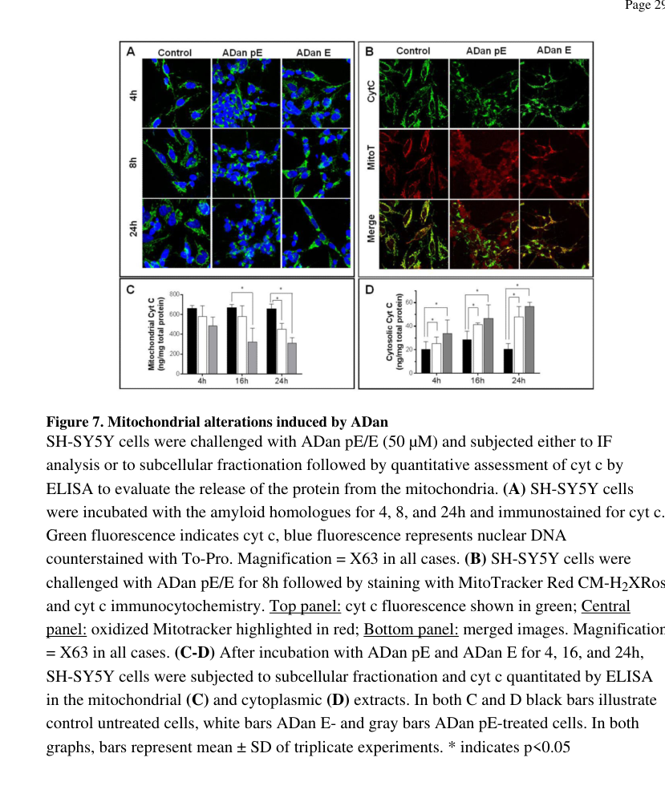

## Question

# Disease Characteristics Research Template

## Target Disease
- **Disease Name:** ADan amyloidosis
- **MONDO ID:**  (if available)
- **Category:** Mendelian

## Research Objectives

Please provide a comprehensive research report on **ADan amyloidosis** covering all of the
disease characteristics listed below. This report will be used to populate a disease knowledge
base entry. Be thorough and cite primary literature (PMID preferred) for all claims.

For each section, **suggested databases/resources** are listed. These are the first places
you should search for information on each topic.

---

### 1. Disease Information
> **Search first:** OMIM, Orphanet, ICD-10/ICD-11, MeSH, PubMed

- What is the disease? Provide a concise overview.
- What are the key identifiers? (OMIM, Orphanet, ICD-10/ICD-11, MeSH, Mondo)
- What are the common synonyms and alternative names?
- Is the information derived from individual patients (e.g., EHR) or aggregated disease-level resources?

### 2. Etiology

- **Disease Causal Factors**: What are the primary causes? (genetic, environmental, infectious, mechanistic)
- **Risk Factors**:
  > **Search first:** PubMed, Cochrane Library, UpToDate, clinical guidelines, ClinVar, ClinGen, GWAS Catalog, PheGenI, CTD, CDC, WHO, epidemiological databases
  - Genetic risk factors (causal variants, susceptibility loci, modifier genes)
  - Environmental risk factors (toxins, lifestyle, occupational exposures, age, sex, family history)
- **Protective Factors**:
  > **Search first:** PubMed, Cochrane Library, clinical trial databases, GWAS Catalog, gnomAD, WHO, CDC, nutrition databases
  - Genetic protective factors (protective variants, modifier alleles)
  - Environmental protective factors (diet, lifestyle, exposures that reduce risk)
- **Gene-Environment Interactions**: How do genetic and environmental factors interact to influence disease?
  > **Search first:** CTD, PubMed, PheGenI, GxE databases

### 3. Phenotypes
> **Search first:** HPO (Human Phenotype Ontology), OMIM, Orphanet, PubMed, clinicaltrials.gov, MedDRA, SNOMED CT, DECIPHER, LOINC

For each phenotype, provide:
- **Phenotype type**: symptoms, clinical signs, physical manifestations, behavioral changes, or laboratory abnormalities
  > For symptoms/signs: HPO, OMIM, Orphanet, PubMed
  > For behavioral changes: HPO, DSM, RDoC (Research Domain Criteria), PubMed
  > For laboratory abnormalities: LOINC, SNOMED CT, LabTests Online, PubMed
- **Phenotype characteristics**:
  > **Search first:** OMIM, Orphanet, HPO, PubMed
  - Age of symptom onset (neonatal, childhood, adult-onset, late-onset)
  - Symptom severity (mild, moderate, severe, variable)
  - Symptom progression (stable, progressive, episodic, fluctuating)
  - Frequency among affected individuals (percentage or qualitative)
- **Quality of life impact**: Effects on daily functioning and well-being (per-phenotype when possible)
  > **Search first:** EQ-5D database, SF-36, WHO QOL databases, PubMed
- Suggest HPO (Human Phenotype Ontology) terms for each phenotype

### 4. Genetic/Molecular Information

- **Causal Genes**: Gene mutations or chromosomal abnormalities responsible for disease (gene symbols, OMIM IDs)
  > **Search first:** OMIM, ClinVar, HGMD, Ensembl, NCBI Gene
- **Pathogenic Variants**:
  - Affected genes (gene symbols, HGNC IDs)
    > **Search first:** OMIM, NCBI Gene, Ensembl, HGNC, UniProt, GeneCards
  - Variant classification (pathogenic, likely pathogenic, VUS per ACMG/AMP guidelines)
    > **Search first:** ClinVar, ClinGen, ACMG/AMP guidelines, VarSome
  - Variant type/class (missense, frameshift, nonsense, splice-site, structural)
  - Allele frequency in population databases
    > **Search first:** gnomAD, 1000 Genomes, ExAC, TOPMed, dbSNP
  - Somatic vs germline origin
    > **Search first:** COSMIC (somatic), ClinVar, ICGC, TCGA
  - Functional consequences (loss of function, gain of function, dominant negative)
- **Modifier Genes**: Genes that modify disease severity or expression
- **Epigenetic Information**: DNA methylation, histone modifications, chromatin changes affecting disease
  > **Search first:** ENCODE, Roadmap Epigenomics, MethBase, DiseaseMeth
- **Chromosomal Abnormalities**: Large-scale genetic changes (aneuploidy, translocations, inversions)
  > **Search first:** DECIPHER, ClinVar, ECARUCA, UCSC Genome Browser

### 5. Environmental Information

- **Environmental Factors**: Non-genetic contributing factors (toxins, radiation, pollution, occupational exposure)
  > **Search first:** CTD (Comparative Toxicogenomics Database), TOXNET, PubMed, EPA databases
- **Lifestyle Factors**: Behavioral factors (smoking, diet, exercise, alcohol consumption)
  > **Search first:** CDC databases, WHO, PubMed, NHANES
- **Infectious Agents**: If applicable, pathogens causing or triggering disease (bacteria, viruses, fungi, parasites)
  > **Search first:** NCBI Taxonomy, ViPR, BV-BRC, MicrobeDB, GIDEON

### 6. Mechanism / Pathophysiology

- **Molecular Pathways**: Specific signaling cascades or biochemical pathways involved (Wnt, MAPK, mTOR, PI3K-AKT, etc.)
  > **Search first:** KEGG, Reactome, WikiPathways, PathBank, BioCyc
- **Cellular Processes**: Cell-level mechanisms (apoptosis, autophagy, cell cycle dysregulation, inflammation, etc.)
  > **Search first:** Gene Ontology (GO), Reactome, KEGG, PubMed
- **Protein Dysfunction**: How protein structure or function is altered (misfolding, aggregation, loss of function, gain of function)
  > **Search first:** UniProt, PDB (Protein Data Bank), InterPro, Pfam, AlphaFold
- **Metabolic Changes**: Alterations in metabolic processes (energy metabolism, lipid metabolism, amino acid metabolism)
  > **Search first:** KEGG, BioCyc, HMDB (Human Metabolome Database), BRENDA
- **Immune System Involvement**: Role of immune response (autoimmunity, immunodeficiency, chronic inflammation)
  > **Search first:** ImmPort, Immunome Database, IEDB, Gene Ontology
- **Tissue Damage Mechanisms**: How tissues/ are injured (oxidative stress, ischemia, fibrosis, necrosis)
  > **Search first:** PubMed, Gene Ontology, Reactome
- **Biochemical Abnormalities**: Specific molecular defects (enzyme deficiencies, receptor dysfunction, ion channel defects)
  > **Search first:** BRENDA, UniProt, KEGG, OMIM, PubMed
- **Epigenetic Changes**: DNA methylation, histone modifications affecting gene expression in disease
  > **Search first:** ENCODE, Roadmap Epigenomics, MethBase, DiseaseMeth
- **Molecular Profiling** (if available):
  - Transcriptomics/gene expression changes
    > **Search first:** GEO (Gene Expression Omnibus), ArrayExpress, GTEx, Human Cell Atlas, SRA
  - Proteomics findings
    > **Search first:** PRIDE, ProteomeXchange, Human Protein Atlas, STRING, BioGRID
  - Metabolomics signatures
    > **Search first:** MetaboLights, Metabolomics Workbench, HMDB, METLIN
  - Lipidomics alterations
    > **Search first:** LIPID MAPS, SwissLipids, LipidHome, Metabolomics Workbench
  - Genomic structural features
    > **Search first:** UCSC Genome Browser, Ensembl, NCBI, dbVar, DGV
- **Advanced Technologies** (if applicable):
  - Single-cell analysis findings (cell-type specific mechanisms, cellular heterogeneity)
    > **Search first:** Human Cell Atlas, Single Cell Portal, GEO, CELLxGENE
  - Spatial transcriptomics findings
    > **Search first:** GEO, Spatial Research, Vizgen, 10x Genomics data
  - Multi-omics integration results
    > **Search first:** TCGA, ICGC, cBioPortal, LinkedOmics, PubMed
  - Functional genomics screens (CRISPR, RNAi)
    > **Search first:** DepMap, GenomeRNAi, PubMed, BioGRID ORCS

For each mechanism, describe:
- The causal chain from initial trigger to clinical manifestation
- Which mechanisms are upstream vs downstream
- What cell types and biological processes are involved
- Suggest GO terms for biological processes and CL terms for cell types

### 7. Anatomical Structures Affected

- **Organ Level**:
  - Primary organs directly affected
  - Secondary organ involvement (complications, secondary effects)
  - Body systems involved (cardiovascular, nervous, digestive, respiratory, endocrine, etc.)
  > **Search first:** Uberon, FMA (Foundational Model of Anatomy), OMIM, HPO, ICD-11, MeSH, SNOMED CT
- **Tissue and Cell Level**:
  - Specific tissue types affected (epithelial, connective, muscle, nervous)
  - Specific cell populations targeted (with Cell Ontology terms)
  > **Search first:** Uberon, Human Protein Atlas, Cell Ontology, Human Cell Atlas, CellMarker, PanglaoDB
- **Subcellular Level**:
  - Cellular compartments involved (mitochondria, nucleus, ER, lysosomes) (with GO Cellular Component terms)
  > **Search first:** Gene Ontology (Cellular Component), UniProt, Human Protein Atlas
- **Localization**:
  - Specific anatomical sites (with UBERON terms)
    > **Search first:** FMA, Uberon, NeuroNames (for brain), SNOMED CT
  - Lateralization (unilateral, bilateral, asymmetric)
    > **Search first:** HPO, clinical literature, imaging databases

### 8. Temporal Development

- **Onset**:
  - Typical age of onset (congenital, pediatric, adult, geriatric)
  - Onset pattern (acute, subacute, chronic, insidious)
  > **Search first:** OMIM, Orphanet, HPO, PubMed
- **Progression**:
  - Disease stages (early, intermediate, advanced, end-stage)
    > **Search first:** Cancer Staging Manual (AJCC), WHO classifications, PubMed
  - Progression rate (rapid, slow, variable)
  - Disease course pattern (episodic, relapsing-remitting, progressive, stable)
  - Disease duration (self-limited, chronic lifelong)
  > **Search first:** Disease registries, longitudinal cohort databases, natural history studies, PubMed, Orphanet, OMIM
- **Patterns**:
  - Remission patterns (spontaneous, treatment-induced)
    > **Search first:** Clinical trial databases, disease registries, PubMed
  - Critical periods (time windows of vulnerability or opportunity for intervention)
    > **Search first:** PubMed, developmental biology databases, clinical guidelines

### 9. Inheritance and Population

- **Epidemiology**:
  - Prevalence (cases per 100,000 at given time)
  - Incidence (new cases per 100,000 per year)
  > **Search first:** Orphanet, CDC, WHO, GBD (Global Burden of Disease), national registries, SEER, disease registries
- **For Genetic Etiology**:
  - Inheritance pattern (AD, AR, X-linked, mitochondrial, multifactorial, polygenic)
    > **Search first:** OMIM, Orphanet, ClinVar, GTR (Genetic Testing Registry)
  - Penetrance (complete, incomplete, age-dependent)
    > **Search first:** ClinVar, OMIM, PubMed, ClinGen
  - Expressivity (variable, consistent)
    > **Search first:** OMIM, ClinVar, PubMed
  - Genetic anticipation (increasing severity in successive generations)
    > **Search first:** OMIM, PubMed (especially for repeat expansion disorders)
  - Germline mosaicism
    > **Search first:** ClinVar, OMIM, genetic counseling literature, PubMed
  - Founder effects (population-specific mutations)
    > **Search first:** gnomAD, population genetics databases, PubMed
  - Consanguinity role
    > **Search first:** OMIM, population studies, genetic counseling resources
  - Carrier frequency
    > **Search first:** gnomAD, carrier screening databases, GeneReviews, GTR
- **Population Demographics**:
  - Affected populations (ethnic or demographic groups with higher prevalence)
    > **Search first:** gnomAD, 1000 Genomes, PAGE Study, PubMed, population registries
  - Geographic distribution (endemic areas, regional variation)
    > **Search first:** WHO, CDC, GBD, Orphanet, geographic epidemiology databases
  - Geographic distribution of specific variants
  - Sex ratio (male:female)
    > **Search first:** Disease registries, OMIM, PubMed, epidemiological databases
  - Age distribution of affected individuals
    > **Search first:** CDC, disease registries, SEER, Orphanet

### 10. Diagnostics

- **Clinical Tests**:
  - Laboratory tests (blood, urine, tissue chemistry, specific enzyme assays)
    > **Search first:** LOINC, LabTests Online, PubMed
  - Biomarkers (proteins, metabolites, genetic markers, circulating biomarkers)
    > **Search first:** FDA Biomarker List, BEST (Biomarkers, EndpointS, and other Tools), PubMed
  - Imaging studies (X-ray, CT, MRI, PET, ultrasound)
    > **Search first:** RadLex, DICOM, Radiopaedia, imaging databases
  - Functional tests (pulmonary function, cardiac stress tests)
    > **Search first:** LOINC, clinical guidelines, PubMed
  - Electrophysiology (EEG, EMG, ECG, nerve conduction studies)
    > **Search first:** LOINC, clinical neurophysiology databases, PubMed
  - Biopsy findings (histopathology, immunohistochemistry)
    > **Search first:** SNOMED CT, College of American Pathologists resources, PubMed
  - Pathology findings (microscopic examination)
    > **Search first:** SNOMED CT, Digital Pathology databases, PubMed
- **Genetic Testing**:
  > **Search first:** GTR (Genetic Testing Registry), GeneReviews, ClinGen
  - Overview of recommended genetic testing approach
  - Whole genome sequencing (WGS) utility
    > **Search first:** GTR, ClinVar, GEL (Genomics England), gnomAD
  - Whole exome sequencing (WES) utility
    > **Search first:** GTR, ClinVar, OMIM, GeneMatcher
  - Gene panels (which panels, which genes)
    > **Search first:** GTR, ClinVar, laboratory-specific databases
  - Single gene testing
    > **Search first:** GTR, ClinVar, OMIM, GeneReviews
  - Chromosomal microarray (CMA)
    > **Search first:** DECIPHER, ClinVar, dbVar, ECARUCA
  - Karyotyping
    > **Search first:** Chromosome Abnormality Database, ClinVar, cytogenetics resources
  - FISH
    > **Search first:** ClinVar, cytogenetics databases, PubMed
  - Mitochondrial DNA testing
    > **Search first:** MITOMAP, MSeqDR, ClinVar, GTR
  - Repeat expansion testing
    > **Search first:** GTR, ClinVar, repeat expansion databases, PubMed
- **Omics-Based Diagnostics** (if applicable):
  - RNA sequencing / transcriptomics
    > **Search first:** GEO, ArrayExpress, GTEx, RNA-seq databases
  - Proteomics
    > **Search first:** PRIDE, ProteomeXchange, FDA Biomarker database
  - Metabolomics
    > **Search first:** MetaboLights, Metabolomics Workbench, HMDB
  - Epigenomics
    > **Search first:** GEO, ENCODE, Roadmap Epigenomics, MethBase
  - Liquid biopsy
    > **Search first:** COSMIC, ClinVar, liquid biopsy databases, PubMed
- **Clinical Criteria**:
  - Standardized diagnostic criteria (DSM, ICD, society guidelines)
    > **Search first:** DSM-5, ICD-11, clinical society guidelines, UpToDate
  - Differential diagnosis (other conditions to rule out, with distinguishing features)
    > **Search first:** DynaMed, UpToDate, clinical decision support systems
- **Screening**:
  - Screening methods for asymptomatic individuals (newborn screening, carrier screening, cascade screening)
    > **Search first:** ACMG recommendations, CDC newborn screening, GTR

### 11. Outcome/Prognosis

- **Survival and Mortality**:
  - Survival rate (5-year, 10-year, overall)
    > **Search first:** SEER, cancer registries, disease-specific registries, PubMed
  - Life expectancy (with and without treatment if applicable)
    > **Search first:** Orphanet, disease registries, actuarial databases, PubMed
  - Mortality rate
    > **Search first:** CDC, WHO, GBD, national mortality databases
  - Disease-specific mortality (deaths directly attributable to disease)
    > **Search first:** Disease registries, CDC Wonder, GBD, PubMed
- **Morbidity and Function**:
  - Morbidity (disease-related disability and health impacts)
    > **Search first:** GBD, WHO, disability databases, PubMed
  - Disability outcomes (long-term functional impairments)
    > **Search first:** ICF (International Classification of Functioning), disability registries
  - Quality of life measures (EQ-5D, SF-36, PROMIS, disease-specific tools)
    > **Search first:** EQ-5D database, SF-36, PROMIS, PubMed
- **Disease Course**:
  - Complications (secondary problems: infections, organ failure, etc.)
    > **Search first:** ICD codes, disease registries, clinical databases, PubMed
  - Recovery potential (likelihood and extent of recovery, with vs without treatment)
    > **Search first:** Natural history studies, rehabilitation databases, PubMed
- **Prediction**:
  - Prognostic factors (age, disease severity, biomarkers, treatment response)
    > **Search first:** Prognostic models databases, clinical calculators, PubMed
  - Prognostic biomarkers (molecular markers predicting disease course)
    > **Search first:** FDA Biomarker database, PubMed, cancer prognostic databases

### 12. Treatment

- **Pharmacotherapy**:
  - Pharmacological treatments (drug names, drug classes, mechanisms of action)
    > **Search first:** DrugBank, RxNorm, ATC classification, DailyMed, FDA databases
  - Pharmacogenomics (how genetic variants affect drug metabolism, efficacy, toxicity)
    > **Search first:** PharmGKB, CPIC (Clinical Pharmacogenetics), FDA Table of PGx Biomarkers
- **Advanced Therapeutics**:
  - Gene therapy (viral vectors, CRISPR, gene replacement, gene editing)
    > **Search first:** ClinicalTrials.gov, FDA gene therapy database, ASGCT resources
  - Cell therapy (stem cell transplant, CAR-T, cellular therapeutics)
    > **Search first:** ClinicalTrials.gov, FDA cell therapy database, FACT standards
  - RNA-based therapies (ASOs, siRNA, mRNA therapies)
    > **Search first:** ClinicalTrials.gov, FDA approvals, PubMed
  - Targeted therapies (treatments directed at specific molecular targets)
    > **Search first:** My Cancer Genome, OncoKB, ClinicalTrials.gov, FDA approvals
  - Immunotherapies (checkpoint inhibitors, monoclonal antibodies)
    > **Search first:** Cancer Immunotherapy Database, FDA approvals, ClinicalTrials.gov
- **Surgical and Interventional**:
  - Surgical interventions (types of surgery, timing, outcomes)
    > **Search first:** CPT codes, surgical registries, clinical guidelines, PubMed
- **Supportive and Rehabilitative**:
  - Supportive care (symptom management, pain control, nutrition)
    > **Search first:** Clinical guidelines, Cochrane Library, PubMed
  - Rehabilitation (physical therapy, occupational therapy, speech therapy)
    > **Search first:** Rehabilitation medicine databases, clinical guidelines, PubMed
- **Experimental**:
  - Experimental treatments in clinical trials (with NCT identifiers if available)
    > **Search first:** ClinicalTrials.gov, EU Clinical Trials Register, WHO ICTRP
- **Treatment Outcomes**:
  - Treatment response rates
    > **Search first:** Clinical trial databases, FDA reviews, systematic reviews, PubMed
  - Side effects and adverse events
    > **Search first:** FDA Adverse Event Reporting System (FAERS), MedWatch, PubMed
- **Treatment Strategy**:
  - Treatment algorithms (clinical pathways, decision trees)
    > **Search first:** Clinical practice guidelines, NCCN Guidelines, UpToDate
  - Combination therapies
    > **Search first:** ClinicalTrials.gov, treatment guidelines, PubMed
  - Personalized medicine approaches (genotype-guided treatment)
    > **Search first:** My Cancer Genome, CIViC, PharmGKB, precision medicine databases

For each treatment, suggest MAXO (Medical Action Ontology) terms where applicable.

### 13. Prevention

- **Prevention Levels**:
  - Primary prevention (preventing disease occurrence: vaccination, risk factor modification)
    > **Search first:** CDC, WHO, USPSTF recommendations, Cochrane Library
  - Secondary prevention (early detection and treatment: screening programs, early intervention)
    > **Search first:** USPSTF, CDC screening guidelines, WHO
  - Tertiary prevention (preventing complications in those with disease)
    > **Search first:** Clinical guidelines, disease management protocols, PubMed
- **Immunization**: Vaccine strategies (if applicable)
  > **Search first:** CDC vaccine schedules, WHO immunization, FDA vaccine database
- **Screening and Early Detection**:
  - Screening programs (population-based: newborn screening, cancer screening)
    > **Search first:** CDC screening programs, USPSTF, cancer screening databases
  - Genetic screening (carrier screening, preimplantation genetic diagnosis, prenatal testing)
    > **Search first:** ACMG recommendations, ACOG guidelines, GTR
  - Risk stratification (identifying high-risk individuals for targeted prevention)
    > **Search first:** Risk prediction models, clinical calculators, PubMed
- **Behavioral Interventions**: Lifestyle modifications to reduce risk
  > **Search first:** CDC, WHO, behavioral intervention databases, Cochrane Library
- **Counseling**: Genetic counseling (risk assessment, family planning guidance)
  > **Search first:** NSGC resources, ACMG guidelines, GeneReviews
- **Public Health**:
  - Public health interventions (sanitation, vector control, health education)
    > **Search first:** CDC, WHO, public health databases, PubMed
  - Environmental interventions (reducing environmental risk factors)
    > **Search first:** EPA databases, WHO environmental health, PubMed
- **Prophylaxis**: Preventive medications or procedures
  > **Search first:** Clinical guidelines, FDA approvals, PubMed

### 14. Other Species / Natural Disease

- **Taxonomy**: Species affected (with NCBI Taxon identifiers)
  > **Search first:** NCBI Taxonomy
- **Breed**: Specific breeds affected (with VBO identifiers if applicable)
  > **Search first:** VBO (Vertebrate Breed Ontology)
- **Gene**: Orthologous genes in other species (with NCBI Gene IDs)
  > **Search first:** NCBI Gene
- **Natural Disease**:
  - Naturally occurring disease in other species (companion animals, wildlife)
    > **Search first:** OMIA (Online Mendelian Inheritance in Animals), VetCompass, PubMed
  - Veterinary relevance and importance in animal health
    > **Search first:** OMIA, veterinary databases, PubMed
- **Comparative Biology**:
  - Comparative pathology (similarities and differences across species)
    > **Search first:** OMIA, comparative pathology databases, PubMed
  - Evolutionary conservation of disease mechanisms
    > **Search first:** HomoloGene, OrthoMCL, Alliance of Genome Resources
- **Transmission** (if applicable):
  - Zoonotic potential
    > **Search first:** CDC zoonotic diseases, WHO zoonoses, GIDEON
  - Cross-species susceptibility
    > **Search first:** NCBI Taxonomy, veterinary databases, PubMed

### 15. Model Organisms

- **Model Types**:
  - Model organism type (mammalian, invertebrate, cellular, in vitro)
    > **Search first:** Alliance of Genome Resources, model organism databases
  - Specific model systems (mouse, rat, zebrafish, Drosophila, C. elegans, yeast, cell lines, organoids, iPSCs)
    > **Search first:** MGI, RGD, ZFIN, FlyBase, WormBase, SGD, ATCC, Cellosaurus
  - Induced models (drug treatment, surgical intervention, environmental manipulation)
    > **Search first:** MGI, model organism databases, PubMed
- **Genetic Models**:
  - Types available (knockout, knock-in, transgenic, conditional, humanized)
    > **Search first:** MGI, IMPC, KOMP, EuMMCR, IMSR
- **Model Characteristics**:
  - Phenotype recapitulation (how well model reproduces human disease features)
    > **Search first:** Model organism databases, comparative studies, PubMed
  - Model limitations (aspects of human disease not captured)
    > **Search first:** Model organism databases, PubMed, review articles
- **Applications**:
  - Research applications (what aspects of disease can be studied)
    > **Search first:** Model organism databases, PubMed
- **Resources**:
  - Model databases
    > **Search first:** MGI, RGD, ZFIN, FlyBase, WormBase, IMSR, EMMA, MMRRC

---

## Citation Requirements

- Cite primary literature (PMID preferred) for all mechanistic and clinical claims
- Prioritize recent reviews and landmark papers
- Include direct quotes from abstracts where possible to support key statements
- Distinguish evidence source types: human clinical, model organism, in vitro, computational

## Output Format

Structure your response as a comprehensive narrative organized by the sections above.
For each section, provide:
- Factual content with specific details (numbers, percentages, gene names, variant nomenclature)
- Ontology term suggestions (HPO, GO, CL, UBERON, CHEBI, MAXO, MONDO) where applicable
- Evidence citations with PMIDs
- Direct quotes from abstracts to support key claims
- Clear indication when information is not available or not applicable for this disease

This report will be used to populate a disease knowledge base entry with:
- Pathophysiology descriptions with causal chains
- Gene/protein annotations (HGNC, GO terms)
- Phenotype associations (HP terms) with frequencies
- Cell type involvement (CL terms)
- Anatomical locations (UBERON terms)
- Chemical entities (CHEBI terms)
- Treatment annotations (MAXO terms)
- Evidence items with PMIDs and exact abstract quotes
- Epidemiology, prognosis, diagnostic, and prevention information
- Animal model descriptions with phenotype recapitulation details

## Output

Question: You are an expert researcher providing comprehensive, well-cited information.

Provide detailed information focusing on:
1. Key concepts and definitions with current understanding
2. Recent developments and latest research (prioritize 2023-2024 sources)
3. Current applications and real-world implementations
4. Expert opinions and analysis from authoritative sources
5. Relevant statistics and data from recent studies

Format as a comprehensive research report with proper citations. Include URLs and publication dates where available.
Always prioritize recent, authoritative sources and provide specific citations for all major claims.

# Disease Characteristics Research Template

## Target Disease
- **Disease Name:** ADan amyloidosis
- **MONDO ID:**  (if available)
- **Category:** Mendelian

## Research Objectives

Please provide a comprehensive research report on **ADan amyloidosis** covering all of the
disease characteristics listed below. This report will be used to populate a disease knowledge
base entry. Be thorough and cite primary literature (PMID preferred) for all claims.

For each section, **suggested databases/resources** are listed. These are the first places
you should search for information on each topic.

---

### 1. Disease Information
> **Search first:** OMIM, Orphanet, ICD-10/ICD-11, MeSH, PubMed

- What is the disease? Provide a concise overview.
- What are the key identifiers? (OMIM, Orphanet, ICD-10/ICD-11, MeSH, Mondo)
- What are the common synonyms and alternative names?
- Is the information derived from individual patients (e.g., EHR) or aggregated disease-level resources?

### 2. Etiology

- **Disease Causal Factors**: What are the primary causes? (genetic, environmental, infectious, mechanistic)
- **Risk Factors**:
  > **Search first:** PubMed, Cochrane Library, UpToDate, clinical guidelines, ClinVar, ClinGen, GWAS Catalog, PheGenI, CTD, CDC, WHO, epidemiological databases
  - Genetic risk factors (causal variants, susceptibility loci, modifier genes)
  - Environmental risk factors (toxins, lifestyle, occupational exposures, age, sex, family history)
- **Protective Factors**:
  > **Search first:** PubMed, Cochrane Library, clinical trial databases, GWAS Catalog, gnomAD, WHO, CDC, nutrition databases
  - Genetic protective factors (protective variants, modifier alleles)
  - Environmental protective factors (diet, lifestyle, exposures that reduce risk)
- **Gene-Environment Interactions**: How do genetic and environmental factors interact to influence disease?
  > **Search first:** CTD, PubMed, PheGenI, GxE databases

### 3. Phenotypes
> **Search first:** HPO (Human Phenotype Ontology), OMIM, Orphanet, PubMed, clinicaltrials.gov, MedDRA, SNOMED CT, DECIPHER, LOINC

For each phenotype, provide:
- **Phenotype type**: symptoms, clinical signs, physical manifestations, behavioral changes, or laboratory abnormalities
  > For symptoms/signs: HPO, OMIM, Orphanet, PubMed
  > For behavioral changes: HPO, DSM, RDoC (Research Domain Criteria), PubMed
  > For laboratory abnormalities: LOINC, SNOMED CT, LabTests Online, PubMed
- **Phenotype characteristics**:
  > **Search first:** OMIM, Orphanet, HPO, PubMed
  - Age of symptom onset (neonatal, childhood, adult-onset, late-onset)
  - Symptom severity (mild, moderate, severe, variable)
  - Symptom progression (stable, progressive, episodic, fluctuating)
  - Frequency among affected individuals (percentage or qualitative)
- **Quality of life impact**: Effects on daily functioning and well-being (per-phenotype when possible)
  > **Search first:** EQ-5D database, SF-36, WHO QOL databases, PubMed
- Suggest HPO (Human Phenotype Ontology) terms for each phenotype

### 4. Genetic/Molecular Information

- **Causal Genes**: Gene mutations or chromosomal abnormalities responsible for disease (gene symbols, OMIM IDs)
  > **Search first:** OMIM, ClinVar, HGMD, Ensembl, NCBI Gene
- **Pathogenic Variants**:
  - Affected genes (gene symbols, HGNC IDs)
    > **Search first:** OMIM, NCBI Gene, Ensembl, HGNC, UniProt, GeneCards
  - Variant classification (pathogenic, likely pathogenic, VUS per ACMG/AMP guidelines)
    > **Search first:** ClinVar, ClinGen, ACMG/AMP guidelines, VarSome
  - Variant type/class (missense, frameshift, nonsense, splice-site, structural)
  - Allele frequency in population databases
    > **Search first:** gnomAD, 1000 Genomes, ExAC, TOPMed, dbSNP
  - Somatic vs germline origin
    > **Search first:** COSMIC (somatic), ClinVar, ICGC, TCGA
  - Functional consequences (loss of function, gain of function, dominant negative)
- **Modifier Genes**: Genes that modify disease severity or expression
- **Epigenetic Information**: DNA methylation, histone modifications, chromatin changes affecting disease
  > **Search first:** ENCODE, Roadmap Epigenomics, MethBase, DiseaseMeth
- **Chromosomal Abnormalities**: Large-scale genetic changes (aneuploidy, translocations, inversions)
  > **Search first:** DECIPHER, ClinVar, ECARUCA, UCSC Genome Browser

### 5. Environmental Information

- **Environmental Factors**: Non-genetic contributing factors (toxins, radiation, pollution, occupational exposure)
  > **Search first:** CTD (Comparative Toxicogenomics Database), TOXNET, PubMed, EPA databases
- **Lifestyle Factors**: Behavioral factors (smoking, diet, exercise, alcohol consumption)
  > **Search first:** CDC databases, WHO, PubMed, NHANES
- **Infectious Agents**: If applicable, pathogens causing or triggering disease (bacteria, viruses, fungi, parasites)
  > **Search first:** NCBI Taxonomy, ViPR, BV-BRC, MicrobeDB, GIDEON

### 6. Mechanism / Pathophysiology

- **Molecular Pathways**: Specific signaling cascades or biochemical pathways involved (Wnt, MAPK, mTOR, PI3K-AKT, etc.)
  > **Search first:** KEGG, Reactome, WikiPathways, PathBank, BioCyc
- **Cellular Processes**: Cell-level mechanisms (apoptosis, autophagy, cell cycle dysregulation, inflammation, etc.)
  > **Search first:** Gene Ontology (GO), Reactome, KEGG, PubMed
- **Protein Dysfunction**: How protein structure or function is altered (misfolding, aggregation, loss of function, gain of function)
  > **Search first:** UniProt, PDB (Protein Data Bank), InterPro, Pfam, AlphaFold
- **Metabolic Changes**: Alterations in metabolic processes (energy metabolism, lipid metabolism, amino acid metabolism)
  > **Search first:** KEGG, BioCyc, HMDB (Human Metabolome Database), BRENDA
- **Immune System Involvement**: Role of immune response (autoimmunity, immunodeficiency, chronic inflammation)
  > **Search first:** ImmPort, Immunome Database, IEDB, Gene Ontology
- **Tissue Damage Mechanisms**: How tissues/ are injured (oxidative stress, ischemia, fibrosis, necrosis)
  > **Search first:** PubMed, Gene Ontology, Reactome
- **Biochemical Abnormalities**: Specific molecular defects (enzyme deficiencies, receptor dysfunction, ion channel defects)
  > **Search first:** BRENDA, UniProt, KEGG, OMIM, PubMed
- **Epigenetic Changes**: DNA methylation, histone modifications affecting gene expression in disease
  > **Search first:** ENCODE, Roadmap Epigenomics, MethBase, DiseaseMeth
- **Molecular Profiling** (if available):
  - Transcriptomics/gene expression changes
    > **Search first:** GEO (Gene Expression Omnibus), ArrayExpress, GTEx, Human Cell Atlas, SRA
  - Proteomics findings
    > **Search first:** PRIDE, ProteomeXchange, Human Protein Atlas, STRING, BioGRID
  - Metabolomics signatures
    > **Search first:** MetaboLights, Metabolomics Workbench, HMDB, METLIN
  - Lipidomics alterations
    > **Search first:** LIPID MAPS, SwissLipids, LipidHome, Metabolomics Workbench
  - Genomic structural features
    > **Search first:** UCSC Genome Browser, Ensembl, NCBI, dbVar, DGV
- **Advanced Technologies** (if applicable):
  - Single-cell analysis findings (cell-type specific mechanisms, cellular heterogeneity)
    > **Search first:** Human Cell Atlas, Single Cell Portal, GEO, CELLxGENE
  - Spatial transcriptomics findings
    > **Search first:** GEO, Spatial Research, Vizgen, 10x Genomics data
  - Multi-omics integration results
    > **Search first:** TCGA, ICGC, cBioPortal, LinkedOmics, PubMed
  - Functional genomics screens (CRISPR, RNAi)
    > **Search first:** DepMap, GenomeRNAi, PubMed, BioGRID ORCS

For each mechanism, describe:
- The causal chain from initial trigger to clinical manifestation
- Which mechanisms are upstream vs downstream
- What cell types and biological processes are involved
- Suggest GO terms for biological processes and CL terms for cell types

### 7. Anatomical Structures Affected

- **Organ Level**:
  - Primary organs directly affected
  - Secondary organ involvement (complications, secondary effects)
  - Body systems involved (cardiovascular, nervous, digestive, respiratory, endocrine, etc.)
  > **Search first:** Uberon, FMA (Foundational Model of Anatomy), OMIM, HPO, ICD-11, MeSH, SNOMED CT
- **Tissue and Cell Level**:
  - Specific tissue types affected (epithelial, connective, muscle, nervous)
  - Specific cell populations targeted (with Cell Ontology terms)
  > **Search first:** Uberon, Human Protein Atlas, Cell Ontology, Human Cell Atlas, CellMarker, PanglaoDB
- **Subcellular Level**:
  - Cellular compartments involved (mitochondria, nucleus, ER, lysosomes) (with GO Cellular Component terms)
  > **Search first:** Gene Ontology (Cellular Component), UniProt, Human Protein Atlas
- **Localization**:
  - Specific anatomical sites (with UBERON terms)
    > **Search first:** FMA, Uberon, NeuroNames (for brain), SNOMED CT
  - Lateralization (unilateral, bilateral, asymmetric)
    > **Search first:** HPO, clinical literature, imaging databases

### 8. Temporal Development

- **Onset**:
  - Typical age of onset (congenital, pediatric, adult, geriatric)
  - Onset pattern (acute, subacute, chronic, insidious)
  > **Search first:** OMIM, Orphanet, HPO, PubMed
- **Progression**:
  - Disease stages (early, intermediate, advanced, end-stage)
    > **Search first:** Cancer Staging Manual (AJCC), WHO classifications, PubMed
  - Progression rate (rapid, slow, variable)
  - Disease course pattern (episodic, relapsing-remitting, progressive, stable)
  - Disease duration (self-limited, chronic lifelong)
  > **Search first:** Disease registries, longitudinal cohort databases, natural history studies, PubMed, Orphanet, OMIM
- **Patterns**:
  - Remission patterns (spontaneous, treatment-induced)
    > **Search first:** Clinical trial databases, disease registries, PubMed
  - Critical periods (time windows of vulnerability or opportunity for intervention)
    > **Search first:** PubMed, developmental biology databases, clinical guidelines

### 9. Inheritance and Population

- **Epidemiology**:
  - Prevalence (cases per 100,000 at given time)
  - Incidence (new cases per 100,000 per year)
  > **Search first:** Orphanet, CDC, WHO, GBD (Global Burden of Disease), national registries, SEER, disease registries
- **For Genetic Etiology**:
  - Inheritance pattern (AD, AR, X-linked, mitochondrial, multifactorial, polygenic)
    > **Search first:** OMIM, Orphanet, ClinVar, GTR (Genetic Testing Registry)
  - Penetrance (complete, incomplete, age-dependent)
    > **Search first:** ClinVar, OMIM, PubMed, ClinGen
  - Expressivity (variable, consistent)
    > **Search first:** OMIM, ClinVar, PubMed
  - Genetic anticipation (increasing severity in successive generations)
    > **Search first:** OMIM, PubMed (especially for repeat expansion disorders)
  - Germline mosaicism
    > **Search first:** ClinVar, OMIM, genetic counseling literature, PubMed
  - Founder effects (population-specific mutations)
    > **Search first:** gnomAD, population genetics databases, PubMed
  - Consanguinity role
    > **Search first:** OMIM, population studies, genetic counseling resources
  - Carrier frequency
    > **Search first:** gnomAD, carrier screening databases, GeneReviews, GTR
- **Population Demographics**:
  - Affected populations (ethnic or demographic groups with higher prevalence)
    > **Search first:** gnomAD, 1000 Genomes, PAGE Study, PubMed, population registries
  - Geographic distribution (endemic areas, regional variation)
    > **Search first:** WHO, CDC, GBD, Orphanet, geographic epidemiology databases
  - Geographic distribution of specific variants
  - Sex ratio (male:female)
    > **Search first:** Disease registries, OMIM, PubMed, epidemiological databases
  - Age distribution of affected individuals
    > **Search first:** CDC, disease registries, SEER, Orphanet

### 10. Diagnostics

- **Clinical Tests**:
  - Laboratory tests (blood, urine, tissue chemistry, specific enzyme assays)
    > **Search first:** LOINC, LabTests Online, PubMed
  - Biomarkers (proteins, metabolites, genetic markers, circulating biomarkers)
    > **Search first:** FDA Biomarker List, BEST (Biomarkers, EndpointS, and other Tools), PubMed
  - Imaging studies (X-ray, CT, MRI, PET, ultrasound)
    > **Search first:** RadLex, DICOM, Radiopaedia, imaging databases
  - Functional tests (pulmonary function, cardiac stress tests)
    > **Search first:** LOINC, clinical guidelines, PubMed
  - Electrophysiology (EEG, EMG, ECG, nerve conduction studies)
    > **Search first:** LOINC, clinical neurophysiology databases, PubMed
  - Biopsy findings (histopathology, immunohistochemistry)
    > **Search first:** SNOMED CT, College of American Pathologists resources, PubMed
  - Pathology findings (microscopic examination)
    > **Search first:** SNOMED CT, Digital Pathology databases, PubMed
- **Genetic Testing**:
  > **Search first:** GTR (Genetic Testing Registry), GeneReviews, ClinGen
  - Overview of recommended genetic testing approach
  - Whole genome sequencing (WGS) utility
    > **Search first:** GTR, ClinVar, GEL (Genomics England), gnomAD
  - Whole exome sequencing (WES) utility
    > **Search first:** GTR, ClinVar, OMIM, GeneMatcher
  - Gene panels (which panels, which genes)
    > **Search first:** GTR, ClinVar, laboratory-specific databases
  - Single gene testing
    > **Search first:** GTR, ClinVar, OMIM, GeneReviews
  - Chromosomal microarray (CMA)
    > **Search first:** DECIPHER, ClinVar, dbVar, ECARUCA
  - Karyotyping
    > **Search first:** Chromosome Abnormality Database, ClinVar, cytogenetics resources
  - FISH
    > **Search first:** ClinVar, cytogenetics databases, PubMed
  - Mitochondrial DNA testing
    > **Search first:** MITOMAP, MSeqDR, ClinVar, GTR
  - Repeat expansion testing
    > **Search first:** GTR, ClinVar, repeat expansion databases, PubMed
- **Omics-Based Diagnostics** (if applicable):
  - RNA sequencing / transcriptomics
    > **Search first:** GEO, ArrayExpress, GTEx, RNA-seq databases
  - Proteomics
    > **Search first:** PRIDE, ProteomeXchange, FDA Biomarker database
  - Metabolomics
    > **Search first:** MetaboLights, Metabolomics Workbench, HMDB
  - Epigenomics
    > **Search first:** GEO, ENCODE, Roadmap Epigenomics, MethBase
  - Liquid biopsy
    > **Search first:** COSMIC, ClinVar, liquid biopsy databases, PubMed
- **Clinical Criteria**:
  - Standardized diagnostic criteria (DSM, ICD, society guidelines)
    > **Search first:** DSM-5, ICD-11, clinical society guidelines, UpToDate
  - Differential diagnosis (other conditions to rule out, with distinguishing features)
    > **Search first:** DynaMed, UpToDate, clinical decision support systems
- **Screening**:
  - Screening methods for asymptomatic individuals (newborn screening, carrier screening, cascade screening)
    > **Search first:** ACMG recommendations, CDC newborn screening, GTR

### 11. Outcome/Prognosis

- **Survival and Mortality**:
  - Survival rate (5-year, 10-year, overall)
    > **Search first:** SEER, cancer registries, disease-specific registries, PubMed
  - Life expectancy (with and without treatment if applicable)
    > **Search first:** Orphanet, disease registries, actuarial databases, PubMed
  - Mortality rate
    > **Search first:** CDC, WHO, GBD, national mortality databases
  - Disease-specific mortality (deaths directly attributable to disease)
    > **Search first:** Disease registries, CDC Wonder, GBD, PubMed
- **Morbidity and Function**:
  - Morbidity (disease-related disability and health impacts)
    > **Search first:** GBD, WHO, disability databases, PubMed
  - Disability outcomes (long-term functional impairments)
    > **Search first:** ICF (International Classification of Functioning), disability registries
  - Quality of life measures (EQ-5D, SF-36, PROMIS, disease-specific tools)
    > **Search first:** EQ-5D database, SF-36, PROMIS, PubMed
- **Disease Course**:
  - Complications (secondary problems: infections, organ failure, etc.)
    > **Search first:** ICD codes, disease registries, clinical databases, PubMed
  - Recovery potential (likelihood and extent of recovery, with vs without treatment)
    > **Search first:** Natural history studies, rehabilitation databases, PubMed
- **Prediction**:
  - Prognostic factors (age, disease severity, biomarkers, treatment response)
    > **Search first:** Prognostic models databases, clinical calculators, PubMed
  - Prognostic biomarkers (molecular markers predicting disease course)
    > **Search first:** FDA Biomarker database, PubMed, cancer prognostic databases

### 12. Treatment

- **Pharmacotherapy**:
  - Pharmacological treatments (drug names, drug classes, mechanisms of action)
    > **Search first:** DrugBank, RxNorm, ATC classification, DailyMed, FDA databases
  - Pharmacogenomics (how genetic variants affect drug metabolism, efficacy, toxicity)
    > **Search first:** PharmGKB, CPIC (Clinical Pharmacogenetics), FDA Table of PGx Biomarkers
- **Advanced Therapeutics**:
  - Gene therapy (viral vectors, CRISPR, gene replacement, gene editing)
    > **Search first:** ClinicalTrials.gov, FDA gene therapy database, ASGCT resources
  - Cell therapy (stem cell transplant, CAR-T, cellular therapeutics)
    > **Search first:** ClinicalTrials.gov, FDA cell therapy database, FACT standards
  - RNA-based therapies (ASOs, siRNA, mRNA therapies)
    > **Search first:** ClinicalTrials.gov, FDA approvals, PubMed
  - Targeted therapies (treatments directed at specific molecular targets)
    > **Search first:** My Cancer Genome, OncoKB, ClinicalTrials.gov, FDA approvals
  - Immunotherapies (checkpoint inhibitors, monoclonal antibodies)
    > **Search first:** Cancer Immunotherapy Database, FDA approvals, ClinicalTrials.gov
- **Surgical and Interventional**:
  - Surgical interventions (types of surgery, timing, outcomes)
    > **Search first:** CPT codes, surgical registries, clinical guidelines, PubMed
- **Supportive and Rehabilitative**:
  - Supportive care (symptom management, pain control, nutrition)
    > **Search first:** Clinical guidelines, Cochrane Library, PubMed
  - Rehabilitation (physical therapy, occupational therapy, speech therapy)
    > **Search first:** Rehabilitation medicine databases, clinical guidelines, PubMed
- **Experimental**:
  - Experimental treatments in clinical trials (with NCT identifiers if available)
    > **Search first:** ClinicalTrials.gov, EU Clinical Trials Register, WHO ICTRP
- **Treatment Outcomes**:
  - Treatment response rates
    > **Search first:** Clinical trial databases, FDA reviews, systematic reviews, PubMed
  - Side effects and adverse events
    > **Search first:** FDA Adverse Event Reporting System (FAERS), MedWatch, PubMed
- **Treatment Strategy**:
  - Treatment algorithms (clinical pathways, decision trees)
    > **Search first:** Clinical practice guidelines, NCCN Guidelines, UpToDate
  - Combination therapies
    > **Search first:** ClinicalTrials.gov, treatment guidelines, PubMed
  - Personalized medicine approaches (genotype-guided treatment)
    > **Search first:** My Cancer Genome, CIViC, PharmGKB, precision medicine databases

For each treatment, suggest MAXO (Medical Action Ontology) terms where applicable.

### 13. Prevention

- **Prevention Levels**:
  - Primary prevention (preventing disease occurrence: vaccination, risk factor modification)
    > **Search first:** CDC, WHO, USPSTF recommendations, Cochrane Library
  - Secondary prevention (early detection and treatment: screening programs, early intervention)
    > **Search first:** USPSTF, CDC screening guidelines, WHO
  - Tertiary prevention (preventing complications in those with disease)
    > **Search first:** Clinical guidelines, disease management protocols, PubMed
- **Immunization**: Vaccine strategies (if applicable)
  > **Search first:** CDC vaccine schedules, WHO immunization, FDA vaccine database
- **Screening and Early Detection**:
  - Screening programs (population-based: newborn screening, cancer screening)
    > **Search first:** CDC screening programs, USPSTF, cancer screening databases
  - Genetic screening (carrier screening, preimplantation genetic diagnosis, prenatal testing)
    > **Search first:** ACMG recommendations, ACOG guidelines, GTR
  - Risk stratification (identifying high-risk individuals for targeted prevention)
    > **Search first:** Risk prediction models, clinical calculators, PubMed
- **Behavioral Interventions**: Lifestyle modifications to reduce risk
  > **Search first:** CDC, WHO, behavioral intervention databases, Cochrane Library
- **Counseling**: Genetic counseling (risk assessment, family planning guidance)
  > **Search first:** NSGC resources, ACMG guidelines, GeneReviews
- **Public Health**:
  - Public health interventions (sanitation, vector control, health education)
    > **Search first:** CDC, WHO, public health databases, PubMed
  - Environmental interventions (reducing environmental risk factors)
    > **Search first:** EPA databases, WHO environmental health, PubMed
- **Prophylaxis**: Preventive medications or procedures
  > **Search first:** Clinical guidelines, FDA approvals, PubMed

### 14. Other Species / Natural Disease

- **Taxonomy**: Species affected (with NCBI Taxon identifiers)
  > **Search first:** NCBI Taxonomy
- **Breed**: Specific breeds affected (with VBO identifiers if applicable)
  > **Search first:** VBO (Vertebrate Breed Ontology)
- **Gene**: Orthologous genes in other species (with NCBI Gene IDs)
  > **Search first:** NCBI Gene
- **Natural Disease**:
  - Naturally occurring disease in other species (companion animals, wildlife)
    > **Search first:** OMIA (Online Mendelian Inheritance in Animals), VetCompass, PubMed
  - Veterinary relevance and importance in animal health
    > **Search first:** OMIA, veterinary databases, PubMed
- **Comparative Biology**:
  - Comparative pathology (similarities and differences across species)
    > **Search first:** OMIA, comparative pathology databases, PubMed
  - Evolutionary conservation of disease mechanisms
    > **Search first:** HomoloGene, OrthoMCL, Alliance of Genome Resources
- **Transmission** (if applicable):
  - Zoonotic potential
    > **Search first:** CDC zoonotic diseases, WHO zoonoses, GIDEON
  - Cross-species susceptibility
    > **Search first:** NCBI Taxonomy, veterinary databases, PubMed

### 15. Model Organisms

- **Model Types**:
  - Model organism type (mammalian, invertebrate, cellular, in vitro)
    > **Search first:** Alliance of Genome Resources, model organism databases
  - Specific model systems (mouse, rat, zebrafish, Drosophila, C. elegans, yeast, cell lines, organoids, iPSCs)
    > **Search first:** MGI, RGD, ZFIN, FlyBase, WormBase, SGD, ATCC, Cellosaurus
  - Induced models (drug treatment, surgical intervention, environmental manipulation)
    > **Search first:** MGI, model organism databases, PubMed
- **Genetic Models**:
  - Types available (knockout, knock-in, transgenic, conditional, humanized)
    > **Search first:** MGI, IMPC, KOMP, EuMMCR, IMSR
- **Model Characteristics**:
  - Phenotype recapitulation (how well model reproduces human disease features)
    > **Search first:** Model organism databases, comparative studies, PubMed
  - Model limitations (aspects of human disease not captured)
    > **Search first:** Model organism databases, PubMed, review articles
- **Applications**:
  - Research applications (what aspects of disease can be studied)
    > **Search first:** Model organism databases, PubMed
- **Resources**:
  - Model databases
    > **Search first:** MGI, RGD, ZFIN, FlyBase, WormBase, IMSR, EMMA, MMRRC

---

## Citation Requirements

- Cite primary literature (PMID preferred) for all mechanistic and clinical claims
- Prioritize recent reviews and landmark papers
- Include direct quotes from abstracts where possible to support key statements
- Distinguish evidence source types: human clinical, model organism, in vitro, computational

## Output Format

Structure your response as a comprehensive narrative organized by the sections above.
For each section, provide:
- Factual content with specific details (numbers, percentages, gene names, variant nomenclature)
- Ontology term suggestions (HPO, GO, CL, UBERON, CHEBI, MAXO, MONDO) where applicable
- Evidence citations with PMIDs
- Direct quotes from abstracts to support key claims
- Clear indication when information is not available or not applicable for this disease

This report will be used to populate a disease knowledge base entry with:
- Pathophysiology descriptions with causal chains
- Gene/protein annotations (HGNC, GO terms)
- Phenotype associations (HP terms) with frequencies
- Cell type involvement (CL terms)
- Anatomical locations (UBERON terms)
- Chemical entities (CHEBI terms)
- Treatment annotations (MAXO terms)
- Evidence items with PMIDs and exact abstract quotes
- Epidemiology, prognosis, diagnostic, and prevention information
- Animal model descriptions with phenotype recapitulation details

# ADan Amyloidosis (Familial Danish Dementia) — Comprehensive Disease Characteristics Report

## Executive summary
ADan amyloidosis is a rare, autosomal dominant, Mendelian neurodegenerative disorder historically described in a Danish pedigree and commonly referred to as **familial Danish dementia (FDD)** or **heredopathia ophthalmo‑oto‑encephalica**. It is caused by a pathogenic stop-region duplication in **ITM2B (BRI2)** that creates an extended precursor protein (277 aa) and a de novo 34–amino‑acid amyloidogenic peptide (**ADan**) produced by furin-like processing. The clinical syndrome classically begins with early cataracts, followed by progressive hearing loss, then cerebellar ataxia/tremor and later progressive dementia, accompanied by prominent cerebral and retinal amyloid angiopathy and tau neurofibrillary pathology. Recent (2023–2024) work has strengthened links between ITM2B/BRI2 biology and **microglial** pathways (including **TREM2** processing/phagocytosis) and has quantitatively mapped sequence determinants of ADan amyloid nucleation. (garringer2010modelingfamilialbritish pages 3-4, rostagno2005chromosome13dementias pages 4-6, yin2024functionalbri2trem2interactions pages 1-2, arber2024microgliacontributeto pages 1-2, martin2024amyloids“atthe pages 3-5)

---

## 1. Disease information

### 1.1 What is the disease?
**Familial Danish dementia (FDD)** is a hereditary neurodegenerative disorder characterized by early ophthalmologic disease (cataracts), progressive hearing loss, cerebellar ataxia with tremor, and later progressive dementia. Neuropathology includes cerebral and retinal **amyloid angiopathy** with deposition of the ADan amyloid peptide (and often co-deposition of Aβ) and neurofibrillary tangles resembling Alzheimer-like tau pathology. (garringer2010modelingfamilialbritish pages 3-4, rostagno2005chromosome13dementias pages 4-6, rostagno2005chromosome13dementias pages 10-11)

### 1.2 Key identifiers (with availability constraints)
A curated disease mapping from OpenTargets identifies **ADan amyloidosis** as **MONDO_0007297** and connects it to **ITM2B** with supporting literature PMIDs (e.g., **PMID: 10391242; PMID: 10781099**) in the association evidence. (OpenTargets Search: familial Danish dementia,ADan amyloidosis-ITM2B)

Other identifiers (OMIM, Orphanet, MeSH, ICD-10/ICD-11) were **not directly retrieved** in the current tool context; they are flagged as missing rather than inferred. (OpenTargets Search: familial Danish dementia,ADan amyloidosis-ITM2B)

| Identifier type | Value | Synonyms / alternate names | Primary supporting citation IDs |
|---|---|---|---|
| MONDO | MONDO_0007297 | ADan amyloidosis; familial Danish dementia (FDD); heredopathia ophthalmo-oto-encephalica | (OpenTargets Search: familial Danish dementia,ADan amyloidosis-ITM2B, garringer2010modelingfamilialbritish pages 3-4, rostagno2005chromosome13dementias pages 4-6) |
| OMIM | Not retrieved in current tool context | familial Danish dementia (FDD); heredopathia ophthalmo-oto-encephalica | (garringer2010modelingfamilialbritish pages 3-4, rostagno2005chromosome13dementias pages 4-6) |
| Orphanet | Not retrieved in current tool context | ADan amyloidosis; familial Danish dementia (FDD) | (garringer2010modelingfamilialbritish pages 3-4, rostagno2005chromosome13dementias pages 4-6) |
| MeSH | Not retrieved in current tool context | familial Danish dementia; chromosome 13 dementia | (rostagno2005chromosome13dementias pages 1-2, rostagno2005chromosome13dementias pages 4-6) |
| ICD | Not retrieved in current tool context | familial Danish dementia; ADan amyloidosis | (garringer2010modelingfamilialbritish pages 3-4, rostagno2005chromosome13dementias pages 4-6) |

*Table: This table summarizes the key identifiers and accepted names for ADan amyloidosis based only on evidence retrieved in the current tool context. It is useful for mapping the disease entity across nomenclature systems while clearly flagging identifiers not yet directly retrieved.*

### 1.3 Synonyms / alternative names
Common synonyms include:
- **Familial Danish dementia (FDD)** (garringer2010modelingfamilialbritish pages 3-4, rostagno2005chromosome13dementias pages 4-6)
- **Heredopathia ophthalmo‑oto‑encephalica** (garringer2010modelingfamilialbritish pages 3-4, rostagno2005chromosome13dementias pages 4-6)
- “Chromosome 13 dementias” (category including familial British and Danish dementias) (rostagno2005chromosome13dementias pages 1-2)

### 1.4 Evidence provenance
Much clinical characterization derives from aggregated disease-level descriptions anchored in a multigenerational pedigree/case series (e.g., 13 cases across five generations) and from neuropathologic analyses of post-mortem tissue; mechanistic insights largely derive from animal models, iPSC-derived cell types, and in vitro systems. (rostagno2005chromosome13dementias pages 4-6, yin2024functionalbri2trem2interactions pages 1-2, todd2016oxidativestressand pages 11-13)

---

## 2. Etiology

### 2.1 Disease causal factors
**Primary cause (genetic):** FDD is caused by a **10-nucleotide duplication** near the **ITM2B/BRI2** stop codon (reported as **787_796dupTTTAATTTGT**) producing a mutant **277-aa** precursor (often described as p.Ser266PhefsTer11 / p.Ser266PhefsX11). Furin-like processing at the BRI2 C-terminus releases **ADan**, a **34-aa** amyloidogenic peptide that deposits in brain and vessel walls. (garringer2010modelingfamilialbritish pages 3-4, rostagno2005chromosome13dementias pages 4-6, rostagno2005chromosome13dementias pages 2-4)

Two mechanistic classes are repeatedly discussed:
1) **Toxic gain-of-function** due to aggregation/accumulation of ADan (and ADan-associated CAA). (garringer2010modelingfamilialbritish pages 3-4, rostagno2005chromosome13dementias pages 4-6)
2) **Loss-of-function** due to reduced levels of functional mature BRI2 (mBRI2), impairing physiological roles at synapses and altering APP processing. (matsuda2011increasedaβppprocessing pages 4-5, yin2021danishandbritish pages 1-2)

| Gene (symbol, name) | Inheritance | Key pathogenic variant | Variant type / mechanism | Pathogenic product | Processing enzyme / cleavage | Key evidence / PMID |
|---|---|---|---|---|---|---|
| **ITM2B** (*integral membrane protein 2B*; also **BRI2**) | Autosomal dominant | **NM_021999.4(ITM2B):c.787_796dup** (reported in review as **787_796dupTTTAATTTGT**); protein consequence **p.Ser266PhefsTer11** / **p.Ser266PhefsX11** (garringer2010modelingfamilialbritish pages 3-4, rostagno2005chromosome13dementias pages 4-6) | 10-nt duplication immediately before the normal stop codon; creates a frameshift/stop-loss–like C-terminal extension, producing a **277-aa mutant precursor** instead of the normal 266-aa protein (garringer2010modelingfamilialbritish pages 3-4, rostagno2005chromosome13dementias pages 4-6, rostagno2005chromosome13dementias pages 1-2) | Mutant precursor **ADanPP / mutant BRI2-277**; proteolytic release of **ADan**, a **34-aa amyloidogenic peptide**; deposits in parenchyma and vasculature (CAA), often with Aβ co-deposition (garringer2010modelingfamilialbritish pages 3-4, rostagno2005chromosome13dementias pages 4-6, rostagno2005chromosome13dementias pages 10-11) | **Furin-like convertase** cleavage at **Arg243–Glu244** / **...KGIQKR243↓E244...** releases the C-terminal peptide that becomes ADan (garringer2010modelingfamilialbritish pages 3-4, rostagno2005chromosome13dementias pages 4-6, rostagno2005chromosome13dementias pages 2-4) | Primary review evidence cites original disease-gene papers including **PMID: 10391242** and **PMID: 10781099** via curated disease-target association (OpenTargets Search: familial Danish dementia,ADan amyloidosis-ITM2B); supporting mechanistic reviews/details (garringer2010modelingfamilialbritish pages 3-4, rostagno2005chromosome13dementias pages 4-6, rostagno2005chromosome13dementias pages 2-4) |
| **ITM2B** (*integral membrane protein 2B*; BRI2) | Autosomal dominant | Same Danish mutation above; human FDD brain data also support pathogenic effect through reduced mature BRI2 levels (matsuda2011increasedaβppprocessing pages 4-5) | Dual mechanism proposed: **toxic gain of function** from amyloidogenic ADan generation **plus loss of normal BRI2 function**, including impaired inhibition of APP processing and altered synaptic physiology (matsuda2011increasedaβppprocessing pages 4-5, yin2021danishandbritish pages 1-2, yin2024functionalbri2trem2interactions pages 1-2) | Increased APP-derived metabolites/Aβ in human FDD brain; ADan/Aβ co-accumulation; reduced functional mature BRI2 at synapses in KI models (matsuda2011increasedaβppprocessing pages 4-5, yin2021danishandbritish pages 1-2) | BRI2 normally undergoes furin cleavage; disease mutation alters downstream peptide composition and is also associated with reduced mature BRI2 stability/maturation (rostagno2005chromosome13dementias pages 2-4, yin2021danishandbritish pages 1-2) | Human FDD brain: soluble **Aβ42 11-fold**, insoluble **Aβ42 125-fold**, soluble **Aβ40 27-fold**, insoluble **Aβ40 38-fold** vs control in one analyzed case (matsuda2011increasedaβppprocessing pages 4-5); synaptic LOF model support (yin2021danishandbritish pages 1-2) |

*Table: This table summarizes the currently supported genetic cause and pathogenic mechanism of ADan amyloidosis/familial Danish dementia from the retrieved evidence. It highlights the ITM2B Danish duplication, its processing into ADan, and the evidence for both toxic peptide accumulation and BRI2 loss-of-function.*

### 2.2 Risk factors
**Genetic:** The causal ITM2B duplication is the principal risk factor; the disorder is autosomal dominant. (rostagno2005chromosome13dementias pages 4-6, choudhury2025pathologicalmechanismsof pages 1-2)

**Environmental:** No environment-specific risk factors were retrieved in this evidence set.

### 2.3 Protective factors
No definitive protective genetic or environmental factors were retrieved. However, mechanistic genetic modification in models (APP haplodeficiency) prevents synaptic/memory deficits, supporting APP-derived products as mediators of some phenotypes (this is not a population protective factor but a mechanistic modifier). (matsuda2011increasedaβppprocessing pages 4-5)

### 2.4 Gene–environment interactions
No gene–environment interaction evidence was retrieved.

---

## 3. Phenotypes

### 3.1 Core phenotype spectrum and characteristics
Clinical course described in reviews:
- **Cataracts** often in the **third decade** (median visual symptom onset **27 years** in a 13-case series). (rostagno2005chromosome13dementias pages 4-6)
- **Hearing loss** typically **10–20 years** after ocular symptoms, often severe by the **fifth decade**. (garringer2010modelingfamilialbritish pages 3-4)
- **Cerebellar ataxia** with **intention tremor** in adulthood, progressive. (garringer2010modelingfamilialbritish pages 3-4, choudhury2025pathologicalmechanismsof pages 1-2)
- **Dementia** probably beginning in the **sixth decade**, progressive and fatal. (garringer2010modelingfamilialbritish pages 3-4, rostagno2005chromosome13dementias pages 4-6)
- Other reported features include **psychosis** and **spastic paralysis/spasticity** in review literature. (rostagno2005chromosome13dementias pages 10-11)

| Clinical feature | Phenotype type (symptom/sign/lab/pathology) | Typical timing (with any quantitative age data) | Notes (frequency if available) | Suggested HPO term(s) | Supporting citation IDs |
|---|---|---|---|---|---|
| Early cataracts / visual impairment | Sign / symptom | Usually first manifestation; often **before age 30**; median visual symptom onset **27 years** | Described as early and prominent in the original Danish pedigree; ophthalmic disease precedes neurologic decline by years to decades | HP:0000518 Cataract; HP:0000505 Visual impairment | (garringer2010modelingfamilialbritish pages 3-4, rostagno2005chromosome13dementias pages 4-6, rostagno2005chromosome13dementias pages 10-11) |
| Progressive hearing loss / deafness | Symptom / sign | Typically appears **10–20 years after ocular problems**; often severe by the **5th decade** | Major non-cognitive feature; contributes substantially to disability | HP:0000365 Hearing impairment; HP:0000407 Sensorineural hearing impairment | (garringer2010modelingfamilialbritish pages 3-4, rostagno2005chromosome13dementias pages 4-6, rostagno2005chromosome13dementias pages 10-11) |
| Cerebellar ataxia | Sign | Develops in adulthood after sensory manifestations; progressive | Core neurologic phenotype in reviews and case descriptions | HP:0001251 Ataxia; HP:0002060 Cerebellar ataxia | (garringer2010modelingfamilialbritish pages 3-4, choudhury2025pathologicalmechanismsof pages 1-2, rostagno2005chromosome13dementias pages 4-6, rostagno2005chromosome13dementias pages 10-11) |
| Intention tremor | Sign | Adult onset; accompanies cerebellar syndrome | Reported as part of the cerebellar phenotype | HP:0002080 Intention tremor; HP:0001337 Tremor | (garringer2010modelingfamilialbritish pages 3-4) |
| Progressive dementia / cognitive deterioration | Symptom / syndrome | Probably begins in the **6th decade**; chronic progressive course | Central late manifestation; disease is neurodegenerative and usually fatal | HP:0000726 Dementia; HP:0100543 Cognitive impairment | (garringer2010modelingfamilialbritish pages 3-4, rostagno2005chromosome13dementias pages 1-2, rostagno2005chromosome13dementias pages 4-6, rostagno2005chromosome13dementias pages 10-11) |
| Psychosis | Symptom / behavioral change | Adult onset; timing not well quantified in retrieved evidence | Reported in reviews, but frequency not available in current evidence set | HP:0000709 Psychosis | (rostagno2005chromosome13dementias pages 10-11) |
| Spasticity / spastic paralysis | Sign | Adult onset; progressive in advanced disease | Mentioned in review literature; severity likely increases with disease progression | HP:0001257 Spasticity; HP:0007020 Spastic paraplegia | (rostagno2005chromosome13dementias pages 10-11) |
| Gait abnormality / wide-based gait | Sign | Adult to later-stage disease; progressive | Seen clinically and recapitulated in transgenic/rat models; likely related to cerebellar and white-matter pathology | HP:0001288 Gait disturbance; HP:0002136 Wide-based gait | (choudhury2025pathologicalmechanismsof pages 1-2, garringer2010modelingfamilialbritish pages 4-6, garringer2010modelingfamilialbritish pages 6-7) |
| Motor dysfunction | Symptom / sign | Progressive with age; later-stage manifestation in both humans and models | Rat model links this to cerebellar ADan-CAA, demyelination, axonal loss, and fibrinogen leakage | HP:0004305 Motor delay/abnormality (general); HP:0001270 Motor impairment | (choudhury2025pathologicalmechanismsof pages 1-2, choudhury2025pathologicalmechanismsof pages 15-16) |
| White-matter abnormalities on neuroimaging | Imaging / pathology | Reported in symptomatic adults; timing not well quantified | Related imaging findings include **periventricular white-matter changes** and ventricular dilatation | HP:0002500 Abnormal cerebral white matter morphology; HP:0002119 Ventriculomegaly | (rostagno2005chromosome13dementias pages 4-6) |
| Cerebral amyloid angiopathy (CAA), including retinal and cerebral vascular amyloid | Pathology | Progressive age-related accumulation over disease course | Major histopathologic hallmark; deposits are predominantly vascular, including retina and small cerebral vessels/capillaries | HP:0031630 Cerebral amyloid angiopathy; HP:0100651 Retinal vascular abnormality | (garringer2010modelingfamilialbritish pages 3-4, rostagno2005chromosome13dementias pages 4-6, rostagno2005chromosome13dementias pages 10-11) |
| Parenchymal ADan amyloid deposition | Pathology | Progressive; present in affected brain, though compact plaques may be absent | ADan is a 34-aa peptide derived from mutant ITM2B/BRI2; some reports emphasize pre-amyloid/non-compact deposits rather than classic plaques | HP:0011972 Amyloidosis; HP:0012759 Abnormality of CNS physiology/pathology | (garringer2010modelingfamilialbritish pages 3-4, rostagno2005chromosome13dementias pages 4-6, garringer2010modelingfamilialbritish pages 10-12) |
| Co-deposition of Aβ with ADan | Pathology / biochemical | Detected in affected brain during established disease | Important mechanistic feature linking FDD to Alzheimer-like amyloid biology | HP:0011972 Amyloidosis | (garringer2010modelingfamilialbritish pages 3-4, garringer2010modelingfamilialbritish pages 9-10, matsuda2011increasedaβppprocessing pages 4-5, garringer2010modelingfamilialbritish pages 10-12) |
| Neurofibrillary tangles / tau pathology | Pathology | Later-stage neurodegenerative pathology | Prominent in hippocampus and limbic structures; paired helical filaments reported | HP:0002185 Neurofibrillary tangles | (garringer2010modelingfamilialbritish pages 3-4, rostagno2005chromosome13dementias pages 1-2, rostagno2005chromosome13dementias pages 4-6) |
| Death / shortened survival | Outcome | Median age at death **58 years** in a series of **13 cases across 5 generations** | Indicates substantial mortality burden; no modern survival curves retrieved | HP:0003819 Premature death | (rostagno2005chromosome13dementias pages 4-6) |

*Table: This table summarizes the major clinical and pathologic features reported for familial Danish dementia/ADan amyloidosis, including approximate timing and suggested HPO mappings. It is useful for disease knowledge-base curation and phenotype annotation.*

### 3.2 Quality-of-life impact
While formal QoL instruments were not retrieved, the phenotype timing suggests a substantial, staged disability burden driven by early visual impairment, progressive deafness, gait/motor dysfunction, and eventual dementia requiring comprehensive supportive care. (garringer2010modelingfamilialbritish pages 3-4, rostagno2005chromosome13dementias pages 4-6)

---

## 4. Genetic / molecular information

### 4.1 Causal gene
- **ITM2B (BRI2)** encodes a type II transmembrane glycoprotein with a **BRICHOS** domain and undergoes **furin** processing at a C-terminal site (…KGIQKR243↓E244…). (rostagno2005chromosome13dementias pages 2-4)

### 4.2 Pathogenic variant and functional consequence
- Danish FDD duplication creates an extended precursor and generates **ADan** (34 aa). (garringer2010modelingfamilialbritish pages 3-4, rostagno2005chromosome13dementias pages 4-6)
- In knock-in mouse models of Danish/British dementias, pathogenic ITM2B mutations reduce BRI2 protein stability/maturation, lowering functional mature BRI2 at synapses and producing synaptic physiology abnormalities consistent with loss of function. (yin2021danishandbritish pages 1-2)

### 4.3 Modifier pathways and intersecting biology
**APP processing / Aβ:** In one human FDD brain compared with one control, APP/Aβ metabolites were markedly increased (e.g., soluble Aβ42 11×, insoluble Aβ42 125×). These data support a mechanistic link between BRI2 loss-of-function and increased APP processing/Aβ burden, though human sample size was extremely limited in the retrieved evidence. (matsuda2011increasedaβppprocessing pages 4-5)

**Microglia / TREM2 (recent development, 2024):** BRI2 interacts with TREM2 and inhibits TREM2 processing. In Bri2 loss-of-function contexts, TREM2-CTF and soluble sTREM2 are elevated, and microglial phagocytosis is reduced—supporting BRI2 as a microglial regulatory node relevant to AD and ITM2B-associated dementias. (yin2024functionalbri2trem2interactions pages 1-2)

---

## 5. Environmental information
No specific environmental, lifestyle, toxin, or infectious triggers were identified in the retrieved evidence.

---

## 6. Mechanism / pathophysiology

### 6.1 Causal chain (integrated current understanding)
1) **ITM2B Danish duplication** → extended BRI2 precursor (277 aa) (garringer2010modelingfamilialbritish pages 3-4, rostagno2005chromosome13dementias pages 4-6)
2) **Furin-like cleavage** near residue 243/244 → release of ADan 34-mer (rostagno2005chromosome13dementias pages 2-4, rostagno2005chromosome13dementias pages 4-6)
3) ADan misfolding/aggregation and deposition predominantly in vessels (**CAA**, including retinal vasculature) with frequent co-deposition of **Aβ** (rostagno2005chromosome13dementias pages 4-6, matsuda2011increasedaβppprocessing pages 4-5)
4) Downstream neurodegenerative cascades: vascular dysfunction/BBB leakage and neuroinflammation (rat KI model), oxidative stress/mitochondria-mediated apoptosis (cell models), synaptic dysfunction and altered neurotransmission (KI models), and tau neurofibrillary pathology. (choudhury2025pathologicalmechanismsof pages 1-2, todd2016oxidativestressand pages 11-13, yin2021danishandbritish pages 1-2, garringer2010modelingfamilialbritish pages 3-4)

### 6.2 Oxidative stress and mitochondria-mediated apoptosis (cell models)
In differentiated SH-SY5Y cells, **pyroglutamate-modified ADan (ADan pE)** triggers rapid ROS generation and intrinsic apoptosis markers including cytochrome c release, loss of mitochondrial membrane potential, and caspase-3 activation. An abstract-supported mechanistic statement from the paper includes that “**ADan pE provoked DNA fragmentation after only 8 hour peptide challenge**” and that “**ADan pE treatment caused the release of cyt c…**” with loss of mitochondrial membrane potential. (todd2016oxidativestressand pages 11-13, todd2016oxidativestressand pages 13-14)

**Intervention evidence in vitro:** the antioxidant **Trolox** reduced ROS-linked caspase-3 activation, and an ADan C-terminal monoclonal antibody (**1B7**) “**completely neutralize[d] ADan-mediated cytotoxicity**,” supporting oxidative stress and ADan sequence-specific toxicity as targetable processes (preclinical). (todd2016oxidativestressand pages 13-14, todd2016oxidativestressand pages 11-13, todd2016oxidativestressand pages 14-16)

**Visual evidence (figures):** Todd et al. show cytochrome c redistribution and Trolox-sensitive caspase-3 activation in figure panels. (todd2016oxidativestressand media f315265f, todd2016oxidativestressand media d7873ce6)

### 6.3 Synaptic dysfunction and glutamatergic transmission (KI models)
In Danish and British dementia knock-in mice, spontaneous glutamate release and AMPAR-mediated responses are decreased while short-term synaptic facilitation is increased, resembling Itm2b knockout phenotypes and supporting a BRI2 loss-of-function contribution. (yin2021danishandbritish pages 1-2)

### 6.4 Microglia, innate immunity, and TREM2 (2023–2024)
Recent work highlights cell-type specificity:
- ITM2B expression is **~34-fold higher in microglia than neurons** and **~15-fold higher than astrocytes** in iPSC-derived models, and ABri peptide is detectable in patient iPSC-microglia lysates/conditioned media (British dementia), suggesting microglia can be a major cellular source of ITM2B-derived amyloid peptides; the mechanism is relevant to ADan generation because both ABri and ADan derive from ITM2B stop-region mutations and furin cleavage. (arber2024microgliacontributeto pages 1-2, arber2023microgliaproducethe pages 1-4)
- In 2024 EMBO Reports, BRI2 directly interacts with TREM2 and inhibits its processing; Bri2 deletion reduces microglial phagocytosis, suggesting innate immune dysfunction as a convergent mechanism relevant to ITM2B dementias and AD. (yin2024functionalbri2trem2interactions pages 1-2)

### 6.5 Sequence-level determinants of ADan amyloid nucleation (2024)
A 2024 deep mutagenesis/random extension study provides quantitative mapping of the ADan amyloid core: ADan showed strong nucleation in a yeast-based assay (25.14 ± 3.41% growth; ~2× Aβ42), while ABri was essentially non-nucleating in that assay. The authors map a putative core region between residues 20–26 (L20–F26) and quantify mutation effects on nucleation, supporting the concept that stop-loss extensions can generate de novo amyloid motifs. (martin2024amyloids“atthe pages 3-5)

### Suggested ontology terms (examples)
- **GO biological processes:** amyloid fibril formation; regulation of APP processing; oxidative stress response; mitochondrial outer membrane permeabilization; intrinsic apoptotic signaling; microglial phagocytosis; regulation of TREM2 processing. (matsuda2011increasedaβppprocessing pages 4-5, yin2024functionalbri2trem2interactions pages 1-2, todd2016oxidativestressand pages 13-14)
- **CL cell types:** microglia (CL:0000129); neurons; astrocytes; vascular smooth muscle cells; endothelial cells. (rostagno2005chromosome13dementias pages 1-2, arber2024microgliacontributeto pages 1-2)

---

## 7. Anatomical structures affected

### 7.1 Organ/tissue systems
- **Eye (lens/retina):** early cataracts and retinal amyloid angiopathy. (garringer2010modelingfamilialbritish pages 3-4, rostagno2005chromosome13dementias pages 4-6)
- **Central nervous system:** cerebellum (ataxia; subpial/leptomeningeal vascular pathology in models), hippocampus (tangles; cognitive impairment), widespread cerebral vasculature (CAA). (rostagno2005chromosome13dementias pages 4-6, choudhury2025pathologicalmechanismsof pages 1-2, garringer2010modelingfamilialbritish pages 3-4)

### 7.2 Cell/tissue pathology
- Vascular walls and capillaries are prominent sites of amyloid deposition (CAA), with neuroinflammatory responses including activated microglia in proximity to deposits in models. (rostagno2005chromosome13dementias pages 4-6, garringer2010modelingfamilialbritish pages 6-7)

**UBERON suggestions (examples):** UBERON:0000955 brain; UBERON:0002037 cerebellum; UBERON:0002421 hippocampus; UBERON:0000970 retina; UBERON:0000965 lens. (rostagno2005chromosome13dementias pages 4-6, choudhury2025pathologicalmechanismsof pages 1-2)

---

## 8. Temporal development

- **Onset pattern:** insidious, chronic, progressive. Sensory manifestations precede neurodegeneration (cataracts → hearing loss → ataxia → dementia). (garringer2010modelingfamilialbritish pages 3-4, rostagno2005chromosome13dementias pages 4-6)
- **Progression:** progressive worsening over decades; median death in one pedigree series at 58 years. (rostagno2005chromosome13dementias pages 4-6)

---

## 9. Inheritance and population

### 9.1 Inheritance
Autosomal dominant inheritance is consistently reported in reviews and mechanistic summaries. (choudhury2025pathologicalmechanismsof pages 1-2, rostagno2005chromosome13dementias pages 4-6)

### 9.2 Epidemiology
No population prevalence/incidence estimates were retrieved in the current evidence set. The most concrete human aggregation in the retrieved evidence is a **13-case, five-generation** pedigree-based series. (rostagno2005chromosome13dementias pages 4-6)

---

## 10. Diagnostics

### 10.1 Practical diagnostic approach (current evidence)
- **Genetic confirmation:** identify the ITM2B Danish duplication (c.787_796dupTTTAATTTGT) in the setting of compatible phenotype and family history. (garringer2010modelingfamilialbritish pages 3-4, rostagno2005chromosome13dementias pages 4-6)
- **Neuropathology:** predominance of cerebral and retinal amyloid angiopathy with ADan deposits, frequent co-deposition of Aβ, and hippocampal neurofibrillary tangles. (rostagno2005chromosome13dementias pages 4-6, garringer2010modelingfamilialbritish pages 3-4)
- **Neuroimaging:** ventricular dilatation and periventricular white-matter changes have been reported (nonspecific). (rostagno2005chromosome13dementias pages 4-6)

| Domain | Test or intervention | Purpose | Notes | Suggested ontology term(s) | Evidence/citation IDs |
|---|---|---|---|---|---|
| genetic | Targeted **ITM2B/BRI2** testing for the Danish duplication (**c.787_796dupTTTAATTTGT**, p.Ser266PhefsTer11 / p.Ser266PhefsX11) | Confirm molecular diagnosis in symptomatic individuals and enable family testing | Core disease-defining test; the mutation is an autosomal dominant 10-nt duplication near the stop codon that generates the 277-aa precursor processed to ADan | Ontology: not assigned | (garringer2010modelingfamilialbritish pages 3-4, rostagno2005chromosome13dementias pages 4-6, rostagno2005chromosome13dementias pages 1-2) |
| diagnostic | Family-history assessment and pedigree analysis | Identify at-risk relatives and support suspicion of autosomal dominant inherited amyloidosis | Especially useful because published human disease derives from a multigenerational Danish pedigree/case series | Ontology: not assigned | (rostagno2005chromosome13dementias pages 4-6, rostagno2005chromosome13dementias pages 1-2) |
| imaging | Brain neuroimaging (reported findings: ventricular dilatation, periventricular white-matter changes) | Support clinical workup and assess CNS structural involvement | Imaging findings are nonspecific but compatible with disease burden; no disease-specific imaging guideline retrieved | Ontology: not assigned | (rostagno2005chromosome13dementias pages 4-6) |
| pathology | Neuropathologic examination of brain/retina/vessels for **ADan amyloid** and **CAA** | Establish tissue-level diagnosis and characterize disease severity/distribution | Hallmarks include widespread cerebral and retinal amyloid angiopathy, predominantly vascular deposits, and often absence of compact parenchymal plaques | SNOMED/LOINC: not assigned | (garringer2010modelingfamilialbritish pages 3-4, rostagno2005chromosome13dementias pages 4-6, rostagno2005chromosome13dementias pages 10-11) |
| pathology | Histochemistry for amyloid (e.g., Congo red / thioflavin-based methods in reported studies) | Detect amyloid deposition in tissue | Some FDD hippocampal deposits were reported Congo red/ThS negative in certain reports, so interpretation depends on lesion type/stage | SNOMED/LOINC: not assigned | (garringer2010modelingfamilialbritish pages 3-4, rostagno2005chromosome13dementias pages 4-6) |
| pathology | Assessment for **tau pathology / neurofibrillary tangles** | Document Alzheimer-like downstream neurodegeneration | Hippocampal neurofibrillary tangles and paired helical filaments are recurrent pathologic features | SNOMED/LOINC: not assigned | (garringer2010modelingfamilialbritish pages 3-4, rostagno2005chromosome13dementias pages 1-2, rostagno2005chromosome13dementias pages 4-6) |
| diagnostic | Ophthalmologic evaluation (including cataract assessment) | Detect early disease manifestations and functional impairment | Visual symptoms are often the first manifestation, with median onset around 27 years in one family series | Ontology: not assigned | (garringer2010modelingfamilialbritish pages 3-4, rostagno2005chromosome13dementias pages 4-6) |
| diagnostic | Audiologic evaluation | Characterize progressive hearing loss and disability burden | Hearing loss typically follows ocular disease by 10–20 years and may be severe by the fifth decade | Ontology: not assigned | (garringer2010modelingfamilialbritish pages 3-4, rostagno2005chromosome13dementias pages 4-6) |
| diagnostic | Neurologic and cognitive assessment | Monitor progression of ataxia, tremor, gait dysfunction, and dementia | Important for longitudinal care; no standardized disease-specific criteria retrieved | Ontology: not assigned | (garringer2010modelingfamilialbritish pages 3-4, choudhury2025pathologicalmechanismsof pages 1-2, rostagno2005chromosome13dementias pages 4-6, rostagno2005chromosome13dementias pages 10-11) |
| supportive | Symptomatic multidisciplinary care (neurology, ophthalmology, audiology, rehabilitation, dementia care) | Maintain function and quality of life | No disease-modifying approved therapy was retrieved; current care is supportive and complication-focused | MAXO: supportive care procedure; rehabilitation intervention; dementia management (specific term not assigned) | (garringer2010modelingfamilialbritish pages 3-4, rostagno2005chromosome13dementias pages 4-6, rostagno2005chromosome13dementias pages 10-11) |
| supportive | Physical therapy / gait and balance rehabilitation | Address ataxia, gait abnormality, and motor dysfunction | Supported by the prominence of cerebellar ataxia and progressive motor impairment; evidence is extrapolated from phenotype, not trial-based | MAXO: physical therapy | (choudhury2025pathologicalmechanismsof pages 1-2, rostagno2005chromosome13dementias pages 4-6) |
| supportive | Hearing and vision support | Mitigate sensory disability from deafness and cataracts | Includes standard-of-care assistive and ophthalmologic management; disease-specific outcomes data not retrieved | MAXO: assistive device intervention / ophthalmologic management (not assigned) | (garringer2010modelingfamilialbritish pages 3-4, rostagno2005chromosome13dementias pages 4-6) |
| experimental-preclinical | Anti-ADan monoclonal antibody **1B7** | Neutralize ADan-mediated cytotoxicity | In SH-SY5Y experiments, 1B7 completely neutralized ADan-mediated toxicity, supporting target-specific anti-amyloid strategies | MAXO: monoclonal antibody therapy (preclinical) | (todd2016oxidativestressand pages 11-13, todd2016oxidativestressand pages 14-16) |
| experimental-preclinical | Antioxidant **Trolox** | Reduce ADan-triggered oxidative stress and downstream apoptosis | Preclinical cell data show Trolox reduced ROS-linked caspase-3 activation, supporting oxidative-stress targeting | MAXO: antioxidant therapy (preclinical) | (todd2016oxidativestressand pages 26-32, todd2016oxidativestressand pages 13-14, todd2016oxidativestressand pages 14-16, todd2016oxidativestressand media f315265f) |
| experimental-preclinical | APP-lowering genetic modification (APP haplodeficiency in KI models) | Test whether APP-derived products mediate synaptic/memory deficits | In FDD models, APP reduction prevented synaptic plasticity and memory deficits, arguing that APP metabolites are mechanistically important | MAXO: gene dosage reduction / genetic interaction study (preclinical) | (matsuda2011increasedaβppprocessing pages 4-5, yin2021familialdanishdementia pages 9-11) |
| experimental-preclinical | Targeting microglial **BRI2-TREM2** biology | Explore disease-modifying approaches via microglial processing/phagocytosis pathways | 2024 studies implicate microglial ITM2B enrichment, altered TREM2 processing, and reduced phagocytosis after BRI2 loss; therapeutic relevance remains investigational | MAXO: targeted molecular therapy (preclinical) | (yin2024functionalbri2trem2interactions pages 1-2, arber2024microgliacontributeto pages 1-2, arber2023microgliaproducethe pages 8-12) |
| experimental-preclinical | Clinical trials search for ADan/FDD-specific interventions | Assess real-world translational pipeline | No ADan/FDD-specific interventional trials were retrieved in the current tool context | Ontology: not assigned | (OpenTargets Search: familial Danish dementia,ADan amyloidosis-ITM2B) |

*Table: This table summarizes currently supported diagnostic approaches, pathology findings, supportive care practices, and preclinical therapeutic leads for ADan amyloidosis/familial Danish dementia. It is useful for distinguishing established clinical implementation from experimental mechanisms-based interventions.*

### 10.2 Differential diagnosis
Formal differential-diagnosis guidance was not retrieved. Based on pathology/phenotype overlap, differential considerations include other hereditary cerebral amyloid angiopathies, familial Alzheimer disease, and other inherited neurodegenerative syndromes with early cataracts/hearing loss/ataxia.

---

## 11. Outcome / prognosis

A multigenerational case series reported **median age at death 58 years**. No modern survival curves, prognostic models, or biomarker-based prognostic factors were retrieved. (rostagno2005chromosome13dementias pages 4-6)

---

## 12. Treatment

### 12.1 Current clinical management (real-world implementation)
No disease-modifying approved treatments were identified in the retrieved evidence. Current care is inferred to be **supportive and multidisciplinary** (vision, hearing, ataxia rehabilitation, cognitive/dementia care). (garringer2010modelingfamilialbritish pages 3-4, rostagno2005chromosome13dementias pages 4-6)

### 12.2 Experimental / preclinical therapeutic directions
- **Anti-amyloid immunotherapy concept (preclinical):** ADan-specific monoclonal antibody **1B7** completely neutralized ADan cytotoxicity in a neuronal cell model. (todd2016oxidativestressand pages 11-13, todd2016oxidativestressand pages 14-16)
- **Anti-oxidant strategy (preclinical):** **Trolox** reduced ADan-induced oxidative stress-linked caspase activation (figure-level evidence). (todd2016oxidativestressand pages 13-14, todd2016oxidativestressand media f315265f)
- **Targeting APP metabolism (mechanistic modifier):** human tissue and model data support altered APP processing in FDD and prevention of synaptic/memory phenotypes by APP haplodeficiency in models. (matsuda2011increasedaβppprocessing pages 4-5)
- **Targeting microglial pathways:** BRI2–TREM2 regulation and microglial phagocytosis effects suggest a possible therapeutic axis (early-stage hypothesis). (yin2024functionalbri2trem2interactions pages 1-2)

### 12.3 Clinical trials
A search of ClinicalTrials.gov within the current tool context retrieved **no clearly relevant ADan/FDD interventional trials**. (OpenTargets Search: familial Danish dementia,ADan amyloidosis-ITM2B)

---

## 13. Prevention
No primary-prevention strategies were retrieved. In practice, prevention is largely **genetic counseling and cascade testing** in affected families (concept supported by autosomal dominant inheritance and gene-defined diagnosis). (rostagno2005chromosome13dementias pages 4-6)

---

## 14. Other species / natural disease
No naturally occurring veterinary cases were retrieved in the current evidence set.

---

## 15. Model organisms

### 15.1 Mammalian models
- **Transgenic FDD mice:** age-dependent ADan deposition and cerebrovascular amyloid (CAA) and behavioral/motor abnormalities in some models, with onset of vascular pathology in early months in certain lines; crossing with tau P301S increases tau pathology. (garringer2010modelingfamilialbritish pages 4-6, garringer2010modelingfamilialbritish pages 6-7)
- **Knock-in (KI) mice:** some KI lines show synaptic/memory deficits with limited/no detectable amyloid deposition, underscoring mechanistic contributions beyond extracellular plaque burden and highlighting model limitations. (marcora2014amyloidpeptidesabri pages 1-2, garringer2010modelingfamilialbritish pages 6-7)
- **Knock-in rats with humanized APP/Aβ:** show vascular ADan deposition plus vascular Aβ, BBB leakage (fibrinogen extravasation), neuroinflammation, demyelination/axonal loss, and motor deficits—providing a platform for studying vascular/white-matter mechanisms. (choudhury2025pathologicalmechanismsof pages 1-2, choudhury2025pathologicalmechanismsof pages 15-16)

### 15.2 Invertebrate models
- **Drosophila UAS models:** ADan showed the highest age-dependent neurotoxicity among tested peptides, with functional motor decline detectable as early as 7 days post-eclosion in a geotaxis assay; deposits were thioflavin-S-negative, illustrating limitations in modeling fibrillar deposition. (marcora2014amyloidpeptidesabri pages 1-2)

### 15.3 In vitro / cellular models
- SH-SY5Y neuronal models show ADan-driven ROS and mitochondrial apoptosis, modifiable by Trolox and antibody neutralization. (todd2016oxidativestressand pages 11-13, todd2016oxidativestressand pages 13-14, todd2016oxidativestressand pages 14-16)
- iPSC-derived microglia studies (primarily FBD) show high ITM2B expression and peptide detection in microglial lysates/media, supporting microglial contributions to ITM2B-derived amyloid peptide biology. (arber2024microgliacontributeto pages 1-2)

---

## Recent developments (prioritized 2023–2024)
1) **Microglial production and enrichment of ITM2B/BRI2** (Acta Neuropathologica 2024): ITM2B expression is **34-fold higher in microglia vs neurons** and **15-fold vs astrocytes**, and patient iPSC-microglia contain detectable amyloidogenic peptide (ABri) in lysates and conditioned media; the same ITM2B processing logic applies to ADan generation in FDD. Publication date: **Nov 2024**; URL: https://doi.org/10.1007/s00401-024-02820-z (arber2024microgliacontributeto pages 1-2)
2) **BRI2–TREM2 functional interaction** (EMBO Reports 2024): demonstrates a direct BRI2–TREM2 ectodomain interaction, effects on TREM2 processing (TREM2-CTF/sTREM2), and reduced phagocytosis with Bri2 deletion. Publication date: **Feb 2024**; URL: https://doi.org/10.1038/s44319-024-00077-x (yin2024functionalbri2trem2interactions pages 1-2)
3) **ADan sequence determinants and nucleation mapping** (bioRxiv 2024): high-throughput mutagenesis maps an ADan amyloid core (L20–F26) and quantifies the distribution of nucleation-altering variants, providing a mechanistic framework for stop-loss amyloid diseases. Preprint posted 2024 (doi indicates 2023.09.15 submission); URL: https://doi.org/10.1101/2023.09.15.557952 (martin2024amyloids“atthe pages 3-5)

---

## Key quantitative statistics (from retrieved studies)
- Natural history in a Danish pedigree series: **13 cases / 5 generations**, **median visual onset 27 years**, **median death 58 years**. (rostagno2005chromosome13dementias pages 4-6)
- Human tissue (n=1 FDD vs n=1 control): soluble **Aβ42 11×**, insoluble **Aβ42 125×**, soluble **Aβ40 27×**, insoluble **Aβ40 38×**, sAPPβ **2.7×**, sAPPα **5×**. (matsuda2011increasedaβppprocessing pages 4-5)
- Cell-type expression (iPSC-derived): ITM2B/BRI2 expression **34× higher in microglia vs neurons** and **15× higher vs astrocytes**. (arber2024microgliacontributeto pages 1-2)

---

## Evidence limitations and gaps
- Curated identifiers beyond MONDO (OMIM/Orphanet/MeSH/ICD) were not retrieved in the current context and should be filled by direct queries to those resources.
- Modern epidemiology (prevalence/incidence), penetrance estimates, and standardized diagnostic/treatment guidelines were not retrieved.
- Many therapeutic insights remain preclinical; no disease-specific interventional trial evidence was retrieved here.

---

## Source list (URLs and dates available in retrieved texts)
- Rostagno et al., *Cell Mol Life Sci* (Jun 2005). https://doi.org/10.1007/s00018-005-5092-5 (rostagno2005chromosome13dementias pages 4-6)
- Garringer et al., *Brain Struct Funct* (Mar 2010). https://doi.org/10.1007/s00429-009-0221-9 (garringer2010modelingfamilialbritish pages 3-4)
- Matsuda et al., *J Alzheimers Dis* (Nov 2011). https://doi.org/10.3233/JAD-2011-110785 (matsuda2011increasedaβppprocessing pages 4-5)
- Todd et al., *Neurobiol Dis* (Jan 2016). https://doi.org/10.1016/j.nbd.2015.10.003 (todd2016oxidativestressand pages 11-13)
- Yin et al., *EMBO Reports* (Feb 2024). https://doi.org/10.1038/s44319-024-00077-x (yin2024functionalbri2trem2interactions pages 1-2)
- Arber et al., *Acta Neuropathologica* (Nov 2024). https://doi.org/10.1007/s00401-024-02820-z (arber2024microgliacontributeto pages 1-2)
- Martín & Bolognesi, bioRxiv (Aug 2024 posting/identifier). https://doi.org/10.1101/2023.09.15.557952 (martin2024amyloids“atthe pages 3-5)

References

1. (garringer2010modelingfamilialbritish pages 3-4): Holly J. Garringer, Jill Murrell, Luciano D’Adamio, Bernardino Ghetti, and Ruben Vidal. Modeling familial british and danish dementia. Brain Structure and Function, 214:235-244, Mar 2010. URL: https://doi.org/10.1007/s00429-009-0221-9, doi:10.1007/s00429-009-0221-9. This article has 55 citations and is from a peer-reviewed journal.

2. (rostagno2005chromosome13dementias pages 4-6): Agueda Rostagno, Y. Tomidokoro, T. Lashley, Douglas Ng, Gordon T. Plant, JL Holton, B. Frangione, Tamas Revesz, and J. Ghiso. Chromosome 13 dementias. Cellular and Molecular Life Sciences CMLS, 62:1814-1825, Jun 2005. URL: https://doi.org/10.1007/s00018-005-5092-5, doi:10.1007/s00018-005-5092-5. This article has 86 citations.

3. (yin2024functionalbri2trem2interactions pages 1-2): Tao Yin, Metin Yesiltepe, and Luciano D’Adamio. Functional bri2-trem2 interactions in microglia: implications for alzheimer’s and related dementias. EMBO Reports, 25(3):1326-1360, Feb 2024. URL: https://doi.org/10.1038/s44319-024-00077-x, doi:10.1038/s44319-024-00077-x. This article has 15 citations and is from a highest quality peer-reviewed journal.

4. (arber2024microgliacontributeto pages 1-2): Charles Arber, Jackie M. Casey, Samuel Crawford, Naiomi Rambarack, Umran Yaman, Sarah Wiethoff, Emma Augustin, Thomas M. Piers, Matthew Price, Agueda Rostagno, Jorge Ghiso, Patrick A. Lewis, Tamas Revesz, John Hardy, Jennifer M. Pocock, Henry Houlden, Jonathan M. Schott, Dervis A. Salih, Tammaryn Lashley, and Selina Wray. Microglia contribute to the production of the amyloidogenic abri peptide in familial british dementia. Acta Neuropathologica, Nov 2024. URL: https://doi.org/10.1007/s00401-024-02820-z, doi:10.1007/s00401-024-02820-z. This article has 6 citations and is from a highest quality peer-reviewed journal.

5. (martin2024amyloids“atthe pages 3-5): Mariano Martín and Benedetta Bolognesi. Amyloids “at the border”: deep mutagenesis and random sequence extension reveal an incomplete amyloid-forming motif in bri2 that turns amyloidogenic upon c-terminal extension. bioRxiv, Aug 2024. URL: https://doi.org/10.1101/2023.09.15.557952, doi:10.1101/2023.09.15.557952. This article has 3 citations.

6. (rostagno2005chromosome13dementias pages 10-11): Agueda Rostagno, Y. Tomidokoro, T. Lashley, Douglas Ng, Gordon T. Plant, JL Holton, B. Frangione, Tamas Revesz, and J. Ghiso. Chromosome 13 dementias. Cellular and Molecular Life Sciences CMLS, 62:1814-1825, Jun 2005. URL: https://doi.org/10.1007/s00018-005-5092-5, doi:10.1007/s00018-005-5092-5. This article has 86 citations.

7. (OpenTargets Search: familial Danish dementia,ADan amyloidosis-ITM2B): Open Targets Query (familial Danish dementia,ADan amyloidosis-ITM2B, 2 results). Buniello, A. et al. (2025). Open Targets Platform: facilitating therapeutic hypotheses building in drug discovery. Nucleic Acids Research.

8. (rostagno2005chromosome13dementias pages 1-2): Agueda Rostagno, Y. Tomidokoro, T. Lashley, Douglas Ng, Gordon T. Plant, JL Holton, B. Frangione, Tamas Revesz, and J. Ghiso. Chromosome 13 dementias. Cellular and Molecular Life Sciences CMLS, 62:1814-1825, Jun 2005. URL: https://doi.org/10.1007/s00018-005-5092-5, doi:10.1007/s00018-005-5092-5. This article has 86 citations.

9. (todd2016oxidativestressand pages 11-13): Krysti Todd, Jorge Ghiso, and Agueda Rostagno. Oxidative stress and mitochondria-mediated cell death mechanisms triggered by the familial danish dementia adan amyloid. Neurobiology of Disease, 85:130-143, Jan 2016. URL: https://doi.org/10.1016/j.nbd.2015.10.003, doi:10.1016/j.nbd.2015.10.003. This article has 30 citations and is from a domain leading peer-reviewed journal.

10. (rostagno2005chromosome13dementias pages 2-4): Agueda Rostagno, Y. Tomidokoro, T. Lashley, Douglas Ng, Gordon T. Plant, JL Holton, B. Frangione, Tamas Revesz, and J. Ghiso. Chromosome 13 dementias. Cellular and Molecular Life Sciences CMLS, 62:1814-1825, Jun 2005. URL: https://doi.org/10.1007/s00018-005-5092-5, doi:10.1007/s00018-005-5092-5. This article has 86 citations.

11. (matsuda2011increasedaβppprocessing pages 4-5): Shuji Matsuda, Robert Tamayev, and Luciano D'Adamio. Increased aβpp processing in familial danish dementia patients. Journal of Alzheimer's Disease, 27:385-391, Nov 2011. URL: https://doi.org/10.3233/jad-2011-110785, doi:10.3233/jad-2011-110785. This article has 41 citations and is from a peer-reviewed journal.

12. (yin2021danishandbritish pages 1-2): Tao Yin, Wen Yao, Alexander D. Lemenze, and Luciano D’Adamio. Danish and british dementia itm2b/bri2 mutations reduce bri2 protein stability and impair glutamatergic synaptic transmission. Journal of Biological Chemistry, 296:100054, Jan 2021. URL: https://doi.org/10.1074/jbc.ra120.015679, doi:10.1074/jbc.ra120.015679. This article has 26 citations and is from a domain leading peer-reviewed journal.

13. (choudhury2025pathologicalmechanismsof pages 1-2): Arnab Choudhury, Metin Yesiltepe, Tammaryn Lashley, Vishal Singh, Veertegh Minhas, Tao Yin, Anllely Fernandez, Luciano D’Adamio, and Hyung Jin Ahn. Pathological mechanisms of motor dysfunction in familial danish dementia: insights from a knock-in rat model. Journal of Neuroinflammation, Dec 2025. URL: https://doi.org/10.1186/s12974-025-03537-w, doi:10.1186/s12974-025-03537-w. This article has 1 citations and is from a peer-reviewed journal.

14. (garringer2010modelingfamilialbritish pages 4-6): Holly J. Garringer, Jill Murrell, Luciano D’Adamio, Bernardino Ghetti, and Ruben Vidal. Modeling familial british and danish dementia. Brain Structure and Function, 214:235-244, Mar 2010. URL: https://doi.org/10.1007/s00429-009-0221-9, doi:10.1007/s00429-009-0221-9. This article has 55 citations and is from a peer-reviewed journal.

15. (garringer2010modelingfamilialbritish pages 6-7): Holly J. Garringer, Jill Murrell, Luciano D’Adamio, Bernardino Ghetti, and Ruben Vidal. Modeling familial british and danish dementia. Brain Structure and Function, 214:235-244, Mar 2010. URL: https://doi.org/10.1007/s00429-009-0221-9, doi:10.1007/s00429-009-0221-9. This article has 55 citations and is from a peer-reviewed journal.

16. (choudhury2025pathologicalmechanismsof pages 15-16): Arnab Choudhury, Metin Yesiltepe, Tammaryn Lashley, Vishal Singh, Veertegh Minhas, Tao Yin, Anllely Fernandez, Luciano D’Adamio, and Hyung Jin Ahn. Pathological mechanisms of motor dysfunction in familial danish dementia: insights from a knock-in rat model. Journal of Neuroinflammation, Dec 2025. URL: https://doi.org/10.1186/s12974-025-03537-w, doi:10.1186/s12974-025-03537-w. This article has 1 citations and is from a peer-reviewed journal.

17. (garringer2010modelingfamilialbritish pages 10-12): Holly J. Garringer, Jill Murrell, Luciano D’Adamio, Bernardino Ghetti, and Ruben Vidal. Modeling familial british and danish dementia. Brain Structure and Function, 214:235-244, Mar 2010. URL: https://doi.org/10.1007/s00429-009-0221-9, doi:10.1007/s00429-009-0221-9. This article has 55 citations and is from a peer-reviewed journal.

18. (garringer2010modelingfamilialbritish pages 9-10): Holly J. Garringer, Jill Murrell, Luciano D’Adamio, Bernardino Ghetti, and Ruben Vidal. Modeling familial british and danish dementia. Brain Structure and Function, 214:235-244, Mar 2010. URL: https://doi.org/10.1007/s00429-009-0221-9, doi:10.1007/s00429-009-0221-9. This article has 55 citations and is from a peer-reviewed journal.

19. (todd2016oxidativestressand pages 13-14): Krysti Todd, Jorge Ghiso, and Agueda Rostagno. Oxidative stress and mitochondria-mediated cell death mechanisms triggered by the familial danish dementia adan amyloid. Neurobiology of Disease, 85:130-143, Jan 2016. URL: https://doi.org/10.1016/j.nbd.2015.10.003, doi:10.1016/j.nbd.2015.10.003. This article has 30 citations and is from a domain leading peer-reviewed journal.

20. (todd2016oxidativestressand pages 14-16): Krysti Todd, Jorge Ghiso, and Agueda Rostagno. Oxidative stress and mitochondria-mediated cell death mechanisms triggered by the familial danish dementia adan amyloid. Neurobiology of Disease, 85:130-143, Jan 2016. URL: https://doi.org/10.1016/j.nbd.2015.10.003, doi:10.1016/j.nbd.2015.10.003. This article has 30 citations and is from a domain leading peer-reviewed journal.

21. (todd2016oxidativestressand media f315265f): Krysti Todd, Jorge Ghiso, and Agueda Rostagno. Oxidative stress and mitochondria-mediated cell death mechanisms triggered by the familial danish dementia adan amyloid. Neurobiology of Disease, 85:130-143, Jan 2016. URL: https://doi.org/10.1016/j.nbd.2015.10.003, doi:10.1016/j.nbd.2015.10.003. This article has 30 citations and is from a domain leading peer-reviewed journal.

22. (todd2016oxidativestressand media d7873ce6): Krysti Todd, Jorge Ghiso, and Agueda Rostagno. Oxidative stress and mitochondria-mediated cell death mechanisms triggered by the familial danish dementia adan amyloid. Neurobiology of Disease, 85:130-143, Jan 2016. URL: https://doi.org/10.1016/j.nbd.2015.10.003, doi:10.1016/j.nbd.2015.10.003. This article has 30 citations and is from a domain leading peer-reviewed journal.

23. (arber2023microgliaproducethe pages 1-4): Charles Arber, Jackie M. Casey, Samuel Crawford, Naiomi Rambarack, Umran Yaman, Sarah Wiethoff, Emma Augustin, Thomas M. Piers, Agueda Rostagno, Jorge Ghiso, Patrick A. Lewis, Tamas Revesz, John Hardy, Jennifer M. Pocock, Henry Houlden, Jonathan M. Schott, Dervis A. Salih, Tammaryn Lashley, and Selina Wray. Microglia produce the amyloidogenic abri peptide in familial british dementia. bioRxiv, Jun 2023. URL: https://doi.org/10.1101/2023.06.27.546552, doi:10.1101/2023.06.27.546552. This article has 2 citations.

24. (todd2016oxidativestressand pages 26-32): Krysti Todd, Jorge Ghiso, and Agueda Rostagno. Oxidative stress and mitochondria-mediated cell death mechanisms triggered by the familial danish dementia adan amyloid. Neurobiology of Disease, 85:130-143, Jan 2016. URL: https://doi.org/10.1016/j.nbd.2015.10.003, doi:10.1016/j.nbd.2015.10.003. This article has 30 citations and is from a domain leading peer-reviewed journal.

25. (yin2021familialdanishdementia pages 9-11): Tao Yin, Wen Yao, Kelly A. Norris, and Luciano D’Adamio. Familial danish dementia young knock-in rats expressing humanized app and human aβ show impaired pre and postsynaptic glutamatergic transmission. bioRxiv, Jun 2021. URL: https://doi.org/10.1101/2021.06.24.449787, doi:10.1101/2021.06.24.449787. This article has 0 citations.

26. (arber2023microgliaproducethe pages 8-12): Charles Arber, Jackie M. Casey, Samuel Crawford, Naiomi Rambarack, Umran Yaman, Sarah Wiethoff, Emma Augustin, Thomas M. Piers, Agueda Rostagno, Jorge Ghiso, Patrick A. Lewis, Tamas Revesz, John Hardy, Jennifer M. Pocock, Henry Houlden, Jonathan M. Schott, Dervis A. Salih, Tammaryn Lashley, and Selina Wray. Microglia produce the amyloidogenic abri peptide in familial british dementia. bioRxiv, Jun 2023. URL: https://doi.org/10.1101/2023.06.27.546552, doi:10.1101/2023.06.27.546552. This article has 2 citations.

27. (marcora2014amyloidpeptidesabri pages 1-2): María S Marcora, Agata C Fernández-Gamba, Luz A Avendaño, Cecilia Rotondaro, Osvaldo L Podhajcer, Rubén Vidal, Laura Morelli, María F Ceriani, and Eduardo M Castaño. Amyloid peptides abri and adan show differential neurotoxicity in transgenic drosophila models of familial british and danish dementia. Molecular Neurodegeneration, 9:5-5, Jan 2014. URL: https://doi.org/10.1186/1750-1326-9-5, doi:10.1186/1750-1326-9-5. This article has 22 citations and is from a highest quality peer-reviewed journal.

## Artifacts

- [Edison artifact artifact-00](ADan_amyloidosis-deep-research-falcon_artifacts/artifact-00.md)
- [Edison artifact artifact-01](ADan_amyloidosis-deep-research-falcon_artifacts/artifact-01.md)
- [Edison artifact artifact-02](ADan_amyloidosis-deep-research-falcon_artifacts/artifact-02.md)
- [Edison artifact artifact-03](ADan_amyloidosis-deep-research-falcon_artifacts/artifact-03.md)

