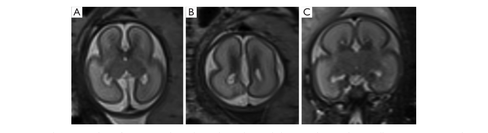

## Question

# Disease Characteristics Research Template

## Target Disease
- **Disease Name:** ARX-Related Lissencephaly and Interneuronopathy
- **MONDO ID:**  (if available)
- **Category:** Mendelian

## Research Objectives

Please provide a comprehensive research report on **ARX-Related Lissencephaly and Interneuronopathy** covering all of the
disease characteristics listed below. This report will be used to populate a disease knowledge
base entry. Be thorough and cite primary literature (PMID preferred) for all claims.

For each section, **suggested databases/resources** are listed. These are the first places
you should search for information on each topic.

---

### 1. Disease Information
> **Search first:** OMIM, Orphanet, ICD-10/ICD-11, MeSH, PubMed

- What is the disease? Provide a concise overview.
- What are the key identifiers? (OMIM, Orphanet, ICD-10/ICD-11, MeSH, Mondo)
- What are the common synonyms and alternative names?
- Is the information derived from individual patients (e.g., EHR) or aggregated disease-level resources?

### 2. Etiology

- **Disease Causal Factors**: What are the primary causes? (genetic, environmental, infectious, mechanistic)
- **Risk Factors**:
  > **Search first:** PubMed, Cochrane Library, UpToDate, clinical guidelines, ClinVar, ClinGen, GWAS Catalog, PheGenI, CTD, CDC, WHO, epidemiological databases
  - Genetic risk factors (causal variants, susceptibility loci, modifier genes)
  - Environmental risk factors (toxins, lifestyle, occupational exposures, age, sex, family history)
- **Protective Factors**:
  > **Search first:** PubMed, Cochrane Library, clinical trial databases, GWAS Catalog, gnomAD, WHO, CDC, nutrition databases
  - Genetic protective factors (protective variants, modifier alleles)
  - Environmental protective factors (diet, lifestyle, exposures that reduce risk)
- **Gene-Environment Interactions**: How do genetic and environmental factors interact to influence disease?
  > **Search first:** CTD, PubMed, PheGenI, GxE databases

### 3. Phenotypes
> **Search first:** HPO (Human Phenotype Ontology), OMIM, Orphanet, PubMed, clinicaltrials.gov, MedDRA, SNOMED CT, DECIPHER, LOINC

For each phenotype, provide:
- **Phenotype type**: symptoms, clinical signs, physical manifestations, behavioral changes, or laboratory abnormalities
  > For symptoms/signs: HPO, OMIM, Orphanet, PubMed
  > For behavioral changes: HPO, DSM, RDoC (Research Domain Criteria), PubMed
  > For laboratory abnormalities: LOINC, SNOMED CT, LabTests Online, PubMed
- **Phenotype characteristics**:
  > **Search first:** OMIM, Orphanet, HPO, PubMed
  - Age of symptom onset (neonatal, childhood, adult-onset, late-onset)
  - Symptom severity (mild, moderate, severe, variable)
  - Symptom progression (stable, progressive, episodic, fluctuating)
  - Frequency among affected individuals (percentage or qualitative)
- **Quality of life impact**: Effects on daily functioning and well-being (per-phenotype when possible)
  > **Search first:** EQ-5D database, SF-36, WHO QOL databases, PubMed
- Suggest HPO (Human Phenotype Ontology) terms for each phenotype

### 4. Genetic/Molecular Information

- **Causal Genes**: Gene mutations or chromosomal abnormalities responsible for disease (gene symbols, OMIM IDs)
  > **Search first:** OMIM, ClinVar, HGMD, Ensembl, NCBI Gene
- **Pathogenic Variants**:
  - Affected genes (gene symbols, HGNC IDs)
    > **Search first:** OMIM, NCBI Gene, Ensembl, HGNC, UniProt, GeneCards
  - Variant classification (pathogenic, likely pathogenic, VUS per ACMG/AMP guidelines)
    > **Search first:** ClinVar, ClinGen, ACMG/AMP guidelines, VarSome
  - Variant type/class (missense, frameshift, nonsense, splice-site, structural)
  - Allele frequency in population databases
    > **Search first:** gnomAD, 1000 Genomes, ExAC, TOPMed, dbSNP
  - Somatic vs germline origin
    > **Search first:** COSMIC (somatic), ClinVar, ICGC, TCGA
  - Functional consequences (loss of function, gain of function, dominant negative)
- **Modifier Genes**: Genes that modify disease severity or expression
- **Epigenetic Information**: DNA methylation, histone modifications, chromatin changes affecting disease
  > **Search first:** ENCODE, Roadmap Epigenomics, MethBase, DiseaseMeth
- **Chromosomal Abnormalities**: Large-scale genetic changes (aneuploidy, translocations, inversions)
  > **Search first:** DECIPHER, ClinVar, ECARUCA, UCSC Genome Browser

### 5. Environmental Information

- **Environmental Factors**: Non-genetic contributing factors (toxins, radiation, pollution, occupational exposure)
  > **Search first:** CTD (Comparative Toxicogenomics Database), TOXNET, PubMed, EPA databases
- **Lifestyle Factors**: Behavioral factors (smoking, diet, exercise, alcohol consumption)
  > **Search first:** CDC databases, WHO, PubMed, NHANES
- **Infectious Agents**: If applicable, pathogens causing or triggering disease (bacteria, viruses, fungi, parasites)
  > **Search first:** NCBI Taxonomy, ViPR, BV-BRC, MicrobeDB, GIDEON

### 6. Mechanism / Pathophysiology

- **Molecular Pathways**: Specific signaling cascades or biochemical pathways involved (Wnt, MAPK, mTOR, PI3K-AKT, etc.)
  > **Search first:** KEGG, Reactome, WikiPathways, PathBank, BioCyc
- **Cellular Processes**: Cell-level mechanisms (apoptosis, autophagy, cell cycle dysregulation, inflammation, etc.)
  > **Search first:** Gene Ontology (GO), Reactome, KEGG, PubMed
- **Protein Dysfunction**: How protein structure or function is altered (misfolding, aggregation, loss of function, gain of function)
  > **Search first:** UniProt, PDB (Protein Data Bank), InterPro, Pfam, AlphaFold
- **Metabolic Changes**: Alterations in metabolic processes (energy metabolism, lipid metabolism, amino acid metabolism)
  > **Search first:** KEGG, BioCyc, HMDB (Human Metabolome Database), BRENDA
- **Immune System Involvement**: Role of immune response (autoimmunity, immunodeficiency, chronic inflammation)
  > **Search first:** ImmPort, Immunome Database, IEDB, Gene Ontology
- **Tissue Damage Mechanisms**: How tissues/ are injured (oxidative stress, ischemia, fibrosis, necrosis)
  > **Search first:** PubMed, Gene Ontology, Reactome
- **Biochemical Abnormalities**: Specific molecular defects (enzyme deficiencies, receptor dysfunction, ion channel defects)
  > **Search first:** BRENDA, UniProt, KEGG, OMIM, PubMed
- **Epigenetic Changes**: DNA methylation, histone modifications affecting gene expression in disease
  > **Search first:** ENCODE, Roadmap Epigenomics, MethBase, DiseaseMeth
- **Molecular Profiling** (if available):
  - Transcriptomics/gene expression changes
    > **Search first:** GEO (Gene Expression Omnibus), ArrayExpress, GTEx, Human Cell Atlas, SRA
  - Proteomics findings
    > **Search first:** PRIDE, ProteomeXchange, Human Protein Atlas, STRING, BioGRID
  - Metabolomics signatures
    > **Search first:** MetaboLights, Metabolomics Workbench, HMDB, METLIN
  - Lipidomics alterations
    > **Search first:** LIPID MAPS, SwissLipids, LipidHome, Metabolomics Workbench
  - Genomic structural features
    > **Search first:** UCSC Genome Browser, Ensembl, NCBI, dbVar, DGV
- **Advanced Technologies** (if applicable):
  - Single-cell analysis findings (cell-type specific mechanisms, cellular heterogeneity)
    > **Search first:** Human Cell Atlas, Single Cell Portal, GEO, CELLxGENE
  - Spatial transcriptomics findings
    > **Search first:** GEO, Spatial Research, Vizgen, 10x Genomics data
  - Multi-omics integration results
    > **Search first:** TCGA, ICGC, cBioPortal, LinkedOmics, PubMed
  - Functional genomics screens (CRISPR, RNAi)
    > **Search first:** DepMap, GenomeRNAi, PubMed, BioGRID ORCS

For each mechanism, describe:
- The causal chain from initial trigger to clinical manifestation
- Which mechanisms are upstream vs downstream
- What cell types and biological processes are involved
- Suggest GO terms for biological processes and CL terms for cell types

### 7. Anatomical Structures Affected

- **Organ Level**:
  - Primary organs directly affected
  - Secondary organ involvement (complications, secondary effects)
  - Body systems involved (cardiovascular, nervous, digestive, respiratory, endocrine, etc.)
  > **Search first:** Uberon, FMA (Foundational Model of Anatomy), OMIM, HPO, ICD-11, MeSH, SNOMED CT
- **Tissue and Cell Level**:
  - Specific tissue types affected (epithelial, connective, muscle, nervous)
  - Specific cell populations targeted (with Cell Ontology terms)
  > **Search first:** Uberon, Human Protein Atlas, Cell Ontology, Human Cell Atlas, CellMarker, PanglaoDB
- **Subcellular Level**:
  - Cellular compartments involved (mitochondria, nucleus, ER, lysosomes) (with GO Cellular Component terms)
  > **Search first:** Gene Ontology (Cellular Component), UniProt, Human Protein Atlas
- **Localization**:
  - Specific anatomical sites (with UBERON terms)
    > **Search first:** FMA, Uberon, NeuroNames (for brain), SNOMED CT
  - Lateralization (unilateral, bilateral, asymmetric)
    > **Search first:** HPO, clinical literature, imaging databases

### 8. Temporal Development

- **Onset**:
  - Typical age of onset (congenital, pediatric, adult, geriatric)
  - Onset pattern (acute, subacute, chronic, insidious)
  > **Search first:** OMIM, Orphanet, HPO, PubMed
- **Progression**:
  - Disease stages (early, intermediate, advanced, end-stage)
    > **Search first:** Cancer Staging Manual (AJCC), WHO classifications, PubMed
  - Progression rate (rapid, slow, variable)
  - Disease course pattern (episodic, relapsing-remitting, progressive, stable)
  - Disease duration (self-limited, chronic lifelong)
  > **Search first:** Disease registries, longitudinal cohort databases, natural history studies, PubMed, Orphanet, OMIM
- **Patterns**:
  - Remission patterns (spontaneous, treatment-induced)
    > **Search first:** Clinical trial databases, disease registries, PubMed
  - Critical periods (time windows of vulnerability or opportunity for intervention)
    > **Search first:** PubMed, developmental biology databases, clinical guidelines

### 9. Inheritance and Population

- **Epidemiology**:
  - Prevalence (cases per 100,000 at given time)
  - Incidence (new cases per 100,000 per year)
  > **Search first:** Orphanet, CDC, WHO, GBD (Global Burden of Disease), national registries, SEER, disease registries
- **For Genetic Etiology**:
  - Inheritance pattern (AD, AR, X-linked, mitochondrial, multifactorial, polygenic)
    > **Search first:** OMIM, Orphanet, ClinVar, GTR (Genetic Testing Registry)
  - Penetrance (complete, incomplete, age-dependent)
    > **Search first:** ClinVar, OMIM, PubMed, ClinGen
  - Expressivity (variable, consistent)
    > **Search first:** OMIM, ClinVar, PubMed
  - Genetic anticipation (increasing severity in successive generations)
    > **Search first:** OMIM, PubMed (especially for repeat expansion disorders)
  - Germline mosaicism
    > **Search first:** ClinVar, OMIM, genetic counseling literature, PubMed
  - Founder effects (population-specific mutations)
    > **Search first:** gnomAD, population genetics databases, PubMed
  - Consanguinity role
    > **Search first:** OMIM, population studies, genetic counseling resources
  - Carrier frequency
    > **Search first:** gnomAD, carrier screening databases, GeneReviews, GTR
- **Population Demographics**:
  - Affected populations (ethnic or demographic groups with higher prevalence)
    > **Search first:** gnomAD, 1000 Genomes, PAGE Study, PubMed, population registries
  - Geographic distribution (endemic areas, regional variation)
    > **Search first:** WHO, CDC, GBD, Orphanet, geographic epidemiology databases
  - Geographic distribution of specific variants
  - Sex ratio (male:female)
    > **Search first:** Disease registries, OMIM, PubMed, epidemiological databases
  - Age distribution of affected individuals
    > **Search first:** CDC, disease registries, SEER, Orphanet

### 10. Diagnostics

- **Clinical Tests**:
  - Laboratory tests (blood, urine, tissue chemistry, specific enzyme assays)
    > **Search first:** LOINC, LabTests Online, PubMed
  - Biomarkers (proteins, metabolites, genetic markers, circulating biomarkers)
    > **Search first:** FDA Biomarker List, BEST (Biomarkers, EndpointS, and other Tools), PubMed
  - Imaging studies (X-ray, CT, MRI, PET, ultrasound)
    > **Search first:** RadLex, DICOM, Radiopaedia, imaging databases
  - Functional tests (pulmonary function, cardiac stress tests)
    > **Search first:** LOINC, clinical guidelines, PubMed
  - Electrophysiology (EEG, EMG, ECG, nerve conduction studies)
    > **Search first:** LOINC, clinical neurophysiology databases, PubMed
  - Biopsy findings (histopathology, immunohistochemistry)
    > **Search first:** SNOMED CT, College of American Pathologists resources, PubMed
  - Pathology findings (microscopic examination)
    > **Search first:** SNOMED CT, Digital Pathology databases, PubMed
- **Genetic Testing**:
  > **Search first:** GTR (Genetic Testing Registry), GeneReviews, ClinGen
  - Overview of recommended genetic testing approach
  - Whole genome sequencing (WGS) utility
    > **Search first:** GTR, ClinVar, GEL (Genomics England), gnomAD
  - Whole exome sequencing (WES) utility
    > **Search first:** GTR, ClinVar, OMIM, GeneMatcher
  - Gene panels (which panels, which genes)
    > **Search first:** GTR, ClinVar, laboratory-specific databases
  - Single gene testing
    > **Search first:** GTR, ClinVar, OMIM, GeneReviews
  - Chromosomal microarray (CMA)
    > **Search first:** DECIPHER, ClinVar, dbVar, ECARUCA
  - Karyotyping
    > **Search first:** Chromosome Abnormality Database, ClinVar, cytogenetics resources
  - FISH
    > **Search first:** ClinVar, cytogenetics databases, PubMed
  - Mitochondrial DNA testing
    > **Search first:** MITOMAP, MSeqDR, ClinVar, GTR
  - Repeat expansion testing
    > **Search first:** GTR, ClinVar, repeat expansion databases, PubMed
- **Omics-Based Diagnostics** (if applicable):
  - RNA sequencing / transcriptomics
    > **Search first:** GEO, ArrayExpress, GTEx, RNA-seq databases
  - Proteomics
    > **Search first:** PRIDE, ProteomeXchange, FDA Biomarker database
  - Metabolomics
    > **Search first:** MetaboLights, Metabolomics Workbench, HMDB
  - Epigenomics
    > **Search first:** GEO, ENCODE, Roadmap Epigenomics, MethBase
  - Liquid biopsy
    > **Search first:** COSMIC, ClinVar, liquid biopsy databases, PubMed
- **Clinical Criteria**:
  - Standardized diagnostic criteria (DSM, ICD, society guidelines)
    > **Search first:** DSM-5, ICD-11, clinical society guidelines, UpToDate
  - Differential diagnosis (other conditions to rule out, with distinguishing features)
    > **Search first:** DynaMed, UpToDate, clinical decision support systems
- **Screening**:
  - Screening methods for asymptomatic individuals (newborn screening, carrier screening, cascade screening)
    > **Search first:** ACMG recommendations, CDC newborn screening, GTR

### 11. Outcome/Prognosis

- **Survival and Mortality**:
  - Survival rate (5-year, 10-year, overall)
    > **Search first:** SEER, cancer registries, disease-specific registries, PubMed
  - Life expectancy (with and without treatment if applicable)
    > **Search first:** Orphanet, disease registries, actuarial databases, PubMed
  - Mortality rate
    > **Search first:** CDC, WHO, GBD, national mortality databases
  - Disease-specific mortality (deaths directly attributable to disease)
    > **Search first:** Disease registries, CDC Wonder, GBD, PubMed
- **Morbidity and Function**:
  - Morbidity (disease-related disability and health impacts)
    > **Search first:** GBD, WHO, disability databases, PubMed
  - Disability outcomes (long-term functional impairments)
    > **Search first:** ICF (International Classification of Functioning), disability registries
  - Quality of life measures (EQ-5D, SF-36, PROMIS, disease-specific tools)
    > **Search first:** EQ-5D database, SF-36, PROMIS, PubMed
- **Disease Course**:
  - Complications (secondary problems: infections, organ failure, etc.)
    > **Search first:** ICD codes, disease registries, clinical databases, PubMed
  - Recovery potential (likelihood and extent of recovery, with vs without treatment)
    > **Search first:** Natural history studies, rehabilitation databases, PubMed
- **Prediction**:
  - Prognostic factors (age, disease severity, biomarkers, treatment response)
    > **Search first:** Prognostic models databases, clinical calculators, PubMed
  - Prognostic biomarkers (molecular markers predicting disease course)
    > **Search first:** FDA Biomarker database, PubMed, cancer prognostic databases

### 12. Treatment

- **Pharmacotherapy**:
  - Pharmacological treatments (drug names, drug classes, mechanisms of action)
    > **Search first:** DrugBank, RxNorm, ATC classification, DailyMed, FDA databases
  - Pharmacogenomics (how genetic variants affect drug metabolism, efficacy, toxicity)
    > **Search first:** PharmGKB, CPIC (Clinical Pharmacogenetics), FDA Table of PGx Biomarkers
- **Advanced Therapeutics**:
  - Gene therapy (viral vectors, CRISPR, gene replacement, gene editing)
    > **Search first:** ClinicalTrials.gov, FDA gene therapy database, ASGCT resources
  - Cell therapy (stem cell transplant, CAR-T, cellular therapeutics)
    > **Search first:** ClinicalTrials.gov, FDA cell therapy database, FACT standards
  - RNA-based therapies (ASOs, siRNA, mRNA therapies)
    > **Search first:** ClinicalTrials.gov, FDA approvals, PubMed
  - Targeted therapies (treatments directed at specific molecular targets)
    > **Search first:** My Cancer Genome, OncoKB, ClinicalTrials.gov, FDA approvals
  - Immunotherapies (checkpoint inhibitors, monoclonal antibodies)
    > **Search first:** Cancer Immunotherapy Database, FDA approvals, ClinicalTrials.gov
- **Surgical and Interventional**:
  - Surgical interventions (types of surgery, timing, outcomes)
    > **Search first:** CPT codes, surgical registries, clinical guidelines, PubMed
- **Supportive and Rehabilitative**:
  - Supportive care (symptom management, pain control, nutrition)
    > **Search first:** Clinical guidelines, Cochrane Library, PubMed
  - Rehabilitation (physical therapy, occupational therapy, speech therapy)
    > **Search first:** Rehabilitation medicine databases, clinical guidelines, PubMed
- **Experimental**:
  - Experimental treatments in clinical trials (with NCT identifiers if available)
    > **Search first:** ClinicalTrials.gov, EU Clinical Trials Register, WHO ICTRP
- **Treatment Outcomes**:
  - Treatment response rates
    > **Search first:** Clinical trial databases, FDA reviews, systematic reviews, PubMed
  - Side effects and adverse events
    > **Search first:** FDA Adverse Event Reporting System (FAERS), MedWatch, PubMed
- **Treatment Strategy**:
  - Treatment algorithms (clinical pathways, decision trees)
    > **Search first:** Clinical practice guidelines, NCCN Guidelines, UpToDate
  - Combination therapies
    > **Search first:** ClinicalTrials.gov, treatment guidelines, PubMed
  - Personalized medicine approaches (genotype-guided treatment)
    > **Search first:** My Cancer Genome, CIViC, PharmGKB, precision medicine databases

For each treatment, suggest MAXO (Medical Action Ontology) terms where applicable.

### 13. Prevention

- **Prevention Levels**:
  - Primary prevention (preventing disease occurrence: vaccination, risk factor modification)
    > **Search first:** CDC, WHO, USPSTF recommendations, Cochrane Library
  - Secondary prevention (early detection and treatment: screening programs, early intervention)
    > **Search first:** USPSTF, CDC screening guidelines, WHO
  - Tertiary prevention (preventing complications in those with disease)
    > **Search first:** Clinical guidelines, disease management protocols, PubMed
- **Immunization**: Vaccine strategies (if applicable)
  > **Search first:** CDC vaccine schedules, WHO immunization, FDA vaccine database
- **Screening and Early Detection**:
  - Screening programs (population-based: newborn screening, cancer screening)
    > **Search first:** CDC screening programs, USPSTF, cancer screening databases
  - Genetic screening (carrier screening, preimplantation genetic diagnosis, prenatal testing)
    > **Search first:** ACMG recommendations, ACOG guidelines, GTR
  - Risk stratification (identifying high-risk individuals for targeted prevention)
    > **Search first:** Risk prediction models, clinical calculators, PubMed
- **Behavioral Interventions**: Lifestyle modifications to reduce risk
  > **Search first:** CDC, WHO, behavioral intervention databases, Cochrane Library
- **Counseling**: Genetic counseling (risk assessment, family planning guidance)
  > **Search first:** NSGC resources, ACMG guidelines, GeneReviews
- **Public Health**:
  - Public health interventions (sanitation, vector control, health education)
    > **Search first:** CDC, WHO, public health databases, PubMed
  - Environmental interventions (reducing environmental risk factors)
    > **Search first:** EPA databases, WHO environmental health, PubMed
- **Prophylaxis**: Preventive medications or procedures
  > **Search first:** Clinical guidelines, FDA approvals, PubMed

### 14. Other Species / Natural Disease

- **Taxonomy**: Species affected (with NCBI Taxon identifiers)
  > **Search first:** NCBI Taxonomy
- **Breed**: Specific breeds affected (with VBO identifiers if applicable)
  > **Search first:** VBO (Vertebrate Breed Ontology)
- **Gene**: Orthologous genes in other species (with NCBI Gene IDs)
  > **Search first:** NCBI Gene
- **Natural Disease**:
  - Naturally occurring disease in other species (companion animals, wildlife)
    > **Search first:** OMIA (Online Mendelian Inheritance in Animals), VetCompass, PubMed
  - Veterinary relevance and importance in animal health
    > **Search first:** OMIA, veterinary databases, PubMed
- **Comparative Biology**:
  - Comparative pathology (similarities and differences across species)
    > **Search first:** OMIA, comparative pathology databases, PubMed
  - Evolutionary conservation of disease mechanisms
    > **Search first:** HomoloGene, OrthoMCL, Alliance of Genome Resources
- **Transmission** (if applicable):
  - Zoonotic potential
    > **Search first:** CDC zoonotic diseases, WHO zoonoses, GIDEON
  - Cross-species susceptibility
    > **Search first:** NCBI Taxonomy, veterinary databases, PubMed

### 15. Model Organisms

- **Model Types**:
  - Model organism type (mammalian, invertebrate, cellular, in vitro)
    > **Search first:** Alliance of Genome Resources, model organism databases
  - Specific model systems (mouse, rat, zebrafish, Drosophila, C. elegans, yeast, cell lines, organoids, iPSCs)
    > **Search first:** MGI, RGD, ZFIN, FlyBase, WormBase, SGD, ATCC, Cellosaurus
  - Induced models (drug treatment, surgical intervention, environmental manipulation)
    > **Search first:** MGI, model organism databases, PubMed
- **Genetic Models**:
  - Types available (knockout, knock-in, transgenic, conditional, humanized)
    > **Search first:** MGI, IMPC, KOMP, EuMMCR, IMSR
- **Model Characteristics**:
  - Phenotype recapitulation (how well model reproduces human disease features)
    > **Search first:** Model organism databases, comparative studies, PubMed
  - Model limitations (aspects of human disease not captured)
    > **Search first:** Model organism databases, PubMed, review articles
- **Applications**:
  - Research applications (what aspects of disease can be studied)
    > **Search first:** Model organism databases, PubMed
- **Resources**:
  - Model databases
    > **Search first:** MGI, RGD, ZFIN, FlyBase, WormBase, IMSR, EMMA, MMRRC

---

## Citation Requirements

- Cite primary literature (PMID preferred) for all mechanistic and clinical claims
- Prioritize recent reviews and landmark papers
- Include direct quotes from abstracts where possible to support key statements
- Distinguish evidence source types: human clinical, model organism, in vitro, computational

## Output Format

Structure your response as a comprehensive narrative organized by the sections above.
For each section, provide:
- Factual content with specific details (numbers, percentages, gene names, variant nomenclature)
- Ontology term suggestions (HPO, GO, CL, UBERON, CHEBI, MAXO, MONDO) where applicable
- Evidence citations with PMIDs
- Direct quotes from abstracts to support key claims
- Clear indication when information is not available or not applicable for this disease

This report will be used to populate a disease knowledge base entry with:
- Pathophysiology descriptions with causal chains
- Gene/protein annotations (HGNC, GO terms)
- Phenotype associations (HP terms) with frequencies
- Cell type involvement (CL terms)
- Anatomical locations (UBERON terms)
- Chemical entities (CHEBI terms)
- Treatment annotations (MAXO terms)
- Evidence items with PMIDs and exact abstract quotes
- Epidemiology, prognosis, diagnostic, and prevention information
- Animal model descriptions with phenotype recapitulation details

## Output

Question: You are an expert researcher providing comprehensive, well-cited information.

Provide detailed information focusing on:
1. Key concepts and definitions with current understanding
2. Recent developments and latest research (prioritize 2023-2024 sources)
3. Current applications and real-world implementations
4. Expert opinions and analysis from authoritative sources
5. Relevant statistics and data from recent studies

Format as a comprehensive research report with proper citations. Include URLs and publication dates where available.
Always prioritize recent, authoritative sources and provide specific citations for all major claims.

# Disease Characteristics Research Template

## Target Disease
- **Disease Name:** ARX-Related Lissencephaly and Interneuronopathy
- **MONDO ID:**  (if available)
- **Category:** Mendelian

## Research Objectives

Please provide a comprehensive research report on **ARX-Related Lissencephaly and Interneuronopathy** covering all of the
disease characteristics listed below. This report will be used to populate a disease knowledge
base entry. Be thorough and cite primary literature (PMID preferred) for all claims.

For each section, **suggested databases/resources** are listed. These are the first places
you should search for information on each topic.

---

### 1. Disease Information
> **Search first:** OMIM, Orphanet, ICD-10/ICD-11, MeSH, PubMed

- What is the disease? Provide a concise overview.
- What are the key identifiers? (OMIM, Orphanet, ICD-10/ICD-11, MeSH, Mondo)
- What are the common synonyms and alternative names?
- Is the information derived from individual patients (e.g., EHR) or aggregated disease-level resources?

### 2. Etiology

- **Disease Causal Factors**: What are the primary causes? (genetic, environmental, infectious, mechanistic)
- **Risk Factors**:
  > **Search first:** PubMed, Cochrane Library, UpToDate, clinical guidelines, ClinVar, ClinGen, GWAS Catalog, PheGenI, CTD, CDC, WHO, epidemiological databases
  - Genetic risk factors (causal variants, susceptibility loci, modifier genes)
  - Environmental risk factors (toxins, lifestyle, occupational exposures, age, sex, family history)
- **Protective Factors**:
  > **Search first:** PubMed, Cochrane Library, clinical trial databases, GWAS Catalog, gnomAD, WHO, CDC, nutrition databases
  - Genetic protective factors (protective variants, modifier alleles)
  - Environmental protective factors (diet, lifestyle, exposures that reduce risk)
- **Gene-Environment Interactions**: How do genetic and environmental factors interact to influence disease?
  > **Search first:** CTD, PubMed, PheGenI, GxE databases

### 3. Phenotypes
> **Search first:** HPO (Human Phenotype Ontology), OMIM, Orphanet, PubMed, clinicaltrials.gov, MedDRA, SNOMED CT, DECIPHER, LOINC

For each phenotype, provide:
- **Phenotype type**: symptoms, clinical signs, physical manifestations, behavioral changes, or laboratory abnormalities
  > For symptoms/signs: HPO, OMIM, Orphanet, PubMed
  > For behavioral changes: HPO, DSM, RDoC (Research Domain Criteria), PubMed
  > For laboratory abnormalities: LOINC, SNOMED CT, LabTests Online, PubMed
- **Phenotype characteristics**:
  > **Search first:** OMIM, Orphanet, HPO, PubMed
  - Age of symptom onset (neonatal, childhood, adult-onset, late-onset)
  - Symptom severity (mild, moderate, severe, variable)
  - Symptom progression (stable, progressive, episodic, fluctuating)
  - Frequency among affected individuals (percentage or qualitative)
- **Quality of life impact**: Effects on daily functioning and well-being (per-phenotype when possible)
  > **Search first:** EQ-5D database, SF-36, WHO QOL databases, PubMed
- Suggest HPO (Human Phenotype Ontology) terms for each phenotype

### 4. Genetic/Molecular Information

- **Causal Genes**: Gene mutations or chromosomal abnormalities responsible for disease (gene symbols, OMIM IDs)
  > **Search first:** OMIM, ClinVar, HGMD, Ensembl, NCBI Gene
- **Pathogenic Variants**:
  - Affected genes (gene symbols, HGNC IDs)
    > **Search first:** OMIM, NCBI Gene, Ensembl, HGNC, UniProt, GeneCards
  - Variant classification (pathogenic, likely pathogenic, VUS per ACMG/AMP guidelines)
    > **Search first:** ClinVar, ClinGen, ACMG/AMP guidelines, VarSome
  - Variant type/class (missense, frameshift, nonsense, splice-site, structural)
  - Allele frequency in population databases
    > **Search first:** gnomAD, 1000 Genomes, ExAC, TOPMed, dbSNP
  - Somatic vs germline origin
    > **Search first:** COSMIC (somatic), ClinVar, ICGC, TCGA
  - Functional consequences (loss of function, gain of function, dominant negative)
- **Modifier Genes**: Genes that modify disease severity or expression
- **Epigenetic Information**: DNA methylation, histone modifications, chromatin changes affecting disease
  > **Search first:** ENCODE, Roadmap Epigenomics, MethBase, DiseaseMeth
- **Chromosomal Abnormalities**: Large-scale genetic changes (aneuploidy, translocations, inversions)
  > **Search first:** DECIPHER, ClinVar, ECARUCA, UCSC Genome Browser

### 5. Environmental Information

- **Environmental Factors**: Non-genetic contributing factors (toxins, radiation, pollution, occupational exposure)
  > **Search first:** CTD (Comparative Toxicogenomics Database), TOXNET, PubMed, EPA databases
- **Lifestyle Factors**: Behavioral factors (smoking, diet, exercise, alcohol consumption)
  > **Search first:** CDC databases, WHO, PubMed, NHANES
- **Infectious Agents**: If applicable, pathogens causing or triggering disease (bacteria, viruses, fungi, parasites)
  > **Search first:** NCBI Taxonomy, ViPR, BV-BRC, MicrobeDB, GIDEON

### 6. Mechanism / Pathophysiology

- **Molecular Pathways**: Specific signaling cascades or biochemical pathways involved (Wnt, MAPK, mTOR, PI3K-AKT, etc.)
  > **Search first:** KEGG, Reactome, WikiPathways, PathBank, BioCyc
- **Cellular Processes**: Cell-level mechanisms (apoptosis, autophagy, cell cycle dysregulation, inflammation, etc.)
  > **Search first:** Gene Ontology (GO), Reactome, KEGG, PubMed
- **Protein Dysfunction**: How protein structure or function is altered (misfolding, aggregation, loss of function, gain of function)
  > **Search first:** UniProt, PDB (Protein Data Bank), InterPro, Pfam, AlphaFold
- **Metabolic Changes**: Alterations in metabolic processes (energy metabolism, lipid metabolism, amino acid metabolism)
  > **Search first:** KEGG, BioCyc, HMDB (Human Metabolome Database), BRENDA
- **Immune System Involvement**: Role of immune response (autoimmunity, immunodeficiency, chronic inflammation)
  > **Search first:** ImmPort, Immunome Database, IEDB, Gene Ontology
- **Tissue Damage Mechanisms**: How tissues/ are injured (oxidative stress, ischemia, fibrosis, necrosis)
  > **Search first:** PubMed, Gene Ontology, Reactome
- **Biochemical Abnormalities**: Specific molecular defects (enzyme deficiencies, receptor dysfunction, ion channel defects)
  > **Search first:** BRENDA, UniProt, KEGG, OMIM, PubMed
- **Epigenetic Changes**: DNA methylation, histone modifications affecting gene expression in disease
  > **Search first:** ENCODE, Roadmap Epigenomics, MethBase, DiseaseMeth
- **Molecular Profiling** (if available):
  - Transcriptomics/gene expression changes
    > **Search first:** GEO (Gene Expression Omnibus), ArrayExpress, GTEx, Human Cell Atlas, SRA
  - Proteomics findings
    > **Search first:** PRIDE, ProteomeXchange, Human Protein Atlas, STRING, BioGRID
  - Metabolomics signatures
    > **Search first:** MetaboLights, Metabolomics Workbench, HMDB, METLIN
  - Lipidomics alterations
    > **Search first:** LIPID MAPS, SwissLipids, LipidHome, Metabolomics Workbench
  - Genomic structural features
    > **Search first:** UCSC Genome Browser, Ensembl, NCBI, dbVar, DGV
- **Advanced Technologies** (if applicable):
  - Single-cell analysis findings (cell-type specific mechanisms, cellular heterogeneity)
    > **Search first:** Human Cell Atlas, Single Cell Portal, GEO, CELLxGENE
  - Spatial transcriptomics findings
    > **Search first:** GEO, Spatial Research, Vizgen, 10x Genomics data
  - Multi-omics integration results
    > **Search first:** TCGA, ICGC, cBioPortal, LinkedOmics, PubMed
  - Functional genomics screens (CRISPR, RNAi)
    > **Search first:** DepMap, GenomeRNAi, PubMed, BioGRID ORCS

For each mechanism, describe:
- The causal chain from initial trigger to clinical manifestation
- Which mechanisms are upstream vs downstream
- What cell types and biological processes are involved
- Suggest GO terms for biological processes and CL terms for cell types

### 7. Anatomical Structures Affected

- **Organ Level**:
  - Primary organs directly affected
  - Secondary organ involvement (complications, secondary effects)
  - Body systems involved (cardiovascular, nervous, digestive, respiratory, endocrine, etc.)
  > **Search first:** Uberon, FMA (Foundational Model of Anatomy), OMIM, HPO, ICD-11, MeSH, SNOMED CT
- **Tissue and Cell Level**:
  - Specific tissue types affected (epithelial, connective, muscle, nervous)
  - Specific cell populations targeted (with Cell Ontology terms)
  > **Search first:** Uberon, Human Protein Atlas, Cell Ontology, Human Cell Atlas, CellMarker, PanglaoDB
- **Subcellular Level**:
  - Cellular compartments involved (mitochondria, nucleus, ER, lysosomes) (with GO Cellular Component terms)
  > **Search first:** Gene Ontology (Cellular Component), UniProt, Human Protein Atlas
- **Localization**:
  - Specific anatomical sites (with UBERON terms)
    > **Search first:** FMA, Uberon, NeuroNames (for brain), SNOMED CT
  - Lateralization (unilateral, bilateral, asymmetric)
    > **Search first:** HPO, clinical literature, imaging databases

### 8. Temporal Development

- **Onset**:
  - Typical age of onset (congenital, pediatric, adult, geriatric)
  - Onset pattern (acute, subacute, chronic, insidious)
  > **Search first:** OMIM, Orphanet, HPO, PubMed
- **Progression**:
  - Disease stages (early, intermediate, advanced, end-stage)
    > **Search first:** Cancer Staging Manual (AJCC), WHO classifications, PubMed
  - Progression rate (rapid, slow, variable)
  - Disease course pattern (episodic, relapsing-remitting, progressive, stable)
  - Disease duration (self-limited, chronic lifelong)
  > **Search first:** Disease registries, longitudinal cohort databases, natural history studies, PubMed, Orphanet, OMIM
- **Patterns**:
  - Remission patterns (spontaneous, treatment-induced)
    > **Search first:** Clinical trial databases, disease registries, PubMed
  - Critical periods (time windows of vulnerability or opportunity for intervention)
    > **Search first:** PubMed, developmental biology databases, clinical guidelines

### 9. Inheritance and Population

- **Epidemiology**:
  - Prevalence (cases per 100,000 at given time)
  - Incidence (new cases per 100,000 per year)
  > **Search first:** Orphanet, CDC, WHO, GBD (Global Burden of Disease), national registries, SEER, disease registries
- **For Genetic Etiology**:
  - Inheritance pattern (AD, AR, X-linked, mitochondrial, multifactorial, polygenic)
    > **Search first:** OMIM, Orphanet, ClinVar, GTR (Genetic Testing Registry)
  - Penetrance (complete, incomplete, age-dependent)
    > **Search first:** ClinVar, OMIM, PubMed, ClinGen
  - Expressivity (variable, consistent)
    > **Search first:** OMIM, ClinVar, PubMed
  - Genetic anticipation (increasing severity in successive generations)
    > **Search first:** OMIM, PubMed (especially for repeat expansion disorders)
  - Germline mosaicism
    > **Search first:** ClinVar, OMIM, genetic counseling literature, PubMed
  - Founder effects (population-specific mutations)
    > **Search first:** gnomAD, population genetics databases, PubMed
  - Consanguinity role
    > **Search first:** OMIM, population studies, genetic counseling resources
  - Carrier frequency
    > **Search first:** gnomAD, carrier screening databases, GeneReviews, GTR
- **Population Demographics**:
  - Affected populations (ethnic or demographic groups with higher prevalence)
    > **Search first:** gnomAD, 1000 Genomes, PAGE Study, PubMed, population registries
  - Geographic distribution (endemic areas, regional variation)
    > **Search first:** WHO, CDC, GBD, Orphanet, geographic epidemiology databases
  - Geographic distribution of specific variants
  - Sex ratio (male:female)
    > **Search first:** Disease registries, OMIM, PubMed, epidemiological databases
  - Age distribution of affected individuals
    > **Search first:** CDC, disease registries, SEER, Orphanet

### 10. Diagnostics

- **Clinical Tests**:
  - Laboratory tests (blood, urine, tissue chemistry, specific enzyme assays)
    > **Search first:** LOINC, LabTests Online, PubMed
  - Biomarkers (proteins, metabolites, genetic markers, circulating biomarkers)
    > **Search first:** FDA Biomarker List, BEST (Biomarkers, EndpointS, and other Tools), PubMed
  - Imaging studies (X-ray, CT, MRI, PET, ultrasound)
    > **Search first:** RadLex, DICOM, Radiopaedia, imaging databases
  - Functional tests (pulmonary function, cardiac stress tests)
    > **Search first:** LOINC, clinical guidelines, PubMed
  - Electrophysiology (EEG, EMG, ECG, nerve conduction studies)
    > **Search first:** LOINC, clinical neurophysiology databases, PubMed
  - Biopsy findings (histopathology, immunohistochemistry)
    > **Search first:** SNOMED CT, College of American Pathologists resources, PubMed
  - Pathology findings (microscopic examination)
    > **Search first:** SNOMED CT, Digital Pathology databases, PubMed
- **Genetic Testing**:
  > **Search first:** GTR (Genetic Testing Registry), GeneReviews, ClinGen
  - Overview of recommended genetic testing approach
  - Whole genome sequencing (WGS) utility
    > **Search first:** GTR, ClinVar, GEL (Genomics England), gnomAD
  - Whole exome sequencing (WES) utility
    > **Search first:** GTR, ClinVar, OMIM, GeneMatcher
  - Gene panels (which panels, which genes)
    > **Search first:** GTR, ClinVar, laboratory-specific databases
  - Single gene testing
    > **Search first:** GTR, ClinVar, OMIM, GeneReviews
  - Chromosomal microarray (CMA)
    > **Search first:** DECIPHER, ClinVar, dbVar, ECARUCA
  - Karyotyping
    > **Search first:** Chromosome Abnormality Database, ClinVar, cytogenetics resources
  - FISH
    > **Search first:** ClinVar, cytogenetics databases, PubMed
  - Mitochondrial DNA testing
    > **Search first:** MITOMAP, MSeqDR, ClinVar, GTR
  - Repeat expansion testing
    > **Search first:** GTR, ClinVar, repeat expansion databases, PubMed
- **Omics-Based Diagnostics** (if applicable):
  - RNA sequencing / transcriptomics
    > **Search first:** GEO, ArrayExpress, GTEx, RNA-seq databases
  - Proteomics
    > **Search first:** PRIDE, ProteomeXchange, FDA Biomarker database
  - Metabolomics
    > **Search first:** MetaboLights, Metabolomics Workbench, HMDB
  - Epigenomics
    > **Search first:** GEO, ENCODE, Roadmap Epigenomics, MethBase
  - Liquid biopsy
    > **Search first:** COSMIC, ClinVar, liquid biopsy databases, PubMed
- **Clinical Criteria**:
  - Standardized diagnostic criteria (DSM, ICD, society guidelines)
    > **Search first:** DSM-5, ICD-11, clinical society guidelines, UpToDate
  - Differential diagnosis (other conditions to rule out, with distinguishing features)
    > **Search first:** DynaMed, UpToDate, clinical decision support systems
- **Screening**:
  - Screening methods for asymptomatic individuals (newborn screening, carrier screening, cascade screening)
    > **Search first:** ACMG recommendations, CDC newborn screening, GTR

### 11. Outcome/Prognosis

- **Survival and Mortality**:
  - Survival rate (5-year, 10-year, overall)
    > **Search first:** SEER, cancer registries, disease-specific registries, PubMed
  - Life expectancy (with and without treatment if applicable)
    > **Search first:** Orphanet, disease registries, actuarial databases, PubMed
  - Mortality rate
    > **Search first:** CDC, WHO, GBD, national mortality databases
  - Disease-specific mortality (deaths directly attributable to disease)
    > **Search first:** Disease registries, CDC Wonder, GBD, PubMed
- **Morbidity and Function**:
  - Morbidity (disease-related disability and health impacts)
    > **Search first:** GBD, WHO, disability databases, PubMed
  - Disability outcomes (long-term functional impairments)
    > **Search first:** ICF (International Classification of Functioning), disability registries
  - Quality of life measures (EQ-5D, SF-36, PROMIS, disease-specific tools)
    > **Search first:** EQ-5D database, SF-36, PROMIS, PubMed
- **Disease Course**:
  - Complications (secondary problems: infections, organ failure, etc.)
    > **Search first:** ICD codes, disease registries, clinical databases, PubMed
  - Recovery potential (likelihood and extent of recovery, with vs without treatment)
    > **Search first:** Natural history studies, rehabilitation databases, PubMed
- **Prediction**:
  - Prognostic factors (age, disease severity, biomarkers, treatment response)
    > **Search first:** Prognostic models databases, clinical calculators, PubMed
  - Prognostic biomarkers (molecular markers predicting disease course)
    > **Search first:** FDA Biomarker database, PubMed, cancer prognostic databases

### 12. Treatment

- **Pharmacotherapy**:
  - Pharmacological treatments (drug names, drug classes, mechanisms of action)
    > **Search first:** DrugBank, RxNorm, ATC classification, DailyMed, FDA databases
  - Pharmacogenomics (how genetic variants affect drug metabolism, efficacy, toxicity)
    > **Search first:** PharmGKB, CPIC (Clinical Pharmacogenetics), FDA Table of PGx Biomarkers
- **Advanced Therapeutics**:
  - Gene therapy (viral vectors, CRISPR, gene replacement, gene editing)
    > **Search first:** ClinicalTrials.gov, FDA gene therapy database, ASGCT resources
  - Cell therapy (stem cell transplant, CAR-T, cellular therapeutics)
    > **Search first:** ClinicalTrials.gov, FDA cell therapy database, FACT standards
  - RNA-based therapies (ASOs, siRNA, mRNA therapies)
    > **Search first:** ClinicalTrials.gov, FDA approvals, PubMed
  - Targeted therapies (treatments directed at specific molecular targets)
    > **Search first:** My Cancer Genome, OncoKB, ClinicalTrials.gov, FDA approvals
  - Immunotherapies (checkpoint inhibitors, monoclonal antibodies)
    > **Search first:** Cancer Immunotherapy Database, FDA approvals, ClinicalTrials.gov
- **Surgical and Interventional**:
  - Surgical interventions (types of surgery, timing, outcomes)
    > **Search first:** CPT codes, surgical registries, clinical guidelines, PubMed
- **Supportive and Rehabilitative**:
  - Supportive care (symptom management, pain control, nutrition)
    > **Search first:** Clinical guidelines, Cochrane Library, PubMed
  - Rehabilitation (physical therapy, occupational therapy, speech therapy)
    > **Search first:** Rehabilitation medicine databases, clinical guidelines, PubMed
- **Experimental**:
  - Experimental treatments in clinical trials (with NCT identifiers if available)
    > **Search first:** ClinicalTrials.gov, EU Clinical Trials Register, WHO ICTRP
- **Treatment Outcomes**:
  - Treatment response rates
    > **Search first:** Clinical trial databases, FDA reviews, systematic reviews, PubMed
  - Side effects and adverse events
    > **Search first:** FDA Adverse Event Reporting System (FAERS), MedWatch, PubMed
- **Treatment Strategy**:
  - Treatment algorithms (clinical pathways, decision trees)
    > **Search first:** Clinical practice guidelines, NCCN Guidelines, UpToDate
  - Combination therapies
    > **Search first:** ClinicalTrials.gov, treatment guidelines, PubMed
  - Personalized medicine approaches (genotype-guided treatment)
    > **Search first:** My Cancer Genome, CIViC, PharmGKB, precision medicine databases

For each treatment, suggest MAXO (Medical Action Ontology) terms where applicable.

### 13. Prevention

- **Prevention Levels**:
  - Primary prevention (preventing disease occurrence: vaccination, risk factor modification)
    > **Search first:** CDC, WHO, USPSTF recommendations, Cochrane Library
  - Secondary prevention (early detection and treatment: screening programs, early intervention)
    > **Search first:** USPSTF, CDC screening guidelines, WHO
  - Tertiary prevention (preventing complications in those with disease)
    > **Search first:** Clinical guidelines, disease management protocols, PubMed
- **Immunization**: Vaccine strategies (if applicable)
  > **Search first:** CDC vaccine schedules, WHO immunization, FDA vaccine database
- **Screening and Early Detection**:
  - Screening programs (population-based: newborn screening, cancer screening)
    > **Search first:** CDC screening programs, USPSTF, cancer screening databases
  - Genetic screening (carrier screening, preimplantation genetic diagnosis, prenatal testing)
    > **Search first:** ACMG recommendations, ACOG guidelines, GTR
  - Risk stratification (identifying high-risk individuals for targeted prevention)
    > **Search first:** Risk prediction models, clinical calculators, PubMed
- **Behavioral Interventions**: Lifestyle modifications to reduce risk
  > **Search first:** CDC, WHO, behavioral intervention databases, Cochrane Library
- **Counseling**: Genetic counseling (risk assessment, family planning guidance)
  > **Search first:** NSGC resources, ACMG guidelines, GeneReviews
- **Public Health**:
  - Public health interventions (sanitation, vector control, health education)
    > **Search first:** CDC, WHO, public health databases, PubMed
  - Environmental interventions (reducing environmental risk factors)
    > **Search first:** EPA databases, WHO environmental health, PubMed
- **Prophylaxis**: Preventive medications or procedures
  > **Search first:** Clinical guidelines, FDA approvals, PubMed

### 14. Other Species / Natural Disease

- **Taxonomy**: Species affected (with NCBI Taxon identifiers)
  > **Search first:** NCBI Taxonomy
- **Breed**: Specific breeds affected (with VBO identifiers if applicable)
  > **Search first:** VBO (Vertebrate Breed Ontology)
- **Gene**: Orthologous genes in other species (with NCBI Gene IDs)
  > **Search first:** NCBI Gene
- **Natural Disease**:
  - Naturally occurring disease in other species (companion animals, wildlife)
    > **Search first:** OMIA (Online Mendelian Inheritance in Animals), VetCompass, PubMed
  - Veterinary relevance and importance in animal health
    > **Search first:** OMIA, veterinary databases, PubMed
- **Comparative Biology**:
  - Comparative pathology (similarities and differences across species)
    > **Search first:** OMIA, comparative pathology databases, PubMed
  - Evolutionary conservation of disease mechanisms
    > **Search first:** HomoloGene, OrthoMCL, Alliance of Genome Resources
- **Transmission** (if applicable):
  - Zoonotic potential
    > **Search first:** CDC zoonotic diseases, WHO zoonoses, GIDEON
  - Cross-species susceptibility
    > **Search first:** NCBI Taxonomy, veterinary databases, PubMed

### 15. Model Organisms

- **Model Types**:
  - Model organism type (mammalian, invertebrate, cellular, in vitro)
    > **Search first:** Alliance of Genome Resources, model organism databases
  - Specific model systems (mouse, rat, zebrafish, Drosophila, C. elegans, yeast, cell lines, organoids, iPSCs)
    > **Search first:** MGI, RGD, ZFIN, FlyBase, WormBase, SGD, ATCC, Cellosaurus
  - Induced models (drug treatment, surgical intervention, environmental manipulation)
    > **Search first:** MGI, model organism databases, PubMed
- **Genetic Models**:
  - Types available (knockout, knock-in, transgenic, conditional, humanized)
    > **Search first:** MGI, IMPC, KOMP, EuMMCR, IMSR
- **Model Characteristics**:
  - Phenotype recapitulation (how well model reproduces human disease features)
    > **Search first:** Model organism databases, comparative studies, PubMed
  - Model limitations (aspects of human disease not captured)
    > **Search first:** Model organism databases, PubMed, review articles
- **Applications**:
  - Research applications (what aspects of disease can be studied)
    > **Search first:** Model organism databases, PubMed
- **Resources**:
  - Model databases
    > **Search first:** MGI, RGD, ZFIN, FlyBase, WormBase, IMSR, EMMA, MMRRC

---

## Citation Requirements

- Cite primary literature (PMID preferred) for all mechanistic and clinical claims
- Prioritize recent reviews and landmark papers
- Include direct quotes from abstracts where possible to support key statements
- Distinguish evidence source types: human clinical, model organism, in vitro, computational

## Output Format

Structure your response as a comprehensive narrative organized by the sections above.
For each section, provide:
- Factual content with specific details (numbers, percentages, gene names, variant nomenclature)
- Ontology term suggestions (HPO, GO, CL, UBERON, CHEBI, MAXO, MONDO) where applicable
- Evidence citations with PMIDs
- Direct quotes from abstracts to support key claims
- Clear indication when information is not available or not applicable for this disease

This report will be used to populate a disease knowledge base entry with:
- Pathophysiology descriptions with causal chains
- Gene/protein annotations (HGNC, GO terms)
- Phenotype associations (HP terms) with frequencies
- Cell type involvement (CL terms)
- Anatomical locations (UBERON terms)
- Chemical entities (CHEBI terms)
- Treatment annotations (MAXO terms)
- Evidence items with PMIDs and exact abstract quotes
- Epidemiology, prognosis, diagnostic, and prevention information
- Animal model descriptions with phenotype recapitulation details

# ARX-Related Lissencephaly and Interneuronopathy (XLAG): Comprehensive Disease Characteristics Report

## Target disease
**Disease name:** ARX-Related Lissencephaly and Interneuronopathy (classically *X-linked lissencephaly with abnormal/ambiguous genitalia*, XLAG) (okazaki2008aristalessrelatedhomeoboxgene pages 1-2, drongitis2022deregulationofmicrotubule pages 1-3).

**Scope note:** Much of the clinical literature uses **XLAG** for the severe malformation phenotype (lissencephaly + callosal agenesis + ambiguous genitalia + neonatal epileptic encephalopathy) due to **hemizygous loss-of-function ARX variants** in males (okazaki2008aristalessrelatedhomeoboxgene pages 1-2, drongitis2022deregulationofmicrotubule pages 1-3). ARX also causes a broader spectrum of ARX-related developmental and epileptic encephalopathies (DEE) and intellectual disability (ID), including phenotypes without major malformations (eksioglu2011anovelmutation pages 6-7, bernardo2024xlinkedepilepsiesa pages 17-19).

---

## 1. Disease information

### 1.1 Concise overview
ARX-related lissencephaly/interneuronopathy (XLAG) is a **rare X-linked neurodevelopmental malformation syndrome** caused by pathogenic variants in **ARX**, characterized by **lissencephaly/pachygyria**, **agenesis of the corpus callosum (ACC)**, **abnormal/ambiguous male genitalia**, and **neonatal-onset medically refractory seizures** with severe developmental impairment and high early mortality (okazaki2008aristalessrelatedhomeoboxgene pages 1-2, spinosa2006lissencephalyabnormalgenitalia pages 1-3, ffrenchconstant2019fetalandneonatal pages 3-4).

Neuropathologically, the cortex is often described as **three-layered** with a **marked deficit of cortical GABAergic interneurons**, motivating the “interneuronopathy” concept in ARX-related lissencephaly (okazaki2008aristalessrelatedhomeoboxgene pages 1-2, ffrenchconstant2019fetalandneonatal pages 3-4).

### 1.2 Key identifiers and synonyms
**OMIM/MIM disease:** **300215 (XLAG)** (okazaki2008aristalessrelatedhomeoboxgene pages 1-2, drongitis2022deregulationofmicrotubule pages 1-3).  
**OMIM/MIM gene:** **ARX 300382** (drongitis2022deregulationofmicrotubule pages 1-3).  
**Common synonyms/alternative names:** “X-linked lissencephaly with abnormal genitalia”, “X-linked lissencephaly with ambiguous genitalia”, “X-linked lissencephaly with ACC and abnormal/ambiguous genitalia”, “lissencephaly X-linked 2” (drongitis2022deregulationofmicrotubule pages 1-3, bernardo2024xlinkedepilepsiesa pages 3-4).

**Ontology gaps:** Within the tool-accessible literature set, explicit **MONDO**, **Orphanet**, **ICD-10/ICD-11**, and **MeSH** identifiers for XLAG were not directly extractable; mapping should be performed using OMIM 300215 and ARX OMIM 300382 as anchors.

### 1.3 Evidence provenance
The information here is derived primarily from **aggregated disease-level resources (reviews, cohort/literature syntheses)** plus **individual case reports** and **neuropathology** studies (okazaki2008aristalessrelatedhomeoboxgene pages 1-2, gras2024furthercharacterisationof pages 1-3, bernardo2024xlinkedepilepsiesa pages 17-19, ffrenchconstant2019fetalandneonatal pages 1-3).

**Summary identifier table:**
| Primary disease name | Disease OMIM/MIM | Causal gene | Gene OMIM/MIM | Genomic locus reported | Common synonyms / alternative names | Key defining features | Best supporting citations |
|---|---:|---|---:|---|---|---|---|
| ARX-related lissencephaly and interneuronopathy | 300215 | ARX | 300382 | Xp22.13; Xp21.3 reported in recent review/case literature | X-linked lissencephaly with abnormal genitalia (XLAG); X-linked lissencephaly with ambiguous genitalia; X-linked lissencephaly with agenesis of the corpus callosum and abnormal/ambiguous genitalia; lissencephaly X-linked 2 | Lissencephaly/pachygyria, agenesis of the corpus callosum (ACC), ambiguous/abnormal male genitalia, neonatal-onset refractory/intractable seizures/epilepsy | (drongitis2022deregulationofmicrotubule pages 1-3, gras2024furthercharacterisationof pages 1-3, bernardo2024xlinkedepilepsiesa pages 17-19, bernardo2024xlinkedepilepsiesa pages 3-4) |
| XLAG | 300215 | ARX | 300382 | Xp22.13 | X-linked lissencephaly with abnormal genitalia; X-linked lissencephaly with ambiguous genitalia | Posterior-predominant lissencephaly or diffuse pachygyria with relatively thick cortex, ACC/callosal agenesis, micropenis/cryptorchidism or genital ambiguity, severe neonatal epileptic encephalopathy | (okazaki2008aristalessrelatedhomeoboxgene pages 1-2, spinosa2006lissencephalyabnormalgenitalia pages 1-3, ffrenchconstant2019fetalandneonatal pages 3-4) |
| ARX-related lissencephaly | 300215 | ARX | 300382 | X chromosome, Xp21.3/Xp22.13 as cited | ARX-related XLAG; ARX-associated lissencephaly; lissencephaly X-linked 2 | Three-layered cortex with interneuron deficit, small basal ganglia, corpus callosum agenesis, neonatal refractory seizures, severe developmental impairment | (ffrenchconstant2019fetalandneonatal pages 1-3, ffrenchconstant2019fetalandneonatal pages 3-4) |

*Table: This table summarizes the core disease identifiers, synonyms, loci, and defining features for ARX-related lissencephaly/interneuronopathy (XLAG). It is useful as a compact normalization reference for disease knowledge base entries and ontology mapping.*

---

## 2. Etiology

### 2.1 Disease causal factors
**Primary cause:** Germline **pathogenic variants in ARX** (X chromosome), encoding a transcription factor critical for brain development and interneuron generation/migration (drongitis2022deregulationofmicrotubule pages 1-3, bernardo2024xlinkedepilepsiesa pages 17-19).

**Mechanistic cause:** Disrupted transcriptional programs in ventral telencephalic progenitors and developing interneurons, leading to **abnormal development and tangential migration of GABAergic interneurons**, with downstream network hyperexcitability (okazaki2008aristalessrelatedhomeoboxgene pages 1-2, ffrenchconstant2019fetalandneonatal pages 3-4).

### 2.2 Risk factors
**Genetic:** Hemizygous loss-of-function variants in **ARX** in 46,XY individuals drive the classic XLAG phenotype (okazaki2008aristalessrelatedhomeoboxgene pages 1-2, drongitis2022deregulationofmicrotubule pages 1-3). In females, heterozygous ARX variants show variable expressivity influenced by X-inactivation (bernardo2024xlinkedepilepsiesa pages 17-19, gras2024furthercharacterisationof pages 15-15).

**Environmental:** No specific environmental risk factors for XLAG were identified in the retrieved evidence.

### 2.3 Protective factors / gene–environment interactions
No protective factors or gene–environment interactions specific to XLAG were identified in the retrieved evidence.

---

## 3. Phenotypes

### 3.1 Core clinical phenotype (XLAG)
**Neurologic:** lissencephaly/pachygyria; ACC; neonatal-onset intractable epilepsy; severe developmental impairment; acquired/postnatal microcephaly described in cases (spinosa2006lissencephalyabnormalgenitalia pages 1-3, okazaki2008aristalessrelatedhomeoboxgene pages 1-2, ffrenchconstant2019fetalandneonatal pages 3-4).  
**Genital:** ambiguous genitalia in 46,XY males (e.g., micropenis, cryptorchidism) (spinosa2006lissencephalyabnormalgenitalia pages 1-3, okazaki2008aristalessrelatedhomeoboxgene pages 1-2).  
**Other recurrent features:** temperature instability/hypothalamic dysfunction and chronic diarrhea/pancreatic dysfunction reported in XLAG series and case literature (ffrenchconstant2019fetalandneonatal pages 3-4, okazaki2008aristalessrelatedhomeoboxgene pages 1-2, spinosa2006lissencephalyabnormalgenitalia pages 3-4).

### 3.2 Quantitative phenotype frequencies (females with heterozygous ARX variants; 2024 synthesis)
A 2024 Journal of Medical Genetics study collated **10 new de novo female cases** and reviewed **63 previously reported females**. Across females with heterozygous pathogenic ARX variants: **42.5% asymptomatic**, **16.4% isolated ACC or mild symptoms**, and **41% severe phenotype (ID or DEE)** (gras2024furthercharacterisationof pages 1-3). Severe ID/DEE was more prevalent with **de novo variants (75%, 15/20)** than inherited variants (**27.3%, 9/33**) (gras2024furthercharacterisationof pages 1-3). Among females undergoing MRI, **ACC was observed in 66.7% (24/36)** (gras2024furthercharacterisationof pages 1-3).

### 3.3 Suggested HPO terms (selected)
A phenotype-to-HPO mapping table is provided for knowledge base ingestion:
| Phenotype | Typical onset | Notes/frequency (if known) | Suggested HPO ID/label | Key supporting citations |
|---|---|---|---|---|
| Lissencephaly / pachygyria | Congenital / prenatal | Core feature of XLAG; often posterior-predominant lissencephaly or diffuse pachygyria with relatively mild cortical thickening | HP:0001339 Lissencephaly; HP:0001302 Pachygyria | (drongitis2022deregulationofmicrotubule pages 1-3, ffrenchconstant2019fetalandneonatal pages 3-4) |
| Agenesis of the corpus callosum | Congenital / prenatal | Core feature of XLAG; in females with heterozygous ARX variants, ACC seen in 66.7% (24/36) who underwent MRI | HP:0001274 Agenesis of corpus callosum | (gras2024furthercharacterisationof pages 1-3, ffrenchconstant2019fetalandneonatal pages 1-3, gras2024furthercharacterisationof pages 3-4) |
| Ambiguous / abnormal male genitalia | Congenital | Defining XLAG feature in affected 46,XY males; includes micropenis, cryptorchidism, hypoplastic external genitalia | HP:0000077 Abnormality of the genitalia; HP:0000054 Ambiguous genitalia; HP:0000046 Cryptorchidism; HP:0000054 Micropenis* | (spinosa2006lissencephalyabnormalgenitalia pages 1-3, okazaki2008aristalessrelatedhomeoboxgene pages 1-2, gras2024furthercharacterisationof pages 17-18, ffrenchconstant2019fetalandneonatal pages 4-5) |
| Neonatal-onset refractory seizures / epilepsy | Neonatal, often day 1 or within minutes–hours of life | Hallmark of XLAG; usually medically refractory/pharmacoresistant | HP:0002373 Febrile seizures**; HP:0001250 Seizures; HP:0012469 Neonatal seizures; HP:0001272 Cerebral visual impairment*** | (okazaki2008aristalessrelatedhomeoboxgene pages 1-2, ffrenchconstant2019fetalandneonatal pages 3-4, ffrenchconstant2019fetalandneonatal pages 1-3) |
| Developmental and epileptic encephalopathy | Neonatal to infancy | Severe ARX spectrum includes Ohtahara/early infantile epileptic encephalopathy and infantile spasms; in de novo ARX females, 6/10 had DEE | HP:0100022 Developmental and epileptic encephalopathy | (eksioglu2011anovelmutation pages 6-7, gras2024furthercharacterisationof pages 3-4, drongitis2022deregulationofmicrotubule pages 1-3, bernardo2024xlinkedepilepsiesa pages 3-4) |
| Infantile spasms / West syndrome | Infancy | Common in non-malformative severe ARX disorders and some female cases; part of broader severe ARX epilepsy spectrum | HP:0012469 Infantile spasms | (gras2024furthercharacterisationof pages 17-18, eksioglu2011anovelmutation pages 6-7, gras2024furthercharacterisationof pages 6-7) |
| Intellectual disability / global developmental delay | Infancy to childhood recognition | Severe developmental impairment is common; in females with heterozygous pathogenic ARX variants, 41% had severe ID/DEE | HP:0001249 Intellectual disability; HP:0001263 Global developmental delay | (gras2024furthercharacterisationof pages 1-3, eksioglu2011anovelmutation pages 6-7, gras2024furthercharacterisationof pages 3-4, drongitis2022deregulationofmicrotubule pages 1-3) |
| Postnatal / acquired microcephaly | Postnatal infancy | Reported in XLAG case series and pathology reports | HP:0000253 Microcephaly; HP:0005484 Postnatal microcephaly | (spinosa2006lissencephalyabnormalgenitalia pages 1-3, okazaki2008aristalessrelatedhomeoboxgene pages 1-2) |
| Hypotonia | Neonatal / infancy | Common neurologic sign in severe ARX cases | HP:0001252 Hypotonia | (spinosa2006lissencephalyabnormalgenitalia pages 3-4, gras2024furthercharacterisationof pages 14-15, ffrenchconstant2019fetalandneonatal pages 1-3) |
| Spasticity / spastic quadriparesis | Childhood, sometimes progressive | Reported in severe ARX phenotypes including XLAG-related and female severe cases | HP:0001257 Spasticity; HP:0001276 Spastic quadriplegia | (gras2024furthercharacterisationof pages 17-18, gras2024furthercharacterisationof pages 14-15) |
| Dystonia / hand dystonia | Childhood | Typical of polyalanine-expansion ARX disorders and Partington-spectrum disease; can coexist with epilepsy/ID | HP:0001332 Dystonia | (drongitis2022deregulationofmicrotubule pages 1-3, dubos2018anewmouse pages 1-2, gras2024furthercharacterisationof pages 6-7) |
| Choreoathetoid / dyskinetic movements | Childhood | Reported in severe female ARX cases and broader severe ARX spectrum | HP:0001266 Choreoathetosis; HP:0001300 Abnormality of movement | (gras2024furthercharacterisationof pages 14-15) |
| Temperature instability / hypothalamic dysfunction | Neonatal / infancy | Recurrent associated XLAG feature; suggests hypothalamic involvement | HP:0002045 Hypothermia; HP:0012735 Temperature instability | (ffrenchconstant2019fetalandneonatal pages 3-4, okazaki2008aristalessrelatedhomeoboxgene pages 1-2, bernardo2024xlinkedepilepsiesa pages 17-19) |
| Chronic diarrhea | Neonatal / infancy | Recurrent extra-neurologic XLAG feature; sometimes responsive to nutritional support | HP:0002014 Diarrhea; HP:0011968 Chronic diarrhea | (spinosa2006lissencephalyabnormalgenitalia pages 3-4, ffrenchconstant2019fetalandneonatal pages 3-4) |
| Small basal ganglia / ganglionic eminence abnormalities on MRI | Prenatal / neonatal imaging | Characteristic imaging clue in ARX-related XLAG | HP:0012697 Abnormal basal ganglia MRI signal intensity**** | (ffrenchconstant2019fetalandneonatal pages 1-3, ffrenchconstant2019fetalandneonatal pages 3-4, ffrenchconstant2019fetalandneonatal media 71a03515) |
| Three-layered cortex / interneuron deficit (neuropathology) | Prenatal developmental defect; recognized postmortem/pathology | Histopathologic hallmark supporting the “interneuronopathy” concept | HP:0012443 Abnormal cerebral cortex morphology***** | (okazaki2008aristalessrelatedhomeoboxgene pages 1-2, ffrenchconstant2019fetalandneonatal pages 3-4) |
| Autism spectrum disorder / learning difficulties in females | Childhood | In females with pathogenic ARX variants: 16.4% had isolated ACC or mild symptoms such as learning disabilities, ASD, or drug-responsive epilepsy without ID | HP:0000717 Autism; HP:0001328 Learning disability | (gras2024furthercharacterisationof pages 1-3) |

*Table: This table maps major neurologic and extra-neurologic features of ARX-related lissencephaly/interneuronopathy and related severe ARX disorders to suggested HPO terms. It is useful for structured disease annotation and phenotype harmonization in a knowledge base.*

---

## 4. Genetic / molecular information

### 4.1 Causal gene
**ARX** encodes an X-linked homeobox transcription factor implicated in interneuron development; ARX variants cause a spectrum from severe malformation syndromes (XLAG) to DEE and ID syndromes without gross malformation (kitamura2009threehumanarx pages 1-2, bernardo2024xlinkedepilepsiesa pages 17-19).

### 4.2 Variant classes and genotype–phenotype correlations
A consistent genotype–phenotype correlation is repeatedly reported:
- **XLAG** is associated with **truncating variants** and/or **missense variants at critical residues in the homeodomain** (gras2024furthercharacterisationof pages 1-3).
- **Polyalanine expansions** (e.g., **c.428_451dup24 / Dup24**) and **missense variants outside the homeodomain** are more often associated with **infantile spasms/DEE**, **ID ± dystonia/Partington-spectrum** phenotypes without major malformations (gras2024furthercharacterisationof pages 1-3, gras2024furthercharacterisationof pages 6-7, kitamura2009threehumanarx pages 1-2).

A structured table of variant classes and associated phenotypes:
| Variant class | Typical molecular effect | Associated clinical entities | Sex effects (males vs females) | Key citations |
|---|---|---|---|---|
| Truncating variants / exon deletions / null alleles | Severe loss of function; absent or markedly impaired ARX transcriptional activity; loss of homeodomain binding/transcriptional capacity in many cases | Classically associated with the severe malformation spectrum, especially XLAG / ARX-related lissencephaly with agenesis of the corpus callosum and ambiguous genitalia; may also underlie hydranencephaly-abnormal genitalia phenotypes; severe developmental impairment and early lethal epileptic encephalopathy are typical | Hemizygous males are usually severely affected; female carriers often asymptomatic or milder, but de novo female variants can produce severe ID/DEE; variable expression partly attributed to X-inactivation | (gras2024furthercharacterisationof pages 16-17, drongitis2022deregulationofmicrotubule pages 1-3, gras2024furthercharacterisationof pages 1-3, gras2024furthercharacterisationof pages 6-7, kitamura2009threehumanarx pages 1-2) |
| Critical homeodomain missense variants | Typically severe loss of function through impaired DNA binding, altered transcriptional capacity, and/or nuclear mislocalization; some HD missense variants are as severe as truncating alleles | XLAG is strongly associated with missense variants at critical homeodomain residues; severe DEE/ID and cortical malformations can also occur | Males usually show severe phenotypes; females may be unaffected, mildly affected, or severely affected if de novo, with variable expressivity | (gras2024furthercharacterisationof pages 16-17, drongitis2022deregulationofmicrotubule pages 1-3, gras2024furthercharacterisationof pages 1-3, gras2024furthercharacterisationof pages 6-7) |
| Polyalanine expansions, including c.428_451dup24 (Dup24) | Hypomorphic / partial loss of function; altered transcriptional repression; nuclear mislocalization; aggregation/intranuclear inclusions reported, suggesting an additional toxic gain-of-function component in some models | Usually associated with non-malformative or less-malformative ARX disorders: infantile spasms, DEE1, familial intellectual disability with epilepsy, dystonia/hand dystonia, and Partington-spectrum phenotypes; Dup24 is a recurrent variant in ID/epilepsy/Partington-like disease | Males are typically clinically affected; female relatives are often asymptomatic or mildly affected, though learning difficulties, epilepsy, or ID can occur | (eksioglu2011anovelmutation pages 6-7, drongitis2022deregulationofmicrotubule pages 1-3, gras2024furthercharacterisationof pages 1-3, gras2024furthercharacterisationof pages 6-7, bernardo2024xlinkedepilepsiesa pages 17-19, dubos2018anewmouse pages 1-2) |
| Other polyalanine/triplet-repeat insertions, including 33-bp exon 2 duplication | Hypomorphic effect with altered ARX activity; may impair interneuron development and network function; some duplications linked to early epileptic encephalopathy rather than gross malformation | 33-bp exon 2 duplication has been linked to EIEE / Ohtahara syndrome; other polyalanine insertions are associated with epilepsy, learning impairment, and interneuronopathy in mouse models | Reported mainly in affected males; female heterozygotes can show variable neuropsychiatric or cognitive manifestations | (eksioglu2011anovelmutation pages 6-7, kitamura2009threehumanarx pages 1-2) |
| Missense variants outside the homeodomain | Often milder functional disturbance than HD variants; may alter repression or cofactor interactions rather than abolish DNA binding | More often associated with intellectual disability with or without dystonia, infantile spasms, and non-syndromic or less-malformative ARX phenotypes rather than classic XLAG | Males generally more consistently affected; females may be unaffected or mildly affected, but penetrance/expressivity are variable | (eksioglu2011anovelmutation pages 6-7, eksioglu2011anovelmutation pages 4-6, gras2024furthercharacterisationof pages 1-3, kitamura2009threehumanarx pages 1-2) |

*Table: This table summarizes the main ARX pathogenic variant classes, their usual molecular consequences, and the clinical spectrum they are most strongly associated with. It is useful for quickly linking genotype class to expected severity, malformation risk, and sex-specific expression patterns.*

### 4.3 Functional consequences (current understanding)
- XLAG-associated ARX loss-of-function variants impair DNA binding/transcriptional capacity and derail interneuron development and migration (ffrenchconstant2019fetalandneonatal pages 3-4, gras2024furthercharacterisationof pages 6-7).
- Polyalanine expansions can alter repression, mislocalize in nuclei, and form aggregates/inclusions, suggesting hypomorphic and possibly toxic components (eksioglu2011anovelmutation pages 6-7, drongitis2022deregulationofmicrotubule pages 1-3).

---

## 5. Environmental information
No XLAG-specific non-genetic environmental contributors were identified in the retrieved evidence.

---

## 6. Mechanism / pathophysiology

### 6.1 Causal chain (from variant to phenotype)
**Upstream trigger:** Pathogenic **ARX** variant (often truncating/critical homeodomain missense for XLAG) → **loss of ARX transcriptional regulation** in ventral telencephalon progenitors and interneuron lineages (ffrenchconstant2019fetalandneonatal pages 3-4, drongitis2022deregulationofmicrotubule pages 1-3).  
**Cellular consequence:** impaired **generation, fate specification, and tangential migration** of GABAergic interneurons → **interneuron deficit/mispositioning** (okazaki2008aristalessrelatedhomeoboxgene pages 1-2, ffrenchconstant2019fetalandneonatal pages 3-4).  
**Circuit consequence:** reduced inhibition and abnormal network wiring → **neonatal epileptic encephalopathy** and severe neurodevelopmental impairment (okazaki2008aristalessrelatedhomeoboxgene pages 1-2, ffrenchconstant2019fetalandneonatal pages 3-4).

### 6.2 Pathways/processes supported by recent molecular profiling
In ARX mouse and nematode models for XLAG (null) and DEE (polyalanine expansions), omics analyses indicate convergent and allelic-dependent disturbances in:
- **Microtubule/cytoskeleton regulation:** decreased α-tubulin content/acetylation and disorganized neurite networks (secondary tubulinopathy) (drongitis2022deregulationofmicrotubule pages 13-15, drongitis2022deregulationofmicrotubule pages 1-3).  
- **Translation control:** eIF4A2 overexpression and translational suppression (noted in polyalanine expansion model) (drongitis2022deregulationofmicrotubule pages 1-3).  
- **RNA metabolism / alternative splicing:** splicing changes associated with **PUF60** and **SAM68** and altered **Neurexin-1** splicing repertoires, supporting synaptopathy hypotheses (drongitis2022deregulationofmicrotubule pages 13-15, drongitis2022deregulationofmicrotubule pages 1-3).

### 6.3 Suggested ontology terms
**GO Biological Process (suggested):** interneuron migration; forebrain development; regulation of transcription; microtubule cytoskeleton organization; RNA splicing; synapse organization.  
**CL Cell types (suggested):** cortical GABAergic interneuron; medial ganglionic eminence (MGE)-derived interneuron progenitor; radial glia; intermediate progenitor cell.  
**UBERON (suggested):** cerebral cortex; corpus callosum; basal ganglia; ganglionic eminence.

---

## 7. Anatomical structures affected

**Primary:** cerebral cortex (lissencephaly/abnormal lamination), corpus callosum (ACC), basal ganglia/ganglionic eminences (often small/abnormal) (ffrenchconstant2019fetalandneonatal pages 3-4).  
**Systemic/secondary:** testes/sex development (ambiguous genitalia), and possible pancreas/GI involvement (chronic diarrhea/pancreatic dysfunction) (ffrenchconstant2019fetalandneonatal pages 3-4, spinosa2006lissencephalyabnormalgenitalia pages 3-4).

**Imaging evidence:** fetal and neonatal MRI patterns illustrating callosal agenesis, poor sulcation/lissencephaly, and small basal ganglia are shown in retrieved figure crops (ffrenchconstant2019fetalandneonatal media 71a03515, ffrenchconstant2019fetalandneonatal media 71eb2fe9).

---

## 8. Temporal development

**Onset:** Congenital malformation syndrome with **neonatal onset seizures**, often on day 1 or within hours/minutes (spinosa2006lissencephalyabnormalgenitalia pages 1-3, ffrenchconstant2019fetalandneonatal pages 1-3).  
**Course:** severe developmental impairment; epilepsy typically pharmacoresistant; high infant mortality reported (okazaki2008aristalessrelatedhomeoboxgene pages 1-2, ffrenchconstant2019fetalandneonatal pages 3-4).

---

## 9. Inheritance and population

### 9.1 Inheritance
**Predominantly X-linked**; males typically severely affected; females can range from asymptomatic to severe DEE/ID, influenced in part by **X-chromosome inactivation** (bernardo2024xlinkedepilepsiesa pages 17-19, gras2024furthercharacterisationof pages 15-15).

### 9.2 Epidemiology
No robust prevalence/incidence estimates were present in the retrieved evidence set; XLAG is consistently described as rare.

---

## 10. Diagnostics

### 10.1 Imaging
**Prenatal clues:** fetal ultrasound and fetal MRI can detect absent midline structures/callosal agenesis and poor sulcation; fetal MRI example at 26 weeks shows characteristic features (ffrenchconstant2019fetalandneonatal pages 1-3, ffrenchconstant2019fetalandneonatal media 71a03515).  
**Neonatal MRI:** microlissencephaly/lissencephaly, ACC, and small/indistinct basal ganglia are characteristic (ffrenchconstant2019fetalandneonatal pages 1-3, ffrenchconstant2019fetalandneonatal media 71eb2fe9).

### 10.2 EEG / electrophysiology
In XLAG, EEG abnormalities include disorganized background and electroclinical/electrographic seizures; some summaries report hypsarrhythmia/multifocal epileptiform activity in ARX-related epilepsies more broadly (spinosa2006lissencephalyabnormalgenitalia pages 3-4, bernardo2024xlinkedepilepsiesa pages 3-4).

### 10.3 Genetic testing approaches (real-world implementation)
In de novo female ARX cohorts, diagnostic workflows included **gene panels (6/10), WES (2/10), WGS (1/10), and targeted sequencing (1/10)** with Sanger confirmation and parental testing (gras2024furthercharacterisationof pages 3-4). In XLAG-like presentations, imaging patterns may guide **targeted ARX testing** (ffrenchconstant2019fetalandneonatal pages 1-3).

### 10.4 Differential diagnosis (high-level)
Within the malformations-of-cortical-development differential: other neuronal migration disorders (e.g., DCX-related lissencephaly) and tubulinopathies can resemble aspects of ARX-associated malformations; ARX is explicitly discussed among X-linked neuronal migration disorder genes in contemporary review literature (bernardo2024xlinkedepilepsiesa pages 17-19).

---

## 11. Outcome / prognosis

Prognosis in classic XLAG is poor. Multiple sources describe **early mortality**, with statements such as “Most XLAG patients die within 1 year after birth” (okazaki2008aristalessrelatedhomeoboxgene pages 1-2) and an **average survival ~18 months** with **maximum reported 4 years** (ffrenchconstant2019fetalandneonatal pages 3-4, spinosa2006lissencephalyabnormalgenitalia pages 3-4).

---

## 12. Treatment

### 12.1 Anti-seizure medications (ASMs) and pharmacoresistance
Neonatal seizures are often pharmacoresistant. In one neonatal XLAG case, seizures persisted despite **phenobarbitone, phenytoin, and levetiracetam** (ffrenchconstant2019fetalandneonatal pages 1-3). A female ARX cohort defined drug-resistant epilepsy as failure of ≥2 ASMs or vagus nerve stimulation (VNS) and reported pharmacoresistance in 4/10 de novo female cases (gras2024furthercharacterisationof pages 3-4).

### 12.2 Supportive care
Supportive GI/nutritional management may be required; a case report notes chronic diarrhea that responded to a **semi-elementary formula** (spinosa2006lissencephalyabnormalgenitalia pages 3-4).

### 12.3 Advanced therapeutics / experimental
No interventional gene therapy or ARX-targeted clinical trials were identified in the retrieved evidence set.

**MAXO (suggested):** antiseizure therapy; genetic testing; prenatal imaging; vagus nerve stimulation; nutritional support.

---

## 13. Prevention
Primary prevention is not currently available for de novo cases. Secondary prevention centers on **prenatal diagnosis** (ultrasound/fetal MRI), early genetic confirmation, and genetic counseling for at-risk families (ffrenchconstant2019fetalandneonatal pages 1-3, ffrenchconstant2019fetalandneonatal pages 4-5).

---

## 14. Other species / natural disease
No naturally occurring ARX/XLAG-like disease in non-human species was identified in the retrieved evidence.

---

## 15. Model organisms and experimental systems
Multiple experimental systems recapitulate ARX endophenotypes:
- **Mouse Arx knockout (XLAG model)** and **polyalanine expansion knock-in mice (DEE models)** with interneuron deficits, seizures, and allele-specific molecular signatures (drongitis2022deregulationofmicrotubule pages 1-3, kitamura2009threehumanarx pages 1-2).  
- **Arxdup24 knock-in mouse** modeling recurrent Dup24 variant with interneuron-gene dysregulation, migration defects, E/I imbalance, and behavioral/fine motor phenotypes (dubos2018anewmouse pages 1-2).  
- **C. elegans alr-1 knockout** (ARX orthologue) showing conserved cytoskeletal and GABAergic maturation phenotypes (drongitis2022deregulationofmicrotubule pages 1-3).  
- **Human iPSC-derived cortical organoids, ganglionic eminence organoids, and assembloids** with ARX polyalanine expansion variants: altered progenitor trajectories, accelerated interneuron migration linked to CXCR4/CXCL12 axis, and network hyperactivity, with migration rescue by CXCR4 inhibition (nietoestevez2024dualeffectsof pages 4-7).

---

## Current applications / real-world implementations (registries)

**Simons Searchlight (ClinicalTrials.gov NCT01238250; observational registry):** A large, remote, family-based, international program collecting longitudinal medical/developmental/behavioral data and biospecimens. **ARX is explicitly listed** among eligible genetic conditions; data are de-identified and shared with qualified researchers (NCT01238250 chunk 1).

---

## Recent developments (prioritizing 2023–2024)

1. **Female phenotypic delineation and quantitative frequencies (2024):** A 2024 Journal of Medical Genetics study synthesized 73 females and provided frequency estimates for asymptomatic vs mild ACC vs severe ID/DEE, with de novo variants showing substantially higher severe-phenotype rates (gras2024furthercharacterisationof pages 1-3).
2. **Updated expert synthesis of ARX among X-linked epilepsies (2024):** A 2024 narrative review emphasizes ARX’s role in interneuron migration/differentiation and highlights that female phenotypes can be attenuated/variable due to X-inactivation (bernardo2024xlinkedepilepsiesa pages 17-19).
3. **Human stem-cell organoid modeling of ARX polyalanine expansions (2024 preprint):** Human cortical and ganglionic eminence organoids/assembloids identify cell-type- and developmental-stage-dependent effects on progenitors, interneuron migration, and network activity, supporting translational platforms for pathway-guided interventions (nietoestevez2024dualeffectsof pages 4-7).

---

## Expert opinions / analysis (authoritative sources)

- Pathology-based analyses support that XLAG involves profound disruption of interneuron development/migration and severe cortical malformation with early lethal epileptic encephalopathy (okazaki2008aristalessrelatedhomeoboxgene pages 1-2).  
- Contemporary reviews frame ARX disorders as a continuum of X-linked epilepsies and neuronal migration disorders and highlight the complicating role of X-inactivation in females for genotype–phenotype correlation and counseling (bernardo2024xlinkedepilepsiesa pages 17-19).

---

## Evidence excerpts (direct abstract quotes)

- **Okazaki et al., 2008 (Acta Neuropathologica; DOI: https://doi.org/10.1007/s00401-008-0382-2; May 2008):** “X-linked lissencephaly with abnormal genitalia (XLAG) is a rare disorder caused by mutations in the aristaless-related homeobox (ARX) gene …” (okazaki2008aristalessrelatedhomeoboxgene pages 1-2).  
- **Spinosa et al., 2006 (Arq Neuropsiquiatr; DOI: https://doi.org/10.1590/s0004-282x2006000600027; Dec 2006):** “Patients present with lissencephaly, agenesis of the corpus callosum, refractory epilepsy of neonatal onset, acquired microcephaly and male genotype with ambiguous genitalia.” (spinosa2006lissencephalyabnormalgenitalia pages 3-4).  
- **Gras et al., 2024 (J Med Genet; DOI: https://doi.org/10.1136/jmg-2023-109203; Oct 2024):** “Altogether, the clinical spectrum of females with heterozygous pathogenic ARX variants is broad: 42.5% are asymptomatic…” (gras2024furthercharacterisationof pages 1-3).

---

## Limitations and gaps
- Formal mappings to **MONDO/Orphanet/ICD/MeSH** were not retrievable with the current tool evidence set; OMIM-based mapping is recommended as a next step.  
- Robust epidemiology (prevalence/incidence) and validated treatment guidelines specific to XLAG were not present in the retrieved evidence.

References

1. (okazaki2008aristalessrelatedhomeoboxgene pages 1-2): Shin Okazaki, Maki Ohsawa, Ichiro Kuki, Hisashi Kawawaki, Takeshi Koriyama, Shingou Ri, Hiroyuki Ichiba, Eishu Hai, Takeshi Inoue, Hiroaki Nakamura, Yu-ichi Goto, Kiyotaka Tomiwa, Tsunekazu Yamano, Kunio Kitamura, and Masayuki Itoh. Aristaless-related homeobox gene disruption leads to abnormal distribution of gabaergic interneurons in human neocortex: evidence based on a case of x-linked lissencephaly with abnormal genitalia (xlag). Acta Neuropathologica, 116:453-462, May 2008. URL: https://doi.org/10.1007/s00401-008-0382-2, doi:10.1007/s00401-008-0382-2. This article has 66 citations and is from a highest quality peer-reviewed journal.

2. (drongitis2022deregulationofmicrotubule pages 1-3): Denise Drongitis, Marianna Caterino, Lucia Verrillo, Pamela Santonicola, Michele Costanzo, Loredana Poeta, Benedetta Attianese, Adriano Barra, Gaetano Terrone, Maria Brigida Lioi, Simona Paladino, Elia Di Schiavi, Valerio Costa, Margherita Ruoppolo, and Maria Giuseppina Miano. Deregulation of microtubule organization and rna metabolism in arx models for lissencephaly and developmental epileptic encephalopathy. Human Molecular Genetics, 31:1884-1908, Jan 2022. URL: https://doi.org/10.1093/hmg/ddac028, doi:10.1093/hmg/ddac028. This article has 13 citations and is from a domain leading peer-reviewed journal.

3. (eksioglu2011anovelmutation pages 6-7): Yaman Z. Ekşioğlu, Amanda W. Pong, and Masanori Takeoka. A novel mutation in the aristaless domain of the arx gene leads to ohtahara syndrome, global developmental delay, and ambiguous genitalia in males and neuropsychiatric disorders in females. Epilepsia, May 2011. URL: https://doi.org/10.1111/j.1528-1167.2011.02980.x, doi:10.1111/j.1528-1167.2011.02980.x. This article has 42 citations and is from a domain leading peer-reviewed journal.

4. (bernardo2024xlinkedepilepsiesa pages 17-19): Pia Bernardo, Claudia Cuccurullo, Marica Rubino, Gabriella De Vita, Gaetano Terrone, Leonilda Bilo, and Antonietta Coppola. X-linked epilepsies: a narrative review. International Journal of Molecular Sciences, 25:4110, Apr 2024. URL: https://doi.org/10.3390/ijms25074110, doi:10.3390/ijms25074110. This article has 14 citations.

5. (spinosa2006lissencephalyabnormalgenitalia pages 1-3): Mônica Jaques Spinosa, Paulo Breno Noronha Liberalesso, Simone Carreiro Vieira, Alaídes Susana Fojo Olmos, and Alfredo Löhr Júnior. Lissencephaly, abnormal genitalia and refractory epilepsy: case report of xlag syndrome. Arquivos de neuro-psiquiatria, 64 4:1023-6, Dec 2006. URL: https://doi.org/10.1590/s0004-282x2006000600027, doi:10.1590/s0004-282x2006000600027. This article has 19 citations and is from a peer-reviewed journal.

6. (ffrenchconstant2019fetalandneonatal pages 3-4): Sara ffrench-Constant, Carolina Kachramanoglou, Brynmor Jones, Nigel Basheer, Nikolaos Syrmos, Mario Ganau, and Wajanat Jan. Fetal and neonatal mri features of arx-related lissencephaly presenting with neonatal refractory seizure disorder. Quantitative Imaging in Medicine and Surgery, 9:1767-1772, Nov 2019. URL: https://doi.org/10.21037/qims.2019.10.14, doi:10.21037/qims.2019.10.14. This article has 8 citations and is from a peer-reviewed journal.

7. (bernardo2024xlinkedepilepsiesa pages 3-4): Pia Bernardo, Claudia Cuccurullo, Marica Rubino, Gabriella De Vita, Gaetano Terrone, Leonilda Bilo, and Antonietta Coppola. X-linked epilepsies: a narrative review. International Journal of Molecular Sciences, 25:4110, Apr 2024. URL: https://doi.org/10.3390/ijms25074110, doi:10.3390/ijms25074110. This article has 14 citations.

8. (gras2024furthercharacterisationof pages 1-3): Mathilde Gras, Solveig Heide, Boris Keren, Stéphanie Valence, Catherine Garel, Sandra Whalen, Anna C Jansen, Kathelijn Keymolen, Katrien Stouffs, Mélanie Jennesson, Céline Poirsier, Gaetan Lesca, Christel Depienne, Caroline Nava, Agnès Rastetter, Aurore Curie, Laurence Cuisset, Vincent Des Portes, Mathieu Milh, Perrine Charles, Cyril Mignot, and Delphine Héron. Further characterisation of arx-related disorders in females due to inherited or de novo variants. Journal of Medical Genetics, 61:103-108, Oct 2024. URL: https://doi.org/10.1136/jmg-2023-109203, doi:10.1136/jmg-2023-109203. This article has 7 citations and is from a domain leading peer-reviewed journal.

9. (ffrenchconstant2019fetalandneonatal pages 1-3): Sara ffrench-Constant, Carolina Kachramanoglou, Brynmor Jones, Nigel Basheer, Nikolaos Syrmos, Mario Ganau, and Wajanat Jan. Fetal and neonatal mri features of arx-related lissencephaly presenting with neonatal refractory seizure disorder. Quantitative Imaging in Medicine and Surgery, 9:1767-1772, Nov 2019. URL: https://doi.org/10.21037/qims.2019.10.14, doi:10.21037/qims.2019.10.14. This article has 8 citations and is from a peer-reviewed journal.

10. (gras2024furthercharacterisationof pages 15-15): Mathilde Gras, Solveig Heide, Boris Keren, Stéphanie Valence, Catherine Garel, Sandra Whalen, Anna C Jansen, Kathelijn Keymolen, Katrien Stouffs, Mélanie Jennesson, Céline Poirsier, Gaetan Lesca, Christel Depienne, Caroline Nava, Agnès Rastetter, Aurore Curie, Laurence Cuisset, Vincent Des Portes, Mathieu Milh, Perrine Charles, Cyril Mignot, and Delphine Héron. Further characterisation of arx-related disorders in females due to inherited or de novo variants. Journal of Medical Genetics, 61:103-108, Oct 2024. URL: https://doi.org/10.1136/jmg-2023-109203, doi:10.1136/jmg-2023-109203. This article has 7 citations and is from a domain leading peer-reviewed journal.

11. (spinosa2006lissencephalyabnormalgenitalia pages 3-4): Mônica Jaques Spinosa, Paulo Breno Noronha Liberalesso, Simone Carreiro Vieira, Alaídes Susana Fojo Olmos, and Alfredo Löhr Júnior. Lissencephaly, abnormal genitalia and refractory epilepsy: case report of xlag syndrome. Arquivos de neuro-psiquiatria, 64 4:1023-6, Dec 2006. URL: https://doi.org/10.1590/s0004-282x2006000600027, doi:10.1590/s0004-282x2006000600027. This article has 19 citations and is from a peer-reviewed journal.

12. (gras2024furthercharacterisationof pages 3-4): Mathilde Gras, Solveig Heide, Boris Keren, Stéphanie Valence, Catherine Garel, Sandra Whalen, Anna C Jansen, Kathelijn Keymolen, Katrien Stouffs, Mélanie Jennesson, Céline Poirsier, Gaetan Lesca, Christel Depienne, Caroline Nava, Agnès Rastetter, Aurore Curie, Laurence Cuisset, Vincent Des Portes, Mathieu Milh, Perrine Charles, Cyril Mignot, and Delphine Héron. Further characterisation of arx-related disorders in females due to inherited or de novo variants. Journal of Medical Genetics, 61:103-108, Oct 2024. URL: https://doi.org/10.1136/jmg-2023-109203, doi:10.1136/jmg-2023-109203. This article has 7 citations and is from a domain leading peer-reviewed journal.

13. (gras2024furthercharacterisationof pages 17-18): Mathilde Gras, Solveig Heide, Boris Keren, Stéphanie Valence, Catherine Garel, Sandra Whalen, Anna C Jansen, Kathelijn Keymolen, Katrien Stouffs, Mélanie Jennesson, Céline Poirsier, Gaetan Lesca, Christel Depienne, Caroline Nava, Agnès Rastetter, Aurore Curie, Laurence Cuisset, Vincent Des Portes, Mathieu Milh, Perrine Charles, Cyril Mignot, and Delphine Héron. Further characterisation of arx-related disorders in females due to inherited or de novo variants. Journal of Medical Genetics, 61:103-108, Oct 2024. URL: https://doi.org/10.1136/jmg-2023-109203, doi:10.1136/jmg-2023-109203. This article has 7 citations and is from a domain leading peer-reviewed journal.

14. (ffrenchconstant2019fetalandneonatal pages 4-5): Sara ffrench-Constant, Carolina Kachramanoglou, Brynmor Jones, Nigel Basheer, Nikolaos Syrmos, Mario Ganau, and Wajanat Jan. Fetal and neonatal mri features of arx-related lissencephaly presenting with neonatal refractory seizure disorder. Quantitative Imaging in Medicine and Surgery, 9:1767-1772, Nov 2019. URL: https://doi.org/10.21037/qims.2019.10.14, doi:10.21037/qims.2019.10.14. This article has 8 citations and is from a peer-reviewed journal.

15. (gras2024furthercharacterisationof pages 6-7): Mathilde Gras, Solveig Heide, Boris Keren, Stéphanie Valence, Catherine Garel, Sandra Whalen, Anna C Jansen, Kathelijn Keymolen, Katrien Stouffs, Mélanie Jennesson, Céline Poirsier, Gaetan Lesca, Christel Depienne, Caroline Nava, Agnès Rastetter, Aurore Curie, Laurence Cuisset, Vincent Des Portes, Mathieu Milh, Perrine Charles, Cyril Mignot, and Delphine Héron. Further characterisation of arx-related disorders in females due to inherited or de novo variants. Journal of Medical Genetics, 61:103-108, Oct 2024. URL: https://doi.org/10.1136/jmg-2023-109203, doi:10.1136/jmg-2023-109203. This article has 7 citations and is from a domain leading peer-reviewed journal.

16. (gras2024furthercharacterisationof pages 14-15): Mathilde Gras, Solveig Heide, Boris Keren, Stéphanie Valence, Catherine Garel, Sandra Whalen, Anna C Jansen, Kathelijn Keymolen, Katrien Stouffs, Mélanie Jennesson, Céline Poirsier, Gaetan Lesca, Christel Depienne, Caroline Nava, Agnès Rastetter, Aurore Curie, Laurence Cuisset, Vincent Des Portes, Mathieu Milh, Perrine Charles, Cyril Mignot, and Delphine Héron. Further characterisation of arx-related disorders in females due to inherited or de novo variants. Journal of Medical Genetics, 61:103-108, Oct 2024. URL: https://doi.org/10.1136/jmg-2023-109203, doi:10.1136/jmg-2023-109203. This article has 7 citations and is from a domain leading peer-reviewed journal.

17. (dubos2018anewmouse pages 1-2): Aline Dubos, Hamid Meziane, Giovanni Iacono, Aurore Curie, Fabrice Riet, Christelle Martin, Nadège Loaëc, Marie-Christine Birling, Mohammed Selloum, Elisabeth Normand, Guillaume Pavlovic, Tania Sorg, Henk G Stunnenberg, Jamel Chelly, Yann Humeau, Gaëlle Friocourt, and Yann Hérault. A new mouse model of arx dup24 recapitulates the patients’ behavioral and fine motor alterations. Human Molecular Genetics, 27:2138-2153, Apr 2018. URL: https://doi.org/10.1093/hmg/ddy122, doi:10.1093/hmg/ddy122. This article has 28 citations and is from a domain leading peer-reviewed journal.

18. (ffrenchconstant2019fetalandneonatal media 71a03515): Sara ffrench-Constant, Carolina Kachramanoglou, Brynmor Jones, Nigel Basheer, Nikolaos Syrmos, Mario Ganau, and Wajanat Jan. Fetal and neonatal mri features of arx-related lissencephaly presenting with neonatal refractory seizure disorder. Quantitative Imaging in Medicine and Surgery, 9:1767-1772, Nov 2019. URL: https://doi.org/10.21037/qims.2019.10.14, doi:10.21037/qims.2019.10.14. This article has 8 citations and is from a peer-reviewed journal.

19. (kitamura2009threehumanarx pages 1-2): Kunio Kitamura, Yukiko Itou, Masako Yanazawa, Maki Ohsawa, Rika Suzuki-Migishima, Yuko Umeki, Hirohiko Hohjoh, Yuchio Yanagawa, Toshikazu Shinba, Masayuki Itoh, Kenji Nakamura, and Yu-ichi Goto. Three human arx mutations cause the lissencephaly-like and mental retardation with epilepsy-like pleiotropic phenotypes in mice. Human molecular genetics, 18 19:3708-24, Oct 2009. URL: https://doi.org/10.1093/hmg/ddp318, doi:10.1093/hmg/ddp318. This article has 102 citations and is from a domain leading peer-reviewed journal.

20. (gras2024furthercharacterisationof pages 16-17): Mathilde Gras, Solveig Heide, Boris Keren, Stéphanie Valence, Catherine Garel, Sandra Whalen, Anna C Jansen, Kathelijn Keymolen, Katrien Stouffs, Mélanie Jennesson, Céline Poirsier, Gaetan Lesca, Christel Depienne, Caroline Nava, Agnès Rastetter, Aurore Curie, Laurence Cuisset, Vincent Des Portes, Mathieu Milh, Perrine Charles, Cyril Mignot, and Delphine Héron. Further characterisation of arx-related disorders in females due to inherited or de novo variants. Journal of Medical Genetics, 61:103-108, Oct 2024. URL: https://doi.org/10.1136/jmg-2023-109203, doi:10.1136/jmg-2023-109203. This article has 7 citations and is from a domain leading peer-reviewed journal.

21. (eksioglu2011anovelmutation pages 4-6): Yaman Z. Ekşioğlu, Amanda W. Pong, and Masanori Takeoka. A novel mutation in the aristaless domain of the arx gene leads to ohtahara syndrome, global developmental delay, and ambiguous genitalia in males and neuropsychiatric disorders in females. Epilepsia, May 2011. URL: https://doi.org/10.1111/j.1528-1167.2011.02980.x, doi:10.1111/j.1528-1167.2011.02980.x. This article has 42 citations and is from a domain leading peer-reviewed journal.

22. (drongitis2022deregulationofmicrotubule pages 13-15): Denise Drongitis, Marianna Caterino, Lucia Verrillo, Pamela Santonicola, Michele Costanzo, Loredana Poeta, Benedetta Attianese, Adriano Barra, Gaetano Terrone, Maria Brigida Lioi, Simona Paladino, Elia Di Schiavi, Valerio Costa, Margherita Ruoppolo, and Maria Giuseppina Miano. Deregulation of microtubule organization and rna metabolism in arx models for lissencephaly and developmental epileptic encephalopathy. Human Molecular Genetics, 31:1884-1908, Jan 2022. URL: https://doi.org/10.1093/hmg/ddac028, doi:10.1093/hmg/ddac028. This article has 13 citations and is from a domain leading peer-reviewed journal.

23. (ffrenchconstant2019fetalandneonatal media 71eb2fe9): Sara ffrench-Constant, Carolina Kachramanoglou, Brynmor Jones, Nigel Basheer, Nikolaos Syrmos, Mario Ganau, and Wajanat Jan. Fetal and neonatal mri features of arx-related lissencephaly presenting with neonatal refractory seizure disorder. Quantitative Imaging in Medicine and Surgery, 9:1767-1772, Nov 2019. URL: https://doi.org/10.21037/qims.2019.10.14, doi:10.21037/qims.2019.10.14. This article has 8 citations and is from a peer-reviewed journal.

24. (nietoestevez2024dualeffectsof pages 4-7): Vanesa Nieto-Estevez, Parul Varma, Sara Mirsadeghi, Jimena Caballero, Sergio Gamero-Alameda, Ali Hosseini, Marc J. Silvosa, Drew M. Thodeson, Zane R. Lybrand, Michele Giugliano, Christopher Navara, and Jenny Hsieh. Dual effects of arx poly-alanine mutations in human cortical and interneuron development. bioRxiv, Jan 2024. URL: https://doi.org/10.1101/2024.01.25.577271, doi:10.1101/2024.01.25.577271. This article has 5 citations.

25. (NCT01238250 chunk 1):  Online Study of People Who Have Genetic Changes and Features of Autism: Simons Searchlight. Simons Searchlight. 2010. ClinicalTrials.gov Identifier: NCT01238250

## Artifacts

- [Edison artifact artifact-00](ARX-Related_Lissencephaly_and_Interneuronopathy-deep-research-falcon_artifacts/artifact-00.md)
- [Edison artifact artifact-01](ARX-Related_Lissencephaly_and_Interneuronopathy-deep-research-falcon_artifacts/artifact-01.md)
- [Edison artifact artifact-02](ARX-Related_Lissencephaly_and_Interneuronopathy-deep-research-falcon_artifacts/artifact-02.md)

