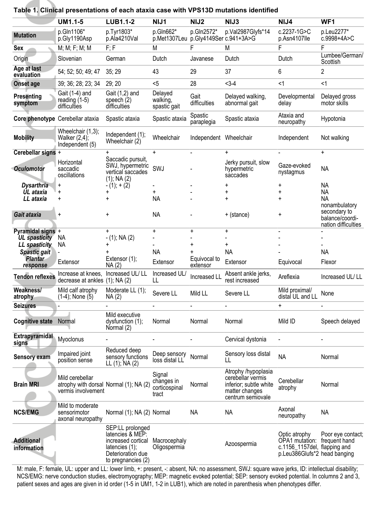

## Question

# Disease Characteristics Research Template

## Target Disease
- **Disease Name:** Autosomal Recessive Cerebellar Ataxia-Saccadic Intrusion Syndrome
- **MONDO ID:**  (if available)
- **Category:** Mendelian

## Research Objectives

Please provide a comprehensive research report on **Autosomal Recessive Cerebellar Ataxia-Saccadic Intrusion Syndrome** covering all of the
disease characteristics listed below. This report will be used to populate a disease knowledge
base entry. Be thorough and cite primary literature (PMID preferred) for all claims.

For each section, **suggested databases/resources** are listed. These are the first places
you should search for information on each topic.

---

### 1. Disease Information
> **Search first:** OMIM, Orphanet, ICD-10/ICD-11, MeSH, PubMed

- What is the disease? Provide a concise overview.
- What are the key identifiers? (OMIM, Orphanet, ICD-10/ICD-11, MeSH, Mondo)
- What are the common synonyms and alternative names?
- Is the information derived from individual patients (e.g., EHR) or aggregated disease-level resources?

### 2. Etiology

- **Disease Causal Factors**: What are the primary causes? (genetic, environmental, infectious, mechanistic)
- **Risk Factors**:
  > **Search first:** PubMed, Cochrane Library, UpToDate, clinical guidelines, ClinVar, ClinGen, GWAS Catalog, PheGenI, CTD, CDC, WHO, epidemiological databases
  - Genetic risk factors (causal variants, susceptibility loci, modifier genes)
  - Environmental risk factors (toxins, lifestyle, occupational exposures, age, sex, family history)
- **Protective Factors**:
  > **Search first:** PubMed, Cochrane Library, clinical trial databases, GWAS Catalog, gnomAD, WHO, CDC, nutrition databases
  - Genetic protective factors (protective variants, modifier alleles)
  - Environmental protective factors (diet, lifestyle, exposures that reduce risk)
- **Gene-Environment Interactions**: How do genetic and environmental factors interact to influence disease?
  > **Search first:** CTD, PubMed, PheGenI, GxE databases

### 3. Phenotypes
> **Search first:** HPO (Human Phenotype Ontology), OMIM, Orphanet, PubMed, clinicaltrials.gov, MedDRA, SNOMED CT, DECIPHER, LOINC

For each phenotype, provide:
- **Phenotype type**: symptoms, clinical signs, physical manifestations, behavioral changes, or laboratory abnormalities
  > For symptoms/signs: HPO, OMIM, Orphanet, PubMed
  > For behavioral changes: HPO, DSM, RDoC (Research Domain Criteria), PubMed
  > For laboratory abnormalities: LOINC, SNOMED CT, LabTests Online, PubMed
- **Phenotype characteristics**:
  > **Search first:** OMIM, Orphanet, HPO, PubMed
  - Age of symptom onset (neonatal, childhood, adult-onset, late-onset)
  - Symptom severity (mild, moderate, severe, variable)
  - Symptom progression (stable, progressive, episodic, fluctuating)
  - Frequency among affected individuals (percentage or qualitative)
- **Quality of life impact**: Effects on daily functioning and well-being (per-phenotype when possible)
  > **Search first:** EQ-5D database, SF-36, WHO QOL databases, PubMed
- Suggest HPO (Human Phenotype Ontology) terms for each phenotype

### 4. Genetic/Molecular Information

- **Causal Genes**: Gene mutations or chromosomal abnormalities responsible for disease (gene symbols, OMIM IDs)
  > **Search first:** OMIM, ClinVar, HGMD, Ensembl, NCBI Gene
- **Pathogenic Variants**:
  - Affected genes (gene symbols, HGNC IDs)
    > **Search first:** OMIM, NCBI Gene, Ensembl, HGNC, UniProt, GeneCards
  - Variant classification (pathogenic, likely pathogenic, VUS per ACMG/AMP guidelines)
    > **Search first:** ClinVar, ClinGen, ACMG/AMP guidelines, VarSome
  - Variant type/class (missense, frameshift, nonsense, splice-site, structural)
  - Allele frequency in population databases
    > **Search first:** gnomAD, 1000 Genomes, ExAC, TOPMed, dbSNP
  - Somatic vs germline origin
    > **Search first:** COSMIC (somatic), ClinVar, ICGC, TCGA
  - Functional consequences (loss of function, gain of function, dominant negative)
- **Modifier Genes**: Genes that modify disease severity or expression
- **Epigenetic Information**: DNA methylation, histone modifications, chromatin changes affecting disease
  > **Search first:** ENCODE, Roadmap Epigenomics, MethBase, DiseaseMeth
- **Chromosomal Abnormalities**: Large-scale genetic changes (aneuploidy, translocations, inversions)
  > **Search first:** DECIPHER, ClinVar, ECARUCA, UCSC Genome Browser

### 5. Environmental Information

- **Environmental Factors**: Non-genetic contributing factors (toxins, radiation, pollution, occupational exposure)
  > **Search first:** CTD (Comparative Toxicogenomics Database), TOXNET, PubMed, EPA databases
- **Lifestyle Factors**: Behavioral factors (smoking, diet, exercise, alcohol consumption)
  > **Search first:** CDC databases, WHO, PubMed, NHANES
- **Infectious Agents**: If applicable, pathogens causing or triggering disease (bacteria, viruses, fungi, parasites)
  > **Search first:** NCBI Taxonomy, ViPR, BV-BRC, MicrobeDB, GIDEON

### 6. Mechanism / Pathophysiology

- **Molecular Pathways**: Specific signaling cascades or biochemical pathways involved (Wnt, MAPK, mTOR, PI3K-AKT, etc.)
  > **Search first:** KEGG, Reactome, WikiPathways, PathBank, BioCyc
- **Cellular Processes**: Cell-level mechanisms (apoptosis, autophagy, cell cycle dysregulation, inflammation, etc.)
  > **Search first:** Gene Ontology (GO), Reactome, KEGG, PubMed
- **Protein Dysfunction**: How protein structure or function is altered (misfolding, aggregation, loss of function, gain of function)
  > **Search first:** UniProt, PDB (Protein Data Bank), InterPro, Pfam, AlphaFold
- **Metabolic Changes**: Alterations in metabolic processes (energy metabolism, lipid metabolism, amino acid metabolism)
  > **Search first:** KEGG, BioCyc, HMDB (Human Metabolome Database), BRENDA
- **Immune System Involvement**: Role of immune response (autoimmunity, immunodeficiency, chronic inflammation)
  > **Search first:** ImmPort, Immunome Database, IEDB, Gene Ontology
- **Tissue Damage Mechanisms**: How tissues/ are injured (oxidative stress, ischemia, fibrosis, necrosis)
  > **Search first:** PubMed, Gene Ontology, Reactome
- **Biochemical Abnormalities**: Specific molecular defects (enzyme deficiencies, receptor dysfunction, ion channel defects)
  > **Search first:** BRENDA, UniProt, KEGG, OMIM, PubMed
- **Epigenetic Changes**: DNA methylation, histone modifications affecting gene expression in disease
  > **Search first:** ENCODE, Roadmap Epigenomics, MethBase, DiseaseMeth
- **Molecular Profiling** (if available):
  - Transcriptomics/gene expression changes
    > **Search first:** GEO (Gene Expression Omnibus), ArrayExpress, GTEx, Human Cell Atlas, SRA
  - Proteomics findings
    > **Search first:** PRIDE, ProteomeXchange, Human Protein Atlas, STRING, BioGRID
  - Metabolomics signatures
    > **Search first:** MetaboLights, Metabolomics Workbench, HMDB, METLIN
  - Lipidomics alterations
    > **Search first:** LIPID MAPS, SwissLipids, LipidHome, Metabolomics Workbench
  - Genomic structural features
    > **Search first:** UCSC Genome Browser, Ensembl, NCBI, dbVar, DGV
- **Advanced Technologies** (if applicable):
  - Single-cell analysis findings (cell-type specific mechanisms, cellular heterogeneity)
    > **Search first:** Human Cell Atlas, Single Cell Portal, GEO, CELLxGENE
  - Spatial transcriptomics findings
    > **Search first:** GEO, Spatial Research, Vizgen, 10x Genomics data
  - Multi-omics integration results
    > **Search first:** TCGA, ICGC, cBioPortal, LinkedOmics, PubMed
  - Functional genomics screens (CRISPR, RNAi)
    > **Search first:** DepMap, GenomeRNAi, PubMed, BioGRID ORCS

For each mechanism, describe:
- The causal chain from initial trigger to clinical manifestation
- Which mechanisms are upstream vs downstream
- What cell types and biological processes are involved
- Suggest GO terms for biological processes and CL terms for cell types

### 7. Anatomical Structures Affected

- **Organ Level**:
  - Primary organs directly affected
  - Secondary organ involvement (complications, secondary effects)
  - Body systems involved (cardiovascular, nervous, digestive, respiratory, endocrine, etc.)
  > **Search first:** Uberon, FMA (Foundational Model of Anatomy), OMIM, HPO, ICD-11, MeSH, SNOMED CT
- **Tissue and Cell Level**:
  - Specific tissue types affected (epithelial, connective, muscle, nervous)
  - Specific cell populations targeted (with Cell Ontology terms)
  > **Search first:** Uberon, Human Protein Atlas, Cell Ontology, Human Cell Atlas, CellMarker, PanglaoDB
- **Subcellular Level**:
  - Cellular compartments involved (mitochondria, nucleus, ER, lysosomes) (with GO Cellular Component terms)
  > **Search first:** Gene Ontology (Cellular Component), UniProt, Human Protein Atlas
- **Localization**:
  - Specific anatomical sites (with UBERON terms)
    > **Search first:** FMA, Uberon, NeuroNames (for brain), SNOMED CT
  - Lateralization (unilateral, bilateral, asymmetric)
    > **Search first:** HPO, clinical literature, imaging databases

### 8. Temporal Development

- **Onset**:
  - Typical age of onset (congenital, pediatric, adult, geriatric)
  - Onset pattern (acute, subacute, chronic, insidious)
  > **Search first:** OMIM, Orphanet, HPO, PubMed
- **Progression**:
  - Disease stages (early, intermediate, advanced, end-stage)
    > **Search first:** Cancer Staging Manual (AJCC), WHO classifications, PubMed
  - Progression rate (rapid, slow, variable)
  - Disease course pattern (episodic, relapsing-remitting, progressive, stable)
  - Disease duration (self-limited, chronic lifelong)
  > **Search first:** Disease registries, longitudinal cohort databases, natural history studies, PubMed, Orphanet, OMIM
- **Patterns**:
  - Remission patterns (spontaneous, treatment-induced)
    > **Search first:** Clinical trial databases, disease registries, PubMed
  - Critical periods (time windows of vulnerability or opportunity for intervention)
    > **Search first:** PubMed, developmental biology databases, clinical guidelines

### 9. Inheritance and Population

- **Epidemiology**:
  - Prevalence (cases per 100,000 at given time)
  - Incidence (new cases per 100,000 per year)
  > **Search first:** Orphanet, CDC, WHO, GBD (Global Burden of Disease), national registries, SEER, disease registries
- **For Genetic Etiology**:
  - Inheritance pattern (AD, AR, X-linked, mitochondrial, multifactorial, polygenic)
    > **Search first:** OMIM, Orphanet, ClinVar, GTR (Genetic Testing Registry)
  - Penetrance (complete, incomplete, age-dependent)
    > **Search first:** ClinVar, OMIM, PubMed, ClinGen
  - Expressivity (variable, consistent)
    > **Search first:** OMIM, ClinVar, PubMed
  - Genetic anticipation (increasing severity in successive generations)
    > **Search first:** OMIM, PubMed (especially for repeat expansion disorders)
  - Germline mosaicism
    > **Search first:** ClinVar, OMIM, genetic counseling literature, PubMed
  - Founder effects (population-specific mutations)
    > **Search first:** gnomAD, population genetics databases, PubMed
  - Consanguinity role
    > **Search first:** OMIM, population studies, genetic counseling resources
  - Carrier frequency
    > **Search first:** gnomAD, carrier screening databases, GeneReviews, GTR
- **Population Demographics**:
  - Affected populations (ethnic or demographic groups with higher prevalence)
    > **Search first:** gnomAD, 1000 Genomes, PAGE Study, PubMed, population registries
  - Geographic distribution (endemic areas, regional variation)
    > **Search first:** WHO, CDC, GBD, Orphanet, geographic epidemiology databases
  - Geographic distribution of specific variants
  - Sex ratio (male:female)
    > **Search first:** Disease registries, OMIM, PubMed, epidemiological databases
  - Age distribution of affected individuals
    > **Search first:** CDC, disease registries, SEER, Orphanet

### 10. Diagnostics

- **Clinical Tests**:
  - Laboratory tests (blood, urine, tissue chemistry, specific enzyme assays)
    > **Search first:** LOINC, LabTests Online, PubMed
  - Biomarkers (proteins, metabolites, genetic markers, circulating biomarkers)
    > **Search first:** FDA Biomarker List, BEST (Biomarkers, EndpointS, and other Tools), PubMed
  - Imaging studies (X-ray, CT, MRI, PET, ultrasound)
    > **Search first:** RadLex, DICOM, Radiopaedia, imaging databases
  - Functional tests (pulmonary function, cardiac stress tests)
    > **Search first:** LOINC, clinical guidelines, PubMed
  - Electrophysiology (EEG, EMG, ECG, nerve conduction studies)
    > **Search first:** LOINC, clinical neurophysiology databases, PubMed
  - Biopsy findings (histopathology, immunohistochemistry)
    > **Search first:** SNOMED CT, College of American Pathologists resources, PubMed
  - Pathology findings (microscopic examination)
    > **Search first:** SNOMED CT, Digital Pathology databases, PubMed
- **Genetic Testing**:
  > **Search first:** GTR (Genetic Testing Registry), GeneReviews, ClinGen
  - Overview of recommended genetic testing approach
  - Whole genome sequencing (WGS) utility
    > **Search first:** GTR, ClinVar, GEL (Genomics England), gnomAD
  - Whole exome sequencing (WES) utility
    > **Search first:** GTR, ClinVar, OMIM, GeneMatcher
  - Gene panels (which panels, which genes)
    > **Search first:** GTR, ClinVar, laboratory-specific databases
  - Single gene testing
    > **Search first:** GTR, ClinVar, OMIM, GeneReviews
  - Chromosomal microarray (CMA)
    > **Search first:** DECIPHER, ClinVar, dbVar, ECARUCA
  - Karyotyping
    > **Search first:** Chromosome Abnormality Database, ClinVar, cytogenetics resources
  - FISH
    > **Search first:** ClinVar, cytogenetics databases, PubMed
  - Mitochondrial DNA testing
    > **Search first:** MITOMAP, MSeqDR, ClinVar, GTR
  - Repeat expansion testing
    > **Search first:** GTR, ClinVar, repeat expansion databases, PubMed
- **Omics-Based Diagnostics** (if applicable):
  - RNA sequencing / transcriptomics
    > **Search first:** GEO, ArrayExpress, GTEx, RNA-seq databases
  - Proteomics
    > **Search first:** PRIDE, ProteomeXchange, FDA Biomarker database
  - Metabolomics
    > **Search first:** MetaboLights, Metabolomics Workbench, HMDB
  - Epigenomics
    > **Search first:** GEO, ENCODE, Roadmap Epigenomics, MethBase
  - Liquid biopsy
    > **Search first:** COSMIC, ClinVar, liquid biopsy databases, PubMed
- **Clinical Criteria**:
  - Standardized diagnostic criteria (DSM, ICD, society guidelines)
    > **Search first:** DSM-5, ICD-11, clinical society guidelines, UpToDate
  - Differential diagnosis (other conditions to rule out, with distinguishing features)
    > **Search first:** DynaMed, UpToDate, clinical decision support systems
- **Screening**:
  - Screening methods for asymptomatic individuals (newborn screening, carrier screening, cascade screening)
    > **Search first:** ACMG recommendations, CDC newborn screening, GTR

### 11. Outcome/Prognosis

- **Survival and Mortality**:
  - Survival rate (5-year, 10-year, overall)
    > **Search first:** SEER, cancer registries, disease-specific registries, PubMed
  - Life expectancy (with and without treatment if applicable)
    > **Search first:** Orphanet, disease registries, actuarial databases, PubMed
  - Mortality rate
    > **Search first:** CDC, WHO, GBD, national mortality databases
  - Disease-specific mortality (deaths directly attributable to disease)
    > **Search first:** Disease registries, CDC Wonder, GBD, PubMed
- **Morbidity and Function**:
  - Morbidity (disease-related disability and health impacts)
    > **Search first:** GBD, WHO, disability databases, PubMed
  - Disability outcomes (long-term functional impairments)
    > **Search first:** ICF (International Classification of Functioning), disability registries
  - Quality of life measures (EQ-5D, SF-36, PROMIS, disease-specific tools)
    > **Search first:** EQ-5D database, SF-36, PROMIS, PubMed
- **Disease Course**:
  - Complications (secondary problems: infections, organ failure, etc.)
    > **Search first:** ICD codes, disease registries, clinical databases, PubMed
  - Recovery potential (likelihood and extent of recovery, with vs without treatment)
    > **Search first:** Natural history studies, rehabilitation databases, PubMed
- **Prediction**:
  - Prognostic factors (age, disease severity, biomarkers, treatment response)
    > **Search first:** Prognostic models databases, clinical calculators, PubMed
  - Prognostic biomarkers (molecular markers predicting disease course)
    > **Search first:** FDA Biomarker database, PubMed, cancer prognostic databases

### 12. Treatment

- **Pharmacotherapy**:
  - Pharmacological treatments (drug names, drug classes, mechanisms of action)
    > **Search first:** DrugBank, RxNorm, ATC classification, DailyMed, FDA databases
  - Pharmacogenomics (how genetic variants affect drug metabolism, efficacy, toxicity)
    > **Search first:** PharmGKB, CPIC (Clinical Pharmacogenetics), FDA Table of PGx Biomarkers
- **Advanced Therapeutics**:
  - Gene therapy (viral vectors, CRISPR, gene replacement, gene editing)
    > **Search first:** ClinicalTrials.gov, FDA gene therapy database, ASGCT resources
  - Cell therapy (stem cell transplant, CAR-T, cellular therapeutics)
    > **Search first:** ClinicalTrials.gov, FDA cell therapy database, FACT standards
  - RNA-based therapies (ASOs, siRNA, mRNA therapies)
    > **Search first:** ClinicalTrials.gov, FDA approvals, PubMed
  - Targeted therapies (treatments directed at specific molecular targets)
    > **Search first:** My Cancer Genome, OncoKB, ClinicalTrials.gov, FDA approvals
  - Immunotherapies (checkpoint inhibitors, monoclonal antibodies)
    > **Search first:** Cancer Immunotherapy Database, FDA approvals, ClinicalTrials.gov
- **Surgical and Interventional**:
  - Surgical interventions (types of surgery, timing, outcomes)
    > **Search first:** CPT codes, surgical registries, clinical guidelines, PubMed
- **Supportive and Rehabilitative**:
  - Supportive care (symptom management, pain control, nutrition)
    > **Search first:** Clinical guidelines, Cochrane Library, PubMed
  - Rehabilitation (physical therapy, occupational therapy, speech therapy)
    > **Search first:** Rehabilitation medicine databases, clinical guidelines, PubMed
- **Experimental**:
  - Experimental treatments in clinical trials (with NCT identifiers if available)
    > **Search first:** ClinicalTrials.gov, EU Clinical Trials Register, WHO ICTRP
- **Treatment Outcomes**:
  - Treatment response rates
    > **Search first:** Clinical trial databases, FDA reviews, systematic reviews, PubMed
  - Side effects and adverse events
    > **Search first:** FDA Adverse Event Reporting System (FAERS), MedWatch, PubMed
- **Treatment Strategy**:
  - Treatment algorithms (clinical pathways, decision trees)
    > **Search first:** Clinical practice guidelines, NCCN Guidelines, UpToDate
  - Combination therapies
    > **Search first:** ClinicalTrials.gov, treatment guidelines, PubMed
  - Personalized medicine approaches (genotype-guided treatment)
    > **Search first:** My Cancer Genome, CIViC, PharmGKB, precision medicine databases

For each treatment, suggest MAXO (Medical Action Ontology) terms where applicable.

### 13. Prevention

- **Prevention Levels**:
  - Primary prevention (preventing disease occurrence: vaccination, risk factor modification)
    > **Search first:** CDC, WHO, USPSTF recommendations, Cochrane Library
  - Secondary prevention (early detection and treatment: screening programs, early intervention)
    > **Search first:** USPSTF, CDC screening guidelines, WHO
  - Tertiary prevention (preventing complications in those with disease)
    > **Search first:** Clinical guidelines, disease management protocols, PubMed
- **Immunization**: Vaccine strategies (if applicable)
  > **Search first:** CDC vaccine schedules, WHO immunization, FDA vaccine database
- **Screening and Early Detection**:
  - Screening programs (population-based: newborn screening, cancer screening)
    > **Search first:** CDC screening programs, USPSTF, cancer screening databases
  - Genetic screening (carrier screening, preimplantation genetic diagnosis, prenatal testing)
    > **Search first:** ACMG recommendations, ACOG guidelines, GTR
  - Risk stratification (identifying high-risk individuals for targeted prevention)
    > **Search first:** Risk prediction models, clinical calculators, PubMed
- **Behavioral Interventions**: Lifestyle modifications to reduce risk
  > **Search first:** CDC, WHO, behavioral intervention databases, Cochrane Library
- **Counseling**: Genetic counseling (risk assessment, family planning guidance)
  > **Search first:** NSGC resources, ACMG guidelines, GeneReviews
- **Public Health**:
  - Public health interventions (sanitation, vector control, health education)
    > **Search first:** CDC, WHO, public health databases, PubMed
  - Environmental interventions (reducing environmental risk factors)
    > **Search first:** EPA databases, WHO environmental health, PubMed
- **Prophylaxis**: Preventive medications or procedures
  > **Search first:** Clinical guidelines, FDA approvals, PubMed

### 14. Other Species / Natural Disease

- **Taxonomy**: Species affected (with NCBI Taxon identifiers)
  > **Search first:** NCBI Taxonomy
- **Breed**: Specific breeds affected (with VBO identifiers if applicable)
  > **Search first:** VBO (Vertebrate Breed Ontology)
- **Gene**: Orthologous genes in other species (with NCBI Gene IDs)
  > **Search first:** NCBI Gene
- **Natural Disease**:
  - Naturally occurring disease in other species (companion animals, wildlife)
    > **Search first:** OMIA (Online Mendelian Inheritance in Animals), VetCompass, PubMed
  - Veterinary relevance and importance in animal health
    > **Search first:** OMIA, veterinary databases, PubMed
- **Comparative Biology**:
  - Comparative pathology (similarities and differences across species)
    > **Search first:** OMIA, comparative pathology databases, PubMed
  - Evolutionary conservation of disease mechanisms
    > **Search first:** HomoloGene, OrthoMCL, Alliance of Genome Resources
- **Transmission** (if applicable):
  - Zoonotic potential
    > **Search first:** CDC zoonotic diseases, WHO zoonoses, GIDEON
  - Cross-species susceptibility
    > **Search first:** NCBI Taxonomy, veterinary databases, PubMed

### 15. Model Organisms

- **Model Types**:
  - Model organism type (mammalian, invertebrate, cellular, in vitro)
    > **Search first:** Alliance of Genome Resources, model organism databases
  - Specific model systems (mouse, rat, zebrafish, Drosophila, C. elegans, yeast, cell lines, organoids, iPSCs)
    > **Search first:** MGI, RGD, ZFIN, FlyBase, WormBase, SGD, ATCC, Cellosaurus
  - Induced models (drug treatment, surgical intervention, environmental manipulation)
    > **Search first:** MGI, model organism databases, PubMed
- **Genetic Models**:
  - Types available (knockout, knock-in, transgenic, conditional, humanized)
    > **Search first:** MGI, IMPC, KOMP, EuMMCR, IMSR
- **Model Characteristics**:
  - Phenotype recapitulation (how well model reproduces human disease features)
    > **Search first:** Model organism databases, comparative studies, PubMed
  - Model limitations (aspects of human disease not captured)
    > **Search first:** Model organism databases, PubMed, review articles
- **Applications**:
  - Research applications (what aspects of disease can be studied)
    > **Search first:** Model organism databases, PubMed
- **Resources**:
  - Model databases
    > **Search first:** MGI, RGD, ZFIN, FlyBase, WormBase, IMSR, EMMA, MMRRC

---

## Citation Requirements

- Cite primary literature (PMID preferred) for all mechanistic and clinical claims
- Prioritize recent reviews and landmark papers
- Include direct quotes from abstracts where possible to support key statements
- Distinguish evidence source types: human clinical, model organism, in vitro, computational

## Output Format

Structure your response as a comprehensive narrative organized by the sections above.
For each section, provide:
- Factual content with specific details (numbers, percentages, gene names, variant nomenclature)
- Ontology term suggestions (HPO, GO, CL, UBERON, CHEBI, MAXO, MONDO) where applicable
- Evidence citations with PMIDs
- Direct quotes from abstracts to support key claims
- Clear indication when information is not available or not applicable for this disease

This report will be used to populate a disease knowledge base entry with:
- Pathophysiology descriptions with causal chains
- Gene/protein annotations (HGNC, GO terms)
- Phenotype associations (HP terms) with frequencies
- Cell type involvement (CL terms)
- Anatomical locations (UBERON terms)
- Chemical entities (CHEBI terms)
- Treatment annotations (MAXO terms)
- Evidence items with PMIDs and exact abstract quotes
- Epidemiology, prognosis, diagnostic, and prevention information
- Animal model descriptions with phenotype recapitulation details

## Output

Question: You are an expert researcher providing comprehensive, well-cited information.

Provide detailed information focusing on:
1. Key concepts and definitions with current understanding
2. Recent developments and latest research (prioritize 2023-2024 sources)
3. Current applications and real-world implementations
4. Expert opinions and analysis from authoritative sources
5. Relevant statistics and data from recent studies

Format as a comprehensive research report with proper citations. Include URLs and publication dates where available.
Always prioritize recent, authoritative sources and provide specific citations for all major claims.

# Disease Characteristics Research Template

## Target Disease
- **Disease Name:** Autosomal Recessive Cerebellar Ataxia-Saccadic Intrusion Syndrome
- **MONDO ID:**  (if available)
- **Category:** Mendelian

## Research Objectives

Please provide a comprehensive research report on **Autosomal Recessive Cerebellar Ataxia-Saccadic Intrusion Syndrome** covering all of the
disease characteristics listed below. This report will be used to populate a disease knowledge
base entry. Be thorough and cite primary literature (PMID preferred) for all claims.

For each section, **suggested databases/resources** are listed. These are the first places
you should search for information on each topic.

---

### 1. Disease Information
> **Search first:** OMIM, Orphanet, ICD-10/ICD-11, MeSH, PubMed

- What is the disease? Provide a concise overview.
- What are the key identifiers? (OMIM, Orphanet, ICD-10/ICD-11, MeSH, Mondo)
- What are the common synonyms and alternative names?
- Is the information derived from individual patients (e.g., EHR) or aggregated disease-level resources?

### 2. Etiology

- **Disease Causal Factors**: What are the primary causes? (genetic, environmental, infectious, mechanistic)
- **Risk Factors**:
  > **Search first:** PubMed, Cochrane Library, UpToDate, clinical guidelines, ClinVar, ClinGen, GWAS Catalog, PheGenI, CTD, CDC, WHO, epidemiological databases
  - Genetic risk factors (causal variants, susceptibility loci, modifier genes)
  - Environmental risk factors (toxins, lifestyle, occupational exposures, age, sex, family history)
- **Protective Factors**:
  > **Search first:** PubMed, Cochrane Library, clinical trial databases, GWAS Catalog, gnomAD, WHO, CDC, nutrition databases
  - Genetic protective factors (protective variants, modifier alleles)
  - Environmental protective factors (diet, lifestyle, exposures that reduce risk)
- **Gene-Environment Interactions**: How do genetic and environmental factors interact to influence disease?
  > **Search first:** CTD, PubMed, PheGenI, GxE databases

### 3. Phenotypes
> **Search first:** HPO (Human Phenotype Ontology), OMIM, Orphanet, PubMed, clinicaltrials.gov, MedDRA, SNOMED CT, DECIPHER, LOINC

For each phenotype, provide:
- **Phenotype type**: symptoms, clinical signs, physical manifestations, behavioral changes, or laboratory abnormalities
  > For symptoms/signs: HPO, OMIM, Orphanet, PubMed
  > For behavioral changes: HPO, DSM, RDoC (Research Domain Criteria), PubMed
  > For laboratory abnormalities: LOINC, SNOMED CT, LabTests Online, PubMed
- **Phenotype characteristics**:
  > **Search first:** OMIM, Orphanet, HPO, PubMed
  - Age of symptom onset (neonatal, childhood, adult-onset, late-onset)
  - Symptom severity (mild, moderate, severe, variable)
  - Symptom progression (stable, progressive, episodic, fluctuating)
  - Frequency among affected individuals (percentage or qualitative)
- **Quality of life impact**: Effects on daily functioning and well-being (per-phenotype when possible)
  > **Search first:** EQ-5D database, SF-36, WHO QOL databases, PubMed
- Suggest HPO (Human Phenotype Ontology) terms for each phenotype

### 4. Genetic/Molecular Information

- **Causal Genes**: Gene mutations or chromosomal abnormalities responsible for disease (gene symbols, OMIM IDs)
  > **Search first:** OMIM, ClinVar, HGMD, Ensembl, NCBI Gene
- **Pathogenic Variants**:
  - Affected genes (gene symbols, HGNC IDs)
    > **Search first:** OMIM, NCBI Gene, Ensembl, HGNC, UniProt, GeneCards
  - Variant classification (pathogenic, likely pathogenic, VUS per ACMG/AMP guidelines)
    > **Search first:** ClinVar, ClinGen, ACMG/AMP guidelines, VarSome
  - Variant type/class (missense, frameshift, nonsense, splice-site, structural)
  - Allele frequency in population databases
    > **Search first:** gnomAD, 1000 Genomes, ExAC, TOPMed, dbSNP
  - Somatic vs germline origin
    > **Search first:** COSMIC (somatic), ClinVar, ICGC, TCGA
  - Functional consequences (loss of function, gain of function, dominant negative)
- **Modifier Genes**: Genes that modify disease severity or expression
- **Epigenetic Information**: DNA methylation, histone modifications, chromatin changes affecting disease
  > **Search first:** ENCODE, Roadmap Epigenomics, MethBase, DiseaseMeth
- **Chromosomal Abnormalities**: Large-scale genetic changes (aneuploidy, translocations, inversions)
  > **Search first:** DECIPHER, ClinVar, ECARUCA, UCSC Genome Browser

### 5. Environmental Information

- **Environmental Factors**: Non-genetic contributing factors (toxins, radiation, pollution, occupational exposure)
  > **Search first:** CTD (Comparative Toxicogenomics Database), TOXNET, PubMed, EPA databases
- **Lifestyle Factors**: Behavioral factors (smoking, diet, exercise, alcohol consumption)
  > **Search first:** CDC databases, WHO, PubMed, NHANES
- **Infectious Agents**: If applicable, pathogens causing or triggering disease (bacteria, viruses, fungi, parasites)
  > **Search first:** NCBI Taxonomy, ViPR, BV-BRC, MicrobeDB, GIDEON

### 6. Mechanism / Pathophysiology

- **Molecular Pathways**: Specific signaling cascades or biochemical pathways involved (Wnt, MAPK, mTOR, PI3K-AKT, etc.)
  > **Search first:** KEGG, Reactome, WikiPathways, PathBank, BioCyc
- **Cellular Processes**: Cell-level mechanisms (apoptosis, autophagy, cell cycle dysregulation, inflammation, etc.)
  > **Search first:** Gene Ontology (GO), Reactome, KEGG, PubMed
- **Protein Dysfunction**: How protein structure or function is altered (misfolding, aggregation, loss of function, gain of function)
  > **Search first:** UniProt, PDB (Protein Data Bank), InterPro, Pfam, AlphaFold
- **Metabolic Changes**: Alterations in metabolic processes (energy metabolism, lipid metabolism, amino acid metabolism)
  > **Search first:** KEGG, BioCyc, HMDB (Human Metabolome Database), BRENDA
- **Immune System Involvement**: Role of immune response (autoimmunity, immunodeficiency, chronic inflammation)
  > **Search first:** ImmPort, Immunome Database, IEDB, Gene Ontology
- **Tissue Damage Mechanisms**: How tissues/ are injured (oxidative stress, ischemia, fibrosis, necrosis)
  > **Search first:** PubMed, Gene Ontology, Reactome
- **Biochemical Abnormalities**: Specific molecular defects (enzyme deficiencies, receptor dysfunction, ion channel defects)
  > **Search first:** BRENDA, UniProt, KEGG, OMIM, PubMed
- **Epigenetic Changes**: DNA methylation, histone modifications affecting gene expression in disease
  > **Search first:** ENCODE, Roadmap Epigenomics, MethBase, DiseaseMeth
- **Molecular Profiling** (if available):
  - Transcriptomics/gene expression changes
    > **Search first:** GEO (Gene Expression Omnibus), ArrayExpress, GTEx, Human Cell Atlas, SRA
  - Proteomics findings
    > **Search first:** PRIDE, ProteomeXchange, Human Protein Atlas, STRING, BioGRID
  - Metabolomics signatures
    > **Search first:** MetaboLights, Metabolomics Workbench, HMDB, METLIN
  - Lipidomics alterations
    > **Search first:** LIPID MAPS, SwissLipids, LipidHome, Metabolomics Workbench
  - Genomic structural features
    > **Search first:** UCSC Genome Browser, Ensembl, NCBI, dbVar, DGV
- **Advanced Technologies** (if applicable):
  - Single-cell analysis findings (cell-type specific mechanisms, cellular heterogeneity)
    > **Search first:** Human Cell Atlas, Single Cell Portal, GEO, CELLxGENE
  - Spatial transcriptomics findings
    > **Search first:** GEO, Spatial Research, Vizgen, 10x Genomics data
  - Multi-omics integration results
    > **Search first:** TCGA, ICGC, cBioPortal, LinkedOmics, PubMed
  - Functional genomics screens (CRISPR, RNAi)
    > **Search first:** DepMap, GenomeRNAi, PubMed, BioGRID ORCS

For each mechanism, describe:
- The causal chain from initial trigger to clinical manifestation
- Which mechanisms are upstream vs downstream
- What cell types and biological processes are involved
- Suggest GO terms for biological processes and CL terms for cell types

### 7. Anatomical Structures Affected

- **Organ Level**:
  - Primary organs directly affected
  - Secondary organ involvement (complications, secondary effects)
  - Body systems involved (cardiovascular, nervous, digestive, respiratory, endocrine, etc.)
  > **Search first:** Uberon, FMA (Foundational Model of Anatomy), OMIM, HPO, ICD-11, MeSH, SNOMED CT
- **Tissue and Cell Level**:
  - Specific tissue types affected (epithelial, connective, muscle, nervous)
  - Specific cell populations targeted (with Cell Ontology terms)
  > **Search first:** Uberon, Human Protein Atlas, Cell Ontology, Human Cell Atlas, CellMarker, PanglaoDB
- **Subcellular Level**:
  - Cellular compartments involved (mitochondria, nucleus, ER, lysosomes) (with GO Cellular Component terms)
  > **Search first:** Gene Ontology (Cellular Component), UniProt, Human Protein Atlas
- **Localization**:
  - Specific anatomical sites (with UBERON terms)
    > **Search first:** FMA, Uberon, NeuroNames (for brain), SNOMED CT
  - Lateralization (unilateral, bilateral, asymmetric)
    > **Search first:** HPO, clinical literature, imaging databases

### 8. Temporal Development

- **Onset**:
  - Typical age of onset (congenital, pediatric, adult, geriatric)
  - Onset pattern (acute, subacute, chronic, insidious)
  > **Search first:** OMIM, Orphanet, HPO, PubMed
- **Progression**:
  - Disease stages (early, intermediate, advanced, end-stage)
    > **Search first:** Cancer Staging Manual (AJCC), WHO classifications, PubMed
  - Progression rate (rapid, slow, variable)
  - Disease course pattern (episodic, relapsing-remitting, progressive, stable)
  - Disease duration (self-limited, chronic lifelong)
  > **Search first:** Disease registries, longitudinal cohort databases, natural history studies, PubMed, Orphanet, OMIM
- **Patterns**:
  - Remission patterns (spontaneous, treatment-induced)
    > **Search first:** Clinical trial databases, disease registries, PubMed
  - Critical periods (time windows of vulnerability or opportunity for intervention)
    > **Search first:** PubMed, developmental biology databases, clinical guidelines

### 9. Inheritance and Population

- **Epidemiology**:
  - Prevalence (cases per 100,000 at given time)
  - Incidence (new cases per 100,000 per year)
  > **Search first:** Orphanet, CDC, WHO, GBD (Global Burden of Disease), national registries, SEER, disease registries
- **For Genetic Etiology**:
  - Inheritance pattern (AD, AR, X-linked, mitochondrial, multifactorial, polygenic)
    > **Search first:** OMIM, Orphanet, ClinVar, GTR (Genetic Testing Registry)
  - Penetrance (complete, incomplete, age-dependent)
    > **Search first:** ClinVar, OMIM, PubMed, ClinGen
  - Expressivity (variable, consistent)
    > **Search first:** OMIM, ClinVar, PubMed
  - Genetic anticipation (increasing severity in successive generations)
    > **Search first:** OMIM, PubMed (especially for repeat expansion disorders)
  - Germline mosaicism
    > **Search first:** ClinVar, OMIM, genetic counseling literature, PubMed
  - Founder effects (population-specific mutations)
    > **Search first:** gnomAD, population genetics databases, PubMed
  - Consanguinity role
    > **Search first:** OMIM, population studies, genetic counseling resources
  - Carrier frequency
    > **Search first:** gnomAD, carrier screening databases, GeneReviews, GTR
- **Population Demographics**:
  - Affected populations (ethnic or demographic groups with higher prevalence)
    > **Search first:** gnomAD, 1000 Genomes, PAGE Study, PubMed, population registries
  - Geographic distribution (endemic areas, regional variation)
    > **Search first:** WHO, CDC, GBD, Orphanet, geographic epidemiology databases
  - Geographic distribution of specific variants
  - Sex ratio (male:female)
    > **Search first:** Disease registries, OMIM, PubMed, epidemiological databases
  - Age distribution of affected individuals
    > **Search first:** CDC, disease registries, SEER, Orphanet

### 10. Diagnostics

- **Clinical Tests**:
  - Laboratory tests (blood, urine, tissue chemistry, specific enzyme assays)
    > **Search first:** LOINC, LabTests Online, PubMed
  - Biomarkers (proteins, metabolites, genetic markers, circulating biomarkers)
    > **Search first:** FDA Biomarker List, BEST (Biomarkers, EndpointS, and other Tools), PubMed
  - Imaging studies (X-ray, CT, MRI, PET, ultrasound)
    > **Search first:** RadLex, DICOM, Radiopaedia, imaging databases
  - Functional tests (pulmonary function, cardiac stress tests)
    > **Search first:** LOINC, clinical guidelines, PubMed
  - Electrophysiology (EEG, EMG, ECG, nerve conduction studies)
    > **Search first:** LOINC, clinical neurophysiology databases, PubMed
  - Biopsy findings (histopathology, immunohistochemistry)
    > **Search first:** SNOMED CT, College of American Pathologists resources, PubMed
  - Pathology findings (microscopic examination)
    > **Search first:** SNOMED CT, Digital Pathology databases, PubMed
- **Genetic Testing**:
  > **Search first:** GTR (Genetic Testing Registry), GeneReviews, ClinGen
  - Overview of recommended genetic testing approach
  - Whole genome sequencing (WGS) utility
    > **Search first:** GTR, ClinVar, GEL (Genomics England), gnomAD
  - Whole exome sequencing (WES) utility
    > **Search first:** GTR, ClinVar, OMIM, GeneMatcher
  - Gene panels (which panels, which genes)
    > **Search first:** GTR, ClinVar, laboratory-specific databases
  - Single gene testing
    > **Search first:** GTR, ClinVar, OMIM, GeneReviews
  - Chromosomal microarray (CMA)
    > **Search first:** DECIPHER, ClinVar, dbVar, ECARUCA
  - Karyotyping
    > **Search first:** Chromosome Abnormality Database, ClinVar, cytogenetics resources
  - FISH
    > **Search first:** ClinVar, cytogenetics databases, PubMed
  - Mitochondrial DNA testing
    > **Search first:** MITOMAP, MSeqDR, ClinVar, GTR
  - Repeat expansion testing
    > **Search first:** GTR, ClinVar, repeat expansion databases, PubMed
- **Omics-Based Diagnostics** (if applicable):
  - RNA sequencing / transcriptomics
    > **Search first:** GEO, ArrayExpress, GTEx, RNA-seq databases
  - Proteomics
    > **Search first:** PRIDE, ProteomeXchange, FDA Biomarker database
  - Metabolomics
    > **Search first:** MetaboLights, Metabolomics Workbench, HMDB
  - Epigenomics
    > **Search first:** GEO, ENCODE, Roadmap Epigenomics, MethBase
  - Liquid biopsy
    > **Search first:** COSMIC, ClinVar, liquid biopsy databases, PubMed
- **Clinical Criteria**:
  - Standardized diagnostic criteria (DSM, ICD, society guidelines)
    > **Search first:** DSM-5, ICD-11, clinical society guidelines, UpToDate
  - Differential diagnosis (other conditions to rule out, with distinguishing features)
    > **Search first:** DynaMed, UpToDate, clinical decision support systems
- **Screening**:
  - Screening methods for asymptomatic individuals (newborn screening, carrier screening, cascade screening)
    > **Search first:** ACMG recommendations, CDC newborn screening, GTR

### 11. Outcome/Prognosis

- **Survival and Mortality**:
  - Survival rate (5-year, 10-year, overall)
    > **Search first:** SEER, cancer registries, disease-specific registries, PubMed
  - Life expectancy (with and without treatment if applicable)
    > **Search first:** Orphanet, disease registries, actuarial databases, PubMed
  - Mortality rate
    > **Search first:** CDC, WHO, GBD, national mortality databases
  - Disease-specific mortality (deaths directly attributable to disease)
    > **Search first:** Disease registries, CDC Wonder, GBD, PubMed
- **Morbidity and Function**:
  - Morbidity (disease-related disability and health impacts)
    > **Search first:** GBD, WHO, disability databases, PubMed
  - Disability outcomes (long-term functional impairments)
    > **Search first:** ICF (International Classification of Functioning), disability registries
  - Quality of life measures (EQ-5D, SF-36, PROMIS, disease-specific tools)
    > **Search first:** EQ-5D database, SF-36, PROMIS, PubMed
- **Disease Course**:
  - Complications (secondary problems: infections, organ failure, etc.)
    > **Search first:** ICD codes, disease registries, clinical databases, PubMed
  - Recovery potential (likelihood and extent of recovery, with vs without treatment)
    > **Search first:** Natural history studies, rehabilitation databases, PubMed
- **Prediction**:
  - Prognostic factors (age, disease severity, biomarkers, treatment response)
    > **Search first:** Prognostic models databases, clinical calculators, PubMed
  - Prognostic biomarkers (molecular markers predicting disease course)
    > **Search first:** FDA Biomarker database, PubMed, cancer prognostic databases

### 12. Treatment

- **Pharmacotherapy**:
  - Pharmacological treatments (drug names, drug classes, mechanisms of action)
    > **Search first:** DrugBank, RxNorm, ATC classification, DailyMed, FDA databases
  - Pharmacogenomics (how genetic variants affect drug metabolism, efficacy, toxicity)
    > **Search first:** PharmGKB, CPIC (Clinical Pharmacogenetics), FDA Table of PGx Biomarkers
- **Advanced Therapeutics**:
  - Gene therapy (viral vectors, CRISPR, gene replacement, gene editing)
    > **Search first:** ClinicalTrials.gov, FDA gene therapy database, ASGCT resources
  - Cell therapy (stem cell transplant, CAR-T, cellular therapeutics)
    > **Search first:** ClinicalTrials.gov, FDA cell therapy database, FACT standards
  - RNA-based therapies (ASOs, siRNA, mRNA therapies)
    > **Search first:** ClinicalTrials.gov, FDA approvals, PubMed
  - Targeted therapies (treatments directed at specific molecular targets)
    > **Search first:** My Cancer Genome, OncoKB, ClinicalTrials.gov, FDA approvals
  - Immunotherapies (checkpoint inhibitors, monoclonal antibodies)
    > **Search first:** Cancer Immunotherapy Database, FDA approvals, ClinicalTrials.gov
- **Surgical and Interventional**:
  - Surgical interventions (types of surgery, timing, outcomes)
    > **Search first:** CPT codes, surgical registries, clinical guidelines, PubMed
- **Supportive and Rehabilitative**:
  - Supportive care (symptom management, pain control, nutrition)
    > **Search first:** Clinical guidelines, Cochrane Library, PubMed
  - Rehabilitation (physical therapy, occupational therapy, speech therapy)
    > **Search first:** Rehabilitation medicine databases, clinical guidelines, PubMed
- **Experimental**:
  - Experimental treatments in clinical trials (with NCT identifiers if available)
    > **Search first:** ClinicalTrials.gov, EU Clinical Trials Register, WHO ICTRP
- **Treatment Outcomes**:
  - Treatment response rates
    > **Search first:** Clinical trial databases, FDA reviews, systematic reviews, PubMed
  - Side effects and adverse events
    > **Search first:** FDA Adverse Event Reporting System (FAERS), MedWatch, PubMed
- **Treatment Strategy**:
  - Treatment algorithms (clinical pathways, decision trees)
    > **Search first:** Clinical practice guidelines, NCCN Guidelines, UpToDate
  - Combination therapies
    > **Search first:** ClinicalTrials.gov, treatment guidelines, PubMed
  - Personalized medicine approaches (genotype-guided treatment)
    > **Search first:** My Cancer Genome, CIViC, PharmGKB, precision medicine databases

For each treatment, suggest MAXO (Medical Action Ontology) terms where applicable.

### 13. Prevention

- **Prevention Levels**:
  - Primary prevention (preventing disease occurrence: vaccination, risk factor modification)
    > **Search first:** CDC, WHO, USPSTF recommendations, Cochrane Library
  - Secondary prevention (early detection and treatment: screening programs, early intervention)
    > **Search first:** USPSTF, CDC screening guidelines, WHO
  - Tertiary prevention (preventing complications in those with disease)
    > **Search first:** Clinical guidelines, disease management protocols, PubMed
- **Immunization**: Vaccine strategies (if applicable)
  > **Search first:** CDC vaccine schedules, WHO immunization, FDA vaccine database
- **Screening and Early Detection**:
  - Screening programs (population-based: newborn screening, cancer screening)
    > **Search first:** CDC screening programs, USPSTF, cancer screening databases
  - Genetic screening (carrier screening, preimplantation genetic diagnosis, prenatal testing)
    > **Search first:** ACMG recommendations, ACOG guidelines, GTR
  - Risk stratification (identifying high-risk individuals for targeted prevention)
    > **Search first:** Risk prediction models, clinical calculators, PubMed
- **Behavioral Interventions**: Lifestyle modifications to reduce risk
  > **Search first:** CDC, WHO, behavioral intervention databases, Cochrane Library
- **Counseling**: Genetic counseling (risk assessment, family planning guidance)
  > **Search first:** NSGC resources, ACMG guidelines, GeneReviews
- **Public Health**:
  - Public health interventions (sanitation, vector control, health education)
    > **Search first:** CDC, WHO, public health databases, PubMed
  - Environmental interventions (reducing environmental risk factors)
    > **Search first:** EPA databases, WHO environmental health, PubMed
- **Prophylaxis**: Preventive medications or procedures
  > **Search first:** Clinical guidelines, FDA approvals, PubMed

### 14. Other Species / Natural Disease

- **Taxonomy**: Species affected (with NCBI Taxon identifiers)
  > **Search first:** NCBI Taxonomy
- **Breed**: Specific breeds affected (with VBO identifiers if applicable)
  > **Search first:** VBO (Vertebrate Breed Ontology)
- **Gene**: Orthologous genes in other species (with NCBI Gene IDs)
  > **Search first:** NCBI Gene
- **Natural Disease**:
  - Naturally occurring disease in other species (companion animals, wildlife)
    > **Search first:** OMIA (Online Mendelian Inheritance in Animals), VetCompass, PubMed
  - Veterinary relevance and importance in animal health
    > **Search first:** OMIA, veterinary databases, PubMed
- **Comparative Biology**:
  - Comparative pathology (similarities and differences across species)
    > **Search first:** OMIA, comparative pathology databases, PubMed
  - Evolutionary conservation of disease mechanisms
    > **Search first:** HomoloGene, OrthoMCL, Alliance of Genome Resources
- **Transmission** (if applicable):
  - Zoonotic potential
    > **Search first:** CDC zoonotic diseases, WHO zoonoses, GIDEON
  - Cross-species susceptibility
    > **Search first:** NCBI Taxonomy, veterinary databases, PubMed

### 15. Model Organisms

- **Model Types**:
  - Model organism type (mammalian, invertebrate, cellular, in vitro)
    > **Search first:** Alliance of Genome Resources, model organism databases
  - Specific model systems (mouse, rat, zebrafish, Drosophila, C. elegans, yeast, cell lines, organoids, iPSCs)
    > **Search first:** MGI, RGD, ZFIN, FlyBase, WormBase, SGD, ATCC, Cellosaurus
  - Induced models (drug treatment, surgical intervention, environmental manipulation)
    > **Search first:** MGI, model organism databases, PubMed
- **Genetic Models**:
  - Types available (knockout, knock-in, transgenic, conditional, humanized)
    > **Search first:** MGI, IMPC, KOMP, EuMMCR, IMSR
- **Model Characteristics**:
  - Phenotype recapitulation (how well model reproduces human disease features)
    > **Search first:** Model organism databases, comparative studies, PubMed
  - Model limitations (aspects of human disease not captured)
    > **Search first:** Model organism databases, PubMed, review articles
- **Applications**:
  - Research applications (what aspects of disease can be studied)
    > **Search first:** Model organism databases, PubMed
- **Resources**:
  - Model databases
    > **Search first:** MGI, RGD, ZFIN, FlyBase, WormBase, IMSR, EMMA, MMRRC

---

## Citation Requirements

- Cite primary literature (PMID preferred) for all mechanistic and clinical claims
- Prioritize recent reviews and landmark papers
- Include direct quotes from abstracts where possible to support key statements
- Distinguish evidence source types: human clinical, model organism, in vitro, computational

## Output Format

Structure your response as a comprehensive narrative organized by the sections above.
For each section, provide:
- Factual content with specific details (numbers, percentages, gene names, variant nomenclature)
- Ontology term suggestions (HPO, GO, CL, UBERON, CHEBI, MAXO, MONDO) where applicable
- Evidence citations with PMIDs
- Direct quotes from abstracts to support key claims
- Clear indication when information is not available or not applicable for this disease

This report will be used to populate a disease knowledge base entry with:
- Pathophysiology descriptions with causal chains
- Gene/protein annotations (HGNC, GO terms)
- Phenotype associations (HP terms) with frequencies
- Cell type involvement (CL terms)
- Anatomical locations (UBERON terms)
- Chemical entities (CHEBI terms)
- Treatment annotations (MAXO terms)
- Evidence items with PMIDs and exact abstract quotes
- Epidemiology, prognosis, diagnostic, and prevention information
- Animal model descriptions with phenotype recapitulation details

# Autosomal Recessive Cerebellar Ataxia–Saccadic Intrusion Syndrome (SCASI) / SCAR4 (VPS13D-related disorder)

## Executive summary
Autosomal Recessive Cerebellar Ataxia–Saccadic Intrusion Syndrome is best aligned with **spinocerebellar ataxia, autosomal recessive 4 (SCAR4)**, historically described clinically as **spinocerebellar ataxia with saccadic intrusions (SCASI; formerly “SCA24”)** and caused by **biallelic pathogenic variants in *VPS13D*** at **chromosome 1p36**. Key features include progressive cerebellar ataxia with prominent **saccadic intrusions/abnormal pursuit**, often combined with **spasticity/pyramidal signs** and **peripheral neuropathy**; onset ranges from **infancy through adulthood** and progression is usually **slow**, with a substantial subset losing independent ambulation. Mechanistic evidence supports **mitochondrial network/quality-control defects** consistent with *VPS13D*’s role as a **bulk lipid transporter at membrane contact sites** and its involvement in autophagy/mitochondrial homeostasis. (seong2018mutationsinvps13d pages 1-5, seong2018mutationsinvps13d pages 30-32)

| Disease / synonyms | Inheritance | Causal gene / IDs | Locus | Key papers (date; URL) | Key clinical hallmarks | Typical onset range | Citations |
|---|---|---|---|---|---|---|---|
| Autosomal Recessive Cerebellar Ataxia–Saccadic Intrusion Syndrome; Spinocerebellar ataxia with saccadic intrusions (SCASI); Spinocerebellar ataxia, autosomal recessive 4 (SCAR4); formerly SCA24 | Autosomal recessive | **VPS13D**; disease **SCAR4 OMIM #607317**; gene **VPS13D OMIM *608877** | 1p36 | Seong et al., **2018-06**, *Ann Neurol*; https://doi.org/10.1002/ana.25220 • Kistol et al., **2024-05**, *Int J Mol Sci*; https://doi.org/10.3390/ijms25105127 | Progressive cerebellar ataxia, spasticity/pyramidal signs, saccadic intrusions/ocular-motor abnormalities, neuropathy; some cases with developmental delay or loss of ambulation | Infancy to adulthood; reported from **<1 year to 39 years** | (seong2018mutationsinvps13d pages 1-5, kistol2024newcaseof pages 1-3) |
| Historical family-based SCASI description before gene identification | Autosomal recessive | Gene not yet identified in 2003 family report; later resolved as **VPS13D** | Linked to chromosome **1p36** in later studies | Swartz et al., **2003-12**, *Ann Neurol*; https://doi.org/10.1002/ana.10758 • Akbar & Ashizawa, **2015-02**, *Neurol Clin*; https://doi.org/10.1016/j.ncl.2014.09.004 | Progressive ataxia with difficulty reading, macrosaccadic oscillations/saccadic oscillations intruding on fixation, pyramidal signs, myoclonus, axonal sensorimotor neuropathy, pes cavus; mild cerebellar vermis atrophy reported | Review/table source lists **3rd decade** onset for SCASI; family studies support slow progression | (swartz2003pathogenesisofclinical pages 1-2, akbar2015ataxia pages 18-20) |
| VPS13D-related disorder spectrum encompassing SCAR4/SCASI | Autosomal recessive (usually biallelic, often compound heterozygous) | **VPS13D**; representative pathogenic variants include **c.3569G>A (p.Gly1190Asp)**, **c.3316C>T (p.Gln1106Ter)**, **p.Tyr1803Ter**, **p.Ala4210Val**, **c.2237-1G>C**, **c.941+3A>G**, **c.9998+4A>C**, **c.9388C>T (p.Arg3130Ter)**, **c.9679G>T (p.Gly3227Trp)** | 1p36 | Seong et al., **2018-06**, https://doi.org/10.1002/ana.25220 • Pauly et al., **2023-01**, https://doi.org/10.3390/ijms24031874 • Kistol et al., **2024-05**, https://doi.org/10.3390/ijms25105127 | Ataxia-spasticity spectrum with dysarthria, tremor, dystonia/chorea in some patients, saccadic pursuit or square-wave/macro-saccadic intrusions, peripheral axonal neuropathy, variable cognitive/developmental involvement; mitochondrial abnormalities in fibroblasts support mechanism | Broad range from early childhood/infancy to adult-onset; slowly progressive | (seong2018mutationsinvps13d pages 30-32, seong2018mutationsinvps13d pages 8-12, kistol2024newcaseof pages 3-5, pauly2023nottomiss pages 1-2) |

*Table: This table compacts the key identifiers, genetics, landmark papers, and hallmark clinical features for autosomal recessive cerebellar ataxia–saccadic intrusion syndrome. It is useful as a quick-reference scaffold for a disease knowledge base entry focused on VPS13D-related SCAR4/SCASI.*

---

## 1. Disease information
### 1.1 What is the disease?
**SCASI/SCAR4** is a rare, genetically defined **autosomal recessive** neurodegenerative/movement-disorder syndrome on the ataxia–spasticity spectrum in which **ocular fixation is disrupted by saccadic intrusions** (e.g., macrosaccadic oscillations, square-wave-like intrusions) accompanying progressive cerebellar dysfunction. The disorder was initially characterized clinically in families with prominent saccadic intrusions and later molecularly resolved as **biallelic *VPS13D* mutations**. (seong2018mutationsinvps13d pages 1-5, swartz2003pathogenesisofclinical pages 1-2)

### 1.2 Key identifiers and ontologies
- **OMIM disease**: *Spinocerebellar ataxia, autosomal recessive 4 (SCAR4)* **#607317** (reported in a 2024 case report) (kistol2024newcaseof pages 1-3)
- **OMIM gene**: ***VPS13D*** **\*608877** (kistol2024newcaseof pages 1-3)
- **Genomic locus**: **1p36** (akbar2015ataxia pages 18-20, seong2018mutationsinvps13d pages 1-5)
- **MONDO (from OpenTargets associations)**: 
  - *Spinocerebellar ataxia type 4*: **MONDO_0010847** (OpenTargets Search: spinocerebellar ataxia,hereditary ataxia,spastic ataxia-VPS13D)
  - *Cerebellar ataxia*: **MONDO_0000437** (OpenTargets Search: spinocerebellar ataxia,hereditary ataxia,spastic ataxia-VPS13D)
- **Orphanet / ICD-10/ICD-11 / MeSH**: Not identified in the retrieved sources for this specific entity; additional direct lookup in Orphanet/ICD/MeSH would be required for authoritative identifiers.

### 1.3 Synonyms / alternative names
- “**Spinocerebellar ataxia with saccadic intrusions (SCASI)**” (seong2018mutationsinvps13d pages 1-5, swartz2003pathogenesisofclinical pages 1-2)
- “**Spinocerebellar ataxia, recessive, type 4 (SCAR4)**” (seong2018mutationsinvps13d pages 1-5)
- “**Formerly SCA24**” (as stated in a clinical review table) (akbar2015ataxia pages 18-20)

### 1.4 Evidence sources and aggregation level
Evidence is derived from:
- **Family studies with quantitative eye-movement recordings** (human clinical physiology) (swartz2003pathogenesisofclinical pages 1-2)
- **Case series with exome sequencing and functional validation in patient fibroblasts and Drosophila** (human + model organism + in vitro) (seong2018mutationsinvps13d pages 1-5, seong2018mutationsinvps13d pages 30-32)
- **Recent case reports/reviews summarizing variant spectra** (human clinical genetics) (kistol2024newcaseof pages 1-3, pauly2023nottomiss pages 1-2)
- **Consensus methodology papers for oculomotor biomarkers in hereditary ataxia trials** (expert consensus/systematic review) (garces2024quantitativeoculomotorassessment pages 1-2)

---

## 2. Etiology
### 2.1 Disease causal factors
**Primary cause**: **biallelic pathogenic variants in *VPS13D*** (autosomal recessive), typically **compound heterozygosity** with one **loss-of-function** (nonsense/splice) allele and one **missense** (or non-canonical splice region) allele. (seong2018mutationsinvps13d pages 1-5)

**Abstract quote (primary genetics + functional validation):**
- Seong et al. (Ann Neurol; 2018-06; https://doi.org/10.1002/ana.25220) reported: “**Exome sequencing identified compound heterozygous mutations in VPS13D on chromosome 1p36 in all seven families.**” (seong2018mutationsinvps13d pages 1-5)

### 2.2 Risk factors
- **Genetic**: carrying two pathogenic *VPS13D* alleles (biallelic). (seong2018mutationsinvps13d pages 1-5)
- Environmental/lifestyle risk factors: not established in retrieved sources.

### 2.3 Protective factors
Not established in retrieved sources.

### 2.4 Gene–environment interactions
Not established in retrieved sources.

---

## 3. Phenotypes
### 3.1 Core neurological and oculomotor phenotypes
**Ataxia + spasticity spectrum**
- In the key multi-center series, the phenotype was broad, with ataxia predominant in most and additional/predominant spasticity in others, with onset from infancy to 39 years and slow progression. (seong2018mutationsinvps13d pages 1-5)

**Abstract quote (natural history):**
- Seong et al. reported: “**Disease onset ranged from infancy to 39 years, and symptoms were slowly progressive and included loss of independent ambulation in 5.**” (seong2018mutationsinvps13d pages 1-5)

**Oculomotor abnormalities (saccadic intrusions)**
- In a foundational family physiology study, fixation was disrupted by saccadic oscillations and macrosaccadic oscillations, with hypermetric saccades; smooth pursuit/vestibular/vergence could be normal. (swartz2003pathogenesisofclinical pages 1-2)

### 3.2 Additional phenotypes reported in the VPS13D spectrum (relevant to SCAR4 presentations)
Recent summaries and case reports note variable additional findings beyond classic ataxia/spasticity:
- tremor, dystonia/chorea, seizures, cognitive/developmental involvement, neuropathy (counts in review), and leukoencephalopathy in some individuals. (kistol2024newcaseof pages 3-5, pauly2023nottomiss pages 1-2)

**Review statistics (counts of features; 2023):**
Pauly et al. (Int J Mol Sci; 2023-01-18; https://doi.org/10.3390/ijms24031874) reported for VPS13D-related disorder: “**neuropathy (n = 10…), dystonia (n = 7 …), myoclonus (n = 5 …) and chorea (n = 4 …)**” with “**variable age at onset from infantile to adulthood onset.**” (pauly2023nottomiss pages 1-2)

### 3.3 Phenotype characteristics (onset, progression, frequency)
- **Age at onset**: **infancy to adulthood**; in SCASI/SCAR4 families, onset can be early adult (historical SCASI) or very early in severe forms. (seong2018mutationsinvps13d pages 1-5)
- **Progression**: generally **slow**; however, severe childhood-onset cases can progress to walker/wheelchair dependence. In Seong et al., **5/12** lost independent ambulation. (seong2018mutationsinvps13d pages 1-5)

### 3.4 Quality-of-life impact
QoL was not directly measured in retrieved sources, but functional dependence is implied by loss of independent ambulation and impaired reading due to fixation instability in SCASI-like phenotypes. (akbar2015ataxia pages 18-20, seong2018mutationsinvps13d pages 1-5)

### 3.5 Suggested HPO terms (examples; non-exhaustive)
Based on the cited clinical descriptions:
- **Cerebellar ataxia** (HP:0001251)
- **Spasticity** (HP:0001257)
- **Hyperreflexia** (HP:0001347)
- **Peripheral neuropathy / axonal neuropathy** (HP:0009830 / HP:0003477)
- **Nystagmus** (HP:0000639)
- **Saccadic intrusions / square wave jerks / macrosaccadic oscillations** (phenotype class; map to closest HPO terms such as abnormal saccadic pursuit or abnormal ocular fixation; precise HPO term selection should be validated against HPO browser)
- **Dysarthria** (HP:0001260)
- **Tremor** (HP:0001337)

---

## 4. Genetic / molecular information
### 4.1 Causal gene
- ***VPS13D* (vacuolar protein sorting 13 homolog D)** at **1p36**, OMIM \*608877. (kistol2024newcaseof pages 1-3)

### 4.2 Representative pathogenic variants (examples from primary sources)
**From the multi-family Annals of Neurology series (2018):** multiple truncating/splice/missense variants were reported across families (examples listed in the text/table evidence), including (not exhaustive):
- **c.3569G>A (p.Gly1190Asp)** and **c.3316C>T (p.Gln1106Ter)** in the historically described SCASI/SCAR4 family (seong2018mutationsinvps13d pages 8-12)
- splice/near-splice variants **c.2237-1G>C**, **c.941+3A>G**, **c.9998+4A>C** and multiple truncating/missense changes (seong2018mutationsinvps13d pages 30-32)

**From a 2024 adult case report:**
- **c.9388C>T, p.(Arg3130Ter)** (pathogenic) 
- **c.9679G>T, p.(Gly3227Trp)** (likely pathogenic; novel in the report) (kistol2024newcaseof pages 3-5)

### 4.3 Variant type/class and functional consequences
- Many affected individuals carry **one loss-of-function allele** (nonsense/splice) plus a **missense/non-canonical splice** allele, consistent with partial functional preservation and with intolerance to complete loss-of-function. (seong2018mutationsinvps13d pages 1-5)

### 4.4 Molecular function and pathogenic mechanism (current understanding)
**Bulk lipid transport at membrane contact sites; mitochondrial network integrity**
- Kistol et al. (2024-05-08; https://doi.org/10.3390/ijms25105127) describe VPS13D as a “**bulk lipid transporter**” at membrane contact sites and state that loss-of-function results in “**enlarged spherical mitochondria that accumulate in the perinuclear region and often break**.” (kistol2024newcaseof pages 1-3)

**Mitochondrial morphology and energy production defects (human + model)**
- Seong et al. demonstrated neuronal mitochondrial distribution/morphology defects in Drosophila and altered mitochondrial morphology and reduced energy production in patient fibroblasts. (seong2018mutationsinvps13d pages 1-5)

**Visual evidence (table/figures):**
- Cropped Table 1 and mitochondrial defect figures from Seong et al. show patient variant/phenotype aggregation and fibroblast mitochondrial defects/ATP reduction. (seong2018mutationsinvps13d media 1bc218ff, seong2018mutationsinvps13d media 8a1f9878, seong2018mutationsinvps13d media d463dc10)

### 4.5 Modifier genes / epigenetics / chromosomal abnormalities
Not established in retrieved sources.

---

## 5. Environmental information
No established environmental/lifestyle/infectious contributors identified in retrieved sources.

---

## 6. Mechanism / pathophysiology
### 6.1 Proposed causal chain (integrated)
1. **Biallelic *VPS13D* variants** impair VPS13D protein function (often one truncating allele plus a milder allele). (seong2018mutationsinvps13d pages 1-5)
2. VPS13D dysfunction disrupts **bulk lipid transfer at organelle contact sites** and processes required for **autophagy/mitochondrial size control and clearance**. (kistol2024newcaseof pages 1-3)
3. Cells exhibit **mitochondrial network abnormalities** (rounded/spherical/donut-shaped mitochondria, perinuclear accumulation) and reduced energy production in patient fibroblasts; neurons show impaired mitochondrial distribution along axons in Drosophila. (seong2018mutationsinvps13d pages 1-5)
4. Circuit-level dysfunction in cerebellar and brainstem oculomotor networks yields **ataxia and ocular fixation instability** (saccadic intrusions/macrosaccadic oscillations), with additional corticospinal/peripheral nerve involvement causing **spasticity and neuropathy**. (swartz2003pathogenesisofclinical pages 1-2, seong2018mutationsinvps13d pages 1-5)

### 6.2 Suggested GO biological process terms (examples)
- Mitochondrial organization; mitochondrial fission/fusion balance
- Autophagy / mitophagy
- Lipid transport at membrane contact sites

### 6.3 Suggested CL (cell types) and GO cellular component terms
- **Purkinje cell** (CL term; cerebellar cortex) and cerebellar interneurons as plausible key vulnerable cell types (inferred from clinical phenotype and cerebellar involvement; direct cell-type-specific evidence not present in retrieved sources)
- **Mitochondrion** (GO:0005739), axon (neuronal mitochondrial distribution) (seong2018mutationsinvps13d pages 1-5)

---

## 7. Anatomical structures affected
### 7.1 Organ/system level
- **Central nervous system**, prominently **cerebellum** (ataxia; mild cerebellar vermis atrophy reported in early SCASI family study) (swartz2003pathogenesisofclinical pages 1-2)
- **Corticospinal system** (pyramidal signs/spasticity) (seong2018mutationsinvps13d pages 1-5)
- **Peripheral nervous system** (axonal sensorimotor neuropathy in SCASI physiology study; neuropathy frequency noted in VPS13D review) (swartz2003pathogenesisofclinical pages 1-2, pauly2023nottomiss pages 1-2)

### 7.2 UBERON suggestions
- Cerebellum (UBERON:0002037)
- Cerebellar vermis (UBERON:0002128)
- Peripheral nerve (UBERON:0001021)

---

## 8. Temporal development
- **Onset**: broad, from **infancy to 39 years** in the multi-family cohort (seong2018mutationsinvps13d pages 1-5)
- **Course**: typically **slowly progressive** (seong2018mutationsinvps13d pages 1-5)
- **Functional staging (evidence-based anchor)**: loss of independent ambulation occurred in **5/12** in the 2018 cohort. (seong2018mutationsinvps13d pages 1-5)

---

## 9. Inheritance and population
- **Inheritance**: autosomal recessive; often compound heterozygous. (seong2018mutationsinvps13d pages 1-5)
- **Epidemiology (prevalence/incidence)**: not identified in retrieved sources; appears rare with published case counts on the order of a few dozen (e.g., “about 33 patients” in 2024 case report; “31 published cases” in 2023 review). (kistol2024newcaseof pages 1-3, pauly2023nottomiss pages 1-2)
- **Penetrance/expressivity**: variable expressivity is strongly supported by heterogeneous phenotypes and intrafamilial variability noted in the 2018 and 2023 reports. (seong2018mutationsinvps13d pages 1-5, pauly2023nottomiss pages 1-2)

---

## 10. Diagnostics
### 10.1 Clinical and laboratory evaluation
A structured approach for adult-onset ataxia with neuropathy emphasizes **objective phenotyping** using:
- electrophysiology (neuropathy characterization)
- vestibular testing
- **oculomotor measurement** (video-oculography) to identify gaze-evoked nystagmus, dysmetric/slow saccades, and **saccadic intrusions** (roberts2022overviewofthe pages 1-2)

**Abstract quote (diagnostic workflow):**
- Roberts et al. (Neurol Genet; 2022-10; https://doi.org/10.1212/nxg.0000000000200021): “**Objective diagnostic modalities including electrophysiology, oculomotor, and vestibular function testing are invaluable in accurately defining an individual’s phenotype.**” (roberts2022overviewofthe pages 1-2)

### 10.2 Neuroimaging
- Brain MRI may show cerebellar atrophy and, in some VPS13D presentations, leukoencephalopathy; an adult SCAR4 case reported “leukoencephalopathy with cortical and cerebellar atrophy.” (kistol2024newcaseof pages 1-3)

### 10.3 Genetic testing strategy
- Stepwise genetic testing ranging from **gene panels** to **WES/WGS** guided by inheritance and age at onset is recommended in the broader ataxia diagnostic literature (roberts2022overviewofthe pages 1-2)
- In the 2018 SCAR4/SCASI series, **prior gene panel testing was negative** and **exome sequencing** resolved the diagnosis in seven families. (seong2018mutationsinvps13d pages 1-5)

### 10.4 Quantitative oculomotor biomarkers (latest consensus; 2023–2024)
Garces et al. consensus/systematic review (Accepted online 2023-04-28; The Cerebellum 2024; https://doi.org/10.1007/s12311-023-01559-9) provides a harmonized framework for eye-movement endpoints in hereditary ataxia trials:
- **Abstract quote (core eye-movement set)**: “**we prioritize a core-set of five eye-movement types: (i) pursuit eye movements, (ii) saccadic eye movements, (iii) fixation, (iv) eccentric gaze holding, and (v) rotational vestibulo-ocular reflex**” (garces2024quantitativeoculomotorassessment pages 1-2)
- **Evidence base size**: 117 articles; genetically confirmed ataxia subjects **n=1134**, suspected hereditary ataxia **n=198**, sporadic degenerative ataxia **n=480**. (garces2024quantitativeoculomotorassessment pages 1-2)
- **Implementation statistics**: among included studies, modalities included **EOG (40 studies; 915 subjects)** and **VOG (43 studies; 639 subjects)**. (garces2024quantitativeoculomotorassessment pages 9-10)

### 10.5 Differential diagnosis (high level)
Oculomotor signatures (slow saccades, saccadic intrusions, gaze-evoked nystagmus) can aid differentiation among hereditary ataxias, and the consensus paper explicitly notes that patterns of abnormalities can facilitate differential diagnosis and targeted workup. (garces2024quantitativeoculomotorassessment pages 1-2)

---

## 11. Outcomes / prognosis
- **Course**: slowly progressive but heterogeneous; substantial disability can occur.
- **Ambulation**: **5/12** lost independent ambulation in the 2018 multi-family cohort. (seong2018mutationsinvps13d pages 1-5)
- **Mortality/life expectancy**: not reported in retrieved sources.

---

## 12. Treatment
### 12.1 Disease-modifying therapy
No disease-modifying therapies were identified in retrieved sources.

### 12.2 Symptomatic / supportive care (current real-world implementations)
**Rehabilitation therapy**
- Pauly et al. note that before their report, “**there are no reports of successful treatment apart from rehabilitation therapy**” for VPS13D-related disorder. (pauly2023nottomiss pages 1-2)

**Deep brain stimulation (DBS) for refractory tremor**
- Pauly et al. report tremor “**improved significantly by bilateral deep brain stimulation (DBS) in the ventralis intermedius (VIM) nucleus of the thalamus**.” (pauly2023nottomiss pages 1-2)
- Quantified outcome: Fahn tremor scale improved from **87/144 to 70/144** immediately after surgery, enabling independent eating/drinking. (pauly2023nottomiss pages 2-4)

**Levodopa and baclofen**
- Levodopa produced **mild improvement** in one VPS13D patient with tremor; baclofen response reported as **poor** in the reviewed literature. (pauly2023nottomiss pages 2-4, pauly2023nottomiss pages 4-7)

**Memantine for saccadic intrusions (evidence from related recessive ataxia phenotypes)**
- In a small familial adult cerebellar ataxia study (memantine 20 mg/day for 6 months), memantine reduced saccadic intrusions (SWI magnitude/frequency) and authors concluded: “**memantine may have some general suppressive effect on saccadic intrusions, including both SWI and MSO**” and recommended controlled trials. (rosini2013ocularmotorprofileand pages 5-7)
- Quantitative saccade data showed significantly abnormal saccade latency/velocity/accuracy versus controls (e.g., 18° peak velocity ~300.8±69.4°/s vs 385.4±41.8°/s; p<0.001). (rosini2013ocularmotorprofileand pages 5-7)

### 12.3 Clinical trials
A clinical-trials search using “VPS13D AND (ataxia OR spastic ataxia OR spastic paraplegia OR SCAR4 OR SCASI)” did not return relevant VPS13D-directed interventional trials in the retrieved trial set. (garces2024quantitativeoculomotorassessment pages 1-2)

### 12.4 Suggested MAXO terms (examples)
- Physical therapy / rehabilitation therapy
- Deep brain stimulation (thalamic VIM DBS)
- Dopaminergic therapy (levodopa)
- Antispasticity therapy (baclofen)
- NMDA receptor antagonist therapy (memantine) for fixation instability (symptomatic)

---

## 13. Prevention
No primary prevention is established for this Mendelian disorder. Preventive strategies are primarily genetic:
- **Carrier testing** and **reproductive counseling** for at-risk families (standard practice for autosomal recessive disorders; not directly detailed in retrieved sources).
- **Secondary/tertiary prevention**: fall prevention and aspiration risk reduction via multidisciplinary care is recommended in ataxia management broadly. (roberts2022overviewofthe pages 1-2)

---

## 14. Other species / natural disease
No naturally occurring animal disease analogs were identified in retrieved sources.

---

## 15. Model organisms
**Drosophila (in vivo functional genetics)**
- Knock-down/removal of Vps13D in Drosophila neurons produced mitochondrial morphology changes and impaired axonal mitochondrial distribution, supporting causal mechanism. (seong2018mutationsinvps13d pages 1-5)

**Patient fibroblasts (in vitro functional assays)**
- Patient-derived fibroblasts demonstrated altered mitochondrial morphology/function and reduced energy production. (seong2018mutationsinvps13d pages 1-5)

---

## 2023–2024 “latest research” highlights and expert interpretation
1. **Standardization of oculomotor digital biomarkers for trials**: The Ataxia Global Initiative consensus emphasizes that oculomotor deficits are common but underused endpoints, and proposes harmonized paradigms/parameters for multicenter studies; this is directly relevant to SCASI/SCAR4 where fixation/saccadic intrusions are prominent. (garces2024quantitativeoculomotorassessment pages 1-2, garces2024quantitativeoculomotorassessment pages 9-10)
2. **Variant-detection expansion beyond canonical splice sites**: The 2023 VPS13D review stresses “**looking for mutations outside the canonical splice sites**” in heterogeneous presentations, reflecting the increasing importance of WGS/WES + RNA studies. (pauly2023nottomiss pages 1-2)
3. **Growing variant catalogs and phenotypic expansion**: The 2024 SCAR4 case report notes expanding ClinVar/HGMD variant counts and reiterates that VPS13D phenotypes can include Leigh-like presentations, implying diagnostic overlap with mitochondrial/leukoencephalopathy syndromes. (kistol2024newcaseof pages 3-5)

---

## Notes on evidence gaps (for KB curation)
- **Orphanet/ICD/MeSH identifiers**, prevalence/incidence, and validated QoL instruments specific to SCAR4/SCASI were not located in the retrieved sources.
- **Gene–environment effects**, **protective factors**, and **epigenetic modifiers** have not been established in the cited materials.
- Many phenotype ontology mappings (HPO) for saccadic intrusion subtypes may require manual curation against the HPO catalog to choose the most specific term(s).

References

1. (seong2018mutationsinvps13d pages 1-5): Eunju Seong, Ryan Insolera, Marija Dulovic, Erik‐Jan Kamsteeg, Joanne Trinh, Norbert Brüggemann, Erin Sandford, Sheng Li, Ayse Bilge Ozel, Jun Z. Li, Tamison Jewett, Anneke J. A. Kievit, Alexander Münchau, Vikram Shakkottai, Christine Klein, Catherine A. Collins, Katja Lohmann, Bart P. van de Warrenburg, and Margit Burmeister. Mutations in vps13d lead to a new recessive ataxia with spasticity and mitochondrial defects. Annals of Neurology, 83:1075-1088, Jun 2018. URL: https://doi.org/10.1002/ana.25220, doi:10.1002/ana.25220. This article has 197 citations and is from a highest quality peer-reviewed journal.

2. (seong2018mutationsinvps13d pages 30-32): Eunju Seong, Ryan Insolera, Marija Dulovic, Erik‐Jan Kamsteeg, Joanne Trinh, Norbert Brüggemann, Erin Sandford, Sheng Li, Ayse Bilge Ozel, Jun Z. Li, Tamison Jewett, Anneke J. A. Kievit, Alexander Münchau, Vikram Shakkottai, Christine Klein, Catherine A. Collins, Katja Lohmann, Bart P. van de Warrenburg, and Margit Burmeister. Mutations in vps13d lead to a new recessive ataxia with spasticity and mitochondrial defects. Annals of Neurology, 83:1075-1088, Jun 2018. URL: https://doi.org/10.1002/ana.25220, doi:10.1002/ana.25220. This article has 197 citations and is from a highest quality peer-reviewed journal.

3. (kistol2024newcaseof pages 1-3): Denis Kistol, Polina Tsygankova, Fatima Bostanova, Maria Orlova, and Ekaterina Zakharova. New case of spinocerebellar ataxia, autosomal recessive 4, due to vps13d variants. International Journal of Molecular Sciences, 25:5127, May 2024. URL: https://doi.org/10.3390/ijms25105127, doi:10.3390/ijms25105127. This article has 3 citations.

4. (swartz2003pathogenesisofclinical pages 1-2): Barbara E. Swartz, Sheng Li, Irina Bespalova, Margit Burmeister, Eugene Dulaney, Farrel R. Robinson, and R. John Leigh. Pathogenesis of clinical signs in recessive ataxia with saccadic intrusions. Annals of Neurology, 54:824-828, Dec 2003. URL: https://doi.org/10.1002/ana.10758, doi:10.1002/ana.10758. This article has 48 citations and is from a highest quality peer-reviewed journal.

5. (akbar2015ataxia pages 18-20): Umar Akbar and Tetsuo Ashizawa. Ataxia. Feb 2015. URL: https://doi.org/10.1016/j.ncl.2014.09.004, doi:10.1016/j.ncl.2014.09.004. This article has 130 citations and is from a peer-reviewed journal.

6. (seong2018mutationsinvps13d pages 8-12): Eunju Seong, Ryan Insolera, Marija Dulovic, Erik‐Jan Kamsteeg, Joanne Trinh, Norbert Brüggemann, Erin Sandford, Sheng Li, Ayse Bilge Ozel, Jun Z. Li, Tamison Jewett, Anneke J. A. Kievit, Alexander Münchau, Vikram Shakkottai, Christine Klein, Catherine A. Collins, Katja Lohmann, Bart P. van de Warrenburg, and Margit Burmeister. Mutations in vps13d lead to a new recessive ataxia with spasticity and mitochondrial defects. Annals of Neurology, 83:1075-1088, Jun 2018. URL: https://doi.org/10.1002/ana.25220, doi:10.1002/ana.25220. This article has 197 citations and is from a highest quality peer-reviewed journal.

7. (kistol2024newcaseof pages 3-5): Denis Kistol, Polina Tsygankova, Fatima Bostanova, Maria Orlova, and Ekaterina Zakharova. New case of spinocerebellar ataxia, autosomal recessive 4, due to vps13d variants. International Journal of Molecular Sciences, 25:5127, May 2024. URL: https://doi.org/10.3390/ijms25105127, doi:10.3390/ijms25105127. This article has 3 citations.

8. (pauly2023nottomiss pages 1-2): Martje G. Pauly, Norbert Brüggemann, Stephanie Efthymiou, Anne Grözinger, Sokhna Haissatou Diaw, Viorica Chelban, Valentina Turchetti, Barbara Vona, Vera Tadic, Henry Houlden, Alexander Münchau, and Katja Lohmann. Not to miss: intronic variants, treatment, and review of the phenotypic spectrum in vps13d-related disorder. International Journal of Molecular Sciences, 24:1874, Jan 2023. URL: https://doi.org/10.3390/ijms24031874, doi:10.3390/ijms24031874. This article has 16 citations.

9. (OpenTargets Search: spinocerebellar ataxia,hereditary ataxia,spastic ataxia-VPS13D): Open Targets Query (spinocerebellar ataxia,hereditary ataxia,spastic ataxia-VPS13D, 3 results). Buniello, A. et al. (2025). Open Targets Platform: facilitating therapeutic hypotheses building in drug discovery. Nucleic Acids Research.

10. (garces2024quantitativeoculomotorassessment pages 1-2): Pilar Garces, Chrystalina A. Antoniades, Anna Sobanska, Norbert Kovacs, Sarah H. Ying, Anoopum S. Gupta, Susan Perlman, David J. Szmulewicz, Chiara Pane, Andrea H. Németh, Laura B. Jardim, Giulia Coarelli, Michaela Dankova, Andreas Traschütz, and Alexander A. Tarnutzer. Quantitative oculomotor assessment in hereditary ataxia: systematic review and consensus by the ataxia global initiative working group on digital-motor biomarkers. Cerebellum (London, England), 23:896-911, Apr 2024. URL: https://doi.org/10.1007/s12311-023-01559-9, doi:10.1007/s12311-023-01559-9. This article has 21 citations.

11. (seong2018mutationsinvps13d media 1bc218ff): Eunju Seong, Ryan Insolera, Marija Dulovic, Erik‐Jan Kamsteeg, Joanne Trinh, Norbert Brüggemann, Erin Sandford, Sheng Li, Ayse Bilge Ozel, Jun Z. Li, Tamison Jewett, Anneke J. A. Kievit, Alexander Münchau, Vikram Shakkottai, Christine Klein, Catherine A. Collins, Katja Lohmann, Bart P. van de Warrenburg, and Margit Burmeister. Mutations in vps13d lead to a new recessive ataxia with spasticity and mitochondrial defects. Annals of Neurology, 83:1075-1088, Jun 2018. URL: https://doi.org/10.1002/ana.25220, doi:10.1002/ana.25220. This article has 197 citations and is from a highest quality peer-reviewed journal.

12. (seong2018mutationsinvps13d media 8a1f9878): Eunju Seong, Ryan Insolera, Marija Dulovic, Erik‐Jan Kamsteeg, Joanne Trinh, Norbert Brüggemann, Erin Sandford, Sheng Li, Ayse Bilge Ozel, Jun Z. Li, Tamison Jewett, Anneke J. A. Kievit, Alexander Münchau, Vikram Shakkottai, Christine Klein, Catherine A. Collins, Katja Lohmann, Bart P. van de Warrenburg, and Margit Burmeister. Mutations in vps13d lead to a new recessive ataxia with spasticity and mitochondrial defects. Annals of Neurology, 83:1075-1088, Jun 2018. URL: https://doi.org/10.1002/ana.25220, doi:10.1002/ana.25220. This article has 197 citations and is from a highest quality peer-reviewed journal.

13. (seong2018mutationsinvps13d media d463dc10): Eunju Seong, Ryan Insolera, Marija Dulovic, Erik‐Jan Kamsteeg, Joanne Trinh, Norbert Brüggemann, Erin Sandford, Sheng Li, Ayse Bilge Ozel, Jun Z. Li, Tamison Jewett, Anneke J. A. Kievit, Alexander Münchau, Vikram Shakkottai, Christine Klein, Catherine A. Collins, Katja Lohmann, Bart P. van de Warrenburg, and Margit Burmeister. Mutations in vps13d lead to a new recessive ataxia with spasticity and mitochondrial defects. Annals of Neurology, 83:1075-1088, Jun 2018. URL: https://doi.org/10.1002/ana.25220, doi:10.1002/ana.25220. This article has 197 citations and is from a highest quality peer-reviewed journal.

14. (roberts2022overviewofthe pages 1-2): Leslie J. Roberts, Michael McVeigh, Linda Seiderer, Ian H. Harding, Louise A. Corben, Martin Delatycki, and David J. Szmulewicz. Overview of the clinical approach to individuals with cerebellar ataxia and neuropathy. Neurology Genetics, Oct 2022. URL: https://doi.org/10.1212/nxg.0000000000200021, doi:10.1212/nxg.0000000000200021. This article has 17 citations.

15. (garces2024quantitativeoculomotorassessment pages 9-10): Pilar Garces, Chrystalina A. Antoniades, Anna Sobanska, Norbert Kovacs, Sarah H. Ying, Anoopum S. Gupta, Susan Perlman, David J. Szmulewicz, Chiara Pane, Andrea H. Németh, Laura B. Jardim, Giulia Coarelli, Michaela Dankova, Andreas Traschütz, and Alexander A. Tarnutzer. Quantitative oculomotor assessment in hereditary ataxia: systematic review and consensus by the ataxia global initiative working group on digital-motor biomarkers. Cerebellum (London, England), 23:896-911, Apr 2024. URL: https://doi.org/10.1007/s12311-023-01559-9, doi:10.1007/s12311-023-01559-9. This article has 21 citations.

16. (pauly2023nottomiss pages 2-4): Martje G. Pauly, Norbert Brüggemann, Stephanie Efthymiou, Anne Grözinger, Sokhna Haissatou Diaw, Viorica Chelban, Valentina Turchetti, Barbara Vona, Vera Tadic, Henry Houlden, Alexander Münchau, and Katja Lohmann. Not to miss: intronic variants, treatment, and review of the phenotypic spectrum in vps13d-related disorder. International Journal of Molecular Sciences, 24:1874, Jan 2023. URL: https://doi.org/10.3390/ijms24031874, doi:10.3390/ijms24031874. This article has 16 citations.

17. (pauly2023nottomiss pages 4-7): Martje G. Pauly, Norbert Brüggemann, Stephanie Efthymiou, Anne Grözinger, Sokhna Haissatou Diaw, Viorica Chelban, Valentina Turchetti, Barbara Vona, Vera Tadic, Henry Houlden, Alexander Münchau, and Katja Lohmann. Not to miss: intronic variants, treatment, and review of the phenotypic spectrum in vps13d-related disorder. International Journal of Molecular Sciences, 24:1874, Jan 2023. URL: https://doi.org/10.3390/ijms24031874, doi:10.3390/ijms24031874. This article has 16 citations.

18. (rosini2013ocularmotorprofileand pages 5-7): Francesca Rosini, Pamela Federighi, Elena Pretegiani, Pietro Piu, R. John Leigh, Alessandro Serra, Antonio Federico, and Alessandra Rufa. Ocular-motor profile and effects of memantine in a familial form of adult cerebellar ataxia with slow saccades and square wave saccadic intrusions. PLoS ONE, 8:e69522, Jul 2013. URL: https://doi.org/10.1371/journal.pone.0069522, doi:10.1371/journal.pone.0069522. This article has 32 citations and is from a peer-reviewed journal.

## Artifacts

- [Edison artifact artifact-00](AR_Cerebellar_Ataxia-Saccadic_Intrusion_Syndrome-deep-research-falcon_artifacts/artifact-00.md)
