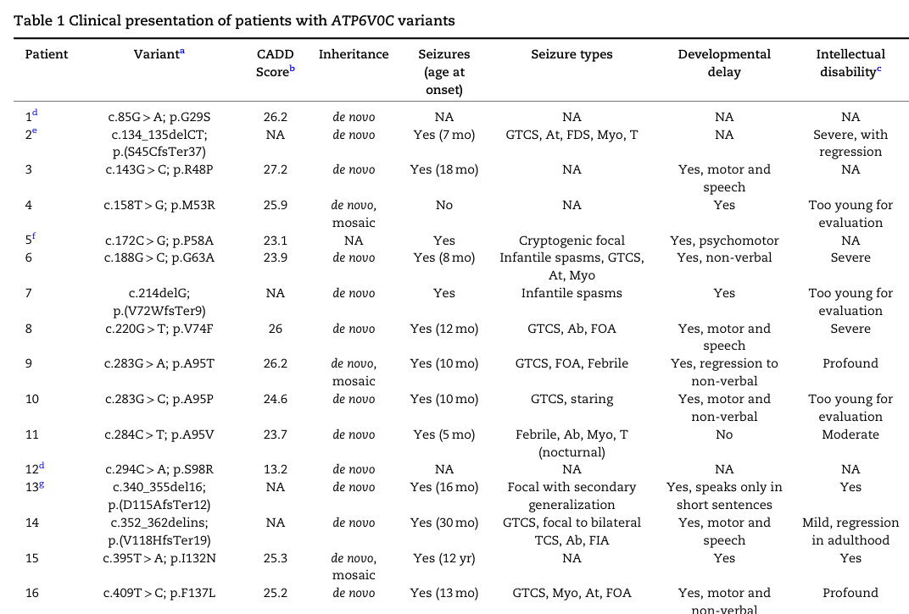

## Question

# Disease Characteristics Research Template

## Target Disease
- **Disease Name:** ATP6V0C-Related Epilepsy
- **MONDO ID:** MONDO:0958196 (if available)
- **Category:** Mendelian

## Research Objectives

Please provide a comprehensive research report on **ATP6V0C-Related Epilepsy** covering all of the
disease characteristics listed below. This report will be used to populate a disease knowledge
base entry. Be thorough and cite primary literature (PMID preferred) for all claims.

For each section, **suggested databases/resources** are listed. These are the first places
you should search for information on each topic.

---

### 1. Disease Information
> **Search first:** OMIM, Orphanet, ICD-10/ICD-11, MeSH, PubMed

- What is the disease? Provide a concise overview.
- What are the key identifiers? (OMIM, Orphanet, ICD-10/ICD-11, MeSH, Mondo)
- What are the common synonyms and alternative names?
- Is the information derived from individual patients (e.g., EHR) or aggregated disease-level resources?

### 2. Etiology

- **Disease Causal Factors**: What are the primary causes? (genetic, environmental, infectious, mechanistic)
- **Risk Factors**:
  > **Search first:** PubMed, Cochrane Library, UpToDate, clinical guidelines, ClinVar, ClinGen, GWAS Catalog, PheGenI, CTD, CDC, WHO, epidemiological databases
  - Genetic risk factors (causal variants, susceptibility loci, modifier genes)
  - Environmental risk factors (toxins, lifestyle, occupational exposures, age, sex, family history)
- **Protective Factors**:
  > **Search first:** PubMed, Cochrane Library, clinical trial databases, GWAS Catalog, gnomAD, WHO, CDC, nutrition databases
  - Genetic protective factors (protective variants, modifier alleles)
  - Environmental protective factors (diet, lifestyle, exposures that reduce risk)
- **Gene-Environment Interactions**: How do genetic and environmental factors interact to influence disease?
  > **Search first:** CTD, PubMed, PheGenI, GxE databases

### 3. Phenotypes
> **Search first:** HPO (Human Phenotype Ontology), OMIM, Orphanet, PubMed, clinicaltrials.gov, MedDRA, SNOMED CT, DECIPHER, LOINC

For each phenotype, provide:
- **Phenotype type**: symptoms, clinical signs, physical manifestations, behavioral changes, or laboratory abnormalities
  > For symptoms/signs: HPO, OMIM, Orphanet, PubMed
  > For behavioral changes: HPO, DSM, RDoC (Research Domain Criteria), PubMed
  > For laboratory abnormalities: LOINC, SNOMED CT, LabTests Online, PubMed
- **Phenotype characteristics**:
  > **Search first:** OMIM, Orphanet, HPO, PubMed
  - Age of symptom onset (neonatal, childhood, adult-onset, late-onset)
  - Symptom severity (mild, moderate, severe, variable)
  - Symptom progression (stable, progressive, episodic, fluctuating)
  - Frequency among affected individuals (percentage or qualitative)
- **Quality of life impact**: Effects on daily functioning and well-being (per-phenotype when possible)
  > **Search first:** EQ-5D database, SF-36, WHO QOL databases, PubMed
- Suggest HPO (Human Phenotype Ontology) terms for each phenotype

### 4. Genetic/Molecular Information

- **Causal Genes**: Gene mutations or chromosomal abnormalities responsible for disease (gene symbols, OMIM IDs)
  > **Search first:** OMIM, ClinVar, HGMD, Ensembl, NCBI Gene
- **Pathogenic Variants**:
  - Affected genes (gene symbols, HGNC IDs)
    > **Search first:** OMIM, NCBI Gene, Ensembl, HGNC, UniProt, GeneCards
  - Variant classification (pathogenic, likely pathogenic, VUS per ACMG/AMP guidelines)
    > **Search first:** ClinVar, ClinGen, ACMG/AMP guidelines, VarSome
  - Variant type/class (missense, frameshift, nonsense, splice-site, structural)
  - Allele frequency in population databases
    > **Search first:** gnomAD, 1000 Genomes, ExAC, TOPMed, dbSNP
  - Somatic vs germline origin
    > **Search first:** COSMIC (somatic), ClinVar, ICGC, TCGA
  - Functional consequences (loss of function, gain of function, dominant negative)
- **Modifier Genes**: Genes that modify disease severity or expression
- **Epigenetic Information**: DNA methylation, histone modifications, chromatin changes affecting disease
  > **Search first:** ENCODE, Roadmap Epigenomics, MethBase, DiseaseMeth
- **Chromosomal Abnormalities**: Large-scale genetic changes (aneuploidy, translocations, inversions)
  > **Search first:** DECIPHER, ClinVar, ECARUCA, UCSC Genome Browser

### 5. Environmental Information

- **Environmental Factors**: Non-genetic contributing factors (toxins, radiation, pollution, occupational exposure)
  > **Search first:** CTD (Comparative Toxicogenomics Database), TOXNET, PubMed, EPA databases
- **Lifestyle Factors**: Behavioral factors (smoking, diet, exercise, alcohol consumption)
  > **Search first:** CDC databases, WHO, PubMed, NHANES
- **Infectious Agents**: If applicable, pathogens causing or triggering disease (bacteria, viruses, fungi, parasites)
  > **Search first:** NCBI Taxonomy, ViPR, BV-BRC, MicrobeDB, GIDEON

### 6. Mechanism / Pathophysiology

**Present this section as an ordered causal chain first, then the detail below.**
Open with a numbered sequence of mechanistic steps running from the initiating
lesion (mutation, exposure, infection) to the clinical manifestation, one step per
line, each naming what it causes next. State the causal verb explicitly ("leads
to", "results in") and say where a step is inferred rather than demonstrated.
Where the mechanism branches, show the branch. The categories below are a
checklist of what to cover within those steps, not the organizing structure —
a step may draw on several of them, and a category may contribute to several
steps.

- **Molecular Pathways**: Specific signaling cascades or biochemical pathways involved (Wnt, MAPK, mTOR, PI3K-AKT, etc.)
  > **Search first:** KEGG, Reactome, WikiPathways, PathBank, BioCyc
- **Cellular Processes**: Cell-level mechanisms (apoptosis, autophagy, cell cycle dysregulation, inflammation, etc.)
  > **Search first:** Gene Ontology (GO), Reactome, KEGG, PubMed
- **Protein Dysfunction**: How protein structure or function is altered (misfolding, aggregation, loss of function, gain of function)
  > **Search first:** UniProt, PDB (Protein Data Bank), InterPro, Pfam, AlphaFold
- **Metabolic Changes**: Alterations in metabolic processes (energy metabolism, lipid metabolism, amino acid metabolism)
  > **Search first:** KEGG, BioCyc, HMDB (Human Metabolome Database), BRENDA
- **Immune System Involvement**: Role of immune response (autoimmunity, immunodeficiency, chronic inflammation)
  > **Search first:** ImmPort, Immunome Database, IEDB, Gene Ontology
- **Tissue Damage Mechanisms**: How tissues/ are injured (oxidative stress, ischemia, fibrosis, necrosis)
  > **Search first:** PubMed, Gene Ontology, Reactome
- **Biochemical Abnormalities**: Specific molecular defects (enzyme deficiencies, receptor dysfunction, ion channel defects)
  > **Search first:** BRENDA, UniProt, KEGG, OMIM, PubMed
- **Epigenetic Changes**: DNA methylation, histone modifications affecting gene expression in disease
  > **Search first:** ENCODE, Roadmap Epigenomics, MethBase, DiseaseMeth
- **Molecular Profiling** (if available):
  - Transcriptomics/gene expression changes
    > **Search first:** GEO (Gene Expression Omnibus), ArrayExpress, GTEx, Human Cell Atlas, SRA
  - Proteomics findings
    > **Search first:** PRIDE, ProteomeXchange, Human Protein Atlas, STRING, BioGRID
  - Metabolomics signatures
    > **Search first:** MetaboLights, Metabolomics Workbench, HMDB, METLIN
  - Lipidomics alterations
    > **Search first:** LIPID MAPS, SwissLipids, LipidHome, Metabolomics Workbench
  - Genomic structural features
    > **Search first:** UCSC Genome Browser, Ensembl, NCBI, dbVar, DGV
- **Advanced Technologies** (if applicable):
  - Single-cell analysis findings (cell-type specific mechanisms, cellular heterogeneity)
    > **Search first:** Human Cell Atlas, Single Cell Portal, GEO, CELLxGENE
  - Spatial transcriptomics findings
    > **Search first:** GEO, Spatial Research, Vizgen, 10x Genomics data
  - Multi-omics integration results
    > **Search first:** TCGA, ICGC, cBioPortal, LinkedOmics, PubMed
  - Functional genomics screens (CRISPR, RNAi)
    > **Search first:** DepMap, GenomeRNAi, PubMed, BioGRID ORCS

For each mechanism, describe:
- The causal chain from initial trigger to clinical manifestation
- Which mechanisms are upstream vs downstream
- What cell types and biological processes are involved
- Suggest GO terms for biological processes and CL terms for cell types

### 7. Anatomical Structures Affected

- **Organ Level**:
  - Primary organs directly affected
  - Secondary organ involvement (complications, secondary effects)
  - Body systems involved (cardiovascular, nervous, digestive, respiratory, endocrine, etc.)
  > **Search first:** Uberon, FMA (Foundational Model of Anatomy), OMIM, HPO, ICD-11, MeSH, SNOMED CT
- **Tissue and Cell Level**:
  - Specific tissue types affected (epithelial, connective, muscle, nervous)
  - Specific cell populations targeted (with Cell Ontology terms)
  > **Search first:** Uberon, Human Protein Atlas, Cell Ontology, Human Cell Atlas, CellMarker, PanglaoDB
- **Subcellular Level**:
  - Cellular compartments involved (mitochondria, nucleus, ER, lysosomes) (with GO Cellular Component terms)
  > **Search first:** Gene Ontology (Cellular Component), UniProt, Human Protein Atlas
- **Localization**:
  - Specific anatomical sites (with UBERON terms)
    > **Search first:** FMA, Uberon, NeuroNames (for brain), SNOMED CT
  - Lateralization (unilateral, bilateral, asymmetric)
    > **Search first:** HPO, clinical literature, imaging databases

### 8. Temporal Development

- **Onset**:
  - Typical age of onset (congenital, pediatric, adult, geriatric)
  - Onset pattern (acute, subacute, chronic, insidious)
  > **Search first:** OMIM, Orphanet, HPO, PubMed
- **Progression**:
  - Disease stages (early, intermediate, advanced, end-stage)
    > **Search first:** Cancer Staging Manual (AJCC), WHO classifications, PubMed
  - Progression rate (rapid, slow, variable)
  - Disease course pattern (episodic, relapsing-remitting, progressive, stable)
  - Disease duration (self-limited, chronic lifelong)
  > **Search first:** Disease registries, longitudinal cohort databases, natural history studies, PubMed, Orphanet, OMIM
- **Patterns**:
  - Remission patterns (spontaneous, treatment-induced)
    > **Search first:** Clinical trial databases, disease registries, PubMed
  - Critical periods (time windows of vulnerability or opportunity for intervention)
    > **Search first:** PubMed, developmental biology databases, clinical guidelines

### 9. Inheritance and Population

- **Epidemiology**:
  - Prevalence (cases per 100,000 at given time)
  - Incidence (new cases per 100,000 per year)
  > **Search first:** Orphanet, CDC, WHO, GBD (Global Burden of Disease), national registries, SEER, disease registries
- **For Genetic Etiology**:
  - Inheritance pattern (AD, AR, X-linked, mitochondrial, multifactorial, polygenic)
    > **Search first:** OMIM, Orphanet, ClinVar, GTR (Genetic Testing Registry)
  - Penetrance (complete, incomplete, age-dependent)
    > **Search first:** ClinVar, OMIM, PubMed, ClinGen
  - Expressivity (variable, consistent)
    > **Search first:** OMIM, ClinVar, PubMed
  - Genetic anticipation (increasing severity in successive generations)
    > **Search first:** OMIM, PubMed (especially for repeat expansion disorders)
  - Germline mosaicism
    > **Search first:** ClinVar, OMIM, genetic counseling literature, PubMed
  - Founder effects (population-specific mutations)
    > **Search first:** gnomAD, population genetics databases, PubMed
  - Consanguinity role
    > **Search first:** OMIM, population studies, genetic counseling resources
  - Carrier frequency
    > **Search first:** gnomAD, carrier screening databases, GeneReviews, GTR
- **Population Demographics**:
  - Affected populations (ethnic or demographic groups with higher prevalence)
    > **Search first:** gnomAD, 1000 Genomes, PAGE Study, PubMed, population registries
  - Geographic distribution (endemic areas, regional variation)
    > **Search first:** WHO, CDC, GBD, Orphanet, geographic epidemiology databases
  - Geographic distribution of specific variants
  - Sex ratio (male:female)
    > **Search first:** Disease registries, OMIM, PubMed, epidemiological databases
  - Age distribution of affected individuals
    > **Search first:** CDC, disease registries, SEER, Orphanet

### 10. Diagnostics

- **Clinical Tests**:
  - Laboratory tests (blood, urine, tissue chemistry, specific enzyme assays)
    > **Search first:** LOINC, LabTests Online, PubMed
  - Biomarkers (proteins, metabolites, genetic markers, circulating biomarkers)
    > **Search first:** FDA Biomarker List, BEST (Biomarkers, EndpointS, and other Tools), PubMed
  - Imaging studies (X-ray, CT, MRI, PET, ultrasound)
    > **Search first:** RadLex, DICOM, Radiopaedia, imaging databases
  - Functional tests (pulmonary function, cardiac stress tests)
    > **Search first:** LOINC, clinical guidelines, PubMed
  - Electrophysiology (EEG, EMG, ECG, nerve conduction studies)
    > **Search first:** LOINC, clinical neurophysiology databases, PubMed
  - Biopsy findings (histopathology, immunohistochemistry)
    > **Search first:** SNOMED CT, College of American Pathologists resources, PubMed
  - Pathology findings (microscopic examination)
    > **Search first:** SNOMED CT, Digital Pathology databases, PubMed
- **Genetic Testing**:
  > **Search first:** GTR (Genetic Testing Registry), GeneReviews, ClinGen
  - Overview of recommended genetic testing approach
  - Whole genome sequencing (WGS) utility
    > **Search first:** GTR, ClinVar, GEL (Genomics England), gnomAD
  - Whole exome sequencing (WES) utility
    > **Search first:** GTR, ClinVar, OMIM, GeneMatcher
  - Gene panels (which panels, which genes)
    > **Search first:** GTR, ClinVar, laboratory-specific databases
  - Single gene testing
    > **Search first:** GTR, ClinVar, OMIM, GeneReviews
  - Chromosomal microarray (CMA)
    > **Search first:** DECIPHER, ClinVar, dbVar, ECARUCA
  - Karyotyping
    > **Search first:** Chromosome Abnormality Database, ClinVar, cytogenetics resources
  - FISH
    > **Search first:** ClinVar, cytogenetics databases, PubMed
  - Mitochondrial DNA testing
    > **Search first:** MITOMAP, MSeqDR, ClinVar, GTR
  - Repeat expansion testing
    > **Search first:** GTR, ClinVar, repeat expansion databases, PubMed
- **Omics-Based Diagnostics** (if applicable):
  - RNA sequencing / transcriptomics
    > **Search first:** GEO, ArrayExpress, GTEx, RNA-seq databases
  - Proteomics
    > **Search first:** PRIDE, ProteomeXchange, FDA Biomarker database
  - Metabolomics
    > **Search first:** MetaboLights, Metabolomics Workbench, HMDB
  - Epigenomics
    > **Search first:** GEO, ENCODE, Roadmap Epigenomics, MethBase
  - Liquid biopsy
    > **Search first:** COSMIC, ClinVar, liquid biopsy databases, PubMed
- **Clinical Criteria**:
  - Standardized diagnostic criteria (DSM, ICD, society guidelines)
    > **Search first:** DSM-5, ICD-11, clinical society guidelines, UpToDate
  - Differential diagnosis (other conditions to rule out, with distinguishing features)
    > **Search first:** DynaMed, UpToDate, clinical decision support systems
- **Screening**:
  - Screening methods for asymptomatic individuals (newborn screening, carrier screening, cascade screening)
    > **Search first:** ACMG recommendations, CDC newborn screening, GTR

### 11. Outcome/Prognosis

- **Survival and Mortality**:
  - Survival rate (5-year, 10-year, overall)
    > **Search first:** SEER, cancer registries, disease-specific registries, PubMed
  - Life expectancy (with and without treatment if applicable)
    > **Search first:** Orphanet, disease registries, actuarial databases, PubMed
  - Mortality rate
    > **Search first:** CDC, WHO, GBD, national mortality databases
  - Disease-specific mortality (deaths directly attributable to disease)
    > **Search first:** Disease registries, CDC Wonder, GBD, PubMed
- **Morbidity and Function**:
  - Morbidity (disease-related disability and health impacts)
    > **Search first:** GBD, WHO, disability databases, PubMed
  - Disability outcomes (long-term functional impairments)
    > **Search first:** ICF (International Classification of Functioning), disability registries
  - Quality of life measures (EQ-5D, SF-36, PROMIS, disease-specific tools)
    > **Search first:** EQ-5D database, SF-36, PROMIS, PubMed
- **Disease Course**:
  - Complications (secondary problems: infections, organ failure, etc.)
    > **Search first:** ICD codes, disease registries, clinical databases, PubMed
  - Recovery potential (likelihood and extent of recovery, with vs without treatment)
    > **Search first:** Natural history studies, rehabilitation databases, PubMed
- **Prediction**:
  - Prognostic factors (age, disease severity, biomarkers, treatment response)
    > **Search first:** Prognostic models databases, clinical calculators, PubMed
  - Prognostic biomarkers (molecular markers predicting disease course)
    > **Search first:** FDA Biomarker database, PubMed, cancer prognostic databases

### 12. Treatment

- **Pharmacotherapy**:
  - Pharmacological treatments (drug names, drug classes, mechanisms of action)
    > **Search first:** DrugBank, RxNorm, ATC classification, DailyMed, FDA databases
  - Pharmacogenomics (how genetic variants affect drug metabolism, efficacy, toxicity)
    > **Search first:** PharmGKB, CPIC (Clinical Pharmacogenetics), FDA Table of PGx Biomarkers
- **Advanced Therapeutics**:
  - Gene therapy (viral vectors, CRISPR, gene replacement, gene editing)
    > **Search first:** ClinicalTrials.gov, FDA gene therapy database, ASGCT resources
  - Cell therapy (stem cell transplant, CAR-T, cellular therapeutics)
    > **Search first:** ClinicalTrials.gov, FDA cell therapy database, FACT standards
  - RNA-based therapies (ASOs, siRNA, mRNA therapies)
    > **Search first:** ClinicalTrials.gov, FDA approvals, PubMed
  - Targeted therapies (treatments directed at specific molecular targets)
    > **Search first:** My Cancer Genome, OncoKB, ClinicalTrials.gov, FDA approvals
  - Immunotherapies (checkpoint inhibitors, monoclonal antibodies)
    > **Search first:** Cancer Immunotherapy Database, FDA approvals, ClinicalTrials.gov
- **Surgical and Interventional**:
  - Surgical interventions (types of surgery, timing, outcomes)
    > **Search first:** CPT codes, surgical registries, clinical guidelines, PubMed
- **Supportive and Rehabilitative**:
  - Supportive care (symptom management, pain control, nutrition)
    > **Search first:** Clinical guidelines, Cochrane Library, PubMed
  - Rehabilitation (physical therapy, occupational therapy, speech therapy)
    > **Search first:** Rehabilitation medicine databases, clinical guidelines, PubMed
- **Experimental**:
  - Experimental treatments in clinical trials (with NCT identifiers if available)
    > **Search first:** ClinicalTrials.gov, EU Clinical Trials Register, WHO ICTRP
- **Treatment Outcomes**:
  - Treatment response rates
    > **Search first:** Clinical trial databases, FDA reviews, systematic reviews, PubMed
  - Side effects and adverse events
    > **Search first:** FDA Adverse Event Reporting System (FAERS), MedWatch, PubMed
- **Treatment Strategy**:
  - Treatment algorithms (clinical pathways, decision trees)
    > **Search first:** Clinical practice guidelines, NCCN Guidelines, UpToDate
  - Combination therapies
    > **Search first:** ClinicalTrials.gov, treatment guidelines, PubMed
  - Personalized medicine approaches (genotype-guided treatment)
    > **Search first:** My Cancer Genome, CIViC, PharmGKB, precision medicine databases

For each treatment, suggest NCIT (NCI Thesaurus) clinical-intervention terms where applicable.

### 13. Prevention

- **Prevention Levels**:
  - Primary prevention (preventing disease occurrence: vaccination, risk factor modification)
    > **Search first:** CDC, WHO, USPSTF recommendations, Cochrane Library
  - Secondary prevention (early detection and treatment: screening programs, early intervention)
    > **Search first:** USPSTF, CDC screening guidelines, WHO
  - Tertiary prevention (preventing complications in those with disease)
    > **Search first:** Clinical guidelines, disease management protocols, PubMed
- **Immunization**: Vaccine strategies (if applicable)
  > **Search first:** CDC vaccine schedules, WHO immunization, FDA vaccine database
- **Screening and Early Detection**:
  - Screening programs (population-based: newborn screening, cancer screening)
    > **Search first:** CDC screening programs, USPSTF, cancer screening databases
  - Genetic screening (carrier screening, preimplantation genetic diagnosis, prenatal testing)
    > **Search first:** ACMG recommendations, ACOG guidelines, GTR
  - Risk stratification (identifying high-risk individuals for targeted prevention)
    > **Search first:** Risk prediction models, clinical calculators, PubMed
- **Behavioral Interventions**: Lifestyle modifications to reduce risk
  > **Search first:** CDC, WHO, behavioral intervention databases, Cochrane Library
- **Counseling**: Genetic counseling (risk assessment, family planning guidance)
  > **Search first:** NSGC resources, ACMG guidelines, GeneReviews
- **Public Health**:
  - Public health interventions (sanitation, vector control, health education)
    > **Search first:** CDC, WHO, public health databases, PubMed
  - Environmental interventions (reducing environmental risk factors)
    > **Search first:** EPA databases, WHO environmental health, PubMed
- **Prophylaxis**: Preventive medications or procedures
  > **Search first:** Clinical guidelines, FDA approvals, PubMed

### 14. Other Species / Natural Disease

- **Taxonomy**: Species affected (with NCBI Taxon identifiers)
  > **Search first:** NCBI Taxonomy
- **Breed**: Specific breeds affected (with VBO identifiers if applicable)
  > **Search first:** VBO (Vertebrate Breed Ontology)
- **Gene**: Orthologous genes in other species (with NCBI Gene IDs)
  > **Search first:** NCBI Gene
- **Natural Disease**:
  - Naturally occurring disease in other species (companion animals, wildlife)
    > **Search first:** OMIA (Online Mendelian Inheritance in Animals), VetCompass, PubMed
  - Veterinary relevance and importance in animal health
    > **Search first:** OMIA, veterinary databases, PubMed
- **Comparative Biology**:
  - Comparative pathology (similarities and differences across species)
    > **Search first:** OMIA, comparative pathology databases, PubMed
  - Evolutionary conservation of disease mechanisms
    > **Search first:** HomoloGene, OrthoMCL, Alliance of Genome Resources
- **Transmission** (if applicable):
  - Zoonotic potential
    > **Search first:** CDC zoonotic diseases, WHO zoonoses, GIDEON
  - Cross-species susceptibility
    > **Search first:** NCBI Taxonomy, veterinary databases, PubMed

### 15. Model Organisms

- **Model Types**:
  - Model organism type (mammalian, invertebrate, cellular, in vitro)
    > **Search first:** Alliance of Genome Resources, model organism databases
  - Specific model systems (mouse, rat, zebrafish, Drosophila, C. elegans, yeast, cell lines, organoids, iPSCs)
    > **Search first:** MGI, RGD, ZFIN, FlyBase, WormBase, SGD, ATCC, Cellosaurus
  - Induced models (drug treatment, surgical intervention, environmental manipulation)
    > **Search first:** MGI, model organism databases, PubMed
- **Genetic Models**:
  - Types available (knockout, knock-in, transgenic, conditional, humanized)
    > **Search first:** MGI, IMPC, KOMP, EuMMCR, IMSR
- **Model Characteristics**:
  - Phenotype recapitulation (how well model reproduces human disease features)
    > **Search first:** Model organism databases, comparative studies, PubMed
  - Model limitations (aspects of human disease not captured)
    > **Search first:** Model organism databases, PubMed, review articles
- **Applications**:
  - Research applications (what aspects of disease can be studied)
    > **Search first:** Model organism databases, PubMed
- **Resources**:
  - Model databases
    > **Search first:** MGI, RGD, ZFIN, FlyBase, WormBase, IMSR, EMMA, MMRRC

---

## Citation Requirements

- Cite primary literature (PMID preferred) for all mechanistic and clinical claims
- Prioritize recent reviews and landmark papers
- Include direct quotes from abstracts where possible to support key statements
- Distinguish evidence source types: human clinical, model organism, in vitro, computational

## Output Format

Structure your response as a comprehensive narrative organized by the sections above.
For each section, provide:
- Factual content with specific details (numbers, percentages, gene names, variant nomenclature)
- Ontology term suggestions (HPO, GO, CL, UBERON, CHEBI, NCIT, MONDO) where applicable
- Evidence citations with PMIDs
- Direct quotes from abstracts to support key claims
- Clear indication when information is not available or not applicable for this disease

This report will be used to populate a disease knowledge base entry with:
- Pathophysiology descriptions with causal chains
- Gene/protein annotations (HGNC, GO terms)
- Phenotype associations (HP terms) with frequencies
- Cell type involvement (CL terms)
- Anatomical locations (UBERON terms)
- Chemical entities (CHEBI terms)
- Treatment annotations (NCIT terms)
- Evidence items with PMIDs and exact abstract quotes
- Epidemiology, prognosis, diagnostic, and prevention information
- Animal model descriptions with phenotype recapitulation details

## Output

Question: You are an expert researcher providing comprehensive, well-cited information.

Provide detailed information focusing on:
1. Key concepts and definitions with current understanding
2. Recent developments and latest research (prioritize 2023-2024 sources)
3. Current applications and real-world implementations
4. Expert opinions and analysis from authoritative sources
5. Relevant statistics and data from recent studies

Format as a comprehensive research report with proper citations. Include URLs and publication dates where available.
Always prioritize recent, authoritative sources and provide specific citations for all major claims.

# Disease Characteristics Research Template

## Target Disease
- **Disease Name:** ATP6V0C-Related Epilepsy
- **MONDO ID:** MONDO:0958196 (if available)
- **Category:** Mendelian

## Research Objectives

Please provide a comprehensive research report on **ATP6V0C-Related Epilepsy** covering all of the
disease characteristics listed below. This report will be used to populate a disease knowledge
base entry. Be thorough and cite primary literature (PMID preferred) for all claims.

For each section, **suggested databases/resources** are listed. These are the first places
you should search for information on each topic.

---

### 1. Disease Information
> **Search first:** OMIM, Orphanet, ICD-10/ICD-11, MeSH, PubMed

- What is the disease? Provide a concise overview.
- What are the key identifiers? (OMIM, Orphanet, ICD-10/ICD-11, MeSH, Mondo)
- What are the common synonyms and alternative names?
- Is the information derived from individual patients (e.g., EHR) or aggregated disease-level resources?

### 2. Etiology

- **Disease Causal Factors**: What are the primary causes? (genetic, environmental, infectious, mechanistic)
- **Risk Factors**:
  > **Search first:** PubMed, Cochrane Library, UpToDate, clinical guidelines, ClinVar, ClinGen, GWAS Catalog, PheGenI, CTD, CDC, WHO, epidemiological databases
  - Genetic risk factors (causal variants, susceptibility loci, modifier genes)
  - Environmental risk factors (toxins, lifestyle, occupational exposures, age, sex, family history)
- **Protective Factors**:
  > **Search first:** PubMed, Cochrane Library, clinical trial databases, GWAS Catalog, gnomAD, WHO, CDC, nutrition databases
  - Genetic protective factors (protective variants, modifier alleles)
  - Environmental protective factors (diet, lifestyle, exposures that reduce risk)
- **Gene-Environment Interactions**: How do genetic and environmental factors interact to influence disease?
  > **Search first:** CTD, PubMed, PheGenI, GxE databases

### 3. Phenotypes
> **Search first:** HPO (Human Phenotype Ontology), OMIM, Orphanet, PubMed, clinicaltrials.gov, MedDRA, SNOMED CT, DECIPHER, LOINC

For each phenotype, provide:
- **Phenotype type**: symptoms, clinical signs, physical manifestations, behavioral changes, or laboratory abnormalities
  > For symptoms/signs: HPO, OMIM, Orphanet, PubMed
  > For behavioral changes: HPO, DSM, RDoC (Research Domain Criteria), PubMed
  > For laboratory abnormalities: LOINC, SNOMED CT, LabTests Online, PubMed
- **Phenotype characteristics**:
  > **Search first:** OMIM, Orphanet, HPO, PubMed
  - Age of symptom onset (neonatal, childhood, adult-onset, late-onset)
  - Symptom severity (mild, moderate, severe, variable)
  - Symptom progression (stable, progressive, episodic, fluctuating)
  - Frequency among affected individuals (percentage or qualitative)
- **Quality of life impact**: Effects on daily functioning and well-being (per-phenotype when possible)
  > **Search first:** EQ-5D database, SF-36, WHO QOL databases, PubMed
- Suggest HPO (Human Phenotype Ontology) terms for each phenotype

### 4. Genetic/Molecular Information

- **Causal Genes**: Gene mutations or chromosomal abnormalities responsible for disease (gene symbols, OMIM IDs)
  > **Search first:** OMIM, ClinVar, HGMD, Ensembl, NCBI Gene
- **Pathogenic Variants**:
  - Affected genes (gene symbols, HGNC IDs)
    > **Search first:** OMIM, NCBI Gene, Ensembl, HGNC, UniProt, GeneCards
  - Variant classification (pathogenic, likely pathogenic, VUS per ACMG/AMP guidelines)
    > **Search first:** ClinVar, ClinGen, ACMG/AMP guidelines, VarSome
  - Variant type/class (missense, frameshift, nonsense, splice-site, structural)
  - Allele frequency in population databases
    > **Search first:** gnomAD, 1000 Genomes, ExAC, TOPMed, dbSNP
  - Somatic vs germline origin
    > **Search first:** COSMIC (somatic), ClinVar, ICGC, TCGA
  - Functional consequences (loss of function, gain of function, dominant negative)
- **Modifier Genes**: Genes that modify disease severity or expression
- **Epigenetic Information**: DNA methylation, histone modifications, chromatin changes affecting disease
  > **Search first:** ENCODE, Roadmap Epigenomics, MethBase, DiseaseMeth
- **Chromosomal Abnormalities**: Large-scale genetic changes (aneuploidy, translocations, inversions)
  > **Search first:** DECIPHER, ClinVar, ECARUCA, UCSC Genome Browser

### 5. Environmental Information

- **Environmental Factors**: Non-genetic contributing factors (toxins, radiation, pollution, occupational exposure)
  > **Search first:** CTD (Comparative Toxicogenomics Database), TOXNET, PubMed, EPA databases
- **Lifestyle Factors**: Behavioral factors (smoking, diet, exercise, alcohol consumption)
  > **Search first:** CDC databases, WHO, PubMed, NHANES
- **Infectious Agents**: If applicable, pathogens causing or triggering disease (bacteria, viruses, fungi, parasites)
  > **Search first:** NCBI Taxonomy, ViPR, BV-BRC, MicrobeDB, GIDEON

### 6. Mechanism / Pathophysiology

**Present this section as an ordered causal chain first, then the detail below.**
Open with a numbered sequence of mechanistic steps running from the initiating
lesion (mutation, exposure, infection) to the clinical manifestation, one step per
line, each naming what it causes next. State the causal verb explicitly ("leads
to", "results in") and say where a step is inferred rather than demonstrated.
Where the mechanism branches, show the branch. The categories below are a
checklist of what to cover within those steps, not the organizing structure —
a step may draw on several of them, and a category may contribute to several
steps.

- **Molecular Pathways**: Specific signaling cascades or biochemical pathways involved (Wnt, MAPK, mTOR, PI3K-AKT, etc.)
  > **Search first:** KEGG, Reactome, WikiPathways, PathBank, BioCyc
- **Cellular Processes**: Cell-level mechanisms (apoptosis, autophagy, cell cycle dysregulation, inflammation, etc.)
  > **Search first:** Gene Ontology (GO), Reactome, KEGG, PubMed
- **Protein Dysfunction**: How protein structure or function is altered (misfolding, aggregation, loss of function, gain of function)
  > **Search first:** UniProt, PDB (Protein Data Bank), InterPro, Pfam, AlphaFold
- **Metabolic Changes**: Alterations in metabolic processes (energy metabolism, lipid metabolism, amino acid metabolism)
  > **Search first:** KEGG, BioCyc, HMDB (Human Metabolome Database), BRENDA
- **Immune System Involvement**: Role of immune response (autoimmunity, immunodeficiency, chronic inflammation)
  > **Search first:** ImmPort, Immunome Database, IEDB, Gene Ontology
- **Tissue Damage Mechanisms**: How tissues/ are injured (oxidative stress, ischemia, fibrosis, necrosis)
  > **Search first:** PubMed, Gene Ontology, Reactome
- **Biochemical Abnormalities**: Specific molecular defects (enzyme deficiencies, receptor dysfunction, ion channel defects)
  > **Search first:** BRENDA, UniProt, KEGG, OMIM, PubMed
- **Epigenetic Changes**: DNA methylation, histone modifications affecting gene expression in disease
  > **Search first:** ENCODE, Roadmap Epigenomics, MethBase, DiseaseMeth
- **Molecular Profiling** (if available):
  - Transcriptomics/gene expression changes
    > **Search first:** GEO (Gene Expression Omnibus), ArrayExpress, GTEx, Human Cell Atlas, SRA
  - Proteomics findings
    > **Search first:** PRIDE, ProteomeXchange, Human Protein Atlas, STRING, BioGRID
  - Metabolomics signatures
    > **Search first:** MetaboLights, Metabolomics Workbench, HMDB, METLIN
  - Lipidomics alterations
    > **Search first:** LIPID MAPS, SwissLipids, LipidHome, Metabolomics Workbench
  - Genomic structural features
    > **Search first:** UCSC Genome Browser, Ensembl, NCBI, dbVar, DGV
- **Advanced Technologies** (if applicable):
  - Single-cell analysis findings (cell-type specific mechanisms, cellular heterogeneity)
    > **Search first:** Human Cell Atlas, Single Cell Portal, GEO, CELLxGENE
  - Spatial transcriptomics findings
    > **Search first:** GEO, Spatial Research, Vizgen, 10x Genomics data
  - Multi-omics integration results
    > **Search first:** TCGA, ICGC, cBioPortal, LinkedOmics, PubMed
  - Functional genomics screens (CRISPR, RNAi)
    > **Search first:** DepMap, GenomeRNAi, PubMed, BioGRID ORCS

For each mechanism, describe:
- The causal chain from initial trigger to clinical manifestation
- Which mechanisms are upstream vs downstream
- What cell types and biological processes are involved
- Suggest GO terms for biological processes and CL terms for cell types

### 7. Anatomical Structures Affected

- **Organ Level**:
  - Primary organs directly affected
  - Secondary organ involvement (complications, secondary effects)
  - Body systems involved (cardiovascular, nervous, digestive, respiratory, endocrine, etc.)
  > **Search first:** Uberon, FMA (Foundational Model of Anatomy), OMIM, HPO, ICD-11, MeSH, SNOMED CT
- **Tissue and Cell Level**:
  - Specific tissue types affected (epithelial, connective, muscle, nervous)
  - Specific cell populations targeted (with Cell Ontology terms)
  > **Search first:** Uberon, Human Protein Atlas, Cell Ontology, Human Cell Atlas, CellMarker, PanglaoDB
- **Subcellular Level**:
  - Cellular compartments involved (mitochondria, nucleus, ER, lysosomes) (with GO Cellular Component terms)
  > **Search first:** Gene Ontology (Cellular Component), UniProt, Human Protein Atlas
- **Localization**:
  - Specific anatomical sites (with UBERON terms)
    > **Search first:** FMA, Uberon, NeuroNames (for brain), SNOMED CT
  - Lateralization (unilateral, bilateral, asymmetric)
    > **Search first:** HPO, clinical literature, imaging databases

### 8. Temporal Development

- **Onset**:
  - Typical age of onset (congenital, pediatric, adult, geriatric)
  - Onset pattern (acute, subacute, chronic, insidious)
  > **Search first:** OMIM, Orphanet, HPO, PubMed
- **Progression**:
  - Disease stages (early, intermediate, advanced, end-stage)
    > **Search first:** Cancer Staging Manual (AJCC), WHO classifications, PubMed
  - Progression rate (rapid, slow, variable)
  - Disease course pattern (episodic, relapsing-remitting, progressive, stable)
  - Disease duration (self-limited, chronic lifelong)
  > **Search first:** Disease registries, longitudinal cohort databases, natural history studies, PubMed, Orphanet, OMIM
- **Patterns**:
  - Remission patterns (spontaneous, treatment-induced)
    > **Search first:** Clinical trial databases, disease registries, PubMed
  - Critical periods (time windows of vulnerability or opportunity for intervention)
    > **Search first:** PubMed, developmental biology databases, clinical guidelines

### 9. Inheritance and Population

- **Epidemiology**:
  - Prevalence (cases per 100,000 at given time)
  - Incidence (new cases per 100,000 per year)
  > **Search first:** Orphanet, CDC, WHO, GBD (Global Burden of Disease), national registries, SEER, disease registries
- **For Genetic Etiology**:
  - Inheritance pattern (AD, AR, X-linked, mitochondrial, multifactorial, polygenic)
    > **Search first:** OMIM, Orphanet, ClinVar, GTR (Genetic Testing Registry)
  - Penetrance (complete, incomplete, age-dependent)
    > **Search first:** ClinVar, OMIM, PubMed, ClinGen
  - Expressivity (variable, consistent)
    > **Search first:** OMIM, ClinVar, PubMed
  - Genetic anticipation (increasing severity in successive generations)
    > **Search first:** OMIM, PubMed (especially for repeat expansion disorders)
  - Germline mosaicism
    > **Search first:** ClinVar, OMIM, genetic counseling literature, PubMed
  - Founder effects (population-specific mutations)
    > **Search first:** gnomAD, population genetics databases, PubMed
  - Consanguinity role
    > **Search first:** OMIM, population studies, genetic counseling resources
  - Carrier frequency
    > **Search first:** gnomAD, carrier screening databases, GeneReviews, GTR
- **Population Demographics**:
  - Affected populations (ethnic or demographic groups with higher prevalence)
    > **Search first:** gnomAD, 1000 Genomes, PAGE Study, PubMed, population registries
  - Geographic distribution (endemic areas, regional variation)
    > **Search first:** WHO, CDC, GBD, Orphanet, geographic epidemiology databases
  - Geographic distribution of specific variants
  - Sex ratio (male:female)
    > **Search first:** Disease registries, OMIM, PubMed, epidemiological databases
  - Age distribution of affected individuals
    > **Search first:** CDC, disease registries, SEER, Orphanet

### 10. Diagnostics

- **Clinical Tests**:
  - Laboratory tests (blood, urine, tissue chemistry, specific enzyme assays)
    > **Search first:** LOINC, LabTests Online, PubMed
  - Biomarkers (proteins, metabolites, genetic markers, circulating biomarkers)
    > **Search first:** FDA Biomarker List, BEST (Biomarkers, EndpointS, and other Tools), PubMed
  - Imaging studies (X-ray, CT, MRI, PET, ultrasound)
    > **Search first:** RadLex, DICOM, Radiopaedia, imaging databases
  - Functional tests (pulmonary function, cardiac stress tests)
    > **Search first:** LOINC, clinical guidelines, PubMed
  - Electrophysiology (EEG, EMG, ECG, nerve conduction studies)
    > **Search first:** LOINC, clinical neurophysiology databases, PubMed
  - Biopsy findings (histopathology, immunohistochemistry)
    > **Search first:** SNOMED CT, College of American Pathologists resources, PubMed
  - Pathology findings (microscopic examination)
    > **Search first:** SNOMED CT, Digital Pathology databases, PubMed
- **Genetic Testing**:
  > **Search first:** GTR (Genetic Testing Registry), GeneReviews, ClinGen
  - Overview of recommended genetic testing approach
  - Whole genome sequencing (WGS) utility
    > **Search first:** GTR, ClinVar, GEL (Genomics England), gnomAD
  - Whole exome sequencing (WES) utility
    > **Search first:** GTR, ClinVar, OMIM, GeneMatcher
  - Gene panels (which panels, which genes)
    > **Search first:** GTR, ClinVar, laboratory-specific databases
  - Single gene testing
    > **Search first:** GTR, ClinVar, OMIM, GeneReviews
  - Chromosomal microarray (CMA)
    > **Search first:** DECIPHER, ClinVar, dbVar, ECARUCA
  - Karyotyping
    > **Search first:** Chromosome Abnormality Database, ClinVar, cytogenetics resources
  - FISH
    > **Search first:** ClinVar, cytogenetics databases, PubMed
  - Mitochondrial DNA testing
    > **Search first:** MITOMAP, MSeqDR, ClinVar, GTR
  - Repeat expansion testing
    > **Search first:** GTR, ClinVar, repeat expansion databases, PubMed
- **Omics-Based Diagnostics** (if applicable):
  - RNA sequencing / transcriptomics
    > **Search first:** GEO, ArrayExpress, GTEx, RNA-seq databases
  - Proteomics
    > **Search first:** PRIDE, ProteomeXchange, FDA Biomarker database
  - Metabolomics
    > **Search first:** MetaboLights, Metabolomics Workbench, HMDB
  - Epigenomics
    > **Search first:** GEO, ENCODE, Roadmap Epigenomics, MethBase
  - Liquid biopsy
    > **Search first:** COSMIC, ClinVar, liquid biopsy databases, PubMed
- **Clinical Criteria**:
  - Standardized diagnostic criteria (DSM, ICD, society guidelines)
    > **Search first:** DSM-5, ICD-11, clinical society guidelines, UpToDate
  - Differential diagnosis (other conditions to rule out, with distinguishing features)
    > **Search first:** DynaMed, UpToDate, clinical decision support systems
- **Screening**:
  - Screening methods for asymptomatic individuals (newborn screening, carrier screening, cascade screening)
    > **Search first:** ACMG recommendations, CDC newborn screening, GTR

### 11. Outcome/Prognosis

- **Survival and Mortality**:
  - Survival rate (5-year, 10-year, overall)
    > **Search first:** SEER, cancer registries, disease-specific registries, PubMed
  - Life expectancy (with and without treatment if applicable)
    > **Search first:** Orphanet, disease registries, actuarial databases, PubMed
  - Mortality rate
    > **Search first:** CDC, WHO, GBD, national mortality databases
  - Disease-specific mortality (deaths directly attributable to disease)
    > **Search first:** Disease registries, CDC Wonder, GBD, PubMed
- **Morbidity and Function**:
  - Morbidity (disease-related disability and health impacts)
    > **Search first:** GBD, WHO, disability databases, PubMed
  - Disability outcomes (long-term functional impairments)
    > **Search first:** ICF (International Classification of Functioning), disability registries
  - Quality of life measures (EQ-5D, SF-36, PROMIS, disease-specific tools)
    > **Search first:** EQ-5D database, SF-36, PROMIS, PubMed
- **Disease Course**:
  - Complications (secondary problems: infections, organ failure, etc.)
    > **Search first:** ICD codes, disease registries, clinical databases, PubMed
  - Recovery potential (likelihood and extent of recovery, with vs without treatment)
    > **Search first:** Natural history studies, rehabilitation databases, PubMed
- **Prediction**:
  - Prognostic factors (age, disease severity, biomarkers, treatment response)
    > **Search first:** Prognostic models databases, clinical calculators, PubMed
  - Prognostic biomarkers (molecular markers predicting disease course)
    > **Search first:** FDA Biomarker database, PubMed, cancer prognostic databases

### 12. Treatment

- **Pharmacotherapy**:
  - Pharmacological treatments (drug names, drug classes, mechanisms of action)
    > **Search first:** DrugBank, RxNorm, ATC classification, DailyMed, FDA databases
  - Pharmacogenomics (how genetic variants affect drug metabolism, efficacy, toxicity)
    > **Search first:** PharmGKB, CPIC (Clinical Pharmacogenetics), FDA Table of PGx Biomarkers
- **Advanced Therapeutics**:
  - Gene therapy (viral vectors, CRISPR, gene replacement, gene editing)
    > **Search first:** ClinicalTrials.gov, FDA gene therapy database, ASGCT resources
  - Cell therapy (stem cell transplant, CAR-T, cellular therapeutics)
    > **Search first:** ClinicalTrials.gov, FDA cell therapy database, FACT standards
  - RNA-based therapies (ASOs, siRNA, mRNA therapies)
    > **Search first:** ClinicalTrials.gov, FDA approvals, PubMed
  - Targeted therapies (treatments directed at specific molecular targets)
    > **Search first:** My Cancer Genome, OncoKB, ClinicalTrials.gov, FDA approvals
  - Immunotherapies (checkpoint inhibitors, monoclonal antibodies)
    > **Search first:** Cancer Immunotherapy Database, FDA approvals, ClinicalTrials.gov
- **Surgical and Interventional**:
  - Surgical interventions (types of surgery, timing, outcomes)
    > **Search first:** CPT codes, surgical registries, clinical guidelines, PubMed
- **Supportive and Rehabilitative**:
  - Supportive care (symptom management, pain control, nutrition)
    > **Search first:** Clinical guidelines, Cochrane Library, PubMed
  - Rehabilitation (physical therapy, occupational therapy, speech therapy)
    > **Search first:** Rehabilitation medicine databases, clinical guidelines, PubMed
- **Experimental**:
  - Experimental treatments in clinical trials (with NCT identifiers if available)
    > **Search first:** ClinicalTrials.gov, EU Clinical Trials Register, WHO ICTRP
- **Treatment Outcomes**:
  - Treatment response rates
    > **Search first:** Clinical trial databases, FDA reviews, systematic reviews, PubMed
  - Side effects and adverse events
    > **Search first:** FDA Adverse Event Reporting System (FAERS), MedWatch, PubMed
- **Treatment Strategy**:
  - Treatment algorithms (clinical pathways, decision trees)
    > **Search first:** Clinical practice guidelines, NCCN Guidelines, UpToDate
  - Combination therapies
    > **Search first:** ClinicalTrials.gov, treatment guidelines, PubMed
  - Personalized medicine approaches (genotype-guided treatment)
    > **Search first:** My Cancer Genome, CIViC, PharmGKB, precision medicine databases

For each treatment, suggest NCIT (NCI Thesaurus) clinical-intervention terms where applicable.

### 13. Prevention

- **Prevention Levels**:
  - Primary prevention (preventing disease occurrence: vaccination, risk factor modification)
    > **Search first:** CDC, WHO, USPSTF recommendations, Cochrane Library
  - Secondary prevention (early detection and treatment: screening programs, early intervention)
    > **Search first:** USPSTF, CDC screening guidelines, WHO
  - Tertiary prevention (preventing complications in those with disease)
    > **Search first:** Clinical guidelines, disease management protocols, PubMed
- **Immunization**: Vaccine strategies (if applicable)
  > **Search first:** CDC vaccine schedules, WHO immunization, FDA vaccine database
- **Screening and Early Detection**:
  - Screening programs (population-based: newborn screening, cancer screening)
    > **Search first:** CDC screening programs, USPSTF, cancer screening databases
  - Genetic screening (carrier screening, preimplantation genetic diagnosis, prenatal testing)
    > **Search first:** ACMG recommendations, ACOG guidelines, GTR
  - Risk stratification (identifying high-risk individuals for targeted prevention)
    > **Search first:** Risk prediction models, clinical calculators, PubMed
- **Behavioral Interventions**: Lifestyle modifications to reduce risk
  > **Search first:** CDC, WHO, behavioral intervention databases, Cochrane Library
- **Counseling**: Genetic counseling (risk assessment, family planning guidance)
  > **Search first:** NSGC resources, ACMG guidelines, GeneReviews
- **Public Health**:
  - Public health interventions (sanitation, vector control, health education)
    > **Search first:** CDC, WHO, public health databases, PubMed
  - Environmental interventions (reducing environmental risk factors)
    > **Search first:** EPA databases, WHO environmental health, PubMed
- **Prophylaxis**: Preventive medications or procedures
  > **Search first:** Clinical guidelines, FDA approvals, PubMed

### 14. Other Species / Natural Disease

- **Taxonomy**: Species affected (with NCBI Taxon identifiers)
  > **Search first:** NCBI Taxonomy
- **Breed**: Specific breeds affected (with VBO identifiers if applicable)
  > **Search first:** VBO (Vertebrate Breed Ontology)
- **Gene**: Orthologous genes in other species (with NCBI Gene IDs)
  > **Search first:** NCBI Gene
- **Natural Disease**:
  - Naturally occurring disease in other species (companion animals, wildlife)
    > **Search first:** OMIA (Online Mendelian Inheritance in Animals), VetCompass, PubMed
  - Veterinary relevance and importance in animal health
    > **Search first:** OMIA, veterinary databases, PubMed
- **Comparative Biology**:
  - Comparative pathology (similarities and differences across species)
    > **Search first:** OMIA, comparative pathology databases, PubMed
  - Evolutionary conservation of disease mechanisms
    > **Search first:** HomoloGene, OrthoMCL, Alliance of Genome Resources
- **Transmission** (if applicable):
  - Zoonotic potential
    > **Search first:** CDC zoonotic diseases, WHO zoonoses, GIDEON
  - Cross-species susceptibility
    > **Search first:** NCBI Taxonomy, veterinary databases, PubMed

### 15. Model Organisms

- **Model Types**:
  - Model organism type (mammalian, invertebrate, cellular, in vitro)
    > **Search first:** Alliance of Genome Resources, model organism databases
  - Specific model systems (mouse, rat, zebrafish, Drosophila, C. elegans, yeast, cell lines, organoids, iPSCs)
    > **Search first:** MGI, RGD, ZFIN, FlyBase, WormBase, SGD, ATCC, Cellosaurus
  - Induced models (drug treatment, surgical intervention, environmental manipulation)
    > **Search first:** MGI, model organism databases, PubMed
- **Genetic Models**:
  - Types available (knockout, knock-in, transgenic, conditional, humanized)
    > **Search first:** MGI, IMPC, KOMP, EuMMCR, IMSR
- **Model Characteristics**:
  - Phenotype recapitulation (how well model reproduces human disease features)
    > **Search first:** Model organism databases, comparative studies, PubMed
  - Model limitations (aspects of human disease not captured)
    > **Search first:** Model organism databases, PubMed, review articles
- **Applications**:
  - Research applications (what aspects of disease can be studied)
    > **Search first:** Model organism databases, PubMed
- **Resources**:
  - Model databases
    > **Search first:** MGI, RGD, ZFIN, FlyBase, WormBase, IMSR, EMMA, MMRRC

---

## Citation Requirements

- Cite primary literature (PMID preferred) for all mechanistic and clinical claims
- Prioritize recent reviews and landmark papers
- Include direct quotes from abstracts where possible to support key statements
- Distinguish evidence source types: human clinical, model organism, in vitro, computational

## Output Format

Structure your response as a comprehensive narrative organized by the sections above.
For each section, provide:
- Factual content with specific details (numbers, percentages, gene names, variant nomenclature)
- Ontology term suggestions (HPO, GO, CL, UBERON, CHEBI, NCIT, MONDO) where applicable
- Evidence citations with PMIDs
- Direct quotes from abstracts to support key claims
- Clear indication when information is not available or not applicable for this disease

This report will be used to populate a disease knowledge base entry with:
- Pathophysiology descriptions with causal chains
- Gene/protein annotations (HGNC, GO terms)
- Phenotype associations (HP terms) with frequencies
- Cell type involvement (CL terms)
- Anatomical locations (UBERON terms)
- Chemical entities (CHEBI terms)
- Treatment annotations (NCIT terms)
- Evidence items with PMIDs and exact abstract quotes
- Epidemiology, prognosis, diagnostic, and prevention information
- Animal model descriptions with phenotype recapitulation details

# ATP6V0C-related epilepsy: disease-characteristics report

**Evidence scope.** ATP6V0C disease spans febrile seizures with normal development through severe neurodevelopmental disorder with epilepsy. The strongest ATP6V0C-specific evidence is a 2023 series of **27 people with heterozygous point variants**, a 2022 report of **six affected relatives in two families**, and earlier reports of multigene 16p13.3 deletions. These are clinically ascertained groups, not a population registry; their phenotype frequencies must not be interpreted as penetrance or prevalence. The 2024 literature principally synthesizes these findings rather than establishing an ATP6V0C-specific treatment. (mattison2023atp6v0cvariantsimpair pages 1-3, mattison2023atp6v0cvariantsimpair pages 5-6, tian2022atp6v0cisassociated pages 4-6, tian2022atp6v0cisassociated pages 6-7, falace2024vatpasedysfunctionin pages 6-8)

## 1. Disease information

ATP6V0C-related epilepsy is an autosomal-dominant spectrum caused by disease-associated variation in the gene encoding the **c subunit of vacuolar H⁺-ATPase (V-ATPase)**. Epilepsy is **not obligatory**: developmental problems without reported seizures and familial febrile-seizure presentations both occur. A published disease designation is **early-onset epilepsy 3, with or without developmental delay (EEO3; OMIM 620465)**; the **ATP6V0C gene** is **OMIM 108745**, at **16p13.3**, with clinical-report reference transcript **NM_001694.4**. The requested **MONDO:0958196** is retained as a supplied identifier, but its current mapping was not independently verified here. An ATP6V0C-specific Orphanet, MeSH, ICD-10, or ICD-11 code was not established from the retrieved sources; generic epilepsy codes should not be represented as disease-specific identifiers. Synonyms suitable for text search include *ATP6V0C-associated early-onset epilepsy*, *ATP6V0C-related neurodevelopmental disorder with or without epilepsy*, and *EEO3*. (mattison2023atp6v0cvariantsimpair pages 1-3, mattison2023atp6v0cvariantsimpair pages 3-4, falace2024vatpasedysfunctionin pages 3-4, carpentieri2024dominantlyactingvariants pages 1-2)

**Provenance:** The numerical observations below derive from individual patients described in published clinical series and subsequently aggregated by investigators, **not** from an identified individual’s electronic health record. Mattison and colleagues assembled deidentified clinical information through clinicians, GeneMatcher, sequencing projects, ClinVar, and prior publications; some cases had appeared elsewhere and must not be counted again as independent discoveries. (mattison2023atp6v0cvariantsimpair pages 4-5, mattison2023atp6v0cvariantsimpair pages 5-6)

> **Primary abstract, Mattison et al. (2023):** “We describe heterozygous point variants in ATP6V0C … in 27 patients with neurodevelopmental abnormalities with or without epilepsy.” [*Brain* 146:1357–1372; https://doi.org/10.1093/brain/awac330]. (mattison2023atp6v0cvariantsimpair pages 1-3)

## 2. Etiology and risk or protective factors

**Established causal factor:** Germline heterozygous ATP6V0C missense, frameshift, and stop-loss variants are associated with the phenotype. In the 2023 series, **22/27** had missense substitutions, **4/27** frameshifts, and **1/27** a stop-loss variant; among **24** with parental DNA, variants arose **de novo**. Four affected individuals were reported mosaic. Familial transmission, rather than an exclusively de novo mechanism, is documented by the two families with febrile seizures reported in 2022. A deletion encompassing ATP6V0C can also contribute, but neighboring **TBC1D24** and **PDPK1** complicate assignment of a multigene-deletion phenotype solely to ATP6V0C. (mattison2023atp6v0cvariantsimpair pages 5-6, mattison2023atp6v0cvariantsimpair pages 6-7, tian2022atp6v0cisassociated pages 4-6, tian2022atp6v0cisassociated pages 6-7, tinker2021haploinsufficiencyofatp6v0c pages 1-5)

**Environment and interaction:** Fever accompanied the first seizures in all six members of the 2022 families, making febrile illness a documented *seizure precipitant in those carriers*, not a cause of their genetic disorder. In experimental worms, high-salt osmotic stress worsened motor/paralysis phenotypes, but this is **not evidence** that dietary salt modifies disease in humans. No disease-specific causal association was established for smoking, diet, toxins, occupation, pathogens, sex, or geographic ancestry; no protective allele, modifier gene, preventive diet, or human gene–environment interaction estimate was identified. (tian2022atp6v0cisassociated pages 6-7, mattison2023atp6v0cvariantsimpair pages 11-14)

## 3. Phenotypes

Clinical findings range from episodic febrile seizures with normal development to persistent epilepsy and substantial cognitive or communication disability. The following denominators belong **only to the 2023 point-variant cohort** and vary with availability of records. (mattison2023atp6v0cvariantsimpair pages 6-7)

| Feature | Observed finding | Available denominator | Interpretation |
|---|---:|---:|---|
| Developmental delay | 21/23 (91.3%) | 23/27 | Ascertainment-selected; data missing for 4 individuals |
| Intellectual disability | 16/16 (100%) | 16 age-eligible, assessed individuals | Severity ranged from mild to profound; not evaluable or unavailable for the remainder |
| Seizure onset before 24 months | 14/18 (77.8%) | 18 individuals with onset reported | Early onset was common among individuals with available data |
| Mean seizure-onset age | 24.6 ± 8.0 months | 18 individuals with onset reported | Summary estimate from available observations; not the entire cohort |
| Generalized tonic–clonic seizures | 12/19 (63.2%) | 19 individuals with seizure-type data | Seizure types were non-exclusive |
| Focal seizures | 7/19 (36.8%) | 19 individuals with seizure-type data | Seizure types were non-exclusive |
| Atonic seizures | 6/19 (31.6%) | 19 individuals with seizure-type data | Seizure types were non-exclusive |
| Myoclonic seizures | 5/19 (26.3%) | 19 individuals with seizure-type data | Seizure types were non-exclusive |
| Abnormal brain MRI | 13/21 (61.9%) | 21 individuals with MRI data | Findings included callosal/cerebellar-vermian abnormalities and delayed myelination |
| Cohort-level caveat | 27 heterozygous point-variant cases | — | Frequencies are descriptive of a clinically ascertained series and must not be extrapolated to all ATP6V0C variant carriers (mattison2023atp6v0cvariantsimpair pages 6-7) |

*Table: Observed findings in the ascertainment-selected 27-person Mattison ATP6V0C point-variant cohort; denominators vary because clinical data were incomplete. The separate Tian 2022 familial cohort—six individuals, all with febrile-seizure onset at 7–8 months and normal development—is not pooled here (tian2022atp6v0cisassociated pages 6-7).*

Seizure types overlap within individuals; the 12/19, 7/19, 6/19, and 5/19 figures therefore cannot be summed. MRI abnormalities included callosal or cerebellar-vermian agenesis/hypoplasia and delayed myelination. Four patients were reported to have cardiac findings—pulmonary valve stenosis, thickened ventricular wall, murmur, or cardiomyopathy/valvular disease—but one with multiple cardiac defects also had biallelic **LZTR1** variants, a competing explanation. Dental enamel defects occurred in two reported patients. A separate patient carried a potentially confounding 20q11.22–q11.23 deletion. (mattison2023atp6v0cvariantsimpair pages 6-7, mattison2023atp6v0cvariantsimpair pages 7-8)

The **2022 familial series is clinically different**: all **6/6** had first febrile seizures at **7–8 months**, **2/6** later had afebrile epilepsy, and **6/6** were described as having normal intellectual and physical development. Some relatives became seizure-free without antiseizure drugs. This contrast supports variable expressivity and cautions against labeling every ATP6V0C-associated seizure as a severe developmental and epileptic encephalopathy. (tian2022atp6v0cisassociated pages 6-7)

**Knowledge-base phenotype suggestions**—map to current HPO releases before ingestion: seizures/epilepsy, febrile seizures, generalized tonic–clonic seizures, focal seizures, atonic seizures, myoclonic seizures, infantile spasms, global developmental delay, intellectual disability, speech delay or absent speech, developmental regression, corpus-callosum hypoplasia/agenesis, delayed myelination, cerebellar-vermian hypoplasia, and cardiac structural anomaly. **HP:0001250 (seizure), HP:0001263 (global developmental delay), HP:0001249 (intellectual disability), and HP:0000252 (microcephaly)** are candidate mappings; microcephaly is especially pertinent to the *multigene deletion* literature and should not be assigned the point-variant cohort’s frequency. Quality-of-life consequences are inferred from seizure burden, delayed walking or speech, and intellectual disability; no ATP6V0C-specific EQ-5D, SF-36, or PROMIS estimates were identified. (mattison2023atp6v0cvariantsimpair pages 6-7, tian2022atp6v0cisassociated pages 6-7, tinker2021haploinsufficiencyofatp6v0c pages 1-5)

## 4. Genetic and molecular information

The implicated protein is a **155-amino-acid, four-transmembrane V₀ c subunit**; its gene lies at 16p13.3. For reproducible HGVS reporting, the 2023 table uses **NM_001694.4**. Examples include **c.188G>C (p.Gly63Ala), c.283G>A (p.Ala95Thr), c.409T>C (p.Phe137Leu), c.412G>C (p.Ala138Pro), c.445G>A (p.Ala149Thr), c.448C>T (p.Leu150Phe)**, and the frameshift **c.134_135delCT [p.(Ser45CysfsTer37)]**. The reported stop-loss is **c.467A>T [p.(Ter156LeuextTer35)]**. The 2022 familial variants were **c.64G>A (p.Ala22Thr)** and **c.361_373del (p.Thr121Profs*7)**; check transcript/version when importing these records. (mattison2023atp6v0cvariantsimpair pages 3-4, mattison2023atp6v0cvariantsimpair pages 6-7, mattison2023atp6v0cvariantsimpair pages 7-8, tian2022atp6v0cisassociated pages 4-6)

The 2023 authors judged their patient variants **likely pathogenic or pathogenic under ACMG/AMP criteria**, but this is a study-level statement, not a substitute for checking each current ClinVar assertion. Their variants were absent from **gnomAD v2.1.1** at the time; **21 observed missense variants versus 108 expected** and **zero observed loss-of-function variants versus 4.5 expected** indicated population constraint. Those dated database observations are **not** present-day global allele-frequency estimates, and rare population missense variants cannot automatically be called benign or pathogenic: three tested population variants also affected yeast readouts to differing degrees. The study found missense-variant enrichment in transmembrane domain 4 (**P = 0.006**). (mattison2023atp6v0cvariantsimpair pages 5-6, mattison2023atp6v0cvariantsimpair pages 4-5, mattison2023atp6v0cvariantsimpair pages 8-11)

**Functional classification:** Reduced V-ATPase-dependent activity is experimentally supported in yeast for tested patient substitutions; haploinsufficiency is supported as a plausible mechanism by frameshifts/deletions and fly knockdown. A **dominant-negative action for some outward-facing missense variants remains a structural hypothesis**, not an experimentally established universal mechanism. A previously reported stop-loss transcript escaped nonsense-mediated decay, leaving its precise mechanism unsettled. No ATP6V0C-specific epigenetic signature or validated severity modifier was established. The previously described 16p13.3 deletions are **contiguous-gene copy-number variants**, not evidence for recurrent ATP6V0C-only aneuploidy or translocation. (mattison2023atp6v0cvariantsimpair pages 7-8, mattison2023atp6v0cvariantsimpair pages 3-4, mattison2023atp6v0cvariantsimpair pages 8-11, tinker2021haploinsufficiencyofatp6v0c pages 1-5)

## 5. Environmental and infectious information

This is a **noninfectious Mendelian disorder**; there is no implicated causative microorganism or zoonotic transmission. Fever may trigger seizures in some carriers, but the data do not establish that infection changes genetic penetrance. No ATP6V0C-specific human evidence establishes pollution, radiation, occupational agents, alcohol, smoking, exercise, or dietary factors as causes or protective interventions. (tian2022atp6v0cisassociated pages 4-6, tian2022atp6v0cisassociated pages 6-7)

## 6. Mechanism and pathophysiology

**Ordered causal chain; “inferred” means not directly demonstrated in ATP6V0C patient neurons:**

1. **Heterozygous ATP6V0C variant or ATP6V0C-containing deletion** **leads to** altered amount or structure of the V₀ c subunit; reduced dosage is plausible for truncations/deletions, whereas variant-specific effects differ. (mattison2023atp6v0cvariantsimpair pages 5-6, tinker2021haploinsufficiencyofatp6v0c pages 1-5)
2. **Altered c subunit** **leads to** disrupted c-ring function or c–a-subunit coupling during ATP-driven rotation; for individual missense variants, the interface change is **inferred from structural modeling**. The c-ring glutamate **Glu139** and a-subunit arginine participate in proton translocation. (mattison2023atp6v0cvariantsimpair pages 3-4, mattison2023atp6v0cvariantsimpair pages 7-8)
3. **Disrupted V-ATPase function** **results in** reduced acidification capacity: **directly supported in yeast** by diminished LysoSensor signal and poor growth under calcium challenge, but **not demonstrated as a measured organellar-pH change in ATP6V0C patient neurons**. (mattison2023atp6v0cvariantsimpair pages 8-11, mattison2023atp6v0cvariantsimpair pages 1-3)
4. **Branch A—synaptic vesicles:** reduced proton gradient **is inferred to lead to** altered neurotransmitter loading/release and neuronal signaling; variant-bearing worms’ aldicarb hypersensitivity supports altered neuromuscular signaling, **not direct measurement of human synaptic-vesicle cargo**. (mattison2023atp6v0cvariantsimpair pages 11-14, mattison2023atp6v0cvariantsimpair pages 14-15)
5. **Branch B—Golgi/endolysosomes:** altered organelle acidification **is inferred to lead to** disturbed membrane-protein sorting, lysosomal enzyme activity, and autophagic degradation. These are biologically plausible V-ATPase pathways, **not confirmed ATP6V0C-patient multi-omics signatures**; experiments on other V-ATPase genes cannot be relabeled ATP6V0C results. (mattison2023atp6v0cvariantsimpair pages 14-15, falace2024vatpasedysfunctionin pages 6-8, carpentieri2024dominantlyactingvariants pages 1-2)
6. **Changed neural development/circuit activity** **results in or is inferred to contribute to** developmental impairment and seizures in humans; neuron-specific fly knockdown prolongs electroshock-induced seizure-like behavior, furnishing **model-organism**, not human circuit-level, support. (mattison2023atp6v0cvariantsimpair pages 1-3, mattison2023atp6v0cvariantsimpair pages 7-8, mattison2023atp6v0cvariantsimpair pages 6-7)

The **upstream biochemical lesion** is proton-pump dysfunction; the proposed synaptic and endomembrane branches are **downstream**. No ATP6V0C-specific causal role has been demonstrated for Wnt, MAPK, PI3K–AKT, mTOR, inflammation, ferroptosis, or altered DNA methylation. The related-gene 2024 literature contains lysosomal, autophagic, and even increased-acidification findings for **other subunits**; those mechanisms must not be assumed to apply unchanged to ATP6V0C. No disease-specific human transcriptomic, proteomic, metabolomic, lipidomic, single-cell, spatial-transcriptomic, or multi-omics profile was identified. **GO suggestions:** proton transmembrane transport, organelle acidification, lysosome organization, endocytosis, autophagy, and synaptic-vesicle transport; assign exact GO accessions only after release-specific validation. **CL suggestions:** neuron, excitatory neuron, inhibitory neuron; these reflect plausible vulnerable cell populations, not experimentally demonstrated human-cell selectivity. (mattison2023atp6v0cvariantsimpair pages 14-15, falace2024vatpasedysfunctionin pages 6-8, carpentieri2024dominantlyactingvariants pages 1-2)

> **Primary abstract, Mattison et al. (2023):** “Functional analyses conducted in *Saccharomyces cerevisiae* revealed reduced LysoSensor fluorescence and reduced growth … Knockdown of ATP6V0C in *Drosophila* resulted in increased duration of seizure-like behaviour.” https://doi.org/10.1093/brain/awac330. (mattison2023atp6v0cvariantsimpair pages 1-3)

## 7. Anatomical structures affected

The **central nervous system** is the predominant clinically affected system: the developing brain and distributed seizure-generating neural circuits, with documented callosal/cerebellar-vermian structural findings in some patients. Cardiac findings and enamel abnormalities have been reported but are not proven invariant primary tissue manifestations. There is no established consistent lateralization. At the cellular level, neurons are strongly implicated by the fly neuron-specific experiment; the affected **human** excitatory versus inhibitory neuronal populations remain unresolved. Relevant subcellular compartments are the **V-ATPase-containing synaptic-vesicle, endosomal, lysosomal, and Golgi membranes**, with involvement varying by tissue and complex. **Ontology suggestions:** UBERON *brain*, *cerebral cortex*, *corpus callosum*, *cerebellum*, *heart*; CL *neuron*; GO cellular-component *vacuolar proton-transporting V-type ATPase complex*, *lysosomal membrane*, and *synaptic vesicle membrane*. These are anatomical/mechanistic annotations, not proof of lesion in every structure. (mattison2023atp6v0cvariantsimpair pages 7-8, mattison2023atp6v0cvariantsimpair pages 3-4, mattison2023atp6v0cvariantsimpair pages 14-15, falace2024vatpasedysfunctionin pages 6-8)

## 8. Temporal development

The disorder begins in **infancy or childhood** in the best-characterized cases: 14/18 with available onset information in the 2023 series had seizures **before 24 months**, although individual reported onset included later childhood. In the distinct 2022 family series, onset was **7–8 months**, with some seizure courses ending spontaneously and normal later development. Severe cases in the 2023 table included persistent developmental deficits and occasional regression; the literature does **not** define a standardized sequence of stages, a uniform progression rate, a critical intervention window, or lifelong seizure probability. Thus, the course can be **episodic for seizures** and **persistent or variable for developmental disability**. (mattison2023atp6v0cvariantsimpair pages 6-7, mattison2023atp6v0cvariantsimpair pages 7-8, tian2022atp6v0cisassociated pages 6-7)

## 9. Inheritance and population

**Inheritance is autosomal dominant**, including de novo and transmitted heterozygous variants; mosaic affected individuals are documented. The 2022 families demonstrate relatively mild expression, whereas the 2023 series shows substantial variation, so **complete penetrance, age-specific penetrance, sex ratio, genetic anticipation, founder effects, carrier frequency, incidence, and prevalence cannot be estimated** from these ascertainment-selected reports. A 2022 study found its two variants in **2/64 proband alleles** from 32 selected FS/EFS+ families and **0/280,788 comparator alleles** in its cited aggregated gnomAD dataset; this is a *study-specific enrichment comparison*, **not a population incidence or allele frequency for the disease**. No ethnic or geographic concentration has been established. Germline mosaicism in an unaffected parent is a counseling possibility in dominant disease, but was not established as a measured recurrence rate in these sources. (mattison2023atp6v0cvariantsimpair pages 5-6, tian2022atp6v0cisassociated pages 4-6, tian2022atp6v0cisassociated pages 6-7, falace2024vatpasedysfunctionin pages 3-4)

## 10. Diagnostics

**Practical evaluation, extrapolated from the described presentations:** characterize seizure events and development; obtain EEG/video-EEG when clinically indicated, brain MRI when warranted by epilepsy or developmental findings, and cardiac assessment when signs or structural concerns are present. Familial probands had generalized approximately **2–4-Hz** or **2.5–3.5-Hz** abnormalities, whereas a child with a multigene deletion and febrile seizures had an unrevealing 24-hour EEG; therefore neither an EEG pattern nor MRI abnormality is required for a molecular diagnosis. Routine blood, CSF, and metabolic tests were normal in a reported familial proband and are not established ATP6V0C biomarkers. Biopsy and a clinical lysosomal-enzyme assay have no validated disease-specific role. (tian2022atp6v0cisassociated pages 6-7, tinker2021haploinsufficiencyofatp6v0c pages 1-5, mattison2023atp6v0cvariantsimpair pages 6-7)

**Molecular confirmation:** Favor **trio exome or genome sequencing**, or a validated epilepsy/neurodevelopmental panel **confirmed to include ATP6V0C**, with segregation and ACMG/AMP variant assessment. Review copy-number calls at **16p13.3** if phenotype or sequencing suggests a deletion, interpreting **TBC1D24/PDPK1** co-deletion separately. Targeted familial-variant testing is appropriate once an informative variant is established. The 2023 authors cautioned that ATP6V0C was missing from some commercial panels at that time; present-day panel content must be checked rather than assumed. CMA can detect a sufficiently large deletion but does not replace sequence testing for small variants; karyotype/FISH, mitochondrial sequencing, repeat-expansion tests, liquid biopsy, and diagnostic RNA/protein/metabolomic panels are not established routine ATP6V0C tests. There is no independently validated disease-specific clinical scoring criterion. Differential diagnosis includes **SCN1A-related febrile seizure/Dravet presentations**, other genetic developmental epilepsies, and **ATP6V0A1/ATP6V1A-related disorders**; clinical similarity alone does not distinguish their genotypes. (mattison2023atp6v0cvariantsimpair pages 4-5, mattison2023atp6v0cvariantsimpair pages 14-15, tian2022atp6v0cisassociated pages 6-7, falace2024vatpasedysfunctionin pages 3-4, tinker2021haploinsufficiencyofatp6v0c pages 1-5)

## 11. Outcome and prognosis

Prognosis is **heterogeneous**. In the familial six-person series, development remained normal and several individuals stopped having seizures, whereas the separately ascertained 2023 series included severe-to-profound intellectual disability, absent speech or regression in some, and recurrent epilepsy. This supports meaningful morbidity and a likely effect on daily independence, but **no validated disease-specific quality-of-life score, survival curve, life expectancy, mortality rate, or prognostic biomarker** was identified. Mouse or worm lethality is **not a human survival estimate**. Genotype-specific risk prediction is premature, particularly where multigene deletions or other variants confound attribution. (tian2022atp6v0cisassociated pages 6-7, mattison2023atp6v0cvariantsimpair pages 6-7, mattison2023atp6v0cvariantsimpair pages 7-8, mattison2023atp6v0cvariantsimpair pages 11-14)

## 12. Treatment and real-world implementation

**Current clinical practice is symptomatic, not ATP6V0C-corrective.** In the 2022 report, one proband received **valproate, nitrazepam, and then lamotrigine** and became seizure-free on the combination; the second improved and became seizure-free on **valproate**. These are **individual case outcomes**, not disease-wide response rates or evidence that lamotrigine is universally preferable to another drug. Standard individualized epilepsy care, rescue planning, developmental assessment, speech/occupational/physical therapies when indicated, and evaluation of associated findings are reasonable clinical extrapolations rather than tested ATP6V0C protocols. Seizure-directed surgery has no demonstrated ATP6V0C-specific indication; eligibility would depend on ordinary individualized epilepsy evaluation. (tian2022atp6v0cisassociated pages 4-6, tian2022atp6v0cisassociated pages 6-7, mattison2023atp6v0cvariantsimpair pages 7-8)

**Preclinical treatment result:** In ATP6V0C-ortholog knockdown fly larvae, levetiracetam and topiramate shortened electroshock recovery most clearly; lamotrigine and valproate also had effects, whereas phenytoin did not significantly change recovery **at the tested fly dose**. This assay does **not** establish human comparative efficacy or contraindicate phenytoin. The 2024 review discusses other V-ATPase/lysosome-directed ideas, but none is established as an ATP6V0C-specific human therapy. An ATP6V0C-specific interventional trial or NCT identifier was not identified by the clinical-trials search; there is no established gene replacement/editing, ASO, cell therapy, immunotherapy, or genotype-guided pharmacogenomic rule. **Suggested NCIT intervention labels for ontology matching:** antiepileptic therapy, valproate therapy, lamotrigine therapy, levetiracetam therapy, physical therapy, occupational therapy, and speech therapy; validate exact NCIT codes before entry. (mattison2023atp6v0cvariantsimpair pages 7-8, falace2024vatpasedysfunctionin pages 14-15, falace2024vatpasedysfunctionin pages 12-14)

## 13. Prevention

There is **no known way to prevent occurrence of a pathogenic de novo variant through lifestyle change or immunization**. For an established familial variant, genetic counseling and informed reproductive options, including targeted prenatal or preimplantation testing where appropriate, are relevant; recurrence estimates require the family’s actual segregation and mosaicism findings rather than a blanket rate. Early recognition of seizures, individualized treatment, developmental services, and ordinary seizure-safety measures are **secondary or tertiary prevention of consequences**, not proven prevention of the genetic disease. Avoid claiming a disease-specific newborn screen, vaccine, preventive medication, or public-health environmental intervention: none was identified. (mattison2023atp6v0cvariantsimpair pages 5-6, tian2022atp6v0cisassociated pages 6-7, tinker2021haploinsufficiencyofatp6v0c pages 1-5)

## 14. Other species and naturally occurring disease

The human disorder is **not transmissible** and has no zoonotic potential. Conservation of ATP6V0C orthologs supports comparative experiments in **mouse (*Mus musculus*), zebrafish (*Danio rerio*), fruit fly (*Drosophila melanogaster*), nematode (*Caenorhabditis elegans*), and budding yeast (*Saccharomyces cerevisiae*)**. These are **experimental ortholog systems**, not established reports of a naturally occurring ATP6V0C epilepsy in a veterinary breed. No VBO breed entry, veterinary carrier frequency, or naturally affected animal population was established; species-specific NCBI Taxon and ortholog Gene accessions require database validation before structured import. (mattison2023atp6v0cvariantsimpair pages 3-4, mattison2023atp6v0cvariantsimpair pages 4-5, tian2022atp6v0cisassociated pages 6-7)

## 15. Model organisms and functional resources

- **Yeast, *S. cerevisiae*:** **VMA3** ortholog variants were expressed in a *vma3Δ* background. **11/12 tested patient variants** reduced LysoSensor fluorescence versus wild-type rescue; **11/12** reduced growth under the reported 5 mM CaCl₂ condition. This is strong evidence for disrupted proton-pump-associated function, but a haploid yeast rescue does not reproduce human heterozygosity or epilepsy. (mattison2023atp6v0cvariantsimpair pages 4-5, mattison2023atp6v0cvariantsimpair pages 8-11)
- **Fruit fly, *D. melanogaster*:** pan-neuronal RNAi against **Vha16-3/CG32090** prolonged recovery from electroshock-induced seizure-like behavior. This models reduced neuronal gene dosage and a treatment-screening readout, **not spontaneous human epilepsy**. (mattison2023atp6v0cvariantsimpair pages 4-5, mattison2023atp6v0cvariantsimpair pages 7-8)
- **Nematode, *C. elegans*:** CRISPR-generated ortholog substitutions corresponding to **p.Gly63Ala, p.Phe137Leu, and p.Leu150Phe** caused smaller size, movement/paralysis abnormalities, aldicarb hypersensitivity, and shortened lifespan; salt stress amplified some findings. A fourth modeled substitution corresponding to **p.Ala95Thr** caused homozygous sterility. These **homozygous** invertebrate genotypes do not replicate the typical human heterozygous state or directly demonstrate spontaneous seizures. (mattison2023atp6v0cvariantsimpair pages 4-5, mattison2023atp6v0cvariantsimpair pages 11-14)
- **Mouse and zebrafish:** reported *Atp6v0c* homozygous knockout mouse lethality and zebrafish ortholog perturbation support essential conserved biology, but were not validated here as variant-specific ATP6V0C human-epilepsy models. No ATP6V0C patient-derived iPSC-neuron model, disease-specific mouse knock-in with measured human-like seizure phenotype, or organoid rescue was established in the retrieved ATP6V0C primary study. MGI, FlyBase, WormBase, SGD, and ZFIN are suitable next resources for **release-verified model identifiers**, not proof that each hosts a disease-specific model. (tian2022atp6v0cisassociated pages 6-7, mattison2023atp6v0cvariantsimpair pages 4-5, mattison2023atp6v0cvariantsimpair pages 1-3)

**Evidence and identifier caution.** The principal paper is Mattison et al., *Brain* **2023**;146:1357–1372, DOI **10.1093/brain/awac330**; the familial report is Tian et al., *Frontiers in Molecular Neuroscience* **May 2022**, DOI **10.3389/fnmol.2022.889534**; the contextual review is Falace et al., *Cells* **August 2024**, DOI **10.3390/cells13171441**. Deletion context comes from Mucha et al., *Genetics in Medicine* **2019**, DOI **10.1038/s41436-018-0290-3**, and Tinker et al., *American Journal of Medical Genetics A* **2021**, DOI **10.1002/ajmg.a.61905**. **PMIDs were not present in the retrievable source metadata and are intentionally not invented.** Exact HGNC, NCIT, ChEBI, CL, UBERON, and most HPO/GO accession assignments likewise need authoritative ontology lookup before database insertion; plausible chemical-label suggestions include **H⁺, ATP, CaCl₂, valproate, and lamotrigine**, without asserting unverified ChEBI codes. (mattison2023atp6v0cvariantsimpair pages 1-3, tian2022atp6v0cisassociated pages 4-6, falace2024vatpasedysfunctionin pages 6-8, tinker2021haploinsufficiencyofatp6v0c pages 1-5)

References

1. (mattison2023atp6v0cvariantsimpair pages 1-3): Kari A Mattison, Gilles Tossing, Fred Mulroe, Callum Simmons, Kameryn M Butler, Alison Schreiber, Adnan Alsadah, Derek E Neilson, Karin Naess, Anna Wedell, Anna Wredenberg, Arthur Sorlin, Emma McCann, George J Burghel, Beatriz Menendez, George E Hoganson, Lorenzo D Botto, Francis M Filloux, Ángel Aledo-Serrano, Antonio Gil-Nagel, Katrina Tatton-Brown, Nienke E Verbeek, Bert van der Zwaag, Kyrieckos A Aleck, Andrew C Fazenbaker, Jorune Balciuniene, Holly A Dubbs, Eric D Marsh, Kathryn Garber, Jakob Ek, Morten Duno, Christina E Hoei-Hansen, Matthew A Deardorff, Gordana Raca, Catherine Quindipan, Michele van Hirtum-Das, Jeroen Breckpot, Trine Bjørg Hammer, Rikke S Møller, Andrea Whitney, Andrew G L Douglas, Mira Kharbanda, Nicola Brunetti-Pierri, Manuela Morleo, Vincenzo Nigro, Halie J May, James X Tao, Emanuela Argilli, Elliot H Sherr, William B Dobyns, Richard A Baines, Jim Warwicker, J Alex Parker, Siddharth Banka, Philippe M Campeau, and Andrew Escayg. <i>atp6v0c</i> variants impair v-atpase function causing a neurodevelopmental disorder often associated with epilepsy. Brain, 146:1357-1372, Sep 2023. URL: https://doi.org/10.1093/brain/awac330, doi:10.1093/brain/awac330. This article has 36 citations and is from a highest quality peer-reviewed journal.

2. (mattison2023atp6v0cvariantsimpair pages 5-6): Kari A Mattison, Gilles Tossing, Fred Mulroe, Callum Simmons, Kameryn M Butler, Alison Schreiber, Adnan Alsadah, Derek E Neilson, Karin Naess, Anna Wedell, Anna Wredenberg, Arthur Sorlin, Emma McCann, George J Burghel, Beatriz Menendez, George E Hoganson, Lorenzo D Botto, Francis M Filloux, Ángel Aledo-Serrano, Antonio Gil-Nagel, Katrina Tatton-Brown, Nienke E Verbeek, Bert van der Zwaag, Kyrieckos A Aleck, Andrew C Fazenbaker, Jorune Balciuniene, Holly A Dubbs, Eric D Marsh, Kathryn Garber, Jakob Ek, Morten Duno, Christina E Hoei-Hansen, Matthew A Deardorff, Gordana Raca, Catherine Quindipan, Michele van Hirtum-Das, Jeroen Breckpot, Trine Bjørg Hammer, Rikke S Møller, Andrea Whitney, Andrew G L Douglas, Mira Kharbanda, Nicola Brunetti-Pierri, Manuela Morleo, Vincenzo Nigro, Halie J May, James X Tao, Emanuela Argilli, Elliot H Sherr, William B Dobyns, Richard A Baines, Jim Warwicker, J Alex Parker, Siddharth Banka, Philippe M Campeau, and Andrew Escayg. <i>atp6v0c</i> variants impair v-atpase function causing a neurodevelopmental disorder often associated with epilepsy. Brain, 146:1357-1372, Sep 2023. URL: https://doi.org/10.1093/brain/awac330, doi:10.1093/brain/awac330. This article has 36 citations and is from a highest quality peer-reviewed journal.

3. (tian2022atp6v0cisassociated pages 4-6): Yang Tian, Qiong-Xiang Zhai, Xiao-Jing Li, Zhen Shi, Chuan-Fang Cheng, Cui-Xia Fan, Bin Tang, Ying Zhang, Yun-Yan He, Wen-Bin Li, Sheng Luo, Chi Hou, Wen-Xiong Chen, Wei-Ping Liao, and Jie Wang. Atp6v0c is associated with febrile seizures and epilepsy with febrile seizures plus. Frontiers in Molecular Neuroscience, May 2022. URL: https://doi.org/10.3389/fnmol.2022.889534, doi:10.3389/fnmol.2022.889534. This article has 28 citations.

4. (tian2022atp6v0cisassociated pages 6-7): Yang Tian, Qiong-Xiang Zhai, Xiao-Jing Li, Zhen Shi, Chuan-Fang Cheng, Cui-Xia Fan, Bin Tang, Ying Zhang, Yun-Yan He, Wen-Bin Li, Sheng Luo, Chi Hou, Wen-Xiong Chen, Wei-Ping Liao, and Jie Wang. Atp6v0c is associated with febrile seizures and epilepsy with febrile seizures plus. Frontiers in Molecular Neuroscience, May 2022. URL: https://doi.org/10.3389/fnmol.2022.889534, doi:10.3389/fnmol.2022.889534. This article has 28 citations.

5. (falace2024vatpasedysfunctionin pages 6-8): Antonio Falace, Greta Volpedo, Marcello Scala, Federico Zara, Pasquale Striano, and Anna Fassio. V-atpase dysfunction in the brain: genetic insights and therapeutic opportunities. Cells, 13:1441, Aug 2024. URL: https://doi.org/10.3390/cells13171441, doi:10.3390/cells13171441. This article has 30 citations.

6. (mattison2023atp6v0cvariantsimpair pages 3-4): Kari A Mattison, Gilles Tossing, Fred Mulroe, Callum Simmons, Kameryn M Butler, Alison Schreiber, Adnan Alsadah, Derek E Neilson, Karin Naess, Anna Wedell, Anna Wredenberg, Arthur Sorlin, Emma McCann, George J Burghel, Beatriz Menendez, George E Hoganson, Lorenzo D Botto, Francis M Filloux, Ángel Aledo-Serrano, Antonio Gil-Nagel, Katrina Tatton-Brown, Nienke E Verbeek, Bert van der Zwaag, Kyrieckos A Aleck, Andrew C Fazenbaker, Jorune Balciuniene, Holly A Dubbs, Eric D Marsh, Kathryn Garber, Jakob Ek, Morten Duno, Christina E Hoei-Hansen, Matthew A Deardorff, Gordana Raca, Catherine Quindipan, Michele van Hirtum-Das, Jeroen Breckpot, Trine Bjørg Hammer, Rikke S Møller, Andrea Whitney, Andrew G L Douglas, Mira Kharbanda, Nicola Brunetti-Pierri, Manuela Morleo, Vincenzo Nigro, Halie J May, James X Tao, Emanuela Argilli, Elliot H Sherr, William B Dobyns, Richard A Baines, Jim Warwicker, J Alex Parker, Siddharth Banka, Philippe M Campeau, and Andrew Escayg. <i>atp6v0c</i> variants impair v-atpase function causing a neurodevelopmental disorder often associated with epilepsy. Brain, 146:1357-1372, Sep 2023. URL: https://doi.org/10.1093/brain/awac330, doi:10.1093/brain/awac330. This article has 36 citations and is from a highest quality peer-reviewed journal.

7. (falace2024vatpasedysfunctionin pages 3-4): Antonio Falace, Greta Volpedo, Marcello Scala, Federico Zara, Pasquale Striano, and Anna Fassio. V-atpase dysfunction in the brain: genetic insights and therapeutic opportunities. Cells, 13:1441, Aug 2024. URL: https://doi.org/10.3390/cells13171441, doi:10.3390/cells13171441. This article has 30 citations.

8. (carpentieri2024dominantlyactingvariants pages 1-2): Giovanna Carpentieri, Serena Cecchetti, Gianfranco Bocchinfuso, Francesca Clementina Radio, Chiara Leoni, Roberta Onesimo, Paolo Calligari, Agostina Pietrantoni, Andrea Ciolfi, Marco Ferilli, Cristina Calderan, Gerarda Cappuccio, Simone Martinelli, Elena Messina, Viviana Caputo, Ulrike Hüffmeier, Cyril Mignot, Stéphane Auvin, Yline Capri, Charles Marques Lourenco, Bianca E. Russell, Ahna Neustad, Nicola Brunetti Pierri, Boris Keren, André Reis, Julie S. Cohen, Alexis Heidlebaugh, Clay Smith, Christian T. Thiel, Leonardo Salviati, Giuseppe Zampino, Philippe M. Campeau, Lorenzo Stella, Marco Tartaglia, and Elisabetta Flex. Dominantly acting variants in atp6v1c1 and atp6v1b2 cause a multisystem phenotypic spectrum by altering lysosomal and/or autophagosome function. Human Genetics and Genomics Advances, 5:100349, Oct 2024. URL: https://doi.org/10.1016/j.xhgg.2024.100349, doi:10.1016/j.xhgg.2024.100349. This article has 14 citations and is from a peer-reviewed journal.

9. (mattison2023atp6v0cvariantsimpair pages 4-5): Kari A Mattison, Gilles Tossing, Fred Mulroe, Callum Simmons, Kameryn M Butler, Alison Schreiber, Adnan Alsadah, Derek E Neilson, Karin Naess, Anna Wedell, Anna Wredenberg, Arthur Sorlin, Emma McCann, George J Burghel, Beatriz Menendez, George E Hoganson, Lorenzo D Botto, Francis M Filloux, Ángel Aledo-Serrano, Antonio Gil-Nagel, Katrina Tatton-Brown, Nienke E Verbeek, Bert van der Zwaag, Kyrieckos A Aleck, Andrew C Fazenbaker, Jorune Balciuniene, Holly A Dubbs, Eric D Marsh, Kathryn Garber, Jakob Ek, Morten Duno, Christina E Hoei-Hansen, Matthew A Deardorff, Gordana Raca, Catherine Quindipan, Michele van Hirtum-Das, Jeroen Breckpot, Trine Bjørg Hammer, Rikke S Møller, Andrea Whitney, Andrew G L Douglas, Mira Kharbanda, Nicola Brunetti-Pierri, Manuela Morleo, Vincenzo Nigro, Halie J May, James X Tao, Emanuela Argilli, Elliot H Sherr, William B Dobyns, Richard A Baines, Jim Warwicker, J Alex Parker, Siddharth Banka, Philippe M Campeau, and Andrew Escayg. <i>atp6v0c</i> variants impair v-atpase function causing a neurodevelopmental disorder often associated with epilepsy. Brain, 146:1357-1372, Sep 2023. URL: https://doi.org/10.1093/brain/awac330, doi:10.1093/brain/awac330. This article has 36 citations and is from a highest quality peer-reviewed journal.

10. (mattison2023atp6v0cvariantsimpair pages 6-7): Kari A Mattison, Gilles Tossing, Fred Mulroe, Callum Simmons, Kameryn M Butler, Alison Schreiber, Adnan Alsadah, Derek E Neilson, Karin Naess, Anna Wedell, Anna Wredenberg, Arthur Sorlin, Emma McCann, George J Burghel, Beatriz Menendez, George E Hoganson, Lorenzo D Botto, Francis M Filloux, Ángel Aledo-Serrano, Antonio Gil-Nagel, Katrina Tatton-Brown, Nienke E Verbeek, Bert van der Zwaag, Kyrieckos A Aleck, Andrew C Fazenbaker, Jorune Balciuniene, Holly A Dubbs, Eric D Marsh, Kathryn Garber, Jakob Ek, Morten Duno, Christina E Hoei-Hansen, Matthew A Deardorff, Gordana Raca, Catherine Quindipan, Michele van Hirtum-Das, Jeroen Breckpot, Trine Bjørg Hammer, Rikke S Møller, Andrea Whitney, Andrew G L Douglas, Mira Kharbanda, Nicola Brunetti-Pierri, Manuela Morleo, Vincenzo Nigro, Halie J May, James X Tao, Emanuela Argilli, Elliot H Sherr, William B Dobyns, Richard A Baines, Jim Warwicker, J Alex Parker, Siddharth Banka, Philippe M Campeau, and Andrew Escayg. <i>atp6v0c</i> variants impair v-atpase function causing a neurodevelopmental disorder often associated with epilepsy. Brain, 146:1357-1372, Sep 2023. URL: https://doi.org/10.1093/brain/awac330, doi:10.1093/brain/awac330. This article has 36 citations and is from a highest quality peer-reviewed journal.

11. (tinker2021haploinsufficiencyofatp6v0c pages 1-5): Rory J Tinker, George J Burghel, Shruti Garg, Maggie Steggall, Sara Cuvertino, and Siddharth Banka. Haploinsufficiency of atp6v0c possibly underlies 16p13.3 deletions that cause microcephaly, seizures, and neurodevelopmental disorder. American Journal of Medical Genetics Part A, 185:196-202, Oct 2021. URL: https://doi.org/10.1002/ajmg.a.61905, doi:10.1002/ajmg.a.61905. This article has 19 citations.

12. (mattison2023atp6v0cvariantsimpair pages 11-14): Kari A Mattison, Gilles Tossing, Fred Mulroe, Callum Simmons, Kameryn M Butler, Alison Schreiber, Adnan Alsadah, Derek E Neilson, Karin Naess, Anna Wedell, Anna Wredenberg, Arthur Sorlin, Emma McCann, George J Burghel, Beatriz Menendez, George E Hoganson, Lorenzo D Botto, Francis M Filloux, Ángel Aledo-Serrano, Antonio Gil-Nagel, Katrina Tatton-Brown, Nienke E Verbeek, Bert van der Zwaag, Kyrieckos A Aleck, Andrew C Fazenbaker, Jorune Balciuniene, Holly A Dubbs, Eric D Marsh, Kathryn Garber, Jakob Ek, Morten Duno, Christina E Hoei-Hansen, Matthew A Deardorff, Gordana Raca, Catherine Quindipan, Michele van Hirtum-Das, Jeroen Breckpot, Trine Bjørg Hammer, Rikke S Møller, Andrea Whitney, Andrew G L Douglas, Mira Kharbanda, Nicola Brunetti-Pierri, Manuela Morleo, Vincenzo Nigro, Halie J May, James X Tao, Emanuela Argilli, Elliot H Sherr, William B Dobyns, Richard A Baines, Jim Warwicker, J Alex Parker, Siddharth Banka, Philippe M Campeau, and Andrew Escayg. <i>atp6v0c</i> variants impair v-atpase function causing a neurodevelopmental disorder often associated with epilepsy. Brain, 146:1357-1372, Sep 2023. URL: https://doi.org/10.1093/brain/awac330, doi:10.1093/brain/awac330. This article has 36 citations and is from a highest quality peer-reviewed journal.

13. (mattison2023atp6v0cvariantsimpair pages 7-8): Kari A Mattison, Gilles Tossing, Fred Mulroe, Callum Simmons, Kameryn M Butler, Alison Schreiber, Adnan Alsadah, Derek E Neilson, Karin Naess, Anna Wedell, Anna Wredenberg, Arthur Sorlin, Emma McCann, George J Burghel, Beatriz Menendez, George E Hoganson, Lorenzo D Botto, Francis M Filloux, Ángel Aledo-Serrano, Antonio Gil-Nagel, Katrina Tatton-Brown, Nienke E Verbeek, Bert van der Zwaag, Kyrieckos A Aleck, Andrew C Fazenbaker, Jorune Balciuniene, Holly A Dubbs, Eric D Marsh, Kathryn Garber, Jakob Ek, Morten Duno, Christina E Hoei-Hansen, Matthew A Deardorff, Gordana Raca, Catherine Quindipan, Michele van Hirtum-Das, Jeroen Breckpot, Trine Bjørg Hammer, Rikke S Møller, Andrea Whitney, Andrew G L Douglas, Mira Kharbanda, Nicola Brunetti-Pierri, Manuela Morleo, Vincenzo Nigro, Halie J May, James X Tao, Emanuela Argilli, Elliot H Sherr, William B Dobyns, Richard A Baines, Jim Warwicker, J Alex Parker, Siddharth Banka, Philippe M Campeau, and Andrew Escayg. <i>atp6v0c</i> variants impair v-atpase function causing a neurodevelopmental disorder often associated with epilepsy. Brain, 146:1357-1372, Sep 2023. URL: https://doi.org/10.1093/brain/awac330, doi:10.1093/brain/awac330. This article has 36 citations and is from a highest quality peer-reviewed journal.

14. (mattison2023atp6v0cvariantsimpair pages 8-11): Kari A Mattison, Gilles Tossing, Fred Mulroe, Callum Simmons, Kameryn M Butler, Alison Schreiber, Adnan Alsadah, Derek E Neilson, Karin Naess, Anna Wedell, Anna Wredenberg, Arthur Sorlin, Emma McCann, George J Burghel, Beatriz Menendez, George E Hoganson, Lorenzo D Botto, Francis M Filloux, Ángel Aledo-Serrano, Antonio Gil-Nagel, Katrina Tatton-Brown, Nienke E Verbeek, Bert van der Zwaag, Kyrieckos A Aleck, Andrew C Fazenbaker, Jorune Balciuniene, Holly A Dubbs, Eric D Marsh, Kathryn Garber, Jakob Ek, Morten Duno, Christina E Hoei-Hansen, Matthew A Deardorff, Gordana Raca, Catherine Quindipan, Michele van Hirtum-Das, Jeroen Breckpot, Trine Bjørg Hammer, Rikke S Møller, Andrea Whitney, Andrew G L Douglas, Mira Kharbanda, Nicola Brunetti-Pierri, Manuela Morleo, Vincenzo Nigro, Halie J May, James X Tao, Emanuela Argilli, Elliot H Sherr, William B Dobyns, Richard A Baines, Jim Warwicker, J Alex Parker, Siddharth Banka, Philippe M Campeau, and Andrew Escayg. <i>atp6v0c</i> variants impair v-atpase function causing a neurodevelopmental disorder often associated with epilepsy. Brain, 146:1357-1372, Sep 2023. URL: https://doi.org/10.1093/brain/awac330, doi:10.1093/brain/awac330. This article has 36 citations and is from a highest quality peer-reviewed journal.

15. (mattison2023atp6v0cvariantsimpair pages 14-15): Kari A Mattison, Gilles Tossing, Fred Mulroe, Callum Simmons, Kameryn M Butler, Alison Schreiber, Adnan Alsadah, Derek E Neilson, Karin Naess, Anna Wedell, Anna Wredenberg, Arthur Sorlin, Emma McCann, George J Burghel, Beatriz Menendez, George E Hoganson, Lorenzo D Botto, Francis M Filloux, Ángel Aledo-Serrano, Antonio Gil-Nagel, Katrina Tatton-Brown, Nienke E Verbeek, Bert van der Zwaag, Kyrieckos A Aleck, Andrew C Fazenbaker, Jorune Balciuniene, Holly A Dubbs, Eric D Marsh, Kathryn Garber, Jakob Ek, Morten Duno, Christina E Hoei-Hansen, Matthew A Deardorff, Gordana Raca, Catherine Quindipan, Michele van Hirtum-Das, Jeroen Breckpot, Trine Bjørg Hammer, Rikke S Møller, Andrea Whitney, Andrew G L Douglas, Mira Kharbanda, Nicola Brunetti-Pierri, Manuela Morleo, Vincenzo Nigro, Halie J May, James X Tao, Emanuela Argilli, Elliot H Sherr, William B Dobyns, Richard A Baines, Jim Warwicker, J Alex Parker, Siddharth Banka, Philippe M Campeau, and Andrew Escayg. <i>atp6v0c</i> variants impair v-atpase function causing a neurodevelopmental disorder often associated with epilepsy. Brain, 146:1357-1372, Sep 2023. URL: https://doi.org/10.1093/brain/awac330, doi:10.1093/brain/awac330. This article has 36 citations and is from a highest quality peer-reviewed journal.

16. (falace2024vatpasedysfunctionin pages 14-15): Antonio Falace, Greta Volpedo, Marcello Scala, Federico Zara, Pasquale Striano, and Anna Fassio. V-atpase dysfunction in the brain: genetic insights and therapeutic opportunities. Cells, 13:1441, Aug 2024. URL: https://doi.org/10.3390/cells13171441, doi:10.3390/cells13171441. This article has 30 citations.

17. (falace2024vatpasedysfunctionin pages 12-14): Antonio Falace, Greta Volpedo, Marcello Scala, Federico Zara, Pasquale Striano, and Anna Fassio. V-atpase dysfunction in the brain: genetic insights and therapeutic opportunities. Cells, 13:1441, Aug 2024. URL: https://doi.org/10.3390/cells13171441, doi:10.3390/cells13171441. This article has 30 citations.

## Artifacts

- [Edison artifact artifact-00](ATP6V0C-Related_Epilepsy-deep-research-falcon_artifacts/artifact-00.md)

## Reference Validation

Checked with `linkml-reference-validator` 0.3.0rc3.

| Outcome | Count |
| --- | --- |
| References checked | 5 |
| Resolved | 5 |
| Unresolved (possible confabulation) | 0 |
| Unverifiable | 0 |
| Quoted claims checked | 1 |
| Quoted claims found in source | 0 |
| Quoted claims **not** found in source | 1 |
| References weighed for topical relevance | 5 |
| On topic | 4 |
| Off topic | 0 |

### Quotes not found in the cited source

Searched the abstract, any retrieved full text, and the title. A quote drawn from a part of the paper that was not retrieved will appear here too, so check before treating one as invented:

Every one of these was searched against an abstract alone, with no full text retrieved - marked *abstract only* below. Where full text can be fetched, re-running with it will settle them; where the source publishes only a summary to PubMed, as GeneReviews chapters do, it will not, and the quote has to be checked by hand against the chapter itself.

- `DOI:10.1093/brain/awac330` *(abstract only)*: "We describe heterozygous point variants in ATP6V0C … in 27 patients with neurodevelopmental abnormalities with or without epilepsy."
  - closest text in source: "We describe heterozygous point variants in ATP6V0C, encoding the c-subunit in the membrane bound integral domain of the vacuolar H+-ATPase, in 27 patients with neurodevelopmental abnormalities with or without epilepsy"

## Term Validation

Checked with `linkml-term-validator` 0.4.5, through the `ols:` adapter.

| Outcome | Count |
| --- | --- |
| Terms checked | 5 |
| Resolved | 5 |
| Unresolved (possible confabulation) | 0 |
| Obsolete | 0 |
| Unverifiable | 0 |
| Terms whose name was checked | 5 |
| Terms named correctly | 4 |
| Terms named as a **different** term | 1 |

### Terms the report names something else

These identifiers resolve, so nothing about them looks wrong, and the ontology calls them something unrelated to what the report calls them. That usually means the identifier is not the one the sentence needs:

- `MONDO:0958196` (2 mentions) - the report calls it "if available"; MONDO calls it **epilepsy, early-onset, 3, with or without developmental delay**