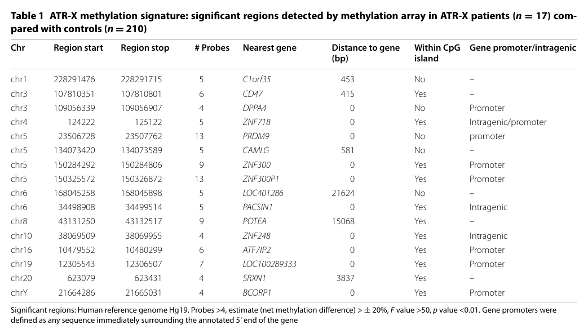

## Question

# Disease Characteristics Research Template

## Target Disease
- **Disease Name:** ATR-X Syndrome
- **MONDO ID:**  (if available)
- **Category:** Mendelian

## Research Objectives

Please provide a comprehensive research report on **ATR-X Syndrome** covering all of the
disease characteristics listed below. This report will be used to populate a disease knowledge
base entry. Be thorough and cite primary literature (PMID preferred) for all claims.

For each section, **suggested databases/resources** are listed. These are the first places
you should search for information on each topic.

---

### 1. Disease Information
> **Search first:** OMIM, Orphanet, ICD-10/ICD-11, MeSH, PubMed

- What is the disease? Provide a concise overview.
- What are the key identifiers? (OMIM, Orphanet, ICD-10/ICD-11, MeSH, Mondo)
- What are the common synonyms and alternative names?
- Is the information derived from individual patients (e.g., EHR) or aggregated disease-level resources?

### 2. Etiology

- **Disease Causal Factors**: What are the primary causes? (genetic, environmental, infectious, mechanistic)
- **Risk Factors**:
  > **Search first:** PubMed, Cochrane Library, UpToDate, clinical guidelines, ClinVar, ClinGen, GWAS Catalog, PheGenI, CTD, CDC, WHO, epidemiological databases
  - Genetic risk factors (causal variants, susceptibility loci, modifier genes)
  - Environmental risk factors (toxins, lifestyle, occupational exposures, age, sex, family history)
- **Protective Factors**:
  > **Search first:** PubMed, Cochrane Library, clinical trial databases, GWAS Catalog, gnomAD, WHO, CDC, nutrition databases
  - Genetic protective factors (protective variants, modifier alleles)
  - Environmental protective factors (diet, lifestyle, exposures that reduce risk)
- **Gene-Environment Interactions**: How do genetic and environmental factors interact to influence disease?
  > **Search first:** CTD, PubMed, PheGenI, GxE databases

### 3. Phenotypes
> **Search first:** HPO (Human Phenotype Ontology), OMIM, Orphanet, PubMed, clinicaltrials.gov, MedDRA, SNOMED CT, DECIPHER, LOINC

For each phenotype, provide:
- **Phenotype type**: symptoms, clinical signs, physical manifestations, behavioral changes, or laboratory abnormalities
  > For symptoms/signs: HPO, OMIM, Orphanet, PubMed
  > For behavioral changes: HPO, DSM, RDoC (Research Domain Criteria), PubMed
  > For laboratory abnormalities: LOINC, SNOMED CT, LabTests Online, PubMed
- **Phenotype characteristics**:
  > **Search first:** OMIM, Orphanet, HPO, PubMed
  - Age of symptom onset (neonatal, childhood, adult-onset, late-onset)
  - Symptom severity (mild, moderate, severe, variable)
  - Symptom progression (stable, progressive, episodic, fluctuating)
  - Frequency among affected individuals (percentage or qualitative)
- **Quality of life impact**: Effects on daily functioning and well-being (per-phenotype when possible)
  > **Search first:** EQ-5D database, SF-36, WHO QOL databases, PubMed
- Suggest HPO (Human Phenotype Ontology) terms for each phenotype

### 4. Genetic/Molecular Information

- **Causal Genes**: Gene mutations or chromosomal abnormalities responsible for disease (gene symbols, OMIM IDs)
  > **Search first:** OMIM, ClinVar, HGMD, Ensembl, NCBI Gene
- **Pathogenic Variants**:
  - Affected genes (gene symbols, HGNC IDs)
    > **Search first:** OMIM, NCBI Gene, Ensembl, HGNC, UniProt, GeneCards
  - Variant classification (pathogenic, likely pathogenic, VUS per ACMG/AMP guidelines)
    > **Search first:** ClinVar, ClinGen, ACMG/AMP guidelines, VarSome
  - Variant type/class (missense, frameshift, nonsense, splice-site, structural)
  - Allele frequency in population databases
    > **Search first:** gnomAD, 1000 Genomes, ExAC, TOPMed, dbSNP
  - Somatic vs germline origin
    > **Search first:** COSMIC (somatic), ClinVar, ICGC, TCGA
  - Functional consequences (loss of function, gain of function, dominant negative)
- **Modifier Genes**: Genes that modify disease severity or expression
- **Epigenetic Information**: DNA methylation, histone modifications, chromatin changes affecting disease
  > **Search first:** ENCODE, Roadmap Epigenomics, MethBase, DiseaseMeth
- **Chromosomal Abnormalities**: Large-scale genetic changes (aneuploidy, translocations, inversions)
  > **Search first:** DECIPHER, ClinVar, ECARUCA, UCSC Genome Browser

### 5. Environmental Information

- **Environmental Factors**: Non-genetic contributing factors (toxins, radiation, pollution, occupational exposure)
  > **Search first:** CTD (Comparative Toxicogenomics Database), TOXNET, PubMed, EPA databases
- **Lifestyle Factors**: Behavioral factors (smoking, diet, exercise, alcohol consumption)
  > **Search first:** CDC databases, WHO, PubMed, NHANES
- **Infectious Agents**: If applicable, pathogens causing or triggering disease (bacteria, viruses, fungi, parasites)
  > **Search first:** NCBI Taxonomy, ViPR, BV-BRC, MicrobeDB, GIDEON

### 6. Mechanism / Pathophysiology

- **Molecular Pathways**: Specific signaling cascades or biochemical pathways involved (Wnt, MAPK, mTOR, PI3K-AKT, etc.)
  > **Search first:** KEGG, Reactome, WikiPathways, PathBank, BioCyc
- **Cellular Processes**: Cell-level mechanisms (apoptosis, autophagy, cell cycle dysregulation, inflammation, etc.)
  > **Search first:** Gene Ontology (GO), Reactome, KEGG, PubMed
- **Protein Dysfunction**: How protein structure or function is altered (misfolding, aggregation, loss of function, gain of function)
  > **Search first:** UniProt, PDB (Protein Data Bank), InterPro, Pfam, AlphaFold
- **Metabolic Changes**: Alterations in metabolic processes (energy metabolism, lipid metabolism, amino acid metabolism)
  > **Search first:** KEGG, BioCyc, HMDB (Human Metabolome Database), BRENDA
- **Immune System Involvement**: Role of immune response (autoimmunity, immunodeficiency, chronic inflammation)
  > **Search first:** ImmPort, Immunome Database, IEDB, Gene Ontology
- **Tissue Damage Mechanisms**: How tissues/ are injured (oxidative stress, ischemia, fibrosis, necrosis)
  > **Search first:** PubMed, Gene Ontology, Reactome
- **Biochemical Abnormalities**: Specific molecular defects (enzyme deficiencies, receptor dysfunction, ion channel defects)
  > **Search first:** BRENDA, UniProt, KEGG, OMIM, PubMed
- **Epigenetic Changes**: DNA methylation, histone modifications affecting gene expression in disease
  > **Search first:** ENCODE, Roadmap Epigenomics, MethBase, DiseaseMeth
- **Molecular Profiling** (if available):
  - Transcriptomics/gene expression changes
    > **Search first:** GEO (Gene Expression Omnibus), ArrayExpress, GTEx, Human Cell Atlas, SRA
  - Proteomics findings
    > **Search first:** PRIDE, ProteomeXchange, Human Protein Atlas, STRING, BioGRID
  - Metabolomics signatures
    > **Search first:** MetaboLights, Metabolomics Workbench, HMDB, METLIN
  - Lipidomics alterations
    > **Search first:** LIPID MAPS, SwissLipids, LipidHome, Metabolomics Workbench
  - Genomic structural features
    > **Search first:** UCSC Genome Browser, Ensembl, NCBI, dbVar, DGV
- **Advanced Technologies** (if applicable):
  - Single-cell analysis findings (cell-type specific mechanisms, cellular heterogeneity)
    > **Search first:** Human Cell Atlas, Single Cell Portal, GEO, CELLxGENE
  - Spatial transcriptomics findings
    > **Search first:** GEO, Spatial Research, Vizgen, 10x Genomics data
  - Multi-omics integration results
    > **Search first:** TCGA, ICGC, cBioPortal, LinkedOmics, PubMed
  - Functional genomics screens (CRISPR, RNAi)
    > **Search first:** DepMap, GenomeRNAi, PubMed, BioGRID ORCS

For each mechanism, describe:
- The causal chain from initial trigger to clinical manifestation
- Which mechanisms are upstream vs downstream
- What cell types and biological processes are involved
- Suggest GO terms for biological processes and CL terms for cell types

### 7. Anatomical Structures Affected

- **Organ Level**:
  - Primary organs directly affected
  - Secondary organ involvement (complications, secondary effects)
  - Body systems involved (cardiovascular, nervous, digestive, respiratory, endocrine, etc.)
  > **Search first:** Uberon, FMA (Foundational Model of Anatomy), OMIM, HPO, ICD-11, MeSH, SNOMED CT
- **Tissue and Cell Level**:
  - Specific tissue types affected (epithelial, connective, muscle, nervous)
  - Specific cell populations targeted (with Cell Ontology terms)
  > **Search first:** Uberon, Human Protein Atlas, Cell Ontology, Human Cell Atlas, CellMarker, PanglaoDB
- **Subcellular Level**:
  - Cellular compartments involved (mitochondria, nucleus, ER, lysosomes) (with GO Cellular Component terms)
  > **Search first:** Gene Ontology (Cellular Component), UniProt, Human Protein Atlas
- **Localization**:
  - Specific anatomical sites (with UBERON terms)
    > **Search first:** FMA, Uberon, NeuroNames (for brain), SNOMED CT
  - Lateralization (unilateral, bilateral, asymmetric)
    > **Search first:** HPO, clinical literature, imaging databases

### 8. Temporal Development

- **Onset**:
  - Typical age of onset (congenital, pediatric, adult, geriatric)
  - Onset pattern (acute, subacute, chronic, insidious)
  > **Search first:** OMIM, Orphanet, HPO, PubMed
- **Progression**:
  - Disease stages (early, intermediate, advanced, end-stage)
    > **Search first:** Cancer Staging Manual (AJCC), WHO classifications, PubMed
  - Progression rate (rapid, slow, variable)
  - Disease course pattern (episodic, relapsing-remitting, progressive, stable)
  - Disease duration (self-limited, chronic lifelong)
  > **Search first:** Disease registries, longitudinal cohort databases, natural history studies, PubMed, Orphanet, OMIM
- **Patterns**:
  - Remission patterns (spontaneous, treatment-induced)
    > **Search first:** Clinical trial databases, disease registries, PubMed
  - Critical periods (time windows of vulnerability or opportunity for intervention)
    > **Search first:** PubMed, developmental biology databases, clinical guidelines

### 9. Inheritance and Population

- **Epidemiology**:
  - Prevalence (cases per 100,000 at given time)
  - Incidence (new cases per 100,000 per year)
  > **Search first:** Orphanet, CDC, WHO, GBD (Global Burden of Disease), national registries, SEER, disease registries
- **For Genetic Etiology**:
  - Inheritance pattern (AD, AR, X-linked, mitochondrial, multifactorial, polygenic)
    > **Search first:** OMIM, Orphanet, ClinVar, GTR (Genetic Testing Registry)
  - Penetrance (complete, incomplete, age-dependent)
    > **Search first:** ClinVar, OMIM, PubMed, ClinGen
  - Expressivity (variable, consistent)
    > **Search first:** OMIM, ClinVar, PubMed
  - Genetic anticipation (increasing severity in successive generations)
    > **Search first:** OMIM, PubMed (especially for repeat expansion disorders)
  - Germline mosaicism
    > **Search first:** ClinVar, OMIM, genetic counseling literature, PubMed
  - Founder effects (population-specific mutations)
    > **Search first:** gnomAD, population genetics databases, PubMed
  - Consanguinity role
    > **Search first:** OMIM, population studies, genetic counseling resources
  - Carrier frequency
    > **Search first:** gnomAD, carrier screening databases, GeneReviews, GTR
- **Population Demographics**:
  - Affected populations (ethnic or demographic groups with higher prevalence)
    > **Search first:** gnomAD, 1000 Genomes, PAGE Study, PubMed, population registries
  - Geographic distribution (endemic areas, regional variation)
    > **Search first:** WHO, CDC, GBD, Orphanet, geographic epidemiology databases
  - Geographic distribution of specific variants
  - Sex ratio (male:female)
    > **Search first:** Disease registries, OMIM, PubMed, epidemiological databases
  - Age distribution of affected individuals
    > **Search first:** CDC, disease registries, SEER, Orphanet

### 10. Diagnostics

- **Clinical Tests**:
  - Laboratory tests (blood, urine, tissue chemistry, specific enzyme assays)
    > **Search first:** LOINC, LabTests Online, PubMed
  - Biomarkers (proteins, metabolites, genetic markers, circulating biomarkers)
    > **Search first:** FDA Biomarker List, BEST (Biomarkers, EndpointS, and other Tools), PubMed
  - Imaging studies (X-ray, CT, MRI, PET, ultrasound)
    > **Search first:** RadLex, DICOM, Radiopaedia, imaging databases
  - Functional tests (pulmonary function, cardiac stress tests)
    > **Search first:** LOINC, clinical guidelines, PubMed
  - Electrophysiology (EEG, EMG, ECG, nerve conduction studies)
    > **Search first:** LOINC, clinical neurophysiology databases, PubMed
  - Biopsy findings (histopathology, immunohistochemistry)
    > **Search first:** SNOMED CT, College of American Pathologists resources, PubMed
  - Pathology findings (microscopic examination)
    > **Search first:** SNOMED CT, Digital Pathology databases, PubMed
- **Genetic Testing**:
  > **Search first:** GTR (Genetic Testing Registry), GeneReviews, ClinGen
  - Overview of recommended genetic testing approach
  - Whole genome sequencing (WGS) utility
    > **Search first:** GTR, ClinVar, GEL (Genomics England), gnomAD
  - Whole exome sequencing (WES) utility
    > **Search first:** GTR, ClinVar, OMIM, GeneMatcher
  - Gene panels (which panels, which genes)
    > **Search first:** GTR, ClinVar, laboratory-specific databases
  - Single gene testing
    > **Search first:** GTR, ClinVar, OMIM, GeneReviews
  - Chromosomal microarray (CMA)
    > **Search first:** DECIPHER, ClinVar, dbVar, ECARUCA
  - Karyotyping
    > **Search first:** Chromosome Abnormality Database, ClinVar, cytogenetics resources
  - FISH
    > **Search first:** ClinVar, cytogenetics databases, PubMed
  - Mitochondrial DNA testing
    > **Search first:** MITOMAP, MSeqDR, ClinVar, GTR
  - Repeat expansion testing
    > **Search first:** GTR, ClinVar, repeat expansion databases, PubMed
- **Omics-Based Diagnostics** (if applicable):
  - RNA sequencing / transcriptomics
    > **Search first:** GEO, ArrayExpress, GTEx, RNA-seq databases
  - Proteomics
    > **Search first:** PRIDE, ProteomeXchange, FDA Biomarker database
  - Metabolomics
    > **Search first:** MetaboLights, Metabolomics Workbench, HMDB
  - Epigenomics
    > **Search first:** GEO, ENCODE, Roadmap Epigenomics, MethBase
  - Liquid biopsy
    > **Search first:** COSMIC, ClinVar, liquid biopsy databases, PubMed
- **Clinical Criteria**:
  - Standardized diagnostic criteria (DSM, ICD, society guidelines)
    > **Search first:** DSM-5, ICD-11, clinical society guidelines, UpToDate
  - Differential diagnosis (other conditions to rule out, with distinguishing features)
    > **Search first:** DynaMed, UpToDate, clinical decision support systems
- **Screening**:
  - Screening methods for asymptomatic individuals (newborn screening, carrier screening, cascade screening)
    > **Search first:** ACMG recommendations, CDC newborn screening, GTR

### 11. Outcome/Prognosis

- **Survival and Mortality**:
  - Survival rate (5-year, 10-year, overall)
    > **Search first:** SEER, cancer registries, disease-specific registries, PubMed
  - Life expectancy (with and without treatment if applicable)
    > **Search first:** Orphanet, disease registries, actuarial databases, PubMed
  - Mortality rate
    > **Search first:** CDC, WHO, GBD, national mortality databases
  - Disease-specific mortality (deaths directly attributable to disease)
    > **Search first:** Disease registries, CDC Wonder, GBD, PubMed
- **Morbidity and Function**:
  - Morbidity (disease-related disability and health impacts)
    > **Search first:** GBD, WHO, disability databases, PubMed
  - Disability outcomes (long-term functional impairments)
    > **Search first:** ICF (International Classification of Functioning), disability registries
  - Quality of life measures (EQ-5D, SF-36, PROMIS, disease-specific tools)
    > **Search first:** EQ-5D database, SF-36, PROMIS, PubMed
- **Disease Course**:
  - Complications (secondary problems: infections, organ failure, etc.)
    > **Search first:** ICD codes, disease registries, clinical databases, PubMed
  - Recovery potential (likelihood and extent of recovery, with vs without treatment)
    > **Search first:** Natural history studies, rehabilitation databases, PubMed
- **Prediction**:
  - Prognostic factors (age, disease severity, biomarkers, treatment response)
    > **Search first:** Prognostic models databases, clinical calculators, PubMed
  - Prognostic biomarkers (molecular markers predicting disease course)
    > **Search first:** FDA Biomarker database, PubMed, cancer prognostic databases

### 12. Treatment

- **Pharmacotherapy**:
  - Pharmacological treatments (drug names, drug classes, mechanisms of action)
    > **Search first:** DrugBank, RxNorm, ATC classification, DailyMed, FDA databases
  - Pharmacogenomics (how genetic variants affect drug metabolism, efficacy, toxicity)
    > **Search first:** PharmGKB, CPIC (Clinical Pharmacogenetics), FDA Table of PGx Biomarkers
- **Advanced Therapeutics**:
  - Gene therapy (viral vectors, CRISPR, gene replacement, gene editing)
    > **Search first:** ClinicalTrials.gov, FDA gene therapy database, ASGCT resources
  - Cell therapy (stem cell transplant, CAR-T, cellular therapeutics)
    > **Search first:** ClinicalTrials.gov, FDA cell therapy database, FACT standards
  - RNA-based therapies (ASOs, siRNA, mRNA therapies)
    > **Search first:** ClinicalTrials.gov, FDA approvals, PubMed
  - Targeted therapies (treatments directed at specific molecular targets)
    > **Search first:** My Cancer Genome, OncoKB, ClinicalTrials.gov, FDA approvals
  - Immunotherapies (checkpoint inhibitors, monoclonal antibodies)
    > **Search first:** Cancer Immunotherapy Database, FDA approvals, ClinicalTrials.gov
- **Surgical and Interventional**:
  - Surgical interventions (types of surgery, timing, outcomes)
    > **Search first:** CPT codes, surgical registries, clinical guidelines, PubMed
- **Supportive and Rehabilitative**:
  - Supportive care (symptom management, pain control, nutrition)
    > **Search first:** Clinical guidelines, Cochrane Library, PubMed
  - Rehabilitation (physical therapy, occupational therapy, speech therapy)
    > **Search first:** Rehabilitation medicine databases, clinical guidelines, PubMed
- **Experimental**:
  - Experimental treatments in clinical trials (with NCT identifiers if available)
    > **Search first:** ClinicalTrials.gov, EU Clinical Trials Register, WHO ICTRP
- **Treatment Outcomes**:
  - Treatment response rates
    > **Search first:** Clinical trial databases, FDA reviews, systematic reviews, PubMed
  - Side effects and adverse events
    > **Search first:** FDA Adverse Event Reporting System (FAERS), MedWatch, PubMed
- **Treatment Strategy**:
  - Treatment algorithms (clinical pathways, decision trees)
    > **Search first:** Clinical practice guidelines, NCCN Guidelines, UpToDate
  - Combination therapies
    > **Search first:** ClinicalTrials.gov, treatment guidelines, PubMed
  - Personalized medicine approaches (genotype-guided treatment)
    > **Search first:** My Cancer Genome, CIViC, PharmGKB, precision medicine databases

For each treatment, suggest MAXO (Medical Action Ontology) terms where applicable.

### 13. Prevention

- **Prevention Levels**:
  - Primary prevention (preventing disease occurrence: vaccination, risk factor modification)
    > **Search first:** CDC, WHO, USPSTF recommendations, Cochrane Library
  - Secondary prevention (early detection and treatment: screening programs, early intervention)
    > **Search first:** USPSTF, CDC screening guidelines, WHO
  - Tertiary prevention (preventing complications in those with disease)
    > **Search first:** Clinical guidelines, disease management protocols, PubMed
- **Immunization**: Vaccine strategies (if applicable)
  > **Search first:** CDC vaccine schedules, WHO immunization, FDA vaccine database
- **Screening and Early Detection**:
  - Screening programs (population-based: newborn screening, cancer screening)
    > **Search first:** CDC screening programs, USPSTF, cancer screening databases
  - Genetic screening (carrier screening, preimplantation genetic diagnosis, prenatal testing)
    > **Search first:** ACMG recommendations, ACOG guidelines, GTR
  - Risk stratification (identifying high-risk individuals for targeted prevention)
    > **Search first:** Risk prediction models, clinical calculators, PubMed
- **Behavioral Interventions**: Lifestyle modifications to reduce risk
  > **Search first:** CDC, WHO, behavioral intervention databases, Cochrane Library
- **Counseling**: Genetic counseling (risk assessment, family planning guidance)
  > **Search first:** NSGC resources, ACMG guidelines, GeneReviews
- **Public Health**:
  - Public health interventions (sanitation, vector control, health education)
    > **Search first:** CDC, WHO, public health databases, PubMed
  - Environmental interventions (reducing environmental risk factors)
    > **Search first:** EPA databases, WHO environmental health, PubMed
- **Prophylaxis**: Preventive medications or procedures
  > **Search first:** Clinical guidelines, FDA approvals, PubMed

### 14. Other Species / Natural Disease

- **Taxonomy**: Species affected (with NCBI Taxon identifiers)
  > **Search first:** NCBI Taxonomy
- **Breed**: Specific breeds affected (with VBO identifiers if applicable)
  > **Search first:** VBO (Vertebrate Breed Ontology)
- **Gene**: Orthologous genes in other species (with NCBI Gene IDs)
  > **Search first:** NCBI Gene
- **Natural Disease**:
  - Naturally occurring disease in other species (companion animals, wildlife)
    > **Search first:** OMIA (Online Mendelian Inheritance in Animals), VetCompass, PubMed
  - Veterinary relevance and importance in animal health
    > **Search first:** OMIA, veterinary databases, PubMed
- **Comparative Biology**:
  - Comparative pathology (similarities and differences across species)
    > **Search first:** OMIA, comparative pathology databases, PubMed
  - Evolutionary conservation of disease mechanisms
    > **Search first:** HomoloGene, OrthoMCL, Alliance of Genome Resources
- **Transmission** (if applicable):
  - Zoonotic potential
    > **Search first:** CDC zoonotic diseases, WHO zoonoses, GIDEON
  - Cross-species susceptibility
    > **Search first:** NCBI Taxonomy, veterinary databases, PubMed

### 15. Model Organisms

- **Model Types**:
  - Model organism type (mammalian, invertebrate, cellular, in vitro)
    > **Search first:** Alliance of Genome Resources, model organism databases
  - Specific model systems (mouse, rat, zebrafish, Drosophila, C. elegans, yeast, cell lines, organoids, iPSCs)
    > **Search first:** MGI, RGD, ZFIN, FlyBase, WormBase, SGD, ATCC, Cellosaurus
  - Induced models (drug treatment, surgical intervention, environmental manipulation)
    > **Search first:** MGI, model organism databases, PubMed
- **Genetic Models**:
  - Types available (knockout, knock-in, transgenic, conditional, humanized)
    > **Search first:** MGI, IMPC, KOMP, EuMMCR, IMSR
- **Model Characteristics**:
  - Phenotype recapitulation (how well model reproduces human disease features)
    > **Search first:** Model organism databases, comparative studies, PubMed
  - Model limitations (aspects of human disease not captured)
    > **Search first:** Model organism databases, PubMed, review articles
- **Applications**:
  - Research applications (what aspects of disease can be studied)
    > **Search first:** Model organism databases, PubMed
- **Resources**:
  - Model databases
    > **Search first:** MGI, RGD, ZFIN, FlyBase, WormBase, IMSR, EMMA, MMRRC

---

## Citation Requirements

- Cite primary literature (PMID preferred) for all mechanistic and clinical claims
- Prioritize recent reviews and landmark papers
- Include direct quotes from abstracts where possible to support key statements
- Distinguish evidence source types: human clinical, model organism, in vitro, computational

## Output Format

Structure your response as a comprehensive narrative organized by the sections above.
For each section, provide:
- Factual content with specific details (numbers, percentages, gene names, variant nomenclature)
- Ontology term suggestions (HPO, GO, CL, UBERON, CHEBI, MAXO, MONDO) where applicable
- Evidence citations with PMIDs
- Direct quotes from abstracts to support key claims
- Clear indication when information is not available or not applicable for this disease

This report will be used to populate a disease knowledge base entry with:
- Pathophysiology descriptions with causal chains
- Gene/protein annotations (HGNC, GO terms)
- Phenotype associations (HP terms) with frequencies
- Cell type involvement (CL terms)
- Anatomical locations (UBERON terms)
- Chemical entities (CHEBI terms)
- Treatment annotations (MAXO terms)
- Evidence items with PMIDs and exact abstract quotes
- Epidemiology, prognosis, diagnostic, and prevention information
- Animal model descriptions with phenotype recapitulation details

## Output

Question: You are an expert researcher providing comprehensive, well-cited information.

Provide detailed information focusing on:
1. Key concepts and definitions with current understanding
2. Recent developments and latest research (prioritize 2023-2024 sources)
3. Current applications and real-world implementations
4. Expert opinions and analysis from authoritative sources
5. Relevant statistics and data from recent studies

Format as a comprehensive research report with proper citations. Include URLs and publication dates where available.
Always prioritize recent, authoritative sources and provide specific citations for all major claims.

# Disease Characteristics Research Template

## Target Disease
- **Disease Name:** ATR-X Syndrome
- **MONDO ID:**  (if available)
- **Category:** Mendelian

## Research Objectives

Please provide a comprehensive research report on **ATR-X Syndrome** covering all of the
disease characteristics listed below. This report will be used to populate a disease knowledge
base entry. Be thorough and cite primary literature (PMID preferred) for all claims.

For each section, **suggested databases/resources** are listed. These are the first places
you should search for information on each topic.

---

### 1. Disease Information
> **Search first:** OMIM, Orphanet, ICD-10/ICD-11, MeSH, PubMed

- What is the disease? Provide a concise overview.
- What are the key identifiers? (OMIM, Orphanet, ICD-10/ICD-11, MeSH, Mondo)
- What are the common synonyms and alternative names?
- Is the information derived from individual patients (e.g., EHR) or aggregated disease-level resources?

### 2. Etiology

- **Disease Causal Factors**: What are the primary causes? (genetic, environmental, infectious, mechanistic)
- **Risk Factors**:
  > **Search first:** PubMed, Cochrane Library, UpToDate, clinical guidelines, ClinVar, ClinGen, GWAS Catalog, PheGenI, CTD, CDC, WHO, epidemiological databases
  - Genetic risk factors (causal variants, susceptibility loci, modifier genes)
  - Environmental risk factors (toxins, lifestyle, occupational exposures, age, sex, family history)
- **Protective Factors**:
  > **Search first:** PubMed, Cochrane Library, clinical trial databases, GWAS Catalog, gnomAD, WHO, CDC, nutrition databases
  - Genetic protective factors (protective variants, modifier alleles)
  - Environmental protective factors (diet, lifestyle, exposures that reduce risk)
- **Gene-Environment Interactions**: How do genetic and environmental factors interact to influence disease?
  > **Search first:** CTD, PubMed, PheGenI, GxE databases

### 3. Phenotypes
> **Search first:** HPO (Human Phenotype Ontology), OMIM, Orphanet, PubMed, clinicaltrials.gov, MedDRA, SNOMED CT, DECIPHER, LOINC

For each phenotype, provide:
- **Phenotype type**: symptoms, clinical signs, physical manifestations, behavioral changes, or laboratory abnormalities
  > For symptoms/signs: HPO, OMIM, Orphanet, PubMed
  > For behavioral changes: HPO, DSM, RDoC (Research Domain Criteria), PubMed
  > For laboratory abnormalities: LOINC, SNOMED CT, LabTests Online, PubMed
- **Phenotype characteristics**:
  > **Search first:** OMIM, Orphanet, HPO, PubMed
  - Age of symptom onset (neonatal, childhood, adult-onset, late-onset)
  - Symptom severity (mild, moderate, severe, variable)
  - Symptom progression (stable, progressive, episodic, fluctuating)
  - Frequency among affected individuals (percentage or qualitative)
- **Quality of life impact**: Effects on daily functioning and well-being (per-phenotype when possible)
  > **Search first:** EQ-5D database, SF-36, WHO QOL databases, PubMed
- Suggest HPO (Human Phenotype Ontology) terms for each phenotype

### 4. Genetic/Molecular Information

- **Causal Genes**: Gene mutations or chromosomal abnormalities responsible for disease (gene symbols, OMIM IDs)
  > **Search first:** OMIM, ClinVar, HGMD, Ensembl, NCBI Gene
- **Pathogenic Variants**:
  - Affected genes (gene symbols, HGNC IDs)
    > **Search first:** OMIM, NCBI Gene, Ensembl, HGNC, UniProt, GeneCards
  - Variant classification (pathogenic, likely pathogenic, VUS per ACMG/AMP guidelines)
    > **Search first:** ClinVar, ClinGen, ACMG/AMP guidelines, VarSome
  - Variant type/class (missense, frameshift, nonsense, splice-site, structural)
  - Allele frequency in population databases
    > **Search first:** gnomAD, 1000 Genomes, ExAC, TOPMed, dbSNP
  - Somatic vs germline origin
    > **Search first:** COSMIC (somatic), ClinVar, ICGC, TCGA
  - Functional consequences (loss of function, gain of function, dominant negative)
- **Modifier Genes**: Genes that modify disease severity or expression
- **Epigenetic Information**: DNA methylation, histone modifications, chromatin changes affecting disease
  > **Search first:** ENCODE, Roadmap Epigenomics, MethBase, DiseaseMeth
- **Chromosomal Abnormalities**: Large-scale genetic changes (aneuploidy, translocations, inversions)
  > **Search first:** DECIPHER, ClinVar, ECARUCA, UCSC Genome Browser

### 5. Environmental Information

- **Environmental Factors**: Non-genetic contributing factors (toxins, radiation, pollution, occupational exposure)
  > **Search first:** CTD (Comparative Toxicogenomics Database), TOXNET, PubMed, EPA databases
- **Lifestyle Factors**: Behavioral factors (smoking, diet, exercise, alcohol consumption)
  > **Search first:** CDC databases, WHO, PubMed, NHANES
- **Infectious Agents**: If applicable, pathogens causing or triggering disease (bacteria, viruses, fungi, parasites)
  > **Search first:** NCBI Taxonomy, ViPR, BV-BRC, MicrobeDB, GIDEON

### 6. Mechanism / Pathophysiology

- **Molecular Pathways**: Specific signaling cascades or biochemical pathways involved (Wnt, MAPK, mTOR, PI3K-AKT, etc.)
  > **Search first:** KEGG, Reactome, WikiPathways, PathBank, BioCyc
- **Cellular Processes**: Cell-level mechanisms (apoptosis, autophagy, cell cycle dysregulation, inflammation, etc.)
  > **Search first:** Gene Ontology (GO), Reactome, KEGG, PubMed
- **Protein Dysfunction**: How protein structure or function is altered (misfolding, aggregation, loss of function, gain of function)
  > **Search first:** UniProt, PDB (Protein Data Bank), InterPro, Pfam, AlphaFold
- **Metabolic Changes**: Alterations in metabolic processes (energy metabolism, lipid metabolism, amino acid metabolism)
  > **Search first:** KEGG, BioCyc, HMDB (Human Metabolome Database), BRENDA
- **Immune System Involvement**: Role of immune response (autoimmunity, immunodeficiency, chronic inflammation)
  > **Search first:** ImmPort, Immunome Database, IEDB, Gene Ontology
- **Tissue Damage Mechanisms**: How tissues/ are injured (oxidative stress, ischemia, fibrosis, necrosis)
  > **Search first:** PubMed, Gene Ontology, Reactome
- **Biochemical Abnormalities**: Specific molecular defects (enzyme deficiencies, receptor dysfunction, ion channel defects)
  > **Search first:** BRENDA, UniProt, KEGG, OMIM, PubMed
- **Epigenetic Changes**: DNA methylation, histone modifications affecting gene expression in disease
  > **Search first:** ENCODE, Roadmap Epigenomics, MethBase, DiseaseMeth
- **Molecular Profiling** (if available):
  - Transcriptomics/gene expression changes
    > **Search first:** GEO (Gene Expression Omnibus), ArrayExpress, GTEx, Human Cell Atlas, SRA
  - Proteomics findings
    > **Search first:** PRIDE, ProteomeXchange, Human Protein Atlas, STRING, BioGRID
  - Metabolomics signatures
    > **Search first:** MetaboLights, Metabolomics Workbench, HMDB, METLIN
  - Lipidomics alterations
    > **Search first:** LIPID MAPS, SwissLipids, LipidHome, Metabolomics Workbench
  - Genomic structural features
    > **Search first:** UCSC Genome Browser, Ensembl, NCBI, dbVar, DGV
- **Advanced Technologies** (if applicable):
  - Single-cell analysis findings (cell-type specific mechanisms, cellular heterogeneity)
    > **Search first:** Human Cell Atlas, Single Cell Portal, GEO, CELLxGENE
  - Spatial transcriptomics findings
    > **Search first:** GEO, Spatial Research, Vizgen, 10x Genomics data
  - Multi-omics integration results
    > **Search first:** TCGA, ICGC, cBioPortal, LinkedOmics, PubMed
  - Functional genomics screens (CRISPR, RNAi)
    > **Search first:** DepMap, GenomeRNAi, PubMed, BioGRID ORCS

For each mechanism, describe:
- The causal chain from initial trigger to clinical manifestation
- Which mechanisms are upstream vs downstream
- What cell types and biological processes are involved
- Suggest GO terms for biological processes and CL terms for cell types

### 7. Anatomical Structures Affected

- **Organ Level**:
  - Primary organs directly affected
  - Secondary organ involvement (complications, secondary effects)
  - Body systems involved (cardiovascular, nervous, digestive, respiratory, endocrine, etc.)
  > **Search first:** Uberon, FMA (Foundational Model of Anatomy), OMIM, HPO, ICD-11, MeSH, SNOMED CT
- **Tissue and Cell Level**:
  - Specific tissue types affected (epithelial, connective, muscle, nervous)
  - Specific cell populations targeted (with Cell Ontology terms)
  > **Search first:** Uberon, Human Protein Atlas, Cell Ontology, Human Cell Atlas, CellMarker, PanglaoDB
- **Subcellular Level**:
  - Cellular compartments involved (mitochondria, nucleus, ER, lysosomes) (with GO Cellular Component terms)
  > **Search first:** Gene Ontology (Cellular Component), UniProt, Human Protein Atlas
- **Localization**:
  - Specific anatomical sites (with UBERON terms)
    > **Search first:** FMA, Uberon, NeuroNames (for brain), SNOMED CT
  - Lateralization (unilateral, bilateral, asymmetric)
    > **Search first:** HPO, clinical literature, imaging databases

### 8. Temporal Development

- **Onset**:
  - Typical age of onset (congenital, pediatric, adult, geriatric)
  - Onset pattern (acute, subacute, chronic, insidious)
  > **Search first:** OMIM, Orphanet, HPO, PubMed
- **Progression**:
  - Disease stages (early, intermediate, advanced, end-stage)
    > **Search first:** Cancer Staging Manual (AJCC), WHO classifications, PubMed
  - Progression rate (rapid, slow, variable)
  - Disease course pattern (episodic, relapsing-remitting, progressive, stable)
  - Disease duration (self-limited, chronic lifelong)
  > **Search first:** Disease registries, longitudinal cohort databases, natural history studies, PubMed, Orphanet, OMIM
- **Patterns**:
  - Remission patterns (spontaneous, treatment-induced)
    > **Search first:** Clinical trial databases, disease registries, PubMed
  - Critical periods (time windows of vulnerability or opportunity for intervention)
    > **Search first:** PubMed, developmental biology databases, clinical guidelines

### 9. Inheritance and Population

- **Epidemiology**:
  - Prevalence (cases per 100,000 at given time)
  - Incidence (new cases per 100,000 per year)
  > **Search first:** Orphanet, CDC, WHO, GBD (Global Burden of Disease), national registries, SEER, disease registries
- **For Genetic Etiology**:
  - Inheritance pattern (AD, AR, X-linked, mitochondrial, multifactorial, polygenic)
    > **Search first:** OMIM, Orphanet, ClinVar, GTR (Genetic Testing Registry)
  - Penetrance (complete, incomplete, age-dependent)
    > **Search first:** ClinVar, OMIM, PubMed, ClinGen
  - Expressivity (variable, consistent)
    > **Search first:** OMIM, ClinVar, PubMed
  - Genetic anticipation (increasing severity in successive generations)
    > **Search first:** OMIM, PubMed (especially for repeat expansion disorders)
  - Germline mosaicism
    > **Search first:** ClinVar, OMIM, genetic counseling literature, PubMed
  - Founder effects (population-specific mutations)
    > **Search first:** gnomAD, population genetics databases, PubMed
  - Consanguinity role
    > **Search first:** OMIM, population studies, genetic counseling resources
  - Carrier frequency
    > **Search first:** gnomAD, carrier screening databases, GeneReviews, GTR
- **Population Demographics**:
  - Affected populations (ethnic or demographic groups with higher prevalence)
    > **Search first:** gnomAD, 1000 Genomes, PAGE Study, PubMed, population registries
  - Geographic distribution (endemic areas, regional variation)
    > **Search first:** WHO, CDC, GBD, Orphanet, geographic epidemiology databases
  - Geographic distribution of specific variants
  - Sex ratio (male:female)
    > **Search first:** Disease registries, OMIM, PubMed, epidemiological databases
  - Age distribution of affected individuals
    > **Search first:** CDC, disease registries, SEER, Orphanet

### 10. Diagnostics

- **Clinical Tests**:
  - Laboratory tests (blood, urine, tissue chemistry, specific enzyme assays)
    > **Search first:** LOINC, LabTests Online, PubMed
  - Biomarkers (proteins, metabolites, genetic markers, circulating biomarkers)
    > **Search first:** FDA Biomarker List, BEST (Biomarkers, EndpointS, and other Tools), PubMed
  - Imaging studies (X-ray, CT, MRI, PET, ultrasound)
    > **Search first:** RadLex, DICOM, Radiopaedia, imaging databases
  - Functional tests (pulmonary function, cardiac stress tests)
    > **Search first:** LOINC, clinical guidelines, PubMed
  - Electrophysiology (EEG, EMG, ECG, nerve conduction studies)
    > **Search first:** LOINC, clinical neurophysiology databases, PubMed
  - Biopsy findings (histopathology, immunohistochemistry)
    > **Search first:** SNOMED CT, College of American Pathologists resources, PubMed
  - Pathology findings (microscopic examination)
    > **Search first:** SNOMED CT, Digital Pathology databases, PubMed
- **Genetic Testing**:
  > **Search first:** GTR (Genetic Testing Registry), GeneReviews, ClinGen
  - Overview of recommended genetic testing approach
  - Whole genome sequencing (WGS) utility
    > **Search first:** GTR, ClinVar, GEL (Genomics England), gnomAD
  - Whole exome sequencing (WES) utility
    > **Search first:** GTR, ClinVar, OMIM, GeneMatcher
  - Gene panels (which panels, which genes)
    > **Search first:** GTR, ClinVar, laboratory-specific databases
  - Single gene testing
    > **Search first:** GTR, ClinVar, OMIM, GeneReviews
  - Chromosomal microarray (CMA)
    > **Search first:** DECIPHER, ClinVar, dbVar, ECARUCA
  - Karyotyping
    > **Search first:** Chromosome Abnormality Database, ClinVar, cytogenetics resources
  - FISH
    > **Search first:** ClinVar, cytogenetics databases, PubMed
  - Mitochondrial DNA testing
    > **Search first:** MITOMAP, MSeqDR, ClinVar, GTR
  - Repeat expansion testing
    > **Search first:** GTR, ClinVar, repeat expansion databases, PubMed
- **Omics-Based Diagnostics** (if applicable):
  - RNA sequencing / transcriptomics
    > **Search first:** GEO, ArrayExpress, GTEx, RNA-seq databases
  - Proteomics
    > **Search first:** PRIDE, ProteomeXchange, FDA Biomarker database
  - Metabolomics
    > **Search first:** MetaboLights, Metabolomics Workbench, HMDB
  - Epigenomics
    > **Search first:** GEO, ENCODE, Roadmap Epigenomics, MethBase
  - Liquid biopsy
    > **Search first:** COSMIC, ClinVar, liquid biopsy databases, PubMed
- **Clinical Criteria**:
  - Standardized diagnostic criteria (DSM, ICD, society guidelines)
    > **Search first:** DSM-5, ICD-11, clinical society guidelines, UpToDate
  - Differential diagnosis (other conditions to rule out, with distinguishing features)
    > **Search first:** DynaMed, UpToDate, clinical decision support systems
- **Screening**:
  - Screening methods for asymptomatic individuals (newborn screening, carrier screening, cascade screening)
    > **Search first:** ACMG recommendations, CDC newborn screening, GTR

### 11. Outcome/Prognosis

- **Survival and Mortality**:
  - Survival rate (5-year, 10-year, overall)
    > **Search first:** SEER, cancer registries, disease-specific registries, PubMed
  - Life expectancy (with and without treatment if applicable)
    > **Search first:** Orphanet, disease registries, actuarial databases, PubMed
  - Mortality rate
    > **Search first:** CDC, WHO, GBD, national mortality databases
  - Disease-specific mortality (deaths directly attributable to disease)
    > **Search first:** Disease registries, CDC Wonder, GBD, PubMed
- **Morbidity and Function**:
  - Morbidity (disease-related disability and health impacts)
    > **Search first:** GBD, WHO, disability databases, PubMed
  - Disability outcomes (long-term functional impairments)
    > **Search first:** ICF (International Classification of Functioning), disability registries
  - Quality of life measures (EQ-5D, SF-36, PROMIS, disease-specific tools)
    > **Search first:** EQ-5D database, SF-36, PROMIS, PubMed
- **Disease Course**:
  - Complications (secondary problems: infections, organ failure, etc.)
    > **Search first:** ICD codes, disease registries, clinical databases, PubMed
  - Recovery potential (likelihood and extent of recovery, with vs without treatment)
    > **Search first:** Natural history studies, rehabilitation databases, PubMed
- **Prediction**:
  - Prognostic factors (age, disease severity, biomarkers, treatment response)
    > **Search first:** Prognostic models databases, clinical calculators, PubMed
  - Prognostic biomarkers (molecular markers predicting disease course)
    > **Search first:** FDA Biomarker database, PubMed, cancer prognostic databases

### 12. Treatment

- **Pharmacotherapy**:
  - Pharmacological treatments (drug names, drug classes, mechanisms of action)
    > **Search first:** DrugBank, RxNorm, ATC classification, DailyMed, FDA databases
  - Pharmacogenomics (how genetic variants affect drug metabolism, efficacy, toxicity)
    > **Search first:** PharmGKB, CPIC (Clinical Pharmacogenetics), FDA Table of PGx Biomarkers
- **Advanced Therapeutics**:
  - Gene therapy (viral vectors, CRISPR, gene replacement, gene editing)
    > **Search first:** ClinicalTrials.gov, FDA gene therapy database, ASGCT resources
  - Cell therapy (stem cell transplant, CAR-T, cellular therapeutics)
    > **Search first:** ClinicalTrials.gov, FDA cell therapy database, FACT standards
  - RNA-based therapies (ASOs, siRNA, mRNA therapies)
    > **Search first:** ClinicalTrials.gov, FDA approvals, PubMed
  - Targeted therapies (treatments directed at specific molecular targets)
    > **Search first:** My Cancer Genome, OncoKB, ClinicalTrials.gov, FDA approvals
  - Immunotherapies (checkpoint inhibitors, monoclonal antibodies)
    > **Search first:** Cancer Immunotherapy Database, FDA approvals, ClinicalTrials.gov
- **Surgical and Interventional**:
  - Surgical interventions (types of surgery, timing, outcomes)
    > **Search first:** CPT codes, surgical registries, clinical guidelines, PubMed
- **Supportive and Rehabilitative**:
  - Supportive care (symptom management, pain control, nutrition)
    > **Search first:** Clinical guidelines, Cochrane Library, PubMed
  - Rehabilitation (physical therapy, occupational therapy, speech therapy)
    > **Search first:** Rehabilitation medicine databases, clinical guidelines, PubMed
- **Experimental**:
  - Experimental treatments in clinical trials (with NCT identifiers if available)
    > **Search first:** ClinicalTrials.gov, EU Clinical Trials Register, WHO ICTRP
- **Treatment Outcomes**:
  - Treatment response rates
    > **Search first:** Clinical trial databases, FDA reviews, systematic reviews, PubMed
  - Side effects and adverse events
    > **Search first:** FDA Adverse Event Reporting System (FAERS), MedWatch, PubMed
- **Treatment Strategy**:
  - Treatment algorithms (clinical pathways, decision trees)
    > **Search first:** Clinical practice guidelines, NCCN Guidelines, UpToDate
  - Combination therapies
    > **Search first:** ClinicalTrials.gov, treatment guidelines, PubMed
  - Personalized medicine approaches (genotype-guided treatment)
    > **Search first:** My Cancer Genome, CIViC, PharmGKB, precision medicine databases

For each treatment, suggest MAXO (Medical Action Ontology) terms where applicable.

### 13. Prevention

- **Prevention Levels**:
  - Primary prevention (preventing disease occurrence: vaccination, risk factor modification)
    > **Search first:** CDC, WHO, USPSTF recommendations, Cochrane Library
  - Secondary prevention (early detection and treatment: screening programs, early intervention)
    > **Search first:** USPSTF, CDC screening guidelines, WHO
  - Tertiary prevention (preventing complications in those with disease)
    > **Search first:** Clinical guidelines, disease management protocols, PubMed
- **Immunization**: Vaccine strategies (if applicable)
  > **Search first:** CDC vaccine schedules, WHO immunization, FDA vaccine database
- **Screening and Early Detection**:
  - Screening programs (population-based: newborn screening, cancer screening)
    > **Search first:** CDC screening programs, USPSTF, cancer screening databases
  - Genetic screening (carrier screening, preimplantation genetic diagnosis, prenatal testing)
    > **Search first:** ACMG recommendations, ACOG guidelines, GTR
  - Risk stratification (identifying high-risk individuals for targeted prevention)
    > **Search first:** Risk prediction models, clinical calculators, PubMed
- **Behavioral Interventions**: Lifestyle modifications to reduce risk
  > **Search first:** CDC, WHO, behavioral intervention databases, Cochrane Library
- **Counseling**: Genetic counseling (risk assessment, family planning guidance)
  > **Search first:** NSGC resources, ACMG guidelines, GeneReviews
- **Public Health**:
  - Public health interventions (sanitation, vector control, health education)
    > **Search first:** CDC, WHO, public health databases, PubMed
  - Environmental interventions (reducing environmental risk factors)
    > **Search first:** EPA databases, WHO environmental health, PubMed
- **Prophylaxis**: Preventive medications or procedures
  > **Search first:** Clinical guidelines, FDA approvals, PubMed

### 14. Other Species / Natural Disease

- **Taxonomy**: Species affected (with NCBI Taxon identifiers)
  > **Search first:** NCBI Taxonomy
- **Breed**: Specific breeds affected (with VBO identifiers if applicable)
  > **Search first:** VBO (Vertebrate Breed Ontology)
- **Gene**: Orthologous genes in other species (with NCBI Gene IDs)
  > **Search first:** NCBI Gene
- **Natural Disease**:
  - Naturally occurring disease in other species (companion animals, wildlife)
    > **Search first:** OMIA (Online Mendelian Inheritance in Animals), VetCompass, PubMed
  - Veterinary relevance and importance in animal health
    > **Search first:** OMIA, veterinary databases, PubMed
- **Comparative Biology**:
  - Comparative pathology (similarities and differences across species)
    > **Search first:** OMIA, comparative pathology databases, PubMed
  - Evolutionary conservation of disease mechanisms
    > **Search first:** HomoloGene, OrthoMCL, Alliance of Genome Resources
- **Transmission** (if applicable):
  - Zoonotic potential
    > **Search first:** CDC zoonotic diseases, WHO zoonoses, GIDEON
  - Cross-species susceptibility
    > **Search first:** NCBI Taxonomy, veterinary databases, PubMed

### 15. Model Organisms

- **Model Types**:
  - Model organism type (mammalian, invertebrate, cellular, in vitro)
    > **Search first:** Alliance of Genome Resources, model organism databases
  - Specific model systems (mouse, rat, zebrafish, Drosophila, C. elegans, yeast, cell lines, organoids, iPSCs)
    > **Search first:** MGI, RGD, ZFIN, FlyBase, WormBase, SGD, ATCC, Cellosaurus
  - Induced models (drug treatment, surgical intervention, environmental manipulation)
    > **Search first:** MGI, model organism databases, PubMed
- **Genetic Models**:
  - Types available (knockout, knock-in, transgenic, conditional, humanized)
    > **Search first:** MGI, IMPC, KOMP, EuMMCR, IMSR
- **Model Characteristics**:
  - Phenotype recapitulation (how well model reproduces human disease features)
    > **Search first:** Model organism databases, comparative studies, PubMed
  - Model limitations (aspects of human disease not captured)
    > **Search first:** Model organism databases, PubMed, review articles
- **Applications**:
  - Research applications (what aspects of disease can be studied)
    > **Search first:** Model organism databases, PubMed
- **Resources**:
  - Model databases
    > **Search first:** MGI, RGD, ZFIN, FlyBase, WormBase, IMSR, EMMA, MMRRC

---

## Citation Requirements

- Cite primary literature (PMID preferred) for all mechanistic and clinical claims
- Prioritize recent reviews and landmark papers
- Include direct quotes from abstracts where possible to support key statements
- Distinguish evidence source types: human clinical, model organism, in vitro, computational

## Output Format

Structure your response as a comprehensive narrative organized by the sections above.
For each section, provide:
- Factual content with specific details (numbers, percentages, gene names, variant nomenclature)
- Ontology term suggestions (HPO, GO, CL, UBERON, CHEBI, MAXO, MONDO) where applicable
- Evidence citations with PMIDs
- Direct quotes from abstracts to support key claims
- Clear indication when information is not available or not applicable for this disease

This report will be used to populate a disease knowledge base entry with:
- Pathophysiology descriptions with causal chains
- Gene/protein annotations (HGNC, GO terms)
- Phenotype associations (HP terms) with frequencies
- Cell type involvement (CL terms)
- Anatomical locations (UBERON terms)
- Chemical entities (CHEBI terms)
- Treatment annotations (MAXO terms)
- Evidence items with PMIDs and exact abstract quotes
- Epidemiology, prognosis, diagnostic, and prevention information
- Animal model descriptions with phenotype recapitulation details

# ATR-X Syndrome (Alpha-thalassemia X-linked intellectual disability syndrome): Disease Characteristics Research Report

## 1. Disease Information

### Overview (what is the disease?)
ATR-X syndrome is a rare, X-linked, congenital/neurodevelopmental disorder caused by hypomorphic pathogenic variants in **ATRX**, encoding a chromatin-remodeling ATPase. Core manifestations include **moderate-to-severe intellectual/developmental disability**, characteristic facial dysmorphism, hypotonia, frequent **genital anomalies**, and variably **α-thalassemia**/HbH inclusions (often mild). (tillotson2023anewmouse pages 1-4, yuan2024mutantatrxpathogenesis pages 1-2, lupu2024pyridostigmineasa pages 1-2)

Direct abstract quote (2023 mouse-model paper summarizing the human syndrome): “Hypomorphic mutations in the X-linked ATRX gene cause a rare form of intellectual disability combined with alpha-thalassemia called ATR-X syndrome in hemizygous males. Patients also have facial dysmorphism, microcephaly, musculoskeletal defects and genital abnormalities.” (Tillotson et al., 2023; URL: https://doi.org/10.1101/2023.01.25.525394; publication year 2023) (tillotson2023anewmouse pages 1-4)

### Key identifiers
* **OMIM (disease):** **301040** (ATR-X syndrome) (wang2024identificationofa pages 1-2, cong2022identificationofa pages 1-2, lupu2024pyridostigmineasa pages 1-2)
* **OMIM (related/overlapping):** **309580** (MRXHF1; X-linked intellectual disability-hypotonic facies syndrome-1; allelic ATRX disorder that may lack α-thalassemia) (wang2024identificationofa pages 1-2, cong2022identificationofa pages 1-2)
* **Orphanet:** **ORPHA:847** (reported in a 2024 review of genetic epigenetic-machinery disorders) (de Dieuleveult & Velasco, 2024; URL: https://doi.org/10.1051/medsci/2024181; publication year 2024) (aljaafreh2025ageneticallyconfirmed pages 5-6)
* **MONDO / MeSH / ICD-10 / ICD-11:** Not available in the retrieved source set; should be added by querying MONDO/MeSH/ICD directly (gap noted).

### Synonyms / alternative names
* Alpha-thalassemia/mental retardation syndrome, X-linked (legacy terminology)
* Alpha-thalassemia X-linked intellectual disability syndrome
* ATR-X syndrome (cong2022identificationofa pages 1-2, lupu2024pyridostigmineasa pages 1-2)

### Evidence provenance
Most clinical knowledge is derived from **published patient reports/series and aggregated disease resources/reviews**, increasingly using **WES/WGS**-confirmed diagnoses rather than only clinical/hematologic patterns. (wang2024identificationofa pages 2-5, timpano2020neurodevelopmentaldisorderscaused pages 1-2)

## 2. Etiology

### Disease causal factors
**Primary cause:** germline pathogenic variants in **ATRX** (X-linked). ATRX encodes a chromatin remodeler/transcriptional regulator; mutations disrupt chromatin organization/localization and protein interactions (e.g., DAXX, EZH2, TERRA), contributing to chromosomal/genomic instability and transcriptional dysregulation. (yuan2024mutantatrxpathogenesis pages 1-2)

Direct abstract quote (2024 review): “These mutations disrupt the organization, subcellular localization, and transcriptional activity of ATRX, leading to chromosomal instability and affecting interactions with key regulatory proteins such as DAXX, EZH2, and TERRA.” (Yuan et al., 2024; URL: https://doi.org/10.3389/fmolb.2024.1434398; publication date Oct 2024) (yuan2024mutantatrxpathogenesis pages 1-2)

### Risk factors
* **Sex:** hemizygous **males** are most commonly affected; females often have milder manifestations due to **skewed X-chromosome inactivation**. (yuan2024mutantatrxpathogenesis pages 1-2, cong2022identificationofa pages 1-2)
* **Family history / carrier status:** carrier mothers may show skewed X-inactivation; recurrence risk consistent with X-linked inheritance (and prenatal testing is discussed in recent case literature). (cong2022identificationofa pages 1-2)

### Protective factors
No established genetic/environmental protective factors were identified in the retrieved sources (gap noted).

### Gene–environment interactions
No ATR-X–specific gene–environment interaction data were identified in the retrieved sources (gap noted). 

## 3. Phenotypes

### Phenotypic spectrum (selected high-frequency features)
Evidence includes both cohort series and structured literature reviews:

* **Universal/near-universal:** intellectual disability; characteristic facial gestalt/dysmorphism (100% in one summarized dataset). (cong2022identificationofa pages 9-10)
* **Microcephaly:** ~75% in a compiled table from a 2022 case-review; 80% (12/15) in an Italian 17-patient series. (cong2022identificationofa pages 9-10, vaisfeld2022phenotypicspectrumanda pages 5-7)
* **Genital anomalies:** ~63–67% in the 2022 table (e.g., cryptorchidism, small penis, ambiguous genitalia). (cong2022identificationofa pages 9-10)
* **Hypotonia:** 40% neonatal hypotonia in the 2022 table; hypotonia described as common in reviews. (cong2022identificationofa pages 9-10, yuan2024mutantatrxpathogenesis pages 1-2)
* **Seizures/epilepsy:** ~36% in the 2022 table and “approximately one third” in a 2020 review. (cong2022identificationofa pages 9-10, timpano2020neurodevelopmentaldisorderscaused pages 1-2)
* **Skeletal/musculoskeletal anomalies:** common (kyphosis/scoliosis; hand/foot anomalies). In the Italian 17-patient series: scoliosis/kyphosis 59% and hand/foot anomalies 64.5%. (vaisfeld2022phenotypicspectrumanda pages 5-7)
* **Neuroimaging abnormalities:** 59% (10/17) in the Italian series. (vaisfeld2022phenotypicspectrumanda pages 5-7)
* **Gastrointestinal (GI) complications:** contribute substantially to morbidity; one 2024 case review cites 30% with GI complications (attributed to prior work) and emphasizes severe dysmotility/constipation/abdominal distension/GERD. (lupu2024pyridostigmineasa pages 1-2, lupu2024pyridostigmineasa pages 2-3)

### Recent genotype–phenotype insights (2023–2024)
A 2024 BMC Pediatrics case report plus structured review of 63 patients/50 pathogenic variants reported that **variant class** correlates with certain features: epilepsy more frequent with frameshift/nonsense (57.14% and 55.56% respectively in their extracted dataset), and variants cluster in the ADD and helicase-like domains. (Wang et al., 2024; URL: https://doi.org/10.1186/s12887-024-05088-0; publication date Oct 2024) (wang2024identificationofa pages 2-5)

### Onset, severity, progression
* **Onset:** congenital/infancy with early global developmental delay and hypotonia. (lupu2024pyridostigmineasa pages 1-2, timpano2020neurodevelopmentaldisorderscaused pages 1-2)
* **Course:** lifelong neurodevelopmental disorder with variable multisystem complications. (timpano2020neurodevelopmentaldisorderscaused pages 1-2)
* **Prenatal/perinatal observations:** the Italian cohort noted decreased fetal movements and a high preterm birth rate (~1/3 reported, compared with ~7% general-population figure cited by the authors). (vaisfeld2022phenotypicspectrumanda pages 5-7)

### Quality-of-life impact
Direct standardized QoL instrument data (e.g., EQ-5D, SF-36) were not identified in the retrieved sources; however, GI dysmotility, seizures, and severe communication impairment are repeatedly emphasized as drivers of morbidity and care burden. (lupu2024pyridostigmineasa pages 2-3, timpano2020neurodevelopmentaldisorderscaused pages 1-2)

### Suggested HPO terms (examples)
* Intellectual disability **HP:0001249**
* Global developmental delay **HP:0001263**
* Speech delay / expressive language impairment **HP:0000750** (or **HP:0002463**)
* Hypotonia **HP:0001252**
* Microcephaly **HP:0000252**
* Seizures **HP:0001250**
* Cryptorchidism **HP:0000028**
* Abnormality of genitalia **HP:0000811**
* Constipation **HP:0002019**; Gastroesophageal reflux **HP:0002020**
* Scoliosis **HP:0002650**
* Obstructive sleep apnea **HP:0002870**

## 4. Genetic / Molecular Information

### Causal gene
* **ATRX** (OMIM *300032), Xq21.1/Xq13–q21 region (reported variably across articles); gene spans ~280 kb with 35 exons encoding a 2,492-aa protein. (tillotson2023anewmouse pages 1-4, cong2022identificationofa pages 1-2)

### Pathogenic variant classes and functional consequences
* Disease alleles are typically **hypomorphic** (partial loss of function) rather than complete null; complete Atrx loss is embryonic lethal in mice. (tillotson2023anewmouse pages 1-4)
* Variant classes include **missense (most common)**, frameshift, nonsense, and splice-altering variants. (wang2024identificationofa pages 2-5, tillotson2023anewmouse pages 1-4)
* Variants cluster in key functional regions: **N-terminal ADD domain** (chromatin binding) and **C-terminal helicase/ATPase** domain. (tillotson2023anewmouse pages 1-4, yuan2024mutantatrxpathogenesis pages 1-2)

Example (2024): novel frameshift **c.399_400dup (p.Leu134Cysfs*2)** classified as likely pathogenic per ACMG (PVS1 + PM2-supporting) in an ATRX-related MRXHF1 case. (Wang et al., 2024; URL: https://doi.org/10.1186/s12887-024-05088-0; Oct 2024) (wang2024identificationofa pages 2-5)

### Modifier genes
No validated modifier genes for clinical variability were identified in the retrieved sources (gap noted).

### Epigenetic information
Peripheral-blood DNA methylation profiling can detect a characteristic ATR-X **episignature**, consistent with ATRX’s role in heterochromatin/telomeric–pericentromeric regulation. (schenkel2017identificationofepigenetic pages 1-2)

Direct abstract quote: “We demonstrated the evidence of a unique and highly specific DNA methylation ‘epi-signature’ in the peripheral blood of ATRX patients…” (Schenkel et al., 2017; URL: https://doi.org/10.1186/s13072-017-0118-4; publication date Mar 2017) (schenkel2017identificationofepigenetic pages 1-2)

## 5. Environmental Information
No specific environmental or infectious causal contributors are established for ATR-X syndrome in the retrieved sources; it is primarily a monogenic disorder. (yuan2024mutantatrxpathogenesis pages 1-2)

## 6. Mechanism / Pathophysiology

### Current mechanistic understanding (high level)
ATRX is a chromatin remodeling factor that participates in transcriptional regulation and genome stability/heterochromatin maintenance; pathogenic variants lead to dysregulated chromatin states and downstream transcriptional programs that impact neurodevelopment and other systems (hematopoietic, skeletal, urogenital, GI). (tillotson2023anewmouse pages 1-4, yuan2024mutantatrxpathogenesis pages 1-2)

### Recent developments (prioritize 2023–2024)
**CNS myelination mechanism (mouse):** Loss of ATRX in male mice caused myelination deficits; thyroxine partially rectified deficits, and ATRX was shown to promote oligodendrocyte progenitor (OPC) differentiation and suppress astrogliogenesis. (Rowland et al., 2023; URL: https://doi.org/10.1038/s41467-023-42752-y; publication date Nov 2023) (vaisfeld2022phenotypicspectrumanda pages 5-7)

### Mechanistic causal chain (example synthesis)
1) ATRX hypomorphic variant → 2) impaired chromatin remodeling/heterochromatin maintenance and altered interactions (e.g., DAXX/EZH2/TERRA) → 3) altered transcriptional programs and genomic stability → 4) neurodevelopmental impairment (ID, microcephaly), plus multisystem anomalies (urogenital development, GI dysmotility, skeletal phenotypes) and variable α-globin dysregulation causing α-thalassemia. (yuan2024mutantatrxpathogenesis pages 1-2, tillotson2023anewmouse pages 1-4, lupu2024pyridostigmineasa pages 1-2)

### Suggested ontology terms
**GO (Biological Process) suggestions:**
* Chromatin remodeling **GO:0006338**
* Regulation of transcription, DNA-templated **GO:0006355**
* DNA repair **GO:0006281**
* Oligodendrocyte differentiation **GO:0048709** (for myelination mechanism) 

**CL (Cell Ontology) suggestions:**
* Oligodendrocyte progenitor cell **CL:0002453**
* Oligodendrocyte **CL:0000128**
* Neuron **CL:0000540**

## 7. Anatomical Structures Affected

### Organ/system level
* **Central nervous system** (neurodevelopmental disability; neuroimaging abnormalities). (vaisfeld2022phenotypicspectrumanda pages 5-7, timpano2020neurodevelopmentaldisorderscaused pages 1-2)
* **Hematopoietic system** (α-thalassemia/HbH inclusions in many patients). (tillotson2023anewmouse pages 1-4, lupu2024pyridostigmineasa pages 1-2)
* **Urogenital system** (genital anomalies, cryptorchidism). (cong2022identificationofa pages 9-10, lupu2024pyridostigmineasa pages 1-2)
* **Gastrointestinal tract** (dysmotility, constipation, GERD, abdominal distension; occasional malrotation/volvulus-like presentations). (lupu2024pyridostigmineasa pages 2-3, lupu2024pyridostigmineasa pages 1-2)
* **Musculoskeletal system** (scoliosis/kyphosis; limb anomalies). (vaisfeld2022phenotypicspectrumanda pages 5-7)

### Suggested UBERON terms (examples)
* Brain **UBERON:0000955**
* Spinal cord **UBERON:0002240**
* Testis **UBERON:0000473**
* Gastrointestinal tract **UBERON:0001555**

### Subcellular localization
ATRX dysfunction is linked to chromatin and heterochromatin organization; relevant cellular compartment terms include **nucleus** and chromatin-associated subcompartments. (yuan2024mutantatrxpathogenesis pages 1-2)

## 8. Temporal Development

* **Typical onset:** congenital/infantile developmental delay and hypotonia. (timpano2020neurodevelopmentaldisorderscaused pages 1-2, lupu2024pyridostigmineasa pages 1-2)
* **Course:** chronic lifelong disability; multisystem complications may evolve over childhood (e.g., sleep apnea, dysthyroidism/osteoporosis noted in cohort data). (vaisfeld2022phenotypicspectrumanda pages 5-7)

## 9. Inheritance and Population

### Inheritance
X-linked inheritance with predominant male phenotype; female carriers often have reduced penetrance/expressivity due to skewed X-inactivation. (yuan2024mutantatrxpathogenesis pages 1-2, cong2022identificationofa pages 1-2)

### Epidemiology (statistics)
Published estimates vary:
* **1/30,000–1/40,000 male newborns** (Wang et al., 2024; URL: https://doi.org/10.1186/s12887-024-05088-0; Oct 2024) (wang2024identificationofa pages 1-2)
* **Incidence <1/100,000 live-born males** and “more than 130 families and 200 affected individuals” (Lupu et al., 2024; URL: https://doi.org/10.3389/fped.2024.1460658; Dec 2024) (lupu2024pyridostigmineasa pages 1-2)
* A broader rare-disease prevalence estimate **<1–9 per 1,000,000** in a 2020 review (Timpano & Picketts, 2020; URL: https://doi.org/10.3389/fgene.2020.00885; Aug 2020) (timpano2020neurodevelopmentaldisorderscaused pages 1-2)

Interpretation: variability likely reflects evolving ascertainment and underdiagnosis, especially of ATRX allelic disorders without α-thalassemia. (timpano2020neurodevelopmentaldisorderscaused pages 1-2, wang2024identificationofa pages 2-5)

## 10. Diagnostics

### Genetic testing (current practice)
* **First-line** in many settings: WES/WGS with confirmatory Sanger sequencing and segregation analysis in parents, with ACMG/AMP variant classification. (wang2024identificationofa pages 2-5)
* **Splice-impact confirmation** (when needed): RT-PCR demonstrating exon skipping (example: ATRX c.5786+4A>G causing exon 24 skipping). (Cong et al., 2022; URL: https://doi.org/10.3389/fped.2022.834087; Apr 2022) (cong2022identificationofa pages 1-2)
* **X-inactivation studies** can support interpretation in carrier females (skewed XCI reported in a carrier mother). (cong2022identificationofa pages 1-2)

### Epigenomics-based diagnostic support (episignature)
A clinically relevant diagnostic adjunct is the peripheral blood DNA methylation episignature:
* Case-control comparison described as **18 patients vs 210 controls** in the abstract, with hierarchical clustering separating ATR-X from controls and a set of highly informative loci (14–16 regions described). (Schenkel et al., 2017; URL: https://doi.org/10.1186/s13072-017-0118-4; Mar 2017) (schenkel2017identificationofepigenetic pages 1-2)

Key figure/table evidence for the episignature and loci: hierarchical clustering heatmap and locus table. (schenkel2017identificationofepigenetic media 15df1688, schenkel2017identificationofepigenetic media 9b890b99)

### Differential diagnosis
The retrieved sources emphasize overlap with **MRXHF1** (ATRX allelic disorder without α-thalassemia), implying that **absence of α-thalassemia does not exclude ATRX-related disease** and supports a genotype-first diagnostic approach. (wang2024identificationofa pages 1-2, cong2022identificationofa pages 1-2)

## 11. Outcome / Prognosis

Systematic survival curves and life expectancy estimates were not identified in the retrieved sources (gap noted). However, complication-related mortality is referenced:
* “Aspiration is a common cause of death in early childhood.” (Lupu et al., 2024; URL: https://doi.org/10.3389/fped.2024.1460658; Dec 2024) (lupu2024pyridostigmineasa pages 1-2)

## 12. Treatment

### Standard of care (current real-world implementation)
No established disease-modifying therapy is supported by the retrieved human clinical literature; management is **multidisciplinary and supportive** (developmental therapies, seizure management, feeding/GI management, urogenital evaluation). (wang2024identificationofa pages 2-5, lupu2024pyridostigmineasa pages 1-2)

### GI dysmotility: pyridostigmine (recent 2024 development)
A 2024 case report plus literature review suggests **pyridostigmine** (acetylcholinesterase inhibitor) may improve pediatric GI dysmotility in ATR-X, particularly when first-line approaches fail. (Lupu et al., 2024; URL: https://doi.org/10.3389/fped.2024.1460658; Dec 2024) (lupu2024pyridostigmineasa pages 2-3, lupu2024pyridostigmineasa pages 1-2)

Direct abstract quote: “We report a patient with ATR-X syndrome suffering from gastrointestinal dysmotility and highlight the beneficial effects of pyridostigmine.” (Lupu et al., 2024) (lupu2024pyridostigmineasa pages 2-3)

Reported data highlights include a case titrating from ~1.6 mg/kg/day to ~3.2 mg/kg/day with maintenance and reported full symptom resolution after 1 year, and a statement that only nine pediatric cases were reported in the literature at the time. (lupu2024pyridostigmineasa pages 2-3, lupu2024pyridostigmineasa pages 1-2)

### Translational evidence relevant to therapy
In mice, thyroxine partially rectified myelination deficits caused by ATRX loss, suggesting endocrine contributions to white matter pathology; this remains **preclinical** and is not established as a human therapy for ATR-X syndrome. (Rowland et al., 2023; URL: https://doi.org/10.1038/s41467-023-42752-y; Nov 2023) (vaisfeld2022phenotypicspectrumanda pages 5-7)

### Suggested MAXO terms (examples)
* Genetic testing **MAXO:0000127** (genetic test)
* Genetic counseling **MAXO:0000073**
* Speech therapy **MAXO:0000097**
* Occupational therapy **MAXO:0000011**
* Antiepileptic therapy **MAXO:0000504**
* Treatment of constipation / GI motility disorder **MAXO:0000747** (supportive GI management; pyridostigmine use is off-label)

## 13. Prevention

Primary prevention is not applicable in the classic public-health sense for a monogenic disorder; prevention focuses on **reproductive and complication prevention**:
* **Carrier testing and genetic counseling** for at-risk families; **prenatal diagnosis** discussed in recent genetic case literature. (cong2022identificationofa pages 1-2)
* **Tertiary prevention**: aspiration prevention and proactive management of GI dysmotility/feeding issues may reduce morbidity. (lupu2024pyridostigmineasa pages 1-2, lupu2024pyridostigmineasa pages 2-3)

## 14. Other Species / Natural Disease
No naturally occurring ATR-X syndrome analogs in non-human species were identified in the retrieved sources (gap noted).

## 15. Model Organisms

### Mouse models (2023)
A 2023 patient-variant knock-in mouse model (Atrx R246C; described as the most common patient mutation) recapitulated aspects of the human disorder including craniofacial defects, microcephaly and impaired neurological function, providing a platform for mechanistic studies and therapy testing. (Tillotson et al., 2023; URL: https://doi.org/10.1101/2023.01.25.525394; 2023) (tillotson2023anewmouse pages 1-4)

### Mechanistic CNS myelination model (2023)
ATRX loss in male mice led to myelination deficits; targeted inactivation experiments implicated both systemic (thyroxine) and cell-intrinsic OPC roles. (Rowland et al., 2023; URL: https://doi.org/10.1038/s41467-023-42752-y; Nov 2023) (vaisfeld2022phenotypicspectrumanda pages 5-7)

## Summary table for knowledge-base ingestion
The following structured table summarizes identifiers, key frequencies, diagnostic highlights, and management evidence.

| Category | Details | Key evidence (with PMID if explicitly available in text; otherwise include DOI and year) | Notes |
|---|---|---|---|
| Disease name / identifiers | ATR-X syndrome; alpha-thalassemia X-linked intellectual disability syndrome; OMIM #301040. Related allelic/overlapping designation: MRXHF1, OMIM #309580. Orphanet identifier reported as ORPHA:847 in a 2024 review. | OMIM #301040 noted in multiple case/review sources; doi:10.3389/fped.2024.1460658 (2024); doi:10.1186/s12887-024-05088-0 (2024); doi:10.3389/fped.2022.834087 (2022); ORPHA:847 noted in doi:10.1051/medsci/2024181 (2024) (lupu2024pyridostigmineasa pages 1-2, wang2024identificationofa pages 1-2, cong2022identificationofa pages 1-2) | ICD/MeSH/MONDO identifiers were not directly available in retrieved context. |
| Common synonyms | Alpha-thalassemia/mental retardation syndrome, X-linked; alpha-thalassemia X-linked intellectual disability syndrome; ATR-X syndrome. | doi:10.3389/fped.2022.834087 (2022); doi:10.3389/fped.2024.1460658 (2024) (cong2022identificationofa pages 1-2, lupu2024pyridostigmineasa pages 1-2) | “Mental retardation” appears in legacy nomenclature but is outdated in current clinical usage. |
| Resource type | Disease information is derived mainly from aggregated disease-level resources/reviews and published patient case series/cohorts; recent reports often use WES/WGS-confirmed individual patients. | doi:10.1186/s12887-024-05088-0 (2024); doi:10.3390/genes13101792 (2022) (wang2024identificationofa pages 2-5, vaisfeld2022phenotypicspectrumanda pages 5-7) | Not primarily EHR-derived in the retrieved literature. |
| Inheritance / sex effect | X-linked inheritance; typically affects hemizygous males; females are often asymptomatic or milder because of skewed X-chromosome inactivation. | doi:10.3389/fmolb.2024.1434398 (2024); doi:10.3389/fped.2022.834087 (2022) (yuan2024mutantatrxpathogenesis pages 1-2, cong2022identificationofa pages 1-2) | Carrier mothers may show skewed XCI; counseling is important for family planning. |
| Causal gene | ATRX (OMIM *300032), located at Xq13-q21/Xq21.1; chromatin-remodeling ATPase of the SNF2 family; 35 exons; protein length 2,492 aa. | doi:10.3389/fped.2022.834087 (2022); doi:10.1101/2023.01.25.525394 (2023) (cong2022identificationofa pages 1-2, tillotson2023anewmouse pages 1-4) | Core domains: N-terminal ADD domain and C-terminal helicase/ATPase domain. |
| Variant spectrum | Predominantly hypomorphic germline variants; missense most common; also frameshift, nonsense, splice-site, and small in-frame indels. Variants cluster in ADD and helicase-like domains. In one 2024 review set: 35 missense, 7 frameshift, 4 nonsense, 5 splicing variants among 63 reviewed patients/50 pathogenic variants. | doi:10.1186/s12887-024-05088-0 (2024); doi:10.1101/2023.01.25.525394 (2023) (wang2024identificationofa pages 2-5, tillotson2023anewmouse pages 1-4) | Germline disease alleles are typically partial loss-of-function rather than null. |
| Prevalence / incidence | Estimated prevalence ~1/30,000–1/40,000 male newborns in one 2024 source; another review cites incidence <1/100,000 live-born males; broader rare-disease estimate <1–9/1,000,000. More than 130 families and >200 affected individuals/cases have been described. | doi:10.1186/s12887-024-05088-0 (2024); doi:10.3389/fped.2024.1460658 (2024); doi:10.3389/fgene.2020.00885 (2020) (wang2024identificationofa pages 1-2, lupu2024pyridostigmineasa pages 1-2, timpano2020neurodevelopmentaldisorderscaused pages 1-2) | Estimates vary by source and likely reflect underdiagnosis, especially of mild/atypical cases. |
| Core phenotype | Severe-to-profound intellectual/developmental disability is the constant feature; facial dysmorphism, hypotonia, skeletal abnormalities, genital anomalies, and hematologic abnormalities are typical. | doi:10.3389/fmolb.2024.1434398 (2024); doi:10.3389/fgene.2020.00885 (2020) (yuan2024mutantatrxpathogenesis pages 1-2, timpano2020neurodevelopmentaldisorderscaused pages 1-2) | Expressive language is often markedly impaired; some patients lack alpha-thalassemia. |
| Alpha-thalassemia / hematology | Alpha-thalassemia or HbH inclusions occur in about 75% of affected individuals, but may be absent; severity of neurodevelopmental impairment does not correlate well with degree of alpha-thalassemia. | doi:10.3389/fped.2024.1460658 (2024); doi:10.3389/fped.2021.811812 (2022); doi:10.1101/2023.01.25.525394 (2023) (lupu2024pyridostigmineasa pages 1-2, tillotson2023anewmouse pages 1-4) | Absence of alpha-thalassemia does not exclude ATRX-related disease. |
| Phenotype frequencies (selected literature) | Review data cited in 2022 source: profound ID 100%, characteristic facial features 100%, microcephaly ~75%, genital abnormalities ~63–67%, neonatal hypotonia 40%, short stature 50%, gut dysmotility ~36%, seizures ~36%, renal/urinary abnormalities ~25%. Italian 17-patient cohort: microcephaly 12/15 (80%), short stature 11/17 (64.5%), hand/foot anomalies 11/17 (64.5%), scoliosis/kyphosis 10/17 (59%), neuroimaging signs 10/17 (59%), obstructive sleep apnea 4/17 (23.5%), dysthyroidism 3/17 (17.5%), osteoporosis 3/17 (17.5%). | doi:10.3389/fped.2022.834087 (2022); doi:10.3390/genes13101792 (2022) (cong2022identificationofa pages 9-10, vaisfeld2022phenotypicspectrumanda pages 5-7) | Frequencies vary by cohort composition, ascertainment, and whether mild ATRX-related cases are included. |
| Genotype–phenotype highlights | Frameshift/nonsense variants may show higher rates of epilepsy and congenital anomalies; ADD-domain variants are associated with more severe psychomotor/language impairment; C-terminal frameshifts may confer more urogenital defects. | doi:10.1186/s12887-024-05088-0 (2024); doi:10.3389/fped.2022.834087 (2022) (wang2024identificationofa pages 2-5, cong2022identificationofa pages 9-10) | Current reviews caution that many domain-based predictions remain imperfect and not fully prognostic. |
| Natural history / onset | Congenital or early-infantile onset with global developmental delay, hypotonia, feeding/GI issues, and delayed motor/language milestones; aspiration is a recognized cause of early childhood death. Prenatal decreased fetal movements and preterm birth (~1/3 in one cohort) have been reported. | doi:10.3389/fped.2024.1460658 (2024); doi:10.3390/genes13101792 (2022) (lupu2024pyridostigmineasa pages 1-2, vaisfeld2022phenotypicspectrumanda pages 5-7) | Lifelong neurodevelopmental disorder with multisystem complications. |
| Diagnostic genetics | Molecular confirmation relies on ATRX variant detection by WES/WGS or targeted sequencing, typically with Sanger confirmation; RT-PCR may confirm splice effects; X-inactivation studies can support interpretation in carrier females. | doi:10.3389/fped.2022.834087 (2022); doi:10.1186/s12887-024-05088-0 (2024) (cong2022identificationofa pages 1-2, wang2024identificationofa pages 2-5) | Modern NGS is expanding detection of atypical cases lacking classic hematologic features. |
| Epigenetic / biomarker diagnostics | Peripheral-blood DNA methylation “episignature” is highly specific for ATR-X syndrome; demonstrated in 18 patients vs 210 controls, with hierarchical clustering separating cases and controls; significant loci clustered in pericentromeric/telomeric regions. | doi:10.1186/s13072-017-0118-4 (2017) (schenkel2017identificationofepigenetic pages 1-2, schenkel2017identificationofepigenetic media 15df1688) | Useful as a supportive diagnostic biomarker, especially for variants of uncertain significance. |
| Management highlights | No disease-modifying standard therapy identified in retrieved clinical literature; management is supportive and multidisciplinary. Speech/occupational therapy may help some functional issues (e.g., drooling), though cognitive gains may be limited. | doi:10.1186/s12887-024-05088-0 (2024) (wang2024identificationofa pages 2-5) | Typical care includes developmental, neurologic, GI, nutrition, and urogenital management. |
| GI management / real-world implementation | GI complications are common and clinically important. Recent case-based evidence suggests pyridostigmine can improve pediatric GI dysmotility when first-line measures fail; reported doses varied, and one case had full symptom resolution after 1 year. | doi:10.3389/fped.2024.1460658 (2024) (lupu2024pyridostigmineasa pages 2-3, lupu2024pyridostigmineasa pages 1-2) | Evidence remains low-level (case report/literature review); optimal dosing and long-term safety are uncertain. |
| Mechanistic / translational development | 2023 mouse work linked ATRX loss to myelination defects and oligodendrocyte progenitor differentiation; thyroxine partially rescued myelination deficits in male mice. | doi:10.1038/s41467-023-42752-y (2023) (vaisfeld2022phenotypicspectrumanda pages 5-7) | Promising mechanistic insight, but not established human therapy for ATR-X syndrome. |
| Clinical trials | No disease-specific interventional clinical trials were identified in the retrieved search context. | Clinical trials search in retrieved context (2024 search) (aljaafreh2025ageneticallyconfirmed pages 5-6) | Current care is largely individualized supportive management and complication prevention. |

*Table: This table summarizes the main identifiers, inheritance and molecular basis, prevalence estimates, phenotype frequencies, and current diagnostic and management highlights for ATR-X syndrome. It is designed as a compact evidence-backed reference for knowledge-base curation.*

## Notes on evidence gaps and recommendations
* Standardized **MONDO/MeSH/ICD** mappings were not present in the retrieved sources and should be filled by direct ontology database queries.
* High-quality **natural history**, **prognosis**, and **treatment outcomes** remain limited; the most actionable 2024 clinical development in the retrieved set is case-based evidence supporting pyridostigmine for severe GI dysmotility.
* DNA methylation episignatures provide a concrete, clinically translatable diagnostic adjunct and are visually supported by the cited figure/table excerpts. (schenkel2017identificationofepigenetic pages 1-2, schenkel2017identificationofepigenetic media 15df1688, schenkel2017identificationofepigenetic media 9b890b99)

References

1. (tillotson2023anewmouse pages 1-4): Rebekah Tillotson, Keqin Yan, Julie Ruston, Taylor de Young, Alex Córdova, Valérie Turcotte- Cardin, Yohan Yee, Christine Taylor, Shagana Visuvanathan, Christian Babbs, Evgueni A Ivakine, John G Sled, Brian J Nieman, David J Picketts, and Monica J Justice. A new mouse model of atr-x syndrome carrying a common patient mutation exhibits neurological and morphological defects. Human Molecular Genetics, 32:2485-2501, Jan 2023. URL: https://doi.org/10.1101/2023.01.25.525394, doi:10.1101/2023.01.25.525394. This article has 9 citations and is from a domain leading peer-reviewed journal.

2. (yuan2024mutantatrxpathogenesis pages 1-2): Kejia Yuan, Yan Tang, Zexian Ding, Lei Peng, Jinghua Zeng, Huaying Wu, and Qi Yi. Mutant atrx: pathogenesis of atrx syndrome and cancer. Frontiers in Molecular Biosciences, Oct 2024. URL: https://doi.org/10.3389/fmolb.2024.1434398, doi:10.3389/fmolb.2024.1434398. This article has 7 citations.

3. (lupu2024pyridostigmineasa pages 1-2): V. V. Lupu, S. Gürsoy, F. Comisi, C. Soddu, M. Corpino, M. Marica, R. Cacace, T. Foiadelli, and S. Savasta. Pyridostigmine as a therapeutic option for pediatric gastrointestinal dysmotilities in atr-x syndrome. case report and literature review. Frontiers in Pediatrics, Dec 2024. URL: https://doi.org/10.3389/fped.2024.1460658, doi:10.3389/fped.2024.1460658. This article has 2 citations.

4. (wang2024identificationofa pages 1-2): Yishan Wang, Qizhou Ma, Jing Chen, Shaoxin Li, Feifei Zheng, Lei Shi, Xiaoshun Li, Sinan Li, Guanglei Tong, and Hong Li. Identification of a novel frameshift variant of the atrx gene: a case report and review of the genotype–phenotype relationship. BMC Pediatrics, Oct 2024. URL: https://doi.org/10.1186/s12887-024-05088-0, doi:10.1186/s12887-024-05088-0. This article has 4 citations and is from a peer-reviewed journal.

5. (cong2022identificationofa pages 1-2): Yan Cong, Jie Wu, Hao Wang, Ke Wu, Cui-Ping Huang, and Xue Yang. Identification of a hemizygous novel splicing variant in atrx gene: a case report and literature review. Frontiers in Pediatrics, Apr 2022. URL: https://doi.org/10.3389/fped.2022.834087, doi:10.3389/fped.2022.834087. This article has 3 citations.

6. (aljaafreh2025ageneticallyconfirmed pages 5-6): Suliman Aljaafreh, Ayman Alhwayan, Atwa Altawarh, Moath A. Altarawneh, Ruba Alhazaimeh, Abeer Abdalnabi, Eman Alquraan, Sleman Alabdallat, Sumaia Alrababah, and Maher Khader. A genetically confirmed case of atr-x syndrome without alpha-thalassemia: first case reported from jordan. Cureus, Jul 2025. URL: https://doi.org/10.7759/cureus.88943, doi:10.7759/cureus.88943. This article has 0 citations.

7. (wang2024identificationofa pages 2-5): Yishan Wang, Qizhou Ma, Jing Chen, Shaoxin Li, Feifei Zheng, Lei Shi, Xiaoshun Li, Sinan Li, Guanglei Tong, and Hong Li. Identification of a novel frameshift variant of the atrx gene: a case report and review of the genotype–phenotype relationship. BMC Pediatrics, Oct 2024. URL: https://doi.org/10.1186/s12887-024-05088-0, doi:10.1186/s12887-024-05088-0. This article has 4 citations and is from a peer-reviewed journal.

8. (timpano2020neurodevelopmentaldisorderscaused pages 1-2): Sara Timpano and David J. Picketts. Neurodevelopmental disorders caused by defective chromatin remodeling: phenotypic complexity is highlighted by a review of atrx function. Frontiers in Genetics, Aug 2020. URL: https://doi.org/10.3389/fgene.2020.00885, doi:10.3389/fgene.2020.00885. This article has 33 citations and is from a peer-reviewed journal.

9. (cong2022identificationofa pages 9-10): Yan Cong, Jie Wu, Hao Wang, Ke Wu, Cui-Ping Huang, and Xue Yang. Identification of a hemizygous novel splicing variant in atrx gene: a case report and literature review. Frontiers in Pediatrics, Apr 2022. URL: https://doi.org/10.3389/fped.2022.834087, doi:10.3389/fped.2022.834087. This article has 3 citations.

10. (vaisfeld2022phenotypicspectrumanda pages 5-7): A Vaisfeld, S Taormina, A Simonati, and G Neri. Phenotypic spectrum and molecular findings in 17 atr-x syndrome italian patients: some new insights. genes 2022, 13, 1792. Unknown journal, 2022.

11. (lupu2024pyridostigmineasa pages 2-3): V. V. Lupu, S. Gürsoy, F. Comisi, C. Soddu, M. Corpino, M. Marica, R. Cacace, T. Foiadelli, and S. Savasta. Pyridostigmine as a therapeutic option for pediatric gastrointestinal dysmotilities in atr-x syndrome. case report and literature review. Frontiers in Pediatrics, Dec 2024. URL: https://doi.org/10.3389/fped.2024.1460658, doi:10.3389/fped.2024.1460658. This article has 2 citations.

12. (schenkel2017identificationofepigenetic pages 1-2): Laila C. Schenkel, Kristin D. Kernohan, Arran McBride, Ditta Reina, Amanda Hodge, Peter J. Ainsworth, David I. Rodenhiser, Guillaume Pare, Nathalie G. Bérubé, Cindy Skinner, Kym M. Boycott, Charles Schwartz, and Bekim Sadikovic. Identification of epigenetic signature associated with alpha thalassemia/mental retardation x-linked syndrome. Epigenetics & Chromatin, Mar 2017. URL: https://doi.org/10.1186/s13072-017-0118-4, doi:10.1186/s13072-017-0118-4. This article has 101 citations and is from a peer-reviewed journal.

13. (schenkel2017identificationofepigenetic media 15df1688): Laila C. Schenkel, Kristin D. Kernohan, Arran McBride, Ditta Reina, Amanda Hodge, Peter J. Ainsworth, David I. Rodenhiser, Guillaume Pare, Nathalie G. Bérubé, Cindy Skinner, Kym M. Boycott, Charles Schwartz, and Bekim Sadikovic. Identification of epigenetic signature associated with alpha thalassemia/mental retardation x-linked syndrome. Epigenetics & Chromatin, Mar 2017. URL: https://doi.org/10.1186/s13072-017-0118-4, doi:10.1186/s13072-017-0118-4. This article has 101 citations and is from a peer-reviewed journal.

14. (schenkel2017identificationofepigenetic media 9b890b99): Laila C. Schenkel, Kristin D. Kernohan, Arran McBride, Ditta Reina, Amanda Hodge, Peter J. Ainsworth, David I. Rodenhiser, Guillaume Pare, Nathalie G. Bérubé, Cindy Skinner, Kym M. Boycott, Charles Schwartz, and Bekim Sadikovic. Identification of epigenetic signature associated with alpha thalassemia/mental retardation x-linked syndrome. Epigenetics & Chromatin, Mar 2017. URL: https://doi.org/10.1186/s13072-017-0118-4, doi:10.1186/s13072-017-0118-4. This article has 101 citations and is from a peer-reviewed journal.

## Artifacts

- [Edison artifact artifact-00](ATR-X_Syndrome-deep-research-falcon_artifacts/artifact-00.md)
