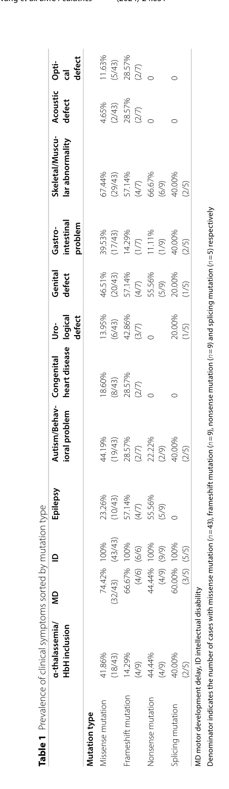

## Question

# Disease Characteristics Research Template

## Target Disease
- **Disease Name:** ATRX Syndrome
- **MONDO ID:**  (if available)
- **Category:** Mendelian

## Research Objectives

Please provide a comprehensive research report on **ATRX Syndrome** covering all of the
disease characteristics listed below. This report will be used to populate a disease knowledge
base entry. Be thorough and cite primary literature (PMID preferred) for all claims.

For each section, **suggested databases/resources** are listed. These are the first places
you should search for information on each topic.

---

### 1. Disease Information
> **Search first:** OMIM, Orphanet, ICD-10/ICD-11, MeSH, PubMed

- What is the disease? Provide a concise overview.
- What are the key identifiers? (OMIM, Orphanet, ICD-10/ICD-11, MeSH, Mondo)
- What are the common synonyms and alternative names?
- Is the information derived from individual patients (e.g., EHR) or aggregated disease-level resources?

### 2. Etiology

- **Disease Causal Factors**: What are the primary causes? (genetic, environmental, infectious, mechanistic)
- **Risk Factors**:
  > **Search first:** PubMed, Cochrane Library, UpToDate, clinical guidelines, ClinVar, ClinGen, GWAS Catalog, PheGenI, CTD, CDC, WHO, epidemiological databases
  - Genetic risk factors (causal variants, susceptibility loci, modifier genes)
  - Environmental risk factors (toxins, lifestyle, occupational exposures, age, sex, family history)
- **Protective Factors**:
  > **Search first:** PubMed, Cochrane Library, clinical trial databases, GWAS Catalog, gnomAD, WHO, CDC, nutrition databases
  - Genetic protective factors (protective variants, modifier alleles)
  - Environmental protective factors (diet, lifestyle, exposures that reduce risk)
- **Gene-Environment Interactions**: How do genetic and environmental factors interact to influence disease?
  > **Search first:** CTD, PubMed, PheGenI, GxE databases

### 3. Phenotypes
> **Search first:** HPO (Human Phenotype Ontology), OMIM, Orphanet, PubMed, clinicaltrials.gov, MedDRA, SNOMED CT, DECIPHER, LOINC

For each phenotype, provide:
- **Phenotype type**: symptoms, clinical signs, physical manifestations, behavioral changes, or laboratory abnormalities
  > For symptoms/signs: HPO, OMIM, Orphanet, PubMed
  > For behavioral changes: HPO, DSM, RDoC (Research Domain Criteria), PubMed
  > For laboratory abnormalities: LOINC, SNOMED CT, LabTests Online, PubMed
- **Phenotype characteristics**:
  > **Search first:** OMIM, Orphanet, HPO, PubMed
  - Age of symptom onset (neonatal, childhood, adult-onset, late-onset)
  - Symptom severity (mild, moderate, severe, variable)
  - Symptom progression (stable, progressive, episodic, fluctuating)
  - Frequency among affected individuals (percentage or qualitative)
- **Quality of life impact**: Effects on daily functioning and well-being (per-phenotype when possible)
  > **Search first:** EQ-5D database, SF-36, WHO QOL databases, PubMed
- Suggest HPO (Human Phenotype Ontology) terms for each phenotype

### 4. Genetic/Molecular Information

- **Causal Genes**: Gene mutations or chromosomal abnormalities responsible for disease (gene symbols, OMIM IDs)
  > **Search first:** OMIM, ClinVar, HGMD, Ensembl, NCBI Gene
- **Pathogenic Variants**:
  - Affected genes (gene symbols, HGNC IDs)
    > **Search first:** OMIM, NCBI Gene, Ensembl, HGNC, UniProt, GeneCards
  - Variant classification (pathogenic, likely pathogenic, VUS per ACMG/AMP guidelines)
    > **Search first:** ClinVar, ClinGen, ACMG/AMP guidelines, VarSome
  - Variant type/class (missense, frameshift, nonsense, splice-site, structural)
  - Allele frequency in population databases
    > **Search first:** gnomAD, 1000 Genomes, ExAC, TOPMed, dbSNP
  - Somatic vs germline origin
    > **Search first:** COSMIC (somatic), ClinVar, ICGC, TCGA
  - Functional consequences (loss of function, gain of function, dominant negative)
- **Modifier Genes**: Genes that modify disease severity or expression
- **Epigenetic Information**: DNA methylation, histone modifications, chromatin changes affecting disease
  > **Search first:** ENCODE, Roadmap Epigenomics, MethBase, DiseaseMeth
- **Chromosomal Abnormalities**: Large-scale genetic changes (aneuploidy, translocations, inversions)
  > **Search first:** DECIPHER, ClinVar, ECARUCA, UCSC Genome Browser

### 5. Environmental Information

- **Environmental Factors**: Non-genetic contributing factors (toxins, radiation, pollution, occupational exposure)
  > **Search first:** CTD (Comparative Toxicogenomics Database), TOXNET, PubMed, EPA databases
- **Lifestyle Factors**: Behavioral factors (smoking, diet, exercise, alcohol consumption)
  > **Search first:** CDC databases, WHO, PubMed, NHANES
- **Infectious Agents**: If applicable, pathogens causing or triggering disease (bacteria, viruses, fungi, parasites)
  > **Search first:** NCBI Taxonomy, ViPR, BV-BRC, MicrobeDB, GIDEON

### 6. Mechanism / Pathophysiology

- **Molecular Pathways**: Specific signaling cascades or biochemical pathways involved (Wnt, MAPK, mTOR, PI3K-AKT, etc.)
  > **Search first:** KEGG, Reactome, WikiPathways, PathBank, BioCyc
- **Cellular Processes**: Cell-level mechanisms (apoptosis, autophagy, cell cycle dysregulation, inflammation, etc.)
  > **Search first:** Gene Ontology (GO), Reactome, KEGG, PubMed
- **Protein Dysfunction**: How protein structure or function is altered (misfolding, aggregation, loss of function, gain of function)
  > **Search first:** UniProt, PDB (Protein Data Bank), InterPro, Pfam, AlphaFold
- **Metabolic Changes**: Alterations in metabolic processes (energy metabolism, lipid metabolism, amino acid metabolism)
  > **Search first:** KEGG, BioCyc, HMDB (Human Metabolome Database), BRENDA
- **Immune System Involvement**: Role of immune response (autoimmunity, immunodeficiency, chronic inflammation)
  > **Search first:** ImmPort, Immunome Database, IEDB, Gene Ontology
- **Tissue Damage Mechanisms**: How tissues/ are injured (oxidative stress, ischemia, fibrosis, necrosis)
  > **Search first:** PubMed, Gene Ontology, Reactome
- **Biochemical Abnormalities**: Specific molecular defects (enzyme deficiencies, receptor dysfunction, ion channel defects)
  > **Search first:** BRENDA, UniProt, KEGG, OMIM, PubMed
- **Epigenetic Changes**: DNA methylation, histone modifications affecting gene expression in disease
  > **Search first:** ENCODE, Roadmap Epigenomics, MethBase, DiseaseMeth
- **Molecular Profiling** (if available):
  - Transcriptomics/gene expression changes
    > **Search first:** GEO (Gene Expression Omnibus), ArrayExpress, GTEx, Human Cell Atlas, SRA
  - Proteomics findings
    > **Search first:** PRIDE, ProteomeXchange, Human Protein Atlas, STRING, BioGRID
  - Metabolomics signatures
    > **Search first:** MetaboLights, Metabolomics Workbench, HMDB, METLIN
  - Lipidomics alterations
    > **Search first:** LIPID MAPS, SwissLipids, LipidHome, Metabolomics Workbench
  - Genomic structural features
    > **Search first:** UCSC Genome Browser, Ensembl, NCBI, dbVar, DGV
- **Advanced Technologies** (if applicable):
  - Single-cell analysis findings (cell-type specific mechanisms, cellular heterogeneity)
    > **Search first:** Human Cell Atlas, Single Cell Portal, GEO, CELLxGENE
  - Spatial transcriptomics findings
    > **Search first:** GEO, Spatial Research, Vizgen, 10x Genomics data
  - Multi-omics integration results
    > **Search first:** TCGA, ICGC, cBioPortal, LinkedOmics, PubMed
  - Functional genomics screens (CRISPR, RNAi)
    > **Search first:** DepMap, GenomeRNAi, PubMed, BioGRID ORCS

For each mechanism, describe:
- The causal chain from initial trigger to clinical manifestation
- Which mechanisms are upstream vs downstream
- What cell types and biological processes are involved
- Suggest GO terms for biological processes and CL terms for cell types

### 7. Anatomical Structures Affected

- **Organ Level**:
  - Primary organs directly affected
  - Secondary organ involvement (complications, secondary effects)
  - Body systems involved (cardiovascular, nervous, digestive, respiratory, endocrine, etc.)
  > **Search first:** Uberon, FMA (Foundational Model of Anatomy), OMIM, HPO, ICD-11, MeSH, SNOMED CT
- **Tissue and Cell Level**:
  - Specific tissue types affected (epithelial, connective, muscle, nervous)
  - Specific cell populations targeted (with Cell Ontology terms)
  > **Search first:** Uberon, Human Protein Atlas, Cell Ontology, Human Cell Atlas, CellMarker, PanglaoDB
- **Subcellular Level**:
  - Cellular compartments involved (mitochondria, nucleus, ER, lysosomes) (with GO Cellular Component terms)
  > **Search first:** Gene Ontology (Cellular Component), UniProt, Human Protein Atlas
- **Localization**:
  - Specific anatomical sites (with UBERON terms)
    > **Search first:** FMA, Uberon, NeuroNames (for brain), SNOMED CT
  - Lateralization (unilateral, bilateral, asymmetric)
    > **Search first:** HPO, clinical literature, imaging databases

### 8. Temporal Development

- **Onset**:
  - Typical age of onset (congenital, pediatric, adult, geriatric)
  - Onset pattern (acute, subacute, chronic, insidious)
  > **Search first:** OMIM, Orphanet, HPO, PubMed
- **Progression**:
  - Disease stages (early, intermediate, advanced, end-stage)
    > **Search first:** Cancer Staging Manual (AJCC), WHO classifications, PubMed
  - Progression rate (rapid, slow, variable)
  - Disease course pattern (episodic, relapsing-remitting, progressive, stable)
  - Disease duration (self-limited, chronic lifelong)
  > **Search first:** Disease registries, longitudinal cohort databases, natural history studies, PubMed, Orphanet, OMIM
- **Patterns**:
  - Remission patterns (spontaneous, treatment-induced)
    > **Search first:** Clinical trial databases, disease registries, PubMed
  - Critical periods (time windows of vulnerability or opportunity for intervention)
    > **Search first:** PubMed, developmental biology databases, clinical guidelines

### 9. Inheritance and Population

- **Epidemiology**:
  - Prevalence (cases per 100,000 at given time)
  - Incidence (new cases per 100,000 per year)
  > **Search first:** Orphanet, CDC, WHO, GBD (Global Burden of Disease), national registries, SEER, disease registries
- **For Genetic Etiology**:
  - Inheritance pattern (AD, AR, X-linked, mitochondrial, multifactorial, polygenic)
    > **Search first:** OMIM, Orphanet, ClinVar, GTR (Genetic Testing Registry)
  - Penetrance (complete, incomplete, age-dependent)
    > **Search first:** ClinVar, OMIM, PubMed, ClinGen
  - Expressivity (variable, consistent)
    > **Search first:** OMIM, ClinVar, PubMed
  - Genetic anticipation (increasing severity in successive generations)
    > **Search first:** OMIM, PubMed (especially for repeat expansion disorders)
  - Germline mosaicism
    > **Search first:** ClinVar, OMIM, genetic counseling literature, PubMed
  - Founder effects (population-specific mutations)
    > **Search first:** gnomAD, population genetics databases, PubMed
  - Consanguinity role
    > **Search first:** OMIM, population studies, genetic counseling resources
  - Carrier frequency
    > **Search first:** gnomAD, carrier screening databases, GeneReviews, GTR
- **Population Demographics**:
  - Affected populations (ethnic or demographic groups with higher prevalence)
    > **Search first:** gnomAD, 1000 Genomes, PAGE Study, PubMed, population registries
  - Geographic distribution (endemic areas, regional variation)
    > **Search first:** WHO, CDC, GBD, Orphanet, geographic epidemiology databases
  - Geographic distribution of specific variants
  - Sex ratio (male:female)
    > **Search first:** Disease registries, OMIM, PubMed, epidemiological databases
  - Age distribution of affected individuals
    > **Search first:** CDC, disease registries, SEER, Orphanet

### 10. Diagnostics

- **Clinical Tests**:
  - Laboratory tests (blood, urine, tissue chemistry, specific enzyme assays)
    > **Search first:** LOINC, LabTests Online, PubMed
  - Biomarkers (proteins, metabolites, genetic markers, circulating biomarkers)
    > **Search first:** FDA Biomarker List, BEST (Biomarkers, EndpointS, and other Tools), PubMed
  - Imaging studies (X-ray, CT, MRI, PET, ultrasound)
    > **Search first:** RadLex, DICOM, Radiopaedia, imaging databases
  - Functional tests (pulmonary function, cardiac stress tests)
    > **Search first:** LOINC, clinical guidelines, PubMed
  - Electrophysiology (EEG, EMG, ECG, nerve conduction studies)
    > **Search first:** LOINC, clinical neurophysiology databases, PubMed
  - Biopsy findings (histopathology, immunohistochemistry)
    > **Search first:** SNOMED CT, College of American Pathologists resources, PubMed
  - Pathology findings (microscopic examination)
    > **Search first:** SNOMED CT, Digital Pathology databases, PubMed
- **Genetic Testing**:
  > **Search first:** GTR (Genetic Testing Registry), GeneReviews, ClinGen
  - Overview of recommended genetic testing approach
  - Whole genome sequencing (WGS) utility
    > **Search first:** GTR, ClinVar, GEL (Genomics England), gnomAD
  - Whole exome sequencing (WES) utility
    > **Search first:** GTR, ClinVar, OMIM, GeneMatcher
  - Gene panels (which panels, which genes)
    > **Search first:** GTR, ClinVar, laboratory-specific databases
  - Single gene testing
    > **Search first:** GTR, ClinVar, OMIM, GeneReviews
  - Chromosomal microarray (CMA)
    > **Search first:** DECIPHER, ClinVar, dbVar, ECARUCA
  - Karyotyping
    > **Search first:** Chromosome Abnormality Database, ClinVar, cytogenetics resources
  - FISH
    > **Search first:** ClinVar, cytogenetics databases, PubMed
  - Mitochondrial DNA testing
    > **Search first:** MITOMAP, MSeqDR, ClinVar, GTR
  - Repeat expansion testing
    > **Search first:** GTR, ClinVar, repeat expansion databases, PubMed
- **Omics-Based Diagnostics** (if applicable):
  - RNA sequencing / transcriptomics
    > **Search first:** GEO, ArrayExpress, GTEx, RNA-seq databases
  - Proteomics
    > **Search first:** PRIDE, ProteomeXchange, FDA Biomarker database
  - Metabolomics
    > **Search first:** MetaboLights, Metabolomics Workbench, HMDB
  - Epigenomics
    > **Search first:** GEO, ENCODE, Roadmap Epigenomics, MethBase
  - Liquid biopsy
    > **Search first:** COSMIC, ClinVar, liquid biopsy databases, PubMed
- **Clinical Criteria**:
  - Standardized diagnostic criteria (DSM, ICD, society guidelines)
    > **Search first:** DSM-5, ICD-11, clinical society guidelines, UpToDate
  - Differential diagnosis (other conditions to rule out, with distinguishing features)
    > **Search first:** DynaMed, UpToDate, clinical decision support systems
- **Screening**:
  - Screening methods for asymptomatic individuals (newborn screening, carrier screening, cascade screening)
    > **Search first:** ACMG recommendations, CDC newborn screening, GTR

### 11. Outcome/Prognosis

- **Survival and Mortality**:
  - Survival rate (5-year, 10-year, overall)
    > **Search first:** SEER, cancer registries, disease-specific registries, PubMed
  - Life expectancy (with and without treatment if applicable)
    > **Search first:** Orphanet, disease registries, actuarial databases, PubMed
  - Mortality rate
    > **Search first:** CDC, WHO, GBD, national mortality databases
  - Disease-specific mortality (deaths directly attributable to disease)
    > **Search first:** Disease registries, CDC Wonder, GBD, PubMed
- **Morbidity and Function**:
  - Morbidity (disease-related disability and health impacts)
    > **Search first:** GBD, WHO, disability databases, PubMed
  - Disability outcomes (long-term functional impairments)
    > **Search first:** ICF (International Classification of Functioning), disability registries
  - Quality of life measures (EQ-5D, SF-36, PROMIS, disease-specific tools)
    > **Search first:** EQ-5D database, SF-36, PROMIS, PubMed
- **Disease Course**:
  - Complications (secondary problems: infections, organ failure, etc.)
    > **Search first:** ICD codes, disease registries, clinical databases, PubMed
  - Recovery potential (likelihood and extent of recovery, with vs without treatment)
    > **Search first:** Natural history studies, rehabilitation databases, PubMed
- **Prediction**:
  - Prognostic factors (age, disease severity, biomarkers, treatment response)
    > **Search first:** Prognostic models databases, clinical calculators, PubMed
  - Prognostic biomarkers (molecular markers predicting disease course)
    > **Search first:** FDA Biomarker database, PubMed, cancer prognostic databases

### 12. Treatment

- **Pharmacotherapy**:
  - Pharmacological treatments (drug names, drug classes, mechanisms of action)
    > **Search first:** DrugBank, RxNorm, ATC classification, DailyMed, FDA databases
  - Pharmacogenomics (how genetic variants affect drug metabolism, efficacy, toxicity)
    > **Search first:** PharmGKB, CPIC (Clinical Pharmacogenetics), FDA Table of PGx Biomarkers
- **Advanced Therapeutics**:
  - Gene therapy (viral vectors, CRISPR, gene replacement, gene editing)
    > **Search first:** ClinicalTrials.gov, FDA gene therapy database, ASGCT resources
  - Cell therapy (stem cell transplant, CAR-T, cellular therapeutics)
    > **Search first:** ClinicalTrials.gov, FDA cell therapy database, FACT standards
  - RNA-based therapies (ASOs, siRNA, mRNA therapies)
    > **Search first:** ClinicalTrials.gov, FDA approvals, PubMed
  - Targeted therapies (treatments directed at specific molecular targets)
    > **Search first:** My Cancer Genome, OncoKB, ClinicalTrials.gov, FDA approvals
  - Immunotherapies (checkpoint inhibitors, monoclonal antibodies)
    > **Search first:** Cancer Immunotherapy Database, FDA approvals, ClinicalTrials.gov
- **Surgical and Interventional**:
  - Surgical interventions (types of surgery, timing, outcomes)
    > **Search first:** CPT codes, surgical registries, clinical guidelines, PubMed
- **Supportive and Rehabilitative**:
  - Supportive care (symptom management, pain control, nutrition)
    > **Search first:** Clinical guidelines, Cochrane Library, PubMed
  - Rehabilitation (physical therapy, occupational therapy, speech therapy)
    > **Search first:** Rehabilitation medicine databases, clinical guidelines, PubMed
- **Experimental**:
  - Experimental treatments in clinical trials (with NCT identifiers if available)
    > **Search first:** ClinicalTrials.gov, EU Clinical Trials Register, WHO ICTRP
- **Treatment Outcomes**:
  - Treatment response rates
    > **Search first:** Clinical trial databases, FDA reviews, systematic reviews, PubMed
  - Side effects and adverse events
    > **Search first:** FDA Adverse Event Reporting System (FAERS), MedWatch, PubMed
- **Treatment Strategy**:
  - Treatment algorithms (clinical pathways, decision trees)
    > **Search first:** Clinical practice guidelines, NCCN Guidelines, UpToDate
  - Combination therapies
    > **Search first:** ClinicalTrials.gov, treatment guidelines, PubMed
  - Personalized medicine approaches (genotype-guided treatment)
    > **Search first:** My Cancer Genome, CIViC, PharmGKB, precision medicine databases

For each treatment, suggest MAXO (Medical Action Ontology) terms where applicable.

### 13. Prevention

- **Prevention Levels**:
  - Primary prevention (preventing disease occurrence: vaccination, risk factor modification)
    > **Search first:** CDC, WHO, USPSTF recommendations, Cochrane Library
  - Secondary prevention (early detection and treatment: screening programs, early intervention)
    > **Search first:** USPSTF, CDC screening guidelines, WHO
  - Tertiary prevention (preventing complications in those with disease)
    > **Search first:** Clinical guidelines, disease management protocols, PubMed
- **Immunization**: Vaccine strategies (if applicable)
  > **Search first:** CDC vaccine schedules, WHO immunization, FDA vaccine database
- **Screening and Early Detection**:
  - Screening programs (population-based: newborn screening, cancer screening)
    > **Search first:** CDC screening programs, USPSTF, cancer screening databases
  - Genetic screening (carrier screening, preimplantation genetic diagnosis, prenatal testing)
    > **Search first:** ACMG recommendations, ACOG guidelines, GTR
  - Risk stratification (identifying high-risk individuals for targeted prevention)
    > **Search first:** Risk prediction models, clinical calculators, PubMed
- **Behavioral Interventions**: Lifestyle modifications to reduce risk
  > **Search first:** CDC, WHO, behavioral intervention databases, Cochrane Library
- **Counseling**: Genetic counseling (risk assessment, family planning guidance)
  > **Search first:** NSGC resources, ACMG guidelines, GeneReviews
- **Public Health**:
  - Public health interventions (sanitation, vector control, health education)
    > **Search first:** CDC, WHO, public health databases, PubMed
  - Environmental interventions (reducing environmental risk factors)
    > **Search first:** EPA databases, WHO environmental health, PubMed
- **Prophylaxis**: Preventive medications or procedures
  > **Search first:** Clinical guidelines, FDA approvals, PubMed

### 14. Other Species / Natural Disease

- **Taxonomy**: Species affected (with NCBI Taxon identifiers)
  > **Search first:** NCBI Taxonomy
- **Breed**: Specific breeds affected (with VBO identifiers if applicable)
  > **Search first:** VBO (Vertebrate Breed Ontology)
- **Gene**: Orthologous genes in other species (with NCBI Gene IDs)
  > **Search first:** NCBI Gene
- **Natural Disease**:
  - Naturally occurring disease in other species (companion animals, wildlife)
    > **Search first:** OMIA (Online Mendelian Inheritance in Animals), VetCompass, PubMed
  - Veterinary relevance and importance in animal health
    > **Search first:** OMIA, veterinary databases, PubMed
- **Comparative Biology**:
  - Comparative pathology (similarities and differences across species)
    > **Search first:** OMIA, comparative pathology databases, PubMed
  - Evolutionary conservation of disease mechanisms
    > **Search first:** HomoloGene, OrthoMCL, Alliance of Genome Resources
- **Transmission** (if applicable):
  - Zoonotic potential
    > **Search first:** CDC zoonotic diseases, WHO zoonoses, GIDEON
  - Cross-species susceptibility
    > **Search first:** NCBI Taxonomy, veterinary databases, PubMed

### 15. Model Organisms

- **Model Types**:
  - Model organism type (mammalian, invertebrate, cellular, in vitro)
    > **Search first:** Alliance of Genome Resources, model organism databases
  - Specific model systems (mouse, rat, zebrafish, Drosophila, C. elegans, yeast, cell lines, organoids, iPSCs)
    > **Search first:** MGI, RGD, ZFIN, FlyBase, WormBase, SGD, ATCC, Cellosaurus
  - Induced models (drug treatment, surgical intervention, environmental manipulation)
    > **Search first:** MGI, model organism databases, PubMed
- **Genetic Models**:
  - Types available (knockout, knock-in, transgenic, conditional, humanized)
    > **Search first:** MGI, IMPC, KOMP, EuMMCR, IMSR
- **Model Characteristics**:
  - Phenotype recapitulation (how well model reproduces human disease features)
    > **Search first:** Model organism databases, comparative studies, PubMed
  - Model limitations (aspects of human disease not captured)
    > **Search first:** Model organism databases, PubMed, review articles
- **Applications**:
  - Research applications (what aspects of disease can be studied)
    > **Search first:** Model organism databases, PubMed
- **Resources**:
  - Model databases
    > **Search first:** MGI, RGD, ZFIN, FlyBase, WormBase, IMSR, EMMA, MMRRC

---

## Citation Requirements

- Cite primary literature (PMID preferred) for all mechanistic and clinical claims
- Prioritize recent reviews and landmark papers
- Include direct quotes from abstracts where possible to support key statements
- Distinguish evidence source types: human clinical, model organism, in vitro, computational

## Output Format

Structure your response as a comprehensive narrative organized by the sections above.
For each section, provide:
- Factual content with specific details (numbers, percentages, gene names, variant nomenclature)
- Ontology term suggestions (HPO, GO, CL, UBERON, CHEBI, MAXO, MONDO) where applicable
- Evidence citations with PMIDs
- Direct quotes from abstracts to support key claims
- Clear indication when information is not available or not applicable for this disease

This report will be used to populate a disease knowledge base entry with:
- Pathophysiology descriptions with causal chains
- Gene/protein annotations (HGNC, GO terms)
- Phenotype associations (HP terms) with frequencies
- Cell type involvement (CL terms)
- Anatomical locations (UBERON terms)
- Chemical entities (CHEBI terms)
- Treatment annotations (MAXO terms)
- Evidence items with PMIDs and exact abstract quotes
- Epidemiology, prognosis, diagnostic, and prevention information
- Animal model descriptions with phenotype recapitulation details

## Output

Question: You are an expert researcher providing comprehensive, well-cited information.

Provide detailed information focusing on:
1. Key concepts and definitions with current understanding
2. Recent developments and latest research (prioritize 2023-2024 sources)
3. Current applications and real-world implementations
4. Expert opinions and analysis from authoritative sources
5. Relevant statistics and data from recent studies

Format as a comprehensive research report with proper citations. Include URLs and publication dates where available.
Always prioritize recent, authoritative sources and provide specific citations for all major claims.

# Disease Characteristics Research Template

## Target Disease
- **Disease Name:** ATRX Syndrome
- **MONDO ID:**  (if available)
- **Category:** Mendelian

## Research Objectives

Please provide a comprehensive research report on **ATRX Syndrome** covering all of the
disease characteristics listed below. This report will be used to populate a disease knowledge
base entry. Be thorough and cite primary literature (PMID preferred) for all claims.

For each section, **suggested databases/resources** are listed. These are the first places
you should search for information on each topic.

---

### 1. Disease Information
> **Search first:** OMIM, Orphanet, ICD-10/ICD-11, MeSH, PubMed

- What is the disease? Provide a concise overview.
- What are the key identifiers? (OMIM, Orphanet, ICD-10/ICD-11, MeSH, Mondo)
- What are the common synonyms and alternative names?
- Is the information derived from individual patients (e.g., EHR) or aggregated disease-level resources?

### 2. Etiology

- **Disease Causal Factors**: What are the primary causes? (genetic, environmental, infectious, mechanistic)
- **Risk Factors**:
  > **Search first:** PubMed, Cochrane Library, UpToDate, clinical guidelines, ClinVar, ClinGen, GWAS Catalog, PheGenI, CTD, CDC, WHO, epidemiological databases
  - Genetic risk factors (causal variants, susceptibility loci, modifier genes)
  - Environmental risk factors (toxins, lifestyle, occupational exposures, age, sex, family history)
- **Protective Factors**:
  > **Search first:** PubMed, Cochrane Library, clinical trial databases, GWAS Catalog, gnomAD, WHO, CDC, nutrition databases
  - Genetic protective factors (protective variants, modifier alleles)
  - Environmental protective factors (diet, lifestyle, exposures that reduce risk)
- **Gene-Environment Interactions**: How do genetic and environmental factors interact to influence disease?
  > **Search first:** CTD, PubMed, PheGenI, GxE databases

### 3. Phenotypes
> **Search first:** HPO (Human Phenotype Ontology), OMIM, Orphanet, PubMed, clinicaltrials.gov, MedDRA, SNOMED CT, DECIPHER, LOINC

For each phenotype, provide:
- **Phenotype type**: symptoms, clinical signs, physical manifestations, behavioral changes, or laboratory abnormalities
  > For symptoms/signs: HPO, OMIM, Orphanet, PubMed
  > For behavioral changes: HPO, DSM, RDoC (Research Domain Criteria), PubMed
  > For laboratory abnormalities: LOINC, SNOMED CT, LabTests Online, PubMed
- **Phenotype characteristics**:
  > **Search first:** OMIM, Orphanet, HPO, PubMed
  - Age of symptom onset (neonatal, childhood, adult-onset, late-onset)
  - Symptom severity (mild, moderate, severe, variable)
  - Symptom progression (stable, progressive, episodic, fluctuating)
  - Frequency among affected individuals (percentage or qualitative)
- **Quality of life impact**: Effects on daily functioning and well-being (per-phenotype when possible)
  > **Search first:** EQ-5D database, SF-36, WHO QOL databases, PubMed
- Suggest HPO (Human Phenotype Ontology) terms for each phenotype

### 4. Genetic/Molecular Information

- **Causal Genes**: Gene mutations or chromosomal abnormalities responsible for disease (gene symbols, OMIM IDs)
  > **Search first:** OMIM, ClinVar, HGMD, Ensembl, NCBI Gene
- **Pathogenic Variants**:
  - Affected genes (gene symbols, HGNC IDs)
    > **Search first:** OMIM, NCBI Gene, Ensembl, HGNC, UniProt, GeneCards
  - Variant classification (pathogenic, likely pathogenic, VUS per ACMG/AMP guidelines)
    > **Search first:** ClinVar, ClinGen, ACMG/AMP guidelines, VarSome
  - Variant type/class (missense, frameshift, nonsense, splice-site, structural)
  - Allele frequency in population databases
    > **Search first:** gnomAD, 1000 Genomes, ExAC, TOPMed, dbSNP
  - Somatic vs germline origin
    > **Search first:** COSMIC (somatic), ClinVar, ICGC, TCGA
  - Functional consequences (loss of function, gain of function, dominant negative)
- **Modifier Genes**: Genes that modify disease severity or expression
- **Epigenetic Information**: DNA methylation, histone modifications, chromatin changes affecting disease
  > **Search first:** ENCODE, Roadmap Epigenomics, MethBase, DiseaseMeth
- **Chromosomal Abnormalities**: Large-scale genetic changes (aneuploidy, translocations, inversions)
  > **Search first:** DECIPHER, ClinVar, ECARUCA, UCSC Genome Browser

### 5. Environmental Information

- **Environmental Factors**: Non-genetic contributing factors (toxins, radiation, pollution, occupational exposure)
  > **Search first:** CTD (Comparative Toxicogenomics Database), TOXNET, PubMed, EPA databases
- **Lifestyle Factors**: Behavioral factors (smoking, diet, exercise, alcohol consumption)
  > **Search first:** CDC databases, WHO, PubMed, NHANES
- **Infectious Agents**: If applicable, pathogens causing or triggering disease (bacteria, viruses, fungi, parasites)
  > **Search first:** NCBI Taxonomy, ViPR, BV-BRC, MicrobeDB, GIDEON

### 6. Mechanism / Pathophysiology

- **Molecular Pathways**: Specific signaling cascades or biochemical pathways involved (Wnt, MAPK, mTOR, PI3K-AKT, etc.)
  > **Search first:** KEGG, Reactome, WikiPathways, PathBank, BioCyc
- **Cellular Processes**: Cell-level mechanisms (apoptosis, autophagy, cell cycle dysregulation, inflammation, etc.)
  > **Search first:** Gene Ontology (GO), Reactome, KEGG, PubMed
- **Protein Dysfunction**: How protein structure or function is altered (misfolding, aggregation, loss of function, gain of function)
  > **Search first:** UniProt, PDB (Protein Data Bank), InterPro, Pfam, AlphaFold
- **Metabolic Changes**: Alterations in metabolic processes (energy metabolism, lipid metabolism, amino acid metabolism)
  > **Search first:** KEGG, BioCyc, HMDB (Human Metabolome Database), BRENDA
- **Immune System Involvement**: Role of immune response (autoimmunity, immunodeficiency, chronic inflammation)
  > **Search first:** ImmPort, Immunome Database, IEDB, Gene Ontology
- **Tissue Damage Mechanisms**: How tissues/ are injured (oxidative stress, ischemia, fibrosis, necrosis)
  > **Search first:** PubMed, Gene Ontology, Reactome
- **Biochemical Abnormalities**: Specific molecular defects (enzyme deficiencies, receptor dysfunction, ion channel defects)
  > **Search first:** BRENDA, UniProt, KEGG, OMIM, PubMed
- **Epigenetic Changes**: DNA methylation, histone modifications affecting gene expression in disease
  > **Search first:** ENCODE, Roadmap Epigenomics, MethBase, DiseaseMeth
- **Molecular Profiling** (if available):
  - Transcriptomics/gene expression changes
    > **Search first:** GEO (Gene Expression Omnibus), ArrayExpress, GTEx, Human Cell Atlas, SRA
  - Proteomics findings
    > **Search first:** PRIDE, ProteomeXchange, Human Protein Atlas, STRING, BioGRID
  - Metabolomics signatures
    > **Search first:** MetaboLights, Metabolomics Workbench, HMDB, METLIN
  - Lipidomics alterations
    > **Search first:** LIPID MAPS, SwissLipids, LipidHome, Metabolomics Workbench
  - Genomic structural features
    > **Search first:** UCSC Genome Browser, Ensembl, NCBI, dbVar, DGV
- **Advanced Technologies** (if applicable):
  - Single-cell analysis findings (cell-type specific mechanisms, cellular heterogeneity)
    > **Search first:** Human Cell Atlas, Single Cell Portal, GEO, CELLxGENE
  - Spatial transcriptomics findings
    > **Search first:** GEO, Spatial Research, Vizgen, 10x Genomics data
  - Multi-omics integration results
    > **Search first:** TCGA, ICGC, cBioPortal, LinkedOmics, PubMed
  - Functional genomics screens (CRISPR, RNAi)
    > **Search first:** DepMap, GenomeRNAi, PubMed, BioGRID ORCS

For each mechanism, describe:
- The causal chain from initial trigger to clinical manifestation
- Which mechanisms are upstream vs downstream
- What cell types and biological processes are involved
- Suggest GO terms for biological processes and CL terms for cell types

### 7. Anatomical Structures Affected

- **Organ Level**:
  - Primary organs directly affected
  - Secondary organ involvement (complications, secondary effects)
  - Body systems involved (cardiovascular, nervous, digestive, respiratory, endocrine, etc.)
  > **Search first:** Uberon, FMA (Foundational Model of Anatomy), OMIM, HPO, ICD-11, MeSH, SNOMED CT
- **Tissue and Cell Level**:
  - Specific tissue types affected (epithelial, connective, muscle, nervous)
  - Specific cell populations targeted (with Cell Ontology terms)
  > **Search first:** Uberon, Human Protein Atlas, Cell Ontology, Human Cell Atlas, CellMarker, PanglaoDB
- **Subcellular Level**:
  - Cellular compartments involved (mitochondria, nucleus, ER, lysosomes) (with GO Cellular Component terms)
  > **Search first:** Gene Ontology (Cellular Component), UniProt, Human Protein Atlas
- **Localization**:
  - Specific anatomical sites (with UBERON terms)
    > **Search first:** FMA, Uberon, NeuroNames (for brain), SNOMED CT
  - Lateralization (unilateral, bilateral, asymmetric)
    > **Search first:** HPO, clinical literature, imaging databases

### 8. Temporal Development

- **Onset**:
  - Typical age of onset (congenital, pediatric, adult, geriatric)
  - Onset pattern (acute, subacute, chronic, insidious)
  > **Search first:** OMIM, Orphanet, HPO, PubMed
- **Progression**:
  - Disease stages (early, intermediate, advanced, end-stage)
    > **Search first:** Cancer Staging Manual (AJCC), WHO classifications, PubMed
  - Progression rate (rapid, slow, variable)
  - Disease course pattern (episodic, relapsing-remitting, progressive, stable)
  - Disease duration (self-limited, chronic lifelong)
  > **Search first:** Disease registries, longitudinal cohort databases, natural history studies, PubMed, Orphanet, OMIM
- **Patterns**:
  - Remission patterns (spontaneous, treatment-induced)
    > **Search first:** Clinical trial databases, disease registries, PubMed
  - Critical periods (time windows of vulnerability or opportunity for intervention)
    > **Search first:** PubMed, developmental biology databases, clinical guidelines

### 9. Inheritance and Population

- **Epidemiology**:
  - Prevalence (cases per 100,000 at given time)
  - Incidence (new cases per 100,000 per year)
  > **Search first:** Orphanet, CDC, WHO, GBD (Global Burden of Disease), national registries, SEER, disease registries
- **For Genetic Etiology**:
  - Inheritance pattern (AD, AR, X-linked, mitochondrial, multifactorial, polygenic)
    > **Search first:** OMIM, Orphanet, ClinVar, GTR (Genetic Testing Registry)
  - Penetrance (complete, incomplete, age-dependent)
    > **Search first:** ClinVar, OMIM, PubMed, ClinGen
  - Expressivity (variable, consistent)
    > **Search first:** OMIM, ClinVar, PubMed
  - Genetic anticipation (increasing severity in successive generations)
    > **Search first:** OMIM, PubMed (especially for repeat expansion disorders)
  - Germline mosaicism
    > **Search first:** ClinVar, OMIM, genetic counseling literature, PubMed
  - Founder effects (population-specific mutations)
    > **Search first:** gnomAD, population genetics databases, PubMed
  - Consanguinity role
    > **Search first:** OMIM, population studies, genetic counseling resources
  - Carrier frequency
    > **Search first:** gnomAD, carrier screening databases, GeneReviews, GTR
- **Population Demographics**:
  - Affected populations (ethnic or demographic groups with higher prevalence)
    > **Search first:** gnomAD, 1000 Genomes, PAGE Study, PubMed, population registries
  - Geographic distribution (endemic areas, regional variation)
    > **Search first:** WHO, CDC, GBD, Orphanet, geographic epidemiology databases
  - Geographic distribution of specific variants
  - Sex ratio (male:female)
    > **Search first:** Disease registries, OMIM, PubMed, epidemiological databases
  - Age distribution of affected individuals
    > **Search first:** CDC, disease registries, SEER, Orphanet

### 10. Diagnostics

- **Clinical Tests**:
  - Laboratory tests (blood, urine, tissue chemistry, specific enzyme assays)
    > **Search first:** LOINC, LabTests Online, PubMed
  - Biomarkers (proteins, metabolites, genetic markers, circulating biomarkers)
    > **Search first:** FDA Biomarker List, BEST (Biomarkers, EndpointS, and other Tools), PubMed
  - Imaging studies (X-ray, CT, MRI, PET, ultrasound)
    > **Search first:** RadLex, DICOM, Radiopaedia, imaging databases
  - Functional tests (pulmonary function, cardiac stress tests)
    > **Search first:** LOINC, clinical guidelines, PubMed
  - Electrophysiology (EEG, EMG, ECG, nerve conduction studies)
    > **Search first:** LOINC, clinical neurophysiology databases, PubMed
  - Biopsy findings (histopathology, immunohistochemistry)
    > **Search first:** SNOMED CT, College of American Pathologists resources, PubMed
  - Pathology findings (microscopic examination)
    > **Search first:** SNOMED CT, Digital Pathology databases, PubMed
- **Genetic Testing**:
  > **Search first:** GTR (Genetic Testing Registry), GeneReviews, ClinGen
  - Overview of recommended genetic testing approach
  - Whole genome sequencing (WGS) utility
    > **Search first:** GTR, ClinVar, GEL (Genomics England), gnomAD
  - Whole exome sequencing (WES) utility
    > **Search first:** GTR, ClinVar, OMIM, GeneMatcher
  - Gene panels (which panels, which genes)
    > **Search first:** GTR, ClinVar, laboratory-specific databases
  - Single gene testing
    > **Search first:** GTR, ClinVar, OMIM, GeneReviews
  - Chromosomal microarray (CMA)
    > **Search first:** DECIPHER, ClinVar, dbVar, ECARUCA
  - Karyotyping
    > **Search first:** Chromosome Abnormality Database, ClinVar, cytogenetics resources
  - FISH
    > **Search first:** ClinVar, cytogenetics databases, PubMed
  - Mitochondrial DNA testing
    > **Search first:** MITOMAP, MSeqDR, ClinVar, GTR
  - Repeat expansion testing
    > **Search first:** GTR, ClinVar, repeat expansion databases, PubMed
- **Omics-Based Diagnostics** (if applicable):
  - RNA sequencing / transcriptomics
    > **Search first:** GEO, ArrayExpress, GTEx, RNA-seq databases
  - Proteomics
    > **Search first:** PRIDE, ProteomeXchange, FDA Biomarker database
  - Metabolomics
    > **Search first:** MetaboLights, Metabolomics Workbench, HMDB
  - Epigenomics
    > **Search first:** GEO, ENCODE, Roadmap Epigenomics, MethBase
  - Liquid biopsy
    > **Search first:** COSMIC, ClinVar, liquid biopsy databases, PubMed
- **Clinical Criteria**:
  - Standardized diagnostic criteria (DSM, ICD, society guidelines)
    > **Search first:** DSM-5, ICD-11, clinical society guidelines, UpToDate
  - Differential diagnosis (other conditions to rule out, with distinguishing features)
    > **Search first:** DynaMed, UpToDate, clinical decision support systems
- **Screening**:
  - Screening methods for asymptomatic individuals (newborn screening, carrier screening, cascade screening)
    > **Search first:** ACMG recommendations, CDC newborn screening, GTR

### 11. Outcome/Prognosis

- **Survival and Mortality**:
  - Survival rate (5-year, 10-year, overall)
    > **Search first:** SEER, cancer registries, disease-specific registries, PubMed
  - Life expectancy (with and without treatment if applicable)
    > **Search first:** Orphanet, disease registries, actuarial databases, PubMed
  - Mortality rate
    > **Search first:** CDC, WHO, GBD, national mortality databases
  - Disease-specific mortality (deaths directly attributable to disease)
    > **Search first:** Disease registries, CDC Wonder, GBD, PubMed
- **Morbidity and Function**:
  - Morbidity (disease-related disability and health impacts)
    > **Search first:** GBD, WHO, disability databases, PubMed
  - Disability outcomes (long-term functional impairments)
    > **Search first:** ICF (International Classification of Functioning), disability registries
  - Quality of life measures (EQ-5D, SF-36, PROMIS, disease-specific tools)
    > **Search first:** EQ-5D database, SF-36, PROMIS, PubMed
- **Disease Course**:
  - Complications (secondary problems: infections, organ failure, etc.)
    > **Search first:** ICD codes, disease registries, clinical databases, PubMed
  - Recovery potential (likelihood and extent of recovery, with vs without treatment)
    > **Search first:** Natural history studies, rehabilitation databases, PubMed
- **Prediction**:
  - Prognostic factors (age, disease severity, biomarkers, treatment response)
    > **Search first:** Prognostic models databases, clinical calculators, PubMed
  - Prognostic biomarkers (molecular markers predicting disease course)
    > **Search first:** FDA Biomarker database, PubMed, cancer prognostic databases

### 12. Treatment

- **Pharmacotherapy**:
  - Pharmacological treatments (drug names, drug classes, mechanisms of action)
    > **Search first:** DrugBank, RxNorm, ATC classification, DailyMed, FDA databases
  - Pharmacogenomics (how genetic variants affect drug metabolism, efficacy, toxicity)
    > **Search first:** PharmGKB, CPIC (Clinical Pharmacogenetics), FDA Table of PGx Biomarkers
- **Advanced Therapeutics**:
  - Gene therapy (viral vectors, CRISPR, gene replacement, gene editing)
    > **Search first:** ClinicalTrials.gov, FDA gene therapy database, ASGCT resources
  - Cell therapy (stem cell transplant, CAR-T, cellular therapeutics)
    > **Search first:** ClinicalTrials.gov, FDA cell therapy database, FACT standards
  - RNA-based therapies (ASOs, siRNA, mRNA therapies)
    > **Search first:** ClinicalTrials.gov, FDA approvals, PubMed
  - Targeted therapies (treatments directed at specific molecular targets)
    > **Search first:** My Cancer Genome, OncoKB, ClinicalTrials.gov, FDA approvals
  - Immunotherapies (checkpoint inhibitors, monoclonal antibodies)
    > **Search first:** Cancer Immunotherapy Database, FDA approvals, ClinicalTrials.gov
- **Surgical and Interventional**:
  - Surgical interventions (types of surgery, timing, outcomes)
    > **Search first:** CPT codes, surgical registries, clinical guidelines, PubMed
- **Supportive and Rehabilitative**:
  - Supportive care (symptom management, pain control, nutrition)
    > **Search first:** Clinical guidelines, Cochrane Library, PubMed
  - Rehabilitation (physical therapy, occupational therapy, speech therapy)
    > **Search first:** Rehabilitation medicine databases, clinical guidelines, PubMed
- **Experimental**:
  - Experimental treatments in clinical trials (with NCT identifiers if available)
    > **Search first:** ClinicalTrials.gov, EU Clinical Trials Register, WHO ICTRP
- **Treatment Outcomes**:
  - Treatment response rates
    > **Search first:** Clinical trial databases, FDA reviews, systematic reviews, PubMed
  - Side effects and adverse events
    > **Search first:** FDA Adverse Event Reporting System (FAERS), MedWatch, PubMed
- **Treatment Strategy**:
  - Treatment algorithms (clinical pathways, decision trees)
    > **Search first:** Clinical practice guidelines, NCCN Guidelines, UpToDate
  - Combination therapies
    > **Search first:** ClinicalTrials.gov, treatment guidelines, PubMed
  - Personalized medicine approaches (genotype-guided treatment)
    > **Search first:** My Cancer Genome, CIViC, PharmGKB, precision medicine databases

For each treatment, suggest MAXO (Medical Action Ontology) terms where applicable.

### 13. Prevention

- **Prevention Levels**:
  - Primary prevention (preventing disease occurrence: vaccination, risk factor modification)
    > **Search first:** CDC, WHO, USPSTF recommendations, Cochrane Library
  - Secondary prevention (early detection and treatment: screening programs, early intervention)
    > **Search first:** USPSTF, CDC screening guidelines, WHO
  - Tertiary prevention (preventing complications in those with disease)
    > **Search first:** Clinical guidelines, disease management protocols, PubMed
- **Immunization**: Vaccine strategies (if applicable)
  > **Search first:** CDC vaccine schedules, WHO immunization, FDA vaccine database
- **Screening and Early Detection**:
  - Screening programs (population-based: newborn screening, cancer screening)
    > **Search first:** CDC screening programs, USPSTF, cancer screening databases
  - Genetic screening (carrier screening, preimplantation genetic diagnosis, prenatal testing)
    > **Search first:** ACMG recommendations, ACOG guidelines, GTR
  - Risk stratification (identifying high-risk individuals for targeted prevention)
    > **Search first:** Risk prediction models, clinical calculators, PubMed
- **Behavioral Interventions**: Lifestyle modifications to reduce risk
  > **Search first:** CDC, WHO, behavioral intervention databases, Cochrane Library
- **Counseling**: Genetic counseling (risk assessment, family planning guidance)
  > **Search first:** NSGC resources, ACMG guidelines, GeneReviews
- **Public Health**:
  - Public health interventions (sanitation, vector control, health education)
    > **Search first:** CDC, WHO, public health databases, PubMed
  - Environmental interventions (reducing environmental risk factors)
    > **Search first:** EPA databases, WHO environmental health, PubMed
- **Prophylaxis**: Preventive medications or procedures
  > **Search first:** Clinical guidelines, FDA approvals, PubMed

### 14. Other Species / Natural Disease

- **Taxonomy**: Species affected (with NCBI Taxon identifiers)
  > **Search first:** NCBI Taxonomy
- **Breed**: Specific breeds affected (with VBO identifiers if applicable)
  > **Search first:** VBO (Vertebrate Breed Ontology)
- **Gene**: Orthologous genes in other species (with NCBI Gene IDs)
  > **Search first:** NCBI Gene
- **Natural Disease**:
  - Naturally occurring disease in other species (companion animals, wildlife)
    > **Search first:** OMIA (Online Mendelian Inheritance in Animals), VetCompass, PubMed
  - Veterinary relevance and importance in animal health
    > **Search first:** OMIA, veterinary databases, PubMed
- **Comparative Biology**:
  - Comparative pathology (similarities and differences across species)
    > **Search first:** OMIA, comparative pathology databases, PubMed
  - Evolutionary conservation of disease mechanisms
    > **Search first:** HomoloGene, OrthoMCL, Alliance of Genome Resources
- **Transmission** (if applicable):
  - Zoonotic potential
    > **Search first:** CDC zoonotic diseases, WHO zoonoses, GIDEON
  - Cross-species susceptibility
    > **Search first:** NCBI Taxonomy, veterinary databases, PubMed

### 15. Model Organisms

- **Model Types**:
  - Model organism type (mammalian, invertebrate, cellular, in vitro)
    > **Search first:** Alliance of Genome Resources, model organism databases
  - Specific model systems (mouse, rat, zebrafish, Drosophila, C. elegans, yeast, cell lines, organoids, iPSCs)
    > **Search first:** MGI, RGD, ZFIN, FlyBase, WormBase, SGD, ATCC, Cellosaurus
  - Induced models (drug treatment, surgical intervention, environmental manipulation)
    > **Search first:** MGI, model organism databases, PubMed
- **Genetic Models**:
  - Types available (knockout, knock-in, transgenic, conditional, humanized)
    > **Search first:** MGI, IMPC, KOMP, EuMMCR, IMSR
- **Model Characteristics**:
  - Phenotype recapitulation (how well model reproduces human disease features)
    > **Search first:** Model organism databases, comparative studies, PubMed
  - Model limitations (aspects of human disease not captured)
    > **Search first:** Model organism databases, PubMed, review articles
- **Applications**:
  - Research applications (what aspects of disease can be studied)
    > **Search first:** Model organism databases, PubMed
- **Resources**:
  - Model databases
    > **Search first:** MGI, RGD, ZFIN, FlyBase, WormBase, IMSR, EMMA, MMRRC

---

## Citation Requirements

- Cite primary literature (PMID preferred) for all mechanistic and clinical claims
- Prioritize recent reviews and landmark papers
- Include direct quotes from abstracts where possible to support key statements
- Distinguish evidence source types: human clinical, model organism, in vitro, computational

## Output Format

Structure your response as a comprehensive narrative organized by the sections above.
For each section, provide:
- Factual content with specific details (numbers, percentages, gene names, variant nomenclature)
- Ontology term suggestions (HPO, GO, CL, UBERON, CHEBI, MAXO, MONDO) where applicable
- Evidence citations with PMIDs
- Direct quotes from abstracts to support key claims
- Clear indication when information is not available or not applicable for this disease

This report will be used to populate a disease knowledge base entry with:
- Pathophysiology descriptions with causal chains
- Gene/protein annotations (HGNC, GO terms)
- Phenotype associations (HP terms) with frequencies
- Cell type involvement (CL terms)
- Anatomical locations (UBERON terms)
- Chemical entities (CHEBI terms)
- Treatment annotations (MAXO terms)
- Evidence items with PMIDs and exact abstract quotes
- Epidemiology, prognosis, diagnostic, and prevention information
- Animal model descriptions with phenotype recapitulation details

# Comprehensive Research Report: ATRX Syndrome (ATR-X syndrome)

## Target Disease
- **Disease name:** ATRX syndrome (ATR-X syndrome; alpha-thalassemia X-linked intellectual disability)
- **Category:** Mendelian (X-linked)
- **MONDO ID:** Not identified in the retrieved full text; requires external ontology lookup.

## 1. Disease Information

### 1.1 Concise overview (current understanding)
ATR-X syndrome is a rare, primarily male-affecting X-linked neurodevelopmental disorder caused by hypomorphic germline variants in **ATRX**, characterized by intellectual disability (ID) often accompanied by alpha-thalassemia and multi-system congenital anomalies (facial dysmorphism, hypotonia, skeletal and urogenital abnormalities, and hematologic findings). (tillotson2023anewmouse pages 1-4, yuan2024mutantatrxpathogenesis pages 1-2, pang2023thechromatinremodeler pages 1-2)

### 1.2 Key identifiers and nomenclature
A structured summary of the identifiers and naming used in the retrieved literature is provided below.

| Disease name | Major synonyms / alternative names | OMIM number(s) | Inheritance | Estimated prevalence | Orphanet / MONDO / MeSH / ICD status in retrieved full text | Key references (year, URL) |
|---|---|---|---|---|---|---|
| ATR-X syndrome | ATRX syndrome; alpha-thalassemia/intellectual disability, X-linked; alpha-thalassemia X-linked intellectual disability syndrome; alpha-thalassemia mental retardation syndrome, X-linked | OMIM: 301040 | X-linked; primarily affects hemizygous males, with female carriers often minimally affected due to skewed X-inactivation (tillotson2023anewmouse pages 1-4, yuan2024mutantatrxpathogenesis pages 1-2) | Rare; estimated at ~1/30,000-1/40,000 male newborns in one 2024 review/case synthesis; worldwide prevalence otherwise described as unknown (wang2024identificationofa pages 1-2, maganaacosta2025atrxfrom pages 13-13) | Orphanet: not found in retrieved full text for this disease entry; MONDO: Not found in retrieved full text; MeSH: Not found in retrieved full text; ICD: Not found in retrieved full text | Wang et al. 2024, https://doi.org/10.1186/s12887-024-05088-0; Tillotson et al. 2023, https://doi.org/10.1101/2023.01.25.525394; Yuan et al. 2024, https://doi.org/10.3389/fmolb.2024.1434398 (wang2024identificationofa pages 1-2, tillotson2023anewmouse pages 1-4, yuan2024mutantatrxpathogenesis pages 1-2) |
| ATRX-related disorder label noted in literature | X-linked intellectual disability-hypotonic facies syndrome-1 (MRXHF1); ATRX gene-related syndromes | OMIM: 309580 (MRXHF1, related ATRX-associated disorder noted in 2024 review/case report) | X-linked (wang2024identificationofa pages 1-2) | Not separately estimated in retrieved full text | Orphanet: Not found in retrieved full text; MONDO: Not found in retrieved full text; MeSH: Not found in retrieved full text; ICD: Not found in retrieved full text | Wang et al. 2024, https://doi.org/10.1186/s12887-024-05088-0 (wang2024identificationofa pages 1-2) |

*Table: This table summarizes the nomenclature and core identifiers for ATR-X syndrome from the retrieved evidence, including synonyms, OMIM entries, inheritance, prevalence estimates, and publication sources. It also flags identifier systems that were not explicitly available in the retrieved full text.*

- **OMIM:** ATR-X syndrome is explicitly linked to **OMIM 301040** in multiple retrieved sources. (tillotson2023anewmouse pages 1-4, wang2024identificationofa pages 1-2)
- **Related ATRX disorder label in retrieved text:** MRXHF1 (X-linked intellectual disability-hypotonic facies syndrome-1) is referenced as an ATRX-related disorder with **OMIM 309580**. (wang2024identificationofa pages 1-2)
- **Orphanet/ICD/MeSH/MONDO:** Not explicitly present in the retrieved full text snippets and therefore not reportable here as evidence-backed codes. (tillotson2023anewmouse pages 1-4, wang2024identificationofa pages 1-2)

### 1.3 Synonyms / alternative names
Commonly used synonyms in the retrieved literature include: “ATR-X syndrome”, “ATRX syndrome”, “alpha-thalassemia/intellectual disability, X-linked”, and “alpha-thalassemia X-linked intellectual disability”. (tillotson2023anewmouse pages 1-4, wang2024identificationofa pages 1-2)

### 1.4 Evidence source type
The information synthesized here is derived from (i) aggregated disease-level reviews and cohorts, and (ii) individual case reports with literature review, as well as model organism work (mouse). (wang2024identificationofa pages 1-2, tillotson2023anewmouse pages 1-4, lupu2024pyridostigmineasa pages 2-3)

## 2. Etiology

### 2.1 Disease causal factors
**Primary cause:** germline pathogenic variants in **ATRX** (Xq21.1), encoding a SNF2-family chromatin remodeling protein with key functional domains (ADD and helicase/ATPase-like domains). (wang2024identificationofa pages 1-2, pang2023thechromatinremodeler pages 1-2)

**Variant spectrum and general rule:** In ATR-X syndrome, alleles are typically hypomorphic (commonly missense; also small in-frame/other changes), and complete null alleles are not typically seen clinically, consistent with embryonic lethality when ATRX is fully deleted in mouse. (tillotson2023anewmouse pages 1-4, maganaacosta2025atrxfrom pages 13-13)

### 2.2 Risk factors
For an X-linked Mendelian disorder, the principal “risk factors” are genetic:
- **Sex (male/hemizygous):** male predominance is expected because hemizygous males are typically affected, while female carriers are often less affected, consistent with X-inactivation effects. (yuan2024mutantatrxpathogenesis pages 1-2, maganaacosta2025atrxfrom pages 13-13)
- **Family history / carrier mother:** implied by X-linked inheritance (not quantified in retrieved snippets). (maganaacosta2025atrxfrom pages 13-13)

### 2.3 Protective factors
No genetic or environmental protective factors were identified in the retrieved full text.

### 2.4 Gene–environment interactions
No clear gene–environment interaction evidence specific to ATR-X syndrome was found in the retrieved full text.

## 3. Phenotypes

### 3.1 Phenotype spectrum and key clinical manifestations
Core features repeatedly described include:
- **Intellectual disability / developmental delay** (universal in many cohorts)
- **Alpha-thalassemia / HbH features** (common but not universal)
- **Craniofacial dysmorphism**
- **Hypotonia**
- **Urogenital anomalies**
- **Skeletal abnormalities**
- **Gastrointestinal complications** (can be severe)

These are summarized across recent reviews and patient-based syntheses. (wang2024identificationofa pages 1-2, tillotson2023anewmouse pages 1-4, yuan2024mutantatrxpathogenesis pages 1-2)

### 3.2 Phenotype frequencies (recent quantitative data)
Recent cohort-level percentages extracted from a 2024 case + systematic literature synthesis are summarized below.

| Phenotype | HPO term suggestion | Frequency / notes | Evidence / source |
|---|---|---|---|
| Intellectual disability | HP:0001249 Intellectual disability | 100% (reported as 43/43 in the reviewed cohort); described as universal in the summarized ATRX cohort. | Wang et al. 2024 review/case synthesis; cohort percentages extracted from text discussing genotype–phenotype relationships (wang2024identificationofa pages 7-8) |
| Alpha-thalassemia / HbH inclusion | HP:0001927 Abnormal hemoglobin; HP:0005523 Hemoglobin H inclusion bodies; HP:0001878 Hemolytic anemia | 41.86% overall (18/43) in the summarized cohort; alpha-thalassemia is common but not universal, so absence does not exclude ATR-X syndrome. | Wang et al. 2024 phenotype summary (wang2024identificationofa pages 7-8) |
| Autism / behavioral problems | HP:0000729 Autistic behavior; HP:0000708 Behavioral abnormality | 44.19% overall (19/43); reported as a recurrent neurobehavioral feature. | Wang et al. 2024 phenotype summary (wang2024identificationofa pages 7-8) |
| Epilepsy | HP:0001250 Seizure | 23.26% overall (10/43); reported among recurrent neurologic manifestations and noted as more prevalent in frameshift variants than missense variants in the broader review. | Wang et al. 2024 phenotype summary and genotype–phenotype discussion (wang2024identificationofa pages 7-8, wang2024identificationofa pages 1-2) |
| Congenital heart defects | HP:0001627 Abnormal heart morphology; HP:0001644 Congenital heart defect | 18.60% overall (8/43); reported as an associated but less frequent congenital manifestation. | Wang et al. 2024 phenotype summary (wang2024identificationofa pages 7-8) |
| Mutation-type/domain stratification note | Not applicable | Full phenotype distributions stratified by mutation type are in Table 1, and genotype–phenotype relationships by affected protein domain are in Table 2 of Wang et al. 2024; these tables were identified from the page images. | Table-image extraction identifying Table 1 and Table 2 as the key frequency/genotype–phenotype tables (wang2024identificationofa media 3e3625e3, wang2024identificationofa media bc05e6ce) |

*Table: This table summarizes key clinical features of ATR-X syndrome with cohort frequencies reported in Wang et al. 2024. It is useful for rapid phenotype curation and notes where the full mutation-type and domain-specific distributions can be found.*

Additionally, Table 1 and Table 2 with expanded phenotype frequencies stratified by mutation type and protein domain were identified in the Wang et al. 2024 paper images. (wang2024identificationofa media 3e3625e3, wang2024identificationofa media bc05e6ce)

### 3.3 Gastrointestinal phenotypes and quality-of-life impact
Gastrointestinal involvement can be clinically dominant and life-threatening in some individuals. A 2024 ATR-X case report and literature review emphasized that ATR-X patients may have gastroesophageal and motility manifestations “most commonly gastroesophageal issues, including chronic gastroesophageal reflux (GER), drooling and constipation.” (lupu2024pyridostigmineasa pages 2-3)

Severe GI complications discussed in this review include intestinal malrotation/volvulus and recurrent bowel volvulus; the review notes such issues can contribute to major morbidity and even mortality. (lupu2024pyridostigmineasa pages 2-3)

### 3.4 Suggested HPO terms (examples)
Examples are included in the phenotype-frequency artifact and include:
- Intellectual disability (HP:0001249)
- Seizures (HP:0001250)
- Congenital heart defect (HP:0001644)
- Autistic behavior (HP:0000729)
- HbH inclusion bodies (HP:0005523)

(See | Phenotype | HPO term suggestion | Frequency / notes | Evidence / source |
|---|---|---|---|
| Intellectual disability | HP:0001249 Intellectual disability | 100% (reported as 43/43 in the reviewed cohort); described as universal in the summarized ATRX cohort. | Wang et al. 2024 review/case synthesis; cohort percentages extracted from text discussing genotype–phenotype relationships (wang2024identificationofa pages 7-8) |
| Alpha-thalassemia / HbH inclusion | HP:0001927 Abnormal hemoglobin; HP:0005523 Hemoglobin H inclusion bodies; HP:0001878 Hemolytic anemia | 41.86% overall (18/43) in the summarized cohort; alpha-thalassemia is common but not universal, so absence does not exclude ATR-X syndrome. | Wang et al. 2024 phenotype summary (wang2024identificationofa pages 7-8) |
| Autism / behavioral problems | HP:0000729 Autistic behavior; HP:0000708 Behavioral abnormality | 44.19% overall (19/43); reported as a recurrent neurobehavioral feature. | Wang et al. 2024 phenotype summary (wang2024identificationofa pages 7-8) |
| Epilepsy | HP:0001250 Seizure | 23.26% overall (10/43); reported among recurrent neurologic manifestations and noted as more prevalent in frameshift variants than missense variants in the broader review. | Wang et al. 2024 phenotype summary and genotype–phenotype discussion (wang2024identificationofa pages 7-8, wang2024identificationofa pages 1-2) |
| Congenital heart defects | HP:0001627 Abnormal heart morphology; HP:0001644 Congenital heart defect | 18.60% overall (8/43); reported as an associated but less frequent congenital manifestation. | Wang et al. 2024 phenotype summary (wang2024identificationofa pages 7-8) |
| Mutation-type/domain stratification note | Not applicable | Full phenotype distributions stratified by mutation type are in Table 1, and genotype–phenotype relationships by affected protein domain are in Table 2 of Wang et al. 2024; these tables were identified from the page images. | Table-image extraction identifying Table 1 and Table 2 as the key frequency/genotype–phenotype tables (wang2024identificationofa media 3e3625e3, wang2024identificationofa media bc05e6ce) |

*Table: This table summarizes key clinical features of ATR-X syndrome with cohort frequencies reported in Wang et al. 2024. It is useful for rapid phenotype curation and notes where the full mutation-type and domain-specific distributions can be found.*.)

## 4. Genetic / Molecular Information

### 4.1 Causal gene
- **ATRX** (Xq21.1) is the causal gene for ATR-X syndrome (OMIM 301040). (wang2024identificationofa pages 1-2, tillotson2023anewmouse pages 1-4)

### 4.2 Pathogenic variant classes and genotype–phenotype notes
A 2024 case report with literature synthesis notes that missense variants are most common overall and that the ADD and helicase-like domains are frequently affected; it also reports mutation-type associations (e.g., frameshift variants showing higher prevalence of epilepsy, congenital heart disease, urogenital, acoustic, and optical defects compared with missense). (wang2024identificationofa pages 1-2)

### 4.3 Functional consequences and molecular functions (current understanding)
ATRX is described as a chromatin-remodeling ATPase involved in transcriptional regulation, DNA damage repair, and heterochromatin maintenance. (tillotson2023anewmouse pages 1-4)

Mechanistic reviews emphasize ATRX roles in chromatin remodeling and genomic integrity, including cooperating with DAXX to deposit histone variant H3.3 at repetitive regions (e.g., telomeric/pericentromeric heterochromatin). (pang2023thechromatinremodeler pages 1-2, vaisfeld2022phenotypicspectrumand pages 1-2)

### 4.4 Epigenetic information and episignatures
DNA methylation episignatures are increasingly used as functional biomarkers in neurodevelopmental Mendelian disorders; ATRX has a published episignature that has been independently evaluated and shown high diagnostic performance (see Diagnostics section). (husson2024episignaturesinpractice pages 1-2, trajkova2024dnamethylationanalysis pages 1-2)

## 5. Environmental Information
No specific environmental toxins, lifestyle factors, or infectious triggers were identified in the retrieved full text as contributing causes for ATR-X syndrome (a genetic disorder).

## 6. Mechanism / Pathophysiology

### 6.1 Mechanistic chain (high-level)
**ATRX hypomorphic loss** → altered recruitment/function of a chromatin remodeling ATPase at heterochromatin and other genomic regions → impaired regulation of transcription, heterochromatin maintenance, and genome stability/replication stress responses → neurodevelopmental defects (ID, microcephaly-like phenotypes), multi-system congenital anomalies, and hematologic dysregulation consistent with alpha-thalassemia in many patients. (tillotson2023anewmouse pages 1-4, tillotson2023anewmouse pages 16-22, pang2023thechromatinremodeler pages 1-2)

### 6.2 Cell and molecular processes implicated (evidence-backed themes)
- **Chromatin remodeling and transcriptional regulation:** ATRX is repeatedly described as a chromatin remodeler/transcriptional regulator. (pang2023thechromatinremodeler pages 1-2, tillotson2023anewmouse pages 1-4)
- **DNA damage/replication stress responses:** ATRX is described as involved in DNA damage repair; the patient-mutation knock-in mouse paper also frames ATRX in this functional context. (tillotson2023anewmouse pages 1-4)
- **Heterochromatin maintenance / recruitment via histone marks:** the knock-in mouse model highlights disrupted heterochromatin recruitment mediated by ADD-domain binding to H3K9me3, stating “This recruitment is severely disrupted by the R245C mutation.” (tillotson2023anewmouse pages 16-22)

### 6.3 Suggested ontology terms
- **GO (biological process; examples):** chromatin remodeling; DNA repair; regulation of transcription; response to replication stress. (tillotson2023anewmouse pages 1-4, tillotson2023anewmouse pages 16-22)
- **GO (cellular component; examples):** heterochromatin; nucleus. (tillotson2023anewmouse pages 16-22)
- **Cell Ontology (CL; examples):** neurodevelopmental relevance suggests neural progenitors/neurons; the mouse model includes hippocampal neuron phenotypes (neurite/dendrite changes). (tillotson2023anewmouse pages 13-16, tillotson2023anewmouse pages 10-13)

## 7. Anatomical Structures Affected
Evidence supports multi-system involvement:
- **Central nervous system:** neurodevelopmental phenotype; mouse knock-in shows reduced brain weight and cerebellar/corpus callosum structural changes. (tillotson2023anewmouse pages 10-13)
- **Hematopoietic system:** alpha-thalassemia is a defining feature for many patients (not universal). (tillotson2023anewmouse pages 1-4, wang2024identificationofa pages 7-8)
- **Gastrointestinal tract:** severe dysmotility/GER/constipation and complications (malrotation/volvulus) reported. (lupu2024pyridostigmineasa pages 2-3)
- **Urogenital system:** genital abnormalities and urogenital defects are part of the typical clinical description. (wang2024identificationofa pages 1-2, tillotson2023anewmouse pages 1-4)

## 8. Temporal Development
Onset is typically congenital/early childhood consistent with a neurodevelopmental disorder; the knock-in mouse model is framed as developmental rather than degenerative (normal head circumference at birth but later differences in brain size/structure). (tillotson2023anewmouse pages 10-13)

## 9. Inheritance and Population

### 9.1 Inheritance
ATR-X syndrome is X-linked and affects “primarily… hemizygous males,” with females often being carriers due to X-inactivation effects. (tillotson2023anewmouse pages 1-4, maganaacosta2025atrxfrom pages 13-13)

### 9.2 Epidemiology
A 2024 review/case synthesis reports the condition as rare with an estimated prevalence of approximately **1/30,000–1/40,000 male newborns**. (wang2024identificationofa pages 1-2)

## 10. Diagnostics

### 10.1 Genetic testing (current practice)
WES/NGS is used to identify ATRX variants in suspected cases; one 2024 report diagnosed an ATRX-related phenotype by whole-exome sequencing and applied ACMG criteria for classification. (wang2024identificationofa pages 1-2)

### 10.2 DNA methylation episignatures (recent developments; 2023–2024 prioritized)
Recent work supports using genome-wide DNA methylation “episignatures” as diagnostic/variant-interpretation tools in neurodevelopmental disorders:
- A 2024 independent evaluation of published episignatures reported **100% specificity** of the procedure and that **the ATRX episignature displayed 100% sensitivity** in that dataset. (husson2024episignaturesinpractice pages 1-2)
- A 2024 clinical study applying episignatures in neurodevelopmental disorders reported the expected episignature in **53/59 (90%)** validation cases and identified an ATRX-associated case via methylation profiling in the test cohort. (trajkova2024dnamethylationanalysis pages 1-2)

### 10.3 Long-read sequencing integrated genomics + methylation (emerging implementation)
Nanopore long-read sequencing approaches can simultaneously call genetic variants and derive methylation signatures:
- A 2024 preprint reported classifier-recognized episignature assignment in **17/20** patients and classification of all healthy controls as controls; the paper also illustrates how episignature and segregation data can support benign interpretation of an ATRX VUS in a complex case. (geysens2024nanoporesequencingbasedepisignature pages 11-14)
- A 2025 long-read methylome study included ATR-X syndrome cases and extracted ATR-X-specific long-read DNA methylation signatures as alternatives to array-based signatures. (mizuguchi2025diagnosticutilityof pages 1-2)

A structured diagnostic summary is provided below.

| Test modality | Purpose | Key findings / performance | Real-world implementation notes | Key references with URL / date |
|---|---|---|---|---|
| Whole-exome sequencing (WES) / broader NGS | Detect germline pathogenic ATRX variants in suspected ATR-X syndrome or related ATRX-associated neurodevelopmental phenotypes | WES identified a novel frameshift ATRX variant in a child with ATRX-related disease; the 2024 review/case synthesis notes ATR-X syndrome and MRXHF1 are caused by ATRX pathogenic variants, with missense variants most common overall and ADD/helicase domains frequently affected (wang2024identificationofa pages 1-2) | Practical first-line molecular test in rare disease workups; useful when phenotype includes intellectual disability, hypotonia, craniofacial features, genital anomalies, GI disease, seizures, or anemia/alpha-thalassemia; variants are typically classified with ACMG criteria and may require segregation/orthogonal confirmation (wang2024identificationofa pages 1-2) | Wang et al., *BMC Pediatrics* (Oct 2024), https://doi.org/10.1186/s12887-024-05088-0 (wang2024identificationofa pages 1-2) |
| Whole-genome sequencing (WGS) / structural-variant-capable sequencing | Detect SNVs plus structural or intragenic ATRX variants that may be missed or only partially resolved by targeted approaches | Long-read WGS-based workflows can simultaneously identify single-nucleotide and structural variants while also deriving methylation data; automated nanopore calling identified 18/19 SNVs in one developmental-disorders cohort, with one low-level mosaic variant requiring manual review (geysens2024nanoporesequencingbasedepisignature pages 11-14) | Particularly relevant when prior exome/panel testing is negative, when a CNV/deletion is suspected, or when integrated genomic + epigenomic resolution is needed for interpretation; still emerging rather than universal standard of care for ATRX syndrome (geysens2024nanoporesequencingbasedepisignature pages 11-14, mizuguchi2025diagnosticutilityof pages 1-2) | Geysens et al., *medRxiv* (Apr 2024), https://doi.org/10.1101/2024.04.19.24305959; Mizuguchi et al., *Clinical Epigenetics* (Feb 2025), https://doi.org/10.1186/s13148-025-01832-0 (geysens2024nanoporesequencingbasedepisignature pages 11-14, mizuguchi2025diagnosticutilityof pages 1-2) |
| DNA methylation episignature testing (EpiSign / array-based episignature workflow) | Functional support for diagnosis and variant interpretation, especially VUS resolution in ATRX-related neurodevelopmental disease | In a 97-case NDD series, expected episignatures were observed in 53/59 validation cases (90% overall), and ATRX-associated methylation profiling helped identify an ATRX-related diagnostic case in the test cohort (trajkova2024dnamethylationanalysis pages 1-2) | Useful as a second-line functional assay after sequencing when phenotype is compatible but variant classification remains uncertain; can complement genomic findings and improve interpretation of ATRX deletions or uncertain variants (trajkova2024dnamethylationanalysis pages 1-2) | Trajkova et al., *Human Genetics and Genomics Advances* (Jul 2024), https://doi.org/10.1016/j.xhgg.2024.100309 (trajkova2024dnamethylationanalysis pages 1-2) |
| Independent episignature validation for ATRX signature | Assess diagnostic accuracy / readiness for clinical use of published ATRX episignatures | Independent validation across ten NDD episignatures reported 100% specificity overall for the procedure, and the ATRX episignature showed 100% sensitivity in that dataset (husson2024episignaturesinpractice pages 1-2) | Supports real-world diagnostic confidence for ATRX methylation testing relative to several less robust signatures; authors still caution that broader validation and clear validity boundaries remain important before overgeneralization (husson2024episignaturesinpractice pages 1-2) | Husson et al., *European Journal of Human Genetics* (Oct 2024), https://doi.org/10.1038/s41431-023-01474-x (husson2024episignaturesinpractice pages 1-2) |
| Nanopore long-read sequencing with integrated episignature detection | Simultaneous genetic and epigenetic testing in a single assay | In a proof-of-concept developmental-disorders cohort, SVM classifiers recognized an episignature and assigned the correct disease in 17/20 patients, while all healthy controls were classified as controls; the approach also showed how ATRX episignature information can help classify an ATRX variant as benign in a complex case (geysens2024nanoporesequencingbasedepisignature pages 11-14) | Consolidates what is often a multi-step workflow (variant detection, CNV/SV analysis, methylation profiling, and in some settings X-inactivation assessment) into one platform; promising for specialized clinical genetics laboratories, but currently best viewed as advanced/early implementation rather than routine everywhere (geysens2024nanoporesequencingbasedepisignature pages 11-14) | Geysens et al., *medRxiv* (Apr 2024), https://doi.org/10.1101/2024.04.19.24305959 (geysens2024nanoporesequencingbasedepisignature pages 11-14) |
| Nanopore long-read methylome profiling specifically including ATR-X syndrome cases | Define long-read DNA methylation signatures unique to ATR-X syndrome and potentially raise diagnostic yield | Sequencing of seven ATR-X syndrome cases and 22 controls enabled extraction of ATR-X-specific long-read DNA methylation signatures as alternatives to array-derived episignatures; authors argue simultaneous genetic and epigenetic evaluation may improve discovery and diagnostic yield (mizuguchi2025diagnosticutilityof pages 1-2) | Relevant for future integrated diagnostics and for laboratories interested in replacing sequential array + sequencing workflows with one assay; ATRX-specific sensitivity/specificity values were not provided in the retrieved excerpt (mizuguchi2025diagnosticutilityof pages 1-2) | Mizuguchi et al., *Clinical Epigenetics* (Feb 2025), https://doi.org/10.1186/s13148-025-01832-0 (mizuguchi2025diagnosticutilityof pages 1-2) |

*Table: This table summarizes current diagnostic modalities for ATRX syndrome, spanning standard genomic sequencing and newer DNA methylation episignature approaches. It highlights recent validation and implementation data that are useful for clinical interpretation, especially when variants are uncertain.*

## 11. Outcome / Prognosis
The retrieved evidence is insufficient to provide rigorous survival estimates or life expectancy distributions. However, severe gastrointestinal complications (e.g., malrotation/volvulus) are described as potential causes of severe outcomes including death in some reported contexts, highlighting the need for proactive surveillance and management. (lupu2024pyridostigmineasa pages 2-3)

## 12. Treatment

### 12.1 Supportive and symptom-directed management (real-world implementation)
No disease-modifying therapy is established in the retrieved evidence; management is supportive and phenotype-driven.

**Gastrointestinal dysmotility:** A 2024 case report and review describes pyridostigmine as a potential option and includes a strongly positive single-patient outcome: the patient “was started on oral pyridostigmine… gradually increased… [and] after a year of sustained treatment, his gastrointestinal symptoms fully resolved.” (lupu2024pyridostigmineasa pages 2-3)

The same review summarized safety across pediatric cases: “of the nine patients documented… only one experienced minor side effects (abdominal pain and cramps).” (lupu2024pyridostigmineasa pages 2-3)

### 12.2 Experimental / emerging therapeutics
A 2025 source summarized exploratory evidence that **5-aminolevulinic acid (5-ALA)** may improve cognitive outcomes in a subset of ATR-X patients in a small phase 2 trial (5 participants; 2 responders) and was described as safe/tolerated in that report. (bertocchi2025matrixmetalloproteinase9and pages 57-61)

### 12.3 MAXO suggestions
A structured treatment-management table with MAXO-style action concepts is provided below.

| Intervention | Indication/phenotype | Dosing | Outcome | Evidence type | MAXO suggestion | References |
|---|---|---|---|---|---|---|
| Pyridostigmine | ATR-X syndrome with gastrointestinal dysmotility: chronic constipation, abdominal distension, gastroparesis, reflux/feeding difficulty | Index ATR-X case: oral 30 mg/day (1.6 mg/kg/day) increased to 60 mg/day (3.2 mg/kg/day) | Symptom improvement reported; after 1 year of sustained treatment, gastrointestinal symptoms fully resolved | Human clinical case report + literature review | MAXO: gastrointestinal motility agent therapy; cholinesterase inhibitor therapy; constipation management | Lupu et al. 2024, Front Pediatr, published Dec 2024, https://doi.org/10.3389/fped.2024.1460658 (lupu2024pyridostigmineasa pages 2-3, lupu2024pyridostigmineasa pages 1-2) |
| Pyridostigmine | Pediatric GI dysmotility in ATR-X and related severe dysmotility reports | Enteral 0.5 mg/kg twice daily, titrated to 1 mg/kg twice daily | Clinical improvement; improvement corroborated by abdominal X-ray in reported pediatric use | Human clinical literature summarized in review | MAXO: gastrointestinal motility agent therapy | Lupu et al. 2024, Front Pediatr, published Dec 2024, https://doi.org/10.3389/fped.2024.1460658 (lupu2024pyridostigmineasa pages 3-4) |
| Neostigmine followed by pyridostigmine | Severe GI dysmotility/intestinal pseudo-obstructive presentations in pediatric literature reviewed with relevance to ATR-X GI management | IV neostigmine 0.5 mg in 50 mL NS at 0.5 mg/hr for 10 days, then oral pyridostigmine 180 mg/day or 7 mg/kg/day | Reduced hospital length of stay and reduced dependence on parenteral nutrition; no side effects reported in these reviewed cases | Human clinical literature summarized in review | MAXO: acetylcholinesterase inhibitor therapy; intestinal pseudo-obstruction management | Lupu et al. 2024, Front Pediatr, published Dec 2024, https://doi.org/10.3389/fped.2024.1460658 (lupu2024pyridostigmineasa pages 3-4) |
| Supportive laxative therapy | Constipation/dysmotility in ATR-X syndrome | Senna, sodium picosulfate, docusate sodium (dose not specified) | No definitive effect in reported ATR-X case prior to pyridostigmine escalation | Human clinical case report | MAXO: laxative therapy; constipation management | Lupu et al. 2024, Front Pediatr, published Dec 2024, https://doi.org/10.3389/fped.2024.1460658 (lupu2024pyridostigmineasa pages 3-4) |
| Surgical/enteral supportive intervention | Severe gastroesophageal and nutritional complications in ATR-X syndrome | Laparoscopic anterior gastropexy plus button PEG-J (dose not applicable) | Reported improvement in nutrition and quality of life in literature summarized by review | Human clinical literature summarized in review | MAXO: gastrostomy tube placement; gastropexy; enteral nutrition support | Lupu et al. 2024, Front Pediatr, published Dec 2024, https://doi.org/10.3389/fped.2024.1460658 (lupu2024pyridostigmineasa pages 2-3) |
| Pyridostigmine safety summary | Pediatric GI dysmotility treatment safety | Across nine documented pediatric cases in the review; variable dosing | Only one patient had minor adverse events (abdominal pain/cramps); otherwise favorable tolerability | Human literature review | MAXO: adverse event monitoring during cholinesterase inhibitor therapy | Lupu et al. 2024, Front Pediatr, published Dec 2024, https://doi.org/10.3389/fped.2024.1460658 (lupu2024pyridostigmineasa pages 2-3, lupu2024pyridostigmineasa pages 3-4) |
| 5-Aminolevulinic acid (5-ALA) | Exploratory treatment for cognitive dysfunction in ATR-X syndrome | 24-week phase 2 exploratory trial; exact dose not provided in retrieved evidence | 5 patients enrolled; 2/5 showed cognitive improvement; reported as safe and well tolerated; responders had higher blood 5-ALA/PpIX concentrations | Early human clinical trial + preclinical rationale | MAXO: developmental disability treatment; experimental metabolic therapy; cognitive symptom management | Evidence summarized in 2025 review citing phase 2 trial data (bertocchi2025matrixmetalloproteinase9and pages 57-61) |

*Table: This table summarizes reported management evidence for ATR-X syndrome, emphasizing gastrointestinal dysmotility interventions and the exploratory 5-ALA cognitive trial. It is useful for distinguishing supportive care from early experimental therapy and for mapping interventions to MAXO-style treatment concepts.*

## 13. Prevention
Primary prevention is not applicable for a monogenic X-linked condition in the usual public health sense; prevention focuses on:
- **Genetic counseling** for at-risk families (carrier testing, reproductive counseling)
- **Prenatal/preimplantation genetic testing** where appropriate and locally available

The retrieved texts emphasize that X-linked inheritance and skewed X-inactivation in females complicate presentation and interpretation, reinforcing the need for genetics-guided counseling. (maganaacosta2025atrxfrom pages 13-13, geysens2024nanoporesequencingbasedepisignature pages 11-14)

## 14. Other Species / Natural Disease
No naturally occurring veterinary ATRX syndrome analogs were identified in the retrieved full text.

## 15. Model Organisms

### 15.1 Mouse model (patient-mutation knock-in; key recent development)
A patient-relevant knock-in mouse model was generated carrying the common patient mutation (R246C; modeled as AtrxR245C/y in mice). The authors state it is “the first patient mutation knock-in model of ATR-X syndrome, carrying the most common patient mutation, R246C,” and report that the mice “recapitulate several aspects of the patient disorder, including craniofacial defects, microcephaly and impaired neurological function.” (tillotson2023anewmouse pages 1-4)

A key mechanistic observation is that ADD-domain–mediated recruitment to heterochromatin is disrupted; the paper states: “This recruitment is severely disrupted by the R245C mutation.” (tillotson2023anewmouse pages 16-22)

### 15.2 Model limitations
The same mouse model did not recapitulate all hallmark human features, including alpha-thalassemia and genital abnormalities, which is important for translational interpretation. (tillotson2023anewmouse pages 13-16)

## Notes on evidence gaps vs. template requirements
- **MONDO/Orphanet/ICD/MeSH codes:** not available in the retrieved full text; should be imported from the authoritative databases directly (OMIM/Orphanet/MONDO/MeSH/ICD). (tillotson2023anewmouse pages 1-4, wang2024identificationofa pages 1-2)
- **Large natural history cohorts and survival statistics:** not identified in the retrieved full text; additional registry/natural history sources would be required.

References

1. (tillotson2023anewmouse pages 1-4): Rebekah Tillotson, Keqin Yan, Julie Ruston, Taylor de Young, Alex Córdova, Valérie Turcotte- Cardin, Yohan Yee, Christine Taylor, Shagana Visuvanathan, Christian Babbs, Evgueni A Ivakine, John G Sled, Brian J Nieman, David J Picketts, and Monica J Justice. A new mouse model of atr-x syndrome carrying a common patient mutation exhibits neurological and morphological defects. Human Molecular Genetics, 32:2485-2501, Jan 2023. URL: https://doi.org/10.1101/2023.01.25.525394, doi:10.1101/2023.01.25.525394. This article has 9 citations and is from a domain leading peer-reviewed journal.

2. (yuan2024mutantatrxpathogenesis pages 1-2): Kejia Yuan, Yan Tang, Zexian Ding, Lei Peng, Jinghua Zeng, Huaying Wu, and Qi Yi. Mutant atrx: pathogenesis of atrx syndrome and cancer. Frontiers in Molecular Biosciences, Oct 2024. URL: https://doi.org/10.3389/fmolb.2024.1434398, doi:10.3389/fmolb.2024.1434398. This article has 7 citations.

3. (pang2023thechromatinremodeler pages 1-2): Ying Pang, Xu Chen, Tongjie Ji, Meng Cheng, Rui Wang, Chunyu Zhang, Min Liu, Jing Zhang, and Chunlong Zhong. The chromatin remodeler atrx: role and mechanism in biology and cancer. Cancers, 15:2228, Apr 2023. URL: https://doi.org/10.3390/cancers15082228, doi:10.3390/cancers15082228. This article has 51 citations.

4. (wang2024identificationofa pages 1-2): Yishan Wang, Qizhou Ma, Jing Chen, Shaoxin Li, Feifei Zheng, Lei Shi, Xiaoshun Li, Sinan Li, Guanglei Tong, and Hong Li. Identification of a novel frameshift variant of the atrx gene: a case report and review of the genotype–phenotype relationship. BMC Pediatrics, Oct 2024. URL: https://doi.org/10.1186/s12887-024-05088-0, doi:10.1186/s12887-024-05088-0. This article has 4 citations and is from a peer-reviewed journal.

5. (maganaacosta2025atrxfrom pages 13-13): Mauro Magaña-Acosta and Viviana Valadéz-Graham. <scp>atrx</scp> : from chromatin remodeling to disease. genesis, Nov 2025. URL: https://doi.org/10.1002/dvg.70031, doi:10.1002/dvg.70031. This article has 1 citations and is from a peer-reviewed journal.

6. (lupu2024pyridostigmineasa pages 2-3): V. V. Lupu, S. Gürsoy, F. Comisi, C. Soddu, M. Corpino, M. Marica, R. Cacace, T. Foiadelli, and S. Savasta. Pyridostigmine as a therapeutic option for pediatric gastrointestinal dysmotilities in atr-x syndrome. case report and literature review. Frontiers in Pediatrics, Dec 2024. URL: https://doi.org/10.3389/fped.2024.1460658, doi:10.3389/fped.2024.1460658. This article has 2 citations.

7. (wang2024identificationofa pages 7-8): Yishan Wang, Qizhou Ma, Jing Chen, Shaoxin Li, Feifei Zheng, Lei Shi, Xiaoshun Li, Sinan Li, Guanglei Tong, and Hong Li. Identification of a novel frameshift variant of the atrx gene: a case report and review of the genotype–phenotype relationship. BMC Pediatrics, Oct 2024. URL: https://doi.org/10.1186/s12887-024-05088-0, doi:10.1186/s12887-024-05088-0. This article has 4 citations and is from a peer-reviewed journal.

8. (wang2024identificationofa media 3e3625e3): Yishan Wang, Qizhou Ma, Jing Chen, Shaoxin Li, Feifei Zheng, Lei Shi, Xiaoshun Li, Sinan Li, Guanglei Tong, and Hong Li. Identification of a novel frameshift variant of the atrx gene: a case report and review of the genotype–phenotype relationship. BMC Pediatrics, Oct 2024. URL: https://doi.org/10.1186/s12887-024-05088-0, doi:10.1186/s12887-024-05088-0. This article has 4 citations and is from a peer-reviewed journal.

9. (wang2024identificationofa media bc05e6ce): Yishan Wang, Qizhou Ma, Jing Chen, Shaoxin Li, Feifei Zheng, Lei Shi, Xiaoshun Li, Sinan Li, Guanglei Tong, and Hong Li. Identification of a novel frameshift variant of the atrx gene: a case report and review of the genotype–phenotype relationship. BMC Pediatrics, Oct 2024. URL: https://doi.org/10.1186/s12887-024-05088-0, doi:10.1186/s12887-024-05088-0. This article has 4 citations and is from a peer-reviewed journal.

10. (vaisfeld2022phenotypicspectrumand pages 1-2): Alessandro Vaisfeld, Sara Taormina, Alessandro Simonati, and Giovanni Neri. Phenotypic spectrum and molecular findings in 17 atr-x syndrome italian patients: some new insights. Genes, 13:1792, Oct 2022. URL: https://doi.org/10.3390/genes13101792, doi:10.3390/genes13101792. This article has 6 citations.

11. (husson2024episignaturesinpractice pages 1-2): Thomas Husson, François Lecoquierre, Gaël Nicolas, Anne-Claire Richard, Alexandra Afenjar, Séverine AUDEBERT-BELLANGER, Catherine Badens, Frédéric Bilan, Varoona Bizaoui, Anne Boland, Marie-Noelle Bonnet-Dupeyron, Elise Brischoux-Boucher, Céline Bonnet, Marie Bournez, Odile Boute, Perrine Brunelle, Roseline Caumes, Perrine Charles, Nicolas Chassaing, Nicolas Chatron, Benjamin Cogné, Estelle Colin, Valérie Cormier-Daire, Rodolphe Dard, Benjamin Dauriat, Julian Delanne, Jean-François Deleuze, Florence Demurger, Anne-Sophie Denommé-Pichon, Christel Depienne, Anne Dieux Coeslier, Christèle Dubourg, Patrick Edery, salima EL CHEHADEH, Laurence Faivre, Mélanie FRADIN, Aurore Garde, David Geneviève, Brigitte Gilbert-Dussardier, Cyril Goizet, Alice Goldenberg, Evan Gouy, Anne-Marie Guerrot, Anne Guimier, Ines HARZALLAH, Delphine Héron, Bertrand Isidor, Xavier Le Guillou Horn, Boris Keren, Alma Kuechler, Elodie Lacaze, Alinoë Lavillaureix, Daphné Lehalle, Gaetan Lesca, James Lespinasse, Jonathan Levy, Stanislas Lyonnet, Godelieve Morel, Nolwenn Jean Marçais, Sandrine Marlin, Luisa Marsili, Cyril Mignot, Sophie Nambot, Mathilde Nizon, Robert Olaso, Laurent PASQUIER, Laurine Perrin, Florence Petit, Amélie Piton, Fabienne Prieur, Audrey Putoux, Marc Planes, Sylvie Odent, Chloé Quelin, Sylvia Quemener, Mélanie Rama, Marlène RIO, Massimiliano Rossi, Elise Schaefer, Sophie Rondeau, Pascale SAUGIER-VEBER, Thomas Smol, Sabine Sigaudy, Renaud TOURAINE, Frédéric Tran-Mau-Them, Aurélien Trimouille, Clémence Vanlerberghe, Valérie Vantalon, Gabriella Vera, Marie Vincent, Alban Ziegler, Olivier Guillin, Dominique Campion, and Camille Charbonnier. Episignatures in practice: independent evaluation of published episignatures for the molecular diagnostics of ten neurodevelopmental disorders. European Journal of Human Genetics, 32:190-199, Oct 2024. URL: https://doi.org/10.1038/s41431-023-01474-x, doi:10.1038/s41431-023-01474-x. This article has 38 citations and is from a domain leading peer-reviewed journal.

12. (trajkova2024dnamethylationanalysis pages 1-2): Slavica Trajkova, Jennifer Kerkhof, Matteo Rossi Sebastiano, Lisa Pavinato, Enza Ferrero, Chiara Giovenino, Diana Carli, Eleonora Di Gregorio, Roberta Marinoni, Giorgia Mandrile, Flavia Palermo, Silvia Carestiato, Simona Cardaropoli, Verdiana Pullano, Antonina Rinninella, Elisa Giorgio, Tommaso Pippucci, Paola Dimartino, Jessica Rzasa, Kathleen Rooney, Haley McConkey, Aleksandar Petlichkovski, Barbara Pasini, Elena Sukarova-Angelovska, Christopher M. Campbell, Kay Metcalfe, Sarah Jenkinson, Siddharth Banka, Alessandro Mussa, Giovanni Battista Ferrero, Bekim Sadikovic, and Alfredo Brusco. Dna methylation analysis in patients with neurodevelopmental disorders improves variant interpretation and reveals complexity. Human Genetics and Genomics Advances, 5:100309, Jul 2024. URL: https://doi.org/10.1016/j.xhgg.2024.100309, doi:10.1016/j.xhgg.2024.100309. This article has 18 citations and is from a peer-reviewed journal.

13. (tillotson2023anewmouse pages 16-22): Rebekah Tillotson, Keqin Yan, Julie Ruston, Taylor de Young, Alex Córdova, Valérie Turcotte- Cardin, Yohan Yee, Christine Taylor, Shagana Visuvanathan, Christian Babbs, Evgueni A Ivakine, John G Sled, Brian J Nieman, David J Picketts, and Monica J Justice. A new mouse model of atr-x syndrome carrying a common patient mutation exhibits neurological and morphological defects. Human Molecular Genetics, 32:2485-2501, Jan 2023. URL: https://doi.org/10.1101/2023.01.25.525394, doi:10.1101/2023.01.25.525394. This article has 9 citations and is from a domain leading peer-reviewed journal.

14. (tillotson2023anewmouse pages 13-16): Rebekah Tillotson, Keqin Yan, Julie Ruston, Taylor de Young, Alex Córdova, Valérie Turcotte- Cardin, Yohan Yee, Christine Taylor, Shagana Visuvanathan, Christian Babbs, Evgueni A Ivakine, John G Sled, Brian J Nieman, David J Picketts, and Monica J Justice. A new mouse model of atr-x syndrome carrying a common patient mutation exhibits neurological and morphological defects. Human Molecular Genetics, 32:2485-2501, Jan 2023. URL: https://doi.org/10.1101/2023.01.25.525394, doi:10.1101/2023.01.25.525394. This article has 9 citations and is from a domain leading peer-reviewed journal.

15. (tillotson2023anewmouse pages 10-13): Rebekah Tillotson, Keqin Yan, Julie Ruston, Taylor de Young, Alex Córdova, Valérie Turcotte- Cardin, Yohan Yee, Christine Taylor, Shagana Visuvanathan, Christian Babbs, Evgueni A Ivakine, John G Sled, Brian J Nieman, David J Picketts, and Monica J Justice. A new mouse model of atr-x syndrome carrying a common patient mutation exhibits neurological and morphological defects. Human Molecular Genetics, 32:2485-2501, Jan 2023. URL: https://doi.org/10.1101/2023.01.25.525394, doi:10.1101/2023.01.25.525394. This article has 9 citations and is from a domain leading peer-reviewed journal.

16. (geysens2024nanoporesequencingbasedepisignature pages 11-14): Mathilde Geysens, Benjamin Huremagic, Erika Souche, Jeroen Breckpot, Koenraad Devriendt, Hilde Peeters, Griet Van Buggenhout, Hilde Van Esch, Kris Van Den Bogaert, and Joris Robert Vermeesch. Nanopore sequencing-based episignature detection. MedRxiv, Apr 2024. URL: https://doi.org/10.1101/2024.04.19.24305959, doi:10.1101/2024.04.19.24305959. This article has 3 citations.

17. (mizuguchi2025diagnosticutilityof pages 1-2): Takeshi Mizuguchi, Nobuhiko Okamoto, Taiki Hara, Naoto Nishimura, Masamune Sakamoto, Li Fu, Yuri Uchiyama, Naomi Tsuchida, Kohei Hamanaka, Eriko Koshimizu, Atsushi Fujita, Kazuharu Misawa, Kazuhiko Nakabayashi, Satoko Miyatake, and Naomichi Matsumoto. Diagnostic utility of single-locus dna methylation mark in sotos syndrome developed by nanopore sequencing-based episignature. Clinical Epigenetics, Feb 2025. URL: https://doi.org/10.1186/s13148-025-01832-0, doi:10.1186/s13148-025-01832-0. This article has 1 citations and is from a peer-reviewed journal.

18. (bertocchi2025matrixmetalloproteinase9and pages 57-61): I Bertocchi, F Tempia, E Hoxha, and A Oberto. Matrix metalloproteinase-9 and perineuronal nets as new therapeutic targets for fragile x syndrome (fxs). Unknown journal, 2025.

19. (lupu2024pyridostigmineasa pages 1-2): V. V. Lupu, S. Gürsoy, F. Comisi, C. Soddu, M. Corpino, M. Marica, R. Cacace, T. Foiadelli, and S. Savasta. Pyridostigmine as a therapeutic option for pediatric gastrointestinal dysmotilities in atr-x syndrome. case report and literature review. Frontiers in Pediatrics, Dec 2024. URL: https://doi.org/10.3389/fped.2024.1460658, doi:10.3389/fped.2024.1460658. This article has 2 citations.

20. (lupu2024pyridostigmineasa pages 3-4): V. V. Lupu, S. Gürsoy, F. Comisi, C. Soddu, M. Corpino, M. Marica, R. Cacace, T. Foiadelli, and S. Savasta. Pyridostigmine as a therapeutic option for pediatric gastrointestinal dysmotilities in atr-x syndrome. case report and literature review. Frontiers in Pediatrics, Dec 2024. URL: https://doi.org/10.3389/fped.2024.1460658, doi:10.3389/fped.2024.1460658. This article has 2 citations.

## Artifacts

- [Edison artifact artifact-00](ATRX_Syndrome-deep-research-falcon_artifacts/artifact-00.md)
- [Edison artifact artifact-01](ATRX_Syndrome-deep-research-falcon_artifacts/artifact-01.md)
- [Edison artifact artifact-02](ATRX_Syndrome-deep-research-falcon_artifacts/artifact-02.md)
- [Edison artifact artifact-03](ATRX_Syndrome-deep-research-falcon_artifacts/artifact-03.md)
