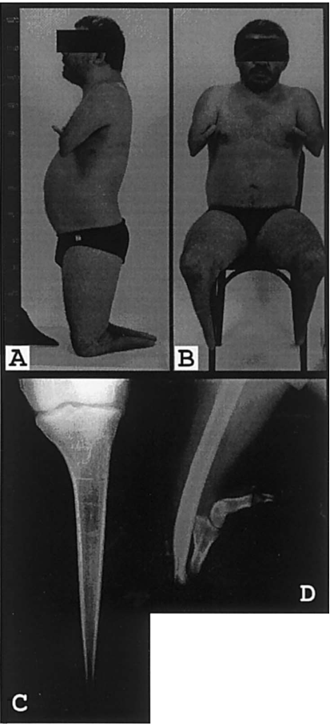

## Question

# Disease Characteristics Research Template

## Target Disease
- **Disease Name:** Acheiropodia
- **MONDO ID:** MONDO:0008700 (if available)
- **Category:** Mendelian

## Research Objectives

Please provide a comprehensive research report on **Acheiropodia** covering all of the
disease characteristics listed below. This report will be used to populate a disease knowledge
base entry. Be thorough and cite primary literature (PMID preferred) for all claims.

For each section, **suggested databases/resources** are listed. These are the first places
you should search for information on each topic.

---

### 1. Disease Information
> **Search first:** OMIM, Orphanet, ICD-10/ICD-11, MeSH, PubMed

- What is the disease? Provide a concise overview.
- What are the key identifiers? (OMIM, Orphanet, ICD-10/ICD-11, MeSH, Mondo)
- What are the common synonyms and alternative names?
- Is the information derived from individual patients (e.g., EHR) or aggregated disease-level resources?

### 2. Etiology

- **Disease Causal Factors**: What are the primary causes? (genetic, environmental, infectious, mechanistic)
- **Risk Factors**:
  > **Search first:** PubMed, Cochrane Library, UpToDate, clinical guidelines, ClinVar, ClinGen, GWAS Catalog, PheGenI, CTD, CDC, WHO, epidemiological databases
  - Genetic risk factors (causal variants, susceptibility loci, modifier genes)
  - Environmental risk factors (toxins, lifestyle, occupational exposures, age, sex, family history)
- **Protective Factors**:
  > **Search first:** PubMed, Cochrane Library, clinical trial databases, GWAS Catalog, gnomAD, WHO, CDC, nutrition databases
  - Genetic protective factors (protective variants, modifier alleles)
  - Environmental protective factors (diet, lifestyle, exposures that reduce risk)
- **Gene-Environment Interactions**: How do genetic and environmental factors interact to influence disease?
  > **Search first:** CTD, PubMed, PheGenI, GxE databases

### 3. Phenotypes
> **Search first:** HPO (Human Phenotype Ontology), OMIM, Orphanet, PubMed, clinicaltrials.gov, MedDRA, SNOMED CT, DECIPHER, LOINC

For each phenotype, provide:
- **Phenotype type**: symptoms, clinical signs, physical manifestations, behavioral changes, or laboratory abnormalities
  > For symptoms/signs: HPO, OMIM, Orphanet, PubMed
  > For behavioral changes: HPO, DSM, RDoC (Research Domain Criteria), PubMed
  > For laboratory abnormalities: LOINC, SNOMED CT, LabTests Online, PubMed
- **Phenotype characteristics**:
  > **Search first:** OMIM, Orphanet, HPO, PubMed
  - Age of symptom onset (neonatal, childhood, adult-onset, late-onset)
  - Symptom severity (mild, moderate, severe, variable)
  - Symptom progression (stable, progressive, episodic, fluctuating)
  - Frequency among affected individuals (percentage or qualitative)
- **Quality of life impact**: Effects on daily functioning and well-being (per-phenotype when possible)
  > **Search first:** EQ-5D database, SF-36, WHO QOL databases, PubMed
- Suggest HPO (Human Phenotype Ontology) terms for each phenotype

### 4. Genetic/Molecular Information

- **Causal Genes**: Gene mutations or chromosomal abnormalities responsible for disease (gene symbols, OMIM IDs)
  > **Search first:** OMIM, ClinVar, HGMD, Ensembl, NCBI Gene
- **Pathogenic Variants**:
  - Affected genes (gene symbols, HGNC IDs)
    > **Search first:** OMIM, NCBI Gene, Ensembl, HGNC, UniProt, GeneCards
  - Variant classification (pathogenic, likely pathogenic, VUS per ACMG/AMP guidelines)
    > **Search first:** ClinVar, ClinGen, ACMG/AMP guidelines, VarSome
  - Variant type/class (missense, frameshift, nonsense, splice-site, structural)
  - Allele frequency in population databases
    > **Search first:** gnomAD, 1000 Genomes, ExAC, TOPMed, dbSNP
  - Somatic vs germline origin
    > **Search first:** COSMIC (somatic), ClinVar, ICGC, TCGA
  - Functional consequences (loss of function, gain of function, dominant negative)
- **Modifier Genes**: Genes that modify disease severity or expression
- **Epigenetic Information**: DNA methylation, histone modifications, chromatin changes affecting disease
  > **Search first:** ENCODE, Roadmap Epigenomics, MethBase, DiseaseMeth
- **Chromosomal Abnormalities**: Large-scale genetic changes (aneuploidy, translocations, inversions)
  > **Search first:** DECIPHER, ClinVar, ECARUCA, UCSC Genome Browser

### 5. Environmental Information

- **Environmental Factors**: Non-genetic contributing factors (toxins, radiation, pollution, occupational exposure)
  > **Search first:** CTD (Comparative Toxicogenomics Database), TOXNET, PubMed, EPA databases
- **Lifestyle Factors**: Behavioral factors (smoking, diet, exercise, alcohol consumption)
  > **Search first:** CDC databases, WHO, PubMed, NHANES
- **Infectious Agents**: If applicable, pathogens causing or triggering disease (bacteria, viruses, fungi, parasites)
  > **Search first:** NCBI Taxonomy, ViPR, BV-BRC, MicrobeDB, GIDEON

### 6. Mechanism / Pathophysiology

**Present this section as an ordered causal chain first, then the detail below.**
Open with a numbered sequence of mechanistic steps running from the initiating
lesion (mutation, exposure, infection) to the clinical manifestation, one step per
line, each naming what it causes next. State the causal verb explicitly ("leads
to", "results in") and say where a step is inferred rather than demonstrated.
Where the mechanism branches, show the branch. The categories below are a
checklist of what to cover within those steps, not the organizing structure —
a step may draw on several of them, and a category may contribute to several
steps.

- **Molecular Pathways**: Specific signaling cascades or biochemical pathways involved (Wnt, MAPK, mTOR, PI3K-AKT, etc.)
  > **Search first:** KEGG, Reactome, WikiPathways, PathBank, BioCyc
- **Cellular Processes**: Cell-level mechanisms (apoptosis, autophagy, cell cycle dysregulation, inflammation, etc.)
  > **Search first:** Gene Ontology (GO), Reactome, KEGG, PubMed
- **Protein Dysfunction**: How protein structure or function is altered (misfolding, aggregation, loss of function, gain of function)
  > **Search first:** UniProt, PDB (Protein Data Bank), InterPro, Pfam, AlphaFold
- **Metabolic Changes**: Alterations in metabolic processes (energy metabolism, lipid metabolism, amino acid metabolism)
  > **Search first:** KEGG, BioCyc, HMDB (Human Metabolome Database), BRENDA
- **Immune System Involvement**: Role of immune response (autoimmunity, immunodeficiency, chronic inflammation)
  > **Search first:** ImmPort, Immunome Database, IEDB, Gene Ontology
- **Tissue Damage Mechanisms**: How tissues/ are injured (oxidative stress, ischemia, fibrosis, necrosis)
  > **Search first:** PubMed, Gene Ontology, Reactome
- **Biochemical Abnormalities**: Specific molecular defects (enzyme deficiencies, receptor dysfunction, ion channel defects)
  > **Search first:** BRENDA, UniProt, KEGG, OMIM, PubMed
- **Epigenetic Changes**: DNA methylation, histone modifications affecting gene expression in disease
  > **Search first:** ENCODE, Roadmap Epigenomics, MethBase, DiseaseMeth
- **Molecular Profiling** (if available):
  - Transcriptomics/gene expression changes
    > **Search first:** GEO (Gene Expression Omnibus), ArrayExpress, GTEx, Human Cell Atlas, SRA
  - Proteomics findings
    > **Search first:** PRIDE, ProteomeXchange, Human Protein Atlas, STRING, BioGRID
  - Metabolomics signatures
    > **Search first:** MetaboLights, Metabolomics Workbench, HMDB, METLIN
  - Lipidomics alterations
    > **Search first:** LIPID MAPS, SwissLipids, LipidHome, Metabolomics Workbench
  - Genomic structural features
    > **Search first:** UCSC Genome Browser, Ensembl, NCBI, dbVar, DGV
- **Advanced Technologies** (if applicable):
  - Single-cell analysis findings (cell-type specific mechanisms, cellular heterogeneity)
    > **Search first:** Human Cell Atlas, Single Cell Portal, GEO, CELLxGENE
  - Spatial transcriptomics findings
    > **Search first:** GEO, Spatial Research, Vizgen, 10x Genomics data
  - Multi-omics integration results
    > **Search first:** TCGA, ICGC, cBioPortal, LinkedOmics, PubMed
  - Functional genomics screens (CRISPR, RNAi)
    > **Search first:** DepMap, GenomeRNAi, PubMed, BioGRID ORCS

For each mechanism, describe:
- The causal chain from initial trigger to clinical manifestation
- Which mechanisms are upstream vs downstream
- What cell types and biological processes are involved
- Suggest GO terms for biological processes and CL terms for cell types

### 7. Anatomical Structures Affected

- **Organ Level**:
  - Primary organs directly affected
  - Secondary organ involvement (complications, secondary effects)
  - Body systems involved (cardiovascular, nervous, digestive, respiratory, endocrine, etc.)
  > **Search first:** Uberon, FMA (Foundational Model of Anatomy), OMIM, HPO, ICD-11, MeSH, SNOMED CT
- **Tissue and Cell Level**:
  - Specific tissue types affected (epithelial, connective, muscle, nervous)
  - Specific cell populations targeted (with Cell Ontology terms)
  > **Search first:** Uberon, Human Protein Atlas, Cell Ontology, Human Cell Atlas, CellMarker, PanglaoDB
- **Subcellular Level**:
  - Cellular compartments involved (mitochondria, nucleus, ER, lysosomes) (with GO Cellular Component terms)
  > **Search first:** Gene Ontology (Cellular Component), UniProt, Human Protein Atlas
- **Localization**:
  - Specific anatomical sites (with UBERON terms)
    > **Search first:** FMA, Uberon, NeuroNames (for brain), SNOMED CT
  - Lateralization (unilateral, bilateral, asymmetric)
    > **Search first:** HPO, clinical literature, imaging databases

### 8. Temporal Development

- **Onset**:
  - Typical age of onset (congenital, pediatric, adult, geriatric)
  - Onset pattern (acute, subacute, chronic, insidious)
  > **Search first:** OMIM, Orphanet, HPO, PubMed
- **Progression**:
  - Disease stages (early, intermediate, advanced, end-stage)
    > **Search first:** Cancer Staging Manual (AJCC), WHO classifications, PubMed
  - Progression rate (rapid, slow, variable)
  - Disease course pattern (episodic, relapsing-remitting, progressive, stable)
  - Disease duration (self-limited, chronic lifelong)
  > **Search first:** Disease registries, longitudinal cohort databases, natural history studies, PubMed, Orphanet, OMIM
- **Patterns**:
  - Remission patterns (spontaneous, treatment-induced)
    > **Search first:** Clinical trial databases, disease registries, PubMed
  - Critical periods (time windows of vulnerability or opportunity for intervention)
    > **Search first:** PubMed, developmental biology databases, clinical guidelines

### 9. Inheritance and Population

- **Epidemiology**:
  - Prevalence (cases per 100,000 at given time)
  - Incidence (new cases per 100,000 per year)
  > **Search first:** Orphanet, CDC, WHO, GBD (Global Burden of Disease), national registries, SEER, disease registries
- **For Genetic Etiology**:
  - Inheritance pattern (AD, AR, X-linked, mitochondrial, multifactorial, polygenic)
    > **Search first:** OMIM, Orphanet, ClinVar, GTR (Genetic Testing Registry)
  - Penetrance (complete, incomplete, age-dependent)
    > **Search first:** ClinVar, OMIM, PubMed, ClinGen
  - Expressivity (variable, consistent)
    > **Search first:** OMIM, ClinVar, PubMed
  - Genetic anticipation (increasing severity in successive generations)
    > **Search first:** OMIM, PubMed (especially for repeat expansion disorders)
  - Germline mosaicism
    > **Search first:** ClinVar, OMIM, genetic counseling literature, PubMed
  - Founder effects (population-specific mutations)
    > **Search first:** gnomAD, population genetics databases, PubMed
  - Consanguinity role
    > **Search first:** OMIM, population studies, genetic counseling resources
  - Carrier frequency
    > **Search first:** gnomAD, carrier screening databases, GeneReviews, GTR
- **Population Demographics**:
  - Affected populations (ethnic or demographic groups with higher prevalence)
    > **Search first:** gnomAD, 1000 Genomes, PAGE Study, PubMed, population registries
  - Geographic distribution (endemic areas, regional variation)
    > **Search first:** WHO, CDC, GBD, Orphanet, geographic epidemiology databases
  - Geographic distribution of specific variants
  - Sex ratio (male:female)
    > **Search first:** Disease registries, OMIM, PubMed, epidemiological databases
  - Age distribution of affected individuals
    > **Search first:** CDC, disease registries, SEER, Orphanet

### 10. Diagnostics

- **Clinical Tests**:
  - Laboratory tests (blood, urine, tissue chemistry, specific enzyme assays)
    > **Search first:** LOINC, LabTests Online, PubMed
  - Biomarkers (proteins, metabolites, genetic markers, circulating biomarkers)
    > **Search first:** FDA Biomarker List, BEST (Biomarkers, EndpointS, and other Tools), PubMed
  - Imaging studies (X-ray, CT, MRI, PET, ultrasound)
    > **Search first:** RadLex, DICOM, Radiopaedia, imaging databases
  - Functional tests (pulmonary function, cardiac stress tests)
    > **Search first:** LOINC, clinical guidelines, PubMed
  - Electrophysiology (EEG, EMG, ECG, nerve conduction studies)
    > **Search first:** LOINC, clinical neurophysiology databases, PubMed
  - Biopsy findings (histopathology, immunohistochemistry)
    > **Search first:** SNOMED CT, College of American Pathologists resources, PubMed
  - Pathology findings (microscopic examination)
    > **Search first:** SNOMED CT, Digital Pathology databases, PubMed
- **Genetic Testing**:
  > **Search first:** GTR (Genetic Testing Registry), GeneReviews, ClinGen
  - Overview of recommended genetic testing approach
  - Whole genome sequencing (WGS) utility
    > **Search first:** GTR, ClinVar, GEL (Genomics England), gnomAD
  - Whole exome sequencing (WES) utility
    > **Search first:** GTR, ClinVar, OMIM, GeneMatcher
  - Gene panels (which panels, which genes)
    > **Search first:** GTR, ClinVar, laboratory-specific databases
  - Single gene testing
    > **Search first:** GTR, ClinVar, OMIM, GeneReviews
  - Chromosomal microarray (CMA)
    > **Search first:** DECIPHER, ClinVar, dbVar, ECARUCA
  - Karyotyping
    > **Search first:** Chromosome Abnormality Database, ClinVar, cytogenetics resources
  - FISH
    > **Search first:** ClinVar, cytogenetics databases, PubMed
  - Mitochondrial DNA testing
    > **Search first:** MITOMAP, MSeqDR, ClinVar, GTR
  - Repeat expansion testing
    > **Search first:** GTR, ClinVar, repeat expansion databases, PubMed
- **Omics-Based Diagnostics** (if applicable):
  - RNA sequencing / transcriptomics
    > **Search first:** GEO, ArrayExpress, GTEx, RNA-seq databases
  - Proteomics
    > **Search first:** PRIDE, ProteomeXchange, FDA Biomarker database
  - Metabolomics
    > **Search first:** MetaboLights, Metabolomics Workbench, HMDB
  - Epigenomics
    > **Search first:** GEO, ENCODE, Roadmap Epigenomics, MethBase
  - Liquid biopsy
    > **Search first:** COSMIC, ClinVar, liquid biopsy databases, PubMed
- **Clinical Criteria**:
  - Standardized diagnostic criteria (DSM, ICD, society guidelines)
    > **Search first:** DSM-5, ICD-11, clinical society guidelines, UpToDate
  - Differential diagnosis (other conditions to rule out, with distinguishing features)
    > **Search first:** DynaMed, UpToDate, clinical decision support systems
- **Screening**:
  - Screening methods for asymptomatic individuals (newborn screening, carrier screening, cascade screening)
    > **Search first:** ACMG recommendations, CDC newborn screening, GTR

### 11. Outcome/Prognosis

- **Survival and Mortality**:
  - Survival rate (5-year, 10-year, overall)
    > **Search first:** SEER, cancer registries, disease-specific registries, PubMed
  - Life expectancy (with and without treatment if applicable)
    > **Search first:** Orphanet, disease registries, actuarial databases, PubMed
  - Mortality rate
    > **Search first:** CDC, WHO, GBD, national mortality databases
  - Disease-specific mortality (deaths directly attributable to disease)
    > **Search first:** Disease registries, CDC Wonder, GBD, PubMed
- **Morbidity and Function**:
  - Morbidity (disease-related disability and health impacts)
    > **Search first:** GBD, WHO, disability databases, PubMed
  - Disability outcomes (long-term functional impairments)
    > **Search first:** ICF (International Classification of Functioning), disability registries
  - Quality of life measures (EQ-5D, SF-36, PROMIS, disease-specific tools)
    > **Search first:** EQ-5D database, SF-36, PROMIS, PubMed
- **Disease Course**:
  - Complications (secondary problems: infections, organ failure, etc.)
    > **Search first:** ICD codes, disease registries, clinical databases, PubMed
  - Recovery potential (likelihood and extent of recovery, with vs without treatment)
    > **Search first:** Natural history studies, rehabilitation databases, PubMed
- **Prediction**:
  - Prognostic factors (age, disease severity, biomarkers, treatment response)
    > **Search first:** Prognostic models databases, clinical calculators, PubMed
  - Prognostic biomarkers (molecular markers predicting disease course)
    > **Search first:** FDA Biomarker database, PubMed, cancer prognostic databases

### 12. Treatment

- **Pharmacotherapy**:
  - Pharmacological treatments (drug names, drug classes, mechanisms of action)
    > **Search first:** DrugBank, RxNorm, ATC classification, DailyMed, FDA databases
  - Pharmacogenomics (how genetic variants affect drug metabolism, efficacy, toxicity)
    > **Search first:** PharmGKB, CPIC (Clinical Pharmacogenetics), FDA Table of PGx Biomarkers
- **Advanced Therapeutics**:
  - Gene therapy (viral vectors, CRISPR, gene replacement, gene editing)
    > **Search first:** ClinicalTrials.gov, FDA gene therapy database, ASGCT resources
  - Cell therapy (stem cell transplant, CAR-T, cellular therapeutics)
    > **Search first:** ClinicalTrials.gov, FDA cell therapy database, FACT standards
  - RNA-based therapies (ASOs, siRNA, mRNA therapies)
    > **Search first:** ClinicalTrials.gov, FDA approvals, PubMed
  - Targeted therapies (treatments directed at specific molecular targets)
    > **Search first:** My Cancer Genome, OncoKB, ClinicalTrials.gov, FDA approvals
  - Immunotherapies (checkpoint inhibitors, monoclonal antibodies)
    > **Search first:** Cancer Immunotherapy Database, FDA approvals, ClinicalTrials.gov
- **Surgical and Interventional**:
  - Surgical interventions (types of surgery, timing, outcomes)
    > **Search first:** CPT codes, surgical registries, clinical guidelines, PubMed
- **Supportive and Rehabilitative**:
  - Supportive care (symptom management, pain control, nutrition)
    > **Search first:** Clinical guidelines, Cochrane Library, PubMed
  - Rehabilitation (physical therapy, occupational therapy, speech therapy)
    > **Search first:** Rehabilitation medicine databases, clinical guidelines, PubMed
- **Experimental**:
  - Experimental treatments in clinical trials (with NCT identifiers if available)
    > **Search first:** ClinicalTrials.gov, EU Clinical Trials Register, WHO ICTRP
- **Treatment Outcomes**:
  - Treatment response rates
    > **Search first:** Clinical trial databases, FDA reviews, systematic reviews, PubMed
  - Side effects and adverse events
    > **Search first:** FDA Adverse Event Reporting System (FAERS), MedWatch, PubMed
- **Treatment Strategy**:
  - Treatment algorithms (clinical pathways, decision trees)
    > **Search first:** Clinical practice guidelines, NCCN Guidelines, UpToDate
  - Combination therapies
    > **Search first:** ClinicalTrials.gov, treatment guidelines, PubMed
  - Personalized medicine approaches (genotype-guided treatment)
    > **Search first:** My Cancer Genome, CIViC, PharmGKB, precision medicine databases

For each treatment, suggest NCIT (NCI Thesaurus) clinical-intervention terms where applicable.

### 13. Prevention

- **Prevention Levels**:
  - Primary prevention (preventing disease occurrence: vaccination, risk factor modification)
    > **Search first:** CDC, WHO, USPSTF recommendations, Cochrane Library
  - Secondary prevention (early detection and treatment: screening programs, early intervention)
    > **Search first:** USPSTF, CDC screening guidelines, WHO
  - Tertiary prevention (preventing complications in those with disease)
    > **Search first:** Clinical guidelines, disease management protocols, PubMed
- **Immunization**: Vaccine strategies (if applicable)
  > **Search first:** CDC vaccine schedules, WHO immunization, FDA vaccine database
- **Screening and Early Detection**:
  - Screening programs (population-based: newborn screening, cancer screening)
    > **Search first:** CDC screening programs, USPSTF, cancer screening databases
  - Genetic screening (carrier screening, preimplantation genetic diagnosis, prenatal testing)
    > **Search first:** ACMG recommendations, ACOG guidelines, GTR
  - Risk stratification (identifying high-risk individuals for targeted prevention)
    > **Search first:** Risk prediction models, clinical calculators, PubMed
- **Behavioral Interventions**: Lifestyle modifications to reduce risk
  > **Search first:** CDC, WHO, behavioral intervention databases, Cochrane Library
- **Counseling**: Genetic counseling (risk assessment, family planning guidance)
  > **Search first:** NSGC resources, ACMG guidelines, GeneReviews
- **Public Health**:
  - Public health interventions (sanitation, vector control, health education)
    > **Search first:** CDC, WHO, public health databases, PubMed
  - Environmental interventions (reducing environmental risk factors)
    > **Search first:** EPA databases, WHO environmental health, PubMed
- **Prophylaxis**: Preventive medications or procedures
  > **Search first:** Clinical guidelines, FDA approvals, PubMed

### 14. Other Species / Natural Disease

- **Taxonomy**: Species affected (with NCBI Taxon identifiers)
  > **Search first:** NCBI Taxonomy
- **Breed**: Specific breeds affected (with VBO identifiers if applicable)
  > **Search first:** VBO (Vertebrate Breed Ontology)
- **Gene**: Orthologous genes in other species (with NCBI Gene IDs)
  > **Search first:** NCBI Gene
- **Natural Disease**:
  - Naturally occurring disease in other species (companion animals, wildlife)
    > **Search first:** OMIA (Online Mendelian Inheritance in Animals), VetCompass, PubMed
  - Veterinary relevance and importance in animal health
    > **Search first:** OMIA, veterinary databases, PubMed
- **Comparative Biology**:
  - Comparative pathology (similarities and differences across species)
    > **Search first:** OMIA, comparative pathology databases, PubMed
  - Evolutionary conservation of disease mechanisms
    > **Search first:** HomoloGene, OrthoMCL, Alliance of Genome Resources
- **Transmission** (if applicable):
  - Zoonotic potential
    > **Search first:** CDC zoonotic diseases, WHO zoonoses, GIDEON
  - Cross-species susceptibility
    > **Search first:** NCBI Taxonomy, veterinary databases, PubMed

### 15. Model Organisms

- **Model Types**:
  - Model organism type (mammalian, invertebrate, cellular, in vitro)
    > **Search first:** Alliance of Genome Resources, model organism databases
  - Specific model systems (mouse, rat, zebrafish, Drosophila, C. elegans, yeast, cell lines, organoids, iPSCs)
    > **Search first:** MGI, RGD, ZFIN, FlyBase, WormBase, SGD, ATCC, Cellosaurus
  - Induced models (drug treatment, surgical intervention, environmental manipulation)
    > **Search first:** MGI, model organism databases, PubMed
- **Genetic Models**:
  - Types available (knockout, knock-in, transgenic, conditional, humanized)
    > **Search first:** MGI, IMPC, KOMP, EuMMCR, IMSR
- **Model Characteristics**:
  - Phenotype recapitulation (how well model reproduces human disease features)
    > **Search first:** Model organism databases, comparative studies, PubMed
  - Model limitations (aspects of human disease not captured)
    > **Search first:** Model organism databases, PubMed, review articles
- **Applications**:
  - Research applications (what aspects of disease can be studied)
    > **Search first:** Model organism databases, PubMed
- **Resources**:
  - Model databases
    > **Search first:** MGI, RGD, ZFIN, FlyBase, WormBase, IMSR, EMMA, MMRRC

---

## Citation Requirements

- Cite primary literature (PMID preferred) for all mechanistic and clinical claims
- Prioritize recent reviews and landmark papers
- Include direct quotes from abstracts where possible to support key statements
- Distinguish evidence source types: human clinical, model organism, in vitro, computational

## Output Format

Structure your response as a comprehensive narrative organized by the sections above.
For each section, provide:
- Factual content with specific details (numbers, percentages, gene names, variant nomenclature)
- Ontology term suggestions (HPO, GO, CL, UBERON, CHEBI, NCIT, MONDO) where applicable
- Evidence citations with PMIDs
- Direct quotes from abstracts to support key claims
- Clear indication when information is not available or not applicable for this disease

This report will be used to populate a disease knowledge base entry with:
- Pathophysiology descriptions with causal chains
- Gene/protein annotations (HGNC, GO terms)
- Phenotype associations (HP terms) with frequencies
- Cell type involvement (CL terms)
- Anatomical locations (UBERON terms)
- Chemical entities (CHEBI terms)
- Treatment annotations (NCIT terms)
- Evidence items with PMIDs and exact abstract quotes
- Epidemiology, prognosis, diagnostic, and prevention information
- Animal model descriptions with phenotype recapitulation details

## Output

Question: You are an expert researcher providing comprehensive, well-cited information.

Provide detailed information focusing on:
1. Key concepts and definitions with current understanding
2. Recent developments and latest research (prioritize 2023-2024 sources)
3. Current applications and real-world implementations
4. Expert opinions and analysis from authoritative sources
5. Relevant statistics and data from recent studies

Format as a comprehensive research report with proper citations. Include URLs and publication dates where available.
Always prioritize recent, authoritative sources and provide specific citations for all major claims.

# Disease Characteristics Research Template

## Target Disease
- **Disease Name:** Acheiropodia
- **MONDO ID:** MONDO:0008700 (if available)
- **Category:** Mendelian

## Research Objectives

Please provide a comprehensive research report on **Acheiropodia** covering all of the
disease characteristics listed below. This report will be used to populate a disease knowledge
base entry. Be thorough and cite primary literature (PMID preferred) for all claims.

For each section, **suggested databases/resources** are listed. These are the first places
you should search for information on each topic.

---

### 1. Disease Information
> **Search first:** OMIM, Orphanet, ICD-10/ICD-11, MeSH, PubMed

- What is the disease? Provide a concise overview.
- What are the key identifiers? (OMIM, Orphanet, ICD-10/ICD-11, MeSH, Mondo)
- What are the common synonyms and alternative names?
- Is the information derived from individual patients (e.g., EHR) or aggregated disease-level resources?

### 2. Etiology

- **Disease Causal Factors**: What are the primary causes? (genetic, environmental, infectious, mechanistic)
- **Risk Factors**:
  > **Search first:** PubMed, Cochrane Library, UpToDate, clinical guidelines, ClinVar, ClinGen, GWAS Catalog, PheGenI, CTD, CDC, WHO, epidemiological databases
  - Genetic risk factors (causal variants, susceptibility loci, modifier genes)
  - Environmental risk factors (toxins, lifestyle, occupational exposures, age, sex, family history)
- **Protective Factors**:
  > **Search first:** PubMed, Cochrane Library, clinical trial databases, GWAS Catalog, gnomAD, WHO, CDC, nutrition databases
  - Genetic protective factors (protective variants, modifier alleles)
  - Environmental protective factors (diet, lifestyle, exposures that reduce risk)
- **Gene-Environment Interactions**: How do genetic and environmental factors interact to influence disease?
  > **Search first:** CTD, PubMed, PheGenI, GxE databases

### 3. Phenotypes
> **Search first:** HPO (Human Phenotype Ontology), OMIM, Orphanet, PubMed, clinicaltrials.gov, MedDRA, SNOMED CT, DECIPHER, LOINC

For each phenotype, provide:
- **Phenotype type**: symptoms, clinical signs, physical manifestations, behavioral changes, or laboratory abnormalities
  > For symptoms/signs: HPO, OMIM, Orphanet, PubMed
  > For behavioral changes: HPO, DSM, RDoC (Research Domain Criteria), PubMed
  > For laboratory abnormalities: LOINC, SNOMED CT, LabTests Online, PubMed
- **Phenotype characteristics**:
  > **Search first:** OMIM, Orphanet, HPO, PubMed
  - Age of symptom onset (neonatal, childhood, adult-onset, late-onset)
  - Symptom severity (mild, moderate, severe, variable)
  - Symptom progression (stable, progressive, episodic, fluctuating)
  - Frequency among affected individuals (percentage or qualitative)
- **Quality of life impact**: Effects on daily functioning and well-being (per-phenotype when possible)
  > **Search first:** EQ-5D database, SF-36, WHO QOL databases, PubMed
- Suggest HPO (Human Phenotype Ontology) terms for each phenotype

### 4. Genetic/Molecular Information

- **Causal Genes**: Gene mutations or chromosomal abnormalities responsible for disease (gene symbols, OMIM IDs)
  > **Search first:** OMIM, ClinVar, HGMD, Ensembl, NCBI Gene
- **Pathogenic Variants**:
  - Affected genes (gene symbols, HGNC IDs)
    > **Search first:** OMIM, NCBI Gene, Ensembl, HGNC, UniProt, GeneCards
  - Variant classification (pathogenic, likely pathogenic, VUS per ACMG/AMP guidelines)
    > **Search first:** ClinVar, ClinGen, ACMG/AMP guidelines, VarSome
  - Variant type/class (missense, frameshift, nonsense, splice-site, structural)
  - Allele frequency in population databases
    > **Search first:** gnomAD, 1000 Genomes, ExAC, TOPMed, dbSNP
  - Somatic vs germline origin
    > **Search first:** COSMIC (somatic), ClinVar, ICGC, TCGA
  - Functional consequences (loss of function, gain of function, dominant negative)
- **Modifier Genes**: Genes that modify disease severity or expression
- **Epigenetic Information**: DNA methylation, histone modifications, chromatin changes affecting disease
  > **Search first:** ENCODE, Roadmap Epigenomics, MethBase, DiseaseMeth
- **Chromosomal Abnormalities**: Large-scale genetic changes (aneuploidy, translocations, inversions)
  > **Search first:** DECIPHER, ClinVar, ECARUCA, UCSC Genome Browser

### 5. Environmental Information

- **Environmental Factors**: Non-genetic contributing factors (toxins, radiation, pollution, occupational exposure)
  > **Search first:** CTD (Comparative Toxicogenomics Database), TOXNET, PubMed, EPA databases
- **Lifestyle Factors**: Behavioral factors (smoking, diet, exercise, alcohol consumption)
  > **Search first:** CDC databases, WHO, PubMed, NHANES
- **Infectious Agents**: If applicable, pathogens causing or triggering disease (bacteria, viruses, fungi, parasites)
  > **Search first:** NCBI Taxonomy, ViPR, BV-BRC, MicrobeDB, GIDEON

### 6. Mechanism / Pathophysiology

**Present this section as an ordered causal chain first, then the detail below.**
Open with a numbered sequence of mechanistic steps running from the initiating
lesion (mutation, exposure, infection) to the clinical manifestation, one step per
line, each naming what it causes next. State the causal verb explicitly ("leads
to", "results in") and say where a step is inferred rather than demonstrated.
Where the mechanism branches, show the branch. The categories below are a
checklist of what to cover within those steps, not the organizing structure —
a step may draw on several of them, and a category may contribute to several
steps.

- **Molecular Pathways**: Specific signaling cascades or biochemical pathways involved (Wnt, MAPK, mTOR, PI3K-AKT, etc.)
  > **Search first:** KEGG, Reactome, WikiPathways, PathBank, BioCyc
- **Cellular Processes**: Cell-level mechanisms (apoptosis, autophagy, cell cycle dysregulation, inflammation, etc.)
  > **Search first:** Gene Ontology (GO), Reactome, KEGG, PubMed
- **Protein Dysfunction**: How protein structure or function is altered (misfolding, aggregation, loss of function, gain of function)
  > **Search first:** UniProt, PDB (Protein Data Bank), InterPro, Pfam, AlphaFold
- **Metabolic Changes**: Alterations in metabolic processes (energy metabolism, lipid metabolism, amino acid metabolism)
  > **Search first:** KEGG, BioCyc, HMDB (Human Metabolome Database), BRENDA
- **Immune System Involvement**: Role of immune response (autoimmunity, immunodeficiency, chronic inflammation)
  > **Search first:** ImmPort, Immunome Database, IEDB, Gene Ontology
- **Tissue Damage Mechanisms**: How tissues/ are injured (oxidative stress, ischemia, fibrosis, necrosis)
  > **Search first:** PubMed, Gene Ontology, Reactome
- **Biochemical Abnormalities**: Specific molecular defects (enzyme deficiencies, receptor dysfunction, ion channel defects)
  > **Search first:** BRENDA, UniProt, KEGG, OMIM, PubMed
- **Epigenetic Changes**: DNA methylation, histone modifications affecting gene expression in disease
  > **Search first:** ENCODE, Roadmap Epigenomics, MethBase, DiseaseMeth
- **Molecular Profiling** (if available):
  - Transcriptomics/gene expression changes
    > **Search first:** GEO (Gene Expression Omnibus), ArrayExpress, GTEx, Human Cell Atlas, SRA
  - Proteomics findings
    > **Search first:** PRIDE, ProteomeXchange, Human Protein Atlas, STRING, BioGRID
  - Metabolomics signatures
    > **Search first:** MetaboLights, Metabolomics Workbench, HMDB, METLIN
  - Lipidomics alterations
    > **Search first:** LIPID MAPS, SwissLipids, LipidHome, Metabolomics Workbench
  - Genomic structural features
    > **Search first:** UCSC Genome Browser, Ensembl, NCBI, dbVar, DGV
- **Advanced Technologies** (if applicable):
  - Single-cell analysis findings (cell-type specific mechanisms, cellular heterogeneity)
    > **Search first:** Human Cell Atlas, Single Cell Portal, GEO, CELLxGENE
  - Spatial transcriptomics findings
    > **Search first:** GEO, Spatial Research, Vizgen, 10x Genomics data
  - Multi-omics integration results
    > **Search first:** TCGA, ICGC, cBioPortal, LinkedOmics, PubMed
  - Functional genomics screens (CRISPR, RNAi)
    > **Search first:** DepMap, GenomeRNAi, PubMed, BioGRID ORCS

For each mechanism, describe:
- The causal chain from initial trigger to clinical manifestation
- Which mechanisms are upstream vs downstream
- What cell types and biological processes are involved
- Suggest GO terms for biological processes and CL terms for cell types

### 7. Anatomical Structures Affected

- **Organ Level**:
  - Primary organs directly affected
  - Secondary organ involvement (complications, secondary effects)
  - Body systems involved (cardiovascular, nervous, digestive, respiratory, endocrine, etc.)
  > **Search first:** Uberon, FMA (Foundational Model of Anatomy), OMIM, HPO, ICD-11, MeSH, SNOMED CT
- **Tissue and Cell Level**:
  - Specific tissue types affected (epithelial, connective, muscle, nervous)
  - Specific cell populations targeted (with Cell Ontology terms)
  > **Search first:** Uberon, Human Protein Atlas, Cell Ontology, Human Cell Atlas, CellMarker, PanglaoDB
- **Subcellular Level**:
  - Cellular compartments involved (mitochondria, nucleus, ER, lysosomes) (with GO Cellular Component terms)
  > **Search first:** Gene Ontology (Cellular Component), UniProt, Human Protein Atlas
- **Localization**:
  - Specific anatomical sites (with UBERON terms)
    > **Search first:** FMA, Uberon, NeuroNames (for brain), SNOMED CT
  - Lateralization (unilateral, bilateral, asymmetric)
    > **Search first:** HPO, clinical literature, imaging databases

### 8. Temporal Development

- **Onset**:
  - Typical age of onset (congenital, pediatric, adult, geriatric)
  - Onset pattern (acute, subacute, chronic, insidious)
  > **Search first:** OMIM, Orphanet, HPO, PubMed
- **Progression**:
  - Disease stages (early, intermediate, advanced, end-stage)
    > **Search first:** Cancer Staging Manual (AJCC), WHO classifications, PubMed
  - Progression rate (rapid, slow, variable)
  - Disease course pattern (episodic, relapsing-remitting, progressive, stable)
  - Disease duration (self-limited, chronic lifelong)
  > **Search first:** Disease registries, longitudinal cohort databases, natural history studies, PubMed, Orphanet, OMIM
- **Patterns**:
  - Remission patterns (spontaneous, treatment-induced)
    > **Search first:** Clinical trial databases, disease registries, PubMed
  - Critical periods (time windows of vulnerability or opportunity for intervention)
    > **Search first:** PubMed, developmental biology databases, clinical guidelines

### 9. Inheritance and Population

- **Epidemiology**:
  - Prevalence (cases per 100,000 at given time)
  - Incidence (new cases per 100,000 per year)
  > **Search first:** Orphanet, CDC, WHO, GBD (Global Burden of Disease), national registries, SEER, disease registries
- **For Genetic Etiology**:
  - Inheritance pattern (AD, AR, X-linked, mitochondrial, multifactorial, polygenic)
    > **Search first:** OMIM, Orphanet, ClinVar, GTR (Genetic Testing Registry)
  - Penetrance (complete, incomplete, age-dependent)
    > **Search first:** ClinVar, OMIM, PubMed, ClinGen
  - Expressivity (variable, consistent)
    > **Search first:** OMIM, ClinVar, PubMed
  - Genetic anticipation (increasing severity in successive generations)
    > **Search first:** OMIM, PubMed (especially for repeat expansion disorders)
  - Germline mosaicism
    > **Search first:** ClinVar, OMIM, genetic counseling literature, PubMed
  - Founder effects (population-specific mutations)
    > **Search first:** gnomAD, population genetics databases, PubMed
  - Consanguinity role
    > **Search first:** OMIM, population studies, genetic counseling resources
  - Carrier frequency
    > **Search first:** gnomAD, carrier screening databases, GeneReviews, GTR
- **Population Demographics**:
  - Affected populations (ethnic or demographic groups with higher prevalence)
    > **Search first:** gnomAD, 1000 Genomes, PAGE Study, PubMed, population registries
  - Geographic distribution (endemic areas, regional variation)
    > **Search first:** WHO, CDC, GBD, Orphanet, geographic epidemiology databases
  - Geographic distribution of specific variants
  - Sex ratio (male:female)
    > **Search first:** Disease registries, OMIM, PubMed, epidemiological databases
  - Age distribution of affected individuals
    > **Search first:** CDC, disease registries, SEER, Orphanet

### 10. Diagnostics

- **Clinical Tests**:
  - Laboratory tests (blood, urine, tissue chemistry, specific enzyme assays)
    > **Search first:** LOINC, LabTests Online, PubMed
  - Biomarkers (proteins, metabolites, genetic markers, circulating biomarkers)
    > **Search first:** FDA Biomarker List, BEST (Biomarkers, EndpointS, and other Tools), PubMed
  - Imaging studies (X-ray, CT, MRI, PET, ultrasound)
    > **Search first:** RadLex, DICOM, Radiopaedia, imaging databases
  - Functional tests (pulmonary function, cardiac stress tests)
    > **Search first:** LOINC, clinical guidelines, PubMed
  - Electrophysiology (EEG, EMG, ECG, nerve conduction studies)
    > **Search first:** LOINC, clinical neurophysiology databases, PubMed
  - Biopsy findings (histopathology, immunohistochemistry)
    > **Search first:** SNOMED CT, College of American Pathologists resources, PubMed
  - Pathology findings (microscopic examination)
    > **Search first:** SNOMED CT, Digital Pathology databases, PubMed
- **Genetic Testing**:
  > **Search first:** GTR (Genetic Testing Registry), GeneReviews, ClinGen
  - Overview of recommended genetic testing approach
  - Whole genome sequencing (WGS) utility
    > **Search first:** GTR, ClinVar, GEL (Genomics England), gnomAD
  - Whole exome sequencing (WES) utility
    > **Search first:** GTR, ClinVar, OMIM, GeneMatcher
  - Gene panels (which panels, which genes)
    > **Search first:** GTR, ClinVar, laboratory-specific databases
  - Single gene testing
    > **Search first:** GTR, ClinVar, OMIM, GeneReviews
  - Chromosomal microarray (CMA)
    > **Search first:** DECIPHER, ClinVar, dbVar, ECARUCA
  - Karyotyping
    > **Search first:** Chromosome Abnormality Database, ClinVar, cytogenetics resources
  - FISH
    > **Search first:** ClinVar, cytogenetics databases, PubMed
  - Mitochondrial DNA testing
    > **Search first:** MITOMAP, MSeqDR, ClinVar, GTR
  - Repeat expansion testing
    > **Search first:** GTR, ClinVar, repeat expansion databases, PubMed
- **Omics-Based Diagnostics** (if applicable):
  - RNA sequencing / transcriptomics
    > **Search first:** GEO, ArrayExpress, GTEx, RNA-seq databases
  - Proteomics
    > **Search first:** PRIDE, ProteomeXchange, FDA Biomarker database
  - Metabolomics
    > **Search first:** MetaboLights, Metabolomics Workbench, HMDB
  - Epigenomics
    > **Search first:** GEO, ENCODE, Roadmap Epigenomics, MethBase
  - Liquid biopsy
    > **Search first:** COSMIC, ClinVar, liquid biopsy databases, PubMed
- **Clinical Criteria**:
  - Standardized diagnostic criteria (DSM, ICD, society guidelines)
    > **Search first:** DSM-5, ICD-11, clinical society guidelines, UpToDate
  - Differential diagnosis (other conditions to rule out, with distinguishing features)
    > **Search first:** DynaMed, UpToDate, clinical decision support systems
- **Screening**:
  - Screening methods for asymptomatic individuals (newborn screening, carrier screening, cascade screening)
    > **Search first:** ACMG recommendations, CDC newborn screening, GTR

### 11. Outcome/Prognosis

- **Survival and Mortality**:
  - Survival rate (5-year, 10-year, overall)
    > **Search first:** SEER, cancer registries, disease-specific registries, PubMed
  - Life expectancy (with and without treatment if applicable)
    > **Search first:** Orphanet, disease registries, actuarial databases, PubMed
  - Mortality rate
    > **Search first:** CDC, WHO, GBD, national mortality databases
  - Disease-specific mortality (deaths directly attributable to disease)
    > **Search first:** Disease registries, CDC Wonder, GBD, PubMed
- **Morbidity and Function**:
  - Morbidity (disease-related disability and health impacts)
    > **Search first:** GBD, WHO, disability databases, PubMed
  - Disability outcomes (long-term functional impairments)
    > **Search first:** ICF (International Classification of Functioning), disability registries
  - Quality of life measures (EQ-5D, SF-36, PROMIS, disease-specific tools)
    > **Search first:** EQ-5D database, SF-36, PROMIS, PubMed
- **Disease Course**:
  - Complications (secondary problems: infections, organ failure, etc.)
    > **Search first:** ICD codes, disease registries, clinical databases, PubMed
  - Recovery potential (likelihood and extent of recovery, with vs without treatment)
    > **Search first:** Natural history studies, rehabilitation databases, PubMed
- **Prediction**:
  - Prognostic factors (age, disease severity, biomarkers, treatment response)
    > **Search first:** Prognostic models databases, clinical calculators, PubMed
  - Prognostic biomarkers (molecular markers predicting disease course)
    > **Search first:** FDA Biomarker database, PubMed, cancer prognostic databases

### 12. Treatment

- **Pharmacotherapy**:
  - Pharmacological treatments (drug names, drug classes, mechanisms of action)
    > **Search first:** DrugBank, RxNorm, ATC classification, DailyMed, FDA databases
  - Pharmacogenomics (how genetic variants affect drug metabolism, efficacy, toxicity)
    > **Search first:** PharmGKB, CPIC (Clinical Pharmacogenetics), FDA Table of PGx Biomarkers
- **Advanced Therapeutics**:
  - Gene therapy (viral vectors, CRISPR, gene replacement, gene editing)
    > **Search first:** ClinicalTrials.gov, FDA gene therapy database, ASGCT resources
  - Cell therapy (stem cell transplant, CAR-T, cellular therapeutics)
    > **Search first:** ClinicalTrials.gov, FDA cell therapy database, FACT standards
  - RNA-based therapies (ASOs, siRNA, mRNA therapies)
    > **Search first:** ClinicalTrials.gov, FDA approvals, PubMed
  - Targeted therapies (treatments directed at specific molecular targets)
    > **Search first:** My Cancer Genome, OncoKB, ClinicalTrials.gov, FDA approvals
  - Immunotherapies (checkpoint inhibitors, monoclonal antibodies)
    > **Search first:** Cancer Immunotherapy Database, FDA approvals, ClinicalTrials.gov
- **Surgical and Interventional**:
  - Surgical interventions (types of surgery, timing, outcomes)
    > **Search first:** CPT codes, surgical registries, clinical guidelines, PubMed
- **Supportive and Rehabilitative**:
  - Supportive care (symptom management, pain control, nutrition)
    > **Search first:** Clinical guidelines, Cochrane Library, PubMed
  - Rehabilitation (physical therapy, occupational therapy, speech therapy)
    > **Search first:** Rehabilitation medicine databases, clinical guidelines, PubMed
- **Experimental**:
  - Experimental treatments in clinical trials (with NCT identifiers if available)
    > **Search first:** ClinicalTrials.gov, EU Clinical Trials Register, WHO ICTRP
- **Treatment Outcomes**:
  - Treatment response rates
    > **Search first:** Clinical trial databases, FDA reviews, systematic reviews, PubMed
  - Side effects and adverse events
    > **Search first:** FDA Adverse Event Reporting System (FAERS), MedWatch, PubMed
- **Treatment Strategy**:
  - Treatment algorithms (clinical pathways, decision trees)
    > **Search first:** Clinical practice guidelines, NCCN Guidelines, UpToDate
  - Combination therapies
    > **Search first:** ClinicalTrials.gov, treatment guidelines, PubMed
  - Personalized medicine approaches (genotype-guided treatment)
    > **Search first:** My Cancer Genome, CIViC, PharmGKB, precision medicine databases

For each treatment, suggest NCIT (NCI Thesaurus) clinical-intervention terms where applicable.

### 13. Prevention

- **Prevention Levels**:
  - Primary prevention (preventing disease occurrence: vaccination, risk factor modification)
    > **Search first:** CDC, WHO, USPSTF recommendations, Cochrane Library
  - Secondary prevention (early detection and treatment: screening programs, early intervention)
    > **Search first:** USPSTF, CDC screening guidelines, WHO
  - Tertiary prevention (preventing complications in those with disease)
    > **Search first:** Clinical guidelines, disease management protocols, PubMed
- **Immunization**: Vaccine strategies (if applicable)
  > **Search first:** CDC vaccine schedules, WHO immunization, FDA vaccine database
- **Screening and Early Detection**:
  - Screening programs (population-based: newborn screening, cancer screening)
    > **Search first:** CDC screening programs, USPSTF, cancer screening databases
  - Genetic screening (carrier screening, preimplantation genetic diagnosis, prenatal testing)
    > **Search first:** ACMG recommendations, ACOG guidelines, GTR
  - Risk stratification (identifying high-risk individuals for targeted prevention)
    > **Search first:** Risk prediction models, clinical calculators, PubMed
- **Behavioral Interventions**: Lifestyle modifications to reduce risk
  > **Search first:** CDC, WHO, behavioral intervention databases, Cochrane Library
- **Counseling**: Genetic counseling (risk assessment, family planning guidance)
  > **Search first:** NSGC resources, ACMG guidelines, GeneReviews
- **Public Health**:
  - Public health interventions (sanitation, vector control, health education)
    > **Search first:** CDC, WHO, public health databases, PubMed
  - Environmental interventions (reducing environmental risk factors)
    > **Search first:** EPA databases, WHO environmental health, PubMed
- **Prophylaxis**: Preventive medications or procedures
  > **Search first:** Clinical guidelines, FDA approvals, PubMed

### 14. Other Species / Natural Disease

- **Taxonomy**: Species affected (with NCBI Taxon identifiers)
  > **Search first:** NCBI Taxonomy
- **Breed**: Specific breeds affected (with VBO identifiers if applicable)
  > **Search first:** VBO (Vertebrate Breed Ontology)
- **Gene**: Orthologous genes in other species (with NCBI Gene IDs)
  > **Search first:** NCBI Gene
- **Natural Disease**:
  - Naturally occurring disease in other species (companion animals, wildlife)
    > **Search first:** OMIA (Online Mendelian Inheritance in Animals), VetCompass, PubMed
  - Veterinary relevance and importance in animal health
    > **Search first:** OMIA, veterinary databases, PubMed
- **Comparative Biology**:
  - Comparative pathology (similarities and differences across species)
    > **Search first:** OMIA, comparative pathology databases, PubMed
  - Evolutionary conservation of disease mechanisms
    > **Search first:** HomoloGene, OrthoMCL, Alliance of Genome Resources
- **Transmission** (if applicable):
  - Zoonotic potential
    > **Search first:** CDC zoonotic diseases, WHO zoonoses, GIDEON
  - Cross-species susceptibility
    > **Search first:** NCBI Taxonomy, veterinary databases, PubMed

### 15. Model Organisms

- **Model Types**:
  - Model organism type (mammalian, invertebrate, cellular, in vitro)
    > **Search first:** Alliance of Genome Resources, model organism databases
  - Specific model systems (mouse, rat, zebrafish, Drosophila, C. elegans, yeast, cell lines, organoids, iPSCs)
    > **Search first:** MGI, RGD, ZFIN, FlyBase, WormBase, SGD, ATCC, Cellosaurus
  - Induced models (drug treatment, surgical intervention, environmental manipulation)
    > **Search first:** MGI, model organism databases, PubMed
- **Genetic Models**:
  - Types available (knockout, knock-in, transgenic, conditional, humanized)
    > **Search first:** MGI, IMPC, KOMP, EuMMCR, IMSR
- **Model Characteristics**:
  - Phenotype recapitulation (how well model reproduces human disease features)
    > **Search first:** Model organism databases, comparative studies, PubMed
  - Model limitations (aspects of human disease not captured)
    > **Search first:** Model organism databases, PubMed, review articles
- **Applications**:
  - Research applications (what aspects of disease can be studied)
    > **Search first:** Model organism databases, PubMed
- **Resources**:
  - Model databases
    > **Search first:** MGI, RGD, ZFIN, FlyBase, WormBase, IMSR, EMMA, MMRRC

---

## Citation Requirements

- Cite primary literature (PMID preferred) for all mechanistic and clinical claims
- Prioritize recent reviews and landmark papers
- Include direct quotes from abstracts where possible to support key statements
- Distinguish evidence source types: human clinical, model organism, in vitro, computational

## Output Format

Structure your response as a comprehensive narrative organized by the sections above.
For each section, provide:
- Factual content with specific details (numbers, percentages, gene names, variant nomenclature)
- Ontology term suggestions (HPO, GO, CL, UBERON, CHEBI, NCIT, MONDO) where applicable
- Evidence citations with PMIDs
- Direct quotes from abstracts to support key claims
- Clear indication when information is not available or not applicable for this disease

This report will be used to populate a disease knowledge base entry with:
- Pathophysiology descriptions with causal chains
- Gene/protein annotations (HGNC, GO terms)
- Phenotype associations (HP terms) with frequencies
- Cell type involvement (CL terms)
- Anatomical locations (UBERON terms)
- Chemical entities (CHEBI terms)
- Treatment annotations (NCIT terms)
- Evidence items with PMIDs and exact abstract quotes
- Epidemiology, prognosis, diagnostic, and prevention information
- Animal model descriptions with phenotype recapitulation details

# Acheiropodia: disease-characteristics research report

**Scope and evidence standard.** Acheiropodia is an exceptionally rare congenital limb-development disorder. The principal disease-specific evidence consists of a five-family Brazilian genetic study published in 2001 and a 2021 study combining a patient genome, patient-derived cells, and mouse experiments. Consequently, many requested knowledge-base fields cannot be populated with reliable disease-specific measurements. Evidence from other SHH-locus disorders or animal models is identified separately below. The information here is aggregated from publications and a disease–target resource, **not** extracted from a patient's electronic health record. (ianakiev2001acheiropodiaiscaused pages 1-3, ushiki2021deletionofctcf pages 1-2, OpenTargets Search: Acheiropodia)

The following evidence summary separates observations from interpretations and identifies the principal quantitative findings.

| Topic | Validated human observation or numeric detail | Evidence type and important limitation | Citation IDs |
|---|---|---|---|
| Disease identifier | Acheiropodia; **OMIM/MIM 200500** | Explicitly reported in primary human literature; no unverified Orphanet or HPO identifiers included | (ianakiev2001acheiropodiaiscaused pages 1-3) |
| Epidemiology | Historical incidence estimate in Brazil: **approximately 1 per 250,000 births** | Historical estimate cited in 2001; **not a modern prevalence or incidence measurement**; global rates are unknown | (ianakiev2001acheiropodiaiscaused pages 1-3) |
| Core phenotype | Congenital, severe, bilateral transverse truncation of all four limbs, with absent hands, feet, and forearms; defects include distal humeral and tibial truncation and absence of the radius, ulna, fibula, and distal hand and foot bones | Human clinical observations from Brazilian families; published cohorts are extremely small | (ianakiev2001acheiropodiaiscaused pages 1-3, ianakiev2001acheiropodiaiscaused media 964b69bc) |
| Phenotypic variation | Some affected individuals had an implanted residual digit, small finger-like appendages, or an ectopic **Bohomoletz bone** near the distal humerus | Human case-series evidence; frequencies were not quantified | (ianakiev2001acheiropodiaiscaused pages 1-3) |
| Inheritance | Autosomal recessive; affected individuals were homozygous, whereas heterozygous parents were clinically unaffected; consanguinity was common in the original families | Human pedigree evidence; penetrance is supported within reported families but has not been estimated in a population cohort | (ianakiev2001acheiropodiaiscaused pages 1-3, ushiki2021deletionofctcf pages 1-2) |
| Founder evidence | The same mutation and an approximately **1.3-cM shared haplotype** occurred in five unrelated Brazilian families, supporting inheritance from a common ancestor | Linkage and haplotype evidence from five families; mutation-age estimates were imprecise | (ianakiev2001acheiropodiaiscaused pages 4-7) |
| Initial deletion definition, 2001 | PCR initially delimited a **4–6-kb** genomic deletion spanning **C7orf2/LMBR1 exon 4** | Primary human molecular study; boundaries were approximate because contemporary WGS was unavailable | (ianakiev2001acheiropodiaiscaused pages 4-7) |
| Refined deletion definition, 2021 | WGS resolved a homozygous **12,041-bp** deletion at **GRCh38 chr7:156,816,030–156,828,070**, corresponding to **GRCh37/hg19 chr7:156,608,724–156,620,764**; a two-base **CA** insertion occurred at the breakpoint | Human WGS with PCR and Sanger validation in a proband and carrier parents; evidence concerns the recurrent Brazilian lesion rather than every possible acheiropodia allele | (ushiki2021deletionofctcf pages 1-2, ushiki2021deletionofctcf pages 10-10) |
| Original molecular interpretation | Exon 4 loss produced an exon 3–exon 5 junction, frameshift, and premature stop codon in exon 6; originally interpreted as a **C7orf2/LMBR1 null allele** | Human RNA evidence; this coding-loss interpretation was later supplemented by chromatin-architecture evidence | (ianakiev2001acheiropodiaiscaused pages 4-7) |
| Revised regulatory interpretation | The 12-kb interval contains three CTCF sites, **LSC3–LSC5**, with RAD21 occupancy; deletion alters SHH-locus contacts and removes detectable ZRS–SHH-promoter interaction in proband cells | Patient-derived lymphoblastoid-cell ChIP-seq, 4C-seq, and DNA-FISH evidence; lymphoblasts are not embryonic limb-bud cells | (ushiki2021deletionofctcf pages 4-5) |
| ZRS status | The limb enhancer **ZRS remains physically intact** outside the deleted interval; no rare causal ZRS variant was identified, and the deleted sequence lacked consistent limb-enhancer activity | Human sequencing plus mouse transgenic reporter evidence; supports disrupted enhancer–promoter communication rather than deletion of ZRS | (ushiki2021deletionofctcf pages 2-4, ushiki2021deletionofctcf pages 1-2) |
| SHH expression | SHH expression was low in lymphoblastoid cells but significantly lower in proband cells than in wild-type cells | Human cell-line evidence; no fold-change was available, and embryonic limb expression was not measured directly | (ushiki2021deletionofctcf pages 4-5) |
| Mouse ortholog deletion | Homozygous deletion of the orthologous interval caused **no apparent limb phenotype** and no significant E11.5 autopod Shh-expression difference, **P = 0.7796** | Engineered mouse model; the negative result highlights species-specific CTCF architecture and limits direct phenotypic recapitulation | (ushiki2021deletionofctcf pages 4-5, ushiki2021deletionofctcf pages 7-9) |

*Table: Compact evidence table separating verified human findings from model-organism results and noting major limitations. It reconciles the original exon-loss interpretation with the later CTCF-mediated SHH regulatory mechanism.*

## 1. Disease information and identifiers

Acheiropodia, also indexed as **acheiropody**, is an autosomal-recessive disorder characterized by severe, usually bilateral congenital truncation of upper and lower limbs with absent hands and feet. The original investigators emphasized that the reported phenotype appeared confined to the extremities; this should not be converted into a claim that extracranial or systemic findings have been systematically excluded in a large cohort. Their abstract states: **“This severely handicapping condition appears to affect only the extremities, with no other systemic manifestations reported.”** (ianakiev2001acheiropodiaiscaused pages 1-3, OpenTargets Search: Acheiropodia)

**Verified identifiers:** MONDO:0008700, displayed as “acheiropody” in Open Targets; OMIM/MIM **200500**, explicitly given in the clinical genetics literature. The implicated chromosomal region is **7q36**. For disease indexing, `https://mondo.monarchinitiative.org/` and `https://omim.org/entry/200500` are useful entry points; the MONDO–LMBR1 association was directly recovered from Open Targets. A disease-specific Orphanet number, MeSH descriptor, and ICD-10/ICD-11 code were **not independently verified** in the sources examined. Generic congenital-limb-deficiency codes should not be represented as unique identifiers for acheiropodia. “Terminal transverse hemimelia” describes its limb presentation, not necessarily an exact database synonym. (OpenTargets Search: Acheiropodia, ianakiev2001acheiropodiaiscaused pages 1-3, ushiki2021deletionofctcf pages 1-2)

## 2. Etiology, risk, protection, and gene–environment interaction

The established causal association is **biallelic, germline deletion of a region of LMBR1**—called *C7orf2* in the original report—that also contains regulatory architecture governing distant **SHH** expression. The original families shared a deletion and a linked haplotype; unaffected heterozygous parents establish the recessive pattern in those pedigrees. Consanguinity increases the probability that relatives inherit two copies of the same rare ancestral allele, but is neither a biological prerequisite nor an environmental cause. There is no demonstrated infectious, toxic, dietary, behavioral, occupational, sex-specific, or age-related cause of this **particular genetic syndrome**, and no validated protective allele or exposure. Potential effects of embryonic exposures on limb formation in general must not be misclassified as evidence for this genotype-specific condition. Disease-specific gene–environment interaction and modifier-gene studies were not identified. (ianakiev2001acheiropodiaiscaused pages 1-3, ianakiev2001acheiropodiaiscaused pages 4-7, ushiki2021deletionofctcf pages 1-2)

## 3. Phenotypes and functional effects

The following are **congenital physical signs**, rather than acquired amputations or laboratory abnormalities. In the small published series, bilateral upper- and lower-limb involvement, major transverse truncation, and absent hands and feet define the reported syndrome. The investigators describe distal humeral and tibial truncation; aplasia of the radius, ulna, fibula, and distal hand and foot skeleton; and absent forearms in some descriptions. Some patients instead retain a single implanted digit, finger-like appendages, or an ectopic distal-humeral ossicle termed the **Bohomoletz bone**. A published clinical photograph and radiographs illustrate the bilateral defects and skeletal configuration. The original abstract describes **“bilateral congenital amputations of the upper and lower extremities and aplasia of the hands and feet.”** (ianakiev2001acheiropodiaiscaused pages 1-3, ianakiev2001acheiropodiaiscaused media 964b69bc)

**Suggested phenotype annotations, pending confirmation against the live Human Phenotype Ontology:** bilateral limb reduction/terminal transverse limb defect; absent hand; absent foot; absent forearm; absent radius; absent ulna; absent fibula; shortened humerus; shortened tibia; abnormal finger morphology or residual digit where documented. Apply terms **per patient**, rather than assigning every anatomical finding to every affected person; verified HP identifiers and population-level phenotype percentages were unavailable from the consulted primary reports. Onset is prenatal, the anatomical defect is apparent at birth, and the skeletal absence is permanent rather than an episodic or progressively degenerative process. Severe limitations to grasping, mobility, and self-care are plausible consequences, but phenotype-specific EQ-5D, SF-36, PROMIS, pain, educational, and employment data have not been established for this disorder. (ianakiev2001acheiropodiaiscaused pages 1-3, ianakiev2001acheiropodiaiscaused media 964b69bc, ushiki2021deletionofctcf pages 1-2)

## 4. Genetics and molecular lesion

The disease-associated gene locus is **LMBR1**, formerly **C7orf2**; **SHH** is the distant developmental target of its limb regulatory landscape, **not** a separately demonstrated pathogenic SHH coding variant in the Brazilian families. Open Targets identifies LMBR1 as the associated target under MONDO:0008700. The 2001 study used PCR and RNA analysis to estimate a **4–6-kb** deletion encompassing LMBR1 exon 4 in affected members of five Brazilian families. Exon 4 skipping joined exon 3 to exon 5, shifted the reading frame, and introduced a premature stop in exon 6. The authors therefore initially interpreted the allele as a likely LMBR1 null. This remains a documented **transcript consequence**, but is not sufficient by itself to establish that loss of LMBR1 protein, rather than altered SHH regulation, produces the limb phenotype. (OpenTargets Search: Acheiropodia, ianakiev2001acheiropodiaiscaused pages 4-7)

Whole-genome sequencing in 2021 refined the associated deletion to **12,041 bp**, **GRCh38/hg38 chr7:156,816,030–156,828,070**; the paper also reports **GRCh37/hg19 chr7:156,608,724–156,620,764**. A two-base **CA insertion** occurs at the breakpoint; PCR/Sanger sequencing confirmed the junction. The proband was homozygous and both unaffected parents heterozygous. The approximately 4–6-kb **early PCR estimate** and the approximately 12-kb **subsequent genome-sequencing definition** should not be entered as distinct established disease alleles without independent breakpoint evidence. Importantly, the ZRS limb enhancer lies **outside** the deleted interval and was retained; the investigators did not find a rare explanatory sequence variant in ZRS. A standardized HGVS expression, rsID, confirmed ClinVar accession/classification, and allele frequency in gnomAD or other population datasets were **not verified**. The deletion is best described here as a **disease-associated pathogenic structural deletion supported by segregation and functional evidence**, not assigned an invented database classification. (ushiki2021deletionofctcf pages 1-2, ushiki2021deletionofctcf pages 10-10, ushiki2021deletionofctcf pages 2-4)

The predicted LMBR1 product was described historically as a 490-amino-acid multipass membrane protein, but the stronger current disease mechanism concerns the **deleted cis-regulatory architecture**. Three CTCF-bound sites within the interval are lost, affecting SHH enhancer–promoter organization; do not annotate CTCF or RAD21 as independently mutated causal genes. Disease-specific modifier genes, altered DNA-methylation patterns, epigenetic biomarkers, non-founder pathogenic alleles, and additional pathogenic chromosomal abnormalities have not been validated in the examined studies. (ianakiev2001acheiropodiaiscaused pages 4-7, ushiki2021deletionofctcf pages 4-5, ushiki2021deletionofctcf pages 7-9)

## 5. Environmental and infectious information

No environmental exposure, lifestyle practice, or pathogen has been demonstrated to cause or trigger genetically defined acheiropodia. There is no reported zoonotic or infectious transmission. The relevant non-genetic context is **reproductive relatedness**, which changes the probability of homozygosity for a segregating founder deletion rather than changing limb development through an exposure mechanism. Environmental prevention claims should therefore not be inferred from data on unrelated causes of congenital limb reduction. (ianakiev2001acheiropodiaiscaused pages 1-3, ianakiev2001acheiropodiaiscaused pages 4-7)

## 6. Mechanism and pathophysiology

**Ordered causal chain; “inferred” identifies a step not directly demonstrated in affected human embryonic limbs:**

1. **Inherited homozygosity for the LMBR1-region deletion leads to** loss of exon 4 **and** three adjacent SHH-locus CTCF-binding sites; the ZRS enhancer itself remains present. The exon-loss and CTCF-site losses are experimentally documented. (ianakiev2001acheiropodiaiscaused pages 4-7, ushiki2021deletionofctcf pages 1-2)
2. **Loss of those CTCF sites leads to** altered CTCF/RAD21 occupancy and altered SHH-locus chromatin contacts in patient-derived lymphoblastoid cells, **resulting in** reduced detectable ZRS–SHH-promoter contact and alternative contacts with other CTCF sites. (ushiki2021deletionofctcf pages 4-5, ushiki2021deletionofctcf pages 5-7)
3. **Altered long-range contacts likely lead to** insufficiently robust **SHH transcription in embryonic posterior limb-bud mesenchyme**; this *limb-specific step is inferred*, because the human patient assays used lymphoblastoid cells, not affected embryonic limb buds. One reported cell-line comparison found low SHH expression in both groups but significantly higher expression in controls than proband cells; no reliable patient-limb expression magnitude is available. (ushiki2021deletionofctcf pages 4-5, ushiki2021deletionofctcf pages 1-2)
4. **Inferred reduction in localized SHH signaling leads to** disturbed embryonic limb outgrowth and skeletal patterning, **resulting in** congenital bilateral distal upper- and lower-limb truncation and loss of hands and feet. Mouse experiments manipulating the ZRS/SHH pathway support biological plausibility, but they are not direct observation of this final sequence in human embryos. (bower2024conservedcisactingrangeextender pages 4-8, koyanonakagawa2022etv2regulatesenhancer pages 1-2, ianakiev2001acheiropodiaiscaused pages 1-3)
5. **Parallel branch:** exon 4 loss **leads to** a frameshifted LMBR1 transcript and predicted premature termination; whether this **independently contributes to** the patient's limb phenotype, rather than accompanying the CTCF-site deletion, remains unresolved. A second proposed architectural possibility involving a changed domain boundary was not definitively excluded. (ianakiev2001acheiropodiaiscaused pages 4-7, ushiki2021deletionofctcf pages 9-10)

Thus, the **upstream lesion** is a structural variant, the intermediate biochemical processes are **CTCF/cohesin-associated chromosome organization and long-range enhancer control**, and the downstream tissue process is impaired embryonic limb formation. This is not established as an enzyme deficiency, metabolic disease, immune disease, chronic inflammation, or postnatal oxidative/ischemic injury. Appropriate **GO-process suggestions, without asserting verified accession numbers**, include regulation of transcription by RNA polymerase II, chromatin organization, embryonic limb morphogenesis, and Hedgehog signaling; appropriate cellular-component annotations include the nucleus/chromatin for CTCF, RAD21, and regulatory DNA. **Posterior limb-bud mesenchymal cells** are the biologically relevant proposed target cell population; a precise Cell Ontology ID requires independent validation. These annotations describe the *proposed pathway*, not direct single-cell profiling of human affected limbs. (ushiki2021deletionofctcf pages 4-5, koyanonakagawa2022etv2regulatesenhancer pages 1-2, kane2022cohesinisrequired pages 1-3)

**Orthogonal experimental support and important restraint.** Patient-derived cell experiments used CTCF/RAD21 ChIP-seq, chromosome-conformation capture/4C-seq, and DNA-FISH; a mouse transgenic enhancer assay failed to show consistent limb-enhancer activity in the deleted human interval. In 2022, a separate mouse-cell perturbation study found that **cohesin, but not CTCF, was required for activation by distant SHH enhancers** in its specific experimental assay: this establishes context dependence, not a refutation of the disease-associated human CTCF-site findings. A separate 2022 mouse study demonstrated ETV2-dependent ZRS opening and initiation of Shh transcription; it did **not** show that ETV2 is mutated in acheiropodia. A **2024 bioRxiv preprint**, subsequently published in **2025**, found that conserved motifs within ZRS support long-range activity and that disrupting them produces severe mouse limb reduction; those are comparative mechanistic findings, **not new 2023–2024 human acheiropodia cases**. The 2021 disease abstract states: **“Using whole-genome sequencing, we fine-mapped the acheiropodia-associated region to 12 kb and show that it does not function as an enhancer.”** (ushiki2021deletionofctcf pages 2-4, kane2022cohesinisrequired pages 1-3, koyanonakagawa2022etv2regulatesenhancer pages 1-2, bower2024conservedcisactingrangeextender pages 4-8, ushiki2021deletionofctcf pages 1-2)

No disease-specific human-embryo transcriptomic, proteomic, metabolomic, lipidomic, single-cell, spatial-transcriptomic, or integrated multi-omic signature was established in the available sources. The human cell-line chromatin profiling and WGS are research assays, not validated clinical molecular-profiling biomarkers. (ushiki2021deletionofctcf pages 1-2, ushiki2021deletionofctcf pages 4-5)

## 7. Affected anatomy and localization

The primary anatomical structures are the **bilateral upper and lower limbs**, especially distal upper-arm/forearm and lower-leg segments, hands, feet, and their developing skeleton. Reported defects include absent or truncated radius, ulna, fibula, distal humerus and tibia, with absent distal hand and foot bones; variable rudimentary digits or a distal-humeral Bohomoletz bone may be present. The apparent bilateral pattern is characteristic, although accessory appendages may be unilateral or bilateral. The musculoskeletal system is directly affected; systemic organ involvement is not a recognized feature of the described families. The relevant developmental tissue is limb-bud mesenchyme and nascent cartilage/bone; no established disease-specific lesion of muscle, nerve, vessels, or epithelia is reported. Suggested **UBERON labels** are upper limb, lower limb, forearm, hand, foot, humerus, radius, ulna, tibia, and fibula; exact UBERON and CL accession numbers should be resolved against ontology releases before ingestion. At the mechanistic subcellular level, the demonstrable regulatory interactions involve **nuclear chromatin**, not an established mitochondrial, lysosomal, or ER defect. (ianakiev2001acheiropodiaiscaused pages 1-3, ianakiev2001acheiropodiaiscaused media 964b69bc, ushiki2021deletionofctcf pages 4-5)

## 8. Temporal development

The initiating disruption acts during **embryonic limb development**; anatomical manifestations are **congenital** and visible at birth. The limb difference remains lifelong and is not described as episodic, relapsing, remitting, or progressively destructive. The embryonic limb-bud patterning period is the biologically important vulnerability window; mouse developmental data demonstrate that ZRS accessibility and Shh initiation are timed events, but a validated gestational-week threshold for human acheiropodia or a prenatal rescue window is unavailable. No formal clinical stage system, longitudinal progression rate, spontaneous remission, or postnatal anatomical recovery has been established. (ianakiev2001acheiropodiaiscaused pages 1-3, koyanonakagawa2022etv2regulatesenhancer pages 1-2, ushiki2021deletionofctcf pages 1-2)

## 9. Inheritance and population epidemiology

Inheritance is **autosomal recessive**. One affected individual in each of **five Brazilian families** shared the deletion; several families involved consanguinity. All five shared an approximately **1.3-cM** haplotype, consistent with a founder allele. A mutation age estimated using combined historical families was approximately **20 generations**, with a broad **95% interval of 4–60 generations**; this is a population-genetic inference, not a dated historical event. An older report cited by the 2001 authors described two affected siblings in Puerto Rico; most previously reported cases were Brazilian. **Approximately one affected birth per 250,000 births in Brazil** is an historical estimate quoted by the original authors, **not** a current global prevalence estimate and **not** one affected person per 250,000 living people. A corresponding crude rate would be about **0.4 per 100,000 births**, subject to the original estimate's substantial uncertainty. Current incidence, worldwide prevalence, carrier frequency, sex ratio, and variant frequencies by ancestry are unknown from these data. (ianakiev2001acheiropodiaiscaused pages 1-3, ianakiev2001acheiropodiaiscaused pages 4-7)

Heterozygotes in the reported pedigrees were clinically unaffected; the observed affected subjects had severe manifestations, with some variation in residual digits and ectopic bone. Formal population penetrance and expressivity estimates, anticipation, germline mosaicism, and reproducible modifier alleles have not been quantified. For a couple both heterozygous for the same fully recessive causal allele, the *Mendelian* probability of a biallelic child is **25% per pregnancy**; that number is a segregation calculation, not an observed incidence in the study families. (ianakiev2001acheiropodiaiscaused pages 1-3, ushiki2021deletionofctcf pages 1-2)

## 10. Diagnosis and differential diagnosis

**Clinical assessment:** congenital bilateral four-limb transverse reduction with absent hands/feet prompts examination of residual limb anatomy, family history, and **plain radiographs** to characterize missing or truncated bones and any residual ossicle. Photographs and radiographs in the original publication document this approach. Prenatal anatomical ultrasound may reasonably detect major limb deficiencies, but an acheiropodia-specific screening sensitivity, diagnostic ultrasound protocol, and confirmatory imaging accuracy were not reported. There is no validated disease-specific blood chemistry, protein/metabolite biomarker, enzymatic assay, biopsy morphology, electrophysiological signature, or functional cardiopulmonary test. (ianakiev2001acheiropodiaiscaused pages 1-3, ianakiev2001acheiropodiaiscaused media 964b69bc)

**Molecular confirmation:** when a familial breakpoint is known, a **targeted deletion/breakpoint assay** with parental segregation testing is the most direct molecular approach. Otherwise, use a clinically validated assay capable of detecting **structural variants spanning LMBR1 exon 4 and adjacent noncoding CTCF sites**; genome sequencing with structural-variant analysis is specifically supported by the 2021 discovery. A limb-malformation panel is useful only if it has appropriate **copy-number/structural-variant and noncoding-region coverage**. Exome sequencing focused on coding single-nucleotide variants may miss or incompletely characterize this lesion; standard CMA resolution also requires verification against the approximately 12-kb event. Karyotype and FISH are not established first-line confirmatory tests for this small founder deletion; mitochondrial, repeat-expansion, liquid-biopsy, methylome, proteome, and metabolome tests have no established role. No disease-specific standardized diagnostic criteria, clinical genetic-testing sensitivity, or professional diagnostic algorithm was identified. (ushiki2021deletionofctcf pages 1-2, ushiki2021deletionofctcf pages 10-10, ianakiev2001acheiropodiaiscaused pages 4-7)

**Differential diagnosis:** other congenital transverse limb deficiencies and other genetic or non-genetic causes of severe limb reduction. Bilateral symmetry, the specific distal humeral/tibial and radial/ulnar/fibular pattern, affected siblings/consanguinity, and confirmation of **biallelic LMBR1-region deletion** help distinguish the documented syndrome. Preaxial polydactyly and triphalangeal thumb can also involve SHH/ZRS regulatory variation, but have materially different digit phenotypes and generally should not be collapsed into acheiropodia. Diagnostic comparison with specific competing syndromes requires patient-specific imaging and genetics. (ianakiev2001acheiropodiaiscaused pages 1-3, vandermeer2011cis‐regulatorymutationsare pages 6-7, ushiki2021deletionofctcf pages 2-4)

## 11. Outcome and prognosis

The principal established morbidity is **persistent, severe limb-related disability**. Congenital limb truncation does not biologically regrow; improvement in activities may nevertheless be possible through individualized adaptations and rehabilitation. No disease-specific prospective natural-history cohort supports a numerical survival rate, lifespan estimate, mortality rate, complication frequency, or validated prognostic biomarker. Descriptions of apparently isolated limb involvement **do not prove normal life expectancy**; similarly, the documented residual-digit variability does not establish a predictive genotype–phenotype scale. Quantitative patient-reported quality-of-life results for acheiropodia were not found. (ianakiev2001acheiropodiaiscaused pages 1-3, ianakiev2001acheiropodiaiscaused media 964b69bc)

## 12. Treatment and clinical implementation

No pharmacotherapy, molecularly targeted drug, approved gene therapy, RNA treatment, cell therapy, immunotherapy, or established intervention restores the absent limbs; disease-specific response rates and adverse-event estimates are unavailable. Management is therefore **individualized supportive care**: multidisciplinary assessment of limb function, prosthetic and assistive-device options, occupational/physical rehabilitation, mobility and self-care adaptations, and psychosocial support. These are **reasonable applications of general congenital limb-deficiency practice**, not interventions whose effectiveness was measured in the identified acheiropodia case series. Surgical procedures, if considered for an individual residual limb or device interface, cannot be assigned an acheiropodia-specific recommended operation, timing, or success rate from the available evidence. ClinicalTrials.gov searches did not yield a substantiated disease-specific interventional trial or NCT efficacy dataset. (ianakiev2001acheiropodiaiscaused pages 1-3, ushiki2021deletionofctcf pages 1-2)

**Suggested intervention concepts for later NCIT mapping:** prosthetic device, occupational therapy, physical therapy, rehabilitation, and genetic counseling. Exact NCIT codes and disease-specific approved treatment annotations were **not verified**; no drug or ChEBI therapeutic entity should be entered on the basis of this evidence. (ianakiev2001acheiropodiaiscaused pages 1-3, ushiki2021deletionofctcf pages 1-2)

## 13. Prevention, screening, and counseling

There is **no demonstrated vaccine, environmental avoidance measure, diet, supplement, or prophylactic medication** that prevents a child who has inherited the causal biallelic deletion from developing the syndrome. The evidence-based actionable context is **reproductive risk assessment**: offer genetic counseling and targeted carrier/cascade testing after confirming a familial variant, discuss the **25% per-pregnancy recessive risk** for two carriers, and consider prenatal molecular diagnosis or preimplantation genetic testing for a known familial allele according to access, preferences, and local practice. These are **general Mendelian reproductive options**, not proven population-level acheiropodia screening programs or evidence that treatment during gestation rescues the phenotype. Early recognition after birth can facilitate function-oriented services but is not primary prevention of the developmental lesion. Routine population newborn screening and universal carrier screening specifically for acheiropodia were not documented. (ianakiev2001acheiropodiaiscaused pages 1-3, ushiki2021deletionofctcf pages 1-2)

## 14. Natural disease in other species

The clinically defined human founder-deletion syndrome has **not been demonstrated as the same naturally occurring disorder in another species** in the materials reviewed. SHH/ZRS-related limb abnormalities occur in other animals—including naturally occurring ZRS-related polydactyly in cats and a chicken model with altered ZRS-associated limb patterning—but these are **comparative limb-development phenotypes, not animal acheiropodia diagnoses**. Mouse *Lmbr1* and *Shh* are orthologous components of the human regulatory landscape; taxonomically, the principal experimentally investigated species are **human (*Homo sapiens*, NCBI Taxon 9606)** and **laboratory mouse (*Mus musculus*, NCBI Taxon 10090)**. Breed-specific VBO entries, verified orthologue NCBI Gene IDs, veterinary incidence, and zoonotic transmission are unavailable or inapplicable; the condition is inherited, not contagious. (ianakiev2001acheiropodiaiscaused pages 4-7, ushiki2021deletionofctcf pages 7-9, bower2024conservedcisactingrangeextender pages 4-8)

## 15. Model organisms and model limitations

**Closest engineered model:** a homozygous mouse deletion of the region orthologous to the human approximately 12-kb interval was produced by genome editing. Contrary to a straightforward disease-model prediction, the mice had **no apparent limb defects** and **no significant E11.5 autopod *Shh* expression difference**; the reported comparison was **P = 0.7796**. The mouse edit also had different boundaries from the exact human deletion, and the human and mouse CTCF motif distribution/occupancy differ. Therefore, this is a useful **negative mechanistic model**, not a phenotype-recapitulating acheiropodia mouse. The 2021 abstract explicitly states: **“Mouse knockouts of the orthologous 12 kb sequence have no apparent abnormalities.”** (ushiki2021deletionofctcf pages 4-5, ushiki2021deletionofctcf pages 7-9, ushiki2021deletionofctcf pages 1-2)

**Related, non-equivalent models:** mouse ZRS disruption produces severe limb reduction by preventing limb-specific *Shh* activation; ETV2 perturbation affects ZRS accessibility and *Shh* initiation; mouse-cell cohesin degradation affects distant-enhancer action. A 2024 mouse enhancer-range **preprint** and its later peer-reviewed publication further explore motifs required for long-distance ZRS activity. These systems test **pathway components**, but a ZRS knockout, ETV2 edit, or cohesin perturbation is **not the patient's intact-ZRS, LMBR1-region founder deletion**. No validated patient-derived limb-bud organoid, human iPSC developmental model, or single-cell acheiropodia atlas was established by the retrieved studies. The 2021 engineered-deletion study is the primary source for an MGI/IMSR-style model annotation; exact stock or allele registry IDs were not verified. (bower2024conservedcisactingrangeextender pages 4-8, koyanonakagawa2022etv2regulatesenhancer pages 1-2, kane2022cohesinisrequired pages 1-3, ushiki2021deletionofctcf pages 7-9, ushiki2021deletionofctcf pages 2-4)

### Source record and research currency

* **Ianakiev P et al.** “Acheiropodia Is Caused by a Genomic Deletion in C7orf2, the Human Orthologue of the Lmbr1 Gene.” *American Journal of Human Genetics* **68:38–45**, electronically published **22 November 2000**, journal issue **January 2001**. https://doi.org/10.1086/316955. **Primary human pedigrees, anatomy, and transcript analysis.** (ianakiev2001acheiropodiaiscaused pages 1-3, ianakiev2001acheiropodiaiscaused pages 4-7)
* **Ushiki A et al.** “Deletion of CTCF sites in the SHH locus alters enhancer–promoter interactions and leads to acheiropodia.” *Nature Communications* **12:2282**, **April 2021**. https://doi.org/10.1038/s41467-021-22470-z. **Primary human genome/patient-cell and engineered-mouse study.** (ushiki2021deletionofctcf pages 1-2, ushiki2021deletionofctcf pages 4-5)
* **Koyano-Nakagawa N et al.** “Etv2 regulates enhancer chromatin status to initiate Shh expression in the limb bud.” *Nature Communications* **13**, **July 2022**. https://doi.org/10.1038/s41467-022-31848-6. **Related mouse developmental mechanism, not an acheiropodia cohort.** (koyanonakagawa2022etv2regulatesenhancer pages 1-2)
* **Kane L et al.** “Cohesin is required for long-range enhancer action at the Shh locus.” *Nature Structural & Molecular Biology* **29:891–897**, **September 2022**. https://doi.org/10.1038/s41594-022-00821-8. **Related experimental chromatin mechanism.** (kane2022cohesinisrequired pages 1-3)
* **Bower G et al.** “Conserved Cis-Acting Range Extender Element Mediates Extreme Long-Range Enhancer Activity in Mammals,” **May 2024 preprint**: https://doi.org/10.1101/2024.05.26.595809; later published as “Range extender mediates long-distance enhancer activity,” *Nature*, **July 2025**, https://doi.org/10.1038/s41586-025-09221-6. **Related mouse mechanism; no additional human acheiropodia patients.** (bower2024conservedcisactingrangeextender pages 4-8)

**Bibliographic limitation:** PMID numbers for these papers were not independently retrieved and are deliberately not supplied rather than guessed. Likewise, current Orphanet, HPO, GO, CL, UBERON, HGNC, ChEBI, and NCIT accession numbers require direct vocabulary validation before knowledge-base import. No verified 2023–2024 study updating the *human clinical natural history or treatment* of acheiropodia was identified; recent advances above principally concern the relevant regulatory biology. (ushiki2021deletionofctcf pages 1-2, ianakiev2001acheiropodiaiscaused pages 1-3, bower2024conservedcisactingrangeextender pages 4-8)

References

1. (ianakiev2001acheiropodiaiscaused pages 1-3): P. Ianakiev, M.J. van Baren, M.J. Daly, S.P.A. Toledo, M.G. Cavalcanti, J. Correa Neto, E. Lemos Silveira, A. Freire-Maia, P. Heutink, M.W. Kilpatrick, and P. Tsipouras. Acheiropodia is caused by a genomic deletion in c7orf2, the human orthologue of the lmbr1 gene. American journal of human genetics, 68 1:38-45, Jan 2001. URL: https://doi.org/10.1086/316955, doi:10.1086/316955. This article has 126 citations and is from a highest quality peer-reviewed journal.

2. (ushiki2021deletionofctcf pages 1-2): Aki Ushiki, Yichi Zhang, Chenling Xiong, Jingjing Zhao, Ilias Georgakopoulos-Soares, Lauren Kane, Kirsty Jamieson, Michael J. Bamshad, Deborah A. Nickerson, Yin Shen, Laura A. Lettice, Elizabeth Lemos Silveira-Lucas, Florence Petit, and Nadav Ahituv. Deletion of ctcf sites in the shh locus alters enhancer–promoter interactions and leads to acheiropodia. Nature Communications, Apr 2021. URL: https://doi.org/10.1038/s41467-021-22470-z, doi:10.1038/s41467-021-22470-z. This article has 74 citations and is from a highest quality peer-reviewed journal.

3. (OpenTargets Search: Acheiropodia): Open Targets Query (Acheiropodia, 1 results). Buniello, A. et al. (2025). Open Targets Platform: facilitating therapeutic hypotheses building in drug discovery. Nucleic Acids Research.

4. (ianakiev2001acheiropodiaiscaused media 964b69bc): P. Ianakiev, M.J. van Baren, M.J. Daly, S.P.A. Toledo, M.G. Cavalcanti, J. Correa Neto, E. Lemos Silveira, A. Freire-Maia, P. Heutink, M.W. Kilpatrick, and P. Tsipouras. Acheiropodia is caused by a genomic deletion in c7orf2, the human orthologue of the lmbr1 gene. American journal of human genetics, 68 1:38-45, Jan 2001. URL: https://doi.org/10.1086/316955, doi:10.1086/316955. This article has 126 citations and is from a highest quality peer-reviewed journal.

5. (ianakiev2001acheiropodiaiscaused pages 4-7): P. Ianakiev, M.J. van Baren, M.J. Daly, S.P.A. Toledo, M.G. Cavalcanti, J. Correa Neto, E. Lemos Silveira, A. Freire-Maia, P. Heutink, M.W. Kilpatrick, and P. Tsipouras. Acheiropodia is caused by a genomic deletion in c7orf2, the human orthologue of the lmbr1 gene. American journal of human genetics, 68 1:38-45, Jan 2001. URL: https://doi.org/10.1086/316955, doi:10.1086/316955. This article has 126 citations and is from a highest quality peer-reviewed journal.

6. (ushiki2021deletionofctcf pages 10-10): Aki Ushiki, Yichi Zhang, Chenling Xiong, Jingjing Zhao, Ilias Georgakopoulos-Soares, Lauren Kane, Kirsty Jamieson, Michael J. Bamshad, Deborah A. Nickerson, Yin Shen, Laura A. Lettice, Elizabeth Lemos Silveira-Lucas, Florence Petit, and Nadav Ahituv. Deletion of ctcf sites in the shh locus alters enhancer–promoter interactions and leads to acheiropodia. Nature Communications, Apr 2021. URL: https://doi.org/10.1038/s41467-021-22470-z, doi:10.1038/s41467-021-22470-z. This article has 74 citations and is from a highest quality peer-reviewed journal.

7. (ushiki2021deletionofctcf pages 4-5): Aki Ushiki, Yichi Zhang, Chenling Xiong, Jingjing Zhao, Ilias Georgakopoulos-Soares, Lauren Kane, Kirsty Jamieson, Michael J. Bamshad, Deborah A. Nickerson, Yin Shen, Laura A. Lettice, Elizabeth Lemos Silveira-Lucas, Florence Petit, and Nadav Ahituv. Deletion of ctcf sites in the shh locus alters enhancer–promoter interactions and leads to acheiropodia. Nature Communications, Apr 2021. URL: https://doi.org/10.1038/s41467-021-22470-z, doi:10.1038/s41467-021-22470-z. This article has 74 citations and is from a highest quality peer-reviewed journal.

8. (ushiki2021deletionofctcf pages 2-4): Aki Ushiki, Yichi Zhang, Chenling Xiong, Jingjing Zhao, Ilias Georgakopoulos-Soares, Lauren Kane, Kirsty Jamieson, Michael J. Bamshad, Deborah A. Nickerson, Yin Shen, Laura A. Lettice, Elizabeth Lemos Silveira-Lucas, Florence Petit, and Nadav Ahituv. Deletion of ctcf sites in the shh locus alters enhancer–promoter interactions and leads to acheiropodia. Nature Communications, Apr 2021. URL: https://doi.org/10.1038/s41467-021-22470-z, doi:10.1038/s41467-021-22470-z. This article has 74 citations and is from a highest quality peer-reviewed journal.

9. (ushiki2021deletionofctcf pages 7-9): Aki Ushiki, Yichi Zhang, Chenling Xiong, Jingjing Zhao, Ilias Georgakopoulos-Soares, Lauren Kane, Kirsty Jamieson, Michael J. Bamshad, Deborah A. Nickerson, Yin Shen, Laura A. Lettice, Elizabeth Lemos Silveira-Lucas, Florence Petit, and Nadav Ahituv. Deletion of ctcf sites in the shh locus alters enhancer–promoter interactions and leads to acheiropodia. Nature Communications, Apr 2021. URL: https://doi.org/10.1038/s41467-021-22470-z, doi:10.1038/s41467-021-22470-z. This article has 74 citations and is from a highest quality peer-reviewed journal.

10. (ushiki2021deletionofctcf pages 5-7): Aki Ushiki, Yichi Zhang, Chenling Xiong, Jingjing Zhao, Ilias Georgakopoulos-Soares, Lauren Kane, Kirsty Jamieson, Michael J. Bamshad, Deborah A. Nickerson, Yin Shen, Laura A. Lettice, Elizabeth Lemos Silveira-Lucas, Florence Petit, and Nadav Ahituv. Deletion of ctcf sites in the shh locus alters enhancer–promoter interactions and leads to acheiropodia. Nature Communications, Apr 2021. URL: https://doi.org/10.1038/s41467-021-22470-z, doi:10.1038/s41467-021-22470-z. This article has 74 citations and is from a highest quality peer-reviewed journal.

11. (bower2024conservedcisactingrangeextender pages 4-8): Grace Bower, Ethan W. Hollingsworth, Sandra Jacinto, Benjamin Clock, Kaitlyn Cao, Mandy Liu, Adam Dziulko, Ana Alcaina-Caro, Qianlan Xu, Dorota Skowronska-Krawczyk, Javier Lopez-Rios, Diane E. Dickel, Anaïs F. Bardet, Len A. Pennacchio, Axel Visel, and Evgeny Z. Kvon. Conserved<i>cis</i>-acting range extender element mediates extreme long-range enhancer activity in mammals. BioRxiv, May 2024. URL: https://doi.org/10.1101/2024.05.26.595809, doi:10.1101/2024.05.26.595809. This article has 25 citations.

12. (koyanonakagawa2022etv2regulatesenhancer pages 1-2): Naoko Koyano-Nakagawa, Wuming Gong, Satyabrata Das, Joshua W. M. Theisen, Tran B. Swanholm, Daniel Van Ly, Nikita Dsouza, Bhairab N. Singh, Hiroko Kawakami, Samantha Young, Katherine Q. Chen, Yasuhiko Kawakami, and Daniel J. Garry. Etv2 regulates enhancer chromatin status to initiate shh expression in the limb bud. Nature Communications, Jul 2022. URL: https://doi.org/10.1038/s41467-022-31848-6, doi:10.1038/s41467-022-31848-6. This article has 22 citations and is from a highest quality peer-reviewed journal.

13. (ushiki2021deletionofctcf pages 9-10): Aki Ushiki, Yichi Zhang, Chenling Xiong, Jingjing Zhao, Ilias Georgakopoulos-Soares, Lauren Kane, Kirsty Jamieson, Michael J. Bamshad, Deborah A. Nickerson, Yin Shen, Laura A. Lettice, Elizabeth Lemos Silveira-Lucas, Florence Petit, and Nadav Ahituv. Deletion of ctcf sites in the shh locus alters enhancer–promoter interactions and leads to acheiropodia. Nature Communications, Apr 2021. URL: https://doi.org/10.1038/s41467-021-22470-z, doi:10.1038/s41467-021-22470-z. This article has 74 citations and is from a highest quality peer-reviewed journal.

14. (kane2022cohesinisrequired pages 1-3): Lauren Kane, Iain Williamson, Ilya M. Flyamer, Yatendra Kumar, Robert E. Hill, Laura A. Lettice, and Wendy A. Bickmore. Cohesin is required for long-range enhancer action at the shh locus. Nature Structural & Molecular Biology, 29:891-897, Sep 2022. URL: https://doi.org/10.1038/s41594-022-00821-8, doi:10.1038/s41594-022-00821-8. This article has 192 citations and is from a highest quality peer-reviewed journal.

15. (vandermeer2011cis‐regulatorymutationsare pages 6-7): Julia E. VanderMeer and Nadav Ahituv. Cis‐regulatory mutations are a genetic cause of human limb malformations. Developmental Dynamics, 240:920-930, May 2011. URL: https://doi.org/10.1002/dvdy.22535, doi:10.1002/dvdy.22535. This article has 68 citations and is from a peer-reviewed journal.

## Artifacts

- [Edison artifact artifact-00](Acheiropodia-deep-research-falcon_artifacts/artifact-00.md)

## Reference Validation

Checked with `linkml-reference-validator` 0.3.0.

| Outcome | Count |
| --- | --- |
| References checked | 7 |
| Resolved | 7 |
| Unresolved (possible confabulation) | 0 |
| Unverifiable | 0 |
| References weighed for topical relevance | 7 |
| On topic | 1 |
| Off topic | 0 |

All extracted references resolved successfully.

## Term Validation

Checked with `linkml-term-validator` 0.4.5, through the `ols:` adapter.

| Outcome | Count |
| --- | --- |
| Terms checked | 1 |
| Resolved | 1 |
| Unresolved (possible confabulation) | 0 |
| Obsolete | 0 |
| Unverifiable | 0 |
| Terms whose name was checked | 1 |
| Terms named correctly | 0 |
| Terms named as a **different** term | 1 |

### Terms the report names something else

These identifiers resolve, so nothing about them looks wrong, and the ontology calls them something unrelated to what the report calls them. That usually means the identifier is not the one the sentence needs:

- `MONDO:0008700` (3 mentions) - the report calls it "if available"; MONDO calls it **acheiropody**